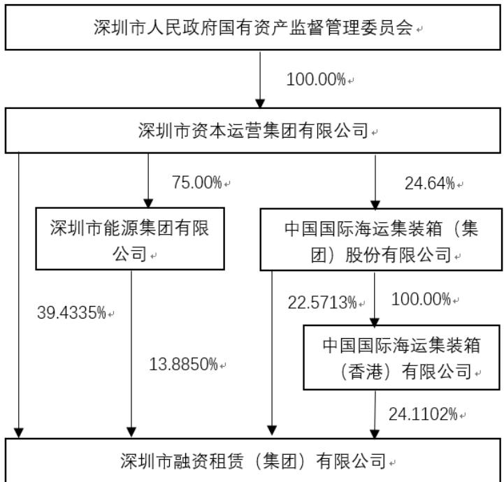
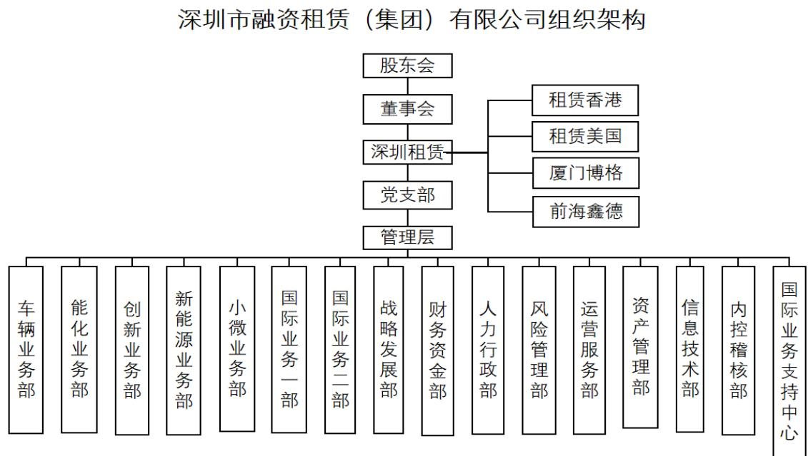
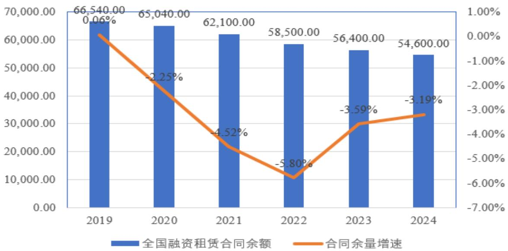
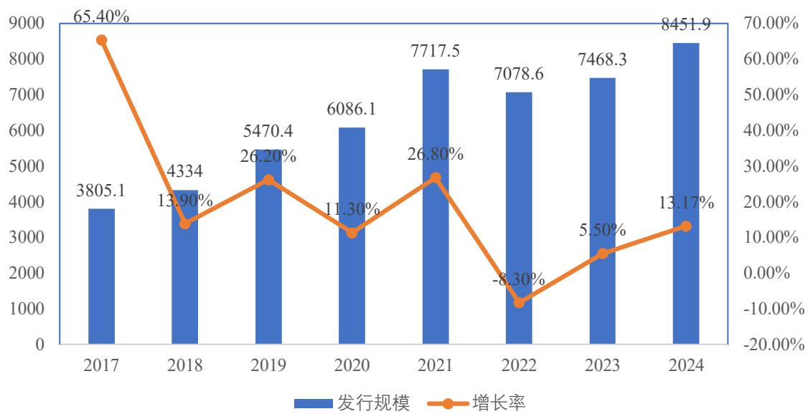
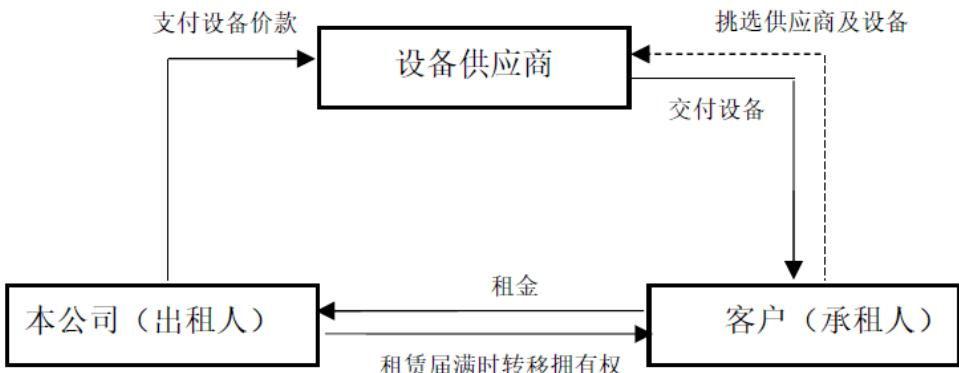
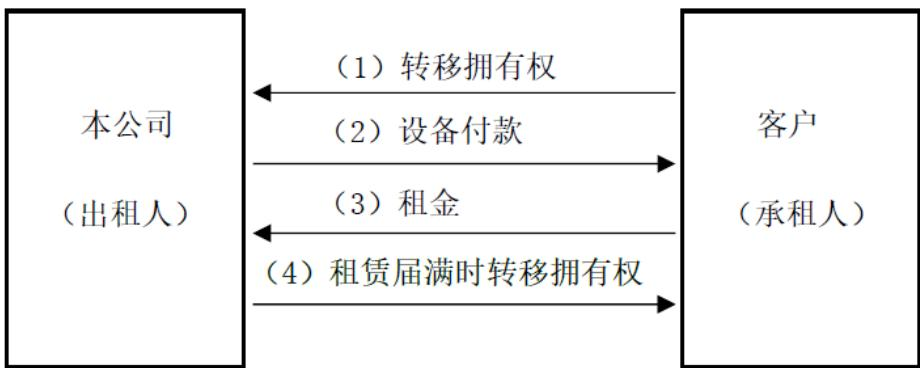
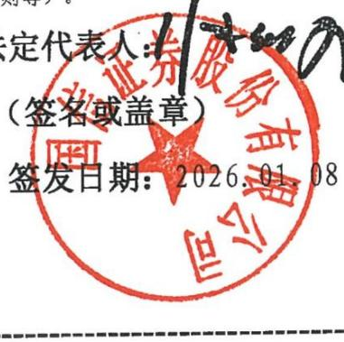

# 6 年面向专业投资者公开发行科技公司债券（第一期）募集说明书公司债券（第一期）募集说明书

  
N.LEAS Q（GROUP)CO.LTO. RANENAHANAN 深圳市融资租赁（集团）有限公司 403056490746

发行人：

牵头主承销商/簿记管理人

联席主承销商：

受托管理人：

发行金额：

增信措施情况： 无

信用评级结果：

信用评级机构：

深圳市融资租赁（集团）有限

国信证券股份有限

万和证券股份有限

中信证券股份有限

国信证券股份有限

不超过 5 亿元（

主体评级AA+/无债项评级

联合资信评估股份有限公司

签署日期：2026年4月16日

## 声 明

发行人将及时、公平地履行信息披露义务。

发行人及其全体董事、高级管理人员或履行同等职责的人员保证募集说明书信息披露的真实、准确、完整，不存在虚假记载、误导性陈述或重大遗漏。

主承销商已对募集说明书进行了核查，确认不存在虚假记载、误导性陈述和重大遗漏，并对其真实性、准确性和完整性承担相应的法律责任。

发行人承诺在本期债券发行环节，不直接或者间接认购自己发行的债券。债券发行的利率或者价格应当以询价、协议定价等方式确定，发行人不会操纵发行定价、暗箱操作，不以代持、信托等方式谋取不正当利益或向其他相关利益主体输送利益，不直接或通过其他利益相关方向参与认购的投资者提供财务资助、变相返费，不实施其他违反公平竞争、破坏市场秩序等行为。

发行人如有董事、高级管理人员、持股比例超过5%的股东及其他关联方参与本期债券认购，发行人将在发行结果公告中就相关认购情况进行披露。

中国证券监督管理委员会、深圳证券交易所对债券发行的注册或审核，不代表对债券的投资价值作出任何评价，也不表明对债券的投资风险作出任何判断。凡欲认购本期债券的投资者，应当认真阅读本募集说明书全文及有关的信息披露文件，对信息披露的真实性、准确性和完整性进行独立分析，并据以独立判断投资价值，自行承担与其有关的任何投资风险。

投资者认购或持有本期债券视作同意募集说明书关于权利义务的约定，包括债券受托管理协议、债券持有人会议规则及债券募集说明书中其他有关发行人、债券持有人、债券受托管理人等主体权利义务的相关约定。

发行人承诺根据法律法规和本募集说明书约定履行义务，接受投资者监督。

## 重大事项提示

请投资者关注以下重大事项，并仔细阅读本募集说明书中“第一节 风险因素”等有关章节。

## 一、发行人基本财务情况

本期债券发行上市前，深圳市融资租赁（集团）有限公司（以下简称“公司”、“发行人”）最近一期期末净资产为 54.49 亿元（2025 年 9 月 30 日合并财务报表中的所有者权益合计），合并口径资产负债率为 83.30%，母公司口径资产负债率为 86.90%；发行人最近三个会计年度实现的年均可分配利润为 3.72亿元（2022 年度、2023 年度和 2024 年度实现的归属于母公司所有者的净利润3.43亿元、3.88亿元和3.86亿元的平均值），预计不少于本期债券一年利息的1倍。发行人在本次发行前的财务指标符合相关规定。

二、发行人所属租赁业是资本密集型行业，用于租赁设备购置等资本性支出的资金除部分来源于自有资金外，主要来源于外部资金，因此融资租赁公司的资产负债率水平普遍较高。近三年及一期末，发行人资产负债率分别为77.85%、82.91%、82.17%和 83.30%；虽然报告期内发行人资产负债率在行业中处于合理水平，但如果未来资产负债率继续上升，可能会影响发行人的资金筹措，对发行人偿债能力造成一定的影响。

三、近三年及一期末，发行人应收融资租赁款占比较高，其中，发行人一年内到期的非流动资产余额分别为 540,475.90 万元、788,130.74 万元、814,940.02 万元和 810,017.70 万元，占总资产比例分别为 24.37%、25.69%、26.91%和 24.83%；发行人长期应收款分别为 1,311,687.24 万元、1,790,435.79 万元、1,842,361.45 万元和 1,913,185.07 万元，占总资产比例分别为 59.14%、58.36%、60.83%和 58.64 %；二者合计占总资产比重分别为 83.51%、84.04%、87.74%和 83.47%。发行人的长期应收款主要为一年以上的应收融资租赁款，归因于发行人的租赁业务期限均大于一年期，发行人一年内到期的非流动资产主要为一年以内的应收融资租赁款。受宏观经济形势、行业政策以及技术更新的影响，如承租人不能按期支付租赁款，发行人存在应收款无法按期收回的可能性。

四、近三年及一期末，发行人不良资产金额为 9.62 亿元、9.61 亿元、5.59亿元和8.16亿元；不良资产率分别为4.85%、3.58%、2.03%及2.86%，截至2024年末，发行人不良资产金额较上年末减少 4.02亿元，降幅为 41.83%，主要系发行人资产规模增加以及对存量不良资产进行了核销所致。截至 2025 年 9 月末，发行人不良资产金额较上年末增加 2.57 亿元，增幅为 45.97%，主要系淄博海益精细化工有限公司项目、JIXING 项目、天瑞集团光山水泥有限公司项目等资信情况恶化，转为不良资产类项目所致。发行人资产质量受行业周期性、产品价格波动及自身风险管控水平相对有限等影响，需要关注资产质量变化所引发的风险。如果未来发行人前期投放项目风险逐步暴露，可能导致租赁资产不良率较高，面临较大的处置压力。

五、截至 2025年 9月末，公司受限资产账面价值总额为 225,626.00万元，占总资产比例为 6.92%。未来随着公司规模的逐步扩大，公司为保证顺利融资，受限资产规模逐渐扩大，若未来公司的经营情况发生变化，无法偿还到期负债，相关的受限资产将面临所有权被转移的风险，可能对公司的生产经营造成较大影响。在抵、质押融资期间，相关的受限资产的处置也将受到限制。

六、融资租赁公司资金来源主要依靠金融机构借款及直接融资，收入来源主要是融资租赁业务。发行人的主营业务收入主要包括融资租赁业务利息收入。租赁项目租金回收期与到期债务在时间和金额方面不完全匹配，存在期限错配风险。

七、近三年及一期，发行人营业总收入分别为 139,690.60 万元、210,899.90万元、239,813.86 万元和 163,529.04 万元，呈增长趋势，近年来发行人逐年加大资产投放规模，因此营业总收入增长较快。最近三年及一期，发行人毛利率分别为58.60%、43.87%、41.74%和45.94%，受行业竞争因素影响以及境外货币政策影响呈下降趋势，但仍保持在较好的水平。未来随着行业竞争日趋激烈，以及货币政策出现变化，可能导致发行人主营业务盈利能力出现一定的波动风险。

八、2020 年 5 月，原中国银行保险监督管理委员会发布了《融资租赁公司监督管理暂行办法》（银保监发〔2020〕22 号），对融资租赁公司提出了多维的监管指标。出于内部风险决策与经营策略的考量，发行人在国际船舶业务方面优先选择排名靠前的优质企业进行合作，目前国际业务的最大单一客户是MSC（全称是 Mediterranean Shipping Company S.A，即地中海航运公司，为全球航运巨头），该客户租赁资产余额在报告期内超过了发行人净资产 50%，不符合《融资租赁公司监督管理暂行办法》要求。但根据《融资租赁公司监督管理暂行办法》第五十二条规定，相关监管指标整改原则上有不超过 3 年的过渡期，并且根据特定行业的实际情况，省级地方金融监管部门可以适当延长过渡期安排。2024 年，深圳市出台《深圳市融资租赁公司监管评级工作指引（试行）》（深金管函〔2024〕110号），对融资租赁公司进行分级分类监管。深圳金融管理部门没有制定针对前述文件提到的过渡期及其结束以后的监管安排，而是构建了一套更加全面的融资租赁公司分级分类监管评级指标体系。深圳金融管理部门结合监管评级结果，制定综合监管计划，实施差异化的监管政策，对于监管评级为 A、B 等级的融资租赁公司，以非现场监管为主，将结合情况在集中度调整等方面予以适当支持。2025 年，广东省地方金融监管局发布修订后的《广东省融资租赁公司监督管理实施细则》规定，融资租赁公司应当遵照执行《融资租赁公司监督管理暂行办法》集中度和关联度有关监管指标。广东省级管理部门根据国家和本省经济社会发展规划，对集成电路、能源、节能环保、智能机器人、交通基础设施和高端装备制造(飞机、船舶、海工装备等)等符合国家和本省发展导向产业，且上述行业租赁资产占租赁资产总额 80%以上的融资租赁公司，可结合监管评级情况，适当调整业务集中度和关联度要求。

报告期内，发行人注册地在广东省深圳市，主营业务所属行业中航运金融、物流运输、能化冶金、绿色新能源行业占比较大。截至 2024 年末，上述行业租赁资产占租赁资产总额 84.17%，超过 80%，适用《广东省融资租赁公司监督管理实施细则》关于适当放宽集中度关联度要求的条款。根据深圳市地方金融管理局于 2024年 11月 27日及 2025年 8月 28日公布的《深圳市融资租赁行业监管评级 C 级（含）以上公司名单的公告》以及发行人的书面说明，发行人两年行业监管评级均为 A 级，结合《深圳市融资租赁公司监管评级工作指引（试行）》（深金管函〔2024〕110号）规定，发行人将依据其监管评级可能在业务创新试点、集中度关联度调整方面得到适当支持。

总体来看，发行人虽然不满足《融资租赁公司监督管理暂行办法》对集中度指标要求，但满足所在辖区省级监管部门依据《融资租赁公司监督管理暂行办法》制定的监督管理实施细则中关于支持集中度调整的条件，且省级监管部门规定深圳市辖区融资租赁企业由深圳市相关部门进行监督管理。根据深圳市连续两年发布的分类评级结果，发行人整体表现良好，被评价为法人治理结构和制度建设较为健全，认真落实监管要求，经营规范，风险管理能力强的融资租赁公司，得到深圳市地方金融管理局的认可，日常监管将以非现场检查为主，在集中度关联度调整方面得到适当支持。因此，发行人不会因集中度问题受到监管处罚，亦不会因集中度问题对日常经营构成实质性影响。如果未来监管政策趋严，发行人仍存在面临监管处罚的风险。

九、发行人2022年5月27日发生股权和注册资本变更，其控股股东由中国国际海运集装箱（集团）股份有限公司（以下简称“中集集团”）变更为深圳市资本运营集团有限公司（以下简称“深圳资本集团”），控股比例为 53.32%；实际控制人由中集集团变更为深圳市人民政府国有资产监督管理委员会；该交易完 成 后 ， 发 行 人 的 注 册 资 本 由 人 民 币 1,428,652,000.00 元 增 至 人 民 币1,481,376,856.83 元。

此次变更可追溯到 2021年 11月 23日，中集集团发布《关于中集租赁引入战略投资者暨关联交易的公告》，发行人引入了新战略投资者，通过股权转让及增资的形式入股。股权转让：深圳资本集团支付股权转让款人民币1,336,833,939.94 元 以 受 让 中 集 集 团 持 有 的 深 圳 租 赁 注 册 资 本 人 民 币549,945,734.94 元；深圳市能源集团有限公司（以下简称“深圳能源集团”）支付股权转让款人民币500,000,000.00元以受让中集集团持有的深圳租赁注册资本人民币 205,689,621.77 元。增资：深圳资本集团支付增资款人民币 83,166,060.06 元认购深圳租赁新增注册资本人民币 34,212,790.87 元，其中人民币 48,953,269.19元计入深圳租赁资本公积。天津凯瑞康支付增资款人民币 45,000,000.00 元认购深圳租赁新增注册资本人民币 18,512,065.96 元，其中人民币 26,487,934.04 元计入深圳租赁资本公积。

本次变更完成后，发行人依靠强大的股东背景，涉及的租赁产业将更加多元化；凭借其原有的专业优势，将有更大的发展空间，盈利能力将有大幅度的提升，企业经营将会迈向一个新的高度。整体上看，发行人控股股东发生变化对发行人经营战略、公司治理及人事制度均为有利影响。但鉴于控股股东变化对发行人的重大影响，一旦外部环境进一步恶化，而发行人无法迅速适应变化，可能对发行人经营情况造成不利影响。

十、发行人已于 2025年 9月 29日在深圳联合产权交易所公开挂牌转让控股子公司中集鑫德租赁（深圳）有限公司 40%股权，丧失对中集鑫德租赁（深圳）有限公司的控制权。该事项虽然有利于发行人回收大部分担保资产、回收投资本金及获取投资收益，但会导致发行人合并范围内总资产、总负债、净资产、营业收入和净利润金额有所减少，若回收的本金无法产生收益或者再投资产生的收益不及预期，可能会对发行人盈利能力和偿债能力产生一定影响。

## 十一、重要投资者保护条款

遵照《中华人民共和国公司法》《公司债券发行与交易管理办法》等法律、法规的规定以及本募集说明书的约定，为维护债券持有人享有的法定权利和债券募集说明书约定的权利，公司已制定《债券持有人会议规则》，投资者通过认购、交易或其他合法方式取得本期债券，即视作同意公司制定的《债券持有人会议规则》。债券持有人会议根据《债券持有人会议规则》审议通过的决议对全体本期债券持有人（包括未出席会议、出席会议但明确表达不同意见或弃权以及无表决权的债券持有人）具有同等的效力和约束力。在本期债券存续期间，债券持有人会议在其职权范围内通过的任何有效决议的效力优先于包含债券受托管理人在内的其他任何主体就该有效决议内容做出的决议和主张。

为明确约定发行人、债券持有人及债券受托管理人之间的权利、义务及违约责任，公司聘任了国信证券股份有限公司担任本期债券的债券受托管理人，并订立了《债券受托管理协议》，投资者认购、交易或者其他合法方式取得本期债券视作同意公司制定的《债券受托管理协议》。

## 十二、投资者适当性条款

根据《中华人民共和国证券法（2019 年修订）》等相关规定，本期债券仅面向专业投资者发行，普通投资者不得参与发行认购。本期债券上市后将被实施投资者适当性管理，仅限专业投资者参与交易，普通投资者认购或买入的交易行为无效。

十三、本期债券发行结束后，发行人将尽快向深圳证券交易所提出关于本期债券上市交易的申请。本期债券符合深圳证券交易所的上市条件，交易方式包括：匹配成交、协商成交、点击成交、询价成交、竞买成交。但本期债券上市前，公司财务状况、经营业绩、现金流和信用评级等情况可能出现重大变化，公司无法保证本期债券的上市申请能够获得深圳证券交易所同意，若届时本期债券无法上市，投资者有权选择将本期债券回售予公司。因公司经营与收益等情况变化引致的投资风险和流动性风险，由债券投资者自行承担，本期债券不能在除深圳证券交易所以外的其他交易场所上市。

十四、本期债券发行后，认购人不可进行债券通用质押式回购。

十五、发行人承诺合规发行，不从事《关于进一步规范债券发行业务有关事项的通知》第三条第二款规定的行为；投资者向承销机构承诺审慎合理投资，不从事《关于进一步规范债券发行业务有关事项的通知》第八条第二款、第三款规定的行为。

十六、发行人承诺合规发行，不直接或者间接认购自己发行的债券。发行人不操纵发行定价、暗箱操作；不以代持、信托等方式谋取不正当利益或者向其他相关利益主体输送利益；不直接或者通过其他主体向参与认购的投资者提供财务资助、变相返费；不出于利益交换的目的通过关联金融机构相互持有彼此发行的债券；不存在其他违反公平竞争、破坏市场秩序等行为。

十七、投资者须承诺审慎合理投资，不得非法利用他人账户或资金进行认购，也不得违规融资或替他人违规融资认购。投资者不得协助发行人从事违反公平竞争、破坏市场秩序等行为。投资者不得通过合谋集中资金等方式协助发行人直接或者间接认购自己发行的债券，不得为发行人认购自己发行的债券提供通道服务，不得直接或者变相收取债券发行人承销服务、融资顾问、咨询服务等形式的费用。资管产品管理人及其股东、合伙人、实际控制人、员工不得直接或间接参与上述行为。投资者认购并持有本期债券应遵守相关法律法规和中国证监会的有关规定，并自行承担相应的法律责任。

十八、本期债券根据《深圳证券交易所公司债券发行上市审核业务指引第1号--申请文件及其编制要求（2023 年修订）》第十三条、十四条申请有效期延长。截至本募集说明书出具日，公司 2025 年审计报告尚未出具，故申请将募集说明书中引用的财务报表有效期延长一个月。截至目前，发行人生产经营活动正常，不存在影响发行人经营或偿债能力的其他不利变化，也没有发生影响公司持续发展的法律、政策、市场等方面的重大变化，不存在影响公司经营或偿债能力的其他不利变化。根据初步核算，预计不存在 2025 年度业绩亏损或大幅下滑的情况，发行人仍然符合公开发行公司债券需要满足的法定发行条件。

## 目 录

声 明 .......... .2  
重大事项提示... ...3  
目 录 ....... ...10  
释 义 .......... ...13  
第一节 风险提示及说明..... ....15  
一、与本期债券相关的投资风险. ....15  
二、发行人的相关风险 ... .....16  
第二节 发行概况...... .....29  
一、本次发行的基本情况... .....29  
二、认购人承诺... .....32  
第三节 募集资金运用....... .....33  
一、募集资金运用计划 ...... .....33  
二、前次公司债券募集资金使用情况 .. ......40  
三、本次公司债券募集资金使用承诺 .. ......40  
第四节 发行人基本情况... ....42  
一、发行人概况..... ....42  
二、发行人历史沿革 .... ...43  
三、 发行人股权结构...... ...47  
四、发行人权益投资情况.... ..49  
五、发行人的治理结构及独立性... ..52  
六、现任董事和高级管理人员的基本情况.. ...62  
七、发行人主要业务情况... ...64  
八、媒体质疑事项.... ..108  
九、发行人违法违规及受处罚情况. ..108  
第五节 财务会计信息... ..109  
一、会计政策/会计估计调整对财务报表的影响. ..109  
二、合并报表范围的变化.... ..111  
三、报告期内合并及母公司财务报表.. .116  
四、报告期内主要财务指标.. ..125  
五、管理层讨论与分析 .... ..126  
六、公司有息负债情况 . ..150  
七、关联方及关联交易 .. ...151  
八、重大或有事项或承诺事项.. ...171  
九、资产抵押、质押和其他限制用途安排.. .....173  
第六节 发行人及本期债券的资信状况... .....174  
一、报告期历次主体评级、变动情况及原因.. ...174  
二、信用评级报告的主要事项. ...174  
三、其他重要事项..... .....174  
四、发行人的资信情况 ... ....174  
第七节 增信机制... ....181  
第八节 税项 ........ ...182  
一、增值税...... ....182  
二、所得税..... ...182  
三、印花税... ..182  
四、税项抵消.... ..183  
第九节信息披露安排.. ..184  
一、信息披露事务管理制度.. ..184  
二、定期报告披露.... ..187  
三、重大事项披露..... ....187  
四、本息兑付披露..... .....187  
第十节 投资者保护机制.. ...188  
一、 偿债计划及投资者保护条款. ..188  
二、 偿债资金来源..... .....189  
三、 偿债应急保障方案 . ....189  
四、 偿债保障措施...... ...190  
五、 违约事项及纠纷解决机制.. ...192  
六、 持有人会议规则 .. ...193  
七、 受托管理人..... .210  
第十一节本期债券发行的有关机构及利害关系 .232  
一、本期债券发行的有关机构.. .232  
二、发行人与本次发行的有关机构、人员的利害关系 ..234  
第十二节发行人、中介机构及相关人员声明 .... ..235  
第十三节备查文件..... ...252  
一、备查文件内容. .252  
二、备查文件查阅地点及查询网站. ..252

## 释 义

<table><tr><td colspan="1" rowspan="1">发行人/发行主体/本公司/公司/深圳租赁</td><td colspan="1" rowspan="1">指</td><td colspan="1" rowspan="1">深圳市融资租赁（集团）有限公司</td></tr><tr><td colspan="1" rowspan="1">控股股东、深圳资本集团</td><td colspan="1" rowspan="1">指</td><td colspan="1" rowspan="1">深圳市资本运营集团有限公司</td></tr><tr><td colspan="1" rowspan="1">原控股股东、中集集团</td><td colspan="1" rowspan="1">指</td><td colspan="1" rowspan="1">中国国际海运集装箱（集团）股份有限公司</td></tr><tr><td colspan="1" rowspan="1">实际控制人</td><td colspan="1" rowspan="1">指</td><td colspan="1" rowspan="1">深圳市人民政府国有资产监督管理委员会</td></tr><tr><td colspan="1" rowspan="1">本期债券</td><td colspan="1" rowspan="1">指</td><td colspan="1" rowspan="1">深圳市融资租赁（集团）有限公司2026年面向专业投资者公开发行科技创新公司债券（第一期）</td></tr><tr><td colspan="1" rowspan="1">募集说明书</td><td colspan="1" rowspan="1">指</td><td colspan="1" rowspan="1">发行人根据有关法律、法规为发行本期债券而制作的《深圳市融资租赁（集团）有限公司2026年面向专业投资者公开发行科技创新公司债券（第一期）募集说明书》</td></tr><tr><td colspan="1" rowspan="1">《公司法》</td><td colspan="1" rowspan="1">指</td><td colspan="1" rowspan="1">《中华人民共和国公司法》</td></tr><tr><td colspan="1" rowspan="1">《证券法》</td><td colspan="1" rowspan="1">指</td><td colspan="1" rowspan="1">《中华人民共和国证券法》（2019年修订）</td></tr><tr><td colspan="1" rowspan="1">《债券管理办法》</td><td colspan="1" rowspan="1">指</td><td colspan="1" rowspan="1">《公司债券发行与交易管理办法》</td></tr><tr><td colspan="1" rowspan="1">《信息披露管理办法》</td><td colspan="1" rowspan="1">指</td><td colspan="1" rowspan="1">《公司信用类债券信息披露管理办法》</td></tr><tr><td colspan="1" rowspan="1">《公司章程》</td><td colspan="1" rowspan="1">指</td><td colspan="1" rowspan="1">现行有效的《深圳市融资租赁（集团）有限公司章程》</td></tr><tr><td colspan="1" rowspan="1">牵头主承销商/簿记管理人</td><td colspan="1" rowspan="1">指</td><td colspan="1" rowspan="1">国信证券股份有限公司</td></tr><tr><td colspan="1" rowspan="1">联席主承销商</td><td colspan="1" rowspan="1">指</td><td colspan="1" rowspan="1">万和证券股份有限公司、中信证券股份有限公司</td></tr><tr><td colspan="1" rowspan="1">受托管理人</td><td colspan="1" rowspan="1">指</td><td colspan="1" rowspan="1">国信证券股份有限公司</td></tr><tr><td colspan="1" rowspan="1">发行人律师、上海锦天城</td><td colspan="1" rowspan="1">指</td><td colspan="1" rowspan="1">上海市锦天城律师事务所</td></tr><tr><td colspan="1" rowspan="1">会计师事务所、信永中和</td><td colspan="1" rowspan="1">指</td><td colspan="1" rowspan="1">信永中和会计师事务所（特殊普通合伙）</td></tr><tr><td colspan="1" rowspan="1">监管银行</td><td colspan="1" rowspan="1">指</td><td colspan="1" rowspan="1">发行人每期发行备案前确定的募集资金专项账户监管银行</td></tr><tr><td colspan="1" rowspan="1">债券登记机构</td><td colspan="1" rowspan="1">指</td><td colspan="1" rowspan="1">中国证券登记结算有限责任公司深圳分公司</td></tr><tr><td colspan="1" rowspan="1">《债券受托管理协议》、受托管理协议</td><td colspan="1" rowspan="1">指</td><td colspan="1" rowspan="1">《深圳市融资租赁（集团）有限公司2026年面向专业投资者公开发行公司债券（第一期）之受托管理协议》</td></tr><tr><td colspan="1" rowspan="1">《债券持有人会议规则》、持有人会议规则</td><td colspan="1" rowspan="1">指</td><td colspan="1" rowspan="1">《深圳市融资租赁（集团）有限公司2026年面向专业投资者公开发行公司债券（第一期）持有人会议规则》</td></tr><tr><td colspan="1" rowspan="1">租赁香港</td><td colspan="1" rowspan="1">指</td><td colspan="1" rowspan="1">深圳市融资租赁集团（香港）有限公司</td></tr><tr><td colspan="1" rowspan="1">中集鑫德</td><td colspan="1" rowspan="1">指</td><td colspan="1" rowspan="1">中集鑫德租赁(深圳)有限公司</td></tr><tr><td colspan="1" rowspan="1">深圳能源集团</td><td colspan="1" rowspan="1">指</td><td colspan="1" rowspan="1">深圳市能源集团有限公司</td></tr><tr><td colspan="1" rowspan="1">香港中集、中集香港</td><td colspan="1" rowspan="1">指</td><td colspan="1" rowspan="1">中国国际海运集装箱（香港）有限公司</td></tr><tr><td colspan="1" rowspan="1">天津凯瑞康</td><td colspan="1" rowspan="1">指</td><td colspan="1" rowspan="1">天津凯瑞康企业管理咨询合伙企业（有限合伙）</td></tr><tr><td colspan="1" rowspan="1">法定节假日、休息日</td><td colspan="1" rowspan="1">指</td><td colspan="1" rowspan="1">中华人民共和国的法定及政府指定节假日或证券经营机构的休息日（不包括香港特别行政区、澳门特别行政区和台湾地区的法定节假日和/或休息日）</td></tr><tr><td colspan="1" rowspan="1">工作日</td><td colspan="1" rowspan="1">指</td><td colspan="1" rowspan="1">全国商业银行的对公营业日</td></tr><tr><td colspan="1" rowspan="1">交易日</td><td colspan="1" rowspan="1">指</td><td colspan="1" rowspan="1">本期债券流通转让的证券交易场所交易日</td></tr><tr><td colspan="1" rowspan="1">A股</td><td colspan="1" rowspan="1">指</td><td colspan="1" rowspan="1">获准在上海证券交易所或深圳证券交易所上市的以人民币标明价值、以人民币认购和进行交易的股票</td></tr><tr><td colspan="1" rowspan="1">国务院</td><td colspan="1" rowspan="1">指</td><td colspan="1" rowspan="1">中华人民共和国国务院</td></tr><tr><td colspan="1" rowspan="1">中国证监会、证监会</td><td colspan="1" rowspan="1">指</td><td colspan="1" rowspan="1">中国证券监督管理委员会</td></tr><tr><td colspan="1" rowspan="1">深交所</td><td colspan="1" rowspan="1">指</td><td colspan="1" rowspan="1">深圳证券交易所</td></tr><tr><td colspan="1" rowspan="1">企业会计准则</td><td colspan="1" rowspan="1">指</td><td colspan="1" rowspan="1">中华人民共和国财政部颁布的《企业会计准则》</td></tr><tr><td colspan="1" rowspan="1">报告期/近三年及一期</td><td colspan="1" rowspan="1">指</td><td colspan="1" rowspan="1">2022年度、2023年度、2024年度及2025年1-9月</td></tr><tr><td colspan="1" rowspan="1">中国/我国</td><td colspan="1" rowspan="1">指</td><td colspan="1" rowspan="1">中华人民共和国，就本募集说明书而言，不包括中国香港特别行政区、中国澳门特别行政区和台湾地区</td></tr><tr><td colspan="1" rowspan="1">元</td><td colspan="1" rowspan="1">指</td><td colspan="1" rowspan="1">如无特别说明，为人民币元</td></tr></table>

本募集说明书中所引用的财务数据和财务指标，如无特殊说明，指合并报表口径的财务数据和根据该类财务数据计算的财务指标。

本募集说明书中若出现加总计数与所列数值总和不符，均为四舍五入所致。

## 第一节 风险提示及说明

投资者在评价和投资本期债券时，除本募集说明书披露的其他各项资料外，应特别认真地考虑下述各项风险因素。

## 一、与本期债券相关的投资风险

## （一）利率风险

受国民经济总体运行状况、国家宏观经济政策、货币政策等因素的影响，市场利率存在波动的可能性。由于本期债券期限较长，可能跨越一个或一个以上的利率波动周期，市场利率的波动使本期债券投资者的实际投资收益存在一定的不确定性。

## （二）流动性风险

本期债券发行结束后拟在深交所上市交易，但是由于本期债券上市事宜需要在债券发行结束后方能进行，发行人无法保证本期债券能够按照预期上市交易，也无法保证本期债券能够在二级市场有活跃的交易，从而可能影响债券的流动性，导致投资者在债券转让时出现困难。

## （三）偿付风险

虽然发行人目前经营和财务状况较好，但本期债券的存续期较长，如果在本期债券存续期间内，发行人所处的宏观环境、经济政策和行业状况等客观环境出现不可预见或不能控制的不利变化，以及发行人本身的生产经营存在一定的不确定性，可能使发行人不能从预期的还款来源中获得足够资金，从而影响本期债券本息的按期兑付。

## （四）本期债券安排所特有的风险

尽管在本期债券发行时，发行人已根据现实情况安排了偿债保障措施来控制和降低本期债券的还本付息风险，但是在本期债券存续期内，可能由于不可控的因素（如政策、法律法规的变化等）导致已拟定的偿债保障措施不能完全履行，进而影响本期债券持有人的利益。

## 二、发行人的相关风险

## （一）财务风险

## 1、资产负债率较高的风险

发行人所属租赁业是资本密集型行业，用于租赁设备购置等资本性支出的资金除部分来源于自有资金外，主要来源于外部资金，因此融资租赁公司的资产负债率水平普遍较高。近三年及一期末，发行人资产负债率分别为 77.85%、82.91%、82.17%和 83.30%；虽然报告期内发行人资产负债率在行业中处于合理水平，但如果未来资产负债率继续上升，可能会影响发行人的资金筹措，对发行人偿债能力造成一定的影响。

## 2、有息负债规模上升的风险

近三年及一期末，发行人短期借款金额分别为 473,978.39 万元、723,914.67万 元 、 625,858.62 万 元 及 611,995.19 万 元 ， 发 行 人 长 期 借 款 金 额 分 别 为923,318.66 万元、943,549.30 万元、814,991.18 万元及 1,531,286.03 万元。受控股股东变化影响，发行人资产投放由以股东借款和外部融资驱动变成以外部融资驱动为主，如果未来发行人有息负债规模进一步上升，可能对公司未来偿债能力带来一定的风险。

## 3、应收款项占比较高，无法按期收回的风险

近三年及一期末，发行人应收融资租赁款占比较高，其中，发行人一年内到期的非流动资产余额分别为 540,475.90 万元、788,130.74 万元、814,940.02 万元和 810,017.70 万元，占总资产比例分别为 24.37%、25.69%、26.91%和 24.83%；发行人长期应收款分别为 1,311,687.24 万元、1,790,435.79 万元、1,842,361.45 万元和 1,913,185.07 万元，占总资产比例分别为 59.14%、58.36%、60.83%和58.64 %；二者合计占总资产比重分别为 83.51%、84.04%、87.74%和 83.47%。发行人的长期应收款主要为一年以上的应收融资租赁款，归因于发行人的租赁业务期限均大于 1 年期；发行人一年内到期的非流动资产主要为一年以内的应收融资租赁款。受宏观经济形势、行业政策以及技术更新的影响，如承租人不能按期支付租赁款，发行人存在应收款无法按期收回的可能性。

## 4、不良资产风险

近三年及一期末，发行人不良资产金额为 9.62 亿元、9.61 亿元、5.59 亿元和 8.16 亿元；不良资产率分别为 4.85%、3.58%、2.03%及 2.86%，截至 2024 年末，发行人不良资产金额较上年末减少 4.02亿元，降幅为 41.83%，主要系发行人资产规模增加以及对存量不良资产进行了核销所致。截至 2025年 9月末，发行人不良资产金额较上年末增加 2.57 亿元，增幅为 45.97%，主要系淄博海益精细化工有限公司项目、JIXING 项目、天瑞集团光山水泥有限公司项目等资信情况恶化，转为不良资产类项目所致。发行人资产质量受行业周期性、产品价格波动及自身风险管控水平相对有限等影响，需要关注资产质量变化所引发的风险。如果未来发行人前期投放项目风险逐步暴露，可能导致租赁资产不良率较高，面临较大的处置压力。

## 5、流动比率较低，短期偿债压力较大风险

近三年及一期末，发行人流动比率分别为 1.07、0.80、0.78 和 1.36，流动比率整体呈波动趋势，发行人流动比率的覆盖倍数较低。目前发行人流动资产对流动负债具有一定覆盖能力，且已制定流动性管理办法，发行人会根据月度及季度的资金头寸动态监控及管理短期借款的规模，如果未来流动资产下降以致难以覆盖流动负债，则可能引发短期偿债风险。

## 6、总资产波动的风险

近三年及一期末，发行人资产总额分别为 2,217,929.51 万元、3,068,097.59万元、3,028,469.56万元和 3,262,577.40万元，2022-2024年复合增长率为 16.85%，资产规模呈增长趋势。受控股股东变化影响，报告期内发行人业务投放呈上升趋势，如果发行人资产投放过快，可能带来一定的财务风险。

## 7、受限资产占比较大风险

截至 2025 年 9 月末，公司受限资产账面价值总额为 225,626.00 万元，占总资产比例为 6.92%未来随着公司规模的逐步扩大，公司为保证顺利融资，受限资产规模逐渐扩大，若未来公司的经营情况发生变化，无法偿还到期负债，相

关的受限资产将面临所有权被转移的风险，可能对公司的生产经营造成较大影响。在抵、质押融资期间，相关的受限资产的处置也将受到限制。

## 8、期限错配风险

融资租赁公司资金来源主要依靠金融机构借款及直接融资，收入来源主要是融资租赁业务。报告期末，发行人租赁资产 1 年以内（含）占比为 29.16%、1-2 年（含）占比为 19.82%、2-3 年（含）占比为 14.09%、3 年以上占比为36.93%；有息负债期限 1 年以内（含）占比为 31.58%、1-2 年（含）占比为14.21%、2-3年（含）占比为 46.54%、3年以上占比为 7.67%，租赁项目租金回收期与到期债务在时间和金额方面不完全匹配，存在期限错配风险。

## 9、主营业务盈利能力波动风险

近三年及一期，发行人营业总收入分别为 139,690.60 万元、210,899.90 万元、239,813.86万元和163,529.04万元，呈增长趋势，近年来逐年加大资产投放规模，因此公司营业总收入增长较大。最近三年及一期，发行人毛利率分别为 58.60%、43.87%、41.74%和 45.94%，受行业竞争因素影响以及境外货币政策影响呈下降趋势，但仍保持在较好的水平。未来随着行业竞争日趋激烈，以及货币政策出现变化，可能导致发行人主营业务盈利能力出现一定的波动风险。

## 10、盈利能力受利率波动影响的风险

发行人的营业收入主要为融资租赁业务利息收入，营业成本主要为借款利息支出。带来利息支出的大部分负债如银行借款为浮动利率；发行人租赁合同一般以浮动利率签订，可能存在市场利率波动风险。

## 11、经营活动现金流净额波动较大的风险

近三年及一期，发行人经营活动产生的现金流量净额分别为-563,232.39 万元、-565,967.91 万元、56,363.94 万元和 15,270.68 万元，发行人经营活动产生的经营性现金流入主要为租赁项目租金回款，经营活动产生的现金流出主要为发放融资租赁款。受控股股东变更后战略调整影响， 2022 年和 2023 年，发行人加大资产投放规模，导致经营活动产生的现金流量净额为负；随着存量租赁资产租金收入逐步回收，2024 年发行人经营活动产生的现金流量净额由负转正，存在一定的波动性。近三年及一期，发行人经营活动产生的现金流入分别为621,056.96 万元、828,182.52 万元、1,091,965.96 万元和 937,637.43 万元，发行人租赁业务资金回收情况良好，但经营活动现金流量净额的波动仍可能对其偿债能力造成一定影响。

## 12、汇率风险

发行人境外融资租赁业务实施主体主要以美元为计量本位币，存在部分项目以非美元货币结算，因此汇率波动会导致汇兑损益。若汇率波动过大，可能对发行人净利润产生一定影响。

## 13、不良资产行业集中风险

截至 2025 年 9 月末，发行人物流运输板块融资租赁余额 63.23 亿元，能化冶金板块融资租赁余额 43.61亿元，不良资产主要涉及能化和物流等业务。截至2025 年 9 月末，发行人主要已违约或可能违约项目主要集中于能化冶金板块。报告期末不良资产产生的主要原因：承租人行业低迷订单下降导致偿债能力减弱，若上述行业情况恶化，可能对发行人经营情况产生一定影响。

## （二）经营风险

## 1、经济周期及宏观经济风险

近年随着全球经济增长放缓，中国经济增长也同时放缓，国内宏观经济潜在增长水平下降，经济增长动能不足，主要体现为结构性放缓，产能过剩等问题逐渐显现。融资租赁企业的业绩表现同经济周期密切相关，健康良好的经济增长和产业发展是发行人保证并提升盈利能力的基础，如果经济增速放缓程度加深或出现衰退，将对发行人的资产质量和盈利能力带来不利影响。此外，融资租赁业务与国家的经济整体发展情况，国内制造业企业的经营状况、盈利水平，有着密切的相关性，亦会对发行人的业务状况及盈利水平将构成一定的风险。

## 2、行业竞争风险

受宏观经济影响，融资租赁行业增速多有下滑，随着新竞争对手的不断加入以及部分存量融资租赁企业的迅速扩张，将使行业竞争日趋激烈，如果发行人无法拓展业务范围、提高融资租赁服务质量，目前行业前列的地位将受到挑战，面临越来越多的竞争风险。

## 3、行业战略调整不确定性的风险

近三年及一期发行人业务新增投放量分别为 110.52 亿元、148.48 亿元、115.72亿元及 91.93亿元，2022年以来发行人新增投放量显著增加。发行人股东变更前，业务主要集中于中集集团产业相关板块，股东变更后，新增投放显著增加，扩充中集集团板块外的业务投放。发行人根据自身情况制定了战略目标，并视外部经济环境变化及时对战略做出了调整，公司及时对业务侧重点进行调整，未来存在行业战略调整结果不确定风险。

## 4、行业集中度风险

发行人业务范围主要集中在航运金融、物流运输、能化冶金、医疗健康、文化旅游、绿色新能源、城市运营和先进制造等业务板块，业务板块的集中度较高。由于上述行业受整体宏观经济以及行业不同的产品周期影响，可能出现投资减少、产业结构调整、信贷政策变化等不确定性因素，使得发行人出现经营、财务和流动资金问题，但近年来发行人也在不断拓展医疗设备、新能源和科技制造等新领域，有助于进一步改善行业集中度问题。从而影响发行人业务与领域的转型，因此发行人面临业务板块集中的风险。

## 5、客户集中度风险

2020 年 5 月，原中国银行保险监督管理委员会发布了《融资租赁公司监督管理暂行办法》（银保监发〔2020〕22 号），对融资租赁公司提出了多维的监管指标。出于内部风险决策与经营策略的考量，发行人在国际船舶业务方面优先选择排名靠前的优质企业进行合作，目前国际业务的最大单一客户是 MSC（全称是 Mediterranean Shipping Company S.A，即地中海航运公司，为全球航运巨头），该客户租赁资产余额在报告期内超过了发行人净资产 50%，不符合《融资租赁公司监督管理暂行办法》要求。但根据《融资租赁公司监督管理暂行办法》第五十二条规定，相关监管指标整改原则上有不超过 3 年的过渡期，并且根据特定行业的实际情况，省级地方金融监管部门可以适当延长过渡期安排。2024 年，深圳市出台《深圳市融资租赁公司监管评级工作指引（试行）》（深金管函〔2024〕110号），对融资租赁公司进行分级分类监管。深圳金融管理部门没有制定针对前述文件提到的过渡期及其结束以后的监管安排，而是构建了一套更加全面的融资租赁公司分级分类监管评级指标体系。深圳金融管理部门结合监管评级结果，制定综合监管计划，实施差异化的监管政策，对于监管评级为 A、B 等级的融资租赁公司，以非现场监管为主，将结合情况在集中度调整等方面予以适当支持。2025 年，广东省地方金融监管局发布修订后的《广东省融资租赁公司监督管理实施细则》规定，融资租赁公司应当遵照执行《融资租赁公司监督管理暂行办法》集中度和关联度有关监管指标。广东省级管理部门根据国家和本省经济社会发展规划，对集成电路、能源、节能环保、智能机器人、交通基础设施和高端装备制造(飞机、船舶、海工装备等)等符合国家和本省发展导向产业，且上述行业租赁资产占租赁资产总额 80%以上的融资租赁公司，可结合监管评级情况，适当调整业务集中度和关联度要求。

报告期内，发行人注册地在广东省深圳市，主营业务所属行业中航运金融、物流运输、能化冶金、绿色新能源行业占比较大。截至 2024 年末，上述行业租赁资产占租赁资产总额 84.17%，超过 80%，适用《广东省融资租赁公司监督管理实施细则》关于适当放宽集中度关联度要求的条款。根据深圳市地方金融管理局于 2024年 11月 27日及 2025年 8月 28日公布的《深圳市融资租赁行业监管评级 C 级（含）以上公司名单的公告》以及发行人的书面说明，发行人两年行业监管评级均为 A 级，结合《深圳市融资租赁公司监管评级工作指引（试行）》（深金管函〔2024〕110号）规定，发行人将依据其监管评级可能在业务创新试点、集中度关联度调整方面得到适当支持。

总体来看，发行人虽然不满足《融资租赁公司监督管理暂行办法》对集中度指标要求，但满足所在辖区省级监管部门依据《融资租赁公司监督管理暂行办法》制定的监督管理实施细则中关于支持集中度调整的条件，且省级监管部门规定深圳市辖区融资租赁企业由深圳市相关部门进行监督管理。根据深圳市连续两年发布的分类评级结果，发行人整体表现良好，被评价为法人治理结构和制度建设较为健全，认真落实监管要求，经营规范，风险管理能力强的融资租赁公司，得到深圳市地方金融管理局的认可，日常监管将以非现场检查为主，在集中度关联度调整方面得到适当支持。因此，发行人不会因集中度问题受到监管处罚，亦不会因集中度问题对日常经营构成实质性影响。如果未来监管政策趋严，发行人仍存在面临监管处罚的风险。

## 6、流动性风险

租赁项目租金回收期与该项目银行借款偿还期在时间和金额方面不匹配可能引发发行人遭受损失产生流动性风险。融资租赁公司资金来源主要依靠银行借款等融资，面临期限错配可能引发的流动性风险。

## 7、融资成本波动风险

发行人的融资成本风险会主要受到货币政策的影响，即中央银行所采取的控制货币供给、调控利率等措施。融资租赁行业是连接金融产业与实体产业的中间产业，是资本与实体经济的桥梁。鉴于行业特性，融资租赁为资本密集型行业，容易受到货币政策的影响，面临货币政策风险。当国家实行扩张性货币政策时，一方面，宽松的金融环境将使融资租赁行业更容易获得充足的低成本的资金，行业资金充裕，有利于行业的发展；另一方面，也面临着其他金融业态的竞争。当国家实行紧缩性货币政策时，一方面，融资租赁行业的资金来源将受到影响，融资成本将进一步上涨；另一方面，对于承租人来说资金链紧张使得融资租赁业务需求大幅增长。随着利率市场化的推进和资本对外开放的加深，银行贷款利率将更加贴近市场水平，将随着市场利率水平波动，直接影响发行人的融资成本，从而对发行人的债务负担及盈利水平构成一定的风险。

## 8、融资渠道单一风险

截至 2025年 9月末，发行人融资结构主要以银行借款为主，非银行融资目前占全部融资额比例相对较少。银行借款成本随市场利率变动，市场利率受监管及国际、国内经济形势等影响，发行人融资渠道或将受到影响，从而有引发流动性风险的可能性。

## 9、未来融资不确定性风险

发行人目前的融资渠道主要包括境内外银行借款，未来将继续拓展直接债务融资等融资渠道。上述融资渠道受内外部因素影响较大，一方面，外部因素包括法律环境、金融环境和经济环境，另一方面，内部环境包括发行人发展前景、盈利能力、经营财务状况、行业竞争力、资本结构、企业规模等。在市场机制作用下，这些因素会不断变化，从而影响发行人融资渠道的选择以及再融资的难易程度。发行人为应对上述变化，将积极提高自身竞争力与资质，同时实时跟进外部金融环境政策，以保证融资方式安全性。如果发行人未能关注上述风险，将面临流动性减弱，资金支持无法保障的风险。

## 10、承租人无法履约风险

如果承租人或交易对手无法或不愿履行合同还款义务或承诺，发行人可能蒙受一定的经济损失，甚至可能影响本期公司债的正常到期兑付。为防范信用风险，发行人将加强制度建设，建立一系列较为完善的管理制度，形成较完备的风险评判标准体系。公司指定专职部门负责信用风险排查、识别、监测和评估，定期和不定期组织对国内外经济形势和国家宏观经济政策的分析研究，并着重对公司租赁业务涉及的行业进行深入研判，适时制定和修改相关的行业准入标准，为公司选择行业和优选客户提供参考，切实防范信用风险；各职能部门按照风险管理要求和租赁业务流程，将项目筛选、尽职调查、初审上报、项目实施和后期管理等各环节的风险管理责任落实到人，从源头上控制风险。

## 11、融资租赁设备价格波动风险

发行人进入新的行业之前，一般对于行业本身的风险、租赁物件是否适合以及相关的供应商资源进行论证，对于一些不熟悉的设备，原则上持谨慎态度，轻易不会导入。然而对于某些价值较高的设备，未来可能由于宏观经济的波动，或是科学技术的进步，导致设备价格出现大幅波动，从而给发行人的资产质量和盈利水平构成一定的风险。

## 12、物权风险

融资租赁期间，租赁物所有权虽然归发行人所有，但是使用权归承租人所有，若承租人故意损害、转移租赁设备或进行重复抵押便会引发物权风险。在融资租赁中出租人既有物权又有债权，其债权关系受合同法的规范和调整，其物权关系受物权法的规范和调整。在国内，已建立的司法体系中，对租赁公司的物权虽作出了明确规定和保护，但是针对融资租赁行业还存在《中华人民共和国物权法》与相关法律法规配套、衔接的问题，法律上并不完善。此外物权裁决执行周期较长，而技术设备一般更新较快，所以一旦产生物权纠纷将给发行人带来经营风险。

## 13、标的资产灭失风险

资产灭失的风险主要包括不可抗原因造成的资产损失，比如火灾、地震、水灾等自然灾害；以及人为因素造成的资产损失，比如承租人擅自拆装、转移设备等。未来若发生不可抗原因或人为因素造成的发行人租赁资产重大损失，可能对于发行人的资产质量构成一定的不利影响。

## 14、标的物处置风险

发行人有明确的风险资产管理措施，包括调整租赁方案、展期、采取强制手段等，最终采取的手段都有后期的管理程序，能够确保风险资产得到很好的管理和处置。若租赁资产无法获得及时处置，会对公司资产质量和盈利水平构成一定的风险。

## 15、突发事件引发的经营风险

由于宏观环境变化较大，经济下行压力较大，发行人合作客户分布行业较广，且部分为周期性行业，存在宏观环境突变而引发的经营风险。同时，发行人各客户可能出现因突发事件如美国关税政策导致的损失，从而导致客户降低偿还能力。发行人具有突发事件引发的经营风险。尽管公司制定了严格的规章制度、应急预案和前置的风险控制措施等去应对突发事件，降低突发事件对公司造成的不利影响，但突发事件的发生仍会对发行人的正常生产经营产生影响，使发行人面临一定的经营风险。

## （三）管理风险

## 1、控股股东变更的风险

发行人 2022年 5月 27日发生股权和注册资本变更，其控股股东由中国国际海运集装箱（集团）股份有限公司变更为深圳市资本运营集团有限公司，控股比例为 53.32%；实际控制人由中集集团变更为深圳市人民政府国有资产监督管理委员会；该交易完成后，发行人的注册资本由人民币 1,428,652,000.00 元增至人民币 1,481,376,856.83 元。

此次变更可追溯到 2021年 11月 23日，中集集团发布《关于中集租赁引入战略投资者暨关联交易的公告》，发行人引入了新战略投资者，通过股权转让及增资的形式入股。股权转让：深圳资本集团支付股权转让款人民币1,336,833,939.94 元 以 受 让 中 集 集 团 持 有 的 深 圳 租 赁 注 册 资 本 人 民 币549,945,734.94 元；深圳能源集团支付股权转让款人民币 500,000,000.00 元以受让中集集团持有的深圳租赁注册资本人民币205,689,621.77元。增资：深圳资本集团支付增资款人民币 83,166,060.06 元认购深圳租赁新增注册资本人民币34,212,790.87 元，其中人民币 48,953,269.19 元计入深圳租赁资本公积。天津凯瑞康支付增资款人民币 45,000,000.00 元认购深圳租赁新增注册资本人民币18,512,065.96 元，其中人民币 26,487,934.04 元计入深圳租赁资本公积。

本次变更完成后，发行人依靠强大的股东背景，涉及的租赁产业将更加多元化；凭借其原有的专业优势，将有更大的发展空间，盈利能力将有大幅度的提升，企业经营将会迈向一个新的高度。整体上看，发行人控股股东发生变化对发行人经营战略、公司治理及人事制度均为有利影响。但鉴于控股股东变化对发行人的重大影响，一旦外部环境进一步恶化，而发行人无法迅速适应变化，可能对发行人经营情况造成不利影响。

## 2、公司内部管理风险

自发行人于 2022 年 5 月发生股权变更加入深圳市资本运营集团有限公司后，发行人的公司规模和经营产业领域不断扩大。发行人及其子公司的业务类型涉及多个行业和板块，这对于发行人运营、财务控制、人力资源等方面的管理能力提出了较高要求，若发行人的管理模式和相关制度不适应不断扩大的经营规模，将影响到公司的健康发展，可能导致管理整合风险。

## 3、操作风险

操作风险是指由于内部程序、人员、系统的不完善或失误，或外部事件造成直接或间接损失的风险。虽然发行人对各项管理操作制定了控制及风险管理措施，如果相关控制因自身及外界环境的变化、当事者对某项事务的认知程度不够、制度执行人不严格执行现有制度等原因，导致失去或减小效力，可能形成人为的操作风险。

## 4、法律风险

法律风险主要指由于法律、法规因素导致的、或者由于缺乏法律、法规支持而给发行人带来损失的可能性。由于融资租赁业务的普遍性和成熟性尚需提高，法律法规仍有待完善和明确，因此法律风险在一定期限内仍是发行人面临的主要风险之一。

## 5、人力资源管理风险

发行人的核心管理人员和技术骨干是其重要的资源，如出现主要骨干人才的调离或流失，可能会影响其正常运作，造成经济损失。随着发行人经营规模、经营区域进一步扩大，对发行人经营管理能力提出了更高的要求，如果发行人不能有效地培养人才队伍，可能会对其经营产生一定的负面影响。

随着发行人业务发展，公司规模和经营领域不断扩大，对人力资源方面提出了较高要求。目前行业竞争加剧，对行业人才需求增加，具备金融、租赁、贸易、财税、法律和工程等方面知识的复合型优秀从业人员储备愈加重要。若发行人在人力资源上储备不足，易引发人才紧缺风险，导致竞争能力下降。

## 6、关联交易风险

报告期内，发行人与其关联公司之间存在一些关联交易，其关联交易的类型主要体现为：与关联方发生的融资租赁业务等。上述关联交易在发行人的整体交易规模占有一定比重，如果双方之间的关联交易不严格遵循公平、公正和公开的市场原则，则可能会存在利用关联交易影响发行人经营业绩的风险。

## 7、突发事件引发的公司治理结构变化的风险

发行人治理结构较为完善，各机构经营情况正常。但不排除突发事件导致的董事会、高管层变动引发的管理链条变化风险。

## 8、融资租赁业务交易对手管理风险

发行人融资租赁业务需要向交易对手借出资金，并在约定的日期收取租金及本金。交易对手的信用资质、盈利水平、资产状况对于发行人自身的经营状况及资产安全有着重要影响。若交易对手出现违约，将给发行人的资产带来损失。发行人公司内部有专门的风险部门对于交易对手的信用水平进行内部评估及风险控制。未来随着发行人的业务规模不断增长，发行人的交易对手数量也将大幅上升，交易对手从事的行业将更加丰富，这将对发行人的交易对手管理能力提出了更高要求。未来发行人租赁业务交易对手管理能力若跟不上业务规模的快速增长，可能对其未来业务发展构成一定的风险。

## （四）政策风险

## 1、货币政策变动风险

货币政策变动风险是指货币政策及调控方式的调整将对发行人的经营活动产生的影响而引起的风险。近几年来，人民银行在实施稳健货币政策、从紧货币政策或适度宽松货币政策的过程中，对货币政策调控方式进行了全方位改革，但由于货币政策的调控作用是双向的，如果发行人的经营不能根据货币政策变动趋势进行适当调整，货币政策变动将对发行人运作和经营效益产生不确定性影响。

## 2、行业监管政策变动风险

根据《商务部办公厅关于融资租赁公司、商业保理公司和典当行管理职责调整有关事宜的通知》，商务部已将制定融资租赁公司等业务经营和监管规则职责划给中国银行保险监督管理委员会（简称“银保监会”），2020 年 5 月，中国银行保险监督管理委员会发布了《融资租赁公司监督管理暂行办法》，进一步明确了融资租赁公司的经营范围、租赁物属性、公司治理及经营规范，提出了多维的新监管指标，在新的行业监管要求下，发行人将面临更全面的指标要求和更严格的监管措施，可能会对发行人经营和财务表现产生一定影响。

## 3、会计政策调整风险

受融资租赁行业统一监管政策影响，如果融资租赁监管统一，融资租赁公司会计准则上将与金融租赁公司保持一致，在资产五级分类的确认标准方面、在资产负债期限错配的要求方面将从严要求，这将可能对发行人生产经营产生一定影响。

## 第二节 发行概况

## 一、本次发行的基本情况

## （一）本次发行的内部批准情况及注册情况

2024 年 9 月 26 日，发行人董事会审议并通过注册发行不超过 30 亿元的公募公司债议案。

2024年 9月 26日，发行人股东会审议同意公司注册发行额度不超过人民币30亿元公司债。

本公司于2026年1月23日获得中国证券监督管理委员会（证监许可【2026】171 号）同意面向专业投资者发行面值不超过（含）30 亿元的公司债券的注册。公司将综合市场等各方面情况确定债券的发行时间、发行规模及其他具体发行条款。

## （二）本期债券的主要条款

发行主体：深圳市融资租赁（集团）有限公司。

债券名称：深圳市融资租赁（集团）有限公司 2026 年面向专业投资者公开发行科技创新公司债券（第一期）。

债券简称/债券代码：26 深圳租赁 K1/524771。

发行规模：本期债券总规模不超过 5 亿元（含 5 亿元）。

债券期限：本期债券期限为3年期。

债券票面金额：100 元。

发行价格：本期债券按面值平价发行。

增信措施：无。

债券形式：实名制记账式公司债券。投资者认购的本期债券在证券登记机构开立的托管账户托管记载。本期债券发行结束后，债券认购人可按照有关主管机构的规定进行债券的转让、质押等操作。

债券利率及其确定方式：本期债券票面利率为固定利率，票面利率将根据网下询价簿记结果，由公司与簿记管理人按照有关规定，在利率询价区间内协商一致确定。债券票面利率采取单利按年计息，不计复利。

发行方式：本期债券发行采取网下发行的方式面向专业机构投资者询价、根据簿记建档情况进行配售的发行方式。

发行对象：本期债券发行对象为在中国证券登记结算有限责任公司深圳分公司开立 A 股证券账户的专业机构投资者（法律、法规禁止购买者除外）。

承销方式：本期债券由主承销商以余额包销的方式承销。

配售规则：与发行公告一致。

网下配售原则：与发行公告一致。

起息日期：本期债券的起息日为 2026 年 4 月 24 日。

兑付及付息的债权登记日：将按照深交所和证券登记机构的相关规定执行。

付息方式：按年付息。

付息日：本期债券付息日为 2027年至 2029年每年的 4月 24日（如遇法定节假日或休息日，则顺延至其后的第 1 个交易日，顺延期间付息款项不另计利息）。

兑付方式：到期一次还本。

兑付日：本期债券兑付日为 2029年 4月 24日（如遇法定节假日或休息日，则顺延至其后的第1个交易日，顺延期间兑付款项不另计利息）。

支付金额：本期债券于付息日向投资者支付的利息为投资者截至利息登记日收市时所持有的本期债券票面总额与票面利率的乘积，于兑付日向投资者支

付的本息金额为投资者截至兑付登记日收市时投资者持有的本期债券最后一期利息及所持有的本期债券票面总额的本金。

本息支付将按照债券登记机构的有关规定统计债券持有人名单，本息支付方式及其他具体安排按照债券登记机构的相关规定办理。

偿付顺序：本期债券在破产清算时的清偿顺序等同于发行人普通债务。

信用评级机构及信用评级结果：根据联合资信评估股份有限公司出具的《深圳市融资租赁（集团）有限公司 2025 年主体信用评级报告》，发行人的主体信用等级为AA+，评级展望为稳定，本期债券无评级。

拟上市交易场所：深圳证券交易所

募集资金用途：募集资金扣除发行费用后，拟使用不少于 70%的募集资金用于偿还用于投放科技创新领域租赁款的对应有息借款；其余募集资金用于偿还公司其他有息借款。

募集资金专项账户：本公司将根据《公司债券发行与交易管理办法》《债券受托管理协议》《公司债券受托管理人执业行为准则》等相关规定，指定专项账户，用于公司债券募集资金的接收、存储、划转。

牵头主承销商：国信证券股份有限公司

联席主承销商：万和证券股份有限公司、中信证券股份有限公司

簿记管理人: 国信证券股份有限公司

债券受托管理人：国信证券股份有限公司

通用质押式回购安排：本公司认为本期债券不符合通用质押式回购条件。

税务提示：根据国家有关税收法律、法规的规定，投资者投资本期债券所应缴纳的税款由投资者承担。

（三）本期债券发行及上市安排

1、本期债券发行时间安排

发行公告刊登日期：2026年4月21日。

发行首日：2026 年 4 月 23 日。

预计发行期限：2026 年 4 月 23 日至 2026 年 4 月 24 日，共 2 个交易日。

网下发行期限：2026 年 4 月 23 日至 2026 年 4 月 24 日。

## 2、本期债券上市安排

本次发行结束后，本公司将尽快向深交所提出关于本期债券上市交易的申请，具体上市时间将另行公告。

## 二、认购人承诺

购买本期债券的投资者（包括本期债券的初始购买人和二级市场的购买人，及以其他方式合法取得本期债券的人，下同）被视为作出以下承诺：

（一）接受本募集说明书对本期债券项下权利义务的所有规定并受其约束；

（二）本期债券的发行人依有关法律、法规的规定发生合法变更，在经有关主管部门批准后并依法就该等变更进行信息披露时，投资者同意并接受该等变更；

（三）本期债券发行结束后，发行人将申请本期债券在深交所上市交易，并由主承销商代为办理相关手续，投资者同意并接受此安排。

## 第三节 募集资金运用

## 一、募集资金运用计划

## （一）本期债券的募集资金规模

经发行人董事会、股东会审议，并经中国证监会证监许可【2026】171号文注册，本期债券发行总额不超过5亿元（含5亿元）。

## （二）本期债券募集资金使用计划

本期债券发行规模不超过 5.00亿元（含 5.00亿元），募集资金扣除发行费用后，拟使用不少于 70%的募集资金用于偿还用于投放科技创新领域租赁款的对应有息借款；其余募集资金用于偿还公司其他有息借款。

## 1、本期债券对科技创新领域企业的支持

## （1）发行人属于科创升级类企业

发行人本期债券募集资金拟偿还的有息借款中不少于 70%部分均用于向符合《中华人民共和国国民经济和社会发展第十四个五年规划和 2035 年远景目标纲要》文件要求的企业投放融资租赁款，旨在促进科技、产业和金融高水平循环，支持科技创新企业高质量发展，重点支持高新技术产业和战略性新兴产业细分领域及引领产业转型升级领域的科技创新发展。参照《深圳证券交易所公司债券发行上市审核业务指引第 7号-专项品种公司债券（2026年修订）》的要求，发行人属于科创升级类企业。

## （2）科技创新企业的遴选标准

本期债券募集资金拟偿还的有息借款所对应投放的融资租赁款项所投向企业的行业标准符合《中华人民共和国国民经济和社会发展第十四个五年规划和2035 年远景目标纲要》中所提出的战略方针及我国战略性新兴产业发展领域，同时要求企业满足国家级高新技术企业或省级专精特新企业的遴选标准或具有明确的科创属性。

## 国家级高新技术企业：

①企业申请高新技术企业认定时，注册成立时间满一年。

②在中国境内（不含港、澳、台地区）注册的企业，通过自主研发、受让、受赠、并购等方式，或通过 5 年以上的独占许可方式，对其主要产品（服务）的核心技术拥有自主知识产权的所有权，且达到下列其中一项数量要求：

A、发明专利、植物新品种、国家新药、国家级农作物品种、国家一级中药保护品种、集成电路布图设计专有权1件以上；

B、实用新型专利8件以上；

C、非简单改变产品图案和形状的外观设计专利（主要是指：运用科学和工程技术的方法，经过研究与开发过程得到的外观设计）或者软件著作权 10 件以上；

③对企业主要产品（服务）发挥核心支持作用的技术属于《国家重点支持的高新技术领域》规定的范围；

④企业从事研发和相关技术创新活动的科技人员占企业当年职工总数的比例不低于 10%；

⑤企业近三个会计年度（实际经营期不满三年的按实际经营时间计算，下同）的研究开发费用总额占同期销售收入总额的比例符合如下要求：

A、最近一年销售收入小于 5,000 万元（含）的企业，比例不低于 5%；

B、最近一年销售收入在 5,000万元至 2亿元（含）的企业，比例不低于 4%；

C、最近一年销售收入在 2 亿元以上的企业，比例不低于 3%；其中，企业在中国境内发生的研究开发费用总额占全部研究开发费用总额的比例不低于60%；（委托外部研究开发费用的实际发生额应按照独立交易原则确定，按照实际发生额的80%计入委托方研发费用总额。）

⑥近一年高新技术产品（服务）收入占企业同期总收入的比例不低于 60%；

⑦企业创新能力评价应达到相应要求；

⑧企业申请高新认定前一年内未发生重大安全、重大质量事故或严重环境违法行为；

⑨符合《科技型中小企业评价办法》（国科发政〔2017〕115号）评价入库条件的企业（主要条件：职工总数 500 人、年销售收入 2 亿元、资产总额 2 亿元等，评价入库网址：https://www.innofund.gov.cn），应当评价入库后再申请高新技术企业认定，并在高新技术企业认定申请书中注明科技型中小企业评价入库编号。

## 省级专精特新企业：

①从事特定细分市场时间达到 2 年以上；

②上年度研发费用总额不低于 100 万元，且占营业收入总额比重不低于 3%；

③上年度营业收入总额在 1000 万元以上，或上年度营业收入总额在 1000万元以下，但近 2 年新增股权融资总额（合格机构投资者的实缴额）达到 2000万元以上；

④专精特新企业评价得分达到 60 分以上或满足下列条件之一：

A、近三年获得过省级科技奖励，并在获奖单位中排名前三；或获得国家级科技奖励，并在获奖单位中排名前五；

B、近两年研发费用总额均值在 1000 万元以上；

C、近两年新增股权融资总额（合格机构投资者的实缴额）6000 万元以上；

D、近三年进入“创客中国”中小企业创新创业大赛全国500 强企业组名单。

## （3）本期债券拟偿还用于投放科技创新企业项目租赁款项的有息借款

根据国家战略和政策指引，公司拟将本期债券募集资金不少于 70%的部分用于偿还投向标的科技创新企业融资租赁款所对应的有息借款，进一步聚焦于国家级高新技术企业。发行人拟偿还的科技创新企业项目相关的有息借款明细如下：

单位：万元

<table><tr><td rowspan=1 colspan=1>序号</td><td rowspan=1 colspan=1>承租人</td><td rowspan=1 colspan=1>已投放融资租赁款</td><td rowspan=1 colspan=1>项目贷款余额</td><td rowspan=1 colspan=1>投放项目贷款债权人</td><td rowspan=1 colspan=1>贷款起息日</td><td rowspan=1 colspan=1>贷款到期日</td><td rowspan=1 colspan=1>科技创新称号</td><td rowspan=1 colspan=1>拟使用募集资金偿还金额</td></tr><tr><td rowspan=1 colspan=1>1</td><td rowspan=1 colspan=1>山东聚芳新材料股份有限公司</td><td rowspan=1 colspan=1>9,300.00</td><td rowspan=1 colspan=1>8,835.00</td><td rowspan=1 colspan=1>华润银行</td><td rowspan=1 colspan=1>2025/9/18</td><td rowspan=1 colspan=1>2026/9/18</td><td rowspan=1 colspan=1>山东省工业和信息化 2025年6月24日发布的2025年度通过复核的&quot;专精特新&quot;中小企业，有效期至2028年12月31日。</td><td rowspan=1 colspan=1>8,800.00</td></tr><tr><td rowspan=1 colspan=1>2</td><td rowspan=1 colspan=1>宜昌东阳光生化制药有限公司</td><td rowspan=1 colspan=1>10,000.00</td><td rowspan=1 colspan=1>9,000.00</td><td rowspan=1 colspan=1>华润银行</td><td rowspan=1 colspan=1>2025/9/10</td><td rowspan=1 colspan=1>2026/9/10</td><td rowspan=1 colspan=1>湖北省科学技术厅、湖北省财政厅、国家税务总局湖北省税务局于2024年11月27日颁发高新技术企业证书（证书编号：GR202442001814），有效期3年。</td><td rowspan=1 colspan=1>9,000.00</td></tr><tr><td rowspan=1 colspan=1>3</td><td rowspan=1 colspan=1>山东朗晖石油化学股份有限公司</td><td rowspan=1 colspan=1>21,500.00</td><td rowspan=1 colspan=1>20,210.00</td><td rowspan=1 colspan=1>广州银行</td><td rowspan=1 colspan=1>2025/9/27</td><td rowspan=1 colspan=1>2026/9/25</td><td rowspan=1 colspan=1>山东省科学技术厅、山东省财政厅、国家税务总局山东省税务局于2023年12月7日颁发高新技术企业证书（证书编号：GR202337009649），有效期3年。</td><td rowspan=1 colspan=1>20,200.00</td></tr></table>

注：上述借款均已与债权人确认可提前偿还。

## ①山东聚芳新材料股份有限公司

山东聚芳新材料股份有限公司（简称 “山东聚芳”，曾用名：山东京博聚芳新材料股份有限公司）成立于 2018 年 7 月 12 日，现注册资本为 12,000 万元，系山东京博控股集团与清华大学联合打造的高性能芳纶新材料企业。山东聚芳主营业务聚焦高性能芳香族聚酰胺新材料的研发、生产与销售，产品线覆盖对位芳纶纤维、间位芳纶短纤、芳纶纸及芳纶复合材料等，产品广泛应用于新能源储能、电子信息、航空航天、环保过滤、安全防护等战略性新兴产业领域。凭借突出的技术创新能力与产品竞争力，山东聚芳于 2025 年 6 月 24 日通过山东省工业和信息化厅 2025 年度 “专精特新” 中小企业复核，该认定有效期至2028 年 12 月 31 日；同时，山东聚芳为国家高新技术企业，并与清华大学共建“高性能高分子材料联合研究中心”，核心产品相关技术已获多项发明专利授权，在国内高性能芳纶新材料细分赛道具备核心竞争优势。

## ②宜昌东阳光生化制药有限公司

宜昌东阳光生化制药有限公司成立于 2018 年 11 月 29 日，注册资本3,240.11 万元，系东阳光集团生物医药板块核心经营主体，与 A 股上市公司广东东阳光科技控股股份有限公司（600673.SH）、港股上市公司东阳光长江药业股份有限公司（01558.HK）同受同一实际控制人控制，公司专注于生物合成原料药及酶制剂的研发、生产与销售，是全球规模领先的大环内酯类抗生素发酵生产基地，主导产品红霉素等原料药全球市场份额占比高，产品通过中国、欧盟 EDQM、美国 FDA、世界卫生组织 WHO 等多重 GMP 认证，远销欧美等全球主要医药市场；公司于 2024 年 11 月 27 日经湖北省科学技术厅、湖北省财政厅、国家税务总局湖北省税务局认定为高新技术企业，取得证书编号GR202442001814，有效期 3 年，亦为 2024 年度湖北省科创 “新物种” 驼鹿企业，设有国家级博士后科研工作站，其 “应用人工智能技术实现生物制造过程精准控制” 案例入选工信部全国首批人工智能在生物制造领域典型应用案例，拥有多项核心技术发明专利，在全球大宗抗生素原料药细分赛道具备显著的技术壁垒与核心竞争优势。

## ③山东朗晖石油化学股份有限公司

山东朗晖石油化学股份有限公司成立于 2011 年 12 月 13 日，注册资本15,000 万元，与A 股上市公司蓝帆医疗股份有限公司（002382.SZ）同受同一实际控制人控制，公司专注于精细化工领域，主要从事 PVC 糊树脂、特种环保助剂、绿色环保增塑剂的研发、生产与销售，产品广泛应用于医用材料、食品包装、汽车、建筑、电子信息及涂料等领域，为山东省制造业单项冠军企业；公司于 2023 年 12 月 7 日经山东省科学技术厅、山东省财政厅、国家税务总局山东省税务局认定为高新技术企业，取得证书编号GR202337009649，有效期3 年，拥有多项核心技术专利与成熟的规模化生产能力，在国内 PVC 糊树脂及环保增塑剂细分赛道具备较强的市场竞争力与行业地位。

债券存续期内，发行人将根据《指引 2 号》要求，在定期报告中披露科技创新公司债券募集资金使用情况、科创项目进展情况和促进科技创新发展效果等内容。受托管理人将在年度受托管理事务报告中披露受托管理人对上述内容的核查情况。

## （4）偿还公司其他有息借款

本期债券募集资金不超过1.2 亿元拟用于偿还公司其他有息借款，具体明细如下：

本期债券募集资金拟用于偿还有息债务的明细如下：

单位：万元

<table><tr><td rowspan=1 colspan=1>债务人</td><td rowspan=1 colspan=1>债券简称/银行名称</td><td rowspan=1 colspan=1>起始日</td><td rowspan=1 colspan=1>到期日</td><td rowspan=1 colspan=1>债务余额</td><td rowspan=1 colspan=1>拟使用募集资金上限</td></tr><tr><td rowspan=1 colspan=1>深圳租赁</td><td rowspan=1 colspan=1>中信银行深圳分行</td><td rowspan=1 colspan=1>2023/9/20</td><td rowspan=1 colspan=1>2026/5/29</td><td rowspan=1 colspan=1>15,066.00</td><td rowspan=1 colspan=1>12,000.00</td></tr><tr><td rowspan=1 colspan=1>合计</td><td rowspan=1 colspan=1>/</td><td rowspan=1 colspan=1>/</td><td rowspan=1 colspan=1>/</td><td rowspan=1 colspan=1>15,066.00</td><td rowspan=1 colspan=1>12,000.00</td></tr></table>

## （三）募集资金的现金管理

在不影响募集资金使用计划正常进行的情况下，发行人经公司董事会或者内设有权机构批准，可将暂时闲置的募集资金进行现金管理，投资于安全性高、流动性好的产品，如国债、政策性银行金融债、地方政府债、交易所债券逆回购等。

## （四）募集资金使用计划调整的授权、决策和风险控制措施

发行人调整募集资金用途的，将经债券持有人会议审议通过，并及时进行信息披露，且调整后的募集资金用途依然符合相关规则关于募集资金使用的规定。

## （五）本期债券募集资金专项账户管理安排

发行人将于本期债券发行前在募集资金监管银行开立募集资金专项账户，用于本期债券募集资金的存放、使用及监管。本期债券的资金监管安排包括募集资金管理制度的设立、债券受托管理人根据《债券受托管理协议》等的约定对募集资金的监管进行持续的监督等措施。

## 1、募集资金管理制度的设立

为了加强规范发行人发行债券募集资金的管理，提高其使用效率和效益，根据《中华人民共和国公司法》、《中华人民共和国证券法》、《公司债券发行与交易管理办法》等相关法律法规的规定，公司制定了募集资金管理制度。公司将按照发行申请文件中承诺的募集资金用途计划使用募集资金。

## 2、债券受托管理人的持续监督

根据《债券受托管理协议》，受托管理人应当对发行人专项账户募集资金的接收、存储、划转与本息偿付进行监督。包括但不限于：

（1）受托管理人应当持续关注发行人和增信主体的经营状况、财务状况、资信状况、担保物状况、内外部增信机制及偿债保障措施的实施情况，以及其他可能影响债券持有人重大权益的事项；

（2）债券受托管理人为履行受托管理职责，有权代表债券持有人查询本期债券持有人名册及相关登记信息、专项账户中募集资金的存储与划转情况。

（3）受托管理人应当对发行人专项账户募集资金的接收、存储、划转与本息偿付进行监督。在本期债券存续期内，债券受托管理人应当每年检查发行人募集资金的使用情况是否与募集说明书约定一致。

（4）受托管理人应当每年对发行人进行回访，监督发行人对募集说明书约定义务的执行情况，并做好回访记录，出具受托管理事务报告。

## （六）募集资金运用对发行人财务状况的影响

## 1、对发行人负债结构的影响

本期债券发行完成后，将引起发行人资产负债结构的变化。假设发行人的资产负债结构在以下假设基础上发生变动：

（1）相关财务数据模拟调整的基准日为 2025 年 9 月 30 日；

（2）假设不考虑融资过程中产生的需由发行人承担的相关费用，本期债券募集资金净额为5亿元；

（3）假设本期债券募集资金净额 5亿元全部计入 2025年 9月 30日的资产负债表；

（4）假设本期债券募集资金的用途为 5 亿元用于偿还存量有息债务；

（5）假设公司债券发行在 2025 年 9 月 30 日完成。

基于上述假设，本次发行对发行人合并报表财务结构的影响如下表：

单位：万元、%

<table><tr><td rowspan=1 colspan=1>项目</td><td rowspan=1 colspan=1>2025年9月30日</td><td rowspan=1 colspan=1>本期债券发行后（模拟）</td><td rowspan=1 colspan=1>模拟变动额</td></tr><tr><td rowspan=1 colspan=1>流动资产</td><td rowspan=1 colspan=1>1,213,965.05</td><td rowspan=1 colspan=1>1,213,965.05</td><td rowspan=1 colspan=1>-</td></tr><tr><td rowspan=1 colspan=1>非流动资产</td><td rowspan=1 colspan=1>2,048,612.35</td><td rowspan=1 colspan=1>2,048,612.35</td><td rowspan=1 colspan=1></td></tr><tr><td rowspan=1 colspan=1>资产合计</td><td rowspan=1 colspan=1>3,262,577.40</td><td rowspan=1 colspan=1>3,262,577.40</td><td rowspan=1 colspan=1>-</td></tr><tr><td rowspan=1 colspan=1>流动负债</td><td rowspan=1 colspan=1>894,301.76</td><td rowspan=1 colspan=1>844,301.76</td><td rowspan=1 colspan=1>-50,000.00</td></tr><tr><td rowspan=1 colspan=1>非流动负债</td><td rowspan=1 colspan=1>1,823,395.85</td><td rowspan=1 colspan=1>1,711,610.25</td><td rowspan=1 colspan=1>50,000.00</td></tr><tr><td rowspan=1 colspan=1>负债合计</td><td rowspan=1 colspan=1>2,717,697.61</td><td rowspan=1 colspan=1>2,717,697.61</td><td rowspan=1 colspan=1></td></tr><tr><td rowspan=1 colspan=1>资产负债率</td><td rowspan=1 colspan=1>82.92</td><td rowspan=1 colspan=1>82.92</td><td rowspan=1 colspan=1>-</td></tr><tr><td rowspan=1 colspan=1>流动比率</td><td rowspan=1 colspan=1>1.23</td><td rowspan=1 colspan=1>1.44</td><td rowspan=1 colspan=1>0.21</td></tr></table>

## 2、对于发行人短期偿债能力的影响

以发行人2025年9月30日的财务数据为基准，本期债券发行完成且根据上述募集资金运用计划予以执行后，发行人的流动比率由 1.23 增加为 1.44，短期偿债能力有所提升。

## 二、前次公司债券募集资金使用情况

无。

## 三、本次公司债券募集资金使用承诺

发行人承诺将严格按照募集说明书约定的用途使用本期债券的募集资金，发行人承诺本次募集资金不借予他人，不用于除保障性住房、租赁住房外的房地产投资和过剩产能投资，不用于项目中独立的商业地产部分，不用于与企业生产经营无关的股票买卖和期货交易等风险性投资，不用于境外收购或投资，不用于弥补亏损和非生产性支出，不转借他人。

发行人承诺，如因特殊情形确需在发行前调整募集资金用途，或在存续期间调整募集资金用途的，将履行相关程序并及时披露有关信息，且调整后的募集资金用途依然符合相关规则关于募集资金使用的规定。

## 第四节 发行人基本情况

## 一、发行人概况

公司名称：深圳市融资租赁（集团）有限公司

法定代表人：徐腊平

注册资本：人民币 148,137.685683 万元

实缴资本：人民币 148,137.685683 万元

设立日期：2007年7月30日

统一社会信用代码：914403007178805197

住所：深圳市前海深港合作区南山街道桂湾五路 128 号基金小镇创投基金中心 407

邮政编码：518067

联系电话：0755-26806899

传真：0755-26670222

办公地址：深圳市福田区福华三路与中心五路交汇处星河中心 21-22 层

信息披露事务负责人：熊晓建

信息披露事务负责人联系方式：0755-26806707

所属行业：金融业

经营范围：融资租赁业务；租赁业务；向国内外购买租赁财产；租赁财产的残值处理及维修（限上门维修）；租赁交易咨询和担保业务；经审批部门批准的其他业务。国内货物运输代理；装卸搬运；机械设备租赁；普通货物仓储服务（不含危险化学品等需许可审批的项目）；低温仓储（不含危险化学品等需许可审批的项目）。

## 二、发行人历史沿革

## （一）历史沿革信息

## 1、发行人设立情况

发行人原名中集车辆融资租赁有限公司，经深圳市贸易工业局深贸工资复（2007）1778 号文批复，由中华人民共和国商务部于 2007 年 7 月 12 日颁发《中华人民共和国外商投资企业批准证书》（商外资资审字（2007）0279 号），系由中方：中集车辆（集团）有限公司，外方：CIMC Vehicle Investment HoldingsCompany Limited（中集车辆投资控股有限公司）共同以货币形式出资设立，并于2007年 7月 30日取得深圳市工商行政管理局核发的《中华人民共和国企业法人营业执照》（440301501118091 号）。

发行人成立时注册资本为 1,000万美元，其中，中集车辆（集团）有限公司出资 750 万美元，占注册资本的 75%；CIMC Vehicle Investment Holdings CompanyLimited（中集车辆投资控股有限公司）出资 250 万美元，占注册资本的 25%。2007 年 11 月 12 日，深圳华证会计师事务所对本次设立的注册资本实收情况进行审验并出具《验资报告》（深华证验字【2007】第 18 号），确认截至 2007 年 11月12日，两名出资人已全额实缴注册资本。

发行人成立时股权结构如下表所示：

表 发行人注册成立时股东名册

单位：万美元、%

<table><tr><td rowspan=1 colspan=1>股东</td><td rowspan=1 colspan=1>出资金额</td><td rowspan=1 colspan=1>出资占比</td><td rowspan=1 colspan=1>出资方式</td></tr><tr><td rowspan=1 colspan=1>中集车辆丙（集团）有限公司</td><td rowspan=1 colspan=1>750.00</td><td rowspan=1 colspan=1>75.00</td><td rowspan=1 colspan=1>现金</td></tr><tr><td rowspan=1 colspan=1>CIMC Vehicle Investment Holdings CompanyLimited</td><td rowspan=1 colspan=1>250.00</td><td rowspan=1 colspan=1>25.00</td><td rowspan=1 colspan=1>现金</td></tr><tr><td rowspan=1 colspan=1>合计</td><td rowspan=1 colspan=1>1,000.00</td><td rowspan=1 colspan=1>100.00</td><td rowspan=1 colspan=1>1</td></tr></table>

## 2、增资及变更名称、经营范围、股权情况

（1）2009年4月16日，根据发行人董事会决议增加注册资本1,000万美元，由 中 集 车 辆 （ 集 团 ） 有 限 公 司 、 CIMC Vehicle Investment Holdings CompanyLimited（中集车辆投资控股有限公司）按原出资比例投入。本次增资完成后，发行人融资注册资本为 2,000 万美元。2009 年 5月 4 日，开元信德会计师事务所深圳分所对本次新增注册资本第 1 期实收情况进行审验并出具《验资报告》（开元信德深分验字【2009】第023号），确认截至2009年4月16日，发行人融资租赁有限公司已收到第 1期注册资本（实收资本）合计 400万美元。2010年 3月 25日，天健会计师事务所深圳分所对本次新增注册资本第二期实收情况进行审验并出具《验资报告》（天健深验【2010】10 号），确认截至 2010 年 3 月 24 日，发行人已收到第二期注册资本（实收资本）合计 600 万美元。本轮增资后，发行人股权结构如下表所示：

表 发行人增资后股东名册

单位：万美元、%

<table><tr><td rowspan=1 colspan=1>股东</td><td rowspan=1 colspan=1>出资金额</td><td rowspan=1 colspan=1>出资占比</td><td rowspan=1 colspan=1>出资方式</td></tr><tr><td rowspan=1 colspan=1>中集车辆（集团）有限公司</td><td rowspan=1 colspan=1>1,500.00</td><td rowspan=1 colspan=1>75.00</td><td rowspan=1 colspan=1>现金</td></tr><tr><td rowspan=1 colspan=1>CIMC Vehicle Investment HoldingsCompany Limited</td><td rowspan=1 colspan=1>500.00</td><td rowspan=1 colspan=1>25.00</td><td rowspan=1 colspan=1>现金</td></tr><tr><td rowspan=1 colspan=1>合计</td><td rowspan=1 colspan=1>2,000.00</td><td rowspan=1 colspan=1>100.00</td><td rowspan=1 colspan=1>!</td></tr></table>

## （2）2011年2月，第一次股权转让

2010 年 12 月 30 日，发行人召开董事会，决议同意原股东中集车辆（集团）有限公司将其持有的发行人 75%出资额转让予中国国际海运集装箱（集团）股份有限公司（以下简称“中集集团”），同意原股东 CIMC Vehicle Investment HoldingsCompany Limited将其持有的发行人25%股权转让予中国国际海运集装箱（香港）有限公司，并同意改组公司董事会成员。本轮股权转让后，发行人股权结构如下表所示：

表 发行人股权变更后股东名册

单位：万美元、%

<table><tr><td rowspan=1 colspan=1>股东</td><td rowspan=1 colspan=1>出资金额</td><td rowspan=1 colspan=1>出资占比</td><td rowspan=1 colspan=1>出资方式</td></tr><tr><td rowspan=1 colspan=1>中国国际海运集装箱（集团）股份有限公司</td><td rowspan=1 colspan=1>1,500.00</td><td rowspan=1 colspan=1>75.00</td><td rowspan=1 colspan=1>现金</td></tr><tr><td rowspan=1 colspan=1>中国国际海运集装箱（香港）有限公司</td><td rowspan=1 colspan=1>500.00</td><td rowspan=1 colspan=1>25.00</td><td rowspan=1 colspan=1>现金</td></tr><tr><td rowspan=1 colspan=1>合计</td><td rowspan=1 colspan=1>2,000.00</td><td rowspan=1 colspan=1>100.00</td><td rowspan=1 colspan=1>-</td></tr></table>

## （3）2012年4月，发行人更名为中集融资租赁有限公司

2012 年 4 月 5 日，根据发行人董事会决议和修改后的章程的规定，发行人更名为中集融资租赁有限公司。

## （4）2012年4月，第二次增资

2012年 4月 16日，发行人董事会决议增加注册资本 5,000万美元，变更后的注册资本为 7,000万美元。2012年 5月 25日，天健会计师事务所深圳分所对本次新增注册资本实收情况进行审验并出具《验资报告》（天健深验【2012】15 号），确认截至 2012年 5月 15日，两名出资人已全额实缴注册资本，各出资者全部以货币增资。本轮增资后，发行人股权结构如下表所示：

## 表 发行人增资后股东名册

单位：万美元、%

<table><tr><td rowspan=1 colspan=1>股东</td><td rowspan=1 colspan=1>出资金额</td><td rowspan=1 colspan=1>出资占比</td><td rowspan=1 colspan=1>出资方式</td></tr><tr><td rowspan=1 colspan=1>中国国际海运集装箱（集团）股份有限公司</td><td rowspan=1 colspan=1>5,250.00</td><td rowspan=1 colspan=1>75.00</td><td rowspan=1 colspan=1>现金</td></tr><tr><td rowspan=1 colspan=1>中国国际海运集装箱（香港）有限公司</td><td rowspan=1 colspan=1>1,750.00</td><td rowspan=1 colspan=1>25.00</td><td rowspan=1 colspan=1>现金</td></tr><tr><td rowspan=1 colspan=1>合计</td><td rowspan=1 colspan=1>7,000.00</td><td rowspan=1 colspan=1>100.00</td><td rowspan=1 colspan=1>1</td></tr></table>

## （5）2019年12月，第三次增资

2019 年度，中国国际海运集装箱（集团）股份有限公司及中国国际海运集装箱（香港）有限公司向发行人增资共1.40亿元，分两期支付，注册资本由7,000万美元增至 2.10亿美元。其中新增注册资本第 1期 1.05亿美元由中国国际海运集装箱（集团）股份有限公司出资，于 2019年 12月 19日收到；第 2期 0.35亿美元由中国国际海运集装箱（香港）有限公司出资，于 2020年 8 月 18日收到，发行人实收资本由 7000 万美元增至 2.10 亿美元。该增资为 2019 年海工平台债务豁免后中集集团为发行人提供的增资。本次增资后股东名册如下表所示：

## 表 发行人增资后股东名册

单位：万美元、%

<table><tr><td colspan="1" rowspan="1">股东</td><td colspan="1" rowspan="1">出资金额</td><td colspan="1" rowspan="1">出资占比</td><td colspan="1" rowspan="1">出资方式</td></tr><tr><td colspan="1" rowspan="1">中国国际海运集装箱（集团）股份有限公司</td><td colspan="1" rowspan="1">15,750.00</td><td colspan="1" rowspan="1">75.00</td><td colspan="1" rowspan="1">现金</td></tr><tr><td colspan="1" rowspan="1">中国国际海运集装箱（香港）有限公司</td><td colspan="1" rowspan="1">5,250.00</td><td colspan="1" rowspan="1">25.00</td><td colspan="1" rowspan="1">现金</td></tr><tr><td colspan="1" rowspan="1">合计</td><td colspan="1" rowspan="1">21,000.00</td><td colspan="1" rowspan="1">100.00</td><td colspan="1" rowspan="1">-</td></tr></table>

（6）2022 年 5 月，第四次增资及第二次股权转让

根据《关于中集租赁引入战略投资者暨关联交易的公告》以及《股权转让协议》，发行人引入了新战略投资者。

股 权 转 让 ： 深 圳 市 资 本 运 营 集 团 有 限 公 司 支 付 股 权 转 让 款 人 民 币1,336,833,939.94 元以受让中集集团持有的发行人注册资本人民币 549,945,734.94 元；深圳能源集团支付股权转让款人民币500,000,000.00元以受让中集集团持有的发行人注册资本人民币 205,689,621.77 元。

增资：深圳资本集团支付增资款人民币 83,166,060.06 元认购发行人新增注册资本人民币 34,212,790.87 元，其中人民币 48,953,269.19 元计入发行人资本公积。天津凯瑞康支付增资款人民币 45,000,000.00 元认购发行人新增注册资本人民币18,512,065.96 元，其中人民币 26,487,934.04 元计入发行人资本公积。

2022 年 5 月 27 日完成股权和注册资本变更后，发行人的实际控制人变更为深圳市人民政府国有资产监督管理委员会，该交易完成后，发行人的注册资本由人民币 1,428,652,000.00 元增至人民币 1,481,376,856.83 元，深圳资本集团及深圳能源集团将合计持有其 53.3185%的股权，天津凯瑞康将持有其 1.2497%的股权，中集集团及中集香港合计持有发行人的股权比例将下降为 45.4318%。此次发行人增资和股权变更后股东名册如下：

表 发行人增资和股权变更后股东名册

单位：万元人民币、%

（7）2024年4月，更名为深圳市融资租赁（集团）有限公司
<table><tr><td colspan="1" rowspan="1">股东</td><td colspan="1" rowspan="1">出资金额</td><td colspan="1" rowspan="1">出资占比</td><td colspan="1" rowspan="1">出资方式</td></tr><tr><td colspan="1" rowspan="1">深圳市资本运营集团有限公司</td><td colspan="1" rowspan="1">58,415.85</td><td colspan="1" rowspan="1">39.4335</td><td colspan="1" rowspan="1">现金</td></tr><tr><td colspan="1" rowspan="1">中国国际海运集装箱（香港）有限公司</td><td colspan="1" rowspan="1">35,716.30</td><td colspan="1" rowspan="1">24.1102</td><td colspan="1" rowspan="1">现金</td></tr><tr><td colspan="1" rowspan="1">中国国际海运集装箱（集团）股份有限公司</td><td colspan="1" rowspan="1">31,585.36</td><td colspan="1" rowspan="1">21.3216</td><td colspan="1" rowspan="1">现金</td></tr><tr><td colspan="1" rowspan="1">深圳市能源集团有限公司</td><td colspan="1" rowspan="1">20,568.96</td><td colspan="1" rowspan="1">13.8850</td><td colspan="1" rowspan="1">现金</td></tr><tr><td colspan="1" rowspan="1">天津凯瑞康企业管理咨询合伙企业（有限合伙）</td><td colspan="1" rowspan="1">1,851.21</td><td colspan="1" rowspan="1">1.2497</td><td colspan="1" rowspan="1">现金</td></tr><tr><td>合计</td><td>148,137.69</td><td>100.00</td><td></td></tr><tr><td></td><td></td><td></td><td>1</td></tr></table>

2024年 4月 29日，根据发行人董事会决议、股东会决议和修改后的章程的规定，发行人更名为深圳市融资租赁（集团）有限公司（以下简称“深圳租赁”）。

（8）2024年12月，第三次股权转让

股权转让：中集集团支付股权转让款人民币 55,512,863.27 元以受让天健凯瑞康持有的发行人1.2497%的股权。

截至本募集说明书签署日，发行人注册资本为人民币14.81亿元。截至本募集说明书签署日，发行人历史沿革无重大变化。

表 发行人股权变更后股东名册

单位：万元人民币、%

<table><tr><td rowspan=1 colspan=1>股东</td><td rowspan=1 colspan=1>出资金额</td><td rowspan=1 colspan=1>出资占比</td><td rowspan=1 colspan=1>出资方式</td></tr><tr><td rowspan=1 colspan=1>深圳市资本运营集团有限公司</td><td rowspan=1 colspan=1>58,415.85</td><td rowspan=1 colspan=1>39.4335</td><td rowspan=1 colspan=1>现金</td></tr><tr><td rowspan=1 colspan=1>中国国际海运集装箱（香港）有限公司</td><td rowspan=1 colspan=1>35,716.30</td><td rowspan=1 colspan=1>24.1102</td><td rowspan=1 colspan=1>现金</td></tr><tr><td rowspan=1 colspan=1>中国国际海运集装箱（集团）股份有限公司</td><td rowspan=1 colspan=1>33,436.57</td><td rowspan=1 colspan=1>22.5713</td><td rowspan=1 colspan=1>现金</td></tr><tr><td rowspan=1 colspan=1>深圳市能源集团有限公司</td><td rowspan=1 colspan=1>20,568.96</td><td rowspan=1 colspan=1>13.8850</td><td rowspan=1 colspan=1>现金</td></tr><tr><td rowspan=1 colspan=1>合计</td><td rowspan=1 colspan=1>148,137.69</td><td rowspan=1 colspan=1>100.00</td><td rowspan=1 colspan=1>-</td></tr></table>

## （二）重大资产重组

报告期内，发行人未发生重大资产重组。

## 三、发行人股权结构

## （一）股权结构

截至募集说明书签署日，发行人股权结构图如下：

## （二）控股股东和实际控制人基本情况

截至本募集说明书签署之日，深圳资本集团直接持有深圳租赁 39.4335%股份，为深圳租赁第一大股东。此外，深圳资本集团控股子公司深圳能源集团持有深圳租赁13.885%股份。综上，深圳资本集团合计持有深圳租赁53.3185%的股权，为深圳租赁的控股股东。深圳租赁的实际控制人为深圳市人民政府国有资产监督管理委员会。

深圳市融资租赁（集团）有限公司的控股股东为深圳市资本运营集团有限公司，成立于2007年6月22日，注册资本155.20亿元，统一社会信用代码为91440300664187170P，经营范围包括投资兴办各类实业（具体项目另行申报）；投资业务；投资管理；资产管理。

截至2024年末，深圳资本集团经审计的总资产为1,316.16亿元，净资产563.85 亿元，2024 年度实现营业收入 268.88 亿元，归属于母公司所有者的净利润15.09 亿元。作为深圳市国资委资本运作的专业资本运营公司，深圳资本集团以推动深圳市属国资国企产业结构升级和跨越式发展为己任，在国资委统一战略部署指引下，不断探索资本运作及新兴产业布局的新方式、新途径。经过近几年的快速发展，深圳资本集团已初步形成以战略研究为支撑，以产业基金为工具，通过并购重组、市值管理和股权投资等服务于深圳市国资委的专业化资本运作体系，逐步进入为深圳市属国资创造更大价值的发展轨道。

截至本募集说明书签署之日，发行人股东持有发行人股权不存在质押或其他争议情况。

## 四、发行人权益投资情况

## （一）发行人主要子公司情况

## 1、主要子公司基本情况及主营业务

截至2025年9月末，发行人主要子公司共1家，主要情况如下：

表 发行人主要子公司基本情况
<table><tr><td rowspan=1 colspan=1>序号</td><td rowspan=1 colspan=1>公司名称</td><td rowspan=1 colspan=1>注册地</td><td rowspan=1 colspan=1>主要经营地</td><td rowspan=1 colspan=1>注册资本</td><td rowspan=1 colspan=1>持股比例</td><td rowspan=1 colspan=1>业务性质</td></tr><tr><td rowspan=1 colspan=1>1</td><td rowspan=1 colspan=1>深圳市融资租赁集团（香港）有限公司</td><td rowspan=1 colspan=1>香港</td><td rowspan=1 colspan=1>香港</td><td rowspan=1 colspan=1>7,051万美元</td><td rowspan=1 colspan=1>100%</td><td rowspan=1 colspan=1>融资租赁、股权投资</td></tr></table>

深圳市融资租赁集团（香港）有限公司，英文名称 “Shenzhen Leasing (HongKong) Limited”，2010 年 3 月在香港注册成立，公司注册证号：51960594，注册资金为 7,051万美元，为深圳租赁境外全资子公司，其目前经营范围主要为股权投资，投资设立境外项目公司。

## 2、主要子公司财务情况

2024年度，租赁香港的主要财务数据如下：

表 发行人主要子公司 2024年度主要财务数据

单位：亿美元

<table><tr><td rowspan=1 colspan=1>公司名称</td><td rowspan=1 colspan=1>资产</td><td rowspan=1 colspan=1>负债</td><td rowspan=1 colspan=1>所有者权益</td><td rowspan=1 colspan=1>收入</td><td rowspan=1 colspan=1>净利润</td><td rowspan=1 colspan=1>与上年同期重大增减变动的情况及原因←</td></tr><tr><td rowspan=1 colspan=1>深圳市融资租赁集团（香港）有限公司</td><td rowspan=1 colspan=1>13.77</td><td rowspan=1 colspan=1>8.72</td><td rowspan=1 colspan=1>5.05</td><td rowspan=1 colspan=1>1.43</td><td rowspan=1 colspan=1>0.58</td><td rowspan=1 colspan=1>否</td></tr></table>

## （二）投资控股型架构对发行人偿债能力的影响

报告期内，发行人合并口径实现营业总收入分别为 139,690.60 万元、210,899.90 万元、239,813.86 万元和 163,529.04 万元，母公司实现营业总收入分别为 39,378.10 万元、62,904.47 万元、75,035.49 万元和 52,283.58 万元；合并口径实现净利润分别为 34,912.81 万元、41,004.61 万元、41,782.96 万元和 31,888.23 万元，母公司实现净利润分别为 39,380.25 万元，30,665.49 万元、17,286.86 万元和22,037.98 万元，母公司实现投资收益分别为 38,208.25 万元、29,539.75 万元、28,350.35万元和21,400.83万元，报告期内，发行人合并口径收入和净利润主要来源于子公司，发行人母公司净利润主要来源于投资收益，因此发行人主要经营成果来自子公司，属于投资控股型架构。截至报告期末，发行人母公司总资产为1,555,234.50万元，占合并报表总资产的比例为47.67%，主要为开展主营业务的融资租赁资产。因此，虽然发行人主要经营成果来自子公司，但是母公司具有自主经营能力，并非无实体经营的投资控股平台型公司，具体情况如下：

## 1、资产受限情况

截至报告期末，发行人母公司受限资产为 38,334.43 万元，均为母公司发行ABS和ABN涉及的融资租赁资产。

## 2、资产拆借情况

截至报告期末，发行人母公司资金拆出金额为 133,426.30 万元，均为融资租赁业务发生的对子公司的经营性往来，将随着融资租赁项目租金回款而逐步回笼资金，不会对发行人偿债能力构成实质性不利影响。

## 3、有息债务情况

截至报告期末，发行人母公司有息债务为1,222,018.80万元，其中一年内到期有息债务为 380,820.96 万元，一年以上到期有息债务为 841,197.84 万元，主要为母公司开展融资租赁业务所筹措的银行借款等，将随着融资租赁项目租金回款而获得偿债资金，不会对发行人偿债能力构成实质性不利影响。

## 4、对核心子公司的控制力及股权质押情况

报告期内，发行人子公司租赁香港系发行人境外项目的主要实施主体，负责境外项目的资产投放和融资等。报告期三年，租赁香港实现净利润分别为 3.20 亿元、3.61 亿元和 4.17 亿元，占发行人合并口径净利润比例为 91.80%、88.10%和99.74%，为发行人核心子公司。截至报告期末，发行人及其子公司合计持有租赁香港股份比例为 100%，对租赁香港的董事会有绝对的控制力。根据租赁香港公司章程，租赁香港由董事会行使公司各项重大决策。因此，发行人对合并报表范围内的核心子公司经营方针、投资计划、公司治理、人事安排、利润分配、资金安排等均有充分的决定权，尤其对核心子公司有人事任免权、考核、重大事项决策权等权利。

截至报告期末，发行人对核心子公司不存在股权质押的情形。

## 5、核心子公司分红政策及报告期内实际分红情况

根据发行人核心子公司租赁香港公司章程，租赁香港分红政策为：根据经依法审计的年度合并财务会计报告所反映的归属于母公司股东的净利润为基础，计算当年应分配利润，并经董事会决议通过进行利润分配。最近三年，发行人母公司分别收到分红金额 37,660.00 万元、30,088.00 万元和 28,350.35 万元，其中，来自租赁香港的分红分别为 37,660.00 万元、30,088.00 万元和 20,744.00 万元，符合分红政策。鉴于租赁香港管理的 MSC等存量项目资质较好，项目期限较长，因此租赁香港盈利情况良好，与此同时发行人对租赁香港的控制力较强，因此分红保障性较强，具有可持续性。

## 6、母公司偿债能力分析

报告期内，发行人母公司经营活动产生的现金流入分别为 113,319.73 万元、547,597.17 万元、657,883.24 万元和 525,195.47 万元，主要为融资租赁项目租金回款。随着发行人母公司新增投放的融资租赁资产逐步产生租金，发行人母公司营收能力将逐步改善，偿债能力将逐步增强，良好的营收能力和获现能力是发行人母公司偿债资金来源坚实基础。

其次，报告期末，发行人母公司获得银行授信金额为2,596,000.00万元，未使用银行授信金额为1,549,032.13万元，可以为母公司偿债资金来源提供有力支持。

此外，报告期末，发行人母公司总资产中融资租赁资产（含一年内到期的非流动资产和长期应收款）为 1,090,659.26 万元，货币资金为 92,344.30 万元、其他应收款为 139,108.84 万元，均为流动性较好的资产，资产质量较高，必要时可以通过资产变现获得偿债资金。

综合上述，发行人母公司不存在重大资产受限、非经营对外资金拆借等情形，对核心子公司控制力较强，不存在股权质押的情形，发行人母公司偿债能力较强，投资控股型架构不会对发行人母公司的偿债能力构成实质性影响。

## 五、发行人的治理结构及独立性

## （一）发行人的治理结构及组织机构设置和运行情况

## 1、发行人的治理结构

## （1）股东会

公司股东会由全体股东组成。股东会是公司的权力机构。股东会行使以下职权：

1) 决定公司的经营方针和投资计划；

2) 选举和更换非由职工代表担任的董事，决定有关董事的报酬事项；

3) 审议批准董事会的报告；

4) 审议批准年度财务预算和决算；

5) 决定年度利润分配方案和亏损弥补方案；

6) 决定公司注册资本增加、减少、分立、合并、解散、清算或者变更公司形式；

7) 对公司债券注册及发行作出决议；

8) 审议批准公司股权激励方案；

9) 审议批准单个项目投放金额达到公司上一年度经审计合并归属于母公司净资产30%以上（含）的租赁项目与相关项目公司设立（如需）；

10) 审议批准单个项目净投资额达到上一年度经审计合并归属于母公司净资产的30%以上(含)的正常租赁项目退出事项；

11)审议批准单笔剩余净投资额达到1亿(含)的租赁不良资产对外转让事项；

12)审议批准以下关联交易：

A. 以关联方为租赁业务承租人的，单笔净投资金额达到公司上一年度经审计合并归属于母公司净资产 5%以上（含）的关联交易；

B. 向关联方采购租赁物的，单笔采购金额达到公司上一年度经审计合并归属于母公司净资产30%以上（含）的关联交易；

C. 其他类型单笔金额达到公司上一年度经审计合并归属于母公司净资产 5%以上（含）的关联交易。

13) 对除经营性不良资产以外的以下资产处置事项做出决议：

A. 涉及保障城市运行和民生福利的国计民生等重要关键领域的控股权变动或者具有重要战略意义的企业国有产权变动事项；

B. 因国有资本布局结构调整或涉及主业处于关系国家安全、国民经济命脉的重要行业和关键领域企业的重组整合，对受让方有特殊要求，企业产权需要在国有及国有控股企业之间转让的；

C. 因国有资本布局结构调整需要，由特定的国有及国有控股企业参与增资的；

D. 因公司与特定投资方建立战略合作伙伴或利益共同体需要，由该投资方参与企业增资的。

14)对单个项目投资额达到 5,000万以上（含）或一年内累计投资额达到 2亿以上（含）的境内股权及其他投资事项作出决议；

15) 对所有境外股权及其他投资事项作出决议；

16) 审议批准对外借款事项（含控股子公司、参股公司）；

17)审议批准以下对外担保事项：

对非全资子公司及参股公司提供担保，满足下列条件的:公司年度预算以外的对外担保事项；或资产负债率达到 70%以上（含）；或非全资子公司及参股公司为境外公司；或累计担保额达到最近一期经审计归属于母公司净资产 50%以上（含）;

18) 决定公司及所属企业坏账核销；

19) 修订公司章程；

20)审议法律规定及本章程约定的其他应由股东会审议的事项。

股东会决议分为普通决议和特别决议。股东会通过普通决议时，应经代表二分之一以上表决权的股东通过；通过特别决议时，应经代表三分之二以上表决权的股东通过。

以上事项中，第 6）项以及第 19）项决议的作出必须经特别决议通过，其余事项须经普通决议通过。

（2）董事会和董事会专门委员会

公司设董事会。董事会对股东会负责，行使下列职权：

1) 召集股东会会议，并向股东会报告工作；

2) 执行股东会的决议；

3) 决定公司的战略经营计划和投资方案，审批总经理或管理部门提出的重要报告；

4) 制定公司的基本管理制度；

5) 制订公司的年度财务预算方案、决算方案；

6) 制订公司的利润分配方案和弥补亏损方案；

7) 制订公司增加或者减少注册资本、公司合并、分立、解散或者变更公司形式的方案；

8) 决定年度授信额度申请与变更；

9) 制订公司债券注册及发行的方案；

10) 制定公司中长期激励约束方案；

11)审议批准单项目投放金额达到公司上一年度经审计合并归属于母公司净资产 10%以上（含）且不超过上一年度经审计合并归属于母公司净资产 30%（不含）的租赁项目与相关项目公司设立（如需），以及公司资产负债率达到 85%以上（含）时单个项目投放金额不超过公司上一年度经审计合并归属于母公司净资产10%（不含）的租赁项目与相关项目公司设立（如需）；

12)审议批准单个项目净投资额达到上一年度经审计合并归属于母公司净资产10%以上（含）且不超过上一年度经审计合并归属于母公司净资产的 30%（不含）的正常租赁项目退出；

13)审议批准单笔剩余净投资额 5,000 万以上（含），且不超过 1 亿（不含）的租赁不良资产对外转让事项；

14)审议批准以下关联交易事项：

A. 以关联方为租赁业务承租人的，单笔净投资金额达到公司上一年度经审计合并归属于母公司净资产2%以上（含）的关联交易；

B. 向关联方采购租赁物的，单笔采购金额达到公司上一年度经审计合并归属于母公司净资产10%以上（含）的关联交易；

C. 其他类型单笔金额达到公司上一年度经审计合并归属于母公司净资产 2%以上（含）的关联交易；

15) 决定无需报股东会批准的、除经营性不良资产以外的资产处置事项；

16) 对单个项目投资额达到 2,000万(含)、不超过 5,000万(不含)，或一年内累计投资额超过1亿(含)、不超过2亿(不含)的境内股权及其他投资事项作出决议；

17) 决定对全资子公司提供借款事项、全资子公司之间的借款事项；

18) 审议批准以下担保事项：

A. 对全资子公司提供担保、全资子公司之间的担保；

B. 对非全资子公司及参股公司提供担保，满足下列条件的：公司年度预算以内的对外担保事项;且非全资子公司及参股公司资产负债率不超过 70%(不含)；且非全资子公司及参股公司为境内公司；且累计担保额不超过最近一期经审计合并归属于母公司净资产 50%(不含)。

19) 审议批准项目跟投制度；

20) 审议批准公司经审计年度财报的签署；

21) 审议批准公司年度全面风险管理报告；

22) 决定公司内部管理机构的设置；

23) 决定聘任或者解聘公司总经理并决定其权利、义务及薪酬，根据总经理的提名决定聘任或者解聘公司副总经理及其他高级管理人员，并决定其权利、义务及薪酬；

24) 决定公司对外捐赠事项；

25) 决定符合如下情形的公司重大法律纠纷案件解决方案：

A.涉案标的超过 3,000 万元(含)人民币的被诉案件；

B.可能引发群体性诉讼或者系列诉讼的案件；

C.其他涉及股东或公司重大权益或者在市内外具有重大影响的案件。

26) 审议批准年度内部审计计划及重要审计报告；

27) 法律规定及公司章程约定的其他应由董事会审议的事项；

董事会决议分为普通决议和特别决议。董事会通过普通决议时，应经全体董事过半数同意；通过特别决议时，应经全体董事三分之二以上同意。

以上事项中，第 5）项至第 18）项决议的作出必须经特别决议通过其余事项须经普通决议通过。

董事会由 7 名董事组成，其中深圳市资本运营集团有限公司提名 3 名，深圳市能源集团有限公司提名1名，中国国际海运集装箱（集团）股份有限公司提名2名，中国国际海运集装箱（香港）有限公司提名 1 名。董事任期为三年，经委派方提名可以连任。

董事会设董事长 1 名，由深圳市资本运营集团有限公司提名；设副董事长 1名，由中国国际海运集装箱（香港）有限公司提名。董事长及副董事长经全体董事会成员过半数选举产生。董事长是公司法定代表人。

## （3）监事会

发行人不设监事会、监事，由董事会审计与风险委员会行使《公司法》规定的监事会、监事相关职权以及《公司章程》规定的其他职权。

## （4）经理层

公司经理层是指公司的总经理、副总经理和财务负责人等高级管理人员。公司设总经理一人，由深圳市资本运营集团有限公司与中国国际海运集装箱（集团）股份有限公司沟通后提名，由董事会聘任或解聘。公司设财务负责人一人，由深圳市资本运营集团有限公司提名，由董事会聘任或解聘。

总经理对董事会负责，向董事会报告工作，董事会闭会期间向董事长报告工作。公司经理层行使如下职权：

1) 主持公司的经营管理工作；

2) 组织实施公司年度经营计划和投资方案；

3) 拟订公司内部管理机构设置方案；

4) 拟订公司的基本管理制度；

5) 制定公司的具体规章；

6) 决定公司资产负债率不超过 85%（不含）时单个项目投放金额不超过上一年度经审计合并归属于母公司净资产的 10%（不含）的租赁项目与相关项目公司设立（如需）；

7) 审批单笔剩余净投资额不超过 5,000 万（不含）的租赁不良资产对外转让事项；

8) 决定以下关联交易：

A. 以关联方为租赁业务承租人的，单笔净投资金额不超过公司上一年度经审计合并归属于母公司净资产2%（不含）的关联交易；

B. 向关联方采购租赁物的，单笔采购金额不超过公司上一年度经审计合并归属于母公司净资产10%（不含）的关联交易；

C. 其他类型单笔金额不超过公司上一年度经审计合并归属于母公司净资产 2%（不含）的关联交易；

9) 决定单个项目净投资额不超过上一年度经审计合并归属于母公司净资产的10%（不含）的正常租赁项目退出；

10)对单个项目投资额不超过 2,000 万（不含）且一年内累计投资额不超过 1亿（不含）的境内股权及其他投资事项作出决议；

11) 审批资产评估事项；

12) 审批年度资产减值准备；

13)根据公司经营需要决定普通员工人员编制，决定聘任或者解聘除应由董事会决定聘任或者解聘以外人员（其中，部门负责人聘任、解聘、考核、薪酬事项还需董事长审批同意）；

14)超过董事会授权范围的事项以及法律、行政法规、部门规章或本章程规定应当由董事会或股东会决定的事项，应当提交董事会或股东会审议。

## 2、发行人的组织机构

发行人按照《公司法》等有关法律法规的要求，建立了现代企业制度，设立了股东会和董事会，并组成经营班子对日常经营进行统筹管理。深圳租赁部门分为车辆业务部、能化业务部、创新业务部、小微业务部、新能源业务部、国际业务一部、国际业务二部、风险管理部、运营服务部、资产管理部、国际业务支持中心、战略发展部、内控稽核部、信息技术部、财务资金部、人力行政部等 16 个部门。具体组织架构如下：

表 深圳租赁部门设置及部门职责业务情况
<table><tr><td colspan="1" rowspan="1">部门名称</td><td colspan="1" rowspan="1">部门履行的职责业务范围</td></tr><tr><td colspan="1" rowspan="1">车辆业务部</td><td colspan="1" rowspan="1">核心职责为市场研究、市场拓展和项目管理、渠道管理</td></tr><tr><td colspan="1" rowspan="1">能化业务部</td><td colspan="1" rowspan="1">核心职责为市场研究、市场拓展和项目管理、渠道管理</td></tr><tr><td colspan="1" rowspan="1">创新业务部</td><td colspan="1" rowspan="1">核心职责为市场研究、市场拓展和项目管理、渠道管理</td></tr><tr><td colspan="1" rowspan="1">小微业务部</td><td colspan="1" rowspan="1">核心职责为制定车辆小微零售金融商业模式，建立快速标准的业务及风控体系</td></tr><tr><td colspan="1" rowspan="1">新能源业务部</td><td colspan="1" rowspan="1">核心职责为市场研究、市场拓展和项目管理、渠道管理</td></tr><tr><td colspan="1" rowspan="1">国际业务一部</td><td colspan="1" rowspan="1">核心职责为国际租赁业务项目管理</td></tr><tr><td colspan="1" rowspan="1">国际业务二部</td><td colspan="1" rowspan="1">核心职责为国际租赁业务项目管理</td></tr><tr><td colspan="1" rowspan="1">风险管理部</td><td colspan="1" rowspan="1">核心职责为信用审查、法务合规、风险监测</td></tr><tr><td colspan="1" rowspan="1">运营服务部</td><td colspan="1" rowspan="1">核心职责为建立、健全公司国内国外租赁合同的执行和运营管理体系，实施资产监控，保证租赁资产运营的安全性和效益性</td></tr><tr><td colspan="1" rowspan="1">资产管理部</td><td colspan="1" rowspan="1">核心职责为通过对逾期客户的催收清欠工作，保证公司在租资产和在建资产安全</td></tr><tr><td colspan="1" rowspan="1">国际业务支持中心</td><td colspan="1" rowspan="1">核心职责为租赁资产的结构化卖断、融资和再融资产品和方案的设计与开发工作，协同管理美国租赁子公司的运营、风控、内控等工作。</td></tr><tr><td colspan="1" rowspan="1">战略发展部</td><td colspan="1" rowspan="1">核心职责为信息情报收集和数据库建设、行业和市场研究、战略规划与商业计划、重大课题研究和管理报告以及集团资本市场相关工作。</td></tr><tr><td colspan="1" rowspan="1">内控稽核部</td><td colspan="1" rowspan="1">持续优化和提升公司的内控管理体系，根据法律法规、集团和公司经营管理目标，制订和完善相关稽核政策和制度，并监督落地实施</td></tr><tr><td colspan="1" rowspan="1">信息技术部</td><td colspan="1" rowspan="1">核心职责为信息化策略研究、信息化建设、运维管理以及信息化安全</td></tr><tr><td colspan="1" rowspan="1">财务资金部</td><td colspan="1" rowspan="1">核心职责为预算管理、财务管理、资金管理、税务管理</td></tr><tr><td colspan="1" rowspan="1">人力行政部</td><td colspan="1" rowspan="1">核心职责为绩效管理、薪酬福利管理、组织管理、培训管理、人才引进、员工关系和基础人事管理工作</td></tr></table>

## （二）发行人内部管理制度

发行人根据《中华人民共和国公司法》和《公司章程》以及相关法律法规的要求，结合公司实际和特点，建立和完善公司的各项规章制度体系，根据公司建章立制的总体目标和要求，按照规定的权限和程序，科学、合理地规定公司各部门、各岗位的权利、义务、责任以及公司内部的管理秩序，以推动公司法制化管理，促进依法治企，有效提升管理水平，加强管理控制能力。具体内容包括：

## 1、 财务管理制度

为统一发行人财务管理，规范财务管理和披露，保证财务管理的真实、准确、及时、完整，根据《中华人民共和国会计法》《企业会计准则》及国家有关财务管理法规的规定，结合公司实际情况，公司已制定了《会计管理办法》《资金管理办法》《税务管理办法》《预算管理办法》《财务报告管理办法》等财务管理制度。

## 2、 融资及担保管理办法

为规范公司融资运作和管理，保证投资资金的安全和有效增值，实现筹资决策的科学化和经营管理的规范化、制度化，合理利用财务杠杆，提高资金的使用效率，降低公司经营的财务风险，保证公司利润最大化，并为了维护投资者的合法权益，规范公司的对外担保行为，避免公司承担不应承担的担保风险，公司已制定《融资及担保管理办法》。本办法适用于深圳租赁及下属分子公司与筹资和担保行为相关的各部门。

## 3、 资金结算管理办法

为加强公司结算资金管理，保证资金的安全性、流动性和效益性，结合公司实际情况，公司已制定《资金结算管理办法》。为应对突发的流动性风险，根据实际情况测算安全边际存款，并适当考虑授信行的业务需求，确定适度的存量资

金规模、存贷款比例和融资结构等，盘活存量资金、优化增量资金，在防范流动性的基础上提高资金收益。

## 4、 信息披露制度

为规范公司在银行间债券市场和交易所市场发行信用类债券的信息披露行为，加强信息披露事务管理，充分履行对投资者的诚信与勤勉责任，保护投资者的合法权益。

发行人本着公平、公正、公开的原则，依据中国人民银行会同国家发展改革委、中国证券监督管理委员会（以下简称“中国证监会”）制定的《公司信用类债券信息披露管理办法》，中国银行间市场交易商协会（以下简称“交易商协会”）颁布的《银行间债券市场非金融公司债务融资工具管理办法》《银行间债券市场非金融企业债务融资工具信息披露规则（2021 版）》，以及深圳证券交易所、上海证券交易所和北京证券交易所（以下简称“交易所”）的有关法律法规及《公司章程》等有关规定，发行人制订了《深圳市融资租赁（集团）有限公司信用类债券信息披露事务管理制度》。

## 5、 风险管理制度

为有效防范和控制风险，进一步规范租赁审批程序，完善业审分离制度，提高租赁审批效率，增强租赁项目决策的科学化、规范化水平，发行人根据《中华人民共和国公司法》等法律法规，以及《公司章程》等相关制度，深圳租赁特制定《风险管理办法》。

健全风险管理组织体系，强化风险的全程管理，提高风险管理水平，确保风险在公司可承受的范围之内，确保公司合规经营、稳健发展，实现风险管理与公司收益之间的综合平衡。

深圳租赁风险管理体系包括董事会、风险与合规管理委员会、审租会、公司风险管理部及公司其他各部门。各个层级都要坚持同样的风险管理宗旨，每个层次应遵循企业全面风险管理的各项要求，贯彻全程风险管理方针，实行全员参与。

## 6、 租赁资产分类管理制度

为客观评价租赁资产风险状况，有效识别、评估、监控业务风险，保障资产质量，根据中国银行业监督管理委员会《非银行金融机构资产风险分类指导原则（试行）》中有关资产评级的基本原则与要求，结合公司实践，发行人制定了

《风险分类管理办法》，采用定量与定性相结合，以定量为主的方法对租赁资产质量进行分类。

## 7、关联交易制度

为规范公司的关联管理，保障公司与关联方之间关联交易的合法性、合规性、公允性以及合理性，在关联交易符合我国法律与监管要求的基础上充分保障公司股东和公司的合法权益，依据《融资租赁公司监督管理暂行办法》《企业会计准则——关联方披露》《公司章程》，结合公司实际情况制定《深圳市融资租赁（集团）有限公司关联交易管理办法》，对发行人关联交易的对象、金额、定价、审批权限及信息披露等多个方面进行了规范。

## 8、债券募集资金管理制度

为规范深圳市融资租赁（集团）有限公司债券募集资金的管理和使用，提高募集资金的使用效率，保护债券持有人的权益，结合公司实际情况，特制定《债券募集资金管理办法》。办法对发行人在财务及资金管理相关制度中对募集资金存储、使用、变更、披露、管理与监督等内容以及责任追究及处罚作出了明确的规定，确保资金使用规范、公开和透明。

## （三）发行人的独立性

发行人严格按照《公司法》、《证券法》等有关法律、法规和《公司章程》的要求规范运作，建立健全公司法人治理结构，在业务、资产、人员、机构、财务等方面拥有充分的独立性。

## 1、业务独立

公司在融资租赁等主营业务拥有独立完整的业务体系，自主决策和经营，拥有独立完整的经营体系，具有直接面向市场独立经营的能力。

## 2、资产独立

公司拥有独立完整的资产，各项资产权属清晰，不存在重大权属纠纷。

## 3、人员独立

公司建立了完备的人事管理制度和人事管理部门，并独立履行人事管理职责。公司的董事、高级管理人员的任职均按照《公司法》及其他法律、法规、规范性文件、公司章程规定的程序进行。

## 4、财务独立

公司设立了独立的财务管理部门，配备了独立的财务人员，建立了独立的财务会计核算体系，能够独立作出财务决策，并制定了规范的财务管理制度。公司独立开设银行账户，依法单独纳税。

## 5、机构独立

公司建立健全了法人治理结构，董事会和经营管理层均独立运行，并已设立各内部职能管理部门，各职能部门在公司管理层的领导下依照部门规章制度独立运作，运作正常有序，不存在与股东及其他关联方混合运作的情况。

## 六、现任董事和高级管理人员的基本情况

## （一）基本情况

截至本募集说明书签署之日，发行人现任董事、高级管理人员基本情况如下：

表 发行人现任董事、高级管理人员基本情况
<table><tr><td rowspan=1 colspan=1>姓名</td><td rowspan=1 colspan=1>现任职务</td><td rowspan=1 colspan=1>任职起始日期</td></tr><tr><td rowspan=1 colspan=1>徐腊平</td><td rowspan=1 colspan=1>董事长</td><td rowspan=1 colspan=1>2024年1月</td></tr><tr><td rowspan=1 colspan=1>于玉群</td><td rowspan=1 colspan=1>副董事长</td><td rowspan=1 colspan=1>2022年1月</td></tr><tr><td rowspan=1 colspan=1>曾邗</td><td rowspan=1 colspan=1>董事</td><td rowspan=1 colspan=1>2022年1月</td></tr><tr><td rowspan=1 colspan=1>陶宽</td><td rowspan=1 colspan=1>董事</td><td rowspan=1 colspan=1>2022年1月</td></tr><tr><td rowspan=1 colspan=1>黄敏</td><td rowspan=1 colspan=1>董事、总经理</td><td rowspan=1 colspan=1>2024年12月、2025年4月</td></tr><tr><td rowspan=1 colspan=1>王淑红</td><td rowspan=1 colspan=1>董事、副总经理</td><td rowspan=1 colspan=1>2023年12月、2025年7月</td></tr><tr><td rowspan=1 colspan=1>熊晓建</td><td rowspan=1 colspan=1>董事、财务总监</td><td rowspan=1 colspan=1>2025年12月</td></tr><tr><td rowspan=1 colspan=1>刘武军</td><td rowspan=1 colspan=1>副总经理</td><td rowspan=1 colspan=1>2023年12月</td></tr><tr><td rowspan=1 colspan=1>高伟</td><td rowspan=1 colspan=1>副总经理</td><td rowspan=1 colspan=1>2024年11月</td></tr></table>

报告期内，发行人董事及高级管理人员变动人数比例较大，主要系公司正常的人事变动。相关人事变更已履行公司相关决策流程，符合《公司法》等相关法律法规及公司章程的规定。截至本募集说明书签署日，发行人各项业务均正常运转，各项工作稳步推进，上述事件不会对发行人的日常生产经营、管理、财务状况及偿债能力产生重大不利影响。

现任董事、高级管理人员简历如下：

## 1、董事的简历：

董事长：徐腊平先生，1978 年出生，中共党员，硕士研究生学历。曾任深圳市宝安区发展研究中心研究员，深圳市资本运营集团有限公司高级经理、副部长、部长、董事会秘书、投资总监等职务。现任深圳市资本运营集团有限公司党委委员、副总经理，深圳市柳鑫实业股份有限公司董事长，深圳市兆驰股份有限公司副董事长，深圳市融资租赁（集团）有限公司董事长。

副董事长：于玉群先生，1965 年出生，硕士研究生学历，深圳证券交易所上诉复核委员会委员。曾任职于国家物价局，TSC 集团控股有限公司、中集天达控股有限公司、Pteris Global Limited 非执行董事，自 1992 年加入中国国际海运集装箱(集团)有限公司，历任公司金融事务部副经理、经理、证券事务代表、董秘办主任、董事会秘书、公司秘书。自 2018 年 3 月起担任中集集团副总裁，现任中集集团下属若干家子公司的董事长、董事，深圳市融资租赁（集团）有限公司副董事长。

董事：曾邗先生，1975 年出生，硕士研究生学历，中国注册会计师。于 1999年加入中集集团，历任财务管理部会计部经理、财务管理部总经理助理，财务管理部副总经理，财务管理部常务副总经理，中集安瑞科控股有限公司财务部经理，中集集团财务信息化决策委员会主任，中集集团财务管理部总经理，现任中集集团副总裁、财务总监，深圳市融资租赁（集团）有限公司董事。

董事：陶宽先生，1975 年出生，硕士研究生学历。曾任上海远卓管理咨询公司上海公司副总经理，德隆投资集团战略管理总部高级经理，埃森哲（中国）咨询公司战略咨询部总监，科尔尼管理咨询（上海）有限公司战略咨询业务董事、上海复星高科技（集团）有限公司战略总经理。现任中集集团战略发展部总经理、深圳市融资租赁（集团）有限公司董事。

董事、总经理：黄敏先生， 1983年出生，中共党员，硕士研究生学历。曾在海南航空股份有限公司、中国新华航空有限责任公司、长江租赁有限公司、天津渤海租赁有限公司、皖江金融租赁有限公司工作，2015 年 9 至 2024 年 12 月任国银金租副总裁，2022 年 4 月起兼任国银金租船舶事业部总经理。现任深圳市融资租赁（集团）有限公司董事、总经理。

董事、副总经理：王淑红女士，1976 年出生，中共党员，大学本科学历。曾任深业置地有限公司人力资源部部长、万和弘远投资有限公司副总经理等职务。现任深圳市融资租赁（集团）有限公司董事、副总经理。

董事、财务总监：熊晓建先生，1978 年出生，中共党员，大学学历。历任深圳市邮政物流有限公司会计主管，深圳能源集团股份有限公司物业分公司财务部副部长、部长，国家能源投资集团织金发电有限公司总会计师，深圳能源财务有限公司信贷部部长，深圳市科陆电子科技股份有限公司财务总监、董事、党委委员，深圳市兆驰股份有限公司财务总监。现任深圳市融资租赁(集团)有限公司董事、财务总监。

## 2、除董事以外的高级管理人员的简历

副总经理：刘武军先生，1988 年出生，中共党员，硕士研究生学历。曾在中国农业银行股份有限公司深圳市分行、中国中投证券有限责任公司工作。2018 年7月加入深圳市资本运营集团有限公司，历任资本运作部、战略研究与并购重组部高级经理，党群人力部副部长等职务。现任深圳市融资租赁（集团）有限公司副总经理。

副总经理：高伟先生， 1982年出生，中共党员，工学学士学历。曾在广东丰衡会计师事务所、银汇投资担保公司工作。2011 年 4 月加入深圳租赁，历任信审部风控专员、高级信审经理，风险管理部副经理(2018年1月，主持工作)、能化业务部经理，现任深圳市融资租赁（集团）有限公司副总经理。

截至本募集说明书签署之日，发行人上述董事和高级管理人员没有在党政机关中兼任公务员的情形。发行人董事和高级管理人员均具备相应的任职主体资格，发行人对董事和高级管理人员的设置符合《公司法》等相关法律规定及《公司章程》的规定。发行人董事和高级管理人员不涉及公务员兼职领薪情况，符合中央组织部《关于进一步规范党政领导干部在企业兼职（任职）问题的意见》及《公务员法》等相关要求。

## （二）现任董事、高级管理人员违法违规情况

截至本募集说明书签署之日，发行人董事和高级管理人员均未涉嫌违法违规行为，不会对发行人本期债券发行构成实质性障碍。

## （三）现任董事、高级管理人员持有发行人股权、债券情况

截至本募集说明书签署之日，发行人现任董事和高级管理人员均未持有发行人股权和债券。

## 七、发行人主要业务情况

## （一）融资租赁行业情况

## 1、融资租赁行业基本信息

按照国家统计局《国民经济行业分类（GB/T4754-2011）》标准，融资租赁属于[L]租赁与商务服务业中的[71]租赁业。

按照原有监管体系的分类，我国从事融资租赁业务的公司可分为由中国银保监会审批监管的金融租赁公司、由商务部审批监管的外商投资融资租赁公司以及由商务部和国家税务总局联合审批的内资试点融资租赁公司。

根据商务部发布的《商务部办公厅关于融资租赁公司、商业保理公司和典当行管理职责调整有关事宜的通知》，自2018年4月20日起，商务部已将制定融资租赁公司、商业保理公司、典当行业务经营的监管规则职责划给中国银行保险监督管理委员会。

金融租赁公司一般由银行或金融企业集团出资设立，多为银行关联子公司，以融资租赁业务为主，依赖其股东的营销网络拓展业务，普遍集中进行大型设备租赁，如飞机租赁及船舶租赁，其资金来源通常为股东投入的资本金、同业拆借、发行金融债券和租赁项目专项贷款等。

外商投资融资租赁公司多为独立的第三方融资租赁公司，相对于金融租赁公司，外商投资融资租赁公司能够在选择客户和经营策略上更加独立，并能够更灵活地按照客户需求提供增值服务。

内资融资租赁公司主要为厂商系融资租赁公司，一般由设备制造商成立，主要为其母公司的客户提供另类融资方案以促进设备销售。该类融资租赁公司凭借其母公司在相关设备制造行业的丰富经验及其自身在融资租赁领域的专业服务，能够高效发掘客户需求并提供综合解决方案，同时推动母公司产品销售业务及其自身融资租赁业务。但该类融资租赁公司因母公司所从事行业单一的限制，其客户分布往往只集中于该行业，业务及客户规模可能较难快速拓展。

## 2、融资租赁行业发展及现状

## （1）中国融资租赁行业的发展历程

1981 年 4 月，我国第一家融资租赁公司成立，代表着我国融资租赁业的开端。同年 7 月，首家金融租赁公司成立。此后一段时间里，融资租赁在我国得到快速发展，业内出现一些租金拖欠的问题。通过行业协会和政府部门的大力支持，至1998年底，租金拖欠问题得到基本解决。

前期租赁行业存在的租金拖欠问题，促使我国租赁行业相关制度的诞生。1999 年起，我国陆续实现了融资租赁基本法律框架的建设，包括：《中华人民共和国合同法》（1999 年 9 月生效）中对于融资租赁的相关规定；《企业会计准则租赁》（2001 年 1 月生效，后修改为《企业会计准则 21 号——租赁》2006 年2月生效）中对融资租赁记账方法的规定；《金融租赁公司管理办法》（2000年6月发布）中对金融租赁公司设立和管理等的相关说明，后又于 2007年 1月经银保监会修订并发布，允许国内银行重新涉足金融融资租赁业务；《外商投资租赁公司审批管理暂行办法》（2001 年 9 月发布，后修改为《外商投资租赁业管理办法》并于 2005 年 3 月发布，目前已废止）中对外商设立融资租赁公司的相关要求介绍；《融资租赁公司监督管理暂行办法（征求意见稿）》（2020 年 1 月 8 日发布）。以上相关法律法规的建设，为后续融资租赁行业恢复活力打下了坚实的基础。

2008 年至今，随着行业监管政策的变化以及政策支持力度的加大，中国融资租赁业逐渐成熟，走向规范、健康、快速发展的轨道。

2020 年至今，中国租赁业和其它行业一样，经历了全球公共卫生事件的突然爆发和全球蔓延。面对严峻复杂的外部环境，许多租赁企业尽其所能，积极参加抗疫。一些专家提出用租赁方式构建防疫设施等建议，得到有关方面肯定和重视。租赁企业运用租赁方式支持实体企业复工复产，彰显了行业有效支持实体经济发展的独特能力。

在国民经济整体发展水平不断提高，社会固定资产投资额持续增长，行业鼓励政策连续推出，竞争环境和行业秩序日趋优化，融资租赁观念逐步深入人心的大背景下，我国融资租赁行业，必将延续近年来蓬勃发展的增长趋势，具有广阔的发展前景。

## （2）中国租赁行业的市场规模和容量

2019 年以来，融资租赁行业企业数量和业务规模增速持续放缓；其中 2020 年和 2021 年，行业规模持续收缩。长期以来，我国有两类融资租赁公司：一类是由中国银行保险监督管理委员会批准成立的金融租赁公司，属于非银行金融机构；另一类是由商务部批准成立的租赁公司，该类租赁公司主要是由非金融机构设立。近年来，融资租赁公司数量增速持续放缓，业务规模增速亦持续下降，并且 2020年以来受全球公共卫生事件影响及宏观经济持续下行影响下业务规模持续收缩。截至 2023年末，我国融资租赁公司（不含单一项目公司、分公司、SPV公司、港澳台当地租赁企业和收购海外的公司，包括一些地区监管部门列入失联或经营异常名单的企业）8,846 家，较上年末的 9,840 家减少 994 家，下降幅度较上年有所扩大。其中：

金融租赁方面，截至 2024年末，已经获批开业的金融租赁企业为 71家，较上一年减少一家；内资租赁方面，天津、上海和广东继续开展内资企业融资租赁业务试点审批，截至 2024年末，全国内资融资租赁企业总数为 450家，较上年底的445 家增加了 5 家；外资租赁方面，截至 2024 年 6 月末，全国外资租赁企业总数约为8150家，较上年底减少约180家。

根据深圳市融资租赁行业协会信息统计，从业务总量看，全国融资租赁合同余额由 2007 年的约 240 亿元增至 2024 年末的约为 54,600 亿元人民币，年复合增长率为 37.61%，2024年末的租赁合同余额比上年底的 56,400亿元减少约 1,800亿元，比上年下降3.19%，下降幅度较上一年度有所下降。

图 融资租赁公司业务发展情况（单位：家、亿元、%）  
  
注：以上数据来源于深圳市融资租赁行业协会。

2024 年，我国融资（金融）租赁公司在国内债券融资市场上的融资总额约为8451.88亿元（不含海外债），较2023年增长13.17%。据统计，2024年共有19家金融租赁公司和 153家融资租赁公司通过债权融资工具进行融资，其中 31家公司为2024年首次发债。

我国融资租赁行业可使用的债权融资工具包括 ABS、ABN、短期融资券（CP，含超短期融资券 SCP）、公司债（包括一般公司债和私募债）、非公开定向债务融资工具（PPN）、中期票据（MTN）以及金融债等。其中，融资租赁公司可以发行企业ABS、ABN、CP（含SCP）、公司债、PPN、MTN等，金融租赁公司可发行金融债、信贷 ABS等。据统计同花顺金融数据终端的相关信息统计，2024年我国融资租赁行业在国内债券市场上共发行 891 只债权融资工具，总规模约8451.88 亿元，较 2023 年增长 13.17%。

图 我国融资行业债权融资工具年度发行情况（单位：亿元、%）  
  
注：以上数据统计来源于中国外资租赁委员会。

据国际租赁联盟组委会、中国租赁联盟、租赁联合研究院统计，截至 2024 年6 月底，世界租赁业务总量约为 38,560 亿美元，中国业务总量约为 35,060 亿人民币，按1:6.9的平均汇率测算，折合8,125亿美元，约占世界租赁业务总量的21.5%，比上年底的23.2%，下降了1.7个百分点。

仅从数据本身，中国租赁业的现状与中国高速发展的经济水平并不相称，从另一角度来看，也说明中国租赁业前景广阔，商机无限。近年来，国外一些知名租赁企业纷纷进入中国也印证了这一点。一方面，国际经验证明，租赁在促进设备销售进而拉动经济增长方面可以发挥巨大的作用，在很多国家，租赁已成为仅次于银行信贷的设备融资方式，车辆、飞机、办公设备等领域的租赁份额甚至已经超过银行信贷。多年来中国经济快速发展，固定资产投资巨大，其中蕴藏着大量的租赁业务发展机遇。

## （3）中国融资租赁行业的发展特点

①融资租赁企业分布集中在沿海一带

截至 2024 年 12 月底，全国 31 个省、市、区都设立了融资租赁公司，但绝大部分仍分布在东部地区。其中广东、上海、天津、山东、辽宁、福建、浙江、江苏、北京等省市的企业总数约占全国90%以上。

## ②融资租赁企业注册资本雄厚

在注册资金方面，2024年华电融资租赁有限公司等 37家金融租赁和中交租赁等内资租赁在增资扩股，但同时，一些外资租赁公司仍在退出市场，导致行业注册资金继续减少。2024 年行业注册资金总额为 25,956 亿元人民币（按 1:6.9 汇率折算），较 2023 年的 26,396 亿元减少约 440 亿元，降幅 1.67%，较 2023 年 3.07%的降幅明显收窄。（以上数据来源于中国外资租赁委员会）。

③外商投资融资租赁公司、金融租赁公司及内资融资租赁公司三足鼎立

我国融资租赁行业的参与主体按照监管机构和股权结构可划分为三类，即金融租赁公司、融资租赁公司和外商投资融资租赁公司。与金融租赁公司相比，内资融资租赁公司和外商投资融资租赁公司平均注册资本较小。随着行业的不断发展，除资金实力外，三类融资租赁公司的竞争逐渐拓展到风控能力、服务质量及人才素质等综合领域。行业的专业化程度提高以及配套的政策法规不断完善将为三类融资租赁公司创造良好的成长环境。

## ④政策法规日趋成熟

近年来监管政策逐步引导融资租赁公司回归本源，专注主业，提高服务实体经济的能力；同时规范地方金融组织及其活动，防范、化解与处置金融风险，限制融资租赁公司违规向政府融资平台提供融资。2023 年 10 月，国家金融监督管理总局发布了《金融租赁公司规范经营和合规管理的通知》（金规〔2023〕8号），从健全公司治理和内控管理机制、规范融资租赁经营行为、有的放矢提升金融监管有效性和建立健全监管协作机制等四个方面提出十三项监管要求，强调突出金融租赁公司特色，回归以融资和融物相结合的经营模式，旨在促进融资租赁公司聚焦主责主业，服务实体经济；此外，文件在规范融资租赁经营行为中强调了优化租赁业务结构，2024 年新增业务中售后回租业务占比相比 2023 年前三季度要下降 15 个百分点，力争在 2026 年实现年度新增直租业务占比不低于 50%的目标。虽然融资租赁公司不是银保监会印发《关于加强金融租赁公司融资租赁业务合规监管有关问题的通知》（银保监办发〔2022〕12 号）和金规〔2023〕8 号文的直接发文对象，但未来监管趋势趋同。现阶段，融资租赁公司业务模式仍以具有信贷业务特征的售后回租为主，并且城投业务占据一定规模，存在违规新增隐债的风险和租赁物难以处置的问题，融资租赁公司城投业务的新增及存量资产的质量受政策影响的可能性大。未来融资租赁公司将向服务实体经济转型发展，随着监管政策的逐步引导和行业竞争的加剧，对融资租赁公司的人员配备、专业能力积累和风控水平提出了更高的要求。

原银保监会印发的《融资租赁公司监督管理暂行办法的通知》三年的过渡期已过，部分融资租赁企业的集中度面临较大整改压力。2023年 5月 11日，江苏省地方金融监督管理局发布关于延长《江苏省融资租赁公司监督管理实施细则（试行）》有效期的通知，确定将有效期延长至2025年3月1日。2023年5月15日，天津市地方金融监督管理局发布《关于延长天津市融资租赁公司监管过渡期安排的通知（征求意见稿）》，提出融资租赁公司监管过渡期在原三年过渡期基础上延长至 2025 年 12 月 31 日。

## （4）行业内竞争格局

按公司的股东背景进行划分，目前我国的融资租赁公司可以分为三种类型：一是股东方具有银行背景的银行系租赁公司；二是股东方具有设备制造商背景的厂商系租赁公司；三是没有银行或是制造商股东背景的独立第三方租赁公司。

银行系租赁公司于 2007 年银监会颁布新的《金融租赁公司管理办法》背景下应运而生，以国银租赁、工银租赁、交银租赁等为代表。凭借着股东方的银行背景，银行系租赁公司往往资金实力雄厚，融资成本较低。同时在客户群体方面，依托股东银行的网络资源，银行系租赁往往拥有大量客户群体，并且具有相对充分的客户信用信息。

厂商系租赁公司于 2004 年开始试点，一般由产业资本或社会资本创建，以中联重科租赁、西门子租赁、卡特彼勒租赁等为代表。借助制造商对设备的熟悉度以及其营销和售后网络，厂商系租赁公司在租赁物的维护、增值和处置方面具有较为专业的能力，同时也具备了较为发达的市场营销网络。

独立第三方租赁公司以招商通商租赁、平安租赁、远东租赁、华融租赁等为代表。虽然没有银行或制造商背景，但这类租赁公司在客户选择与经营策略等方面更为独立，能够量身定制地为客户提供包括直租赁、回租赁等在内各种金融及财务解决方案，满足客户多元化、差异化的服务需求。

在客户选择与行业投放方面，三类租赁公司的竞争出现分化。银行系租赁公司的客户主要为股东银行的内部客户以及国有大中型企业，凭借着较大的资产规模，业务范围主要集中于飞机、船舶等大型交通工具领域，租赁方式通常以回租为主；厂商系租赁公司的客户主要为设备制造商的自有客户，业务范围主要集中于市政工程和工业设备，往往涉及制造商自身设备的租赁，租赁形式以直租为主；独立第三方租赁公司的客户以中小企业为主，业务范围包括工程机械、医疗、教育、公用事业等多种行业，业务覆盖广且分散，租赁方式同时涉及直租与回租。

## 3、影响行业发展的主要因素

## （1）有利因素

## ①国民经济持续平稳健康发展

自 2008 年全球金融危机后，我国的经济一直处于平稳发展状态。2016 年以来，中国国民经济形势缓中趋稳、稳中向好，经济运行保持在合理区间，质量和效益提高，经济结构持续优化，创新对发展的支撑作用增强。

国家统计局在 2025 年 1 月 17 日公布数据显示，2024 年，全年全国固定资产投资（不含农户）514,374 亿元，比上年增长 3.20%；扣除价格因素影响，增长4.80%。分领域看，基础设施投资增长 4.40%，制造业投资增长 9.20%，房地产开发投资下降 10.60%。分产业看，第一产业投资增长 2.60%，第二产业投资增长12.00%，第三产业投资下降 1.10%。国民经济持续平稳健康发展和固定资产投资的稳步增长都会带动企业融资需求的增加，为融资租赁行业的发展创造良好的宏观经济环境。

## ②政策扶持力度加大

国务院于 2015年 8月 31日印发了《关于加快融资租赁业发展的指导意见》，并于 2015年 9月 1日印发了《促进金融租赁行业健康发展的指导意见》。前述文件作为扶持融资租赁业的全国性政策为未来融资租赁行业的发展铺平了道路。国务院在《关于加快融资租赁业发展的指导意见》中，明确了我国融资租赁行业发展的关键目标：到 2020 年，融资租赁市场渗透率显著提高，并提出了鼓励融资租赁企业通过债券市场、发行股票和资产证券化等方式来筹集资金；支持融资租赁企业开展人民币跨境融资业务；支持设立融资租赁产业基金；引导民间资本进入融资租赁行业等实质性支持政策。

国家推动融资租赁业发展的政策扶持体系有望进一步完善，从而为融资租赁业的发展提供更多的积极因素。

③中国产业结构转型、城镇化和基础设施建设，促进融资租赁业的发展

融资租赁行业的发展与产业结构转型相伴而生，融资租赁解决了企业缺乏资金的问题，企业自身通过融资租赁淘汰落后产能，加快产业技术革命进程。我国的城镇化和基础设施建设主导的固定资产投资仍为拉动 GDP 增长的主力。未来，随着我国产业结构调整和技术革新的深化，融资租赁市场的租赁渗透率会加速提升，融资租赁将受益于投资需求增长和租赁渗透率增长的双重利好。

④融资租赁行业相关法律法规逐步完善，监管环境逐步优化

2005 年，商务部颁布《外商投资租赁业管理办法》（中华人民共和国商务部令 2005年第 5号，目前已废止），2015年商务部对上述管理办法进行修正，对外商投资租赁公司的投资形式、审批程序、业务范围和规则及监管做出具体规定。

2013 年，商务部颁布《融资租赁公司监督管理暂行办法》（商流通发〔2013337号），统一内外资融资租赁监管，确定了融资租赁企业的经营规则，加强了对融资租赁企业的监督管理。

2014 年，最高人民法院发布《最高人民法院关于审理融资租赁合同纠纷案件适用法律问题的解释》（法释〔2014〕3号），主要针对融资租赁经营实践和审判实务中反映突出、争议较多的法律问题作出了规定，重点解决了融资租赁合同的认定及效力、合同的履行及租赁物的公示、合同的解除、违约责任以及诉讼当事人、诉讼时效等问题，比此前的司法解释更符合市场交易习惯，遵循了促进交易、规范发展、尊重市场、易于操作的指导思想。

2020 年 6 月 9 日，中国银保监会发布《融资租赁公司监督管理暂行办法》，完善了融资租赁行业监管制度，更有利于促进融资租赁公司合规稳健经营，引导行业规范有序发展，主要内容有：一是弥补短板，完善经营规则；二是从严监管，落实指标约束；三是积极稳妥，推进分类处置；四是明确职责，加强监督管理。上述法律法规的颁布有利于促进融资租赁行业整体良性发展。

2021 年 7 月发布的《上海国际金融中心建设“十四五”规划》，提出大力支持融资租赁为养老、国际航运、小微企业等提供服务，建设融资租赁产业高地并鼓励符合条件的上海市融资租赁企业纳入人民银行征信，这些举措将进一步提升上海国际金融中心能级。

2022 年 5 月，财政部发布《关于地方政府隐性债务问责典型案例的通报》，通报了 8 个隐性债务问责典型案例，其中就有平台公司通过融资租赁、银行贷款等方式融资造成新增隐性债务的问题。

2023 年 10 月 27 日，国家金融监督管理总局颁布了《关于促进金融租赁公司规范经营和合规管理的通知》。该通知的发布为监管部门前期发现金融租赁行业中个别公司存在大股东不当干预、公司治理和内控机制不完善、租赁物管理不到位等问题，从健全公司治理和内控管理机制、规范融资租赁经营行为、有的放矢提升金融监管有效性和建立健全监管协作机制等四个方面提出十三项监管要求，旨在促进租赁行业服务于高质量经济发展，明确专业金融服务的自身职能定位，聚焦主责主业，服务实体经济。

2024 年 9 月，国家金融监管管理总局修订发布《金融租赁公司管理办法》，引导金融租赁公司坚守融资与融物相结合功能定位，提供专业化金融服务。

2024 年 10 月，中共深圳市委金融委员会办公室印发《深圳市推动融资租赁高质量发展实施方案》（以下简称《实施方案》）。《实施方案》提出深圳市将充分发挥融资租赁特色金融功能作用，力争到2027年，全市租赁资产规模达8000亿元，同时打造绿色能源、工业装备、汽车产业链、飞机船舶等 4 个租赁特色业态；培育一批百亿元级乃至千亿元级的融资租赁公司和金融租赁公司集群；打造一个融资租赁集聚区：充分发挥前海政策优势、毗邻港澳优势，将前海打造成为立足湾区、联动港澳、服务全国、辐射全球的融资租赁发展高地。此外，《实施方案》还提出“强化财政奖补政策支持”“建立租赁与产业投融对接机制”“提升租赁公司配套服务水平”“建立监管合规正向激励机制”“强化专业人才培养”“加大行业宣传推介力度”6 条举措，旨在全面提升融资租赁发展环境。

## （2）不利因素

## ①行业发展时间较短，各方面配套有待完善

相对于国际成熟市场，我国现代融资租赁业起步较晚，行业中介组织、人才资源储备等方面仍有待提高。此外，全国统一征信系统、融资租赁动产所有权登记制度等建设完善尚需时日，对行业的发展都构成了不利影响。

②传统融资渠道相对单一

我国融资租赁企业目前普遍面临较为严重的融资约束，传统融资渠道相对单一，主要业务资金来自于银行贷款，流动性风险隐患成为融资租赁行业发展过程中的现实问题，将影响融资租赁行业业务开展的稳定性。

## ③专业人才较为缺乏

融资租赁行业涵盖金融、经济、贸易、财会、法律、工程和管理等领域，对于从业人员的专业素质要求较高。随着中国融资租赁业的迅速发展，人才紧缺问题逐渐暴露。同时，国内融资租赁公司数量增长较快，融资租赁业务发展迅速，融资租赁公司之间人才争夺较为激烈。专业人才的稀缺性一定程度上对于中国融资租赁行业造成了不利影响。

## 4、行业发展前景

目前我国实体经济的资金来源主要包括：银行贷款、委托贷款、信托贷款、未贴现的银行承兑汇票、企业债券、非金融企业境内股票融资等。根据国家统计局的数据，银行贷款依然是融资的主要渠道，2024 年末对实体经济发放的人民币贷款余额 252.53 万亿元，增长 7.20%，占社会融资规模存量 61.80%，为社会总融资的一半以上。但随着国内金融市场的发展，企业通过资本市场进行融资的规模逐年扩张，资本市场已逐渐发展成为银行贷款以外的重要融资渠道。

然而通过银行贷款以及资本市场进行融资需要企业具有一定的规模与资质，而通常情况下中小企业较难满足这两种融资渠道的要求与标准。对于中小企业来说，融资租赁凭借着较低的门槛，近年来已成为了企业中长期融资的主要工具之。

比起一些经济发达国家，我国的融资租赁行业尚处起步阶段，属于“朝阳产业”。与世界主要国家 15%以上的市场渗透率相比，我国 6.5%左右的市场渗透率表明了我国的融资租赁行业距离成熟还有较大的距离。但换个角度看，较低的渗透率也表明了我国的融资租赁业尚有很大的发展空间。未来，中国将面临从粗放型经济发展模式向集约型经济发展模式的转变，新兴行业和装备制造业正迅速发展，传统产业正待升级，这势必会加大对高端设备的需求；同时，民生工程如保障房建设、中西部基础设施建设稳步开展，相关的固定资产投资和新增设备投资需求也将持续增长。巨大的需求为中国融资租赁业带来了极大的发展机遇和空间。

另一方面，随着利率市场化的不断推行，银行端的贷款利率将逐渐下降，融资成本的下降也将推动行业的快速发展。同时，金融改革将提升直接融资比例，而资产证券化等创新产品将提高租赁受益权等存量资产的使用效率，进一步拓宽融资租赁公司的融资渠道。

虽然目前我国融资租赁的行业状况与高速的经济发展是较不相称的，但随着企业对融资租赁认知的逐步加深，加上融资租赁业务产品的不断改革与创新，融资租赁作为一种日趋畅行的融资手段，将在中国未来的金融市场中扮演越来越重要的角色。

近年来监管政策逐步引导融资租赁公司回归本源，专注主业，提高服务实体经济的能力；同时规范地方金融组织及其活动，防范、化解与处置金融风险，限制融资租赁公司违规向政府融资平台提供融资。虽然融资租赁公司不是银保监办发〔2022〕12 号文和金规 8 号文的直接发文对象，但未来监管趋势趋同。现阶段，融资租赁公司业务模式仍以具有信贷业务特征的售后回租为主，并且城投业务占据一定规模，存在违规新增隐债的风险和租赁物难以处置的问题，融资租赁公司城投业务的新增及存量资产的质量受政策影响的可能性大。未来融资租赁公司将向服务实体经济转型发展，随着监管政策的逐步引导和行业竞争的加剧，对融资租赁公司的人员配备、专业能力积累和风控水平提出了更高的要求。

展望 2025 年，融资租赁公司行业分化加剧、业务转型压力仍很大，需关注转型发展中资产质量变化情况、高杠杆、期限错配严重的融资租赁公司流动性管理情况。预计 2025 年融资租赁行业总体将继续缓慢发展，行业分化趋势将继续，头部融资租赁享有规模优势，同时，产业系背景融资租赁公司仍然保持禀赋优势；对融资租赁公司产业转型和资产质量变化情况、高杠杆、期限错配严重的融资租赁公司流动性管理情况保持关注，但考虑当前市场整体低利率环境下，租赁公司风险相对可控。行业分化趋势将继续，头部融资租赁公司经过多年的经营，已形成了较大的业务规模，资本实力较强，并且在深耕的领域具有较强的专业能力和丰富的业务资源，风险识别能力以及损失吸收能力较强，融资渠道较丰富且融资成本较低，相较于低级别的融资租赁公司，具有更强的竞争能力。

## （二）发行人的行业地位与竞争优势

## 1、发行人的行业地位

在国内产业系租赁公司中，深圳租赁凭借稳健的发展步伐和卓越的经营业绩位居国内同期厂商租赁的第一梯队，形成了具有自身特色的核心优势。

## 2、发行人的竞争优势

## （1）形成“装备+金融”双核驱动的商业模式

深圳租赁着力打造“金融+制造+服务”的综合金融服务能力，为客户提供“装备+金融服务”的一站式全面综合解决方案。深圳租赁通过提供融资租赁服务，使金融服务与物理产品有机结合，为客户提供一站式综合解决方案。这一集“融物”与“融资”功能为一身的特殊商业模式，既全方面满足客户需求，显著提升整体竞争实力。

## （2）专业能力突出，打造立足产业的核心竞争力

作为国内聚焦航运金融、物流运输、能化冶金、医疗健康、文化旅游、绿色新能源、城市运营和先进制造等业务领域的产业融资租赁公司，深圳租赁通过多年经营，积累了物流和能源产业的深厚理解和丰富行业经验，积淀了产融协同的宝贵经验，拥有较高的行业地位和市场影响力。

## （3）全球化经营，实现租赁业务的全球化发展

深圳租赁已成功实现全球化运营布局，目前深圳租赁业务遍布亚洲、美洲、欧洲、澳洲等全球主流市场，与所在业务领域内的多家规模大、盈利强、信用好的中外客户达成长期合作意向，形成战略伙伴关系。

## （三）发行人经营方针及战略

深圳租赁在航运金融、物流运输、能化冶金、医疗健康、文化旅游、绿色新能源、城市运营和先进制造等领域的产融协同战略和落地实践，成为国内产业租赁公司产融协同的一面旗帜。作为一家国际化专业融资租赁公司，深圳租赁在中国、美国、香港设立多家子公司，业务遍布亚洲、美洲、欧洲、澳洲等全球主流市场。

在新业务探索领域，发行人以勇于创新、勇于担当的精神，从0到1，实现集团战略新兴业务产融协同的落地和转型升级；在新商业模式领域，深圳租赁不断整合“中国制造”和“中国金融”资源，不断创新商业模式，为全球客户提供“装备+金融”综合系统解决方案，同时开拓全球市场，助推中国装备制造业“走出去”。

2022年5月以来，发行人成为深圳资本集团控股子公司暨深圳市属国资金融服务板块重要成员企业。发行人一方面将持续深化与股东深圳资本集团和中集集团产业板块产融协同，聚焦国际出口装备、车辆、绿色能源、普惠金融等领域，服务国家“一带一路”战略助力中国装备“走出去”，服务国家“双碳”战略助力绿色环保，以创新手段服务小微实体经济，以产业金融支持中国装备升级。另一方面将通过融资租赁手段加大服务城市高质量发展力度，在深圳市重大基础设施建设、医疗教育等城市民生保障事业中不断贡献力量，为推动新时代中国经济高质量发展贡献租赁力量。

## （四）公司主营业务情况

## 1、公司经营范围及主营业务

发行人的经营范围包括：融资租赁业务；租赁业务；向国内外购买租赁财产；租赁财产的残值处理及维修（限上门维修）；租赁交易咨询和担保业务；经审批部门的批准和其他业务。国内货物运输代理；装卸搬运；机械设备租赁；普通货物仓储服务（不含危险化学品等需许可审批的项目）；低温仓储（不含危险化学品等需许可审批的项目）。

发行人主营业务板块主要包括航运金融相关板块、物流运输相关业务板块、能化冶金关业务板块、医疗健康业务板块、文化旅游业务板块、绿色新能源业务板块、城市运营业务板块、先进制造业务板块等。发行人成立初期依托中集集团的支持，与中集集团展开充分的协同与合作，已形成了船舶、道路运输车辆、集装箱等租赁业务板块。同时，公司充分利用融资租赁业务优势，为客户提供各类衍生服务。加入深圳资本集团后，依托深圳资本集团及深圳国资委，充分发挥产业协同效应和资源优势，推动深圳租赁壮大资本实力、扩大投放规模。未来，深圳租赁在深圳资本集团、中集集团两大战略股东支持下，深化与股东的产融协同、融融协同，扎根深圳，服务深圳城市大局及粤港澳大湾区产业发展，持续践行金融服务实体经济理念，围绕“科技金融、绿色金融、普惠金融、养老金融、数字金融”五篇大文章为发展重点，积极探索支持发展科技与新质生产力产业，不断做优做强发挥深圳国资价值，提升公司品牌知名度和市场影响力，努力打造成为深圳融资租赁标杆企业。

## 2、公司报告期内主营业务收入、主营业务成本、主营业务毛利润及毛利率

## （1）公司报告期内营业收入构成

## 表 发行人近三年及一期营业收入构成

单位：万元、%

<table><tr><td rowspan=2 colspan=1>收入类型</td><td rowspan=1 colspan=2>2025年1-9月</td><td rowspan=1 colspan=2>2024年</td><td rowspan=1 colspan=2>2023年</td><td rowspan=1 colspan=2>2022年</td></tr><tr><td rowspan=1 colspan=1>金额</td><td rowspan=1 colspan=1>占比</td><td rowspan=1 colspan=1>金额</td><td rowspan=1 colspan=1>占比</td><td rowspan=1 colspan=1>金额</td><td rowspan=1 colspan=1>占比</td><td rowspan=1 colspan=1>金额</td><td rowspan=1 colspan=1>占比</td></tr><tr><td rowspan=1 colspan=1>主营业务</td><td rowspan=1 colspan=1>140,352.17</td><td rowspan=1 colspan=1>85.83</td><td rowspan=1 colspan=1>207,344.77</td><td rowspan=1 colspan=1>86.46</td><td rowspan=1 colspan=1>184,147.76</td><td rowspan=1 colspan=1>87.32</td><td rowspan=1 colspan=1>130,967.62</td><td rowspan=1 colspan=1>93.76</td></tr><tr><td rowspan=1 colspan=1>其他业务</td><td rowspan=1 colspan=1>23,176.87</td><td rowspan=1 colspan=1>14.17</td><td rowspan=1 colspan=1>32,469.09</td><td rowspan=1 colspan=1>13.54</td><td rowspan=1 colspan=1>26,752.13</td><td rowspan=1 colspan=1>12.68</td><td rowspan=1 colspan=1>8,722.99</td><td rowspan=1 colspan=1>6.24</td></tr><tr><td rowspan=1 colspan=1>合计</td><td rowspan=1 colspan=1>163,529.04</td><td rowspan=1 colspan=1>100.00</td><td rowspan=1 colspan=1>239,813.86</td><td rowspan=1 colspan=1>100.00</td><td rowspan=1 colspan=1>210,899.90</td><td rowspan=1 colspan=1>100.00</td><td rowspan=1 colspan=1>139,690.60</td><td rowspan=1 colspan=1>100.00</td></tr></table>

近三年及一期，发行人主营业务收入分别为 130,967.62 万元、184,147.76 万元、207,344.77 万元及 140,352.17 万元，占营业收入的比例分别为 93.76%、87.32%、86.46%及 85.83%，主要为融资租赁利息和经营租赁租金收入。报告期内发行人主营业务收入增长较快，2022年至 2024年复合增速达 25.82%，主要系报告期内租赁资产投放增加所致。

表 发行人近三年及一期其他业务收入构成

单位：万元、%

<table><tr><td rowspan=2 colspan=1>其他业务类型</td><td rowspan=1 colspan=2>2025年1-9月</td><td rowspan=1 colspan=2>2024年</td><td rowspan=1 colspan=2>2023年</td><td rowspan=1 colspan=2>2022年</td></tr><tr><td rowspan=1 colspan=1>收入</td><td rowspan=1 colspan=1>占比</td><td rowspan=1 colspan=1>收入</td><td rowspan=1 colspan=1>占比</td><td rowspan=1 colspan=1>收入</td><td rowspan=1 colspan=1>占比</td><td rowspan=1 colspan=1>收入</td><td rowspan=1 colspan=1>占比</td></tr><tr><td rowspan=1 colspan=1>酒店运营</td><td rowspan=1 colspan=1>4,660.24</td><td rowspan=1 colspan=1>20.11</td><td rowspan=1 colspan=1>6,911.84</td><td rowspan=1 colspan=1>21.29</td><td rowspan=1 colspan=1>4,865.23</td><td rowspan=1 colspan=1>18.19</td><td rowspan=1 colspan=1>3,297.65</td><td rowspan=1 colspan=1>37.80</td></tr><tr><td rowspan=1 colspan=1>保理业务</td><td rowspan=1 colspan=1>-</td><td rowspan=1 colspan=1>-</td><td rowspan=1 colspan=1>557.97</td><td rowspan=1 colspan=1>1.72</td><td rowspan=1 colspan=1>2,859.58</td><td rowspan=1 colspan=1>10.69</td><td rowspan=1 colspan=1>533.88</td><td rowspan=1 colspan=1>6.12</td></tr><tr><td rowspan=1 colspan=1>海工设计费</td><td rowspan=1 colspan=1>3,820.38</td><td rowspan=1 colspan=1>16.48</td><td rowspan=1 colspan=1>4,747.62</td><td rowspan=1 colspan=1>14.62</td><td rowspan=1 colspan=1>2,789.08</td><td rowspan=1 colspan=1>10.43</td><td rowspan=1 colspan=1>1,557.85</td><td rowspan=1 colspan=1>17.86</td></tr><tr><td rowspan=1 colspan=1>其他</td><td rowspan=1 colspan=1>14,696.25</td><td rowspan=1 colspan=1>63.41</td><td rowspan=1 colspan=1>20,251.67</td><td rowspan=1 colspan=1>62.37</td><td rowspan=1 colspan=1>16,238.24</td><td rowspan=1 colspan=1>60.70</td><td rowspan=1 colspan=1>3,333.61</td><td rowspan=1 colspan=1>38.22</td></tr><tr><td rowspan=1 colspan=1>总计</td><td rowspan=1 colspan=1>23,176.87</td><td rowspan=1 colspan=1>100.00</td><td rowspan=1 colspan=1>32,469.09</td><td rowspan=1 colspan=1>100.00</td><td rowspan=1 colspan=1>26,752.13</td><td rowspan=1 colspan=1>100.00</td><td rowspan=1 colspan=1>8,722.99</td><td rowspan=1 colspan=1>100.00</td></tr></table>

近三年及一期，发行人分别实现其他业务收入 8,722.99万元、26,752.13万元、32,469.09 万元及 23,176.87 万元，占营业收入比例分别为 6.24%、12.68%、13.54%及 14.17%，近三年及一期其他收入主要来源于酒店运营收入、保理收入、海工设计业务费收入和其他业务收入构成等。

## （2）报告期内营业成本构成

表 近三年及一期发行人营业成本构成情况

单位：万元、%

<table><tr><td rowspan=2 colspan=1>成本类型</td><td rowspan=1 colspan=2>2025年1-9月</td><td rowspan=1 colspan=2>2024年</td><td rowspan=1 colspan=2>2023年</td><td rowspan=1 colspan=2>2022年</td></tr><tr><td rowspan=1 colspan=1>金额</td><td rowspan=1 colspan=1>占比</td><td rowspan=1 colspan=1>金额</td><td rowspan=1 colspan=1>占比</td><td rowspan=1 colspan=1>金额</td><td rowspan=1 colspan=1>占比</td><td rowspan=1 colspan=1>金额</td><td rowspan=1 colspan=1>占比</td></tr><tr><td rowspan=1 colspan=1>主营业务</td><td rowspan=1 colspan=1>82,788.82</td><td rowspan=1 colspan=1>93.65</td><td rowspan=1 colspan=1>132,350.04</td><td rowspan=1 colspan=1>94.73</td><td rowspan=1 colspan=1>110,822.32</td><td rowspan=1 colspan=1>93.61</td><td rowspan=1 colspan=1>51,761.89</td><td rowspan=1 colspan=1>89.50</td></tr><tr><td rowspan=1 colspan=1>其他业务</td><td rowspan=1 colspan=1>5,613.92</td><td rowspan=1 colspan=1>6.35</td><td rowspan=1 colspan=1>7,365.87</td><td rowspan=1 colspan=1>5.27</td><td rowspan=1 colspan=1>7,560.45</td><td rowspan=1 colspan=1>6.39</td><td rowspan=1 colspan=1>6,072.54</td><td rowspan=1 colspan=1>10.50</td></tr><tr><td rowspan=1 colspan=1>合计</td><td rowspan=1 colspan=1>88,402.74</td><td rowspan=1 colspan=1>100.00</td><td rowspan=1 colspan=1>139,715.91</td><td rowspan=1 colspan=1>100.00</td><td rowspan=1 colspan=1>118,382.77</td><td rowspan=1 colspan=1>100.00</td><td rowspan=1 colspan=1>57,834.43</td><td rowspan=1 colspan=1>100.00</td></tr></table>

近三年及一期，发行人主营业务成本分别为 51,761.89 万元、110,822.32 万元、132,350.04 万元及 82,788.82 万元，分别占营业成本的比例为 89.50%、93.61%、94.73%及 93.65%，主要为融资租赁业务的资金成本及经营租赁折旧成本等。2023年较2022年主营业务成本上升59,060.43万元，增幅为114.10%，一方面系存量租赁资产大幅增加导致资金成本增加，另一方面系境外利率持续上升导致资金成本增加所致。2024年较 2023年主营业务成本上升 21,527.72万元，增幅为 19.43%，主要是存量租赁资产增加导致资金成本增加所致。

表 近三年及一期发行人其他业务成本构成

单位：万元、%

<table><tr><td rowspan=2 colspan=1>其他业务类型</td><td rowspan=1 colspan=2>2025年1-9月</td><td rowspan=1 colspan=2>2024年</td><td rowspan=1 colspan=2>2023年</td><td rowspan=1 colspan=2>2022年</td></tr><tr><td rowspan=1 colspan=1>成本</td><td rowspan=1 colspan=1>占比</td><td rowspan=1 colspan=1>成本</td><td rowspan=1 colspan=1>占比</td><td rowspan=1 colspan=1>成本</td><td rowspan=1 colspan=1>占比</td><td rowspan=1 colspan=1>成本</td><td rowspan=1 colspan=1>占比</td></tr><tr><td rowspan=1 colspan=1>酒店运营</td><td rowspan=1 colspan=1>3,959.71</td><td rowspan=1 colspan=1>70.53</td><td rowspan=1 colspan=1>5,964.03</td><td rowspan=1 colspan=1>80.97</td><td rowspan=1 colspan=1>4,307.70</td><td rowspan=1 colspan=1>56.98</td><td rowspan=1 colspan=1>3,767.88</td><td rowspan=1 colspan=1>62.05</td></tr><tr><td rowspan=1 colspan=1>保理业务</td><td rowspan=1 colspan=1>二</td><td rowspan=1 colspan=1>1</td><td rowspan=1 colspan=1>-</td><td rowspan=1 colspan=1>-</td><td rowspan=1 colspan=1>-</td><td rowspan=1 colspan=1>二</td><td rowspan=1 colspan=1>1</td><td rowspan=1 colspan=1>1</td></tr><tr><td rowspan=1 colspan=1>海工设计费</td><td rowspan=1 colspan=1>1</td><td rowspan=1 colspan=1>1</td><td rowspan=1 colspan=1>:</td><td rowspan=1 colspan=1>1</td><td rowspan=1 colspan=1>1</td><td rowspan=1 colspan=1>二</td><td rowspan=1 colspan=1>1</td><td rowspan=1 colspan=1>1</td></tr><tr><td rowspan=1 colspan=1>其他</td><td rowspan=1 colspan=1>1,654.21</td><td rowspan=1 colspan=1>29.47</td><td rowspan=1 colspan=1>1,401.84</td><td rowspan=1 colspan=1>19.03</td><td rowspan=1 colspan=1>3,252.75</td><td rowspan=1 colspan=1>43.02</td><td rowspan=1 colspan=1>2,304.66</td><td rowspan=1 colspan=1>37.95</td></tr><tr><td rowspan=1 colspan=1>总计</td><td rowspan=1 colspan=1>5,613.92</td><td rowspan=1 colspan=1>100.00</td><td rowspan=1 colspan=1>7,365.87</td><td rowspan=1 colspan=1>100.00</td><td rowspan=1 colspan=1>7,560.45</td><td rowspan=1 colspan=1>100.00</td><td rowspan=1 colspan=1>6,072.54</td><td rowspan=1 colspan=1>100.00</td></tr></table>

近三年及一期，发行人其他业务成本分别为 6,072.54 万元、7,560.45 万元、7,365.87 万元及 5,613.92 万元，占营业成本比例分别为 10.50%、6.39%、5.27%及6.35%，主要为酒店运营成本及其他成本。

（3）公司报告期内营业毛利润及毛利率构成

表 近三年及一期发行人营业毛利润结构情况

单位：万元、%

<table><tr><td rowspan=2 colspan=1>毛利润类型</td><td rowspan=1 colspan=2>2025年1-9月</td><td rowspan=1 colspan=2>2024年</td><td rowspan=1 colspan=2>2023年</td><td rowspan=1 colspan=2>2022年</td></tr><tr><td rowspan=1 colspan=1>金额</td><td rowspan=1 colspan=1>占比</td><td rowspan=1 colspan=1>金额</td><td rowspan=1 colspan=1>占比</td><td rowspan=1 colspan=1>金额</td><td rowspan=1 colspan=1>占比</td><td rowspan=1 colspan=1>金额</td><td rowspan=1 colspan=1>占比</td></tr><tr><td rowspan=1 colspan=1>主营业务</td><td rowspan=1 colspan=1>57,563.35</td><td rowspan=1 colspan=1>76.62</td><td rowspan=1 colspan=1>74,994.73</td><td rowspan=1 colspan=1>74.92</td><td rowspan=1 colspan=1>73,325.45</td><td rowspan=1 colspan=1>79.26</td><td rowspan=1 colspan=1>79,205.73</td><td rowspan=1 colspan=1>96.76</td></tr><tr><td rowspan=1 colspan=1>其他业务</td><td rowspan=1 colspan=1>17,562.95</td><td rowspan=1 colspan=1>23.38</td><td rowspan=1 colspan=1>25,103.22</td><td rowspan=1 colspan=1>25.08</td><td rowspan=1 colspan=1>19,191.69</td><td rowspan=1 colspan=1>20.74</td><td rowspan=1 colspan=1>2,650.45</td><td rowspan=1 colspan=1>3.24</td></tr><tr><td rowspan=1 colspan=1>合计</td><td rowspan=1 colspan=1>75,126.30</td><td rowspan=1 colspan=1>100.00</td><td rowspan=1 colspan=1>100,097.95</td><td rowspan=1 colspan=1>100.00</td><td rowspan=1 colspan=1>92,517.13</td><td rowspan=1 colspan=1>100.00</td><td rowspan=1 colspan=1>81,856.17</td><td rowspan=1 colspan=1>100.00</td></tr></table>

近三年及一期，发行人毛利润分别为 81,856.17 万元、92,517.13 万元、100,097.95 万元和 75,126.30 万元。其中主营业务毛利润分别为 79,205.73 万元、73,325.45 万元、74,994.73 万元及 57,563.35 万元，占比分别为 96.76%、79.26%、74.92%及 76.62%。2023 年发行人主营业务毛利润金额较 2022 年下降 5,880.28 万元，降幅为 7.42%，主要系境外融资成本上升导致部分境外存量资产产生的利润下降所致。随着境内外新增投放资产逐步回笼租金形成收入，发行人于 2024 年主营业务毛利润逐步回升。

近三年及一期，发行人其他业务毛利润分别为 2,650.45 万元、19,191.69 万元、25,103.22 万元及 17,562.95 万元，占比分别为 3.24%、20.74%、25.08%及 23.38%，其中， 2023 年其他业务毛利润较 2022 年增加 16,541.24 万元，增幅为 624.09%，主要系酒店运营收入、保理收入、海工设计业务收入及其他业务收入增长产生的利润增加所致。2024 年其他业务毛利润较 2023 年增加 5,911.53 万元，增幅为30.80%，主要系酒店运营收入、海工设计费收入和其他业务收入增长产生的利润增加所致。

表 近三年及一期发行人营业毛利率结构情况

单位：%

<table><tr><td rowspan=1 colspan=1>毛利率类型</td><td rowspan=1 colspan=1>2025年1-9月</td><td rowspan=1 colspan=1>2024年</td><td rowspan=1 colspan=1>2023年</td><td rowspan=1 colspan=1>2022年</td></tr><tr><td rowspan=1 colspan=1>主营业务毛利率</td><td rowspan=1 colspan=1>41.01</td><td rowspan=1 colspan=1>36.17</td><td rowspan=1 colspan=1>39.82</td><td rowspan=1 colspan=1>60.48</td></tr><tr><td rowspan=1 colspan=1>其他业务毛利率</td><td rowspan=1 colspan=1>75.78</td><td rowspan=1 colspan=1>77.31</td><td rowspan=1 colspan=1>71.74</td><td rowspan=1 colspan=1>30.38</td></tr><tr><td rowspan=1 colspan=1>营业毛利率</td><td rowspan=1 colspan=1>45.94</td><td rowspan=1 colspan=1>41.74</td><td rowspan=1 colspan=1>43.87</td><td rowspan=1 colspan=1>58.60</td></tr></table>

## 1）主营业务毛利率

近三年及一期，发行人主营业务毛利率分别为 60.48%、39.82%、36.17%及41.01%。前三年发行人主营业务毛利率呈逐年下降趋势，主要原因系境外借款利率上浮影响。2022至2024年期间美元连续加息，导致境外资金成本显著增加，拉低了主营业务毛利率。但发行人国际业务凭借其高集中度的优质客户基础和稳固的业务结构，构筑了较为深厚的盈利基础和抗风险能力，有效缓冲了外部利率波动带来的冲击，盈利能力仍较强。另一方面原因系发行人因战略发展需要，通过收缩利差以扩大业务规模所致。2022 年至 2024 年，发行人为进一步提升整体竞争力，主要通过降低利差等方式扩大业务规模尤其是国内新增板块业务规模，导致主营业务毛利率降低。最近一期发行人主营业务毛利率企稳回升，主要系境外借款利率有所下行所致。因此，报告期三年发行人主营业务毛利率下降具有合理性，不会对发行人盈利能力和偿债能力造成实质性影响。

## 2）其他业务毛利率

## 表 近三年及一期发行人其他业务毛利率结构情况

单位：%

<table><tr><td rowspan=1 colspan=1>其他业务类型</td><td rowspan=1 colspan=1>2025年1-9月</td><td rowspan=1 colspan=1>2024年</td><td rowspan=1 colspan=1>2023年</td><td rowspan=1 colspan=1>2022年</td></tr><tr><td rowspan=1 colspan=1>酒店运营</td><td rowspan=1 colspan=1>15.03</td><td rowspan=1 colspan=1>13.71</td><td rowspan=1 colspan=1>11.46</td><td rowspan=1 colspan=1>-14.26</td></tr><tr><td rowspan=1 colspan=1>保理业务</td><td rowspan=1 colspan=1>二</td><td rowspan=1 colspan=1>100.00</td><td rowspan=1 colspan=1>100.00</td><td rowspan=1 colspan=1>100.00</td></tr><tr><td rowspan=1 colspan=1>海工设计费</td><td rowspan=1 colspan=1>100</td><td rowspan=1 colspan=1>100.00</td><td rowspan=1 colspan=1>100.00</td><td rowspan=1 colspan=1>100.00</td></tr><tr><td rowspan=1 colspan=1>其他</td><td rowspan=1 colspan=1>88.74</td><td rowspan=1 colspan=1>93.08</td><td rowspan=1 colspan=1>79.97</td><td rowspan=1 colspan=1>30.87</td></tr><tr><td rowspan=1 colspan=1>其他业务合计</td><td rowspan=1 colspan=1>75.78</td><td rowspan=1 colspan=1>77.31</td><td rowspan=1 colspan=1>71.74</td><td rowspan=1 colspan=1>30.38</td></tr></table>

最近三年及一期，发行人其他业务毛利率分别为 30.38%、71.74%、77.31%和75.78%，逐年上升，其中，2023 年度其他业务毛利率较 2022 年增加 41.35%,增幅为 136.10%，主要系海工设计业务、保理业务和其他业务等高毛利业务增长所致。2024 年，发行人其他业务毛利率较 2023 年增加 5.57%，增幅为 7.76%，主要系海工设计业务和其他业务等高毛利业务增长所致。2025 年 1-9 月，发行人其他业务毛利率为75.78%，与2024年接近，发展较为平稳。

发行人自 2022 年控股股东变化以来，加快业务发展步伐，带动其他业务迅速发展，导致其他业务毛利率上升较快，系业务高速发展期的阶段性表现，具有合理性。后续随着资产投放规模趋于稳定，发行人其他业务毛利率将趋于稳定，不会对发行人盈利能力和偿债能力构成实质性影响。

## 3、公司主要业务板块运营情况

## （1）公司融资租赁业务总体情况

报告期内，发行人融资租赁业务板块主要包括航运金融、物流运输、能化冶金、医疗健康、文化旅游、绿色新能源、城市运营、先进制造等板块。发行人成立初期依托中集集团的支持，与中集集团展开充分的协同与合作，已形成了集装箱，道路运输车辆等租赁业务板块。同时，发行人充分利用融资租赁业务优势，为客户提供各类衍生服务，包括海工设计业务等；加入深圳资本集团后，依托深圳资本集团及深圳国资委，充分发挥产业协同效应和资源优势，推动深圳租赁壮大资本实力、扩大投放规模。

从应收租赁款构成来看，报告期内，发行人应收租赁款分别为 198.27 亿元、281.69 亿元、287.03 和 295.72 亿元，其中应收融资租赁款分别为 182.09 亿元、267.47亿元、275.51和285.32亿元，为发行人应收租赁款主要部分。

表 近三年及一期发行人租赁资产业务类型

单位：亿元

<table><tr><td rowspan=1 colspan=1>业务类型</td><td rowspan=1 colspan=1>2025年9月末</td><td rowspan=1 colspan=1>2024年末</td><td rowspan=1 colspan=1>2023年末</td><td rowspan=1 colspan=1>2022年末</td></tr><tr><td rowspan=1 colspan=1>融资租赁</td><td rowspan=1 colspan=1>285.32</td><td rowspan=1 colspan=1>275.51</td><td rowspan=1 colspan=1>267.47</td><td rowspan=1 colspan=1>182.09</td></tr><tr><td rowspan=1 colspan=1>经营性租赁</td><td rowspan=1 colspan=1>6.34</td><td rowspan=1 colspan=1>6.44</td><td rowspan=1 colspan=1>7.68</td><td rowspan=1 colspan=1>8.90</td></tr><tr><td rowspan=1 colspan=1>其他</td><td rowspan=1 colspan=1>4.05</td><td rowspan=1 colspan=1>5.08</td><td rowspan=1 colspan=1>6.54</td><td rowspan=1 colspan=1>7.28</td></tr><tr><td rowspan=1 colspan=1>合计</td><td rowspan=1 colspan=1>295.72</td><td rowspan=1 colspan=1>287.03</td><td rowspan=1 colspan=1>281.69</td><td rowspan=1 colspan=1>198.27</td></tr></table>

注：1、表格中 2022 年末应收租赁款余额业务口径类型为扣除保证金的净投资额，2023 年 6 月起，业务类型数据口径为租赁资产本金余额口径（不扣除保证金）；

2、净投资额=长期应收款-未实现融资收益+一年内到期的长期应收款+在建工程+预付账款(国内项目在建期融资）-租赁客户保证金；

3、租赁资产本金余额=长期应收款-长期应收款抵减-（未实现融资收益-未实现融资收益抵减）+经营性租出固定资产（如有）+在建工程+预付账款(国内项目在建期融资）；

4、“应收租赁款余额-其他”系指深圳租赁模块化业务应收租赁款余额和深圳租赁子公司承做保理业务等。

5、资料来源于发行人整理提供。

最近三年，发行人融资租赁业务产生的应收融资租赁款增长较快，应收融资租赁款三年间复合增长率达 23.01%，主要系当年发行人业务规模扩大、资产投放增加所致。

报告期各期末，发行人直租业务资产余额分别为 79.73 亿元、93.45 亿元、112.80 亿元和 120.98 亿元，占融资租赁业务规模的 43.79%、34.94%、40.94%和42.40%；发行人售后回租业务资产余额分别为 102.36 亿元、174.02 亿元、162.72亿元和 164.34 亿元，分别占融资租赁业务规模的 56.21%、65.06%、59.06%和57.60%，主要系境内业务主要以售后回租项目为主，随着境内资金投放增加，发行人售后回租业务占比呈上升趋势。

表 近三年及一期发行人应收融资租赁款分类情况

单位：亿元、%

<table><tr><td rowspan=2 colspan=1>业务分类</td><td rowspan=1 colspan=2>2025年9月末</td><td rowspan=1 colspan=2>2024年末</td><td rowspan=1 colspan=2>2023年末</td><td rowspan=1 colspan=2>2022年末</td></tr><tr><td rowspan=1 colspan=1>金额</td><td rowspan=1 colspan=1>占比</td><td rowspan=1 colspan=1>金额</td><td rowspan=1 colspan=1>占比</td><td rowspan=1 colspan=1>金额</td><td rowspan=1 colspan=1>占比</td><td rowspan=1 colspan=1>金额</td><td rowspan=1 colspan=1>占比</td></tr><tr><td rowspan=1 colspan=1>直租</td><td rowspan=1 colspan=1>120.98</td><td rowspan=1 colspan=1>42.40</td><td rowspan=1 colspan=1>112.80</td><td rowspan=1 colspan=1>40.94</td><td rowspan=1 colspan=1>93.45</td><td rowspan=1 colspan=1>34.94</td><td rowspan=1 colspan=1>79.73</td><td rowspan=1 colspan=1>43.79</td></tr><tr><td rowspan=1 colspan=1>回租</td><td rowspan=1 colspan=1>164.34</td><td rowspan=1 colspan=1>57.60</td><td rowspan=1 colspan=1>162.72</td><td rowspan=1 colspan=1>59.06</td><td rowspan=1 colspan=1>174.02</td><td rowspan=1 colspan=1>65.06</td><td rowspan=1 colspan=1>102.36</td><td rowspan=1 colspan=1>56.21</td></tr><tr><td rowspan=1 colspan=1>合计</td><td rowspan=1 colspan=1>285.32</td><td rowspan=1 colspan=1>100.00</td><td rowspan=1 colspan=1>275.51</td><td rowspan=1 colspan=1>100.00</td><td rowspan=1 colspan=1>267.47</td><td rowspan=1 colspan=1>100.00</td><td rowspan=1 colspan=1>182.09</td><td rowspan=1 colspan=1>100.00</td></tr></table>

注：1、表格中 2022 年末应收租赁款余额业务口径类型为扣除保证金的净投资额，2023 年 6 月起，业务类型数据口径为租赁资产本金余额口径（不扣除保证金）；

2、净投资额=长期应收款-未实现融资收益+一年内到期的长期应收款+在建工程+预付账款(国内项目在建期融资）-租赁客户保证金；

3、租赁资产本金余额=长期应收款-长期应收款抵减-（未实现融资收益-未实现融资收益抵减）+在建工程+预付账款(国内项目在建期融资）；

4、资料来源于发行人整理提供。

## （2）融资租赁业务模式

报告期内，发行人融资租赁业务主要业务模式如下：

① 直接融资租赁（简称“直租”）

直租模式主要以新购设备租赁开展的融资租赁业务，交易主要涉及设备供应商、租赁公司和承租人三方。发行人作为出租人，与承租人签订融资租赁合同，根据承租人的要求向设备供货商购买选定设备并支付货款，设备运抵承租人经营地并投入运行后，承租人按期向公司支付租金。

A. 直接融资租赁会计处理方式如下：

a、起租

<table><tr><td rowspan=5 colspan=1>借：</td><td rowspan=1 colspan=2>长期应收款-内部关联方/外部关联方/第三方-融资租赁</td></tr><tr><td rowspan=1 colspan=2>未实现融资收益-内部关联方/外部关联方/第三方-增值税销项抵减</td></tr><tr><td rowspan=1 colspan=2>其他应收款-内部关联方/外部关联方/第三方-待核销进项税额【待获取的本金发票进项税额】</td></tr><tr><td rowspan=1 colspan=2>中转-保证金中转科目</td></tr><tr><td rowspan=1 colspan=2>融资租赁资产</td></tr><tr><td rowspan=1 colspan=1></td><td rowspan=1 colspan=1>贷：</td><td rowspan=1 colspan=1>未实现融资收益-内部关联方/外部关联方/第三方-融资租赁</td></tr></table>

<table><tr><td rowspan="5"></td><td>长期应收款-内部关联方/外部关联方/第三方-增值税销项</td></tr><tr><td>抵减 融资租赁资产</td></tr><tr><td>其他应付款-内部关联方/外部关联方/第三方-保证金租赁 保证金</td></tr><tr><td>应付账款-内部关联方/外部关联方/第三方-设备款</td></tr></table>

## b、收取保证金

<table><tr><td rowspan=1 colspan=1>借：</td><td rowspan=1 colspan=2>中转-收款中转科目/代收代付中转科目</td></tr><tr><td rowspan=1 colspan=1></td><td rowspan=1 colspan=1>贷：</td><td rowspan=1 colspan=1>中转-保证金中转科目</td></tr><tr><td rowspan=4 colspan=1>借：</td><td rowspan=1 colspan=2>中转-收款中转科目/代收代付中转科目</td></tr><tr><td rowspan=1 colspan=2>长期应收款-内部关联方/外部关联方/第三方-增值税销项抵减</td></tr><tr><td rowspan=1 colspan=2>未实现融资收益-内部关联方/外部关联方/第三方-融资租赁</td></tr><tr><td rowspan=1 colspan=2>主营业务收入-内部关联方/外部关联方/第三方-增值税销项抵减-手续费收入</td></tr><tr><td rowspan=3 colspan=1></td><td rowspan=3 colspan=1>贷：</td><td rowspan=1 colspan=1>长期应收款-内部关联方/外部关联方/第三方-融资租赁</td></tr><tr><td rowspan=1 colspan=1>应交税费-应交增值税-销项税额</td></tr><tr><td rowspan=1 colspan=1>主营业务收入-内部关联方/外部关联方/第三方-融资租赁-手续费收入</td></tr><tr><td rowspan=1 colspan=1></td><td rowspan=1 colspan=1></td><td rowspan=1 colspan=1>未实现融资收益-内部关联方/外部关联方/第三方-增值税销项抵减</td></tr></table>

## c、收取首付款

<table><tr><td rowspan=2 colspan=1>借：</td><td rowspan=1 colspan=2>中转-收款中转科目/代收代付中转科目</td></tr><tr><td rowspan=1 colspan=2>长期应收款-内部关联方/外部关联方/第三方-增值税销项抵减</td></tr><tr><td rowspan=2 colspan=1></td><td rowspan=2 colspan=1>贷：</td><td rowspan=1 colspan=1>长期应收款-内部关联方/外部关联方/第三方-融资租赁</td></tr><tr><td rowspan=1 colspan=1>应交税费-应交增值税-销项税额</td></tr></table>

## d、付融资租赁设备款

<table><tr><td rowspan="2">借：</td><td>应付账款-内部关联方/外部关联方/第三方-设备款</td></tr><tr><td>其他业务收入-内部关联方/外部关联方/第三方-增值税销项抵 减-贴现息收入</td></tr></table>

<table><tr><td rowspan="4"></td><td rowspan="4">贷：</td><td>银行存款/应付票据-内部关联方/外部关联方/第三方/ 应收票据-内部关联方/外部关联方/第三方/内部往来</td></tr><tr><td>其他业务收入-内部关联方/外部关联方/第三方-租赁板 块-贴现息收入</td></tr><tr><td>应交税费-应交增值税-销项税额</td></tr><tr><td></td></tr></table>

## e、核销租赁设备增值税专用发票

<table><tr><td rowspan=1 colspan=1>借：</td><td rowspan=1 colspan=2>应交税费-应交增值税-进项税额-业务</td></tr><tr><td rowspan=1 colspan=1></td><td rowspan=1 colspan=1>贷：</td><td rowspan=1 colspan=1>其他应收款-内部关联方/外部关联方/第三方-待核销进项税额</td></tr></table>

B. 正常存续管理及计量

a、长期应收款转当期应收

<table><tr><td rowspan=1 colspan=1>借：</td><td rowspan=1 colspan=2>应收账款-内部关联方/外部关联方/第三方-应收租金款</td></tr><tr><td rowspan=1 colspan=1></td><td rowspan=1 colspan=1>贷：</td><td rowspan=1 colspan=1>长期应收款-内部关联方/外部关联方/第三方-融资租赁</td></tr></table>

b、月末计提利息

<table><tr><td rowspan=8 colspan=1>借：</td><td rowspan=1 colspan=1>未实现融资收益-内部关联方/外部关联方/第三方-融资租赁</td></tr><tr><td rowspan=1 colspan=1>主营业务收入-内部关联方/外部关联方/第三方-增值税销项抵减-融资租赁收入【每期利息税额】</td></tr><tr><td rowspan=1 colspan=1>长期应收款-内部关联方/外部关联方/第三方-增值税销项抵减【本金税额，首月一次开具完】</td></tr><tr><td rowspan=1 colspan=1>长期应收款-内部关联方/外部关联方/第三方-增值税销项抵减【每期利息税额】</td></tr><tr><td rowspan=1 colspan=1>主营业务收入-内部关联方/外部关联方/第三方-融资租赁收入</td></tr><tr><td rowspan=1 colspan=1>未实现融资收益-内部关联方/外部关联方/第三方-增值税销项抵减【每期利息税额】</td></tr><tr><td rowspan=1 colspan=1>应交税费-应交增值税-销项税额【本金税额，首月一次开具完】</td></tr><tr><td rowspan=1 colspan=1>应交税费-应交增值税-销项税额【每期利息税额】</td></tr></table>

## c、收租

<table><tr><td rowspan=2 colspan=1>借：</td><td></td><td></td></tr><tr><td rowspan=1 colspan=1>贷：</td><td rowspan=1 colspan=1>应收账款-内部关联方/外部关联方/第三方-应收租金款</td></tr></table>

d、收取名义价款

<table><tr><td rowspan="3">借：</td><td colspan="2">中转-收款中转科目/其他应付款-内部关联方/外部关联方/第三 方客户保证金</td></tr><tr><td colspan="2">未实现融资收益-内部关联方/外部关联方/第三方-融资租赁</td></tr><tr><td>贷：</td><td>长期应收款-内部关联方/外部关联方/第三方-融资租赁</td></tr><tr><td></td><td>赁收入</td><td>主营业务收入-内部关联方/外部关联方/第三方-融资租</td></tr></table>

e、合同关闭，退还剩余保证金

<table><tr><td rowspan="2">借：</td><td colspan="2">其他应付款-内部关联方/外部关联方/第三方-客户保证金</td></tr><tr><td>贷：</td><td>银行存款</td></tr></table>

C. 直接融资租赁操作流程如下：

a、 承租人选择供货商和租赁物件；

b、 承租人向融资租赁公司提出融资租赁业务申请；

c、 融资租赁公司和承租人与供货厂商进行技术、商务谈判；

d、 融资租赁公司和承租人签订《融资租赁合同》；

e、 融资租赁公司与供货商签订《买卖合同》，购买租赁物；

f、 融资租赁公司用资本市场上筹集的资金作为货款支付给供货厂商；

g、 供货商向承租人交付租赁物；

h、 承租人按期支付租金；

i、 租赁期满，承租人正常履行合同的情况下，融资租赁公司将租赁物的所有权转移给承租人。

② 售后回租

售后回租主要以承租人现有设备开展的融资租赁业务，交易一般不涉及设备供应商。承租人通过向发行人出售自有设备，将设备所有权转让给发行人，并租回作融资租赁，待租赁到期后再由承租人回购租赁物。

A. 售后回租业务会计处理方式如下：

a、 预付售后回租款

<table><tr><td rowspan="6">借：</td><td colspan="2">预付账款-内部关联方/外部关联方/第三方-设备款</td></tr><tr><td colspan="2">其他业务收入-内部关联方/外部关联方/第三方-增值税销项 抵减-贴现息收入</td></tr><tr><td>贷：</td><td>银行存款/应付票据-内部关联方/外部关联方/第三方 /应收票据-内部关联方/外部关联方/第三方/内部往 来</td></tr><tr><td rowspan="2"></td><td>其他业务收入-内部关联方/外部关联方/第三方租赁</td></tr><tr><td>板块-贴现息收入 应交税费-应交增值税-销项税额</td></tr></table>

## b、 起租

<table><tr><td rowspan=4 colspan=1>借：</td><td rowspan=1 colspan=2>长期应收款-内部关联方/外部关联方/第三方-售后回租款</td></tr><tr><td rowspan=1 colspan=2>未实现融资收益-内部关联方/外部关联方/第三方-增值税销项抵减</td></tr><tr><td rowspan=1 colspan=2>中转-保证金中转科目</td></tr><tr><td rowspan=1 colspan=2>融资租赁资产-内部关联方/外部关联方/第三方</td></tr><tr><td rowspan=5 colspan=1></td><td rowspan=5 colspan=1>贷：</td><td rowspan=1 colspan=1>未实现融资收益-内部关联方/外部关联方/第三方-售后回租款</td></tr><tr><td rowspan=1 colspan=1>长期应收款-内部关联方/外部关联方/第三方-增值税销项抵减</td></tr><tr><td rowspan=1 colspan=1>融资租赁资产-内部关联方/外部关联方/第三方</td></tr><tr><td rowspan=1 colspan=1>其他应付款-内部关联方/外部关联方/第三方-保证金-租赁保证金</td></tr><tr><td rowspan=1 colspan=1>应付账款-内部关联方/外部关联方/第三方-设备款</td></tr></table>

c、 收取保证金

<table><tr><td rowspan="2">借：</td><td colspan="2">中转-收款中转科目/代收代付中转科目/虚拟收款</td></tr><tr><td>贷：</td><td>中转-保证金中转科目</td></tr></table>

d、 收取手续费

<table><tr><td rowspan=8 colspan=1>借：</td><td rowspan=1 colspan=1>中转-收款中转科目/代收代付中转科目/虚拟收款</td></tr><tr><td rowspan=1 colspan=1>长期应收款-内部关联方/外部关联方/第三方-增值税销项抵减</td></tr><tr><td rowspan=1 colspan=1>未实现融资收益-内部关联方/外部关联方/第三方-融资租赁</td></tr><tr><td rowspan=1 colspan=1>主营业务收入-内部关联方/外部关联方/第三方-增值税销项抵减-手续费收入</td></tr><tr><td rowspan=1 colspan=1>长期应收款-内部关联方/外部关联方/第三方-融资租赁</td></tr><tr><td rowspan=1 colspan=1>应交税费-应交增值税-销项税额</td></tr><tr><td rowspan=1 colspan=1>主营业务收入-内部关联方/外部关联方/第三方融资租赁-手续费收入</td></tr><tr><td rowspan=1 colspan=1>未实现融资收益-内部关联方/外部关联方/第三方-增值税销项抵减</td></tr></table>

e、 收取首付款

<table><tr><td rowspan="2">借：</td><td>中转-收款中转科目/代收代付中转科目/虚拟收款</td></tr><tr><td>贷：</td><td>长期应收款-内部关联方/外部关联方/第三方-售后回租款</td></tr></table>

f、 预付设备款转应付设备款

<table><tr><td rowspan="2">借：</td><td colspan="2">应付账款-内部关联方/外部关联方/第三方-设备款</td></tr><tr><td>贷：</td><td>预付账款-内部关联方/外部关联方/第三方-设备款</td></tr></table>

B. 售后回租的操作流程：

a、 原始设备所有人将设备出售给融资租赁公司。

b、 融资租赁公司支付货款给原始设备所有人。

d、 承租人即原始设备所有人定期支付租金给出租人（融资租赁公司）。

③ 经营性租赁

经营性租赁是指在约定的期间内，出租人将资产使用权让与承租人以获取租金的协议。经营性租赁是为满足承租人临时或季节性使用资产的需要而安排的“不完全支付”式租赁。它是一种纯粹的、传统意义上的租赁。承租人租赁资产只是为了满足经营上短期的、临时的或季节性的需要，并没有添置资产上的企图。出租人将自营的租赁资产设备进行反复出租给不同的承租人使用，由承租人支付租金，直至资产报废或淘汰为止的一种融资租赁方式。

经营性租赁操作流程：A．未来承租人把自己所需租赁的设备名称、规格和型号向租赁机构提出委托；B．租赁机构研究该项委托后，与未来承租人一起磋选租设备的租期、租金和支付方式等租赁条款，待谈妥后与未来承租人签订租赁合同。C．出租人交货、收租并提供出租设备的维修服务；D.出租人到期收回租赁物。

## （3）主要服务客户情况

①截至 2022 年末，发行人前五大客户情况

表 2022 年末发行人前五大客户情况

单位：亿元、%

<table><tr><td rowspan=1 colspan=1>序号</td><td rowspan=1 colspan=1>客户名称</td><td rowspan=1 colspan=1>收入金额</td><td rowspan=1 colspan=1>租赁物</td><td rowspan=1 colspan=1>结算方式</td><td rowspan=1 colspan=1>收入占比</td><td rowspan=1 colspan=1>关系年限</td><td rowspan=1 colspan=1>是否关联方</td><td rowspan=1 colspan=1>业务模式</td></tr><tr><td rowspan=1 colspan=1>1</td><td rowspan=1 colspan=1>客户1</td><td rowspan=1 colspan=1>4.88</td><td rowspan=1 colspan=1>船舶、集装箱</td><td rowspan=1 colspan=1>银行转账</td><td rowspan=1 colspan=1>34.92</td><td rowspan=1 colspan=1>10年以上</td><td rowspan=1 colspan=1>香</td><td rowspan=1 colspan=1>直租</td></tr><tr><td rowspan=1 colspan=1>2</td><td rowspan=1 colspan=1>客户2</td><td rowspan=1 colspan=1>0.92</td><td rowspan=1 colspan=1>船舶</td><td rowspan=1 colspan=1>银行转账</td><td rowspan=1 colspan=1>6.60</td><td rowspan=1 colspan=1>1-5年</td><td rowspan=1 colspan=1>香</td><td rowspan=1 colspan=1>经营租赁</td></tr><tr><td rowspan=1 colspan=1>3</td><td rowspan=1 colspan=1>客户3</td><td rowspan=1 colspan=1>0.45</td><td rowspan=1 colspan=1>船舶</td><td rowspan=1 colspan=1>银行转账</td><td rowspan=1 colspan=1>3.25</td><td rowspan=1 colspan=1>5年以上</td><td rowspan=1 colspan=1>香</td><td rowspan=1 colspan=1>直租</td></tr><tr><td rowspan=1 colspan=1>4</td><td rowspan=1 colspan=1>客户4</td><td rowspan=1 colspan=1>0.19</td><td rowspan=1 colspan=1>能化设备</td><td rowspan=1 colspan=1>银行转账</td><td rowspan=1 colspan=1>1.38</td><td rowspan=1 colspan=1>1-5年</td><td rowspan=1 colspan=1>香</td><td rowspan=1 colspan=1>回租</td></tr><tr><td rowspan=1 colspan=1>5</td><td rowspan=1 colspan=1>客户5</td><td rowspan=1 colspan=1>0.18</td><td rowspan=1 colspan=1>船舶</td><td rowspan=1 colspan=1>银行转账</td><td rowspan=1 colspan=1>1.30</td><td rowspan=1 colspan=1>1年以内</td><td rowspan=1 colspan=1>香</td><td rowspan=1 colspan=1>回租</td></tr><tr><td rowspan=1 colspan=1></td><td rowspan=1 colspan=1>合计</td><td rowspan=1 colspan=1>6.63</td><td rowspan=1 colspan=1></td><td rowspan=1 colspan=1></td><td rowspan=1 colspan=1>47.45</td><td rowspan=1 colspan=1></td><td rowspan=1 colspan=1></td><td rowspan=1 colspan=1></td></tr></table>

②截至2023年末，发行人前五大客户情况

表 2023 年末发行人前五大客户情况

单位：亿元、%

③截至2024年末，发行人前五大客户情况
<table><tr><td colspan="1" rowspan="1">序号</td><td colspan="1" rowspan="1">客户名称</td><td colspan="1" rowspan="1">收入金额</td><td colspan="1" rowspan="1">租赁物</td><td colspan="1" rowspan="1">结算方式</td><td colspan="1" rowspan="1">收入占比</td><td colspan="1" rowspan="1">关系年限</td><td colspan="1" rowspan="1">是否关联方</td><td colspan="1" rowspan="1">业务模式</td></tr><tr><td colspan="1" rowspan="1">1</td><td colspan="1" rowspan="1">客户1</td><td colspan="1" rowspan="1">4.84</td><td colspan="1" rowspan="1">船舶、集装箱</td><td colspan="1" rowspan="1">银行转账</td><td colspan="1" rowspan="1">22.94</td><td colspan="1" rowspan="1">10年以上</td><td colspan="1" rowspan="1">香</td><td colspan="1" rowspan="1">直租</td></tr><tr><td colspan="1" rowspan="1">2</td><td colspan="1" rowspan="1">客户2</td><td colspan="1" rowspan="1">1.10</td><td colspan="1" rowspan="1">船舶</td><td colspan="1" rowspan="1">银行转账</td><td colspan="1" rowspan="1">5.21</td><td colspan="1" rowspan="1">1-2年</td><td colspan="1" rowspan="1">否</td><td colspan="1" rowspan="1">回租</td></tr><tr><td colspan="1" rowspan="1">3</td><td colspan="1" rowspan="1">客户3</td><td colspan="1" rowspan="1">0.98</td><td colspan="1" rowspan="1">船舶</td><td colspan="1" rowspan="1">银行转账</td><td colspan="1" rowspan="1">4.64</td><td colspan="1" rowspan="1">2-5年</td><td colspan="1" rowspan="1">香</td><td colspan="1" rowspan="1">经营租赁</td></tr><tr><td colspan="1" rowspan="1">4</td><td colspan="1" rowspan="1">客户4</td><td colspan="1" rowspan="1">0.52</td><td colspan="1" rowspan="1">其他</td><td colspan="1" rowspan="1">银行转账</td><td colspan="1" rowspan="1">2.45</td><td colspan="1" rowspan="1">1-2年</td><td colspan="1" rowspan="1">香</td><td colspan="1" rowspan="1">直租和回租</td></tr><tr><td colspan="1" rowspan="1">5</td><td colspan="1" rowspan="1">客户5</td><td colspan="1" rowspan="1">0.46</td><td colspan="1" rowspan="1">船舶</td><td colspan="1" rowspan="1">银行转账</td><td colspan="1" rowspan="1">2.18</td><td colspan="1" rowspan="1">5年以上</td><td colspan="1" rowspan="1">香</td><td colspan="1" rowspan="1">直租</td></tr><tr><td colspan="2" rowspan="1">合计</td><td colspan="1" rowspan="1">7.89</td><td colspan="1" rowspan="1"></td><td colspan="1" rowspan="1"></td><td colspan="1" rowspan="1">37.42</td><td colspan="1" rowspan="1"></td><td colspan="1" rowspan="1"></td><td colspan="1" rowspan="1"></td></tr></table>

表 2024 年末发行人前五大客户情况

单位：亿元、%

<table><tr><td rowspan=1 colspan=1>序号</td><td rowspan=1 colspan=1>客户名称</td><td rowspan=1 colspan=1>收入金额</td><td rowspan=1 colspan=1>租赁物</td><td rowspan=1 colspan=1>结算方式</td><td rowspan=1 colspan=1>收入占比</td><td rowspan=1 colspan=1>关系年限</td><td rowspan=1 colspan=1>是否关联方</td><td rowspan=1 colspan=1>业务模式</td></tr><tr><td rowspan=1 colspan=1>1</td><td rowspan=1 colspan=1>客户1</td><td rowspan=1 colspan=1>4.65</td><td rowspan=1 colspan=1>船舶、集装箱</td><td rowspan=1 colspan=1>银行转账</td><td rowspan=1 colspan=1>19.39</td><td rowspan=1 colspan=1>10年以上</td><td rowspan=1 colspan=1>香</td><td rowspan=1 colspan=1>直租</td></tr><tr><td rowspan=1 colspan=1>2</td><td rowspan=1 colspan=1>客户2</td><td rowspan=1 colspan=1>1.45</td><td rowspan=1 colspan=1>船舶</td><td rowspan=1 colspan=1>银行转账</td><td rowspan=1 colspan=1>6.04</td><td rowspan=1 colspan=1>2-3年</td><td rowspan=1 colspan=1>香</td><td rowspan=1 colspan=1>回租</td></tr><tr><td rowspan=1 colspan=1>3</td><td rowspan=1 colspan=1>客户3</td><td rowspan=1 colspan=1>1.00</td><td rowspan=1 colspan=1>船舶</td><td rowspan=1 colspan=1>银行转账</td><td rowspan=1 colspan=1>4.15</td><td rowspan=1 colspan=1>2-5年</td><td rowspan=1 colspan=1>香</td><td rowspan=1 colspan=1>经营租赁</td></tr><tr><td rowspan=1 colspan=1>4</td><td rowspan=1 colspan=1>客户4</td><td rowspan=1 colspan=1>0.58</td><td rowspan=1 colspan=1>船舶</td><td rowspan=1 colspan=1>银行转账</td><td rowspan=1 colspan=1>2.43</td><td rowspan=1 colspan=1>1-2年</td><td rowspan=1 colspan=1>香</td><td rowspan=1 colspan=1>直租</td></tr><tr><td rowspan=1 colspan=1>5</td><td rowspan=1 colspan=1>客户5</td><td rowspan=1 colspan=1>0.57</td><td rowspan=1 colspan=1>其他</td><td rowspan=1 colspan=1>银行转账</td><td rowspan=1 colspan=1>2.36</td><td rowspan=1 colspan=1>2-3年</td><td rowspan=1 colspan=1>香</td><td rowspan=1 colspan=1>直租和回租</td></tr><tr><td rowspan=1 colspan=2>合计</td><td rowspan=1 colspan=1>8.24</td><td rowspan=1 colspan=1></td><td rowspan=1 colspan=1></td><td rowspan=1 colspan=1>34.37</td><td rowspan=1 colspan=1></td><td rowspan=1 colspan=1></td><td rowspan=1 colspan=1></td></tr></table>

④截至 2025 年 9 月末，发行人前五大客户情况

表 2025 年 9 月末发行人前五大客户情况

单位：亿元、%

<table><tr><td rowspan=1 colspan=1>序号</td><td rowspan=1 colspan=1>序号客户名称</td><td rowspan=1 colspan=1>收入金额</td><td rowspan=1 colspan=1>租赁物</td><td rowspan=1 colspan=1>结算方式</td><td rowspan=1 colspan=1>收入占比</td><td rowspan=1 colspan=1>关系年限</td><td rowspan=1 colspan=1>是否关联方</td><td rowspan=1 colspan=1>业务模式</td></tr><tr><td rowspan=1 colspan=1>1</td><td rowspan=1 colspan=1>客户1</td><td rowspan=1 colspan=1>3.24</td><td rowspan=1 colspan=1>船舶、集装箱</td><td rowspan=1 colspan=1>银行转账</td><td rowspan=1 colspan=1>19.82</td><td rowspan=1 colspan=1>10年以上</td><td rowspan=1 colspan=1>香</td><td rowspan=1 colspan=1>直租</td></tr><tr><td rowspan=1 colspan=1>2</td><td rowspan=1 colspan=1>客户2</td><td rowspan=1 colspan=1>0.74</td><td rowspan=1 colspan=1>船舶</td><td rowspan=1 colspan=1>银行转账</td><td rowspan=1 colspan=1>4.54</td><td rowspan=1 colspan=1>2-5年</td><td rowspan=1 colspan=1>香</td><td rowspan=1 colspan=1>回租</td></tr><tr><td rowspan=1 colspan=1>3</td><td rowspan=1 colspan=1>客户3</td><td rowspan=1 colspan=1>0.41</td><td rowspan=1 colspan=1>船舶</td><td rowspan=1 colspan=1>银行转账</td><td rowspan=1 colspan=1>2.48</td><td rowspan=1 colspan=1>2-3年</td><td rowspan=1 colspan=1>香</td><td rowspan=1 colspan=1>经营租赁</td></tr><tr><td rowspan=1 colspan=1>4</td><td rowspan=1 colspan=1>客户4</td><td rowspan=1 colspan=1>0.37</td><td rowspan=1 colspan=1>其他</td><td rowspan=1 colspan=1>银行转账</td><td rowspan=1 colspan=1>2.26</td><td rowspan=1 colspan=1>2-3年</td><td rowspan=1 colspan=1>香</td><td rowspan=1 colspan=1>直租和回租</td></tr><tr><td rowspan=1 colspan=1>5</td><td rowspan=1 colspan=1>客户5</td><td rowspan=1 colspan=1>0.35</td><td rowspan=1 colspan=1>能化</td><td rowspan=1 colspan=1>银行转账</td><td rowspan=1 colspan=1>2.16</td><td rowspan=1 colspan=1>2-5年</td><td rowspan=1 colspan=1>香</td><td rowspan=1 colspan=1>回租</td></tr><tr><td rowspan=1 colspan=2>合计</td><td rowspan=1 colspan=1>5.11</td><td rowspan=1 colspan=1></td><td rowspan=1 colspan=1></td><td rowspan=1 colspan=1>31.27</td><td rowspan=1 colspan=1></td><td rowspan=1 colspan=1></td><td rowspan=1 colspan=1></td></tr></table>

## （4）融资租赁业务上下游情况

## ①融资租赁业务资金来源及成本

发行人融资租赁业务资金主要来源于银行借款、发行 ABS、发行信用类债券等。其融资渠道和融资成本具体如下：

表 截至 2025 年 9 月末融资渠道和融资成本

单位：亿元、%

<table><tr><td rowspan=1 colspan=1>类型</td><td rowspan=1 colspan=1>金额</td><td rowspan=1 colspan=1>占比</td><td rowspan=1 colspan=1>利率区间/加权利率</td></tr><tr><td rowspan=1 colspan=1>银行借款</td><td rowspan=1 colspan=1>229.13</td><td rowspan=1 colspan=1>92.10</td><td rowspan=1 colspan=1>2.55%-6%</td></tr><tr><td rowspan=1 colspan=1>转租赁</td><td rowspan=1 colspan=1>2.28</td><td rowspan=1 colspan=1>0.92</td><td rowspan=1 colspan=1>4.98%-5.5%</td></tr><tr><td rowspan=1 colspan=1>ABS/ABN</td><td rowspan=1 colspan=1>2.39</td><td rowspan=1 colspan=1>0.96</td><td rowspan=1 colspan=1>2.2%-4.2%</td></tr><tr><td rowspan=1 colspan=1>其他（银行间债务融资工具）</td><td rowspan=1 colspan=1>15.00</td><td rowspan=1 colspan=1>6.03</td><td rowspan=1 colspan=1>2.19%-2.60%</td></tr><tr><td rowspan=1 colspan=1>合计</td><td rowspan=1 colspan=1>248.80</td><td rowspan=1 colspan=1>100.00</td><td rowspan=1 colspan=1></td></tr></table>

注：表中ABS和ABN金额为截至2025年9月末的优先级本金。

②报告期内新增合同情况

报告期内，发行人新增合同情况如下：

表 近三年及一期发行人新增合同情况

单位：个、亿元

<table><tr><td rowspan=1 colspan=1>项目</td><td rowspan=1 colspan=1>2025年1-9月</td><td rowspan=1 colspan=1>2024年</td><td rowspan=1 colspan=1>2023年</td><td rowspan=1 colspan=1>2022年</td></tr><tr><td rowspan=1 colspan=1>新增合同数量</td><td rowspan=1 colspan=1>3,437</td><td rowspan=1 colspan=1>3,432</td><td rowspan=1 colspan=1>3,789</td><td rowspan=1 colspan=1>1,232</td></tr><tr><td rowspan=1 colspan=1>新增合同金额</td><td rowspan=1 colspan=1>91.93</td><td rowspan=1 colspan=1>115.72</td><td rowspan=1 colspan=1>148.48</td><td rowspan=1 colspan=1>110.52</td></tr><tr><td rowspan=1 colspan=1>其中：售后回租</td><td rowspan=1 colspan=1>67.24</td><td rowspan=1 colspan=1>79.54</td><td rowspan=1 colspan=1>125.05</td><td rowspan=1 colspan=1>89.05</td></tr><tr><td rowspan=1 colspan=1>直租</td><td rowspan=1 colspan=1>24.69</td><td rowspan=1 colspan=1>36.18</td><td rowspan=1 colspan=1>21.43</td><td rowspan=1 colspan=1>17.23</td></tr><tr><td rowspan=1 colspan=1>其他</td><td rowspan=1 colspan=1>1</td><td rowspan=1 colspan=1></td><td rowspan=1 colspan=1>2.00</td><td rowspan=1 colspan=1>4.24</td></tr></table>

注：其他主要为经营租赁及租赁子公司承做的保理业务。

最近三年及一期末，发行人新增合同数量分别为 1,232 个、3,789 个、3,432 个和 3,437 个，2022 年至 2024 年度，发行人新增合同数量复合增长率达 66.90%，主要系业务投放增加所致。最近三年及一期末，发行人新增合同金额分别为 110.52亿元、148.48 亿元、115.72 亿元及 91.93 亿元。2023 年发行人新增合同金额较 2022年增加 37.96 亿元，增幅为 34.35%，主要系新增资产投放大幅增加所致。2024 年发行人新增合同金额较 2023 年减少 32.76 亿元，主要系发行人资产投放规模趋于稳定，新增资产投放节奏有所放缓所致。报告期内，发行人均不涉及非经营性项目。

## （5）融资租赁业务分布情况

## ①融资租赁业务区域分布

从业务涉及区域构成来看，发行人在中国、美国、香港设立多家子公司，业务遍布亚洲、美洲、欧洲等全球主流市场。报告期内，发行人应收融资租赁款余额区域分布较为均匀。2022 年以来，在深圳资本集团的支持下，发行人迅速扩大资产投放规模，国内业务和国际业务齐头并进。截至 2025年 9月末，发行人融资租赁国内业务为 158.06 亿元，占比为 53.45%，国际业务为 137.65 亿元，占比为46.55%，国内业务规模已略高于国际业务规模。发行人国内业务主要由本部统筹，国外业务以多地设立SPV公司进行。

表 近三年及一期融资租赁资产区域分布

单位：亿元、%

<table><tr><td rowspan=2 colspan=1>地区</td><td rowspan=1 colspan=2>2025年9月末</td><td rowspan=1 colspan=2>2024年末</td><td rowspan=1 colspan=2>2023年末</td><td rowspan=1 colspan=2>2022年末</td></tr><tr><td rowspan=1 colspan=1>金额</td><td rowspan=1 colspan=1>占比</td><td rowspan=1 colspan=1>金额</td><td rowspan=1 colspan=1>占比</td><td rowspan=1 colspan=1>金额</td><td rowspan=1 colspan=1>占比</td><td rowspan=1 colspan=1>金额</td><td rowspan=1 colspan=1>占比</td></tr><tr><td rowspan=1 colspan=1>国内</td><td rowspan=1 colspan=1>158.06</td><td rowspan=1 colspan=1>53.45</td><td rowspan=1 colspan=1>149.71</td><td rowspan=1 colspan=1>52.16</td><td rowspan=1 colspan=1>144.75</td><td rowspan=1 colspan=1>51.39</td><td rowspan=1 colspan=1>98.16</td><td rowspan=1 colspan=1>50.00</td></tr><tr><td rowspan=1 colspan=1>国际</td><td rowspan=1 colspan=1>137.65</td><td rowspan=1 colspan=1>46.55</td><td rowspan=1 colspan=1>137.32</td><td rowspan=1 colspan=1>47.84</td><td rowspan=1 colspan=1>136.94</td><td rowspan=1 colspan=1>48.61</td><td rowspan=1 colspan=1>98.18</td><td rowspan=1 colspan=1>50.00</td></tr><tr><td rowspan=1 colspan=1>合计</td><td rowspan=1 colspan=1>295.72</td><td rowspan=1 colspan=1>100.00</td><td rowspan=1 colspan=1>287.03</td><td rowspan=1 colspan=1>100.00</td><td rowspan=1 colspan=1>281.69</td><td rowspan=1 colspan=1>100.00</td><td rowspan=1 colspan=1>196.34</td><td rowspan=1 colspan=1>100.00</td></tr></table>

注：1、2022年末合计金额业务口径类型为应收融资租赁款余额；2023年6月起，区域类型数据口径为租赁资产本金余额口径（不扣除保证金）；  
2、应收租赁款余额=长期应收款-长期应收款抵减-（未实现融资收益-未实现融资收益抵减）；  
3、租赁资产本金余额=长期应收款-长期应收款抵减-（未实现融资收益-未实现融资收益抵减）+经营性租出固定资产+在建工程+预付账款(国内项目在建期融资）；  
4、资料来源于发行人整理提供。

## ②融资租赁业务板块分布

发行人以租赁物类型划分行业板块，报告期内主要包括航运金融、物流运输、能化冶金、医疗健康、文化旅游、绿色新能源、城市运营和先进制造等相关业务板块。发行人租赁物行业分布情况如下：

<table><tr><td>序号</td><td>行业分布</td><td>代表性租赁物</td></tr></table>

<table><tr><td rowspan=1 colspan=1>1</td><td rowspan=1 colspan=1>航运金融</td><td rowspan=1 colspan=1>大型/超大型集装箱船、支线型集装箱船、小型LNG船、液态气体化学品船等船舶、石油钻井平台</td></tr><tr><td rowspan=1 colspan=1>2</td><td rowspan=1 colspan=1>物流运输</td><td rowspan=1 colspan=1>重卡、骨架车、平板车、栏板车、罐式车、自卸车、冷藏保温车、普通厢式车、侧帘车、搅拌车、泵车、轿运车、集装箱、铁路专用线及附属设施</td></tr><tr><td rowspan=1 colspan=1>3</td><td rowspan=1 colspan=1>能化冶金</td><td rowspan=1 colspan=1>LNG 低温罐箱、LNG 低温运输槽车、中压气体罐车、高压长管拖车等 CNG/LNG 储运装备和工程、CNG/LNG加气站装备、粉末/液态/气态化学品罐式储运装备、啤酒/果汁/牛奶等液态食品储运装备和工程、管道管网、钢铁生产设备、采矿设备</td></tr><tr><td rowspan=1 colspan=1>4</td><td rowspan=1 colspan=1>医疗健康</td><td rowspan=1 colspan=1>医疗设备、制药设备</td></tr><tr><td rowspan=1 colspan=1>5</td><td rowspan=1 colspan=1>文化旅游</td><td rowspan=1 colspan=1>游乐设备、模块化建筑</td></tr><tr><td rowspan=1 colspan=1>6</td><td rowspan=1 colspan=1>绿色新能源</td><td rowspan=1 colspan=1>新能源汽车生产线、光伏电站、电网、制氢设备、电池生产线</td></tr><tr><td rowspan=1 colspan=1>7</td><td rowspan=1 colspan=1>城市运营</td><td rowspan=1 colspan=1>污水处理、供水管道、消防设施</td></tr><tr><td rowspan=1 colspan=1>8</td><td rowspan=1 colspan=1>先进制造</td><td rowspan=1 colspan=1>通信基站、新材料生产线</td></tr></table>

近三年及一期融资租赁期末余额及新增投放金额板块分布如下：  
表 近三年及一期融资租赁期末余额板块分布

单位：亿元、%

<table><tr><td rowspan=2 colspan=1>板块</td><td rowspan=1 colspan=2>2025年9月末</td><td rowspan=1 colspan=2>2024年末</td><td rowspan=1 colspan=2>2023年末</td><td rowspan=1 colspan=2>2022年末</td></tr><tr><td rowspan=1 colspan=1>金额</td><td rowspan=1 colspan=1>占比</td><td rowspan=1 colspan=1>金额</td><td rowspan=1 colspan=1>占比</td><td rowspan=1 colspan=1>金额</td><td rowspan=1 colspan=1>占比</td><td rowspan=1 colspan=1>金额</td><td rowspan=1 colspan=1>占比</td></tr><tr><td rowspan=1 colspan=1>航运金融</td><td rowspan=1 colspan=1>110.94</td><td rowspan=1 colspan=1>37.52</td><td rowspan=1 colspan=1>106.22</td><td rowspan=1 colspan=1>37.01</td><td rowspan=1 colspan=1>107.06</td><td rowspan=1 colspan=1>38.01</td><td rowspan=1 colspan=1>76.49</td><td rowspan=1 colspan=1>38.96</td></tr><tr><td rowspan=1 colspan=1>物流运输</td><td rowspan=1 colspan=1>63.23</td><td rowspan=1 colspan=1>21.38</td><td rowspan=1 colspan=1>66.06</td><td rowspan=1 colspan=1>23.02</td><td rowspan=1 colspan=1>61.19</td><td rowspan=1 colspan=1>21.72</td><td rowspan=1 colspan=1>53.62</td><td rowspan=1 colspan=1>27.31</td></tr><tr><td rowspan=1 colspan=1>能化冶金</td><td rowspan=1 colspan=1>43.61</td><td rowspan=1 colspan=1>14.75</td><td rowspan=1 colspan=1>47.49</td><td rowspan=1 colspan=1>16.54</td><td rowspan=1 colspan=1>51.14</td><td rowspan=1 colspan=1>18.15</td><td rowspan=1 colspan=1>26.03</td><td rowspan=1 colspan=1>13.26</td></tr><tr><td rowspan=1 colspan=1>医疗健康</td><td rowspan=1 colspan=1>16.65</td><td rowspan=1 colspan=1>5.63</td><td rowspan=1 colspan=1>14.79</td><td rowspan=1 colspan=1>5.15</td><td rowspan=1 colspan=1>18.75</td><td rowspan=1 colspan=1>6.66</td><td rowspan=1 colspan=1>12.92</td><td rowspan=1 colspan=1>6.58</td></tr><tr><td rowspan=1 colspan=1>文化旅游</td><td rowspan=1 colspan=1>9.42</td><td rowspan=1 colspan=1>3.19</td><td rowspan=1 colspan=1>11.56</td><td rowspan=1 colspan=1>4.03</td><td rowspan=1 colspan=1>11.22</td><td rowspan=1 colspan=1>3.98</td><td rowspan=1 colspan=1>8.44</td><td rowspan=1 colspan=1>4.30</td></tr><tr><td rowspan=1 colspan=1>绿色新能源</td><td rowspan=1 colspan=1>23.96</td><td rowspan=1 colspan=1>8.10</td><td rowspan=1 colspan=1>21.82</td><td rowspan=1 colspan=1>7.60</td><td rowspan=1 colspan=1>11.66</td><td rowspan=1 colspan=1>4.14</td><td rowspan=1 colspan=1>7.96</td><td rowspan=1 colspan=1>4.05</td></tr><tr><td rowspan=1 colspan=1>城市运营</td><td rowspan=1 colspan=1>17.71</td><td rowspan=1 colspan=1>5.99</td><td rowspan=1 colspan=1>8.02</td><td rowspan=1 colspan=1>2.79</td><td rowspan=1 colspan=1>12.94</td><td rowspan=1 colspan=1>4.59</td><td rowspan=1 colspan=1>8.32</td><td rowspan=1 colspan=1>4.24</td></tr><tr><td rowspan=1 colspan=1>先进制造</td><td rowspan=1 colspan=1>10.19</td><td rowspan=1 colspan=1>3.44</td><td rowspan=1 colspan=1>11.07</td><td rowspan=1 colspan=1>3.86</td><td rowspan=1 colspan=1>7.74</td><td rowspan=1 colspan=1>2.75</td><td rowspan=1 colspan=1>2.57</td><td rowspan=1 colspan=1>1.31</td></tr><tr><td rowspan=1 colspan=1>合计</td><td rowspan=1 colspan=1>295.72</td><td rowspan=1 colspan=1>100.00</td><td rowspan=1 colspan=1>287.03</td><td rowspan=1 colspan=1>100.00</td><td rowspan=1 colspan=1>281.69</td><td rowspan=1 colspan=1>100.00</td><td rowspan=1 colspan=1>196.34</td><td rowspan=1 colspan=1>100.00</td></tr></table>

注：1、2022年末合计金额业务口径类型为应收融资租赁款余额；2023年6月起，行业类型数据口径为租赁资产本金余额口径（不扣除保证金）；  
2、应收融资租赁款=长期应收款-长期应收款抵减-（未实现融资收益-未实现融资收益抵减）；  
3、租赁资产本金余额=长期应收款-长期应收款抵减-（未实现融资收益-未实现融资收益抵减）+经营性租出固定资产+在建工程+预付账款(国内项目在建期融资）；  
4、资料来源于发行人整理提供。

## 表 近三年及一期融资租赁新增投放金额板块分布

单位：亿元、%

<table><tr><td rowspan=2 colspan=1>板块</td><td rowspan=1 colspan=2>2025年9月末</td><td rowspan=1 colspan=2>2024年末</td><td rowspan=1 colspan=2>2023年末</td><td rowspan=1 colspan=2>2022年末</td></tr><tr><td rowspan=1 colspan=1>金额</td><td rowspan=1 colspan=1>占比</td><td rowspan=1 colspan=1>金额</td><td rowspan=1 colspan=1>占比</td><td rowspan=1 colspan=1>金额</td><td rowspan=1 colspan=1>占比</td><td rowspan=1 colspan=1>金额</td><td rowspan=1 colspan=1>占比</td></tr><tr><td rowspan=1 colspan=1>航运金融</td><td rowspan=1 colspan=1>26.37</td><td rowspan=1 colspan=1>28.68</td><td rowspan=1 colspan=1>27.54</td><td rowspan=1 colspan=1>23.80</td><td rowspan=1 colspan=1>35.67</td><td rowspan=1 colspan=1>24.02</td><td rowspan=1 colspan=1>22.94</td><td rowspan=1 colspan=1>20.76</td></tr><tr><td rowspan=1 colspan=1>物流运输</td><td rowspan=1 colspan=1>18.29</td><td rowspan=1 colspan=1>19.90</td><td rowspan=1 colspan=1>33.11</td><td rowspan=1 colspan=1>28.61</td><td rowspan=1 colspan=1>35.55</td><td rowspan=1 colspan=1>23.94</td><td rowspan=1 colspan=1>31.63</td><td rowspan=1 colspan=1>28.62</td></tr><tr><td rowspan=1 colspan=1>能化冶金</td><td rowspan=1 colspan=1>15.50</td><td rowspan=1 colspan=1>16.86</td><td rowspan=1 colspan=1>23.48</td><td rowspan=1 colspan=1>20.29</td><td rowspan=1 colspan=1>41.98</td><td rowspan=1 colspan=1>28.27</td><td rowspan=1 colspan=1>19.45</td><td rowspan=1 colspan=1>17.60</td></tr><tr><td rowspan=1 colspan=1>医疗健康</td><td rowspan=1 colspan=1>7.45</td><td rowspan=1 colspan=1>8.10</td><td rowspan=1 colspan=1>5.57</td><td rowspan=1 colspan=1>4.81</td><td rowspan=1 colspan=1>10.69</td><td rowspan=1 colspan=1>7.20</td><td rowspan=1 colspan=1>7.63</td><td rowspan=1 colspan=1>6.90</td></tr><tr><td rowspan=1 colspan=1>文化旅游</td><td rowspan=1 colspan=1>0.88</td><td rowspan=1 colspan=1>0.96</td><td rowspan=1 colspan=1>2.03</td><td rowspan=1 colspan=1>1.75</td><td rowspan=1 colspan=1>3.32</td><td rowspan=1 colspan=1>2.24</td><td rowspan=1 colspan=1>7.85</td><td rowspan=1 colspan=1>7.10</td></tr><tr><td rowspan=1 colspan=1>绿色新能源</td><td rowspan=1 colspan=1>6.79</td><td rowspan=1 colspan=1>7.38</td><td rowspan=1 colspan=1>15.72</td><td rowspan=1 colspan=1>13.58</td><td rowspan=1 colspan=1>7.61</td><td rowspan=1 colspan=1>5.13</td><td rowspan=1 colspan=1>10.18</td><td rowspan=1 colspan=1>9.21</td></tr><tr><td rowspan=1 colspan=1>城市运营</td><td rowspan=1 colspan=1>14.00</td><td rowspan=1 colspan=1>15.23</td><td rowspan=1 colspan=1>0.75</td><td rowspan=1 colspan=1>0.64</td><td rowspan=1 colspan=1>7.95</td><td rowspan=1 colspan=1>5.35</td><td rowspan=1 colspan=1>7.83</td><td rowspan=1 colspan=1>7.09</td></tr><tr><td rowspan=1 colspan=1>先进制造</td><td rowspan=1 colspan=1>2.65</td><td rowspan=1 colspan=1>2.88</td><td rowspan=1 colspan=1>7.53</td><td rowspan=1 colspan=1>6.51</td><td rowspan=1 colspan=1>5.72</td><td rowspan=1 colspan=1>3.85</td><td rowspan=1 colspan=1>3.00</td><td rowspan=1 colspan=1>2.71</td></tr><tr><td rowspan=1 colspan=1>合计</td><td rowspan=1 colspan=1>91.93</td><td rowspan=1 colspan=1>100.00</td><td rowspan=1 colspan=1>115.72</td><td rowspan=1 colspan=1>100.00</td><td rowspan=1 colspan=1>148.48</td><td rowspan=1 colspan=1>100.00</td><td rowspan=1 colspan=1>110.52</td><td rowspan=1 colspan=1>100.00</td></tr></table>

## （6）标的物承保情况

根据不同业务板块需求，承租人为租赁物购买相应的保险，承保金额及赔付情况视具体情况而定。承保人主要为国内领军保险公司，受益人根据实际项目情况，可能为发行人或承租人。发行人目前大多数标的物在起租时一般会投保，例如，车辆保险一般包括车辆损失险、交强险、第三者责任险、盗抢险等，由承租人对车辆租赁物等投保，后续如发生损失情况将由保险公司赔付。

## （7）融资租赁业务担保情况

发行人开展融资租赁业务，主要通过要求承租人对融资租赁标的物抵押或者标的物产生的收益权质押以及提供保证金进行增信。除此之外，发行人会根据行业特点、行业地位等情况要求承租人进行补充增信，具体如下：

## ①境外融资租赁业务补充增信模式

发行人境外融资租赁资产主要为船舶资产，鉴于船舶资产运营的专业性及跨境履约风险特性，发行人主要采用“集团担保或备用承租人”的补充增信措施。具体而言，以单船特殊目的公司（SPV）作为承租人的，由该单船所属集团公司提供连带责任保证担保，确保租金支付、租赁物维护等合同义务的履行；同时，部分项目约定备用承租人机制，当原承租人出现逾期支付租金、经营恶化等违约情形时，由备用承租人按合同约定承接原承租人的全部义务，包括但不限于剩余租金支付、租赁物运营管理及期满残值处理等，保障发行人债权安全。截至报告期末，带补充增信措施的境外租赁资产本金余额为137.65亿元，占发行人境外融资租赁资产本金余额比重为100.00%。

## ②境内融资租赁业务补充增信模式

发行人针对境内承租人的行业特点、行业地位等条件实行差异化补充增信措施：a. 若承租人为上市公司或者地方国企，因其主体信用评级较高、信息披露规范且履约能力较强，发行人不强制要求承租人额外提供补充增信措施；b. 若承租人为非上市一般民营企业或自然人，考虑到其经营稳定性及偿债能力相对较弱，发行人通常要求承租人提供关联方担保或实际控制人担保。其中，关联方担保主要包括母公司、同一控制下兄弟公司等关联主体提供的连带责任保证；实际控制人担保则由企业实际控制人以个人名义提供连带责任保证。截至报告期末，带补充增信措施的境内租赁资产本金余额为156.49亿元，占发行人境内租赁资产本金余额比重为 99.01%。

## 4、公司风险管理体系

## （1）风险控制制度

A.为有效防范和控制风险，进一步规范租赁审批程序，完善业审分离制度，提高租赁审批效率，增强租赁项目决策的科学化、规范化水平，根据《中华人民共和国民法典》《中华人民共和国公司法》《融资租赁公司监督管理暂行办法》等法律法规，以及《深圳市融资租赁（集团）有限公司章程》等公司相关制度，特制定本办法。

B.风险管理的任务：健全风险管理组织体系，强化风险的全程管理，提高风险管理水平，确保风险在公司可承受的范围之内，确保公司合规经营、稳健发展，实现风险管理与公司收益之间的综合平衡。

C.深圳租赁风险管理组织体系：包括股东会、董事会、经营管理机构，三层级运行机制按公司章程规定执行，实行统一领导，垂直管理，分级负责。风险与合规管理委员会为经营管理机构下设专业委员会，作为公司风险控制及合规管理工作专门议事和统筹协调机构，整体负责公司经营和管理中的各项风险。租赁业务审查委员会（以下简称“审租会”）为公司风险与合规管理委员会下设租赁业务决策机构，在既定的授权范围内，向风险与合规管理委员会汇报工作。

D.公司实行业审分离、分级审批的租赁审批管理制度。“业审分离”机制：租赁公司授信业务、审核、审批关键职责相互分离；“分级审批”机制：审批层次自上至下依次为股东会、董事会、风险与合规管理委员会、审租会；审租会下设的“国内项目评审组”、“国际项目评审组”，分别在其授权范围内审批租赁业务及相关事项；审租会审批通过后，须报公司总经理终审同意后实施。

E. 风险与合规管理委员主要职责为审议公司风险控制与合规管理总体战略、规划、政策；核定公司年度风险控制与合规管理体系建设策略与重要举措；定期审查、监控公司风险状况，监督公司和相关部门风险控制与合规管理的各项政策、制度、策略、流程、重大措施的执行情况；审议各子公司和相关部门上报的风险管理报告、合规管理报告；对公司经营业务出现的重大情况、异常情况、紧急事态，听取相关部门汇报，及时做出反应和应急处置；设立租赁业务决策机构审租会，并授权其内设的“国内项目评审组”、“国际项目评审组”，专门负责在各自授权范围内审议需经集体审议的各类租赁业务及审批条件变更、与租赁业务相关的租赁物购买及出售等日常经营管理事项；按公司分级授权审批机制，审议业务部门、资产管理部门上报的逾期租赁资产、不良租赁资产处置等相关事项；审议公司租赁资产转让业务、受让租赁资产业务；审批公司经营管理机构权限范围内的股权及其他投资事项。

F. 审租会的主要职责：审议及批准各项租赁业务及审批条件变更事项（含项目公司的设立）；审议及批准与租赁业务相关的租赁物购买及出售事项（含项目公司的转让及注销）；审议及批准总经理、主任委员要求提交审租会审议的其他事项。

（2）风险分类管理制度

① 资产分类的定义及标准

为客观评价租赁资产风险状况，有效识别、评估、监控业务风险，保障资产质量，根据中国银行业监督管理委员会《商业银行金融资产风险分类办法》《非银行金融机构资产风险分类指导原则（试行）》中有关资产评级的基本原则与要求，结合公司实践，发行人制定了《风险分类管理办法》，采用定量与定性相结合对租赁资产质量进行分类。发行人采用以风险为基础的分类方法，按风险由小到大依此将租赁资产分为正常、关注、次级、可疑和损失五类，后三类合称为不良资产，其具体定义如下：

正常：承租人能够履行合同或协议，没有客观证据表明租金（含本金及利息，下同）不能按时足额支付。

关注：虽然存在一些可能对履行合同产生不利影响的因素，但承租人目前有能力偿付租金。

次级：承租人无法足额偿付租金，或租赁资产已经发生信用减值。

可疑：承租人已经无法足额偿付租金，租赁资产已发生显著信用减值。

损失：在采取所有可能的措施后，只能收回极少部分租赁资产，或损失全部租赁资产。

具体标准如下表：

注:N 为逾期天数。  
表 风险分类具体指标
<table><tr><td>分类级别</td><td></td><td>定量指标</td><td>定性指标</td></tr><tr><td>正常</td><td>1</td><td>0&lt;N≤30</td><td>1、承租人财务、经营状况正常； 2、租赁物使用情况正常; 3、没有客观证据表明租金不能按时足额支付。</td></tr><tr><td>关注</td><td>2</td><td>30&lt;N≤90</td><td>1、宏观经济、政策法规、市场、行业环境等外部环境的变化 对承租人经营产生不利影响，并可能影响承租人的偿还能 力； 2、承租人财务、经营状况变差，在其他金融机构发生逾期或 被其他金融机构压降授信，可能对租金偿还造成不利影响 的； 3、承租人发生重大投资行为或已投资项目出现重大调整，不 利于租金偿还；发现承租人有重大负面信息（包括发生经营 事故/经济纠纷/行政处罚等影响其正常生成经营，或因自然灾 害遭受重大损失等），不利于租金偿还； 4、租赁物发生质量故障且在较长时间内难以修复，或发生毁 损、灭失、出售、设置抵押、重复租赁等情况；</td></tr><tr><td>次级</td><td>3</td><td>90&lt;N≤180</td><td>5、抵/质押物正在处置过程中，且预计处置收入能够足额抵 偿债权。 1、承租人生产、经营处于半停滞状态; 2、承租人因内部管理问题、经营亏损、资金链断裂等原因无 法偿还债务； 3、承租人在其他金融类债权人处出现大面积不良的； 4、处置抵/质押物存在损失，即使执行其他担保也存在一定损</td></tr><tr><td colspan="1" rowspan="1">可疑</td><td colspan="1" rowspan="1">4</td><td colspan="1" rowspan="1">180&lt;N≤360</td><td colspan="1" rowspan="1">1、承租人生产、经营停滞，资不抵债;2、抵/质押物或主要资产被转移、变卖，以逃废债务；3、处置抵/质押物存在较大损失、即使执行其它担保也存在较大损失，且无法通过增加保证措施弥补损失。</td></tr><tr><td colspan="1" rowspan="1">损失</td><td colspan="1" rowspan="1">5</td><td colspan="1" rowspan="1">360&lt;N</td><td colspan="1" rowspan="1">1、企业承租人发生破产、关闭、解散、停业，重大违法等导致无法经营的情况，或经营活动虽未停止，但已经资不抵债、严重亏损并且濒临倒闭，我司经过必要的法律程序仍无法收回全部租金;2、个人承租人死亡、被依法宣告失踪或死亡，以其财产或遗产清偿且处置租赁物后，仍无法收回全部租金；3、3、抵/质押物、租赁物损毁或失去使用价值，导致无法收回全部租金。</td></tr></table>

## ② 资产分类的原则

租赁资产分类要以资产价值的安全程度为核心，合理评估资产的风险和实际价值，实际操作中应遵循以下原则：

A、真实性原则。风险分类应真实、准确地反映租赁资产风险水平。

B、及时性原则。按照承租人履约能力以及租赁资产风险变化情况，及时、动态地调整分类结果。

C、审慎性原则：租赁资产风险分类不确定的，应从低确定分类等级。

D、独立性原则：租赁资产风险分类结果取决于公司在依法依规前提下的独立判断。

## ③ 资产分类的方式

承租人是影响租赁资产质量的决定性因素，使用风险分类法对租赁资产质量进行分类时，要以评估承租人的还款能力为核心，把承租人的现金流作为第一还款来源，担保作为第二还款来源。

租赁资产风险分类考虑的主要因素包括：承租人的还款能力、承租人的还租记录、承租人的还租意愿；租赁资产的担保、租赁资产偿还的法律责任。具体步骤如下：

A、审查租赁项目的基本情况，主要审查承租人的资信情况和经营状况；融资租赁的合同用途和实际用途是否一致；承租人以往还租来源和还租记录；

B、依据资产分类标准，根据承租人的还租记录，做出对该笔项目评级的初步分类。还租记录是借款人还租能力、还租意愿、履约情况的综合体现；

C、确定承租人的还租可能性，并得出分类结果。确定还租可能性，应分析承租人的还租能力、还租意愿、履约的法律责任、租赁项目的担保，此外，还应了解租赁物的用途、偿还租金的资金来源和承租人的资产转换周期。

还租能力：是一个综合概念，包括借款人现金流量、财务状况、影响还租能力的非财务因素。它是决定租金是否能及时收回的主要因素，影响还租能力的因素包括财务和非财务两方面。财务因素包括资产负债情况、盈利情况、现金流情况；非财务因素包括经营管理状况、信用记录、租物用途、外部经营环境、行业政策等。

还租意愿：是指借款人按合同规定还本付息的主观愿望。

项目的担保（也称信用支持）：包括租物的抵押和保证，是租金偿还的第二还款来源，重要性仅次于承租人的还租能力。在承租人还租能力存在问题的情况下，就要分析抵押物的占有和控制情况、以及变现能力和承租人的还款意愿。

租后管理水平：能否持续地关注承租人的经营状况关系到租赁项目的质量好坏和租金能否按期收回。

同时应该注意到：

a) 不能用承租人的信用评级代替对租赁资产的分类，信用评级只能作为租赁资产分类的参考因素。

b) 同一笔租赁资产也不得进行拆分分类，当一个承租人出现多笔租赁资产风险分类不同的情况时，原则上该承租人所有的租赁资产应就低分类。

对租赁资产进行分类，应遵循内部控制原则，保证资产分类的独立、连贯和可靠。

公司将不良资产上调至正常类或关注类时，应符合正常类或关注类定义，并满足下列要求：

a) 经评估认为，承租人未来能够持续正常履行合同；

b) 承租人逾期的租金全部偿付后，正常还款 1 期的，最高可调整为关注类，连续正常还款2期的，可调整为正常类。

租赁资产风险分类及调整须经公司风险与合规管理委员会审议通过。

## （3）承租人信用评估制度

发行人建立了《客户信用评级指引》，用量化的方法对客户信用状况进行评定。该指引主要内容如下：

## ① 总则

该指引所指的信用风险评级包括：低风险、中等风险、高风险三个级别。

## ② 评价规则

## A、客户信用评级指标体系

客户评级指标体系由客户运营能力、信用记录、资产实力、还款能力、违约成本、负债水平六项指标及加分项构成。

## B、定级程序

业务部门申报项目时，由该项目的信贷经理在收集基本客户资料前提下进行初评，初步评定该项目所属风险类型；风险管理部项目审核人员进行复核，以风险管理部的复核结果为准。

## C、 定级标准

根据客户信用评级表的评分项及评分标准，客户信用得分对应的信用级别如下表所示：

表 客户信用评级等级划分
<table><tr><td rowspan=1 colspan=1>信用评级分</td><td rowspan=1 colspan=1>96分（含）以上</td><td rowspan=1 colspan=1>86-95分</td><td rowspan=1 colspan=1>75-85分</td><td rowspan=1 colspan=1>60-74分</td><td rowspan=1 colspan=1>59分（含）以下</td></tr><tr><td rowspan=1 colspan=1>信用等级</td><td rowspan=1 colspan=1>A</td><td rowspan=1 colspan=1>B</td><td rowspan=1 colspan=1>C</td><td rowspan=1 colspan=1>D</td><td rowspan=1 colspan=1>E</td></tr></table>

表 客户信用风险程度划分
<table><tr><td rowspan=1 colspan=1>类别</td><td rowspan=1 colspan=1>总金额</td><td rowspan=1 colspan=1>信用等级</td><td rowspan=1 colspan=1>风险程度</td></tr><tr><td rowspan=5 colspan=1>非零售金融</td><td rowspan=2 colspan=1>X≤500万元</td><td rowspan=1 colspan=1>C级（含）以上</td><td rowspan=1 colspan=1>低</td></tr><tr><td rowspan=1 colspan=1>D级</td><td rowspan=1 colspan=1>中</td></tr><tr><td rowspan=2 colspan=1>500万元&lt;X≤2000 万元</td><td rowspan=1 colspan=1>C级（含）以上</td><td rowspan=1 colspan=1>中</td></tr><tr><td rowspan=1 colspan=1>D级、E级</td><td rowspan=1 colspan=1>高</td></tr><tr><td rowspan=1 colspan=1>2000万元&lt;X</td><td rowspan=1 colspan=1>认定为高风险</td><td rowspan=1 colspan=1>高</td></tr></table>

## （4）事后追偿和处置制度

发行人根据多年融资租赁行业经营经验，建立了融资租赁业务事后追偿和处置机制，并在业务执行过程中遵照执行。发行人事后追偿和处置流程如下：

① 资产取回流程A、资产管理部业务人员发起流程；  
B、业务人员提交业务发起申请；  
C、部门经理审查业务方案并批复；  
D、公司总经理审查业务方案并批复；

E、业务人员按批复方案实施资产取回工作，同步申请预借费用，经部门长、分管副总审核后办理财务借出手续；

F、资产取回已实施并将资产转运至最终保管地之后 3个工作日内由资产管理部填写《入库明细表》，及时办理资产入库、入账手续。

② 资产处置

A、由资产管理部业务人员发起资产处置流程；

B、 业务人员流程提交资产处置方案；

C、 资产管理部部门长审批；

D、按照授权方案，公司领导逐级审批销售方案，确定销售方案后，资产管理人员向公司总经理/授权对象发起签报审批流程，具体流程如下:

a、 不良资产项目取回资产，销售变现收回资金后完全覆盖未回收净投资额的项目，由资产管理部部门长直接审批处置方案；

b、 不良资产项目取回资产，销售变现收回资金后无法完全覆盖净投资额的项目按照以下规则提请审批；

c、 取回资产变现价值覆盖未回收净投资额 80%以上的变现处置方案，由资产处置部门资产管理主管发起签报，公司资产管理工作负责人审批同意后实施；

d、 取回资产变现价值覆盖未回收净投资额 65%-80%范围的变现处置方案，由资产处置部门资产管理主管发起签报，资产管理部部门长审核通过，报分管资产管理部的主管副总经理审批同意后实施；

e、 取回资产变现价值覆盖未回收净投资额 50%-65%范围的变现处置方案，由资产处置部门资产管理主管发起签报，资产管理部部门长、分管资产管理部的主管副总经理审核通过、公司常务副总经理批准同意后实施；

f、 取回资产变现价值覆盖未回收净投资额 50%以下的变现处置方案，由资产处置部门资产管理主管发起签报，资产管理部部门长、分管资产管理部的主管副总经理、公司常务副总经理审核通过、公司总经理批准同意后实施；

g、 针对特定项目经审租会批准后，可授权特定部门或项目组审核资产处置或销售事宜。

h、 由业务人员按照审查通过的方案实施资产处置；

i、 资产处置实施完成后，业务人员3日内将处置协议原件、处置签报、收款凭证等资料移交运营、财务部门。需要关闭合同的，由资产管理部项目经理申请并向运营部提交项目基本信息，运营部进行业务系统合同关闭操作。

## （5）风险预警机制

发行人建立的《风险分类管理办法》中明确提出，各相关部门应对租赁资产风险分类情况进行日常监测，对资产风险变化及时预警，并采取有效措施控制和降低不良资产数量；要加强对租赁资产风险分类工作的监督、检查；检查主要以非现场检查为主，通过各业务部门上报的材料以及系统中提取到的数据进行综合评价，最终确定租赁资产的质量。

每季度末，发行人风险监测人员根据运营管理部、财务部的相关报告，综合从系统中导出的项目基础信息、五级分类结果、项目审批看板等数据信息，形成风险监测工作底表；深圳租赁风险监测人员根据风险监测工作底表数据编制风险监测报告，并交由风险管理部部门经理审核定稿；风险管理部部门经理将最后定稿的风险监测报告报送公司管理层进行风险信息预警。

## 5、发行人经营指标情况

## （1）五级分类指标

表 近三年末及 2025 年 9 月末发行人租赁资产五级分类

单位：亿元、%

注： 1、资料来源于发行人整理提供；  
2、应收租赁款余额业务口径类型为扣除保证金后的净投资额，净投资额=长期应收款-未实现融资收益+一年内到期的长期应收款+在建工程+预付账款(国内项目在建期融资）-租赁客户保证金。
<table><tr><td colspan="1" rowspan="2">五级分类</td><td colspan="2" rowspan="1">2025年9月末</td><td colspan="2" rowspan="1">2024年末</td><td colspan="2" rowspan="1">2023年末</td><td colspan="2" rowspan="1">2022年末</td></tr><tr><td colspan="1" rowspan="1">金额</td><td colspan="1" rowspan="1">占比</td><td colspan="1" rowspan="1">金额</td><td colspan="1" rowspan="1">占比</td><td colspan="1" rowspan="1">金额</td><td colspan="1" rowspan="1">占比</td><td colspan="1" rowspan="1">金额</td><td colspan="1" rowspan="1">占比</td></tr><tr><td colspan="1" rowspan="1">正常</td><td colspan="1" rowspan="1">272.74</td><td colspan="1" rowspan="1">95.68</td><td colspan="1" rowspan="1">263.32</td><td colspan="1" rowspan="1">95.54</td><td colspan="1" rowspan="1">258.20</td><td colspan="1" rowspan="1">96.33</td><td colspan="1" rowspan="1">184.06</td><td colspan="1" rowspan="1">92.83</td></tr><tr><td colspan="1" rowspan="1">关注</td><td colspan="1" rowspan="1">4.17</td><td colspan="1" rowspan="1">1.46</td><td colspan="1" rowspan="1">6.71</td><td colspan="1" rowspan="1">2.43</td><td colspan="1" rowspan="1">0.23</td><td colspan="1" rowspan="1">0.09</td><td colspan="1" rowspan="1">4.59</td><td colspan="1" rowspan="1">2.31</td></tr><tr><td colspan="1" rowspan="1">次级</td><td colspan="1" rowspan="1">2.35</td><td colspan="1" rowspan="1">0.82</td><td colspan="1" rowspan="1">0.84</td><td colspan="1" rowspan="1">0.31</td><td colspan="1" rowspan="1">1.98</td><td colspan="1" rowspan="1">0.74</td><td colspan="1" rowspan="1">1.64</td><td colspan="1" rowspan="1">0.83</td></tr><tr><td colspan="1" rowspan="1">可疑</td><td colspan="1" rowspan="1">2.02</td><td colspan="1" rowspan="1">0.71</td><td colspan="1" rowspan="1">2.18</td><td colspan="1" rowspan="1">0.79</td><td colspan="1" rowspan="1">1.28</td><td colspan="1" rowspan="1">0.48</td><td colspan="1" rowspan="1">1.16</td><td colspan="1" rowspan="1">0.58</td></tr><tr><td colspan="1" rowspan="1">损失</td><td colspan="1" rowspan="1">3.79</td><td colspan="1" rowspan="1">1.33</td><td colspan="1" rowspan="1">2.56</td><td colspan="1" rowspan="1">0.93</td><td colspan="1" rowspan="1">6.34</td><td colspan="1" rowspan="1">2.37</td><td colspan="1" rowspan="1">6.83</td><td colspan="1" rowspan="1">3.44</td></tr><tr><td colspan="1" rowspan="1">应收租赁款余额合计</td><td colspan="1" rowspan="1">285.06</td><td colspan="1" rowspan="1">100.00</td><td colspan="1" rowspan="1">275.61</td><td colspan="1" rowspan="1">100.00</td><td colspan="1" rowspan="1">268.04</td><td colspan="1" rowspan="1">100.00</td><td colspan="1" rowspan="1">198.27</td><td colspan="1" rowspan="1">100.00</td></tr><tr><td colspan="1" rowspan="1">不良租赁款</td><td colspan="2" rowspan="1">8.16</td><td colspan="2" rowspan="1">5.59</td><td colspan="2" rowspan="1">9.61</td><td colspan="2" rowspan="1">9.62</td></tr><tr><td colspan="1" rowspan="1">应收租赁款不良率</td><td colspan="2" rowspan="1">2.86</td><td colspan="2" rowspan="1">2.03</td><td colspan="2" rowspan="1">3.58</td><td colspan="2" rowspan="1">4.85</td></tr><tr><td colspan="1" rowspan="1">不良应收租赁款拨备覆盖率</td><td colspan="2" rowspan="1">149.46</td><td colspan="2" rowspan="1">179.12</td><td colspan="2" rowspan="1">120.30</td><td colspan="2" rowspan="1">110.10</td></tr></table>

## ①不良资产构成及产生原因

发行人不良资产主要涉及能化和物流等业务；截至 2025年 9月 30日，不良资产规模约8.16亿元。报告期末不良资产产生的主要原因：承租人行业低迷订单下降导致偿债能力减弱。

## ②不良资产处置措施及安排

不良资产处置方面，深圳租赁目前已计提减值，现有不良资产不会影响到深圳租赁的正常经营。同时，深圳租赁已制定了处置不良的计划，根据承租人不同情况，通过起诉、强制执行、资产处置（包括租赁物收回处置、抵质押物的拍卖等）、卖断、和解等各种方式积极进行处置。

## （2）监管指标表

注：风险资产对净资产倍数=（总资产-现金-银行存款-国债-委托租赁资产）/净资产  
表 近三年末及 2025 年 9 月末发行人相关监管指标情况
<table><tr><td colspan="1" rowspan="1">监管指标要求</td><td colspan="1" rowspan="1">要求比例</td><td colspan="1" rowspan="1">2025年9月末</td><td colspan="1" rowspan="1">2024年</td><td colspan="1" rowspan="1">2023年</td><td colspan="1" rowspan="1">2022年</td><td colspan="1" rowspan="1">是否符合指标要求</td></tr><tr><td colspan="1" rowspan="1">融资租赁占其他租赁资产比例</td><td colspan="1" rowspan="1">≥60%</td><td colspan="1" rowspan="1">90.64%</td><td colspan="1" rowspan="1">94.78%</td><td colspan="1" rowspan="1">91.81%</td><td colspan="1" rowspan="1">92.54%</td><td colspan="1" rowspan="1">是</td></tr><tr><td colspan="1" rowspan="1">风险资产占净资产的倍数</td><td colspan="1" rowspan="1">&lt;8</td><td colspan="1" rowspan="1">5.38</td><td colspan="1" rowspan="1">5.32</td><td colspan="1" rowspan="1">5.42</td><td colspan="1" rowspan="1">4.25</td><td colspan="1" rowspan="1">是</td></tr><tr><td colspan="1" rowspan="1">固定收益类证券投资业务占净资产的比例</td><td colspan="1" rowspan="1">&lt;20%</td><td colspan="1" rowspan="1">0.00</td><td colspan="1" rowspan="1">0.00</td><td colspan="1" rowspan="1">0.00</td><td colspan="1" rowspan="1">0.00</td><td colspan="1" rowspan="1">是</td></tr><tr><td colspan="1" rowspan="1">对单一承租人的全部融资租赁业务余额占净资产的比例</td><td colspan="1" rowspan="1">≤30%</td><td colspan="1" rowspan="1">18.92%</td><td colspan="1" rowspan="1">12.82%</td><td colspan="1" rowspan="1">10.96%</td><td colspan="1" rowspan="1">12.50%</td><td colspan="1" rowspan="1">是</td></tr><tr><td colspan="1" rowspan="1">对单一集团的全部融资租赁业务余额占净资产的比例</td><td colspan="1" rowspan="1">≤50%</td><td colspan="1" rowspan="1">90.79%</td><td colspan="1" rowspan="1">100.42%</td><td colspan="1" rowspan="1">107.81%</td><td colspan="1" rowspan="1">119.28%</td><td colspan="1" rowspan="1">否</td></tr><tr><td colspan="1" rowspan="1">对一个关联方的全部融资租赁业务余额占净资产的比例</td><td colspan="1" rowspan="1">≤30%</td><td colspan="1" rowspan="1">0.00%</td><td colspan="1" rowspan="1">9.49%</td><td colspan="1" rowspan="1">9.90%</td><td colspan="1" rowspan="1">10.75%</td><td colspan="1" rowspan="1">是</td></tr><tr><td colspan="1" rowspan="1">对全部关联方的全部融资租赁业务余额占净资产的比例</td><td colspan="1" rowspan="1">≤50%</td><td colspan="1" rowspan="1">0.00%</td><td colspan="1" rowspan="1">10.46%</td><td colspan="1" rowspan="1">11.16%</td><td colspan="1" rowspan="1">13.44%</td><td colspan="1" rowspan="1">是</td></tr><tr><td colspan="1" rowspan="1">对单一股东及其全部关联方的融资余额，不得超过该股东在融资租赁公司的出资额，且同时满足本办法对单一客户关联度的规定</td><td colspan="1" rowspan="1"></td><td colspan="1" rowspan="1">合规</td><td colspan="1" rowspan="1">合规</td><td colspan="1" rowspan="1">合规</td><td colspan="1" rowspan="1">合规</td><td colspan="1" rowspan="1">是</td></tr></table>

根据《融资租赁公司监督管理暂行办法》，发行人近三年及一期对单一集团的全部融资租赁业务余额超过净资产 50%的要求，最近一期末为 90.79%，发行人客户集中度风险较高。

根据《融资租赁公司监督管理暂行办法》第五十二条规定，相关监管指标整改原则上有不超过 3 年的过渡期，并且根据特定行业的实际情况，省级地方金融监管部门可以适当延长过渡期安排。2024 年，深圳市出台《深圳市融资租赁公司监管评级工作指引（试行）》（深金管函〔2024〕110号），对融资租赁公司进行分级分类监管。深圳金融管理部门没有制定针对前述文件提到的过渡期及其结束以后的监管安排，而是构建了一套更加全面的融资租赁公司分级分类监管评级指标体系。深圳金融管理部门结合监管评级结果，制定综合监管计划，实施差异化的监管政策，对于监管评级为 A、B 等级的融资租赁公司，以非现场监管为主，将结合情况在集中度调整等方面予以适当支持。2025 年，广东省地方金融监管局发布修订后的《广东省融资租赁公司监督管理实施细则》规定，融资租赁公司应当遵照执行《融资租赁公司监督管理暂行办法》集中度和关联度有关监管指标。广东省级管理部门根据国家和本省经济社会发展规划，对集成电路、能源、节能环保、智能机器人、交通基础设施和高端装备制造(飞机、船舶、海工装备等)等符合国家和本省发展导向产业，且上述行业租赁资产占租赁资产总额 80%以上的融资租赁公司，可结合监管评级情况，适当调整业务集中度和关联度要求。

报告期内，发行人注册地在广东省深圳市，主营业务所属行业中航运金融、物流运输、能化冶金、绿色新能源行业占比较大。截至 2024 年末，上述行业租赁资产占租赁资产总额 84.17%，超过 80%，适用《广东省融资租赁公司监督管理实施细则》关于适当放宽集中度关联度要求的条款。根据深圳市地方金融管理局于2024 年 11 月 27 日及 2025 年 8 月 28 日公布的《深圳市融资租赁行业监管评级 C级（含）以上公司名单的公告》以及发行人的书面说明，发行人两年行业监管评级均为 A 级，结合《深圳市融资租赁公司监管评级工作指引（试行）》（深金管函〔2024〕110号）规定，发行人将依据其监管评级可能在业务创新试点、集中度关联度调整方面得到适当支持。

总体来看，发行人虽然不满足《融资租赁公司监督管理暂行办法》对集中度指标要求，但满足所在辖区省级监管部门依据《融资租赁公司监督管理暂行办法》制定的监督管理实施细则中关于支持集中度调整的条件，且省级监管部门规定深圳市辖区融资租赁企业由深圳市相关部门进行监督管理。根据深圳市连续两年发布的分类评级结果，发行人整体表现良好，被评价为法人治理结构和制度建设较为健全，认真落实监管要求，经营规范，风险管理能力强的融资租赁公司，得到深圳市地方金融管理局的认可，日常监管将以非现场检查为主，在集中度关联度调整方面得到适当支持。因此，发行人不会因集中度问题受到监管处罚，亦不会因集中度问题对日常经营构成实质性影响。

## 6、发行人已违约或可能违约项目情况

截至 2025 年 9 月末发行人主要已违约或可能违约项目情况如下：

## 表 截至 2025 年 9 月末发行人主要已违约或可能违约项目情况

单位：万元

<table><tr><td rowspan=1 colspan=1>序号</td><td rowspan=1 colspan=1>承租人</td><td rowspan=1 colspan=1>所属板块</td><td rowspan=1 colspan=1>净投资额</td><td rowspan=1 colspan=1>计提拨备金额</td><td rowspan=1 colspan=1>风险类别</td><td rowspan=1 colspan=1>合同金额</td><td rowspan=1 colspan=1>投放时间</td><td rowspan=1 colspan=1>已回收租金</td><td rowspan=1 colspan=1>已违约金额</td><td rowspan=1 colspan=1>风险口</td></tr><tr><td rowspan=1 colspan=1>1</td><td rowspan=1 colspan=1>A客户</td><td rowspan=1 colspan=1>能化冶金</td><td rowspan=1 colspan=1>10,842.55</td><td rowspan=1 colspan=1>378.96</td><td rowspan=1 colspan=1>次级类</td><td rowspan=1 colspan=1>30,000.00</td><td rowspan=1 colspan=1>2022年、2023年</td><td rowspan=1 colspan=1>21,361.70</td><td rowspan=1 colspan=1>11,389.61</td><td rowspan=1 colspan=1>10,463.59</td></tr><tr><td rowspan=1 colspan=1>2</td><td rowspan=1 colspan=1>B客户</td><td rowspan=1 colspan=1>能化冶金</td><td rowspan=1 colspan=1>8,100.93</td><td rowspan=1 colspan=1>5,681.79</td><td rowspan=1 colspan=1>损失类</td><td rowspan=1 colspan=1>9,200.00</td><td rowspan=1 colspan=1>2023年10月</td><td rowspan=1 colspan=1>1,017.02</td><td rowspan=1 colspan=1>8,324.02</td><td rowspan=1 colspan=1>2,419.13</td></tr><tr><td rowspan=1 colspan=1>3</td><td rowspan=1 colspan=1>C客户</td><td rowspan=1 colspan=1>能化冶金</td><td rowspan=1 colspan=1>7,848.38</td><td rowspan=1 colspan=1>2,919.57</td><td rowspan=1 colspan=1>次级类</td><td rowspan=1 colspan=1>17,232.40</td><td rowspan=1 colspan=1>2023年8月</td><td rowspan=1 colspan=1>8,875.28</td><td rowspan=1 colspan=1>7,925.84</td><td rowspan=1 colspan=1>4,928.81</td></tr><tr><td rowspan=1 colspan=1>4</td><td rowspan=1 colspan=1>D客户</td><td rowspan=1 colspan=1>能化冶金</td><td rowspan=1 colspan=1>4,754.34</td><td rowspan=1 colspan=1>3,637.63</td><td rowspan=1 colspan=1>可疑类</td><td rowspan=1 colspan=1>6,123.94</td><td rowspan=1 colspan=1>2024年3月</td><td rowspan=1 colspan=1>970.00</td><td rowspan=1 colspan=1>5,587.49</td><td rowspan=1 colspan=1>1, 116. 71</td></tr><tr><td rowspan=1 colspan=1>5</td><td rowspan=1 colspan=1>E客户</td><td rowspan=1 colspan=1>能化冶金</td><td rowspan=1 colspan=1>4,007.02</td><td rowspan=1 colspan=1>-</td><td rowspan=1 colspan=1>可疑类</td><td rowspan=1 colspan=1>8,239.75</td><td rowspan=1 colspan=1>2023年3月</td><td rowspan=1 colspan=1>4711.68</td><td rowspan=1 colspan=1>1433.99</td><td rowspan=1 colspan=1>4,007.02</td></tr><tr><td rowspan=1 colspan=2>合计</td><td rowspan=1 colspan=1>-</td><td rowspan=1 colspan=1>35,553.22</td><td rowspan=1 colspan=1>12,617.95</td><td rowspan=1 colspan=1></td><td rowspan=1 colspan=1></td><td rowspan=1 colspan=1></td><td rowspan=1 colspan=1></td><td rowspan=1 colspan=1></td><td rowspan=1 colspan=1></td></tr></table>

## 八、媒体质疑事项

报告期内，发行人不存在媒体质疑事项。

## 九、发行人违法违规及受处罚情况

报告期内，本公司不存在因违反相关法律法规而受到有关主管部门重大行政处罚的情形。

## 第五节 财务会计信息

本募集说明书引用的财务数据出自发行人2022年、2023年、2024年审计报告及2025年1-9月财务报表，其中2025年1-9月财务报表未经审计。

发行人2022年、2023年、2024年度的财务报表由信永中和会计师事务所（特殊 普 通 合 伙 ） 进 行 审 计 ， 并 出 具 了 编 号 为 “ XYZH/2024SZAA4F003” 、“XYZH/2024SZAA4B0181”和“XYZH/2025SZAI2B0002”的审计报告，审计报告意见均为标准无保留意见。

发行人财务报表以持续经营为编制基础，根据实际发生的交易和事项，按照财政部颁布的《企业会计准则》及相关规定编制，符合企业会计准则及有关财务会计制度的要求，真实、完整地反映了公司的财务状况、经营成果和现金流量等有关信息。

投资者注意阅读该等审计报告全文及相关财务报表附注，以上报告已刊登于指定的信息披露网站。除特别说明外，本募集说明书中所涉及的 2022年、2023年、2024 年以及 2025 年 1-9 月财务数据均为公司合并报表口径。

本募集说明书中，部分合计数与各加数直接相加之和在尾数上有差异，这些差异是由于四舍五入造成的。敬请投资者详细阅读本募集说明书中财务指标的计算公式。

## 一、会计政策/会计估计调整对财务报表的影响

（一）2022年度会计政策、会计估计变更、会计差错更正对财务报表的影响

## 1、重要会计政策变更情况

2022年 12月 13日，财政部下发了《关于印发〈企业会计准则解释第 16号的通知》（财会〔2022〕31号），本解释“关于单项交易产生的资产和负债相关的递延所得税不适用初始确认豁免的会计处理”内容自 2023 年 1 月 1 日起施行；“关于发行方分类为权益工具的金融工具相关股利的所得税影响的会计处理”、“关于企业将以现金结算的股份支付修改为以权益结算的股份支付的会计处理”内容自公布之日起施行。

## 2、会计估计变更情况

无。

## 3、会计差错更正情况

无。

## （二）2023年度会计政策、会计估计变更、会计差错更正对财务报表的影响

## 1、重要会计政策变更情况

公司自 2023 年 1 月 1 日起执行财政部颁布的《企业会计准则解释第 16 号》“关于单项交易产生的资产和负债相关的递延所得税不适用初始确认豁免的会计处理”规定，该项会计政策变更对公司财务报表无影响。

## 2、会计估计变更情况

无。

## 3、会计差错更正情况

## （三）2024 年度会计政策、会计估计变更、会计差错更正对财务报表的影响

## 1、重要会计政策变更情况

## （四）2025 年 1-9 月会计政策、会计估计变更、会计差错更正对财务报表的影响

## 1、重要会计政策变更情况

无。

## 2、会计估计变更情况

无。

## 3、会计差错更正情况

无。

## 二、合并报表范围的变化

## （一）2022 年度发行人合并报表范围变化情况

发行人2022年合并财务报表范围新增41家合并子公司，剥离了1家子公司，明细情况如下：

除上述变化外发行人 2022 年无其他合并报表范围变化。  
表 发行人 2022 年合并财务报表子公司变化情况
<table><tr><td colspan="1" rowspan="1">序号</td><td colspan="1" rowspan="1">子公司名称</td><td colspan="1" rowspan="1">注册地</td><td colspan="1" rowspan="1">主要经营地</td><td colspan="1" rowspan="1">业务性质</td><td colspan="1" rowspan="1">本公司直接和间接持股比例</td><td colspan="1" rowspan="1">取得/剥离方式</td></tr><tr><td colspan="7" rowspan="1">新增：</td></tr><tr><td colspan="1" rowspan="1">1</td><td colspan="1" rowspan="1">中集永探（天津）租赁有限公司</td><td colspan="1" rowspan="1">中国天津</td><td colspan="1" rowspan="1">中国天津</td><td colspan="1" rowspan="1">租赁项目公司</td><td colspan="1" rowspan="1">100.00%</td><td colspan="1" rowspan="1">投资设立</td></tr><tr><td colspan="1" rowspan="1">2</td><td colspan="1" rowspan="1">CIMC Capricorn Limited</td><td colspan="1" rowspan="1">中国香港</td><td colspan="1" rowspan="1">中国香港</td><td colspan="1" rowspan="1">租赁项目公司</td><td colspan="1" rowspan="1">100.00%</td><td colspan="1" rowspan="1">投资设立</td></tr><tr><td colspan="1" rowspan="1">3</td><td colspan="1" rowspan="1">CIMC Aquarius Limited</td><td colspan="1" rowspan="1">中国香港</td><td colspan="1" rowspan="1">中国香港</td><td colspan="1" rowspan="1">租赁项目公司</td><td colspan="1" rowspan="1">100.00%</td><td colspan="1" rowspan="1">投资设立</td></tr><tr><td colspan="1" rowspan="1">4</td><td colspan="1" rowspan="1">CIMC Pisces Limited</td><td colspan="1" rowspan="1">中国香港</td><td colspan="1" rowspan="1">中国香港</td><td colspan="1" rowspan="1">租赁项目公司</td><td colspan="1" rowspan="1">100.00%</td><td colspan="1" rowspan="1">投资设立</td></tr><tr><td colspan="1" rowspan="1">5</td><td colspan="1" rowspan="1">CIMC Aries Limited</td><td colspan="1" rowspan="1">中国香港</td><td colspan="1" rowspan="1">中国香港</td><td colspan="1" rowspan="1">租赁项目公司</td><td colspan="1" rowspan="1">100.00%</td><td colspan="1" rowspan="1">投资设立</td></tr><tr><td colspan="1" rowspan="1">6</td><td colspan="1" rowspan="1">CIMC Taurus Limited</td><td colspan="1" rowspan="1">中国香港</td><td colspan="1" rowspan="1">中国香港</td><td colspan="1" rowspan="1">租赁项目公司</td><td colspan="1" rowspan="1">100.00%</td><td colspan="1" rowspan="1">投资设立</td></tr><tr><td colspan="1" rowspan="1">7</td><td colspan="1" rowspan="1">CIMC Gemini Limited</td><td colspan="1" rowspan="1">中国香港</td><td colspan="1" rowspan="1">中国香港</td><td colspan="1" rowspan="1">租赁项目公司</td><td colspan="1" rowspan="1">100.00%</td><td colspan="1" rowspan="1">投资设立</td></tr><tr><td colspan="1" rowspan="1">8</td><td colspan="1" rowspan="1">CIMC Leo Limited</td><td colspan="1" rowspan="1">中国香港</td><td colspan="1" rowspan="1">中国香港</td><td colspan="1" rowspan="1">租赁项目公司</td><td colspan="1" rowspan="1">100.00%</td><td colspan="1" rowspan="1">投资设立</td></tr><tr><td colspan="1" rowspan="1">9</td><td colspan="1" rowspan="1">CIMC Virgo Limited</td><td colspan="1" rowspan="1">中国香港</td><td colspan="1" rowspan="1">中国香港</td><td colspan="1" rowspan="1">租赁项目公司</td><td colspan="1" rowspan="1">100.00%</td><td colspan="1" rowspan="1">投资设立</td></tr><tr><td colspan="1" rowspan="1">10</td><td colspan="1" rowspan="1">CIMC Libra Limited</td><td colspan="1" rowspan="1">中国香港</td><td colspan="1" rowspan="1">中国香港</td><td colspan="1" rowspan="1">租赁项目公司</td><td colspan="1" rowspan="1">100.00%</td><td colspan="1" rowspan="1">投资设立</td></tr><tr><td colspan="1" rowspan="1">11</td><td colspan="1" rowspan="1">CIMC Scorpio Limited</td><td colspan="1" rowspan="1">中国香港</td><td colspan="1" rowspan="1">中国香港</td><td colspan="1" rowspan="1">租赁项目公司</td><td colspan="1" rowspan="1">100.00%</td><td colspan="1" rowspan="1">投资设立</td></tr><tr><td colspan="1" rowspan="1">12</td><td colspan="1" rowspan="1">CIMC Jasmine Limited</td><td colspan="1" rowspan="1">中国香港</td><td colspan="1" rowspan="1">中国香港</td><td colspan="1" rowspan="1">租赁项目公司</td><td colspan="1" rowspan="1">100.00%</td><td colspan="1" rowspan="1">投资设立</td></tr><tr><td colspan="1" rowspan="1">13</td><td colspan="1" rowspan="1"> CIMC Lotus Limited</td><td colspan="1" rowspan="1">中国香港</td><td colspan="1" rowspan="1">中国香港</td><td colspan="1" rowspan="1">租赁项目公司</td><td colspan="1" rowspan="1">100.00%</td><td colspan="1" rowspan="1">投资设立</td></tr><tr><td colspan="1" rowspan="1">14</td><td colspan="1" rowspan="1"> CIMC Tulip Limited</td><td colspan="1" rowspan="1">中国香港</td><td colspan="1" rowspan="1">中国香港</td><td colspan="1" rowspan="1">租赁项目公司</td><td colspan="1" rowspan="1">100.00%</td><td colspan="1" rowspan="1">投资设立</td></tr><tr><td colspan="1" rowspan="1">15</td><td colspan="1" rowspan="1"> CIMC Daisy Limited</td><td colspan="1" rowspan="1">中国香港</td><td colspan="1" rowspan="1">中国香港</td><td colspan="1" rowspan="1">租赁项目公司</td><td colspan="1" rowspan="1">100.00%</td><td colspan="1" rowspan="1">投资设立</td></tr><tr><td colspan="1" rowspan="1">16</td><td colspan="1" rowspan="1"> CIMC Sakura Limited</td><td colspan="1" rowspan="1">中国香港</td><td colspan="1" rowspan="1">中国香港</td><td colspan="1" rowspan="1">租赁项目公司</td><td colspan="1" rowspan="1">100.00%</td><td colspan="1" rowspan="1">投资设立</td></tr><tr><td colspan="1" rowspan="1">17</td><td colspan="1" rowspan="1"> CIMC Carnation Limited</td><td colspan="1" rowspan="1">中国香港</td><td colspan="1" rowspan="1">中国香港</td><td colspan="1" rowspan="1">租赁项目公司</td><td colspan="1" rowspan="1">100.00%</td><td colspan="1" rowspan="1">投资设立</td></tr><tr><td colspan="1" rowspan="1">18</td><td colspan="1" rowspan="1"> CIMC Gardenia Limited</td><td colspan="1" rowspan="1">中国香港</td><td colspan="1" rowspan="1">中国香港</td><td colspan="1" rowspan="1">租赁项目公司</td><td colspan="1" rowspan="1">100.00%</td><td colspan="1" rowspan="1">投资设立</td></tr><tr><td colspan="1" rowspan="1">19</td><td colspan="1" rowspan="1">CIMC Orchid Limited</td><td colspan="1" rowspan="1">中国香港</td><td colspan="1" rowspan="1">中国香港</td><td colspan="1" rowspan="1">租赁项目公司</td><td colspan="1" rowspan="1">100.00%</td><td colspan="1" rowspan="1">投资设立</td></tr><tr><td colspan="1" rowspan="1">20</td><td colspan="1" rowspan="1"> CIMC OsmanthusLimited</td><td colspan="1" rowspan="1">中国香港</td><td colspan="1" rowspan="1">中国香港</td><td colspan="1" rowspan="1">租赁项目公司</td><td colspan="1" rowspan="1">100.00%</td><td colspan="1" rowspan="1">投资设立</td></tr><tr><td colspan="1" rowspan="1">21</td><td colspan="1" rowspan="1">CIMC Solar Limited</td><td colspan="1" rowspan="1">中国香港</td><td colspan="1" rowspan="1">中国香港</td><td colspan="1" rowspan="1">租赁项目公司</td><td colspan="1" rowspan="1">100.00%</td><td colspan="1" rowspan="1">投资设立</td></tr><tr><td colspan="1" rowspan="1">22</td><td colspan="1" rowspan="1"> CIMC Mercury Limited</td><td colspan="1" rowspan="1">中国香港</td><td colspan="1" rowspan="1">中国香港</td><td colspan="1" rowspan="1">租赁项目公司</td><td colspan="1" rowspan="1">100.00%</td><td colspan="1" rowspan="1">投资设立</td></tr><tr><td colspan="1" rowspan="1">23</td><td colspan="1" rowspan="1"> CIMC Venus Limited</td><td colspan="1" rowspan="1">中国香港</td><td colspan="1" rowspan="1">中国香港</td><td colspan="1" rowspan="1">租赁项目公司</td><td colspan="1" rowspan="1">100.00%</td><td colspan="1" rowspan="1">投资设立</td></tr><tr><td colspan="1" rowspan="1">24</td><td colspan="1" rowspan="1">CIMC Earth Limited</td><td colspan="1" rowspan="1">中国香港</td><td colspan="1" rowspan="1">中国香港</td><td colspan="1" rowspan="1">租赁项目公司</td><td colspan="1" rowspan="1">100.00%</td><td colspan="1" rowspan="1">投资设立</td></tr><tr><td colspan="1" rowspan="1">25</td><td colspan="1" rowspan="1"> CIMC Mars Limited</td><td colspan="1" rowspan="1">中国香港</td><td colspan="1" rowspan="1">中国香港</td><td colspan="1" rowspan="1">租赁项目公司</td><td colspan="1" rowspan="1">100.00%</td><td colspan="1" rowspan="1">投资设立</td></tr><tr><td colspan="1" rowspan="1">26</td><td colspan="1" rowspan="1"> CIMC Jupiter Limited</td><td colspan="1" rowspan="1">中国香港</td><td colspan="1" rowspan="1">中国香港</td><td colspan="1" rowspan="1">租赁项目公司</td><td colspan="1" rowspan="1">100.00%</td><td colspan="1" rowspan="1">投资设立</td></tr><tr><td colspan="1" rowspan="1">27</td><td colspan="1" rowspan="1"> CIMC Saturn Limited</td><td colspan="1" rowspan="1">中国香港</td><td colspan="1" rowspan="1">中国香港</td><td colspan="1" rowspan="1">租赁项目公司</td><td colspan="1" rowspan="1">100.00%</td><td colspan="1" rowspan="1">投资设立</td></tr><tr><td colspan="1" rowspan="1">28</td><td colspan="1" rowspan="1">CIMC Bootes Limited</td><td colspan="1" rowspan="1">中国香港</td><td colspan="1" rowspan="1">中国香港</td><td colspan="1" rowspan="1">租赁项目公司</td><td colspan="1" rowspan="1">100.00%</td><td colspan="1" rowspan="1">投资设立</td></tr><tr><td colspan="1" rowspan="1">29</td><td colspan="1" rowspan="1"> CIMC Caelum Limited</td><td colspan="1" rowspan="1">中国香港</td><td colspan="1" rowspan="1">中国香港</td><td colspan="1" rowspan="1">租赁项目公司</td><td colspan="1" rowspan="1">100.00%</td><td colspan="1" rowspan="1">投资设立</td></tr><tr><td colspan="1" rowspan="1">30</td><td colspan="1" rowspan="1">CIMC CamelopardalisLimited</td><td colspan="1" rowspan="1">中国香港</td><td colspan="1" rowspan="1">中国香港</td><td colspan="1" rowspan="1">租赁项目公司</td><td colspan="1" rowspan="1">100.00%</td><td colspan="1" rowspan="1">投资设立</td></tr><tr><td colspan="1" rowspan="1">31</td><td colspan="1" rowspan="1">CIMC CassiopeiaLimited</td><td colspan="1" rowspan="1">中国香港</td><td colspan="1" rowspan="1">中国香港</td><td colspan="1" rowspan="1">租赁项目公司</td><td colspan="1" rowspan="1">100.00%</td><td colspan="1" rowspan="1">投资设立</td></tr><tr><td colspan="1" rowspan="1">32</td><td colspan="1" rowspan="1"> CIMC Centaurus Limited</td><td colspan="1" rowspan="1">中国香港</td><td colspan="1" rowspan="1">中国香港</td><td colspan="1" rowspan="1">租赁项目公司</td><td colspan="1" rowspan="1">100.00%</td><td colspan="1" rowspan="1">投资设立</td></tr><tr><td colspan="1" rowspan="1">33</td><td colspan="1" rowspan="1">CIMC Cepheus Limited</td><td colspan="1" rowspan="1">中国香港</td><td colspan="1" rowspan="1">中国香港</td><td colspan="1" rowspan="1">租赁项目公司</td><td colspan="1" rowspan="1">100.00%</td><td colspan="1" rowspan="1">投资设立</td></tr><tr><td colspan="1" rowspan="1">34</td><td colspan="1" rowspan="1">CIMC Uranus Limited</td><td colspan="1" rowspan="1">中国香港</td><td colspan="1" rowspan="1">中国香港</td><td colspan="1" rowspan="1">租赁项目公司</td><td colspan="1" rowspan="1">100.00%</td><td colspan="1" rowspan="1">投资设立</td></tr><tr><td colspan="1" rowspan="1">35</td><td colspan="1" rowspan="1">CIMC Neptune Limited</td><td colspan="1" rowspan="1">中国香港</td><td colspan="1" rowspan="1">中国香港</td><td colspan="1" rowspan="1">租赁项目公司</td><td colspan="1" rowspan="1">100.00%</td><td colspan="1" rowspan="1">投资设立</td></tr><tr><td colspan="1" rowspan="1">36</td><td colspan="1" rowspan="1">CIMC Pluto Limited</td><td colspan="1" rowspan="1">中国香港</td><td colspan="1" rowspan="1">中国香港</td><td colspan="1" rowspan="1">租赁项目公司</td><td colspan="1" rowspan="1">100.00%</td><td colspan="1" rowspan="1">投资设立</td></tr><tr><td colspan="1" rowspan="1">37</td><td colspan="1" rowspan="1">CIMC Luna Limited</td><td colspan="1" rowspan="1">中国香港</td><td colspan="1" rowspan="1">中国香港</td><td colspan="1" rowspan="1">租赁项目公司</td><td colspan="1" rowspan="1">100.00%</td><td colspan="1" rowspan="1">投资设立</td></tr><tr><td colspan="1" rowspan="1">38</td><td colspan="1" rowspan="1">CIMC AndromedaLimited</td><td colspan="1" rowspan="1">中国香港</td><td colspan="1" rowspan="1">中国香港</td><td colspan="1" rowspan="1">租赁项目公司</td><td colspan="1" rowspan="1">100.00%</td><td colspan="1" rowspan="1">投资设立</td></tr><tr><td colspan="1" rowspan="1">39</td><td colspan="1" rowspan="1">CIMC Aquila Limited</td><td colspan="1" rowspan="1">中国香港</td><td colspan="1" rowspan="1">中国香港</td><td colspan="1" rowspan="1">租赁项目公司</td><td colspan="1" rowspan="1">100.00%</td><td colspan="1" rowspan="1">投资设立</td></tr><tr><td colspan="1" rowspan="1">40</td><td colspan="1" rowspan="1">CIMC Auriga Limited</td><td colspan="1" rowspan="1">中国香港</td><td colspan="1" rowspan="1">中国香港</td><td colspan="1" rowspan="1">租赁项目公司</td><td colspan="1" rowspan="1">100.00%</td><td colspan="1" rowspan="1">投资设立</td></tr><tr><td colspan="1" rowspan="1">41</td><td colspan="1" rowspan="1">Genius Explorer OpcoLimited</td><td colspan="1" rowspan="1">英国</td><td colspan="1" rowspan="1">英国</td><td colspan="1" rowspan="1">租赁项目公司</td><td colspan="1" rowspan="1">100.00%</td><td colspan="1" rowspan="1">投资设立</td></tr><tr><td colspan="5" rowspan="1">剥离：</td><td colspan="2" rowspan="1"></td></tr><tr><td colspan="1" rowspan="1">1</td><td colspan="1" rowspan="1">郑州恒润能源有限责任公司</td><td colspan="1" rowspan="1">河南郑州</td><td colspan="1" rowspan="1">河南郑州</td><td colspan="1" rowspan="1">能化</td><td colspan="1" rowspan="1">60.00%</td><td colspan="1" rowspan="1">转让</td></tr></table>

## （二）2023 年发行人合并报表范围变化情况

发行人 2023 年合并财务报表范围新增 1 家合并子公司。明细情况如下：

表 发行人 2023 年合并财务报表子公司变化情况
<table><tr><td rowspan=1 colspan=1>序号</td><td rowspan=1 colspan=1>子公司名称</td><td rowspan=1 colspan=1>注册地</td><td rowspan=1 colspan=1>主要经营地</td><td rowspan=1 colspan=1>业务性质</td><td rowspan=1 colspan=1>本公司直接和间接持股比例</td><td rowspan=1 colspan=1>取得方式</td></tr><tr><td rowspan=1 colspan=6>新增：</td><td rowspan=1 colspan=1></td></tr><tr><td rowspan=1 colspan=1>1</td><td rowspan=1 colspan=1>中集永汇(天津)租赁有限公司</td><td rowspan=1 colspan=1>中国天津</td><td rowspan=1 colspan=1>中国天津</td><td rowspan=1 colspan=1>租赁项目公司</td><td rowspan=1 colspan=1>100.00%</td><td rowspan=1 colspan=1>投资设立</td></tr></table>

除上述变化外发行人2023年无其他合并报表范围变化。

## （三）2024 年度发行人合并报表范围变化情况

发行人2024年合并财务报表范围新增28家合并子公司，剥离了4家子公司，明细情况如下：

表 发行人 2024 年合并财务报表子公司变化情况
<table><tr><td>序号</td><td>子公司名称</td><td>注册地</td><td>主要经营 地</td><td>业务性质</td><td>本公司直接 和间接持股 比例</td><td>取得/剥离 方式</td></tr><tr><td colspan="7">新增：</td></tr><tr><td>1</td><td>CIMC Amur Limited CIMC Brahmaputra</td><td>中国香 港 中国香</td><td>中国香港</td><td>租赁项目公 司 租赁项目公</td><td>100.00%</td><td>新设 新设</td></tr><tr><td>2</td><td>Limited</td><td>港 中国香</td><td>中国香港</td><td>司 租赁项目公</td><td>100.00%</td><td>新设</td></tr><tr><td>3</td><td>CIMC Lancang Limited</td><td>港 中国香</td><td>中国香港</td><td>司 租赁项目公</td><td>100.00%</td><td>新设</td></tr><tr><td>4</td><td>CIMC Pearl Limited</td><td>港 中国香</td><td>中国香港</td><td>司 租赁项目公</td><td>100.00%</td><td>新设</td></tr><tr><td>5</td><td>CIMC Actinolite Limited</td><td>港 中国香</td><td>中国香港</td><td>司 租赁项目公</td><td>100.00%</td><td>新设</td></tr><tr><td>6</td><td>CIMC Adamite Limited</td><td>港 中国香</td><td>中国香港</td><td>司 租赁项目公</td><td>100.00%</td><td>新设</td></tr><tr><td>7</td><td>CIMC Agate Limited</td><td>港 中国香</td><td>中国香港</td><td>司 租赁项目公</td><td>100.00%</td><td>新设</td></tr><tr><td>8</td><td>CIMC Albite Limited CIMC Alexandrite</td><td>港 中国香</td><td>中国香港</td><td>司 租赁项目公</td><td>100.00%</td><td>新设</td></tr><tr><td>9</td><td>Limited CIMC Algodonite</td><td>港 中国香</td><td>中国香港</td><td>司 租赁项目公</td><td>100.00%</td><td>新设</td></tr><tr><td>10</td><td>Limited CIMC Amazonite</td><td>港 中国香</td><td>中国香港</td><td>司 租赁项目公</td><td>100.00%</td><td>新设</td></tr><tr><td>11 12</td><td>Limited CIMC Amber Limited</td><td>港 中国香</td><td>中国香港</td><td>司 租赁项目公</td><td>100.00%</td><td>新设</td></tr><tr><td></td><td>CIMC Amblygonite</td><td>港 中国香</td><td>中国香港 中国香港</td><td>司 租赁项目公</td><td>100.00% 100.00%</td><td>新设</td></tr><tr><td>13</td><td>Limited CIMC Amethyst Limited</td><td>港 中国香</td><td>中国香港</td><td>司 租赁项目公</td><td>100.00%</td><td>新设</td></tr><tr><td>14 15</td><td>CIMC Ametrine Limited</td><td>港 中国香</td><td>中国香港</td><td>司 租赁项目公</td><td>100.00%</td><td>新设</td></tr><tr><td>16</td><td> CIMC Ammolite Limited</td><td>港 中国香 港</td><td>中国香港</td><td>司 租赁项目公 司</td><td>100.00%</td><td>新设</td></tr><tr><td colspan="1" rowspan="1">17</td><td colspan="1" rowspan="1"> CIMC Analcime Limited</td><td colspan="1" rowspan="1">中国香港</td><td colspan="1" rowspan="1">中国香港</td><td colspan="1" rowspan="1">租赁项目公司</td><td colspan="1" rowspan="1">100.00%</td><td colspan="1" rowspan="1">新设</td></tr><tr><td colspan="1" rowspan="1">18</td><td colspan="1" rowspan="1"> CIMC Anatase Limited</td><td colspan="1" rowspan="1">中国香港</td><td colspan="1" rowspan="1">中国香港</td><td colspan="1" rowspan="1">租赁项目公司</td><td colspan="1" rowspan="1">100.00%</td><td colspan="1" rowspan="1">新设</td></tr><tr><td colspan="1" rowspan="1">19</td><td colspan="1" rowspan="1">CIMC AndalusiteLimited</td><td colspan="1" rowspan="1">中国香港</td><td colspan="1" rowspan="1">中国香港</td><td colspan="1" rowspan="1">租赁项目公司</td><td colspan="1" rowspan="1">100.00%</td><td colspan="1" rowspan="1">新设</td></tr><tr><td colspan="1" rowspan="1">20</td><td colspan="1" rowspan="1"> CIMC Andesine Limited</td><td colspan="1" rowspan="1">中国香港</td><td colspan="1" rowspan="1">中国香港</td><td colspan="1" rowspan="1">租赁项目公司</td><td colspan="1" rowspan="1">100.00%</td><td colspan="1" rowspan="1">新设</td></tr><tr><td colspan="1" rowspan="1">21</td><td colspan="1" rowspan="1">CIMC Andradite Limited</td><td colspan="1" rowspan="1">中国香港</td><td colspan="1" rowspan="1">中国香港</td><td colspan="1" rowspan="1">租赁项目公司</td><td colspan="1" rowspan="1">100.00%</td><td colspan="1" rowspan="1">新设</td></tr><tr><td colspan="1" rowspan="1">22</td><td colspan="1" rowspan="1"> CIMC Anglesite Limited</td><td colspan="1" rowspan="1">中国香港</td><td colspan="1" rowspan="1">中国香港</td><td colspan="1" rowspan="1">租赁项目公司</td><td colspan="1" rowspan="1">100.00%</td><td colspan="1" rowspan="1">新设</td></tr><tr><td colspan="1" rowspan="1">23</td><td colspan="1" rowspan="1"> CIMC Anhydrite Limited</td><td colspan="1" rowspan="1">中国香港</td><td colspan="1" rowspan="1">中国香港</td><td colspan="1" rowspan="1">租赁项目公司</td><td colspan="1" rowspan="1">100.00%</td><td colspan="1" rowspan="1">新设</td></tr><tr><td colspan="1" rowspan="1">24</td><td colspan="1" rowspan="1"> CIMC Anorthite Limited</td><td colspan="1" rowspan="1">中国香港</td><td colspan="1" rowspan="1">中国香港</td><td colspan="1" rowspan="1">租赁项目公司</td><td colspan="1" rowspan="1">100.00%</td><td colspan="1" rowspan="1">新设</td></tr><tr><td colspan="1" rowspan="1">25</td><td colspan="1" rowspan="1"> CIMC Apatite Limited</td><td colspan="1" rowspan="1">中国香港</td><td colspan="1" rowspan="1">中国香港</td><td colspan="1" rowspan="1">租赁项目公司</td><td colspan="1" rowspan="1">100.00%</td><td colspan="1" rowspan="1">新设</td></tr><tr><td colspan="1" rowspan="1">26</td><td colspan="1" rowspan="1"> CIMC ApophylliteLimited</td><td colspan="1" rowspan="1">中国香港</td><td colspan="1" rowspan="1">中国香港</td><td colspan="1" rowspan="1">租赁项目公司</td><td colspan="1" rowspan="1">100.00%</td><td colspan="1" rowspan="1">新设</td></tr><tr><td colspan="1" rowspan="1">27</td><td colspan="1" rowspan="1">CIMC AquamarineLimited</td><td colspan="1" rowspan="1">中国香港</td><td colspan="1" rowspan="1">中国香港</td><td colspan="1" rowspan="1">租赁项目公司</td><td colspan="1" rowspan="1">100.00%</td><td colspan="1" rowspan="1">新设</td></tr><tr><td colspan="1" rowspan="1">28</td><td colspan="1" rowspan="1">CIMC Aragonite Limited</td><td colspan="1" rowspan="1">中国香港</td><td colspan="1" rowspan="1">中国香港</td><td colspan="1" rowspan="1">租赁项目公司</td><td colspan="1" rowspan="1">100.00%</td><td colspan="1" rowspan="1">新设</td></tr><tr><td colspan="3" rowspan="1">剥离：</td><td colspan="3" rowspan="1"></td><td colspan="1" rowspan="1"></td></tr><tr><td colspan="1" rowspan="1">1</td><td colspan="1" rowspan="1"> Maxluck ChampionLimited</td><td colspan="1" rowspan="1">中国香港</td><td colspan="1" rowspan="1">中国香港</td><td colspan="1" rowspan="1">租赁项目公司</td><td colspan="1" rowspan="1">100.00%</td><td colspan="1" rowspan="1">注销</td></tr><tr><td colspan="1" rowspan="1">2</td><td colspan="1" rowspan="1">Eternal FinderLimited</td><td colspan="1" rowspan="1">中国香港</td><td colspan="1" rowspan="1">中国香港</td><td colspan="1" rowspan="1">租赁项目公司</td><td colspan="1" rowspan="1">100.00%</td><td colspan="1" rowspan="1">注销</td></tr><tr><td colspan="1" rowspan="1">3</td><td colspan="1" rowspan="1"> Sound Noble Limited</td><td colspan="1" rowspan="1">中国香港</td><td colspan="1" rowspan="1">中国香港</td><td colspan="1" rowspan="1">租赁项目公司</td><td colspan="1" rowspan="1">100.00%</td><td colspan="1" rowspan="1">注销</td></tr><tr><td colspan="1" rowspan="1">4</td><td colspan="1" rowspan="1">Precise NobleLimited</td><td colspan="1" rowspan="1">中国香港</td><td colspan="1" rowspan="1">中国香港</td><td colspan="1" rowspan="1">租赁项目公司</td><td colspan="1" rowspan="1">100.00%</td><td colspan="1" rowspan="1">注销</td></tr><tr><td colspan="4" rowspan="1">股权变更</td><td colspan="1" rowspan="1"></td><td colspan="1" rowspan="1"></td><td colspan="1" rowspan="1"></td></tr><tr><td colspan="1" rowspan="1">1</td><td colspan="1" rowspan="1">厦门弘信博格融资租赁有限公司</td><td colspan="1" rowspan="1">中国厦门</td><td colspan="1" rowspan="1">中国厦门</td><td colspan="1" rowspan="1">融资租赁</td><td colspan="1" rowspan="1">100.00%</td><td colspan="1" rowspan="3">小股东减资，减资后持股比例从51%变为100%</td></tr><tr><td colspan="1" rowspan="1">2</td><td colspan="1" rowspan="1">弘集(香港)集装箱发展有限公司</td><td colspan="1" rowspan="1">中国香港</td><td colspan="1" rowspan="1">中国香港</td><td colspan="1" rowspan="1">融资租赁</td><td colspan="1" rowspan="1">100.00%</td></tr><tr><td colspan="1" rowspan="1">3</td><td colspan="1" rowspan="1">Great Speed FinancialLeasing Limited</td><td colspan="1" rowspan="1">中国香港</td><td colspan="1" rowspan="1">中国香港</td><td colspan="1" rowspan="1">融资租赁</td><td colspan="1" rowspan="1">100.00%</td></tr></table>

除上述变化外发行人 2024 年无其他合并报表范围变化。

## （四）2025 年 1-9 月发行人合并报表范围变化情况

2025年1-9月发行人合并范围无变化。

## 三、报告期内合并及母公司财务报表

## （一）报告期内合并资产负债表

单位：人民币万元

<table><tr><td colspan="1" rowspan="1">项目</td><td colspan="1" rowspan="1">2025年9月末</td><td colspan="1" rowspan="1">2024年末</td><td colspan="1" rowspan="1">2023年末</td><td colspan="1" rowspan="1">2022年末</td></tr><tr><td colspan="1" rowspan="1">货币资金</td><td colspan="1" rowspan="1">331,694.38</td><td colspan="1" rowspan="1">157,150.92</td><td colspan="1" rowspan="1">228,361.16</td><td colspan="1" rowspan="1">132,885.81</td></tr><tr><td colspan="1" rowspan="1">交易性金融资产</td><td colspan="1" rowspan="1">34.66</td><td colspan="1" rowspan="1">35.50</td><td colspan="1" rowspan="1">30,816.19</td><td colspan="1" rowspan="1">30,000.00</td></tr><tr><td colspan="1" rowspan="1">应收票据</td><td colspan="1" rowspan="1">-</td><td colspan="1" rowspan="1">-</td><td colspan="1" rowspan="1">-</td><td colspan="1" rowspan="1">1,454.80</td></tr><tr><td colspan="1" rowspan="1">应收账款</td><td colspan="1" rowspan="1">2,156.90</td><td colspan="1" rowspan="1">4,423.29</td><td colspan="1" rowspan="1">3,621.21</td><td colspan="1" rowspan="1">2,266.70</td></tr><tr><td colspan="1" rowspan="1">预付款项</td><td colspan="1" rowspan="1">39,482.56</td><td colspan="1" rowspan="1">36,667.42</td><td colspan="1" rowspan="1">35,888.76</td><td colspan="1" rowspan="1">20,540.16</td></tr><tr><td colspan="1" rowspan="1">其他应收款</td><td colspan="1" rowspan="1">6,116.53</td><td colspan="1" rowspan="1">6,041.86</td><td colspan="1" rowspan="1">8,393.66</td><td colspan="1" rowspan="1">6,836.61</td></tr><tr><td colspan="1" rowspan="1">持有待售资产</td><td colspan="1" rowspan="1">3,500.00</td><td colspan="1" rowspan="1">3,500.00</td><td colspan="1" rowspan="1">-</td><td colspan="1" rowspan="1">-</td></tr><tr><td colspan="1" rowspan="1">一-年内到期的非流动资产</td><td colspan="1" rowspan="1">810,017.70</td><td colspan="1" rowspan="1">814,940.02</td><td colspan="1" rowspan="1">788,130.74</td><td colspan="1" rowspan="1">540,475.90</td></tr><tr><td colspan="1" rowspan="1">其他流动资产</td><td colspan="1" rowspan="1">20,962.33</td><td colspan="1" rowspan="1">25,890.61</td><td colspan="1" rowspan="1">19,030.81</td><td colspan="1" rowspan="1">13,243.58</td></tr><tr><td colspan="1" rowspan="1">流动资产合计</td><td colspan="1" rowspan="1">1,213,965.05</td><td colspan="1" rowspan="1">1,048,649.62</td><td colspan="1" rowspan="1">1,114,242.54</td><td colspan="1" rowspan="1">747,703.56</td></tr><tr><td colspan="1" rowspan="1">非流动资产</td><td colspan="1" rowspan="1"></td><td colspan="1" rowspan="1"></td><td colspan="1" rowspan="1"></td><td colspan="1" rowspan="1"></td></tr><tr><td colspan="1" rowspan="1">其他权益工具投资</td><td colspan="1" rowspan="1">125.29</td><td colspan="1" rowspan="1">125.29</td><td colspan="1" rowspan="1">110.72</td><td colspan="1" rowspan="1">169.70</td></tr><tr><td colspan="1" rowspan="1">长期应收款</td><td colspan="1" rowspan="1">1,913,185.07</td><td colspan="1" rowspan="1">1,842,361.45</td><td colspan="1" rowspan="1">1,790,435.79</td><td colspan="1" rowspan="1">1,311,687.24</td></tr><tr><td colspan="1" rowspan="1">长期股权投资</td><td colspan="1" rowspan="1">13,664.50</td><td colspan="1" rowspan="1">14,660.93</td><td colspan="1" rowspan="1">13,809.41</td><td colspan="1" rowspan="1">14,576.11</td></tr><tr><td colspan="1" rowspan="1">投资性房地产</td><td colspan="1" rowspan="1"></td><td colspan="1" rowspan="1">3,113.99</td><td colspan="1" rowspan="1">3,357.47</td><td colspan="1" rowspan="1">3,298.56</td></tr><tr><td colspan="1" rowspan="1">固定资产</td><td colspan="1" rowspan="1">76,943.95</td><td colspan="1" rowspan="1">81,103.23</td><td colspan="1" rowspan="1">93,029.59</td><td colspan="1" rowspan="1">99,943.90</td></tr><tr><td colspan="1" rowspan="1">在建工程</td><td colspan="1" rowspan="1">-</td><td colspan="1" rowspan="1">-</td><td colspan="1" rowspan="1">19,639.55</td><td colspan="1" rowspan="1">14,514.77</td></tr><tr><td colspan="1" rowspan="1">使用权资产</td><td colspan="1" rowspan="1">2,525.20</td><td colspan="1" rowspan="1">3,348.31</td><td colspan="1" rowspan="1">4,434.54</td><td colspan="1" rowspan="1">313.07</td></tr><tr><td colspan="1" rowspan="1">无形资产</td><td colspan="1" rowspan="1">230.27</td><td colspan="1" rowspan="1">227.82</td><td colspan="1" rowspan="1">147.42</td><td colspan="1" rowspan="1">92.68</td></tr><tr><td colspan="1" rowspan="1">长期待摊费用</td><td colspan="1" rowspan="1">2,312.64</td><td colspan="1" rowspan="1">2,556.96</td><td colspan="1" rowspan="1">1,894.86</td><td colspan="1" rowspan="1">1,792.20</td></tr><tr><td colspan="1" rowspan="1">递延所得税资产</td><td colspan="1" rowspan="1">39,474.95</td><td colspan="1" rowspan="1">32,171.46</td><td colspan="1" rowspan="1">26,845.21</td><td colspan="1" rowspan="1">23,687.22</td></tr><tr><td colspan="1" rowspan="1">其他非流动资产</td><td colspan="1" rowspan="1">150.49</td><td colspan="1" rowspan="1">150.49</td><td colspan="1" rowspan="1">150.49</td><td colspan="1" rowspan="1">150.49</td></tr><tr><td colspan="1" rowspan="1">非流动资产合计</td><td colspan="1" rowspan="1">2,048,612.35</td><td colspan="1" rowspan="1">1,979,819.94</td><td colspan="1" rowspan="1">1,953,855.04</td><td colspan="1" rowspan="1">1,470,225.95</td></tr><tr><td colspan="1" rowspan="1">资产总计</td><td colspan="1" rowspan="1">3,262,577.40</td><td colspan="1" rowspan="1">3,028,469.56</td><td colspan="1" rowspan="1">3,068,097.59</td><td colspan="1" rowspan="1">2,217,929.51</td></tr><tr><td colspan="1" rowspan="1">流动负债</td><td colspan="1" rowspan="1"></td><td colspan="1" rowspan="1"></td><td colspan="1" rowspan="1"></td><td colspan="1" rowspan="1"></td></tr><tr><td colspan="1" rowspan="1">短期借款</td><td colspan="1" rowspan="1">611,995.19</td><td colspan="1" rowspan="1">625,858.62</td><td colspan="1" rowspan="1">723,914.67</td><td colspan="1" rowspan="1">473,978.39</td></tr><tr><td colspan="1" rowspan="1">交易性金融负债</td><td colspan="1" rowspan="1">1,172.91</td><td colspan="1" rowspan="1">840.74</td><td colspan="1" rowspan="1">1,782.87</td><td colspan="1" rowspan="1">2,045.43</td></tr><tr><td colspan="1" rowspan="1">应付票据</td><td colspan="1" rowspan="1">9,690.46</td><td colspan="1" rowspan="1">1,760.00</td><td colspan="1" rowspan="1">-</td><td colspan="1" rowspan="1">62,054.59</td></tr><tr><td colspan="1" rowspan="1">应付账款</td><td colspan="1" rowspan="1">2,728.33</td><td colspan="1" rowspan="1">2,816.78</td><td colspan="1" rowspan="1">2,880.65</td><td colspan="1" rowspan="1">2,067.57</td></tr><tr><td colspan="1" rowspan="1">预收款项</td><td colspan="1" rowspan="1">12,096.61</td><td colspan="1" rowspan="1">9,505.51</td><td colspan="1" rowspan="1">1,201.29</td><td colspan="1" rowspan="1">1,305.90</td></tr><tr><td colspan="1" rowspan="1">应付职工薪酬</td><td colspan="1" rowspan="1">12,013.26</td><td colspan="1" rowspan="1">11,627.37</td><td colspan="1" rowspan="1">11,575.61</td><td colspan="1" rowspan="1">8,600.10</td></tr><tr><td colspan="1" rowspan="1">应交税费</td><td colspan="1" rowspan="1">8,612.99</td><td colspan="1" rowspan="1">5,258.97</td><td colspan="1" rowspan="1">7,217.26</td><td colspan="1" rowspan="1">3,971.57</td></tr><tr><td colspan="1" rowspan="1">其他应付款</td><td colspan="1" rowspan="1">58,705.71</td><td colspan="1" rowspan="1">38,528.57</td><td colspan="1" rowspan="1">55,369.87</td><td colspan="1" rowspan="1">73,174.42</td></tr><tr><td colspan="1" rowspan="1">一年内到期的非流动负债</td><td colspan="1" rowspan="1">177,286.30</td><td colspan="1" rowspan="1">599,757.51</td><td colspan="1" rowspan="1">539,612.86</td><td colspan="1" rowspan="1">68,405.07</td></tr><tr><td colspan="1" rowspan="1">其他流动负债</td><td colspan="1" rowspan="1">-</td><td colspan="1" rowspan="1">50,342.00</td><td colspan="1" rowspan="1">50,531.33</td><td colspan="1" rowspan="1">447.12</td></tr><tr><td colspan="1" rowspan="1">流动负债合计</td><td colspan="1" rowspan="1">894,301.76</td><td colspan="1" rowspan="1">1,346,296.07</td><td colspan="1" rowspan="1">1,394,086.41</td><td colspan="1" rowspan="1">696,050.15</td></tr><tr><td colspan="1" rowspan="1">非流动负债</td><td colspan="1" rowspan="1"></td><td colspan="1" rowspan="1"></td><td colspan="1" rowspan="1"></td><td colspan="1" rowspan="1"></td></tr><tr><td colspan="1" rowspan="1">长期借款</td><td colspan="1" rowspan="1">1,531,286.03</td><td colspan="1" rowspan="1">814,991.18</td><td colspan="1" rowspan="1">943,549.30</td><td colspan="1" rowspan="1">923,318.66</td></tr><tr><td colspan="1" rowspan="1">租赁负债</td><td colspan="1" rowspan="1">1,939.31</td><td colspan="1" rowspan="1">2,720.28</td><td colspan="1" rowspan="1">4,548.88</td><td colspan="1" rowspan="1">164.70</td></tr><tr><td colspan="1" rowspan="1">应付债券</td><td colspan="1" rowspan="1">150,000.00</td><td colspan="1" rowspan="1">150,000.00</td><td colspan="1" rowspan="1">-</td><td colspan="1" rowspan="1">-</td></tr><tr><td colspan="1" rowspan="1">长期应付款</td><td colspan="1" rowspan="1">109,629.01</td><td colspan="1" rowspan="1">131,093.46</td><td colspan="1" rowspan="1">158,790.33</td><td colspan="1" rowspan="1">81,103.09</td></tr><tr><td colspan="1" rowspan="1">递延所得税负债</td><td colspan="1" rowspan="1">25,279.67</td><td colspan="1" rowspan="1">26,639.26</td><td colspan="1" rowspan="1">25,504.09</td><td colspan="1" rowspan="1">26,125.35</td></tr><tr><td colspan="1" rowspan="1">其他非流动负债</td><td colspan="1" rowspan="1">5,261.83</td><td colspan="1" rowspan="1">16,866.65</td><td colspan="1" rowspan="1">17,251.91</td><td colspan="1" rowspan="1">■</td></tr><tr><td colspan="1" rowspan="1">非流动负债合计</td><td colspan="1" rowspan="1">1,823,395.85</td><td colspan="1" rowspan="1">1,142,310.83</td><td colspan="1" rowspan="1">1,149,644.51</td><td colspan="1" rowspan="1">1,030,711.80</td></tr><tr><td colspan="1" rowspan="1">负债合计</td><td colspan="1" rowspan="1">2,717,697.61</td><td colspan="1" rowspan="1">2,488,606.89</td><td colspan="1" rowspan="1">2,543,730.93</td><td colspan="1" rowspan="1">1,726,761.95</td></tr><tr><td colspan="1" rowspan="1">所有者权益</td><td colspan="1" rowspan="1"></td><td colspan="1" rowspan="1"></td><td colspan="1" rowspan="1"></td><td colspan="1" rowspan="1"></td></tr><tr><td colspan="1" rowspan="1">实收资本</td><td colspan="1" rowspan="1">148,137.69</td><td colspan="1" rowspan="1">148,137.69</td><td colspan="1" rowspan="1">148,137.69</td><td colspan="1" rowspan="1">148,137.69</td></tr><tr><td colspan="1" rowspan="1">资本公积</td><td colspan="1" rowspan="1">12,409.60</td><td colspan="1" rowspan="1">12,409.60</td><td colspan="1" rowspan="1">15,391.35</td><td colspan="1" rowspan="1">15,391.35</td></tr><tr><td colspan="1" rowspan="1">其他综合收益</td><td colspan="1" rowspan="1">34,911.38</td><td colspan="1" rowspan="1">45,069.30</td><td colspan="1" rowspan="1">35,921.09</td><td colspan="1" rowspan="1">30,005.07</td></tr><tr><td colspan="1" rowspan="1">盈余公积</td><td colspan="1" rowspan="1">21,034.39</td><td colspan="1" rowspan="1">21,034.39</td><td colspan="1" rowspan="1">19,250.88</td><td colspan="1" rowspan="1">16,239.15</td></tr><tr><td colspan="1" rowspan="1">未分配利润</td><td colspan="1" rowspan="1">275,162.09</td><td colspan="1" rowspan="1">262,333.79</td><td colspan="1" rowspan="1">241,927.17</td><td colspan="1" rowspan="1">220,068.86</td></tr><tr><td colspan="1" rowspan="1">归属于母公司所有者权益合计</td><td colspan="1" rowspan="1">491,655.15</td><td colspan="1" rowspan="1">488,984.77</td><td colspan="1" rowspan="1">460,628.17</td><td colspan="1" rowspan="1">429,842.12</td></tr><tr><td colspan="1" rowspan="1">少数股东权益</td><td colspan="1" rowspan="1">53,224.64</td><td colspan="1" rowspan="1">50,877.89</td><td colspan="1" rowspan="1">63,738.49</td><td colspan="1" rowspan="1">61,325.44</td></tr><tr><td colspan="1" rowspan="1">所有者权益合计</td><td colspan="1" rowspan="1">544,879.79</td><td colspan="1" rowspan="1">539,862.66</td><td colspan="1" rowspan="1">524,366.66</td><td colspan="1" rowspan="1">491,167.56</td></tr><tr><td colspan="1" rowspan="1">负债及所有者权益总计</td><td colspan="1" rowspan="1">3,262,577.40</td><td colspan="1" rowspan="1">3,028,469.56</td><td colspan="1" rowspan="1">3,068,097.59</td><td colspan="1" rowspan="1">2,217,929.51</td></tr></table>

## （二）报告期内合并利润表

单位：人民币万元

<table><tr><td rowspan=1 colspan=1>项目</td><td rowspan=1 colspan=1>2025年1-9月</td><td rowspan=1 colspan=1>2024年</td><td rowspan=1 colspan=1>2023年</td><td rowspan=1 colspan=1>2022年</td></tr><tr><td rowspan=1 colspan=1>一、营业收入</td><td rowspan=1 colspan=1>163,529.04</td><td rowspan=1 colspan=1>239,813.86</td><td rowspan=1 colspan=1>210,899.90</td><td rowspan=1 colspan=1>139,690.60</td></tr><tr><td rowspan=1 colspan=1>减：营业成本</td><td rowspan=1 colspan=1>88,402.74</td><td rowspan=1 colspan=1>139,715.91</td><td rowspan=1 colspan=1>118,382.77</td><td rowspan=1 colspan=1>57,834.43</td></tr><tr><td rowspan=1 colspan=1>税金及附加</td><td rowspan=1 colspan=1>194.64</td><td rowspan=1 colspan=1>448.78</td><td rowspan=1 colspan=1>424.82</td><td rowspan=1 colspan=1>317.69</td></tr><tr><td rowspan=1 colspan=1>销售费用</td><td rowspan=1 colspan=1>5,490.37</td><td rowspan=1 colspan=1>7,936.56</td><td rowspan=1 colspan=1>7,784.96</td><td rowspan=1 colspan=1>5,828.07</td></tr><tr><td rowspan=1 colspan=1>管理费用</td><td rowspan=1 colspan=1>14,507.80</td><td rowspan=1 colspan=1>18,627.84</td><td rowspan=1 colspan=1>21,700.90</td><td rowspan=1 colspan=1>15,628.65</td></tr><tr><td rowspan=1 colspan=1>研发费用</td><td rowspan=1 colspan=1>一</td><td rowspan=1 colspan=1>1,643.02</td><td rowspan=1 colspan=1>-</td><td rowspan=1 colspan=1>-</td></tr><tr><td rowspan=1 colspan=1>财务费用</td><td rowspan=1 colspan=1>-5,800.65</td><td rowspan=1 colspan=1>-3,819.62</td><td rowspan=1 colspan=1>-4,473.31</td><td rowspan=1 colspan=1>1,022.22</td></tr><tr><td rowspan=1 colspan=1>信用减值损失（损失以“&quot;填列）</td><td rowspan=1 colspan=1>- 21,631.05</td><td rowspan=1 colspan=1>-37,569.23</td><td rowspan=1 colspan=1>-12,299.15</td><td rowspan=1 colspan=1>-12,488.95</td></tr><tr><td rowspan=1 colspan=1>资产减值损失（损失以&quot;&quot;填列）</td><td rowspan=1 colspan=1>1</td><td rowspan=1 colspan=1>1</td><td rowspan=1 colspan=1>-6,897.52</td><td rowspan=1 colspan=1>-761.47</td></tr><tr><td rowspan=1 colspan=1>加：其他收益</td><td rowspan=1 colspan=1>883.81</td><td rowspan=1 colspan=1>4,185.97</td><td rowspan=1 colspan=1>5,685.00</td><td rowspan=1 colspan=1>2,554.23</td></tr><tr><td rowspan=1 colspan=1>投资收益(损失以“-&quot;填列)</td><td rowspan=1 colspan=1>715.35</td><td rowspan=1 colspan=1>7,881.62</td><td rowspan=1 colspan=1>1,978.80</td><td rowspan=1 colspan=1>-2,258.62</td></tr><tr><td rowspan=1 colspan=1>其中：对联营公司和合营企业的投资收益</td><td rowspan=1 colspan=1>-</td><td rowspan=1 colspan=1>2,299.78</td><td rowspan=1 colspan=1>1,260.98</td><td rowspan=1 colspan=1>1,933.52</td></tr><tr><td rowspan=1 colspan=1>公允价值变动收益（损失以“-&quot;填列）</td><td rowspan=1 colspan=1>■</td><td rowspan=1 colspan=1>5.53</td><td rowspan=1 colspan=1>688.37</td><td rowspan=1 colspan=1>-128.96</td></tr><tr><td rowspan=1 colspan=1>资产处置收益（损失以“&quot;填列）</td><td rowspan=1 colspan=1>=</td><td rowspan=1 colspan=1>78.55</td><td rowspan=1 colspan=1>-588.86</td><td rowspan=1 colspan=1>-878.34</td></tr><tr><td rowspan=1 colspan=1>二、营业利润</td><td rowspan=1 colspan=1>40,702.26</td><td rowspan=1 colspan=1>49,843.81</td><td rowspan=1 colspan=1>55,646.40</td><td rowspan=1 colspan=1>45,097.44</td></tr><tr><td rowspan=1 colspan=1>加:营业外收入</td><td rowspan=1 colspan=1>556.39</td><td rowspan=1 colspan=1>8.53</td><td rowspan=1 colspan=1>798.74</td><td rowspan=1 colspan=1>44.88</td></tr><tr><td rowspan=1 colspan=1>减:营业外支出</td><td rowspan=1 colspan=1>43.01</td><td rowspan=1 colspan=1>205.13</td><td rowspan=1 colspan=1>977.77</td><td rowspan=1 colspan=1>24.02</td></tr><tr><td rowspan=1 colspan=1>三、利润总额</td><td rowspan=1 colspan=1>41,215.64</td><td rowspan=1 colspan=1>49,647.21</td><td rowspan=1 colspan=1>55,467.37</td><td rowspan=1 colspan=1>45,118.30</td></tr><tr><td rowspan=1 colspan=1>减：所得税费用</td><td rowspan=1 colspan=1>9,327.41</td><td rowspan=1 colspan=1>7,864.25</td><td rowspan=1 colspan=1>14,462.77</td><td rowspan=1 colspan=1>10,205.50</td></tr><tr><td rowspan=1 colspan=1>四、净利润</td><td rowspan=1 colspan=1>31,888.23</td><td rowspan=1 colspan=1>41,782.96</td><td rowspan=1 colspan=1>41,004.61</td><td rowspan=1 colspan=1>34,912.81</td></tr><tr><td rowspan=1 colspan=1>按持续经营分类</td><td rowspan=1 colspan=1></td><td rowspan=1 colspan=1></td><td rowspan=1 colspan=1></td><td rowspan=1 colspan=1></td></tr><tr><td rowspan=1 colspan=1>持续经营净利润</td><td rowspan=1 colspan=1>31,888.23</td><td rowspan=1 colspan=1>41,782.96</td><td rowspan=1 colspan=1>41,004.61</td><td rowspan=1 colspan=1>34,912.81</td></tr><tr><td rowspan=1 colspan=1>终止经营净利润</td><td rowspan=1 colspan=1>-</td><td rowspan=1 colspan=1></td><td rowspan=1 colspan=1>-</td><td rowspan=1 colspan=1>-</td></tr><tr><td rowspan=1 colspan=1>按所有权益归属分类</td><td rowspan=1 colspan=1></td><td rowspan=1 colspan=1></td><td rowspan=1 colspan=1></td><td rowspan=1 colspan=1></td></tr><tr><td rowspan=1 colspan=1>（一）归属母公司所有者的净利润</td><td rowspan=1 colspan=1>29,541.48</td><td rowspan=1 colspan=1>38,591.97</td><td rowspan=1 colspan=1>38,835.16</td><td rowspan=1 colspan=1>34,253.29</td></tr><tr><td rowspan=1 colspan=1>（二）少数股东损益</td><td rowspan=1 colspan=1>2,346.75</td><td rowspan=1 colspan=1>3,190.99</td><td rowspan=1 colspan=1>2,169.45</td><td rowspan=1 colspan=1>659.52</td></tr></table>

## （三）报告期内合并现金流量表

单位：人民币万元

<table><tr><td rowspan=1 colspan=1>项目</td><td rowspan=1 colspan=1>2025年1-9月</td><td rowspan=1 colspan=1>2024年</td><td rowspan=1 colspan=1>2023年</td><td rowspan=1 colspan=1>2022年</td></tr><tr><td rowspan=1 colspan=1>一、经营活动产生的现金流量</td><td rowspan=1 colspan=1></td><td rowspan=1 colspan=1></td><td rowspan=1 colspan=1></td><td rowspan=1 colspan=1></td></tr><tr><td rowspan=1 colspan=1>融资租赁及销售商品劳务收到的现金</td><td rowspan=1 colspan=1>917,656.05</td><td rowspan=1 colspan=1>1,048,811.71</td><td rowspan=1 colspan=1>774,991.66</td><td rowspan=1 colspan=1>617,919.29</td></tr><tr><td rowspan=1 colspan=1>收到的税费返还</td><td rowspan=1 colspan=1>1,762.27</td><td rowspan=1 colspan=1>5,185.95</td><td rowspan=1 colspan=1>6,041.34</td><td rowspan=1 colspan=1>1,254.71</td></tr><tr><td rowspan=1 colspan=1>收到其他与经营活动有关的现金</td><td rowspan=1 colspan=1>18,219.11</td><td rowspan=1 colspan=1>37,968.30</td><td rowspan=1 colspan=1>47,149.52</td><td rowspan=1 colspan=1>1,882.96</td></tr><tr><td rowspan=1 colspan=1>经营活动现金流入小计</td><td rowspan=1 colspan=1>937,637.43</td><td rowspan=1 colspan=1>1,091,965.96</td><td rowspan=1 colspan=1>828,182.52</td><td rowspan=1 colspan=1>621,056.96</td></tr><tr><td rowspan=1 colspan=1>融资租赁及采购商品劳务支付的现金</td><td rowspan=1 colspan=1>865,058.81</td><td rowspan=1 colspan=1>951,876.29</td><td rowspan=1 colspan=1>1,323,021.52</td><td rowspan=1 colspan=1>1,133,061.99</td></tr><tr><td rowspan=1 colspan=1>支付给职工以及为职工支付的现金</td><td rowspan=1 colspan=1>11,664.41</td><td rowspan=1 colspan=1>16,655.21</td><td rowspan=1 colspan=1>14,016.21</td><td rowspan=1 colspan=1>12,951.25</td></tr><tr><td rowspan=1 colspan=1>支付的各项税费</td><td rowspan=1 colspan=1>15,921.08</td><td rowspan=1 colspan=1>22,342.96</td><td rowspan=1 colspan=1>18,774.39</td><td rowspan=1 colspan=1>20,389.98</td></tr><tr><td rowspan=1 colspan=1>支付其他与经营活动有关的现金</td><td rowspan=1 colspan=1>29,722.44</td><td rowspan=1 colspan=1>44,727.56</td><td rowspan=1 colspan=1>38,338.32</td><td rowspan=1 colspan=1>17,886.13</td></tr><tr><td rowspan=1 colspan=1>经营活动现金流出小计</td><td rowspan=1 colspan=1>922,366.75</td><td rowspan=1 colspan=1>1,035,602.02</td><td rowspan=1 colspan=1>1,394,150.43</td><td rowspan=1 colspan=1>1,184,289.35</td></tr><tr><td rowspan=1 colspan=1>经营活动（使用）/产生的现金流量净额</td><td rowspan=1 colspan=1>15,270.68</td><td rowspan=1 colspan=1>56,363.94</td><td rowspan=1 colspan=1>-565,967.91</td><td rowspan=1 colspan=1>-563,232.39</td></tr><tr><td rowspan=1 colspan=1>二、投资活动产生的现金流量</td><td rowspan=1 colspan=1></td><td rowspan=1 colspan=1></td><td rowspan=1 colspan=1></td><td rowspan=1 colspan=1></td></tr><tr><td rowspan=1 colspan=1>收回投资收到的现金</td><td rowspan=1 colspan=1>12.51</td><td rowspan=1 colspan=1>30,044.31</td><td rowspan=1 colspan=1>41.57</td><td rowspan=1 colspan=1>500.00</td></tr><tr><td rowspan=1 colspan=1>取得投资收益所收到的现金</td><td rowspan=1 colspan=1>786.99</td><td rowspan=1 colspan=1>7,515.68</td><td rowspan=1 colspan=1>2,454.30</td><td rowspan=1 colspan=1>1,159.42</td></tr><tr><td rowspan=1 colspan=1>处置固定资产收回的现金净额</td><td rowspan=1 colspan=1>12.42</td><td rowspan=1 colspan=1>1,061.21</td><td rowspan=1 colspan=1>1,741.89</td><td rowspan=1 colspan=1>4,336.74</td></tr><tr><td rowspan=1 colspan=1>收到其他与投资活动有关的现金</td><td rowspan=1 colspan=1>7.03</td><td rowspan=1 colspan=1></td><td rowspan=1 colspan=1>35,377.08</td><td rowspan=1 colspan=1>-</td></tr><tr><td rowspan=1 colspan=1>投资活动现金流入小计</td><td rowspan=1 colspan=1>818.95</td><td rowspan=1 colspan=1>38,621.20</td><td rowspan=1 colspan=1>39,614.84</td><td rowspan=1 colspan=1>5,996.16</td></tr><tr><td rowspan=1 colspan=1>购建固定资产、无形资产和其他长期资产支付的现金</td><td rowspan=1 colspan=1>247.07</td><td rowspan=1 colspan=1>260.48</td><td rowspan=1 colspan=1>16,180.65</td><td rowspan=1 colspan=1>15,947.37</td></tr><tr><td rowspan=1 colspan=1>支付其他与投资活动有关的现金</td><td rowspan=1 colspan=1>9.95</td><td rowspan=1 colspan=1>4.66</td><td rowspan=1 colspan=1>12.23</td><td rowspan=1 colspan=1>34,895.21</td></tr><tr><td rowspan=1 colspan=1>投资活动现金流出小计</td><td rowspan=1 colspan=1>257.03</td><td rowspan=1 colspan=1>265.14</td><td rowspan=1 colspan=1>16,192.88</td><td rowspan=1 colspan=1>50,842.58</td></tr><tr><td rowspan=1 colspan=1>投资活动（使用）/产生的现金流量净额</td><td rowspan=1 colspan=1>561.93</td><td rowspan=1 colspan=1>38,356.06</td><td rowspan=1 colspan=1>23,421.96</td><td rowspan=1 colspan=1>-44,846.42</td></tr><tr><td rowspan=1 colspan=1>三、筹资活动产生的现金流量</td><td rowspan=1 colspan=1></td><td rowspan=1 colspan=1></td><td rowspan=1 colspan=1></td><td rowspan=1 colspan=1></td></tr><tr><td rowspan=1 colspan=1>吸收投资收到的现金</td><td rowspan=1 colspan=1>■</td><td rowspan=1 colspan=1>-</td><td rowspan=1 colspan=1></td><td rowspan=1 colspan=1>27,342.01</td></tr><tr><td rowspan=1 colspan=1>其中：子公司吸收少数股东投资收到的现金</td><td rowspan=1 colspan=1></td><td rowspan=1 colspan=1></td><td rowspan=1 colspan=1></td><td rowspan=1 colspan=1>23,428.69</td></tr><tr><td rowspan=1 colspan=1>取得借款收到的现金</td><td rowspan=1 colspan=1>1,460,723.03</td><td rowspan=1 colspan=1>1,929,108.01</td><td rowspan=1 colspan=1>1,576,949.07</td><td rowspan=1 colspan=1>1,489,629.57</td></tr></table>

<table><tr><td rowspan=1 colspan=1>项目</td><td rowspan=1 colspan=1>2025年1-9月</td><td rowspan=1 colspan=1>2024年</td><td rowspan=1 colspan=1>2023年</td><td rowspan=1 colspan=1>2022年</td></tr><tr><td rowspan=1 colspan=1>收到其他与筹资活动有关的现金</td><td rowspan=1 colspan=1>26,235.02</td><td rowspan=1 colspan=1>124,895.19</td><td rowspan=1 colspan=1>129,737.54</td><td rowspan=1 colspan=1>109,448.33</td></tr><tr><td rowspan=1 colspan=1>筹资活动现金流入小计</td><td rowspan=1 colspan=1>1,486,958.04</td><td rowspan=1 colspan=1>2,054,003.20</td><td rowspan=1 colspan=1>1,706,686.61</td><td rowspan=1 colspan=1>1,626,419.91</td></tr><tr><td rowspan=1 colspan=1>偿还债务支付的现金</td><td rowspan=1 colspan=1>1,165,473.93</td><td rowspan=1 colspan=1>1,919,925.59</td><td rowspan=1 colspan=1>890,443.48</td><td rowspan=1 colspan=1>600,541.29</td></tr><tr><td rowspan=1 colspan=1>分配股利、利润或偿付利息支付的现金</td><td rowspan=1 colspan=1>96,389.79</td><td rowspan=1 colspan=1>134,887.47</td><td rowspan=1 colspan=1>81,859.21</td><td rowspan=1 colspan=1>31,560.49</td></tr><tr><td rowspan=1 colspan=1>支付其他与筹资活动有关的现金</td><td rowspan=1 colspan=1>66,043.44</td><td rowspan=1 colspan=1>144,357.84</td><td rowspan=1 colspan=1>92,347.93</td><td rowspan=1 colspan=1>345,792.59</td></tr><tr><td rowspan=1 colspan=1>筹资活动现金流出小计</td><td rowspan=1 colspan=1>1,327,907.16</td><td rowspan=1 colspan=1>2,199,170.90</td><td rowspan=1 colspan=1>1,064,650.62</td><td rowspan=1 colspan=1>977,894.37</td></tr><tr><td rowspan=1 colspan=1>筹资活动产生/（使用）的现金流量净额</td><td rowspan=1 colspan=1>159,050.89</td><td rowspan=1 colspan=1>-145,167.71</td><td rowspan=1 colspan=1>642,035.99</td><td rowspan=1 colspan=1>648,525.55</td></tr><tr><td rowspan=1 colspan=1>四、汇率变动对现金及现金等价物的影响</td><td rowspan=1 colspan=1>-340.04</td><td rowspan=1 colspan=1>1,167.76</td><td rowspan=1 colspan=1>695.68</td><td rowspan=1 colspan=1>3,038.48</td></tr><tr><td rowspan=1 colspan=1>五、现金及现金等价物净增加额</td><td rowspan=1 colspan=1>174,543.45</td><td rowspan=1 colspan=1>-49,279.95</td><td rowspan=1 colspan=1>100,185.72</td><td rowspan=1 colspan=1>43,485.22</td></tr><tr><td rowspan=1 colspan=1>加：年初现金及现金等价物余额</td><td rowspan=1 colspan=1>147,126.20</td><td rowspan=1 colspan=1>196,406.16</td><td rowspan=1 colspan=1>96,220.44</td><td rowspan=1 colspan=1>52,735.21</td></tr><tr><td rowspan=1 colspan=1>六、年末现金及现金等价物余额</td><td rowspan=1 colspan=1>321,669.65</td><td rowspan=1 colspan=1>147,126.20</td><td rowspan=1 colspan=1>196,406.16</td><td rowspan=1 colspan=1>96,220.44</td></tr></table>

（四）报告期内母公司资产负债表

单位：人民币万元

<table><tr><td colspan="1" rowspan="1">项目</td><td colspan="1" rowspan="1">2025年9月末</td><td colspan="1" rowspan="1">2024年末</td><td colspan="1" rowspan="1">2023年末</td><td colspan="1" rowspan="1">2022年末</td></tr><tr><td colspan="1" rowspan="1">货币资金</td><td colspan="1" rowspan="1">92,344.30</td><td colspan="1" rowspan="1">56,324.60</td><td colspan="1" rowspan="1">116,459.92</td><td colspan="1" rowspan="1">56,469.80</td></tr><tr><td colspan="1" rowspan="1">应收票据</td><td colspan="1" rowspan="1">:</td><td colspan="1" rowspan="1">1</td><td colspan="1" rowspan="1">1</td><td colspan="1" rowspan="1">702.86</td></tr><tr><td colspan="1" rowspan="1">应收账款</td><td colspan="1" rowspan="1">-</td><td colspan="1" rowspan="1">-</td><td colspan="1" rowspan="1">-</td><td colspan="1" rowspan="1">-</td></tr><tr><td colspan="1" rowspan="1">预付款项</td><td colspan="1" rowspan="1">14.80</td><td colspan="1" rowspan="1">125.91</td><td colspan="1" rowspan="1">13,204.50</td><td colspan="1" rowspan="1">19,912.80</td></tr><tr><td colspan="1" rowspan="1">其他应收款</td><td colspan="1" rowspan="1">139,108.84</td><td colspan="1" rowspan="1">106,258.43</td><td colspan="1" rowspan="1">125,545.69</td><td colspan="1" rowspan="1">151,475.14</td></tr><tr><td colspan="1" rowspan="1">一年内到期的非流动资产</td><td colspan="1" rowspan="1">466,430.98</td><td colspan="1" rowspan="1">494,368.38</td><td colspan="1" rowspan="1">438,128.32</td><td colspan="1" rowspan="1">280,767.91</td></tr><tr><td colspan="1" rowspan="1">其他流动资产</td><td colspan="1" rowspan="1">6,351.43</td><td colspan="1" rowspan="1">9,272.62</td><td colspan="1" rowspan="1">3,739.43</td><td colspan="1" rowspan="1">5,683.91</td></tr><tr><td colspan="1" rowspan="1">流动资产合计</td><td colspan="1" rowspan="1">704,250.35</td><td colspan="1" rowspan="1">666,349.94</td><td colspan="1" rowspan="1">697,077.86</td><td colspan="1" rowspan="1">515,012.42</td></tr><tr><td colspan="1" rowspan="1">非流动资产</td><td colspan="1" rowspan="1"></td><td colspan="1" rowspan="1"></td><td colspan="1" rowspan="1"></td><td colspan="1" rowspan="1"></td></tr><tr><td colspan="1" rowspan="1">长期应收款</td><td colspan="1" rowspan="1">624,228.28</td><td colspan="1" rowspan="1">570,943.01</td><td colspan="1" rowspan="1">539,340.25</td><td colspan="1" rowspan="1">333,678.99</td></tr><tr><td colspan="1" rowspan="1">长期股权投资</td><td colspan="1" rowspan="1">192,268.18</td><td colspan="1" rowspan="1">192,268.18</td><td colspan="1" rowspan="1">192,268.18</td><td colspan="1" rowspan="1">200,757.82</td></tr><tr><td colspan="1" rowspan="1">固定资产</td><td colspan="1" rowspan="1">852.28</td><td colspan="1" rowspan="1">989.35</td><td colspan="1" rowspan="1">203.32</td><td colspan="1" rowspan="1">1,037.59</td></tr><tr><td colspan="1" rowspan="1">使用权资产</td><td colspan="1" rowspan="1">2,391.70</td><td colspan="1" rowspan="1">3,031.17</td><td colspan="1" rowspan="1">3,918.35</td><td colspan="1" rowspan="1">一</td></tr><tr><td colspan="1" rowspan="1">长期待摊费用</td><td colspan="1" rowspan="1">1,051.39</td><td colspan="1" rowspan="1">1,127.63</td><td colspan="1" rowspan="1">-</td><td colspan="1" rowspan="1">73.51</td></tr><tr><td colspan="1" rowspan="1">递延所得税资产</td><td colspan="1" rowspan="1">30,122.93</td><td colspan="1" rowspan="1">27,403.30</td><td colspan="1" rowspan="1">20,465.34</td><td colspan="1" rowspan="1">16,094.91</td></tr><tr><td colspan="1" rowspan="1">其他非流动资产</td><td colspan="1" rowspan="1">69.40</td><td colspan="1" rowspan="1">69.40</td><td colspan="1" rowspan="1">69.40</td><td colspan="1" rowspan="1">69.40</td></tr><tr><td colspan="1" rowspan="1">非流动资产合计</td><td colspan="1" rowspan="1">850,984.15</td><td colspan="1" rowspan="1">795,832.04</td><td colspan="1" rowspan="1">756,264.83</td><td colspan="1" rowspan="1">551,712.23</td></tr><tr><td colspan="1" rowspan="1">资产总计</td><td colspan="1" rowspan="1">1,555,234.50</td><td colspan="1" rowspan="1">1,462,181.98</td><td colspan="1" rowspan="1">1,453,342.69</td><td colspan="1" rowspan="1">1,066,724.64</td></tr><tr><td colspan="1" rowspan="1">流动负债</td><td colspan="1" rowspan="1"></td><td colspan="1" rowspan="1"></td><td colspan="1" rowspan="1"></td><td colspan="1" rowspan="1"></td></tr><tr><td colspan="1" rowspan="1">短期借款</td><td colspan="1" rowspan="1">215,292.50</td><td colspan="1" rowspan="1">186,882.93</td><td colspan="1" rowspan="1">241,124.60</td><td colspan="1" rowspan="1">206,499.79</td></tr><tr><td colspan="1" rowspan="1">交易性金融负债</td><td colspan="1" rowspan="1">272.20</td><td colspan="1" rowspan="1">823.16</td><td colspan="1" rowspan="1">1,750.34</td><td colspan="1" rowspan="1">1,983.52</td></tr><tr><td colspan="1" rowspan="1">应付票据</td><td colspan="1" rowspan="1">8,798.40</td><td colspan="1" rowspan="1">760.00</td><td colspan="1" rowspan="1">-</td><td colspan="1" rowspan="1">62,054.59</td></tr><tr><td colspan="1" rowspan="1">应付账款</td><td colspan="1" rowspan="1">572.02</td><td colspan="1" rowspan="1">572.02</td><td colspan="1" rowspan="1">1,250.78</td><td colspan="1" rowspan="1">930.70</td></tr><tr><td colspan="1" rowspan="1">预收款项</td><td colspan="1" rowspan="1">5,458.61</td><td colspan="1" rowspan="1">2,635.17</td><td colspan="1" rowspan="1">694.09</td><td colspan="1" rowspan="1">227.85</td></tr><tr><td colspan="1" rowspan="1">应付职工薪酬</td><td colspan="1" rowspan="1">9,637.20</td><td colspan="1" rowspan="1">9,831.08</td><td colspan="1" rowspan="1">9,981.42</td><td colspan="1" rowspan="1">6,919.89</td></tr><tr><td colspan="1" rowspan="1">应交税费</td><td colspan="1" rowspan="1">33.41</td><td colspan="1" rowspan="1">514.00</td><td colspan="1" rowspan="1">1,841.04</td><td colspan="1" rowspan="1">32.08</td></tr><tr><td colspan="1" rowspan="1">其他应付款</td><td colspan="1" rowspan="1">40,205.85</td><td colspan="1" rowspan="1">10,787.08</td><td colspan="1" rowspan="1">28,709.18</td><td colspan="1" rowspan="1">66,609.61</td></tr><tr><td colspan="1" rowspan="1">-年内到期的非流动负债</td><td colspan="1" rowspan="1">168,561.52</td><td colspan="1" rowspan="1">542,206.82</td><td colspan="1" rowspan="1">127,185.21</td><td colspan="1" rowspan="1">31,770.25</td></tr><tr><td colspan="1" rowspan="1">其他流动负债</td><td colspan="1" rowspan="1"></td><td colspan="1" rowspan="1">50,342.00</td><td colspan="1" rowspan="1">50,307.38</td><td colspan="1" rowspan="1">447.12</td></tr><tr><td colspan="1" rowspan="1">流动负债合计</td><td colspan="1" rowspan="1">448,831.71</td><td colspan="1" rowspan="1">805,354.25</td><td colspan="1" rowspan="1">462,844.04</td><td colspan="1" rowspan="1">377,475.39</td></tr><tr><td colspan="1" rowspan="1">非流动负债</td><td colspan="1" rowspan="1"></td><td colspan="1" rowspan="1"></td><td colspan="1" rowspan="1"></td><td colspan="1" rowspan="1"></td></tr><tr><td colspan="1" rowspan="1">长期借款</td><td colspan="1" rowspan="1">685,936.01</td><td colspan="1" rowspan="1">212,083.29</td><td colspan="1" rowspan="1">689,307.72</td><td colspan="1" rowspan="1">421,092.80</td></tr><tr><td colspan="1" rowspan="1">应付债券</td><td colspan="1" rowspan="1">150,000.00</td><td colspan="1" rowspan="1">150,000.00</td><td colspan="1" rowspan="1">-</td><td colspan="1" rowspan="1">-</td></tr><tr><td colspan="1" rowspan="1">租赁负债</td><td colspan="1" rowspan="1">2,016.46</td><td colspan="1" rowspan="1">2,607.32</td><td colspan="1" rowspan="1">4,272.95</td><td colspan="1" rowspan="1">-</td></tr><tr><td colspan="1" rowspan="1">长期应付款</td><td colspan="1" rowspan="1">59,424.15</td><td colspan="1" rowspan="1">75,435.98</td><td colspan="1" rowspan="1">84,137.62</td><td colspan="1" rowspan="1">78,721.74</td></tr><tr><td colspan="1" rowspan="1">递延所得税负债</td><td colspan="1" rowspan="1">757.79</td><td colspan="1" rowspan="1">757.79</td><td colspan="1" rowspan="1">-</td><td colspan="1" rowspan="1">-</td></tr><tr><td colspan="1" rowspan="1">其他非流动负债</td><td colspan="1" rowspan="1">5,261.83</td><td colspan="1" rowspan="1">16,866.65</td><td colspan="1" rowspan="1">14,588.67</td><td colspan="1" rowspan="1"></td></tr><tr><td colspan="1" rowspan="1">非流动负债合计</td><td colspan="1" rowspan="1">902,638.45</td><td colspan="1" rowspan="1">457,751.04</td><td colspan="1" rowspan="1">792,306.96</td><td colspan="1" rowspan="1">499,814.54</td></tr><tr><td colspan="1" rowspan="1">负债合计</td><td colspan="1" rowspan="1">1,351,470.16</td><td colspan="1" rowspan="1">1,263,105.29</td><td colspan="1" rowspan="1">1,255,151.01</td><td colspan="1" rowspan="1">877,289.93</td></tr><tr><td colspan="1" rowspan="1">所有者权益</td><td colspan="1" rowspan="1"></td><td colspan="1" rowspan="1"></td><td colspan="1" rowspan="1"></td><td colspan="1" rowspan="1"></td></tr><tr><td colspan="1" rowspan="1">实收资本</td><td colspan="1" rowspan="1">148,137.69</td><td colspan="1" rowspan="1">148,137.69</td><td colspan="1" rowspan="1">148,137.69</td><td colspan="1" rowspan="1">148,137.69</td></tr><tr><td colspan="1" rowspan="1">资本公积</td><td colspan="1" rowspan="1">12,556.38</td><td colspan="1" rowspan="1">12,556.38</td><td colspan="1" rowspan="1">12,556.38</td><td colspan="1" rowspan="1">11,494.51</td></tr><tr><td colspan="1" rowspan="1">盈余公积</td><td colspan="1" rowspan="1">21,034.39</td><td colspan="1" rowspan="1">21,034.39</td><td colspan="1" rowspan="1">19,250.88</td><td colspan="1" rowspan="1">16,239.15</td></tr><tr><td colspan="1" rowspan="1">其他综合收益</td><td colspan="1" rowspan="1">-</td><td colspan="1" rowspan="1">-</td><td colspan="1" rowspan="1">1</td><td colspan="1" rowspan="1">324.67</td></tr><tr><td colspan="1" rowspan="1">未分配利润</td><td colspan="1" rowspan="1">22,035.89</td><td colspan="1" rowspan="1">17,348.24</td><td colspan="1" rowspan="1">18,246.74</td><td colspan="1" rowspan="1">13,238.69</td></tr><tr><td colspan="1" rowspan="1">所有者权益合计</td><td colspan="1" rowspan="1">203,764.35</td><td colspan="1" rowspan="1">199,076.70</td><td colspan="1" rowspan="1">198,191.68</td><td colspan="1" rowspan="1">189,434.71</td></tr><tr><td colspan="1" rowspan="1">负债及所有者权益总计</td><td colspan="1" rowspan="1">1,555,234.50</td><td colspan="1" rowspan="1">1,462,181.98</td><td colspan="1" rowspan="1">1,453,342.69</td><td colspan="1" rowspan="1">1,066,724.64</td></tr></table>

## （五）报告期内母公司利润表

单位：人民币万元

<table><tr><td colspan="1" rowspan="1">项目</td><td colspan="1" rowspan="1">2025年1-9月</td><td colspan="1" rowspan="1">2024年</td><td colspan="1" rowspan="1">2023年</td><td colspan="1" rowspan="1">2022年</td></tr><tr><td colspan="1" rowspan="1">一、营业收入</td><td colspan="1" rowspan="1">52,283.58</td><td colspan="1" rowspan="1">75,035.49</td><td colspan="1" rowspan="1">62,904.47</td><td colspan="1" rowspan="1">39,378.10</td></tr><tr><td colspan="1" rowspan="1">减:营业成本</td><td colspan="1" rowspan="1">27,480.73</td><td colspan="1" rowspan="1">42,846.55</td><td colspan="1" rowspan="1">36,844.06</td><td colspan="1" rowspan="1">18,596.45</td></tr><tr><td colspan="1" rowspan="1">税金及附加</td><td colspan="1" rowspan="1">100.46</td><td colspan="1" rowspan="1">205.02</td><td colspan="1" rowspan="1">232.57</td><td colspan="1" rowspan="1">179.84</td></tr><tr><td colspan="1" rowspan="1">销售费用</td><td colspan="1" rowspan="1">3,292.42</td><td colspan="1" rowspan="1">4,798.69</td><td colspan="1" rowspan="1">4,732.77</td><td colspan="1" rowspan="1">3,131.56</td></tr><tr><td colspan="1" rowspan="1">管理费用</td><td colspan="1" rowspan="1">7,216.76</td><td colspan="1" rowspan="1">8,965.55</td><td colspan="1" rowspan="1">10,805.67</td><td colspan="1" rowspan="1">6,397.62</td></tr><tr><td colspan="1" rowspan="1">财务费用</td><td colspan="1" rowspan="1">-457.67</td><td colspan="1" rowspan="1">-1,519.94</td><td colspan="1" rowspan="1">-742.33</td><td colspan="1" rowspan="1">-347.93</td></tr><tr><td colspan="1" rowspan="1">信用减值损失</td><td colspan="1" rowspan="1">-16,191.18</td><td colspan="1" rowspan="1">-34,113.30</td><td colspan="1" rowspan="1">-8,963.27</td><td colspan="1" rowspan="1">-9,621.41</td></tr><tr><td colspan="1" rowspan="1">资产减值损失</td><td colspan="1" rowspan="1">-</td><td colspan="1" rowspan="1">-</td><td colspan="1" rowspan="1">-</td><td colspan="1" rowspan="1"></td></tr><tr><td colspan="1" rowspan="1">加:其他收益</td><td colspan="1" rowspan="1">10.10</td><td colspan="1" rowspan="1">15.58</td><td colspan="1" rowspan="1">859.02</td><td colspan="1" rowspan="1">1,055.01</td></tr><tr><td colspan="1" rowspan="1">投资收益</td><td colspan="1" rowspan="1">22,616.00</td><td colspan="1" rowspan="1">28,350.35</td><td colspan="1" rowspan="1">29,539.75</td><td colspan="1" rowspan="1">38,208.25</td></tr><tr><td colspan="1" rowspan="1">其中：对联营公司和合营企业的投资收益</td><td colspan="1" rowspan="1">■</td><td colspan="1" rowspan="1"></td><td colspan="1" rowspan="1">-548.25</td><td colspan="1" rowspan="1">548.25</td></tr><tr><td colspan="1" rowspan="1">公允价值变动收益</td><td colspan="1" rowspan="1">-</td><td colspan="1" rowspan="1">11.33</td><td colspan="1" rowspan="1">-131.99</td><td colspan="1" rowspan="1">-390.31</td></tr><tr><td colspan="1" rowspan="1">资产处置收益</td><td colspan="1" rowspan="1">-</td><td colspan="1" rowspan="1">-12.06</td><td colspan="1" rowspan="1">-119.15</td><td colspan="1" rowspan="1">-705.42</td></tr><tr><td colspan="1" rowspan="1">二、营业利润</td><td colspan="1" rowspan="1">21,085.79</td><td colspan="1" rowspan="1">13,991.51</td><td colspan="1" rowspan="1">32,216.10</td><td colspan="1" rowspan="1">39,966.68</td></tr><tr><td colspan="1" rowspan="1">加:营业外收入</td><td colspan="1" rowspan="1">■</td><td colspan="1" rowspan="1">-</td><td colspan="1" rowspan="1">-</td><td colspan="1" rowspan="1"></td></tr><tr><td colspan="1" rowspan="1">减:营业外支出</td><td colspan="1" rowspan="1">0.42</td><td colspan="1" rowspan="1">205.13</td><td colspan="1" rowspan="1">977.20</td><td colspan="1" rowspan="1">0.72</td></tr><tr><td colspan="1" rowspan="1">三、利润总额</td><td colspan="1" rowspan="1">21,085.26</td><td colspan="1" rowspan="1">13,786.38</td><td colspan="1" rowspan="1">31,238.90</td><td colspan="1" rowspan="1">39,965.96</td></tr><tr><td colspan="1" rowspan="1">减：所得税费用</td><td colspan="1" rowspan="1">-315.58</td><td colspan="1" rowspan="1">-3,500.47</td><td colspan="1" rowspan="1">573.41</td><td colspan="1" rowspan="1">585.71</td></tr><tr><td colspan="1" rowspan="1">四、净利润</td><td colspan="1" rowspan="1">21,400.83</td><td colspan="1" rowspan="1">17,286.86</td><td colspan="1" rowspan="1">30,665.49</td><td colspan="1" rowspan="1">39,380.25</td></tr><tr><td colspan="1" rowspan="1">按持续经营分类</td><td colspan="1" rowspan="1"></td><td colspan="1" rowspan="1"></td><td colspan="1" rowspan="1"></td><td colspan="1" rowspan="1"></td></tr><tr><td colspan="1" rowspan="1">持续经营净利润</td><td colspan="1" rowspan="1">21,400.83</td><td colspan="1" rowspan="1">17,286.86</td><td colspan="1" rowspan="1">30,665.49</td><td colspan="1" rowspan="1">39,380.25</td></tr><tr><td colspan="1" rowspan="1">终止经营净利润</td><td colspan="1" rowspan="1"></td><td colspan="1" rowspan="1">1</td><td colspan="1" rowspan="1">=</td><td colspan="1" rowspan="1"></td></tr><tr><td colspan="1" rowspan="1">按所有权益归属分类</td><td colspan="1" rowspan="1"></td><td colspan="1" rowspan="1"></td><td colspan="1" rowspan="1"></td><td colspan="1" rowspan="1"></td></tr><tr><td colspan="1" rowspan="1">（一）归属母公司所有者的净利润</td><td colspan="1" rowspan="1">21,400.83</td><td colspan="1" rowspan="1">17,286.86</td><td colspan="1" rowspan="1">30,665.49</td><td colspan="1" rowspan="1">39,380.25</td></tr><tr><td colspan="1" rowspan="1">（二）少数股东损益</td><td colspan="1" rowspan="1"></td><td colspan="1" rowspan="1"></td><td colspan="1" rowspan="1"></td><td colspan="1" rowspan="1"></td></tr><tr><td colspan="1" rowspan="1">五、其他综合收益的税后净额</td><td colspan="1" rowspan="1">■</td><td colspan="1" rowspan="1"></td><td colspan="1" rowspan="1"></td><td colspan="1" rowspan="1">■</td></tr><tr><td colspan="1" rowspan="1">归属于母公司所有者的其他综合收益的税后净额</td><td colspan="1" rowspan="1"></td><td colspan="1" rowspan="1"></td><td colspan="1" rowspan="1"></td><td colspan="1" rowspan="1"></td></tr><tr><td colspan="1" rowspan="1">将重分类进损益的其他综合收益</td><td colspan="1" rowspan="1"></td><td colspan="1" rowspan="1"></td><td colspan="1" rowspan="1"></td><td colspan="1" rowspan="1"></td></tr><tr><td colspan="1" rowspan="1">外币财务报表折算差额</td><td colspan="1" rowspan="1">■</td><td colspan="1" rowspan="1"></td><td colspan="1" rowspan="1"></td><td colspan="1" rowspan="1"></td></tr><tr><td colspan="1" rowspan="1">不能重分类进损益的其他综合收益</td><td colspan="1" rowspan="1"></td><td colspan="1" rowspan="1"></td><td colspan="1" rowspan="1">=</td><td colspan="1" rowspan="1">■</td></tr><tr><td colspan="1" rowspan="1">其他权益工具投资公允价值变动</td><td colspan="1" rowspan="1"></td><td colspan="1" rowspan="1"></td><td colspan="1" rowspan="1"></td><td colspan="1" rowspan="1"></td></tr><tr><td colspan="1" rowspan="1">归属于少数股东的其他综合收益的税后净额</td><td colspan="1" rowspan="1"></td><td colspan="1" rowspan="1"></td><td colspan="1" rowspan="1">=</td><td colspan="1" rowspan="1">=</td></tr><tr><td colspan="1" rowspan="1">六、综合收益总额</td><td colspan="1" rowspan="1">21,400.83</td><td colspan="1" rowspan="1">17,286.86</td><td colspan="1" rowspan="1">30,665.49</td><td colspan="1" rowspan="1">39,380.25</td></tr><tr><td colspan="1" rowspan="1">归属于母公司所有者的综合收益总额</td><td colspan="1" rowspan="1">21,400.83</td><td colspan="1" rowspan="1">17,286.86</td><td colspan="1" rowspan="1">30,665.49</td><td colspan="1" rowspan="1">39,380.25</td></tr><tr><td colspan="1" rowspan="1">归属于少数股东的综合收益总额</td><td colspan="1" rowspan="1">■</td><td colspan="1" rowspan="1">1</td><td colspan="1" rowspan="1"></td><td colspan="1" rowspan="1"></td></tr></table>

## （六）报告期内母公司现金流量表

单位：人民币万元

<table><tr><td colspan="1" rowspan="1">项目</td><td colspan="1" rowspan="1">2025年1-9月</td><td colspan="1" rowspan="1">2024年</td><td colspan="1" rowspan="1">2023年</td><td colspan="1" rowspan="1">2022年</td></tr><tr><td colspan="1" rowspan="1">一、经营活动产生的现金流量</td><td colspan="1" rowspan="1"></td><td colspan="1" rowspan="1"></td><td colspan="1" rowspan="1"></td><td colspan="1" rowspan="1"></td></tr><tr><td colspan="1" rowspan="1">融资租赁及销售商品劳务收到的现金</td><td colspan="1" rowspan="1">493,273.02</td><td colspan="1" rowspan="1">590,166.26</td><td colspan="1" rowspan="1">439,859.59</td><td colspan="1" rowspan="1">111,908.61</td></tr><tr><td colspan="1" rowspan="1">收到的税费返还</td><td colspan="1" rowspan="1">-</td><td colspan="1" rowspan="1">-</td><td colspan="1" rowspan="1">-</td><td colspan="1" rowspan="1">-</td></tr><tr><td colspan="1" rowspan="1">收到其他与经营活动有关的现金</td><td colspan="1" rowspan="1">31,922.45</td><td colspan="1" rowspan="1">67,716.97</td><td colspan="1" rowspan="1">107,737.58</td><td colspan="1" rowspan="1">1,411.12</td></tr><tr><td colspan="1" rowspan="1">经营活动现金流入小计</td><td colspan="1" rowspan="1">525,195.47</td><td colspan="1" rowspan="1">657,883.24</td><td colspan="1" rowspan="1">547,597.17</td><td colspan="1" rowspan="1">113,319.73</td></tr><tr><td colspan="1" rowspan="1">融资租赁及采购商品劳务支付的现金</td><td colspan="1" rowspan="1">477,070.46</td><td colspan="1" rowspan="1">642,715.91</td><td colspan="1" rowspan="1">779,452.04</td><td colspan="1" rowspan="1">314,103.97</td></tr><tr><td colspan="1" rowspan="1">支付给职工以及为职工支付的现金</td><td colspan="1" rowspan="1">6,720.35</td><td colspan="1" rowspan="1">9,035.21</td><td colspan="1" rowspan="1">8,246.41</td><td colspan="1" rowspan="1">6,158.09</td></tr><tr><td colspan="1" rowspan="1">支付的各项税费</td><td colspan="1" rowspan="1">4,204.08</td><td colspan="1" rowspan="1">4,721.75</td><td colspan="1" rowspan="1">2,399.77</td><td colspan="1" rowspan="1">5,395.24</td></tr><tr><td colspan="1" rowspan="1">支付其他与经营活动有关的现金</td><td colspan="1" rowspan="1">68,132.50</td><td colspan="1" rowspan="1">39,689.52</td><td colspan="1" rowspan="1">83,624.59</td><td colspan="1" rowspan="1">3,339.88</td></tr><tr><td colspan="1" rowspan="1">经营活动现金流出小计</td><td colspan="1" rowspan="1">556,127.39</td><td colspan="1" rowspan="1">696,162.39</td><td colspan="1" rowspan="1">873,722.80</td><td colspan="1" rowspan="1">328,997.18</td></tr><tr><td colspan="1" rowspan="1">经营活动（使用）/产生的现金流量净额</td><td colspan="1" rowspan="1">-30,931.92</td><td colspan="1" rowspan="1">-38,279.15</td><td colspan="1" rowspan="1">-326,125.64</td><td colspan="1" rowspan="1">-215,677.45</td></tr><tr><td colspan="1" rowspan="1">二、投资活动产生的现金流量</td><td colspan="1" rowspan="1"></td><td colspan="1" rowspan="1"></td><td colspan="1" rowspan="1"></td><td colspan="1" rowspan="1"></td></tr><tr><td colspan="1" rowspan="1">收回投资收到的现金</td><td colspan="1" rowspan="1">-</td><td colspan="1" rowspan="1">-</td><td colspan="1" rowspan="1">-</td><td colspan="1" rowspan="1">-</td></tr><tr><td colspan="1" rowspan="1">取得投资收益所收到的现金</td><td colspan="1" rowspan="1">22,616.00</td><td colspan="1" rowspan="1">28,350.35</td><td colspan="1" rowspan="1">30,088.00</td><td colspan="1" rowspan="1">37,660.00</td></tr><tr><td colspan="1" rowspan="1">处置固定资产收回的现金净额</td><td colspan="1" rowspan="1">-</td><td colspan="1" rowspan="1">18.50</td><td colspan="1" rowspan="1">216.53</td><td colspan="1" rowspan="1">1,276.87</td></tr><tr><td colspan="1" rowspan="1">收到其他与投资活动有关的现金</td><td colspan="1" rowspan="1">-</td><td colspan="1" rowspan="1">-</td><td colspan="1" rowspan="1">-</td><td colspan="1" rowspan="1"></td></tr><tr><td colspan="1" rowspan="1">投资活动现金流入小计</td><td colspan="1" rowspan="1">22,616.00</td><td colspan="1" rowspan="1">28,368.85</td><td colspan="1" rowspan="1">30,304.53</td><td colspan="1" rowspan="1">38,936.87</td></tr><tr><td colspan="1" rowspan="1">购建固定资产、无形资产和其他长期资产支付的现金</td><td colspan="1" rowspan="1">164.58</td><td colspan="1" rowspan="1">40.94</td><td colspan="1" rowspan="1">20.67</td><td colspan="1" rowspan="1">50.26</td></tr><tr><td colspan="1" rowspan="1">投资支付的现金</td><td colspan="1" rowspan="1">-</td><td colspan="1" rowspan="1">1</td><td colspan="1" rowspan="1">39,473.22</td><td colspan="1" rowspan="1"></td></tr><tr><td colspan="1" rowspan="1">取得子公司及其他营业单位支付的现金净额</td><td colspan="1" rowspan="1">-</td><td colspan="1" rowspan="1">-</td><td colspan="1" rowspan="1">1</td><td colspan="1" rowspan="1">11,031.68</td></tr><tr><td colspan="1" rowspan="1">支付其他与投资活动有关的现金</td><td colspan="1" rowspan="1">-</td><td colspan="1" rowspan="1"></td><td colspan="1" rowspan="1">-</td><td colspan="1" rowspan="1">-</td></tr><tr><td colspan="1" rowspan="1">投资活动现金流出小计</td><td colspan="1" rowspan="1">164.58</td><td colspan="1" rowspan="1">40.94</td><td colspan="1" rowspan="1">39,493.90</td><td colspan="1" rowspan="1">11,081.94</td></tr><tr><td colspan="1" rowspan="1">投资活动（使用）/产生的现金流量净额</td><td colspan="1" rowspan="1">22,451.42</td><td colspan="1" rowspan="1">28,327.91</td><td colspan="1" rowspan="1">-9,189.37</td><td colspan="1" rowspan="1">27,854.93</td></tr><tr><td colspan="1" rowspan="1">三、筹资活动产生的现金流量</td><td colspan="1" rowspan="1"></td><td colspan="1" rowspan="1"></td><td colspan="1" rowspan="1"></td><td colspan="1" rowspan="1"></td></tr><tr><td colspan="1" rowspan="1">吸收投资收到的现金</td><td colspan="1" rowspan="1">-</td><td colspan="1" rowspan="1">1</td><td colspan="1" rowspan="1">1</td><td colspan="1" rowspan="1">3,913.32</td></tr><tr><td colspan="1" rowspan="1">其中：子公司吸收少数股东投资收到的现金</td><td colspan="1" rowspan="1">-</td><td colspan="1" rowspan="1"></td><td colspan="1" rowspan="1">-</td><td colspan="1" rowspan="1">1</td></tr><tr><td colspan="1" rowspan="1">取得借款收到的现金</td><td colspan="1" rowspan="1">737,049.41</td><td colspan="1" rowspan="1">755,620.00</td><td colspan="1" rowspan="1">955,827.92</td><td colspan="1" rowspan="1">754,517.00</td></tr><tr><td colspan="1" rowspan="1">收到其他与筹资活动有关的现金</td><td colspan="1" rowspan="1">26,961.89</td><td colspan="1" rowspan="1">124,895.19</td><td colspan="1" rowspan="1">113,667.52</td><td colspan="1" rowspan="1">147,341.58</td></tr><tr><td colspan="1" rowspan="1">筹资活动现金流入小计</td><td colspan="1" rowspan="1">764,011.30</td><td colspan="1" rowspan="1">880,515.19</td><td colspan="1" rowspan="1">1,069,495.44</td><td colspan="1" rowspan="1">905,771.90</td></tr><tr><td colspan="1" rowspan="1">偿还债务支付的现金</td><td colspan="1" rowspan="1">612,094.90</td><td colspan="1" rowspan="1">725,143.66</td><td colspan="1" rowspan="1">586,068.19</td><td colspan="1" rowspan="1">166,263.72</td></tr><tr><td colspan="1" rowspan="1">分配股利、利润或偿付利息支付的现金</td><td colspan="1" rowspan="1">43,101.73</td><td colspan="1" rowspan="1">56,512.50</td><td colspan="1" rowspan="1">48,893.52</td><td colspan="1" rowspan="1">31,560.49</td></tr><tr><td colspan="1" rowspan="1">其中：子公司支付给少数股东的股利、利润</td><td colspan="1" rowspan="1"></td><td colspan="1" rowspan="1"></td><td colspan="1" rowspan="1">-</td><td colspan="1" rowspan="1">-</td></tr><tr><td colspan="1" rowspan="1">支付其他与筹资活动有关的现金</td><td colspan="1" rowspan="1">64,314.47</td><td colspan="1" rowspan="1">126,988.11</td><td colspan="1" rowspan="1">68,748.22</td><td colspan="1" rowspan="1">475,525.81</td></tr><tr><td colspan="1" rowspan="1">筹资活动现金流出小计</td><td colspan="1" rowspan="1">719,511.09</td><td colspan="1" rowspan="1">908,644.27</td><td colspan="1" rowspan="1">703,709.94</td><td colspan="1" rowspan="1">673,350.02</td></tr><tr><td colspan="1" rowspan="1">筹资活动产生/（使用）的现金流量净额</td><td colspan="1" rowspan="1">44,500.20</td><td colspan="1" rowspan="1">-28,129.09</td><td colspan="1" rowspan="1">365,785.50</td><td colspan="1" rowspan="1">232,421.88</td></tr><tr><td colspan="1" rowspan="1">四、汇率变动对现金及现金等价物的影响</td><td colspan="1" rowspan="1"></td><td colspan="1" rowspan="1"></td><td colspan="1" rowspan="1">-</td><td colspan="1" rowspan="1">1</td></tr><tr><td colspan="1" rowspan="1">五、现金及现金等价物净增加额</td><td colspan="1" rowspan="1">36,019.70</td><td colspan="1" rowspan="1">-38,080.33</td><td colspan="1" rowspan="1">30,470.50</td><td colspan="1" rowspan="1">44,599.36</td></tr><tr><td colspan="1" rowspan="1">加：年初现金及现金等价物余额</td><td colspan="1" rowspan="1">46,424.60</td><td colspan="1" rowspan="1">84,504.92</td><td colspan="1" rowspan="1">54,034.42</td><td colspan="1" rowspan="1">9,435.06</td></tr><tr><td colspan="1" rowspan="1">六、年末现金及现金等价物余额</td><td colspan="1" rowspan="1">82,444.30</td><td colspan="1" rowspan="1">46,424.60</td><td colspan="1" rowspan="1">84,504.92</td><td colspan="1" rowspan="1">54,034.42</td></tr></table>

## 四、报告期内主要财务指标

单位：亿元、%

<table><tr><td colspan="5" rowspan="1">主要财务数据和财务指标</td></tr><tr><td colspan="1" rowspan="1">项目</td><td colspan="1" rowspan="1">2025年1-9月/9月末</td><td colspan="1" rowspan="1">2024年度/末</td><td colspan="1" rowspan="1">2023年度/末</td><td colspan="1" rowspan="1">2022年度/末</td></tr><tr><td colspan="1" rowspan="1">总资产</td><td colspan="1" rowspan="1">326.26</td><td colspan="1" rowspan="1">302.85</td><td colspan="1" rowspan="1">306.81</td><td colspan="1" rowspan="1">221.79</td></tr><tr><td colspan="1" rowspan="1">总负债</td><td colspan="1" rowspan="1">271.77</td><td colspan="1" rowspan="1">248.86</td><td colspan="1" rowspan="1">254.37</td><td colspan="1" rowspan="1">172.68</td></tr><tr><td colspan="1" rowspan="1">全部债务</td><td colspan="1" rowspan="1">248.14</td><td colspan="1" rowspan="1">226.04</td><td colspan="1" rowspan="1">227.66</td><td colspan="1" rowspan="1">153.02</td></tr><tr><td colspan="1" rowspan="1">所有者权益</td><td colspan="1" rowspan="1">54.49</td><td colspan="1" rowspan="1">53.99</td><td colspan="1" rowspan="1">52.44</td><td colspan="1" rowspan="1">49.12</td></tr><tr><td colspan="1" rowspan="1">营业总收入</td><td colspan="1" rowspan="1">16.35</td><td colspan="1" rowspan="1">23.98</td><td colspan="1" rowspan="1">21.09</td><td colspan="1" rowspan="1">13.97</td></tr><tr><td colspan="1" rowspan="1">利润总额</td><td colspan="1" rowspan="1">4.12</td><td colspan="1" rowspan="1">4.96</td><td colspan="1" rowspan="1">5.55</td><td colspan="1" rowspan="1">4.51</td></tr><tr><td colspan="1" rowspan="1">净利润</td><td colspan="1" rowspan="1">3.19</td><td colspan="1" rowspan="1">4.18</td><td colspan="1" rowspan="1">4.10</td><td colspan="1" rowspan="1">3.49</td></tr><tr><td colspan="1" rowspan="1">扣除非经常性损益后净利润</td><td colspan="1" rowspan="1">2.14</td><td colspan="1" rowspan="1">4.19</td><td colspan="1" rowspan="1">4.18</td><td colspan="1" rowspan="1">3.58</td></tr><tr><td colspan="1" rowspan="1">归属于母公司所有者的净利润</td><td colspan="1" rowspan="1">2.95</td><td colspan="1" rowspan="1">3.86</td><td colspan="1" rowspan="1">3.88</td><td colspan="1" rowspan="1">3.43</td></tr><tr><td colspan="1" rowspan="1">经营活动产生现金流量净额</td><td colspan="1" rowspan="1">1.53</td><td colspan="1" rowspan="1">5.64</td><td colspan="1" rowspan="1">-56.60</td><td colspan="1" rowspan="1">-56.32</td></tr><tr><td colspan="1" rowspan="1">投资活动产生现金流量净额</td><td colspan="1" rowspan="1">0.06</td><td colspan="1" rowspan="1">3.84</td><td colspan="1" rowspan="1">2.34</td><td colspan="1" rowspan="1">-4.48</td></tr><tr><td colspan="1" rowspan="1">筹资活动产生现金流量净额</td><td colspan="1" rowspan="1">15.91</td><td colspan="1" rowspan="1">-14.52</td><td colspan="1" rowspan="1">64.20</td><td colspan="1" rowspan="1">64.85</td></tr><tr><td colspan="1" rowspan="1">流动比率</td><td colspan="1" rowspan="1">1.36</td><td colspan="1" rowspan="1">0.78</td><td colspan="1" rowspan="1">0.80</td><td colspan="1" rowspan="1">1.07</td></tr><tr><td colspan="1" rowspan="1">速动比率</td><td colspan="1" rowspan="1">1.36</td><td colspan="1" rowspan="1">0.78</td><td colspan="1" rowspan="1">0.80</td><td colspan="1" rowspan="1">1.07</td></tr><tr><td colspan="1" rowspan="1">资产负债率</td><td colspan="1" rowspan="1">83.30</td><td colspan="1" rowspan="1">82.17</td><td colspan="1" rowspan="1">82.91</td><td colspan="1" rowspan="1">77.85</td></tr><tr><td colspan="1" rowspan="1">债务资本比率</td><td colspan="1" rowspan="1">82.00</td><td colspan="1" rowspan="1">80.72</td><td colspan="1" rowspan="1">81.28</td><td colspan="1" rowspan="1">75.70</td></tr><tr><td colspan="1" rowspan="1">营业毛利率</td><td colspan="1" rowspan="1">45.94</td><td colspan="1" rowspan="1">41.74</td><td colspan="1" rowspan="1">43.87</td><td colspan="1" rowspan="1">58.60</td></tr><tr><td colspan="1" rowspan="1">平均总资产回报率</td><td colspan="1" rowspan="1">-</td><td colspan="1" rowspan="1">1.64</td><td colspan="1" rowspan="1">2.14</td><td colspan="1" rowspan="1">2.04</td></tr><tr><td colspan="1" rowspan="1">加权平均净资产收益率(年化</td><td colspan="1" rowspan="1">7.84</td><td colspan="1" rowspan="1">7.80</td><td colspan="1" rowspan="1">8.07</td><td colspan="1" rowspan="1">6.91</td></tr><tr><td colspan="1" rowspan="1">扣除非经常性损益后加权平均净资产收益率</td><td colspan="1" rowspan="1"></td><td colspan="1" rowspan="1">7.83</td><td colspan="1" rowspan="1">8.22</td><td colspan="1" rowspan="1">7.08</td></tr><tr><td colspan="1" rowspan="1">EBITDA</td><td colspan="1" rowspan="1">一</td><td colspan="1" rowspan="1">17.82</td><td colspan="1" rowspan="1">16.18</td><td colspan="1" rowspan="1">9.38</td></tr><tr><td colspan="1" rowspan="1">EBITDA全部债务比</td><td colspan="1" rowspan="1">1</td><td colspan="1" rowspan="1">0.08</td><td colspan="1" rowspan="1">0.07</td><td colspan="1" rowspan="1">0.06</td></tr><tr><td colspan="1" rowspan="1">利息保障倍数（倍）</td><td colspan="1" rowspan="1">一</td><td colspan="1" rowspan="1">1.41</td><td colspan="1" rowspan="1">1.55</td><td colspan="1" rowspan="1">2.09</td></tr><tr><td colspan="1" rowspan="1">EBITDA利息倍数（倍）</td><td colspan="1" rowspan="1">1</td><td colspan="1" rowspan="1">1.46</td><td colspan="1" rowspan="1">1.61</td><td colspan="1" rowspan="1">2.26</td></tr><tr><td colspan="1" rowspan="1">应收融资租赁款周转率（年化）</td><td colspan="1" rowspan="1"></td><td colspan="1" rowspan="1">0.09</td><td colspan="1" rowspan="1">0.10</td><td colspan="1" rowspan="1">0.08</td></tr><tr><td colspan="1" rowspan="1">总资产周转率（年化）</td><td colspan="1" rowspan="1">0.07</td><td colspan="1" rowspan="1">0.08</td><td colspan="1" rowspan="1">0.08</td><td colspan="1" rowspan="1">0.06</td></tr><tr><td colspan="1" rowspan="1">不良资产拨备覆盖率</td><td colspan="1" rowspan="1"></td><td colspan="1" rowspan="1">179.12</td><td colspan="1" rowspan="1">120.30</td><td colspan="1" rowspan="1">110.10</td></tr><tr><td colspan="1" rowspan="1">贷款偿还率</td><td colspan="1" rowspan="1">100.00</td><td colspan="1" rowspan="1">100.00</td><td colspan="1" rowspan="1">100.00</td><td colspan="1" rowspan="1">100.00</td></tr><tr><td colspan="1" rowspan="1">利息偿付率</td><td colspan="1" rowspan="1">100.00</td><td colspan="1" rowspan="1">100.00</td><td colspan="1" rowspan="1">100.00</td><td colspan="1" rowspan="1">100.00</td></tr></table>

注：除特别说明外，上述财务指标均以本公司合并财务报表的数据为基础计算，上述财务指标的计算方法如下：

1、全部债务＝长期借款+应付债券+短期借款+交易性金融负债+应付票据+应付短期债券+一年内到期的非流动负债；

2、流动比率＝流动资产/流动负债；

3、速动比率＝（流动资产-存货）/流动负债；

4、资产负债率（%）＝负债总额/资产总额×100%；

5、债务资本比率（%）＝全部债务/（全部债务+所有者权益）×100%；

6、平均总资产回报率（%）＝（利润总额+计入财务费用的利息支出）/平均总资产余额×100%，2022年平均总资产余额以 2022年年末总资产代替；

7、加权平均净资产收益率及扣除非经常性损益后加权平均净资产收益率均根据中国证监会《公开发行证券的公司信息披露编报规则第9号——净资产收益率和每股收益的计算及披露》（2010年修订）计算；

8、EBITDA＝利润总额+计入财务费用的利息支出＋固定资产折旧＋摊销（无形资产摊销＋长期待摊费用摊销）；

9、EBITDA 全部债务比（%）=EBITDA/全部债务×100%；

10、EBITDA 利息保障倍数＝EBITDA/利息支出＝EBITDA/（计入财务费用的利息支出＋资本化利息）；

11、应收融资租赁款周转率=营业收入/平均应收融资租赁款余额，2022年平均应收账款余额以 2022年年末应收融资租赁款余额代替，应收融资租赁款平均余额，应收融资租赁款余额包括长期+一年内到期部分；

12、总资产周转率=营业收入/平均总资产余额，2022年平均总资产余额以2022年年末总资产余额代替；

13、利息保障倍数=息税前利润/（计入财务费用的利息支出＋资本化的利息支出）；

14、不良资产拨备覆盖率=减值准备/不良资产余额

15、贷款偿还率（%）=实际贷款偿还额/应偿还贷款额×100%；

16、利息偿付率（%）=实际支付利息/应付利息×100%。

## 五、管理层讨论与分析

发行人管理层结合公司报告期内的财务报表，对公司的资产负债结构、盈利能力、现金流量、偿债能力、未来业务目标以及盈利能力的可持续性进行了如下讨论与分析。

## （一）资产结构分析

单位：万元，%

<table><tr><td rowspan=2 colspan=1>项目</td><td rowspan=1 colspan=2>2025年9月末</td><td rowspan=1 colspan=2>2024年末</td><td rowspan=1 colspan=2>2023年末</td><td rowspan=1 colspan=2>2022年末</td></tr><tr><td rowspan=1 colspan=1>金额</td><td rowspan=1 colspan=1>占比</td><td rowspan=1 colspan=1>金额</td><td rowspan=1 colspan=1>占比</td><td rowspan=1 colspan=1>金额</td><td rowspan=1 colspan=1>占比</td><td rowspan=1 colspan=1>金额</td><td rowspan=1 colspan=1>占比</td></tr><tr><td rowspan=1 colspan=1>货币资金</td><td rowspan=1 colspan=1>331,694.38</td><td rowspan=1 colspan=1>10.17</td><td rowspan=1 colspan=1>157,150.92</td><td rowspan=1 colspan=1>5.19</td><td rowspan=1 colspan=1>228,361.16</td><td rowspan=1 colspan=1>7.44</td><td rowspan=1 colspan=1>132,885.81</td><td rowspan=1 colspan=1>5.99</td></tr><tr><td rowspan=1 colspan=1>交易性金融资产</td><td rowspan=1 colspan=1>34.66</td><td rowspan=1 colspan=1>0.00</td><td rowspan=1 colspan=1>35.50</td><td rowspan=1 colspan=1>0.00</td><td rowspan=1 colspan=1>30,816.19</td><td rowspan=1 colspan=1>1.00</td><td rowspan=1 colspan=1>30,000.00</td><td rowspan=1 colspan=1>1.35</td></tr><tr><td rowspan=1 colspan=1>应收票据</td><td rowspan=1 colspan=1>-</td><td rowspan=1 colspan=1>1</td><td rowspan=1 colspan=1>-</td><td rowspan=1 colspan=1>1</td><td rowspan=1 colspan=1>1</td><td rowspan=1 colspan=1>-</td><td rowspan=1 colspan=1>1,454.80</td><td rowspan=1 colspan=1>0.07</td></tr><tr><td rowspan=1 colspan=1>应收账款</td><td rowspan=1 colspan=1>2,156.90</td><td rowspan=1 colspan=1>0.07</td><td rowspan=1 colspan=1>4,423.29</td><td rowspan=1 colspan=1>0.15</td><td rowspan=1 colspan=1>3,621.21</td><td rowspan=1 colspan=1>0.12</td><td rowspan=1 colspan=1>2,266.70</td><td rowspan=1 colspan=1>0.10</td></tr><tr><td rowspan=1 colspan=1>预付款项</td><td rowspan=1 colspan=1>39,482.56</td><td rowspan=1 colspan=1>1.21</td><td rowspan=1 colspan=1>36,667.42</td><td rowspan=1 colspan=1>1.21</td><td rowspan=1 colspan=1>35,888.76</td><td rowspan=1 colspan=1>1.17</td><td rowspan=1 colspan=1>20,540.16</td><td rowspan=1 colspan=1>0.93</td></tr><tr><td rowspan=1 colspan=1>其他应收款</td><td rowspan=1 colspan=1>6,116.53</td><td rowspan=1 colspan=1>0.19</td><td rowspan=1 colspan=1>6,041.86</td><td rowspan=1 colspan=1>0.20</td><td rowspan=1 colspan=1>8,393.66</td><td rowspan=1 colspan=1>0.27</td><td rowspan=1 colspan=1>6,836.61</td><td rowspan=1 colspan=1>0.31</td></tr><tr><td rowspan=1 colspan=1>持有待售资产</td><td rowspan=1 colspan=1>3,500.00</td><td rowspan=1 colspan=1>0.11</td><td rowspan=1 colspan=1>3,500.00</td><td rowspan=1 colspan=1>0.12</td><td rowspan=1 colspan=1>1</td><td rowspan=1 colspan=1>1</td><td rowspan=1 colspan=1>1</td><td rowspan=1 colspan=1>-</td></tr><tr><td rowspan=1 colspan=1>一年内到期的非流动资产</td><td rowspan=1 colspan=1>810,017.70</td><td rowspan=1 colspan=1>24.83</td><td rowspan=1 colspan=1>814,940.02</td><td rowspan=1 colspan=1>26.91</td><td rowspan=1 colspan=1>788,130.74</td><td rowspan=1 colspan=1>25.69</td><td rowspan=1 colspan=1>540,475.90</td><td rowspan=1 colspan=1>24.37</td></tr><tr><td rowspan=1 colspan=1>其他流动资产</td><td rowspan=1 colspan=1>20,962.33</td><td rowspan=1 colspan=1>0.64</td><td rowspan=1 colspan=1>25,890.61</td><td rowspan=1 colspan=1>0.85</td><td rowspan=1 colspan=1>19,030.81</td><td rowspan=1 colspan=1>0.62</td><td rowspan=1 colspan=1>13,243.58</td><td rowspan=1 colspan=1>0.60</td></tr><tr><td rowspan=1 colspan=1>流动资产合计</td><td rowspan=1 colspan=1>1,213,965.05</td><td rowspan=1 colspan=1>37.21</td><td rowspan=1 colspan=1>1,048,649.62</td><td rowspan=1 colspan=1>34.63</td><td rowspan=1 colspan=1>1,114,242.54</td><td rowspan=1 colspan=1>36.32</td><td rowspan=1 colspan=1>747,703.56</td><td rowspan=1 colspan=1>33.71</td></tr><tr><td rowspan=1 colspan=1>其他权益工具投资</td><td rowspan=1 colspan=1>125.29</td><td rowspan=1 colspan=1>0.00</td><td rowspan=1 colspan=1>125.29</td><td rowspan=1 colspan=1>0.00</td><td rowspan=1 colspan=1>110.72</td><td rowspan=1 colspan=1>0.00</td><td rowspan=1 colspan=1>169.7</td><td rowspan=1 colspan=1>0.01</td></tr><tr><td rowspan=1 colspan=1>长期应收款</td><td rowspan=1 colspan=1>1,913,185.07</td><td rowspan=1 colspan=1>58.64</td><td rowspan=1 colspan=1>1,842,361.45</td><td rowspan=1 colspan=1>60.83</td><td rowspan=1 colspan=1>1,790,435.79</td><td rowspan=1 colspan=1>58.36</td><td rowspan=1 colspan=1>1,311,687.24</td><td rowspan=1 colspan=1>59.14</td></tr><tr><td rowspan=1 colspan=1>长期股权投资</td><td rowspan=1 colspan=1>13,664.50</td><td rowspan=1 colspan=1>0.42</td><td rowspan=1 colspan=1>14,660.93</td><td rowspan=1 colspan=1>0.48</td><td rowspan=1 colspan=1>13,809.41</td><td rowspan=1 colspan=1>0.45</td><td rowspan=1 colspan=1>14,576.11</td><td rowspan=1 colspan=1>0.66</td></tr><tr><td rowspan=1 colspan=1>投资性房地产</td><td rowspan=1 colspan=1>-</td><td rowspan=1 colspan=1>1</td><td rowspan=1 colspan=1>3,113.99</td><td rowspan=1 colspan=1>0.10</td><td rowspan=1 colspan=1>3,357.47</td><td rowspan=1 colspan=1>0.11</td><td rowspan=1 colspan=1>3,298.56</td><td rowspan=1 colspan=1>0.15</td></tr><tr><td rowspan=1 colspan=1>固定资产</td><td rowspan=1 colspan=1>76,943.95</td><td rowspan=1 colspan=1>2.36</td><td rowspan=1 colspan=1>81,103.23</td><td rowspan=1 colspan=1>2.68</td><td rowspan=1 colspan=1>93,029.59</td><td rowspan=1 colspan=1>3.03</td><td rowspan=1 colspan=1>99,943.90</td><td rowspan=1 colspan=1>4.51</td></tr><tr><td rowspan=1 colspan=1>在建工程</td><td rowspan=1 colspan=1>-</td><td rowspan=1 colspan=1>-</td><td rowspan=1 colspan=1>-</td><td rowspan=1 colspan=1>-</td><td rowspan=1 colspan=1>19,639.55</td><td rowspan=1 colspan=1>0.64</td><td rowspan=1 colspan=1>14,514.77</td><td rowspan=1 colspan=1>0.65</td></tr><tr><td rowspan=1 colspan=1>使用权资产</td><td rowspan=1 colspan=1>2,525.20</td><td rowspan=1 colspan=1>0.08</td><td rowspan=1 colspan=1>3,348.31</td><td rowspan=1 colspan=1>0.11</td><td rowspan=1 colspan=1>4,434.54</td><td rowspan=1 colspan=1>0.14</td><td rowspan=1 colspan=1>313.07</td><td rowspan=1 colspan=1>0.01</td></tr><tr><td rowspan=1 colspan=1>无形资产</td><td rowspan=1 colspan=1>230.27</td><td rowspan=1 colspan=1>0.01</td><td rowspan=1 colspan=1>227.82</td><td rowspan=1 colspan=1>0.01</td><td rowspan=1 colspan=1>147.42</td><td rowspan=1 colspan=1>0.00</td><td rowspan=1 colspan=1>92.68</td><td rowspan=1 colspan=1>0.00</td></tr><tr><td rowspan=1 colspan=1>长期待摊费用</td><td rowspan=1 colspan=1>2,312.64</td><td rowspan=1 colspan=1>0.07</td><td rowspan=1 colspan=1>2,556.96</td><td rowspan=1 colspan=1>0.08</td><td rowspan=1 colspan=1>1,894.86</td><td rowspan=1 colspan=1>0.06</td><td rowspan=1 colspan=1>1,792.20</td><td rowspan=1 colspan=1>0.08</td></tr><tr><td rowspan=1 colspan=1>递延所得税资产</td><td rowspan=1 colspan=1>39,474.95</td><td rowspan=1 colspan=1>1.21</td><td rowspan=1 colspan=1>32,171.46</td><td rowspan=1 colspan=1>1.06</td><td rowspan=1 colspan=1>26,845.21</td><td rowspan=1 colspan=1>0.87</td><td rowspan=1 colspan=1>23,687.22</td><td rowspan=1 colspan=1>1.07</td></tr><tr><td rowspan=1 colspan=1>其他非流动资产</td><td rowspan=1 colspan=1>150.49</td><td rowspan=1 colspan=1>0.00</td><td rowspan=1 colspan=1>150.49</td><td rowspan=1 colspan=1>0.00</td><td rowspan=1 colspan=1>150.49</td><td rowspan=1 colspan=1>0.00</td><td rowspan=1 colspan=1>150.49</td><td rowspan=1 colspan=1>0.01</td></tr><tr><td rowspan=1 colspan=1>非流动资产合计</td><td rowspan=1 colspan=1>2,048,612.35</td><td rowspan=1 colspan=1>62.79</td><td rowspan=1 colspan=1>1,979,819.94</td><td rowspan=1 colspan=1>65.37</td><td rowspan=1 colspan=1>1,953,855.04</td><td rowspan=1 colspan=1>63.68</td><td rowspan=1 colspan=1>1,470,225.95</td><td rowspan=1 colspan=1>66.29</td></tr><tr><td rowspan=1 colspan=1>资产总计</td><td rowspan=1 colspan=1>3,262,577.40</td><td rowspan=1 colspan=1>100.00</td><td rowspan=1 colspan=1>3,028,469.56</td><td rowspan=1 colspan=1>100.00</td><td rowspan=1 colspan=1>3,068,097.59</td><td rowspan=1 colspan=1>100.00</td><td rowspan=1 colspan=1>2,217,929.51</td><td rowspan=1 colspan=1>100.00</td></tr></table>

近三年及一期末，发行人资产总额分别为 2,217,929.51 万元、3,068,097.59 万元、3,028,469.56 万元和 3,262,577.40 万元，2022-2024 年复合增长率为 16.85%，资产规模呈增长趋势。2023年末，发行人总资产较 2022年末增加 850,168.08万元，增幅为 38.33%，主要系发行人控股股东变为深圳资本集团后，业务投放规模逐步增加所致。

## 1、流动资产

近三年及一期末，发行人流动资产分别为 747,703.56 万元、1,114,242.54 万元、1,048,649.62 万元和 1,213,965.05 万元，占总资产比例分别为 33.71%、36.32%、34.63%和 37.21%，主要由货币资金和一年内到期的非流动资产等构成。2023年末，发行人流动资产较2022年末增加366,538.98万元，增幅为49.02%，主要系货币资金增加及投资的租赁资产一年内到期部分增加所致。2024年末和 2025年 9月末，发行人流动资产余额较为稳定。

## （1）货币资金

近三年及一期末，发行人货币资金余额分别为 132,885.81 万元、228,361.16 万元、157,150.92 万元和 331,694.38 万元，占总资产的比例分别为 5.99%、7.44%、5.19%和 10.17%，主要由银行存款、财务公司存款和其他货币资金构成。2023 年末，发行人货币资金余额较 2022 年末增加 95,475.35 万元，增幅为 71.85%，主要系对外融资获得的资金增加所致。2024 年末，发行人货币资金余额较 2023 年减少71,210.24 万元，降幅为 31.18%，主要系债务到期偿增加所致。截至 2025 年 9 月末，发行人货币资金余额较 2024 年末增加 174,543.45 万元，增幅为 111.07%，主要系原长期借款到期后续作并扩大规模，导致筹资资金增加所致。

表近三年及一期发行人货币资金明细

单位：万元

<table><tr><td rowspan=1 colspan=1>项目</td><td rowspan=1 colspan=1>2025年9月末</td><td rowspan=1 colspan=1>2024年末</td><td rowspan=1 colspan=1>2023年末</td><td rowspan=1 colspan=1>2022年末</td></tr><tr><td rowspan=1 colspan=1>库存现金</td><td rowspan=1 colspan=1>0.23</td><td rowspan=1 colspan=1>0.23</td><td rowspan=1 colspan=1>0.13</td><td rowspan=1 colspan=1>0.15</td></tr><tr><td rowspan=1 colspan=1>银行存款</td><td rowspan=1 colspan=1>322,986.17</td><td rowspan=1 colspan=1>136,919.11</td><td rowspan=1 colspan=1>194,167.63</td><td rowspan=1 colspan=1>117,085.03</td></tr><tr><td rowspan=1 colspan=1>财务公司存款</td><td rowspan=1 colspan=1>8,707.98</td><td rowspan=1 colspan=1>10,331.58</td><td rowspan=1 colspan=1>2,238.40</td><td rowspan=1 colspan=1>13,365.25</td></tr><tr><td rowspan=1 colspan=1>其他货币资金</td><td rowspan=1 colspan=1>1</td><td rowspan=1 colspan=1>9,900.00</td><td rowspan=1 colspan=1>31,955.00</td><td rowspan=1 colspan=1>2,435.38</td></tr><tr><td rowspan=1 colspan=1>合计</td><td rowspan=1 colspan=1>331,694.38</td><td rowspan=1 colspan=1>157,150.92</td><td rowspan=1 colspan=1>228,361.16</td><td rowspan=1 colspan=1>132,885.81</td></tr></table>

截至报告期末，发行人无受限货币资金。

## （2）交易性金融资产

近三年及一期末，发行人交易性金融资产分别为30,000.00万元、30,816.19万元、35.50 万元和 34.66 万元，占总资产比例分别为 1.35%、1.00%、0.00%和 0.00%。截至报告期末，发行人交易性金融资产大幅减少，主要系剥离子公司中集鑫德租赁(深圳)有限公司持有的参股公司股权所致。

## （3）应收账款

近三年及一期末，发行人应收账款账面价值分别为2,266.70万元、3,621.21万元、4,423.29 万元和 2,156.90 万元，占总资产比例分别为 0.10%、0.12%、0.15%和0.07%。截至报告期末，发行人应收账款主要为子公司中集鑫德产生的设计服务费。

按照账龄分析，近三年及一期末应收账款明细如下：

表 近三年及一期应收账款情况

单位：万元、%

<table><tr><td rowspan=2 colspan=1>账龄</td><td rowspan=1 colspan=2>2025年9月末</td><td rowspan=1 colspan=2>2024年末</td><td rowspan=1 colspan=2>2023年末</td><td rowspan=1 colspan=2>2022年末</td></tr><tr><td rowspan=1 colspan=1>金额</td><td rowspan=1 colspan=1>占比</td><td rowspan=1 colspan=1>金额</td><td rowspan=1 colspan=1>占比</td><td rowspan=1 colspan=1>金额</td><td rowspan=1 colspan=1>占比</td><td rowspan=1 colspan=1>金额</td><td rowspan=1 colspan=1>占比</td></tr><tr><td rowspan=1 colspan=1>1年以内（含1年）</td><td rowspan=1 colspan=1>1,551.36</td><td rowspan=1 colspan=1>71.93</td><td rowspan=1 colspan=1>3,817.75</td><td rowspan=1 colspan=1>86.31</td><td rowspan=1 colspan=1>2,549.62</td><td rowspan=1 colspan=1>70.41</td><td rowspan=1 colspan=1>953.83</td><td rowspan=1 colspan=1>42.08</td></tr><tr><td rowspan=1 colspan=1>1到2年（含2年）</td><td rowspan=1 colspan=1></td><td rowspan=1 colspan=1></td><td rowspan=1 colspan=1></td><td rowspan=1 colspan=1></td><td rowspan=1 colspan=1>26.00</td><td rowspan=1 colspan=1>0.72</td><td rowspan=1 colspan=1>240.68</td><td rowspan=1 colspan=1>10.62</td></tr><tr><td rowspan=1 colspan=1>2到3年（含3年）</td><td rowspan=1 colspan=1>26.00</td><td rowspan=1 colspan=1>1.21</td><td rowspan=1 colspan=1>26.00</td><td rowspan=1 colspan=1>0.59</td><td rowspan=1 colspan=1>-</td><td rowspan=1 colspan=1>-</td><td rowspan=1 colspan=1>-</td><td rowspan=1 colspan=1>1</td></tr><tr><td rowspan=1 colspan=1>3年以上</td><td rowspan=1 colspan=1>1,121.34</td><td rowspan=1 colspan=1>51.99</td><td rowspan=1 colspan=1>1,121.34</td><td rowspan=1 colspan=1>25.35</td><td rowspan=1 colspan=1>1,561.72</td><td rowspan=1 colspan=1>43.13</td><td rowspan=1 colspan=1>1,689.26</td><td rowspan=1 colspan=1>74.52</td></tr><tr><td rowspan=1 colspan=1>小计</td><td rowspan=1 colspan=1>2,698.70</td><td rowspan=1 colspan=1>125.12</td><td rowspan=1 colspan=1>4,965.09</td><td rowspan=1 colspan=1>112.25</td><td rowspan=1 colspan=1>4,137.34</td><td rowspan=1 colspan=1>114.25</td><td rowspan=1 colspan=1>2,883.77</td><td rowspan=1 colspan=1>127.22</td></tr><tr><td rowspan=1 colspan=1>减：坏账准备</td><td rowspan=1 colspan=1>541.80</td><td rowspan=1 colspan=1>25.12</td><td rowspan=1 colspan=1>541.80</td><td rowspan=1 colspan=1>12.25</td><td rowspan=1 colspan=1>516.13</td><td rowspan=1 colspan=1>14.25</td><td rowspan=1 colspan=1>617.06</td><td rowspan=1 colspan=1>27.22</td></tr><tr><td rowspan=1 colspan=1>合计</td><td rowspan=1 colspan=1>2,156.90</td><td rowspan=1 colspan=1>100.00</td><td rowspan=1 colspan=1>4,423.29</td><td rowspan=1 colspan=1>100.00</td><td rowspan=1 colspan=1>3,621.21</td><td rowspan=1 colspan=1>100.00</td><td rowspan=1 colspan=1>2,266.70</td><td rowspan=1 colspan=1>100.00</td></tr></table>

报告期末，发行人应收账款余额前五大对象情况如下：

表 截至 2025 年 9 月末发行人应收账款余额主要客户情况

单位：万元、%

<table><tr><td colspan="1" rowspan="1">单位名称</td><td colspan="1" rowspan="1">金额</td><td colspan="1" rowspan="1">占比</td><td colspan="1" rowspan="1">是否关联方</td></tr><tr><td colspan="1" rowspan="1">客户A</td><td colspan="1" rowspan="1">591.34</td><td colspan="1" rowspan="1">21.91</td><td colspan="1" rowspan="1">否</td></tr><tr><td colspan="1" rowspan="1">客户B</td><td colspan="1" rowspan="1">460.00</td><td colspan="1" rowspan="1">17.05</td><td colspan="1" rowspan="1">是</td></tr><tr><td colspan="1" rowspan="1">客户C</td><td colspan="1" rowspan="1">227.50</td><td colspan="1" rowspan="1">8.43</td><td colspan="1" rowspan="1">香</td></tr><tr><td colspan="1" rowspan="1">客户D</td><td colspan="1" rowspan="1">55.80</td><td colspan="1" rowspan="1">2.07</td><td colspan="1" rowspan="1">是</td></tr><tr><td colspan="1" rowspan="1">客户E</td><td colspan="1" rowspan="1">35.00</td><td colspan="1" rowspan="1">1.30</td><td colspan="1" rowspan="1">香</td></tr><tr><td colspan="1" rowspan="1">合计</td><td colspan="1" rowspan="1">1,369.64</td><td colspan="1" rowspan="1">50.75</td><td colspan="1" rowspan="1"></td></tr></table>

## （4）预付款项

近三年及一期末，发行人预付款项分别为 20,540.16 万元、35,888.76 万元、36,667.42 万元和 39,482.56 万元，占总资产的比分别为 0.93%、1.17%、1.21%和1.21%。2023年末，发行人预付账款余额较2022年末增加15,348.60万元，增幅为74.72%，主要系支付在建项目融资款项增加所致。

按账龄分析，近三年及一期末发行人预付账款明细如下：

表 截至2025年9月末发行人预付账款明细情况

单位：万元、%

<table><tr><td rowspan=2 colspan=1>账龄</td><td rowspan=1 colspan=2>2025年9月末</td><td rowspan=1 colspan=2>2024年末</td><td rowspan=1 colspan=2>2023年末</td><td rowspan=1 colspan=2>2022年末</td></tr><tr><td rowspan=1 colspan=1>金额</td><td rowspan=1 colspan=1>占比</td><td rowspan=1 colspan=1>金额</td><td rowspan=1 colspan=1>占比</td><td rowspan=1 colspan=1>金额</td><td rowspan=1 colspan=1>占比</td><td rowspan=1 colspan=1>金额</td><td rowspan=1 colspan=1>占比</td></tr><tr><td rowspan=1 colspan=1>1年以内（含1年）</td><td rowspan=1 colspan=1>39,462.14</td><td rowspan=1 colspan=1>99.95</td><td rowspan=1 colspan=1>36,647.00</td><td rowspan=1 colspan=1>99.94</td><td rowspan=1 colspan=1>30,198.70</td><td rowspan=1 colspan=1>84.14</td><td rowspan=1 colspan=1>13,957.78</td><td rowspan=1 colspan=1>67.95</td></tr><tr><td rowspan=1 colspan=1>1到2年（含2年）</td><td rowspan=1 colspan=1>17.57</td><td rowspan=1 colspan=1>0.04</td><td rowspan=1 colspan=1>17.57</td><td rowspan=1 colspan=1>0.05</td><td rowspan=1 colspan=1>3,300.40</td><td rowspan=1 colspan=1>9.20</td><td rowspan=1 colspan=1>6,495.81</td><td rowspan=1 colspan=1>31.62</td></tr><tr><td rowspan=1 colspan=1>2到3年（含3年）</td><td rowspan=1 colspan=1>1</td><td rowspan=1 colspan=1>0.00</td><td rowspan=1 colspan=1>1</td><td rowspan=1 colspan=1>-</td><td rowspan=1 colspan=1>2,386.66</td><td rowspan=1 colspan=1>6.65</td><td rowspan=1 colspan=1>2.00</td><td rowspan=1 colspan=1>0.01</td></tr><tr><td rowspan=1 colspan=1>3年以上</td><td rowspan=1 colspan=1>2.85</td><td rowspan=1 colspan=1>0.01</td><td rowspan=1 colspan=1>2.85</td><td rowspan=1 colspan=1>0.01</td><td rowspan=1 colspan=1>3.00</td><td rowspan=1 colspan=1>0.01</td><td rowspan=1 colspan=1>84.58</td><td rowspan=1 colspan=1>0.41</td></tr><tr><td rowspan=1 colspan=1>合计</td><td rowspan=1 colspan=1>39,482.56</td><td rowspan=1 colspan=1>100.00</td><td rowspan=1 colspan=1>36,667.42</td><td rowspan=1 colspan=1>100.00</td><td rowspan=1 colspan=1>35,888.76</td><td rowspan=1 colspan=1>100.00</td><td rowspan=1 colspan=1>20,540.16</td><td rowspan=1 colspan=1>100.00</td></tr></table>

## （5）其他应收款

近三年及一期末，发行人其他应收款项账面价值分别为 6,836.61 万元、8,393.66 万元、6,041.86 万元和 6,116.53 万元，在总资产中占比分别为 0.31%、0.27%、0.20%和 0.19%，主要为应收利息、应收关联方款项、押金、保证金等构成。近三年及一期末，发行人其他应收款分为应收利息和其他应收款两个二级科目。

近三年及一期末，发行人其他应收款明细如下：

单位：万元

<table><tr><td rowspan=1 colspan=1>项目</td><td rowspan=1 colspan=1>2025年9月末</td><td rowspan=1 colspan=1>2024年末</td><td rowspan=1 colspan=1>2023年末</td><td rowspan=1 colspan=1>2022年末</td></tr><tr><td rowspan=1 colspan=1>应收利息</td><td rowspan=1 colspan=1></td><td rowspan=1 colspan=1></td><td rowspan=1 colspan=1>2,008.41</td><td rowspan=1 colspan=1></td></tr><tr><td rowspan=1 colspan=1>其他应收款</td><td rowspan=1 colspan=1>6,116.53</td><td rowspan=1 colspan=1>6,041.86</td><td rowspan=1 colspan=1>6,385.25</td><td rowspan=1 colspan=1>6,836.61</td></tr><tr><td rowspan=1 colspan=1>合计</td><td rowspan=1 colspan=1>6,116.53</td><td rowspan=1 colspan=1>6,041.86</td><td rowspan=1 colspan=1>8,393.66</td><td rowspan=1 colspan=1>6,836.61</td></tr></table>

其他应收款二级科目主要为应收关联方款项、押金、保证金等构成。

按账龄分析，近三年及一期末发行人其他应收款二级科目明细如下：

表 近三年及一期其他应收款情况

单位：万元、%

<table><tr><td rowspan=2 colspan=1>账龄</td><td rowspan=1 colspan=2>2025年9月末</td><td rowspan=1 colspan=2>2024年末</td><td rowspan=1 colspan=2>2023年末</td><td rowspan=1 colspan=2>2022年末</td></tr><tr><td rowspan=1 colspan=1>金额</td><td rowspan=1 colspan=1>占比</td><td rowspan=1 colspan=1>金额</td><td rowspan=1 colspan=1>占比</td><td rowspan=1 colspan=1>金额</td><td rowspan=1 colspan=1>占比</td><td rowspan=1 colspan=1>金额</td><td rowspan=1 colspan=1>占比</td></tr><tr><td rowspan=1 colspan=1>1年以内（含1年）</td><td rowspan=1 colspan=1>2,030.18</td><td rowspan=1 colspan=1>35.13</td><td rowspan=1 colspan=1>1,984.57</td><td rowspan=1 colspan=1>32.85</td><td rowspan=1 colspan=1>2,651.16</td><td rowspan=1 colspan=1>41.52</td><td rowspan=1 colspan=1>3,141.76</td><td rowspan=1 colspan=1>45.95</td></tr><tr><td rowspan=1 colspan=1>1到2年（含2年）</td><td rowspan=1 colspan=1>430.30</td><td rowspan=1 colspan=1>7.45</td><td rowspan=1 colspan=1>994.20</td><td rowspan=1 colspan=1>16.46</td><td rowspan=1 colspan=1>557.87</td><td rowspan=1 colspan=1>8.74</td><td rowspan=1 colspan=1>3,394.55</td><td rowspan=1 colspan=1>49.65</td></tr><tr><td rowspan=1 colspan=1>2到3年（含3年）</td><td rowspan=1 colspan=1>220.18</td><td rowspan=1 colspan=1>3.81</td><td rowspan=1 colspan=1>508.72</td><td rowspan=1 colspan=1>8.42</td><td rowspan=1 colspan=1>3,423.48</td><td rowspan=1 colspan=1>53.62</td><td rowspan=1 colspan=1>126.21</td><td rowspan=1 colspan=1>1.85</td></tr><tr><td rowspan=1 colspan=1>3年以上</td><td rowspan=1 colspan=1>3,772.71</td><td rowspan=1 colspan=1>65.28</td><td rowspan=1 colspan=1>3,772.71</td><td rowspan=1 colspan=1>62.44</td><td rowspan=1 colspan=1>458.06</td><td rowspan=1 colspan=1>7.17</td><td rowspan=1 colspan=1>828.22</td><td rowspan=1 colspan=1>12.11</td></tr><tr><td rowspan=1 colspan=1>小计</td><td rowspan=1 colspan=1>6,453.36</td><td rowspan=1 colspan=1>111.66</td><td rowspan=1 colspan=1>7,260.20</td><td rowspan=1 colspan=1>120.17</td><td rowspan=1 colspan=1>7,090.57</td><td rowspan=1 colspan=1>111.05</td><td rowspan=1 colspan=1>7,490.74</td><td rowspan=1 colspan=1>109.57</td></tr><tr><td rowspan=1 colspan=1>减：坏账准备</td><td rowspan=1 colspan=1>336.83</td><td rowspan=1 colspan=1>5.83</td><td rowspan=1 colspan=1>1,218.34</td><td rowspan=1 colspan=1>20.17</td><td rowspan=1 colspan=1>705.32</td><td rowspan=1 colspan=1>11.05</td><td rowspan=1 colspan=1>654.13</td><td rowspan=1 colspan=1>9.57</td></tr><tr><td rowspan=1 colspan=1>合计</td><td rowspan=1 colspan=1>6,116.53</td><td rowspan=1 colspan=1>100.00</td><td rowspan=1 colspan=1>6,041.86</td><td rowspan=1 colspan=1>100.00</td><td rowspan=1 colspan=1>6,385.25</td><td rowspan=1 colspan=1>100.00</td><td rowspan=1 colspan=1>6,836.61</td><td rowspan=1 colspan=1>100.00</td></tr></table>

发行人经营性其他应收款与非经营性其他应收款的划分标准为因业务往来发生的备用金、保证金、押金等为经营性其他款，与非因业务发生的往来款为非经营性其他应收款。

截至最近一年末，发行人其他应收款二级科目其他应收款账面总额为7,260.20万元，发行人其他应收款按照经营性、非经营性划分，具体分类情况如下：

表 截至最近一年末其他应收款按经营性分类情况

单位：万元、%

<table><tr><td rowspan=1 colspan=1>类别</td><td rowspan=1 colspan=1>账面金额</td><td rowspan=1 colspan=1>占比</td></tr><tr><td rowspan=1 colspan=1>经营性</td><td rowspan=1 colspan=1>3,579.06</td><td rowspan=1 colspan=1>49.30</td></tr><tr><td rowspan=1 colspan=1>非经营性</td><td rowspan=1 colspan=1>3,681.14</td><td rowspan=1 colspan=1>50.70</td></tr><tr><td rowspan=1 colspan=1>其他应收款</td><td rowspan=1 colspan=1>7,260.20</td><td rowspan=1 colspan=1>100.00</td></tr></table>

最近一年末，发行人非经营性其他应收款账面金额为 3,681.14 万元，占同期总资产比重为0.12%。报告期内，发行人非经营性其他应收款主要为与单位A、单位B等关联方的往来款。具体明细如下：

表 截至最近一年末非经营性其他应收款情况

单位：万元、%

<table><tr><td rowspan=1 colspan=1>对象</td><td rowspan=1 colspan=1>账面金额</td><td rowspan=1 colspan=1>占比</td></tr><tr><td rowspan=1 colspan=1>单位A</td><td rowspan=1 colspan=1>3,341.54</td><td rowspan=1 colspan=1>90.77</td></tr><tr><td rowspan=1 colspan=1>单位B</td><td rowspan=1 colspan=1>339.60</td><td rowspan=1 colspan=1>9.23</td></tr><tr><td rowspan=1 colspan=1>合计</td><td rowspan=1 colspan=1>3,681.14</td><td rowspan=1 colspan=1>100.00</td></tr></table>

## （6）一年内到期的非流动资产

近三年及一期末，发行人一年内到期的非流动资产余额分别为 540,475.90 万元、788,130.74 万元、814,940.02 万元和 810,017.70 万元，占总资产比例分别为24.37%、25.69%、26.91%和 24.83%。一年内到期的非流动资产主要为一年内到期的应收融资租赁款，截至 2023 年末，发行人一年内到期的非流动资产较 2022 年末增加 247,654.85 万元，增幅为 45.82%，主要系发行人业务投放规模进一步增加所致。截至 2024年末及 2025年 9月末，发行人一年内到期的非流动资产余额较为稳定。

## 2、非流动资产

近三年及一期末，发行人非流动资产分别为 1,470,225.95 万元、1,953,855.04万元、1,979,819.94 万元和 2,048,612.35 万元，占总资产比例分别为 66.29%、63.68%、65.37%和 62.79 %，占比较高，为发行人资产的主要构成部分。近三年及一期末，发行人非流动资产构成主要为长期应收款、长期股权投资、固定资产和递延所得税资产等，其中长期应收款占比最高，长期应收款以应收融资租赁款为主，符合融资租赁行业特征。

## （1）长期应收款

近三年及一期末，发行人长期应收款分别为 1,311,687.24 万元、1,790,435.79万元、1,842,361.45 万元和 1,913,185.07 万元，占总资产比例分别为 59.14%、58.36%、60.83%和 58.64 %，为发行人主要资产。发行人长期应收款主要由一年以

上的应收融资租赁款构成，为公司开展融资租赁业务形成的对客户的应收融资租赁款本金及利息余额。

2023年末，发行人长期应收款余额较 2022年末增加 478,748.55万元，增幅为36.50%，受益于业务投放规模的持续增加，发行人长期应收款持续增长。2024 年末及2025年9月末，发行人长期应收款余额较为稳定。

近三年及一期末发行人长期应收款（含一年内到期部分）明细如下：

表 近三年及一期末发行人长期应收款（含一年内到期部分）明细

单位：万元、%

<table><tr><td rowspan=2 colspan=1>剩余租赁期</td><td rowspan=1 colspan=2>2025年9月末</td><td rowspan=1 colspan=2>2024年末</td><td rowspan=1 colspan=2>2023年末</td><td rowspan=1 colspan=2>2022年末</td></tr><tr><td rowspan=1 colspan=1>余额</td><td rowspan=1 colspan=1>占比</td><td rowspan=1 colspan=1>余额</td><td rowspan=1 colspan=1>占比</td><td rowspan=1 colspan=1>余额</td><td rowspan=1 colspan=1>占比</td><td rowspan=1 colspan=1>余额</td><td rowspan=1 colspan=1>占比</td></tr><tr><td rowspan=1 colspan=1>1年以内（含1年）</td><td rowspan=1 colspan=1>1,004,775.28</td><td rowspan=1 colspan=1>36.90</td><td rowspan=1 colspan=1>1,020,582.14</td><td rowspan=1 colspan=1>38.41</td><td rowspan=1 colspan=1>1,044,653.51</td><td rowspan=1 colspan=1>40.51</td><td rowspan=1 colspan=1>717,734.69</td><td rowspan=1 colspan=1>38.75</td></tr><tr><td rowspan=1 colspan=1>1到2年（含2年）</td><td rowspan=1 colspan=1>682,906.99</td><td rowspan=1 colspan=1>25.08</td><td rowspan=1 colspan=1>656,266.09</td><td rowspan=1 colspan=1>24.70</td><td rowspan=1 colspan=1>681,628.46</td><td rowspan=1 colspan=1>26.43</td><td rowspan=1 colspan=1>500,055.61</td><td rowspan=1 colspan=1>27.00</td></tr><tr><td rowspan=1 colspan=1>2到3年（含3年）</td><td rowspan=1 colspan=1>485,283.71</td><td rowspan=1 colspan=1>17.82</td><td rowspan=1 colspan=1>412,577.48</td><td rowspan=1 colspan=1>15.53</td><td rowspan=1 colspan=1>398,639.91</td><td rowspan=1 colspan=1>15.46</td><td rowspan=1 colspan=1>305,554.08</td><td rowspan=1 colspan=1>16.50</td></tr><tr><td rowspan=1 colspan=1>3年以上</td><td rowspan=1 colspan=1>1,272,333.59</td><td rowspan=1 colspan=1>46.72</td><td rowspan=1 colspan=1>1,236,421.82</td><td rowspan=1 colspan=1>46.53</td><td rowspan=1 colspan=1>1,177,400.86</td><td rowspan=1 colspan=1>45.66</td><td rowspan=1 colspan=1>929,490.17</td><td rowspan=1 colspan=1>50.18</td></tr><tr><td rowspan=1 colspan=1>减：未实现融资租赁收益</td><td rowspan=1 colspan=1>-601,120.30</td><td rowspan=1 colspan=1>-22.07</td><td rowspan=1 colspan=1>568,971.45</td><td rowspan=1 colspan=1>21.41</td><td rowspan=1 colspan=1>608,707.56</td><td rowspan=1 colspan=1>23.61</td><td rowspan=1 colspan=1>494,792.50</td><td rowspan=1 colspan=1>26.71</td></tr><tr><td rowspan=1 colspan=1>应收融资租赁款余额</td><td rowspan=1 colspan=1>2,844,179.27</td><td rowspan=1 colspan=1>104.44</td><td rowspan=1 colspan=1>2,756,876.08</td><td rowspan=1 colspan=1>103.75</td><td rowspan=1 colspan=1>2,693,615.18</td><td rowspan=1 colspan=1>104.46</td><td rowspan=1 colspan=1>1,958,042.04</td><td rowspan=1 colspan=1>105.72</td></tr><tr><td rowspan=1 colspan=1>减：减值准备</td><td rowspan=1 colspan=1>-120,976.51</td><td rowspan=1 colspan=1>-4.44</td><td rowspan=1 colspan=1>99,574.61</td><td rowspan=1 colspan=1>3.75</td><td rowspan=1 colspan=1>115,048.65</td><td rowspan=1 colspan=1>4.46</td><td rowspan=1 colspan=1>105,878.90</td><td rowspan=1 colspan=1>5.72</td></tr><tr><td rowspan=1 colspan=1>应收融资租赁款净额</td><td rowspan=1 colspan=1>2,723,202.77</td><td rowspan=1 colspan=1>100.00</td><td rowspan=1 colspan=1>2,657,301.47</td><td rowspan=1 colspan=1>100.00</td><td rowspan=1 colspan=1>2,578,566.53</td><td rowspan=1 colspan=1>100.00</td><td rowspan=1 colspan=1>1,852,163.14</td><td rowspan=1 colspan=1>100.00</td></tr></table>

注：应收融资租赁款=长期应收款-长期应收款抵减-（未实现融资收益-未实现融资收益抵减）  
近三年及一期末，发行人应收融资租赁款前五大客户余额具体情况如下：

表 2022 年末发行人应收融资租赁款前五大对象占比及五级分类情况

单位：万元

<table><tr><td rowspan=1 colspan=1>单位名称</td><td rowspan=1 colspan=1>金额</td><td rowspan=1 colspan=1>占应收融资租赁款总额比重</td><td rowspan=1 colspan=1>风险分类</td><td rowspan=1 colspan=1>是否关联方</td></tr><tr><td rowspan=1 colspan=1>客户1</td><td rowspan=1 colspan=1>585,851.19</td><td rowspan=1 colspan=1>29.92%</td><td rowspan=1 colspan=1>正常类</td><td rowspan=1 colspan=1>香</td></tr><tr><td rowspan=1 colspan=1>客户2</td><td rowspan=1 colspan=1>90,338.51</td><td rowspan=1 colspan=1>4.61%</td><td rowspan=1 colspan=1>正常类</td><td rowspan=1 colspan=1>香</td></tr><tr><td rowspan=1 colspan=1>客户3</td><td rowspan=1 colspan=1>52,810.23</td><td rowspan=1 colspan=1>2.70%</td><td rowspan=1 colspan=1>正常类</td><td rowspan=1 colspan=1>是</td></tr></table>

<table><tr><td rowspan=1 colspan=1>客户4</td><td rowspan=1 colspan=1>42,430.04</td><td rowspan=1 colspan=1>2.17%</td><td rowspan=1 colspan=1>正常类</td><td rowspan=1 colspan=1>否</td></tr><tr><td rowspan=1 colspan=1>客户5</td><td rowspan=1 colspan=1>37,701.33</td><td rowspan=1 colspan=1>1.93%</td><td rowspan=1 colspan=1>正常类</td><td rowspan=1 colspan=1>香</td></tr><tr><td rowspan=1 colspan=1>合计</td><td rowspan=1 colspan=1>809,131.30</td><td rowspan=1 colspan=1>41.32%</td><td rowspan=1 colspan=1>-</td><td rowspan=1 colspan=1>-</td></tr></table>

表 2023 年末发行人应收融资租赁款前五大对象占比及五级分类情况

单位：万元

<table><tr><td rowspan=1 colspan=1>单位名称</td><td rowspan=1 colspan=1>金额</td><td rowspan=1 colspan=1>占应收融资租赁款总额比重</td><td rowspan=1 colspan=1>风险分类</td><td rowspan=1 colspan=1>是否关联方</td></tr><tr><td rowspan=1 colspan=1>客户1</td><td rowspan=1 colspan=1>565,314.07</td><td rowspan=1 colspan=1>20.99%</td><td rowspan=1 colspan=1>正常类</td><td rowspan=1 colspan=1>香</td></tr><tr><td rowspan=1 colspan=1>客户2</td><td rowspan=1 colspan=1>192,847.93</td><td rowspan=1 colspan=1>7.16%</td><td rowspan=1 colspan=1>正常类</td><td rowspan=1 colspan=1>香</td></tr><tr><td rowspan=1 colspan=1>客户3</td><td rowspan=1 colspan=1>68,251.72</td><td rowspan=1 colspan=1>2.53%</td><td rowspan=1 colspan=1>正常类</td><td rowspan=1 colspan=1>香</td></tr><tr><td rowspan=1 colspan=1>客户4</td><td rowspan=1 colspan=1>56,191.09</td><td rowspan=1 colspan=1>2.09%</td><td rowspan=1 colspan=1>正常类</td><td rowspan=1 colspan=1>香</td></tr><tr><td rowspan=1 colspan=1>客户5</td><td rowspan=1 colspan=1>51,897.27</td><td rowspan=1 colspan=1>1.93%</td><td rowspan=1 colspan=1>正常类</td><td rowspan=1 colspan=1>是</td></tr><tr><td rowspan=1 colspan=1>合计</td><td rowspan=1 colspan=1>934,502.08</td><td rowspan=1 colspan=1>34.69%</td><td rowspan=1 colspan=1>1</td><td rowspan=1 colspan=1>-</td></tr></table>

表 2024 年末发行人应收融资租赁款前五大对象占比及五级分类情况

单位：万元

<table><tr><td rowspan=1 colspan=1>单位名称</td><td rowspan=1 colspan=1>金额</td><td rowspan=1 colspan=1>占应收融资租赁款总额比重</td><td rowspan=1 colspan=1>风险分类</td><td rowspan=1 colspan=1>是否关联方</td></tr><tr><td rowspan=1 colspan=1>客户1</td><td rowspan=1 colspan=1>542,153.63</td><td rowspan=1 colspan=1>19.67%</td><td rowspan=1 colspan=1>正常类</td><td rowspan=1 colspan=1>香</td></tr><tr><td rowspan=1 colspan=1>客户2</td><td rowspan=1 colspan=1>92,174.06</td><td rowspan=1 colspan=1>3.34%</td><td rowspan=1 colspan=1>正常类</td><td rowspan=1 colspan=1>是</td></tr><tr><td rowspan=1 colspan=1>客户3</td><td rowspan=1 colspan=1>72,158.37</td><td rowspan=1 colspan=1>2.62%</td><td rowspan=1 colspan=1>正常类</td><td rowspan=1 colspan=1>香</td></tr><tr><td rowspan=1 colspan=1>客户4</td><td rowspan=1 colspan=1>67,801.44</td><td rowspan=1 colspan=1>2.46%</td><td rowspan=1 colspan=1>正常类</td><td rowspan=1 colspan=1>香</td></tr><tr><td rowspan=1 colspan=1>客户5</td><td rowspan=1 colspan=1>65,649.99</td><td rowspan=1 colspan=1>2.38%</td><td rowspan=1 colspan=1>正常类</td><td rowspan=1 colspan=1>香</td></tr><tr><td rowspan=1 colspan=1>合计</td><td rowspan=1 colspan=1>839,937.50</td><td rowspan=1 colspan=1>30.47%</td><td rowspan=1 colspan=1>-</td><td rowspan=1 colspan=1>-</td></tr></table>

表 2025 年 9 月末发行人应收融资租赁款前五大对象占比及五级分类情况

单位：万元

<table><tr><td rowspan=1 colspan=1>单位名称</td><td rowspan=1 colspan=1>金额</td><td rowspan=1 colspan=1>占应收融资租赁款总额比重</td><td rowspan=1 colspan=1>风险分类</td><td rowspan=1 colspan=1>是否关联方</td></tr><tr><td rowspan=1 colspan=1>客户1</td><td rowspan=1 colspan=1>494,691.81</td><td rowspan=1 colspan=1>17.39</td><td rowspan=1 colspan=1>正常类</td><td rowspan=1 colspan=1>香</td></tr><tr><td rowspan=1 colspan=1>客户2</td><td rowspan=1 colspan=1>103,082.65</td><td rowspan=1 colspan=1>3.62</td><td rowspan=1 colspan=1>正常类</td><td rowspan=1 colspan=1>否</td></tr><tr><td rowspan=1 colspan=1>客户3</td><td rowspan=1 colspan=1>86,304.84</td><td rowspan=1 colspan=1>3.03</td><td rowspan=1 colspan=1>正常类</td><td rowspan=1 colspan=1>香</td></tr><tr><td rowspan=1 colspan=1>客户4</td><td rowspan=1 colspan=1>64,323.28</td><td rowspan=1 colspan=1>2.26</td><td rowspan=1 colspan=1>正常类</td><td rowspan=1 colspan=1>香</td></tr><tr><td rowspan=1 colspan=1>客户5</td><td rowspan=1 colspan=1>61,992.21</td><td rowspan=1 colspan=1>2.18</td><td rowspan=1 colspan=1>正常类</td><td rowspan=1 colspan=1>香</td></tr><tr><td rowspan=1 colspan=1>合计</td><td rowspan=1 colspan=1>810,394.80</td><td rowspan=1 colspan=1>28.49</td><td rowspan=1 colspan=1>1</td><td rowspan=1 colspan=1>-</td></tr></table>

## （2）长期股权投资

近三年及一期末，发行人长期股权投资余额分别为 14,576.11 万元、13,809.41万元、14,660.93 万元及 13,664.50 万元，占总资产比例分别为 0.66%、0.45%、0.48%及0.42 %，主要由对联营企业和合营企业的投资构成。

近三年及一期末，发行人长期股权投资明细如下：

表：发行人近三年及一期末长期股权投资明细

单位：万元

<table><tr><td rowspan=1 colspan=1>持股类型</td><td rowspan=1 colspan=1>被投资单位</td><td rowspan=1 colspan=1>2025年9月末</td><td rowspan=1 colspan=1>2024年末</td><td rowspan=1 colspan=1>2023年末</td><td rowspan=1 colspan=1>2022年末</td></tr><tr><td rowspan=1 colspan=1>联营企业</td><td rowspan=1 colspan=1>Chemgas Schiffahrts UG&amp; Co.KG</td><td rowspan=1 colspan=1>10,987.73</td><td rowspan=1 colspan=1>11,919.87</td><td rowspan=1 colspan=1>11,675.40</td><td rowspan=1 colspan=1>11,323.47</td></tr><tr><td rowspan=1 colspan=1>合营企业</td><td rowspan=1 colspan=1>Ninth New HorizonShipping UG &amp; Co.KG</td><td rowspan=1 colspan=1>2,676.77</td><td rowspan=1 colspan=1>2,741.06</td><td rowspan=1 colspan=1>2,134.01</td><td rowspan=1 colspan=1>3,252.65</td></tr><tr><td rowspan=1 colspan=2>合计</td><td rowspan=1 colspan=1>13,664.50</td><td rowspan=1 colspan=1>14,660.93</td><td rowspan=1 colspan=1>13,809.41</td><td rowspan=1 colspan=1>14,576.12</td></tr></table>

## （3）固定资产

近三年及一期末，发行人固定资产余额分别为99,943.90万元、93,029.59万元、81,103.23万元及76,943.95万元，占总资产比例分别为4.51%、3.03%、2.68%及2.36%。近三年及一期末，发行人固定资产主要由房屋建筑、运输设备、办公设备及其他设备组成，报告期内呈逐年下降趋势，整体变动较小，主要系受固定资产折旧及减值影响所致。

近三年及一期末，发行人固定资产构成情况如下：

表 近三年及一期末发行人固定资产构成情况

单位：万元、%

<table><tr><td rowspan=2 colspan=1>项目</td><td rowspan=1 colspan=2>2025年9月末</td><td rowspan=1 colspan=2>2024年末</td><td rowspan=1 colspan=2>2023年末</td><td rowspan=1 colspan=2>2022年末</td></tr><tr><td rowspan=1 colspan=1>金额</td><td rowspan=1 colspan=1>占比</td><td rowspan=1 colspan=1>金额</td><td rowspan=1 colspan=1>占比</td><td rowspan=1 colspan=1>金额</td><td rowspan=1 colspan=1>占比</td><td rowspan=1 colspan=1>金额</td><td rowspan=1 colspan=1>占比</td></tr><tr><td rowspan=1 colspan=1>房屋及建筑物</td><td rowspan=1 colspan=1>18,951.03</td><td rowspan=1 colspan=1>24.63</td><td rowspan=1 colspan=1>18,328.90</td><td rowspan=1 colspan=1>22.60</td><td rowspan=1 colspan=1>18,334.40</td><td rowspan=1 colspan=1>19.71</td><td rowspan=1 colspan=1>13,637.57</td><td rowspan=1 colspan=1>13.65</td></tr><tr><td rowspan=1 colspan=1>运输设备</td><td rowspan=1 colspan=1>56,606.91</td><td rowspan=1 colspan=1>73.57</td><td rowspan=1 colspan=1>61,310.91</td><td rowspan=1 colspan=1>75.60</td><td rowspan=1 colspan=1>68,775.14</td><td rowspan=1 colspan=1>73.93</td><td rowspan=1 colspan=1>72,302.01</td><td rowspan=1 colspan=1>72.34</td></tr><tr><td rowspan=1 colspan=1>办公设备及其他设备</td><td rowspan=1 colspan=1>1,386.01</td><td rowspan=1 colspan=1>1.80</td><td rowspan=1 colspan=1>1,463.42</td><td rowspan=1 colspan=1>1.80</td><td rowspan=1 colspan=1>5,920.05</td><td rowspan=1 colspan=1>6.36</td><td rowspan=1 colspan=1>14,004.32</td><td rowspan=1 colspan=1>14.01</td></tr><tr><td rowspan=1 colspan=1>合计</td><td rowspan=1 colspan=1>76,943.95</td><td rowspan=1 colspan=1>100.00</td><td rowspan=1 colspan=1>81,103.23</td><td rowspan=1 colspan=1>100.00</td><td rowspan=1 colspan=1>93,029.59</td><td rowspan=1 colspan=1>100.00</td><td rowspan=1 colspan=1>99,943.90</td><td rowspan=1 colspan=1>100.00</td></tr></table>

## （4）在建工程

近三年及一期末，发行人在建工程分别为14,514.77万元、19,639.55万元、0万元和0万元，占总资产的比例分别为0.65%、0.64%、0%和0%。报告期内，发行人在建工程PacificGas项目、TiryakiArgo项目、香港光伏项目等转入长期应收款，截至报告期末无在建工程。

## （5）递延所得税资产

近三年及一期末，发行人递延所得税资产余额分别为23,687.22万元、26,845.21万元、32,171.46万元及39,474.95万元，占总资产比例分别为1.07%、0.87%、1.06%及1.21%。近三年及一期末，发行人递延所得税资产稳步上升，主要系发行人账上资产计提减值准备产生的可抵扣暂时性差异增加所致。

## （二）负债结构分析

近三年及一期末发行人负债构成情况表

单位：万元、%

<table><tr><td rowspan=2 colspan=1>项目</td><td rowspan=1 colspan=2>2025年9月末</td><td rowspan=1 colspan=2>2024年末</td><td rowspan=1 colspan=2>2023年末</td><td rowspan=1 colspan=2>2022年末</td></tr><tr><td rowspan=1 colspan=1>金额</td><td rowspan=1 colspan=1>占比</td><td rowspan=1 colspan=1>金额</td><td rowspan=1 colspan=1>占比</td><td rowspan=1 colspan=1>金额</td><td rowspan=1 colspan=1>占比</td><td rowspan=1 colspan=1>金额</td><td rowspan=1 colspan=1>占比</td></tr><tr><td rowspan=1 colspan=1>短期借款</td><td rowspan=1 colspan=1>611,995.19</td><td rowspan=1 colspan=1>22.52</td><td rowspan=1 colspan=1>625,858.62</td><td rowspan=1 colspan=1>25.15</td><td rowspan=1 colspan=1>723,914.67</td><td rowspan=1 colspan=1>28.46</td><td rowspan=1 colspan=1>473,978.39</td><td rowspan=1 colspan=1>27.45</td></tr><tr><td rowspan=1 colspan=1>交易性金融负债</td><td rowspan=1 colspan=1>1,172.91</td><td rowspan=1 colspan=1>0.04</td><td rowspan=1 colspan=1>840.74</td><td rowspan=1 colspan=1>0.03</td><td rowspan=1 colspan=1>1,782.87</td><td rowspan=1 colspan=1>0.07</td><td rowspan=1 colspan=1>2,045.43</td><td rowspan=1 colspan=1>0.12</td></tr><tr><td rowspan=1 colspan=1>应付票据</td><td rowspan=1 colspan=1>9,690.46</td><td rowspan=1 colspan=1>0.36</td><td rowspan=1 colspan=1>1,760.00</td><td rowspan=1 colspan=1>0.07</td><td rowspan=1 colspan=1>1</td><td rowspan=1 colspan=1></td><td rowspan=1 colspan=1>62,054.59</td><td rowspan=1 colspan=1>3.59</td></tr><tr><td rowspan=1 colspan=1>应付账款</td><td rowspan=1 colspan=1>2,728.33</td><td rowspan=1 colspan=1>0.10</td><td rowspan=1 colspan=1>2,816.78</td><td rowspan=1 colspan=1>0.11</td><td rowspan=1 colspan=1>2,880.65</td><td rowspan=1 colspan=1>0.11</td><td rowspan=1 colspan=1>2,067.57</td><td rowspan=1 colspan=1>0.12</td></tr><tr><td rowspan=1 colspan=1>预收款项</td><td rowspan=1 colspan=1>12,096.61</td><td rowspan=1 colspan=1>0.45</td><td rowspan=1 colspan=1>9,505.51</td><td rowspan=1 colspan=1>0.38</td><td rowspan=1 colspan=1>1,201.29</td><td rowspan=1 colspan=1>0.05</td><td rowspan=1 colspan=1>1,305.90</td><td rowspan=1 colspan=1>0.08</td></tr><tr><td rowspan=1 colspan=1>应付职工薪酬</td><td rowspan=1 colspan=1>12,013.26</td><td rowspan=1 colspan=1>0.44</td><td rowspan=1 colspan=1>11,627.37</td><td rowspan=1 colspan=1>0.47</td><td rowspan=1 colspan=1>11,575.61</td><td rowspan=1 colspan=1>0.46</td><td rowspan=1 colspan=1>8,600.10</td><td rowspan=1 colspan=1>0.50</td></tr><tr><td rowspan=1 colspan=1>应交税费</td><td rowspan=1 colspan=1>8,612.99</td><td rowspan=1 colspan=1>0.32</td><td rowspan=1 colspan=1>5,258.97</td><td rowspan=1 colspan=1>0.21</td><td rowspan=1 colspan=1>7,217.26</td><td rowspan=1 colspan=1>0.28</td><td rowspan=1 colspan=1>3,971.57</td><td rowspan=1 colspan=1>0.23</td></tr><tr><td rowspan=1 colspan=1>其他应付款</td><td rowspan=1 colspan=1>58,705.71</td><td rowspan=1 colspan=1>2.16</td><td rowspan=1 colspan=1>38,528.57</td><td rowspan=1 colspan=1>1.55</td><td rowspan=1 colspan=1>55,369.87</td><td rowspan=1 colspan=1>2.18</td><td rowspan=1 colspan=1>73,174.42</td><td rowspan=1 colspan=1>4.24</td></tr><tr><td rowspan=1 colspan=1>-年内到期的非流动负债</td><td rowspan=1 colspan=1>177,286.30</td><td rowspan=1 colspan=1>6.52</td><td rowspan=1 colspan=1>599,757.51</td><td rowspan=1 colspan=1>24.10</td><td rowspan=1 colspan=1>539,612.86</td><td rowspan=1 colspan=1>21.21</td><td rowspan=1 colspan=1>68,405.07</td><td rowspan=1 colspan=1>3.96</td></tr><tr><td rowspan=1 colspan=1>其他流动负债</td><td rowspan=1 colspan=1></td><td rowspan=1 colspan=1></td><td rowspan=1 colspan=1>50,342.00</td><td rowspan=1 colspan=1>2.02</td><td rowspan=1 colspan=1>50,531.33</td><td rowspan=1 colspan=1>1.99</td><td rowspan=1 colspan=1>447.12</td><td rowspan=1 colspan=1>0.03</td></tr><tr><td rowspan=1 colspan=1>流动负债合计</td><td rowspan=1 colspan=1>894,301.76</td><td rowspan=1 colspan=1>32.91</td><td rowspan=1 colspan=1>1,346,296.07</td><td rowspan=1 colspan=1>54.10</td><td rowspan=1 colspan=1>1,394,086.41</td><td rowspan=1 colspan=1>54.80</td><td rowspan=1 colspan=1>696,050.15</td><td rowspan=1 colspan=1>40.31</td></tr><tr><td rowspan=1 colspan=1>长期借款</td><td rowspan=1 colspan=1>1,531,286.03</td><td rowspan=1 colspan=1>56.34</td><td rowspan=1 colspan=1>814,991.18</td><td rowspan=1 colspan=1>32.75</td><td rowspan=1 colspan=1>943,549.30</td><td rowspan=1 colspan=1>37.09</td><td rowspan=1 colspan=1>923,318.66</td><td rowspan=1 colspan=1>53.47</td></tr><tr><td rowspan=1 colspan=1>租赁负债</td><td rowspan=1 colspan=1>1,939.31</td><td rowspan=1 colspan=1>0.07</td><td rowspan=1 colspan=1>2,720.28</td><td rowspan=1 colspan=1>0.11</td><td rowspan=1 colspan=1>4,548.88</td><td rowspan=1 colspan=1>0.18</td><td rowspan=1 colspan=1>164.70</td><td rowspan=1 colspan=1>0.01</td></tr><tr><td rowspan=1 colspan=1>应付债券</td><td rowspan=1 colspan=1>150,000.00</td><td rowspan=1 colspan=1>5.52</td><td rowspan=1 colspan=1>150,000.00</td><td rowspan=1 colspan=1>6.03</td><td rowspan=1 colspan=1>-</td><td rowspan=1 colspan=1>-</td><td rowspan=1 colspan=1></td><td rowspan=1 colspan=1></td></tr><tr><td rowspan=1 colspan=1>长期应付款</td><td rowspan=1 colspan=1>109,629.01</td><td rowspan=1 colspan=1>4.03</td><td rowspan=1 colspan=1>131,093.46</td><td rowspan=1 colspan=1>5.27</td><td rowspan=1 colspan=1>158,790.33</td><td rowspan=1 colspan=1>6.24</td><td rowspan=1 colspan=1>81,103.09</td><td rowspan=1 colspan=1>4.70</td></tr><tr><td rowspan=1 colspan=1>递延所得税负债</td><td rowspan=1 colspan=1>25,279.67</td><td rowspan=1 colspan=1>0.93</td><td rowspan=1 colspan=1>26,639.26</td><td rowspan=1 colspan=1>1.07</td><td rowspan=1 colspan=1>25,504.09</td><td rowspan=1 colspan=1>1.00</td><td rowspan=1 colspan=1>26,125.35</td><td rowspan=1 colspan=1>1.51</td></tr><tr><td rowspan=1 colspan=1>其他非流动负债</td><td rowspan=1 colspan=1>5,261.83</td><td rowspan=1 colspan=1>0.19</td><td rowspan=1 colspan=1>16,866.65</td><td rowspan=1 colspan=1>0.68</td><td rowspan=1 colspan=1>17,251.91</td><td rowspan=1 colspan=1>0.69</td><td rowspan=1 colspan=1></td><td rowspan=1 colspan=1></td></tr><tr><td rowspan=1 colspan=1>非流动负债合计</td><td rowspan=1 colspan=1>1,823,395.85</td><td rowspan=1 colspan=1>67.09</td><td rowspan=1 colspan=1>1,142,310.83</td><td rowspan=1 colspan=1>45.90</td><td rowspan=1 colspan=1>1,149,644.51</td><td rowspan=1 colspan=1>45.20</td><td rowspan=1 colspan=1>1,030,711.80</td><td rowspan=1 colspan=1>59.69</td></tr><tr><td rowspan=1 colspan=1>负债合计</td><td rowspan=1 colspan=1>2,717,697.61</td><td rowspan=1 colspan=1>100.00</td><td rowspan=1 colspan=1>2,488,606.89</td><td rowspan=1 colspan=1>100.00</td><td rowspan=1 colspan=1>2,543,730.93</td><td rowspan=1 colspan=1>100.00</td><td rowspan=1 colspan=1>1,726,761.951</td><td rowspan=1 colspan=1>100.00</td></tr></table>

近三年及一期末，发行人总负债余额分别为1,726,761.95万元、2,543,730.93万元、2,488,606.89万元和2,717,697.61万元。截至2023年末，发行人总负债较2022年末增加816,968.98万元，增幅为47.31%，主要系发行人业务规模稳步增长，外部融资增加所致。截至2024年末，发行人总负债余额较为稳定。截至2025年9月末，发行人总负债较2024年末增加229,090.72万元，增幅为9.21%，主要系对外融资规模增加所致。

## 1、流动负债

近三年及一期末，发行人流动负债金额分别为696,050.15万元、1,394,086.41万元、1,346,296.07万元和894,301.76万元，在总负债中所占比例分别为40.31%、54.80%、54.10%和32.91%，发行人流动负债主要由短期借款、应付票据、其他应付款、一年内到期的非流动负债构成。

## （1）短期借款

近三年及一期末，发行人短期借款金额分别为473,978.39万元、723,914.67万元、625,858.62万元和611,995.19万元，占总负债比例分别为27.45%、28.46%、25.15%和22.52%，主要由银行借款构成。截至2023年末，发行人短期借款较2022年末增加249,936.28万元，增幅为52.73%，主要系发行人业务投放规模进一步增加，为了匹配业务的增长，短期借款规模上升所致。截至2024年末及2025年9月末，发行人短期借款余额有所减少，主要系租赁资产租金稳步回笼及财务结构调整导致短期融资规模减少。

近三年及一期末，发行人短期借款类型明细如下：

表 发行人最近三年及一期末短期借款构成明细

单位：万元、%

<table><tr><td rowspan=2 colspan=1>项目</td><td rowspan=1 colspan=2>2025年9月末</td><td rowspan=1 colspan=2>2024年末</td><td rowspan=1 colspan=2>2023年末</td><td rowspan=1 colspan=2>2022年末</td></tr><tr><td rowspan=1 colspan=1>金额</td><td rowspan=1 colspan=1>占比</td><td rowspan=1 colspan=1>金额</td><td rowspan=1 colspan=1>占比</td><td rowspan=1 colspan=1>金额</td><td rowspan=1 colspan=1>占比</td><td rowspan=1 colspan=1>金额</td><td rowspan=1 colspan=1>占比</td></tr><tr><td rowspan=1 colspan=1>信用借款</td><td rowspan=1 colspan=1>461,380.06</td><td rowspan=1 colspan=1>75.39</td><td rowspan=1 colspan=1>156,024.01</td><td rowspan=1 colspan=1>24.93</td><td rowspan=1 colspan=1>593,252.63</td><td rowspan=1 colspan=1>81.95</td><td rowspan=1 colspan=1>411,099.53</td><td rowspan=1 colspan=1>86.73</td></tr><tr><td rowspan=1 colspan=1>保证借款</td><td rowspan=1 colspan=1>145,115.14</td><td rowspan=1 colspan=1>23.71</td><td rowspan=1 colspan=1>469,615.10</td><td rowspan=1 colspan=1>75.04</td><td rowspan=1 colspan=1>103,162.05</td><td rowspan=1 colspan=1>14.25</td><td rowspan=1 colspan=1>55,126.98</td><td rowspan=1 colspan=1>11.63</td></tr><tr><td rowspan=1 colspan=1>质押借款</td><td rowspan=1 colspan=1>5,500.00</td><td rowspan=1 colspan=1>0.90</td><td rowspan=1 colspan=1>219.51</td><td rowspan=1 colspan=1>0.04</td><td rowspan=1 colspan=1>27,500.00</td><td rowspan=1 colspan=1>3.80</td><td rowspan=1 colspan=1>7,751.88</td><td rowspan=1 colspan=1>1.64</td></tr><tr><td rowspan=1 colspan=1>合计</td><td rowspan=1 colspan=1>611,995.19</td><td rowspan=1 colspan=1>100.00</td><td rowspan=1 colspan=1>625,858.62</td><td rowspan=1 colspan=1>100.00</td><td rowspan=1 colspan=1>723,914.67</td><td rowspan=1 colspan=1>100.00</td><td rowspan=1 colspan=1>473,978.39</td><td rowspan=1 colspan=1>100.00</td></tr></table>

## （2）应付票据

近三年及一期末，发行人应付票据金额分别为62,054.59万元、0.00万元、1,760.00万元 及 9,690.46万元 ， 占总 负债 比例 分 别为 3.59%、 0.00%、 0.07% 及0.36%，主要为一年内到期的银行承兑汇票。

## （3）其他应付款

近三年及一期末，发行人其他应付款余额分别为73,174.42万元、55,369.87万元、38,528.57万元及58,705.71万元，占总负债比例分别为4.24%、2.18%、1.55%及2.16%，发行人其他应付款主要由往来款、融资租赁保证金及暂收款等构成。报告期内发行人其他应付款逐年减少，主要系一年内到期的租赁保证金减少所致。

近三年及一期末，发行人其他应付款构成情况如下：

## 表 近三年及一期末发行人其他应付款明细

单位：万元、%

<table><tr><td rowspan=2 colspan=1>项目</td><td rowspan=1 colspan=2>2025年9月末</td><td rowspan=1 colspan=2>2024年末</td><td rowspan=1 colspan=2>2023年末</td><td rowspan=1 colspan=2>2022年末</td></tr><tr><td rowspan=1 colspan=1>金额</td><td rowspan=1 colspan=1>占比</td><td rowspan=1 colspan=1>金额</td><td rowspan=1 colspan=1>占比</td><td rowspan=1 colspan=1>金额</td><td rowspan=1 colspan=1>占比</td><td rowspan=1 colspan=1>金额</td><td rowspan=1 colspan=1>占比</td></tr><tr><td rowspan=1 colspan=1>应付关联方款项</td><td rowspan=1 colspan=1>99.94</td><td rowspan=1 colspan=1>0.17</td><td rowspan=1 colspan=1>99.94</td><td rowspan=1 colspan=1>0.26</td><td rowspan=1 colspan=1>336.80</td><td rowspan=1 colspan=1>0.61</td><td rowspan=1 colspan=1>509.80</td><td rowspan=1 colspan=1>0.70</td></tr><tr><td rowspan=1 colspan=1>应付保证金及暂收款</td><td rowspan=1 colspan=1>50,301.56</td><td rowspan=1 colspan=1>85.68</td><td rowspan=1 colspan=1>29,850.30</td><td rowspan=1 colspan=1>77.48</td><td rowspan=1 colspan=1>48,350.07</td><td rowspan=1 colspan=1>87.32</td><td rowspan=1 colspan=1>66,161.81</td><td rowspan=1 colspan=1>90.42</td></tr><tr><td rowspan=1 colspan=1>预提费用</td><td rowspan=1 colspan=1>30.01</td><td rowspan=1 colspan=1>0.05</td><td rowspan=1 colspan=1>627.63</td><td rowspan=1 colspan=1>1.63</td><td rowspan=1 colspan=1>742.02</td><td rowspan=1 colspan=1>1.34</td><td rowspan=1 colspan=1>109.10</td><td rowspan=1 colspan=1>0.15</td></tr><tr><td rowspan=1 colspan=1>代收租金款</td><td rowspan=1 colspan=1>6,380.44</td><td rowspan=1 colspan=1>10.87</td><td rowspan=1 colspan=1>6,654.82</td><td rowspan=1 colspan=1>17.27</td><td rowspan=1 colspan=1>2,217.16</td><td rowspan=1 colspan=1>4.00</td><td rowspan=1 colspan=1>2,176.84</td><td rowspan=1 colspan=1>2.97</td></tr><tr><td rowspan=1 colspan=1>应付安装费</td><td rowspan=1 colspan=1>-</td><td rowspan=1 colspan=1>1</td><td rowspan=1 colspan=1>1</td><td rowspan=1 colspan=1>1</td><td rowspan=1 colspan=1>92.43</td><td rowspan=1 colspan=1>0.17</td><td rowspan=1 colspan=1>-</td><td rowspan=1 colspan=1>-</td></tr><tr><td rowspan=1 colspan=1>其他</td><td rowspan=1 colspan=1>1,893.75</td><td rowspan=1 colspan=1>3.23</td><td rowspan=1 colspan=1>1,295.88</td><td rowspan=1 colspan=1>3.36</td><td rowspan=1 colspan=1>3,631.39</td><td rowspan=1 colspan=1>6.56</td><td rowspan=1 colspan=1>4,216.87</td><td rowspan=1 colspan=1>5.76</td></tr><tr><td rowspan=1 colspan=1>合计</td><td rowspan=1 colspan=1>58,705.71</td><td rowspan=1 colspan=1>100.00</td><td rowspan=1 colspan=1>38,528.57</td><td rowspan=1 colspan=1>100.00</td><td rowspan=1 colspan=1>55,369.87</td><td rowspan=1 colspan=1>100.00</td><td rowspan=1 colspan=1>73,174.42</td><td rowspan=1 colspan=1>100.00</td></tr></table>

## （4）一年内到期的非流动负债

近三年及一期末，发行人一年内到期的非流动负债分别为 68,405.07 万元、539,612.86 万元、599,757.51 万元及 177,286.30 万元，占总负债的比例分别为3.96%、21.21%、24.10%及 6.52%，主要由一年内到期的银行借款构成。其中截至2023年末，发行人一年内到期的非流动负债较 2022年末增 471,207.79万元，涨幅688.85%，主要系 2023 年末发行人一年内到期的信用借款规模大幅增长所致。截至 2024 年末，发行人一年内到期的非流动负债较 2023 年末变动不大。截至 2025年 9月末，发行人一年内到期的非流动负债较 2024年末减少 422,471.21万元，降幅为70.44%，主要系一年内长期借款到期续作后规模减少所致。

近三年及一期末，发行人一年内到期的非流动负债构成明细如下：

表 发行人一年内到期的非流动负债构成明细

单位：万元、%

<table><tr><td rowspan=2 colspan=1>项目</td><td rowspan=1 colspan=2>2025年9月末</td><td rowspan=1 colspan=2>2024年末</td><td rowspan=1 colspan=2>2023年末</td><td rowspan=1 colspan=2>2022年末</td></tr><tr><td rowspan=1 colspan=1>金额</td><td rowspan=1 colspan=1>占比</td><td rowspan=1 colspan=1>金额</td><td rowspan=1 colspan=1>占比</td><td rowspan=1 colspan=1>金额</td><td rowspan=1 colspan=1>占比</td><td rowspan=1 colspan=1>金额</td><td rowspan=1 colspan=1>占比</td></tr><tr><td rowspan=1 colspan=1>一年内到期的长期借款（担保借款）</td><td rowspan=1 colspan=1>22.2</td><td rowspan=1 colspan=1>0.01</td><td rowspan=1 colspan=1>49,079.34</td><td rowspan=1 colspan=1>8.18</td><td rowspan=1 colspan=1>21,855.89</td><td rowspan=1 colspan=1>4.05</td><td rowspan=1 colspan=1>10,538.06</td><td rowspan=1 colspan=1>15.41</td></tr><tr><td rowspan=1 colspan=1>一年内到期的长期借款（抵押借款）</td><td rowspan=1 colspan=1></td><td rowspan=1 colspan=1>=</td><td rowspan=1 colspan=1>=</td><td rowspan=1 colspan=1>=</td><td rowspan=1 colspan=1>22,682.56</td><td rowspan=1 colspan=1>4.20</td><td rowspan=1 colspan=1>21,069.21</td><td rowspan=1 colspan=1>30.80</td></tr><tr><td rowspan=1 colspan=1>一年内到期的长期借款（信用借款）</td><td rowspan=1 colspan=1>148,006.64</td><td rowspan=1 colspan=1>83.48</td><td rowspan=1 colspan=1>469,770.47</td><td rowspan=1 colspan=1>78.33</td><td rowspan=1 colspan=1>343,941.07</td><td rowspan=1 colspan=1>63.74</td><td rowspan=1 colspan=1>20,113.55</td><td rowspan=1 colspan=1>29.40</td></tr><tr><td rowspan=1 colspan=1>一年内到期的长期应付款</td><td rowspan=1 colspan=1>9,564.91</td><td rowspan=1 colspan=1>5.40</td><td rowspan=1 colspan=1>11,668.99</td><td rowspan=1 colspan=1>1.95</td><td rowspan=1 colspan=1>77,455.52</td><td rowspan=1 colspan=1>14.35</td><td rowspan=1 colspan=1>16,540.85</td><td rowspan=1 colspan=1>24.18</td></tr><tr><td rowspan=1 colspan=1>租赁负债</td><td rowspan=1 colspan=1>1,085.90</td><td rowspan=1 colspan=1>0.61</td><td rowspan=1 colspan=1>1,085.90</td><td rowspan=1 colspan=1>0.18</td><td rowspan=1 colspan=1>248.71</td><td rowspan=1 colspan=1>0.05</td><td rowspan=1 colspan=1>143.40</td><td rowspan=1 colspan=1>0.21</td></tr><tr><td rowspan=1 colspan=1>一年内到期的应付债券</td><td rowspan=1 colspan=1>18,606.65</td><td rowspan=1 colspan=1>10.50</td><td rowspan=1 colspan=1>68,152.82</td><td rowspan=1 colspan=1>11.36</td><td rowspan=1 colspan=1>73,429.11</td><td rowspan=1 colspan=1>13.61</td><td rowspan=1 colspan=1>1</td><td rowspan=1 colspan=1>1</td></tr><tr><td rowspan=1 colspan=1>合计</td><td rowspan=1 colspan=1>177,286.30</td><td rowspan=1 colspan=1>100.00</td><td rowspan=1 colspan=1>599,757.51</td><td rowspan=1 colspan=1>100.00</td><td rowspan=1 colspan=1>539,612.86</td><td rowspan=1 colspan=1>100.00</td><td rowspan=1 colspan=1>68,405.07</td><td rowspan=1 colspan=1>100.00</td></tr></table>

## 2、非流动负债

近三年及一期末，发行人非流动负债总额分别为 1,030,711.80 万元、1,149,644.51 万元、1,142,310.83 万元及 1,823,395.85 万元，占总负债比例分别为59.69%、45.20%、45.90%及 67.09%，占比较大。报告期内，发行人非流动负债主要由长期借款、应付债券、长期应付款和递延所得税负债构成。

## （1）长期借款

近三年及一期末，发行人长期借款金额分别为923,318.66万元、943,549.30万元、814,991.18 万元及 1,531,286.03 万元，在总负债中所占比例分别为 53.47%、37.09%、32.75%及 56.34%。2023 年末，发行人长期借款较 2022 年末小幅增加，变动不大。2024 年末，发行人长期借款较 2023 年末减少 128,558.12 万元，降幅为13.63%，主要系长期借款临近到期，期限调整所致。截至 2025 年 9 月末，发行人长期借款较上年末增加 716,294.85 万元，增幅为 87.89%，主要系原长期借款到期后续作并扩大规模所致。

近三年及一期，发行人长期借款构成明细如下：

表 近三年及一期长期借款构成明细

单位：万元、%

<table><tr><td rowspan=2 colspan=1>项目</td><td rowspan=1 colspan=2>2025年9月末</td><td rowspan=1 colspan=2>2024年末</td><td rowspan=1 colspan=2>2023年末</td><td rowspan=1 colspan=2>2022年</td></tr><tr><td rowspan=1 colspan=1>金额</td><td rowspan=1 colspan=1>占比</td><td rowspan=1 colspan=1>金额</td><td rowspan=1 colspan=1>占比</td><td rowspan=1 colspan=1>金额</td><td rowspan=1 colspan=1>占比</td><td rowspan=1 colspan=1>金额</td><td rowspan=1 colspan=1>占比</td></tr><tr><td rowspan=1 colspan=1>信用借款</td><td rowspan=1 colspan=1>1,454,543.90</td><td rowspan=1 colspan=1>94.99</td><td rowspan=1 colspan=1>993,462.31</td><td rowspan=1 colspan=1>121.90</td><td rowspan=1 colspan=1>1,041,383.73</td><td rowspan=1 colspan=1>110.37</td><td rowspan=1 colspan=1>817,836.04</td><td rowspan=1 colspan=1>88.58</td></tr><tr><td rowspan=1 colspan=1>保证借款</td><td rowspan=1 colspan=1>121,544.84</td><td rowspan=1 colspan=1>7.94</td><td rowspan=1 colspan=1>260,571.68</td><td rowspan=1 colspan=1>31.97</td><td rowspan=1 colspan=1>207,720.61</td><td rowspan=1 colspan=1>22.01</td><td rowspan=1 colspan=1>54,678.34</td><td rowspan=1 colspan=1>5.92</td></tr><tr><td rowspan=1 colspan=1>抵押借款</td><td rowspan=1 colspan=1>71,388.26</td><td rowspan=1 colspan=1>4.66</td><td rowspan=1 colspan=1>79,806.99</td><td rowspan=1 colspan=1>9.79</td><td rowspan=1 colspan=1>82,924.48</td><td rowspan=1 colspan=1>8.79</td><td rowspan=1 colspan=1>102,525.11</td><td rowspan=1 colspan=1>11.10</td></tr><tr><td rowspan=1 colspan=1>质押借款</td><td rowspan=1 colspan=1>31,837.88</td><td rowspan=1 colspan=1>2.08</td><td rowspan=1 colspan=1></td><td rowspan=1 colspan=1></td><td rowspan=1 colspan=1></td><td rowspan=1 colspan=1></td><td rowspan=1 colspan=1></td><td rowspan=1 colspan=1></td></tr><tr><td rowspan=1 colspan=1>小计</td><td rowspan=1 colspan=1>1,679,314.88</td><td rowspan=1 colspan=1>109.67</td><td rowspan=1 colspan=1>1,333,840.99</td><td rowspan=1 colspan=1>163.66</td><td rowspan=1 colspan=1>1,332,028.82</td><td rowspan=1 colspan=1>141.17</td><td rowspan=1 colspan=1>975,039.48</td><td rowspan=1 colspan=1>105.60</td></tr><tr><td rowspan=1 colspan=1>减：一年内到期的非流动负债</td><td rowspan=1 colspan=1>148,028.84</td><td rowspan=1 colspan=1>9.67</td><td rowspan=1 colspan=1>518,849.81</td><td rowspan=1 colspan=1>63.66</td><td rowspan=1 colspan=1>388,479.53</td><td rowspan=1 colspan=1>41.17</td><td rowspan=1 colspan=1>51,720.82</td><td rowspan=1 colspan=1>5.60</td></tr><tr><td rowspan=1 colspan=1>合计</td><td rowspan=1 colspan=1>1,531,286.03</td><td rowspan=1 colspan=1>100.00</td><td rowspan=1 colspan=1>814,991.18</td><td rowspan=1 colspan=1>100.00</td><td rowspan=1 colspan=1>943,549.30</td><td rowspan=1 colspan=1>100.00</td><td rowspan=1 colspan=1>923,318.66</td><td rowspan=1 colspan=1>100.00</td></tr></table>

## （2）应付债券

近三年及一期末，发行人应付债券金额分别为 0 万元、0 万元、150,000.00 万元及 150,000.00 万元，在总负债中所占比例分别为 0.00%、0.00%和 6.03%及 5.52%，主要为发行人于 2024 年 9 月发行的“24 深圳租赁 MTN002A”、“24 深圳租赁MTN002B”及“24 深圳租赁 MTN001”三只银行间融资产品。

## （3）长期应付款

近三年及一期末，发行人长期应付款余额分别为 81,103.09 万元、158,790.33万元、131,093.46 万元及 109,629.01 万元，占总负债比例分别为 4.70%、6.24%、5.27%及 4.03%，发行人长期应付款主要由一年以上的融资租赁保证金构成。

报告期末，发行人长期应付款（含一年内到期部分）主要客户情况如下：

表 报告期末发行人长期应付款（含一年内到期部分）前五大客户

单位：万元

<table><tr><td colspan="1" rowspan="1">序号</td><td colspan="1" rowspan="1">债务人名称</td><td colspan="1" rowspan="1">金额</td><td colspan="1" rowspan="1">产生原因</td><td colspan="1" rowspan="1">有无关联</td></tr><tr><td colspan="1" rowspan="1">1</td><td colspan="1" rowspan="1">单位1</td><td colspan="1" rowspan="1">4,789.43</td><td colspan="1" rowspan="1">租赁保证金</td><td colspan="1" rowspan="1">无</td></tr><tr><td colspan="1" rowspan="1">2</td><td colspan="1" rowspan="1">单位2</td><td colspan="1" rowspan="1">4,682.80</td><td colspan="1" rowspan="1">租赁保证金</td><td colspan="1" rowspan="1">无</td></tr><tr><td colspan="1" rowspan="1">3</td><td colspan="1" rowspan="1">单位3</td><td colspan="1" rowspan="1">3,510.00</td><td colspan="1" rowspan="1">租赁保证金</td><td colspan="1" rowspan="1">无</td></tr><tr><td colspan="1" rowspan="1">4</td><td colspan="1" rowspan="1">单位4</td><td colspan="1" rowspan="1">2,800.00</td><td colspan="1" rowspan="1">租赁保证金</td><td colspan="1" rowspan="1">无</td></tr><tr><td colspan="1" rowspan="1">5</td><td colspan="1" rowspan="1">单位5</td><td colspan="1" rowspan="1">2,752.30</td><td colspan="1" rowspan="1">租赁保证金</td><td colspan="1" rowspan="1">无</td></tr><tr><td colspan="1" rowspan="1"></td><td colspan="1" rowspan="1">合计</td><td colspan="1" rowspan="1">18,534.53</td><td colspan="1" rowspan="1"></td><td colspan="1" rowspan="1"></td></tr></table>

## （4）递延所得税负债

近三年及一期末，发行人递延所得税负债余额分别为 26,125.35 万元、25,504.09 万元、26,639.26 万元及 25,279.67 万元，占总负债比例分别为 1.51%、1.00%、1.07%及 0.93%。报告期内，发行人递延所得税负债主要系发行人根据《企业会计准则第 18 号——所得税》规定，将境外子公司未分配利润中预计将来分回部分形成的暂时性差异确认递延所得税负债所致。

## （三）盈利能力分析

单位：万元

<table><tr><td colspan="1" rowspan="1">项目</td><td colspan="1" rowspan="1">2025年1-9月</td><td colspan="1" rowspan="1">2024年度</td><td colspan="1" rowspan="1">2023年度</td><td colspan="1" rowspan="1">2022年度</td></tr><tr><td colspan="1" rowspan="1">一、营业总收入</td><td colspan="1" rowspan="1">163,529.04</td><td colspan="1" rowspan="1">239,813.86</td><td colspan="1" rowspan="1">210,899.90</td><td colspan="1" rowspan="1">139,690.60</td></tr><tr><td colspan="1" rowspan="1">二、营业总成本</td><td colspan="1" rowspan="1">122,826.78</td><td colspan="1" rowspan="1">164,552.49</td><td colspan="1" rowspan="1">143,820.14</td><td colspan="1" rowspan="1">80,631.05</td></tr><tr><td colspan="1" rowspan="1">其中：营业成本</td><td colspan="1" rowspan="1">88,402.74</td><td colspan="1" rowspan="1">139,715.91</td><td colspan="1" rowspan="1">118,382.77</td><td colspan="1" rowspan="1">57,834.43</td></tr><tr><td colspan="1" rowspan="1">税金及附加</td><td colspan="1" rowspan="1">194.64</td><td colspan="1" rowspan="1">448.78</td><td colspan="1" rowspan="1">424.82</td><td colspan="1" rowspan="1">317.69</td></tr><tr><td colspan="1" rowspan="1">销售费用</td><td colspan="1" rowspan="1">5,490.37</td><td colspan="1" rowspan="1">7,936.56</td><td colspan="1" rowspan="1">7,784.96</td><td colspan="1" rowspan="1">5,828.07</td></tr><tr><td colspan="1" rowspan="1">管理费用</td><td colspan="1" rowspan="1">14,507.80</td><td colspan="1" rowspan="1">18,627.84</td><td colspan="1" rowspan="1">21,700.90</td><td colspan="1" rowspan="1">15,628.65</td></tr><tr><td colspan="1" rowspan="1">研发费用</td><td colspan="1" rowspan="1"></td><td colspan="1" rowspan="1">1,643.02</td><td colspan="1" rowspan="1"></td><td colspan="1" rowspan="1"></td></tr><tr><td colspan="1" rowspan="1">财务费用</td><td colspan="1" rowspan="1">-5,800.65</td><td colspan="1" rowspan="1">-3,819.62</td><td colspan="1" rowspan="1">-4,473.31</td><td colspan="1" rowspan="1">1,022.22</td></tr><tr><td colspan="1" rowspan="1">其他收益</td><td colspan="1" rowspan="1">883.81</td><td colspan="1" rowspan="1">4,185.97</td><td colspan="1" rowspan="1">5,685.00</td><td colspan="1" rowspan="1">2,554.23</td></tr><tr><td colspan="1" rowspan="1">投资收益（损失以"-"填列)</td><td colspan="1" rowspan="1">715.35</td><td colspan="1" rowspan="1">7,881.62</td><td colspan="1" rowspan="1">1,978.80</td><td colspan="1" rowspan="1">-2,258.62</td></tr><tr><td colspan="1" rowspan="1">其中：对联营企业和合营企业的投资收益</td><td colspan="1" rowspan="1"></td><td colspan="1" rowspan="1">2,299.78</td><td colspan="1" rowspan="1">1,260.98</td><td colspan="1" rowspan="1">1,933.52</td></tr><tr><td colspan="1" rowspan="1">公允价值变动收益（损失以“"填列）</td><td colspan="1" rowspan="1">0.01</td><td colspan="1" rowspan="1">5.53</td><td colspan="1" rowspan="1">688.37</td><td colspan="1" rowspan="1">-128.96</td></tr><tr><td colspan="1" rowspan="1">资产减值损失（损失以“"填列）</td><td colspan="1" rowspan="1"></td><td colspan="1" rowspan="1"></td><td colspan="1" rowspan="1">-6,897.52</td><td colspan="1" rowspan="1">-761.47</td></tr><tr><td colspan="1" rowspan="1">信用减值损失（损失以“"填列）</td><td colspan="1" rowspan="1">- 21,631.05</td><td colspan="1" rowspan="1">-37,569.23</td><td colspan="1" rowspan="1">-12,299.15</td><td colspan="1" rowspan="1">-12,488.95</td></tr><tr><td colspan="1" rowspan="1">资产处置收益（损失以“-"填列）</td><td colspan="1" rowspan="1"></td><td colspan="1" rowspan="1">-78.55</td><td colspan="1" rowspan="1">-588.86</td><td colspan="1" rowspan="1">-878.34</td></tr><tr><td colspan="1" rowspan="1">三、营业利润</td><td colspan="1" rowspan="1">40,702.26</td><td colspan="1" rowspan="1">49,843.81</td><td colspan="1" rowspan="1">55,646.40</td><td colspan="1" rowspan="1">45,097.44</td></tr><tr><td colspan="1" rowspan="1">加：营业外收入</td><td colspan="1" rowspan="1">556.39</td><td colspan="1" rowspan="1">8.53</td><td colspan="1" rowspan="1">798.74</td><td colspan="1" rowspan="1">44.88</td></tr><tr><td colspan="1" rowspan="1">减：营业外支出</td><td colspan="1" rowspan="1">43.01</td><td colspan="1" rowspan="1">205.13</td><td colspan="1" rowspan="1">977.77</td><td colspan="1" rowspan="1">24.02</td></tr><tr><td colspan="1" rowspan="1">四、利润总额</td><td colspan="1" rowspan="1">41,215.64</td><td colspan="1" rowspan="1">49,647.21</td><td colspan="1" rowspan="1">55,467.37</td><td colspan="1" rowspan="1">45,118.30</td></tr><tr><td colspan="1" rowspan="1">五、净利润</td><td colspan="1" rowspan="1">31,888.23</td><td colspan="1" rowspan="1">41,782.96</td><td colspan="1" rowspan="1">41,004.61</td><td colspan="1" rowspan="1">34,912.81</td></tr><tr><td colspan="1" rowspan="1">归属于母公司股东的净利润</td><td colspan="1" rowspan="1">29,541.48</td><td colspan="1" rowspan="1">38,591.97</td><td colspan="1" rowspan="1">38,835.16</td><td colspan="1" rowspan="1">34,253.29</td></tr><tr><td colspan="1" rowspan="1">少数股东损益</td><td colspan="1" rowspan="1">2,346.75</td><td colspan="1" rowspan="1">3,190.99</td><td colspan="1" rowspan="1">2,169.45</td><td colspan="1" rowspan="1">659.52</td></tr></table>

## 1、营业收入、营业利润和毛利率

近三年及一期，发行人营业总收入分别为139,690.60万元、210,899.90万元、239,813.86 万元和 163,529.04 万元。2022 年至 2024 年度，发行人营业收入复合增速为31.02%，主要系受益于投放规模扩大，融资租赁收入规模快速增长。

近三年及一期，发行人营业成本分别为 57,834.43 万元、118,382.77 万元139,715.91 万元和 88,402.74 万元。2022 年至 2024 年度，发行人营业成本复合增速为 55.43%，主要系发行人资产投放增加导致业务成本增加，此外海外资金成本利率增加也导致了业务成本的增加。

近三年及一期，发行人营业利润分别为 45,097.44 万元、55,646.40 万元、49,843.81 万元和 40,702.26 万元。2023 年度，发行人营业利润较 2022 年营业利润增加了 10,548.96万元，增幅为 23.39%，主要系受益于资产投放规模的增长，使得收入增长所致。2024 年度，发行人营业利润较 2023 年减少了 5,802.59 万元，降幅为10.42%，主要系当年计提的信用减值增加所致。

近三年及一期，发行人营业毛利率分别为58.60%、43.87%、41.74%和45.94%。2023 年发行人营业毛利率较 2022 年下降 25.14%，主要系发行人资产投放增加、海外资金成本利率增加导致营业成本增幅扩大所致。2024年及 2025年 1-9月，发行人营业毛利率较为稳定。

## 2、期间费用

## 近三年及一期发行人期间费用情况

单位：万元、%

<table><tr><td rowspan=2 colspan=1>项目</td><td rowspan=1 colspan=2>2025年1-9月</td><td rowspan=1 colspan=2>2024年度</td><td rowspan=1 colspan=2>2023年度</td><td rowspan=1 colspan=2>2022年度</td></tr><tr><td rowspan=1 colspan=1>金额</td><td rowspan=1 colspan=1>占营业收入比例</td><td rowspan=1 colspan=1>金额</td><td rowspan=1 colspan=1>占营业收入比例</td><td rowspan=1 colspan=1>金额</td><td rowspan=1 colspan=1>占营业收入比例</td><td rowspan=1 colspan=1>金额</td><td rowspan=1 colspan=1>占营业收入比例</td></tr><tr><td rowspan=1 colspan=1>销售费用</td><td rowspan=1 colspan=1>5,490.37</td><td rowspan=1 colspan=1>3.36</td><td rowspan=1 colspan=1>7,936.56</td><td rowspan=1 colspan=1>3.31</td><td rowspan=1 colspan=1>7,784.96</td><td rowspan=1 colspan=1>3.69</td><td rowspan=1 colspan=1>5,828.07</td><td rowspan=1 colspan=1>4.17</td></tr><tr><td rowspan=1 colspan=1>管理费用</td><td rowspan=1 colspan=1>14,507.80</td><td rowspan=1 colspan=1>8.87</td><td rowspan=1 colspan=1>18,627.84</td><td rowspan=1 colspan=1>7.77</td><td rowspan=1 colspan=1>21,700.90</td><td rowspan=1 colspan=1>10.29</td><td rowspan=1 colspan=1>15,628.65</td><td rowspan=1 colspan=1>11.19</td></tr><tr><td rowspan=1 colspan=1>研发费用</td><td rowspan=1 colspan=1>-</td><td rowspan=1 colspan=1>-</td><td rowspan=1 colspan=1>1,643.02</td><td rowspan=1 colspan=1>0.69</td><td rowspan=1 colspan=1>1</td><td rowspan=1 colspan=1>1</td><td rowspan=1 colspan=1>1</td><td rowspan=1 colspan=1>1</td></tr><tr><td rowspan=1 colspan=1>财务费用</td><td rowspan=1 colspan=1>-5,800.65</td><td rowspan=1 colspan=1>-3.55</td><td rowspan=1 colspan=1>-3,819.62</td><td rowspan=1 colspan=1>-1.59</td><td rowspan=1 colspan=1>-4,473.31</td><td rowspan=1 colspan=1>-2.12</td><td rowspan=1 colspan=1>1,022.22</td><td rowspan=1 colspan=1>0.73</td></tr><tr><td rowspan=1 colspan=1>合计</td><td rowspan=1 colspan=1>14,197.52</td><td rowspan=1 colspan=1>8.68</td><td rowspan=1 colspan=1>24,387.80</td><td rowspan=1 colspan=1>10.17</td><td rowspan=1 colspan=1>25,012.55</td><td rowspan=1 colspan=1>11.86</td><td rowspan=1 colspan=1>22,478.94</td><td rowspan=1 colspan=1>16.09</td></tr></table>

近三年及一期，发行人期间费用总额分别为22,478.94万元、25,012.55万元、24,387.80万元及14,197.52万元，占营业收入比例分别为16.09%、11.86%、10.17%和8.68%。报告期内，发行人期间费用占营业收入比例逐年下降。

## （1）销售费用

近三年及一期，发行人销售费用分别为5,828.07万元、7,784.96万元、7,936.56万元及5,490.37万元，占营业收入比例分别为4.17%、3.69%、3.31%及3.36%。发行人销售费用主要包括销售人员薪酬费用、中介费、业务招待费等。报告期内，发行人销售费用呈上升趋势。

## （2）管理费用

近三年及一期，发行人管理费用分别为15,628.65万元、21,700.90万元、18,627.84万元及14,507.80万元，占营业收入的比例分别为11.19%、10.29%、7.77%及8.87%，主要由管理层及其他员工薪酬费用等构成。报告期内，发行人管理费用与业务规模正相关。

## （3）财务费用

近三年及一期，发行人财务费用分别为1,022.22万元、-4,473.31万元、-3,819.62万元及-5,800.65万元，占营业收入的比例分别为0.73%、-2.12%、-1.59%及-3.55%。公司的财务费用由利息费用、汇兑损益及其他构成。发行人2023年末财务费用较2022年末大幅减少主要是利息收入增加及汇兑收益增加所致。发行人2024年末财务费用较2023年末有所增加主要是汇兑损失增加所致。

报告期内，发行人2023年、2024年和2025年1-9月财务费用金额为负，主要系发行人所属行业为融资租赁行业，对外融资资金主要用于融资租赁业务的资产投放，因此对应的利息支出计入主营业务成本，导致计入财务费用的利息支出低于当期银行存款产生的利息收入，造成财务费用为负。发行人财务费用为负符合行业特征，具有合理性，不会对盈利能力和偿债能力构成不利影响。

## 2、其他收益

近三年及一期，发行人其他收益分别为2,554.23万元、5,685.00万元、4,185.97万元和883.81万元，占净利润比例分别为7.32%、13.86%、10.02%和2.77%，主要为发行人从事经营业务过程中收到的税收返还、加计扣除和财政补贴等。

## 3、投资收益

近三年及一期，发行人投资收益分别为-2,258.62万元、1,978.80万元、7,881.62万元和715.35万元，占净利润比例分别为-6.47%、4.83%、18.86%和2.24%，主要为发行人权益法核算的长期股权投资收益及处置金融资产产生的投资收益等。

最近三年及一期，发行人投资收益明细如下：

近三年及一期发行人投资收益明细

单位：万元

<table><tr><td rowspan=1 colspan=1>项目</td><td rowspan=1 colspan=1>2025年1-9月</td><td rowspan=1 colspan=1>2024年</td><td rowspan=1 colspan=1>2023年</td><td rowspan=1 colspan=1>2022年</td></tr><tr><td rowspan=1 colspan=1>处置交易性金融资产产生的投资收益</td><td rowspan=1 colspan=1></td><td rowspan=1 colspan=1>4,223.30</td><td rowspan=1 colspan=1></td><td rowspan=1 colspan=1></td></tr><tr><td rowspan=1 colspan=1>权益法核算的长期股权投资收益</td><td rowspan=1 colspan=1></td><td rowspan=1 colspan=1>2,299.78</td><td rowspan=1 colspan=1>1,260.98</td><td rowspan=1 colspan=1>1,933.52</td></tr><tr><td rowspan=1 colspan=1>处置衍生金融工具取得的投资收益</td><td rowspan=1 colspan=1>715.35</td><td rowspan=1 colspan=1>1,358.54</td><td rowspan=1 colspan=1>717.82</td><td rowspan=1 colspan=1>133.89</td></tr><tr><td rowspan=1 colspan=1>处置长期股权投资产生的投资收益</td><td rowspan=1 colspan=1></td><td rowspan=1 colspan=1></td><td rowspan=1 colspan=1></td><td rowspan=1 colspan=1>-4,326.03</td></tr><tr><td rowspan=1 colspan=1>合计</td><td rowspan=1 colspan=1>715.35</td><td rowspan=1 colspan=1>7,881.62</td><td rowspan=1 colspan=1>1,978.80</td><td rowspan=1 colspan=1>-2,258.62</td></tr></table>

报告期内，发行人权益法核算的长期股权投资收益主要来自参股公司Chemgas Schiffahrts UG & Co.KG 和 Ninth New Horizons Shipping UG，最近三年分别实现投资收益1,933.52万元、1,260.98万元和2,299.78万元。2022年，发行人将对舟山长宏国际船舶修造有限公司的参股由权益法核算的长期股权投资调整为公允价值计量的交易性金融资产，主要系发行人子公司中集鑫德于2022年1月与舟山长宏国际船舶修造有限公司签署《股东间补充协议》，对持股权进行重新约定所致。

2022年度，发行人因上述账目调整导致投资损失5,653.03万元。发行人子公司扬州市嘉阳资产管理有限公司于2022年12月1日转让其持有的郑州恒润能源有限责任公司62.79%股权，产生投资收益1,327.00万元。2024年度，发行人子公司出售舟山长宏国际船舶修造有限公司股权，产生处置收益4,223.30万元。

## 4、信用减值损失

报告期内，发行人信用减值损失分别为-12,488.95万元、-12,299.15万元、-37,569.23万元和-21,631.05万元，主要为长期应收款（含一年内到期部分）计提的减值损失。发行人已按照《企业会计准则》每年对不良资产进行减值测试，并计提减值准备。2024年，发行人信用减值损失较2023年全年增加25,270.08万元，主要是当年为增加拨备覆盖率增加减值计提所致。

融资租赁公司的拨备覆盖率，是指融资租赁公司已计提的租赁资产全部信用减值准备余额与不良租赁资产余额的比率。最近三年，发行人拨备覆盖率分别为110.10%、120.30%和179.12%。其中，2024年拨备覆盖率较上年提升58.82个百分点，增幅达48.89%，主要系发行人主动增强风险缓冲能力，以应对未来经济周期波动对业绩带来的潜在冲击并满足控股股东审慎管理要求。同时，拨备覆盖率的持续改善有助于发行人巩固市场声誉与增强投资者信心，为融资渠道拓宽和融资成本优化提供支撑。

## （四）现金流量分析

近三年及一期发行人现金流量明细

单位：万元

<table><tr><td colspan="1" rowspan="1">项目</td><td colspan="1" rowspan="1">2025年1-9月</td><td colspan="1" rowspan="1">2024年度</td><td colspan="1" rowspan="1">2023年度</td><td colspan="1" rowspan="1">2022年度</td></tr><tr><td colspan="1" rowspan="1">经营活动产生的现金流入</td><td colspan="1" rowspan="1">937,637.43</td><td colspan="1" rowspan="1">1,091,965.96</td><td colspan="1" rowspan="1">828,182.52</td><td colspan="1" rowspan="1">621,056.96</td></tr><tr><td colspan="1" rowspan="1">经营活动产生的现金流出</td><td colspan="1" rowspan="1">922,366.75</td><td colspan="1" rowspan="1">1,035,602.02</td><td colspan="1" rowspan="1">1,394,150.43</td><td colspan="1" rowspan="1">1,184,289.35</td></tr><tr><td colspan="1" rowspan="1">经营活动产生的现金流量净额</td><td colspan="1" rowspan="1">15,270.68</td><td colspan="1" rowspan="1">56,363.94</td><td colspan="1" rowspan="1">-565,967.91</td><td colspan="1" rowspan="1">-563,232.39</td></tr><tr><td colspan="1" rowspan="1">投资活动产生的现金流入</td><td colspan="1" rowspan="1">818.95</td><td colspan="1" rowspan="1">38,621.20</td><td colspan="1" rowspan="1">39,614.84</td><td colspan="1" rowspan="1">5,996.16</td></tr><tr><td colspan="1" rowspan="1">投资活动产生的现金流出</td><td colspan="1" rowspan="1">257.03</td><td colspan="1" rowspan="1">265.14</td><td colspan="1" rowspan="1">16,192.88</td><td colspan="1" rowspan="1">50,842.58</td></tr><tr><td colspan="1" rowspan="1">投资活动产生的现金流量净额</td><td colspan="1" rowspan="1">561.93</td><td colspan="1" rowspan="1">38,356.06</td><td colspan="1" rowspan="1">23,421.96</td><td colspan="1" rowspan="1">-44,846.42</td></tr><tr><td colspan="1" rowspan="1">筹资活动产生的现金流入</td><td colspan="1" rowspan="1">1,486,958.04</td><td colspan="1" rowspan="1">2,054,003.20</td><td colspan="1" rowspan="1">1,706,686.61</td><td colspan="1" rowspan="1">1,626,419.91</td></tr><tr><td colspan="1" rowspan="1">筹资活动产生的现金流出</td><td colspan="1" rowspan="1">1,327,907.16</td><td colspan="1" rowspan="1">2,199,170.90</td><td colspan="1" rowspan="1">1,064,650.62</td><td colspan="1" rowspan="1">977,894.37</td></tr><tr><td colspan="1" rowspan="1">筹资活动产生的现金流量净额</td><td colspan="1" rowspan="1">159,050.89</td><td colspan="1" rowspan="1">-145,167.71</td><td colspan="1" rowspan="1">642,035.99</td><td colspan="1" rowspan="1">648,525.55</td></tr><tr><td colspan="1" rowspan="1">现金及现金等价物净增加额</td><td colspan="1" rowspan="1">174,543.45</td><td colspan="1" rowspan="1">-49,279.95</td><td colspan="1" rowspan="1">100,185.72</td><td colspan="1" rowspan="1">43,485.22</td></tr></table>

## 1、经营活动产生的现金流量分析

近三年及一期，发行人经营活动产生的现金流入分别为 621,056.96 万元、828,182.52 万元、1,091,965.96 万元和 937,637.43 万元，主要为融资租赁及销售商品劳务收到的现金和租赁项目处置收到的现金。2022年至2024年度，发行人经营活动产生的现金流入复合增长率为 32.60%，呈显著增加趋势，主要系发行人租赁资产规模扩大，租金增加所致。

近三年及一期，发行人经营活动产生的现金流出分别为 1,184,289.35 万元、1,394,150.43 万元、1,035,602.02 万元及 922,366.75 万元，主要为融资租赁及采购商品劳务支付的现金。2022年至2024年度，发行人经营活动产生的现金流出呈波动趋势，与发行人新增资产投放趋势一致。

近三年及一期，发行人经营活动产生的现金流量净额分别为-563,232.39 万元、-565,967.91 万元、56,363.94 万元及 15,270.68 万元，受控股股东变更后战略调整影响，发行人经营活动产生的现金流量净额产生一定的波动。2022年至2023年度，发行人新增租赁资产投放大幅增加，因此经营活动产生的现金流量净额持续为负。2024年及 2025年 1-9月，发行人经营活动产生的现金流量净额由负转正，主要系前期投放资产逐步实现租金收入以及当期新增资产投放有所减少所致。

近三年及一期，发行人控股股东变化后业务政策战略性调整对发行人经营活动现金流量产生显著影响，使得发行人 2022年及 2023年经营活动现金流量为负，符合融资租赁行业资金密集型的特点，2024年及2025年1-9月，随着发行人资产投放增速趋于稳定，发行人经营活动产生的现金流量净额将由负转正。因此，发行人报告期内经营活动现金流量净额波动不会对发行人偿债能力造成实质性影响。

发行人短期债务和本期债券的偿付资金来源如下：

## 1）良好的主营业务能力为发行人偿债资金的主要来源

本次偿债资金主要来源于发行人日常经营实现的收入、利润及经营性现金流入。最近三年及一期发行人营业收入分别为 139,690.60 万元、210,899.90 万元、

239,813.86 万元和 163,529.04 万元，净利润分别为 34,912.81 万元、41,004.61 万元、41,782.96 万元及 31,888.23 万元，发行人经营活动产生的现金流入分别为621,056.96 万元、828,182.52 万元、1,091,965.96 万元和 937,637.43 万元，良好的主营业务经营情况，稳定的盈利能力和持续的经营性现金流入将为本期债券本息偿还提供坚实的基础。未来，随着发行人业务规模不断扩大，发行人盈利能力有望进一步提升，因此，持续向上的主营业务能力为发行人偿债资金的主要来源。

## 2）通畅的外部融资通道为发行人偿债资金的有力保障

发行人与各家商业银行建立了良好的合作关系，有着良好的信用记录，间接融资渠道畅通。充足的银行授信保证了发行人日常经营的资金需求，提高了发行人资金管理的灵活性。发行人财务状况和资信情况良好，截至 2025 年 9 月末，发行人在银行取得的总授信额度 4,485,380.51 万元，其中已用授信 2,357,638.03 万元，剩余2,127,742.48万元授信额度尚未使用。如果由于意外情况导致发行人不能及时从预期的还款来源获得足够资金，发行人可凭借自身良好的资信状况以及与金融机构良好的合作关系，通过间接融资筹措本期债券还本付息所需资金。发行人雄厚的自身实力、资本市场中优良的资信情况以及与银行等金融机构的密切合作关系，均为本期债券的偿付提供了保障。

## 2、投资活动产生的现金流量分析

近三年及一期，发行人投资活动产生的现金流量净额分别为-44,846.42 万元、23,421.96 万元、38,356.06 万元及 561.93 万元。其中，发行人投资活动产生的现金流入分别为 5,996.16 万元、39,614.84 万元、38,621.20 万元及 818.95 万元，主要为固定股权处置及定期存款赎回产生的投资流入。

近三年及一期，发行人投资活动产生的现金流出分别为 50,842.58 万元、16,192.88 万元、265.14 万元和 257.03 万元，主要为购建固定资产、无形资产和其他长期资产支付的现金和支付其他与投资活动有关的现金。2022 年，发行人存在大额的投资活动现金流出，主要为租赁资产建设投入，拟用于航运金融板块的融资租赁业务和绿色新能源板块的融资租赁业务，预计回收周期为 8-15 年，收益实现方式为租金收入，相关投资有利于增强发行人的主营业务能力，不会对发行人偿债能力产生不利影响。

## 3、筹资活动产生的现金流量分析

近三年及一期，发行人筹资活动产生的现金流量净额分别为 648,525.55 万元、642,035.99 万元、-145,167.71 万元及 159,050.89 万元，其中筹资活动产生的现金流入分别为 1,626,419.91 万元、1,706,686.61 万元、2,054,003.20 万元及 1,486,958.04万元。发行人筹资活动现金流入主要为收到其他与筹资活动有关的现金和取得借款收到的现金。2022年至2024年度，发行人筹资活动现金流入呈增长趋势，主要系发行人业务发展较快，对外融资需求增加所致。

近三年及一期，发行人筹资活动产生的现金流出分别为 977,894.37 万元、1,064,650.62 万元、2,199,170.90 万元及 1,327,907.16 万元。发行人筹资活动现金流出主要为偿还债务支付的现金、分配股利、利润或偿付利息支付的现金和支付其他与筹资活动有关的现金。2022年至2024年度，发行人筹资活动现金流出呈增长趋势，主要系发行人对外融资到期偿还增加所致。

近三年及一期，发行人筹资活动现金流量净额波动较大，其中，2022 年至2023 年持续为正，2024 年由正转负，主要系发行人前两年业务规模扩大，新增租赁资产投放增加，随着发行人租赁资产投放趋于稳定，对新增资金需求逐步减弱，因此筹资活动现金流金额由正转负，符合行业特征，具有合理性。

## （五）偿债能力分析

近三年及一期发行人偿债能力指标

单位：%

<table><tr><td rowspan=1 colspan=1>项目</td><td rowspan=1 colspan=1>2025年1-9月/9月末</td><td rowspan=1 colspan=1>2024年/末</td><td rowspan=1 colspan=1>2023年/末</td><td rowspan=1 colspan=1>2022年/末</td></tr><tr><td rowspan=1 colspan=1>流动比率</td><td rowspan=1 colspan=1>1.36</td><td rowspan=1 colspan=1>0.78</td><td rowspan=1 colspan=1>0.80</td><td rowspan=1 colspan=1>1.07</td></tr><tr><td rowspan=1 colspan=1>速动比率</td><td rowspan=1 colspan=1>1.36</td><td rowspan=1 colspan=1>0.78</td><td rowspan=1 colspan=1>0.80</td><td rowspan=1 colspan=1>1.07</td></tr><tr><td rowspan=1 colspan=1>资产负债率</td><td rowspan=1 colspan=1>83.30</td><td rowspan=1 colspan=1>82.17</td><td rowspan=1 colspan=1>82.91</td><td rowspan=1 colspan=1>77.85</td></tr><tr><td rowspan=1 colspan=1>贷款偿还率</td><td rowspan=1 colspan=1>100.00</td><td rowspan=1 colspan=1>100.00</td><td rowspan=1 colspan=1>100.00</td><td rowspan=1 colspan=1>100.00</td></tr><tr><td rowspan=1 colspan=1>利息偿付率</td><td rowspan=1 colspan=1>100.00</td><td rowspan=1 colspan=1>100.00</td><td rowspan=1 colspan=1>100.00</td><td rowspan=1 colspan=1>100.00</td></tr><tr><td rowspan=1 colspan=1>EBITDA全部债务比</td><td rowspan=1 colspan=1></td><td rowspan=1 colspan=1>0.08</td><td rowspan=1 colspan=1>0.07</td><td rowspan=1 colspan=1>0.06</td></tr><tr><td rowspan=1 colspan=1>EBITDA利息倍数（倍）</td><td rowspan=1 colspan=1></td><td rowspan=1 colspan=1>1.46</td><td rowspan=1 colspan=1>1.61</td><td rowspan=1 colspan=1>2.26</td></tr></table>

近三年及一期末，发行人流动比率分别为 1.07、0.80、0.78 和 1.36，由于融资租赁公司存货极少，发行人流动比率和速动比率基本一致。报告期内发行人流动比率的覆盖倍数整体较低，未来有较大改善空间。

报告期末，发行人资产负债率为83.30%，属于合理水平，主要系发行人所属行业为融资租赁行业，系资本密集型行业，因此资产负债率会较一般性企业高，符合行业特点。融资租赁行业以风险资产占净资产的倍数衡量企业扩张能力，根据《融资租赁公司监督管理暂行办法》，融资租赁企业风险资产占净资产比重的上限为8倍，按照这一监管条件约束的资产负债率理论上限约为87.50%。报告期末发行人风险资产占净资产的倍数（即杠杆倍数）为5.38，远低于监管约束的上限。因此，发行人资产负债率水平不会对发行人盈利能力和偿债能力构成实质性影响。

近三年及一期末发行人主要通过银行贷款及发行资产证券化及其他债券等方式进行筹资，形成各期末较大的负债规模。总体而言，深圳租赁通过自身专业的租赁业务风险管理和有效的内控管理，能够有效保障企业的短期偿债能力。而且发行人能在充分利用财务杠杆的基础上保障生产经营的稳定发展、持续增长的盈利能力，同时保持了较为稳定的负债水平，具备较强的偿债能力。

最近三年，发行人 EBITDA 全部债务比分别为0.06、0.07和0.08；EBITDA 利息倍数分别为2.26、1.61和1.46，EBITDA 对利息的覆盖程度较高，偿债能力较强。

（六）运营能力分析

近三年及一期发行人运营能力指标
<table><tr><td rowspan=1 colspan=1>项目</td><td rowspan=1 colspan=1>2025年1-9月</td><td rowspan=1 colspan=1>2024年度</td><td rowspan=1 colspan=1>2023年度</td><td rowspan=1 colspan=1>2022年度</td></tr><tr><td rowspan=1 colspan=1>应收融资租赁款周转率（年化）</td><td rowspan=1 colspan=1>0.08</td><td rowspan=1 colspan=1>0.09</td><td rowspan=1 colspan=1>0.10</td><td rowspan=1 colspan=1>0.08</td></tr><tr><td rowspan=1 colspan=1>总资产周转率（年化）</td><td rowspan=1 colspan=1>0.07</td><td rowspan=1 colspan=1>0.08</td><td rowspan=1 colspan=1>0.08</td><td rowspan=1 colspan=1>0.06</td></tr></table>

近三年及一期末，发行人应收融资租赁款周转率分别为0.08、0.10、0.09和0.08，近三年发行人应收融资租赁款周转率维持在0.09左右，整体较为稳定。

近三年及一期末，发行人总资产周转率分别为0.06、0.08、0.08和0.07，近三年发行人总资产周转率整体较为稳定。

## 六、公司有息负债情况

## （一）有息负债类型结构

报告期末，发行人有息负债规模为 2,487,955.10 万元，占总负债的 91.55%。其中，发行人银行借款余额为 2,291,310.07 万元，占有息负债的 92.10 %；银行借款和信用类债券余额合计为 2,465,178.55 万元，占有息负债比重为 99.08%。报告期末，发行人有息债务按债务类型的分类情况如下：

2025年9月末发行人有息负债情况表

单位：万元、%

<table><tr><td rowspan=2 colspan=1>项目</td><td rowspan=1 colspan=2>2025年9月末</td></tr><tr><td rowspan=1 colspan=1>金额</td><td rowspan=1 colspan=1>占比</td></tr><tr><td rowspan=1 colspan=1>银行借款</td><td rowspan=1 colspan=1>2,291,310.07</td><td rowspan=1 colspan=1>92.10</td></tr><tr><td rowspan=1 colspan=1>债务融资工具</td><td rowspan=1 colspan=1>150,000.00</td><td rowspan=1 colspan=1>6.03</td></tr><tr><td rowspan=1 colspan=1>资产证券化</td><td rowspan=1 colspan=1>23,868.48</td><td rowspan=1 colspan=1>0.96</td></tr><tr><td rowspan=1 colspan=1>融资租赁</td><td rowspan=1 colspan=1>22,776.55</td><td rowspan=1 colspan=1>0.92</td></tr><tr><td rowspan=1 colspan=1>合计</td><td rowspan=1 colspan=1>2,487,955.10</td><td rowspan=1 colspan=1>100.00</td></tr></table>

## （二）有息债务期限结构

截至 2025 年 9 月末，发行人有息负债期限结构情况如下表所示：

单位：万元

<table><tr><td rowspan=1 colspan=1>项目</td><td rowspan=1 colspan=1>1年以内</td><td rowspan=1 colspan=1>1-2年</td><td rowspan=1 colspan=1>2-3年</td><td rowspan=1 colspan=1>3-4年</td><td rowspan=1 colspan=1>4-5年</td><td rowspan=1 colspan=1>5年以上</td><td rowspan=1 colspan=1>合计</td></tr><tr><td rowspan=1 colspan=1>短期借款</td><td rowspan=1 colspan=1>611,995.19</td><td rowspan=1 colspan=1>-</td><td rowspan=1 colspan=1>-</td><td rowspan=1 colspan=1>1</td><td rowspan=1 colspan=1>1</td><td rowspan=1 colspan=1>-</td><td rowspan=1 colspan=1>611,995.19</td></tr><tr><td rowspan=1 colspan=1>一年内到期的长期借款</td><td rowspan=1 colspan=1>148,028.84</td><td rowspan=1 colspan=1></td><td rowspan=1 colspan=1></td><td rowspan=1 colspan=1></td><td rowspan=1 colspan=1></td><td rowspan=1 colspan=1></td><td rowspan=1 colspan=1>148,028.84</td></tr><tr><td rowspan=1 colspan=1>一年内到期的应付债券</td><td rowspan=1 colspan=1>18,606.65</td><td rowspan=1 colspan=1></td><td rowspan=1 colspan=1>■</td><td rowspan=1 colspan=1>=</td><td rowspan=1 colspan=1></td><td rowspan=1 colspan=1>■</td><td rowspan=1 colspan=1>18,606.65</td></tr><tr><td rowspan=1 colspan=1>长期借款</td><td rowspan=1 colspan=1>■</td><td rowspan=1 colspan=1>243,488.40</td><td rowspan=1 colspan=1>1,152,333.42</td><td rowspan=1 colspan=1>1</td><td rowspan=1 colspan=1>135,464.21</td><td rowspan=1 colspan=1>1</td><td rowspan=1 colspan=1>1,531,286.03</td></tr><tr><td rowspan=1 colspan=1>应付债券</td><td rowspan=1 colspan=1></td><td rowspan=1 colspan=1>100,000.00</td><td rowspan=1 colspan=1>1</td><td rowspan=1 colspan=1>50,000.00</td><td rowspan=1 colspan=1></td><td rowspan=1 colspan=1>1</td><td rowspan=1 colspan=1>150,000.00</td></tr><tr><td rowspan=1 colspan=1>融资租赁</td><td rowspan=1 colspan=1>7,130.89</td><td rowspan=1 colspan=1>4,705.12</td><td rowspan=1 colspan=1>5,470.27</td><td rowspan=1 colspan=1>5,470.27</td><td rowspan=1 colspan=1></td><td rowspan=1 colspan=1>-</td><td rowspan=1 colspan=1>22,776.55</td></tr><tr><td rowspan=1 colspan=1>其他非流动负债</td><td rowspan=1 colspan=1>■</td><td rowspan=1 colspan=1>5,261.83</td><td rowspan=1 colspan=1></td><td rowspan=1 colspan=1></td><td rowspan=1 colspan=1>1</td><td rowspan=1 colspan=1>一</td><td rowspan=1 colspan=1>5,261.83</td></tr><tr><td rowspan=1 colspan=1>合计</td><td rowspan=1 colspan=1>785,761.58</td><td rowspan=1 colspan=1>353,455.35</td><td rowspan=1 colspan=1>1,157,803.69</td><td rowspan=1 colspan=1>55,470.27</td><td rowspan=1 colspan=1>135,464.21</td><td rowspan=1 colspan=1>0.00</td><td rowspan=1 colspan=1>2,487,955.10</td></tr></table>

## （三）信用融资与担保融资情况

截至2025年9月末，发行人有息负债信用融资与担保融资的结构如下：

单位：万元、%

<table><tr><td rowspan=1 colspan=1>担保类型</td><td rowspan=1 colspan=1>2025年9月末</td><td rowspan=1 colspan=1>占比</td></tr><tr><td rowspan=1 colspan=1>信用</td><td rowspan=1 colspan=1>2,065,923.95</td><td rowspan=1 colspan=1>83.04</td></tr><tr><td rowspan=1 colspan=1>保证</td><td rowspan=1 colspan=1>266,659.98</td><td rowspan=1 colspan=1>10.72</td></tr><tr><td rowspan=1 colspan=1>抵押</td><td rowspan=1 colspan=1>71,388.26</td><td rowspan=1 colspan=1>2.87</td></tr><tr><td rowspan=1 colspan=1>质押</td><td rowspan=1 colspan=1>83,982.91</td><td rowspan=1 colspan=1>3.38</td></tr><tr><td rowspan=1 colspan=1>合计</td><td rowspan=1 colspan=1>2,487,955.10</td><td rowspan=1 colspan=1>100.00</td></tr></table>

## 七、关联方及关联交易

## （一）关联方情况

截至2024年末，发行人主要关联方如下：

## 1、控股股东及实际控制人

截至 2024 年末，发行人控股股东为深圳市资本运营集团有限公司，发行人实际控制人为深圳市人民政府国有资产监督管理委员会。发行人控股股东及实际控制人情况详见本募集说明书“第四节、发行人基本情况”之“三、发行人股权结构”。

## 2、子公司

截至2024年末，发行人全部子公司情况如下：
<table><tr><td colspan="1" rowspan="1">序号</td><td colspan="1" rowspan="1">子公司名称</td><td colspan="1" rowspan="1">注册地</td><td colspan="1" rowspan="1">主要经营地</td><td colspan="1" rowspan="1">业务性质</td><td colspan="1" rowspan="1">发行人直接和间接持股比例</td></tr><tr><td colspan="1" rowspan="1">1</td><td colspan="1" rowspan="1">中集融资租赁(香港)有限公司("租赁香港”)1</td><td colspan="1" rowspan="1">中国香港</td><td colspan="1" rowspan="1">中国香港</td><td colspan="1" rowspan="1">融资租赁</td><td colspan="1" rowspan="1">100.00%</td></tr><tr><td colspan="1" rowspan="1">2</td><td colspan="1" rowspan="1">CIMC Leasing USA, Inc.("租赁美国”）</td><td colspan="1" rowspan="1">美国</td><td colspan="1" rowspan="1">美国</td><td colspan="1" rowspan="1">融资租赁</td><td colspan="1" rowspan="1">100.00%</td></tr><tr><td colspan="1" rowspan="1">3</td><td colspan="1" rowspan="1">Powerlead HoldingsLimited</td><td colspan="1" rowspan="1">英属维尔京群岛</td><td colspan="1" rowspan="1">英属维尔京群岛</td><td colspan="1" rowspan="1">融资租赁</td><td colspan="1" rowspan="1">100.00%</td></tr><tr><td colspan="1" rowspan="1">4</td><td colspan="1" rowspan="1">Smart Pathfinder Limited</td><td colspan="1" rowspan="1">英属维尔京群岛</td><td colspan="1" rowspan="1">英属维尔京群岛</td><td colspan="1" rowspan="1">融资租赁</td><td colspan="1" rowspan="1">100.00%</td></tr><tr><td colspan="1" rowspan="1">5</td><td colspan="1" rowspan="1">Starry Result Limited</td><td colspan="1" rowspan="1">英属维尔京群岛</td><td colspan="1" rowspan="1">英属维尔京群岛</td><td colspan="1" rowspan="1">融资租赁</td><td colspan="1" rowspan="1">60.00%</td></tr><tr><td colspan="1" rowspan="1">6</td><td colspan="1" rowspan="1"> Advance Matrix Limited</td><td colspan="1" rowspan="1">英属维尔京群岛</td><td colspan="1" rowspan="1">英属维尔京群岛</td><td colspan="1" rowspan="1">融资租赁</td><td colspan="1" rowspan="1">100.00%</td></tr><tr><td colspan="1" rowspan="1">7</td><td colspan="1" rowspan="1">Alltime Services Limited</td><td colspan="1" rowspan="1">英属维尔京群岛</td><td colspan="1" rowspan="1">英属维尔京群岛</td><td colspan="1" rowspan="1">融资租赁</td><td colspan="1" rowspan="1">100.00%</td></tr><tr><td colspan="1" rowspan="1">8</td><td colspan="1" rowspan="1"> Chosen PartnerInvestments Limited</td><td colspan="1" rowspan="1">英属维尔京群岛</td><td colspan="1" rowspan="1">英属维尔京群岛</td><td colspan="1" rowspan="1">融资租赁</td><td colspan="1" rowspan="1">100.00%</td></tr><tr><td colspan="1" rowspan="1">9</td><td colspan="1" rowspan="1">City Horizon EnterprisesLimited</td><td colspan="1" rowspan="1">英属维尔京群岛</td><td colspan="1" rowspan="1">英属维尔京群岛</td><td colspan="1" rowspan="1">融资租赁</td><td colspan="1" rowspan="1">100.00%</td></tr><tr><td colspan="1" rowspan="1">10</td><td colspan="1" rowspan="1">Concept Fortune Limited</td><td colspan="1" rowspan="1">英属维尔京群岛</td><td colspan="1" rowspan="1">英属维尔京群岛</td><td colspan="1" rowspan="1">融资租赁</td><td colspan="1" rowspan="1">100.00%</td></tr><tr><td colspan="1" rowspan="1">11</td><td colspan="1" rowspan="1">Concept Treasure Limited</td><td colspan="1" rowspan="1">英属维尔京群岛</td><td colspan="1" rowspan="1">英属维尔京群岛</td><td colspan="1" rowspan="1">融资租赁</td><td colspan="1" rowspan="1">100.00%</td></tr><tr><td colspan="1" rowspan="1">12</td><td colspan="1" rowspan="1"> Able Luck Global Limited</td><td colspan="1" rowspan="1">英属维尔京群岛</td><td colspan="1" rowspan="1">英属维尔京群岛</td><td colspan="1" rowspan="1">融资租赁</td><td colspan="1" rowspan="1">100.00%</td></tr><tr><td colspan="1" rowspan="1">13</td><td colspan="1" rowspan="1">Fort Frontier Limited</td><td colspan="1" rowspan="1">英属维尔京群岛</td><td colspan="1" rowspan="1">英属维尔京群岛</td><td colspan="1" rowspan="1">融资租赁</td><td colspan="1" rowspan="1">100.00%</td></tr><tr><td colspan="1" rowspan="1">14</td><td colspan="1" rowspan="1">Maxluck Global Limited</td><td colspan="1" rowspan="1">英属维尔京群岛</td><td colspan="1" rowspan="1">英属维尔京群岛</td><td colspan="1" rowspan="1">融资租赁</td><td colspan="1" rowspan="1">100.00%</td></tr><tr><td colspan="1" rowspan="1">15</td><td colspan="1" rowspan="1"> Perfect Day EnterprisesLimited</td><td colspan="1" rowspan="1">英属维尔京群岛</td><td colspan="1" rowspan="1">英属维尔京群岛</td><td colspan="1" rowspan="1">融资租赁</td><td colspan="1" rowspan="1">100.00%</td></tr><tr><td colspan="1" rowspan="1">16</td><td colspan="1" rowspan="1"> Rainbow High EnterprisesLimited</td><td colspan="1" rowspan="1">英属维尔京群岛</td><td colspan="1" rowspan="1">英属维尔京群岛</td><td colspan="1" rowspan="1">融资租赁</td><td colspan="1" rowspan="1">100.00%</td></tr><tr><td colspan="1" rowspan="1">17</td><td colspan="1" rowspan="1"> Super Precise Limited</td><td colspan="1" rowspan="1">英属维尔京群岛</td><td colspan="1" rowspan="1">英属维尔京群岛</td><td colspan="1" rowspan="1">融资租赁</td><td colspan="1" rowspan="1">100.00%</td></tr><tr><td colspan="1" rowspan="1">18</td><td colspan="1" rowspan="1"> True ChampionEnterprises Limited</td><td colspan="1" rowspan="1">英属维尔京群岛</td><td colspan="1" rowspan="1">英属维尔京群岛</td><td colspan="1" rowspan="1">融资租赁</td><td colspan="1" rowspan="1">100.00%</td></tr><tr><td colspan="1" rowspan="1">19</td><td colspan="1" rowspan="1">CIMC Leasing transportation Limited</td><td colspan="1" rowspan="1">中国香港</td><td colspan="1" rowspan="1">中国香港</td><td colspan="1" rowspan="1">租赁项目公司</td><td colspan="1" rowspan="1">100.00%</td></tr><tr><td colspan="1" rowspan="1">20</td><td colspan="1" rowspan="1">扬州市嘉阳资产管理有限公司</td><td colspan="1" rowspan="1">中国扬州</td><td colspan="1" rowspan="1">中国扬州</td><td colspan="1" rowspan="1">资产管理</td><td colspan="1" rowspan="1">100.00%</td></tr><tr><td colspan="1" rowspan="1">21</td><td colspan="1" rowspan="1">中集永隆(天津)融资租赁有限公司（合称“天津四家”</td><td colspan="1" rowspan="1">中国天津</td><td colspan="1" rowspan="1">中国天津</td><td colspan="1" rowspan="1">融资租赁</td><td colspan="1" rowspan="1">100.00%</td></tr><tr><td colspan="1" rowspan="1">22</td><td colspan="1" rowspan="1">中集永业(天津)融资租赁有限公司(合称“天津四家”</td><td colspan="1" rowspan="1">中国天津</td><td colspan="1" rowspan="1">中国天津</td><td colspan="1" rowspan="1">融资租赁</td><td colspan="1" rowspan="1">100.00%</td></tr><tr><td colspan="1" rowspan="1">23</td><td colspan="1" rowspan="1">中集永兴(天津)融资租赁有限公司(合称“天津四家”</td><td colspan="1" rowspan="1">中国天津</td><td colspan="1" rowspan="1">中国天津</td><td colspan="1" rowspan="1">融资租赁</td><td colspan="1" rowspan="1">100.00%</td></tr><tr><td colspan="1" rowspan="1">24</td><td colspan="1" rowspan="1">中集永骏(天津)融资租赁有限公司(合称“天津四家”）</td><td colspan="1" rowspan="1">中国天津</td><td colspan="1" rowspan="1">中国天津</td><td colspan="1" rowspan="1">融资租赁</td><td colspan="1" rowspan="1">100.00%</td></tr><tr><td colspan="1" rowspan="1">25</td><td colspan="1" rowspan="1">中集永发(天津)融资租赁有限公司（“中集永发”）</td><td colspan="1" rowspan="1">中国天津</td><td colspan="1" rowspan="1">中国天津</td><td colspan="1" rowspan="1">融资租赁</td><td colspan="1" rowspan="1">100.00%</td></tr><tr><td colspan="1" rowspan="1">26</td><td colspan="1" rowspan="1"> Genius Explorer Limited</td><td colspan="1" rowspan="1">泽西岛</td><td colspan="1" rowspan="1">泽西岛</td><td colspan="1" rowspan="1">租赁项目公司</td><td colspan="1" rowspan="1">100.00%</td></tr><tr><td colspan="1" rowspan="1">27</td><td colspan="1" rowspan="1">Genius Explorer Management Limited</td><td colspan="1" rowspan="1">英国</td><td colspan="1" rowspan="1">英国</td><td colspan="1" rowspan="1">租赁项目公司</td><td colspan="1" rowspan="1">100.00%</td></tr><tr><td colspan="1" rowspan="1">28</td><td colspan="1" rowspan="1">中集鑫德租赁(深圳)有限公司</td><td colspan="1" rowspan="1">中国深圳</td><td colspan="1" rowspan="1">中国深圳</td><td colspan="1" rowspan="1">租赁项目公司</td><td colspan="1" rowspan="1">60.00%</td></tr><tr><td colspan="1" rowspan="1">29</td><td colspan="1" rowspan="1"> CIMC Glasswork Limited</td><td colspan="1" rowspan="1">中国香港</td><td colspan="1" rowspan="1">中国香港</td><td colspan="1" rowspan="1">租赁项目公司</td><td colspan="1" rowspan="1">100.00%</td></tr><tr><td colspan="1" rowspan="1">30</td><td colspan="1" rowspan="1"> CIMC Dynamic Limited</td><td colspan="1" rowspan="1">中国香港</td><td colspan="1" rowspan="1">中国香港</td><td colspan="1" rowspan="1">租赁项目公司</td><td colspan="1" rowspan="1">100.00%</td></tr><tr><td colspan="1" rowspan="1">31</td><td colspan="1" rowspan="1">First New Horizon OwnerLimited</td><td colspan="1" rowspan="1">马耳他</td><td colspan="1" rowspan="1">马耳他</td><td colspan="1" rowspan="1">租赁项目公司</td><td colspan="1" rowspan="1">100.00%</td></tr><tr><td colspan="1" rowspan="1">32</td><td colspan="1" rowspan="1">Second New HorizonOwner Limited</td><td colspan="1" rowspan="1">马耳他</td><td colspan="1" rowspan="1">马耳他</td><td colspan="1" rowspan="1">租赁项自公司</td><td colspan="1" rowspan="1">100.00%</td></tr><tr><td colspan="1" rowspan="1">33</td><td colspan="1" rowspan="1">Third New Horizon OwnerLimited</td><td colspan="1" rowspan="1">马耳他</td><td colspan="1" rowspan="1">马耳他</td><td colspan="1" rowspan="1">租赁项目公司</td><td colspan="1" rowspan="1">100.00%</td></tr><tr><td colspan="1" rowspan="1">34</td><td colspan="1" rowspan="1">Fourth New Horizon Owner Limited</td><td colspan="1" rowspan="1">马耳他</td><td colspan="1" rowspan="1">马耳他</td><td colspan="1" rowspan="1">租赁项目公司</td><td colspan="1" rowspan="1">100.00%</td></tr><tr><td colspan="1" rowspan="1">35</td><td colspan="1" rowspan="1"> Sound Path DevelopmentLimited</td><td colspan="1" rowspan="1">中国香港</td><td colspan="1" rowspan="1">中国香港</td><td colspan="1" rowspan="1">租赁项目公司</td><td colspan="1" rowspan="1">100.00%</td></tr><tr><td colspan="1" rowspan="1">36</td><td colspan="1" rowspan="1"> Sharp Path DevelopmentLimited</td><td colspan="1" rowspan="1">中国香港</td><td colspan="1" rowspan="1">中国香港</td><td colspan="1" rowspan="1">租赁项目公司</td><td colspan="1" rowspan="1">100.00%</td></tr><tr><td colspan="1" rowspan="1">37</td><td colspan="1" rowspan="1">Eternal Path DevelopmentLimited</td><td colspan="1" rowspan="1">中国香港</td><td colspan="1" rowspan="1">中国香港</td><td colspan="1" rowspan="1">租赁项目公司</td><td colspan="1" rowspan="1">100.00%</td></tr><tr><td colspan="1" rowspan="1">38</td><td colspan="1" rowspan="1">Brilliant Manner Limited</td><td colspan="1" rowspan="1">中国香港</td><td colspan="1" rowspan="1">中国香港</td><td colspan="1" rowspan="1">租赁项目公司</td><td colspan="1" rowspan="1">100.00%</td></tr><tr><td colspan="1" rowspan="1">39</td><td colspan="1" rowspan="1">Brilliant Noble Limited</td><td colspan="1" rowspan="1">中国香港</td><td colspan="1" rowspan="1">中国香港</td><td colspan="1" rowspan="1">租赁项目公司</td><td colspan="1" rowspan="1">100.00%</td></tr><tr><td colspan="1" rowspan="1">40</td><td colspan="1" rowspan="1">Brilliant Park Limited</td><td colspan="1" rowspan="1">中国香港</td><td colspan="1" rowspan="1">中国香港</td><td colspan="1" rowspan="1">租赁项目公司</td><td colspan="1" rowspan="1">100.00%</td></tr><tr><td colspan="1" rowspan="1">41</td><td colspan="1" rowspan="1">Brilliant PathfinderLimited</td><td colspan="1" rowspan="1">中国香港</td><td colspan="1" rowspan="1">中国香港</td><td colspan="1" rowspan="1">租赁项目公司</td><td colspan="1" rowspan="1">100.00%</td></tr><tr><td colspan="1" rowspan="1">42</td><td colspan="1" rowspan="1">中集船舶海洋工程设计研究院有限公司</td><td colspan="1" rowspan="1">中国上海</td><td colspan="1" rowspan="1">中国上海</td><td colspan="1" rowspan="1">工程设计</td><td colspan="1" rowspan="1">60.00%</td></tr><tr><td colspan="1" rowspan="1">43</td><td colspan="1" rowspan="1">COMMANDER SHIPPING LIMITED</td><td colspan="1" rowspan="1">中国香港</td><td colspan="1" rowspan="1">中国香港</td><td colspan="1" rowspan="1">项目公司</td><td colspan="1" rowspan="1">60.00%</td></tr><tr><td colspan="1" rowspan="1">44</td><td colspan="1" rowspan="1">弘集(香港)集装箱发展有限公司</td><td colspan="1" rowspan="1">中国香港</td><td colspan="1" rowspan="1">中国香港</td><td colspan="1" rowspan="1">融资租赁</td><td colspan="1" rowspan="1">100.00%</td></tr><tr><td colspan="1" rowspan="1">45</td><td colspan="1" rowspan="1">天津滨海新区弘信博格融资租赁有限公司("天津博格”）</td><td colspan="1" rowspan="1">中国天津</td><td colspan="1" rowspan="1">中国天津</td><td colspan="1" rowspan="1">融资租赁</td><td colspan="1" rowspan="1">100.00%</td></tr><tr><td colspan="1" rowspan="1">46</td><td colspan="1" rowspan="1">Great Speed FinancialLeasing Limited</td><td colspan="1" rowspan="1">中国香港</td><td colspan="1" rowspan="1">中国香港</td><td colspan="1" rowspan="1">融资租赁</td><td colspan="1" rowspan="1">100.00%</td></tr><tr><td colspan="1" rowspan="1">47</td><td colspan="1" rowspan="1"> CIMC Trafford Limited</td><td colspan="1" rowspan="1">中国香港</td><td colspan="1" rowspan="1">中国香港</td><td colspan="1" rowspan="1">租赁项目公司</td><td colspan="1" rowspan="1">100.00%</td></tr><tr><td colspan="1" rowspan="1">48</td><td colspan="1" rowspan="1"> Lush Advance Limited</td><td colspan="1" rowspan="1">中国香港</td><td colspan="1" rowspan="1">中国香港</td><td colspan="1" rowspan="1">租赁项目公司</td><td colspan="1" rowspan="1">60.00%</td></tr><tr><td colspan="1" rowspan="1">49</td><td colspan="1" rowspan="1"> Lush Treasury Limited</td><td colspan="1" rowspan="1">中国香港</td><td colspan="1" rowspan="1">中国香港</td><td colspan="1" rowspan="1">租赁项目公司</td><td colspan="1" rowspan="1">60.00%</td></tr><tr><td colspan="1" rowspan="1">50</td><td colspan="1" rowspan="1">Lush Resource Limited</td><td colspan="1" rowspan="1">中国香港</td><td colspan="1" rowspan="1">中国香港</td><td colspan="1" rowspan="1">租赁项目公司</td><td colspan="1" rowspan="1">60.00%</td></tr><tr><td colspan="1" rowspan="1">51</td><td colspan="1" rowspan="1">Lush Universal Limited</td><td colspan="1" rowspan="1">中国香港</td><td colspan="1" rowspan="1">中国香港</td><td colspan="1" rowspan="1">租赁项目公司</td><td colspan="1" rowspan="1">60.00%</td></tr><tr><td colspan="1" rowspan="1">52</td><td colspan="1" rowspan="1">Lush Symbol Limited</td><td colspan="1" rowspan="1">中国香港</td><td colspan="1" rowspan="1">中国香港</td><td colspan="1" rowspan="1">租赁项目公司</td><td colspan="1" rowspan="1">100.00%</td></tr><tr><td colspan="1" rowspan="1">53</td><td colspan="1" rowspan="1">Lush Finder Limited</td><td colspan="1" rowspan="1">中国香港</td><td colspan="1" rowspan="1">中国香港</td><td colspan="1" rowspan="1">租赁项目公司</td><td colspan="1" rowspan="1">100.00%</td></tr><tr><td colspan="1" rowspan="1">54</td><td colspan="1" rowspan="1">Leith Hill Limited</td><td colspan="1" rowspan="1">英属维尔京群岛</td><td colspan="1" rowspan="1">英属维尔京群岛</td><td colspan="1" rowspan="1">租赁项目公司</td><td colspan="1" rowspan="1">60.00%</td></tr><tr><td colspan="1" rowspan="1">55</td><td colspan="1" rowspan="1">Platinum Haze Limited</td><td colspan="1" rowspan="1">英属维尔京群岛</td><td colspan="1" rowspan="1">英属维尔京群岛</td><td colspan="1" rowspan="1">租赁项目公司</td><td colspan="1" rowspan="1">60.00%</td></tr><tr><td colspan="1" rowspan="1">56</td><td colspan="1" rowspan="1">Roydon Mount Limited</td><td colspan="1" rowspan="1">英属维尔京群岛</td><td colspan="1" rowspan="1">英属维尔京群岛</td><td colspan="1" rowspan="1">租赁项目公司</td><td colspan="1" rowspan="1">60.00%</td></tr><tr><td colspan="1" rowspan="1">57</td><td colspan="1" rowspan="1">Bright Poseidon Limited</td><td colspan="1" rowspan="1">中国香港</td><td colspan="1" rowspan="1">中国香港</td><td colspan="1" rowspan="1">租赁项目公司</td><td colspan="1" rowspan="1">60.00%</td></tr><tr><td colspan="1" rowspan="1">58</td><td colspan="1" rowspan="1">Geryncon UG(haftungsbeschrant)</td><td colspan="1" rowspan="1">德国</td><td colspan="1" rowspan="1">德国</td><td colspan="1" rowspan="1">租赁项目公司</td><td colspan="1" rowspan="1">60.00%</td></tr><tr><td colspan="1" rowspan="1">59</td><td colspan="1" rowspan="1">Gerchicon UG(haftungsbeschränkt)</td><td colspan="1" rowspan="1">德国</td><td colspan="1" rowspan="1">德国</td><td colspan="1" rowspan="1">租赁项目公司</td><td colspan="1" rowspan="1">60.00%</td></tr><tr><td colspan="1" rowspan="1">60</td><td colspan="1" rowspan="1">Gerecon UG(hftgsb.)&amp; CoKG</td><td colspan="1" rowspan="1">德国</td><td colspan="1" rowspan="1">德国</td><td colspan="1" rowspan="1">租赁项目公司</td><td colspan="1" rowspan="1">60.00%</td></tr><tr><td colspan="1" rowspan="1">61</td><td colspan="1" rowspan="1">Geroncon UG(hftgsb.)&amp;CoKG</td><td colspan="1" rowspan="1">德国</td><td colspan="1" rowspan="1">德国</td><td colspan="1" rowspan="1">租赁项目公司</td><td colspan="1" rowspan="1">60.00%</td></tr><tr><td colspan="1" rowspan="1">62</td><td colspan="1" rowspan="1">Gerfucon UG(hftgsb.)&amp;Co KG</td><td colspan="1" rowspan="1">德国</td><td colspan="1" rowspan="1">德国</td><td colspan="1" rowspan="1">租赁项目公司</td><td colspan="1" rowspan="1">60.00%</td></tr><tr><td colspan="1" rowspan="1">63</td><td colspan="1" rowspan="1">Gerdecon UG(hftgsb.)&amp;Co KG</td><td colspan="1" rowspan="1">德国</td><td colspan="1" rowspan="1">德国</td><td colspan="1" rowspan="1">租赁项目公司</td><td colspan="1" rowspan="1">60.00%</td></tr><tr><td colspan="1" rowspan="1">64</td><td colspan="1" rowspan="1"> Ultimate Idea HoldingsLimited</td><td colspan="1" rowspan="1">英属维尔京群岛</td><td colspan="1" rowspan="1">英属维尔京群岛</td><td colspan="1" rowspan="1">租赁项目公司</td><td colspan="1" rowspan="1">100.00%</td></tr><tr><td colspan="1" rowspan="1">65</td><td colspan="1" rowspan="1">Precise Fort DevelopmentLimited</td><td colspan="1" rowspan="1">中国香港</td><td colspan="1" rowspan="1">中国香港</td><td colspan="1" rowspan="1">租赁项目公司</td><td colspan="1" rowspan="1">100.00%</td></tr><tr><td colspan="1" rowspan="1">66</td><td colspan="1" rowspan="1"> MaxLuck Plus Limited</td><td colspan="1" rowspan="1">中国香港</td><td colspan="1" rowspan="1">中国香港</td><td colspan="1" rowspan="1">租赁项目公司</td><td colspan="1" rowspan="1">60.00%</td></tr><tr><td colspan="1" rowspan="1">67</td><td colspan="1" rowspan="1">Maxluck Fort Limited</td><td colspan="1" rowspan="1">中国香港</td><td colspan="1" rowspan="1">中国香港</td><td colspan="1" rowspan="1">租赁项公司</td><td colspan="1" rowspan="1">60.00%</td></tr><tr><td colspan="1" rowspan="1">68</td><td colspan="1" rowspan="1">First Smart D2 Limited</td><td colspan="1" rowspan="1">英国</td><td colspan="1" rowspan="1">英国</td><td colspan="1" rowspan="1">租赁项目公司</td><td colspan="1" rowspan="1">100.00%</td></tr><tr><td colspan="1" rowspan="1">69</td><td colspan="1" rowspan="1">First Smart WesthillLimited</td><td colspan="1" rowspan="1">英国</td><td colspan="1" rowspan="1">英国</td><td colspan="1" rowspan="1">租赁项自公司</td><td colspan="1" rowspan="1">100.00%</td></tr><tr><td colspan="1" rowspan="1">70</td><td colspan="1" rowspan="1"> Second Smart D2 Limited</td><td colspan="1" rowspan="1">英国</td><td colspan="1" rowspan="1">英国</td><td colspan="1" rowspan="1">租赁项目公司</td><td colspan="1" rowspan="1">100.00%</td></tr><tr><td colspan="1" rowspan="1">71</td><td colspan="1" rowspan="1"> Second Smart WesthillLimited</td><td colspan="1" rowspan="1">英国</td><td colspan="1" rowspan="1">英国</td><td colspan="1" rowspan="1">租赁项目公司</td><td colspan="1" rowspan="1">100.00%</td></tr><tr><td colspan="1" rowspan="1">72</td><td colspan="1" rowspan="1"> Third Smart D2 Limited</td><td colspan="1" rowspan="1">英国</td><td colspan="1" rowspan="1">英国</td><td colspan="1" rowspan="1">租赁项目公司</td><td colspan="1" rowspan="1">100.00%</td></tr><tr><td colspan="1" rowspan="1">73</td><td colspan="1" rowspan="1">Third Smart WesthillLimited</td><td colspan="1" rowspan="1">英国</td><td colspan="1" rowspan="1">英国</td><td colspan="1" rowspan="1">租赁项目公司</td><td colspan="1" rowspan="1">100.00%</td></tr><tr><td colspan="1" rowspan="1">74</td><td colspan="1" rowspan="1">Bright Prometheus Limited</td><td colspan="1" rowspan="1">中国香港</td><td colspan="1" rowspan="1">中国香港</td><td colspan="1" rowspan="1">租赁项目公司</td><td colspan="1" rowspan="1">60.00%</td></tr><tr><td colspan="1" rowspan="1">75</td><td colspan="1" rowspan="1">Bright Athena Limited</td><td colspan="1" rowspan="1">中国香港</td><td colspan="1" rowspan="1">中国香港</td><td colspan="1" rowspan="1">租赁项目公司</td><td colspan="1" rowspan="1">60.00%</td></tr><tr><td colspan="1" rowspan="1">76</td><td colspan="1" rowspan="1">Bright Apollo Limited</td><td colspan="1" rowspan="1">中国香港</td><td colspan="1" rowspan="1">中国香港</td><td colspan="1" rowspan="1">租赁项目公司</td><td colspan="1" rowspan="1">60.00%</td></tr><tr><td colspan="1" rowspan="1">77</td><td colspan="1" rowspan="1">Bright Symbol Limited</td><td colspan="1" rowspan="1">中国香港</td><td colspan="1" rowspan="1">中国香港</td><td colspan="1" rowspan="1">租赁项目公司</td><td colspan="1" rowspan="1">60.00%</td></tr><tr><td colspan="1" rowspan="1">78</td><td colspan="1" rowspan="1"> Grace Advance Limited</td><td colspan="1" rowspan="1">英属维尔京群岛</td><td colspan="1" rowspan="1">英属维尔京群岛</td><td colspan="1" rowspan="1">租赁项目公司</td><td colspan="1" rowspan="1">60.00%</td></tr><tr><td colspan="1" rowspan="1">79</td><td colspan="1" rowspan="1">Grace Plus limited</td><td colspan="1" rowspan="1">英属维尔京群岛</td><td colspan="1" rowspan="1">英属维尔京群岛</td><td colspan="1" rowspan="1">租赁项目公司</td><td colspan="1" rowspan="1">60.00%</td></tr><tr><td colspan="1" rowspan="1">80</td><td colspan="1" rowspan="1">Grace Pathfinder Limited</td><td colspan="1" rowspan="1">英属维尔京群岛</td><td colspan="1" rowspan="1">英属维尔京群岛</td><td colspan="1" rowspan="1">租赁项目公司</td><td colspan="1" rowspan="1">60.00%</td></tr><tr><td colspan="1" rowspan="1">81</td><td colspan="1" rowspan="1">Grace Treasury Limited</td><td colspan="1" rowspan="1">英属维尔京群岛</td><td colspan="1" rowspan="1">英属维尔京群岛</td><td colspan="1" rowspan="1">租赁项目公司</td><td colspan="1" rowspan="1">60.00%</td></tr><tr><td colspan="1" rowspan="1">82</td><td colspan="1" rowspan="1">CIMC Qianhai Commerce&amp;TradingCo.,Limited</td><td colspan="1" rowspan="1">中国香港</td><td colspan="1" rowspan="1">中国香港</td><td colspan="1" rowspan="1">租赁项目公司</td><td colspan="1" rowspan="1">60.00%</td></tr><tr><td colspan="1" rowspan="1">83</td><td colspan="1" rowspan="1">CIMC Qianhai FinancialLeasing (Singapore) PteLtd</td><td colspan="1" rowspan="1">新加坡</td><td colspan="1" rowspan="1">新加坡</td><td colspan="1" rowspan="1">租赁项目公司</td><td colspan="1" rowspan="1">60.00%</td></tr><tr><td colspan="1" rowspan="1">84</td><td colspan="1" rowspan="1"> Sinrecon Pte Ltd</td><td colspan="1" rowspan="1">新加坡</td><td colspan="1" rowspan="1">新加坡</td><td colspan="1" rowspan="1">租赁项目公司</td><td colspan="1" rowspan="1">60.00%</td></tr><tr><td colspan="1" rowspan="1">85</td><td colspan="1" rowspan="1">Sinchicon Pte Ltd</td><td colspan="1" rowspan="1">新加坡</td><td colspan="1" rowspan="1">新加坡</td><td colspan="1" rowspan="1">租赁项目公司</td><td colspan="1" rowspan="1">60.00%</td></tr><tr><td colspan="1" rowspan="1">86</td><td colspan="1" rowspan="1"> Sinicon Pte Ltd</td><td colspan="1" rowspan="1">新加坡</td><td colspan="1" rowspan="1">新加坡</td><td colspan="1" rowspan="1">租赁项目公司</td><td colspan="1" rowspan="1">60.00%</td></tr><tr><td colspan="1" rowspan="1">87</td><td colspan="1" rowspan="1"> Splendor Advance Limited</td><td colspan="1" rowspan="1">英属维尔京群岛</td><td colspan="1" rowspan="1">英属维尔京群岛</td><td colspan="1" rowspan="1">租赁项目公司</td><td colspan="1" rowspan="1">60.00%</td></tr><tr><td colspan="1" rowspan="1">88</td><td colspan="1" rowspan="1"> Splendor Plus Limited</td><td colspan="1" rowspan="1">英属维尔京群岛</td><td colspan="1" rowspan="1">英属维尔京群岛</td><td colspan="1" rowspan="1">租赁项目公司</td><td colspan="1" rowspan="1">60.00%</td></tr><tr><td colspan="1" rowspan="1">89</td><td colspan="1" rowspan="1">Splendor PathfinderLimited</td><td colspan="1" rowspan="1">英属维尔京群岛</td><td colspan="1" rowspan="1">英属维尔京群岛</td><td colspan="1" rowspan="1">租赁项目公司</td><td colspan="1" rowspan="1">60.00%</td></tr><tr><td colspan="1" rowspan="1">90</td><td colspan="1" rowspan="1"> Splendor Treasury Limited</td><td colspan="1" rowspan="1">英属维尔京群岛</td><td colspan="1" rowspan="1">英属维尔京群岛</td><td colspan="1" rowspan="1">租赁项目公司</td><td colspan="1" rowspan="1">60.00%</td></tr><tr><td colspan="1" rowspan="1">91</td><td colspan="1" rowspan="1">Splendor Symbol Limited</td><td colspan="1" rowspan="1">英属维尔京群岛</td><td colspan="1" rowspan="1">英属维尔京群岛</td><td colspan="1" rowspan="1">租赁项目公司</td><td colspan="1" rowspan="1">60.00%</td></tr><tr><td colspan="1" rowspan="1">92</td><td colspan="1" rowspan="1"> Splendor Result Limited</td><td colspan="1" rowspan="1">英属维尔京群岛</td><td colspan="1" rowspan="1">英属维尔京群岛</td><td colspan="1" rowspan="1">租赁项目公司</td><td colspan="1" rowspan="1">60.00%</td></tr><tr><td colspan="1" rowspan="1">93</td><td colspan="1" rowspan="1"> Propitious AdvanceLimited</td><td colspan="1" rowspan="1">英属维尔京群岛</td><td colspan="1" rowspan="1">英属维尔京群岛</td><td colspan="1" rowspan="1">租赁项目公司</td><td colspan="1" rowspan="1">60.00%</td></tr><tr><td colspan="1" rowspan="1">94</td><td colspan="1" rowspan="1">Propitious PathfinderLimited</td><td colspan="1" rowspan="1">英属维尔京群岛</td><td colspan="1" rowspan="1">英属维尔京群岛</td><td colspan="1" rowspan="1">租赁项目公司</td><td colspan="1" rowspan="1">60.00%</td></tr><tr><td colspan="1" rowspan="1">95</td><td colspan="1" rowspan="1"> Propitious TreasuryLimited</td><td colspan="1" rowspan="1">英属维尔京群岛</td><td colspan="1" rowspan="1">英属维尔京群岛</td><td colspan="1" rowspan="1">租赁项目公司</td><td colspan="1" rowspan="1">60.00%</td></tr><tr><td colspan="1" rowspan="1">96</td><td colspan="1" rowspan="1">Propitious Symbol Limited</td><td colspan="1" rowspan="1">英属维尔京群岛</td><td colspan="1" rowspan="1">英属维尔京群岛</td><td colspan="1" rowspan="1">租赁项目公司</td><td colspan="1" rowspan="1">60.00%</td></tr><tr><td colspan="1" rowspan="1">97</td><td colspan="1" rowspan="1"> Propitious DevelopmentLimited</td><td colspan="1" rowspan="1">英属维尔京群岛</td><td colspan="1" rowspan="1">英属维尔京群岛</td><td colspan="1" rowspan="1">租赁项目公司</td><td colspan="1" rowspan="1">60.00%</td></tr><tr><td colspan="1" rowspan="1">98</td><td colspan="1" rowspan="1">Propitious Result Limited</td><td colspan="1" rowspan="1">英属维尔京群岛</td><td colspan="1" rowspan="1">英属维尔京群岛</td><td colspan="1" rowspan="1">租赁项目公司</td><td colspan="1" rowspan="1">60.00%</td></tr><tr><td colspan="1" rowspan="1">99</td><td colspan="1" rowspan="1">Propitious HorizonLimited</td><td colspan="1" rowspan="1">英属维尔京群岛</td><td colspan="1" rowspan="1">英属维尔京群岛</td><td colspan="1" rowspan="1">租赁项目公司</td><td colspan="1" rowspan="1">60.00%</td></tr><tr><td colspan="1" rowspan="1">100</td><td colspan="1" rowspan="1">Rosy Plus Limited</td><td colspan="1" rowspan="1">英属维尔京群岛</td><td colspan="1" rowspan="1">英属维尔京群岛</td><td colspan="1" rowspan="1">租赁项目公司</td><td colspan="1" rowspan="1">60.00%</td></tr><tr><td colspan="1" rowspan="1">101</td><td colspan="1" rowspan="1">Rosy Pathfinder Limited</td><td colspan="1" rowspan="1">英属维尔京群岛</td><td colspan="1" rowspan="1">英属维尔京群岛</td><td colspan="1" rowspan="1">租赁项目公司</td><td colspan="1" rowspan="1">60.00%</td></tr><tr><td colspan="1" rowspan="1">102</td><td colspan="1" rowspan="1"> Rosy Treasury Limited</td><td colspan="1" rowspan="1">英属维尔京群岛</td><td colspan="1" rowspan="1">英属维尔京群岛</td><td colspan="1" rowspan="1">租赁项目公司</td><td colspan="1" rowspan="1">60.00%</td></tr><tr><td colspan="1" rowspan="1">103</td><td colspan="1" rowspan="1">Geryaocon UG(ftgsb.)&amp;Co KG</td><td colspan="1" rowspan="1">德国</td><td colspan="1" rowspan="1">德国</td><td colspan="1" rowspan="1">租赁项目公司</td><td colspan="1" rowspan="1">60.00%</td></tr><tr><td colspan="1" rowspan="1">104</td><td colspan="1" rowspan="1">Gertiecon UG(hftgsb.)&amp;Co KG</td><td colspan="1" rowspan="1">德国</td><td colspan="1" rowspan="1">德国</td><td colspan="1" rowspan="1">租赁项目公司</td><td colspan="1" rowspan="1">60.00%</td></tr><tr><td colspan="1" rowspan="1">105</td><td colspan="1" rowspan="1">中集租赁(天津)有限公司</td><td colspan="1" rowspan="1">中国天津</td><td colspan="1" rowspan="1">中国天津</td><td colspan="1" rowspan="1">融资租赁</td><td colspan="1" rowspan="1">100.00%</td></tr><tr><td colspan="1" rowspan="1">106</td><td colspan="1" rowspan="1"> Ocean Pathfinder Limited</td><td colspan="1" rowspan="1">中国香港</td><td colspan="1" rowspan="1">中国香港</td><td colspan="1" rowspan="1">租赁项目公司</td><td colspan="1" rowspan="1">60.00%</td></tr><tr><td colspan="1" rowspan="1">107</td><td colspan="1" rowspan="1"> Ocean Treasury Limited</td><td colspan="1" rowspan="1">中国香港</td><td colspan="1" rowspan="1">中国香港</td><td colspan="1" rowspan="1">租赁项目公司</td><td colspan="1" rowspan="1">60.00%</td></tr><tr><td colspan="1" rowspan="1">108</td><td colspan="1" rowspan="1"> Ocean Symbol Limited</td><td colspan="1" rowspan="1">中国香港</td><td colspan="1" rowspan="1">中国香港</td><td colspan="1" rowspan="1">租赁项目公司</td><td colspan="1" rowspan="1">60.00%</td></tr><tr><td colspan="1" rowspan="1">109</td><td colspan="1" rowspan="1"> Ocean Result Limited</td><td colspan="1" rowspan="1">中国香港</td><td colspan="1" rowspan="1">中国香港</td><td colspan="1" rowspan="1">租赁项目公司</td><td colspan="1" rowspan="1">60.00%</td></tr><tr><td colspan="1" rowspan="1">110</td><td colspan="1" rowspan="1">Ocean Horizon Limited</td><td colspan="1" rowspan="1">中国香港</td><td colspan="1" rowspan="1">中国香港</td><td colspan="1" rowspan="1">租赁项目公司</td><td colspan="1" rowspan="1">60.00%</td></tr><tr><td colspan="1" rowspan="1">111</td><td colspan="1" rowspan="1">Golden Pathfinder Limited</td><td colspan="1" rowspan="1">中国香港</td><td colspan="1" rowspan="1">中国香港</td><td colspan="1" rowspan="1">租赁项目公司</td><td colspan="1" rowspan="1">60.00%</td></tr><tr><td colspan="1" rowspan="1">112</td><td colspan="1" rowspan="1">Golden Symbol Limited</td><td colspan="1" rowspan="1">中国香港</td><td colspan="1" rowspan="1">中国香港</td><td colspan="1" rowspan="1">租赁项目公司</td><td colspan="1" rowspan="1">60.00%</td></tr><tr><td colspan="1" rowspan="1">113</td><td colspan="1" rowspan="1">Golden Result Limited</td><td colspan="1" rowspan="1">中国香港</td><td colspan="1" rowspan="1">中国香港</td><td colspan="1" rowspan="1">租赁项目公司</td><td colspan="1" rowspan="1">60.00%</td></tr><tr><td colspan="1" rowspan="1">114</td><td colspan="1" rowspan="1">厦门弘信博格融资租赁有限公司（“弘信博格”）</td><td colspan="1" rowspan="1">中国厦门</td><td colspan="1" rowspan="1">中国厦门</td><td colspan="1" rowspan="1">融资租赁</td><td colspan="1" rowspan="1">100.00%</td></tr><tr><td colspan="1" rowspan="1">115</td><td colspan="1" rowspan="1">中集前海融资租赁(肇庆)有限公司</td><td colspan="1" rowspan="1">中国肇庆</td><td colspan="1" rowspan="1">中国肇庆</td><td colspan="1" rowspan="1">租赁项公司</td><td colspan="1" rowspan="1">60.00%</td></tr><tr><td colspan="1" rowspan="1">116</td><td colspan="1" rowspan="1">天津鑫德船舶技术服务有限公司</td><td colspan="1" rowspan="1">中国天津</td><td colspan="1" rowspan="1">中国天津</td><td colspan="1" rowspan="1">租赁项目公司</td><td colspan="1" rowspan="1">60.00%</td></tr><tr><td colspan="1" rowspan="1">117</td><td colspan="1" rowspan="1">中集永探(天津)租赁有限公司</td><td colspan="1" rowspan="1">中国天津</td><td colspan="1" rowspan="1">中国天津</td><td colspan="1" rowspan="1">融资租赁</td><td colspan="1" rowspan="1">100.00%</td></tr><tr><td colspan="1" rowspan="1">118</td><td colspan="1" rowspan="1"> CIMC Capricorn Limited</td><td colspan="1" rowspan="1">中国香港</td><td colspan="1" rowspan="1">中国香港</td><td colspan="1" rowspan="1">租赁项目公司</td><td colspan="1" rowspan="1">100.00%</td></tr><tr><td colspan="1" rowspan="1">119</td><td colspan="1" rowspan="1">CIMC Aquarius Limited</td><td colspan="1" rowspan="1">中国香港</td><td colspan="1" rowspan="1">中国香港</td><td colspan="1" rowspan="1">租赁项目公司</td><td colspan="1" rowspan="1">100.00%</td></tr><tr><td colspan="1" rowspan="1">120</td><td colspan="1" rowspan="1">CIMC Pisces Limited</td><td colspan="1" rowspan="1">中国香港</td><td colspan="1" rowspan="1">中国香港</td><td colspan="1" rowspan="1">租赁项目公司</td><td colspan="1" rowspan="1">100.00%</td></tr><tr><td colspan="1" rowspan="1">121</td><td colspan="1" rowspan="1">CIMC Aries Limited</td><td colspan="1" rowspan="1">中国香港</td><td colspan="1" rowspan="1">中国香港</td><td colspan="1" rowspan="1">租赁项目公司</td><td colspan="1" rowspan="1">100.00%</td></tr><tr><td colspan="1" rowspan="1">122</td><td colspan="1" rowspan="1">CIMC Taurus Limited</td><td colspan="1" rowspan="1">中国香港</td><td colspan="1" rowspan="1">中国香港</td><td colspan="1" rowspan="1">租赁项目公司</td><td colspan="1" rowspan="1">100.00%</td></tr><tr><td colspan="1" rowspan="1">123</td><td colspan="1" rowspan="1">CIMC Gemini Limited</td><td colspan="1" rowspan="1">中国香港</td><td colspan="1" rowspan="1">中国香港</td><td colspan="1" rowspan="1">租赁项目公司</td><td colspan="1" rowspan="1">100.00%</td></tr><tr><td colspan="1" rowspan="1">124</td><td colspan="1" rowspan="1"> CIMC Leo Limited</td><td colspan="1" rowspan="1">中国香港</td><td colspan="1" rowspan="1">中国香港</td><td colspan="1" rowspan="1">租赁项目公司</td><td colspan="1" rowspan="1">100.00%</td></tr><tr><td colspan="1" rowspan="1">125</td><td colspan="1" rowspan="1"> CIMC Virgo Limited</td><td colspan="1" rowspan="1">中国香港</td><td colspan="1" rowspan="1">中国香港</td><td colspan="1" rowspan="1">租赁项目公司</td><td colspan="1" rowspan="1">100.00%</td></tr><tr><td colspan="1" rowspan="1">126</td><td colspan="1" rowspan="1">CIMC Libra Limited</td><td colspan="1" rowspan="1">中国香港</td><td colspan="1" rowspan="1">中国香港</td><td colspan="1" rowspan="1">租赁项目公司</td><td colspan="1" rowspan="1">100.00%</td></tr><tr><td colspan="1" rowspan="1">127</td><td colspan="1" rowspan="1">CIMC Scorpio Limited</td><td colspan="1" rowspan="1">中国香港</td><td colspan="1" rowspan="1">中国香港</td><td colspan="1" rowspan="1">租赁项公司</td><td colspan="1" rowspan="1">100.00%</td></tr><tr><td colspan="1" rowspan="1">128</td><td colspan="1" rowspan="1">CIMC Jasmine Limited</td><td colspan="1" rowspan="1">中国香港</td><td colspan="1" rowspan="1">中国香港</td><td colspan="1" rowspan="1">租赁项目公司</td><td colspan="1" rowspan="1">100.00%</td></tr><tr><td colspan="1" rowspan="1">129</td><td colspan="1" rowspan="1">CIMC Lotus Limited</td><td colspan="1" rowspan="1">中国香港</td><td colspan="1" rowspan="1">中国香港</td><td colspan="1" rowspan="1">租赁项目公司</td><td colspan="1" rowspan="1">100.00%</td></tr><tr><td colspan="1" rowspan="1">130</td><td colspan="1" rowspan="1"> CIMC Tulip Limited</td><td colspan="1" rowspan="1">中国香港</td><td colspan="1" rowspan="1">中国香港</td><td colspan="1" rowspan="1">租赁项目公司</td><td colspan="1" rowspan="1">100.00%</td></tr><tr><td colspan="1" rowspan="1">131</td><td colspan="1" rowspan="1"> CIMC Daisy Limited</td><td colspan="1" rowspan="1">中国香港</td><td colspan="1" rowspan="1">中国香港</td><td colspan="1" rowspan="1">租赁项目公司</td><td colspan="1" rowspan="1">100.00%</td></tr><tr><td colspan="1" rowspan="1">132</td><td colspan="1" rowspan="1">CIMC Sakura Limited</td><td colspan="1" rowspan="1">中国香港</td><td colspan="1" rowspan="1">中国香港</td><td colspan="1" rowspan="1">租赁项目公司</td><td colspan="1" rowspan="1">100.00%</td></tr><tr><td colspan="1" rowspan="1">133</td><td colspan="1" rowspan="1"> CIMC Carnation Limited</td><td colspan="1" rowspan="1">中国香港</td><td colspan="1" rowspan="1">中国香港</td><td colspan="1" rowspan="1">租赁项目公司</td><td colspan="1" rowspan="1">100.00%</td></tr><tr><td colspan="1" rowspan="1">134</td><td colspan="1" rowspan="1">CIMC Gardenia Limited</td><td colspan="1" rowspan="1">中国香港</td><td colspan="1" rowspan="1">中国香港</td><td colspan="1" rowspan="1">租赁项公司</td><td colspan="1" rowspan="1">100.00%</td></tr><tr><td colspan="1" rowspan="1">135</td><td colspan="1" rowspan="1">CIMC Orchid Limited</td><td colspan="1" rowspan="1">中国香港</td><td colspan="1" rowspan="1">中国香港</td><td colspan="1" rowspan="1">租赁项目公司</td><td colspan="1" rowspan="1">100.00%</td></tr><tr><td colspan="1" rowspan="1">136</td><td colspan="1" rowspan="1"> CIMC Osmanthus Limited</td><td colspan="1" rowspan="1">中国香港</td><td colspan="1" rowspan="1">中国香港</td><td colspan="1" rowspan="1">租赁项目公司</td><td colspan="1" rowspan="1">100.00%</td></tr><tr><td colspan="1" rowspan="1">137</td><td colspan="1" rowspan="1"> CIMC Solar Limited</td><td colspan="1" rowspan="1">中国香港</td><td colspan="1" rowspan="1">中国香港</td><td colspan="1" rowspan="1">租赁项目公司</td><td colspan="1" rowspan="1">100.00%</td></tr><tr><td colspan="1" rowspan="1">138</td><td colspan="1" rowspan="1"> CIMC Mercury Limited</td><td colspan="1" rowspan="1">中国香港</td><td colspan="1" rowspan="1">中国香港</td><td colspan="1" rowspan="1">租赁项目公司</td><td colspan="1" rowspan="1">100.00%</td></tr><tr><td colspan="1" rowspan="1">139</td><td colspan="1" rowspan="1"> CIMC Venus Limited</td><td colspan="1" rowspan="1">中国香港</td><td colspan="1" rowspan="1">中国香港</td><td colspan="1" rowspan="1">租赁项目公司</td><td colspan="1" rowspan="1">100.00%</td></tr><tr><td colspan="1" rowspan="1">140</td><td colspan="1" rowspan="1">CIMC Earth Limited</td><td colspan="1" rowspan="1">中国香港</td><td colspan="1" rowspan="1">中国香港</td><td colspan="1" rowspan="1">租赁项目公司</td><td colspan="1" rowspan="1">100.00%</td></tr><tr><td colspan="1" rowspan="1">141</td><td colspan="1" rowspan="1">CIMC Mars Limited</td><td colspan="1" rowspan="1">中国香港</td><td colspan="1" rowspan="1">中国香港</td><td colspan="1" rowspan="1">租赁项目公司</td><td colspan="1" rowspan="1">100.00%</td></tr><tr><td colspan="1" rowspan="1">142</td><td colspan="1" rowspan="1">CIMC Jupiter Limited</td><td colspan="1" rowspan="1">中国香港</td><td colspan="1" rowspan="1">中国香港</td><td colspan="1" rowspan="1">租赁项目公司</td><td colspan="1" rowspan="1">100.00%</td></tr><tr><td colspan="1" rowspan="1">143</td><td colspan="1" rowspan="1">CIMC Saturn Limited</td><td colspan="1" rowspan="1">中国香港</td><td colspan="1" rowspan="1">中国香港</td><td colspan="1" rowspan="1">租赁项目公司</td><td colspan="1" rowspan="1">100.00%</td></tr><tr><td colspan="1" rowspan="1">144</td><td colspan="1" rowspan="1"> CIMC Bootes Limited</td><td colspan="1" rowspan="1">中国香港</td><td colspan="1" rowspan="1">中国香港</td><td colspan="1" rowspan="1">租赁项目公司</td><td colspan="1" rowspan="1">100.00%</td></tr><tr><td colspan="1" rowspan="1">145</td><td colspan="1" rowspan="1"> CIMC Caelum Limited</td><td colspan="1" rowspan="1">中国香港</td><td colspan="1" rowspan="1">中国香港</td><td colspan="1" rowspan="1">租赁项目公司</td><td colspan="1" rowspan="1">100.00%</td></tr><tr><td colspan="1" rowspan="1">146</td><td colspan="1" rowspan="1"> CIMC CamelopardalisLimited</td><td colspan="1" rowspan="1">中国香港</td><td colspan="1" rowspan="1">中国香港</td><td colspan="1" rowspan="1">租赁项目公司</td><td colspan="1" rowspan="1">100.00%</td></tr><tr><td colspan="1" rowspan="1">147</td><td colspan="1" rowspan="1">CIMC Cassiopeia Limited</td><td colspan="1" rowspan="1">中国香港</td><td colspan="1" rowspan="1">中国香港</td><td colspan="1" rowspan="1">租赁项目公司</td><td colspan="1" rowspan="1">100.00%</td></tr><tr><td colspan="1" rowspan="1">148</td><td colspan="1" rowspan="1"> CIMC Centaurus Limited</td><td colspan="1" rowspan="1">中国香港</td><td colspan="1" rowspan="1">中国香港</td><td colspan="1" rowspan="1">租赁项目公司</td><td colspan="1" rowspan="1">100.00%</td></tr><tr><td colspan="1" rowspan="1">149</td><td colspan="1" rowspan="1"> CIMC Cepheus Limited</td><td colspan="1" rowspan="1">中国香港</td><td colspan="1" rowspan="1">中国香港</td><td colspan="1" rowspan="1">租赁项目公司</td><td colspan="1" rowspan="1">100.00%</td></tr><tr><td colspan="1" rowspan="1">150</td><td colspan="1" rowspan="1">CIMC Uranus Limited</td><td colspan="1" rowspan="1">中国香港</td><td colspan="1" rowspan="1">中国香港</td><td colspan="1" rowspan="1">租赁项目公司</td><td colspan="1" rowspan="1">100.00%</td></tr><tr><td colspan="1" rowspan="1">151</td><td colspan="1" rowspan="1"> CIMC Neptune Limited</td><td colspan="1" rowspan="1">中国香港</td><td colspan="1" rowspan="1">中国香港</td><td colspan="1" rowspan="1">租赁项目公司</td><td colspan="1" rowspan="1">100.00%</td></tr><tr><td colspan="1" rowspan="1">152</td><td colspan="1" rowspan="1"> CIMC Pluto Limited</td><td colspan="1" rowspan="1">中国香港</td><td colspan="1" rowspan="1">中国香港</td><td colspan="1" rowspan="1">租赁项目公司</td><td colspan="1" rowspan="1">100.00%</td></tr><tr><td colspan="1" rowspan="1">153</td><td colspan="1" rowspan="1">CIMC Luna Limited</td><td colspan="1" rowspan="1">中国香港</td><td colspan="1" rowspan="1">中国香港</td><td colspan="1" rowspan="1">租赁项目公司</td><td colspan="1" rowspan="1">100.00%</td></tr><tr><td colspan="1" rowspan="1">154</td><td colspan="1" rowspan="1">CIMC Andromeda Limited</td><td colspan="1" rowspan="1">中国香港</td><td colspan="1" rowspan="1">中国香港</td><td colspan="1" rowspan="1">租赁项目公司</td><td colspan="1" rowspan="1">100.00%</td></tr><tr><td colspan="1" rowspan="1">155</td><td colspan="1" rowspan="1">CIMC Aquila Limited</td><td colspan="1" rowspan="1">中国香港</td><td colspan="1" rowspan="1">中国香港</td><td colspan="1" rowspan="1">租赁项目公司</td><td colspan="1" rowspan="1">100.00%</td></tr><tr><td colspan="1" rowspan="1">156</td><td colspan="1" rowspan="1"> CIMC Auriga Limited</td><td colspan="1" rowspan="1">中国香港</td><td colspan="1" rowspan="1">中国香港</td><td colspan="1" rowspan="1">租赁项目公司</td><td colspan="1" rowspan="1">100.00%</td></tr><tr><td colspan="1" rowspan="1">157</td><td colspan="1" rowspan="1">Genius Explorer OpcoLimited</td><td colspan="1" rowspan="1">英国</td><td colspan="1" rowspan="1">英国</td><td colspan="1" rowspan="1">租赁项目公司</td><td colspan="1" rowspan="1">100.00%</td></tr><tr><td colspan="1" rowspan="1">158</td><td colspan="1" rowspan="1">中集永汇(天津)租赁有限公司</td><td colspan="1" rowspan="1">中国天津</td><td colspan="1" rowspan="1">中国天津</td><td colspan="1" rowspan="1">融资租赁</td><td colspan="1" rowspan="1">100.00%</td></tr><tr><td colspan="1" rowspan="1">159</td><td colspan="1" rowspan="1">CIMC Peony Limited</td><td colspan="1" rowspan="1">中国香港</td><td colspan="1" rowspan="1">中国香港</td><td colspan="1" rowspan="1">租赁项目公司</td><td colspan="1" rowspan="1">100.00%</td></tr><tr><td colspan="1" rowspan="1">160</td><td colspan="1" rowspan="1">中集鑫德融资租赁（天津）有限公司</td><td colspan="1" rowspan="1">中国天津</td><td colspan="1" rowspan="1">中国天津</td><td colspan="1" rowspan="1">租赁项目公司</td><td colspan="1" rowspan="1">60.00%</td></tr><tr><td colspan="1" rowspan="1">161</td><td colspan="1" rowspan="1"> Syndwin Limited</td><td colspan="1" rowspan="1">英属维尔京群岛</td><td colspan="1" rowspan="1">英属维尔京群岛</td><td colspan="1" rowspan="1">租赁项目公司</td><td colspan="1" rowspan="1">60.00%</td></tr><tr><td colspan="1" rowspan="1">162</td><td colspan="1" rowspan="1"> Synbright Limited</td><td colspan="1" rowspan="1">英属维尔京群岛</td><td colspan="1" rowspan="1">英属维尔京群岛</td><td colspan="1" rowspan="1">租赁项目公司</td><td colspan="1" rowspan="1">60.00%</td></tr><tr><td colspan="1" rowspan="1">163</td><td colspan="1" rowspan="1"> Synview Limited</td><td colspan="1" rowspan="1">英属维尔京群岛</td><td colspan="1" rowspan="1">英属维尔京群岛</td><td colspan="1" rowspan="1">租赁项目公司</td><td colspan="1" rowspan="1">60.00%</td></tr><tr><td colspan="1" rowspan="1">164</td><td colspan="1" rowspan="1">Synhope Limited</td><td colspan="1" rowspan="1">英属维尔京群岛</td><td colspan="1" rowspan="1">英属维尔京群岛</td><td colspan="1" rowspan="1">租赁项目公司</td><td colspan="1" rowspan="1">60.00%</td></tr><tr><td colspan="1" rowspan="1">165</td><td colspan="1" rowspan="1">Synplus Limited</td><td colspan="1" rowspan="1">英属维尔京群岛</td><td colspan="1" rowspan="1">英属维尔京群岛</td><td colspan="1" rowspan="1">租赁项目公司</td><td colspan="1" rowspan="1">60.00%</td></tr><tr><td colspan="1" rowspan="1">166</td><td colspan="1" rowspan="1"> Synadvance Limited</td><td colspan="1" rowspan="1">英属维尔京群岛</td><td colspan="1" rowspan="1">英属维尔京群岛</td><td colspan="1" rowspan="1">租赁项目公司</td><td colspan="1" rowspan="1">60.00%</td></tr><tr><td colspan="1" rowspan="1">167</td><td colspan="1" rowspan="1"> Synstrong Limited</td><td colspan="1" rowspan="1">英属维尔京群岛</td><td colspan="1" rowspan="1">英属维尔京群岛</td><td colspan="1" rowspan="1">租赁项目公司</td><td colspan="1" rowspan="1">60.00%</td></tr><tr><td colspan="1" rowspan="1">168</td><td colspan="1" rowspan="1"> Synupper Limited</td><td colspan="1" rowspan="1">英属维尔京群岛</td><td colspan="1" rowspan="1">英属维尔京群岛</td><td colspan="1" rowspan="1">租赁项目公司</td><td colspan="1" rowspan="1">60.00%</td></tr><tr><td colspan="1" rowspan="1">169</td><td colspan="1" rowspan="1">Synsight Limited</td><td colspan="1" rowspan="1">英属维尔京群岛</td><td colspan="1" rowspan="1">英属维尔京群岛</td><td colspan="1" rowspan="1">租赁项目公司</td><td colspan="1" rowspan="1">60.00%</td></tr><tr><td colspan="1" rowspan="1">170</td><td colspan="1" rowspan="1"> Synmodel Limited</td><td colspan="1" rowspan="1">英属维尔京群岛</td><td colspan="1" rowspan="1">英属维尔京群岛</td><td colspan="1" rowspan="1">租赁项目公司</td><td colspan="1" rowspan="1">60.00%</td></tr><tr><td colspan="1" rowspan="1">171</td><td colspan="1" rowspan="1">CIMC Amur Limited</td><td colspan="1" rowspan="1">中国香港</td><td colspan="1" rowspan="1">中国香港</td><td colspan="1" rowspan="1">租赁项目公司</td><td colspan="1" rowspan="1">100.00%</td></tr><tr><td colspan="1" rowspan="1">172</td><td colspan="1" rowspan="1">CIMC BrahmaputraLimited</td><td colspan="1" rowspan="1">中国香港</td><td colspan="1" rowspan="1">中国香港</td><td colspan="1" rowspan="1">租赁项目公司</td><td colspan="1" rowspan="1">100.00%</td></tr><tr><td colspan="1" rowspan="1">173</td><td colspan="1" rowspan="1"> CIMC Lancang Limited</td><td colspan="1" rowspan="1">中国香港</td><td colspan="1" rowspan="1">中国香港</td><td colspan="1" rowspan="1">租赁项目公司</td><td colspan="1" rowspan="1">100.00%</td></tr><tr><td colspan="1" rowspan="1">174</td><td colspan="1" rowspan="1"> CIMC Pearl Limited</td><td colspan="1" rowspan="1">中国香港</td><td colspan="1" rowspan="1">中国香港</td><td colspan="1" rowspan="1">租赁项目公司</td><td colspan="1" rowspan="1">100.00%</td></tr><tr><td colspan="1" rowspan="1">175</td><td colspan="1" rowspan="1">CIMC Actinolite Limited</td><td colspan="1" rowspan="1">中国香港</td><td colspan="1" rowspan="1">中国香港</td><td colspan="1" rowspan="1">租赁项目公司</td><td colspan="1" rowspan="1">100.00%</td></tr><tr><td colspan="1" rowspan="1">176</td><td colspan="1" rowspan="1"> CIMC Adamite Limited</td><td colspan="1" rowspan="1">中国香港</td><td colspan="1" rowspan="1">中国香港</td><td colspan="1" rowspan="1">租赁项目公司</td><td colspan="1" rowspan="1">100.00%</td></tr><tr><td colspan="1" rowspan="1">177</td><td colspan="1" rowspan="1"> CIMC Agate Limited</td><td colspan="1" rowspan="1">中国香港</td><td colspan="1" rowspan="1">中国香港</td><td colspan="1" rowspan="1">租赁项目公司</td><td colspan="1" rowspan="1">100.00%</td></tr><tr><td colspan="1" rowspan="1">178</td><td colspan="1" rowspan="1"> CIMC Albite Limited</td><td colspan="1" rowspan="1">中国香港</td><td colspan="1" rowspan="1">中国香港</td><td colspan="1" rowspan="1">租赁项目公司</td><td colspan="1" rowspan="1">100.00%</td></tr><tr><td colspan="1" rowspan="1">179</td><td colspan="1" rowspan="1"> CIMC Alexandrite Limited</td><td colspan="1" rowspan="1">中国香港</td><td colspan="1" rowspan="1">中国香港</td><td colspan="1" rowspan="1">租赁项目公司</td><td colspan="1" rowspan="1">100.00%</td></tr><tr><td colspan="1" rowspan="1">180</td><td colspan="1" rowspan="1"> CIMC Algodonite Limited</td><td colspan="1" rowspan="1">中国香港</td><td colspan="1" rowspan="1">中国香港</td><td colspan="1" rowspan="1">租赁项目公司</td><td colspan="1" rowspan="1">100.00%</td></tr><tr><td colspan="1" rowspan="1">181</td><td colspan="1" rowspan="1"> CIMC Amazonite Limited</td><td colspan="1" rowspan="1">中国香港</td><td colspan="1" rowspan="1">中国香港</td><td colspan="1" rowspan="1">租赁项目公司</td><td colspan="1" rowspan="1">100.00%</td></tr><tr><td colspan="1" rowspan="1">182</td><td colspan="1" rowspan="1">CIMC Amber Limited</td><td colspan="1" rowspan="1">中国香港</td><td colspan="1" rowspan="1">中国香港</td><td colspan="1" rowspan="1">租赁项目公司</td><td colspan="1" rowspan="1">100.00%</td></tr><tr><td colspan="1" rowspan="1">183</td><td colspan="1" rowspan="1">CIMC AmblygoniteLimited</td><td colspan="1" rowspan="1">中国香港</td><td colspan="1" rowspan="1">中国香港</td><td colspan="1" rowspan="1">租赁项目公司</td><td colspan="1" rowspan="1">100.00%</td></tr><tr><td colspan="1" rowspan="1">184</td><td colspan="1" rowspan="1"> CIMC Amethyst Limited</td><td colspan="1" rowspan="1">中国香港</td><td colspan="1" rowspan="1">中国香港</td><td colspan="1" rowspan="1">租赁项目公司</td><td colspan="1" rowspan="1">100.00%</td></tr><tr><td colspan="1" rowspan="1">185</td><td colspan="1" rowspan="1"> CIMC Ametrine Limited</td><td colspan="1" rowspan="1">中国香港</td><td colspan="1" rowspan="1">中国香港</td><td colspan="1" rowspan="1">租赁项目公司</td><td colspan="1" rowspan="1">100.00%</td></tr><tr><td colspan="1" rowspan="1">186</td><td colspan="1" rowspan="1"> CIMC Ammolite Limited</td><td colspan="1" rowspan="1">中国香港</td><td colspan="1" rowspan="1">中国香港</td><td colspan="1" rowspan="1">租赁项目公司</td><td colspan="1" rowspan="1">100.00%</td></tr><tr><td colspan="1" rowspan="1">187</td><td colspan="1" rowspan="1">CIMC Analcime Limited</td><td colspan="1" rowspan="1">中国香港</td><td colspan="1" rowspan="1">中国香港</td><td colspan="1" rowspan="1">租赁项目公司</td><td colspan="1" rowspan="1">100.00%</td></tr><tr><td colspan="1" rowspan="1">188</td><td colspan="1" rowspan="1"> CIMC Anatase Limited</td><td colspan="1" rowspan="1">中国香港</td><td colspan="1" rowspan="1">中国香港</td><td colspan="1" rowspan="1">租赁项目公司</td><td colspan="1" rowspan="1">100.00%</td></tr><tr><td colspan="1" rowspan="1">189</td><td colspan="1" rowspan="1"> CIMC Andalusite Limited</td><td colspan="1" rowspan="1">中国香港</td><td colspan="1" rowspan="1">中国香港</td><td colspan="1" rowspan="1">租赁项目公司</td><td colspan="1" rowspan="1">100.00%</td></tr><tr><td colspan="1" rowspan="1">190</td><td colspan="1" rowspan="1"> CIMC Andesine Limited</td><td colspan="1" rowspan="1">中国香港</td><td colspan="1" rowspan="1">中国香港</td><td colspan="1" rowspan="1">租赁项公司</td><td colspan="1" rowspan="1">100.00%</td></tr><tr><td colspan="1" rowspan="1">191</td><td colspan="1" rowspan="1"> CIMC Andradite Limited</td><td colspan="1" rowspan="1">中国香港</td><td colspan="1" rowspan="1">中国香港</td><td colspan="1" rowspan="1">租赁项目公司</td><td colspan="1" rowspan="1">100.00%</td></tr><tr><td colspan="1" rowspan="1">192</td><td colspan="1" rowspan="1"> CIMC Anglesite Limited</td><td colspan="1" rowspan="1">中国香港</td><td colspan="1" rowspan="1">中国香港</td><td colspan="1" rowspan="1">租赁项目公司</td><td colspan="1" rowspan="1">100.00%</td></tr><tr><td colspan="1" rowspan="1">193</td><td colspan="1" rowspan="1"> CIMC Anhydrite Limited</td><td colspan="1" rowspan="1">中国香港</td><td colspan="1" rowspan="1">中国香港</td><td colspan="1" rowspan="1">租赁项目公司</td><td colspan="1" rowspan="1">100.00%</td></tr><tr><td colspan="1" rowspan="1">194</td><td colspan="1" rowspan="1"> CIMC Anorthite Limited</td><td colspan="1" rowspan="1">中国香港</td><td colspan="1" rowspan="1">中国香港</td><td colspan="1" rowspan="1">租赁项目公司</td><td colspan="1" rowspan="1">100.00%</td></tr><tr><td colspan="1" rowspan="1">195</td><td colspan="1" rowspan="1"> CIMC Apatite Limited</td><td colspan="1" rowspan="1">中国香港</td><td colspan="1" rowspan="1">中国香港</td><td colspan="1" rowspan="1">租赁项目公司</td><td colspan="1" rowspan="1">100.00%</td></tr><tr><td colspan="1" rowspan="1">196</td><td colspan="1" rowspan="1"> CIMC Apophyllite Limited</td><td colspan="1" rowspan="1">中国香港</td><td colspan="1" rowspan="1">中国香港</td><td colspan="1" rowspan="1">租赁项目公司</td><td colspan="1" rowspan="1">100.00%</td></tr><tr><td colspan="1" rowspan="1">197</td><td colspan="1" rowspan="1"> CIMC AquamarineLimited</td><td colspan="1" rowspan="1">中国香港</td><td colspan="1" rowspan="1">中国香港</td><td colspan="1" rowspan="1">租赁项目公司</td><td colspan="1" rowspan="1">100.00%</td></tr><tr><td colspan="1" rowspan="1">198</td><td colspan="1" rowspan="1">CIMC Aragonite Limited</td><td colspan="1" rowspan="1">中国香港</td><td colspan="1" rowspan="1">中国香港</td><td colspan="1" rowspan="1">租赁项目公司</td><td colspan="1" rowspan="1">100.00%</td></tr></table>

注 1：租赁香港已于 2025 年更名为深圳市融资租赁集团（香港）有限公司。

## 3、联营企业和合营企业

截至 2024 年末，发行人联营企业和合营企业情况如下：

<table><tr><td rowspan=1 colspan=1>序号</td><td rowspan=1 colspan=1>关联方名称</td><td rowspan=1 colspan=1>关联关系</td></tr><tr><td rowspan=1 colspan=1>1</td><td rowspan=1 colspan=1>New Horizons Shipping UG</td><td rowspan=1 colspan=1>合营公司</td></tr><tr><td rowspan=1 colspan=1>2</td><td rowspan=1 colspan=1>Chemgas Schiffahrts UG</td><td rowspan=1 colspan=1>联营公司</td></tr></table>

## 4、其他关联方

截至2024年末，发行人其他关联方情况如下：

<table><tr><td colspan="1" rowspan="1">序号</td><td colspan="1" rowspan="1">关联方名称</td><td colspan="1" rowspan="1">关联关系</td></tr><tr><td colspan="1" rowspan="1">1</td><td colspan="1" rowspan="1">弘信创业工场投资集团股份有限公司</td><td colspan="1" rowspan="1">曾为子公司的少数股东</td></tr><tr><td colspan="1" rowspan="1">2</td><td colspan="1" rowspan="1">舟山长宏国际船舶修造有限公司</td><td colspan="1" rowspan="1">曾为重大影响投资方的联营公司</td></tr><tr><td colspan="1" rowspan="1">3</td><td colspan="1" rowspan="1">东莞中集创新产业园发展有限公司</td><td colspan="1" rowspan="1">重大影响投资方的联营公司</td></tr><tr><td colspan="1" rowspan="1">4</td><td colspan="1" rowspan="1">四川中亿新威能源有限公司</td><td colspan="1" rowspan="1">重大影响投资方的联营公司</td></tr><tr><td colspan="1" rowspan="1">5</td><td colspan="1" rowspan="1">烟台中集来福士海洋工程有限公司</td><td colspan="1" rowspan="1">重大影响投资方的子公司</td></tr><tr><td colspan="1" rowspan="1">6</td><td colspan="1" rowspan="1">深圳中集智慧托盘有限公司</td><td colspan="1" rowspan="1">重大影响投资方的子公司</td></tr><tr><td colspan="1" rowspan="1">7</td><td colspan="1" rowspan="1">中集车辆(江门市)有限公司</td><td colspan="1" rowspan="1">重大影响投资方的子公司</td></tr><tr><td colspan="1" rowspan="1">8</td><td colspan="1" rowspan="1">荆门宏图特种飞行器制造有限公司</td><td colspan="1" rowspan="1">重大影响投资方的子公司</td></tr><tr><td colspan="1" rowspan="1">9</td><td colspan="1" rowspan="1">洛阳中集凌宇汽车有限公司</td><td colspan="1" rowspan="1">重大影响投资方的子公司</td></tr><tr><td colspan="1" rowspan="1">10</td><td colspan="1" rowspan="1">中集天达控股(深圳)有限公司</td><td colspan="1" rowspan="1">重大影响投资方的子公司</td></tr><tr><td colspan="1" rowspan="1">11</td><td colspan="1" rowspan="1">大连中集特种物流装备有限公司</td><td colspan="1" rowspan="1">重大影响投资方的子公司</td></tr><tr><td colspan="1" rowspan="1">12</td><td colspan="1" rowspan="1">南通中集特种运输设备制造有限公司</td><td colspan="1" rowspan="1">重大影响投资方的子公司</td></tr><tr><td colspan="1" rowspan="1">13</td><td colspan="1" rowspan="1">石家庄安瑞科气体机械有限公司</td><td colspan="1" rowspan="1">重大影响投资方的子公司</td></tr><tr><td colspan="1" rowspan="1">14</td><td colspan="1" rowspan="1">张家港中集圣达因低温装备有限公司</td><td colspan="1" rowspan="1">重大影响投资方的子公司</td></tr><tr><td colspan="1" rowspan="1">15</td><td colspan="1" rowspan="1">天津中集集装箱有限公司</td><td colspan="1" rowspan="1">重大影响投资方的子公司</td></tr><tr><td colspan="1" rowspan="1">16</td><td colspan="1" rowspan="1">安瑞科 (蚌埠)压缩机有限公司</td><td colspan="1" rowspan="1">重大影响投资方的子公司</td></tr><tr><td colspan="1" rowspan="1">17</td><td colspan="1" rowspan="1">扬州中集通华专用车有限公司</td><td colspan="1" rowspan="1">重大影响投资方的子公司</td></tr><tr><td colspan="1" rowspan="1">18</td><td colspan="1" rowspan="1">陕西中集车辆销售服务有限公司</td><td colspan="1" rowspan="1">重大影响投资方的子公司</td></tr><tr><td colspan="1" rowspan="1">19</td><td colspan="1" rowspan="1">漳州中集集装箱有限公司</td><td colspan="1" rowspan="1">重大影响投资方的子公司</td></tr><tr><td colspan="1" rowspan="1">20</td><td colspan="1" rowspan="1">安瑞科 (廊坊)能源装备集成有限公司</td><td colspan="1" rowspan="1">重大影响投资方的子公司</td></tr><tr><td colspan="1" rowspan="1">21</td><td colspan="1" rowspan="1">集瑞联合卡车营销服务有限公司</td><td colspan="1" rowspan="1">重大影响投资方的子公司</td></tr><tr><td colspan="1" rowspan="1">22</td><td colspan="1" rowspan="1">南通中集能源装备有限公司</td><td colspan="1" rowspan="1">重大影响投资方的子公司</td></tr><tr><td colspan="1" rowspan="1">23</td><td colspan="1" rowspan="1">天津中集车辆物流装备有限公司</td><td colspan="1" rowspan="1">重大影响投资方的子公司</td></tr><tr><td colspan="1" rowspan="1">24</td><td colspan="1" rowspan="1">中集安瑞环科技股份有限公司</td><td colspan="1" rowspan="1">重大影响投资方的子公司</td></tr><tr><td colspan="1" rowspan="1">25</td><td colspan="1" rowspan="1">中集安瑞科能源装备 (苏州)有限公司</td><td colspan="1" rowspan="1">重大影响投资方的子公司</td></tr><tr><td colspan="1" rowspan="1">26</td><td colspan="1" rowspan="1">驻马店中集华骏车辆有限公司</td><td colspan="1" rowspan="1">重大影响投资方的子公司</td></tr><tr><td colspan="1" rowspan="1">27</td><td colspan="1" rowspan="1">奔久腾越半挂车零部件 (深圳)有限公司</td><td colspan="1" rowspan="1">重大影响投资方的子公司</td></tr><tr><td colspan="1" rowspan="1">28</td><td colspan="1" rowspan="1">中集车辆(集团)股份有限公司</td><td colspan="1" rowspan="1">重大影响投资方的子公司</td></tr><tr><td colspan="1" rowspan="1">29</td><td colspan="1" rowspan="1">湖北中集车辆销售服务有限公司</td><td colspan="1" rowspan="1">重大影响投资方的子公司</td></tr><tr><td colspan="1" rowspan="1">30</td><td colspan="1" rowspan="1">中集车辆(辽宁)有限公司</td><td colspan="1" rowspan="1">重大影响投资方的子公司</td></tr><tr><td colspan="1" rowspan="1">31</td><td colspan="1" rowspan="1">Pelican Waters Investment Ltd.</td><td colspan="1" rowspan="1">重大影响投资方的子公司</td></tr><tr><td colspan="1" rowspan="1">32</td><td colspan="1" rowspan="1">上海中集汽车销售服务有限公司</td><td colspan="1" rowspan="1">重大影响投资方的子公司</td></tr><tr><td colspan="1" rowspan="1">33</td><td colspan="1" rowspan="1">Albert Ziegler GmbH（“Ziegler”）</td><td colspan="1" rowspan="1">重大影响投资方的子公司</td></tr><tr><td colspan="1" rowspan="1">34</td><td colspan="1" rowspan="1">深圳中集天达物流系统工程有限公司</td><td colspan="1" rowspan="1">重大影响投资方的子公司</td></tr><tr><td colspan="1" rowspan="1">35</td><td colspan="1" rowspan="1">CIMC Reefer Trailer Inc.</td><td colspan="1" rowspan="1">重大影响投资方的子公司</td></tr><tr><td colspan="1" rowspan="1">36</td><td colspan="1" rowspan="1">梁山中集东岳车辆有限公司</td><td colspan="1" rowspan="1">重大影响投资方的子公司</td></tr><tr><td colspan="1" rowspan="1">37</td><td colspan="1" rowspan="1">中集车辆(山东)公司济南分公司</td><td colspan="1" rowspan="1">重大影响投资方的子公司</td></tr><tr><td colspan="1" rowspan="1">38</td><td colspan="1" rowspan="1">CIMC ENRIC SJZ GAS EQUIPMENT,INC</td><td colspan="1" rowspan="1">重大影响投资方的子公司</td></tr><tr><td colspan="1" rowspan="1">39</td><td colspan="1" rowspan="1">珠海探海海洋科技有限公司</td><td colspan="1" rowspan="1">重大影响投资方的子公司</td></tr><tr><td colspan="1" rowspan="1">40</td><td colspan="1" rowspan="1">东莞中集专用车有限公司</td><td colspan="1" rowspan="1">重大影响投资方的子公司</td></tr><tr><td colspan="1" rowspan="1">41</td><td colspan="1" rowspan="1">南通中集太平洋海洋工程有限公司</td><td colspan="1" rowspan="1">重大影响投资方的子公司</td></tr><tr><td colspan="1" rowspan="1">42</td><td colspan="1" rowspan="1">东莞南方中集物流装备制造有限公司</td><td colspan="1" rowspan="1">重大影响投资方的子公司</td></tr><tr><td colspan="1" rowspan="1">43</td><td colspan="1" rowspan="1">宁波中集物流装备有限公司</td><td colspan="1" rowspan="1">重大影响投资方的子公司</td></tr><tr><td colspan="1" rowspan="1">44</td><td colspan="1" rowspan="1">万和证券股份有限公司</td><td colspan="1" rowspan="1">控股股东的子公司</td></tr><tr><td colspan="1" rowspan="1">45</td><td colspan="1" rowspan="1">中集蓝水科技发展（广东）有限公司</td><td colspan="1" rowspan="1">重大影响投资方的子公司</td></tr><tr><td colspan="1" rowspan="1">46</td><td colspan="1" rowspan="1">Vanguard National Trailer Corporation</td><td colspan="1" rowspan="1">重大影响投资方的子公司</td></tr><tr><td colspan="1" rowspan="1">47</td><td colspan="1" rowspan="1">北京雅昌艺术印刷有限公司</td><td colspan="1" rowspan="1">受同一最终控制方控制的企业</td></tr><tr><td colspan="1" rowspan="1">48</td><td colspan="1" rowspan="1">上海雅昌艺术印刷有限公司</td><td colspan="1" rowspan="1">受同一最终控制方控制的企业</td></tr><tr><td colspan="1" rowspan="1">49</td><td colspan="1" rowspan="1">雅昌文化（集团）有限公司</td><td colspan="1" rowspan="1">受同一最终控制方控制的企业</td></tr><tr><td colspan="1" rowspan="1">50</td><td colspan="1" rowspan="1">芜湖中集瑞江汽车营销服务有限公司</td><td colspan="1" rowspan="1">重大影响投资方的子公司</td></tr><tr><td colspan="1" rowspan="1">51</td><td colspan="1" rowspan="1">中集特顺达供应链服务有限公司</td><td colspan="1" rowspan="1">重大影响投资方的子公司</td></tr></table>

## （二）报告期内，发行人主要关联交易如下：

## 1、购销商品、提供和接受劳务的关联交易

## （1）采购商品/接受劳务

单位：万元、%

（2）销售商品/提供劳务  
单位：万元、%
<table><tr><td colspan="1" rowspan="2">关联方</td><td colspan="1" rowspan="2">交易内容</td><td colspan="2" rowspan="1">2024年</td><td colspan="2" rowspan="1">2023年</td><td colspan="2" rowspan="1">2022年</td></tr><tr><td colspan="1" rowspan="1">金额</td><td colspan="1" rowspan="1">占营业成本比例</td><td colspan="1" rowspan="1">金额</td><td colspan="1" rowspan="1">占营业成本比例</td><td colspan="1" rowspan="1">金额</td><td colspan="1" rowspan="1">占营业成本比例</td></tr><tr><td colspan="1" rowspan="1">南通中集太平洋海洋工程有限公司</td><td colspan="1" rowspan="1">采购商品</td><td colspan="1" rowspan="1">10,809.05</td><td colspan="1" rowspan="1">7.74</td><td colspan="1" rowspan="1">3,291.43</td><td colspan="1" rowspan="1">2.78</td><td colspan="1" rowspan="1">■</td><td colspan="1" rowspan="1">1</td></tr><tr><td colspan="1" rowspan="1">石家庄安瑞科气体机械有限公司</td><td colspan="1" rowspan="1">采购商品</td><td colspan="1" rowspan="1">8,913.00</td><td colspan="1" rowspan="1">6.38</td><td colspan="1" rowspan="1">3,581.50</td><td colspan="1" rowspan="1">3.03</td><td colspan="1" rowspan="1">1,007.00</td><td colspan="1" rowspan="1">0.72</td></tr><tr><td colspan="1" rowspan="1">VanguardNationalTrailerCorporation</td><td colspan="1" rowspan="1">采购商品</td><td colspan="1" rowspan="1">5,473.05</td><td colspan="1" rowspan="1">3.92</td><td colspan="1" rowspan="1"></td><td colspan="1" rowspan="1"></td><td colspan="1" rowspan="1"></td><td colspan="1" rowspan="1">-</td></tr><tr><td colspan="1" rowspan="1">天津中集集装箱有限公司</td><td colspan="1" rowspan="1">采购商品</td><td colspan="1" rowspan="1">3,290.00</td><td colspan="1" rowspan="1">2.35</td><td colspan="1" rowspan="1">6,345.00</td><td colspan="1" rowspan="1">5.36</td><td colspan="1" rowspan="1">6,152.00</td><td colspan="1" rowspan="1">4.40</td></tr><tr><td colspan="1" rowspan="1">深圳中集天达物流系统工程有限公司</td><td colspan="1" rowspan="1">采购商品</td><td colspan="1" rowspan="1">2,417.60</td><td colspan="1" rowspan="1">1.73</td><td colspan="1" rowspan="1">1,372.80</td><td colspan="1" rowspan="1">1.16</td><td colspan="1" rowspan="1">3,300.40</td><td colspan="1" rowspan="1">2.36</td></tr><tr><td colspan="1" rowspan="1">北京雅昌艺术印刷有限公司</td><td colspan="1" rowspan="1">采购商品</td><td colspan="1" rowspan="1">2.300.00</td><td colspan="1" rowspan="1">1.65</td><td colspan="1" rowspan="1">1</td><td colspan="1" rowspan="1">■</td><td colspan="1" rowspan="1">1</td><td colspan="1" rowspan="1">1</td></tr><tr><td colspan="1" rowspan="1">大连中集特种物流装备有限公司</td><td colspan="1" rowspan="1">采购商品</td><td colspan="1" rowspan="1">2,207.20</td><td colspan="1" rowspan="1">1.58</td><td colspan="1" rowspan="1">6,624.00</td><td colspan="1" rowspan="1">5.60</td><td colspan="1" rowspan="1">35,096.26</td><td colspan="1" rowspan="1">25.12</td></tr><tr><td colspan="1" rowspan="1">上海雅昌艺术印刷有限公司</td><td colspan="1" rowspan="1">采购商品</td><td colspan="1" rowspan="1">2,000.00</td><td colspan="1" rowspan="1">1.43</td><td colspan="1" rowspan="1">1</td><td colspan="1" rowspan="1">■</td><td colspan="1" rowspan="1">-</td><td colspan="1" rowspan="1">1</td></tr><tr><td colspan="1" rowspan="1">雅昌文化（集团）有限公司</td><td colspan="1" rowspan="1">采购商品</td><td colspan="1" rowspan="1">1,027.54</td><td colspan="1" rowspan="1">0.74</td><td colspan="1" rowspan="1">-</td><td colspan="1" rowspan="1"></td><td colspan="1" rowspan="1"></td><td colspan="1" rowspan="1"></td></tr><tr><td colspan="1" rowspan="1">中集安瑞环科技股份有限公司</td><td colspan="1" rowspan="1">采购商品</td><td colspan="1" rowspan="1">1,015.75</td><td colspan="1" rowspan="1">0.73</td><td colspan="1" rowspan="1">263.84</td><td colspan="1" rowspan="1">0.22</td><td colspan="1" rowspan="1">2,208.20</td><td colspan="1" rowspan="1">1.58</td></tr><tr><td colspan="1" rowspan="1">张家港中集圣达因低温装备有限公司</td><td colspan="1" rowspan="1">采购商品</td><td colspan="1" rowspan="1">605.30</td><td colspan="1" rowspan="1">0.43</td><td colspan="1" rowspan="1">120.00</td><td colspan="1" rowspan="1">0.10</td><td colspan="1" rowspan="1">=</td><td colspan="1" rowspan="1">=</td></tr><tr><td colspan="1" rowspan="1">芜湖中集瑞江汽车营销服务有限公司</td><td colspan="1" rowspan="1">采购商品</td><td colspan="1" rowspan="1">515.20</td><td colspan="1" rowspan="1">0.37</td><td colspan="1" rowspan="1">=</td><td colspan="1" rowspan="1"></td><td colspan="1" rowspan="1"></td><td colspan="1" rowspan="1">=</td></tr><tr><td colspan="1" rowspan="1">安瑞科(廊坊)能源装备集成有限公司</td><td colspan="1" rowspan="1">采购商品</td><td colspan="1" rowspan="1">310.00</td><td colspan="1" rowspan="1">0.22</td><td colspan="1" rowspan="1"></td><td colspan="1" rowspan="1"></td><td colspan="1" rowspan="1">919.00</td><td colspan="1" rowspan="1">0.66</td></tr><tr><td colspan="1" rowspan="1"> CIMC ReeferTrailer Inc.</td><td colspan="1" rowspan="1">采购商品</td><td colspan="1" rowspan="1">307.72</td><td colspan="1" rowspan="1">0.22</td><td colspan="1" rowspan="1">1,600.67</td><td colspan="1" rowspan="1">1.35</td><td colspan="1" rowspan="1">637.58</td><td colspan="1" rowspan="1">0.46</td></tr><tr><td colspan="1" rowspan="1">梁山中集东岳车辆有限公司</td><td colspan="1" rowspan="1">采购商品</td><td colspan="1" rowspan="1">63.28</td><td colspan="1" rowspan="1">0.05</td><td colspan="1" rowspan="1">6.68</td><td colspan="1" rowspan="1">0.01</td><td colspan="1" rowspan="1">22.35</td><td colspan="1" rowspan="1">0.02</td></tr><tr><td colspan="1" rowspan="1">中集车辆（江门市）有限公司</td><td colspan="1" rowspan="1">采购商品</td><td colspan="1" rowspan="1">21.40</td><td colspan="1" rowspan="1">0.02</td><td colspan="1" rowspan="1">92.56</td><td colspan="1" rowspan="1">0.08</td><td colspan="1" rowspan="1">1,641.07</td><td colspan="1" rowspan="1">1.17</td></tr><tr><td colspan="1" rowspan="1">万和证券股份有限公司</td><td colspan="1" rowspan="1">接受劳务</td><td colspan="1" rowspan="1">16.25</td><td colspan="1" rowspan="1">0.01</td><td colspan="1" rowspan="1">54.49</td><td colspan="1" rowspan="1">0.05</td><td colspan="1" rowspan="1">-</td><td colspan="1" rowspan="1">-</td></tr><tr><td colspan="1" rowspan="1">荆门宏图特种飞行器制造有限公司</td><td colspan="1" rowspan="1">采购商品</td><td colspan="1" rowspan="1"></td><td colspan="1" rowspan="1"></td><td colspan="1" rowspan="1">11,098.00</td><td colspan="1" rowspan="1">9.37</td><td colspan="1" rowspan="1">10,122.70</td><td colspan="1" rowspan="1">7.25</td></tr><tr><td colspan="1" rowspan="1">南通中集能源装备有限公司</td><td colspan="1" rowspan="1">采购商品</td><td colspan="1" rowspan="1"></td><td colspan="1" rowspan="1"></td><td colspan="1" rowspan="1">8,790.00</td><td colspan="1" rowspan="1">7.43</td><td colspan="1" rowspan="1">1,387.00</td><td colspan="1" rowspan="1">0.99</td></tr><tr><td colspan="1" rowspan="1">中集安瑞科能源装备（苏州）有限公司</td><td colspan="1" rowspan="1">采购商品</td><td colspan="1" rowspan="1"></td><td colspan="1" rowspan="1"></td><td colspan="1" rowspan="1">2,463.50</td><td colspan="1" rowspan="1">2.08</td><td colspan="1" rowspan="1">4,314.10</td><td colspan="1" rowspan="1">3.09</td></tr><tr><td colspan="1" rowspan="1">安瑞科（蚌埠）压缩机有限公司</td><td colspan="1" rowspan="1">采购商品</td><td colspan="1" rowspan="1"></td><td colspan="1" rowspan="1">=</td><td colspan="1" rowspan="1">1,506.00</td><td colspan="1" rowspan="1">1.27</td><td colspan="1" rowspan="1">1,780.00</td><td colspan="1" rowspan="1">1.27</td></tr><tr><td colspan="1" rowspan="1">珠海探海海洋科技有限公司</td><td colspan="1" rowspan="1">采购商品</td><td colspan="1" rowspan="1">=</td><td colspan="1" rowspan="1">-</td><td colspan="1" rowspan="1">1,000.00</td><td colspan="1" rowspan="1">0.84</td><td colspan="1" rowspan="1"></td><td colspan="1" rowspan="1"></td></tr><tr><td colspan="1" rowspan="1">漳州中集集装箱有限公司</td><td colspan="1" rowspan="1">采购商品</td><td colspan="1" rowspan="1">-</td><td colspan="1" rowspan="1">1</td><td colspan="1" rowspan="1">1,946.00</td><td colspan="1" rowspan="1">1.64</td><td colspan="1" rowspan="1">1</td><td colspan="1" rowspan="1">1</td></tr><tr><td colspan="1" rowspan="1">东莞中集专用车有限公司</td><td colspan="1" rowspan="1">采购商品</td><td colspan="1" rowspan="1">=</td><td colspan="1" rowspan="1">1</td><td colspan="1" rowspan="1">64.88</td><td colspan="1" rowspan="1">0.05</td><td colspan="1" rowspan="1">■</td><td colspan="1" rowspan="1">=</td></tr><tr><td colspan="1" rowspan="1">南通中集特种运输设备制造有限公司</td><td colspan="1" rowspan="1">采购商品</td><td colspan="1" rowspan="1"></td><td colspan="1" rowspan="1"></td><td colspan="1" rowspan="1">2,324.93</td><td colspan="1" rowspan="1">1.96</td><td colspan="1" rowspan="1"></td><td colspan="1" rowspan="1"></td></tr><tr><td colspan="1" rowspan="1">东莞南方中集物流装备制造有限公司</td><td colspan="1" rowspan="1">采购商品</td><td colspan="1" rowspan="1"></td><td colspan="1" rowspan="1">=</td><td colspan="1" rowspan="1">2,240.00</td><td colspan="1" rowspan="1">1.89</td><td colspan="1" rowspan="1"></td><td colspan="1" rowspan="1"></td></tr><tr><td colspan="1" rowspan="1">宁波中集物流装备有限公司</td><td colspan="1" rowspan="1">采购商品</td><td colspan="1" rowspan="1"></td><td colspan="1" rowspan="1"></td><td colspan="1" rowspan="1">1,960.00</td><td colspan="1" rowspan="1">1.66</td><td colspan="1" rowspan="1"></td><td colspan="1" rowspan="1"></td></tr><tr><td colspan="1" rowspan="1">舟山长宏国际船舶修造有限公司</td><td colspan="1" rowspan="1">采购商品</td><td colspan="1" rowspan="1"></td><td colspan="1" rowspan="1">■</td><td colspan="1" rowspan="1">7,659.48</td><td colspan="1" rowspan="1">6.47</td><td colspan="1" rowspan="1">2,414.50</td><td colspan="1" rowspan="1">1.73</td></tr><tr><td colspan="1" rowspan="1">张家港中集圣达因工程有限公司</td><td colspan="1" rowspan="1">采购商品</td><td colspan="1" rowspan="1"></td><td colspan="1" rowspan="1"></td><td colspan="1" rowspan="1"></td><td colspan="1" rowspan="1"></td><td colspan="1" rowspan="1">7,688.99</td><td colspan="1" rowspan="1">5.50</td></tr><tr><td colspan="1" rowspan="1">扬州中集通华专用车有限公司</td><td colspan="1" rowspan="1">采购商品</td><td colspan="1" rowspan="1"></td><td colspan="1" rowspan="1"></td><td colspan="1" rowspan="1"></td><td colspan="1" rowspan="1"></td><td colspan="1" rowspan="1">6,297.00</td><td colspan="1" rowspan="1">4.51</td></tr><tr><td colspan="1" rowspan="1">集瑞联合卡车营销服务有限公司</td><td colspan="1" rowspan="1">采购商品</td><td colspan="1" rowspan="1"></td><td colspan="1" rowspan="1"></td><td colspan="1" rowspan="1"></td><td colspan="1" rowspan="1"></td><td colspan="1" rowspan="1">1,002.20</td><td colspan="1" rowspan="1">0.72</td></tr><tr><td colspan="1" rowspan="1">陕西中集车辆销售服务有限公司</td><td colspan="1" rowspan="1">采购商品</td><td colspan="1" rowspan="1">=</td><td colspan="1" rowspan="1"></td><td colspan="1" rowspan="1"></td><td colspan="1" rowspan="1">=</td><td colspan="1" rowspan="1">275.15</td><td colspan="1" rowspan="1">0.20</td></tr><tr><td colspan="1" rowspan="1">CIMC ENRICSJZ GASEQUIPMENT,INC</td><td colspan="1" rowspan="1">采购商品</td><td colspan="1" rowspan="1"></td><td colspan="1" rowspan="1"></td><td colspan="1" rowspan="1"></td><td colspan="1" rowspan="1"></td><td colspan="1" rowspan="1">250.59</td><td colspan="1" rowspan="1">0.18</td></tr><tr><td colspan="1" rowspan="1">深圳中集专用车有限公司</td><td colspan="1" rowspan="1">采购商品</td><td colspan="1" rowspan="1"></td><td colspan="1" rowspan="1"></td><td colspan="1" rowspan="1"></td><td colspan="1" rowspan="1">-</td><td colspan="1" rowspan="1">101.05</td><td colspan="1" rowspan="1">0.07</td></tr><tr><td colspan="1" rowspan="1">合计</td><td colspan="1" rowspan="1"></td><td colspan="1" rowspan="1">41,292.34</td><td colspan="1" rowspan="1">29.55</td><td colspan="1" rowspan="1">64,405.76</td><td colspan="1" rowspan="1">30.54</td><td colspan="1" rowspan="1">86,617.14</td><td colspan="1" rowspan="1">62.01</td></tr></table>

<table><tr><td colspan="1" rowspan="2">关联方</td><td colspan="1" rowspan="2">交易内容</td><td colspan="2" rowspan="1">2024年</td><td colspan="2" rowspan="1">2023年</td><td colspan="2" rowspan="1">2022年</td></tr><tr><td colspan="1" rowspan="1">金额</td><td colspan="1" rowspan="1">占营业</td><td colspan="1" rowspan="1">金额</td><td colspan="1" rowspan="1">占营业</td><td colspan="1" rowspan="1">金额</td><td colspan="1" rowspan="1">占营业收</td></tr><tr><td colspan="1" rowspan="1">New HorizonShipping UG</td><td colspan="1" rowspan="1">提供劳务</td><td colspan="1" rowspan="1">4,533.39</td><td colspan="1" rowspan="1">1.89</td><td colspan="1" rowspan="1">4,604.87</td><td colspan="1" rowspan="1">2.18</td><td colspan="1" rowspan="1">4,543.91</td><td colspan="1" rowspan="1">7.86</td></tr><tr><td colspan="1" rowspan="1">舟山长宏国际船舶修造有限公司</td><td colspan="1" rowspan="1">提供劳务</td><td colspan="1" rowspan="1"></td><td colspan="1" rowspan="1">-</td><td colspan="1" rowspan="1">1,410.38</td><td colspan="1" rowspan="1">0.67</td><td colspan="1" rowspan="1">497.17</td><td colspan="1" rowspan="1">0.86</td></tr><tr><td colspan="1" rowspan="1">弘信创业工场投资集团股份有限公司</td><td colspan="1" rowspan="1">提供劳务</td><td colspan="1" rowspan="1">1,042.74</td><td colspan="1" rowspan="1">0.43</td><td colspan="1" rowspan="1">3,648.48</td><td colspan="1" rowspan="1">1.73</td><td colspan="1" rowspan="1">88.74</td><td colspan="1" rowspan="1">0.15</td></tr><tr><td colspan="1" rowspan="1">南通中集太平洋海洋工程有限公司</td><td colspan="1" rowspan="1">提供劳务</td><td colspan="1" rowspan="1">708.49</td><td colspan="1" rowspan="1">0.30</td><td colspan="1" rowspan="1">132.08</td><td colspan="1" rowspan="1">0.06</td><td colspan="1" rowspan="1">=</td><td colspan="1" rowspan="1">-</td></tr><tr><td colspan="1" rowspan="1">Albert ZieglerGmbH("Ziegler")</td><td colspan="1" rowspan="1">提供劳务</td><td colspan="1" rowspan="1">351.39</td><td colspan="1" rowspan="1">0.15</td><td colspan="1" rowspan="1">321.66</td><td colspan="1" rowspan="1">0.15</td><td colspan="1" rowspan="1">251.89</td><td colspan="1" rowspan="1">0.52</td></tr><tr><td colspan="1" rowspan="1">珠海探海海洋科技有限公司</td><td colspan="1" rowspan="1">提供劳务</td><td colspan="1" rowspan="1">54.04</td><td colspan="1" rowspan="1">0.02</td><td colspan="1" rowspan="1">59.55</td><td colspan="1" rowspan="1">0.03</td><td colspan="1" rowspan="1">=</td><td colspan="1" rowspan="1">■</td></tr><tr><td colspan="1" rowspan="1">北京雅昌艺术印刷有限公司</td><td colspan="1" rowspan="1">提供劳务</td><td colspan="1" rowspan="1">7.66</td><td colspan="1" rowspan="1">0.00</td><td colspan="1" rowspan="1"></td><td colspan="1" rowspan="1"></td><td colspan="1" rowspan="1"></td><td colspan="1" rowspan="1"></td></tr><tr><td colspan="1" rowspan="1">上海雅昌艺术印刷有限公司</td><td colspan="1" rowspan="1">提供劳务</td><td colspan="1" rowspan="1">6.67</td><td colspan="1" rowspan="1">0.00</td><td colspan="1" rowspan="1"></td><td colspan="1" rowspan="1"></td><td colspan="1" rowspan="1"></td><td colspan="1" rowspan="1"></td></tr><tr><td colspan="1" rowspan="1">雅昌文化（集团）有限公司</td><td colspan="1" rowspan="1">提供劳务</td><td colspan="1" rowspan="1">3.33</td><td colspan="1" rowspan="1">0.00</td><td colspan="1" rowspan="1">=</td><td colspan="1" rowspan="1"></td><td colspan="1" rowspan="1"></td><td colspan="1" rowspan="1"></td></tr><tr><td colspan="1" rowspan="1">中集特顺达供应链服务有限公司</td><td colspan="1" rowspan="1">提供劳务</td><td colspan="1" rowspan="1">2.83</td><td colspan="1" rowspan="1">0.00</td><td colspan="1" rowspan="1">2.83</td><td colspan="1" rowspan="1">0.00</td><td colspan="1" rowspan="1"></td><td colspan="1" rowspan="1"></td></tr><tr><td colspan="1" rowspan="1">烟台中集来福士海洋工程有限公司</td><td colspan="1" rowspan="1">提供劳务</td><td colspan="1" rowspan="1"></td><td colspan="1" rowspan="1"></td><td colspan="1" rowspan="1">201.33</td><td colspan="1" rowspan="1">0.10</td><td colspan="1" rowspan="1">405.49</td><td colspan="1" rowspan="1">0.84</td></tr><tr><td colspan="1" rowspan="1">四川中亿新威能源有限公司</td><td colspan="1" rowspan="1">提供劳务</td><td colspan="1" rowspan="1"></td><td colspan="1" rowspan="1"></td><td colspan="1" rowspan="1">12.27</td><td colspan="1" rowspan="1">0.01</td><td colspan="1" rowspan="1">35.44</td><td colspan="1" rowspan="1">0.07</td></tr><tr><td colspan="1" rowspan="1">中集蓝水科技发展（广东）有限公司</td><td colspan="1" rowspan="1">提供劳务</td><td colspan="1" rowspan="1"></td><td colspan="1" rowspan="1"></td><td colspan="1" rowspan="1">9.43</td><td colspan="1" rowspan="1">0.00</td><td colspan="1" rowspan="1"></td><td colspan="1" rowspan="1"></td></tr><tr><td colspan="1" rowspan="1">CIMC ENRICSJZ GASEQUIPMENT,INC</td><td colspan="1" rowspan="1">提供劳务</td><td colspan="1" rowspan="1"></td><td colspan="1" rowspan="1"></td><td colspan="1" rowspan="1">88.47</td><td colspan="1" rowspan="1">0.04</td><td colspan="1" rowspan="1"></td><td colspan="1" rowspan="1">=</td></tr><tr><td colspan="1" rowspan="1">中集海洋工程研究院有限公司</td><td colspan="1" rowspan="1">提供劳务</td><td colspan="1" rowspan="1"></td><td colspan="1" rowspan="1"></td><td colspan="1" rowspan="1"></td><td colspan="1" rowspan="1"></td><td colspan="1" rowspan="1">56.30</td><td colspan="1" rowspan="1">0.12</td></tr><tr><td colspan="1" rowspan="1">深圳中集天达物流系统工程有限公司</td><td colspan="1" rowspan="1">提供劳务</td><td colspan="1" rowspan="1"></td><td colspan="1" rowspan="1"></td><td colspan="1" rowspan="1"></td><td colspan="1" rowspan="1"></td><td colspan="1" rowspan="1">62.89</td><td colspan="1" rowspan="1">0.13</td></tr><tr><td colspan="1" rowspan="1">中集安防科技有限公司</td><td colspan="1" rowspan="1">提供劳务</td><td colspan="1" rowspan="1"></td><td colspan="1" rowspan="1"></td><td colspan="1" rowspan="1"></td><td colspan="1" rowspan="1"></td><td colspan="1" rowspan="1">5.88</td><td colspan="1" rowspan="1">0.01</td></tr><tr><td colspan="1" rowspan="1">荆门宏图特种飞行器制造有限公司</td><td colspan="1" rowspan="1">提供劳务</td><td colspan="1" rowspan="1"></td><td colspan="1" rowspan="1"></td><td colspan="1" rowspan="1"></td><td colspan="1" rowspan="1"></td><td colspan="1" rowspan="1">11.79</td><td colspan="1" rowspan="1">0.02</td></tr><tr><td colspan="1" rowspan="1">张家港中集圣达因低温装备有限公司</td><td colspan="1" rowspan="1">提供劳务</td><td colspan="1" rowspan="1"></td><td colspan="1" rowspan="1"></td><td colspan="1" rowspan="1"></td><td colspan="1" rowspan="1"></td><td colspan="1" rowspan="1">39.40</td><td colspan="1" rowspan="1">0.08</td></tr><tr><td colspan="1" rowspan="1">合计</td><td colspan="1" rowspan="1"></td><td colspan="1" rowspan="1">6,710.55</td><td colspan="1" rowspan="1">2.80</td><td colspan="1" rowspan="1">10,491.34</td><td colspan="1" rowspan="1">4.97</td><td colspan="1" rowspan="1">5,998.90</td><td colspan="1" rowspan="1">10.66</td></tr></table>

## 2、关联管理人员薪酬

单位：万元

<table><tr><td rowspan=1 colspan=1>项目</td><td rowspan=1 colspan=1>2024年度</td><td rowspan=1 colspan=1>2023年度</td><td rowspan=1 colspan=1>2022年度</td></tr><tr><td rowspan=1 colspan=1>关键管理人员报酬总额</td><td rowspan=1 colspan=1>1,139.26</td><td rowspan=1 colspan=1>973.95</td><td rowspan=1 colspan=1>945.70</td></tr><tr><td rowspan=1 colspan=1>合计</td><td rowspan=1 colspan=1>1,139.26</td><td rowspan=1 colspan=1>973.95</td><td rowspan=1 colspan=1>945.70</td></tr></table>

## 3、关联方往来余额

单位：万元、%

<table><tr><td colspan="1" rowspan="2">项目名称</td><td colspan="1" rowspan="2">关联方</td><td colspan="2" rowspan="1">2024年末</td><td colspan="2" rowspan="1">2023年末</td><td colspan="2" rowspan="1">2022年末</td></tr><tr><td colspan="1" rowspan="1">余额</td><td colspan="1" rowspan="1">占比</td><td colspan="1" rowspan="1">余额</td><td colspan="1" rowspan="1">占比</td><td colspan="1" rowspan="1">余额</td><td colspan="1" rowspan="1">占比</td></tr><tr><td colspan="1" rowspan="4">应收账款</td><td colspan="1" rowspan="1">CIMCENRIC SJZGAS EQUIPMENT,INC</td><td colspan="1" rowspan="1">605.54</td><td colspan="1" rowspan="1">100.00</td><td colspan="1" rowspan="1">985.79</td><td colspan="1" rowspan="1">59.82</td><td colspan="1" rowspan="1">1,074.26</td><td colspan="1" rowspan="1">83.58</td></tr><tr><td colspan="1" rowspan="1">舟山长宏国际传播修造有限公司</td><td colspan="1" rowspan="1"></td><td colspan="1" rowspan="1">=</td><td colspan="1" rowspan="1">657.00</td><td colspan="1" rowspan="1">39.87</td><td colspan="1" rowspan="1">211.00</td><td colspan="1" rowspan="1">16.42</td></tr><tr><td colspan="1" rowspan="1">中集蓝水科技发展(广东)有限公司</td><td colspan="1" rowspan="1">1</td><td colspan="1" rowspan="1">1</td><td colspan="1" rowspan="1">5.00</td><td colspan="1" rowspan="1">0.30</td><td colspan="1" rowspan="1">1</td><td colspan="1" rowspan="1">1</td></tr><tr><td colspan="1" rowspan="1">合计</td><td colspan="1" rowspan="1">605.54</td><td colspan="1" rowspan="1">100.00</td><td colspan="1" rowspan="1">1,647.79</td><td colspan="1" rowspan="1">100</td><td colspan="1" rowspan="1">1,285.26</td><td colspan="1" rowspan="1">100.00</td></tr><tr><td colspan="1" rowspan="4">其他应收账款</td><td colspan="1" rowspan="1">中集集团</td><td colspan="1" rowspan="1">3,341.54</td><td colspan="1" rowspan="1">90.77</td><td colspan="1" rowspan="1">3,341.54</td><td colspan="1" rowspan="1">67.82</td><td colspan="1" rowspan="1">3,341.54</td><td colspan="1" rowspan="1">51.98</td></tr><tr><td colspan="1" rowspan="1">东莞中集创新产业园发展有限公司</td><td colspan="1" rowspan="1">339.60</td><td colspan="1" rowspan="1">9.23</td><td colspan="1" rowspan="1">339.60</td><td colspan="1" rowspan="1">6.89</td><td colspan="1" rowspan="1">339.60</td><td colspan="1" rowspan="1">8.71</td></tr><tr><td colspan="1" rowspan="1">弘信创业工场投资集团股份有限公司</td><td colspan="1" rowspan="1"></td><td colspan="1" rowspan="1">=</td><td colspan="1" rowspan="1">1,246.11</td><td colspan="1" rowspan="1">25.29</td><td colspan="1" rowspan="1">219.09</td><td colspan="1" rowspan="1">5.62</td></tr><tr><td colspan="1" rowspan="1">合计</td><td colspan="1" rowspan="1">3,681.14</td><td colspan="1" rowspan="1">100.00</td><td colspan="1" rowspan="1">4,927.25</td><td colspan="1" rowspan="1">100.00</td><td colspan="1" rowspan="1">7,915.15</td><td colspan="1" rowspan="1">100.00</td></tr><tr><td colspan="1" rowspan="8">长期应收款</td><td colspan="1" rowspan="1">New HorizonShipping UG</td><td colspan="1" rowspan="1">51,246.20</td><td colspan="1" rowspan="1">89.46</td><td colspan="1" rowspan="1">51,897.27</td><td colspan="1" rowspan="1">77.84</td><td colspan="1" rowspan="1">52,810.23</td><td colspan="1" rowspan="1">80.89</td></tr><tr><td colspan="1" rowspan="1">中集天达控股(深圳有限公司</td><td colspan="1" rowspan="1"></td><td colspan="1" rowspan="1"></td><td colspan="1" rowspan="1">6,603.17</td><td colspan="1" rowspan="1">9.90</td><td colspan="1" rowspan="1">6,117.39</td><td colspan="1" rowspan="1">9.37</td></tr><tr><td colspan="1" rowspan="1">北京雅昌艺术印刷有限公司</td><td colspan="1" rowspan="1">2,264.73</td><td colspan="1" rowspan="1">3.95</td><td colspan="1" rowspan="1">■</td><td colspan="1" rowspan="1">1</td><td colspan="1" rowspan="1">365.33</td><td colspan="1" rowspan="1">0.56</td></tr><tr><td colspan="1" rowspan="1">上海雅昌艺术印刷有限公司</td><td colspan="1" rowspan="1">1,969.33</td><td colspan="1" rowspan="1">3.44</td><td colspan="1" rowspan="1">1</td><td colspan="1" rowspan="1">-</td><td colspan="1" rowspan="1">1</td><td colspan="1" rowspan="1">-</td></tr><tr><td colspan="1" rowspan="1">雅昌文化（集团）有限公司</td><td colspan="1" rowspan="1">984.66</td><td colspan="1" rowspan="1">1.72</td><td colspan="1" rowspan="1">-</td><td colspan="1" rowspan="1">1</td><td colspan="1" rowspan="1">1</td><td colspan="1" rowspan="1">1</td></tr><tr><td colspan="1" rowspan="1">弘信创业工场投资集团股份有限公司</td><td colspan="1" rowspan="1"></td><td colspan="1" rowspan="1">1</td><td colspan="1" rowspan="1">7,238.88</td><td colspan="1" rowspan="1">10.86</td><td colspan="1" rowspan="1">5,992.76</td><td colspan="1" rowspan="1">9.18</td></tr><tr><td colspan="1" rowspan="1">珠海探海海洋科技有限公司</td><td colspan="1" rowspan="1">819.45</td><td colspan="1" rowspan="1">1.43</td><td colspan="1" rowspan="1">932.37</td><td colspan="1" rowspan="1">1.40</td><td colspan="1" rowspan="1">-</td><td colspan="1" rowspan="1">-</td></tr><tr><td colspan="1" rowspan="1">合计</td><td colspan="1" rowspan="1">57,284.37</td><td colspan="1" rowspan="1">100.00</td><td colspan="1" rowspan="1">66,671.69</td><td colspan="1" rowspan="1">100.00</td><td colspan="1" rowspan="1">65,285.71</td><td colspan="1" rowspan="1">100.00</td></tr><tr><td colspan="1" rowspan="3">预付账款</td><td colspan="1" rowspan="1">荆门宏图特种飞行器制造有限公司</td><td colspan="1" rowspan="1"></td><td colspan="1" rowspan="1">=</td><td colspan="1" rowspan="1">■</td><td colspan="1" rowspan="1"></td><td colspan="1" rowspan="1">10,235.60</td><td colspan="1" rowspan="1">64.29</td></tr><tr><td colspan="1" rowspan="1">深圳中集天达物流系统工程有限公司</td><td colspan="1" rowspan="1">■</td><td colspan="1" rowspan="1">=</td><td colspan="1" rowspan="1">7,058.40</td><td colspan="1" rowspan="1">100.00</td><td colspan="1" rowspan="1">5,685.60</td><td colspan="1" rowspan="1">35.71</td></tr><tr><td colspan="1" rowspan="1">合计</td><td colspan="1" rowspan="1">1</td><td colspan="1" rowspan="1">-</td><td colspan="1" rowspan="1">7,058.40</td><td colspan="1" rowspan="1">100.00</td><td colspan="1" rowspan="1">15,921.20</td><td colspan="1" rowspan="1">100.00</td></tr><tr><td colspan="1" rowspan="3">应付账款</td><td colspan="1" rowspan="1">荆门宏图特种飞行器制造有限公司</td><td colspan="1" rowspan="1"></td><td colspan="1" rowspan="1">=</td><td colspan="1" rowspan="1">215.00</td><td colspan="1" rowspan="1">25.25</td><td colspan="1" rowspan="1"></td><td colspan="1" rowspan="1"></td></tr><tr><td colspan="1" rowspan="1">扬州中集通华专用车有限公司</td><td colspan="1" rowspan="1">=</td><td colspan="1" rowspan="1">=</td><td colspan="1" rowspan="1">344.59</td><td colspan="1" rowspan="1">40.47</td><td colspan="1" rowspan="1">344.59</td><td colspan="1" rowspan="1">63.37</td></tr><tr><td colspan="1" rowspan="1">安瑞科(蚌埠)压缩机有限公司</td><td colspan="1" rowspan="1">107.44</td><td colspan="1" rowspan="1">54.88</td><td colspan="1" rowspan="1">107.44</td><td colspan="1" rowspan="1">12.62</td><td colspan="1" rowspan="1">107.44</td><td colspan="1" rowspan="1">19.76</td></tr><tr><td colspan="1" rowspan="12"></td><td colspan="1" rowspan="1">洛阳中集凌宇汽车有限公司</td><td colspan="1" rowspan="1">30.38</td><td colspan="1" rowspan="1">15.52</td><td colspan="1" rowspan="1">30.38</td><td colspan="1" rowspan="1">3.57</td><td colspan="1" rowspan="1">30.38</td><td colspan="1" rowspan="1">5.59</td></tr><tr><td colspan="1" rowspan="1">中集车辆(集团)有限公司</td><td colspan="1" rowspan="1">20.64</td><td colspan="1" rowspan="1">10.54</td><td colspan="1" rowspan="1">20.64</td><td colspan="1" rowspan="1">2.42</td><td colspan="1" rowspan="1">20.64</td><td colspan="1" rowspan="1">3.80</td></tr><tr><td colspan="1" rowspan="1">湖北中集车辆销售服务有限公司</td><td colspan="1" rowspan="1">16.44</td><td colspan="1" rowspan="1">8.40</td><td colspan="1" rowspan="1">16.44</td><td colspan="1" rowspan="1">1.93</td><td colspan="1" rowspan="1">16.44</td><td colspan="1" rowspan="1">3.02</td></tr><tr><td colspan="1" rowspan="1">张家港中集圣达因低温装备有限公司</td><td colspan="1" rowspan="1"></td><td colspan="1" rowspan="1"></td><td colspan="1" rowspan="1">96.00</td><td colspan="1" rowspan="1">11.28</td><td colspan="1" rowspan="1"></td><td colspan="1" rowspan="1">-</td></tr><tr><td colspan="1" rowspan="1">集瑞联合卡车营销服务有限公司</td><td colspan="1" rowspan="1">3.12</td><td colspan="1" rowspan="1">1.59</td><td colspan="1" rowspan="1">3.12</td><td colspan="1" rowspan="1">0.37</td><td colspan="1" rowspan="1">3.12</td><td colspan="1" rowspan="1">0.57</td></tr><tr><td colspan="1" rowspan="1">陕西中集车辆销售服务有限公司</td><td colspan="1" rowspan="1">7.65</td><td colspan="1" rowspan="1">3.91</td><td colspan="1" rowspan="1">7.65</td><td colspan="1" rowspan="1">0.90</td><td colspan="1" rowspan="1">7.65</td><td colspan="1" rowspan="1">1.41</td></tr><tr><td colspan="1" rowspan="1">天津中集车辆物流装备有限公司</td><td colspan="1" rowspan="1">6.15</td><td colspan="1" rowspan="1">3.14</td><td colspan="1" rowspan="1">6.15</td><td colspan="1" rowspan="1">0.72</td><td colspan="1" rowspan="1">6.15</td><td colspan="1" rowspan="1">1.13</td></tr><tr><td colspan="1" rowspan="1">中集车辆(辽宁)有限公司</td><td colspan="1" rowspan="1">2.75</td><td colspan="1" rowspan="1">1.40</td><td colspan="1" rowspan="1">2.75</td><td colspan="1" rowspan="1">0.32</td><td colspan="1" rowspan="1">2.75</td><td colspan="1" rowspan="1">0.51</td></tr><tr><td colspan="1" rowspan="1">中集车辆(山东)公司济南分公司</td><td colspan="1" rowspan="1">1.22</td><td colspan="1" rowspan="1">0.62</td><td colspan="1" rowspan="1">1.22</td><td colspan="1" rowspan="1">0.14</td><td colspan="1" rowspan="1">1.22</td><td colspan="1" rowspan="1">0.22</td></tr><tr><td colspan="1" rowspan="1">广州集瑞重型汽车销售服务有限公司</td><td colspan="1" rowspan="1">-</td><td colspan="1" rowspan="1">1</td><td colspan="1" rowspan="1">1</td><td colspan="1" rowspan="1">-</td><td colspan="1" rowspan="1">2.75</td><td colspan="1" rowspan="1">0.51</td></tr><tr><td colspan="1" rowspan="1">深圳中集智能科技有限公司</td><td colspan="1" rowspan="1">1</td><td colspan="1" rowspan="1">-</td><td colspan="1" rowspan="1">1</td><td colspan="1" rowspan="1">-</td><td colspan="1" rowspan="1">0.64</td><td colspan="1" rowspan="1">0.12</td></tr><tr><td colspan="1" rowspan="1">合计</td><td colspan="1" rowspan="1">195.79</td><td colspan="1" rowspan="1">100.00</td><td colspan="1" rowspan="1">851.38</td><td colspan="1" rowspan="1">100.00</td><td colspan="1" rowspan="1">543.77</td><td colspan="1" rowspan="1">100.00</td></tr><tr><td colspan="1" rowspan="2">预收账款</td><td colspan="1" rowspan="1">Pelican WatersInvestment Ltd.</td><td colspan="1" rowspan="1">6.00</td><td colspan="1" rowspan="1">100.00</td><td colspan="1" rowspan="1">5.84</td><td colspan="1" rowspan="1">100.00</td><td colspan="1" rowspan="1">5.25</td><td colspan="1" rowspan="1">100.00</td></tr><tr><td colspan="1" rowspan="1">合计</td><td colspan="1" rowspan="1">6.00</td><td colspan="1" rowspan="1">100.00</td><td colspan="1" rowspan="1">5.84</td><td colspan="1" rowspan="1">100.00</td><td colspan="1" rowspan="1">5.25</td><td colspan="1" rowspan="1">100.00</td></tr><tr><td colspan="1" rowspan="7">其他应付款</td><td colspan="1" rowspan="1">驻马店中集华骏车辆有限公司</td><td colspan="1" rowspan="1">19.82</td><td colspan="1" rowspan="1">19.83</td><td colspan="1" rowspan="1">134.57</td><td colspan="1" rowspan="1">39.95</td><td colspan="1" rowspan="1">134.57</td><td colspan="1" rowspan="1">40.07</td></tr><tr><td colspan="1" rowspan="1">上海中集汽车销售服务有限公司</td><td colspan="1" rowspan="1">=</td><td colspan="1" rowspan="1"></td><td colspan="1" rowspan="1">98.42</td><td colspan="1" rowspan="1">29.22</td><td colspan="1" rowspan="1">97.42</td><td colspan="1" rowspan="1">29.01</td></tr><tr><td colspan="1" rowspan="1">集瑞联合卡车营销服务有限公司</td><td colspan="1" rowspan="1">80.00</td><td colspan="1" rowspan="1">80.05</td><td colspan="1" rowspan="1">80.00</td><td colspan="1" rowspan="1">23.75</td><td colspan="1" rowspan="1">80.00</td><td colspan="1" rowspan="1">23.82</td></tr><tr><td colspan="1" rowspan="1">奔久腾越半挂车零部件(深圳)有限公司</td><td colspan="1" rowspan="1">=</td><td colspan="1" rowspan="1"></td><td colspan="1" rowspan="1">16.00</td><td colspan="1" rowspan="1">4.75</td><td colspan="1" rowspan="1">16.00</td><td colspan="1" rowspan="1">4.76</td></tr><tr><td colspan="1" rowspan="1">湖北中集车辆销售服务有限公司</td><td colspan="1" rowspan="1">0.12</td><td colspan="1" rowspan="1">0.12</td><td colspan="1" rowspan="1">0.12</td><td colspan="1" rowspan="1">0.04</td><td colspan="1" rowspan="1">0.12</td><td colspan="1" rowspan="1">0.04</td></tr><tr><td colspan="1" rowspan="1">深圳中集智慧托盘有限公司</td><td colspan="1" rowspan="1">1</td><td colspan="1" rowspan="1">=</td><td colspan="1" rowspan="1">7.69</td><td colspan="1" rowspan="1">2.28</td><td colspan="1" rowspan="1">7.69</td><td colspan="1" rowspan="1">2.29</td></tr><tr><td colspan="1" rowspan="1">合计</td><td colspan="1" rowspan="1">99.94</td><td colspan="1" rowspan="1">100.00</td><td colspan="1" rowspan="1">336.80</td><td colspan="1" rowspan="1">100.00</td><td colspan="1" rowspan="1">335.80</td><td colspan="1" rowspan="1">100.00</td></tr></table>

## 八、重大或有事项或承诺事项

## （一）发行人对外担保情况

截至报告期末，发行人不存在对外担保情形。

## （二）重大未决诉讼、仲裁或行政处罚情况

## 1、重大未决诉讼、仲裁

截至报告期末，发行人不存在重大诉讼或仲裁情况。

## 2、行政处罚

经查询国家企业信用信息公示系统、“信用中国”网站、应急管理部网站、环境保护部网站、国家市场监督管理总局网站、国家税务总局网站、深交所网站以及巨潮资讯网的公开信息，截至本募集说明书出具日，前述网站的查询结果未显示发行人及其合并范围内主要子公司近三年内存在因安全生产、环境保护、产品质量、纳税等受到重大行政处罚的情形。

## （三）重大承诺

截至本募集说明书签署日，发行人无需要披露的重大承诺事项。

## （四）其他或有事项

发行人已于2025年9月29日通过深圳联合产权交易所公开挂牌转让子公司中集鑫德租赁（深圳）有限公司40%股权，具体情况如下：

## 1、事项背景及原因

根据发行人战略安排，公开挂牌转让中集鑫德租赁（深圳）有限公司 40%股权，回收发行人对中集鑫德租赁（深圳）有限公司的大部分担保资源、回收投资本金及获取投资收益，未来将重点支持全资子公司发展，聚焦服务医疗大健康产业、科技及新质生产力等领域发展。

## 2、转让子公司基本情况

单位：亿元

<table><tr><td rowspan=1 colspan=1>子公司名称</td><td rowspan=1 colspan=2>中集鑫德租赁(深圳)有限公司</td></tr><tr><td rowspan=1 colspan=1>变动前的持股占比</td><td rowspan=1 colspan=2>60.00%</td></tr><tr><td rowspan=1 colspan=1>变动后的持股比例</td><td rowspan=1 colspan=2>20.00%</td></tr><tr><td rowspan=1 colspan=1>子公司财务指标</td><td rowspan=1 colspan=1>最近一年末子公司相关金额</td><td rowspan=1 colspan=1>占最近一年末发行人合并报表比重</td></tr><tr><td rowspan=1 colspan=1>总资产</td><td rowspan=1 colspan=1>65.20</td><td rowspan=1 colspan=1>21.53%</td></tr><tr><td rowspan=1 colspan=1>总负债</td><td rowspan=1 colspan=1>53.25</td><td rowspan=1 colspan=1>21.40%</td></tr><tr><td rowspan=1 colspan=1>净资产</td><td rowspan=1 colspan=1>11.95</td><td rowspan=1 colspan=1>22.14%</td></tr><tr><td rowspan=1 colspan=1>营业收入</td><td rowspan=1 colspan=1>5.08</td><td rowspan=1 colspan=1>21.18%</td></tr><tr><td rowspan=1 colspan=1>净利润</td><td rowspan=1 colspan=1>0.46</td><td rowspan=1 colspan=1>11.01%</td></tr></table>

中集鑫德租赁(深圳)有限公司 2014 年 1 月成立，注册于深圳，注册资本为 10亿元人民币。公司经营范围为集装箱租赁服务；租赁服务(不含许可类租赁服务)；船舶租赁(依法须经批准的项目，经相关部门批准后方可开展经营活动，具体经营项目以相关部门批准文件或许可证件为准)；以自有资金从事投资活动。(除依法须经批准的项目外，凭营业执照依法自主开展经营活动)

## 3、交易情况

2025 年 8 月 28 日-9 月 25 日公司通过深圳联合产权交易所公开挂牌转让中集鑫德租赁（深圳）有限公司 40%股权，挂牌价格为人民币 48,191.42 万元，最终以人民币 48,191.42 万元价格成交，受让方为 SG XINDE INVESTMENT (HK)LIMITED，于 9 月 29 日签署产权交易合同。受让方依据合同约定支付交易价款，且交易双方支付服务费用后，深圳联合产权交易所出具交易凭证，于 2025年 10月11 日发布成交公告。本次产权转让的工商变更登记手续于 2025 年 10 月 13 日完成。

## 4、影响分析

发行人因转让股权而丧失中集鑫德租赁(深圳)有限公司控制权后，合并口径总资产、总负债、净资产、营业收入、净利润将有所减少，但收回的投资本金可以用于支持本部及全资子公司的主营业务发展，因此该事项不会对发行人的日常管理、生产经营情况及偿债能力产生实质性不利影响。

## 九、资产抵押、质押和其他限制用途安排

截至 2025 年 9 月末，公司受限资产账面价值总额为 225,626.00 万元，占总资产比例为 6.92%。截至 2025 年 9 月末，发行人及其子公司受限资产如下：

## 表 发行人受限资产情况

单位：万元

<table><tr><td rowspan=1 colspan=1>受限资产</td><td rowspan=1 colspan=1>账面价值</td><td rowspan=1 colspan=1>受限原因</td></tr><tr><td rowspan=1 colspan=1>长期应收款（含一年内到期）</td><td rowspan=1 colspan=1>225,626.00</td><td rowspan=1 colspan=1>转租赁，资产证券化，抵押借款</td></tr><tr><td rowspan=1 colspan=1>合计</td><td rowspan=1 colspan=1>225,626.00</td><td rowspan=1 colspan=1>/</td></tr></table>

除前述外，截至 2025 年 9 月末，发行人不存在其他资产抵押、质押、担保和其他限制用途安排，以及除此以外的其他具有可对抗第三人的优先偿付负债的情况。

## 第六节 发行人及本期债券的资信状况

## 一、报告期历次主体评级、变动情况及原因

<table><tr><td rowspan=1 colspan=1>评级机构</td><td rowspan=1 colspan=1>评级时间</td><td rowspan=1 colspan=1>主体评级</td><td rowspan=1 colspan=1>评级展望</td></tr><tr><td rowspan=1 colspan=1>东方金城国际信用评估有限公司</td><td rowspan=1 colspan=1>2022-11-07</td><td rowspan=1 colspan=1>AA+</td><td rowspan=1 colspan=1>稳定</td></tr><tr><td rowspan=1 colspan=1>东方金城国际信用评估有限公司</td><td rowspan=1 colspan=1>2023-08-15</td><td rowspan=1 colspan=1>AA+</td><td rowspan=1 colspan=1>稳定</td></tr><tr><td rowspan=1 colspan=1>联合资信评估股份有限公司</td><td rowspan=1 colspan=1>2023-09-08</td><td rowspan=1 colspan=1>AA+</td><td rowspan=1 colspan=1>稳定</td></tr><tr><td rowspan=1 colspan=1>联合资信评估股份有限公司</td><td rowspan=1 colspan=1>2024-06-22</td><td rowspan=1 colspan=1>AA+</td><td rowspan=1 colspan=1>稳定</td></tr><tr><td rowspan=1 colspan=1>联合资信评估股份有限公司</td><td rowspan=1 colspan=1>2025-06-28</td><td rowspan=1 colspan=1>AA+</td><td rowspan=1 colspan=1>稳定</td></tr><tr><td rowspan=1 colspan=1>联合资信评估股份有限公司</td><td rowspan=1 colspan=1>2025-11-05</td><td rowspan=1 colspan=1>AA+</td><td rowspan=1 colspan=1>稳定</td></tr></table>

## 二、信用评级报告的主要事项

本期债券未进行评级。

## 三、其他重要事项

截至本募集说明书签署之日，除上述事项，发行人无其他需要披露的重要事项。

## 四、发行人的资信情况

## （一）发行人获得主要贷款银行及情况

发行人财务状况和资信情况良好，截至 2025 年 9月末，发行人在银行取得的总授信额度 4,485,380.51 万元，其中已用授信 2,357,638.03 万元，剩余 2,127,742.48万元授信额度尚未使用。

截至 2025 年 9 月末发行人主要银行授信情况

单位：万元

注：1、该笔银团借款包括农业银行 16 亿元、交通银行 14 亿元、民生银行 6.5 亿元、广发银  
行 4.5亿元、工商银行 4亿元、恒丰银行 3亿元、南粤银行2亿元；  
2、报告期末美元换人民币汇率为 7.1243。
<table><tr><td colspan="1" rowspan="1">序号</td><td colspan="1" rowspan="1">获授信主体</td><td colspan="1" rowspan="1">授信银行</td><td colspan="1" rowspan="1">币种</td><td colspan="1" rowspan="1">授信额度</td><td colspan="1" rowspan="1">已使用额度</td><td colspan="1" rowspan="1">尚未使用额度</td></tr><tr><td colspan="1" rowspan="1">1</td><td colspan="1" rowspan="1">深圳市融资租赁（集团）有限公司</td><td colspan="1" rowspan="1">2025年银团1</td><td colspan="1" rowspan="1">人民币</td><td colspan="1" rowspan="1">500,000.00</td><td colspan="1" rowspan="1">495,200.92</td><td colspan="1" rowspan="1">4,799.08</td></tr><tr><td colspan="1" rowspan="1">2</td><td colspan="1" rowspan="1">深圳市融资租赁（集团）有限公司</td><td colspan="1" rowspan="1">招商银行</td><td colspan="1" rowspan="1">人民币</td><td colspan="1" rowspan="1">80,000.00</td><td colspan="1" rowspan="1">54,404.80</td><td colspan="1" rowspan="1">25,595.20</td></tr><tr><td colspan="1" rowspan="1">3</td><td colspan="1" rowspan="1">深圳市融资租赁（集团）有限公司</td><td colspan="1" rowspan="1">东亚银行</td><td colspan="1" rowspan="1">人民币</td><td colspan="1" rowspan="1">34,000.00</td><td colspan="1" rowspan="1">9,050.00</td><td colspan="1" rowspan="1">24,950.00</td></tr><tr><td colspan="1" rowspan="1">4</td><td colspan="1" rowspan="1">深圳市融资租赁（集团）有限公司</td><td colspan="1" rowspan="1">农业银行</td><td colspan="1" rowspan="1">人民币</td><td colspan="1" rowspan="1">130,000.00</td><td colspan="1" rowspan="1">25,000.00</td><td colspan="1" rowspan="1">105,000.00</td></tr><tr><td colspan="1" rowspan="1">5</td><td colspan="1" rowspan="1">深圳市融资租赁（集团）有限公司</td><td colspan="1" rowspan="1">中国进出□银行</td><td colspan="1" rowspan="1">人民币</td><td colspan="1" rowspan="1">210,000.00</td><td colspan="1" rowspan="1">■</td><td colspan="1" rowspan="1">210,000.00</td></tr><tr><td colspan="1" rowspan="1">6</td><td colspan="1" rowspan="1">深圳市融资租赁（集团）有限公司</td><td colspan="1" rowspan="1">中国银行</td><td colspan="1" rowspan="1">人民币</td><td colspan="1" rowspan="1">100,000.00</td><td colspan="1" rowspan="1">-</td><td colspan="1" rowspan="1">100,000.00</td></tr><tr><td colspan="1" rowspan="1">7</td><td colspan="1" rowspan="1">深圳市融资租赁（集团）有限公司</td><td colspan="1" rowspan="1">工商银行</td><td colspan="1" rowspan="1">人民币</td><td colspan="1" rowspan="1">55,000.00</td><td colspan="1" rowspan="1">52,950.00</td><td colspan="1" rowspan="1">2,050.00</td></tr><tr><td colspan="1" rowspan="1">8</td><td colspan="1" rowspan="1">深圳市融资租赁（集团）有限公司</td><td colspan="1" rowspan="1">邮储银行</td><td colspan="1" rowspan="1">人民币</td><td colspan="1" rowspan="1">100,000.00</td><td colspan="1" rowspan="1">15,448.40</td><td colspan="1" rowspan="1">84,551.60</td></tr><tr><td colspan="1" rowspan="1">9</td><td colspan="1" rowspan="1">深圳市融资租赁（集团）有限公司</td><td colspan="1" rowspan="1">北京银行</td><td colspan="1" rowspan="1">人民币</td><td colspan="1" rowspan="1">180,000.00</td><td colspan="1" rowspan="1">47,039.11</td><td colspan="1" rowspan="1">132,960.89</td></tr><tr><td colspan="1" rowspan="1">10</td><td colspan="1" rowspan="1">深圳市融资租赁（集团）有限公司</td><td colspan="1" rowspan="1">广州银行</td><td colspan="1" rowspan="1">人民币</td><td colspan="1" rowspan="1">25,000.00</td><td colspan="1" rowspan="1">20,210.00</td><td colspan="1" rowspan="1">4,790.00</td></tr><tr><td colspan="1" rowspan="1">11</td><td colspan="1" rowspan="1">深圳市融资租赁（集团）有限公司</td><td colspan="1" rowspan="1">浦发银行</td><td colspan="1" rowspan="1">人民币</td><td colspan="1" rowspan="1">50,000.00</td><td colspan="1" rowspan="1">48,170.00</td><td colspan="1" rowspan="1">1,830.00</td></tr><tr><td colspan="1" rowspan="1">12</td><td colspan="1" rowspan="1">深圳市融资租赁（集团）有限公司</td><td colspan="1" rowspan="1">华润银行</td><td colspan="1" rowspan="1">人民币</td><td colspan="1" rowspan="1">80,000.00</td><td colspan="1" rowspan="1">51,485.00</td><td colspan="1" rowspan="1">28,515.00</td></tr><tr><td colspan="1" rowspan="1">13</td><td colspan="1" rowspan="1">深圳市融资租赁（集团）有限公司</td><td colspan="1" rowspan="1">交通银行</td><td colspan="1" rowspan="1">人民币</td><td colspan="1" rowspan="1">160,000.00</td><td colspan="1" rowspan="1">6,091.00</td><td colspan="1" rowspan="1">153,909.00</td></tr><tr><td colspan="1" rowspan="1">14</td><td colspan="1" rowspan="1">深圳市融资租赁（集团）有限公司</td><td colspan="1" rowspan="1">光大银行</td><td colspan="1" rowspan="1">人民币</td><td colspan="1" rowspan="1">30,000.00</td><td colspan="1" rowspan="1">20,400.00</td><td colspan="1" rowspan="1">9,600.00</td></tr><tr><td colspan="1" rowspan="1">15</td><td colspan="1" rowspan="1">深圳市融资租赁（集团）有限公司</td><td colspan="1" rowspan="1">南洋商业银行</td><td colspan="1" rowspan="1">人民币</td><td colspan="1" rowspan="1">62,000.00</td><td colspan="1" rowspan="1">11,040.80</td><td colspan="1" rowspan="1">50,959.20</td></tr><tr><td colspan="1" rowspan="1">16</td><td colspan="1" rowspan="1">深圳市融资租赁（集团）有限公司</td><td colspan="1" rowspan="1">渤海银行</td><td colspan="1" rowspan="1">人民币</td><td colspan="1" rowspan="1">30,000.00</td><td colspan="1" rowspan="1">-</td><td colspan="1" rowspan="1">30,000.00</td></tr><tr><td colspan="1" rowspan="1">17</td><td colspan="1" rowspan="1">深圳市融资租赁（集团）有限公司</td><td colspan="1" rowspan="1">中信银行</td><td colspan="1" rowspan="1">人民币</td><td colspan="1" rowspan="1">120,000.00</td><td colspan="1" rowspan="1">34,621.00</td><td colspan="1" rowspan="1">85,379.00</td></tr><tr><td colspan="1" rowspan="1">18</td><td colspan="1" rowspan="1">深圳市融资租赁（集团）有限公司</td><td colspan="1" rowspan="1">中信银行-信托模式</td><td colspan="1" rowspan="1">人民币</td><td colspan="1" rowspan="1">50,000.00</td><td colspan="1" rowspan="1">1</td><td colspan="1" rowspan="1">50,000.00</td></tr><tr><td colspan="1" rowspan="1">19</td><td colspan="1" rowspan="1">深圳市融资租赁（集团）有限公司</td><td colspan="1" rowspan="1">南粤银行</td><td colspan="1" rowspan="1">人民币</td><td colspan="1" rowspan="1">30,000.00</td><td colspan="1" rowspan="1">14,079.86</td><td colspan="1" rowspan="1">15,920.14</td></tr><tr><td colspan="1" rowspan="1">20</td><td colspan="1" rowspan="1">深圳市融资租赁（集团）有限公司</td><td colspan="1" rowspan="1">华兴银行</td><td colspan="1" rowspan="1">人民币</td><td colspan="1" rowspan="1">100,000.00</td><td colspan="1" rowspan="1">75,651.21</td><td colspan="1" rowspan="1">24,348.79</td></tr><tr><td colspan="1" rowspan="1">21</td><td colspan="1" rowspan="1">深圳市融资租赁（集团）有限公司</td><td colspan="1" rowspan="1">厦门国际银行</td><td colspan="1" rowspan="1">人民币</td><td colspan="1" rowspan="1">50,000.00</td><td colspan="1" rowspan="1">29,257.50</td><td colspan="1" rowspan="1">20,742.50</td></tr><tr><td colspan="1" rowspan="1">22</td><td colspan="1" rowspan="1">深圳市融资租赁（集团）有限公司</td><td colspan="1" rowspan="1">上海银行</td><td colspan="1" rowspan="1">人民币</td><td colspan="1" rowspan="1">20,000.00</td><td colspan="1" rowspan="1">5,250.00</td><td colspan="1" rowspan="1">14,750.00</td></tr><tr><td colspan="1" rowspan="1">房</td><td colspan="1" rowspan="1">获授信主体</td><td colspan="1" rowspan="1">授信银行</td><td colspan="1" rowspan="1">币种</td><td colspan="1" rowspan="1">授信额度</td><td colspan="1" rowspan="1">已使用额度</td><td colspan="1" rowspan="1">尚未使用额度</td></tr><tr><td colspan="1" rowspan="1">23</td><td colspan="1" rowspan="1">深圳市融资租赁（集团）有限公司</td><td colspan="1" rowspan="1">浙商银行</td><td colspan="1" rowspan="1">人民币</td><td colspan="1" rowspan="1">98,000.00</td><td colspan="1" rowspan="1">■</td><td colspan="1" rowspan="1">98,000.00</td></tr><tr><td colspan="1" rowspan="1">24</td><td colspan="1" rowspan="1">深圳市融资租赁（集团）有限公司</td><td colspan="1" rowspan="1">开泰银行</td><td colspan="1" rowspan="1">人民币</td><td colspan="1" rowspan="1">20,000.00</td><td colspan="1" rowspan="1">13,650.00</td><td colspan="1" rowspan="1">6,350.00</td></tr><tr><td colspan="1" rowspan="1">25</td><td colspan="1" rowspan="1">深圳市融资租赁（集团）有限公司</td><td colspan="1" rowspan="1">华夏银行</td><td colspan="1" rowspan="1">人民币</td><td colspan="1" rowspan="1">65,000.00</td><td colspan="1" rowspan="1">1</td><td colspan="1" rowspan="1">65,000.00</td></tr><tr><td colspan="1" rowspan="1">26</td><td colspan="1" rowspan="1">深圳市融资租赁（集团）有限公司</td><td colspan="1" rowspan="1">广发银行</td><td colspan="1" rowspan="1">人民币</td><td colspan="1" rowspan="1">15,000.00</td><td colspan="1" rowspan="1">-</td><td colspan="1" rowspan="1">15,000.00</td></tr><tr><td colspan="1" rowspan="1">27</td><td colspan="1" rowspan="1">深圳市融资租赁（集团）有限公司</td><td colspan="1" rowspan="1">澳门国际银行</td><td colspan="1" rowspan="1">人民币</td><td colspan="1" rowspan="1">20,000.00</td><td colspan="1" rowspan="1">-</td><td colspan="1" rowspan="1">20,000.00</td></tr><tr><td colspan="1" rowspan="1">28</td><td colspan="1" rowspan="1">深圳市融资租赁（集团）有限公司</td><td colspan="1" rowspan="1">德意志银行</td><td colspan="1" rowspan="1">人民币</td><td colspan="1" rowspan="1">32,000.00</td><td colspan="1" rowspan="1">31,837.88</td><td colspan="1" rowspan="1">162.12</td></tr><tr><td colspan="1" rowspan="1">29</td><td colspan="1" rowspan="1">深圳市融资租赁（集团）有限公司</td><td colspan="1" rowspan="1">江苏银行</td><td colspan="1" rowspan="1">人民币</td><td colspan="1" rowspan="1">150,000.00</td><td colspan="1" rowspan="1">30,000.00</td><td colspan="1" rowspan="1">120,000.00</td></tr><tr><td colspan="1" rowspan="1">30</td><td colspan="1" rowspan="1">天津滨海新区弘信博格融资租赁有限公司</td><td colspan="1" rowspan="1">宁夏银行</td><td colspan="1" rowspan="1">人民币</td><td colspan="1" rowspan="1">1,000.00</td><td colspan="1" rowspan="1">850.00</td><td colspan="1" rowspan="1">150.00</td></tr><tr><td colspan="1" rowspan="1">31</td><td colspan="1" rowspan="1">天津滨海新区弘信博格融资租赁有限公司</td><td colspan="1" rowspan="1">工商银行</td><td colspan="1" rowspan="1">人民币</td><td colspan="1" rowspan="1">2,000.00</td><td colspan="1" rowspan="1">268.80</td><td colspan="1" rowspan="1">1,731.20</td></tr><tr><td colspan="1" rowspan="1">32</td><td colspan="1" rowspan="1">天津滨海新区弘信博格融资租赁有限公司</td><td colspan="1" rowspan="1">天津农商银行</td><td colspan="1" rowspan="1">人民币</td><td colspan="1" rowspan="1">1,000.00</td><td colspan="1" rowspan="1">1,000.00</td><td colspan="1" rowspan="1"></td></tr><tr><td colspan="1" rowspan="1">33</td><td colspan="1" rowspan="1">天津滨海新区弘信博格融资租赁有限公司</td><td colspan="1" rowspan="1">中信银行厦门分行</td><td colspan="1" rowspan="1">人民币</td><td colspan="1" rowspan="1">5,000.00</td><td colspan="1" rowspan="1">5,000.00</td><td colspan="1" rowspan="1"></td></tr><tr><td colspan="1" rowspan="1">34</td><td colspan="1" rowspan="1">天津滨海新区弘信博格融资租赁有限公司</td><td colspan="1" rowspan="1">天津滨海农商银行</td><td colspan="1" rowspan="1">人民币</td><td colspan="1" rowspan="1">1,000.00</td><td colspan="1" rowspan="1">1,000.00</td><td colspan="1" rowspan="1"></td></tr><tr><td colspan="1" rowspan="1">35</td><td colspan="1" rowspan="1">中集鑫德租赁（深圳）有限公司</td><td colspan="1" rowspan="1">光大银行深圳分行</td><td colspan="1" rowspan="1">人民币</td><td colspan="1" rowspan="1">30,000.00</td><td colspan="1" rowspan="1">11,000.00</td><td colspan="1" rowspan="1">19,000.00</td></tr><tr><td colspan="1" rowspan="1">36</td><td colspan="1" rowspan="1">中集鑫德租赁（深圳）有限公司</td><td colspan="1" rowspan="1">民生银行深圳分行</td><td colspan="1" rowspan="1">人民币</td><td colspan="1" rowspan="1">30,000.00</td><td colspan="1" rowspan="1">13,753.00</td><td colspan="1" rowspan="1">16,247.00</td></tr><tr><td colspan="1" rowspan="1">37</td><td colspan="1" rowspan="1">中集鑫德租赁（深圳）有限公司</td><td colspan="1" rowspan="1">北京银行深圳分行</td><td colspan="1" rowspan="1">人民币</td><td colspan="1" rowspan="1">20,000.00</td><td colspan="1" rowspan="1">5,500.00</td><td colspan="1" rowspan="1">14,500.00</td></tr><tr><td colspan="1" rowspan="1">38</td><td colspan="1" rowspan="1">中集鑫德租赁（深圳）有限公司</td><td colspan="1" rowspan="1">华润银行深圳分行</td><td colspan="1" rowspan="1">人民币</td><td colspan="1" rowspan="1">25,000.00</td><td colspan="1" rowspan="1">24,750.00</td><td colspan="1" rowspan="1">250.00</td></tr><tr><td colspan="1" rowspan="1">39</td><td colspan="1" rowspan="1">中集鑫德租赁（深圳）有限公司</td><td colspan="1" rowspan="1">厦门国际银行珠海分行</td><td colspan="1" rowspan="1">人民币</td><td colspan="1" rowspan="1">12,000.00</td><td colspan="1" rowspan="1">9,500.00</td><td colspan="1" rowspan="1">2,500.00</td></tr><tr><td colspan="1" rowspan="1">序号</td><td colspan="1" rowspan="1">获授信主体</td><td colspan="1" rowspan="1">授信银行</td><td colspan="1" rowspan="1">币种</td><td colspan="1" rowspan="1">授信额度</td><td colspan="1" rowspan="1">已使用额度</td><td colspan="1" rowspan="1">尚未使用额度</td></tr><tr><td colspan="1" rowspan="1">40</td><td colspan="1" rowspan="1">中集鑫德租赁（天津）有限公司</td><td colspan="1" rowspan="1">农行天津分行</td><td colspan="1" rowspan="1">人民币</td><td colspan="1" rowspan="1">20,000.00</td><td colspan="1" rowspan="1">19,800.00</td><td colspan="1" rowspan="1">200.00</td></tr><tr><td colspan="1" rowspan="1">41</td><td colspan="1" rowspan="1">CIMC Qianhai Commerce&amp;TradingCo.,Limited</td><td colspan="1" rowspan="1">广发银行上海分行</td><td colspan="1" rowspan="1">人民币</td><td colspan="1" rowspan="1">20,000.00</td><td colspan="1" rowspan="1">20,000.00</td><td colspan="1" rowspan="1">1</td></tr><tr><td colspan="3" rowspan="1">境内银行授信小计</td><td colspan="1" rowspan="1"></td><td colspan="1" rowspan="1">2,763,000.00</td><td colspan="1" rowspan="1">1,203,259.28</td><td colspan="1" rowspan="1">1,559,740.72</td></tr><tr><td colspan="3" rowspan="1">境外银行授信小计</td><td colspan="1" rowspan="1">美元</td><td colspan="1" rowspan="1">1,722,380.51</td><td colspan="1" rowspan="1">1,154,378.75</td><td colspan="1" rowspan="1">568,001.76</td></tr><tr><td colspan="3" rowspan="1">合计</td><td colspan="1" rowspan="1">人民币</td><td colspan="1" rowspan="1">4,485,380.51</td><td colspan="1" rowspan="1">2,357,638.03</td><td colspan="1" rowspan="1">2,127,742.48</td></tr></table>

## （二）发行人及主要子公司报告期内债务违约记录及有关情况

报告期内，发行人及其主要子公司不存在债务违约记录。

（三）发行人及子公司已发行的境内外债券情况（含已兑付债券）

单位：年、亿元、%

<table><tr><td colspan="1" rowspan="1">序号</td><td colspan="1" rowspan="1">产品简称</td><td colspan="1" rowspan="1">发行方式</td><td colspan="1" rowspan="1">发行日期</td><td colspan="1" rowspan="1">回售日期</td><td colspan="1" rowspan="1">到期日期</td><td colspan="1" rowspan="1">债券期限</td><td colspan="1" rowspan="1">发行规模</td><td colspan="1" rowspan="1">发行利率</td><td colspan="1" rowspan="1">债券余额</td><td colspan="1" rowspan="1">募集资金用途</td><td colspan="1" rowspan="1">存续及偿还情况</td></tr><tr><td colspan="1" rowspan="1">1</td><td colspan="1" rowspan="1">26深圳租赁MTN001</td><td colspan="1" rowspan="1">公开</td><td colspan="1" rowspan="1">2026-1-26</td><td colspan="1" rowspan="1">1</td><td colspan="1" rowspan="1">2029-1-27</td><td colspan="1" rowspan="1">3.00</td><td colspan="1" rowspan="1">5.00</td><td colspan="1" rowspan="1">2.25</td><td colspan="1" rowspan="1">5.00</td><td colspan="1" rowspan="1">偿还到期债务</td><td colspan="1" rowspan="1">存续</td></tr><tr><td colspan="1" rowspan="1">2</td><td colspan="1" rowspan="1">25深圳租赁SCP002</td><td colspan="1" rowspan="1">公开</td><td colspan="1" rowspan="1">2025-11-12</td><td colspan="1" rowspan="1">-</td><td colspan="1" rowspan="1">2026-4-24</td><td colspan="1" rowspan="1">0.44</td><td colspan="1" rowspan="1">5.00</td><td colspan="1" rowspan="1">1.79</td><td colspan="1" rowspan="1">5.00</td><td colspan="1" rowspan="1">偿还到期债务</td><td colspan="1" rowspan="1">存续</td></tr><tr><td colspan="1" rowspan="1">3</td><td colspan="1" rowspan="1">25深圳租赁SCP001</td><td colspan="1" rowspan="1">公开</td><td colspan="1" rowspan="1">2025-11-11</td><td colspan="1" rowspan="1">-</td><td colspan="1" rowspan="1">2026-1-30</td><td colspan="1" rowspan="1">0.22</td><td colspan="1" rowspan="1">5.00</td><td colspan="1" rowspan="1">1.80</td><td colspan="1" rowspan="1">0.00</td><td colspan="1" rowspan="1">偿还到期债务</td><td colspan="1" rowspan="1">到期</td></tr><tr><td colspan="1" rowspan="1">4</td><td colspan="1" rowspan="1">24深圳租赁SCP003</td><td colspan="1" rowspan="1">公开</td><td colspan="1" rowspan="1">2024-9-06</td><td colspan="1" rowspan="1">1</td><td colspan="1" rowspan="1">2025-4-18</td><td colspan="1" rowspan="1">0.61</td><td colspan="1" rowspan="1">5.00</td><td colspan="1" rowspan="1">2.19</td><td colspan="1" rowspan="1">0.00</td><td colspan="1" rowspan="1">偿还到期债务</td><td colspan="1" rowspan="1">到期</td></tr><tr><td colspan="1" rowspan="1">5</td><td colspan="1" rowspan="1">24深圳租赁MTN002A</td><td colspan="1" rowspan="1">公开</td><td colspan="1" rowspan="1">2024-8-21</td><td colspan="1" rowspan="1">1</td><td colspan="1" rowspan="1">2027-8-22</td><td colspan="1" rowspan="1">3.00</td><td colspan="1" rowspan="1">5.00</td><td colspan="1" rowspan="1">2.47</td><td colspan="1" rowspan="1">5.00</td><td colspan="1" rowspan="1">偿还到期债务</td><td colspan="1" rowspan="1">存续</td></tr><tr><td colspan="1" rowspan="1">6</td><td colspan="1" rowspan="1">24深圳租赁MTN002B</td><td colspan="1" rowspan="1">公开</td><td colspan="1" rowspan="1">2024-8-21</td><td colspan="1" rowspan="1">1</td><td colspan="1" rowspan="1">2029-8-22</td><td colspan="1" rowspan="1">5.00</td><td colspan="1" rowspan="1">5.00</td><td colspan="1" rowspan="1">2.60</td><td colspan="1" rowspan="1">5.00</td><td colspan="1" rowspan="1">偿还到期债务</td><td colspan="1" rowspan="1">存续</td></tr><tr><td colspan="1" rowspan="1">7</td><td colspan="1" rowspan="1">24深圳租赁MTN001</td><td colspan="1" rowspan="1">公开</td><td colspan="1" rowspan="1">2024-6-13</td><td colspan="1" rowspan="1">、</td><td colspan="1" rowspan="1">2027-6-14</td><td colspan="1" rowspan="1">3.00</td><td colspan="1" rowspan="1">5.00</td><td colspan="1" rowspan="1">2.57</td><td colspan="1" rowspan="1">5.00</td><td colspan="1" rowspan="1">偿还到期债务</td><td colspan="1" rowspan="1">存续</td></tr><tr><td colspan="1" rowspan="1">8</td><td colspan="1" rowspan="1">24中集租赁SCP001</td><td colspan="1" rowspan="1">公开</td><td colspan="1" rowspan="1">2024-2-26</td><td colspan="1" rowspan="1">1</td><td colspan="1" rowspan="1">2024-8-23</td><td colspan="1" rowspan="1">0.47</td><td colspan="1" rowspan="1">5.00</td><td colspan="1" rowspan="1">2.54</td><td colspan="1" rowspan="1">0.00</td><td colspan="1" rowspan="1">偿还到期债务</td><td colspan="1" rowspan="1">到期</td></tr><tr><td colspan="1" rowspan="1">9</td><td colspan="1" rowspan="1">24中集租赁SCP002</td><td colspan="1" rowspan="1">公开</td><td colspan="1" rowspan="1">2024-3-18</td><td colspan="1" rowspan="1">-</td><td colspan="1" rowspan="1">2024-9-13</td><td colspan="1" rowspan="1">0.49</td><td colspan="1" rowspan="1">5.00</td><td colspan="1" rowspan="1">2.56</td><td colspan="1" rowspan="1">0.00</td><td colspan="1" rowspan="1">偿还到期债务</td><td colspan="1" rowspan="1">到期</td></tr><tr><td colspan="1" rowspan="1">10</td><td colspan="1" rowspan="1">23中集租赁SCP002</td><td colspan="1" rowspan="1">公开</td><td colspan="1" rowspan="1">2023-8-8</td><td colspan="1" rowspan="1">-</td><td colspan="1" rowspan="1">2023-11-6</td><td colspan="1" rowspan="1">0.25</td><td colspan="1" rowspan="1">5.00</td><td colspan="1" rowspan="1">2.96</td><td colspan="1" rowspan="1">0.00</td><td colspan="1" rowspan="1">偿还到期债务</td><td colspan="1" rowspan="1">到期</td></tr><tr><td colspan="1" rowspan="1">11</td><td colspan="1" rowspan="1">23中集租赁SCP001</td><td colspan="1" rowspan="1">公开</td><td colspan="1" rowspan="1">2023-7-25</td><td colspan="1" rowspan="1">-</td><td colspan="1" rowspan="1">2023-10-23</td><td colspan="1" rowspan="1">0.25</td><td colspan="1" rowspan="1">5.00</td><td colspan="1" rowspan="1">3.50</td><td colspan="1" rowspan="1">0.00</td><td colspan="1" rowspan="1">偿还到期债务</td><td colspan="1" rowspan="1">到期</td></tr><tr><td colspan="1" rowspan="1">12</td><td colspan="1" rowspan="1">23中集租赁SCP003</td><td colspan="1" rowspan="1">公开</td><td colspan="1" rowspan="1">2023-10-17</td><td colspan="1" rowspan="1">-</td><td colspan="1" rowspan="1">2024-3-22</td><td colspan="1" rowspan="1">0.43</td><td colspan="1" rowspan="1">5.00</td><td colspan="1" rowspan="1">3.00</td><td colspan="1" rowspan="1">0.00</td><td colspan="1" rowspan="1">偿还到期债务</td><td colspan="1" rowspan="1">到期</td></tr><tr><td colspan="2" rowspan="1">债务融资工具小计</td><td colspan="1" rowspan="1">1</td><td colspan="1" rowspan="1"></td><td colspan="1" rowspan="1">-</td><td colspan="1" rowspan="1">=</td><td colspan="1" rowspan="1">=</td><td colspan="1" rowspan="1">55.00</td><td colspan="1" rowspan="1">■</td><td colspan="1" rowspan="1">25.00</td><td colspan="1" rowspan="1">-</td><td colspan="1" rowspan="1">-</td></tr><tr><td colspan="1" rowspan="1">1</td><td colspan="1" rowspan="1">25深圳租赁ABN001次(绿色)</td><td colspan="1" rowspan="1">私募</td><td colspan="1" rowspan="1">2025-02-14</td><td colspan="1" rowspan="1">1</td><td colspan="1" rowspan="1">2028-11-27</td><td colspan="1" rowspan="1">3.78</td><td colspan="1" rowspan="1">0.14</td><td colspan="1" rowspan="1"></td><td colspan="1" rowspan="1">0.14</td><td colspan="1" rowspan="1">1</td><td colspan="1" rowspan="1">存续</td></tr><tr><td colspan="1" rowspan="1">2</td><td colspan="1" rowspan="1">25深圳租赁ABN001优先B(绿色)</td><td colspan="1" rowspan="1">私募</td><td colspan="1" rowspan="1">2025-02-14</td><td colspan="1" rowspan="1">1</td><td colspan="1" rowspan="1">2027-02-26</td><td colspan="1" rowspan="1">2.02</td><td colspan="1" rowspan="1">0.49</td><td colspan="1" rowspan="1">2.40</td><td colspan="1" rowspan="1">0.49</td><td colspan="1" rowspan="1">-</td><td colspan="1" rowspan="1">存续</td></tr><tr><td colspan="1" rowspan="1">3</td><td colspan="1" rowspan="1">25深圳租赁ABN001优先A(绿色)</td><td colspan="1" rowspan="1">私募</td><td colspan="1" rowspan="1">2025-02-14</td><td colspan="1" rowspan="1">1</td><td colspan="1" rowspan="1">2026-08-26</td><td colspan="1" rowspan="1">1.52</td><td colspan="1" rowspan="1">2.16</td><td colspan="1" rowspan="1">2.15</td><td colspan="1" rowspan="1">0.53</td><td colspan="1" rowspan="1">-</td><td colspan="1" rowspan="1">存续</td></tr><tr><td colspan="1" rowspan="1">4</td><td colspan="1" rowspan="1">深租06C</td><td colspan="1" rowspan="1">私募</td><td colspan="1" rowspan="1">2024-9-20</td><td colspan="1" rowspan="1">1</td><td colspan="1" rowspan="1">2026-4-6</td><td colspan="1" rowspan="1">1.54</td><td colspan="1" rowspan="1">0.24</td><td colspan="1" rowspan="1">-</td><td colspan="1" rowspan="1">0.24</td><td colspan="1" rowspan="1">-</td><td colspan="1" rowspan="1">存续</td></tr><tr><td colspan="1" rowspan="1">5</td><td colspan="1" rowspan="1">深租06B</td><td colspan="1" rowspan="1">私募</td><td colspan="1" rowspan="1">2024-9-20</td><td colspan="1" rowspan="1">-</td><td colspan="1" rowspan="1">2026-4-6</td><td colspan="1" rowspan="1">1.54</td><td colspan="1" rowspan="1">0.91</td><td colspan="1" rowspan="1">2.60</td><td colspan="1" rowspan="1">0.12</td><td colspan="1" rowspan="1">-</td><td colspan="1" rowspan="1">存续</td></tr><tr><td colspan="1" rowspan="1">6</td><td colspan="1" rowspan="1">深租06A</td><td colspan="1" rowspan="1">私募</td><td colspan="1" rowspan="1">2024-9-20</td><td colspan="1" rowspan="1">1</td><td colspan="1" rowspan="1">2025-7-4</td><td colspan="1" rowspan="1">0.79</td><td colspan="1" rowspan="1">3.49</td><td colspan="1" rowspan="1">2.28</td><td colspan="1" rowspan="1">-</td><td colspan="1" rowspan="1">-</td><td colspan="1" rowspan="1">到期</td></tr><tr><td colspan="1" rowspan="1">7</td><td colspan="1" rowspan="1">深租05C</td><td colspan="1" rowspan="1">私募</td><td colspan="1" rowspan="1">2024-7-16</td><td colspan="1" rowspan="1">-</td><td colspan="1" rowspan="1">2026-9-30</td><td colspan="1" rowspan="1">2.21</td><td colspan="1" rowspan="1">0.28</td><td colspan="1" rowspan="1">-</td><td colspan="1" rowspan="1">-</td><td colspan="1" rowspan="1">-</td><td colspan="1" rowspan="1">兑付</td></tr><tr><td colspan="1" rowspan="1">8</td><td colspan="1" rowspan="1">深租05B</td><td colspan="1" rowspan="1">私募</td><td colspan="1" rowspan="1">2024-7-16</td><td colspan="1" rowspan="1">-</td><td colspan="1" rowspan="1">2026-3-30</td><td colspan="1" rowspan="1">1.70</td><td colspan="1" rowspan="1">0.77</td><td colspan="1" rowspan="1">2.50</td><td colspan="1" rowspan="1">-</td><td colspan="1" rowspan="1">-</td><td colspan="1" rowspan="1">兑付</td></tr><tr><td colspan="1" rowspan="1">9</td><td colspan="1" rowspan="1">深租05A</td><td colspan="1" rowspan="1">私募</td><td colspan="1" rowspan="1">2024-7-16</td><td colspan="1" rowspan="1">-</td><td colspan="1" rowspan="1">2025-9-29</td><td colspan="1" rowspan="1">1.21</td><td colspan="1" rowspan="1">4.46</td><td colspan="1" rowspan="1">2.20</td><td colspan="1" rowspan="1">-</td><td colspan="1" rowspan="1">-</td><td colspan="1" rowspan="1">到期</td></tr><tr><td colspan="1" rowspan="1">10</td><td colspan="1" rowspan="1">23中集4A</td><td colspan="1" rowspan="1">私募</td><td colspan="1" rowspan="1">2023-10-24</td><td colspan="1" rowspan="1">-</td><td colspan="1" rowspan="1">2025-5-13</td><td colspan="1" rowspan="1">1.27</td><td colspan="1" rowspan="1">5.13</td><td colspan="1" rowspan="1">3.85</td><td colspan="1" rowspan="1">-</td><td colspan="1" rowspan="1">-</td><td colspan="1" rowspan="1">到期</td></tr><tr><td colspan="1" rowspan="1">11</td><td colspan="1" rowspan="1">23中集4B</td><td colspan="1" rowspan="1">私募</td><td colspan="1" rowspan="1">2023-10-24</td><td colspan="1" rowspan="1">-</td><td colspan="1" rowspan="1">2025-11-10</td><td colspan="1" rowspan="1">1.76</td><td colspan="1" rowspan="1">0.73</td><td colspan="1" rowspan="1">4.20</td><td colspan="1" rowspan="1">-</td><td colspan="1" rowspan="1">-</td><td colspan="1" rowspan="1">到期</td></tr><tr><td colspan="1" rowspan="1">12</td><td colspan="1" rowspan="1">23中集4C</td><td colspan="1" rowspan="1">私募</td><td colspan="1" rowspan="1">2023-10-24</td><td colspan="1" rowspan="1">-</td><td colspan="1" rowspan="1">2027-11-10</td><td colspan="1" rowspan="1">3.76</td><td colspan="1" rowspan="1">0.31</td><td colspan="1" rowspan="1">-</td><td colspan="1" rowspan="1">-</td><td colspan="1" rowspan="1">-</td><td colspan="1" rowspan="1">到期</td></tr><tr><td colspan="1" rowspan="1">13</td><td colspan="1" rowspan="1">23中集3C</td><td colspan="1" rowspan="1">私募</td><td colspan="1" rowspan="1">2023-6-6</td><td colspan="1" rowspan="1">-</td><td colspan="1" rowspan="1">2026-6-22</td><td colspan="1" rowspan="1">3.05</td><td colspan="1" rowspan="1">0.20</td><td colspan="1" rowspan="1">-</td><td colspan="1" rowspan="1">-</td><td colspan="1" rowspan="1">-</td><td colspan="1" rowspan="1">到期</td></tr><tr><td colspan="1" rowspan="1">14</td><td colspan="1" rowspan="1">23中集3B</td><td colspan="1" rowspan="1">私募</td><td colspan="1" rowspan="1">2023-6-6</td><td colspan="1" rowspan="1">-</td><td colspan="1" rowspan="1">2025-6-20</td><td colspan="1" rowspan="1">2.04</td><td colspan="1" rowspan="1">0.72</td><td colspan="1" rowspan="1">4.20</td><td colspan="1" rowspan="1">-</td><td colspan="1" rowspan="1">：</td><td colspan="1" rowspan="1">到期</td></tr><tr><td colspan="1" rowspan="1">15</td><td colspan="1" rowspan="1">23中集3A</td><td colspan="1" rowspan="1">私募</td><td colspan="1" rowspan="1">2023-6-6</td><td colspan="1" rowspan="1">-</td><td colspan="1" rowspan="1">2024-12-20</td><td colspan="1" rowspan="1">1.54</td><td colspan="1" rowspan="1">3.14</td><td colspan="1" rowspan="1">-</td><td colspan="1" rowspan="1">-</td><td colspan="1" rowspan="1">-</td><td colspan="1" rowspan="1">到期</td></tr><tr><td colspan="1" rowspan="1">16</td><td colspan="1" rowspan="1">中集23C</td><td colspan="1" rowspan="1">私募</td><td colspan="1" rowspan="1">2023-3-14</td><td colspan="1" rowspan="1">-</td><td colspan="1" rowspan="1">2024-4-23</td><td colspan="1" rowspan="1">1.11</td><td colspan="1" rowspan="1">0.28</td><td colspan="1" rowspan="1">1</td><td colspan="1" rowspan="1">-</td><td colspan="1" rowspan="1">-</td><td colspan="1" rowspan="1">到期</td></tr><tr><td colspan="1" rowspan="1">17</td><td colspan="1" rowspan="1">中集23B</td><td colspan="1" rowspan="1">私募</td><td colspan="1" rowspan="1">2023-3-14</td><td colspan="1" rowspan="1">-</td><td colspan="1" rowspan="1">2024-4-23</td><td colspan="1" rowspan="1">1.11</td><td colspan="1" rowspan="1">0.60</td><td colspan="1" rowspan="1">4.20</td><td colspan="1" rowspan="1">-</td><td colspan="1" rowspan="1">-</td><td colspan="1" rowspan="1">到期</td></tr><tr><td colspan="1" rowspan="1">18</td><td colspan="1" rowspan="1">中集23A</td><td colspan="1" rowspan="1">私募</td><td colspan="1" rowspan="1">2023-3-14</td><td colspan="1" rowspan="1">-</td><td colspan="1" rowspan="1">2024-1-22</td><td colspan="1" rowspan="1">0.86</td><td colspan="1" rowspan="1">4.63</td><td colspan="1" rowspan="1">3.90</td><td colspan="1" rowspan="1">-</td><td colspan="1" rowspan="1">-</td><td colspan="1" rowspan="1">到期</td></tr><tr><td colspan="1" rowspan="1">19</td><td colspan="1" rowspan="1">21中集次</td><td colspan="1" rowspan="1">私募</td><td colspan="1" rowspan="1">2021-12-24</td><td colspan="1" rowspan="1">1</td><td colspan="1" rowspan="1">2024-6-13</td><td colspan="1" rowspan="1">2.47</td><td colspan="1" rowspan="1">0.46</td><td colspan="1" rowspan="1">-</td><td colspan="1" rowspan="1">-</td><td colspan="1" rowspan="1">-</td><td colspan="1" rowspan="1">到期</td></tr><tr><td colspan="1" rowspan="1">20</td><td colspan="1" rowspan="1">21中集B</td><td colspan="1" rowspan="1">私募</td><td colspan="1" rowspan="1">2021-12-24</td><td colspan="1" rowspan="1">-</td><td colspan="1" rowspan="1">2022-10-19</td><td colspan="1" rowspan="1">0.82</td><td colspan="1" rowspan="1">0.14</td><td colspan="1" rowspan="1">4.10</td><td colspan="1" rowspan="1">-</td><td colspan="1" rowspan="1">-</td><td colspan="1" rowspan="1">到期</td></tr><tr><td colspan="1" rowspan="1">21</td><td colspan="1" rowspan="1">21中集A</td><td colspan="1" rowspan="1">私募</td><td colspan="1" rowspan="1">2021-12-24</td><td colspan="1" rowspan="1">-</td><td colspan="1" rowspan="1">2022-10-19</td><td colspan="1" rowspan="1">0.82</td><td colspan="1" rowspan="1">2.88</td><td colspan="1" rowspan="1">3.98</td><td colspan="1" rowspan="1">-</td><td colspan="1" rowspan="1">-</td><td colspan="1" rowspan="1">到期</td></tr><tr><td colspan="1" rowspan="1">22</td><td colspan="1" rowspan="1">中集01优</td><td colspan="1" rowspan="1">私募</td><td colspan="1" rowspan="1">2021-9-3</td><td colspan="1" rowspan="1">-</td><td colspan="1" rowspan="1">2022-5-11</td><td colspan="1" rowspan="1">0.68</td><td colspan="1" rowspan="1">2.38</td><td colspan="1" rowspan="1">4.00</td><td colspan="1" rowspan="1">-</td><td colspan="1" rowspan="1">-</td><td colspan="1" rowspan="1">到期</td></tr><tr><td colspan="1" rowspan="1">23</td><td colspan="1" rowspan="1">中集01次</td><td colspan="1" rowspan="1">私募</td><td colspan="1" rowspan="1">2021-9-3</td><td colspan="1" rowspan="1">1</td><td colspan="1" rowspan="1">2023-5-17</td><td colspan="1" rowspan="1">2.19</td><td colspan="1" rowspan="1">1.02</td><td colspan="1" rowspan="1">1</td><td colspan="1" rowspan="1">1</td><td colspan="1" rowspan="1">1</td><td colspan="1" rowspan="1">到期</td></tr><tr><td colspan="2" rowspan="1">资产证券化小计</td><td colspan="1" rowspan="1">-</td><td colspan="1" rowspan="1">-</td><td colspan="1" rowspan="1">-</td><td colspan="1" rowspan="1">-</td><td colspan="1" rowspan="1">-</td><td colspan="1" rowspan="1">35.56</td><td colspan="1" rowspan="1">1</td><td colspan="1" rowspan="1">1.52</td><td colspan="1" rowspan="1"></td><td colspan="1" rowspan="1">1</td></tr><tr><td colspan="2" rowspan="1">合计</td><td colspan="1" rowspan="1">1</td><td colspan="1" rowspan="1">1</td><td colspan="1" rowspan="1">1</td><td colspan="1" rowspan="1">1</td><td colspan="1" rowspan="1">-</td><td colspan="1" rowspan="1">95.56</td><td colspan="1" rowspan="1">-</td><td colspan="1" rowspan="1">26.52</td><td colspan="1" rowspan="1"></td><td colspan="1" rowspan="1">-</td></tr></table>

报告期内，发行人除发行资产证券化产品和债务融资工具外无存续的其他信用类债券产品。

## （四）发行人及子公司已获批文尚未发行的债券情况

截至本募集说明书签署日，发行人及其合并范围内子公司已获注册/备案尚未发行的债券情况如下：

单位：亿元

<table><tr><td rowspan=1 colspan=1>主体名称</td><td rowspan=1 colspan=1>获取批文场所</td><td rowspan=1 colspan=1>债券产品类型</td><td rowspan=1 colspan=1>批文额度</td><td rowspan=1 colspan=1>剩余未发行额度</td><td rowspan=1 colspan=1>募集资金用途</td><td rowspan=1 colspan=1>批文到期日</td></tr><tr><td rowspan=1 colspan=1>深圳市融资租赁（集团）有限公司、中集永发（天津）融资租赁有限公司</td><td rowspan=1 colspan=1>银行间市场交易商协会</td><td rowspan=1 colspan=1>资产支持票据</td><td rowspan=1 colspan=1>30.00</td><td rowspan=1 colspan=1>27.21</td><td rowspan=1 colspan=1>■</td><td rowspan=1 colspan=1>2026年11月22日</td></tr><tr><td rowspan=1 colspan=1>深圳市融资租赁（集团）有限公司</td><td rowspan=1 colspan=1>银行间市场交易商协会</td><td rowspan=1 colspan=1>中期票据</td><td rowspan=1 colspan=1>20.00</td><td rowspan=1 colspan=1>15.00</td><td rowspan=1 colspan=1>偿还有息债务</td><td rowspan=1 colspan=1>2027年10月21日</td></tr><tr><td rowspan=1 colspan=1>深圳市融资租赁（集团）有限公司</td><td rowspan=1 colspan=1>银行间市场交易商协会</td><td rowspan=1 colspan=1>短期融资券</td><td rowspan=1 colspan=1>20.00</td><td rowspan=1 colspan=1>15.00</td><td rowspan=1 colspan=1>偿还有息债务</td><td rowspan=1 colspan=1>2027年10月21日</td></tr><tr><td rowspan=1 colspan=1>合计</td><td rowspan=1 colspan=1>1</td><td rowspan=1 colspan=1>-</td><td rowspan=1 colspan=1>70.00</td><td rowspan=1 colspan=1>57.21</td><td rowspan=1 colspan=1>■</td><td rowspan=1 colspan=1>-</td></tr></table>

（五）发行人及子公司存续的境内外债券情况

单位：年、亿元、%

<table><tr><td colspan="1" rowspan="1">序号</td><td colspan="1" rowspan="1">产品简称</td><td colspan="1" rowspan="1">发行方式</td><td colspan="1" rowspan="1">发行日期</td><td colspan="1" rowspan="1">回售日期</td><td colspan="1" rowspan="1">到期日期</td><td colspan="1" rowspan="1">债券期限</td><td colspan="1" rowspan="1">发行规模</td><td colspan="1" rowspan="1">发行利率</td><td colspan="1" rowspan="1">债券余额</td><td colspan="1" rowspan="1">募集资金用途</td><td colspan="1" rowspan="1">存续及偿还情况</td></tr><tr><td colspan="1" rowspan="1">1</td><td colspan="1" rowspan="1">26深圳租赁MTN001</td><td colspan="1" rowspan="1">公开</td><td colspan="1" rowspan="1">2026-1-26</td><td colspan="1" rowspan="1">-</td><td colspan="1" rowspan="1">2029-1-27</td><td colspan="1" rowspan="1">3.00</td><td colspan="1" rowspan="1">5.00</td><td colspan="1" rowspan="1">2.25</td><td colspan="1" rowspan="1">5.00</td><td colspan="1" rowspan="1">偿还到期债务</td><td colspan="1" rowspan="1">存续</td></tr><tr><td colspan="1" rowspan="1">2</td><td colspan="1" rowspan="1">25深圳租赁SCP002</td><td colspan="1" rowspan="1">公开</td><td colspan="1" rowspan="1">2025-11-12</td><td colspan="1" rowspan="1">-</td><td colspan="1" rowspan="1">2026-4-24</td><td colspan="1" rowspan="1">0.44</td><td colspan="1" rowspan="1">5.00</td><td colspan="1" rowspan="1">1.79</td><td colspan="1" rowspan="1">5.00</td><td colspan="1" rowspan="1">偿还到期债务</td><td colspan="1" rowspan="1">存续</td></tr><tr><td colspan="1" rowspan="1">3</td><td colspan="1" rowspan="1">24深圳租赁MTN002A</td><td colspan="1" rowspan="1">公开</td><td colspan="1" rowspan="1">2024-8-21</td><td colspan="1" rowspan="1">-</td><td colspan="1" rowspan="1">2027-8-22</td><td colspan="1" rowspan="1">3.00</td><td colspan="1" rowspan="1">5.00</td><td colspan="1" rowspan="1">2.47</td><td colspan="1" rowspan="1">5.00</td><td colspan="1" rowspan="1">偿还到期债务</td><td colspan="1" rowspan="1">存续</td></tr><tr><td colspan="1" rowspan="1">4</td><td colspan="1" rowspan="1">24深圳租赁MTN002B</td><td colspan="1" rowspan="1">公开</td><td colspan="1" rowspan="1">2024-8-21</td><td colspan="1" rowspan="1">1</td><td colspan="1" rowspan="1">2029-8-22</td><td colspan="1" rowspan="1">5.00</td><td colspan="1" rowspan="1">5.00</td><td colspan="1" rowspan="1">2.60</td><td colspan="1" rowspan="1">5.00</td><td colspan="1" rowspan="1">偿还到期债务</td><td colspan="1" rowspan="1">存续</td></tr><tr><td colspan="1" rowspan="1">5</td><td colspan="1" rowspan="1">24深圳租赁MTN001</td><td colspan="1" rowspan="1">公开</td><td colspan="1" rowspan="1">2024-6-13</td><td colspan="1" rowspan="1">-</td><td colspan="1" rowspan="1">2027-6-14</td><td colspan="1" rowspan="1">3.00</td><td colspan="1" rowspan="1">5.00</td><td colspan="1" rowspan="1">2.57</td><td colspan="1" rowspan="1">5.00</td><td colspan="1" rowspan="1">偿还到期债务</td><td colspan="1" rowspan="1">存续</td></tr><tr><td colspan="2" rowspan="1">债务融资工具小计</td><td colspan="1" rowspan="1">-</td><td colspan="1" rowspan="1"></td><td colspan="1" rowspan="1">1</td><td colspan="1" rowspan="1"></td><td colspan="1" rowspan="1">=</td><td colspan="1" rowspan="1">25.00</td><td colspan="1" rowspan="1">1</td><td colspan="1" rowspan="1">25.00</td><td colspan="1" rowspan="1">-</td><td colspan="1" rowspan="1">-</td></tr><tr><td colspan="1" rowspan="1">1</td><td colspan="1" rowspan="1">25深圳租赁ABN001次(绿色)</td><td colspan="1" rowspan="1">私募</td><td colspan="1" rowspan="1">2025-02-14</td><td colspan="1" rowspan="1">-</td><td colspan="1" rowspan="1">2028-11-27</td><td colspan="1" rowspan="1">3.78</td><td colspan="1" rowspan="1">0.14</td><td colspan="1" rowspan="1"></td><td colspan="1" rowspan="1">0.14</td><td colspan="1" rowspan="1">-</td><td colspan="1" rowspan="1">存续</td></tr><tr><td colspan="1" rowspan="1">2</td><td colspan="1" rowspan="1">25深圳租赁ABN001优先B(绿色)</td><td colspan="1" rowspan="1">私募</td><td colspan="1" rowspan="1">2025-02-14</td><td colspan="1" rowspan="1">-</td><td colspan="1" rowspan="1">2027-02-26</td><td colspan="1" rowspan="1">2.02</td><td colspan="1" rowspan="1">0.49</td><td colspan="1" rowspan="1">2.40</td><td colspan="1" rowspan="1">0.49</td><td colspan="1" rowspan="1">1</td><td colspan="1" rowspan="1">存续</td></tr><tr><td colspan="1" rowspan="1">3</td><td colspan="1" rowspan="1">25深圳租赁ABN001优先A(绿色)</td><td colspan="1" rowspan="1">私募</td><td colspan="1" rowspan="1">2025-02-14</td><td colspan="1" rowspan="1">-</td><td colspan="1" rowspan="1">2026-08-26</td><td colspan="1" rowspan="1">1.52</td><td colspan="1" rowspan="1">2.16</td><td colspan="1" rowspan="1">2.15</td><td colspan="1" rowspan="1">0.53</td><td colspan="1" rowspan="1">1</td><td colspan="1" rowspan="1">存续</td></tr><tr><td colspan="1" rowspan="1">4</td><td colspan="1" rowspan="1">深租06C</td><td colspan="1" rowspan="1">私募</td><td colspan="1" rowspan="1">2024-9-20</td><td colspan="1" rowspan="1">-</td><td colspan="1" rowspan="1">2026-4-6</td><td colspan="1" rowspan="1">1.54</td><td colspan="1" rowspan="1">0.24</td><td colspan="1" rowspan="1">-</td><td colspan="1" rowspan="1">0.24</td><td colspan="1" rowspan="1">-</td><td colspan="1" rowspan="1">存续</td></tr><tr><td colspan="1" rowspan="1">5</td><td colspan="1" rowspan="1">深租06B</td><td colspan="1" rowspan="1">私募</td><td colspan="1" rowspan="1">2024-9-20</td><td colspan="1" rowspan="1">-</td><td colspan="1" rowspan="1">2026-4-6</td><td colspan="1" rowspan="1">1.54</td><td colspan="1" rowspan="1">0.91</td><td colspan="1" rowspan="1">2.60</td><td colspan="1" rowspan="1">0.12</td><td colspan="1" rowspan="1">1</td><td colspan="1" rowspan="1">存续</td></tr><tr><td colspan="2" rowspan="1">资产证券化小计</td><td colspan="1" rowspan="1">-</td><td colspan="1" rowspan="1">1</td><td colspan="1" rowspan="1">-</td><td colspan="1" rowspan="1">-</td><td colspan="1" rowspan="1">1</td><td colspan="1" rowspan="1">3.94</td><td colspan="1" rowspan="1">-</td><td colspan="1" rowspan="1">1.52</td><td colspan="1" rowspan="1"></td><td colspan="1" rowspan="1">-</td></tr><tr><td colspan="2" rowspan="1">合计</td><td colspan="1" rowspan="1">1</td><td colspan="1" rowspan="1">1</td><td colspan="1" rowspan="1">-</td><td colspan="1" rowspan="1">-</td><td colspan="1" rowspan="1">1</td><td colspan="1" rowspan="1">28.94</td><td colspan="1" rowspan="1">-</td><td colspan="1" rowspan="1">26.52</td><td colspan="1" rowspan="1"></td><td colspan="1" rowspan="1">-</td></tr></table>

## （六）最近三年与主要客户发生业务往来时，是否有严重违约现象

最近三年，公司在与主要客户发生业务往来时，严格按照合同执行，未发生过严重违约现象。

## （七）本次发行后累计公开发行公司债券余额及其占发行人最近一期净资产的比例

截至本募集说明书签署之日，发行人不存在存续的公开发行公司债券余额，最近一期末净资产54.49亿元。

假设本期发行规模 5.00 亿元，若本期债券全部发行完毕，发行人累计公开发行债券余额为5.00亿元，占发行人最近一期末净资产的比例为9.18%。

## 第七节 增信机制

本期债券无增信。

## 第八节 税项

本期债券的持有人应遵守我国有关税务方面的法律、法规。本税务分析是依据我国现行的税务法律、法规及国家税务总局有关规范性文件的规定做出的。如果相关的法律、法规发生变更，本税务分析中所提及的税务事项将按变更后的法律法规执行。

下列这些说明不构成对投资者的法律或税务建议、纳税依据，也不涉及投资本期债券可能出现的税务后果。投资者如果准备购买本期债券，并且投资者又属于按照法律、法规的规定需要遵守特别税务规定的投资者，发行人建议投资者应向其专业顾问咨询有关的税务责任。

## 一、增值税

2024 年 12 月 25 日，第十四届全国人民代表大会常务委员会第十三次会议通过《中华人民共和国增值税法》，自 2026年 1月 1日起施行。根据《中华人民共和国增值税法》规定，销售金融商品的（金融商品在境内发行，或者销售方为境内单位和个人的）以及单位和个人无偿转让金融商品的，应当依照法律规定缴纳增值税。

## 二、所得税

根据 2008年 1月 1日生效的《中华人民共和国企业所得税法》及其他相关的法律、法规，一般企业投资者来源于债券的利息所得应缴纳企业所得税。企业应将当期应收取的债券利息计入企业当期收入，核算当期损益后缴纳企业所得税。

## 三、印花税

2021年 6月 10日，第十三届全国人民代表大会常务委员会第二十九次会议通过了《中华人民共和国印花税法》，该法自 2022年 7月 1日起施行，1988年 8月6日国务院发布的《中华人民共和国印花税暂行条例》同时废止。截至本募集说明书签署之日，投资者买卖、赠与或继承公司债券而书立转让书据时，不需要缴纳印花税。发行人无法预测国家是否或将会于何时决定对有关本次公司债券交易征收印花税，也无法预测将会适用税率的水平。

## 四、税项抵消

本期债券投资者所应缴纳的税项与债券的各项支付不构成抵销。监管机关及自律组织另有规定的按规定执行。

## 第九节 信息披露安排

发行人承诺，在债券存续期内，将按照法律法规规定和募集说明书的约定，及时、公平地履行信息披露义务，保证信息披露内容的真实、准确、完整，简明清晰，通俗易懂。

## 一、信息披露事务管理制度

## （一）未公开信息的传递、审核、披露流程

公司对未公开的信息采取严格保密措施。

公司根据信息的范围、密级，严格控制信息知情人员的范围，知情人员应和公司签署保密协议，明确保密责任。

对于公司未公开信息，公司董事、高级管理人员及其他因工作关系接触了解该部分信息的工作人员，负有保密义务。

公司董事及高级管理人员及其他知情人员应采取必要的措施，在公司的信息公开披露前，将信息的知情者控制在最小范围内。

内幕信息知情人指知悉公司尚未公开的重大信息的机构和个人。公司内幕信息知情人对其获知的未公开的重大信息负有保密义务，不得擅自以任何形式对外披露。

公司应对内刊、网站、宣传性资料等进行严格管理，防止泄漏未公开重大信息。

公司聘请顾问、中介机构时应签订保密协议。若聘请的顾问、中介机构工作人员、关联人等违反保密责任，擅自披露公司信息造成损失，应依据保密条款追究其民事赔偿责任。

## （二）信息披露事务负责人在信息披露中的具体职责及其履职保障

信息披露事务负责人由财务总监担任，负责管理公司信息披露事务。信息披露事务负责人在信息披露事务中的主要职责为：

（1）了解并持续关注公司经营情况、财务状况和公司已经发生的或者可能发生的重大事件及其影响，主动调查、获取决策所需资料；

（2）及时掌握国家对公司施行的法律、法规和交易商协会对公司信息披露工作的要求；

（3）列席涉及信息披露事宜的有关会议，督促公司有关部门及时向财务部提供信息披露所需要的资料和信息；

（4）保证信息披露及时及信息披露内容真实、准确、完整，没有虚假记载、误导性陈述或重大遗漏；

（5）董事会授予的其他职权。

公司变更信息披露事务负责人的，应当在变更后及时披露原信息披露负责人任职情况、变更原因、相关决策情况、新任信息披露事务负责人的基本情况及其联系方式。

公司对违反本规则的责任人实行责任追究措施。

## （三）董事和董事会、高级管理人员等的报告、审议和披露的职责

董事、高级管理人员及各职能部门负责人负有按照信息披露要求提供信息的义务，为分管财务工作的公司领导和财务部履行职责提供工作便利，确保信息披露的及时性、准确性、公平性和完整性。董事、高级管理人员的责任如下：

（1）公司董事、高级管理人员应当勤勉尽责，关注信息披露文件的编制情况，保证定期信息披露、非定期信息披露在规定期限内披露，配合公司及其他信息披露义务人履行信息披露义务。

（2）董事应当了解并持续关注公司生产经营情况、财务状况和公司已经发生的或者可能发生的重大事件及其影响，主动调查、获取决策所需要的资料。

（3）高级管理人员应当及时向董事会报告有关公司经营或者财务方面出现的重大事件、已披露的事件的进展或者变化情况及其他相关信息。

（4）公司分管财务工作的领导应当及时组织编制定期报告草案，提请董事会审议；财务部组织定期报告的披露工作。

（5）公司董事、高级管理人员知悉重大事件发生时，应当按照公司规定立即履行报告义务；分管财务工作的公司领导负责汇总公司应予披露的信息按规定报告董事会，并组织临时报告的披露工作。

## （四）对外发布信息的申请、审核、发布流程

定期信息披露应遵循以下程序：

（1）定期信息包括公司季度财务报告、中期财务报告、年度审计报告等；

（2）拟披露的季度财务报告、中期财务报告由财务部负责人、主管会计工作负责人审核、法定代表人批准，年度审计报告由总经理办公会审议并经董事长批准；如公司董事、高级管理人员对审计报告的真实性、准确性、完整性无法保证或存在异议的，应当陈述理由和发表意见并予以披露；

（3）分管财务工作的公司领导负责将批准的季度财务报告、中期财务报告、年度审计报告提交主承销商，在相关网站上公开披露。

临时信息披露遵循以下程序：

（1）临时信息指定期信息以外的应披露信息，包括当期发行文件、重大事项、信息更正及变更等；

（2）临时信息披露由分管财务工作的公司领导协调，相关业务部门按照公司内部报批程序审核批准；

（3）分管财务工作的公司领导将审定或批准的信息披露文件提交主承销商，在相关网站上公开披露。

公司各部门和各所属企业按管理要求向有关主管部门报送报表、材料等信息时，须切实履行信息保密义务，防止在公司公开披露信息前泄露。如报送的信息较难保密的，须在报送信息前按照程序报告分管财务工作的公司领导确定处理意见。

## （五）涉及子公司的信息披露事务管理和报告制度

公司各所属企业的法定代表人为该企业信息披露事务管理和报告的第一责任人，各所属企业指派专人负责该企业的相关信息披露文件、资料的管理，并及时向公司分管财务工作的公司领导报告与该企业相关的信息。

各所属企业发生重大事项，可能对公司经营和财务状况产生较大影响的，公司应当按照本规则规定履行信息披露义务。

各所属企业发生重大事项，公司委派或推荐在所属企业担任董事或其他负责人的人员须按照本规则的要求向公司董事长或其他有权决策机构报告，公司分管财务工作的公司领导负责根据本规则规定组织信息披露。

公司分管财务工作的公司领导和财务部向所属企业收集相关信息时，所属企业应当按时提交相关文件、资料并积极给予配合。

## 二、定期报告披露

发行人承诺，将于每一会计年度结束之日起 4 月内披露年度报告，每一会计年度的上半年结束之日起 2 个月内披露半年度报告，且年度报告和半年度报告的内容与格式符合法律法规的规定和深交所相关定期报告编制要求。

## 三、重大事项披露

发行人承诺，当发生影响发行人偿债能力、债券价格、投资者权益的重大事项或募集说明书约定发行人应当履行信息披露义务的其他事项时，或者存在关于发行人及其债券的重大市场传闻时，发行人将按照法律法规的规定和募集说明书的约定及时履行信息披露义务，说明事件的起因、目前的状态和可能产生的后果，并持续披露事件的进展情况。

## 四、本息兑付披露

发行人承诺，将按照《深圳证券交易所公司债券上市规则》和深交所其他业务要求及时披露本息兑付安排。

## 第十节投资者保护机制

## 一、偿债计划及投资者保护条款

## （一）偿债计划

本期债券的起息日为2026年4月24日，债券利息将于起息日之后在存续期内每年支付一次。2027年至2029年间每年的4月23日为本期债券上一计息年度的付息日（如遇法定节假日或休息日，则顺延至其后的第1个交易日，顺延期间付息款项不另计利息）。本期债券兑付日为2029年4月24日（如遇法定节假日或休息日，则顺延至其后的第1个交易日，顺延期间兑付款项不另计利息）。

本期债券本金及利息的支付将通过证券登记机构和有关机构办理。支付的具体事项将按照有关规定，由公司在中国证监会指定媒体上发布的公告中加以说明。

## （二）投资者保护条款

## 1、资信维持承诺

发行人承诺，在本期债券存续期内，不发生如下情形：

（1）发行人发生一个自然年度内减资超过原注册资本 20% 以上、分立、被责令停产停业的情形。

（2）发行人合并报表范围内的重要子公司被吊销营业执照、申请破产或者依法进入破产程序等可能致发行人偿债能力发生重大不利变化的。

（3）发行人存在重大市场负面传闻未合理澄清的。

（4）发行人预计不能按期支付本期债券的本金或者利息的其他情形。

发行人在债券存续期内，出现违反上述约定的资信维持承诺情形的，发行人将及时采取措施在半年内恢复承诺相关要求。

当发行人发生违反资信维持承诺、发生或预计发生将影响偿债能力相关事项的，发行人将及时告知受托管理人并履行信息披露义务。

发行人违反资信维持承诺且未在上述约定期限内恢复承诺的，持有人有权要求发行人按照“2、负面事项救济措施”的约定采取负面事项救济措施。

## 2、负面事项救济措施

（1）如发行人违反“资信维持承诺”相关承诺要求且未能在“资信维持承诺”约定期限恢复相关承诺要求或采取相关措施的，经持有本期债券30%以上的持有人要求，发行人将于收到要求后的次日立即采取如下救济措施，争取通过债券持有人会议等形式与债券持有人就违反承诺事项达成和解：在30个自然日内为本期债券增加担保或其他增信措施。

（2）持有人要求发行人实施救济措施的，发行人应当在 2 个交易日内告知受托管理人并履行信息披露义务，并及时披露救济措施的落实进展。

## 二、偿债资金来源

本次偿债资金主要来源于发行人日常经营实现的收入、利润及经营性现金流入。最近三年及一期发行人营业收入分别为139,690.60万元、210,899.90万元、239,813.86万元和163,529.04万元，净利润分别为34,912.81万元、41,004.61万元、41,782.96万元及31,888.23万元，发行人经营活动产生的现金流入分别为621,056.96万元、828,182.52万元、1,091,965.96万元和937,637.43万元，良好的主营业务经营情况，稳定的盈利能力和持续的经营性现金流入将为本期债券本息偿还提供坚实的基础。未来，随着发行人业务规模不断扩大，发行人盈利能力有望进一步提升，因此，持续向上的主营业务能力为发行人偿债资金的主要来源。

## 三、偿债应急保障方案

## （一）资产变现

发行人长期保持较为稳健的财务政策，资产流动性良好，必要时可以通过资产变现来补充偿债资金。截至报告期末，发行人流动资产余额为1,213,965.05万元，其中货币资金为331,694.38万元、其他应收款为6,116.53万元、一年内到期的非流动资产余额为810,017.70万元，此外，报告期末发行人长期应收款1,913,185.07万元，可以在紧急情况下进行资产变现作为偿债资金来源的补充。公司截至2025年9月末的可变现资产明细构成如下表所示：

单位：万元、%

<table><tr><td colspan="1" rowspan="2">项目</td><td colspan="2" rowspan="1">2025年9月末</td></tr><tr><td colspan="1" rowspan="1">金额</td><td colspan="1" rowspan="1">占总资产比重</td></tr><tr><td colspan="1" rowspan="1">货币资金</td><td colspan="1" rowspan="1">331,694.38</td><td colspan="1" rowspan="1">10.17</td></tr><tr><td colspan="1" rowspan="1">其他应收款</td><td colspan="1" rowspan="1">6,116.53</td><td colspan="1" rowspan="1">0.19</td></tr><tr><td colspan="1" rowspan="1">一年内到期的非流动资产</td><td colspan="1" rowspan="1">810,017.70</td><td colspan="1" rowspan="1">24.83</td></tr><tr><td colspan="1" rowspan="1">长期应收款</td><td colspan="1" rowspan="1">1,913,185.07</td><td colspan="1" rowspan="1">58.64</td></tr></table>

在发行人现金流量不足的情况下，可以通过变现除受限资产外的资产变现来获得必要的偿债资金支持。

## （二）外部融资通道通畅

发行人与各家商业银行建立了良好的合作关系，有着良好的信用记录，间接融资渠道畅通。充足的银行授信保证了发行人日常经营的资金需求，提高了发行人资金管理的灵活性。发行人财务状况和资信情况良好，截至2025年9月末，发行人在银行取得的总授信额度4,485,380.51万元，其中已用授信2,357,638.03万元，剩余2,127,742.48万元授信额度尚未使用。如果由于意外情况导致发行人不能及时从预期的还款来源获得足够资金，发行人可凭借自身良好的资信状况以及与金融机构良好的合作关系，通过间接融资筹措本期债券还本付息所需资金。

发行人雄厚的自身实力、资本市场中优良的资信情况以及与银行等金融机构的密切合作关系，均为本期债券的偿付提供了保障。

## 四、偿债保障措施

为了充分、有效地维护债券持有人的利益，发行人为本期债券的按时、足额偿付制定了一系列工作计划，包括确定专门部门与人员、安排偿债资金、制定并严格执行资金管理计划、做好组织协调、充分发挥债券受托管理人的作用和严格履行信息披露义务等，形成一套确保债券安全付息、兑付的保障措施。

## （一）充分发挥债券受托管理人的作用

本期债券引入了债券受托管理人制度，由债券受托管理人代表债券持有人对公司的相关情况进行监督，并在债券本息无法按时偿付时，代表债券持有人，采取一切必要及可行的措施，保护债券持有人的正当利益。公司将严格按照债券受托管理协议的约定，配合债券受托管理人履行职责，定期向债券受托管理人报送公司履行承诺的情况，并在公司可能出现债券违约时及时通知债券受托管理人，便于债券受托管理人及时依据债券受托管理协议采取必要的措施。有关债券受托管理人的权利和义务，详见本募集说明书第十节/七“受托管理人”。

## （二）制定《债券持有人会议规则》

发行人和债券受托管理人已按照《公司债券发行与交易管理办法》的要求制定了本期债券的《债券持有人会议规则》，约定债券持有人通过债券持有人会议行使权利的范围，债券持有人会议的召集、通知、决策机制和其他重要事项，为保障本期债券的本息及时足额偿付做出了合理的制度安排。

## （三）设立专门的偿付工作小组

发行人将在每年的财务预算中落实安排本期债券本息的兑付资金，保证本息的如期偿付，保证债券持有人的利益。在利息和到期本金偿付日之前的十五个工作日内，公司将组成偿付工作小组，负责利息和本金的偿付及与之相关的工作。

## （四）严格履行信息披露义务

发行人将遵循真实、准确、完整、及时的信息披露原则，按《债券受托管理协议》及相关主管部门的有关规定进行重大事项信息披露，使发行人偿债能力、募集资金使用等情况受到债券持有人和债券受托管理人的监督，防范偿债风险。

## （五）设立募集资金专项账户

为了保证本期债券募集资金的管理和本息按期兑付，保障投资者利益，发行人将在监管银行开设募集资金专项账户，用于本期债券募集资金的接收、存取、划转。发行人将提前安排必要的还本付息资金，保证按时还本付息。监管银行将履行监管的职责，切实保障募集资金的按照约定的用途使用。募集资金专项账户的资金除用于本期债券的本金兑付和支付债券利息以及银行结算费用外，不得用于其他用途。

## （六）制定并严格执行资金管理计划

本期债券发行后，发行人将根据债务结构情况进一步加强公司的资产负债管理、流动性管理、募集资金使用管理、资金管理等，并将根据债券本息未来到期应付情况制定资金运用计划，保证资金按计划调度，及时、足额地准备偿债资金用于每年的利息支付以及到期本金的兑付，以充分保障投资者的利益。

## 五、违约事项及纠纷解决机制

## （一）违约情形及认定

以下情形构成本期债券项下的违约:

1、发行人违反募集说明书或其他相关约定，未能按期足额偿还本期债券的本金（包括但不限于分期偿还、债券回售、债券赎回、债券置换、债券购回、到期兑付等，下同）或利息（以下合称还本付息），但增信机构或其他主体已代为履行偿付义务的除外。

2、发行人触发募集说明书中有关约定，导致发行人应提前还本付息而未足额偿付的，但增信机构或其他主体已代为履行偿付义务的除外。

3、本期债券未到期，但有充分证据证明发行人不能按期足额支付债券本金或利息，经法院判决或仲裁机构裁决，发行人应提前偿还债券本息且未按期足额偿付的，但增信机构或其他主体已代为履行偿付义务的除外。

4、发行人违反募集说明书金钱给付义务外的其他承诺事项且未按持有人要求落实负面事项救济措施的。

5、发行人被法院裁定受理破产申请的。

## （二）违约责任免除

1、本期债券发生违约的，发行人承担如下违约责任：

继续履行。本期债券构成上述（一）违约情形及认定中第5项外的其他违约情形的，发行人应当按照募集说明书和相关约定，继续履行相关承诺或给付义务，法律法规另有规定的除外。

2、发行人的违约责任可因如下事项免除：

（1）法定免除。违约行为系因不可抗力导致的，该不可抗力适用《民法典》关于不可抗力的相关规定。

（2）约定免除。发行人违约的，发行人可与本期债券持有人通过协商或其他方式免除发行人违约责任。

## （三）争议解决方式

1、发行人、本期债券持有人及受托管理人等因履行募集说明书、受托管理协议或其他相关协议的约定发生争议的，争议各方应在平等、自愿基础上就相关事项的解决进行友好协商，积极采取措施消除或减少因违反约定导致的不良影响。如协商不成的，双方约定通过如下方式解决争议：向深圳国际仲裁院提起仲裁。

2、如发行人、受托管理人与债券持有人因本期债券或债券受托管理协议发生争议，不同文本对争议解决方式约定存在冲突的，各方应协商确定争议解决方式。不能通过协商解决的，以募集说明书相关约定为准。

## 六、持有人会议规则

为规范本期债券持有人会议的组织和决策行为，明确债券持有人会议的职权与义务，维护本期债券或本期债券（如分期发行）持有人的权益，根据《中华人民共和国证券法》《中华人民共和国公司法》《公司债券发行与交易管理办法》等法律、行政法规、部门规章、规范性文件及深圳证券交易所相关业务规则的规定，结合本期债券或本期债券（如分期发行）的实际情况，制订《债券持有人会议规则》。

本节仅列示了本期债券《债券持有人会议规则》的主要内容，投资者在作出相关决策时，请查阅《债券持有人会议规则》全文。《债券持有人会议规则》的全文置备于本公司办公场所。

投资者认购或购买或以其他合法方式取得本期债券之行为视为同意接受《债券持有人会议规则》并受之约束。

## （一）债券持有人行使权利的形式

《债券持有人会议规则》（以下简称“会议规则”）中规定的债券持有人会议职责范围内的事项，债券持有人应通过债券持有人会议维护自身的利益；其他事项，债券持有人应依据法律、行政法规和本募集说明书的规定行使权利，维护自身的利益。

债券持有人会议由本期债券全体债券持有人依据《债券持有人会议规则》组成，债券持有人会议依据《债券持有人会议规则》规定的程序召集并召开，并对《债券持有人会议规则》规定的职权范围内事项依法进行审议和表决。

## （二）《债券持有人会议规则》的主要内容

以下仅列明《债券持有人会议规则》的主要条款，投资者在作出相关决策时，请查阅《债券持有人会议规则》的全文。

## 1、总则

1.1 为规范深圳市融资租赁（集团）有限公司 2026 年面向专业投资者公开发行公司债券以下简称本次债券）债券持有人会议的组织和决策行为，明确债券持有人会议的职权与义务，维护本期债券持有人的权益，根据《中华人民共和国证券法》《中华人民共和国公司法》《公司债券发行与交易管理办法》等法律、行政法规、部门规章、规范性文件及深圳证券交易所相关业务规则的规定，结合本期债券的实际情况，制订本规则。“本期债券”指本次债券项下任意一期债券（如涉及分期发行）；若本次债券不涉及分期发行，“本期债券”指本次债券。

债券简称及代码、发行日、兑付日、发行利率、发行规模、含权条款及投资者权益保护条款设置情况等本期债券的基本要素和重要约定以本期债券募集说明书等文件载明的内容为准。

1.2 债券持有人会议自本期债券完成发行起组建，至本期债券债权债务关系终止后解散。债券持有人会议由持有本期债券未偿还份额的持有人（包括通过认购、交易、受让、继承或其他合法方式持有本期债券的持有人，以下简称持有人）组成。

债券上市/挂牌期间，前述持有人范围以中国证券登记结算有限责任公司登记在册的债券持有人为准，法律法规另有规定的除外。

1.3 债券持有人会议依据本规则约定的程序召集、召开，对本规则约定权限范围内的事项进行审议和表决。

持有人应当配合受托管理人等会议召集人的相关工作，积极参加债券持有人会议，审议会议议案，行使表决权，配合推动持有人会议生效决议的落实，依法维护自身合法权益。出席会议的持有人不得利用出席会议获取的相关信息从事内幕交易、操纵市场、利益输送和证券欺诈等违法违规活动，损害其他债券持有人的合法权益。出席会议的持有人表决时已不再持有本期债券，则该持有人的出席及表决票均无效，会议的有效性及会议决议的效力按照其他除该持有人外的其他有效出席人数和表决票数确定。

投资者通过认购、交易、受让、继承或其他合法方式持有本期债券的，视为同意并接受本规则相关约定，并受本规则之约束。

1.4 债券持有人会议依据本规则约定程序审议通过的生效决议对本期债券全体持有人均有同等约束力。债券受托管理人依据债券持有人会议生效决议行事的结果由全体持有人承担。法律法规另有规定或者本规则另有约定的，从其规定或约定。

1.5债券持有人会议应当由律师见证。

见证律师应当针对会议的召集、召开、表决程序，出席会议人员资格，有效表决权的确定、决议的合法性及其效力等事项出具法律意见书。法律意见书应当与债券持有人会议决议一同披露。

1.6 债券持有人出席债券持有人会议而产生的差旅费用、食宿费用等，均由债券持有人自行承担。因召开债券持有人会议产生的相关会务费用由会议召集人自行承担。本规则、债券受托管理协议或者其他协议另有约定的除外。

## 2、债券持有人会议的权限范围

2.1 本期债券存续期间，债券持有人会议按照本规则第 2.2 条约定的权限范围，审议并决定与本期债券持有人利益有重大关系的事项。

除本规则第2.2条约定的事项外，受托管理人为了维护本期债券持有人利益，按照债券受托管理协议之约定履行受托管理职责的行为无需债券持有人会议另行授权。

2.2 本期债券存续期间，出现下列情形之一的，应当通过债券持有人会议决议方式进行决策：

（一）拟变更债券募集说明书的重要约定：

1.变更债券偿付基本要素（包括偿付主体、期限、票面利率调整机制等）；

2.变更增信或其他偿债保障措施及其执行安排；

3.变更债券投资者保护措施及其执行安排；

4.变更募集说明书约定的募集资金用途；

5.其他涉及债券本息偿付安排及与偿债能力密切相关的重大事项变更。

（二）拟修改债券持有人会议规则；

（三）拟解聘、变更债券受托管理人或者变更债券受托管理协议的主要内容（包括但不限于受托管理事项授权范围、利益冲突风险防范解决机制、与债券持有人权益密切相关的违约责任）；

（四）发生下列事项之一，需要决定或授权采取相应措施（包括但不限于与发行人等相关方进行协商谈判，提起、参与仲裁或诉讼程序，处置担保物或者其他有利于投资者权益保护的措施等）的：

1.发行人已经或预计不能按期支付本期债券的本金或者利息；

2.发行人已经或预计不能按期支付除本期债券以外的其他有息负债，未偿金额超过5000万元且达到发行人母公司最近一期经审计净资产10 %以上，且可能导致本期债券发生违约的；

3.发行人合并报表范围内的重要子公司（指最近一期经审计的总资产、净资产或营业收入占发行人合并报表相应科目 30%以上的子公司）已经或预计不能按期支付有息负债，未偿金额超过 5000 万元且达到发行人合并报表最近一期经审计净资产10 %以上，且可能导致本期债券发生违约的；

4.发行人发生减资、合并、分立、被责令停产停业、被暂扣或者吊销许可证、被托管、解散、申请破产或者依法进入破产程序的；

5.发行人管理层不能正常履行职责，导致发行人偿债能力面临严重不确定性的；

6.发行人或其控股股东、实际控制人因无偿或以明显不合理对价转让资产或放弃债权、对外提供大额担保等行为导致发行人偿债能力面临严重不确定性的；

7.增信主体、增信措施或者其他偿债保障措施发生重大不利变化的；

8.发生其他对债券持有人权益有重大不利影响的事项。

（五）发行人提出重大债务重组方案的；

（六）法律、行政法规、部门规章、规范性文件规定或者本期债券募集说明书、本规则约定的应当由债券持有人会议作出决议的其他情形。

## 3、债券持有人会议的筹备

## 3.1 会议的召集

3.1.1 债券持有人会议主要由受托管理人负责召集。

本期债券存续期间，出现本规则第2.2条约定情形之一且具有符合本规则约定要求的拟审议议案的，受托管理人原则上应于 15 个交易日内召开债券持有人会议，经单独或合计持有本期未偿债券总额【30%】以上的债券持有人书面同意延期召开的除外。延期时间原则上不超过【15】个交易日。

3.1.2 发行人、单独或者合计持有本期债券未偿还份额 10%以上的债券持有人以下统称提议人）有权提议受托管理人召集债券持有人会议。

提议人拟提议召集持有人会议的，应当以书面形式告知受托管理人，提出符合本规则约定权限范围及其他要求的拟审议议案。受托管理人应当自收到书面提议之日起 5 个交易日内向提议人书面回复是否召集持有人会议，并说明召集会议的具体安排或不召集会议的理由。同意召集会议的，应当于书面回复日起 15 个交易日内召开持有人会议，提议人同意延期召开的除外。

合计持有本期债券未偿还份额 10%以上的债券持有人提议召集债券持有人会议时，可以共同推举 2 名代表作为联络人，协助受托管理人完成会议召集相关工作。

3.1.3 受托管理人不同意召集会议或者应当召集而未召集会议的，发行人、单独或者合计持有本期债券未偿还份额 10%以上的债券持有人有权自行召集债券持有人会议，受托管理人应当为召开债券持有人会议提供必要协助，包括：协助披露债券持有人会议通知及会议结果等文件、代召集人查询债券持有人名册并提供联系方式、协助召集人联系应当列席会议的相关机构或人员等。

## 议案的提出与修改

3.2.1 提交债券持有人会议审议的议案应当符合法律、行政法规、部门规章、规范性文件、证券交易场所业务规则及本规则的相关规定或者约定，具有明确并切实可行的决议事项。

债券持有人会议审议议案的决议事项原则上应包括需要决议的具体方案或措施、实施主体、实施时间及其他相关重要事项。

3.2.2 召集人披露债券持有人会议通知后，受托管理人、发行人、单独或者合计持有本期债券未偿还份额 10%以上的债券持有人（以下统称提案人）均可以书面形式提出议案，召集人应当将相关议案提交债券持有人会议审议。

召集人应当在会议通知中明确提案人提出议案的方式及时限要求。

3.2.3 受托管理人、债券持有人提出的拟审议议案要求发行人或其控股股东和实际控制人、债券清偿义务承继方、保证人或者其他提供增信或偿债保障措施的机构或个人等履行义务或者推进、落实的，召集人、提案人应当提前与相关机构或个人充分沟通协商，尽可能形成切实可行的议案。

受托管理人、发行人提出的拟审议议案要求债券持有人同意或者推进、落实的，召集人、提案人应当提前与主要投资者充分沟通协商，尽可能形成切实可行的议案。

3.2.4 债券持有人会议拟授权受托管理人或推选代表人代表债券持有人与发行人或其控股股东和实际控制人、债券清偿义务承继方、保证人或者其他提供增信或偿债保障措施的机构或个人等进行谈判协商并签署协议，代表债券持有人提起或参加仲裁、诉讼程序的，提案人应当在议案的决议事项中明确下列授权范围供债券持有人选择：

（一）特别授权受托管理人或推选的代表人全权代表债券持有人处理相关事务的具体授权范围，包括但不限于：达成协商协议或调解协议、在破产程序中就发行人重整计划草案和和解协议进行表决等实质影响甚至可能减损、让渡债券持有人利益的行为。

（二）授权受托管理人或推选的代表人代表债券持有人处理相关事务的具体授权范围，并明确在达成协商协议或调解协议、在破产程序中就发行人重整计划草案和和解协议进行表决时，特别是作出可能减损、让渡债券持有人利益的行为时，应当事先征求债券持有人的意见或召集债券持有人会议审议并依债券持有人意见行事。

3.2.5 召集人应当就全部拟提交审议的议案与相关提案人、议案涉及的利益相关方进行充分沟通，对议案进行修改完善或协助提案人对议案进行修改完善，尽可能确保提交审议的议案符合本规则第 3.2.1 条的约定，且同次持有人会议拟审议议案间不存在实质矛盾。

召集人经与提案人充分沟通，仍无法避免同次债券持有人会议拟审议议案的待决议事项间存在实质矛盾的，则相关议案应当按照本规则第 4.2.6 条的约定进行表决。召集人应当在债券持有人会议通知中明确该项表决涉及的议案、表决程序及生效条件。

3.2.6 提交同次债券持有人会议审议的全部议案应当最晚于债权登记日前一交易日公告。议案未按规定及约定披露的，不得提交该次债券持有人会议审议。

会议的通知、变更及取消

3.3.1 召集人应当最晚于债券持有人会议召开日前第【10】个交易日披露召开债券持有人会议的通知公告。受托管理人认为需要紧急召集债券持有人会议以有利于债券持有人权益保护的，应最晚于现场会议（包括现场、非现场相结合形式召开的会议）召开日前第【3】个交易日或者非现场会议召开日前第【2】个交易日披露召开持有人会议的通知公告。

前款约定的通知公告内容包括但不限于债券基本情况、会议时间、会议召开形式、会议地点（如有）、会议拟审议议案、债权登记日、会议表决方式及表决时间等议事程序、委托事项、召集人及会务负责人的姓名和联系方式等。

3.3.2 根据拟审议议案的内容，债券持有人会议可以以现场（包括通过网络方式进行现场讨论的形式，下同）、非现场或者两者相结合的形式召开。召集人应当在债券持有人会议的通知公告中明确会议召开形式和相关具体安排。会议以网络投票方式进行的，召集人还应当披露网络投票办法、投票方式、计票原则、计票方式等信息。

3.3.3 召集人拟召集债券持有人现场会议的，可以在会议召开日前设置参会反馈环节，征询持有人参会意愿，并在会议通知公告中明确相关安排。

拟出席该次债券持有人会议的债券持有人应当及时反馈参会情况。债券持有人未反馈的，不影响其在该次债券持有人会议行使参会及表决权。

3.3.4 债券持有人对债券持有人会议通知具体内容持有异议或有补充意见的，可以与召集人沟通协商，由召集人决定是否调整通知相关事项。

3.3.5 召集人决定延期召开债券持有人会议或者变更债券持有人会议通知涉及的召开形式、会议地点及拟审议议案内容等事项的，应当最迟于原定债权登记日前一交易日，在会议通知发布的同一信息披露平台披露会议通知变更公告。

3.3.6 已披露的会议召开时间原则上不得随意提前。因发生紧急情况，受托管理人认为如不尽快召开债券持有人会议可能导致持有人权益受损的除外，但应当确保会议通知时间符合本规则第3.3.1条的约定。

3.3.7 债券持有人会议通知发出后，除召开债券持有人会议的事由消除、发生不可抗力的情形或本规则另有约定的，债券持有人会议不得随意取消。

召集人拟取消该次债券持有人会议的，原则上应不晚于原定债权登记日前一交易日在会议通知发布的同一信息披露平台披露取消公告并说明取消理由。

如债券持有人会议设置参会反馈环节，反馈拟出席会议的持有人所代表的本期债券未偿还份额不足本规则第 4.1.1 条约定的会议成立的最低要求，且召集人已在会议通知中提示该次会议可能取消风险的，召集人有权决定直接取消该次会议。

3.3.8因出席人数未达到本规则第4.1.1条约定的持有人会议成立的最低要求，召集人决定再次召集会议的，可以根据前次会议召集期间债券持有人的相关意见适当调整拟审议议案的部分细节，以寻求获得债券持有人会议审议通过的最大可能。

召集人拟就实质相同或相近的议案再次召集会议的，应最晚于现场会议召开日前【3】个交易日或者非现场会议召开日前【2】个交易日披露召开债券持有人会议的通知公告，并在公告中详细说明以下事项：

（一）前次会议召集期间债券持有人关于拟审议议案的相关意见；

（二）本次拟审议议案较前次议案的调整情况及其调整原因；

（三）本次拟审议议案通过与否对投资者权益可能产生的影响；

（四）本次债券持有人会议出席人数如仍未达到约定要求，召集人后续取消或者再次召集会议的相关安排，以及可能对投资者权益产生的影响。

## 4、债券持有人会议的召开及决议

4.1债券持有人会议的召开

4.1.1 债券持有人会议应当由代表本期债券未偿还份额且享有表决权的【二分之一】以上债券持有人出席方能召开。债券持有人在现场会议中的签到行为或者在非现场会议中的投票行为即视为出席该次持有人会议。

4.1.2 债权登记日登记在册的、持有本期债券未偿还份额的持有人均有权出席债券持有人会议并行使表决权，本规则另有约定的除外。

前款所称债权登记日为债券持有人会议召开日的前【1】个交易日。债券持有人会议因故变更召开时间的，债权登记日相应调整。

4.1.3 本期债券受托管理人应当出席并组织召开债券持有人会议或者根据本规则第 3.1.3 条约定为相关机构或个人自行召集债券持有人会议提供必要的协助，在债券持有人现场会议中促进债券持有人之间、债券持有人与发行人或其控股股东和实际控制人、债券清偿义务承继方、保证人或者其他提供增信或偿债保障措施的机构或个人等进行沟通协商，形成有效的、切实可行的决议等。

4.1.4 拟审议议案要求发行人或其控股股东和实际控制人、债券清偿义务承继方、保证人或者其他提供增信或偿债保障措施的机构或个人等履行义务或者推进、落实的，上述机构或个人应按照受托管理人或召集人的要求，安排具有相应权限的人员按时出席债券持有人现场会议，向债券持有人说明相关情况，接受债券持有人等的询问，与债券持有人进行沟通协商，并明确拟审议议案决议事项的相关安排。

4.1.5 资信评级机构可以应召集人邀请列席债券持有人现场会议，持续跟踪发行人或其控股股东和实际控制人、债券清偿义务承继方、保证人或者其他提供增信或偿债保障措施的机构或个人等的资信情况，及时披露跟踪评级报告。

4.1.6 债券持有人可以自行出席债券持有人会议并行使表决权，也可以委托受托管理人、其他债券持有人或者其他代理人（以下统称代理人）出席债券持有人会议并按授权范围行使表决权。

债券持有人自行出席债券持有人现场会议的，应当按照会议通知要求出示能够证明本人身份及享有参会资格的证明文件。债券持有人委托代理人出席债券持有人现场会议的，代理人还应当出示本人身份证明文件、被代理人出具的载明委托代理权限的委托书（债券持有人法定代表人亲自出席并表决的除外）。

债券持有人会议以非现场形式召开的，召集人应当在会议通知中明确债券持有人或其代理人参会资格确认方式、投票方式、计票方式等事项。

4.1.7 受托管理人可以作为征集人，征集债券持有人委托其代理出席债券持有人会议，并按授权范围行使表决权。征集人应当向债券持有人客观说明债券持有人会议的议题和表决事项，不得隐瞒、误导或者以有偿方式征集。征集人代理出席债券持有人会议并行使表决权的，应当取得债券持有人的委托书。

4.1.8债券持有人会议的会议议程可以包括但不限于：

（一）召集人介绍召集会议的缘由、背景及会议出席人员；

（二）召集人或提案人介绍所提议案的背景、具体内容、可行性等；

（三）享有表决权的债券持有人针对拟审议议案询问提案人或出席会议的其他利益相关方，债券持有人之间进行沟通协商，债券持有人与发行人或其控股股东和实际控制人、债券清偿义务承继方、保证人或者其他提供增信或偿债保障措施的机构或个人等就属于本规则第3.2.3条约定情形的拟审议议案进行沟通协商；

（四）享有表决权的持有人依据本规则约定程序进行表决。

债券持有人会议的表决

4.2.1 债券持有人会议采取记名方式投票表决。

4.2.2 债券持有人进行表决时，每一张未偿还的债券享有一票表决权，但下列机构或人员直接持有或间接控制的债券份额除外：

（一）发行人及其关联方，包括发行人的控股股东、实际控制人、合并范围内子公司、同一实际控制人控制下的关联公司（仅同受国家控制的除外）等；

（二）本期债券的保证人或者其他提供增信或偿债保障措施的机构或个人；

（三）债券清偿义务承继方；

（四）其他与拟审议事项存在利益冲突的机构或个人。债券持有人会议表决开始前，上述机构、个人或者其委托投资的资产管理产品的管理人应当主动向召集人申报关联关系或利益冲突有关情况并回避表决。

4.2.3 出席会议且享有表决权的债券持有人需按照“同意”“反对”“弃权”三种类型进行表决，表决意见不可附带相关条件。无明确表决意见、附带条件的表决、就同一议案的多项表决意见、字迹无法辨认的表决或者出席现场会议但未提交表决票的，原则上均视为选择“弃权”。

4.2.4 债券持有人会议原则上应当连续进行，直至完成所有议案的表决。除因不可抗力等特殊原因导致债券持有人会议中止、不能作出决议或者出席会议的持有人一致同意暂缓表决外，债券持有人会议不得对会议通知载明的拟审议事项进行搁置或不予表决。

因网络表决系统、电子通讯系统故障等技术原因导致会议中止或无法形成决议的，召集人应采取必要措施尽快恢复召开会议或者变更表决方式，并及时公告。

4.2.5 出席会议的债券持有人按照会议通知中披露的议案顺序，依次逐项对提交审议的议案进行表决。

4.2.6发生本规则第3.2.5条第二款约定情形的，召集人应就待决议事项存在矛盾的议案内容进行特别说明，并将相关议案同次提交债券持有人会议表决。债券持有人仅能对其中一项议案投“同意”票，否则视为对所有相关议案投“弃权”票。

债券持有人会议决议的生效

4.3.1 债券持有人会议对下列属于本规则第 2.2 条约定权限范围内的重大事项之一的议案作出决议，经全体有表决权的债券持有人所持表决权的【三分之二】以上同意方可生效：

（一）拟同意第三方承担本期债券清偿义务；

（二）发行人拟下调票面利率的，债券募集说明书已明确约定发行人单方面享有相应决定权的除外；

（三）发行人或其他负有偿付义务的第三方提议减免、延缓偿付本期债券应付本息的，债券募集说明书已明确约定发行人单方面享有相应决定权的除外；

（四）拟减免、延缓增信主体或其他负有代偿义务第三方的金钱给付义务；

（五）拟减少抵押/质押等担保物数量或价值，导致剩余抵押/质押等担保物价值不足以覆盖本期债券全部未偿本息；

（六）拟修改债券募集说明书、本规则相关约定以直接或间接实现本款第（一）至（五）项目的；

（七）拟修改本规则关于债券持有人会议权限范围的相关约定；

4.3.2 除本规则第 4.3.1 条约定的重大事项外，债券持有人会议对本规则第 2.2条约定范围内的其他一般事项议案作出决议，经超过出席债券持有人会议且有表决权的持有人所持表决权的【二分之一】同意方可生效。本规则另有约定的，从其约定。

□召集人就实质相同或相近的前款一般事项议案连续召集【三】次债券持有人会议且每次会议出席人数均未达到本规则第 4.1.1 条约定的会议召开最低要求的，则相关决议经出席第【三】次债券持有人会议的债券持有人所持表决权的【二分之一】以上同意即可生效。

4.3.3 债券持有人会议议案要求发行人或其控股股东和实际控制人、债券清偿义务承继方、保证人或者其他提供增信或偿债保障措施的机构或个人等履行义务或者推进、落实，但未与上述相关机构或个人协商达成一致的，债券持有人会议可以授权受托管理人、上述相关机构或个人、符合条件的债券持有人按照本规则提出采取相应措施的议案，提交债券持有人会议审议。

4.3.4 债券持有人会议拟审议议案涉及授权受托管理人或推选的代表人代表债券持有人提起或参加要求发行人或增信主体偿付债券本息或履行增信义务、申请或参与发行人破产重整或破产清算、参与发行人破产和解等事项的仲裁或诉讼，如全部债券持有人授权的，受托管理人或推选的代表人代表全部债券持有人提起或参加相关仲裁或诉讼程序；如仅部分债券持有人授权的，受托管理人或推选的代表人仅代表同意授权的债券持有人提起或参加相关仲裁或诉讼程序。

4.3.5 债券持有人会议的表决结果，由召集人指定代表及见证律师共同负责清点、计算，并由受托管理人负责载入会议记录。召集人应当在会议通知中披露计票、监票规则，并于会议表决前明确计票、监票人选。

债券持有人会议表决结果原则上不得早于债券持有人会议决议公告披露日前公开。如召集人现场宣布表决结果的，应当将有关情况载入会议记录。

4.3.6 债券持有人对表决结果有异议的，可以向召集人等申请查阅会议表决票、表决计算结果、会议记录等相关会议材料，召集人等应当配合。

## 5、债券持有人会议的会后事项与决议落实

5.1 债券持有人会议均由受托管理人负责记录，并由召集人指定代表及见证律师共同签字确认。

会议记录应当记载以下内容：

（一）债券持有人会议名称（含届次）、召开及表决时间、召开形式、召开地点（如有）；

（二）出席（包括现场、非现场方式参加）债券持有人会议的债券持有人及其代理人（如有）姓名、身份、代理权限，所代表的本期未偿还债券面值总额及占比，是否享有表决权；

（三）会议议程；

（四）债券持有人询问要点，债券持有人之间进行沟通协商简要情况，债券持有人与发行人或其控股股东和实际控制人、债券清偿义务承继方、保证人或者其他提供增信或偿债保障措施的机构或个人等就属于本规则第 3.2.3 条约定情形的拟审议议案沟通协商的内容及变更的拟决议事项的具体内容（如有）；

（五）表决程序（如为分批次表决）；

（六）每项议案的表决情况及表决结果；

债券持有人会议记录、表决票、债券持有人参会资格证明文件、代理人的委托书及其他会议材料由债券受托管理人保存。保存期限至少至本期债券债权债务关系终止后的5年。

债券持有人有权申请查阅其持有本期债券期间的历次会议材料，债券受托管理人不得拒绝。

5.2 召集人应最晚于债券持有人会议表决截止日次一交易日披露会议决议公告，会议决议公告包括但不限于以下内容：

（一）债券持有人会议召开情况，包括名称（含届次）、召开及表决时间、召开形式、召开地点（如有）等；

（二）出席会议的债券持有人所持表决权情况及会议有效性；

（三）各项议案的议题及决议事项、表决结果及决议生效情况；

（四）其他需要公告的重要事项。

5.3 按照本规则约定的权限范围及会议程序形成的债券持有人会议生效决议，受托管理人应当积极落实，及时告知发行人或其他相关方并督促其进行回复。

债券持有人会议生效决议要求发行人或其控股股东和实际控制人、债券清偿义务承继方、保证人或者其他提供增信或偿债保障措施的机构或个人等履行义务或者推进、落实的，上述相关机构或个人应当按照规定、约定或有关承诺切实履行相应义务，推进、落实生效决议事项，并及时披露决议落实的进展情况。相关机构或个人未按规定、约定或有关承诺落实债券持有人会议生效决议的，受托管理人应当采取进一步措施，切实维护债券持有人权益。

债券持有人应当积极配合受托管理人、发行人或其他相关方推动落实债券持有人会议生效决议有关事项。

5.4 债券持有人授权受托管理人提起、参加债券违约合同纠纷仲裁、诉讼或者申请、参加破产程序的，受托管理人应当按照授权范围及实施安排等要求，勤勉履行相应义务。受托管理人因提起、参加仲裁、诉讼或破产程序产生的合理费用，由作出授权的债券持有人承担，或者由受托管理人依据与债券持有人的约定先行垫付，债券受托管理协议另有约定的，从其约定。

受托管理人依据授权仅代表部分债券持有人提起、参加债券违约合同纠纷仲裁、诉讼或者申请、参加破产程序的，其他债券持有人后续明确表示委托受托管理人提起、参加仲裁或诉讼的，受托管理人应当一并代表其提起、参加仲裁或诉讼。受托管理人也可以参照本规则第 4.1.7 条约定，向之前未授权的债券持有人征集由其代表其提起、参加仲裁或诉讼。受托管理人不得因授权时间与方式不同而区别对待债券持有人，但非因受托管理人主观原因导致债券持有人权利客观上有所差异的除外。

未委托受托管理人提起、参加仲裁或诉讼的其他债券持有人可以自行提起、参加仲裁或诉讼，或者委托、推选其他代表人提起、参加仲裁或诉讼。

受托管理人未能按照授权文件约定勤勉代表债券持有人提起、参加仲裁或诉讼，或者在过程中存在其他怠于行使职责的行为，债券持有人可以单独、共同或推选其他代表人提起、参加仲裁或诉讼。

## 6、特别约定

6.1 关于表决机制的特别约定

6.1.1关于表决机制的特别约定

6.1.1 因债券持有人行使回售选择权或者其他法律规定或募集说明书约定的权利，导致部分债券持有人对发行人享有的给付请求权与其他同期债券持有人不同的，具有相同请求权的债券持有人可以就不涉及其他债券持有人权益的事项进行单独表决。

前款所涉事项由受托管理人、所持债券份额占全部具有相同请求权的未偿还债券余额【10%】以上的债券持有人或其他符合条件的提案人作为特别议案提出，仅限受托管理人作为召集人，并由利益相关的债券持有人进行表决。

受托管理人拟召集持有人会议审议特别议案的，应当在会议通知中披露议案内容、参与表决的债券持有人范围、生效条件，并明确说明相关议案不提交全体债券持有人进行表决的理由以及议案通过后是否会对未参与表决的投资者产生不利影响。

特别议案的生效条件以受托管理人在会议通知中明确的条件为准。见证律师应当在法律意见书中就特别议案的效力发表明确意见。

## 简化程序

6.2.1 发生本规则第 2.2 条约定的有关事项且存在以下情形之一的，受托管理人可以按照本节约定的简化程序召集债券持有人会议，本规则另有约定的从其约定：

（一）发行人拟变更债券募集资金用途，且变更后不会影响发行人偿债能力的；

（二）发行人因实施股权激励计划等回购股份导致减资，且累计减资金额低于本期债券发行时最近一期经审计合并口径净资产的5%的；

（三）债券受托管理人拟代表债券持有人落实的有关事项预计不会对债券持有人权益保护产生重大不利影响的；

（四）债券募集说明书、本规则、债券受托管理协议等文件已明确约定相关不利事项发生时，发行人、受托管理人等主体的义务，但未明确约定具体执行安排或者相关主体未在约定时间内完全履行相应义务，需要进一步予以明确的；

（五）受托管理人、提案人已经就拟审议议案与有表决权的债券持有人沟通协商，且超过出席债券持有人会议且有表决权的持有人所持表决权的【二分之一】（如为第 4.3.2 条约定的一般事项）或者达到全体有表决权的债券持有人所持表决权的【三分之二】以上（如为第 4.3.1 条约定的重大事项）的债券持有人已经表示同意议案内容的；

（六）全部未偿还债券份额的持有人数量（同一管理人持有的数个账户合并计算）不超过【4】名且均书面同意按照简化程序召集、召开会议的；

6.2.2发生本规则第6.2.1条第（一）项至（三）项情形的，受托管理人可以公告说明关于发行人或受托管理人拟采取措施的内容、预计对发行人偿债能力及投资者权益保护产生的影响等。债券持有人如有异议的，应于公告之日起【5】个交易日内以书面形式回复受托管理人。逾期不回复的，视为同意受托管理人公告所涉意见或者建议。

针对债券持有人所提异议事项，受托管理人应当与异议人积极沟通，并视情况决定是否调整相关内容后重新征求债券持有人的意见，或者终止适用简化程序。单独或合计持有本期债券未偿还份额 10%以上的债券持有人于异议期内提议终止适用简化程序的，受托管理人应当立即终止。

异议期届满后，视为本次会议已召开并表决完毕，受托管理人应当按照本规则第 4.3.2 条第一款的约定确定会议结果，并于次日内披露持有人会议决议公告及见证律师出具的法律意见书。

6.2.3 发生本规则第 6.2.1 条第（四）项至（六）项情形的，受托管理人应最晚于现场会议召开日前【3】个交易日或者非现场会议召开日前【2】个交易日披露召开持有人会议的通知公告，详细说明拟审议议案的决议事项及其执行安排、预计对发行人偿债能力和投资者权益保护产生的影响以及会议召开和表决方式等事项。债券持有人可以按照会议通知所明确的方式进行表决。

持有人会议的召开、表决、决议生效及落实等事项仍按照本规则第四章、第五章的约定执行。

## 7、附则

7.1 本规则自本期债券发行完毕之日起生效。

7.2 依据本规则约定程序对本规则部分约定进行变更或者补充的，变更或补充的规则与本规则共同构成对全体债券持有人具有同等效力的约定。

7.3 本规则的相关约定如与债券募集说明书的相关约定存在不一致或冲突的，以债券募集说明书的约定为准；如与债券受托管理协议或其他约定存在不一致或冲突的，除相关内容已于债券募集说明书中明确约定并披露以外，均以本规则的约定为准。

7.4 对债券持有人会议的召集、召开及表决程序、决议合法有效性以及其他因债券持有人会议产生的纠纷，应当：

向【深圳国际仲裁院】提起仲裁。

7.5 本规则约定的“以上”“以内”包含本数，“超过”不包含本数。

## 七、受托管理人

投资者认购本次公司债券视作同意《深圳市融资租赁（集团）有限公司 2026年面向专业投资者公开发行公司债券受托管理协议》。本章仅列示了《债券受托管理协议》的主要内容，投资者在作出相关决策时，请查阅《债券受托管理协议》全文。

## （一）债券受托管理人聘任及《债券受托管理协议》签订情况

根据发行人与国信证券签署的《债券受托管理协议》，国信证券受聘担任本次债券的债券受托管理人。

## 1、债券受托管理人的名称及基本情况

受托管理人名称：国信证券股份有限公司

法定代表人：张纳沙

住所：深圳市罗湖区红岭中路 1012 号国信证券大厦十六层至二十六层

联系地址：深圳市福田区福华路国信金融大厦 29 楼

## 2、《债券受托管理协议》签订情况

2026 年 4 月，发行人与国信证券股份有限公司签订了《深圳市融资租赁（集团）有限公司2026年面向专业投资者公开发行公司债券受托管理协议》。

## （二）债券受托管理协议主要内容

以下仅列明《债券受托管理协议》的主要条款，投资者在作出相关决策时，请查阅《债券受托管理协议》的全文。《债券受托管理协议》主要内容如下：

## 第一条定义及解释

1.1除本协议另有规定外，募集说明书中的定义与解释均适用于本协议。

1.2“募集说明书”指由发行人签署的深圳市融资租赁（集团）有限公司 2026年面向专业投资者公开发行公司债券募集说明书。

1.3“交易日”指中国证券经营机构的正常营业日（不包括法定及政府指定节假日或休息日）。

1.4“人民币”指中国的法定货币。

1.5“生效日”指第 12.1 款规定的日期，本协议将自该日生效并对本协议双方具有约束力。

1.6“受托管理协议”指本协议以及不时补充或修订本协议的补充协议。

1.7“债券持有人”指在中国证券登记结算有限责任公司或适用法律规定的其他机构托管名册上登记的持有本期债券的投资者。

1.8“中国证监会”指中国证券监督管理委员会。

1.9“证券业协会”指中国证券业协会。

1.10“证券交易所”指深圳证券交易所。

## 第二条 受托管理事项

2.1 为维护本期债券全体债券持有人的权益，甲方聘任乙方作为本期债券的受托管理人，并同意接受乙方的监督。乙方接受全体债券持有人的委托，行使受托管理职责。

2.2 在本期债券存续期内，即自债券上市挂牌直至债券本息兑付全部完成或债券的债权债务关系终止的其他情形期间，乙方应当勤勉尽责，根据相关法律法规、部门规章、行政规范性文件与自律规则（以下合称法律、法规和规则）的规定以及募集说明书、本协议及债券持有人会议规则的约定，行使权利和履行义务，维护债券持有人合法权益。

乙方依据本协议的约定与债券持有人会议的有效决议，履行受托管理职责的法律后果由全体债券持有人承担。个别债券持有人在受托管理人履行相关职责前向受托管理人书面明示自行行使相关权利的，受托管理人的相关履职行为不对其产生约束力。乙方若接受个别债券持有人单独主张权利的，在代为履行其权利主张时，不得与本协议、募集说明书和债券持有人会议有效决议内容发生冲突。法律、法规和规则另有规定，募集说明书、本协议或者债券持有人会议决议另有约定的除外。

2.3本期债券发行期间的代理事项：

向投资者提供有关受托管理人事务的咨询服务。

2.4债券存续期间的常规代理事项：

2.4.1 召集和主持债券持有人会议；

2.4.2 督促甲方履行《债券持有人会议规则》及债券持有人会议决议项下甲方应当履行的各项职责和义务，持续关注债券持有人会议决议的实施情况，并按照主管机关的要求进行信息披露；

2.4.3 根据债券持有人会议的授权，作为债券持有人的代表与甲方谈判关于本期债券的事项；

2.4.4 按照相关法律、法规和规则的规定及募集说明书的约定，提醒甲方履行有关信息披露义务；在甲方不能按相关法律、法规和规则的规定及募集说明书的约定履行披露义务时，及时向债券持有人通报有关信息；

2.4.5 根据持有人会议决议，代表债券持有人实现担保物权；

2.4.6根据持有人会议决议，代表债券持有人要求保证人承担保证责任。

## 2.5特别授权事项

2.5.1 债券持有人会议授权受托管理人代表本期债券持有人与发行人或其控股股东和实际控制人、债券清偿义务承继方、保证人或者其他提供增信或偿债保障措施的机构或个人等进行谈判协商并签署协议，代表债券持有人提起、参加债券违约合同纠纷仲裁、诉讼或者申请、参加破产程序时，受托管理人有权根据债券持有人会议的特别授权，全权代表债券持有人处理相关事务，包括但不限于：达成协商协议或调解协议、在破产程序中就发行人重整计划草案和和解协议进行表决等实质影响甚至可能减损、让渡债券持有人利益的行为。受托管理人因提起、参加仲裁、诉讼或破产程序产生的合理费用（包括但不限于诉讼费、仲裁费、律师费、财产保全费用、破产程序费用等）由甲方承担，甲方暂时无法承担的，相关费用可由持有人进行垫付，垫付方有权向甲方进行追偿。

2.5.2代理债券持有人会议在债券存续期间授权的其他非常规事项。

2.6 任何债券持有人一经通过认购、交易、受让、继承或者其他合法方式持有本期债券，即视为同意乙方作为本期债券的受托管理人，且视为同意并接受本协议项下的相关约定，并受本协议之约束。

## 第三条 甲方的权利和义务

3.1 甲方及其董事、高级管理人员应自觉强化法治意识、诚信意识，全面理解和执行公司债券存续期管理的有关法律法规、债券市场规范运作和信息披露的要求。甲方董事、高级管理人员应当按照法律法规的规定对甲方定期报告签署书面确认意见，并及时将相关书面确认意见提供至乙方。

3.2 甲方应当根据法律、法规和规则及募集说明书的约定，按期足额支付本期债券的利息和本金。

3.3 甲方应当设立募集资金专项账户，用于本期债券募集资金的接收、存储、划转。甲方应当在募集资金到达专项账户前与乙方以及存放募集资金的银行订立监管协议。

甲方不得在专项账户中将本期债券项下的每期债券募集资金与其他债券募集资金及其他资金混同存放,并确保募集资金的流转路径清晰可辨，根据募集资金监管协议约定的必须由募集资金专项账户支付的偿债资金除外。在本期债券项下的每期募集资金使用完毕前，专项账户不得用于接收、存储、划转其他资金。

3.4 甲方应当为本期债券的募集资金制定相应的使用计划及管理制度。募集资金的使用应当符合现行法律法规的有关规定及募集说明书的约定，如甲方拟变更募集资金的用途，应当按照法律法规的规定或募集说明书、募集资金三方监管协议的约定及募集资金使用管理制度的规定履行相应程序。

本期债券募集资金约定用于固定资产投资项目或者股权投资、债权投资等其他特定项目的，甲方应当确保债券募集资金实际投入与项目进度相匹配，保证项目顺利实施。

3.5甲方使用募集资金时，应当书面告知乙方。

甲方应当根据乙方的核查要求，按季度及时向乙方提供募集资金专项账户及其他相关账户（若涉及）的流水、募集资金使用凭证、募集资金使用的内部决策流程等资料。

若募集资金用于补充流动资金、固定资产投资项目或者股权投资、债权投资等其他特定项目的，募集资金使用凭证包括但不限于合同、发票、转账凭证。

若募集资金用于偿还有息债务的，募集资金使用凭证包括但不限于借款合同、转账凭证、有息债务还款凭证。

若募集资金用于基金出资的，甲方应提供出资或投资进度的相关证明文件（如出资或投资证明、基金股权或份额证明等），基金股权或份额及受限情况说明、基金收益及受限情况说明等资料文件等。

若本期债券募集资金约定用于固定资产投资项目或者股权投资、债权投资等其他特定项目的，甲方还应当按季度向乙方提供项目进度的相关资料（如项目进度证明、现场项目建设照片等），并说明募集资金的实际投入情况是否与项目进度相匹配，募集资金是否未按预期投入或长期未投入、项目建设进度是否与募集说明书披露的预期进度存在较大差异。存续期内项目建设进度与约定预期存在较大差异，导致对募集资金的投入和使用计划产生实质影响的，甲方应当及时履行信息披露义务。甲方应当按季度说明募投项目收益与来源、项目收益是否存在重大不利变化、相关资产或收益是否存在受限及其他可能影响募投项目运营收益的情形，并提供相关证明文件。若项目运营收益实现存在较大不确定性，甲方应当及时进行信息披露。

3.6 本期债券存续期内，甲方应当根据法律、法规和规则的规定，及时、公平地履行信息披露义务，确保所披露或者报送的信息真实、准确、完整，简明清晰，通俗易懂，不得有虚假记载、误导性陈述或者重大遗漏。

3.7 本期债券存续期内，发生以下任何事项，甲方应当及时书面通知乙方，并根据乙方要求持续书面通知事件进展和结果：

（一）甲方名称变更、股权结构或生产经营状况发生重大变化；

（二）甲方变更财务报告审计机构、资信评级机构；

（三）甲方三分之一以上董事、三分之二以上监事、董事长、总经理或具有同等职责的人员发生变动；

（四）甲方法定代表人、董事长、总经理或具有同等职责的人员无法履行职责；

（五）甲方控股股东或者实际控制人变更；

（六）甲方发生重大资产抵押、质押、出售、转让、报废、无偿划转以及重大投资行为或重大资产重组；

（七）甲方发生超过上年末净资产百分之十的重大损失；

（八）甲方放弃债权或者财产超过上年末净资产的百分之十；

（九）甲方股权、经营权涉及被委托管理；

（十）甲方丧失对重要子公司的实际控制权；

（十一）甲方或其债券信用评级发生变化，或者本期债券担保情况发生变更；

（十二）甲方转移债券清偿义务；

（十三）甲方一次承担他人债务超过上年末净资产百分之十，或者新增借款、对外提供担保超过上年末净资产的百分之二十；

（十四）甲方未能清偿到期债务或进行债务重组；

（十五）甲方涉嫌违法违规被有权机关调查，受到刑事处罚、重大行政处罚或行政监管措施、市场自律组织作出的债券业务相关的处分，或者存在严重失信行为；

（十六）甲方法定代表人、控股股东、实际控制人、董事、高级管理人员涉嫌违法违规被有权机关调查、采取强制措施，或者存在严重失信行为；

（十七）甲方涉及重大诉讼、仲裁事项；

（十八）甲方出现可能影响其偿债能力的资产被查封、扣押或冻结的情况；

（十九）甲方分配股利，作出减资、合并、分立、解散及申请破产的决定，或者依法进入破产程序、被责令关闭；

（二十）甲方涉及需要说明的市场传闻；

（二十一）甲方未按照相关规定与募集说明书的约定使用募集资金；

（二十二）甲方违反募集说明书承诺且对债券持有人权益有重大影响；

（二十三）募集说明书约定或甲方承诺的其他应当披露事项；

（二十四）甲方募投项目情况发生重大变化，可能影响募集资金投入和使用计划，或者导致项目预期运营收益实现存在较大不确定性；

（二十五）甲方拟修改债券持有人会议规则；

（二十六）甲方拟变更债券受托管理人或受托管理协议的主要内容；

（二十七）甲方拟变更债券募集说明书的约定；

（二十八）其他可能影响甲方偿债能力或债券持有人权益的事项。

就上述事件通知乙方同时，甲方就该等事项是否影响本期债券本息安全向乙方作出书面说明，配合乙方要求提供相关证据、文件和资料，并对有影响的事件提出有效且切实可行的应对措施。触发信息披露义务的，甲方应当按照相关规定及时披露上述事项及后续进展。

甲方的控股股东或者实际控制人对重大事项的发生、进展产生较大影响的，甲方知晓后应当及时书面告知乙方，并配合乙方履行相应职责。

3.8 甲方应当协助乙方在债券持有人会议召开前取得债权登记日的本期债券持有人名册，并承担相应费用。

3.9 债券持有人会议审议议案需要甲方推进落实的，甲方应当出席债券持有人会议，接受债券持有人等相关方的问询，并就会议决议的落实安排发表明确意见。甲方单方面拒绝出席债券持有人会议的，不影响债券持有人会议的召开和表决。甲方意见不影响债券持有人会议决议的效力。

甲方及其董事、高级管理人员、控股股东、实际控制人应当履行债券持有人会议规则及债券持有人会议决议项下其应当履行的各项职责和义务并向债券投资者披露相关安排。

3.10甲方在本期债券存续期间，应当履行如下债券信用风险管理义务：

（一）制定债券还本付息（含回售、分期偿还、赎回及其他权利行权等，下同）管理制度，安排专人负责债券还本付息事项；

（二）提前落实偿债资金，按期还本付息，不得逃废债务；

（三）内外部增信机制、偿债保障措施等发生重大变化的，甲方应当及时书面告知乙方；

（四）采取有效措施，防范并化解可能影响偿债能力及还本付息的风险事项，及时处置债券违约风险事件；

（五）配合受托管理人及其他相关机构开展风险管理工作。

3.11 预计不能偿还本期债券时，甲方应当及时告知乙方，按照乙方要求追加偿债保障措施，履行募集说明书和本协议约定的投资者权益保护机制与偿债保障措施。

约定的偿债保障措施为：

## 1、资信维持承诺

发行人承诺，在本期债券存续期内，不发生如下情形：

（1）发行人发生一个自然年度内减资超过原注册资本 20%以上、分立、被责令停产停业的情形。

（2）发行人合并报表范围内的重要子公司被吊销营业执照、申请破产或者依法进入破产程序等可能致发行人偿债能力发生重大不利变化的。

（3）发行人存在重大市场负面传闻未合理澄清的。

（4）发行人预计不能按期支付本期债券的本金或者利息的其他情形。

发行人在债券存续期内，出现违反上述约定的资信维持承诺情形的，发行人将及时采取措施在半年内恢复承诺相关要求。

当发行人发生违反资信维持承诺、发生或预计发生将影响偿债能力相关事项的，发行人将及时告知受托管理人并履行信息披露义务。

发行人违反资信维持承诺且未在上述约定期限内恢复承诺的，持有人有权要求发行人按照“2、负面事项救济措施”的约定采取负面事项救济措施。

## 2、负面事项救济措施

（1）如发行人违反“资信维持承诺”相关承诺要求且未能在“资信维持承诺”约定期限恢复相关承诺要求或采取相关措施的，经持有本期债券 30%以上的持有人要求，发行人将于收到要求后的次日立即采取如下救济措施，争取通过债券持有人会议等形式与债券持有人就违反承诺事项达成和解：在 30 个自然日内为本期债券增加担保或其他增信措施。

（2）持有人要求发行人实施救济措施的，发行人应当在 2 个交易日内告知受托管理人并履行信息披露义务，并及时披露救济措施的落实进展。

乙方依法申请法定机关采取财产保全措施的，甲方应当配合乙方办理。

财产保全措施所需相应担保的提供方式可包括但不限于：申请人提供物的担保或现金担保；第三人提供信用担保、物的担保或现金担保；专业担保公司提供信用担保；申请人自身信用。

3.12 甲方无法按时偿付本期债券本息时，应当对后续偿债措施作出安排，并及时通知乙方和债券持有人。

后续偿债措施可包括但不限于：部分偿付及其安排、全部偿付措施及其实现期限、由增信主体（如有）或者其他机构代为偿付的安排、重组或者破产的安排。

甲方出现募集说明书约定的其他违约事件的，应当及时整改并按照募集说明书约定承担相应责任。

3.13 甲方无法按时偿付本期债券本息时，乙方根据募集说明书约定及债券持有人会议决议的授权申请处置抵质押物的，甲方应当积极配合并提供必要的协助。

3.14 本期债券违约风险处置过程中，甲方拟聘请财务顾问等专业机构参与违约风险处置，或聘请的专业机构发生变更的，应及时告知乙方，并说明聘请或变更的合理性。该等专业机构与受托管理人的工作职责应当明确区分，不得干扰受托管理人正常履职，不得损害债券持有人的合法权益。相关聘请行为应符合法律法规关于廉洁从业风险防控的相关要求，不应存在以各种形式进行利益输送、商业贿赂等行为。

3.15 甲方成立金融机构债权人委员会且乙方被授权加入的，应当协助乙方加入其中，并及时向乙方告知有关信息。

3.16 甲方应当对乙方履行本协议项下职责或授权予以充分、有效、及时的配合和支持，并提供便利和必要的信息、资料和数据。甲方应当指定专人【隗祖敏、财务资金部、融资主管、0755-26806899】负责与本期债券相关的事务，并确保与乙方能够有效沟通。前述人员发生变更的，甲方应当在三个工作日内通知乙方。

3.17 受托管理人变更时，甲方应当配合乙方及新任受托管理人完成乙方工作及档案移交的有关事项，并向新任受托管理人履行本协议项下应当向乙方履行的各项义务。

3.18在本期债券存续期内，甲方应尽最大合理努力维持债券上市交易。

甲方及其关联方交易甲方发行公司债券的，应当及时书面告知乙方。

3.19 甲方应当根据本协议第 4.21 条的规定向乙方支付本期债券受托管理报酬和乙方履行受托管理人职责产生的额外费用。

乙方因参加债券持有人会议、申请财产保全、实现担保物权、提起诉讼或仲裁、参与债务重组、参与破产清算等受托管理履职行为所产生的相关费用由甲方承担。甲方暂时无法承担的，相关费用可由持有人进行垫付，垫付方有权向甲方进行追偿。

3.20 甲方应当履行本协议、募集说明书及法律、法规和规则规定的其他义务。如存在违反或可能违反约定的投资者权益保护条款的，甲方应当及时采取救济措施并书面告知乙方。

## 第四条 乙方的职责、权利和义务

4.1 乙方应当根据法律、法规和规则的规定及本协议的约定制定受托管理业务内部操作规则，明确履行受托管理事务的方式和程序，配备充足的具备履职能力的专业人员，对甲方履行募集说明书及本协议约定义务的情况进行持续跟踪和监督。乙方为履行受托管理职责，有权按照实际工作需要代表债券持有人查询债券持有人名册及相关登记信息，按照实际工作需要查询专项账户中募集资金的存储与划转情况。

4.2 乙方应当督促甲方及其董事、高级管理人员自觉强化法治意识、诚信意识，全面理解和执行公司债券存续期管理的有关法律法规、债券市场规范运作和信息披露的要求。乙方应核查甲方董事、高级管理人员对甲方定期报告的书面确认意见签署情况。

4.3 乙方应当通过多种方式和渠道持续关注甲方和增信主体的资信状况、信用风险状况、担保物状况、内外部增信机制、投资者权益保护机制及偿债保障措施的有效性与实施情况，可采取包括但不限于如下方式进行核查：

（一）就本协议第3.7条约定的情形，列席甲方和增信主体的内部有权机构的决策会议，或获取相关会议纪要；

（二）每年查阅前项所述的会议资料、财务会计报告和会计账簿；

（三）每年调取甲方、增信主体银行征信记录；

（四）每年对甲方和增信主体进行现场检查；

（五）每年约见甲方或者增信主体进行谈话；

（六）每年对担保物（如有）进行现场检查，关注担保物状况；

（七）每年查询相关网站系统或进行实地走访，了解甲方及增信主体的诉讼仲裁、处罚处分、诚信信息、媒体报道等内容；

（八）至少每季度结合募集说明书约定的投资者权益保护机制（如有），检查投资者保护条款的执行状况。

涉及具体事由的，乙方可以不限于固定频率对甲方与增信主体进行核查。涉及增信主体的，甲方应当给予乙方必要的支持。

4.4 乙方应当对甲方专项账户募集资金的接收、存储、划转进行监督，并应当在募集资金到达专项账户前与甲方以及存放募集资金的银行订立监管协议。

乙方应当监督本期债券项下的每期债券募集资金在专项账户中是否存在与其他债券募集资金及其他资金混同存放的情形,并监督募集资金的流转路径是否清晰可辨，根据募集资金监管协议约定的必须由募集资金专项账户支付的偿债资金除外。在本期债券项下的每期债券募集资金使用完毕前，若发现募集资金专项账户存在资金混同存放的，乙方应当督促甲方进行整改和纠正。

4.5 在本期债券存续期内，乙方应当每季度检查甲方募集资金的使用情况是否符合相关规定并与募集说明书约定一致，募集资金按约定使用完毕的除外。

乙方应当每季度检查募集资金专项账户流水、募集资金使用凭证、募集资金使用的内部决策流程，核查债券募集资金的使用是否符合法律法规的要求、募集说明书的约定和募集资金使用管理制度的相关规定。

若募集资金用于补充流动资金、固定资产投资项目或者股权投资、债权投资等其他特定项目的，乙方应定期核查的募集资金的使用凭证包括但不限于合同、发票、转账凭证。

若募集资金用于偿还有息债务的，乙方应定期核查的募集资金的使用凭证包括但不限于借款合同、转账凭证、有息债务还款凭证。

若本期债券募集资金用于固定资产投资项目或者股权投资、债权投资等其他特定项目的，乙方还应当按季度核查募集资金的实际投入情况是否与项目进度相匹配，项目运营效益是否发生重大不利变化，募集资金是否未按预期投入或长期未投入、项目建设进度与募集资金使用进度或募集说明书披露的预期进度是否存在较大差异，实际产生收益是否符合预期以及是否存在其他可能影响募投项目运营收益的事项。债券存续期内项目发生重大变化的，乙方应当督促甲方履行信息披露义务。对于募集资金用于固定资产投资项目的，乙方应当至少每年对项目建设进展及运营情况开展一次现场核查。

募集资金使用存在变更的，乙方应当核查募集资金变更是否履行了法律法规要求、募集说明书约定和甲方募集资金使用管理制度规定的相关流程，并核查甲方是否按照法律法规要求履行信息披露义务。

乙方发现债券募集资金使用存在违法违规的，应督促甲方进行整改，并披露临时受托管理事务报告。

4.6 乙方应当督促甲方在募集说明书中披露本协议的主要内容与债券持有人会议规则全文，并应当通过监管机构认可的方式，向债券投资者披露受托管理事务报告、本期债券到期不能偿还的法律程序以及其他需要向债券投资者披露的重大事项。

4.7 乙方应当每年对甲方进行回访，监督甲方对募集说明书约定义务的执行情况，并做好回访记录，按规定出具受托管理事务报告。

4.8 出现本协议第 3.7 条情形的，在知道或应当知道该等情形之日起五个交易日内，乙方应当问询甲方或者增信主体，要求甲方或者增信主体解释说明，提供相关证据、文件和资料，并根据《债券受托管理人执业行为准则》的要求向市场公告临时受托管理事务报告。发生触发债券持有人会议情形的，乙方应当召集债券持有人会议。

4.9 乙方应当根据法律、法规和规则、本协议及债券持有人会议规则的规定召集债券持有人会议，并监督相关各方严格执行债券持有人会议决议，监督债券持有人会议决议的实施。

4.10 乙方应当在债券存续期内持续督促甲方履行信息披露义务。对影响偿债能力和投资者权益的重大事项，乙方应当督促甲方及时、公平地履行信息披露义务，督导甲方提升信息披露质量，有效维护债券持有人利益。乙方应当关注甲方的信息披露情况，收集、保存与本期债券偿付相关的所有信息资料，根据所获信息判断对本期债券本息偿付的影响，并按照本协议的约定报告债券持有人。

4.11 乙方预计甲方不能偿还本期债券时，应当要求甲方追加偿债保障措施，督促甲方等履行募集说明书和本协议约定投资者权益保护机制与偿债保障措施，或按照本协议约定的担保提供方式依法申请法定机关采取财产保全措施。

因甲方追加偿债保障措施或履行约定的投资者权益保护机制与偿债保障措施、乙方申请财产保全措施产生的费用由甲方承担，甲方暂时无法承担的，相关费用可由持有人进行垫付，垫付方有权向甲方进行追偿。乙方无承担或垫付义务。

4.12 本期债券存续期内，乙方应当勤勉处理债券持有人与甲方之间的谈判或者诉讼事务。

4.13 甲方为本期债券设定担保的，乙方应当在本期债券发行前或募集说明书约定的时间内取得担保的权利证明或者其他有关文件，并在增信措施有效期内妥善保管。

4.14 乙方应当至少在本期债券每次兑付兑息日前二十个交易日，了解甲方的偿债资金准备情况与资金到位情况。乙方应按照证监会及其派出机构要求滚动摸排兑付风险。

4.15 甲方不能偿还本期债券时，乙方应当督促发行人、增信主体和其他具有偿付义务的机构等落实相应的偿债措施和承诺。甲方不能按期兑付债券本息或出现募集说明书约定的其他违约事件影响发行人按时兑付债券本息的，乙方可以接受全部或部分债券持有人的委托，以自己名义代表债券持有人提起、参加民事诉讼、仲裁或者破产等法律程序，或者代表债券持有人申请处置抵质押物。

乙方要求甲方追加担保的,担保物因形势变化发生价值减损或灭失导致无法覆盖违约债券本息的，乙方可以要求再次追加担保。

4.16 甲方成立金融机构债权人委员会的，乙方有权接受全部或部分债券持有人的委托参加金融机构债权人委员会会议，维护本期债券持有人权益。

4.17 乙方对受托管理相关事务享有知情权，但应当依法保守所知悉的甲方商业秘密等非公开信息，不得利用提前获知的可能对本期债券持有人权益有重大影响的事项为自己或他人谋取利益。

4.18 乙方应当妥善保管其履行受托管理事务的所有文件档案及电子资料，包括但不限于本协议、债券持有人会议规则、受托管理工作底稿、与增信措施有关的权利证明（如有），保管时间不得少于本期债券债权债务关系终止后二十年。

4.19 除上述各项外，乙方还应当履行以下职责：

（一）债券持有人会议授权受托管理人履行的其他职责；

（二）募集说明书约定由受托管理人履行的其他职责。

乙方应当督促甲方履行募集说明书的承诺与投资者权益保护约定。

甲方履行投资者保护条款相关约定的保障机制内容如下：1、资信维持承诺

发行人承诺，在本期债券存续期内，不发生如下情形：

（1）发行人发生一个自然年度内减资超过原注册资本 20%以上、分立、被责令停产停业的情形。

（2）发行人合并报表范围内的重要子公司被吊销营业执照、申请破产或者依法进入破产程序等可能致发行人偿债能力发生重大不利变化的。

（3）发行人存在重大市场负面传闻未合理澄清的。

（4）发行人预计不能按期支付本期债券的本金或者利息的其他情形。

发行人在债券存续期内，出现违反上述约定的资信维持承诺情形的，发行人将及时采取措施在半年内恢复承诺相关要求。

当发行人发生违反资信维持承诺、发生或预计发生将影响偿债能力相关事项的，发行人将及时告知受托管理人并履行信息披露义务。

发行人违反资信维持承诺且未在上述约定期限内恢复承诺的，持有人有权要求发行人按照“2、负面事项救济措施”的约定采取负面事项救济措施。

## 2、负面事项救济措施

（1）如发行人违反“资信维持承诺”相关承诺要求且未能在“资信维持承诺”约定期限恢复相关承诺要求或采取相关措施的，经持有本期债券 30%以上的持有人要求，发行人将于收到要求后的次日立即采取如下救济措施，争取通过债券持有人会议等形式与债券持有人就违反承诺事项达成和解：在 30 个自然日内为本期债券增加担保或其他增信措施。

（2）持有人要求发行人实施救济措施的，发行人应当在 2 个交易日内告知受托管理人并履行信息披露义务，并及时披露救济措施的落实进展。

4.20 在本期债券存续期内，乙方不得将其受托管理人的职责和义务委托其他第三方代为履行。

乙方在履行本协议项下的职责或义务时，可以聘请律师事务所、会计师事务所等第三方专业机构提供专业服务。

## 第五条 受托管理事务报告

5.1受托管理事务报告包括年度受托管理事务报告和临时受托管理事务报告。

5.2 乙方应当建立对甲方的定期跟踪机制，监督甲方对募集说明书所约定义务的执行情况，对债券存续期超过一年的，在每年六月三十日前向市场公告上一年度的受托管理事务报告。

前款规定的受托管理事务报告，应当至少包括以下内容：

（一）乙方履行职责情况；

（二）甲方的经营与财务状况；

（三）甲方募集资金使用及专项账户运作情况与核查情况；

（四）内外部增信机制、偿债保障措施的有效性分析，发生重大变化的，说明基本情况及处理结果；

（五）甲方偿债保障措施的执行情况以及本期债券的本息偿付情况；

（六）甲方在募集说明书中约定的其他义务的执行情况（如有）；

（七）债券持有人会议召开的情况；

（八）偿债能力和意愿分析；

（九）与甲方偿债能力和增信措施有关的其他情况及乙方采取的应对措施。

5.3 本期债券存续期内，出现以下情形的，乙方在知道或应当知道该等情形之日起五个交易日内向市场公告临时受托管理事务报告：

（一）乙方在履行受托管理职责时发生利益冲突的；

（二）内外部增信机制、偿债保障措施发生重大变化的；

（三）发现甲方及其关联方交易其发行的公司债券；

（四）出现本协议第3.7条第（一）项至第（二十四）项等情形的；

（五）出现其他可能影响甲方偿债能力或债券持有人权益的事项。

乙方发现甲方提供材料不真实、不准确、不完整的，或者拒绝配合受托管理工作的，且经提醒后仍拒绝补充、纠正，导致乙方无法履行受托管理职责，乙方可以披露临时受托管理事务报告。

临时受托管理事务报告应当说明上述情形的具体情况、可能产生的影响、乙方已采取或者拟采取的应对措施（如有）等。

## 第六条利益冲突的风险防范机制

6.1 乙方在履行受托管理职责时，将通过以下措施管理可能存在的利益冲突情形及进行相关风险防范：

（一）乙方作为一家综合类证券经营机构，在其（含其关联实体）通过自营或作为代理人按照法律、法规和规则参与各类经营业务活动时，可能存在不同业务之间的利益或职责冲突，进而导致与乙方在本协议项下的职责产生利益冲突。相关利益冲突的情形包括但不限于，甲乙双方之间，一方持有对方或互相地持有对方股权或负有债务；

（二）针对上述可能产生的利益冲突，乙方将按照《证券公司信息隔离墙制度指引》等监管规定及其内部有关信息隔离的管理要求，通过业务隔离、人员隔离、物理隔离、信息系统隔离以及资金与账户分离等隔离手段，防范发生与本协议项下乙方作为受托管理人履职相冲突的情形、披露已经存在或潜在的利益冲突，并在必要时按照客户利益优先和公平对待客户的原则，适当限制有关业务；

（三）当乙方按照法律、法规和规则的规定以及本协议的约定诚实、勤勉、独立地履行本协议项下的职责，甲方以及本期债券的债券持有人认可乙方在为履行本协议服务之目的而行事，并确认乙方（含其关联实体）可以同时提供其依照监管要求合法合规开展的其他业务活动（包括如投资顾问、资产管理、直接投资、研究、证券发行、交易、自营、经纪活动等），并豁免乙方因此等利益冲突而可能产生的责任。

甲方发现与乙方发生利益冲突的，应当及时书面告知乙方。

6.2 乙方不得为本期债券提供担保，且乙方承诺，其与甲方发生的任何交易或者其对甲方采取的任何行为均不会损害债券持有人的权益。

6.3 甲乙双方违反利益冲突防范机制给债券持有人造成损失的，债券持有人可依法提出赔偿申请。

## 第七条受托管理人的变更

7.1 在本期债券存续期内，出现下列情形之一的，应当召开债券持有人会议，履行变更受托管理人的程序：

（一）乙方未能持续履行本协议约定的受托管理人职责；

（二）乙方停业、解散、破产或依法被撤销；

（三）乙方提出书面辞职；

（四）乙方不再符合受托管理人资格的其他情形。

在乙方应当召集而未召集债券持有人会议时，单独或合计持有本期债券总额百分之十以上的债券持有人有权自行召集债券持有人会议。

7.2 债券持有人会议决议决定变更受托管理人或者解聘乙方的，自新的受托管理协议生效之日，新任受托管理人承接乙方在法律、法规和规则及本协议项下的权利和义务，本协议终止。新任受托管理人应当及时将变更情况向协会报告。

7.3 乙方应当在上述变更生效当日或之前与新任受托管理人办理完毕工作移交手续。

7.4 乙方在本协议中的权利和义务，在新任受托管理人与甲方签订受托协议之日或双方约定之日起终止，但并不免除乙方在本协议生效期间所应当享有的权利以及应当承担的责任。

## 第八条 陈述与保证

8.1 甲方保证以下陈述在本协议签订之日均属真实和准确：

（一）甲方是一家按照中国法律合法注册并有效存续的有限责任公司；

（二）甲方签署和履行本协议已经得到甲方内部必要的授权，并且没有违反适用于甲方的任何法律、法规和规则的规定，也没有违反甲方的公司章程的规定以及甲方与第三方签订的任何合同或者协议的约定。

8.2乙方保证以下陈述在本协议签订之日均属真实和准确；

（一）乙方是一家按照中国法律合法注册并有效存续的证券公司；

（二）乙方具备担任本期债券受托管理人的资格，且就乙方所知，并不存在任何情形导致或者可能导致乙方丧失该资格；

（三）乙方签署和履行本协议已经得到乙方内部必要的授权，并且没有违反适用于乙方的任何法律、法规和规则的规定，也没有违反乙方的公司章程以及乙方与第三方签订的任何合同或者协议的规定。

## 第九条不可抗力

9.1 不可抗力事件是指双方在签署本协议时不能预见、不能避免且不能克服的自然事件和社会事件。主张发生不可抗力事件的一方应当及时以书面方式通知其他方，并提供发生该不可抗力事件的证明。主张发生不可抗力事件的一方还必须尽一切合理的努力减轻该不可抗力事件所造成的不利影响。

9.2 在发生不可抗力事件的情况下，双方应当立即协商以寻找适当的解决方案，并应当尽一切合理的努力尽量减轻该不可抗力事件所造成的损失。如果该不可抗力事件导致本协议的目标无法实现，则本协议提前终止。

## 第十条 违约责任

10.1 本协议任何一方违约，守约方有权依据法律、法规和规则的规定及募集说明书、本协议的约定追究违约方的违约责任。

10.2在本期债券存续期内，以下事件构成本协议项下的违约事件：

10.2.1在本期债券到期、加速清偿（如适用）或回售（如适用）时，甲方未能偿付到期应付本金。

10.2.2甲方未能偿付本期债券的到期利息。

10.2.3甲方不履行或违反《受托管理协议》项下的任何承诺且将对甲方履行本期债券的还本付息义务产生实质或重大影响，且经乙方书面通知，或经单独或合计持有本期未偿还债券总额 10%以上的债券持有人书面通知，该违约仍未得到纠正。

10.2.4在债券存续期间内，甲方发生解散、注销、被吊销营业执照、停业、清算、丧失清偿能力、被法院指定接管人或已开始相关的诉讼程序。

10.2.5任何适用的现行或将来的法律、规则、规章、判决，或政府、监管、立法或司法机构或权力部门的指令、法令或命令，或上述规定的解释的变更导致甲方在《受托管理协议》或本期债券项下义务的履行变得不合法。

10.2.6甲方信息披露文件存在虚假记载、误导性陈述或者重大遗漏，致使债券持有人遭受损失的。

上述违约事件发生时，甲方应当承担相应的违约责任，包括但不限于按照募集说明书的约定向债券持有人及时、足额支付本金及/或利息以及迟延支付本金及/或利息产生的罚息、违约金等，并就乙方因甲方违约事件承担相关责任造成的损失予以赔偿。

10.3 甲方违反募集说明书约定可能导致债券持有人遭受损失的，相应违约情形与违约责任在募集说明书中约定。

## 第十一条 法律适用和争议解决

11.1本协议适用于中国法律并依其解释。

11.2 本协议项下所产生的或与本协议有关的任何争议，首先应在争议各方之间协商解决。如果协商解决不成，各方同意，任何一方可将争议交由【深圳国际

仲裁院】按其规则和程序，在【深圳】进行仲裁。各方同意适用仲裁普通程序，仲裁庭由三人组成。仲裁的裁决为终局的，对各方均有约束力。

11.3 当产生任何争议及任何争议正按前条约定进行解决时，除争议事项外，各方有权继续行使本协议项下的其他权利，并应履行本协议项下的其他义务。

## 第十二条协议的生效、变更及终止

12.1 本协议于双方的法定代表人或者其授权代表签字并加盖双方单位公章后，自【本期债券已成功发行并起息后】起生效。

12.2 除非法律、法规和规则另有规定，本协议的任何变更，均应当由双方协商一致订立书面补充协议后生效。本协议于本期债券发行完成后的变更，如涉及债券持有人权利、义务的，应当事先经债券持有人会议同意。任何补充协议均为本协议之不可分割的组成部分，与本协议具有同等效力。

12.3在下列情况下，本协议终止：

12.3.1甲方已履行完毕本期债券本息偿付的全部事务；

12.3.2经债券持有人会议决议更换受托管理人，且与新的受托管理人签订受托管理协议并生效。

## 第十一节本期债券发行的有关机构及利害关系

## 一、本期债券发行的有关机构

## （一）发行人：深圳市融资租赁（集团）有限公司

住所：深圳市前海深港合作区南山街道桂湾五路 128 号基金小镇创投基金中心 407

法定代表人：徐腊平

联系电话：0755-26806899

传真：0755-26670222

有关经办人员：熊晓建、隗祖敏

## （二）牵头主承销商、簿记管理人、受托管理人：国信证券股份有限公司

住所：深圳市罗湖区红岭中路 1012 号国信证券大厦十六层至二十六层

法定代表人：张纳沙

联系电话：0755-81981355

传真：0755-82133436

有关经办人员：禹剑慈、周力、钟翠婷

## （三）联席主承销商：万和证券股份有限公司

住所：海口市南沙路49号通信广场二楼

法定代表人：甘卫斌

联系电话：0755-82830333

传真：/

有关经办人员：黄美其、朱建武

中信证券股份有限公司

住所：广东省深圳市福田区中心三路 8 号卓越时代广场（二期）北座

法定代表人：张佑君

联系电话：0755-23835181

传真：010-60833504

有关经办人员：陈天涯、蔡智洋

## （四）律师事务所：上海市锦天城律师事务所

地址：上海市浦东新区银城中路 501 号上海中心大厦 9 层、11 层、12 层

负责人：沈国权

联系电话：021-20511000

传真：021-20511999

有关经办人员：吴辉

（五）会计师事务所：信永中和会计师事务所(特殊普通合伙)

主要经营场所：北京市东城区朝阳门北大街8号富华大厦A座8层

负责人：谭小青

联系电话：86(010)6554 2288

传真：86(010)6554 7190

有关经办人员：李文茜

（六）本期债券登记机构：中国证券登记结算有限责任公司深圳分公司

住所：深圳市深南大道2012号深圳证券交易所广场25楼

负责人：汪有为

联系电话：0755-25938000

传真：0755-25988122

## （七）本期债券申请上市的证券交易所：深圳证券交易所

住所：深圳市福田区深南大道 2012 号

理事长：沙雁

联系电话：0755-82083333

传真：0755-82083947

## 二、发行人与本次发行的有关机构、人员的利害关系

发行人与发行有关的承销商、证券服务机构及其负责人、高级管理人员、经办人员之间存在的直接或间接的股权关系及其他重大利害关系如下：

截至 2025年 9月末，发行人控股股东为深圳市资本运营集团有限公司，实际控制人深圳市人民政府国有资产监督管理委员会。同时，深圳市人民政府国有资产监督管理委员会也是本期债券主承销商国信证券和万和证券的实际控制人。因此，国信证券和万和证券与发行人存在利害关系。

截至本募集说明书签署日，除上述事项外，发行人与发行有关的承销商、证券服务机构及其负责人、高级管理人员、经办人员之间不存在其他重大利害关系。

## 第十二节发行人、中介机构及相关人员声明

## 发行人声明

根据《公司法》《证券法》和《公司债券发行与交易管理办法》的有关规定，公司符合公开发行公司债券的条件。

法定代表人（签字）：

徐腊平

深圳市融资租赁集团）有限公司

  
5H市L 46 40305543

## 发行人全体董事、高级管理人员声明

本公司全体董事及高级管理人员承诺本募集说明书不存在虚假记载、误导性陈述或者重大遗漏，并对其真实性、准确性和完整性承担相应的法律责

公司董事签名：

1

徐腊

  
SNCTMcPCO 深圳市经资租赁（集团）有限公司 .

深圳市融资租赁（集团）有限公司

## 发行人全体董事、高级管理人员声明

本公司全体董事及高级管理人员承诺本募集说明书不存在虚假记载、误导性陈述或者重大遗漏，并对其真实性、准确性和完整性承担相应的法律责任。

公司董事签名：

2m

于玉

  
E

深圳市融资租赁（集团）有限公司

2026年4月16日

## 发行人全体董事、高级管理人员声明

本公司全体董事及高级管理人员承诺本募集说明书不存在虚假记载、误导性陈述或者重大遗漏，并对其真实性、准确性和完整性承担相应的法律责

公司董事签名：

曾邗

深圳市融资租赁（集团）有限公司

  
ASIcY (P)CO..LV 深圳市2资租赁（集团）有限公司

2026年4月16日

## 发行人全体董事、高级管理人员声明

本公司全体董事及高级管理人员承诺本募集说明书不存在虚假记载、误导性陈述或者重大遗漏，并对其真实性、准确性和完整性承担相应的法律责

公司董事签名：

宽

陶

  
TEA 0an 深圳市资租赁（集团）有限公司

深圳市融资租赁（集团）有限公司

2026年4月16日

## 发行人全体董事、高级管理人员声明

本公司全体董事及高级管理人员承诺本募集说明书不存在虚假记载、误导性陈述或者重大遗漏，并对其真实性、准确性和完整性承担相应的法律责任。

公司董事签名：

王淑

  
C3co0/pL.co..co 3 深圳市资租资（集团）有限公司 行 10305649

深圳市融资租赁（集团）有限公司

2026年4月16日

## 发行人全体董事、高级管理人员声明

本公司全体董事及高级管理人员承诺本募集说明书不存在虚假记载、误导性陈述或者重大遗漏，并对其真实性、准确性和完整性承担相应的法律责任。

公司董事签名：

熊晓建

  
SENZHENF!NANCIALLEASTUODOONPCO..LTO 深圳市融资租赁（集团）有限公司 4G

深圳市融资租赁（集团）有限公司

年 月 日

## 发行人全体董事、高级管理人员声明

本公司全体董事及高级管理人员承诺本募集说明书不存在虚假记载、误导性陈述或者重大遗漏，并对其真实性、准确性和完整性承担相应的法律责

公司董事签名：

黄敏

深圳市融资租赁（集团）有限公司

  
W司 OCO., LT 3056

2026年4月16日

## 发行人全体董事、高级管理人员声明

本公司全体董事及高级管理人员承诺本募集说明书不存在虚假记载、误导性陈述或者重大遗漏，并对其真实性、准确性和完整性承担相应的法律责任

公司非董事高级管理人员签名：

刘武军

  
CIOTEASINGO (000P)CO..L12 深圳市祖资（集加 6656

深圳市融资租赁（集团）有限公司

## 发行人全体董事、高级管理人员声明

本公司全体董事及高级管理人员承诺本募集说明书不存在虚假记载、误导性陈述或者重大遗漏，并对其真实性、准确性和完整性承担相应的法律责任。

公司非董事高级管理人员签名：

高伟

  
HS

深圳市融资租赁（集团）有限公司

## 主承销商声明

本公司已对募集说明书进行了核查，确认不存在虚假记载、误导性陈述或重大遗漏，并对其真实性、准确性和完整性承担相应的法律责任。

项目负责人签字：

西纠了禹剑慈

钟骂婷 钟翠婷

园力

法定代表人（或授权代表）签字：

收罗晓波

## 法授权委托证明书

集说明书2026字第号

兹授权罗晓波，为我方签订经济合同及办理其它事务代理人，其权限是：签署1）

代表签署经审批并加盖公司公章的主承销项目申报材料、反馈材料、发行前核查材料、发行相关材料（发行业务约定书等）、承销情况备案文件、销售类材料、存续期材料；2）代表签署经审批并加盖公司公章的向监管部门提交的低于债券承销报价大遗漏，并对其真实性、准确性和完整性承担相应的法律责任。签署经审批并加盖公司公章的经公司同意由我部负责的以公司作为发行人发行的各品种债券发行、备案登记（含证券登记及服务协议等）、上市、存续期等材料以及交易所、证监会、行业协会等监管机构要求的其他材料；5）代表签署经审批并加项目负责人签字： 禹剑慈 盖公司公章的主承销项目协议：承销协议、承销费分配比例协议、受托管理协议、账户监管协议、持有人会议规则、承销团协议等；代表签署经审 盖公司公章的我司担任主承销商时签订的财务顾问协议、金融服务协议；代表签署经审批并加盖公司公章的我 签订的销售服务（顾问）协议，以及限于我司收费的财务顾问协议、金融服务协议；代表签署经审 产证券化产品的代理销售协议；代表签署经审批并加盖公司公章的地方政府债、政盖公司公章的经公司同意由我部负责的以公司作为发行人发行的各品种债券相关

  
国信证券股份有限公司 公 表签署

有效期限：至2026年06月30日

附：代理人性别： 年龄：

职务：

  
国鑫证券股份有限公司

## 法定代表人证明书

张纳沙同志，现任我单位董事长职务，为法定代表人，特此证明。

## 主承销商声明

本公司已对募集说明书进行了核查，确认不存在虚假记载、误导性陈述或重大遗漏，并对其真实性、准确性和完整性承担相应的法律责任。

项目负责人（签字）：

黄美其

朱建武

法定代表人或授权代表（签字）：

甘卫斌

  
万和证券股份有限公司 4601000051008

## 主承销商声明

本公司已对募集说明书进行了核查，确认不存在虚假记载、误导性陈述或重大遗漏，并对其真实性、准确性和完整性承担相应的法律责任。

法定代表人或授权代表签名： 字）：

项目负责人签名：

你长雅 洋陈天涯 蔡智洋

  
中信证券股份有限公司

## 发行人律师声明

引用的法律意见书的内容无异议，确认募集说明书不致因所引用内容而出现虚假准确性和完整性承担相应的法律责任。

李峰媛

  
上海市锦天城律师事务所

## 会计师事务所声

本所及签字注册会计师已阅读深圳市融资租赁（集团）有限公司（曾用名：中集融资租赁有限公司）募集说明书，确认募集说明书所引用内容与本所出具号：XYZH/2024SZAA4B0181）和2024年1月1日至2024年12月31日审计报告（报告号：XYZH/2025SZAI2B0002)不存在矛盾。本所及签字注册会计师对发行人在募集说明书中引用的财务报告的内容无异议，确认募集说明书不致因所引用内容而出现虚假记载、误导性陈述或重大遗漏，并承担相应的法律责任。

杰

深青

  
中

信永中和会计师事务所

  
信永集和会计师事务所(特殊普通合伙) 1101010059573

## 第十三节 备查文件

## 一、备查文件内容

本募集说明书的备查文件如下：

（一）发行人最近三年的财务报告及审计报告，最近一期财务报表；

（二）主承销商出具的核查意见；

（三）法律意见书；

（四）《债券受托管理协议》；

（五）《债券持有人会议规则》；

（六）中国证监会同意本期债券发行注册的文件。

## 二、备查文件查阅地点及查询网站

在本期债券发行期间内，投资者可以至本公司及牵头主承销商处查阅本募集 说 明 书 全 文 及 上 述 备 查 文 件 ， 或 访 问 深 圳 证 券 交 易 所 网 站（http://www.szse.cn）查阅本募集说明书。

（一）发行人：深圳市融资租赁（集团）有限公司

住所：深圳市前海深港合作区南山街道桂湾五路 128 号基金小镇创投基金中心 407

办公地址：深圳市福田区福华三路与中心五路交汇处星河中心21-22层

联系人：熊晓建、隗祖敏

电话：0755-26806899

（二）牵头主承销商：国信证券股份有限公司

住所：深圳市罗湖区红岭中路 1012 号国信证券大厦十六层至二十六层

办公地址：深圳市福田区福华路国信金融大厦29楼

联系人：禹剑慈、周力、钟翠婷

电话：0755-81981355

投资者若对募集说明书存在任何疑问，应咨询自己的证券经纪人、律师、专业会计师或其他专业顾问。