# 厦门金圆投资集团有限公司

# 2026年面向专业投资者公开发行公司债券

（第二期）

## 募集说明书

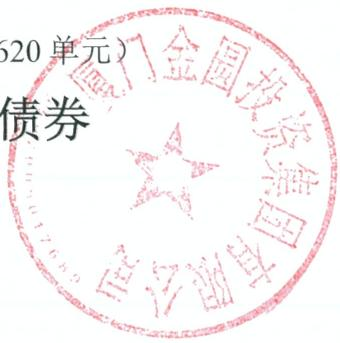  
澳门金圆投资集团有限公司

发行人： 厦门金圆投资集团有限公司

牵头主承销商： 中信证券股份有限公司

中信建投证券股份有限公司、广发证券股份有限公司、金圆统一证券有限联席主承销商：公司、华福证券股份有限公司

簿记管理人： 中信证券股份有限公司

受托管理人： 中信证券股份有限公司

本期债券发行金额： 不超过7亿元（含7亿元）

增信措施情况： 本期债券无增信措施

信用评级结果： 主体评级AAA/债项评级AAA

信用评级机构： 联合资信评估股份有限公司

牵头主承销商/簿记管理人

（住所：广东省深圳市福田区中心三路8号卓越时代广场（二期）联席主承销商

（住所：中国（福建）自由贸易试验区厦门片区象屿路93号厦门国际航运中心C栋4层

（住所：广东省广州市黄埔区中新广州知识城腾飞一街2号618室）

（住所：北京市朝阳区安立路66号4号楼）

（住所：福建省福州市鼓楼区鼓屏路27号1#

签署日期：2026年4月16日

## 声 明

发行人将及时、公平地履行信息披露义务。

发行人及其董事、高级管理人员或履行同等职责的人员保证募集说明书信息披露的真实、准确、完整，不存在虚假记载、误导性陈述或重大遗漏。

主承销商已对募集说明书进行了核查，确认不存在虚假记载、误导性陈述和重大遗漏，并对其真实性、准确性和完整性承担相应的法律责任。

发行人承诺合规发行，不从事《关于进一步规范债券发行业务有关事项的通知》第三条第二款规定的行为。发行人承诺在本期债券发行环节，不直接或者间接认购自己发行的债券。债券发行的利率或者价格应当以询价、协议定价等方式确定，发行人不会操纵发行定价、暗箱操作，不以代持、信托等方式谋取不正当利益或向其他相关利益主体输送利益，不直接或通过其他利益相关方向参与认购的投资者提供财务资助、变相返费，不出于利益交换的目的通过关联金融机构相互持有彼此发行的债券，不实施其他违反公平竞争、破坏市场秩序等行为

发行人如有董事、高级管理人员、持股比例超过5%的股东及其他关联方参与本期债券认购，发行人将在发行结果公告中就相关认购情况进行披露。

中国证券监督管理委员会、深圳证券交易所对债券发行的注册或审核，不代表对债券的投资价值作出任何评价，也不表明对债券的投资风险作出任何判断。凡欲认购本期债券的投资者，应当认真阅读本募集说明书全文及有关的信息披露文件，对信息披露的真实性、准确性和完整性进行独立分析，并据以独立判断投资价值，自行承担与其有关的任何投资风险。

投资者认购或持有本期债券视作同意募集说明书关于权利义务的约定，包括债券受托管理协议、债券持有人会议规则及债券募集说明书中其他有关发行人、债券持有人、债券受托管理人等主体权利义务的相关约定。

发行人承诺根据法律法规和本募集说明书约定履行义务，接受投资者监督。

## 重大事项提示

请投资者关注以下重大事项，并仔细阅读本募集说明书中“风险提示及说明”等有关章节。

## 一、发行人基本财务情况

本期债券发行上市前，发行人最近一期末净资产为472.66亿元（截至2025年 9 月 30 日合并财务报表中的所有者权益合计），合并口径资产负债率为42.64%，母公司口径资产负债率为 35.38%。发行人最近三个会计年度实现的年均可分配利润为 13.41 亿元（2022 年度、2023 年度和 2024年度实现的归属于母公司所有者的净利润 141,511.87 万元、138,755.73 万元和 122,042.08 万元的平均值），预计不少于本期债券一年利息的 1倍。发行人发行前的财务指标符合相关规定。

## 二、评级情况

根据联合资信评估股份有限公司（以下简称“联合资信”）2026年4月出具的《厦门金圆投资集团有限公司2026年面向专业投资者公开发行公司债券（第二期）信用评级报告》，发行人主体评级为AAA，评级展望稳定，本期债券评级为AAA。评级报告披露的主要风险为：

1、主要业务经营易受经营环境变化影响。公司金融服务板块主要业务受宏观经济和产业环境、地区金融生态、监管政策等影响较大，相关因素可能对公司经营带来不利影响。

2、公司内部管理难度较大。公司控股子公司数量多，且业务涉及贸易、金融服务、产业投资等众多领域，对公司内在管理体系、管理水平和内控合规管理等提出了较高要求。

根据相关监管法规和联合资信评估股份有限公司（以下简称“联合资信”）有关业务规范，联合资信将在本期债项信用评级有效期内持续进行跟踪评级，跟踪评级包括定期跟踪评级和不定期跟踪评级。厦门金圆投资集团有限公司（以下简称“公司”）应按联合资信跟踪评级资料清单的要求及时提供相关资料。联合资信将按照有关监管政策要求和委托评级合同约定在本期债项评级有效期内完成跟踪评级工作。公司或本期债项如发生重大变化，或发生可能对公司或本期债项信用评级产生较大影响的重大事项，公司应及时通知联合资信并提供有关资料。联合资信将密切关注公司的经营管理状况、外部经营环境及本期债项相关信息，如发现有重大变化，或出现可能对公司或本期债项信用评级产生较大影响的事项时，联合资信将进行必要的调查，及时进行分析，据实确认或调整信用评级结果，出具跟踪评级报告，并按监管政策要求和委托评级合同约定报送及披露跟踪评级报告和结果。如公司不能及时提供跟踪评级资料，或者出现监管规定、委托评级合同约定的其他情形，联合资信可以终止或撤销评级。

三、本期债券为无担保债券。在本期债券的存续期内，若受到相关法律法规政策变化，或者行业及市场环境发生重大不利变化，发行人无法如期从预期的还款来源中获得足够资金，可能影响本期债券本息的按期偿付。若发行人未能按时、足额偿付本期债券的本息，债券持有人亦无法从除发行人外的第三方处获得偿付。

四、贸易业务收入是发行人主营业务收入的重要来源。最近三年及一期，贸易业务收入占发行人主营业务收入的比例分别为 75.95%、77.86%、77.43%和73.99%。最近三年及一期，发行人贸易业务毛利率分别为 0.34%、1.02%、-0.19%和-0.60%，毛利率处于较低水平。发行人贸易业务产品价格跟随大宗商品价格变化呈现出持续波动的局面，虽然发行人采取了一系列措施，如发行人会在期货市场进行套期保值，锁定风险和收益。但是如果原材料价格剧烈波动，可能会影响发行人贸易业务的产品成本和毛利率水平，从而对发行人盈利能力产生不利影响。

金融服务板块是发行人利润的重要来源。最近三年，金融服务板块对发行人主营业务毛利润贡献均在 90%以上。发行人金融服务板块涉及信托、证券、基金、担保、创投、地方 AMC等业务。面对复杂多变的宏观环境和政策监管，发行人经营多牌照的多元化金融业务需要更好的管理能力及营运能力。

五、2022年、2023年、2024年及2025年1-9月，合并口径下，发行人分别实现投资收益246,515.48万元、156,067.99万元、164,362.26万元和117,627.43万元，分别占利润总额的128.42%、81.12%、105.23%和91.17%，是公司利润的重要来源。发行人投资收益主要来源于长期股权投资产生的投资收益和债权类产品、债券、基金、信托等优质资产投资收益。最近三年及一期发行人的投资收益对利润影响较大，且投资收益受被投资企业经营情况和市场情况影响存在波动性，若未来发生不利变化导致发行人投资收益下降，则可能对发行人偿债能力产生不利影响。

六、2022年、2023年、2024年及2025年1-9月发行人实现净利润分别为161,922.86万元、159,198.89万元、138,783.37万元和91,344.78万元；实现的归母净利润分别为141,511.87万元、138,755.73万元、122,042.08万元和75,019.59万元。总体而言，发行人最近三年利润总额始终处于较高水平。但若未来发生不利变化导致发行人归母净利润持续下降，则可能对发行人偿债能力产生不利影响。

七、2022 年、2023 年、2024 年及 2025 年 1-9 月，合并口径下，发行人经营活动产生的现金流量净额分别为 179,140.38 万元、-154,860.93 万元、92,722.09 万元和 172,972.28 万元，发行人经营活动产生的现金流量净额有所波动。

八、2022年、2023年、2024年及2025年1-9月，合并口径下，发行人投资活动产生的现金流量净额分别为-62,743.95万元、-84,352.59万元、-624,934.13万元和-251,101.77万元。发行人投资活动产生的现金流量呈流出状态，主要是由于发行人不断加大投资力度。虽然发行人已经建立较为完善的融资渠道，但若发行人未来进一步加大投资力度，将面临融资压力增加的风险。

九、截至 2025年9月末，除下属担保公司担保业务正常开展外，发行人及其子公司对外担保（不含发行人与子公司之间的担保）余额为 536,608.75万元，占总资产的比例为 6.51%，占净资产的比例为 11.35%。截至本募集说明书签署日，上述被担保企业经营状态良好，代偿风险较小。如果被担保企业在未来出现偿付困难，发行人将履行相应的担保责任，将给发行人造成一定的或有风险。

十、发行人为投资控股型公司，贸易业务、金融服务业务主要由发行人子公司负责运营，经营成果主要来自子公司。发行人本部的利润主要来源于长期股权投资所形成的投资收益，虽然发行人主要子公司的利润分配政策、分配方式和分配时间安排等均受发行人控制，但若未来各控股子公司利润分配政策发生调整，可能对发行人母公司层面的盈利情况产生影响。

## 十一、重要投资者保护条款

为保障本期债券持有人的合法权益，本期债券设置了投资者保护条款，具体请见“第十节投资者保护机制”。

## 十二、投资者适当性条款

根据《证券法》等相关规定，本期债券仅面向专业投资者中的机构投资者发行，普通投资者和专业投资者中的个人投资者不得参与发行认购。本期债券上市后将被实施投资者适当性管理，仅专业投资者中的机构投资者参与交易，普通投资者和专业投资者中的个人投资者认购或买入的交易行为无效。

十三、本期发行结束后，公司将尽快向深圳证券交易所提出关于本期债券上市交易的申请。本期债券符合在深圳证券交易所的上市条件，上市时采取匹配成交、点击成交、询价成交、竞买成交及协商成交的交易方式。但本期债券上市前，公司财务状况、经营业绩、现金流和信用评级等情况可能出现重大变化，公司无法保证本期债券的上市申请能够获得深圳证券交易所同意，若届时本期债券无法进行上市，投资者有权选择将本期债券回售予本公司。因公司经营与收益等情况变化引致的投资风险和流动性风险，由债券投资者自行承担，本期债券不能在除深圳证券交易所以外的其他交易场所上市。

十四、经联合资信评估股份有限公司综合评定，根据《厦门金圆投资集团有限公司 2026年面向专业投资者公开发行公司债券（第二期）信用评级报告》，发行人主体长期信用等级为 AAA 级，本期债券的信用等级为 AAA级，展望稳定。公司认为本期债券符合通用质押式回购交易的基本条件，具体回购资格及折算率等事宜以证券登记机构的相关规定为准。发行人承诺，在本期债券存续期内，每年进行一次主体跟踪评级。

十五、发行人承诺合规发行，不从事《关于进一步规范债券发行业务有关事项的通知》第三条第二款规定的行为。发行人不会直接或者间接认购自己发行的债券。发行人不会操纵发行定价、暗箱操作；不会以代持、信托等方式谋取不正当利益或者向其他相关利益主体输送利益；不会直接或者通过其他主体向参与认购的投资者提供财务资助、变相返费；不会出于利益交换的目的通过关联金融机构相互持有彼此发行的债券；不会有其他违反公平竞争、破坏市场

秩序等行为。

发行人的控股股东、实际控制人不得组织、指使发行人实施前款行为。

投资者应当在认购环节向承销机构承诺审慎合理投资，不从事《关于进一步规范债券发行业务有关事项的通知》第八条第二款、第三款规定的行为。

投资者不得协助发行人从事违反公平竞争、破坏市场秩序等行为。投资者不得通过合谋集中资金等方式协助发行人直接或者间接认购自己发行的债券，不得为发行人认购自己发行的债券提供通道服务，不得直接或者变相收取债券发行人承销服务、融资顾问、咨询服务等形式的费用。

资管产品管理人及其股东、合伙人、实际控制人、员工不得直接或间接参与上述行为。

十六、根据《厦门市人民政府关于谷涛职务任免的通知》（厦府〔202579号），谷涛先生担任公司总经理。上述人员变动不会影响本公司相关决策机构决议有效性。目前公司正常经营，本次人员变动对本公司日常管理、生产经营及偿债能力无重大不利影响。

## 目 录

声 明 ..........  
重大事项提示..  
释 义 ...... 1  
第一节 风险提示及说明. .. 3  
第二节 发行概况.... .. 3  
第三节 募集资金运用. . 16  
第四节 发行人基本情况. . 20  
第五节 财务会计信息.. . 91  
第六节 发行人及本期债券的资信状况. .. 91  
第七节 增信机制.. ... 156  
第八节 税项..... ..... 157  
第九节 信息披露安排. ..... 159  
第十节 投资者保护机制. ...... 163  
第十一节 本期债券发行的有关机构及利害关系 .... 212  
第十二节 发行人、中介机构及相关人员声明. .. 217  
第十三节 备查文件..... ... 240

## 释 义

在本募集说明书中，除非文意另有所指，下列词语具有如下含义：

注：本募集说明书中除特别说明外，所有数值保留 2位小数，若出现总数与各分项数值之和尾数不符，均为四舍五入造成。
<table><tr><td colspan="1" rowspan="1">本公司、本集团、公司、发行人、金圆集团、集团</td><td colspan="1" rowspan="1">指</td><td colspan="1" rowspan="1">厦门金圆投资集团有限公司</td></tr><tr><td colspan="1" rowspan="1">本次债券</td><td colspan="1" rowspan="1">指</td><td colspan="1" rowspan="1">经公司股东批复，同意公司向中国证券监督管理委员会申请发行不超过70亿元（含）的公司债券</td></tr><tr><td colspan="1" rowspan="1">本期债券</td><td colspan="1" rowspan="1">指</td><td colspan="1" rowspan="1">厦门金圆投资集团有限公司2026年面向专业投资者公开发行公司债券（第二期）</td></tr><tr><td colspan="1" rowspan="1">本期发行</td><td colspan="1" rowspan="1">指</td><td colspan="1" rowspan="1">本期债券的公开发行</td></tr><tr><td colspan="1" rowspan="1">募集说明书</td><td colspan="1" rowspan="1">指</td><td colspan="1" rowspan="1">发行人根据有关法律、法规为发行本期债券而制作的《厦门金圆投资集团有限公司2026年面向专业投资者公开发行公司债券（第二期）募集说明书》</td></tr><tr><td colspan="1" rowspan="1">债券持有人</td><td colspan="1" rowspan="1">指</td><td colspan="1" rowspan="1">通过认购、交易、受让、继承、承继或其他合法方式取得并持有本期债券的专业机构投资者</td></tr><tr><td colspan="1" rowspan="1">《债券持有人会议规则》</td><td colspan="1" rowspan="1">指</td><td colspan="1" rowspan="1">《厦门金圆投资集团有限公司2025年面向专业投资者公开发行公司债券债券持有人会议规则》</td></tr><tr><td colspan="1" rowspan="1">《债券受托管理协议》</td><td colspan="1" rowspan="1">指</td><td colspan="1" rowspan="1">《厦门金圆投资集团有限公司2025年面向专业投资者公开发行公司债券受托管理协议》</td></tr><tr><td colspan="1" rowspan="1">《公司章程》</td><td colspan="1" rowspan="1">指</td><td colspan="1" rowspan="1">《厦门金圆投资集团有限公司章程》</td></tr><tr><td colspan="1" rowspan="1">董事会</td><td colspan="1" rowspan="1">指</td><td colspan="1" rowspan="1">厦门金圆投资集团有限公司董事会</td></tr><tr><td colspan="1" rowspan="1">股东</td><td colspan="1" rowspan="1">指</td><td colspan="1" rowspan="1">厦门市财政局</td></tr><tr><td colspan="1" rowspan="1">深交所</td><td colspan="1" rowspan="1">指</td><td colspan="1" rowspan="1">深圳证券交易所</td></tr><tr><td colspan="1" rowspan="1">中国证监会、证监会</td><td colspan="1" rowspan="1">指</td><td colspan="1" rowspan="1">中国证券监督管理委员会</td></tr><tr><td colspan="1" rowspan="1">《公司法》</td><td colspan="1" rowspan="1">指</td><td colspan="1" rowspan="1">《中华人民共和国公司法》</td></tr><tr><td colspan="1" rowspan="1">《证券法》</td><td colspan="1" rowspan="1">指</td><td colspan="1" rowspan="1">《中华人民共和国证券法》</td></tr><tr><td colspan="1" rowspan="1">《管理办法》</td><td colspan="1" rowspan="1">指</td><td colspan="1" rowspan="1">《公司债券发行与交易管理办法》</td></tr><tr><td colspan="1" rowspan="1">主承销商</td><td colspan="1" rowspan="1">指</td><td colspan="1" rowspan="1">中信证券股份有限公司、中信建投证券股份有限公司、金圆统一证券有限公司、广发证券股份有限公司、华福证券股份有限公司</td></tr><tr><td colspan="1" rowspan="1">牵头主承销商、簿记管理人</td><td colspan="1" rowspan="1">指</td><td colspan="1" rowspan="1">中信证券股份有限公司</td></tr><tr><td colspan="1" rowspan="1">联席主承销商</td><td colspan="1" rowspan="1">指</td><td colspan="1" rowspan="1">中信建投证券股份有限公司、广发证券股份有限公司、金圆统一证券有限公司、华福证券股份有限公司</td></tr><tr><td colspan="1" rowspan="1">受托管理人</td><td colspan="1" rowspan="1">指</td><td colspan="1" rowspan="1">中信证券股份有限公司</td></tr><tr><td colspan="1" rowspan="1">发行人律师</td><td colspan="1" rowspan="1">指</td><td colspan="1" rowspan="1">北京观韬律师事务所</td></tr><tr><td colspan="1" rowspan="1">金财公司</td><td colspan="1" rowspan="1">指</td><td colspan="1" rowspan="1">厦门市金财投资有限公司</td></tr><tr><td colspan="1" rowspan="1">金圆金控</td><td colspan="1" rowspan="1">指</td><td colspan="1" rowspan="1">厦门金圆金控股份有限公司，原“厦门市金财投资有限公司”</td></tr><tr><td colspan="1" rowspan="1">金财产业</td><td colspan="1" rowspan="1">指</td><td colspan="1" rowspan="1">厦门金财产业发展有限公司</td></tr><tr><td colspan="1" rowspan="1">厦门创投</td><td colspan="1" rowspan="1">指</td><td colspan="1" rowspan="1">厦门市创业投资有限公司</td></tr><tr><td colspan="1" rowspan="1">厦门资管</td><td colspan="1" rowspan="1">指</td><td colspan="1" rowspan="1">厦门资产管理有限公司</td></tr><tr><td colspan="1" rowspan="1">金圆租赁</td><td colspan="1" rowspan="1">指</td><td colspan="1" rowspan="1">厦门金圆融资租赁有限公司</td></tr><tr><td colspan="1" rowspan="1">厦门国际信托</td><td colspan="1" rowspan="1">指</td><td colspan="1" rowspan="1">厦门国际信托有限公司</td></tr><tr><td colspan="1" rowspan="1">市担保</td><td colspan="1" rowspan="1">指</td><td colspan="1" rowspan="1">厦门市融资担保有限公司，原"厦门市担保有限公司”</td></tr><tr><td colspan="1" rowspan="1">金圆实业</td><td colspan="1" rowspan="1">指</td><td colspan="1" rowspan="1">金圆实业有限公司</td></tr><tr><td colspan="1" rowspan="1">厦门产投、金圆产业</td><td colspan="1" rowspan="1">指</td><td colspan="1" rowspan="1">厦门市产业投资有限公司，原“厦门金圆产业发展有限公司”</td></tr><tr><td colspan="1" rowspan="1">厦门市产业引导投资基金</td><td colspan="1" rowspan="1">指</td><td colspan="1" rowspan="1">厦门市产业引导股权投资基金合伙企业（有限合伙）</td></tr><tr><td colspan="1" rowspan="1">金融研究院、金融学院</td><td colspan="1" rowspan="1">指</td><td colspan="1" rowspan="1">厦门金圆金融管理研究院，原"厦门国际金融管理学院”</td></tr><tr><td colspan="1" rowspan="1">厦门银行</td><td colspan="1" rowspan="1">指</td><td colspan="1" rowspan="1">厦门银行股份有限公司，原“厦门市商业银行股份有限公司”</td></tr><tr><td colspan="1" rowspan="1">金圆国际</td><td colspan="1" rowspan="1">指</td><td colspan="1" rowspan="1">金圆国际有限公司</td></tr><tr><td colspan="1" rowspan="1">圆信永丰基金</td><td colspan="1" rowspan="1">指</td><td colspan="1" rowspan="1">圆信永丰基金管理有限公司</td></tr><tr><td colspan="1" rowspan="1">南方基金</td><td colspan="1" rowspan="1">指</td><td colspan="1" rowspan="1">南方基金管理股份有限公司</td></tr><tr><td colspan="1" rowspan="1">厦门天马</td><td colspan="1" rowspan="1">指</td><td colspan="1" rowspan="1">厦门天马微电子有限公司</td></tr><tr><td colspan="1" rowspan="1">华强方特</td><td colspan="1" rowspan="1">指</td><td colspan="1" rowspan="1">华强方特（厦门）文化科技有限公司，原"厦门华强文化科技有限公司”</td></tr><tr><td colspan="1" rowspan="1">博灏投资</td><td colspan="1" rowspan="1">指</td><td colspan="1" rowspan="1">厦门博灏投资有限公司</td></tr><tr><td colspan="1" rowspan="1">厦门联芯</td><td colspan="1" rowspan="1">指</td><td colspan="1" rowspan="1">联芯集成电路制造（厦门）有限公司</td></tr><tr><td colspan="1" rowspan="1">工研院</td><td colspan="1" rowspan="1">指</td><td colspan="1" rowspan="1">厦门半导体工业技术研发有限公司</td></tr><tr><td colspan="1" rowspan="1">天马显示</td><td colspan="1" rowspan="1">指</td><td colspan="1" rowspan="1">厦门天马显示科技有限公司</td></tr><tr><td colspan="1" rowspan="1">天马光电子</td><td colspan="1" rowspan="1">指</td><td colspan="1" rowspan="1">厦门天马光电子有限公司</td></tr><tr><td colspan="1" rowspan="1">最近三年及一期、报告期</td><td colspan="1" rowspan="1">指</td><td colspan="1" rowspan="1">2022年、2023年、2024年和2025年1-9月</td></tr><tr><td colspan="1" rowspan="1">最近三年及一期末</td><td colspan="1" rowspan="1">指</td><td colspan="1" rowspan="1">2022年末、2023年末、2024年末和2025年9月末</td></tr><tr><td colspan="1" rowspan="1">报告期末</td><td colspan="1" rowspan="1">指</td><td colspan="1" rowspan="1">2025年9月末</td></tr><tr><td colspan="1" rowspan="1">交易日</td><td colspan="1" rowspan="1">指</td><td colspan="1" rowspan="1">深圳证券交易所的营业日</td></tr><tr><td colspan="1" rowspan="1">法定节假日和/或休息日</td><td colspan="1" rowspan="1">指</td><td colspan="1" rowspan="1">指中华人民共和国的法定及政府指定节假日和/或休息日（不包括香港特别行政区、澳门特别行政区和台湾省的法定节假日和/或休息日)</td></tr><tr><td colspan="1" rowspan="1">元</td><td colspan="1" rowspan="1">指</td><td colspan="1" rowspan="1">人民币元，特别注明的除外</td></tr></table>

## 第一节风险提示及说明

投资者在评价和投资本期债券时，除本募集说明书披露的其他各项资料外，应特别认真地考虑下述各项风险因素。

## 一、与本期债券相关的投资风险

## （一）利率风险

受国民经济总体运行状况、国家宏观经济环境、金融货币政策以及国际经济环境变化等因素的影响，市场利率存在波动的可能性。由于本期债券可能跨越一个以上的利率波动周期，债券的投资价值在其存续期内可能随着市场利率的波动而发生变动，从而使本期债券投资者持有的债券价值具有一定的不确定性。

## （二）流动性风险

本期债券发行结束后，公司将及时向深交所提出上市交易申请。但本期债券上市前，公司经营业绩、财务状况、现金流和信用评级等情况可能出现重大变化，公司无法保证本期债券的上市申请能够获得深交所同意。由于具体上市事宜需要在本期债券发行结束后方能进行，并依赖于有关主管部门的批准，公司目前无法保证本期债券一定能够按照预期在深交所交易流通，且具体上市进程在时间上存在不确定性。此外，证券交易市场的交易活跃程度受到宏观经济环境、投资者分布、投资者交易意愿等因素的影响，公司亦无法保证本期债券在深交所上市后本期债券的持有人能够随时并足额交易其所持有的债券。因此，本期债券的投资者在购买本期债券后，可能面临由于债券不能及时上市流通而无法立即出售本期债券的流动性风险，或者由于债券上市流通后交易不活跃甚至出现无法持续成交的情况，而不能以某一价格足额出售其希望出售的本期债券所带来的流动性风险。

## （三）偿付风险

本公司目前经营和财务状况良好。在本期债券存续期内，宏观经济环境、资本市场状况、国家相关政策等外部因素以及公司本身的生产经营存在着一定的不确定性。这些因素的变化会影响到公司的运营状况、盈利能力和现金流量，

可能导致公司无法如期从预期的还款来源获得足够的资金按期支付本期债券本息，从而使投资者面临一定的偿付风险。

## 二、发行人的相关风险

## （一）财务风险

## 1、投资收益占比较大的风险

2022年、2023年、2024年及 2025年 1-9月，合并口径下，发行人分别实现投资收益 246,515.48 万元、156,067.99 万元、164,362.26 万元和 117,627.43 万元，分别占利润总额的 128.42%、81.12%、105.23%和 91.17%，是公司利润的重要来源。发行人投资收益主要来源于长期股权投资产生的投资收益和债权类产品、债券、基金、信托等优质资产投资收益。最近三年及一期发行人的投资收益对利润影响较大，且投资收益受被投资企业经营情况和市场情况影响存在波动性，若未来发生不利变化导致发行人投资收益下降，则可能对发行人偿债能力产生不利影响。

## 2、汇率风险

随着汇率市场化改革的深入，人民币与其它可兑换货币之间的汇率波动将影响公司以外币计价的资产、负债及境外投资实体的价值，间接引起企业一定期间收益或现金流量的变化。公司境外子公司开展业务受汇率影响，因此汇率变动将使其面临在外汇结算过程中的汇兑风险。

## 3、对外担保风险

截至 2025 年 9 月末，除下属担保公司担保业务正常开展外，发行人及其子公司对外担保（不含发行人与子公司之间的担保）余额为 536,608.75万元，占总资产的比例为 6.51%，占净资产的比例为11.35%。截至本募集说明书签署日，上述被担保企业经营状态良好，代偿风险较小。如果被担保企业在未来出现偿付困难，发行人将履行相应的担保责任，将给发行人造成一定的或有风险。

## 4、公允价值变动收益波动的风险

最近三年及一期，发行人实现的公允价值变动收益分别为-67,696.24万元、2,498.23 万元、36,965.33 万元以及 46,767.02 万元。2022 年，发行人公允价值变

动收益大幅为负，主要系受资本市场行情的影响，发行人投资的交易性金融资产公允价值波动所致。未来如果出现相关不利变化，可能影响发行人的盈利水平。

## （二）经营风险

## 1、经济周期波动风险

发行人经营范围涉及贸易、金融服务与产业投资等。其中贸易业务主要为大宗商品批发业务，交易商品涵盖化工产品、农副产品和金属材料等类别。受商品经济规律影响及制约，与国内外宏观经济形势密切相关，大宗商品批发业务具有需求周期性或季节性、价格波动较大、商品同质化程度高，市场竞争激烈、交易量巨大等特征。金融服务板块与国家宏观经济形势及相关行业发展态势密切相关，目前宏观经济增速放缓或相关行业发展态势低迷可能导致被投资公司盈利能力下降、担保公司代偿率上升、信托资产质量下降、创投项目估值下降，从而影响公司的盈利能力。

## 2、业务跨度较大风险

发行人经营范围涉及贸易、金融服务与产业投资等，拥有众多全资及控股子公司和参股公司，虽然发行人就每个板块组建了独立、专业的经营管理团队，以保证各板块及子公司的稳定、快速发展，但发行人涉及行业跨度较大，对公司的经营管理能力提出了较高要求。

## 3、金融服务板块业务风险

金融服务板块是发行人利润的重要来源。最近三年及一期，金融服务板块对发行人主营业务毛利润贡献均在 80%以上。发行人金融服务板块涉及银行、信托、证券、基金、担保、创投、地方 AMC 等业务。面对复杂多变的宏观环境和监管政策，发行人经营多牌照的多元化金融业务需要更好的管理能力及营运能力。

## 4、投资收益不确定的风险

发行人投资收益主要来源于长期股权投资产生的投资收益和债权类产品、债券、基金、信托等优质资产投资收益。最近三年及一期发行人的投资收益对

利润影响较大，且投资收益受被投资企业经营情况和市场情况影响存在波动性和较大不确定性，若未来发生不利变化导致发行人投资收益下降，则可能对发行人偿债能力产生不利影响。

## 5、信托业务风险

根据信托公司受托职责不同，信托业务可以分为主动管理型信托和被动管理型信托。尽管按照信托法的规定和信托合同的约定，信托财产损失风险由委托人承担，在受托人无违反信托目的处分信托财产或者无因违背管理职责、无处理信托事务不当等过错的前提下，不需要发行人子公司厦门国际信托承担受托资产损失，但如果厦门国际信托在管理受托资产过程中发生了相关的过错导致受托资产损失，则可能面临一定的损失赔偿风险。2022-2024年末及 2025年9 月末，子公司厦门国际信托相关业务信用风险资产不良率分别为 0.99%、0.81%、2.06%和 1.63%，最近一年上升幅度较大。

## 6、新兴产业投资风险

新兴产业投资方面，发行人先后投资入股厦门天马、华强方特、博灏投资、厦门联芯、工研院、中创新航、天马显示、天马光电子、士兰集宏等公司，投资金额较大，其中前期对厦门天马、博灏投资的投资已分别通过上市公司股权置换方式和第三方回购退出，对厦门联芯的投资亦已回购退出。但未来实际控制方或第三方是否有足够资金回购相应股权存在一定不确定性，具有一定投资风险。

## 7、安全生产的风险

发行人有一定的建设项目，安全施工是正常运营的前提条件，也是公司取得经济利益的重要保障。人为因素、设备因素、技术因素，甚至台风、地震等自然因素都可能造成影响安全因素的突发事件，对发行人经营带来不利影响。

## 8、境外业务投资的风险

发行人在香港设立全资子公司金圆国际有限公司和金圆亚洲投资有限公司，在台湾设立全资子公司金圆实业有限公司。子公司所在地区如果发生政治、经济剧烈变动等状况，发行人可能面临一定的地域政治和经济风险，这将对公司境外业务经营业绩造成一定的负面影响。

## 9、突发事件引发的经营风险

发行人如遇突发事件，例如事故灾难、安全生产事件、社会安全事件等事项，可能造成公司社会形象受到影响，人员生命及财产安全受到危害，对发行人的经营可能造成不利影响。

## 10、担保业务代偿风险

2022-2024年末及 2025年 9月末，建筑为发行人担保业务的第一大担保行业，占期末担保余额的比例分别为 57.82%、65.58%、55.36%和 61.02%，集中度较高，发行人对此采取了一定的反担保措施。如未来受宏观环境、行业周期等影响，被担保企业经营环境恶化，发行人可能存在一定的代偿风险。

## （三）管理风险

## 1、多元化经营所带来的管理风险

发行人涉及贸易、金融服务与产业投资等多个业务领域。同时，贸易业务经营商品涉及化工、农副产品、金属等多个细分行业，金融服务涉及银行、信托、证券、基金、担保、创投、地方 AMC、融资租赁等业务。虽然多业务板块的经营对于发行人分散经营风险、缓解对单一产业或产品的信赖风险具有重要作用。但多元化经营增大了发行人的管理宽度和管理难度，对管理模式以及管理层的经营能力、管理能力等提出更高的要求。

## 2、下属子公司管控风险

发行人全资（控股）子公司数量和层级较多，且行业跨度较大，以上因素对发行人的日常经营管理、相关投资决策及内部风险控制等方面提出了一定挑战，对发行人资源整合及配置能力提出更高要求，存在一定管理风险。

## 3、投资控股型公司的风险

发行人为投资控股型公司，贸易业务、金融服务业务主要由发行人子公司负责运营，经营成果主要来自子公司。发行人本部的利润主要来源于长期股权投资所形成的投资收益，虽然发行人主要子公司的利润分配政策、分配方式和分配时间安排等均受发行人控制，但若未来各控股子公司利润分配政策发生调整，可能对发行人母公司层面的盈利情况产生影响。

## 4、突发事件引发公司治理结构突然变化的风险

发行人已经建立了比较规范的公司治理结构，但未来若发生突发性事件，造成其董事和高级管理人员无法履行相应职责，可能造成公司治理机制不能顺利运作，对发行人的管理可能造成不利影响。

## （四）政策风险

## 1、产业政策风险

在我国国民经济发展的不同阶段，国家和地方产业政策会有不同程度的调整，国家宏观经济政策和产业政策的调整可能会影响交易对手的经营管理活动，不排除在一定时期内对交易对手经营环境和业绩产生不利影响的可能性。

## 第二节发行概况

## 一、本期发行的基本情况

## （一）本期发行的内部批准情况及注册情况

2024年4月15日，本公司第二届董事会2024年度第一次会议审议并通过了金圆集团注册发行公司债事项。

2024年10月30日，本公司唯一股东厦门市财政局出具《厦门市财政局关于厦门金圆投资集团有限公司申请注册发行公司债券的批复》，同意了发行公司债事项。

本公司于2025年3月26日获得中国证券监督管理委员会（证监许可〔2025623号）同意面向专业投资者发行面值不超过（含）70亿元的公司债券的注册。公司将综合市场等各方面情况确定债券的发行时间、发行规模及其他具体发行条款。

## （二）本期债券的主要条款

发行主体：厦门金圆投资集团有限公司。

债券名称：本期债券分为两个品种，其中品种一债券全称为“厦门金圆投资集团有限公司2026年面向专业投资者公开发行公司债券（第二期）（品种一）”，债券简称为“26圆融03”，债券代码为“524768”；品种二债券全称为“厦门金圆投资集团有限公司2026年面向专业投资者公开发行公司债券（第二期）（品种二）”，债券简称为“26圆融04”，债券代码为“524769”。

发行规模：本期债券发行规模不超过7亿元（含7亿元）。

债券期限：本期债券分为两个品种，其中品种一期限为10年期，附第5个计息年度末发行人赎回选择权、调整票面利率选择权和投资者回售选择权；品种二期限为10年期。

【回售选择权】本期债券品种一设置投资者回售选择权：债券持有人有权在本期债券品种一存续期的第5年末将其持有的全部或部分本期债券品种一回售给发行人。回售选择权具体约定情况详见本节“（三）本期债券品种一的特殊发

行条款（投资者回售选择权）”。

【赎回选择权】本期债券品种一设置赎回选择权：发行人有权在本期债券品种一存续期间的第5年末赎回本期债券品种一全部未偿份额。赎回选择权具体约定情况详见本节“（三）本期债券品种一的特殊发行条款（发行人赎回选择权）”。

品种间回拨选择权：本期债券引入品种间回拨选择权，回拨比例不受限制，发行人和主承销商将根据本期债券发行申购情况，在总发行规模内决定是否行使品种间回拨选择权，即减少其中一个品种的发行规模，同时对另外品种的发行规模增加相同金额，单一品种最大拨出规模不超过其最大可发行规模的100%。

债券票面金额：本期债券票面金额为100元。

发行价格：本期债券按面值平价发行。

增信措施：本期债券无担保。

债券形式：实名制记账式公司债券。投资者认购的本期债券在证券登记机构开立的托管账户托管记载。本期债券发行结束后，债券认购人可按照有关主管机构的规定进行债券的转让、质押等操作。

债券利率及其确定方式：本期债券票面利率为固定利率，票面利率将根据网下询价簿记结果，由公司与簿记管理人按照有关规定，在利率询价区间内协商一致确定。债券票面利率采取单利按年计息，不计复利。

【票面利率调整选择权】本期债券品种一设置票面利率调整选择权：发行人有权在本期债券品种一存续期的第5年末决定是否调整本期债券品种一后续计息期间的票面利率。票面利率调整选择权具体约定情况详见本节“（三）本期债券品种一的特殊发行条款（票面利率调整选择权）”。

发行方式：本期债券发行采取网下发行的方式面向专业机构投资者询价、根据簿记建档情况进行配售的发行方式。

发行对象：本期债券发行对象为在中国证券登记结算有限责任公司深圳分公司开立A股证券账户的专业机构投资者（法律、法规禁止购买者除外）。

承销方式：本期债券由主承销商以余额包销的方式承销。

配售规则：与发行公告一致。

网下配售原则：与发行公告一致。

起息日期：本期债券的起息日为2026年4月23日。

兑付及付息的债权登记日：本期债券兑付的债权登记日为付息日的前1个交易日，在债权登记日当日收市后登记在册的本期债券持有人，均有权获得上一计息期间的债券利息。

付息方式：本期债券按年付息。

付息日：本期债券品种一的付息日为2027年至2036年间每年的4月23日，如投资者行使回售选择权或发行人行使赎回选择权，则回售或赎回部分债券的付息日为2027年至2031年间每年的4月23日；品种二的付息日为2027年至2036年间每年的4月23日。（如遇法定节假日或休息日，则顺延至其后的第1个交易日，顺延期间付息款项不另计息）

兑付方式：到期一次还本。

兑付日：本期债券品种一的兑付日为2036年4月23日，如投资者行使回售选择权或发行人行使赎回选择权，则回售或赎回部分债券的兑付日为2031年4月23日；品种二的兑付日为2036年4月23日。（如遇法定节假日或休息日，则顺延至其后的第1个交易日，顺延期间兑付款项不另计利息）

支付金额：本期债券于每年的付息日向投资者支付的利息为投资者截至利息登记日收市时所持有的本期债券票面总额与票面利率的乘积，于兑付日向投资者支付的本息金额为投资者截至兑付登记日收市时投资者持有的本期债券最后一期利息及所持有的本期债券票面总额的本金。

本息支付将按照债券登记机构的有关规定统计债券持有人名单，本息支付方式及其他具体安排按照债券登记机构的相关规定办理。

偿付顺序：本期债券在破产清算时的清偿顺序等同于发行人普通债务。

信用评级机构及信用评级结果：经联合资信评估股份有限公司综合评定，本公司的主体信用等级为AAA，评级展望为稳定，本期债券的信用评级为AAA。发行人承诺，在本期债券存续期内，每年进行一次主体跟踪评级。

拟上市交易场所：深圳证券交易所。

募集资金用途：本期债券募集资金在扣除发行费用后，拟全部用于置换已用于偿还到期公司债券本金的自有资金。

募集资金专项账户：本公司将根据《公司债券发行与交易管理办法》《债券受托管理协议》《公司债券受托管理人执业行为准则》等相关规定，指定专项账户，用于公司债券募集资金的接收、存储、划转。

牵头主承销商、簿记管理人：中信证券股份有限公司。

联席主承销商：中信建投证券股份有限公司、广发证券股份有限公司、金圆统一证券有限公司、华福证券股份有限公司。

受托管理人：中信证券股份有限公司。

通用质押式回购安排：发行人主体长期信用等级为 AAA级，展望稳定。公司认为本期债券符合通用质押式回购交易的基本条件，具体回购资格及折算率等事宜以证券登记机构的相关规定为准。

税务提示：根据国家有关税收法律、法规的规定，投资者投资本期债券所应缴纳的税款由投资者承担。

## （三）本期债券品种一的特殊发行条款

## 1、票面利率调整选择权

（1）发行人有权在本期债券品种一存续期的第5年末决定是否调整后续计息期间的票面利率。

（2）发行人决定行使票面利率调整选择权的，自票面利率调整生效日起，本期债券品种一的票面利率按照以下方式确定：调整后的票面利率以发行人发布的票面利率调整实施公告为准，且票面利率的调整方向和幅度不限。

（3）发行人承诺不晚于票面利率调整实施日前的2个交易日披露关于是否调整本期债券品种一票面利率以及调整幅度（如有）的公告。

本期债券品种一投资者享有回售选择权，发行人承诺前款约定的公告将于本期债券品种一回售申报起始日前披露三次，以确保投资者在行使回售选择权前充分知悉票面利率是否调整及相关事项。

（4）发行人决定不行使票面利率调整选择权的，则本期债券品种一的票面利率在发行人行使下次票面利率调整选择权前继续保持不变。

## 2、投资者回售选择权

（1）债券持有人有权在本期债券品种一存续期的第5年末将其持有的全部或部分本期债券品种一回售给发行人。

（2）为确保投资者回售选择权的顺利实现，发行人承诺履行如下义务：

1）发行人承诺将以适当方式提前了解本期债券品种一持有人的回售意愿及回售规模，提前测算并积极筹备回售资金。

2）发行人承诺将按照规定及约定及时披露回售实施及其提示性公告、回售结果公告、转售结果公告等，确保投资者充分知悉相关安排。

3）发行人承诺回售登记期原则上不少于3个交易日。

4）回售实施过程中如发生可能需要变更回售流程的重大事项，发行人承诺及时与投资者、交易场所、登记结算机构等积极沟通协调并及时披露变更公告，确保相关变更不会影响投资者的实质权利，且变更后的流程不违反相关规定。

5）发行人承诺按照深交所、登记结算机构的规定及相关约定及时启动债券回售流程，在各流程节点及时提交相关申请，及时划付款项。

6）如本期债券品种一的持有人全部选择回售的，发行人承诺在回售资金划付完毕且转售期届满（如有）后，及时办理未转售债券的注销等手续。

（3）为确保回售选择权的顺利实施，本期债券品种一的持有人承诺履行如下义务：

1）本期债券品种一的持有人承诺于发行人披露的回售登记期内按时进行回售申报或撤销，且申报或撤销行为还应当同时符合本期债券品种一交易场所、登记结算机构的相关规定。若债券持有人未按要求及时申报的，视为同意放弃行使本期回售选择权并继续持有本期债券品种一。发行人与债券持有人另有约定的，从其约定。

2）发行人按约定完成回售后，本期债券品种一的持有人承诺将积极配合发行人完成债券注销、摘牌等相关工作。

（4）为确保回售顺利实施和保障投资者合法权益，发行人可以在本期回售实施过程中决定延长已披露的回售登记期，或者新增回售登记期1。

发行人承诺将于原有回售登记期终止日前3个交易日，或者新增回售登记期起始日前3个交易日及时披露延长或者新增回售登记期的公告2，并于变更后的回售登记期结束日前至少另行发布一次回售实施提示性公告。新增的回售登记期间至少为1个交易日。

如本期债券品种一的持有人认为需要在本期回售实施过程中延长或新增回售登记期的，可以与发行人沟通协商。发行人同意的，根据前款约定及时披露相关公告。

## 3、发行人赎回选择权

（1）发行人有权在本期债券品种一存续期间的第5年末赎回本期债券品种一全部未偿份额。

（2）发行人决定行使赎回选择权的，承诺履行如下义务：

1）积极筹备赎回资金，确保按照债券募集说明书和相关文件的约定，按时偿付本期债券品种一的未偿本息。

2）发行人承诺不晚于赎回资金发放日前20个交易日披露关于是否行使赎回选择权的公告，明确赎回债券基本情况、赎回实施办法、兑付日、本金兑付比例及金额、利息计算方法、部分赎回后面值计算方法及开盘参考价（如有）等安排。

3）发行人承诺按照深交所、登记结算机构的规定和相关约定及时启动债券赎回流程，在各流程节点及时提交相关申请，及时划付款项，确保债券赎回的顺利实施。

（3）发行人行使赎回选择权并按约定完成赎回资金划付的，发行人与本期债券品种一的持有人之间的债权债务关系终止，本期债券品种一予以注销并摘牌。

## （四）本期债券发行及上市安排

## 1、本期债券发行时间安排

发行公告刊登日期：2026年4月20日。

发行首日：2026年4月22日。

预计发行期限：2026年4月22日至2026年4月23日，共2个交易日。

网下发行期限：2026年4月22日至2026年4月23日。

## 2、本期债券上市安排

本期发行结束后，本公司将尽快向深交所提出关于本期债券上市交易的申请，具体上市时间将另行公告。

## 二、认购人承诺

购买本期债券的投资者（包括本期债券的初始购买人和二级市场的购买人，及以其他方式合法取得本期债券的人，下同）被视为作出以下承诺：

（一）接受本募集说明书对本期债券项下权利义务的所有规定并受其约束；

（二）本期债券的发行人依有关法律、法规的规定发生合法变更，在经有关主管部门批准后并依法就该等变更进行信息披露时，投资者同意并接受该等变更；

（三）本期债券发行结束后，发行人将申请本期债券在深交所上市交易，并由主承销商代为办理相关手续，投资者同意并接受这种安排。

## 第三节募集资金运用

## 一、募集资金运用计划

## （一）本期债券的募集资金规模

经发行人董事会会议通过、经公司唯一股东厦门市财政局批复同意，并经中国证券监督管理委员会（证监许可〔2025〕623号）注册，本期债券发行总额不超过70亿元，采取分期发行。本期债券发行规模不超过7亿元（含7亿元）。

## （二）本期债券募集资金使用计划

本期债券募集资金在扣除发行费用后，拟全部用于置换已用于偿还到期公司债券本金的自有资金：

单位：万元

<table><tr><td rowspan=1 colspan=1>债券类型</td><td rowspan=1 colspan=1>发行主体</td><td rowspan=1 colspan=1>债券简称</td><td rowspan=1 colspan=1>债券代码</td><td rowspan=1 colspan=1>债券期限</td><td rowspan=1 colspan=1>起息日期</td><td rowspan=1 colspan=1>到期日期</td><td rowspan=1 colspan=1>债券余额</td><td rowspan=1 colspan=1>拟使用募集资金</td></tr><tr><td rowspan=1 colspan=1>公司债券</td><td rowspan=1 colspan=1>厦门金圆投资集团有限公司</td><td rowspan=1 colspan=1>23圆融K1</td><td rowspan=1 colspan=1>148257.SZ</td><td rowspan=1 colspan=1>3年</td><td rowspan=1 colspan=1>2023-04-21</td><td rowspan=1 colspan=1>2026-04-21</td><td rowspan=1 colspan=1>70,000</td><td rowspan=1 colspan=1>70,000</td></tr><tr><td rowspan=1 colspan=1></td><td rowspan=1 colspan=1>合计</td><td rowspan=1 colspan=1></td><td rowspan=1 colspan=1></td><td rowspan=1 colspan=1></td><td rowspan=1 colspan=1></td><td rowspan=1 colspan=1></td><td rowspan=1 colspan=1>70,000</td><td rowspan=1 colspan=1>70,000</td></tr></table>

本次债券募集资金用途在存续期内不予变更。

## （三）募集资金的现金管理

在不影响募集资金使用计划正常进行的情况下，发行人经公司董事会或者内设有权机构批准，可将暂时闲置的募集资金进行现金管理，投资于安全性高、流动性好的产品，如国债、政策性银行金融债、地方政府债、交易所债券逆回购等。

## （四）募集资金使用计划调整的授权、决策和风险控制措施

本次债券募集资金用途在存续期内不予变更。

## （五）本期债券募集资金专项账户管理安排

公司拟在银行开设监管账户作为本期募集资金专项账户，用于本期债券募集资金的存放、使用及监管，发行人将在《发行结果公告》中披露具体开户行名称、账号等信息。本期债券的资金监管安排包括募集资金管理制度的设立、债券受托管理人根据《债券受托管理协议》等的约定对募集资金的监管进行持

续的监督等措施。

## 1、募集资金管理制度的设立

为了加强规范发行人发行债券募集资金的管理，提高其使用效率和效益，根据《中华人民共和国公司法》《中华人民共和国证券法》《公司债券发行与交易管理办法》等相关法律法规的规定，公司制定了募集资金管理制度。公司将按照发行申请文件中承诺的募集资金用途计划使用募集资金。

## 2、债券受托管理人的持续监督

根据《债券受托管理协议》，受托管理人应当对发行人专项账户募集资金的接收、存储、划转进行监督。在本期债券存续期内，受托管理人应当每季度检查发行人募集资金的使用情况是否与募集说明书约定一致。受托管理人有权要求发行人及时向其提供相关文件资料并就有关事项作出说明。

根据《债券受托管理协议》，受托管理人应当建立对发行人的定期跟踪机制，监督发行人对募集说明书所约定义务的执行情况，并在每年6月30日前向市场公告上一年度的受托管理事务报告。受托管理事务报告应当包括发行人募集资金使用及专项账户运作情况。

## （六）募集资金运用对发行人财务状况的影响

## 1、对发行人负债结构的影响

本期债券发行完成且募集资金运用后，非流动负债占总负债的比重上升，能够较好的调节公司资产负债结构。通过发行本期债券，公司获得长期稳定的经营资金，使公司获得持续稳定的发展。

## 2、对发行人财务成本的影响

发行人通过本期发行固定利率的公司债券，有利于锁定公司财务成本，规避利率上行风险。

## 3、有利于拓宽公司融资渠道

目前，公司资产规模体量较大，资金需求量较大，通过发行公司债券，可以拓宽公司融资渠道，有效满足公司中长期业务发展的资金需求。

## 二、前次公司债券募集资金使用情况

发行人于2025年3月26日获得中国证券监督管理委员会（证监许可〔2025〕623号）同意面向专业投资者发行面值不超过（含）70亿元的公司债券的注册。上述批文项下，发行人发行债券情况如下：

## （一）募集资金总额、实际使用金额与募集资金余额

发行人于2025年5月26日发行了厦门金圆投资集团有限公司2025年面向专业投资者公开发行科技创新公司债券（第一期）（品种二），发行规模10亿元，募集资金扣除发行费用后，拟将不低于70%用于对发行前12个月内的科技创新投资支出进行置换，不超过1.48亿元用于偿还有息债务，剩余部分用于补充流动资金，截至目前已使用完毕。

发行人于2025年7月9日发行了厦门金圆投资集团有限公司2025年面向专业投资者公开发行科技创新公司债券（第二期）（品种一）和厦门金圆投资集团有限公司2025年面向专业投资者公开发行科技创新公司债券（第二期）（品种二），发行规模分别为3亿元和7亿元，募集资金扣除发行费用后，拟将不低于70%用于对发行前12个月内的科技创新投资支出进行置换，剩余部分用于补充流动资金，截至目前已使用完毕。

发行人于2025年8月25日发行了厦门金圆投资集团有限公司2025年面向专业投资者公开发行科技创新公司债券（第三期）（品种一），发行规模5亿元，募集资金扣除发行费用后，拟将3.93亿元用于对发行前12个月内的科技创新投资支出进行置换，1.07亿元用于偿还金融机构借款，截至目前已使用完毕。

发行人于2025年9月16日发行了厦门金圆投资集团有限公司2025年面向专业投资者公开发行科技创新公司债券（第四期）（品种一）和厦门金圆投资集团有限公司2025年面向专业投资者公开发行科技创新公司债券（第四期）（品种二），发行规模分别为5亿元和4亿元，募集资金扣除发行费用后，拟将不低于70%用于科技创新投资及对发行前12个月内的科技创新投资支出进行置换，剩余部分用于偿还金融机构借款，截至目前已使用完毕。

发行人于2025年10月24日发行了厦门金圆投资集团有限公司2025年面向专业投资者公开发行科技创新公司债券（第五期）（品种二），发行规模为10亿元，募集资金扣除发行费用后，拟将不低于70%用于科技创新投资及对发行前12个月内的科技创新投资支出进行置换，剩余部分用于偿还金融机构借款，截至目前已使用完毕。

发行人于2025年11月24日发行了厦门金圆投资集团有限公司2025年面向专业投资者公开发行科技创新公司债券（第六期）（品种一）和厦门金圆投资集团有限公司2025年面向专业投资者公开发行科技创新公司债券（第六期）（品种二），发行规模分别为4亿元和6亿元，募集资金扣除发行费用后，拟将不低于70%用于科技创新投资或对发行前12个月内的科技创新投资支出进行置换，剩余部分用于偿还到期债务，截至目前已使用完毕。

发行人于2026年3月16日发行了厦门金圆投资集团有限公司2026年面向专业投资者公开发行公司债券（第一期）（品种一），发行规模为6亿元，募集资金扣除发行费用后，拟用于偿还公司债券本金或置换已用于偿还到期公司债券本金的自有资金，截至目前已使用完毕。

## （二）募集资金专户运作情况

截至本募集说明书签署之日，上述公司债券的募集资金专户运作情况正常，募集资金的接收、存储、划转均在专项账户进行。

## （三）募集资金约定用途、用途变更调整情况与实际用途

截至本募集说明书签署之日，上述公司债券募集资金使用情况与募集说明书约定的用途一致，不存在募集资金用途变更和调整的情况。

## 三、发行人关于本期债券募集资金的承诺

发行人承诺将严格按照募集说明书约定的用途使用本期债券的募集资金，不用于弥补亏损和非生产性支出，不用于缴纳土地出让金；本期发行符合地方政府性债务管理的相关规定，不涉及新增地方政府性债务。

发行人承诺，如因特殊情形确需在发行前调整募集资金用途，或在存续期间调整募集资金用途的，将履行相关程序并及时披露有关信息，且调整后的募集资金用途依然符合相关规则关于募集资金使用的规定。

## 第四节发行人基本情况

## 一、发行人概况

公司名称：厦门金圆投资集团有限公司

法定代表人：李云祥

注册资本：3,448,104.05 万元人民币

实缴资本：3,448,104.05 万元人民币

设立日期：2011年7月28日

统一社会信用代码：9135020057503085XG

住所：厦门市思明区展鸿路 82 号厦门国际金融中心46层4610-4620单元

邮政编码：361000

联系电话：0592-3502767

传真：0592-3502338

办公地址：厦门市思明区展鸿路 82 号厦门国际金融中心 46层 4610-4620单元

信息披露事务负责人：李云祥

信息披露事务负责人职位：集团党委书记、董事长

信息披露事务负责人联系方式：0592-3502330

所属行业：综合类行业

经营范围：1、对金融、工业、文化、服务、信息等行业的投资与运营；2、产业投资、股权投资的管理与运营；3、土地综合开发与运营、房地产开发经营；4、其他法律、法规规定未禁止或规定需经审批的项目，自主选择经营项目，开展经营活动。（法律法规规定必须办理审批许可才能从事的经营项目，必须在取得审批许可证明后方能营业。）

网址：https://www.xmjyjt.com/index.aspx

## 二、发行人历史沿革

## （一）历史沿革信息

<table><tr><td colspan="1" rowspan="1">序号</td><td colspan="1" rowspan="1">发生时间</td><td colspan="1" rowspan="1">事件类型</td><td colspan="1" rowspan="1">基本情况</td></tr><tr><td colspan="1" rowspan="1">1</td><td colspan="1" rowspan="1">2011年7月28日</td><td colspan="1" rowspan="1">公司设立</td><td colspan="1" rowspan="1">根据《厦门市人民政府关于设立厦门金圆投资集团有限公司的通知》（厦府[2011]249号），厦门市财政局出资设立金圆集团。设立时，公司注册资本为350,000万元，由厦门市财政局于公司成立之日起三年内缴足。首期厦门市财政局以货币出资 70,000万元，业经中磊会计师事务所厦门分所中磊厦验字[2011]第0069 号验资报告审验。</td></tr><tr><td colspan="1" rowspan="1">2</td><td colspan="1" rowspan="1">2011年8月15日</td><td colspan="1" rowspan="1">增资</td><td colspan="1" rowspan="1">根据《厦门市财政局关于增加厦门金圆投资集团有限公司国有资本金的通知》（厦财外[2011]23号），厦门市财政局拨付给公司资本金55,000万元。上述出资业经厦门华诚会计师事务所有限公司厦华会验字（2011）第Y-244号验资报告审验。本次出资后，公司注册资本 350,000万元，实收资本 125,000万元。</td></tr><tr><td colspan="1" rowspan="1">3</td><td colspan="1" rowspan="1">2011年11月3日</td><td colspan="1" rowspan="1">增资</td><td colspan="1" rowspan="1">根据《厦门市财政局关于增加厦门金圆投资集团有限公司国有资本金的通知》（厦财外[2011]33号），厦门市财政局以货币出资增加公司实收资本59,453万元。上述出资业经厦门华诚会计师事务所厦门分所厦华会验字（2011）第Y-318号验资报告审验。本次出资后，公司注册资本350,000万元，实收资本184,453万元。</td></tr><tr><td colspan="1" rowspan="1">4</td><td colspan="1" rowspan="1">2012年1月12日</td><td colspan="1" rowspan="1">增资</td><td colspan="1" rowspan="1">根据《厦门市财政局关于增加厦门金圆投资集团有限公司实收资本的通知》（厦财外[2012]2号），厦门市财政局拨付给公司资本金71,116.251245万元。上述出资业经厦门华诚会计师事务所厦门分所厦华会验字（2012）第Y-012号验资报告审验。本次出资后，公司注册资本350,000万元，实收资本255,569.251245万元。</td></tr><tr><td colspan="1" rowspan="1">5</td><td colspan="1" rowspan="1">2012年3月20日</td><td colspan="1" rowspan="1">增资</td><td colspan="1" rowspan="1">根据《厦门市财政局关于增加厦门金圆投资集团有限公司实收资本的通知》（厦财外[2012]10号），厦门市财政局拨付给公司资本金61,305万元。上述出资业经厦门加捷慧景联合会计师事务所厦加捷慧景验字（2012）第Y032号验资报告审验。本次出资后，公司注册资本350,000万元，实收资本316,874.251245万元。</td></tr><tr><td colspan="1" rowspan="1">6</td><td colspan="1" rowspan="1">2012年3月27日</td><td colspan="1" rowspan="1">增资</td><td colspan="1" rowspan="1">根据《厦门市财政局关于增加厦门金圆投资集团有限公司实收资本的通知》（厦财外[2012]13号），厦门市财政局以货币出资增加公司实收资本22,500万元。上述出资业经厦门加捷慧景联合会计师事务所厦加捷慧景验字（2012）第Y055号验资报告审验。本次出资后，公司注册资本350,000万元，实收资本339,374.251245万元。</td></tr><tr><td colspan="1" rowspan="1">7</td><td colspan="1" rowspan="1">2012年4月25日</td><td colspan="1" rowspan="1">增资</td><td colspan="1" rowspan="1">根据《厦门市财政局关于增加厦门金圆投资集团有限公司国有资本金的通知》（厦财外[2012]17</td></tr><tr><td colspan="1" rowspan="1"></td><td colspan="1" rowspan="1"></td><td colspan="1" rowspan="1"></td><td colspan="1" rowspan="1">号），厦门市财政局以货币出资增加公司实收资本30,000万元。上述出资业经厦门中永旭会计师事务所有限公司厦中永旭验字（2012）第NY0027号验资报告审验。本次出资后，公司注册资本369,374.251245万元，实收资本369,374.251245万元。</td></tr><tr><td colspan="1" rowspan="1">8</td><td colspan="1" rowspan="1">2012年5月29日</td><td colspan="1" rowspan="1">增资</td><td colspan="1" rowspan="1">根据《厦门市财政局关于增加厦门金圆投资集团有限公司国有资本金的通知》（厦财外[2012]23号），厦门市财政局以货币出资增加公司实收资本35,840万元。上述出资业经厦门加捷慧景联合会计师事务所厦加捷慧景验字（2012）第Y325号验资报告审验。本次出资后，公司注册资本405,214.251245万元，实收资本405,214.251245万元。</td></tr><tr><td colspan="1" rowspan="1">9</td><td colspan="1" rowspan="1">2012年7月6日</td><td colspan="1" rowspan="1">增资</td><td colspan="1" rowspan="1">根据《厦门市财政局关于增加厦门金圆投资集团有限公司国有资本金的通知》（厦财外[2012]25号），厦门市财政局以货币出资增加公司实收资本31,300万元。上述出资业经厦门中永旭会计师事务所有限公司厦中永旭验字（2012）第NY0028号验资报告审验。本次出资后，公司注册资本 436,514.251245万元，实收资本 436,514.251245万元。</td></tr><tr><td colspan="1" rowspan="1">10</td><td colspan="1" rowspan="1">2012年7月23日</td><td colspan="1" rowspan="1">增资</td><td colspan="1" rowspan="1">根据《厦门市财政局关于增加厦门金圆投资集团有限公司国有资本金的通知》（厦财外[2012]28号），厦门市财政局以货币出资增加公司实收资本4,000万元。上述出资业经厦门中永旭会计师事务所有限公司厦中永旭验字（2012）第NY0029号验资报告审验。本次出资后，公司注册资本440,514.251245万元，实收资本440,514.251245万元。</td></tr><tr><td colspan="1" rowspan="1">11</td><td colspan="1" rowspan="1">2012年7月26日</td><td colspan="1" rowspan="1">增资</td><td colspan="1" rowspan="1">根据《厦门市财政局关于增加厦门金圆投资集团有限公司实收资本的通知》（厦财外[2012]29号），厦门市财政局以货币出资增加公司实收资本4,000 万元。上述出资业经厦门中永旭会计师事务所有限公司厦中永旭验字（2012）第NY0274号验资报告审验。本次出资后，公司注册资本444,514.251245万元，实收资本444,514.251245万元。</td></tr><tr><td colspan="1" rowspan="1">12</td><td colspan="1" rowspan="1">2012年8月21日</td><td colspan="1" rowspan="1">增资</td><td colspan="1" rowspan="1">根据《厦门市财政局关于增加厦门金圆投资集团有限公司国有资本金的通知》（厦财外[2012]32号），厦门市财政局以货币出资增加公司实收资本8,500万元。上述出资业经厦门中永旭会计师事务所有限公司厦中永旭验字（2012）第NY0279号验资报告审验。本次出资后，公司注册资本453,014.251245万元，实收资本453,014.251245万元。</td></tr><tr><td colspan="1" rowspan="1">13</td><td colspan="1" rowspan="1">2012年9月26日</td><td colspan="1" rowspan="1">增资</td><td colspan="1" rowspan="1">根据《厦门市财政局关于增加厦门金圆投资集团有限公司实收资本的通知》（厦财外[2012]44号），厦门市财政局以货币出资增加公司实收资本4,000 万元。上述出资业经厦门中永旭会计师事务所有限公司厦中永旭验字（2012）第NY0695号验资报告审验。本次出资后，公司注册资本457,014.251245万元，实收资本 457,014.251245万元。</td></tr><tr><td colspan="1" rowspan="1">14</td><td colspan="1" rowspan="1">2012年10月25日</td><td colspan="1" rowspan="1">增资</td><td colspan="1" rowspan="1">根据《厦门市财政局关于增加厦门金圆投资集团有限公司实收资本的通知》（厦财外[2012]49号），</td></tr><tr><td colspan="1" rowspan="1"></td><td colspan="1" rowspan="1"></td><td colspan="1" rowspan="1"></td><td colspan="1" rowspan="1">厦门市财政局以货币出资增加公司实收资本4,000万元。上述出资业经厦门中永旭会计师事务所有限公司厦中永旭验字（2012）第NY0929号验资报告审验。本次出资后，公司注册资本461,014.251245万元，实收资本 461,014.251245万元。</td></tr><tr><td colspan="1" rowspan="1">15</td><td colspan="1" rowspan="1">2012年11月23日</td><td colspan="1" rowspan="1">增资</td><td colspan="1" rowspan="1">根据《厦门市财政局关于增加厦门金圆投资集团有限公司实收资本的通知》（厦财外[2012]54号），厦门市财政局以货币出资增加公司实收资本4,000 万元。上述出资业经厦门中永旭会计师事务所有限公司厦中永旭验字（2012）第NY1405号验资报告审验。本次出资后，公司注册资本465,014.251245万元，实收资本465,014.251245万元。</td></tr><tr><td colspan="1" rowspan="1">16</td><td colspan="1" rowspan="1">2012年12月13日</td><td colspan="1" rowspan="1">增资</td><td colspan="1" rowspan="1">根据《厦门市财政局关于增加厦门金圆投资集团有限公司实收资本的通知》（厦财外[2012]58号），厦门市财政局以货币出资增加公司实收资本5,000 万元。上述出资业经厦门加捷慧景联合会计师事务所厦加捷慧景验字（2012）第NY0611号验资报告审验。本次出资后，公司注册资本470,014.251245万元，实收资本470,014.251245万元。</td></tr><tr><td colspan="1" rowspan="1">17</td><td colspan="1" rowspan="1">2012年12月25日</td><td colspan="1" rowspan="1">增资</td><td colspan="1" rowspan="1">根据《厦门市人民政府国有资产监督管理委员会、厦门市财政局关于厦门市担保有限公司国有股权划转的通知》（厦国资产[2012]280号）、《厦门市财政局关于增加厦门金圆投资集团有限公司实收资本的通知》（厦财外[2012]59号），厦门市财政局拨付给公司资本金22,163.327618万元。上述出资业经厦门加捷慧景联合会计师事务所厦加捷慧景验字（2012）第NY0632号验资报告审验。本次出资后，公司注册资本 492,177.578863万元，实收资本 492,177.578863万元。</td></tr><tr><td colspan="1" rowspan="1">18</td><td colspan="1" rowspan="1">2013年1月15日</td><td colspan="1" rowspan="1">增资</td><td colspan="1" rowspan="1">根据《厦门市人民政府国有资产监督管理委员会、厦门市财政局关于厦门国际信托有限公司部分国有股权划转的通知》（厦国资产[2012]281号）、《厦门市财政局关于增加厦门金圆投资集团有限公司实收资本的通知》（厦财外[2013]01号），厦门市财政局拨付给公司资本金99,735.885971万元。上述出资业经厦门加捷慧景联合会计师事务所厦加捷慧景验字[2013]第NY0071号验资报告审验。本次出资后，公司注册资本591,913.464834万元，实收资本591,913.464834万元。</td></tr><tr><td colspan="1" rowspan="1">19</td><td colspan="1" rowspan="1">2013年8月22日</td><td colspan="1" rowspan="1">增资</td><td colspan="1" rowspan="1">根据《厦门市财政局、厦门市商务局关于中小外贸企业融资担保资金注资厦门市担保有限公司资本金有关事项的通知》（厦财外[2013]27号），厦门市财政局以货币出资增加公司实收资本1,637.6799万元。上述出资业经厦门加捷慧景联合会计师事务所厦加捷慧景验字[2013]第NY1181号验资报告审验。本次出资后，公司注册资本 593,551.144734万元，实收资本593,551.144734万元。</td></tr><tr><td colspan="1" rowspan="1">20</td><td colspan="1" rowspan="1">2013年9月6日</td><td colspan="1" rowspan="1">增资</td><td colspan="1" rowspan="1">根据《厦门市财政局关于增加厦门金圆投资集团有限公司国有资本金的通知》（厦财外[2013]35</td></tr><tr><td colspan="1" rowspan="1"></td><td colspan="1" rowspan="1"></td><td colspan="1" rowspan="1"></td><td colspan="1" rowspan="1">号），厦门市财政局以货币出资增加公司实收资本4,000 万元。上述出资业经厦门加捷慧景联合会计师事务所厦加捷慧景验字[2013]第 NY1271号验资报告审验。本次出资后，公司注册资本597,551.144734万元，实收资本 597,551.144734万元。</td></tr><tr><td colspan="1" rowspan="1">21</td><td colspan="1" rowspan="1">2014年4月22日</td><td colspan="1" rowspan="1">增资</td><td colspan="1" rowspan="1">根据《厦门市财政局关于增加厦门金圆投资集团有限公司国有资本金的通知》（厦财外[2014]14号），厦门市财政局以货币出资增加公司实收资本100,000万元。上述出资业经厦门德诚会计师事务所厦德诚验字[2014]第Y036号验资报告审验。本次出资后，公司注册资本 697,551.144734万元，实收资本697,551.144734万元。</td></tr><tr><td colspan="1" rowspan="1">22</td><td colspan="1" rowspan="1">2014年5月15日</td><td colspan="1" rowspan="1">增资</td><td colspan="1" rowspan="1">根据《厦门市财政局关于增加厦门金圆投资集团有限公司国有资本金的通知》（厦财外[2014]21号），厦门市财政局以货币出资增加公司实收资本5,500万元。上述出资业经厦门德诚会计师事务所厦德诚验字[2014]第Y044号验资报告审验。本次出资后，公司注册资本703,051.144734万元，实收资本703,051.144734万元。</td></tr><tr><td colspan="1" rowspan="1">23</td><td colspan="1" rowspan="1">2014年11月6日</td><td colspan="1" rowspan="1">增资</td><td colspan="1" rowspan="1">根据《厦门市财政局关于增加厦门金圆投资集团有限公司国有资本金的通知》（厦财外[2014]40号），厦门市财政局以货币出资增加公司实收资本2,000万元。上述出资业经厦门德诚会计师事务所厦德诚验字[2014]第Y097号验资报告审验。本次出资后，公司注册资本705,051.144734万元，实收资本705,051.144734万元。</td></tr><tr><td colspan="1" rowspan="1">24</td><td colspan="1" rowspan="1">2014年12月23日</td><td colspan="1" rowspan="1">增资</td><td colspan="1" rowspan="1">根据《厦门市财政局关于增加厦门金圆投资集团有限公司国有资本金的通知》（厦财外[2014]49号），厦门市财政局以货币出资增加公司实收资本7,500万元。上述出资业经厦门德诚会计师事务所厦德诚验字[2014]第Y115号验资报告审验。本次出资后，公司注册资本712,551.144734万元，实收资本712,551.144734万元。</td></tr><tr><td colspan="1" rowspan="1">25</td><td colspan="1" rowspan="1">2014年12月29日</td><td colspan="1" rowspan="1">增资</td><td colspan="1" rowspan="1">根据《厦门市财政局关于增加厦门金圆投资集团有限公司实收资本的通知》（厦财外[2014]50号），厦门市财政局以货币出资增加公司实收资本2.000 万元。上述出资业经厦门德诚会计师事务所厦德诚验字[2015]第Y006号验资报告审验。本次出资后，公司注册资本714,551.144734万元，实收资本714,551.144734万元。</td></tr><tr><td colspan="1" rowspan="1">26</td><td colspan="1" rowspan="1">2015年2月3日</td><td colspan="1" rowspan="1">增资</td><td colspan="1" rowspan="1">根据《厦门市财政局关于增加厦门金圆投资集团有限公司资本金的通知》（厦财外[2014]54号、厦财外[2015]2号），厦门市财政局以货币出资增加公司实收资本 132,836.222262万元。上述出资业经厦门欣洲会计师事务所厦欣洲验字[2015]第005 号验资报告审验。本次出资后，公司注册资本847,387.366996万元，实收资本847,387.366996万元。</td></tr><tr><td colspan="1" rowspan="1">27</td><td colspan="1" rowspan="1">2015年2月16日</td><td colspan="1" rowspan="1">增资</td><td colspan="1" rowspan="1">根据《厦门市财政局关于增加厦门金圆投资集团有限公司资本金的通知》（厦财外[2015]3号），厦门</td></tr><tr><td colspan="1" rowspan="1"></td><td colspan="1" rowspan="1"></td><td colspan="1" rowspan="1"></td><td colspan="1" rowspan="1">市财政局以货币出资增加公司实收资本153,600万元。上述出资业经厦门欣洲会计师事务所厦欣洲验字[2015]第006号验资报告审验。本次出资后，公司注册资本1,000,987.36699万元，实收资本1,000,987.36699万元。</td></tr><tr><td colspan="1" rowspan="1">28</td><td colspan="1" rowspan="1">2015年4月7日</td><td colspan="1" rowspan="1">增资</td><td colspan="1" rowspan="1">根据《厦门市财政局关于增加厦门金圆投资集团有限公司资本金的通知》（厦财外[2015]7号、厦财外[2015]8号），厦门市财政局以货币出资分别增加公司实收资本 292,000万元。上述出资业经厦门欣洲会计师事务所厦欣洲验字[2015]第020号验资报告审验。本次出资后，公司注册资本1,292,987.36699万元，实收资本1,292,987.36699万元。</td></tr><tr><td colspan="1" rowspan="1">29</td><td colspan="1" rowspan="1">2015年8月21日</td><td colspan="1" rowspan="1">增资</td><td colspan="1" rowspan="1">根据《厦门市财政局关于增加厦门金圆投资集团有限公司实收资本的通知》（厦财外[2015]22号），厦门市财政局以货币出资增加公司实收资本26,750万元。上述出资业经厦门欣洲会计师事务所厦欣洲验字[2015]第055号验资报告审验。本次出资后，公司注册资本1,319,737.36699万元，实收资本1,319,737.36699万元。</td></tr><tr><td colspan="1" rowspan="1">30</td><td colspan="1" rowspan="1">2015年9月7日</td><td colspan="1" rowspan="1">增资</td><td colspan="1" rowspan="1">根据《厦门市财政局关于增加厦门金圆投资集团有限公司国有资本金的通知》（厦财外[2015]24号），厦门市财政局以货币出资增加公司实收资本2,000万元。上述出资业经厦门欣洲会计师事务所厦欣洲验字[2015]第067号验资报告审验。本次出资后，公司注册资本1,321,737.36699万元，实收资本1,321,737.36699万元。</td></tr><tr><td colspan="1" rowspan="1">31</td><td colspan="1" rowspan="1">2015年10月10日</td><td colspan="1" rowspan="1">增资</td><td colspan="1" rowspan="1">根据《厦门市财政局关于增加厦门金圆投资集团有限公司国有资本金的通知》（厦财外[2015]30号），厦门市财政局以货币出资增加公司实收资本25,000万元。上述出资业经厦门欣洲会计师事务所厦欣洲验字[2015]第078号验资报告审验。本次出资后，公司注册资本1,346,737.36699万元，实收资本1,346,737.36699万元。</td></tr><tr><td colspan="1" rowspan="1">32</td><td colspan="1" rowspan="1">2015年11月5日</td><td colspan="1" rowspan="1">增资</td><td colspan="1" rowspan="1">根据《厦门市财政局关于增加厦门金圆投资集团有限公司国有资本金的通知》（厦财外[2015]33号），厦门市财政局以货币出资增加公司实收资本2,000万元。上述出资业经厦门欣洲会计师事务所厦欣洲验字[2015]第082号验资报告审验。本次出资后，公司注册资本1,348,737.36699万元，实收资本1,348,737.36699万元。</td></tr><tr><td colspan="1" rowspan="1">33</td><td colspan="1" rowspan="1">2015年12月21日</td><td colspan="1" rowspan="1">增资</td><td colspan="1" rowspan="1">根据《厦门市财政局关于增加厦门金圆投资集团有限公司国有资本金的通知》（厦财外[2015]41号），厦门市财政局以货币出资增加公司实收资本2,000万元。上述出资业经厦门欣洲会计师事务所厦欣洲验字[2015]第 100 号验资报告审验。本次出资后，公司注册资本1,350,737.36699万元，实收资本1,350,737.36699万元。</td></tr><tr><td colspan="1" rowspan="1">34</td><td colspan="1" rowspan="1">2015年12月30日</td><td colspan="1" rowspan="1">增资</td><td colspan="1" rowspan="1">根据《厦门市财政局关于增加厦门金圆投资集团有限公司资本金的通知》（厦财外[2015]42号），厦</td></tr><tr><td colspan="1" rowspan="1"></td><td colspan="1" rowspan="1"></td><td colspan="1" rowspan="1"></td><td colspan="1" rowspan="1">门市财政局以货币出资增加公司实收资本150,000万元。上述出资业经厦门欣洲会计师事务所厦欣洲验字[2016]第001号验资报告审验。本次出资后，公司注册资本1,500,737.36699万元，实收资本1,500,737.36699万元。</td></tr><tr><td colspan="1" rowspan="1">35</td><td colspan="1" rowspan="1">2016年1月21日</td><td colspan="1" rowspan="1">增资</td><td colspan="1" rowspan="1">根据《厦门市财政局关于增加厦门金圆投资集团有限公司资本金的通知》（厦财金[2016]1号），厦门市财政局以货币出资增加公司实收资本120,249.977738万元。上述出资业经厦门德诚会计师事务所厦德诚验字[2016]第Y005号验资报告审验。本次出资后，公司注册资本1,620,987.344728万元，实收资本1,620,987.344728万元。</td></tr><tr><td colspan="1" rowspan="1">36</td><td colspan="1" rowspan="1">2016年5月25日</td><td colspan="1" rowspan="1">增资</td><td colspan="1" rowspan="1">根据《厦门市财政局关于增加厦门金圆投资集团有限公司资本金的通知》（厦财外[2016]6号），厦门市财政局以货币出资增加公司实收资本2,000万元。上述出资业经厦门欣洲会计师事务所厦欣洲验字[2016]第052号验资报告审验。本次出资后，公司注册资本1,622,987.344728万元，实收资本1,622,987.344728万元。</td></tr><tr><td colspan="1" rowspan="1">37</td><td colspan="1" rowspan="1">2016年7月5日</td><td colspan="1" rowspan="1">增资</td><td colspan="1" rowspan="1">根据《厦门市财政局关于增加厦门金圆投资集团有限公司实收资本的通知》（厦财金[2016]15号），厦门市财政局以货币出资增加公司实收资本18,000万元。上述出资已经厦门欣洲会计师事务所厦欣洲验字[2016]第069号验资报告审验。本次出资后，公司注册资本1,640,987.344728万元，实收资本1,640,987.344728万元。</td></tr><tr><td colspan="1" rowspan="1">38</td><td colspan="1" rowspan="1">2016年9月21日</td><td colspan="1" rowspan="1">增资</td><td colspan="1" rowspan="1">根据《厦门市财政局关于增加厦门金圆投资集团有限公司实收资本的通知》（厦财金[2016]26号），厦门市财政局以货币出资增加公司实收资本1,000 万元。上述出资已经厦门德诚会计师事务所有限公司出具的厦德诚验字[2016]第Y045号验资报告审验。本次出资后，公司注册资本1,641,987.344728万元，实收资本1,641,987.344728万元。</td></tr><tr><td colspan="1" rowspan="1">39</td><td colspan="1" rowspan="1">2016年11月9日</td><td colspan="1" rowspan="1">增资</td><td colspan="1" rowspan="1">根据《厦门市财政局厦门市人民政府国有资产监督管理委员会关于增加厦门金圆投资集团有限公司资本金的通知》（厦财金[2016]31号），厦门市财政局拨付给公司资本金人民币100,000万元。上述出资已经厦门德诚会计师事务所有限公司出具的厦德诚验字[2016]第Y048号验资报告审验。本次出资后，公司注册资本1,741,987.344728万元，实收资本1,741,987.344728万元。</td></tr><tr><td colspan="1" rowspan="1">40</td><td colspan="1" rowspan="1">2017年3月3日</td><td colspan="1" rowspan="1">增资</td><td colspan="1" rowspan="1">根据《厦门市财政局关于增加厦门金圆投资集团有限公司国有资本金的通知》（厦财金[2017]6号）、《厦门市财政局关于增加厦门金圆投资集团有限公司国有资本金的通知》（厦财金[2017]7号），厦门市财政局拨付给公司资本金人民币4,500万元。上述出资已经厦门欣洲会计师事务所有限公司厦欣洲验字（2017）第029号验资报告审验。本次出资后，公司注册资本1,746,487.344734万元，实收资本</td></tr><tr><td colspan="1" rowspan="1"></td><td colspan="1" rowspan="1"></td><td colspan="1" rowspan="1"></td><td colspan="1" rowspan="1">1,746,487.344734 万元。</td></tr><tr><td colspan="1" rowspan="1">41</td><td colspan="1" rowspan="1">2017年5月22日</td><td colspan="1" rowspan="1">增资</td><td colspan="1" rowspan="1">根据《厦门市财政局关于增加厦门金圆投资集团有限公司实收资本的通知》（厦财金[2017]10号），厦门市财政局拨付给公司资本金人民币4,375万元。上述出资已经厦门欣洲会计师事务所有限公司厦欣洲验字（2017）第044号验资报告审验。本次出资后，公司注册资本1,750,862.344734万元，实收资本1,750,862.344734万元。</td></tr><tr><td colspan="1" rowspan="1">42</td><td colspan="1" rowspan="1">2017年6月27日</td><td colspan="1" rowspan="1">增资</td><td colspan="1" rowspan="1">根据《厦门市财政局关于增加厦门金圆投资集团有限公司国有资本金的通知》（厦财金[2017]15号），厦门市财政局拨付给公司资本金人民币3,000万元。上述出资已经厦门欣洲会计师事务所有限公司厦欣洲验字（2017）第58号验资报告审验。本次出资后，公司注册资本1,753,862.344734万元，实收资本1,753,862.344734万元。</td></tr><tr><td colspan="1" rowspan="1">43</td><td colspan="1" rowspan="1">2017年9月13日</td><td colspan="1" rowspan="1">增资</td><td colspan="1" rowspan="1">根据《厦门市财政局关于增加厦门金圆投资集团有限公司实收资本的通知》（厦财金[2017]24号），厦门市财政局拨付给公司资本金人民币1,000万元。上述出资已经厦门欣洲会计师事务所有限公司厦欣洲验字（2017）第089号验资报告审验。本次出资后，公司注册资本1,754,862.344734万元，实收资本1,754,862.344734万元。</td></tr><tr><td colspan="1" rowspan="1">44</td><td colspan="1" rowspan="1">2018年1月26日</td><td colspan="1" rowspan="1">增资</td><td colspan="1" rowspan="1">根据《厦门市财政局关于增加厦门金圆投资集团有限公司国有资本金的通知》（厦财金[2018]3号），厦门市财政局拨付给公司资本金人民币3,000万元。上述出资已经厦门欣洲会计师事务所有限公司厦欣洲验字（2018）第010号验资报告审验。本次出资后，公司注册资本1,757,862.344734万元，实收资本1,757,862.344734万元。</td></tr><tr><td colspan="1" rowspan="1">45</td><td colspan="1" rowspan="1">2018年10月25日</td><td colspan="1" rowspan="1">增资</td><td colspan="1" rowspan="1">根据《厦门市财政局关于增加厦门金圆投资集团有限公司实收资本的通知》（厦财农[2018]32号），厦门市财政局拨付给公司资本金人民币1,720.00万元。上述出资已经厦门中泰信会计师事务所有限公司厦中泰信验字（2018）第Y042号验资报告审验。本次出资后，公司注册资本1,759,582.344734万元，实收资本1,759,582.344734万元。</td></tr><tr><td colspan="1" rowspan="1">46</td><td colspan="1" rowspan="1">2018年11月22日</td><td colspan="1" rowspan="1">增资</td><td colspan="1" rowspan="1">根据《厦门市财政局关于增加厦门金圆投资集团有限公司实收资本的通知》（厦财商[2018]19号），厦门市财政局拨付给公司资本金人民币1,500.00 万元。上述出资已经厦门欣洲会计师事务所有限公司厦欣洲验字（2018）第090号验资报告审验。本次出资后，公司注册资本1,761,082.344734万元，实收资本1,761,082.344734万元。</td></tr><tr><td colspan="1" rowspan="1">47</td><td colspan="1" rowspan="1">2018年12月6日</td><td colspan="1" rowspan="1">增资</td><td colspan="1" rowspan="1">根据《厦门市财政局关于增加厦门金圆投资集团有限公司实收资本的通知》（厦财商[2018]22号），厦门市财政局拨付给公司资本金人民币50,000.00 万元。上述出资已经厦门欣洲会计师事务所有限公司厦欣洲验字（2018）第098号验资报告审验。本次出资</td></tr><tr><td colspan="1" rowspan="1"></td><td colspan="1" rowspan="1"></td><td colspan="1" rowspan="1"></td><td colspan="1" rowspan="1">后，公司注册资本1,811,082.344734万元，实收资本1,811,082.344734万元。</td></tr><tr><td colspan="1" rowspan="1">48</td><td colspan="1" rowspan="1">2018年12月20日</td><td colspan="1" rowspan="1">增资</td><td colspan="1" rowspan="1">根据《厦门市财政局关于增加厦门金圆投资集团有限公司实收资本的通知》（厦财商[2018]24号），厦门市财政局拨付给公司资本金人民币3,848.284439万元。上述出资已经厦门欣洲会计师事务所有限公司厦欣洲验字（2018）第102号验资报告审验。本次出资后，公司注册资本1,814,930.629173万元，实收资本1,814,930.629173万元。</td></tr><tr><td colspan="1" rowspan="1">49</td><td colspan="1" rowspan="1">2018年12月29日</td><td colspan="1" rowspan="1">增资</td><td colspan="1" rowspan="1">根据《厦门市财政局关于增加厦门金圆投资集团有限公司实收资本的通知》（厦财商[2018]26号），厦门市财政局拨付给公司资本金人民币2,000.00 万元。上述出资已经厦门欣洲会计师事务所有限公司厦欣洲验字（2019）第001号验资报告审验。本次出资后，公司注册资本1,816,930.629173万元，实收资本1,816,930.629173万元。</td></tr><tr><td colspan="1" rowspan="1">50</td><td colspan="1" rowspan="1">2019年3月25日</td><td colspan="1" rowspan="1">增资</td><td colspan="1" rowspan="1">根据《厦门市财政局关于增加厦门金圆投资集团有限公司实收资本的通知》（厦财商[2019]6号），厦门市财政局拨付给公司资本金人民币22.04万元。上述出资已经厦门欣洲会计师事务所有限公司厦欣洲验字（2019）第015号验资报告审验。本次出资后，公司注册资本1,816,952.670823万元，实收资本1,816,952.670823万元。</td></tr><tr><td colspan="1" rowspan="1">51</td><td colspan="1" rowspan="1">2019年7月26日</td><td colspan="1" rowspan="1">增资</td><td colspan="1" rowspan="1">根据《厦门市财政局关于增加厦门金圆投资集团有限公司国有资本金的通知》（厦财商[2019]15号）；厦门市财政局拨付给公司资本金人民币190,000.00万元。上述出资已经厦门欣洲会计师事务所有限公司厦欣洲验字（2019）第041号验资报告审验。本次出资后，公司注册资本2,006,952.670823万元，实收资本 2,006,952.670823万元。</td></tr><tr><td colspan="1" rowspan="1">52</td><td colspan="1" rowspan="1">2019年9月2日</td><td colspan="1" rowspan="1">增资</td><td colspan="1" rowspan="1">根据《厦门市财政局关于增加厦门金圆投资集团有限公司实收资本的通知》（厦财商[2019]18号）；厦门市财政局拨付给公司资本金人民币1,500.00 万元。上述出资已经厦门欣洲会计师事务所有限公司厦欣洲验字（2019）第056号验资报告审验。本次出资后，公司注册资本2,008,452.670823万元，实收资本2,008,452.670823万元。</td></tr><tr><td colspan="1" rowspan="1">53</td><td colspan="1" rowspan="1">2020年11月17日</td><td colspan="1" rowspan="1">增资</td><td colspan="1" rowspan="1">根据《厦门市财政局关于增加厦门金圆投资集团有限公司实收资本的通知》（厦财商[2020]37号），厦门市财政局拨付给公司资本金人民币1,500.00 万元。上述出资业经厦门欣洲会计师事务所有限公司厦欣洲验字（2020）第065号验资报告审验。本次出资后，公司注册资本2,009,952.670823万元，实收资本2,009,952.670823万元。</td></tr><tr><td colspan="1" rowspan="1">54</td><td colspan="1" rowspan="1">2020年12月27日</td><td colspan="1" rowspan="1">增资</td><td colspan="1" rowspan="1">根据《厦门市财政局关于增加厦门金圆投资集团有限公司国有资本金的通知》（厦财商[2020]40号），厦门市财政局拨付给公司资本金人民币4,375.00万元。上述出资业经厦门欣洲会计师事务所有限公司厦欣洲验字（2020）第071号验资报告审</td></tr><tr><td colspan="1" rowspan="1"></td><td colspan="1" rowspan="1"></td><td colspan="1" rowspan="1"></td><td colspan="1" rowspan="1">验。本次出资后，公司注册资本2,014,327.670823万元，实收资本2,014,327.670823万元。</td></tr><tr><td colspan="1" rowspan="1">55</td><td colspan="1" rowspan="1">2020年12月28日</td><td colspan="1" rowspan="1">增资</td><td colspan="1" rowspan="1">根据《厦门市财政局关于厦门产权交易中心有限公司划转增加厦门金圆投资集团有限公司国有资本金的通知》（厦财商[2020]41号），厦门市财政局以股权划转出资增加公司资本金人民币11,000.00万元。上述出资业经厦门欣洲会计师事务所有限公司厦欣洲验字（2020）第080号验资报告审验。本次出资后，公司注册资本2,025,327.670823万元，实收资本2,025,327.670823万元。</td></tr><tr><td colspan="1" rowspan="1">56</td><td colspan="1" rowspan="1">2021年4月7日</td><td colspan="1" rowspan="1">增资</td><td colspan="1" rowspan="1">根据《厦门市财政局关于增加厦门金圆投资集团有限公司国有资本金的通知》（厦财商[2021]9号），厦门市财政局以货币出资增加公司资本金人民币23,000.00万元。上述出资业经厦门欣洲会计师事务所有限公司厦欣洲验字（2021）第028号验资报告审验。本次出资后，公司注册资本2,048,327.670823万元，实收资本2,048,327.670823万元。</td></tr><tr><td colspan="1" rowspan="1">57</td><td colspan="1" rowspan="1">2021年6月29日</td><td colspan="1" rowspan="1">增资</td><td colspan="1" rowspan="1">根据《厦门市财政局关于增加厦门金圆投资集团有限公司国有资本金的通知》（厦财商[2021]18号），厦门市财政局以货币出资增加公司资本金人民币 13,736.00万元。上述出资业经厦门欣洲会计师事务所有限公司厦欣洲验字（2021）第055号验资报告审验。本次出资后，公司注册资本2,062,063.670823万元，实收资本2,062,063.670823万元。</td></tr><tr><td colspan="1" rowspan="1">58</td><td colspan="1" rowspan="1">2021年10月14日</td><td colspan="1" rowspan="1">增资</td><td colspan="1" rowspan="1">根据《厦门市财政局厦门市人民政府国有资产监督管理委员会关于增加厦门国贸控股集团有限公司、厦门金圆投资集团有限公司、厦门火炬集团有限公司、厦门象屿集团有限公司资本金的通知》（厦财预[2021]38号）及《厦门市财政局关于厦门金圆投资集团有限公司增加国有资本金的批复》（厦财商[2021]25号），厦门市财政局以货币出资增加公司资本金人民币54,000.00万元。上述出资业经厦门欣洲会计师事务所有限公司厦欣洲验字（2021）第080号验资报告审验。本次出资后，公司注册资本2,116,063.670823万元，实收资本 2,116,063.670823万元。</td></tr><tr><td colspan="1" rowspan="1">59</td><td colspan="1" rowspan="1">2021年12月22日</td><td colspan="1" rowspan="1">增资</td><td colspan="1" rowspan="1">根据《厦门市财政局关于增加厦门金圆投资集团有限公司国有资本金的批复》（厦财预[2021]53号），厦门市财政局以货币出资增加公司资本金人民币45,000万元。上述出资业经厦门欣洲会计师事务所有限公司厦欣洲验字（2021）第096号验资报告审验。本次出资后，公司注册资本2,161,063.670823万元，实收资本2,161,063.670823万元。</td></tr><tr><td colspan="1" rowspan="1">60</td><td colspan="1" rowspan="1">2022年6月14日</td><td colspan="1" rowspan="1">增资</td><td colspan="1" rowspan="1">根据《厦门市财政局关于增加厦门金圆投资集团有限公司国有资本金的通知》（厦财企[2022]4号），厦门市财政局以货币出资增加公司资本金人民币17,500万元。上述出资业经厦门欣洲会计师事务所有限公司厦欣洲验字（2022）第030号验资报告审验。本次出资后，公司注册资本2,178,563.670823万元，</td></tr><tr><td colspan="1" rowspan="1"></td><td colspan="1" rowspan="1"></td><td colspan="1" rowspan="1"></td><td colspan="1" rowspan="1">实收资本2,178,563.670823万元。</td></tr><tr><td colspan="1" rowspan="1">61</td><td colspan="1" rowspan="1">2022年7月11日</td><td colspan="1" rowspan="1">增资</td><td colspan="1" rowspan="1">根据《厦门市财政局关于增加厦门金圆投资集团有限公司国有资本金的通知》（厦财商[2022]9号），厦门市财政局以货币出资增加公司资本金人民币 2,000万元。上述出资业经厦门欣洲会计师事务所有限公司厦欣洲验字（2022）第036号验资报告审验。本次出资后，公司注册资本2,180,563.670823万元，实收资本 2,180,563.670823万元。</td></tr><tr><td colspan="1" rowspan="1">62</td><td colspan="1" rowspan="1">2022年8月25日</td><td colspan="1" rowspan="1">增资</td><td colspan="1" rowspan="1">根据《厦门市财政局关于增加厦门金圆投资集团有限公司国有资本金的通知》（厦财商[2022]11号），厦门市财政局以货币出资增加公司资本金人民币15,000万元。上述出资业经厦门欣洲会计师事务所有限公司厦欣洲验字（2022）第044号验资报告审验。本次出资后，公司注册资本2,195,563.67万元，实收资本2,195,563.67万元。</td></tr><tr><td colspan="1" rowspan="1">63</td><td colspan="1" rowspan="1">2022年12月30日</td><td colspan="1" rowspan="1">增资</td><td colspan="1" rowspan="1">根据《厦门市财政局关于增加厦门金圆投资集团有限公司国有资本金的批复》（厦财预[2022]51号），厦门市财政局以货币出资增加公司资本金人民币 36,000.00万元。上述出资业经厦门欣洲会计师事务所有限公司厦欣洲验字（2022）第066号验资报告审验。本次出资后，公司注册资本 2,231,563.67万元，实收资本2,231,563.67万元。</td></tr><tr><td colspan="1" rowspan="1">64</td><td colspan="1" rowspan="1">2023年1月20日</td><td colspan="1" rowspan="1">增资</td><td colspan="1" rowspan="1">根据《厦门市财政局关于增加厦门金圆投资集团有限公司国有资本金的通知》（厦财建[2022]54号），厦门市财政局以货币出资增加公司资本金人民币 30,000.00万元。上述出资业经厦门欣洲会计师事务所有限公司厦欣洲验字（2023）第004号验资报告审验。本次出资后，公司注册资本2,261,563.67万元，实收资本2,261,563.67万元。</td></tr><tr><td colspan="1" rowspan="1">65</td><td colspan="1" rowspan="1">2023年5月29日</td><td colspan="1" rowspan="1">增资</td><td colspan="1" rowspan="1">根据《厦门市财政局关于增加厦门金圆投资集团有限公司国有资本金的通知》（厦财企[2023]6号），厦门市财政局以货币出资增加公司资本金人民币27,900.00万元。上述出资业经厦门欣洲会计师事务所有限公司厦欣洲验字（2023）第020号验资报告审验。本次出资后，公司注册资本 2,289,463.67万元，实收资本2,289,463.67万元。</td></tr><tr><td colspan="1" rowspan="1">66</td><td colspan="1" rowspan="1">2023年10月28日</td><td colspan="1" rowspan="1">增资</td><td colspan="1" rowspan="1">根据《厦门市财政局关于增加厦门金圆投资集团有限公司国有资本金的通知》(厦财商[2023]11号)，厦门市财政局以货币出资增加公司资本金人民币11,000.00万元。上述出资业经厦门欣洲会计师事务所有限公司厦欣洲验字（2023）第036号验资报告审验。本次出资后，公司注册资本2,300,463.67万元，实收资本2,300,463.67万元。</td></tr><tr><td colspan="1" rowspan="1">67</td><td colspan="1" rowspan="1">2024年2月9日</td><td colspan="1" rowspan="1">增资</td><td colspan="1" rowspan="1">根据《厦门市财政局关于增加厦门金圆投资集团有限公司国有资本金的通知》(厦财商[2024]3号)，厦门市财政局以货币出资增加公司资本金人民币1,000.00万元。上述出资业经厦门欣洲会计师事务所有限公司厦欣洲验字（2024）第068号验资报告审</td></tr><tr><td colspan="1" rowspan="1"></td><td colspan="1" rowspan="1"></td><td colspan="1" rowspan="1"></td><td colspan="1" rowspan="1">验。本次出资后，公司注册资本2,301,463.67万元，实收资本2,301,463.67万元。</td></tr><tr><td colspan="1" rowspan="1">68</td><td colspan="1" rowspan="1">2024年3月31日</td><td colspan="1" rowspan="1">增资</td><td colspan="1" rowspan="1">根据《厦门市财政局关于将有关资产划入厦门市产业投资有限公司并增加国有资本金的通知》（厦财商[2024]6号)，厦门市财政局以货币出资增加公司资本金人民币474,377.53万元。上述出资业经厦门欣洲会计师事务所有限公司厦欣洲验字（2024）第081号验资报告审验。本次出资后，公司注册资本2,775,841.2万元，实收资本2,775,841.2万元。</td></tr><tr><td colspan="1" rowspan="1">69</td><td colspan="1" rowspan="1">2024年4月2日</td><td colspan="1" rowspan="1">增资</td><td colspan="1" rowspan="1">根据《厦门市财政局关于将有关资产划入厦门市产业投资有限公司并增加国有资本金的通知》（厦财商[2024]6号)，厦门市财政局以股权划转出资增加公司资本金人民币1,368.30万元。上述出资业经厦门欣洲会计师事务所有限公司厦欣洲验字（2024）第081号验资报告审验。本次出资后，公司注册资本2,777,209.5万元，实收资本2,777,209.5万元。</td></tr><tr><td colspan="1" rowspan="1">70</td><td colspan="1" rowspan="1">2024年4月5日</td><td colspan="1" rowspan="1">增资</td><td colspan="1" rowspan="1">根据《厦门市财政局关于增加厦门金圆投资集团有限公司国有资本金的通知》(厦财商[2024]7号)，厦门市财政局以资产划转出资增加公司资本金人民币202,563.63万元。上述出资业经厦门欣洲会计师事务所有限公司厦欣洲验字（2024）第081号验资报告审验。本次出资后，公司注册资本 2,979,773.13万元，实收资本2,979,773.13万元。</td></tr><tr><td colspan="1" rowspan="1">71</td><td colspan="1" rowspan="1">2024年4月12日</td><td colspan="1" rowspan="1">增资</td><td colspan="1" rowspan="1">根据《厦门市财政局关于增加厦门金圆投资集团有限公司国有资本金的通知》(厦财建[2024]25号)，厦门市财政局以货币出资增加公司资本金人民币20,000.00万元。上述出资业经厦门欣洲会计师事务所有限公司厦欣洲验字（2024）第081号验资报告审验。本次出资后，公司注册资本2,999,773.13万元，实收资本 2,999,773.13万元。</td></tr><tr><td colspan="1" rowspan="1">72</td><td colspan="1" rowspan="1">2025年1月14日</td><td colspan="1" rowspan="1">增资</td><td colspan="1" rowspan="1">根据《厦门市财政局关于增加厦门金圆投资集团有限公司国有资本金的通知》(厦财商[2024]24号)，厦门市财政局以货币出资增加公司资本金人民币41,000.00万元。上述出资已经厦门欣洲会计师事务所有限公司厦欣洲验字（2025）第002号验资报告审验。本次出资后，公司注册资本3,040,773.13万元，实收资本3,040,773.13万元。</td></tr><tr><td colspan="1" rowspan="1">73</td><td colspan="1" rowspan="1">2025年5月23日</td><td colspan="1" rowspan="1">增资</td><td colspan="1" rowspan="1">根据《厦门市财政局关于将有关资产划入厦门市产业投资有限公司并增加国有资本金的通知》（厦财商[2025]1号)，厦门市财政局以市产业引导基金资产注资增加公司资本金。本次注资后，公司注册资本3,418,104.05万元，实收资本3,418,104.05万元。</td></tr><tr><td colspan="1" rowspan="1">74</td><td colspan="1" rowspan="1">2026年1月15日</td><td colspan="1" rowspan="1">增资</td><td colspan="1" rowspan="1">根据《厦门市财政局关于增加厦门金圆投资集团有限公司国有资本金的通知》(厦财商[2026]2号)，厦门市财政局以货币出资增加公司资本金。本次注资后，公司注册资本3,448,104.05万元，实收资本3,448,104.05万元。</td></tr></table>

## （二）重大资产重组

报告期内，发行人未发生导致公司主营业务和经营性资产实质变更的重大资产购买、出售、置换情形。

## 三、发行人股权结构

## （一）股权结构

发行人是经厦门市人民政府批准成立并由厦门市财政局履行出资职责的国有独资公司。截至本募集说明书签署之日，公司注册资本 3,448,104.05万元人民币，实缴资本 3,448,104.05万元人民币。发行人的股权不存在被质押、冻结的情况。

发行人股权结构图如下图所示：

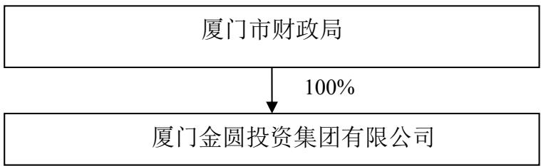

## （二）控股股东

截至本募集说明书签署日，厦门市财政局持有公司 100%的股权，为公司控股股东。厦门市财政局持有的公司股份不存在质押或争议情形。

经厦门市政府授权，厦门市财政局对发行人履行出资人职责。厦门市财政局是经福建省委省政府、厦门市委市政府批准设立的厦门市人民政府内设部门，副厅级单位。主要职责有：贯彻执行国家有关财税法律法规和政策；负责政府非税收入管理；组织制定地方国库管理和集中收付制度；负责制定厦门市行政事业单位国有资产管理制度，按规定管理行政事业单位国有资产；负责审核和汇总编制国有资本经营预决算草案，制定国有资本经营预算管理制度和办法，制定国有资本收益收取办法等。

## （三）实际控制人

截至本募集说明书签署日，发行人的实际控制人为厦门市财政局。厦门市财政局持有的公司股份不存在质押或争议情形。

## 四、发行人权益投资情况

## （一）发行人主要子公司情况

截至 2024 年末发行人二级以及重要子公司情况表
<table><tr><td rowspan=1 colspan=1>序号</td><td rowspan=1 colspan=1>子公司名称</td><td rowspan=1 colspan=1>注册地</td><td rowspan=1 colspan=1>业务性质</td><td rowspan=1 colspan=1>持股比例(%）</td><td rowspan=1 colspan=1>取得方式</td></tr><tr><td rowspan=1 colspan=1>1</td><td rowspan=1 colspan=1>厦门金融控股有限公司</td><td rowspan=1 colspan=1>厦门</td><td rowspan=1 colspan=1>投资</td><td rowspan=1 colspan=1>100</td><td rowspan=1 colspan=1>投资设立</td></tr><tr><td rowspan=1 colspan=1>2</td><td rowspan=1 colspan=1>厦门市产业投资有限公司</td><td rowspan=1 colspan=1>厦门</td><td rowspan=1 colspan=1>投资</td><td rowspan=1 colspan=1>100</td><td rowspan=1 colspan=1>发起设立</td></tr><tr><td rowspan=1 colspan=1>3</td><td rowspan=1 colspan=1>厦门市融资担保有限公司</td><td rowspan=1 colspan=1>厦门</td><td rowspan=1 colspan=1>担保</td><td rowspan=1 colspan=1>70</td><td rowspan=1 colspan=1>国有股权划转</td></tr><tr><td rowspan=1 colspan=1>4</td><td rowspan=1 colspan=1>厦门两岸金融中心建设开发有限公司</td><td rowspan=1 colspan=1>厦门</td><td rowspan=1 colspan=1>房产开发</td><td rowspan=1 colspan=1>100</td><td rowspan=1 colspan=1>投资设立</td></tr><tr><td rowspan=1 colspan=1>5</td><td rowspan=1 colspan=1>厦门市城市开发有限公司</td><td rowspan=1 colspan=1>厦门</td><td rowspan=1 colspan=1>城市开发</td><td rowspan=1 colspan=1>62.13</td><td rowspan=1 colspan=1>投资设立</td></tr><tr><td rowspan=1 colspan=1>6</td><td rowspan=1 colspan=1>金圆国际有限公司</td><td rowspan=1 colspan=1>香港</td><td rowspan=1 colspan=1>境外贸易</td><td rowspan=1 colspan=1>100</td><td rowspan=1 colspan=1>投资设立</td></tr><tr><td rowspan=1 colspan=1>7</td><td rowspan=1 colspan=1>金圆实业有限公司</td><td rowspan=1 colspan=1>台湾</td><td rowspan=1 colspan=1>境外贸易</td><td rowspan=1 colspan=1>100</td><td rowspan=1 colspan=1>投资设立</td></tr><tr><td rowspan=1 colspan=1>8</td><td rowspan=1 colspan=1>厦门金圆置业有限公司</td><td rowspan=1 colspan=1>厦门</td><td rowspan=1 colspan=1>物业管理</td><td rowspan=1 colspan=1>100</td><td rowspan=1 colspan=1>投资设立</td></tr><tr><td rowspan=1 colspan=1>9</td><td rowspan=1 colspan=1>厦门金圆数字科技有限公司</td><td rowspan=1 colspan=1>厦门</td><td rowspan=1 colspan=1>维护开发</td><td rowspan=1 colspan=1>100</td><td rowspan=1 colspan=1>国有股权划转</td></tr><tr><td rowspan=1 colspan=1>10</td><td rowspan=1 colspan=1>厦门景合资产管理有限公司</td><td rowspan=1 colspan=1>厦门</td><td rowspan=1 colspan=1>投资</td><td rowspan=1 colspan=1>100</td><td rowspan=1 colspan=1>投资设立</td></tr><tr><td rowspan=1 colspan=1>11</td><td rowspan=1 colspan=1>厦门产权交易中心有限公司</td><td rowspan=1 colspan=1>厦门</td><td rowspan=1 colspan=1>商务服务</td><td rowspan=1 colspan=1>100</td><td rowspan=1 colspan=1>国有股权划转</td></tr><tr><td rowspan=1 colspan=1>12</td><td rowspan=1 colspan=1>金圆统一证券有限公司</td><td rowspan=1 colspan=1>厦门</td><td rowspan=1 colspan=1>资本市场服务</td><td rowspan=1 colspan=1>51</td><td rowspan=1 colspan=1>投资设立</td></tr><tr><td rowspan=1 colspan=1>13</td><td rowspan=1 colspan=1>厦门金圆教育科技有限公司</td><td rowspan=1 colspan=1>厦门</td><td rowspan=1 colspan=1>科技推广和应用服务业</td><td rowspan=1 colspan=1>100</td><td rowspan=1 colspan=1>投资设立</td></tr><tr><td rowspan=1 colspan=1>14</td><td rowspan=1 colspan=1>厦门金圆金控股份有限公司</td><td rowspan=1 colspan=1>厦门</td><td rowspan=1 colspan=1>投资</td><td rowspan=1 colspan=1>100</td><td rowspan=1 colspan=1>国有股权划转</td></tr><tr><td rowspan=1 colspan=1>15</td><td rowspan=1 colspan=1>厦门金财产业发展有限公司</td><td rowspan=1 colspan=1>厦门</td><td rowspan=1 colspan=1>贸易</td><td rowspan=1 colspan=1>100</td><td rowspan=1 colspan=1>金圆金控分立</td></tr><tr><td rowspan=1 colspan=1>16</td><td rowspan=1 colspan=1>厦门国际信托有限公司</td><td rowspan=1 colspan=1>厦门</td><td rowspan=1 colspan=1>信托业</td><td rowspan=1 colspan=1>80</td><td rowspan=1 colspan=1>国有股权划转</td></tr><tr><td rowspan=1 colspan=1>17</td><td rowspan=1 colspan=1>厦门资产管理有限公司</td><td rowspan=1 colspan=1>厦门</td><td rowspan=1 colspan=1>不良资产收购和处置</td><td rowspan=1 colspan=1>62.5</td><td rowspan=1 colspan=1>投资设立</td></tr></table>

2024 年末/2024 年度发行人主要子公司的主要财务数据

单位：万元

<table><tr><td colspan="1" rowspan="1">公司名称</td><td colspan="1" rowspan="1">总资产</td><td colspan="1" rowspan="1">总负债</td><td colspan="1" rowspan="1">所有者权益</td><td colspan="1" rowspan="1">营业收入</td><td colspan="1" rowspan="1">净利润</td><td colspan="1" rowspan="1">是否存在重大增减变动</td></tr><tr><td colspan="1" rowspan="1">厦门国际信托有限公司</td><td colspan="1" rowspan="1">933,094.64</td><td colspan="1" rowspan="1">178,921.06</td><td colspan="1" rowspan="1">754,173.58</td><td colspan="1" rowspan="1">127,079.62</td><td colspan="1" rowspan="1">58,019.20</td><td colspan="1" rowspan="1">香</td></tr><tr><td colspan="1" rowspan="1">厦门市融资担保有限公司</td><td colspan="1" rowspan="1">448,058.01</td><td colspan="1" rowspan="1">305,645.89</td><td colspan="1" rowspan="1">142,412.13</td><td colspan="1" rowspan="1">14,326.64</td><td colspan="1" rowspan="1">7,949.59</td><td colspan="1" rowspan="1">香</td></tr><tr><td colspan="1" rowspan="1">厦门资产管理有限公司</td><td colspan="1" rowspan="1">628,165.50</td><td colspan="1" rowspan="1">442,185.95</td><td colspan="1" rowspan="1">185,979.56</td><td colspan="1" rowspan="1">20,468.68</td><td colspan="1" rowspan="1">7,003.94</td><td colspan="1" rowspan="1">是</td></tr><tr><td colspan="1" rowspan="1">厦门金圆融资租赁有限公司</td><td colspan="1" rowspan="1">297,689.08</td><td colspan="1" rowspan="1">238,455.47</td><td colspan="1" rowspan="1">59,233.61</td><td colspan="1" rowspan="1">14,588.14</td><td colspan="1" rowspan="1">5,537.51</td><td colspan="1" rowspan="1">香</td></tr></table>

2024年，厦门资产管理有限公司净利润同比下降55.09%，主要系公司当年收购资产包规模减少。

上述主要子公司简要介绍如下：

## （1）厦门国际信托有限公司

厦门国际信托系经原中国银行业监督管理委员会批准设立的具有法人资格的国有非银行金融机构，注册资本516,000.00万元，实收资本516,000.00万元。厦门国际信托前身为厦门国际信托投资公司，由厦门市财政局下属的厦门经济特区财务公司组建，成立于 1985 年 1 月。厦门国际信托立足厦门、深耕福建、融合两岸、布局全国，坚守受托人忠实义务，持续打造资产管理与投资银行、财富管理、服务信托三大业务体系的专业护城河，守正创新服务新发展格局，致力于成为国内一流的专业化信托机构，成为金圆集团“全国一流综合金融服务商”的重要业务对接平台和枢纽。

## （2）厦门市融资担保有限公司

厦门市融资担保有限公司成立于 2000 年 9 月 30 日，注册资本 95,000.00万元，实缴资本 95,000.00万元。经营范围包括贷款担保、票据承兑担保、贸易融资担保、项目融资担保、信用证担保、诉讼保全担保、履约担保、与担保业务有关的融资咨询、财务顾问等中介服务。市担保是厦门市第一家从事中小企业担保业务的专业担保机构，是厦门市人民政府为缓解厦门市中小微企业融资难、融资贵，推动中小微企业服务体系建设。厦门市担保构建以中小担、科技担保、翔安担保、同安担保、农业担保、湖里担保、海沧担保、厦房担保为平台的融合政策性、产业与区域的担保体系，形成中小微企业全方位服务链条，致力为中小微企业提供全生命周期服务，打造专注于中小微企业的综合类金融服务平台。

## （3）厦门资产管理有限公司

厦门资产管理有限公司成立于 2015年 12月 28日，注册资本为 160,000.00万元，实收资本 160,000.00 万元。厦门资管为全国第 23 家、计划单列城市范围内第 2 家、厦门市唯一一家地方法人资产管理公司。业务范围包括不良资产经营业务、投资资产管理业务、金融服务业务及上市公司纾困业务，其中不良资产经营是公司最核心的业务板块。厦门资管自获得不良资产收购处置业务资质以来依托股东资源，通过金圆集团各子公司的协同优势和板块联动效应，不断提升资产获取端与处置端的综合运营能力；不断深化与福建省内地方政府合作，并为其提供不良债权专业化管理及处置服务，累计收购债权规模稳步增长。

## （4）厦门金圆融资租赁有限公司

厦门金圆融资租赁有限公司成立于 2015年 1月 9日，注册资本为 8,000.00万美元，实收资本为 8,000.00万美元。金圆租赁是厦门首家获得“三合一”牌照（租赁、商业保理、贸易）的融资租赁公司，也是首批入驻福建自贸试验区厦门片区的类金融企业。

## （二）发行人参股公司情况

截至 2024 年末，发行人有49 家参股公司，情况如下表所示：

## 截至 2024年末发行人参股公司情况表

单位：万元

发行人主要参股公司披露标准：
<table><tr><td colspan="1" rowspan="1">序号</td><td colspan="1" rowspan="1">企业名称</td><td colspan="1" rowspan="1">持股比例</td><td colspan="1" rowspan="1">注册资本</td><td colspan="1" rowspan="1">业务范围</td></tr><tr><td colspan="1" rowspan="1">1</td><td colspan="1" rowspan="1">厦门两岸股权交易中心有限公司</td><td colspan="1" rowspan="1">35.00%</td><td colspan="1" rowspan="1">9,000</td><td colspan="1" rowspan="1">为各类债权、私募债券、资产支持债券（不包括证券、基金、期货经营机构发起设立的相关金融产品）、非公开上市公司股权、理财产品、资产权益、金融衍生产品、离岸金融产品、跨境人民币业务产品等金融产品、金融工具的登记、托管、挂牌、鉴（见）证、转让、过户、结算等提供场所、设施和服务；提供融资、并购、资本运作等服务；组织开展金融产品创新与交易活动；提供与前述业务相关的查询、信息服务；培训、咨询、评级、财务顾问服务；融资理财、委托投资；项目投资、投资管理；其它相关业务（法律法规规定应经审批的，未获审批前不得经营）</td></tr><tr><td colspan="1" rowspan="1">2</td><td colspan="1" rowspan="1">厦门金美信消费金融有限责任公司</td><td colspan="1" rowspan="1">33.00%</td><td colspan="1" rowspan="1">50,000</td><td colspan="1" rowspan="1">发放个人消费贷款；接受股东境内子公司及境内股东的存款；向境内金融机构借款；经批准发行金融债券；境内同业拆借；与消费金融相关的咨询、代理业务；代理销售与消费贷款相关的保险产品；固定收益类证券投资业务；经原银保监会批准的其他业务</td></tr><tr><td colspan="1" rowspan="1">3</td><td colspan="1" rowspan="1">厦门信用信息技术有限公司</td><td colspan="1" rowspan="1">48.00%</td><td colspan="1" rowspan="1">6,500</td><td colspan="1" rowspan="1">信息技术咨询服务；软件开发；信息系统集成服务；数据处理和存储服务；数字内容服务；其他未列明信息技术服务业（不含需经许可审批的项目）；信用服务（不含需经许可审批的项目）；科技中介服务；其他未列明科技推广和应用服务业；社会经济咨询（不含金融业务咨询）；商务信息咨询；投资咨询（法律、法规另有规定除外）；其他未列明的专业咨询服务（不含需经许可审批的项目）；广告的设计、制作、代理、发布；提供企业营销策划服务；档案处理及档案电子化服务；其他未列明商务服务业（不含需经许可审批的项目）</td></tr><tr><td colspan="1" rowspan="1">4</td><td colspan="1" rowspan="1">厦门诚泰小额贷款股份有限公司（曾用名：厦门湖里诚泰小额贷款股份有限公司）</td><td colspan="1" rowspan="1">30.00%</td><td colspan="1" rowspan="1">30,000</td><td colspan="1" rowspan="1">小额贷款服务(在厦门市行政区内办理各项小额贷款、银行业金融机构委托贷款)</td></tr><tr><td colspan="1" rowspan="1">5</td><td colspan="1" rowspan="1">厦门海沧融资担保有限公司</td><td colspan="1" rowspan="1">30.00%</td><td colspan="1" rowspan="1">20,000</td><td colspan="1" rowspan="1">从事融资性担保业务（贷款担保、贸易融资担保、项目融资担保、信用证担保以及其他融资性担保业务）；诉讼保全担保；投标担保、预付款担保、工程履约担保、未付款履约偿付担保等履约担保业务；与担保业务有关的融资咨询、财务顾问等中介服务；以自有资金进行投资</td></tr><tr><td colspan="1" rowspan="1">6</td><td colspan="1" rowspan="1">厦门博融典当有限责任公司</td><td colspan="1" rowspan="1">40.00%</td><td colspan="1" rowspan="1">2,000</td><td colspan="1" rowspan="1">典当（动产质押典当业务；财产权利质押典当业务；房地产（外省、自治区、直辖市的房地产或者未取得商品房预售许可证的在建工程除外）抵押典当业务；限额内绝当物品的变卖；鉴定评估及咨询服务；商务部依法批准的其他典当业务)</td></tr><tr><td colspan="1" rowspan="1">7</td><td colspan="1" rowspan="1">厦门达晨海峡创业投资管理有限公司</td><td colspan="1" rowspan="1">20.00%</td><td colspan="1" rowspan="1">1,000</td><td colspan="1" rowspan="1">创业投资管理、企业管理咨询。（不含吸收存款、发放贷款、证券、期货及其他金融业务）</td></tr><tr><td colspan="1" rowspan="1">8</td><td colspan="1" rowspan="1">厦门漳信金圆融资租赁有限公司（曾用名：厦门漳龙金圆融资租赁有限公司）</td><td colspan="1" rowspan="1">35.00%</td><td colspan="1" rowspan="1">3,000万美元</td><td colspan="1" rowspan="1">融资租赁业务、租赁业务、向国内外购买租赁财产、租赁财产的残值处理及维修、租赁交易咨询和担保、经审批部门批准的其他融资租赁业务；谷物、豆及薯类批发；棉、麻批发；林业产品批发；果品批发；蔬菜批发；肉、禽、蛋批发；纺织品、针织品及原料批发；煤炭及制品批发（不含危险化学品和监控化学品）；石油制品批发（不含成品油、危险化学品和监控化学品）；非金属矿及制品批发（不含危险化学品和监控化学品）；金属及金属矿批发（不含危险化学品和监控化学品）；建材批发；农业机械批发；汽车零配件批发；五金产品批发；计算机、软件及辅助设备批发；贸易代理；其他未列明批发业（不含需经许可审批的经营项目）（以上经营项目不含外商投资准入特别管理措施范围内的项目)；经营各类商品和技术的进出口（不另附进出口商品目录），但国家限定公司经营或禁止进出口的商品及技术除外；投资咨询（法律、法规另有规定除外）；商务信息咨询；企业管理咨询；兼营与主营业务有关的商业保理业务</td></tr><tr><td colspan="1" rowspan="1">9</td><td colspan="1" rowspan="1">厦门华夏国际电力发展有限公司</td><td colspan="1" rowspan="1">20.00%</td><td colspan="1" rowspan="1">102,200</td><td colspan="1" rowspan="1">火力发电；电力供应(提供售电服务)；热力生产和供应；风力发电；非金属废料和碎屑加工处理；经营各类商品和技术的进出口（不另附进出口商品目录），但国家限定公司经营或禁止进出口的商品及技术除外；货运港口货物装卸、仓储服务（不含化学危险品储存、装卸）</td></tr><tr><td colspan="1" rowspan="1">10</td><td colspan="1" rowspan="1">南方基金管理股份有限公司</td><td colspan="1" rowspan="1">13.72%</td><td colspan="1" rowspan="1">36,172</td><td colspan="1" rowspan="1">基金募集、基金销售、资产管理、中国证监会许可的其它业务</td></tr><tr><td colspan="1" rowspan="1">11</td><td colspan="1" rowspan="1">厦门群贤丰圆股权投资管理有限公司</td><td colspan="1" rowspan="1">20.00%</td><td colspan="1" rowspan="1">1,000</td><td colspan="1" rowspan="1">受托管理非证券类股权投资及相关咨询服务；对第一产业、第二产业、第三产业的投资（法律、法规另有规定除外）；非证券类股权投资及与股权投资有关的咨询服务（法律、法规另有规定除外）；投资管理（法律、法规另有规定除外）；资产管理（法律、法规另有规定除外）</td></tr><tr><td colspan="1" rowspan="1">12</td><td colspan="1" rowspan="1">厦门景圆蓝海创业投资管理有限公司</td><td colspan="1" rowspan="1">25.00%</td><td colspan="1" rowspan="1">1,000</td><td colspan="1" rowspan="1">创业投资业务；代理其他创业投资企业等机构或个人的委托进行创业投资业务；创业投资咨询业务；为创业企业提供创业管理服务业务；参与设立创业投资企业与创业投资管理顾问机构</td></tr><tr><td colspan="1" rowspan="1">13</td><td colspan="1" rowspan="1">厦门厦创清科股权投资管理合伙企业（有限合伙）</td><td colspan="1" rowspan="1">45.00%</td><td colspan="1" rowspan="1">2.000</td><td colspan="1" rowspan="1">受托管理股权投资，提供相关咨询服务；受托管理股权投资基金，提供相关咨询服务</td></tr><tr><td colspan="1" rowspan="1">14</td><td colspan="1" rowspan="1">厦门厦创群贤创业投资合伙企业（有限合伙）</td><td colspan="1" rowspan="1">31.75%</td><td colspan="1" rowspan="1">6,300</td><td colspan="1" rowspan="1">创业投资业务；代理其他创业投资企业等机构或个人的委托进行创业投资业务；创业投资咨询业务；为创业企业提供创业管理服务业务；参与设立创业投资企业与创业投资管理顾问机构</td></tr><tr><td colspan="1" rowspan="1">15</td><td colspan="1" rowspan="1">福建省海洋丝路融资租赁有限公司</td><td colspan="1" rowspan="1">35.00%</td><td colspan="1" rowspan="1">3,000万美元</td><td colspan="1" rowspan="1">融资租赁业务；租赁业务；向国内外购买租赁财产；租赁财产的残值处理及维修；租赁交易咨询和担保（不含融资担保）；兼营与主营业务相关的商业保理业务；自营和代理各类商品和技术的进出口，但国家限定公司经营或禁止进出口的商品和技术除外。</td></tr><tr><td colspan="1" rowspan="1">16</td><td colspan="1" rowspan="1">福建省国资投资基金管理有限公司</td><td colspan="1" rowspan="1">49.00%</td><td colspan="1" rowspan="1">1,000</td><td colspan="1" rowspan="1">基金管理（非公募类）；投资管理；资产管理服务；受托资产管理业务。（依法须经批准的项目，经相关部门批准后方可开展经营活动）</td></tr><tr><td colspan="1" rowspan="1">17</td><td colspan="1" rowspan="1">杭州厦圆资产管理有限公司</td><td colspan="1" rowspan="1">40.00%</td><td colspan="1" rowspan="1">1,000</td><td colspan="1" rowspan="1">服务：受托企业资产管理、投资管理(未经金融等监管部门批准，不得从事向公众融资存款、融资担保、代客理财等金融服务)</td></tr><tr><td colspan="1" rowspan="1">18</td><td colspan="1" rowspan="1">厦门泛泰创业投资管理有限公司</td><td colspan="1" rowspan="1">30.00%</td><td colspan="1" rowspan="1">600</td><td colspan="1" rowspan="1">创业投资咨询业务；为创业企业提供创业管理服务业务</td></tr><tr><td colspan="1" rowspan="1">19</td><td colspan="1" rowspan="1">厦门富凯海创投资管理有限公司</td><td colspan="1" rowspan="1">20.00%</td><td colspan="1" rowspan="1">600</td><td colspan="1" rowspan="1">1、投资管理、资产管理(以上不含吸收存款、发放贷款、证券、期货及其他金融业务)；2、投资咨询、企业管理咨询、企业商贸信息咨询(以上不含证券、期货等须经许可的金融、咨询项目)</td></tr><tr><td colspan="1" rowspan="1">20</td><td colspan="1" rowspan="1">厦门高能海银创业投资管理有限公司</td><td colspan="1" rowspan="1">20.00%</td><td colspan="1" rowspan="1">800</td><td colspan="1" rowspan="1">创业投资咨询业务；为创业企业提供创业管理服务业务；参与设立创业投资企业与创业投资管理顾问机构。</td></tr><tr><td colspan="1" rowspan="1">21</td><td colspan="1" rowspan="1">厦门济信金圆股权投资合伙企业（有限合伙）</td><td colspan="1" rowspan="1">50.00%</td><td colspan="1" rowspan="1">50,000</td><td colspan="1" rowspan="1">依法从事对非公开交易的企业股权进行投资以及相关咨询服务；对第一产业、第二产业、第三产业的投资(法律、法规另有规定除外)；投资咨询(法律、法规另有规定除外)</td></tr><tr><td colspan="1" rowspan="1">22</td><td colspan="1" rowspan="1">厦门金圆清科股权投资基金合伙企业（有限合伙）</td><td colspan="1" rowspan="1">24.40%</td><td colspan="1" rowspan="1">41,000</td><td colspan="1" rowspan="1">在法律法规许可的范围内，运用本基金资产对未上市企业或股权投资企业进行投资；对第一产业、第二产业、第三产业的投资(法律、法规另有规定除外)；商务信息咨询；企业管理咨询；投资咨询(法律、法规另有规定除外）</td></tr><tr><td colspan="1" rowspan="1">23</td><td colspan="1" rowspan="1">众汇同鑫（厦门）企业管理有限公司（曾用名：众汇同鑫（厦门）投资管理有限公司）</td><td colspan="1" rowspan="1">20.00%</td><td colspan="1" rowspan="1">1,000</td><td colspan="1" rowspan="1">一般项目：企业管理；以自有资金从事投资活动；咨询策划服务。（除依法须经批准的项目外，凭营业执照依法自主开展经营活动）</td></tr><tr><td colspan="1" rowspan="1">24</td><td colspan="1" rowspan="1">厦门市全桔融资担保有限公司</td><td colspan="1" rowspan="1">30.00%</td><td colspan="1" rowspan="1">10,000</td><td colspan="1" rowspan="1">融资担保业务。（依法须经批准的项目，经相关部门批准后方可开展经营活动，具体经营项目以相关部门批准文件或许可证件为准）一般项目：非融资担保服务；融资咨询服务。（除依法须经批准的项目外，凭营业执照依法自主开展经营活动）</td></tr><tr><td colspan="1" rowspan="1">25</td><td colspan="1" rowspan="1">厦门海通金圆股权投资合伙企业（有限合伙）</td><td colspan="1" rowspan="1">50.00%</td><td colspan="1" rowspan="1">100,000</td><td colspan="1" rowspan="1">依法从事对非公开交易的企业股权进行投资以及相关咨询服务；对第一产业、第二产业、第三产业的投资（法律、法规另有规定除外）；投资咨询（法律、法规另有规定除外）</td></tr><tr><td colspan="1" rowspan="1">26</td><td colspan="1" rowspan="1">厦门金圆凯泰展鸿健康成长创业投资合伙企业（有限合伙）</td><td colspan="1" rowspan="1">45.00%</td><td colspan="1" rowspan="1">20,000</td><td colspan="1" rowspan="1">创业投资业务；代理其他创业投资企业等机构或个人的委托进行创业投资业务；创业投资咨询业务；为创业企业提供创业管理服务业务</td></tr><tr><td colspan="1" rowspan="1">27</td><td colspan="1" rowspan="1">杭州凯泰展鸿成长创业投资合伙企业(有限合伙)（曾用名：合肥凯泰成长投资合伙企业（有限合伙））</td><td colspan="1" rowspan="1">44.20%</td><td colspan="1" rowspan="1">18,100</td><td colspan="1" rowspan="1">一般项目：创业投资(限投资未上市企业)(除依法须经批准的项目外，凭营业执照依法自主开展经营活动)。</td></tr><tr><td colspan="1" rowspan="1">28</td><td colspan="1" rowspan="1">厦门招商金圆股权投资合伙企业（有限合伙）</td><td colspan="1" rowspan="1">49.70%</td><td colspan="1" rowspan="1">50,300</td><td colspan="1" rowspan="1">对第一产业、第二产业、第三产业的投资（法律、法规另有规定除外）；依法从事对非公开交易的企业股权进行投资以及相关咨询服务；投资咨询（法律、法规另有规定除外）</td></tr><tr><td colspan="1" rowspan="1">29</td><td colspan="1" rowspan="1">清源科技股份有限公司</td><td colspan="1" rowspan="1">15.07%</td><td colspan="1" rowspan="1">27,380</td><td colspan="1" rowspan="1">清洁能源产品的软件及硬件开发、技术引进、生产制造，并提供相关技术咨询与服务；清洁能源产品和节能产品的进出口和批发。（以上商品不涉及国营贸易管理商品，涉及配额、许可证管理商品的，按国家有关规定办理申请）</td></tr><tr><td colspan="1" rowspan="1">30</td><td colspan="1" rowspan="1">厦门鹭江金融科技研究院</td><td colspan="1" rowspan="1">20.00%</td><td colspan="1" rowspan="1">50</td><td colspan="1" rowspan="1">组织金融科技领域的学术研讨及课题研究；开展金融科技领域的学术交流会议；国际金融科技政策理论研究；承接政府及有关部门委托的其他事项</td></tr><tr><td colspan="1" rowspan="1">31</td><td colspan="1" rowspan="1">厦门市深高新投金圆创业投资有限公司（曾用名：厦门市深高投金圆私募基金管理有限公司）</td><td colspan="1" rowspan="1">49.00%</td><td colspan="1" rowspan="1">1,000</td><td colspan="1" rowspan="1">一般项目：创业投资(限投资未上市企业)。(除依法须经批准的项目外，凭营业执照依法自主开展经营活动)</td></tr><tr><td colspan="1" rowspan="1">32</td><td colspan="1" rowspan="1">厦门市深高投金圆人才股权投资基金合伙企业（有限合伙）</td><td colspan="1" rowspan="1">37.00%</td><td colspan="1" rowspan="1">30,000</td><td colspan="1" rowspan="1">般项目：以私募基金从事股权投资、投资管理、资产管理等活动（须在中国证券投资基金业协会完成登记备案后方可从事经营活动）。（除依法须经批准的项目外，凭营业执照依法自主开展经营活动）</td></tr><tr><td colspan="1" rowspan="1">33</td><td colspan="1" rowspan="1">厦门银行股份有限公司</td><td colspan="1" rowspan="1">19.50%</td><td colspan="1" rowspan="1">263,913</td><td colspan="1" rowspan="1">吸收公众存款;发放短期、中期和长期贷款；办理国内结算；办理票据贴现；发行金融债券；代理发行、代理兑付、承销政府债券；买卖政府债券；从事同业拆借；提供担保及服务；代理收付款项及代理保险业务；提供保险箱业务；办理地方财政信用周转使用资金的委托贷款业务；外汇存款、外汇贷款、外汇汇款、外币兑换、外汇同业拆借、国际结算、结汇、售汇、外汇票据的承兑和贴现、资信调查、咨询、见证业务；经银行业监督管理机构等监管机构批准的其他业务。</td></tr><tr><td colspan="1" rowspan="1">34</td><td colspan="1" rowspan="1">漳州战新创业投资基金管理有限公司</td><td colspan="1" rowspan="1">49.00%</td><td colspan="1" rowspan="1">1,000</td><td colspan="1" rowspan="1">般项目：私募股权投资基金管理、创业投资基金管理服务（须在中国证券投资基金业协会完成登记备案后方可从事经营活动）；以私募基金从事股权投资、投资管理、资产管理等活动（须在中国证券投资基金业协会完成登记备案后方可从事经营活动）。（除依法须经批准的项目外，凭营业执照依法自主开展经营活动)</td></tr><tr><td colspan="1" rowspan="1">35</td><td colspan="1" rowspan="1">厦门厦金创新私募基金管理有限公司</td><td colspan="1" rowspan="1">30.00%</td><td colspan="1" rowspan="1">1,000</td><td colspan="1" rowspan="1">私募股权投资基金管理、创业投资基金管理服务（须在中国证券投资基金业协会完成登记备案后方可从事经营活动）。（依法须经批准的项目，经相关部门批准后方可开展经营活动，具体经营项目以相关部门批准文件或许可证件为准）</td></tr><tr><td colspan="1" rowspan="1">36</td><td colspan="1" rowspan="1">龙岩金岩创业投资基金管理有限公司</td><td colspan="1" rowspan="1">49.00%</td><td colspan="1" rowspan="1">1,000</td><td colspan="1" rowspan="1">般项目：私募股权投资基金管理、创业投资基金管理服务（须在中国证券投资基金业协会完成登记备案后方可从事经营活动）；以自有资金从事投资活动；财务咨询。（除依法须经批准的项目外，凭营业执照依法自主开展经营活动）</td></tr><tr><td colspan="1" rowspan="1">37</td><td colspan="1" rowspan="1">厦门金圆凯泰展鸿健康成长二期创业投资合伙企业(有限合伙）</td><td colspan="1" rowspan="1">84.34%</td><td colspan="1" rowspan="1">16,600</td><td colspan="1" rowspan="1">一般项目：创业投资（限投资未上市企业）。（除依法须经批准的项目外，凭营业执照依法自主开展经营活动）许可项目：以私募基金从事股权投资、投资管理、资产管理等活动（须在中国证券投资基金业协会完成登记备案后方可从事经营活动）。（依法须经批准的项目，经相关部门批准后方可开展经营活动，具体经营项目以相关部门批准文件或许可证件为准）。</td></tr><tr><td colspan="1" rowspan="1">38</td><td colspan="1" rowspan="1">晋江市瑞禾创业投资基金管理有限公司</td><td colspan="1" rowspan="1">49.00%</td><td colspan="1" rowspan="1">1,000</td><td colspan="1" rowspan="1">-般项目：私募股权投资基金管理、创业投资基金管理服务（须在中国证券投资基金业协会完成登记备案后方可从事经营活动）；以私募基金从事股权投资、投资管理、资产管理等活动（须在中国证券投资基金业协会完成登记备案后方可从事经营活动）。（除依法须经批准的项目外，凭营业执照依法自主开展经营活动）</td></tr><tr><td colspan="1" rowspan="1">39</td><td colspan="1" rowspan="1">金创金友（厦门）投资合伙企业（有限合伙）</td><td colspan="1" rowspan="1">35.71%</td><td colspan="1" rowspan="1">5,600</td><td colspan="1" rowspan="1">-般项目：以自有资金从事投资活动；企业管理咨询；企业管理。(除依法须经批准的项目外，凭营业执照依法自主开展经营活动)。</td></tr><tr><td colspan="1" rowspan="1">40</td><td colspan="1" rowspan="1">厦门产投炬翔芯瀚科技投资合伙企业（有限合伙）</td><td colspan="1" rowspan="1">27.79%</td><td colspan="1" rowspan="1">18,001</td><td colspan="1" rowspan="1">-般项目：以自有资金从事投资活动。(除依法须经批准的项目外，凭营业执照依法自主开展经营活动)。</td></tr><tr><td colspan="1" rowspan="1">41</td><td colspan="1" rowspan="1">厦门产投新翼科技投资合伙企业（有限合伙）</td><td colspan="1" rowspan="1">47.62%</td><td colspan="1" rowspan="1">105,001</td><td colspan="1" rowspan="1">-般项目：以自有资金从事投资活动。(除依法须经批准的项目外，凭营业执照依法自主开展经营活动)</td></tr><tr><td colspan="1" rowspan="1">42</td><td colspan="1" rowspan="1">厦门工融产投新兴产业股权投资基金合伙企业（有限合伙）</td><td colspan="1" rowspan="1">29.90%</td><td colspan="1" rowspan="1">100,000</td><td colspan="1" rowspan="1">许可项目：以私募基金从事股权投资、投资管理、资产管理等活动(须在中国证券投资基金业协会完成登记备案后方可从事经营活动)。 (依法须经批准的项目，经相关部门批准后方可开展经营活动，具体经营项目以相关部门批准文件或许可证件为准)一般项目：创业投资(限投资未上市企业)。 (除依法须经批准的项目外，凭营业执照依法自主开展经营活动）</td></tr><tr><td colspan="1" rowspan="1">43</td><td colspan="1" rowspan="1">厦门厦金创新科创壹号创业投资基金合伙企业（有限合伙）</td><td colspan="1" rowspan="1">23.68%</td><td colspan="1" rowspan="1">42,223</td><td colspan="1" rowspan="1">-般项目：创业投资(限投资未上市企业)。(除依法须经批准的项目外，凭营业执照依法自主开展经营活动)许可项目：以私募基金从事股权投资、投资管理、资产管理等活动(须在中国证券投资基金业协会完成登记备案后方可从事经营活动)。(依法须经批准的项目，经相关部门批准后方可开展经营活动，具体经营项目以相关部门批准文件或许可证件为准）</td></tr><tr><td colspan="1" rowspan="1">44</td><td colspan="1" rowspan="1">厦门市八玛拉雅网络技术有限公司</td><td colspan="1" rowspan="1">20.00%</td><td colspan="1" rowspan="1">714</td><td colspan="1" rowspan="1">一般项目：软件开发；互联网数据服务；信息系统集成服务；信息技术咨询服务；数据处理和存储支持服务；数字技术服务；技术服务、技术开发、技术咨询、技术交流、技术转让、技术推广；数字文化创意内容应用服务；广告设计、代理；企业总部管理。（除依法须经批准的项目外，凭营业执照依法自主开展经营活动)许可项目：第二类增值电信业务。(依法须经批准的项目，经相关部门批准后方可开展经营活动，具体经营项目以相关部门批准文件或许可证件为准</td></tr><tr><td colspan="1" rowspan="1">45</td><td colspan="1" rowspan="1">厦门市金圆幂方健康一期接力创业投资基金合伙企业（有限合伙）</td><td colspan="1" rowspan="1">98.77%</td><td colspan="1" rowspan="1">8,100</td><td colspan="1" rowspan="1">-般项目：创业投资(限投资未上市企业)。(除依法须经批准的项目外，凭营业执照依法自主开展经营活动)。</td></tr><tr><td colspan="1" rowspan="1">46</td><td colspan="1" rowspan="1">厦门市展鸿一元幂方创业投资基金合伙企业（有限合伙）</td><td colspan="1" rowspan="1">99.83%</td><td colspan="1" rowspan="1">6,010</td><td colspan="1" rowspan="1">-般项目：创业投资(限投资未上市企业)。(除依法须经批准的项目外，凭营业执照依法自主开展经营活动)。</td></tr><tr><td colspan="1" rowspan="1">47</td><td colspan="1" rowspan="1">厦门新翼科技实业有限公司</td><td colspan="1" rowspan="1">40.00%</td><td colspan="1" rowspan="1">500,000</td><td colspan="1" rowspan="1">-般项目：科技推广和应用服务；技术服务、技术开发、技术咨询、技术交流、技术转让、技术推广；以自有资金从事投资活动；企业管理；企业管理咨询。(除依法须经批准的项目外，凭营业执照依法自主开展经营活动)</td></tr><tr><td colspan="1" rowspan="1">48</td><td colspan="1" rowspan="1">厦门新翼微成投资合伙企业（有限合伙）</td><td colspan="1" rowspan="1">50.00%</td><td colspan="1" rowspan="1">110,000</td><td colspan="1" rowspan="1">一般项目：以自有资金从事投资活动。（除依法须经批准的项目外，凭营业执照依法自主开展经营活动)。</td></tr><tr><td colspan="1" rowspan="1">49</td><td colspan="1" rowspan="1">珠海金厦信合数字科技有限公司</td><td colspan="1" rowspan="1">30.00%</td><td colspan="1" rowspan="1">1,000</td><td colspan="1" rowspan="1">般项目：以自有资金从事投资活动；接受金融机构委托对信贷逾期户及信用卡透支户进行提醒通知服务(不含金融信息服务)；接受金融机构委托从事信息技术和流程外包服务(不含金融信息服务)；企业管理；社会经济咨询服务；企业管理咨询；信息咨询服务(不含许可类信息咨询服务)；市场调查(不含涉外调查)；数字文化创意软件开发；数字文化创意内容应用服务；软件开发；人工智能应用软件开发；人工智能公共数据平台；人工智能公共服务平台技术咨询服务；大数据服务；数据处理和存储支持服务；数据处理服务；互联网安全服务；互联网数据服务；信息系统集成服务；网络与信息安全软件开发；信息技术咨询服务；信息系统运行维护服务；计算机系统服务；云计算装备技术服务；技术服务、技术开发、技术咨询、技术交流、技术转让、技术推广；云计算设备销售；计算机软硬件及辅助设备批发；计算机软硬件及辅助设备零售。(除依法须经批准的项目外，凭营业执照依法自主开展经营活动)许可项目：第二类增值电信业务。(依法须经批准的项目，经相关部门批准后方可开展经营活动，具体经营项目以相关部门批准文件或许可证件为准)</td></tr></table>

2024 年末，发行人持有的厦门银行账面价值 492,456.07万元，占发行人总

资产 6.49%；2024年度权益法确认的投资收益 50,579.76万元，占发行人当年实现的营业收入 8.28%。厦门银行为发行人联营企业中账面价值最大的长期股权投资，作为主要参股公司披露。

2024 年末/2024 年度发行人主要参股公司的主要财务数据

单位：万元

<table><tr><td rowspan=1 colspan=1>公司名称</td><td rowspan=1 colspan=1>总资产</td><td rowspan=1 colspan=1>总负债</td><td rowspan=1 colspan=1>所有者权益</td><td rowspan=1 colspan=1>营业收入</td><td rowspan=1 colspan=1>净利润</td><td rowspan=1 colspan=1>是否存在重大增减变动</td></tr><tr><td rowspan=1 colspan=1>厦门银行股份有限公司</td><td rowspan=1 colspan=1>40,779,472.42</td><td rowspan=1 colspan=1>37,542,563.53</td><td rowspan=1 colspan=1>3,236,908.90</td><td rowspan=1 colspan=1>575,916.18</td><td rowspan=1 colspan=1>270,587.61</td><td rowspan=1 colspan=1>香</td></tr></table>

## 五、发行人的治理结构及独立性

## （一）发行人的治理结构及组织机构设置和运行情况

发行人作为厦门市政府授权国有资产投资的资产经营一体化公司，为规范公司的组织和行为，保护出资人、公司和债权人的合法权益，根据《中华人民共和国公司法》等有关法律、法规、规章，逐步建立了现代企业制度，完善了法人治理结构。

截至本募集说明书签署日，公司的组织结构图如下：

厦门金圆投资集团有限公司组织架构图  
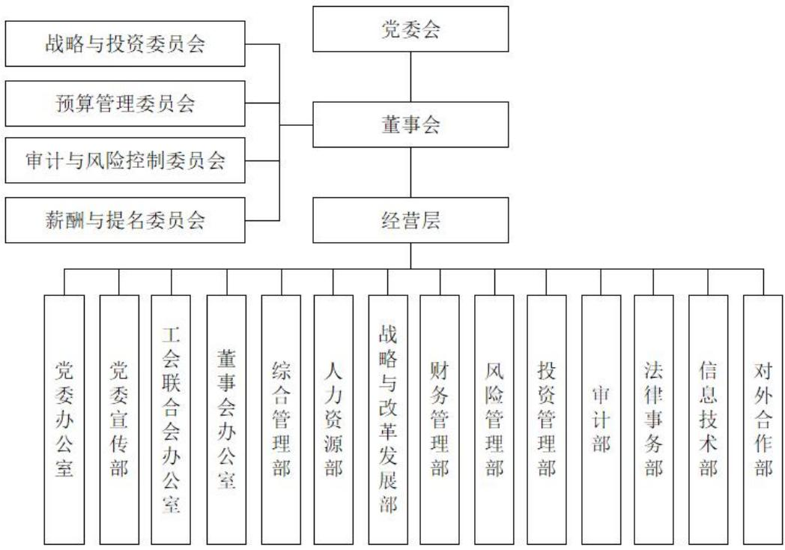

## 1、出资人

厦门市财政局根据厦门市人民政府授权，对发行人履行出资人职责，依法对公司的国有资产进行监督管理。公司不设股东会，由出资人单独行使《公司法》第三十七条所列股东会有关职权。根据发行人《公司章程》，厦门市财政局作为出资人对公司依法行使如下职权：

（1）制定、批准或修改公司章程；

（2）核定或变更公司注册资本；

（3）按照有关规定和程序，任免公司董事长、副董事长、非职工代表担任的董事；

（4）审核公司发展战略和规划；依法对公司投资活动进行监管；

（5）审议公司董事会工作报告；

（6）审议公司年度财务预算方案，审议公司年度财务决算报告，审议公司年度利润分配方案和弥补亏损方案；

（7）审核公司分立、合并、破产、解散、清算、变更公司形式、发行公司债券等方案，并按《公司法》有关规定报厦门市人民政府批准；

（8）加强国有资产评估监督管理，按照资产评估管理和企业国有产权转让的有关规定，对资产评估结果进行备案或核准；

（9）根据股份有限公司国有股权管理的有关规定，按照管理权限，监管公司控股、参股的上市公司国有股权；

（10）依法对公司的担保及反担保行为进行监管，批准公司对出资企业范围外的其他企业的担保和反担保事项；

（11）考核评价公司国有资产运营绩效，确认公司国有资产保值增值结果；

（12）制定企业负责人薪酬管理和业绩考核办法；对公司工资总额进行备案管理；

（13）有关法律、法规规定的其他职权。

## 2、董事会

根据发行人《公司章程》，公司设董事会，成员为 5至 9人，董事会成员由出资人按照有关规定和程序任免，但职工代表由公司职工大会选举产生。董事每届任期三年，任期届满，可以连任。

董事长是公司的法定代表人。董事长行使下列职权：

（1）召集和主持董事会会议；

（2）检查落实董事会决议的实施情况，并向董事会报告；

（3）签署公司重要文件和重大合同；

（4）董事会授予的其他权力。

董事会行使下列职权：

（1）执行出资人决定，向出资人报告工作；

（2）制定公司的发展战略和规划；

（3）决定公司的经营计划、投资计划和投资方案；

（4）制订公司年度财务决算方案、公司年度财务预算方案、公司利润分配方案和弥补亏损方案；

（5）制订公司的风险管理政策和重大风险管理方案；

（6）制定公司的分立、合并、增减注册资本、发行公司债券、公司解散或变更公司形式的方案；

（7）拟订公司章程修订方案；

（8）制定公司的基本管理制度；

（9）按照程序任免公司高级管理人员；

（10）决定并向出资人报告公司所出资企业国有股权变动处置方案，但出资人规定需报批准者除外；

（11）拟订公司国有资产保值增值指标；

（12）决定有关专业委员会的设立及职权；

（13）按照出资人有关企业负责人薪酬管理的规定，决定或者授权有关专

业委员会决定除公司董事长以外的董事会其他成员以及高级管理人员的报酬；

（14）决定公司内部管理机构的设置；

（15）委派公司代表参加公司控股、参股企业股东会，向公司控股、参股企业委派或推荐董事，并对其进行考核和奖惩；

（16）决定公司所出资非公司制企业国有资产经营收益的收缴；

（17）决定出资人核定给公司运营的国有资产在公司所出资的不同企业之间的划转；

（18）决定公司对出资企业的担保或反担保事项；

（19）审核公司所出资的一人有限责任公司（法人独资企业）和控股企业的清产核资结果及重大财务会计事项；

（20）有关法律、法规规定的和公司章程规定的其他职权。

目前公司设党委书记1名，董事长1名（由党委书记担任），总经理1名，党委副书记 2 名（其中 1 名党委副书记由总经理兼任），驻金圆集团纪检监察组组长1名，副总经理5名，总经理助理1名。

根据《中共厦门市财政局党组关于撤销金圆集团监事会有关事项的通知》，为进一步整合优化企业监督资源，健全协同高效的监督机制，发行人应将内设监事会和监事职责统筹整合到内部审计监督部门，对已设置的监事会以及监事会办公室等机构予以撤销，已任命的监事以及监事会办公室成员按照程序予以免职。监事会监督工作档案，移交企业内部审计监管部门。公司原监事丁爱忠女士已不再担任公司监事。上述取消监事会事项已经厦门市财政局出具正式通知。

发行人本部内设财务管理部、投资管理部等 14 个部门和战略与投资委员会等4个专业委员会，各部门和专业委员会职责如下：

## 1、党委办公室

负责承担集团党委日常事务工作，主要职责包括贯彻落实集团党委各项决议，协助集团党委落实全面从严治党主体责任，推动基层党组织建设、干部管理、党员教育管理等工作。

## 2、党委宣传部

负责在集团党委的领导下，贯彻党的路线、方针、政策，执行上级党组织的方针政策，落实集团意识形态工作、理论学习、宣传舆论、精神文明建设、文化建设等工作。

## 3、工会联合会办公室

工会联合会作为集团联系职工群众的桥梁和纽带，主要职责包括完善工会制度、加强工会组织建设，协助落实工会维护职工权益、组织职工参与民主管理、参与建设，教育职工等职能。工会联合会办公室作为工会联合会的综合办事机构，负责履行工会联合会交办的日常工作事务。

## 4、董事会办公室

作为集团董事会的综合性办事机构，承担主要职责包括协助董事会进行公司治理、董事会运作、负责董事会日常管理工作，协调董事会下设各委员会的相关工作等。

## 5、综合管理部

积极贯彻集团公司的行政管理方针、政策，主要负责日常行政管理企业文化建设、综合协调和后勤服务等工作。

## 6、人力资源部

根据集团公司的经营策略要求，制定和实施人力资源规划工作，组织开展人才的选、育、用、留、激等工作事项，对岗位所需匹配的组织能力进行合理的配置和开发。

## 7、战略与改革发展部

负责提出集团公司的中长期发展战略，根据集团董事会下达的年度经营目标，组织、制定、实施年度工作计划。主要职责包括制定和规划集团的长期发展战略，推进集团的创新、改革工作等。

## 8、财务管理部

根据集团公司的财务管理目标，为生产经营活动提供财务支撑，做好财务

预算、核算、资金、成本、税务等财务管理工作，及时、准确反映集团财务信息，确保财务会计活动健康运行。

## 9、风险管理部

根据集团公司全面风险管理要求，牵头开展内部控制管理、经营风险管理等工作，统筹规划和推动集团全面风险管理体系建设。

## 10、投资管理部

负责对集团重大经营事项提出建议，管理集团本部日常投资活动，推动年度经营目标的实现。

## 11、审计部

负责牵头对集团内部控制的完整性、合理性及其实施的有效性进行检查和评价，对集团经济活动的合法性、合规性、真实性和完整性进行审计。

## 12、法律事务部

负责集团的法律事务和合规管理。提供法律咨询、起草和审核合同、处理纠纷和诉讼等，保护集团的合法权益。

## 13、信息技术部

根据集团公司的中长期规划，负责集团的信息化、智能化建设推进工作，提升信息化管理水平，利用信息专业技术提供管理赋能、业务赋能。

## 14、对外合作部

根据集团公司的整体战略及部署，负责集团招商引资工作的组织、协调和实施：建立和维护良好的客户关系。

## 15、战略与投资委员会

（1）拟定集团对外投资管理制度及实施细则；

（2）根据集团战略规划，审议集团及下属控股公司的对外投资方向和投资范围，审议年度投资计划；

（3）对拟开展的投资项目进行评审，并提供投资决策建议；

（4）对投资项目的实施与经营情况进行评估，对重大风险预警及其处置方案进行评审，并提出建议；

（5）对投资项目的退出方案进行评审，并提出建议；

（6）根据相关制度、办法规定，决定其他需报战投会决策或核准的对外投资事项。

## 16、预算管理委员会

（1）制定颁布集团全面预算管理制度，包括预算管理的政策、措施、办法和要求等；

（2）根据集团战略规划和年度经营目标，拟定预算目标，并确定预算目标分解方案、预算编制方法和程序；

（3）组织编制、综合平衡预算草案；

（4）依据董事会授权，下达经批准的正式年度预算；

（5）协调解决预算编制和执行中的重大问题；

（6）审议预算调整方案，依据授权进行审批；

（7）审议预算考核和奖惩方案；

（8）对集团全面预算执行情况进行考核；

（9）集团金融工具估值管理决策；

（10）其他全面预算管理事宜。

## 17、审计与风险控制委员会

（1）建立健全集团的风险管理和内部控制体系，并制定集团的风险管理政策；

（2）对集团经营风险进行评估并提出建议；

（3）完善各项风险预警机制，建立健全突发风险应急处理机制，对集团的风险预防、应对情况进行评估并提出建议；

（4）定期听取内部审计工作汇报，对内部审计工作规划、审计质量控制、

审计问题整改等重要事项予以指导；

（5）审批内部审计年度工作计划和上一年度审计工作总结报告；

（6）董事会授权的其他事宜。

## 18、薪酬与提名委员会

（1）在其职责权限范围内提名委派下属公司董事人选；

（2）审核和批准集团薪酬管理制度、年度的薪酬调整方案及下属公司经营层薪酬管理方案；

（3）审核和批准集团绩效考核制度以及下属公司负责人绩效考核方案；

（4）董事会授权的其他事宜。

## （二）内部管理制度

为了建立完善的法人治理结构，有效提高内部管理效率，防范企业运营风险，发行人制订了一整套内部管理和控制制度，包括《财务管理制度》《固定资产管理制度》《合同管理办法》《对外投资管理制度》等。

## 1、发行人内部控制及其监督

发行人在组织架构上根据发展战略需要，形成了适合企业特点的资源配置机制、程序机制、治理与监督机制以及授权与决策机制。公司董事会与经营者之间建立了明确的“责、权、利”关系，董事会下设战略与投资委员会、预算管理委员会、审计与风险控制委员会和薪酬与提名委员会，形成了决策权、监督权和经营权的分离及相互制衡的机制。

## 2、财务管理制度

（1）为加强发行人及其下属企业的财务监督管理，规范财务行为，完善财务制度体系，保证会计资料真实、完整，防范财务风险，促进国有资产保值和企业持续健康发展，根据《中华人民共和国会计法》《中华人民共和国公司法》《企业财务通则》《企业会计准则》和《会计基础工作规范》的有关规定，结合集团的财务战略及管理模式，制定了《财务管理制度》，适用于集团及各下属企业。集团各下属企业根据实际情况，按照“依法合规、审慎稳健、尽责高效”

的原则，在符合国家法律法规、相关监管部门的监管规则和本制度的前提下，建立健全与其经营规模、业务特点相适应的内部财务管理制度，完善内部风险控制机制，自觉规范财务行为，明确财务管理工作，行使财务管理职权，企业财务负责人具体组织和实施本企业的各项财务工作。集团作为出资人依法对投出资本进行管理，对集团下属企业行使财务控制权和财务监督权。

（2）发行人制定了《外派财务负责人管理规定》，建立对外派财务负责人综合评价体系，加强对外派财务负责人的选派和管理。

（3）发行人制定了《预算管理制度》，完善全面预算管理体系，引导和建立以预算目标为中心的各级责任体系。

（4）发行人制定了《资金管理办法》和《财务审批类流程》，加强发行人及其下属公司的资金管理，规范资金运作，提高资金使用效益，保证资金收付安全。

（5）发行人制定了《费用管理办法》，严格控制发行人及下属公司的各项费用支出，降低运营成本，提高经济效益。

（6）发行人制定了《固定资产管理制度》，加强国有资产管理工作，规范发行人及下属公司的固定资产经营和管理，合理、有效使用固定资产，提高固定资产使用效益，保障国有资产的安全和完整。

## 3、对外投资管理制度

发行人制定了《对外投资管理制度》，规范对外投资行为，控制投资风险，提高决策水平和投资效益，实现集团资产的保值增值，推进集团发展战略的实施。对外投资的原则包括：遵守国家法律法规、政府监管/主管部门和公司章程的有关规定；符合国家和地区产业政策，符合集团的发展战略；维护集团利益，提高集团的竞争优势，实现效益最大化；采取审慎态度，对投资项目的实施全过程进行风险监测管理，兼顾风险和收益的平衡。

对外投资管理组织机构在集团层面分为三个层次，第一层为集团董事会，负责保证集团建立完善的对外投资管理体系并有效运行；第二层为集团董事会下设的战略与投资委员会，战投会对董事会负责，审议评估集团投资计划及具体投资方案，为董事会决策提供支持意见；第三层为投资管理部、财务管理部、风险管理部等，负责根据集团对外投资战略和董事会决议，具体组织实施对外投资。上述部门相互独立，协调配合，形成专业分工完善、风险控制严密的对外投资管理架构。

## 4、预算管理制度

发行人建立《预算管理制度》，完善发行人的全面预算管理体系，促进提升经营管理水平，督促和引导切实建立以预算目标为中心的各级责任体系，完善集团内部控制机制。集团预算管理制度遵循以下基本原则和要求：战略导向，科学管理原则；目标控制，分级实施原则；防范风险，现金贡献原则；结合实际，费用匹配原则。

## 5、信息披露制度

发行人依据《中华人民共和国公司法》《中华人民共和国证券法》《公司债券发行与交易管理办法》《公司信用类债券信息披露管理办法》《银行间债券市场非金融企业债务融资工具管理办法》等相关法律法规要求及《公司章程》等规定制定了《厦门金圆投资集团有限公司债券类信息披露事务管理制度》。董事、高级管理人员无法保证债券发行文件和定期报告内容的真实性、准确性、完整性或者有异议的，应当在书面确认意见中发表意见并陈述理由，公司应当披露。公司不予披露的，董事、高级管理人员可以直接申请披露。

## 6、短期资金调度应急预案

发行人为了加强短期资金合理调度，根据内部资金结算相关管理制度，制定了短期资金调度应急预案。首先，发行人已制定了《资金管理办法》，规定了资金管理的职责、授权批准、资金筹集与使用、现金、银行存款、备用金、闲置资金、对外担保及银行授信等事项。其次，加强资金计划管理，通过分析不同时期的现金流特点，量入为出、统筹安排，以确保资金利用的合理性，同时安排专人负责债务到期提前调度资金等事宜，避免出现资金短缺的情况。第三，发行人本部统一管理集团公司及下属各操作管控型子公司的筹、融资工作。

## 7、关联交易制度

为规范公司关联交易行为，加强对关联交易的管理，提高集团规范运作水平，防止不当利益的输送，保障集团和出资人的合法权益，发行人制定了《厦门金圆投资集团有限公司关联交易管理办法》，规定了关联方的界定、关联交易的审批以及统计制度及关联审计和信息披露程序原则。明确关联交易定价原则，关联交易定价应当公允，可以依据政府定价、政府指导价、可比的独立第三方的市场价格或收费标准、参考关联人与独立于关联人的第三方发生非关联交易的价格等方式确定。

## 8、重大融资决策

融资管理方面，财务管理部应根据公司年度经营计划和资金预算安排，制定相应的银行授信和融资计划，以满足公司经营和业务发展需要。融资计划是集团筹资预算的重要组成部分，应根据集团资金状况、市场开发战略、投资计划等具体内容确定。

## 9、对下属子公司内部控制制度

子公司管理方面，公司从集团层面统一部署，根据各子公司的实际情况，核定其运营资产规模、分年度新增投资的规模与项目数量等指标。对于重组、并购、融资等重大事项，按“一事一议一审定”原则，及时上报公司董事会。

## 10、对外担保制度

对外担保方面，厦门市财政局作为出资人依法对公司的担保及反担保行为进行监管，公司对出资企业范围外的其他企业的担保和反担保事项须经厦门市财政局审批。

## 11、募集资金管理制度

公司的董事、高级管理人员应当勤勉尽责，督促公司规范使用募集资金，自觉维护公司募集资金安全。

公司财务管理部应当严格按照募集说明书所列用途安排募集资金的使用。公司拟对募投项目进行变更的，应当经董事会审议通过，并通知债券受托管理人履行相应的变更程序。变更后的募集资金投向应为与公司业务相关的方向。

## （三）发行人的独立性

## 1、资产方面

发行人是经出资人授权国有资产投资的资产经营一体化公司，是国有独资有限责任公司。该公司以全部法人财产对公司的债务承担责任，依法经营、自负盈亏。发行人与控股股东之间产权明晰，拥有独立的金融类权益工具、股权、土地使用权等资产。控股股东不存在违规占用、随意支配公司资金、资产及其他资源经营管理的情形。

## 2、人员方面

发行人依据《中华人民共和国劳动法》和《中华人民共和国劳动合同法》等有关劳动用工法律、法规的规定，建立人事、劳动用工制度，发行人可根据需要按政策自行招聘或辞退员工。

发行人具有独立完整的劳动、人事和薪酬体系，公司的董事及高管人员均通过合法程序任免。

## 3、机构方面

发行人董事会及其他内部机构独立运作，生产经营和行政管理独立于股东，办公机构和生产经营场所与控股股东分开，不存在混合经营、合署办公的情况。

## 4、财务方面

发行人依照国家法律、行政法规建立完善的会计制度，设立独立的财会部门，拥有独立的财务工作人员，并建立了独立的会计核算体系和财务管理制度，有独立的银行账号，并依法独立纳税，能够独立作出财务决策。

## 5、业务经营方面

发行人拥有独立于控股股东的经营体系，包括战略发展部门、投资部门、风控部门、审计部门等，拥有独立的经营决策权，主要产品和材料的采购没有通过控股股东或实际控制人进行，与控股股东或实际控制人在经营业务上相互独立。

## 六、现任董事和高级管理人员的基本情况

## （一）基本情况

截至本募集说明书签署日，发行人现任董事及高级管理人员基本情况如下：

<table><tr><td colspan="1" rowspan="1">姓名</td><td colspan="1" rowspan="1">性别</td><td colspan="1" rowspan="1">出生日期</td><td colspan="1" rowspan="1">职务</td><td colspan="1" rowspan="1">任期起始日期</td></tr><tr><td colspan="1" rowspan="1">李云祥</td><td colspan="1" rowspan="1">男</td><td colspan="1" rowspan="1">1977.8</td><td colspan="1" rowspan="1">集团党委书记、董事长</td><td colspan="1" rowspan="1">2024.11</td></tr><tr><td colspan="1" rowspan="1">谷涛</td><td colspan="1" rowspan="1">男</td><td colspan="1" rowspan="1">1970.12</td><td colspan="1" rowspan="1">集团党委副书记、总经理、董事</td><td colspan="1" rowspan="1">2025.3</td></tr><tr><td colspan="1" rowspan="1">黄四海</td><td colspan="1" rowspan="1">男</td><td colspan="1" rowspan="1">1973.1</td><td colspan="1" rowspan="1">集团党委副书记、董事</td><td colspan="1" rowspan="1">2022.12</td></tr><tr><td colspan="1" rowspan="1">黄德芳</td><td colspan="1" rowspan="1">男</td><td colspan="1" rowspan="1">1970.8</td><td colspan="1" rowspan="1">集团党委委员、驻金圆集团纪检监察组组长</td><td colspan="1" rowspan="1">2024.3</td></tr><tr><td colspan="1" rowspan="1">林晟</td><td colspan="1" rowspan="1">男</td><td colspan="1" rowspan="1">1975.1</td><td colspan="1" rowspan="1">集团党委委员、副总经理</td><td colspan="1" rowspan="1">2020.11</td></tr><tr><td colspan="1" rowspan="1">张小喜</td><td colspan="1" rowspan="1">男</td><td colspan="1" rowspan="1">1981.10</td><td colspan="1" rowspan="1">集团党委委员、副总经理</td><td colspan="1" rowspan="1">2026.2</td></tr><tr><td colspan="1" rowspan="1">胡荣炜</td><td colspan="1" rowspan="1">男</td><td colspan="1" rowspan="1">1974.7</td><td colspan="1" rowspan="1">集团党委委员、副总经理</td><td colspan="1" rowspan="1">2026.2</td></tr><tr><td colspan="1" rowspan="1">方易</td><td colspan="1" rowspan="1">男</td><td colspan="1" rowspan="1">1981.12</td><td colspan="1" rowspan="1">集团党委委员、副总经理</td><td colspan="1" rowspan="1">2026.2</td></tr><tr><td colspan="1" rowspan="1">张炎</td><td colspan="1" rowspan="1">男</td><td colspan="1" rowspan="1">1977.9</td><td colspan="1" rowspan="1">集团副总经理</td><td colspan="1" rowspan="1">2024.6</td></tr><tr><td colspan="1" rowspan="1">吴钢</td><td colspan="1" rowspan="1">男</td><td colspan="1" rowspan="1">1969.5</td><td colspan="1" rowspan="1">集团总经理助理</td><td colspan="1" rowspan="1">2014.10</td></tr><tr><td colspan="1" rowspan="1">李榕芳</td><td colspan="1" rowspan="1">女</td><td colspan="1" rowspan="1">1982.1</td><td colspan="1" rowspan="1">职工董事</td><td colspan="1" rowspan="1">2023.12</td></tr></table>

上述公司高管人员的设置符合《公司法》等相关法律法规要求。发行人作为厦门市财政局独资国有企业，公司运营符合相关规定，受厦门市财政局监督，公司治理结构符合公司法相关规定。

## （二）现任董事、高级管理人员违法违规和严重失信情况

截至本募集说明书签署之日，发行人现任董事、高级管理人员不存在违法违规情况及严重失信情况。

## 七、发行人主要业务情况

## （一）所在行业状况

## 1、金融服务行业

## （1）信托业务

我国信托业自 2001年《信托法》颁布实施后正式步入主营信托业务的规范发展阶段以来，在经历了 2008－2017 年高速发展之后，随着“资管新规”和“两压一降”监管政策的出台，自 2018年开始进入了一个负增长的下行发展周期，主旋律是转型发展；2022 年 2 季度以来，信托资产规模开始企稳回升，同比增速逆转为正，到 2023年末已连续 7个季度保持正增长，且增速有逐步加快的趋势，业务结构亦持续优化。截至 2024年末，信托资产规模余额为 29.56万亿元，较 2023 年末增加 5.64 万亿元，增长23.58%，再次突破新高。

作为资产管理行业的重要子板块，信托行业在制度红利、业务范围、专业能力以及创新意识方面具有较强的竞争优势，监管从严规范有助于行业加速转型，回归业务本源。近年来，严监管态势的延续使得信托业发展趋缓，但新的外部环境有助于提升信托行业资产管理能力和风险防控意识，长期将利好行业稳健发展。

## （2）担保业务

随着市场经济发展，中小企业在国民经济中的地位日益重要，但因其信用水平低，在发展中存在着融资难的问题，在此背景下，国内专业信用担保机构应运而生。从1993年至今，在政府的推动和引导下，以政策性担保机构为主导，以商业性、互助性担保机构为补充的中小企业信用担保体系迅速发展。

随着国内资本市场的发展，融资性担保机构业务已经开始进入债券担保、理财产品担保、信托计划担保、基金担保以及企业年金担保等金融投资工具的担保市场，这些机构可以称为金融担保机构。这些担保机构的承保风险不仅涉及信用风险，还涉及市场风险；其服务的客户不局限于银行的贷款客户，还涉及信托公司、基金公司等机构。一旦担保机构不能履行担保责任，则不仅会影响到银行的利益，还会影响到理财产品和基金产品持有人的利益（包括个人投资者）。这就要求该类担保公司必须具有很强的资本实力和出色的风险管理能力。国内现有的担保机构大都是为中小企业提供融资担保服务，因规模小、资本实力弱等原因，担保机构为企业债券（证券）等金融产品提供信用增级服务的实力偏弱。为促进债券市场增信体系的发展，2009 年 9月，中国银行间市场交易商协会联合 6家银行间市场成员单位共同发起设立中债信用增进投资股份有限公司。这标志着我国首家专业债券信用增进机构的诞生，对于发展直接融资市场，完善信用风险分担机制，缓解中小企业融资困难的现状具有重要作用。截至目前，开展金融担保业务的担保公司有十余家，多为资本规模在 20亿元以上、具有政府背景且专业化水平较高的担保公司。

2019年以来，在国家融资担保基金落地和国办发 6号文出台的背景下，各类融资担保机构的业务定位进一步明确，地方融资担保机构分平台专业化运营的思路逐渐清晰。具体而言，为对标国担基金合作标准，获得国担基金的风险分担支持，各地政府主要通过在原有担保、再担保集团下设立多家子公司，或分别成立再担保和信用增进公司（或专营债券融资担保业务的担保机构）的方式，实现小微企业融资担保业务和市场化业务的独立运作。

## （3）创投业务

创业投资指向处于创业期企业进行股权投资，以期在企业发育成熟或相对成熟后通过股权转让获得资本增值收益的一种以权益资本方式存在的私募股权投资形式。创业投资基金的运作包括融资、投资、管理和退出四个阶段，从募集资金来源看，民营资金、个人富裕资金、地方政府引导资金和海外资金是创业投资基金的主要融资渠道；退出方式上，IPO仍然是创业投资基金最主要的退出方式，特别是在 2009 年创业板推出后，在创业板市场高溢价退出成为创业投资基金最青睐的退出方式。创业投资一方面具有较高的风险和不确定性，但另一方面又因其高回报性吸引了大量的资金，进而带动行业的快速发展。

创业投资是支持中小企业成长和发展的有力工具，《国家中长期科学和技术发展规划纲要（2006—2020年） 》及《国务院关于实施国家中长期科学和技术发展规划纲要（2006-2020 年）若干配套政策的通知》首次将创业投资纳入“金融范畴”，定为“金融支持工具”，位列与金融系统各银行和非银行金融机构同等地位。我国近年来先后出台了《创业投资企业管理暂行办法》、新《合伙企业法》《科技型中小企业创业投资引导基金管理暂行办法》《新兴产业创投计划参股创业投资基金管理暂行办法》等一系列法律法规。此外，随着财政部、国家税务总局对创投企业税收优惠的政策公布和实施、创业板推出、创投企业投资项目退出渠道拓宽，都为我国创投行业的发展提供了有力的政策支持。

## （4）不良资产经营

AMC 即资产管理公司（AssetManagementCompanies）特指专业承接、处置不良资产的资产管理公司，其业务还可以由此延伸到投资、资产管理、信托、租赁、银行、投行等领域。根据不良资产的流向，可以将不良资产管理的产业链大体分为上游不良资产来源、中游接收处置以及下游投资三个环节，不良资产管理公司在产业链中发挥不良资产接收和处置的作用，是产业链中游最主要的参与者。

根据财政部、原中国银监会于 2012年 2月颁布的《金融企业不良资产批量转让管理办法》（财金〔2012〕6 号）和原中国银监会于 2013年 11月 28日颁布的《关于地方资产管理公司开展金融企业不良资产批量收购处置业务资质认可条件等有关问题的通知》（银监发〔2013〕45号），在四大金融资产管理公司之外，各省级人民政府原则上可设立或授权一家资产管理或经营公司开展金融企业不良资产批量收购、处置业务。上述不良资产管理或经营公司能够参与本省（区、市）范围内不良资产的批量转让工作，其购入的不良资产应采取债务重组的方式进行处置，不得对外转让。原银监会先后批准设立江苏、浙江、安徽、广东、上海、北京、天津、重庆、福建、辽宁和山东等数十家地方资产管理公司，各银行、信托、财务公司、金融租赁公司等金融企业，可以按照有关法律、行政法规和相关规定，向地方资产管理公司批量转让不良资产。

伴随着中国经济的高速增长，中国企业的资产规模也在不断攀升，同时不良资产问题也越来越显著。近年来，中国经济增速放缓，经济下行压力加大，银行、非银金融及各类企业不良资产逐渐显现，新一轮不良资产处置周期到来。

## （二）公司所处行业地位

1、厦门市是海峡西岸经济区的重要中心城市，发行人在厦门两岸区域性金融中心建设被纳入国家“十二五”规划的背景下成立，战略定位为两岸区域性金融服务中心的建设主体、两岸金融产业的对接平台及投融资主渠道，肩负着促进优化海峡两岸区域经济发展的重要使命，发行人对海峡两岸金融产业交流有重要意义。

2、发行人是由厦门市委、市政府组建，厦门市财政局作为唯一出资人的市属重点国有企业，业务板块包括金融服务、产业投资等领域，是厦门市大型国有集团之一，获政府政策和资金扶持力度较大。自发行人 2011年成立以来，已多次获得厦门市财政局注资，后续将继续得到厦门市政府和财政局的大力支持；发行人债务规模较小，负债率低，财务弹性良好，与国内多家银行保持良好的合作关系，间接融资渠道畅通。

3、发行人成立以来，践行“支持实体、服务两岸、普惠民生”三重使命，先行先试政策创新，推动金融服务实体经济，正致力打造全国一流的综合性金融服务商，发挥资本招商和产业投资合作的重要载体功能，助推产业转型升级，

服务经济社会发展大局。

4、发行人下属的厦门国际信托由厦门市财政局下属的厦门经济特区财务公司组建而成。该司成立以来与各级地方政府和经济实体合作密切，与战略伙伴实现共赢，为厦门及周边地市的经济发展筹集到数百亿资金，已建立起良好的品牌和口碑。

5、发行人下属的厦门产投是厦门市级产业投资平台，以“基金公司化、资产资本化、投资专业化”为出发点和落脚点，践行“重大项目直投”与“参股基金引导”齐头并进策略，发挥“产业投资、产业智库、资本运营”三大平台职能，负责整合厦门市相关股权、通过市场化的投资运作盘活政府产业资产、转变重大产业投资模式，为全市重大产业投资和遴选产业赛道提供智库支持和资本动能。

6、发行人下属的市担保是厦门市第一家从事中小企业担保业务的专业担保机构，现为中国融资担保业协会副会长单位、厦门市中小企业协会副会长单位、厦门市地方金融协会副会长单位，连续多年获得厦门担保行业最高资信评级 3A级。公司多年来以良好的服务扶持了一大批中小企业，成为综合实力强、业务品种齐全、受银行和中小企业欢迎的专业担保机构，是厦门市中小企业公共服务示范单位。

7、发行人下属的厦门资管是经厦门市政府批准和原中国银保监会核准成立的厦门市首家、福建省第二家具有金融机构不良资产批量收购处置资质的国有背景的地方资产管理公司。作为厦门市政府背景的地方资产管理公司，积极防范和化解地方金融风险，维护厦门市金融系统稳定，在当地金融体系中发挥重要作用。同时，依托于良好的股东背景以及专业背景较强的经营管理团队，在厦门市不良资产经营行业竞争保持较强竞争优势，不良资产业务规模整体保持增长态势。

## （三）公司面临的主要竞争状况

## 1、信托业务

自2007年以来，信托牌照没有新增。中信信托、平安信托等几家老牌信托机构业绩稳定保持在信托业前列。中小型信托公司或地方性信托机构面临的主要任务是做大业务规模，包括引进战略投资者以壮大自身实力，加强队伍建设提高业务能力和风险管理水平等，同时也纷纷依托自身优势开展各类创新业务，以期获得该细分领域的较大市场份额，增加业务收入来源。

发行人下属厦门国际信托是厦门市唯一一家信托机构，具有天然的区位优势。厦门国际信托为厦门市及福建省内金融服务实体企业发展做出了贡献，在福建省金融企业中具有重要的地位。2018年以来，随着资管新规的出台，信托行业面临压缩通道业务，回归本源发展的转型压力，相比行业内大型信托公司，厦门国际信托整体展业较为稳健，缩减通道类产品规模的难度更小，在快速转型的大趋势中更具优势。

## 2、担保业务

监管的趋严使得行业壁垒不断提高。从此前的《暂行办法》到《监督管理条例》，以及近期出台的《监督管理补充规定》，均对从事融资担保业务进行了严格的规定，对实质经营融资担保业务的机构实行牌照管理。同时，监管机构对担保公司的准备金计提、三类资产的比例、业务集中度都提出更严格的要求，明确将各项业务指标纳入监管。此外，监管机构还关注担保公司的股东出资能力、内部控制和风险管理水平，这对行业内的公司提出了更高的要求，提高行业门槛的同时也增强了现有企业的竞争力。

## 3、不良资产经营业务

原中国银保监会负责不良资产管理资格的牌照批复。对于地方资产管理公司，通常还需得到当地省人民政府的授权。因为当前不良资产管理行业的准入较难，牌照十分稀缺，因此天然形成了较高的行业壁垒。厦门资管是经厦门市政府批准和原中国银保监会核准成立的厦门市首家、福建省第二家具有金融机构不良资产批量收购处置资质的国有背景的地方资产管理公司。因此，当前厦门资管在厦门市不良资产经营业务方面将处于主导地位。

但从长期来看，不良资产管理行业存在着壁垒降低、市场主体多元化的趋势。虽然目前正式获批的地方资产管理公司数量有限，但却向市场传达出强烈的信号，预示着不良资产市场参与主体日益增多的趋势，未来在不良资产管理、经营和处置有一定基础和经验的其他公司也有可能会逐步进入这个

市场。

## （四）公司经营方针和战略

发行人成立以来，践行“支持实体、服务两岸、普惠民生”三重使命，正致力打造全国一流的综合性金融服务商，发挥资本招商和产业投资合作的重要载体功能，助推产业转型升级，服务经济社会发展大局。

厦门市政府出台的《促进金融业加快发展意见》提出打造和壮大厦门金融服务业千亿产业群，巩固和提高金融业在厦门支柱产业的地位，进一步强化厦门“两岸区域性金融服务中心”功能的金融业加快发展目标，为发行人提供了广阔的发展前景。

总体来看，发行人开发经营的两岸金融中心地理位置优越、政府支持力度大，片区发展潜力大；金融控股领域不断拓宽，资产管理规模持续扩大，综合实力显著增强，具有良好的发展前景。

## （五）公司主营业务情况

## 1、公司经营范围及主营业务

厦门金圆投资集团有限公司成立于2011年7月，是厦门市委、市政府组建，厦门市财政局作为唯一出资人的市属重点国有企业，业务板块包括金融服务、产业投资等领域。公司践行“支持实体、服务两岸、普惠民生”三重使命，正致力打造全国一流的综合性金融服务商，发挥资本招商和产业投资合作的重要载体功能，助推产业转型升级，服务经济社会发展大局。

## 2、公司报告期内主营业务收入构成

## 发行人最近三年及一期营业情况表

单位：万元、%

<table><tr><td rowspan=1 colspan=1>项目</td><td rowspan=1 colspan=1>2025年1-9月/2025年9月末</td><td rowspan=1 colspan=1>2024年/2024年末</td><td rowspan=1 colspan=1>2023年/2023年末</td><td rowspan=1 colspan=1>2022年/2022年末</td></tr><tr><td rowspan=1 colspan=1>营业收入</td><td rowspan=1 colspan=1>456,579.16</td><td rowspan=1 colspan=1>611,037.21</td><td rowspan=1 colspan=1>790,833.02</td><td rowspan=1 colspan=1>806,928.23</td></tr><tr><td rowspan=1 colspan=1>营业成本</td><td rowspan=1 colspan=1>362,499.40</td><td rowspan=1 colspan=1>505,498.95</td><td rowspan=1 colspan=1>639,006.74</td><td rowspan=1 colspan=1>634,678.64</td></tr><tr><td rowspan=1 colspan=1>毛利润</td><td rowspan=1 colspan=1>94,079.76</td><td rowspan=1 colspan=1>105,538.26</td><td rowspan=1 colspan=1>151,826.28</td><td rowspan=1 colspan=1>172,249.59</td></tr><tr><td rowspan=1 colspan=1>毛利率</td><td rowspan=1 colspan=1>20.61</td><td rowspan=1 colspan=1>17.27</td><td rowspan=1 colspan=1>19.20</td><td rowspan=1 colspan=1>21.35</td></tr></table>

2022-2024 年度及 2025 年 1-9 月，发行人分别实现营业收入 806,928.23 万元、790,833.02 万元、611,037.21 万元和 456,579.16 万元。

发行人近三年及一期主营业务收入构成情况表

单位：万元、%

<table><tr><td rowspan=2 colspan=1>项目</td><td rowspan=1 colspan=2>2025年1-9月</td><td rowspan=1 colspan=2>2024年度</td><td rowspan=1 colspan=2>2023年度</td><td rowspan=1 colspan=2>2022年度</td></tr><tr><td rowspan=1 colspan=1>金额</td><td rowspan=1 colspan=1>占比</td><td rowspan=1 colspan=1>金额</td><td rowspan=1 colspan=1>占比</td><td rowspan=1 colspan=1>金额</td><td rowspan=1 colspan=1>占比</td><td rowspan=1 colspan=1>金额</td><td rowspan=1 colspan=1>占比</td></tr><tr><td rowspan=1 colspan=1>贸易</td><td rowspan=1 colspan=1>335,942.18</td><td rowspan=1 colspan=1>73.99</td><td rowspan=1 colspan=1>470,380.55</td><td rowspan=1 colspan=1>77.43</td><td rowspan=1 colspan=1>613,096.80</td><td rowspan=1 colspan=1>77.86</td><td rowspan=1 colspan=1>610,963.40</td><td rowspan=1 colspan=1>75.95</td></tr><tr><td rowspan=1 colspan=1>金融服务</td><td rowspan=1 colspan=1>112,253.01</td><td rowspan=1 colspan=1>24.72</td><td rowspan=1 colspan=1>128,566.73</td><td rowspan=1 colspan=1>21.16</td><td rowspan=1 colspan=1>166,109.65</td><td rowspan=1 colspan=1>21.09</td><td rowspan=1 colspan=1>187,179.20</td><td rowspan=1 colspan=1>23.27</td></tr><tr><td rowspan=1 colspan=1>其他业务</td><td rowspan=1 colspan=1>5,823.00</td><td rowspan=1 colspan=1>1.28</td><td rowspan=1 colspan=1>8,559.37</td><td rowspan=1 colspan=1>1.41</td><td rowspan=1 colspan=1>8,235.45</td><td rowspan=1 colspan=1>1.05</td><td rowspan=1 colspan=1>6,248.94</td><td rowspan=1 colspan=1>0.78</td></tr><tr><td rowspan=1 colspan=1>合计</td><td rowspan=1 colspan=1>454,018.19</td><td rowspan=1 colspan=1>100.00</td><td rowspan=1 colspan=1>607,506.65</td><td rowspan=1 colspan=1>100.00</td><td rowspan=1 colspan=1>787,441.90</td><td rowspan=1 colspan=1>100.00</td><td rowspan=1 colspan=1>804,391.54</td><td rowspan=1 colspan=1>100.00</td></tr></table>

最近三年及一期，公司贸易业务收入分别为610,963.40万元、613,096.80万元、470,380.55万元和335,942.18万元，分别占主营业务收入的75.95%、77.86%、77.43%和73.99%，最近一年及一期下降主要系发行人减少了部分低毛利品类贸易；最近三年及一期，公司金融服务板块收入分别为187,179.20万元、166,109.65万元、128,566.73万元和112,253.01万元，占当期主营业务收入的占比分别为23.27%、21.09%、21.16%和24.72%，占比仅次于贸易板块。公司主营业务中其他业务主要为集团本部大楼的租金收入。

发行人业务定位清晰，成立以来践行“支持实体、服务两岸、普惠民生”三重使命，先行先试政策创新，推动金融服务实体经济，发挥资本招商和产业投资合作的重要载体功能，助推产业转型升级。最近一年金融服务业务营业收入占比21.16%、毛利润占比96.74%。发行人对各业务板块子公司持股比例均大于50%，能够实现控制，多元化经营对于盈利可持续性、偿债能力无重大不利影响。

发行人近三年及一期主营业务成本构成情况表

单位：万元、%

<table><tr><td colspan="1" rowspan="2">项目</td><td colspan="2" rowspan="1">2025年1-9月</td><td colspan="2" rowspan="1">2024年度</td><td colspan="2" rowspan="1">2023年度</td><td colspan="2" rowspan="1">2022年度</td></tr><tr><td colspan="1" rowspan="1">金额</td><td colspan="1" rowspan="1">占比</td><td colspan="1" rowspan="1">金额</td><td colspan="1" rowspan="1">占比</td><td colspan="1" rowspan="1">金额</td><td colspan="1" rowspan="1">占比</td><td colspan="1" rowspan="1">金额</td><td colspan="1" rowspan="1">占比</td></tr><tr><td colspan="1" rowspan="1">贸易</td><td colspan="1" rowspan="1">337,943.49</td><td colspan="1" rowspan="1">93.36</td><td colspan="1" rowspan="1">471,287.04</td><td colspan="1" rowspan="1">93.35</td><td colspan="1" rowspan="1">606,852.88</td><td colspan="1" rowspan="1">95.04</td><td colspan="1" rowspan="1">608,884.10</td><td colspan="1" rowspan="1">96.01</td></tr><tr><td colspan="1" rowspan="1">金融服务</td><td colspan="1" rowspan="1">21,032.16</td><td colspan="1" rowspan="1">5.81</td><td colspan="1" rowspan="1">29,270.67</td><td colspan="1" rowspan="1">5.80</td><td colspan="1" rowspan="1">27,345.08</td><td colspan="1" rowspan="1">4.28</td><td colspan="1" rowspan="1">21,592.47</td><td colspan="1" rowspan="1">3.40</td></tr><tr><td colspan="1" rowspan="1">其他业务</td><td colspan="1" rowspan="1">3,007.26</td><td colspan="1" rowspan="1">0.83</td><td colspan="1" rowspan="1">4,302.42</td><td colspan="1" rowspan="1">0.85</td><td colspan="1" rowspan="1">4,320.57</td><td colspan="1" rowspan="1">0.68</td><td colspan="1" rowspan="1">3,733.75</td><td colspan="1" rowspan="1">0.59</td></tr><tr><td colspan="1" rowspan="1">合计</td><td colspan="1" rowspan="1">361,982.91</td><td colspan="1" rowspan="1">100.00</td><td colspan="1" rowspan="1">504,860.13</td><td colspan="1" rowspan="1">100.00</td><td colspan="1" rowspan="1">638,518.53</td><td colspan="1" rowspan="1">100.00</td><td colspan="1" rowspan="1">634,210.32</td><td colspan="1" rowspan="1">100.00</td></tr></table>

从主营业务成本构成上看，贸易业务是发行人的主要成本构成部分。2022-2024 年 度 和 2025 年 1-9 月 ， 公 司 贸 易 业 务 成 本 分 别 为 608,884.10 万 元 、606,852.88 万元、471,287.04 万元和 337,943.49 万元，占主营业务成本的比例分别为 96.01%、95.04%、93.35%和 93.36%。2022-2024 年和 2025 年 1-9 月，公司金融服务板块成本分别为 21,592.47 万元、27,345.08 万元、29,270.67 万元和21,032.16 万元，分别占主营业务成本的比例分别为 3.40%、4.28%、5.80%和5.81% 。 2022-2024 年 度 和 2025 年 1-9 月 ， 公 司 其 他 业 务 板 块 成 本 分 别 为3,733.75 万元、4,320.57 万元、4,302.42 万元和 3,007.26 万元，其他业务板块成本主要是房产、车位、商铺等租金收入所对应的成本。

## 3、公司报告期内主营业务毛利润构成及毛利率

$$
\operatorname { \ddag } \operatorname { \ddag } \operatorname { \mathcal { T } } \operatorname { \Lambda i f } \operatorname { \boldsymbol { \operatorname { I } } } \operatorname { \boldsymbol { \operatorname { I } } } \operatorname { \boldsymbol { \operatorname { I } } } \operatorname { \boldsymbol { \operatorname { I } } } \operatorname { \boldsymbol { \operatorname { I } } } \operatorname { \boldsymbol { \operatorname { R } } } \operatorname { - } \operatorname { \ddot { \boldsymbol { \operatorname { I } } } \boldsymbol { \operatorname { \mathcal { H } } } \operatorname { \pm } } \operatorname { \downarrow } \operatorname { \downarrow } \operatorname { \downarrow } \operatorname { \downarrow } \operatorname { \downarrow } \operatorname { \downarrow } \operatorname { \downarrow } \operatorname { \downarrow } \operatorname { \downarrow } \operatorname { \downarrow } \operatorname { \downarrow } \operatorname { \downarrow } \operatorname { \downarrow } \operatorname { \downarrow } \operatorname { \downarrow } \operatorname { \downarrow } \operatorname { \downarrow } \operatorname { \downarrow } \operatorname { \downarrow } \operatorname { \downarrow } \operatorname { \downarrow } \operatorname { \downarrow } \operatorname { \downarrow } \operatorname { \downarrow } \operatorname { \downarrow } \operatorname { \downarrow } \operatorname { \downarrow } \operatorname { \downarrow } \operatorname { \downarrow } \operatorname { \downarrow } \operatorname { \downarrow } \operatorname { \downarrow } \operatorname { \downarrow } \operatorname { \downarrow } \operatorname { \downarrow } \operatorname { \downarrow } \operatorname { \downarrow } \operatorname { \downarrow } \operatorname { \downarrow } \operatorname { \downarrow } \operatorname { \downarrow } \operatorname { \downarrow } \operatorname { \downarrow } \operatorname { \downarrow } \operatorname { \downarrow } \operatorname { \downarrow } \operatorname { \downarrow } \operatorname { \downarrow } \operatorname { \downarrow } \operatorname { \downarrow } \operatorname { \downarrow } \operatorname { \downarrow } \operatorname { \downarrow } \operatorname { \downarrow } \operatorname { \downarrow } \operatorname { \downarrow } \operatorname { \downarrow } \operatorname { \downarrow } \operatorname { \downarrow } \operatorname { \downarrow } \operatorname { \downarrow } \operatorname { \downarrow } \operatorname { \downarrow } \operatorname { \downarrow } \operatorname { \downarrow } \operatorname { \downarrow } \operatorname { \downarrow } \operatorname { \downarrow } \operatorname { \downarrow } \operatorname { \downarrow } \operatorname { \downarrow } \operatorname { \downarrow } \operatorname { \downarrow } \operatorname { \downarrow } \operatorname { \downarrow } \operatorname { \downarrow } \operatorname { \downarrow } \operatorname { \downarrow } \operatorname { \downarrow } \operatorname { \downarrow } \operatorname { \downarrow } \operatorname { \downarrow } \operatorname { \downarrow } \operatorname { \downarrow } \operatorname { \downarrow } \operatorname { \downarrow } \operatorname { \downarrow } \operatorname { \downarrow } \operatorname { \downarrow } \operatorname { \downarrow } 
$$

单位：万元、%

<table><tr><td rowspan=2 colspan=1>项目</td><td rowspan=1 colspan=2>2025年1-9月</td><td rowspan=1 colspan=2>2024年度</td><td rowspan=1 colspan=2>2023年度</td><td rowspan=1 colspan=2>2022年度</td></tr><tr><td rowspan=1 colspan=1>毛利润</td><td rowspan=1 colspan=1>占比</td><td rowspan=1 colspan=1>毛利润</td><td rowspan=1 colspan=1>占比</td><td rowspan=1 colspan=1>毛利润</td><td rowspan=1 colspan=1>占比</td><td rowspan=1 colspan=1>毛利润</td><td rowspan=1 colspan=1>占比</td></tr><tr><td rowspan=1 colspan=1>贸易</td><td rowspan=1 colspan=1>-2,001.31</td><td rowspan=1 colspan=1>-2.17</td><td rowspan=1 colspan=1>-906.49</td><td rowspan=1 colspan=1>-0.88</td><td rowspan=1 colspan=1>6,243.92</td><td rowspan=1 colspan=1>4.19</td><td rowspan=1 colspan=1>2,079.31</td><td rowspan=1 colspan=1>1.22</td></tr><tr><td rowspan=1 colspan=1>金融服务</td><td rowspan=1 colspan=1>91,220.85</td><td rowspan=1 colspan=1>99.12</td><td rowspan=1 colspan=1>99,296.06</td><td rowspan=1 colspan=1>96.74</td><td rowspan=1 colspan=1>138,764.57</td><td rowspan=1 colspan=1>93.18</td><td rowspan=1 colspan=1>165,586.73</td><td rowspan=1 colspan=1>97.30</td></tr><tr><td rowspan=1 colspan=1>其他业务</td><td rowspan=1 colspan=1>2,815.73</td><td rowspan=1 colspan=1>3.06</td><td rowspan=1 colspan=1>4,256.95</td><td rowspan=1 colspan=1>4.15</td><td rowspan=1 colspan=1>3,914.88</td><td rowspan=1 colspan=1>2.63</td><td rowspan=1 colspan=1>2,515.19</td><td rowspan=1 colspan=1>1.48</td></tr><tr><td rowspan=1 colspan=1>合计</td><td rowspan=1 colspan=1>92,035.27</td><td rowspan=1 colspan=1>100.00</td><td rowspan=1 colspan=1>102,646.52</td><td rowspan=1 colspan=1>100.00</td><td rowspan=1 colspan=1>148,923.37</td><td rowspan=1 colspan=1>100.00</td><td rowspan=1 colspan=1>170,181.23</td><td rowspan=1 colspan=1>100.00</td></tr></table>

2022年、2023年、2024年和 2025年 1-9月，发行人分别实现主营业务毛利润 170,181.22 万元、148,923.37 万元、102,646.52 万元和 92,035.27 万元。公司主营业务毛利润主要来源于金融服务板块，最近三年及一期，金融服务板块毛利润占比均超90%。

## 发行人近三年及一期主营业务毛利率情况表

单位：%

<table><tr><td rowspan=1 colspan=1>项目</td><td rowspan=1 colspan=1>2025年1-9月</td><td rowspan=1 colspan=1>2024年度</td><td rowspan=1 colspan=1>2023年度</td><td rowspan=1 colspan=1>2022年度</td></tr><tr><td rowspan=1 colspan=1>贸易</td><td rowspan=1 colspan=1>-0.60</td><td rowspan=1 colspan=1>-0.19</td><td rowspan=1 colspan=1>1.02</td><td rowspan=1 colspan=1>0.34</td></tr><tr><td rowspan=1 colspan=1>金融服务</td><td rowspan=1 colspan=1>81.26</td><td rowspan=1 colspan=1>77.23</td><td rowspan=1 colspan=1>83.54</td><td rowspan=1 colspan=1>88.46</td></tr><tr><td rowspan=1 colspan=1>其他业务</td><td rowspan=1 colspan=1>48.36</td><td rowspan=1 colspan=1>49.73</td><td rowspan=1 colspan=1>47.54</td><td rowspan=1 colspan=1>40.25</td></tr><tr><td rowspan=1 colspan=1>综合毛利率</td><td rowspan=1 colspan=1>20.27</td><td rowspan=1 colspan=1>16.90</td><td rowspan=1 colspan=1>18.91</td><td rowspan=1 colspan=1>21.16</td></tr></table>

2022-2024 年和 2025 年 1-9 月，发行人主营业务综合毛利率分别为 21.16%、  
18.91%、16.90%和 20.27%，最近三年及一期，发行人毛利率整体呈现波动趋势。

## 4、公司主要业务板块运营情况

## （1）贸易业务

贸易业务目前是发行人主营业务收入中占比最大的业务。最近三年及一期，公司贸易业务收入分别为 610,963.40 万元、613,096.80 万元、470,380.55 万元和335,942.18 万元，分别占主营业务收入的 75.95%、77.86%、77.43%和 73.99%，主要情况如下：

## 1）基本情况

公司贸易业务于 2014年开始开展，现主要由子公司厦门金财产业发展有限公司负责运营。

大宗商品批发业务是发行人贸易业务的主要收入来源，经营品种涵盖农副产品、化工产品和金属材料等。发行人综合运用各类金融衍生工具对冲大宗商品现货经营风险，为客户提供包括稳定货源、降低成本、风险管理等综合服务。发行人通过加强对大宗商品的价格跟踪、行情分析，多层次、多方面把握市场行情变化，并通过加强仓储管理、加大对供应商和客户资信的考察力度，充分利用保险及期货套期保值工具等管控手段降低贸易业务的经营风险。

报告期内，发行人不涉及国际贸易业务。

## 2）贸易产品分类销售额情况

## 贸易产品分类销售额情况表

单位：万元

<table><tr><td rowspan=2 colspan=1>项目</td><td rowspan=1 colspan=2>2025年1-9月</td><td rowspan=1 colspan=2>2024年</td><td rowspan=1 colspan=2>2023年</td><td rowspan=1 colspan=2>2022年</td></tr><tr><td rowspan=1 colspan=1>金额</td><td rowspan=1 colspan=1>占比</td><td rowspan=1 colspan=1>金额</td><td rowspan=1 colspan=1>占比</td><td rowspan=1 colspan=1>金额</td><td rowspan=1 colspan=1>占比</td><td rowspan=1 colspan=1>金额</td><td rowspan=1 colspan=1>占比</td></tr><tr><td rowspan=1 colspan=1>化工产品</td><td rowspan=1 colspan=1>99,868.08</td><td rowspan=1 colspan=1>29.73%</td><td rowspan=1 colspan=1>111,160.94</td><td rowspan=1 colspan=1>23.63%</td><td rowspan=1 colspan=1>336,031.53</td><td rowspan=1 colspan=1>54.81%</td><td rowspan=1 colspan=1>259,285.99</td><td rowspan=1 colspan=1>42.44%</td></tr><tr><td rowspan=1 colspan=1>金属材料及矿产品</td><td rowspan=1 colspan=1>171,901.78</td><td rowspan=1 colspan=1>51.16%</td><td rowspan=1 colspan=1>152,797.48</td><td rowspan=1 colspan=1>32.48%</td><td rowspan=1 colspan=1>115,111.16</td><td rowspan=1 colspan=1>18.78%</td><td rowspan=1 colspan=1>133,512.26</td><td rowspan=1 colspan=1>21.85%</td></tr><tr><td rowspan=1 colspan=1>农副产品</td><td rowspan=1 colspan=1>49,538.22</td><td rowspan=1 colspan=1>14.75%</td><td rowspan=1 colspan=1>206,422.13</td><td rowspan=1 colspan=1>43.88%</td><td rowspan=1 colspan=1>88,310.04</td><td rowspan=1 colspan=1>14.40%</td><td rowspan=1 colspan=1>109,166.77</td><td rowspan=1 colspan=1>17.87%</td></tr><tr><td rowspan=1 colspan=1>其他</td><td rowspan=1 colspan=1>14,634.10</td><td rowspan=1 colspan=1>4.36%</td><td rowspan=1 colspan=1>-</td><td rowspan=1 colspan=1>-</td><td rowspan=1 colspan=1>73,644.07</td><td rowspan=1 colspan=1>12.01%</td><td rowspan=1 colspan=1>108,998.38</td><td rowspan=1 colspan=1>17.84%</td></tr><tr><td rowspan=1 colspan=1>合计</td><td rowspan=1 colspan=1>335,942.18</td><td rowspan=1 colspan=1>100.00%</td><td rowspan=1 colspan=1>470,380.55</td><td rowspan=1 colspan=1>100.00%</td><td rowspan=1 colspan=1>613,096.80</td><td rowspan=1 colspan=1>100.00%</td><td rowspan=1 colspan=1>610,963.40</td><td rowspan=1 colspan=1>100.00%</td></tr></table>

## 3）贸易产品毛利率情况

贸易产品毛利率
<table><tr><td rowspan=1 colspan=1>项目</td><td rowspan=1 colspan=1>2025年1-9月</td><td rowspan=1 colspan=1>2024年</td></tr><tr><td rowspan=1 colspan=1>化工材料</td><td rowspan=1 colspan=1>-0.79%</td><td rowspan=1 colspan=1>-0.89%</td></tr><tr><td rowspan=1 colspan=1>金属材料及矿产品</td><td rowspan=1 colspan=1>-0.78%</td><td rowspan=1 colspan=1>-0.13%</td></tr><tr><td rowspan=1 colspan=1>农副产品</td><td rowspan=1 colspan=1>0.09%</td><td rowspan=1 colspan=1>0.14%</td></tr><tr><td rowspan=1 colspan=1>其他</td><td rowspan=1 colspan=1>0.60%</td><td rowspan=1 colspan=1>0.00%</td></tr><tr><td rowspan=1 colspan=1>项目</td><td rowspan=1 colspan=1>2023年</td><td rowspan=1 colspan=1>2022年</td></tr><tr><td rowspan=1 colspan=1>化工材料</td><td rowspan=1 colspan=1>1.45%</td><td rowspan=1 colspan=1>-0.94%</td></tr><tr><td rowspan=1 colspan=1>金属材料</td><td rowspan=1 colspan=1>0.47%</td><td rowspan=1 colspan=1>0.79%</td></tr><tr><td rowspan=1 colspan=1>农副产品</td><td rowspan=1 colspan=1>0.13%</td><td rowspan=1 colspan=1>-1.17%</td></tr><tr><td rowspan=1 colspan=1>其他</td><td rowspan=1 colspan=1>0.99%</td><td rowspan=1 colspan=1>4.34%</td></tr></table>

## 4）贸易业务前五大客户销售情况

贸易业务前五大下游客户销售情况表

单位：万元

发行人与上述前五大客户均不存在关联关系。
<table><tr><td colspan="5" rowspan="1">2025年1-9月</td></tr><tr><td colspan="1" rowspan="1">下游客户名称</td><td colspan="1" rowspan="1">销售产品</td><td colspan="1" rowspan="1">销售金额</td><td colspan="1" rowspan="1">占比</td><td colspan="1" rowspan="1">是否关联方</td></tr><tr><td colspan="1" rowspan="1">客户A</td><td colspan="1" rowspan="1">铜、PTA</td><td colspan="1" rowspan="1">53,695.82</td><td colspan="1" rowspan="1">15.98%</td><td colspan="1" rowspan="1">香</td></tr><tr><td colspan="1" rowspan="1">客户B</td><td colspan="1" rowspan="1">棉花、天然橡胶、PTA</td><td colspan="1" rowspan="1">47,739.40</td><td colspan="1" rowspan="1">14.21%</td><td colspan="1" rowspan="1">香</td></tr><tr><td colspan="1" rowspan="1">客户C</td><td colspan="1" rowspan="1">玉米</td><td colspan="1" rowspan="1">35,289.25</td><td colspan="1" rowspan="1">10.50%</td><td colspan="1" rowspan="1">香</td></tr><tr><td colspan="1" rowspan="1">客户D</td><td colspan="1" rowspan="1">白银</td><td colspan="1" rowspan="1">17,682.42</td><td colspan="1" rowspan="1">5.26%</td><td colspan="1" rowspan="1">香</td></tr><tr><td colspan="1" rowspan="1">客户E</td><td colspan="1" rowspan="1">白银</td><td colspan="1" rowspan="1">16,618.75</td><td colspan="1" rowspan="1">4.95%</td><td colspan="1" rowspan="1">香</td></tr><tr><td colspan="1" rowspan="1">合计</td><td colspan="1" rowspan="1">-</td><td colspan="1" rowspan="1">171,025.63</td><td colspan="1" rowspan="1">50.91%</td><td colspan="1" rowspan="1">二</td></tr><tr><td colspan="5" rowspan="1">2024年</td></tr><tr><td colspan="1" rowspan="1">下游客户名称</td><td colspan="1" rowspan="1">销售产品</td><td colspan="1" rowspan="1">销售金额</td><td colspan="1" rowspan="1">占比</td><td colspan="1" rowspan="1">是否关联方</td></tr><tr><td colspan="1" rowspan="1">客户A</td><td colspan="1" rowspan="1">农副产品</td><td colspan="1" rowspan="1">145,867.78</td><td colspan="1" rowspan="1">31.01%</td><td colspan="1" rowspan="1">香</td></tr><tr><td colspan="1" rowspan="1">客户B</td><td colspan="1" rowspan="1">金属材料、化工产品</td><td colspan="1" rowspan="1">107,672.34</td><td colspan="1" rowspan="1">22.89%</td><td colspan="1" rowspan="1">香</td></tr><tr><td colspan="1" rowspan="1">客户C</td><td colspan="1" rowspan="1">金属材料</td><td colspan="1" rowspan="1">22,579.60</td><td colspan="1" rowspan="1">4.80%</td><td colspan="1" rowspan="1">香</td></tr><tr><td colspan="1" rowspan="1">客户D</td><td colspan="1" rowspan="1">金属材料</td><td colspan="1" rowspan="1">17,302.03</td><td colspan="1" rowspan="1">3.68%</td><td colspan="1" rowspan="1">香</td></tr><tr><td colspan="1" rowspan="1">客户E</td><td colspan="1" rowspan="1">农副产品</td><td colspan="1" rowspan="1">13,676.92</td><td colspan="1" rowspan="1">2.91%</td><td colspan="1" rowspan="1">香</td></tr><tr><td colspan="1" rowspan="1">合计</td><td colspan="1" rowspan="1">1</td><td colspan="1" rowspan="1">307,098.67</td><td colspan="1" rowspan="1">65.29%</td><td colspan="1" rowspan="1">:</td></tr></table>

## 5）贸易业务前五大供应商采购情况

贸易业务前五大上游供应商采购情况表

单位：万元

<table><tr><td rowspan=1 colspan=5>2025年1-9月</td></tr><tr><td rowspan=1 colspan=1>供应商名称</td><td rowspan=1 colspan=1>采购产品</td><td rowspan=1 colspan=1>采购金额</td><td rowspan=1 colspan=1>占比</td><td rowspan=1 colspan=1>是否关联方</td></tr><tr><td rowspan=1 colspan=1>供应商A</td><td rowspan=1 colspan=1>白银</td><td rowspan=1 colspan=1>56,902.18</td><td rowspan=1 colspan=1>17.27%</td><td rowspan=1 colspan=1>香</td></tr><tr><td rowspan=1 colspan=1>供应商B</td><td rowspan=1 colspan=1>玉米</td><td rowspan=1 colspan=1>35,281.68</td><td rowspan=1 colspan=1>10.71%</td><td rowspan=1 colspan=1>香</td></tr><tr><td rowspan=1 colspan=1>供应商C</td><td rowspan=1 colspan=1>铜</td><td rowspan=1 colspan=1>35,181.19</td><td rowspan=1 colspan=1>10.68%</td><td rowspan=1 colspan=1>香</td></tr><tr><td rowspan=1 colspan=1>供应商D</td><td rowspan=1 colspan=1>PTA</td><td rowspan=1 colspan=1>16,396.46</td><td rowspan=1 colspan=1>4.98%</td><td rowspan=1 colspan=1>香</td></tr><tr><td rowspan=1 colspan=1>供应商E</td><td rowspan=1 colspan=1>白银</td><td rowspan=1 colspan=1>14,529.02</td><td rowspan=1 colspan=1>4.41%</td><td rowspan=1 colspan=1>香</td></tr><tr><td rowspan=1 colspan=1>合计</td><td rowspan=1 colspan=1>1</td><td rowspan=1 colspan=1>158,290.52</td><td rowspan=1 colspan=1>48.04%</td><td rowspan=1 colspan=1>:</td></tr><tr><td rowspan=1 colspan=5>2024年度</td></tr><tr><td rowspan=1 colspan=1>供应商名称</td><td rowspan=1 colspan=1>采购产品</td><td rowspan=1 colspan=1>采购金额</td><td rowspan=1 colspan=1>占比</td><td rowspan=1 colspan=1>是否关联方</td></tr><tr><td rowspan=1 colspan=1>供应商A</td><td rowspan=1 colspan=1>农副产品</td><td rowspan=1 colspan=1>135,539.56</td><td rowspan=1 colspan=1>28.76%</td><td rowspan=1 colspan=1>香</td></tr><tr><td rowspan=1 colspan=1>供应商B</td><td rowspan=1 colspan=1>金属材料</td><td rowspan=1 colspan=1>60,125.35</td><td rowspan=1 colspan=1>12.76%</td><td rowspan=1 colspan=1>香</td></tr><tr><td rowspan=1 colspan=1>供应商C</td><td rowspan=1 colspan=1>金属材料</td><td rowspan=1 colspan=1>60,063.94</td><td rowspan=1 colspan=1>12.74%</td><td rowspan=1 colspan=1>香</td></tr><tr><td rowspan=1 colspan=1>供应商D</td><td rowspan=1 colspan=1>化工产品、金属材料</td><td rowspan=1 colspan=1>35,590.03</td><td rowspan=1 colspan=1>7.55%</td><td rowspan=1 colspan=1>香</td></tr><tr><td rowspan=1 colspan=1>供应商E</td><td rowspan=1 colspan=1>金属材料</td><td rowspan=1 colspan=1>34,812.50</td><td rowspan=1 colspan=1>7.39%</td><td rowspan=1 colspan=1>香</td></tr><tr><td rowspan=1 colspan=1>合计</td><td rowspan=1 colspan=1>-</td><td rowspan=1 colspan=1>326,131.39</td><td rowspan=1 colspan=1>69.20%</td><td rowspan=1 colspan=1>-</td></tr></table>

发行人与上述前五大供应商均不存在关联关系。

## （2）金融服务板块

公司金融服务板块主要的运营实体包括厦门国际信托有限公司、厦门市融资担保有限公司、厦门市创业投资有限公司、厦门资产管理有限公司、金圆资本管理（厦门）有限公司、厦门金圆融资租赁有限公司、圆信永丰基金管理有限公司、金圆统一证券有限公司等，业务涉及信托、担保、创业投资、地方AMC、融资租赁、基金管理和证券业务等。

发行人金融服务板块主要资质情况
<table><tr><td rowspan=1 colspan=1>单位名称</td><td rowspan=1 colspan=1>金融业务资格证</td><td rowspan=1 colspan=1>证书编号</td><td rowspan=1 colspan=1>获得时间</td><td rowspan=1 colspan=1>到期时间</td><td rowspan=1 colspan=1>授权单位</td></tr><tr><td rowspan=1 colspan=1>厦门国际信托有限公司</td><td rowspan=1 colspan=1>金融许可证</td><td rowspan=1 colspan=1>K0037H235020001</td><td rowspan=1 colspan=1>2023-03-06</td><td rowspan=1 colspan=1></td><td rowspan=1 colspan=1>原中国银行保险监督管理委员会厦门监管局</td></tr><tr><td rowspan=1 colspan=1>圆信永丰基金管理有限公司</td><td rowspan=1 colspan=1>经营证券期货业务许可证</td><td rowspan=1 colspan=1>000000054647</td><td rowspan=1 colspan=1>2023-02-08</td><td rowspan=1 colspan=1></td><td rowspan=1 colspan=1>中国证券监督管理委员会</td></tr><tr><td rowspan=1 colspan=1>厦门市融资担保有限公司</td><td rowspan=1 colspan=1>融资担保业务经营许可证</td><td rowspan=1 colspan=1>闽020001</td><td rowspan=1 colspan=1>2024-08-15</td><td rowspan=1 colspan=1></td><td rowspan=1 colspan=1>厦门市地方金融监督管理局</td></tr><tr><td rowspan=1 colspan=1>厦门市农业融资担保有限公司</td><td rowspan=1 colspan=1>融资担保业务经营许可证</td><td rowspan=1 colspan=1>闽020058</td><td rowspan=1 colspan=1>2024-08-15</td><td rowspan=1 colspan=1></td><td rowspan=1 colspan=1>厦门市地方金融监督管理局</td></tr><tr><td rowspan=1 colspan=1>厦门市湖里区融资担保有限公司</td><td rowspan=1 colspan=1>融资担保业务经营许可证</td><td rowspan=1 colspan=1>闽020057</td><td rowspan=1 colspan=1>2022-08-12</td><td rowspan=1 colspan=1></td><td rowspan=1 colspan=1>厦门市地方金融监督管理局</td></tr><tr><td rowspan=1 colspan=1>厦门市中小企业融资担保有限公司</td><td rowspan=1 colspan=1>融资担保业务经营许可证</td><td rowspan=1 colspan=1>闽020069</td><td rowspan=1 colspan=1>2022-01-26</td><td rowspan=1 colspan=1></td><td rowspan=1 colspan=1>厦门市地方金融监督管理局</td></tr><tr><td rowspan=1 colspan=1>厦门市住房置业融资担保有限公司</td><td rowspan=1 colspan=1>融资担保业务经营许可证</td><td rowspan=1 colspan=1>闽020052</td><td rowspan=1 colspan=1>2023-12-15</td><td rowspan=1 colspan=1></td><td rowspan=1 colspan=1>厦门市地方金融监督管理局</td></tr><tr><td rowspan=1 colspan=1>厦门资产管理有限公司</td><td rowspan=1 colspan=1>《中国银监会办公厅关于公布江西省、甘肃省和厦门市地方资产管理公司名单的通知》</td><td rowspan=1 colspan=1>银监办便函（2016）931号</td><td rowspan=1 colspan=1>2016-05-25</td><td rowspan=1 colspan=1></td><td rowspan=1 colspan=1>原中国银行保险监督管理委员会</td></tr><tr><td rowspan=1 colspan=1>厦门市创业投资有限公司</td><td rowspan=1 colspan=1>私募基金管理人</td><td rowspan=1 colspan=1>P1002848</td><td rowspan=1 colspan=1>2014-05-26</td><td rowspan=1 colspan=1></td><td rowspan=1 colspan=1>中国证券投资基金业协会</td></tr><tr><td rowspan=1 colspan=1>金圆统一证券有限公司</td><td rowspan=1 colspan=1>经营证券期货业务许可证</td><td rowspan=1 colspan=1>000000054759</td><td rowspan=1 colspan=1>2023-06-12</td><td rowspan=1 colspan=1>1</td><td rowspan=1 colspan=1>中国证券监督管理委员会</td></tr></table>

最近三年及一期，公司金融服务板块收入分别为 187,179.20 万元、166,109.65 万元、128,566.73 万元和 112,253.01 万元，占当期主营业务收入的占比分别为 23.27%、21.09%、21.16%和 24.72%

## 1）信托业务

发行人信托业务由厦门国际信托负责，发行人通过厦门金圆金控股份有限公司间接持有厦门国际信托 80%的股份。厦门国际信托是经原中国银行业监督管理委员会批准设立的具有法人资格的非银行金融机构，公司前身厦门国际信托投资公司是由厦门市财政局下属的厦门经济特区财务公司组建而成，成立于1985 年 1 月。

2002年 2月，厦门国际信托投资公司和厦门建发信托投资公司合并为厦门国际信托投资有限公司，注册资本金 47,968.00 万元，股东为厦门建发集团有限公司和厦门市财政局，持股比例分别为51%和49%。

2004年，厦门市政府将市财政持有的 49%股权划转给厦门港务控股集团有限公司。2007年 8月，更名为现用名厦门国际信托有限公司，并换发新的金融许可证。

2012年 12月，经原中国银行业监管委员会批准，厦门国际信托股东厦门建发集团有限公司、厦门港务控股集团有限公司分别将所持有的 41%、39%的股权划转给厦门市金财投资有限公司。

厦门国际信托注册资本为 51.60亿元，持股情况为：金圆金控（原金财公司）持有 80%，厦门建发集团有限公司持有 10%，厦门港务控股集团有限公司持有 10%。

厦门国际信托盈利主要来自两个方面，一是信托业务的手续费及佣金，二是固有资金运作收益。信托业务主要是通过设立各类资产服务信托、资产管理信托等，为委托人管理信托资产，收取手续费及佣金；固有业务主要是通过股权投资、金融产品投资及发放贷款等业务，取得投资收益及利息收入。

## （a）固有业务

在固有业务方面，厦门国际信托固有资产主要投向信托产品、股权投资和基金等。

厦门国际信托固有资产投资情况

单位：亿元

<table><tr><td colspan="1" rowspan="2">项目</td><td colspan="2" rowspan="1">2025年9月末</td><td colspan="2" rowspan="1">2024年末</td><td colspan="2" rowspan="1">2023年末</td><td colspan="2" rowspan="1">2022年末</td></tr><tr><td colspan="1" rowspan="1">金额</td><td colspan="1" rowspan="1">占比</td><td colspan="1" rowspan="1">金额</td><td colspan="1" rowspan="1">占比</td><td colspan="1" rowspan="1">金额</td><td colspan="1" rowspan="1">占比</td><td colspan="1" rowspan="1">金额</td><td colspan="1" rowspan="1">占比</td></tr><tr><td colspan="1" rowspan="1">信托产品投资</td><td colspan="1" rowspan="1">33.63</td><td colspan="1" rowspan="1">53%</td><td colspan="1" rowspan="1">37.86</td><td colspan="1" rowspan="1">54%</td><td colspan="1" rowspan="1">26.22</td><td colspan="1" rowspan="1">42.50%</td><td colspan="1" rowspan="1">13.13</td><td colspan="1" rowspan="1">29.43%</td></tr><tr><td colspan="1" rowspan="1">股权投资</td><td colspan="1" rowspan="1">16.13</td><td colspan="1" rowspan="1">25%</td><td colspan="1" rowspan="1">16.59</td><td colspan="1" rowspan="1">24%</td><td colspan="1" rowspan="1">13.54</td><td colspan="1" rowspan="1">21.95%</td><td colspan="1" rowspan="1">12.8</td><td colspan="1" rowspan="1">28.69%</td></tr><tr><td colspan="1" rowspan="1">基金</td><td colspan="1" rowspan="1">3.67</td><td colspan="1" rowspan="1">6%</td><td colspan="1" rowspan="1">5.33</td><td colspan="1" rowspan="1">8%</td><td colspan="1" rowspan="1">11.09</td><td colspan="1" rowspan="1">17.98%</td><td colspan="1" rowspan="1">3.41</td><td colspan="1" rowspan="1">7.64%</td></tr><tr><td colspan="1" rowspan="1">股票</td><td colspan="1" rowspan="1">1</td><td colspan="1" rowspan="1">1</td><td colspan="1" rowspan="1">0.74</td><td colspan="1" rowspan="1">1%</td><td colspan="1" rowspan="1">0.71</td><td colspan="1" rowspan="1">1.15%</td><td colspan="1" rowspan="1">0.66</td><td colspan="1" rowspan="1">1.49%</td></tr><tr><td colspan="1" rowspan="1">其他金融资产</td><td colspan="1" rowspan="1">10.61</td><td colspan="1" rowspan="1">17%</td><td colspan="1" rowspan="1">9.09</td><td colspan="1" rowspan="1">13%</td><td colspan="1" rowspan="1">10.13</td><td colspan="1" rowspan="1">16.42%</td><td colspan="1" rowspan="1">14.62</td><td colspan="1" rowspan="1">32.76%</td></tr><tr><td colspan="1" rowspan="1">固有资产合计</td><td colspan="1" rowspan="1">64.05</td><td colspan="1" rowspan="1">100%</td><td colspan="1" rowspan="1">69.61</td><td colspan="1" rowspan="1">100%</td><td colspan="1" rowspan="1">61.69</td><td colspan="1" rowspan="1">100.00%</td><td colspan="1" rowspan="1">44.62</td><td colspan="1" rowspan="1">100.00%</td></tr></table>

截至 2022 年末，厦门国际信托固有资产投资余额 446,221.56万元；其中信托产品投资余额 131,328.61万元，其它金融资产 146,183.06万元，股权投资余额 128,002.38 万元，股票余额 6,634.16 万元，基金余额 34,073.36 万元。2022 年，厦门国际信托实现利息收入 0.95 亿元，投资收益3.35亿元。

截至 2023 年末，厦门国际信托固有资产投资余额 616,948.49万元；其中信托产品投资余额 262,182.08万元，其它金融资产 101,305.04万元，股权投资余额 135,439.95 万元，股票余额 7,085.08 万元，基金余额 110,936.35 万元。2023年，厦门国际信托实现利息收入 11,538.05 万元，投资收益26,095.05万元。

截至 2024年末，厦门国际信托固有资产投资余额 696,101万元；其中信托产品投资余额 378,603 万元，其它金融资产 90,887 万元，股权投资余额 165,922万元，股票余额 7,358 万元，基金余额 53,331 万元，债券余额 0万元。2024年度，厦门国际信托实现利息收入 1.15亿元，投资收益3.67亿元。

## （b）信托业务

截至2024年末，厦门国际信托期末信托业务有 795笔，金额2,331.56亿元，较 2023 年末增加 211 笔，金额增加 572.32 亿元，金额增幅为 32.53%。截至2023 年末，厦门国际信托期末信托业务有 584 笔，金额 1,759.24亿元，较 2022年末增加 100 笔，金额增加 102.30 亿元，金额增幅为 6.17%。2022年末，厦门国际信托期末信托业务有484笔，金额1,656.94亿元，较2021年末减少87笔，金额减少240.52亿元，金额降幅为12.68%。

厦门国际信托期末信托业务统计情况表

单位：笔、亿元

<table><tr><td colspan="1" rowspan="2">项目</td><td colspan="3" rowspan="1">2025年9月末/2025年1-9月</td><td colspan="3" rowspan="1">2024年末/2024年度</td></tr><tr><td colspan="1" rowspan="1">笔数</td><td colspan="1" rowspan="1">余额</td><td colspan="1" rowspan="1">收入</td><td colspan="1" rowspan="1">笔数</td><td colspan="1" rowspan="1">余额</td><td colspan="1" rowspan="1">收入</td></tr><tr><td colspan="1" rowspan="1">集合</td><td colspan="1" rowspan="1">928</td><td colspan="1" rowspan="1">2,496.37</td><td colspan="1" rowspan="1">5.17</td><td colspan="1" rowspan="1">544</td><td colspan="1" rowspan="1">1,456.10</td><td colspan="1" rowspan="1">4.60</td></tr><tr><td colspan="1" rowspan="1">单一</td><td colspan="1" rowspan="1">257</td><td colspan="1" rowspan="1">338.53</td><td colspan="1" rowspan="1">0.43</td><td colspan="1" rowspan="1">217</td><td colspan="1" rowspan="1">351.78</td><td colspan="1" rowspan="1">0.87</td></tr><tr><td colspan="1" rowspan="1">财产权</td><td colspan="1" rowspan="1">91</td><td colspan="1" rowspan="1">725.85</td><td colspan="1" rowspan="1">0.24</td><td colspan="1" rowspan="1">34</td><td colspan="1" rowspan="1">523.69</td><td colspan="1" rowspan="1">0.19</td></tr><tr><td colspan="1" rowspan="1">合计</td><td colspan="1" rowspan="1">1,276</td><td colspan="1" rowspan="1">3,560.75</td><td colspan="1" rowspan="1">5.84</td><td colspan="1" rowspan="1">795</td><td colspan="1" rowspan="1">2,331.56</td><td colspan="1" rowspan="1">5.66</td></tr><tr><td colspan="1" rowspan="2">项目</td><td colspan="3" rowspan="1">2023年末/2023年度</td><td colspan="3" rowspan="1">2022年末/2022年度</td></tr><tr><td colspan="1" rowspan="1">笔数</td><td colspan="1" rowspan="1">余额</td><td colspan="1" rowspan="1">收入</td><td colspan="1" rowspan="1">笔数</td><td colspan="1" rowspan="1">余额</td><td colspan="1" rowspan="1">收入</td></tr><tr><td colspan="1" rowspan="1">集合</td><td colspan="1" rowspan="1">340</td><td colspan="1" rowspan="1">901.03</td><td colspan="1" rowspan="1">4.16</td><td colspan="1" rowspan="1">205</td><td colspan="1" rowspan="1">529.60</td><td colspan="1" rowspan="1">4.02</td></tr><tr><td colspan="1" rowspan="1">单一</td><td colspan="1" rowspan="1">208</td><td colspan="1" rowspan="1">437.45</td><td colspan="1" rowspan="1">1.50</td><td colspan="1" rowspan="1">233</td><td colspan="1" rowspan="1">618.36</td><td colspan="1" rowspan="1">2.01</td></tr><tr><td colspan="1" rowspan="1">财产权</td><td colspan="1" rowspan="1">36</td><td colspan="1" rowspan="1">420.76</td><td colspan="1" rowspan="1">0.18</td><td colspan="1" rowspan="1">46</td><td colspan="1" rowspan="1">508.98</td><td colspan="1" rowspan="1">0.16</td></tr><tr><td colspan="1" rowspan="1">合计</td><td colspan="1" rowspan="1">584</td><td colspan="1" rowspan="1">1,759.24</td><td colspan="1" rowspan="1">5.84</td><td colspan="1" rowspan="1">484</td><td colspan="1" rowspan="1">1,656.94</td><td colspan="1" rowspan="1">6.19</td></tr></table>

2022年度，厦门国际信托单一类资金信托项目是信托余额占比最大的类别。2023年度及之后，厦门国际信托根据市场需求，增加了集合类资金信托项目展业规模，集合类资金信托项目是信托余额占比最大、收入贡献最高的类别。

厦门国际信托受托资产管理方式情况

单位：亿元

<table><tr><td rowspan=2 colspan=1>项目</td><td rowspan=1 colspan=2>2025年9月末</td><td rowspan=1 colspan=2>2024年末</td><td rowspan=1 colspan=2>2023年末</td><td rowspan=1 colspan=2>2022年末</td></tr><tr><td rowspan=1 colspan=1>资产</td><td rowspan=1 colspan=1>占比</td><td rowspan=1 colspan=1>资产</td><td rowspan=1 colspan=1>占比</td><td rowspan=1 colspan=1>资产</td><td rowspan=1 colspan=1>占比</td><td rowspan=1 colspan=1>资产</td><td rowspan=1 colspan=1>占比</td></tr><tr><td rowspan=1 colspan=1>主动管理型</td><td rowspan=1 colspan=1>2,546.23</td><td rowspan=1 colspan=1>71.51%</td><td rowspan=1 colspan=1>1,573.56</td><td rowspan=1 colspan=1>67.49%</td><td rowspan=1 colspan=1>1,096.69</td><td rowspan=1 colspan=1>62.34%</td><td rowspan=1 colspan=1>844.88</td><td rowspan=1 colspan=1>50.99%</td></tr><tr><td rowspan=1 colspan=1>被动管理型</td><td rowspan=1 colspan=1>1,014.52</td><td rowspan=1 colspan=1>28.49%</td><td rowspan=1 colspan=1>758.00</td><td rowspan=1 colspan=1>32.51%</td><td rowspan=1 colspan=1>662.55</td><td rowspan=1 colspan=1>37.66%</td><td rowspan=1 colspan=1>812.06</td><td rowspan=1 colspan=1>49.01%</td></tr><tr><td rowspan=1 colspan=1>合计</td><td rowspan=1 colspan=1>3,560.75</td><td rowspan=1 colspan=1>100.00%</td><td rowspan=1 colspan=1>2,331.56</td><td rowspan=1 colspan=1>100.00%</td><td rowspan=1 colspan=1>1,759.24</td><td rowspan=1 colspan=1>100.00%</td><td rowspan=1 colspan=1>1,656.94</td><td rowspan=1 colspan=1>100.00%</td></tr></table>

根据信托公司受托职责不同，信托业务可以分为主动管理型信托和被动管理型信托。主动管理型信托是指，信托公司在信托财产管理和运用中发挥主导性作用、承担积极管理职责的信托业务，如信托公司在履行管理职责中自主聘任投资顾问等代为处理相关信托事务的，仍可划分为主动管理型信托。被动管理型信托是指，信托公司根据委托人或其指定的人的指示，对信托财产进行管理、运用和处分、不承担积极管理职责的信托业务。

无论是主动管理型信托还是被动管理型信托，受托资产未来的损失按照信托法的规定和信托合同的约定，在受托人无违反信托目的处分信托财产或者无因违背管理职责、无处理信托事务不当等过错的前提下，不需要发行人子公司厦门国际信托承担受托资产损失。从结构上看，截至 2025年9月末，厦门国际信托主动管理型信托资产余额 2,546.23 亿元，占信托资产余额比重为 71.51%；被动管理型信托资产余额 1,014.52 亿元，占信托资产余额比重为 28.49%。

## 厦门国际信托受托资产投向情况

单位：亿元

<table><tr><td rowspan=2 colspan=1>项目</td><td rowspan=1 colspan=2>2025年9月末</td><td rowspan=1 colspan=2>2024年末</td></tr><tr><td rowspan=1 colspan=1>投资金额</td><td rowspan=1 colspan=1>占比</td><td rowspan=1 colspan=1>投资金额</td><td rowspan=1 colspan=1>占比</td></tr><tr><td rowspan=1 colspan=1>实业</td><td rowspan=1 colspan=1>957.65</td><td rowspan=1 colspan=1>26.89%</td><td rowspan=1 colspan=1>635.27</td><td rowspan=1 colspan=1>27.25%</td></tr><tr><td rowspan=1 colspan=1>房地产业</td><td rowspan=1 colspan=1>128.14</td><td rowspan=1 colspan=1>3.60%</td><td rowspan=1 colspan=1>144.59</td><td rowspan=1 colspan=1>6.20%</td></tr><tr><td rowspan=1 colspan=1>证券市场</td><td rowspan=1 colspan=1>708.55</td><td rowspan=1 colspan=1>19.90%</td><td rowspan=1 colspan=1>384.97</td><td rowspan=1 colspan=1>16.51%</td></tr><tr><td rowspan=1 colspan=1>基础产业</td><td rowspan=1 colspan=1>123.02</td><td rowspan=1 colspan=1>3.45%</td><td rowspan=1 colspan=1>176.72</td><td rowspan=1 colspan=1>7.58%</td></tr><tr><td rowspan=1 colspan=1>金融机构</td><td rowspan=1 colspan=1>280.93</td><td rowspan=1 colspan=1>7.89%</td><td rowspan=1 colspan=1>243.55</td><td rowspan=1 colspan=1>10.45%</td></tr><tr><td rowspan=1 colspan=1>其他</td><td rowspan=1 colspan=1>1,362.47</td><td rowspan=1 colspan=1>38.26%</td><td rowspan=1 colspan=1>746.47</td><td rowspan=1 colspan=1>32.02%</td></tr><tr><td rowspan=1 colspan=1>合计</td><td rowspan=1 colspan=1>3,560.75</td><td rowspan=1 colspan=1>100.00%</td><td rowspan=1 colspan=1>2,331.56</td><td rowspan=1 colspan=1>100.00%</td></tr><tr><td rowspan=2 colspan=1>项目</td><td rowspan=1 colspan=2>2023年末</td><td rowspan=1 colspan=2>2022年末</td></tr><tr><td rowspan=1 colspan=1>投资金额</td><td rowspan=1 colspan=1>占比</td><td rowspan=1 colspan=1>投资金额</td><td rowspan=1 colspan=1>占比</td></tr><tr><td rowspan=1 colspan=1>实业</td><td rowspan=1 colspan=1>582.09</td><td rowspan=1 colspan=1>33.09%</td><td rowspan=1 colspan=1>558.35</td><td rowspan=1 colspan=1>33.70%</td></tr><tr><td rowspan=1 colspan=1>房地产业</td><td rowspan=1 colspan=1>135.43</td><td rowspan=1 colspan=1>7.70%</td><td rowspan=1 colspan=1>171.11</td><td rowspan=1 colspan=1>10.33%</td></tr><tr><td rowspan=1 colspan=1>证券市场</td><td rowspan=1 colspan=1>209.05</td><td rowspan=1 colspan=1>11.88%</td><td rowspan=1 colspan=1>65.33</td><td rowspan=1 colspan=1>3.94%</td></tr><tr><td rowspan=1 colspan=1>基础产业</td><td rowspan=1 colspan=1>162.86</td><td rowspan=1 colspan=1>9.26%</td><td rowspan=1 colspan=1>175.55</td><td rowspan=1 colspan=1>10.59%</td></tr><tr><td rowspan=1 colspan=1>金融机构</td><td rowspan=1 colspan=1>155.45</td><td rowspan=1 colspan=1>8.84%</td><td rowspan=1 colspan=1>84.87</td><td rowspan=1 colspan=1>5.12%</td></tr><tr><td rowspan=1 colspan=1>其他</td><td rowspan=1 colspan=1>514.38</td><td rowspan=1 colspan=1>29.24%</td><td rowspan=1 colspan=1>601.73</td><td rowspan=1 colspan=1>36.32%</td></tr><tr><td rowspan=1 colspan=1>合计</td><td rowspan=1 colspan=1>1,759.24</td><td rowspan=1 colspan=1>100.00%</td><td rowspan=1 colspan=1>1,656.94</td><td rowspan=1 colspan=1>100.00%</td></tr></table>

报告期内，厦门国际信托受托资产主要投向实业、基础产业、金融机构和房地产业等。

厦门国际信托信托客户集中度
<table><tr><td rowspan=1 colspan=1>项目</td><td rowspan=1 colspan=1>2025年9月末</td><td rowspan=1 colspan=1>2024年末</td><td rowspan=1 colspan=1>2023年末</td><td rowspan=1 colspan=1>2022年末</td></tr><tr><td rowspan=1 colspan=1>单一最大投向客户占受托资产比</td><td rowspan=1 colspan=1>1.55%</td><td rowspan=1 colspan=1>2.14%</td><td rowspan=1 colspan=1>2.84%</td><td rowspan=1 colspan=1>4.46%</td></tr><tr><td rowspan=1 colspan=1>前五大投向客户占受托资产比</td><td rowspan=1 colspan=1>6.23%</td><td rowspan=1 colspan=1>7.98%</td><td rowspan=1 colspan=1>10.12%</td><td rowspan=1 colspan=1>14.59%</td></tr></table>

从受托资产投向的集中度情况来看，近年来，厦门国际信托单一最大投向客户占受托资产的比例基本保持稳定。截至 2025年 9月末，厦门国际信托单一最大客户资金投放规模占受托资产的比例为 1.55%，前五大客户合计资金投放规模占受托资产的比例为6.23%。

## 厦门国际信托近三年及一期信托资金前五大投向客户

单位：亿元

<table><tr><td rowspan=2 colspan=1>资金使用单位或被投资单位</td><td rowspan=1 colspan=3>2025年9月末</td><td rowspan=2 colspan=1>资金使用单位或被投资单位</td><td rowspan=1 colspan=2>2024年末</td></tr><tr><td rowspan=1 colspan=2>金额</td><td rowspan=1 colspan=1>占比</td><td rowspan=1 colspan=1>金额</td><td rowspan=1 colspan=1>占比</td></tr><tr><td rowspan=1 colspan=1>客户A</td><td rowspan=1 colspan=2>55.31</td><td rowspan=1 colspan=1>1.55%</td><td rowspan=1 colspan=1>客户A</td><td rowspan=1 colspan=1>50.00</td><td rowspan=1 colspan=1>2.14%</td></tr><tr><td rowspan=1 colspan=1>客户B</td><td rowspan=1 colspan=2>46.39</td><td rowspan=1 colspan=1>1.30%</td><td rowspan=1 colspan=1>客户B</td><td rowspan=1 colspan=1>45.00</td><td rowspan=1 colspan=1>1.93%</td></tr><tr><td rowspan=1 colspan=1>客户C</td><td rowspan=1 colspan=2>46.25</td><td rowspan=1 colspan=1>1.30%</td><td rowspan=1 colspan=1>客户C</td><td rowspan=1 colspan=1>36.01</td><td rowspan=1 colspan=1>1.54%</td></tr><tr><td rowspan=1 colspan=1>客户D</td><td rowspan=1 colspan=2>39.33</td><td rowspan=1 colspan=1>1.10%</td><td rowspan=1 colspan=1>客户D</td><td rowspan=1 colspan=1>32.72</td><td rowspan=1 colspan=1>1.40%</td></tr><tr><td rowspan=1 colspan=1>客户E</td><td rowspan=1 colspan=2>34.49</td><td rowspan=1 colspan=1>0.97%</td><td rowspan=1 colspan=1>客户E</td><td rowspan=1 colspan=1>22.43</td><td rowspan=1 colspan=1>0.96%</td></tr><tr><td rowspan=1 colspan=1>合计</td><td rowspan=1 colspan=2>221.77</td><td rowspan=1 colspan=1>6.23%</td><td rowspan=1 colspan=1>合计</td><td rowspan=1 colspan=1>186.16</td><td rowspan=1 colspan=1>7.98%</td></tr><tr><td rowspan=2 colspan=1>资金使用单位或被投资单位</td><td rowspan=1 colspan=3>2023年末</td><td rowspan=2 colspan=1>资金使用单位或被投资单位</td><td rowspan=1 colspan=2>2022年末</td></tr><tr><td rowspan=1 colspan=1>金额</td><td rowspan=1 colspan=2>占比</td><td rowspan=1 colspan=1>金额</td><td rowspan=1 colspan=1>占比</td></tr><tr><td rowspan=1 colspan=1>客户A</td><td rowspan=1 colspan=1>50.00</td><td rowspan=1 colspan=2>2.84%</td><td rowspan=1 colspan=1>客户A</td><td rowspan=1 colspan=1>74.82</td><td rowspan=1 colspan=1>4.46%</td></tr><tr><td rowspan=1 colspan=1>客户B</td><td rowspan=1 colspan=1>46.50</td><td rowspan=1 colspan=2>2.64%</td><td rowspan=1 colspan=1>客户B</td><td rowspan=1 colspan=1>56.45</td><td rowspan=1 colspan=1>3.36%</td></tr><tr><td rowspan=1 colspan=1>客户C</td><td rowspan=1 colspan=1>30.52</td><td rowspan=1 colspan=2>1.74%</td><td rowspan=1 colspan=1>客户C</td><td rowspan=1 colspan=1>50.00</td><td rowspan=1 colspan=1>2.98%</td></tr><tr><td rowspan=1 colspan=1>客户D</td><td rowspan=1 colspan=1>30.00</td><td rowspan=1 colspan=2>1.71%</td><td rowspan=1 colspan=1>客户D</td><td rowspan=1 colspan=1>33.60</td><td rowspan=1 colspan=1>2.00%</td></tr><tr><td rowspan=1 colspan=1>客户E</td><td rowspan=1 colspan=1>21.08</td><td rowspan=1 colspan=2>1.20%</td><td rowspan=1 colspan=1>客户E</td><td rowspan=1 colspan=1>30.00</td><td rowspan=1 colspan=1>1.79%</td></tr><tr><td rowspan=1 colspan=1>合计</td><td rowspan=1 colspan=1>178.10</td><td rowspan=1 colspan=2>10.13%</td><td rowspan=1 colspan=1>合计</td><td rowspan=1 colspan=1>244.87</td><td rowspan=1 colspan=1>14.59%</td></tr></table>

厦门国际信托净资本和风险资本情况

单位：亿元

<table><tr><td rowspan=1 colspan=1>项目</td><td rowspan=1 colspan=1>2025年9月末</td><td rowspan=1 colspan=1>2024年末</td><td rowspan=1 colspan=1>2023年末</td><td rowspan=1 colspan=1>2022年末</td></tr><tr><td rowspan=1 colspan=1>信用风险资产不良率</td><td rowspan=1 colspan=1>1.63%</td><td rowspan=1 colspan=1>2.06%</td><td rowspan=1 colspan=1>0.81%</td><td rowspan=1 colspan=1>0.99%</td></tr><tr><td rowspan=1 colspan=1>净资本</td><td rowspan=1 colspan=1>58.01</td><td rowspan=1 colspan=1>54.38</td><td rowspan=1 colspan=1>50.46</td><td rowspan=1 colspan=1>42.09</td></tr><tr><td rowspan=1 colspan=1>净资产</td><td rowspan=1 colspan=1>76.71</td><td rowspan=1 colspan=1>72.04</td><td rowspan=1 colspan=1>68.01</td><td rowspan=1 colspan=1>62.56</td></tr><tr><td rowspan=1 colspan=1>净资本/各项风险资本准备之和</td><td rowspan=1 colspan=1>142.04%</td><td rowspan=1 colspan=1>155.36%</td><td rowspan=1 colspan=1>130.81%</td><td rowspan=1 colspan=1>160.49%</td></tr><tr><td rowspan=1 colspan=1>净资本/净资产</td><td rowspan=1 colspan=1>75.62%</td><td rowspan=1 colspan=1>75.48%</td><td rowspan=1 colspan=1>74.19%</td><td rowspan=1 colspan=1>67.27%</td></tr></table>

2022-2024 年末和 2025 年 9 月末，厦门国际信托净资本逐步上升。截至2022 年末，厦门国际信托净资本 420,850.40 万元，较上年末上升 10.01%。截至2023 年末，厦门国际信托净资本 504,608.68 万元，较上年末上升 19.89%。截至2024 年末，厦门国际信托净资本 543,761.13 万元，较上年末上升 7.8%。

近年来，厦门国际信托业务稳健发展，报告期内各项业务风险资本之和有所波动。截至 2022年末，厦门国际信托各项业务风险资本之和为 262,233.71万元，较上年末下降 4.23%。截至 2023年末，厦门国际信托各项业务风险资本之和为 385,758.63万元，较上年末增加 47.10%。截至 2024年末，厦门国际信托各项业务风险资本之和为350,007.45万元，较上年末下降9.3%。

近年来，厦门国际信托净资本与各项业务风险资本之和的比例保持在 100%之上。截至 2022-2024 年末和 2025 年 9 月末，厦门国际信托净资本与各项业务风险资本之和的比例分别为 160.49%、130.81%、155.36%和 142.04%。厦门国际信托未来业务发展仍具有较大的空间。

截至 2022-2024年末和 2025年 9月末，厦门国际信托的净资本/净资产比例分别为 67.27%、74.19%、75.48%和 75.62%，高于 40%的最低监管规定。

## 2）担保业务

发行人担保业务由厦门市融资担保有限公司及其下属公司负责，主营业务包括各项融资性担保、非融资性担保以及自有资金进行投资等业务。厦门市融资担保有限公司是厦门市第一家从事中小企业担保业务的专业担保机构，现为中国融资担保业协会副会长单位、厦门市中小企业协会副会长单位、厦门市地方金融协会副会长单位，连续多年获得厦门担保行业最高资信评级 3A级。

截至2025年9月末，厦门市担保注册资本和实收资本均为 9.50亿元，公司直接持有厦门市担保 70.00%的股权；同期末厦门市担保合并口径资产总额439,580.76 万元，所有者权益 143,824.15 万元；2025 年 1-9 月，实现营业收入9,235.13 万元。

市担保盈利主要来自两个方面：一是通过为企业提供贷款担保、票据承兑担保、贸易融资担保、项目融资担保、信用证担保等融资性担保业务，以及支付担保、履约担保等非融资性担保业务获得担保费收入；二是通过自有资金投资运作获得投资收益。

市担保自成立以来，重点支持新兴产业、先进制造业、优势传统产业、现代服务业、现代农业、文化旅游等产业的建设发展。市担保目前开展的担保业务主要有融资性担保和非融资性担保业务。

## 市担保担保业务主要经营情况

单位：万元、户

<table><tr><td rowspan=1 colspan=1>项目</td><td rowspan=1 colspan=1>2025年9月末/2025年1-9月</td><td rowspan=1 colspan=1>2024年末/2024年度</td><td rowspan=1 colspan=1>2023年末/2023年度</td><td rowspan=1 colspan=1>2022年末/2022年度</td></tr><tr><td rowspan=1 colspan=1>总资产</td><td rowspan=1 colspan=1>439,580.76</td><td rowspan=1 colspan=1>448,058.01</td><td rowspan=1 colspan=1>454,336.16</td><td rowspan=1 colspan=1>456,527.48</td></tr><tr><td rowspan=1 colspan=1>所有者权益</td><td rowspan=1 colspan=1>143,824.15</td><td rowspan=1 colspan=1>142,412.13</td><td rowspan=1 colspan=1>139,257.50</td><td rowspan=1 colspan=1>138,662.97</td></tr><tr><td rowspan=1 colspan=1>营业总收入</td><td rowspan=1 colspan=1>9,235.13</td><td rowspan=1 colspan=1>14,326.64</td><td rowspan=1 colspan=1>12,289.12</td><td rowspan=1 colspan=1>15,306.66</td></tr><tr><td rowspan=1 colspan=1>投资收益</td><td rowspan=1 colspan=1>6,633.62</td><td rowspan=1 colspan=1>5,891.91</td><td rowspan=1 colspan=1>6,457.19</td><td rowspan=1 colspan=1>8,501.74</td></tr><tr><td rowspan=1 colspan=1>年新增担保户数</td><td rowspan=1 colspan=1>11,070</td><td rowspan=1 colspan=1>9,904</td><td rowspan=1 colspan=1>11,260</td><td rowspan=1 colspan=1>16,614</td></tr><tr><td rowspan=1 colspan=1>在保户数</td><td rowspan=1 colspan=1>13,971</td><td rowspan=1 colspan=1>12,599</td><td rowspan=1 colspan=1>13,793</td><td rowspan=1 colspan=1>13,204</td></tr><tr><td rowspan=1 colspan=1>年新增担保额</td><td rowspan=1 colspan=1>2,828,026.33</td><td rowspan=1 colspan=1>3,149,482.99</td><td rowspan=1 colspan=1>1,671,967.22</td><td rowspan=1 colspan=1>1,142,809.89</td></tr><tr><td rowspan=1 colspan=1>年解除担保额</td><td rowspan=1 colspan=1>2,579,003.12</td><td rowspan=1 colspan=1>3,632,411.30</td><td rowspan=1 colspan=1>972,830.68</td><td rowspan=1 colspan=1>1,082,261.35</td></tr><tr><td rowspan=1 colspan=1>期末担保余额</td><td rowspan=1 colspan=1>1,826,562.98</td><td rowspan=1 colspan=1>1,577,539.77</td><td rowspan=1 colspan=1>2,060,468.08</td><td rowspan=1 colspan=1>1,361,331.54</td></tr></table>

2022-2024 年末及 2025 年 9 月末，在保户数分别为 13,204 户、13,793 户、12,599 户和 13,971 户；2022-2024 年末及 2025 年 9 月末，市担保的担保余额分别为 1,361,331.54 万元、2,060,468.08 万元、1,577,539.77 万元和 1,826,562.98 万元。

市担保担保余额结构情况

单位：万元，%

<table><tr><td rowspan=2 colspan=1>项目</td><td rowspan=1 colspan=2>2025年9月末</td><td rowspan=1 colspan=2>2024年末</td><td rowspan=1 colspan=2>2023年末</td><td rowspan=1 colspan=2>2022年末</td></tr><tr><td rowspan=1 colspan=1>余额</td><td rowspan=1 colspan=1>占比</td><td rowspan=1 colspan=1>余额</td><td rowspan=1 colspan=1>占比</td><td rowspan=1 colspan=1>余额</td><td rowspan=1 colspan=1>占比</td><td rowspan=1 colspan=1>余额</td><td rowspan=1 colspan=1>占比</td></tr><tr><td rowspan=1 colspan=1>短期担保余额</td><td rowspan=1 colspan=1>1,245,830.62</td><td rowspan=1 colspan=1>68.21</td><td rowspan=1 colspan=1>969,642.69</td><td rowspan=1 colspan=1>61.47</td><td rowspan=1 colspan=1>1,459,401.85</td><td rowspan=1 colspan=1>70.83</td><td rowspan=1 colspan=1>703,120.74</td><td rowspan=1 colspan=1>51.65</td></tr><tr><td rowspan=1 colspan=1>其中：融资性担保</td><td rowspan=1 colspan=1>522,246.33</td><td rowspan=1 colspan=1>28.60</td><td rowspan=1 colspan=1>487,244.34</td><td rowspan=1 colspan=1>30.89</td><td rowspan=1 colspan=1>457,714.77</td><td rowspan=1 colspan=1>22.21</td><td rowspan=1 colspan=1>390,149.14</td><td rowspan=1 colspan=1>28.66</td></tr><tr><td rowspan=1 colspan=1>非融资性担保</td><td rowspan=1 colspan=1>723,584.29</td><td rowspan=1 colspan=1>39.61</td><td rowspan=1 colspan=1>482,398.35</td><td rowspan=1 colspan=1>30.58</td><td rowspan=1 colspan=1>1,001,687.08</td><td rowspan=1 colspan=1>48.61</td><td rowspan=1 colspan=1>312,971.60</td><td rowspan=1 colspan=1>22.99</td></tr><tr><td rowspan=1 colspan=1>长期担保余额</td><td rowspan=1 colspan=1>580,732.36</td><td rowspan=1 colspan=1>31.79</td><td rowspan=1 colspan=1>607,897.08</td><td rowspan=1 colspan=1>38.53</td><td rowspan=1 colspan=1>601,066.23</td><td rowspan=1 colspan=1>29.17</td><td rowspan=1 colspan=1>658,210.80</td><td rowspan=1 colspan=1>48.35</td></tr><tr><td rowspan=1 colspan=1>其中：融资性担保</td><td rowspan=1 colspan=1>10,118.60</td><td rowspan=1 colspan=1>0.55</td><td rowspan=1 colspan=1>5,130.00</td><td rowspan=1 colspan=1>0.32</td><td rowspan=1 colspan=1>=</td><td rowspan=1 colspan=1>-</td><td rowspan=1 colspan=1>-</td><td rowspan=1 colspan=1></td></tr><tr><td rowspan=1 colspan=1>非融资性担保</td><td rowspan=1 colspan=1>570,613.76</td><td rowspan=1 colspan=1>31.24</td><td rowspan=1 colspan=1>602,767.08</td><td rowspan=1 colspan=1>38.21</td><td rowspan=1 colspan=1>601,066.23</td><td rowspan=1 colspan=1>29.17</td><td rowspan=1 colspan=1>658,210.80</td><td rowspan=1 colspan=1>48.35</td></tr><tr><td rowspan=1 colspan=1>合计</td><td rowspan=1 colspan=1>1,826,562.98</td><td rowspan=1 colspan=1>100.00</td><td rowspan=1 colspan=1>1,577,539.77</td><td rowspan=1 colspan=1>100.00</td><td rowspan=1 colspan=1>2,060,468.08</td><td rowspan=1 colspan=1>100.00</td><td rowspan=1 colspan=1>1,361,331.54</td><td rowspan=1 colspan=1>100</td></tr></table>

市担保近年来除了继续拓展融资担保业务外，也加大了对非融资担保业务的推进力度。截至 2022 年末，未到期担保余额 1,361,331.54万元，其中融资性担保余额 390,149.14 万元，占比 28.66%，非融资性担保余额 971,182.40 万元，占比 71.34%。截至 2023年末，未到期担保余额 2,060,468.08万元，其中融资性担保余额 457,714.77 万元，占比 22.21%，非融资性担保余额 1,602,753.31 万元，占比 77.79%。截至 2024 年末，未到期担保余额 1,577,539.77 万元，其中融资性担保余额 492,374.34 万元，占比 31.21%，非融资性担保余额 1,085,165.43 万元，占比 68.79%。

市担保融资性担保业务以贷款担保为主，报告期内贷款担保余额占融资性担保余额的比例均为100%。融资性担保放大倍数符合《融资担保公司监督管理条例》的规定，业务仍有较大的开展空间。非融资性担保业务以履约保函、支付保函、投标保函担保为主。

市担保担保余额行业分布情况
<table><tr><td rowspan=1 colspan=1>行业</td><td rowspan=1 colspan=1>2025年9月末</td><td rowspan=1 colspan=1>2024年末</td><td rowspan=1 colspan=1>2023年末</td><td rowspan=1 colspan=1>2022年末</td></tr><tr><td rowspan=1 colspan=1>工业</td><td rowspan=1 colspan=1>8.89%</td><td rowspan=1 colspan=1>9.72%</td><td rowspan=1 colspan=1>8.28%</td><td rowspan=1 colspan=1>11.05%</td></tr><tr><td rowspan=1 colspan=1>建筑</td><td rowspan=1 colspan=1>61.02%</td><td rowspan=1 colspan=1>55.36%</td><td rowspan=1 colspan=1>65.58%</td><td rowspan=1 colspan=1>57.82%</td></tr><tr><td rowspan=1 colspan=1>商贸</td><td rowspan=1 colspan=1>8.88%</td><td rowspan=1 colspan=1>8.61%</td><td rowspan=1 colspan=1>4.18%</td><td rowspan=1 colspan=1>4.99%</td></tr><tr><td rowspan=1 colspan=1>其他</td><td rowspan=1 colspan=1>21.21%</td><td rowspan=1 colspan=1>26.31%</td><td rowspan=1 colspan=1>21.97%</td><td rowspan=1 colspan=1>26.14%</td></tr><tr><td rowspan=1 colspan=1>合计</td><td rowspan=1 colspan=1>100.00%</td><td rowspan=1 colspan=1>100.00%</td><td rowspan=1 colspan=1>100.00%</td><td rowspan=1 colspan=1>100.00%</td></tr></table>

从担保项目行业分布看，市担保项目主要分布于工业、建筑业和商贸行业。因近年来加大对非融资担保业务的开拓力度，2022-2024 年末及2025年9月末，建筑为市担保的第一大担保行业，占期末担保余额的比例分别为 57.82%、65.58%、55.36%和 61.02%。

市担保担保余额前五名客户情况

单位：万元、%

注：占比指担保对象的担保余额占总担保余额比重。
<table><tr><td colspan="7" rowspan="1">2025年9月末</td><td colspan="5" rowspan="1">2024年末</td></tr><tr><td colspan="2" rowspan="1">担保对象</td><td colspan="2" rowspan="1">担保余额</td><td colspan="2" rowspan="1">占比</td><td colspan="1" rowspan="1">反担保方式</td><td colspan="1" rowspan="1">担保对象</td><td colspan="1" rowspan="1">担保余额</td><td colspan="2" rowspan="1">占比</td><td colspan="1" rowspan="1">反担保方式</td></tr><tr><td colspan="2" rowspan="1">客户A</td><td colspan="2" rowspan="1">51,957.33</td><td colspan="2" rowspan="1">2.84</td><td colspan="1" rowspan="1">无</td><td colspan="1" rowspan="1">客户A</td><td colspan="1" rowspan="1">40,000.00</td><td colspan="2" rowspan="1">2.54</td><td colspan="1" rowspan="1">无</td></tr><tr><td colspan="2" rowspan="1">客户B</td><td colspan="2" rowspan="1">40,000.00</td><td colspan="2" rowspan="1">2.19</td><td colspan="1" rowspan="1">无</td><td colspan="1" rowspan="1">客户B</td><td colspan="1" rowspan="1">38,732.83</td><td colspan="2" rowspan="1">2.46</td><td colspan="1" rowspan="1">无</td></tr><tr><td colspan="2" rowspan="1">客户C</td><td colspan="2" rowspan="1">38,732.83</td><td colspan="2" rowspan="1">2.12</td><td colspan="1" rowspan="1">无</td><td colspan="1" rowspan="1">客户C</td><td colspan="1" rowspan="1">37,869.87</td><td colspan="2" rowspan="1">2.40</td><td colspan="1" rowspan="1">无</td></tr><tr><td colspan="2" rowspan="1">客户D</td><td colspan="2" rowspan="1">37,869.87</td><td colspan="2" rowspan="1">2.07</td><td colspan="1" rowspan="1">无</td><td colspan="1" rowspan="1">客户D</td><td colspan="1" rowspan="1">32,860.35</td><td colspan="2" rowspan="1">2.08</td><td colspan="1" rowspan="1">自然人保证</td></tr><tr><td colspan="2" rowspan="1">客户E</td><td colspan="2" rowspan="1">26,622.89</td><td colspan="2" rowspan="1">1.46</td><td colspan="1" rowspan="1">自然人保证</td><td colspan="1" rowspan="1">客户E</td><td colspan="1" rowspan="1">29,828.76</td><td colspan="2" rowspan="1">1.89</td><td colspan="1" rowspan="1">自然人保证</td></tr><tr><td colspan="2" rowspan="1">合计</td><td colspan="2" rowspan="1">195,182.92</td><td colspan="2" rowspan="1">10.68</td><td colspan="1" rowspan="1">1</td><td colspan="1" rowspan="1">合计</td><td colspan="1" rowspan="1">179,291.81</td><td colspan="2" rowspan="1">11.37</td><td colspan="1" rowspan="1">-</td></tr><tr><td colspan="7" rowspan="1">2023年末</td><td colspan="5" rowspan="1">2022年末</td></tr><tr><td colspan="1" rowspan="1">担保对象</td><td colspan="2" rowspan="1">担保余额</td><td colspan="2" rowspan="1">占比</td><td colspan="2" rowspan="1">反担保方式</td><td colspan="1" rowspan="1">担保对象</td><td colspan="1" rowspan="1">担保余额</td><td colspan="1" rowspan="1">占比</td><td colspan="2" rowspan="1">反担保方式</td></tr><tr><td colspan="1" rowspan="1">客户A</td><td colspan="2" rowspan="1">52,383.46</td><td colspan="2" rowspan="1">2.54</td><td colspan="2" rowspan="1">无</td><td colspan="1" rowspan="1">客户A</td><td colspan="1" rowspan="1">49,401.94</td><td colspan="1" rowspan="1">3.63</td><td colspan="2" rowspan="1">免担保</td></tr><tr><td colspan="1" rowspan="1">客户B</td><td colspan="2" rowspan="1">40,000.00</td><td colspan="2" rowspan="1">1.94</td><td colspan="2" rowspan="1">无</td><td colspan="1" rowspan="1">客户B</td><td colspan="1" rowspan="1">40,000.00</td><td colspan="1" rowspan="1">2.94</td><td colspan="2" rowspan="1">免担保</td></tr><tr><td colspan="1" rowspan="1">客户C</td><td colspan="2" rowspan="1">38,732.83</td><td colspan="2" rowspan="1">1.88</td><td colspan="2" rowspan="1">无</td><td colspan="1" rowspan="1">客户C</td><td colspan="1" rowspan="1">38,732.83</td><td colspan="1" rowspan="1">2.85</td><td colspan="2" rowspan="1">免担保</td></tr><tr><td colspan="1" rowspan="1">客户D</td><td colspan="2" rowspan="1">32,860.35</td><td colspan="2" rowspan="1">1.59</td><td colspan="2" rowspan="1">自然人保证</td><td colspan="1" rowspan="1">客户D</td><td colspan="1" rowspan="1">32,860.35</td><td colspan="1" rowspan="1">2.41</td><td colspan="2" rowspan="1">个人担保</td></tr><tr><td colspan="1" rowspan="1">客户E</td><td colspan="2" rowspan="1">29,690.98</td><td colspan="2" rowspan="1">1.44</td><td colspan="2" rowspan="1">无</td><td colspan="1" rowspan="1">客户E</td><td colspan="1" rowspan="1">30,247.64</td><td colspan="1" rowspan="1">2.22</td><td colspan="2" rowspan="1">个人担保</td></tr><tr><td colspan="1" rowspan="1">合计</td><td colspan="2" rowspan="1">193,667.62</td><td colspan="2" rowspan="1">9.39</td><td colspan="2" rowspan="1">-</td><td colspan="1" rowspan="1">合计</td><td colspan="1" rowspan="1">191,242.76</td><td colspan="1" rowspan="1">14.05</td><td colspan="2" rowspan="1">-</td></tr></table>

从担保余额客户情况来看，截至 2024 年末，市担保单一最大客户担保余额占总担保余额的2.54%，最大五家客户担保余额占总担保余额的11.37%。

市担保担保余额期限分布情况

单位：万元、%

<table><tr><td rowspan=2 colspan=1>期限</td><td rowspan=1 colspan=2>2025年9月末</td><td rowspan=1 colspan=2>2024年末</td><td rowspan=1 colspan=2>2023年末</td><td rowspan=1 colspan=2>2022年末</td></tr><tr><td rowspan=1 colspan=1>担保余额</td><td rowspan=1 colspan=1>占比</td><td rowspan=1 colspan=1>担保余额</td><td rowspan=1 colspan=1>占比</td><td rowspan=1 colspan=1>担保余额</td><td rowspan=1 colspan=1>占比</td><td rowspan=1 colspan=1>担保余额</td><td rowspan=1 colspan=1>占比</td></tr><tr><td rowspan=1 colspan=1>9个月以内</td><td rowspan=1 colspan=1>610,704.01</td><td rowspan=1 colspan=1>33.44</td><td rowspan=1 colspan=1>324,013.14</td><td rowspan=1 colspan=1>20.54</td><td rowspan=1 colspan=1>830,882.31</td><td rowspan=1 colspan=1>40.32</td><td rowspan=1 colspan=1>190,051.71</td><td rowspan=1 colspan=1>13.96</td></tr><tr><td rowspan=1 colspan=1>9-12个月</td><td rowspan=1 colspan=1>635,126.61</td><td rowspan=1 colspan=1>34.76</td><td rowspan=1 colspan=1>645,629.36</td><td rowspan=1 colspan=1>40.93</td><td rowspan=1 colspan=1>628,519.54</td><td rowspan=1 colspan=1>30.5</td><td rowspan=1 colspan=1>513,069.03</td><td rowspan=1 colspan=1>37.69</td></tr><tr><td rowspan=1 colspan=1>12-24个月</td><td rowspan=1 colspan=1>277,039.66</td><td rowspan=1 colspan=1>15.17</td><td rowspan=1 colspan=1>238,026.87</td><td rowspan=1 colspan=1>15.09</td><td rowspan=1 colspan=1>192,274.03</td><td rowspan=1 colspan=1>9.33</td><td rowspan=1 colspan=1>283,069.79</td><td rowspan=1 colspan=1>20.79</td></tr><tr><td rowspan=1 colspan=1>24个月以上</td><td rowspan=1 colspan=1>303,692.70</td><td rowspan=1 colspan=1>16.63</td><td rowspan=1 colspan=1>369,870.21</td><td rowspan=1 colspan=1>23.45</td><td rowspan=1 colspan=1>408,792.20</td><td rowspan=1 colspan=1>19.84</td><td rowspan=1 colspan=1>375,141.01</td><td rowspan=1 colspan=1>27.56</td></tr><tr><td rowspan=1 colspan=1>合计</td><td rowspan=1 colspan=1>1,826,562.98</td><td rowspan=1 colspan=1>100.00</td><td rowspan=1 colspan=1>1,577,539.77</td><td rowspan=1 colspan=1>100.00</td><td rowspan=1 colspan=1>2,060,468.08</td><td rowspan=1 colspan=1>100.00</td><td rowspan=1 colspan=1>1,361,331.54</td><td rowspan=1 colspan=1>100.00</td></tr></table>

从担保项目期限分布情况看，市担保主要提供期限在 1年以内的短期流动资金贷款担保和电子投标保函担保。近年来，随着非融资担保业务的开拓力度加大，市担保业务期限分布逐步分散。截至 2024 年末，市担保 9个月以内、9-12个月、12-24个月、24个月以上期限担保余额占比分别为 20.54%、41.04%、15.09%和 23.33%。

市担保担保代偿情况

单位：个、万元

<table><tr><td rowspan=1 colspan=1>项目</td><td rowspan=1 colspan=1>2025年1-9月</td><td rowspan=1 colspan=1>2024年</td><td rowspan=1 colspan=1>2023年</td><td rowspan=1 colspan=1>2022年</td></tr><tr><td rowspan=1 colspan=1>代偿项目数</td><td rowspan=1 colspan=1>26</td><td rowspan=1 colspan=1>53</td><td rowspan=1 colspan=1>183</td><td rowspan=1 colspan=1>313</td></tr><tr><td rowspan=1 colspan=1>代偿额</td><td rowspan=1 colspan=1>8,887.85</td><td rowspan=1 colspan=1>1,512.12</td><td rowspan=1 colspan=1>1,656.52</td><td rowspan=1 colspan=1>1,547.30</td></tr><tr><td rowspan=1 colspan=1>担保代偿率</td><td rowspan=1 colspan=1>0.34%</td><td rowspan=1 colspan=1>0.04%</td><td rowspan=1 colspan=1>0.17%</td><td rowspan=1 colspan=1>0.14%</td></tr><tr><td rowspan=1 colspan=1>代偿回收率</td><td rowspan=1 colspan=1>74.07%</td><td rowspan=1 colspan=1>14.92%</td><td rowspan=1 colspan=1>16.57%</td><td rowspan=1 colspan=1>61.47%</td></tr></table>

注：（1）代偿回收率=本年累计代偿回收额/（年初代偿余额+本年度累计担保代偿额）×100%

（2）担保代偿率=本年度累计担保代偿额/本年度累计解除的担保额×100%

近年来，市担保不断加强担保业务风险管理，围绕担保业务流程逐步完善了风险控制制度体系，将担保项目选择、项目复核和审查、项目审批、反担保管理以及项目监控、代偿等工作程序进行制度化管理，明确各个岗位的职责，并制定了相应的业务管理办法和操作流程。

最近三年及一期，市担保的担保代偿率分别为 0.14%、0.17%、0.04%和0.34%。报告期内市担保代偿规模较小，代偿率较低。

市担保按照当年担保费收入的 50%比例计提未到期责任准备金，并按当年已解除担保责任项目的担保费收入 50%的比例冲减未到期责任准备金；按照年底所承担的融资担保责任余额的 1%计提担保赔偿准备金。

市担保最近三年及一期末准备金覆盖比率如下：

市担保准备金覆盖比率情况
<table><tr><td rowspan=1 colspan=1>项目</td><td rowspan=1 colspan=1>2025年9月末</td><td rowspan=1 colspan=1>2024年末</td><td rowspan=1 colspan=1>2023年末</td><td rowspan=1 colspan=1>2022年末</td></tr><tr><td rowspan=1 colspan=1>准备金覆盖比率</td><td rowspan=1 colspan=1>1590.83%</td><td rowspan=1 colspan=1>1577.77%</td><td rowspan=1 colspan=1>1444.50%</td><td rowspan=1 colspan=1>2124.12%</td></tr></table>

## 3）创业投资业务

发行人创投基金、股权投资基金业务主要由发行人子公司厦门市创业投资有限公司、厦门市产业投资有限公司及厦门市金圆股权投资有限公司运营，通过积极践行“母基金”发展战略，引导全球资本汇聚厦门，促进厦门新兴产业和支柱产业的发展和产业结构的升级，实现资本的长期增值。

## （a）母基金

发行人以战略性新兴产业为核心，以转变政府财政资金的使用方式为手段，满足厦门市经济社会各领域对创业投资和股权投资的需求，做大做实母基金业务。截至 2025年 9月末，厦门创投作为基石投资人，联合境内外知名投资管理人，设立 1支天使基金、8支 VC基金及 2支 PE基金，募集总规模达 40.02亿元，厦门创投认缴4.7125 亿元，已出资金额4.7125亿元。

截至 2025 年 9 月末，母基金累计完成 164 个投资项目，完成投资金额

34.88亿元，主要投资于软件信息、节能环保、生物医药、装备制造等国家战略重点发展产业。目前已退出项目 100个（含部分退出），实现退出收益 23.15亿元。

创投基金、股权投资基金投资项目情况

单位：万元

<table><tr><td rowspan=1 colspan=1>基金名称</td><td rowspan=1 colspan=1>对外投资金额</td><td rowspan=1 colspan=1>项目退出金额</td><td rowspan=1 colspan=1>基金投资情况</td><td rowspan=1 colspan=1>退出方式</td><td rowspan=1 colspan=1>设立时间</td><td rowspan=1 colspan=1>存续期（年）</td><td rowspan=1 colspan=1>GP认缴及实缴</td><td rowspan=1 colspan=1>LP认缴及实缴</td></tr><tr><td rowspan=1 colspan=1>基金A</td><td rowspan=1 colspan=1>22,354.00</td><td rowspan=1 colspan=1>38,144.20</td><td rowspan=1 colspan=1>投资19个，退出（部分）19个</td><td rowspan=1 colspan=1>转让、回购或上市等</td><td rowspan=1 colspan=1>2012-04-18</td><td rowspan=1 colspan=1>10</td><td rowspan=1 colspan=1>认缴250实缴250</td><td rowspan=1 colspan=1>认缴24,750实缴24,750</td></tr><tr><td rowspan=1 colspan=1>基金B</td><td rowspan=1 colspan=1>36,775.00</td><td rowspan=1 colspan=1>30,419.10</td><td rowspan=1 colspan=1>投资13个，退出（部分）10个</td><td rowspan=1 colspan=1>转让、回购或上市等</td><td rowspan=1 colspan=1>2013-01-21</td><td rowspan=1 colspan=1>10</td><td rowspan=1 colspan=1>认缴500实缴500</td><td rowspan=1 colspan=1>认缴41,500实缴41,500</td></tr><tr><td rowspan=1 colspan=1>基金C</td><td rowspan=1 colspan=1>21,664.00</td><td rowspan=1 colspan=1>37,024.42</td><td rowspan=1 colspan=1>投资13个，退出（部分）6个</td><td rowspan=1 colspan=1>转让、回购或上市等</td><td rowspan=1 colspan=1>2012-08-20</td><td rowspan=1 colspan=1>10</td><td rowspan=1 colspan=1>认缴300实缴300</td><td rowspan=1 colspan=1>认缴25,000实缴25,000</td></tr><tr><td rowspan=1 colspan=1>基金D</td><td rowspan=1 colspan=1>21,500.00</td><td rowspan=1 colspan=1>20,547.80</td><td rowspan=1 colspan=1>投资9个，退出4个</td><td rowspan=1 colspan=1>转让、回购或上市等</td><td rowspan=1 colspan=1>2014-10-14</td><td rowspan=1 colspan=1>10</td><td rowspan=1 colspan=1>认缴500实缴500</td><td rowspan=1 colspan=1>认缴24,500实缴24,500</td></tr><tr><td rowspan=1 colspan=1>基金E</td><td rowspan=1 colspan=1>20,921.66</td><td rowspan=1 colspan=1>36,315.53</td><td rowspan=1 colspan=1>投资11个，退出（部分）7个</td><td rowspan=1 colspan=1>转让、回购或上市等</td><td rowspan=1 colspan=1>2014-08-01</td><td rowspan=1 colspan=1>10</td><td rowspan=1 colspan=1>认缴750实缴750</td><td rowspan=1 colspan=1>认缴24,250实缴24,250</td></tr><tr><td rowspan=1 colspan=1>基金F</td><td rowspan=1 colspan=1>7,969.00</td><td rowspan=1 colspan=1>3,921.00</td><td rowspan=1 colspan=1>投资3个，退出1个</td><td rowspan=1 colspan=1>转让、回购或上市等</td><td rowspan=1 colspan=1>2015-09-28</td><td rowspan=1 colspan=1>8.5</td><td rowspan=1 colspan=1>认缴200实缴200</td><td rowspan=1 colspan=1>认缴9,800实缴9,800</td></tr><tr><td rowspan=1 colspan=1>基金G</td><td rowspan=1 colspan=1>22,121.00</td><td rowspan=1 colspan=1>12,526.77</td><td rowspan=1 colspan=1>投资15个，退出7个</td><td rowspan=1 colspan=1>转让、回购或上市等</td><td rowspan=1 colspan=1>2015-10-16</td><td rowspan=1 colspan=1>9</td><td rowspan=1 colspan=1>认缴500实缴500</td><td rowspan=1 colspan=1>认缴25,500实缴25,500</td></tr><tr><td rowspan=1 colspan=1>基金H</td><td rowspan=1 colspan=1>139,741.55</td><td rowspan=1 colspan=1>185,954.30</td><td rowspan=1 colspan=1>投资32个，（部分）退出15个</td><td rowspan=1 colspan=1>转让、回购或上市等</td><td rowspan=1 colspan=1>2012-08-20</td><td rowspan=1 colspan=1>10</td><td rowspan=1 colspan=1>认缴2,380实缴2,380</td><td rowspan=1 colspan=1>认缴155,900实缴155,900</td></tr><tr><td rowspan=1 colspan=1>基金I</td><td rowspan=1 colspan=1>15,800.00</td><td rowspan=1 colspan=1>21,089.70</td><td rowspan=1 colspan=1>投资3个，退出3个</td><td rowspan=1 colspan=1>转让、回购或上市等</td><td rowspan=1 colspan=1>2012-06-28</td><td rowspan=1 colspan=1>7</td><td rowspan=1 colspan=1>认缴2,000实缴2,000</td><td rowspan=1 colspan=1>认缴15,875实缴15,875</td></tr><tr><td rowspan=1 colspan=1>基金J</td><td rowspan=1 colspan=1>13,517.74</td><td rowspan=1 colspan=1>23,245.70</td><td rowspan=1 colspan=1>投资32个，退出23个</td><td rowspan=1 colspan=1>转让、回购或上市等</td><td rowspan=1 colspan=1>2016-08-12</td><td rowspan=1 colspan=1>7</td><td rowspan=1 colspan=1>认缴160实缴160</td><td rowspan=1 colspan=1>认缴15,600实缴15,600</td></tr><tr><td rowspan=1 colspan=1>基金K</td><td rowspan=1 colspan=1>26,459.10</td><td rowspan=1 colspan=1>4,787.29</td><td rowspan=1 colspan=1>投资14个，退出5个</td><td rowspan=1 colspan=1>转让、回购或上市等</td><td rowspan=1 colspan=1>2018-12-10</td><td rowspan=1 colspan=1>7</td><td rowspan=1 colspan=1>认缴300实缴300</td><td rowspan=1 colspan=1>认缴29,700实缴29,700</td></tr><tr><td rowspan=1 colspan=1>合计</td><td rowspan=1 colspan=1>348,823.05</td><td rowspan=1 colspan=1>413,975.81</td><td rowspan=1 colspan=1>-</td><td rowspan=1 colspan=1>-</td><td rowspan=1 colspan=1>1</td><td rowspan=1 colspan=1>-</td><td rowspan=1 colspan=1>：</td><td rowspan=1 colspan=1>1</td></tr></table>

注：表中的投资金额均为各只基金的投资金额，并非发行人的投资金额。

## （b）产业引导基金

2014年12月厦门市政府决定成立规模为 100亿元的厦门市产业引导基金，带动社会资本共同投向厦门市拟重点打造的十大千亿产业链建设。发行人作为市财政的出资代表，厦门创投作为产业引导基金的受托管理机构，负责日常运营管理，围绕服务“4+4+6”现代化产业体系及科技创新，推动产业引导基金由量的快速增长转为质的有效提升。根据《厦门市产业引导基金管理办法》，产业引导基金服务于促进厦门“五大发展”示范市的建设，即大力推进创新发展，加快建设国家创新型城市；大力推进协调发展，提升中心城市的功能品质；大力推进绿色发展，建设生态文明先行示范区；大力推进开放发展，打造服务全局的战略支点；大力推进共享发展，不断增进民生福祉。产业引导基金将充分利用资本市场的平台，通过产业资本与金融资本的结合，对厦门拟重点打造的战略性新兴产业及现代服务业、高端装备制造业等进行涵养、培育，并将具备基础优势的产业做大做强，促进优质产业资本、项目、技术和人才向厦门聚集。

厦门市产业引导基金按照“政府引导、市场运作、科学决策、防范风险”的原则进行投资运作。运作模式分为两类，一是甄选具有产业优势及产业基金管理经验的国内外优秀的产业基金管理团队，合作设立投资于与厦门市拟重点扶持的产业相关的产业子基金；二是直接投资于厦门市拟重点扶持的产业企业，或对接社会资金设立专项子基金进行投资。

2025 年 9 月末，产业引导基金累计批复 70 只子基金，规模 1620亿元，其中引导基金承诺出资 180亿元。厦门市产业引导基金已连续十年获得清科、投中、融资中国、母基金联盟评选的“中国最佳私募股权投资引导基金 TOP10”“中国政府引导基金第六名”“中国地市级政府引导基金第二名”“最佳政府引导基金（地市及区县级）第二名”等荣誉。

## （c）自主管理基金

截至 2025 年 9 月末，厦门创投自主管理的基金12 只，基金规模27.28亿元，基金累计完成79个投资项目，累计完成投资金额 14.95亿元。

截至2025 年9 月末厦门创投自主管理基金情况

单位：万元

<table><tr><td colspan="1" rowspan="1">基金名称</td><td colspan="1" rowspan="1">对外投资金额</td><td colspan="1" rowspan="1">项目退出金额</td><td colspan="1" rowspan="1">基金投资情况</td><td colspan="1" rowspan="1">退出方式</td><td colspan="1" rowspan="1">设立时间</td><td colspan="1" rowspan="1">存续期（年）</td><td colspan="1" rowspan="1">基金规模</td><td colspan="1" rowspan="1">实缴金额</td></tr><tr><td colspan="1" rowspan="1">基金A</td><td colspan="1" rowspan="1">6,000.00</td><td colspan="1" rowspan="1">7,661.20</td><td colspan="1" rowspan="1">投资5个项目，退出3个</td><td colspan="1" rowspan="1">转让、回购、上市等</td><td colspan="1" rowspan="1">2015-11-05</td><td colspan="1" rowspan="1">9</td><td colspan="1" rowspan="1">6,300.00</td><td colspan="1" rowspan="1">6,300.00</td></tr><tr><td colspan="1" rowspan="1">基金B</td><td colspan="1" rowspan="1">4,100.00</td><td colspan="1" rowspan="1">2,666.39</td><td colspan="1" rowspan="1">投资10个项目，退出3个</td><td colspan="1" rowspan="1">转让、回购、上市等</td><td colspan="1" rowspan="1">2017-11-13</td><td colspan="1" rowspan="1">9</td><td colspan="1" rowspan="1">4,101.77</td><td colspan="1" rowspan="1">4,101.76</td></tr><tr><td colspan="1" rowspan="1">基金C</td><td colspan="1" rowspan="1">9,450.00</td><td colspan="1" rowspan="1">11,376.72</td><td colspan="1" rowspan="1">投资5个项目、2个基金，退出项目</td><td colspan="1" rowspan="1">转让、回购、上市、基金分配等</td><td colspan="1" rowspan="1">2019-05-13</td><td colspan="1" rowspan="1">7</td><td colspan="1" rowspan="1">10,000.00</td><td colspan="1" rowspan="1">10,000.00</td></tr><tr><td colspan="1" rowspan="1"></td><td colspan="1" rowspan="1"></td><td colspan="1" rowspan="1"></td><td colspan="1" rowspan="1">3个</td><td colspan="1" rowspan="1"></td><td colspan="1" rowspan="1"></td><td colspan="1" rowspan="1"></td><td colspan="1" rowspan="1"></td><td colspan="1" rowspan="1"></td></tr><tr><td colspan="1" rowspan="1">基金D</td><td colspan="1" rowspan="1">28,032.50</td><td colspan="1" rowspan="1">15,872.96</td><td colspan="1" rowspan="1">投资13个项目，退出5个，部分退出3个</td><td colspan="1" rowspan="1">转让、回购、上市等</td><td colspan="1" rowspan="1">2020-08-10</td><td colspan="1" rowspan="1">7</td><td colspan="1" rowspan="1">30,000.00</td><td colspan="1" rowspan="1">30,000.00</td></tr><tr><td colspan="1" rowspan="1">基金E</td><td colspan="1" rowspan="1">11,528.36</td><td colspan="1" rowspan="1">11,345.67</td><td colspan="1" rowspan="1">投资3个项目、3个基金，退出项目2个</td><td colspan="1" rowspan="1">转让、回购、上市、基金分配等</td><td colspan="1" rowspan="1">2020-11-10</td><td colspan="1" rowspan="1">7</td><td colspan="1" rowspan="1">12,000.00</td><td colspan="1" rowspan="1">12,000.00</td></tr><tr><td colspan="1" rowspan="1">基金F</td><td colspan="1" rowspan="1">8,500.00</td><td colspan="1" rowspan="1">5,488.40</td><td colspan="1" rowspan="1">投资7个项目、退出1个项目</td><td colspan="1" rowspan="1">转让、回购、上市等</td><td colspan="1" rowspan="1">2021-11-09</td><td colspan="1" rowspan="1">7</td><td colspan="1" rowspan="1">10,000.00</td><td colspan="1" rowspan="1">10,000.00</td></tr><tr><td colspan="1" rowspan="1">基金G</td><td colspan="1" rowspan="1">29,686.40</td><td colspan="1" rowspan="1">7,709.45</td><td colspan="1" rowspan="1">投资11个项目、2个基金，退出1个项目、1个基金</td><td colspan="1" rowspan="1">转让、回购、上市、基金分配等</td><td colspan="1" rowspan="1">2021-11-11</td><td colspan="1" rowspan="1">7</td><td colspan="1" rowspan="1">35,000.00</td><td colspan="1" rowspan="1">35,000.00</td></tr><tr><td colspan="1" rowspan="1">基金H</td><td colspan="1" rowspan="1">3,900.00</td><td colspan="1" rowspan="1">1,411.76</td><td colspan="1" rowspan="1">投资4个基金</td><td colspan="1" rowspan="1">基金分配</td><td colspan="1" rowspan="1">2018-03-08</td><td colspan="1" rowspan="1">7</td><td colspan="1" rowspan="1">4,100.00</td><td colspan="1" rowspan="1">4,100.00</td></tr><tr><td colspan="1" rowspan="1">基金I</td><td colspan="1" rowspan="1">15,500.00</td><td colspan="1" rowspan="1">20,352.76</td><td colspan="1" rowspan="1">投资6个项目，退出2个</td><td colspan="1" rowspan="1">转让、回购、上市等</td><td colspan="1" rowspan="1">2019-06-26</td><td colspan="1" rowspan="1">10</td><td colspan="1" rowspan="1">15,250.00</td><td colspan="1" rowspan="1">14,688.00</td></tr><tr><td colspan="1" rowspan="1">基金J</td><td colspan="1" rowspan="1">30,326.09</td><td colspan="1" rowspan="1">1,434.17</td><td colspan="1" rowspan="1">投资4个项目、3个基金</td><td colspan="1" rowspan="1">转让、回购、上市等</td><td colspan="1" rowspan="1">2022-12-27</td><td colspan="1" rowspan="1">7</td><td colspan="1" rowspan="1">100,000.00</td><td colspan="1" rowspan="1">40,000.00</td></tr><tr><td colspan="1" rowspan="1">基金K</td><td colspan="1" rowspan="1">2,500.00</td><td colspan="1" rowspan="1"></td><td colspan="1" rowspan="1">投资1个项目、0个基金</td><td colspan="1" rowspan="1">转让、回购、上市等</td><td colspan="1" rowspan="1">2024-12-06</td><td colspan="1" rowspan="1">7</td><td colspan="1" rowspan="1">16,000.00</td><td colspan="1" rowspan="1">8,000.00</td></tr><tr><td colspan="1" rowspan="1">基金L</td><td colspan="1" rowspan="1">-</td><td colspan="1" rowspan="1">-</td><td colspan="1" rowspan="1">1</td><td colspan="1" rowspan="1">-</td><td colspan="1" rowspan="1">2025/7/29</td><td colspan="1" rowspan="1">8</td><td colspan="1" rowspan="1">30,000.00</td><td colspan="1" rowspan="1">1,000.00</td></tr><tr><td colspan="1" rowspan="1">合计</td><td colspan="1" rowspan="1">149,523.35</td><td colspan="1" rowspan="1">85,319.48</td><td colspan="1" rowspan="1">-</td><td colspan="1" rowspan="1">-</td><td colspan="1" rowspan="1">-</td><td colspan="1" rowspan="1">-</td><td colspan="1" rowspan="1">272,751.77</td><td colspan="1" rowspan="1">175,189.76</td></tr></table>

## 4）不良资产收购和处置业务

发行人不良资产收购和处置业务由厦门资管负责。厦门资管成立于 2015年12月，并于2016年5月正式获得金融企业不良资产批量收购处置业务资质，成为福建省内第二家、厦门市唯一一家地方法人资产管理公司。厦门资管注册资本 16亿元，发行人通过子公司金圆金控间接持有厦门资管 62.50%的股份。自取得业务资质以来，厦门资管不良资产收购和处置业务快速发展。

2022年度，厦门资管当期收购不良资产包成本 16.28亿元，处置和回收不良资产金额 69.59 亿元；实现不良资产业务收入 3.54 亿元。截至 2022年末，厦门资管不良资产存续业务账面余额48.88亿元。

2023年度，厦门资管当期收购不良资产包成本 32.76亿元，处置和回收不良资产金额 51.94亿元；实现不良资产业务收入 2.70亿元。截至 2023年末，厦门资管不良资产存续业务账面余额49.93亿元。

2024 年度，厦门资管当期收购不良资产包成本 37.85亿元，处置和回收不良资产金额 30.66亿元；实现不良资产业务收入 2.05亿元。截至 2024年末，厦门资管不良资产存续业务账面余额53.06亿元。

2025年 1-9月，厦门资管处置和回收不良资产金额 12.63亿元；实现不良资产业务收入1.27亿元。截至 2025年9月末，厦门资管不良资产存续业务账面余额 58.36 亿元。

截至 2025年 9月末，厦门资管不良资产存续业务账面余额 58.36亿元。厦门资管的业务获取方式为市场化获取，资金来源为自筹，主要退出方式为市场化处置。厦门资管已退出业务规模为 662.05亿元。截至 2025年9月末，厦门资管收购资产行业和区域分布情况如下：

## 截至2025年 9月末收购资产行业分布情况

单位：万元

<table><tr><td rowspan=2 colspan=1>项目</td><td rowspan=1 colspan=2>2025年9月末</td></tr><tr><td rowspan=1 colspan=1>投资金额</td><td rowspan=1 colspan=1>占比</td></tr><tr><td rowspan=1 colspan=1>电力、热力、燃气及水生产和供应业</td><td rowspan=1 colspan=1>6,328.33</td><td rowspan=1 colspan=1>1.08%</td></tr><tr><td rowspan=1 colspan=1>房地产业</td><td rowspan=1 colspan=1>167,876.55</td><td rowspan=1 colspan=1>28.76%</td></tr><tr><td rowspan=1 colspan=1>建筑业</td><td rowspan=1 colspan=1>3,568.62</td><td rowspan=1 colspan=1>0.61%</td></tr><tr><td rowspan=1 colspan=1>交通运输、仓储和邮政业</td><td rowspan=1 colspan=1>21,764.25</td><td rowspan=1 colspan=1>3.73%</td></tr><tr><td rowspan=1 colspan=1>金融业</td><td rowspan=1 colspan=1>2,670.00</td><td rowspan=1 colspan=1>0.46%</td></tr><tr><td rowspan=1 colspan=1>境内个人</td><td rowspan=1 colspan=1>22,808.26</td><td rowspan=1 colspan=1>3.91%</td></tr><tr><td rowspan=1 colspan=1>科学研究和技术服务业</td><td rowspan=1 colspan=1>38,250.00</td><td rowspan=1 colspan=1>6.55%</td></tr><tr><td rowspan=1 colspan=1>批发和零售业</td><td rowspan=1 colspan=1>56,115.64</td><td rowspan=1 colspan=1>9.61%</td></tr><tr><td rowspan=1 colspan=1>水利、环境和公共设施管理业</td><td rowspan=1 colspan=1>21,350.00</td><td rowspan=1 colspan=1>3.66%</td></tr><tr><td rowspan=1 colspan=1>文化、体育和娱乐业</td><td rowspan=1 colspan=1>24,453.92</td><td rowspan=1 colspan=1>4.19%</td></tr><tr><td rowspan=1 colspan=1>信息传输、软件和信息技术服务业</td><td rowspan=1 colspan=1>7,790.13</td><td rowspan=1 colspan=1>1.33%</td></tr><tr><td rowspan=1 colspan=1>制造业</td><td rowspan=1 colspan=1>125,353.31</td><td rowspan=1 colspan=1>21.48%</td></tr><tr><td rowspan=1 colspan=1>租赁和商务服务业</td><td rowspan=1 colspan=1>49,628.28</td><td rowspan=1 colspan=1>8.50%</td></tr><tr><td rowspan=1 colspan=1>住宿和餐饮业</td><td rowspan=1 colspan=1>35,677.23</td><td rowspan=1 colspan=1>6.11%</td></tr><tr><td rowspan=1 colspan=1>合计</td><td rowspan=1 colspan=1>583,634.51</td><td rowspan=1 colspan=1>100.00%</td></tr></table>

## 截至2025 年 9 月末收购资产区域分布情况

单位：万元

<table><tr><td rowspan=2 colspan=1>项目</td><td rowspan=1 colspan=2>2025年9月末</td></tr><tr><td rowspan=1 colspan=1>投资金额</td><td rowspan=1 colspan=1>占比</td></tr><tr><td rowspan=1 colspan=1>厦门</td><td rowspan=1 colspan=1>332,955.12</td><td rowspan=1 colspan=1>57.05%</td></tr><tr><td rowspan=1 colspan=1>福建省(除厦门)</td><td rowspan=1 colspan=1>118,348.07</td><td rowspan=1 colspan=1>20.28%</td></tr><tr><td rowspan=1 colspan=1>上海</td><td rowspan=1 colspan=1>32,294.32</td><td rowspan=1 colspan=1>5.53%</td></tr><tr><td rowspan=1 colspan=1>北京</td><td rowspan=1 colspan=1>2,569.00</td><td rowspan=1 colspan=1>0.44%</td></tr><tr><td rowspan=1 colspan=1>浙江省</td><td rowspan=1 colspan=1>52,855.82</td><td rowspan=1 colspan=1>9.06%</td></tr><tr><td rowspan=1 colspan=1>川渝地区</td><td rowspan=1 colspan=1>22,582.89</td><td rowspan=1 colspan=1>3.87%</td></tr><tr><td rowspan=1 colspan=1>湖北省</td><td rowspan=1 colspan=1>22,029.29</td><td rowspan=1 colspan=1>3.77%</td></tr><tr><td rowspan=1 colspan=1>合计</td><td rowspan=1 colspan=1>583,634.51</td><td rowspan=1 colspan=1>100.00%</td></tr></table>

## 5）融资租赁业务

发行人融资租赁业务由金圆租赁负责。金圆租赁成立于 2015年1月，是厦门首家获准开展租赁、商业保理、贸易混业经营的融资租赁公司，也是首批入驻福建厦门自贸试验区厦门片区的类金融企业。金圆租赁注册资本 0.80亿美元，发行人通过子公司金圆亚洲投资有限公司和金圆金控间接持有金圆租赁100.00%的股份。

金圆租赁融资租赁业务模式以售后回租为主。近年来，受金融去杠杆政策的影响，金圆租赁融资租赁业务增速有所放缓。2022年度，金圆租赁当期投放融资租赁资产 13.59 亿元，融资租赁业务规模有所增长。2023年度，金圆租赁当期投放融资租赁资产 15.15 亿元。2024 年度，金圆租赁当期投放融资租赁资产 18.15 亿元。

金圆租赁融资租赁资产投向以制造业、建筑业、商业服务业，区域上主要集中在福建省内。

金圆租赁融资租赁资产质量状况和相关监管指标情况明细如下：

金圆租赁融资租赁资产质量状况

单位：亿元、%

<table><tr><td rowspan=1 colspan=1>分类</td><td rowspan=1 colspan=1>2025年9月末</td><td rowspan=1 colspan=1>2024年末</td><td rowspan=1 colspan=1>2023年末</td><td rowspan=1 colspan=1>2022年末</td></tr></table>

<table><tr><td rowspan=1 colspan=1></td><td rowspan=1 colspan=1>余额</td><td rowspan=1 colspan=1>占比</td><td rowspan=1 colspan=1>余额</td><td rowspan=1 colspan=1>占比</td><td rowspan=1 colspan=1>余额</td><td rowspan=1 colspan=1>占比</td><td rowspan=1 colspan=1>余额</td><td rowspan=1 colspan=1>占比</td></tr><tr><td rowspan=1 colspan=1>正常</td><td rowspan=1 colspan=1>35.01</td><td rowspan=1 colspan=1>99.97</td><td rowspan=1 colspan=1>28.43</td><td rowspan=1 colspan=1>99.92</td><td rowspan=1 colspan=1>22.35</td><td rowspan=1 colspan=1>98.31</td><td rowspan=1 colspan=1>17.34</td><td rowspan=1 colspan=1>91.65</td></tr><tr><td rowspan=1 colspan=1>关注</td><td rowspan=1 colspan=1>-</td><td rowspan=1 colspan=1>-</td><td rowspan=1 colspan=1>-</td><td rowspan=1 colspan=1>-</td><td rowspan=1 colspan=1>-</td><td rowspan=1 colspan=1>1</td><td rowspan=1 colspan=1>1.19</td><td rowspan=1 colspan=1>6.29</td></tr><tr><td rowspan=1 colspan=1>次级</td><td rowspan=1 colspan=1>0.01</td><td rowspan=1 colspan=1>0.03</td><td rowspan=1 colspan=1>0.02</td><td rowspan=1 colspan=1>0.08</td><td rowspan=1 colspan=1>0.38</td><td rowspan=1 colspan=1>1.69</td><td rowspan=1 colspan=1>0.39</td><td rowspan=1 colspan=1>2.06</td></tr><tr><td rowspan=1 colspan=1>可疑</td><td rowspan=1 colspan=1>1</td><td rowspan=1 colspan=1>1</td><td rowspan=1 colspan=1>1</td><td rowspan=1 colspan=1>1</td><td rowspan=1 colspan=1>1</td><td rowspan=1 colspan=1>1</td><td rowspan=1 colspan=1>1</td><td rowspan=1 colspan=1>1</td></tr><tr><td rowspan=1 colspan=1>损失</td><td rowspan=1 colspan=1>-</td><td rowspan=1 colspan=1>1</td><td rowspan=1 colspan=1>1</td><td rowspan=1 colspan=1>1</td><td rowspan=1 colspan=1>■</td><td rowspan=1 colspan=1>-</td><td rowspan=1 colspan=1>-</td><td rowspan=1 colspan=1>-</td></tr><tr><td rowspan=1 colspan=1>合计</td><td rowspan=1 colspan=1>35.02</td><td rowspan=1 colspan=1>100.00</td><td rowspan=1 colspan=1>28.45</td><td rowspan=1 colspan=1>100.00</td><td rowspan=1 colspan=1>22.74</td><td rowspan=1 colspan=1>100.00</td><td rowspan=1 colspan=1>18.92</td><td rowspan=1 colspan=1>100.00</td></tr></table>

最近三年及一期，金圆租赁各期融资租赁资产投放行业和区域分布情况明细如下：

金圆租赁融资租赁业务行业投向情况

单位：亿元、%

<table><tr><td rowspan=2 colspan=1>项目</td><td rowspan=1 colspan=2>2025年1-9月</td><td rowspan=1 colspan=2>2024年</td><td rowspan=1 colspan=2>2023年</td><td rowspan=1 colspan=2>2022年</td></tr><tr><td rowspan=1 colspan=1>本金</td><td rowspan=1 colspan=1>占比</td><td rowspan=1 colspan=1>本金</td><td rowspan=1 colspan=1>占比</td><td rowspan=1 colspan=1>本金</td><td rowspan=1 colspan=1>占比</td><td rowspan=1 colspan=1>本金</td><td rowspan=1 colspan=1>占比</td></tr><tr><td rowspan=1 colspan=1>租赁资产当期投放额</td><td rowspan=1 colspan=1>19.46</td><td rowspan=1 colspan=1>100.00</td><td rowspan=1 colspan=1>18.15</td><td rowspan=1 colspan=1>100.00</td><td rowspan=1 colspan=1>15.15</td><td rowspan=1 colspan=1>100.00</td><td rowspan=1 colspan=1>13.59</td><td rowspan=1 colspan=1>100.00</td></tr><tr><td rowspan=1 colspan=1>其中：环保类</td><td rowspan=1 colspan=1></td><td rowspan=1 colspan=1>1</td><td rowspan=1 colspan=1></td><td rowspan=1 colspan=1></td><td rowspan=1 colspan=1>1</td><td rowspan=1 colspan=1>1</td><td rowspan=1 colspan=1>0.50</td><td rowspan=1 colspan=1>3.68</td></tr><tr><td rowspan=1 colspan=1>船舶制造业</td><td rowspan=1 colspan=1>1</td><td rowspan=1 colspan=1>1</td><td rowspan=1 colspan=1>1</td><td rowspan=1 colspan=1>1</td><td rowspan=1 colspan=1>1</td><td rowspan=1 colspan=1>1</td><td rowspan=1 colspan=1>1.70</td><td rowspan=1 colspan=1>12.51</td></tr><tr><td rowspan=1 colspan=1>房地产业</td><td rowspan=1 colspan=1>-</td><td rowspan=1 colspan=1>1</td><td rowspan=1 colspan=1>1.55</td><td rowspan=1 colspan=1>8.54</td><td rowspan=1 colspan=1>1.00</td><td rowspan=1 colspan=1>6.60</td><td rowspan=1 colspan=1>-</td><td rowspan=1 colspan=1></td></tr><tr><td rowspan=1 colspan=1>政信类</td><td rowspan=1 colspan=1>1</td><td rowspan=1 colspan=1>1</td><td rowspan=1 colspan=1>，</td><td rowspan=1 colspan=1>，</td><td rowspan=1 colspan=1>1</td><td rowspan=1 colspan=1>1</td><td rowspan=1 colspan=1>1</td><td rowspan=1 colspan=1></td></tr><tr><td rowspan=1 colspan=1>制造类</td><td rowspan=1 colspan=1>3.51</td><td rowspan=1 colspan=1>0.18</td><td rowspan=1 colspan=1>0.30</td><td rowspan=1 colspan=1>1.65</td><td rowspan=1 colspan=1>2.24</td><td rowspan=1 colspan=1>14.79</td><td rowspan=1 colspan=1>1</td><td rowspan=1 colspan=1>1</td></tr><tr><td rowspan=1 colspan=1>化工类</td><td rowspan=1 colspan=1></td><td rowspan=1 colspan=1></td><td rowspan=1 colspan=1>1</td><td rowspan=1 colspan=1></td><td rowspan=1 colspan=1>1</td><td rowspan=1 colspan=1>1</td><td rowspan=1 colspan=1>1</td><td rowspan=1 colspan=1></td></tr><tr><td rowspan=1 colspan=1>航空业</td><td rowspan=1 colspan=1></td><td rowspan=1 colspan=1>1</td><td rowspan=1 colspan=1></td><td rowspan=1 colspan=1></td><td rowspan=1 colspan=1>1</td><td rowspan=1 colspan=1>1</td><td rowspan=1 colspan=1>1</td><td rowspan=1 colspan=1></td></tr><tr><td rowspan=1 colspan=1>医疗健康行业</td><td rowspan=1 colspan=1>1</td><td rowspan=1 colspan=1>1</td><td rowspan=1 colspan=1>1</td><td rowspan=1 colspan=1></td><td rowspan=1 colspan=1>1</td><td rowspan=1 colspan=1>1</td><td rowspan=1 colspan=1>1.30</td><td rowspan=1 colspan=1>9.57</td></tr><tr><td rowspan=1 colspan=1>建筑业</td><td rowspan=1 colspan=1>3.50</td><td rowspan=1 colspan=1>0.18</td><td rowspan=1 colspan=1>1.45</td><td rowspan=1 colspan=1>7.99</td><td rowspan=1 colspan=1>1.50</td><td rowspan=1 colspan=1>9.90</td><td rowspan=1 colspan=1>2.70</td><td rowspan=1 colspan=1>19.87</td></tr><tr><td rowspan=1 colspan=1>交通运输、仓储和邮政业</td><td rowspan=1 colspan=1>1</td><td rowspan=1 colspan=1>1</td><td rowspan=1 colspan=1>1.70</td><td rowspan=1 colspan=1>9.37</td><td rowspan=1 colspan=1>1.79</td><td rowspan=1 colspan=1>11.78</td><td rowspan=1 colspan=1>0.24</td><td rowspan=1 colspan=1>1.77</td></tr><tr><td rowspan=1 colspan=1>批发和零售业</td><td rowspan=1 colspan=1>0.16</td><td rowspan=1 colspan=1>0.01</td><td rowspan=1 colspan=1>0.11</td><td rowspan=1 colspan=1>0.61</td><td rowspan=1 colspan=1></td><td rowspan=1 colspan=1>1</td><td rowspan=1 colspan=1>-</td><td rowspan=1 colspan=1></td></tr><tr><td rowspan=1 colspan=1>科学研究和技术服务</td><td rowspan=1 colspan=1>1.65</td><td rowspan=1 colspan=1>0.08</td><td rowspan=1 colspan=1>0.50</td><td rowspan=1 colspan=1>2.75</td><td rowspan=1 colspan=1></td><td rowspan=1 colspan=1></td><td rowspan=1 colspan=1>1</td><td rowspan=1 colspan=1></td></tr><tr><td rowspan=1 colspan=1>居民服务、修理和其他服务业</td><td rowspan=1 colspan=1></td><td rowspan=1 colspan=1>1</td><td rowspan=1 colspan=1></td><td rowspan=1 colspan=1></td><td rowspan=1 colspan=1>1</td><td rowspan=1 colspan=1>-</td><td rowspan=1 colspan=1>-</td><td rowspan=1 colspan=1></td></tr><tr><td rowspan=1 colspan=1>水利、环境和公共设施管理业</td><td rowspan=1 colspan=1></td><td rowspan=1 colspan=1>1</td><td rowspan=1 colspan=1></td><td rowspan=1 colspan=1></td><td rowspan=1 colspan=1></td><td rowspan=1 colspan=1></td><td rowspan=1 colspan=1>1</td><td rowspan=1 colspan=1></td></tr><tr><td rowspan=1 colspan=1>电力、热力、燃气及水生产和供应业</td><td rowspan=1 colspan=1></td><td rowspan=1 colspan=1>1</td><td rowspan=1 colspan=1></td><td rowspan=1 colspan=1>1</td><td rowspan=1 colspan=1>0.03</td><td rowspan=1 colspan=1>0.17</td><td rowspan=1 colspan=1>1</td><td rowspan=1 colspan=1></td></tr><tr><td rowspan=1 colspan=1>租赁和商业服务业</td><td rowspan=1 colspan=1>9.64</td><td rowspan=1 colspan=1>0.50</td><td rowspan=1 colspan=1>11.79</td><td rowspan=1 colspan=1>64.96</td><td rowspan=1 colspan=1>3.55</td><td rowspan=1 colspan=1>23.43</td><td rowspan=1 colspan=1>7.15</td><td rowspan=1 colspan=1>52.61</td></tr><tr><td rowspan=1 colspan=1>投资与管理</td><td rowspan=1 colspan=1></td><td rowspan=1 colspan=1>1</td><td rowspan=1 colspan=1></td><td rowspan=1 colspan=1></td><td rowspan=1 colspan=1>2.1</td><td rowspan=1 colspan=1>13.86</td><td rowspan=1 colspan=1>-</td><td rowspan=1 colspan=1></td></tr></table>

<table><tr><td rowspan=2 colspan=1>项目</td><td rowspan=1 colspan=2>2025年1-9月</td><td rowspan=1 colspan=2>2024年</td><td rowspan=1 colspan=2>2023年</td><td rowspan=1 colspan=2>2022年</td></tr><tr><td rowspan=1 colspan=1>本金</td><td rowspan=1 colspan=1>占比</td><td rowspan=1 colspan=1>本金</td><td rowspan=1 colspan=1>占比</td><td rowspan=1 colspan=1>本金</td><td rowspan=1 colspan=1>占比</td><td rowspan=1 colspan=1>本金</td><td rowspan=1 colspan=1>占比</td></tr><tr><td rowspan=1 colspan=1>工程管理服务</td><td rowspan=1 colspan=1></td><td rowspan=1 colspan=1>1</td><td rowspan=1 colspan=1>1</td><td rowspan=1 colspan=1>1</td><td rowspan=1 colspan=1>1.5</td><td rowspan=1 colspan=1>9.9</td><td rowspan=1 colspan=1>1</td><td rowspan=1 colspan=1>=</td></tr><tr><td rowspan=1 colspan=1>有线广播电视传输</td><td rowspan=1 colspan=1>1</td><td rowspan=1 colspan=1></td><td rowspan=1 colspan=1>0.75</td><td rowspan=1 colspan=1>4.13</td><td rowspan=1 colspan=1>，</td><td rowspan=1 colspan=1>1</td><td rowspan=1 colspan=1></td><td rowspan=1 colspan=1></td></tr><tr><td rowspan=1 colspan=1>金融业</td><td rowspan=1 colspan=1></td><td rowspan=1 colspan=1>1</td><td rowspan=1 colspan=1>-</td><td rowspan=1 colspan=1></td><td rowspan=1 colspan=1>1.45</td><td rowspan=1 colspan=1>9.57</td><td rowspan=1 colspan=1>-</td><td rowspan=1 colspan=1>1</td></tr><tr><td rowspan=1 colspan=1>信息传输、软件和信息技术服务业</td><td rowspan=1 colspan=1>1.00</td><td rowspan=1 colspan=1>0.05</td><td rowspan=1 colspan=1>-</td><td rowspan=1 colspan=1>-</td><td rowspan=1 colspan=1>-</td><td rowspan=1 colspan=1>1</td><td rowspan=1 colspan=1>1</td><td rowspan=1 colspan=1></td></tr></table>

截至2025年9月末金圆租赁融资租赁资产余额区域分布情况

单位：亿元、%

<table><tr><td rowspan=1 colspan=1>地区</td><td rowspan=1 colspan=1>应收融资租赁款本金余额</td><td rowspan=1 colspan=1>占期末应收融资租赁款本金余额比例</td><td rowspan=1 colspan=1>应收融资租赁款笔数</td></tr><tr><td rowspan=1 colspan=1>福建</td><td rowspan=1 colspan=1>13.64</td><td rowspan=1 colspan=1>38.95</td><td rowspan=1 colspan=1>38</td></tr><tr><td rowspan=1 colspan=1>四川</td><td rowspan=1 colspan=1>11.19</td><td rowspan=1 colspan=1>31.95</td><td rowspan=1 colspan=1>21</td></tr><tr><td rowspan=1 colspan=1>广东</td><td rowspan=1 colspan=1>2.44</td><td rowspan=1 colspan=1>6.97</td><td rowspan=1 colspan=1>5</td></tr><tr><td rowspan=1 colspan=1>湖北</td><td rowspan=1 colspan=1>0.69</td><td rowspan=1 colspan=1>1.97</td><td rowspan=1 colspan=1>1</td></tr><tr><td rowspan=1 colspan=1>浙江</td><td rowspan=1 colspan=1>3.83</td><td rowspan=1 colspan=1>10.94</td><td rowspan=1 colspan=1>7</td></tr><tr><td rowspan=1 colspan=1>江西</td><td rowspan=1 colspan=1>0.13</td><td rowspan=1 colspan=1>0.37</td><td rowspan=1 colspan=1>1</td></tr><tr><td rowspan=1 colspan=1>江苏</td><td rowspan=1 colspan=1>3.10</td><td rowspan=1 colspan=1>8.85</td><td rowspan=1 colspan=1>5</td></tr></table>

2025年9月末，金圆租赁业务款项前五大客户情况如下：  
单位：亿元、%

<table><tr><td rowspan=2 colspan=1>项目</td><td rowspan=1 colspan=2>2025年9月末</td></tr><tr><td rowspan=1 colspan=1>金额</td><td rowspan=1 colspan=1>占比</td></tr><tr><td rowspan=1 colspan=1>前五大应收融资租赁款（不含息）</td><td rowspan=1 colspan=1>7.27</td><td rowspan=1 colspan=1>20.76</td></tr></table>

## 6）金融板块其他业务

发行人金融板块业务还包括基金管理业务、证券业务、金融研究院等。

## （a）基金管理业务

圆信永丰基金管理有限公司，成立于 2014 年，由厦门国际信托有限公司与台湾永丰证券投资信托股份有限公司合资设立，持股比例分别为 51%和 49%，注册资本 2 亿元人民币。是厦门首家证券投资基金管理公司，也是海西首家两岸合资的证券投资基金管理公司。

## （b）证券业务

发行人证券业务由金圆统一证券负责运营。金圆统一证券成立于 2020年 6月18日，是经中国证监会批准设立的首家台资入股证券公司，发行人与中国台湾地区的统一综合证券股份有限公司分别持有金圆统一证券 51%和49%的股份。金圆统一证券业务经营范围包括证券经纪、证券自营、证券承销和保荐、证券投资咨询，与证券交易、证券投资活动有关的财务顾问。

金圆统一证券秉持“务实求新、诚信笃行”的核心价值观，以“服务台资企业、扎根东南沿海、打造特色投行”为经营理念，立志成为领先的两岸综合金融服务平台。

## （c）金融研究院

金融研究院作为金圆集团于 2012 年 12 月 18 日全资设立的非盈利性培训机构，发挥集团两岸金融中心建设主体优势，整合多方战略资源，搭建学习交流平台，培养了大量高端金融管理人才并成为厦门市金融智库。金融学院成立至今，累计共举办千余项培训项目、两届金融硕士学历学位项目、二十余项课题研究报告，参加培训的学员逾二十万人次，向市委组织部、金融机构、国有企业、上市公司等提供大量人才培训服务，为厦门市经济社会发展提供强有力的智力支持。

## 7）金融服务板块合法合规情况

报告期内，发行人的金融服务业务已取得相应的经营资质证书或许可，符合国家政策要求及相关法律法规的规定，不存在重大违法违规情况。

## （3）产业投资板块

发行人长期聚焦科创领域投资，积极打造“耐心资本”，以多元化、接力式的全链条金融服务培育战略性新兴产业，助推产业转型升级。发行人产业投资板块主要由发行人子公司厦门市产业投资有限公司及厦门金财产业发展有限公司负责。目前，发行人先后投资入股厦门天马、华强方特、博灏投资、厦门联芯、工研院、中创新航、天马显示、天马光电子、士兰集宏等公司。截至2025 年 9 月末，发行人及子公司对现存续的产业投资项目华强方特、工研院、中创新航、天马显示、天马光电子、士兰集宏等投资总额已达 165.40亿元。

## 发行人新兴产业投资情况

单位：亿元

<table><tr><td colspan="1" rowspan="1">序号</td><td colspan="1" rowspan="1">公司名称</td><td colspan="1" rowspan="1">投资金额</td><td colspan="1" rowspan="1">持股比例</td><td colspan="1" rowspan="1">主营业务</td><td colspan="1" rowspan="1">退出方式</td><td colspan="1" rowspan="1">截至2024年末已投</td><td colspan="1" rowspan="1">截至2025年9月末已投</td></tr><tr><td colspan="1" rowspan="1">1</td><td colspan="1" rowspan="1">华强方特（厦门）文化科技有限公司</td><td colspan="1" rowspan="1">10.00</td><td colspan="1" rowspan="1">17.50%</td><td colspan="1" rowspan="1">投资经营厦门主题公园</td><td colspan="1" rowspan="1">分红</td><td colspan="1" rowspan="1">10.00</td><td colspan="1" rowspan="1">10.00</td></tr><tr><td colspan="1" rowspan="1">2</td><td colspan="1" rowspan="1">厦门半导体工业技术研发有限公司</td><td colspan="1" rowspan="1">3.00</td><td colspan="1" rowspan="1">73.18%</td><td colspan="1" rowspan="1">芯片设计与服务</td><td colspan="1" rowspan="1">分红</td><td colspan="1" rowspan="1">3.00</td><td colspan="1" rowspan="1">3.00</td></tr><tr><td colspan="1" rowspan="1">3</td><td colspan="1" rowspan="1">中创新航科技集团股份有限公司</td><td colspan="1" rowspan="1">35.00</td><td colspan="1" rowspan="1">16.85%</td><td colspan="1" rowspan="1">新能源电池、电源系统研发、生产及销售</td><td colspan="1" rowspan="1">分红</td><td colspan="1" rowspan="1">35.00</td><td colspan="1" rowspan="1">35.00</td></tr><tr><td colspan="1" rowspan="1">4</td><td colspan="1" rowspan="1">厦门天马显示科技有限公司</td><td colspan="1" rowspan="1">54.00</td><td colspan="1" rowspan="1">20.00%</td><td colspan="1" rowspan="1">柔性AMOLED面板的研发、生产和销售</td><td colspan="1" rowspan="1">重组</td><td colspan="1" rowspan="1">54.00</td><td colspan="1" rowspan="1">54.00</td></tr><tr><td colspan="1" rowspan="1">5</td><td colspan="1" rowspan="1">中创新航科技（福建）有限公司</td><td colspan="1" rowspan="1">49.00</td><td colspan="1" rowspan="1">49.00%</td><td colspan="1" rowspan="1">新能源电池、电源系统研发、生产及销售</td><td colspan="1" rowspan="1">重组</td><td colspan="1" rowspan="1">12.25</td><td colspan="1" rowspan="1">16.25</td></tr><tr><td colspan="1" rowspan="1">6</td><td colspan="1" rowspan="1">厦门天马光电子有限公司</td><td colspan="1" rowspan="1">38.30</td><td colspan="1" rowspan="1">19.34%</td><td colspan="1" rowspan="1">面板的研发、生产和销售</td><td colspan="1" rowspan="1">重组</td><td colspan="1" rowspan="1">34.16</td><td colspan="1" rowspan="1">38.30</td></tr><tr><td colspan="1" rowspan="1">7</td><td colspan="1" rowspan="1">协鑫储能（厦门）数字科技有限公司</td><td colspan="1" rowspan="1">1.00</td><td colspan="1" rowspan="1">12.44%</td><td colspan="1" rowspan="1">储能设备集成</td><td colspan="1" rowspan="1">IPO或回购</td><td colspan="1" rowspan="1">-</td><td colspan="1" rowspan="1">0.70</td></tr><tr><td colspan="1" rowspan="1">8</td><td colspan="1" rowspan="1">厦门士兰集宏半导体有限公司</td><td colspan="1" rowspan="1">10.50</td><td colspan="1" rowspan="1">24.94%</td><td colspan="1" rowspan="1">功率半导体器件生产制造</td><td colspan="1" rowspan="1">回购</td><td colspan="1" rowspan="1">3.15</td><td colspan="1" rowspan="1">5.25</td></tr><tr><td colspan="1" rowspan="1">9</td><td colspan="1" rowspan="1">瀚天天成电子科技（厦门）股份有限公司</td><td colspan="1" rowspan="1">1.90</td><td colspan="1" rowspan="1">0.73%</td><td colspan="1" rowspan="1">碳化硅外延晶片的研发、生产及销售</td><td colspan="1" rowspan="1">IPO或分红</td><td colspan="1" rowspan="1">1.90</td><td colspan="1" rowspan="1">1.90</td></tr><tr><td colspan="1" rowspan="1">10</td><td colspan="1" rowspan="1">厦门云天半导体科技有限公司</td><td colspan="1" rowspan="1">1.00</td><td colspan="1" rowspan="1">9.0074%</td><td colspan="1" rowspan="1">面向射频通信等领域具有特色工艺制造能力的先进封装技术服务商</td><td colspan="1" rowspan="1">IPO或回购</td><td colspan="1" rowspan="1">1.00</td><td colspan="1" rowspan="1">1.00</td></tr><tr><td colspan="2" rowspan="1">合计</td><td colspan="1" rowspan="1">203.70</td><td colspan="1" rowspan="1">-</td><td colspan="1" rowspan="1">-</td><td colspan="1" rowspan="1">-</td><td colspan="1" rowspan="1">154.46</td><td colspan="1" rowspan="1">165.40</td></tr></table>

## 1）厦门华强文化科技项目

厦门华强文化科技项目由华强方特（厦门）文化科技有限公司负责，设立时，华强方特（厦门）文化科技有限公司注册资本为 52,500万元，发行人投资参股20%，华强方特文化科技集团股份有限公司（原“深圳华强文化科技集团股份有限公司”）持股 80%；2019 年 3 月，华强方特大股东华强方特文化科技集团股份有限公司单方对华强方特增资 10 亿元，其中新增 0.75亿元计入注册资本，其余 9.25 亿元计入资本公积。增资后，华强方特文化科技集团股份有限公司持有厦门华强的股权比例由 80%增加至 82.50%，发行人持有厦门华强的股权比例由 20%降至 17.50%。

华强方特将利用厦门滨海旅游资源，打造集文化产业研发基地、文化科技主题公园、休闲度假为一体的综合大规模文化旅游项目，该项目目标总投资 50亿元。截止 2024年末一至三期乐园及酒店等配套均已完工，2024年持续平稳运营。

## 2）中创新航科技集团股份有限公司

中创新航科技集团股份有限公司成立于 2015 年 12 月 8 日，注册资本为177,230.1858 万元人民币。发行人及其子公司于 2019 年 7 月和 2020 年 1 月、2021年8月直接及间接向中创新航合计出资 35亿元，发行人直接及间接控制中创新航股权比例合计 16.85%。中创新航科技集团股份有限公司全力打造持续领先的技术创新能力，依托国家认定企业技术中心、博士后科研工作站等科研平台，在材料技术创新、结构技术创新、制造技术创新和生态健康发展创新上不断发力，打造具有全球影响力的新能源科技创新平台。

## 3）厦门天马显示科技有限公司

2019年 12月，发行人之全资子公司厦门金圆产业发展有限公司与厦门天马微电子有限公司、厦门国贸产业有限公司、厦门兴马股权投资合伙企业（有限合伙）、厦门象屿集团有限公司共同签署了《第 6 代柔性 AMOLED生产线项目合资协议》，合资各方同意在厦门投资成立厦门天马显示科技有限公司，建设一条第 6代柔性 AMOLED生产线项目。第 6代柔性 AMOLED生产线项目已于 2022年完成建设并正式进入生产运营阶段，项目整体进展顺利，产能持续稳步爬坡中。项目具体情况如下：

（a）项目名称：第6代柔性AMOLED生产线项目。

（b）项目总投资：480 亿元人民币，其中注册资本 270亿元。

（c）项目建设内容：在厦门建设第 6 代柔性 AMOLED生产线，设计产能为月加工柔性显示基板4.8万张。

（d）项目实施主体：厦门天马显示科技有限公司。

（e）发行人出资金额及比例：发行人子公司厦门市产业投资有限公司（发行人全资子公司，曾用名：厦门金圆产业发展有限公司）以现金出资 54亿元，持有合资项目公司厦门天马显示科技有限公司20%股权。

## 4）厦门天马光电子有限公司

厦门天马光电子有限公司（以下简称“天马光电子”）成立于 2022年5月18日，由发行人全资子公司厦门金圆产业发展有限公司、厦门国贸控股集团有限公司、厦门轨道建设发展集团有限公司以及厦门天马微电子有限公司共同投资成立，注册资本为 198亿元人民币，项目投资总额 330亿元。2024年 6月，厦门天马光电子第 8.6 代新型显示面板生产线项目成功点亮投产，标志着项目正式进入试生产阶段。项目具体情况如下：

（a）项目名称：第 8.6 代（a-Si TFT-LCD）新型显示面板生产线。

（b）项目总投资：330 亿元人民币，其中注册资本 198亿元。

（c）项目建设内容：新建一条第 8.6代（a-Si TFT-LCD）新型显示面板生产线，建设规模为加工玻璃基板尺寸 2250\*2600mm，玻璃基板投片量 12万张/月，主要面向6.5\~40英寸车载显示、工业显示、智能手机、笔记本电脑、平板、显示器等运用市场。

（d）项目实施主体：厦门天马光电子有限公司。

（e）发行人出资金额及比例：发行人子公司厦门市产业投资有限公司（发行人全资子公司，曾用名：厦门金圆产业发展有限公司）以现金出资38.3亿元，持有合资项目公司19.34%股权。

## 5）协鑫储能（厦门）数字科技有限公司

协鑫储能（厦门）数字科技有限公司(以下简称“协鑫储能”)成立于 2024年 11月 14日，由发行人全资子公司厦门市产业投资有限公司与厦门市海丝启盟股权投资基金合伙企业（有限合伙）、厦门市炬翔招发股权投资合伙企业（有限合伙）、厦门中金产业链招商投资基金合伙企业（有限合伙）、协鑫集成科技股份有限公司、协鑫能源科技股份有限公司等共同投资成立，规划建设一条 10GWH 储能系统产业基地，重点聚焦工商业客户，采取“储能系统软硬件一体”+“综合能源服务”的模式开拓市场，为客户提供全生命周期综合能源解决方案。

## 6）厦门士兰集宏半导体有限公司

厦门士兰集宏半导体有限公司(以下简称“士兰集宏”)成立于 2024年 3月6日，由发行人全资子公司厦门市产业投资有限公司与厦门海翼集团有限公司、厦门半导体集团有限公司、杭州士兰微电子股份有限公司等共同投资成立，注册资本为 42.1亿元。项目建成后将成为国内第一条拥有完全自主知识产权、产能规模最大的 8 英寸碳化硅功率器件芯片生产线，该项目已于 2月 28日全面封顶，预计2025年四季度初步通线。项目具体情况如：

（a）项目名称：8 英寸碳化硅芯片生产线。

（b）项目总投资：一期项目总投资 70亿元人民币，其中注册资本 42.1亿元。

项目建设内容：新建国内第一条拥有完全自主知识产权、产能规模最大的8英寸碳化硅芯片生产线，建设规模为年产量可达42万片的8英寸SiC生产线，主要面向全球市场碳化硅功率器件芯片市场需求、国内新能源汽车行业需求、中美博弈对产业链自主安全可控的国产替代要求等。

（d）项目实施主体：厦门士兰集宏半导体有限公司。

（e）发行人出资金额及比例：发行人子公司厦门市产业投资有限公司(发行人全资子公司，曾用名：厦门金圆产业发展有限公司)将通过向厦门新翼微成投资合伙企业（有限合伙）、厦门产投新翼科技投资合伙企业（有限合伙）合计出资10.5亿，持有士兰集宏24.94%股权。

## 7）瀚天天成电子科技（厦门）股份有限公司

瀚天天成电子科技（厦门）股份有限公司是一家集研发、生产、销售碳化硅半导体外延晶片的国家级技术企业。公司于 2011年3月在厦门火炬高新区正式成立，已在厦门火炬高新区（翔安）产业区建成现代化生产厂房，含百级超净车间、检测、动力及辅助设施等。公司已获得 IATF16949、ISO9001、ISO14001、ISO45001 管理体系认证证书。公司可提供商业化 3英寸、4英寸、6英寸和 8 英寸碳化硅外延晶片。深耕碳化硅外延领域十多年，公司凭借先进的技术水平、优质的产品性能及稳定的产品供应能力，在全球碳化硅市场具有较高的知名度、认可度及突出的国际竞争力。

## 8）厦门云天半导体科技有限公司

厦门云天半导体科技有限公司（简称“云天”或“标的企业”）成立于2018 年，注册在厦门市海沧区。云天核心产品滤波器晶圆级封装（WLP）、功率器件化镀（Bumping）等已通过战略客户华为的量产认证，部分产品作为其国内独家供应商逐步实现出货，是我市半导体产业链的重要环节，长期来看具备较高的技术及产业价值。2024年公司实现营业收入 1.33亿元，同比增长约38%，核心技术业务体量不断提升。

## 八、媒体质疑事项

截至 2025年 9月末，发行人不存在被媒体质疑的影响本期债券发行的重大事项。

## 九、发行人违法违规及受处罚情况

最近三年及一期，本公司不存在因违反相关法律法规而受到有关主管部门重大行政处罚的情形。

## 第五节财务会计信息

本募集说明书披露的申报财务报表以持续经营为基础，根据实际发生的交易和事项，按照财政部颁布的《企业会计准则》及相关规定编制，符合企业会计准则及有关财务会计制度的要求，真实、完整地反映了本集团的财务状况、经营成果和现金流量等有关信息。

中审众环会计师事务所（特殊普通合伙）依据中国注册会计师独立审计准则对公司 2022 年 12 月 31 日（2022 年度）、2023 年 12 月 31 日（2023 年度）的合并及母公司的资产负债表、利润表、现金流量表、所有者权益变动表以及财务报表附注进行了审计，并出具了众环审字[2023]3000022号无保留意见的《厦门金圆投资集团有限公司 2022 年度审计报告》、众环审字[2024]3000015号无保留意见的《厦门金圆投资集团有限公司 2023 年度审计报告》。致同会计师事务所（特殊普通合伙）依据中国注册会计师独立审计准则对公司 2024年12月31日（2024年度）的合并及母公司的资产负债表、利润表、现金流量表、所有者权益变动表以及财务报表附注进行了审计，并出具了致同审字[2025]第351A017929 号无保留意见的《厦门金圆投资集团有限公司 2024 年度审计报告》。

报告期内发行人审计机构发生变动：鉴于发行人与中审众环会计师事务所（特殊普通合伙）签订的审计服务合同期限届满，发行人通过公开招标对审计机构进行重新选聘，最终选聘致同会计师事务所（特殊普通合伙）为发行人2024-2025年度审计服务事务所。本次变更已由发行人董事会审议通过，属于发行人正常经营活动范围，不会对发行人偿债能力产生不利影响。

如无特殊说明，本募集说明书中 2022年度财务数据取自 2023年度经审计财务报告上年数及年初数，2023年度财务数据取自 2024年度经审计财务报告上年数及年初数，2024 年度财务数据取自 2024 年度经审计财务报告本年数，公司 2025年1-9月财务数据来源于公司未经审计的 2025年1-9月合并及母公司财务报表。

## 一、会计政策/会计估计调整对财务报表的影响

## （一）2022 年会计政策及会计估计变更

## 1、会计政策变更

2022年度，发行人无应披露的会计政策变更。

## 2、会计估计变更

2022 年度，发行人无应披露的会计估计变更。

## 3、重要前期差错更正

子公司厦门金圆产业发展有限公司对厦门天马显示科技有限公司的投资原计入长期股权投资以权益法进行核算，该项投资根据相关投资协议约定，不应计入长期股权投资核算，本期调整计入其他非流动金融资产，并调整可比期间报表。

该项调整影响 2021 年期初未分配利润 303,887.68 元，影响 2021 年利润6,410,691.07 元，累计影响 2021 年未分配利润 6,714,578.75 元。

单位：元

<table><tr><td rowspan=1 colspan=1>报表项目</td><td rowspan=1 colspan=1>2021年末/2021年度</td><td rowspan=1 colspan=1>追溯调整数</td><td rowspan=1 colspan=1>追溯调整后</td></tr><tr><td rowspan=1 colspan=1>其他非流动金融资产</td><td rowspan=1 colspan=1>5,554,628,981.23</td><td rowspan=1 colspan=1>3,200,000,000.00</td><td rowspan=1 colspan=1>8,754,628,981.23</td></tr><tr><td rowspan=1 colspan=1>长期股权投资</td><td rowspan=1 colspan=1>6,576,308,182.31</td><td rowspan=1 colspan=1>-3,193,285,421.25</td><td rowspan=1 colspan=1>3,383,022,761.06</td></tr><tr><td rowspan=1 colspan=1>未分配利润</td><td rowspan=1 colspan=1>5,992,771,806.22</td><td rowspan=1 colspan=1>6,714,578.75</td><td rowspan=1 colspan=1>5,999,486,384.97</td></tr><tr><td rowspan=1 colspan=1>投资收益</td><td rowspan=1 colspan=1>1,235,306,083.99</td><td rowspan=1 colspan=1>6,410,691.07</td><td rowspan=1 colspan=1>1,241,716,775.06</td></tr></table>

## （二）2023 年会计政策及会计估计变更

## 1、会计政策变更

## （1）《企业会计准则解释第16号》

财政部于 2022 年 12 月 13 日发布了《企业会计准则解释第 16号》（以下简称“解释16 号”）。根据解释16号问题一：

对于不是企业合并、交易发生时既不影响会计利润也不影响应纳税所得额（或可抵扣亏损）、且初始确认的资产和负债导致产生等额应纳税暂时性差异和可抵扣暂时性差异的单项交易，不再豁免初始确认递延所得税负债和递延所得税资产。本集团对该类交易因资产和负债的初始确认所产生的应纳税暂时性差异和可抵扣暂时性差异，在交易发生时分别确认相应的递延所得税负债和递延所得税资产。根据解释 16号的规定，本集团决定于 2023年 1月 1日执行上述规定，对首次执行日租赁负债和使用权资产产生的应纳税暂时性差异和可抵扣暂时性差异对比较报表及累积影响数进行了追溯调整。该规定实施对集团财务报表的影响情况如下：

<table><tr><td rowspan=2 colspan=1>报表项目</td><td rowspan=1 colspan=2>对财务报表的影响金额（增加“+”，减少“-”，元)</td></tr><tr><td rowspan=1 colspan=1>合并报表</td><td rowspan=1 colspan=1>公司报表</td></tr><tr><td rowspan=1 colspan=1>递延所得税资产</td><td rowspan=1 colspan=1>3,984,182.99</td><td rowspan=1 colspan=1>173,916.28</td></tr><tr><td rowspan=1 colspan=1>递延所得税负债</td><td rowspan=1 colspan=1>4,366,539.55</td><td rowspan=1 colspan=1>160,932.69</td></tr><tr><td rowspan=1 colspan=1>-般风险准备金</td><td rowspan=1 colspan=1>-13,289.74</td><td rowspan=1 colspan=1>-</td></tr><tr><td rowspan=1 colspan=1>未分配利润</td><td rowspan=1 colspan=1>-301,983.58</td><td rowspan=1 colspan=1>12,983.59</td></tr><tr><td rowspan=1 colspan=1>少数股东权益</td><td rowspan=1 colspan=1>-67,083.24</td><td rowspan=1 colspan=1>-</td></tr></table>

## 2、会计估计变更

本集团2023年度无应披露的会计估计变更。

## 3、重要前期差错更正

2022 年度本集团各企业所投资的按权益法核算的被投资企业，因部分被投资企业出具 2022 年度审计报告时间较晚，导致本集团各企业在 2022年度按权益法确认投资收益时与实际审计报告数存在较大差异，本年度根据被投资企业的 2022 年度审计报告进行追溯调整。该事项对公司财务报表的影响情况如下：

<table><tr><td rowspan=1 colspan=1>报表项目</td><td rowspan=1 colspan=1>对合并财务报表的影响金额（增加&quot;+”，减少“-”，元)</td></tr><tr><td rowspan=1 colspan=1>长期股权投资</td><td rowspan=1 colspan=1>-11,143,077.03</td></tr><tr><td rowspan=1 colspan=1>递延所得税负债</td><td rowspan=1 colspan=1>-6,389,573.36</td></tr><tr><td rowspan=1 colspan=1>未分配利润</td><td rowspan=1 colspan=1>-4,625,070.03</td></tr><tr><td rowspan=1 colspan=1>少数股东权益</td><td rowspan=1 colspan=1>-128,433.64</td></tr><tr><td rowspan=1 colspan=1>投资收益</td><td rowspan=1 colspan=1>-11,143,077.03</td></tr><tr><td rowspan=1 colspan=1>所得税费用</td><td rowspan=1 colspan=1>-6,389,573.36</td></tr></table>

## （三）2024 年会计政策及会计估计变更

## 1、会计政策变更

2024 年度，发行人无应披露的会计政策变更。

## 2、会计估计变更

2024年度，发行人无应披露的会计估计变更。

## 3、重要前期差错更正

## （1）合并范围变更

本公司于2024年度自查发现，对个别结构化主体控制条款的理解存在偏差，导致前期合并范围不准确，具体如下：

<table><tr><td rowspan=1 colspan=1>结构化主体</td><td rowspan=1 colspan=1>差错更正原因</td></tr><tr><td rowspan=1 colspan=1>厦门金锂股权投资合伙企业（有限合伙）（以下简称金锂投资）</td><td rowspan=1 colspan=1>本公司合计持有金锂投资69.61%的股权份额，拥有对金锂投资的权力，通过参与金锂投资的相关活动而享有可变回报，并且有能力运用对金锂投资的权力影响其回报金额，能够达到控制。由于前期未将金锂股权纳入合并范围，故进行前期差错更正。</td></tr><tr><td rowspan=1 colspan=1>厦门纾困发展股权投资基金合伙企业（有限合伙）（以下简称纾困基金)</td><td rowspan=1 colspan=1>本公司合计持有纾困基金80%的股权份额（其中40%代股东厦门市财政局持有），由于纾困基金的经营决策权力属于集团外的厦门市政府专项工作小组，故本公司未享有对纾困基金的权力，未能达到控制。由于前期将纾困基金纳入合并范围，故进行前期差错更正。</td></tr></table>

（2）本公司于 2024年 12月自查发现部分会计科目的列报不准确，执行前期差错更正。

（3）根据《企业会计准则第 28号——会计政策、会计估计变更和差错更正》，本公司对 2023 年度及以前期间财务报表进行追溯重述，对财务状况和经营成果的影响如下：

1）对2023年12月31日合并资产负债表累计影响

单位：元

<table><tr><td rowspan=1 colspan=1>受影响的比较期间报表项目</td><td rowspan=1 colspan=1>更正前金额</td><td rowspan=1 colspan=1>累计影响数</td><td rowspan=1 colspan=1>更正后金额</td></tr><tr><td rowspan=1 colspan=1>资产总额</td><td rowspan=1 colspan=1>66,278,524,701.03</td><td rowspan=1 colspan=1>-58,390,249.71</td><td rowspan=1 colspan=1>66,220,134,451.32</td></tr><tr><td rowspan=1 colspan=1>负债总额</td><td rowspan=1 colspan=1>31,444,044,980.62</td><td rowspan=1 colspan=1>148,717,830.81</td><td rowspan=1 colspan=1>31,592,762,811.43</td></tr><tr><td rowspan=1 colspan=1>净资产</td><td rowspan=1 colspan=1>34,834,479,720.41</td><td rowspan=1 colspan=1>-207,108,080.52</td><td rowspan=1 colspan=1>34,627,371,639.89</td></tr><tr><td rowspan=1 colspan=1>其中：未分配利润</td><td rowspan=1 colspan=1>7,617,928,494.67</td><td rowspan=1 colspan=1>-514,984.88</td><td rowspan=1 colspan=1>7,617,413,509.79</td></tr><tr><td rowspan=1 colspan=1>少数股东权益</td><td rowspan=1 colspan=1>3,859,932,559.55</td><td rowspan=1 colspan=1>-206,593,095.64</td><td rowspan=1 colspan=1>3,653,339,463.91</td></tr></table>

2）对2023年度合并利润表累计影响

单位：元

<table><tr><td rowspan=1 colspan=1>受影响的比较期间报表项目</td><td rowspan=1 colspan=1>更正前金额</td><td rowspan=1 colspan=1>累计影响数</td><td rowspan=1 colspan=1>更正后金额</td></tr><tr><td rowspan=1 colspan=1>利润总额</td><td rowspan=1 colspan=1>1,933,600,432.53</td><td rowspan=1 colspan=1>-9,770,534.28</td><td rowspan=1 colspan=1>1,923,829,898.25</td></tr></table>

<table><tr><td rowspan=1 colspan=1>受影响的比较期间报表项目</td><td rowspan=1 colspan=1>更正前金额</td><td rowspan=1 colspan=1>累计影响数</td><td rowspan=1 colspan=1>更正后金额</td></tr><tr><td rowspan=1 colspan=1>净利润</td><td rowspan=1 colspan=1>1,596,566,138.97</td><td rowspan=1 colspan=1>-4,577,227.88</td><td rowspan=1 colspan=1>1,591,988,911.09</td></tr><tr><td rowspan=1 colspan=1>其他综合收益的税后净额</td><td rowspan=1 colspan=1>508,384,024.76</td><td rowspan=1 colspan=1>1</td><td rowspan=1 colspan=1>508,384,024.76</td></tr><tr><td rowspan=1 colspan=1>综合收益总额</td><td rowspan=1 colspan=1>2,104,950,163.73</td><td rowspan=1 colspan=1>-4,577,227.88</td><td rowspan=1 colspan=1>2,100,372,935.85</td></tr></table>

3）对2022年12月31日合并净资产累计影响

单位：元

<table><tr><td rowspan=1 colspan=1>受影响的比较期间报表项目</td><td rowspan=1 colspan=1>更正前金额</td><td rowspan=1 colspan=1>累计影响数</td><td rowspan=1 colspan=1>更正后金额</td></tr><tr><td rowspan=1 colspan=1>净资产</td><td rowspan=1 colspan=1>32,701,698,932.44</td><td rowspan=1 colspan=1>-204,967,303.57</td><td rowspan=1 colspan=1>32,496,731,628.87</td></tr><tr><td rowspan=1 colspan=1>其中：未分配利润</td><td rowspan=1 colspan=1>6,946,124,054.83</td><td rowspan=1 colspan=1>1,462,609.27</td><td rowspan=1 colspan=1>6,947,586,664.10</td></tr><tr><td rowspan=1 colspan=1>少数股东权益</td><td rowspan=1 colspan=1>3,777,521,118.23</td><td rowspan=1 colspan=1>-206,429,912.84</td><td rowspan=1 colspan=1>3,571,091,205.39</td></tr></table>

## （四）2025 年1-9 月会计政策及会计估计变更

## 1、会计政策变更

2025年1-9月，发行人无应披露的会计政策变更。

## 2、会计估计变更

2025年1-9月，发行人无应披露的会计估计变更。

## 3、重要前期差错更正

2025年1-9月，发行人无应披露的重要前期差错更正。

## 二、合并报表范围的变化

合并财务报表以本公司及全部子公司 2022年、2023年、2024年及 2025年1-9 月的财务报表为基础编制。最近三年及一期合并报表范围变化具体情况如下：

## （一）2022 年度合并报表范围变化情况

2022 年度合并报表范围变化情况
<table><tr><td colspan="1" rowspan="1">公司名称</td><td colspan="1" rowspan="1">注册地点</td><td colspan="1" rowspan="1">持股比例</td><td colspan="1" rowspan="1">变更原因</td></tr><tr><td colspan="4" rowspan="1">2022年度新增5家</td></tr><tr><td colspan="1" rowspan="1">厦门金圆展鸿二期股权投资合伙企业（有限合伙）</td><td colspan="1" rowspan="1">厦门</td><td colspan="1" rowspan="1">100%</td><td colspan="1" rowspan="1">投资设立</td></tr><tr><td colspan="1" rowspan="1">厦门金圆教育科技有限公司</td><td colspan="1" rowspan="1">厦门</td><td colspan="1" rowspan="1">100%</td><td colspan="1" rowspan="1">投资设立</td></tr><tr><td colspan="1" rowspan="1">厦门济信新动能产业投资合伙企业（有限合伙）</td><td colspan="1" rowspan="1">厦门</td><td colspan="1" rowspan="1">100%</td><td colspan="1" rowspan="1">投资设立</td></tr><tr><td colspan="1" rowspan="1">厦门鸿圆美城投资合伙企业（有限合伙）</td><td colspan="1" rowspan="1">厦门</td><td colspan="1" rowspan="1">100%</td><td colspan="1" rowspan="1">投资设立</td></tr><tr><td colspan="1" rowspan="1">展骥精选（厦门）股权投资合伙企业（有限合伙）</td><td colspan="1" rowspan="1">厦门</td><td colspan="1" rowspan="1">100%</td><td colspan="1" rowspan="1">投资设立</td></tr><tr><td colspan="4" rowspan="1">2022年度减少1家</td></tr><tr><td colspan="1" rowspan="1">投运（厦门）投资合伙企业（有限合伙)</td><td colspan="1" rowspan="1">厦门</td><td colspan="1" rowspan="1">100%</td><td colspan="1" rowspan="1">注销</td></tr></table>

## （二）2023 年度合并报表范围变化情况

2023 年度合并报表范围变化情况
<table><tr><td rowspan=1 colspan=1>公司名称</td><td rowspan=1 colspan=1>注册地点</td><td rowspan=1 colspan=1>持股比例</td><td rowspan=1 colspan=1>变更原因</td></tr><tr><td rowspan=1 colspan=4>2023年度新增4家</td></tr><tr><td rowspan=1 colspan=1>稳盈（厦门）投资合伙企业（有限合伙）</td><td rowspan=1 colspan=1>厦门</td><td rowspan=1 colspan=1>100.00%</td><td rowspan=1 colspan=1>投资设立</td></tr><tr><td rowspan=1 colspan=1>厦门稳盛投资合伙企业（有限合伙）</td><td rowspan=1 colspan=1>厦门</td><td rowspan=1 colspan=1>79.40%</td><td rowspan=1 colspan=1>投资设立</td></tr><tr><td rowspan=1 colspan=1>厦门金创产业链招商投资合伙企业（有限合伙)</td><td rowspan=1 colspan=1>厦门</td><td rowspan=1 colspan=1>99.95%</td><td rowspan=1 colspan=1>投资设立</td></tr><tr><td rowspan=1 colspan=1>厦门展信股权投资合伙企业（有限合伙）</td><td rowspan=1 colspan=1>厦门</td><td rowspan=1 colspan=1>80.39%</td><td rowspan=1 colspan=1>投资设立</td></tr><tr><td rowspan=1 colspan=4>2023 年度减少1家</td></tr><tr><td rowspan=1 colspan=1>厦门济信新动能产业投资合伙企业（有限合伙）</td><td rowspan=1 colspan=1>厦门</td><td rowspan=1 colspan=1>100.00%</td><td rowspan=1 colspan=1>注销</td></tr></table>

## （三）2024 年度合并会计报表范围变化情况

2024年度合并报表范围变化情况
<table><tr><td rowspan=1 colspan=1>公司名称</td><td rowspan=1 colspan=1>注册地点</td><td rowspan=1 colspan=1>持股比例</td><td rowspan=1 colspan=1>变更原因</td></tr><tr><td rowspan=1 colspan=4>2024年度新增3家</td></tr><tr><td rowspan=1 colspan=1>厦门产投新圆科技投资有限公司</td><td rowspan=1 colspan=1>厦门</td><td rowspan=1 colspan=1>100.00%</td><td rowspan=1 colspan=1>投资设立</td></tr><tr><td rowspan=1 colspan=1>厦门产投芯云科技投资合伙企业（有限合伙)</td><td rowspan=1 colspan=1>厦门</td><td rowspan=1 colspan=1>100.00%</td><td rowspan=1 colspan=1>投资设立</td></tr><tr><td rowspan=1 colspan=1>厦门金圆资产运营有限公司</td><td rowspan=1 colspan=1>厦门</td><td rowspan=1 colspan=1>100.00%</td><td rowspan=1 colspan=1>投资设立</td></tr></table>

## （四）2025 年1-9 月合并会计报表范围变化情况

2025 年1-9 月合并报表范围变化情况
<table><tr><td colspan="1" rowspan="1">公司名称</td><td colspan="1" rowspan="1">注册地点</td><td colspan="1" rowspan="1">持股比例</td><td colspan="1" rowspan="1">变更原因</td></tr><tr><td colspan="4" rowspan="1">2025年1-9月新增2家</td></tr><tr><td colspan="1" rowspan="1">厦门廷克尔企业管理合伙企业(有限合伙)</td><td colspan="1" rowspan="1">厦门</td><td colspan="1" rowspan="1">99.996%</td><td colspan="1" rowspan="1">投资设立</td></tr><tr><td colspan="1" rowspan="1">绍兴扬贤商业管理有限公司</td><td colspan="1" rowspan="1">厦门</td><td colspan="1" rowspan="1">99%</td><td colspan="1" rowspan="1">投资设立</td></tr><tr><td colspan="4" rowspan="1">2025年1-9月减少1家</td></tr><tr><td colspan="1" rowspan="1">厦门市城市开发有限公司</td><td colspan="1" rowspan="1">厦门</td><td colspan="1" rowspan="1">100%</td><td colspan="1" rowspan="1">股权划转</td></tr></table>

## 三、公司合并及母公司财务报表

## （一）公司合并资产负债表

发行人于 2022 年 12 月 31 日、2023 年 12 月 31 日、2024 年 12 月 31 日、2025 年 9 月 30 日的合并资产负债表，以及 2022 年、2023 年、2024 年、2025年1-9月的合并利润表、合并现金流量表如下：

## 合并资产负债表

单位：万元

<table><tr><td colspan="1" rowspan="1">项目</td><td colspan="1" rowspan="1">2025年9月末</td><td colspan="1" rowspan="1">2024年末</td><td colspan="1" rowspan="1">2023年末</td><td colspan="1" rowspan="1">2022年末</td></tr><tr><td colspan="1" rowspan="1">流动资产：</td><td colspan="1" rowspan="1"></td><td colspan="1" rowspan="1"></td><td colspan="1" rowspan="1"></td><td colspan="1" rowspan="1"></td></tr><tr><td colspan="1" rowspan="1">货币资金</td><td colspan="1" rowspan="1">569,072.95</td><td colspan="1" rowspan="1">635,608.19</td><td colspan="1" rowspan="1">833,017.80</td><td colspan="1" rowspan="1">654,153.45</td></tr><tr><td colspan="1" rowspan="1">交易性金融资产</td><td colspan="1" rowspan="1">1,340,650.66</td><td colspan="1" rowspan="1">952,838.47</td><td colspan="1" rowspan="1">939,691.77</td><td colspan="1" rowspan="1">710,341.36</td></tr><tr><td colspan="1" rowspan="1">衍生金融资产</td><td colspan="1" rowspan="1">-</td><td colspan="1" rowspan="1">942.53</td><td colspan="1" rowspan="1">575.14</td><td colspan="1" rowspan="1">1</td></tr><tr><td colspan="1" rowspan="1">买入返售金融资产</td><td colspan="1" rowspan="1">31,329.49</td><td colspan="1" rowspan="1">35,522.15</td><td colspan="1" rowspan="1">9,787.74</td><td colspan="1" rowspan="1">13,670.89</td></tr><tr><td colspan="1" rowspan="1">应收票据</td><td colspan="1" rowspan="1">-</td><td colspan="1" rowspan="1">-</td><td colspan="1" rowspan="1">-</td><td colspan="1" rowspan="1">-</td></tr><tr><td colspan="1" rowspan="1">应收账款</td><td colspan="1" rowspan="1">10,440.76</td><td colspan="1" rowspan="1">21,933.69</td><td colspan="1" rowspan="1">18,903.34</td><td colspan="1" rowspan="1">6,577.11</td></tr><tr><td colspan="1" rowspan="1">预付款项</td><td colspan="1" rowspan="1">3,138.16</td><td colspan="1" rowspan="1">2,687.53</td><td colspan="1" rowspan="1">42,888.19</td><td colspan="1" rowspan="1">2,504.89</td></tr><tr><td colspan="1" rowspan="1">其他应收款（合计)</td><td colspan="1" rowspan="1">21,938.48</td><td colspan="1" rowspan="1">69,558.89</td><td colspan="1" rowspan="1">35,094.06</td><td colspan="1" rowspan="1">52,062.69</td></tr><tr><td colspan="1" rowspan="1">存货</td><td colspan="1" rowspan="1">33,021.75</td><td colspan="1" rowspan="1">43,184.57</td><td colspan="1" rowspan="1">12,232.57</td><td colspan="1" rowspan="1">50,598.05</td></tr><tr><td colspan="1" rowspan="1">合同资产</td><td colspan="1" rowspan="1">314.68</td><td colspan="1" rowspan="1">137.55</td><td colspan="1" rowspan="1">37.51</td><td colspan="1" rowspan="1">39.12</td></tr><tr><td colspan="1" rowspan="1">持有待售资产</td><td colspan="1" rowspan="1">-</td><td colspan="1" rowspan="1">-</td><td colspan="1" rowspan="1">-</td><td colspan="1" rowspan="1">-</td></tr><tr><td colspan="1" rowspan="1">-年内到期的非流动资产</td><td colspan="1" rowspan="1">58,005.82</td><td colspan="1" rowspan="1">35,912.76</td><td colspan="1" rowspan="1">32,958.64</td><td colspan="1" rowspan="1">38,173.43</td></tr><tr><td colspan="1" rowspan="1">其他流动资产</td><td colspan="1" rowspan="1">41,892.68</td><td colspan="1" rowspan="1">22,254.24</td><td colspan="1" rowspan="1">5,636.14</td><td colspan="1" rowspan="1">14,535.73</td></tr><tr><td colspan="1" rowspan="1">流动资产合计</td><td colspan="1" rowspan="1">2,109,805.42</td><td colspan="1" rowspan="1">1,820,580.57</td><td colspan="1" rowspan="1">1,930,822.91</td><td colspan="1" rowspan="1">1,542,656.71</td></tr><tr><td colspan="1" rowspan="1">非流动资产：</td><td colspan="1" rowspan="1"></td><td colspan="1" rowspan="1"></td><td colspan="1" rowspan="1"></td><td colspan="1" rowspan="1"></td></tr><tr><td colspan="1" rowspan="1">发放贷款及垫款</td><td colspan="1" rowspan="1">79,484.53</td><td colspan="1" rowspan="1">103,515.98</td><td colspan="1" rowspan="1">138,594.70</td><td colspan="1" rowspan="1">154,440.37</td></tr><tr><td colspan="1" rowspan="1">债权投资</td><td colspan="1" rowspan="1">277,656.35</td><td colspan="1" rowspan="1">311,751.92</td><td colspan="1" rowspan="1">224,561.60</td><td colspan="1" rowspan="1">172,576.35</td></tr><tr><td colspan="1" rowspan="1">其他债权投资</td><td colspan="1" rowspan="1">155,712.54</td><td colspan="1" rowspan="1">224,077.63</td><td colspan="1" rowspan="1">237,481.28</td><td colspan="1" rowspan="1">322,525.17</td></tr><tr><td colspan="1" rowspan="1">长期应收款</td><td colspan="1" rowspan="1">334,590.55</td><td colspan="1" rowspan="1">282,053.39</td><td colspan="1" rowspan="1">237,844.29</td><td colspan="1" rowspan="1">190,014.47</td></tr><tr><td colspan="1" rowspan="1">长期股权投资</td><td colspan="1" rowspan="1">994,758.43</td><td colspan="1" rowspan="1">966,269.67</td><td colspan="1" rowspan="1">844,094.70</td><td colspan="1" rowspan="1">763,334.77</td></tr><tr><td colspan="1" rowspan="1">其他权益工具投资</td><td colspan="1" rowspan="1">1,041,873.25</td><td colspan="1" rowspan="1">960,473.06</td><td colspan="1" rowspan="1">503,391.36</td><td colspan="1" rowspan="1">427,489.50</td></tr><tr><td colspan="1" rowspan="1">其他非流动金融资产</td><td colspan="1" rowspan="1">2,357,559.36</td><td colspan="1" rowspan="1">2,054,694.93</td><td colspan="1" rowspan="1">1,724,707.02</td><td colspan="1" rowspan="1">1,361,224.67</td></tr><tr><td colspan="1" rowspan="1">投资性房地产</td><td colspan="1" rowspan="1">110,023.09</td><td colspan="1" rowspan="1">83,941.79</td><td colspan="1" rowspan="1">85,902.57</td><td colspan="1" rowspan="1">85,494.94</td></tr><tr><td colspan="1" rowspan="1">固定资产</td><td colspan="1" rowspan="1">20,426.26</td><td colspan="1" rowspan="1">20,549.36</td><td colspan="1" rowspan="1">21,388.38</td><td colspan="1" rowspan="1">25,739.57</td></tr><tr><td colspan="1" rowspan="1">在建工程</td><td colspan="1" rowspan="1">80,557.83</td><td colspan="1" rowspan="1">73,750.96</td><td colspan="1" rowspan="1">47,616.21</td><td colspan="1" rowspan="1">23,906.72</td></tr><tr><td colspan="1" rowspan="1">使用权资产</td><td colspan="1" rowspan="1">3,513.59</td><td colspan="1" rowspan="1">1,537.67</td><td colspan="1" rowspan="1">1,746.82</td><td colspan="1" rowspan="1">2,429.05</td></tr><tr><td colspan="1" rowspan="1">无形资产</td><td colspan="1" rowspan="1">89,387.85</td><td colspan="1" rowspan="1">92,314.17</td><td colspan="1" rowspan="1">94,940.85</td><td colspan="1" rowspan="1">96,371.23</td></tr><tr><td colspan="1" rowspan="1">开发支出</td><td colspan="1" rowspan="1"></td><td colspan="1" rowspan="1">-</td><td colspan="1" rowspan="1">50.63</td><td colspan="1" rowspan="1">125.68</td></tr><tr><td colspan="1" rowspan="1">长期待摊费用</td><td colspan="1" rowspan="1">2,414.14</td><td colspan="1" rowspan="1">3,170.45</td><td colspan="1" rowspan="1">2,487.61</td><td colspan="1" rowspan="1">3,249.84</td></tr><tr><td colspan="1" rowspan="1">递延所得税资产</td><td colspan="1" rowspan="1">115,825.19</td><td colspan="1" rowspan="1">128,710.53</td><td colspan="1" rowspan="1">108,179.53</td><td colspan="1" rowspan="1">123,197.32</td></tr><tr><td colspan="1" rowspan="1">其他非流动资产</td><td colspan="1" rowspan="1">467,351.79</td><td colspan="1" rowspan="1">462,729.75</td><td colspan="1" rowspan="1">418,202.99</td><td colspan="1" rowspan="1">759,272.32</td></tr><tr><td colspan="1" rowspan="1">非流动资产合计</td><td colspan="1" rowspan="1">6,131,134.75</td><td colspan="1" rowspan="1">5,769,541.25</td><td colspan="1" rowspan="1">4,691,190.54</td><td colspan="1" rowspan="1">4,511,391.98</td></tr><tr><td colspan="1" rowspan="1">资产总计</td><td colspan="1" rowspan="1">8,240,940.17</td><td colspan="1" rowspan="1">7,590,121.83</td><td colspan="1" rowspan="1">6,622,013.45</td><td colspan="1" rowspan="1">6,054,048.69</td></tr><tr><td colspan="1" rowspan="1">流动负债：</td><td colspan="1" rowspan="1"></td><td colspan="1" rowspan="1"></td><td colspan="1" rowspan="1"></td><td colspan="1" rowspan="1"></td></tr><tr><td colspan="1" rowspan="1">短期借款</td><td colspan="1" rowspan="1">416,818.98</td><td colspan="1" rowspan="1">450,406.89</td><td colspan="1" rowspan="1">361,724.17</td><td colspan="1" rowspan="1">223,888.64</td></tr><tr><td colspan="1" rowspan="1">交易性金融负债</td><td colspan="1" rowspan="1"></td><td colspan="1" rowspan="1"></td><td colspan="1" rowspan="1">-</td><td colspan="1" rowspan="1">-</td></tr><tr><td colspan="1" rowspan="1">衍生金融负债</td><td colspan="1" rowspan="1">994.66</td><td colspan="1" rowspan="1"></td><td colspan="1" rowspan="1">1</td><td colspan="1" rowspan="1">39.30</td></tr><tr><td colspan="1" rowspan="1">卖出回购金融资产款</td><td colspan="1" rowspan="1">20,745.69</td><td colspan="1" rowspan="1">-</td><td colspan="1" rowspan="1">-</td><td colspan="1" rowspan="1">24,378.78</td></tr><tr><td colspan="1" rowspan="1">应付票据</td><td colspan="1" rowspan="1">70,942.19</td><td colspan="1" rowspan="1">24,644.10</td><td colspan="1" rowspan="1">10,925.56</td><td colspan="1" rowspan="1">78,611.48</td></tr><tr><td colspan="1" rowspan="1">应付账款</td><td colspan="1" rowspan="1">3,378.53</td><td colspan="1" rowspan="1">3,081.18</td><td colspan="1" rowspan="1">2,949.28</td><td colspan="1" rowspan="1">4,730.52</td></tr><tr><td colspan="1" rowspan="1">预收款项</td><td colspan="1" rowspan="1">1,597.81</td><td colspan="1" rowspan="1">2,639.68</td><td colspan="1" rowspan="1">2,367.21</td><td colspan="1" rowspan="1">2,407.20</td></tr><tr><td colspan="1" rowspan="1">合同负债</td><td colspan="1" rowspan="1">3,694.14</td><td colspan="1" rowspan="1">2,913.15</td><td colspan="1" rowspan="1">482.66</td><td colspan="1" rowspan="1">602.73</td></tr><tr><td colspan="1" rowspan="1">应付职工薪酬</td><td colspan="1" rowspan="1">61,654.77</td><td colspan="1" rowspan="1">58,392.11</td><td colspan="1" rowspan="1">43,071.82</td><td colspan="1" rowspan="1">37,961.78</td></tr><tr><td colspan="1" rowspan="1">应交税费</td><td colspan="1" rowspan="1">12,222.79</td><td colspan="1" rowspan="1">13,875.63</td><td colspan="1" rowspan="1">14,624.13</td><td colspan="1" rowspan="1">28,656.49</td></tr><tr><td colspan="1" rowspan="1">其他应付款（合计)</td><td colspan="1" rowspan="1">293,159.54</td><td colspan="1" rowspan="1">518,901.04</td><td colspan="1" rowspan="1">696,870.32</td><td colspan="1" rowspan="1">745,716.51</td></tr><tr><td colspan="1" rowspan="1">一年内到期的非流动负债</td><td colspan="1" rowspan="1">633,516.21</td><td colspan="1" rowspan="1">414,890.59</td><td colspan="1" rowspan="1">573,105.11</td><td colspan="1" rowspan="1">446,561.99</td></tr><tr><td colspan="1" rowspan="1">其他流动负债</td><td colspan="1" rowspan="1">136,824.68</td><td colspan="1" rowspan="1">85,005.14</td><td colspan="1" rowspan="1">43,724.41</td><td colspan="1" rowspan="1">13,047.20</td></tr><tr><td colspan="1" rowspan="1">流动负债合计</td><td colspan="1" rowspan="1">1,655,550.00</td><td colspan="1" rowspan="1">1,574,749.51</td><td colspan="1" rowspan="1">1,749,844.66</td><td colspan="1" rowspan="1">1,606,602.62</td></tr><tr><td colspan="1" rowspan="1">非流动负债：</td><td colspan="1" rowspan="1"></td><td colspan="1" rowspan="1"></td><td colspan="1" rowspan="1"></td><td colspan="1" rowspan="1"></td></tr><tr><td colspan="1" rowspan="1">长期借款</td><td colspan="1" rowspan="1">451,253.04</td><td colspan="1" rowspan="1">488,398.86</td><td colspan="1" rowspan="1">524,547.93</td><td colspan="1" rowspan="1">226,109.04</td></tr><tr><td colspan="1" rowspan="1">应付债券</td><td colspan="1" rowspan="1">1,250,721.02</td><td colspan="1" rowspan="1">1,155,842.72</td><td colspan="1" rowspan="1">699,703.17</td><td colspan="1" rowspan="1">805,798.15</td></tr><tr><td colspan="1" rowspan="1">租赁负债</td><td colspan="1" rowspan="1">3,078.03</td><td colspan="1" rowspan="1">1,199.27</td><td colspan="1" rowspan="1">1,537.97</td><td colspan="1" rowspan="1">2,320.28</td></tr><tr><td colspan="1" rowspan="1">长期应付款</td><td colspan="1" rowspan="1">42,242.65</td><td colspan="1" rowspan="1">67,033.01</td><td colspan="1" rowspan="1">91,695.78</td><td colspan="1" rowspan="1">67,072.69</td></tr><tr><td colspan="1" rowspan="1">预计负债</td><td colspan="1" rowspan="1">38,042.41</td><td colspan="1" rowspan="1">35,342.53</td><td colspan="1" rowspan="1">36,214.70</td><td colspan="1" rowspan="1">34,510.19</td></tr><tr><td colspan="1" rowspan="1">递延收益</td><td colspan="1" rowspan="1">2,734.92</td><td colspan="1" rowspan="1">2,779.03</td><td colspan="1" rowspan="1">2,837.85</td><td colspan="1" rowspan="1">2,896.67</td></tr><tr><td colspan="1" rowspan="1">递延所得税负债</td><td colspan="1" rowspan="1">49,051.81</td><td colspan="1" rowspan="1">39,400.24</td><td colspan="1" rowspan="1">35,466.87</td><td colspan="1" rowspan="1">34,865.49</td></tr><tr><td colspan="1" rowspan="1">其他非流动负债</td><td colspan="1" rowspan="1">21,630.97</td><td colspan="1" rowspan="1">23,938.25</td><td colspan="1" rowspan="1">17,427.35</td><td colspan="1" rowspan="1">3,703.69</td></tr><tr><td colspan="1" rowspan="1">非流动负债合计</td><td colspan="1" rowspan="1">1,858,754.85</td><td colspan="1" rowspan="1">1,813,933.91</td><td colspan="1" rowspan="1">1,409,431.62</td><td colspan="1" rowspan="1">1,177,276.18</td></tr><tr><td colspan="1" rowspan="1">负债合计</td><td colspan="1" rowspan="1">3,514,304.85</td><td colspan="1" rowspan="1">3,388,683.42</td><td colspan="1" rowspan="1">3,159,276.28</td><td colspan="1" rowspan="1">2,783,878.80</td></tr><tr><td colspan="1" rowspan="1">所有者权益：</td><td colspan="1" rowspan="1"></td><td colspan="1" rowspan="1"></td><td colspan="1" rowspan="1"></td><td colspan="1" rowspan="1"></td></tr><tr><td colspan="1" rowspan="1">实收资本</td><td colspan="1" rowspan="1">3,418,104.05</td><td colspan="1" rowspan="1">2,999,773.13</td><td colspan="1" rowspan="1">2,300,463.67</td><td colspan="1" rowspan="1">2,231,563.67</td></tr><tr><td colspan="1" rowspan="1">资本公积</td><td colspan="1" rowspan="1">115,216.01</td><td colspan="1" rowspan="1">115,767.94</td><td colspan="1" rowspan="1">117,628.68</td><td colspan="1" rowspan="1">119,594.23</td></tr><tr><td colspan="1" rowspan="1">其他综合收益</td><td colspan="1" rowspan="1">-177,626.40</td><td colspan="1" rowspan="1">-215,991.39</td><td colspan="1" rowspan="1">-186,684.91</td><td colspan="1" rowspan="1">-238,141.38</td></tr><tr><td colspan="1" rowspan="1">盈余公积</td><td colspan="1" rowspan="1">56,132.78</td><td colspan="1" rowspan="1">56,132.78</td><td colspan="1" rowspan="1">42,372.27</td><td colspan="1" rowspan="1">32,303.96</td></tr><tr><td colspan="1" rowspan="1">般风险准备</td><td colspan="1" rowspan="1">71,947.99</td><td colspan="1" rowspan="1">71,318.94</td><td colspan="1" rowspan="1">61,882.16</td><td colspan="1" rowspan="1">52,484.89</td></tr><tr><td colspan="1" rowspan="1">未分配利润</td><td colspan="1" rowspan="1">885,015.25</td><td colspan="1" rowspan="1">826,630.96</td><td colspan="1" rowspan="1">761,741.35</td><td colspan="1" rowspan="1">694,612.41</td></tr><tr><td colspan="1" rowspan="1">归属于母公司所有者权益</td><td colspan="1" rowspan="1">4,368,789.69</td><td colspan="1" rowspan="1">3,853,632.36</td><td colspan="1" rowspan="1">3,097,403.22</td><td colspan="1" rowspan="1">2,892,417.78</td></tr><tr><td colspan="1" rowspan="1">少数股东权益</td><td colspan="1" rowspan="1">357,845.64</td><td colspan="1" rowspan="1">347,806.05</td><td colspan="1" rowspan="1">365,333.95</td><td colspan="1" rowspan="1">377,752.11</td></tr><tr><td colspan="1" rowspan="1">所有者权益合计</td><td colspan="1" rowspan="1">4,726,635.32</td><td colspan="1" rowspan="1">4,201,438.41</td><td colspan="1" rowspan="1">3,462,737.16</td><td colspan="1" rowspan="1">3,270,169.89</td></tr><tr><td colspan="1" rowspan="1">负债及所有者权益合计</td><td colspan="1" rowspan="1">8,240,940.17</td><td colspan="1" rowspan="1">7,590,121.83</td><td colspan="1" rowspan="1">6,622,013.45</td><td colspan="1" rowspan="1">6,054,048.69</td></tr></table>

## （二）公司合并利润表

单位：万元

<table><tr><td colspan="1" rowspan="1">项目</td><td colspan="1" rowspan="1">2025年1-9月</td><td colspan="1" rowspan="1">2024年度</td><td colspan="1" rowspan="1">2023年度</td><td colspan="1" rowspan="1">2022年度</td></tr><tr><td colspan="1" rowspan="1">一、营业总收入</td><td colspan="1" rowspan="1">456,579.16</td><td colspan="1" rowspan="1">611,037.21</td><td colspan="1" rowspan="1">790,833.02</td><td colspan="1" rowspan="1">806,928.23</td></tr><tr><td colspan="1" rowspan="1">营业收入</td><td colspan="1" rowspan="1">456,579.16</td><td colspan="1" rowspan="1">611,037.21</td><td colspan="1" rowspan="1">790,833.02</td><td colspan="1" rowspan="1">806,928.23</td></tr><tr><td colspan="1" rowspan="1">二、营业总成本</td><td colspan="1" rowspan="1">362,499.40</td><td colspan="1" rowspan="1">647,826.32</td><td colspan="1" rowspan="1">766,313.90</td><td colspan="1" rowspan="1">773,389.11</td></tr><tr><td colspan="1" rowspan="1">其中：营业成本</td><td colspan="1" rowspan="1">362,499.40</td><td colspan="1" rowspan="1">505,498.95</td><td colspan="1" rowspan="1">639,006.74</td><td colspan="1" rowspan="1">634,678.64</td></tr><tr><td colspan="1" rowspan="1">税金及附加</td><td colspan="1" rowspan="1">2,170.64</td><td colspan="1" rowspan="1">3,782.70</td><td colspan="1" rowspan="1">3,177.22</td><td colspan="1" rowspan="1">3,516.65</td></tr><tr><td colspan="1" rowspan="1">销售费用</td><td colspan="1" rowspan="1">462.86</td><td colspan="1" rowspan="1">161.25</td><td colspan="1" rowspan="1">345.93</td><td colspan="1" rowspan="1">2,494.09</td></tr><tr><td colspan="1" rowspan="1">管理费用</td><td colspan="1" rowspan="1">65,567.37</td><td colspan="1" rowspan="1">94,193.37</td><td colspan="1" rowspan="1">84,026.07</td><td colspan="1" rowspan="1">90,340.59</td></tr><tr><td colspan="1" rowspan="1">研发费用</td><td colspan="1" rowspan="1">47.52</td><td colspan="1" rowspan="1">102.99</td><td colspan="1" rowspan="1">219.29</td><td colspan="1" rowspan="1">403.58</td></tr><tr><td colspan="1" rowspan="1">财务费用</td><td colspan="1" rowspan="1">37,942.05</td><td colspan="1" rowspan="1">44,087.06</td><td colspan="1" rowspan="1">39,538.66</td><td colspan="1" rowspan="1">41,955.56</td></tr><tr><td colspan="1" rowspan="1">其中：利息费用</td><td colspan="1" rowspan="1">38,375.09</td><td colspan="1" rowspan="1">45,513.14</td><td colspan="1" rowspan="1">41,491.06</td><td colspan="1" rowspan="1">44,395.15</td></tr><tr><td colspan="1" rowspan="1">利息收入</td><td colspan="1" rowspan="1">822.57</td><td colspan="1" rowspan="1">1,414.18</td><td colspan="1" rowspan="1">2,110.77</td><td colspan="1" rowspan="1">2,549.55</td></tr><tr><td colspan="1" rowspan="1">加：其他收益</td><td colspan="1" rowspan="1">-2,358.94</td><td colspan="1" rowspan="1">2,706.51</td><td colspan="1" rowspan="1">15,792.29</td><td colspan="1" rowspan="1">7,631.08</td></tr><tr><td colspan="1" rowspan="1">投资收益（损失以“"号填列）</td><td colspan="1" rowspan="1">117,627.43</td><td colspan="1" rowspan="1">164,362.26</td><td colspan="1" rowspan="1">156,067.99</td><td colspan="1" rowspan="1">246,515.48</td></tr><tr><td colspan="1" rowspan="1">其中：对联营企业和合营企业的投资收益</td><td colspan="1" rowspan="1">27,836.70</td><td colspan="1" rowspan="1">85,239.03</td><td colspan="1" rowspan="1">91,375.47</td><td colspan="1" rowspan="1">76,505.19</td></tr><tr><td colspan="1" rowspan="1">以摊余成本计量的金融资产终止确认收益</td><td colspan="1" rowspan="1">44.33</td><td colspan="1" rowspan="1">68.54</td><td colspan="1" rowspan="1">136.28</td><td colspan="1" rowspan="1">232.05</td></tr><tr><td colspan="1" rowspan="1">公允价值变动收益（损失以“”号填列）</td><td colspan="1" rowspan="1">46,767.02</td><td colspan="1" rowspan="1">36,965.33</td><td colspan="1" rowspan="1">2,498.23</td><td colspan="1" rowspan="1">-67,696.24</td></tr><tr><td colspan="1" rowspan="1">信用减值损失（损失以“"号填列）</td><td colspan="1" rowspan="1">-20,931.21</td><td colspan="1" rowspan="1">-12,380.71</td><td colspan="1" rowspan="1">-7,758.47</td><td colspan="1" rowspan="1">569.43</td></tr><tr><td colspan="1" rowspan="1">资产减值损失（损失以""号填列）</td><td colspan="1" rowspan="1">-</td><td colspan="1" rowspan="1">-</td><td colspan="1" rowspan="1">-</td><td colspan="1" rowspan="1">-</td></tr><tr><td colspan="1" rowspan="1">资产处置收益（损失以“一”号填列）</td><td colspan="1" rowspan="1">0.27</td><td colspan="1" rowspan="1">48.11</td><td colspan="1" rowspan="1">23.60</td><td colspan="1" rowspan="1">14.16</td></tr><tr><td colspan="1" rowspan="1">三、营业利润（亏损以“”号填列）</td><td colspan="1" rowspan="1">128,993.89</td><td colspan="1" rowspan="1">154,912.39</td><td colspan="1" rowspan="1">191,142.76</td><td colspan="1" rowspan="1">220,573.04</td></tr><tr><td colspan="1" rowspan="1">加：营业外收入</td><td colspan="1" rowspan="1">83.72</td><td colspan="1" rowspan="1">1,410.52</td><td colspan="1" rowspan="1">10,246.80</td><td colspan="1" rowspan="1">1,262.94</td></tr><tr><td colspan="1" rowspan="1">减：营业外支出</td><td colspan="1" rowspan="1">58.34</td><td colspan="1" rowspan="1">127.18</td><td colspan="1" rowspan="1">9,006.58</td><td colspan="1" rowspan="1">29,868.72</td></tr><tr><td colspan="1" rowspan="1">四、利润总额（亏损总额以“"号填列）</td><td colspan="1" rowspan="1">129,019.28</td><td colspan="1" rowspan="1">156,195.73</td><td colspan="1" rowspan="1">192,382.99</td><td colspan="1" rowspan="1">191,967.26</td></tr><tr><td colspan="1" rowspan="1">减：所得税费用</td><td colspan="1" rowspan="1">37,674.49</td><td colspan="1" rowspan="1">17,412.35</td><td colspan="1" rowspan="1">33,184.10</td><td colspan="1" rowspan="1">30,044.39</td></tr><tr><td colspan="1" rowspan="1">五、净利润（净亏损以“”号填列）</td><td colspan="1" rowspan="1">91,344.78</td><td colspan="1" rowspan="1">138,783.37</td><td colspan="1" rowspan="1">159,198.89</td><td colspan="1" rowspan="1">161,922.86</td></tr><tr><td colspan="1" rowspan="1">（一）按经营持续性分类</td><td colspan="1" rowspan="1"></td><td colspan="1" rowspan="1"></td><td colspan="1" rowspan="1"></td><td colspan="1" rowspan="1"></td></tr><tr><td colspan="1" rowspan="1">持续经营净利润（净亏损以“一"号填列）</td><td colspan="1" rowspan="1">91,344.78</td><td colspan="1" rowspan="1">138,783.37</td><td colspan="1" rowspan="1">159,198.89</td><td colspan="1" rowspan="1">161,923.06</td></tr><tr><td colspan="1" rowspan="1">终止经营净利润（净亏损以“"号填列）</td><td colspan="1" rowspan="1">-</td><td colspan="1" rowspan="1">-</td><td colspan="1" rowspan="1"></td><td colspan="1" rowspan="1">-0.20</td></tr><tr><td colspan="1" rowspan="1">（二）按所有权归属分类</td><td colspan="1" rowspan="1"></td><td colspan="1" rowspan="1"></td><td colspan="1" rowspan="1"></td><td colspan="1" rowspan="1"></td></tr><tr><td colspan="1" rowspan="1">归属于母公司所有者的净利润</td><td colspan="1" rowspan="1">75,019.59</td><td colspan="1" rowspan="1">122,042.08</td><td colspan="1" rowspan="1">138,755.73</td><td colspan="1" rowspan="1">141,511.87</td></tr><tr><td colspan="1" rowspan="1">少数股东损益</td><td colspan="1" rowspan="1">16,325.19</td><td colspan="1" rowspan="1">16,741.29</td><td colspan="1" rowspan="1">20,443.16</td><td colspan="1" rowspan="1">20,410.99</td></tr><tr><td colspan="1" rowspan="1">六、其他综合收益的税后净额</td><td colspan="1" rowspan="1">38,350.19</td><td colspan="1" rowspan="1">-28,728.15</td><td colspan="1" rowspan="1">50,838.40</td><td colspan="1" rowspan="1">-130,549.84</td></tr><tr><td colspan="1" rowspan="1">归属于母公司所有者的其他综合收益的税后净额</td><td colspan="1" rowspan="1">38,364.99</td><td colspan="1" rowspan="1">-28,772.07</td><td colspan="1" rowspan="1">51,456.47</td><td colspan="1" rowspan="1">-130,679.00</td></tr><tr><td colspan="1" rowspan="1">归属于少数股东的其他综合收益的税后净额</td><td colspan="1" rowspan="1">-14.80</td><td colspan="1" rowspan="1">43.92</td><td colspan="1" rowspan="1">-618.07</td><td colspan="1" rowspan="1">129.16</td></tr><tr><td colspan="1" rowspan="1">七、综合收益总额</td><td colspan="1" rowspan="1">129,694.97</td><td colspan="1" rowspan="1">110,055.22</td><td colspan="1" rowspan="1">210,037.29</td><td colspan="1" rowspan="1">31,373.02</td></tr><tr><td colspan="1" rowspan="1">归属于母公司股东的综合收益总额</td><td colspan="1" rowspan="1">113,384.58</td><td colspan="1" rowspan="1">93,270.01</td><td colspan="1" rowspan="1">190,212.20</td><td colspan="1" rowspan="1">10,832.87</td></tr><tr><td colspan="1" rowspan="1">归属于少数股东的综合收益</td><td colspan="1" rowspan="1">16,310.39</td><td colspan="1" rowspan="1">16,785.21</td><td colspan="1" rowspan="1">19,825.09</td><td colspan="1" rowspan="1">20,540.15</td></tr><tr><td colspan="1" rowspan="1">总额</td><td colspan="1" rowspan="1"></td><td colspan="1" rowspan="1"></td><td colspan="1" rowspan="1"></td><td colspan="1" rowspan="1"></td></tr></table>

## （三）公司合并现金流量表

## 合并现金流量表

单位：万元

<table><tr><td colspan="1" rowspan="1">项目</td><td colspan="1" rowspan="1">2025年1-9月</td><td colspan="1" rowspan="1">2024年度</td><td colspan="1" rowspan="1">2023年度</td><td colspan="1" rowspan="1">2022年度</td></tr><tr><td colspan="1" rowspan="1">一、经营活动产生的现金流量：</td><td colspan="1" rowspan="1"></td><td colspan="1" rowspan="1"></td><td colspan="1" rowspan="1"></td><td colspan="1" rowspan="1"></td></tr><tr><td colspan="1" rowspan="1">销售商品、提供劳务收到的现金</td><td colspan="1" rowspan="1">482,990.18</td><td colspan="1" rowspan="1">851,237.39</td><td colspan="1" rowspan="1">872,227.17</td><td colspan="1" rowspan="1">892,533.23</td></tr><tr><td colspan="1" rowspan="1">回购业务资金净增加额</td><td colspan="1" rowspan="1"></td><td colspan="1" rowspan="1">-</td><td colspan="1" rowspan="1">-</td><td colspan="1" rowspan="1">-</td></tr><tr><td colspan="1" rowspan="1">代理买卖证券收到的现金净额</td><td colspan="1" rowspan="1">-</td><td colspan="1" rowspan="1">-</td><td colspan="1" rowspan="1">-</td><td colspan="1" rowspan="1">=</td></tr><tr><td colspan="1" rowspan="1">收到的税费返还</td><td colspan="1" rowspan="1">8,048.94</td><td colspan="1" rowspan="1">2,070.28</td><td colspan="1" rowspan="1">145.04</td><td colspan="1" rowspan="1">767.95</td></tr><tr><td colspan="1" rowspan="1">收到的其他与经营活动有关的现金</td><td colspan="1" rowspan="1">4,438,805.33</td><td colspan="1" rowspan="1">2,040,444.24</td><td colspan="1" rowspan="1">1,901,449.32</td><td colspan="1" rowspan="1">618,935.68</td></tr><tr><td colspan="1" rowspan="1">经营活动现金流入小计</td><td colspan="1" rowspan="1">4,929,844.44</td><td colspan="1" rowspan="1">2,893,751.91</td><td colspan="1" rowspan="1">2,773,821.53</td><td colspan="1" rowspan="1">1,512,236.86</td></tr><tr><td colspan="1" rowspan="1">购买商品、接受劳务支付的现金</td><td colspan="1" rowspan="1">330,899.92</td><td colspan="1" rowspan="1">680,894.08</td><td colspan="1" rowspan="1">758,485.32</td><td colspan="1" rowspan="1">534,207.19</td></tr><tr><td colspan="1" rowspan="1">支付利息、手续费及佣金的现金</td><td colspan="1" rowspan="1">-</td><td colspan="1" rowspan="1">-</td><td colspan="1" rowspan="1">-</td><td colspan="1" rowspan="1">-</td></tr><tr><td colspan="1" rowspan="1">支付给职工以及为职工支付的现金</td><td colspan="1" rowspan="1">46,952.74</td><td colspan="1" rowspan="1">58,188.36</td><td colspan="1" rowspan="1">60,224.63</td><td colspan="1" rowspan="1">62,508.75</td></tr><tr><td colspan="1" rowspan="1">支付的各项税费</td><td colspan="1" rowspan="1">59,952.94</td><td colspan="1" rowspan="1">65,517.53</td><td colspan="1" rowspan="1">87,577.06</td><td colspan="1" rowspan="1">137,271.79</td></tr><tr><td colspan="1" rowspan="1">支付的其他与经营活动有关的现金</td><td colspan="1" rowspan="1">4,319,066.56</td><td colspan="1" rowspan="1">1,996,429.84</td><td colspan="1" rowspan="1">2,022,395.45</td><td colspan="1" rowspan="1">599,108.74</td></tr><tr><td colspan="1" rowspan="1">经营活动现金流出小计</td><td colspan="1" rowspan="1">4,756,872.17</td><td colspan="1" rowspan="1">2,801,029.82</td><td colspan="1" rowspan="1">2,928,682.46</td><td colspan="1" rowspan="1">1,333,096.47</td></tr><tr><td colspan="1" rowspan="1">经营活动产生的现金流量净额</td><td colspan="1" rowspan="1">172,972.28</td><td colspan="1" rowspan="1">92,722.09</td><td colspan="1" rowspan="1">-154,860.93</td><td colspan="1" rowspan="1">179,140.38</td></tr><tr><td colspan="1" rowspan="1">二、投资活动产生的现金流量：</td><td colspan="1" rowspan="1"></td><td colspan="1" rowspan="1"></td><td colspan="1" rowspan="1"></td><td colspan="1" rowspan="1"></td></tr><tr><td colspan="1" rowspan="1">收回投资所收到的现金</td><td colspan="1" rowspan="1">5,065,039.24</td><td colspan="1" rowspan="1">4,012,622.02</td><td colspan="1" rowspan="1">5,448,353.45</td><td colspan="1" rowspan="1">5,741,907.30</td></tr><tr><td colspan="1" rowspan="1">取得投资收益收到的现金</td><td colspan="1" rowspan="1">136,269.62</td><td colspan="1" rowspan="1">85,554.79</td><td colspan="1" rowspan="1">117,199.52</td><td colspan="1" rowspan="1">196,577.13</td></tr><tr><td colspan="1" rowspan="1">处置固定资产、无形资产和其他长期资产收回的现金净额</td><td colspan="1" rowspan="1">0.15</td><td colspan="1" rowspan="1">8.62</td><td colspan="1" rowspan="1">14.47</td><td colspan="1" rowspan="1">14.74</td></tr><tr><td colspan="1" rowspan="1">处置子公司及其他营业单位收到的现金净额</td><td colspan="1" rowspan="1">-</td><td colspan="1" rowspan="1">-</td><td colspan="1" rowspan="1">1</td><td colspan="1" rowspan="1">2,437.18</td></tr><tr><td colspan="1" rowspan="1">收到的其他与投资活动有关的现金</td><td colspan="1" rowspan="1">106,445.36</td><td colspan="1" rowspan="1">72,485.42</td><td colspan="1" rowspan="1">35,309.67</td><td colspan="1" rowspan="1">1,744.68</td></tr><tr><td colspan="1" rowspan="1">投资活动现金流入小计</td><td colspan="1" rowspan="1">5,307,754.37</td><td colspan="1" rowspan="1">4,170,670.86</td><td colspan="1" rowspan="1">5,600,877.11</td><td colspan="1" rowspan="1">5,942,681.03</td></tr><tr><td colspan="1" rowspan="1">购建固定资产、无形资产和其他长期资产支付的现金</td><td colspan="1" rowspan="1">8,163.17</td><td colspan="1" rowspan="1">32,381.84</td><td colspan="1" rowspan="1">30,430.77</td><td colspan="1" rowspan="1">18,681.81</td></tr><tr><td colspan="1" rowspan="1">投资所支付的现金</td><td colspan="1" rowspan="1">5,306,459.40</td><td colspan="1" rowspan="1">4,692,697.00</td><td colspan="1" rowspan="1">5,620,698.60</td><td colspan="1" rowspan="1">5,981,098.43</td></tr><tr><td colspan="1" rowspan="1">取得子公司及其他营业单位支付的现金净额</td><td colspan="1" rowspan="1">-</td><td colspan="1" rowspan="1">-</td><td colspan="1" rowspan="1">1</td><td colspan="1" rowspan="1">-</td></tr><tr><td colspan="1" rowspan="1">支付其他与投资活动有关的现金</td><td colspan="1" rowspan="1">244,233.57</td><td colspan="1" rowspan="1">70,526.15</td><td colspan="1" rowspan="1">34,100.33</td><td colspan="1" rowspan="1">5,644.74</td></tr><tr><td colspan="1" rowspan="1">投资活动现金流出小计</td><td colspan="1" rowspan="1">5,558,856.14</td><td colspan="1" rowspan="1">4,795,604.99</td><td colspan="1" rowspan="1">5,685,229.70</td><td colspan="1" rowspan="1">6,005,424.97</td></tr><tr><td colspan="1" rowspan="1">投资活动产生的现金流量净额</td><td colspan="1" rowspan="1">-251,101.77</td><td colspan="1" rowspan="1">-624,934.13</td><td colspan="1" rowspan="1">-84,352.59</td><td colspan="1" rowspan="1">-62,743.95</td></tr><tr><td colspan="1" rowspan="1">三、筹资活动产生的现金流量：</td><td colspan="1" rowspan="1"></td><td colspan="1" rowspan="1"></td><td colspan="1" rowspan="1"></td><td colspan="1" rowspan="1"></td></tr><tr><td colspan="1" rowspan="1">吸收投资收到的现金</td><td colspan="1" rowspan="1">23,725.91</td><td colspan="1" rowspan="1">72,428.57</td><td colspan="1" rowspan="1">85,797.80</td><td colspan="1" rowspan="1">93,157.14</td></tr><tr><td colspan="1" rowspan="1">其中：子公司吸收少数股东投资收到的现金</td><td colspan="1" rowspan="1">-</td><td colspan="1" rowspan="1">428.57</td><td colspan="1" rowspan="1">135.80</td><td colspan="1" rowspan="1">15,557.14</td></tr><tr><td colspan="1" rowspan="1">取得借款所收到的现金</td><td colspan="1" rowspan="1">1,020,059.89</td><td colspan="1" rowspan="1">1,645,076.63</td><td colspan="1" rowspan="1">1,641,576.83</td><td colspan="1" rowspan="1">966,614.21</td></tr><tr><td colspan="1" rowspan="1">收到其他与筹资活动有关的现金</td><td colspan="1" rowspan="1">15,000.00</td><td colspan="1" rowspan="1">165,155.00</td><td colspan="1" rowspan="1">-</td><td colspan="1" rowspan="1">39,343.65</td></tr><tr><td colspan="1" rowspan="1">筹资活动现金流入小计</td><td colspan="1" rowspan="1">1,058,785.80</td><td colspan="1" rowspan="1">1,882,660.20</td><td colspan="1" rowspan="1">1,727,374.63</td><td colspan="1" rowspan="1">1,099,115.00</td></tr><tr><td colspan="1" rowspan="1">偿还债务支付的现金</td><td colspan="1" rowspan="1">787,840.15</td><td colspan="1" rowspan="1">1,307,046.79</td><td colspan="1" rowspan="1">1,205,022.15</td><td colspan="1" rowspan="1">1,138,304.70</td></tr><tr><td colspan="1" rowspan="1">分配股利、利润或偿付利息支付的现金</td><td colspan="1" rowspan="1">91,317.10</td><td colspan="1" rowspan="1">123,193.58</td><td colspan="1" rowspan="1">135,372.69</td><td colspan="1" rowspan="1">97,036.80</td></tr><tr><td colspan="1" rowspan="1">其中：子公司支付给少数股东的股利、利润</td><td colspan="1" rowspan="1">7,822.96</td><td colspan="1" rowspan="1">11,866.30</td><td colspan="1" rowspan="1">10,237.30</td><td colspan="1" rowspan="1">10,784.60</td></tr><tr><td colspan="1" rowspan="1">支付其他与筹资活动有关的现金</td><td colspan="1" rowspan="1">142,135.67</td><td colspan="1" rowspan="1">44,184.08</td><td colspan="1" rowspan="1">25,298.06</td><td colspan="1" rowspan="1">58,091.12</td></tr><tr><td colspan="1" rowspan="1">筹资活动现金流出小计</td><td colspan="1" rowspan="1">1,021,292.92</td><td colspan="1" rowspan="1">1,474,424.44</td><td colspan="1" rowspan="1">1,365,692.90</td><td colspan="1" rowspan="1">1,293,432.62</td></tr><tr><td colspan="1" rowspan="1">筹资活动产生的现金流量净额</td><td colspan="1" rowspan="1">37,492.88</td><td colspan="1" rowspan="1">408,235.76</td><td colspan="1" rowspan="1">361,681.73</td><td colspan="1" rowspan="1">-194,317.62</td></tr><tr><td colspan="1" rowspan="1">四、汇率变动对现金及现金等价物的影响</td><td colspan="1" rowspan="1">24.45</td><td colspan="1" rowspan="1">14.09</td><td colspan="1" rowspan="1">108.93</td><td colspan="1" rowspan="1">423.77</td></tr><tr><td colspan="1" rowspan="1">五、现金及现金等价物净增加额</td><td colspan="1" rowspan="1">-40,612.16</td><td colspan="1" rowspan="1">-123,962.19</td><td colspan="1" rowspan="1">122,577.14</td><td colspan="1" rowspan="1"> -77,497.41</td></tr><tr><td colspan="1" rowspan="1">加：期初现金及现金等价物余额</td><td colspan="1" rowspan="1">585,510.30</td><td colspan="1" rowspan="1">709,472.48</td><td colspan="1" rowspan="1">586,895.35</td><td colspan="1" rowspan="1">682,854.56</td></tr><tr><td colspan="1" rowspan="1">六、期末现金及现金等价物余额</td><td colspan="1" rowspan="1">544,898.14</td><td colspan="1" rowspan="1">585,510.30</td><td colspan="1" rowspan="1">709,472.48</td><td colspan="1" rowspan="1">605,357.15</td></tr></table>

本公司于 2022 年 12 月 31 日、2023 年 12 月 31 日、2024 年 12 月 31 日、2025 年 9 月 30 日的母公司资产负债表，以及 2022 年、2023 年、2024 年、2025年1-9 月的母公司利润表、母公司现金流量表如下：

## （四）公司母公司资产负债表

母公司资产负债表

单位：万元

<table><tr><td colspan="1" rowspan="1">项目</td><td colspan="1" rowspan="1">2025年9月末</td><td colspan="1" rowspan="1">2024年末</td><td colspan="1" rowspan="1">2023年末</td><td colspan="1" rowspan="1">2022年末</td></tr><tr><td colspan="1" rowspan="1">流动资产：</td><td colspan="1" rowspan="1"></td><td colspan="1" rowspan="1"></td><td colspan="1" rowspan="1"></td><td colspan="1" rowspan="1"></td></tr><tr><td colspan="1" rowspan="1">货币资金</td><td colspan="1" rowspan="1">66,837.13</td><td colspan="1" rowspan="1">153,433.49</td><td colspan="1" rowspan="1">313,274.23</td><td colspan="1" rowspan="1">202,198.82</td></tr><tr><td colspan="1" rowspan="1">交易性金融资产</td><td colspan="1" rowspan="1">683,284.70</td><td colspan="1" rowspan="1">220,057.33</td><td colspan="1" rowspan="1">323,017.11</td><td colspan="1" rowspan="1">186,762.59</td></tr><tr><td colspan="1" rowspan="1">应收账款</td><td colspan="1" rowspan="1">583.16</td><td colspan="1" rowspan="1">152.50</td><td colspan="1" rowspan="1">562.27</td><td colspan="1" rowspan="1">679.69</td></tr><tr><td colspan="1" rowspan="1">预付款项</td><td colspan="1" rowspan="1">279.18</td><td colspan="1" rowspan="1">99.29</td><td colspan="1" rowspan="1">232.89</td><td colspan="1" rowspan="1">317.66</td></tr><tr><td colspan="1" rowspan="1">其他应收款</td><td colspan="1" rowspan="1">604,867.36</td><td colspan="1" rowspan="1">592,721.90</td><td colspan="1" rowspan="1">715,505.46</td><td colspan="1" rowspan="1">601,947.62</td></tr><tr><td colspan="1" rowspan="1">一年内到期的非流动资产</td><td colspan="1" rowspan="1">-</td><td colspan="1" rowspan="1">1</td><td colspan="1" rowspan="1">1</td><td colspan="1" rowspan="1">1</td></tr><tr><td colspan="1" rowspan="1">其他流动资产</td><td colspan="1" rowspan="1">720.35</td><td colspan="1" rowspan="1">2,202.46</td><td colspan="1" rowspan="1">1,776.82</td><td colspan="1" rowspan="1">739.05</td></tr><tr><td colspan="1" rowspan="1">流动资产合计</td><td colspan="1" rowspan="1">1,356,571.88</td><td colspan="1" rowspan="1">968,666.97</td><td colspan="1" rowspan="1">1,354,368.78</td><td colspan="1" rowspan="1">992,645.43</td></tr><tr><td colspan="1" rowspan="1">非流动资产：</td><td colspan="1" rowspan="1"></td><td colspan="1" rowspan="1"></td><td colspan="1" rowspan="1"></td><td colspan="1" rowspan="1"></td></tr><tr><td colspan="1" rowspan="1">长期股权投资</td><td colspan="1" rowspan="1">4,217,008.44</td><td colspan="1" rowspan="1">4,191,937.85</td><td colspan="1" rowspan="1">2,698,731.91</td><td colspan="1" rowspan="1">2,649,147.95</td></tr><tr><td colspan="1" rowspan="1">其他权益工具投资</td><td colspan="1" rowspan="1">75,107.63</td><td colspan="1" rowspan="1">76,740.78</td><td colspan="1" rowspan="1">5,570.85</td><td colspan="1" rowspan="1">7,203.72</td></tr><tr><td colspan="1" rowspan="1">其他非流动金融资产</td><td colspan="1" rowspan="1">270,285.03</td><td colspan="1" rowspan="1">215,197.10</td><td colspan="1" rowspan="1">148,193.68</td><td colspan="1" rowspan="1">126,518.44</td></tr><tr><td colspan="1" rowspan="1">投资性房地产</td><td colspan="1" rowspan="1">51,345.71</td><td colspan="1" rowspan="1">44,092.29</td><td colspan="1" rowspan="1">45,413.57</td><td colspan="1" rowspan="1">43,811.31</td></tr><tr><td colspan="1" rowspan="1">固定资产</td><td colspan="1" rowspan="1">14,714.45</td><td colspan="1" rowspan="1">15,041.61</td><td colspan="1" rowspan="1">15,596.67</td><td colspan="1" rowspan="1">18,996.27</td></tr><tr><td colspan="1" rowspan="1">在建工程</td><td colspan="1" rowspan="1">81,249.41</td><td colspan="1" rowspan="1">74,392.80</td><td colspan="1" rowspan="1">48,008.89</td><td colspan="1" rowspan="1">23,906.72</td></tr><tr><td colspan="1" rowspan="1">使用权资产</td><td colspan="1" rowspan="1">560.89</td><td colspan="1" rowspan="1">282.66</td><td colspan="1" rowspan="1">202.76</td><td colspan="1" rowspan="1">64.37</td></tr><tr><td colspan="1" rowspan="1">无形资产</td><td colspan="1" rowspan="1">81,230.10</td><td colspan="1" rowspan="1">83,077.10</td><td colspan="1" rowspan="1">85,441.63</td><td colspan="1" rowspan="1">87,868.12</td></tr><tr><td colspan="1" rowspan="1">长期待摊费用</td><td colspan="1" rowspan="1">1,428.51</td><td colspan="1" rowspan="1">1,794.02</td><td colspan="1" rowspan="1">965.74</td><td colspan="1" rowspan="1">1,224.17</td></tr><tr><td colspan="1" rowspan="1">递延所得税资产</td><td colspan="1" rowspan="1">8,354.89</td><td colspan="1" rowspan="1">8,354.89</td><td colspan="1" rowspan="1">2,306.15</td><td colspan="1" rowspan="1">3,857.93</td></tr><tr><td colspan="1" rowspan="1">其他非流动资产</td><td colspan="1" rowspan="1">100.00</td><td colspan="1" rowspan="1">100.00</td><td colspan="1" rowspan="1">166,100.00</td><td colspan="1" rowspan="1">155,000.00</td></tr><tr><td colspan="1" rowspan="1">非流动资产合计</td><td colspan="1" rowspan="1">4,801,385.06</td><td colspan="1" rowspan="1">4,711,011.10</td><td colspan="1" rowspan="1">3,216,531.86</td><td colspan="1" rowspan="1">3,117,599.00</td></tr><tr><td colspan="1" rowspan="1">资产总计</td><td colspan="1" rowspan="1">6,157,956.94</td><td colspan="1" rowspan="1">5,679,678.07</td><td colspan="1" rowspan="1">4,570,900.64</td><td colspan="1" rowspan="1">4,110,244.44</td></tr><tr><td colspan="1" rowspan="1">流动负债：</td><td colspan="1" rowspan="1"></td><td colspan="1" rowspan="1"></td><td colspan="1" rowspan="1"></td><td colspan="1" rowspan="1"></td></tr><tr><td colspan="1" rowspan="1">短期借款</td><td colspan="1" rowspan="1">261,703.27</td><td colspan="1" rowspan="1">301,638.53</td><td colspan="1" rowspan="1">260,222.85</td><td colspan="1" rowspan="1">200,126.07</td></tr><tr><td colspan="1" rowspan="1">应付账款</td><td colspan="1" rowspan="1">68.51</td><td colspan="1" rowspan="1">496.38</td><td colspan="1" rowspan="1">423.88</td><td colspan="1" rowspan="1">136.32</td></tr><tr><td colspan="1" rowspan="1">预收款项</td><td colspan="1" rowspan="1">1,595.25</td><td colspan="1" rowspan="1">1,534.98</td><td colspan="1" rowspan="1">1,980.03</td><td colspan="1" rowspan="1">1,621.64</td></tr><tr><td colspan="1" rowspan="1">应付职工薪酬</td><td colspan="1" rowspan="1">7,867.61</td><td colspan="1" rowspan="1">10,372.57</td><td colspan="1" rowspan="1">4,624.73</td><td colspan="1" rowspan="1">4,070.89</td></tr><tr><td colspan="1" rowspan="1">应交税费</td><td colspan="1" rowspan="1">467.84</td><td colspan="1" rowspan="1">860.55</td><td colspan="1" rowspan="1">737.69</td><td colspan="1" rowspan="1">650.33</td></tr><tr><td colspan="1" rowspan="1">其他应付款</td><td colspan="1" rowspan="1">137,127.38</td><td colspan="1" rowspan="1">354,759.32</td><td colspan="1" rowspan="1">455,079.75</td><td colspan="1" rowspan="1">402,805.44</td></tr><tr><td colspan="1" rowspan="1">一年内到期的非流动负债</td><td colspan="1" rowspan="1">475,374.80</td><td colspan="1" rowspan="1">255,914.06</td><td colspan="1" rowspan="1">266,203.75</td><td colspan="1" rowspan="1">247,015.49</td></tr><tr><td colspan="1" rowspan="1">其他流动负债</td><td colspan="1" rowspan="1">-</td><td colspan="1" rowspan="1">1</td><td colspan="1" rowspan="1">-</td><td colspan="1" rowspan="1"></td></tr><tr><td colspan="1" rowspan="1">流动负债合计</td><td colspan="1" rowspan="1">884,204.65</td><td colspan="1" rowspan="1">925,576.38</td><td colspan="1" rowspan="1">989,272.69</td><td colspan="1" rowspan="1">856,426.18</td></tr><tr><td colspan="1" rowspan="1">非流动负债：</td><td colspan="1" rowspan="1"></td><td colspan="1" rowspan="1"></td><td colspan="1" rowspan="1"></td><td colspan="1" rowspan="1"></td></tr><tr><td colspan="1" rowspan="1">长期借款</td><td colspan="1" rowspan="1">136,581.24</td><td colspan="1" rowspan="1">147,063.47</td><td colspan="1" rowspan="1">148,633.67</td><td colspan="1" rowspan="1">14,195.85</td></tr></table>

<table><tr><td rowspan=1 colspan=1>项目</td><td rowspan=1 colspan=1>2025年9月末</td><td rowspan=1 colspan=1>2024年末</td><td rowspan=1 colspan=1>2023年末</td><td rowspan=1 colspan=1>2022年末</td></tr><tr><td rowspan=1 colspan=1>应付债券</td><td rowspan=1 colspan=1>1,116,134.84</td><td rowspan=1 colspan=1>1,045,922.72</td><td rowspan=1 colspan=1>649,703.17</td><td rowspan=1 colspan=1>599,740.61</td></tr><tr><td rowspan=1 colspan=1>租赁负债</td><td rowspan=1 colspan=1>382.52</td><td rowspan=1 colspan=1>163.20</td><td rowspan=1 colspan=1>135.39</td><td rowspan=1 colspan=1>69.57</td></tr><tr><td rowspan=1 colspan=1>长期应付款</td><td rowspan=1 colspan=1>34,369.83</td><td rowspan=1 colspan=1>61,037.04</td><td rowspan=1 colspan=1>95,845.23</td><td rowspan=1 colspan=1>63,653.33</td></tr><tr><td rowspan=1 colspan=1>递延所得税负债</td><td rowspan=1 colspan=1>6,708.28</td><td rowspan=1 colspan=1>3,060.51</td><td rowspan=1 colspan=1>319.00</td><td rowspan=1 colspan=1>210.64</td></tr><tr><td rowspan=1 colspan=1>非流动负债合计</td><td rowspan=1 colspan=1>1,294,176.72</td><td rowspan=1 colspan=1>1,257,246.94</td><td rowspan=1 colspan=1>894,636.45</td><td rowspan=1 colspan=1>677,870.00</td></tr><tr><td rowspan=1 colspan=1>负债合计</td><td rowspan=1 colspan=1>2,178,381.37</td><td rowspan=1 colspan=1>2,182,823.33</td><td rowspan=1 colspan=1>1,883,909.14</td><td rowspan=1 colspan=1>1,534,296.18</td></tr><tr><td rowspan=1 colspan=1>所有者权益：</td><td rowspan=1 colspan=1></td><td rowspan=1 colspan=1></td><td rowspan=1 colspan=1></td><td rowspan=1 colspan=1></td></tr><tr><td rowspan=1 colspan=1>实收资本</td><td rowspan=1 colspan=1>3,418,104.05</td><td rowspan=1 colspan=1>2,999,773.13</td><td rowspan=1 colspan=1>2,300,463.67</td><td rowspan=1 colspan=1>2,231,563.67</td></tr><tr><td rowspan=1 colspan=1>资本公积</td><td rowspan=1 colspan=1>110,022.18</td><td rowspan=1 colspan=1>110,072.17</td><td rowspan=1 colspan=1>112,482.48</td><td rowspan=1 colspan=1>114,665.22</td></tr><tr><td rowspan=1 colspan=1>其他综合收益</td><td rowspan=1 colspan=1>15,712.39</td><td rowspan=1 colspan=1>3,376.75</td><td rowspan=1 colspan=1>-4,517.82</td><td rowspan=1 colspan=1>1,095.69</td></tr><tr><td rowspan=1 colspan=1>盈余公积</td><td rowspan=1 colspan=1>56,132.78</td><td rowspan=1 colspan=1>56,132.78</td><td rowspan=1 colspan=1>42,372.27</td><td rowspan=1 colspan=1>32,303.96</td></tr><tr><td rowspan=1 colspan=1>未分配利润</td><td rowspan=1 colspan=1>379,604.17</td><td rowspan=1 colspan=1>327,499.91</td><td rowspan=1 colspan=1>236,190.91</td><td rowspan=1 colspan=1>196,319.71</td></tr><tr><td rowspan=1 colspan=1>所有者权益合计</td><td rowspan=1 colspan=1>3,979,575.57</td><td rowspan=1 colspan=1>3,496,854.74</td><td rowspan=1 colspan=1>2,686,991.50</td><td rowspan=1 colspan=1>2,575,948.26</td></tr><tr><td rowspan=1 colspan=1>负债及所有者权益合计</td><td rowspan=1 colspan=1>6,157,956.94</td><td rowspan=1 colspan=1>5,679,678.07</td><td rowspan=1 colspan=1>4,570,900.64</td><td rowspan=1 colspan=1>4,110,244.44</td></tr></table>

（五）公司母公司利润表  
母公司利润表

单位：万元

<table><tr><td rowspan=1 colspan=1>项目</td><td rowspan=1 colspan=1>2025年1-9月</td><td rowspan=1 colspan=1>2024年度</td><td rowspan=1 colspan=1>2023年度</td><td rowspan=1 colspan=1>2022年度</td></tr><tr><td rowspan=1 colspan=1>一、营业收入</td><td rowspan=1 colspan=1>5,429.58</td><td rowspan=1 colspan=1>7,600.79</td><td rowspan=1 colspan=1>7,628.86</td><td rowspan=1 colspan=1>6,406.21</td></tr><tr><td rowspan=1 colspan=1>其中：营业收入</td><td rowspan=1 colspan=1>5,429.58</td><td rowspan=1 colspan=1>7,600.79</td><td rowspan=1 colspan=1>7,628.86</td><td rowspan=1 colspan=1>6,406.21</td></tr><tr><td rowspan=1 colspan=1>二、营业总成本</td><td rowspan=1 colspan=1>25,263.50</td><td rowspan=1 colspan=1>47,226.70</td><td rowspan=1 colspan=1>29,909.68</td><td rowspan=1 colspan=1>32,275.92</td></tr><tr><td rowspan=1 colspan=1>其中：营业成本</td><td rowspan=1 colspan=1>1,218.06</td><td rowspan=1 colspan=1>2,004.27</td><td rowspan=1 colspan=1>2,380.93</td><td rowspan=1 colspan=1>2,133.35</td></tr><tr><td rowspan=1 colspan=1>税金及附加</td><td rowspan=1 colspan=1>1,034.02</td><td rowspan=1 colspan=1>1,543.79</td><td rowspan=1 colspan=1>982.94</td><td rowspan=1 colspan=1>1,031.90</td></tr><tr><td rowspan=1 colspan=1>管理费用</td><td rowspan=1 colspan=1>4,278.45</td><td rowspan=1 colspan=1>15,610.02</td><td rowspan=1 colspan=1>10,718.78</td><td rowspan=1 colspan=1>9,772.75</td></tr><tr><td rowspan=1 colspan=1>财务费用</td><td rowspan=1 colspan=1>18,732.97</td><td rowspan=1 colspan=1>28,068.63</td><td rowspan=1 colspan=1>15,827.02</td><td rowspan=1 colspan=1>19,337.91</td></tr><tr><td rowspan=1 colspan=1>加：其他收益</td><td rowspan=1 colspan=1>-3,003.19</td><td rowspan=1 colspan=1>52.06</td><td rowspan=1 colspan=1>3,017.91</td><td rowspan=1 colspan=1>1,366.25</td></tr><tr><td rowspan=1 colspan=1>投资收益（损失以“”号填列）</td><td rowspan=1 colspan=1>87,929.89</td><td rowspan=1 colspan=1>161,029.32</td><td rowspan=1 colspan=1>115,505.80</td><td rowspan=1 colspan=1>86,784.63</td></tr><tr><td rowspan=1 colspan=1>其中：对联营企业和合营企业的投资收益</td><td rowspan=1 colspan=1>12.38</td><td rowspan=1 colspan=1>47,907.37</td><td rowspan=1 colspan=1>49,546.13</td><td rowspan=1 colspan=1>45,819.27</td></tr><tr><td rowspan=1 colspan=1>以摊余成本计量的金融资产终止确认收益</td><td rowspan=1 colspan=1></td><td rowspan=1 colspan=1>=</td><td rowspan=1 colspan=1></td><td rowspan=1 colspan=1>■</td></tr></table>

<table><tr><td rowspan=1 colspan=1>项目</td><td rowspan=1 colspan=1>2025年1-9月</td><td rowspan=1 colspan=1>2024年度</td><td rowspan=1 colspan=1>2023年度</td><td rowspan=1 colspan=1>2022年度</td></tr><tr><td rowspan=1 colspan=1>公允价值变动收益（损失以“-&quot;号填列）</td><td rowspan=1 colspan=1>14,618.50</td><td rowspan=1 colspan=1>12,450.63</td><td rowspan=1 colspan=1>-1,778.87</td><td rowspan=1 colspan=1>-1,234.19</td></tr><tr><td rowspan=1 colspan=1>信用减值损失（损失以&quot;-&quot;号填列)</td><td rowspan=1 colspan=1>■</td><td rowspan=1 colspan=1>-5.51</td><td rowspan=1 colspan=1>-6.48</td><td rowspan=1 colspan=1>-3.54</td></tr><tr><td rowspan=1 colspan=1>资产减值损失（损失以“-&quot;号填列）</td><td rowspan=1 colspan=1>■</td><td rowspan=1 colspan=1>=</td><td rowspan=1 colspan=1>-</td><td rowspan=1 colspan=1>-</td></tr><tr><td rowspan=1 colspan=1>资产处置收益（损失以“-&quot;号填列）</td><td rowspan=1 colspan=1>-0.18</td><td rowspan=1 colspan=1>0.04</td><td rowspan=1 colspan=1>25.29</td><td rowspan=1 colspan=1>9.42</td></tr><tr><td rowspan=1 colspan=1>三、营业利润（亏损以“-&quot;号填列）</td><td rowspan=1 colspan=1>79,711.10</td><td rowspan=1 colspan=1>133,900.62</td><td rowspan=1 colspan=1>94,482.83</td><td rowspan=1 colspan=1>61,052.86</td></tr><tr><td rowspan=1 colspan=1>加：营业外收入</td><td rowspan=1 colspan=1>12.72</td><td rowspan=1 colspan=1>18.69</td><td rowspan=1 colspan=1>8,044.55</td><td rowspan=1 colspan=1>529.35</td></tr><tr><td rowspan=1 colspan=1>减：营业外支出</td><td rowspan=1 colspan=1>0.04</td><td rowspan=1 colspan=1>44.75</td><td rowspan=1 colspan=1>87.25</td><td rowspan=1 colspan=1>35.25</td></tr><tr><td rowspan=1 colspan=1>四、利润总额（亏损总额以“-&quot;号填列)</td><td rowspan=1 colspan=1>79,723.77</td><td rowspan=1 colspan=1>133,874.56</td><td rowspan=1 colspan=1>102,440.13</td><td rowspan=1 colspan=1>61,546.96</td></tr><tr><td rowspan=1 colspan=1>减：所得税费用</td><td rowspan=1 colspan=1>3,647.85</td><td rowspan=1 colspan=1>-3,730.56</td><td rowspan=1 colspan=1>1,757.06</td><td rowspan=1 colspan=1>-4,044.18</td></tr><tr><td rowspan=1 colspan=1>五、净利润（净亏损以“-&quot;号填列)</td><td rowspan=1 colspan=1>76,075.92</td><td rowspan=1 colspan=1>137,605.12</td><td rowspan=1 colspan=1>100,683.08</td><td rowspan=1 colspan=1>65,591.14</td></tr><tr><td rowspan=1 colspan=1>六、其他综合收益的税后净额</td><td rowspan=1 colspan=1>12,335.64</td><td rowspan=1 colspan=1>8,699.50</td><td rowspan=1 colspan=1>-5,613.52</td><td rowspan=1 colspan=1>1,095.69</td></tr><tr><td rowspan=1 colspan=1>七、综合收益总额</td><td rowspan=1 colspan=1>88,411.56</td><td rowspan=1 colspan=1>146,304.62</td><td rowspan=1 colspan=1>95,069.56</td><td rowspan=1 colspan=1>66,686.83</td></tr></table>

（六）公司母公司现金流量表  
母公司现金流量表

单位：万元

<table><tr><td colspan="1" rowspan="1">项目</td><td colspan="1" rowspan="1">2025年1-9月</td><td colspan="1" rowspan="1">2024年度</td><td colspan="1" rowspan="1">2023年度</td><td colspan="1" rowspan="1">2022年度</td></tr><tr><td colspan="1" rowspan="1">一、经营活动产生的现金流量：</td><td colspan="1" rowspan="1"></td><td colspan="1" rowspan="1"></td><td colspan="1" rowspan="1"></td><td colspan="1" rowspan="1"></td></tr><tr><td colspan="1" rowspan="1">销售商品、提供劳务收到的现金</td><td colspan="1" rowspan="1">5,410.46</td><td colspan="1" rowspan="1">7,943.19</td><td colspan="1" rowspan="1">8,695.01</td><td colspan="1" rowspan="1">6,421.77</td></tr><tr><td colspan="1" rowspan="1">收到的税费返还</td><td colspan="1" rowspan="1">1,807.17</td><td colspan="1" rowspan="1">1,889.30</td><td colspan="1" rowspan="1">1</td><td colspan="1" rowspan="1">1</td></tr><tr><td colspan="1" rowspan="1">收到其他与经营活动有关的现金</td><td colspan="1" rowspan="1">1,605,196.77</td><td colspan="1" rowspan="1">2,013,042.30</td><td colspan="1" rowspan="1">2,141,053.60</td><td colspan="1" rowspan="1">2,012,417.92</td></tr><tr><td colspan="1" rowspan="1">经营活动现金流入小计</td><td colspan="1" rowspan="1">1,612,414.40</td><td colspan="1" rowspan="1">2,022,874.80</td><td colspan="1" rowspan="1">2,149,748.61</td><td colspan="1" rowspan="1">2,018,839.69</td></tr><tr><td colspan="1" rowspan="1">购买商品、接受劳务支付的现金</td><td colspan="1" rowspan="1">1</td><td colspan="1" rowspan="1">-</td><td colspan="1" rowspan="1">3,235.66</td><td colspan="1" rowspan="1">1,662.74</td></tr><tr><td colspan="1" rowspan="1">支付给职工及为职工支付的现金</td><td colspan="1" rowspan="1">3,524.78</td><td colspan="1" rowspan="1">4,219.34</td><td colspan="1" rowspan="1">5,300.00</td><td colspan="1" rowspan="1">5,244.40</td></tr><tr><td colspan="1" rowspan="1">支付的各项税费</td><td colspan="1" rowspan="1">1,690.86</td><td colspan="1" rowspan="1">1,767.42</td><td colspan="1" rowspan="1">1,152.65</td><td colspan="1" rowspan="1">6,280.67</td></tr><tr><td colspan="1" rowspan="1">支付其他与经营活动有关的现金</td><td colspan="1" rowspan="1">1,779,081.84</td><td colspan="1" rowspan="1">2,551,911.09</td><td colspan="1" rowspan="1">2,212,847.01</td><td colspan="1" rowspan="1">2,049,774.08</td></tr><tr><td colspan="1" rowspan="1">经营活动现金流出小计</td><td colspan="1" rowspan="1">1,784,297.47</td><td colspan="1" rowspan="1">2,557,897.85</td><td colspan="1" rowspan="1">2,222,535.31</td><td colspan="1" rowspan="1">2,062,961.89</td></tr><tr><td colspan="1" rowspan="1">经营活动产生的现金流量净额</td><td colspan="1" rowspan="1">-171,883.07</td><td colspan="1" rowspan="1">-535,023.05</td><td colspan="1" rowspan="1">-72,786.70</td><td colspan="1" rowspan="1">-44,122.20</td></tr><tr><td colspan="1" rowspan="1">二、投资活动产生的现金流量：</td><td colspan="1" rowspan="1"></td><td colspan="1" rowspan="1"></td><td colspan="1" rowspan="1"></td><td colspan="1" rowspan="1"></td></tr><tr><td colspan="1" rowspan="1">收回投资收到的现金</td><td colspan="1" rowspan="1">1,747,963.75</td><td colspan="1" rowspan="1">2,004,927.90</td><td colspan="1" rowspan="1">2,182,040.09</td><td colspan="1" rowspan="1">2,197,008.24</td></tr><tr><td colspan="1" rowspan="1">取得投资收益收到的现金</td><td colspan="1" rowspan="1">96,007.82</td><td colspan="1" rowspan="1">131,992.36</td><td colspan="1" rowspan="1">92,943.60</td><td colspan="1" rowspan="1">27,447.67</td></tr><tr><td colspan="1" rowspan="1">处置固定资产、无形资产和其他长期资产收回的现金净额</td><td colspan="1" rowspan="1">1</td><td colspan="1" rowspan="1">0.66</td><td colspan="1" rowspan="1">13.04</td><td colspan="1" rowspan="1">13.50</td></tr><tr><td colspan="1" rowspan="1">处置子公司及其他营业单位收到的现金净额</td><td colspan="1" rowspan="1"></td><td colspan="1" rowspan="1">-</td><td colspan="1" rowspan="1">1</td><td colspan="1" rowspan="1">2,437.18</td></tr><tr><td colspan="1" rowspan="1">收到其他与投资活动有关的现金</td><td colspan="1" rowspan="1">5,502.97</td><td colspan="1" rowspan="1">9,729.27</td><td colspan="1" rowspan="1"></td><td colspan="1" rowspan="1"></td></tr><tr><td colspan="1" rowspan="1">投资活动现金流入小计</td><td colspan="1" rowspan="1">1,849,474.53</td><td colspan="1" rowspan="1">2,146,650.19</td><td colspan="1" rowspan="1">2,274,996.73</td><td colspan="1" rowspan="1">2,226,906.59</td></tr><tr><td colspan="1" rowspan="1">购建固定资产、无形资产和其他长期资产支付的现金</td><td colspan="1" rowspan="1">6,191.66</td><td colspan="1" rowspan="1">27,794.42</td><td colspan="1" rowspan="1">24,772.67</td><td colspan="1" rowspan="1">11,927.90</td></tr><tr><td colspan="1" rowspan="1">投资支付的现金</td><td colspan="1" rowspan="1">1,922,360.42</td><td colspan="1" rowspan="1">2,138,215.91</td><td colspan="1" rowspan="1">2,339,738.89</td><td colspan="1" rowspan="1">2,147,881.25</td></tr><tr><td colspan="1" rowspan="1">支付的其他与投资活动有关的现金</td><td colspan="1" rowspan="1">20,180.70</td><td colspan="1" rowspan="1">4,200.00</td><td colspan="1" rowspan="1"></td><td colspan="1" rowspan="1"></td></tr><tr><td colspan="1" rowspan="1">投资活动现金流出小计</td><td colspan="1" rowspan="1">1,948,732.78</td><td colspan="1" rowspan="1">2,170,210.33</td><td colspan="1" rowspan="1">2,364,511.56</td><td colspan="1" rowspan="1">2,159,809.15</td></tr><tr><td colspan="1" rowspan="1">投资活动产生的现金流量净额</td><td colspan="1" rowspan="1">-99,258.25</td><td colspan="1" rowspan="1">-23,560.13</td><td colspan="1" rowspan="1">-89,514.83</td><td colspan="1" rowspan="1">67,097.44</td></tr><tr><td colspan="1" rowspan="1">三、筹资活动产生的现金流量：</td><td colspan="1" rowspan="1"></td><td colspan="1" rowspan="1"></td><td colspan="1" rowspan="1"></td><td colspan="1" rowspan="1"></td></tr><tr><td colspan="1" rowspan="1">吸收投资收到的现金</td><td colspan="1" rowspan="1">21,225.91</td><td colspan="1" rowspan="1">62,000.00</td><td colspan="1" rowspan="1">68,900.00</td><td colspan="1" rowspan="1">70,500.00</td></tr><tr><td colspan="1" rowspan="1">取得借款收到的现金</td><td colspan="1" rowspan="1">606,077.01</td><td colspan="1" rowspan="1">1,083,434.32</td><td colspan="1" rowspan="1">1,090,591.56</td><td colspan="1" rowspan="1">721,277.58</td></tr><tr><td colspan="1" rowspan="1">收到其他与筹资活动有关的现金</td><td colspan="1" rowspan="1"></td><td colspan="1" rowspan="1"></td><td colspan="1" rowspan="1">1</td><td colspan="1" rowspan="1">34,113.00</td></tr><tr><td colspan="1" rowspan="1">筹资活动现金流入小计</td><td colspan="1" rowspan="1">627,302.92</td><td colspan="1" rowspan="1">1,145,434.32</td><td colspan="1" rowspan="1">1,159,491.56</td><td colspan="1" rowspan="1">825,890.58</td></tr><tr><td colspan="1" rowspan="1">偿还债务支付的现金</td><td colspan="1" rowspan="1">370,591.23</td><td colspan="1" rowspan="1">659,202.02</td><td colspan="1" rowspan="1">826,949.53</td><td colspan="1" rowspan="1">795,601.25</td></tr><tr><td colspan="1" rowspan="1">分配股利、利润或偿付利息支付的现金</td><td colspan="1" rowspan="1">44,653.09</td><td colspan="1" rowspan="1">52,164.01</td><td colspan="1" rowspan="1">91,314.51</td><td colspan="1" rowspan="1">63,932.70</td></tr><tr><td colspan="1" rowspan="1">支付其他与筹资活动有关的现金</td><td colspan="1" rowspan="1"></td><td colspan="1" rowspan="1">89.03</td><td colspan="1" rowspan="1">42.48</td><td colspan="1" rowspan="1">14,104.52</td></tr><tr><td colspan="1" rowspan="1">筹资活动现金流出小计</td><td colspan="1" rowspan="1">415,244.32</td><td colspan="1" rowspan="1">711,455.06</td><td colspan="1" rowspan="1">918,306.52</td><td colspan="1" rowspan="1">873,638.47</td></tr><tr><td colspan="1" rowspan="1">筹资活动产生的现金流量净额</td><td colspan="1" rowspan="1">212,058.60</td><td colspan="1" rowspan="1">433,979.26</td><td colspan="1" rowspan="1">241,185.05</td><td colspan="1" rowspan="1">-47,747.89</td></tr><tr><td colspan="1" rowspan="1">四、汇率变动对现金及现金等价物的影响</td><td colspan="1" rowspan="1"></td><td colspan="1" rowspan="1">-</td><td colspan="1" rowspan="1">-</td><td colspan="1" rowspan="1"></td></tr><tr><td colspan="1" rowspan="1">五、现金及现金等价物净增加额</td><td colspan="1" rowspan="1">-59,082.72</td><td colspan="1" rowspan="1">-124,603.92</td><td colspan="1" rowspan="1">78,883.51</td><td colspan="1" rowspan="1">-24,772.64</td></tr><tr><td colspan="1" rowspan="1">加：期初现金及现金等价物</td><td colspan="1" rowspan="1">124,825.08</td><td colspan="1" rowspan="1">249,429.00</td><td colspan="1" rowspan="1">170,545.49</td><td colspan="1" rowspan="1">195,318.13</td></tr><tr><td colspan="1" rowspan="1">余额</td><td colspan="1" rowspan="1"></td><td colspan="1" rowspan="1"></td><td colspan="1" rowspan="1"></td><td colspan="1" rowspan="1"></td></tr><tr><td colspan="1" rowspan="1">六、期末现金及现金等价物余额</td><td colspan="1" rowspan="1">65,742.36</td><td colspan="1" rowspan="1">124,825.08</td><td colspan="1" rowspan="1">249,429.00</td><td colspan="1" rowspan="1">170,545.49</td></tr></table>

## 四、主要财务指标

公司主要财务指标如下：

<table><tr><td colspan="1" rowspan="1">项目</td><td colspan="1" rowspan="1">2025年1-9月/2025年9月末</td><td colspan="1" rowspan="1">2024年/2024年末</td><td colspan="1" rowspan="1">2023年/2023年末</td><td colspan="1" rowspan="1">2022年/2022年末</td></tr><tr><td colspan="1" rowspan="1">总资产（亿元）</td><td colspan="1" rowspan="1">824.09</td><td colspan="1" rowspan="1">759.01</td><td colspan="1" rowspan="1">662.20</td><td colspan="1" rowspan="1">605.40</td></tr><tr><td colspan="1" rowspan="1">总负债（亿元）</td><td colspan="1" rowspan="1">351.43</td><td colspan="1" rowspan="1">338.87</td><td colspan="1" rowspan="1">315.93</td><td colspan="1" rowspan="1">278.39</td></tr><tr><td colspan="1" rowspan="1">全部债务（亿元）</td><td colspan="1" rowspan="1">287.85</td><td colspan="1" rowspan="1">259.47</td><td colspan="1" rowspan="1">220.03</td><td colspan="1" rowspan="1">178.10</td></tr><tr><td colspan="1" rowspan="1">所有者权益（亿元）</td><td colspan="1" rowspan="1">472.66</td><td colspan="1" rowspan="1">420.14</td><td colspan="1" rowspan="1">346.27</td><td colspan="1" rowspan="1">327.02</td></tr><tr><td colspan="1" rowspan="1">营业总收入（亿元）</td><td colspan="1" rowspan="1">45.66</td><td colspan="1" rowspan="1">61.10</td><td colspan="1" rowspan="1">79.08</td><td colspan="1" rowspan="1">80.69</td></tr><tr><td colspan="1" rowspan="1">利润总额（亿元)</td><td colspan="1" rowspan="1">12.90</td><td colspan="1" rowspan="1">15.62</td><td colspan="1" rowspan="1">19.24</td><td colspan="1" rowspan="1">19.20</td></tr><tr><td colspan="1" rowspan="1">净利润（亿元）</td><td colspan="1" rowspan="1">9.13</td><td colspan="1" rowspan="1">13.88</td><td colspan="1" rowspan="1">15.92</td><td colspan="1" rowspan="1">16.19</td></tr><tr><td colspan="1" rowspan="1">扣除非经常性损益后的净利润（亿元)</td><td colspan="1" rowspan="1">-</td><td colspan="1" rowspan="1">13.65</td><td colspan="1" rowspan="1">14.95</td><td colspan="1" rowspan="1">17.94</td></tr><tr><td colspan="1" rowspan="1">归属于母公司所有者的净利润（亿元）</td><td colspan="1" rowspan="1">7.50</td><td colspan="1" rowspan="1">12.20</td><td colspan="1" rowspan="1">13.88</td><td colspan="1" rowspan="1">14.15</td></tr><tr><td colspan="1" rowspan="1">经营活动产生现金流量净额（亿元）</td><td colspan="1" rowspan="1">17.30</td><td colspan="1" rowspan="1">9.27</td><td colspan="1" rowspan="1">-15.49</td><td colspan="1" rowspan="1">17.91</td></tr><tr><td colspan="1" rowspan="1">投资活动产生现金流量净额（亿元）</td><td colspan="1" rowspan="1">-25.11</td><td colspan="1" rowspan="1">-62.49</td><td colspan="1" rowspan="1">-8.44</td><td colspan="1" rowspan="1">-6.27</td></tr><tr><td colspan="1" rowspan="1">筹资活动产生现金流量净额（亿元）</td><td colspan="1" rowspan="1">3.75</td><td colspan="1" rowspan="1">40.82</td><td colspan="1" rowspan="1">36.17</td><td colspan="1" rowspan="1">-19.43</td></tr><tr><td colspan="1" rowspan="1">流动比率</td><td colspan="1" rowspan="1">1.27</td><td colspan="1" rowspan="1">1.16</td><td colspan="1" rowspan="1">1.10</td><td colspan="1" rowspan="1">0.96</td></tr><tr><td colspan="1" rowspan="1">速动比率</td><td colspan="1" rowspan="1">1.25</td><td colspan="1" rowspan="1">1.13</td><td colspan="1" rowspan="1">1.10</td><td colspan="1" rowspan="1">0.93</td></tr><tr><td colspan="1" rowspan="1">资产负债率（%)</td><td colspan="1" rowspan="1">42.64</td><td colspan="1" rowspan="1">44.65</td><td colspan="1" rowspan="1">47.71</td><td colspan="1" rowspan="1">45.98</td></tr><tr><td colspan="1" rowspan="1">债务资本比率（%)</td><td colspan="1" rowspan="1">37.85</td><td colspan="1" rowspan="1">38.18</td><td colspan="1" rowspan="1">38.85</td><td colspan="1" rowspan="1">35.26</td></tr><tr><td colspan="1" rowspan="1">营业毛利率（%)</td><td colspan="1" rowspan="1">20.61</td><td colspan="1" rowspan="1">17.27</td><td colspan="1" rowspan="1">19.20</td><td colspan="1" rowspan="1">21.35</td></tr><tr><td colspan="1" rowspan="1">平均总资产回报率（%)</td><td colspan="1" rowspan="1">2.11</td><td colspan="1" rowspan="1">2.84</td><td colspan="1" rowspan="1">3.69</td><td colspan="1" rowspan="1">3.94</td></tr><tr><td colspan="1" rowspan="1">加权平均净资产收益率（%）</td><td colspan="1" rowspan="1">2.05</td><td colspan="1" rowspan="1">3.62</td><td colspan="1" rowspan="1">4.73</td><td colspan="1" rowspan="1">5.01</td></tr><tr><td colspan="1" rowspan="1">扣除非经常性损益后加权平均净资产收益率(%)</td><td colspan="1" rowspan="1">-</td><td colspan="1" rowspan="1">3.56</td><td colspan="1" rowspan="1">4.44</td><td colspan="1" rowspan="1">5.55</td></tr><tr><td colspan="1" rowspan="1">EBITDA（亿元）</td><td colspan="1" rowspan="1">-</td><td colspan="1" rowspan="1">21.20</td><td colspan="1" rowspan="1">24.49</td><td colspan="1" rowspan="1">24.64</td></tr><tr><td colspan="1" rowspan="1">EBITDA全部债务比（%）</td><td colspan="1" rowspan="1">1</td><td colspan="1" rowspan="1">8.17</td><td colspan="1" rowspan="1">11.13</td><td colspan="1" rowspan="1">13.84</td></tr><tr><td colspan="1" rowspan="1">EBITDA利息倍数</td><td colspan="1" rowspan="1">-</td><td colspan="1" rowspan="1">3.18</td><td colspan="1" rowspan="1">4.01</td><td colspan="1" rowspan="1">3.82</td></tr><tr><td colspan="1" rowspan="1">应收账款周转率</td><td colspan="1" rowspan="1">28.21</td><td colspan="1" rowspan="1">29.93</td><td colspan="1" rowspan="1">62.07</td><td colspan="1" rowspan="1">77.35</td></tr><tr><td colspan="1" rowspan="1">存货周转率</td><td colspan="1" rowspan="1">9.51</td><td colspan="1" rowspan="1">18.24</td><td colspan="1" rowspan="1">20.34</td><td colspan="1" rowspan="1">6.26</td></tr><tr><td colspan="1" rowspan="1">总资产周转率</td><td colspan="1" rowspan="1">0.06</td><td colspan="1" rowspan="1">0.09</td><td colspan="1" rowspan="1">0.12</td><td colspan="1" rowspan="1">0.13</td></tr><tr><td colspan="1" rowspan="1">贷款偿还率（%)</td><td colspan="1" rowspan="1">100.00</td><td colspan="1" rowspan="1">100.00</td><td colspan="1" rowspan="1">100.00</td><td colspan="1" rowspan="1">100.00</td></tr><tr><td colspan="1" rowspan="1">利息偿付率（%)</td><td colspan="1" rowspan="1">100.00</td><td colspan="1" rowspan="1">100.00</td><td colspan="1" rowspan="1">100.00</td><td colspan="1" rowspan="1">100.00</td></tr></table>

注：上述财务指标计算公式如下：

（1）全部债务=长期借款+应付债券+短期借款+交易性金融负债+应付票据+应付短期债券+一年内到期的非流动负债+其他债务（如有）；

（2）流动比率=流动资产/流动负债；

（3）速动比率=（流动资产-存货）/流动负债；

（4）资产负债率（%）=负债总额/资产总额×100%；

（5）债务资本比率（%）=全部债务/（全部债务+所有者权益）×100%；

（6）平均总资产回报率（%）=（利润总额+计入财务费用的利息支出）/（年初资产总额+年末资产总额）÷2×100%；

（7）加权平均净资产收益率=净利润/（年初净资产总额+年末净资产总额）÷2×100%；

（8）扣除非经常性损益后加权平均净资产收益率=扣除非经常性损益后净利润/净资产平均余额；

（9）EBITDA=利润总额+计入财务费用的利息支出+投资性房地产折旧+使用权资产折旧+固定资产折旧+摊销（无形资产摊销+长期待摊费用摊销）；

（10）EBITDA 全部债务比（%）=EBITDA/全部债务×100%；

（11）EBITDA利息保障倍数=EBITDA/（计入财务费用的利息支出+资本化利息支出）；

（12）应收账款周转率=营业收入/应收账款平均余额；

（13）存货周转率=营业成本/存货平均余额；

（14）总资产周转率=营业收入/总资产平均余额；

（15）贷款偿还率（%）=实际贷款偿还额/应偿还贷款额×100%；

（16）利息偿付率（%）=实际支付利息/应付利息×100%；

（17）2025年 1-9月的指标未做年化处理。

## 五、管理层讨论与分析

本公司管理层以经审计的 2022年度、2023年度、2024年度三个会计年度及2025 年 1-9 月未经审计的公司财务报告为基础，对最近三年及一期/期末本公司合并口径的资产负债结构、现金流量、偿债能力、盈利能力，以及未来业务目标、盈利能力的可持续性进行了重点讨论和分析。

## （一）资产结构分析

## 公司最近三年及一期末资产构成

单位：万元、%

<table><tr><td colspan="1" rowspan="2"></td><td colspan="2" rowspan="1">2025年9月末</td><td colspan="2" rowspan="1">2024年末</td><td colspan="2" rowspan="1">2023年末</td><td colspan="2" rowspan="1">2022年末</td></tr><tr><td colspan="1" rowspan="1">金额</td><td colspan="1" rowspan="1">占比</td><td colspan="1" rowspan="1">金额</td><td colspan="1" rowspan="1">占比</td><td colspan="1" rowspan="1">金额</td><td colspan="1" rowspan="1">占比</td><td colspan="1" rowspan="1">金额</td><td colspan="1" rowspan="1">占比</td></tr><tr><td colspan="1" rowspan="1">流动资产：</td><td colspan="1" rowspan="1"></td><td colspan="1" rowspan="1"></td><td colspan="1" rowspan="1"></td><td colspan="1" rowspan="1"></td><td colspan="1" rowspan="1"></td><td colspan="1" rowspan="1"></td><td colspan="1" rowspan="1"></td><td colspan="1" rowspan="1"></td></tr><tr><td colspan="1" rowspan="1">货币资金</td><td colspan="1" rowspan="1">569,072.95</td><td colspan="1" rowspan="1">6.91</td><td colspan="1" rowspan="1">635,608.19</td><td colspan="1" rowspan="1">8.37</td><td colspan="1" rowspan="1">833,017.80</td><td colspan="1" rowspan="1">12.58</td><td colspan="1" rowspan="1">654,153.45</td><td colspan="1" rowspan="1">10.81</td></tr><tr><td colspan="1" rowspan="1">交易性金融资产</td><td colspan="1" rowspan="1">1,340,650.66</td><td colspan="1" rowspan="1">16.27</td><td colspan="1" rowspan="1">952,838.47</td><td colspan="1" rowspan="1">12.55</td><td colspan="1" rowspan="1">939,691.77</td><td colspan="1" rowspan="1">14.19</td><td colspan="1" rowspan="1">710,341.36</td><td colspan="1" rowspan="1">11.73</td></tr><tr><td colspan="1" rowspan="1">衍生金融资产</td><td colspan="1" rowspan="1">-</td><td colspan="1" rowspan="1">-</td><td colspan="1" rowspan="1">942.53</td><td colspan="1" rowspan="1">0.01</td><td colspan="1" rowspan="1">575.14</td><td colspan="1" rowspan="1">0.01</td><td colspan="1" rowspan="1">-</td><td colspan="1" rowspan="1">-</td></tr><tr><td colspan="1" rowspan="1">买入返售金融资产</td><td colspan="1" rowspan="1">31,329.49</td><td colspan="1" rowspan="1">0.38</td><td colspan="1" rowspan="1">35,522.15</td><td colspan="1" rowspan="1">0.47</td><td colspan="1" rowspan="1">9,787.74</td><td colspan="1" rowspan="1">0.15</td><td colspan="1" rowspan="1">13,670.89</td><td colspan="1" rowspan="1">0.23</td></tr><tr><td colspan="1" rowspan="1">应收票据</td><td colspan="1" rowspan="1">-</td><td colspan="1" rowspan="1">-</td><td colspan="1" rowspan="1">-</td><td colspan="1" rowspan="1">-</td><td colspan="1" rowspan="1">-</td><td colspan="1" rowspan="1">-</td><td colspan="1" rowspan="1">-</td><td colspan="1" rowspan="1">-</td></tr><tr><td colspan="1" rowspan="1">应收账款</td><td colspan="1" rowspan="1">10,440.76</td><td colspan="1" rowspan="1">0.13</td><td colspan="1" rowspan="1">21,933.69</td><td colspan="1" rowspan="1">0.29</td><td colspan="1" rowspan="1">18,903.34</td><td colspan="1" rowspan="1">0.29</td><td colspan="1" rowspan="1">6,577.11</td><td colspan="1" rowspan="1">0.11</td></tr><tr><td colspan="1" rowspan="1">预付款项</td><td colspan="1" rowspan="1">3,138.16</td><td colspan="1" rowspan="1">0.04</td><td colspan="1" rowspan="1">2,687.53</td><td colspan="1" rowspan="1">0.04</td><td colspan="1" rowspan="1">42,888.19</td><td colspan="1" rowspan="1">0.65</td><td colspan="1" rowspan="1">2,504.89</td><td colspan="1" rowspan="1">0.04</td></tr><tr><td colspan="1" rowspan="1">其他应收款（合计）</td><td colspan="1" rowspan="1">21,938.48</td><td colspan="1" rowspan="1">0.27</td><td colspan="1" rowspan="1">69,558.89</td><td colspan="1" rowspan="1">0.92</td><td colspan="1" rowspan="1">35,094.06</td><td colspan="1" rowspan="1">0.53</td><td colspan="1" rowspan="1">52,062.69</td><td colspan="1" rowspan="1">0.86</td></tr><tr><td colspan="1" rowspan="1">存货</td><td colspan="1" rowspan="1">33,021.75</td><td colspan="1" rowspan="1">0.40</td><td colspan="1" rowspan="1">43,184.57</td><td colspan="1" rowspan="1">0.57</td><td colspan="1" rowspan="1">12,232.57</td><td colspan="1" rowspan="1">0.18</td><td colspan="1" rowspan="1">50,598.05</td><td colspan="1" rowspan="1">0.84</td></tr><tr><td colspan="1" rowspan="1">合同资产</td><td colspan="1" rowspan="1">314.68</td><td colspan="1" rowspan="1">0.00</td><td colspan="1" rowspan="1">137.55</td><td colspan="1" rowspan="1">0.00</td><td colspan="1" rowspan="1">37.51</td><td colspan="1" rowspan="1">0.00</td><td colspan="1" rowspan="1">39.12</td><td colspan="1" rowspan="1">0.00</td></tr><tr><td colspan="1" rowspan="1">持有待售资产</td><td colspan="1" rowspan="1">-</td><td colspan="1" rowspan="1">-</td><td colspan="1" rowspan="1"></td><td colspan="1" rowspan="1">-</td><td colspan="1" rowspan="1">-</td><td colspan="1" rowspan="1">-</td><td colspan="1" rowspan="1">-</td><td colspan="1" rowspan="1"></td></tr><tr><td colspan="1" rowspan="1">一年内到期的非流动资产</td><td colspan="1" rowspan="1">58,005.82</td><td colspan="1" rowspan="1">0.70</td><td colspan="1" rowspan="1">35,912.76</td><td colspan="1" rowspan="1">0.47</td><td colspan="1" rowspan="1">32,958.64</td><td colspan="1" rowspan="1">0.50</td><td colspan="1" rowspan="1">38,173.43</td><td colspan="1" rowspan="1">0.63</td></tr><tr><td colspan="1" rowspan="1">其他流动资产</td><td colspan="1" rowspan="1">41,892.68</td><td colspan="1" rowspan="1">0.51</td><td colspan="1" rowspan="1">22,254.24</td><td colspan="1" rowspan="1">0.29</td><td colspan="1" rowspan="1">5,636.14</td><td colspan="1" rowspan="1">0.09</td><td colspan="1" rowspan="1">14,535.73</td><td colspan="1" rowspan="1">0.24</td></tr><tr><td colspan="1" rowspan="1">流动资产合计</td><td colspan="1" rowspan="1">2,109,805.42</td><td colspan="1" rowspan="1">25.60</td><td colspan="1" rowspan="1">1,820,580.57</td><td colspan="1" rowspan="1">23.99</td><td colspan="1" rowspan="1">1,930,822.91</td><td colspan="1" rowspan="1">29.16</td><td colspan="1" rowspan="1">1,542,656.71</td><td colspan="1" rowspan="1">25.48</td></tr><tr><td colspan="1" rowspan="1">非流动资产：</td><td colspan="1" rowspan="1"></td><td colspan="1" rowspan="1"></td><td colspan="1" rowspan="1"></td><td colspan="1" rowspan="1"></td><td colspan="1" rowspan="1"></td><td colspan="1" rowspan="1"></td><td colspan="1" rowspan="1"></td><td colspan="1" rowspan="1"></td></tr><tr><td colspan="1" rowspan="1">发放贷款及垫款</td><td colspan="1" rowspan="1">79,484.53</td><td colspan="1" rowspan="1">0.96</td><td colspan="1" rowspan="1">103,515.98</td><td colspan="1" rowspan="1">1.36</td><td colspan="1" rowspan="1">138,594.70</td><td colspan="1" rowspan="1">2.09</td><td colspan="1" rowspan="1">154,440.37</td><td colspan="1" rowspan="1">2.55</td></tr><tr><td colspan="1" rowspan="1">债权投资</td><td colspan="1" rowspan="1">277,656.35</td><td colspan="1" rowspan="1">3.37</td><td colspan="1" rowspan="1">311,751.92</td><td colspan="1" rowspan="1">4.11</td><td colspan="1" rowspan="1">224,561.60</td><td colspan="1" rowspan="1">3.39</td><td colspan="1" rowspan="1">172,576.35</td><td colspan="1" rowspan="1">2.85</td></tr><tr><td colspan="1" rowspan="1">其他债权投资</td><td colspan="1" rowspan="1">155,712.54</td><td colspan="1" rowspan="1">1.89</td><td colspan="1" rowspan="1">224,077.63</td><td colspan="1" rowspan="1">2.95</td><td colspan="1" rowspan="1">237,481.28</td><td colspan="1" rowspan="1">3.59</td><td colspan="1" rowspan="1">322,525.17</td><td colspan="1" rowspan="1">5.33</td></tr><tr><td colspan="1" rowspan="1">长期应收款</td><td colspan="1" rowspan="1">334,590.55</td><td colspan="1" rowspan="1">4.06</td><td colspan="1" rowspan="1">282,053.39</td><td colspan="1" rowspan="1">3.72</td><td colspan="1" rowspan="1">237,844.29</td><td colspan="1" rowspan="1">3.59</td><td colspan="1" rowspan="1">190,014.47</td><td colspan="1" rowspan="1">3.14</td></tr><tr><td colspan="1" rowspan="1">长期股权投资</td><td colspan="1" rowspan="1">994,758.43</td><td colspan="1" rowspan="1">12.07</td><td colspan="1" rowspan="1">966,269.67</td><td colspan="1" rowspan="1">12.73</td><td colspan="1" rowspan="1">844,094.70</td><td colspan="1" rowspan="1">12.75</td><td colspan="1" rowspan="1">763,334.77</td><td colspan="1" rowspan="1">12.61</td></tr><tr><td colspan="1" rowspan="1">其他权益工具投资</td><td colspan="1" rowspan="1">1,041,873.25</td><td colspan="1" rowspan="1">12.64</td><td colspan="1" rowspan="1">960,473.06</td><td colspan="1" rowspan="1">12.65</td><td colspan="1" rowspan="1">503,391.36</td><td colspan="1" rowspan="1">7.60</td><td colspan="1" rowspan="1">427,489.50</td><td colspan="1" rowspan="1">7.06</td></tr><tr><td colspan="1" rowspan="1">其他非流动金融资产</td><td colspan="1" rowspan="1">2,357,559.36</td><td colspan="1" rowspan="1">28.61</td><td colspan="1" rowspan="1">2,054,694.93</td><td colspan="1" rowspan="1">27.07</td><td colspan="1" rowspan="1">1,724,707.02</td><td colspan="1" rowspan="1">26.05</td><td colspan="1" rowspan="1">1,361,224.67</td><td colspan="1" rowspan="1">22.48</td></tr><tr><td colspan="1" rowspan="1">投资性房地产</td><td colspan="1" rowspan="1">110,023.09</td><td colspan="1" rowspan="1">1.34</td><td colspan="1" rowspan="1">83,941.79</td><td colspan="1" rowspan="1">1.11</td><td colspan="1" rowspan="1">85,902.57</td><td colspan="1" rowspan="1">1.30</td><td colspan="1" rowspan="1">85,494.94</td><td colspan="1" rowspan="1">1.41</td></tr><tr><td colspan="1" rowspan="1">固定资产</td><td colspan="1" rowspan="1">20,426.26</td><td colspan="1" rowspan="1">0.25</td><td colspan="1" rowspan="1">20,549.36</td><td colspan="1" rowspan="1">0.27</td><td colspan="1" rowspan="1">21,388.38</td><td colspan="1" rowspan="1">0.32</td><td colspan="1" rowspan="1">25,739.57</td><td colspan="1" rowspan="1">0.43</td></tr><tr><td colspan="1" rowspan="1">在建工程</td><td colspan="1" rowspan="1">80,557.83</td><td colspan="1" rowspan="1">0.98</td><td colspan="1" rowspan="1">73,750.96</td><td colspan="1" rowspan="1">0.97</td><td colspan="1" rowspan="1">47,616.21</td><td colspan="1" rowspan="1">0.72</td><td colspan="1" rowspan="1">23,906.72</td><td colspan="1" rowspan="1">0.39</td></tr><tr><td colspan="1" rowspan="1">使用权资产</td><td colspan="1" rowspan="1">3,513.59</td><td colspan="1" rowspan="1">0.04</td><td colspan="1" rowspan="1">1,537.67</td><td colspan="1" rowspan="1">0.02</td><td colspan="1" rowspan="1">1,746.82</td><td colspan="1" rowspan="1">0.03</td><td colspan="1" rowspan="1">2,429.05</td><td colspan="1" rowspan="1">0.04</td></tr><tr><td colspan="1" rowspan="1">无形资产</td><td colspan="1" rowspan="1">89,387.85</td><td colspan="1" rowspan="1">1.08</td><td colspan="1" rowspan="1">92,314.17</td><td colspan="1" rowspan="1">1.22</td><td colspan="1" rowspan="1">94,940.85</td><td colspan="1" rowspan="1">1.43</td><td colspan="1" rowspan="1">96,371.23</td><td colspan="1" rowspan="1">1.59</td></tr><tr><td colspan="1" rowspan="1">开发支出</td><td colspan="1" rowspan="1">-</td><td colspan="1" rowspan="1">-</td><td colspan="1" rowspan="1">1</td><td colspan="1" rowspan="1">-</td><td colspan="1" rowspan="1">50.63</td><td colspan="1" rowspan="1">0.00</td><td colspan="1" rowspan="1">125.68</td><td colspan="1" rowspan="1">0.00</td></tr><tr><td colspan="1" rowspan="1">长期待摊费用</td><td colspan="1" rowspan="1">2,414.14</td><td colspan="1" rowspan="1">0.03</td><td colspan="1" rowspan="1">3,170.45</td><td colspan="1" rowspan="1">0.04</td><td colspan="1" rowspan="1">2,487.61</td><td colspan="1" rowspan="1">0.04</td><td colspan="1" rowspan="1">3,249.84</td><td colspan="1" rowspan="1">0.05</td></tr><tr><td colspan="1" rowspan="1">递延所得税资产</td><td colspan="1" rowspan="1">115,825.19</td><td colspan="1" rowspan="1">1.41</td><td colspan="1" rowspan="1">128,710.53</td><td colspan="1" rowspan="1">1.70</td><td colspan="1" rowspan="1">108,179.53</td><td colspan="1" rowspan="1">1.63</td><td colspan="1" rowspan="1">123,197.32</td><td colspan="1" rowspan="1">2.03</td></tr><tr><td colspan="1" rowspan="1">其他非流动资产</td><td colspan="1" rowspan="1">467,351.79</td><td colspan="1" rowspan="1">5.67</td><td colspan="1" rowspan="1">462,729.75</td><td colspan="1" rowspan="1">6.10</td><td colspan="1" rowspan="1">418,202.99</td><td colspan="1" rowspan="1">6.32</td><td colspan="1" rowspan="1">759,272.32</td><td colspan="1" rowspan="1">12.54</td></tr><tr><td colspan="1" rowspan="1">非流动资产合计</td><td colspan="1" rowspan="1">6,131,134.75</td><td colspan="1" rowspan="1">74.40</td><td colspan="1" rowspan="1">5,769,541.25</td><td colspan="1" rowspan="1">76.01</td><td colspan="1" rowspan="1">4,691,190.54</td><td colspan="1" rowspan="1">70.84</td><td colspan="1" rowspan="1">4,511,391.98</td><td colspan="1" rowspan="1">74.52</td></tr><tr><td colspan="1" rowspan="1">资产总计</td><td colspan="1" rowspan="1">8,240,940.17</td><td colspan="1" rowspan="1">100.00</td><td colspan="1" rowspan="1">7,590,121.83</td><td colspan="1" rowspan="1">100.00</td><td colspan="1" rowspan="1">6,622,013.45</td><td colspan="1" rowspan="1">100.00</td><td colspan="1" rowspan="1">6,054,048.69</td><td colspan="1" rowspan="1">100.00</td></tr></table>

## 1、资产总体情况

最近三年及一期末，公司的总资产分别为 6,054,048.69 万元、6,622,013.45万元、7,590,121.83 万元和 8,240,940.17 万元，呈上升态势。由于经营规模的不断扩大，公司的资产规模持续增加。2023 年末，公司资产较 2022 年末增长9.38%；2024 年末，公司资产较 2023 年末增加 14.62%。2025 年 9 月末，公司资产较 2024年末增加 8.57%。

最近三年及一期末，公司非流动资产占总资产的比重分别为 74.52%、70.84%、76.01%和74.40%。公司资产中非流动资产占比高于流动资产。

## 2、流动资产

最 近 三 年 及 一 期 末 ， 公 司 的 流 动 资 产 分 别 为 1,542,656.71 万 元 、1,930,822.91 万元、1,820,580.57 万元和 2,109,805.42 万元，占公司总资产的比例分别为 25.48%、29.16%、23.99%和 25.60%。公司的流动资产主要包括货币资金、交易性金融资产、应收账款、其他应收款、存货和其他流动资产等。

## （1）货币资金

最近三年及一期末，公司的货币资金分别为 654,153.45 万元、833,017.80万 元、635,608.19 万 元和 569,072.95 万 元， 分别 占当 年 总资 产的 10.81%、12.58%、8.37%和6.91%。货币资金包括库存现金、银行存款及其他货币资金，其中其他货币资金主要包括第三方存管户、定期、通知存款、存出投资款等。

2023 年末，公司的货币资金较 2022 年末增加 178,864.35 万元，增幅为  
27.34%，主要系公司银行存款增加所致。2024 年末，公司货币资金较 2023年

末减少 197,409.61 万元，降幅为 23.70%。2025 年 9 月末，公司货币资金较2024 年末减少 66,535.24 万元，降幅 10.47%。

最近三年公司货币资金构成

单位：万元

<table><tr><td rowspan=1 colspan=1>项目</td><td rowspan=1 colspan=1>2024年末</td><td rowspan=1 colspan=1>2023年末</td><td rowspan=1 colspan=1>2022年末</td></tr><tr><td rowspan=1 colspan=1>库存现金</td><td rowspan=1 colspan=1>0.43</td><td rowspan=1 colspan=1>0.16</td><td rowspan=1 colspan=1>0.30</td></tr><tr><td rowspan=1 colspan=1>银行存款</td><td rowspan=1 colspan=1>634,948.03</td><td rowspan=1 colspan=1>832,191.03</td><td rowspan=1 colspan=1>652,970.02</td></tr><tr><td rowspan=1 colspan=1>其他货币资金</td><td rowspan=1 colspan=1>597.63</td><td rowspan=1 colspan=1>740.87</td><td rowspan=1 colspan=1>681.63</td></tr><tr><td rowspan=1 colspan=1>应收利息</td><td rowspan=1 colspan=1>62.10</td><td rowspan=1 colspan=1>85.75</td><td rowspan=1 colspan=1>501.51</td></tr><tr><td rowspan=1 colspan=1>合计</td><td rowspan=1 colspan=1>635,608.19</td><td rowspan=1 colspan=1>833,017.80</td><td rowspan=1 colspan=1>654,153.45</td></tr></table>

## （2）交易性金融资产

公司交易性金融资产主要是公司持有的各类金融产品。2021年因适用新金融工具准则，以公允价值计量且其变动计入当期损益的金融资产重分类至交易性金融资产科目。

最近三年及一期末，公司交易性金融资产余额分别为710,341.36万元、939,691.77万元、952,838.47万元和1,340,650.66万元，占总资产的比例分别为11.73%、14.19%、12.55%和16.27%。2023年末，公司交易性金融资产较2022年末增加229,350.41万元，增幅为32.29%，主要是投资的短期金融产品增加。2024年末，公司交易性金融资产较2023年末增加13,146.70万元，增幅为1.40%。2025年9月末，公司交易性金融资产较2024年末增加387,812.19万元，增幅为40.70%，主要是投资的金融产品增加。

## （3）应收账款

截至 2022-2024 年末及 2025 年 9 月末，公司的应收账款分别为 6,577.11 万元、18,903.34 万元、21,933.69 万元和 10,440.76 万元，占发行人总资产的比重分别为 0.11%、0.29%、0.29%和 0.13%。2023 年末，发行人应收账款较 2022 年末增加 12,326.23 万元，增幅为 187.41%，主要系担保公司应收代偿款增加。2024年末，发行人应收账款较 2023 年末增加 3,030.35 万元，增幅为 16.03%，主要系应收管理费收入增加所致。2025年9月末，发行人应收账款较 2024年末减少 11,492.93 万元，降幅为52.40%，主要系收回管理费导致。

## （4）其他应收款

最近三年及一期末，公司的其他应收款主要为子公司市担保应急还贷金、期货保证金、不良债权收购代垫款、信托组合应收账款、应收利息、应收股利等。最近三年及一期末，公司的其他应收款（合计）分别为 52,062.69万元、35,094.06 万 元 、 69,558.89 万 元 和 21,938.48 万 元 ， 占 总 资 产 的 比 例 分 别 为0.86%、0.53%、0.92%和 0.27%。2023 年末，公司其他应收款较 2022 年末减少16,968.63 万元，降幅为 32.59%，主要系期货保证金减少所致。2024年末，公司其他应收款较 2023年末增加 34,464.83万元，增幅为 98.21%，主要系期货保证金增加所致。2025 年 9 月末，公司其他应收款较 2024 年末减少 47,620.41万元，降幅为68.46%，主要系期货保证金减少导致。

截至 2025 年 9 月末公司其他应收款期末余额前五名情况

单位：万元

<table><tr><td rowspan=1 colspan=1>名称</td><td rowspan=1 colspan=1>期末余额</td><td rowspan=1 colspan=1>账龄</td><td rowspan=1 colspan=1>是否关联方</td><td rowspan=1 colspan=1>款项性质</td></tr><tr><td rowspan=1 colspan=1>款项1</td><td rowspan=1 colspan=1>7,043.62</td><td rowspan=1 colspan=1>1-2年（含2年）</td><td rowspan=1 colspan=1>香</td><td rowspan=1 colspan=1>经营贡献奖</td></tr><tr><td rowspan=1 colspan=1>款项2</td><td rowspan=1 colspan=1>3,660.39</td><td rowspan=1 colspan=1>1-2年（含2年）</td><td rowspan=1 colspan=1>香</td><td rowspan=1 colspan=1>股权转让奖励款</td></tr><tr><td rowspan=1 colspan=1>款项3</td><td rowspan=1 colspan=1>2,689.41</td><td rowspan=1 colspan=1>1年以内 (含1年)</td><td rowspan=1 colspan=1>香</td><td rowspan=1 colspan=1>期货保证金</td></tr><tr><td rowspan=1 colspan=1>款项4</td><td rowspan=1 colspan=1>1,907.62</td><td rowspan=1 colspan=1>1年以内 (含1年)</td><td rowspan=1 colspan=1>香</td><td rowspan=1 colspan=1>期货保证金</td></tr><tr><td rowspan=1 colspan=1>款项5</td><td rowspan=1 colspan=1>682.60</td><td rowspan=1 colspan=1>4-5年（含5年）</td><td rowspan=1 colspan=1>香</td><td rowspan=1 colspan=1>IFC大楼结算尾款</td></tr><tr><td rowspan=1 colspan=1>合计</td><td rowspan=1 colspan=1>15,983.63</td><td rowspan=1 colspan=1></td><td rowspan=1 colspan=1></td><td rowspan=1 colspan=1></td></tr></table>

截至 2025年9月末，发行人无非经营性往来款。

## （5）存货

发行人存货主要是子公司开展的大宗商品采购形成。最近三年及一期末，发行人存货的账面净额分别为 50,598.05 万元、12,232.57 万元、43,184.57 万元和 33,021.75 万元，占总资产的比例分别为 0.84%、0.18%、0.57%和 0.40%。为有效管控业务风险，发行人严格控制库存和采购量。2023年末，发行人存货较2022 年末减少 38,365.48 万元，降幅为 75.82%，主要系发行人贸易业务出售库存商品导致存货减少。2024年末，发行人存货较2023年末增加30,952.00万元，增幅为 253.03%，主要系受市场行情变动、客户需求变动的影响。2025年 9月末，发行人存货较 2024 年末减少 10,162.82 万元，降幅为 23.53%。

## （6）其他流动资产

最近三年及一期末，公司的其他流动资产分别为 14,535.73万元、5,636.14万元、22,254.24 万元和 41,892.68 万元，占公司资产的比例分别为 0.24%、0.09%、0.29%和 0.51%。公司的其他流动资产包括短期债权类产品、增值税留抵税额、应收信托收益、待抵扣进项税等。2023 年末，公司其他流动资产较2022 年末减少 8,899.59 万元，降幅为 61.23%，主要系公司待认证进项税、应收手续费佣金、增值税留抵税额等减少。2024年末，发行人其他流动资产较 2023年末增加16,618.10万元，增幅为294.85%，主要系待抵扣进项税、证券清算款、预缴增值税及企业所得税等增加所致。2025年 9月末，发行人其他流动资产较2024年末增加 19,638.44万元，增幅为 88.25%，主要系证券交易保证金及定存增加。

截至2025 年 9 月末公司其他流动资产明细

单位：万元

<table><tr><td rowspan=1 colspan=1>项目</td><td rowspan=1 colspan=1>账面价值</td></tr><tr><td rowspan=1 colspan=1>待抵扣进项税</td><td rowspan=1 colspan=1>1,796.96</td></tr><tr><td rowspan=1 colspan=1>存出保证金</td><td rowspan=1 colspan=1>15,116.92</td></tr><tr><td rowspan=1 colspan=1>应收手续费及佣金</td><td rowspan=1 colspan=1>10,849.69</td></tr><tr><td rowspan=1 colspan=1>定存</td><td rowspan=1 colspan=1>9,565.08</td></tr><tr><td rowspan=1 colspan=1>增值税留抵税额</td><td rowspan=1 colspan=1>4,408.75</td></tr><tr><td rowspan=1 colspan=1>预缴增值税及企业所得税等</td><td rowspan=1 colspan=1>92.95</td></tr><tr><td rowspan=1 colspan=1>其他</td><td rowspan=1 colspan=1>62.34</td></tr><tr><td rowspan=1 colspan=1>合计</td><td rowspan=1 colspan=1>41,892.68</td></tr></table>

## 3、非流动资产

最 近 三 年 及 一 期 末 ， 公 司 的非流动资产 分别为 4,511,391.98 万元、4,691,190.54 万元、5,769,541.25 万元和 6,131,134.75 万元，占公司资产的比例分别为 74.52%、70.84%、76.01%和 74.40%。公司的非流动资产主要包括其他债权投资、长期应收款、长期股权投资、其他权益工具投资、其他非流动金融资产、固定资产、在建工程、投资性房地产和其他非流动资产等。

## （1）债权投资

最近三年及一期末，发行人债权投资余额分别为 172,576.35 万元、224,561.60 万元、311,751.92 万元及 277,656.35 万元，占公司总资产的比例分别为 2.85%、3.39%、4.11%及 3.37%。2023 年末，发行人债权投资较 2022 年末增加 51,985.25万元，增幅为 30.12%，主要系信托项目投资增加。2024年末，发行人债权投资较 2023年末增加 87,190.32万元，增幅为 38.83%，主要系债权类信托计划增加导致。2025 年 9 月末，发行人债权投资较 2024 年末减少了34,095.57 万元，降幅为 10.94%。

## （2）其他债权投资

最近三年及一期末，发行人其他债权投资余额分别为322,525.17万元、237,481.28万元、224,077.63万元及155,712.54万元，占公司总资产的比例分别为5.33%、3.59%、2.95%及1.89%。2021年因适用新金融工具准则，发行人可供出售金融资产重分类至交易性金融资产、债权投资、其他债权投资、其他权益工具投资、其他非流动金融资产等科目。发行人其他债权投资主要为不良资产收购业务。2023年末，发行人其他债权投资较2022年末减少了85,043.89万元，降幅为26.37%。2024年末，发行人其他债权投资较2023年末减少了13,403.65万元，降幅为5.64%。2025年9月末，发行人其他债权投资较2024年末减少了68,365.09万元，降幅为30.51%，主要系不良债权处置回款。

## （3）长期应收款

最近三年及一期末，发行人长期应收款余额分别为 190,014.47 万元、237,844.29 万元、282,053.39 万元和 334,590.55 万元，占总资产的比例分别为3.14%、3.59%、3.72%和 4.06%。2023 年末，公司长期应收款较 2022 年末增加47,829.82 万元，增幅为 25.17%，主要是融资租赁款增加所致。2024年末，公司长期应收款较 2023年末增加 44,209.10万元，增幅为 18.59%，主要是应收融资租赁款增加所致。2025 年 9 月末，发行人长期应收款较 2024 年末增加52,537.16 万元，增幅为 18.63%。发行人长期应收款主要为融资租赁款，不涉及非经营性往来占款。

## （4）长期股权投资

最近三年及一期末，公司长期股权投资分别为 763,334.77万元、844,094.70万元、966,269.67 万元和 994,758.43 万元，占总资产的比例分别为 12.61%、12.75%、12.73%和12.07%。发行人长期股权投资主要包括对联营企业的投资。

2023 年末，公司长期股权投资较上年末增加 80,759.93 万元，增幅为10.58%，主要系追加对联营企业投资。2024年末，公司长期股权投资较上年末增加 122,174.97 万元，增幅为 14.47%，主要为追加对联营企业投资导致。2025年 9月末，公司长期股权投资较上年末增加 28,488.76万元，增幅为 2.95%，变动较小。

截至 2025 年 9 月末公司长期股权投资前五名明细

单位：万元

<table><tr><td rowspan=1 colspan=1>被投资单位名称</td><td rowspan=1 colspan=1>核算方式</td><td rowspan=1 colspan=1>账面余额</td><td rowspan=1 colspan=1>投资比例</td></tr><tr><td rowspan=1 colspan=1>厦门银行</td><td rowspan=1 colspan=1>权益法</td><td rowspan=1 colspan=1>491,851.81</td><td rowspan=1 colspan=1>19.50%</td></tr><tr><td rowspan=1 colspan=1>南方基金管理股份有限公司</td><td rowspan=1 colspan=1>权益法</td><td rowspan=1 colspan=1>151,137.27</td><td rowspan=1 colspan=1>13.72%</td></tr><tr><td rowspan=1 colspan=1>厦门华夏国际电力发展有限公司</td><td rowspan=1 colspan=1>权益法</td><td rowspan=1 colspan=1>40,015.43</td><td rowspan=1 colspan=1>20.00%</td></tr><tr><td rowspan=1 colspan=1>清源科技（厦门）股份有限公司</td><td rowspan=1 colspan=1>权益法</td><td rowspan=1 colspan=1>38,914.34</td><td rowspan=1 colspan=1>15.07%</td></tr><tr><td rowspan=1 colspan=1>厦门新翼科技实业有限公司</td><td rowspan=1 colspan=1>权益法</td><td rowspan=1 colspan=1>31,466.38</td><td rowspan=1 colspan=1>40.00%</td></tr><tr><td rowspan=1 colspan=1>合计</td><td rowspan=1 colspan=1>-</td><td rowspan=1 colspan=1>753,385.23</td><td rowspan=1 colspan=1>1</td></tr></table>

## （5）其他权益工具投资

最近三年及一期末，发行人其他权益工具投资余额分别为427,489.50万元、503,391.36万元、960,473.06万元及1,041,873.25万元，占公司总资产的比例分别为7.06%、7.60%、12.65%及12.64%。2021年因适用新金融工具准则，发行人可供出售金融资产重分类至交易性金融资产、债权投资、其他债权投资、其他权益工具投资、其他非流动金融资产等科目。发行人其他权益工具投资主要为股权投资。2023年末，发行人其他权益工具投资较2022年末增加75,901.86万元，增幅为17.76%。2024年末，发行人其他权益工具投资较2023年末增加457,081.70万元，增幅为90.80%，主要系上市类股权股价变动及非上市权益类资产投资增加导致。2025年9月末，发行人其他权益工具投资较2024年末增加81,400.19万元，增幅为8.48%。

## 截至2025 年9 月末公司其他权益工具投资明细

单位：万元

<table><tr><td rowspan=1 colspan=1>项目</td><td rowspan=1 colspan=1>2025年9月末余额</td></tr><tr><td rowspan=1 colspan=1>上市类股权投资</td><td rowspan=1 colspan=1>386,493.16</td></tr><tr><td rowspan=1 colspan=1>非上市类股权投资</td><td rowspan=1 colspan=1>655,380.09</td></tr><tr><td rowspan=1 colspan=1>合计</td><td rowspan=1 colspan=1>1,041,873.25</td></tr></table>

## （6）其他非流动金融资产

最近三年及一期末，发行人其他非流动金融资产余额分别为1,361,224.67万元、1,724,707.02万元、2,054,694.93万元和2,357,559.36万元，占总资产的比例分别为22.48%、26.05%、27.07%和28.61%。2021年因适用新金融工具准则，发行人可供出售金融资产重分类至交易性金融资产、债权投资、其他债权投资、其他权益工具投资、其他非流动金融资产等科目。发行人其他非流动金融资产主要为以公允价值计量且其变动计入当期损益的金融资产。2023年末，发行人其他非流动金融资产较2022年末增加363,482.35万元，增幅为26.70%。2024年末，发行人其他非流动金融资产较2023年末增加329,987.91万元，增幅为19.13%，主要系权益工具投资增加所致。截至2025年9月末，发行人其他非流动金融资产较2024年末增加302,864.43万元，增幅14.74%。

截至 2025 年 9 月末公司其他非流动金融资产明细

单位：万元

<table><tr><td rowspan=1 colspan=1>项目</td><td rowspan=1 colspan=1>2025年9月末余额</td></tr><tr><td rowspan=1 colspan=1>分类以公允价值计量且其变动计入当期损益的金融资产</td><td rowspan=1 colspan=1>2,357,559.36</td></tr><tr><td rowspan=1 colspan=1>其中：债务工具投资</td><td rowspan=1 colspan=1>272,932.42</td></tr><tr><td rowspan=1 colspan=1>权益工具投资</td><td rowspan=1 colspan=1>1,159,690.69</td></tr><tr><td rowspan=1 colspan=1>其他</td><td rowspan=1 colspan=1>924,936.25</td></tr><tr><td rowspan=1 colspan=1>合计</td><td rowspan=1 colspan=1>2,357,559.36</td></tr></table>

## （7）固定资产

最近三年及一期末，公司的固定资产分别为25,739.57 万元、21,388.38万元、20,549.36 万元和 20,426.26 万元， 占总资产的比 例分别为 0.43% 、0.32%、0.27%和 0.25%。公司的固定资产主要由房屋建筑物，电子设备和运输工具等构成。2023 年末，公司固定资产较上年末减少 4,351.19 万元，降幅 16.90%。2024年末，公司固定资产较上年末减少 839.02万元，降幅 3.92%。2025年 9月末，公司固定资产较上年末减少 123.10万元，降幅0.60%。

## （8）投资性房地产

最近三年及一期末，公司的投资性房地产分别为 85,494.94万元、85,902.57万元、83,941.79 万元和 110,023.09 万元，占总资产的比例分别为 1.41%、1.30%、1.11%和 1.34%。2023 年末，公司投资性房地产较上年末增加 0.48%；2024年末，公司投资性房地产较上年末降低 2.28%；2025年 9月末，公司投资性房地产较上年末增加 31.07%，主要系持有租赁地产及车库增加导致。

## （9）在建工程

最近三年及一期末，公司的在建工程分别为23,906.72 万元、47,616.21万元、73,750.96 万元和 80,557.83 万元， 占总资产的比 例分别为 0.39% 、0.72%、0.97%和 0.98%。2023 年末，公司在建工程较上年末增加 23,709.49 万元，增幅99.18%，主要系金圆大厦建设支出增加。2024年末，公司在建工程较上年末增加 26,134.75 万元，增幅 54.89%，主要系金圆大厦建设支出增加导致。2025年9月末，公司在建工程较 2024年末增加 6,806.87万元，增幅为 9.23%。

## （10）其他非流动资产

最近三年及一期末，公司的其他非流动资产分别为 759,272.32 万元、418,202.99 万元、462,729.75 万元和 467,351.79 万元，占总资产的比例分别为12.54%、6.32%、6.10%和 5.67%。2023 年末，其他非流动资产较 2022 年末减少 341,069.33 万元，降幅为 44.92%，主要系投资项目退出导致减少。2024年末，其他非流动资产较 2023 年末增加 44,526.76 万元，增幅为 10.65%。2025 年 9 月末，其他非流动资产较2024年末增加4,622.04万元，增幅为1.00%。

## （二）负债结构分析

## 公司最近三年及一期末负债构成

单位：万元、%

<table><tr><td colspan="1" rowspan="2">项目</td><td colspan="2" rowspan="1">2025年9月末</td><td colspan="2" rowspan="1">2024年末</td><td colspan="2" rowspan="1">2023年末</td><td colspan="2" rowspan="1">2022年末</td></tr><tr><td colspan="1" rowspan="1">金额</td><td colspan="1" rowspan="1">占比</td><td colspan="1" rowspan="1">金额</td><td colspan="1" rowspan="1">占比</td><td colspan="1" rowspan="1">金额</td><td colspan="1" rowspan="1">占比</td><td colspan="1" rowspan="1">金额</td><td colspan="1" rowspan="1">占比</td></tr><tr><td colspan="1" rowspan="1">流动负债：</td><td colspan="1" rowspan="1"></td><td colspan="1" rowspan="1"></td><td colspan="1" rowspan="1"></td><td colspan="1" rowspan="1"></td><td colspan="1" rowspan="1"></td><td colspan="1" rowspan="1"></td><td colspan="1" rowspan="1"></td><td colspan="1" rowspan="1"></td></tr><tr><td colspan="1" rowspan="1">短期借款</td><td colspan="1" rowspan="1">416,818.98</td><td colspan="1" rowspan="1">11.86</td><td colspan="1" rowspan="1">450,406.89</td><td colspan="1" rowspan="1">13.29</td><td colspan="1" rowspan="1">361,724.17</td><td colspan="1" rowspan="1">11.45</td><td colspan="1" rowspan="1">223,888.64</td><td colspan="1" rowspan="1">8.04</td></tr><tr><td colspan="1" rowspan="1">交易性金融负债</td><td colspan="1" rowspan="1">-</td><td colspan="1" rowspan="1">-</td><td colspan="1" rowspan="1"></td><td colspan="1" rowspan="1">-</td><td colspan="1" rowspan="1">-</td><td colspan="1" rowspan="1">1</td><td colspan="1" rowspan="1">-</td><td colspan="1" rowspan="1">-</td></tr><tr><td colspan="1" rowspan="1">衍生金融负债</td><td colspan="1" rowspan="1">994.66</td><td colspan="1" rowspan="1">0.03</td><td colspan="1" rowspan="1">-</td><td colspan="1" rowspan="1">-</td><td colspan="1" rowspan="1">-</td><td colspan="1" rowspan="1">-</td><td colspan="1" rowspan="1">39.30</td><td colspan="1" rowspan="1">0.00</td></tr><tr><td colspan="1" rowspan="1">卖出回购金融资产款</td><td colspan="1" rowspan="1">20,745.69</td><td colspan="1" rowspan="1">0.59</td><td colspan="1" rowspan="1">-</td><td colspan="1" rowspan="1">-</td><td colspan="1" rowspan="1">1</td><td colspan="1" rowspan="1">-</td><td colspan="1" rowspan="1">24,378.78</td><td colspan="1" rowspan="1">0.88</td></tr><tr><td colspan="1" rowspan="1">应付票据</td><td colspan="1" rowspan="1">70,942.19</td><td colspan="1" rowspan="1">2.02</td><td colspan="1" rowspan="1">24,644.10</td><td colspan="1" rowspan="1">0.73</td><td colspan="1" rowspan="1">10,925.56</td><td colspan="1" rowspan="1">0.35</td><td colspan="1" rowspan="1">78,611.48</td><td colspan="1" rowspan="1">2.82</td></tr><tr><td colspan="1" rowspan="1">应付账款</td><td colspan="1" rowspan="1">3,378.53</td><td colspan="1" rowspan="1">0.10</td><td colspan="1" rowspan="1">3,081.18</td><td colspan="1" rowspan="1">0.09</td><td colspan="1" rowspan="1">2,949.28</td><td colspan="1" rowspan="1">0.09</td><td colspan="1" rowspan="1">4,730.52</td><td colspan="1" rowspan="1">0.17</td></tr><tr><td colspan="1" rowspan="1">预收款项</td><td colspan="1" rowspan="1">1,597.81</td><td colspan="1" rowspan="1">0.05</td><td colspan="1" rowspan="1">2,639.68</td><td colspan="1" rowspan="1">0.08</td><td colspan="1" rowspan="1">2,367.21</td><td colspan="1" rowspan="1">0.07</td><td colspan="1" rowspan="1">2,407.20</td><td colspan="1" rowspan="1">0.09</td></tr><tr><td colspan="1" rowspan="1">合同负债</td><td colspan="1" rowspan="1">3,694.14</td><td colspan="1" rowspan="1">0.11</td><td colspan="1" rowspan="1">2,913.15</td><td colspan="1" rowspan="1">0.09</td><td colspan="1" rowspan="1">482.66</td><td colspan="1" rowspan="1">0.02</td><td colspan="1" rowspan="1">602.73</td><td colspan="1" rowspan="1">0.02</td></tr><tr><td colspan="1" rowspan="1">应付职工薪酬</td><td colspan="1" rowspan="1">61,654.77</td><td colspan="1" rowspan="1">1.75</td><td colspan="1" rowspan="1">58,392.11</td><td colspan="1" rowspan="1">1.72</td><td colspan="1" rowspan="1">43,071.82</td><td colspan="1" rowspan="1">1.36</td><td colspan="1" rowspan="1">37,961.78</td><td colspan="1" rowspan="1">1.36</td></tr><tr><td colspan="1" rowspan="1">应交税费</td><td colspan="1" rowspan="1">12,222.79</td><td colspan="1" rowspan="1">0.35</td><td colspan="1" rowspan="1">13,875.63</td><td colspan="1" rowspan="1">0.41</td><td colspan="1" rowspan="1">14,624.13</td><td colspan="1" rowspan="1">0.46</td><td colspan="1" rowspan="1">28,656.49</td><td colspan="1" rowspan="1">1.03</td></tr><tr><td colspan="1" rowspan="1">其他应付款（合计）</td><td colspan="1" rowspan="1">293,159.54</td><td colspan="1" rowspan="1">8.34</td><td colspan="1" rowspan="1">518,901.04</td><td colspan="1" rowspan="1">15.31</td><td colspan="1" rowspan="1">696,870.32</td><td colspan="1" rowspan="1">22.06</td><td colspan="1" rowspan="1">745,716.51</td><td colspan="1" rowspan="1">26.79</td></tr><tr><td colspan="1" rowspan="1">一年内到期的非流动负债</td><td colspan="1" rowspan="1">633,516.21</td><td colspan="1" rowspan="1">18.03</td><td colspan="1" rowspan="1">414,890.59</td><td colspan="1" rowspan="1">12.24</td><td colspan="1" rowspan="1">573,105.11</td><td colspan="1" rowspan="1">18.14</td><td colspan="1" rowspan="1">446,561.99</td><td colspan="1" rowspan="1">16.04</td></tr><tr><td colspan="1" rowspan="1">其他流动负债</td><td colspan="1" rowspan="1">136,824.68</td><td colspan="1" rowspan="1">3.89</td><td colspan="1" rowspan="1">85,005.14</td><td colspan="1" rowspan="1">2.51</td><td colspan="1" rowspan="1">43,724.41</td><td colspan="1" rowspan="1">1.38</td><td colspan="1" rowspan="1">13,047.20</td><td colspan="1" rowspan="1">0.47</td></tr><tr><td colspan="1" rowspan="1">流动负债合计</td><td colspan="1" rowspan="1">1,655,550.00</td><td colspan="1" rowspan="1">47.11</td><td colspan="1" rowspan="1">1,574,749.51</td><td colspan="1" rowspan="1">46.47</td><td colspan="1" rowspan="1">1,749,844.66</td><td colspan="1" rowspan="1">55.39</td><td colspan="1" rowspan="1">1,606,602.62</td><td colspan="1" rowspan="1">57.71</td></tr><tr><td colspan="1" rowspan="1">非流动负债：</td><td colspan="1" rowspan="1"></td><td colspan="1" rowspan="1"></td><td colspan="1" rowspan="1"></td><td colspan="1" rowspan="1"></td><td colspan="1" rowspan="1"></td><td colspan="1" rowspan="1"></td><td colspan="1" rowspan="1"></td><td colspan="1" rowspan="1"></td></tr><tr><td colspan="1" rowspan="1">长期借款</td><td colspan="1" rowspan="1">451,253.04</td><td colspan="1" rowspan="1">12.84</td><td colspan="1" rowspan="1">488,398.86</td><td colspan="1" rowspan="1">14.41</td><td colspan="1" rowspan="1">524,547.93</td><td colspan="1" rowspan="1">16.60</td><td colspan="1" rowspan="1">226,109.04</td><td colspan="1" rowspan="1">8.12</td></tr><tr><td colspan="1" rowspan="1">应付债券</td><td colspan="1" rowspan="1">1,250,721.02</td><td colspan="1" rowspan="1">35.59</td><td colspan="1" rowspan="1">1,155,842.72</td><td colspan="1" rowspan="1">34.11</td><td colspan="1" rowspan="1">699,703.17</td><td colspan="1" rowspan="1">22.15</td><td colspan="1" rowspan="1">805,798.15</td><td colspan="1" rowspan="1">28.95</td></tr><tr><td colspan="1" rowspan="1">租赁负债</td><td colspan="1" rowspan="1">3,078.03</td><td colspan="1" rowspan="1">0.09</td><td colspan="1" rowspan="1">1,199.27</td><td colspan="1" rowspan="1">0.04</td><td colspan="1" rowspan="1">1,537.97</td><td colspan="1" rowspan="1">0.05</td><td colspan="1" rowspan="1">2,320.28</td><td colspan="1" rowspan="1">0.08</td></tr><tr><td colspan="1" rowspan="1">长期应付款</td><td colspan="1" rowspan="1">42,242.65</td><td colspan="1" rowspan="1">1.20</td><td colspan="1" rowspan="1">67,033.01</td><td colspan="1" rowspan="1">1.98</td><td colspan="1" rowspan="1">91,695.78</td><td colspan="1" rowspan="1">2.90</td><td colspan="1" rowspan="1">67,072.69</td><td colspan="1" rowspan="1">2.41</td></tr><tr><td colspan="1" rowspan="1">预计负债</td><td colspan="1" rowspan="1">38,042.41</td><td colspan="1" rowspan="1">1.08</td><td colspan="1" rowspan="1">35,342.53</td><td colspan="1" rowspan="1">1.04</td><td colspan="1" rowspan="1">36,214.70</td><td colspan="1" rowspan="1">1.15</td><td colspan="1" rowspan="1">34,510.19</td><td colspan="1" rowspan="1">1.24</td></tr><tr><td colspan="1" rowspan="1">递延收益</td><td colspan="1" rowspan="1">2,734.92</td><td colspan="1" rowspan="1">0.08</td><td colspan="1" rowspan="1">2,779.03</td><td colspan="1" rowspan="1">0.08</td><td colspan="1" rowspan="1">2,837.85</td><td colspan="1" rowspan="1">0.09</td><td colspan="1" rowspan="1">2,896.67</td><td colspan="1" rowspan="1">0.10</td></tr><tr><td colspan="1" rowspan="1">递延所得税负债</td><td colspan="1" rowspan="1">49,051.81</td><td colspan="1" rowspan="1">1.40</td><td colspan="1" rowspan="1">39,400.24</td><td colspan="1" rowspan="1">1.16</td><td colspan="1" rowspan="1">35,466.87</td><td colspan="1" rowspan="1">1.12</td><td colspan="1" rowspan="1">34,865.49</td><td colspan="1" rowspan="1">1.26</td></tr><tr><td colspan="1" rowspan="1">其他非流动负债</td><td colspan="1" rowspan="1">21,630.97</td><td colspan="1" rowspan="1">0.62</td><td colspan="1" rowspan="1">23,938.25</td><td colspan="1" rowspan="1">0.71</td><td colspan="1" rowspan="1">17,427.35</td><td colspan="1" rowspan="1">0.55</td><td colspan="1" rowspan="1">3,703.69</td><td colspan="1" rowspan="1">0.13</td></tr><tr><td colspan="1" rowspan="1">非流动负债合计</td><td colspan="1" rowspan="1">1,858,754.85</td><td colspan="1" rowspan="1">52.89</td><td colspan="1" rowspan="1">1,813,933.91</td><td colspan="1" rowspan="1">53.53</td><td colspan="1" rowspan="1">1,409,431.62</td><td colspan="1" rowspan="1">44.61</td><td colspan="1" rowspan="1">1,177,276.18</td><td colspan="1" rowspan="1">42.29</td></tr><tr><td colspan="1" rowspan="1">负债合计</td><td colspan="1" rowspan="1">3,514,304.85</td><td colspan="1" rowspan="1">100.00</td><td colspan="1" rowspan="1">3,388,683.42</td><td colspan="1" rowspan="1">100.00</td><td colspan="1" rowspan="1">3,159,276.28</td><td colspan="1" rowspan="1">100.00</td><td colspan="1" rowspan="1">2,783,878.80</td><td colspan="1" rowspan="1">100.00</td></tr></table>

## 1、负债总体情况

最近三年及一期末，公司的总负债分别为 2,783,878.80 万元、3,159,276.28万元、3,388,683.42 万元和 3,514,304.85 万元。最近三年及一期末，流动负债占总负债的比重分别为 57.71%、55.39%、46.47%和 47.11%，公司的负债结构保持在合理水平。

## 2、流动负债

公司的流动负债主要包括短期借款、应付账款、应付票据、预收款项和合同负债、其他应付款、一年内到期的非流动负债和其他流动负债等。

## （1）短期借款

最 近 三 年 及 一 期 末 ， 公 司 的短期借款余额分别为223,888.64万元、361,724.17万元、450,406.89万元和416,818.98万元，占总负债的比例分别为8.04%、11.45%、13.29%和11.86%。公司短期借款主要为发行人为满足流动资金周转需求向银行申请的融资款。

2023 年末，公司短期借款较 2022 年末增加 137,835.53 万元，增幅为61.56%，主要系公司补充短期资金，增加短期借款。2024年末，公司短期借款较 2023 年末增加 88,682.72 万元，增幅为 24.52%。2025 年 9 月末，公司短期借款较 2024 年末减少 33,587.91 万元，降幅为 7.46%。

最近三年公司短期借款情况

单位：万元

<table><tr><td rowspan=2 colspan=1>项目</td><td rowspan=1 colspan=2>2024年末</td><td rowspan=1 colspan=2>2023年末</td><td rowspan=1 colspan=2>2022年末</td></tr><tr><td rowspan=1 colspan=1>余额</td><td rowspan=1 colspan=1>占比</td><td rowspan=1 colspan=1>金额</td><td rowspan=1 colspan=1>占比</td><td rowspan=1 colspan=1>余额</td><td rowspan=1 colspan=1>占比</td></tr><tr><td rowspan=1 colspan=1>信用借款</td><td rowspan=1 colspan=1>317,755.65</td><td rowspan=1 colspan=1>70.55%</td><td rowspan=1 colspan=1>270,222.85</td><td rowspan=1 colspan=1>74.70%</td><td rowspan=1 colspan=1>200,126.07</td><td rowspan=1 colspan=1>89.39%</td></tr><tr><td rowspan=1 colspan=1>保证借款</td><td rowspan=1 colspan=1>132,651.23</td><td rowspan=1 colspan=1>29.45%</td><td rowspan=1 colspan=1>91,501.31</td><td rowspan=1 colspan=1>25.30%</td><td rowspan=1 colspan=1>23,762.57</td><td rowspan=1 colspan=1>10.61%</td></tr><tr><td rowspan=1 colspan=1>合计</td><td rowspan=1 colspan=1>450,406.89</td><td rowspan=1 colspan=1>100.00%</td><td rowspan=1 colspan=1>361,724.17</td><td rowspan=1 colspan=1>100.00%</td><td rowspan=1 colspan=1>223,888.64</td><td rowspan=1 colspan=1>100.00%</td></tr></table>

## （2）应付账款

最近三年及一期末，公司的应付账款余额分别为 4,730.52万元、2,949.28万元、3,081.18 万元和 3,378.53 万元，占总负债的比例分别为 0.17%、0.09%、0.09%和 0.10%。2023 年，发行人应付账款较 2022 年减少了 1,781.24 万元，降幅为 37.65%，主要原因系应付客户维护费减少。2024 年末，发行人应付账款较2023年末增加了 131.90万元，增幅为 4.47%。2025年 9月末，发行人应付账款较2024年末变动幅度不大。

## （3）应付票据

最近三年及一期末，公司的应付票据余额分别为 78,611.48万元、10,925.56万元、24,644.10 万元和 70,942.19 万元，占总负债的比例分别为 2.82%、0.35%、0.73%和 2.02%。2023 年末，发行人应付票据较 2022 年末减少 67,685.92 万元，降幅为 86.10%，主要系公司信用证到期兑付；2024年末，发行人应付票据较2023年末增加 13,718.54万元，增幅为 125.56%，主要系业务需要增加银行承兑汇票导致；2025 年 9 月末，公司应付票据较 2024 年末增加 46,298.09万元，增幅187.87%，主要系业务需要银行承兑汇票增加导致。

## （4）预收款项和合同负债

最近三年及一期末，公司的预收款项余额为2,407.20万元、2,367.21万元、2,639.68 万元和 1,597.81 万元，占总负债的比例分别为 0.09%、0.07%、0.08%和 0.05%。发行人的预收款项主要为预收货款、预收租金及预收担保保证金。2023 年，发行人预收款项较 2022 年减少了 39.99 万元，降幅为 1.66%。2024 年末，发行人预收款项较 2023年增加了 272.47万元，增幅为 11.51%。2025年 9月末，发行人预收款项较 2024 年减少 1,041.87 万元，降幅为 39.47%，主要系融资租赁项目结清，预收款结转导致。

2023 年末，发行人合同负债为 482.66 万元，占总负债的比例为 0.02%，较2022年末减少了 120.07万元，降幅为 19.92%，主要系公司预收信托报酬在本年进行确认所致。2024年末，发行人合同负债为 2,913.15万元，较2023年末增加了 2,430.49万元，增幅为 503.56%，主要系发行人预收服务费、货款增加所致。2025 年 9 月末，发行人合同负债为 3,694.14 万元，较 2024 年末增加 780.99万元，增幅为26.81%。

## （5）其他应付款

最近三年及一期末，公司的其他应付款分别为 745,716.51万元、696,870.32万元、518,901.04 万元及 293,159.54 万元，占总负债的比例分别为 26.79%、22.06%、15.31%和 8.34%。发行人的其他应付款主要是公司与其他企业之间的往来款、保证金和押金等以及应付利息。截至 2023 年末，公司其他应付款较2022 年末减少 48,846.19 万元，降幅为 6.55%。截至 2024 年末，公司其他应付款较 2023 年末减少 177,969.28 万元，降幅 25.54%，主要系发行人完成手续增资款支付所致。截至 2025 年 9 月末，公司其他应付款较 2024 年末减少

225,741.50 万元，降幅43.50%，主要系增资及偿还信保基金导致。

## （6）一年内到期的非流动负债

最近三年及一期末，公司一年内到期的非流动负债分别为 446,561.99万元、573,105.11 万元、414,890.59 万元和 633,516.21 万元，占总负债的比例分别为16.04%、18.14%、12.24%和 18.03%。2023 年末，公司一年内到期的非流动负债较上年末增加 126,543.12万元，增幅为 28.34%，主要系一年内到期的应付债券增加所致。2024 年末，公司一年内到期的非流动负债较上年末减少158,214.52 万元，降幅为 27.61%，主要系发行人偿还一年内到期的应付债券所致。2025 年 9 月末，公司一年内到期的非流动负债较上年末增加 218,625.62万元，增幅为 52.69%，主要系一年内到期的应付债券和一年内到期的长期借款增加所致。

截至 2025 年9 月末公司一年内到期的非流动负债情况

单位：万元

<table><tr><td rowspan=2 colspan=1>项目</td><td rowspan=1 colspan=2>2025年9月末</td></tr><tr><td rowspan=1 colspan=1>金额</td><td rowspan=1 colspan=1>占比</td></tr><tr><td rowspan=1 colspan=1>一年内到期的长期借款</td><td rowspan=1 colspan=1>232,729.90</td><td rowspan=1 colspan=1>36.736%</td></tr><tr><td rowspan=1 colspan=1>一年内到期的应付债券</td><td rowspan=1 colspan=1>400,353.89</td><td rowspan=1 colspan=1>63.196%</td></tr><tr><td rowspan=1 colspan=1>-年内到期的租赁负债</td><td rowspan=1 colspan=1>411.90</td><td rowspan=1 colspan=1>0.065%</td></tr><tr><td rowspan=1 colspan=1>-年内到期的应付利息</td><td rowspan=1 colspan=1>20.53</td><td rowspan=1 colspan=1>0.003%</td></tr><tr><td rowspan=1 colspan=1>合计</td><td rowspan=1 colspan=1>633,516.21</td><td rowspan=1 colspan=1>100.00%</td></tr></table>

## （7）其他流动负债

最近三年及一期末，公司其他流动负债分别为 13,047.20万元、43,724.41万元、85,005.14 万元和 136,824.68 万元，占负债总额的比例分别为 0.47%、1.38%、2.51%和 3.89%。2023 年末，公司其他流动负债较上年末增加 30,677.21万元，增幅为 235.12%，主要原因系子公司厦门资产管理有限公司发行 3亿元超短期融资券。2024年末，公司其他流动负债较上年末增加 41,280.73万元，增幅为 94.41%，主要系子公司厦门资产管理有限公司发行 3亿元超短期融资券所致。2025年9月末，公司其他流动负债较上年末增加 51,819.54万元，增幅为60.96%，主要系代理买卖证券款增加。

## 3、非流动负债

公司的非流动负债主要包括长期借款、应付债券、长期应付款和递延所得税负债等。

## （1）长期借款

最近三年及一期末，公司长期借款余额分别为 226,109.04万元、524,547.93万元、488,398.86 万元和 451,253.04 万元，占负债总额的比例分别为 8.12%、16.60%、14.41%和 12.84%。2023 年末，发行人长期借款较 2022 年末增加了298,438.89 万元，增幅为 131.99%，主要系公司为匹配业务期限，增加长期借款所致。2024 年末，发行人长期借款较 2023 年末减少 36,149.07 万元，降幅为6.89%。2025 年 9 月末，发行人长期借款较 2024 年末减少 37,145.82 万元，降幅为 7.61%。

截至 2025 年 9 月末公司长期借款（不含一年内到期）构成

单位：万元、%

<table><tr><td rowspan=2 colspan=1>项目</td><td rowspan=1 colspan=2>2025年9月末</td></tr><tr><td rowspan=1 colspan=1>余额</td><td rowspan=1 colspan=1>占比</td></tr><tr><td rowspan=1 colspan=1>保证借款</td><td rowspan=1 colspan=1>361,891.01</td><td rowspan=1 colspan=1>80.20%</td></tr><tr><td rowspan=1 colspan=1>信用借款</td><td rowspan=1 colspan=1>322,091.93</td><td rowspan=1 colspan=1>71.38%</td></tr><tr><td rowspan=1 colspan=1>减：一年内到期的长期借款</td><td rowspan=1 colspan=1>232,729.90</td><td rowspan=1 colspan=1>51.57%</td></tr><tr><td rowspan=1 colspan=1>合计</td><td rowspan=1 colspan=1>451,253.04</td><td rowspan=1 colspan=1>100.00%</td></tr></table>

## （2）应付债券

最近三年及一期末，发行人应付债券的金额分别为 805,798.15 万元、699,703.17 万元、1,155,842.72 万元和 1,250,721.02 万元，占负债总额的比例分别为 28.95%、22.15%、34.11%和 35.59%。发行人应付债券主要包括发行人及其子公司发行的公司债以及中期票据。2023年末，发行人应付债券金额较 2022年减少 106,094.98万元，降幅 13.17%，主要原因系发行人部分公司债及中期票据到期兑付所致。2024 年末，发行人应付债券金额较 2023年增加456,139.55万元，增幅 65.19%，主要系新发行债券增加所致。2025年 9月末，发行人应付债券金额较 2024 年末增加 94,878.30 万元，增幅 8.21%。

## （3）长期应付款

最近三年及一期末，发行人的长期应付款余额分别为 67,072.69 万元、91,695.78 万元、67,033.01 万元和 42,242.65 万元，占负债总额的比例分别为2.41%、2.90%、1.98%和 1.20%。2023 年末，公司长期应付款较 2022 年末增加24,623.09 万元，增幅为 36.71%，主要系产业引导基金增加。2024年末，公司长期应付款较 2023年末减少 24,662.77万元，降幅为 26.90%，主要系产业引导基金减少导致。2025 年 9 月末，公司长期应付款较 2024 年末减少 24,790.36万元，降幅为36.98%，主要系产业引导基金减少导致。

## （4）递延所得税负债

最近三年及一期末，公司的递延所得税负债余额分别为 34,865.49万元、35,466.87 万 元 、 39,400.24 万 元 和 49,051.81 万 元 ， 占 总 负 债 的 比 例 分 别 为1.26%、1.12%、1.16%和 1.40 %。2023 年末，公司递延所得税负债较 2022 年末增加 601.38 万元，增幅为 1.72%。2024 年末，公司递延所得税负债较 2023 年末增加 3,933.37万元，增幅为 11.09%。2025年 9月末，公司递延所得税负债较2024 年末增加 9,651.57 万元，增幅为 24.50%。

## （三）盈利能力分析

公司最近三年及一期的主要盈利指标

单位：万元、%

<table><tr><td colspan="1" rowspan="1">项目</td><td colspan="1" rowspan="1">2025年1-9月</td><td colspan="1" rowspan="1">2024年度</td><td colspan="1" rowspan="1">2023年度</td><td colspan="1" rowspan="1">2022年度</td></tr><tr><td colspan="1" rowspan="1">一、营业总收入</td><td colspan="1" rowspan="1">456,579.16</td><td colspan="1" rowspan="1">611,037.21</td><td colspan="1" rowspan="1">790,833.02</td><td colspan="1" rowspan="1">806,928.23</td></tr><tr><td colspan="1" rowspan="1">二、营业总成本</td><td colspan="1" rowspan="1">362,499.40</td><td colspan="1" rowspan="1">647,826.32</td><td colspan="1" rowspan="1">766,313.90</td><td colspan="1" rowspan="1">773,389.11</td></tr><tr><td colspan="1" rowspan="1">其中：营业成本</td><td colspan="1" rowspan="1">362,499.40</td><td colspan="1" rowspan="1">505,498.95</td><td colspan="1" rowspan="1">639,006.74</td><td colspan="1" rowspan="1">634,678.64</td></tr><tr><td colspan="1" rowspan="1">税金及附加</td><td colspan="1" rowspan="1">2,170.64</td><td colspan="1" rowspan="1">3,782.70</td><td colspan="1" rowspan="1">3,177.22</td><td colspan="1" rowspan="1">3,516.65</td></tr><tr><td colspan="1" rowspan="1">销售费用</td><td colspan="1" rowspan="1">462.86</td><td colspan="1" rowspan="1">161.25</td><td colspan="1" rowspan="1">345.93</td><td colspan="1" rowspan="1">2,494.09</td></tr><tr><td colspan="1" rowspan="1">管理费用</td><td colspan="1" rowspan="1">65,567.37</td><td colspan="1" rowspan="1">94,193.37</td><td colspan="1" rowspan="1">84,026.07</td><td colspan="1" rowspan="1">90,340.59</td></tr><tr><td colspan="1" rowspan="1">研发费用</td><td colspan="1" rowspan="1">47.52</td><td colspan="1" rowspan="1">102.99</td><td colspan="1" rowspan="1">219.29</td><td colspan="1" rowspan="1">403.58</td></tr><tr><td colspan="1" rowspan="1">财务费用</td><td colspan="1" rowspan="1">37,942.05</td><td colspan="1" rowspan="1">44,087.06</td><td colspan="1" rowspan="1">39,538.66</td><td colspan="1" rowspan="1">41,955.56</td></tr><tr><td colspan="1" rowspan="1">资产减值损失（损失以“”号填列）</td><td colspan="1" rowspan="1"></td><td colspan="1" rowspan="1"></td><td colspan="1" rowspan="1">=</td><td colspan="1" rowspan="1">1</td></tr><tr><td colspan="1" rowspan="1">信用减值损失（损失以“”号填列）</td><td colspan="1" rowspan="1">-20,931.21</td><td colspan="1" rowspan="1">-12,380.71</td><td colspan="1" rowspan="1">-7,758.47</td><td colspan="1" rowspan="1">569.43</td></tr><tr><td colspan="1" rowspan="1">投资收益（损失以“”号填列）</td><td colspan="1" rowspan="1">117,627.43</td><td colspan="1" rowspan="1">164,362.26</td><td colspan="1" rowspan="1">156,067.99</td><td colspan="1" rowspan="1">246,515.48</td></tr><tr><td colspan="1" rowspan="1">其中：对联营企业和合营企业的投资收益</td><td colspan="1" rowspan="1">27,836.70</td><td colspan="1" rowspan="1">85,239.03</td><td colspan="1" rowspan="1">91,375.47</td><td colspan="1" rowspan="1">76,505.19</td></tr><tr><td colspan="1" rowspan="1">公允价值变动收益（损失以“”号填列）</td><td colspan="1" rowspan="1">46,767.02</td><td colspan="1" rowspan="1">36,965.33</td><td colspan="1" rowspan="1">2,498.23</td><td colspan="1" rowspan="1">-67,696.24</td></tr><tr><td colspan="1" rowspan="1">资产处置收益（损失以“-"号填列）</td><td colspan="1" rowspan="1">0.27</td><td colspan="1" rowspan="1">48.11</td><td colspan="1" rowspan="1">23.6</td><td colspan="1" rowspan="1">14.16</td></tr><tr><td colspan="1" rowspan="1">三、营业利润</td><td colspan="1" rowspan="1">128,993.89</td><td colspan="1" rowspan="1">154,912.39</td><td colspan="1" rowspan="1">191,142.76</td><td colspan="1" rowspan="1">220,573.04</td></tr><tr><td colspan="1" rowspan="1">加：营业外收入</td><td colspan="1" rowspan="1">83.72</td><td colspan="1" rowspan="1">1,410.52</td><td colspan="1" rowspan="1">10,246.80</td><td colspan="1" rowspan="1">1,262.94</td></tr><tr><td colspan="1" rowspan="1">减：营业外支出</td><td colspan="1" rowspan="1">58.34</td><td colspan="1" rowspan="1">127.18</td><td colspan="1" rowspan="1">9,006.58</td><td colspan="1" rowspan="1">29,868.72</td></tr><tr><td colspan="1" rowspan="1">四、利润总额</td><td colspan="1" rowspan="1">129,019.28</td><td colspan="1" rowspan="1">156,195.73</td><td colspan="1" rowspan="1">192,382.99</td><td colspan="1" rowspan="1">191,967.26</td></tr><tr><td colspan="1" rowspan="1">五、净利润</td><td colspan="1" rowspan="1">91,344.78</td><td colspan="1" rowspan="1">138,783.37</td><td colspan="1" rowspan="1">159,198.89</td><td colspan="1" rowspan="1">161,922.86</td></tr><tr><td colspan="1" rowspan="1">归属于母公司所有者的净利润</td><td colspan="1" rowspan="1">75,019.59</td><td colspan="1" rowspan="1">122,042.08</td><td colspan="1" rowspan="1">138,755.73</td><td colspan="1" rowspan="1">141,511.87</td></tr><tr><td colspan="1" rowspan="1">少数股东损益</td><td colspan="1" rowspan="1">16,325.19</td><td colspan="1" rowspan="1">16,741.29</td><td colspan="1" rowspan="1">20,443.16</td><td colspan="1" rowspan="1">20,410.99</td></tr><tr><td colspan="1" rowspan="1">六、主要盈利指标</td><td colspan="1" rowspan="1"></td><td colspan="1" rowspan="1"></td><td colspan="1" rowspan="1"></td><td colspan="1" rowspan="1"></td></tr><tr><td colspan="1" rowspan="1">毛利润</td><td colspan="1" rowspan="1">94,079.76</td><td colspan="1" rowspan="1">105,538.26</td><td colspan="1" rowspan="1">151,826.28</td><td colspan="1" rowspan="1">172,249.59</td></tr><tr><td colspan="1" rowspan="1">毛利率</td><td colspan="1" rowspan="1">20.61</td><td colspan="1" rowspan="1">17.27</td><td colspan="1" rowspan="1">19.20</td><td colspan="1" rowspan="1">21.35</td></tr></table>

最近三年及一期，公司分别实现营业收入 806,928.23万元、790,833.02万元、611,037.21 万元和 456,579.16 万元。2023 年度发行人营业收入较上年减少16,095.21万元，降幅 1.99%，波动较小。2024年度发行人营业收入较上年减少179,795.81 万元，降幅 22.73%，主要系发行人贸易及金融服务业务收入下滑导致。

最近三年及一期，公司分别实现净利润161,922.86万元、159,198.89万元、138,783.37万元和91,344.78万元，2022年-2024年度，发行人净利润虽有所下滑，主要系受宏观经济影响导致有所降低，但发行人整体盈利能力良好。

## 1、主营业务收入

公司最近三年及一期的主营业务收入构成情况

单位：万元、%

<table><tr><td rowspan=2 colspan=1>项目</td><td rowspan=1 colspan=2>2025年1-9月</td><td rowspan=1 colspan=2>2024年度</td><td rowspan=1 colspan=2>2023年度</td><td rowspan=1 colspan=2>2022年度</td></tr><tr><td rowspan=1 colspan=1>金额</td><td rowspan=1 colspan=1>占比</td><td rowspan=1 colspan=1>金额</td><td rowspan=1 colspan=1>占比</td><td rowspan=1 colspan=1>金额</td><td rowspan=1 colspan=1>占比</td><td rowspan=1 colspan=1>金额</td><td rowspan=1 colspan=1>占比</td></tr><tr><td rowspan=1 colspan=1>贸易</td><td rowspan=1 colspan=1>335,942.18</td><td rowspan=1 colspan=1>73.99</td><td rowspan=1 colspan=1>470,380.55</td><td rowspan=1 colspan=1>77.43</td><td rowspan=1 colspan=1>613,096.80</td><td rowspan=1 colspan=1>77.86</td><td rowspan=1 colspan=1>610,963.40</td><td rowspan=1 colspan=1>75.95</td></tr><tr><td rowspan=1 colspan=1>金融服务</td><td rowspan=1 colspan=1>112,253.01</td><td rowspan=1 colspan=1>24.72</td><td rowspan=1 colspan=1>128,566.73</td><td rowspan=1 colspan=1>21.16</td><td rowspan=1 colspan=1>166,109.65</td><td rowspan=1 colspan=1>21.09</td><td rowspan=1 colspan=1>187,179.20</td><td rowspan=1 colspan=1>23.27</td></tr><tr><td rowspan=1 colspan=1>其他业务</td><td rowspan=1 colspan=1>5,823.00</td><td rowspan=1 colspan=1>1.28</td><td rowspan=1 colspan=1>8,559.37</td><td rowspan=1 colspan=1>1.41</td><td rowspan=1 colspan=1>8,235.45</td><td rowspan=1 colspan=1>1.05</td><td rowspan=1 colspan=1>6,248.94</td><td rowspan=1 colspan=1>0.78</td></tr><tr><td rowspan=1 colspan=1>合计</td><td rowspan=1 colspan=1>454,018.19</td><td rowspan=1 colspan=1>100.00</td><td rowspan=1 colspan=1>607,506.65</td><td rowspan=1 colspan=1>100.00</td><td rowspan=1 colspan=1>787,441.90</td><td rowspan=1 colspan=1>100.00</td><td rowspan=1 colspan=1>804,391.54</td><td rowspan=1 colspan=1>100.00</td></tr></table>

从主营业务收入构成上看，最近三年及一期，贸易业务是公司主营业务收入的主要来源。最近三年及一期，公司贸易业务收入分别为610,963.40万元、613,096.80万元、470,380.55万元和335,942.18万元，分别占主营业务收入的75.95%、77.86%、77.43%和73.99%，最近一年及一期下降主要系发行人减少了部分低毛利品类贸易；最近三年及一期，公司金融服务板块收入分别为187,179.20万元、166,109.65万元、128,566.73万元和112,253.01万元，占当期主营业务收入的占比分别为23.27%、21.09%、21.16%和24.72%，占比仅次于贸易板块。公司主营业务中其他业务主要为集团本部大楼的租金收入。

## 2、主营业务成本

发行人近三年及一期主营业务成本构成情况表

单位：万元、%

<table><tr><td rowspan=2 colspan=1>项目</td><td rowspan=1 colspan=2>2025年1-9月</td><td rowspan=1 colspan=2>2024年度</td><td rowspan=1 colspan=2>2023年度</td><td rowspan=1 colspan=2>2022年度</td></tr><tr><td rowspan=1 colspan=1>金额</td><td rowspan=1 colspan=1>占比</td><td rowspan=1 colspan=1>金额</td><td rowspan=1 colspan=1>占比</td><td rowspan=1 colspan=1>金额</td><td rowspan=1 colspan=1>占比</td><td rowspan=1 colspan=1>金额</td><td rowspan=1 colspan=1>占比</td></tr><tr><td rowspan=1 colspan=1>贸易</td><td rowspan=1 colspan=1>337,943.49</td><td rowspan=1 colspan=1>93.36</td><td rowspan=1 colspan=1>471,287.04</td><td rowspan=1 colspan=1>93.35</td><td rowspan=1 colspan=1>606,852.88</td><td rowspan=1 colspan=1>95.04</td><td rowspan=1 colspan=1>608,884.10</td><td rowspan=1 colspan=1>96.01</td></tr><tr><td rowspan=1 colspan=1>金融服务</td><td rowspan=1 colspan=1>21,032.16</td><td rowspan=1 colspan=1>5.81</td><td rowspan=1 colspan=1>29,270.67</td><td rowspan=1 colspan=1>5.80</td><td rowspan=1 colspan=1>27,345.08</td><td rowspan=1 colspan=1>4.28</td><td rowspan=1 colspan=1>21,592.47</td><td rowspan=1 colspan=1>3.40</td></tr><tr><td rowspan=1 colspan=1>其他业务</td><td rowspan=1 colspan=1>3,007.26</td><td rowspan=1 colspan=1>0.83</td><td rowspan=1 colspan=1>4,302.42</td><td rowspan=1 colspan=1>0.85</td><td rowspan=1 colspan=1>4,320.57</td><td rowspan=1 colspan=1>0.68</td><td rowspan=1 colspan=1>3,733.75</td><td rowspan=1 colspan=1>0.59</td></tr><tr><td rowspan=1 colspan=1>合计</td><td rowspan=1 colspan=1>361,982.91</td><td rowspan=1 colspan=1>100.00</td><td rowspan=1 colspan=1>504,860.13</td><td rowspan=1 colspan=1>100.00</td><td rowspan=1 colspan=1>638,518.53</td><td rowspan=1 colspan=1>100.00</td><td rowspan=1 colspan=1>634,210.32</td><td rowspan=1 colspan=1>100.00</td></tr></table>

从主营业务成本构成上看，贸易业务是发行人的主要成本构成部分。2022-2024 年 度 和 2025 年 1-9 月 ， 公 司 贸 易 业 务 成 本 分 别 为 608,884.10 万 元 、606,852.88 万元、471,287.04 万元和 337,943.49 万元，占主营业务成本的比例分别为 96.01%、95.04%、93.35%和 93.36%。2022-2024 年和 2025 年 1-9 月，公司金融服务板块成本分别为 21,592.47 万元、27,345.08 万元、29,270.67 万元和21,032.16 万元，分别占主营业务成本的比例分别为 3.40%、4.28%、5.80%和5.81% 。 2022-2024 年 度 和 2025 年 1-9 月 ， 公 司 其 他 业 务 板 块 成 本 分 别 为3,733.75 万元、4,320.57 万元、4,302.42 万元和 3,007.26 万元，其他业务板块成本主要是房产、车位、商铺等租金收入所对应的成本。

## 3、主营业务毛利

发行人近三年及一期主营业务毛利润构成情况表

单位：万元、%

<table><tr><td rowspan=2 colspan=1>项目</td><td rowspan=1 colspan=2>2025年1-9月</td><td rowspan=1 colspan=2>2024年度</td><td rowspan=1 colspan=2>2023年度</td><td rowspan=1 colspan=2>2022年度</td></tr><tr><td rowspan=1 colspan=1>毛利润</td><td rowspan=1 colspan=1>占比</td><td rowspan=1 colspan=1>毛利润</td><td rowspan=1 colspan=1>占比</td><td rowspan=1 colspan=1>毛利润</td><td rowspan=1 colspan=1>占比</td><td rowspan=1 colspan=1>毛利润</td><td rowspan=1 colspan=1>占比</td></tr><tr><td rowspan=1 colspan=1>贸易</td><td rowspan=1 colspan=1>-2,001.31</td><td rowspan=1 colspan=1>-2.17</td><td rowspan=1 colspan=1>-906.49</td><td rowspan=1 colspan=1>-0.88</td><td rowspan=1 colspan=1>6,243.92</td><td rowspan=1 colspan=1>4.19</td><td rowspan=1 colspan=1>2,079.31</td><td rowspan=1 colspan=1>1.22</td></tr><tr><td rowspan=1 colspan=1>金融服务</td><td rowspan=1 colspan=1>91,220.85</td><td rowspan=1 colspan=1>99.12</td><td rowspan=1 colspan=1>99,296.06</td><td rowspan=1 colspan=1>96.74</td><td rowspan=1 colspan=1>138,764.57</td><td rowspan=1 colspan=1>93.18</td><td rowspan=1 colspan=1>165,586.73</td><td rowspan=1 colspan=1>97.30</td></tr><tr><td rowspan=1 colspan=1>其他业务</td><td rowspan=1 colspan=1>2,815.73</td><td rowspan=1 colspan=1>3.06</td><td rowspan=1 colspan=1>4,256.95</td><td rowspan=1 colspan=1>4.15</td><td rowspan=1 colspan=1>3,914.88</td><td rowspan=1 colspan=1>2.63</td><td rowspan=1 colspan=1>2,515.19</td><td rowspan=1 colspan=1>1.48</td></tr><tr><td rowspan=1 colspan=1>合计</td><td rowspan=1 colspan=1>92,035.27</td><td rowspan=1 colspan=1>100.00</td><td rowspan=1 colspan=1>102,646.52</td><td rowspan=1 colspan=1>100.00</td><td rowspan=1 colspan=1>148,923.37</td><td rowspan=1 colspan=1>100.00</td><td rowspan=1 colspan=1>170,181.23</td><td rowspan=1 colspan=1>100.00</td></tr></table>

2022年、2023年、2024年和 2025年 1-9月，发行人分别实现主营业务毛利润 170,181.22 万元、148,923.37 万元、102,646.52 万元和 92,035.27 万元。最近三年及一期，公司主营业务收入占营业收入比例较高，主营业务对营业毛利润的贡献比例均超过80%，公司主营业务突出，对公司利润增长贡献较大。

发行人近三年及一期主营业务毛利率情况表

单位：%

<table><tr><td rowspan=1 colspan=1>项目</td><td rowspan=1 colspan=1>2025年1-9月</td><td rowspan=1 colspan=1>2024年度</td><td rowspan=1 colspan=1>2023年度</td><td rowspan=1 colspan=1>2022年度</td></tr><tr><td rowspan=1 colspan=1>贸易</td><td rowspan=1 colspan=1>-0.60</td><td rowspan=1 colspan=1>-0.19</td><td rowspan=1 colspan=1>1.02</td><td rowspan=1 colspan=1>0.34</td></tr><tr><td rowspan=1 colspan=1>金融服务</td><td rowspan=1 colspan=1>81.26</td><td rowspan=1 colspan=1>77.23</td><td rowspan=1 colspan=1>83.54</td><td rowspan=1 colspan=1>88.46</td></tr><tr><td rowspan=1 colspan=1>其他业务</td><td rowspan=1 colspan=1>48.36</td><td rowspan=1 colspan=1>49.73</td><td rowspan=1 colspan=1>47.54</td><td rowspan=1 colspan=1>40.25</td></tr><tr><td rowspan=1 colspan=1>综合毛利率</td><td rowspan=1 colspan=1>20.27</td><td rowspan=1 colspan=1>16.90</td><td rowspan=1 colspan=1>18.91</td><td rowspan=1 colspan=1>21.16</td></tr></table>

2022-2024 年和 2025 年 1-9 月，发行人主营业务综合毛利率分别为 21.16%、  
18.91%、16.90%和 20.27%，最近三年及一期，发行人毛利率整体呈现波动趋势。

发行人近三年及一期贸易业务相关期货投资收益情况表

单位：万元

<table><tr><td rowspan=1 colspan=1>项目</td><td rowspan=1 colspan=1>2025年1-9月</td><td rowspan=1 colspan=1>2024年度</td><td rowspan=1 colspan=1>2023年度</td><td rowspan=1 colspan=1>2022年度</td></tr><tr><td rowspan=1 colspan=1>投资收益-贸易业务相关期货</td><td rowspan=1 colspan=1>2,848.81</td><td rowspan=1 colspan=1>1,660.12</td><td rowspan=1 colspan=1>-4,794.20</td><td rowspan=1 colspan=1>5,636.47</td></tr></table>

发行人最近一年及一期贸易业务毛利润为负的主要原因是大宗商品价格变动，造成现货经营亏损。但发行人为配套现货经营而持有的期货合约产生处置收益，结合期货套期保值损益后的综合毛利为正。

## 4、期间费用

$$
\Delta Q H \Delta Q i t i = \Delta Q - \Delta H A ( H A ) + H B ( H A )
$$

单位：万元、%

<table><tr><td rowspan=2 colspan=1>项目</td><td rowspan=1 colspan=2>2025年1-9月</td><td rowspan=1 colspan=2>2024年度</td><td rowspan=1 colspan=2>2023年度</td><td rowspan=1 colspan=2>2022年度</td></tr><tr><td rowspan=1 colspan=1>金额</td><td rowspan=1 colspan=1>占营业收入比例</td><td rowspan=1 colspan=1>金额</td><td rowspan=1 colspan=1>占营业收入比例</td><td rowspan=1 colspan=1>金额</td><td rowspan=1 colspan=1>占营业收入比例</td><td rowspan=1 colspan=1>金额</td><td rowspan=1 colspan=1>占营业收入比例</td></tr><tr><td rowspan=1 colspan=1>销售费用</td><td rowspan=1 colspan=1>462.86</td><td rowspan=1 colspan=1>0.10</td><td rowspan=1 colspan=1>161.25</td><td rowspan=1 colspan=1>0.03</td><td rowspan=1 colspan=1>345.93</td><td rowspan=1 colspan=1>0.04</td><td rowspan=1 colspan=1>2,494.09</td><td rowspan=1 colspan=1>0.31</td></tr><tr><td rowspan=1 colspan=1>管理费用</td><td rowspan=1 colspan=1>65,567.37</td><td rowspan=1 colspan=1>14.36</td><td rowspan=1 colspan=1>94,193.37</td><td rowspan=1 colspan=1>15.42</td><td rowspan=1 colspan=1>84,026.07</td><td rowspan=1 colspan=1>10.63</td><td rowspan=1 colspan=1>90,340.59</td><td rowspan=1 colspan=1>11.20</td></tr><tr><td rowspan=1 colspan=1>研发费用</td><td rowspan=1 colspan=1>47.52</td><td rowspan=1 colspan=1>0.01</td><td rowspan=1 colspan=1>102.99</td><td rowspan=1 colspan=1>0.02</td><td rowspan=1 colspan=1>219.29</td><td rowspan=1 colspan=1>0.03</td><td rowspan=1 colspan=1>403.58</td><td rowspan=1 colspan=1>0.05</td></tr><tr><td rowspan=1 colspan=1>财务费用</td><td rowspan=1 colspan=1>37,942.05</td><td rowspan=1 colspan=1>8.31</td><td rowspan=1 colspan=1>44,087.06</td><td rowspan=1 colspan=1>7.22</td><td rowspan=1 colspan=1>39,538.66</td><td rowspan=1 colspan=1>5.00</td><td rowspan=1 colspan=1>41,955.56</td><td rowspan=1 colspan=1>5.20</td></tr><tr><td rowspan=1 colspan=1>合计</td><td rowspan=1 colspan=1>104,019.80</td><td rowspan=1 colspan=1>22.78</td><td rowspan=1 colspan=1>138,544.67</td><td rowspan=1 colspan=1>22.67</td><td rowspan=1 colspan=1>124,129.95</td><td rowspan=1 colspan=1>15.70</td><td rowspan=1 colspan=1>135,193.82</td><td rowspan=1 colspan=1>16.75</td></tr></table>

2022年、2023年、2024年和2025年1-9月，发行人的期间费用合计分别为135,193.82万元、124,129.95万元、138,544.67万元和104,019.80万元；期间费用率（期间费用合计在当期营业收入中的占比）分别为16.75%、15.70%、22.67%和22.78%。最近三年及一期，随着公司业务规模不断扩大，发行人期间费用占比略有上升，但仍处于相对合理水平。

## 5、投资收益

最近三年及一期，发行人分别实现投资收益 246,515.48 万元、156,067.99万元、164,362.26 万元和 117,627.43 万元，分别占利润总额的 128.42%、81.12%、105.23%和 91.17%，是公司利润的重要来源。

最近三年及一期，发行人的投资收益主要源于长期股权投资产生的投资收益和债权类产品、债券、基金、信托等优质资产投资收益，投资收益波动平稳，整体变动不大。

最近三年及一期公司投资收益具体构成

单位：万元

<table><tr><td rowspan=1 colspan=1>项目</td><td rowspan=1 colspan=1>2025年1-9月</td><td rowspan=1 colspan=1>2024年度</td><td rowspan=1 colspan=1>2023年度</td><td rowspan=1 colspan=1>2022年度</td></tr><tr><td rowspan=1 colspan=1>长期股权投资收益</td><td rowspan=1 colspan=1>27,783.88</td><td rowspan=1 colspan=1>89,377.42</td><td rowspan=1 colspan=1>91,611.62</td><td rowspan=1 colspan=1>76,509.38</td></tr><tr><td rowspan=1 colspan=1>债权类产品、债券、基金等投资收益</td><td rowspan=1 colspan=1>89,843.55</td><td rowspan=1 colspan=1>74,984.85</td><td rowspan=1 colspan=1>64,456.37</td><td rowspan=1 colspan=1>170,006.10</td></tr><tr><td rowspan=1 colspan=1>合计</td><td rowspan=1 colspan=1>117,627.43</td><td rowspan=1 colspan=1>164,362.26</td><td rowspan=1 colspan=1>156,067.99</td><td rowspan=1 colspan=1>246,515.48</td></tr></table>

截至2025年9月末，发行人长期股权投资主要包括厦门银行股份有限公司、南方基金管理股份有限公司、清源科技（厦门）股份有限公司、厦门华夏国际电力发展有限公司、厦门金美信消费金融有限责任公司。上述主要被投资企业大多属于大型央企/国企投资或控股的企业，经营较为稳健、运作相对规范、盈利能力亦相对稳定，在一定程度上保证了发行人来自对上述企业的长期股权投资的投资收益具有可持续性。

综上，发行人投资收益主要来源于长期股权投资产生的投资收益和债权类产品、债券、基金、信托等优质资产投资收益。长期股权投资涉及的主要被投资企业综合实力较强，盈利能力相对稳定；优质资产等投资主要为低风险投资，收益较为稳定；同时发行人制定了较为完善的投资风险控制制度；上述均在一定程度上保证了投资收益对利润贡献的可持续性。

## 6、公允价值变动收益

最近三年及一期，发行人实现的公允价值变动收益分别为-67,696.24万元、2,498.23 万元、36,965.33 万元以及 46,767.02 万元。2022 年，发行人公允价值变动收益大幅为负，主要系受资本市场行情的影响，发行人投资的金融资产公允价值大幅波动所致。

最近三年及一期公司公允价值变动收益具体构成

单位：万元

<table><tr><td rowspan=1 colspan=1>产生公允价值变动收益的来源</td><td rowspan=1 colspan=1>2025年1-9月</td><td rowspan=1 colspan=1>2024年</td><td rowspan=1 colspan=1>2023年</td><td rowspan=1 colspan=1>2022年</td></tr><tr><td rowspan=1 colspan=1>交易性金融资产及其他非流动金融资产</td><td rowspan=1 colspan=1>48,722.47</td><td rowspan=1 colspan=1>36,597.94</td><td rowspan=1 colspan=1>2,949.25</td><td rowspan=1 colspan=1>-67,804.44</td></tr><tr><td rowspan=1 colspan=1>衍生工具</td><td rowspan=1 colspan=1>-1,955.45</td><td rowspan=1 colspan=1>367.39</td><td rowspan=1 colspan=1>-451.02</td><td rowspan=1 colspan=1>108.20</td></tr><tr><td rowspan=1 colspan=1>合计</td><td rowspan=1 colspan=1>46,767.02</td><td rowspan=1 colspan=1>36,965.33</td><td rowspan=1 colspan=1>2,498.23</td><td rowspan=1 colspan=1>-67,696.24</td></tr></table>

## 7、利润总额、毛利率

最近三年及一期，发行人实现的利润总额分别为191,967.26万元、192,382.99万元、156,195.73万元以及129,019.28万元，发行人利润主要来源于金融服务业务及投资收益。最近三年及一期利润总额始终处于较高水平且保持稳定增长，毛利率和销售净利率虽受行情波动的影响而波动，但总体仍保持较高水平的盈利能力。

## （四）现金流量分析

公司最近三年及一期的现金流量情况

单位：万元

<table><tr><td rowspan=1 colspan=1>项目</td><td rowspan=1 colspan=1>2025年1-9月</td><td rowspan=1 colspan=1>2024年度</td><td rowspan=1 colspan=1>2023年度</td><td rowspan=1 colspan=1>2022年度</td></tr><tr><td rowspan=1 colspan=1>经营活动现金流入小计</td><td rowspan=1 colspan=1>4,929,844.44</td><td rowspan=1 colspan=1>2,893,751.91</td><td rowspan=1 colspan=1>2,773,821.53</td><td rowspan=1 colspan=1>1,512,236.86</td></tr><tr><td rowspan=1 colspan=1>经营活动现金流出小计</td><td rowspan=1 colspan=1>4,756,872.17</td><td rowspan=1 colspan=1>2,801,029.82</td><td rowspan=1 colspan=1>2,928,682.46</td><td rowspan=1 colspan=1>1,333,096.47</td></tr><tr><td rowspan=1 colspan=1>经营活动产生的现金流量净额</td><td rowspan=1 colspan=1>172,972.28</td><td rowspan=1 colspan=1>92,722.09</td><td rowspan=1 colspan=1>-154,860.93</td><td rowspan=1 colspan=1>179,140.38</td></tr><tr><td rowspan=1 colspan=1>投资活动现金流入小计</td><td rowspan=1 colspan=1>5,307,754.37</td><td rowspan=1 colspan=1>4,170,670.86</td><td rowspan=1 colspan=1>5,600,877.11</td><td rowspan=1 colspan=1>5,942,681.03</td></tr><tr><td rowspan=1 colspan=1>投资活动现金流出小计</td><td rowspan=1 colspan=1>5,558,856.14</td><td rowspan=1 colspan=1>4,795,604.99</td><td rowspan=1 colspan=1>5,685,229.70</td><td rowspan=1 colspan=1>6,005,424.97</td></tr><tr><td rowspan=1 colspan=1>投资活动产生的现金流量净额</td><td rowspan=1 colspan=1>-251,101.77</td><td rowspan=1 colspan=1>-624,934.13</td><td rowspan=1 colspan=1>-84,352.59</td><td rowspan=1 colspan=1>-62,743.95</td></tr><tr><td rowspan=1 colspan=1>筹资活动现金流入小计</td><td rowspan=1 colspan=1>1,058,785.80</td><td rowspan=1 colspan=1>1,882,660.20</td><td rowspan=1 colspan=1>1,727,374.63</td><td rowspan=1 colspan=1>1,099,115.00</td></tr><tr><td rowspan=1 colspan=1>筹资活动现金流出小计</td><td rowspan=1 colspan=1>1,021,292.92</td><td rowspan=1 colspan=1>1,474,424.44</td><td rowspan=1 colspan=1>1,365,692.90</td><td rowspan=1 colspan=1>1,293,432.62</td></tr><tr><td rowspan=1 colspan=1>筹资活动产生的现金流量净额</td><td rowspan=1 colspan=1>37,492.88</td><td rowspan=1 colspan=1>408,235.76</td><td rowspan=1 colspan=1>361,681.73</td><td rowspan=1 colspan=1>-194,317.62</td></tr><tr><td rowspan=1 colspan=1>现金及现金等价物净增加额</td><td rowspan=1 colspan=1>-40,612.16</td><td rowspan=1 colspan=1>-123,962.19</td><td rowspan=1 colspan=1>122,577.14</td><td rowspan=1 colspan=1>-77,497.41</td></tr><tr><td rowspan=1 colspan=1>期初现金及现金等价物余额</td><td rowspan=1 colspan=1>585,510.30</td><td rowspan=1 colspan=1>709,472.48</td><td rowspan=1 colspan=1>586,895.35</td><td rowspan=1 colspan=1>682,854.56</td></tr><tr><td rowspan=1 colspan=1>期末现金及现金等价物余额</td><td rowspan=1 colspan=1>544,898.14</td><td rowspan=1 colspan=1>585,510.30</td><td rowspan=1 colspan=1>709,472.48</td><td rowspan=1 colspan=1>605,357.15</td></tr></table>

## 1、经营活动产生的现金流量

最近三年及一期，发行人经营活动现金流入分别为 1,512,236.86 万元、2,773,821.53 万元、2,893,751.91 万元和 4,929,844.44 万元，公司经营活动现金流入主要为销售商品、提供劳务收到的现金，最近三年整体呈现增长趋势。

最近三年及一期，发行人经营活动现金流出分别为 1,333,096.47 万元、2,928,682.46 万元、2,801,029.82 万元和 4,756,872.17 万元。发行人经营活动现金流出主要为购买商品、接受劳务支付的现金、支付给职工以及为职工支付的现金、支付的各项税费和支付其他与经营活动有关的现金，最近三年呈现波动趋势。

最近三年及一期，发行人经营活动产生的现金流量净额分别为179,140.38万元、-154,860.93万元、92,722.09万元和172,972.28万元，波动较大。2022年，发行人经营活动现金流量净额转负为正，主要原因是前期存货在本期变现及应收账款收回，本期存货投资较少。2023年，发行人经营活动现金流量为负，主要系项目保证金和代收代付款净流出较多导致。2024年，经营活动产生的现金流量净额由负转正，主要系收到的其他与经营活动有关的现金增加，同时现金流出减少所致。

## 2、投资活动产生的现金流量

最近三年及一期，发行人投资活动现金流入分别为 5,942,681.03 万元、5,600,877.11 万元、4,170,670.86 万元和 5,307,754.37 万元，最近三年呈现波动趋势。

最近三年及一期，发行人投资活动现金流出分别为 6,005,424.97 万元、5,685,229.70 万元、4,795,604.99 万元和 5,558,856.14 万元，主要由对外权益投资、债权类产品投资和购买固定资产支出三部分构成。

最近三年及一期，发行人投资活动产生的现金流量净额分别是-62,743.95万元、-84,352.59 万元、-624,934.13 万元和-251,101.77 万元，发行人投资活动现金流始终呈现净流出状态。最近三年发行人投资活动现金流量净额持续为负的主要原因在于公司对外权益投资和债权类产品投资增加规模较大，而处置投资相对较少。

近三年及一期，发行人投资所支付的现金分别为 5,981,098.43 万元、5,620,698.60 万元、4,692,697.00 万元和 5,306,459.40 万元，投资活动现金流出主要投向于股权投资、金融产品等，对应同期末交易性金融资产分别为710,341.36 万元、939,691.77 万元、952,838.47 万元和 1,340,650.66 万元，同期末 其 他 非 流 动 金 融 资 产 分 别 为 1,361,224.67 万 元 、 1,724,707.02 万 元 、2,054,694.93 万元和 2,357,559.36 万元，收益实现方式、未来回收周期如下：

<table><tr><td>投资类型</td><td>收益实现方式</td><td>未来回收周期</td></tr><tr><td colspan="1" rowspan="1">股权投资</td><td colspan="1" rowspan="1">被投资企业分红和股权转让</td><td colspan="1" rowspan="1">短期内，被投资标的在前期培育阶段；长期看，战略投资标的主要通过取得分红等方式实现收益，暂无明确回收及处置周期</td></tr><tr><td colspan="1" rowspan="1">理财产品（银行理财、结构化存款、信托等）</td><td colspan="1" rowspan="1">按期收取固定收益</td><td colspan="1" rowspan="1">主要为中短期理财产品，到期后清偿</td></tr></table>

## 3、筹资活动产生的现金流量

最近三年及一期，发行人筹资活动现金流量净额分别为-194,317.62万元、361,681.73 万元、408,235.76 万元和 37,492.88 万元。2022 年，发行人筹资活动现金流量净额为负，主要系当期发行人偿还债务支付的现金增加所致。2023年，发行人筹资活动现金流量净额转负为正，主要原因是发行人新增发行公司债券取得现金。2024 年，发行人筹资活动现金流量净额较 2023年增加 12.87%，主要原因是发行人2024年度新增发行债券所致。

总体来看，报告期内，发行人经营活动呈现现金净流入，但公司投资性支出规模较大，主要依靠筹资活动现金流入弥补缺口。若未来一段时间内，发行人维持现有的投资增速，将持续存在对外融资需求。

综上所述，随着公司对外投资规模增加，最近三年投资活动现金流净额持续为负。但公司的日常经营较为稳健，具备畅通的融资渠道。

## （五）偿债能力分析

公司最近三年及一期的主要偿债指标如下：

<table><tr><td rowspan=1 colspan=1>项目</td><td rowspan=1 colspan=1>2025年9月末</td><td rowspan=1 colspan=1>2024年末</td><td rowspan=1 colspan=1>2023年末</td><td rowspan=1 colspan=1>2022年末</td></tr><tr><td rowspan=1 colspan=1>流动比率（倍）</td><td rowspan=1 colspan=1>1.27</td><td rowspan=1 colspan=1>1.16</td><td rowspan=1 colspan=1>1.10</td><td rowspan=1 colspan=1>0.96</td></tr><tr><td rowspan=1 colspan=1>速动比率（倍）</td><td rowspan=1 colspan=1>1.25</td><td rowspan=1 colspan=1>1.13</td><td rowspan=1 colspan=1>1.10</td><td rowspan=1 colspan=1>0.93</td></tr><tr><td rowspan=1 colspan=1>资产负债率（%)</td><td rowspan=1 colspan=1>42.64</td><td rowspan=1 colspan=1>44.65</td><td rowspan=1 colspan=1>47.71</td><td rowspan=1 colspan=1>45.98</td></tr><tr><td rowspan=1 colspan=1>EBITDA（亿元）</td><td rowspan=1 colspan=1>-</td><td rowspan=1 colspan=1>21.20</td><td rowspan=1 colspan=1>24.49</td><td rowspan=1 colspan=1>24.64</td></tr></table>

注：（1）流动比率＝流动资产／流动负债；

（2）速动比率＝（流动资产-存货）／流动负债；

（3）资产负债率＝总负债／总资产；

（4）EBITDA=利润总额+计入财务费用的利息支出+投资性房地产折旧+使用权资产折旧+固定资产折旧+摊销（无形资产摊销+长期待摊费用摊销）。

从短期偿债能力指标看，发行人的流动比率、速动比率总体保持在较好的水平，流动资产的变现能力较强。整体来看，发行人短期偿债能力强。

从长期偿债能力指标看，2022-2024年度，发行人EBITDA有所波动但仍维持在较高水平，对债务保障能力强，且发行人受政府支持力度大，发行人长期偿债能力较强。

## （六）运营能力分析

公司最近三年及一期的主要资产周转能力指标如下：

<table><tr><td rowspan=1 colspan=1>项目</td><td rowspan=1 colspan=1>2025年9月末</td><td rowspan=1 colspan=1>2024年末</td><td rowspan=1 colspan=1>2023年末</td><td rowspan=1 colspan=1>2022年末</td></tr><tr><td rowspan=1 colspan=1>应收账款周转率（次/年)</td><td rowspan=1 colspan=1>28.21</td><td rowspan=1 colspan=1>29.93</td><td rowspan=1 colspan=1>62.07</td><td rowspan=1 colspan=1>77.35</td></tr><tr><td rowspan=1 colspan=1>存货周转率（次/年)</td><td rowspan=1 colspan=1>9.51</td><td rowspan=1 colspan=1>18.24</td><td rowspan=1 colspan=1>20.34</td><td rowspan=1 colspan=1>6.26</td></tr><tr><td rowspan=1 colspan=1>总资产周转率（次/年)</td><td rowspan=1 colspan=1>0.06</td><td rowspan=1 colspan=1>0.09</td><td rowspan=1 colspan=1>0.12</td><td rowspan=1 colspan=1>0.13</td></tr></table>

注：2025年 1-9月数据未经年化处理。

发行人应收账款和存货占流动资产的比例较小。存货主要为发行人从事大宗商品批发业务采购的大宗商品，应收账款较少。发行人注重库存安全管理，已建立了库存商品保管制度，确保存货安全性。发行人与上游众多大型企业或行业巨头建立业务关系，为下游提供包括商品、信息、风险管理等在内的综合性服务。公司与上游实体工厂或业内规模较大、信誉优良的大型贸易商建立较为稳定的合作关系，提高供货能力和综合成本优势，并着力解决下游客户稳定货源、降低成本、控制风险等核心诉求，综合运用保险、期货等多种金融工具管理市场风险。最近三年及一期，公司应收账款周转率分别为 77.35次/年、62.07 次/年、29.93 次/年和 28.21 次/年，应收账款周转率保持在较高水平。最近三年及一期，公司存货周转率分别为 6.26 次/年、20.34 次/年、18.24 次/年和9.51 次/年，存货周转速度亦保持较高水平。

## （七）所有者权益结构分析

最近三年及一期末，发行人所有者权益合计金额分别为 3,270,169.89万元、3,462,737.16 万元、4,201,438.41 万元和 4,726,635.32 万元。发行人 2023 年末所有者权益较 2022 年末增长了 192,567.27 万元，涨幅为 5.89%。发行人 2024 年末所有者权益较2023年末增长了738,701.25万元，涨幅为21.33%。报告期内，

发行人所有者权益总额呈上涨趋势。

## 公司最近三年及一期末所有者权益构成

单位：万元、%

<table><tr><td rowspan=2 colspan=1>项目</td><td rowspan=1 colspan=2>2025年9月末</td><td rowspan=1 colspan=2>2024年末</td><td rowspan=1 colspan=2>2023年末</td><td rowspan=1 colspan=2>2022年末</td></tr><tr><td rowspan=1 colspan=1>金额</td><td rowspan=1 colspan=1>占比</td><td rowspan=1 colspan=1>金额</td><td rowspan=1 colspan=1>占比</td><td rowspan=1 colspan=1>金额</td><td rowspan=1 colspan=1>占比</td><td rowspan=1 colspan=1>金额</td><td rowspan=1 colspan=1>占比</td></tr><tr><td rowspan=1 colspan=1>实收资本</td><td rowspan=1 colspan=1>3,418,104.05</td><td rowspan=1 colspan=1>72.32</td><td rowspan=1 colspan=1>2,999,773.13</td><td rowspan=1 colspan=1>71.40</td><td rowspan=1 colspan=1>2,300,463.67</td><td rowspan=1 colspan=1>66.43</td><td rowspan=1 colspan=1>2,231,563.67</td><td rowspan=1 colspan=1>68.24</td></tr><tr><td rowspan=1 colspan=1>资本公积</td><td rowspan=1 colspan=1>115,216.01</td><td rowspan=1 colspan=1>2.44</td><td rowspan=1 colspan=1>115,767.94</td><td rowspan=1 colspan=1>2.76</td><td rowspan=1 colspan=1>117,628.68</td><td rowspan=1 colspan=1>3.40</td><td rowspan=1 colspan=1>119,594.23</td><td rowspan=1 colspan=1>3.66</td></tr><tr><td rowspan=1 colspan=1>其他综合收益</td><td rowspan=1 colspan=1>-177,626.40</td><td rowspan=1 colspan=1>-3.76</td><td rowspan=1 colspan=1>-215,991.39</td><td rowspan=1 colspan=1>-5.14</td><td rowspan=1 colspan=1>-186,684.91</td><td rowspan=1 colspan=1>-5.39</td><td rowspan=1 colspan=1>-238,141.38</td><td rowspan=1 colspan=1>-7.28</td></tr><tr><td rowspan=1 colspan=1>盈余公积</td><td rowspan=1 colspan=1>56,132.78</td><td rowspan=1 colspan=1>1.19</td><td rowspan=1 colspan=1>56,132.78</td><td rowspan=1 colspan=1>1.34</td><td rowspan=1 colspan=1>42,372.27</td><td rowspan=1 colspan=1>1.22</td><td rowspan=1 colspan=1>32,303.96</td><td rowspan=1 colspan=1>0.99</td></tr><tr><td rowspan=1 colspan=1>一般风险准备</td><td rowspan=1 colspan=1>71,947.99</td><td rowspan=1 colspan=1>1.52</td><td rowspan=1 colspan=1>71,318.94</td><td rowspan=1 colspan=1>1.70</td><td rowspan=1 colspan=1>61,882.16</td><td rowspan=1 colspan=1>1.79</td><td rowspan=1 colspan=1>52,484.89</td><td rowspan=1 colspan=1>1.60</td></tr><tr><td rowspan=1 colspan=1>未分配利润</td><td rowspan=1 colspan=1>885,015.25</td><td rowspan=1 colspan=1>18.72</td><td rowspan=1 colspan=1>826,630.96</td><td rowspan=1 colspan=1>19.67</td><td rowspan=1 colspan=1>761,741.35</td><td rowspan=1 colspan=1>22.00</td><td rowspan=1 colspan=1>694,612.41</td><td rowspan=1 colspan=1>21.25</td></tr><tr><td rowspan=1 colspan=1>归属于母公司所有者权益</td><td rowspan=1 colspan=1>4,368,789.69</td><td rowspan=1 colspan=1>92.43</td><td rowspan=1 colspan=1>3,853,632.36</td><td rowspan=1 colspan=1>91.72</td><td rowspan=1 colspan=1>3,097,403.22</td><td rowspan=1 colspan=1>89.45</td><td rowspan=1 colspan=1>2,892,417.78</td><td rowspan=1 colspan=1>88.45</td></tr><tr><td rowspan=1 colspan=1>少数股东权益</td><td rowspan=1 colspan=1>357,845.64</td><td rowspan=1 colspan=1>7.57</td><td rowspan=1 colspan=1>347,806.05</td><td rowspan=1 colspan=1>8.28</td><td rowspan=1 colspan=1>365,333.95</td><td rowspan=1 colspan=1>10.55</td><td rowspan=1 colspan=1>377,752.11</td><td rowspan=1 colspan=1>11.55</td></tr><tr><td rowspan=1 colspan=1>所有者权益合计</td><td rowspan=1 colspan=1>4,726,635.32</td><td rowspan=1 colspan=1>100.00</td><td rowspan=1 colspan=1>4,201,438.41</td><td rowspan=1 colspan=1>100.00</td><td rowspan=1 colspan=1>3,462,737.16</td><td rowspan=1 colspan=1>100.00</td><td rowspan=1 colspan=1>3,270,169.89</td><td rowspan=1 colspan=1>100.00</td></tr></table>

## 1、实收资本

最近三年及一期末，发行人实收资本金额分别为 2,231,563.67 万元、2,300,463.67 万元、2,999,773.13 万元和 3,418,104.05 万元，占所有者权益合计的比重分别为 68.24%、66.43%、71.40%和 72.32%。

截至本募集说明书签署日，发行人注册资本为人民币 3,448,104.05万元，实收资本为人民币 3,448,104.05万元，出资方为厦门市财政局，相关资金已经全部到位。

## 2、资本公积

最近三年及一期末，发行人资本公积分别为 119,594.23万元、117,628.68万元、115,767.94 万元和 115,216.01 万元，占所有者权益的比重分别为 3.66%、3.40%、2.76%和 2.44%，占比较小。

## 3、未分配利润

最近三年及一期末，发行人未分配利润分别为 694,612.41万元、761,741.35万元、826,630.96 万元和 885,015.25 万元，占所有者权益合计比重分别为

21.25%、22.00%、19.67%和 18.72%，发行人未分配利润为利润的历年累积。

## 六、公司有息负债情况

## （一）有息债务类型结构

截至 2025年 9月末，发行人有息负债规模为 2,922,256.50万元，占总负债的比例为 83.15%。其中，发行人银行借款余额为 1,100,822.45万元，占有息负债的比例为 37.67%；公司信用类债券余额合计为 1,701,299.29万元，占有息负债的比例为 58.22%。截至 2025年 9月末，发行人有息债务按债务类型的分类情况如下：

单位：万元

<table><tr><td rowspan=1 colspan=1>项目</td><td rowspan=1 colspan=1>金额</td><td rowspan=1 colspan=1>占比</td></tr><tr><td rowspan=1 colspan=1>银行借款</td><td rowspan=1 colspan=1>1,100,822.45</td><td rowspan=1 colspan=1>37.67%</td></tr><tr><td rowspan=1 colspan=1>公司信用类债券</td><td rowspan=1 colspan=1>1,701,299.29</td><td rowspan=1 colspan=1>58.22%</td></tr><tr><td rowspan=1 colspan=1>其他有息负债</td><td rowspan=1 colspan=1>120,134.76</td><td rowspan=1 colspan=1>4.11%</td></tr><tr><td rowspan=1 colspan=1>合计</td><td rowspan=1 colspan=1>2,922,256.50</td><td rowspan=1 colspan=1>100.00%</td></tr></table>

## （二）有息债务期限结构

截至 2025 年 9 月末，发行人一年内到期的有息负债为 1,212,925.41万元，占有息负债总额的比例为41.51%。有息债务期限结构如下：

单位：万元

<table><tr><td rowspan=1 colspan=1>项目</td><td rowspan=1 colspan=1>1年以内</td><td rowspan=1 colspan=1>1-2年</td><td rowspan=1 colspan=1>2-3年</td><td rowspan=1 colspan=1>3-4年</td><td rowspan=1 colspan=1>4-5年</td><td rowspan=1 colspan=1>5年以上</td><td rowspan=1 colspan=1>合计</td></tr><tr><td rowspan=1 colspan=1>银行借款</td><td rowspan=1 colspan=1>617,547.80</td><td rowspan=1 colspan=1>223,841.63</td><td rowspan=1 colspan=1>209,451.77</td><td rowspan=1 colspan=1>-</td><td rowspan=1 colspan=1>49,981.24</td><td rowspan=1 colspan=1>-</td><td rowspan=1 colspan=1>1,100,822.45</td></tr><tr><td rowspan=1 colspan=1>公司信用类债券</td><td rowspan=1 colspan=1>478,298.25</td><td rowspan=1 colspan=1>154,141.29</td><td rowspan=1 colspan=1>132,523.16</td><td rowspan=1 colspan=1>299,609.66</td><td rowspan=1 colspan=1>349,027.70</td><td rowspan=1 colspan=1>287,699.23</td><td rowspan=1 colspan=1>1,701,299.29</td></tr><tr><td rowspan=1 colspan=1>其他有息负债</td><td rowspan=1 colspan=1>117,079.36</td><td rowspan=1 colspan=1>1,995.57</td><td rowspan=1 colspan=1>380.66</td><td rowspan=1 colspan=1>112.32</td><td rowspan=1 colspan=1>40.08</td><td rowspan=1 colspan=1>526.78</td><td rowspan=1 colspan=1>120,134.76</td></tr><tr><td rowspan=1 colspan=1>合计</td><td rowspan=1 colspan=1>1,212,925.41</td><td rowspan=1 colspan=1>379,978.49</td><td rowspan=1 colspan=1>342,355.59</td><td rowspan=1 colspan=1>299,721.98</td><td rowspan=1 colspan=1>399,049.02</td><td rowspan=1 colspan=1>288,226.01</td><td rowspan=1 colspan=1>2,922,256.50</td></tr></table>

## （三）信用融资与担保融资情况

截至2025年9月末，公司有息负债信用融资与担保融资的结构如下：

单位：万元

<table><tr><td>借款类别</td><td>担保方式</td><td>金额</td><td>占比</td></tr><tr><td colspan="1" rowspan="4">银行借款</td><td colspan="1" rowspan="1">信用借款</td><td colspan="1" rowspan="1">642,496.01</td><td colspan="1" rowspan="1">21.99%</td></tr><tr><td colspan="1" rowspan="1">保证借款</td><td colspan="1" rowspan="1">458,326.44</td><td colspan="1" rowspan="1">15.68%</td></tr><tr><td colspan="1" rowspan="1">抵押借款</td><td colspan="1" rowspan="1">二</td><td colspan="1" rowspan="1">0.00%</td></tr><tr><td colspan="1" rowspan="1">质押借款</td><td colspan="1" rowspan="1">-</td><td colspan="1" rowspan="1">0.00%</td></tr><tr><td colspan="1" rowspan="1">公司信用类债券</td><td colspan="1" rowspan="1">无担保</td><td colspan="1" rowspan="1">1,701,299.29</td><td colspan="1" rowspan="1">58.22%</td></tr><tr><td colspan="1" rowspan="1">其他</td><td colspan="1" rowspan="1">-</td><td colspan="1" rowspan="1">120,134.76</td><td colspan="1" rowspan="1">4.11%</td></tr><tr><td colspan="1" rowspan="1">合计</td><td colspan="1" rowspan="1">■</td><td colspan="1" rowspan="1">2,922,256.50</td><td colspan="1" rowspan="1">100.00%</td></tr></table>

## 七、关联方及关联交易

## （一）发行人的关联方

报告期内，发行人主要关联方如下：

<table><tr><td rowspan=1 colspan=1>序号</td><td rowspan=1 colspan=1>关联方名称</td><td rowspan=1 colspan=1>关联关系</td></tr><tr><td rowspan=1 colspan=1>1</td><td rowspan=1 colspan=1>厦门市财政局</td><td rowspan=1 colspan=1>发行人的控股股东及实际控制人</td></tr><tr><td rowspan=1 colspan=1>2</td><td rowspan=1 colspan=1>参见本募集说明书&quot;第四节发行人基本情况&quot;之“四、发行人权益投资情况&quot;之“（一）发行人主要子公司情况”</td><td rowspan=1 colspan=1>发行人的子公司</td></tr><tr><td rowspan=1 colspan=1>3</td><td rowspan=1 colspan=1>参见本募集说明书&quot;第四节发行人基本情况&quot;之&quot;四、发行人权益投资情况&quot;之“（二）发行人其他有重要影响的参股公司情况”</td><td rowspan=1 colspan=1>发行人的合营和联营企业</td></tr><tr><td rowspan=1 colspan=1>4</td><td rowspan=1 colspan=1>参见本募集说明书&quot;第四节发行人基本情况&quot;之&quot;六、现任董事和高级管理人员的基本情况”</td><td rowspan=1 colspan=1>发行人现任董事和高级管理人员</td></tr></table>

## （二）关联交易情况

## 1、关联方交易

## （1）关联采购与销售情况

①发行人向关联方采购商品、接受劳务情况如下：

单位：万元

<table><tr><td rowspan=1 colspan=1>关联方</td><td rowspan=1 colspan=1>关联交易内容</td><td rowspan=1 colspan=1>2024年发生额</td><td rowspan=1 colspan=1>2023年发生额</td></tr><tr><td rowspan=1 colspan=1>厦门海沧融资担保有限公司</td><td rowspan=1 colspan=1>担保费</td><td rowspan=1 colspan=1>13.48</td><td rowspan=1 colspan=1>14.79</td></tr><tr><td rowspan=1 colspan=1>厦门鹭江金融科技研究院</td><td rowspan=1 colspan=1>服务费</td><td rowspan=1 colspan=1>20.25</td><td rowspan=1 colspan=1>26.73</td></tr></table>

②发行人向关联方出售商品、提供劳务情况如下：  
单位：万元

<table><tr><td>关联方</td><td>关联交易内容</td><td>2024年发生额</td><td>2023年发生额</td></tr><tr><td colspan="1" rowspan="1">厦门诚泰小额贷款股份有限公司</td><td colspan="1" rowspan="1">租金、物业收入、服务费收入</td><td colspan="1" rowspan="1">48.48</td><td colspan="1" rowspan="1">27.06</td></tr><tr><td colspan="1" rowspan="1">厦门市全桔融资担保有限公司</td><td colspan="1" rowspan="1">租金、物业收入</td><td colspan="1" rowspan="1">17.83</td><td colspan="1" rowspan="1">19.21</td></tr><tr><td colspan="1" rowspan="1">厦门海沧融资担保有限公司</td><td colspan="1" rowspan="1">担保收入</td><td colspan="1" rowspan="1">14.59</td><td colspan="1" rowspan="1">42.36</td></tr><tr><td colspan="1" rowspan="1">厦门金美信消费金融有限责任公司</td><td colspan="1" rowspan="1">租金、物业收入</td><td colspan="1" rowspan="1">558.63</td><td colspan="1" rowspan="1">542.75</td></tr><tr><td colspan="1" rowspan="1">厦门两岸股权交易中心有限公司</td><td colspan="1" rowspan="1">租金、物业收入</td><td colspan="1" rowspan="1">77.10</td><td colspan="1" rowspan="1">113.71</td></tr><tr><td colspan="1" rowspan="1">珠海金厦信合数字科技有限公司</td><td colspan="1" rowspan="1">租金、物业收入</td><td colspan="1" rowspan="1">0.80</td><td colspan="1" rowspan="1">1</td></tr><tr><td colspan="1" rowspan="1">杭州厦圆资产管理有限公司</td><td colspan="1" rowspan="1">租金、物业收入</td><td colspan="1" rowspan="1">8.78</td><td colspan="1" rowspan="1">3.66</td></tr><tr><td colspan="1" rowspan="1">厦门泛泰创业投资管理有限公司</td><td colspan="1" rowspan="1">租金、物业收入</td><td colspan="1" rowspan="1">3.43</td><td colspan="1" rowspan="1">40.94</td></tr><tr><td colspan="1" rowspan="1">厦门济信金圆股权投资合伙企业（有限合伙）</td><td colspan="1" rowspan="1">租金、物业收入</td><td colspan="1" rowspan="1">6.84</td><td colspan="1" rowspan="1">6.68</td></tr><tr><td colspan="1" rowspan="1">厦门厦金创新私募基金管理有限公司</td><td colspan="1" rowspan="1">租金、物业收入</td><td colspan="1" rowspan="1">15.68</td><td colspan="1" rowspan="1">16.98</td></tr><tr><td colspan="1" rowspan="1">厦门漳信金圆融资租赁有限公司</td><td colspan="1" rowspan="1">租金、物业收入</td><td colspan="1" rowspan="1">17.18</td><td colspan="1" rowspan="1">17.44</td></tr></table>

## （2）关联方应收应付款项

①发行人应收关联方款项情况如下：

单位：万元

<table><tr><td rowspan=1 colspan=1>项目</td><td rowspan=1 colspan=1>关联方</td><td rowspan=1 colspan=1>2024年末账面余额</td><td rowspan=1 colspan=1>2023年末账面余额</td></tr><tr><td rowspan=1 colspan=1>应收账款</td><td rowspan=1 colspan=1>厦门诚泰小额贷款股份有限公司</td><td rowspan=1 colspan=1>1.17</td><td rowspan=1 colspan=1>-</td></tr><tr><td rowspan=1 colspan=1>其他应收款</td><td rowspan=1 colspan=1>龙岩金岩创业投资基金管理有限公司</td><td rowspan=1 colspan=1>70.97</td><td rowspan=1 colspan=1>83.99</td></tr><tr><td rowspan=1 colspan=1>其他应收款</td><td rowspan=1 colspan=1>晋江市瑞禾创业投资基金管理有限公司</td><td rowspan=1 colspan=1>48.00</td><td rowspan=1 colspan=1>63.91</td></tr><tr><td rowspan=1 colspan=1>其他应收款</td><td rowspan=1 colspan=1>漳州战新创业投资基金管理有限公司</td><td rowspan=1 colspan=1>20.00</td><td rowspan=1 colspan=1>50.00</td></tr><tr><td rowspan=1 colspan=1>其他应收款</td><td rowspan=1 colspan=1>厦门金美信消费金融有限责任公司</td><td rowspan=1 colspan=1>1.36</td><td rowspan=1 colspan=1>-</td></tr><tr><td rowspan=1 colspan=1>其他应收款</td><td rowspan=1 colspan=1>厦门济信金圆股权投资合伙企业（有限合伙）</td><td rowspan=1 colspan=1>0.00</td><td rowspan=1 colspan=1>-</td></tr></table>

②发行人应付关联方款项如下：  
单位：万元

<table><tr><td colspan="1" rowspan="1">项目</td><td colspan="1" rowspan="1">关联方</td><td colspan="1" rowspan="1">2024年末账面余额</td><td colspan="1" rowspan="1">2023年末账面余额</td></tr><tr><td colspan="1" rowspan="1">应付账款</td><td colspan="1" rowspan="1">厦门信用信息技术有限公司</td><td colspan="1" rowspan="1">10.89</td><td colspan="1" rowspan="1">-</td></tr><tr><td colspan="1" rowspan="1">其他应付款</td><td colspan="1" rowspan="1">厦门市财政局</td><td colspan="1" rowspan="1">13,065.93</td><td colspan="1" rowspan="1">0.81</td></tr><tr><td colspan="1" rowspan="1">其他应付款</td><td colspan="1" rowspan="1">厦门金美信消费金融有限责任公司</td><td colspan="1" rowspan="1">79.29</td><td colspan="1" rowspan="1">79.29</td></tr><tr><td colspan="1" rowspan="1">其他应付款</td><td colspan="1" rowspan="1">厦门海沧融资担保有限公司</td><td colspan="1" rowspan="1">27.09</td><td colspan="1" rowspan="1">-</td></tr><tr><td colspan="1" rowspan="1">其他应付款</td><td colspan="1" rowspan="1">厦门两岸股权交易中心有限公司</td><td colspan="1" rowspan="1">14.40</td><td colspan="1" rowspan="1">14.40</td></tr><tr><td colspan="1" rowspan="1">其他应付款</td><td colspan="1" rowspan="1">厦门漳信金圆融资租赁有限公司</td><td colspan="1" rowspan="1">4.42</td><td colspan="1" rowspan="1">4.42</td></tr><tr><td colspan="1" rowspan="1">其他应付款</td><td colspan="1" rowspan="1">杭州厦圆资产管理有限公司</td><td colspan="1" rowspan="1">1.54</td><td colspan="1" rowspan="1">1.54</td></tr><tr><td colspan="1" rowspan="1">其他应付款</td><td colspan="1" rowspan="1">厦门市全桔融资担保有限公司</td><td colspan="1" rowspan="1">1.50</td><td colspan="1" rowspan="1">-</td></tr><tr><td colspan="1" rowspan="1">其他应付款</td><td colspan="1" rowspan="1">厦门诚泰小额贷款股份有限公司</td><td colspan="1" rowspan="1">1.06</td><td colspan="1" rowspan="1">-</td></tr><tr><td colspan="1" rowspan="1">其他应付款</td><td colspan="1" rowspan="1">厦门济信金圆股权投资合伙企业（有限合伙）</td><td colspan="1" rowspan="1">1.03</td><td colspan="1" rowspan="1">1.03</td></tr><tr><td colspan="1" rowspan="1">其他应付款</td><td colspan="1" rowspan="1">厦门金圆金融管理研究院</td><td colspan="1" rowspan="1">0.51</td><td colspan="1" rowspan="1">0.51</td></tr><tr><td colspan="1" rowspan="1">其他应付款</td><td colspan="1" rowspan="1">厦门厦金创新私募基金管理有限公司</td><td colspan="1" rowspan="1">0.00</td><td colspan="1" rowspan="1">-</td></tr><tr><td colspan="1" rowspan="1">预收款项</td><td colspan="1" rowspan="1">厦门金美信消费金融有限责任公司</td><td colspan="1" rowspan="1">105.87</td><td colspan="1" rowspan="1">102.09</td></tr><tr><td colspan="1" rowspan="1">预收款项</td><td colspan="1" rowspan="1">厦门漳信金圆融资租赁有限公司</td><td colspan="1" rowspan="1">4.30</td><td colspan="1" rowspan="1">4.30</td></tr><tr><td colspan="1" rowspan="1">预收款项</td><td colspan="1" rowspan="1">厦门两岸股权交易中心有限公司</td><td colspan="1" rowspan="1">3.24</td><td colspan="1" rowspan="1">19.34</td></tr><tr><td colspan="1" rowspan="1">预收款项</td><td colspan="1" rowspan="1">厦门市全桔融资担保有限公司</td><td colspan="1" rowspan="1">2.97</td><td colspan="1" rowspan="1">2.97</td></tr><tr><td colspan="1" rowspan="1">预收款项</td><td colspan="1" rowspan="1">珠海金厦信合数字科技有限公司</td><td colspan="1" rowspan="1">2.25</td><td colspan="1" rowspan="1">-</td></tr><tr><td colspan="1" rowspan="1">预收款项</td><td colspan="1" rowspan="1">杭州厦圆资产管理有限公司</td><td colspan="1" rowspan="1">2.19</td><td colspan="1" rowspan="1">-</td></tr><tr><td colspan="1" rowspan="1">预收款项</td><td colspan="1" rowspan="1">厦门厦金创新私募基金管理有限公司</td><td colspan="1" rowspan="1">1.91</td><td colspan="1" rowspan="1">1.91</td></tr><tr><td colspan="1" rowspan="1">预收款项</td><td colspan="1" rowspan="1">厦门济信金圆股权投资合伙企业（有限合伙）</td><td colspan="1" rowspan="1">1.27</td><td colspan="1" rowspan="1">1.21</td></tr><tr><td colspan="1" rowspan="1">预收款项</td><td colspan="1" rowspan="1">厦门诚泰小额贷款股份有限公司</td><td colspan="1" rowspan="1">1.14</td><td colspan="1" rowspan="1">1.32</td></tr></table>

## 2、关联担保情况

## （1）集团本部为关联方担保的情况

截至2024年末，集团本部为关联方担保情况如下：

单位：万元

注：厦门金圆投资集团有限公司为厦门金财产业发展有限公司银行承兑汇票期末余额24,644.10 万元提供担保。
<table><tr><td colspan="1" rowspan="1">借款银行</td><td colspan="1" rowspan="1">被担保方</td><td colspan="1" rowspan="1">2024年末贷款余额</td><td colspan="1" rowspan="1">2024年末担保余额</td><td colspan="1" rowspan="1">贷款起始日</td><td colspan="1" rowspan="1">贷款到期日</td><td colspan="1" rowspan="1">2024年末担保是否已经履行完毕</td></tr><tr><td colspan="1" rowspan="1">中国农业银行</td><td colspan="1" rowspan="1">厦门金财产业发展有限公司</td><td colspan="1" rowspan="1">19,000.00</td><td colspan="1" rowspan="1">19,000.00</td><td colspan="1" rowspan="1">2023/12/22</td><td colspan="1" rowspan="1">2026/12/21</td><td colspan="1" rowspan="1">香</td></tr><tr><td colspan="1" rowspan="1">中国进出口银行</td><td colspan="1" rowspan="1">厦门金财产业发展有限公司</td><td colspan="1" rowspan="1">39,800.00</td><td colspan="1" rowspan="1">39,800.00</td><td colspan="1" rowspan="1">2023/12/25</td><td colspan="1" rowspan="1">2025/12/24</td><td colspan="1" rowspan="1">香</td></tr><tr><td colspan="1" rowspan="1">中国银行</td><td colspan="1" rowspan="1">厦门金财产业发展有限公司</td><td colspan="1" rowspan="1">1,550.00</td><td colspan="1" rowspan="1">1,550.00</td><td colspan="1" rowspan="1">2024/8/8</td><td colspan="1" rowspan="1">2025/8/8</td><td colspan="1" rowspan="1">香</td></tr><tr><td colspan="1" rowspan="1">中国银行</td><td colspan="1" rowspan="1">厦门金财产业发展有限公司</td><td colspan="1" rowspan="1">3,042.00</td><td colspan="1" rowspan="1">3,042.00</td><td colspan="1" rowspan="1">2024/8/14</td><td colspan="1" rowspan="1">2025/8/14</td><td colspan="1" rowspan="1">香</td></tr><tr><td colspan="1" rowspan="1">中国银行</td><td colspan="1" rowspan="1">厦门金财产业发展有限公司</td><td colspan="1" rowspan="1">4,586.40</td><td colspan="1" rowspan="1">4,586.40</td><td colspan="1" rowspan="1">2024/8/19</td><td colspan="1" rowspan="1">2025/8/19</td><td colspan="1" rowspan="1">香</td></tr><tr><td colspan="1" rowspan="1">中国银行</td><td colspan="1" rowspan="1">厦门金财产业发展有限公司</td><td colspan="1" rowspan="1">4,656.60</td><td colspan="1" rowspan="1">4,656.60</td><td colspan="1" rowspan="1">2024/8/20</td><td colspan="1" rowspan="1">2025/8/19</td><td colspan="1" rowspan="1">香</td></tr><tr><td colspan="1" rowspan="1">中国银行</td><td colspan="1" rowspan="1">厦门金财产业发展有限公司</td><td colspan="1" rowspan="1">4,289.03</td><td colspan="1" rowspan="1">4,289.03</td><td colspan="1" rowspan="1">2024/10/23</td><td colspan="1" rowspan="1">2025/10/21</td><td colspan="1" rowspan="1">香</td></tr><tr><td colspan="1" rowspan="1">中国银行</td><td colspan="1" rowspan="1">厦门金财产业发展有限公司</td><td colspan="1" rowspan="1">4,399.00</td><td colspan="1" rowspan="1">4,399.00</td><td colspan="1" rowspan="1">2024/10/21</td><td colspan="1" rowspan="1">2025/10/21</td><td colspan="1" rowspan="1">香</td></tr><tr><td colspan="1" rowspan="1">中国银行</td><td colspan="1" rowspan="1">厦门金财产业发展有限公司</td><td colspan="1" rowspan="1">4,223.04</td><td colspan="1" rowspan="1">4,223.04</td><td colspan="1" rowspan="1">2024/10/28</td><td colspan="1" rowspan="1">2025/10/28</td><td colspan="1" rowspan="1">香</td></tr><tr><td colspan="1" rowspan="1">中国银行</td><td colspan="1" rowspan="1">厦门金财产业发展有限公司</td><td colspan="1" rowspan="1">4,993.88</td><td colspan="1" rowspan="1">4,993.88</td><td colspan="1" rowspan="1">2024/12/13</td><td colspan="1" rowspan="1">2025/12/13</td><td colspan="1" rowspan="1">香</td></tr><tr><td colspan="1" rowspan="1">中国银行</td><td colspan="1" rowspan="1">厦门金财产业发展有限公司</td><td colspan="1" rowspan="1">4,993.88</td><td colspan="1" rowspan="1">4,993.88</td><td colspan="1" rowspan="1">2024/12/17</td><td colspan="1" rowspan="1">2025/12/13</td><td colspan="1" rowspan="1">香</td></tr><tr><td colspan="1" rowspan="1">厦门银行</td><td colspan="1" rowspan="1">厦门金财产业发展有限公司</td><td colspan="1" rowspan="1">2,001.86</td><td colspan="1" rowspan="1">2,001.86</td><td colspan="1" rowspan="1">2024/8/21</td><td colspan="1" rowspan="1">2025/2/21</td><td colspan="1" rowspan="1">香</td></tr><tr><td colspan="1" rowspan="1">厦门银行</td><td colspan="1" rowspan="1">厦门金财产业发展有限公司</td><td colspan="1" rowspan="1">3,333.75</td><td colspan="1" rowspan="1">3,333.75</td><td colspan="1" rowspan="1">2024/9/12</td><td colspan="1" rowspan="1">2025/3/12</td><td colspan="1" rowspan="1">香</td></tr><tr><td colspan="1" rowspan="1">厦门银行</td><td colspan="1" rowspan="1">厦门金财产业发展有限公司</td><td colspan="1" rowspan="1">2,219.50</td><td colspan="1" rowspan="1">2,219.50</td><td colspan="1" rowspan="1">2024/9/19</td><td colspan="1" rowspan="1">2025/3/19</td><td colspan="1" rowspan="1">香</td></tr><tr><td colspan="1" rowspan="1">厦门银行</td><td colspan="1" rowspan="1">厦门金财产业发展有限公司</td><td colspan="1" rowspan="1">2,219.50</td><td colspan="1" rowspan="1">2,219.50</td><td colspan="1" rowspan="1">2024/9/19</td><td colspan="1" rowspan="1">2025/3/19</td><td colspan="1" rowspan="1">香</td></tr><tr><td colspan="1" rowspan="1">厦门银行</td><td colspan="1" rowspan="1">厦门金财产业发展有限公司</td><td colspan="1" rowspan="1">2,152.92</td><td colspan="1" rowspan="1">2,152.92</td><td colspan="1" rowspan="1">2024/9/20</td><td colspan="1" rowspan="1">2025/3/19</td><td colspan="1" rowspan="1">香</td></tr><tr><td colspan="1" rowspan="1">厦门银行</td><td colspan="1" rowspan="1">厦门金财产业发展有限公司</td><td colspan="1" rowspan="1">4,350.22</td><td colspan="1" rowspan="1">4,350.22</td><td colspan="1" rowspan="1">2024/9/24</td><td colspan="1" rowspan="1">2025/3/19</td><td colspan="1" rowspan="1">香</td></tr><tr><td colspan="1" rowspan="1">厦门银行</td><td colspan="1" rowspan="1">厦门金财产业发展有限公司</td><td colspan="1" rowspan="1">2,219.50</td><td colspan="1" rowspan="1">2,219.50</td><td colspan="1" rowspan="1">2024/9/20</td><td colspan="1" rowspan="1">2025/3/19</td><td colspan="1" rowspan="1">香</td></tr><tr><td colspan="1" rowspan="1">厦门银行</td><td colspan="1" rowspan="1">厦门金财产业发展有限公司</td><td colspan="1" rowspan="1">1,700.00</td><td colspan="1" rowspan="1">1,700.00</td><td colspan="1" rowspan="1">2024/8/23</td><td colspan="1" rowspan="1">2025/2/21</td><td colspan="1" rowspan="1">香</td></tr><tr><td colspan="1" rowspan="1">厦门银行</td><td colspan="1" rowspan="1">厦门金财产业发展有限公司</td><td colspan="1" rowspan="1">4,212.00</td><td colspan="1" rowspan="1">4,212.00</td><td colspan="1" rowspan="1">2024/9/2</td><td colspan="1" rowspan="1">2025/2/28</td><td colspan="1" rowspan="1">香</td></tr><tr><td colspan="1" rowspan="1">厦门银行</td><td colspan="1" rowspan="1">厦门金财产业发展有限公司</td><td colspan="1" rowspan="1">4,002.34</td><td colspan="1" rowspan="1">4,002.34</td><td colspan="1" rowspan="1">2024/12/19</td><td colspan="1" rowspan="1">2025/6/19</td><td colspan="1" rowspan="1">香</td></tr><tr><td colspan="1" rowspan="1">中国民生银行</td><td colspan="1" rowspan="1">厦门金财产业发展有限公司</td><td colspan="1" rowspan="1">4,400.00</td><td colspan="1" rowspan="1">4,400.00</td><td colspan="1" rowspan="1">2024/6/28</td><td colspan="1" rowspan="1">2025/6/28</td><td colspan="1" rowspan="1">香</td></tr><tr><td colspan="1" rowspan="1">中国民生银行</td><td colspan="1" rowspan="1">厦门金财产业发展有限公司</td><td colspan="1" rowspan="1">3,701.40</td><td colspan="1" rowspan="1">3,701.40</td><td colspan="1" rowspan="1">2024/7/23</td><td colspan="1" rowspan="1">2025/7/23</td><td colspan="1" rowspan="1">香</td></tr><tr><td colspan="1" rowspan="1">平安银行</td><td colspan="1" rowspan="1">厦门金财产业发展有限公司</td><td colspan="1" rowspan="1">2,900.00</td><td colspan="1" rowspan="1">2,900.00</td><td colspan="1" rowspan="1">2024/12/18</td><td colspan="1" rowspan="1">2025/12/18</td><td colspan="1" rowspan="1">香</td></tr><tr><td colspan="1" rowspan="1">平安银行</td><td colspan="1" rowspan="1">厦门金财产业发展有限公司</td><td colspan="1" rowspan="1">2,588.61</td><td colspan="1" rowspan="1">2,588.61</td><td colspan="1" rowspan="1">2024/12/18</td><td colspan="1" rowspan="1">2025/12/18</td><td colspan="1" rowspan="1">香</td></tr><tr><td colspan="1" rowspan="1">平安银行</td><td colspan="1" rowspan="1">厦门金财产业发展有限公司</td><td colspan="1" rowspan="1">2,900.00</td><td colspan="1" rowspan="1">2,900.00</td><td colspan="1" rowspan="1">2024/12/19</td><td colspan="1" rowspan="1">2025/12/18</td><td colspan="1" rowspan="1">香</td></tr><tr><td colspan="1" rowspan="1">平安银行</td><td colspan="1" rowspan="1">厦门金财产业发展有限公司</td><td colspan="1" rowspan="1">1,471.93</td><td colspan="1" rowspan="1">1,471.93</td><td colspan="1" rowspan="1">2024/12/20</td><td colspan="1" rowspan="1">2025/12/18</td><td colspan="1" rowspan="1">香</td></tr><tr><td colspan="1" rowspan="1">平安银行</td><td colspan="1" rowspan="1">厦门金财产业发展有限公司</td><td colspan="1" rowspan="1">2,700.00</td><td colspan="1" rowspan="1">2,700.00</td><td colspan="1" rowspan="1">2024/12/20</td><td colspan="1" rowspan="1">2025/12/18</td><td colspan="1" rowspan="1">香</td></tr><tr><td colspan="1" rowspan="1">平安银行</td><td colspan="1" rowspan="1">厦门金财产业发展有限公司</td><td colspan="1" rowspan="1">2,900.00</td><td colspan="1" rowspan="1">2,900.00</td><td colspan="1" rowspan="1">2024/12/23</td><td colspan="1" rowspan="1">2025/12/18</td><td colspan="1" rowspan="1">香</td></tr><tr><td colspan="1" rowspan="1">平安银行</td><td colspan="1" rowspan="1">厦门金财产业发展有限公司</td><td colspan="1" rowspan="1">2,509.00</td><td colspan="1" rowspan="1">2,509.00</td><td colspan="1" rowspan="1">2024/12/23</td><td colspan="1" rowspan="1">2025/12/18</td><td colspan="1" rowspan="1">香</td></tr><tr><td colspan="1" rowspan="1">平安银行</td><td colspan="1" rowspan="1">厦门金财产业发展有限公司</td><td colspan="1" rowspan="1">1,700.00</td><td colspan="1" rowspan="1">1,700.00</td><td colspan="1" rowspan="1">2024/12/24</td><td colspan="1" rowspan="1">2025/12/18</td><td colspan="1" rowspan="1">香</td></tr><tr><td colspan="1" rowspan="1">中国银行</td><td colspan="1" rowspan="1">厦门金财产业发展有限公司</td><td colspan="1" rowspan="1">1,174.95</td><td colspan="1" rowspan="1">1,174.95</td><td colspan="1" rowspan="1">2024/8/21</td><td colspan="1" rowspan="1">2025/2/21</td><td colspan="1" rowspan="1">香</td></tr><tr><td colspan="1" rowspan="1">中国银行</td><td colspan="1" rowspan="1">厦门金财产业发展有限公司</td><td colspan="1" rowspan="1">1,177.05</td><td colspan="1" rowspan="1">1,177.05</td><td colspan="1" rowspan="1">2024/8/21</td><td colspan="1" rowspan="1">2025/2/21</td><td colspan="1" rowspan="1">香</td></tr><tr><td colspan="1" rowspan="1">中国银行</td><td colspan="1" rowspan="1">厦门金财产业发展有限公司</td><td colspan="1" rowspan="1">1,209.90</td><td colspan="1" rowspan="1">1,209.90</td><td colspan="1" rowspan="1">2024/8/21</td><td colspan="1" rowspan="1">2025/2/21</td><td colspan="1" rowspan="1">香</td></tr><tr><td colspan="1" rowspan="1">中国民生银行</td><td colspan="1" rowspan="1">厦门金财产业发展有限公司</td><td colspan="1" rowspan="1">2,676.50</td><td colspan="1" rowspan="1">2,676.50</td><td colspan="1" rowspan="1">2024/11/11</td><td colspan="1" rowspan="1">2025/5/9</td><td colspan="1" rowspan="1">香</td></tr><tr><td colspan="1" rowspan="1">中国银行</td><td colspan="1" rowspan="1">厦门金财产业发展有限公司</td><td colspan="1" rowspan="1">5,366.00</td><td colspan="1" rowspan="1">5,366.00</td><td colspan="1" rowspan="1">2024/11/12</td><td colspan="1" rowspan="1">2025/5/12</td><td colspan="1" rowspan="1">否</td></tr><tr><td colspan="1" rowspan="1">中国民生银行</td><td colspan="1" rowspan="1">厦门金财产业发展有限公司</td><td colspan="1" rowspan="1">4,738.50</td><td colspan="1" rowspan="1">4,738.50</td><td colspan="1" rowspan="1">2024/11/18</td><td colspan="1" rowspan="1">2025/5/16</td><td colspan="1" rowspan="1">香</td></tr><tr><td colspan="1" rowspan="1">中国民生银行</td><td colspan="1" rowspan="1">厦门金财产业发展有限公司</td><td colspan="1" rowspan="1">4,160.80</td><td colspan="1" rowspan="1">4,160.80</td><td colspan="1" rowspan="1">2024/11/25</td><td colspan="1" rowspan="1">2025/5/23</td><td colspan="1" rowspan="1">否</td></tr><tr><td colspan="1" rowspan="1">中国民生银行</td><td colspan="1" rowspan="1">厦门金财产业发展有限公司</td><td colspan="1" rowspan="1">30.00</td><td colspan="1" rowspan="1">30.00</td><td colspan="1" rowspan="1">2024/11/25</td><td colspan="1" rowspan="1">2025/5/23</td><td colspan="1" rowspan="1">香</td></tr><tr><td colspan="1" rowspan="1">中国银行</td><td colspan="1" rowspan="1">厦门金财产业发展有限公司</td><td colspan="1" rowspan="1">4,110.40</td><td colspan="1" rowspan="1">4,110.40</td><td colspan="1" rowspan="1">2024/12/3</td><td colspan="1" rowspan="1">2025/6/3</td><td colspan="1" rowspan="1">香</td></tr><tr><td colspan="1" rowspan="1">合计</td><td colspan="1" rowspan="1">1</td><td colspan="1" rowspan="1">176,360.46</td><td colspan="1" rowspan="1">176,360.46</td><td colspan="1" rowspan="1">-</td><td colspan="1" rowspan="1">-</td><td colspan="1" rowspan="1">1</td></tr></table>

## （2）子公司为关联方担保的情况

截至 2024年末，发行人子公司厦门金圆金控股份有限公司为关联方担保的情况如下：

单位：万元

注：厦门金圆金控股份有限公司作为担保方按其持有厦门资管的股权比例为厦门资管银行借款提供担保。
<table><tr><td colspan="1" rowspan="1">借款银行</td><td colspan="1" rowspan="1">被担保方</td><td colspan="1" rowspan="1">2024年末贷款余额</td><td colspan="1" rowspan="1">2024年末担保余额</td><td colspan="1" rowspan="1">贷款起始日</td><td colspan="1" rowspan="1">贷款到期日</td><td colspan="1" rowspan="1">2024年末担保是否已经履行完毕</td></tr><tr><td colspan="1" rowspan="1">中国工商银行</td><td colspan="1" rowspan="1">厦门金圆融资租赁有限公司</td><td colspan="1" rowspan="1">10,000.00</td><td colspan="1" rowspan="1">10,000.00</td><td colspan="1" rowspan="1">2024/7/31</td><td colspan="1" rowspan="1">2027/7/30</td><td colspan="1" rowspan="1">香</td></tr><tr><td colspan="1" rowspan="1">中国工商银行</td><td colspan="1" rowspan="1">厦门金圆融资租赁有限公司</td><td colspan="1" rowspan="1">7,517.00</td><td colspan="1" rowspan="1">7,517.00</td><td colspan="1" rowspan="1">2024/9/25</td><td colspan="1" rowspan="1">2027/9/25</td><td colspan="1" rowspan="1">香</td></tr><tr><td colspan="1" rowspan="1">中国工商银行</td><td colspan="1" rowspan="1">厦门金圆融资租赁有限公司</td><td colspan="1" rowspan="1">5,498.00</td><td colspan="1" rowspan="1">5,498.00</td><td colspan="1" rowspan="1">2024/11/22</td><td colspan="1" rowspan="1">2027/11/22</td><td colspan="1" rowspan="1">香</td></tr><tr><td colspan="1" rowspan="1">厦门国际银行</td><td colspan="1" rowspan="1">厦门金圆融资租赁有限公司</td><td colspan="1" rowspan="1">129.00</td><td colspan="1" rowspan="1">129.00</td><td colspan="1" rowspan="1">2024/7/9</td><td colspan="1" rowspan="1">2025/7/9</td><td colspan="1" rowspan="1">香</td></tr><tr><td colspan="1" rowspan="1">厦门国际银行</td><td colspan="1" rowspan="1">厦门金圆融资租赁有限公司</td><td colspan="1" rowspan="1">15,000.00</td><td colspan="1" rowspan="1">15,000.00</td><td colspan="1" rowspan="1">2024/11/8</td><td colspan="1" rowspan="1">2025/11/8</td><td colspan="1" rowspan="1">香</td></tr><tr><td colspan="1" rowspan="1">厦门国际银行</td><td colspan="1" rowspan="1">厦门金圆融资租赁有限公司</td><td colspan="1" rowspan="1">11,500.00</td><td colspan="1" rowspan="1">11,500.00</td><td colspan="1" rowspan="1">2024/11/11</td><td colspan="1" rowspan="1">2025/11/11</td><td colspan="1" rowspan="1">香</td></tr><tr><td colspan="1" rowspan="1">厦门国际银行</td><td colspan="1" rowspan="1">厦门金圆融资租赁有限公司</td><td colspan="1" rowspan="1">8,500.00</td><td colspan="1" rowspan="1">8,500.00</td><td colspan="1" rowspan="1">2024/12/30</td><td colspan="1" rowspan="1">2025/12/30</td><td colspan="1" rowspan="1">香</td></tr><tr><td colspan="1" rowspan="1">招商银行</td><td colspan="1" rowspan="1">厦门金圆融资租赁有限公司</td><td colspan="1" rowspan="1">323.96</td><td colspan="1" rowspan="1">323.96</td><td colspan="1" rowspan="1">2022/8/12</td><td colspan="1" rowspan="1">2025/8/12</td><td colspan="1" rowspan="1">香</td></tr><tr><td colspan="1" rowspan="1">中信银行</td><td colspan="1" rowspan="1">厦门金圆融资租赁有限公司</td><td colspan="1" rowspan="1">6,000.00</td><td colspan="1" rowspan="1">6,000.00</td><td colspan="1" rowspan="1">2023/12/12</td><td colspan="1" rowspan="1">2025/12/12</td><td colspan="1" rowspan="1">香</td></tr><tr><td colspan="1" rowspan="1">上海浦东发展银行</td><td colspan="1" rowspan="1">厦门金圆融资租赁有限公司</td><td colspan="1" rowspan="1">7,380.00</td><td colspan="1" rowspan="1">7,380.00</td><td colspan="1" rowspan="1">2024/8/23</td><td colspan="1" rowspan="1">2026/8/23</td><td colspan="1" rowspan="1">香</td></tr><tr><td colspan="1" rowspan="1">交通银行</td><td colspan="1" rowspan="1">厦门金圆融资租赁有限公司</td><td colspan="1" rowspan="1">10,636.95</td><td colspan="1" rowspan="1">10,636.95</td><td colspan="1" rowspan="1">2024/1/30</td><td colspan="1" rowspan="1">2027/1/30</td><td colspan="1" rowspan="1">香</td></tr><tr><td colspan="1" rowspan="1">交通银行</td><td colspan="1" rowspan="1">厦门金圆融资租赁有限公司</td><td colspan="1" rowspan="1">3,817.48</td><td colspan="1" rowspan="1">3,817.48</td><td colspan="1" rowspan="1">2022/11/3</td><td colspan="1" rowspan="1">2025/11/3</td><td colspan="1" rowspan="1">香</td></tr><tr><td colspan="1" rowspan="1">交通银行</td><td colspan="1" rowspan="1">厦门金圆融资租赁有限公司</td><td colspan="1" rowspan="1">694.27</td><td colspan="1" rowspan="1">694.27</td><td colspan="1" rowspan="1">2023/6/16</td><td colspan="1" rowspan="1">2025/6/16</td><td colspan="1" rowspan="1">香</td></tr><tr><td colspan="1" rowspan="1">交通银行</td><td colspan="1" rowspan="1">厦门金圆融资租赁有限公司</td><td colspan="1" rowspan="1">2,120.69</td><td colspan="1" rowspan="1">2,120.69</td><td colspan="1" rowspan="1">2022/12/23</td><td colspan="1" rowspan="1">2025/5/9</td><td colspan="1" rowspan="1">香</td></tr><tr><td colspan="1" rowspan="1">交通银行</td><td colspan="1" rowspan="1">厦门金圆融资租赁有限公司</td><td colspan="1" rowspan="1">374.40</td><td colspan="1" rowspan="1">374.40</td><td colspan="1" rowspan="1">2023/6/29</td><td colspan="1" rowspan="1">2026/1/29</td><td colspan="1" rowspan="1">香</td></tr><tr><td colspan="1" rowspan="1">交通银行</td><td colspan="1" rowspan="1">厦门金圆融资租赁有限公司</td><td colspan="1" rowspan="1">2,643.78</td><td colspan="1" rowspan="1">2,643.78</td><td colspan="1" rowspan="1">2023/11/17</td><td colspan="1" rowspan="1">2026/11/17</td><td colspan="1" rowspan="1">香</td></tr><tr><td colspan="1" rowspan="1">交通银行</td><td colspan="1" rowspan="1">厦门金圆融资租赁有限公司</td><td colspan="1" rowspan="1">2,643.70</td><td colspan="1" rowspan="1">2,643.70</td><td colspan="1" rowspan="1">2023/11/20</td><td colspan="1" rowspan="1">2026/11/20</td><td colspan="1" rowspan="1">香</td></tr><tr><td colspan="1" rowspan="1">交通银行</td><td colspan="1" rowspan="1">厦门金圆融资租赁有限公司</td><td colspan="1" rowspan="1">1,532.61</td><td colspan="1" rowspan="1">1,532.61</td><td colspan="1" rowspan="1">2023/9/7</td><td colspan="1" rowspan="1">2025/12/7</td><td colspan="1" rowspan="1">香</td></tr><tr><td colspan="1" rowspan="1">交通银行</td><td colspan="1" rowspan="1">厦门金圆融资租赁有限公司</td><td colspan="1" rowspan="1">1,078.80</td><td colspan="1" rowspan="1">1,078.80</td><td colspan="1" rowspan="1">2023/6/7</td><td colspan="1" rowspan="1">2026/2/6</td><td colspan="1" rowspan="1">香</td></tr><tr><td colspan="1" rowspan="1">交通银行</td><td colspan="1" rowspan="1">厦门金圆融资租赁有限公司</td><td colspan="1" rowspan="1">3,800.00</td><td colspan="1" rowspan="1">3,800.00</td><td colspan="1" rowspan="1">2024/12/20</td><td colspan="1" rowspan="1">2026/12/20</td><td colspan="1" rowspan="1">香</td></tr><tr><td colspan="1" rowspan="1">交通银行</td><td colspan="1" rowspan="1">厦门金圆融资租赁有限公司</td><td colspan="1" rowspan="1">1,987.00</td><td colspan="1" rowspan="1">1,987.00</td><td colspan="1" rowspan="1">2024/12/27</td><td colspan="1" rowspan="1">2026/9/29</td><td colspan="1" rowspan="1">香</td></tr><tr><td colspan="1" rowspan="1">中国民生银行</td><td colspan="1" rowspan="1">厦门金圆融资租赁有限公司</td><td colspan="1" rowspan="1">7,200.00</td><td colspan="1" rowspan="1">7,200.00</td><td colspan="1" rowspan="1">2023/11/30</td><td colspan="1" rowspan="1">2026/11/30</td><td colspan="1" rowspan="1">香</td></tr><tr><td colspan="1" rowspan="1">中国民生银行</td><td colspan="1" rowspan="1">厦门金圆融资租赁有限公司</td><td colspan="1" rowspan="1">1,916.09</td><td colspan="1" rowspan="1">1,916.09</td><td colspan="1" rowspan="1">2022/6/30</td><td colspan="1" rowspan="1">2025/6/30</td><td colspan="1" rowspan="1">香</td></tr><tr><td colspan="1" rowspan="1">中国民生银行</td><td colspan="1" rowspan="1">厦门金圆融资租赁有限公司</td><td colspan="1" rowspan="1">4,300.00</td><td colspan="1" rowspan="1">4,300.00</td><td colspan="1" rowspan="1">2024/12/10</td><td colspan="1" rowspan="1">2026/10/17</td><td colspan="1" rowspan="1">香</td></tr><tr><td colspan="1" rowspan="1">厦门银行</td><td colspan="1" rowspan="1">厦门金圆融资租赁有限公司</td><td colspan="1" rowspan="1">1,697.66</td><td colspan="1" rowspan="1">1,697.66</td><td colspan="1" rowspan="1">2023/12/14</td><td colspan="1" rowspan="1">2026/12/14</td><td colspan="1" rowspan="1">香</td></tr><tr><td colspan="1" rowspan="1">厦门银行</td><td colspan="1" rowspan="1">厦门金圆融资租赁有限公司</td><td colspan="1" rowspan="1">5,432.52</td><td colspan="1" rowspan="1">5,432.52</td><td colspan="1" rowspan="1">2023/12/1</td><td colspan="1" rowspan="1">2026/12/1</td><td colspan="1" rowspan="1">香</td></tr><tr><td colspan="1" rowspan="1">厦门银行</td><td colspan="1" rowspan="1">厦门金圆融资租赁有限公司</td><td colspan="1" rowspan="1">7,819.54</td><td colspan="1" rowspan="1">7,819.54</td><td colspan="1" rowspan="1">2023/11/3</td><td colspan="1" rowspan="1">2026/11/3</td><td colspan="1" rowspan="1">香</td></tr><tr><td colspan="1" rowspan="1">厦门银行</td><td colspan="1" rowspan="1">厦门金圆融资租赁有限公司</td><td colspan="1" rowspan="1">444.44</td><td colspan="1" rowspan="1">444.44</td><td colspan="1" rowspan="1">2022/5/17</td><td colspan="1" rowspan="1">2025/5/17</td><td colspan="1" rowspan="1">香</td></tr><tr><td colspan="1" rowspan="1">厦门银行</td><td colspan="1" rowspan="1">厦门金圆融资租赁有限公司</td><td colspan="1" rowspan="1">3,256.09</td><td colspan="1" rowspan="1">3,256.09</td><td colspan="1" rowspan="1">2024/5/29</td><td colspan="1" rowspan="1">2027/5/29</td><td colspan="1" rowspan="1">香</td></tr><tr><td colspan="1" rowspan="1">厦门银行</td><td colspan="1" rowspan="1">厦门金圆融资租赁有限公司</td><td colspan="1" rowspan="1">4,290.49</td><td colspan="1" rowspan="1">4,290.49</td><td colspan="1" rowspan="1">2024/8/5</td><td colspan="1" rowspan="1">2027/8/5</td><td colspan="1" rowspan="1">香</td></tr><tr><td colspan="1" rowspan="1">厦门银行</td><td colspan="1" rowspan="1">厦门金圆融资租赁</td><td colspan="1" rowspan="1">3,643.20</td><td colspan="1" rowspan="1">3,643.20</td><td colspan="1" rowspan="1">2023/8/30</td><td colspan="1" rowspan="1">2026/8/30</td><td colspan="1" rowspan="1">香</td></tr><tr><td colspan="1" rowspan="1"></td><td colspan="1" rowspan="1">有限公司</td><td colspan="1" rowspan="1"></td><td colspan="1" rowspan="1"></td><td colspan="1" rowspan="1"></td><td colspan="1" rowspan="1"></td><td colspan="1" rowspan="1"></td></tr><tr><td colspan="1" rowspan="1">厦门银行</td><td colspan="1" rowspan="1">厦门金圆融资租赁有限公司</td><td colspan="1" rowspan="1">8,000.00</td><td colspan="1" rowspan="1">8,000.00</td><td colspan="1" rowspan="1">2024/12/5</td><td colspan="1" rowspan="1">2027/12/5</td><td colspan="1" rowspan="1">香</td></tr><tr><td colspan="1" rowspan="1">厦门银行</td><td colspan="1" rowspan="1">厦门金圆融资租赁有限公司</td><td colspan="1" rowspan="1">5,600.00</td><td colspan="1" rowspan="1">5,600.00</td><td colspan="1" rowspan="1">2024/12/10</td><td colspan="1" rowspan="1">2027/12/10</td><td colspan="1" rowspan="1">香</td></tr><tr><td colspan="1" rowspan="1">中国银行</td><td colspan="1" rowspan="1">厦门金圆融资租赁有限公司</td><td colspan="1" rowspan="1">5,000.00</td><td colspan="1" rowspan="1">5,000.00</td><td colspan="1" rowspan="1">2024/1/2</td><td colspan="1" rowspan="1">2026/1/2</td><td colspan="1" rowspan="1">香</td></tr><tr><td colspan="1" rowspan="1">中国银行</td><td colspan="1" rowspan="1">厦门金圆融资租赁有限公司</td><td colspan="1" rowspan="1">8,342.88</td><td colspan="1" rowspan="1">8,342.88</td><td colspan="1" rowspan="1">2024/4/9</td><td colspan="1" rowspan="1">2027/4/9</td><td colspan="1" rowspan="1">香</td></tr><tr><td colspan="1" rowspan="1">中国银行</td><td colspan="1" rowspan="1">厦门金圆融资租赁有限公司</td><td colspan="1" rowspan="1">10,333.34</td><td colspan="1" rowspan="1">10,333.34</td><td colspan="1" rowspan="1">2024/4/10</td><td colspan="1" rowspan="1">2027/4/10</td><td colspan="1" rowspan="1">香</td></tr><tr><td colspan="1" rowspan="1">中国银行</td><td colspan="1" rowspan="1">厦门金圆融资租赁有限公司</td><td colspan="1" rowspan="1">800.00</td><td colspan="1" rowspan="1">800.00</td><td colspan="1" rowspan="1">2023/8/31</td><td colspan="1" rowspan="1">2026/8/31</td><td colspan="1" rowspan="1">香</td></tr><tr><td colspan="1" rowspan="1">中国银行</td><td colspan="1" rowspan="1">厦门金圆融资租赁有限公司</td><td colspan="1" rowspan="1">1,335.00</td><td colspan="1" rowspan="1">1,335.00</td><td colspan="1" rowspan="1">2022/6/29</td><td colspan="1" rowspan="1">2025/6/29</td><td colspan="1" rowspan="1">香</td></tr><tr><td colspan="1" rowspan="1">中国银行</td><td colspan="1" rowspan="1">厦门金圆融资租赁有限公司</td><td colspan="1" rowspan="1">2,000.00</td><td colspan="1" rowspan="1">2,000.00</td><td colspan="1" rowspan="1">2022/12/29</td><td colspan="1" rowspan="1">2025/12/29</td><td colspan="1" rowspan="1">香</td></tr><tr><td colspan="1" rowspan="1">中国银行</td><td colspan="1" rowspan="1">厦门金圆融资租赁有限公司</td><td colspan="1" rowspan="1">4,500.00</td><td colspan="1" rowspan="1">4,500.00</td><td colspan="1" rowspan="1">2024/9/29</td><td colspan="1" rowspan="1">2025/9/29</td><td colspan="1" rowspan="1">香</td></tr><tr><td colspan="1" rowspan="1">中国农业银行</td><td colspan="1" rowspan="1">厦门金圆融资租赁有限公司</td><td colspan="1" rowspan="1">4,876.66</td><td colspan="1" rowspan="1">4,876.66</td><td colspan="1" rowspan="1">2023/3/23</td><td colspan="1" rowspan="1">2027/12/22</td><td colspan="1" rowspan="1">香</td></tr><tr><td colspan="1" rowspan="1">中国农业银行</td><td colspan="1" rowspan="1">厦门资产管理有限公司</td><td colspan="1" rowspan="1">4,550.00</td><td colspan="1" rowspan="1">2,843.75</td><td colspan="1" rowspan="1">2022/11/29</td><td colspan="1" rowspan="1">2025/11/28</td><td colspan="1" rowspan="1">香</td></tr><tr><td colspan="1" rowspan="1">中国农业银行</td><td colspan="1" rowspan="1">厦门资产管理有限公司</td><td colspan="1" rowspan="1">12,544.00</td><td colspan="1" rowspan="1">7,840.00</td><td colspan="1" rowspan="1">2023/1/19</td><td colspan="1" rowspan="1">2026/1/18</td><td colspan="1" rowspan="1">香</td></tr><tr><td colspan="1" rowspan="1">中国农业银行</td><td colspan="1" rowspan="1">厦门资产管理有限公司</td><td colspan="1" rowspan="1">9,000.00</td><td colspan="1" rowspan="1">5,625.00</td><td colspan="1" rowspan="1">2023/12/28</td><td colspan="1" rowspan="1">2026/12/27</td><td colspan="1" rowspan="1">否</td></tr><tr><td colspan="1" rowspan="1">中国建设银行</td><td colspan="1" rowspan="1">厦门资产管理有限公司</td><td colspan="1" rowspan="1">20,000.00</td><td colspan="1" rowspan="1">12,500.00</td><td colspan="1" rowspan="1">2023/2/1</td><td colspan="1" rowspan="1">2026/1/31</td><td colspan="1" rowspan="1">香</td></tr><tr><td colspan="1" rowspan="1">中国建设银行</td><td colspan="1" rowspan="1">厦门资产管理有限公司</td><td colspan="1" rowspan="1">10,000.00</td><td colspan="1" rowspan="1">6,250.00</td><td colspan="1" rowspan="1">2023/4/13</td><td colspan="1" rowspan="1">2025/4/12</td><td colspan="1" rowspan="1">香</td></tr><tr><td colspan="1" rowspan="1">中国建设银行</td><td colspan="1" rowspan="1">厦门资产管理有限公司</td><td colspan="1" rowspan="1">24,000.00</td><td colspan="1" rowspan="1">15,000.00</td><td colspan="1" rowspan="1">2023/12/28</td><td colspan="1" rowspan="1">2026/12/27</td><td colspan="1" rowspan="1">香</td></tr><tr><td colspan="1" rowspan="1">中信银行</td><td colspan="1" rowspan="1">厦门资产管理有限公司</td><td colspan="1" rowspan="1">17,800.00</td><td colspan="1" rowspan="1">11,125.00</td><td colspan="1" rowspan="1">2024/1/19</td><td colspan="1" rowspan="1">2026/1/19</td><td colspan="1" rowspan="1">香</td></tr><tr><td colspan="1" rowspan="1">上海浦东发展银行</td><td colspan="1" rowspan="1">厦门资产管理有限公司</td><td colspan="1" rowspan="1">8,950.00</td><td colspan="1" rowspan="1">5,593.75</td><td colspan="1" rowspan="1">2023/6/12</td><td colspan="1" rowspan="1">2026/6/11</td><td colspan="1" rowspan="1">香</td></tr><tr><td colspan="1" rowspan="1">上海浦东发展银行</td><td colspan="1" rowspan="1">厦门资产管理有限公司</td><td colspan="1" rowspan="1">12,972.43</td><td colspan="1" rowspan="1">8,107.77</td><td colspan="1" rowspan="1">2023/11/30</td><td colspan="1" rowspan="1">2026/11/29</td><td colspan="1" rowspan="1">香</td></tr><tr><td colspan="1" rowspan="1">上海浦东发展银行</td><td colspan="1" rowspan="1">厦门资产管理有限公司</td><td colspan="1" rowspan="1">10,472.40</td><td colspan="1" rowspan="1">6,545.25</td><td colspan="1" rowspan="1">2023/12/8</td><td colspan="1" rowspan="1">2026/12/7</td><td colspan="1" rowspan="1">香</td></tr><tr><td colspan="1" rowspan="1">交通银行</td><td colspan="1" rowspan="1">厦门漳信金圆融资租赁有限公司</td><td colspan="1" rowspan="1">525.00</td><td colspan="1" rowspan="1">525.00</td><td colspan="1" rowspan="1">2023/10/10</td><td colspan="1" rowspan="1">2025/10/10</td><td colspan="1" rowspan="1">香</td></tr><tr><td colspan="1" rowspan="1">合计</td><td colspan="1" rowspan="1">1</td><td colspan="1" rowspan="1">324,779.38</td><td colspan="1" rowspan="1">275,921.07</td><td colspan="1" rowspan="1">1</td><td colspan="1" rowspan="1">-</td><td colspan="1" rowspan="1">1</td></tr></table>

## 八、重大或有事项或承诺事项

## （一）发行人对外担保情况

截至 2025 年 9 月末，除下属担保公司担保业务正常开展外，发行人及其子公司对外担保（不含发行人与子公司之间的担保）余额为 536,608.75万元，占总资产的比例为6.51%，占净资产的比例为11.35%。情况如下：

单位：万元

<table><tr><td rowspan=1 colspan=1>序号</td><td rowspan=1 colspan=1>担保人</td><td rowspan=1 colspan=1>被担保方</td><td rowspan=1 colspan=1>发行人与被担保人是否存在关联关系</td><td rowspan=1 colspan=1>担保余额</td><td rowspan=1 colspan=1>担保类型</td><td rowspan=1 colspan=1>被担保债务到期时间</td></tr><tr><td rowspan=1 colspan=1>1</td><td rowspan=1 colspan=1>厦门金圆投资集团有限公司</td><td rowspan=1 colspan=1>中创新航新能源（厦门）有限公司</td><td rowspan=1 colspan=1>否</td><td rowspan=1 colspan=1>140,000</td><td rowspan=1 colspan=1>连带责任保证</td><td rowspan=1 colspan=1>2032/3/10</td></tr><tr><td rowspan=1 colspan=1>2</td><td rowspan=1 colspan=1>厦门金圆投资集团有限公司</td><td rowspan=1 colspan=1>中创新航新能源（厦门）有限公司</td><td rowspan=1 colspan=1>香</td><td rowspan=1 colspan=1>172,000</td><td rowspan=1 colspan=1>连带责任保证</td><td rowspan=1 colspan=1>2033/1/25</td></tr><tr><td rowspan=1 colspan=1>3</td><td rowspan=1 colspan=1>厦门金圆投资集团有限公司</td><td rowspan=1 colspan=1>厦门天马显示科技有限公司</td><td rowspan=1 colspan=1>香</td><td rowspan=1 colspan=1>223,250</td><td rowspan=1 colspan=1>连带责任保证</td><td rowspan=1 colspan=1>2032/11/8</td></tr><tr><td rowspan=1 colspan=1>4</td><td rowspan=1 colspan=1>厦门国际信托有限公司</td><td rowspan=1 colspan=1>厦门水务集团</td><td rowspan=1 colspan=1>否</td><td rowspan=1 colspan=1>1,358.75</td><td rowspan=1 colspan=1>-</td><td rowspan=1 colspan=1>2033/12/31</td></tr><tr><td rowspan=1 colspan=4>合计</td><td rowspan=1 colspan=1>536,608.75</td><td rowspan=1 colspan=1>-</td><td rowspan=1 colspan=1>-</td></tr></table>

截至本募集说明书签署日，上述被担保企业经营状态良好，不存在代偿风险。

## （二）重大未决诉讼、仲裁或行政处罚情况

截至 2025年 9月末，发行人及其合并范围内子公司无重大未决诉讼、仲裁或行政处罚情况。

## （三）重大承诺

截至 2025年 9月末，本公司子公司厦门国际信托有限公司对外签订的不可撤销的经营租赁合约情况如下：

单位：万元

<table><tr><td colspan="1" rowspan="1">不可撤销经营租赁的最低租赁付款额</td><td colspan="1" rowspan="1">2025年9月末</td></tr><tr><td colspan="1" rowspan="1">一年以内</td><td colspan="1" rowspan="1">580.42</td></tr><tr><td colspan="1" rowspan="1">一到二年</td><td colspan="1" rowspan="1">238.71</td></tr><tr><td colspan="1" rowspan="1">两年以上</td><td colspan="1" rowspan="1">186.15</td></tr><tr><td colspan="1" rowspan="1">合计</td><td colspan="1" rowspan="1">1,005.28</td></tr></table>

## 九、资产抵押、质押和其他限制用途安排

截至2025年9月末，发行人受限资产具体情况如下：

截至2025 年 9 月末公司受限资产情况

单位：万元

<table><tr><td rowspan=1 colspan=1>受限资产</td><td rowspan=1 colspan=1>受限资产账面价值</td><td rowspan=1 colspan=1>受限原因</td></tr><tr><td rowspan=1 colspan=1>货币资金</td><td rowspan=1 colspan=1>24,174.81</td><td rowspan=1 colspan=1>用途受限</td></tr><tr><td rowspan=1 colspan=1>存货</td><td rowspan=1 colspan=1>1,783.20</td><td rowspan=1 colspan=1>仓单质押</td></tr><tr><td rowspan=1 colspan=1>合计</td><td rowspan=1 colspan=1>25,958.01</td><td rowspan=1 colspan=1></td></tr></table>

除上述情况外，发行人无其他资产受限情况，无可对抗第三人优先偿付负债情况。

## 十、投资控股型架构相关情况

发行人经营成果主要来自子公司，投资控股型架构对发行人偿债能力影响分析如下：

受限资产和资金拆借方面，截至2025 年9 月末，发行人母公司货币资金、流动资产及总资产分别为 6.68亿元、135.66亿元和615.80亿元。截至 2025年9 月末，母公司受限资产余额为 1,094.78 万元，占 2025年 9月末母公司总资产的比例为 0.02%，占比较小。母公司资产规模较大，且具有较强的资产变现能力，自身偿债能力较强；报告期内，母公司未发生违规资金拆借行为。

有息负债方面，截至 2025 年 9 月末，母公司有息债务余额为2,019,687.42 万元，主要为银行借款及存续债券。首先，母公司间接融资能力较强，发行人可以凭借自身良好的资信状况以及与金融机构稳固的合作关系，实现新增借款或银行续贷。再者，母公司直接融资渠道通畅，近年来已公开发行多期公司债券及债务融资工具，发行人可进行滚动融资。母公司货币资金较为充裕，截至 2025 年 9 月末，母公司货币资金余额为 66,837.13万元。截至 2025年 9月末，母公司交易性金融资产余额 683,284.70万元，必要时可通过变现部分交易性金融资产保障到期债务本息兑付。综上，母公司层面有息债务偿付压力相对可控。

对核心子公司控制力方面，截至 2025年 9月末，发行人对主要子公司持股比例高，控制力强。报告期内，母公司不存在将所持子公司股权质押事项，且不存在将参股公司股权质押事项。

子公司分红方面，发行人集团内整体实现了较稳定的分红机制。此外，2022-2024年度，发行人主要参股子公司厦门银行投资收益分别为 4.65亿元、5.03 亿元、5.06 亿元。

综上，发行人投资控股型架构对偿债能力的影响较小。

## 第六节发行人及本期债券的资信状况

## 一、报告期历次主体评级、变动情况及原因

报告期内，发行人历次主体评级情况如下：

<table><tr><td rowspan=1 colspan=1>评级时间</td><td rowspan=1 colspan=1>主体信用等级</td><td rowspan=1 colspan=1>评级展望</td><td rowspan=1 colspan=1>评级公司</td><td rowspan=1 colspan=1>较前次变动的主要原因</td></tr><tr><td rowspan=1 colspan=1>2022-09-22</td><td rowspan=1 colspan=1>AAA</td><td rowspan=1 colspan=1>稳定</td><td rowspan=1 colspan=1>联合资信评估股份有限公司</td><td rowspan=1 colspan=1>1</td></tr><tr><td rowspan=1 colspan=1>2023-12-15</td><td rowspan=1 colspan=1>AAA</td><td rowspan=1 colspan=1>稳定</td><td rowspan=1 colspan=1>联合资信评估股份有限公司</td><td rowspan=1 colspan=1>1</td></tr><tr><td rowspan=1 colspan=1>2024-2-28</td><td rowspan=1 colspan=1>AAA</td><td rowspan=1 colspan=1>稳定</td><td rowspan=1 colspan=1>联合资信评估股份有限公司</td><td rowspan=1 colspan=1>，</td></tr><tr><td rowspan=1 colspan=1>2024-12-20</td><td rowspan=1 colspan=1>AAA</td><td rowspan=1 colspan=1>稳定</td><td rowspan=1 colspan=1>联合资信评估股份有限公司</td><td rowspan=1 colspan=1>1</td></tr><tr><td rowspan=1 colspan=1>2025-05-16</td><td rowspan=1 colspan=1>AAA</td><td rowspan=1 colspan=1>稳定</td><td rowspan=1 colspan=1>联合资信评估股份有限公司</td><td rowspan=1 colspan=1>1</td></tr><tr><td rowspan=1 colspan=1>2025-06-27</td><td rowspan=1 colspan=1>AAA</td><td rowspan=1 colspan=1>稳定</td><td rowspan=1 colspan=1>联合资信评估股份有限公司</td><td rowspan=1 colspan=1>-</td></tr><tr><td rowspan=1 colspan=1>2025-08-13</td><td rowspan=1 colspan=1>AAA</td><td rowspan=1 colspan=1>稳定</td><td rowspan=1 colspan=1>联合资信评估股份有限公司</td><td rowspan=1 colspan=1>1</td></tr><tr><td rowspan=1 colspan=1>2025-08-25</td><td rowspan=1 colspan=1>AAA</td><td rowspan=1 colspan=1>稳定</td><td rowspan=1 colspan=1>联合资信评估股份有限公司</td><td rowspan=1 colspan=1>1</td></tr><tr><td rowspan=1 colspan=1>2025-09-24</td><td rowspan=1 colspan=1>AAA</td><td rowspan=1 colspan=1>稳定</td><td rowspan=1 colspan=1>联合资信评估股份有限公司</td><td rowspan=1 colspan=1>■</td></tr></table>

报告期内，发行人主体评级均为AAA，未发生变动。

## 二、信用评级报告的主要事项

## （一）信用评级结论及标识所代表的涵义

根据联合资信评估股份有限公司出具的《厦门金圆投资集团有限公司2026年面向专业投资者公开发行公司债券（第二期）信用评级报告》，发行人的主体信用等级为AAA，本期债券的信用评级为AAA，评级展望为稳定。

AAA主体信用等级表示发行人偿还债务的能力极强，基本不受不利经济环境的影响，违约概率极低。中长期债券信用等级设置含义同主体长期信用等级。

## （二）评级报告揭示的主要风险

1、主要业务经营易受经营环境变化影响。公司金融服务板块主要业务受宏观经济和产业环境、地区金融生态、监管政策等影响较大，相关因素可能对公司经营带来不利影响。

2、公司内部管理难度较大。公司控股子公司数量多，且业务涉及贸易、金融服务、产业投资等众多领域，对公司内在管理体系、管理水平和内控合规管

理等提出了较高要求。

## （三）跟踪评级的有关安排

根据相关监管法规和联合资信评估股份有限公司（以下简称“联合资信”）有关业务规范，联合资信将在本期债项信用评级有效期内持续进行跟踪评级，跟踪评级包括定期跟踪评级和不定期跟踪评级。厦门金圆投资集团有限公司（以下简称“公司”）应按联合资信跟踪评级资料清单的要求及时提供相关资料。联合资信将按照有关监管政策要求和委托评级合同约定在本期债项评级有效期内完成跟踪评级工作。公司或本期债项如发生重大变化，或发生可能对公司或本期债项信用评级产生较大影响的重大事项，公司应及时通知联合资信并提供有关资料。联合资信将密切关注公司的经营管理状况、外部经营环境及本期债项相关信息，如发现有重大变化，或出现可能对公司或本期债项信用评级产生较大影响的事项时，联合资信将进行必要的调查，及时进行分析，据实确认或调整信用评级结果，出具跟踪评级报告，并按监管政策要求和委托评级合同约定报送及披露跟踪评级报告和结果。如公司不能及时提供跟踪评级资料，或者出现监管规定、委托评级合同约定的其他情形，联合资信可以终止或撤销评级。

## 三、其他重要事项

截至2025年9月末，发行人不涉及其他重要事项。

## 四、发行人的资信情况

## （一）发行人获得主要贷款银行的授信及使用情况

发行人资信状况良好，与各大商业银行均建立了长期稳定的信贷业务关系，具有较强的间接融资能力。截至2025年9月末，发行人共获得各银行授信额度734.63亿元，其中已使用额度185.70亿元，未使用额度548.93亿元。截至本募集说明书签署日，发行人的银行授信情况未发生重大不利变化。

截至2025 年9 月末发行人主要银行授信情况

单位：亿元

<table><tr><td colspan="1" rowspan="1">获授信主体</td><td colspan="1" rowspan="1">金融机构</td><td colspan="1" rowspan="1">授信额度</td><td colspan="1" rowspan="1">已使用额度</td><td colspan="1" rowspan="1">尚未使用额度</td></tr><tr><td colspan="1" rowspan="23">厦门金圆投资集团有限公司</td><td colspan="1" rowspan="1">工商银行</td><td colspan="1" rowspan="1">120.00</td><td colspan="1" rowspan="1">22.26</td><td colspan="1" rowspan="1">97.74</td></tr><tr><td colspan="1" rowspan="1">农业银行</td><td colspan="1" rowspan="1">50.00</td><td colspan="1" rowspan="1">22.63</td><td colspan="1" rowspan="1">27.37</td></tr><tr><td colspan="1" rowspan="1">中国银行</td><td colspan="1" rowspan="1">59.00</td><td colspan="1" rowspan="1">11.15</td><td colspan="1" rowspan="1">47.85</td></tr><tr><td colspan="1" rowspan="1">建设银行</td><td colspan="1" rowspan="1">73.40</td><td colspan="1" rowspan="1">23.33</td><td colspan="1" rowspan="1">50.07</td></tr><tr><td colspan="1" rowspan="1">交通银行</td><td colspan="1" rowspan="1">21.00</td><td colspan="1" rowspan="1">8.62</td><td colspan="1" rowspan="1">12.38</td></tr><tr><td colspan="1" rowspan="1">邮储银行</td><td colspan="1" rowspan="1">30.00</td><td colspan="1" rowspan="1">9.13</td><td colspan="1" rowspan="1">20.87</td></tr><tr><td colspan="1" rowspan="1">进出口银行</td><td colspan="1" rowspan="1">9.50</td><td colspan="1" rowspan="1">0.62</td><td colspan="1" rowspan="1">8.88</td></tr><tr><td colspan="1" rowspan="1">招商银行</td><td colspan="1" rowspan="1">12.50</td><td colspan="1" rowspan="1">3.52</td><td colspan="1" rowspan="1">8.98</td></tr><tr><td colspan="1" rowspan="1">兴业银行</td><td colspan="1" rowspan="1">68.38</td><td colspan="1" rowspan="1">8.43</td><td colspan="1" rowspan="1">59.95</td></tr><tr><td colspan="1" rowspan="1">光大银行</td><td colspan="1" rowspan="1">26.70</td><td colspan="1" rowspan="1">4.21</td><td colspan="1" rowspan="1">22.49</td></tr><tr><td colspan="1" rowspan="1">中信银行</td><td colspan="1" rowspan="1">48.00</td><td colspan="1" rowspan="1">5.14</td><td colspan="1" rowspan="1">42.86</td></tr><tr><td colspan="1" rowspan="1">浦发银行</td><td colspan="1" rowspan="1">11.00</td><td colspan="1" rowspan="1">5.93</td><td colspan="1" rowspan="1">5.07</td></tr><tr><td colspan="1" rowspan="1">民生银行</td><td colspan="1" rowspan="1">35.00</td><td colspan="1" rowspan="1">7.36</td><td colspan="1" rowspan="1">27.64</td></tr><tr><td colspan="1" rowspan="1">平安银行</td><td colspan="1" rowspan="1">13.00</td><td colspan="1" rowspan="1">4.97</td><td colspan="1" rowspan="1">8.03</td></tr><tr><td colspan="1" rowspan="1">华夏银行</td><td colspan="1" rowspan="1">14.00</td><td colspan="1" rowspan="1">0.00</td><td colspan="1" rowspan="1">14.00</td></tr><tr><td colspan="1" rowspan="1">厦门国际银行</td><td colspan="1" rowspan="1">45.28</td><td colspan="1" rowspan="1">22.78</td><td colspan="1" rowspan="1">22.50</td></tr><tr><td colspan="1" rowspan="1">厦门银行</td><td colspan="1" rowspan="1">65.00</td><td colspan="1" rowspan="1">21.78</td><td colspan="1" rowspan="1">43.22</td></tr><tr><td colspan="1" rowspan="1">恒丰银行</td><td colspan="1" rowspan="1">18.45</td><td colspan="1" rowspan="1">0.20</td><td colspan="1" rowspan="1">18.25</td></tr><tr><td colspan="1" rowspan="1">泉州银行</td><td colspan="1" rowspan="1">7.00</td><td colspan="1" rowspan="1">0.16</td><td colspan="1" rowspan="1">6.84</td></tr><tr><td colspan="1" rowspan="1">福建海峡银行</td><td colspan="1" rowspan="1">2.00</td><td colspan="1" rowspan="1">1.28</td><td colspan="1" rowspan="1">0.72</td></tr><tr><td colspan="1" rowspan="1">渤海银行</td><td colspan="1" rowspan="1">2.00</td><td colspan="1" rowspan="1">1.39</td><td colspan="1" rowspan="1">0.61</td></tr><tr><td colspan="1" rowspan="1">广发银行</td><td colspan="1" rowspan="1">2.00</td><td colspan="1" rowspan="1">0.80</td><td colspan="1" rowspan="1">1.20</td></tr><tr><td colspan="1" rowspan="1">集友银行</td><td colspan="1" rowspan="1">1.42</td><td colspan="1" rowspan="1">1</td><td colspan="1" rowspan="1">1.42</td></tr><tr><td colspan="2" rowspan="1">合计</td><td colspan="1" rowspan="1">734.63</td><td colspan="1" rowspan="1">185.70</td><td colspan="1" rowspan="1">548.93</td></tr></table>

## （二）发行人及主要子公司报告期内债务违约记录及有关情况

最近三年及一期，公司及主要子公司不存在债务违约记录。

## （三）发行人及主要子公司境内外债券情况（含已兑付债券）

截至本募集说明书签署日，发行人及子公司已发行的境内外债券情况如下：

单位：年、亿元、%

<table><tr><td colspan="1" rowspan="1">序号</td><td colspan="1" rowspan="1">债券简称</td><td colspan="1" rowspan="1">发行场所</td><td colspan="1" rowspan="1">发行方式</td><td colspan="1" rowspan="1">起息日期</td><td colspan="1" rowspan="1">回售日期</td><td colspan="1" rowspan="1">到期日期</td><td colspan="1" rowspan="1">债券期限</td><td colspan="1" rowspan="1">发行规模</td><td colspan="1" rowspan="1">发行利率</td><td colspan="1" rowspan="1">债券余额</td><td colspan="1" rowspan="1">存续及偿还情况</td></tr><tr><td colspan="5" rowspan="1">尚未到期债券</td><td colspan="7" rowspan="1">尚未到期债券</td></tr><tr><td colspan="1" rowspan="1">1</td><td colspan="1" rowspan="1">26厦资03</td><td colspan="1" rowspan="1">深交所</td><td colspan="1" rowspan="1">私募</td><td colspan="1" rowspan="1">2026-03-19</td><td colspan="1" rowspan="1">1</td><td colspan="1" rowspan="1">2029-03-19</td><td colspan="1" rowspan="1">3</td><td colspan="1" rowspan="1">5.00</td><td colspan="1" rowspan="1">2.29</td><td colspan="1" rowspan="1">5.00</td><td colspan="1" rowspan="1">尚未到期</td></tr><tr><td colspan="1" rowspan="1">2</td><td colspan="1" rowspan="1">26圆融01</td><td colspan="1" rowspan="1">深交所</td><td colspan="1" rowspan="1">公募</td><td colspan="1" rowspan="1">2026-03-16</td><td colspan="1" rowspan="1"></td><td colspan="1" rowspan="1">2031-03-16</td><td colspan="1" rowspan="1">5</td><td colspan="1" rowspan="1">6.00</td><td colspan="1" rowspan="1">1.95</td><td colspan="1" rowspan="1">6.00</td><td colspan="1" rowspan="1">尚未到期</td></tr><tr><td colspan="1" rowspan="1">3</td><td colspan="1" rowspan="1">26厦投K1</td><td colspan="1" rowspan="1">深交所</td><td colspan="1" rowspan="1">私募</td><td colspan="1" rowspan="1">2026-01-27</td><td colspan="1" rowspan="1">1</td><td colspan="1" rowspan="1">2031-01-27</td><td colspan="1" rowspan="1">5</td><td colspan="1" rowspan="1">3.00</td><td colspan="1" rowspan="1">1.96</td><td colspan="1" rowspan="1">3.00</td><td colspan="1" rowspan="1">尚未到期</td></tr><tr><td colspan="1" rowspan="1">4</td><td colspan="1" rowspan="1">26厦资01</td><td colspan="1" rowspan="1">深交所</td><td colspan="1" rowspan="1">私募</td><td colspan="1" rowspan="1">2026-01-15</td><td colspan="1" rowspan="1">-</td><td colspan="1" rowspan="1">2029-01-15</td><td colspan="1" rowspan="1">3</td><td colspan="1" rowspan="1">5.00</td><td colspan="1" rowspan="1">2.35</td><td colspan="1" rowspan="1">5.00</td><td colspan="1" rowspan="1">尚未到期</td></tr><tr><td colspan="1" rowspan="1">5</td><td colspan="1" rowspan="1">25圆融K11</td><td colspan="1" rowspan="1">深交所</td><td colspan="1" rowspan="1">公募</td><td colspan="1" rowspan="1">2025-11-24</td><td colspan="1" rowspan="1">1</td><td colspan="1" rowspan="1">2030-11-24</td><td colspan="1" rowspan="1">5</td><td colspan="1" rowspan="1">4.00</td><td colspan="1" rowspan="1">2.00</td><td colspan="1" rowspan="1">4.00</td><td colspan="1" rowspan="1">尚未到期</td></tr><tr><td colspan="1" rowspan="1">6</td><td colspan="1" rowspan="1">25圆融K12</td><td colspan="1" rowspan="1">深交所</td><td colspan="1" rowspan="1">公募</td><td colspan="1" rowspan="1">2025-11-24</td><td colspan="1" rowspan="1">1</td><td colspan="1" rowspan="1">2035-11-24</td><td colspan="1" rowspan="1">10</td><td colspan="1" rowspan="1">6.00</td><td colspan="1" rowspan="1">2.48</td><td colspan="1" rowspan="1">6.00</td><td colspan="1" rowspan="1">尚未到期</td></tr><tr><td colspan="1" rowspan="1">7</td><td colspan="1" rowspan="1">25厦资01</td><td colspan="1" rowspan="1">深交所</td><td colspan="1" rowspan="1">私募</td><td colspan="1" rowspan="1">2025-11-05</td><td colspan="1" rowspan="1"></td><td colspan="1" rowspan="1">2028-11-05</td><td colspan="1" rowspan="1">3</td><td colspan="1" rowspan="1">5.00</td><td colspan="1" rowspan="1">2.30</td><td colspan="1" rowspan="1">5.00</td><td colspan="1" rowspan="1">尚未到期</td></tr><tr><td colspan="1" rowspan="1">8</td><td colspan="1" rowspan="1">25圆融K10</td><td colspan="1" rowspan="1">深交所</td><td colspan="1" rowspan="1">公募</td><td colspan="1" rowspan="1">2025-10-24</td><td colspan="1" rowspan="1"></td><td colspan="1" rowspan="1">2030-10-24</td><td colspan="1" rowspan="1">5</td><td colspan="1" rowspan="1">10.00</td><td colspan="1" rowspan="1">2.25</td><td colspan="1" rowspan="1">10.00</td><td colspan="1" rowspan="1">尚未到期</td></tr><tr><td colspan="1" rowspan="1">9</td><td colspan="1" rowspan="1">25圆融K7</td><td colspan="1" rowspan="1">深交所</td><td colspan="1" rowspan="1">公募</td><td colspan="1" rowspan="1">2025-09-16</td><td colspan="1" rowspan="1">1</td><td colspan="1" rowspan="1">2028-09-16</td><td colspan="1" rowspan="1">3</td><td colspan="1" rowspan="1">5.00</td><td colspan="1" rowspan="1">1.96</td><td colspan="1" rowspan="1">5.00</td><td colspan="1" rowspan="1">尚未到期</td></tr><tr><td colspan="1" rowspan="1">10</td><td colspan="1" rowspan="1">25圆融K8</td><td colspan="1" rowspan="1">深交所</td><td colspan="1" rowspan="1">公募</td><td colspan="1" rowspan="1">2025-09-16</td><td colspan="1" rowspan="1"></td><td colspan="1" rowspan="1">2030-09-16</td><td colspan="1" rowspan="1">5</td><td colspan="1" rowspan="1">4.00</td><td colspan="1" rowspan="1">2.05</td><td colspan="1" rowspan="1">4.00</td><td colspan="1" rowspan="1">尚未到期</td></tr><tr><td colspan="1" rowspan="1">11</td><td colspan="1" rowspan="1">25圆融K5</td><td colspan="1" rowspan="1">深交所</td><td colspan="1" rowspan="1">公募</td><td colspan="1" rowspan="1">2025-08-25</td><td colspan="1" rowspan="1"></td><td colspan="1" rowspan="1">2030-08-25</td><td colspan="1" rowspan="1">5</td><td colspan="1" rowspan="1">5.00</td><td colspan="1" rowspan="1">2.04</td><td colspan="1" rowspan="1">5.00</td><td colspan="1" rowspan="1">尚未到期</td></tr><tr><td colspan="1" rowspan="1">12</td><td colspan="1" rowspan="1">25圆融K3</td><td colspan="1" rowspan="1">深交所</td><td colspan="1" rowspan="1">公募</td><td colspan="1" rowspan="1">2025-07-11</td><td colspan="1" rowspan="1">-</td><td colspan="1" rowspan="1">2035-07-11</td><td colspan="1" rowspan="1">10</td><td colspan="1" rowspan="1">3.00</td><td colspan="1" rowspan="1">2.14</td><td colspan="1" rowspan="1">3.00</td><td colspan="1" rowspan="1">尚未到期</td></tr><tr><td colspan="1" rowspan="1">13</td><td colspan="1" rowspan="1">25圆融K4</td><td colspan="1" rowspan="1">深交所</td><td colspan="1" rowspan="1">公募</td><td colspan="1" rowspan="1">2025-07-11</td><td colspan="1" rowspan="1">-</td><td colspan="1" rowspan="1">2030-07-11</td><td colspan="1" rowspan="1">5</td><td colspan="1" rowspan="1">7.00</td><td colspan="1" rowspan="1">1.83</td><td colspan="1" rowspan="1">7.00</td><td colspan="1" rowspan="1">尚未到期</td></tr><tr><td colspan="1" rowspan="1">14</td><td colspan="1" rowspan="1">25圆融K2</td><td colspan="1" rowspan="1">深交所</td><td colspan="1" rowspan="1">公募</td><td colspan="1" rowspan="1">2025-05-28</td><td colspan="1" rowspan="1">1</td><td colspan="1" rowspan="1">2030-05-28</td><td colspan="1" rowspan="1">5</td><td colspan="1" rowspan="1">10.00</td><td colspan="1" rowspan="1">2.06</td><td colspan="1" rowspan="1">10.00</td><td colspan="1" rowspan="1">尚未到期</td></tr><tr><td colspan="1" rowspan="1">15</td><td colspan="1" rowspan="1">24厦资02</td><td colspan="1" rowspan="1">深交所</td><td colspan="1" rowspan="1">公募</td><td colspan="1" rowspan="1">2024-07-17</td><td colspan="1" rowspan="1">-</td><td colspan="1" rowspan="1">2029-07-17</td><td colspan="1" rowspan="1">5</td><td colspan="1" rowspan="1">5.00</td><td colspan="1" rowspan="1">2.57</td><td colspan="1" rowspan="1">5.00</td><td colspan="1" rowspan="1">尚未到期</td></tr><tr><td colspan="1" rowspan="1">16</td><td colspan="1" rowspan="1">24厦资01</td><td colspan="1" rowspan="1">深交所</td><td colspan="1" rowspan="1">公募</td><td colspan="1" rowspan="1">2024-05-23</td><td colspan="1" rowspan="1">-</td><td colspan="1" rowspan="1">2027-05-23</td><td colspan="1" rowspan="1">3</td><td colspan="1" rowspan="1">5.00</td><td colspan="1" rowspan="1">2.54</td><td colspan="1" rowspan="1">5.00</td><td colspan="1" rowspan="1">尚未到期</td></tr><tr><td colspan="1" rowspan="1">17</td><td colspan="1" rowspan="1">24圆融K2</td><td colspan="1" rowspan="1">深交所</td><td colspan="1" rowspan="1">公募</td><td colspan="1" rowspan="1">2024-04-25</td><td colspan="1" rowspan="1">1</td><td colspan="1" rowspan="1">2034-04-25</td><td colspan="1" rowspan="1">10</td><td colspan="1" rowspan="1">5.00</td><td colspan="1" rowspan="1">2.80</td><td colspan="1" rowspan="1">5.00</td><td colspan="1" rowspan="1">尚未到期</td></tr><tr><td colspan="1" rowspan="1">18</td><td colspan="1" rowspan="1">24圆融01</td><td colspan="1" rowspan="1">深交所</td><td colspan="1" rowspan="1">公募</td><td colspan="1" rowspan="1">2024-03-04</td><td colspan="1" rowspan="1">-</td><td colspan="1" rowspan="1">2029-03-04</td><td colspan="1" rowspan="1">5</td><td colspan="1" rowspan="1">15.00</td><td colspan="1" rowspan="1">2.70</td><td colspan="1" rowspan="1">15.00</td><td colspan="1" rowspan="1">尚未到期</td></tr><tr><td colspan="1" rowspan="1">19</td><td colspan="1" rowspan="1">23圆融03</td><td colspan="1" rowspan="1">深交所</td><td colspan="1" rowspan="1">公募</td><td colspan="1" rowspan="1">2023-11-01</td><td colspan="1" rowspan="1">-</td><td colspan="1" rowspan="1">2026-11-01</td><td colspan="1" rowspan="1">3</td><td colspan="1" rowspan="1">5.00</td><td colspan="1" rowspan="1">2.94</td><td colspan="1" rowspan="1">5.00</td><td colspan="1" rowspan="1">尚未到期</td></tr><tr><td colspan="1" rowspan="1">20</td><td colspan="1" rowspan="1">23圆融02</td><td colspan="1" rowspan="1">深交所</td><td colspan="1" rowspan="1">公募</td><td colspan="1" rowspan="1">2023-06-15</td><td colspan="1" rowspan="1">-</td><td colspan="1" rowspan="1">2028-06-15</td><td colspan="1" rowspan="1">5</td><td colspan="1" rowspan="1">8.00</td><td colspan="1" rowspan="1">3.35</td><td colspan="1" rowspan="1">8.00</td><td colspan="1" rowspan="1">尚未到期</td></tr><tr><td colspan="1" rowspan="1">21</td><td colspan="1" rowspan="1">23圆融K1</td><td colspan="1" rowspan="1">深交所</td><td colspan="1" rowspan="1">公募</td><td colspan="1" rowspan="1">2023-04-21</td><td colspan="1" rowspan="1">:</td><td colspan="1" rowspan="1">2026-04-21</td><td colspan="1" rowspan="1">3</td><td colspan="1" rowspan="1">7.00</td><td colspan="1" rowspan="1">3.17</td><td colspan="1" rowspan="1">7.00</td><td colspan="1" rowspan="1">尚未到期</td></tr><tr><td colspan="1" rowspan="1">22</td><td colspan="1" rowspan="1">21圆融K2</td><td colspan="1" rowspan="1">深交所</td><td colspan="1" rowspan="1">公募</td><td colspan="1" rowspan="1">2021-10-19</td><td colspan="1" rowspan="1">-</td><td colspan="1" rowspan="1">2026-10-19</td><td colspan="1" rowspan="1">5</td><td colspan="1" rowspan="1">5.00</td><td colspan="1" rowspan="1">3.87</td><td colspan="1" rowspan="1">5.00</td><td colspan="1" rowspan="1">尚未到期</td></tr><tr><td colspan="1" rowspan="1"></td><td colspan="2" rowspan="1">公司债券小计</td><td colspan="1" rowspan="1">：</td><td colspan="1" rowspan="1">1</td><td colspan="1" rowspan="1">-</td><td colspan="1" rowspan="1">：</td><td colspan="1" rowspan="1">：</td><td colspan="1" rowspan="1">133.00</td><td colspan="1" rowspan="1">：</td><td colspan="1" rowspan="1">133.00</td><td colspan="1" rowspan="1">：</td></tr><tr><td colspan="1" rowspan="1">23</td><td colspan="1" rowspan="1">26厦门资管MTN001</td><td colspan="1" rowspan="1">银行间市场</td><td colspan="1" rowspan="1">公募</td><td colspan="1" rowspan="1">2026-03-26</td><td colspan="1" rowspan="1">-</td><td colspan="1" rowspan="1">2029-03-26</td><td colspan="1" rowspan="1">3</td><td colspan="1" rowspan="1">5.00</td><td colspan="1" rowspan="1">2.13</td><td colspan="1" rowspan="1">5.00</td><td colspan="1" rowspan="1">尚未到期</td></tr><tr><td colspan="1" rowspan="1">24</td><td colspan="1" rowspan="1">24金圆投资MTN005B(科创票据)</td><td colspan="1" rowspan="1">银行间市场</td><td colspan="1" rowspan="1">公募</td><td colspan="1" rowspan="1">2024-12-25</td><td colspan="1" rowspan="1">-</td><td colspan="1" rowspan="1">2034-12-25</td><td colspan="1" rowspan="1">10</td><td colspan="1" rowspan="1">4.00</td><td colspan="1" rowspan="1">2.41</td><td colspan="1" rowspan="1">4.00</td><td colspan="1" rowspan="1">尚未到期</td></tr><tr><td colspan="1" rowspan="1">25</td><td colspan="1" rowspan="1">24金圆投资MTN005A(科创票据)</td><td colspan="1" rowspan="1">银行间市场</td><td colspan="1" rowspan="1">公募</td><td colspan="1" rowspan="1">2024-12-25</td><td colspan="1" rowspan="1">-</td><td colspan="1" rowspan="1">2029-12-25</td><td colspan="1" rowspan="1">5</td><td colspan="1" rowspan="1">3.00</td><td colspan="1" rowspan="1">2.07</td><td colspan="1" rowspan="1">3.00</td><td colspan="1" rowspan="1">尚未到期</td></tr><tr><td colspan="1" rowspan="1">26</td><td colspan="1" rowspan="1">24金圆投资MTN004B</td><td colspan="1" rowspan="1">银行间市场</td><td colspan="1" rowspan="1">公募</td><td colspan="1" rowspan="1">2024-12-04</td><td colspan="1" rowspan="1">-</td><td colspan="1" rowspan="1">2034-12-04</td><td colspan="1" rowspan="1">10</td><td colspan="1" rowspan="1">5.00</td><td colspan="1" rowspan="1">2.50</td><td colspan="1" rowspan="1">5.00</td><td colspan="1" rowspan="1">尚未到期</td></tr><tr><td colspan="1" rowspan="1">27</td><td colspan="1" rowspan="1">24金圆投资MTN004A</td><td colspan="1" rowspan="1">银行间市场</td><td colspan="1" rowspan="1">公募</td><td colspan="1" rowspan="1">2024-12-04</td><td colspan="1" rowspan="1">-</td><td colspan="1" rowspan="1">2029-12-04</td><td colspan="1" rowspan="1">5</td><td colspan="1" rowspan="1">5.00</td><td colspan="1" rowspan="1">2.20</td><td colspan="1" rowspan="1">5.00</td><td colspan="1" rowspan="1">尚未到期</td></tr><tr><td colspan="1" rowspan="1">28</td><td colspan="1" rowspan="1">24金圆投资MTN003B</td><td colspan="1" rowspan="1">银行间市场</td><td colspan="1" rowspan="1">公募</td><td colspan="1" rowspan="1">2024-10-28</td><td colspan="1" rowspan="1">-</td><td colspan="1" rowspan="1">2029-10-28</td><td colspan="1" rowspan="1">5</td><td colspan="1" rowspan="1">5.00</td><td colspan="1" rowspan="1">2.55</td><td colspan="1" rowspan="1">5.00</td><td colspan="1" rowspan="1">尚未到期</td></tr><tr><td colspan="1" rowspan="1">29</td><td colspan="1" rowspan="1">24金圆投资MTN003A</td><td colspan="1" rowspan="1">银行间市场</td><td colspan="1" rowspan="1">公募</td><td colspan="1" rowspan="1">2024-10-28</td><td colspan="1" rowspan="1">-</td><td colspan="1" rowspan="1">2027-10-28</td><td colspan="1" rowspan="1">3</td><td colspan="1" rowspan="1">5.00</td><td colspan="1" rowspan="1">2.35</td><td colspan="1" rowspan="1">5.00</td><td colspan="1" rowspan="1">尚未到期</td></tr><tr><td colspan="1" rowspan="1">30</td><td colspan="1" rowspan="1">24金圆投资MTN002(科创票据)</td><td colspan="1" rowspan="1">银行间市场</td><td colspan="1" rowspan="1">公募</td><td colspan="1" rowspan="1">2024-09-23</td><td colspan="1" rowspan="1">-</td><td colspan="1" rowspan="1">2029-09-23</td><td colspan="1" rowspan="1">5</td><td colspan="1" rowspan="1">5.00</td><td colspan="1" rowspan="1">2.25</td><td colspan="1" rowspan="1">5.00</td><td colspan="1" rowspan="1">尚未到期</td></tr><tr><td colspan="1" rowspan="1">31</td><td colspan="1" rowspan="1">24金圆投资MTN001</td><td colspan="1" rowspan="1">银行间市场</td><td colspan="1" rowspan="1">公募</td><td colspan="1" rowspan="1">2024-06-14</td><td colspan="1" rowspan="1">-</td><td colspan="1" rowspan="1">2034-06-14</td><td colspan="1" rowspan="1">10</td><td colspan="1" rowspan="1">8.00</td><td colspan="1" rowspan="1">2.74</td><td colspan="1" rowspan="1">8.00</td><td colspan="1" rowspan="1">尚未到期</td></tr><tr><td colspan="1" rowspan="1">32</td><td colspan="1" rowspan="1">21金圆投资MTN002</td><td colspan="1" rowspan="1">银行间市场</td><td colspan="1" rowspan="1">公募</td><td colspan="1" rowspan="1">2021-07-07</td><td colspan="1" rowspan="1">-</td><td colspan="1" rowspan="1">2026-07-07</td><td colspan="1" rowspan="1">5</td><td colspan="1" rowspan="1">10.00</td><td colspan="1" rowspan="1">3.90</td><td colspan="1" rowspan="1">10.00</td><td colspan="1" rowspan="1">尚未到期</td></tr><tr><td colspan="3" rowspan="1">债务融资工具小计</td><td colspan="1" rowspan="1">-</td><td colspan="1" rowspan="1">1</td><td colspan="1" rowspan="1">1</td><td colspan="1" rowspan="1">1</td><td colspan="1" rowspan="1">-</td><td colspan="1" rowspan="1">55.00</td><td colspan="1" rowspan="1">1</td><td colspan="1" rowspan="1">55.00</td><td colspan="1" rowspan="1">1</td></tr><tr><td colspan="1" rowspan="1">33</td><td colspan="1" rowspan="1">25展鸿A2</td><td colspan="1" rowspan="1">上交所</td><td colspan="1" rowspan="1">私募</td><td colspan="1" rowspan="1">2025-04-18</td><td colspan="1" rowspan="1">-</td><td colspan="1" rowspan="1">2027-12-27</td><td colspan="1" rowspan="1">2.69</td><td colspan="1" rowspan="1">2.84</td><td colspan="1" rowspan="1">2.17</td><td colspan="1" rowspan="1">1.27</td><td colspan="1" rowspan="1">尚未到期</td></tr><tr><td colspan="1" rowspan="1">34</td><td colspan="1" rowspan="1">25展鸿C</td><td colspan="1" rowspan="1">上交所</td><td colspan="1" rowspan="1">私募</td><td colspan="1" rowspan="1">2025-04-18</td><td colspan="1" rowspan="1">-</td><td colspan="1" rowspan="1">2028-12-26</td><td colspan="1" rowspan="1">3.69</td><td colspan="1" rowspan="1">0.27</td><td colspan="1" rowspan="1">：</td><td colspan="1" rowspan="1">0.27</td><td colspan="1" rowspan="1">尚未到期</td></tr><tr><td colspan="1" rowspan="1">35</td><td colspan="1" rowspan="1">展鸿2C</td><td colspan="1" rowspan="1">上交所</td><td colspan="1" rowspan="1">私募</td><td colspan="1" rowspan="1">2025-10-29</td><td colspan="1" rowspan="1">-</td><td colspan="1" rowspan="1">2028-09-26</td><td colspan="1" rowspan="1">2.91</td><td colspan="1" rowspan="1">0.33</td><td colspan="1" rowspan="1">-</td><td colspan="1" rowspan="1">0.33</td><td colspan="1" rowspan="1">尚未到期</td></tr><tr><td colspan="1" rowspan="1">36</td><td colspan="1" rowspan="1">展鸿2A2</td><td colspan="1" rowspan="1">上交所</td><td colspan="1" rowspan="1">私募</td><td colspan="1" rowspan="1">2025-10-29</td><td colspan="1" rowspan="1"></td><td colspan="1" rowspan="1">2027-09-27</td><td colspan="1" rowspan="1">1.91</td><td colspan="1" rowspan="1">2.14</td><td colspan="1" rowspan="1">2.00</td><td colspan="1" rowspan="1">2.14</td><td colspan="1" rowspan="1">尚未到期</td></tr><tr><td colspan="1" rowspan="1">37</td><td colspan="1" rowspan="1">展鸿2A1</td><td colspan="1" rowspan="1">上交所</td><td colspan="1" rowspan="1">私募</td><td colspan="1" rowspan="1">2025-10-29</td><td colspan="1" rowspan="1">-</td><td colspan="1" rowspan="1">2026-09-28</td><td colspan="1" rowspan="1">0.92</td><td colspan="1" rowspan="1">4.10</td><td colspan="1" rowspan="1">1.80</td><td colspan="1" rowspan="1">1.27</td><td colspan="1" rowspan="1">尚未到期</td></tr><tr><td colspan="3" rowspan="1">资产支持证券小计</td><td colspan="1" rowspan="1">-</td><td colspan="1" rowspan="1">-</td><td colspan="1" rowspan="1">-</td><td colspan="1" rowspan="1">-</td><td colspan="1" rowspan="1">-</td><td colspan="1" rowspan="1">9.68</td><td colspan="1" rowspan="1">-</td><td colspan="1" rowspan="1">5.28</td><td colspan="1" rowspan="1">-</td></tr><tr><td colspan="3" rowspan="1">合计</td><td colspan="1" rowspan="1">1</td><td colspan="1" rowspan="1">1</td><td colspan="1" rowspan="1">-</td><td colspan="1" rowspan="1">1</td><td colspan="1" rowspan="1">1</td><td colspan="1" rowspan="1">197.68</td><td colspan="1" rowspan="1">-</td><td colspan="1" rowspan="1">193.28</td><td colspan="1" rowspan="1">：</td></tr><tr><td colspan="4" rowspan="1"></td><td colspan="1" rowspan="1">已兑付债券</td><td colspan="1" rowspan="1">已兑付债券</td><td colspan="1" rowspan="1"></td><td colspan="1" rowspan="1"></td><td colspan="2" rowspan="1"></td><td colspan="1" rowspan="1"></td><td colspan="1" rowspan="1"></td></tr><tr><td colspan="1" rowspan="1">38</td><td colspan="1" rowspan="1">23圆融01</td><td colspan="1" rowspan="1">深交所</td><td colspan="1" rowspan="1">公募</td><td colspan="1" rowspan="1">2023-03-01</td><td colspan="1" rowspan="1">-</td><td colspan="1" rowspan="1">2026-03-01</td><td colspan="1" rowspan="1">3</td><td colspan="1" rowspan="1">10.00</td><td colspan="1" rowspan="1">3.26</td><td colspan="1" rowspan="1">-</td><td colspan="1" rowspan="1">已兑付</td></tr><tr><td colspan="1" rowspan="1">39</td><td colspan="1" rowspan="1">23圆融04</td><td colspan="1" rowspan="1">深交所</td><td colspan="1" rowspan="1">公募</td><td colspan="1" rowspan="1">2023-12-20</td><td colspan="1" rowspan="1"></td><td colspan="1" rowspan="1">2025-12-20</td><td colspan="1" rowspan="1">2</td><td colspan="1" rowspan="1">10.00</td><td colspan="1" rowspan="1">2.94</td><td colspan="1" rowspan="1">-</td><td colspan="1" rowspan="1">已兑付</td></tr><tr><td colspan="1" rowspan="1">40</td><td colspan="1" rowspan="1">21圆融K1</td><td colspan="1" rowspan="1">深交所</td><td colspan="1" rowspan="1">公募</td><td colspan="1" rowspan="1">2021-10-19</td><td colspan="1" rowspan="1">-</td><td colspan="1" rowspan="1">2024-10-19</td><td colspan="1" rowspan="1">3</td><td colspan="1" rowspan="1">10.00</td><td colspan="1" rowspan="1">3.40</td><td colspan="1" rowspan="1">-</td><td colspan="1" rowspan="1">已兑付</td></tr><tr><td colspan="1" rowspan="1">41</td><td colspan="1" rowspan="1">21厦资01</td><td colspan="1" rowspan="1">上交所</td><td colspan="1" rowspan="1">公募</td><td colspan="1" rowspan="1">2021-07-22</td><td colspan="1" rowspan="1">-</td><td colspan="1" rowspan="1">2024-07-22</td><td colspan="1" rowspan="1">2+1</td><td colspan="1" rowspan="1">5.00</td><td colspan="1" rowspan="1">3.98</td><td colspan="1" rowspan="1">-</td><td colspan="1" rowspan="1">已兑付</td></tr><tr><td colspan="1" rowspan="1">42</td><td colspan="1" rowspan="1">20金财E1</td><td colspan="1" rowspan="1">深交所</td><td colspan="1" rowspan="1">私募</td><td colspan="1" rowspan="1">2021-01-05</td><td colspan="1" rowspan="1">-</td><td colspan="1" rowspan="1">2024-01-05</td><td colspan="1" rowspan="1">3</td><td colspan="1" rowspan="1">15.00</td><td colspan="1" rowspan="1">0.40</td><td colspan="1" rowspan="1">-</td><td colspan="1" rowspan="1">已兑付</td></tr><tr><td colspan="1" rowspan="1">43</td><td colspan="1" rowspan="1">20圆融S1</td><td colspan="1" rowspan="1">深交所</td><td colspan="1" rowspan="1">公募</td><td colspan="1" rowspan="1">2020-01-17</td><td colspan="1" rowspan="1">2023-01-17</td><td colspan="1" rowspan="1">2025-01-17</td><td colspan="1" rowspan="1">3+2</td><td colspan="1" rowspan="1">10.00</td><td colspan="1" rowspan="1">3.54</td><td colspan="1" rowspan="1">-</td><td colspan="1" rowspan="1">已兑付</td></tr><tr><td colspan="1" rowspan="1">44</td><td colspan="1" rowspan="1">18圆纾01</td><td colspan="1" rowspan="1">深交所</td><td colspan="1" rowspan="1">公募</td><td colspan="1" rowspan="1">2018-11-13</td><td colspan="1" rowspan="1">2021-11-15</td><td colspan="1" rowspan="1">2023-11-13</td><td colspan="1" rowspan="1">3+2</td><td colspan="1" rowspan="1">10.00</td><td colspan="1" rowspan="1">4.15</td><td colspan="1" rowspan="1">-</td><td colspan="1" rowspan="1">已兑付</td></tr><tr><td colspan="1" rowspan="1">45</td><td colspan="1" rowspan="1">18圆融02</td><td colspan="1" rowspan="1">深交所</td><td colspan="1" rowspan="1">公募</td><td colspan="1" rowspan="1">2018-08-14</td><td colspan="1" rowspan="1">-</td><td colspan="1" rowspan="1">2023-08-14</td><td colspan="1" rowspan="1">5</td><td colspan="1" rowspan="1">5.00</td><td colspan="1" rowspan="1">4.48</td><td colspan="1" rowspan="1">-</td><td colspan="1" rowspan="1">已兑付</td></tr><tr><td colspan="1" rowspan="1">46</td><td colspan="1" rowspan="1">18圆融01</td><td colspan="1" rowspan="1">深交所</td><td colspan="1" rowspan="1">公募</td><td colspan="1" rowspan="1">2018-04-23</td><td colspan="1" rowspan="1">2021-04-23</td><td colspan="1" rowspan="1">2023-04-23</td><td colspan="1" rowspan="1">3+2</td><td colspan="1" rowspan="1">15.00</td><td colspan="1" rowspan="1">3.68</td><td colspan="1" rowspan="1">-</td><td colspan="1" rowspan="1">已兑付</td></tr><tr><td colspan="1" rowspan="1">47</td><td colspan="1" rowspan="1">17圆融02</td><td colspan="1" rowspan="1">上交所</td><td colspan="1" rowspan="1">公募</td><td colspan="1" rowspan="1">2017-08-03</td><td colspan="1" rowspan="1">2020-08-03</td><td colspan="1" rowspan="1">2022-08-03</td><td colspan="1" rowspan="1">3+2</td><td colspan="1" rowspan="1">10.00</td><td colspan="1" rowspan="1">2.95</td><td colspan="1" rowspan="1">1</td><td colspan="1" rowspan="1">已兑付</td></tr><tr><td colspan="1" rowspan="1">48</td><td colspan="1" rowspan="1">17圆融01</td><td colspan="1" rowspan="1">上交所</td><td colspan="1" rowspan="1">公募</td><td colspan="1" rowspan="1">2017-07-03</td><td colspan="1" rowspan="1">-</td><td colspan="1" rowspan="1">2020-07-03</td><td colspan="1" rowspan="1">3</td><td colspan="1" rowspan="1">10.00</td><td colspan="1" rowspan="1">4.53</td><td colspan="1" rowspan="1">-</td><td colspan="1" rowspan="1">已兑付</td></tr><tr><td colspan="1" rowspan="1">49</td><td colspan="1" rowspan="1">16圆融02</td><td colspan="1" rowspan="1">上交所</td><td colspan="1" rowspan="1">公募</td><td colspan="1" rowspan="1">2016-07-13</td><td colspan="1" rowspan="1">-</td><td colspan="1" rowspan="1">2021-07-13</td><td colspan="1" rowspan="1">5</td><td colspan="1" rowspan="1">10.00</td><td colspan="1" rowspan="1">3.37</td><td colspan="1" rowspan="1">-</td><td colspan="1" rowspan="1">已兑付</td></tr><tr><td colspan="1" rowspan="1">50</td><td colspan="1" rowspan="1">16圆融01</td><td colspan="1" rowspan="1">上交所</td><td colspan="1" rowspan="1">公募</td><td colspan="1" rowspan="1">2016-05-25</td><td colspan="1" rowspan="1">-</td><td colspan="1" rowspan="1">2019-05-25</td><td colspan="1" rowspan="1">3</td><td colspan="1" rowspan="1">10.00</td><td colspan="1" rowspan="1">3.27</td><td colspan="1" rowspan="1">1</td><td colspan="1" rowspan="1">已兑付</td></tr><tr><td colspan="1" rowspan="1"></td><td colspan="2" rowspan="1">公司债券小计</td><td colspan="1" rowspan="1">1</td><td colspan="1" rowspan="1">-</td><td colspan="1" rowspan="1">-</td><td colspan="1" rowspan="1">1</td><td colspan="1" rowspan="1">-</td><td colspan="1" rowspan="1">130.00</td><td colspan="1" rowspan="1">1</td><td colspan="1" rowspan="1">-</td><td colspan="1" rowspan="1">-</td></tr><tr><td colspan="1" rowspan="1">51</td><td colspan="1" rowspan="1">25厦门资产SCP001</td><td colspan="1" rowspan="1">银行间市场</td><td colspan="1" rowspan="1">公募</td><td colspan="1" rowspan="1">2025-07-02</td><td colspan="1" rowspan="1">-</td><td colspan="1" rowspan="1">2026-03-27</td><td colspan="1" rowspan="1">0.73</td><td colspan="1" rowspan="1">5.00</td><td colspan="1" rowspan="1">1.80</td><td colspan="1" rowspan="1">-</td><td colspan="1" rowspan="1">已兑付</td></tr><tr><td colspan="1" rowspan="1">52</td><td colspan="1" rowspan="1">24厦门资管MTN001</td><td colspan="1" rowspan="1">银行间市场</td><td colspan="1" rowspan="1">公募</td><td colspan="1" rowspan="1">2024-01-31</td><td colspan="1" rowspan="1">-</td><td colspan="1" rowspan="1">2026-01-31</td><td colspan="1" rowspan="1">2</td><td colspan="1" rowspan="1">1.00</td><td colspan="1" rowspan="1">2.90</td><td colspan="1" rowspan="1">-</td><td colspan="1" rowspan="1">已兑付</td></tr><tr><td colspan="1" rowspan="1">53</td><td colspan="1" rowspan="1">24厦门资产SCP003</td><td colspan="1" rowspan="1">银行间市场</td><td colspan="1" rowspan="1">公募</td><td colspan="1" rowspan="1">2024-12-19</td><td colspan="1" rowspan="1">-</td><td colspan="1" rowspan="1">2025-09-12</td><td colspan="1" rowspan="1">0.7315</td><td colspan="1" rowspan="1">3.00</td><td colspan="1" rowspan="1">1.88</td><td colspan="1" rowspan="1">-</td><td colspan="1" rowspan="1">已兑付</td></tr><tr><td colspan="1" rowspan="1">54</td><td colspan="1" rowspan="1">23厦门资产MTN001</td><td colspan="1" rowspan="1">银行间市场</td><td colspan="1" rowspan="1">公募</td><td colspan="1" rowspan="1">2023-07-19</td><td colspan="1" rowspan="1">-</td><td colspan="1" rowspan="1">2025-07-19</td><td colspan="1" rowspan="1">2</td><td colspan="1" rowspan="1">5.00</td><td colspan="1" rowspan="1">3.40</td><td colspan="1" rowspan="1">-</td><td colspan="1" rowspan="1">已兑付</td></tr><tr><td colspan="1" rowspan="1">55</td><td colspan="1" rowspan="1">24厦门资产SCP002</td><td colspan="1" rowspan="1">银行间市场</td><td colspan="1" rowspan="1">公募</td><td colspan="1" rowspan="1">2024-04-17</td><td colspan="1" rowspan="1"></td><td colspan="1" rowspan="1">2025-01-10</td><td colspan="1" rowspan="1">0.7342</td><td colspan="1" rowspan="1">3.00</td><td colspan="1" rowspan="1">2.38</td><td colspan="1" rowspan="1">-</td><td colspan="1" rowspan="1">已兑付</td></tr><tr><td colspan="1" rowspan="1">56</td><td colspan="1" rowspan="1">24厦门资产SCP001</td><td colspan="1" rowspan="1">银行间市场</td><td colspan="1" rowspan="1">公募</td><td colspan="1" rowspan="1">2024-01-29</td><td colspan="1" rowspan="1"></td><td colspan="1" rowspan="1">2024-10-24</td><td colspan="1" rowspan="1">0.735</td><td colspan="1" rowspan="1">2.00</td><td colspan="1" rowspan="1">2.78</td><td colspan="1" rowspan="1">-</td><td colspan="1" rowspan="1">已兑付</td></tr><tr><td colspan="1" rowspan="1">57</td><td colspan="1" rowspan="1">23厦门资管SCP001</td><td colspan="1" rowspan="1">银行间市场</td><td colspan="1" rowspan="1">公募</td><td colspan="1" rowspan="1">2023-08-02</td><td colspan="1" rowspan="1"></td><td colspan="1" rowspan="1">2024-04-26</td><td colspan="1" rowspan="1">0.7322</td><td colspan="1" rowspan="1">3.00</td><td colspan="1" rowspan="1">2.75</td><td colspan="1" rowspan="1">-</td><td colspan="1" rowspan="1">已兑付</td></tr><tr><td colspan="1" rowspan="1">58</td><td colspan="1" rowspan="1">23厦门资产MTN001</td><td colspan="1" rowspan="1">银行间市场</td><td colspan="1" rowspan="1">公募</td><td colspan="1" rowspan="1">2023-07-17</td><td colspan="1" rowspan="1">-</td><td colspan="1" rowspan="1">2025-07-19</td><td colspan="1" rowspan="1">2</td><td colspan="1" rowspan="1">5.00</td><td colspan="1" rowspan="1">3.40</td><td colspan="1" rowspan="1">-</td><td colspan="1" rowspan="1">已兑付</td></tr><tr><td colspan="1" rowspan="1">59</td><td colspan="1" rowspan="1">23厦门资产PPN001</td><td colspan="1" rowspan="1">银行间市场</td><td colspan="1" rowspan="1">私募</td><td colspan="1" rowspan="1">2023-02-08</td><td colspan="1" rowspan="1">-</td><td colspan="1" rowspan="1">2023-08-04</td><td colspan="1" rowspan="1">0.4849</td><td colspan="1" rowspan="1">3.00</td><td colspan="1" rowspan="1">3.58</td><td colspan="1" rowspan="1">1</td><td colspan="1" rowspan="1">已兑付</td></tr><tr><td colspan="1" rowspan="1">60</td><td colspan="1" rowspan="1">22厦门资产PPN001</td><td colspan="1" rowspan="1">银行间市场</td><td colspan="1" rowspan="1">私募</td><td colspan="1" rowspan="1">2022-06-02</td><td colspan="1" rowspan="1">1</td><td colspan="1" rowspan="1">2022-11-29</td><td colspan="1" rowspan="1">0.4932</td><td colspan="1" rowspan="1">3.00</td><td colspan="1" rowspan="1">2.80</td><td colspan="1" rowspan="1">-</td><td colspan="1" rowspan="1">已兑付</td></tr><tr><td colspan="1" rowspan="1">61</td><td colspan="1" rowspan="1">21厦门资产PPN002</td><td colspan="1" rowspan="1">银行间市场</td><td colspan="1" rowspan="1">私募</td><td colspan="1" rowspan="1">2021-05-27</td><td colspan="1" rowspan="1">-</td><td colspan="1" rowspan="1">2023-05-27</td><td colspan="1" rowspan="1">2</td><td colspan="1" rowspan="1">2.00</td><td colspan="1" rowspan="1">4.15</td><td colspan="1" rowspan="1">-</td><td colspan="1" rowspan="1">已兑付</td></tr><tr><td colspan="1" rowspan="1">62</td><td colspan="1" rowspan="1">21厦门资产PPN001</td><td colspan="1" rowspan="1">银行间市场</td><td colspan="1" rowspan="1">私募</td><td colspan="1" rowspan="1">2021-03-30</td><td colspan="1" rowspan="1">-</td><td colspan="1" rowspan="1">2021-09-24</td><td colspan="1" rowspan="1">0.4877</td><td colspan="1" rowspan="1">2.00</td><td colspan="1" rowspan="1">3.78</td><td colspan="1" rowspan="1">-</td><td colspan="1" rowspan="1">已兑付</td></tr><tr><td colspan="1" rowspan="1">63</td><td colspan="1" rowspan="1">21金圆投资MTN001</td><td colspan="1" rowspan="1">银行间市场</td><td colspan="1" rowspan="1">公募</td><td colspan="1" rowspan="1">2021-03-08</td><td colspan="1" rowspan="1">-</td><td colspan="1" rowspan="1">2024-03-08</td><td colspan="1" rowspan="1">3</td><td colspan="1" rowspan="1">15.00</td><td colspan="1" rowspan="1">3.85</td><td colspan="1" rowspan="1">-</td><td colspan="1" rowspan="1">已兑付</td></tr><tr><td colspan="1" rowspan="1">64</td><td colspan="1" rowspan="1">21金圆投资SCP001</td><td colspan="1" rowspan="1">银行间市场</td><td colspan="1" rowspan="1">公募</td><td colspan="1" rowspan="1">2021-01-21</td><td colspan="1" rowspan="1">-</td><td colspan="1" rowspan="1">2021-07-20</td><td colspan="1" rowspan="1">0.4932</td><td colspan="1" rowspan="1">6.00</td><td colspan="1" rowspan="1">2.80</td><td colspan="1" rowspan="1">-</td><td colspan="1" rowspan="1">已兑付</td></tr><tr><td colspan="1" rowspan="1">65</td><td colspan="1" rowspan="1">21厦门资管SCP001</td><td colspan="1" rowspan="1">银行间市场</td><td colspan="1" rowspan="1">公募</td><td colspan="1" rowspan="1">2021-01-21</td><td colspan="1" rowspan="1"></td><td colspan="1" rowspan="1">2021-10-18</td><td colspan="1" rowspan="1">0.7397</td><td colspan="1" rowspan="1">2.00</td><td colspan="1" rowspan="1">3.68</td><td colspan="1" rowspan="1">-</td><td colspan="1" rowspan="1">已兑付</td></tr><tr><td colspan="1" rowspan="1">66</td><td colspan="1" rowspan="1">20金圆投资SCP001</td><td colspan="1" rowspan="1">银行间市场</td><td colspan="1" rowspan="1">公募</td><td colspan="1" rowspan="1">2020-07-27</td><td colspan="1" rowspan="1">-</td><td colspan="1" rowspan="1">2021-01-23</td><td colspan="1" rowspan="1">0.4932</td><td colspan="1" rowspan="1">6.00</td><td colspan="1" rowspan="1">2.19</td><td colspan="1" rowspan="1">-</td><td colspan="1" rowspan="1">已兑付</td></tr><tr><td colspan="1" rowspan="1">67</td><td colspan="1" rowspan="1">20金圆投资MTN002</td><td colspan="1" rowspan="1">银行间市场</td><td colspan="1" rowspan="1">公募</td><td colspan="1" rowspan="1">2020-05-13</td><td colspan="1" rowspan="1">-</td><td colspan="1" rowspan="1">2023-05-13</td><td colspan="1" rowspan="1">3</td><td colspan="1" rowspan="1">10.00</td><td colspan="1" rowspan="1">2.79</td><td colspan="1" rowspan="1">-</td><td colspan="1" rowspan="1">已兑付</td></tr><tr><td colspan="1" rowspan="1">68</td><td colspan="1" rowspan="1">20金圆投资MTN001</td><td colspan="1" rowspan="1">银行间市场</td><td colspan="1" rowspan="1">公募</td><td colspan="1" rowspan="1">2020-04-17</td><td colspan="1" rowspan="1"></td><td colspan="1" rowspan="1">2025-04-17</td><td colspan="1" rowspan="1">5</td><td colspan="1" rowspan="1">10.00</td><td colspan="1" rowspan="1">3.29</td><td colspan="1" rowspan="1">1</td><td colspan="1" rowspan="1">已兑付</td></tr><tr><td colspan="1" rowspan="1">69</td><td colspan="1" rowspan="1">20厦门资管MTN001</td><td colspan="1" rowspan="1">银行间市场</td><td colspan="1" rowspan="1">公募</td><td colspan="1" rowspan="1">2020-04-17</td><td colspan="1" rowspan="1">-</td><td colspan="1" rowspan="1">2023-04-17</td><td colspan="1" rowspan="1">3</td><td colspan="1" rowspan="1">4.00</td><td colspan="1" rowspan="1">3.60</td><td colspan="1" rowspan="1">-</td><td colspan="1" rowspan="1">已兑付</td></tr><tr><td colspan="1" rowspan="1">70</td><td colspan="1" rowspan="1">20厦门资管SCP001</td><td colspan="1" rowspan="1">银行间市场</td><td colspan="1" rowspan="1">公募</td><td colspan="1" rowspan="1">2020-02-25</td><td colspan="1" rowspan="1"></td><td colspan="1" rowspan="1">2020-11-21</td><td colspan="1" rowspan="1">0.7377</td><td colspan="1" rowspan="1">2.00</td><td colspan="1" rowspan="1">3.00</td><td colspan="1" rowspan="1">-</td><td colspan="1" rowspan="1">已兑付</td></tr><tr><td colspan="1" rowspan="1">71</td><td colspan="1" rowspan="1">19金圆投资MTN001</td><td colspan="1" rowspan="1">银行间市场</td><td colspan="1" rowspan="1">公募</td><td colspan="1" rowspan="1">2019-11-11</td><td colspan="1" rowspan="1">-</td><td colspan="1" rowspan="1">2022-11-11</td><td colspan="1" rowspan="1">3</td><td colspan="1" rowspan="1">15.00</td><td colspan="1" rowspan="1">3.70</td><td colspan="1" rowspan="1">-</td><td colspan="1" rowspan="1">已兑付</td></tr><tr><td colspan="1" rowspan="1">72</td><td colspan="1" rowspan="1">18金圆投资SCP001</td><td colspan="1" rowspan="1">银行间市场</td><td colspan="1" rowspan="1">公募</td><td colspan="1" rowspan="1">2018-09-12</td><td colspan="1" rowspan="1">-</td><td colspan="1" rowspan="1">2019-06-09</td><td colspan="1" rowspan="1">0.7397</td><td colspan="1" rowspan="1">5.00</td><td colspan="1" rowspan="1">3.80</td><td colspan="1" rowspan="1">1</td><td colspan="1" rowspan="1">已兑付</td></tr><tr><td colspan="1" rowspan="1">73</td><td colspan="1" rowspan="1">16金圆投资SCP001</td><td colspan="1" rowspan="1">银行间市场</td><td colspan="1" rowspan="1">公募</td><td colspan="1" rowspan="1">2016-10-25</td><td colspan="1" rowspan="1">-</td><td colspan="1" rowspan="1">2017-07-22</td><td colspan="1" rowspan="1">0.7397</td><td colspan="1" rowspan="1">10.00</td><td colspan="1" rowspan="1">2.93</td><td colspan="1" rowspan="1">-</td><td colspan="1" rowspan="1">已兑付</td></tr><tr><td colspan="1" rowspan="1">74</td><td colspan="1" rowspan="1">16金圆投资CP001</td><td colspan="1" rowspan="1">银行间市场</td><td colspan="1" rowspan="1">公募</td><td colspan="1" rowspan="1">2016-08-05</td><td colspan="1" rowspan="1">-</td><td colspan="1" rowspan="1">2017-08-05</td><td colspan="1" rowspan="1">1</td><td colspan="1" rowspan="1">10.00</td><td colspan="1" rowspan="1">2.84</td><td colspan="1" rowspan="1">-</td><td colspan="1" rowspan="1">已兑付</td></tr><tr><td colspan="1" rowspan="1">75</td><td colspan="1" rowspan="1">15金圆CP001</td><td colspan="1" rowspan="1">银行间市场</td><td colspan="1" rowspan="1">公募</td><td colspan="1" rowspan="1">2015-10-22</td><td colspan="1" rowspan="1">-</td><td colspan="1" rowspan="1">2016-10-22</td><td colspan="1" rowspan="1">1</td><td colspan="1" rowspan="1">10.00</td><td colspan="1" rowspan="1">3.31</td><td colspan="1" rowspan="1">-</td><td colspan="1" rowspan="1">已兑付</td></tr><tr><td colspan="1" rowspan="1"></td><td colspan="2" rowspan="1">债务融资工具小计</td><td colspan="1" rowspan="1"></td><td colspan="1" rowspan="1"></td><td colspan="1" rowspan="1"></td><td colspan="1" rowspan="1"></td><td colspan="1" rowspan="1"></td><td colspan="1" rowspan="1">142.00</td><td colspan="1" rowspan="1"></td><td colspan="1" rowspan="1"></td><td colspan="1" rowspan="1"></td></tr><tr><td colspan="1" rowspan="1">76</td><td colspan="1" rowspan="1">25展鸿A1</td><td colspan="1" rowspan="1">上交所</td><td colspan="1" rowspan="1">私募</td><td colspan="1" rowspan="1">2025-04-18</td><td colspan="1" rowspan="1">-</td><td colspan="1" rowspan="1">2025-12-26</td><td colspan="1" rowspan="1">0.69</td><td colspan="1" rowspan="1">2.19</td><td colspan="1" rowspan="1">1.95</td><td colspan="1" rowspan="1">-</td><td colspan="1" rowspan="1">已兑付</td></tr><tr><td colspan="3" rowspan="1">资产支持证券小计</td><td colspan="1" rowspan="1">1</td><td colspan="1" rowspan="1">-</td><td colspan="1" rowspan="1">-</td><td colspan="1" rowspan="1">-</td><td colspan="1" rowspan="1">：</td><td colspan="1" rowspan="1">2.19</td><td colspan="1" rowspan="1">：</td><td colspan="1" rowspan="1">-</td><td colspan="1" rowspan="1">:</td></tr><tr><td colspan="3" rowspan="1">合计</td><td colspan="1" rowspan="1">1</td><td colspan="1" rowspan="1">-</td><td colspan="1" rowspan="1">-</td><td colspan="1" rowspan="1">-</td><td colspan="1" rowspan="1">1</td><td colspan="1" rowspan="1">274.19</td><td colspan="1" rowspan="1">1</td><td colspan="1" rowspan="1">-</td><td colspan="1" rowspan="1">-</td></tr></table>

报告期内，发行人已到期债券、其他债务融资工具均已按时完成兑付。

## （四）发行人及主要子公司已申报尚未发行的债券情况（含境外）

截至本募集说明书签署日，发行人及主要子公司已获批文尚未发行的债券情况如下：

单位：亿元

<table><tr><td rowspan=1 colspan=1>主体名称</td><td rowspan=1 colspan=1>获取批文场所</td><td rowspan=1 colspan=1>债券产品类型</td><td rowspan=1 colspan=1>批文额度</td><td rowspan=1 colspan=1>剩余未发行额度</td><td rowspan=1 colspan=1>募集资金用途</td><td rowspan=1 colspan=1>批文到期时间</td></tr><tr><td rowspan=1 colspan=1>厦门金圆融资租赁有限公司</td><td rowspan=1 colspan=1>上交所</td><td rowspan=1 colspan=1>资产支持证券</td><td rowspan=1 colspan=1>20</td><td rowspan=1 colspan=1>8.13</td><td rowspan=1 colspan=1>偿还有息负债、补充营运资金等</td><td rowspan=1 colspan=1>2027-01</td></tr><tr><td rowspan=1 colspan=1>厦门金圆投资集团有限公司</td><td rowspan=1 colspan=1>深交所</td><td rowspan=1 colspan=1>公司债券</td><td rowspan=1 colspan=1>70</td><td rowspan=1 colspan=1>10</td><td rowspan=1 colspan=1>偿还有息债务、补充流动资金、股权投资</td><td rowspan=1 colspan=1>2027-03</td></tr><tr><td rowspan=1 colspan=1>厦门资产管理有限公司</td><td rowspan=1 colspan=1>交易商协会</td><td rowspan=1 colspan=1>中期票据</td><td rowspan=1 colspan=1>10</td><td rowspan=1 colspan=1>5</td><td rowspan=1 colspan=1>偿还有息负债</td><td rowspan=1 colspan=1>2027-09</td></tr><tr><td rowspan=1 colspan=1>厦门资产管理有限公司</td><td rowspan=1 colspan=1>交易商协会</td><td rowspan=1 colspan=1>永续中票</td><td rowspan=1 colspan=1>5</td><td rowspan=1 colspan=1>5</td><td rowspan=1 colspan=1>偿还有息负债</td><td rowspan=1 colspan=1>2027-09</td></tr><tr><td rowspan=1 colspan=1>厦门市产业投资有限公司</td><td rowspan=1 colspan=1>深交所</td><td rowspan=1 colspan=1>公司债券</td><td rowspan=1 colspan=1>20</td><td rowspan=1 colspan=1>17</td><td rowspan=1 colspan=1>科技创新领域投资</td><td rowspan=1 colspan=1>2026-12</td></tr><tr><td rowspan=1 colspan=1>合计</td><td rowspan=1 colspan=1>-</td><td rowspan=1 colspan=1>-</td><td rowspan=1 colspan=1>125</td><td rowspan=1 colspan=1>45.13</td><td rowspan=1 colspan=1>■</td><td rowspan=1 colspan=1>-</td></tr></table>

截至募集说明书签署日，发行人已申报 80亿元中期票据，发行人子公司厦门市产业投资有限公司已申报 20 亿元科技创新债券（中期票据）。除上述情况外，发行人及其合并范围内子公司不存在已申报尚未获批的债券。

## （五）发行人及子公司报告期末存续的境内外债券情况

截至本募集说明书签署日，发行人及其合并范围内子公司已发行尚未兑付债券情况如下：

单位：亿元，年，%

<table><tr><td colspan="1" rowspan="1">序号</td><td colspan="1" rowspan="1">债券简称</td><td colspan="1" rowspan="1">发行场所</td><td colspan="1" rowspan="1">发行方式</td><td colspan="1" rowspan="1">起息日期</td><td colspan="1" rowspan="1">回售日期</td><td colspan="1" rowspan="1">到期日期</td><td colspan="1" rowspan="1">债券期限</td><td colspan="1" rowspan="1">发行规模</td><td colspan="1" rowspan="1">发行利率</td><td colspan="1" rowspan="1">债券余额</td></tr><tr><td colspan="1" rowspan="1">1</td><td colspan="1" rowspan="1">26厦资03</td><td colspan="1" rowspan="1">深交所</td><td colspan="1" rowspan="1">私募</td><td colspan="1" rowspan="1">2026-03-19</td><td colspan="1" rowspan="1">1</td><td colspan="1" rowspan="1">2029-03-19</td><td colspan="1" rowspan="1">3</td><td colspan="1" rowspan="1">5.00</td><td colspan="1" rowspan="1">2.29</td><td colspan="1" rowspan="1">5.00</td></tr><tr><td colspan="1" rowspan="1">2</td><td colspan="1" rowspan="1">26圆融01</td><td colspan="1" rowspan="1">深交所</td><td colspan="1" rowspan="1">公募</td><td colspan="1" rowspan="1">2026-03-16</td><td colspan="1" rowspan="1">-</td><td colspan="1" rowspan="1">2031-03-16</td><td colspan="1" rowspan="1">5</td><td colspan="1" rowspan="1">6.00</td><td colspan="1" rowspan="1">1.95</td><td colspan="1" rowspan="1">6.00</td></tr><tr><td colspan="1" rowspan="1">3</td><td colspan="1" rowspan="1">26厦投K1</td><td colspan="1" rowspan="1">深交所</td><td colspan="1" rowspan="1">私募</td><td colspan="1" rowspan="1">2026-01-27</td><td colspan="1" rowspan="1">1</td><td colspan="1" rowspan="1">2031-01-27</td><td colspan="1" rowspan="1">5</td><td colspan="1" rowspan="1">3.00</td><td colspan="1" rowspan="1">1.96</td><td colspan="1" rowspan="1">3.00</td></tr><tr><td colspan="1" rowspan="1">4</td><td colspan="1" rowspan="1">26厦资01</td><td colspan="1" rowspan="1">深交所</td><td colspan="1" rowspan="1">私募</td><td colspan="1" rowspan="1">2026-01-15</td><td colspan="1" rowspan="1">1</td><td colspan="1" rowspan="1">2029-01-15</td><td colspan="1" rowspan="1">3</td><td colspan="1" rowspan="1">5.00</td><td colspan="1" rowspan="1">2.35</td><td colspan="1" rowspan="1">5.00</td></tr><tr><td colspan="1" rowspan="1">5</td><td colspan="1" rowspan="1">25圆融K11</td><td colspan="1" rowspan="1">深交所</td><td colspan="1" rowspan="1">公募</td><td colspan="1" rowspan="1">2025-11-24</td><td colspan="1" rowspan="1">-</td><td colspan="1" rowspan="1">2030-11-24</td><td colspan="1" rowspan="1">5</td><td colspan="1" rowspan="1">4.00</td><td colspan="1" rowspan="1">2.00</td><td colspan="1" rowspan="1">4.00</td></tr><tr><td colspan="1" rowspan="1">6</td><td colspan="1" rowspan="1">25圆融K12</td><td colspan="1" rowspan="1">深交所</td><td colspan="1" rowspan="1">公募</td><td colspan="1" rowspan="1">2025-11-24</td><td colspan="1" rowspan="1">-</td><td colspan="1" rowspan="1">2035-11-24</td><td colspan="1" rowspan="1">10</td><td colspan="1" rowspan="1">6.00</td><td colspan="1" rowspan="1">2.48</td><td colspan="1" rowspan="1">6.00</td></tr><tr><td colspan="1" rowspan="1">7</td><td colspan="1" rowspan="1">25厦资01</td><td colspan="1" rowspan="1">深交所</td><td colspan="1" rowspan="1">私募</td><td colspan="1" rowspan="1">2025-11-05</td><td colspan="1" rowspan="1">-</td><td colspan="1" rowspan="1">2028-11-05</td><td colspan="1" rowspan="1">3</td><td colspan="1" rowspan="1">5.00</td><td colspan="1" rowspan="1">2.30</td><td colspan="1" rowspan="1">5.00</td></tr><tr><td colspan="1" rowspan="1">8</td><td colspan="1" rowspan="1">25圆融K10</td><td colspan="1" rowspan="1">深交所</td><td colspan="1" rowspan="1">公募</td><td colspan="1" rowspan="1">2025-10-24</td><td colspan="1" rowspan="1">-</td><td colspan="1" rowspan="1">2030-10-24</td><td colspan="1" rowspan="1">5</td><td colspan="1" rowspan="1">10.00</td><td colspan="1" rowspan="1">2.25</td><td colspan="1" rowspan="1">10.00</td></tr><tr><td colspan="1" rowspan="1">9</td><td colspan="1" rowspan="1">25圆融K7</td><td colspan="1" rowspan="1">深交所</td><td colspan="1" rowspan="1">公募</td><td colspan="1" rowspan="1">2025-09-16</td><td colspan="1" rowspan="1">-</td><td colspan="1" rowspan="1">2028-09-16</td><td colspan="1" rowspan="1">3</td><td colspan="1" rowspan="1">5.00</td><td colspan="1" rowspan="1">1.96</td><td colspan="1" rowspan="1">5.00</td></tr><tr><td colspan="1" rowspan="1">10</td><td colspan="1" rowspan="1">25圆融K8</td><td colspan="1" rowspan="1">深交所</td><td colspan="1" rowspan="1">公募</td><td colspan="1" rowspan="1">2025-09-16</td><td colspan="1" rowspan="1"></td><td colspan="1" rowspan="1">2030-09-16</td><td colspan="1" rowspan="1">5</td><td colspan="1" rowspan="1">4.00</td><td colspan="1" rowspan="1">2.05</td><td colspan="1" rowspan="1">4.00</td></tr><tr><td colspan="1" rowspan="1">11</td><td colspan="1" rowspan="1">25圆融K5</td><td colspan="1" rowspan="1">深交所</td><td colspan="1" rowspan="1">公募</td><td colspan="1" rowspan="1">2025-08-25</td><td colspan="1" rowspan="1"></td><td colspan="1" rowspan="1">2030-08-25</td><td colspan="1" rowspan="1">5</td><td colspan="1" rowspan="1">5.00</td><td colspan="1" rowspan="1">2.04</td><td colspan="1" rowspan="1">5.00</td></tr><tr><td colspan="1" rowspan="1">12</td><td colspan="1" rowspan="1">25圆融K3</td><td colspan="1" rowspan="1">深交所</td><td colspan="1" rowspan="1">公募</td><td colspan="1" rowspan="1">2025-07-11</td><td colspan="1" rowspan="1"></td><td colspan="1" rowspan="1">2035-07-11</td><td colspan="1" rowspan="1">10</td><td colspan="1" rowspan="1">3.00</td><td colspan="1" rowspan="1">2.14</td><td colspan="1" rowspan="1">3.00</td></tr><tr><td colspan="1" rowspan="1">13</td><td colspan="1" rowspan="1">25圆融K4</td><td colspan="1" rowspan="1">深交所</td><td colspan="1" rowspan="1">公募</td><td colspan="1" rowspan="1">2025-07-11</td><td colspan="1" rowspan="1"></td><td colspan="1" rowspan="1">2030-07-11</td><td colspan="1" rowspan="1">5</td><td colspan="1" rowspan="1">7.00</td><td colspan="1" rowspan="1">1.83</td><td colspan="1" rowspan="1">7.00</td></tr><tr><td colspan="1" rowspan="1">14</td><td colspan="1" rowspan="1">25圆融K2</td><td colspan="1" rowspan="1">深交所</td><td colspan="1" rowspan="1">公募</td><td colspan="1" rowspan="1">2025-05-28</td><td colspan="1" rowspan="1"></td><td colspan="1" rowspan="1">2030-05-28</td><td colspan="1" rowspan="1">5</td><td colspan="1" rowspan="1">10.00</td><td colspan="1" rowspan="1">2.06</td><td colspan="1" rowspan="1">10.00</td></tr><tr><td colspan="1" rowspan="1">15</td><td colspan="1" rowspan="1">24厦资02</td><td colspan="1" rowspan="1">深交所</td><td colspan="1" rowspan="1">公募</td><td colspan="1" rowspan="1">2024-07-17</td><td colspan="1" rowspan="1">■</td><td colspan="1" rowspan="1">2029-07-17</td><td colspan="1" rowspan="1">5</td><td colspan="1" rowspan="1">5.00</td><td colspan="1" rowspan="1">2.57</td><td colspan="1" rowspan="1">5.00</td></tr><tr><td colspan="1" rowspan="1">16</td><td colspan="1" rowspan="1">24厦资01</td><td colspan="1" rowspan="1">深交所</td><td colspan="1" rowspan="1">公募</td><td colspan="1" rowspan="1">2024-05-23</td><td colspan="1" rowspan="1">1</td><td colspan="1" rowspan="1">2027-05-23</td><td colspan="1" rowspan="1">3</td><td colspan="1" rowspan="1">5.00</td><td colspan="1" rowspan="1">2.54</td><td colspan="1" rowspan="1">5.00</td></tr><tr><td colspan="1" rowspan="1">17</td><td colspan="1" rowspan="1">24圆融K2</td><td colspan="1" rowspan="1">深交所</td><td colspan="1" rowspan="1">公募</td><td colspan="1" rowspan="1">2024-04-25</td><td colspan="1" rowspan="1"></td><td colspan="1" rowspan="1">2034-04-25</td><td colspan="1" rowspan="1">10</td><td colspan="1" rowspan="1">5.00</td><td colspan="1" rowspan="1">2.80</td><td colspan="1" rowspan="1">5.00</td></tr><tr><td colspan="1" rowspan="1">18</td><td colspan="1" rowspan="1">24圆融01</td><td colspan="1" rowspan="1">深交所</td><td colspan="1" rowspan="1">公募</td><td colspan="1" rowspan="1">2024-03-04</td><td colspan="1" rowspan="1"></td><td colspan="1" rowspan="1">2029-03-04</td><td colspan="1" rowspan="1">5</td><td colspan="1" rowspan="1">15.00</td><td colspan="1" rowspan="1">2.70</td><td colspan="1" rowspan="1">15.00</td></tr><tr><td colspan="1" rowspan="1">19</td><td colspan="1" rowspan="1">23圆融03</td><td colspan="1" rowspan="1">深交所</td><td colspan="1" rowspan="1">公募</td><td colspan="1" rowspan="1">2023-11-01</td><td colspan="1" rowspan="1"></td><td colspan="1" rowspan="1">2026-11-01</td><td colspan="1" rowspan="1">3</td><td colspan="1" rowspan="1">5.00</td><td colspan="1" rowspan="1">2.94</td><td colspan="1" rowspan="1">5.00</td></tr><tr><td colspan="1" rowspan="1">20</td><td colspan="1" rowspan="1">23圆融02</td><td colspan="1" rowspan="1">深交所</td><td colspan="1" rowspan="1">公募</td><td colspan="1" rowspan="1">2023-06-15</td><td colspan="1" rowspan="1">-</td><td colspan="1" rowspan="1">2028-06-15</td><td colspan="1" rowspan="1">5</td><td colspan="1" rowspan="1">8.00</td><td colspan="1" rowspan="1">3.35</td><td colspan="1" rowspan="1">8.00</td></tr><tr><td colspan="1" rowspan="1">21</td><td colspan="1" rowspan="1">23圆融K1</td><td colspan="1" rowspan="1">深交所</td><td colspan="1" rowspan="1">公募</td><td colspan="1" rowspan="1">2023-04-21</td><td colspan="1" rowspan="1"></td><td colspan="1" rowspan="1">2026-04-21</td><td colspan="1" rowspan="1">3</td><td colspan="1" rowspan="1">7.00</td><td colspan="1" rowspan="1">3.17</td><td colspan="1" rowspan="1">7.00</td></tr><tr><td colspan="1" rowspan="1">22</td><td colspan="1" rowspan="1">21圆融K2</td><td colspan="1" rowspan="1">深交所</td><td colspan="1" rowspan="1">公募</td><td colspan="1" rowspan="1">2021-10-19</td><td colspan="1" rowspan="1"></td><td colspan="1" rowspan="1">2026-10-19</td><td colspan="1" rowspan="1">5</td><td colspan="1" rowspan="1">5.00</td><td colspan="1" rowspan="1">3.87</td><td colspan="1" rowspan="1">5.00</td></tr><tr><td colspan="3" rowspan="1">公司债券小计</td><td colspan="1" rowspan="1">-</td><td colspan="1" rowspan="1">-</td><td colspan="1" rowspan="1"></td><td colspan="1" rowspan="1">-</td><td colspan="1" rowspan="1">1</td><td colspan="1" rowspan="1">133.00</td><td colspan="1" rowspan="1">-</td><td colspan="1" rowspan="1">133.00</td></tr><tr><td colspan="1" rowspan="1">23</td><td colspan="1" rowspan="1">26厦门资管MTN001</td><td colspan="1" rowspan="1">银行间市场</td><td colspan="1" rowspan="1">公募</td><td colspan="1" rowspan="1">2026-03-26</td><td colspan="1" rowspan="1">■</td><td colspan="1" rowspan="1">2029-03-26</td><td colspan="1" rowspan="1">3</td><td colspan="1" rowspan="1">5.00</td><td colspan="1" rowspan="1">2.13</td><td colspan="1" rowspan="1">5.00</td></tr><tr><td colspan="1" rowspan="1">24</td><td colspan="1" rowspan="1">24金圆投资MTN005B(科创票据)</td><td colspan="1" rowspan="1">银行间市场</td><td colspan="1" rowspan="1">公募</td><td colspan="1" rowspan="1">2024-12-25</td><td colspan="1" rowspan="1">1</td><td colspan="1" rowspan="1">2034-12-25</td><td colspan="1" rowspan="1">10</td><td colspan="1" rowspan="1">4.00</td><td colspan="1" rowspan="1">2.41</td><td colspan="1" rowspan="1">4.00</td></tr><tr><td colspan="1" rowspan="1">25</td><td colspan="1" rowspan="1">24金圆投资MTN005A(科创票据)</td><td colspan="1" rowspan="1">银行间市场</td><td colspan="1" rowspan="1">公募</td><td colspan="1" rowspan="1">2024-12-25</td><td colspan="1" rowspan="1"></td><td colspan="1" rowspan="1">2029-12-25</td><td colspan="1" rowspan="1">5</td><td colspan="1" rowspan="1">3.00</td><td colspan="1" rowspan="1">2.07</td><td colspan="1" rowspan="1">3.00</td></tr><tr><td colspan="1" rowspan="1">26</td><td colspan="1" rowspan="1">24金圆投资MTN004B</td><td colspan="1" rowspan="1">银行间市场</td><td colspan="1" rowspan="1">公募</td><td colspan="1" rowspan="1">2024-12-04</td><td colspan="1" rowspan="1">=</td><td colspan="1" rowspan="1">2034-12-04</td><td colspan="1" rowspan="1">10</td><td colspan="1" rowspan="1">5.00</td><td colspan="1" rowspan="1">2.50</td><td colspan="1" rowspan="1">5.00</td></tr><tr><td colspan="1" rowspan="1">27</td><td colspan="1" rowspan="1">24金圆投资MTN004A</td><td colspan="1" rowspan="1">银行间市场</td><td colspan="1" rowspan="1">公募</td><td colspan="1" rowspan="1">2024-12-04</td><td colspan="1" rowspan="1"></td><td colspan="1" rowspan="1">2029-12-04</td><td colspan="1" rowspan="1">5</td><td colspan="1" rowspan="1">5.00</td><td colspan="1" rowspan="1">2.20</td><td colspan="1" rowspan="1">5.00</td></tr><tr><td colspan="1" rowspan="1">28</td><td colspan="1" rowspan="1">24金圆投资MTN003B</td><td colspan="1" rowspan="1">银行间市场</td><td colspan="1" rowspan="1">公募</td><td colspan="1" rowspan="1">2024-10-28</td><td colspan="1" rowspan="1">1</td><td colspan="1" rowspan="1">2029-10-28</td><td colspan="1" rowspan="1">5</td><td colspan="1" rowspan="1">5.00</td><td colspan="1" rowspan="1">2.55</td><td colspan="1" rowspan="1">5.00</td></tr><tr><td colspan="1" rowspan="1">29</td><td colspan="1" rowspan="1">24金圆投资MTN003A</td><td colspan="1" rowspan="1">银行间市场</td><td colspan="1" rowspan="1">公募</td><td colspan="1" rowspan="1">2024-10-28</td><td colspan="1" rowspan="1"></td><td colspan="1" rowspan="1">2027-10-28</td><td colspan="1" rowspan="1">3</td><td colspan="1" rowspan="1">5.00</td><td colspan="1" rowspan="1">2.35</td><td colspan="1" rowspan="1">5.00</td></tr><tr><td colspan="1" rowspan="1">30</td><td colspan="1" rowspan="1">24金圆投资MTN002(科创票据)</td><td colspan="1" rowspan="1">银行间市场</td><td colspan="1" rowspan="1">公募</td><td colspan="1" rowspan="1">2024-09-23</td><td colspan="1" rowspan="1"></td><td colspan="1" rowspan="1">2029-09-23</td><td colspan="1" rowspan="1">5</td><td colspan="1" rowspan="1">5.00</td><td colspan="1" rowspan="1">2.25</td><td colspan="1" rowspan="1">5.00</td></tr><tr><td colspan="1" rowspan="1">31</td><td colspan="1" rowspan="1">24金圆投资MTN001</td><td colspan="1" rowspan="1">银行间市场</td><td colspan="1" rowspan="1">公募</td><td colspan="1" rowspan="1">2024-06-14</td><td colspan="1" rowspan="1"></td><td colspan="1" rowspan="1">2034-06-14</td><td colspan="1" rowspan="1">10</td><td colspan="1" rowspan="1">8.00</td><td colspan="1" rowspan="1">2.74</td><td colspan="1" rowspan="1">8.00</td></tr><tr><td colspan="1" rowspan="1">32</td><td colspan="1" rowspan="1">21金圆投资MTN002</td><td colspan="1" rowspan="1">银行间市场</td><td colspan="1" rowspan="1">公募</td><td colspan="1" rowspan="1">2021-07-07</td><td colspan="1" rowspan="1">1</td><td colspan="1" rowspan="1">2026-07-07</td><td colspan="1" rowspan="1">5</td><td colspan="1" rowspan="1">10.00</td><td colspan="1" rowspan="1">3.90</td><td colspan="1" rowspan="1">10.00</td></tr><tr><td colspan="1" rowspan="1"></td><td colspan="2" rowspan="1">债务融资工具小计</td><td colspan="1" rowspan="1">·</td><td colspan="1" rowspan="1">1</td><td colspan="1" rowspan="1">-</td><td colspan="1" rowspan="1">-</td><td colspan="1" rowspan="1">-</td><td colspan="1" rowspan="1">55.00</td><td colspan="1" rowspan="1">-</td><td colspan="1" rowspan="1">55.00</td></tr><tr><td colspan="1" rowspan="1">33</td><td colspan="1" rowspan="1">25展鸿A2</td><td colspan="1" rowspan="1">上交所</td><td colspan="1" rowspan="1">私募</td><td colspan="1" rowspan="1">2025-04-18</td><td colspan="1" rowspan="1">-</td><td colspan="1" rowspan="1">2027-12-27</td><td colspan="1" rowspan="1">2.69</td><td colspan="1" rowspan="1">2.84</td><td colspan="1" rowspan="1">2.17</td><td colspan="1" rowspan="1">1.27</td></tr><tr><td colspan="1" rowspan="1">34</td><td colspan="1" rowspan="1">25展鸿C</td><td colspan="1" rowspan="1">上交所</td><td colspan="1" rowspan="1">私募</td><td colspan="1" rowspan="1">2025-04-18</td><td colspan="1" rowspan="1"></td><td colspan="1" rowspan="1">2028-12-26</td><td colspan="1" rowspan="1">3.69</td><td colspan="1" rowspan="1">0.27</td><td colspan="1" rowspan="1">-</td><td colspan="1" rowspan="1">0.27</td></tr><tr><td colspan="1" rowspan="1">35</td><td colspan="1" rowspan="1">展鸿2C</td><td colspan="1" rowspan="1">上交所</td><td colspan="1" rowspan="1">私募</td><td colspan="1" rowspan="1">2025-10-29</td><td colspan="1" rowspan="1"></td><td colspan="1" rowspan="1">2028-09-26</td><td colspan="1" rowspan="1">2.91</td><td colspan="1" rowspan="1">0.33</td><td colspan="1" rowspan="1">-</td><td colspan="1" rowspan="1">0.33</td></tr><tr><td colspan="1" rowspan="1">36</td><td colspan="1" rowspan="1">展鸿2A2</td><td colspan="1" rowspan="1">上交所</td><td colspan="1" rowspan="1">私募</td><td colspan="1" rowspan="1">2025-10-29</td><td colspan="1" rowspan="1">-</td><td colspan="1" rowspan="1">2027-09-27</td><td colspan="1" rowspan="1">1.91</td><td colspan="1" rowspan="1">2.14</td><td colspan="1" rowspan="1">2.00</td><td colspan="1" rowspan="1">2.14</td></tr><tr><td colspan="1" rowspan="1">37</td><td colspan="1" rowspan="1">展鸿2A1</td><td colspan="1" rowspan="1">上交所</td><td colspan="1" rowspan="1">私募</td><td colspan="1" rowspan="1">2025-10-29</td><td colspan="1" rowspan="1"></td><td colspan="1" rowspan="1">2026-09-28</td><td colspan="1" rowspan="1">0.92</td><td colspan="1" rowspan="1">4.10</td><td colspan="1" rowspan="1">1.80</td><td colspan="1" rowspan="1">1.27</td></tr><tr><td colspan="3" rowspan="1">资产支持证券小计</td><td colspan="1" rowspan="1">1</td><td colspan="1" rowspan="1"></td><td colspan="1" rowspan="1">1</td><td colspan="1" rowspan="1"></td><td colspan="1" rowspan="1">1</td><td colspan="1" rowspan="1">9.68</td><td colspan="1" rowspan="1">-</td><td colspan="1" rowspan="1">5.28</td></tr><tr><td colspan="3" rowspan="1">合计</td><td colspan="1" rowspan="1">-</td><td colspan="1" rowspan="1">1</td><td colspan="1" rowspan="1">-</td><td colspan="1" rowspan="1">-</td><td colspan="1" rowspan="1">1</td><td colspan="1" rowspan="1">197.68</td><td colspan="1" rowspan="1">■</td><td colspan="1" rowspan="1">193.28</td></tr></table>

## （六）发行人及重要子公司失信情况

发行人及其重要子公司在报告期内不存在失信情况。

## （七）本期发行后累计公开发行公司债券余额及其占发行人最近一期净资产的比例

本期债券发行后，发行人累计公开发行公司债券余额为122亿元，占发行人截至2025年9月末净资产的比例为25.81%。

## 第七节 增信机制

本期债券无担保。

## 第八节税项

本期债券的投资者应遵守我国有关税务方面的法律、法规。本税务分析是依据中国现行的税务法律、法规及国家税务总局有关规范性文件的规定做出的。如果相关的法律、法规发生变更，本税务分析中所提及的税务事项将按变更后的法律法规执行。

下列说明不构成对投资者的纳税建议和投资者纳税依据。投资者应就有关事项咨询税务顾问，发行人不承担由此产生的任何责任。投资者如果准备购买本期公司债券，并且投资者又属于按照法律、法规的规定需要遵循相关税务规定的投资者，发行人建议投资者应向其专业顾问咨询有关的税务责任。

## 一、增值税

2024年 12月 25日，第十四届全国人民代表大会常务委员会第十三次会议通过《中华人民共和国增值税法》，并已于 2026年1月 1日起施行。根据《中华人民共和国增值税法》规定，销售金融商品的（金融商品在境内发行，或者销售方为境内单位和个人的）以及单位和个人无偿转让金融商品的，应当依照法律规定缴纳增值税。

## 二、所得税

根据 2008 年 1 月 1 日生效的《中华人民共和国企业所得税法》及其他相关的法律、法规，一般企业投资者来源于债券的利息所得应缴纳企业所得税。企业应将当期应收取的债券利息计入企业当期收入，核算当期损益后缴纳企业所得税。

## 三、印花税

根据 2022 年 7 月 1 日起实施的《中华人民共和国印花税法》（以下简称“印花税法”），在我国境内书立应税凭证、进行证券交易的单位和个人，为印花税的纳税人，应当依照本法规定缴纳印花税。印花税法所称的证券交易，是指转让在依法设立的证券交易所、国务院批准的其他全国性证券交易场所交易的股票和以股票为基础的存托凭证。

目前印花税法未规定对本期债券在交易所交易征收印花税。发行人无法预测国家是否或将会于何时决定对有关本期公司债券交易征收印花税，也无法预测将会适用税率的水平。

## 四、税项抵销

本期债券投资者所应缴纳的税项与公司债券的各项支付不构成抵销。监管机关及自律组织另有规定的按规定执行。

## 第九节信息披露安排

发行人承诺，在债券存续期内，将按照法律法规规定和募集说明书的约定，及时、公平地履行信息披露义务，保证信息披露内容的真实、准确、完整，简明清晰，通俗易懂。

## 一、信息披露管理制度

## （一）未公开信息的传递、审核、披露流程

1、公司董事和董事会、高级管理人员和公司各部门及下属子公司负责人应当在最先发生的以下任一时点，向信息披露事务负责人报告与本公司、本部门、下属公司相关的未公开信息：

（1）董事会或者其他有权决策机构就该重大事项形成决议时；

（2）有关各方就该重大事项签署意向书或者协议时；

（3）董事、高级管理人员或公司各部门及下属公司负责人知悉该重大事项发生时；

（4）收到相关主管部门关于重大事项的决定或通知时；

（5）完成工商登记变更时。

2、信息披露事务负责人收到公司董事和董事会、高级管理人员和公司各部门及下属子公司负责人报告的或者董事长通知的未公开信息后，应进行审核，经审核后，根据法律法规、中国证监会和证券交易所/交易商协会的规定确认依法应予披露的，应组织起草公告文稿，依法及时进行披露。

3、公司信息披露应当遵循以下流程：

（1）公司各部门、各下属子公司发生《厦门金圆投资集团有限公司债券类信息披露事务管理制度》第三十六/三十七条规定的重大事项，可能对公司偿债能力产生较大影响的，应在重大事项发生的第一时间将事项信息以书面形式报送集团财务管理部。各部门、各下属子公司应提供并认真核对相关信息资料；

（2）有关责任人制作信息披露文件；

（3）有关责任人将信息披露文件报信息披露事务负责人审核，信息披露事务负责人审核后，必要时，提交董事长进行审核；

（4）债券发行文件、定期报告等需要履行董事会审议的信息披露文件，应及时提交董事会履行相关审议程序；

（5）信息披露事务负责人将批准对外报出的信息披露文件在符合中国证监会规定条件的媒体/交易商协会认可的平台上进行公告；

（6）信息披露事务负责人组织将信息披露公告文稿和相关备查文件置备于公司住所备查。

## （二）信息披露事务负责人在信息披露中的具体职责及其履职保障

1、信息披露事务负责人应当由公司董事或高级管理人员担任。对未按规定确定并披露信息披露事务负责人的，视为由公司法定代表人担任信息披露事务负责人。

2、信息披露事务负责人负责组织和协调公司信息披露相关工作，接受投资者问询，维护投资者关系。信息披露事务负责人在信息披露事务中的主要职责为：

（1）了解并持续关注公司经营情况、财务状况和公司已经发生的或者可能发生的重大事件及其影响，主动调查、获取决策所需要的资料；

（2）准备和提交董事会所需要的报告和文件；

（3）协调和组织公司信息披露事项，包括发行和存续期的信息披露、修订公司信息披露事务管理制度、接待来访、回答投资者询问、维系投资者关系，促使公司及时、合法、真实和完整地进行信息披露；

（4）列席涉及信息披露的有关会议。督促公司有关部门和下属子公司及时向集团财务管理部提供信息披露所需要的资料和信息；

（5）保证信息披露及时以及信息披露内容真实、准确、完整，没有虚假记载、误导性陈述或重大遗漏；

（6）董事会授予的其他职权。

3、信息披露事务负责人有权参加或列席股东大会、董事会会议和高级管理人员相关会议，有权了解公司的财务和经营情况，查阅涉及信息披露事宜的所有文件。公司应当为信息披露事务负责人履行职责提供便利条件，财务负责人应当配合信息披露事务负责人在信息披露方面的相关工作。

## （三）董事和董事会、高级管理人员等的报告、审议和披露的职责

1、公司及董事、高级管理人员忠实、勤勉地履行信息披露职责，保证信息披露内容真实、准确、完整，不存在虚假记载、误导性陈述或重大遗漏；

2、公司的董事、高级管理人员对债券发行文件和定期报告签署书面确认意见。董事、高级管理人员无法保证债券发行文件和定期报告内容的真实性、准确性、完整性或者有异议的，应当在书面确认意见中发表意见并陈述理由，公司应当披露；

3、董事应当了解并持续关注公司生产经营情况、财务状况和公司已经发生的或者可能发生的重大事项及其影响，主动调查、获取决策所需要的资料。公司高级管理人员应当及时向董事会及信息披露事务负责人报告有关公司经营或者财务方面出现的重大事项、已披露的事件的进展或者变化情况及其他相关信息。

## （四）对外发布信息的申请、审核、发布流程

1、公司各部门、各下属子公司发生《厦门金圆投资集团有限公司债券类信息披露事务管理制度》第三十六/三十七条规定的重大事项，可能对公司偿债能力产生较大影响的，应在重大事项发生的第一时间将事项信息以书面形式报送集团财务管理部。各部门、各下属子公司应提供并认真核对相关信息资料。

2、有关责任人制作信息披露文件；

3、有关责任人将信息披露文件报信息披露事务负责人审核，信息披露事务负责人审核后，必要时，提交董事长进行审核；

4、债券发行文件、定期报告等需要履行董事会审议的信息披露文件，应及时提交董事会履行相关审议程序；

5、信息披露事务负责人将批准对外报出的信息披露文件在符合中国证监会

规定条件的媒体/交易商协会认可的平台上进行公告；

6、信息披露事务负责人组织将信息披露公告文稿和相关备查文件置备于公司住所备查。

## （五）涉及子公司的信息披露事务管理和报告制度

1、公司各职能部门负责人、各下属子公司负责人为其所属部门和单位信息披露事务的第一责任人。上述部门和单位应当指派专人负责信息披露工作，及时向公司信息披露事务管理部门和信息披露事务负责人报告涉及披露的相关信息；

2、公司下属子公司发生的事项属于《厦门金圆投资集团有限公司债券类信息披露事务管理制度》第三十六/三十七条规定的重大事项的适用范围，或该事项可能对公司偿债能力、债券价格或者投资者权益产生较大影响，下属子公司负责人应当按规定向信息披露事务负责人进行报告，公司应当按照信息披露制度的规定履行信息披露义务。

## 二、定期报告披露

发行人承诺，将于每一会计年度结束之日起4月内披露年度报告，每一会计年度的上半年结束之日起2个月内披露半年度报告，且年度报告和半年度报告的内容与格式符合法律法规的规定和深交所相关定期报告编制要求。

## 三、重大事项披露

发行人承诺，当发生影响发行人偿债能力、债券价格、投资者权益的重大事项或募集说明书约定发行人应当履行信息披露义务的其他事项时，或者存在关于发行人及其债券的重大市场传闻时，发行人将按照法律法规的规定和募集说明书的约定及时履行信息披露义务，说明事件的起因、目前的状态和可能产生的后果，并持续披露事件的进展情况。

## 四、本息兑付披露

发行人承诺，将按照《深圳证券交易所公司债券上市规则（2023年修订）》和深交所其他业务要求及时披露本息兑付安排。

## 第十节投资者保护机制

## 一、偿债计划和保障措施

本期债券的起息日、付息日、兑付日与发行条款一致。本期债券本金及利息的支付将通过证券登记机构和有关机构办理。支付的具体事项将按照有关规定，由公司在中国证监会指定媒体上发布的公告中加以说明。

本期债券的偿债资金将主要来源于发行人日常经营所产生的现金流。2022-2024 年度及 2025 年 1-9 月，发行人合并口径营业收入分别为 806,928.23 万元、790,833.02 万元、611,037.21 万元和 456,579.16 万元；归属于母公司所有者的净利润分别为 141,511.87 万元、138,755.73 万元、122,042.08 万元和 75,019.59 万元；经营活动产生的现金流量净额分别为 179,140.38 万元、-154,860.93万元、92,722.09 万元和 172,972.28 万元。随着公司业务规模的逐步扩大，公司利润水平将维持稳健并有望进一步提升，从而为本期债券本息的偿付提供保障。

为了充分、有效的维护债券持有人的利益，本公司为本期债券的按时、足额偿付制定了一系列工作计划，包括确定专门部门与人员、安排偿债资金、制定并严格执行资金管理计划、做好组织协调、充分发挥债券受托管理人的作用和严格履行信息披露义务等，形成一套确保债券安全付息、兑付的保障措施。

## （一）制定《债券持有人会议规则》

本公司和债券受托管理人已按照《公司债券发行与交易管理办法》《深圳证券交易所公司债券上市规则》及《公司债券受托管理人执业行为准则》的要求制定了本期债券的《债券持有人会议规则》，约定债券持有人通过债券持有人会议行使权利的范围，债券持有人会议的召集、通知、决策机制和其他重要事项，为保障本期债券的本息及时足额偿付做出了合理的制度安排。

## （二）设立专门的偿付工作小组

本公司将在每年的财务预算中落实安排本期债券本息的兑付资金，保证本息的如期偿付，保证债券持有人的利益。在利息和到期本金偿付日之前的十五个工作日内，公司将组成偿付工作小组，负责利息和本金的偿付及与之相关的工作。

## （三）制定并严格执行资金管理计划

本期债券发行后，公司将根据债务结构情况进一步加强公司的资产负债管理、流动性管理、募集资金使用管理、资金管理等，并将根据债券本息未来到期应付情况制定年度、月度资金运用计划，保证资金按计划调度，及时、足额地准备偿债资金用于每年的利息支付以及到期本金的兑付，以充分保障投资者的利益。

## （四）充分发挥债券受托管理人的作用

本期债券引入了债券受托管理人制度，由债券受托管理人代表债券持有人对公司的相关情况进行监督，并在债券本息无法按时偿付时，代表债券持有人，采取一切必要及可行的措施，保护债券持有人的正当利益。

本公司将严格按照债券受托管理协议的约定，配合债券受托管理人履行职责，定期向债券受托管理人报送公司履行承诺的情况，并在公司可能出现债券违约时及时通知债券受托管理人，便于债券受托管理人及时依据债券受托管理协议采取必要的措施。

有关债券受托管理人的权利和义务，详见本募集说明书第十节“四、债券受托管理人”。

## （五）严格履行信息披露义务

本公司将遵循真实、准确、完整的信息披露原则，使公司偿债能力、募集资金使用等情况受到债券持有人和债券受托管理人的监督，防范偿债风险。发行人将按《债券受托管理协议》及中国证监会的有关规定进行重大事项信息披露。

## （六）专项资金归集

本公司将在每年的财务预算中安排本期债券本息支付的资金，承诺在本期债券存续期内每年付息日或兑付日前三个工作日将当年度应支付的利息或本金和利息归集，保证当年度债券本息的按时足额支付。本公司承诺在本期债券存续期内每年付息日或兑付日前三个工作日将资金到位情况书面通知本期债券的受托管理人；若资金未能按时到位，本公司将按《债券受托管理协议》及中国证监会的有关规定进行重大事项信息披露。

## （七）其他偿债保障措施

## 1、交叉保护承诺

（1）发行人承诺，报告期内发行人不能按期偿付本条第 1）项金钱给付义务，金额达到第 2）项给付标准的，发行人及其子公司将及时采取措施消除金钱给付逾期状态：

1）金钱给付义务的种类：

①银行贷款、信托贷款、财务公司贷款；

②金融租赁和融资租赁公司的应付租赁款；

③资产管理计划融资；

④理财直接融资工具、债权融资计划、债权投资计划；

⑤除本期债券外的公司信用类债券。

2）金钱给付义务的金额：

金额达到 5,000 万元，且占发行人母公司财务报表最近一期末经审计净资产10%以上。

（2）发行人在债券存续期内，出现违反上述第（1）条约定的交叉保护承诺情形的，发行人将及时采取措施以在10 个交易日内恢复承诺相关要求。

（3）当发行人触发交叉保护情形时，发行人将在 2个交易日内告知受托管理人并履行信息披露义务。

（4）发行人违反交叉保护条款且未在上述第（2）条约定期限内恢复承诺的，持有人有权要求发行人按照负面事项救济措施的约定采取负面事项救济措施。

## 2、负面事项救济措施

（1）如发行人违反“（七）其他偿债保障措施”相关要求且未能在“1、交叉保护承诺”之第（2）条约定期限恢复相关承诺要求或采取相关措施的，经持有本期债券 30%以上的持有人要求，发行人将于收到要求后的次日立即采取如下

救济措施，争取通过债券持有人会议等形式与债券持有人就违反承诺事项达成和解：

在 30个自然日内为本期债券增加担保或其他增信措施。

（2）持有人要求发行人实施救济措施的，发行人应当在 2个交易日内告知受托管理人并履行信息披露义务，并及时披露救济措施的落实进展。

## 二、违约事项及纠纷解决机制

## （一）违约情形及认定

以下情形构成本期债券项下的违约：

（1）发行人违反募集说明书或其他相关约定，未能按期足额偿还本期债券的本金（包括但不限于分期偿还、债券回售、债券赎回、债券置换、债券购回、到期兑付等，下同）或利息（以下合称还本付息），但增信机构或其他主体已代为履行偿付义务的除外。

当发行人无法按时还本付息时，本期债券持有人同意给予发行人自原约定各给付日起90个自然日的宽限期，若发行人在该期限内全额履行或协调其他主体全额履行金钱给付义务的，则发行人无需承担除补偿机制（或有）外的责任。

（2）发行人触发募集说明书中有关约定，导致发行人应提前还本付息而未足额偿付的，但增信机构或其他主体已代为履行偿付义务的除外。

（3）本期债券未到期，但有充分证据证明发行人不能按期足额支付债券本金或利息，经法院判决或仲裁机构裁决，发行人应提前偿还债券本息且未按期足额偿付的，但增信机构或其他主体已代为履行偿付义务的除外。

（4）发行人违反募集说明书关于交叉保护的约定且未按持有人要求落实负面事项救济措施的。

（5）发行人违反募集说明书金钱给付义务外的其他承诺事项且未按持有人要求落实负面事项救济措施的。

（6）发行人被法院裁定受理破产申请的。

## （二）违约责任及免除

1、本期债券发生违约的，发行人承担如下违约责任：

（1）继续履行。本期债券构成“（一）违约情形及认定”第 6项外的其他违约情形的，发行人应当按照募集说明书和相关约定，继续履行相关承诺或给付义务，法律法规另有规定的除外。

（2）协商变更履行方式。本期债券构成“（一）违约情形及认定”第 6项外的其他违约情形的，发行人可以与本期债券持有人协商变更履行方式，以新达成的方式履行。

（3）支付逾期利息。本期债券构成“（一）违约情形及认定”第 1项、第 2项、第 3项违约情形的，发行人应自债券违约次日至实际偿付之日止，根据逾期天数向债券持有人支付逾期利息，逾期利息具体计算方式为本金×票面利率×逾期天数/365。

（4）支付违约金。本期债券构成“（一）违约情形及认定”第1项、第2项、第 3项、第 4项、第 5项违约情形的，发行人应自违约次日至实际偿付之日止向本期债券持有人支付违约金，违约金具体计算方式为延迟支付的本金和利息×票面利率×150%×违约天数/365。

（5）提前清偿。发行人出现未按期偿付本期债券利息、回售、赎回、分期偿还款项、募集说明书约定的如下情形的，债券持有人有权召开持有人会议要求发行人全额提前清偿，但募集说明书另有约定或持有人会议另有决议的除外：

1）发行人违反交叉保护承诺且未按照持有人要求落实救济措施。

当发行人发生本条约定的持有人会议有权要求提前清偿情形，且持有人会议决议要求发行人提前清偿的，本期债券持有人同意给予发行人自持有人会议决议生效日起 90个自然日的宽限期。

若发行人在该期限内消除负面情形或经持有人会议豁免触发提前清偿义务的，则发行人无需承担提前清偿责任。

（6）支付投资者等为采取违约救济措施所支付的合理费用。

2、发行人的违约责任可因如下事项免除：

（1）法定免除。违约行为系因不可抗力导致的，该不可抗力适用《民法典》

关于不可抗力的相关规定。

（2）约定免除。发行人违约的，发行人可与本期债券持有人通过协商或其他方式免除发行人违约责任，免除违约责任的情形及范围由发行人与本期债券持有人协商确定。

## （三）争议解决方式

1、发行人、本期债券持有人及受托管理人等因履行募集说明书、受托管理协议或其他相关协议的约定发生争议的，争议各方应在平等、自愿基础上就相关事项的解决进行友好协商，积极采取措施消除或减少因违反约定导致的不良影响。如协商不成的，双方约定通过如下方式解决争议：

向位于发行人住所所在地有管辖权的法院提请诉讼。

2、如发行人、受托管理人与债券持有人因本期债券或债券受托管理协议发生争议，不同文本对争议解决方式约定存在冲突的，各方应协商确定争议解决方式。不能通过协商解决的，以募集说明书相关约定为准。

## 三、债券持有人会议规则

为规范本期债券债券持有人会议的组织和行为，明确债券持有人会议的职权，维护本期债券持有人的合法权益，根据《中华人民共和国公司法》、《中华人民共和国证券法》、《公司债券发行与交易管理办法》等法律、法规、部门规章、规范性文件及深圳证券交易所相关业务规则的规定，结合本期债券的实际情况，制定了《债券持有人会议规则》。本节仅列示了本期债券《债券持有人会议规则》的主要内容，投资者在作出相关决策时，请查阅《债券持有人会议规则》全文。《债券持有人会议规则》的全文置备于本公司办公场所。投资者认购或购买或以其他合法方式取得本期债券之行为视为同意接受《债券持有人会议规则》并受之约束。

## （一）债券持有人行使权利的形式

《债券持有人会议规则》中规定的债券持有人会议职责范围内的事项，债券持有人应通过债券持有人会议维护自身的利益；其他事项，债券持有人应依据法律、法规、其他规范性文件和本募集说明书的规定行使权利，维护自身的

利益。

债券持有人会议由全体债券持有人组成，债券持有人会议依据《债券持有人会议规则》规定的程序召集和召开，并对《债券持有人会议规则》规定的权限范围内的事项依法进行审议和表决。

债券持有人会议按照《公司债券发行与交易管理办法》的规定和债券持有人会议规则程序要求所形成的决议对全体债券持有人具有约束力。

## （二）《债券持有人会议规则》的主要内容

以下仅列明《债券持有人会议规则》的主要条款，投资者在作出相关决策时，请查阅《债券持有人会议规则》的全文。

## “第一章 总则

1.1 为规范厦门金圆投资集团有限公司 2025 年面向专业投资者公开发行公司债券（“本次债券”）债券持有人会议的组织和决策行为，明确债券持有人会议的职权与义务，维护本期债券持有人的权益，根据《中华人民共和国证券法》《中华人民共和国公司法》《公司债券发行与交易管理办法》《关于深化债券注册制改革的指导意见》等法律、行政法规、部门规章、规范性文件及深圳证券交易所相关业务规则的规定，结合本期债券的实际情况，制订本规则。“本期债券”是指按照募集说明书约定的采用分期发行（如有）的本次债券中的任一期；若本次债券不涉及分期发行，“本期债券”指本次债券。

债券简称及代码、发行日、兑付日、发行利率、发行规模、含权条款及投资者权益保护条款设置情况等本期债券的基本要素和重要约定以本期债券募集说明书等文件载明的内容为准。

1.2债券持有人会议自本期债券完成发行起组建，至本期债券债权债务关系终止后解散。债券持有人会议由持有本期债券未偿还份额的持有人（包括通过认购、交易、受让、继承或其他合法方式持有本期债券的持有人）组成。

债券上市/挂牌期间，前述持有人范围以中国证券登记结算有限责任公司登记在册的债券持有人为准，法律法规另有规定的除外。

1.3债券持有人会议依据本规则约定的程序召集、召开，对本规则约定权限范围内的事项进行审议和表决；其他事项，债券持有人应依据法律、行政法规和本期债券募集说明书的规定行使权利，维护自身利益。

债券持有人应当配合受托管理人等会议召集人的相关工作，积极参加债券持有人会议，审议会议议案，行使表决权，配合推动债券持有人会议生效决议的落实，依法维护自身合法权益。出席会议的持有人不得利用出席会议获取的相关信息从事内幕交易、操纵市场、利益输送和证券欺诈等违法违规活动，损害其他债券持有人的合法权益。

投资者通过认购、交易、受让、继承或其他合法方式持有本期债券的，视为同意并接受本规则相关约定，并受本规则之约束。

1.4债券持有人会议依据本规则约定程序审议通过的生效决议对本期债券全体持有人均有同等约束力。债券受托管理人依据债券持有人会议生效决议行事的结果由全体持有人承担。法律法规另有规定或者本规则另有约定的，从其规定或约定。

1.5 债券持有人会议应当由律师见证。

见证律师应当针对会议的召集、召开、表决程序，出席会议人员资格，有效表决权的确定、决议的效力及其合法性等事项出具法律意见书。法律意见书应当与债券持有人会议决议一同披露。

1.6债券持有人出席债券持有人会议而产生的差旅费用、食宿费用等，均由债券持有人自行承担。因召开债券持有人会议产生的相关会务费用由发行人承担。本规则、债券受托管理协议或者其他协议另有约定的除外。

1.7本规则中使用的词语与《厦门金圆投资集团有限公司 2025年面向专业投资者公开发行公司债券受托管理协议》（“《债券受托管理协议》”）中定义的词语具有相同的含义。

## 第二章 债券持有人会议的权限范围

2.1本期债券存续期间，债券持有人会议按照本规则第 2.2条约定的权限范围，审议并决定与本期债券持有人利益有重大关系的事项。

除本规则第 2.2条约定的事项外，受托管理人为了维护本期债券持有人利益，按照债券受托管理协议之约定履行受托管理职责的行为无需债券持有人会议另行授权。

2.2 本期债券存续期间，出现下列情形之一的，应当通过债券持有人会议决议方式进行决策：

2.2.1 拟变更债券募集说明书的重要约定：

a.变更债券偿付基本要素（包括偿付主体、期限、票面利率调整机制等）；

b.变更增信或其他偿债保障措施及其执行安排；

c.变更债券投资者保护措施及其执行安排；

d.变更募集说明书约定的募集资金用途；

e.其他涉及债券本息偿付安排及与偿债能力密切相关的重大事项变更。

2.2.2拟修改债券持有人会议规则；

2.2.3拟解聘、变更债券受托管理人或者变更债券受托管理协议的主要内容（包括但不限于受托管理事项授权范围、利益冲突风险防范解决机制、与债券持有人权益密切相关的违约责任等约定）；

2.2.4发生下列事项之一，需要决定或授权采取相应措施（包括但不限于与发行人等相关方进行协商谈判，提起、参与仲裁或诉讼程序，处置担保物或者其他有利于投资者权益保护的措施等）的：

a.发行人已经或预计不能按期支付本期债券的本金或者利息；

b.发行人已经或预计不能按期支付除本期债券以外的其他有息负债，未偿金额超过 5000 万元且达到发行人母公司最近一期经审计净资产 10 %以上，且可能导致本期债券发生违约的；

c.发行人合并报表范围内的重要子公司（指最近一期经审计的总资产、净资产或营业收入占发行人合并报表相应科目 30%以上的子公司）已经或预计不能按期支付有息负债，未偿金额超过 5000万元且达到发行人合并报表最近一期经审计净资产 10%以上，且可能导致本期债券发生违约的；

d.发行人及其合并报表范围内的重要子公司（指最近一期经审计的总资产、净资产或营业收入占发行人合并报表相应科目 30%以上的子公司）发生减资、合并、分立、被责令停产停业、被暂扣或者吊销许可证、被托管、解散、申请破产或者依法进入破产程序的；

e.发行人管理层不能正常履行职责，导致发行人偿债能力面临严重不确定性的；

f.发行人或其控股股东、实际控制人因无偿或以明显不合理对价转让资产或放弃债权、对外提供大额担保等行为导致发行人偿债能力面临严重不确定性的；

g.增信主体、增信措施或者其他偿债保障措施发生重大不利变化的；

h.发生其他对债券持有人权益有重大不利影响的事项。

2.2.5.发行人提出重大债务重组方案的；

2.2.6 法律、行政法规、部门规章、规范性文件规定或者本期债券募集说明书、本规则约定的应当由债券持有人会议作出决议的其他情形。

第三章债券持有人会议的筹备

第一节会议的召集

3.1.1债券持有人会议主要由受托管理人负责召集。

本期债券存续期间，出现本规则第 2.2条约定情形之一且具有符合本规则约定要求的拟审议议案的，受托管理人原则上应于 15个交易日内召开债券持有人会议，经单独或合计持有本期未偿债券总额 30%以上的债券持有人同意延期召开的除外。延期时间原则上不超过15个交易日。

3.1.2发行人、单独或者合计持有本期债券未偿还份额 10%以上的债券持有人、保证人或者其他提供增信或偿债保障措施的机构或个人（以下统称提议人）有权提议受托管理人召集债券持有人会议。

提议人拟提议召集债券持有人会议的，应当以书面形式告知受托管理人，提出符合本规则约定权限范围及其他要求的拟审议议案。受托管理人应当自收到书面提议之日起 5 个交易日内向提议人书面回复是否召集债券持有人会议，并说明召集会议的具体安排或不召集会议的理由。同意召集会议的，应当于书面回复日起 15 个交易日内召开债券持有人会议，提议人同意延期召开的除外。

合计持有本期债券未偿还份额 10%以上的债券持有人提议召集债券持有人会议时，可以共同推举 1 名代表作为联络人，协助受托管理人完成会议召集相关工作。

3.1.3受托管理人不同意召集会议或者应当召集而未召集会议的，发行人、单独或者合计持有本期债券未偿还份额 10%以上的债券持有人、或者其他提供增信或偿债保障措施的机构或个人有权自行召集债券持有人会议，受托管理人应当为召开债券持有人会议提供必要协助，包括：协助披露债券持有人会议通知及会议结果等文件、代召集人查询债券持有人名册并提供联系方式、协助召集人联系应当列席会议的相关机构或人员等。

## 第二节议案的提出与修改

3.2.1提交债券持有人会议审议的议案应当符合法律、行政法规、部门规章、规范性文件、证券交易场所业务规则及本规则的相关规定或者约定，具有明确并切实可行的决议事项。

债券持有人会议审议议案的决议事项原则上应包括需要决议的具体方案或措施、实施主体、实施时间及其他相关重要事项。

3.2.2 召集人披露债券持有人会议通知后，受托管理人、发行人、单独或者合计持有本期债券未偿还份额 10%以上的债券持有人、保证人或者其他提供增信或偿债保障措施的机构或个人（以下统称提案人）均可以书面形式提出议案，召集人应当将相关议案提交债券持有人会议审议。

召集人应当在会议通知中明确提案人提出议案的方式及时限要求。

3.2.3受托管理人、债券持有人提出的拟审议议案需要发行人或其控股股东和实际控制人、债券清偿义务承继方、保证人或者其他提供增信或偿债保障措施的机构或个人等履行义务或者推进、落实的，召集人、提案人应当提前与相关机构或个人充分沟通协商，尽可能形成切实可行的议案。

受托管理人、发行人、保证人或者其他提供增信或偿债保障措施的机构或个人提出的拟审议议案需要债券持有人同意或者推进、落实的，召集人、提案人应当提前与主要投资者充分沟通协商，尽可能形成切实可行的议案。

3.2.4债券持有人会议拟授权受托管理人或推选代表人代表债券持有人与发行人或其控股股东和实际控制人、债券清偿义务承继方、保证人或者其他提供增信或偿债保障措施的机构或个人等进行谈判协商并签署协议，代表债券持有人提起或参加仲裁、诉讼程序的，提案人应当在议案的决议事项中明确下列授权范围供债券持有人选择：

a.特别授权受托管理人或推选的代表人全权代表债券持有人处理相关事务的具体授权范围，包括但不限于：达成协商协议或调解协议、在破产程序中就发行人重整计划草案和和解协议进行表决等实质影响甚至可能减损、让渡债券持有人利益的行为。

b.授权受托管理人或推选的代表人代表债券持有人处理相关事务的具体授权范围，并明确在达成协商协议或调解协议、在破产程序中就发行人重整计划草案和和解协议进行表决时，特别是作出可能减损、让渡债券持有人利益的行为时，应当事先征求债券持有人的意见或召集债券持有人会议审议并依债券持有人意见行事。

3.2.5召集人应当就全部拟提交审议的议案与相关提案人、议案涉及的利益相关方进行充分沟通，对议案进行修改完善或协助提案人对议案进行修改完善，尽可能确保提交审议的议案符合本规则第 3.2.1 条的约定，且同次债券持有人会议拟审议议案间不存在实质矛盾。

召集人经与提案人充分沟通，仍无法避免同次债券持有人会议拟审议议案的待决议事项间存在实质矛盾的，则相关议案应当按照本规则第 4.2.6条的约定进行表决。召集人应当在债券持有人会议通知中明确该项表决涉及的议案、表决程序及生效条件。

3.2.6提交同次债券持有人会议审议的全部议案应当最晚于债权登记日前一交易日公告。议案未按规定及约定披露的，不得提交该次债券持有人会议审议。

第三节会议的通知、变更及取消

3.3.1召集人应当最晚于债券持有人会议召开日前第 10个交易日披露召开债券持有人会议的通知公告。受托管理人认为需要紧急召集债券持有人会议以有利于债券持有人权益保护的，应最晚于现场会议（包括现场、非现场相结合形式召开的会议）召开日前第 3 个交易日或者非现场会议召开日前第 2个交易日披露召开债券持有人会议的通知公告。

前款约定的通知公告内容包括但不限于债券基本情况、会议时间、会议召开形式、会议地点（如有）、会议拟审议议案、债权登记日、会议表决方式及表决时间等议事程序、委托事项、召集人及会务负责人的姓名和联系方式等。

3.3.2根据拟审议议案的内容，债券持有人会议可以以现场（包括通过网络方式进行现场讨论的形式，下同）、非现场或者两者相结合的形式召开。召集人应当在债券持有人会议的通知公告中明确会议召开形式和相关具体安排。会议以网络投票方式进行的，召集人还应当披露网络投票办法、投票方式、计票原则、计票方式等信息。

3.3.3 召集人拟召集债券持有人现场会议的，可以在会议召开日前设置参会反馈环节，征询债券持有人参会意愿，并在会议通知公告中明确相关安排。

拟出席该次债券持有人会议的债券持有人应当及时反馈参会情况。债券持有人未反馈的，不影响其在该次债券持有人会议行使参会及表决权。

3.3.4债券持有人对债券持有人会议通知具体内容持有异议或有补充意见的，可以与召集人沟通协商，由召集人决定是否调整通知相关事项。

3.3.5 召集人决定延期召开债券持有人会议或者变更债券持有人会议通知涉及的召开形式、会议地点及拟审议议案内容等事项的，应当最迟于原定债权登记日前一交易日，在会议通知发布的同一信息披露平台披露会议通知变更公告。

3.3.6已披露的会议召开时间原则上不得随意提前。因发生紧急情况，受托管理人认为如不尽快召开债券持有人会议可能导致持有人权益受损的除外，但应当确保会议通知时间符合本规则第3.3.1条的约定。

3.3.7 债券持有人会议通知发出后，除召开债券持有人会议的事由消除、发生不可抗力的情形或本规则另有约定的，债券持有人会议不得随意取消。

召集人拟取消该次债券持有人会议的，原则上应不晚于原定债权登记日前一交易日在会议通知发布的同一信息披露平台披露取消公告并说明取消理由。

如债券持有人会议设置参会反馈环节，反馈拟出席会议的持有人所代表的本期债券未偿还份额不足本规则第 4.1.1条约定有效会议成立的最低要求，且召集人已在会议通知中提示该次会议可能取消风险的，召集人有权决定直接取消该次会议。

3.3.8因出席人数未达到本规则第 4.1.1条约定的债券持有人会议成立的最低要求，召集人决定再次召集会议的，可以根据前次会议召集期间债券持有人的相关意见适当调整拟审议议案的部分细节，以寻求获得债券持有人会议审议通过的最大可能。

召集人拟就实质相同或相近的议案再次召集会议的，应最晚于现场会议召开日前 3个交易日或者非现场会议召开日前 2个交易日披露召开债券持有人会议的通知公告，并在公告中详细说明以下事项：

a.前次会议召集期间债券持有人关于拟审议议案的相关意见；

b.本次拟审议议案较前次议案的调整情况及其调整原因；

c.本次拟审议议案通过与否对投资者权益可能产生的影响；

d.本次债券持有人会议出席人数如仍未达到约定要求，召集人后续取消或者再次召集会议的相关安排，以及可能对投资者权益产生的影响。

第四章 债券持有人会议的召开及决议

第一节债券持有人会议的召开

4.1.1债券持有人会议应当由代表本期债券未偿还份额且享有表决权的二分之一以上债券持有人出席方能召开。债券持有人在现场会议中的签到行为或者在非现场会议中的投票行为即视为出席该次持有人会议。

4.1.2债权登记日登记在册的、持有本期债券未偿还份额的持有人均有权出席债券持有人会议并行使表决权，本规则另有约定的除外。

前款所称债权登记日为债券持有人会议召开日的前 1个交易日。债券持有人会议因故变更召开时间的，债权登记日相应调整。

4.1.3本期债券受托管理人应当出席并组织召开债券持有人会议或者根据本规则第 3.1.3 条约定为相关机构或个人自行召集债券持有人会议提供必要的协助，在债券持有人现场会议中促进债券持有人之间、债券持有人与发行人或其控股股东和实际控制人、债券清偿义务承继方、保证人或者其他提供增信或偿债保障措施的机构或个人等进行沟通协商，形成有效的、切实可行的决议等。

召集人负责制作出席会议人员的签名册。签名册应载明参加会议的债券持有人名称或姓名、出席会议代理人的姓名及其身份证件号码、持有或者代表的未偿还的本期债券表决权总数及其证券账户卡号码或法律规定的其他证明文件的相关信息等事项。

4.1.4拟审议议案需要发行人或其控股股东和实际控制人、债券清偿义务承继方、保证人或者其他提供增信或偿债保障措施的机构或个人等履行义务或者推进、落实的，上述机构或个人应按照受托管理人或召集人的要求，安排具有相应权限的人员按时出席债券持有人现场会议，向债券持有人说明相关情况，接受债券持有人等的询问，与债券持有人进行沟通协商，并明确拟审议议案决议事项的相关安排。

若债券持有人为发行人、持有发行人 10%以上股权的股东、或发行人及上述发行人股东的关联方，则该等债券持有人在债券持有人会议上可发表意见，但无表决权，并且其持有的本期债券在计算债券持有人会议决议是否获得通过时，不计入本期债券表决权总数。确定上述发行人股东的股权登记日为债权登记日当日。经召集人同意，本期债券其他重要相关方可以参加债券持有人会议，并有权就相关事项进行说明，但无表决权。

4.1.5资信评级机构可以应召集人邀请列席债券持有人现场会议，持续跟踪发行人或其控股股东和实际控制人、债券清偿义务承继方、保证人或者其他提供增信或偿债保障措施的机构或个人等的资信情况，及时披露跟踪评级报告。

4.1.6债券持有人可以自行出席债券持有人会议并行使表决权，也可以委托受托管理人、其他债券持有人或者其他代理人（以下统称代理人）出席债券持有人会议并按授权范围行使表决权。

债券持有人自行出席债券持有人现场会议的，应当按照会议通知要求出示能够证明本人身份及享有参会资格的证明文件。债券持有人委托代理人出席债券持有人现场会议的，代理人还应当出示本人身份证明文件、被代理人出具的载明委托代理权限的委托书（债券持有人法定代表人亲自出席并表决的除外）。

债券持有人会议以非现场形式召开的，召集人应当在会议通知中明确债券持有人或其代理人参会资格确认方式、投票方式、计票方式等事项。

4.1.7 受托管理人可以作为征集人，征集债券持有人委托其代理出席债券持有人会议，并按授权范围行使表决权。征集人应当向债券持有人客观说明债券持有人会议的议题和表决事项，不得隐瞒、误导或者以有偿方式征集。征集人代理出席债券持有人会议并行使表决权的，应当取得债券持有人的委托书。

4.1.8债券持有人会议的会议议程可以包括但不限于：

a.召集人介绍召集会议的缘由、背景及会议出席人员；

b.召集人或提案人介绍所提议案的背景、具体内容、可行性等；

c.享有表决权的债券持有人针对拟审议议案询问提案人或出席会议的其他利益相关方，债券持有人之间进行沟通协商，债券持有人与发行人或其控股股东和实际控制人、债券清偿义务承继方、保证人或者其他提供增信或偿债保障措施的机构或个人等就属于本规则第 3.2.3条约定情形的拟审议议案进行沟通协商；

d.享有表决权的持有人依据本规则约定程序进行表决。

第二节债券持有人会议的表决

4.2.1债券持有人会议采取记名方式投票表决。每次债券持有人会议之监票人为两人，负责该次会议之计票、监票。召集人应主持推举该期债券持有人会议之监票人，监票人由出席会议的债券持有人或其代理人担任。与发行人有关联关系的债券持有人及其代理人不得担任监票人。债券持有人会议对议案进行表决时，应由监票人负责计票、监票。

4.2.2 债券持有人进行表决时，每一张未偿还的债券享有一票表决权，但下列机构或人员直接持有或间接控制的债券份额除外：

a.发行人及其关联方，包括发行人的控股股东、实际控制人、合并范围内子公司、同一实际控制人控制下的关联公司（仅同受国家控制的除外）等；

b.本期债券的保证人或者其他提供增信或偿债保障措施的机构或个人；

c.债券清偿义务承继方；

d.其他与拟审议事项存在利益冲突的机构或个人。

债券持有人会议表决开始前，上述机构、个人或者其委托投资的资产管理产品的管理人应当主动向召集人申报关联关系或利益冲突有关情况并回避表决。

4.2.3 出席会议且享有表决权的债券持有人需按照“同意”“反对”“弃权”三种类型进行表决，表决意见不可附带相关条件。无明确表决意见、附带条件的表决、就同一议案的多项表决意见、字迹无法辨认的表决或者出席现场会议但未提交表决票的，原则上均视为选择“弃权”。

4.2.4债券持有人会议原则上应当连续进行，直至完成所有议案的表决。除因不可抗力等特殊原因导致债券持有人会议中止、不能作出决议或者出席会议的持有人一致同意暂缓表决外，债券持有人会议不得对会议通知载明的拟审议事项进行搁置或不予表决。

因网络表决系统、电子通讯系统故障等技术原因导致会议中止或无法形成决议的，召集人应采取必要措施尽快恢复召开会议或者变更表决方式，并及时公告。

4.2.5出席会议的债券持有人按照会议通知中披露的议案顺序，依次逐项对提交审议的议案进行表决。

4.2.6发生本规则第 3.2.5条第二款约定情形的，召集人应就待决议事项存在矛盾的议案内容进行特别说明，并将相关议案同次提交债券持有人会议表决。债券持有人仅能对其中一项议案投“同意”票，否则视为对所有相关议案投“弃权”票。

## 第三节债券持有人会议决议的生效

4.3.1债券持有人会议对下列属于本规则第 2.2条约定权限范围内的重大事项之一的议案作出决议，经全体有表决权的债券持有人所持表决权的三分之二以上同意方可生效：

a.拟同意第三方承担本期债券清偿义务；

b.发行人拟下调票面利率的，债券募集说明书已明确约定发行人单方面享有相应决定权的除外；

c.发行人或其他负有偿付义务的第三方提议减免、延缓偿付本期债券应付本息的，债券募集说明书已明确约定发行人单方面享有相应决定权的除外；

d.拟减免、延缓增信主体或其他负有代偿义务第三方的金钱给付义务；

e.拟减少抵押/质押等担保物数量或价值，导致剩余抵押/质押等担保物价值不足以覆盖本期债券全部未偿本息；

f.拟修改债券募集说明书、本规则相关约定以直接或间接实现本款第 a至 e项目的；

g.拟修改本规则关于债券持有人会议权限范围的相关约定。

4.3.2除本规则第 4.3.1条约定的重大事项外，债券持有人会议对本规则第2.2条约定范围内的其他一般事项议案作出决议，经超过出席债券持有人会议且有表决权的持有人所持表决权的二分之一同意方可生效。本规则另有约定的，从其约定。

召集人就实质相同或相近的前款一般事项议案连续召集三次债券持有人会议且每次会议出席人数均未达到本规则第 4.1.1 条约定的会议召开最低要求的，则相关决议经出席第三次债券持有人会议的债券持有人所持表决权的二分之一以上同意即可生效。

4.3.3债券持有人会议议案需要发行人或其控股股东和实际控制人、债券清偿义务承继方、保证人或者其他提供增信或偿债保障措施的机构或个人等履行义务或者推进、落实，因未与上述相关机构或个人协商达成一致而不具备生效条件的，债券持有人会议可以授权受托管理人、上述相关机构或个人、符合条件的债券持有人按照本规则提出采取相应措施的议案，提交债券持有人会议审议。

4.3.4债券持有人会议拟审议议案涉及授权受托管理人或推选的代表人代表债券持有人提起或参加要求发行人或增信主体偿付债券本息或履行增信义务、申请或参与发行人破产重整或破产清算、参与发行人破产和解等事项的仲裁或诉讼，如全部债券持有人授权的，受托管理人或推选的代表人代表全部债券持有人提起或参加相关仲裁或诉讼程序；如仅部分债券持有人授权的，受托管理人或推选的代表人仅代表同意授权的债券持有人提起或参加相关仲裁或诉讼程

序。

4.3.5债券持有人会议的表决结果，由召集人指定代表及见证律师共同负责清点、计算，并由受托管理人负责载入会议记录。召集人应当在会议通知中披露计票、监票规则，并于会议表决前明确计票、监票人选。

债券持有人会议表决结果原则上不得早于债券持有人会议决议公告披露日前公开。如召集人现场宣布表决结果的，应当将有关情况载入会议记录。

4.3.6 债券持有人对表决结果有异议的，可以向召集人等申请查阅会议表决票、表决计算结果、会议记录等相关会议材料，召集人等应当配合。

第五章 债券持有人会议的会后事项与决议落实

5.1债券持有人会议均由受托管理人负责记录，并由召集人指定代表及见证律师共同签字确认。

会议记录应当记载以下内容：

（一）债券持有人会议名称（含届次）、召开及表决时间、召开形式、召开地点（如有）；

（二）出席（包括现场、非现场方式参加）债券持有人会议的债券持有人及其代理人（如有）姓名、身份、代理权限，所代表的本期未偿还债券面值总额及占比，是否享有表决权；

（三）会议议程；

（四）债券持有人询问要点，债券持有人之间进行沟通协商简要情况，债券持有人与发行人或其控股股东和实际控制人、债券清偿义务承继方、保证人或者其他提供增信或偿债保障措施的机构或个人等就属于本规则第 3.2.3条约定情形的拟审议议案沟通协商的内容及变更的拟决议事项的具体内容（如有）；

（五）表决程序（如为分批次表决）；

（六）每项议案的表决情况及表决结果；

债券持有人会议记录、表决票、债券持有人参会资格证明文件、代理人的委托书及其他会议材料由债券受托管理人保存。保存期限至少至本期债券债权

债务关系终止后的 5年。

债券持有人有权申请查阅其持有本期债券期间的历次会议材料，债券受托管理人不得拒绝。

5.2召集人应最晚于债券持有人会议表决截止日次一交易日披露会议决议公告，会议决议公告包括但不限于以下内容：

（一）债券持有人会议召开情况，包括名称（含届次）、召开及表决时间、召开形式、召开地点（如有）等；

（二）出席会议的债券持有人所持表决权情况及会议有效性；

（三）各项议案的议题及决议事项、是否具备生效条件、表决结果及决议生效情况；

（四）其他需要公告的重要事项。

债券持有人会议形成的决议自通过之日起生效。

5.3按照本规则约定的权限范围及会议程序形成的债券持有人会议生效决议，受托管理人应当积极落实，及时告知发行人或其他相关方并督促其进行回复。

债券持有人会议生效决议需要发行人或其控股股东和实际控制人、债券清偿义务承继方、保证人或者其他提供增信或偿债保障措施的机构或个人等履行义务或者推进、落实的，上述相关机构或个人应当按照规定、约定或有关承诺切实履行相应义务，推进、落实生效决议事项，并及时披露决议落实的进展情况。相关机构或个人未按规定、约定或有关承诺落实债券持有人会议生效决议的，受托管理人应当采取进一步措施，切实维护债券持有人权益。

债券持有人应当积极配合受托管理人、发行人或其他相关方推动落实债券持有人会议生效决议有关事项。

5.4 债券持有人授权受托管理人提起、参加债券违约合同纠纷仲裁、诉讼或者申请、参加破产程序的，受托管理人应当按照授权范围及实施安排等要求，勤勉履行相应义务。受托管理人因提起、参加仲裁、诉讼或破产程序产生的合理费用，由作出授权的债券持有人承担，或者由受托管理人依据与债券持有人的约定先行垫付，债券受托管理协议另有约定的，从其约定。

受托管理人依据授权仅代表部分债券持有人提起、参加债券违约合同纠纷仲裁、诉讼或者申请、参加破产程序的，其他债券持有人后续明确表示委托受托管理人提起、参加仲裁或诉讼的，受托管理人应当一并代表其提起、参加仲裁或诉讼。受托管理人也可以参照本规则第 4.1.7条约定，向之前未授权的债券持有人征集由其代表其提起、参加仲裁或诉讼。受托管理人不得因授权时间与方式不同而区别对待债券持有人，但非因受托管理人主观原因导致债券持有人权利客观上有所差异的除外。

未委托受托管理人提起、参加仲裁或诉讼的其他债券持有人可以自行提起、参加仲裁或诉讼，或者委托、推选其他代表人提起、参加仲裁或诉讼。

受托管理人未能按照授权文件约定勤勉代表债券持有人提起、参加仲裁或诉讼，或者在过程中存在其他怠于行使职责的行为，债券持有人可以单独、共同或推选其他代表人提起、参加仲裁或诉讼。

## 第六章 特别约定

第一节关于表决机制的特别约定

6.1.1因债券持有人行使回售选择权或者其他法律规定或募集说明书约定的权利，导致部分债券持有人对发行人享有的给付请求权与其他同期债券持有人不同的，具有相同请求权的债券持有人可以就不涉及其他债券持有人权益的事项进行单独表决。

前款所涉事项由受托管理人、所持债券份额占全部具有相同请求权的未偿还债券余额 10%以上的债券持有人或其他符合条件的提案人作为特别议案提出，仅限受托管理人作为召集人，并由利益相关的债券持有人进行表决。

受托管理人拟召集持有人会议审议特别议案的，应当在会议通知中披露议案内容、参与表决的债券持有人范围、生效条件，并明确说明相关议案不提交全体债券持有人进行表决的理由以及议案通过后是否会对未参与表决的投资者产生不利影响。

特别议案的生效条件以受托管理人在会议通知中明确的条件为准。见证律师应当在法律意见书中就特别议案的效力发表明确意见。

## 第二节简化程序

6.2.1发生本规则第 2.2条约定的有关事项且存在以下情形之一的，受托管理人可以按照本节约定的简化程序召集债券持有人会议，本规则另有约定的从其约定：

a.发行人拟变更债券募集资金用途，且变更后不会影响发行人偿债能力的；

b.发行人因实施股权激励计划等回购股份导致减资，且累计减资金额低于本期债券发行时最近一期经审计合并口径净资产的20%的；

c.债券受托管理人拟代表债券持有人落实的有关事项预计不会对债券持有人权益保护产生重大不利影响的；

d.债券募集说明书、本规则、债券受托管理协议等文件已明确约定相关不利事项发生时，发行人、受托管理人等主体的义务，但未明确约定具体执行安排或者相关主体未在约定时间内完全履行相应义务，需要进一步予以明确的；

e. 受托管理人、提案人已经就拟审议议案与有表决权的债券持有人沟通协商，且超过出席债券持有人会议且有表决权的持有人所持表决权的二分之一（如为第 4.3.2 条约定的一般事项）或者达到全体有表决权的债券持有人所持表决权的三分之二以上（如为第 4.3.1条约定的重大事项）的债券持有人已经表示同意议案内容的；

f. 全部未偿还债券份额的持有人数量（同一管理人持有的数个账户合并计算）不超过 4 名且均书面同意按照简化程序召集、召开会议的；

6.2.2发生本规则第 6.2.1条 a项至 c项情形的，受托管理人可以公告说明关于发行人或受托管理人拟采取措施的内容、预计对发行人偿债能力及投资者权益保护产生的影响等。债券持有人如有异议的，应于公告之日起 5个交易日内以书面形式回复受托管理人。逾期不回复的，视为同意受托管理人公告所涉意见或者建议。

针对债券持有人所提异议事项，受托管理人应当与异议人积极沟通，并视情况决定是否调整相关内容后重新征求债券持有人的意见，或者终止适用简化程序。单独或合计持有本期债券未偿还份额 10%以上的债券持有人于异议期内提议终止适用简化程序的，受托管理人应当立即终止。

异议期届满后，视为本次会议已召开并表决完毕，受托管理人应当按照本规则第 4.3.2条第一款的约定确定会议结果，并于次日内披露持有人会议决议公告及见证律师出具的法律意见书。

6.2.3发生本规则第 6.2.1条 d项至 f项情形的，受托管理人应最晚于现场会议召开日前 3个交易日或者非现场会议召开日前 2个交易日披露召开持有人会议的通知公告，详细说明拟审议议案的决议事项及其执行安排、预计对发行人偿债能力和投资者权益保护产生的影响以及会议召开和表决方式等事项。债券持有人可以按照会议通知所明确的方式进行表决。

持有人会议的召开、表决、决议生效及落实等事项仍按照本规则第四章、第五章的约定执行。

## 第七章 附则

7.1本规则自本期债券发行完毕之日起生效。

7.2依据本规则约定程序对本规则部分约定进行变更或者补充的，变更或补充的规则与本规则共同构成对全体债券持有人具有同等效力的约定。

7.3本规则的相关约定如与债券募集说明书的相关约定存在不一致或冲突的，以债券募集说明书的约定为准；如与债券受托管理协议或其他约定存在不一致或冲突的，除相关内容已于债券募集说明书中明确约定并披露以外，均以本规则的约定为准。

7.4对债券持有人会议的召集、召开及表决程序、决议合法有效性以及其他因债券持有人会议产生的纠纷，应当向厦门仲裁委员会提起仲裁。仲裁裁决为终局裁决，对各方均有约束力。

7.5 本规则约定的“以上”“以内”包含本数，“超过”不包含本数。”

## 四、债券受托管理人

投资者认购本期公司债券视作同意《厦门金圆投资集团有限公司 2025年面向专业投资者公开发行公司债券受托管理协议》。

## （一）债券受托管理人聘任及《债券受托管理协议》签订情况

## 1、债券受托管理人的名称及基本情况

受托管理人名称：中信证券股份有限公司

法定代表人：张佑君

住所：广东省深圳市福田区中心三路8号卓越时代广场（二期）北座

联系地址：北京市朝阳区亮马桥路48号中信证券大厦

联系人：杨芳、邓小强、陈东辉、李晨、林政宇

联系电话：010-60838888

传真：010-60833504

邮政编码：100026

## 2、《债券受托管理协议》签订情况

2025 年 1 月 20 日，发行人与中信证券签订了《厦门金圆投资集团有限公司2025年面向专业投资者公开发行公司债券受托管理协议》。

## （二）债券受托管理人与发行人的利害关系情况

截至 2025年 9月 30日，发行人与本期债券受托管理人中信证券股份有限公司及其负责人、高级管理人员及经办人员之间不存在直接或间接的股权关系及其他利害关系。

## （三）债券受托管理协议主要内容

1以下仅列明《债券受托管理协议》的主要条款，投资者在作出相关决策时，请查阅《债券受托管理协议》的全文。

“第一条定义及解释

1.1 除本协议另有规定外，募集说明书中的定义与解释均适用于本协议。

## 1.2 定义与解释

“本次债券”或“债券”：发行人 2024 年 4 月 15 日召开厦门金圆投资集团有限公司第二届董事会 2024年度第一次会议审议通过并经厦门市财政局同意发行的总额不超过 70亿元（含 70亿元）人民币（以主管机关注册的发行规模为准）的公司债券。

“本期债券”：按照募集说明书约定的采用分期发行（如有）的本次债券中的每一期；若本次债券不涉及分期发行，“本期债券”指本次债券。

“初始登记日”：有关登记托管机构办理完毕本期债券持有人名册的初始登记之日（如本次债券涉及分期发行，则为有关登记托管机构办理完毕首期债券持有人名册初始登记之日）。

“工作日”：兑付代理人和北京市的商业银行均对公营业的任何一天。

“日/天”：日历日。

“募集说明书”：发行人根据有关法律为发行本期债券而制作的本期债券募集说明书。

“未偿还的本期债券”：除下述债券之外的一切已发行的本期债券：（1）根据本期债券条款已兑付本息的债券；（2）已届本金兑付日，兑付资金已按照有关本期债券的登记及托管协议的约定由发行人向兑付代理人支付，并且已经可以向债券持有人进行本息兑付的债券。兑付资金包括该债券截至本金兑付日的根据本期债券条款应支付的任何本金和利息；和（3）发行人根据本期债券条款约定回购（若有，包括但不限于发行人赎回、债券持有人回售等情形）并注销的债券。

“债券持有人”或“登记持有人”：在有关登记托管机构的托管名册或者合格证券账户上登记的持有本期债券的投资者（包括通过认购或购买或其他合法方式取得本期债券的投资者）。

“债券受托管理人”或“受托管理人”：中信证券股份有限公司（除非根据本协议约定予以更换）。

“本期债券条款”：募集说明书中约定的本期债券条款。

“本协议”：本协议以及不时补充或修订本协议的补充协议。

“兑付代理人”：根据适用法律或有关协议的规定或约定，受发行人的委托为本期债券办理本息兑付业务的机构。

“元”：人民币元。

“中国证监会”：中国证券监督管理委员会。

“有关登记托管机构”：受托办理本期债券登记托管事务的机构。

“中国”：中华人民共和国（为本协议之目的，不包括香港特别行政区、澳门特别行政区和台湾地区）。

## 第二条受托管理事项

2.1 为维护本次债券全体债券持有人的权益，甲方聘任乙方作为本次债券的受托管理人，并同意接受乙方的监督。乙方接受全体债券持有人的委托，行使受托管理职责。本次债券分期发行且受托管理人均为乙方的，各期债券均适用本协议。

2.2 在本期债券存续期内，即自债券上市挂牌直至债券本息兑付全部完成或债券的债权债务关系终止的其他情形期间，乙方应当勤勉尽责，根据相关法律法规、部门规章、行政规范性文件与自律规则（以下合称法律、法规和规则）的规定以及募集说明书、本协议及债券持有人会议规则的规定，行使权利和履行义务，维护债券持有人合法权益。

乙方依据本协议的约定与债券持有人会议的有效决议，履行受托管理职责的法律后果由全体债券持有人承担。个别债券持有人在受托管理人履行相关职责前向受托管理人书面明示自行行使相关权利的，受托管理人的相关履职行为不对其产生约束力。乙方若接受个别债券持有人单独主张权利的，在代为履行其权利主张时，不得与本协议、募集说明书和债券持有人会议有效决议内容发生冲突。法律、法规和规则另有规定，募集说明书、本协议或者债券持有人会议决议另有约定的除外。

2.3 任何债券持有人一经通过认购、交易、受让、继承或者其他合法方式持有本期债券，即视为同意乙方作为本期债券的受托管理人，且视为同意并接受本协议项下的相关约定，并受本协议之约束。

## 第三条甲方的权利和义务

3.1 甲方及其董事、高级管理人员应自觉强化法治意识、诚信意识，全面理解和执行公司债券存续期管理的有关法律法规、债券市场规范运作和信息披露的要求。甲方董事、高级管理人员应当按照法律法规的规定对甲方定期报告签署书面确认意见，并及时将相关书面确认意见提供至乙方。

3.2 甲方应当根据法律、法规和规则及募集说明书的约定，履行投资者保护相关要求及其在募集说明书投资者保护条款项下所作出的承诺（如有），按期足额支付本期债券的利息和本金。

3.3 甲方应当设立募集资金专项账户，用于本期债券募集资金的接收、存储、划转。甲方应当在募集资金到达专项账户前与乙方以及存放募集资金的银行订立监管协议。

甲方不得在专项账户中将本期债券募集资金与其他债券募集资金及其他资金混同存放，并确保募集资金的流转路径清晰可辨，根据募集资金监管协议约定的必须由募集资金专项账户支付的偿债资金除外。在本期债券募集资金使用完毕前，专项账户不得用于接收、存储、划转其他资金。

甲方应当为本期债券的募集资金制定相应的使用计划及管理制度。募集资金的使用应当符合现行法律法规的有关规定及募集说明书的约定。募集资金的使用应当符合现行法律法规的有关规定及募集说明书的约定，如甲方拟变更募集资金的用途，应当按照法律法规的规定或募集说明书、募集资金三方监管协议的约定及募集资金使用管理制度的规定履行相应程序。

本期债券募集资金约定用于固定资产投资项目或者股权投资、债权投资等其他特定项目的，甲方应当确保债券募集资金实际投入与项目进度相匹配，保证项目顺利实施。

甲方使用募集资金时，应当告知乙方。

甲方应当根据乙方的核查要求，每季度及时向乙方提供募集资金专项账户及其他相关账户（若涉及）的流水、募集资金使用凭证、募集资金使用的内部决策流程等资料。

若募集资金用于补充流动资金、固定资产投资项目或者股权投资、债权投资等其他特定项目的，募集资金使用凭证包括但不限于合同、发票、转账凭证。

若募集资金用于偿还有息债务的，募集资金使用凭证包括但不限于借款合同、转账凭证、有息债务还款凭证。

本期债券募集资金约定用于固定资产投资项目或者股权投资、债权投资等其他特定项目的，甲方还应当每季度向乙方提供项目进度的相关资料（如项目进度证明、现场项目建设照片等），并说明募集资金的实际投入情况是否与项目进度相匹配，募集资金是否未按预期投入或长期未投入、项目建设进度是否与募集说明书披露的预期进度存在较大差异。存续期内项目建设进度与约定预期存在较大差异，导致对募集资金的投入和使用计划产生实质影响的，甲方应当及时履行信息披露义务。

3.4 本期债券存续期内，甲方应当根据法律法规，及时、公平地履行信息披露义务，确保所披露或者报送的信息真实、准确、完整，不得有虚假记载、误导性陈述或者重大遗漏。

3.5 本期债券存续期内，发生以下任何事项，甲方应当在二个工作日内书面通知乙方，配合乙方要求提供相关证据、文件和资料，并根据乙方要求持续书面通知事件进展和结果：

（1）甲方经营方针、经营范围、股权结构或生产经营外部条件等发生重大变化；

（2）甲方名称或者注册地址变更，或者甲方境内外主体信用评级或甲方发行的债券信用评级发生变化或者资信评级机构终止对甲方或其债券信用评级的，或者甲方的控股股东、实际控制人发生变更；

（3）甲方可能影响其偿债能力的资产被查封、扣押、冻结或者重大资产被抵押、质押、出售、转让、报废；

（4）甲方发生或预计发生未能清偿到期债务的违约情况，以及发行人发行的公司债券违约或拟转移债券清偿义务；或者甲方成立债权人委员会的；

（5）甲方新增借款超过上年末净资产的百分之二十，或者对外提供重大担保、承担流动性支持或差额补足义务等以自身信用对外提供增信可能影响其偿债能力的，或者承担他人的有息债务超过上年末净资产百分之十；

（6）甲方放弃债权、无偿划转或者赠予资产超过上年末净资产的百分之十；

（7）甲方发生超过上年末净资产百分之十的重大损失，或者甲方丧失对重要子公司的实际控制权；

（8）甲方1个自然年度内拟分配现金股利超过上年末净资产 10%的，或者甲方分配股利、作出减资、合并、分立、分拆、解散的决定，股权、经营权等被委托管理，被托管或接管，或者申请破产及依法进入破产程序、被责令关闭；

（9）甲方作为被告、被申请人或者第三人发生重大诉讼、仲裁事项或者受到刑事处罚、重大行政处罚、行政监管措施或自律组织作出的公司信用类债券业务相关的处分，或者甲方或者其重要子公司，发行人法定代表人、控股股东、实际控制人、董事、高级管理人员等存在严重失信行为；

（10）增信主体、担保物或者其他偿债保障措施发生变化、变更等；

（11）甲方情况发生重大变化导致可能不符合公司债券上市条件；

（12）甲方涉嫌违法违规被司法机关立案调查，甲方董事、高级管理人员等涉嫌违法违规被有权机关调查、被司法机关采取强制措施或涉嫌重大违法违纪被有权机关调查的，或上述相关人员违法失信、无法履行职责、发生变更或涉及重大变动；

（13）甲方拟变更募集说明书的约定；或者甲方未按照相关规定与募集说明书的约定使用募集资金；或者甲方违反募集说明书承诺且对债券持有人权益有重大影响；甲方募投项目情况发生重大变化，可能影响募集资金投入和使用计划，或者导致项目预期运营收益实现存在较大不确定性；

（14）甲方不能按期支付到期债务本息等违约情形；

（15）甲方法定代表人、董事长、总经理或具有同等职责的人员无法履行职责，以及甲方在 1 个自然年度内董事长或者总经理或具有同等职责的人员、三分之一以上董事、三分之二以上监事发生变动的；或者本期债券存续期内，甲方变更信息披露事务负责人的；

（16）甲方发生重大资产出售、转让、重大投资行为或重大资产重组；

（17）本期债券可能被暂停或者终止提供交易或转让服务、债券停牌的，以及债券暂停上市后恢复上市的、债券停牌后复牌的；

（18）甲方涉及重大不利报道、负面不利传闻及其他需要说明的市场传闻；

（19）甲方的偿债能力、信用状况、经营与财务状况发生重大变化，或者

甲方遭遇自然灾害、发生生产安全事故，可能影响如期偿还本期债券本息的；

（20）甲方聘请的会计师事务所发生变更的，甲方为发行的公司债券聘请的债券受托管理人、资信评级机构发生变更的；

（21）募集说明书约定或甲方承诺的其他应当披露事项；

（22）甲方拟变更债券募集说明书的约定或拟修改债券持有人会议规则；

（23）甲方拟变更债券受托管理人或受托管理协议的主要内容；

（24）本期债券首次出现价格异常大幅下跌，或者连续多日成交价格明显低于合理价值的，或者债券交易出现异常波动的；

（25）发生其他可能影响甲方资信状况、偿债能力、增信主体代偿能力、增信措施有效性、债券价格或投资者权益，或者触发约定的投资者权益保护条款、构成持有人会议召开事由的事项；

（26）法律、行政法规、部门规章、规范性文件及自律规则规定或者中国证监会、证券交易所、行业自律组织要求的其他事项。

就上述事件通知乙方同时，甲方就该等事项是否影响本期债券本息安全向乙方作出书面说明，并对有影响的事件提出有效且切实可行的应对措施。触发信息披露义务的，甲方应当按照相关规定及时披露上述事项及后续进展。

甲方的控股股东或者实际控制人对重大事项的发生、进展产生较大影响的，甲方知晓后应当及时书面告知乙方，并配合乙方履行相应职责。

本条提及的“甲方”包括根据监管规则所指的甲方、甲方子公司、甲方重要子公司、甲方控股股东、甲方实际控制人或其他相关关联方等。深圳证券交易所对发行人及其子公司、重要子公司、控股股东、实际控制人或关联方等主体的重大事项所涉的信息披露义务及其履行时间另有规定的，从其规定。本条提及的“重大”、“影响偿债能力”等界定标准如在监管规定或自律规则中有明确要求的，从其规定。

甲方应按月向乙方出具截至上月底是否发生包括但不限于本条所列事宜的重大事项的书面说明。甲方应当保证上述说明内容的真实、准确、完整。

3.6 甲方应当协助乙方在债券持有人会议召开前或者在乙方认为有必要时

取得债权登记日的本期债券持有人名册，并承担相应费用。

3.7 债券持有人会议审议议案需要甲方推进落实的，甲方应当出席债券持有人会议，接受债券持有人等相关方的问询，并就会议决议的落实安排发表明确意见。甲方单方面拒绝出席债券持有人会议的，不影响债券持有人会议的召开和表决。甲方意见不影响债券持有人会议决议的效力。

甲方及其董事、高级管理人员、控股股东、实际控制人、承销机构、增信主体及其他专业机构应当履行债券持有人会议规则及债券持有人会议决议项下相关各方应当履行的各项职责和义务并向债券投资者披露相关安排，配合受托管理人履行受托管理职责，及时向乙方通报与本期债券相关的信息，积极提供受托管理所需的资料、信息和相关情况，为乙方履行职责提供必要的条件和便利，充分保护债券持有人的各项权益。

3.8 预计不能偿还债务时，甲方应当及时告知乙方，甲方应当按照乙方要求追加担保，并履行本协议约定的其他偿债保障措施，并应当配合乙方办理其依法申请法定机关采取的财产保全措施。甲方追加担保或其他偿债保障措施的费用应由甲方承担。财产保全措施所需相应担保的提供方式包括：（1）申请人提供物的担保或现金担保；（2）第三人提供信用担保、物的担保或现金担保；（3）专业担保公司提供信用担保；（4）申请人自身信用。

本条上一款规定的其他偿债保障措施包括但不限于：（1）不向股东分配利润；（2）暂缓重大对外投资、收购兼并等资本性支出项目的实施；（3）调减或停发董事和高级管理人员的工资和奖金；（4）主要责任人不得调离。

3.9 甲方无法按时偿付本期债券本息时，应当对后续偿债措施作出安排，并及时通知乙方和债券持有人。

本条上一款规定的后续偿债措施包括但不限于：（1）部分偿付及其安排；（2）全部偿付措施及其实现期限；（3）由增信主体或者其他机构代为偿付的安排；（4）重组或者破产的安排。

债券持有人有权对甲方安排的后续偿债措施提出异议，若甲方无法满足债券持有人合理要求的，债券持有人可要求甲方提前偿还本期债券本息。

甲方出现募集说明书约定的其他违约事件的，应当及时整改并按照募集说

明书约定承担相应责任。

甲方无法按时偿付本期债券本息时，乙方根据募集说明书约定及债券持有人会议决议的授权申请处置抵质押物的，甲方应当积极配合并提供必要的协助。

本期债券违约风险处置过程中，甲方拟聘请财务顾问等专业机构参与违约风险处置，或聘请的专业机构发生变更的，应及时告知乙方，并说明聘请或变更的合理性。该等专业机构与受托管理人的工作职责应当明确区分，不得干扰受托管理人正常履职，不得损害债券持有人的合法权益。相关聘请行为应符合法律法规关于廉洁从业风险防控的相关要求，不应存在以各种形式进行利益输送、商业贿赂等行为。

甲方成立金融机构债权人委员会且乙方被授权加入的，应当协助乙方加入其中，并及时向乙方告知有关信息。

3.10 甲方应对乙方履行本协议项下职责或授权予以充分、有效、及时的配合和支持，并提供便利和必要的信息、资料和数据。甲方应指定专人【张哲夫、财务管理部职员、0592-3530120】负责与本期债券相关的事务，并确保与乙方能够有效沟通。前述人员发生变更的，甲方应当在 3个工作日内通知乙方。在不违反应遵守的法律规定的前提下，于每个会计期间结束且甲方年度报告已公布后一个月内，尽可能快地向乙方提供经审计的会计报告；于公布半年度报告和/或季度报告后一个月内，应尽快向乙方提供半年度和/或季度财务报表；根据乙方的合理需要，向其提供与经审计的会计报告相关的其他必要的证明文件。

3.11 受托管理人变更时，甲方应当配合乙方及新任受托管理人完成乙方工作及档案移交的有关事项，并向新任受托管理人履行本协议项下应当向乙方履行的各项义务。

3.12 在本期债券存续期内，甲方应尽最大合理努力维持债券上市交易。如果本期债券停牌，发行人应当至少每个月披露一次未能复牌的原因、相关事件的进展情况以及对发行人偿债能力的影响等。如果本期债券终止上市，发行人将委托乙方提供终止上市后债券的托管、登记等相关服务。

3.13 甲方应维持现有的办公场所，若其必须变更现有办公场所，则其必须以本协议约定的通知方式及时通知乙方。

3.14 甲方应严格依法履行有关关联交易的审议和信息披露程序，包括但不限于：（1）就依据适用法律和甲方公司章程的规定应当提交甲方董事会和/或股东大会审议的关联交易，甲方应严格依法提交其董事会和/或股东大会审议，关联董事和/或关联股东应回避表决，独立董事应就该等关联交易的审议程序及对甲方全体股东是否公平发表独立意见；和（2）就依据适用法律和甲方公司章程的规定应当进行信息披露的关联交易，甲方应严格依法履行信息披露义务。

甲方及其关联方交易甲方发行公司债券的，应当及时书面告知乙方。

3.15 甲方不得在其任何资产、财产或股份上设定担保，或对外提供保证担保，除非：（1）该等担保在募集说明书公告日已经存在；或（2）募集说明书公告日后，为了债券持有人利益而设定担保；或（3）该等担保不会对甲方本期债券的还本付息能力产生实质不利影响；或（4）经债券持有人会议同意而设定担保。

3.16 甲方仅可在以下情况下出售其资产：（1）出售资产的对价公平合理且不会对甲方对本期债券的还本付息能力产生实质不利影响；或（2）经债券持有人会议决议同意。

3.17 一旦发生本协议 3.5约定的事项时，甲方应立即书面通知乙方，同时附带甲方高级管理人员（为避免疑问，本协议中甲方的高级管理人员指甲方的总经理、副总经理、董事会秘书或财务负责人中的任何一位）就该等事项签署的说明文件，对该等事项进行详细说明和解释并提出拟采取的措施。

3.18 甲方应按照本期债券条款的约定按期向债券持有人支付债券本息及其他应付相关款项。在本期债券任何一笔应付款到期日前甲方应按照本期债券兑付代理人的相关要求，将应付款项划付至兑付代理人指定账户，并通知乙方。

3.19 甲方在本期债券存续期间，应当履行如下债券信用风险管理义务：

（1）制定债券还本付息（含回售、分期偿还、赎回及其他权利行权等，下同）管理制度，安排专人负责债券还本付息事项；

（2）提前落实偿债资金，按期还本付息，不得逃废债务；

（3）内外部增信机制、偿债保障措施等发生重大变化的，甲方应当及时书

面告知乙方；

（4）采取有效措施，防范并化解可能影响偿债能力及还本付息的风险事项，及时处置债券违约风险事件；

（5）配合受托管理人及其他相关机构开展风险管理工作。

3.20 甲方不得怠于行使或放弃权利，致使对本期债券的还本付息能力产生实质不利影响。

3.21 甲方应当根据本协议相关规定向乙方支付本期债券受托管理费和乙方履行受托管理人职责产生的额外费用。甲方追加担保或其他偿债保障措施的费用应由甲方承担。此外，在中国法律允许的范围内，且在必要、合理的情况下，乙方在履行本协议项下债券受托管理人责任时发生的以下费用，由甲方承担：

（1） 因召开债券持有人会议所产生的会议费、公告费、律师费等合理费用，且该等费用符合市场公平价格；

（2）乙方基于合理且必要的原则聘用第三方专业机构（包括律师、会计师、评级机构等）提供专业服务而发生的费用；

（3） 因甲方未履行本协议和募集说明书项下的义务而导致乙方额外支出的费用。

如需发生上述（1）、（2）项下的费用，由甲方直接支付，但乙方应事先告知甲方上述费用合理估计的最大金额，并获得甲方同意，但甲方不得以不合理的理由拒绝同意。

甲方同意补偿乙方行使本协议项下债券受托管理职责而发生的上述（1）、（2）、（3）项下的合理费用，直至一切未偿还的本期债券均已根据其条款得到兑付或成为无效。甲方应首先补偿乙方上述费用，再偿付本期债券的到期本息。

乙方因参加债券持有人会议、申请财产保全、实现担保物权、提起诉讼或仲裁、参与债务重组、参与破产清算等受托管理履职行为所产生的相关费用由甲方承担。甲方暂时无法承担的，相关费用可由乙方进行垫付，垫付方有权向甲方进行追偿。

3.2 甲方应当履行本协议、募集说明书及法律、法规和规则规定的其他义务。如存在违反或可能违反约定的投资者权益保护条款的，甲方应当及时采取救济措施并书面告知乙方。

## 第四条乙方的职责、权利和义务

4.1 乙方应当根据法律、法规和规则的规定及本协议的约定制定受托管理业务内部操作规则，明确履行受托管理事务的方式和程序，配备充足的具备履职能力的专业人员，对甲方履行募集说明书及本协议约定义务的情况进行持续跟踪和监督。乙方为履行受托管理职责，有权按照每半年代表债券持有人查询债券持有人名册及相关登记信息，以及专项账户中募集资金的存储与划转情况。

4.2 乙方应当督促甲方及其董事、高级管理人员自觉强化法治意识、诚信意识，全面理解和执行公司债券存续期管理的有关法律法规、债券市场规范运作和信息披露的要求。乙方应核查甲方董事、高级管理人员对甲方定期报告的书面确认意见签署情况。

4.3 乙方应当通过多种方式和渠道持续关注甲方和增信主体的资信状况、信用风险状况、担保物状况、内外部增信机制、投资者权益保护机制及偿债保障措施的有效性与实施情况，可采取包括但不限于如下方式进行核查：

（1）就本协议第 3.5条约定的情形，列席甲方和增信主体的内部有权机构的决策会议；

（2）每半年查阅前项所述的会议资料、财务会计报告和会计账簿；

（3）每半年调取甲方、增信主体银行征信记录；

（4）每半年对甲方和增信主体进行现场检查；

（5）每半年约见甲方或者增信主体进行谈话；

（6）每半年对担保物（如有）进行现场检查，关注担保物状况；

（7）每半年查询相关网站系统或进行实地走访，了解甲方及增信主体的诉讼仲裁、处罚处分、诚信信息、媒体报道等内容；

（8）每半年结合募集说明书约定的投资者权益保护机制（如有），检查投资者保护条款的执行状况。

涉及具体事由的，乙方可以不限于固定频率对甲方与增信主体进行核查。涉及增信主体的，甲方应当给予乙方必要的支持。

4.4 乙方应当对甲方专项账户募集资金的接收、存储、划转与本息偿付进行监督，并应当在募集资金到达专项账户前与甲方以及存放募集资金的银行订立监管协议。乙方应当监督本期债券募集资金在专项账户中是否存在与其他债券募集资金及其他资金混同存放的情形，并监督募集资金的流转路径是否清晰可辨，根据募集资金监管协议约定的必须由募集资金专项账户支付的偿债资金除外。在本期债券募集资金使用完毕前，若发现募集资金专项账户存在资金混同存放的，乙方应当督促甲方进行整改和纠正。

在本期债券存续期内，乙方应当每季度检查甲方募集资金的使用情况是否与募集说明书约定一致，募集资金按约定使用完毕的除外。乙方有权要求甲方及时向其提供相关文件资料并就有关事项作出说明。

乙方应当每季度检查募集资金专项账户流水、募集资金使用凭证、募集资金使用的内部决策流程，核查债券募集资金的使用是否符合法律法规的要求、募集说明书的约定和募集资金使用管理制度的相关规定。

募集资金用于补充流动资金、固定资产投资项目或者股权投资、债权投资等其他特定项目的，乙方应定期核查的募集资金的使用凭证包括但不限于合同、发票、转账凭证。

募集资金用于偿还有息债务的，乙方应定期核查的募集资金的使用凭证包括但不限于借款合同、转账凭证、有息债务还款凭证。

本期债券募集资金用于固定资产投资项目或者股权投资、债权投资等其他特定项目的，乙方还应当按季度核查募集资金的实际投入情况是否与项目进度相匹配，项目运营效益是否发生重大不利变化，募集资金是否未按预期投入或长期未投入、项目建设进度与募集资金使用进度或募集说明书披露的预期进度是否存在较大差异，实际产生收益是否符合预期以及是否存在其他可能影响募投项目运营收益的事项。债券存续期内项目发生重大变化的，乙方应当督促甲方履行信息披露义务。对于募集资金用于固定资产投资项目的，乙方应当至少每年对项目建设进展及运营情况开展一次现场核查。

募集资金使用存在变更的，乙方应当核查募集资金变更是否履行了法律法规要求、募集说明书约定和甲方募集资金使用管理制度规定的相关流程，并核查甲方是否按照法律法规要求履行信息披露义务。

乙方发现债券募集资金使用存在违法违规的，应督促甲方进行整改，并披露临时受托管理事务报告。

4.5 乙方应当督促甲方在募集说明书中披露本协议的主要内容与债券持有人会议规则全文，并应当通过本期债券交易场所的网站和证监会指定的网站（如需）及报刊，向债券持有人披露包括但不限于受托管理事务报告、本期债券到期不能偿还的法律程序以及中国证监会及自律组织要求的其他需要向债券持有人披露的重大事项或文件。

4.6 乙方应当每半年对甲方进行回访，建立对甲方偿债能力的跟踪机制，监督甲方对募集说明书约定义务的执行情况，并做好回访记录，持续动态监测、排查、预警并及时报告债券信用风险，采取或者督促甲方等有关机构或人员采取有效措施防范、化解信用风险和处置违约事件，出具受托管理事务报告。

4.7 出现本协议第 3.5条情形的，在知道或应当知道该等情形之日起五个交易日内，乙方应当问询甲方或者增信主体，要求甲方或者增信主体解释说明，提供相关证据、文件和资料，并根据《债券受托管理人执业行为准则》的要求向市场公告临时受托管理事务报告。发生触发债券持有人会议情形的，召集债券持有人会议。

4.8 乙方应当根据法律、法规和规则、本协议及债券持有人会议规则的规定召集债券持有人会议，并监督甲方或相关各方严格执行债券持有人会议决议，监督债券持有人会议决议的实施。

债券持有人会议生效决议需要发行人或其控股股东和实际控制人、债券清偿义务承继方、保证人或者其他提供增信或偿债保障措施的机构或个人等履行义务或者推进、落实的，上述相关机构或个人应当按照规定、约定或有关承诺切实履行相应义务，推进、落实生效决议事项，并及时披露决议落实的进展情况。相关机构或个人未按规定、约定或有关承诺落实债券持有人会议生效决议的，乙方应当采取进一步措施，切实维护债券持有人权益。

4.9 乙方应当在债券存续期内持续督促甲方还本付息、履行信息披露及有关承诺的义务。对影响偿债能力和投资者权益的重大事项，乙方应当督促甲方及时、公平地履行信息披露义务，督导甲方提升信息披露质量，有效维护债券持有人利益。乙方应当关注甲方的信息披露情况，收集、保存与本期债券偿付相关的所有信息资料，根据所获信息判断对本期债券本息偿付的影响，并按照本协议的约定报告债券持有人。

4.10 乙方应当至少在本期债券每次兑付兑息日前 20 个交易日（不少于二十个交易日），了解甲方的偿债资金准备情况与资金到位情况。乙方应按照证监会及其派出机构要求滚动摸排兑付风险。

4.11 乙方预计甲方不能偿还债务时，应当要求甲方追加偿债保障措施，督促甲方等履行本协议第 3.8 条约定的偿债保障措施，或者可以依法申请法定机关采取财产保全措施。甲方追加担保或其他偿债保障措施的费用应由甲方承担。

4.12 本期债券存续期内，乙方应当勤勉处理债券持有人与甲方之间的谈判或者诉讼事务。

4.13 甲方为本期债券设定担保的，乙方应当在本期债券发行前或募集说明书约定的时间内取得担保的权利证明或者其他有关文件，并在增信措施有效期内妥善保管。

4.14 本期债券出现违约情形或风险的，或者发行人信息披露文件存在虚假记载、误导性陈述或者重大遗漏，致使债券持有人遭受损失的，乙方应当及时通过召开债券持有人会议等方式征集债券持有人的意见，并勤勉尽责、及时有效地采取相关措施，包括但不限于与发行人、增信主体、承销机构及其他相关方进行谈判，督促发行人、增信主体和其他具有偿付义务的机构等落实相应的偿债措施和承诺，接受全部或者部分债券持有人的委托，以自己名义代表债券持有人依法申请法定机关采取财产保全措施、提起民事诉讼、申请仲裁、参与重组或者破产的法律程序等。债券持有人按照募集说明书或持有人会议规则的约定对乙方采取上述措施进行授权。

乙方要求甲方追加担保的，担保物因形势变化发生价值减损或灭失导致无法覆盖违约债券本息的，乙方可以要求再次追加担保。

甲方成立金融机构债权人委员会的，乙方有权接受全部或部分债券持有人的委托参加金融机构债权人委员会会议，维护本期债券持有人权益。乙方接受委托代表全部或者部分债券持有人参加债权人委员会的，乙方应当在征集委托前披露公告说明下列事项：

（一）债权人委员会的职能、成员范围；

（二）债权人委员会的成立时间、解散条件和程序；

（三）持有人参加或者退出债权人委员会的条件和方式；

（四）持有人参加债权人委员会享有的权利、义务以及可能对其行使权利产生的影响；

（五）债权人协议的主要内容；

（六）债权人委员会议事规则的主要内容、债权人委员会的工作流程和决策机制；

（七）未参加债权人委员会的其他持有人行使权利的方式、路径；

（八）受托管理人代表持有人参加债权人委员的相应安排；

（九）其他参加债权人委员会的风险提示以及需要说明的事项。

甲方应当协调债权人委员会的成员机构向乙方提供其代表持有人参加债权人委员会和履行职责所必需的各项信息。

4.15 乙方对受托管理相关事务享有知情权，但应当依法保守所知悉的甲方商业秘密等非公开信息，不得利用提前获知的可能对本期债券持有人权益有重大影响的事项为自己或他人谋取利益。

4.16 乙方应当妥善保管其履行受托管理事务的所有文件档案及电子资料，包括但不限于本协议、债券持有人会议规则、受托管理工作底稿、与增信措施有关的权利证明（如有），保管时间不得少于本期债券债权债务关系终止后二十年。

对于乙方因依赖其合理认为是真实且经甲方签署的任何通知、指示、同意、证书、书面陈述、声明或者其他文书或文件而采取的任何作为、不作为或遭受的任何损失，乙方应得到保护且不应对此承担责任。

4.17 除上述各项外，乙方还应当履行以下职责：

（1）债券持有人会议授权受托管理人履行的其他职责；

（2）募集说明书约定由受托管理人履行的其他职责。

乙方应当督促甲方履行募集说明书的承诺与投资者权益保护约定。募集说明书存在投资者保护条款的，甲方应当履行投资者保护条款相关约定的保障机制与承诺。

4.18 在本期债券存续期内，乙方不得将其受托管理人的职责和义务委托其他第三方代为履行。

乙方在履行本协议项下的职责或义务时，可以聘请律师事务所、会计师事务所等第三方专业机构提供专业服务。

4.19 乙方有权依据本协议的规定获得受托管理报酬。本次债券受托管理报酬为12万元，从本次债券首期发行的服务费用中扣除。

4.20 如果甲方发生本协议第 3.5 条项下的事件，乙方有权根据债券持有人会议作出的决议，依法采取任何其他可行的法律救济方式回收未偿还的本期债券本金和利息以保障全体债券持有人权益。

4.21 乙方有权行使本协议、募集说明书及法律、法规和规则规定的其他权利，应当履行本协议、募集说明书及法律、法规和规则规定的其他义务。

第五条受托管理事务报告

5.1 受托管理事务报告包括年度受托管理事务报告和临时受托管理事务报告。

5.2 乙方应当建立对甲方的定期跟踪机制，监督甲方对募集说明书所约定义务的执行情况，对债券存续期超过一年的，在每年 6月30日前向市场公告上一年度的受托管理事务报告。

前款规定的受托管理事务报告，应当至少包括以下内容：

（1）乙方履行职责情况；

（2）甲方的经营与财务状况；

（3）甲方募集资金使用及专项账户运作情况与核查情况；

（4）内外部增信机制、偿债保障措施的有效性分析，发生重大变化的，说明基本情况及处理结果；

（5）甲方偿债保障措施的执行情况以及本期债券的本息偿付情况；

（6）甲方在募集说明书中约定的其他义务的执行情况（如有）；

（7）债券持有人会议召开的情况；

（8）偿债能力和意愿分析；

（9）与甲方偿债能力和增信措施有关的其他情况及乙方采取的应对措施。

上述内容可根据中国证监会或有关证券交易所的规定和要求进行修订、调整。

5.3 本期债券存续期内，出现以下情形的，乙方在知道或应当知道该等情形之日起五个交易日内向市场公告临时受托管理事务报告：

（1）乙方在履行受托管理职责时发生利益冲突的；

（2）内外部增信机制、偿债保障措施发生重大变化的；

（3）发现甲方及其关联方交易其发行的公司债券；

（4）出现本协议第 3.5条相关情形的；

（5）出现其他可能影响甲方偿债能力或债券持有人权益的事项。

乙方发现甲方提供材料不真实、不准确、不完整的，或者拒绝配合受托管理工作的，且经提醒后仍拒绝补充、纠正，导致乙方无法履行受托管理职责，乙方可以披露临时受托管理事务报告。

临时受托管理事务报告应当说明上述情形的具体情况、可能产生的影响、乙方已采取或者拟采取的应对措施（如有）等。

5.4 如果本期债券停牌，甲方未按照第 3.11条的约定履行信息披露义务，或者甲方信用风险状况及程度不清的，乙方应当按照相关规定及时对甲方进行排查，并及时出具并披露临时受托管理事务报告，说明核查过程、核查所了解的甲方相关信息及其进展情况、甲方信用风险状况及程度等，并提示投资者关注相关风险。

## 第六条利益冲突的风险防范机制

6.1 乙方在履行受托管理职责时可能存在以下利益冲突情形：

（1）乙方通过本人或代理人，在全球广泛涉及投资银行活动（包括投资顾问、财务顾问、资产管理、研究、证券发行、交易和经纪等）可能会与乙方履行本协议之受托管理职责产生利益冲突。

（2）乙方其他业务部门或关联方可以在任何时候（a）向任何其他客户提供服务，或者（b）从事与甲方或与甲方属同一集团的任何成员有关的任何交易，或者（c）为与其利益可能与甲方或与甲方属同一集团的其他成员的利益相对立的人的相关事宜行事，并可为自身利益保留任何相关的报酬或利润。

为防范相关风险，乙方已根据监管要求建立完善的内部信息隔离和防火墙制度，保证：（1）乙方承担本协议职责的雇员不受冲突利益的影响；（2）乙方承担本协议职责的雇员持有的保密信息不会披露给与本协议无关的任何其他人；（3）相关保密信息不被乙方用于本协议之外的其他目的；（4）防止与本协议有关的敏感信息不适当流动，对潜在的利益冲突进行有效管理。

6.2 乙方不得为本期债券提供担保，且乙方承诺，其与甲方发生的任何交易或者其对甲方采取的任何行为均不会损害债券持有人的权益。

6.3 甲方或乙方任何一方违反本协议利益冲突防范机制，对协议另一方或债券持有人产生任何诉讼、权利要求、损害、支出和费用（包括合理的律师费用）的，应负责赔偿受损方的直接损失。

## 第七条受托管理人的变更

7.1 在本期债券存续期内，出现下列情形之一的，应当召开债券持有人会议，履行变更受托管理人的程序：

（1）乙方未能持续履行本协议约定的受托管理人职责；

（2）乙方停业、解散、破产或依法被撤销；

（3）乙方提出书面辞职；

（4）乙方不再符合受托管理人资格的其他情形。

在乙方应当召集而未召集债券持有人会议时，发行人、单独或合计持有本期债券总额百分之十以上的债券持有人、保证人或者其他提供增信或偿债保障措施的机构或个人有权自行召集债券持有人会议。

7.2 债券持有人会议决议决定变更受托管理人或者解聘乙方的，自债券持有人会议作出变更债券受托管理人的决议且甲方与新任受托管理人签订受托协议之日或双方约定之日起，新任受托管理人继承乙方在法律、法规和规则及本协议项下的权利和义务，本协议终止。新任受托管理人应当及时将变更情况向中国证券业协会报告。

7.3 乙方应当在上述变更生效当日或之前与新任受托管理人办理完毕工作移交手续。

7.4 乙方在本协议中的权利和义务，在新任受托管理人与甲方签订受托协议之日或双方约定之日起终止，但并不免除乙方在本协议生效期间所应当享有的权利以及应当承担的责任。

## 第八条陈述与保证

8.1 甲方保证以下陈述在本协议签订之日均属真实和准确：

（1）甲方是一家按照中国法律合法注册并有效存续的有限责任公司；

（2）甲方签署和履行本协议已经得到甲方内部必要的授权，并且没有违反适用于甲方的任何法律、法规和规则的规定，也没有违反甲方的公司章程以及甲方与第三方签订的任何合同或者协议的规定。

8.2 乙方保证以下陈述在本协议签订之日均属真实和准确：

（1） 乙方是一家按照中国法律合法注册并有效存续的证券公司；

（2）乙方具备担任本期债券受托管理人的资格，且就乙方所知，并不存在任何情形导致或者可能导致乙方丧失该资格；

（3）乙方签署和履行本协议已经得到乙方内部必要的授权，并且没有违反适用于乙方的任何法律、法规和规则的规定，也没有违反乙方的公司章程以及乙方与第三方签订的任何合同或者协议的规定。

（4）乙方不对本期债券的合法有效性作任何声明；除监督义务外，不对本次募集资金的使用情况负责；除依据法律和本协议出具的证明文件外，不对与本期债券有关的任何声明负责（为避免疑问，若乙方同时为本期债券的主承销商，则本款项下的免责声明不影响乙方作为本期债券的主承销商应承担的责任）。

## 第九条不可抗力

9.1 不可抗力事件是指双方在签署本协议时不能预见、不能避免且不能克服的自然事件和社会事件。主张发生不可抗力事件的一方应当及时以书面方式通知其他方，并提供发生该不可抗力事件的证明。主张发生不可抗力事件的一方还必须尽一切合理的努力减轻该不可抗力事件所造成的不利影响。

9.2 在发生不可抗力事件的情况下，双方应当立即协商以寻找适当的解决方案，并应当尽一切合理的努力尽量减轻该不可抗力事件所造成的损失。如果该不可抗力事件导致本协议的目标无法实现，则本协议提前终止。

## 第十条违约责任

10.1本协议任何一方违约，守约方有权依据法律、法规和规则、募集说明书及本协议的规定追究违约方的违约责任。

10.2 以下事件亦构成发行人违约事件：

（1）发行人违反募集说明书或其他相关约定，未能按期足额偿还本期债券的本金（包括但不限于分期偿还、债券回售、债券赎回、债券置换、债券购回、到期兑付等，下同）或利息（以下合称还本付息），但增信机构或其他主体已代为履行偿付义务的除外。

当发行人无法按时还本付息时，本期债券持有人同意给予发行人自原约定各给付日起90个自然日的宽限期，若发行人在该期限内全额履行或协调其他主体全额履行金钱给付义务的，则发行人无需承担除补偿机制（或有）外的责任。

（2）发行人触发募集说明书中有关约定，导致发行人应提前还本付息而未

足额偿付的，但增信机构或其他主体已代为履行偿付义务的除外。

（3）本期债券未到期，但有充分证据证明发行人不能按期足额支付债券本金或利息，经法院判决或仲裁机构裁决，发行人应提前偿还债券本息且未按期足额偿付的，但增信机构或其他主体已代为履行偿付义务的除外。

（4）发行人违反募集说明书关于交叉保护的约定且未按持有人要求落实负面事项救济措施的。

（5）发行人违反募集说明书金钱给付义务外的其他承诺事项且未按持有人要求落实负面事项救济措施的。

（6）发行人被法院裁定受理破产申请的。

10.3 违约责任及免除

10.3.1 本期债券发生违约的，发行人承担如下违约责任：

（1）继续履行。本期债券构成“10.2 以下事件亦构成发行人违约事件”第 6项外的其他违约情形的，发行人应当按照募集说明书和相关约定，继续履行相关承诺或给付义务，法律法规另有规定的除外。

（2）协商变更履行方式。本期债券构成“10.2 以下事件亦构成发行人违约事件”第 6项外的其他违约情形的，发行人可以与本期债券持有人协商变更履行方式，以新达成的方式履行。

（3）支付逾期利息。本期债券构成“10.2 以下事件亦构成发行人违约事件”第 1 项、第 2 项、第 3 项违约情形的，发行人应自债券违约次日至实际偿付之日止，根据逾期天数向债券持有人支付逾期利息，逾期利息具体计算方式为本金×票面利率×逾期天数/365。

（4）支付违约金。本期债券构成“10.2 以下事件亦构成发行人违约事件”第 1项、第 2项、第 3项、第 4项、第 5项违约情形的，发行人应自违约次日至实际偿付之日止向本期债券持有人支付违约金，违约金具体计算方式为延迟支付的本金和利息×票面利率×150%×违约天数/365。

（5）提前清偿。发行人出现未按期偿付本期债券利息、回售、赎回、分期偿还款项、募集说明书约定的如下情形的，债券持有人有权召开持有人会议要求发行人全额提前清偿，但募集说明书另有约定或持有人会议另有决议的除外：

1）发行人违反交叉保护承诺且未按照持有人要求落实救济措施。

当发行人发生本条约定的持有人会议有权要求提前清偿情形，且持有人会议决议要求发行人提前清偿的，本期债券持有人同意给予发行人自持有人会议决议生效日起 90个自然日的宽限期。

若发行人在该期限内消除负面情形或经持有人会议豁免触发提前清偿义务的，则发行人无需承担提前清偿责任。

（6）支付投资者等为采取违约救济措施所支付的合理费用。

10.3.2发行人的违约责任可因如下事项免除：

（1）法定免除。违约行为系因不可抗力导致的，该不可抗力适用《民法典》关于不可抗力的相关规定。

（2）约定免除。发行人违约的，发行人可与本期债券持有人通过协商或其他方式免除发行人违约责任，免除违约责任的情形及范围由发行人与本期债券持有人协商确定。

10.4 若一方因其过失、恶意、故意不当行为或违反本协议或适用的法规的任何行为（包括不作为）而给另一方带来任何诉讼、权利要求、损害、债务、判决、损失、成本、支出和费用（包括合理的律师费用），该方应负责赔偿并使另一方免受损失。

## 第十一条 法律适用和争议解决

11.1 本协议适用于中国法律并依其解释。

11.2 本协议项下所产生的或与本协议有关的任何争议，首先应在争议各方之间协商解决。如果协商解决不成，应提交位于厦门的厦门仲裁委员会按照该会届时有效的仲裁规则进行仲裁。仲裁应用中文进行。仲裁裁决是终局的，对双方均有约束力。

11.3 当产生任何争议及任何争议正按前条约定进行解决时，除争议事项外，各方有权继续行使本协议项下的其他权利，并应履行本协议项下的其他义务。

## 第十二条 协议的生效、变更及终止

12.1 本协议于双方的法定代表人或者其授权代表签字并加盖双方单位公章或合同专用章后，自本期债券发行的初始登记日（如系分期发行，则为首期发行的初始登记日）起生效并对本协议双方具有约束力。

12.2 除非法律、法规和规则另有规定，本协议的任何变更，均应当由双方协商一致订立书面补充协议后生效。本协议于本期债券发行完成后的变更，如涉及债券持有人权利、义务的，应当事先经债券持有人会议同意。任何补充协议均为本协议之不可分割的组成部分，与本协议具有同等效力。

12.3 本协议在以下情形下终止：

（1）甲方履行完毕本期债券项下的全部本息兑付义务；

（2）债券持有人或甲方按照本协议约定变更受托管理人；

（3）本期债券未能发行完成或因不可抗力致使本协议无法继续履行；

（4）出现本协议约定其他终止情形导致本协议终止。

## 第十三条 通知

13.1 在任何情况下，本协议所要求的任何通知可以经专人递交，亦可以通过邮局挂号方式或者快递服务，或者传真发送到本协议双方指定的以下地址。

甲方通讯地址：厦门市思明区展鸿路 82号厦门国际金融中心 46层 4610-4620 单元

甲方收件人：张哲夫

甲方传真：0592-3502338

乙方通讯地址：上海市浦东新区世纪大道1568号36层

乙方收件人：李晨

乙方传真：010-60833504

13.2 任何一方的上述通讯地址、收件人和传真号码发生变更的，应当在该变更发生日起三个工作日内通知另一方。

13.3 通知被视为有效送达日期按如下方法确定：

（1）以专人递交的通知，应当于专人递交之日为有效送达日期；

（2）以邮局挂号或者快递服务发送的通知，应当于收件回执所示日期为有效送达日期；

（3）以传真发出的通知，应当于传真成功发送之日后的第一个工作日为有效送达日期。

13.4 如果收到债券持有人依据本协议约定发给甲方的通知或要求，乙方应在收到通知或要求后两个工作日内按本协议约定的方式将该通知或要求转发给甲方。

## 第十四条廉洁从业

双方应严格遵守有关法律法规以及行业道德规范和行为准则，共同营造公平公正的商业环境，增强双方内部工作人员的合规和廉洁从业意识，自觉抵制不廉洁行为。双方不得为谋取不正当利益或商业机会进行各种形式的商业贿赂或利益输送，包括但不限于向协议对手方及其相关成员支付除本协议约定之外的额外工作报酬或其他经济利益、利用内幕信息或未公开信息直接或者间接为本方、协议对手方或者他人谋取不正当利益等。

## 第十五条 附则

15.1 本协议对甲乙双方均有约束力。未经对方书面同意，任何一方不得转让其在本协议中的权利或义务。

15.2 本协议中如有一项或多项条款在任何方面根据任何适用法律是不合法、无效或不可执行的，且不影响到本协议整体效力的，则本协议的其他条款仍应完全有效并应当被执行。

15.3 除非本协议另有特别约定，否则本协议涉及的所有乙方应向甲方收取

的费用、违约金和补偿款项均包含增值税。

15.4 本协议正本一式陆份，甲方、乙方各执贰份，其余贰份由乙方保存，供报送有关部门。各份均具有同等法律效力。”

## 第十一节 本期债券发行的有关机构及利害关系

## 一、本期债券发行的有关机构

## （一）发行人：厦门金圆投资集团有限公司

住所：厦门市思明区展鸿路 82 号厦门国际金融中心46层4610-4620单元

法定代表人：李云祥

联系电话：0592-3502856

传真：0592-3502338

有关经办人员：洪小勤

## （二）牵头主承销商/簿记管理人/受托管理人：中信证券股份有限公司

法定代表人：张佑君

住所：广东省深圳市福田区中心三路8号卓越时代广场（二期）北座

联系地址：北京市朝阳区亮马桥路48 号中信证券大厦22层

项目负责人：杨芳、邓小强

项目组成员：陈东辉、李晨、林政宇

联系电话：010-60838888

传真：010-60833504

## （三）联席主承销商：金圆统一证券有限公司

法定代表人：薛荷

住所：中国（福建）自由贸易试验区厦门片区象屿路 93号厦门国际航运中心C栋4层431单元A之九

联系地址：福建省厦门市思明区展鸿路82 号国际金融中心11层

项目负责人：吴东林、袁晓文

项目组成员：蓝钰、黄厦婴

联系电话：0592-3117999

传真：0592-3117906

## （四）联席主承销商：中信建投证券股份有限公司

法定代表人：刘成

住所：北京市朝阳区安立路 66号4号楼

联系地址：北京市朝阳区景辉街16号院1号楼泰康集团大厦

项目负责人：任贤浩

项目组成员：黄凌鸿、闵刚

联系电话：010-56052184

传真：010-56160130

## （五）联席主承销商：广发证券股份有限公司

法定代表人：林传辉

住所：广东省广州市黄埔区中新广州知识城腾飞一街 2号618室

联系地址：广东省广州市天河区马场路26 号广发证券大厦43楼

项目负责人：许婷婷、邱桓沛

项目组成员：张树强

联系电话：020-66338107

传真：020-8755336

## （六）联席主承销商：华福证券股份有限公司

法定代表人：黄德良

住所：福建省福州市鼓楼区鼓屏路27号1#楼3层、4层、5层

联系地址：福建省福州市鼓楼区鼓屏路27 号1#楼3层、4层、5层

项目负责人：刘华志

项目组成员：卢熠、谢东霖、李锦强、何琛

联系电话：0591-87856503

传真：0591-87827350

## （七）律师事务所：北京观韬律师事务所

负责人：韩德晶

住所：北京市西城区金融大街5 号新盛大厦B座19层

经办人员：郑兰花、徐冠文

联系电话：0592-5205899

## （八）会计师事务所：中审众环会计师事务所（特殊普通合伙）

负责人：石文先

住所：武汉市武昌区东湖路 169号2-9层

联系地址：武汉市武昌区东湖路169号2-9层

项目负责人：韩磊

经办人员：杨杏

联系电话：18030107043

传真：0592-2231700

## （九）会计师事务所：致同会计师事务所（特殊普通合伙）

负责人：李惠琦

住所：北京市朝阳区建国门外大街22号赛特广场五层

联系地址：北京市朝阳区建国门外大街22号赛特广场五层

项目负责人：林庆瑜

经办人员：郑海霞

联系电话：010-85665588

传真：010-85665120

## （十）资信评级机构：联合资信评估股份有限公司

法定代表人：王少波

住所：北京市朝阳区建国门外大街2号院2号楼17层

联系地址：北京市朝阳区建国门外大街2号院2号楼17层

项目负责人：张帆

经办人员：杨晓丽

联系电话：010-85679228

传真：010-85679696

## （十一）登记、托管、结算机构：中国证券登记结算有限责任公司深圳分公司

住所：深圳市福田区莲花街道深南大道2012 号深圳证券交易所广场25楼

负责人：汪有为

联系电话：0755-21899999

传真：0755-21899000

## （十二）本期债券申请上市的证券交易所：深圳证券交易所

住所：深圳市福田区莲花街道深南大道2012号

理事长：沙雁

联系电话：0755-82083333

传真：0755-82083275

## 二、发行人与本期发行的有关机构、人员的利害关系

截至本募集说明书签署日，本期债券主承销商金圆统一证券为发行人子公司，发行人持有其 51%股权。发行人董事长李云祥任金圆统一证券董事。

除上述事项外，发行人与本期发行有关的中介机构及其法定代表人或负责人、高级管理人员及经办人员之间不存在直接或间接的股权关系或其他重大利害关系。

本期发行的主承销商和受托管理人作为证券公司，按照法律、法规和规则参与各类业务活动时，可能存在不同业务之间的利益或职责冲突。

本期债券发行时，主承销商和受托管理人与发行人拟开展或可能开展的业务活动包括：为发行人提供证券承销与保荐、投资顾问等服务；以自营资金或受托资金投资发行人发行的债券、股票等金融产品等经营范围内的正常业务。主承销商和受托管理人将结合业务实际开展情况，判断是否与履行主承销商和受托管理职责存在利益冲突，并采取相应措施防范利益冲突，确保其他业务开展不影响主承销商和受托管理人公正履行相应的职责。

## 第十二节 发行人、中介机构及相关人员声明

## 发行人声明

根据《公司法》、《证券法》和《公司债券发行与交易管理办法》的有关规定，本公司符合公开发行公司债券的条件。

法定代表人签字：

  
厦门金投资集团有限公司 3502005017589

## 发行人董事、高级管理人员声明

本公司董事、高级管理人员承诺本募集说明书不存在虚假记载、误导性陈述或重大遗漏，并对其真实性、准确性和完整性承担相应的法律责任。

董事长签名：

J

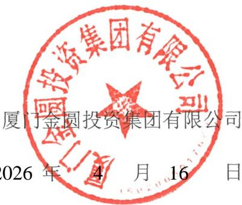  
厦门金圆投资集团有限公司 5020017

## 发行人董事、高级管理人员声明

本公司董事、高级管理人员承诺本募集说明书不存在虚假记载、误导性陈述或重大遗漏，并对其真实性、准确性和完整性承担相应的法律责任。

董事签名：

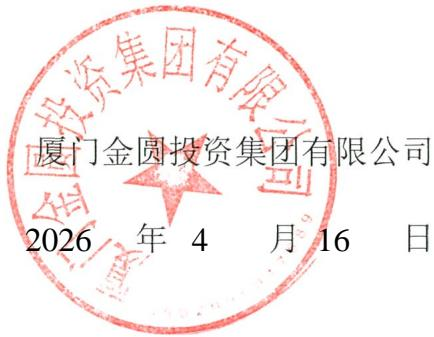  
复河金融投资集团有限公司 5020917089

## 发行人董事、高级管理人员声明

本公司董事、高级管理人员承诺本募集说明书不存在虚假记载、误导性陈述或重大遗漏，并对其真实性、准确性和完整性承担相应的法律责任。

董事签名：

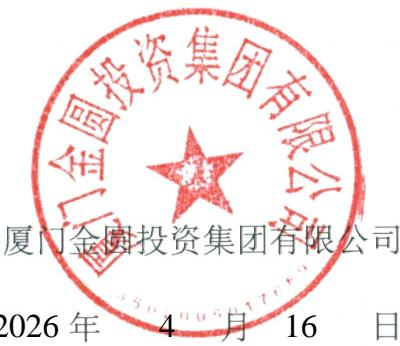  
厦门金圆投资集团有限公司 15070581764

## 发行人董事、高级管理人员声明

本公司董事、高级管理人员承诺本募集说明书不存在虚假记载、误导性陈述或重大遗漏，并对其真实性、准确性和完整性承担相应的法律责任。

非董事高级管理人员签名：

黄德芳

  
厦门金园教资集团有限公司 350200501782

## 发行人董事、高级管理人员声明

本公司董事、高级管理人员承诺本募集说明书不存在虚假记载、误导性陈述或重大遗漏，并对其真实性、准确性和完整性承担相应的法律责任。

非董事高级管理人员签名：

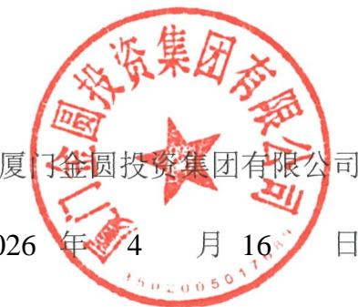  
厦门金圆投资集团有限公司 3502005017884

## 发行人董事、高级管理人员声明

本公司董事、高级管理人员承诺本募集说明书不存在虚假记载、误导性陈述或重大遗漏，并对其真实性、准确性和完整性承担相应的法律责任。

非董事高级管理人员签名：

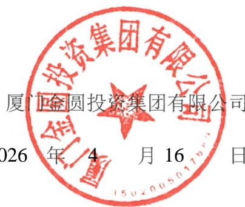  
厦门金国投资集团有限公司 35200501764

## 发行人董事、高级管理人员声明

本公司董事、高级管理人员承诺本募集说明书不存在虚假记载、误导性陈述或重大遗漏，并对其真实性、准确性和完整性承担相应的法律责任。

非董事高级管理人员签名：

  
厦门金圆摄资集团有限公司 35020050179

2026 4 1 6

## 发行人董事、高级管理人员声明

本公司董事、高级管理人员承诺本募集说明书不存在虚假记载、误导性陈述或重大遗漏，并对其真实性、准确性和完整性承担相应的法律责任。

董事签名：

1

李榕芳

  
厦门金国投资集团有限公司 3502005017689

2026 4 16

## 发行人董事、高级管理人员声明

本公司董事、高级管理人员承诺本募集说明书不存在虚假记载、误导性陈述或重大遗漏，并对其真实性、准确性和完整性承担相应的法律责任。

非董事高级管理人员签名：

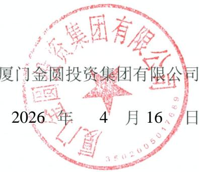  
厦门金圆资集团有限公司 3502005017689

## 发行人董事、高级管理人员声明

本公司董事、高级管理人员承诺本募集说明书不存在虚假记载、误导性陈述或重大遗漏，并对其真实性、准确性和完整性承担相应的法律责任。

非董事高级管理人员签名：

胡荣炜

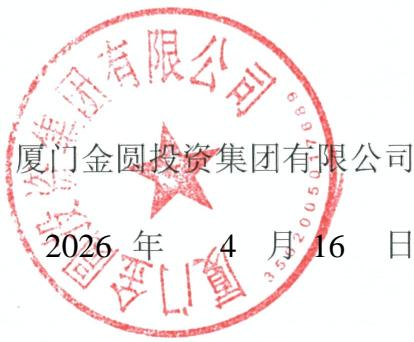  
厦门金园设汽集团有限公司

## 发行人董事、高级管理人员声明

本公司董事、高级管理人员承诺本募集说明书不存在虚假记载、误导性陈述或重大遗漏，并对其真实性、准确性和完整性承担相应的法律责任。

非董事高级管理人员签名：

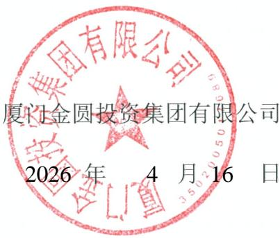  
厦门金國投资集团有限公司

## 主承销商声明

本公司已对募集说明书进行了核查，确认不存在虚假记载、误导性陈述或重大遗漏，并对其真实性、准确性和完整性承担相应的法律责任。

项目负责人签名：海男

杨 芳

邓小强

法定代表人授权代表签名：

孙 毅

主承销商：信券股份有限公司

  
中信证券股份有限公司

## 法定代表人授权书

本人，张佑君，中信证券股份有限公司法定代表人，在此授权孙毅先生（身份证H）作为被授权人，代表公司签署与投资银行管理委员会业务相关的合同协议及其相关法律文件。被授权人签署的法律文件对我公司具法律约束力。

未经授权人许可，被授权人不得转授权。

本授权的有效期限自2026年3月24日至2027年3月31日（或至本授权书提前解除之日）止。

授权人

中信证券股份有限公司代表人

张佑君

  
今信班券股份有限公司

2026年3月24日

被授权人

## 主承销商声明

本公司已对募集说明书进行了核查，确认不存在虚假记载、误导性陈述或重大遗漏，并对其真实性，准确性和完整性承担相应的法律责任。

项目负责人签名：美系林

意晓文

吴东林

法定代表人签名：

  
金圆统一证券有限公司 340206100 ?

主承销商：金圆统一证券有限公司

2026 4 16

## 主承销商声明

本公司已对募集说明书及其摘要进行了核查，确认不存在虚假记载、误导性陈述或重大遗漏，并对其真实性、准确性和完整性承担相应的法律责任。

项目负责人（签字）： 30任贤浩

法定代表人或授权代表（签字） √ BR刘乃生

  
中信建投证券股份有限公司 1100000047469

  
中信建投证券股份有限验司 1100000047469

## 中信建投证券股份有限公司特别授权书

仅供康金圆会司债使用

公资行业务开展需要，中信建投证券股份有限公司董事长成先生对生先生特别授权如下：

## 一、代表公司法定代表人签署以下文件：

（一）签署投资银行业务承做债券相关业务的文件，限于向监管部门报送的募集说明书、主承销商受托管理人声明、主承销商专项核查报告、承销商核查意见、房地产调控政策之专项核查报告、企业债主承销商综合信用承诺书、债权代理人声明。

（二）签署投资银行业务承做三板重组相关业务的文件，限于向监管部门报送的三板重组（预案）之重组报告书（真实性、准确性、完整性的声明）、三板重组（预案）之独立财务顾问核查意见/报告、定向发行合法合规性的专项意见。

（三）签署投资银行业务承做并购重组相关业务的文件，限于向监管部门报送以下文件：

1、重组报告书、独立财务顾问报告、反馈意见回复报告、重组委意见回复等文件的财务顾问专业意见；

2、申报文件真实性、准确性和完整性的承诺书、独立财务顾问同意书、独立财务顾问声明、举报信核查报告。

（四）签署投资银行业务承做保荐承销相关业务的文件，限于向监管部门报送的会后事项承诺函、不存在影响启动发行重大事项的承诺函、非公开发行股票申请增加询价对象的承诺函、关于办理完成限售登记及符合相关规定的承诺、发行阶段的保荐代表人证明文件及专项授权书、关于上市相关媒体质疑的专项回复的声明、认购对象合规性报告、发行情况报告书。

（五）签署由公司担任主承销商的投资银行类项目的发行及登记上市业务中向中国证监会、上海证券交易所、深圳证券交易所、北京证券交易所、中国证券登记结算有限责任公司、中央国债登记结算有限责任公司、全国中小企业股份转让系统有限转让公司等单位提交的文件，限于发行登记摇号公证上市阶段的授权委托书、IPO股票首次发行/可转债/配股/其他发行股票类网上认购资金划款申请表、配股发行失败应退利息支付承诺函、公司债券/资产支持专项计划/其他债权类发行登记及上市相关事宜的承诺函、股份过户登记申请。

## 二、在以下事务中拥有公司法定代表人人名章与身份证明文件的使用审批权：

（一）对外出具需要公司法定代表人签署的投资银行类项目的竞标文件、投标文件及建议书。

（二）在办理由公司担任主承销商的投资银行类项目的发行及登记上市业务中向中国证监会、上海证券交易所、深圳证券交易所、北京证券交易所、中国证券登记结算有限责任公司、中央国债登记结算有限责任公司、全国中小企业股份转让系统有限转让公司等单位提交公司法定代表人身份证件复印件、加盖法定代表人人名章的《指定联络人授权委托书》《集中办理深交所数字证书的承诺书》《信息披露联络人授权委托书》《可交换债券信托担保专用账户开立及信托担保登记办理授权书》《可交换债券质押担保专用账户开立及质押担保登记办理授权书》《验资业务银行询证函》《网下收款项目询证函》、公司债券转售业务的《非交易过户的申请》、可交换债券业务解除担保及信托事宜的《法定代表人授权委托书》。

（三）在办理由公司担任可转债抵押/质押权人代理人办理资产抵押/质押时提交的公司法定代表人身份证件复印件、加盖法定代表人人名章的《法定代表人证明书/委托书》《不动产登记申请表》等文件。

未经授权人许可，被授权人不得将上述授权内容再行转授权。

本授权有效期限自2026年1月1日起至2026年12月31日。

授权人：

中信建投证券股份有限公司董事长

风

二零二六年一月一日建投证券股份有限公司缝专用章

## 主承销商声明

本公司已对募集说明书进行了核查，确认不存在虚假记载、误导性陈述或重大遗漏，并对其真实性、准确性和完整性承担相应的法律责任。

项目负责人签名：许

许婷婷

邱植市

邱桓沛

胡 法定代表人（或授权代表）签名：

胡金泉

主承销商：广发股份有限公司

  
广发证券股份有限公司

# 广发证券股份有限公司

广发证授权（2025）1号

## 2026年法定代表人签字授权书

根据工作需要，现将资代灭的签字权授权如下：

## 一、授权原则

  
广发证券股份有限公司

（一）被授权人根据公司经营管理层工作分工或部门负责人任命行使权力，当职务变更自动调整或终止本授权。

（二）被授权人代表公司法定代表人签字并承担相应责任，其法律效力等同于法定代表人签字。

（三）被授权人无转委权。

（四）授权人职务变更自动终止本授权。

## 二、授权权限

（一）加盖公司印章的文件签字权，授权公司分管领导。

（二）加盖部门印章的文件签字权，授权部门负责人。

## 三、授权期限

本授权书有效期为2026年1月1日至12月31日，有效期内授权人可签署新的授权书对本授权书作出补充或修订。

附件：1.公司营业执照

2.被授权人职责证明（公司经营管理层最新分工或部门负责人聘任发文） 股份

  
广发证券股份有限公司

  
广发证券股份有限公司

2025年12月23日印发

# 营业执照

（副本）（1-1）

统一社会信用代码

91440000126335439C扫描二维码登录国家企业信用信总公示系统了解更多登记、备案、许可、监管信息

名 称广发证券股份有限公司

类 型股份有限公司（上市、自然人投资或控股）

法定代表人林传辉

  
广发证券股份有限公司

经营范围 许可项目：证券业务：公募证券投资基金销售：证券公司为期货公司提供中高介绍业务，证券投资基金托（依法须经的项目，经相关部门批准后方可开展经营活动，具体经营项自以相关部门批准文件或许可证件为准）

此复印件与原件一致，再复印无效，仅限于办理《

注册资本人民币柒拾捌亿贰仟肆佰捌拾肆万伍仟伍佰壹拾壹元

成立日期1994年01月21日

住 所广东省广州市黄埔区中新广州知识城腾飞一街2号618室

  
广发证券股份有限公司

  
广东省市场监督管理局

# 广发证券股份有限公司

广发证董（2024）15号

# 关于聘任公司高级管理人员的决定

总部各部门、各分支机各子公司

根据广发证券股份公司（有称“公司”）第十一届 董事会第一次会议决议及工作安排，公司决定：

  
广发证券股份有限公司

聘任秦力先生担任公司总经理，主持公司日常经营管理工作，并分管国际业务、产业研究院、战略发展部；

聘任孙晓燕女士担任公司常务副总经理兼财务总监，分管财务部、结算与交易管理部、资金管理部；

聘任肖雪生先生担任公司副总经理，分管战略客户关系管理部；

聘任欧阳西先生担任公司副总经理，分管资产托管部、证券金融部、财富管理与经纪业务总部（含下设的财富管理部、数字平台部、机构客户部、运营管理部）；

聘任张威先生担任公司副总经理，分管发展研究中心；

聘任易阳方先生担任公司副总经理，分管股权衍生品业务部、

  
广发证券

证券投资业务管理总部下

聘任辛治运先生担任公司副总经理兼首席信息官，分管信息技术部；

聘任李谦先生担任公司副总经理，分管证券投资业务管理总部下设的固定收益投资部、资本中介部；

聘任徐佑军先生担任公司副总经理，分管办公室、人力资源管理部、培训中心；

聘任胡金泉先生担任公司副总经理，分管投行业务管理委员会（含下设的投行综合管理部、战略投行部、兼并收购部、债券业务部、资本市场部、投行质量控制部）；

聘任吴顺虎先生担任公司合规总监，兼任合规与法律事务部总经理，并分管合规与法律事务部、稽核部；

聘任崔舟航先生担任公司首席风险官，兼任风险管理部总经理，并分管风险管理部、投行内核部；

聘任尹中兴先生担任公司董事会秘书、联席公司秘书、证券事务代表，分管董事会办公室。

肖雪生先生和胡金泉先生正式履行上述职务尚需通过证券公司高级管理人员资质测试。尹中兴先生正式履行上述职务尚需通过证券公司高级管理人员资质测试及香港联合交易所有限公司关于公司秘书任职资格的豁免。在胡金泉先生正式履行上述职务之前，指定公司总经理秦力先生代为履行相应职责。在尹中兴先生正式履行上述职务之前，指定公司原董事会秘书、联席公司秘书、证券事务代表徐佑军先生继续履行相应职责。

公司将按规定向监管部门履行备案程序。

专此决定。

  
发证券股份有限公司

（联系人：杨天天电话：020-66336680）

  
广发证券股份有限公司

2024年5月10日印发

## 主承销商声明

本公司已对募集说明书进行了核查，确认不存在虚假记载、误导性陈述或重大遗漏，并对其真实性、准确性和完整性承担相应的法律责任。

项目负责人签名：

刘华志法定代表人签名黄德良

  
华福证券股份有限公司 35810810181976

主承销商：华福证券股份有限公司

2026 4 16

## 发行人律师声明

本所及签字的律师已阅读募集说明书，确认募集说明书与本所出具的法律意见书不存在矛盾。本所及签字的律师对发行人在募集说明书中引用的法律意见书的内容无异议，确认募集说明书不致因所引用内容出现虚假记载、误导性陈述或重大遗漏，并对其真实性、准确性和完整性承担相应的法律责任。

经办律师（签字）：

郑兰花

徐冠文

律师事务所负责人（签字）：

韩德晶

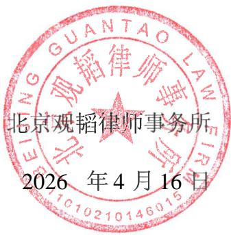  
北观韬律师事务所 八 ND S 11010210146015

## 会计师事务所声明

本所及签字注册会计师已阅读募集说明书，确认募集说明书与本所出具的2024年度致同审字（2025）第351A017929号审计报告不存在矛盾。本所及签字注册会计师对募集说明书中引用的经本所审计的 2024年度财务报告的内容无异议，确认募集说明书不致因所引用内容而出现虚假记载、误导性陈述或重大遗漏，并对其真实性、准确性和完整性承担相应的法律责任。

经办注册会计师（签字）：

林庆瑜

郑海霞

会计师事务所负责人（签字） 4

李惠琦

致同会计师事务所特殊普通合伙）

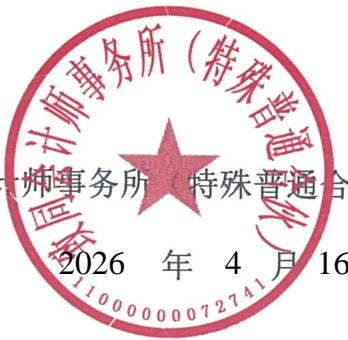  
致同蠢计师事务所（特殊普通伙） 11000000072741

## 会计师事务所声明

本所及签字注册会计师已阅读《厦门金圆投资集团有限公司2026年面向专业投资者公开发行公司债券（第二期）募集说明书》，确认《厦门金圆投资集团有限公司2026年面向专业投资者公开发行公司债券（第二期）募集说明书》中引用的2022年度审计报告（众环审字（2023）3000022号）、2023年度审计报告（众环审字〔2024）3000015号）内容与本所出具的审计报告的内容不存在矛盾。本所及签字注册会计师对发行人在《厦门金圆投资集团有限公司2026年面向专业投资者公开发行公司债券（第二期）募集说明书》中引用的财务报告的内容无异议，确认《厦门金圆投资集团有限公司2026年面向专业投资者公开发行公司债券（第二期）募集说明书》不致因所引用内容而出现虚假记载、误导性陈述或重大遗漏，并对其真实性、准确性和完整性承担相应的法律责任。

经办注册会计师（签字）：

4 林娜萍

已离职

陈清建

会计师事务所负责人（签字）：

  
石文先

中审众环会事务所（特殊通合伙）

  
中审众会计师事务所（特殊普通合伙 42010800031159

16

## 关于签字注册会计师离职的说明

## 深圳证券交易所：

本所作为厦门金圆投资集团有限公司申请 2026 年面向专业投资者公开发行公司债券（第二期）审计机构，出具了《审计报告》（众环审字〔2023〕3000022号、众环审字〔2024〕3000015 号），签字注册会计师为林娜萍同志和陈清建同志。

陈清建同志已于2024年10月从本所离职，故无法在《厦门金圆投资集团有限公司 2026 年面向专业投资者公开发行公司债券（第二期）募集说明书》之“会计师事务所声明”中签字。

专此说明，请予察核。

中审众环会计师事务所（特殊普通合伙）

  
中审基环会计师事务所(特殊普通合伙 420106000311553

2026 年 3 月 30 日

## 资信评级机构声明

本机构及签字的资信评级人员已阅读募集说明书，确认募集说明书与本机构出具的报告不存在矛盾。本机构及签字的资信评级人员对发行人在募集说明书中引用的报告的内容无异议，确认募集说明书不致因所引用内容出现虚假记载、误导性陈述或重大遗漏，并对其真实性、准确性和完整性承担相应的法律责任。

签字资信评级人员（签字）：

长阳

张帆

薛峰

资信评级机构负责人（签字）：

T 万华伟

  
CRED1T 联合资信股份有限公司 TIN 材 LT 1X0105238672

# 联合资信评估股份有限公司

授权委托书

兹授权联合资信评估股份有限公司总裁万华伟先生为我单位的代表人，在所有的评级业务合同、协议、投标书等评级业务有关文件上签字或签章。

授权期限自2026年1月1日至2026年12月31日。

被授权人签字或签章样本： 下牛中伟万印华

授权单位（公章)：联合资信评估股份有限公司

法定代表人（签字）： Vi

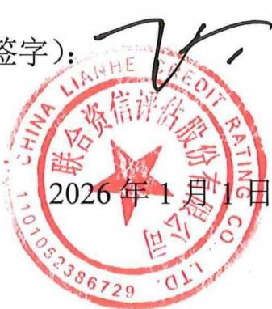  
联合资信评估股份有限公司 CHIN 1101052386729

## 第十三节 备查文件

## 一、备查文件内容

（一）发行人 2022年至2024年度经审计的财务报告以及2025年1-9月未经审计的财务报表；

（二）主承销商出具的核查意见；

（三）发行人律师出具的法律意见书；

（四）《债券受托管理协议》；

（五）《债券持有人会议规则》；

（六）中国证监会同意发行人本期发行注册的文件。

## 二、备查文件查阅地点及查询网站

在本期债券发行期内，投资者可以至本公司及主承销商处查阅本募集说明书全文及上述备查文件，或访问深圳证券交易所网站（http://www.szse.cn）查阅本募集说明书。

查阅时间：上午9：00-11：30；下午：13：00-16：30

查阅地点：

（一）发行人：厦门金圆投资集团有限公司

联系地址：厦门市思明区展鸿路82号厦门国际金融中心46层4610-4620单元

联系人：洪小勤

电话：0592-3502856

传真：0592-3502338

## （二）牵头主承销商/簿记管理人/受托管理人：中信证券股份有限公司

法定代表人：张佑君

住所：广东省深圳市福田区中心三路8 号卓越时代广场（二期）北座

联系地址：北京市朝阳区亮马桥路48 号中信证券大厦22层

项目负责人：杨芳、邓小强

项目组成员：陈东辉、李晨、林政宇

联系电话：010-60838888

传真：010-60833504

## 三、备查文件查询网站

深圳证券交易所网站（http://www.szse.cn）。