股票简称：本川智

股票代码：3009

（南京市漂水经济开发区孔家路7号）

# 江苏本川智能电路科技股份有限公司

  
江苏本川智能电路科技股份有限公司 3201241935753

# 向不特定对象发行可转换公司债券

募集说明书

（注册稿）

保荐人（主承销商）

（住所：长春市生态大街 6666号

二〇二六年二

## 声 明

中国证监会、交易所对本次发行所作的任何决定或意见，均不表明其对申请文件及所披露信息的真实性、准确性、完整性作出保证，也不表明其对发行人的盈利能力、投资价值或者对投资者的收益作出实质性判断或保证。任何与之相反的声明均属虚假不实陈述。

根据《证券法》的规定，证券依法发行后，发行人经营与收益的变化，由发行人自行负责。投资者自主判断发行人的投资价值，自主作出投资决策，自行承担证券依法发行后因发行人经营与收益变化或者证券价格变动引致的投资风险。

## 重大事项提示

公司特别提请投资者注意，在作出投资决策之前，务必仔细阅读本募集说明书正文内容，并特别关注以下重要事项。

## 一、特别风险提示

公司提请投资者仔细阅读本募集说明书“第三节 风险因素”全文，并特别注意以下风险：

## （一）募投项目效益不达预期风险

公司本次募集资金用于“珠海硕鸿年产 30 万平米智能电路产品生产建设项目”“本川智能泰国印制电路板生产基地建设项目”和补充流动资金，公司对于本次募投项目已经进行慎重、充分的可行性研究论证，但相关可行分析是基于当前市场环境客户需求及现有技术条件、对技术发展趋势的判断等因素所作出的，效益测算中的销售价格、成本、毛利率等关键参数与募投项目建设完成后的实际情况可能存在一定偏离。

在公司募集资金投资项目实施过程中，公司可能面临政策变动、市场变化、国际局势发生不利变化及公司内部管理、产品开发、技术创新、市场营销等执行情况未及预期、遭遇突发性事件等不确定因素，进而导致本次募投项目出现未能按计划正常实施的风险，导致本次募投项目未达到预期经济效益，影响公司经营业绩。

关于本次募投项目的预计毛利率，“珠海硕鸿年产 30 万平米智能电路产品生产建设项目”达产后预计毛利率为 24.70%-24.81%，“本川智能泰国印制电路板生产基地建设项目”达产后预计毛利率为 18.73%-18.82%。报告期各期，公司主营业务毛利率分别为 15.79%、11.60%、12.42%和 13.99%。本次募投项目达产后预计毛利率水平高于公司主营业务毛利率水平，差异原因主要包括本次募投项目与现有主营业务在产品结构、应用领域等方面存在区别，以及本次募投项目对外协加工需求降低，相应的外协加工成本减少等。在本次募投项目建成投产后，如因下游需求变化、订单结构调整等因素，导致毛利率相对较高类型产品、相关领域产品的收入或销量占比不及预期，或外协加工成本降低幅度未达预期，则将存在本次募投项目投产后实现的毛利率低于预计毛利率水平的风险。

以本次募投项目相关各类产品 2025 年 1-9 月实际销售毛利率为基础，并结合各类产品在募投项目中预计的收入结构计算，“珠海硕鸿年产 30 万平米智能电路产品生产建设项目”和“本川智能泰国印制电路板生产基地建设项目”达产后预计能够实现的毛利率水平分别为 24.81%、20.67%。该测算主要系基于公司现有相关产品的实际毛利率计算得出。其中，报告期内公司 HDI 板以小批量板或样板为主，产量较小、毛利率水平相对较高，在“珠海硕鸿年产 30 万平米智能电路产品生产建设项目”投产后，公司将具备一定程度的 HDI 板批量生产能力，未来阶段 HDI 板毛利率水平将可能向 PCB 行业同类产品毛利率整体均值水平有所回归，因此将存在导致本次募投项目达产后预计能够实现的毛利率水平会低于前述毛利率水平的风险。

此外，本次募投项目建成后，每年将发生折旧摊销、人工、水电费等固定成本费用，但考虑到募投项目产能爬坡需要一定时间，且公司下游行业主要为电子产品制造业，电子产品涉及社会生活、生产的各种方面，受全球宏观经济周期、供需关系、国际贸易政策变化等影响，下游行业会存在一定的周期性波动，未来阶段如发生终端需求再度疲软等情况，使 PCB 行业竞争加剧，厂商库存积压、产能消化不足，产品价格持续下降，导致本次募投项目产品实际销售单价、销量明显低于可行性研究报告中的取值，则将对本次募投项目效益产生不利影响，导致本次募投项目未能实现预期经济效益。

## （二）募投项目新增产能消化风险

报告期内，公司产能利用率分别为 82.68%、77.54%、87.40%和 87.26%，处于满足客户快速交付要求状态下的较高水平。本次募投项目“珠海硕鸿年产30 万平米智能电路产品生产建设项目”和“本川智能泰国印制电路板生产基地建设项目”立足于建设公司在华南、海外的生产基地，项目建成投产后，将新增合计55万平方米的年产能。

2024 年下半年以来，公司开拓的新客户合作后预计年销售额合计约 40,500万元，上述 40,500 万元客户采购意向涉及领域与本次募投项目产品主要面向领域的相关性较高。鉴于本次募投项目需要一定的建设期，未来阶段如果产业、政策、下游需求、技术等方面出现重大不利变化，导致客户订单萎缩或增长不及预期，或公司在国内外市场开拓不及预期，或前述新客户采购意向未能及时转化为订单、订单量与预计年销售额差异较大，则将存在本次募投项目新增产能无法消化的风险。

## （三）部分前次募投项目效益不达预期风险

公司前次募投项目“年产 48 万平高频高速、多层及高密度印制电路板生产线扩建项目”于 2022 年 12 月达到预定可使用状态。该项目 2023 年度、2024年度和 2025 年 1-9 月的实际效益为 1,227.41 万元、1,674.26 万元和 2,774.06 万元，可行性研究报告预计的 2023 年、2024 年和 2025 年 1-9 月可实现净利润为3,927.52 万元、4,893.56 万元和 4,556.06 万元，当期效益实现比例分别为31.25%、34.21%和 60.89%，未达到可行性研究报告中记载的对应期间的预计收益，主要原因包括：项目建设完毕后产能逐渐爬坡，同期折旧、摊销、人工、水电等金额较大，增加固定成本费用；该项目的可行性研究报告编制于 2019 年8 月，而项目达到预定可使用状态的时间为 2022 年 12 月，受期间内社会经济状况等多方面影响，导致印制电路板行业整体出现阶段性低迷、行业竞争加剧、产品单价较测算当时有所下降、如高频高速板等高精产品占比偏低，影响了募投项目的经济效益。

未来阶段，如果 PCB 市场竞争进一步加剧，且公司未能及时调整战略应对措施，或公司在产品、技术等方面明显落后于市场和客户的要求，或未能有效进行成本费用的管控，则“年产 48 万平高频高速、多层及高密度印制电路板生产线扩建项目”仍可能存在效益不达预期的风险。

## （四）国际贸易争端及汇率变动风险

公司主要产品出口地区为美国、欧洲，报告期内公司对上述地区客户销售额分别为 24,897.09 万元、20,025.93 万元、20,125.18 万元和 21,024.62 万元，占公司外销收入比例分别为 81.25%、80.02%、75.52%和 77.21%。其中，对美国销售收入为 14,722.27 万元、10,807.97 万元、11,005.45 万元和 11,596.59 万元，占比分别为 48.05%、43.19%、41.30%和 42.59%。现阶段，美国对中国 PCB 产

品执行关税税率为 10%（4 层及以下 PCB 产品）或 35%（4 层以上 PCB 产品）；  
对泰国PCB 产品执行关税税率为 10%。

随着国际政治局势的变化、全球经济环境的周期性波动，未来阶段的国际贸易政策变化仍存在不确定性，近期美国关税政策变动频繁，美国、欧洲等仍可能对中国大陆 PCB 产品采取如加征关税、进口配额等贸易壁垒措施、贸易保护主义政策，上述国际贸易争端可能导致公司 PCB 销量下降或增长不及预期，对公司业绩产生不利影响。

同时，公司外销涉及以美元等外币结算，报告期内公司汇兑损益分别为-2,027.43 万元、101.10 万元、-276.95 万元和 147.59 万元。外币汇率如美元与人民币汇率可能因国际政治、经济环境、外汇政策等因素而发生波动，因而具有较大的不确定性。未来阶段如果人民币出现大幅升值，则可能产生汇兑损失、以人民币折算的销售收入减少，对公司业绩造成不利影响。以 2025 年 1-9 月为例，2025 年 1-9 月公司外销收入为 27,231.42 万元，按照中国人民银行公布的2025 年 9 月 30 日美元对人民币中间价 7.1055 计算，该部分收入折合美元金额为 3,832.44 万美元。假设人民币升值，前述汇率中间价变为 7.0000，则该3,832.44 万美元仅能兑换 26,827.10 万元人民币，发生汇兑损失 404.32 万元。

同时，随着公司本次募投项目的建成投产，未来阶段，如果公司境外业务规模进一步增长，在汇率波动的情况下，以外币计值的资产折算将可能产生汇兑损益，从而对公司的财务状况和经营业绩产生一定影响。

## （五）募投项目海外投资及业务整合风险

本次募投项目“本川智能泰国印制电路板生产基地建设项目”实施主体为艾威尔泰国，实施地点位于泰国。泰国的法规政策、营商环境、文化习俗等与我国存在一定差异，境外募投项目的开展可能受到如当地法律法规、政治局势、经济环境等多方面因素的影响，因而可能存在如运营、市场及税收、环保、境外投资政策等风险，导致募投项目无法按照预定期限建设完成，或实现的经济效益未达到预期。并且，未来阶段如泰国外汇管理政策发生变化，则可能导致艾威尔泰国在资金归集、分红款汇回等方面存在一定的限制。

此外，“本川智能泰国印制电路板生产基地建设项目”建成后，公司将涉及中国、泰国的两国经营布局，对管理层的经营能力将提出更高的要求。如果公司未能及时适应国际化经营形势变化，在公司战略、规章制度、组织架构、运营管理等方面与两国经营的布局不匹配，则可能存在因制度、文化差异而导致的业务整合及管理效率下降等风险。

## （六）市场竞争加剧风险

全球 PCB 行业市场集中度较低，生产厂商众多，市场竞争较为充分。近年来，随着各大厂商国内外产能布局的加速，PCB 行业的市场竞争可能进一步加剧，市场集中度逐渐提升。因此，各厂商需要持续的资金、技术投入，保持市场竞争力和行业地位。未来阶段，如果下游行业发展迟滞，对 PCB 产品需求不及预期，则可能出现行业内竞争进一步加剧的情况，导致产品价格下降，订单向头部企业集中。如果公司未能把握行业发展趋势，在产品质量、内部管理、技术工艺等方面未能够满足客户需求，或产能水平、产能规模不足以保证高质量快速交付的要求，则可能出现订单下滑、收入利润严重下降的风险，市场份额缩减，在竞争中处于不利地位。

## （七）本息兑付风险

2022 年、2023 年和 2024 年，公司归属于母公司所有者的净利润分别为4,755.39 万元、482.69 万元和 2,373.96 万元，平均可分配利润为 2,537.35 万元。最近三年一期，公司经营活动产生的现金流量净额分别为 11,045.02 万元、7,459.99 万元、2,818.46 万元和-716.13 万元，呈持续下降趋势。在可转债的存续期限内，公司须按可转债相关条款之约定，就可转债未转股的部分每年偿付利息及到期兑付本金，并承兑投资者可能提出的回售要求。受国家政策、法规、行业和市场等不可控因素的影响，公司未来阶段的经营活动可能未带来预期的回报，或因行业、客户回款、原材料等因素导致公司现金流急剧下降，进而导致公司不能从预期的还款来源获得足够的资金，或不具有足够的现金流支付本次可转债应偿付的本息金额，并可能影响公司对可转债本息按时足额兑付，以及对投资者回售要求的承兑能力。

## （八）募投项目新增折旧摊销风险

本次募投项目资本性支出规模较大，项目在建成达产后，公司固定资产和无形资产规模将在一定程度上增加，预计计算期内，单个年度内最多将增加折旧摊销合计约 3,631.02 万元。经测算，本次募投项目在完全达产（T+5 年）前，新增折旧摊销占营业收入最高比例为 3.49%，占净利润最高比例为 77.09%；在完全达产后，新增的折旧摊销占营业收入最高比例为 2.89%，占净利润最高比例为 39.52%。

上述新增固定资产折旧和无形资产摊销将可能导致公司面临盈利能力下降、摊薄每股收益的风险。同时，本次募投项目达到生产效益需要 1.5 年至 2 年建设期，若募投项目实施后，行业政策、市场环境、客户需求发生重大不利变化，公司预期经营业绩、募投项目预期收益未能实现，则公司存在因新增固定资产折旧及无形资产摊销而对盈利能力产生不利影响的风险。

## （九）业绩波动风险

公司产品主要应用于通信、工业控制、汽车电子等下游领域，下游行业具有一定的周期性，受宏观经济、供需变化等因素影响，其景气度波动会直接传导至公司，导致公司业绩波动。报告期内，公司营业收入分别为 55,926.34 万元、51,094.26 万元、59,610.27 万元和 61,354.86 万元，归属于母公司所有者的净利润分别为 4,755.39 万元、482.69 万元、2,373.96 万元及 3,307.62 万元，扣除非经常性损益后归属于公司普通股股东的净利润分别为 3,405.22 万元、-673.93 万元、1,697.04 万元和 3,023.01 万元，受下游市场需求下滑、上游原材料价格变动等影响，公司 2023 年上述三项业绩指标出现下降，且扣非归母净利润为负，2024 年以来，下游市场有所恢复，但下游市场需求对公司的经营业绩仍存在较大的影响。未来若宏观经济下行或下游进入调整期，公司可能面临订单减少、价格承压等问题，导致公司经营业绩出现大幅波动情况。

## （十）毛利率下滑风险

报告期内，公司主营业务毛利率分别为 15.79%、11.60%、12.42%和13.99%，受直接材料价格上升、产品结构、成本构成变化等因素的影响，2023年公司主营业务毛利率下滑了 4.19 个百分点，降幅较大。如果未来行业竞争进一步加剧导致公司产品销售价格下降，而公司未能及时通过提高技术水平、产品质量以应对市场竞争，或者原材料价格上升，而公司未能有效控制产品成本等情况发生，则存在毛利率下滑、盈利能力下降的风险。

此外，报告期内，对于汽车电子等重点布局和扩展领域，公司针对该领域战略性大客户，主动采取阶段性折让策略，以便未来开展深度且持续性合作，获取汽车电子等重要领域内更多客户及订单，导致相关领域产品毛利率水平相对较低，如 2025 年 1-9 月，公司汽车电子领域涉及本次募投项目多层板的实际毛利率为 7.02%。未来阶段，如公司在相关领域开拓不及预期，或价格折让未能实现大客户长期合作、吸引更多同领域客户合作的目标，或受供需关系影响，价格折让长期存在甚至被动实施、折让幅度加大，则将面临其毛利率长期处于较低水平，对公司主营业务毛利率、盈利能力均产生不利影响的风险。

## （十一）经营活动产生的现金流量净额持续下降风险

报告期内，公司经营活动产生的现金流量净额分别为 11,045.02 万元、7,459.99 万元、2,818.46 万元和-716.13 万元，公司经营活动产生的现金流量净额与净利润差额分别为-6,289.64 万元、-6,977.30 万元、-452.07 万元和 3,950.15万元，是外部行业环境波动和内部经营策略调整共同作用的结果。2023 年受宏观经济影响，营业收入同比下降 8.64%，直接导致现金回款减少；2024 年营业收入同比增长 16.67%，但内销客户占比提升延长信用期，叠加票据结算比例增加，经营活动产生的现金流量净额进一步下降；2025 年 1-9 月营业收入同比增长 43.11%，但为匹配订单增长，公司加大备货及人员储备，期末原材料账面余额较 2024 年末增长 128.23%，员工数量增长 37.89%，致使经营活动现金流出增幅超出经营活动现金流入，当期经营活动现金流量净额为负。

报告期内，购买商品、接受劳务支付的现金和支付职工的现金之和占销售商品、提供劳务收到的现金比例分别为 76.26%、79.60%、80.97%和 95.13%，呈现上升趋势，若未来下游需求波动、回款周期进一步延长，或业务扩张导致备货、人力投入持续增加，对公司经营活动现金流产生不利影响。

## （十二）原材料价格波动风险

公司生产的主要原材料包括覆铜板、铜球、铜箔等。报告期各期，公司覆铜板、铜球和铜箔采购占比如下：

单位：万元

<table><tr><td rowspan=2 colspan=2>材料类别</td><td rowspan=1 colspan=2>2025年1-9月</td><td rowspan=1 colspan=2>2024年度</td><td rowspan=1 colspan=2>2023年度</td><td rowspan=1 colspan=2>2022年度</td></tr><tr><td rowspan=1 colspan=1>金额</td><td rowspan=1 colspan=1>占比</td><td rowspan=1 colspan=1>金额</td><td rowspan=1 colspan=1>占比</td><td rowspan=1 colspan=1>金额</td><td rowspan=1 colspan=1>占比</td><td rowspan=1 colspan=1>金额</td><td rowspan=1 colspan=1>占比</td></tr><tr><td rowspan=4 colspan=1>覆铜板</td><td rowspan=1 colspan=1>FR4覆铜板</td><td rowspan=1 colspan=1>12,503.44</td><td rowspan=1 colspan=1>32.03%</td><td rowspan=1 colspan=1>8,659.09</td><td rowspan=1 colspan=1>28.40%</td><td rowspan=1 colspan=1>5,610.34</td><td rowspan=1 colspan=1>25.56%</td><td rowspan=1 colspan=1>8,878.70</td><td rowspan=1 colspan=1>35.63%</td></tr><tr><td rowspan=1 colspan=1>高频覆铜板</td><td rowspan=1 colspan=1>4,323.49</td><td rowspan=1 colspan=1>11.07%</td><td rowspan=1 colspan=1>5,067.54</td><td rowspan=1 colspan=1>16.62%</td><td rowspan=1 colspan=1>4,398.54</td><td rowspan=1 colspan=1>20.04%</td><td rowspan=1 colspan=1>3,811.54</td><td rowspan=1 colspan=1>15.30%</td></tr><tr><td rowspan=1 colspan=1>其他</td><td rowspan=1 colspan=1>62.20</td><td rowspan=1 colspan=1>0.16%</td><td rowspan=1 colspan=1>86.53</td><td rowspan=1 colspan=1>0.28%</td><td rowspan=1 colspan=1>75.62</td><td rowspan=1 colspan=1>0.34%</td><td rowspan=1 colspan=1>58.09</td><td rowspan=1 colspan=1>0.23%</td></tr><tr><td rowspan=1 colspan=1>合计</td><td rowspan=1 colspan=1>16,889.12</td><td rowspan=1 colspan=1>43.26%</td><td rowspan=1 colspan=1>13,813.16</td><td rowspan=1 colspan=1>45.31%</td><td rowspan=1 colspan=1>10,084.51</td><td rowspan=1 colspan=1>45.95%</td><td rowspan=1 colspan=1>12,748.33</td><td rowspan=1 colspan=1>51.17%</td></tr><tr><td rowspan=1 colspan=2>铜球</td><td rowspan=1 colspan=1>4,282.47</td><td rowspan=1 colspan=1>10.97%</td><td rowspan=1 colspan=1>3,601.00</td><td rowspan=1 colspan=1>11.81%</td><td rowspan=1 colspan=1>2,366.10</td><td rowspan=1 colspan=1>10.78%</td><td rowspan=1 colspan=1>2,358.26</td><td rowspan=1 colspan=1>9.46%</td></tr><tr><td rowspan=1 colspan=2>铜箔</td><td rowspan=1 colspan=1>2,477.77</td><td rowspan=1 colspan=1>6.35%</td><td rowspan=1 colspan=1>1,445.56</td><td rowspan=1 colspan=1>4.74%</td><td rowspan=1 colspan=1>674.31</td><td rowspan=1 colspan=1>3.07%</td><td rowspan=1 colspan=1>980.16</td><td rowspan=1 colspan=1>3.93%</td></tr></table>

注：采购金额为不含税金额。

根据上表数据，公司原材料中，涉及铜等大宗商品的原材料采购占比相对较高。2023 年以来，受国际关系、宏观经济环境及供需关系等影响，铜等大宗商品价格呈波动上涨趋势。以 LME（伦敦金属交易所）现货铜价数据为例，报告期内铜价走势变动如下：

LME现货铜价走势  
（2022年1月1日-2025年9月30日，单位：美元/吨）  
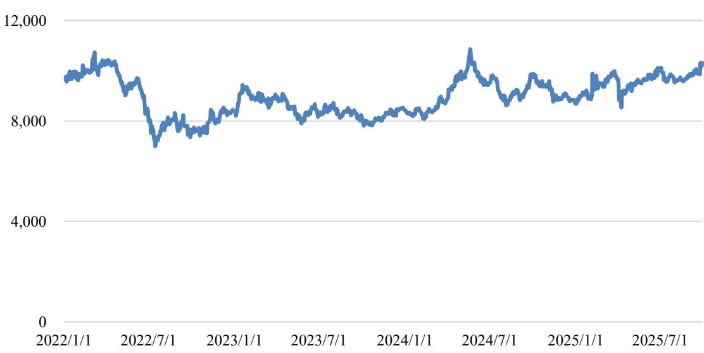  
数据来源：同花顺 iFind。

经初步测算，以 2025 年 1-9 月为例，假设覆铜板、铜球、铜箔价格变动比例与铜价一致，如铜价上涨 10%，则上述原材料价格变动将导致公司当期原材料采购总成本上涨 6.06%。未来阶段，如铜等大宗商品价格持续上涨，且公司未能就该部分成本增长及时通过价格传导至客户，则将会导致公司原材料采购成本增加、主营业务毛利率有所下降，影响公司的利润水平和盈利能力。

## 二、关于本次可转债发行符合发行条件的说明

根据《公司法》《证券法》《上市公司证券发行注册管理办法》等相关法律法规、规范性文件规定，公司本次向不特定对象发行可转换公司债券符合法定的发行条件。

## 三、关于公司本次发行的可转换债券信用评级

公司聘请东方金诚国际信用评估有限公司为本次发行的可转债进行信用评级。根据东方金诚出具的信用评级报告，公司主体信用等级为 AA-，本次可转债信用等级为 AA-，评级展望稳定。在本次发行的可转债存续期间，东方金诚将每年至少进行一次跟踪评级，并出具跟踪评级报告。如果由于公司外部经营环境、自身经营情况或评级标准变化等因素，从而导致本次发行可转债的信用评级级别发生不利变化，则将会增加投资者的风险，对投资人的利益产生不利影响。

## 四、公司本次发行可转换债券不提供担保

公司本次发行可转债未提供担保措施，无特定的资产作为担保品，且未设定担保人，债券投资者可能面临在不利情况下因本次发行的可转债未担保而无法获得对应担保物补偿的风险。

## 五、公司的利润分配政策及最近三年利润分配情况

## （一）公司的利润分配政策

根据《公司法》《证券法》《上市公司监管指引第 3 号——上市公司现金分红》，结合公司实际情况，公司在《公司章程》中对利润分配政策的规定进行了进一步完善，强化了投资者回报机制。现行《公司章程》中利润分配政策具体情况如下：

## 1、利润分配的原则

公司实行连续、稳定的利润分配政策，具体利润分配方式应结合公司利润实现状况、现金流量状况和股本规模进行决定。公司董事会和股东会在利润分配政策的决策和论证过程中应当充分考虑独立董事和公众投资者的意见。

## 2、利润分配的形式

公司采取现金、股票或者现金与股票相结合的方式分配股利。凡具备现金分红条件的，公司优先采取现金分红的利润分配方式，公司连续三年以现金方式累计分配的利润不少于该三年实现的年均可分配利润的 30%；在公司有重大投资计划或重大现金支出等事项发生或者出现其他需满足公司正常生产经营的资金需求情况时，公司可以采取股票方式分配股利。

## 3、现金分配的条件

满足以下条件的，公司应该进行现金分配，在不满足以下条件的情况下，公司可根据实际情况确定是否进行现金分配：

（1）公司该年度实现的可分配利润（即公司弥补亏损、提取公积金后所余的税后利润）为正值；

（2）审计机构对公司的该年度财务报告出具标准无保留意见的审计报告；

（3）公司现金流能满足公司正常经营和长期发展的需要；

（4）公司无重大投资计划或重大现金支出等事项发生（募集资金项目除外）。

重大投资计划或重大现金支出是指：

（1）公司未来十二个月内拟对外资本投资、实业投资、收购资产或者购买设备的累计支出达到或者超过公司最近一期经审计净资产的 20%，且超过 5,000万元人民币；

（2）公司未来十二个月内拟对外资本投资、实业投资、收购资产或者购买设备的累计支出达到或者超过公司最近一期经审计总资产的 10%。

## 4、利润分配的时间间隔

公司原则进行年度利润分配，在有条件的情况下，公司董事会可以根据公司经营状况提议公司进行中期利润分配。公司召开年度股东会审议年度利润分配方案时，可审议批准下一年中期现金分红的条件、比例上限、金额上限等。年度股东会审议的下一年中期分红上限不应超过相应期间归属于公司股东的净利润。董事会根据股东会决议在符合利润分配的条件下制定具体的中期分红方

案。

## 5、利润分配的比例

公司董事会应当综合考虑所处行业特点、发展阶段、自身经营模式、盈利水平以及是否有重大资金支出安排等因素，区分下列情形，并按照本章程规定的程序，提出差异化的现金分红政策：

（1）公司发展阶段属成熟期且无重大资金支出安排的，进行利润分配时，现金分红在本次利润分配中所占比例最低应达到 80%；

（2）公司发展阶段属成熟期且有重大资金支出安排的，进行利润分配时，现金分红在本次利润分配中所占比例最低应达到 40%；

（3）公司发展阶段属成长期且有重大资金支出安排的，进行利润分配时，现金分红在本次利润分配中所占比例最低应达到 20%。

公司发展阶段不易区分但有重大资金支出安排的，可以按照前项规定处理。

## 6、利润分配方案的决策程序和机制

（1）公司董事会应根据所处行业特点、发展阶段和自身经营模式、盈利水平、资金需求等因素，研究和论证公司现金分红的时机、条件和最低比例、调整的条件及其决策程序要求等事宜，拟定利润分配预案。独立董事认为现金分红具体方案可能损害公司或者中小股东权益的，有权发表独立意见。董事会对独立董事的意见未采纳或者未完全采纳的，应当在董事会决议中记载独立董事的意见及未采纳的具体理由，并披露。

（2）股东会审议利润分配方案前，应通过多种渠道主动与股东特别是中小股东进行沟通和交流，充分听取中小股东的意见和诉求，及时答复中小股东关心的问题。

（3）公司因特殊情况无法按照既定的现金分红政策或最低现金分红比例确定当年利润分配方案时，应当披露具体原因以及下一步为增强投资者回报水平拟采取的举措等。

（4）如对公司章程确定的现金分红政策进行调整或者变更的，应当经过详细论证后履行相应的决策程序，并经出席股东会的股东所持表决权的 2/3 以上

通过。

## 7、违规占用公司资金的处理方案

存在股东违规占用公司资金情况的，公司应当扣减该股东所分配的现金红利，以偿还其占用的资金。

## 8、利润分配政策的变更机制

公司如因外部环境变化或自身经营情况、投资规划和长期发展而需要对利润分配政策进行调整的，公司可对利润分配政策进行调整。公司调整利润分配政策应当以保护股东利益和公司整体利益为出发点，充分考虑股东特别是中小股东、独立董事的意见，由董事会在研究论证后拟定新的利润分配政策，提交股东会审议通过。

## （二）最近三年利润分配情况

## 1、最近三年利润分配方案

## （1）2022 年度利润分配方案

2023 年 5 月 16 日，经公司 2022 年年度股东大会审议批准，公司 2022 年权益分派方案为：不派发现金红利，不送红股，不以资本公积金转增股本，公司的未分配利润结转以后年度分配。

## （2）2023年度利润分配方案

2024 年 5 月 24 日，经公司 2023 年年度股东大会审议批准，公司 2023 年权益分派方案为：以截至 2024 年 4 月 25 日即公司第三届董事会第十八次会议召开日公司总股本 77,298,284 股剔除公司回购专用证券账户中已回购股份970,000 股后的股本 76,328,284 股为基数，公司拟向全体股东每 10 股派发现金红利 3 元（含税），合计派发现金红利 22,898,485.20 元，不送红股，不以资本公积金转增股本。该分配方案已经实施完毕。

## （3）2024年半年度利润分配方案

2024 年 9 月 19 日，经公司 2024 年第二次临时股东大会审议批准，公司2024 年半年度权益分派方案为：以截至 2024 年 8 月 28 日即公司第三届董事会第二十一次会议召开日公司总股本 77,298,284 股剔除公司回购专用证券账户中

已回购股份 970,000 股后的股本 76,328,284 股为基数，公司拟向全体股东每 10股派发现金红利 1 元（含税），合计派发现金红利 7,632,828.40 元，不送红股，不以资本公积金转增股本。该分配方案已经实施完毕。

## （4）2024年度利润分配方案

2025 年 6 月 13 日，经公司 2024 年年度股东大会审议批准，公司 2024 年权益分派方案为：以截至 2025 年 4 月 24 日即公司第三届董事会第二十五次会议召开日公司总股本 77,298,284 股剔除公司回购专用证券账户中已回购股份970,000 股后的股本 76,328,284 股为基数，向全体股东每 10 股派发现金红利 1元（含税），合计派发现金红利 7,632,828.40 元，不送红股，不以资本公积金转增股本。该分配方案已经实施完毕。

## （5）2025年半年度利润分配方案

2025 年 9 月 19 日，经公司 2025 年第二次临时股东大会审议批准，公司2025 年半年度权益分派方案为：以截至 2025 年 8 月 25 日即公司第三届董事会第二十九次会议召开日公司总股本 77,298,284 股剔除公司回购专用证券账户中已回购股份 970,000 股后的股本 76,328,284 股为基数，向全体股东每 10 股派发现金红利 1 元（含税），合计派发现金红利 7,632,828.40 元，不送红股，不以资本公积金转增股本。该分配方案已经实施完毕。

## 2、最近三年现金分红情况

公司最近三年（2022年、2023年和 2024年）现金分红情况如下：

<table><tr><td rowspan=1 colspan=1>项目</td><td rowspan=1 colspan=1>2024年</td><td rowspan=1 colspan=1>2023年</td><td rowspan=1 colspan=1>2022年</td></tr><tr><td rowspan=1 colspan=1>现金分红(含税）</td><td rowspan=1 colspan=1>1,526.57</td><td rowspan=1 colspan=1>2,289.85</td><td rowspan=1 colspan=1>0.00</td></tr><tr><td rowspan=1 colspan=1>视同现金分红金额</td><td rowspan=1 colspan=1>94.96</td><td rowspan=1 colspan=1>2,006.99</td><td rowspan=1 colspan=1>993.41</td></tr><tr><td rowspan=1 colspan=1>现金分红合计</td><td rowspan=1 colspan=1>1,621.52</td><td rowspan=1 colspan=1>4,296.83</td><td rowspan=1 colspan=1>993.41</td></tr><tr><td rowspan=1 colspan=1>归属于母公司所有者的净利润</td><td rowspan=1 colspan=1>2,373.96</td><td rowspan=1 colspan=1>482.69</td><td rowspan=1 colspan=1>4,755.39</td></tr><tr><td rowspan=1 colspan=1>现金分红/归属于母公司所有者的净利润</td><td rowspan=1 colspan=1>68.30%</td><td rowspan=1 colspan=1>890.18%</td><td rowspan=1 colspan=1>20.89%</td></tr><tr><td rowspan=1 colspan=1>最近三年累计现金分红合计</td><td rowspan=1 colspan=3>6,911.77</td></tr><tr><td rowspan=1 colspan=1>最近三年年均归属于母公司所有者的净利润</td><td rowspan=1 colspan=3>2,537.35</td></tr></table>

单位：万元

<table><tr><td rowspan=1 colspan=1>项目</td><td rowspan=1 colspan=1>2024年</td><td rowspan=1 colspan=1>2023年</td><td rowspan=1 colspan=1>2022年</td></tr><tr><td rowspan=1 colspan=1>最近三年累计现金分红合计/最近三年年均归属于母公司所有者的净利润</td><td rowspan=1 colspan=3>272.40%</td></tr></table>

注1：2024年全年现金分红金额=2024年半年度现金分红金额+2024年度现金分红金额。注 2：根据《深圳证券交易所上市公司自律监管指引第 9 号——回购股份》之规定，上市公司以现金为对价，采用要约方式、集中竞价方式回购股份的，当年已实施的回购股份金额视同现金分红金额，纳入该年度现金分红的相关比例计算。因此，将最近三年内回购股份金额按照“视同现金分红金额”，计入现金分红总额中。

综上，公司最近三年的分红情况符合相关法律法规和《公司章程》的规定。

## （三）最近三年未分配利润使用情况

为保持公司的可持续发展，公司最近三年实现的归属于上市公司股东的净利润在提取法定盈余公积金及向股东分红后，当年剩余的未分配利润结转至下一年度，主要用于公司日常的生产经营，为公司未来战略规划和可持续性发展提供资金支持。公司未分配利润的使用安排符合公司的实际情况和公司全体股东利益。

## 目 录

声 明....... 1  
重大事项提示 ..... .. 2  
一、特别风险提示.. .. 2  
二、关于本次可转债发行符合发行条件的说明.. .. 10  
三、关于公司本次发行的可转换债券信用评级..... .. 10  
四、公司本次发行可转换债券不提供担保.... ... 10  
五、公司的利润分配政策及最近三年利润分配情况. . 10  
目 录....... .. 16  
第一节 释义 ...... .. 19  
一、一般术语... . 19  
二、专业术语... . 20  
第二节 本次发行概况. .. 22  
一、公司基本情况.. .. 22  
二、本次发行的背景和目的. ... 22  
三、本次发行基本情况...... ..... 26  
四、本次发行的相关机构.. .... 40  
五、发行人与本次发行有关机构及人员之间的关系. ... 42  
第三节 风险因素...... ..... 43  
一、与发行人相关的风险.. ... 43  
二、与行业相关的风险.. .. 51  
三、其他风险... .. 54  
第四节 发行人基本情况.. ... 59  
一、公司发行前股本总额及前十名股东持股情况... ... 59  
二、组织结构及对其他企业的重要权益投资情况.. ... 59  
三、控股股东和实际控制人基本情况.. ... 63  
四、重要承诺及履行情况.. .. 65  
五、董事、监事、高级管理人员及其他核心人员. . 88  
六、发行人主营业务情况.. .. 99  
七、公司所处行业基本情况... . 122  
八、与产品有关的技术情况.. ..139  
九、发行人与业务相关的主要固定资产及无形资产情况.. .. 144  
十、公司特许经营权情况.. ... 151  
十一、公司重大资产重组情况........ ............................ ....... 151  
十二、公司境外经营的情况.. .... 151  
十三、公司报告期内的分红情况.. .... 152  
十四、公司最近三年及一期发行的债券情况. ..... 157  
第五节 财务会计信息与管理层分析 ....... ........................ .... 158  
一、最近三年及一期合并财务报表...... ..... 158  
二、财务报表的编制基础、合并财务报表范围及变化情况. .. 167  
三、会计政策、会计估计变更以及会计差错更正. .. 169  
四、主要纳税税种及税收优惠情况.... ... 208  
五、最近三年及一期的主要财务指标.. .. 209  
六、财务状况分析.. ....... 211  
七、经营成果分析.. .. 256  
八、现金流量分析.. .. 309  
九、资本性支出分析. ... 317  
十、技术创新分析... .. 318  
十一、重大担保、仲裁、诉讼、其他或有和重大期后事项. .... 319  
十二、本次发行的影响... .. 321  
第六节 合规经营与独立性.. ..322  
一、合规经营... ... 322  
二、关联方资金占用情况.. ... 322  
三、同业竞争情况.. ................................. ....... 322  
四、关联方和关联交易情况.. .... 324  
第七节 本次募集资金使用...... ............................ ..... 331  
一、本次募集资金使用计划...... ..... 331  
二、本次募集资金投资项目具体情况... ... 331  
三、本次募集资金投资项目实施后是否会新增同业竞争、关联交易的核查  
. 360  
四、本次募投项目与公司既有业务、前次募投项目的区别和联系... ...... 361  
五、本次募投项目相关既有业务的发展概况、扩大业务规模的必要性、新  
增产能规模的合理性.. .. 362  
六、本次募集资金投向的合规性分析. . 363  
七、本次发行对公司经营管理、财务状况的影响.. .. 365  
第八节 历次募集资金运用.... ..367  
一、最近五年内募集资金情况.. .367  
二、前次募集资金的实际使用情况.. ... 368  
三、前次募集资金使用情况与公司年度报告已披露信息的比较.. ..372  
四、会计师事务所对前次募集资金使用情况的鉴证意见.. .. 372  
第九节 声明. .373  
一、发行人及全体董事、高级管理人员声明. .373  
二、发行人控股股东、实际控制人声明... ... 375  
三、保荐人（主承销商）声明. ... 376  
四、律师事务所声明.. .378  
五、会计师事务所声明.. . 379  
六、信用评级机构声明.. . 380  
七、董事会关于本次发行的相关声明及承诺. .. 381  
第十节 备查文件.. .385

## 第一节 释义

本募集说明书中，除非文意另有所指，下列简称具有如下含义：

## 一、一般术语

<table><tr><td colspan="1" rowspan="1">公司、本川智能、上市公司、发行人、本公司</td><td colspan="1" rowspan="1">指</td><td colspan="1" rowspan="1">江苏本川智能电路科技股份有限公司</td></tr><tr><td colspan="1" rowspan="1">本次发行、本次向不特定对象发行</td><td colspan="1" rowspan="1">指</td><td colspan="1" rowspan="1">本次向不特定对象发行总额不超过人民币46,900.00万元（含46,900.00万元）的可转换公司债券的行为</td></tr><tr><td colspan="1" rowspan="1">股东大会、股东会</td><td colspan="1" rowspan="1">指</td><td colspan="1" rowspan="1">江苏本川智能电路科技股份有限公司股东会</td></tr><tr><td colspan="1" rowspan="1">董事会</td><td colspan="1" rowspan="1">指</td><td colspan="1" rowspan="1">江苏本川智能电路科技股份有限公司董事会</td></tr><tr><td colspan="1" rowspan="1">监事会</td><td colspan="1" rowspan="1">指</td><td colspan="1" rowspan="1">江苏本川智能电路科技股份有限公司原监事会</td></tr><tr><td colspan="1" rowspan="1">控股股东、实际控制人</td><td colspan="1" rowspan="1">指</td><td colspan="1" rowspan="1">董晓俊先生</td></tr><tr><td colspan="1" rowspan="1">保荐人、保荐机构、主承销商、东北证券</td><td colspan="1" rowspan="1">指</td><td colspan="1" rowspan="1">东北证券股份有限公司</td></tr><tr><td colspan="1" rowspan="1">募集说明书、《募集说明书》、本募集说明书</td><td colspan="1" rowspan="1">指</td><td colspan="1" rowspan="1">《江苏本川智能电路科技股份有限公司向不特定对象发行可转换公司债券募集说明书》</td></tr><tr><td colspan="1" rowspan="1">国浩律所、律师、发行人律师</td><td colspan="1" rowspan="1">指</td><td colspan="1" rowspan="1">国浩律师（深圳）事务所</td></tr><tr><td colspan="1" rowspan="1">致同会计师、会计师</td><td colspan="1" rowspan="1">指</td><td colspan="1" rowspan="1">致同会计师事务所（特殊普通合伙）</td></tr><tr><td colspan="1" rowspan="1">评级机构、东方金诚</td><td colspan="1" rowspan="1">指</td><td colspan="1" rowspan="1">东方金诚国际信用评估有限公司</td></tr><tr><td colspan="1" rowspan="1">中国证监会、证监会</td><td colspan="1" rowspan="1">指</td><td colspan="1" rowspan="1">中国证券监督管理委员会</td></tr><tr><td colspan="1" rowspan="1">深交所</td><td colspan="1" rowspan="1">指</td><td colspan="1" rowspan="1">深圳证券交易所</td></tr><tr><td colspan="1" rowspan="1">《公司法》</td><td colspan="1" rowspan="1">指</td><td colspan="1" rowspan="1">《中华人民共和国公司法》</td></tr><tr><td colspan="1" rowspan="1">《证券法》</td><td colspan="1" rowspan="1">指</td><td colspan="1" rowspan="1">《中华人民共和国证券法》</td></tr><tr><td colspan="1" rowspan="1">《上市规则》</td><td colspan="1" rowspan="1">指</td><td colspan="1" rowspan="1">《深圳证券交易所创业板股票上市规则》</td></tr><tr><td colspan="1" rowspan="1">《注册管理办法》</td><td colspan="1" rowspan="1">指</td><td colspan="1" rowspan="1">《上市公司证券发行注册管理办法》</td></tr><tr><td colspan="1" rowspan="1">《公司章程》</td><td colspan="1" rowspan="1">指</td><td colspan="1" rowspan="1">《江苏本川智能电路科技股份有限公司公司章程》</td></tr><tr><td colspan="1" rowspan="1">本项目</td><td colspan="1" rowspan="1">指</td><td colspan="1" rowspan="1">根据上下语境确定的募投项目简称</td></tr><tr><td colspan="1" rowspan="1">可转债</td><td colspan="1" rowspan="1">指</td><td colspan="1" rowspan="1">可转换为公司A股股票的可转换公司债券</td></tr><tr><td colspan="1" rowspan="1">转股</td><td colspan="1" rowspan="1">指</td><td colspan="1" rowspan="1">债券持有人将其持有的A股可转换公司债券按照约定的价格和程序转换为发行人A股股票的过程</td></tr><tr><td colspan="1" rowspan="1">转股期</td><td colspan="1" rowspan="1">指</td><td colspan="1" rowspan="1">债券持有人可以将发行人的A股可转换公司债券转换为发行人A股股票的起始日至结束日</td></tr><tr><td colspan="1" rowspan="1">转股价格</td><td colspan="1" rowspan="1">指</td><td colspan="1" rowspan="1">本次发行的A股可转换公司债券转换为发行人A股股票时，债券持有人需支付的每股价格</td></tr><tr><td colspan="1" rowspan="1">债券持有人</td><td colspan="1" rowspan="1">指</td><td colspan="1" rowspan="1">持有公司本次发行的A股可转换公司债券的投资人</td></tr><tr><td colspan="1" rowspan="1">元、万元、亿元</td><td colspan="1" rowspan="1">指</td><td colspan="1" rowspan="1">人民币元、万元、亿元，本募集说明书有特别说明的除外</td></tr><tr><td colspan="1" rowspan="1">最近三年一期、报告期</td><td colspan="1" rowspan="1">指</td><td colspan="1" rowspan="1">2022年、2023年、2024年和2025年1-9月</td></tr><tr><td colspan="1" rowspan="1">报告期各期末</td><td colspan="1" rowspan="1">指</td><td colspan="1" rowspan="1">2022年12月31日、2023年12月31日、2024年12月31日和2025年9月30日</td></tr><tr><td colspan="1" rowspan="1">报告期末</td><td colspan="1" rowspan="1">指</td><td colspan="1" rowspan="1">2025年9月30日</td></tr><tr><td colspan="1" rowspan="1">艾威尔深圳</td><td colspan="1" rowspan="1">指</td><td colspan="1" rowspan="1">艾威尔电路（深圳）有限公司</td></tr><tr><td colspan="1" rowspan="1">骏岭线路板</td><td colspan="1" rowspan="1">指</td><td colspan="1" rowspan="1">骏岭线路板（深圳）有限公司</td></tr><tr><td colspan="1" rowspan="1">珠海亚图</td><td colspan="1" rowspan="1">指</td><td colspan="1" rowspan="1">珠海亚图电子有限公司</td></tr><tr><td colspan="1" rowspan="1">皖粤光电</td><td colspan="1" rowspan="1">指</td><td colspan="1" rowspan="1">皖粤光电科技（珠海）有限公司</td></tr><tr><td colspan="1" rowspan="1">珠海硕鸿</td><td colspan="1" rowspan="1">指</td><td colspan="1" rowspan="1">珠海硕鸿电路板有限公司</td></tr><tr><td colspan="1" rowspan="1">香港本川</td><td colspan="1" rowspan="1">指</td><td colspan="1" rowspan="1">本川科技（香港）有限公司</td></tr><tr><td colspan="1" rowspan="1">美国本川</td><td colspan="1" rowspan="1">指</td><td colspan="1" rowspan="1">Allfavor Technology, Inc.</td></tr><tr><td colspan="1" rowspan="1">艾威尔泰国</td><td colspan="1" rowspan="1">指</td><td colspan="1" rowspan="1">艾威尔电路（泰国）有限公司</td></tr><tr><td colspan="1" rowspan="1">本川鹏芯</td><td colspan="1" rowspan="1">指</td><td colspan="1" rowspan="1">南京本川鹏芯科技有限公司</td></tr><tr><td colspan="1" rowspan="1">本川鹏泰</td><td colspan="1" rowspan="1">指</td><td colspan="1" rowspan="1">南京本川鹏泰科技有限公司</td></tr><tr><td colspan="1" rowspan="1">瑞瀚投资</td><td colspan="1" rowspan="1">指</td><td colspan="1" rowspan="1">南京瑞瀚股权投资合伙企业（有限合伙），曾用名深圳瑞瀚股权投资企业（有限合伙）</td></tr></table>

## 二、专业术语

注：本募集说明书除特别说明外所有数值保留 2 位小数，若出现总数与各分项数值之和尾数不符的情况，均为四舍五入原因造成。
<table><tr><td colspan="1" rowspan="1">印制电路板、线路板、PCB</td><td colspan="1" rowspan="1">指</td><td colspan="1" rowspan="1">全称“PrintedCircuitBoard”，指组装电子零件用的基板，是在通用基材上按预定设计形成点间连接及印制元件的印制板，又可称为“印制线路板”“印刷线路板”</td></tr><tr><td colspan="1" rowspan="1">单面板</td><td colspan="1" rowspan="1">指</td><td colspan="1" rowspan="1">绝缘基板上仅有一面具有导电图形的印制电路板，零件集中在其中一面，导线集中在另一面上，是最基本的印制电路板</td></tr><tr><td colspan="1" rowspan="1">双面板</td><td colspan="1" rowspan="1">指</td><td colspan="1" rowspan="1">绝缘基板的两面都具有导电图形的印制电路板，由于两面都具有导电图形，需通过导孔将两面的线路连接</td></tr><tr><td colspan="1" rowspan="1">多层板</td><td colspan="1" rowspan="1">指</td><td colspan="1" rowspan="1">有四层及以上导电图形的印制电路板，内层由导电图形与绝缘材料压制而成，外层为铜箔</td></tr><tr><td colspan="1" rowspan="1">刚性板、硬板</td><td colspan="1" rowspan="1">指</td><td colspan="1" rowspan="1">由不易弯曲、具有一定强韧度的刚性基材制成的印制电路板</td></tr><tr><td colspan="1" rowspan="1">挠性板、软板</td><td colspan="1" rowspan="1">指</td><td colspan="1" rowspan="1">采用柔性的绝缘基材制成的印制电路板，可根据安装要求进行弯曲、卷绕、折叠</td></tr><tr><td colspan="1" rowspan="1">刚挠结合板、软硬结合板|指</td><td colspan="1" rowspan="1"></td><td colspan="1" rowspan="1">由刚性板和挠性板有序地层压组成的印制电路板，通过金属导孔进行电气连接，既可以提供刚性板的支撑作用，又具有挠性板的弯曲性，能满足三维组装的要求</td></tr><tr><td colspan="1" rowspan="1">高频板</td><td colspan="1" rowspan="1">指</td><td colspan="1" rowspan="1">使用特殊的低介电损耗材料生产出来的印制电路板，具有较高的电磁频率，高频一般可定义为频率在1GHz 以上</td></tr><tr><td colspan="1" rowspan="1">金属基板</td><td colspan="1" rowspan="1">指</td><td colspan="1" rowspan="1">由金属基材、绝缘介质层和电路层三部分构成的复合印制线路板</td></tr><tr><td colspan="1" rowspan="1">厚铜板</td><td colspan="1" rowspan="1">指</td><td colspan="1" rowspan="1">厚铜板是指使用厚铜箔（铜厚在3OZ及以上）或成品任何-层铜厚为3OZ及以上的印制电路板</td></tr><tr><td colspan="1" rowspan="1">HDI板</td><td colspan="1" rowspan="1">指</td><td colspan="1" rowspan="1">HighDensity Interconnector，即高密度互连板，是使用微盲埋孔技术的一种线路分布密度比较高的印制电路板</td></tr><tr><td colspan="1" rowspan="1">大（小）批量板</td><td colspan="1" rowspan="1">指</td><td colspan="1" rowspan="1">大（小）批量印制电路板或大（小）批量PCB</td></tr><tr><td colspan="1" rowspan="1">覆铜板、基板、基材</td><td colspan="1" rowspan="1">指</td><td colspan="1" rowspan="1">Copper CladLaminate，简称CCL，为制造印制电路板的基本材料，具有导电、绝缘和支撑等功能</td></tr><tr><td colspan="1" rowspan="1">WECC</td><td colspan="1" rowspan="1">指</td><td colspan="1" rowspan="1">世界电子电路联盟，World Electronic Circuit Council 的缩写，是由全球各电路板产业协会所组成的跨国组织</td></tr><tr><td colspan="1" rowspan="1">CPCA</td><td colspan="1" rowspan="1">指</td><td colspan="1" rowspan="1">中国电子电路行业协会，China Printed Circuit Association 的缩写</td></tr><tr><td colspan="1" rowspan="1">Prismark</td><td colspan="1" rowspan="1">指</td><td colspan="1" rowspan="1">PrismarkPartners LLC，是印制电路板及其相关领域知名的市场分析机构，其发布的数据在PCB 行业有较大影响力</td></tr></table>

## 第二节 本次发行概况

## 一、公司基本情况

<table><tr><td rowspan=1 colspan=1>中文名称</td><td rowspan=1 colspan=1>江苏本川智能电路科技股份有限公司</td></tr><tr><td rowspan=1 colspan=1>英文名称</td><td rowspan=1 colspan=1>Jiangsu Allfavor Intelligent Circuits Technology Co.,Ltd.</td></tr><tr><td rowspan=1 colspan=1>成立日期</td><td rowspan=1 colspan=1>2006年8月23日</td></tr><tr><td rowspan=1 colspan=1>上市日期</td><td rowspan=1 colspan=1>2021年8月5日</td></tr><tr><td rowspan=1 colspan=1>公司类型</td><td rowspan=1 colspan=1>股份有限公司（上市、自然人投资或控股）</td></tr><tr><td rowspan=1 colspan=1>统一社会信用代码</td><td rowspan=1 colspan=1>913201177904499284</td></tr><tr><td rowspan=1 colspan=1>法定代表人</td><td rowspan=1 colspan=1>董晓俊</td></tr><tr><td rowspan=1 colspan=1>注册资本</td><td rowspan=1 colspan=1>7,729.83万元人民币</td></tr><tr><td rowspan=1 colspan=1>注册地址</td><td rowspan=1 colspan=1>江苏省南京市漂水经济开发区孔家路7号</td></tr><tr><td rowspan=1 colspan=1>办公地址</td><td rowspan=1 colspan=1>江苏省南京市溧水经济开发区孔家路7号</td></tr><tr><td rowspan=1 colspan=1>股票上市地</td><td rowspan=1 colspan=1>深圳证券交易所创业板</td></tr><tr><td rowspan=1 colspan=1>股票简称</td><td rowspan=1 colspan=1>本川智能</td></tr><tr><td rowspan=1 colspan=1>股票代码</td><td rowspan=1 colspan=1>300964.SZ</td></tr><tr><td rowspan=1 colspan=1>董事会秘书</td><td rowspan=1 colspan=1>董超</td></tr><tr><td rowspan=1 colspan=1>邮政编码</td><td rowspan=1 colspan=1>211200</td></tr><tr><td rowspan=1 colspan=1>互联网网址</td><td rowspan=1 colspan=1>www.allfavorpcb.com</td></tr><tr><td rowspan=1 colspan=1>电子邮箱</td><td rowspan=1 colspan=1>security@allfavorpcb.com</td></tr><tr><td rowspan=1 colspan=1>电话号码</td><td rowspan=1 colspan=1>0755-23490987</td></tr><tr><td rowspan=1 colspan=1>传真号码</td><td rowspan=1 colspan=1>0755-23490981</td></tr><tr><td rowspan=1 colspan=1>经营范围</td><td rowspan=1 colspan=1>生产、加工新型电子元器件（电力电子器件、高密度互连积层板、多层挠性板、刚挠印刷电路板及封装载板）、计算机辅助产品（三维 CAD、CAM）、其他电路板、小功率变换器、标铭牌、电力自动化产品及零部件；销售自产产品，提供相关服务；经营本企业自产产品及技术的出口业务和本企业所需的机械设备、零配件、原辅材料及技术的进口业务，但国家限定公司经营或禁止进出口的商品及技术除外（依法须经批准的项目，经相关部门批准后方可开展经营活动）</td></tr></table>

## 二、本次发行的背景和目的

## （一）本次发行的背景

## 1、PCB 行业市场空间稳定增长，产业普遍向中国和东南亚集中

2024 年以来，随着全球经济的逐渐复苏，以及新能源汽车、5G/6G 通信、

AI 等下游相关行业的快速发展，对 PCB 产品的需求逐渐放量，带动 PCB 行业市场空间的稳定增长。根据行业权威研究机构 Prismark 统计，2024 年全球 PCB行业总产值为 735.65 亿美元，较上年度增长 5.8%；预计到 2029 年，全球 PCB行业总产值将达到946.61 亿美元，2024-2029年期间的复合增长率为 5.2%。

在产能分布方面，现阶段 PCB 主要产能集中于中国内地，随着产业转移的逐渐开展，东南亚国家产能规模增长迅速。根据 Prismark 于 2025 年最新发布的数据，中国及东南亚等其他国家 2024 年至 2029 年期间 PCB 产值变化情况如下：

单位：亿美元

<table><tr><td rowspan=2 colspan=1>地区</td><td rowspan=1 colspan=2>2024年</td><td rowspan=1 colspan=2>2029年预计</td></tr><tr><td rowspan=1 colspan=1>产值</td><td rowspan=1 colspan=1>占全球总产值比例</td><td rowspan=1 colspan=1>产值</td><td rowspan=1 colspan=1>占全球总产值比例</td></tr><tr><td rowspan=1 colspan=1>中国内地</td><td rowspan=1 colspan=1>412.13</td><td rowspan=1 colspan=1>56.0%</td><td rowspan=1 colspan=1>497.04</td><td rowspan=1 colspan=1>52.7%</td></tr><tr><td rowspan=1 colspan=1>东南亚等其他地区</td><td rowspan=1 colspan=1>60.81</td><td rowspan=1 colspan=1>8.3%</td><td rowspan=1 colspan=1>108.98</td><td rowspan=1 colspan=1>11.5%</td></tr></table>

注：根据 Prismark 统计口径，“东南亚等其他国家”指除中国内地、欧洲、美洲、日本、韩国、中国台湾以外的全球其他国家、地区，其中产能主要集中于东南亚地区。

根据上表数据，未来一段期间内，中国内地仍将作为全球 PCB 产业的最主要集中地区，而东南亚 PCB 产业将保持高速发展，2024-2029 年期间的复合增长率将达到 12.4%，远高于 5.2%的全球 PCB 行业平均增速，并有望超越韩国成为全球第三大PCB 生产地区。

由此可见，未来阶段，全球 PCB 行业将保持稳定增长的态势，而且中国内地和东南亚地区已成为重要的 PCB 产业集中地。因此，如能够顺应行业增长的形势，在重点地区布局产能，则有望进一步分享行业发展红利，为扩大市场份额、提高收入和利润水平创造条件。

## 2、下游应用领域持续快速发展，带动对 PCB 产品需求的增加

近年来，在市场和政策的双轮驱动下，供给侧结构性改革持续推进，居民消费结构不断改善，并推动诸多 PCB 下游如新能源汽车、通信等应用领域行业的持续、快速发展，相应带动对 PCB 产品需求的增长。

关于新能源汽车行业，根据中国汽车工业协会数据，2024 年，我国新能源汽车国内销量为 1,158.2 万辆，同比增长 39.7%，占汽车国内销量的比例为45.3%。其中，2024 年 12 月，我国新能源乘用车销量为 139.3 万辆，占乘用车国内销量比例已达到 51.7%，单月销量超过燃油车。新能源汽车的市场渗透率已逐渐提高，且市场空间长期保持快速增长。

关于通信行业，根据工信部《2024 年通信业统计公告》记载，2024 年我国电信业务总量同比增长 10%。其中，5G 通信业务快速发展，截至 2024 年底，我国 5G 移动电话用户达到 10.14 亿户，占移动电话用户的 56.7%，占比较上年末提高 9.6%；5G 基站数量为 425.1 万个，较上年末净增 87.4 万个，5G 基站占移动电话基站总数的比例为 33.6%，占比较上年末提高 4.5%。因此，我国通信业务保持稳定、快速增长，其中 5G 通信业务增速明显高于行业整体，且有较大的市场拓展空间。

新能源汽车、通信等应用领域对 PCB 产品往往存在较大的需求，因此，上述行业的高速发展必将为 PCB 行业创造广阔的市场空间。此外，近年来随着科技的发展和政策的支持，如低空经济、AI、机器人等前沿、新兴领域也已经逐步起量，以与 AI 行业密切相关的存储、服务器为例，根据 Prismark 统计，2024 年全球存储/服务器行业市场总量为 2,910 亿美元，较上年度增长 45.5%，到 2029 年全球市场总量将达到 4,950 亿美元。而作为电子相关领域，服务器、低空飞行器、机器人设备中都需要配置大量的 PCB。因此，前沿、新兴领域的发展，也必将为PCB行业创造更多的市场需求。

## 3、作为电子产品核心基础组件，PCB 产业获得国家全面政策支持

PCB 的主要功能是使各种电子零组件形成预定电路的连接，起中继传输的作用。PCB 作为承载电子元器件并连接电路的桥梁，几乎应用于所有的电子产品，因而被称为“电子产品之母”。

作为电子产品的核心基础组件，近年来，我国相继出台多项政策，支持PCB 行业的发展。《中华人民共和国国民经济和社会发展第十四个五年规划和2035 年远景目标纲要》中指出，培育壮大人工智能、大数据、区块链、云计算、网络安全等新兴数字产业，提升通信设备，核心电子元器件、关键软件等产业水平。国务院《“十四五”数字经济发展规划》也提出，着力提升基础软硬件、核心电子元器件、关键基础材料和生产装备的供给水平，强化关键产品自给保障能力，并完善如 5G、新能源汽车、人工智能等重点产业供应链体系。同时，如国务院《推动工业领域设备更新实施方案》中，也提出鼓励 PCB 等制造类企业采购高精度先进设备，并提供政策支持。

此外，在下游领域，近年来国家已出台如《5G 规模化应用“扬帆”行动升级方案》《关于加快经济社会发展全面绿色转型的意见》《加快构建新型电力系统行动方案（2024-2027 年）》《绿色航空制造业发展纲要》《新一代人工智能发展规划》《“十四五”机器人产业发展规划》等政策，支持下游领域的健康、稳定发展。

综上，无论是 PCB 行业本身，亦或下游重点应用领域、前沿新兴应用领域，其发展都已获得国家政策的大力支持。在国家政策的支持下，PCB 行业的下游需求和市场空间也有望保持进一步增长。

## （二）本次发行的目的

## 1、提高产品快速交付能力，维持并扩大公司市场竞争优势

PCB 的生产工艺、生产流程较为复杂，客户产品订单呈现多品种、多批次、短交期的特点。尤其是对于小批量 PCB 厂商，具有更加明显呈现产品定制化、单次订单体量小的特征，因此，客户往往对交付时间存在较高的要求。在保证产品质量的情况下，如果 PCB 厂商的订单交付时间更短、快速交付能力更加稳定，则相较于其他厂商会有更加明显的竞争优势。

通过实施本次募投项目，一方面，建设面向华南地区、海外地区的专门生产基地，在地理上缩短与华南、珠三角及欧洲、澳洲、东南亚等地区重点客户空间距离，能够大幅减少交付时间，提高产品交付能力，并分散和降低国际贸易壁垒风险。另一方面，通过购置智能化、自动化的生产设备，不仅能够提高生产精度、保证产品质量，更能够有效提高生产效率，进一步提高公司的产品快速交付能力，扩大公司在行业内的市场竞争优势。

## 2、提升产线先进化水平，为进一步布局新兴领域奠定基础

如前所述，近年来如 AI、低空经济、机器人等前沿、新兴领域已经逐步起量、增长迅速，上述行业的快速发展，将会为 PCB 行业带来更大量、更高端的市场需求，并扩大行业整体市场空间，而公司也将把握这一关键契机，加强向上述领域的市场开拓力度，争取更多客户订单。

通过实施本次募投项目，购置高度自动化、智能化的先进产线，并配置新产品试制线，在满足现有下游应用领域客户订单需求的同时，兼顾前沿、新兴领域目标客户的需求，生产、销售更多具有更高附加值的产品，为公司进一步拓展中长期业务布局、提升整体产品层次、改善效益水平、提高可持续发展能力奠定基础。

## 3、优化公司资本结构，提升可持续发展能力

本次发行可转债募集资金到位后，公司的资产总额将得到一定程度的增加，公司整体的资本实力进一步提升。相较于银行债务融资，发行可转债募集资金的利息偿付压力更小。同时，在全部或部分可转债转股完成后，公司资产负债率将会下降，资本结构得到优化，有利于降低公司的财务风险。

随着公司业务规模的不断扩大，未来阶段对流动资金的需求将持续增加，存量资金也将难以满足业务拓展的需要。本次发行的募集资金部分用于补充流动资金，将在一定程度上解决公司上述问题，缓解业务发展对公司营运资金带来的压力，提高公司偿债能力、抗风险能力和公司资本实力，增强公司核心竞争力，支持公司可持续发展。

## 三、本次发行基本情况

## （一）本次发行的证券类型

本次发行证券的种类为可转换为公司 A 股股票的可转换公司债券，该可转债及未来转换的A股股票将在深交所上市。

## （二）发行数量、证券面值、发行价格

根据相关法律法规之规定，并结合公司财务状况和投资计划，本次拟发行可转债募集资金总额不超过人民币 46,900.00 万元（含 46,900.00 万元），具体募集资金数额由公司股东会授权公司董事会在上述额度范围内确定。本次发行的可转债每张面值为人民币 100.00元，按面值发行。

## （三）预计募集资金量（含发行费用）及募集资金净额、募集资金专项存储的账户

本次发行可转债预计募集资金总额不超过人民币 46,900.00 万元（含

46,900.00 万元），募集资金净额将在扣除发行费用后确定。公司已制定募集资金管理相关制度，本次发行可转债的募集资金将存放于公司董事会指定的募集资金专项账户（即募集资金专户）中，具体开户事宜将在发行前由公司董事会及/或董事会授权人士确定。

## （四）募集资金投向

公司本次发行可转债拟募集资金总额不超过 46,900.00 万元（含 46,900.00万元），扣除发行费用后，募集资金净额拟投资于以下项目：

单位：万元

<table><tr><td rowspan=1 colspan=1>序号</td><td rowspan=1 colspan=1>项目名称</td><td rowspan=1 colspan=1>项目总投资额</td><td rowspan=1 colspan=1>拟使用募集资金金额</td></tr><tr><td rowspan=1 colspan=1>1</td><td rowspan=1 colspan=1>珠海硕鸿年产30万平米智能电路产品生产建设项目</td><td rowspan=1 colspan=1>35,618.80</td><td rowspan=1 colspan=1>33,454.10</td></tr><tr><td rowspan=1 colspan=1>2</td><td rowspan=1 colspan=1>本川智能泰国印制电路板生产基地建设项目</td><td rowspan=1 colspan=1>23,758.39</td><td rowspan=1 colspan=1>10,545.90</td></tr><tr><td rowspan=1 colspan=1>3</td><td rowspan=1 colspan=1>补充流动资金</td><td rowspan=1 colspan=1>2,900.00</td><td rowspan=1 colspan=1>2,900.00</td></tr><tr><td rowspan=1 colspan=2>合计</td><td rowspan=1 colspan=1>62,277.19</td><td rowspan=1 colspan=1>46,900.00</td></tr></table>

募集资金到位前，公司可根据募集资金投资项目的实际情况，以自有资金先行投入，并在募集资金到位后予以置换。若本次募集资金净额少于上述项目拟投入募集资金总额，则募集资金将依照上表所列示的募投项目顺序依次实施，募集资金不足部分由公司以自有资金或其他法律法规允许的融资方式解决。在上述募集资金投资项目范围内，公司董事会可根据项目的实际需求，按照相关法规规定的程序对上述项目的募集资金投入金额进行适当调整。

## （五）发行方式与发行对象

本次发行可转债的具体发行方式由股东会授权公司董事会及/或董事会授权人士与保荐人（主承销商）根据法律、法规的相关规定协商确定。

本次可转债的发行对象为持有中国证券登记结算有限责任公司深圳分公司证券账户的自然人、法人、证券投资基金、符合法律规定的其他投资者等（国家法律、法规禁止者除外）。

## （六）承销方式及承销期

本次发行由保荐人（主承销商）以余额包销方式承销。承销期为【】年【】月【】日至【】年【】月【】日。

## （七）发行费用

<table><tr><td rowspan=1 colspan=1>项目</td><td rowspan=1 colspan=1>金额 (万元）</td></tr><tr><td rowspan=1 colspan=1>保荐及承销费用</td><td rowspan=1 colspan=1>0</td></tr><tr><td rowspan=1 colspan=1>律师费用</td><td rowspan=1 colspan=1>0</td></tr><tr><td rowspan=1 colspan=1>审计及验资费用</td><td rowspan=1 colspan=1>1</td></tr><tr><td rowspan=1 colspan=1>资信评级费用</td><td rowspan=1 colspan=1>0】</td></tr><tr><td rowspan=1 colspan=1>发行手续费用、信息披露及其他费用</td><td rowspan=1 colspan=1>0</td></tr><tr><td rowspan=1 colspan=1>合计</td><td rowspan=1 colspan=1>【</td></tr></table>

## （八）证券上市的时间安排、申请上市的证券交易所

<table><tr><td rowspan=1 colspan=1>项目</td><td rowspan=1 colspan=1>事项</td><td rowspan=1 colspan=1>停牌安排</td></tr><tr><td rowspan=1 colspan=1>T-2日</td><td rowspan=1 colspan=1>刊登《募集说明书》《募集说明书提示性公告》《发行公告》《网上路演公告》</td><td rowspan=1 colspan=1>正常交易</td></tr><tr><td rowspan=1 colspan=1>T-1日</td><td rowspan=1 colspan=1>1、原股东优先配售股权登记日；2、网上路演；3、网下申购日，网下机构投资者在17：00 前提交《网下申购表》等相关文件，并于17：00 前缴纳申购保证金</td><td rowspan=1 colspan=1>正常交易</td></tr><tr><td rowspan=1 colspan=1>T日</td><td rowspan=1 colspan=1>1、刊登《可转债发行提示性公告》；2、原A股普通股股东优先配售认购日（缴付足额资金）；3、网上申购（无需缴付申购资金）；4、确定网上申购中签率</td><td rowspan=1 colspan=1>正常交易</td></tr><tr><td rowspan=1 colspan=1>T+1日</td><td rowspan=1 colspan=1>1、刊登《网上中签率及网下配售结果公告》；2、网上申购摇号抽签</td><td rowspan=1 colspan=1>正常交易</td></tr><tr><td rowspan=1 colspan=1>T+2日</td><td rowspan=1 colspan=1>1、刊登《网上中签结果公告》；2、网上投资者根据中签号码确认认购数量并缴纳认购款（投资者确保资金账户在T+2日终有足额的可转债认购资金）；3、网下投资者根据配售金额缴款（如申购保证金低于配售金额)</td><td rowspan=1 colspan=1>正常交易</td></tr><tr><td rowspan=1 colspan=1>T+3日</td><td rowspan=1 colspan=1>主承销商根据网上网下资金到账情况确定最终配售结果和包销金额</td><td rowspan=1 colspan=1>正常交易</td></tr><tr><td rowspan=1 colspan=1>T+4日</td><td rowspan=1 colspan=1>刊登《发行结果公告》</td><td rowspan=1 colspan=1>正常交易</td></tr></table>

上述日期均为交易日，如相关监管部门要求对上述日程安排进行调整或遇重大突发事件影响本次可转债发行，公司将与保荐人（主承销商）协商后修改发行日程并及时公告。

本次发行结束后，公司将尽快申请本次发行可转债在深交所上市，具体上市时间将另行公告。

## （九）本次发行证券的上市流通，包括各类投资者持有期的限制或承诺

本次发行可转换公司债券不设持有期的限制。本次发行结束后，公司将尽快向深交所申请上市交易，具体上市时间将另行公告。

## （十）本次发行可转债的基本条款

## 1、本次发行证券的种类

本次发行证券的种类为可转换为公司 A 股股票的可转换公司债券，该可转债及未来转换的A股股票将在深交所上市。

## 2、发行规模

根据相关法律法规之规定，并结合公司财务状况和投资计划，本次拟发行可转债募集资金总额不超过人民币 46,900.00 万元（含 46,900.00 万元），具体募集资金数额由公司股东会授权公司董事会在上述额度范围内确定。

## 3、票面金额和发行价格

本次发行的可转债每张面值为人民币 100.00 元，按面值发行。

## 4、债券期限

根据相关法律法规规定及公司募集资金拟投资项目的实施进度安排，并结合本次发行可转债的发行规模及公司未来的经营和财务状况等，本次发行可转债的期限为自发行之日起 6年。

## 5、债券利率

本次发行可转债票面利率的确定方式及每一计息年度的最终利率水平，提请公司股东会授权董事会在发行前根据国家政策、市场状况和公司具体情况与保荐人（主承销商）协商确定。

## 6、付息的期限和方式

本次发行的可转债采用每年付息一次的付息方式，到期归还所有未转股的可转债本金和最后一年利息。

## （1）年利息计算

年利息指可转债持有人按持有的可转债票面总金额自可转债发行首日起每满一年可享受的当期利息。

年利息的计算公式为：I=B×i

I：指年利息额；

B：指本次发行的可转债持有人在计息年度（以下简称“当年”或“每年”）付息债权登记日持有的可转债票面总金额；

i：指可转债当年票面利率。

## （2）付息方式

①本次发行的可转债采用每年付息一次的付息方式，计息起始日为可转债发行首日。

②付息日：每年的付息日为本次可转债发行首日起每满一年的当日。如该日为法定节假日或休息日，则顺延至下一个工作日，顺延期间不另付息。每相邻的两个付息日之间为一个计息年度。

转股年度有关利息和股利的归属等事项，由公司董事会及/或董事会授权人士根据相关法律法规及深交所规定确定。

③付息债权登记日：每年的付息债权登记日为付息日的前一交易日，公司将在付息日之后的五个交易日内支付当年利息。在付息债权登记日前（包括付息债权登记日）已转换或已申请转换为 A 股股票的可转债，公司不再向其持有人支付本计息年度及以后计息年度的利息。

④在本次可转债到期日之后的五个交易日内，公司将偿还所有到期未转股的可转债本金及最后一年利息。

⑤本次可转债持有人所获利息收入的应付税项由可转债持有人承担。

## 7、转股期限

本次可转债转股期自可转债发行结束之日起满六个月后的第一个交易日起至本次可转债到期日止（如遇法定节假日或休息日，则延至其后的第一个工作日；顺延期间付息款项不另计息）。可转债持有人对转股或者不转股有选择权，并于转股的次日成为公司股东。

## 8、转股价格的确定及其调整

## （1）初始转股价格的确定

本次发行可转债的初始转股价格不低于《募集说明书》公告日前二十个交易日公司 A 股股票交易均价（若在该二十个交易日内发生过因除权、除息引起股价调整的情形，则对调整前交易日的交易均价按经过相应除权、除息调整后的价格计算）和前一个交易日公司 A 股股票交易均价。具体初始转股价格由公司股东会授权公司董事会及/或董事会授权人士在发行前根据市场状况、公司具体情况与保荐人（主承销商）协商确定。同时，转股价格不得向上修正。

前二十个交易日公司 A 股股票交易均价=前二十个交易日公司 A 股股票交易总额/该二十个交易日公司 A 股股票交易总量；

前一个交易日公司 A 股股票交易均价=前一个交易日公司 A 股股票交易总额/该交易日公司A股股票交易总量。

## （2）转股价格的调整方法及计算公式

在本次发行之后，当公司发生派送股票股利、转增股本、增发新股（不包括因本次发行的可转债转股而增加的股本）或配股使公司股份发生变化或派送现金股利等情况时，将按上述条件出现的先后顺序，依次对转股价格进行累积调整（保留小数点后两位，最后一位四舍五入），具体调整办法如下：

派送股票股利或转增股本： $\mathrm { P _ { 1 } { = } P _ { 0 } / \Omega ( 1 { + } n ) }$

增发新股或配股： ${ \bf P } _ { 1 } \mathrm { { = } } \left( { \bf P } _ { 0 } \mathrm { { + } } { \bf A } \mathrm { \times } { \bf k } \right) / \Gamma \left( 1 \mathrm { { + } } { \bf k } \right)$

上述两项同时进行： $\mathbf { P } _ { 1 } \mathbf { = } ~ \left( \mathbf { P } _ { 0 } \mathbf { + } \mathbf { A } \times \mathbf { k } \right) ~ / ~ \left( 1 \mathbf { + } \mathbf { n + } \mathbf { k } \right)$

派送现金股利： $\mathrm { P } _ { 1 } { = } \mathrm { P } _ { 0 } { - } \mathrm { D }$

上述三项同时进行： $\mathrm { P _ { l } } \mathrm { = \Phi \left( \mathrm { P _ { 0 } } \mathrm { - D \mathrm { + } A \times k } \right) ~ / ~ \left( 1 \mathrm { + } \mathrm { n } \mathrm { + } \mathrm { k } \right) }$

其中： $\mathrm { P } _ { 0 }$ 为调整前转股价，n 为送股或转增股本率，k 为增发新股或配股率，A为增发新股价或配股价，D为每股派送现金股利， $\mathrm { P } _ { 1 }$ 为调整后转股价。

当公司出现上述股份和/或股东权益变化情况时，将依次进行转股价格调整，在中国证监会指定的上市公司信息披露媒体上刊登相关公告，并于公告中载明转股价格调整日、调整办法及暂停转股期间（如需）。当转股价格调整日为本次发行的可转债持有人转股申请日或之后，且在转换股份登记日之前，则该持有人的转股申请按公司调整后的转股价格执行。

当公司可能发生股份回购、合并、分立或任何其他情形使公司股份类别、数量和/或股东权益发生变化从而可能影响本次发行的可转债持有人的债权利益或转股衍生权益时，公司将视具体情况按照公平、公正、公允的原则以及充分保护本次发行可转债持有人权益的原则调整转股价格。有关转股价格调整内容及操作办法将依据当时国家有关法律法规及证券监管部门的相关规定来制订。

## 9、转股价格向下修正条款

## （1）修正权限与修正幅度

在本次发行可转债的存续期间，当公司 A 股股票在任意连续三十个交易日中至少有十五个交易日的收盘价低于当期转股价格的 85%时，公司董事会有权提出转股价格向下修正方案并提交公司股东会审议表决。

上述方案须经出席会议的股东所持表决权的三分之二以上通过方可实施。股东会进行表决时，持有本次发行可转债的股东应当回避。修正后的转股价格应不低于本次股东会召开日前二十个交易日公司 A 股股票交易均价和前一交易日公司 A 股股票交易均价之间的较高者。同时，修正后的转股价格不得低于最近一期经审计的每股净资产值和股票面值。

若在前述三十个交易日内发生过转股价格调整的情形，则在转股价格调整日前的交易日按调整前的转股价格和收盘价计算，在转股价格调整日及之后的交易日按调整后的转股价格和收盘价计算。

## （2）修正程序

如公司决定向下修正转股价格，公司将在中国证监会指定的上市公司信息披露媒体上刊登相关公告，公告修正幅度、股权登记日及暂停转股期间（如需）等有关信息。从股权登记日后的第一个交易日（即转股价格修正日）起，开始恢复转股申请并执行修正后的转股价格。

若转股价格修正日为转股申请日或之后，且在转换股份登记日之前，该类转股申请应按修正后的转股价格执行。

## 10、转股股数确定方式以及转股时不足一股金额的处理方式

本次发行的可转债持有人在转股期内申请转股时，转股数量的计算公式为：Q＝V/P，并以去尾法取一股的整数倍。

其中：Q 指可转债持有人申请转股的数量；V 指可转债持有人申请转股的可转债票面总金额；P 指申请转股当日有效的转股价格。

可转债持有人申请转换成的股份须是整数股。转股时不足转换为一股的可转债余额，公司将按照中国证监会、深交所等部门的有关规定，在转股当日后的五个交易日内以现金兑付该不足转换为一股的可转债的票面余额及对应的当期应计利息。

## 11、赎回条款

## （1）到期赎回条款

在本次发行的可转债期满后五个交易日内，公司将赎回全部未转股的可转债，具体赎回价格由股东会授权公司董事会及/或董事会授权人士根据发行时市场情况与保荐人（主承销商）协商确定。

## （2）有条件赎回条款

在本次发行的可转债转股期内，当下述情形的任意一种出现时，公司董事会有权决定按照债券面值加当期应计利息的价格赎回全部或部分未转股的可转债：

①在本次发行可转债的转股期内，如果公司 A 股股票连续三十个交易日中至少有十五个交易日的收盘价格不低于当期转股价格的 130%（含130%）；

②本次发行的可转债未转股余额不足 3,000 万元时。

当期应计利息的计算公式为： $\mathrm { I A { = } B } \times \mathrm { i } \times \mathrm { t } / 3 6 5$

IA：指当期应计利息；

B：指本次发行的可转债持有人持有的可转债票面总金额；

i：指可转债当年票面利率；

t：指计息天数，即从上一个付息日起至本计息年度赎回日止的实际日历天数（算头不算尾）。

若在前述三十个交易日内发生过转股价格调整的情形，则在调整前的交易日按调整前的转股价格和收盘价格计算，在调整日及之后的交易日按调整后的

转股价格和收盘价格计算。

## 12、回售条款

## （1）有条件回售条款

在本次发行可转债的最后两个计息年度内，如果公司 A 股股票在任意连续三十个交易日的收盘价格低于当期转股价的 70%，则可转债持有人有权将其持有的可转债全部或部分按面值加上当期应计利息的价格回售给公司（当期应计利息的计算方式参见本募集说明书“第二节 本次发行概况”之“三、本次发行基本情况”之“（十）本次发行可转债的基本条款”之“11、赎回条款”的相关内容）。

若在上述交易日内发生过转股价格因发生派送股票股利、转增股本、增发新股（不包括因本次发行的可转债转股而增加的股本）、配股以及派发现金股利等情况而调整的情形，则在调整前的交易日按调整前的转股价格和收盘价格计算，在调整后的交易日按调整后的转股价格和收盘价格计算。如果出现转股价格向下修正的情况，则上述“连续三十个交易日”须从转股价格调整之后的第一个交易日起按修正后的转股价格重新计算。

在本次发行的可转债最后两个计息年度内，可转债持有人在每年回售条件首次满足后可按上述约定条件行使回售权一次，若在首次满足回售条件而可转债持有人未在公司届时公告的回售申报期内申报并实施回售的，则该计息年度不能再行使回售权，可转债持有人不能多次行使部分回售权。

## （2）附加回售条款

若公司本次发行可转债募集资金投资项目的实施情况与公司在《募集说明书》中的承诺情况相比出现重大变化，且该变化根据中国证监会的相关规定被视作改变募集资金用途或者该变化被中国证监会认定为改变募集资金用途的，则可转债持有人享有一次回售的权利。可转债持有人有权将其持有的可转债全部或部分按照债券面值加上当期应计利息的价格回售给公司。可转债持有人在附加回售条件满足后，可以在公司公告后的附加回售申报期内进行回售，该次附加回售申报期内不实施回售的，自动丧失该回售权，不能再行使附加回售权（当期应计利息的计算方式参见本募集说明书“第二节 本次发行概况”之“三、本次发行基本情况”之“（十）本次发行可转债的基本条款”之“11、赎回条款”的相关内容）。

## 13、转股后的股利分配

因本次发行的可转债转股而增加的公司 A 股股票享有与原 A 股股票同等的权益，在股利发放的股权登记日当日下午收市后登记在册的所有 A 股普通股股东（含因可转债转股形成的股东）均参与当期股利分配，享有同等权益。

## 14、发行方式及发行对象

本次发行可转债的具体发行方式由股东会授权公司董事会及/或董事会授权人士与保荐人（主承销商）根据法律、法规的相关规定协商确定。

本次可转债的发行对象为持有中国证券登记结算有限责任公司深圳分公司证券账户的自然人、法人、证券投资基金、符合法律规定的其他投资者等（国家法律、法规禁止者除外）。

## 15、向原股东配售的安排

本次发行的可转债向公司原股东实行优先配售，原股东有权放弃配售权。向原股东优先配售的具体配售比例提请股东会授权公司董事会及/或董事会授权人士根据发行时的具体情况确定，并在本次可转债的发行公告中予以披露。

原股东优先配售之外和原股东放弃优先配售后的部分采用深交所交易系统网上定价发行的方式进行，或者采用网下对机构投资者发售和通过深交所系统网上定价发行相结合的方式进行，余额由主承销商包销。具体发行方式，提请公司股东会授权董事会及/或董事会授权人士与本次发行的保荐人（主承销商）在发行前协商确定。

## 16、债券持有人会议相关事项

## （1）债券持有人的权利

①依照其所持有的本次可转债数额享有约定利息；

②根据《募集说明书》约定的条件将所持有的本次可转债转为公司股票；

③根据《募集说明书》约定的条件行使回售权；

④依照法律、行政法规及公司章程的规定转让、赠与或质押其所持有的本次可转债；

⑤依照法律、公司章程的规定获得有关信息；

⑥按《募集说明书》约定的期限和方式要求公司偿付本次可转债本息；

⑦依照法律、行政法规等相关规定参与或委托代理人参与债券持有人会议并行使表决权；

⑧法律、行政法规及公司章程所赋予的其作为公司债权人的其他权利。

若公司发生因实施员工持股计划、股权激励、用于转换公司发行的本次可转债或为维护公司价值及股东权益进行股份回购而导致减资的情形时，本次可转债持有人不得因此要求公司提前清偿或者提供相应的担保。

## （2）债券持有人的义务

①遵守公司所发行本次可转债条款的相关规定；

②依其所认购的本次可转债数额缴纳认购资金；

③遵守债券持有人会议形成的有效决议；

④除法律、法规规定、公司章程及《募集说明书》约定之外，不得要求公司提前偿付本次可转债的本金和利息；

⑤法律、行政法规及公司章程规定应当由可转债持有人承担的其他义务。

## （3）债券持有人会议的召开情形

在本次发行的可转债存续期间内，当出现以下情形之一时，应当通过债券持有人会议决议方式进行决策：

①公司拟变更《募集说明书》的约定：

A. 变更债券偿付基本要素（包括偿付主体、期限、票面利率调整机制等）；

B. 变更增信或其他偿债保障措施及其执行安排；

C. 变更债券投资者保护措施及其执行安排；

D. 变更《募集说明书》约定的募集资金用途；

E. 其他涉及债券本息偿付安排及与偿债能力密切相关的重大事项变更。

②公司不能按期支付可转债本息；

③公司发生减资（因公司实施员工持股计划、股权激励、用于转换公司发行的本次可转债或为维护公司价值及股东权益而进行股份回购导致的减资除外）、合并等可能导致偿债能力发生重大不利变化，需要决定或者授权采取相应措施；

④公司分立、被托管、解散、申请破产或依法进入破产程序；

⑤担保人（如有）、担保物（如有）或者其他偿债保障措施发生重大变化；

⑥拟修改本次可转债持有人会议规则；

⑦拟变更债券受托管理人或债券受托管理协议的主要内容；

⑧公司管理层不能正常履行职责，导致债务清偿能力面临严重不确定性；

⑨公司提出重大债务重组方案；

⑩发生其他对债券持有人权益有重大实质影响的事项；

⑪根据法律、行政法规、中国证监会、深交所及本次可转债持有人会议规则的规定或约定，应当由债券持有人会议审议并决定的其他事项。

## （4）下列机构或人士可以书面提议召开债券持有人会议

①公司董事会；

②单独或合计持有本次可转债未偿还债券面值总额 10%以上的债券持有人；

③债券受托管理人；

④法律、法规、中国证监会、深交所规定的其他机构或人士。

公司将在募集说明书中约定保护债券持有人权利的办法，以及债券持有人会议的权利、程序和决议生效条件。

## 17、募集资金用途

公司本次发行可转债拟募集资金总额不超过 46,900.00 万元（含 46,900.00万元），扣除发行费用后，募集资金净额拟投资于以下项目：

单位：万元

<table><tr><td rowspan=1 colspan=1>序号</td><td rowspan=1 colspan=1>项目名称</td><td rowspan=1 colspan=1>项目总投资额</td><td rowspan=1 colspan=1>拟使用募集资金金额</td></tr><tr><td rowspan=1 colspan=1>1</td><td rowspan=1 colspan=1>珠海硕鸿年产30万平米智能电路产品生产建设项目</td><td rowspan=1 colspan=1>35,618.80</td><td rowspan=1 colspan=1>33,454.10</td></tr><tr><td rowspan=1 colspan=1>2</td><td rowspan=1 colspan=1>本川智能泰国印制电路板生产基地建设项目</td><td rowspan=1 colspan=1>23,758.39</td><td rowspan=1 colspan=1>10,545.90</td></tr><tr><td rowspan=1 colspan=1>3</td><td rowspan=1 colspan=1>补充流动资金</td><td rowspan=1 colspan=1>2,900.00</td><td rowspan=1 colspan=1>2,900.00</td></tr><tr><td rowspan=1 colspan=2>合计</td><td rowspan=1 colspan=1>62,277.19</td><td rowspan=1 colspan=1>46,900.00</td></tr></table>

募集资金到位前，公司可根据募集资金投资项目的实际情况，以自有资金先行投入，并在募集资金到位后予以置换。若本次募集资金净额少于上述项目拟投入募集资金总额，则募集资金将依照上表所列示的募投项目顺序依次实施，募集资金不足部分由公司以自有资金或其他法律法规允许的融资方式解决。在上述募集资金投资项目范围内，公司董事会可根据项目的实际需求，按照相关法规规定的程序对上述项目的募集资金投入金额进行适当调整。

## 18、担保事项

本次发行的可转债不提供担保。

## 19、评级事项

公司已聘请东方金诚作为资信评级机构为本次发行的可转债出具资信评级报告，评定公司主体信用等级为 AA-，评级展望为稳定，本期债券信用等级为AA-。

## 20、募集资金管理及存放账户

公司已制定募集资金管理相关制度，本次发行可转债的募集资金将存放于公司董事会指定的募集资金专项账户（即募集资金专户）中，具体开户事宜将在发行前由公司董事会及/或董事会授权人士确定。

## 21、本次决议的有效期

公司本次向不特定对象发行可转债方案的有效期为十二个月，自发行方案经公司股东会审议通过之日起计算。

## 22、本次可转债的受托管理人

公司已聘任东北证券作为本期可转债的受托管理人，并同意接受东北证券的监督。在本期可转债存续期内，东北证券应当勤勉尽责，根据相关法律法规、规范性文件、自律规则和《募集说明书》及受托管理协议的规定和约定，行使权利和履行义务。凡通过认购、交易、受让、继承、承继或其他合法方式取得并持有本期可转债的投资者，均视同自愿接受东北证券担任本期可转债的受托管理人，同意受托管理协议中的相关约定及债券持有人会议规则。经可转债持有人会议决议更换受托管理人时，亦视同可转债持有人自愿接受继任者作为本期可转债的受托管理人。

## 23、违约情形、责任承担及争议解决

## （1）违约情形

以下事件构成本次可转债项下的违约事件：

①在本期债券到期、加速清偿（如适用）或回售（如适用）时，公司未能偿付到期应付本金。

②公司未能偿付本期债券的到期利息。

③公司不履行或违反受托管理协议项下的任何承诺且将对公司履行本期债券的还本付息义务产生实质或重大影响，且经受托管理人书面通知，或经单独或合计持有本期可转债未偿还债券面值总额 10%以上的债券持有人书面通知，该违约仍未得到纠正。

④在债券存续期间内，公司发生解散、注销、被吊销营业执照、停业、清算、申请破产或被法院裁定进入破产程序。

⑤任何适用的现行或将来的法律、行政法规、部门规章、规范性文件或行政机关、司法机关、监管机构等部门发出的命令、指令、规则或判决、裁定文件，或上述文件内容的解释的变更导致公司在受托管理协议或本次发行可转债项下义务的履行行为不合法。

⑥公司信息披露文件存在虚假记载、误导性陈述或者重大遗漏，致使债券持有人遭受损失的。

⑦其他对本次发行可转债的按期付息兑付产生重大不利影响的情形。

## （2）违约责任及承担方式

①在知晓发行人发生未偿还本期债券到期本息事项时，受托管理人应当召集债券持有人会议，按照债券持有人会议决议明确的方式追究公司的违约责任，包括但不限于向公司提起民事诉讼或申请仲裁，参与破产等有关法律程序。在债券持有人会议无法有效召开或未能形成有效决议的情形下，受托管理人可以接受全部或部分债券持有人的委托，以自己名义代表债券持有人与公司进行谈判，向公司提起民事诉讼、申请仲裁、参与破产等有关法律程序。

②在知晓发行人发生其他违约情形之一，并预计公司将不能偿还债务时，受托管理人应当召集持有人会议，并可以要求公司追加提供担保，及依法申请法定机关采取财产保全措施。

③及时报告证券交易所、中国证监会和/或当地派出机构等监管机构。

④在本期债券存续期间，若受托管理人拒不履行、故意迟延履行本协议约定的义务或职责，致使债券持有人造成直接经济损失的，受托管理人应当按照法律法规、规范性文件的规定及募集说明书的约定（包括受托管理人在募集说明书中作出的有关声明）承担相应的法律责任，包括但不限于继续履行、采取补救措施等方式，但非因受托管理人故意或重大过失原因导致其无法按照本协议的约定履职的除外。

## （3）争议解决方式

本次发行可转债适用于中国法律并依照中国法律进行解释。本次发行可转债发生违约后有关的任何争议，首先应在争议各方之间协商解决。如果协商解决不成，任何一方均有权向发行人住所地有管辖权的人民法院通过诉讼方式解决。

## 四、本次发行的相关机构

## （一）发行人

<table><tr><td rowspan=1 colspan=1>名称</td><td rowspan=1 colspan=1>江苏本川智能电路科技股份有限公司</td></tr><tr><td rowspan=1 colspan=1>法定代表人</td><td rowspan=1 colspan=1>董晓俊</td></tr><tr><td rowspan=1 colspan=1>董事会秘书</td><td rowspan=1 colspan=1>董超</td></tr><tr><td rowspan=1 colspan=1>办公地址</td><td rowspan=1 colspan=1>江苏省南京市漂水经济开发区孔家路7号</td></tr><tr><td rowspan=1 colspan=1>联系电话</td><td rowspan=1 colspan=1>0755-23490987</td></tr><tr><td rowspan=1 colspan=1>传真</td><td rowspan=1 colspan=1>0755-23490981</td></tr></table>

## （二）保荐人（主承销商）、受托管理人

<table><tr><td rowspan=1 colspan=1>名称</td><td rowspan=1 colspan=1>东北证券股份有限公司</td></tr><tr><td rowspan=1 colspan=1>法定代表人</td><td rowspan=1 colspan=1>李福春</td></tr><tr><td rowspan=1 colspan=1>保荐代表人</td><td rowspan=1 colspan=1>王丹丹、杭立俊</td></tr><tr><td rowspan=1 colspan=1>项目协办人</td><td rowspan=1 colspan=1>赵吉祥</td></tr><tr><td rowspan=1 colspan=1>项目组成员</td><td rowspan=1 colspan=1>刘艺行、谭佳、蔡芝明</td></tr><tr><td rowspan=1 colspan=1>住所</td><td rowspan=1 colspan=1>长春市生态大街 6666 号</td></tr><tr><td rowspan=1 colspan=1>联系电话</td><td rowspan=1 colspan=1>010-63210752</td></tr><tr><td rowspan=1 colspan=1>传真</td><td rowspan=1 colspan=1>010-58034567</td></tr></table>

## （三）律师事务所

<table><tr><td rowspan=1 colspan=1>名称</td><td rowspan=1 colspan=1>国浩律师（深圳）事务所</td></tr><tr><td rowspan=1 colspan=1>负责人</td><td rowspan=1 colspan=1>马卓檀</td></tr><tr><td rowspan=1 colspan=1>经办律师</td><td rowspan=1 colspan=1>薛义忠、康文娟</td></tr><tr><td rowspan=1 colspan=1>住所</td><td rowspan=1 colspan=1>广东省深圳市福田区深南大道 6008 号特区报业大厦 42、41、31DE、2403、2405</td></tr><tr><td rowspan=1 colspan=1>联系电话</td><td rowspan=1 colspan=1>0755-83515666</td></tr><tr><td rowspan=1 colspan=1>传真</td><td rowspan=1 colspan=1>0755-83515333</td></tr></table>

（四）会计师事务所（审计机构）

<table><tr><td rowspan=1 colspan=1>名称</td><td rowspan=1 colspan=1>致同会计师事务所（特殊普通合伙）</td></tr><tr><td rowspan=1 colspan=1>负责人</td><td rowspan=1 colspan=1>李惠琦</td></tr><tr><td rowspan=1 colspan=1>签字注册会计师</td><td rowspan=1 colspan=1>高虹、李承文（已离职）、舒志成、何华博</td></tr><tr><td rowspan=1 colspan=1>住所</td><td rowspan=1 colspan=1>北京市朝阳区建国门外大街 22号赛特广场五层</td></tr><tr><td rowspan=1 colspan=1>联系电话</td><td rowspan=1 colspan=1>010-85665858</td></tr><tr><td rowspan=1 colspan=1>传真</td><td rowspan=1 colspan=1>010-85665120</td></tr></table>

## （五）资信评级机构

<table><tr><td rowspan=1 colspan=1>名称</td><td rowspan=1 colspan=1>东方金诚国际信用评估有限公司</td></tr><tr><td rowspan=1 colspan=1>法定代表人</td><td rowspan=1 colspan=1>崔磊</td></tr><tr><td rowspan=1 colspan=1>签字评级人员</td><td rowspan=1 colspan=1>姜珊、郑慧</td></tr><tr><td rowspan=1 colspan=1>住所</td><td rowspan=1 colspan=1>北京市丰台区丽泽路24号院3号楼-5层至45层101内44层4401-1</td></tr><tr><td rowspan=1 colspan=1>联系电话</td><td rowspan=1 colspan=1>010-62299800</td></tr><tr><td rowspan=1 colspan=1>传真</td><td rowspan=1 colspan=1>010-62299803</td></tr></table>

## （六）主承销商收款银行

<table><tr><td rowspan=1 colspan=1>户名</td><td rowspan=1 colspan=1>东北证券股份有限公司</td></tr><tr><td rowspan=1 colspan=1>账号</td><td rowspan=1 colspan=1>581020100100004600</td></tr><tr><td rowspan=1 colspan=1>开户行</td><td rowspan=1 colspan=1>兴业银行股份有限公司长春分行</td></tr></table>

## （七）申请上市的证券交易所

<table><tr><td rowspan=1 colspan=1>名称</td><td rowspan=1 colspan=1>深圳证券交易所</td></tr><tr><td rowspan=1 colspan=1>办公地址</td><td rowspan=1 colspan=1>深圳市福田区深南大道2012号</td></tr><tr><td rowspan=1 colspan=1>联系电话</td><td rowspan=1 colspan=1>0755-88668888</td></tr><tr><td rowspan=1 colspan=1>传真</td><td rowspan=1 colspan=1>0755-88666000</td></tr></table>

## （八）股份登记机构

<table><tr><td rowspan=1 colspan=1>名称</td><td rowspan=1 colspan=1>中国证券登记结算有限责任公司深圳分公司</td></tr><tr><td rowspan=1 colspan=1>办公地址</td><td rowspan=1 colspan=1>深圳市福田区深南大道2012号深圳证券交易所广场 22-28楼</td></tr><tr><td rowspan=1 colspan=1>联系电话</td><td rowspan=1 colspan=1>0755-21899999</td></tr><tr><td rowspan=1 colspan=1>传真</td><td rowspan=1 colspan=1>0755-21899000</td></tr></table>

## 五、发行人与本次发行有关机构及人员之间的关系

截至本募集说明书出具之日，发行人与本次发行相关中介机构及其负责人、高级管理人员及经办人员之间不存在直接或间接的股权关系或其他利益关系。

## 第三节 风险因素

## 一、与发行人相关的风险

## （一）募投项目相关风险

## 1、募投项目效益不达预期风险

公司本次募集资金用于“珠海硕鸿年产 30 万平米智能电路产品生产建设项目”“本川智能泰国印制电路板生产基地建设项目”和补充流动资金，公司对于本次募投项目已经进行慎重、充分的可行性研究论证，但相关可行分析是基于当前市场环境客户需求及现有技术条件、对技术发展趋势的判断等因素所作出的，效益测算中的销售价格、成本、毛利率等关键参数与募投项目建设完成后的实际情况可能存在一定偏离。

在公司募集资金投资项目实施过程中，公司可能面临政策变动、市场变化、国际局势发生不利变化及公司内部管理、产品开发、技术创新、市场营销等执行情况未及预期、遭遇突发性事件等不确定因素，进而导致本次募投项目出现未能按计划正常实施的风险，导致本次募投项目未达到预期经济效益，影响公司经营业绩。

关于本次募投项目的预计毛利率，“珠海硕鸿年产 30 万平米智能电路产品生产建设项目”达产后预计毛利率为 24.70%-24.81%，“本川智能泰国印制电路板生产基地建设项目”达产后预计毛利率为 18.73%-18.82%。报告期各期，公司主营业务毛利率分别为 15.79%、11.60%、12.42%和 13.99%。本次募投项目达产后预计毛利率水平高于公司主营业务毛利率水平，差异原因主要包括本次募投项目与现有主营业务在产品结构、应用领域等方面存在区别，以及本次募投项目对外协加工需求降低，相应的外协加工成本减少等。在本次募投项目建成投产后，如因下游需求变化、订单结构调整等因素，导致毛利率相对较高类型产品、相关领域产品的收入或销量占比不及预期，或外协加工成本降低幅度未达预期，则将存在本次募投项目投产后实现的毛利率低于预计毛利率水平的风险。

以本次募投项目相关各类产品 2025 年 1-9 月实际销售毛利率为基础，并结合各类产品在募投项目中预计的收入结构计算，“珠海硕鸿年产 30 万平米智能电路产品生产建设项目”和“本川智能泰国印制电路板生产基地建设项目”达产后预计能够实现的毛利率水平分别为 24.81%、20.67%。该测算主要系基于公司现有相关产品的实际毛利率计算得出。其中，报告期内公司 HDI 板以小批量板或样板为主，产量较小、毛利率水平相对较高，在“珠海硕鸿年产 30 万平米智能电路产品生产建设项目”投产后，公司将具备一定程度的 HDI 板批量生产能力，未来阶段 HDI 板毛利率水平将可能向 PCB 行业同类产品毛利率整体均值水平有所回归，因此将存在导致本次募投项目达产后预计能够实现的毛利率水平会低于前述毛利率水平的风险。

此外，本次募投项目建成后，每年将发生折旧摊销、人工、水电费等固定成本费用，但考虑到募投项目产能爬坡需要一定时间，且公司下游行业主要为电子产品制造业，电子产品涉及社会生活、生产的各种方面，受全球宏观经济周期、供需关系、国际贸易政策变化等影响，下游行业会存在一定的周期性波动，未来阶段如发生终端需求再度疲软等情况，使 PCB 行业竞争加剧，厂商库存积压、产能消化不足，产品价格持续下降，导致本次募投项目产品实际销售单价、销量明显低于可行性研究报告中的取值，则将对本次募投项目效益产生不利影响，导致本次募投项目未能实现预期经济效益。

## 2、募投项目新增产能消化风险

报告期内，公司产能利用率分别为 82.68%、77.54%、87.40%和 87.26%，处于满足客户快速交付要求状态下的较高水平。本次募投项目“珠海硕鸿年产30 万平米智能电路产品生产建设项目”和“本川智能泰国印制电路板生产基地建设项目”立足于建设公司在华南、海外的生产基地，项目建成投产后，将新增合计55万平方米的年产能。

2024 年下半年以来，公司开拓的新客户合作后预计年销售额合计约 40,500万元，上述 40,500 万元客户采购意向涉及领域与本次募投项目产品主要面向领域的相关性较高。鉴于本次募投项目需要一定的建设期，未来阶段如果产业、政策、下游需求、技术等方面出现重大不利变化，导致客户订单萎缩或增长不及预期，或公司在国内外市场开拓不及预期，或前述新客户采购意向未能及时转化为订单、订单量与预计年销售额差异较大，则将存在本次募投项目新增产

能无法消化的风险。

## 3、募投项目新增折旧摊销风险

本次募投项目资本性支出规模较大，项目在建成达产后，公司固定资产和无形资产规模将在一定程度上增加，预计计算期内，单个年度内最多将增加折旧摊销合计约 3,631.02 万元。经测算，本次募投项目在完全达产（T+5 年）前，新增折旧摊销占营业收入最高比例为 3.49%，占净利润最高比例为 77.09%；在完全达产后，新增的折旧摊销占营业收入最高比例为 2.89%，占净利润最高比例为 39.52%。

上述新增固定资产折旧和无形资产摊销将可能导致公司面临盈利能力下降、摊薄每股收益的风险。同时，本次募投项目达到生产效益需要 1.5 年至 2 年建设期，若募投项目实施后，行业政策、市场环境、客户需求发生重大不利变化，公司预期经营业绩、募投项目预期收益未能实现，则公司存在因新增固定资产折旧及无形资产摊销而对盈利能力产生不利影响的风险。

## 4、募投项目海外投资及业务整合风险

本次募投项目“本川智能泰国印制电路板生产基地建设项目”实施主体为艾威尔泰国，实施地点位于泰国。泰国的法规政策、营商环境、文化习俗等与我国存在一定差异，境外募投项目的开展可能受到如当地法律法规、政治局势、经济环境等多方面因素的影响，因而可能存在如运营、市场及税收、环保、境外投资政策等风险，导致募投项目无法按照预定期限建设完成，或实现的经济效益未达到预期。并且，未来阶段如泰国外汇管理政策发生变化，则可能导致艾威尔泰国在资金归集、分红款汇回等方面存在一定的限制。

此外，“本川智能泰国印制电路板生产基地建设项目”建成后，公司将涉及中国、泰国的两国经营布局，对管理层的经营能力将提出更高的要求。如果公司未能及时适应国际化经营形势变化，在公司战略、规章制度、组织架构、运营管理等方面与两国经营的布局不匹配，则可能存在因制度、文化差异而导致的业务整合及管理效率下降等风险。

## 5、募投项目实施风险

公司本次募投项目与公司主营业务和发展战略密切相关。虽然公司对本次募投项目的实施已进行慎重、充分的论证，但募投项目的实施属于系统性工程，且需要 1.5 年或 2 年的建设期方可完成，募投项目的前期准备及建设都需要一定的时间。

如在本次募投项目实施过程中，出现可转债发行失败或者募集资金无法按计划募足并到位、募集资金投资项目实施组织管理不力、对外贸易政策出现重大不利因素、市场竞争态势发生重大变化、发生重大技术变革、下游市场变化导致需求严重不达预期等其他不可预见因素，造成募集资金投资项目无法实施、延期实施或新增产能无法及时消化，则将对本次募投项目的实施进度和投资收益产生影响。

## 6、募投项目所涉及审批手续、资质相关风险

截至本募集说明书出具之日，本次募投项目涉及的备案、境外投资备案、环评、能评等手续已办理完成，相关土地已取得土地使用权证或土地所有权证。本次募投项目部分工程规划、施工许可等相关手续将根据项目实施进度办理，或正在办理中，取得预计不存在重大实质性障碍。但未来阶段，如募投项目实施地相关政策发生变化，导致相关许可手续未能按期办理完毕，将可能导致本次募投项目出现实施进度延缓、无法按期建设的风险。

## （二）财务风险

## 1、业绩波动风险

公司产品主要应用于通信、工业控制、汽车电子等下游领域，下游行业具有一定的周期性，受宏观经济、供需变化等因素影响，其景气度波动会直接传导至公司，导致公司业绩波动。报告期内，公司营业收入分别为 55,926.34 万元、51,094.26 万元、59,610.27 万元和 61,354.86 万元，归属于母公司所有者的净利润分别为 4,755.39 万元、482.69 万元、2,373.96 万元及 3,307.62 万元，扣除非经常性损益后归属于公司普通股股东的净利润分别为 3,405.22 万元、-673.93 万元、1,697.04 万元和 3,023.01 万元，受下游市场需求下滑、上游原材料价格变动等影响，公司 2023 年上述三项业绩指标出现下降，且扣非归母净利润为负，2024 年以来，下游市场有所恢复，但下游市场需求对公司的经营业绩仍存在较大的影响。未来若宏观经济下行或下游进入调整期，公司可能面临订单减少、价格承压等问题，导致公司经营业绩出现大幅波动情况。

## 2、毛利率下滑风险

报告期内，公司主营业务毛利率分别为 15.79%、11.60%、12.42%和13.99%，受直接材料价格上升、产品结构、成本构成变化等因素的影响，2023年公司主营业务毛利率下滑了 4.19 个百分点，降幅较大。如果未来行业竞争进一步加剧导致公司产品销售价格下降，而公司未能及时通过提高技术水平、产品质量以应对市场竞争，或者原材料价格上升但公司未能有效控制产品成本等情况发生，则存在毛利率下滑、盈利能力下降的风险。

此外，报告期内，对于汽车电子等重点布局和扩展领域，公司针对该领域战略性大客户，公司主动采取阶段性折让策略，以便未来开展深度且持续性合作，获取汽车电子等重要领域内更多客户及订单，导致相关领域产品毛利率水平相对较低，如 2025 年 1-9 月，公司汽车电子领域涉及本次募投项目多层板的实际毛利率为 7.02%。未来阶段，如公司在相关领域开拓不及预期，或价格折让未能实现大客户长期合作、吸引更多同领域客户合作的目标，或受供需关系影响，价格折让长期存在甚至被动实施、折让幅度加大，则将面临其毛利率长期处于较低水平，对公司主营业务毛利率、盈利能力均产生不利影响的风险。

## 3、应收账款回收风险

报告期各期末，公司应收账款账面余额分别为 11,955.35 万元、14,837.62万元、17,999.65 万元和 23,829.03 万元，占营业收入的比例分别为 21.38%、29.04%、30.20%和 29.13%（已年化处理），其中大部分为未逾期应收账款，从历史来看，发生坏账的风险较小。公司应收账款余额随业务规模的扩大呈不断增加的趋势。若下游客户财务状况、经营情况发生重大不利变化，公司将面临应收账款不能按期或无法收回而发生坏账的风险，从而对公司的资金周转和生产经营产生不利影响。

## 4、存货跌价风险

报告期内随着公司经营规模的扩大，公司存货规模上升较多。报告期各期末，公司存货账面余额分别为 12,230.15 万元、8,538.03 万元、10,137.44 万元和18,816.00 万元，趋于逐渐上升趋势，若未来公司主要原材料和产品价格在短期

内发生大幅下降，或因国家政策和市场下游需求造成客户变更或取消订单计划，从而导致公司产品难以在短期内实现销售，则可能造成存货的可变现净值低于账面价值，届时需计提存货跌价准备，进而对公司的经营业绩造成不利影响。

## 5、税收优惠政策变动风险

2019 年 11 月、2019 年 12 月，公司及其全资子公司艾威尔深圳分别通过高新技术企业认定，取得《高新技术企业证书》，并于 2022 年 12 月、2025 年 12月分别通过高新技术企业复审，有效期三年。公司及艾威尔深圳在报告期内均享受 15%的企业所得税优惠税率。税收优惠政策期满后，如公司不能继续被认定为高新技术企业或国家主管税务机关对上述税收优惠政策作出调整，对公司经营业绩和利润水平将产生一定程度的不利影响。

## 6、政府补助和出口退税政策变化的风险

报告期内，公司计入当期损益的政府补助（与公司正常经营业务密切相关，符合国家政策规定、按照确定的标准享有、对公司损益产生持续影响的政府补助除外）分别为 727.05 万元、364.86 万元、214.94 万元和 231.31 万元，主要为企业技术改造、出口信用补贴等。此外公司所属行业为国家鼓励出口类行业，因此出口货物享受增值税“免、抵、退”税收优惠政策。如果未来政府补助力度减弱或对出口产品的退税政策进行调整，公司的经营业绩将受到不利影响。

## 7、经营活动产生的现金流量净额持续下降风险

报告期内，公司经营活动产生的现金流量净额分别为 11,045.025 万元、7,459.99 万元、2,818.46 万元和-716.13 万元，公司经营活动产生的现金流量净额与净利润差额分别为-6,289.64 万元、-6,977.30 万元、-452.07 万元和 3,950.15万元，是外部行业环境波动和内部经营策略调整共同作用的结果。2023 年受宏观经济影响，营业收入同比下降 8.64%，直接导致现金回款减少；2024 年营业收入同比增长 16.67%，但内销客户占比提升延长信用期，叠加票据结算比例增加，经营活动产生的现金流量净额进一步下降；2025 年 1-9 月营业收入同比增长 43.11%，但为匹配订单增长，公司加大备货及人员储备，期末原材料账面余额较 2024 年末增长 128.23%，员工数量增长 37.89%，致使经营活动现金流出增幅超出经营活动现金流入，当期经营活动现金流量净额为负。

报告期内，购买商品、接受劳务支付的现金和支付职工的现金之和占销售商品、提供劳务收到的现金比例分别为 76.26%、79.60%、80.97%和 95.13%，呈现上升趋势，若未来下游需求波动、回款周期进一步延长，或业务扩张导致备货、人力投入持续增加，对公司经营活动现金流产生不利影响。

## （三）经营风险

## 1、组织及管理风险

报 告 期 内 ， 公 司 营 业 收 入 分 别 为 55,926.34 万 元 、 51,094.26 万 元 、59,610.27 万元和 61,354.86 万元，资产规模分别为 137,095.37 万元、131,696.60万元、130,975.80 万元和 151,562.12 万元。本次发行完成和募投项目投产后，公司的经营规模将持续提升，资产和收入规模也将进一步增长，公司的管理人员、生产人员数量也将相应增加，随之而来的管理和经营决策难度也会加大。如果公司组织管理体系和人力资源管理能力无法与公司资产、经营规模的扩大相匹配，则将直接影响公司的经营效率、业绩水平和发展速度。

## 2、环保风险

公司生产过程涉及电镀、蚀刻等工序，涉及废水等污染物的排放。公司长期关注环保与排污事项，坚持绿色生产、清洁生产，报告期内未出现重大环境污染事件。但在未来阶段生产经营过程中，仍可能存在因管理不善、操作疏忽或不可抗力、意外事件等导致出现环保、污染问题的风险，并对周围环境造成污染、违反环保相关法规，对公司生产经营造成不利影响。此外，随着国家、地方环保监管要求的不断加强，公司将相应加大环保方面的投入，并在一定程度上增加经营成本。

## 3、部分前次募投项目效益不达预期风险

公司前次募投项目“年产 48 万平高频高速、多层及高密度印制电路板生产线扩建项目”于 2022 年 12 月达到预定可使用状态。该项目 2023 年度、2024年度和 2025 年 1-9 月的实际效益为 1,227.41 万元、1,674.26 万元和 2,774.06 万元，可行性研究报告预计的 2023 年、2024 年和 2025 年 1-9 月可实现净利润为3,927.52 万元、4,893.56 万元和 4,556.06 万元，当期效益实现比例分别为31.25%、34.21%和 60.89%，未达到可行性研究报告中记载的对应期间的预计收益，主要原因包括：项目建设完毕后产能逐渐爬坡，同期折旧、摊销、人工、水电等金额较大，增加固定成本费用；该项目的可行性研究报告编制于 2019 年8 月，而项目达到预定可使用状态的时间为 2022 年 12 月，受期间内社会经济状况等多方面影响，导致印制电路板行业整体出现阶段性低迷、行业竞争加剧、产品单价较测算当时有所下降、如高频高速板等高精产品占比偏低，影响了募投项目的经济效益。

未来阶段，如果 PCB 市场竞争进一步加剧，且公司未能及时调整战略应对措施，或公司在产品、技术等方面明显落后于市场和客户的要求，或未能有效进行成本费用的管控，则“年产 48 万平高频高速、多层及高密度印制电路板生产线扩建项目”仍可能存在效益不达预期的风险。

## 4、前五大供应商集中度相对较高风险

报告期各期，公司向前五大原材料供应商采购金额占总体原材料采购金额的 64.90%、58.74%、58.91%和 62.60%，集中度相对较高。若未来发生供应商经营不善或与公司合作受限，公司需及时寻找合格替代供应商，否则可能影响原材料供应链稳定，对公司订单交付造成不利影响。

## 5、委外加工风险

报告期内，公司部分产品存在将生产过程中的加工环节外发给外协厂商完成的情况。在未来生产经营中，如果公司针对外协工序的相关管理措施未能得到切实有效执行，或外协加工厂商的产品质量、交货及时性及价格等方面发生较大不利变化，将对公司的生产经营造成不利影响。

## （四）技术风险

## 1、研发创新风险

PCB 的研发、生产涉及电子、机械、材料、计算机等多个学科领域，需要长期不断进行学习、总结与积累，持续关注行业及学科的最新动态，方能够保证产品生产的稳定性和连续性。同时，公司 PCB 产品下游应用领域包括通信设备、汽车电子、工业控制、新能源、医疗器械、军工等行业。近年来，下游行业科技、技术迅速发展，提高了客户对相关 PCB 产品在技术难度、产品质量、精密程度等方面的要求。因此，PCB 生产企业需要具备较强的技术水平和研发能力，时刻紧跟行业发展最新趋势，才能够研发、生产出客户所需要的产品。未来阶段，如公司未能够对技术、工艺进行持续优化迭代，未能够开发出满足客户最新需求的产品，则可能面临丧失技术优势的风险，进而对公司市场竞争力、行业地位及经营业绩产生不利影响。

## 2、研发技术人员变动风险

PCB 行业生产工艺复杂，技术难度大，存在技术壁垒，需要确保一定规模、具有相应知识水平的研发技术人员团队，方能够保持产品研发能力，不断提升生产工艺和产品稳定性、可靠性水平。未来阶段，随着市场环境、经济政策等方面的变化，如公司未能够提供具有市场竞争力的薪酬待遇和切实可行的激励机制，公司将面临研发技术人员变动流失或无法及时引进研发技术人才的风险，进而对公司业务造成不利影响。

## 二、与行业相关的风险

## （一）宏观经济周期波动风险

PCB 作为电子产业的基础，下游涉及大量行业，其景气程度与宏观经济及电子信息产业的整体发展状况存在较为紧密的联系，宏观经济周期的波动，对PCB 行业收入规模、利润水平影响较大。PCB 下游行业为电子产品行业，在经济下行阶段，消费等终端需求减少，并逐步传导至如通信设备、工业设备、信息设备、汽车等领域，导致电子产品市场体量萎缩，对 PCB 产品的需求减少，PCB 企业业绩出现下滑。

受宏观经济波动的影响，如新能源汽车、通信设备、电力、消费、工业控制等行业将可能出现周期性的增长或衰退，进而影响 PCB 行业的发展。现阶段我国已成为全球最大的 PCB 生产基地。2024 年以来，随着我国宏观经济的逐渐复苏，PCB 行业亦呈现回暖趋势，但全球经济形势仍然复杂多变，不确定性仍然存在，“黑天鹅”事件仍有可能随时出现。因此，如果未来宏观经济出现明显回落或下游行业出现更大的不利因素，则 PCB 行业的发展速度可能持续出现放缓甚至衰退，从而对公司的盈利能力、收入利润水平造成不利影响。

## （二）产业政策变动风险

近年来，国家、地方陆续出台了一系列产业政策，支持和鼓励包括 PCB 在内的电子产业发展。但随着宏观经济环境的逐渐变动，未来阶段政策发展仍可能存在一定的不确定性，如果对 PCB 等电子行业、下游行业的产业政策支持逐步减少，则可能导致 PCB 及下游行业发展速度减缓，对公司业绩、盈利能力造成一定的不利影响。

## （三）市场竞争加剧风险

全球 PCB 行业市场集中度较低，生产厂商众多，市场竞争较为充分。近年来，随着各大厂商国内外产能布局的加速，PCB 行业的市场竞争可能进一步加剧，市场集中度逐渐提升。因此，各厂商需要持续的资金、技术投入，保持市场竞争力和行业地位。未来阶段，如果下游行业发展迟滞，对 PCB 产品需求不及预期，则可能出现行业内竞争进一步加剧的情况，导致产品价格下降，订单向头部企业集中。如果公司未能把握行业发展趋势，在产品质量、内部管理、技术工艺等方面未能够满足客户需求，或产能水平、产能规模不足以保证高质量快速交付的要求，则可能出现订单下滑、收入利润严重下降的风险，市场份额缩减，在竞争中处于不利地位。

## （四）国际贸易争端及汇率变动风险

公司主要产品出口地区为美国、欧洲，报告期内公司对上述地区客户销售额分别为 24,897.09 万元、20,025.93 万元、20,125.18 万元和 21,024.62 万元，占公司外销收入比例分别为 81.25%、80.02%、75.52%和 77.21%。其中，对美国销售收入为 14,722.27 万元、10,807.97 万元、11,005.45 万元和 11,596.59 万元，占比分别为 48.05%、43.19%、41.30%和 42.59%。现阶段，美国对中国 PCB 产品执行关税税率为 10%（4 层及以下 PCB 产品）或 35%（4 层以上 PCB 产品）；对泰国PCB 产品执行关税税率为 10%。

随着国际政治局势的变化、全球经济环境的周期性波动，未来阶段的国际贸易政策变化仍存在不确定性，近期美国关税政策变动频繁，美国、欧洲等仍可能对中国大陆 PCB 产品采取如加征关税、进口配额等贸易壁垒措施、贸易保护主义政策，上述国际贸易争端可能导致公司 PCB 销量下降或增长不及预期，对公司业绩产生不利影响。

同时，公司外销涉及以美元等外币结算，报告期内公司汇兑损益分别为-

2,027.43 万元、101.10 万元、-276.95 万元和 147.59 万元。外币汇率如美元与人民币汇率可能因国际政治、经济环境、外汇政策等因素而发生波动，因而具有较大的不确定性。未来阶段如果人民币出现大幅升值，则可能产生汇兑损失、以人民币折算的销售收入减少，对公司业绩造成不利影响。以 2025 年 1-9 月为例，2025 年 1-9 月公司外销收入为 27,231.42 万元，按照中国人民银行公布的2025 年 9 月 30 日美元对人民币中间价 7.1055 计算，该部分收入折合美元金额为 3,832.44 万美元。假设人民币升值，前述汇率中间价变为 7.0000，则该3,832.44 万美元仅能兑换 26,827.10 万元人民币，发生汇兑损失 404.32 万元。

同时，随着公司本次募投项目的建成投产，未来阶段，如果公司境外业务规模进一步增长，在汇率波动的情况下，以外币计值的资产折算将可能产生汇兑损益，从而对公司的财务状况和经营业绩产生一定影响。

## （五）原材料价格波动风险

公司生产的主要原材料包括覆铜板、铜球、铜箔等。报告期各期，公司覆铜板、铜球和铜箔采购占比如下：

单位：万元

<table><tr><td rowspan=2 colspan=2>材料类别</td><td rowspan=1 colspan=2>2025年1-9月</td><td rowspan=1 colspan=2>2024年度</td><td rowspan=1 colspan=2>2023年度</td><td rowspan=1 colspan=2>2022年度</td></tr><tr><td rowspan=1 colspan=1>金额</td><td rowspan=1 colspan=1>占比</td><td rowspan=1 colspan=1>金额</td><td rowspan=1 colspan=1>占比</td><td rowspan=1 colspan=1>金额</td><td rowspan=1 colspan=1>占比</td><td rowspan=1 colspan=1>金额</td><td rowspan=1 colspan=1>占比</td></tr><tr><td rowspan=4 colspan=1>覆铜板</td><td rowspan=1 colspan=1>FR4覆铜板</td><td rowspan=1 colspan=1>12,503.44</td><td rowspan=1 colspan=1>32.03%</td><td rowspan=1 colspan=1>8,659.09</td><td rowspan=1 colspan=1>28.40%</td><td rowspan=1 colspan=1>5,610.34</td><td rowspan=1 colspan=1>25.56%</td><td rowspan=1 colspan=1>8,878.70</td><td rowspan=1 colspan=1>35.63%</td></tr><tr><td rowspan=1 colspan=1>高频覆铜板</td><td rowspan=1 colspan=1>4,323.49</td><td rowspan=1 colspan=1>11.07%</td><td rowspan=1 colspan=1>5,067.54</td><td rowspan=1 colspan=1>16.62%</td><td rowspan=1 colspan=1>4,398.54</td><td rowspan=1 colspan=1>20.04%</td><td rowspan=1 colspan=1>3,811.54</td><td rowspan=1 colspan=1>15.30%</td></tr><tr><td rowspan=1 colspan=1>其他</td><td rowspan=1 colspan=1>62.20</td><td rowspan=1 colspan=1>0.16%</td><td rowspan=1 colspan=1>86.53</td><td rowspan=1 colspan=1>0.28%</td><td rowspan=1 colspan=1>75.62</td><td rowspan=1 colspan=1>0.34%</td><td rowspan=1 colspan=1>58.09</td><td rowspan=1 colspan=1>0.23%</td></tr><tr><td rowspan=1 colspan=1>合计</td><td rowspan=1 colspan=1>16,889.12</td><td rowspan=1 colspan=1>43.26%</td><td rowspan=1 colspan=1>13,813.16</td><td rowspan=1 colspan=1>45.31%</td><td rowspan=1 colspan=1>10,084.51</td><td rowspan=1 colspan=1>45.95%</td><td rowspan=1 colspan=1>12,748.33</td><td rowspan=1 colspan=1>51.17%</td></tr><tr><td rowspan=1 colspan=2>铜球</td><td rowspan=1 colspan=1>4,282.47</td><td rowspan=1 colspan=1>10.97%</td><td rowspan=1 colspan=1>3,601.00</td><td rowspan=1 colspan=1>11.81%</td><td rowspan=1 colspan=1>2,366.10</td><td rowspan=1 colspan=1>10.78%</td><td rowspan=1 colspan=1>2,358.26</td><td rowspan=1 colspan=1>9.46%</td></tr><tr><td rowspan=1 colspan=2>铜箔</td><td rowspan=1 colspan=1>2,477.77</td><td rowspan=1 colspan=1>6.35%</td><td rowspan=1 colspan=1>1,445.56</td><td rowspan=1 colspan=1>4.74%</td><td rowspan=1 colspan=1>674.31</td><td rowspan=1 colspan=1>3.07%</td><td rowspan=1 colspan=1>980.16</td><td rowspan=1 colspan=1>3.93%</td></tr></table>

注：采购金额为不含税金额。

根据上表数据，公司原材料中，涉及铜等大宗商品的原材料采购占比相对较高。2023 年以来，受国际关系、宏观经济环境及供需关系等影响，铜等大宗商品价格呈波动上涨趋势。以 LME（伦敦金属交易所）现货铜价数据为例，报告期内铜价走势变动如下：

LME现货铜价走势（2022年1月1日-2025年9月30日，单位：美元/吨）  
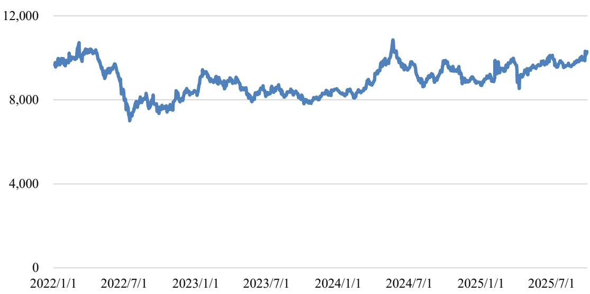  
数据来源：同花顺iFind。

经初步测算，以 2025 年 1-9 月为例，假设覆铜板、铜球、铜箔价格变动比例与铜价一致，如铜价上涨 10%，则上述原材料价格变动将导致公司当期原材料采购总成本上涨 6.06%。未来阶段，如铜等大宗商品价格持续上涨，且公司未能就该部分成本增长及时通过价格传导至客户，则将会导致公司原材料采购成本增加、主营业务毛利率有所下降，影响公司的利润水平和盈利能力。

## 三、其他风险

## （一）发行注册审批风险

本次发行可转债方案已经公司董事会和股东会审议通过，并经深交所上市审核委员会 2026 年第 7 次审议会议审议通过，需获得中国证监会同意注册后方可实施。本次能否取得同意注册批复，以及最终取得同意注册批复的时间存在不确定性。因此，本次发行存在注册审批相关风险。

## （二）无法足额募集风险

公司本次发行可转债拟募集资金总额不超过 46,900.00 万元（含 46,900.00万元），初始转股价格不低于募集说明书公告日前二十个交易日公司 A 股股票交易均价（若在该二十个交易日内发生过因除权、除息引起股价调整的情形，则对调整前交易日的交易均价按经过相应除权、除息调整后的价格计算）和前一个交易日公司A股股票交易均价。

本次发行的发行结果将受到宏观经济和行业发展情况、证券市场整体情况、公司股票价格走势、投资者对本次发行方案的认可程度等多种内外部因素的影响。因此，本次向不特定对象发行可转债存在发行募集资金不足甚至无法成功实施的风险。

## （三）本次发行摊薄即期股东收益的风险

报告期内，公司加权平均净资产收益率为 4.74%、0.47%、2.35%和 3.27%。本次可转债发行后，公司可转债投资者持有的可转债将可能部分或全部转股，公司的总股本和净资产将有一定幅度的增加，而募集资金投资项目从开始实施至产生预期效益需要一定时间，公司收益增长可能不会与净资产增长保持同步，因此公司存在短期内净资产收益率下降的风险。

## （四）可转债本身相关的风险

## 1、到期无法转股风险

进入可转债转股期后，可转债投资者将主要面临以下与转股相关的风险：

一方面，公司股价走势取决于公司业绩、宏观经济形势、股票市场总体状况等多种因素影响。转股期内，如果因各方面因素导致公司股票价格不能达到或超过本次发行可转债的当期转股价格，则本次可转债的转换价值可能降低，并对投资者的投资收益产生不利影响。

另一方面，本次可转债设置有条件赎回条款，在转股期内，如果达到赎回条件，公司有权决定按照债券面值加当期应计利息的价格赎回全部或部分未转股的可转债。如果公司行使有条件赎回的条款，可能促使可转债投资者提前转股，从而导致投资者面临可转债存续期缩短、未来利息收入减少的风险。

## 2、价格波动风险

可转债作为一种复合型金融产品，兼具债券属性和股票属性。可转债二级市场的价格受市场利率、票面利率、债券剩余期限、转股价格、上市公司股票价格、赎回条款、回售条款、向下修正条款及投资者的预期等多重因素的影响。因此，可转换公司债券在流通的过程中，价格波动较为复杂且存在不确定性，甚至可能出现异常波动。提醒投资者充分认识价格波动风险，以及可转债产品

的特殊性，以便作出正确的投资决策。

## 3、信用评级变化风险

东方金诚对本次可转换公司债券进行了评级，公司主体信用等级为 AA-，本次可转换公司债券信用等级为 AA-，评级展望稳定。在初次评级结束后，评级机构将在本次发行可转债的存续期限内，持续关注公司经营环境的变化、经营或财务状况的重大事项等因素，对受评对象开展定期以及不定期跟踪评级。如果由于公司外部经营环境、自身经营情况或评级标准变化等因素，从而导致本次发行可转债的信用评级级别发生不利变化，则将会增加投资者的风险，对投资人的利益产生不利影响。

## 4、利率风险

在本次发行可转债的存续期内，如市场利率上升，则可转债的价值可能会相应降低，从而使投资者遭受损失。提醒投资者充分考虑市场利率波动可能引起的风险，以避免和减少损失。

## 5、本息兑付风险

2022 年、2023 年和 2024 年，公司归属于母公司所有者的净利润分别为4,755.39 万元、482.69 万元和 2,373.96 万元，平均可分配利润为 2,537.35 万元。最近三年一期，公司经营活动产生的现金流量净额分别为 11,045.02 万元、7,459.99 万元、2,818.46 万元和-716.13 万元，呈持续下降趋势。在可转债的存续期限内，公司须按可转债相关条款之约定，就可转债未转股的部分每年偿付利息及到期兑付本金，并承兑投资者可能提出的回售要求。受国家政策、法规、行业和市场等不可控因素的影响，公司未来阶段的经营活动可能未带来预期的回报，或因行业、客户回款、原材料等因素导致公司现金流急剧下降，进而导致公司不能从预期的还款来源获得足够的资金，或不具有足够的现金流支付本次可转债应偿付的本息金额，并可能影响公司对可转债本息按时足额兑付，以及对投资者回售要求的承兑能力。

## 6、未设立担保风险

本次发行的可转债为无担保信用债券，无特定的资产作为担保品，且未设定担保人，债券投资者可能面临在不利情况下因本次发行的可转债未担保而无

法获得对应担保物补偿的风险。

## 7、不实施向下修正及修正幅度不确定性风险

本次发行设置了公司转股价格向下修正条款。可转债存续期内，在满足可转债转股价格向下修正条件的情况下，发行人董事会仍可能基于公司的实际情况、股价走势、市场因素等多重考虑，不提出转股价格向下调整方案，或董事会虽提出了与投资者预期相符的转股价格向下修正方案，但该方案未能通过股东会的批准。因此，存续期内可转债持有人可能面临转股价格向下修正条款不能实施的风险。

此外，公司股价走势取决于宏观经济、股票市场环境和经营业绩等多重因素，在本次可转债触及向下修正条件时，股东会召开日前二十个交易日和前一交易日公司 A 股股票均价存在不确定性，并相应导致转股价格修正幅度的不确定性。

## 8、可转债存续期限内转股价格向下修正条款实施导致公司原有股东股本摊薄程度扩大的风险

在本次发行可转债存续期限内，若公司股票触发转股价格向下修正条款约定的条件，则可转债的转股价格将可能向下调整，在同等转股规模条件下，公司转股股份数量也将相应增加。这将导致未认购本次可转债或未实施转股的公司原有股东持股比例进一步稀释。因此，存续期限内公司原有股东可能面临转股价格向下修正条款实施导致的股本摊薄程度扩大的风险。

## 9、可转债转股期权价值降低的风险

公司股价走势取决于公司业绩、宏观经济形势、股票市场总体状况等多种因素影响。本次可转债发行后，公司股价可能持续低于本次可转债的转股价格，因此本次可转债的转换价值可能降低，本次可转债持有人的利益可能受到重大不利影响。虽然本次可转债设置了公司转股价格向下修正条款，但如果公司未能及时向下修正转股价格或者即使公司向下修正转股价格，且公司股票价格低于转股价格，则仍可能导致本次发行的可转债转换价值降低，本次可转债持有人的利益可能受到不利影响。

## 10、证券市场波动风险

本次发行可转债转股后的股票在深交所创业板上市交易，股票价格波动不仅取决于公司自身的盈利水平及发展前景，也受到国家的产业政策调整、行业政策、利率和汇率的变化、投资者的心理预期变化以及其他一些不可预见的因素的影响。因此，公司股票价格存在因证券市场的变化而产生波动的风险。

## 第四节 发行人基本情况

## 一、公司发行前股本总额及前十名股东持股情况

截至 2025 年 9 月 30 日，公司总股本为 77,298,284 股，股本结构具体如下：

<table><tr><td rowspan=1 colspan=1>项目</td><td rowspan=1 colspan=1>持股数量（股）</td><td rowspan=1 colspan=1>持股比例</td></tr><tr><td rowspan=1 colspan=1>一、有限售条件股份</td><td rowspan=1 colspan=1>22,237,537</td><td rowspan=1 colspan=1>28.77%</td></tr><tr><td rowspan=1 colspan=1>高管锁定股</td><td rowspan=1 colspan=1>22,237,537</td><td rowspan=1 colspan=1>28.77%</td></tr><tr><td rowspan=1 colspan=1>首发前限售股</td><td rowspan=1 colspan=1></td><td rowspan=1 colspan=1></td></tr><tr><td rowspan=1 colspan=1>二、无限售条件流通股份</td><td rowspan=1 colspan=1>55,060,747</td><td rowspan=1 colspan=1>71.23%</td></tr><tr><td rowspan=1 colspan=1>合计</td><td rowspan=1 colspan=1>77,298,284</td><td rowspan=1 colspan=1>100.00%</td></tr></table>

截至 2025 年 9 月 30 日，发行人前十大股东及持股情况如下：

<table><tr><td rowspan=2 colspan=1>序号</td><td rowspan=2 colspan=1>股东名称</td><td rowspan=2 colspan=1>股东性质</td><td rowspan=2 colspan=1>持股数量（股)</td><td rowspan=2 colspan=1>持股比例</td><td rowspan=2 colspan=1>持有有限售条件的股份数量（股）</td><td rowspan=1 colspan=2>质押、标记或冻结情况</td></tr><tr><td rowspan=1 colspan=1>股份状态</td><td rowspan=1 colspan=1>数量（股）</td></tr><tr><td rowspan=1 colspan=1>1</td><td rowspan=1 colspan=1>董晓俊</td><td rowspan=1 colspan=1>境内自然人</td><td rowspan=1 colspan=1>16,527,043</td><td rowspan=1 colspan=1>21.38%</td><td rowspan=1 colspan=1>14,101,500</td><td rowspan=1 colspan=1>质押</td><td rowspan=1 colspan=1>7,020,000</td></tr><tr><td rowspan=1 colspan=1>2</td><td rowspan=1 colspan=1>瑞瀚投资</td><td rowspan=1 colspan=1>其他</td><td rowspan=1 colspan=1>15,400,000</td><td rowspan=1 colspan=1>19.92%</td><td rowspan=1 colspan=1></td><td rowspan=1 colspan=1>不适用</td><td rowspan=1 colspan=1></td></tr><tr><td rowspan=1 colspan=1>3</td><td rowspan=1 colspan=1>周国雄</td><td rowspan=1 colspan=1>境内自然人</td><td rowspan=1 colspan=1>5,413,300</td><td rowspan=1 colspan=1>7.00%</td><td rowspan=1 colspan=1>4,059,975</td><td rowspan=1 colspan=1>不适用</td><td rowspan=1 colspan=1></td></tr><tr><td rowspan=1 colspan=1>4</td><td rowspan=1 colspan=1>江培来</td><td rowspan=1 colspan=1>境内自然人</td><td rowspan=1 colspan=1>2,960,700</td><td rowspan=1 colspan=1>3.83%</td><td rowspan=1 colspan=1>2,953,125</td><td rowspan=1 colspan=1>不适用</td><td rowspan=1 colspan=1></td></tr><tr><td rowspan=1 colspan=1>5</td><td rowspan=1 colspan=1>海南诺和私募基金管理有限公司一-诺和红棉1号私募证券投资基金</td><td rowspan=1 colspan=1>其他</td><td rowspan=1 colspan=1>1,502,557</td><td rowspan=1 colspan=1>1.94%</td><td rowspan=1 colspan=1></td><td rowspan=1 colspan=1>不适用</td><td rowspan=1 colspan=1></td></tr><tr><td rowspan=1 colspan=1>6</td><td rowspan=1 colspan=1>曾林</td><td rowspan=1 colspan=1>境内自然人</td><td rowspan=1 colspan=1>1,461,100</td><td rowspan=1 colspan=1>1.89%</td><td rowspan=1 colspan=1></td><td rowspan=1 colspan=1>不适用</td><td rowspan=1 colspan=1></td></tr><tr><td rowspan=1 colspan=1>7</td><td rowspan=1 colspan=1>邓琼添</td><td rowspan=1 colspan=1>境内自然人</td><td rowspan=1 colspan=1>1,418,000</td><td rowspan=1 colspan=1>1.83%</td><td rowspan=1 colspan=1></td><td rowspan=1 colspan=1>不适用</td><td rowspan=1 colspan=1></td></tr><tr><td rowspan=1 colspan=1>8</td><td rowspan=1 colspan=1>江东城</td><td rowspan=1 colspan=1>境内自然人</td><td rowspan=1 colspan=1>1,111,900</td><td rowspan=1 colspan=1>1.44%</td><td rowspan=1 colspan=1>906,375</td><td rowspan=1 colspan=1>不适用</td><td rowspan=1 colspan=1></td></tr><tr><td rowspan=1 colspan=1>9</td><td rowspan=1 colspan=1>陈君玉</td><td rowspan=1 colspan=1>境内自然人</td><td rowspan=1 colspan=1>650,000</td><td rowspan=1 colspan=1>0.84%</td><td rowspan=1 colspan=1></td><td rowspan=1 colspan=1>不适用</td><td rowspan=1 colspan=1></td></tr><tr><td rowspan=1 colspan=1>10</td><td rowspan=1 colspan=1>邓炳方</td><td rowspan=1 colspan=1>境内自然人</td><td rowspan=1 colspan=1>545,000</td><td rowspan=1 colspan=1>0.71%</td><td rowspan=1 colspan=1></td><td rowspan=1 colspan=1>不适用</td><td rowspan=1 colspan=1></td></tr><tr><td rowspan=1 colspan=3>合计</td><td rowspan=1 colspan=1>46,989,600</td><td rowspan=1 colspan=1>60.79%</td><td rowspan=1 colspan=1>22,020,975</td><td rowspan=1 colspan=1></td><td rowspan=1 colspan=1>7,020,000</td></tr></table>

## 二、组织结构及对其他企业的重要权益投资情况

## （一）股权结构图

截至2025年9月 30日，公司股权结构图如下：

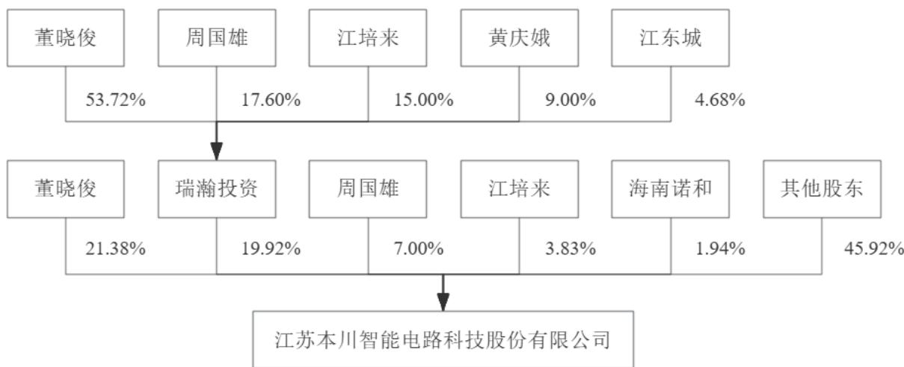  
注：“海南诺和”为海南诺和私募基金管理有限公司－诺和红棉1号私募证券投资基金。

## （二）组织结构图

截至本募集说明书出具之日，公司组织结构图如下：

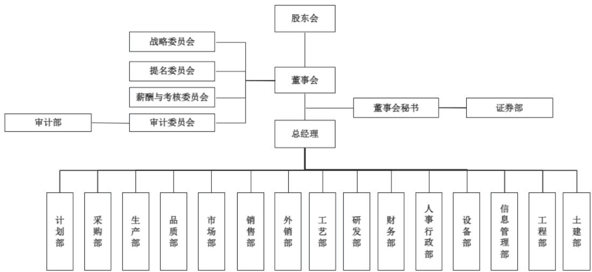

## （三）对其他企业的重要权益投资情况

## 1、控股子公司基本情况

截至本募集说明书出具之日，公司拥有 10 家控股子公司、2 家参股企业。除此以外，发行人无其他参股公司、联营企业或合营企业，或通过间接持股方式持有其他企业股权。发行人控股子公司情况如下：

<table><tr><td rowspan=2 colspan=1>序号</td><td rowspan=2 colspan=1>公司名称成立时间</td><td rowspan=2 colspan=1>公司名称成立时间</td><td rowspan=2 colspan=1>主要经营地</td><td rowspan=2 colspan=1>注册资本（万元）</td><td rowspan=2 colspan=1>实收资本（万元）</td><td rowspan=1 colspan=2>持股比例(%）</td><td rowspan=2 colspan=1>主营业务</td></tr><tr><td rowspan=1 colspan=1>直接</td><td rowspan=1 colspan=1>间接</td></tr><tr><td rowspan=1 colspan=1>1</td><td rowspan=1 colspan=1>艾威尔深圳</td><td rowspan=1 colspan=1>2007-03-26</td><td rowspan=1 colspan=1>深圳</td><td rowspan=1 colspan=1>1,500.00</td><td rowspan=1 colspan=1>1,500.00</td><td rowspan=1 colspan=1>100.00</td><td rowspan=1 colspan=1></td><td rowspan=1 colspan=1>印制电路板的研发、生产与销售</td></tr><tr><td rowspan=1 colspan=1>2</td><td rowspan=1 colspan=1>骏岭线路板</td><td rowspan=1 colspan=1>2010-03-15</td><td rowspan=1 colspan=1>深圳</td><td rowspan=1 colspan=1>1,500.00</td><td rowspan=1 colspan=1>1,500.00</td><td rowspan=1 colspan=1></td><td rowspan=1 colspan=1>100.00</td><td rowspan=1 colspan=1>印制电路板的研发、生产与销售</td></tr><tr><td rowspan=1 colspan=1>3</td><td rowspan=1 colspan=1>珠海亚图</td><td rowspan=1 colspan=1>2005-06-20</td><td rowspan=1 colspan=1>珠海</td><td rowspan=1 colspan=1>762.27</td><td rowspan=1 colspan=1>762.27</td><td rowspan=1 colspan=1>100.00</td><td rowspan=1 colspan=1></td><td rowspan=1 colspan=1>印制电路板的研发、生产与销售</td></tr><tr><td rowspan=1 colspan=1>4</td><td rowspan=1 colspan=1>皖粤光电</td><td rowspan=1 colspan=1>2018-07-16</td><td rowspan=1 colspan=1>珠海</td><td rowspan=1 colspan=1>1,500.00</td><td rowspan=1 colspan=1>1,500.00</td><td rowspan=1 colspan=1>80.00</td><td rowspan=1 colspan=1></td><td rowspan=1 colspan=1>印制电路板的研发、生产与销售</td></tr><tr><td rowspan=1 colspan=1>5</td><td rowspan=1 colspan=1>珠海硕鸿</td><td rowspan=1 colspan=1>1992-10-22</td><td rowspan=1 colspan=1>珠海</td><td rowspan=1 colspan=1>6,755.76</td><td rowspan=1 colspan=1>6,755.76</td><td rowspan=1 colspan=1>100.00</td><td rowspan=1 colspan=1></td><td rowspan=1 colspan=1>生产和销售新型电子元器件</td></tr><tr><td rowspan=1 colspan=1>6</td><td rowspan=1 colspan=1>香港本川</td><td rowspan=1 colspan=1>2015-07-29</td><td rowspan=1 colspan=1>香港</td><td rowspan=1 colspan=1>30.00万港元</td><td rowspan=1 colspan=1>30.00万港元</td><td rowspan=1 colspan=1>100.00</td><td rowspan=1 colspan=1></td><td rowspan=1 colspan=1>印制电路板的境外销售</td></tr><tr><td rowspan=1 colspan=1>7</td><td rowspan=1 colspan=1>美国本川</td><td rowspan=1 colspan=1>2016-11-28</td><td rowspan=1 colspan=1>美国</td><td rowspan=1 colspan=1></td><td rowspan=1 colspan=1>已发行股本1,000.00美元</td><td rowspan=1 colspan=1>100.00</td><td rowspan=1 colspan=1></td><td rowspan=1 colspan=1>为美国客户提供客户支持和营销服务</td></tr><tr><td rowspan=1 colspan=1>8</td><td rowspan=1 colspan=1>艾威尔泰国</td><td rowspan=1 colspan=1>2023-07-25</td><td rowspan=1 colspan=1>泰国</td><td rowspan=1 colspan=1>70,000.00万泰铁</td><td rowspan=1 colspan=1>24,500.00万泰铁</td><td rowspan=1 colspan=1>99.00</td><td rowspan=1 colspan=1>1.00</td><td rowspan=1 colspan=1>处于建设阶段，暂未实际开展经营</td></tr><tr><td rowspan=1 colspan=1>9</td><td rowspan=1 colspan=1>本川鹏芯</td><td rowspan=1 colspan=1>2025-07-02</td><td rowspan=1 colspan=1>南京</td><td rowspan=1 colspan=1>1,000.00</td><td rowspan=1 colspan=1>950.00</td><td rowspan=1 colspan=1>81.00</td><td rowspan=1 colspan=1></td><td rowspan=1 colspan=1>从事芯片嵌入1.80式电子产品的开发及销售</td></tr><tr><td rowspan=1 colspan=1>10</td><td rowspan=1 colspan=1>10本川鹏泰</td><td rowspan=1 colspan=1>2026-01-30</td><td rowspan=1 colspan=1>南京</td><td rowspan=1 colspan=1>1,000.00</td><td rowspan=1 colspan=1>1</td><td rowspan=1 colspan=1>100.00</td><td rowspan=1 colspan=1></td><td rowspan=1 colspan=1>-原材料采购</td></tr></table>

注 1：注册资本、实收资本的基准日为 2025 年 9 月 30 日；本川鹏泰成立于该基准日后，尚未实缴出资。  
注2：上表金额未特别标注币种时，币种为人民币。  
注 3：发行人通过香港本川间接持有艾威尔泰国 1%股权，合计持有艾威尔泰国 100%股权。  
注 4：发行人通过收购取得珠海硕鸿 100%股权，于 2024 年 11 月 29 日完成工商变更。  
注5：发行人通过收购取得皖粤光电80%股权，于2024年 10月 28 日完成工商变更。  
注 6：发行人直接持有本川鹏芯 81%股权，通过深圳保腾福顺创业投资基金合伙企业（有限合伙）间接持有本川鹏芯 1.80%股权。

## 2、重要控股子公司经营情况

截至 2025 年 9 月 30 日，发行人控股子公司最近一年一期简要财务情况如下：

单位：元

注：上表 2024 年财务数据已经致同会计师审计；2025 年 9 月 30 日/2025 年 1-9 月财务数据未经审计。
<table><tr><td colspan="1" rowspan="1">序号</td><td colspan="1" rowspan="1">公司名称</td><td colspan="1" rowspan="1">财务指标</td><td colspan="1" rowspan="1">2025-09-30/2025年1-9月</td><td colspan="1" rowspan="1">2024-12-31/2024 年度</td></tr><tr><td colspan="1" rowspan="2">1</td><td colspan="1" rowspan="2">艾威尔深圳</td><td colspan="1" rowspan="1">总资产</td><td colspan="1" rowspan="1">590,437,278.16</td><td colspan="1" rowspan="1">481,432,588.66</td></tr><tr><td colspan="1" rowspan="1">净资产</td><td colspan="1" rowspan="1">214,569,737.32</td><td colspan="1" rowspan="1">216,992,296.39</td></tr><tr><td colspan="1" rowspan="2"></td><td colspan="1" rowspan="2"></td><td colspan="1" rowspan="1">营业收入</td><td colspan="1" rowspan="1">397,745,799.19</td><td colspan="1" rowspan="1">441,820,946.54</td></tr><tr><td colspan="1" rowspan="1">净利润</td><td colspan="1" rowspan="1">-2,422,559.07</td><td colspan="1" rowspan="1">10,815,528.22</td></tr><tr><td colspan="1" rowspan="4">2</td><td colspan="1" rowspan="4">骏岭线路板</td><td colspan="1" rowspan="1">总资产</td><td colspan="1" rowspan="1">140,658,919.03</td><td colspan="1" rowspan="1">57,912,431.55</td></tr><tr><td colspan="1" rowspan="1">净资产</td><td colspan="1" rowspan="1">28,197,688.54</td><td colspan="1" rowspan="1">25,723,638.29</td></tr><tr><td colspan="1" rowspan="1">营业收入</td><td colspan="1" rowspan="1">69,955,948.13</td><td colspan="1" rowspan="1">82,702,166.78</td></tr><tr><td colspan="1" rowspan="1">净利润</td><td colspan="1" rowspan="1">2,474,050.25</td><td colspan="1" rowspan="1">1,691,874.46</td></tr><tr><td colspan="1" rowspan="4">3</td><td colspan="1" rowspan="4">珠海亚图</td><td colspan="1" rowspan="1">总资产</td><td colspan="1" rowspan="1">28,663,611.53</td><td colspan="1" rowspan="1">19,562,484.27</td></tr><tr><td colspan="1" rowspan="1">净资产</td><td colspan="1" rowspan="1">17,645,636.31</td><td colspan="1" rowspan="1">16,624,002.74</td></tr><tr><td colspan="1" rowspan="1">营业收入</td><td colspan="1" rowspan="1">14,930,675.17</td><td colspan="1" rowspan="1">18,450,489.71</td></tr><tr><td colspan="1" rowspan="1">净利润</td><td colspan="1" rowspan="1">1,021,633.57</td><td colspan="1" rowspan="1">1,338,152.10</td></tr><tr><td colspan="1" rowspan="4">4</td><td colspan="1" rowspan="4">皖粤光电</td><td colspan="1" rowspan="1">总资产</td><td colspan="1" rowspan="1">12,937,964.05</td><td colspan="1" rowspan="1">12,839,627.85</td></tr><tr><td colspan="1" rowspan="1">净资产</td><td colspan="1" rowspan="1">5,160,384.94</td><td colspan="1" rowspan="1">8,842,071.87</td></tr><tr><td colspan="1" rowspan="1">营业收入</td><td colspan="1" rowspan="1">6,458,889.77</td><td colspan="1" rowspan="1">686,750.40</td></tr><tr><td colspan="1" rowspan="1">净利润</td><td colspan="1" rowspan="1">-3,681,686.93</td><td colspan="1" rowspan="1">-378,380.15</td></tr><tr><td colspan="1" rowspan="4">5</td><td colspan="1" rowspan="4">珠海硕鸿</td><td colspan="1" rowspan="1">总资产</td><td colspan="1" rowspan="1">134,570,663.26</td><td colspan="1" rowspan="1">44,779,654.69</td></tr><tr><td colspan="1" rowspan="1">净资产</td><td colspan="1" rowspan="1">32,846,688.14</td><td colspan="1" rowspan="1">43,730,457.26</td></tr><tr><td colspan="1" rowspan="1">营业收入</td><td colspan="1" rowspan="1">17,160,169.81</td><td colspan="1" rowspan="1"></td></tr><tr><td colspan="1" rowspan="1">净利润</td><td colspan="1" rowspan="1">-10,883,769.12</td><td colspan="1" rowspan="1">-1,830,921.27</td></tr><tr><td colspan="1" rowspan="4">6</td><td colspan="1" rowspan="4">香港本川</td><td colspan="1" rowspan="1">总资产</td><td colspan="1" rowspan="1">93,479,220.02</td><td colspan="1" rowspan="1">62,323,062.93</td></tr><tr><td colspan="1" rowspan="1">净资产</td><td colspan="1" rowspan="1">16,273,211.36</td><td colspan="1" rowspan="1">-6,611,312.49</td></tr><tr><td colspan="1" rowspan="1">营业收入</td><td colspan="1" rowspan="1">272,314,235.56</td><td colspan="1" rowspan="1">266,495,706.00</td></tr><tr><td colspan="1" rowspan="1">净利润</td><td colspan="1" rowspan="1">22,942,796.76</td><td colspan="1" rowspan="1">-2,143,096.29</td></tr><tr><td colspan="1" rowspan="4">7</td><td colspan="1" rowspan="4">美国本川</td><td colspan="1" rowspan="1">总资产</td><td colspan="1" rowspan="1">1,835,747.14</td><td colspan="1" rowspan="1">3,573,970.49</td></tr><tr><td colspan="1" rowspan="1">净资产</td><td colspan="1" rowspan="1">-2,217,340.04</td><td colspan="1" rowspan="1">-2,831,422.62</td></tr><tr><td colspan="1" rowspan="1">营业收入</td><td colspan="1" rowspan="1">12,864,600.00</td><td colspan="1" rowspan="1">12,843,990.00</td></tr><tr><td colspan="1" rowspan="1">净利润</td><td colspan="1" rowspan="1">584,825.15</td><td colspan="1" rowspan="1">-1,993,635.85</td></tr><tr><td colspan="1" rowspan="4">8</td><td colspan="1" rowspan="4">泰国本川</td><td colspan="1" rowspan="1">总资产</td><td colspan="1" rowspan="1">62,273,551.55</td><td colspan="1" rowspan="1">61,355,051.22</td></tr><tr><td colspan="1" rowspan="1">净资产</td><td colspan="1" rowspan="1">62,231,940.58</td><td colspan="1" rowspan="1">61,287,467.10</td></tr><tr><td colspan="1" rowspan="1">营业收入</td><td colspan="1" rowspan="1"></td><td colspan="1" rowspan="1"></td></tr><tr><td colspan="1" rowspan="1">净利润</td><td colspan="1" rowspan="1">-1,365,358.96</td><td colspan="1" rowspan="1">-1,626,939.56</td></tr><tr><td colspan="1" rowspan="3">9</td><td colspan="1" rowspan="3">本川鹏芯</td><td colspan="1" rowspan="1">总资产</td><td colspan="1" rowspan="1">16,250,868.99</td><td colspan="1" rowspan="1"></td></tr><tr><td colspan="1" rowspan="1">净资产</td><td colspan="1" rowspan="1">16,250,868.99</td><td colspan="1" rowspan="1"></td></tr><tr><td colspan="1" rowspan="1">营业收入</td><td colspan="1" rowspan="1"></td><td colspan="1" rowspan="1"></td></tr><tr><td colspan="1" rowspan="1"></td><td colspan="1" rowspan="1"></td><td colspan="1" rowspan="1">净利润</td><td colspan="1" rowspan="1">868.99</td><td colspan="1" rowspan="1"></td></tr></table>

## 3、发行人参股企业情况

截至2025年9月 30日，发行人参股企业情况如下：

<table><tr><td rowspan=1 colspan=1>序号</td><td rowspan=1 colspan=1>公司名称</td><td rowspan=1 colspan=1>成立时间</td><td rowspan=1 colspan=1>主要经营地</td><td rowspan=1 colspan=1>注册资本/出资额（万元）</td><td rowspan=1 colspan=1>认缴资本/认缴出资额（万元）</td><td rowspan=1 colspan=1>主营业务</td></tr><tr><td rowspan=1 colspan=1>1</td><td rowspan=1 colspan=1>深圳保腾福顺创业投资基金合伙企业（有限合伙）</td><td rowspan=1 colspan=1>2024-09-04</td><td rowspan=1 colspan=1>深圳</td><td rowspan=1 colspan=1>15,000.00</td><td rowspan=1 colspan=1>3,000.00</td><td rowspan=1 colspan=1>股权投资</td></tr><tr><td rowspan=1 colspan=1>2</td><td rowspan=1 colspan=1>泰国珞呈有限公司</td><td rowspan=1 colspan=1>2024-09-24</td><td rowspan=1 colspan=1>泰国</td><td rowspan=1 colspan=1>10,000.00万泰铁</td><td rowspan=1 colspan=1>2,000.00万泰铁</td><td rowspan=1 colspan=1>PCB相关电子元器件组装</td></tr></table>

注1：上表金额未特别标注币种时，币种为人民币。  
注2：2025年 9月 25日，本川智能、上海芯华睿半导体科技有限公司、王学合与上海芯世纪半导体科技合伙企业签署《上海芯华睿半导体科技有限公司投资协议之终止协议》，各方协商一致确认本川智能退出持有的上海芯华睿半导体科技有限公司股份。相关手续在协议签署后办理。

## 4、发行人分公司情况

截至本募集说明书出具之日，发行人未设立分公司。

## 三、控股股东和实际控制人基本情况

## （一）控股股东和实际控制人

截至 2025 年 9 月 30 日，董晓俊先生直接持有公司股份 16,527,043 股，占公司股本总额的 21.38%；通过持有瑞瀚投资 53.72%的合伙份额并任其执行事务合伙人间接持有公司 10.70%股权。董晓俊先生直接和间接合计持有公司32.08%的股权，为公司的控股股东、实际控制人。

董晓俊，男，1972 年 9 月出生，中国国籍，无境外居留权，硕士研究生学历。1998 年 4 月至 2006 年 5 月，任深圳大冷王运输制冷有限公司经理；2007年 3 月至 2010 年 2 月，任艾威尔深圳执行董事、总经理；2012 年 11 月至 2019年 7 月，任深圳市瀚徽冷链技术有限公司执行董事兼总经理；2015 年 7 月至今任香港本川董事；2015 年 8 月至 2017 年 12 月，任艾威尔深圳执行董事兼总经理；2015 年 8 月至今，任瑞瀚投资执行事务合伙人；2015 年 9 月至 2016 年 4月，任南京本川电子有限公司执行董事；2017 年 1 月至今，任美国本川首席执行官；2017 年 2 月至 2017 年 4 月，任骏岭线路板董事长兼总经理；2017 年 12月至今，任艾威尔深圳监事。2025 年 7 月至今，任本川鹏芯董事长，2026 年 1月至今，任本川鹏泰董事；2016年4月至今任公司董事长。

截至本募集说明书出具之日，最近三年公司控股股东、实际控制人未发生过变动，公司控股权亦未发生变动。

## （二）控股股东和实际控制人所持股权质押情况

截至 2025 年 9 月 30 日，控股股东、实际控制人董晓俊质押股票情况如下：

<table><tr><td rowspan=1 colspan=1>序号</td><td rowspan=1 colspan=1>质权人</td><td rowspan=1 colspan=1>质押数量（万股）</td><td rowspan=1 colspan=1>融资金额（万元）</td><td rowspan=1 colspan=1>占其持股比例</td><td rowspan=1 colspan=1>占公司股本比例</td><td rowspan=1 colspan=1>质押日期</td><td rowspan=1 colspan=1>质押原因</td></tr><tr><td rowspan=1 colspan=1>1</td><td rowspan=1 colspan=1>中原信托有限公司</td><td rowspan=1 colspan=1>300.00</td><td rowspan=1 colspan=1>3,000.00</td><td rowspan=1 colspan=1>18.15%</td><td rowspan=1 colspan=1>3.88%</td><td rowspan=1 colspan=1>2025-03-13</td><td rowspan=1 colspan=1>补充流动资金</td></tr><tr><td rowspan=1 colspan=1>2</td><td rowspan=1 colspan=1>深圳市高新投小额贷款有限公司</td><td rowspan=1 colspan=1>267.00</td><td rowspan=1 colspan=1>3,000.00</td><td rowspan=1 colspan=1>16.16%</td><td rowspan=1 colspan=1>3.45%</td><td rowspan=1 colspan=1>2024-12-23</td><td rowspan=1 colspan=1>补充流动资金</td></tr><tr><td rowspan=1 colspan=1>3</td><td rowspan=1 colspan=1>云南国际信托有限公司</td><td rowspan=1 colspan=1>135.00</td><td rowspan=1 colspan=1>1,328.00</td><td rowspan=1 colspan=1>8.17%</td><td rowspan=1 colspan=1>1.75%</td><td rowspan=1 colspan=1>2025-7-17</td><td rowspan=1 colspan=1>补充流动资金</td></tr><tr><td rowspan=1 colspan=2>合计</td><td rowspan=1 colspan=1>702.00</td><td rowspan=1 colspan=1>7,328.00</td><td rowspan=1 colspan=1>42.48%</td><td rowspan=1 colspan=1>9.08%</td><td rowspan=1 colspan=1>-</td><td rowspan=1 colspan=1>1</td></tr></table>

截至2025年9月 30日，董晓俊直接持有发行人股份 16,527,043股，已质押股份数量为702.00 万股，董晓俊已质押股份占其所持有的发行人股份比例为42.48%，占发行人总股本的 9.08%，不存在大比例质押的情况。

除上述股权质押外，发行人控股股东、实际控制人董晓俊所持公司股份不存在其他质押、冻结或其他权利受限情形，亦不存在有争议、权属纠纷或潜在纠纷情况。

## （三）控股股东及实际控制人投资的其他企业及兼职情况

截至本募集说明书出具之日，除公司及子公司外，公司控股股东及实际控制人董晓俊投资其他企业或在其他企业兼职的情况如下：

<table><tr><td rowspan=1 colspan=1>序号</td><td rowspan=1 colspan=1>企业名称</td><td rowspan=1 colspan=1>任职情况</td><td rowspan=1 colspan=1>持股比例</td><td rowspan=1 colspan=1>主营业务</td></tr><tr><td rowspan=1 colspan=1>1</td><td rowspan=1 colspan=1>南京瑞瀚股权投资合伙企业（有限合伙）</td><td rowspan=1 colspan=1>执行事务合伙人</td><td rowspan=1 colspan=1>53.72%</td><td rowspan=1 colspan=1>股权投资</td></tr><tr><td rowspan=1 colspan=1>2</td><td rowspan=1 colspan=1>深圳市瀚徽冷链技术有限公司</td><td rowspan=1 colspan=1></td><td rowspan=1 colspan=1>90%</td><td rowspan=1 colspan=1>运输用制冷机组的销售、安装及售后服务</td></tr><tr><td rowspan=1 colspan=1>3</td><td rowspan=1 colspan=1>深圳市华玉信息科技有限公司</td><td rowspan=1 colspan=1>1</td><td rowspan=1 colspan=1>10%</td><td rowspan=1 colspan=1>消费电子产品的销售</td></tr></table>

## 四、重要承诺及履行情况

（一）报告期内发行人、控股股东、实际控制人以及发行人董事、时任监事、高级管理人员、其他核心人员作出的重要承诺及其履行情况

报告期内，发行人、控股股东、实际控制人及发行人董事、时任监事、高级管理人员、其他核心人员作出的重要承诺及履行情况如下：

<table><tr><td colspan="1" rowspan="1">序号</td><td colspan="1" rowspan="1">承诺来源</td><td colspan="1" rowspan="1">承诺主体</td><td colspan="1" rowspan="1">承诺类别</td><td colspan="1" rowspan="1">承诺开始日期</td><td colspan="1" rowspan="1">承诺结束日期</td><td colspan="1" rowspan="1">履行情况</td><td colspan="1" rowspan="1">承诺内容</td></tr><tr><td colspan="1" rowspan="1"></td><td colspan="1" rowspan="1">首次公开发行</td><td colspan="1" rowspan="1">董晓俊</td><td colspan="1" rowspan="1">股份限售承诺</td><td colspan="1" rowspan="1">2021/8/5</td><td colspan="1" rowspan="1">2024/8/4</td><td colspan="1" rowspan="1">正常履行中</td><td colspan="1" rowspan="1">公司控股股东、实际控制人董晓俊承诺：（1）自公司股票在深圳证券交易所上市之日起36个月内，本人不转让或者委托他人管理在上市之前直接或间接持有的公司股份，也不由公司回购该部分股份。若因公司进行权益分派等导致本人直接或间接持有的公司股份发生变化的，本人仍将遵守上述承诺。（2）若本人直接或间接所持公司股票在锁定期满后两年内减持的，该等股票的减持价格将不低于发行价；公司上市后6个月内如公司股票连续20个交易日的收盘价均低于发行价，或者上市后6个月期末收盘价低于发行价的，本人直接或间接持有公司股票的锁定期限自动延长6个月。期间公司如有派发股利、送股、转增股本等除权除息事项，上述价格相应调整。（3）前述锁定期满后，本人在公司担任董事、监事、高级管理人员期间，每年转让的公司股份数量不超过本人直接或间接持有的公司股份总数的 25%；离职后半年内，不转让本人直接或间接持有的公司股份。（4）本人将严格遵守《上市公司股东、董监高减持股份的若干规定》、《深圳证券交易所创业板股票上市规则》、《深圳证券交易所上市公司股东及董事、监事、高级管理人员减持股份实施细则》等相关法律法规和规范性文件的相关规定。</td></tr><tr><td colspan="1" rowspan="1">2</td><td colspan="1" rowspan="1">首次公开发行</td><td colspan="1" rowspan="1">黄庆娥、江东城、江培来、周国雄</td><td colspan="1" rowspan="1">股份限售承诺</td><td colspan="1" rowspan="1">2021/8/5</td><td colspan="1" rowspan="1">2024/8/4</td><td colspan="1" rowspan="1">正常履行中</td><td colspan="1" rowspan="1">持有公司股份的董事、监事、高级管理人员的承诺（1）持有公司股份的董事周国雄、江培来、黄庆娥承诺：①自公司股票在深圳证券交易所上市之日起12个月内，本人不转让或者委托他人管理在上市之前直接持有的公司股份，自公司股票在深圳证券交易所上市之日起36个月内，本人不转让或者委托他人管理在上市之前通过深圳瑞瀚股权投资企业（有限合伙）间接持有的公司股份，也不由公司回购该部分股份。若因公司进行权益分派等导致本人持有的公司股份发生变化的，本人仍将遵守上述承诺。②若本人直接或间接所持公司股票在锁定期满后两年内减持的，该等股票的减持价格将不低于发行价；公司上市后6个月内如公司股票连续20个交易日的收盘价均低于发行价，或者上市后6个月期末收盘价低于发行价的，本人直接或间接持有公司股票的锁定期限自动延长6个月。期间公司如有派发股利、送股、转增股本等除权除息事项，上述价格相应调整。③前述锁定期满后，本人在公司担任董事、监事、高级管理人员期间，每年转让的公司股份数量不超过本人直接或间接持有的公司股份总数的25%；离职后半年内，不转让本人直接或间接持有的公司股份。④本人将严格遵守《上市公司股东、董监高减持股份的若干规定》、《深圳证券交易所创业板股票上市规则》、《深圳</td></tr><tr><td colspan="1" rowspan="1"></td><td colspan="1" rowspan="1"></td><td colspan="1" rowspan="1"></td><td colspan="1" rowspan="1"></td><td colspan="1" rowspan="1"></td><td colspan="1" rowspan="1"></td><td colspan="1" rowspan="1"></td><td colspan="1" rowspan="1">证券交易所上市公司股东及董事、监事、高级管理人员减持股份实施细则》等相关法律法规和规范性文件的相关规定。（2）持有公司股份的监事江东城承诺：①自公司股票在深圳证券交易所上市之日起12个月内，本人不转让或者委托他人管理在上市之前直接持有的公司股份，自公司股票在深圳证券交易所上市之日起 36个月内，本人不转让或者委托他人管理在上市之前通过深圳瑞瀚股权投资企业（有限合伙）间接持有的公司股份，也不由公司回购该部分股份。若因公司进行权益分派等导致本人持有的公司股份发生变化的，本人仍将遵守上述承诺。②前述锁定期满后，本人在公司担任董事、监事、高级管理人员期间，每年转让的公司股份数量不超过本人直接或间接持有的公司股份总数的25%；离职后半年内，不转让本人直接或间接持有的公司股份。③本人将严格遵守《上市公司股东、董监高减持股份的若干规定》、《深圳证券交易所创业板股票上市规则》、《深圳证券交易所上市公司股东及董事、监事、高级管理人员减持股份实施细则》等相关法律法规和规范性文件的相关规定。</td></tr><tr><td colspan="1" rowspan="1">3</td><td colspan="1" rowspan="1">首次公开发行</td><td colspan="1" rowspan="1">深圳瑞瀚股权投资企业（有限合伙）</td><td colspan="1" rowspan="1">股份限售承诺</td><td colspan="1" rowspan="1">2021/8/5</td><td colspan="1" rowspan="1">2024/8/4</td><td colspan="1" rowspan="1">正常履行中</td><td colspan="1" rowspan="1">持股比例5%以上股东的承诺（1）公司股东瑞瀚投资承诺：①自公司股票在深圳证券交易所上市之日起36个月内，本企业不转让或者委托他人管理在上市之前直接或间接持有的公司股份，也不由公司回购该部分股份。若因公司进行权益分派等导致本企业直接或间接持有的公司股份发生变化的，本企业仍将遵守上述承诺。②若本企业直接或间接所持公司股票在锁定期满后两年内减持的，该等股票的减持价格将不低于发行价；公司上市后6个月内如公司股票连续20个交易日的收盘价均低于发行价，或者上市后6个月期末收盘价低于发行价的，本企业直接或间接持有公司股票的锁定期限自动延长6个月。期间公司如有派发股利、送股、转增股本等除权除息事项，上述价格相应调整。③本企业将严格遵守《上市公司股东、董监高减持股份的若干规定》、《深圳证券交易所创业板股票上市规则》、《深圳证券交易所上市公司股东及董事、监事、高级管理人员减持股份实施细则》等相关法律法规和规范性文件的相关规定。</td></tr><tr><td colspan="1" rowspan="1">4</td><td colspan="1" rowspan="1">首次公开发行</td><td colspan="1" rowspan="1">深圳市达晨创通股权投资企业（有限合伙）</td><td colspan="1" rowspan="1">股份限售承诺</td><td colspan="1" rowspan="1">2021/8/5</td><td colspan="1" rowspan="1">2022/8/4</td><td colspan="1" rowspan="1">已履行完毕</td><td colspan="1" rowspan="1">持股比例5%以上股东的承诺公司股东达晨创通承诺：①自公司股票在深圳证券交易所上市之日起12个月内，本企业不转让或者委托他人管理在上市之前直接或间接持有的公司股份，也不由公司回购该部分股份。若因公司进行权益分派等导致本企业直接或间接持有的公司股份发生变化的，本企业仍将遵守上述承诺。②本企业将严格遵守《上市公司股东、董监高减持股份的若干规定》、《深圳证</td></tr><tr><td colspan="1" rowspan="1"></td><td colspan="1" rowspan="1"></td><td colspan="1" rowspan="1"></td><td colspan="1" rowspan="1"></td><td colspan="1" rowspan="1"></td><td colspan="1" rowspan="1"></td><td colspan="1" rowspan="1"></td><td colspan="1" rowspan="1">券交易所创业板股票上市规则》、《深圳证券交易所上市公司股东及董事、监事、高级管理人员减持股份实施细则》等相关法律法规和规范性文件的相关规定。</td></tr><tr><td colspan="1" rowspan="2">5</td><td colspan="1" rowspan="2">首次公开发行</td><td colspan="1" rowspan="2">董晓俊、深圳瑞瀚股权投资企业（有限合伙）</td><td colspan="1" rowspan="1">股份减持承诺</td><td colspan="1" rowspan="1">2024/8/4</td><td colspan="1" rowspan="1">2026/8/4</td><td colspan="1" rowspan="1">正常履行中</td><td colspan="1" rowspan="2">公司控股股东、实际控制人董晓俊承诺：（1）本人将按照公司首次公开发行股票并在创业板上市招股说明书以及本人出具的各项承诺载明的限售期限要求，并严格遵守法律法规、规范性文件的相关规定，在限售期限内不减持公司股票。（2）本人减持公司股票应符合相关法律、法规、规章的规定，具体方式包括证券交易所集中竞价交易系统、大宗交易系统卖出或协议转让等法律法规允许的方式。（3）如果在限售期满后两年内，本人拟减持公司股票的，减持价格不低于首次公开发行时的发行价。期间公司如有派发股利、送股、转增股本等除权除息事项，上述价格相应调整。（4）如本人减持公司股份，将及时、充分履行股份减持的信息披露义务，在持有股份超过5%以上期间，减持前3个交易日将发布减持提示性公告。如本人计划通过证券交易所集中竞价交易减持公司股份，将在首次卖出的15个交易日前将向证券交易所报告并预先披露减持计划，由证券交易所予以备案。（5）如果本人未履行上述承诺减持本川智能股票，将该部分出售股票所取得的收益（如有）上缴本川智能所有，并承担相应法律后果，赔偿因未履行承诺而给本川智能或投资者带来的损失。公司股东瑞瀚投资承诺：①本企业将按照公司首次公开发行股票并在创业板上市招股说明书以及本企业出具的各项承诺载明的限售期限要求，并严格遵守法律法规、规范性文件的相关规定，在限售期限内不减持公司股票。②本企业减持公司股票应符合相关法律、法规、规章的规定，具体方式包括证券交易所集中竞价交易系统、大宗交易系统卖出或协议转让等法律法规允许的方式。③如果在限售期满后两年内，本企业拟减持公司股票的，减持价格不低于首次公开发行时的发行价。期间公司如有派发股利、送股、转增股本等除权除息事项，上述价格相应调整。④如本企业减持公司股份，将及时、充分履行股份减持的信息披露义务，在持有股份超过5%以上期间，减持前3个交易日将发布减持提示性公告。如本企业计划通过证券交易所集中竞价交易减持公司股份，将在首次卖出的15个交易日前将向证券交易所报告并预先披露减持计划，由证券交易所予以备案。③如果本企业未履行上述承诺减持本川智能股票，将该部分出售股票所取得的收益（如有）上缴本川智能所有，并承担相应法律后果，赔偿因未履行承诺而给本川智能或投资者带来的损失。</td></tr><tr><td colspan="1" rowspan="1"></td><td colspan="1" rowspan="1"></td><td colspan="1" rowspan="1"></td><td colspan="1" rowspan="1"></td></tr><tr><td colspan="1" rowspan="1">6</td><td colspan="1" rowspan="1">首次公开发行</td><td colspan="1" rowspan="1">黄庆娥、江培来、周国雄</td><td colspan="1" rowspan="1">股份减持承诺</td><td colspan="1" rowspan="1">2022/8/4</td><td colspan="1" rowspan="1">2024/8/4</td><td colspan="1" rowspan="1">正常履行中</td><td colspan="1" rowspan="1">公司自然人股东周国雄、江培来、黄庆娥承诺：①本人将按照公司首次公开发行股票并在创业板上市招股说明书以及本人出具的各项承诺载明的限售期限要求，并严格遵守法律法规、规范性文件的相关规定，在限售期限内不减持公司股票。②本人减持公司股票应符合相关法律、法规、规章的规定，具体方式包括证券交易所集中竞价交易系统、大宗交易系统卖出或协议转让等法律法规允许的方式。③如果在限售期满后两年内，本人拟减持公司股票的，减持价格不低于首次公开发行时的发行价。期间公司如有派发股利、送股、转增股本等除权除息事项，上述价格相应调整。④如本人减持公司股份，将及时、充分履行股份减持的信息披露义务，在持有股份超过5%以上期间，减持前3个交易日将发布减持提示性公告。如本人计划通过证券交易所集中竞价交易减持公司股份，将在首次卖出的15 个交易日前将向证券交易所报告并预先披露减持计划，由证券交易所予以备案。③如果本人未履行上述承诺减持本川智能股票，将该部分出售股票所取得的收益（如有）上缴本川智能所有，并承担相应法律后果，赔偿因未履行承诺而给本川智能或投资者带来的损失。</td></tr><tr><td colspan="1" rowspan="1">7</td><td colspan="1" rowspan="1">首次公开发行</td><td colspan="1" rowspan="1">董晓俊、黄庆娥、江培来、江苏本川智能电路科技股份有限公司、孔和兵、周国雄</td><td colspan="1" rowspan="1">稳定股价承诺</td><td colspan="1" rowspan="1">2021/8/5</td><td colspan="1" rowspan="1">2024/8/4</td><td colspan="1" rowspan="1">已履行完毕</td><td colspan="1" rowspan="1">董晓俊、黄庆娥、江培来、江苏本川智能电路科技股份有限公司、孔和兵、周国雄稳定股价的承诺：公司及公司控股股东、实际控制人、董事（不包括独立董事）及高级管理人员承诺：本公司/本人将严格遵守股东大会审议通过的《江苏本川智能电路科技股份有限公司关于上市后三年内稳定股价的预案》中的股价稳定措施和因未能采取稳定措施时生效的约束措施。启动稳定股价措施的条件：公司股票自挂牌上市之日起三年内，一旦出现连续20个交易日公司股票收盘价低于公司最近一期经审计的每股净资产时（若因除权除息等事项致使上述股票收盘价与公司最近一期末经审计的每股净资产不具可比性的，上述股票收盘价应做相应调整），在符合相关法律、法规和中国证监会相关规定及其他有约束力的规范性文件规定的前提下，公司、公司控股股东及实际控制人、公司董事（不含独立董事）和高级管理人员将根据本预案之具体措施启动股价稳定的措施，同时保证不会导致公司的股权分布不符合上市条件。</td></tr><tr><td colspan="1" rowspan="1">8</td><td colspan="1" rowspan="1">首次公开发行</td><td colspan="1" rowspan="1">江苏本川智能电路科技股份有限公司</td><td colspan="1" rowspan="1">其他承诺</td><td colspan="1" rowspan="1">2021/8/5</td><td colspan="1" rowspan="1">2024/8/4</td><td colspan="1" rowspan="1">已履行完毕</td><td colspan="1" rowspan="1">启动稳定股价措施的条件公司股票自挂牌上市之日起三年内，一旦出现连续20个交易日公司股票收盘价低于公司最近一期经审计的每股净资产时（若因除权除息等事项致使上述股票收盘价与公司最近一期末经审计的每股净资产不具可比性的，上述股票收盘价应做相应调整），在符合相关法律、法规和中国证监会相关</td></tr><tr><td colspan="1" rowspan="1"></td><td colspan="1" rowspan="1"></td><td colspan="1" rowspan="1"></td><td colspan="1" rowspan="1"></td><td colspan="1" rowspan="1"></td><td colspan="1" rowspan="1"></td><td colspan="1" rowspan="1"></td><td colspan="1" rowspan="1">规定及其他有约束力的规范性文件规定的前提下，公司、公司控股股东及实际控制人、公司董事（不含独立董事）和高级管理人员将根据本预案之具体措施启动股价稳定的措施，同时保证不会导致公司的股权分布不符合上市条件。公司回购股份当启动股价稳定措施的条件满足时，公司将依据法律、法规及公司章程的规定在不影响公司上市条件的前提下实施以下具体股价稳定措施：①自触发启动稳定股价措施的条件之日起，公司将在10个交易日内召开董事会，讨论并制定回购股份的具体方案，包括但不限于拟回购本公司股票的种类、数量区间、价格区间、实施期限等内容，并提交股东大会审议；股东大会对回购股份的具体方案作出决议，必须经出席会议的股东所持表决权三分之二以上审议通过。②公司股东大会审议通过上述回购方案后，公司将依法通知债权人，并向证券监督管理部门、证券交易所等主管部门报送相关材料，办理审批或备案手续。③公司回购股份的价格不超过最近一期末经审计的每股净资产，回购股份的方式为集中竞价交易方式、要约方式或证券监督管理部门认可的其他方式。公司单次用于回购股份的资金金额不高于最近一期经审计的归属于母公司所有者净利润的10%；公司自上市之日起每12个月内用于回购股份的资金金额合计不超过最近一期经审计的归属于母公司所有者净利润的30%。④在实施回购股票期间，公司股票连续20 个交易日的收盘价均已高于公司最近一期末经审计的每股净资产，或者继续回购股票将导致公司不满足法定上市条件时，公司将中止实施回购股票措施。③在启动股价稳定措施的条件满足时，如公司未采取上述稳定股价的具体措施，公司将在股东大会及中国证监会指定报刊上公开说明未采取上述稳定股价措施的具体原因并向股东和社会公众投资者道漱。</td></tr><tr><td colspan="1" rowspan="1">9</td><td colspan="1" rowspan="1">首次公开发行</td><td colspan="1" rowspan="1">董晓俊、黄庆娥、江培来、孔和兵、周国雄</td><td colspan="1" rowspan="1">其他承诺</td><td colspan="1" rowspan="1">2021/8/5</td><td colspan="1" rowspan="1">2024/8/4</td><td colspan="1" rowspan="1">已履行完毕</td><td colspan="1" rowspan="1">控股股东、实际控制人增持股份在达到触发启动股价稳定措施条件的情况下，由于公司无法实施回购股票或回购股票议案未获得公司股东大会批准，或公司回购股票方案实施完毕后（以公司公告的实施完毕日为准）3个月内，公司股票收盘价连续20个交易日仍均低于公司最近一期经审计的每股净资产值，则公司控股股东、实际控制人将依据法律、法规及公司章程的规定，在不影响公司上市条件的前提下实施以下具体股价稳定措施：①控股股东、实际控制人将在有关股价稳定措施启动条件成就后10个交易日内提出增持公司股份的方案（包括拟增持股份的数量、价格区间、时间等）并通知公司，公司应按照相关规定披露控股股东、实际控制人增持股份的计划。在公司披露控股股东、实际控制人增持公司股</td></tr><tr><td colspan="1" rowspan="1">序号</td><td colspan="1" rowspan="1">承诺来源</td><td colspan="1" rowspan="1">承诺主体</td><td colspan="1" rowspan="1">承诺类别</td><td colspan="1" rowspan="1">承诺开始承诺结束日期</td><td colspan="1" rowspan="1">承诺开始承诺结束日期</td><td colspan="1" rowspan="1">履行情况</td><td colspan="1" rowspan="1">承诺内容</td></tr><tr><td colspan="1" rowspan="1"></td><td colspan="1" rowspan="1"></td><td colspan="1" rowspan="1"></td><td colspan="1" rowspan="1"></td><td colspan="3" rowspan="1"></td><td colspan="1" rowspan="1">份计划的5个交易日后，控股股东、实际控制人将按照方案开始实施增持公司股份的计划。②控股股东、实际控制人增持公司股份的价格不高于公司最近一期末经审计的每股净资产；控股股东、实际控制人单次用于增持股份的资金金额不低于控股股东最近一次自公司获得的公司现金分红金额的 20%；控股股东、实际控制人在公司上市之日起每12个月内用于增持股份的资金金额合计不超过其最近一次自公司获得的公司现金分红金额的50%。③在实施增持股票期间，公司股票连续20个交易日的收盘价均已高于公司最近一期末经审计每股净资，或者继续增持股票将导致公司不满足法定上市条件时，或者继续增持股票将导致公司控股股东或实际控制人履行要约收购义务，公司控股股东、实际控制人将中止实施增持股票措施。④在启动股价稳定措施的前提满足时，如控股股东、实际控制人未按照上述预案采取稳定股价的具体措施，将在公司股东大会及中国证监会指定报刊上公开说明未采取上述稳定股价措施的具体原因并向公司股东和社会公众投资者道歉；如控股股东、实际控制人未履行上述承诺，将在前述事项发生之日起停止在公司领取股东分红，同时其持有的公司股份不得转让（因继承、被强制执行、上市公司重组、为履行对公司或投资者承诺等必须转股的情形除外），直至其按上述预案的规定采取相应的稳定股价措施并实施完毕时为止在公司任职并领取薪酬的公司董事（不包括独立董事）、高级管理人员增持股份在达到触发启动股价稳定措施条件的情况下，由于公司控股股东、实际控制人无法实施增持股票措施，或者增持股票措施实施完毕后公司股票连续 20个交易日的收盘价仍低于公司最近一期经审计的每股净资产，则在公司任职并领取薪酬的公司董事（不包括独立董事）、高级管理人员将依据法律、法规及公司章程的规定，在不影响公司上市条件的前提下实施以下具体股价稳定措施：①在公司任职并领取薪酬的公司董事（不包括独立董事）、高级管理人员将在有关股价稳定措施启动条件成就后10个交易日内提出增持公司股份的方案（包括拟增持股份的数量、价格区间、时间等）并通知公司，公司应按照相关规定披露其增持股份的计划。在公司披露其增持公司股份计划的5个交易日后，公司董事（不包括独立董事）、高级管理人员将按照方案开始实施增持公司股份的计划。②在公司任职并领取薪酬的公司董事（不包括独立董事）、高级管理人员增持公司股份的价格不高于公司最近一期末经审计的每股净资产；其单次用于增持股份的资金金额不低于其在任职期间上一会计年度从公司税后薪酬（或津贴）累计额的10%；其在公司上市之</td></tr><tr><td colspan="1" rowspan="1">序号</td><td colspan="1" rowspan="1">承诺来源</td><td colspan="1" rowspan="1">承诺主体</td><td colspan="1" rowspan="1">承诺类别</td><td colspan="1" rowspan="1">承诺开始日期</td><td colspan="1" rowspan="1">承诺结束日期</td><td colspan="1" rowspan="1">履行情况</td><td colspan="1" rowspan="1">承诺内容</td></tr><tr><td colspan="1" rowspan="1"></td><td colspan="1" rowspan="1"></td><td colspan="1" rowspan="1"></td><td colspan="1" rowspan="1"></td><td colspan="1" rowspan="1"></td><td colspan="1" rowspan="1"></td><td colspan="1" rowspan="1"></td><td colspan="1" rowspan="1">日起每12个月内用于增持股份的资金金额合计不超过其在任职期间上一会计年度从公司领取的税后薪酬（或津贴）累计额的50%。③在实施增持股票期间，公司股票连续20 个交易日的收盘价均已高于公司最近一期末经审计的每股净资产，或者继续增持股票将导致公司不满足法定上市条件时，公司董事（不包括独立董事）、高级管理人员将中止实施增持股票措施。④自公司股票挂牌上市之日起三年内，若公司新聘任董事（不包括独立董事）、高级管理人员的，公司将要求该等新聘任的董事（不包括独立董事）、高级管理人员履行公司上市时董事（不包括独立董事）、高级管理人员已作出的相应承诺。③在启动股价稳定措施的前提条件满足时，如公司董事（不包括独立董事）、高级管理人员未采取上述稳定股价的具体措施，将在公司股东大会及中国证监会指定报刊上公开说明未采取上述稳定股价措施的具体原因并向公司股东和社会公众投资者道歉；如果其未采取上述稳定股价的具体措施，则其将在前述事项发生之日起停止在公司领取股东分红（如有），同时其持有的公司股份（如有）不得转让（因继承、被强制执行、上市公司重组、为履行对公司或投资者承诺等必须转股的情形除外），直至其按上述预案的规定采取相应的稳定股价措施并实施完毕时为止。</td></tr><tr><td colspan="1" rowspan="1">10</td><td colspan="1" rowspan="1">首次公开发行</td><td colspan="1" rowspan="1">董晓俊、江苏本川智能电路科技股份有限公司</td><td colspan="1" rowspan="1">其他承诺</td><td colspan="1" rowspan="1">2021/8/5</td><td colspan="1" rowspan="1"></td><td colspan="1" rowspan="1">正常履行中</td><td colspan="1" rowspan="1">对欺诈发行上市的股份购回承诺1、公司承诺：（1）保证本公司本次公开发行股票并在创业板上市不存在任何欺诈发行的情形。（2）如本公司不符合发行上市条件，以欺骗手段骗取发行注册并已经发行上市的，本公司将在中国证监会等有权部门确认后五个工作日内启动股份购回程序，购回本公司本次公开发行的全部新股。2、控股股东、实际控制人董晓俊承诺：（1）保证公司本次公开发行股票并在创业板上市不存在任何欺诈发行的情形。（2）如公司不符合发行上市条件，以欺骗手段骗取发行注册并已经发行上市的，本人将敦促公司在中国证监会等有权部门确认后五个工作日内启动股份购回程序，购回公司本次公开发行的全部新股。（3）若上述购回承诺未得到及时履行，本人将及时告知公司，由公司进行公告。如果本人未能履行上述承诺，将停止在公司处领取股东分红；同时本人直接/间接持有的公司股份将不得转让，若转让的，转让所得归公司所有，直至本人按上述承诺采取相应的购回措施并实施完毕时为止。若法律、法规、规范性文件及中国证监会或深圳证券交易所对本人因违反上述承诺而应承担的相关责任及后果有不同规定，本人自愿无条件地遵从该等规定。</td></tr><tr><td colspan="1" rowspan="1">11</td><td colspan="1" rowspan="1">首次公开发行</td><td colspan="1" rowspan="1">董晓俊、郭玉、黄庆娥、江培来、孔和兵、夏俊、张燃、周国雄</td><td colspan="1" rowspan="1">其他承诺</td><td colspan="1" rowspan="1">2021/8/5</td><td colspan="1" rowspan="1"></td><td colspan="1" rowspan="1">正常履行中</td><td colspan="1" rowspan="1">1、公司控股股东及实际控制人关于填补被摊薄即期回报的承诺公司控股股东、实际控制人董晓俊对公司填补回报措施能够得到切实履行作出如下承诺：本人将不会越权干预发行人的经营管理活动，不侵占发行人利益。如本人违反上述承诺，给公司或投资者造成损失的，将依法承担赔偿责任。2、公司董事、高级管理人员关于填补被摊薄即期回报的承诺公司董事、高级管理人员对公司填补回报措施能够得到切实履行作出如下承诺：（1）本人承诺不无偿或以不公平条件向其他单位或者个人输送利益，也不采用其他方式损害公司利益。（2）本人承诺对职务消费行为进行约束。（3）本人承诺不动用公司资产从事与其履行职责无关的投资、消费活动。（4）本人承诺由董事会或薪酬与考核委员会制定的薪酬制度与公司填补回报措施的执行情况相挂钩。（5）未来公司如实施股权激励，本人承诺将在职责和权限范围内，全力促使公司股权激励的行权条件（如有）与公司填补回报措施的执行情况相挂钩。（6）自本承诺函出具日至公司首次公开发行人民币普通股股票并在创业板上市之日，若中国证券监督管理委员会、深圳证券交易所作出关于填补回报措施及其承诺的其他新的监管规定，且本人已做出的承诺不能满足该等规定时，本人承诺届时将按照中国证券监督管理委员会、深圳证券交易所的最新规定出具补充承诺。如本人违反上述承诺，给公司或投资者造成损失的，将依法承担赔偿责任。</td></tr><tr><td colspan="1" rowspan="1">12</td><td colspan="1" rowspan="1">首次公开发行</td><td colspan="1" rowspan="1">董晓俊、郭玉、国浩律师（深圳）事务所、黄庆娥、江东城、江培来、江苏本川智能电路科技股份有限公司、孔和兵、刘方森、上海众华资产评估有限公司、史春魁、夏俊、</td><td colspan="1" rowspan="1">其他承诺</td><td colspan="1" rowspan="1">2021/8/5</td><td colspan="1" rowspan="1"></td><td colspan="1" rowspan="1">正常履行中</td><td colspan="1" rowspan="1">依法承担赔偿责任的承诺：1、公司承诺：本公司首次公开发行股票并在创业板上市招股说明书不存在虚假记载、误导性陈述或重大遗漏，本公司对其真实性、准确性、完整性、及时性承担个别和连带的法律责任。在本公司投资者缴纳股票申购款后且股票尚未上市交易前，中国证监会、证券交易所或有权司法机构认定公司本次发行并上市的招股说明书有虚假记载、误导性陈述或者重大遗漏，对判断公司是否符合法律规定的发行条件构成重大、实质影响的，公司将停止公开发行新股或者回购已首次公开发行的全部新股，并按照投资者所缴纳股票申购款加上该等款项缴纳后至其被退回投资者期间按银行同期1年期存款利率计算的利息，对已缴纳股票申购款的投资者进行退款。在本公司首次公开发行的股票上市交易后，中国证监会、证券交易所或有权司法机构认定公司本次发行并上市的招股说明书有虚假记载、误导性陈述或者重大遗漏，导致对判断公司是否符合法律规定的发行条件构成重大、实质影响的，公司将依法回购首次公开发行的全部新股，回购价格为发行价格加上同期银行存款利息（若公司股票有派息、送股、资</td></tr><tr><td colspan="1" rowspan="1">序号</td><td colspan="1" rowspan="1">承诺来源</td><td colspan="1" rowspan="1">承诺主体</td><td colspan="1" rowspan="1">承诺类别</td><td colspan="1" rowspan="1">承诺开始承诺结束日期</td><td colspan="1" rowspan="1">承诺开始承诺结束日期</td><td colspan="1" rowspan="1">履行情况</td><td colspan="1" rowspan="1">承诺内容</td></tr><tr><td colspan="1" rowspan="1"></td><td colspan="1" rowspan="1"></td><td colspan="1" rowspan="1">张燃、致同会计师事务所（特殊普通合伙）、中水致远资产评估有限公司、中信证券股份有限公司、周国雄</td><td colspan="1" rowspan="1"></td><td colspan="1" rowspan="1"></td><td colspan="1" rowspan="1"></td><td colspan="1" rowspan="1"></td><td colspan="1" rowspan="1">本公积转增股本等除权、除息事项的，发行价格将相应进行除权、除息调整），回购的股份包括首次公开发行的全部新股及其派生股份，并根据相关法律、法规规定的程序实施。上述回购实施时法律法规另有规定的，从其规定。2、公司控股股东、实际控制人董晓俊承诺：本川智能首次公开发行股票并在创业板上市招股说明书不存在虚假记载、误导性陈述或重大遗漏，本人对其真实性、准确性、完整性、及时性承担个别和连带的法律责任。如因本川智能招股说明书有虚假记载、误导性陈述或者重大遗漏，对判断公司是否符合法律规定的发行条件构成重大、实质影响的，致使投资者在证券交易中遭受损失的，本人将在该等违法事实被中国证监会或人民法院等有关部门认定之日起三十日内依法赔偿投资者损失，本人能够证明自己没有过错的除外；如公司招股说明书有虚假记载、误导性陈述或者重大遗漏，对判断公司是否符合法律规定的发行条件构成重大、实质影响的，本人将依法回购公司首次公开发行时本人已转让的原限售股份。3、公司全体董事、监事、高级管理人员承诺：本川智能首次公开发行股票并在创业板上市招股说明书不存在虚假记载、误导性陈述或重大遗漏，本人对其真实性、准确性、完整性、及时性承担个别和连带的法律责任。如因本川智能招股说明书有虚假记载、误导性陈述或者重大遗漏，对判断公司是否符合法律规定的发行条件构成重大、实质影响的，致使投资者在证券交易中遭受损失的，本人将在该等违法事实被中国证监会或人民法院等有关部门认定之日起三十日内依法赔偿投资者损失，本人能够证明自己没有过错的除外；如公司招股说明书有虚假记载、误导性陈述或者重大遗漏，对判断公司是否符合法律规定的发行条件构成重大、实质影响的，本人将依法回购公司首次公开发行时本人已转让的原限售股份（如有）。4、公司保荐机构中信证券承诺：本保荐机构为发行人首次公开发行制作、出具的文件不存在虚假记载、误导性陈述或者重大遗漏的情形。若因本保荐机构为发行人首次公开发行制作、出具的文件有虚假记载、误导性陈述或者重大遗漏，给投资者造成损失的，本保荐机构将依法赔偿投资者损失。5、公司律师国浩承诺：本所为发行人首次公开发行制作、出具的文件不存在虚假记载、误导性陈述或者重大遗漏的情形。若因本所为发行人首次公开发行制作、出具的文件有虚假记载、误导性陈述或者重大遗漏，给投资者造成损失的，本所将依法赔偿投资者损失。6、公司审计机构、验资机构及验资复核机构致同承诺：本所为发行人首次公开发行制作、出具的文件不存在虚假记载、误导性陈述或者重大遗漏的情</td></tr><tr><td colspan="1" rowspan="1">序号</td><td colspan="1" rowspan="1">承诺来源</td><td colspan="1" rowspan="1">承诺主体</td><td colspan="1" rowspan="1">承诺类别</td><td colspan="1" rowspan="1">承诺开始日期</td><td colspan="1" rowspan="1">承诺结束日期</td><td colspan="1" rowspan="1">履行情况</td><td colspan="1" rowspan="1">承诺内容</td></tr><tr><td colspan="1" rowspan="1"></td><td colspan="1" rowspan="1"></td><td colspan="1" rowspan="1"></td><td colspan="1" rowspan="1"></td><td colspan="1" rowspan="1"></td><td colspan="1" rowspan="1"></td><td colspan="1" rowspan="1"></td><td colspan="1" rowspan="1">形。若因本所为发行人首次公开发行制作、出具的文件有虚假记载、误导性陈述或者重大遗漏，给投资者造成损失的，本所将依法赔偿投资者损失。7、公司资产评估机构中水致远承诺：本公司为发行人首次公开发行制作、出具的文件不存在虚假记载、误导性陈述或者重大遗漏的情形。若因本公司为发行人首次公开发行制作、出具的文件有虚假记载、误导性陈述或者重大遗漏，给投资者造成损失的，本公司将依法赔偿投资者损失。8、公司资产评估机构上海众华承诺：本公司为发行人首次公开发行制作、出具的资产评估报告（沪众评报字[2017]第064号、沪众评报字[2018]第0329号）不存在虚假记载、误导性陈述或者重大遗漏的情形。若因本公司为发行人首次公开发行制作、出具的文件有虚假记载、误导性陈述或者重大遗漏，给投资者造成损失的，本公司将依法赔偿投资者损失。</td></tr><tr><td colspan="1" rowspan="3">13</td><td colspan="1" rowspan="3">首次公开发行</td><td colspan="1" rowspan="3">董晓俊、郭玉、黄庆娥、江东城、江培来、江苏本川智能电路科技股份有限公司、孔和兵、刘方森、深圳瑞瀚股权投资企业（有限合伙）、深圳市达晨创通股权投资企业（有限合伙）、史春魁、夏俊、张燃、周国雄</td><td colspan="1" rowspan="1">其他承诺</td><td colspan="1" rowspan="3">2021/8/5</td><td colspan="1" rowspan="3"></td><td colspan="1" rowspan="1">正常履行中</td><td colspan="1" rowspan="3">关于未履行承诺时的约束措施的承诺：1、公司承诺：（1）本公司保证将严格履行本次发行并上市的招股说明书等文件中披露的承诺事项，并承诺严格遵守下列约束措施：①如本公司未履行招股说明书等文件中披露的相关承诺事项，本公司应在有关监管机关要求的期限内予以纠正，并在股东大会及中国证监会、证券交易所指定报刊上公开说明未履行承诺的具体原因以及未履行承诺时的补救及改正情况并向股东和社会公众投资者道歉。②如因本公司未履行相关承诺事项，致使投资者在证券交易中遭受损失的，本公司将依法向投资者赔偿相关损失。③如本公司因未履行招股说明书等文件中披露的相关承诺事项而产生违法所得，则该等违法所得应按相关法律法规的规定处理。④本公司将对出现该等未履行承诺行为负有个人责任的董事、监事、高级管理人员采取调减或停发薪酬或津贴等措施（如该等人员在本公司领薪）。（2）如因相关法律法规、政策变化、自然灾害及其他不可抗力等本公司无法控制的客观原因导致本公司承诺未能履行、确已无法履行或无法按期履行的，本公司将采取以下措施：①及时、充分披露本公司承诺未能履行、无法履行或无法按期履行的具体原因。②向本公司的投资者提出补充承诺或替代承诺（相关承诺需按法律、法规、公司章程的规定履行相关审批程序），以尽可能保护投资者的权益。2、公司控股股东、实际控制人董晓俊承诺：（1）本人保证将严格履行本次发行并上市的招股说明书中披露的承诺事项，并承诺严格遵守下列约束措施：①如本人未履行招股说明书中披露的相关承诺事项，本人应在有关监管机关要求的期限内予以纠正，并在公司股东大会及中国证券监督管理委员会、证券交易所指定报刊上公开说明未履行承诺的具体原因</td></tr><tr><td colspan="1" rowspan="1"></td><td colspan="1" rowspan="1"></td></tr><tr><td colspan="1" rowspan="1"></td><td colspan="1" rowspan="1"></td></tr><tr><td colspan="1" rowspan="1"></td><td colspan="1" rowspan="1"></td><td colspan="2" rowspan="1"></td><td colspan="3" rowspan="1"></td><td colspan="1" rowspan="1">并向公司股东和社会公众投资者道歉。②如因本人未履行相关承诺事项，致使投资者在证券交易中遭受损失的，本人将依法向投资者赔偿相关损失。如本人未承担前述赔偿责任，公司有权扣减本人所获分配的现金分红用于承担前述赔偿责任，同时，在本人未承担前述赔偿责任期间，不得转让本人直接或间接持有的公司股份。（2）如因相关法律法规、政策变化、自然灾害及其他不可抗力等本人无法控制的客观原因导致本人承诺未能履行、确已无法履行或无法按期履行的，本人将采取以下措施：①及时、充分披露本人承诺未能履行、无法履行或无法按期履行的具体原因。②向公司的投资者提出补充承诺或替代承诺（相关承诺需按法律、法规、公司章程的规定履行相关审批程序），以尽可能保护投资者的权益。3、公司持股5%以上股东周国雄、江培来、黄庆娥、瑞瀚投资及达晨创通承诺：（1）本人/本企业保证将严格履行本次发行并上市的招股说明书中披露的承诺事项，并承诺严格遵守下列约束措施：①如本人/本企业未履行招股说明书中披露的相关承诺事项，本人/本企业应在有关监管机关要求的期限内予以纠正，并在公司股东大会及中国证券监督管理委员会、证券交易所指定报刊上公开说明未履行承诺的具体原因并向公司股东和社会公众投资者道歉。②如因本人／本企业未履行相关承诺事项，致使投资者在证券交易中遭受损失的，本人/本企业将依法向投资者赔偿相关损失。如本人/本企业未承担前述赔偿责任，公司有权扣减本人/本企业所获分配的现金分红用于承担前述赔偿责任，同时，在本人/本企业未承担前述赔偿责任期间，不得转让本人/本企业直接或间接持有的公司股份。（2）如因相关法律法规、政策变化、自然灾害及其他不可抗力等本人/本企业无法控制的客观原因导致本人/本企业承诺未能履行、确已无法履行或无法按期履行的，本人/本企业将采取以下措施：①及时、充分披露本人/本企业承诺未能履行、无法履行或无法按期履行的具体原因。②向公司的投资者提出补充承诺或替代承诺（相关承诺需按法律、法规、公司章程的规定履行相关审批程序），以尽可能保护投资者的权益。4、公司董事、监事及高级管理人员承诺：（1）本人保证将严格履行本次发行并上市的招股说明书中披露的承诺事项，并承诺严格遵守下列约束措施：①如本人未履行招股说明书中披露的相关承诺事项，本人应在有关监管机关要求的期限内予以纠正，并在公司股东大会及中国证券监督管理委员会、证券交易所指定报刊上公开说明未履行承诺的具体原因并向公司股东和社会公众投资者道歉。②如因本人未履行相关承诺事项，致使投资者</td></tr></table>

<table><tr><td colspan="1" rowspan="1">序号</td><td colspan="1" rowspan="1">承诺来源</td><td colspan="1" rowspan="1">承诺主体</td><td colspan="1" rowspan="1">承诺类别</td><td colspan="1" rowspan="1">承诺开始日期</td><td colspan="1" rowspan="1">承诺结束日期</td><td colspan="1" rowspan="1">履行情况</td><td colspan="2" rowspan="1">承诺内容</td></tr><tr><td colspan="1" rowspan="1"></td><td colspan="1" rowspan="1"></td><td colspan="1" rowspan="1"></td><td colspan="1" rowspan="1"></td><td colspan="1" rowspan="1"></td><td colspan="1" rowspan="1"></td><td colspan="1" rowspan="1"></td><td colspan="2" rowspan="1">在证券交易中遭受损失的，本人将依法向投资者赔偿相关损失。如本人未承担前述赔偿责任，公司有权对本人采取调减或停发薪酬或津贴等措施，同时以本人当年以及以后年度自发行人领取的税后工资作为上述承诺的履约担保，且在履行承诺前，本人不得转让直接或间接持有的公司股份（如有）。（2）如因相关法律法规、政策变化、自然灾害及其他不可抗力等本人无法控制的客观原因导致本人承诺未能履行、确已无法履行或无法按期履行的，本人将采取以下措施：①及时、充分披露本人承诺未能履行、无法履行或无法按期履行的具体原因。②向公司的投资者提出补充承诺或替代承诺（相关承诺需按法律、法规、公司章程的规定履行相关审批程序），以尽可能保护投资者的权益。</td></tr><tr><td colspan="1" rowspan="1">14</td><td colspan="1" rowspan="1">首次公开发行</td><td colspan="1" rowspan="1">董晓俊</td><td colspan="1" rowspan="1">关于同业竞争、关联交易、资金占用方面的承诺</td><td colspan="1" rowspan="1">2021/8/5</td><td colspan="1" rowspan="1"></td><td colspan="1" rowspan="1">正常履行中</td><td colspan="2" rowspan="1">1、关于减少及避免关联交易的承诺公司控股股东、实际控制人董晓俊承诺：（1）本人承诺并促使本人控制的其他企业、与本人关系密切的近亲属不利用本人的地位及控制性影响谋求本川智能及其控制的其他企业在业务合作等方面给予优于市场第三方的权利。（2）本人承诺并促使本人控制的其他企业、与本人关系密切的近亲属不利用本人的地位及控制性影响谋求与本川智能及其控制的其他企业达成交易的优先权利。（3）本人承诺并促使本人控制的其他企业、与本人关系密切的近亲属不以低于或高于市场价格的条件与本川智能及其控制的其他企业进行交易，不会利用关联交易转移、输送利润，亦不利用关联交易从事任何损害本川智能及其控制的其他企业利益的行为。（4）本人承诺并促使本人控制的其他企业、与本人关系密切的近亲属尽量减少及避免并规范与本川智能及其控制的其他企业之间的关联交易。如果有不可避免的关联交易发生，所涉及的关联交易均会按照相关法律法规、公司章程和《关联交易决策制度》等文件的相关规定履行合法程序，及时进行信息披露，保证不通过关联交易损害本川智能及其他股东的合法权益。（5）本川智能股票在证券交易所上市交易后且本人依照所适用的上市规则被认定为本川智能的控股股东、实际控制人期间，本人将不会变更、解除本承诺。（6）本人将忠实履行上述承诺，并承担相应的法律责任，若不履行本承诺所赋予的义务和责任，本人将承担本川智能、本川智能其他股东或利益相关方因此所受到的任何损失。2、避免资金占用的承诺公司控股股东、实际控制人董晓俊承诺：（1）自本承诺出具之日起，本人承诺并促使本人控制的其他企业及与本人关系密切的近亲属严格遵守法律、法规、规范性文件以及本川智能相关规章制度的规定，不以任何方</td></tr><tr><td colspan="1" rowspan="1">序号</td><td colspan="1" rowspan="1">承诺来源</td><td colspan="1" rowspan="1">承诺主体</td><td colspan="1" rowspan="1">承诺类别</td><td colspan="1" rowspan="1">承诺开始日期</td><td colspan="1" rowspan="1">承诺结束日期</td><td colspan="1" rowspan="1">履行情况</td><td colspan="2" rowspan="1">承诺内容</td></tr><tr><td colspan="1" rowspan="1"></td><td colspan="1" rowspan="1"></td><td colspan="2" rowspan="1"></td><td colspan="1" rowspan="1"></td><td colspan="2" rowspan="1"></td><td colspan="2" rowspan="1">式违规占用或使用本川智能及其控制的其他企业的资金、资产和资源，也不会要求本川智能及其控制的其他企业违法违规为本人、本人控制的其他企业及与本人关系密切的近亲属的借款或其他债务提供担保。（2）若本人、本人控制的其他企业或本人关系密切的近亲属存在违法违规占用本川智能资金、资产和资源，或要求本川智能违法违规提供担保的情况，本人保证并促使本人控制的其他企业或与本人关系密切的近亲属对占用资金以现金的方式全部归还，对违规担保全部进行解除；在占用资金全部归还、违规担保全部解除前不转让所持有、控制的本川智能股份，并授权本川智能董事会办理股份锁定手续。（3）本人将按本川智能公司章程的规定，在审议涉及要求本川智能为本人、本人控制的其他企业及与本人关系密切的近亲属提供担保的任何董事会、股东大会上回避表决；在审议涉及本人及本人控制的其他企业、个人违规占用本川智能资金、资产和资源的任何董事会、股东大会上投反对票，依法维护本川智能利益。自本川智能首次公开发行股票并在创业板上市后，本人将严格遵守中国证监会关于上市公司法人治理的有关规定，采取一切必要的措施以保证不以任何方式违法违规占用本川智能的资金或其他资产，维护本川智能的独立性，且不损害本川智能及本川智能其他股东的利益。（4）前述承诺系无条件且不可撤销的，并在本承诺人继续作为本川智能控股股东、实际控制人期间持续有效。本人违反前述承诺将承担本川智能、本川智能其他股东或利益相关方因此所受到的任何损失。3、公司控股股东、实际控制人避免同业竞争的承诺公司控股股东、实际控制人董晓俊已出具了《关于避免同业竞争的承诺函》，具体内容如下：“1、本人、本人控制的其他企业及与本人关系密切的近亲属目前没有，将来也不从事与本川智能及其控制的其他企业主营业务相同或相似的生产经营活动，本人及本人控制的其他企业也不会通过投资于其它经济实体、机构、经济组织从事或参与和本川智能及其控制的其他企业主营业务相同的竞争性业务，本人也不会在该等与本川智能有竞争关系的经济实体、机构、经济组织担任董事、高级管理人员或核心技术人员。2、如果本川智能及其控制的其他企业在其现有业务的基础上进一步拓展其经营业务范围，而本人、本人控制的其他企业及与本人关系密切的近亲属对此已经进行生产、经营的，只要本人仍然是本川智能的实际控制人，本人、本人控制的其他企业及与本人关系密切的近亲属或终止从事该业务，或由本川智能在同等条件下优先收购该业务所涉资产或股权（权益），或遵循公平、公正的原则</td></tr><tr><td colspan="1" rowspan="1"></td><td colspan="1" rowspan="1"></td><td colspan="1" rowspan="1"></td><td colspan="1" rowspan="1"></td><td colspan="1" rowspan="1"></td><td colspan="1" rowspan="1"></td><td colspan="1" rowspan="1"></td><td colspan="1" rowspan="1">将该业务所涉资产或股权转让给无关联关系的第三方。3、对于本川智能及其控制的其他企业在其现有业务范围的基础上进一步拓展其经营业务范围，而本人、本人控制的其他企业及与本人关系密切的近亲属目前尚未对此进行生产、经营的，只要本人仍然是本川智能的实际控制人，本人、本人控制的其他企业及与本人关系密切的近亲属将不从事与本川智能及其控制的其他企业相竞争的该等新业务。4、本人、本人控制的其他企业及与本人关系密切的近亲属目前没有，将来也不向其他业务与本川智能及其控制的其他企业主营业务相同、类似的公司、企业或其他机构、组织或个人提供专有技术或提供销售渠道、客户信息等商业机密。5、本川智能股票在证券交易所上市交易后且本人依照所适用的上市规则被认定为本川智能的控股股东、实际控制人期间，本人将不会变更、解除本承诺。6、本人将忠实履行上述承诺，并承担相应的法律责任，若不履行本承诺所赋予的义务和责任，本人将承担本川智能、本川智能其他股东或利益相关方因此所受到的任何损失。”</td></tr><tr><td colspan="1" rowspan="1">15</td><td colspan="1" rowspan="1">首次公开发行</td><td colspan="1" rowspan="1">江苏本川智能电路科技股份有限公司</td><td colspan="1" rowspan="1">其他承诺</td><td colspan="1" rowspan="1">2021/8/5</td><td colspan="1" rowspan="1"></td><td colspan="1" rowspan="1">正常履行中</td><td colspan="1" rowspan="1">关于股东信息的承诺根据中国证监会《监管规则适用指引一关于申请首发上市企业股东信息披露》相关要求，公司承诺：（1）本公司已在招股说明书中真实、准确、完整的披露了股东信息。（2）本公司历史沿革中不存在股权代持、委托持股等情形，不存在股权争议或潜在纠纷等情形。（3）本公司不存在法律法规规定禁止持股的主体直接或间接持有发行人股份的情形。（4）本次发行的中介机构或其负责人、高级管理人员、经办人员不存在直接或间接持有发行人股份情形；（5）本公司不存在以发行人股权进行不当利益输送情形。（6）若本公司违反上述承诺，将承担由此产生的一切法律后果。</td></tr><tr><td colspan="1" rowspan="1">16</td><td colspan="1" rowspan="1">首次公开发行</td><td colspan="1" rowspan="1">董晓俊、江苏本川智能电路科技股份有限公司</td><td colspan="1" rowspan="1">分红承诺</td><td colspan="1" rowspan="1">2021/8/5</td><td colspan="1" rowspan="1"></td><td colspan="1" rowspan="1">正常履行中</td><td colspan="1" rowspan="1">利润分配政策的承诺1、发行人承诺：公司将严格执行股东大会审议通过的上市后适用的《公司章程（草案）》中相关利润分配政策，实施积极的利润分配政策，注重对股东的合理回报并兼顾公司的可持续发展，保持公司利润分配政策的连续性和稳定性。2、公司控股股东、实际控制人董晓俊承诺：1、根据《公司章程（草案）》中规定的利润分配政策及分红回报规划，督促相关方提出利润分配预案；2、在审议公司利润分配预案的股东大会上，本人将对符合利润分配政策和分红回报规划要求的利润分配预案投赞成票；3、督促公司根据相关决议实施利润分配。公司已经根据相关规定制定了本次公开发行上市后适用的《公司章程（草案）》，并制定了《江苏本川智能电路科技股份有限公司上市后前三年股东</td></tr><tr><td colspan="1" rowspan="1">序号</td><td colspan="1" rowspan="1">承诺来源</td><td colspan="1" rowspan="1">承诺主体</td><td colspan="1" rowspan="1">承诺类别</td><td colspan="1" rowspan="1">承诺开始承诺结束日期</td><td colspan="1" rowspan="1">承诺开始承诺结束日期</td><td colspan="1" rowspan="1">履行情况</td><td colspan="1" rowspan="1">承诺内容</td></tr><tr><td colspan="1" rowspan="2"></td><td colspan="1" rowspan="2"></td><td colspan="1" rowspan="2"></td><td colspan="1" rowspan="2"></td><td colspan="3" rowspan="2"></td><td colspan="1" rowspan="2">分红回报规划》，其中，对公司利润分配政策进行了详细约定。发行后的股利分配政策：2020年2月29日，公司召开 2020年第一次临时股东大会审议并通过了《关于发行上市后所适用的&lt;江苏本川智能电路科技股份有限公司章程（草案）&gt;的议案》及《关于公司首次公开发行人民币普通股（A股）并上市后三年股东分红回报规划的议案》。因中国证监会制定了《创业板首次公开发行股票注册管理办法》（试行）及深交所修订了《深圳证券交易所创业板股票上市规则》（2020年修订），公司于2020年8月14日召开2020年第三次临时股东大会，对公司上市后适用的《公司章程（草案）》进行了修改调整，公司发行上市后的主要股利分配政策如下：1、利润分配原则公司实行连续、稳定的利润分配政策，具体利润分配方式应结合公司利润实现状况、现金流量状况和股本规模进行决定。公司董事会和股东大会在利润分配政策的决策和论证过程中应当充分考虑独立董事和公众投资者的意见。2、利润分配的形式公司采取现金、股票或者现金与股票相结合的方式分配股利。凡具备现金分红条件的，公司优先采取现金分红的利润分配方式，公司连续三年以现金方式累计分配的利润不少于该三年实现的年均可分配利润的30%；在公司有重大投资计划或重大现金支出等事项发生或者出现其他需满足公司正常生产经营的资金需求情况时，公司可以采取股票方式分配股利。3、现金分配的条件满足以下条件的，公司应该进行现金分配，在不满足以下条件的情况下，公司可根据实际情况确定是否进行现金分配：（1）公司该年度实现的可分配利润（即公司弥补亏损、提取公积金后所余的税后利润）为正值；（2）审计机构对公司的该年度财务报告出具标准无保留意见的审计报告；（3）公司现金流能满足公司正常经营和长期发展的需要；（4）公司无重大投资计划或重大现金支出等事项发生（募集资金项目除外）。重大投资计划或重大现金支出是指：（1）公司未来十二个月内拟对外资本投资、实业投资、收购资产或者购买设备的累计支出达到或者超过公司最近一期经审计净资产的20%，且超过5,000万元人民币；（2）公司未来十二个月内拟对外资本投资、实业投资、收购资产或者购买设备的累计支出达到或者超过公司最近一期经审计总资产的10%。4、利润分配的时间间隔公司原则进行年度利润分配，在有条件的情况下，公司董事会可以根据公司经营状况提议公司进行中期利润分配。5、利润分配的比例公司董事会应当综合考虑所处行业特点、发展阶段、自身经营模式、盈利水平以及是否有重大资金支出安排等因素，区分下列情形，并按照公司</td></tr><tr><td colspan="1" rowspan="1"></td></tr></table>

<table><tr><td colspan="1" rowspan="1">序号</td><td colspan="1" rowspan="1">承诺来源</td><td colspan="1" rowspan="1">承诺主体</td><td colspan="1" rowspan="1">承诺类别</td><td colspan="1" rowspan="1">承诺开始日期</td><td colspan="1" rowspan="1">承诺结束日期</td><td colspan="1" rowspan="1">履行情况</td><td colspan="1" rowspan="1">承诺内容</td></tr><tr><td colspan="1" rowspan="1"></td><td colspan="1" rowspan="1"></td><td colspan="1" rowspan="1"></td><td colspan="1" rowspan="1"></td><td colspan="1" rowspan="1"></td><td colspan="1" rowspan="1"></td><td colspan="1" rowspan="1"></td><td colspan="1" rowspan="1">章程规定的程序，提出差异化的现金分红政策：（1）公司发展阶段属成熟期且无重大资金支出安排的，进行利润分配时，现金分红在本次利润分配中所占比例最低应达到80%；（2）公司发展阶段属成熟期且有重大资金支出安排的，进行利润分配时，现金分红在本次利润分配中所占比例最低应达到40%；（3）公司发展阶段属成长期且有重大资金支出安排的，进行利润分配时，现金分红在本次利润分配中所占比例最低应达到20%。公司发展阶段不易区分但有重大资金支出安排的，可以按照前项规定处理。6、利润分配方案的决策程序和机制（1）公司董事会应根据所处行业特点、发展阶段和自身经营模式、盈利水平、资金需求等因素，研究和论证公司现金分红的时机、条件和最低比例、调整的条件及其决策程序要求等事宜，拟定利润分配预案，独立董事发表明确意见后，提交股东大会审议。独立董事可以征集中小股东的意见，提出分红提案，并直接提交董事会审议。（2）股东大会审议利润分配方案前，应通过多种渠道主动与股东特别是中小股东进行沟通和交流，充分听取中小股东的意见和诉求，及时答复中小股东关心的问题。（3）公司因特殊情况无法按照既定的现金分红政策或最低现金分红比例确定当年利润分配方案时，应当披露具体原因以及独立董事的明确意见。（4）如对本章程确定的现金分红政策进行调整或者变更的，应当经过详细论证后履行相应的决策程序，并经出席股东大会的股东所持表决权的2/3以上通过。（5）在股东违规占用公司资金情况的，公司应当扣减该股东所分配的现金红利，已偿还其占用的资金。7、公司利润分配政策的变更机制公司如因外部环境变化或自身经营情况、投资规划和长期发展而需要对利润分配政策进行调整的，公司可对利润分配政策进行调整。公司调整利润分配政策应当以保护股东利益和公司整体利益为出发点，充分考虑股东特别是中小股东、独立董事的意见，由董事会在研究论证后拟定新的利润分配政策，并经独立董事发表明确意见后，提交股东大会审议通过。</td></tr><tr><td colspan="1" rowspan="1">17</td><td colspan="1" rowspan="1">首次公开发行</td><td colspan="1" rowspan="1">董晓俊</td><td colspan="1" rowspan="1">其他承诺</td><td colspan="1" rowspan="1">2021/8/5</td><td colspan="1" rowspan="1"></td><td colspan="1" rowspan="1">正常履行中</td><td colspan="1" rowspan="1">公司控股股东、实际控制人董晓俊已出具书面承诺：“若本川智能及其子公司因境外投资涉及主管发改委等部门的登记、备案、核准手续方面存在任何瑕疵而受到任何损害、损失或行政处罚，本人愿意承担本川智能及其子公司因此导致的所有经济损失”。</td></tr><tr><td colspan="1" rowspan="1">18</td><td colspan="1" rowspan="1">首次公开发行</td><td colspan="1" rowspan="1">董晓俊</td><td colspan="1" rowspan="1">其他承诺</td><td colspan="1" rowspan="1">2021/8/5</td><td colspan="1" rowspan="1"></td><td colspan="1" rowspan="1">正常履行中</td><td colspan="1" rowspan="1">公司控股股东、实际控制人董晓俊承诺：“（1）在本川智能首次公开发行股票并上市前，如因本川智能（含本川智能前身）及其控股子公司未依法为员工缴纳</td></tr><tr><td colspan="1" rowspan="1"></td><td colspan="1" rowspan="1"></td><td colspan="1" rowspan="1"></td><td colspan="1" rowspan="1"></td><td colspan="1" rowspan="1"></td><td colspan="1" rowspan="1"></td><td colspan="1" rowspan="1"></td><td colspan="1" rowspan="1">社会保险费或住房公积金，而根据有关主管部门或员工的要求补缴本次发行并上市报告期或之前任何期间的职工社会保险，或使公司及其子公司遭受任何罚款或损失的，本人将自愿在毋须本川智能及其控股子公司、分公司支付对价的情况下，无条件承担所有补缴款项、罚款、赔偿责任及其他一切相关费用的缴付义务，并对公司及其子公司因此而遭受的所有损失承担补偿责任。（2）本川智能股票在证券交易所上市交易后且本人依照所适用的上市规则被认定为本川智能的控股股东、实际控制人，本人将不会变更、解除本承诺。（3）本人将忠实履行上述承诺，并承担相应的法律责任，若不履行本承诺所赋予的义务和责任，本人将承担本川智能、本川智能其他股东或利益相关方因此所受到的任何损失。”</td></tr><tr><td colspan="1" rowspan="1">19</td><td colspan="1" rowspan="1">首次公开发行</td><td colspan="1" rowspan="1">深圳市达晨创通股权投资企业（有限合伙）</td><td colspan="1" rowspan="1">股份减持承诺</td><td colspan="1" rowspan="1">2022/8/4</td><td colspan="1" rowspan="1"></td><td colspan="1" rowspan="1">已履行完毕</td><td colspan="1" rowspan="1">公司股东达晨创通承诺：①本企业将按照公司首次公开发行股票并在创业板上市招股说明书以及本企业出具的各项承诺载明的限售期限要求，并严格遵守法律法规、规范性文件的相关规定，在限售期限内不减持公司股票。②本企业减持公司股票应符合相关法律、法规、规章的规定，具体方式包括证券交易所集中竞价交易系统、大宗交易系统卖出或协议转让等法律法规允许的方式。③如本企业减持公司股份，将及时、充分履行股份减持的信息披露义务，在持有股份超过5%以上期间，减持前3个交易日将发布减持提示性公告。如本企业计划通过证券交易所集中竞价交易减持公司股份，将在首次卖出的15个交易日前将向证券交易所报告并预先披露减持计划，由证券交易所予以备案。④如果本企业未履行上述承诺减持本川智能股票，将该部分出售股票所取得的收益（如有）上缴本川智能所有，并承担相应法律后果，赔偿因未履行承诺而给本川智能或投资者带来的损失。</td></tr><tr><td colspan="1" rowspan="1">20</td><td colspan="1" rowspan="1">首次公开发行</td><td colspan="1" rowspan="1">孔和兵</td><td colspan="1" rowspan="1">股份限售承诺</td><td colspan="1" rowspan="1">2021/8/5</td><td colspan="1" rowspan="1">2024/8/4</td><td colspan="1" rowspan="1">正常履行中</td><td colspan="1" rowspan="1">持有公司股份的高级管理人员孔和兵承诺：①自公司股票在深圳证券交易所上市之日起12个月内，本人不转让或者委托他人管理在上市之前直接或间接持有的公司股份，也不由公司回购该部分股份。若因公司进行权益分派等导致本人持有的公司股份发生变化的，本人仍将遵守上述承诺。②若本人直接或间接所持公司股票在锁定期满后两年内减持的，该等股票的减持价格将不低于发行价；公司上市后6个月内如公司股票连续20个交易日的收盘价均低于发行价，或者上市后6个月期末收盘价低于发行价的，本人直接或间接持有公司股票的锁定期限自动延长6个月。期间公司如有派发股利、送股、转增股本等除权除息事项，上述价格相应调整。③前述锁定期满后，本人在公司担任董事、监事、高级管理人员期</td></tr><tr><td colspan="1" rowspan="1"></td><td colspan="1" rowspan="1"></td><td colspan="1" rowspan="1"></td><td colspan="1" rowspan="1"></td><td colspan="1" rowspan="1"></td><td colspan="1" rowspan="1"></td><td colspan="1" rowspan="1"></td><td colspan="1" rowspan="1">间，每年转让的公司股份数量不超过本人直接或间接持有的公司股份总数的25%；离职后半年内，不转让本人直接或间接持有的公司股份。④本人将严格遵守《上市公司股东、董监高减持股份的若干规定》、《深圳证券交易所创业板股票上市规则》、《深圳证券交易所上市公司股东及董事、监事、高级管理人员减持股份实施细则》等相关法律法规和规范性文件的相关规定。</td></tr><tr><td colspan="1" rowspan="1">21</td><td colspan="1" rowspan="1">首次公开发行</td><td colspan="1" rowspan="1">黄庆娥</td><td colspan="1" rowspan="1">股份限售承诺</td><td colspan="1" rowspan="1">2021/8/5</td><td colspan="1" rowspan="1">2024/8/4</td><td colspan="1" rowspan="1">已履行完毕</td><td colspan="1" rowspan="1">持有公司股份的董事、监事、高级管理人员的承诺（1）持有公司股份的董事周国雄、江培来、黄庆娥承诺：①自公司股票在深圳证券交易所上市之日起12个月内，本人不转让或者委托他人管理在上市之前直接持有的公司股份，自公司股票在深圳证券交易所上市之日起36个月内，本人不转让或者委托他人管理在上市之前通过深圳瑞瀚股权投资企业（有限合伙）间接持有的公司股份，也不由公司回购该部分股份。若因公司进行权益分派等导致本人持有的公司股份发生变化的，本人仍将遵守上述承诺。②若本人直接或间接所持公司股票在锁定期满后两年内减持的，该等股票的减持价格将不低于发行价；公司上市后6个月内如公司股票连续20个交易日的收盘价均低于发行价，或者上市后6个月期末收盘价低于发行价的，本人直接或间接持有公司股票的锁定期限自动延长6个月。期间公司如有派发股利、送股、转增股本等除权除息事项，上述价格相应调整。③前述锁定期满后，本人在公司担任董事、监事、高级管理人员期间，每年转让的公司股份数量不超过本人直接或间接持有的公司股份总数的 25%；离职后半年内，不转让本人直接或间接持有的公司股份。④本人将严格遵守《上市公司股东、董监高减持股份的若干规定》、《深圳证券交易所创业板股票上市规则》、《深圳证券交易所上市公司股东及董事、监事、高级管理人员减持股份实施细则》等相关法律法规和规范性文件的相关规定。（2）持有公司股份的监事江东城承诺：①自公司股票在深圳证券交易所上市之日起12个月内，本人不转让或者委托他人管理在上市之前直接持有的公司股份，自公司股票在深圳证券交易所上市之日起 36个月内，本人不转让或者委托他人管理在上市之前通过深圳瑞瀚股权投资企业（有限合伙）间接持有的公司股份，也不由公司回购该部分股份。若因公司进行权益分派等导致本人持有的公司股份发生变化的，本人仍将遵守上述承诺。②前述锁定期满后，本人在公司担任董事、监事、高级管理人员期间，每年转让的公司股份数量不超过本人直接或间接持有的公司股份总数的25%；离职后半年内，不转让本人直接或间接持有的公司股份。③本人将严格遵守《上市公司股</td></tr><tr><td colspan="1" rowspan="1">序号</td><td colspan="1" rowspan="1">承诺来源</td><td colspan="1" rowspan="1">承诺主体</td><td colspan="1" rowspan="1">承诺类别</td><td colspan="1" rowspan="1">承诺开始承诺结束日期</td><td colspan="1" rowspan="1">承诺开始承诺结束日期</td><td colspan="1" rowspan="1">履行情况</td><td colspan="1" rowspan="1">承诺内容</td></tr><tr><td colspan="1" rowspan="1"></td><td colspan="1" rowspan="1"></td><td colspan="1" rowspan="1"></td><td colspan="1" rowspan="1"></td><td colspan="1" rowspan="1"></td><td colspan="1" rowspan="1"></td><td colspan="1" rowspan="1"></td><td colspan="1" rowspan="1">东、董监高减持股份的若干规定》、《深圳证券交易所创业板股票上市规则》、《深圳证券交易所上市公司股东及董事、监事、高级管理人员减持股份实施细则》等相关法律法规和规范性文件的相关规定。</td></tr><tr><td colspan="1" rowspan="1">22</td><td colspan="1" rowspan="1">首次公开发行</td><td colspan="1" rowspan="1">曹成元、焦美丽、邵福书、王俊</td><td colspan="1" rowspan="1">股份限售承诺</td><td colspan="1" rowspan="1">2021/8/5</td><td colspan="1" rowspan="1">2022/8/4</td><td colspan="1" rowspan="1">已履行完毕</td><td colspan="1" rowspan="1">公司其他股东承诺：自公司股票在深圳证券交易所上市之日起12个月内，本人不转让或者委托他人管理在上市之前持有的公司股份，也不由公司回购该部分股份。若因公司进行权益分派等导致本人持有的公司股份发生变化的，本人仍将遵守上述承诺。</td></tr><tr><td colspan="1" rowspan="1">23</td><td colspan="1" rowspan="1">首次公开发行</td><td colspan="1" rowspan="1">曹羲红、陈东文、陈晓琴、董春花、樊金红、房东、龚伟、金彪平、雷立英、李宁辉、李义、李展、李振荣、梁红霞、卢宏亮、马阳勇、潘建、潘盼盼、唐志坤、王志军、吴青春、杨晓晖、袁力、张成春、张建波、张金静、张鹏、张月飞、郑小春、朱宣花</td><td colspan="1" rowspan="1">股份限售承诺</td><td colspan="1" rowspan="1">2021/8/5</td><td colspan="1" rowspan="1">2022/8/4</td><td colspan="1" rowspan="1">已履行完毕</td><td colspan="1" rowspan="1">公司其他股东承诺：自公司股票在深圳证券交易所上市之日起12个月内，本人不转让或者委托他人管理在上市之前持有的公司股份，也不由公司回购该部分股份。若因公司进行权益分派等导致本人持有的公司股份发生变化的，本人仍将遵守上述承诺。</td></tr></table>

## （二）与本次发行相关的承诺

## 1、关于填补被摊薄即期回报措施得以切实履行的承诺

## （1）控股股东、实际控制人

为使公司填补回报措施能够得到切实履行，维护中小投资者利益，公司控股股东、实际控制人董晓俊作出如下承诺：

“1、本人承诺不越权干预上市公司经营管理活动，不侵占上市公司利益；

2、本人承诺不会无偿或以不公平条件向其他单位或者个人输送利益，也不采用其他方式损害上市公司利益；

3、自本承诺出具日至上市公司本次向不特定对象发行可转换公司债券实施完毕前，若中国证监会及/或深圳证券交易所作出关于填补回报措施及其承诺的其他新的监管规定的，且上述承诺不能满足中国证监会及/或深圳证券交易所该等规定时，本人承诺届时将按照中国证监会及/或深圳证券交易所的最新规定出具补充承诺；

4、作为填补回报措施相关责任主体之一，若违反上述承诺或拒不履行上述承诺，本人同意中国证监会及/或深圳证券交易所等证券监管机构按照其制定或发布的有关规定、规则，对本人做出相关处罚或采取相关管理措施，并愿意承担相应的法律责任。”

## （2）董事、高级管理人员

为使公司填补回报措施能够得到切实履行，维护中小投资者利益，公司董事、高级管理人员作出如下承诺：

“1、本人承诺忠实、勤勉地履行职责，维护公司和全体股东的合法权益；

2、本人承诺不会无偿或以不公平条件向其他单位或者个人输送利益，也不采用其他方式损害公司利益；

3、本人承诺对本人的职务消费行为进行约束；

4、本人承诺不动用公司资产从事与本人履行职责无关的投资、消费活动；

5、本人承诺在自身职责和权限范围内，全力促使由董事会或薪酬委员会制定的薪酬制度与公司填补回报措施的执行情况相挂钩；

6、如果公司未来筹划实施股权激励，本人承诺在自身职责和权限范围内，全力促使公司筹划的股权激励行权条件与填补回报措施的执行情况相挂钩；

7、自本承诺出具日至公司本次向不特定对象发行可转换公司债券实施完毕前，若中国证监会及/或深圳证券交易所作出关于填补回报措施及其承诺的其他新监管规定的，且上述承诺不能满足中国证监会及/或深圳证券交易所该等规定时，本人承诺届时将按照中国证监会及/或深圳证券交易所的最新规定出具补充承诺；

8、作为填补回报措施相关责任主体之一，若违反上述承诺或拒不履行上述承诺，本人同意中国证监会及/或深圳证券交易所等证券监管机构按照其制定或发布的有关规定、规则，对本人作出相关处罚或采取相关监管措施，并愿意承担相应的法律责任。”

## 2、关于持续满足债券余额不超过净资产 50%的承诺

公司就本次可转债发行相关事项，作出如下承诺：

“1、截至本承诺函出具之日，我司拟申请发行不超过人民币 46,900.00 万元（含人民币 46,900.00 万元）可转债，本次发行可转债的期限为自发行之日起六年。除前述情况外，我司不存在其他已发行、已注册未发行或拟注册的债务融资工具。

2、我司承诺将综合考虑资金需求、净资产情况、资本结构、偿债能力、市场情况等因素，确保本次发行不会导致公司累计债券余额超过最近一期末净资产额的 50%。若本次可转债未出现终止注册的情况，我司计划在本次可转债发行前，不发行任何其他计入累计债券余额的公司债及企业债，并且不向相关监管机构提交公司债/企业债的注册/备案申请文件。”

3、发行人控股股东、实际控制人、持股 5%以上的股东、董事、时任监事、高级管理人员针对认购本次可转债的说明及承诺

（1）控股股东、实际控制人、持股 5%以上股东及董事（不含独立董事）、

## 时任监事、高级管理人员承诺情况

针对本次发行，发行人控股股东、实际控制人、持股 5%以上股东及董事（不含独立董事）、时任监事、高级管理人员出具承诺如下：

“1、若本人在本次发行可转债认购之日起前六个月存在股票减持情形，本人承诺将不参与本次可转债的认购，亦不会委托其他主体参与本次可转债发行认购。

2、若本人在本次发行可转债认购之日起前六个月不存在股票减持情形，本人将根据市场情况决定是否参与本次可转债的认购，若认购成功则本人承诺将严格遵守相关法律法规对短线交易的要求，自本次发行可转债认购之日起至本次可转债发行完成后六个月内不减持公司股票及认购的本次可转债。

3、本人保证本人之配偶、父母、子女将严格遵守短线交易的相关规定。

4、本人自愿作出上述承诺，并自愿接受本承诺的约束。若本人违反上述承诺直接或间接减持上市公司股份或可转债的，因此所得收益全部归上市公司所有，并依法承担由此产生的法律责任。

5、若本承诺函出具之后适用的相关法律、法规、规范性文件、政策及证券监管机构的要求发生变化的，本人承诺将自动适用变更后的相关法律、法规、规范性文件、政策及证券监管机构的要求。”

## （2）独立董事承诺情况

针对本次发行，发行人独立董事出具承诺如下：

“1、本人及本人关系密切的家庭成员承诺不认购本次发行可转债，亦不会委托其他主体参与本次发行可转债发行认购。

2、本人及本人关系密切的家庭成员自愿作出上述承诺，并自愿接受本承诺函的约束。若本人及本人关系密切的家庭成员违反上述承诺，将依法承担由此产生的法律责任。若对公司及/或其他投资者造成损失的，本人将依法承担赔偿责任。”

## 4、对于尚未使用完毕的前次募集资金的承诺

针对尚未使用完毕的前次募集资金，发行人承诺如下：

“对于尚未使用完毕的前次募集资金，公司将按照市场情况和项目实际需求，按照募投项目相关投入计划投入募集资金。”

## 五、董事、监事、高级管理人员及其他核心人员

## （一）现任董事、现任高级管理人员及其他核心人员的基本情况

截至本募集说明书出具之日，公司现任董事、现任高级管理人员及其他核心人员基本情况如下：

<table><tr><td rowspan=1 colspan=1>序号</td><td rowspan=1 colspan=1>姓名</td><td rowspan=1 colspan=1>性别</td><td rowspan=1 colspan=1>年龄</td><td rowspan=1 colspan=1>职务</td><td rowspan=1 colspan=1>2024年从公司获得的税前报酬总额（万元）</td></tr><tr><td rowspan=1 colspan=1>1</td><td rowspan=1 colspan=1>董晓俊</td><td rowspan=1 colspan=1>男</td><td rowspan=1 colspan=1>54</td><td rowspan=1 colspan=1>董事长、核心技术人员</td><td rowspan=1 colspan=1>111.25</td></tr><tr><td rowspan=1 colspan=1>2</td><td rowspan=1 colspan=1>江培来</td><td rowspan=1 colspan=1>男</td><td rowspan=1 colspan=1>57</td><td rowspan=1 colspan=1>董事、总经理、核心技术人员</td><td rowspan=1 colspan=1>63.12</td></tr><tr><td rowspan=1 colspan=1>3</td><td rowspan=1 colspan=1>曾约</td><td rowspan=1 colspan=1>男</td><td rowspan=1 colspan=1>46</td><td rowspan=1 colspan=1>董事</td><td rowspan=1 colspan=1></td></tr><tr><td rowspan=1 colspan=1>4</td><td rowspan=1 colspan=1>刘红明</td><td rowspan=1 colspan=1>男</td><td rowspan=1 colspan=1>42</td><td rowspan=1 colspan=1>独立董事</td><td rowspan=1 colspan=1>■</td></tr><tr><td rowspan=1 colspan=1>5</td><td rowspan=1 colspan=1>陈文洁</td><td rowspan=1 colspan=1>女</td><td rowspan=1 colspan=1>52</td><td rowspan=1 colspan=1>独立董事</td><td rowspan=1 colspan=1></td></tr><tr><td rowspan=1 colspan=1>6</td><td rowspan=1 colspan=1>陈楚云</td><td rowspan=1 colspan=1>女</td><td rowspan=1 colspan=1>43</td><td rowspan=1 colspan=1>独立董事</td><td rowspan=1 colspan=1>8.00</td></tr><tr><td rowspan=1 colspan=1>7</td><td rowspan=1 colspan=1>潘建</td><td rowspan=1 colspan=1>女</td><td rowspan=1 colspan=1>42</td><td rowspan=1 colspan=1>职工代表董事</td><td rowspan=1 colspan=1>43.82</td></tr><tr><td rowspan=1 colspan=1>8</td><td rowspan=1 colspan=1>董超</td><td rowspan=1 colspan=1>男</td><td rowspan=1 colspan=1>35</td><td rowspan=1 colspan=1>财务负责人、董事会秘书</td><td rowspan=1 colspan=1>26.67</td></tr><tr><td rowspan=1 colspan=5>合计</td><td rowspan=1 colspan=1>252.86</td></tr></table>

注1：2025年12 月30日，公司召开 2025年第五次临时股东会，会议审议通过《关于公司董事会换届选举暨选举第四届董事会非独立董事的议案》《关于公司董事会换届选举暨选举第四届董事会独立董事的议案》，新增选举曾玓为公司非独立董事，刘红明、陈文洁为公司独立董事；2025 年 12 月 30 日，公司召开第四届董事会第一次会议，审议通过了《关于聘任高级管理人员的议案》，聘任董超先生为公司财务负责人、董事会秘书。2025 年 12月30日，公司召开2025年第一次职工代表大会，审议通过了《关于公司职工代表离职暨补选职工代表的议案》《关于换届选举第四届董事会职工代表董事的议案》，选举潘建为公司职工代表董事。

注2：新任董事曾玓、新任独立董事刘红明、陈文洁 2024年度未在公司领取薪酬。

## （二）现任董事、时任监事、现任高级管理人员及其他核心人员的简历

## 1、董晓俊

董晓俊先生，详见本募集说明书“第四节 发行人基本情况”之“三、控股股东和实际控制人基本情况”之“（一）控股股东和实际控制人”。

## 2、江培来

江培来，男，1969 年 11 月出生，中国国籍，无境外永久居留权，博士研究生学历。1990 年 1 月至 1997 年 2 月，任广州普林电路有限公司技术工程师；1997 年 3 月至 2002 年 5 月，于广州快捷线路板有限公司从事生产、工艺及采购主管工作；2002 年 6 月至 2007 年 5 月，任深圳中富电路有限公司副总经理；2007 年 7 月至 2017 年 6 月，任艾飞彦电路（香港）有限公司董事；2012 年 11月至 2019 年 8 月，任深圳市瀚徽冷链技术有限公司监事；2007 年 6 月至今，任艾威尔深圳副总经理；2016年4月至今任公司董事、总经理。

## 3、曾玓

曾玓，男，1980 年 10 月出生，中国国籍，无境外永久居留权，硕士研究生学历。2008 年 4 月至 2011 年 5 月，任第一创业证券股份有限公司并购部项目经理；2011 年 6 月至 2015 年 2 月，任第一创业摩根大通证券有限责任公司投行部高级经理；2015 年 3 月至 2016 年 2 月，任瑞信方正证券有限责任公司企业融资部副总裁；2016 年 3 月至今，任欣旺达电子股份有限公司董事、董事会秘书、副总经理；2025 年 12 月至今，任公司董事。此外，曾玓还担任或曾担任深圳市前海弘盛创业投资服务有限公司、深圳市易胜投资有限公司、深圳市欣旺达再生材料有限公司、东莞市欣旺达智能硬件有限公司、陕西省膜分离技术研究院有限公司等公司的董事、高管等职务。

## 4、潘建

潘建，女，1984 年 4 月出生，中国国籍，无境外永久居留权，本科学历。2006 年 3 月至 2007 年 8 月，任长彬英语国际学校教师、校长助理；2007 年 12月至 2021 年 8 月，任艾威尔深圳市场部经理；2018 年 8 月至今，任深圳市深

特新能实业有限公司监事；2021 年 5 月至今，任酷彼得冷链信息科技（深圳）有限公司监事；2021 年 9 月至今，任公司市场部总监；2023 年 12 月至 2025 年11 月，任公司监事；2025 年 12 月至今，任公司职工代表董事。

## 5、刘红明

刘红明，男，1984 年 12 月出生，中国国籍，无境外永久居留权，本科学历。2005 年 7 月至 2010 年 7 月，历任创维集团有限公司彩电事业部财务部会计、会计科副科长、科长；2010 年 8 月至 2013 年 12 月，任南京创维电器科技有限公司财务部经理；2013 年 12 月至 2020 年 12 月，历任创维电器股份有限公司财务经理、财务总监助理、财务副总监、财务总监；2020 年 12 月至今，任创维电器股份有限公司财务总监、董事会秘书；2025 年 12 月至今，任公司独立董事。

## 6、陈文洁

陈文洁，女，1974 年 4 月出生，中国国籍，无境外永久居留权，博士研究生学历。1996 年 7 月至 1999 年 8 月，任西安交通大学工程师；2002 年 4 月至2008 年 6 月，任西安交通大学讲师；2008 年 7 月至 2013 年 12 月，任西安交通大学副教授；2014 年 1 月至今，任西安交通大学教授、博士生导师；2025 年12 月至今，任公司独立董事。

## 7、陈楚云

陈楚云，女，1983 年 1 月出生，中国国籍，无境外永久居留权，硕士研究生学历。2008 年 7 月至 2010 年 2 月，任国浩律师（深圳）事务所律师助理；2010 年 2 月至 2015 年 6 月，任北京市金杜（深圳）律师事务所律师、资深律师；2015 年 7 月至 2016 年 3 月，任广东海涵律师事务所合伙人律师；2016 年3 月至今，任北京市君泽君（深圳）律师事务所合伙人；2024 年 9 月至今，任深圳市集美新材料股份有限公司独立董事；2022 年 5 月至今，任公司独立董事。

## 8、董超

董超，男，1991 年 12 月生，中国国籍，无境外永久居留权，硕士研究生学历。2013 年 7 月至 2016 年 4 月，任深圳顺络电子股份有限公司销售助理、会计；2019 年 4 月至 2021 年 6 月，任公司会计；2025 年 6 月至 2025 年 11 月，任上海芯裕通企业管理合伙企业（有限合伙）执行事务合伙人；2025 年 7 月至今，任本川鹏芯董事；2021 年 6 月至今，任公司证券事务代表；2025 年 12 月至今，任公司财务负责人、董事会秘书。

## （三）现任董事、时任监事和现任高级管理人员及其他核心人员的对外兼职情况

截至 2025 年 12 月 31 日，除发行人及子公司外，发行人董事、高级管理人员及其他核心人员的其他兼职情况如下：

<table><tr><td colspan="1" rowspan="1">姓名</td><td colspan="1" rowspan="1">其他单位名称</td><td colspan="1" rowspan="1">担任的职务</td><td colspan="1" rowspan="1">与发行人的关系</td></tr><tr><td colspan="1" rowspan="1">董晓俊</td><td colspan="1" rowspan="1">南京瑞瀚股权投资合伙企业（有限合伙）</td><td colspan="1" rowspan="1">执行事务合伙人</td><td colspan="1" rowspan="1">发行人持股5%以上股东，发行人持股平台</td></tr><tr><td colspan="1" rowspan="2">陈楚云</td><td colspan="1" rowspan="1">北京市君泽君（深圳）律师事务所</td><td colspan="1" rowspan="1">合伙人</td><td colspan="1" rowspan="1">无</td></tr><tr><td colspan="1" rowspan="1">深圳市集美新材料股份有限公司</td><td colspan="1" rowspan="1">独立董事</td><td colspan="1" rowspan="1">无</td></tr><tr><td colspan="1" rowspan="1">潘建</td><td colspan="1" rowspan="1">酷彼得冷链信息科技（深圳）有限公同</td><td colspan="1" rowspan="1">监事</td><td colspan="1" rowspan="1">无</td></tr><tr><td colspan="1" rowspan="11">曾均</td><td colspan="1" rowspan="1">欣旺达电子股份有限公司</td><td colspan="1" rowspan="1">董事、董事会秘书、副总经理</td><td colspan="1" rowspan="1">无</td></tr><tr><td colspan="1" rowspan="1">深圳市前海弘盛创业投资服务有限公司</td><td colspan="1" rowspan="1">执行董事、总经理</td><td colspan="1" rowspan="1">无</td></tr><tr><td colspan="1" rowspan="1">深圳市易胜投资有限公司</td><td colspan="1" rowspan="1">执行董事、总经理</td><td colspan="1" rowspan="1">无</td></tr><tr><td colspan="1" rowspan="1">海口弘易胜投资有限公司</td><td colspan="1" rowspan="1">执行董事</td><td colspan="1" rowspan="1">无</td></tr><tr><td colspan="1" rowspan="1">深圳市欣旺达再生材料有限公司</td><td colspan="1" rowspan="1">执行董事</td><td colspan="1" rowspan="1">无</td></tr><tr><td colspan="1" rowspan="1">东莞市欣旺达智能硬件有限公司</td><td colspan="1" rowspan="1">执行董事</td><td colspan="1" rowspan="1">无</td></tr><tr><td colspan="1" rowspan="1">惠州市盈旺精密技术股份有限公司</td><td colspan="1" rowspan="1">董事</td><td colspan="1" rowspan="1">无</td></tr><tr><td colspan="1" rowspan="1">欣川能碳（四川）科技有限责任公司</td><td colspan="1" rowspan="1">董事</td><td colspan="1" rowspan="1">无</td></tr><tr><td colspan="1" rowspan="1">禹创半导体（深圳）有限公司</td><td colspan="1" rowspan="1">董事</td><td colspan="1" rowspan="1">无</td></tr><tr><td colspan="1" rowspan="1">广东中泰工业科技股份有限公司</td><td colspan="1" rowspan="1">董事</td><td colspan="1" rowspan="1">无</td></tr><tr><td colspan="1" rowspan="1">深圳欣向荣创业服务有限公司</td><td colspan="1" rowspan="1">总经理</td><td colspan="1" rowspan="1">无</td></tr><tr><td colspan="1" rowspan="1">刘红明</td><td colspan="1" rowspan="1">创维电器股份有限公司</td><td colspan="1" rowspan="1">财务总监、董事会秘书无</td><td colspan="1" rowspan="1"></td></tr><tr><td colspan="1" rowspan="1">陈文洁</td><td colspan="1" rowspan="1">西安交通大学</td><td colspan="1" rowspan="1">教授、博士生导师</td><td colspan="1" rowspan="1">无</td></tr><tr><td colspan="1" rowspan="1">董超</td><td colspan="1" rowspan="1">南京本川鹏芯科技有限公司</td><td colspan="1" rowspan="1">董事</td><td colspan="1" rowspan="1">无</td></tr></table>

## （四）现任董事、现任高级管理人员及其他核心人员持有公司股份情况

截至 2025 年 12 月 31 日，公司董事、高级管理人员和其他核心人员直接持有公司股份情况如下：

<table><tr><td rowspan=1 colspan=1>序号</td><td rowspan=1 colspan=1>姓名</td><td rowspan=1 colspan=1>职务</td><td rowspan=1 colspan=1>股份数量（股）</td><td rowspan=1 colspan=1>有限售条件的股份数量（股）</td></tr><tr><td rowspan=1 colspan=1>1</td><td rowspan=1 colspan=1>董晓俊</td><td rowspan=1 colspan=1>董事长</td><td rowspan=1 colspan=1>16,527,043</td><td rowspan=1 colspan=1>14,101,500</td></tr><tr><td rowspan=1 colspan=1>2</td><td rowspan=1 colspan=1>江培来</td><td rowspan=1 colspan=1>董事、总经理</td><td rowspan=1 colspan=1>2,960,700</td><td rowspan=1 colspan=1>2,953,125</td></tr><tr><td rowspan=1 colspan=1>3</td><td rowspan=1 colspan=1>潘建</td><td rowspan=1 colspan=1>职工代表董事</td><td rowspan=1 colspan=1>600</td><td rowspan=1 colspan=1></td></tr><tr><td rowspan=1 colspan=3>合计</td><td rowspan=1 colspan=1>19,488,343</td><td rowspan=1 colspan=1>17,054,625</td></tr></table>

## （五）发行人董事、监事、高级管理人员及其他核心人员最近三年的变动情况

## 1、董事变动情况

报告期内，发行人董事变动情况如下：

<table><tr><td rowspan=1 colspan=1>时间</td><td rowspan=1 colspan=1>成员</td><td rowspan=1 colspan=1>变动原因</td><td rowspan=1 colspan=1>相关决议</td></tr><tr><td rowspan=1 colspan=1>报告期初</td><td rowspan=1 colspan=1>董晓俊、周国雄、江培来、黄庆娥、夏俊、张燃、郭玉</td><td rowspan=1 colspan=1></td><td rowspan=1 colspan=1></td></tr><tr><td rowspan=1 colspan=1>2022年5月</td><td rowspan=1 colspan=1>董晓俊、周国雄、江培来、孔 黄庆娥、张燃任期届和兵、夏俊、陈楚云、郭玉</td><td rowspan=1 colspan=1>董晓俊、周国雄、江培来、孔 黄庆娥、张燃任期届满离任</td><td rowspan=1 colspan=1>《2021年年度股东大会决议》《第二届董事会第十七次会议决议》</td></tr><tr><td rowspan=1 colspan=1>2025年12月</td><td rowspan=1 colspan=1>董晓俊、江培来、曾筠、潘建、刘红明、陈文洁、陈楚云</td><td rowspan=1 colspan=1>周国雄、孔和兵、夏俊、郭玉任期届满离任</td><td rowspan=1 colspan=1>《2025年第五次临时股东会决议》《第三届董事会第三十二次会议决议》《2025年第一次职工代表大会会议决议》</td></tr></table>

## 2、监事变动情况

报告期内，发行人监事变动情况如下：

<table><tr><td colspan="1" rowspan="1">时间</td><td colspan="1" rowspan="1">成员</td><td colspan="1" rowspan="1">变动原因</td><td colspan="1" rowspan="1">相关决议</td></tr><tr><td colspan="1" rowspan="1">报告期初</td><td colspan="1" rowspan="1">刘方森、史春魁、江东城</td><td colspan="1" rowspan="1"></td><td colspan="1" rowspan="1"></td></tr><tr><td colspan="1" rowspan="1">2022年5月</td><td colspan="1" rowspan="1">郑小春、史春魁、江东城</td><td colspan="1" rowspan="1">刘方森任期届满离任</td><td colspan="1" rowspan="1">《2021年年度股东大会决议》《第二届监事会第十七次会议决议》</td></tr><tr><td colspan="1" rowspan="1"></td><td colspan="1" rowspan="1">2023年12月郑小春、史春魁、潘建</td><td colspan="1" rowspan="1">江东城因个人原因离职</td><td colspan="1" rowspan="1">《2023 年第一次临时股东大会》《第三届监事会第十一次会议决议》</td></tr><tr><td colspan="1" rowspan="1">2025年11月</td><td colspan="1" rowspan="1"></td><td colspan="1" rowspan="1">根据《关于新&lt;公司法&gt;配套制度规则实施相关过渡期安排》规定取消监事会</td><td colspan="1" rowspan="1">《2025年第三次临时股东大会决议》《第三届监事会第二十四次会议决议》</td></tr></table>

2025 年 10 月 24 日，公司召开第三届董事会第三十次会议。根据《关于新<公司法>配套制度规则实施相关过渡期安排》规定，会议审议通过了《关于修订<公司章程>及其附件的议案》。2025 年 11 月 14 日，公司召开 2025 年第三次临时股东大会，审议通过上述议案。议案通过后，《公司法》规定的监事会的职权由董事会审计委员会行使，公司《监事会议事规则》相应废止，公司各项规章制度中涉及监事会、监事的规定不再适用。

## 3、高级管理人员变动情况

报告期内，发行人高级管理人员变动情况如下：

<table><tr><td rowspan=1 colspan=1>时间</td><td rowspan=1 colspan=1>成员</td><td rowspan=1 colspan=1>变动原因</td><td rowspan=1 colspan=1>相关决议</td></tr><tr><td rowspan=1 colspan=1>报告期初</td><td rowspan=1 colspan=1>江培来、孔和兵</td><td rowspan=1 colspan=1></td><td rowspan=1 colspan=1></td></tr><tr><td rowspan=1 colspan=1>2025年12月江培来、董超</td><td rowspan=1 colspan=1>2025年12月江培来、董超</td><td rowspan=1 colspan=1>孔和兵任期届满离任</td><td rowspan=1 colspan=1>《第四届董事会第一次会议决议》</td></tr></table>

## 4、其他核心人员变动情况

发行人核心技术人员为董晓俊、江培来，报告期内公司核心技术人员未发生变化。除上述人员外，公司无其他核心人员。

## （六）公司对董事、高级管理人员及其他员工的激励情况

报告期内，发行人对董事、高级管理人员及其他员工的激励情况如下：

## 1、2022年限制性股票激励计划

## （1）审议程序

2022 年 10 月 31 日，公司召开第三届董事会第五次会议，审议通过《关于<2022 年限制性股票激励计划（草案）>及摘要的议案》《关于<2022 年限制性股票激励计划考核管理办法>的议案》《关于提请股东大会授权董事会办理2022 年限制性股票激励计划有关事项的议案》《关于召开 2022 年第二次临时股东大会的议案》。公司独立董事发表了独立意见。

2022 年 10 月 31 日，公司召开第三届监事会第四次会议，审议通过《关于<2022 年限制性股票激励计划（草案）>及摘要的议案》《关于<2022 年限制性股票激励计划考核管理办法>的议案》《关于<2022 年限制性股票激励计划激励对象名单>的议案》。

2022 年 11 月 16 日，公司召开 2022 年第二次临时股东大会，审议通过《关于<2022 年限制性股票激励计划（草案）>及摘要的议案》《关于<2022 年限制性股票激励计划考核管理办法>的议案》《关于提请股东大会授权董事会办理2022 年限制性股票激励计划有关事项的议案》。

2022 年 11 月 21 日，公司分别召开第三届董事会第六次会议和第三届监事会第五次会议，审议通过《关于向激励对象首次授予限制性股票的议案》。公司独立董事发表了独立意见。

## （2）主要内容

## ①股票来源

此次激励计划的标的股票来自公司向激励对象定向发行的公司 A 股普通股股票。

## ②授予价格及数量

此次激励计划股票价格为 13.44元/股，授予数量为 98.75万股。

## ③授予对象及具体分配

<table><tr><td rowspan=1 colspan=1>激励对象类别</td><td rowspan=1 colspan=1>获授数量（万股）</td><td rowspan=1 colspan=1>占授予总量的比例</td><td rowspan=1 colspan=1>占总股本的比例</td></tr><tr><td rowspan=1 colspan=1>公司（含子公司）核心员工（共计61人）</td><td rowspan=1 colspan=1>98.75</td><td rowspan=1 colspan=1>80.00%</td><td rowspan=1 colspan=1>1.28%</td></tr><tr><td rowspan=1 colspan=1>预留</td><td rowspan=1 colspan=1>24.68</td><td rowspan=1 colspan=1>20.00%</td><td rowspan=1 colspan=1>0.32%</td></tr><tr><td rowspan=1 colspan=1>合计</td><td rowspan=1 colspan=1>123.43</td><td rowspan=1 colspan=1>100.00%</td><td rowspan=1 colspan=1>1.60%</td></tr></table>

## ④激励计划有效期

本激励计划的有效期为自限制性股票首次授予之日起至激励对象获授的限制性股票全部归属或作废失效之日止，最长不超过 60个月。

## ⑤归属安排

<table><tr><td rowspan=1 colspan=1>归属安排</td><td rowspan=1 colspan=1>归属期间</td><td rowspan=1 colspan=1>归属比例</td></tr><tr><td rowspan=1 colspan=1>第一个归属期</td><td rowspan=1 colspan=1>自首次授予之日起18个月后的首个交易日起至首次授予之日起30个月内的最后一个交易日当日止</td><td rowspan=1 colspan=1>30%</td></tr><tr><td rowspan=1 colspan=1>第二个归属期</td><td rowspan=1 colspan=1>自首次授予之日起30个月后的首个交易日起至首次授予之日起42个月内的最后一个交易日当日止</td><td rowspan=1 colspan=1>30%</td></tr><tr><td rowspan=1 colspan=1>第三个归属期</td><td rowspan=1 colspan=1>自首次授予之日起42个月后的首个交易日起至首次授予之日起 54个月内的最后一个交易日当日止</td><td rowspan=1 colspan=1>40%</td></tr></table>

## ⑥绩效考核

各归属期内，公司满足相应业绩考核目标的，激励对象当期实际可归属的限制性股票数量=个人当期计划归属的限制性股票数量个人层面可归属比例，对应当期未能归属的限制性股票不得归属，并作废失效。

公司层面业绩考核如下：

<table><tr><td rowspan=1 colspan=1>归属安排</td><td rowspan=1 colspan=1>业绩考核目标</td></tr><tr><td rowspan=1 colspan=1>第一个归属期</td><td rowspan=1 colspan=1>以 2021年营业收入为基数，2023年营业收入增长率不低于20%，且2023 年营业收入不低于 2022年营业收入</td></tr><tr><td rowspan=1 colspan=1>第二个归属期</td><td rowspan=1 colspan=1>以 2021年营业收入为基数，2024 年营业收入增长率不低于40%</td></tr><tr><td rowspan=1 colspan=1>第三个归属期</td><td rowspan=1 colspan=1>以 2021年营业收入为基数，2025 年营业收入增长率不低于60%</td></tr></table>

个人层面业绩考核如下：

<table><tr><td rowspan=1 colspan=1>考核等级</td><td rowspan=1 colspan=1>A</td><td rowspan=1 colspan=1>B</td><td rowspan=1 colspan=1>C</td><td rowspan=1 colspan=1>D</td></tr><tr><td rowspan=1 colspan=1>个人层面可归属比例</td><td rowspan=1 colspan=1>100%</td><td rowspan=1 colspan=1>80%</td><td rowspan=1 colspan=1>50%</td><td rowspan=1 colspan=1>0%</td></tr></table>

## （3）执行情况

## ①授予情况

2022 年 11 月 21 日，公开召开第三届董事会第六次会议，审议通过《关于向激励对象首次授予限制性股票的议案》，该议案拟确定 2022 年 11 月 21 日作

为本激励计划的首次授予日，向符合授予条件的 61 名激励对象共计授予 98.75万股限制性股票，授予价格为 13.44 元/股。

## ②作废情况

2024 年 4 月 25 日，公司分别召开第三届董事会第十八次会议和第三届监事会第十五次会议，审议通过《关于作废 2022 年限制性股票激励计划部分已授予但尚未归属的第二类限制性股票的议案》。

## A. 因激励对象离职作废限制性股票

根据公司《2022 年限制性股票激励计划（草案）》之规定：“激励对象离职，且不存在过失、违法违纪等行为的，其已获授且已归属的限制性股票不作处理；其已获授但尚未归属的限制性股票不得归属，并作废失效。”

鉴于 2022 年限制性股票激励计划中 6 名激励对象因个人原因离职，已不符合激励条件，由公司对上述激励对象已获授但尚未归属的限制性股票合计 11.60万股进行作废处理。

## B. 因公司层面业绩考核未达标作废部分限制性股票

根据公司《2022 年限制性股票激励计划（草案）》《2022 年限制性股票激励计划考核管理办法》等相关规定，本激励计划授予的限制性股票（含预留）归属对应的考核年度为 2023 年至 2025 年三个会计年度，每个会计年度考核一次。各归属期内，满足归属条件的限制性股票，可由公司办理归属登记；未满足归属条件的限制性股票或激励对象未申请归属的限制性股票不得归属，并作废失效。

经致同会计师事务所（特殊普通合伙）审计，公司 2023 年度合并报表实现营业收入为 5.11 亿元。以公司 2021 年营业收入为基数，2023 年公司营业收入增长率低于 20%，且 2023 年营业收入低于 2022 年营业收入。公司此次激励计划首次授予限制性股票第一个归属期的公司层面业绩考核未达标目标，故所有激励对象（上述离职的 6 名激励对象除外）对应考核当年计划归属的限制性股票合计 26.1450 万股均不得归属，并作废失效。

综上，本次合计作废 37.7450 万股限制性股票。本次作废后，本次激励计划剩余已授予但尚未归属的限制性股票总数为 61.0050 万股。

## 2、超额业绩激励基金计划

## （1）审议程序

2023 年 4 月 20 日，公司分别召开第三届董事会第九次会议和第三届监事会第七次会议，审议通过《关于制定<超额业绩激励基金计划>的议案》。2023年 5 月 16 日，公司召开 2022 年年度股东大会，审议并通过《关于制定<超额业绩激励基金计划>的议案》。

## （2）主要内容

## ①激励基金计划实施周期

本计划自 2023 年度开始执行，实施周期暂定为 3 年，即考核年度为 2023年至 2025 年。

## ②激励基金参与对象

本计划的参与对象包括公司董事、监事、高级管理人员以及公司（含子公司）其他核心员工。

## ③激励基金计提方式

Bn=En3%+（En-En-1）15%，若某一考核年度 En 小于或等于 En-1，则该考核年度不得计提激励基金。

注 1：上述“Bn”为第n年可计提的激励基金金额；

注 2：上述“En、En-1”分别为第 n 年、第 n-1 年经审计的计提激励基金前归属于上市公司股东的净利润，如 2023 年度可计提的激励基金金额=2023 年度净利润3%+（2023 年度净利润-2022 年度净利润）15%；

注 3：若某一考核年度公司合并财务报表被注册会计师出具否定意见或者无法表示意见的，则该考核年度不得计提激励基金；

注 4：若某一考核年度满足激励基金提取条件的，由公司董事会结合届时情况确定实际提取的激励基金金额，且不得超过当期可提取的激励基金额度。

## ④激励基金用途

激励基金主要用于认购公司员工持股计划份额、年度绩效奖金发放以及公司董事会批准的符合法律法规的其他用途。

## （3）执行情况

## ①2023 年度激励基金提取情况

2024 年 4 月 25 日，公司召开第三届董事会第十八次会议、第三届监事会第十五次会议，审议通过了《关于拟不提取 2023 年度激励基金的议案》。

经致同会计师事务所（特殊普通合伙）审计，公司 2023 年合并报表归属于上市公司股东的净利润为 482.69 万元。根据《超额业绩激励基金计划》的相关规定，因 2023 年经审计的计提激励基金前归属于上市公司股东的净利润小于2022 年经审计的计提激励基金前归属于上市公司股东的净利润，2023 年度未形成超额净利润，故不计提激励基金。

## ②2024 年度激励基金提取情况

2025 年 4 月 24 日，公司召开第三届董事会第二十五次会议、第三届监事会第二十次会议，审议通过了《关于提取 2024 年度激励基金的议案》。

经致同会计师事务所（特殊普通合伙）审计，公司 2024 年度合并报表归属于上市公司股东的净利润为 23,739,607.27 元，2023 年度合并报表归属于上市公司股东的净利润为 4,826,943.09 元。根据《超额业绩激励基金计划》的相关规定，2024 年经审计的计提激励基金前归属于上市公司股东的净利润大于 2023年经审计的计提激励基金前归属于上市公司股东的净利润，2024 年度形成超额净利润，故计提激励基金，计提金额为 3,549,087.85 元。

## 六、发行人主营业务情况

## （一）发行人的主营业务

公司自成立以来，始终致力于为市场提供各类印制电路板产品及解决方案，专业从事印制电路板的研发、生产和销售，立足于小批量板领域，并在 PCB 相关领域具有丰富的行业经验和深厚的技术积累。公司主营业务近年来未发生重大变化。

公司通过长期技术研发和积累，积极拓展多种技术方向和特殊材料产品，形成了丰富的产品体系，拥有高频高速板、多功能金属基板、厚铜板、挠性板、刚挠结合板、HDI 板、热电分离铜基板、镜面铝基板、陶瓷基板等多种技术方向和特殊材料产品的生产能力，能够满足客户多品种的产品需求。公司印制电路板产品定位于中高端应用市场，具有高精度、高密度和高可靠性等特点，产品以通信设备、汽车电子、新能源为核心应用领域，长期深耕工业控制、电力、医疗器械等应用领域，并逐步向其他前沿应用领域探索。

## （二）发行人的主要产品

公司主要产品如下：

<table><tr><td rowspan=1 colspan=1>分类</td><td rowspan=1 colspan=1>产品种类</td><td rowspan=1 colspan=1>产品简介</td><td rowspan=1 colspan=7>图例</td></tr><tr><td rowspan=5 colspan=1>导电图层</td><td rowspan=1 colspan=1>双面板</td><td rowspan=1 colspan=1>绝缘基板的两面都具有导电图形，由于两面都具有导电图形，需通过导孔将两面的线路连接。双面板解决了单面板中布线交错的问题，可以用在复杂电路中</td><td rowspan=1 colspan=7>ba旺联旺BPEbFEOE雕旺旺</td></tr><tr><td rowspan=4 colspan=1>多层板</td><td rowspan=4 colspan=1>四层及以上导电图形的印制电路板，内层由导电图形与绝缘材料压制而成，外层为铜箔。层间导电图形通过导孔进行互连。多层板层数通常是偶数，可用在复杂电路中</td><td rowspan=4 colspan=7></td></tr><tr><td rowspan=1 colspan=1></td><td rowspan=1 colspan=1></td><td rowspan=1 colspan=1></td></tr><tr><td rowspan=1 colspan=1></td><td rowspan=1 colspan=1></td><td rowspan=1 colspan=1></td><td rowspan=1 colspan=1></td><td rowspan=1 colspan=1></td></tr><tr><td rowspan=1 colspan=1></td><td rowspan=1 colspan=1></td><td rowspan=1 colspan=1></td><td rowspan=1 colspan=1></td><td rowspan=1 colspan=1></td></tr></table>

<table><tr><td colspan="1" rowspan="1">分类</td><td colspan="1" rowspan="1">产品种类</td><td colspan="1" rowspan="1">产品简介</td><td colspan="1" rowspan="1">图例</td></tr><tr><td colspan="1" rowspan="3">基材柔软度</td><td colspan="1" rowspan="1">刚性板</td><td colspan="1" rowspan="1">由不易弯曲、具有一定强韧度的刚性基材制成的印制电路板，具有抗弯能力，可以为附着其上的电子元件提供一定的支撑。刚性基材包括玻纤覆铜基、纸基、复合基、陶瓷基、金属基、热塑性基等</td><td colspan="1" rowspan="1">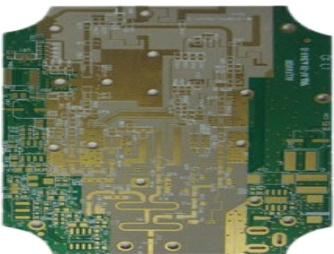</td></tr><tr><td colspan="1" rowspan="1">挠性板</td><td colspan="1" rowspan="1">采用柔性的绝缘基材制成，可根据安装要求进行弯曲、卷绕、折叠。挠性基材包括聚酰亚胺基、聚酯基等</td><td colspan="1" rowspan="1"></td></tr><tr><td colspan="1" rowspan="1">刚挠结合板</td><td colspan="1" rowspan="1">由刚性板和挠性板有序地层压组成，通过金属导孔进行电气连接，既可以提供刚性板的支撑作用，又具有挠性板的弯曲性，能满足三维组装的要求。主要基材包括玻纤覆铜基、聚酰亚胺基等</td><td colspan="1" rowspan="1">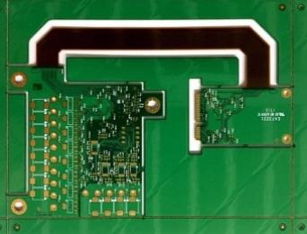</td></tr><tr><td colspan="1" rowspan="4">技术方向</td><td colspan="1" rowspan="1">高频高速板</td><td colspan="1" rowspan="1">使用特殊的低介电损耗材料生产出来的印制电路板，具有较高的电磁频率（1GHz 以上）。基材般选取在介电常数、传输损耗因子等方面表现优异的陶瓷基板或有机基板；对加工工艺要求更高，具体体现在对图形精度、层间对准度和阻抗控制方面要求更为严格</td><td colspan="1" rowspan="1">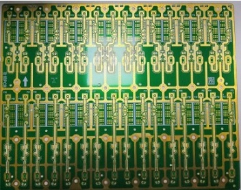</td></tr><tr><td colspan="1" rowspan="1">金属基板</td><td colspan="1" rowspan="1">由金属基材、绝缘介质层和电路层三部分构成的复合印制线路板，具有散热性优良、机械强度高、加工性能好等优点，主要应用于发热量较高的电路上。根据金属材质的不同，可进一步分为铜基板、铝基板和铁基板</td><td colspan="1" rowspan="1"></td></tr><tr><td colspan="1" rowspan="1">厚铜板</td><td colspan="1" rowspan="1">使用厚铜箔（铜厚在3OZ及以上）或成品任何一层铜厚为3OZ及以上的印制电路板。厚铜板具备承载大电流及高电压的特性，同时具有较好的导电性能</td><td colspan="1" rowspan="1">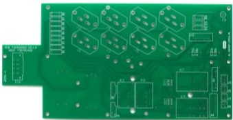</td></tr><tr><td colspan="1" rowspan="1">HDI板</td><td colspan="1" rowspan="1">HDI 板有内层线路和外层线路，通过钻孔、孔内金属化等工艺，使各层线路内部实现连结。HDI板一般采用积层法制造，积层的次数越多，板件的技术水平越高。HDI 板具有电性能良好、抗射频干扰能力强、抗电磁波干扰能力强、热传导效果良好等特</td><td colspan="1" rowspan="1">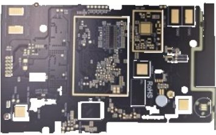</td></tr><tr><td colspan="1" rowspan="4"></td><td colspan="1" rowspan="1"></td><td colspan="1" rowspan="1">点，并大幅提高了板件布线密度，降低了印制电路板的体积，使终端产品设计更加小型化</td><td colspan="1" rowspan="1"></td></tr><tr><td colspan="1" rowspan="1">热电分离铜基板</td><td colspan="1" rowspan="1">是专为解决大功率电子产品散热问题而设计的高性能散热材料，特点是通过将电路部分与热层部分在不同线路层上分离，使得热层能直接接触发热元件，实现高效的热传导，导热系数远高于普通铜基板，降低热阻，有效散热减少元件的温升，延长电子产品的使用寿命</td><td colspan="1" rowspan="1">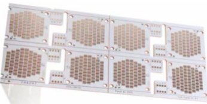</td></tr><tr><td colspan="1" rowspan="1">镜面铝基板</td><td colspan="1" rowspan="1">是具有高反射率和良好散热性能的特殊金属基电路板，其采用热电分离技术和COB（板上芯片封装）封装工艺，导热系数远高于普通铝基板，其表面处理技术镀银，可以增强反光效果，提高产品光学性能和使用寿命，具有高反射率（可达98%）、良好的散热性能以及优异的电磁屏蔽效果</td><td colspan="1" rowspan="1"></td></tr><tr><td colspan="1" rowspan="1">陶瓷基板</td><td colspan="1" rowspan="1">是采用陶瓷材料制成的电子基板，通常以氧化铝、氮化铝和氮化硅等为主要成分，具有良好的热导性、高频性和高温稳定性等特点，广泛应用于大功率、高频和高温等苛刻环境下的电子设备。种类包括直接镀铜陶瓷基板、直接覆铜陶瓷基板、陶瓷树脂复合基板、活性钎焊陶瓷基板</td><td colspan="1" rowspan="1">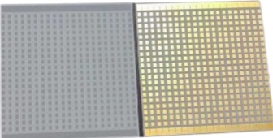</td></tr></table>

## （三）发行人的主要经营模式

## 1、采购模式

公司主营产品为多品种的定制化印制电路板产品，产品生产所需的原材料规格、型号、种类较多，产品生产具有多品种、多批次、设计规格各异的特点。为满足不同客户不同批次订单对原材料参数以及 PCB 的基材、厚度、尺寸等要素的多样化需求，并保证产品按时生产和交付，公司制定了相配套的采购机制和库存标准，采用“以产定购”与“保持适当安全库存量”相结合的采购模式。

公司设有专门的采购部门，采购部具体负责原材料采购和供应商的开发管理，根据生产所需的原材料种类、型号、数量等要素对原材料进行采购，以适应多品种、多批次生产模式的需要，同时对于普遍、通用的原材料，公司会根据日常消耗量确定安全库存，在保证最小安全库存的前提下，进行备货采购，持续优化采购成本，保障物资供应的及时性和稳定性，确保原材料可以高效快速地供给生产。同时，公司借助 ERP、SRM 等供应链系统，打造集团数字化采购平台，实现采购的流程化、标准化和规范化，并对供应商实施考评，选择优质供应商并纳入合格供应商库。

## 2、生产模式

由于公司生产的产品为定制化产品，公司基本采取以销定产的生产模式，根据订单组织安排生产。同时，由于产品订单具有“多品种、多批次、短交期”的特点，对生产线布局、生产排产、生产技术、生产过程管理及人员技能等方面的要求较高，公司建立了高度柔性化的生产管理体系以及与之相匹配的企业文化。计划部根据市场部下发的订单制定生产计划，对生产排期、物料和工具管理等进行统筹安排，协调生产部、采购部、工程部和设备部等相关部门，借助公司内部成熟的 ERP 和 MES 智能制造系统保障生产的快速有序推进。同时，公司会定期组织对一线员工进行多岗位、多流程环节交叉培训，使员工能胜任不同岗位及不同工艺流程的工作，提高人员安排的灵活性。

## 3、销售模式

公司产品具有“多品种、多批次、短交期”的特点，同时面向境内外客户销售，已形成完整的境内外销售体系。销售部负责对客户和订单进行管理，其下设境内销售组和境外销售组，分别负责国内市场和国外市场的销售。香港本川作为境外销售的主要平台，美国本川则主要负责美国地区的客户拓展及服务。

根据客户类型和国内外市场的特点，公司采取向电子产品制造商直接销售和通过贸易商覆盖下游客户两种销售模式。公司在国内市场主要采用向电子产品制造商直接销售的方式，在国外市场主要采用向电子产品制造商直接销售与通过贸易商覆盖下游客户相结合的方式。公司主要通过竞争性谈判和招投标等方式与客户建立合作关系，并确定产品价格。公司客户数量众多，客户类型主要包括电子产品制造商与 PCB 贸易商两类。公司主要通过建立海外本土营销团队、主动开发下游客户、现有客户介绍、客户主动联系等方式获取新客户。

## 4、外协加工模式

PCB 存在生产工艺流程复杂、设备投资金额大、客户订单不均衡等特点，将外协加工作为组织生产的补充是 PCB 行业普遍采取的模式。此外，客户对产品交期及产品加工类型的多样性有更高的要求，出现订单不均衡、峰值产能不足的情况频率更高。公司采用“多品种、多批次、短交期”的业务模式，在组织生产时公司会优先利用自有生产线组织生产，当自有产能无法满足生产计划时，公司会将部分工序或少量中低端产品全制程委托外协加工商进行加工，在保证质量的情况下，满足客户短时间内快速交付的要求。

## 5、研发模式

公司自成立以来一直注重技术研发，积累了多项专利和非专利技术。在全面发展生产技术的同时，公司还追求差异化，专注细分领域的研发创新，建立差异化的技术优势。公司通过与客户及供应商开展紧密的研发设计合作，及时跟踪市场需求，积极发现处于发展起步阶段且未来发展空间广阔的细分领域，合理选择研发项目，针对性地研究开发，以提高公司生产技术及研发的优势。

为不断提高企业自主创新能力，公司全方位推进高层次创新人才队伍建设，目前公司已打造一支紧跟市场需求、研发经验丰富、成果转化高效的高素质研发团队。公司研发创新机制坚持“以客户为中心，以市场为导向”的模式，紧密结合国内外市场发展需求，建立健全的绩效激励机制和人才培养体系，引导全体员工进行技术创新。

## （四）设立以来主营业务、主要产品或服务、主要经营模式的演变情况

公司主要从事 PCB 的研发、生产和销售，产品以定制化小批量板为主。公司经营模式主要是公司结合公司所处行业特点、上下游行业的发展情况以及自身所处的发展阶段等因素综合考虑后，根据多年经营管理的实践经验形成的。自设立以来，公司主营业务、主要产品及经营模式未发生重大变化。

## （五）发行人业务资质情况

截至 2025年9月 30日，公司及子公司所持有的主要业务资质如下：

<table><tr><td colspan="1" rowspan="1">序号</td><td colspan="1" rowspan="1">公司名称</td><td colspan="1" rowspan="1">证书名称</td><td colspan="1" rowspan="1">发证单位</td><td colspan="1" rowspan="1">证书编号</td><td colspan="1" rowspan="1">有效期</td></tr><tr><td colspan="1" rowspan="1">1</td><td colspan="1" rowspan="11">本川智能</td><td colspan="1" rowspan="1">CQC（中国质量认证中心）产品认证证书（印制线路板）</td><td colspan="1" rowspan="1">中国质量认证中心有限公司</td><td colspan="1" rowspan="1">CQC22001361402</td><td colspan="1" rowspan="1">2024-12-06至2028-02-06</td></tr><tr><td colspan="1" rowspan="1">2</td><td colspan="1" rowspan="1">CQC（中国质量认证中心）产品认证证书（双面印制线路板）</td><td colspan="1" rowspan="1">中国质量认证中心有限公司</td><td colspan="1" rowspan="1">CQC24134434555</td><td colspan="1" rowspan="1">2024-06-18至2029-06-17</td></tr><tr><td colspan="1" rowspan="1">3</td><td colspan="1" rowspan="1">武器装备质量管理体系认证证书</td><td colspan="1" rowspan="1">兴原认证中心有限公司</td><td colspan="1" rowspan="1">0350123GJ30065R0S</td><td colspan="1" rowspan="1">2023-02-06至2026-02-05</td></tr><tr><td colspan="1" rowspan="1">4</td><td colspan="1" rowspan="1">汽车行业质量管理体系认证（IATF 16949:2016）</td><td colspan="1" rowspan="1">SGS</td><td colspan="1" rowspan="1">CN12/21009</td><td colspan="1" rowspan="1">2024-07-18至2027-07-17</td></tr><tr><td colspan="1" rowspan="1">5</td><td colspan="1" rowspan="1">质量管理体系认证（ISO 9001:2015）</td><td colspan="1" rowspan="1">SGS</td><td colspan="1" rowspan="1">CN12/20948</td><td colspan="1" rowspan="1">2024-07-18至2027-07-17</td></tr><tr><td colspan="1" rowspan="1">6</td><td colspan="1" rowspan="1">医疗行业质量管理体系认证(ISO 13485:2016)</td><td colspan="1" rowspan="1">SGS</td><td colspan="1" rowspan="1">CN23/00003675</td><td colspan="1" rowspan="1">2023-07-14至2026-07-13</td></tr><tr><td colspan="1" rowspan="1">7</td><td colspan="1" rowspan="1">环境管理体系认证（ISO 14001:2015）</td><td colspan="1" rowspan="1">SGS</td><td colspan="1" rowspan="1">CN13/20345</td><td colspan="1" rowspan="1">2024-01-13至2027-01-12</td></tr><tr><td colspan="1" rowspan="1">8</td><td colspan="1" rowspan="1">职业健康安全管理体系认证（ISO 45001:2018）</td><td colspan="1" rowspan="1">SGS</td><td colspan="1" rowspan="1">CN23/00006368</td><td colspan="1" rowspan="1">2023-11-28至2026-11-27</td></tr><tr><td colspan="1" rowspan="1">9</td><td colspan="1" rowspan="1">高新技术企业证书</td><td colspan="1" rowspan="1">江苏省科学技术厅、江苏省财政厅、国家税务总局江苏省税务局</td><td colspan="1" rowspan="1">GR202232012979</td><td colspan="1" rowspan="1">2022-12-12至2025-12-11</td></tr><tr><td colspan="1" rowspan="1">10</td><td colspan="1" rowspan="1">排污许可证</td><td colspan="1" rowspan="1">南京市生态环境局</td><td colspan="1" rowspan="1">913201177904499284001U</td><td colspan="1" rowspan="1">2022-11-11至2027-11-10</td></tr><tr><td colspan="1" rowspan="1">11</td><td colspan="1" rowspan="1">进出口货物收发货人</td><td colspan="1" rowspan="1">金陵海关</td><td colspan="1" rowspan="1">3201967651</td><td colspan="1" rowspan="1">长期有效</td></tr><tr><td colspan="1" rowspan="1">12</td><td colspan="1" rowspan="5">艾威尔深圳</td><td colspan="1" rowspan="1">汽车行业质量管理体系认证（IATF 16949:2016)</td><td colspan="1" rowspan="1">SGS</td><td colspan="1" rowspan="1">CN19/30118.01</td><td colspan="1" rowspan="1">2023-02-04至2026-02-03</td></tr><tr><td colspan="1" rowspan="1">13</td><td colspan="1" rowspan="1">质量管理体系认证（ISO 9001:2015）</td><td colspan="1" rowspan="1">SGS</td><td colspan="1" rowspan="1">CN23/00000551</td><td colspan="1" rowspan="1">2023-02-04至2026-02-03</td></tr><tr><td colspan="1" rowspan="1">14</td><td colspan="1" rowspan="1">环境管理体系认证（ISO 14001:2015）</td><td colspan="1" rowspan="1">SGS</td><td colspan="1" rowspan="1">CN15/31219.01</td><td colspan="1" rowspan="1">2024-09-30至2027-09-29</td></tr><tr><td colspan="1" rowspan="1">15</td><td colspan="1" rowspan="1">高新技术企业证书</td><td colspan="1" rowspan="1">深圳市科技创新委员会、深圳市财政局、国家税务总局深圳市税务局</td><td colspan="1" rowspan="1">GR202244202316</td><td colspan="1" rowspan="1">2022-12-14至2025-12-13</td></tr><tr><td colspan="1" rowspan="1">16</td><td colspan="1" rowspan="1">排污许可证</td><td colspan="1" rowspan="1">深圳市生态环境局宝安管理局</td><td colspan="1" rowspan="1">9144030079661308XL001U</td><td colspan="1" rowspan="1">2021-10-25至2026-10-24</td></tr><tr><td colspan="1" rowspan="1">17</td><td colspan="1" rowspan="1"></td><td colspan="1" rowspan="1">进出口货物收发货人</td><td colspan="1" rowspan="1">福中海关</td><td colspan="1" rowspan="1">4403160EUF</td><td colspan="1" rowspan="1">长期有效</td></tr><tr><td colspan="1" rowspan="1">18</td><td colspan="1" rowspan="5">骏岭线路板</td><td colspan="1" rowspan="1">汽车行业质量管理体系认证（IATF 16949:2016)</td><td colspan="1" rowspan="1">SGS</td><td colspan="1" rowspan="1">CN19/30118.02</td><td colspan="1" rowspan="1">2024-12-29至2027-12-28</td></tr><tr><td colspan="1" rowspan="1">19</td><td colspan="1" rowspan="1">质量管理体系认证（ISO 9001:2015）</td><td colspan="1" rowspan="1">SGS</td><td colspan="1" rowspan="1">CN19/30119</td><td colspan="1" rowspan="1">2024-12-29至2027-12-28</td></tr><tr><td colspan="1" rowspan="1">20</td><td colspan="1" rowspan="1">环境管理体系认证(ISO 14001:2015)</td><td colspan="1" rowspan="1">SGS</td><td colspan="1" rowspan="1">CN15/31219.02</td><td colspan="1" rowspan="1">2024-09-30至2027-09-29</td></tr><tr><td colspan="1" rowspan="1">21</td><td colspan="1" rowspan="1">排污许可证</td><td colspan="1" rowspan="1">深圳市生态环境局宝安管理局</td><td colspan="1" rowspan="1">91440300699089319R001V</td><td colspan="1" rowspan="1">2025-07-18至2030-07-17</td></tr><tr><td colspan="1" rowspan="1">22</td><td colspan="1" rowspan="1">进出口货物收发货人</td><td colspan="1" rowspan="1">福强海关</td><td colspan="1" rowspan="1">4403161P26</td><td colspan="1" rowspan="1">长期有效</td></tr><tr><td colspan="1" rowspan="1">23</td><td colspan="1" rowspan="4">珠海硕鸿</td><td colspan="1" rowspan="1">职业健康安全管理体系认证(ISO 45001:2018)</td><td colspan="1" rowspan="1">DNV</td><td colspan="1" rowspan="1">248928-2017-ASA-RGC-RvA</td><td colspan="1" rowspan="1">2023-12-02至2026-12-01</td></tr><tr><td colspan="1" rowspan="1">24</td><td colspan="1" rowspan="1">环境管理体系认证（ISO 14001:2015)</td><td colspan="1" rowspan="1">DNV</td><td colspan="1" rowspan="1">1069-1999-AE-RGC-RvA</td><td colspan="1" rowspan="1">2023-12-02至2026-12-01</td></tr><tr><td colspan="1" rowspan="1">25</td><td colspan="1" rowspan="1">排污许可证</td><td colspan="1" rowspan="1">珠海市生态环境局</td><td colspan="1" rowspan="1">9144040061749918XX001Y</td><td colspan="1" rowspan="1">2025-07-02至2030-07-01</td></tr><tr><td colspan="1" rowspan="1">26</td><td colspan="1" rowspan="1">进出口货物收发货人</td><td colspan="1" rowspan="1">斗门海关</td><td colspan="1" rowspan="1">4404940066</td><td colspan="1" rowspan="1">长期有效</td></tr><tr><td colspan="1" rowspan="1">27</td><td colspan="1" rowspan="4">珠海亚图</td><td colspan="1" rowspan="1">汽车行业质量管理体系认证（IATF 16949:2016)</td><td colspan="1" rowspan="1">SGS</td><td colspan="1" rowspan="1">CN19/30887</td><td colspan="1" rowspan="1">2025-07-29至2028-07-28</td></tr><tr><td colspan="1" rowspan="1">28</td><td colspan="1" rowspan="1">质量管理体系认证(ISO 9001:2015)</td><td colspan="1" rowspan="1">SGS</td><td colspan="1" rowspan="1">CN19/30888</td><td colspan="1" rowspan="1">2025-07-29至2028-07-28</td></tr><tr><td colspan="1" rowspan="1">29</td><td colspan="1" rowspan="1">环境管理体系认证(ISO 14001:2015)</td><td colspan="1" rowspan="1">SGS</td><td colspan="1" rowspan="1">CN17/30864</td><td colspan="1" rowspan="1">2023-07-06至2026-07-05</td></tr><tr><td colspan="1" rowspan="1">30</td><td colspan="1" rowspan="1">排污许可证</td><td colspan="1" rowspan="1">珠海市生态环境局</td><td colspan="1" rowspan="1">91440400776228512Q001W</td><td colspan="1" rowspan="1">2022-09-09至2027-09-08</td></tr></table>

注：本川智能、艾威尔深圳分别于 2025 年 12 月 19 日、2025 年 12 月 25 日通过高新技术企业复审认定，证书编号 GR202532016760、GR202544203206。

## （六）发行人销售及主要客户情况

## 1、报告期各期产能、产量、销量及产销率、产能利用率情况

报告期内，公司产品的产能、产量、销量及产销率、产能利用率情况如下：

单位：万平方米

注：以上产量均不包括全制程外协数量；销量包括全制程外协数量。
<table><tr><td colspan="2" rowspan="1">项目</td><td colspan="1" rowspan="1">2025年1-9月</td><td colspan="1" rowspan="1">2024年</td><td colspan="1" rowspan="1">2023年</td><td colspan="1" rowspan="1">2022年</td></tr><tr><td colspan="2" rowspan="1">项目</td><td colspan="1" rowspan="1">2025年1-9月</td><td colspan="1" rowspan="1">2024年</td><td colspan="1" rowspan="1">2023年</td><td colspan="1" rowspan="1">2022年</td></tr><tr><td colspan="1" rowspan="5">PCB</td><td colspan="1" rowspan="1">产能</td><td colspan="1" rowspan="1">99.84</td><td colspan="1" rowspan="1">99.46</td><td colspan="1" rowspan="1">86.67</td><td colspan="1" rowspan="1">75.66</td></tr><tr><td colspan="1" rowspan="1">产量</td><td colspan="1" rowspan="1">87.12</td><td colspan="1" rowspan="1">86.92</td><td colspan="1" rowspan="1">67.20</td><td colspan="1" rowspan="1">62.56</td></tr><tr><td colspan="1" rowspan="1">销量</td><td colspan="1" rowspan="1">83.03</td><td colspan="1" rowspan="1">84.54</td><td colspan="1" rowspan="1">65.84</td><td colspan="1" rowspan="1">64.31</td></tr><tr><td colspan="1" rowspan="1">产销率</td><td colspan="1" rowspan="1">95.30%</td><td colspan="1" rowspan="1">97.26%</td><td colspan="1" rowspan="1">97.97%</td><td colspan="1" rowspan="1">102.80%</td></tr><tr><td colspan="1" rowspan="1">产能利用率</td><td colspan="1" rowspan="1">87.26%</td><td colspan="1" rowspan="1">87.40%</td><td colspan="1" rowspan="1">77.54%</td><td colspan="1" rowspan="1">82.68%</td></tr></table>

报告期内，公司产能利用率、产销率较为稳定。报告期各期，公司产能利用率分别为 82.68%、77.54%、87.40%和 87.26%，已经达到小批量板企业向客户快速交付状态下的较高水平。2024 年以来，随着前次募投项目产能的释放，以及下游行业需求的逐渐恢复、订单持续增加，公司 PCB 产品的产量、销量均有所增长。

## 2、报告期内主要客户销售情况

报告期内，公司前五大客户销售情况如下：

单位：万元

注：上表已将同一控制下相关主体的销售数据合并披露。
<table><tr><td colspan="1" rowspan="1">期间</td><td colspan="1" rowspan="1">排名</td><td colspan="1" rowspan="1">客户名称</td><td colspan="1" rowspan="1">不含税销售额</td><td colspan="1" rowspan="1">占主营业务收入比例</td></tr><tr><td colspan="1" rowspan="5">2025年1-9月</td><td colspan="1" rowspan="1">1</td><td colspan="1" rowspan="1">ICAPE GROUP</td><td colspan="1" rowspan="1">4,462.34</td><td colspan="1" rowspan="1">7.93%</td></tr><tr><td colspan="1" rowspan="1">2</td><td colspan="1" rowspan="1">京信集团</td><td colspan="1" rowspan="1">2,870.83</td><td colspan="1" rowspan="1">5.10%</td></tr><tr><td colspan="1" rowspan="1">3</td><td colspan="1" rowspan="1">珠海英搏尔电气股份有限公司</td><td colspan="1" rowspan="1">2,359.75</td><td colspan="1" rowspan="1">4.19%</td></tr><tr><td colspan="1" rowspan="1">4</td><td colspan="1" rowspan="1">FEDERAL                    SIGNALCORPORATION</td><td colspan="1" rowspan="1">2,317.68</td><td colspan="1" rowspan="1">4.12%</td></tr><tr><td colspan="1" rowspan="1">5</td><td colspan="1" rowspan="1">Fineline Global PTE Ltd.</td><td colspan="1" rowspan="1">1,936.44</td><td colspan="1" rowspan="1">3.44%</td></tr><tr><td colspan="3" rowspan="1">合计</td><td colspan="1" rowspan="1">13,947.04</td><td colspan="1" rowspan="1">24.79%</td></tr><tr><td colspan="1" rowspan="5">2024年</td><td colspan="1" rowspan="1">1</td><td colspan="1" rowspan="1">ICAPE GROUP</td><td colspan="1" rowspan="1">3,242.48</td><td colspan="1" rowspan="1">5.89%</td></tr><tr><td colspan="1" rowspan="1">2</td><td colspan="1" rowspan="1">京信集团</td><td colspan="1" rowspan="1">2,544.12</td><td colspan="1" rowspan="1">4.62%</td></tr><tr><td colspan="1" rowspan="1">3</td><td colspan="1" rowspan="1">EBH Elektronik-Bauteile GmbH</td><td colspan="1" rowspan="1">2,048.02</td><td colspan="1" rowspan="1">3.72%</td></tr><tr><td colspan="1" rowspan="1">4</td><td colspan="1" rowspan="1">SIGMATRON  INTERNATIONAL,INC.</td><td colspan="1" rowspan="1">1,987.87</td><td colspan="1" rowspan="1">3.61%</td></tr><tr><td colspan="1" rowspan="1">5</td><td colspan="1" rowspan="1">Fineline Global PTE Ltd.</td><td colspan="1" rowspan="1">1,879.79</td><td colspan="1" rowspan="1">3.41%</td></tr><tr><td colspan="3" rowspan="1">合计</td><td colspan="1" rowspan="1">11,702.27</td><td colspan="1" rowspan="1">21.25%</td></tr><tr><td colspan="1" rowspan="3">2023年</td><td colspan="1" rowspan="1">1</td><td colspan="1" rowspan="1">京信集团</td><td colspan="1" rowspan="1">5,283.75</td><td colspan="1" rowspan="1">11.01%</td></tr><tr><td colspan="1" rowspan="1">2</td><td colspan="1" rowspan="1">ICAPE GROUP</td><td colspan="1" rowspan="1">2,757.92</td><td colspan="1" rowspan="1">5.74%</td></tr><tr><td colspan="1" rowspan="1">3</td><td colspan="1" rowspan="1">EBH Elektronik-Bauteile GmbH</td><td colspan="1" rowspan="1">2,387.22</td><td colspan="1" rowspan="1">4.97%</td></tr><tr><td colspan="1" rowspan="2"></td><td colspan="1" rowspan="1">4</td><td colspan="1" rowspan="1">广东通宇通讯股份有限公司</td><td colspan="1" rowspan="1">1,661.27</td><td colspan="1" rowspan="1">3.46%</td></tr><tr><td colspan="1" rowspan="1">5</td><td colspan="1" rowspan="1">Fineline Global PTE Ltd.</td><td colspan="1" rowspan="1">1,524.36</td><td colspan="1" rowspan="1">3.18%</td></tr><tr><td colspan="3" rowspan="1">合计</td><td colspan="1" rowspan="1">13,614.52</td><td colspan="1" rowspan="1">28.36%</td></tr><tr><td colspan="1" rowspan="5">2022年</td><td colspan="1" rowspan="1">1</td><td colspan="1" rowspan="1">京信集团</td><td colspan="1" rowspan="1">5,659.79</td><td colspan="1" rowspan="1">10.60%</td></tr><tr><td colspan="1" rowspan="1">2</td><td colspan="1" rowspan="1">EBHElektronik-Bauteile GmbH</td><td colspan="1" rowspan="1">3,005.56</td><td colspan="1" rowspan="1">5.63%</td></tr><tr><td colspan="1" rowspan="1">3</td><td colspan="1" rowspan="1">广东通宇通讯股份有限公司</td><td colspan="1" rowspan="1">2,845.51</td><td colspan="1" rowspan="1">5.33%</td></tr><tr><td colspan="1" rowspan="1">4</td><td colspan="1" rowspan="1">ICAPE GROUP</td><td colspan="1" rowspan="1">1,944.27</td><td colspan="1" rowspan="1">3.64%</td></tr><tr><td colspan="1" rowspan="1">5</td><td colspan="1" rowspan="1">南京泉峰科技有限公司</td><td colspan="1" rowspan="1">1,899.78</td><td colspan="1" rowspan="1">3.56%</td></tr><tr><td colspan="3" rowspan="1">合计</td><td colspan="1" rowspan="1">15,354.92</td><td colspan="1" rowspan="1">28.75%</td></tr></table>

报告期内，随着公司不断加强对新客户的市场开拓力度，并加快潜在客户的订单转化速度，公司收入集中度保持在较低水平，前五大客户收入占比合计为 28.75%、28.36%、21.25%和 24.79%，第一大客户销售占比分别为 10.60%、11.01%、5.89%和 7.93%。公司不存在向前五大客户销售占比超过 50%、向单个客户销售比例超过30%或严重依赖于少数客户的情况。

报告期内，公司前五大客户整体保持稳定，公司与上述前五大客户均保持合作关系，不存在前期未合作过的新客户成为前五大客户的情况。部分客户在报告期内随着与发行人合作的加深而增加订单金额，因此进入前五大客户范围，或在比例、排名上有所变动。公司前五大客户均为境内外上市公司（或其名下子公司）或成立时间较早的业内知名企业，客户质量良好。

3、董事、高级管理人员和其他核心人员，主要关联方或持有发行人百分之五以上股份的股东在上述客户中所占的权益

截至 2025 年 9 月 30 日，公司董事、高级管理人员和其他核心人员、主要关联方或持有发行人百分之五以上股份的股东不在上述客户中占有权益。

## 4、境内外销售情况

## （1）基本情况

报告期内，公司主营业务收入中内销、外销情况如下：

单位：万元

<table><tr><td rowspan=2 colspan=1>项目</td><td rowspan=1 colspan=2>2025年1-9月</td><td rowspan=1 colspan=2>2024年</td><td rowspan=1 colspan=2>2023年</td><td rowspan=1 colspan=2>2022年</td></tr><tr><td rowspan=1 colspan=1>金额</td><td rowspan=1 colspan=1>占比</td><td rowspan=1 colspan=1>金额</td><td rowspan=1 colspan=1>占比</td><td rowspan=1 colspan=1>金额</td><td rowspan=1 colspan=1>占比</td><td rowspan=1 colspan=1>金额</td><td rowspan=1 colspan=1>占比</td></tr><tr><td rowspan=1 colspan=1>内销</td><td rowspan=1 colspan=1>29,036.68</td><td rowspan=1 colspan=1>51.60%</td><td rowspan=1 colspan=1>28,425.94</td><td rowspan=1 colspan=1>51.61%</td><td rowspan=1 colspan=1>22,983.38</td><td rowspan=1 colspan=1>47.87%</td><td rowspan=1 colspan=1>22,767.04</td><td rowspan=1 colspan=1>42.63%</td></tr><tr><td rowspan=1 colspan=1>外销</td><td rowspan=1 colspan=1>27,231.42</td><td rowspan=1 colspan=1>48.40%</td><td rowspan=1 colspan=1>26,649.57</td><td rowspan=1 colspan=1>48.39%</td><td rowspan=1 colspan=1>25,025.13</td><td rowspan=1 colspan=1>52.13%</td><td rowspan=1 colspan=1>30,642.46</td><td rowspan=1 colspan=1>57.37%</td></tr><tr><td rowspan=1 colspan=1>合计</td><td rowspan=1 colspan=1>56,268.10</td><td rowspan=1 colspan=1>100.00%</td><td rowspan=1 colspan=1>55,075.51</td><td rowspan=1 colspan=1>100.00%</td><td rowspan=1 colspan=1>48,008.50</td><td rowspan=1 colspan=1>100.00%</td><td rowspan=1 colspan=1>53,409.50</td><td rowspan=1 colspan=1>100.00%</td></tr></table>

## （2）主要产品进口国的有关对外贸易政策对发行人生产经营的影响

## ①贸易政策

公司主要产品进口地区为美国、欧洲，报告期内公司对上述地区客户销售额分别为 24,897.09 万元、20,025.93 万元、20,125.18 万元和 21,024.62 万元，占公司外销收入比例分别为 81.25%、80.02%、75.52%和 77.21%。其中，对美国销售收入为 14,722.27 万元、10,807.97 万元、11,005.45 万元和 11,596.59 万元，占比分别为 48.05%、43.19%、41.30%和 42.59%。报告期内，除美国外，其他主要出口地区未对公司出口的 PCB 产品采取加征关税、反倾销反补贴措施、进口配额等贸易壁垒措施。

现阶段，美国对中国 PCB 产品执行关税税率为 10%（4 层及以下 PCB 产品）或 35%（4 层以上 PCB 产品）；对泰国 PCB 产品执行关税税率为 10%。

## ②贸易政策对公司经营的影响

结合政策内容及公司实际情况，上述贸易政策对公司生产经营的影响较小且相对可控，具体分析如下：

A. 从公司与美国客户交易安排角度：

首先，根据行业惯例，供应商无需承担关税，关税基本由进口商承担，因此，公司不需要承担美国关税增加的相应成本。

其次，公司作为小批量板生产企业，产品以定制化 PCB 为主，并通过共同开发等方式与客户进行长期合作。现阶段公司已经与众多美国客户建立了长期稳定的合作关系，客户粘性较强，且公司具备一定的产品议价能力，客户更换供应商、重新开始合作的时间成本、经济成本较高，客户出于关税而终止合作

的可能性较小。

第三，对于客户而言，相较于其他电子元件，PCB 属于电子产品中的必备器件，且价值相对较小，在电子产品中占终端成本比例较低，因此客户对 PCB价格变动的敏感性较弱。即使需要承担关税成本，客户仍会支付相关费用。

第四，对于 PCB 产品，相对于价格，客户更加关注供应商及时稳定的交付能力和快速响应的客户服务，对此，公司在不断优化生产、提高产品快速交付能力的同时，已经在美国建立本土化的营销团队，不断加强对美国市场的拓展和开发，以及持续的客户维护、跟踪服务。

B. 从中美 PCB 产业结构角度：

在 PCB 产能方面，现阶段中国已经成为全球 PCB 的最大生产地，根据Prismark 统计，2024 年中国大陆 PCB 产值已达到 412.13 亿美元，占全球 PCB产值的 56%；而美洲（除美国外，还包括加拿大及拉丁美洲国家）全部 PCB 产值仅为 34.93 亿美元，占比 4.7%。并且，美国国内的部分 PCB 产能需要优先用于如军工、航天等关键领域，进一步挤占了分配到其他领域的产能。因此，美国国内可用于军工、航天以外领域的 PCB 产能极小，无法满足本国电子产品生产的需求，即使存在关税，大部分 PCB 产品仍需要向中国进口。

在产业链方面，现阶段美国通过提高关税、国内减税等政策，意在推动制造业回流。但制造业的建立，涉及建设工厂、购置产线、原材料采购、招募工人等事项，涉及如熟练技术工人、管理体系、上游原材料供应链、装备制造、交通物流、能源等多方面因素，只有在上述各方面基础条件都已具备的情况下，才能够短期内建立大量制造业产能，而熟练技术工人培训、管理体系建立、供应链构建等需要长时间的积累和磨合，交通、能源等基础设施的建设、维护需要更长时间。因此，制造业的建立属于体系化事项，出于经济成本、各地政策差异等方面因素，一定期间内美国难以快速满足上述各项条件、新增大量 PCB产能替代进口。

在 PCB 生产成本方面，PCB 生产涉及原材料成本、人力成本、能源成本、机器设备折旧摊销等。以人力成本为例，选取中、美两国电子制造业较为发达的广东省、江苏省、加利福尼亚州、得克萨斯州，2024 年上述四地区制造业平

均工资如下：

<table><tr><td rowspan=1 colspan=1>地区</td><td rowspan=1 colspan=1>广东省</td><td rowspan=1 colspan=1>江苏省</td><td rowspan=1 colspan=1>加利福尼亚州</td><td rowspan=1 colspan=1>得克萨斯州</td></tr><tr><td rowspan=1 colspan=1>制造业平均工资</td><td rowspan=1 colspan=1>110,484人民币元</td><td rowspan=1 colspan=1>118,513人民币元</td><td rowspan=1 colspan=1>122,468美元</td><td rowspan=1 colspan=1>94,441美元</td></tr></table>

数据来源：广东省统计局、江苏省统计局、WIND。

根据上表数据，美国制造业人力成本远高于中国。此外，在原材料方面，以 PCB 核心原材料覆铜板为例，覆铜板行业主要产能集中于中国大陆、中国香港、中国台湾、日本、韩国等东亚地区，以 2023 年为例，覆铜板行业 75%的产能集中于东亚，如果在美国本土生产 PCB，则仍需向上述地区企业大量进口原材料，并支付高额的运费和关税，进一步提高其国内PCB 的生产成本。

<table><tr><td rowspan=1 colspan=1>排名</td><td rowspan=1 colspan=1>覆铜板生产企业名称</td><td rowspan=1 colspan=1>所在地区</td><td rowspan=1 colspan=1>市场份额（2023年）</td></tr><tr><td rowspan=1 colspan=1>1</td><td rowspan=1 colspan=1>建滔化工</td><td rowspan=1 colspan=1>中国香港</td><td rowspan=1 colspan=1>15%</td></tr><tr><td rowspan=1 colspan=1>2</td><td rowspan=1 colspan=1>生益科技</td><td rowspan=1 colspan=1>中国大陆</td><td rowspan=1 colspan=1>14%</td></tr><tr><td rowspan=1 colspan=1>3</td><td rowspan=1 colspan=1>台光电材</td><td rowspan=1 colspan=1>中国台湾</td><td rowspan=1 colspan=1>10%</td></tr><tr><td rowspan=1 colspan=1>4</td><td rowspan=1 colspan=1>南亚塑胶</td><td rowspan=1 colspan=1>中国台湾</td><td rowspan=1 colspan=1>9%</td></tr><tr><td rowspan=1 colspan=1>5</td><td rowspan=1 colspan=1>松下</td><td rowspan=1 colspan=1>日本</td><td rowspan=1 colspan=1>7%</td></tr><tr><td rowspan=1 colspan=1>6</td><td rowspan=1 colspan=1>联茂电子</td><td rowspan=1 colspan=1>中国台湾</td><td rowspan=1 colspan=1>6%</td></tr><tr><td rowspan=1 colspan=1>7</td><td rowspan=1 colspan=1>台耀</td><td rowspan=1 colspan=1>中国台湾</td><td rowspan=1 colspan=1>4%</td></tr><tr><td rowspan=1 colspan=1>8</td><td rowspan=1 colspan=1>斗山</td><td rowspan=1 colspan=1>韩国</td><td rowspan=1 colspan=1>4%</td></tr><tr><td rowspan=1 colspan=1>9</td><td rowspan=1 colspan=1>金安国纪</td><td rowspan=1 colspan=1>中国大陆</td><td rowspan=1 colspan=1>3%</td></tr><tr><td rowspan=1 colspan=1>10</td><td rowspan=1 colspan=1>南亚新材料</td><td rowspan=1 colspan=1>中国大陆</td><td rowspan=1 colspan=1>3%</td></tr><tr><td rowspan=1 colspan=3>合计</td><td rowspan=1 colspan=1>75%</td></tr></table>

数据来源：国金证券研究所。

综上，从原材料供应、人力等生产成本的角度，在美国生产单位 PCB 产品的成本远高于中国，即使存在关税的影响，对于电子产品制造商而言，从中国进口PCB 仍是相对更经济的选择。

C. 从公司整体客户结构角度，近年来，公司持续加大国内客户的开拓力度，已开拓了一定数量的国内客户群体，包括合作客户和潜在客户，并推动相关订单的落地和放量，国内客户订单快速增长。2024 年，公司内销收入 28,425.94万元，较上年度增长 23.68%，内销收入占比 51.61%，呈持续增长趋势，较上年度增长 3.74 个百分点、较 2022 年度增长 8.99 个百分点，内销收入规模已经

超过外销收入。

同时，2022 年、2023 年和 2024 年，公司对美国销售收入占主营业务收入的比例分别为 27.56%、22.51%和 19.98%，呈现持续下降的趋势，对美国销售的依赖程度持续降低。

D. 从中美贸易政策走向角度，2025 年 5 月 10 日至 11 日期间，中美经贸高层会谈在瑞士日内瓦举行，并取得实质性进展，大幅降低双边关税水平。中美双方发表联合声明，暂停或取消部分前期互相采取的加征关税等措施。同时，双方将建立机制，继续就经贸关系进行协商。2025 年 7 月 28 至 29 日期间，中美双方于斯德哥尔摩再次举行经贸会谈，并决定继续暂停前述加征关税的措施。2025 年 10 月 30 日，中美进行釜山会谈，将加征关税暂停实施期限继续延长。2026 年 2 月 20 日，美国总统特朗普发布行政令，宣布终止前述加征关税。根据上述情况，未来阶段中美之间将加强对经贸关系的协商，对外贸易壁垒有望逐步消减。上述贸易政策的积极变化，将有利于公司加强与美国客户之间的合作关系、拓展美国市场，降低对美贸易的政策风险。

综上，美国上述贸易政策对公司生产经营的影响较小且相对可控。

## （七）发行人采购及主要供应商情况

## 1、报告期原材料采购、能源耗用情况

## （1）原材料采购情况

公司生产的主要原材料为覆铜板、铜球、半固化片、油墨、干膜、铜箔、金盐等。报告期内，公司主要原材料采购情况如下：

单位：万元

注：采购金额为不含税金额。
<table><tr><td colspan="2" rowspan="2">材料类别</td><td colspan="2" rowspan="1">2025年1-9月</td><td colspan="2" rowspan="1">2024年度</td><td colspan="2" rowspan="1">2023年度</td><td colspan="2" rowspan="1">2022年度</td></tr><tr><td colspan="1" rowspan="1">金额</td><td colspan="1" rowspan="1">占比</td><td colspan="1" rowspan="1">金额</td><td colspan="1" rowspan="1">占比</td><td colspan="1" rowspan="1">金额</td><td colspan="1" rowspan="1">占比</td><td colspan="1" rowspan="1">金额</td><td colspan="1" rowspan="1">占比</td></tr><tr><td colspan="1" rowspan="4">覆铜板</td><td colspan="1" rowspan="1">FR4覆铜板</td><td colspan="1" rowspan="1">12,503.44</td><td colspan="1" rowspan="1">32.03%</td><td colspan="1" rowspan="1">8,659.09</td><td colspan="1" rowspan="1">28.40%</td><td colspan="1" rowspan="1">5,610.34</td><td colspan="1" rowspan="1">25.56%</td><td colspan="1" rowspan="1">8.878.70</td><td colspan="1" rowspan="1">35.63%</td></tr><tr><td colspan="1" rowspan="1">高频覆铜板</td><td colspan="1" rowspan="1">4,323.49</td><td colspan="1" rowspan="1">11.07%</td><td colspan="1" rowspan="1">5,067.54</td><td colspan="1" rowspan="1">16.62%</td><td colspan="1" rowspan="1">4,398.54</td><td colspan="1" rowspan="1">20.04%</td><td colspan="1" rowspan="1">3,811.54</td><td colspan="1" rowspan="1">15.30%</td></tr><tr><td colspan="1" rowspan="1">其他</td><td colspan="1" rowspan="1">62.20</td><td colspan="1" rowspan="1">0.16%</td><td colspan="1" rowspan="1">86.53</td><td colspan="1" rowspan="1">0.28%</td><td colspan="1" rowspan="1">75.62</td><td colspan="1" rowspan="1">0.34%</td><td colspan="1" rowspan="1">58.09</td><td colspan="1" rowspan="1">0.23%</td></tr><tr><td colspan="1" rowspan="1">合计</td><td colspan="1" rowspan="1">16,889.12</td><td colspan="1" rowspan="1">43.26%</td><td colspan="1" rowspan="1">13,813.16</td><td colspan="1" rowspan="1">45.31%</td><td colspan="1" rowspan="1">10,084.51</td><td colspan="1" rowspan="1">45.95%</td><td colspan="1" rowspan="1">12,748.33</td><td colspan="1" rowspan="1">51.17%</td></tr><tr><td colspan="2" rowspan="1">铜球</td><td colspan="1" rowspan="1">4,282.47</td><td colspan="1" rowspan="1">10.97%</td><td colspan="1" rowspan="1">3,601.00</td><td colspan="1" rowspan="1">11.81%</td><td colspan="1" rowspan="1">2.366.10</td><td colspan="1" rowspan="1">10.78%</td><td colspan="1" rowspan="1">2,358.26</td><td colspan="1" rowspan="1">9.46%</td></tr><tr><td colspan="1" rowspan="3">半固化片</td><td colspan="1" rowspan="1">普通半固化片</td><td colspan="1" rowspan="1">2,152.46</td><td colspan="1" rowspan="1">5.51%</td><td colspan="1" rowspan="1">1,633.92</td><td colspan="1" rowspan="1">5.36%</td><td colspan="1" rowspan="1">1,095.58</td><td colspan="1" rowspan="1">4.99%</td><td colspan="1" rowspan="1">1,184.77</td><td colspan="1" rowspan="1">4.76%</td></tr><tr><td colspan="1" rowspan="1">高频半固化片</td><td colspan="1" rowspan="1">34.46</td><td colspan="1" rowspan="1">0.09%</td><td colspan="1" rowspan="1">59.74</td><td colspan="1" rowspan="1">0.20%</td><td colspan="1" rowspan="1">33.59</td><td colspan="1" rowspan="1">0.15%</td><td colspan="1" rowspan="1">70.81</td><td colspan="1" rowspan="1">0.28%</td></tr><tr><td colspan="1" rowspan="1">合计</td><td colspan="1" rowspan="1">2,186.92</td><td colspan="1" rowspan="1">5.60%</td><td colspan="1" rowspan="1">1,693.66</td><td colspan="1" rowspan="1">5.56%</td><td colspan="1" rowspan="1">1,129.17</td><td colspan="1" rowspan="1">5.14%</td><td colspan="1" rowspan="1">1,255.58</td><td colspan="1" rowspan="1">5.04%</td></tr><tr><td colspan="2" rowspan="1">铜箔</td><td colspan="1" rowspan="1">2,477.77</td><td colspan="1" rowspan="1">6.35%</td><td colspan="1" rowspan="1">1,445.56</td><td colspan="1" rowspan="1">4.74%</td><td colspan="1" rowspan="1">674.31</td><td colspan="1" rowspan="1">3.07%</td><td colspan="1" rowspan="1">980.16</td><td colspan="1" rowspan="1">3.93%</td></tr><tr><td colspan="2" rowspan="1">金盐</td><td colspan="1" rowspan="1">3,095.39</td><td colspan="1" rowspan="1">7.93%</td><td colspan="1" rowspan="1">1,429.07</td><td colspan="1" rowspan="1">4.69%</td><td colspan="1" rowspan="1">815.34</td><td colspan="1" rowspan="1">3.71%</td><td colspan="1" rowspan="1">99.20</td><td colspan="1" rowspan="1">0.40%</td></tr><tr><td colspan="2" rowspan="1">油墨</td><td colspan="1" rowspan="1">1,138.36</td><td colspan="1" rowspan="1">2.92%</td><td colspan="1" rowspan="1">1,140.55</td><td colspan="1" rowspan="1">3.74%</td><td colspan="1" rowspan="1">813.89</td><td colspan="1" rowspan="1">3.71%</td><td colspan="1" rowspan="1">686.84</td><td colspan="1" rowspan="1">2.76%</td></tr><tr><td colspan="2" rowspan="1">干膜</td><td colspan="1" rowspan="1">984.93</td><td colspan="1" rowspan="1">2.52%</td><td colspan="1" rowspan="1">910.56</td><td colspan="1" rowspan="1">2.99%</td><td colspan="1" rowspan="1">711.08</td><td colspan="1" rowspan="1">3.24%</td><td colspan="1" rowspan="1">870.33</td><td colspan="1" rowspan="1">3.49%</td></tr><tr><td colspan="2" rowspan="1">合计</td><td colspan="1" rowspan="1">31,054.96</td><td colspan="1" rowspan="1">79.54%</td><td colspan="1" rowspan="1">24,033.57</td><td colspan="1" rowspan="1">78.84%</td><td colspan="1" rowspan="1">16,594.41</td><td colspan="1" rowspan="1">75.60%</td><td colspan="1" rowspan="1">18,998.70</td><td colspan="1" rowspan="1">76.25%</td></tr></table>

报告期内，公司采购金额较大的细分原材料采购价格变化情况如下：
<table><tr><td rowspan=2 colspan=1>材料类别</td><td rowspan=2 colspan=1>单位</td><td rowspan=1 colspan=2>2025年1-9月</td><td rowspan=1 colspan=2>2024年度</td><td rowspan=1 colspan=2>2023年度</td><td rowspan=1 colspan=2>2022年度</td></tr><tr><td rowspan=1 colspan=1>价格</td><td rowspan=1 colspan=1>变动</td><td rowspan=1 colspan=1>价格</td><td rowspan=1 colspan=1>变动</td><td rowspan=1 colspan=1>价格</td><td rowspan=1 colspan=1>变动</td><td rowspan=1 colspan=1>价格</td><td rowspan=1 colspan=1>变动</td></tr><tr><td rowspan=1 colspan=1>FR4覆铜板</td><td rowspan=1 colspan=1>元/平方米</td><td rowspan=1 colspan=1>103.66</td><td rowspan=1 colspan=1>9.36%</td><td rowspan=1 colspan=1>94.79</td><td rowspan=1 colspan=1>-6.54%</td><td rowspan=1 colspan=1>101.42</td><td rowspan=1 colspan=1>-15.71%</td><td rowspan=1 colspan=1>120.33</td><td rowspan=1 colspan=1>-25.82%</td></tr><tr><td rowspan=1 colspan=1>高频覆铜板</td><td rowspan=1 colspan=1>元/平方米</td><td rowspan=1 colspan=1>206.77</td><td rowspan=1 colspan=1>6.00%</td><td rowspan=1 colspan=1>195.06</td><td rowspan=1 colspan=1>-8.60%</td><td rowspan=1 colspan=1>213.42</td><td rowspan=1 colspan=1>-1.66%</td><td rowspan=1 colspan=1>217.03</td><td rowspan=1 colspan=1>-18.39%</td></tr><tr><td rowspan=1 colspan=1>普通半固化片</td><td rowspan=1 colspan=1>元/平方米</td><td rowspan=1 colspan=1>7.02</td><td rowspan=1 colspan=1>5.66%</td><td rowspan=1 colspan=1>6.64</td><td rowspan=1 colspan=1>-34.24%</td><td rowspan=1 colspan=1>10.10</td><td rowspan=1 colspan=1>-24.97%</td><td rowspan=1 colspan=1>13.45</td><td rowspan=1 colspan=1>-7.86%</td></tr><tr><td rowspan=1 colspan=1>外层阻焊油墨</td><td rowspan=1 colspan=1>元/千克</td><td rowspan=1 colspan=1>43.62</td><td rowspan=1 colspan=1>0.42%</td><td rowspan=1 colspan=1>43.44</td><td rowspan=1 colspan=1>-3.25%</td><td rowspan=1 colspan=1>44.89</td><td rowspan=1 colspan=1>1.55%</td><td rowspan=1 colspan=1>44.21</td><td rowspan=1 colspan=1>-0.18%</td></tr><tr><td rowspan=1 colspan=1>磷铜球</td><td rowspan=1 colspan=1>元/千克</td><td rowspan=1 colspan=1>67.01</td><td rowspan=1 colspan=1>-1.19%</td><td rowspan=1 colspan=1>67.82</td><td rowspan=1 colspan=1>9.77%</td><td rowspan=1 colspan=1>61.78</td><td rowspan=1 colspan=1>1.12%</td><td rowspan=1 colspan=1>61.09</td><td rowspan=1 colspan=1>-0.90%</td></tr><tr><td rowspan=1 colspan=1>铜箔-电解铜</td><td rowspan=1 colspan=1>元/千克</td><td rowspan=1 colspan=1>82.56</td><td rowspan=1 colspan=1>5.49%</td><td rowspan=1 colspan=1>78.27</td><td rowspan=1 colspan=1>2.55%</td><td rowspan=1 colspan=1>76.32</td><td rowspan=1 colspan=1>-4.76%</td><td rowspan=1 colspan=1>80.13</td><td rowspan=1 colspan=1>-16.30%</td></tr><tr><td rowspan=1 colspan=1>金盐</td><td rowspan=1 colspan=1>元/克</td><td rowspan=1 colspan=1>462.00</td><td rowspan=1 colspan=1>35.78%</td><td rowspan=1 colspan=1>340.26</td><td rowspan=1 colspan=1>25.19%</td><td rowspan=1 colspan=1>271.78</td><td rowspan=1 colspan=1>9.59%</td><td rowspan=1 colspan=1>248.00</td><td rowspan=1 colspan=1></td></tr></table>

注：2021 年公司无金盐采购，因此 2022 年价格变化无法比较。

2021 年，受国际局势、大宗商品供求变动等因素的影响，铜价持续走高。2022 年下半年以来，铜价逐渐回落，如覆铜板、铜箔等采购价格相应下降。同时，公司通过加强商务沟通、保持长期合作、增加订单采购量等方式，进一步获取供应商价格优惠，降低上述原材料的单位采购价格。2025 年 1-9 月，受铜价波动上涨的影响，覆铜板、铜箔类原材料采购单价略有上涨。

2022 年至 2024 年期间，公司普通半固化片采购价格下降幅度较大，主要系采购细分产品结构变化的影响；2025 年 1-9 月，受下游行业需求增加等影响，普通半固化片采购价格略有上涨。此外，2024 年以来，受美国降息周期、各国央行增持黄金、局部战争等影响，黄金价格持续走高，金盐价格也相应有所上

涨，提高了公司对金盐的采购成本。

## （2）能源耗用情况

公司生产耗用的能源主要是电。报告期内，公司生产用电情况如下：

<table><tr><td rowspan=1 colspan=1>项目</td><td rowspan=1 colspan=1>2025年1-9月</td><td rowspan=1 colspan=1>2024年</td><td rowspan=1 colspan=1>2023年</td><td rowspan=1 colspan=1>2022年</td></tr><tr><td rowspan=1 colspan=1>用电量（万千瓦时）</td><td rowspan=1 colspan=1>5,547.77</td><td rowspan=1 colspan=1>5,159.93</td><td rowspan=1 colspan=1>4,476.72</td><td rowspan=1 colspan=1>3,659.79</td></tr><tr><td rowspan=1 colspan=1>电费金额(万元）</td><td rowspan=1 colspan=1>3,777.24</td><td rowspan=1 colspan=1>3,794.42</td><td rowspan=1 colspan=1>3,441.22</td><td rowspan=1 colspan=1>2,779.87</td></tr></table>

## （3）外协加工采购情况

PCB 存在生产工序长、设备投资高和客户订单不均衡等特点，通过外协方式组织生产作为补充，是 PCB 行业的普遍模式。报告期内，公司产能利用率较高，在订单增加、自身产能不能满足生产交付需求时，公司将部分订单或工序委托供应商加工生产。

公司外协加工包括全制程外协和部分工序外发两类，其中全制程外协是指由外协供应商负责生产过程中的全部或大部分工序，并加工为成品；部分工序外发是指将 PCB 生产工序中的一个或数个工序委托加工，公司在收回加工的半成品后继续生产为成品。报告期内，公司外协加工情况如下：

单位：万元

<table><tr><td rowspan=1 colspan=1>项目</td><td rowspan=1 colspan=1>2025年1-9月</td><td rowspan=1 colspan=1>2024年度</td><td rowspan=1 colspan=1>2023年度</td><td rowspan=1 colspan=1>2022年度</td></tr><tr><td rowspan=1 colspan=1>外协金额</td><td rowspan=1 colspan=1>3,869.60</td><td rowspan=1 colspan=1>4,026.06</td><td rowspan=1 colspan=1>3,224.52</td><td rowspan=1 colspan=1>7,962.08</td></tr><tr><td rowspan=1 colspan=1>主营业务成本</td><td rowspan=1 colspan=1>48,397.40</td><td rowspan=1 colspan=1>48,234.27</td><td rowspan=1 colspan=1>42,440.11</td><td rowspan=1 colspan=1>44,974.20</td></tr><tr><td rowspan=1 colspan=1>外协占主营业务成本比例</td><td rowspan=1 colspan=1>8.00%</td><td rowspan=1 colspan=1>8.35%</td><td rowspan=1 colspan=1>7.60%</td><td rowspan=1 colspan=1>17.70%</td></tr></table>

报告期内，公司外协加工金额占主营业务成本的比例分别为 17.70%、7.60%、8.35%和 8.00%，整体呈现下降趋势。2022 年，公司前次募投项目尚在建设中、尚未投产，相对于订单而言当时的产能缺口较大，公司自身全制程生产能力有限，因此外协采购金额相对较大。随着前次募投项目及其他生产项目的陆续建成投产，公司具备更多的全制程生产能力，对外协加工的需求有所减少，外协加工占比逐渐下降。

## 2、报告期内主要供应商采购情况

报告期内，公司向前五大原材料供应商采购情况如下：

单位：万元

注：上表中生益集团包括陕西生益科技有限公司、江苏生益特种材料有限公司、常熟生益科技有限公司、广东生益科技股份有限公司、苏州生益科技有限公司。
<table><tr><td colspan="1" rowspan="1">期间</td><td colspan="1" rowspan="1">排名</td><td colspan="1" rowspan="1">供应商名称</td><td colspan="1" rowspan="1">主要采购内容</td><td colspan="1" rowspan="1">采购金额</td><td colspan="1" rowspan="1">占比</td></tr><tr><td colspan="1" rowspan="5">2025年1-9月</td><td colspan="1" rowspan="1">1</td><td colspan="1" rowspan="1">生益集团</td><td colspan="1" rowspan="1">覆铜板、高频板、铝基板、普通半固化片</td><td colspan="1" rowspan="1">12,915.15</td><td colspan="1" rowspan="1">33.08%</td></tr><tr><td colspan="1" rowspan="1">2</td><td colspan="1" rowspan="1">江西江南新材料科技股份有限公司</td><td colspan="1" rowspan="1">磷铜球、纯锡球</td><td colspan="1" rowspan="1">3,845.28</td><td colspan="1" rowspan="1">9.85%</td></tr><tr><td colspan="1" rowspan="1">3</td><td colspan="1" rowspan="1">广东建滔积层板销售有限公司</td><td colspan="1" rowspan="1">覆铜板、电解铜、压延铜、纸垫板</td><td colspan="1" rowspan="1">3,759.88</td><td colspan="1" rowspan="1">9.63%</td></tr><tr><td colspan="1" rowspan="1">4</td><td colspan="1" rowspan="1">上海臻则实业有限公司</td><td colspan="1" rowspan="1">金盐</td><td colspan="1" rowspan="1">2,475.71</td><td colspan="1" rowspan="1">6.34%</td></tr><tr><td colspan="1" rowspan="1">5</td><td colspan="1" rowspan="1">常州中英科技股份有限公司</td><td colspan="1" rowspan="1">覆铜板、高频板</td><td colspan="1" rowspan="1">1,445.51</td><td colspan="1" rowspan="1">3.70%</td></tr><tr><td colspan="1" rowspan="1"></td><td colspan="3" rowspan="1">合计</td><td colspan="1" rowspan="1">24,441.52</td><td colspan="1" rowspan="1">62.60%</td></tr><tr><td colspan="1" rowspan="5">2024年</td><td colspan="1" rowspan="1">1</td><td colspan="1" rowspan="1">生益集团</td><td colspan="1" rowspan="1">覆铜板、高频板、铝基板、普通半固化片</td><td colspan="1" rowspan="1">10,035.91</td><td colspan="1" rowspan="1">32.92%</td></tr><tr><td colspan="1" rowspan="1">2</td><td colspan="1" rowspan="1">广东建滔积层板销售有限公司</td><td colspan="1" rowspan="1">覆铜板、电解铜、压延铜、纸垫板</td><td colspan="1" rowspan="1">2,593.84</td><td colspan="1" rowspan="1">8.51%</td></tr><tr><td colspan="1" rowspan="1">3</td><td colspan="1" rowspan="1">江西江南新材料科技股份有限公司</td><td colspan="1" rowspan="1">磷铜球、纯锡球</td><td colspan="1" rowspan="1">2,290.56</td><td colspan="1" rowspan="1">7.51%</td></tr><tr><td colspan="1" rowspan="1">4</td><td colspan="1" rowspan="1">常州中英科技股份有限公司</td><td colspan="1" rowspan="1">覆铜板、高频板</td><td colspan="1" rowspan="1">1,559.76</td><td colspan="1" rowspan="1">5.12%</td></tr><tr><td colspan="1" rowspan="1">5</td><td colspan="1" rowspan="1">广东承安科技有限公司</td><td colspan="1" rowspan="1">磷铜球、纯锡球</td><td colspan="1" rowspan="1">1,477.96</td><td colspan="1" rowspan="1">4.85%</td></tr><tr><td colspan="4" rowspan="1">合计</td><td colspan="1" rowspan="1">17,958.03</td><td colspan="1" rowspan="1">58.91%</td></tr><tr><td colspan="1" rowspan="5">2023年</td><td colspan="1" rowspan="1">1</td><td colspan="1" rowspan="1">生益集团</td><td colspan="1" rowspan="1">覆铜板、高频板、铝基板、普通半固化片</td><td colspan="1" rowspan="1">6,413.41</td><td colspan="1" rowspan="1">29.22%</td></tr><tr><td colspan="1" rowspan="1">2</td><td colspan="1" rowspan="1">广东承安科技有限公司</td><td colspan="1" rowspan="1">磷铜球、纯锡球</td><td colspan="1" rowspan="1">2,394.48</td><td colspan="1" rowspan="1">10.91%</td></tr><tr><td colspan="1" rowspan="1">3</td><td colspan="1" rowspan="1">常州中英科技股份有限公司</td><td colspan="1" rowspan="1">覆铜板、高频板</td><td colspan="1" rowspan="1">2,132.62</td><td colspan="1" rowspan="1">9.72%</td></tr><tr><td colspan="1" rowspan="1">4</td><td colspan="1" rowspan="1">广东建滔积层板销售有限公司</td><td colspan="1" rowspan="1">覆铜板、电解铜、压延铜、纸垫板</td><td colspan="1" rowspan="1">1,136.11</td><td colspan="1" rowspan="1">5.18%</td></tr><tr><td colspan="1" rowspan="1">5</td><td colspan="1" rowspan="1">上海臻则实业有限公司</td><td colspan="1" rowspan="1">金盐</td><td colspan="1" rowspan="1">815.34</td><td colspan="1" rowspan="1">3.71%</td></tr><tr><td colspan="1" rowspan="1"></td><td colspan="1" rowspan="1"></td><td colspan="2" rowspan="1">合计</td><td colspan="1" rowspan="1">12,891.96</td><td colspan="1" rowspan="1">58.74%</td></tr><tr><td colspan="1" rowspan="5">2022年</td><td colspan="1" rowspan="1">1</td><td colspan="1" rowspan="1">生益集团</td><td colspan="1" rowspan="1">覆铜板、高频板、铝基板、普通半固化片</td><td colspan="1" rowspan="1">8,167.03</td><td colspan="1" rowspan="1">32.77%</td></tr><tr><td colspan="1" rowspan="1">2</td><td colspan="1" rowspan="1">常州中英科技股份有限公司</td><td colspan="1" rowspan="1">覆铜板、高频板</td><td colspan="1" rowspan="1">2,484.85</td><td colspan="1" rowspan="1">9.97%</td></tr><tr><td colspan="1" rowspan="1">3</td><td colspan="1" rowspan="1">广东承安科技有限公司</td><td colspan="1" rowspan="1">磷铜球、纯锡球</td><td colspan="1" rowspan="1">2,358.26</td><td colspan="1" rowspan="1">9.46%</td></tr><tr><td colspan="1" rowspan="1">4</td><td colspan="1" rowspan="1">广东建滔积层板销售有限公司</td><td colspan="1" rowspan="1">覆铜板、电解铜、压延铜、纸垫板</td><td colspan="1" rowspan="1">2,349.81</td><td colspan="1" rowspan="1">9.43%</td></tr><tr><td colspan="1" rowspan="1">5</td><td colspan="1" rowspan="1">深圳市万德福尔科技有限公司</td><td colspan="1" rowspan="1">干膜</td><td colspan="1" rowspan="1">813.71</td><td colspan="1" rowspan="1">3.27%</td></tr><tr><td colspan="4" rowspan="1">合计</td><td colspan="1" rowspan="1">16,173.66</td><td colspan="1" rowspan="1">64.90%</td></tr></table>

报告期内，向前五大原材料供应商采购占比分别为 64.90%、58.74%、58.91%和 62.60%。报告期内发行人向前五大原材料供应商采购占比超过 50%、部分期间内向单个原材料供应商采购占比超过 30%，主要原因包括：覆铜板、铜球等系公司生产的主要原材料，大批量集中采购将更能够获得价格优惠，降低成本；生益集团、广东建滔积层板销售有限公司为国内覆铜板等材料的龙头企业，产品质量、售后服务、保供能力等较其他厂商更具备优势；通过长期采购，加强与供应商的合作，有助于保障上游原材料的供应稳定，为公司产品的快速交付提供供应链方面的支持。

报告期内，公司新增的前五大供应商具体情况如下：

<table><tr><td rowspan=1 colspan=1>期间</td><td rowspan=1 colspan=1>供应商名称</td><td rowspan=1 colspan=1>成立时间</td><td rowspan=1 colspan=1>开始合作时间</td><td rowspan=1 colspan=1>采购额比例增长原因</td></tr><tr><td rowspan=1 colspan=1>2024年</td><td rowspan=1 colspan=1>江西江南新材料科技股份有限公司</td><td rowspan=1 colspan=1>2007年</td><td rowspan=1 colspan=1>2022年</td><td rowspan=1 colspan=1>优化供应商结构，增加对该供应商的采购量</td></tr><tr><td rowspan=1 colspan=1>2023年</td><td rowspan=1 colspan=1>2023年上海臻则实业有限公司|2016年</td><td rowspan=1 colspan=1>2016年</td><td rowspan=1 colspan=1>2022年</td><td rowspan=1 colspan=1>新增沉金线设备，具备沉金加工能力，对金盐原材料的需求增加，加大采购量</td></tr></table>

## 3、董事、高级管理人员和其他核心人员，主要关联方或持有发行人百分之五以上股份的股东在上述供应商中所占的权益

截至 2025 年 9 月 30 日，公司董事、高级管理人员和其他核心人员、主要关联方或持有发行人百分之五以上股份的股东不在上述供应商中占有权益。

## 4、境内外采购情况

报告期内，公司境内外原材料采购情况如下：

单位：万元

<table><tr><td colspan="1" rowspan="2">项目</td><td colspan="2" rowspan="1">2025年1-9月</td><td colspan="2" rowspan="1">2024年</td><td colspan="2" rowspan="1">2023年</td><td colspan="2" rowspan="1">2022年</td></tr><tr><td colspan="1" rowspan="1">金额</td><td colspan="1" rowspan="1">占比</td><td colspan="1" rowspan="1">金额</td><td colspan="1" rowspan="1">占比</td><td colspan="1" rowspan="1">金额</td><td colspan="1" rowspan="1">占比</td><td colspan="1" rowspan="1">金额</td><td colspan="1" rowspan="1">占比</td></tr><tr><td colspan="1" rowspan="1">境内采购</td><td colspan="1" rowspan="1">39,037.72</td><td colspan="1" rowspan="1">99.99%</td><td colspan="1" rowspan="1">30,468.97</td><td colspan="1" rowspan="1">99.95%</td><td colspan="1" rowspan="1">21,949.08</td><td colspan="1" rowspan="1">100.00%</td><td colspan="1" rowspan="1">24,907.29</td><td colspan="1" rowspan="1">99.96%</td></tr><tr><td colspan="1" rowspan="1">境外</td><td colspan="1" rowspan="1">4.89</td><td colspan="1" rowspan="1">0.01%</td><td colspan="1" rowspan="1">16.16</td><td colspan="1" rowspan="1">0.05%</td><td colspan="1" rowspan="1"></td><td colspan="1" rowspan="1"></td><td colspan="1" rowspan="1">8.79</td><td colspan="1" rowspan="1">0.04%</td></tr><tr><td colspan="1" rowspan="1">采购</td><td colspan="1" rowspan="1"></td><td colspan="1" rowspan="1"></td><td colspan="1" rowspan="1"></td><td colspan="1" rowspan="1"></td><td colspan="1" rowspan="1"></td><td colspan="1" rowspan="1"></td><td colspan="1" rowspan="1"></td><td colspan="1" rowspan="1"></td></tr><tr><td colspan="1" rowspan="1">合计</td><td colspan="1" rowspan="1">39,042.61</td><td colspan="1" rowspan="1">100.00%</td><td colspan="1" rowspan="1">30,485.13</td><td colspan="1" rowspan="1">100.00%</td><td colspan="1" rowspan="1">21,949.08</td><td colspan="1" rowspan="1">100.00%</td><td colspan="1" rowspan="1">24,916.08</td><td colspan="1" rowspan="1">100.00%</td></tr></table>

报告期内，公司境内采购占比均在 99%以上，原材料以境内采购为主。

## （八）安全生产及环境保护、污染治理情况

## 1、安全生产情况

公司根据国家关于安全生产的各项法律法规、规章文件，并结合公司生产实际情况，制定了各项安全生产制度。同时，公司积极开展安全生产培训，通过如“安全生产月”等方式加强安全生产宣传，提高全体员工的安全生产意识和应急处置能力，并加强安全生产方面的过程监管与责任落实，制定各项应急预案并开展演练。

公司已获得中国职业健康安全管理体系认证（ISO 45001:2018）。公司及子公司的生产经营活动符合安全生产相关法律、法规及标准。

根据南京市公共信用信息中心出具的《企业专用公共信用报告（有无违法记录证明专用版）》、深圳市公共信用中心出具的《公共信用信息查询报告（无违法违规记录版）》、信用广东出具的《企业信用报告（无违法违规证明版）》及境外律师出具的法律意见书，报告期内，公司及子公司不存在因安全生产事项、违反安全生产管理法律法规而受到行政处罚的情况。

## 2、环境保护及污染治理情况

公司十分重视环境保护，严格遵守环保相关的法律法规，在生产过程中对排放的“三废”严格按照环保要求的程序规范执行，确保污染物排放达到国家及地方制定的环保标准。目前公司已经建立了完善的环境管理体系，并通过了ISO14001环境管理体系认证，以保证运营过程环保达标。

公司作为印制电路板生产企业，不属于《环境保护部、国家发展和改革委员会、中国人民银行、中国银行业监督管理委员会关于印发<企业环境信用评价办法（试行）>的通知》（环发[2013]150 号）中所列明的“火电、钢铁、水泥、电解铝、煤炭、冶金、化工、石化、建材、造纸、酿造、制药、发酵、纺织、制革和采矿”等重污染行业。

公司根据《中华人民共和国国家环境保护标准》之印制电路板制造业清洁生产指标要求和《中华人民共和国清洁生产促进法》精神，积极落实清洁生产工作，分析可减少污染物产生和排放的环节。截至本募集说明书出具之日，公司及骏岭线路板、珠海亚图、珠海硕鸿已通过清洁生产审核验收。

## （1）环境保护的措施及环保设施处理能力

公司生产过程中产生的主要污染物有废水、废气、固体废弃物和噪音。

## ①废水

公司产生的废水有生产废水和生活污水。生产废水来自生产线上产生的清洗废水，主要废水产生环节为图形、蚀刻、沉铜、镀铜等工序。生活污水主要由员工日常办公、员工宿舍、食堂等生活过程产生。

## A. 生产废水

公司根据各种生产废水的不同性质、所含污染物的不同，对各类废水进行分流处理。生产废水类型可分为油墨废水、络合废水、高氨氮废水、高铜高COD 废水和综合废水。

油墨废水经收集后加入硫酸进行酸化处理，酸化后流进浮渣分离池进行人工捞渣，再加入硫酸进行二次酸化，之后再加入 PFS 及 PAM 进行絮凝，并加入氢氧化钠中和，进行固液分离后上清液流进综合废水调节池。

络合废水在投加破络剂 $\mathrm { N a } _ { 2 } \mathrm { S }$ 进行破络反应后，依次加入 PAC 和 PAM 进行混凝反应，反应混合液经沉淀后进行脱水处理，脱水的污泥做成泥饼送危险废物处理中心处理，滤液排入废水调节池中进一步进行后续处理。

高氨氮废水在投加 $\mathrm { N a O H }$ 溶液调为碱性条件下后，继续投加 $\mathrm { N a H _ { 2 } P O _ { 4 } }$ 和$\mathrm { M g C l } _ { 2 }$ 溶液，使其与废水中的氨氮生成磷酸铵镁沉淀物，从而有效降低废水中的氨氮浓度，然后再依次加入 PAC 和 PAM 进行混凝反应，反应混合液经沉淀后进行脱水处理，脱水的污泥做成泥饼送危险废物处理中心处理，滤液排入综合废水调节池中进一步进行后续处理。

高铜高 COD 废水在投加硫酸达到酸性条件后，加入 $\mathrm { F e S O _ { 4 } }$ 溶液和 $\mathrm { H } _ { 2 } \mathrm { O } _ { 2 }$ 溶液进行芬顿氧化处理，在投入 NaOH 溶液达到碱性条件后投加破络剂 Na2S 进行破络反应，然后再依次加入 PAC 和 PAM 进行混凝反应，反应混合液经沉淀后进行脱水处理，脱水的污泥做成泥饼送危险废物处理中心处理，滤液排入综合废水调节池中进一步进行后续处理。

综合废水依次经过破络反应和混凝反应后，脱碳降低 COD、脱氮降低氨氮浓度，再进行混凝、絮凝、氧化、酸碱调节等进一步处理后，达到排放标准排放。

## B. 生活污水

生活污水经管道收集后排入公司自建的化粪池，经过初步处理后排放。公司废水治理设施具有油墨废水、络合废水、高氨氮废水、高铜高 COD 废水和综合废水等废水的处理能力。

## ②废气

生产过程中产生的大气污染物主要有酸性蚀刻以及镀铜过程产生的酸雾，碱性蚀刻和沉铜过程产生的碱性废气，阻焊丝印过程产生的有机废气等。废气经风管抽排至废气塔处理后排放。公司及子公司拥有的废气处理塔，具有酸性废气、碱性废气、有机废气和粉尘等废气的处理能力。

## ③固体废弃物

对于一般废物，将其分为可回收与不可回收，收集后统一交由垃圾处理站的工作人员进行处理。对于危险废弃物如重金属污泥、蚀刻废液、油墨渣等，公司对其分类收集存放，委托有资质的危废单位定期进行外运处理。

## ④噪音

公司噪音源主要为车间生产设备噪音和空压机噪音等。

## A. 生产车间噪声防治措施

加强生产车间门、窗的密闭性，以增加对生产设备噪声的隔声作用，同时选取低噪声先进设备，对 V割机等采取适当隔声减震措施。

## B. 空压机噪声防治措施

选用低噪声的螺杆式空压机，将空压机置于偏僻封闭处。

## （2）环境保护合规情况

根据南京市公共信用信息中心出具的《企业专用公共信用报告（有无违法记录证明专用版）》、深圳市公共信用中心出具的《公共信用信息查询报告（无违法违规记录版）》、信用广东出具的《企业信用报告（无违法违规证明版）》及境外律师出具的法律意见书，报告期内，公司及子公司不存在因环境保护事项、违反环境保护管理法律法规而受到行政处罚的情况。

## （九）现有业务发展安排及未来发展战略

## 1、现有业务发展安排

## （1）技术研发规划

公司将围绕重点领域、前沿领域对 PCB 产品的需求，开展产品和技术的研发工作，注重及时满足客户需求，针对先进技术、工艺以及在细分领域的应用开展研发，打造核心技术优势，形成在主营业务领域的技术集群。

在新产品研发方面，公司将继续聚焦高频高速、高密度等技术领先的产品方向，大力发展高频高速板、HDI 板、特殊工艺金属基板等高端产品，并积极布局分层刚挠结合板、高精密预埋元件电路板、埋铜板等新兴产品。同时，公司还将加强新产品的研发和老产品的工艺技术改进，确保产品技术的持续领先。

未来阶段，公司的技术研发将继续坚持“以客户为中心，以市场为导向”的理念，紧密结合国内外市场发展需求，积极抓住发展机遇，重点发展处于起步阶段、工艺复杂程度高、产品利润空间大的新兴产品，进一步加强公司的生产技术及研发优势。

## （2）智能制造规划

公司将通过技改、新建、扩建等方式，持续对生产设备进行升级换代，提升产线的数字化、信息化、自动化和智能化水平，分别打造面向华东、华南、海外地区的智能化、自动化、精益化的一流数字化工厂，形成三大区域生产智造中心，满足客户关于高质量产品和及时快速交付的需求。

在完善生产硬件的同时，公司将利用智能制造平台，提高公司经营管理数据的实时性、准确性、完整性，并有针对性地开发管理系统，促进信息共享和流程优化，进一步提高生产过程控制水平、优化订单分配处理机制，增强公司智能制造能力。

在完善生产硬件、软件的基础上，公司将进一步统筹生产布局，实现资源协同效应，完善各生产制造基地有效的产能联动，构建多维一体的产能梯次，动态匹配市场结构性需求。同时，公司将持续探索精细化生产技术，以大幅提高公司的工艺制造能力、品质保障能力和成本控制能力。

## （3）市场营销规划

在客户群体方面，未来阶段，公司将持续深化与现有客户的合作，聚焦面向优质客户战略，扩展产品应用领域。公司将继续以通信设备、汽车电子、新能源市场领域为核心，持续深耕工业控制、电力、医疗器械等应用领域，并着眼于前沿新兴领域，锚定其中的头部企业、上市公司，继续拓展新客户。

在合作策略方面，公司将以产品技术研发为主要手段，建立先发优势，通过嵌入式技术开发，深度参与客户产品技术研发过程，以精准满足客户的特定技术需求，实现差异化竞争。同时，公司将继续完善客户服务体系，优化客户服务流程，提高产品质量和客户响应速度，提升客户服务体验，通过更优质的服务树立良好的企业形象，赢得市场认可。

在地理区域方面，公司将依托现有营销网络，以长三角、珠三角两大国内电子信息产业聚集地为核心，扩大客户覆盖范围，提高区域客户覆盖率。同时，公司将通过香港本川、美国本川、艾威尔泰国作为拓展海外客户的主要载体，

多渠道加强对海外市场的客户开发。

## （4）人才发展规划

公司已建立健全的培训机制，实施科学的人力资源管理制度及人才发展规划，加快对各方面优秀人才的引进和培养，打造了稳健的管理、研发、生产、销售团队。公司通过建立与现代化企业制度相适应的薪酬分配机制，充分平衡薪酬规划在成本控制及提高企业经营效益中的杠杆作用。

未来阶段，公司将进一步完善人力资源管理机制，优化人才培养体系和人才激励制度。公司将根据战略发展需要，通过多渠道、多层次、多方面吸收各类优秀人才。公司将进一步完善以绩效为导向的员工评价体系和薪酬激励机制，实施合理的分配激励制度，有效激发员工创造性和主观能动性。

## 2、未来发展战略

## （1）立足现有客户市场，拓展前沿新兴领域

在产品应用领域方面，未来阶段，公司将立足于 PCB 行业的广阔发展空间，在继续稳固如通信、汽车电子、新能源等传统优势领域的基础上，通过加强产品研发、与客户合作开发等方式，实施差异化竞争战略，提前布局中高端应用市场，并着眼于如机器人、低空经济、AI（如 AI 服务器电源）等前沿、新兴领域，结合上述领域的应用环境、特殊需求开展专项的产品、技术研发，提高公司产品附加值，提升公司产品技术的市场竞争力，为进一步获取其他领域客户群体奠定基础。

## （2）加大先进设备投入，提高智能制造水平

在生产条件方面，公司将不断加大先进设备投入力度，加快产线设备的升级换代速度，购置自动化、智能化的生产设备，并通过信息化等方式，优化生产工艺与生产流程，提高生产精度、生产效率，保障生产全过程的可控性，持续提升快速交付能力和产品质量，确保产品良率保持在较高水平，进一步实现公司的核心竞争力，最大程度实现规模经济效益。

## （3）深化重点客户合作，不断扩大市场份额

在市场开拓方面，公司将不断深化与既有重点客户的业务合作，并围绕重点应用领域、前沿应用领域，锚定其中的头部企业、上市公司作为目标客户，开展前期对接、合作开发、市场营销等活动。依托在中国香港、美国和泰国的布局，并借助本次募投项目建设境内、外生产基地的契机，统筹国内和国际市场，提高市场占有率和品牌知名度，逐步缩短与行业头部竞争者的差距，进一步提升公司的核心竞争力，立志成为具有全球影响力的 PCB 产品及解决方案供应商。

## 七、公司所处行业基本情况

公司主营业务为印制电路板的研发、生产和销售，依据《国民经济行业分类（GB/T4754-2017）》，公司所处行业分类为“电子元件及电子专用材料制造”下的“电子电路制造（行业代码 C3982）”。

## （一）行业监管体制及最近三年监管政策的变化

## 1、行业主管部门及管理体制

公司所在印制电路板行业的主管部门为工业和信息化部，行业自律组织为中国电子电路行业协会。

<table><tr><td rowspan=1 colspan=1>部门/组织名称</td><td rowspan=1 colspan=1>主要职能</td></tr><tr><td rowspan=1 colspan=1>工业和信息化部</td><td rowspan=1 colspan=1>工业和信息化部主要职能包括：负责制定和实施行业规划、计划和产业政策，推进产业结构战略性调整和优化升级，提出优化产业布局、结构的政策建议，起草相关法律法规草案，拟定行业技术和标准并组织实施，指导行业质量管理工作等</td></tr><tr><td rowspan=1 colspan=1>中国电子电路行业协会</td><td rowspan=1 colspan=1>中国电子电路行业协会（CPCA）成立于1990年6月，是经民政部批准成立的具有独立法人资格的国家一级行业协会，是由电子电路（PCB）、覆铜箔板（CCL）、原辅材料、专用设备以及电子装联（SMT）和电子制造服务（EMS）企业以及相关科研院校自愿结成的全国性、行业性社会团体，接受登记管理机关（民政部）、党建领导机关（中央社会工作部）、行业管理部门（工业和信息化部）的指导和监督管理，工作主要是通过民主协商、协调，为本行业的共同利益，发挥提供服务、反映诉求、规范行为的作用</td></tr></table>

## 2、主要行业政策、法规

公司所属行业涉及的主要政策、法规如下：

<table><tr><td colspan="1" rowspan="1">序号</td><td colspan="1" rowspan="1">文件名称</td><td colspan="1" rowspan="1">颁布时间</td><td colspan="1" rowspan="1">发布单位</td><td colspan="1" rowspan="1">主要内容</td></tr><tr><td colspan="1" rowspan="1">1</td><td colspan="1" rowspan="1">电子信息制造业2025—2026 年稳增长行动方案</td><td colspan="1" rowspan="1">2025年8月</td><td colspan="1" rowspan="1">工信部、市场监督管理总局</td><td colspan="1" rowspan="1">打造一批国际领先的电子信息产业基地、中小企业特色产业集群，推动电子信息领域国家先进制造业集群加快向世界级迈进</td></tr><tr><td colspan="1" rowspan="1">2</td><td colspan="1" rowspan="1">电子信息制造业数字化转型实施2025年4月方案</td><td colspan="1" rowspan="1">数字化转型实施2025年4月</td><td colspan="1" rowspan="1">工信部、国家发改委、国家数据局</td><td colspan="1" rowspan="1">提高电子信息制造业数字化、网络化、智能化水平，推动生产方式和组织形态变革，加快电子信息制造业高端化、智能化、绿色化、融合化发展，为推进新型工业化、建设现代化产业体系提供有力支撑</td></tr><tr><td colspan="1" rowspan="1">3</td><td colspan="1" rowspan="1">产业结构调整指本）</td><td colspan="1" rowspan="1"></td><td colspan="1" rowspan="1"></td><td colspan="1" rowspan="1">高密度互连积层板、单层、双层及多层挠性板、刚挠印刷电路板及封装载板、高密度高细线路（线宽/线距≤0.05mm）柔性电路板、高频微波印制电路板、高速通信电路板、柔性电路板纳入“鼓励类”产业</td></tr><tr><td colspan="1" rowspan="1">4</td><td colspan="1" rowspan="1">工业战略性新兴（2023）</td><td colspan="1" rowspan="1"></td><td colspan="1" rowspan="1">国家统计局</td><td colspan="1" rowspan="1">将高密度互连印制电路板、特种印制电路板、柔性多层印制电路板纳入工业战略性新兴产业</td></tr><tr><td colspan="1" rowspan="1">5</td><td colspan="1" rowspan="1">电子信息制造业2023—2024 年稳增长行动方案</td><td colspan="1" rowspan="1">2023年8月</td><td colspan="1" rowspan="1">工信部、财丰政部</td><td colspan="1" rowspan="1">围绕产业上下游及存在共性技术的相关领域，培育和吸引一批专注细分市场、丰富产业链体系的优势企业。进一步加快培育电子信息制造业专精特新“小巨人”企业、制造业单项冠军企业和中小企业特色产业集群</td></tr><tr><td colspan="1" rowspan="1">6</td><td colspan="1" rowspan="1">鼓励外商投资产业目录（2022年2022年10月版）</td><td colspan="1" rowspan="1">业目录（2022年2022年10月</td><td colspan="1" rowspan="1">国家发改委、商务部</td><td colspan="1" rowspan="1">将密度互连积层板、单层、双层及多层挠性板、刚挠印刷电路板及封装载板、高密度高细线路（线宽/线距≤0.05mm）柔性电路板等纳入鼓励外商投资产业目录</td></tr><tr><td colspan="1" rowspan="1">7</td><td colspan="1" rowspan="1">“十四五”数字经济发展规划</td><td colspan="1" rowspan="1">2021年12月国务院</td><td colspan="1" rowspan="1"></td><td colspan="1" rowspan="1">着力提升核心电子元器件的供给水平，强化关键产品自给保障能力。实施产业链强链补链行动，加强面向多元化应用场景的技术融合和产品创新，提升产业链关键环节竞争力，完善5G、集成电路、新能源汽车、人工智能、工业互联网等重点产业供应链体系</td></tr><tr><td colspan="1" rowspan="1">8</td><td colspan="1" rowspan="1">“十四五”信息化和工业化深度融合发展规划的通知</td><td colspan="1" rowspan="1">2021年11月</td><td colspan="1" rowspan="1">工信部</td><td colspan="1" rowspan="1">提升关键核心技术支撑能力。通过融合应用带动技术进步，建设产学研用一体化平台和共性技术公共服务平台，突破核心电子元器件、基础软件等核心技术瓶颈，加快数字产业化进程</td></tr><tr><td colspan="1" rowspan="1">9</td><td colspan="1" rowspan="1">关于加快培育发展制造业优质企</td><td colspan="1" rowspan="1">2021年6月</td><td colspan="1" rowspan="1">工信部、科</td><td colspan="1" rowspan="1">工信部、科加大基础零部件、基础电子元器件、基技部等六部础软件、基础材料、基础工艺、高端仪</td></tr><tr><td colspan="1" rowspan="1"></td><td colspan="1" rowspan="1">业的指导意见</td><td colspan="1" rowspan="1"></td><td colspan="1" rowspan="1">委</td><td colspan="1" rowspan="1">器设备、集成电路、网络安全等领域关键核心技术、产品、装备攻关和示范应用</td></tr><tr><td colspan="1" rowspan="1">10</td><td colspan="1" rowspan="1">数字经济及其核（2021)</td><td colspan="1" rowspan="1"></td><td colspan="1" rowspan="1">国家统计局</td><td colspan="1" rowspan="1">心产业统计分类 2021年5月 国家统计局印刷电路板被列入数字经济核心产业</td></tr><tr><td colspan="1" rowspan="1">11</td><td colspan="1" rowspan="1">中华人民共和国国民经济和社会发展第十四个五年规划和2035年远景目标纲要</td><td colspan="1" rowspan="1">2021年3月全国人大</td><td colspan="1" rowspan="1"></td><td colspan="1" rowspan="1">培育壮大人工智能、大数据、区块链、云计算、网络安全等新兴数字产业，提升通信设备、核心电子元器件、关键软件等产业水平</td></tr><tr><td colspan="1" rowspan="1">12</td><td colspan="1" rowspan="1">印制电路板行业规范公告管理暂2018年12月工信部行办法</td><td colspan="1" rowspan="1"></td><td colspan="1" rowspan="1"></td><td colspan="1" rowspan="1">对印制电路板行业公告的申请与审核、监督与管理等方面作出规定</td></tr><tr><td colspan="1" rowspan="1">13</td><td colspan="1" rowspan="1">印制电路板行业规范条件</td><td colspan="1" rowspan="1">2018年12月工信部</td><td colspan="1" rowspan="1"></td><td colspan="1" rowspan="1">加强印制电路板行业管理，引导产业转型升级和结构调整，推动印制电路板产业持续健康发展，对 PCB 企业的产业布局和项目建设、生产规模和工艺技术、质量管理等方面作出规范</td></tr></table>

根据上表信息，近年来的法规、行业政策均属于鼓励性政策，对公司业务发展有支持的作用，未发生法规、政策方面的重大不利变化，对行业整体格局、公司经营模式未产生重大不利影响。

## （二）行业近三年在新技术、新产业、新业态、新模式方面的发展情况和未来发展趋势

## 1、行业近三年在新技术、新产业、新业态、新模式方面的发展情况

## （1）高多层化

随着如 AI、新能源汽车、5G/6G 通信等下游行业的不断发展，服务器、辅助驾驶等高性能、精密化设备不断涌现。该等高性能设备内部各元器件的集成度高、信号传输量大、传输速率快，对信号传输完整性要求高，其中涉及大量复杂的电路连接，因此需要更多层的 PCB 来容纳高密度的布线，层数甚至可多达数十层。

对于高多层 PCB，需要对各层的功能进行精确安排，防止各层之间产生信号干扰，对材料要求更高，需采用具备良好电气性能、散热性能和阻抗性能的材料，以减少信号传输的损耗，保证产品性能的稳定。同时，高多层 PCB 通过过孔方式实现层与层之间的连接，因此需要采用大量的通孔、盲孔、埋孔等技术，在有限的空间内实现多层间的高效连接。

## （2）高精密化

未来阶段，电子产品逐渐向轻量化、集成化的方向发展，设备体积和重量越来越小，同时可靠性不断提高。在电子产品日益“轻、薄、短、小”的趋势下，对 PCB 即提出了高精密化的要求。电路板上孔径、线宽、线距可以达到非常小的尺寸，甚至实现微米（um）级，以提高布线密度、减小电路板面积，介质厚度亦呈现薄型化的趋势，并对厚度均匀性要求更高。

除孔径、线宽、线距、厚度外，高精密化 PCB 对线路的制作精度、层间对准的精度及表面平整度的要求都更为严格，尤其是对于有芯片贴装需求的 PCB，不平整的表面会导致芯片焊接不良。因此，在制作高精密化 PCB 时，需要采用高精度、自动化的加工设备，确保产品质量的稳定性。

## （3）高难度化

PCB 高多层化、高精密化的发展趋势，对生产工艺、技术难度提出了更高的要求，如在钻孔工序中，因孔径较小，需要用激光钻孔代替传统的机械钻孔，相应地需要配置更为先进的设备（如激光钻孔机）和专业的技术人员。同时，上述工艺难度的增加，也要求更高的质量检测标准及手段，任何微小的缺陷都可能导致整块电路板失效，并影响整个电子设备的性能，因此需要采用多种检测方法，如自动光学检测（AOI）、X 射线检测等，以保证产品质量。

此外，基于高端电子产品节省空间、降低电路噪声及电磁干扰、提高信号完整性和快速散热等需要，埋嵌铜块、电容、电阻等技术应运而生，以实现元器件与电路板的一体化，也相应增加了制造和维修的难度，对生产设备、生产环境、人员素质、技术储备等提出了更高的要求。

## 2、行业发展趋势

## （1）市场空间

PCB 作为承载电子元器件并连接电路的桥梁，几乎所有的电子产品都要使用到 PCB，因而被称为“电子产品之母”。根据行业权威研究机构 Prismark 统计，随着宏观经济的逐渐恢复，在服务器、存储、通信、汽车等行业的带动下，2024 年全球电子产品市场总量达到 2.55 万亿美元，较上年度增长 7.4%；2029年预计将达到 3.33 万亿美元，年度复合增长率为 5.5%。

单位：亿美元

<table><tr><td rowspan=1 colspan=2>行业</td><td rowspan=1 colspan=1>2024年市场总量</td><td rowspan=1 colspan=1>2029 年预计市场总量</td><td rowspan=1 colspan=1>年度复合增长率</td></tr><tr><td rowspan=3 colspan=1>计算机</td><td rowspan=1 colspan=1>个人电脑</td><td rowspan=1 colspan=1>2,340</td><td rowspan=1 colspan=1>2,830</td><td rowspan=1 colspan=1>3.9%</td></tr><tr><td rowspan=1 colspan=1>服务器/存储</td><td rowspan=1 colspan=1>2,910</td><td rowspan=1 colspan=1>4,950</td><td rowspan=1 colspan=1>11.2%</td></tr><tr><td rowspan=1 colspan=1>其他</td><td rowspan=1 colspan=1>1,430</td><td rowspan=1 colspan=1>1,750</td><td rowspan=1 colspan=1>4.1%</td></tr><tr><td rowspan=3 colspan=1>通信</td><td rowspan=1 colspan=1>移动电话</td><td rowspan=1 colspan=1>4,160</td><td rowspan=1 colspan=1>5,350</td><td rowspan=1 colspan=1>5.2%</td></tr><tr><td rowspan=1 colspan=1>有线通信基础设备</td><td rowspan=1 colspan=1>1,560</td><td rowspan=1 colspan=1>1,980</td><td rowspan=1 colspan=1>5.0%</td></tr><tr><td rowspan=1 colspan=1>无线通信基础设备</td><td rowspan=1 colspan=1>730</td><td rowspan=1 colspan=1>930</td><td rowspan=1 colspan=1>4.8%</td></tr><tr><td rowspan=3 colspan=1>消费电子</td><td rowspan=1 colspan=1>电视</td><td rowspan=1 colspan=1>870</td><td rowspan=1 colspan=1>780</td><td rowspan=1 colspan=1>-2.3%</td></tr><tr><td rowspan=1 colspan=1>音频视频</td><td rowspan=1 colspan=1>1,440</td><td rowspan=1 colspan=1>1,740</td><td rowspan=1 colspan=1>3.8%</td></tr><tr><td rowspan=1 colspan=1>其他</td><td rowspan=1 colspan=1>980</td><td rowspan=1 colspan=1>1,180</td><td rowspan=1 colspan=1>3.9%</td></tr><tr><td rowspan=1 colspan=2>汽车</td><td rowspan=1 colspan=1>2,680</td><td rowspan=1 colspan=1>3,440</td><td rowspan=1 colspan=1>5.2%</td></tr><tr><td rowspan=1 colspan=2>工业</td><td rowspan=1 colspan=1>3,120</td><td rowspan=1 colspan=1>4,130</td><td rowspan=1 colspan=1>5.8%</td></tr><tr><td rowspan=1 colspan=2>医疗</td><td rowspan=1 colspan=1>1,440</td><td rowspan=1 colspan=1>1,810</td><td rowspan=1 colspan=1>4.7%</td></tr><tr><td rowspan=1 colspan=2>军事/航天</td><td rowspan=1 colspan=1>1,840</td><td rowspan=1 colspan=1>2,460</td><td rowspan=1 colspan=1>6.0%</td></tr><tr><td rowspan=1 colspan=2>合计</td><td rowspan=1 colspan=1>25,490</td><td rowspan=1 colspan=1>33,330</td><td rowspan=1 colspan=1>5.5%</td></tr></table>

数据来源：Prismark。

下游市场的持续蓬勃发展，预计将带动对上游 PCB 产品需求的长期稳定增长。根据 Prismark 统计，2024 年全球 PCB 总产值为 735.65 亿美元，较上年度增长 5.8%；2029 年预计将达到 946.61 亿美元，年度复合增长率为 5.2%。

## （2）区域分布

在区域分布方面，自 2000 年以来，中国大陆 PCB 产业迅速发展，成为全球最主要的 PCB 生产基地。根据 Prismark 统计，2024 年中国大陆 PCB 产值为412.13 亿美元，占全球总产值的 56.0%，2029 年预计将达到 497.04 亿美元，占全球总产值的 52.7%，年度复合增长率为 3.8%。

单位：亿美元

<table><tr><td rowspan=1 colspan=1>地区</td><td rowspan=1 colspan=1>2024年产值</td><td rowspan=1 colspan=1>占比</td><td rowspan=1 colspan=1>2029 年预计产值</td><td rowspan=1 colspan=1>占比</td><td rowspan=1 colspan=1>年度复合增长率</td></tr><tr><td rowspan=1 colspan=1>中国大陆</td><td rowspan=1 colspan=1>412.13</td><td rowspan=1 colspan=1>56.0%</td><td rowspan=1 colspan=1>497.04</td><td rowspan=1 colspan=1>52.7%</td><td rowspan=1 colspan=1>3.8%</td></tr><tr><td rowspan=1 colspan=1>中国台湾</td><td rowspan=1 colspan=1>86.69</td><td rowspan=1 colspan=1>11.8%</td><td rowspan=1 colspan=1>121.27</td><td rowspan=1 colspan=1>12.8%</td><td rowspan=1 colspan=1>6.9%</td></tr><tr><td rowspan=1 colspan=1>韩国</td><td rowspan=1 colspan=1>66.31</td><td rowspan=1 colspan=1>9.0%</td><td rowspan=1 colspan=1>81.39</td><td rowspan=1 colspan=1>5.6%</td><td rowspan=1 colspan=1>4.2%</td></tr><tr><td rowspan=1 colspan=1>日本</td><td rowspan=1 colspan=1>58.40</td><td rowspan=1 colspan=1>7.9%</td><td rowspan=1 colspan=1>78.55</td><td rowspan=1 colspan=1>8.3%</td><td rowspan=1 colspan=1>6.1%</td></tr><tr><td rowspan=1 colspan=1>美洲</td><td rowspan=1 colspan=1>34.93</td><td rowspan=1 colspan=1>4.7%</td><td rowspan=1 colspan=1>40.75</td><td rowspan=1 colspan=1>4.3%</td><td rowspan=1 colspan=1>3.1%</td></tr><tr><td rowspan=1 colspan=1>欧洲</td><td rowspan=1 colspan=1>16.38</td><td rowspan=1 colspan=1>2.2%</td><td rowspan=1 colspan=1>18.63</td><td rowspan=1 colspan=1>2.0%</td><td rowspan=1 colspan=1>2.6%</td></tr><tr><td rowspan=1 colspan=1>东南亚/其他</td><td rowspan=1 colspan=1>60.81</td><td rowspan=1 colspan=1>8.3%</td><td rowspan=1 colspan=1>108.98</td><td rowspan=1 colspan=1>11.5%</td><td rowspan=1 colspan=1>12.4%</td></tr><tr><td rowspan=1 colspan=1>合计</td><td rowspan=1 colspan=1>735.65</td><td rowspan=1 colspan=1>100.0%</td><td rowspan=1 colspan=1>946.61</td><td rowspan=1 colspan=1>100.0%</td><td rowspan=1 colspan=1>5.2%</td></tr></table>

数据来源：Prismark。

此外，根据上表数据，近年来，东南亚地区（主要是泰国、越南、马来西亚）基于交通、人工成本、税收、政策等优势，承接了来自全球的大量的 PCB产业转移，因此产值预计将保持快速增长的趋势，并逐渐成为全球 PCB 重要的生产基地。

## （3）产品结构

在下游应用领域方面，随着 AI 服务器/存储、新能源汽车、通信行业的快速发展，面向该等应用领域的 PCB 产品占比保持较高水平，市场总量呈现快速发展的趋势。此外，移动电话等通讯设备的广泛应用，也增加了对 PCB 产品的需求。因此，服务器/存储、移动电话、通信和汽车成为 PCB 产品的主要应用领域。根据Prismark 统计，上述行业PCB 产品市场空间及预计增长情况如下：

单位：亿美元

<table><tr><td rowspan=1 colspan=1>行业</td><td rowspan=1 colspan=1>2024年PCB产值</td><td rowspan=1 colspan=1>占比</td><td rowspan=1 colspan=1>2029年预计PCB产值</td><td rowspan=1 colspan=1>占比</td><td rowspan=1 colspan=1>年度复合增长率</td></tr><tr><td rowspan=1 colspan=1>服务器/存储</td><td rowspan=1 colspan=1>109.16</td><td rowspan=1 colspan=1>14.8%</td><td rowspan=1 colspan=1>189.21</td><td rowspan=1 colspan=1>20.0%</td><td rowspan=1 colspan=1>11.6%</td></tr><tr><td rowspan=1 colspan=1>移动电话</td><td rowspan=1 colspan=1>138.86</td><td rowspan=1 colspan=1>18.9%</td><td rowspan=1 colspan=1>173.29</td><td rowspan=1 colspan=1>18.3%</td><td rowspan=1 colspan=1>4.5%</td></tr></table>

<table><tr><td rowspan=2 colspan=1>通信</td><td rowspan=1 colspan=1>有线通信基础设备</td><td rowspan=1 colspan=1>61.53</td><td rowspan=1 colspan=1>8.4%</td><td rowspan=1 colspan=1>79.90</td><td rowspan=1 colspan=1>8.4%</td><td rowspan=1 colspan=1>5.4%</td></tr><tr><td rowspan=1 colspan=1>无线通信基础设备</td><td rowspan=1 colspan=1>31.77</td><td rowspan=1 colspan=1>4.3%</td><td rowspan=1 colspan=1>39.73</td><td rowspan=1 colspan=1>4.2%</td><td rowspan=1 colspan=1>4.6%</td></tr><tr><td rowspan=1 colspan=2>汽车</td><td rowspan=1 colspan=1>91.95</td><td rowspan=1 colspan=1>12.5%</td><td rowspan=1 colspan=1>112.05</td><td rowspan=1 colspan=1>11.8%</td><td rowspan=1 colspan=1>4.0%</td></tr></table>

数据来源：Prismark。

在产品结构方面，在电子产品不断向高性能、精密化、轻量化、集成化方向发展的趋势下，多层板、HDI 板、挠性板等更适合现代电子产品需求、具有更高附加值的 PCB 产品逐渐成为主流，以上三类产品产值约占 PCB 总产值的70%以上，市场空间亦呈现持续增长的态势。

单位：亿美元

<table><tr><td rowspan=1 colspan=1>类型</td><td rowspan=1 colspan=1>2024年产值</td><td rowspan=1 colspan=1>占比</td><td rowspan=1 colspan=1>2029年预计产值</td><td rowspan=1 colspan=1>占比</td><td rowspan=1 colspan=1>年度复合增长率</td></tr><tr><td rowspan=1 colspan=1>多层板</td><td rowspan=1 colspan=1>279.94</td><td rowspan=1 colspan=1>38.10%</td><td rowspan=1 colspan=1>348.73</td><td rowspan=1 colspan=1>36.80%</td><td rowspan=1 colspan=1>4.5%</td></tr><tr><td rowspan=1 colspan=1>HDI板</td><td rowspan=1 colspan=1>125.18</td><td rowspan=1 colspan=1>17.00%</td><td rowspan=1 colspan=1>170.37</td><td rowspan=1 colspan=1>18.00%</td><td rowspan=1 colspan=1>6.4%</td></tr><tr><td rowspan=1 colspan=1>挠性板</td><td rowspan=1 colspan=1>125.04</td><td rowspan=1 colspan=1>17.00%</td><td rowspan=1 colspan=1>156.17</td><td rowspan=1 colspan=1>16.50%</td><td rowspan=1 colspan=1>4.5%</td></tr></table>

数据来源：Prismark。

## （三）行业整体竞争格局及市场集中情况，发行人产品的市场地位、主要竞争对手情况

## 1、行业整体竞争格局及市场集中情况

## （1）全球市场竞争格局

经过多次产业转移，现阶段全球 PCB 产业主要集中于中国大陆、中国台湾、韩国、日本及东南亚地区。其中，中国大陆已经成为全球 PCB 最大的生产区域，根据 Prismark 统计，2024 年中国大陆 PCB 产值占全球总产值的 56.0%。

全球 PCB 行业集中度较低，厂商众多，市场竞争较为激烈。市场份额虽然在逐步向优势企业集中，但未来较长时期内仍将保持相对分散的市场竞争格局。根据Prismark 最新数据统计，2024年全球前十大 PCB 厂商情况如下：

单位：亿美元

数据来源：Prismark。
<table><tr><td colspan="1" rowspan="1">序号</td><td colspan="1" rowspan="1">企业名称</td><td colspan="1" rowspan="1">中文名称</td><td colspan="1" rowspan="1">所在国家/地区</td><td colspan="1" rowspan="1">营业收入</td></tr><tr><td colspan="1" rowspan="1">1</td><td colspan="1" rowspan="1">Zhen Ding</td><td colspan="1" rowspan="1">臻鼎科技</td><td colspan="1" rowspan="1">中国台湾</td><td colspan="1" rowspan="1">53.40</td></tr><tr><td colspan="1" rowspan="1">2</td><td colspan="1" rowspan="1">Unimicron</td><td colspan="1" rowspan="1">欣兴电子</td><td colspan="1" rowspan="1">中国台湾</td><td colspan="1" rowspan="1">35.94</td></tr><tr><td colspan="1" rowspan="1">3</td><td colspan="1" rowspan="1">Dongshan Precision</td><td colspan="1" rowspan="1">东山精密</td><td colspan="1" rowspan="1">中国大陆</td><td colspan="1" rowspan="1">34.12</td></tr><tr><td colspan="1" rowspan="1">4</td><td colspan="1" rowspan="1">Shennan Circuit</td><td colspan="1" rowspan="1">深南电路</td><td colspan="1" rowspan="1">中国大陆</td><td colspan="1" rowspan="1">24.92</td></tr><tr><td colspan="1" rowspan="1">5</td><td colspan="1" rowspan="1">Nippon Mektron</td><td colspan="1" rowspan="1">旗胜</td><td colspan="1" rowspan="1">日本</td><td colspan="1" rowspan="1">24.85</td></tr><tr><td colspan="1" rowspan="1">6號</td><td colspan="1" rowspan="1">TTM</td><td colspan="1" rowspan="1">迅达科技</td><td colspan="1" rowspan="1">美国</td><td colspan="1" rowspan="1">24.43</td></tr><tr><td colspan="1" rowspan="1">7</td><td colspan="1" rowspan="1">Compeq</td><td colspan="1" rowspan="1">华通</td><td colspan="1" rowspan="1">中国台湾</td><td colspan="1" rowspan="1">22.56</td></tr><tr><td colspan="1" rowspan="1">8</td><td colspan="1" rowspan="1">Tripod</td><td colspan="1" rowspan="1">健鼎科技</td><td colspan="1" rowspan="1">中国台湾</td><td colspan="1" rowspan="1">20.50</td></tr><tr><td colspan="1" rowspan="1">9號</td><td colspan="1" rowspan="1">WUS Group</td><td colspan="1" rowspan="1">楠梓（沪士）电子</td><td colspan="1" rowspan="1">中国台湾</td><td colspan="1" rowspan="1">19.60</td></tr><tr><td colspan="1" rowspan="1">10</td><td colspan="1" rowspan="1">Kinwong</td><td colspan="1" rowspan="1">景旺电子</td><td colspan="1" rowspan="1">中国大陆</td><td colspan="1" rowspan="1">17.39</td></tr></table>

## （2）中国市场竞争格局

对于中国大陆市场，PCB 产业主要集中于珠三角、长三角地区等电子行业集中度高、对基础元件需求量大并具备良好交通运输条件的区域，市场竞争较为充分，部分台资企业在国内市场占据相对领先的地位。根据中国电子电路行业协会最新数据统计，2024 年，中国大陆前十大 PCB 生产企业如下：

单位：人民币亿元

<table><tr><td rowspan=1 colspan=1>序号</td><td rowspan=1 colspan=1>企业名称</td><td rowspan=1 colspan=1>营业收入</td><td rowspan=1 colspan=1>备注</td></tr><tr><td rowspan=1 colspan=1>1</td><td rowspan=1 colspan=1>鹏鼎控股（深圳）股份有限公司（002938.SZ）</td><td rowspan=1 colspan=1>351.40</td><td rowspan=1 colspan=1>台资控股</td></tr><tr><td rowspan=1 colspan=1>2</td><td rowspan=1 colspan=1>苏州东山精密制造股份有限公司（002384.SZ）</td><td rowspan=1 colspan=1>248.01</td><td rowspan=1 colspan=1>内资控股</td></tr><tr><td rowspan=1 colspan=1>3</td><td rowspan=1 colspan=1>深南电路股份有限公司（002916.SZ）</td><td rowspan=1 colspan=1>179.07</td><td rowspan=1 colspan=1>内资控股</td></tr><tr><td rowspan=1 colspan=1>4</td><td rowspan=1 colspan=1>沪士电子股份有限公司（（002463.SZ)</td><td rowspan=1 colspan=1>133.42</td><td rowspan=1 colspan=1>台资控股</td></tr><tr><td rowspan=1 colspan=1>5</td><td rowspan=1 colspan=1>健鼎科技股份有限公司（3044.TW）</td><td rowspan=1 colspan=1>129.42</td><td rowspan=1 colspan=1>台资控股</td></tr><tr><td rowspan=1 colspan=1>6</td><td rowspan=1 colspan=1>深圳市景旺电子股份有限公司（603228.SH)</td><td rowspan=1 colspan=1>126.59</td><td rowspan=1 colspan=1>内资控股</td></tr><tr><td rowspan=1 colspan=1>7</td><td rowspan=1 colspan=1>华通电脑股份有限公司（2313.TW）</td><td rowspan=1 colspan=1>123.27</td><td rowspan=1 colspan=1>台资控股</td></tr><tr><td rowspan=1 colspan=1>8</td><td rowspan=1 colspan=1>建滔集团有限公司（00148.HK）</td><td rowspan=1 colspan=1>110.40</td><td rowspan=1 colspan=1>港资控股</td></tr><tr><td rowspan=1 colspan=1>9</td><td rowspan=1 colspan=1>胜宏科技（惠州）股份有限公司（300476.SZ）</td><td rowspan=1 colspan=1>107.31</td><td rowspan=1 colspan=1>内资控股</td></tr><tr><td rowspan=1 colspan=1>10</td><td rowspan=1 colspan=1>欣兴电子股份有限公司（3037.TW）</td><td rowspan=1 colspan=1>101.06</td><td rowspan=1 colspan=1>台资控股</td></tr></table>

数据来源：中国电子电路行业协会。  
注1：上表中港资、台资控股企业，仅统计其在中国大陆工厂的收入。

注2：上表中中国大陆前十大 PCB生产企业营业收入金额，与前表中全球前十大PCB生产企业营业收入金额分属不同机构统计，且具体统计口径等可能存在差异，因此同一家企业在不同表中列示的营业收入数据可能存在部分差异。

## 2、发行人产品的市场地位

公司自成立以来，始终专注于 PCB 的研发、生产及销售，是国家级高新技术企业、国家级专精特新“小巨人”企业、江苏省省级企业技术中心、中国电子电路行业协会公布的中国 PCB 百强企业。公司在南京、深圳和珠海设有多个生产基地，并设有香港本川、美国本川、艾威尔泰国等海外子公司，分别负责海外销售、市场开拓及海外生产等事项，形成了全球化的生产、销售体系。

公司自成立以来，始终坚持“小批量、多品种、多批次、短交期”的企业定位，聚焦 PCB 行业的中高端产品，坚持小批量细分市场的战略定位，打造差异化竞争优势，为通信设备、汽车电子、新能源、工业控制、电力、医疗等客户提供 PCB 产品及解决方案，并正着力于向低空经济、机器人、AI 服务器电源等前沿、新兴领域拓展。根据中国电子电路行业协会统计，2024 年发行人营收排名位居内资PCB企业第69 位。

公司深耕通讯设备领域多年，是高频通信 PCB 技术领先者。公司从 3G 时代开始就一直紧跟基站天线用 PCB 技术发展趋势，长期聚焦基站天线用 PCB技术研发，是业内最早攻克 5G 基站天线用中高频多层板生产技术的少数厂商之一，形成了以“5G 基站天线用高频高速印制电路板”为代表的拳头产品，获得了较高的市场份额。

多年来，公司在严格把控产品质量、提高产品技术水平的基础上，凭借先进的技术、高质的产品、及时稳定的交货能力和快速响应的客户服务，能确保产品能够快速、按期交付，结合良好的客户服务，获得了客户的充分认可，在市场中形成较高的品牌知名度，逐渐积累了数量众多的优质客户资源，与众多国内外下游行业领先企业建立了长期的战略合作关系。公司积极围绕战略发展目标，把握行业发展机会和市场需求，加大客户维护和开发力度，增强与原有客户合作力度，深度挖掘客户需求，有序推进新客户开发工作，不断壮大优质客户群体。

## 3、主要竞争对手

## （1）崇达技术（002815.SZ）

崇达技术股份有限公司（以下简称“崇达技术”）成立于 1995 年 5 月，2016 年 10 月在深交所上市。崇达技术主要产品类型包括高多层板、HDI 板、高频高速板、厚铜板、背板、软硬结合板、埋容板、立体板、铝基板、FPC、IC 载板等，产品广泛应用于通信、服务器、手机、电脑、汽车、工业控制、医疗仪器、安防和航空航天等领域。2024 年度，崇达技术实现营业收入627,714.52 万元，归属母公司股东的净利润 25,766.39 万元。

## （2）明阳电路（300739.SZ）

深圳明阳电路科技股份有限公司（以下简称“明阳电路”）成立于 2001 年7 月，2018 年 2 月在深交所创业板上市。明阳电路产品类型覆盖 HDI 板、厚铜板、软硬结合板/光模块、高频高速板、载板、半导体封测等，产品广泛应用于工业控制、医疗健康、汽车电子、半导体、智能电网、通讯设备、商业显示、人工智能、数据中心等多个领域。2024 年度，明阳电路实现营业收入155,867.90 万元，归属母公司股东的净利润 1,138.37 万元。

## （3）兴森科技（002436.SZ）

深圳市兴森快捷电路科技股份有限公司（以下简称“兴森科技”）成立于1999 年 3 月，2010 年 6 月在深交所上市。兴森科技在传统 PCB 业务聚焦于样板快件及批量板的研发、设计、生产、销售和表面贴装，在高阶 PCB 领域完善Anylayer HDI 板和类载板（SLP）业务布局。产品广泛应用于通信设备、消费电子、工业控制、医疗电子、服务器、轨道交通、计算机应用、半导体等多个行业领域。2024 年度，兴森科技实现营业收入 581,732.42 万元，归属母公司股东的净利润-19,828.98 万元。

## （4）沪电股份（002463.SZ）

沪士电子股份有限公司（以下简称“沪电股份”）成立于 1992 年 4 月，2010 年 8 月在深交所上市。沪电股份专注于各类印制电路板的研发、生产、销售及相关售后服务，PCB 产品以通信通讯设备、数据中心基础设施、汽车电子为核心应用领域，辅以工业设备、半导体芯片测试等应用领域。2024 年度，沪电股份实现营业收入 1,334,154.14 万元，归属母公司股东的净利润 258,723.67万元。

## （5）深南电路（002916.SZ）

深南电路股份有限公司（以下简称“深南电路”）成立于 1984 年 7 月，2017 年 12 月在深交所上市。深南电路在 PCB 业务方面专业从事高中端印制电路板的设计、研发及制造等相关工作，产品下游应用以通信设备为核心，重点布局数据中心（含服务器）、汽车电子等领域，并长期深耕工控、医疗等领域。2024 年度，深南电路实现营业收入 1,790,744.53 万元，归属母公司股东的净利润 187,756.55 万元。

## （6）四会富仕（300852.SZ）

四会富仕电子科技股份有限公司（以下简称“四会富仕”）成立于 2009 年8 月，2020 年 7 月在深交所创业板上市。四会富仕 PCB 产品覆盖高多层板、HDI 板、厚铜板、金属基板、陶瓷基板、软硬结合板、高频高速板、埋嵌铜块基板等品类，产品广泛应用于工业控制、汽车电子、通信设备、医疗器械、新能源、消费电子等领域。2024 年度，四会富仕实现营业收入 141,317.77 万元，归属母公司股东的净利润 14,028.49 万元。

## （7）中富电路（300814.SZ）

深圳中富电路股份有限公司（以下简称“中富电路”）成立于 2004 年 3 月，2021 年 8 月在深交所创业板上市。中富电路产品覆盖高频高速板、金属基板、刚挠结合板、高阶 HDI 板、内埋器件板等类型，主要应用于通信、工业控制、汽车电子、消费电子、半导体封装及医疗电子等领域。2024 年度，中富电路实现营业收入 145,398.48 万元，归属母公司股东的净利润 3,809.43 万元。

## （四）行业壁垒和主要进入障碍

## 1、技术壁垒

PCB 制造属于技术密集型行业，技术壁垒主要体现在以下方面：

在产品类型方面，PCB 行业下游领域覆盖较广，细分产品种类繁多，尤其是小批量板，产品定制化程度较高。上述情况要求企业必须具备对不同种类PCB 产品的生产能力、对不同技术方案的处理能力，根据终端应用领域的不同，对各类基材、层数、布线结构等方案进行专门的差异化处理，并选择相应的生产工艺路线和控制方法。

在生产过程方面，PCB 生产制造涉及工序众多，且每个工序都将对产品质量产生重要影响，因此生产制造时对参数设置、生产过程精度控制提出了较高的要求。同时，为保证产品质量，企业需要采用先进的工艺技术提高产品良率，并利用高端先进的检测技术提高产品检测效率。

在技术趋势方面，近年来，随着下游 AI、汽车电子、通信等行业需求的变化，PCB 行业逐渐向高多层化、高精密化、高难度化的方向发展，且迭代速度将持续提高，对企业的技术处理能力、生产精度提出了更高的要求，具有上述技术优势的企业将能够集中更多的客户资源，进一步提高了对潜在竞争者壁垒。

## 2、管理能力壁垒

小批量板生产流程复杂，下游涉及通信、汽车电子、新能源、工业控制、医疗、军工等多个领域，且主要为定制化产品，不同客户、不同批次的订单在规格、技术指标等方面差异较大，订单呈现多品种、多批次、短交期、设计规格各异的特点。交付能力是客户关注的重点，如果企业不具备较强的管理能力，则将难以快速、及时向客户交付产品，影响市场竞争力。

上述情况对企业在采购管理、订单管理、生产管理方面提出了更高的要求，企业需要制定高效的生产计划安排，在物料供应、订单分配、人员调度、生产排期等方面作出合理、有序的规划，能够根据订单的产品类型、轻重缓急等统筹分配生产资源，建立高度柔性化的生产管理体系以及与之相匹配的企业文化。

而构建上述体系，需要长时间的经验积累，根据生产实践不断优化，并需要配置具有丰富经验、磨合完善的人员团队，对潜在竞争者形成了较高的壁垒。

## 3、客户资源壁垒

小批量板行业是按照客户要求提供定制化产品，客户对生产商的技术水平、产品性能、产品质量、生产交期等方面的要求非常严格，一般会对生产商设置1 至 2 年的考察期进行全方位的考核。由于整个考核体系较为复杂、关注要点繁多、流程程序较长、成本较高，小批量板生产商在进入客户的供应商体系并实现规模化生产后，一般不会被轻易更换。

同时，由于小批量板产品通常为定制化产品，其从研发设计到小批量量产，一般需要生产商与客户共同完成，因此，通过生产商与客户的技术合作研发，能够进一步地加强客户粘性。此外，小批量板具有均单面积较小的特点，客户往往较为分散，企业如扩大业务规模，则需通过长期客户积累实现。行业内原有企业已经形成的客户粘性及客户积累，会对潜在竞争者形成较高的竞争壁垒、难以跨越。

## 4、环保壁垒

近年来，国内外对于电子产品及相关产业环境保护的要求日益严格，并相继颁布了环保法规，如欧盟《关于在电子电气设备中限制使用某些有害物质指令》（RoHS）《报废电子电气设备指令》（WEEE）《化学品注册、评估、许可和限制》（REACH）等法规。我国也相继颁布如《电子信息产品污染控制管理办法》《中华人民共和国清洁生产促进法》《清洁生产标准—印制电路板制造业》《中华人民共和国环境保护税法》等法律法规、规范性文件，强化对电子产业环保的管控力度。

基于此，PCB 企业在生产过程中，需要严格遵守环保法规，实施清洁生产，减少污染物的排放，为此需要持续改善环保和污染物处理的工艺，加大环保设备购置等投入，提高环保生产、清洁生产的管理水平，而不具备上述资源和能力、环保管理不规范的企业将被逐步淘汰，进一步提高了行业的准入门槛。

## 5、资金壁垒

PCB 生产工艺流程复杂，涉及开料、钻孔、电镀、压合等大量工序，需要采购大量机器设备、检测设备等。PCB 作为电子产品的核心组件，其质量和性能将直接决定电子产品的质量和性能，因此，除交付速度外，质量往往是客户非常重视的一个方面。对此，需要采购高端的优质生产设备和检测设备，确保生产过程的高标准、高精度，保证产品质量，并同时提高生产效率。而购置上述产线设备，则需要投入大量的资金。

此外，PCB 产品高多层化、高精密化、高难度化的发展趋势，对生产设备提出了更高的要求，企业需要保持投入，及时对各类设备更新换代，才能保证自身生产能力能够满足下游客户的需求。同时，随着环保要求的日益严格，企业需要不断增加环保设备购置、运营、维护的投入。上述活动都需要大量的资金，而不具备资金实力的企业，将会因产线老化、生产能力不足、环保不达标而被逐渐淘汰。

## 6、人才团队壁垒

小批量板对交期要求严格，为满足交期的要求，PCB 生产商需要采取灵活、柔性化的生产安排，以保障产品按时交货。PCB 生产涉及工艺流程众多，生产加工工艺复杂，若生产员工仅掌握单一环节的工艺技术，将严重制约排产的灵活度，影响产品交期。因此，小批量板生产通常要求生产员工同时掌握多环节的工艺技术，以提高排产的灵活度，保障产品按时交货。而员工的培训、经验的积累需要一定时间、一定资源的投入方能完成。新进入企业由于规模较小，在复合型生产员工的引进、培养和管理方面的成本相对较高，存在一定的人才壁垒。

## （五）发行人所处行业与上、下游行业之间的关联性及其发展状况

## 1、发行人所处行业与上游行业之间的关联性及其发展状况

PCB 上游涉及覆铜板、铜球、铜箔、半固化片、油墨、干膜等材料。现阶段，我国PCB 上游产业发展成熟，能够满足 PCB 行业发展的需要。

在 PCB 原材料中，覆铜板主要担负着 PCB 导电、绝缘、支撑三大功能，其性能直接决定 PCB 的性能，是生产 PCB 的关键基础材料，占直接材料成本比重最高。除覆铜板外，铜球和铜箔也是 PCB 生产的重要原材料。覆铜板、铜球、铜箔均以铜为基础材料，价格受铜价影响较大。

受国际局势、大宗商品供需形势的影响，2021 年铜价快速上涨；2022 年以来，铜价逐渐回落并趋于平稳。2024 年上半年，随着国内外制造业的逐渐复苏、需求增加，铜价有所上涨，并在回落后保持上下波动。

LME现货铜价走势  
（2022年1月1日-2025年9月30日，单位：美元/吨）  
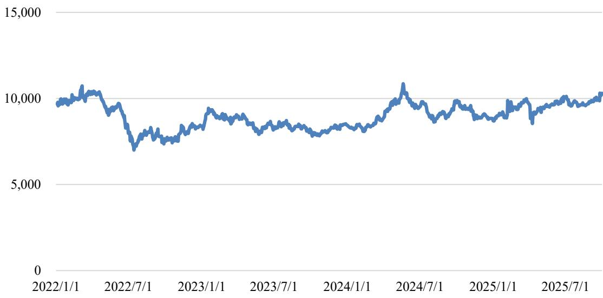  
数据来源：同花顺iFind。

## 2、发行人所处行业与下游行业之间的关联性及其发展状况

PCB 行业的下游应用广泛，主要应用于通信设备、汽车电子、工业控制、计算机、新能源、医疗器械、消费电子、军工航天等领域。下游行业的发展，增加对 PCB 产品的需求，并带动 PCB 行业的发展。具体如下：

## （1）通信设备

通信设备指用于信号、网络传输的基础设施，包括有线通信设备和无线通信设备两大类，包括通信基站、路由器、交换机、射频器件、基站天线、骨干网传输设备、光传输设备等。由于涉及大量高频的信号传输，通信设备对 PCB

存在较大的需求，随着 5G、6G 等技术的发展，高多层板、HDI 板、高频高速板等需求有望大幅上升。

根据 Prismark 预测，2029 年全球有线通信设备市场总量预计达到 1,980 亿美元，无线通信设备市场总量预计达到 930 亿美元，具体如下：

2024-2025年、2029年通信设备市场规模（单位：亿美元）  
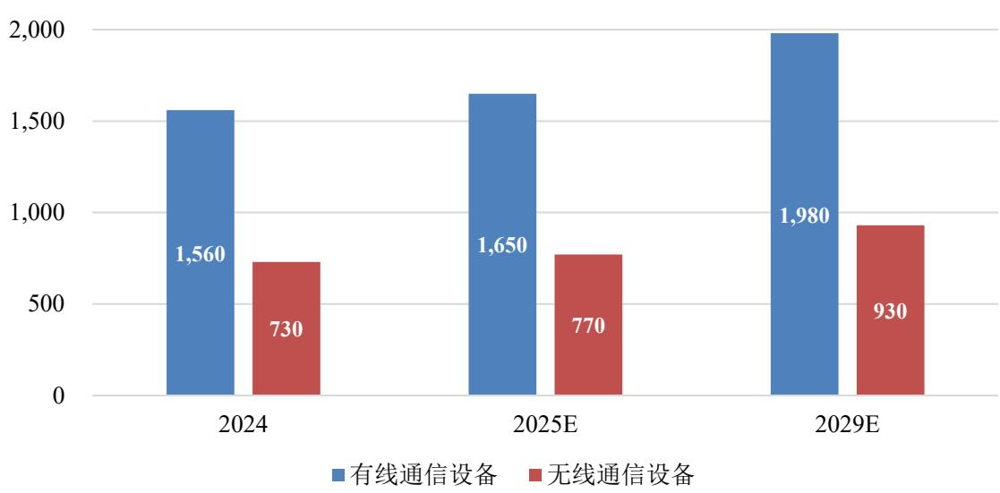  
数据来源：Prismark。

## （2）汽车电子

PCB 产品应用于大量汽车电子产品中，包括车辆控制系统（如电池管理系统 BMS、电机控制器、动力总成、发动机控制器）、驾驶辅助系统（ADAS、传感器）、车辆联网系统（如车载通信终端 T-Box）、安全及娱乐系统（智能座舱、车载屏幕）等。近年来随着新能源汽车渗透率的不断提高，电动化、智能化逐渐成为汽车的主要发展方向，将大幅增加对于如三电系统、驾驶辅助、智能座舱设备等需求，并带动对 PCB 产品的需求增长。

根据 Prismark 预测，2029 年全球汽车电子市场总量预计将达到 3,440 亿美元，具体如下：

2024-2025年、2029年汽车电子市场规模（单位：亿美元）  
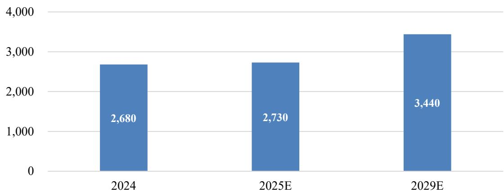  
数据来源：Prismark。

## （3）工业控制

工业控制指通过软件技术、电子电气以及机械技术等手段，使工厂生产和制造过程更加自动化、高效化、精确化，并且具备可控性和可视性，常见工业控制设备包括伺服电机、传感器、变频器、工业相机、仪器仪表、控制柜、工业控制计算器（IPC）、可编程逻辑控制器（PLC）等。随着工业自动化、生产智能化、“黑灯工厂”等技术的不断发展，对于工业控制产品的需求有望保持稳定增长。

根据 Prismark 预测，2029 年全球工业控制市场总量预计将达到 4,130 亿美元，具体如下：

2024-2025年、2029年工业控制市场规模（单位：亿美元）  
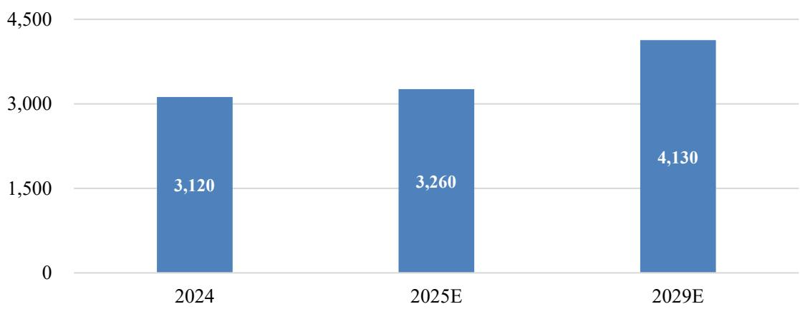

数据来源：Prismark。

## （4）AI 人工智能

近年来，随着 AI（人工智能）技术的快速进步，如 AI 服务器、交换机、存储等 AI 设备及 AI PC、AR、VR、智能穿戴（如 AI 眼镜）等 AI 终端产品逐渐推广普及，增加了对高多层板、HDI 板、多层刚挠结合板等高端 PCB 产品的需求，大幅增加了 PCB 企业的市场机会。根据 Prismark 数据，预计 2029 年，AI 相关的服务器/存储市场总量将达到 4,950 亿美元，2024-2029 年期间复合增长率达到 11.2%。

对于细分产品，以 AI 服务器电源为例，根据天风证券研究所统计，2026年 AI 服务器市场规模将达到 53.45 亿美元，较 2022 年增加 1,177.31%，保持高速增长。

2022-2026年AI服务器电源市场规模（单位：亿美元）  
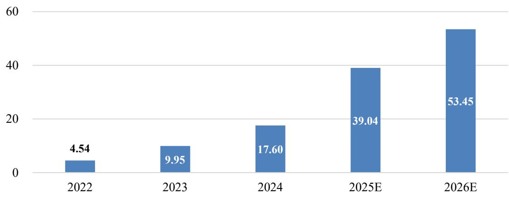  
数据来源：天风证券研究所。

## 八、与产品有关的技术情况

## （一）报告期内研发投入情况

报告期内，公司研发投入情况如下：

单位：万元

<table><tr><td rowspan=1 colspan=1>项目</td><td rowspan=1 colspan=1>2025年1-9月</td><td rowspan=1 colspan=1>2024年</td><td rowspan=1 colspan=1>2023年</td><td rowspan=1 colspan=1>2022年</td></tr><tr><td rowspan=1 colspan=1>研发费用</td><td rowspan=1 colspan=1>2,284.45</td><td rowspan=1 colspan=1>3,086.40</td><td rowspan=1 colspan=1>2,945.81</td><td rowspan=1 colspan=1>3,319.03</td></tr><tr><td rowspan=1 colspan=1>营业收入</td><td rowspan=1 colspan=1>61,354.86</td><td rowspan=1 colspan=1>59,610.27</td><td rowspan=1 colspan=1>51,094.26</td><td rowspan=1 colspan=1>55,926.34</td></tr><tr><td rowspan=1 colspan=1>研发费用率</td><td rowspan=1 colspan=1>3.72%</td><td rowspan=1 colspan=1>5.18%</td><td rowspan=1 colspan=1>5.77%</td><td rowspan=1 colspan=1>5.93%</td></tr></table>

## （二）研发人员及核心技术人员情况

## 1、研发人员情况

报告期内，公司技术/研发人员数量变动情况如下：

<table><tr><td rowspan=1 colspan=1>项目</td><td rowspan=1 colspan=1>2025-09-30</td><td rowspan=1 colspan=1>2024-12-31</td><td rowspan=1 colspan=1>2023-12-31</td><td rowspan=1 colspan=1>2022-12-31</td></tr><tr><td rowspan=1 colspan=1>技术/研发人员数量</td><td rowspan=1 colspan=1>198</td><td rowspan=1 colspan=1>117</td><td rowspan=1 colspan=1>90</td><td rowspan=1 colspan=1>73</td></tr><tr><td rowspan=1 colspan=1>技术/研发人员占比</td><td rowspan=1 colspan=1>13.17%</td><td rowspan=1 colspan=1>10.73%</td><td rowspan=1 colspan=1>10.15%</td><td rowspan=1 colspan=1>8.63%</td></tr></table>

## 2、核心技术人员情况

公司核心技术人员为董晓俊、江培来，简历详见本募集说明书“第四节 发行人基本情况”之“三、控股股东和实际控制人基本情况”之“（一）控股股东和实际控制人”及“五、董事、监事、高级管理人员及其他核心人员”之“（二）现任董事、时任监事、现任高级管理人员及其他核心人员的简历”。

报告期内，公司核心技术人员稳定，未发生重大变化。

## （三）核心技术来源及对发行人的影响

公司在多年以来的经营中，已经积累了多项核心技术，满足客户对产品的需求。截至报告期末，公司主要产品的核心技术及其来源如下：

<table><tr><td colspan="1" rowspan="1">序号</td><td colspan="1" rowspan="1">核心技术</td><td colspan="1" rowspan="1">技术来源</td><td colspan="1" rowspan="1">应用阶段</td></tr><tr><td colspan="1" rowspan="1">1</td><td colspan="1" rowspan="1">光模块产品对应PCB 制程工艺</td><td colspan="1" rowspan="1">自主研发</td><td colspan="1" rowspan="1">量产</td></tr><tr><td colspan="1" rowspan="1">2</td><td colspan="1" rowspan="1">印制电路板脉冲电镀生产工艺</td><td colspan="1" rowspan="1">自主研发</td><td colspan="1" rowspan="1">量产</td></tr><tr><td colspan="1" rowspan="1">3</td><td colspan="1" rowspan="1">PTFE 材料加工工艺</td><td colspan="1" rowspan="1">自主研发</td><td colspan="1" rowspan="1">量产</td></tr><tr><td colspan="1" rowspan="1">4</td><td colspan="1" rowspan="1">成型控深锣生产工艺</td><td colspan="1" rowspan="1">自主研发</td><td colspan="1" rowspan="1">量产</td></tr><tr><td colspan="1" rowspan="1">5</td><td colspan="1" rowspan="1">印制板低金环保型化学沉镍金工艺</td><td colspan="1" rowspan="1">自主研发</td><td colspan="1" rowspan="1">量产</td></tr><tr><td colspan="1" rowspan="1">6</td><td colspan="1" rowspan="1">超低离子污染度电路板生产工艺</td><td colspan="1" rowspan="1">自主研发</td><td colspan="1" rowspan="1">量产</td></tr><tr><td colspan="1" rowspan="1">7</td><td colspan="1" rowspan="1">高精密教学触摸屏电路板生产技术</td><td colspan="1" rowspan="1">自主研发</td><td colspan="1" rowspan="1">量产</td></tr><tr><td colspan="1" rowspan="1">8</td><td colspan="1" rowspan="1">印制电路板水平沉锡生产工艺</td><td colspan="1" rowspan="1">自主研发</td><td colspan="1" rowspan="1">量产</td></tr></table>

公司主要产品的核心技术具体情况如下：

## 1、光模块产品对应 PCB 制程工艺

光模块（optical module）由光电子器件、功能电路和光接口等组成，光电子器件包括发射和接收两部分。光模块的作用为光电转换，由发送端把电信号转换为光信号，通过光纤传送后，再由接收端将光信号转换为电信号。光模块由多种光器件封装而成，其中光模块 PCB 涉及高频高速材料运用、HDI 和软硬结构复合工艺能力、断接金手指及电厚金工艺，并有严格的外观与尺寸要求，属于技术壁垒较高的 PCB 产品。该技术有助于提升公司在通信领域的竞争力。

## 2、印制电路板脉冲电镀生产工艺

随着电子技术突飞猛进的发展，PCB 也在向着高密度（如小型化、精细线、细孔微孔、承载大量元件、线路连接复杂）、高能（如强电、高电压、高热）、高速（如微波、超高频）等技术方向发展，越来越多的 PCB 产品呈现孔径更小、线路更密、纵横比更高的趋势。细密线路对于 PCB 生产的深镀能力和均镀能力提出了更高的要求，而传统的直流电镀方案已经难以满足。

公司结合市场及客户需求，研制开发脉冲电镀生产工艺。在传统直流电镀方案下，对于纵横比 8:1 的孔，仅能达到 75%的 TP 值（即孔心铜厚与孔口铜厚的比值，比例越高说明电镀深镀能力越好）；而通过公司脉冲电镀生产工艺，在 10:1、15:1 的情况下，TP 值可以达到 100%。同时，相较于传统直流电镀，脉冲电镀生产工艺能够改变镀层结构，使晶粒度更小，能够获得更加致密、光亮相均匀的镀层，并降低镀层内应力和杂质含量，提高镀层韧性、耐磨性。该技术有助于公司提升高纵横比、高密度小型集成 PCB 及精细线、细孔等复杂电路板的生产能力，为公司布局多元化、复杂工艺产品奠定基础。

## 3、PTFE（聚四氟乙烯）材料加工工艺

高频板是一种电磁频率较高的特种线路板，通常定义为频率在 1GHz 以上，通常用于如汽车安全系统、卫星系统、无线电系统等高速的数据处理和信号传输领域。随着 5G/6G 技术的普及、物联网的发展及云计算、大数据等新兴技术的快速发展，对高频板的需求快速增长，高频板未来将存在巨大的市场空间。

该种板材因其高频率特征，在物理性能、精度和技术参数等方面对生产工艺、材料加工工艺有较高的要求。其中，PTFE 具有优异的耐高低温性和化学稳定性，并具备极好的电绝缘性、不粘性、耐腐蚀性、不燃性和疏水性，是高频板介电常数、介质损耗最低的材料首选。PTFE 材料结构高度对称，具有不含活性基团、结晶度高、表面能低等特性，因此，在生产中必须配备工业级等离子设备对其进行孔内除胶活化处理，以提高材料表面能，改善亲水性，提高粘合性能。通过改善 PTFE 材料加工工艺流程，有助于消除自身材质加工弊端，确保高频板产品的性能稳定，满足客户对于产品质量的要求。

## 4、成型控深锣生产工艺

PCB 广泛应用于电子产品、种类繁多，并可能用于剧烈震动、温差大、高腐蚀性等恶劣环境中，对产品质量、可靠性、稳定性提出了更高的要求，需要在产品加工方面具备更高的精密度。

成型控深锣工艺是 PCB 生产过程中的一种精密加工工艺，是指在 PCB 外型制作时，通过在其指定的位置上精确控制数控机床下刀深度，铣削出符合装配需求的梯形槽，以实现特定的结构或功能，确保 PCB 尺寸和形状符合设计要求，使 PCB 与其他设备、元器件连接更加稳定，并提高生产精度，减少废品率、提升产品质量。

## 5、印制板低金环保型化学沉镍金工艺

化学镍金，又称化镍金、沉镍金或者无电镍金，是在阻焊后裸铜焊盘上通过化学反应沉积含磷化学镍层，并按照客户要求的厚度，通过与镍置换沉积化学薄金层。化学镍金兼具耐磨、可打线、电导体性能优良、散热效果好等优势，

得到下游客户的广泛应用。

相较于其他表面处理工艺，化学镍金工艺复杂程度高、生产过程不可返工，因此生产过程需要更加精细的控制程度；并且，黄金是化学镍金加工过程中的重要原材料，因此化学镍金的加工成本较高。基于上述情况，开发低金环保型的化学镍金工艺成为 PCB 行业的共识。通过该种工艺，在降低化学镍金成本的同时，能够更好把控生产精度，提高产品良率和质量。

## 6、超低离子污染度电路板生产工艺

现阶段，在电子产品集成度不断提高的情况下，PCB 上的元件、布线也更加密集，线与线的间距越来越小，之前对 PCB 表面的清洁度已无法满足现有产品的要求，特别体现在如航天航空、汽车电子、通讯设备、医疗设备等高端应用领域。如 PCB 表面有酸性离子残留时，残留物会对 PCB 产生腐蚀，会造成开路、短路等问题，产品的寿命也大大降低，影响稳定性。

结合客户对产品清洁度、污染度指标的要求，公司开发超低离子污染度电路板生产工艺。通过成品清洗线配置离子清洗剂药液，可根据产品类型开启和关闭自由切换，药液分槽隔断，保证后端去离子水洗纯洁，不对其他类型产品造成影响，使公司具备更高清洁度要求的产品生产能力。

## 7、高精密教学触摸屏电路板生产技术

高精密教学触摸屏电路板生产技术可在有组织的、相对较小的扁平材料上创建复杂的布线和电路，并在层数较高、空间较小、表面设计复杂的结构内实现不同层间的电气导通，进一步突破 PCB 仅限于载体的应用。

高精密教学触摸屏电路板产品结构复杂层数高，宽精细且密集度高，层间对位苛刻，钻孔孔径小且分布密集，板面线路精密且多组线阻抗设计，阻焊印刷厚度、对位精度要求更高。该技术对于提高公司在高端、精密产品的生产能力，提高市场竞争力均具有重大的意义。

## 8、印制电路板水平沉锡生产工艺

沉锡是一种通过化学置换反应沉积的金属饰面，将锡层直接施加在电路板的基础铜上，以保护底层铜在其预期的保质期内不被氧化。由于所有焊料都是以锡作为基础材料的，因此锡层可以匹配任何类型的焊料。同时，锡层结构呈颗粒状结构，克服了锡须和锡迁移带来的问题，并具有良好的热稳定性、可焊性和抗腐蚀性。

此外，该工艺根据产品形态的多样化，可搭配除铜机等设备的使用，获得更高效、更稳定的流程控制，以及更少的废液排放，确保锡面有更加良好的外观及可焊性能。该技术对于提高公司产品加工效率、降低成本具有重要意义，并可广泛应用于如汽车、工控、医疗设备等领域的 PCB 产品。

## （四）报告期内形成的重要专利技术及应用情况

报告期内形成的重要专利技术及应用情况详见本募集说明书“第四节 发行人基本情况”之“九、发行人与业务相关的主要固定资产及无形资产情况”之“（二）主要无形资产”之“3、专利”。

## 九、发行人与业务相关的主要固定资产及无形资产情况

## （一）主要固定资产

公司固定资产主要包括房屋及建筑物、机器设备、运输设备、办公设备及其他，截至 2025 年 9 月 30 日，公司固定资产具体情况如下：

单位：万元

<table><tr><td rowspan=1 colspan=1>类别</td><td rowspan=1 colspan=1>账面原值</td><td rowspan=1 colspan=1>累计折旧</td><td rowspan=1 colspan=1>减值准备</td><td rowspan=1 colspan=1>账面净值</td><td rowspan=1 colspan=1>成新率</td></tr><tr><td rowspan=1 colspan=1>房屋及建筑物</td><td rowspan=1 colspan=1>33,218.19</td><td rowspan=1 colspan=1>2,707.41</td><td rowspan=1 colspan=1>-</td><td rowspan=1 colspan=1>30,510.77</td><td rowspan=1 colspan=1>91.85%</td></tr><tr><td rowspan=1 colspan=1>机器设备</td><td rowspan=1 colspan=1>38,303.73</td><td rowspan=1 colspan=1>13,549.54</td><td rowspan=1 colspan=1>215.13</td><td rowspan=1 colspan=1>24,539.06</td><td rowspan=1 colspan=1>64.06%</td></tr><tr><td rowspan=1 colspan=1>运输设备</td><td rowspan=1 colspan=1>617.13</td><td rowspan=1 colspan=1>432.90</td><td rowspan=1 colspan=1>-</td><td rowspan=1 colspan=1>184.23</td><td rowspan=1 colspan=1>29.85%</td></tr><tr><td rowspan=1 colspan=1>办公设备及其他</td><td rowspan=1 colspan=1>1,938.09</td><td rowspan=1 colspan=1>1,145.13</td><td rowspan=1 colspan=1>1</td><td rowspan=1 colspan=1>792.96</td><td rowspan=1 colspan=1>40.91%</td></tr><tr><td rowspan=1 colspan=1>合计</td><td rowspan=1 colspan=1>74,077.14</td><td rowspan=1 colspan=1>17,834.98</td><td rowspan=1 colspan=1>215.13</td><td rowspan=1 colspan=1>56,027.02</td><td rowspan=1 colspan=1>75.63%</td></tr></table>

注：成新率=账面净值/账面原值。

## 1、房屋建筑物

## （1）自有房屋建筑物

截至 2025年9月 30日，公司拥有房屋建筑物情况如下：

<table><tr><td rowspan=1 colspan=1>序号</td><td rowspan=1 colspan=1>权利人</td><td rowspan=1 colspan=1>房产证号</td><td rowspan=1 colspan=1>坐落</td><td rowspan=1 colspan=1>建筑面积/平方米</td><td rowspan=1 colspan=1>用途</td><td rowspan=1 colspan=1>是否抵押</td><td rowspan=1 colspan=1>土地使用权届满期限</td></tr><tr><td rowspan=1 colspan=1>1</td><td rowspan=1 colspan=1>本川智能</td><td rowspan=1 colspan=1>苏（2023）宁漂不动产权第0018590号</td><td rowspan=1 colspan=1>南京市漂水区经济开发区孔家路7号</td><td rowspan=1 colspan=1>46,883.52</td><td rowspan=1 colspan=1>工业、仓储</td><td rowspan=1 colspan=1>香</td><td rowspan=1 colspan=1>2057-05-31</td></tr><tr><td rowspan=1 colspan=1>2</td><td rowspan=1 colspan=1>艾威尔深圳</td><td rowspan=1 colspan=1>粤（2017）深圳市不动产权第0221807号</td><td rowspan=1 colspan=1>深圳市宝安区西乡街道满京华艺峦大厦4座1502</td><td rowspan=1 colspan=1>247.18产业研发</td><td rowspan=1 colspan=1>247.18产业研发</td><td rowspan=1 colspan=1>是</td><td rowspan=1 colspan=1>2062-12-13</td></tr><tr><td rowspan=1 colspan=1>3</td><td rowspan=1 colspan=1>珠海硕鸿</td><td rowspan=1 colspan=1>粤房地证字第C5024046号</td><td rowspan=1 colspan=1>珠海市金湾区三灶镇海澄工业区1栋</td><td rowspan=1 colspan=1>3,953.43</td><td rowspan=1 colspan=1>工业厂房</td><td rowspan=1 colspan=1>香</td><td rowspan=1 colspan=1>2050-01-14</td></tr><tr><td rowspan=1 colspan=1>4</td><td rowspan=1 colspan=1>珠海硕鸿</td><td rowspan=1 colspan=1>粤房地证字第 2129134 号</td><td rowspan=1 colspan=1>珠海市三灶镇海澄工业区电路板厂二期厂房</td><td rowspan=1 colspan=1>4,939.09工业厂房</td><td rowspan=1 colspan=1>4,939.09工业厂房</td><td rowspan=1 colspan=1>香</td><td rowspan=1 colspan=1>2049-12-22</td></tr><tr><td rowspan=1 colspan=1>5</td><td rowspan=1 colspan=1>珠海硕鸿</td><td rowspan=1 colspan=1>粤房地证字第 C5024045号</td><td rowspan=1 colspan=1>珠海市金湾区三灶镇海澄工业区硕鸿电路版有限公司职工宿舍楼</td><td rowspan=1 colspan=1>1,780.16宿舍楼</td><td rowspan=1 colspan=1>1,780.16宿舍楼</td><td rowspan=1 colspan=1>香</td><td rowspan=1 colspan=1>2050-01-14</td></tr><tr><td rowspan=1 colspan=1>6</td><td rowspan=1 colspan=1>珠海硕鸿</td><td rowspan=1 colspan=1>粤房地证字第C0843723号</td><td rowspan=1 colspan=1>珠海市金湾区三灶镇海澄工业区硕鸿电路板厂集体宿舍</td><td rowspan=1 colspan=1>3,073.14集体宿舍</td><td rowspan=1 colspan=1>3,073.14集体宿舍</td><td rowspan=1 colspan=1>香</td><td rowspan=1 colspan=1>2049-12-28</td></tr><tr><td rowspan=1 colspan=1>7</td><td rowspan=1 colspan=1>珠海硕鸿</td><td rowspan=1 colspan=1>粤房地证字第C0843722号</td><td rowspan=1 colspan=1>珠海市金湾区三灶镇海澄工业区硕鸿电路板厂内物料仓库</td><td rowspan=1 colspan=1>313.89</td><td rowspan=1 colspan=1>仓库</td><td rowspan=1 colspan=1>香</td><td rowspan=1 colspan=1>2049-12-28</td></tr><tr><td rowspan=1 colspan=1>8</td><td rowspan=1 colspan=1>艾威尔泰国</td><td rowspan=5 colspan=1>85425、85426、85431、85432</td><td rowspan=5 colspan=1>泰国北榄府直辖县帕叻沙分区</td><td rowspan=1 colspan=1>2,496.00</td><td rowspan=1 colspan=1>办公楼</td><td rowspan=1 colspan=1>香</td><td rowspan=1 colspan=1>永久（土地所有权）</td></tr><tr><td rowspan=1 colspan=1>9</td><td rowspan=1 colspan=1>艾威尔泰国</td><td rowspan=1 colspan=1>4,957.50</td><td rowspan=1 colspan=1>工厂</td><td rowspan=1 colspan=1>香</td><td rowspan=1 colspan=1>永久（土地所有权）</td></tr><tr><td rowspan=1 colspan=1>10</td><td rowspan=1 colspan=1>艾威尔泰国</td><td rowspan=1 colspan=1>375.00</td><td rowspan=1 colspan=1>食堂</td><td rowspan=1 colspan=1>香</td><td rowspan=1 colspan=1>永久（土地所有权）</td></tr><tr><td rowspan=1 colspan=1>11</td><td rowspan=1 colspan=1>艾威尔泰国</td><td rowspan=1 colspan=1>24.00</td><td rowspan=1 colspan=1>保安亭</td><td rowspan=1 colspan=1>香</td><td rowspan=1 colspan=1>永久（土地所有权）</td></tr><tr><td rowspan=1 colspan=1>12</td><td rowspan=1 colspan=1>12艾威尔泰国</td><td rowspan=1 colspan=1>165.00</td><td rowspan=1 colspan=1>停车场</td><td rowspan=1 colspan=1>香</td><td rowspan=1 colspan=1>永久（土地所有权）</td></tr><tr><td rowspan=1 colspan=1>13</td><td rowspan=1 colspan=1>13本川智能</td><td rowspan=1 colspan=1>苏（2025）宁溧不动产权第0012602号</td><td rowspan=1 colspan=1>南京市漂水经济开发区前进路1号</td><td rowspan=1 colspan=1>28,588.41</td><td rowspan=1 colspan=1>工业、车库</td><td rowspan=1 colspan=1>香</td><td rowspan=1 colspan=1>2072-11-02</td></tr></table>

注：截至本募集说明书出具之日，出于本次募投项目建设需要，上表中艾威尔泰国名下房产除第 11 项保安亭外，其他均已拆除。

## （2）租赁房屋建筑物

截至 2025年9月 30日，公司租赁房屋建筑物情况如下：

<table><tr><td colspan="1" rowspan="1">序号</td><td colspan="1" rowspan="1">承租方</td><td colspan="1" rowspan="1">出租方</td><td colspan="1" rowspan="1">租赁场所</td><td colspan="1" rowspan="1">用途</td><td colspan="1" rowspan="1">租金</td><td colspan="1" rowspan="1">租赁期限</td></tr><tr><td colspan="1" rowspan="1">1</td><td colspan="1" rowspan="1">艾威尔深圳</td><td colspan="1" rowspan="1">陈国贤</td><td colspan="1" rowspan="1">深圳市宝安区燕罗街道燕川</td><td colspan="1" rowspan="1">工业、办</td><td colspan="1" rowspan="1">A3栋厂房：</td><td colspan="1" rowspan="1">2024-10-01</td></tr><tr><td colspan="1" rowspan="1"></td><td colspan="1" rowspan="1"></td><td colspan="1" rowspan="1"></td><td colspan="1" rowspan="1">社区兴达路9号A3栋（1-3层）厂房和B3栋（1-9层）宿舍</td><td colspan="1" rowspan="1">公、住宿及配套设施</td><td colspan="1" rowspan="1">185,900元/月B3栋宿舍：103,382元/月</td><td colspan="1" rowspan="1">至2027-09-30</td></tr><tr><td colspan="1" rowspan="1">2</td><td colspan="1" rowspan="1">艾威尔深圳</td><td colspan="1" rowspan="1">皮丕双</td><td colspan="1" rowspan="1">深圳市宝安区松岗满京华云著二期2栋A座1203房</td><td colspan="1" rowspan="1">居住</td><td colspan="1" rowspan="1">4,250元/月</td><td colspan="1" rowspan="1">2024-10-01至2025-12-31</td></tr><tr><td colspan="1" rowspan="1">3</td><td colspan="1" rowspan="1">骏岭线路板</td><td colspan="1" rowspan="1">深圳市松岗江边股份合作公同</td><td colspan="1" rowspan="1">江边社区第一工业区创业一路6号</td><td colspan="1" rowspan="1">工业</td><td colspan="1" rowspan="1">186,440元/月</td><td colspan="1" rowspan="1">2023-05-15至2029-05-14</td></tr><tr><td colspan="1" rowspan="1"></td><td colspan="1" rowspan="1">4珠海亚图</td><td colspan="1" rowspan="1">珠海市潮盛工贸有限公司</td><td colspan="1" rowspan="1">珠海市金湾区三灶镇映月路28号</td><td colspan="1" rowspan="1">厂房</td><td colspan="1" rowspan="1">2023-03-01至2025-12-31期间：13.5元/月平方米2026-01-01至 2028-12-31期间：14.5元/月/平方米</td><td colspan="1" rowspan="1">2023-03-01至2028-12-31</td></tr><tr><td colspan="1" rowspan="1"></td><td colspan="1" rowspan="1">5皖粤光电</td><td colspan="1" rowspan="1">珠海市攀越工贸有限公司</td><td colspan="1" rowspan="1">珠海市三灶科技工业园琴石工业区攀越厂区A2栋2楼厂房</td><td colspan="1" rowspan="1">工业</td><td colspan="1" rowspan="1">16,720元/月</td><td colspan="1" rowspan="1">2024-12-01至2025-11-30</td></tr><tr><td colspan="1" rowspan="1">6</td><td colspan="1" rowspan="1">皖粤光电</td><td colspan="1" rowspan="1">珠海市攀越工贸有限公司</td><td colspan="1" rowspan="1">珠海市三灶科技工业园琴石工业区攀越厂区A2栋3楼、4楼厂房，综合楼1楼厂房</td><td colspan="1" rowspan="1">工业</td><td colspan="1" rowspan="1">37,633元/月</td><td colspan="1" rowspan="1">2024-11-01至2025-10-31</td></tr><tr><td colspan="1" rowspan="1"></td><td colspan="1" rowspan="1">7美国本川</td><td colspan="1" rowspan="1">Nat Sclafani</td><td colspan="1" rowspan="1">905 Albion AvenueSchaumburg, IL 60193 ,US</td><td colspan="1" rowspan="1">办公、仓储</td><td colspan="1" rowspan="1">2024-05-01至2025-04-30期间：4,803美元/月2025-05-01至 2026-04-30期间：4,995美元/月2026-05-01至2027-04-30期间：5,145美元/月</td><td colspan="1" rowspan="1">2024-05-01至2027-04-30</td></tr></table>

## 2、主要生产设备

截至 2025年9月 30日，公司账面价值前十名的主要生产设备情况如下：

单位：万元

<table><tr><td colspan="1" rowspan="1">序号</td><td colspan="1" rowspan="1">设备名称</td><td colspan="1" rowspan="1">单位</td><td colspan="1" rowspan="1">数量</td><td colspan="1" rowspan="1">账面价值</td><td colspan="1" rowspan="1">账面净值</td><td colspan="1" rowspan="1">成新率</td></tr><tr><td colspan="1" rowspan="1">1</td><td colspan="1" rowspan="1">VCP垂直连续电镀线</td><td colspan="1" rowspan="1">套</td><td colspan="1" rowspan="1">4</td><td colspan="1" rowspan="1">3,752.21</td><td colspan="1" rowspan="1">3,273.99</td><td colspan="1" rowspan="1">87.25%</td></tr><tr><td colspan="1" rowspan="1">2</td><td colspan="1" rowspan="1">六轴数控钻机</td><td colspan="1" rowspan="1">台</td><td colspan="1" rowspan="1">40</td><td colspan="1" rowspan="1">2,336.28</td><td colspan="1" rowspan="1">1,707.43</td><td colspan="1" rowspan="1">73.08%</td></tr><tr><td colspan="1" rowspan="1">3</td><td colspan="1" rowspan="1">除胶渣连水平沉铜线机</td><td colspan="1" rowspan="1">台</td><td colspan="1" rowspan="1">2</td><td colspan="1" rowspan="1">989.20</td><td colspan="1" rowspan="1">832.50</td><td colspan="1" rowspan="1">84.16%</td></tr><tr><td colspan="1" rowspan="1">4</td><td colspan="1" rowspan="1">维嘉全自动钻孔机</td><td colspan="1" rowspan="1">台</td><td colspan="1" rowspan="1">18</td><td colspan="1" rowspan="1">939.82</td><td colspan="1" rowspan="1">905.10</td><td colspan="1" rowspan="1">96.31%</td></tr><tr><td colspan="1" rowspan="1">5</td><td colspan="1" rowspan="1">六轴数控成型机</td><td colspan="1" rowspan="1">台</td><td colspan="1" rowspan="1">17</td><td colspan="1" rowspan="1">676.99</td><td colspan="1" rowspan="1">493.95</td><td colspan="1" rowspan="1">72.96%</td></tr><tr><td colspan="1" rowspan="1">6</td><td colspan="1" rowspan="1">激光直接成像设备</td><td colspan="1" rowspan="1">套</td><td colspan="1" rowspan="1">3</td><td colspan="1" rowspan="1">624.78</td><td colspan="1" rowspan="1">427.70</td><td colspan="1" rowspan="1">68.46%</td></tr><tr><td colspan="1" rowspan="1">7</td><td colspan="1" rowspan="1">飞针测试机</td><td colspan="1" rowspan="1">台</td><td colspan="1" rowspan="1">20</td><td colspan="1" rowspan="1">574.02</td><td colspan="1" rowspan="1">290.13</td><td colspan="1" rowspan="1">50.54%</td></tr><tr><td colspan="1" rowspan="1">8</td><td colspan="1" rowspan="1">低压电容柜</td><td colspan="1" rowspan="1">台</td><td colspan="1" rowspan="1">6</td><td colspan="1" rowspan="1">538.05</td><td colspan="1" rowspan="1">393.23</td><td colspan="1" rowspan="1">73.08%</td></tr><tr><td colspan="1" rowspan="1">9</td><td colspan="1" rowspan="1">上下层垂直连续电镀线</td><td colspan="1" rowspan="1">套</td><td colspan="1" rowspan="1">1</td><td colspan="1" rowspan="1">509.73</td><td colspan="1" rowspan="1">372.53</td><td colspan="1" rowspan="1">73.08%</td></tr><tr><td colspan="1" rowspan="1">10</td><td colspan="1" rowspan="1">垂直连续镀铜线</td><td colspan="1" rowspan="1">台</td><td colspan="1" rowspan="1">1</td><td colspan="1" rowspan="1">374.38</td><td colspan="1" rowspan="1">273.61</td><td colspan="1" rowspan="1">73.08%</td></tr></table>

## 3、生产设备租赁情况

截至 2025年9月 30日，公司租赁生产设备情况如下：

<table><tr><td rowspan=1 colspan=1>序号</td><td rowspan=1 colspan=1>承租方</td><td rowspan=1 colspan=1>出租方</td><td rowspan=1 colspan=1>租赁设备</td><td rowspan=1 colspan=1>租金</td><td rowspan=1 colspan=1>租赁期限</td></tr><tr><td rowspan=1 colspan=1>1</td><td rowspan=1 colspan=1>骏岭线路板</td><td rowspan=1 colspan=1>深圳市华跃光电有限公司</td><td rowspan=1 colspan=1>光绘机</td><td rowspan=1 colspan=1>2022-09-01至 2023-08-31期间：9,500元/月2023-09-01至2024-12-31期间：9,000元/月2025-01-01至2027-08-31期间：8,500元/月</td><td rowspan=1 colspan=1>2022-09-01至2027-08-31</td></tr><tr><td rowspan=1 colspan=1>2</td><td rowspan=1 colspan=1>本川智能</td><td rowspan=1 colspan=1>东莞市宇冠电子科技有限公司</td><td rowspan=1 colspan=1>激光绘图机9,000元/月</td><td rowspan=1 colspan=1>激光绘图机9,000元/月</td><td rowspan=1 colspan=1>2025-08-31至2027-08-31</td></tr></table>

## （二）主要无形资产

## 1、土地使用权

截至 2025年9月 30日，发行人拥有的土地使用权情况如下：

<table><tr><td rowspan=1 colspan=1>序号</td><td rowspan=1 colspan=1>权利人</td><td rowspan=1 colspan=1>土地权证号</td><td rowspan=1 colspan=1>坐落</td><td rowspan=1 colspan=1>面积/平方米</td><td rowspan=1 colspan=1>是否抵押</td><td rowspan=1 colspan=1>用途</td><td rowspan=1 colspan=1>使用权届满期限</td></tr><tr><td rowspan=1 colspan=1>1</td><td rowspan=1 colspan=1>本川智能</td><td rowspan=1 colspan=1>苏（2025）宁漂不动产权第0012602号</td><td rowspan=1 colspan=1>南京市漂水经济开发区前进路1号</td><td rowspan=1 colspan=1>44,149.68</td><td rowspan=1 colspan=1>香</td><td rowspan=1 colspan=1>工业</td><td rowspan=1 colspan=1>2072-11-02</td></tr><tr><td rowspan=1 colspan=1>2</td><td rowspan=1 colspan=1>本川智能</td><td rowspan=1 colspan=1>苏（2023）宁溧不动产权第0018590号</td><td rowspan=1 colspan=1>溧水区经济开发区孔家路7号</td><td rowspan=1 colspan=1>39,979.40</td><td rowspan=1 colspan=1>香</td><td rowspan=1 colspan=1>工业</td><td rowspan=1 colspan=1>2057-05-31</td></tr><tr><td rowspan=1 colspan=1>3</td><td rowspan=1 colspan=1>珠海硕鸿</td><td rowspan=1 colspan=1>粤房地证字第C5024046号</td><td rowspan=1 colspan=1>珠海市金湾区三灶镇海澄工业区</td><td rowspan=1 colspan=1>5,127.70</td><td rowspan=1 colspan=1>香</td><td rowspan=1 colspan=1>工业</td><td rowspan=1 colspan=1>2050-01-14</td></tr><tr><td rowspan=1 colspan=1>4</td><td rowspan=1 colspan=1>珠海硕鸿</td><td rowspan=1 colspan=1>粤房地证字第2129134号</td><td rowspan=1 colspan=1>珠海市金湾区三灶镇海澄工业区</td><td rowspan=1 colspan=1>4,180.00</td><td rowspan=1 colspan=1>香</td><td rowspan=1 colspan=1>工业</td><td rowspan=1 colspan=1>2049-12-22</td></tr><tr><td rowspan=1 colspan=1>5</td><td rowspan=1 colspan=1>珠海硕鸿</td><td rowspan=1 colspan=1>粤房地证字第C5024045号</td><td rowspan=1 colspan=1>珠海市金湾区三灶镇海澄工业区</td><td rowspan=1 colspan=1>2,014.20</td><td rowspan=1 colspan=1>香</td><td rowspan=1 colspan=1>工业</td><td rowspan=1 colspan=1>2050-01-14</td></tr><tr><td rowspan=1 colspan=1>6</td><td rowspan=1 colspan=1>珠海硕鸿</td><td rowspan=1 colspan=1>粤房地证字第C0843723号</td><td rowspan=1 colspan=1>珠海市金湾区三灶镇海澄工业区</td><td rowspan=1 colspan=1>507.24</td><td rowspan=1 colspan=1>香</td><td rowspan=1 colspan=1>工业</td><td rowspan=1 colspan=1>2049-12-28</td></tr><tr><td rowspan=1 colspan=1>7</td><td rowspan=1 colspan=1>珠海硕鸿</td><td rowspan=1 colspan=1>粤房地证字第C0843722号</td><td rowspan=1 colspan=1>珠海市金湾区三灶镇海澄工业区</td><td rowspan=1 colspan=1>313.89</td><td rowspan=1 colspan=1>香</td><td rowspan=1 colspan=1>工业</td><td rowspan=1 colspan=1>2049-12-28</td></tr><tr><td rowspan=1 colspan=1>8</td><td rowspan=1 colspan=1>艾威尔泰国</td><td rowspan=1 colspan=1>85425、85426、85431、85432</td><td rowspan=1 colspan=1>泰国北榄府直辖县帕叻沙分区</td><td rowspan=1 colspan=1>8莱1颜</td><td rowspan=1 colspan=1>香</td><td rowspan=1 colspan=1>工业</td><td rowspan=1 colspan=1>永久（土地所有权）</td></tr></table>

注：莱、颜为泰国面积计量单位，1 莱约等于 1,600 平方米，1 颜约等于 400 平方米。按此

计算，艾威尔泰国土地面积约为 13,200平方米。

## 2、商标

截至 2025年9月 30日，公司注册商标情况如下：

<table><tr><td rowspan=1 colspan=1>序号</td><td rowspan=1 colspan=1>商标标识</td><td rowspan=1 colspan=1>权利人</td><td rowspan=1 colspan=1>国际分类号</td><td rowspan=1 colspan=1>注册号</td><td rowspan=1 colspan=1>有效期限</td><td rowspan=1 colspan=1>取得方式</td></tr><tr><td rowspan=1 colspan=1>1</td><td rowspan=4 colspan=1></td><td rowspan=1 colspan=1>本川智能</td><td rowspan=1 colspan=1>7</td><td rowspan=1 colspan=1>50805304</td><td rowspan=1 colspan=1>2031-08-20</td><td rowspan=1 colspan=1>原始取得</td></tr><tr><td rowspan=1 colspan=1>2</td><td rowspan=1 colspan=1>本川智能</td><td rowspan=1 colspan=1>9（0901、0913、0920）</td><td rowspan=1 colspan=1>36197928</td><td rowspan=1 colspan=1>2029-11-06</td><td rowspan=1 colspan=1>原始取得</td></tr><tr><td rowspan=1 colspan=1>3</td><td rowspan=1 colspan=1>本川智能</td><td rowspan=1 colspan=1>9（0901、0910、0912、0913、0920、0922)</td><td rowspan=1 colspan=1>26779959</td><td rowspan=1 colspan=1>2028-09-20</td><td rowspan=1 colspan=1>原始取得</td></tr><tr><td rowspan=1 colspan=1>4</td><td rowspan=1 colspan=1>本川智能</td><td rowspan=1 colspan=1>35</td><td rowspan=1 colspan=1>50797719</td><td rowspan=1 colspan=1>2031-12-13</td><td rowspan=1 colspan=1>原始取得</td></tr><tr><td rowspan=1 colspan=1>5</td><td rowspan=1 colspan=1>w           on</td><td rowspan=1 colspan=1>本川智能</td><td rowspan=1 colspan=1>9</td><td rowspan=1 colspan=1>9760003</td><td rowspan=1 colspan=1>2034-01-06</td><td rowspan=1 colspan=1>原始取得</td></tr><tr><td rowspan=1 colspan=1>6號</td><td rowspan=3 colspan=1>本川</td><td rowspan=1 colspan=1>本川智能</td><td rowspan=1 colspan=1>9</td><td rowspan=1 colspan=1>26743598</td><td rowspan=1 colspan=1>2029-02-06</td><td rowspan=1 colspan=1>原始取得</td></tr><tr><td rowspan=1 colspan=1>7</td><td rowspan=1 colspan=1>本川智能</td><td rowspan=1 colspan=1>40</td><td rowspan=1 colspan=1>26778232</td><td rowspan=1 colspan=1>2028-09-13</td><td rowspan=1 colspan=1>原始取得</td></tr><tr><td rowspan=1 colspan=1>8</td><td rowspan=1 colspan=1>本川智能</td><td rowspan=1 colspan=1>42</td><td rowspan=1 colspan=1>26746524</td><td rowspan=1 colspan=1>2028-09-13</td><td rowspan=1 colspan=1>原始取得</td></tr></table>

## 3、专利

截至 2025 年 9 月 30 日，公司共拥有专利 73 件，其中发明专利 24 件、实用新型49件，具体情况如下：

注：上表专利中，除序号73为继受取得外，其余均为原始取得。
<table><tr><td colspan="1" rowspan="1">序号</td><td colspan="1" rowspan="1">申请日期</td><td colspan="1" rowspan="1">权利人</td><td colspan="1" rowspan="1">专利名称</td><td colspan="1" rowspan="1">专利号</td><td colspan="1" rowspan="1">专利类型</td></tr><tr><td colspan="1" rowspan="1">1</td><td colspan="1" rowspan="1">2021-11-09</td><td colspan="1" rowspan="1">本川智能</td><td colspan="1" rowspan="1">-种阻焊可移动式双面钉床</td><td colspan="1" rowspan="1">202111322509.4</td><td colspan="1" rowspan="1">发明</td></tr><tr><td colspan="1" rowspan="1">2</td><td colspan="1" rowspan="1">2021-12-22</td><td colspan="1" rowspan="1">本川智能</td><td colspan="1" rowspan="1">-种电镀锡层可焊接制作方法</td><td colspan="1" rowspan="1">202111580730.X</td><td colspan="1" rowspan="1">发明</td></tr><tr><td colspan="1" rowspan="1">3</td><td colspan="1" rowspan="1">2022-01-12</td><td colspan="1" rowspan="1">本川智能</td><td colspan="1" rowspan="1">-种多料号合拼的测试治具</td><td colspan="1" rowspan="1">202210034034.7</td><td colspan="1" rowspan="1">发明</td></tr><tr><td colspan="1" rowspan="1">4</td><td colspan="1" rowspan="1">2022-01-12</td><td colspan="1" rowspan="1">本川智能</td><td colspan="1" rowspan="1">种改善测试压床安全的装置</td><td colspan="1" rowspan="1">202210034055.9</td><td colspan="1" rowspan="1">发明</td></tr><tr><td colspan="1" rowspan="1">5</td><td colspan="1" rowspan="1">2018-07-06</td><td colspan="1" rowspan="1">本川智能</td><td colspan="1" rowspan="1">-种金属化半孔的制作工艺</td><td colspan="1" rowspan="1">201810739862.4</td><td colspan="1" rowspan="1">发明</td></tr><tr><td colspan="1" rowspan="1">6</td><td colspan="1" rowspan="1">2021-12-30</td><td colspan="1" rowspan="1">本川智能</td><td colspan="1" rowspan="1">-种垂直电镀铜加工用钛篮可稳固摆放的铜槽</td><td colspan="1" rowspan="1">202111644757.0</td><td colspan="1" rowspan="1">发明</td></tr><tr><td colspan="1" rowspan="1">7</td><td colspan="1" rowspan="1">2020-01-16</td><td colspan="1" rowspan="1">本川智能</td><td colspan="1" rowspan="1">-种DES线显影装置及显影方法</td><td colspan="1" rowspan="1">202010044733.0</td><td colspan="1" rowspan="1">发明</td></tr><tr><td colspan="1" rowspan="1">8</td><td colspan="1" rowspan="1">2021-12-22</td><td colspan="1" rowspan="1">本川智能</td><td colspan="1" rowspan="1">-种印制蓝胶PCB 模型槽的应用</td><td colspan="1" rowspan="1">202111583267.4</td><td colspan="1" rowspan="1">发明</td></tr><tr><td colspan="1" rowspan="1">9</td><td colspan="1" rowspan="1">2020-01-16</td><td colspan="1" rowspan="1">本川智能</td><td colspan="1" rowspan="1">-种用于防止阻焊油墨冒油的电路散热板及其制作方法</td><td colspan="1" rowspan="1">202010044828.2</td><td colspan="1" rowspan="1">发明</td></tr><tr><td colspan="1" rowspan="1">10</td><td colspan="1" rowspan="1">2021-07-17</td><td colspan="1" rowspan="1">本川智能</td><td colspan="1" rowspan="1">-种含有热敏电阻材料的电路板的加工方法</td><td colspan="1" rowspan="1">202110809977.8</td><td colspan="1" rowspan="1">发明</td></tr><tr><td colspan="1" rowspan="1">11</td><td colspan="1" rowspan="1">2021-07-17</td><td colspan="1" rowspan="1">本川智能</td><td colspan="1" rowspan="1">-种多层板层压设备及其加工方法</td><td colspan="1" rowspan="1">202110809982.9</td><td colspan="1" rowspan="1">发明</td></tr><tr><td colspan="1" rowspan="1">12</td><td colspan="1" rowspan="1">2021-07-17</td><td colspan="1" rowspan="1">本川智能</td><td colspan="1" rowspan="1">-种厚铜板阻焊印刷设备及其印刷方法</td><td colspan="1" rowspan="1">202110809976.3</td><td colspan="1" rowspan="1">发明</td></tr><tr><td colspan="1" rowspan="1">13</td><td colspan="1" rowspan="1">2018-05-29</td><td colspan="1" rowspan="1">本川智能</td><td colspan="1" rowspan="1">一种实现批量化检验钻孔品质的设备及其检测方法</td><td colspan="1" rowspan="1">201810531568.4</td><td colspan="1" rowspan="1">发明</td></tr><tr><td colspan="1" rowspan="1">14</td><td colspan="1" rowspan="1">2019-10-28</td><td colspan="1" rowspan="1">本川智能</td><td colspan="1" rowspan="1">-种用于清洗PCB 板绿油的药水及其制备方法</td><td colspan="1" rowspan="1">201911028628.1</td><td colspan="1" rowspan="1">发明</td></tr><tr><td colspan="1" rowspan="1">15</td><td colspan="1" rowspan="1">2018-01-08</td><td colspan="1" rowspan="1">本川智能</td><td colspan="1" rowspan="1">-种改进的印刷电路板除胶渣缸及其维护方法</td><td colspan="1" rowspan="1">201810013671.X</td><td colspan="1" rowspan="1">发明</td></tr><tr><td colspan="1" rowspan="1">16</td><td colspan="1" rowspan="1">2019-11-27</td><td colspan="1" rowspan="1">本川智能</td><td colspan="1" rowspan="1">-种微孔孔内超声波清洗装置</td><td colspan="1" rowspan="1">201911182101.4</td><td colspan="1" rowspan="1">发明</td></tr><tr><td colspan="1" rowspan="1">17</td><td colspan="1" rowspan="1">2018-01-20</td><td colspan="1" rowspan="1">本川智能</td><td colspan="1" rowspan="1">-种用于多层线圈板的测量装置及其测量方法</td><td colspan="1" rowspan="1">201810056374.3</td><td colspan="1" rowspan="1">发明</td></tr><tr><td colspan="1" rowspan="1">18</td><td colspan="1" rowspan="1">2016-11-30</td><td colspan="1" rowspan="1">本川智能</td><td colspan="1" rowspan="1">-种用于清洗定影缸的药水及其使用方法</td><td colspan="1" rowspan="1">201611077483.0</td><td colspan="1" rowspan="1">发明</td></tr><tr><td colspan="1" rowspan="1">19</td><td colspan="1" rowspan="1">2015-07-06</td><td colspan="1" rowspan="1">本川智能</td><td colspan="1" rowspan="1">具有埋阻测试区的PCB板结构及其测试方法</td><td colspan="1" rowspan="1">201510389916.5</td><td colspan="1" rowspan="1">发明</td></tr><tr><td colspan="1" rowspan="1">20</td><td colspan="1" rowspan="1">2015-07-06</td><td colspan="1" rowspan="1">本川智能</td><td colspan="1" rowspan="1">一种利用3D打印技术制作 PCB板的方法</td><td colspan="1" rowspan="1">201510389707.0</td><td colspan="1" rowspan="1">发明</td></tr><tr><td colspan="1" rowspan="1">21</td><td colspan="1" rowspan="1">2023-09-15</td><td colspan="1" rowspan="1">本川智能</td><td colspan="1" rowspan="1">-种压合铜箔转运车</td><td colspan="1" rowspan="1">202322522154.4</td><td colspan="1" rowspan="1">实用新型</td></tr><tr><td colspan="1" rowspan="1">22</td><td colspan="1" rowspan="1">2023-09-15</td><td colspan="1" rowspan="1">本川智能</td><td colspan="1" rowspan="1">-种多层板芯板转运车</td><td colspan="1" rowspan="1">202322524572.7</td><td colspan="1" rowspan="1">实用新型</td></tr><tr><td colspan="1" rowspan="1">23</td><td colspan="1" rowspan="1">2023-03-21</td><td colspan="1" rowspan="1">本川智能</td><td colspan="1" rowspan="1">-种塞孔万用导气垫板</td><td colspan="1" rowspan="1">202320571612.0</td><td colspan="1" rowspan="1">实用新型</td></tr><tr><td colspan="1" rowspan="1">24</td><td colspan="1" rowspan="1">2023-03-21</td><td colspan="1" rowspan="1">本川智能</td><td colspan="1" rowspan="1">-种钻孔机安装压力脚辅助工具</td><td colspan="1" rowspan="1">202320587051.3</td><td colspan="1" rowspan="1">实用新型</td></tr><tr><td colspan="1" rowspan="1">25</td><td colspan="1" rowspan="1">2023-02-07</td><td colspan="1" rowspan="1">本川智能</td><td colspan="1" rowspan="1">-种 V-CUT 角度测量治具</td><td colspan="1" rowspan="1">202320176682.6</td><td colspan="1" rowspan="1">实用新型</td></tr><tr><td colspan="1" rowspan="1">26</td><td colspan="1" rowspan="1">2021-12-30</td><td colspan="1" rowspan="1">本川智能</td><td colspan="1" rowspan="1">-种电镀槽CI1-分析用Cl-添加剂均匀混合配比装置</td><td colspan="1" rowspan="1">202123393298.1</td><td colspan="1" rowspan="1">实用新型</td></tr><tr><td colspan="1" rowspan="1">27</td><td colspan="1" rowspan="1">2021-12-30</td><td colspan="1" rowspan="1">本川智能</td><td colspan="1" rowspan="1">-种 PCB 板蚀刻槽的搬动支架</td><td colspan="1" rowspan="1">202123378219.X</td><td colspan="1" rowspan="1">实用新型</td></tr><tr><td colspan="1" rowspan="1">28</td><td colspan="1" rowspan="1">2021-12-22</td><td colspan="1" rowspan="1">本川智能</td><td colspan="1" rowspan="1">-种 PCB 产品加工用搬运推车</td><td colspan="1" rowspan="1">202123245442.7</td><td colspan="1" rowspan="1">实用新型</td></tr><tr><td colspan="1" rowspan="1">29</td><td colspan="1" rowspan="1">2021-11-09</td><td colspan="1" rowspan="1">本川智能</td><td colspan="1" rowspan="1">-种电路板边料放置框</td><td colspan="1" rowspan="1">202122729504.5</td><td colspan="1" rowspan="1">实用新型</td></tr><tr><td colspan="1" rowspan="1">30</td><td colspan="1" rowspan="1">2021-11-09</td><td colspan="1" rowspan="1">本川智能</td><td colspan="1" rowspan="1">-种满足高低差水槽的溢流管道</td><td colspan="1" rowspan="1">202122729511.5</td><td colspan="1" rowspan="1">实用新型</td></tr><tr><td colspan="1" rowspan="1">31</td><td colspan="1" rowspan="1">2021-11-09</td><td colspan="1" rowspan="1">本川智能</td><td colspan="1" rowspan="1">取药水工具</td><td colspan="1" rowspan="1">202122732102.0</td><td colspan="1" rowspan="1">实用新型</td></tr><tr><td colspan="1" rowspan="1">32</td><td colspan="1" rowspan="1">2021-04-09</td><td colspan="1" rowspan="1">本川智能</td><td colspan="1" rowspan="1">-种板面清洁装置</td><td colspan="1" rowspan="1">202120725948.9</td><td colspan="1" rowspan="1">实用新型</td></tr><tr><td colspan="1" rowspan="1">33</td><td colspan="1" rowspan="1">2021-03-15</td><td colspan="1" rowspan="1">本川智能</td><td colspan="1" rowspan="1">-种蚀刻溶液冬季防结冰加热装置</td><td colspan="1" rowspan="1">202120537128.7</td><td colspan="1" rowspan="1">实用新型</td></tr><tr><td colspan="1" rowspan="1">34</td><td colspan="1" rowspan="1">2021-03-29</td><td colspan="1" rowspan="1">本川智能</td><td colspan="1" rowspan="1">-种金属化半孔切割工具</td><td colspan="1" rowspan="1">202120630314.5</td><td colspan="1" rowspan="1">实用新型</td></tr><tr><td colspan="1" rowspan="1">35</td><td colspan="1" rowspan="1">2019-10-25</td><td colspan="1" rowspan="1">本川智能</td><td colspan="1" rowspan="1">-种用于处理 PCB 板的粘尘装置</td><td colspan="1" rowspan="1">201921810542.X</td><td colspan="1" rowspan="1">实用新型</td></tr><tr><td colspan="1" rowspan="1">36</td><td colspan="1" rowspan="1">2019-10-25</td><td colspan="1" rowspan="1">本川智能</td><td colspan="1" rowspan="1">-种自动添加药水的装置</td><td colspan="1" rowspan="1">201921810540.0</td><td colspan="1" rowspan="1">实用新型</td></tr><tr><td colspan="1" rowspan="1">37</td><td colspan="1" rowspan="1">2019-10-25</td><td colspan="1" rowspan="1">本川智能</td><td colspan="1" rowspan="1">-种减少水电浪费的PCB 水平生产设备</td><td colspan="1" rowspan="1">201921810538.3</td><td colspan="1" rowspan="1">实用新型</td></tr><tr><td colspan="1" rowspan="1">38</td><td colspan="1" rowspan="1">2019-10-25</td><td colspan="1" rowspan="1">本川智能</td><td colspan="1" rowspan="1">一种高精密度内层线路的生产装置</td><td colspan="1" rowspan="1">201921815847.X</td><td colspan="1" rowspan="1">实用新型</td></tr><tr><td colspan="1" rowspan="1">39</td><td colspan="1" rowspan="1">2018-08-22</td><td colspan="1" rowspan="1">本川智能</td><td colspan="1" rowspan="1">-种喷锡废气收集及处理的塔装置</td><td colspan="1" rowspan="1">201821352302.5</td><td colspan="1" rowspan="1">实用新型</td></tr><tr><td colspan="1" rowspan="1">40</td><td colspan="1" rowspan="1">2018-08-22</td><td colspan="1" rowspan="1">本川智能</td><td colspan="1" rowspan="1">-种VCP上下板效率的改良装置</td><td colspan="1" rowspan="1">201821352305.9</td><td colspan="1" rowspan="1">实用新型</td></tr><tr><td colspan="1" rowspan="1">41</td><td colspan="1" rowspan="1">2018-08-22</td><td colspan="1" rowspan="1">本川智能</td><td colspan="1" rowspan="1">-种新型放板装置</td><td colspan="1" rowspan="1">201821352303.X</td><td colspan="1" rowspan="1">实用新型</td></tr><tr><td colspan="1" rowspan="1">42</td><td colspan="1" rowspan="1">2018-06-22</td><td colspan="1" rowspan="1">本川智能</td><td colspan="1" rowspan="1">-种电镀废水提铜设备</td><td colspan="1" rowspan="1">201820963257.0</td><td colspan="1" rowspan="1">实用新型</td></tr><tr><td colspan="1" rowspan="1">43</td><td colspan="1" rowspan="1">2018-06-22</td><td colspan="1" rowspan="1">本川智能</td><td colspan="1" rowspan="1">-种薄板沉铜架装置</td><td colspan="1" rowspan="1">201820963252.8</td><td colspan="1" rowspan="1">实用新型</td></tr><tr><td colspan="1" rowspan="1">44</td><td colspan="1" rowspan="1">2018-06-22</td><td colspan="1" rowspan="1">本川智能</td><td colspan="1" rowspan="1">-种水平快速烘干装置</td><td colspan="1" rowspan="1">201820963256.6</td><td colspan="1" rowspan="1">实用新型</td></tr><tr><td colspan="1" rowspan="1">45</td><td colspan="1" rowspan="1">2016-11-30</td><td colspan="1" rowspan="1">本川智能</td><td colspan="1" rowspan="1">-种可控温的电控柜</td><td colspan="1" rowspan="1">201621297235.2</td><td colspan="1" rowspan="1">实用新型</td></tr><tr><td colspan="1" rowspan="1">46</td><td colspan="1" rowspan="1">2016-11-30</td><td colspan="1" rowspan="1">本川智能</td><td colspan="1" rowspan="1">-种锡炉除铜装置</td><td colspan="1" rowspan="1">201621297212.1</td><td colspan="1" rowspan="1">实用新型</td></tr><tr><td colspan="1" rowspan="1">47</td><td colspan="1" rowspan="1">2016-11-30</td><td colspan="1" rowspan="1">本川智能</td><td colspan="1" rowspan="1">一种可以用于生产薄板的VCP线</td><td colspan="1" rowspan="1">201621297211.7</td><td colspan="1" rowspan="1">实用新型</td></tr><tr><td colspan="1" rowspan="1">48</td><td colspan="1" rowspan="1">2024-07-18</td><td colspan="1" rowspan="1">本川智能</td><td colspan="1" rowspan="1">-种水处理消泡装置</td><td colspan="1" rowspan="1">202421717244.7</td><td colspan="1" rowspan="1">实用新型</td></tr><tr><td colspan="1" rowspan="1">49</td><td colspan="1" rowspan="1">2024-08-19</td><td colspan="1" rowspan="1">本川智能</td><td colspan="1" rowspan="1">-种 PCB 板导通孔用二次背钻装置</td><td colspan="1" rowspan="1">202422010486.9</td><td colspan="1" rowspan="1">实用新型</td></tr><tr><td colspan="1" rowspan="1">50</td><td colspan="1" rowspan="1">2024-08-19</td><td colspan="1" rowspan="1">本川智能</td><td colspan="1" rowspan="1">一种超厚铜电路板制作的蚀刻装置</td><td colspan="1" rowspan="1">202422018735.9</td><td colspan="1" rowspan="1">实用新型</td></tr><tr><td colspan="1" rowspan="1">51</td><td colspan="1" rowspan="1">2024-08-19</td><td colspan="1" rowspan="1">本川智能</td><td colspan="1" rowspan="1">-种清理PCB 小孔内油墨的清孔装置</td><td colspan="1" rowspan="1">202422010659.7</td><td colspan="1" rowspan="1">实用新型</td></tr><tr><td colspan="1" rowspan="1">52</td><td colspan="1" rowspan="1">2016-12-19</td><td colspan="1" rowspan="1">艾威尔深圳</td><td colspan="1" rowspan="1">一种提高电镀铜深镀能力的方法</td><td colspan="1" rowspan="1">201611215112.4</td><td colspan="1" rowspan="1">发明</td></tr><tr><td colspan="1" rowspan="1">53</td><td colspan="1" rowspan="1">2017-09-29</td><td colspan="1" rowspan="1">艾威尔深圳</td><td colspan="1" rowspan="1">内外层插件的镂空多功能刚挠结合板</td><td colspan="1" rowspan="1">201710911077.8</td><td colspan="1" rowspan="1">发明</td></tr><tr><td colspan="1" rowspan="1">54</td><td colspan="1" rowspan="1">2016-12-19</td><td colspan="1" rowspan="1">艾威尔深圳</td><td colspan="1" rowspan="1">-种树脂型液态保护膜及其制备、使用方法</td><td colspan="1" rowspan="1">201611215113.9</td><td colspan="1" rowspan="1">发明</td></tr><tr><td colspan="1" rowspan="1">55</td><td colspan="1" rowspan="1">2024-05-07</td><td colspan="1" rowspan="1">艾威尔深圳</td><td colspan="1" rowspan="1">光模块板</td><td colspan="1" rowspan="1">202420965736.1</td><td colspan="1" rowspan="1">实用新型</td></tr><tr><td colspan="1" rowspan="1">56</td><td colspan="1" rowspan="1">2024-05-30</td><td colspan="1" rowspan="1">艾威尔深圳</td><td colspan="1" rowspan="1">-种 5G通讯用高频多层印制线路板</td><td colspan="1" rowspan="1">202421212219.3</td><td colspan="1" rowspan="1">实用新型</td></tr><tr><td colspan="1" rowspan="1">57</td><td colspan="1" rowspan="1">2024-05-20</td><td colspan="1" rowspan="1">艾威尔深圳</td><td colspan="1" rowspan="1">一种汽车LED 灯模组用柔性线路板</td><td colspan="1" rowspan="1">202421099866.8</td><td colspan="1" rowspan="1">实用新型</td></tr><tr><td colspan="1" rowspan="1">58</td><td colspan="1" rowspan="1">2023-08-10</td><td colspan="1" rowspan="1">艾威尔深圳</td><td colspan="1" rowspan="1">一种人工智能用高频高速的抗干</td><td colspan="1" rowspan="1">202322141704.8</td><td colspan="1" rowspan="1">实用新型</td></tr><tr><td colspan="1" rowspan="1"></td><td colspan="1" rowspan="1"></td><td colspan="1" rowspan="1"></td><td colspan="1" rowspan="1">扰线路板</td><td colspan="1" rowspan="1"></td><td colspan="1" rowspan="1"></td></tr><tr><td colspan="1" rowspan="1">59</td><td colspan="1" rowspan="1">2023-07-26</td><td colspan="1" rowspan="1">艾威尔深圳</td><td colspan="1" rowspan="1">-种新能源汽车储能用组合式线路板</td><td colspan="1" rowspan="1">202321973612.X</td><td colspan="1" rowspan="1">实用新型</td></tr><tr><td colspan="1" rowspan="1">60</td><td colspan="1" rowspan="1">2023-07-13</td><td colspan="1" rowspan="1">艾威尔深圳</td><td colspan="1" rowspan="1">-种自动散热的高频铜基烧结印制线路板</td><td colspan="1" rowspan="1">202321839302.9</td><td colspan="1" rowspan="1">实用新型</td></tr><tr><td colspan="1" rowspan="1">61</td><td colspan="1" rowspan="1">2023-07-03</td><td colspan="1" rowspan="1">艾威尔深圳</td><td colspan="1" rowspan="1">一种具有自检缺陷的5G通信线路板</td><td colspan="1" rowspan="1">202321720373.7</td><td colspan="1" rowspan="1">实用新型</td></tr><tr><td colspan="1" rowspan="1">62</td><td colspan="1" rowspan="1">2023-06-20</td><td colspan="1" rowspan="1">艾威尔深圳</td><td colspan="1" rowspan="1">一种具有自动测试的光伏逆变器线路板</td><td colspan="1" rowspan="1">202321584708.7</td><td colspan="1" rowspan="1">实用新型</td></tr><tr><td colspan="1" rowspan="1">63</td><td colspan="1" rowspan="1">2022-07-26</td><td colspan="1" rowspan="1">艾威尔深圳</td><td colspan="1" rowspan="1">-种电路板微型钻孔装置</td><td colspan="1" rowspan="1">202221932174.8</td><td colspan="1" rowspan="1">实用新型</td></tr><tr><td colspan="1" rowspan="1">64</td><td colspan="1" rowspan="1">2022-07-26</td><td colspan="1" rowspan="1">艾威尔深圳</td><td colspan="1" rowspan="1">-种 5G模块高密度互连印制线路板</td><td colspan="1" rowspan="1">202221931479.7</td><td colspan="1" rowspan="1">实用新型</td></tr><tr><td colspan="1" rowspan="1">65</td><td colspan="1" rowspan="1">2022-07-26</td><td colspan="1" rowspan="1">艾威尔深圳</td><td colspan="1" rowspan="1">-种高精密台阶槽高频线路板</td><td colspan="1" rowspan="1">202221932205.X</td><td colspan="1" rowspan="1">实用新型</td></tr><tr><td colspan="1" rowspan="1">66</td><td colspan="1" rowspan="1">2022-07-05</td><td colspan="1" rowspan="1">艾威尔深圳</td><td colspan="1" rowspan="1">高品质HDI互连线路板</td><td colspan="1" rowspan="1">202221710608.X</td><td colspan="1" rowspan="1">实用新型</td></tr><tr><td colspan="1" rowspan="1">67</td><td colspan="1" rowspan="1">2022-07-26</td><td colspan="1" rowspan="1">艾威尔深圳</td><td colspan="1" rowspan="1">外层蚀刻线宽均匀的高速印制电路板</td><td colspan="1" rowspan="1">202221932175.2</td><td colspan="1" rowspan="1">实用新型</td></tr><tr><td colspan="1" rowspan="1">68</td><td colspan="1" rowspan="1">2022-07-05</td><td colspan="1" rowspan="1">艾威尔深圳</td><td colspan="1" rowspan="1">空腔式柔性电路板结构</td><td colspan="1" rowspan="1">202221710585.2</td><td colspan="1" rowspan="1">实用新型</td></tr><tr><td colspan="1" rowspan="1">69</td><td colspan="1" rowspan="1">2022-07-05</td><td colspan="1" rowspan="1">艾威尔深圳</td><td colspan="1" rowspan="1">低损耗高频印制电路板</td><td colspan="1" rowspan="1">202221710379.1</td><td colspan="1" rowspan="1">实用新型</td></tr><tr><td colspan="1" rowspan="1">70</td><td colspan="1" rowspan="1">2024-06-12</td><td colspan="1" rowspan="1">艾威尔深圳</td><td colspan="1" rowspan="1">储能线路板的检测装置</td><td colspan="1" rowspan="1">202421322421.1</td><td colspan="1" rowspan="1">实用新型</td></tr><tr><td colspan="1" rowspan="1">71</td><td colspan="1" rowspan="1">2024-06-21</td><td colspan="1" rowspan="1">艾威尔深圳</td><td colspan="1" rowspan="1">-种储能装置用耐高温高压线路板</td><td colspan="1" rowspan="1">202421427664.1</td><td colspan="1" rowspan="1">实用新型</td></tr><tr><td colspan="1" rowspan="1">72</td><td colspan="1" rowspan="1">2024-07-15</td><td colspan="1" rowspan="1">艾威尔深圳</td><td colspan="1" rowspan="1">-种光伏线路板贴片用可自动上料治具</td><td colspan="1" rowspan="1">202421659107.2</td><td colspan="1" rowspan="1">实用新型</td></tr><tr><td colspan="1" rowspan="1">73</td><td colspan="1" rowspan="1">2019-01-21</td><td colspan="1" rowspan="1">皖粤光电</td><td colspan="1" rowspan="1">一种可检测LED 温度的COB生产工艺</td><td colspan="1" rowspan="1">201910052841.X</td><td colspan="1" rowspan="1">发明</td></tr></table>

## 十、公司特许经营权情况

截至本募集说明书出具之日，公司无特许经营权。

## 十一、公司重大资产重组情况

报告期内，公司未发生过重大资产重组情况。

## 十二、公司境外经营的情况

截至 2025 年 9 月 30 日，公司在中国香港、美国设有全资子公司香港本川、

美国本川，香港本川为公司境外销售主要平台，美国本川主要负责美国地区客户拓展及服务；公司在泰国设有直接和间接持股 100%的子公司艾威尔泰国，拟建设为公司海外生产基地。

香港本川、美国本川、艾威尔泰国报告期内的经营情况详见本募集说明书“第四节 发行人基本情况”之“二、组织结构及对其他企业的重要权益投资情况”之“（三）对其他企业的重要权益投资情况”。

报告期内公司境内外收入情况详见本募集说明书“第四节 发行人基本情况”之“六、发行人主营业务情况”之“（六）发行人销售及主要客户情况”之“4、境内外销售情况”。

## 十三、公司报告期内的分红情况

## （一）公司的利润分配政策

根据《公司法》《证券法》《上市公司监管指引第 3 号——上市公司现金分红》，结合公司实际情况，公司在《公司章程》中对利润分配政策的规定进行了进一步完善，强化了投资者回报机制。现行《公司章程》中利润分配政策具体情况如下：

## 1、利润分配的原则

公司实行连续、稳定的利润分配政策，具体利润分配方式应结合公司利润实现状况、现金流量状况和股本规模进行决定。公司董事会和股东会在利润分配政策的决策和论证过程中应当充分考虑独立董事和公众投资者的意见。

## 2、利润分配的形式

公司采取现金、股票或者现金与股票相结合的方式分配股利。凡具备现金分红条件的，公司优先采取现金分红的利润分配方式，公司连续三年以现金方式累计分配的利润不少于该三年实现的年均可分配利润的 30%；在公司有重大投资计划或重大现金支出等事项发生或者出现其他需满足公司正常生产经营的资金需求情况时，公司可以采取股票方式分配股利。

## 3、现金分配的条件

满足以下条件的，公司应该进行现金分配，在不满足以下条件的情况下，公司可根据实际情况确定是否进行现金分配：

（1）公司该年度实现的可分配利润（即公司弥补亏损、提取公积金后所余的税后利润）为正值；

（2）审计机构对公司的该年度财务报告出具标准无保留意见的审计报告；

（3）公司现金流能满足公司正常经营和长期发展的需要；

（4）公司无重大投资计划或重大现金支出等事项发生（募集资金项目除外）。

重大投资计划或重大现金支出是指：

（1）公司未来十二个月内拟对外资本投资、实业投资、收购资产或者购买设备的累计支出达到或者超过公司最近一期经审计净资产的 20%，且超过 5,000万元人民币；

（2）公司未来十二个月内拟对外资本投资、实业投资、收购资产或者购买设备的累计支出达到或者超过公司最近一期经审计总资产的 10%。

## 4、利润分配的时间间隔

公司原则进行年度利润分配，在有条件的情况下，公司董事会可以根据公司经营状况提议公司进行中期利润分配。公司召开年度股东会审议年度利润分配方案时，可审议批准下一年中期现金分红的条件、比例上限、金额上限等。年度股东会审议的下一年中期分红上限不应超过相应期间归属于公司股东的净利润。董事会根据股东会决议在符合利润分配的条件下制定具体的中期分红方案。

## 5、利润分配的比例

公司董事会应当综合考虑所处行业特点、发展阶段、自身经营模式、盈利水平以及是否有重大资金支出安排等因素，区分下列情形，并按照本章程规定的程序，提出差异化的现金分红政策：

（1）公司发展阶段属成熟期且无重大资金支出安排的，进行利润分配时，现金分红在本次利润分配中所占比例最低应达到 80%；

（2）公司发展阶段属成熟期且有重大资金支出安排的，进行利润分配时，现金分红在本次利润分配中所占比例最低应达到 40%；

（3）公司发展阶段属成长期且有重大资金支出安排的，进行利润分配时，现金分红在本次利润分配中所占比例最低应达到 20%。

公司发展阶段不易区分但有重大资金支出安排的，可以按照前项规定处理。

## 6、利润分配方案的决策程序和机制

（1）公司董事会应根据所处行业特点、发展阶段和自身经营模式、盈利水平、资金需求等因素，研究和论证公司现金分红的时机、条件和最低比例、调整的条件及其决策程序要求等事宜，拟定利润分配预案。独立董事认为现金分红具体方案可能损害公司或者中小股东权益的，有权发表独立意见。董事会对独立董事的意见未采纳或者未完全采纳的，应当在董事会决议中记载独立董事的意见及未采纳的具体理由，并披露。

（2）股东会审议利润分配方案前，应通过多种渠道主动与股东特别是中小股东进行沟通和交流，充分听取中小股东的意见和诉求，及时答复中小股东关心的问题。

（3）公司因特殊情况无法按照既定的现金分红政策或最低现金分红比例确定当年利润分配方案时，应当披露具体原因以及下一步为增强投资者回报水平拟采取的举措等。

（4）如对公司章程确定的现金分红政策进行调整或者变更的，应当经过详细论证后履行相应的决策程序，并经出席股东会的股东所持表决权的 2/3 以上通过。

## 7、违规占用公司资金的处理方案

存在股东违规占用公司资金情况的，公司应当扣减该股东所分配的现金红利，以偿还其占用的资金。

## 8、利润分配政策的变更机制

公司如因外部环境变化或自身经营情况、投资规划和长期发展而需要对利润分配政策进行调整的，公司可对利润分配政策进行调整。公司调整利润分配政策应当以保护股东利益和公司整体利益为出发点，充分考虑股东特别是中小股东、独立董事的意见，由董事会在研究论证后拟定新的利润分配政策，提交股东会审议通过。

## （二）最近三年利润分配情况

## 1、最近三年利润分配方案

## （1）2022 年度利润分配方案

2023 年 5 月 16 日，经公司 2022 年年度股东大会审议批准，公司 2022 年权益分派方案为：不派发现金红利，不送红股，不以资本公积金转增股本，公司的未分配利润结转以后年度分配。

## （2）2023年度利润分配方案

2024 年 5 月 24 日，经公司 2023 年年度股东大会审议批准，公司 2023 年权益分派方案为：以截至 2024 年 4 月 25 日即公司第三届董事会第十八次会议召开日公司总股本 77,298,284 股剔除公司回购专用证券账户中已回购股份970,000 股后的股本 76,328,284 股为基数，公司拟向全体股东每 10 股派发现金红利 3 元（含税），合计派发现金红利 22,898,485.20 元，不送红股，不以资本公积金转增股本。该分配方案已经实施完毕。

## （3）2024 年半年度利润分配方案

2024 年 9 月 19 日，经公司 2024 年第二次临时股东大会审议批准，公司2024 年半年度权益分派方案为：以截至 2024 年 8 月 28 日即公司第三届董事会第二十一次会议召开日公司总股本 77,298,284 股剔除公司回购专用证券账户中已回购股份 970,000 股后的股本 76,328,284 股为基数，公司拟向全体股东每 10股派发现金红利 1 元（含税），合计派发现金红利 7,632,828.40 元，不送红股，不以资本公积金转增股本。该分配方案已经实施完毕。

## （4）2024 年度利润分配方案

2025 年 6 月 13 日，经公司 2024 年年度股东大会审议批准，公司 2024 年权益分派方案为：以截至 2025 年 4 月 24 日即公司第三届董事会第二十五次会议召开日公司总股本 77,298,284 股剔除公司回购专用证券账户中已回购股份970,000 股后的股本 76,328,284 股为基数，向全体股东每 10 股派发现金红利 1元（含税），合计派发现金红利 7,632,828.40 元，不送红股，不以资本公积金转增股本。该分配方案已经实施完毕。

## （5）2025 年半年度利润分配方案

2025 年 9 月 19 日，经公司 2025 年第二次临时股东大会审议批准，公司2025 年半年度权益分派方案为：以截至 2025 年 8 月 25 日即公司第三届董事会第二十九次会议召开日公司总股本 77,298,284 股剔除公司回购专用证券账户中已回购股份 970,000 股后的股本 76,328,284 股为基数，向全体股东每 10 股派发现金红利 1 元（含税），合计派发现金红利 7,632,828.40 元，不送红股，不以资本公积金转增股本。该分配方案已经实施完毕。

## 2、最近三年现金分红情况

公司最近三年（2022 年、2023 年和 2024 年）现金分红情况如下：

单位：万元

<table><tr><td rowspan=1 colspan=1>项目</td><td rowspan=1 colspan=1>2024年度</td><td rowspan=1 colspan=1>2023年度</td><td rowspan=1 colspan=1>2022年度</td></tr><tr><td rowspan=1 colspan=1>现金分红(含税）</td><td rowspan=1 colspan=1>1,526.57</td><td rowspan=1 colspan=1>2,289.85</td><td rowspan=1 colspan=1>0.00</td></tr><tr><td rowspan=1 colspan=1>视同现金分红金额</td><td rowspan=1 colspan=1>94.96</td><td rowspan=1 colspan=1>2,006.99</td><td rowspan=1 colspan=1>993.41</td></tr><tr><td rowspan=1 colspan=1>现金分红合计</td><td rowspan=1 colspan=1>1,621.52</td><td rowspan=1 colspan=1>4,296.83</td><td rowspan=1 colspan=1>993.41</td></tr><tr><td rowspan=1 colspan=1>归属于母公司所有者的净利润</td><td rowspan=1 colspan=1>2,373.96</td><td rowspan=1 colspan=1>482.69</td><td rowspan=1 colspan=1>4,755.39</td></tr><tr><td rowspan=1 colspan=1>现金分红/归属于母公司所有者的净利润</td><td rowspan=1 colspan=1>68.30%</td><td rowspan=1 colspan=1>890.18%</td><td rowspan=1 colspan=1>20.89%</td></tr><tr><td rowspan=1 colspan=1>最近三年累计现金分红合计</td><td rowspan=1 colspan=3>6,911.77</td></tr><tr><td rowspan=1 colspan=1>最近三年年均归属于母公司所有者的净利润</td><td rowspan=1 colspan=3>2,537.35</td></tr><tr><td rowspan=1 colspan=1>最近三年累计现金分红合计/最近三年年均归属于母公司所有者的净利润</td><td rowspan=1 colspan=3>272.40%</td></tr></table>

注1：2024年全年现金分红金额=2024年半年度现金分红金额+2024年度现金分红金额。  
注2：根据《深圳证券交易所上市公司自律监管指引第 9号——回购股份》之规定，上市

公司以现金为对价，采用要约方式、集中竞价方式回购股份的，当年已实施的回购股份金额视同现金分红金额，纳入该年度现金分红的相关比例计算。因此，将最近三年内回购股份金额按照“视同现金分红金额”，计入现金分红总额中。

综上，公司最近三年的分红情况符合相关法律法规和《公司章程》的规定。

## （三）最近三年未分配利润使用情况

为保持公司的可持续发展，公司最近三年实现的归属于上市公司股东的净利润在提取法定盈余公积金及向股东分红后，当年剩余的未分配利润结转至下一年度，主要用于公司日常的生产经营，为公司未来战略规划和可持续性发展提供资金支持。公司未分配利润的使用安排符合公司的实际情况和公司全体股东利益。

## 十四、公司最近三年及一期发行的债券情况

## （一）最近三年及一期债券发行和偿还情况

报告期内，公司不存在对外发行债券的情形。

## （二）最近三年平均可分配利润足以支付各类债券一年的利息

2022 年、2023 年及 2024 年，公司归属于母公司所有者的净利润分别为4,755.39 万元、482.69 万元和 2,373.96 万元，平均可分配利润为 2,537.35 万元。本次向不特定对象发行可转换公司债券拟募集资金不超过 46,900.00 万元（含本数），参考近期债券市场的发行利率水平并经合理估计，公司最近三年平均可分配利润足以支付公司债券一年的利息。

## 第五节 财务会计信息与管理层分析

本节的财务会计数据反映了公司最近三年及一期的财务状况、经营业绩与现金流量；如无特别说明，本节引用的财务数据均引自公司经审计的 2022 年度、2023 年度、2024 年度财务报告及公司未经审计的 2025 年 1-9 月财务报告。

公司提示投资者关注公司披露的财务报告和审计报告全文，以获取全部的财务信息。

## 一、最近三年及一期合并财务报表

## （一）与财务会计信息相关的重要性水平的判断标准

本节披露的与财务会计信息相关的重要事项判断标准为：根据自身所处的行业和发展阶段，公司首先判断项目性质的重要性，主要考虑该项目在性质上是否属于日常活动、是否显著影响公司的财务状况、经营成果和现金流量等因素，具体如下：

<table><tr><td rowspan=1 colspan=1>项目</td><td rowspan=1 colspan=1>重要性标准</td></tr><tr><td rowspan=1 colspan=1>重要的单项计提坏账准备的应收款项</td><td rowspan=1 colspan=1>单项应收款项超过资产总额的0.5%或 500万元</td></tr><tr><td rowspan=1 colspan=1>本期重要的应收款项收回或转回</td><td rowspan=1 colspan=1>单项应收款项超过资产总额的0.5%或500万元</td></tr><tr><td rowspan=1 colspan=1>本期重要的应收款项核销</td><td rowspan=1 colspan=1>单项应收款项超过资产总额的0.5%或500万元</td></tr><tr><td rowspan=1 colspan=1>重要的在建工程</td><td rowspan=1 colspan=1>单项投资金额超过资产总额的1%或1,000万元</td></tr><tr><td rowspan=1 colspan=1>重要的账龄超过1年的应付款项</td><td rowspan=1 colspan=1>单项应付款项超过资产总额的0.5%或500万元</td></tr><tr><td rowspan=1 colspan=1>重要的投资活动现金流量</td><td rowspan=1 colspan=1>单项投资金额超过资产总额的1%或1,000万元</td></tr><tr><td rowspan=1 colspan=1>重要的承诺事项</td><td rowspan=1 colspan=1>单项承诺事项超过资产总额的0.5%或500万元</td></tr><tr><td rowspan=1 colspan=1>重要的或有事项</td><td rowspan=1 colspan=1>单项或有事项超过资产总额的0.5%或 500万元</td></tr></table>

在此基础上，公司进一步判断项目金额的重要性，主要考虑项目金额是否超过税前利润的5%。

## （二）公司最近三年财务报告审计情况

致同会计师事务所（特殊普通合伙）审计了公司 2022 年、2023 年、2024年的财务报表，并分别出具了“致同审字（2023）第 441A012353 号”“致同审字（2024）第 441A014481 号”“致同审字（2025）第 441A016250 号”的标

准无保留意见的审计报告，公司 2025 年 1-9 月的财务数据未经审计。

本节中的财务数据与财务指标，除特别注明，均根据合并报表口径填列或计算，单位为万元。

## （三）最近三年一期财务报表

## 1、合并资产负债表

单位：元

<table><tr><td colspan="1" rowspan="1">项目</td><td colspan="1" rowspan="1">2025-09-30</td><td colspan="1" rowspan="1">2024-12-31</td><td colspan="1" rowspan="1">2023-12-31</td><td colspan="1" rowspan="1">2022-12-31</td></tr><tr><td colspan="5" rowspan="1">流动资产</td></tr><tr><td colspan="1" rowspan="1">货币资金</td><td colspan="1" rowspan="1">222,537,507.52</td><td colspan="1" rowspan="1">215,762,496.44</td><td colspan="1" rowspan="1">194,207,451.82</td><td colspan="1" rowspan="1">188,664,551.32</td></tr><tr><td colspan="1" rowspan="1">交易性金融资产</td><td colspan="1" rowspan="1">28,008,591.78</td><td colspan="1" rowspan="1">158,060,585.75</td><td colspan="1" rowspan="1">366,965,371.28</td><td colspan="1" rowspan="1">392,159,446.49</td></tr><tr><td colspan="1" rowspan="1">应收票据</td><td colspan="1" rowspan="1">54,377,123.56</td><td colspan="1" rowspan="1">52,276,538.14</td><td colspan="1" rowspan="1">31,636,611.95</td><td colspan="1" rowspan="1">56,951,990.03</td></tr><tr><td colspan="1" rowspan="1">应收账款</td><td colspan="1" rowspan="1">218,129,975.45</td><td colspan="1" rowspan="1">162,288,774.29</td><td colspan="1" rowspan="1">131,912,525.31</td><td colspan="1" rowspan="1">107,693,946.41</td></tr><tr><td colspan="1" rowspan="1">应收款项融资</td><td colspan="1" rowspan="1">8,605,992.36</td><td colspan="1" rowspan="1">9,430,577.93</td><td colspan="1" rowspan="1">9,369,644.35</td><td colspan="1" rowspan="1">31,117,384.34</td></tr><tr><td colspan="1" rowspan="1">预付款项</td><td colspan="1" rowspan="1">2,705,943.73</td><td colspan="1" rowspan="1">4,301,724.25</td><td colspan="1" rowspan="1">1,725,250.33</td><td colspan="1" rowspan="1">1,946,815.98</td></tr><tr><td colspan="1" rowspan="1">其他应收款</td><td colspan="1" rowspan="1">7,340,149.38</td><td colspan="1" rowspan="1">2,116,710.58</td><td colspan="1" rowspan="1">2,069,503.14</td><td colspan="1" rowspan="1">8,716,847.32</td></tr><tr><td colspan="1" rowspan="1">其中：应收利息</td><td colspan="1" rowspan="1"></td><td colspan="1" rowspan="1">-</td><td colspan="1" rowspan="1"></td><td colspan="1" rowspan="1">116,316.16</td></tr><tr><td colspan="1" rowspan="1">存货</td><td colspan="1" rowspan="1">178,009,051.85</td><td colspan="1" rowspan="1">94,674,648.67</td><td colspan="1" rowspan="1">78,554,080.12</td><td colspan="1" rowspan="1">115,430,056.95</td></tr><tr><td colspan="1" rowspan="1">其他流动资产</td><td colspan="1" rowspan="1">12,845,359.68</td><td colspan="1" rowspan="1">9,347,162.13</td><td colspan="1" rowspan="1">7,954,440.87</td><td colspan="1" rowspan="1">4,241,504.80</td></tr><tr><td colspan="1" rowspan="1">流动资产合计</td><td colspan="1" rowspan="1">732,559,695.31</td><td colspan="1" rowspan="1">708,259,218.18</td><td colspan="1" rowspan="1">824,394,879.17</td><td colspan="1" rowspan="1">906,922,543.64</td></tr><tr><td colspan="5" rowspan="1">非流动资产</td></tr><tr><td colspan="1" rowspan="1">长期股权投资</td><td colspan="1" rowspan="1">26,979,080.00</td><td colspan="1" rowspan="1">9,000,000.00</td><td colspan="1" rowspan="1"></td><td colspan="1" rowspan="1"></td></tr><tr><td colspan="1" rowspan="1">固定资产</td><td colspan="1" rowspan="1">560,270,234.94</td><td colspan="1" rowspan="1">400,984,365.19</td><td colspan="1" rowspan="1">389,338,431.29</td><td colspan="1" rowspan="1">408,228,892.64</td></tr><tr><td colspan="1" rowspan="1">在建工程</td><td colspan="1" rowspan="1">25,597,398.25</td><td colspan="1" rowspan="1">72,043,108.62</td><td colspan="1" rowspan="1">38,663,312.13</td><td colspan="1" rowspan="1">6,414,869.52</td></tr><tr><td colspan="1" rowspan="1">使用权资产</td><td colspan="1" rowspan="1">16,224,746.13</td><td colspan="1" rowspan="1">20,801,684.14</td><td colspan="1" rowspan="1">16,603,743.94</td><td colspan="1" rowspan="1">7,788,587.47</td></tr><tr><td colspan="1" rowspan="1">无形资产</td><td colspan="1" rowspan="1">69,550,536.66</td><td colspan="1" rowspan="1">70,331,395.50</td><td colspan="1" rowspan="1">24,415,685.48</td><td colspan="1" rowspan="1">25,539,388.75</td></tr><tr><td colspan="1" rowspan="1">商誉</td><td colspan="1" rowspan="1">6,862,224.04</td><td colspan="1" rowspan="1">6,862,224.04</td><td colspan="1" rowspan="1">2,238,585.66</td><td colspan="1" rowspan="1">2,238,585.66</td></tr><tr><td colspan="1" rowspan="1">长期待摊费用</td><td colspan="1" rowspan="1">12,316,273.16</td><td colspan="1" rowspan="1">8,330,524.41</td><td colspan="1" rowspan="1">6,074,557.07</td><td colspan="1" rowspan="1">7,548,588.97</td></tr><tr><td colspan="1" rowspan="1">递延所得税资产</td><td colspan="1" rowspan="1">3,060,305.48</td><td colspan="1" rowspan="1">3,058,200.91</td><td colspan="1" rowspan="1">7,330,606.68</td><td colspan="1" rowspan="1">4,625,346.61</td></tr><tr><td colspan="1" rowspan="1">其他非流动资产</td><td colspan="1" rowspan="1">62,200,727.59</td><td colspan="1" rowspan="1">10,087,306.64</td><td colspan="1" rowspan="1">7,906,172.49</td><td colspan="1" rowspan="1">1,646,920.35</td></tr><tr><td colspan="1" rowspan="1">非流动资产合计</td><td colspan="1" rowspan="1">783,061,526.25</td><td colspan="1" rowspan="1">601,498,809.45</td><td colspan="1" rowspan="1">492,571,094.74</td><td colspan="1" rowspan="1">464,031,179.97</td></tr><tr><td colspan="1" rowspan="1">资产总计</td><td colspan="1" rowspan="1">1,515,621,221.56</td><td colspan="1" rowspan="1">1,309,758,027.63</td><td colspan="1" rowspan="1">1,316,965,973.91</td><td colspan="1" rowspan="1">1,370,953,723.61</td></tr><tr><td colspan="5" rowspan="1">流动负债：</td></tr><tr><td colspan="1" rowspan="1">短期借款</td><td colspan="1" rowspan="1"></td><td colspan="1" rowspan="1"></td><td colspan="1" rowspan="1">20,025,053.49</td><td colspan="1" rowspan="1"></td></tr><tr><td colspan="1" rowspan="1">应付票据</td><td colspan="1" rowspan="1">132,309,723.65</td><td colspan="1" rowspan="1">97,223,872.08</td><td colspan="1" rowspan="1">88,528,074.22</td><td colspan="1" rowspan="1">125,332,998.76</td></tr><tr><td colspan="1" rowspan="1">应付账款</td><td colspan="1" rowspan="1">241,087,385.77</td><td colspan="1" rowspan="1">128,733,189.24</td><td colspan="1" rowspan="1">133,519,143.83</td><td colspan="1" rowspan="1">197,006,630.83</td></tr><tr><td colspan="1" rowspan="1">合同负债</td><td colspan="1" rowspan="1">991,869.34</td><td colspan="1" rowspan="1">866,020.69</td><td colspan="1" rowspan="1">1,026,776.89</td><td colspan="1" rowspan="1">544,980.99</td></tr><tr><td colspan="1" rowspan="1">应付职工薪酬</td><td colspan="1" rowspan="1">14,238,871.97</td><td colspan="1" rowspan="1">13,062,177.79</td><td colspan="1" rowspan="1">10,691,770.51</td><td colspan="1" rowspan="1">10,294,246.51</td></tr><tr><td colspan="1" rowspan="1">应交税费</td><td colspan="1" rowspan="1">7,740,432.51</td><td colspan="1" rowspan="1">6,278,940.77</td><td colspan="1" rowspan="1">8,013,703.78</td><td colspan="1" rowspan="1">8,957,941.66</td></tr><tr><td colspan="1" rowspan="1">其他应付款</td><td colspan="1" rowspan="1">5,938,608.89</td><td colspan="1" rowspan="1">3,718,078.09</td><td colspan="1" rowspan="1">9,042,112.68</td><td colspan="1" rowspan="1">3,281,796.90</td></tr><tr><td colspan="1" rowspan="1">其中：应付利息</td><td colspan="1" rowspan="1"></td><td colspan="1" rowspan="1"></td><td colspan="1" rowspan="1">=</td><td colspan="1" rowspan="1"></td></tr><tr><td colspan="1" rowspan="1">一年内到期的非流动负债</td><td colspan="1" rowspan="1">6,462,753.50</td><td colspan="1" rowspan="1">5,941,827.31</td><td colspan="1" rowspan="1">5,226,203.74</td><td colspan="1" rowspan="1">4,705,078.50</td></tr><tr><td colspan="1" rowspan="1">其他流动负债</td><td colspan="1" rowspan="1">36,258,267.88</td><td colspan="1" rowspan="1">28,479,817.43</td><td colspan="1" rowspan="1">15,502,780.02</td><td colspan="1" rowspan="1">737,444.22</td></tr><tr><td colspan="1" rowspan="1">流动负债合计</td><td colspan="1" rowspan="1">445,027,913.51</td><td colspan="1" rowspan="1">284,303,923.40</td><td colspan="1" rowspan="1">291,575,619.16</td><td colspan="1" rowspan="1">350,861,118.37</td></tr><tr><td colspan="5" rowspan="1">非流动负债：</td></tr><tr><td colspan="1" rowspan="1">长期借款</td><td colspan="1" rowspan="1">6,930,352.59</td><td colspan="1" rowspan="1"></td><td colspan="1" rowspan="1"></td><td colspan="1" rowspan="1"></td></tr><tr><td colspan="1" rowspan="1">租赁负债</td><td colspan="1" rowspan="1">10,956,252.16</td><td colspan="1" rowspan="1">15,265,256.52</td><td colspan="1" rowspan="1">11,999,031.79</td><td colspan="1" rowspan="1">3,743,930.30</td></tr><tr><td colspan="1" rowspan="1">递延收益</td><td colspan="1" rowspan="1">21,947,249.91</td><td colspan="1" rowspan="1">17,570,845.64</td><td colspan="1" rowspan="1">17,558,581.95</td><td colspan="1" rowspan="1">8,243,420.23</td></tr><tr><td colspan="1" rowspan="1">递延所得税负债</td><td colspan="1" rowspan="1">15,345.78</td><td colspan="1" rowspan="1">15,963.07</td><td colspan="1" rowspan="1">1,011.64</td><td colspan="1" rowspan="1">2,745.94</td></tr><tr><td colspan="1" rowspan="1">非流动负债合计</td><td colspan="1" rowspan="1">39,849,200.44</td><td colspan="1" rowspan="1">32,852,065.23</td><td colspan="1" rowspan="1">29,558,625.38</td><td colspan="1" rowspan="1">11,990,096.47</td></tr><tr><td colspan="1" rowspan="1">负债合计</td><td colspan="1" rowspan="1">484,877,113.95</td><td colspan="1" rowspan="1">317,155,988.63</td><td colspan="1" rowspan="1">321,134,244.54</td><td colspan="1" rowspan="1">362,851,214.84</td></tr><tr><td colspan="5" rowspan="1">所有者权益</td></tr><tr><td colspan="1" rowspan="1">股本</td><td colspan="1" rowspan="1">77,298,284.00</td><td colspan="1" rowspan="1">77,298,284.00</td><td colspan="1" rowspan="1">77,298,284.00</td><td colspan="1" rowspan="1">77,298,284.00</td></tr><tr><td colspan="1" rowspan="1">资本公积</td><td colspan="1" rowspan="1">629,924,239.58</td><td colspan="1" rowspan="1">623,174,239.58</td><td colspan="1" rowspan="1">623,691,535.84</td><td colspan="1" rowspan="1">620,758,861.17</td></tr><tr><td colspan="1" rowspan="1">减：库存股</td><td colspan="1" rowspan="1">30,953,538.00</td><td colspan="1" rowspan="1">30,953,538.00</td><td colspan="1" rowspan="1">30,003,956.00</td><td colspan="1" rowspan="1">9,934,094.00</td></tr><tr><td colspan="1" rowspan="1">其他综合收益</td><td colspan="1" rowspan="1">6,084,957.88</td><td colspan="1" rowspan="1">3,800,305.44</td><td colspan="1" rowspan="1">539,825.59</td><td colspan="1" rowspan="1">500,360.75</td></tr><tr><td colspan="1" rowspan="1">盈余公积</td><td colspan="1" rowspan="1">23,228,027.00</td><td colspan="1" rowspan="1">23,228,027.00</td><td colspan="1" rowspan="1">21,553,766.32</td><td colspan="1" rowspan="1">20,326,356.32</td></tr><tr><td colspan="1" rowspan="1">未分配利润</td><td colspan="1" rowspan="1">319,729,657.69</td><td colspan="1" rowspan="1">294,286,306.61</td><td colspan="1" rowspan="1">302,752,273.62</td><td colspan="1" rowspan="1">299,152,740.53</td></tr><tr><td colspan="1" rowspan="1">归属于母公司所有者权益合计</td><td colspan="1" rowspan="1">1,025,311,628.15</td><td colspan="1" rowspan="1">990,833,624.63</td><td colspan="1" rowspan="1">995,831,729.37</td><td colspan="1" rowspan="1">1,008,102,508.77</td></tr><tr><td colspan="1" rowspan="1">少数股东权益</td><td colspan="1" rowspan="1">5,432,479.46</td><td colspan="1" rowspan="1">1,768,414.37</td><td colspan="1" rowspan="1"></td><td colspan="1" rowspan="1"></td></tr><tr><td colspan="1" rowspan="1">所有者权益合计</td><td colspan="1" rowspan="1">1,030,744,107.61</td><td colspan="1" rowspan="1">992,602,039.00</td><td colspan="1" rowspan="1">995,831,729.37</td><td colspan="1" rowspan="1">1,008,102,508.77</td></tr><tr><td colspan="1" rowspan="1">负债和所有者权益总计</td><td colspan="1" rowspan="1">1,515,621,221.56</td><td colspan="1" rowspan="1">1,309,758,027.63</td><td colspan="1" rowspan="1">1,316,965,973.91</td><td colspan="1" rowspan="1">1,370,953,723.61</td></tr></table>

## 2、母公司资产负债表

单位：元

<table><tr><td colspan="1" rowspan="1">项目</td><td colspan="1" rowspan="1">2025-09-30</td><td colspan="1" rowspan="1">2024-12-31</td><td colspan="1" rowspan="1">2023-12-31</td><td colspan="1" rowspan="1">2022-12-31</td></tr><tr><td colspan="5" rowspan="1">流动资产</td></tr><tr><td colspan="1" rowspan="1">货币资金</td><td colspan="1" rowspan="1">52,255,483.40</td><td colspan="1" rowspan="1">78,708,162.14</td><td colspan="1" rowspan="1">59,492,436.21</td><td colspan="1" rowspan="1">64,800,911.46</td></tr><tr><td colspan="1" rowspan="1">交易性金融资产</td><td colspan="1" rowspan="1">28,008,591.78</td><td colspan="1" rowspan="1">37,662,722.74</td><td colspan="1" rowspan="1">246,459,702.85</td><td colspan="1" rowspan="1">344,596,463.46</td></tr><tr><td colspan="1" rowspan="1">应收票据</td><td colspan="1" rowspan="1">23,789,885.10</td><td colspan="1" rowspan="1">18,738,864.84</td><td colspan="1" rowspan="1">9,745,852.14</td><td colspan="1" rowspan="1">27,074,191.25</td></tr><tr><td colspan="1" rowspan="1">应收账款</td><td colspan="1" rowspan="1">191,991,457.43</td><td colspan="1" rowspan="1">181,061,890.47</td><td colspan="1" rowspan="1">188,480,326.50</td><td colspan="1" rowspan="1">116,114,485.03</td></tr><tr><td colspan="1" rowspan="1">应收款项融资</td><td colspan="1" rowspan="1">4,449,065.58</td><td colspan="1" rowspan="1">5,059,014.22</td><td colspan="1" rowspan="1">698,094.07</td><td colspan="1" rowspan="1">3,198,183.94</td></tr><tr><td colspan="1" rowspan="1">预付款项</td><td colspan="1" rowspan="1">1,651,131.24</td><td colspan="1" rowspan="1">3,857,867.48</td><td colspan="1" rowspan="1">1,307,174.03</td><td colspan="1" rowspan="1">1,686,203.17</td></tr><tr><td colspan="1" rowspan="1">其他应收款</td><td colspan="1" rowspan="1">16,865,071.61</td><td colspan="1" rowspan="1">411,426.87</td><td colspan="1" rowspan="1">689,563.64</td><td colspan="1" rowspan="1">4,723,504.40</td></tr><tr><td colspan="1" rowspan="1">存货</td><td colspan="1" rowspan="1">92,858,448.58</td><td colspan="1" rowspan="1">40,440,528.78</td><td colspan="1" rowspan="1">33,135,122.97</td><td colspan="1" rowspan="1">51,170,461.68</td></tr><tr><td colspan="1" rowspan="1">其他流动资产</td><td colspan="1" rowspan="1">280.81</td><td colspan="1" rowspan="1"></td><td colspan="1" rowspan="1">788,111.65</td><td colspan="1" rowspan="1">45,948.97</td></tr><tr><td colspan="1" rowspan="1">流动资产合计</td><td colspan="1" rowspan="1">411,869,415.53</td><td colspan="1" rowspan="1">365,940,477.54</td><td colspan="1" rowspan="1">540,796,384.06</td><td colspan="1" rowspan="1">613,410,353.36</td></tr><tr><td colspan="5" rowspan="1">非流动资产</td></tr><tr><td colspan="1" rowspan="1">长期股权投资</td><td colspan="1" rowspan="1">224,981,178.07</td><td colspan="1" rowspan="1">205,881,178.07</td><td colspan="1" rowspan="1">80,569,098.24</td><td colspan="1" rowspan="1">78,733,050.86</td></tr><tr><td colspan="1" rowspan="1">固定资产</td><td colspan="1" rowspan="1">497,664,176.80</td><td colspan="1" rowspan="1">333,381,029.92</td><td colspan="1" rowspan="1">346,648,725.76</td><td colspan="1" rowspan="1">360,947,253.17</td></tr><tr><td colspan="1" rowspan="1">在建工程</td><td colspan="1" rowspan="1">7,964,955.50</td><td colspan="1" rowspan="1">68,938,434.44</td><td colspan="1" rowspan="1">38,296,339.67</td><td colspan="1" rowspan="1">5,927,993.67</td></tr><tr><td colspan="1" rowspan="1">使用权资产</td><td colspan="1" rowspan="1">209,939.81</td><td colspan="1" rowspan="1">75,851.31</td><td colspan="1" rowspan="1">856,512.41</td><td colspan="1" rowspan="1">926,588.06</td></tr><tr><td colspan="1" rowspan="1">无形资产</td><td colspan="1" rowspan="1">19,907,616.63</td><td colspan="1" rowspan="1">21,898,151.61</td><td colspan="1" rowspan="1">24,411,171.90</td><td colspan="1" rowspan="1">25,531,866.41</td></tr><tr><td colspan="1" rowspan="1">长期待摊费用</td><td colspan="1" rowspan="1">9,478,676.26</td><td colspan="1" rowspan="1">6,621,151.36</td><td colspan="1" rowspan="1">4,907,541.96</td><td colspan="1" rowspan="1">5,690,893.20</td></tr><tr><td colspan="1" rowspan="1">递延所得税资产</td><td colspan="1" rowspan="1"></td><td colspan="1" rowspan="1"></td><td colspan="1" rowspan="1">1,562,056.64</td><td colspan="1" rowspan="1">1,129,664.81</td></tr><tr><td colspan="1" rowspan="1">其他非流动资产</td><td colspan="1" rowspan="1">816,375.04</td><td colspan="1" rowspan="1">9,163,810.18</td><td colspan="1" rowspan="1">365,108.49</td><td colspan="1" rowspan="1">1,646,920.35</td></tr><tr><td colspan="1" rowspan="1">非流动资产合计</td><td colspan="1" rowspan="1">761,022,918.11</td><td colspan="1" rowspan="1">645,959,606.89</td><td colspan="1" rowspan="1">497,616,555.07</td><td colspan="1" rowspan="1">480,534,230.53</td></tr><tr><td colspan="1" rowspan="1">资产总计</td><td colspan="1" rowspan="1">1,172,892,333.64</td><td colspan="1" rowspan="1">1,011,900,084.43</td><td colspan="1" rowspan="1">1,038,412,939.13</td><td colspan="1" rowspan="1">1,093,944,583.89</td></tr><tr><td colspan="1" rowspan="1">流动负债：</td><td colspan="4" rowspan="1"></td></tr><tr><td colspan="1" rowspan="1">短期借款</td><td colspan="1" rowspan="1"></td><td colspan="1" rowspan="1"></td><td colspan="1" rowspan="1">9,985.00</td><td colspan="1" rowspan="1"></td></tr><tr><td colspan="1" rowspan="1">应付票据</td><td colspan="1" rowspan="1">89,748,002.22</td><td colspan="1" rowspan="1">70,410,673.41</td><td colspan="1" rowspan="1">63,677,677.53</td><td colspan="1" rowspan="1">79,225,440.29</td></tr><tr><td colspan="1" rowspan="1">应付账款</td><td colspan="1" rowspan="1">167,088,221.56</td><td colspan="1" rowspan="1">66,306,375.76</td><td colspan="1" rowspan="1">83,230,787.24</td><td colspan="1" rowspan="1">142,279,299.60</td></tr><tr><td colspan="1" rowspan="1">合同负债</td><td colspan="1" rowspan="1">5,762.51</td><td colspan="1" rowspan="1">53,815.43</td><td colspan="1" rowspan="1">16,437.23</td><td colspan="1" rowspan="1">46,731.40</td></tr><tr><td colspan="1" rowspan="1">应付职工薪酬</td><td colspan="1" rowspan="1">6,252,931.62</td><td colspan="1" rowspan="1">6,664,990.27</td><td colspan="1" rowspan="1">5,423,226.49</td><td colspan="1" rowspan="1">5,225,000.00</td></tr><tr><td colspan="1" rowspan="1">应交税费</td><td colspan="1" rowspan="1">4,036,491.44</td><td colspan="1" rowspan="1">5,005,077.44</td><td colspan="1" rowspan="1">6,315,335.74</td><td colspan="1" rowspan="1">5,282,685.47</td></tr><tr><td colspan="1" rowspan="1">其他应付款</td><td colspan="1" rowspan="1">4,070,959.00</td><td colspan="1" rowspan="1">3,204,916.15</td><td colspan="1" rowspan="1">8,803,084.90</td><td colspan="1" rowspan="1">2,972,873.83</td></tr><tr><td colspan="1" rowspan="1">一年内到期的非流动负债</td><td colspan="1" rowspan="1">484,265.91</td><td colspan="1" rowspan="1">385,626.39</td><td colspan="1" rowspan="1">385,626.39</td><td colspan="1" rowspan="1">385,626.39</td></tr><tr><td colspan="1" rowspan="1">其他流动负债</td><td colspan="1" rowspan="1">18,213,039.50</td><td colspan="1" rowspan="1">9,695,027.98</td><td colspan="1" rowspan="1">9,695,027.98</td><td colspan="1" rowspan="1">9,695,027.98</td></tr><tr><td colspan="1" rowspan="1">流动负债合计</td><td colspan="1" rowspan="1">289,899,673.76</td><td colspan="1" rowspan="1">212,349,416.62</td><td colspan="1" rowspan="1">212,349,416.62</td><td colspan="1" rowspan="1">212,349,416.62</td></tr><tr><td colspan="5" rowspan="1">非流动负债：</td></tr><tr><td colspan="1" rowspan="1">长期借款</td><td colspan="1" rowspan="1">6,930,352.59</td><td colspan="1" rowspan="1">=</td><td colspan="1" rowspan="1">=</td><td colspan="1" rowspan="1"></td></tr><tr><td colspan="1" rowspan="1">租赁负债</td><td colspan="1" rowspan="1">184,891.81</td><td colspan="1" rowspan="1">-</td><td colspan="1" rowspan="1">540,281.26</td><td colspan="1" rowspan="1">612,775.30</td></tr><tr><td colspan="1" rowspan="1">递延收益</td><td colspan="1" rowspan="1">19,624,502.99</td><td colspan="1" rowspan="1">14,451,747.00</td><td colspan="1" rowspan="1">13,377,680.91</td><td colspan="1" rowspan="1">2,991,127.44</td></tr><tr><td colspan="1" rowspan="1">递延所得税负债</td><td colspan="1" rowspan="1">5,078,741.45</td><td colspan="1" rowspan="1">2,435,870.50</td><td colspan="1" rowspan="1">-</td><td colspan="1" rowspan="1"></td></tr><tr><td colspan="1" rowspan="1">非流动负债合计</td><td colspan="1" rowspan="1">31,818,488.84</td><td colspan="1" rowspan="1">16,887,617.50</td><td colspan="1" rowspan="1">13,917,962.17</td><td colspan="1" rowspan="1">3,603,902.74</td></tr><tr><td colspan="1" rowspan="1">负债合计</td><td colspan="1" rowspan="1">321,718,162.60</td><td colspan="1" rowspan="1">177,270,517.43</td><td colspan="1" rowspan="1">188,527,787.02</td><td colspan="1" rowspan="1">239,196,344.41</td></tr><tr><td colspan="1" rowspan="1">所有者权益：</td><td colspan="1" rowspan="1"></td><td colspan="1" rowspan="1"></td><td colspan="1" rowspan="1"></td><td colspan="1" rowspan="1"></td></tr><tr><td colspan="1" rowspan="1">股本</td><td colspan="1" rowspan="1">77,298,284.00</td><td colspan="1" rowspan="1">77,298,284.00</td><td colspan="1" rowspan="1">77,298,284.00</td><td colspan="1" rowspan="1">77,298,284.00</td></tr><tr><td colspan="1" rowspan="1">资本公积</td><td colspan="1" rowspan="1">659,287,190.53</td><td colspan="1" rowspan="1">659,287,190.53</td><td colspan="1" rowspan="1">659,804,486.79</td><td colspan="1" rowspan="1">656,871,812.12</td></tr><tr><td colspan="1" rowspan="1">减：库存股</td><td colspan="1" rowspan="1">30,953,538.00</td><td colspan="1" rowspan="1">30,953,538.00</td><td colspan="1" rowspan="1">30,003,956.00</td><td colspan="1" rowspan="1">9,934,094.00</td></tr><tr><td colspan="1" rowspan="1">盈余公积</td><td colspan="1" rowspan="1">22,288,839.50</td><td colspan="1" rowspan="1">22,288,839.50</td><td colspan="1" rowspan="1">20,614,578.82</td><td colspan="1" rowspan="1">19,387,168.82</td></tr><tr><td colspan="1" rowspan="1">未分配利润</td><td colspan="1" rowspan="1">123,253,395.01</td><td colspan="1" rowspan="1">106,708,790.97</td><td colspan="1" rowspan="1">122,171,758.50</td><td colspan="1" rowspan="1">111,125,068.54</td></tr><tr><td colspan="1" rowspan="1">所有者权益合计</td><td colspan="1" rowspan="1">851,174,171.04</td><td colspan="1" rowspan="1">834,629,567.00</td><td colspan="1" rowspan="1">849,885,152.11</td><td colspan="1" rowspan="1">854,748,239.48</td></tr><tr><td colspan="1" rowspan="1">负债和所有者权益总计</td><td colspan="1" rowspan="1">1,172,892,333.64</td><td colspan="1" rowspan="1">1,011,900,084.43</td><td colspan="1" rowspan="1">1,038,412,939.13</td><td colspan="1" rowspan="1">1,093,944,583.89</td></tr></table>

## 3、合并利润表

单位：元

<table><tr><td colspan="1" rowspan="1">项目</td><td colspan="1" rowspan="1">2025年1-9月</td><td colspan="1" rowspan="1">2024年度</td><td colspan="1" rowspan="1">2023年度</td><td colspan="1" rowspan="1">2022年度</td></tr><tr><td colspan="1" rowspan="1">营业收入</td><td colspan="1" rowspan="1">613,548,637.49</td><td colspan="1" rowspan="1">596,102,698.78</td><td colspan="1" rowspan="1">510,942,612.61</td><td colspan="1" rowspan="1">559,263,353.92</td></tr><tr><td colspan="1" rowspan="1">营业成本</td><td colspan="1" rowspan="1">486,277,890.71</td><td colspan="1" rowspan="1">483,625,453.22</td><td colspan="1" rowspan="1">424,796,573.85</td><td colspan="1" rowspan="1">451,577,369.07</td></tr><tr><td colspan="1" rowspan="1">税金及附加</td><td colspan="1" rowspan="1">3,525,041.20</td><td colspan="1" rowspan="1">4,428,207.60</td><td colspan="1" rowspan="1">3,509,765.18</td><td colspan="1" rowspan="1">2,702,231.46</td></tr><tr><td colspan="1" rowspan="1">销售费用</td><td colspan="1" rowspan="1">28,810,053.15</td><td colspan="1" rowspan="1">32,243,251.80</td><td colspan="1" rowspan="1">26,822,271.89</td><td colspan="1" rowspan="1">24,248,602.48</td></tr><tr><td colspan="1" rowspan="1">管理费用</td><td colspan="1" rowspan="1">35,812,274.71</td><td colspan="1" rowspan="1">33,152,796.80</td><td colspan="1" rowspan="1">34,097,641.61</td><td colspan="1" rowspan="1">29,527,813.30</td></tr><tr><td colspan="1" rowspan="1">研发费用</td><td colspan="1" rowspan="1">22,844,476.64</td><td colspan="1" rowspan="1">30,864,011.00</td><td colspan="1" rowspan="1">29,458,063.97</td><td colspan="1" rowspan="1">33,190,279.40</td></tr><tr><td colspan="1" rowspan="1">财务费用</td><td colspan="1" rowspan="1">-1,023,536.35</td><td colspan="1" rowspan="1">-5,464,434.59</td><td colspan="1" rowspan="1">-1,791,066.73</td><td colspan="1" rowspan="1">-20,639,332.52</td></tr><tr><td colspan="1" rowspan="1">其中：利息费用</td><td colspan="1" rowspan="1">623,127.51</td><td colspan="1" rowspan="1">1,245,479.79</td><td colspan="1" rowspan="1">740,576.47</td><td colspan="1" rowspan="1">510,304.77</td></tr><tr><td colspan="1" rowspan="1">利息收入</td><td colspan="1" rowspan="1">3,492,707.69</td><td colspan="1" rowspan="1">4,385,775.12</td><td colspan="1" rowspan="1">3,954,040.14</td><td colspan="1" rowspan="1">1,335,383.90</td></tr><tr><td colspan="1" rowspan="1">加：其他收益</td><td colspan="1" rowspan="1">7,488,287.68</td><td colspan="1" rowspan="1">9,484,619.06</td><td colspan="1" rowspan="1">7,644,437.30</td><td colspan="1" rowspan="1">8,798,598.91</td></tr><tr><td colspan="1" rowspan="1">投资收益（损失以“二”号填列）</td><td colspan="1" rowspan="1">2,623,022.75</td><td colspan="1" rowspan="1">8,191,938.01</td><td colspan="1" rowspan="1">9,828,073.16</td><td colspan="1" rowspan="1">11,725,621.44</td></tr><tr><td colspan="1" rowspan="1">公允价值变动收益（损失以“一”号填列）</td><td colspan="1" rowspan="1">-561,993.97</td><td colspan="1" rowspan="1">-404,785.53</td><td colspan="1" rowspan="1">315,924.78</td><td colspan="1" rowspan="1">-804,927.59</td></tr><tr><td colspan="1" rowspan="1">信用减值损失（损失以“-”号填列）</td><td colspan="1" rowspan="1">-2,512,693.37</td><td colspan="1" rowspan="1">-1,051,098.81</td><td colspan="1" rowspan="1">-4,395,617.36</td><td colspan="1" rowspan="1">-96,591.72</td></tr><tr><td colspan="1" rowspan="1">资产减值损失（损失以“-”号填列）</td><td colspan="1" rowspan="1">-8,430,899.13</td><td colspan="1" rowspan="1">-3,615,124.14</td><td colspan="1" rowspan="1">-6,781,912.12</td><td colspan="1" rowspan="1">-4,559,904.39</td></tr><tr><td colspan="1" rowspan="1">资产处置收益（损失以“-”号填列）</td><td colspan="1" rowspan="1">-943,621.45</td><td colspan="1" rowspan="1">-38,969.61</td><td colspan="1" rowspan="1">-91,455.55</td><td colspan="1" rowspan="1">5,325.90</td></tr><tr><td colspan="1" rowspan="1">三、营业利润（亏损以“”号填列）</td><td colspan="1" rowspan="1">34,964,539.94</td><td colspan="1" rowspan="1">29,819,991.93</td><td colspan="1" rowspan="1">568,813.05</td><td colspan="1" rowspan="1">53,724,513.28</td></tr><tr><td colspan="1" rowspan="1">加：营业外收入</td><td colspan="1" rowspan="1">201,756.40</td><td colspan="1" rowspan="1">119,127.75</td><td colspan="1" rowspan="1">179,068.80</td><td colspan="1" rowspan="1">39,361.17</td></tr><tr><td colspan="1" rowspan="1">减：营业外支出</td><td colspan="1" rowspan="1">343,283.06</td><td colspan="1" rowspan="1">1,776,492.99</td><td colspan="1" rowspan="1">249,758.26</td><td colspan="1" rowspan="1">2,213,869.82</td></tr><tr><td colspan="1" rowspan="1">四、利润总额（亏损总额以“一”号填列）</td><td colspan="1" rowspan="1">34,823,013.28</td><td colspan="1" rowspan="1">28,162,626.69</td><td colspan="1" rowspan="1">498,123.59</td><td colspan="1" rowspan="1">51,550,004.63</td></tr><tr><td colspan="1" rowspan="1">减：所得税费用</td><td colspan="1" rowspan="1">2,482,768.71</td><td colspan="1" rowspan="1">4,498,695.45</td><td colspan="1" rowspan="1">-4,328,819.50</td><td colspan="1" rowspan="1">3,996,124.99</td></tr><tr><td colspan="1" rowspan="1">净利润（净亏损以“二”号填列）</td><td colspan="1" rowspan="1">32,340,244.57</td><td colspan="1" rowspan="1">23,663,931.24</td><td colspan="1" rowspan="1">4,826,943.09</td><td colspan="1" rowspan="1">47,553,879.64</td></tr><tr><td colspan="1" rowspan="1">持续经营净利润（净亏损以“二”号填列）</td><td colspan="1" rowspan="1">32,340,244.57</td><td colspan="1" rowspan="1">23,663,931.24</td><td colspan="1" rowspan="1">4,826,943.09</td><td colspan="1" rowspan="1">47,553,879.64</td></tr><tr><td colspan="1" rowspan="1">归属于母公司股东的净利润</td><td colspan="1" rowspan="1">33,076,179.48</td><td colspan="1" rowspan="1">23,739,607.27</td><td colspan="1" rowspan="1">4,826,943.09</td><td colspan="1" rowspan="1">47,553,879.64</td></tr><tr><td colspan="1" rowspan="1">少数股东损益</td><td colspan="1" rowspan="1">-735,934.91</td><td colspan="1" rowspan="1">-75,676.03</td><td colspan="1" rowspan="1"></td><td colspan="1" rowspan="1"></td></tr><tr><td colspan="1" rowspan="1">其他综合收益的税后净额</td><td colspan="1" rowspan="1">2,284,652.44</td><td colspan="1" rowspan="1">3,260,479.85</td><td colspan="1" rowspan="1">39,464.84</td><td colspan="1" rowspan="1">845,451.76</td></tr><tr><td colspan="1" rowspan="1">归属母公司所有者的其他综合收益的税后净额</td><td colspan="1" rowspan="1">2,284,652.44</td><td colspan="1" rowspan="1">3,260,479.85</td><td colspan="1" rowspan="1">39,464.84</td><td colspan="1" rowspan="1">845,451.76</td></tr><tr><td colspan="1" rowspan="1">将重分类进损益的其他综合收益</td><td colspan="1" rowspan="1"></td><td colspan="1" rowspan="1">3,260,479.85</td><td colspan="1" rowspan="1">39,464.84</td><td colspan="1" rowspan="1">845,451.76</td></tr><tr><td colspan="1" rowspan="1">外币财务报表折算差额</td><td colspan="1" rowspan="1">2,284,652.44</td><td colspan="1" rowspan="1">3,260,479.85</td><td colspan="1" rowspan="1">39,464.84</td><td colspan="1" rowspan="1">845,451.76</td></tr><tr><td colspan="1" rowspan="1">综合收益总额</td><td colspan="1" rowspan="1">34,624,897.01</td><td colspan="1" rowspan="1">26,924,411.09</td><td colspan="1" rowspan="1">4,866,407.93</td><td colspan="1" rowspan="1">48,399,331.40</td></tr><tr><td colspan="1" rowspan="1">归属于母公司所有者的综合收益总额</td><td colspan="1" rowspan="1">35,360,831.92</td><td colspan="1" rowspan="1">27,000,087.12</td><td colspan="1" rowspan="1">4,866,407.93</td><td colspan="1" rowspan="1">48,399,331.40</td></tr><tr><td colspan="1" rowspan="1">归属于少数股东的综合收益总额</td><td colspan="1" rowspan="1">-735,934.91</td><td colspan="1" rowspan="1">-75,676.03</td><td colspan="1" rowspan="1"></td><td colspan="1" rowspan="1"></td></tr></table>

## 4、母公司利润表

单位：元

<table><tr><td colspan="1" rowspan="1">项目</td><td colspan="1" rowspan="1">2025年1-9月</td><td colspan="1" rowspan="1">2024年度</td><td colspan="1" rowspan="1">2023年度</td><td colspan="1" rowspan="1">2022年度</td></tr><tr><td colspan="1" rowspan="1">营业收入</td><td colspan="1" rowspan="1">367,062,726.38</td><td colspan="1" rowspan="1">328,849,717.57</td><td colspan="1" rowspan="1">252,454,094.30</td><td colspan="1" rowspan="1">256,747,292.31</td></tr><tr><td colspan="1" rowspan="1">营业成本</td><td colspan="1" rowspan="1">307,812,671.11</td><td colspan="1" rowspan="1">275,771,871.34212,471,014.09</td><td colspan="1" rowspan="1">275,771,871.34212,471,014.09</td><td colspan="1" rowspan="1">201,287,430.22</td></tr><tr><td colspan="1" rowspan="1">税金及附加</td><td colspan="1" rowspan="1">1,649,514.90</td><td colspan="1" rowspan="1">2,104,463.82</td><td colspan="1" rowspan="1">1,973,882.74</td><td colspan="1" rowspan="1">466,023.72</td></tr><tr><td colspan="1" rowspan="1">销售费用</td><td colspan="1" rowspan="1">5,216,904.36</td><td colspan="1" rowspan="1">5,082,529.48</td><td colspan="1" rowspan="1">3,726,736.94</td><td colspan="1" rowspan="1">4,997,581.33</td></tr><tr><td colspan="1" rowspan="1">管理费用</td><td colspan="1" rowspan="1">13,134,677.97</td><td colspan="1" rowspan="1">14,610,349.95</td><td colspan="1" rowspan="1">17,142,593.59</td><td colspan="1" rowspan="1">14,530,698.89</td></tr><tr><td colspan="1" rowspan="1">研发费用</td><td colspan="1" rowspan="1">11,546,670.93</td><td colspan="1" rowspan="1">15,896,497.74</td><td colspan="1" rowspan="1">14,205,321.85</td><td colspan="1" rowspan="1">15,156,965.87</td></tr><tr><td colspan="1" rowspan="1">财务费用</td><td colspan="1" rowspan="1">-72,411.14</td><td colspan="1" rowspan="1">-560,355.54</td><td colspan="1" rowspan="1">-257,923.79</td><td colspan="1" rowspan="1">-459,905.38</td></tr><tr><td colspan="1" rowspan="1">其中：利息费用</td><td colspan="1" rowspan="1">42,054.29</td><td colspan="1" rowspan="1">216.86</td><td colspan="1" rowspan="1">59,149.80</td><td colspan="1" rowspan="1">40,352.71</td></tr><tr><td colspan="1" rowspan="1">利息收入</td><td colspan="1" rowspan="1">181,575.64</td><td colspan="1" rowspan="1">694,827.21</td><td colspan="1" rowspan="1">924,051.13</td><td colspan="1" rowspan="1">677,928.80</td></tr><tr><td colspan="1" rowspan="1">加：其他收益</td><td colspan="1" rowspan="1">4,661,578.26</td><td colspan="1" rowspan="1">5,608,712.67</td><td colspan="1" rowspan="1">2,881,001.53</td><td colspan="1" rowspan="1">3,929,440.17</td></tr><tr><td colspan="1" rowspan="1">投资收益（损失以“二”号填列）</td><td colspan="1" rowspan="1">956,050.14</td><td colspan="1" rowspan="1">4,230,186.24</td><td colspan="1" rowspan="1">8,422,802.70</td><td colspan="1" rowspan="1">10,962,100.49</td></tr><tr><td colspan="1" rowspan="1">公允价值变动收益（损失以“一”号填列）</td><td colspan="1" rowspan="1">-164,130.96</td><td colspan="1" rowspan="1">-396,980.11</td><td colspan="1" rowspan="1">-26,760.61</td><td colspan="1" rowspan="1">-390,165.34</td></tr><tr><td colspan="1" rowspan="1">信用减值损失（损失以“-”号填列）</td><td colspan="1" rowspan="1">-2,779,255.29</td><td colspan="1" rowspan="1">-1,391,622.91</td><td colspan="1" rowspan="1">-296,287.27</td><td colspan="1" rowspan="1">311,461.91</td></tr><tr><td colspan="1" rowspan="1">资产减值损失（损失以“”号填列）</td><td colspan="1" rowspan="1">-3,426,440.19</td><td colspan="1" rowspan="1">-1,856,630.47</td><td colspan="1" rowspan="1">-4,622,369.85</td><td colspan="1" rowspan="1">-2,088,904.58</td></tr><tr><td colspan="1" rowspan="1">资产处置收益（损失以“”号填列）</td><td colspan="1" rowspan="1">-86,906.63</td><td colspan="1" rowspan="1">282,635.08</td><td colspan="1" rowspan="1">-6,392.67</td><td colspan="1" rowspan="1">20,710.01</td></tr><tr><td colspan="1" rowspan="1">营业利润（亏损以“二”号填列）</td><td colspan="1" rowspan="1">26,935,593.58</td><td colspan="1" rowspan="1">22,420,661.28</td><td colspan="1" rowspan="1">9,544,462.71</td><td colspan="1" rowspan="1">33,513,140.32</td></tr><tr><td colspan="1" rowspan="1">加：营业外收入</td><td colspan="1" rowspan="1">197,992.77</td><td colspan="1" rowspan="1">12,482.59</td><td colspan="1" rowspan="1">131,266.35</td><td colspan="1" rowspan="1">33,324.17</td></tr><tr><td colspan="1" rowspan="1">减：营业外支出</td><td colspan="1" rowspan="1">313,282.96</td><td colspan="1" rowspan="1">1,692,609.98</td><td colspan="1" rowspan="1">168,198.18</td><td colspan="1" rowspan="1">1,859,438.44</td></tr><tr><td colspan="1" rowspan="1">利润总额（亏损总额以“二”号填列）</td><td colspan="1" rowspan="1">26,820,303.39</td><td colspan="1" rowspan="1">20,740,533.89</td><td colspan="1" rowspan="1">9,507,530.88</td><td colspan="1" rowspan="1">31,687,026.05</td></tr><tr><td colspan="1" rowspan="1">减：所得税费用</td><td colspan="1" rowspan="1">2,642,870.95</td><td colspan="1" rowspan="1">3,997,927.14</td><td colspan="1" rowspan="1">-2,766,569.08</td><td colspan="1" rowspan="1">2,724,147.28</td></tr><tr><td colspan="1" rowspan="1">净利润（净亏损以“二”号填列）</td><td colspan="1" rowspan="1">24,177,432.44</td><td colspan="1" rowspan="1">16,742,606.75</td><td colspan="1" rowspan="1">12,274,099.96</td><td colspan="1" rowspan="1">28,962,878.77</td></tr><tr><td colspan="1" rowspan="1">持续经营净利润（净亏损以“一”号填列）</td><td colspan="1" rowspan="1">24,177,432.44</td><td colspan="1" rowspan="1">16,742,606.75</td><td colspan="1" rowspan="1">12,274,099.96</td><td colspan="1" rowspan="1">28,962,878.77</td></tr><tr><td colspan="1" rowspan="1">综合收益总额</td><td colspan="1" rowspan="1">24,177,432.44</td><td colspan="1" rowspan="1">16,742,606.75</td><td colspan="1" rowspan="1">12,274,099.96</td><td colspan="1" rowspan="1">28,962,878.77</td></tr></table>

## 5、合并现金流量表

单位：元

<table><tr><td colspan="1" rowspan="1">项目</td><td colspan="1" rowspan="1">2025年1-9月</td><td colspan="1" rowspan="1">2024年度</td><td colspan="1" rowspan="1">2023年度</td><td colspan="1" rowspan="1">2022年度</td></tr><tr><td colspan="5" rowspan="1">经营活动产生的现金流量：</td></tr><tr><td colspan="1" rowspan="1">销售商品、提供劳务收到的现金</td><td colspan="1" rowspan="1">441,043,952.06</td><td colspan="1" rowspan="1">437,456,830.29</td><td colspan="1" rowspan="1">458,723,339.80</td><td colspan="1" rowspan="1">511,444,897.08</td></tr><tr><td colspan="1" rowspan="1">收到的税费返还</td><td colspan="1" rowspan="1">25,668,427.79</td><td colspan="1" rowspan="1">26,714,953.73</td><td colspan="1" rowspan="1">31,178,054.11</td><td colspan="1" rowspan="1">54,294,975.35</td></tr><tr><td colspan="1" rowspan="1">收到其他与经营活动有关的现金</td><td colspan="1" rowspan="1">12,758,922.15</td><td colspan="1" rowspan="1">14,727,785.39</td><td colspan="1" rowspan="1">32,372,951.17</td><td colspan="1" rowspan="1">12,374,830.38</td></tr><tr><td colspan="1" rowspan="1">经营活动现金流入小计</td><td colspan="1" rowspan="1">479,471,302.00</td><td colspan="1" rowspan="1">478,899,569.41</td><td colspan="1" rowspan="1">522,274,345.08</td><td colspan="1" rowspan="1">578,114,702.81</td></tr><tr><td colspan="1" rowspan="1">购买商品、接受劳务支付的现金</td><td colspan="1" rowspan="1">294,886,287.70</td><td colspan="1" rowspan="1">229,004,014.11</td><td colspan="1" rowspan="1">251,990,812.71</td><td colspan="1" rowspan="1">284,303,744.16</td></tr><tr><td colspan="1" rowspan="1">支付给职工以及为职工支付的现金</td><td colspan="1" rowspan="1">124,695,060.30</td><td colspan="1" rowspan="1">125,207,467.09</td><td colspan="1" rowspan="1">113,142,834.51</td><td colspan="1" rowspan="1">105,723,609.30</td></tr><tr><td colspan="1" rowspan="1">支付的各项税费</td><td colspan="1" rowspan="1">9,708,855.32</td><td colspan="1" rowspan="1">16,484,795.69</td><td colspan="1" rowspan="1">18,552,228.97</td><td colspan="1" rowspan="1">15,443,579.30</td></tr><tr><td colspan="1" rowspan="1">支付其他与经营活动有关的现金</td><td colspan="1" rowspan="1">57,342,377.03</td><td colspan="1" rowspan="1">80,018,650.34</td><td colspan="1" rowspan="1">63,988,565.52</td><td colspan="1" rowspan="1">62,193,537.79</td></tr><tr><td colspan="1" rowspan="1">经营活动现金流出小计</td><td colspan="1" rowspan="1">486,632,580.35</td><td colspan="1" rowspan="1">450,714,927.23</td><td colspan="1" rowspan="1">447,674,441.71</td><td colspan="1" rowspan="1">467,664,470.55</td></tr><tr><td colspan="1" rowspan="1">经营活动产生的现金流量净额</td><td colspan="1" rowspan="1">-7,161,278.35</td><td colspan="1" rowspan="1">28,184,642.18</td><td colspan="1" rowspan="1">74,599,903.37</td><td colspan="1" rowspan="1">110,450,232.26</td></tr><tr><td colspan="5" rowspan="1">投资活动产生的现金流量：</td></tr><tr><td colspan="1" rowspan="1">收回投资收到的现金</td><td colspan="1" rowspan="1">745,980,000.00</td><td colspan="1" rowspan="1">1,536,150,000.00</td><td colspan="1" rowspan="1">2,133,225,475.00</td><td colspan="1" rowspan="1">1,757,294,400.00</td></tr><tr><td colspan="1" rowspan="1">取得投资收益收到的现金</td><td colspan="1" rowspan="1">2,623,022.75</td><td colspan="1" rowspan="1">8,191,938.01</td><td colspan="1" rowspan="1">9,828,073.16</td><td colspan="1" rowspan="1">11,725,621.44</td></tr><tr><td colspan="1" rowspan="1">处置固定资产、无形资产和其他长期资产收回的现金净额</td><td colspan="1" rowspan="1">42,294.38</td><td colspan="1" rowspan="1">52,470.50</td><td colspan="1" rowspan="1">264,100.00</td><td colspan="1" rowspan="1">5,145.00</td></tr><tr><td colspan="1" rowspan="1">投资活动现金流入小计</td><td colspan="1" rowspan="1">748,645,317.13</td><td colspan="1" rowspan="1">1,544,394,408.51</td><td colspan="1" rowspan="1">2,143,317,648.16</td><td colspan="1" rowspan="1">1,769,025,166.44</td></tr><tr><td colspan="1" rowspan="1">购建固定资产、无形资产和其他长期资产支付的现金</td><td colspan="1" rowspan="1">104,018,504.99</td><td colspan="1" rowspan="1">121,787,624.15</td><td colspan="1" rowspan="1">95,696,665.64</td><td colspan="1" rowspan="1">207,292,233.07</td></tr><tr><td colspan="1" rowspan="1">投资支付的现金</td><td colspan="1" rowspan="1">584,667,646.76</td><td colspan="1" rowspan="1">1,372,260,000.00</td><td colspan="1" rowspan="1">2,107,715,475.00</td><td colspan="1" rowspan="1">1,654,011,200.00</td></tr><tr><td colspan="1" rowspan="1">取得子公司及其他营业单位支付的现金净额</td><td colspan="1" rowspan="1">5,100,000.00</td><td colspan="1" rowspan="1">48,598,414.17</td><td colspan="1" rowspan="1"></td><td colspan="1" rowspan="1"></td></tr><tr><td colspan="1" rowspan="1">支付其他与投资活动有关的现金</td><td colspan="1" rowspan="1"></td><td colspan="1" rowspan="1">1,438,621.47</td><td colspan="1" rowspan="1"></td><td colspan="1" rowspan="1"></td></tr><tr><td colspan="1" rowspan="1">投资活动现金流出小计</td><td colspan="1" rowspan="1">693,786,151.75</td><td colspan="1" rowspan="1">1,544,084,659.79</td><td colspan="1" rowspan="1">2,203,412,140.64</td><td colspan="1" rowspan="1">1,861,303,433.07</td></tr><tr><td colspan="1" rowspan="1">投资活动产生的现金流量净额</td><td colspan="1" rowspan="1">54,859,165.38</td><td colspan="1" rowspan="1">309,748.72</td><td colspan="1" rowspan="1">-60,094,492.48</td><td colspan="1" rowspan="1">-92,278,266.63</td></tr><tr><td colspan="5" rowspan="1">三、筹资活动产生的现金流量：</td></tr><tr><td colspan="1" rowspan="1">吸收投资收到的现金</td><td colspan="1" rowspan="1">11,150,000.00</td><td colspan="1" rowspan="1">3,000,000.00</td><td colspan="1" rowspan="1"></td><td colspan="1" rowspan="1"></td></tr><tr><td colspan="1" rowspan="1">其中：子公司吸收少数股东投资收到的现金</td><td colspan="1" rowspan="1">11,150,000.00</td><td colspan="1" rowspan="1">3,000,000.00</td><td colspan="1" rowspan="1"></td><td colspan="1" rowspan="1"></td></tr><tr><td colspan="1" rowspan="1">取得借款收到的现金</td><td colspan="1" rowspan="1">7,537,439.54</td><td colspan="1" rowspan="1"></td><td colspan="1" rowspan="1">20,009,985.00</td><td colspan="1" rowspan="1"></td></tr><tr><td colspan="1" rowspan="1">收到其他与筹资活动有关的现金</td><td colspan="1" rowspan="1">37,018,580.94</td><td colspan="1" rowspan="1">48,844,016.93</td><td colspan="1" rowspan="1">42,433,425.72</td><td colspan="1" rowspan="1">72,914,382.15</td></tr><tr><td colspan="1" rowspan="1">筹资活动现金流入小计</td><td colspan="1" rowspan="1">55,706,020.48</td><td colspan="1" rowspan="1">51,844,016.93</td><td colspan="1" rowspan="1">62,443,410.72</td><td colspan="1" rowspan="1">72,914,382.15</td></tr><tr><td colspan="1" rowspan="1">偿还债务支付的现金</td><td colspan="1" rowspan="1">146,956.25</td><td colspan="1" rowspan="1">20,000,000.00</td><td colspan="1" rowspan="1"></td><td colspan="1" rowspan="1"></td></tr></table>

<table><tr><td rowspan=1 colspan=1>项目</td><td rowspan=1 colspan=1>2025年1-9月</td><td rowspan=1 colspan=1>2024年度</td><td rowspan=1 colspan=1>2023年度</td><td rowspan=1 colspan=1>2022年度</td></tr><tr><td rowspan=1 colspan=1>分配股利、利润或偿付利息支付的现金</td><td rowspan=1 colspan=1>7,671,189.23</td><td rowspan=1 colspan=1>31,011,869.20</td><td rowspan=1 colspan=1>9,722.22</td><td rowspan=1 colspan=1>23,189,485.20</td></tr><tr><td rowspan=1 colspan=1>支付其他与筹资活动有关的现金</td><td rowspan=1 colspan=1>81,712,492.83</td><td rowspan=1 colspan=1>29,912,577.69</td><td rowspan=1 colspan=1>70,558,002.05</td><td rowspan=1 colspan=1>78,457,021.66</td></tr><tr><td rowspan=1 colspan=1>筹资活动现金流出小计</td><td rowspan=1 colspan=1>89,530,638.31</td><td rowspan=1 colspan=1>80,924,446.89</td><td rowspan=1 colspan=1>70,567,724.27</td><td rowspan=1 colspan=1>101,646,506.86</td></tr><tr><td rowspan=1 colspan=1>筹资活动产生的现金流量净额</td><td rowspan=1 colspan=1>-33,824,617.83</td><td rowspan=1 colspan=1>-29,080,429.96</td><td rowspan=1 colspan=1>-8,124,313.55</td><td rowspan=1 colspan=1>-28,732,124.71</td></tr><tr><td rowspan=1 colspan=1>汇率变动对现金及现金等价物的影响</td><td rowspan=1 colspan=1>67,524.79</td><td rowspan=1 colspan=1>3,862,914.93</td><td rowspan=1 colspan=1>-2,706,358.88</td><td rowspan=1 colspan=1>13,233,011.88</td></tr><tr><td rowspan=1 colspan=1>现金及现金等价物净增加额</td><td rowspan=1 colspan=1>13,940,793.99</td><td rowspan=1 colspan=1>3,276,875.87</td><td rowspan=1 colspan=1>3,674,738.46</td><td rowspan=1 colspan=1>2,672,852.80</td></tr><tr><td rowspan=1 colspan=1>加：期初现金及现金等价物余额</td><td rowspan=1 colspan=1>162,699,919.65</td><td rowspan=1 colspan=1>159,423,043.78</td><td rowspan=1 colspan=1>155,748,305.32</td><td rowspan=1 colspan=1>153,075,452.52</td></tr><tr><td rowspan=1 colspan=1>期末现金及现金等价物余额</td><td rowspan=1 colspan=1>176,640,713.64</td><td rowspan=1 colspan=1>162,699,919.65</td><td rowspan=1 colspan=1>159,423,043.78</td><td rowspan=1 colspan=1>155,748,305.32</td></tr></table>

6、母公司现金流量表

单位：元

<table><tr><td colspan="1" rowspan="1">项目</td><td colspan="1" rowspan="1">2025年1-9月</td><td colspan="1" rowspan="1">2024年度</td><td colspan="1" rowspan="1">2023年度</td><td colspan="1" rowspan="1">2022年度</td></tr><tr><td colspan="5" rowspan="1">一、经营活动产生的现金流量</td></tr><tr><td colspan="1" rowspan="1">销售商品、提供劳务收到的现金</td><td colspan="1" rowspan="1">295,491,634.50|277,855,741.73</td><td colspan="1" rowspan="1">295,491,634.50|277,855,741.73</td><td colspan="1" rowspan="1">198,016,600.79</td><td colspan="1" rowspan="1">277,019,762.70</td></tr><tr><td colspan="1" rowspan="1">收到的税费返还</td><td colspan="1" rowspan="1">4,093,519.34</td><td colspan="1" rowspan="1">1,381,953.98</td><td colspan="1" rowspan="1">3,276,839.41</td><td colspan="1" rowspan="1">16,931,574.99</td></tr><tr><td colspan="1" rowspan="1">收到其他与经营活动有关的现金</td><td colspan="1" rowspan="1">9,547,492.46</td><td colspan="1" rowspan="1">9,163,928.52</td><td colspan="1" rowspan="1">26,082,202.59</td><td colspan="1" rowspan="1">6,302,189.78</td></tr><tr><td colspan="1" rowspan="1">经营活动现金流入小计</td><td colspan="1" rowspan="1">309,132,646.30|288,401,624.23</td><td colspan="1" rowspan="1">309,132,646.30|288,401,624.23</td><td colspan="1" rowspan="1">227,375,642.79</td><td colspan="1" rowspan="1">300,253,527.47</td></tr><tr><td colspan="1" rowspan="1">购买商品、接受劳务支付的现金</td><td colspan="1" rowspan="1">158,491,039.381</td><td colspan="1" rowspan="1">3125,709,564.37</td><td colspan="1" rowspan="1">138,717,827.80</td><td colspan="1" rowspan="1">126,322,450.12</td></tr><tr><td colspan="1" rowspan="1">支付给职工以及为职工支付的现金</td><td colspan="1" rowspan="1">58,072,089.93</td><td colspan="1" rowspan="1">58,440,532.74</td><td colspan="1" rowspan="1">51,683,725.89</td><td colspan="1" rowspan="1">44,528,960.09</td></tr><tr><td colspan="1" rowspan="1">支付的各项税费</td><td colspan="1" rowspan="1">3,288,255.30</td><td colspan="1" rowspan="1">8,340,225.95</td><td colspan="1" rowspan="1">8,212,751.45</td><td colspan="1" rowspan="1">4,364,892.83</td></tr><tr><td colspan="1" rowspan="1">支付其他与经营活动有关的现金</td><td colspan="1" rowspan="1">50,954,978.14</td><td colspan="1" rowspan="1">43,036,930.48</td><td colspan="1" rowspan="1">34,473,464.86</td><td colspan="1" rowspan="1">29,228,097.53</td></tr><tr><td colspan="1" rowspan="1">经营活动现金流出小计</td><td colspan="1" rowspan="1">270,806,362.752</td><td colspan="1" rowspan="1">235,527,253.54</td><td colspan="1" rowspan="1">233,087,770.00</td><td colspan="1" rowspan="1">204,444,400.57</td></tr><tr><td colspan="1" rowspan="1">经营活动产生的现金流量净额</td><td colspan="1" rowspan="1">38,326,283.55</td><td colspan="1" rowspan="1">52,874,370.69</td><td colspan="1" rowspan="1">-5,712,127.21</td><td colspan="1" rowspan="1">95,809,126.90</td></tr><tr><td colspan="5" rowspan="1">投资活动产生的现金流量</td></tr><tr><td colspan="1" rowspan="1">收回投资收到的现金</td><td colspan="1" rowspan="1">460,980,000.00</td><td colspan="1" rowspan="1">851,050,000.00</td><td colspan="1" rowspan="1">1,528,690,000.00</td><td colspan="1" rowspan="1">1,584,500,000.00</td></tr><tr><td colspan="1" rowspan="1">取得投资收益收到的现金</td><td colspan="1" rowspan="1">956,050.14</td><td colspan="1" rowspan="1">4,230,186.24</td><td colspan="1" rowspan="1">8,422,802.70</td><td colspan="1" rowspan="1">10,962,100.49</td></tr><tr><td colspan="1" rowspan="1">处置固定资产、无形资产和其他长期资产收回</td><td colspan="1" rowspan="1">128,767.68</td><td colspan="1" rowspan="1">480,460.68</td><td colspan="1" rowspan="1">1,201,322.55</td><td colspan="1" rowspan="1"></td></tr><tr><td colspan="1" rowspan="1">的现金净额</td><td colspan="1" rowspan="1"></td><td colspan="1" rowspan="1"></td><td colspan="1" rowspan="1"></td><td colspan="1" rowspan="1"></td></tr><tr><td colspan="1" rowspan="1">投资活动现金流入小计</td><td colspan="1" rowspan="1">462,064,817.82</td><td colspan="1" rowspan="1">855,760,646.92</td><td colspan="1" rowspan="1">1,538,314,125.25</td><td colspan="1" rowspan="1">1,595,462,100.49</td></tr><tr><td colspan="1" rowspan="1">购建固定资产、无形资产和其他长期资产支付的现金</td><td colspan="1" rowspan="1">54,560,691.17</td><td colspan="1" rowspan="1">89,610,547.86</td><td colspan="1" rowspan="1">86,824,896.36</td><td colspan="1" rowspan="1">206,628,271.09</td></tr><tr><td colspan="1" rowspan="1">投资支付的现金</td><td colspan="1" rowspan="1">420,765,326.76</td><td colspan="1" rowspan="1">812,821,378.53</td><td colspan="1" rowspan="1">1,430,580,000.00</td><td colspan="1" rowspan="1">1,491,500,000.00</td></tr><tr><td colspan="1" rowspan="1">支付其他与投资活动有关的现金</td><td colspan="1" rowspan="1">5,100,000.00</td><td colspan="1" rowspan="1">1,438,621.47</td><td colspan="1" rowspan="1"></td><td colspan="1" rowspan="1"></td></tr><tr><td colspan="1" rowspan="1">投资活动现金流出小计</td><td colspan="1" rowspan="1">480,426,017.93</td><td colspan="1" rowspan="1">903,870,547.86</td><td colspan="1" rowspan="1">1,517,404,896.36</td><td colspan="1" rowspan="1">1,698,128,271.09</td></tr><tr><td colspan="1" rowspan="1">投资活动产生的现金流量净额</td><td colspan="1" rowspan="1">-18,361,200.11</td><td colspan="1" rowspan="1">-48,109,900.94</td><td colspan="1" rowspan="1">20,909,228.89</td><td colspan="1" rowspan="1">-102,666,170.60</td></tr><tr><td colspan="5" rowspan="1">筹资活动产生的现金流量</td></tr><tr><td colspan="1" rowspan="1">取得借款收到的现金</td><td colspan="1" rowspan="1">7,537,439.54</td><td colspan="1" rowspan="1">=</td><td colspan="1" rowspan="1">9,985.00</td><td colspan="1" rowspan="1"></td></tr><tr><td colspan="1" rowspan="1">收到其他与筹资活动有关的现金</td><td colspan="1" rowspan="1">6,605,954.18</td><td colspan="1" rowspan="1">37,278,736.06</td><td colspan="1" rowspan="1">34,812,937.95</td><td colspan="1" rowspan="1">57,023,896.49</td></tr><tr><td colspan="1" rowspan="1">筹资活动现金流入小计</td><td colspan="1" rowspan="1">14,143,393.72</td><td colspan="1" rowspan="1">37,278,736.06</td><td colspan="1" rowspan="1">34,822,922.95</td><td colspan="1" rowspan="1">57,023,896.49</td></tr><tr><td colspan="1" rowspan="1">分配股利、利润或偿付利息支付的现金</td><td colspan="1" rowspan="1">146,956.25</td><td colspan="1" rowspan="1">30,531,313.60</td><td colspan="1" rowspan="1"></td><td colspan="1" rowspan="1">23,189,485.20</td></tr><tr><td colspan="1" rowspan="1">支付其他与筹资活动有关的现金</td><td colspan="1" rowspan="1">7,671,189.23</td><td colspan="1" rowspan="1">17,798,472.84</td><td colspan="1" rowspan="1">59,007,151.56</td><td colspan="1" rowspan="1">56,641,843.44</td></tr><tr><td colspan="1" rowspan="1">筹资活动现金流出小计</td><td colspan="1" rowspan="1">37,384,346.53</td><td colspan="1" rowspan="1">48,329,786.44</td><td colspan="1" rowspan="1">59,007,151.56</td><td colspan="1" rowspan="1">79,831,328.64</td></tr><tr><td colspan="1" rowspan="1">筹资活动产生的现金流量净额</td><td colspan="1" rowspan="1">45,202,492.01</td><td colspan="1" rowspan="1">-11,051,050.38</td><td colspan="1" rowspan="1">-24,184,228.61</td><td colspan="1" rowspan="1">-22,807,432.15</td></tr><tr><td colspan="1" rowspan="1">汇率变动对现金及现金等价物的影响</td><td colspan="1" rowspan="1"></td><td colspan="1" rowspan="1">0.06</td><td colspan="1" rowspan="1">0.07</td><td colspan="1" rowspan="1"></td></tr><tr><td colspan="1" rowspan="1">现金及现金等价物净增加额</td><td colspan="1" rowspan="1">-11,094,014.85</td><td colspan="1" rowspan="1">-6,286,580.57</td><td colspan="1" rowspan="1">-8,987,126.86</td><td colspan="1" rowspan="1">-29,664,475.85</td></tr><tr><td colspan="1" rowspan="1">加：期初现金及现金等价物余额</td><td colspan="1" rowspan="1">32,542,457.49</td><td colspan="1" rowspan="1">38,829,038.06</td><td colspan="1" rowspan="1">47,816,164.92</td><td colspan="1" rowspan="1">77,480,640.77</td></tr><tr><td colspan="1" rowspan="1">期末现金及现金等价物余额</td><td colspan="1" rowspan="1">21,448,442.64</td><td colspan="1" rowspan="1">32,542,457.49</td><td colspan="1" rowspan="1">38,829,038.06</td><td colspan="1" rowspan="1">47,816,164.92</td></tr></table>

## 二、财务报表的编制基础、合并财务报表范围及变化情况

## （一）财务报表的编制基础

公司以持续经营假设为基础，按照财政部颁布的《企业会计准则——基本准则》和各项具体会计准则、企业会计准则应用指南、企业会计准则解释及其他相关规定（以下合称“企业会计准则”），以及中国证券监督管理委员会《公开发行证券的公司信息披露编报规则第 15 号——财务报告的一般规定》的相关规定编制。

公司会计核算以权责发生制为基础。除某些金融工具外，财务报表均以历史成本为计量基础，若资产发生减值，则按照相关规定计提相应的减值准备。

## （二）合并财务报表范围

公司将拥有控制权的所有子公司纳入合并财务报表的合并范围。合并财务报表以母公司和子公司的财务报表为基础，由母公司按照《企业会计准则第 33号——合并财务报表》编制。截至 2025 年 9 月 30 日，纳入合并范围的子公司如下表所示：

<table><tr><td rowspan=1 colspan=1>子公司名称</td><td rowspan=1 colspan=1>注册资本</td><td rowspan=1 colspan=1>币种</td><td rowspan=1 colspan=1>主要经营地</td><td rowspan=1 colspan=1>注册地</td><td rowspan=1 colspan=1>业务性质</td><td rowspan=1 colspan=1>持股比例</td><td rowspan=1 colspan=1>取得方式</td></tr><tr><td rowspan=1 colspan=1>艾威尔电路（深圳）有限公司</td><td rowspan=1 colspan=1>15,000,000.00</td><td rowspan=1 colspan=1>RMB</td><td rowspan=1 colspan=1>深圳</td><td rowspan=1 colspan=1>深圳</td><td rowspan=1 colspan=1>制造业</td><td rowspan=1 colspan=1>100.00%购买</td><td rowspan=1 colspan=1>购买</td></tr><tr><td rowspan=1 colspan=1>珠海亚图电子有限公司</td><td rowspan=1 colspan=1>7,622,700.00</td><td rowspan=1 colspan=1>RMB</td><td rowspan=1 colspan=1>珠海</td><td rowspan=1 colspan=1>珠海</td><td rowspan=1 colspan=1>制造业</td><td rowspan=1 colspan=1>100.00%购买</td><td rowspan=1 colspan=1>购买</td></tr><tr><td rowspan=1 colspan=1>骏岭线路板（深圳）有限公司</td><td rowspan=1 colspan=1>15,000,000.00RMB</td><td rowspan=1 colspan=1>RMB</td><td rowspan=1 colspan=1>深圳</td><td rowspan=1 colspan=1>深圳</td><td rowspan=1 colspan=1>制造业</td><td rowspan=1 colspan=1>100.00%购买</td><td rowspan=1 colspan=1>购买</td></tr><tr><td rowspan=1 colspan=1>本川科技（香港）有限公司</td><td rowspan=1 colspan=1>300,000.00HKD</td><td rowspan=1 colspan=1>HKD</td><td rowspan=1 colspan=1>香港</td><td rowspan=1 colspan=1>香港</td><td rowspan=1 colspan=1>一般贸易</td><td rowspan=1 colspan=1>100.00%设立</td><td rowspan=1 colspan=1></td></tr><tr><td rowspan=1 colspan=1>本川科技（美国）有限公司</td><td rowspan=1 colspan=1></td><td rowspan=1 colspan=1>USD</td><td rowspan=1 colspan=1>美国</td><td rowspan=1 colspan=1>美国</td><td rowspan=1 colspan=1>一般贸易</td><td rowspan=1 colspan=1>100.00%设立</td><td rowspan=1 colspan=1></td></tr><tr><td rowspan=1 colspan=1>艾威尔电路（泰国）有限公司</td><td rowspan=1 colspan=1>70,000,000.00</td><td rowspan=1 colspan=1>THB</td><td rowspan=1 colspan=1>泰国</td><td rowspan=1 colspan=1>泰国</td><td rowspan=1 colspan=1>制造业</td><td rowspan=1 colspan=1>100.00%设立</td><td rowspan=1 colspan=1>设立</td></tr><tr><td rowspan=1 colspan=1>皖粤光电科技（珠海）有限公司</td><td rowspan=1 colspan=1>15,000,000.00RMB</td><td rowspan=1 colspan=1>RMB</td><td rowspan=1 colspan=1>珠海</td><td rowspan=1 colspan=1>珠海</td><td rowspan=1 colspan=1>制造业</td><td rowspan=1 colspan=1>80.00%购买</td><td rowspan=1 colspan=1>80.00%购买</td></tr><tr><td rowspan=1 colspan=1>珠海硕鸿电路板有限公司</td><td rowspan=1 colspan=1>67,557,600.00RMB</td><td rowspan=1 colspan=1>RMB</td><td rowspan=1 colspan=1>珠海</td><td rowspan=1 colspan=1>珠海</td><td rowspan=1 colspan=1>制造业</td><td rowspan=1 colspan=1>100.00%购买</td><td rowspan=1 colspan=1>购买</td></tr><tr><td rowspan=1 colspan=1>南京本川鹏芯科技有限公司</td><td rowspan=1 colspan=1>10,000,000.00RMB</td><td rowspan=1 colspan=1>RMB</td><td rowspan=1 colspan=1>南京</td><td rowspan=1 colspan=1>南京</td><td rowspan=1 colspan=1>科技推广服务业</td><td rowspan=1 colspan=1>82.80%设立</td><td rowspan=1 colspan=1>82.80%设立</td></tr></table>

## （三）合并财务报表范围变化情况

2022 年度，公司合并范围未发生变更。

2023 年度，公司与子公司本川科技（香港）有限公司在泰国共同设立艾威尔电路（泰国）有限公司，该公司进入合并范围。

2024 年 9 月 20 日，公司与曾红斌、陈进球、郑宁等签订《有关皖粤光电科技（珠海）有限公司之投资协议》，公司以人民币 3 元受让上述三人共同持有的皖粤光电 80%的股权（对应标的公司认缴出资额 532.80 万元，均未实缴），并将依据《投资协议》约定及皖粤光电章程规定以自有资金承担对应部分的实缴出资义务；同时皖粤光电新增注册资本 834 万元，其中公司以自有资金667.20 万元认购皖粤光电新增注册资本 667.20 万元。交易完成后，皖粤光电注册资本由 666 万元变更为 1,500 万元，公司持有皖粤光电 80%股权（对应皖粤光电认缴出资额 1,200 万元），皖粤光电纳入公司合并报表范围。

2024 年 10 月 28 日，公司与硕鸿电路版（集团）有限公司及珠海硕鸿签订《有关珠海硕鸿电路板有限公司之股权转让协议》，公司以自有资金收购交易对方持有的珠海硕鸿 100%的股权。交易完成后，公司持有珠海硕鸿 100%股权，珠海硕鸿纳入公司合并报表范围。

2025 年7月2日，本川鹏芯设立成立，该公司纳入合并报表范围。

## 三、会计政策、会计估计变更以及会计差错更正

## （一）重要会计政策及会计估计

## 1、遵循企业会计准则的声明

公司财务报表符合企业会计准则的要求，真实、完整地反映公司 2022 年12 月 31 日、2023 年 12 月 31 日、2024 年 12 月 31 日及 2025 年 9 月 30 日的财务状况以及 2022 年、2023 年、2024 年及 2025 年 1-9 月的公司经营成果和公司现金流量等有关信息。

## 2、会计期间

公司会计期间采用公历年度，即每年自 1 月 1 日起至 12 月 31 日止。

## 3、营业周期

公司的营业周期为 12个月。

## 4、记账本位币

公司及境内子公司以人民币为记账本位币。公司之境外子公司根据其经营

所处的主要经济环境中的货币确定美元或泰铢为其记账本位币。公司编制本财务报表时所采用的货币为人民币。

## 5、同一控制下和非同一控制下企业合并的会计处理方法

## （1）同一控制下的企业合并

对于同一控制下的企业合并，合并方在合并中取得的被合并方的资产、负债，按合并日被合并方在最终控制方合并财务报表中的账面价值计量。合并对价的账面价值（或发行股份面值总额）与合并中取得的净资产账面价值的差额调整资本公积（股本溢价/资本溢价），资本公积（股本溢价/资本溢价）不足冲减的，调整留存收益。

## 通过多次交易分步实现同一控制下的企业合并

合并方在合并中取得的被合并方的资产、负债，按合并日在最终控制方合并财务报表中的账面价值计量；合并前持有投资的账面价值加上合并日新支付对价的账面价值之和，与合并中取得的净资产账面价值的差额，调整资本公积（股本溢价/资本溢价），资本公积不足冲减的，调整留存收益。合并方在取得被合并方控制权之前持有的长期股权投资，在取得原股权之日与合并方和被合并方同处于同一方最终控制之日孰晚日起至合并日之间已确认有关损益、其他综合收益和其他所有者权益变动，应分别冲减比较报表期间的期初留存收益或当期损益。

## （2）非同一控制下的企业合并

对于非同一控制下的企业合并，合并成本为购买日为取得对被购买方的控制权而付出的资产、发生或承担的负债以及发行的权益性证券的公允价值。在购买日，取得的被购买方的资产、负债及或有负债按公允价值确认。

对合并成本大于合并中取得的被购买方可辨认净资产公允价值份额的差额，确认为商誉，按成本扣除累计减值准备进行后续计量；对合并成本小于合并中取得的被购买方可辨认净资产公允价值份额的差额，经复核后计入当期损益。

## 通过多次交易分步实现非同一控制下的企业合并

合并成本为购买日支付的对价与购买日之前已经持有的被购买方的股权在购买日的公允价值之和。对于购买日之前已经持有的被购买方的股权，按照该股权在购买日的公允价值进行重新计量，公允价值与其账面价值之间的差额计入当期投资收益；购买日之前已经持有的被购买方的股权涉及其他综合收益、其他所有者权益变动转为购买日当期收益，由于被投资方重新计量设定受益计划净负债或净资产变动而产生的其他综合收益以及原指定为以公允价值计量且其变动计入其他综合收益的非交易性权益工具投资相关的其他综合收益除外。

## （3）企业合并中有关交易费用的处理

为进行企业合并发生的审计、法律服务、评估咨询等中介费用以及其他相关管理费用，于发生时计入当期损益。作为合并对价发行的权益性证券或债务性证券的交易费用，计入权益性证券或债务性证券的初始确认金额。

## 6、控制的判断标准和合并财务报表的编制方法

## （1）控制的判断标准

合并财务报表的合并范围以控制为基础予以确定。控制，是指公司拥有对被投资单位的权力，通过参与被投资单位的相关活动而享有可变回报，并且有能力运用对被投资单位的权力影响其回报金额。当相关事实和情况的变化导致对控制定义所涉及的相关要素发生变化时，公司将进行重新评估。

在判断是否将结构化主体纳入合并范围时，公司综合所有事实和情况，包括评估结构化主体设立目的和设计、识别可变回报的类型、通过参与其相关活动是否承担了部分或全部的回报可变性等的基础上评估是否控制该结构化主体。

## （2）合并财务报表的编制方法

合并财务报表以公司和子公司的财务报表为基础，根据其他有关资料，由公司编制。在编制合并财务报表时，公司和子公司的会计政策和会计期间要求保持一致，公司间的重大交易和往来余额予以抵销。

在报告期内因同一控制下企业合并增加的子公司以及业务，视同该子公司以及业务自同受最终控制方控制之日起纳入公司的合并范围，将其自同受最终控制方控制之日起的经营成果、现金流量分别纳入合并利润表、合并现金流量

表中。

在报告期内因非同一控制下企业合并增加的子公司以及业务，将该子公司以及业务自购买日至报告期末的收入、费用、利润纳入合并利润表，将其现金流量纳入合并现金流量表。

子公司的股东权益中不属于公司所拥有的部分，作为少数股东权益在合并资产负债表中股东权益项下单独列示；子公司当期净损益中属于少数股东权益的份额，在合并利润表中净利润项目下以“少数股东损益”项目列示。少数股东分担的子公司的亏损超过了少数股东在该子公司期初所有者权益中所享有的份额，其余额仍冲减少数股东权益。

## （3）购买子公司少数股东股权

因购买少数股权新取得的长期股权投资成本与按照新增持股比例计算应享有子公司自购买日或合并日开始持续计算的净资产份额之间的差额，以及在不丧失控制权的情况下因部分处置对子公司的股权投资而取得的处置价款与处置长期股权投资相对应享有子公司自购买日或合并日开始持续计算的净资产份额之间的差额，均调整合并资产负债表中的资本公积（股本溢价/资本溢价），资本公积不足冲减的，调整留存收益。

## （4）丧失子公司控制权的处理

因处置部分股权投资或其他原因丧失了对原有子公司控制权的，剩余股权按照其在丧失控制权日的公允价值进行重新计量；处置股权取得的对价与剩余股权公允价值之和，减去按原持股比例计算应享有原有子公司自购买日开始持续计算的净资产账面价值的份额与商誉之和，形成的差额计入丧失控制权当期的投资收益。

与原有子公司的股权投资相关的其他综合收益在丧失控制权时采用与原有子公司直接处置相关资产或负债相同的基础进行会计处理，与原有子公司相关的涉及权益法核算下的其他所有者权益变动在丧失控制权时转入当期损益。

## 7、合营安排分类及共同经营会计处理方法

合营安排，是指一项由两个或两个以上的参与方共同控制的安排。公司合

营安排分为共同经营和合营企业。

## （1）共同经营

共同经营是指公司享有该安排相关资产且承担该安排相关负债的合营安排。

公司确认与共同经营中利益份额相关的下列项目，并按照相关企业会计准则的规定进行会计处理：

A、确认单独所持有的资产，以及按其份额确认共同持有的资产；

B、确认单独所承担的负债，以及按其份额确认共同承担的负债；

C、确认出售其享有的共同经营产出份额所产生的收入；

D、按其份额确认共同经营因出售产出所产生的收入；

E、确认单独所发生的费用，以及按其份额确认共同经营发生的费用。

## （2）合营企业

合营企业是指公司仅对该安排的净资产享有权利的合营安排。

公司按照长期股权投资有关权益法核算的规定对合营企业的投资进行会计处理。

## 8、现金及现金等价物的确定标准

现金是指库存现金以及可以随时用于支付的存款。现金等价物，是指公司持有的期限短、流动性强、易于转换为已知金额现金、价值变动风险很小的投资。

## 9、外币业务和外币报表折算

## （1）外币业务

公司发生外币业务，采用按照系统合理的方法确定的、与交易发生日即期汇率近似的汇率折算为记账本位币金额。

资产负债表日，对外币货币性项目，采用资产负债表日即期汇率折算。因资产负债表日即期汇率与初始确认时或者前一资产负债表日即期汇率不同而产生的汇兑差额，计入当期损益；对以历史成本计量的外币非货币性项目，仍采用交易发生日的即期汇率折算；对以公允价值计量的外币非货币性项目，采用公允价值确定日的即期汇率折算，折算后的记账本位币金额与原记账本位币金额的差额，根据非货币性项目的性质计入当期损益或其他综合收益。

## （2）外币财务报表的折算

资产负债表日，对境外子公司外币财务报表进行折算时，资产负债表中的资产和负债项目，采用资产负债表日的即期汇率折算，股东权益项目除“未分配利润”外，其他项目采用发生日的即期汇率折算。

利润表中的收入和费用项目，采用按照系统合理的方法确定的、与交易发生日即期汇率近似的汇率折算。

现金流量表所有项目均按照系统合理的方法确定的、与现金流量发生日即期汇率近似的汇率折算。汇率变动对现金的影响额作为调节项目，在现金流量表中单独列示“汇率变动对现金及现金等价物的影响”项目反映。

由于财务报表折算而产生的差额，在资产负债表股东权益项目下的“其他综合收益”项目反映。

处置境外经营并丧失控制权时，将资产负债表中股东权益项目下列示的、与该境外经营相关的外币报表折算差额，全部或按处置该境外经营的比例转入处置当期损益。

## 10、金融工具

金融工具是指形成一方的金融资产，并形成其他方的金融负债或权益工具的合同。

## （1）金融工具的确认和终止确认

公司于成为金融工具合同的一方时确认一项金融资产或金融负债。

金融资产满足下列条件之一的，终止确认：

①收取该金融资产现金流量的合同权利终止；

②该金融资产已转移，且符合下述金融资产转移的终止确认条件。

③金融负债的现时义务全部或部分已经解除的，终止确认该金融负债或其一部分。公司（债务人）与债权人之间签订协议，以承担新金融负债方式替换现存金融负债，且新金融负债与现存金融负债的合同条款实质上不同的，终止确认现存金融负债，并同时确认新金融负债。

以常规方式买卖金融资产，按交易日进行会计确认和终止确认。

## （2）金融资产分类和计量

公司在初始确认时根据管理金融资产的业务模式和金融资产的合同现金流量特征，将金融资产分为以下三类：以摊余成本计量的金融资产、以公允价值计量且其变动计入其他综合收益的金融资产、以公允价值计量且其变动计入当期损益的金融资产。

金融资产在初始确认时以公允价值计量。对于以公允价值计量且其变动计入当期损益的金融资产，相关交易费用直接计入当期损益；对于其他类别的金融资产，相关交易费用计入初始确认金额。因销售产品或提供劳务而产生的、未包含或不考虑重大融资成分的应收款项，公司按照预期有权收取的对价金额作为初始确认金额。

## ①以摊余成本计量的金融资产

公司将同时符合下列条件且未被指定为以公允价值计量且其变动计入当期损益的金融资产，分类为以摊余成本计量的金融资产：

A．公司管理该金融资产的业务模式是以收取合同现金流量为目标；

B．该金融资产的合同条款规定，在特定日期产生的现金流量，仅为对本金和以未偿付本金金额为基础的利息的支付。

初始确认后，对于该类金融资产采用实际利率法以摊余成本计量。以摊余成本计量且不属于任何套期关系的一部分的金融资产所产生的利得或损失，在终止确认、按照实际利率法摊销或确认减值时，计入当期损益。

②以公允价值计量且其变动计入其他综合收益的金融资产

公司将同时符合下列条件且未被指定为以公允价值计量且其变动计入当期损益的金融资产，分类为以公允价值计量且其变动计入其他综合收益的金融资产：

A．公司管理该金融资产的业务模式既以收取合同现金流量为目标又以出售该金融资产为目标；

B．该金融资产的合同条款规定，在特定日期产生的现金流量，仅为对本金和以未偿付本金金额为基础的利息的支付。

初始确认后，对于该类金融资产以公允价值进行后续计量。采用实际利率法计算的利息、减值损失或利得及汇兑损益计入当期损益，其他利得或损失计入其他综合收益。终止确认时，将之前计入其他综合收益的累计利得或损失从其他综合收益中转出，计入当期损益。

③以公允价值计量且其变动计入当期损益的金融资产

除上述以摊余成本计量和以公允价值计量且其变动计入其他综合收益的金融资产外，公司将其余所有的金融资产分类为以公允价值计量且其变动计入当期损益的金融资产。在初始确认时，为消除或显著减少会计错配，公司将部分本应以摊余成本计量或以公允价值计量且其变动计入其他综合收益的金融资产不可撤销地指定为以公允价值计量且其变动计入当期损益的金融资产。

初始确认后，对于该类金融资产以公允价值进行后续计量，产生的利得或损失（包括利息和股利收入）计入当期损益，除非该金融资产属于套期关系的一部分。

管理金融资产的业务模式，是指公司如何管理金融资产以产生现金流量。业务模式决定公司所管理金融资产现金流量的来源是收取合同现金流量、出售金融资产还是两者兼有。公司以客观事实为依据、以关键管理人员决定的对金融资产进行管理的特定业务目标为基础，确定管理金融资产的业务模式。

公司对金融资产的合同现金流量特征进行评估，以确定相关金融资产在特定日期产生的合同现金流量是否仅为对本金和以未偿付本金金额为基础的利息的支付。其中，本金是指金融资产在初始确认时的公允价值；利息包括对货币时间价值、与特定时期未偿付本金金额相关的信用风险、以及其他基本借贷风险、成本和利润的对价。此外，公司对可能导致金融资产合同现金流量的时间分布或金额发生变更的合同条款进行评估，以确定其是否满足上述合同现金流量特征的要求。

仅在公司改变管理金融资产的业务模式时，所有受影响的相关金融资产在业务模式发生变更后的首个报告期间的第一天进行重分类，否则金融资产在初始确认后不得进行重分类。

## （3）金融负债分类和计量

公司的金融负债于初始确认时分类为：以公允价值计量且其变动计入当期损益的金融负债、以摊余成本计量的金融负债。对于未划分为以公允价值计量且其变动计入当期损益的金融负债的，相关交易费用计入其初始确认金额。

①以公允价值计量且其变动计入当期损益的金融负债

②以公允价值计量且其变动计入当期损益的金融负债，包括交易性金融负债和初始确认时指定为以公允价值计量且其变动计入当期损益的金融负债。对于此类金融负债，按照公允价值进行后续计量，公允价值变动形成的利得或损失以及与该等金融负债相关的股利和利息支出计入当期损益。

## ③以摊余成本计量的金融负债

其他金融负债采用实际利率法，按摊余成本进行后续计量，终止确认或摊销产生的利得或损失计入当期损益。

金融负债，是指符合下列条件之一的负债：

A．向其他方交付现金或其他金融资产的合同义务；

B．在潜在不利条件下，与其他方交换金融资产或金融负债的合同义务；

C．将来须用或可用企业自身权益工具进行结算的非衍生工具合同，且企业根据该合同将交付可变数量的自身权益工具。

D．将来须用或可用企业自身权益工具进行结算的衍生工具合同，但以固定数量的自身权益工具交换固定金额的现金或其他金融资产的衍生工具合同除

外。

权益工具，是指能证明拥有某个企业在扣除所有负债后的资产中剩余权益的合同。如果公司不能无条件地避免以交付现金或其他金融资产来履行一项合同义务，则该合同义务符合金融负债的定义。

如果一项金融工具须用或可用公司自身权益工具进行结算，需要考虑用于结算该工具的公司自身权益工具，是作为现金或其他金融资产的替代品，还是为了使该工具持有方享有在发行方扣除所有负债后的资产中的剩余权益。如果是前者，该工具是公司的金融负债；如果是后者，该工具是公司的权益工具。

## （4）衍生金融工具及嵌入衍生工具

公司衍生金融工具包括远期外汇合约。初始以衍生交易合同签订当日的公允价值进行计量，并以其公允价值进行后续计量。公允价值为正数的衍生金融工具确认为一项资产，公允价值为负数的确认为一项负债。因公允价值变动而产生的任何不符合套期会计规定的利得或损失，直接计入当期损益。

对包含嵌入衍生工具的混合工具，如主合同为金融资产的，混合工具作为一个整体适用金融资产分类的相关规定。如主合同并非金融资产，且该混合工具不是以公允价值计量且其变动计入当期损益进行会计处理，嵌入衍生工具与该主合同在经济特征及风险方面不存在紧密关系，且与嵌入衍生工具条件相同，单独存在的工具符合衍生工具定义的，嵌入衍生工具从混合工具中分拆，作为单独的衍生金融工具处理。如果无法在取得时或后续的资产负债表日对嵌入衍生工具进行单独计量，则将混合工具整体指定为以公允价值计量且其变动计入当期损益的金融资产或金融负债。

## （5）金融工具的公允价值

公允价值是指市场参与者在计量日发生的有序交易中，出售一项资产所能收到或者转移一项负债所需支付的价格。

公司以公允价值计量相关资产或负债，假定出售资产或者转移负债的有序交易在相关资产或负债的主要市场进行；不存在主要市场的，公司假定该交易在相关资产或负债的最有利市场进行。主要市场（或最有利市场）是公司在计量日能够进入的交易市场。公司采用市场参与者在对该资产或负债定价时为实现其经济利益最大化所使用的假设。

存在活跃市场的金融资产或金融负债，公司采用活跃市场中的报价确定其公允价值。金融工具不存在活跃市场的，公司采用估值技术确定其公允价值。

以公允价值计量非金融资产的，考虑市场参与者将该资产用于最佳用途产生经济利益的能力，或者将该资产出售给能够用于最佳用途的其他市场参与者产生经济利益的能力。

公司采用在当前情况下适用并且有足够可利用数据和其他信息支持的估值技术，优先使用相关可观察输入值，只有在可观察输入值无法取得或取得不切实可行的情况下，才使用不可观察输入值。

在财务报表中以公允价值计量或披露的资产和负债，根据对公允价值计量整体而言具有重要意义的最低层次输入值，确定所属的公允价值层次：第一层次输入值，是在计量日能够取得的相同资产或负债在活跃市场上未经调整的报价；第二层次输入值，是除第一层次输入值外相关资产或负债直接或间接可观察的输入值；第三层次输入值，是相关资产或负债的不可观察输入值。每个资产负债表日，公司对在财务报表中确认的持续以公允价值计量的资产和负债进行重新评估，以确定是否在公允价值计量层次之间发生转换。

## （6）金融资产减值

公司以预期信用损失为基础，对下列项目进行减值会计处理并确认损失准备：

①以摊余成本计量的金融资产；

②以公允价值计量且其变动计入其他综合收益的应收款项和债务工具投资；

③《企业会计准则第 14 号——收入》定义的合同资产；

④租赁应收款；

⑤财务担保合同（以公允价值计量且其变动计入当期损益、金融资产转移不符合终止确认条件或继续涉入被转移金融资产所形成的除外）。

预期信用损失，是指以发生违约的风险为权重的金融工具信用损失的加权平均值。信用损失，是指公司按照原实际利率折现的、根据合同应收的所有合同现金流量与预期收取的所有现金流量之间的差额，即全部现金短缺的现值。

公司考虑有关过去事项、当前状况以及对未来经济状况的预测等合理且有依据的信息，以发生违约的风险为权重，计算合同应收的现金流量与预期能收到的现金流量之间差额的现值的概率加权金额，确认预期信用损失。

公司对于处于不同阶段的金融工具的预期信用损失分别进行计量。金融工具自初始确认后信用风险未显著增加的，处于第一阶段，公司按照未来 12 个月内的预期信用损失计量损失准备；金融工具自初始确认后信用风险已显著增加但尚未发生信用减值的，处于第二阶段，公司按照该工具整个存续期的预期信用损失计量损失准备；金融工具自初始确认后已经发生信用减值的，处于第三阶段，公司按照该工具整个存续期的预期信用损失计量损失准备。

对于在资产负债表日具有较低信用风险的金融工具，公司假设其信用风险自初始确认后并未显著增加，按照未来 12 个月内的预期信用损失计量损失准备。

整个存续期预期信用损失，是指因金融工具整个预计存续期内所有可能发生的违约事件而导致的预期信用损失。未来 12 个月内预期信用损失，是指因资产负债表日后 12 个月内（若金融工具的预计存续期少于 12 个月，则为预计存续期）可能发生的金融工具违约事件而导致的预期信用损失，是整个存续期预期信用损失的一部分。

在计量预期信用损失时，公司需考虑的最长期限为企业面临信用风险的最长合同期限（包括考虑续约选择权）。

公司对于处于第一阶段和第二阶段、以及较低信用风险的金融工具，按照其未扣除减值准备的账面余额和实际利率计算利息收入。对于处于第三阶段的金融工具，按照其账面余额减已计提减值准备后的摊余成本和实际利率计算利息收入。

应收票据、应收账款和合同资产

对于应收票据、应收账款、合同资产，无论是否存在重大融资成分，公司

始终按照相当于整个存续期内预期信用损失的金额计量其损失准备。

当单项金融资产或合同资产无法以合理成本评估预期信用损失的信息时，  
公司依据信用风险特征对应收票据、应收账款和合同资产划分组合，在组合基  
础上计算预期信用损失，确定组合的依据如下：A、应收票据应收票据组合 1：银行承兑汇票应收票据组合 2：商业承兑汇票B、应收账款应收账款组合 1：应收国内客户应收账款组合 2：应收海外客户应收账款组合 3：合并范围内关联方C、合同资产合同资产组合 1：国内客户产品销售合同资产组合 2：海外客户产品销售合同资产组合 3：合并范围内关联方产品销售

对于划分为组合的应收票据、合同资产，公司参考历史信用损失经验，结合当前状况以及对未来经济状况的预测，通过违约风险敞口和整个存续期预期信用损失率，计算预期信用损失。

对于划分为组合的应收账款，公司参考历史信用损失经验，结合当前状况以及对未来经济状况的预测，编制应收账款账龄/逾期天数与整个存续期预期信用损失率对照表，计算预期信用损失。应收账款的账龄自确认之日起计算/逾期天数自信用期满之日起计算。

②其他应收款

公司依据信用风险特征将其他应收款划分为若干组合，在组合基础上计算

预期信用损失，确定组合的依据如下：

其他应收款组合 1：应收押金和保证金

其他应收款组合 2：备用金

其他应收款组合 3：出口退税款

其他应收款组合 4：应收合并范围内关联方

其他应收款组合 5：应收其他

对划分为组合的其他应收款，公司通过违约风险敞口和未来 12 个月内或整个存续期预期信用损失率，计算预期信用损失。对于按账龄划分组合的其他应收款，账龄自确认之日起计算。

③债权投资、其他债权投资

对于债权投资和其他债权投资，公司按照投资的性质，根据交易对手和风险敞口的各种类型，通过违约风险敞口和未来 12 个月内或整个存续期预期信用损失率，计算预期信用损失。

公司通过比较金融工具在资产负债表日发生违约的风险与在初始确认日发生违约的风险，以确定金融工具预计存续期内发生违约风险的相对变化，以评估金融工具的信用风险自初始确认后是否已显著增加。

在确定信用风险自初始确认后是否显著增加时，公司考虑无须付出不必要的额外成本或努力即可获得的合理且有依据的信息，包括前瞻性信息。公司考虑的信息包括：

债务人未能按合同到期日支付本金和利息的情况；

①已发生的或预期的金融工具的外部或内部信用评级（如有）的严重恶化；

②已发生的或预期的债务人经营成果的严重恶化；

③现存的或预期的技术、市场、经济或法律环境变化，并将对债务人对公司的还款能力产生重大不利影响。

根据金融工具的性质，公司以单项金融工具或金融工具组合为基础评估信用风险是否显著增加。以金融工具组合为基础进行评估时，公司可基于共同信用风险特征对金融工具进行分类，例如逾期信息和信用风险评级。如果逾期超过30日，公司确定金融工具的信用风险已经显著增加。

公司认为金融资产在下列情况发生违约：

①借款人不大可能全额支付其对公司的欠款，该评估不考虑公司采取例如变现抵押品（如果持有）等追索行动；或金融资产逾期超过 90天。

②已发生信用减值的金融资产

公司在资产负债表日评估以摊余成本计量的金融资产和以公允价值计量且其变动计入其他综合收益的债权投资是否已发生信用减值。当对金融资产预期未来现金流量具有不利影响的一项或多项事件发生时，该金融资产成为已发生信用减值的金融资产。金融资产已发生信用减值的证据包括下列可观察信息。

①发行方或债务人发生重大财务困难；

②债务人违反合同，如偿付利息或本金违约或逾期等；

③公司出于与债务人财务困难有关的经济或合同考虑，给予债务人在任何其他情况下都不会做出的让步；

④债务人很可能破产或进行其他财务重组；

⑤发行方或债务人财务困难导致该金融资产的活跃市场消失。

预期信用损失准备的列报

为反映金融工具的信用风险自初始确认后的变化，公司在每个资产负债表日重新计量预期信用损失，由此形成的损失准备的增加或转回金额，应当作为减值损失或利得计入当期损益。对于以摊余成本计量的金融资产，损失准备抵减该金融资产在资产负债表中列示的账面价值；对于以公允价值计量且其变动计入其他综合收益的债权投资，公司在其他综合收益中确认其损失准备，不抵减该金融资产的账面价值。

预期信用损失准备的核销

如果公司不再合理预期金融资产合同现金流量能够全部或部分收回，则直接减记该金融资产的账面余额。这种减记构成相关金融资产的终止确认。这种情况通常发生在公司确定债务人没有资产或收入来源可产生足够的现金流量以偿还将被减记的金额。但是，按照公司收回到期款项的程序，被减记的金融资产仍可能受到执行活动的影响。已减记的金融资产以后又收回的，作为减值损失的转回计入收回当期的损益。

## （7）金融资产转移

金融资产转移，是指将金融资产让与或交付给该金融资产发行方以外的另一方（转入方）。

公司已将金融资产所有权上几乎所有的风险和报酬转移给转入方的，终止确认该金融资产；保留了金融资产所有权上几乎所有的风险和报酬的，不终止确认该金融资产。

公司既没有转移也没有保留金融资产所有权上几乎所有的风险和报酬的，分别下列情况处理：放弃了对该金融资产控制的，终止确认该金融资产并确认产生的资产和负债；未放弃对该金融资产控制的，按照其继续涉入所转移金融资产的程度确认有关金融资产，并相应确认有关负债。

## （8）金融资产和金融负债的抵销

当公司具有抵销已确认金融资产和金融负债的法定权利，且目前可执行该种法定权利，同时公司计划以净额结算或同时变现该金融资产和清偿该金融负债时，金融资产和金融负债以相互抵销后的金额在资产负债表内列示。除此以外，金融资产和金融负债在资产负债表内分别列示，不予相互抵销。

## 11、公允价值计量

公允价值是指市场参与者在计量日发生的有序交易中，出售一项资产所能收到或者转移一项负债所需支付的价格。

公司以公允价值计量相关资产或负债，假定出售资产或者转移负债的有序交易在相关资产或负债的主要市场进行；不存在主要市场的，公司假定该交易在相关资产或负债的最有利市场进行。主要市场（或最有利市场）是公司在计量日能够进入的交易市场。公司采用市场参与者在对该资产或负债定价时为实现其经济利益最大化所使用的假设。

存在活跃市场的金融资产或金融负债，公司采用活跃市场中的报价确定其公允价值。金融工具不存在活跃市场的，公司采用估值技术确定其公允价值。以公允价值计量非金融资产的，考虑市场参与者将该资产用于最佳用途产生经济利益的能力，或者将该资产出售给能够用于最佳用途的其他市场参与者产生经济利益的能力。

公司采用在当前情况下适用并且有足够可利用数据和其他信息支持的估值技术，优先使用相关可观察输入值，只有在可观察输入值无法取得或取得不切实可行的情况下，才使用不可观察输入值。

在财务报表中以公允价值计量或披露的资产和负债，根据对公允价值计量整体而言具有重要意义的最低层次输入值，确定所属的公允价值层次：第一层次输入值，是在计量日能够取得的相同资产或负债在活跃市场上未经调整的报价；第二层次输入值，是除第一层次输入值外相关资产或负债直接或间接可观察的输入值；第三层次输入值，是相关资产或负债的不可观察输入值。

每个资产负债表日，公司对在财务报表中确认的持续以公允价值计量的资产和负债进行重新评估，以确定是否在公允价值计量层次之间发生转换。

## 12、存货

## （1）存货的分类

公司存货分为原材料、在产品、库存商品、发出商品、周转材料等。

## （2）发出存货的计价方法

公司存货取得时按实际成本计价。原材料、库存商品等发出时采用加权平均法计价。

## （3）存货跌价准备的确定依据和计提方法

资产负债表日，存货按照成本与可变现净值孰低计量。当其可变现净值低于成本时，计提存货跌价准备。

可变现净值是按存货的估计售价减去至完工时估计将要发生的成本、估计的销售费用以及相关税费后的金额。在确定存货的可变现净值时，以取得的确凿证据为基础，同时考虑持有存货的目的以及资产负债表日后事项的影响。

公司通常按照单个存货项目计提存货跌价准备。对于数量繁多、单价较低的存货，按照存货类别计提存货跌价准备。

资产负债表日，以前减记存货价值的影响因素已经消失的，存货跌价准备在原已计提的金额内转回。

## （4）存货的盘存制度

公司存货盘存制度采用永续盘存制。

## （5）周转材料的摊销方法

公司低值易耗品领用时采用一次转销法摊销。

## 13、长期股权投资

长期股权投资包括对子公司、合营企业和联营企业的权益性投资。公司能够对被投资单位施加重大影响的，为公司的联营企业。

## （1）初始投资成本确定

形成企业合并的长期股权投资：同一控制下企业合并取得的长期股权投资，在合并日按照取得被合并方所有者权益在最终控制方合并财务报表中的账面价值份额作为投资成本；非同一控制下企业合并取得的长期股权投资，按照合并成本作为长期股权投资的投资成本。

对于其他方式取得的长期股权投资：支付现金取得的长期股权投资，按照实际支付的购买价款作为初始投资成本；发行权益性证券取得的长期股权投资，以发行权益性证券的公允价值作为初始投资成本。

## （2）后续计量及损益确认方法

对子公司的投资，采用成本法核算，除非投资符合持有待售的条件；对联营企业和合营企业的投资，采用权益法核算。

采用成本法核算的长期股权投资，除取得投资时实际支付的价款或对价中包含的已宣告但尚未发放的现金股利或利润外，被投资单位宣告分派的现金股利或利润，确认为投资收益计入当期损益。

采用权益法核算的长期股权投资，初始投资成本大于投资时应享有被投资单位可辨认净资产公允价值份额的，不调整长期股权投资的投资成本；初始投资成本小于投资时应享有被投资单位可辨认净资产公允价值份额的，对长期股权投资的账面价值进行调整，差额计入投资当期的损益。

采用权益法核算时，按照应享有或应分担的被投资单位实现的净损益和其他综合收益的份额，分别确认投资收益和其他综合收益，同时调整长期股权投资的账面价值；按照被投资单位宣告分派的利润或现金股利计算应享有的部分，相应减少长期股权投资的账面价值；被投资单位除净损益、其他综合收益和利润分配以外所有者权益的其他变动，调整长期股权投资的账面价值并计入资本公积（其他资本公积）。在确认应享有被投资单位净损益的份额时，以取得投资时被投资单位各项可辨认资产等的公允价值为基础，并按照公司的会计政策及会计期间，对被投资单位的净利润进行调整后确认。

因追加投资等原因能够对被投资单位施加重大影响或实施共同控制但不构成控制的，在转换日，按照原股权的公允价值加上新增投资成本之和，作为改按权益法核算的初始投资成本。原股权分类为以公允价值计量且其变动计入其他综合收益的非交易性权益工具投资的，与其相关的原计入其他综合收益的累计公允价值变动在改按权益法核算时转入留存收益。

因处置部分股权投资等原因丧失了对被投资单位的共同控制或重大影响的，处置后的剩余股权在丧失共同控制或重大影响之日改按《企业会计准则第 22 号金融工具确认和计量》进行会计处理，公允价值与账面价值之间的差额计入当期损益。原股权投资因采用权益法核算而确认的其他综合收益，在终止采用权益法核算时采用与被投资单位直接处置相关资产或负债相同的基础进行会计处理；原股权投资相关的其他所有者权益变动转入当期损益。

因处置部分股权投资等原因丧失了对被投资单位的控制的，处置后的剩余股权能够对被投资单位实施共同控制或施加重大影响的，改按权益法核算，并对该剩余股权视同自取得时即采用权益法核算进行调整；处置后的剩余股权不能对被投资单位实施共同控制或施加重大影响的，改按《企业会计准则第 22 号金融工具确认和计量》的有关规定进行会计处理，其在丧失控制之日的公允价值与账面价值之间的差额计入当期损益。

因其他投资方增资而导致公司持股比例下降、从而丧失控制权但能对被投资单位实施共同控制或施加重大影响的，按照新的持股比例确认公司应享有的被投资单位因增资扩股而增加净资产的份额，与应结转持股比例下降部分所对应的长期股权投资原账面价值之间的差额计入当期损益；然后，按照新的持股比例视同自取得投资时即采用权益法核算进行调整。

公司与联营企业及合营企业之间发生的未实现内部交易损益按照持股比例计算归属于本公司的部分，在抵销基础上确认投资损益。但公司与被投资单位发生的未实现内部交易损失，属于所转让资产减值损失的，不予以抵销。

## （3）确定对被投资单位具有共同控制、重大影响的依据

共同控制，是指按照相关约定对某项安排所共有的控制，并且该安排的相关活动必须经过分享控制权的参与方一致同意后才能决策。在判断是否存在共同控制时，首先判断是否由所有参与方或参与方组合集体控制该安排，其次再判断该安排相关活动的决策是否必须经过这些集体控制该安排的参与方一致同意。如果所有参与方或一组参与方必须一致行动才能决定某项安排的相关活动，则认为所有参与方或一组参与方集体控制该安排；如果存在两个或两个以上的参与方组合能够集体控制某项安排的，不构成共同控制。判断是否存在共同控制时，不考虑享有的保护性权利。

重大影响，是指投资方对被投资单位的财务和经营政策有参与决策的权力，但并不能够控制或者与其他方一起共同控制这些政策的制定。在确定能否对被投资单位施加重大影响时，考虑投资方直接或间接持有被投资单位的表决权股份以及投资方及其他方持有的当期可执行潜在表决权在假定转换为对被投资方单位的股权后产生的影响，包括被投资单位发行的当期可转换的认股权证、股份期权及可转换公司债券等的影响。

当公司直接或通过子公司间接拥有被投资单位 20%（含 20%）以上但低于

50%的表决权股份时，一般认为对被投资单位具有重大影响，除非有明确证据表明该种情况下不能参与被投资单位的生产经营决策，不形成重大影响；公司拥有被投资单位 20%（不含）以下的表决权股份时，一般不认为对被投资单位具有重大影响，除非有明确证据表明该种情况下能够参与被投资单位的生产经营决策，形成重大影响。

## （4）减值测试方法及减值准备计提方法

对子公司、联营企业及合营企业的投资，计提资产减值的方法见“19、资产减值”。

## 14、固定资产

## （1）固定资产确认条件

公司固定资产是指为生产商品、提供劳务、出租或经营管理而持有的，使用寿命超过一个会计年度的有形资产。

与该固定资产有关的经济利益很可能流入企业，并且该固定资产的成本能够可靠地计量时，固定资产才能予以确认。

公司固定资产按照取得时的实际成本进行初始计量。

与固定资产有关的后续支出，在与其有关的经济利益很可能流入公司且其成本能够可靠计量时，计入固定资产成本；不符合固定资产资本化后续支出条件的固定资产日常修理费用，在发生时按照受益对象计入当期损益或计入相关资产的成本。对于被替换的部分，终止确认其账面价值。

## （2）各类固定资产的折旧方法

公司采用年限平均法计提折旧。固定资产自达到预定可使用状态时开始计提折旧，终止确认时或划分为持有待售非流动资产时停止计提折旧。在不考虑减值准备的情况下，按固定资产类别、预计使用寿命和预计残值，公司确定各类固定资产的年折旧率如下：

<table><tr><td colspan="1" rowspan="1">类别</td><td colspan="1" rowspan="1">使用年限（年）</td><td colspan="1" rowspan="1">残值率%</td><td colspan="1" rowspan="1">年折旧率%</td></tr><tr><td colspan="1" rowspan="1">房屋及建筑物</td><td colspan="1" rowspan="1">20.00-35.00</td><td colspan="1" rowspan="1">5.00</td><td colspan="1" rowspan="1">4.75-2.71</td></tr><tr><td colspan="1" rowspan="1">机器设备</td><td colspan="1" rowspan="1">3.00-10.00</td><td colspan="1" rowspan="1">5.00</td><td colspan="1" rowspan="1">31.67-9.50</td></tr><tr><td colspan="1" rowspan="1">运输设备</td><td colspan="1" rowspan="1">5.00</td><td colspan="1" rowspan="1">5.00</td><td colspan="1" rowspan="1">19.00</td></tr><tr><td colspan="1" rowspan="1">办公设备及其他</td><td colspan="1" rowspan="1">3.00-10.00</td><td colspan="1" rowspan="1">5.00</td><td colspan="1" rowspan="1">31.67-9.50</td></tr></table>

其中，已计提减值准备的固定资产，还应扣除已计提的固定资产减值准备累计金额计算确定折旧率。

（3）固定资产的减值测试方法、减值准备计提方法见“19、资产减值”。

（4）每年年度终了，公司对固定资产的使用寿命、预计净残值和折旧方法进行复核。

使用寿命预计数与原先估计数有差异的，调整固定资产使用寿命；预计净残值预计数与原先估计数有差异的，调整预计净残值。

## （5）固定资产处置

当固定资产被处置、或者预期通过使用或处置不能产生经济利益时，终止确认该固定资产。固定资产出售、转让、报废或毁损的处置收入扣除其账面价值和相关税费后的金额计入当期损益。

## 15、在建工程

公司在建工程成本按实际工程支出确定，包括在建期间发生的各项必要工程支出、工程达到预定可使用状态前的应予资本化的借款费用以及其他相关费用等。在建工程在达到预定可使用状态时转入固定资产。在建工程计提资产减值方法见“19、资产减值”。

## 16、借款费用

## （1）借款费用资本化的确认原则

公司发生的借款费用，可直接归属于符合资本化条件的资产的购建或者生产的，予以资本化，计入相关资产成本；其他借款费用，在发生时根据其发生额确认为费用，计入当期损益。借款费用同时满足下列条件的，开始资本化：

①资产支出已经发生，资产支出包括为购建或者生产符合资本化条件的资

产而以支付现金、转移非现金资产或者承担带息债务形式发生的支出；

②借款费用已经发生；

③为使资产达到预定可使用或者可销售状态所必要的购建或者生产活动已经开始。

## （2）借款费用资本化期间

公司购建或者生产符合资本化条件的资产达到预定可使用或者可销售状态时，借款费用停止资本化。在符合资本化条件的资产达到预定可使用或者可销售状态之后所发生的借款费用，在发生时根据其发生额确认为费用，计入当期损益。

符合资本化条件的资产在购建或者生产过程中发生非正常中断、且中断时间连续超过 3 个月的，暂停借款费用的资本化；正常中断期间的借款费用继续资本化。

## （3）借款费用资本化率以及资本化金额的计算方法

专门借款当期实际发生的利息费用，减去尚未动用的借款资金存入银行取得的利息收入或进行暂时性投资取得的投资收益后的金额予以资本化；一般借款根据累计资产支出超过专门借款部分的资产支出加权平均数乘以所占用一般借款的资本化率，确定资本化金额。资本化率根据一般借款的加权平均利率计算确定。

资本化期间内，外币专门借款的汇兑差额全部予以资本化；外币一般借款 的汇兑差额计入当期损益。

## 17、无形资产

公司无形资产包括土地使用权、软件等。

无形资产按照成本进行初始计量，并于取得无形资产时分析判断其使用寿命。使用寿命为有限的，自无形资产可供使用时起，采用能反映与该资产有关的经济利益的预期实现方式的摊销方法，在预计使用年限内摊销；无法可靠确定预期实现方式的，采用直线法摊销；使用寿命不确定的无形资产不作摊销，公司在每个会计期间对该等无形资产的使用寿命进行复核。境外子公司在境外拥有的土地所有权，因使用寿命不确定，不予摊销。

使用寿命有限的无形资产摊销方法如下：

<table><tr><td rowspan=1 colspan=1>类别</td><td rowspan=1 colspan=1>使用寿命</td><td rowspan=1 colspan=1>使用寿命的确定依据</td><td rowspan=1 colspan=1>摊销方法</td><td rowspan=1 colspan=1>备注</td></tr><tr><td rowspan=1 colspan=1>土地使用权</td><td rowspan=1 colspan=1>50年</td><td rowspan=1 colspan=1>产权登记期限</td><td rowspan=1 colspan=1>直线法</td><td rowspan=1 colspan=1></td></tr><tr><td rowspan=1 colspan=1>软件</td><td rowspan=1 colspan=1>5-10年</td><td rowspan=1 colspan=1>预期经济利益年限</td><td rowspan=1 colspan=1>直线法</td><td rowspan=1 colspan=1>有合同年限的无形资产按合同年限摊销，无合同年限的按照5年摊销</td></tr></table>

公司于每年年度终了，对使用寿命有限的无形资产的使用寿命及摊销方法进行复核，与以前估计不同的，调整原先估计数，并按会计估计变更处理。

资产负债表日预计某项无形资产已经不能给企业带来未来经济利益的，将该项无形资产的账面价值全部转入当期损益。

无形资产计提资产减值方法见“19、资产减值”。

## 18、研发支出

公司研发支出为公司研发活动直接相关的支出，包括研发人员职工薪酬、直接投入费用、折旧与待摊费用、股份支付费用、其他费用等。其中研发人员的工资按照项目工时分摊计入研发支出。

公司将内部研究开发项目的支出，区分为研究阶段支出和开发阶段支出。

研究阶段的支出，于发生时计入当期损益。

开发阶段的支出，同时满足下列条件的，才能予以资本化，即：完成该无形资产以使其能够使用或出售在技术上具有可行性；具有完成该无形资产并使用或出售的意图；无形资产产生经济利益的方式，包括能够证明运用该无形资产生产的产品存在市场或无形资产自身存在市场，无形资产将在内部使用的，能够证明其有用性；有足够的技术、财务资源和其他资源支持，以完成该无形资产的开发，并有能力使用或出售该无形资产；归属于该无形资产开发阶段的支出能够可靠地计量。不满足上述条件的开发支出计入当期损益。

公司研究开发项目在满足上述条件，通过技术可行性及经济可行性研究，形成项目立项后，进入开发阶段。已资本化的开发阶段的支出在资产负债表上列示为开发支出，自该项目达到预定用途之日转为无形资产。

## 19、资产减值

对子公司和合营企业的长期股权投资、固定资产、在建工程、使用权资产、无形资产、商誉等（存货、按公允价值模式计量的投资性房地产、递延所得税资产、金融资产除外）的资产减值，按以下方法确定：

于资产负债表日判断资产是否存在可能发生减值的迹象，存在减值迹象的，公司将估计其可收回金额，进行减值测试。对因企业合并所形成的商誉、使用寿命不确定的无形资产和尚未达到可使用状态的无形资产无论是否存在减值迹象，每年都进行减值测试。

可收回金额根据资产的公允价值减去处置费用后的净额与资产预计未来现金流量的现值两者之间较高者确定。公司以单项资产为基础估计其可收回金额；难以对单项资产的可收回金额进行估计的，以该资产所属的资产组为基础确定资产组的可收回金额。资产组的认定，以资产组产生的主要现金流入是否独立于其他资产或者资产组的现金流入为依据。

当资产或资产组的可收回金额低于其账面价值时，公司将其账面价值减记至可收回金额，减记的金额计入当期损益，同时计提相应的资产减值准备。

就商誉的减值测试而言，对于因企业合并形成的商誉的账面价值，自购买日起按照合理的方法分摊至相关的资产组；难以分摊至相关的资产组的，将其分摊至相关的资产组组合。相关的资产组或资产组组合，是能够从企业合并的协同效应中受益的资产组或者资产组组合，且不大于公司确定的报告分部。

减值测试时，如与商誉相关的资产组或者资产组组合存在减值迹象的，首先对不包含商誉的资产组或者资产组组合进行减值测试，计算可收回金额，确认相应的减值损失。然后对包含商誉的资产组或者资产组组合进行减值测试，比较其账面价值与可收回金额，如可收回金额低于账面价值的，确认商誉的减值损失。

资产减值损失一经确认，在以后会计期间不再转回。

## 20、长期待摊费用

公司发生的长期待摊费用按实际成本计价，并按预计受益期限平均摊销。对不能使以后会计期间受益的长期待摊费用项目，其摊余价值全部计入当期损益。

## 21、职工薪酬

## （1）职工薪酬的范围

职工薪酬，是指企业为获得职工提供的服务或解除劳动关系而给予的各种形式的报酬或补偿。职工薪酬包括短期薪酬、离职后福利、辞退福利和其他长期职工福利。企业提供给职工配偶、子女、受赡养人、已故员工遗属及其他受益人等的福利，也属于职工薪酬。根据流动性，职工薪酬分别列示于资产负债表的“应付职工薪酬”项目和“长期应付职工薪酬”项目。

## （2）短期薪酬

公司在职工提供服务的会计期间，将实际发生的职工工资、奖金、按规定的基准和比例为职工缴纳的医疗保险费、工伤保险费和生育保险费等社会保险费和住房公积金，确认为负债，并计入当期损益或相关资产成本。

## （3）离职后福利

离职后福利计划包括设定提存计划和设定受益计划。其中，设定提存计划，是指向独立的基金缴存固定费用后，企业不再承担进一步支付义务的离职后福利计划；设定受益计划，是指除设定提存计划以外的离职后福利计划。

## 设定提存计划

设定提存计划包括基本养老保险、失业保险等。

在职工提供服务的会计期间，根据设定提存计划计算的应缴存金额确认为负债，并计入当期损益或相关资产成本。

设定受益计划

对于设定受益计划，在年度资产负债表日由独立精算师进行精算估值，以预期累积福利单位法确定提供福利的成本。公司设定受益计划导致的职工薪酬成本包括下列组成部分：

①服务成本，包括当期服务成本、过去服务成本和结算利得或损失。其中，当期服务成本，是指职工当期提供服务所导致的设定受益计划义务现值的增加额；过去服务成本，是指设定受益计划修改所导致的与以前期间职工服务相关的设定受益计划义务现值的增加或减少。

②设定受益计划净负债或净资产的利息净额，包括计划资产的利息收益、设定受益计划义务的利息费用以及资产上限影响的利息。

③重新计量设定受益计划净负债或净资产所产生的变动。

除非其他会计准则要求或允许职工福利成本计入资产成本，公司将上述第①和②项计入当期损益；第③项计入其他综合收益且不会在后续会计期间转回至损益，在原设定受益计划终止时在权益范围内将原计入其他综合收益的部分全部结转至未分配利润。

## （4）辞退福利

公司向职工提供辞退福利的，在下列两者孰早日确认辞退福利产生的职工薪酬负债，并计入当期损益：公司不能单方面撤回因解除劳动关系计划或裁减建议所提供的辞退福利时；公司确认与涉及支付辞退福利的重组相关的成本或费用时。

实行职工内部退休计划的，在正式退休日之前的经济补偿，属于辞退福利，自职工停止提供服务日至正常退休日期间，拟支付的内退职工工资和缴纳的社会保险费等一次性计入当期损益。正式退休日期之后的经济补偿（如正常养老退休金），按照离职后福利处理。

## （5）其他长期福利

公司向职工提供的其他长期职工福利，符合设定提存计划条件的，按照上述关于设定提存计划的有关规定进行处理。符合设定受益计划的，按照上述关于设定受益计划的有关规定进行处理，但相关职工薪酬成本中“重新计量设定

受益计划净负债或净资产所产生的变动”部分计入当期损益或相关资产成本。

## 22、预计负债

如果与或有事项相关的义务同时符合以下条件，公司将其确认为预计负债：

（1）该义务是公司承担的现时义务；

（2）该义务的履行很可能导致经济利益流出公司；

（3）该义务的金额能够可靠地计量。

预计负债按照履行相关现时义务所需支出的最佳估计数进行初始计量，并综合考虑与或有事项有关的风险、不确定性和货币时间价值等因素。货币时间价值影响重大的，通过对相关未来现金流出进行折现后确定最佳估计数。公司于资产负债表日对预计负债的账面价值进行复核，并对账面价值进行调整以反映当前最佳估计数。

如果清偿已确认预计负债所需支出全部或部分预期由第三方或其他方补偿，则补偿金额只能在基本确定能收到时，作为资产单独确认。确认的补偿金额不超过所确认负债的账面价值。

## 23、股份支付

（1）股份支付的种类

公司股份支付分为以权益结算的股份支付。

（2）权益工具公允价值的确定方法

公司对于授予的存在活跃市场的期权等权益工具，按照活跃市场中的报价确定其公允价值。对于授予的不存在活跃市场的期权等权益工具，采用期权定价模型等确定其公允价值。选用的期权定价模型考虑以下因素：A、期权的行权价格；B、期权的有效期；C、标的股份的现行价格；D、股价预计波动率；E、股份的预计股利；F、期权有效期内的无风险利率。

## （3）确认可行权权益工具最佳估计的依据

等待期内每个资产负债表日，公司根据最新取得的可行权职工人数变动等

后续信息作出最佳估计，修正预计可行权的权益工具数量。在可行权日，最终预计可行权权益工具的数量应当与实际可行权数量一致。

## （4）实施、修改、终止股份支付计划的相关会计处理

以权益结算的股份支付，按授予职工权益工具的公允价值计量。授予后立即可行权的，在授予日按照权益工具的公允价值计入相关成本或费用，相应增加资本公积。在完成等待期内的服务或达到规定业绩条件才可行权的，在等待期内的每个资产负债表日，以对可行权权益工具数量的最佳估计为基础，按照权益工具授予日的公允价值，将当期取得的服务计入相关成本或费用和资本公积。在可行权日之后不再对已确认的相关成本或费用和所有者权益总额进行调整。

以现金结算的股份支付，按照公司承担的以股份或其他权益工具为基础计算确定的负债的公允价值计量。授予后立即可行权的，在授予日以公司承担负债的公允价值计入相关成本或费用，相应增加负债。在完成等待期内的服务或达到规定业绩条件以后才可行权的以现金结算的股份支付，在等待期内的每个资产负债表日，以对可行权情况的最佳估计为基础，按照公司承担负债的公允价值金额，将当期取得的服务计入成本或费用和相应的负债。在相关负债结算前的每个资产负债表日以及结算日，对负债的公允价值重新计量，其变动计入当期损益。

公司对股份支付计划进行修改时，若修改增加了所授予权益工具的公允价值，按照权益工具公允价值的增加相应地确认取得服务的增加；若修改增加了所授予权益工具的数量，则将增加的权益工具的公允价值相应地确认为取得服务的增加。权益工具公允价值的增加是指修改前后的权益工具在修改日的公允价值之间的差额。若修改减少了股份支付公允价值总额或采用了其他不利于职工的方式修改股份支付计划的条款和条件，则仍继续对取得的服务进行会计处理，视同该变更从未发生，除非公司取消了部分或全部已授予的权益工具。

在等待期内，如果取消了授予的权益工具（因未满足可行权条件的非市场条件而被取消的除外），公司对取消所授予的权益性工具作为加速行权处理，将剩余等待期内应确认的金额立即计入当期损益，同时确认资本公积。职工或其他方能够选择满足非可行权条件但在等待期内未满足的，公司将其作为授予权益工具的取消处理。

## 24、收入

## （1）一般原则

公司在履行了合同中的履约义务，即在客户取得相关商品或服务的控制权时确认收入。

合同中包含两项或多项履约义务的，公司在合同开始日，按照各单项履约义务所承诺商品或服务的单独售价的相对比例，将交易价格分摊至各单项履约义务，按照分摊至各单项履约义务的交易价格计量收入。

满足下列条件之一时，属于在某一时段内履行履约义务；否则，属于在某一时点履行履约义务：

①客户在公司履约的同时即取得并消耗公司履约所带来的经济利益。

②客户能够控制公司履约过程中在建的商品。

③公司履约过程中所产出的商品具有不可替代用途，且公司在整个合同期间内有权就累计至今已完成的履约部分收取款项。

对于在某一时段内履行的履约义务，公司在该段时间内按照履约进度确认收入。履约进度不能合理确定时，公司已经发生的成本预计能够得到补偿的，按照已经发生的成本金额确认收入，直到履约进度能够合理确定为止。

对于在某一时点履行的履约义务，公司在客户取得相关商品或服务控制权时点确认收入。在判断客户是否已取得商品或服务控制权时，公司会考虑下列迹象：

①公司就该商品或服务享有现时收款权利，即客户就该商品负有现时付款义务。

②公司已将该商品的法定所有权转移给客户，即客户已拥有该商品的法定所有权。

③公司已将该商品的实物转移给客户，即客户已实物占有该商品。

④公司已将该商品所有权上的主要风险和报酬转移给客户，即客户已取得该商品所有权上的主要风险和报酬。

⑤客户已接受该商品或服务。

⑥其他表明客户已取得商品控制权的迹象。

## （2）具体方法

公司收入确认的具体方法如下：

国内销售：将货物交付到买方指定地点，客户验收并与公司核对数量及结算金额后确认收入。

国外销售：国外销售主要采用 FOB、FCA、DDP 等结算模式，将货物在指定的地点交给承运人或客户后确认收入。

## 25、合同成本

合同成本包括为取得合同发生的增量成本及合同履约成本。为取得合同发生的增量成本是指公司不取得合同就不会发生的成本（如销售佣金等）。该成本预期能够收回的，公司将其作为合同取得成本确认为一项资产。公司为取得合同发生的、除预期能够收回的增量成本之外的其他支出于发生时计入当期损益。

为履行合同发生的成本，不属于存货等其他企业会计准则规范范围且同时满足下列条件的，公司将其作为合同履约成本确认为一项资产：

①该成本与一份当前或预期取得的合同直接相关，包括直接人工、直接材料、制造费用（或类似费用）、明确由客户承担的成本以及仅因该合同而发生的其他成本；

②该成本增加了公司未来用于履行履约义务的资源；

③该成本预期能够收回。

合同取得成本确认的资产和合同履约成本确认的资产（以下简称“与合同成本有关的资产”）采用与该资产相关的商品或服务收入确认相同的基础进行摊销，计入当期损益。

当与合同成本有关的资产的账面价值高于下列两项的差额时，公司对超出部分计提减值准备，并确认为资产减值损失：

①公司因转让与该资产相关的商品或服务预期能够取得的剩余对价；

②为转让该相关商品或服务估计将要发生的成本。

## 26、政府补助

政府补助在满足政府补助所附条件并能够收到时确认。

对于货币性资产的政府补助，按照收到或应收的金额计量。对于非货币性资产的政府补助，按照公允价值计量；公允价值不能够可靠取得的，按照名义金额1元计量。

与资产相关的政府补助，是指公司取得的、用于购建或以其他方式形成长期资产的政府补助；除此之外，作为与收益相关的政府补助。

对于政府文件未明确规定补助对象的，能够形成长期资产的，与资产价值相对应的政府补助部分作为与资产相关的政府补助，其余部分作为与收益相关的政府补助；难以区分的，将政府补助整体作为与收益相关的政府补助。

与资产相关的政府补助，确认为递延收益在相关资产使用期限内按照合理、系统的方法分期计入损益。与收益相关的政府补助，用于补偿已发生的相关成本费用或损失的，计入当期损益；用于补偿以后期间的相关成本费用或损失的，则计入递延收益，于相关成本费用或损失确认期间计入当期损益。按照名义金额计量的政府补助，直接计入当期损益。本公司对相同或类似的政府补助业务，采用一致的方法处理。与日常活动相关的政府补助，按照经济业务实质，计入其他收益。与日常活动无关的政府补助，计入营业外收入。

已确认的政府补助需要返还时，初始确认时冲减相关资产账面价值的，调整资产账面价值；存在相关递延收益余额的，冲减相关递延收益账面余额，超出部分计入当期损益；属于其他情况的，直接计入当期损益。

## 27、递延所得税资产/递延所得税负债

所得税包括当期所得税和递延所得税。除由于企业合并产生的调整商誉，或与直接计入所有者权益的交易或者事项相关的递延所得税计入所有者权益外，均作为所得税费用计入当期损益。

公司根据资产、负债于资产负债表日的账面价值与计税基础之间的暂时性差异，采用资产负债表债务法确认递延所得税。

各项应纳税暂时性差异均确认相关的递延所得税负债，除非该应纳税暂时性差异是在以下交易中产生的：

（1）商誉的初始确认，或者具有以下特征的交易中产生的资产或负债的初始确认：该交易不是企业合并，并且交易发生时既不影响会计利润也不影响应纳税所得额（初始确认的资产和负债导致产生等额应纳税暂时性差异和可抵扣暂时性差异的单项交易除外）；

（2）对于与子公司、合营企业及联营企业投资相关的应纳税暂时性差异，该暂时性差异转回的时间能够控制并且该暂时性差异在可预见的未来很可能不会转回。

对于可抵扣暂时性差异、能够结转以后年度的可抵扣亏损和税款抵减，公司以很可能取得用来抵扣可抵扣暂时性差异、可抵扣亏损和税款抵减的未来应纳税所得额为限，确认由此产生的递延所得税资产，除非该可抵扣暂时性差异是在以下交易中产生的：

（1）该交易不是企业合并，并且交易发生时既不影响会计利润也不影响应纳税所得额（初始确认的资产和负债导致产生等额应纳税暂时性差异和可抵扣暂时性差异的单项交易除外）；

（2）对于与子公司、合营企业及联营企业投资相关的可抵扣暂时性差异，同时满足下列条件的，确认相应的递延所得税资产：暂时性差异在可预见的未来很可能转回，且未来很可能获得用来抵扣可抵扣暂时性差异的应纳税所得额。

资产负债表日，公司对递延所得税资产和递延所得税负债，按照预期收回该资产或清偿该负债期间的适用税率计量，并反映资产负债表日预期收回资产

或清偿负债方式的所得税影响。

资产负债表日，公司对递延所得税资产的账面价值进行复核。如果未来期间很可能无法获得足够的应纳税所得额用以抵扣递延所得税资产的利益，减记递延所得税资产的账面价值。在很可能获得足够的应纳税所得额时，减记的金额予以转回。

资产负债表日，递延所得税资产和递延所得税负债在同时满足下列条件时以抵销后的净额列示：（1）公司内该纳税主体拥有以净额结算当期所得税资产和当期所得税负债的法定权利；

（2）递延所得税资产和递延所得税负债是与同一税收征管部门对公司内同一纳税主体征收的所得税相关。

## 28、租赁

## （1）租赁的识别

在合同开始日，公司作为承租人或出租人评估合同中的客户是否有权获得在使用期间内因使用已识别资产所产生的几乎全部经济利益，并有权在该使用期间主导已识别资产的使用。如果合同中一方让渡了在一定期间内控制一项或多项已识别资产使用的权利以换取对价，则公司认定合同为租赁或者包含租赁。

## （2）公司作为承租人

在租赁期开始日，公司对所有租赁确认使用权资产和租赁负债，简化处理的短期租赁和低价值资产租赁除外。

使用权资产的会计政策见“29、使用权资产”。

租赁负债按照租赁期开始日尚未支付的租赁付款额采用租赁内含利率计算的现值进行初始计量，无法确定租赁内含利率的，采用增量借款利率作为折现率。租赁付款额包括：固定付款额及实质固定付款额，存在租赁激励的，扣除租赁激励相关金额；取决于指数或比率的可变租赁付款额；购买选择权的行权价格，前提是承租人合理确定将行使该选择权；行使终止租赁选择权需支付的款项，前提是租赁期反映出承租人将行使终止租赁选择权；以及根据承租人提供的担保余值预计应支付的款项。后续按照固定的周期性利率计算租赁负债在租赁期内各期间的利息费用，并计入当期损益。未纳入租赁负债计量的可变租赁付款额在实际发生时计入当期损益。

## 短期租赁

短期租赁是指在租赁期开始日，租赁期不超过 12 个月的租赁，包含购买选择权的租赁除外。

公司将短期租赁的租赁付款额，在租赁期内各个期间按照直线法的方法计入相关资产成本或当期损益。

对于短期租赁，公司按照租赁资产的类别将下列资产类型中满足短期租赁条件的项目选择采用上述简化处理方法。

## 低价值资产租赁

低价值资产租赁是指单项租赁资产为全新资产时价值低于 4 万元的租赁。

公司将低价值资产租赁的租赁付款额，在租赁期内各个期间按照直线法的方法计入相关资产成本或当期损益。

对于低价值资产租赁，公司根据每项租赁的具体情况选择采用上述简化处理方法。

## 租赁变更

租赁发生变更且同时符合下列条件的，公司将该租赁变更作为一项单独租赁进行会计处理：①该租赁变更通过增加一项或多项租赁资产的使用权而扩大了租赁范围；②增加的对价与租赁范围扩大部分的单独价格按该合同情况调整后的金额相当。

租赁变更未作为一项单独租赁进行会计处理的，在租赁变更生效日，公司重新分摊变更后合同的对价，重新确定租赁期，并按照变更后租赁付款额和修订后的折现率计算的现值重新计量租赁负债。

租赁变更导致租赁范围缩小或租赁期缩短的，公司相应调减使用权资产的账面价值，并将部分终止或完全终止租赁的相关利得或损失计入当期损益。

其他租赁变更导致租赁负债重新计量的，公司相应调整使用权资产的账面价值。

## （3）公司作为出租人

公司作为出租人时，将实质上转移了与资产所有权有关的全部风险和报酬的租赁确认为融资租赁，除融资租赁之外的其他租赁确认为经营租赁。

## 融资租赁

融资租赁中，在租赁期开始日公司按租赁投资净额作为应收融资租赁款的入账价值，租赁投资净额为未担保余值和租赁期开始日尚未收到的租赁收款额按照租赁内含利率折现的现值之和。公司作为出租人按照固定的周期性利率计算并确认租赁期内各个期间的利息收入。公司作为出租人取得的未纳入租赁投资净额计量的可变租赁付款额在实际发生时计入当期损益。

应收融资租赁款的终止确认和减值按照《企业会计准则第 22 号— —金融工具确认和计量》和《企业会计准则第 23 号——金融资产转移》的规定进行会计处理。

## 经营租赁

经营租赁中的租金，公司在租赁期内各个期间按照直线法确认当期损益。发生的与经营租赁有关的初始直接费用应当资本化，在租赁期内按照与租金收入确认相同的基础进行分摊，分期计入当期损益。取得的与经营租赁有关的未计入租赁收款额的可变租赁付款额，在实际发生时计入当期损益。

## 租赁变更

经营租赁发生变更的，公司自变更生效日起将其作为一项新租赁进行会计处理，与变更前租赁有关的预收或应收租赁收款额视为新租赁的收款额。

融资租赁发生变更且同时符合下列条件的，公司将该变更作为一项单独租赁进行会计处理：①该变更通过增加一项或多项租赁资产的使用权而扩大了租赁范围；②增加的对价与租赁范围扩大部分的单独价格按该合同情况调整后的金额相当。融资租赁发生变更未作为一项单独租赁进行会计处理的，公司分别下列情形对变更后的租赁进行处理：①假如变更在租赁开始日生效，该租赁会被分类为经营租赁的，公司自租赁变更生效日开始将其作为一项新租赁进行会计处理，并以租赁变更生效日前的租赁投资净额作为租赁资产的账面价值；②假如变更在租赁开始日生效，该租赁会被分类为融资租赁的，公司按照《企业会计准则第 22 号——金融工具确认和计量》关于修改或重新议定合同的规定进行会计处理。

## 29、使用权资产

## （1）使用权资产确认条件

使用权资产是指公司作为承租人可在租赁期内使用租赁资产的权利。

在租赁期开始日，使用权资产按照成本进行初始计量。该成本包括：租赁负债的初始计量金额；在租赁期开始日或之前支付的租赁付款额，存在租赁激励的，扣除已享受的租赁激励相关金额；公司作为承租人发生的初始直接费用；公司作为承租人为拆卸及移除租赁资产、复原租赁资产所在场地或将租赁资产恢复至租赁条款约定状态预计将发生的成本。公司作为承租人按照《企业会计准则第 13 号——或有事项》对拆除复原等成本进行确认和计量。后续就租赁负债的任何重新计量作出调整。

## （2）使用权资产的折旧方法

公司采用直线法计提折旧。公司作为承租人能够合理确定租赁期届满时取得租赁资产所有权的，在租赁资产剩余使用寿命内计提折旧。无法合理确定租赁期届满时能够取得租赁资产所有权的，在租赁期与租赁资产剩余使用寿命两者孰短的期间内计提折旧。

使用权资产的减值测试方法、减值准备计提方法见“20、资产减值”。

## 30、回购股份

公司回购的股份在注销或者转让之前，作为库存股管理，回购股份的全部支出转作库存股成本。股份回购中支付的对价和交易费用减少所有者权益，回购、转让或注销公司股份时，不确认利得或损失。

转让库存股，按实际收到的金额与库存股账面金额的差额，计入资本公积，资本公积不足冲减的，冲减盈余公积和未分配利润。注销库存股，按股票面值和注销股数减少股本，按注销库存股的账面余额与面值的差额，冲减资本公积，资本公积不足冲减的，冲减盈余公积和未分配利润。

## 31、重大会计判断和估计

公司根据历史经验和其它因素，包括对未来事项的合理预期，对所采用的重要会计估计和关键假设进行持续的评价。很可能导致下一会计年度资产和负债的账面价值出现重大调整风险的重要会计估计和关键假设列示如下：

金融资产的分类公司在确定金融资产的分类时涉及的重大判断包括业务模式及合同现金流量特征的分析等。

公司在金融资产组合的层次上确定管理金融资产的业务模式，考虑的因素包括评价和向关键管理人员报告金融资产业绩的方式、影响金融资产业绩的风险及其管理方式、以及相关业务管理人员获得报酬的方式等。

公司在评估金融资产的合同现金流量是否与基本借贷安排相一致时，存在以下主要判断：本金是否可能因提前还款等原因导致在存续期内的时间分布或者金额发生变动；利息是否仅包括货币时间价值、信用风险、其他基本借贷风险以及与成本和利润的对价。例如，提前偿付的金额是否仅反映了尚未支付的本金及以未偿付本金为基础的利息，以及因提前终止合同而支付的合理补偿。

应收账款预期信用损失的计量

公司通过应收账款违约风险敞口和预期信用损失率计算应收账款预期信用损失，并基于违约概率和违约损失率确定预期信用损失率。在确定预期信用损失率时，公司使用内部历史信用损失经验等数据，并结合当前状况和前瞻性信息对历史数据进行调整。在考虑前瞻性信息时，公司使用的指标包括经济下滑的风险、外部市场环境、技术环境和客户情况的变化等。公司定期监控并复核与预期信用损失计算相关的假设。

递延所得税资产

在很有可能有足够的应纳税利润来抵扣亏损的限度内，应就所有未利用的税务亏损确认递延所得税资产。这需要管理层运用大量的判断来估计未来应纳税利润发生的时间和金额，结合纳税筹划策略，以决定应确认的递延所得税资产的金额。

## （二）重要会计政策变更

财政部于 2022 年 11 月发布了《企业会计准则解释第 16 号》（财会〔202231 号）（以下简称“解释第 16 号”）。解释第 16 号规定，对于不是企业合并、交易发生时既不影响会计利润也不影响应纳税所得额（或可抵扣亏损）、且初始确认的资产和负债导致产生等额应纳税暂时性差异和可抵扣暂时性差异的单项交易，因资产和负债的初始确认所产生的应纳税暂时性差异和可抵扣暂时性差异，应当根据《企业会计准则第 18 号——所得税》等有关规定，在交易发生时分别确认相应的递延所得税负债和递延所得税资产。对于在首次施行上述规定的财务报表列报最早期间的期初至本解释施行日之间发生的上述交易，企业应当按照上述规定，将累积影响数调整财务报表列报最早期间的期初留存收益及其他相关财务报表项目。上述会计处理规定自 2023 年 1 月 1 日起施行。公司对租赁业务确认的租赁负债和使用权资产，产生应纳税暂时性差异和可抵扣暂时性差异的，按照解释第 16号的规定进行调整，具体如下：

单位：元

<table><tr><td rowspan=1 colspan=1>会计政策变更的内容和原因</td><td rowspan=1 colspan=1>受重要影响的报表项目名称</td><td rowspan=1 colspan=1>影响金额</td></tr><tr><td rowspan=1 colspan=1>对租赁业务确认的租赁负债和使用权资产，产生应纳税暂时性差异和可抵扣暂时性差异的，按照《企业会计准则解释第16号》的规定进行调整</td><td rowspan=1 colspan=1>递延所得税资产</td><td rowspan=1 colspan=1>112,364.54</td></tr><tr><td rowspan=1 colspan=1>对租赁业务确认的租赁负债和使用权资产，产生应纳税暂时性差异和可抵扣暂时性差异的，按照《企业会计准则解释第16号》的规定进行调整</td><td rowspan=1 colspan=1>盈余公积</td><td rowspan=1 colspan=1>552.86</td></tr><tr><td rowspan=1 colspan=1>对租赁业务确认的租赁负债和使用权资产，产生应纳税暂时性差异和可抵扣暂时性差异的，按照《企业会计准则解释第16号》的规定进行调整</td><td rowspan=1 colspan=1>未分配利润</td><td rowspan=1 colspan=1>111,811.68</td></tr><tr><td rowspan=1 colspan=1>对租赁业务确认的租赁负债和使用权资产，产生应纳税暂时性差异和可抵扣暂时性差异的，按照《企业会计准则解释第16号》的规定进行调整</td><td rowspan=1 colspan=1>所得税费用</td><td rowspan=1 colspan=1>-112,364.54</td></tr><tr><td rowspan=1 colspan=1>对租赁业务确认的租赁负债和使用权资产，产生应纳税暂时性差异和可抵扣暂时性差异的，按照《企业会计准则解释第16号》的规定进行调整</td><td rowspan=1 colspan=1>净利润</td><td rowspan=1 colspan=1>112,364.54</td></tr></table>

## （三）会计估计变更

报告期内，公司无会计估计变更的情况。

## （四）会计差错更正

报告期内，公司存在差错更正的情况，具体如下：公司于 2025 年 4 月 26日披露《2025 年第一季度报告》，因公司填报偏差，导致公司披露的《2025 年第一季度报告》非经常性损益项目相关数据有误，于 2025 年 6 月 20 日做出差错更正，公司不存在通过会计差错更正调节业绩的情形。

## 四、主要纳税税种及税收优惠情况

## （一）公司缴纳的主要税种及税率

<table><tr><td rowspan=1 colspan=1>税种</td><td rowspan=1 colspan=1>计税依据</td><td rowspan=1 colspan=1>税率</td></tr><tr><td rowspan=1 colspan=1>增值税</td><td rowspan=1 colspan=1>应纳税增值额（应纳税额按应纳税销售额乘以适用税率扣除当期允许抵扣的进项税后的余额计算)</td><td rowspan=1 colspan=1>13%</td></tr><tr><td rowspan=1 colspan=1>城市维护建设税</td><td rowspan=1 colspan=1>实际缴纳的流转税额</td><td rowspan=1 colspan=1>7%</td></tr><tr><td rowspan=1 colspan=1>企业所得税</td><td rowspan=1 colspan=1>应纳税所得额</td><td rowspan=1 colspan=1>25%/20%/16.5%/15%</td></tr><tr><td rowspan=1 colspan=1>教育费附加</td><td rowspan=1 colspan=1>实际缴纳的流转税额</td><td rowspan=1 colspan=1>3%</td></tr><tr><td rowspan=1 colspan=1>地方教育费附加</td><td rowspan=1 colspan=1>实际缴纳的流转税额</td><td rowspan=1 colspan=1>2%</td></tr></table>

其中，存在不同企业所得税税率纳税主体的，具体情况如下：

<table><tr><td colspan="1" rowspan="1">纳税主体名称</td><td colspan="1" rowspan="1">所得税税率</td></tr><tr><td colspan="1" rowspan="1">本川智能</td><td colspan="1" rowspan="1">15%</td></tr><tr><td colspan="1" rowspan="1">艾威尔深圳</td><td colspan="1" rowspan="1">15%</td></tr><tr><td colspan="1" rowspan="1">骏岭线路板</td><td colspan="1" rowspan="1">25%</td></tr><tr><td colspan="1" rowspan="1">珠海亚图</td><td colspan="1" rowspan="1">20%</td></tr><tr><td colspan="1" rowspan="1">香港本川</td><td colspan="1" rowspan="1">16.5%</td></tr><tr><td colspan="1" rowspan="1">美国本川</td><td colspan="1" rowspan="1">7%-39%（累进税率）</td></tr><tr><td colspan="1" rowspan="1">艾威尔泰国</td><td colspan="1" rowspan="1">20%</td></tr><tr><td colspan="1" rowspan="1">皖粤光电</td><td colspan="1" rowspan="1">20%</td></tr><tr><td colspan="1" rowspan="1">珠海硕鸿</td><td colspan="1" rowspan="1">25%</td></tr><tr><td>本川鹏芯</td><td>20%</td></tr></table>

## （二）目前主要的税收优惠政策情况

## 1、企业所得税税收优惠

（1）本川智能于 2019 年 11 月 22 日取得江苏省科学技术厅、江苏省财政厅、国家税务总局江苏省税务局联合颁发的《高新技术企业证书》，证书编号：GR201932003495，有效期三年，上述证书于 2022 年 11 月到期。此后，公司通过高新复审认证，于 2022 年 12 月 12 日取得续发的《高新技术企业证书》，证书编号：GR202232012979，有效期三年。公司企业所得税按 15%的税率缴纳。

（2）艾威尔深圳于 2019 年 12 月 9 日取得深圳市科技创新委员会、深圳市财政局、国家税务总局深圳市税务局联合颁发的《高新技术企业证书》，证书编号：GR201944204903，有效期三年，上述证书于 2022 年 12 月到期，2022年通过高新复审认证，于 2022 年 12 月 14 日取得续发的《高新技术企业证书》，证书编号：GR202244202316，有效期三年。艾威尔深圳企业所得税按 15%的税率缴纳。

（3）根据 2023 年 8 月 2 日财政部、税务总局下发的《关于进一步支持小微企业和个体工商户发展有关税费政策的公告》（财政部 税务总局公告 2023 年第 12 号），对小型微利企业减按 25%计算应纳税所得额，按 20%的税率缴纳企业所得税。公司之子公司珠海亚图、皖粤光电、本川鹏芯享受上述税收优惠。

## 2、开发新技术、新产品、新工艺发生的研究开发费用加计扣除优惠

根据《中华人民共和国企业所得税法》《中华人民共和国企业所得税法实施条例》，公司报告期内研究开发费用在计算应纳税所得额时加计扣除。

经核查公司提供的纳税申报表、税务机关出具的查询结果等文件，公司执行的税种、税率符合法律法规和规范性文件的要求；报告期内，公司能够按时申报纳税，及时缴纳税款，报告期内不存在因纳税违法违规行为而受到监管部门重大行政处罚的情形。

## 五、最近三年及一期的主要财务指标

## （一）主要财务指标

报告期内，公司主要财务指标如下：

<table><tr><td rowspan=1 colspan=1>项目</td><td rowspan=1 colspan=1>2025-09-30/2025年1-9月</td><td rowspan=1 colspan=1>2024-12-31/2024年度</td><td rowspan=1 colspan=1>2023-12-31/2023年度</td><td rowspan=1 colspan=1>2022-12-31/2022年度</td></tr><tr><td rowspan=1 colspan=1>流动比率（倍）</td><td rowspan=1 colspan=1>1.65</td><td rowspan=1 colspan=1>2.49</td><td rowspan=1 colspan=1>2.83</td><td rowspan=1 colspan=1>2.58</td></tr><tr><td rowspan=1 colspan=1>速动比率（倍）</td><td rowspan=1 colspan=1>1.25</td><td rowspan=1 colspan=1>2.16</td><td rowspan=1 colspan=1>2.56</td><td rowspan=1 colspan=1>2.26</td></tr><tr><td rowspan=1 colspan=1>资产负债率（母公司）</td><td rowspan=1 colspan=1>27.43%</td><td rowspan=1 colspan=1>17.52%</td><td rowspan=1 colspan=1>18.16%</td><td rowspan=1 colspan=1>21.87%</td></tr><tr><td rowspan=1 colspan=1>资产负债率（合并）</td><td rowspan=1 colspan=1>31.99%</td><td rowspan=1 colspan=1>24.21%</td><td rowspan=1 colspan=1>24.38%</td><td rowspan=1 colspan=1>26.47%</td></tr><tr><td rowspan=1 colspan=1>归属于发行人股东的每股净资产</td><td rowspan=1 colspan=1>13.26</td><td rowspan=1 colspan=1>12.82</td><td rowspan=1 colspan=1>12.88</td><td rowspan=1 colspan=1>13.04</td></tr><tr><td rowspan=1 colspan=1>应收账款周转率（次）</td><td rowspan=1 colspan=1>3.91</td><td rowspan=1 colspan=1>3.63</td><td rowspan=1 colspan=1>3.81</td><td rowspan=1 colspan=1>3.80</td></tr><tr><td rowspan=1 colspan=1>存货周转率（次）</td><td rowspan=1 colspan=1>4.48</td><td rowspan=1 colspan=1>5.18</td><td rowspan=1 colspan=1>4.09</td><td rowspan=1 colspan=1>3.38</td></tr><tr><td rowspan=1 colspan=1>归属于发行人股东的净利润（万元）</td><td rowspan=1 colspan=1>3,307.62</td><td rowspan=1 colspan=1>2,373.96</td><td rowspan=1 colspan=1>482.69</td><td rowspan=1 colspan=1>4,755.39</td></tr><tr><td rowspan=1 colspan=1>归属于发行人股东扣除非经常性损益后的净利润（万元）</td><td rowspan=1 colspan=1>3,023.01</td><td rowspan=1 colspan=1>1,697.04</td><td rowspan=1 colspan=1>-673.93</td><td rowspan=1 colspan=1>3,405.22</td></tr><tr><td rowspan=1 colspan=1>利息保障倍数（倍）</td><td rowspan=1 colspan=1>56.88</td><td rowspan=1 colspan=1>23.61</td><td rowspan=1 colspan=1>1.67</td><td rowspan=1 colspan=1>102.02</td></tr><tr><td rowspan=1 colspan=1>研发投入占营业收入比例</td><td rowspan=1 colspan=1>3.72%</td><td rowspan=1 colspan=1>5.18%</td><td rowspan=1 colspan=1>5.77%</td><td rowspan=1 colspan=1>5.93%</td></tr><tr><td rowspan=1 colspan=1>每股经营活动现金流量净额（元/股）</td><td rowspan=1 colspan=1>-0.09</td><td rowspan=1 colspan=1>0.36</td><td rowspan=1 colspan=1>0.97</td><td rowspan=1 colspan=1>1.43</td></tr><tr><td rowspan=1 colspan=1>每股净现金流量（元/股）</td><td rowspan=1 colspan=1>0.18</td><td rowspan=1 colspan=1>0.04</td><td rowspan=1 colspan=1>0.05</td><td rowspan=1 colspan=1>0.03</td></tr></table>

注 1：2025 年 1-9 月的应收账款周转率和存货周转率以年化计算；  
注2：主要财务指标计算方法如下：  
1、流动比率＝期末流动资产／期末流动负债；  
2、速动比率＝（期末流动资产-期末存货）／期末流动负债；  
3、资产负债率=总负债/总资产；  
4、归属于发行人股东的每股净资产=归属于发行人母公司股东的净资产/期末总股本；  
5、应收账款周转率＝营业收入／年初年末应收账款平均账面余额；  
6、存货周转率＝营业成本/年初年末存货平均账面余额；  
7、利息保障倍数=（利润总额+利息费用）/利息费用；  
8、研发投入占收入比重=研发投入/营业收入；  
9、每股经营活动的现金流量＝经营活动产生的现金流量净额／期末总股本；  
10、每股净现金流量=现金及现金等价物净增加额/期末总股本。

## （二）净资产收益率及每股收益

根据中国证监会《公开发行证券公司信息披露编报规则第 9 号——净资产收益率和每股收益的计算及披露》（2010 年修订）《公开发行证券的公司信息披露解释性公告第 1 号——非经常性损益》的相关要求，报告期内公司加权平均净资产收益率及每股收益情况如下：

<table><tr><td rowspan=2 colspan=1>报告期</td><td rowspan=2 colspan=1>报告期利润</td><td rowspan=2 colspan=1>加权平均净资产收益率</td><td rowspan=1 colspan=2>每股收益</td></tr><tr><td rowspan=1 colspan=1>基本每股收稀释每股收益益（元/股）</td><td rowspan=1 colspan=1>基本每股收稀释每股收益（元/股）</td></tr><tr><td rowspan=2 colspan=1>2025年1-9月</td><td rowspan=1 colspan=1>归属于上市公司普通股股东的净利润</td><td rowspan=1 colspan=1>3.27%</td><td rowspan=1 colspan=1>0.43</td><td rowspan=1 colspan=1>0.43</td></tr><tr><td rowspan=1 colspan=1>扣除非经常性损益后归属于上市公司普通股股东的净利润</td><td rowspan=1 colspan=1>3.00%</td><td rowspan=1 colspan=1>0.39</td><td rowspan=1 colspan=1>0.39</td></tr><tr><td rowspan=2 colspan=1>2024年度</td><td rowspan=1 colspan=1>归属于上市公司普通股股东的净利润</td><td rowspan=1 colspan=1>2.35%</td><td rowspan=1 colspan=1>0.31</td><td rowspan=1 colspan=1>0.31</td></tr><tr><td rowspan=1 colspan=1>扣除非经常性损益后归属于上市公司普通股股东的净利润</td><td rowspan=1 colspan=1>1.68%</td><td rowspan=1 colspan=1>0.22</td><td rowspan=1 colspan=1>0.22</td></tr><tr><td rowspan=2 colspan=1>2023年度</td><td rowspan=1 colspan=1>归属于上市公司普通股股东的净利润</td><td rowspan=1 colspan=1>0.47%</td><td rowspan=1 colspan=1>0.06</td><td rowspan=1 colspan=1>0.06</td></tr><tr><td rowspan=1 colspan=1>扣除非经常性损益后归属于上市公司普通股股东的净利润</td><td rowspan=1 colspan=1>-0.66%</td><td rowspan=1 colspan=1>-0.09</td><td rowspan=1 colspan=1>-0.09</td></tr><tr><td rowspan=2 colspan=1>2022年度</td><td rowspan=1 colspan=1>归属于上市公司普通股股东的净利润</td><td rowspan=1 colspan=1>4.74%</td><td rowspan=1 colspan=1>0.62</td><td rowspan=1 colspan=1>0.62</td></tr><tr><td rowspan=1 colspan=1>扣除非经常性损益后归属于上市公司普通股股东的净利润</td><td rowspan=1 colspan=1>3.40%</td><td rowspan=1 colspan=1>0.44</td><td rowspan=1 colspan=1>0.44</td></tr></table>

## 六、财务状况分析

## （一）资产状况分析

报告期各期末，公司资产构成情况如下：

单位：万元、%

报告期各期末，公司资产总额分别为 137,095.37 万元、131,696.60 万元、130,975.80 万元和 151,562.12 万元，报告期末，公司的总资产规模整体较为稳定。
<table><tr><td colspan="1" rowspan="2">项目</td><td colspan="2" rowspan="1">2025-09-30</td><td colspan="2" rowspan="1">2024-12-31</td><td colspan="2" rowspan="1">2023-12-31</td><td colspan="2" rowspan="1">2022-12-31</td></tr><tr><td colspan="1" rowspan="1">金额</td><td colspan="1" rowspan="1">占比</td><td colspan="1" rowspan="1">金额</td><td colspan="1" rowspan="1">占比</td><td colspan="1" rowspan="1">金额</td><td colspan="1" rowspan="1">占比</td><td colspan="1" rowspan="1">金额</td><td colspan="1" rowspan="1">占比</td></tr><tr><td colspan="5" rowspan="1">流动资产</td><td colspan="4" rowspan="1"></td></tr><tr><td colspan="1" rowspan="1">货币资金</td><td colspan="1" rowspan="1">22,253.75</td><td colspan="1" rowspan="1">14.68</td><td colspan="1" rowspan="1">21,576.25</td><td colspan="1" rowspan="1">16.47</td><td colspan="1" rowspan="1">19,420.75</td><td colspan="1" rowspan="1">14.75</td><td colspan="1" rowspan="1">18,866.46</td><td colspan="1" rowspan="1">13.76</td></tr><tr><td colspan="1" rowspan="1">交易性金融资产</td><td colspan="1" rowspan="1">2,800.86</td><td colspan="1" rowspan="1">1.85</td><td colspan="1" rowspan="1">15,806.06</td><td colspan="1" rowspan="1">12.07</td><td colspan="1" rowspan="1">36,696.54</td><td colspan="1" rowspan="1">27.86</td><td colspan="1" rowspan="1">39,215.94</td><td colspan="1" rowspan="1">28.60</td></tr><tr><td colspan="1" rowspan="1">应收票据</td><td colspan="1" rowspan="1">5,437.71</td><td colspan="1" rowspan="1">3.59</td><td colspan="1" rowspan="1">5,227.65</td><td colspan="1" rowspan="1">3.99</td><td colspan="1" rowspan="1">3,163.66</td><td colspan="1" rowspan="1">2.40</td><td colspan="1" rowspan="1">5,695.20</td><td colspan="1" rowspan="1">4.15</td></tr><tr><td colspan="1" rowspan="1">应收账款</td><td colspan="1" rowspan="1">21,813.00</td><td colspan="1" rowspan="1">14.39</td><td colspan="1" rowspan="1">16,228.88</td><td colspan="1" rowspan="1">12.39</td><td colspan="1" rowspan="1">13,191.25</td><td colspan="1" rowspan="1">10.02</td><td colspan="1" rowspan="1">10,769.39</td><td colspan="1" rowspan="1">7.86</td></tr><tr><td colspan="1" rowspan="1">应收款项融资</td><td colspan="1" rowspan="1">860.60</td><td colspan="1" rowspan="1">0.57</td><td colspan="1" rowspan="1">943.06</td><td colspan="1" rowspan="1">0.72</td><td colspan="1" rowspan="1">936.96</td><td colspan="1" rowspan="1">0.71</td><td colspan="1" rowspan="1">3,111.74</td><td colspan="1" rowspan="1">2.27</td></tr><tr><td colspan="1" rowspan="1">预付款项</td><td colspan="1" rowspan="1">270.59</td><td colspan="1" rowspan="1">0.18</td><td colspan="1" rowspan="1">430.17</td><td colspan="1" rowspan="1">0.33</td><td colspan="1" rowspan="1">172.53</td><td colspan="1" rowspan="1">0.13</td><td colspan="1" rowspan="1">194.68</td><td colspan="1" rowspan="1">0.14</td></tr><tr><td colspan="1" rowspan="1">其他应收款</td><td colspan="1" rowspan="1">734.01</td><td colspan="1" rowspan="1">0.48</td><td colspan="1" rowspan="1">211.67</td><td colspan="1" rowspan="1">0.16</td><td colspan="1" rowspan="1">206.95</td><td colspan="1" rowspan="1">0.16</td><td colspan="1" rowspan="1">871.68</td><td colspan="1" rowspan="1">0.64</td></tr><tr><td colspan="1" rowspan="1">存货</td><td colspan="1" rowspan="1">17,800.91</td><td colspan="1" rowspan="1">11.74</td><td colspan="1" rowspan="1">9,467.46</td><td colspan="1" rowspan="1">7.23</td><td colspan="1" rowspan="1">7,855.41</td><td colspan="1" rowspan="1">5.96</td><td colspan="1" rowspan="1">11,543.01</td><td colspan="1" rowspan="1">8.42</td></tr><tr><td colspan="1" rowspan="1">其他流动资产</td><td colspan="1" rowspan="1">1,284.54</td><td colspan="1" rowspan="1">0.85</td><td colspan="1" rowspan="1">934.72</td><td colspan="1" rowspan="1">0.71</td><td colspan="1" rowspan="1">795.44</td><td colspan="1" rowspan="1">0.60</td><td colspan="1" rowspan="1">424.15</td><td colspan="1" rowspan="1">0.31</td></tr><tr><td colspan="1" rowspan="1">流动资产合计</td><td colspan="1" rowspan="1">73,255.97</td><td colspan="1" rowspan="1">48.33</td><td colspan="1" rowspan="1">70,825.92</td><td colspan="1" rowspan="1">54.08</td><td colspan="1" rowspan="1">82,439.49</td><td colspan="1" rowspan="1">62.60</td><td colspan="1" rowspan="1">90,692.25</td><td colspan="1" rowspan="1">66.15</td></tr><tr><td colspan="9" rowspan="1">非流动资产</td></tr><tr><td colspan="1" rowspan="1">长期股权投资</td><td colspan="1" rowspan="1">2,697.91</td><td colspan="1" rowspan="1">1.78</td><td colspan="1" rowspan="1">900.00</td><td colspan="1" rowspan="1">0.69</td><td colspan="1" rowspan="1"></td><td colspan="1" rowspan="1"></td><td colspan="1" rowspan="1"></td><td colspan="1" rowspan="1"></td></tr><tr><td colspan="1" rowspan="1">固定资产</td><td colspan="1" rowspan="1">56,027.02</td><td colspan="1" rowspan="1">36.97</td><td colspan="1" rowspan="1">40,098.44</td><td colspan="1" rowspan="1">30.62</td><td colspan="1" rowspan="1">38,933.84</td><td colspan="1" rowspan="1">29.56</td><td colspan="1" rowspan="1">40,822.89</td><td colspan="1" rowspan="1">29.78</td></tr><tr><td colspan="1" rowspan="1">在建工程</td><td colspan="1" rowspan="1">2,559.74</td><td colspan="1" rowspan="1">1.69</td><td colspan="1" rowspan="1">7,204.31</td><td colspan="1" rowspan="1">5.50</td><td colspan="1" rowspan="1">3,866.33</td><td colspan="1" rowspan="1">2.94</td><td colspan="1" rowspan="1">641.49</td><td colspan="1" rowspan="1">0.47</td></tr><tr><td colspan="1" rowspan="1">使用权资产</td><td colspan="1" rowspan="1">1,622.47</td><td colspan="1" rowspan="1">1.07</td><td colspan="1" rowspan="1">2,080.17</td><td colspan="1" rowspan="1">1.59</td><td colspan="1" rowspan="1">1,660.37</td><td colspan="1" rowspan="1">1.26</td><td colspan="1" rowspan="1">778.86</td><td colspan="1" rowspan="1">0.57</td></tr><tr><td colspan="1" rowspan="1">无形资产</td><td colspan="1" rowspan="1">6,955.05</td><td colspan="1" rowspan="1">4.59</td><td colspan="1" rowspan="1">7,033.14</td><td colspan="1" rowspan="1">5.37</td><td colspan="1" rowspan="1">2,441.57</td><td colspan="1" rowspan="1">1.85</td><td colspan="1" rowspan="1">2,553.94</td><td colspan="1" rowspan="1">1.86</td></tr><tr><td colspan="1" rowspan="1">商誉</td><td colspan="1" rowspan="1">686.22</td><td colspan="1" rowspan="1">0.45</td><td colspan="1" rowspan="1">686.22</td><td colspan="1" rowspan="1">0.52</td><td colspan="1" rowspan="1">223.86</td><td colspan="1" rowspan="1">0.17</td><td colspan="1" rowspan="1">223.86</td><td colspan="1" rowspan="1">0.16</td></tr><tr><td colspan="1" rowspan="1">长期待摊费用</td><td colspan="1" rowspan="1">1,231.63</td><td colspan="1" rowspan="1">0.81</td><td colspan="1" rowspan="1">833.05</td><td colspan="1" rowspan="1">0.64</td><td colspan="1" rowspan="1">607.46</td><td colspan="1" rowspan="1">0.46</td><td colspan="1" rowspan="1">754.86</td><td colspan="1" rowspan="1">0.55</td></tr><tr><td colspan="1" rowspan="1">递延所得税资产</td><td colspan="1" rowspan="1">306.03</td><td colspan="1" rowspan="1">0.20</td><td colspan="1" rowspan="1">305.82</td><td colspan="1" rowspan="1">0.23</td><td colspan="1" rowspan="1">733.06</td><td colspan="1" rowspan="1">0.56</td><td colspan="1" rowspan="1">462.53</td><td colspan="1" rowspan="1">0.34</td></tr><tr><td colspan="1" rowspan="1">其他非流动资产</td><td colspan="1" rowspan="1">6,220.07</td><td colspan="1" rowspan="1">4.10</td><td colspan="1" rowspan="1">1,008.73</td><td colspan="1" rowspan="1">0.77</td><td colspan="1" rowspan="1">790.62</td><td colspan="1" rowspan="1">0.60</td><td colspan="1" rowspan="1">164.69</td><td colspan="1" rowspan="1">0.12</td></tr><tr><td colspan="1" rowspan="1">非流动资产合计</td><td colspan="1" rowspan="1">78,306.15</td><td colspan="1" rowspan="1">51.67</td><td colspan="1" rowspan="1">60,149.88</td><td colspan="1" rowspan="1">45.92</td><td colspan="1" rowspan="1">49,257.11</td><td colspan="1" rowspan="1">37.40</td><td colspan="1" rowspan="1">46,403.12</td><td colspan="1" rowspan="1">33.85</td></tr><tr><td colspan="1" rowspan="1">资产总计</td><td colspan="1" rowspan="1">151,562.12</td><td colspan="1" rowspan="1">100.00</td><td colspan="1" rowspan="1">130,975.80</td><td colspan="1" rowspan="1">100.00</td><td colspan="1" rowspan="1">131,696.60</td><td colspan="1" rowspan="1">100.00</td><td colspan="1" rowspan="1">137,095.37</td><td colspan="1" rowspan="1">100.00</td></tr></table>

## 1、流动资产构成及变动分析

报告期各期末，流动资产总额分别为 90,692.25 万元、82,439.49 万元、70,825.92 万元和 73,255.97 万元，占资产总额比例分别为 66.15%、62.60%、54.08%和 48.33%，报告期内公司流动资产占比较高，公司整体资产流动性较强，此外，报告期内公司流动资产总额及占总资产比例趋于下降趋势，主要系公司IPO 募投项目及其他生产建设项目的持续开展使得货币资金流出所致。

## （1）货币资金

报告期各期末，公司货币资金余额分别为 18,866.46 万元、19,420.75 万元、21,576.25 万元和 22,253.75 万元，占资产总额的比例分别为 13.76%、14.75%、

16.47%和 14.68%。公司货币资金具体构成如下：

单位：万元、%

<table><tr><td rowspan=2 colspan=1>项目</td><td rowspan=1 colspan=2>2025-09-30</td><td rowspan=1 colspan=2>2024-12-31</td><td rowspan=1 colspan=2>2023-12-31</td><td rowspan=1 colspan=2>2022-12-31</td></tr><tr><td rowspan=1 colspan=1>金额</td><td rowspan=1 colspan=1>占比</td><td rowspan=1 colspan=1>金额</td><td rowspan=1 colspan=1>占比</td><td rowspan=1 colspan=1>金额</td><td rowspan=1 colspan=1>占比</td><td rowspan=1 colspan=1>金额</td><td rowspan=1 colspan=1>占比</td></tr><tr><td rowspan=1 colspan=1>库存现金</td><td rowspan=1 colspan=1>9.69</td><td rowspan=1 colspan=1>0.04</td><td rowspan=1 colspan=1>8.22</td><td rowspan=1 colspan=1>0.04</td><td rowspan=1 colspan=1>5.24</td><td rowspan=1 colspan=1>0.03</td><td rowspan=1 colspan=1>18.07</td><td rowspan=1 colspan=1>0.10</td></tr><tr><td rowspan=1 colspan=1>银行存款</td><td rowspan=1 colspan=1>17,654.36</td><td rowspan=1 colspan=1>79.33</td><td rowspan=1 colspan=1>16,261.75</td><td rowspan=1 colspan=1>75.37</td><td rowspan=1 colspan=1>15,936.71</td><td rowspan=1 colspan=1>82.06</td><td rowspan=1 colspan=1>15,350.34</td><td rowspan=1 colspan=1>81.36</td></tr><tr><td rowspan=1 colspan=1>其他货币资金</td><td rowspan=1 colspan=1>4,589.70</td><td rowspan=1 colspan=1>20.62</td><td rowspan=1 colspan=1>5,306.27</td><td rowspan=1 colspan=1>24.59</td><td rowspan=1 colspan=1>3,478.79</td><td rowspan=1 colspan=1>17.91</td><td rowspan=1 colspan=1>3,498.05</td><td rowspan=1 colspan=1>18.54</td></tr><tr><td rowspan=1 colspan=1>合计</td><td rowspan=1 colspan=1>22,253.75</td><td rowspan=1 colspan=1>100.00</td><td rowspan=1 colspan=1>21,576.25</td><td rowspan=1 colspan=1>100.00</td><td rowspan=1 colspan=1>19,420.75</td><td rowspan=1 colspan=1>100.00</td><td rowspan=1 colspan=1>18,866.46</td><td rowspan=1 colspan=1>100.00</td></tr><tr><td rowspan=1 colspan=1>其中：因抵押、质押或冻结等对使用有限制的款项总额</td><td rowspan=1 colspan=1>4,589.68</td><td rowspan=1 colspan=1>20.62</td><td rowspan=1 colspan=1>5,306.26</td><td rowspan=1 colspan=1>24.59</td><td rowspan=1 colspan=1>3,478.44</td><td rowspan=1 colspan=1>17.91</td><td rowspan=1 colspan=1>3,291.62</td><td rowspan=1 colspan=1>17.45</td></tr><tr><td rowspan=1 colspan=1>存放在境外的资金</td><td rowspan=1 colspan=1>2,946.33</td><td rowspan=1 colspan=1>13.24</td><td rowspan=1 colspan=1>2,992.40</td><td rowspan=1 colspan=1>13.87</td><td rowspan=1 colspan=1>1,093.22</td><td rowspan=1 colspan=1>5.63</td><td rowspan=1 colspan=1>526.56</td><td rowspan=1 colspan=1>2.79</td></tr></table>

货币资金为公司主要流动资产之一，公司保有一定量的货币资金用于满足正常生产经营需要，与公司的生产经营规模基本一致。报告期各期末，公司货币资金整体较为稳定。

报告期各期末，公司受限货币资金主要包括银行承兑汇票保证金、已申购未扣款理财资金、收购子公司所用共管账户资金等。除上述受限资金外，公司不存在其他因抵押、质押或冻结等对使用有限制、以及存放在境外且资金汇回受到限制的款项。

公司存放在境外的资金主要是境外子公司香港本川、美国本川、艾威尔泰国三家海外子公司的账户资金，主要为以上公司日常经营及投资所用。

## （2）交易性金融资产

报告期各期末，公司交易性金融资产分别为 39,215.94 万元、36,696.54 万元、15,806.06 万元和 2,800.86 万元，交易性金融资产具体构成如下：

单位：万元

<table><tr><td rowspan=1 colspan=1>项目</td><td rowspan=1 colspan=1>2025-09-30</td><td rowspan=1 colspan=1>2024-12-31</td><td rowspan=1 colspan=1>2023-12-31</td><td rowspan=1 colspan=1>2022-12-31</td></tr><tr><td rowspan=1 colspan=1>以公允价值计量且其变动计入当期损益的金融资产</td><td rowspan=1 colspan=1>2,800.86</td><td rowspan=1 colspan=1>15,806.06</td><td rowspan=1 colspan=1>36,696.54</td><td rowspan=1 colspan=1>39,215.94</td></tr><tr><td rowspan=1 colspan=1>合计</td><td rowspan=1 colspan=1>2,800.86</td><td rowspan=1 colspan=1>15,806.06</td><td rowspan=1 colspan=1>36,696.54</td><td rowspan=1 colspan=1>39,215.94</td></tr></table>

公司各期末交易性金融资产主要是公司购买的理财产品、结构性存款以及券商投资理财产品。公司在满足日常资金正常周转需要的前提下，为提高闲置资金使用效率，公司购买中低风险、安全性高、流动性好等特点的结构性银行存款、活期银行理财产品或 FOF 券商理财产品，对公司资金安排不存在重大不利影响，不属于收益波动大且风险较高的金融产品，此外，各报告期末公司交易性资产金额逐期下降，主要系公司 IPO 募投项目及其他生产建设项目的持续开展使得募集资金及自有资金现金管理金额减少所致。报告期各期末，交易性金融资产金额变动一方面系公司资金安排变动使得购买结构性存款、理财产品的规模所致，另一方面系结构性存款、理财产品的期限结构变动所致。

## （3）应收票据及应收款项融资

报告期内，公司收到的承兑汇票根据承兑公司信用等级的具体情况在应收票据科目和应收款项融资科目分别核算。报告期各期末，公司应收票据和应收款项融资情况如下：

单位：万元

<table><tr><td rowspan=1 colspan=1>项目</td><td rowspan=1 colspan=1>2025-09-30/2025年1-9月</td><td rowspan=1 colspan=1>2024-12-31/2024年度</td><td rowspan=1 colspan=1>2023-12-31/2023年度</td><td rowspan=1 colspan=1>2022-12-31/2022年度</td></tr><tr><td rowspan=1 colspan=1>应收票据</td><td rowspan=1 colspan=1>5,437.71</td><td rowspan=1 colspan=1>5,236.76</td><td rowspan=1 colspan=1>3,170.97</td><td rowspan=1 colspan=1>5,695.20</td></tr><tr><td rowspan=1 colspan=1>其中：银行承兑汇票</td><td rowspan=1 colspan=1>5,437.71</td><td rowspan=1 colspan=1>5,054.55</td><td rowspan=1 colspan=1>3,024.83</td><td rowspan=1 colspan=1>5,695.20</td></tr><tr><td rowspan=1 colspan=1>商业承兑汇票</td><td rowspan=1 colspan=1></td><td rowspan=1 colspan=1>182.21</td><td rowspan=1 colspan=1>146.14</td><td rowspan=1 colspan=1></td></tr><tr><td rowspan=1 colspan=1>应收款项融资</td><td rowspan=1 colspan=1>860.60</td><td rowspan=1 colspan=1>943.06</td><td rowspan=1 colspan=1>936.96</td><td rowspan=1 colspan=1>3,111.74</td></tr><tr><td rowspan=1 colspan=1>合计</td><td rowspan=1 colspan=1>6,298.31</td><td rowspan=1 colspan=1>6,179.82</td><td rowspan=1 colspan=1>4,107.93</td><td rowspan=1 colspan=1>8,806.94</td></tr><tr><td rowspan=1 colspan=1>商业承兑汇票坏账</td><td rowspan=1 colspan=1></td><td rowspan=1 colspan=1>9.11</td><td rowspan=1 colspan=1>7.31</td><td rowspan=1 colspan=1></td></tr><tr><td rowspan=1 colspan=1>应收票据及应收款项融资净值</td><td rowspan=1 colspan=1>6,298.31</td><td rowspan=1 colspan=1>6,170.71</td><td rowspan=1 colspan=1>4,100.63</td><td rowspan=1 colspan=1>8,806.94</td></tr><tr><td rowspan=1 colspan=1>应收票据及应收款项融资余额总额占营业收入比重</td><td rowspan=1 colspan=1>10.27%</td><td rowspan=1 colspan=1>10.37%</td><td rowspan=1 colspan=1>8.04%</td><td rowspan=1 colspan=1>15.75%</td></tr></table>

报告期各期末，公司应收票据及应收款项融资合计余额分别为 8,806.94 万元、4,107.93 万元、6,179.82 万元和 6,298.31 万元，占营业收入比重分别为15.75%、8.04%、10.37%和 10.27%。报告期各期末，公司应收票据及应收款项融资总额有所波动，主要系公司营业收入波动及客户付款方式选择影响所致。此外，报告期各期末，公司的应收票据及应收款项融资主要为银行承兑汇票，

整体回收风险较小。

报告期各期末，被质押应收票据金额分别为 5,623.20 万元、1,282.53 万元、1,220.55万元和843.63 万元，全部系银行承兑汇票保证金。

## （4）应收账款

报告期各期末，公司应收账款净额分别为 10,769.39 万元、13,191.25 万元、16,228.88 万元和 21,813.00 万元，占资产总额的比例分别为 7.86%、10.02%、12.39%和 14.39%，应收账款具体情况如下：

单位：万元

<table><tr><td rowspan=1 colspan=1>项目</td><td rowspan=1 colspan=1>2025-09-30</td><td rowspan=1 colspan=1>2024-12-31</td><td rowspan=1 colspan=1>2023-12-31</td><td rowspan=1 colspan=1>2022-12-31</td></tr><tr><td rowspan=1 colspan=1>应收账款余额</td><td rowspan=1 colspan=1>23,829.03</td><td rowspan=1 colspan=1>17,999.65</td><td rowspan=1 colspan=1>14,837.62</td><td rowspan=1 colspan=1>11,955.35</td></tr><tr><td rowspan=1 colspan=1>坏账准备</td><td rowspan=1 colspan=1>2,016.03</td><td rowspan=1 colspan=1>1,770.78</td><td rowspan=1 colspan=1>1,646.37</td><td rowspan=1 colspan=1>1,185.96</td></tr><tr><td rowspan=1 colspan=1>应收账款净额</td><td rowspan=1 colspan=1>21,813.00</td><td rowspan=1 colspan=1>16,228.88</td><td rowspan=1 colspan=1>13,191.25</td><td rowspan=1 colspan=1>10,769.39</td></tr></table>

## ①应收账款账龄情况

报告期各期末，公司应收账款账龄结构如下：

单位：万元

<table><tr><td rowspan=1 colspan=1>账龄</td><td rowspan=1 colspan=1>2025-09-30</td><td rowspan=1 colspan=1>2024-12-31</td><td rowspan=1 colspan=1>2023-12-31</td><td rowspan=1 colspan=1>2022-12-31</td></tr><tr><td rowspan=1 colspan=1>1年以内</td><td rowspan=1 colspan=1>23,326.09</td><td rowspan=1 colspan=1>17,135.66</td><td rowspan=1 colspan=1>14,309.58</td><td rowspan=1 colspan=1>11,562.55</td></tr><tr><td rowspan=1 colspan=1>1至2年</td><td rowspan=1 colspan=1>113.94</td><td rowspan=1 colspan=1>474.98</td><td rowspan=1 colspan=1>138.32</td><td rowspan=1 colspan=1>4.52</td></tr><tr><td rowspan=1 colspan=1>2至3年</td><td rowspan=1 colspan=1>0.03</td><td rowspan=1 colspan=1>0.03</td><td rowspan=1 colspan=1>1.45</td><td rowspan=1 colspan=1>38.21</td></tr><tr><td rowspan=1 colspan=1>3年以上</td><td rowspan=1 colspan=1>388.97</td><td rowspan=1 colspan=1>388.98</td><td rowspan=1 colspan=1>388.28</td><td rowspan=1 colspan=1>350.07</td></tr><tr><td rowspan=1 colspan=1>3至4年</td><td rowspan=1 colspan=1>0.69</td><td rowspan=1 colspan=1>0.70</td><td rowspan=1 colspan=1>38.21</td><td rowspan=1 colspan=1>125.96</td></tr><tr><td rowspan=1 colspan=1>4至5年</td><td rowspan=1 colspan=1></td><td rowspan=1 colspan=1>38.21</td><td rowspan=1 colspan=1>125.96</td><td rowspan=1 colspan=1></td></tr><tr><td rowspan=1 colspan=1>5年以上</td><td rowspan=1 colspan=1>388.28</td><td rowspan=1 colspan=1>350.07</td><td rowspan=1 colspan=1>224.11</td><td rowspan=1 colspan=1>224.11</td></tr><tr><td rowspan=1 colspan=1>合计</td><td rowspan=1 colspan=1>23,829.03</td><td rowspan=1 colspan=1>17,999.65</td><td rowspan=1 colspan=1>14,837.62</td><td rowspan=1 colspan=1>11,955.35</td></tr></table>

由上表可知，报告期各期末，公司应收账款之账龄集中在一年以内，分别占 96.71%、96.44%、95.20%和 97.89%，不存在长期挂账的未收回大额应收账款，整体情况较好。

## ②应收账款变动情况

报告期各期末，公司应收账款规模及变化情况如下：

单位：万元

<table><tr><td rowspan=1 colspan=1>项目</td><td rowspan=1 colspan=1>2025-09-30/2025年1-9月</td><td rowspan=1 colspan=1>2024-12-31/2024年度</td><td rowspan=1 colspan=1>2023-12-31/2023年度</td><td rowspan=1 colspan=1>2022-12-31/2022年度</td></tr><tr><td rowspan=1 colspan=1>应收账款余额</td><td rowspan=1 colspan=1>23,829.03</td><td rowspan=1 colspan=1>17,999.65</td><td rowspan=1 colspan=1>14,837.62</td><td rowspan=1 colspan=1>11,955.35</td></tr><tr><td rowspan=1 colspan=1>营业收入</td><td rowspan=1 colspan=1>61,354.86</td><td rowspan=1 colspan=1>59,610.27</td><td rowspan=1 colspan=1>51,094.26</td><td rowspan=1 colspan=1>55,926.34</td></tr><tr><td rowspan=1 colspan=1>应收账款余额占营业收入比重</td><td rowspan=1 colspan=1>29.13%</td><td rowspan=1 colspan=1>30.20%</td><td rowspan=1 colspan=1>29.04%</td><td rowspan=1 colspan=1>21.38%</td></tr></table>

注：2025年1-9月应收账款余额占营业收入比重已做年化处理。

报告期各期末，公司应收账款余额分别为 11,955.35 万元、14,837.62 万元、17,999.65 万元和 23,829.03 万元，占同期营业收入的比重分别为 21.38%、29.04%、30.20%和 29.13%，2023 年以来较为平稳，整体上公司应收账款余额占营业收入比例较低，应收账款管理较好。

## ③应收账款账龄及坏账准备计提情况

对于应收账款，无论是否包含重大融资成分，公司始终按照相当于整个存续期内预期信用损失的金额计量其损失准备，由此形成的损失准备的增加或转回金额，作为减值损失或利得计入当期损益。对于划分为组合的应收账款，公司参考历史信用损失经验，结合当前状况以及对未来经济状况的预测，编制应收账款账龄/逾期天数与整个存续期预期信用损失率对照表，计算预期信用损失。应收账款的账龄自确认之日起计算，逾期天数自信用期满之日起计算。该应收账款坏账准备的计提比例进行估计如下：如果有客观证据表明某项应收账款已经发生信用减值，则公司对该应收账款单项计提坏账准备并确认预期信用损失。

A.报告期各期末，公司应收账款按种类计提坏账准备的具体情况如下：

单位：万元

<table><tr><td rowspan=2 colspan=1>项目</td><td rowspan=1 colspan=2>2025-09-30</td><td rowspan=1 colspan=2>2024-12-31</td><td rowspan=1 colspan=2>2023-12-31</td><td rowspan=1 colspan=2>2022-12-31</td></tr><tr><td rowspan=1 colspan=1>账面余额</td><td rowspan=1 colspan=1>坏账准备</td><td rowspan=1 colspan=1>账面余额</td><td rowspan=1 colspan=1>坏账准备</td><td rowspan=1 colspan=1>账面余额</td><td rowspan=1 colspan=1>坏账准备</td><td rowspan=1 colspan=1>账面余额</td><td rowspan=1 colspan=1>坏账准备</td></tr><tr><td rowspan=1 colspan=1>单项计提坏账准备的应收账款</td><td rowspan=1 colspan=1>398.88</td><td rowspan=1 colspan=1>398.88</td><td rowspan=1 colspan=1>398.88</td><td rowspan=1 colspan=1>398.88</td><td rowspan=1 colspan=1>388.28</td><td rowspan=1 colspan=1>388.28</td><td rowspan=1 colspan=1>388.28</td><td rowspan=1 colspan=1>388.28</td></tr><tr><td rowspan=1 colspan=1>按信用风险特征组合计提坏账准备的应收账款</td><td rowspan=1 colspan=1>23,430.15</td><td rowspan=1 colspan=1>1,617.15</td><td rowspan=1 colspan=1>17,600.77</td><td rowspan=1 colspan=1>1,371.89</td><td rowspan=1 colspan=1>14,449.35</td><td rowspan=1 colspan=1>1,258.09</td><td rowspan=1 colspan=1>11,567.07</td><td rowspan=1 colspan=1>797.68</td></tr></table>

<table><tr><td rowspan=2 colspan=1>项目</td><td rowspan=1 colspan=2>2025-09-30</td><td rowspan=1 colspan=2>2024-12-31</td><td rowspan=1 colspan=2>2023-12-31</td><td rowspan=1 colspan=2>2022-12-31</td></tr><tr><td rowspan=1 colspan=1>账面余额</td><td rowspan=1 colspan=1>坏账准备</td><td rowspan=1 colspan=1>账面余额</td><td rowspan=1 colspan=1>坏账准备</td><td rowspan=1 colspan=1>账面余额</td><td rowspan=1 colspan=1>坏账准备</td><td rowspan=1 colspan=1>账面余额</td><td rowspan=1 colspan=1>坏账准备</td></tr><tr><td rowspan=1 colspan=1>其中：应收境内客户</td><td rowspan=1 colspan=1>16,774.50</td><td rowspan=1 colspan=1>1,439.09</td><td rowspan=1 colspan=1>13,001.49</td><td rowspan=1 colspan=1>1,322.45</td><td rowspan=1 colspan=1>10,682.49</td><td rowspan=1 colspan=1>1,138.95</td><td rowspan=1 colspan=1>6,712.93</td><td rowspan=1 colspan=1>592.01</td></tr><tr><td rowspan=1 colspan=1>应收境外客户</td><td rowspan=1 colspan=1>6,655.65</td><td rowspan=1 colspan=1>178.06</td><td rowspan=1 colspan=1>4,599.28</td><td rowspan=1 colspan=1>49.44</td><td rowspan=1 colspan=1>3,766.86</td><td rowspan=1 colspan=1>119.15</td><td rowspan=1 colspan=1>4,854.15</td><td rowspan=1 colspan=1>205.66</td></tr><tr><td rowspan=1 colspan=1>合计</td><td rowspan=1 colspan=1>23,829.03</td><td rowspan=1 colspan=1>2,016.03</td><td rowspan=1 colspan=1>17,999.65</td><td rowspan=1 colspan=1>1,770.78</td><td rowspan=1 colspan=1>14,837.62</td><td rowspan=1 colspan=1>1,646.37</td><td rowspan=1 colspan=1>11,955.35</td><td rowspan=1 colspan=1>1,185.96</td></tr></table>

B.报告期各期末，按照信用风险特征组合计提坏账准备的应收账款分布-境

内客户如下：

单位：万元

<table><tr><td rowspan=2 colspan=1>项目</td><td rowspan=1 colspan=2>2025-09-30</td><td rowspan=1 colspan=2>2024-12-31</td><td rowspan=1 colspan=2>2023-12-31</td><td rowspan=1 colspan=2>2022-12-31</td></tr><tr><td rowspan=1 colspan=1>账面余额</td><td rowspan=1 colspan=1>坏账准备</td><td rowspan=1 colspan=1>账面余额</td><td rowspan=1 colspan=1>坏账准备</td><td rowspan=1 colspan=1>账面余额</td><td rowspan=1 colspan=1>坏账准备</td><td rowspan=1 colspan=1>账面余额</td><td rowspan=1 colspan=1>坏账准备</td></tr><tr><td rowspan=1 colspan=1>未逾期</td><td rowspan=1 colspan=1>12,165.54</td><td rowspan=1 colspan=1>339.42</td><td rowspan=1 colspan=1>8,844.31</td><td rowspan=1 colspan=1>186.61</td><td rowspan=1 colspan=1>7,488.64</td><td rowspan=1 colspan=1>166.25</td><td rowspan=1 colspan=1>4,127.58</td><td rowspan=1 colspan=1>87.92</td></tr><tr><td rowspan=1 colspan=1>逾期30天以内（逾期天数&lt;30天）</td><td rowspan=1 colspan=1>2,425.02</td><td rowspan=1 colspan=1>307.74</td><td rowspan=1 colspan=1>1,866.19</td><td rowspan=1 colspan=1>179.53</td><td rowspan=1 colspan=1>974.44</td><td rowspan=1 colspan=1>105.34</td><td rowspan=1 colspan=1>1,453.02</td><td rowspan=1 colspan=1>132.81</td></tr><tr><td rowspan=1 colspan=1>逾期30-90天（30天≤逾期天数&lt;90天）</td><td rowspan=1 colspan=1>1,317.36</td><td rowspan=1 colspan=1>316.30</td><td rowspan=1 colspan=1>1,355.31</td><td rowspan=1 colspan=1>333.27</td><td rowspan=1 colspan=1>1,098.40</td><td rowspan=1 colspan=1>271.52</td><td rowspan=1 colspan=1>546.14</td><td rowspan=1 colspan=1>104.42</td></tr><tr><td rowspan=1 colspan=1>逾期90-180天（90天≤逾期天数&lt;180天）</td><td rowspan=1 colspan=1>611.34</td><td rowspan=1 colspan=1>254.01</td><td rowspan=1 colspan=1>483.46</td><td rowspan=1 colspan=1>211.03</td><td rowspan=1 colspan=1>585.81</td><td rowspan=1 colspan=1>248.09</td><td rowspan=1 colspan=1>454.88</td><td rowspan=1 colspan=1>186.05</td></tr><tr><td rowspan=1 colspan=1>逾期180-365天（180天≤逾期天数&lt;365天）</td><td rowspan=1 colspan=1>177.44</td><td rowspan=1 colspan=1>143.83</td><td rowspan=1 colspan=1>349.00</td><td rowspan=1 colspan=1>308.80</td><td rowspan=1 colspan=1>501.90</td><td rowspan=1 colspan=1>314.44</td><td rowspan=1 colspan=1>128.82</td><td rowspan=1 colspan=1>78.33</td></tr><tr><td rowspan=1 colspan=1>逾期1年-2年</td><td rowspan=1 colspan=1>77.80</td><td rowspan=1 colspan=1>77.80</td><td rowspan=1 colspan=1>103.21</td><td rowspan=1 colspan=1>103.21</td><td rowspan=1 colspan=1>33.31</td><td rowspan=1 colspan=1>33.31</td><td rowspan=1 colspan=1>2.49</td><td rowspan=1 colspan=1>2.49</td></tr><tr><td rowspan=1 colspan=1>逾期2年以上</td><td rowspan=1 colspan=1></td><td rowspan=1 colspan=1></td><td rowspan=1 colspan=1></td><td rowspan=1 colspan=1></td><td rowspan=1 colspan=1></td><td rowspan=1 colspan=1></td><td rowspan=1 colspan=1></td><td rowspan=1 colspan=1></td></tr><tr><td rowspan=1 colspan=1>合计</td><td rowspan=1 colspan=1>16,774.50</td><td rowspan=1 colspan=1>1,439.09</td><td rowspan=1 colspan=1>13,001.49</td><td rowspan=1 colspan=1>1,322.45</td><td rowspan=1 colspan=1>10,682.49</td><td rowspan=1 colspan=1>1,138.95</td><td rowspan=1 colspan=1>6,712.93</td><td rowspan=1 colspan=1>592.01</td></tr></table>

C.报告期各期末，按照信用风险特征组合计提坏账准备的应收账款分布-境外客户如下

单位：万元

<table><tr><td colspan="1" rowspan="2">项目</td><td colspan="2" rowspan="1">2025-09-30</td><td colspan="2" rowspan="1">2024-12-31</td><td colspan="2" rowspan="1">2023-12-31</td><td colspan="2" rowspan="1">2022-12-31</td></tr><tr><td colspan="1" rowspan="1">账面余额</td><td colspan="1" rowspan="1">坏账准备</td><td colspan="1" rowspan="1">账面余额</td><td colspan="1" rowspan="1">坏账准备</td><td colspan="1" rowspan="1">账面余额</td><td colspan="1" rowspan="1">坏账准备</td><td colspan="1" rowspan="1">账面余额</td><td colspan="1" rowspan="1">坏账准备</td></tr><tr><td colspan="1" rowspan="1">未逾期</td><td colspan="1" rowspan="1">4,469.74</td><td colspan="1" rowspan="1">43.36</td><td colspan="1" rowspan="1">2,998.51</td><td colspan="1" rowspan="1">12.59</td><td colspan="1" rowspan="1">2,560.69</td><td colspan="1" rowspan="1">35.85</td><td colspan="1" rowspan="1">3,547.49</td><td colspan="1" rowspan="1">51.44</td></tr><tr><td colspan="1" rowspan="1">逾期30天以内（逾期天数&lt;30天）</td><td colspan="1" rowspan="1">1,589.67</td><td colspan="1" rowspan="1">47.37</td><td colspan="1" rowspan="1">1,206.17</td><td colspan="1" rowspan="1">15.56</td><td colspan="1" rowspan="1">780.70</td><td colspan="1" rowspan="1">28.81</td><td colspan="1" rowspan="1">814.49</td><td colspan="1" rowspan="1">32.99</td></tr><tr><td colspan="1" rowspan="1">逾期30-90天（30天≤逾期天数&lt;90天）</td><td colspan="1" rowspan="1">540.22</td><td colspan="1" rowspan="1">45.86</td><td colspan="1" rowspan="1">387.67</td><td colspan="1" rowspan="1">15.78</td><td colspan="1" rowspan="1">407.59</td><td colspan="1" rowspan="1">43.78</td><td colspan="1" rowspan="1">464.74</td><td colspan="1" rowspan="1">98.62</td></tr><tr><td colspan="1" rowspan="1">逾期90-180天（90天≤逾期天数&lt;180天）</td><td colspan="1" rowspan="1">32.77</td><td colspan="1" rowspan="1">20.35</td><td colspan="1" rowspan="1">1.60</td><td colspan="1" rowspan="1">0.81</td><td colspan="1" rowspan="1">13.22</td><td colspan="1" rowspan="1">6.11</td><td colspan="1" rowspan="1">11.40</td><td colspan="1" rowspan="1">8.96</td></tr><tr><td colspan="1" rowspan="1">逾期180-365天（180天≤逾期天数&lt;365天）</td><td colspan="1" rowspan="1">18.42</td><td colspan="1" rowspan="1">16.28</td><td colspan="1" rowspan="1">3.90</td><td colspan="1" rowspan="1">3.28</td><td colspan="1" rowspan="1">0.38</td><td colspan="1" rowspan="1">0.32</td><td colspan="1" rowspan="1">15.99</td><td colspan="1" rowspan="1">13.62</td></tr><tr><td colspan="1" rowspan="1">逾期1年-2年</td><td colspan="1" rowspan="1">4.80</td><td colspan="1" rowspan="1">4.80</td><td colspan="1" rowspan="1">1.39</td><td colspan="1" rowspan="1">1.39</td><td colspan="1" rowspan="1">4.25</td><td colspan="1" rowspan="1">4.25</td><td colspan="1" rowspan="1"></td><td colspan="1" rowspan="1"></td></tr><tr><td colspan="1" rowspan="1">逾期2年以上</td><td colspan="1" rowspan="1">0.03</td><td colspan="1" rowspan="1">0.03</td><td colspan="1" rowspan="1">0.03</td><td colspan="1" rowspan="1">0.03</td><td colspan="1" rowspan="1">0.03</td><td colspan="1" rowspan="1">0.03</td><td colspan="1" rowspan="1">0.03</td><td colspan="1" rowspan="1">0.03</td></tr><tr><td colspan="1" rowspan="1">合计</td><td colspan="1" rowspan="1">6,655.65</td><td colspan="1" rowspan="1">178.06</td><td colspan="1" rowspan="1">4,599.28</td><td colspan="1" rowspan="1">49.44</td><td colspan="1" rowspan="1">3,766.86</td><td colspan="1" rowspan="1">119.15</td><td colspan="1" rowspan="1">4,854.15</td><td colspan="1" rowspan="1">205.66</td></tr></table>

报告期各期末，在按照信用风险特征组合计提预期信用减值损失的应收账款项目组中，未逾期应收账款分别占 66.35%、69.55%、67.29%和 71.00%，占比较大，结合公司历史回款情况，公司应收账款回收风险较小。

单位：万元，%

<table><tr><td rowspan=2 colspan=1>项目</td><td rowspan=1 colspan=2>2025-09-30</td><td rowspan=1 colspan=2>2024-12-31</td><td rowspan=1 colspan=2>2023-12-31</td><td rowspan=1 colspan=2>2022-12-31</td></tr><tr><td rowspan=1 colspan=1>账面余额</td><td rowspan=1 colspan=1>比例</td><td rowspan=1 colspan=1>账面余额</td><td rowspan=1 colspan=1>比例</td><td rowspan=1 colspan=1>账面余额</td><td rowspan=1 colspan=1>比例</td><td rowspan=1 colspan=1>账面余额</td><td rowspan=1 colspan=1>比例</td></tr><tr><td rowspan=1 colspan=1>未逾期</td><td rowspan=1 colspan=1>16,635.28</td><td rowspan=1 colspan=1>71.00</td><td rowspan=1 colspan=1>11,842.82</td><td rowspan=1 colspan=1>67.29</td><td rowspan=1 colspan=1>10,049.32</td><td rowspan=1 colspan=1>69.55</td><td rowspan=1 colspan=1>7,675.06</td><td rowspan=1 colspan=1>66.35</td></tr><tr><td rowspan=1 colspan=1>逾期</td><td rowspan=1 colspan=1>6,794.87</td><td rowspan=1 colspan=1>29.00</td><td rowspan=1 colspan=1>5,757.95</td><td rowspan=1 colspan=1>32.71</td><td rowspan=1 colspan=1>4,400.02</td><td rowspan=1 colspan=1>30.45</td><td rowspan=1 colspan=1>3,892.01</td><td rowspan=1 colspan=1>33.65</td></tr><tr><td rowspan=1 colspan=1>合计</td><td rowspan=1 colspan=1>23,430.15</td><td rowspan=1 colspan=1>100.00</td><td rowspan=1 colspan=1>17,600.77</td><td rowspan=1 colspan=1>100.00</td><td rowspan=1 colspan=1>14,449.35</td><td rowspan=1 colspan=1>100.00</td><td rowspan=1 colspan=1>11,567.07</td><td rowspan=1 colspan=1>100.00</td></tr></table>

## D.报告期末按单项计提重大坏账准备的情况

截至 2025 年 9 月 30 日，公司按单项计提坏账准备的应收账款合计金额为398.88万元，具体明细如下：

单位：万元

<table><tr><td colspan="1" rowspan="1">序号</td><td colspan="1" rowspan="1">单位名称</td><td colspan="1" rowspan="1">账面余额</td><td colspan="1" rowspan="1">坏账准备</td><td colspan="1" rowspan="1">计提比例</td><td colspan="1" rowspan="1">计提理由</td></tr><tr><td colspan="1" rowspan="1">1</td><td colspan="1" rowspan="1">广东晖速通信技术股份有限公司</td><td colspan="1" rowspan="1">164.17</td><td colspan="1" rowspan="1">164.17</td><td colspan="1" rowspan="1">100.00%</td><td colspan="1" rowspan="1">100.00%预计无法收回</td></tr><tr><td colspan="1" rowspan="1">2</td><td colspan="1" rowspan="1">张家港保税区国信通信有限公司</td><td colspan="1" rowspan="1">224.11</td><td colspan="1" rowspan="1">224.11</td><td colspan="1" rowspan="1">100.00%</td><td colspan="1" rowspan="1">100.00%预计无法收回</td></tr><tr><td colspan="1" rowspan="1">3</td><td colspan="1" rowspan="1">江苏比莱特光电科技有限公司</td><td colspan="1" rowspan="1">10.60</td><td colspan="1" rowspan="1">10.60</td><td colspan="1" rowspan="1">100.00%</td><td colspan="1" rowspan="1">100.00%预计无法收回</td></tr><tr><td colspan="2" rowspan="1">合计</td><td colspan="1" rowspan="1">398.88</td><td colspan="1" rowspan="1">398.88</td><td colspan="1" rowspan="1"></td><td colspan="1" rowspan="1"></td></tr></table>

上述单项计提坏账准备款项涉及的客户广东晖速通信技术股份有限公司已破产，张家港保税区国信通信有限公司、江苏比莱特光电科技有限公司已被列为失信被执行人，预计货款不能完全收回，公司基于谨慎性原则，按照预期信用损失法对前述客户的应收账款单独计提坏账损失。

## E.与同行业坏账计提政策及比例分析

以 2025 年 6 月 30 日为例，同行业公司坏账计提政策不尽相同，以账龄为信用组合特征的同行业公司的坏账计提比例如下：

<table><tr><td rowspan=1 colspan=1>公司</td><td rowspan=1 colspan=1>1年以内</td><td rowspan=1 colspan=1>1-2年</td><td rowspan=1 colspan=1>2-3年</td><td rowspan=1 colspan=1>3-4年</td><td rowspan=1 colspan=1>4-5年</td><td rowspan=1 colspan=1>5年以上</td></tr><tr><td rowspan=1 colspan=1>崇达技术</td><td rowspan=1 colspan=1>5.00%</td><td rowspan=1 colspan=1>10.00%</td><td rowspan=1 colspan=1>50.00%</td><td rowspan=1 colspan=1>100.00%</td><td rowspan=1 colspan=1>100.00%</td><td rowspan=1 colspan=1>100.00%</td></tr><tr><td rowspan=1 colspan=1>明阳电路</td><td rowspan=1 colspan=1>5.00%</td><td rowspan=1 colspan=1>20.00%</td><td rowspan=1 colspan=1>50.00%</td><td rowspan=1 colspan=1>100.00%</td><td rowspan=1 colspan=1>100.00%</td><td rowspan=1 colspan=1>100.00%</td></tr><tr><td rowspan=1 colspan=1>兴森科技</td><td rowspan=1 colspan=1>3.77%</td><td rowspan=1 colspan=1>19.14%</td><td rowspan=1 colspan=1>33.81%</td><td rowspan=1 colspan=1>63.23%</td><td rowspan=1 colspan=1>99.95%</td><td rowspan=1 colspan=1>99.61%</td></tr><tr><td rowspan=1 colspan=1>四会富仕</td><td rowspan=1 colspan=1>5.00%</td><td rowspan=1 colspan=1>20.00%</td><td rowspan=1 colspan=1>50.00%</td><td rowspan=1 colspan=1>100.00%</td><td rowspan=1 colspan=1>100.00%</td><td rowspan=1 colspan=1>100.00%</td></tr><tr><td rowspan=1 colspan=1>中富电路</td><td rowspan=1 colspan=1>5.00%</td><td rowspan=1 colspan=1>20.00%</td><td rowspan=1 colspan=1>40.00%</td><td rowspan=1 colspan=1>60.00%</td><td rowspan=1 colspan=1>80.00%</td><td rowspan=1 colspan=1>100.00%</td></tr><tr><td rowspan=1 colspan=1>平均值</td><td rowspan=1 colspan=1>4.75%</td><td rowspan=1 colspan=1>17.83%</td><td rowspan=1 colspan=1>44.76%</td><td rowspan=1 colspan=1>84.65%</td><td rowspan=1 colspan=1>95.99%</td><td rowspan=1 colspan=1>99.92%</td></tr></table>

公司按照逾期账龄迁徙率确定逾期信用损失率，报告期各期末，公司应收账款坏账计提比例与同行业可比公司比较情况如下：

<table><tr><td rowspan=1 colspan=1>项目</td><td rowspan=1 colspan=1>2025-09-30</td><td rowspan=1 colspan=1>2024-12-31</td><td rowspan=1 colspan=1>2023-12-31</td><td rowspan=1 colspan=1>2022-12-31</td></tr><tr><td rowspan=1 colspan=1>崇达技术</td><td rowspan=1 colspan=1>未披露</td><td rowspan=1 colspan=1>5.00%</td><td rowspan=1 colspan=1>5.01%</td><td rowspan=1 colspan=1>5.15%</td></tr><tr><td rowspan=1 colspan=1>明阳电路</td><td rowspan=1 colspan=1>未披露</td><td rowspan=1 colspan=1>5.89%</td><td rowspan=1 colspan=1>5.16%</td><td rowspan=1 colspan=1>5.00%</td></tr><tr><td rowspan=1 colspan=1>兴森科技</td><td rowspan=1 colspan=1>未披露</td><td rowspan=1 colspan=1>8.52%</td><td rowspan=1 colspan=1>7.89%</td><td rowspan=1 colspan=1>6.84%</td></tr><tr><td rowspan=1 colspan=1>沪电股份</td><td rowspan=1 colspan=1>未披露</td><td rowspan=1 colspan=1>1.20%</td><td rowspan=1 colspan=1>1.13%</td><td rowspan=1 colspan=1>1.85%</td></tr><tr><td rowspan=1 colspan=1>深南电路</td><td rowspan=1 colspan=1>未披露</td><td rowspan=1 colspan=1>5.33%</td><td rowspan=1 colspan=1>5.16%</td><td rowspan=1 colspan=1>4.68%</td></tr><tr><td rowspan=1 colspan=1>四会富仕</td><td rowspan=1 colspan=1>未披露</td><td rowspan=1 colspan=1>5.27%</td><td rowspan=1 colspan=1>5.16%</td><td rowspan=1 colspan=1>5.05%</td></tr><tr><td rowspan=1 colspan=1>中富电路</td><td rowspan=1 colspan=1>未披露</td><td rowspan=1 colspan=1>5.52%</td><td rowspan=1 colspan=1>5.74%</td><td rowspan=1 colspan=1>5.00%</td></tr><tr><td rowspan=1 colspan=1>可比公司平均值</td><td rowspan=1 colspan=1>未披露</td><td rowspan=1 colspan=1>5.25%</td><td rowspan=1 colspan=1>5.03%</td><td rowspan=1 colspan=1>4.80%</td></tr><tr><td rowspan=1 colspan=1>本川智能</td><td rowspan=1 colspan=1>8.46%</td><td rowspan=1 colspan=1>9.84%</td><td rowspan=1 colspan=1>11.10%</td><td rowspan=1 colspan=1>9.92%</td></tr></table>

从上表可见，公司应收账款坏账准备的计提比例高于同行业上市公司，主

要原因为公司按照迁徙率法计算坏账计提比例且逾期 1-2 年则按照 100%计提坏账，不存在通过调节坏账计提比例调节利润的情形。

④期后回款情况

截至2026 年 1月 31日，报告期各期末公司应收账款期后回款情况如下：

单位：万元

<table><tr><td rowspan=1 colspan=1>项目</td><td rowspan=1 colspan=1>2025-09-30</td><td rowspan=1 colspan=1>2024-12-31</td><td rowspan=1 colspan=1>2023-12-31</td><td rowspan=1 colspan=1>2022-12-31</td></tr><tr><td rowspan=1 colspan=1>应收账款余额</td><td rowspan=1 colspan=1>23,829.03</td><td rowspan=1 colspan=1>17, 999. 65</td><td rowspan=1 colspan=1>14, 837. 62</td><td rowspan=1 colspan=1>11, 955. 35</td></tr><tr><td rowspan=1 colspan=1>截至2026年1月31日回款金额</td><td rowspan=1 colspan=1>20, 409. 19</td><td rowspan=1 colspan=1>17, 466. 31</td><td rowspan=1 colspan=1>14, 450. 06</td><td rowspan=1 colspan=1>11, 567. 78</td></tr><tr><td rowspan=1 colspan=1>回款比例</td><td rowspan=1 colspan=1>85. 65%</td><td rowspan=1 colspan=1>97. 04%</td><td rowspan=1 colspan=1>97.39%</td><td rowspan=1 colspan=1>96.76%</td></tr></table>

从上表看，期后回款情况整体较好，2025 年 9 月末的应收账款期后回款有所降低主要系 2025 年公司经营规模持续扩大，期末应收账款随之增长，大部分客户货款尚在信用期内。

## ⑤主要客户的信用条款是否变化

公司客户为大型电子产品或电子设备零部件生产公司和贸易商，资质良好，具有良好的商业信誉和付款能力。公司为客户设定信用期，保证公司资金安全，防范经营风险，提高资金使用效率。公司对客户信用政策为现款提货或 1-9 个月，并根据公司对客户的信用分级管理，给予不同的信用期或者现款现货。报告期内，公司上述信用政策得到一贯执行，公司主要客户的信用政策未发生重大变动。

## ⑥坏账准备的计提和转回对经营业绩的影响

报告期各期，应收账款坏账准备计提和转回对经营业绩影响情况如下：

单位：万元

<table><tr><td colspan="1" rowspan="1">项目</td><td colspan="1" rowspan="1">2025年1-9月</td><td colspan="1" rowspan="1">2024年度</td><td colspan="1" rowspan="1">2023年度</td><td colspan="1" rowspan="1">2022年度</td></tr><tr><td colspan="1" rowspan="1">计提金额</td><td colspan="1" rowspan="1">246.58</td><td colspan="1" rowspan="1">177.54</td><td colspan="1" rowspan="1">459.41</td><td colspan="1" rowspan="1">-32.70</td></tr><tr><td colspan="1" rowspan="1">转回金额</td><td colspan="1" rowspan="1"></td><td colspan="1" rowspan="1">74.34</td><td colspan="1" rowspan="1"></td><td colspan="1" rowspan="1"></td></tr><tr><td colspan="1" rowspan="1">核销金额</td><td colspan="1" rowspan="1">1</td><td colspan="1" rowspan="1"></td><td colspan="1" rowspan="1">1.73</td><td colspan="1" rowspan="1">0.56</td></tr><tr><td colspan="1" rowspan="1">汇兑损益</td><td colspan="1" rowspan="1">-1.32</td><td colspan="1" rowspan="1">21.21</td><td colspan="1" rowspan="1">2.74</td><td colspan="1" rowspan="1">16.94</td></tr><tr><td colspan="1" rowspan="1">合计</td><td colspan="1" rowspan="1">245.26</td><td colspan="1" rowspan="1">124.40</td><td colspan="1" rowspan="1">460.41</td><td colspan="1" rowspan="1">-16.32</td></tr><tr><td colspan="1" rowspan="1">利润总额</td><td colspan="1" rowspan="1">3,482.30</td><td colspan="1" rowspan="1">2,816.26</td><td colspan="1" rowspan="1">49.81</td><td colspan="1" rowspan="1">5,155.00</td></tr><tr><td colspan="1" rowspan="1">计提占比</td><td colspan="1" rowspan="1">7.04%</td><td colspan="1" rowspan="1">4.42%</td><td colspan="1" rowspan="1">924.30%</td><td colspan="1" rowspan="1">-0.32%</td></tr></table>

报告期各期，应收账款坏账准备变动额分别为-16.32 万元、460.41 万元、120.40 万元和 245.26 万元，占利润总额的比例分别为-0.32%、924.30%、4.42%和 7.04%，2023 年占比激增主要系公司 2023 年利润较小所致。

## ⑦报告期各期末应收账款主要客户情况

截至 2025 年 9 月 30 日，公司应收账款前五名的单位情况如下：

单位：万元、%

<table><tr><td rowspan=1 colspan=1>序号</td><td rowspan=1 colspan=1>客户名称</td><td rowspan=1 colspan=1>与公司关系</td><td rowspan=1 colspan=1>应收账款余额</td><td rowspan=1 colspan=1>占应收账款余额比例</td><td rowspan=1 colspan=1>坏账准备</td><td rowspan=1 colspan=1>期后回款金额</td><td rowspan=1 colspan=1>期后回款比例</td></tr><tr><td rowspan=1 colspan=1>1</td><td rowspan=1 colspan=1>京信通信技术（广州）有限公司</td><td rowspan=1 colspan=1>非关联方</td><td rowspan=1 colspan=1>1,735.09</td><td rowspan=1 colspan=1>7.28</td><td rowspan=1 colspan=1>229.51</td><td rowspan=1 colspan=1>333.59</td><td rowspan=1 colspan=1>19.23</td></tr><tr><td rowspan=1 colspan=1>2</td><td rowspan=1 colspan=1>珠海英搏尔电气股份有限公司</td><td rowspan=1 colspan=1>非关联方</td><td rowspan=1 colspan=1>1,407.73</td><td rowspan=1 colspan=1>5.91</td><td rowspan=1 colspan=1>39.28</td><td rowspan=1 colspan=1>269.84</td><td rowspan=1 colspan=1>19.17</td></tr><tr><td rowspan=1 colspan=1>3</td><td rowspan=1 colspan=1>京信射频技术（广州）有限公司</td><td rowspan=1 colspan=1>非关联方</td><td rowspan=1 colspan=1>1,035.21</td><td rowspan=1 colspan=1>4.34</td><td rowspan=1 colspan=1>30.57</td><td rowspan=1 colspan=1>64.15</td><td rowspan=1 colspan=1>6.20</td></tr><tr><td rowspan=1 colspan=1>4</td><td rowspan=1 colspan=1>Sigmatron International TaiwanBranch Office</td><td rowspan=1 colspan=1>非关联方</td><td rowspan=1 colspan=1>908.37</td><td rowspan=1 colspan=1>3.81</td><td rowspan=1 colspan=1>32.99</td><td rowspan=1 colspan=1>147.93</td><td rowspan=1 colspan=1>16.28</td></tr><tr><td rowspan=1 colspan=1>5</td><td rowspan=1 colspan=1>佛山飞荣达通信科技有限公司</td><td rowspan=1 colspan=1>非关联方</td><td rowspan=1 colspan=1>785.76</td><td rowspan=1 colspan=1>3.30</td><td rowspan=1 colspan=1>19.52</td><td rowspan=1 colspan=1>299.54</td><td rowspan=1 colspan=1>38.12</td></tr><tr><td rowspan=1 colspan=3>合计</td><td rowspan=1 colspan=1>5,872.16</td><td rowspan=1 colspan=1>24.64</td><td rowspan=1 colspan=1>351.87</td><td rowspan=1 colspan=1>1,115.05</td><td rowspan=1 colspan=1></td></tr></table>

注：期后回款为截至2025年10月31日的回款。

截至 2025 年 9 月 30 日，公司应收账款中前五名单位合计金额 5,872.16 万元，占公司应收账款余额的比例为 24.64%。应收账款前五名的客户均为公司长期合作的客户，具有良好的商业信誉和付款能力，公司应收账款发生大额坏账的可能性较小。公司已根据金融工具准则对上述欠款客户按照组合计提了坏账准备。报告期内公司主要应收账款方与主要客户匹配，不存在放宽信用政策突击确认收入的情形。

在应收账款管理方面，公司始终关注应收账款的安全性。一方面，加大应收账款的催收力度，要求客户按合同履行付款义务，减少应收账款坏账风险。另一方面，持续优化客户结构，提高优质大客户占比，根据客户的财务状况和偿付能力采取差异化措施，对客户进行应收账款额度和账期控制，确保应收账款风险合理可控。

## （5）预付款项

报告期各期末，公司预付款项分别为 194.68 万元、172.53 万元、430.17 万元和 270.59 万元，占资产总额的比例分别为 0.14%、0.13%、0.33%和 0.18%，预付款项具体情况如下：

单位：万元、%

<table><tr><td rowspan=2 colspan=1>项目</td><td rowspan=1 colspan=2>2025-09-30</td><td rowspan=1 colspan=2>2024-12-31</td><td rowspan=1 colspan=2>2023-12-31</td><td rowspan=1 colspan=2>2022-12-31</td></tr><tr><td rowspan=1 colspan=1>金额</td><td rowspan=1 colspan=1>比例</td><td rowspan=1 colspan=1>金额</td><td rowspan=1 colspan=1>比例</td><td rowspan=1 colspan=1>金额</td><td rowspan=1 colspan=1>比例</td><td rowspan=1 colspan=1>金额</td><td rowspan=1 colspan=1>比例</td></tr><tr><td rowspan=1 colspan=1>1年以内</td><td rowspan=1 colspan=1>270.59</td><td rowspan=1 colspan=1>100.00</td><td rowspan=1 colspan=1>430.17</td><td rowspan=1 colspan=1>100.00</td><td rowspan=1 colspan=1>172.53</td><td rowspan=1 colspan=1>100.00</td><td rowspan=1 colspan=1>187.03</td><td rowspan=1 colspan=1>96.06</td></tr><tr><td rowspan=1 colspan=1>1至2年</td><td rowspan=1 colspan=1></td><td rowspan=1 colspan=1></td><td rowspan=1 colspan=1></td><td rowspan=1 colspan=1></td><td rowspan=1 colspan=1></td><td rowspan=1 colspan=1></td><td rowspan=1 colspan=1>1.45</td><td rowspan=1 colspan=1>0.75</td></tr><tr><td rowspan=1 colspan=1>2至3年</td><td rowspan=1 colspan=1></td><td rowspan=1 colspan=1></td><td rowspan=1 colspan=1></td><td rowspan=1 colspan=1></td><td rowspan=1 colspan=1></td><td rowspan=1 colspan=1></td><td rowspan=1 colspan=1>6.20</td><td rowspan=1 colspan=1>3.19</td></tr><tr><td rowspan=1 colspan=1>合计</td><td rowspan=1 colspan=1>270.59</td><td rowspan=1 colspan=1>100.00</td><td rowspan=1 colspan=1>430.17</td><td rowspan=1 colspan=1>100.00</td><td rowspan=1 colspan=1>172.53</td><td rowspan=1 colspan=1>100.00</td><td rowspan=1 colspan=1>194.68</td><td rowspan=1 colspan=1>100.00</td></tr></table>

从上表可见，报告期各期末，预付款项 1 年以内账龄占比分别为 96.06%、100.00%、100.00%和 100.00%，公司预付款项账龄结构较短。公司预付款项主要系预付原材料采购款，且呈波动上升趋势，主要系公司为应对板材等原材料涨价以及供货周期延长的风险，保障正常生产经营，公司积极拓宽采购渠道，加大上述原材料储备力度所致。

截至 2025年9月 30日，公司预付款项前 5名具体情况如下：

单位：万元

<table><tr><td rowspan=1 colspan=1>序号</td><td rowspan=1 colspan=1>名称</td><td rowspan=1 colspan=1>金额</td><td rowspan=1 colspan=1>账龄</td><td rowspan=1 colspan=1>比例</td><td rowspan=1 colspan=1>期后完成比例</td></tr><tr><td rowspan=1 colspan=1>1</td><td rowspan=1 colspan=1>深圳市天成建设工程有限公司</td><td rowspan=1 colspan=1>1,561.59</td><td rowspan=1 colspan=1>一年以内</td><td rowspan=1 colspan=1>24.06%</td><td rowspan=1 colspan=1>95.00%</td></tr><tr><td rowspan=1 colspan=1>2</td><td rowspan=1 colspan=1>广州施杰节能科技有限公司</td><td rowspan=1 colspan=1>581.80</td><td rowspan=1 colspan=1>一年以内</td><td rowspan=1 colspan=1>8.96%</td><td rowspan=1 colspan=1>100.00%</td></tr><tr><td rowspan=1 colspan=1>3</td><td rowspan=1 colspan=1>珠海利源环保科技有限公司</td><td rowspan=1 colspan=1>568.10</td><td rowspan=1 colspan=1>一年以内</td><td rowspan=1 colspan=1>8.75%</td><td rowspan=1 colspan=1>100.00%</td></tr><tr><td rowspan=1 colspan=1>4</td><td rowspan=1 colspan=1>广东腾龙建设有限公司珠海分公司</td><td rowspan=1 colspan=1>539.80</td><td rowspan=1 colspan=1>一年以内</td><td rowspan=1 colspan=1>8.32%</td><td rowspan=1 colspan=1>100.00%</td></tr><tr><td rowspan=1 colspan=1>5</td><td rowspan=1 colspan=1>东莞宇宙电路板设备有限公司</td><td rowspan=1 colspan=1>519.26</td><td rowspan=1 colspan=1>一年以内</td><td rowspan=1 colspan=1>8.00%</td><td rowspan=1 colspan=1>100.00%</td></tr></table>

注1：以上金额为包含调整至其他非流动资产的预付款项；  
注2：期后完成比例为截至 2025年10月 31日的结算情况；  
注 3：比例=客户预付款项金额（含调整至其他非流动资产的预付款项）/（预付款项金额+调整至其他非流动资产的预付款项总金额）；注4：以上期后完成比例为工程或设备实际验收的比例。

## （6）其他应收款

报告期各期末，公司其他应收款净额分别为 860.05 万元、206.95 万元、211.67 万元和 734.01 万元，占资产总额的比例分别为 0.64%、0.16%、0.16%和

0.48%，整体占比较低，其他应收款具体情况如下：

单位：万元

<table><tr><td rowspan=1 colspan=1>项目</td><td rowspan=1 colspan=1>2025-09-30</td><td rowspan=1 colspan=1>2024-12-31</td><td rowspan=1 colspan=1>2023-12-31</td><td rowspan=1 colspan=1>2022-12-31</td></tr><tr><td rowspan=1 colspan=1>其他应收款余额</td><td rowspan=1 colspan=1>757.65</td><td rowspan=1 colspan=1>221.53</td><td rowspan=1 colspan=1>216.70</td><td rowspan=1 colspan=1>926.34</td></tr><tr><td rowspan=1 colspan=1>坏账准备</td><td rowspan=1 colspan=1>23.64</td><td rowspan=1 colspan=1>9.85</td><td rowspan=1 colspan=1>9.75</td><td rowspan=1 colspan=1>66.28</td></tr><tr><td rowspan=1 colspan=1>其他应收款净额</td><td rowspan=1 colspan=1>734.01</td><td rowspan=1 colspan=1>211.67</td><td rowspan=1 colspan=1>206.95</td><td rowspan=1 colspan=1>860.05</td></tr></table>

其他应收款按款项性质分类主要为押金和保证金、应收出口退税、备用金等，公司押金及保证金主要系向客户销售产品过程中根据对方要求提供质保金或租赁保证金。备用金主要为员工在拓展业务过程中如出差费用、零星采购等提前领用的资金。应收出口退税为对报关出口的货物退还在我国国内按税法规定缴纳的增值税，具体如下：

单位：万元

<table><tr><td rowspan=1 colspan=1>项目</td><td rowspan=1 colspan=1>2025-09-30</td><td rowspan=1 colspan=1>2024-12-31</td><td rowspan=1 colspan=1>2023-12-31</td><td rowspan=1 colspan=1>2022-12-31</td></tr><tr><td rowspan=1 colspan=1>押金和保证金</td><td rowspan=1 colspan=1>208.96</td><td rowspan=1 colspan=1>159.89</td><td rowspan=1 colspan=1>171.93</td><td rowspan=1 colspan=1>435.16</td></tr><tr><td rowspan=1 colspan=1>备用金</td><td rowspan=1 colspan=1>35.05</td><td rowspan=1 colspan=1>24.43</td><td rowspan=1 colspan=1>21.79</td><td rowspan=1 colspan=1>21.50</td></tr><tr><td rowspan=1 colspan=1>应收出口退税</td><td rowspan=1 colspan=1>249.88</td><td rowspan=1 colspan=1></td><td rowspan=1 colspan=1></td><td rowspan=1 colspan=1>259.01</td></tr><tr><td rowspan=1 colspan=1>其他</td><td rowspan=1 colspan=1>263.77</td><td rowspan=1 colspan=1>37.21</td><td rowspan=1 colspan=1>22.97</td><td rowspan=1 colspan=1>210.67</td></tr><tr><td rowspan=1 colspan=1>合计</td><td rowspan=1 colspan=1>757.65</td><td rowspan=1 colspan=1>221.53</td><td rowspan=1 colspan=1>216.70</td><td rowspan=1 colspan=1>926.34</td></tr></table>

报告期各期末其他应收款变化较大，2023 年末其他应收款押金和保证金下降幅度较大，主要系公司 2022 年末应收溧水经济开发区企业服务中心和珠海英搏尔电气股份有限公司押金收回所致。2023 年末和 2024 年末无应收出口退税，主要系受税务部门退税审批流程较长，使得退税流程尚未审批完毕所致。

报告期各期末，其他应收款账龄分布情况如下：

单位：万元

<table><tr><td colspan="1" rowspan="1">项目</td><td colspan="1" rowspan="1">2025-09-30</td><td colspan="1" rowspan="1">2024-12-31</td><td colspan="1" rowspan="1">2023-12-31</td><td colspan="1" rowspan="1">2022-12-31</td></tr><tr><td colspan="1" rowspan="1">1年以内</td><td colspan="1" rowspan="1">622.29</td><td colspan="1" rowspan="1">70.12</td><td colspan="1" rowspan="1">76.49</td><td colspan="1" rowspan="1">593.13</td></tr><tr><td colspan="1" rowspan="1">1至2年</td><td colspan="1" rowspan="1">8.56</td><td colspan="1" rowspan="1">13.88</td><td colspan="1" rowspan="1">6.96</td><td colspan="1" rowspan="1">233.10</td></tr><tr><td colspan="1" rowspan="1">2至3年</td><td colspan="1" rowspan="1">2.30</td><td colspan="1" rowspan="1">4.96</td><td colspan="1" rowspan="1">43.10</td><td colspan="1" rowspan="1"></td></tr><tr><td colspan="1" rowspan="1">β年以上</td><td colspan="1" rowspan="1">124.51</td><td colspan="1" rowspan="1">132.57</td><td colspan="1" rowspan="1">90.15</td><td colspan="1" rowspan="1">100.10</td></tr><tr><td colspan="1" rowspan="1">3至4年</td><td colspan="1" rowspan="1">37.18</td><td colspan="1" rowspan="1">42.60</td><td colspan="1" rowspan="1"></td><td colspan="1" rowspan="1">69.03</td></tr><tr><td colspan="1" rowspan="1">4至5年</td><td colspan="1" rowspan="1">1.00</td><td colspan="1" rowspan="1"></td><td colspan="1" rowspan="1">59.08</td><td colspan="1" rowspan="1">24.12</td></tr><tr><td colspan="1" rowspan="1">5年以上</td><td colspan="1" rowspan="1">86.33</td><td colspan="1" rowspan="1">89.96</td><td colspan="1" rowspan="1">31.07</td><td colspan="1" rowspan="1">6.95</td></tr><tr><td colspan="1" rowspan="1">其他应收款余额</td><td colspan="1" rowspan="1">757.65</td><td colspan="1" rowspan="1">221.53</td><td colspan="1" rowspan="1">216.70</td><td colspan="1" rowspan="1">926.34</td></tr><tr><td colspan="1" rowspan="1">坏账准备</td><td colspan="1" rowspan="1">23.64</td><td colspan="1" rowspan="1">9.85</td><td colspan="1" rowspan="1">9.75</td><td colspan="1" rowspan="1">66.28</td></tr><tr><td colspan="1" rowspan="1">其他应收款账面价值</td><td colspan="1" rowspan="1">734.01</td><td colspan="1" rowspan="1">211.67</td><td colspan="1" rowspan="1">206.95</td><td colspan="1" rowspan="1">860.05</td></tr></table>

报告期内，公司长账龄其他应收账款主要系公司长期租赁房租所付出的房屋租金，不存在重大异常。

截至 2025年9月 30日，公司其他应收款的前五名情况如下：

单位：万元，%

<table><tr><td rowspan=1 colspan=1>序号</td><td rowspan=1 colspan=1>客户名称</td><td rowspan=1 colspan=1>款项性质</td><td rowspan=1 colspan=1>账龄</td><td rowspan=1 colspan=1>余额</td><td rowspan=1 colspan=1>比例</td><td rowspan=1 colspan=1>坏账准备</td></tr><tr><td rowspan=1 colspan=1>1</td><td rowspan=1 colspan=1>应收补贴款</td><td rowspan=1 colspan=1>补贴款</td><td rowspan=1 colspan=1>1年以内</td><td rowspan=1 colspan=1>249.88</td><td rowspan=1 colspan=1>32.98%</td><td rowspan=1 colspan=1></td></tr><tr><td rowspan=1 colspan=1>2</td><td rowspan=1 colspan=1>预提费用</td><td rowspan=1 colspan=1>其他</td><td rowspan=1 colspan=1>1年以内</td><td rowspan=1 colspan=1>188.27</td><td rowspan=1 colspan=1>24.85%</td><td rowspan=1 colspan=1>9.41</td></tr><tr><td rowspan=1 colspan=1>3</td><td rowspan=1 colspan=1>陈国贤</td><td rowspan=1 colspan=1>押金及保证金</td><td rowspan=1 colspan=1>3-4年、5年以上</td><td rowspan=1 colspan=1>82.60</td><td rowspan=1 colspan=1>10.90%</td><td rowspan=1 colspan=1>4.13</td></tr><tr><td rowspan=1 colspan=1>4</td><td rowspan=1 colspan=1>华电招标有限公司（国电南自）</td><td rowspan=1 colspan=1>押金及保证金</td><td rowspan=1 colspan=1>1年以内</td><td rowspan=1 colspan=1>50.00</td><td rowspan=1 colspan=1>6.60%</td><td rowspan=1 colspan=1>2.50</td></tr><tr><td rowspan=1 colspan=1>5</td><td rowspan=1 colspan=1>深圳麦格米特电气股份有限公司</td><td rowspan=1 colspan=1>押金及保证金</td><td rowspan=1 colspan=1>1年以内</td><td rowspan=1 colspan=1>20.00</td><td rowspan=1 colspan=1>2.64%</td><td rowspan=1 colspan=1>1.00</td></tr><tr><td rowspan=1 colspan=4>合计</td><td rowspan=1 colspan=1>590.75</td><td rowspan=1 colspan=1>77.97%</td><td rowspan=1 colspan=1>17.04</td></tr></table>

## （7）存货

## ①存货构成

报告期各期末，公司存货账面价值分别为 11,543.01 万元、7,855.41 万元、9,467.46 万元和 17,800.91 万元，占资产总额的比例分别为 8.42%、5.96%、7.23%和11.74%，存货具体构成情况如下：

单位：万元

<table><tr><td colspan="1" rowspan="1">项目</td><td colspan="1" rowspan="1">2025-09-30</td><td colspan="1" rowspan="1">2024-12-31</td><td colspan="1" rowspan="1">2023-12-31</td><td colspan="1" rowspan="1">2022-12-31</td></tr><tr><td colspan="1" rowspan="1">原材料</td><td colspan="1" rowspan="1">5,801.54</td><td colspan="1" rowspan="1">2,456.49</td><td colspan="1" rowspan="1">2,555.03</td><td colspan="1" rowspan="1">4,812.88</td></tr><tr><td colspan="1" rowspan="1">在产品</td><td colspan="1" rowspan="1">3,068.45</td><td colspan="1" rowspan="1">1,387.44</td><td colspan="1" rowspan="1">925.86</td><td colspan="1" rowspan="1">1,195.68</td></tr><tr><td colspan="1" rowspan="1">库存商品</td><td colspan="1" rowspan="1">2,816.85</td><td colspan="1" rowspan="1">1,988.34</td><td colspan="1" rowspan="1">1,534.44</td><td colspan="1" rowspan="1">1,926.99</td></tr><tr><td colspan="1" rowspan="1">周转材料</td><td colspan="1" rowspan="1">639.55</td><td colspan="1" rowspan="1">378.77</td><td colspan="1" rowspan="1">361.74</td><td colspan="1" rowspan="1">711.14</td></tr><tr><td colspan="1" rowspan="1">发出商品</td><td colspan="1" rowspan="1">5,474.51</td><td colspan="1" rowspan="1">3,256.43</td><td colspan="1" rowspan="1">2,478.34</td><td colspan="1" rowspan="1">2,896.32</td></tr><tr><td colspan="1" rowspan="1">合计</td><td colspan="1" rowspan="1">17,800.91</td><td colspan="1" rowspan="1">9,467.46</td><td colspan="1" rowspan="1">7,855.41</td><td colspan="1" rowspan="1">11,543.01</td></tr></table>

公司存货主要包括原材料、在产品、库存商品、周转材料和发出商品。2023 年末和 2024 年末存货余额变动分别为-31.95%、20.52%，2023 年末存货余额下降幅度较大主要系境内外对 PCB 产品的需求有所下降从而公司降低备货所致，2024 年末和 2025 年 9 月末存货余额上升幅度较大主要系下游市场对 PCB产品的需求逐渐回升故而公司加大备货所致，整体而言，存货变动趋势与公司经营营业收入变动趋势相匹配。

报告期内，公司发出商品和库存商品余额占营业收入情况如下：

单位：万元

<table><tr><td rowspan=1 colspan=1>项目</td><td rowspan=1 colspan=1>2025-09-30/2025年1-9月</td><td rowspan=1 colspan=1>2024-12-31/2024年</td><td rowspan=1 colspan=1>2023-12-31/2023年</td><td rowspan=1 colspan=1>2022-12-31/2022年</td></tr><tr><td rowspan=1 colspan=1>发出商品</td><td rowspan=1 colspan=1>5,474.51</td><td rowspan=1 colspan=1>3,256.43</td><td rowspan=1 colspan=1>2,478.34</td><td rowspan=1 colspan=1>2,896.32</td></tr><tr><td rowspan=1 colspan=1>库存商品</td><td rowspan=1 colspan=1>3,472.54</td><td rowspan=1 colspan=1>2,415.39</td><td rowspan=1 colspan=1>2,113.34</td><td rowspan=1 colspan=1>2,490.70</td></tr><tr><td rowspan=1 colspan=1>合计</td><td rowspan=1 colspan=1>8,947.05</td><td rowspan=1 colspan=1>5,671.82</td><td rowspan=1 colspan=1>4,591.67</td><td rowspan=1 colspan=1>5,387.01</td></tr><tr><td rowspan=1 colspan=1>营业收入</td><td rowspan=1 colspan=1>61,354.86</td><td rowspan=1 colspan=1>59,610.27</td><td rowspan=1 colspan=1>51,094.26</td><td rowspan=1 colspan=1>55,926.34</td></tr><tr><td rowspan=1 colspan=1>发出商品和库存商品合计占营业收入比重</td><td rowspan=1 colspan=1>10.74%</td><td rowspan=1 colspan=1>9.51%</td><td rowspan=1 colspan=1>8.99%</td><td rowspan=1 colspan=1>9.63%</td></tr></table>

注：2025年1-9月数据已做年化处理。

从上表可见，报告期各期末，公司发出商品和库存商品合计占营业收入比重分别为 9.63%、8.99%、9.51%和 10.74%，公司存货发出商品和库存商品与营业收入基本匹配。

## ②存货跌价准备

公司于资产负债表日对存货进行全面核查，结合库龄和存货状态、残次呆滞等因素，合理估计存货的可变现净值，可变现净值低于账面金额的，账面金额与可变现净值差额计提存货跌价准备。报告期各期末，公司存货跌价准备分别为 687.15 万元、682.62 万元、669.97 万元和 1,015.10 万元。

单位：万元

<table><tr><td rowspan=2 colspan=1>项目</td><td rowspan=1 colspan=2>2025-09-30</td><td rowspan=1 colspan=2>2024-12-31</td><td rowspan=1 colspan=2>2023-12-31</td><td rowspan=1 colspan=2>2022-12-31</td></tr><tr><td rowspan=1 colspan=1>账面余额</td><td rowspan=1 colspan=1>跌价准备</td><td rowspan=1 colspan=1>账面余额</td><td rowspan=1 colspan=1>跌价准备</td><td rowspan=1 colspan=1>账面余额</td><td rowspan=1 colspan=1>跌价准备</td><td rowspan=1 colspan=1>账面余额</td><td rowspan=1 colspan=1>跌价准备</td></tr><tr><td rowspan=1 colspan=1>原材料</td><td rowspan=1 colspan=1>6,160.96</td><td rowspan=1 colspan=1>359.42</td><td rowspan=1 colspan=1>2,699.41</td><td rowspan=1 colspan=1>242.92</td><td rowspan=1 colspan=1>2,658.75</td><td rowspan=1 colspan=1>103.72</td><td rowspan=1 colspan=1>4,936.32</td><td rowspan=1 colspan=1>123.44</td></tr><tr><td rowspan=1 colspan=1>在产品</td><td rowspan=1 colspan=1>3,068.45</td><td rowspan=1 colspan=1></td><td rowspan=1 colspan=1>1,387.44</td><td rowspan=1 colspan=1>1</td><td rowspan=1 colspan=1>925.86</td><td rowspan=1 colspan=1></td><td rowspan=1 colspan=1>1,195.68</td><td rowspan=1 colspan=1></td></tr><tr><td rowspan=1 colspan=1>库存商品</td><td rowspan=1 colspan=1>3,472.54</td><td rowspan=1 colspan=1>655.68</td><td rowspan=1 colspan=1>2,415.39</td><td rowspan=1 colspan=1>427.05</td><td rowspan=1 colspan=1>2,113.34</td><td rowspan=1 colspan=1>578.90</td><td rowspan=1 colspan=1>2,490.70</td><td rowspan=1 colspan=1>563.71</td></tr><tr><td rowspan=1 colspan=1>周转材料</td><td rowspan=1 colspan=1>639.55</td><td rowspan=1 colspan=1></td><td rowspan=1 colspan=1>378.77</td><td rowspan=1 colspan=1>1</td><td rowspan=1 colspan=1>361.74</td><td rowspan=1 colspan=1></td><td rowspan=1 colspan=1>711.14</td><td rowspan=1 colspan=1></td></tr><tr><td rowspan=1 colspan=1>发出商品</td><td rowspan=1 colspan=1>5,474.51</td><td rowspan=1 colspan=1></td><td rowspan=1 colspan=1>3,256.43</td><td rowspan=1 colspan=1>1</td><td rowspan=1 colspan=1>2,478.34</td><td rowspan=1 colspan=1></td><td rowspan=1 colspan=1>2,896.32</td><td rowspan=1 colspan=1></td></tr><tr><td rowspan=1 colspan=1>合计</td><td rowspan=1 colspan=1>18,816.00</td><td rowspan=1 colspan=1>1,015.10</td><td rowspan=1 colspan=1>10,137.44</td><td rowspan=1 colspan=1>669.97</td><td rowspan=1 colspan=1>8,538.03</td><td rowspan=1 colspan=1>682.62</td><td rowspan=1 colspan=1>12,230.15</td><td rowspan=1 colspan=1>687.15</td></tr></table>

报告期各期末，公司存货库龄情况如下：  
单位：万元

<table><tr><td rowspan=2 colspan=1>项目</td><td rowspan=1 colspan=2>2025-09-30</td><td rowspan=1 colspan=2>2024-12-31</td><td rowspan=1 colspan=2>2023-12-31</td><td rowspan=1 colspan=2>2022-12-31</td></tr><tr><td rowspan=1 colspan=1>1年以内</td><td rowspan=1 colspan=1>1年以上</td><td rowspan=1 colspan=1>1年以内</td><td rowspan=1 colspan=1>1年以上</td><td rowspan=1 colspan=1>1年以内</td><td rowspan=1 colspan=1>1年以上</td><td rowspan=1 colspan=1>1年以内</td><td rowspan=1 colspan=1>1年以上</td></tr><tr><td rowspan=1 colspan=1>原材料</td><td rowspan=1 colspan=1>5,537.44</td><td rowspan=1 colspan=1>623.51</td><td rowspan=1 colspan=1>2,168.05</td><td rowspan=1 colspan=1>531.36</td><td rowspan=1 colspan=1>1,852.62</td><td rowspan=1 colspan=1>806.13</td><td rowspan=1 colspan=1>3,783.20</td><td rowspan=1 colspan=1>1,153.12</td></tr><tr><td rowspan=1 colspan=1>在产品</td><td rowspan=1 colspan=1>3,068.45</td><td rowspan=1 colspan=1></td><td rowspan=1 colspan=1>1,387.44</td><td rowspan=1 colspan=1></td><td rowspan=1 colspan=1>925.86</td><td rowspan=1 colspan=1></td><td rowspan=1 colspan=1>1,195.68</td><td rowspan=1 colspan=1></td></tr><tr><td rowspan=1 colspan=1>库存商品</td><td rowspan=1 colspan=1>3,017.20</td><td rowspan=1 colspan=1>455.33</td><td rowspan=1 colspan=1>2,069.37</td><td rowspan=1 colspan=1>346.02</td><td rowspan=1 colspan=1>1,747.73</td><td rowspan=1 colspan=1>365.61</td><td rowspan=1 colspan=1>2,229.98</td><td rowspan=1 colspan=1>260.71</td></tr><tr><td rowspan=1 colspan=1>周转材料</td><td rowspan=1 colspan=1>639.55</td><td rowspan=1 colspan=1></td><td rowspan=1 colspan=1>378.77</td><td rowspan=1 colspan=1></td><td rowspan=1 colspan=1>361.74</td><td rowspan=1 colspan=1></td><td rowspan=1 colspan=1>711.14</td><td rowspan=1 colspan=1></td></tr><tr><td rowspan=1 colspan=1>发出商品</td><td rowspan=1 colspan=1>5,474.51</td><td rowspan=1 colspan=1></td><td rowspan=1 colspan=1>3,256.43</td><td rowspan=1 colspan=1></td><td rowspan=1 colspan=1>2,478.34</td><td rowspan=1 colspan=1></td><td rowspan=1 colspan=1>2,896.32</td><td rowspan=1 colspan=1></td></tr><tr><td rowspan=1 colspan=1>合计</td><td rowspan=1 colspan=1>17,737.16</td><td rowspan=1 colspan=1>1,078.85</td><td rowspan=1 colspan=1>9,260.05</td><td rowspan=1 colspan=1>877.38</td><td rowspan=1 colspan=1>7,366.29</td><td rowspan=1 colspan=1>1,171.74</td><td rowspan=1 colspan=1>10,816.31</td><td rowspan=1 colspan=1>1,413.84</td></tr></table>

从上表可见，报告期各期末，公司 1 年以内存货占比较高，分别为 88.44%、86.28%、91.35%和 94.27%。

报告期内，公司退换货情况如下：

单位：万元

<table><tr><td rowspan=1 colspan=1>项目</td><td rowspan=1 colspan=1>2025年1-9月</td><td rowspan=1 colspan=1>2024年度</td><td rowspan=1 colspan=1>2023年度</td><td rowspan=1 colspan=1>2022年度</td></tr><tr><td rowspan=1 colspan=1>退货商品成本</td><td rowspan=1 colspan=1>61.31</td><td rowspan=1 colspan=1>52.22</td><td rowspan=1 colspan=1>57.85</td><td rowspan=1 colspan=1>111.31</td></tr><tr><td rowspan=1 colspan=1>换货商品成本</td><td rowspan=1 colspan=1>641.18</td><td rowspan=1 colspan=1>514.80</td><td rowspan=1 colspan=1>571.71</td><td rowspan=1 colspan=1>416.61</td></tr><tr><td rowspan=1 colspan=1>退换货占营业成本比重</td><td rowspan=1 colspan=1>1.44%</td><td rowspan=1 colspan=1>1.17%</td><td rowspan=1 colspan=1>1.48%</td><td rowspan=1 colspan=1>1.17%</td></tr></table>

公司产品基本为定制化生产，报告期内，公司退换货金额占营业成本比重分别为 1.17%、1.48%、1.17%和 1.44%，退换货占营业成本比重较小。

截至 2025 年 9 月 30 日，公司库存商品、发出商品、在产品与在手订单比较情况如下：

单位：万元

<table><tr><td>项目</td><td colspan="2">2025-09-30</td></tr><tr><td>库存商品</td><td></td><td>3,472.54</td></tr><tr><td>发出商品</td><td></td><td>5,474.51</td></tr><tr><td>在产品</td><td></td><td>3,068.45</td></tr><tr><td>合计</td><td></td><td>12,015.50</td></tr><tr><td>在手订单</td><td></td><td>18,407.33</td></tr></table>

公司主要采用以销定产的生产模式，为保证正常生产对原材料进行常规备货。除原材料外，一般情况下公司的在产品、库存商品及发出商品等均有相应在手订单。2025 年 9 月末公司在手订单可以覆盖期末库存商品、发出商品、在产品。

综上所述，公司存货库龄较短，不存在大量残次冷备品，不存在滞销或大量的销售退回；报告期各期末，公司已对存货计提跌价准备，与存货质量实际状况相符，存货跌价准备计提充分，符合《企业会计准则》的相关规定。

## ③发出商品情况

截至 2025 年 9 月 30 日，公司发出商品金额为 5,474.51 万元，发出商品对应的主要客户、金额、所在地情况如下：

单位：万元

<table><tr><td rowspan=1 colspan=1>客户</td><td rowspan=1 colspan=1>金额</td><td rowspan=1 colspan=1>比例</td><td rowspan=1 colspan=1>所在地</td></tr><tr><td rowspan=1 colspan=1>珠海英搏尔电气股份有限公司</td><td rowspan=1 colspan=1>772.22</td><td rowspan=1 colspan=1>14.11</td><td rowspan=1 colspan=1>在途</td></tr><tr><td rowspan=1 colspan=1>HAYWARD INDUSTRIES INC</td><td rowspan=1 colspan=1>508.12</td><td rowspan=1 colspan=1>9.28</td><td rowspan=1 colspan=1>在途</td></tr><tr><td rowspan=1 colspan=1>Sigmatron International Taiwan Branch Office</td><td rowspan=1 colspan=1>265.07</td><td rowspan=1 colspan=1>4.84</td><td rowspan=1 colspan=1>在途</td></tr><tr><td rowspan=1 colspan=1>京信通信技术（广州）有限公司</td><td rowspan=1 colspan=1>200.21</td><td rowspan=1 colspan=1>3.66</td><td rowspan=1 colspan=1>在途</td></tr><tr><td rowspan=1 colspan=1>东莞市华荣通信技术有限公司</td><td rowspan=1 colspan=1>161.45</td><td rowspan=1 colspan=1>2.95</td><td rowspan=1 colspan=1>在途</td></tr><tr><td rowspan=1 colspan=1>合计</td><td rowspan=1 colspan=1>1,907.07</td><td rowspan=1 colspan=1>34.84</td><td rowspan=1 colspan=1></td></tr></table>

对于期末发出商品，公司确认收入尚需履行的后续程序为验收对账确认收入，公司已发出但尚未确认收入的产品大部分属于运输途中、处于客户或货代仓库等，公司能及时了解产品的情况，对产品进行跟踪管理，不存在重大损毁灭失风险。

## （8）其他流动资产

报告期各期末，公司其他流动资产账面价值为 424.15 万元、795.44 万元、934.72 万元和 1,284.54 万元，占资产总额的比例分别为 0.31%、0.60%、0.71%和0.85%，其他流动资产具体构成情况如下：

单位：万元

<table><tr><td rowspan=1 colspan=1>项目</td><td rowspan=1 colspan=1>2025-09-30</td><td rowspan=1 colspan=1>2024-12-31</td><td rowspan=1 colspan=1>2023-12-31</td><td rowspan=1 colspan=1>2022-12-31</td></tr><tr><td rowspan=1 colspan=1>待抵扣进项税</td><td rowspan=1 colspan=1>1,279.06</td><td rowspan=1 colspan=1>921.69</td><td rowspan=1 colspan=1>471.22</td><td rowspan=1 colspan=1>145.74</td></tr><tr><td rowspan=1 colspan=1>预缴所得税</td><td rowspan=1 colspan=1>5.48</td><td rowspan=1 colspan=1>13.03</td><td rowspan=1 colspan=1>324.22</td><td rowspan=1 colspan=1>278.42</td></tr><tr><td rowspan=1 colspan=1>合计</td><td rowspan=1 colspan=1>1,284.54</td><td rowspan=1 colspan=1>934.72</td><td rowspan=1 colspan=1>795.44</td><td rowspan=1 colspan=1>424.15</td></tr></table>

报告期各期末，公司其他流动资产主要为预缴所得税和待抵扣进项税，报告期内其他流动资产金额逐渐增加，主要系公司为原材料、设备、工程服务采购逐渐增多，相应的各期末待抵扣进项税增加所致。

## 2、非流动资产构成及变动分析

报告期各期末，公司非流动资产总额分别为 46,403.12 万元、49,257.11 万元、60,149.88 万元和 78,306.15 万元，占资产总额比例分别为 33.85%、37.40%、45.92%和 51.67%。公司非流动资产主要由长期股权投资、固定资产、在建工程构成。

## （1）长期股权投资

报告期各期末，公司长期股权投资账面金额分别为 0.00 万元、0.00 万元、900.00 万元、2,697.91 万元，主要系公司对深圳保腾福顺创业投资基金合伙企业（有限合伙）、上海芯华睿半导体科技有限公司、泰国珞呈有限公司的投资。

单位：万元

<table><tr><td rowspan=1 colspan=1>被投资单位</td><td rowspan=1 colspan=1>账面余额</td></tr><tr><td rowspan=1 colspan=1>泰国珞呈有限公司</td><td rowspan=1 colspan=1>397.91</td></tr><tr><td rowspan=1 colspan=1>上海芯华睿半导体科技有限公司</td><td rowspan=1 colspan=1>500.00</td></tr><tr><td rowspan=1 colspan=1>深圳保腾福顺创业投资基金合伙企业（有限合伙）</td><td rowspan=1 colspan=1>1,800.00</td></tr><tr><td rowspan=1 colspan=1>合计</td><td rowspan=1 colspan=1>2,697.91</td></tr></table>

## （2）固定资产

报告期各期末，公司的固定资产账面金额分别为 40,822.89 万元、38,933.84万元、40,098.44 万元和 56,027.02 万元，占资产总额的比例分别为 29.78%、29.56%、30.62%和 36.97%，公司固定资产的具体情况如下：

单位：万元、%

<table><tr><td rowspan=2 colspan=1>项目</td><td rowspan=1 colspan=2>2025-09-30</td><td rowspan=1 colspan=2>2024-12-31</td><td rowspan=1 colspan=2>2023-12-31</td><td rowspan=1 colspan=2>2022-12-31</td></tr><tr><td rowspan=1 colspan=1>金额</td><td rowspan=1 colspan=1>比例</td><td rowspan=1 colspan=1>金额</td><td rowspan=1 colspan=1>比例</td><td rowspan=1 colspan=1>金额</td><td rowspan=1 colspan=1>比例</td><td rowspan=1 colspan=1>金额</td><td rowspan=1 colspan=1>比例</td></tr><tr><td rowspan=1 colspan=9>账面原值</td></tr><tr><td rowspan=1 colspan=1>房屋及建筑物</td><td rowspan=1 colspan=1>33,218.19</td><td rowspan=1 colspan=1>44.84</td><td rowspan=1 colspan=1>21,969.81</td><td rowspan=1 colspan=1>39.80</td><td rowspan=1 colspan=1>20,397.86</td><td rowspan=1 colspan=1>39.75</td><td rowspan=1 colspan=1>20,484.46</td><td rowspan=1 colspan=1>40.99</td></tr><tr><td rowspan=1 colspan=1>机器设备</td><td rowspan=1 colspan=1>38,303.73</td><td rowspan=1 colspan=1>51.71</td><td rowspan=1 colspan=1>31,370.54</td><td rowspan=1 colspan=1>56.82</td><td rowspan=1 colspan=1>29,235.86</td><td rowspan=1 colspan=1>56.98</td><td rowspan=1 colspan=1>27,915.48</td><td rowspan=1 colspan=1>55.86</td></tr><tr><td rowspan=1 colspan=1>运输设备</td><td rowspan=1 colspan=1>617.13</td><td rowspan=1 colspan=1>0.83</td><td rowspan=1 colspan=1>549.64</td><td rowspan=1 colspan=1>1.00</td><td rowspan=1 colspan=1>480.88</td><td rowspan=1 colspan=1>0.94</td><td rowspan=1 colspan=1>479.12</td><td rowspan=1 colspan=1>0.96</td></tr><tr><td rowspan=1 colspan=1>办公设备及其他</td><td rowspan=1 colspan=1>1,938.09</td><td rowspan=1 colspan=1>2.62</td><td rowspan=1 colspan=1>1,317.43</td><td rowspan=1 colspan=1>2.39</td><td rowspan=1 colspan=1>1,196.17</td><td rowspan=1 colspan=1>2.33</td><td rowspan=1 colspan=1>1,094.63</td><td rowspan=1 colspan=1>2.19</td></tr><tr><td rowspan=1 colspan=1>合计</td><td rowspan=1 colspan=1>74,077.14</td><td rowspan=1 colspan=1>100.00</td><td rowspan=1 colspan=1>55,207.42</td><td rowspan=1 colspan=1>100.00</td><td rowspan=1 colspan=1>51,310.76</td><td rowspan=1 colspan=1>100.00</td><td rowspan=1 colspan=1>49,973.69</td><td rowspan=1 colspan=1>100.00</td></tr><tr><td rowspan=1 colspan=9>累计折旧</td></tr><tr><td rowspan=1 colspan=1>房屋及建筑物</td><td rowspan=1 colspan=1>2,707.41</td><td rowspan=1 colspan=1>15.18</td><td rowspan=1 colspan=1>2,057.45</td><td rowspan=1 colspan=1>13.86</td><td rowspan=1 colspan=1>1,439.79</td><td rowspan=1 colspan=1>11.95</td><td rowspan=1 colspan=1>828.67</td><td rowspan=1 colspan=1>9.06</td></tr><tr><td rowspan=1 colspan=1>机器设备</td><td rowspan=1 colspan=1>13,549.54</td><td rowspan=1 colspan=1>75.97</td><td rowspan=1 colspan=1>11,440.69</td><td rowspan=1 colspan=1>77.04</td><td rowspan=1 colspan=1>9,503.13</td><td rowspan=1 colspan=1>78.87</td><td rowspan=1 colspan=1>7,367.26</td><td rowspan=1 colspan=1>80.51</td></tr><tr><td rowspan=1 colspan=1>运输设备</td><td rowspan=1 colspan=1>432.90</td><td rowspan=1 colspan=1>2.43</td><td rowspan=1 colspan=1>419.46</td><td rowspan=1 colspan=1>2.82</td><td rowspan=1 colspan=1>400.01</td><td rowspan=1 colspan=1>3.32</td><td rowspan=1 colspan=1>395.94</td><td rowspan=1 colspan=1>4.33</td></tr><tr><td rowspan=1 colspan=1>办公设备及其他</td><td rowspan=1 colspan=1>1,145.13</td><td rowspan=1 colspan=1>6.42</td><td rowspan=1 colspan=1>932.25</td><td rowspan=1 colspan=1>6.28</td><td rowspan=1 colspan=1>706.38</td><td rowspan=1 colspan=1>5.86</td><td rowspan=1 colspan=1>558.93</td><td rowspan=1 colspan=1>6.11</td></tr><tr><td rowspan=1 colspan=1>合计</td><td rowspan=1 colspan=1>17,834.98</td><td rowspan=1 colspan=1>100.00</td><td rowspan=1 colspan=1>14,849.84</td><td rowspan=1 colspan=1>100.00</td><td rowspan=1 colspan=1>12,049.31</td><td rowspan=1 colspan=1>100.00</td><td rowspan=1 colspan=1>9,150.80</td><td rowspan=1 colspan=1>100.00</td></tr><tr><td rowspan=1 colspan=9>减值准备</td></tr><tr><td rowspan=1 colspan=1>房屋及建筑物</td><td rowspan=1 colspan=1></td><td rowspan=1 colspan=1></td><td rowspan=1 colspan=1></td><td rowspan=1 colspan=1></td><td rowspan=1 colspan=1></td><td rowspan=1 colspan=1></td><td rowspan=1 colspan=1></td><td rowspan=1 colspan=1></td></tr><tr><td rowspan=1 colspan=1>机器设备</td><td rowspan=1 colspan=1>215.13</td><td rowspan=1 colspan=1>100.00</td><td rowspan=1 colspan=1>259.14</td><td rowspan=1 colspan=1>100.00</td><td rowspan=1 colspan=1>327.61</td><td rowspan=1 colspan=1>100.00</td><td rowspan=1 colspan=1></td><td rowspan=1 colspan=1></td></tr><tr><td rowspan=1 colspan=1>运输设备</td><td rowspan=1 colspan=1></td><td rowspan=1 colspan=1></td><td rowspan=1 colspan=1></td><td rowspan=1 colspan=1></td><td rowspan=1 colspan=1></td><td rowspan=1 colspan=1></td><td rowspan=1 colspan=1></td><td rowspan=1 colspan=1></td></tr><tr><td rowspan=1 colspan=1>办公设备及其他</td><td rowspan=1 colspan=1></td><td rowspan=1 colspan=1></td><td rowspan=1 colspan=1></td><td rowspan=1 colspan=1></td><td rowspan=1 colspan=1></td><td rowspan=1 colspan=1></td><td rowspan=1 colspan=1></td><td rowspan=1 colspan=1></td></tr><tr><td rowspan=1 colspan=1>合计</td><td rowspan=1 colspan=1>215.13</td><td rowspan=1 colspan=1>100.00</td><td rowspan=1 colspan=1>259.14</td><td rowspan=1 colspan=1>100.00</td><td rowspan=1 colspan=1>327.61</td><td rowspan=1 colspan=1>100.00</td><td rowspan=1 colspan=1></td><td rowspan=1 colspan=1></td></tr><tr><td rowspan=1 colspan=9>账面金额</td></tr><tr><td rowspan=1 colspan=1>房屋及建筑物</td><td rowspan=1 colspan=1>30,510.77</td><td rowspan=1 colspan=1>54.46</td><td rowspan=1 colspan=1>19,912.36</td><td rowspan=1 colspan=1>49.66</td><td rowspan=1 colspan=1>18,958.07</td><td rowspan=1 colspan=1>48.69</td><td rowspan=1 colspan=1>19,655.79</td><td rowspan=1 colspan=1>48.15</td></tr><tr><td rowspan=1 colspan=1>机器设备</td><td rowspan=1 colspan=1>24,539.06</td><td rowspan=1 colspan=1>43.80</td><td rowspan=1 colspan=1>19,670.71</td><td rowspan=1 colspan=1>49.06</td><td rowspan=1 colspan=1>19,405.11</td><td rowspan=1 colspan=1>49.84</td><td rowspan=1 colspan=1>20,548.22</td><td rowspan=1 colspan=1>50.34</td></tr><tr><td rowspan=1 colspan=1>运输设备</td><td rowspan=1 colspan=1>184.23</td><td rowspan=1 colspan=1>0.33</td><td rowspan=1 colspan=1>130.19</td><td rowspan=1 colspan=1>0.32</td><td rowspan=1 colspan=1>80.86</td><td rowspan=1 colspan=1>0.21</td><td rowspan=1 colspan=1>83.17</td><td rowspan=1 colspan=1>0.20</td></tr><tr><td rowspan=1 colspan=1>办公设备及其他</td><td rowspan=1 colspan=1>792.96</td><td rowspan=1 colspan=1>1.42</td><td rowspan=1 colspan=1>385.18</td><td rowspan=1 colspan=1>0.96</td><td rowspan=1 colspan=1>489.80</td><td rowspan=1 colspan=1>1.26</td><td rowspan=1 colspan=1>535.70</td><td rowspan=1 colspan=1>1.31</td></tr><tr><td rowspan=1 colspan=1>合计</td><td rowspan=1 colspan=1>56,027.02</td><td rowspan=1 colspan=1>100.00</td><td rowspan=1 colspan=1>40,098.44</td><td rowspan=1 colspan=1>100.00</td><td rowspan=1 colspan=1>38,933.84</td><td rowspan=1 colspan=1>100.00</td><td rowspan=1 colspan=1>40,822.89</td><td rowspan=1 colspan=1>100.00</td></tr></table>

报告期各期末，公司固定资产主要由房屋及建筑物和机器设备构成，均与公司生产经营密切相关。报告期各期末，公司固定资产逐渐上升主要系公司前次募投项目及其他生产建设项目的逐步实施所致。公司固定资产属正常生产经营所必需的资产，且报告期各期末公司将闲置且预计出售的设备按照账面价值

和可回收价值孰低进行减值处理。

2022 年末，公司账面价值为 6,329,017.77 元的房屋（产权编号：粤（2017）深圳市不动产权第 0221807 号）抵押给中国光大银行股份有限公司深圳分行，用于 3,500.00 万元银行承兑汇票的最高授信额度的抵押。除上所述外，报告期其余各期末不存在被抵押固定资产。

单位：年、%

<table><tr><td rowspan=2 colspan=1>项目</td><td rowspan=1 colspan=2>房屋及建筑物</td><td rowspan=1 colspan=2>机器设备</td><td rowspan=1 colspan=2>运输工具</td><td rowspan=1 colspan=2>电子设备及其他</td></tr><tr><td rowspan=1 colspan=1>折旧年限</td><td rowspan=1 colspan=1>残值率</td><td rowspan=1 colspan=1>折旧年限</td><td rowspan=1 colspan=1>残值率</td><td rowspan=1 colspan=1>折旧年限</td><td rowspan=1 colspan=1>残值率</td><td rowspan=1 colspan=1>折旧年限</td><td rowspan=1 colspan=1>残值率</td></tr><tr><td rowspan=1 colspan=1>崇达技术</td><td rowspan=1 colspan=1>20-50</td><td rowspan=1 colspan=1>5-10</td><td rowspan=1 colspan=1>5、10</td><td rowspan=1 colspan=1>5-10</td><td rowspan=1 colspan=1>5</td><td rowspan=1 colspan=1>5-10</td><td rowspan=1 colspan=1>5</td><td rowspan=1 colspan=1>5-10</td></tr><tr><td rowspan=1 colspan=1>明阳电路</td><td rowspan=1 colspan=1>20-40</td><td rowspan=1 colspan=1>5</td><td rowspan=1 colspan=1>5-10</td><td rowspan=1 colspan=1>5</td><td rowspan=1 colspan=1>4</td><td rowspan=1 colspan=1>5</td><td rowspan=1 colspan=1>3-5</td><td rowspan=1 colspan=1>5</td></tr><tr><td rowspan=1 colspan=1>兴森科技</td><td rowspan=1 colspan=1>20-50</td><td rowspan=1 colspan=1>3</td><td rowspan=1 colspan=1>5-10</td><td rowspan=1 colspan=1>3</td><td rowspan=1 colspan=1>5</td><td rowspan=1 colspan=1>3</td><td rowspan=1 colspan=1>5</td><td rowspan=1 colspan=1>3</td></tr><tr><td rowspan=1 colspan=1>沪电股份</td><td rowspan=1 colspan=1>房屋及建筑物：20-35公共设施：10</td><td rowspan=1 colspan=1>房屋及建筑物：10公共设施：0-10</td><td rowspan=1 colspan=1>防治污染设备：10主机设备：8-12辅助设备：6-10</td><td rowspan=1 colspan=1>0-10</td><td rowspan=1 colspan=1>5</td><td rowspan=1 colspan=1>0-10</td><td rowspan=1 colspan=1>5-6</td><td rowspan=1 colspan=1>0-10</td></tr><tr><td rowspan=1 colspan=1>深南电路</td><td rowspan=1 colspan=1>35</td><td rowspan=1 colspan=1>5</td><td rowspan=1 colspan=1>10</td><td rowspan=1 colspan=1>5</td><td rowspan=1 colspan=1>5</td><td rowspan=1 colspan=1>5</td><td rowspan=1 colspan=1>5</td><td rowspan=1 colspan=1>5</td></tr><tr><td rowspan=1 colspan=1>四会富仕</td><td rowspan=1 colspan=1>20</td><td rowspan=1 colspan=1>5</td><td rowspan=1 colspan=1>5-10</td><td rowspan=1 colspan=1>5</td><td rowspan=1 colspan=1>4</td><td rowspan=1 colspan=1>5</td><td rowspan=1 colspan=1>3</td><td rowspan=1 colspan=1>5</td></tr><tr><td rowspan=1 colspan=1>中富电路</td><td rowspan=1 colspan=1>20</td><td rowspan=1 colspan=1>5</td><td rowspan=1 colspan=1>10</td><td rowspan=1 colspan=1>5</td><td rowspan=1 colspan=1>4-5</td><td rowspan=1 colspan=1>5</td><td rowspan=1 colspan=1>3-5</td><td rowspan=1 colspan=1>5</td></tr><tr><td rowspan=1 colspan=1>本川智能</td><td rowspan=1 colspan=1>20-35</td><td rowspan=1 colspan=1>5</td><td rowspan=1 colspan=1>3-10</td><td rowspan=1 colspan=1>5</td><td rowspan=1 colspan=1>5</td><td rowspan=1 colspan=1>5</td><td rowspan=1 colspan=1>3-10</td><td rowspan=1 colspan=1>5</td></tr></table>

如上表所示，公司固定资产折旧年限与同行业可比公司相比不存在显著差异，固定资产折旧计提政策较为合理。

## （3）在建工程

报告期各期末，公司在建工程账面金额分别为 641.49 万元、3,866.33 万元、7,204.31 万元和 2,559.74 万元，占资产总额的比例分别为 0.47%、2.94%、5.50%和 1.69%，在建工程具体情况如下：

单位：万元

<table><tr><td colspan="1" rowspan="1">项目</td><td colspan="1" rowspan="1">2025-09-30</td><td colspan="1" rowspan="1">2024-12-31</td><td colspan="1" rowspan="1">2023-12-31</td><td colspan="1" rowspan="1">2022-12-31</td></tr><tr><td colspan="1" rowspan="1">设备安装工程</td><td colspan="1" rowspan="1">807.57</td><td colspan="1" rowspan="1">720.53</td><td colspan="1" rowspan="1">602.19</td><td colspan="1" rowspan="1">39.51</td></tr><tr><td colspan="1" rowspan="1">厂房二期工程</td><td colspan="1" rowspan="1">6.60</td><td colspan="1" rowspan="1"></td><td colspan="1" rowspan="1"></td><td colspan="1" rowspan="1">592.80</td></tr><tr><td colspan="1" rowspan="1">柔性项目工程</td><td colspan="1" rowspan="1"></td><td colspan="1" rowspan="1">6,464.72</td><td colspan="1" rowspan="1">3,029.93</td><td colspan="1" rowspan="1"></td></tr><tr><td colspan="1" rowspan="1">经营场所改造工程</td><td colspan="1" rowspan="1">1,745.57</td><td colspan="1" rowspan="1">19.06</td><td colspan="1" rowspan="1">234.20</td><td colspan="1" rowspan="1">9.17</td></tr><tr><td colspan="1" rowspan="1">合计</td><td colspan="1" rowspan="1">2,559.74</td><td colspan="1" rowspan="1">7,204.31</td><td colspan="1" rowspan="1">3,866.33</td><td colspan="1" rowspan="1">641.49</td></tr></table>

2024 年末和 2025 年 9 月末，公司的在建工程变动主要系 2023 和 2024 年柔性项目工程的逐步实施及 2025 年转入固定资产所致。报告期各期末，公司在建工程处于正常建设状态，待达到可使用状态后转入固定资产，不存在减值迹象。

## （4）使用权资产

报告期各期末，公司使用权资产账面金额分别为 778.86 万元、1,660.37 万元、2,080.17 万元和 1,622.47 万元，占资产总额比例较小，使用权资产具体情况如下：

单位：万元

<table><tr><td rowspan=1 colspan=1>项目</td><td rowspan=1 colspan=1>2025-09-30</td><td rowspan=1 colspan=1>2024-12-31</td><td rowspan=1 colspan=1>2023-12-31</td><td rowspan=1 colspan=1>2022-12-31</td></tr><tr><td rowspan=1 colspan=5>账面原值</td></tr><tr><td rowspan=1 colspan=1>房屋建筑物</td><td rowspan=1 colspan=1>2,588.85</td><td rowspan=1 colspan=1>2,571.54</td><td rowspan=1 colspan=1>3,356.55</td><td rowspan=1 colspan=1>1,849.80</td></tr><tr><td rowspan=1 colspan=1>机器设备</td><td rowspan=1 colspan=1>76.46</td><td rowspan=1 colspan=1>76.46</td><td rowspan=1 colspan=1>110.13</td><td rowspan=1 colspan=1>112.66</td></tr><tr><td rowspan=1 colspan=1>合计</td><td rowspan=1 colspan=1>2,665.31</td><td rowspan=1 colspan=1>2,648.00</td><td rowspan=1 colspan=1>3,466.68</td><td rowspan=1 colspan=1>1,962.45</td></tr><tr><td rowspan=1 colspan=5>累计折旧</td></tr><tr><td rowspan=1 colspan=1>房屋建筑物</td><td rowspan=1 colspan=1>990.28</td><td rowspan=1 colspan=1>521.66</td><td rowspan=1 colspan=1>1,746.77</td><td rowspan=1 colspan=1>1,144.47</td></tr><tr><td rowspan=1 colspan=1>机器设备</td><td rowspan=1 colspan=1>52.56</td><td rowspan=1 colspan=1>46.17</td><td rowspan=1 colspan=1>59.54</td><td rowspan=1 colspan=1>39.13</td></tr><tr><td rowspan=1 colspan=1>合计</td><td rowspan=1 colspan=1>1,042.83</td><td rowspan=1 colspan=1>567.83</td><td rowspan=1 colspan=1>1,806.31</td><td rowspan=1 colspan=1>1,183.60</td></tr><tr><td rowspan=1 colspan=5>账面价值</td></tr><tr><td rowspan=1 colspan=1>房屋建筑物</td><td rowspan=1 colspan=1>1,598.57</td><td rowspan=1 colspan=1>2,049.88</td><td rowspan=1 colspan=1>1,609.78</td><td rowspan=1 colspan=1>705.33</td></tr><tr><td rowspan=1 colspan=1>机器设备</td><td rowspan=1 colspan=1>23.90</td><td rowspan=1 colspan=1>30.29</td><td rowspan=1 colspan=1>50.59</td><td rowspan=1 colspan=1>73.53</td></tr><tr><td rowspan=1 colspan=1>合计</td><td rowspan=1 colspan=1>1,622.47</td><td rowspan=1 colspan=1>2,080.17</td><td rowspan=1 colspan=1>1,660.37</td><td rowspan=1 colspan=1>778.86</td></tr></table>

## （5）无形资产

报告期各期末，公司的无形资产账面金额分别为 2,553.94 万元、2,441.57万元、7,033.14 万元和 6,955.05 万元，占资产总额的比例分别为 1.86%、1.85%、5.37%和4.59%，无形资产具体情况如下：

单位：万元，%

<table><tr><td rowspan=2 colspan=1>项目</td><td rowspan=1 colspan=2>2025-09-30</td><td rowspan=1 colspan=2>2024-12-31</td><td rowspan=1 colspan=2>2023-12-31</td><td rowspan=1 colspan=2>2022-12-31</td></tr><tr><td rowspan=1 colspan=1>金额</td><td rowspan=1 colspan=1>比例</td><td rowspan=1 colspan=1>金额</td><td rowspan=1 colspan=1>比例</td><td rowspan=1 colspan=1>金额</td><td rowspan=1 colspan=1>比例</td><td rowspan=1 colspan=1>金额</td><td rowspan=1 colspan=1>比例</td></tr><tr><td rowspan=1 colspan=9>账面原值</td></tr><tr><td rowspan=1 colspan=1>土地使用权</td><td rowspan=1 colspan=1>2,654.56</td><td rowspan=1 colspan=1>33.47</td><td rowspan=1 colspan=1>2,651.06</td><td rowspan=1 colspan=1>34.09</td><td rowspan=1 colspan=1>1,671.88</td><td rowspan=1 colspan=1>57.33</td><td rowspan=1 colspan=1>1,671.88</td><td rowspan=1 colspan=1>60.31</td></tr><tr><td rowspan=1 colspan=1>境外土地所有权</td><td rowspan=1 colspan=1>4,012.33</td><td rowspan=1 colspan=1>50.60</td><td rowspan=1 colspan=1>3,865.07</td><td rowspan=1 colspan=1>49.70</td><td rowspan=1 colspan=1></td><td rowspan=1 colspan=1></td><td rowspan=1 colspan=1></td><td rowspan=1 colspan=1></td></tr><tr><td rowspan=1 colspan=1>软件</td><td rowspan=1 colspan=1>1,263.11</td><td rowspan=1 colspan=1>15.93</td><td rowspan=1 colspan=1>1,261.42</td><td rowspan=1 colspan=1>16.22</td><td rowspan=1 colspan=1>1,244.26</td><td rowspan=1 colspan=1>42.67</td><td rowspan=1 colspan=1>1,100.32</td><td rowspan=1 colspan=1>39.69</td></tr><tr><td rowspan=1 colspan=1>合计</td><td rowspan=1 colspan=1>7,929.99</td><td rowspan=1 colspan=1>100.00</td><td rowspan=1 colspan=1>7,777.55</td><td rowspan=1 colspan=1>100.00</td><td rowspan=1 colspan=1>2,916.14</td><td rowspan=1 colspan=1>100.00</td><td rowspan=1 colspan=1>2,772.20</td><td rowspan=1 colspan=1>100.00</td></tr><tr><td rowspan=1 colspan=9>累计摊销</td></tr><tr><td rowspan=1 colspan=1>土地使用权</td><td rowspan=1 colspan=1>222.62</td><td rowspan=1 colspan=1>22.83</td><td rowspan=1 colspan=1>168.16</td><td rowspan=1 colspan=1>22.59</td><td rowspan=1 colspan=1>131.46</td><td rowspan=1 colspan=1>27.70</td><td rowspan=1 colspan=1>98.03</td><td rowspan=1 colspan=1>44.91</td></tr><tr><td rowspan=1 colspan=1>境外土地所有权</td><td rowspan=1 colspan=1></td><td rowspan=1 colspan=1></td><td rowspan=1 colspan=1></td><td rowspan=1 colspan=1></td><td rowspan=1 colspan=1></td><td rowspan=1 colspan=1></td><td rowspan=1 colspan=1></td><td rowspan=1 colspan=1></td></tr><tr><td rowspan=1 colspan=1>软件</td><td rowspan=1 colspan=1>752.32</td><td rowspan=1 colspan=1>77.17</td><td rowspan=1 colspan=1>576.25</td><td rowspan=1 colspan=1>77.41</td><td rowspan=1 colspan=1>343.11</td><td rowspan=1 colspan=1>72.30</td><td rowspan=1 colspan=1>120.24</td><td rowspan=1 colspan=1>55.09</td></tr><tr><td rowspan=1 colspan=1>合计</td><td rowspan=1 colspan=1>974.94</td><td rowspan=1 colspan=1>100.00</td><td rowspan=1 colspan=1>744.41</td><td rowspan=1 colspan=1>100.00</td><td rowspan=1 colspan=1>474.57</td><td rowspan=1 colspan=1>100.00</td><td rowspan=1 colspan=1>218.27</td><td rowspan=1 colspan=1>100.00</td></tr><tr><td rowspan=1 colspan=2></td><td rowspan=1 colspan=7>账面价值</td></tr><tr><td rowspan=1 colspan=1>土地使用权</td><td rowspan=1 colspan=1>2,431.94</td><td rowspan=1 colspan=1>34.97</td><td rowspan=1 colspan=1>2,482.90</td><td rowspan=1 colspan=1>35.30</td><td rowspan=1 colspan=1>1,540.42</td><td rowspan=1 colspan=1>63.09</td><td rowspan=1 colspan=1>1,573.86</td><td rowspan=1 colspan=1>61.62</td></tr><tr><td rowspan=1 colspan=1>境外土地所有权</td><td rowspan=1 colspan=1>4,012.33</td><td rowspan=1 colspan=1>57.69</td><td rowspan=1 colspan=1>3,865.07</td><td rowspan=1 colspan=1>54.96</td><td rowspan=1 colspan=1></td><td rowspan=1 colspan=1></td><td rowspan=1 colspan=1></td><td rowspan=1 colspan=1></td></tr><tr><td rowspan=1 colspan=1>软件</td><td rowspan=1 colspan=1>510.79</td><td rowspan=1 colspan=1>7.34</td><td rowspan=1 colspan=1>685.17</td><td rowspan=1 colspan=1>9.74</td><td rowspan=1 colspan=1>901.15</td><td rowspan=1 colspan=1>36.91</td><td rowspan=1 colspan=1>980.08</td><td rowspan=1 colspan=1>38.38</td></tr><tr><td rowspan=1 colspan=1>合计</td><td rowspan=1 colspan=1>6,955.05</td><td rowspan=1 colspan=1>100.00</td><td rowspan=1 colspan=1>7,033.14</td><td rowspan=1 colspan=1>100.00</td><td rowspan=1 colspan=1>2,441.57</td><td rowspan=1 colspan=1>100.00</td><td rowspan=1 colspan=1>2,553.94</td><td rowspan=1 colspan=1>100.00</td></tr></table>

公司无形资产主要为境内土地使用权、境外土地所有权和软件。公司 2024年年末无形资产大幅增加主要系公司于 2024 年取得位于泰国北榄府邦普工业园的土地所有权。

报告期内，公司无形资产摊销年限与同行业公司的比较情况如下：

<table><tr><td rowspan=1 colspan=1>项目</td><td rowspan=1 colspan=1>土地使用权</td><td rowspan=1 colspan=1>软件使用权</td><td rowspan=1 colspan=1>摊销方法</td></tr><tr><td rowspan=1 colspan=1>崇达技术</td><td rowspan=1 colspan=1>30年-50年</td><td rowspan=1 colspan=1>10年</td><td rowspan=1 colspan=1>直线法</td></tr><tr><td rowspan=1 colspan=1>明阳电路</td><td rowspan=1 colspan=1>30年-50年</td><td rowspan=1 colspan=1>10年</td><td rowspan=1 colspan=1>直线法</td></tr><tr><td rowspan=1 colspan=1>兴森科技</td><td rowspan=1 colspan=1>证载使用期限或法定期限</td><td rowspan=1 colspan=1>3年-10年</td><td rowspan=1 colspan=1>直线法</td></tr><tr><td rowspan=1 colspan=1>沪电股份</td><td rowspan=1 colspan=1>40年-50年</td><td rowspan=1 colspan=1>未披露</td><td rowspan=1 colspan=1>直线法</td></tr><tr><td rowspan=1 colspan=1>深南电路</td><td rowspan=1 colspan=1>30年、50年</td><td rowspan=1 colspan=1>10年</td><td rowspan=1 colspan=1>直线法</td></tr><tr><td rowspan=1 colspan=1>四会富仕</td><td rowspan=1 colspan=1>证载使用期限或法定期限</td><td rowspan=1 colspan=1>3年-5年</td><td rowspan=1 colspan=1>直线法</td></tr><tr><td rowspan=1 colspan=1>中富电路</td><td rowspan=1 colspan=1>50年</td><td rowspan=1 colspan=1>2年-10年</td><td rowspan=1 colspan=1>直线法</td></tr><tr><td rowspan=1 colspan=1>本川智能</td><td rowspan=1 colspan=1>50年</td><td rowspan=1 colspan=1>5年-10年</td><td rowspan=1 colspan=1>直线法</td></tr></table>

如上表所示，公司土地使用权摊销年限与同行业可比公司一致，为证载使

用期限，软件使用权摊销年限和方法与同行业基本一致，因此公司境内无形资产与同行业相比不存在显著差异。此外，公司对境外土地享有所有权，因此未进行摊销，具有合理性。

报告期内，公司拥有的土地使用权和境外土地所有权不存在过时、闲置、被终止使用或创造的经济绩效低于或将低于预期等减值迹象；公司拥有的软件目前均有效使用，不存在闲置或无法使用的软件，因此公司无形资产不存在减值迹象，无需计提减值准备。

## （6）长期待摊费用

报告期各期末，公司长期待摊费用账面金额分别为 754.86 万元、607.46 万元、833.05 万元和 1,231.63 万元，占资产总额比例分别为 0.55%、0.46%、0.64%和 0.81%。公司长期待摊费用主要为生产经营场所改造发生的费用，具体情况如下：

单位：万元

<table><tr><td rowspan=1 colspan=1>项目</td><td rowspan=1 colspan=1>2025-09-30</td><td rowspan=1 colspan=1>2024-12-31</td><td rowspan=1 colspan=1>2023-12-31</td><td rowspan=1 colspan=1>2022-12-31</td></tr><tr><td rowspan=1 colspan=1>生产经营场所改造</td><td rowspan=1 colspan=1>1,231.63</td><td rowspan=1 colspan=1>833.05</td><td rowspan=1 colspan=1>607.46</td><td rowspan=1 colspan=1>754.86</td></tr><tr><td rowspan=1 colspan=1>合计</td><td rowspan=1 colspan=1>1,231.63</td><td rowspan=1 colspan=1>833.05</td><td rowspan=1 colspan=1>607.46</td><td rowspan=1 colspan=1>754.86</td></tr></table>

## （7）递延所得税资产/递延所得税负债

公司递延所得税资产主要系资产减值准备、内部交易未实现利润、可抵扣亏损、递延收益等所致，公司递延所得税负债主要系非同一控制企业合并资产评估增值、交易性金融资产公允价值变动、固定资产一次性扣除、使用权资产等所致。公司递延所得税资产和递延所得税负债抵销后按净额列示：

公司未经抵消的递延所得税资产如下：

单位：万元

公司未经抵消的递延所得税负债如下：  
单位：万元
<table><tr><td colspan="1" rowspan="1">项目</td><td colspan="1" rowspan="1">2025-09-30</td><td colspan="1" rowspan="1">2024-12-31</td><td colspan="1" rowspan="1">2023-12-31</td><td colspan="1" rowspan="1">2022-12-31</td></tr><tr><td colspan="1" rowspan="1">资产减值准备</td><td colspan="1" rowspan="1">519.47</td><td colspan="1" rowspan="1">475.37</td><td colspan="1" rowspan="1">409.17</td><td colspan="1" rowspan="1">276.13</td></tr><tr><td colspan="1" rowspan="1">内部交易未实现利润</td><td colspan="1" rowspan="1">38.90</td><td colspan="1" rowspan="1">28.28</td><td colspan="1" rowspan="1">47.85</td><td colspan="1" rowspan="1">40.23</td></tr><tr><td colspan="1" rowspan="1">可抵扣亏损</td><td colspan="1" rowspan="1">1,150.83</td><td colspan="1" rowspan="1">1,534.88</td><td colspan="1" rowspan="1">1,928.86</td><td colspan="1" rowspan="1"></td></tr><tr><td colspan="1" rowspan="1">递延收益</td><td colspan="1" rowspan="1">331.65</td><td colspan="1" rowspan="1">266.58</td><td colspan="1" rowspan="1">267.15</td><td colspan="1" rowspan="1">128.28</td></tr><tr><td colspan="1" rowspan="1">租赁负债</td><td colspan="1" rowspan="1"></td><td colspan="1" rowspan="1">396.28</td><td colspan="1" rowspan="1">354.04</td><td colspan="1" rowspan="1">135.69</td></tr><tr><td colspan="1" rowspan="1">股权激励</td><td colspan="1" rowspan="1">77.03</td><td colspan="1" rowspan="1">77.03</td><td colspan="1" rowspan="1">95.80</td><td colspan="1" rowspan="1">7.65</td></tr><tr><td colspan="1" rowspan="1">合计</td><td colspan="1" rowspan="1">2,117.88</td><td colspan="1" rowspan="1">2,778.42</td><td colspan="1" rowspan="1">3,102.86</td><td colspan="1" rowspan="1">587.99</td></tr></table>

<table><tr><td rowspan=1 colspan=1>项目</td><td rowspan=1 colspan=1>2025-09-30</td><td rowspan=1 colspan=1>2024-12-31</td><td rowspan=1 colspan=1>2023-12-31</td><td rowspan=1 colspan=1>2022-12-31</td></tr><tr><td rowspan=1 colspan=1>非同一控制企业合并资产评估增值</td><td rowspan=1 colspan=1>1.53</td><td rowspan=1 colspan=1>1.60</td><td rowspan=1 colspan=1>0.10</td><td rowspan=1 colspan=1>0.27</td></tr><tr><td rowspan=1 colspan=1>交易性金融资产公允价值变动</td><td rowspan=1 colspan=1>0.13</td><td rowspan=1 colspan=1>8.56</td><td rowspan=1 colspan=1>14.63</td><td rowspan=1 colspan=1></td></tr><tr><td rowspan=1 colspan=1>固定资产一次性扣除</td><td rowspan=1 colspan=1>1,811.72</td><td rowspan=1 colspan=1>2,078.08</td><td rowspan=1 colspan=1>2,012.37</td><td rowspan=1 colspan=1></td></tr><tr><td rowspan=1 colspan=1>使用权资产</td><td rowspan=1 colspan=1></td><td rowspan=1 colspan=1>385.97</td><td rowspan=1 colspan=1>342.80</td><td rowspan=1 colspan=1>125.45</td></tr><tr><td rowspan=1 colspan=1>合计</td><td rowspan=1 colspan=1>1,813.39</td><td rowspan=1 colspan=1>2,474.20</td><td rowspan=1 colspan=1>2,369.90</td><td rowspan=1 colspan=1>125.73</td></tr></table>

公司抵消的递延所得税资产和递延所得税负债如下：  
单位：万元

<table><tr><td rowspan=1 colspan=1>项目</td><td rowspan=1 colspan=1>2025-09-30</td><td rowspan=1 colspan=1>2024-12-31</td><td rowspan=1 colspan=1>2023-12-31</td><td rowspan=1 colspan=1>2022-12-31</td></tr><tr><td rowspan=1 colspan=1>递延所得税资产</td><td rowspan=1 colspan=1>1,811.85</td><td rowspan=1 colspan=1>2,472.60</td><td rowspan=1 colspan=1>2,369.80</td><td rowspan=1 colspan=1>125.45</td></tr><tr><td rowspan=1 colspan=1>递延所得税负债</td><td rowspan=1 colspan=1>1,811.85</td><td rowspan=1 colspan=1>2,472.60</td><td rowspan=1 colspan=1>2,369.80</td><td rowspan=1 colspan=1>125.45</td></tr></table>

公司未经抵消的递延所得税负债如下：  
单位：万元

<table><tr><td rowspan=1 colspan=1>项目</td><td rowspan=1 colspan=1>2025-09-30</td><td rowspan=1 colspan=1>2024-12-31</td><td rowspan=1 colspan=1>2023-12-31</td><td rowspan=1 colspan=1>2022-12-31</td></tr><tr><td rowspan=1 colspan=1>递延所得税资产</td><td rowspan=1 colspan=1>306.03</td><td rowspan=1 colspan=1>305.82</td><td rowspan=1 colspan=1>733.06</td><td rowspan=1 colspan=1>462.53</td></tr><tr><td rowspan=1 colspan=1>递延所得税负债</td><td rowspan=1 colspan=1>1.53</td><td rowspan=1 colspan=1>1.60</td><td rowspan=1 colspan=1>0.10</td><td rowspan=1 colspan=1>0.27</td></tr></table>

## （8）商誉

报告期内各期末，公司合并报表商誉分别为 223.86 万元、223.86 万元、686.22 万元和 686.22 万元，具体如下：

单位：万元

<table><tr><td rowspan=1 colspan=1>被投资单位名称或形成商誉的事项</td><td rowspan=1 colspan=1>2025-09-30</td><td rowspan=1 colspan=1>2024-12-31</td><td rowspan=1 colspan=1>2023-12-31</td><td rowspan=1 colspan=1>2022-12-31</td></tr><tr><td rowspan=1 colspan=1>骏岭线路板(深圳)有限公司</td><td rowspan=1 colspan=1>223.86</td><td rowspan=1 colspan=1>223.86</td><td rowspan=1 colspan=1>223.86</td><td rowspan=1 colspan=1>223.86</td></tr><tr><td rowspan=1 colspan=1>皖粤光电科技（珠海）有限公司</td><td rowspan=1 colspan=1>462.36</td><td rowspan=1 colspan=1>462.36</td><td rowspan=1 colspan=1></td><td rowspan=1 colspan=1></td></tr><tr><td rowspan=1 colspan=1>合计</td><td rowspan=1 colspan=1>686.22</td><td rowspan=1 colspan=1>686.22</td><td rowspan=1 colspan=1>223.86</td><td rowspan=1 colspan=1>223.86</td></tr></table>

公司收购骏岭线路板、皖粤光电符合公司发展战略和投资方向，属于公司经营发展需要，有利于加快公司产业布局，增强公司可持续发展能力和核心竞争力，报告期各期末不存在减值迹象，无需对商誉计提减值准备。

## （9）其他非流动资产

报告期各期末，公司其他非流动资产分别为 164.69 万元、790.62 万元、1,008.73 万元和 6,220.07 万元，占资产总额比例分别为 0.12%、0.60%、0.77%和 4.10%。公司其他非流动资产主要由预付设备款、预付工程款和预付土地出让金构成，具体情况如下：

单位：万元

<table><tr><td rowspan=1 colspan=1>项目</td><td rowspan=1 colspan=1>2025-09-30</td><td rowspan=1 colspan=1>2024-12-31</td><td rowspan=1 colspan=1>2023-12-31</td><td rowspan=1 colspan=1>2022-12-31</td></tr><tr><td rowspan=1 colspan=1>预付设备款</td><td rowspan=1 colspan=1>2,791.81</td><td rowspan=1 colspan=1>857.88</td><td rowspan=1 colspan=1></td><td rowspan=1 colspan=1>164.69</td></tr><tr><td rowspan=1 colspan=1>预付工程款</td><td rowspan=1 colspan=1>3,428.26</td><td rowspan=1 colspan=1>150.85</td><td rowspan=1 colspan=1>36.51</td><td rowspan=1 colspan=1></td></tr><tr><td rowspan=1 colspan=1>预付土地出让金</td><td rowspan=1 colspan=1></td><td rowspan=1 colspan=1></td><td rowspan=1 colspan=1>754.11</td><td rowspan=1 colspan=1></td></tr><tr><td rowspan=1 colspan=1>合计</td><td rowspan=1 colspan=1>6,220.07</td><td rowspan=1 colspan=1>1,008.73</td><td rowspan=1 colspan=1>790.62</td><td rowspan=1 colspan=1>164.69</td></tr></table>

## 3、资产跌价准备状况

报告期各期末，公司资产减值准备情况如下：

单位：万元

<table><tr><td colspan="1" rowspan="1">项目</td><td colspan="1" rowspan="1">2025-09-30</td><td colspan="1" rowspan="1">2024-12-31</td><td colspan="1" rowspan="1">2023-12-31</td><td colspan="1" rowspan="1">2022-12-31</td></tr><tr><td colspan="1" rowspan="1">应收账款</td><td colspan="1" rowspan="1">2,016.03</td><td colspan="1" rowspan="1">1,770.78</td><td colspan="1" rowspan="1">1,646.37</td><td colspan="1" rowspan="1">1,185.96</td></tr><tr><td colspan="1" rowspan="1">应收票据</td><td colspan="1" rowspan="1"></td><td colspan="1" rowspan="1">9.11</td><td colspan="1" rowspan="1">7.31</td><td colspan="1" rowspan="1"></td></tr><tr><td colspan="1" rowspan="1">其他应收款</td><td colspan="1" rowspan="1">23.64</td><td colspan="1" rowspan="1">9.85</td><td colspan="1" rowspan="1">9.75</td><td colspan="1" rowspan="1">66.28</td></tr><tr><td colspan="1" rowspan="1">存货</td><td colspan="1" rowspan="1">1,015.10</td><td colspan="1" rowspan="1">669.97</td><td colspan="1" rowspan="1">682.62</td><td colspan="1" rowspan="1">687.15</td></tr><tr><td colspan="1" rowspan="1">固定资产</td><td colspan="1" rowspan="1">215.13</td><td colspan="1" rowspan="1">259.14</td><td colspan="1" rowspan="1">327.61</td><td colspan="1" rowspan="1"></td></tr><tr><td colspan="1" rowspan="1">合计</td><td colspan="1" rowspan="1">3,269.90</td><td colspan="1" rowspan="1">2,718.86</td><td colspan="1" rowspan="1">2,673.66</td><td colspan="1" rowspan="1">1,939.39</td></tr></table>

报告期各期末，公司根据会计准则对应收账款、应收票据、其他应收款按照预期信用损失计提坏账准备；按照账面价值和可变现价值孰低原则对原材料、库存商品等进行计量并计提跌价准备；按照账面价值和可变现净值孰低原则对固定资产计提减值准备。

## 4、受限资产状况

报告期各期末，公司所有权或使用权受到限制的资产如下：

单位：万元

<table><tr><td rowspan=1 colspan=1>项目</td><td rowspan=1 colspan=1>2025-09-30</td><td rowspan=1 colspan=1>2024-12-31</td><td rowspan=1 colspan=1>2023-12-31</td><td rowspan=1 colspan=1>2022-12-31</td></tr><tr><td rowspan=1 colspan=1>货币资金</td><td rowspan=1 colspan=1>4,589.68</td><td rowspan=1 colspan=1>5,306.26</td><td rowspan=1 colspan=1>3,478.44</td><td rowspan=1 colspan=1>3,291.62</td></tr><tr><td rowspan=1 colspan=1>应收票据</td><td rowspan=1 colspan=1>843.63</td><td rowspan=1 colspan=1>1,220.55</td><td rowspan=1 colspan=1>1,282.53</td><td rowspan=1 colspan=1>5,623.20</td></tr><tr><td rowspan=1 colspan=1>固定资产</td><td rowspan=1 colspan=1></td><td rowspan=1 colspan=1></td><td rowspan=1 colspan=1></td><td rowspan=1 colspan=1>632.90</td></tr><tr><td rowspan=1 colspan=1>合计</td><td rowspan=1 colspan=1>5,433.31</td><td rowspan=1 colspan=1>6,526.81</td><td rowspan=1 colspan=1>4,760.97</td><td rowspan=1 colspan=1>9,547.73</td></tr></table>

2022 年末及 2025 年 9 月末公司受限资产均为银行承兑汇票保证金，2023年末受限资产除部分为在途货币资金外，均为银行承兑汇票保证金，2024 年末除部分为申购理财不可支取及用于收购子公司的共管户受限外，均为银行承兑汇票保证金。

## （二）负债状况分析

报告期各期末，公司负债构成情况如下：

单位：万元、%

报告期各期末，公司负债总额分别为 36,285.12 万元、32,113.42 万元、31,715.60万元和 48,487.71 万元，主要为应付票据、应付账款等。
<table><tr><td colspan="1" rowspan="2">项目</td><td colspan="2" rowspan="1">2025-09-30</td><td colspan="2" rowspan="1">2024-12-31</td><td colspan="2" rowspan="1">2023-12-31</td><td colspan="2" rowspan="1">2022-12-31</td></tr><tr><td colspan="1" rowspan="1">金额</td><td colspan="1" rowspan="1">占比</td><td colspan="1" rowspan="1">金额</td><td colspan="1" rowspan="1">占比</td><td colspan="1" rowspan="1">金额</td><td colspan="1" rowspan="1">占比</td><td colspan="1" rowspan="1">金额</td><td colspan="1" rowspan="1">占比</td></tr><tr><td colspan="9" rowspan="1">流动负债</td></tr><tr><td colspan="1" rowspan="1">短期借款</td><td colspan="1" rowspan="1"></td><td colspan="1" rowspan="1"></td><td colspan="1" rowspan="1"></td><td colspan="1" rowspan="1"></td><td colspan="1" rowspan="1">2,002.51</td><td colspan="1" rowspan="1">6.24</td><td colspan="1" rowspan="1"></td><td colspan="1" rowspan="1"></td></tr><tr><td colspan="1" rowspan="1">应付票据</td><td colspan="1" rowspan="1">13,230.97</td><td colspan="1" rowspan="1">27.29</td><td colspan="1" rowspan="1">9,722.39</td><td colspan="1" rowspan="1">30.65</td><td colspan="1" rowspan="1">8,852.81</td><td colspan="1" rowspan="1">27.57</td><td colspan="1" rowspan="1">12,533.30</td><td colspan="1" rowspan="1">34.54</td></tr><tr><td colspan="1" rowspan="1">应付账款</td><td colspan="1" rowspan="1">24,108.74</td><td colspan="1" rowspan="1">49.72</td><td colspan="1" rowspan="1">12,873.32</td><td colspan="1" rowspan="1">40.59</td><td colspan="1" rowspan="1">13,351.91</td><td colspan="1" rowspan="1">41.58</td><td colspan="1" rowspan="1">19,700.66</td><td colspan="1" rowspan="1">54.29</td></tr><tr><td colspan="1" rowspan="1">合同负债</td><td colspan="1" rowspan="1">99.19</td><td colspan="1" rowspan="1">0.20</td><td colspan="1" rowspan="1">86.60</td><td colspan="1" rowspan="1">0.27</td><td colspan="1" rowspan="1">102.68</td><td colspan="1" rowspan="1">0.32</td><td colspan="1" rowspan="1">54.50</td><td colspan="1" rowspan="1">0.15</td></tr><tr><td colspan="1" rowspan="1">应付职工薪酬</td><td colspan="1" rowspan="1">1,423.89</td><td colspan="1" rowspan="1">2.94</td><td colspan="1" rowspan="1">1,306.22</td><td colspan="1" rowspan="1">4.12</td><td colspan="1" rowspan="1">1,069.18</td><td colspan="1" rowspan="1">3.33</td><td colspan="1" rowspan="1">1,029.42</td><td colspan="1" rowspan="1">2.84</td></tr><tr><td colspan="1" rowspan="1">应交税费</td><td colspan="1" rowspan="1">774.04</td><td colspan="1" rowspan="1">1.60</td><td colspan="1" rowspan="1">627.89</td><td colspan="1" rowspan="1">1.98</td><td colspan="1" rowspan="1">801.37</td><td colspan="1" rowspan="1">2.50</td><td colspan="1" rowspan="1">895.79</td><td colspan="1" rowspan="1">2.47</td></tr><tr><td colspan="1" rowspan="1">其他应付款</td><td colspan="1" rowspan="1">593.86</td><td colspan="1" rowspan="1">1.22</td><td colspan="1" rowspan="1">371.81</td><td colspan="1" rowspan="1">1.17</td><td colspan="1" rowspan="1">904.21</td><td colspan="1" rowspan="1">2.82</td><td colspan="1" rowspan="1">328.18</td><td colspan="1" rowspan="1">0.90</td></tr><tr><td colspan="1" rowspan="1">一年内到期的非流动负债</td><td colspan="1" rowspan="1">646.28</td><td colspan="1" rowspan="1">1.33</td><td colspan="1" rowspan="1">594.18</td><td colspan="1" rowspan="1">1.87</td><td colspan="1" rowspan="1">522.62</td><td colspan="1" rowspan="1">1.63</td><td colspan="1" rowspan="1">470.51</td><td colspan="1" rowspan="1">1.30</td></tr><tr><td colspan="1" rowspan="1">其他流动负债</td><td colspan="1" rowspan="1">3,625.83</td><td colspan="1" rowspan="1">7.48</td><td colspan="1" rowspan="1">2,847.98</td><td colspan="1" rowspan="1">8.98</td><td colspan="1" rowspan="1">1,550.28</td><td colspan="1" rowspan="1">4.83</td><td colspan="1" rowspan="1">73.74</td><td colspan="1" rowspan="1">0.20</td></tr><tr><td colspan="1" rowspan="1">小计</td><td colspan="1" rowspan="1">44,502.79</td><td colspan="1" rowspan="1">91.78</td><td colspan="1" rowspan="1">28,430.39</td><td colspan="1" rowspan="1">89.64</td><td colspan="1" rowspan="1">29,157.56</td><td colspan="1" rowspan="1">90.80</td><td colspan="1" rowspan="1">35,086.11</td><td colspan="1" rowspan="1">96.70</td></tr><tr><td colspan="1" rowspan="1"></td><td colspan="1" rowspan="1"></td><td colspan="1" rowspan="1"></td><td colspan="1" rowspan="1"></td><td colspan="1" rowspan="1"></td><td colspan="1" rowspan="1"></td><td colspan="1" rowspan="1"></td><td colspan="1" rowspan="1"></td><td colspan="1" rowspan="1"></td></tr><tr><td colspan="1" rowspan="1">长期借款</td><td colspan="1" rowspan="1">693.04</td><td colspan="1" rowspan="1">1.43</td><td colspan="1" rowspan="1"></td><td colspan="1" rowspan="1"></td><td colspan="1" rowspan="1"></td><td colspan="1" rowspan="1"></td><td colspan="1" rowspan="1"></td><td colspan="1" rowspan="1"></td></tr><tr><td colspan="1" rowspan="1">租赁负债</td><td colspan="1" rowspan="1">1,095.63</td><td colspan="1" rowspan="1">2.26</td><td colspan="1" rowspan="1">1,526.53</td><td colspan="1" rowspan="1">4.81</td><td colspan="1" rowspan="1">1,199.90</td><td colspan="1" rowspan="1">3.74</td><td colspan="1" rowspan="1">374.39</td><td colspan="1" rowspan="1">1.03</td></tr><tr><td colspan="1" rowspan="1">递延收益</td><td colspan="1" rowspan="1">2,194.72</td><td colspan="1" rowspan="1">4.53</td><td colspan="1" rowspan="1">1,757.08</td><td colspan="1" rowspan="1">5.54</td><td colspan="1" rowspan="1">1,755.86</td><td colspan="1" rowspan="1">5.47</td><td colspan="1" rowspan="1">824.34</td><td colspan="1" rowspan="1">2.27</td></tr><tr><td colspan="1" rowspan="1">递延所得税负债</td><td colspan="1" rowspan="1">1.53</td><td colspan="1" rowspan="1">0.00</td><td colspan="1" rowspan="1">1.60</td><td colspan="1" rowspan="1">0.01</td><td colspan="1" rowspan="1">0.10</td><td colspan="1" rowspan="1"></td><td colspan="1" rowspan="1">0.27</td><td colspan="1" rowspan="1"></td></tr><tr><td colspan="1" rowspan="1">小计</td><td colspan="1" rowspan="1">3,984.92</td><td colspan="1" rowspan="1">8.22</td><td colspan="1" rowspan="1">3,285.21</td><td colspan="1" rowspan="1">10.36</td><td colspan="1" rowspan="1">2,955.86</td><td colspan="1" rowspan="1">9.20</td><td colspan="1" rowspan="1">1,199.01</td><td colspan="1" rowspan="1">3.30</td></tr><tr><td colspan="1" rowspan="1">合计</td><td colspan="1" rowspan="1">48,487.71</td><td colspan="1" rowspan="1">100.00</td><td colspan="1" rowspan="1">31,715.60</td><td colspan="1" rowspan="1">100.00</td><td colspan="1" rowspan="1">32,113.42</td><td colspan="1" rowspan="1">100.00</td><td colspan="1" rowspan="1">36,285.12</td><td colspan="1" rowspan="1">100.00</td></tr></table>

## 1、流动负债

报告期各期末，公司流动负债分别为 35,086.11 万元、29,157.56 万元、28,430.39 万元和 44,502.79 万元，公司流动负债占负债总额的比例分别为96.70%、90.80%、89.64%和 91.78%。公司流动负债主要包括应付账款、短期借款和应付票据等。

## （1）短期借款

短期借款主要系公司为满足日常营运资金需求所借入的保证借款和已贴现未到期银行承兑汇票，短期借款具体情况如下：

单位：万元

<table><tr><td rowspan=1 colspan=1>项目</td><td rowspan=1 colspan=1>2025-09-30</td><td rowspan=1 colspan=1>2024-12-31</td><td rowspan=1 colspan=1>2023-12-31</td><td rowspan=1 colspan=1>2022-12-31</td></tr><tr><td rowspan=1 colspan=1>保证借款</td><td rowspan=1 colspan=1></td><td rowspan=1 colspan=1></td><td rowspan=1 colspan=1>2,000.00</td><td rowspan=1 colspan=1></td></tr><tr><td rowspan=1 colspan=1>已贴现未到期银行承兑汇票</td><td rowspan=1 colspan=1></td><td rowspan=1 colspan=1></td><td rowspan=1 colspan=1>1.00</td><td rowspan=1 colspan=1></td></tr><tr><td rowspan=1 colspan=1>应计利息</td><td rowspan=1 colspan=1></td><td rowspan=1 colspan=1></td><td rowspan=1 colspan=1>1.51</td><td rowspan=1 colspan=1></td></tr><tr><td rowspan=1 colspan=1>合计</td><td rowspan=1 colspan=1></td><td rowspan=1 colspan=1></td><td rowspan=1 colspan=1>2,002.51</td><td rowspan=1 colspan=1></td></tr></table>

2023 年，公司通过借入短期借款 2,000 万元用于营运资金周转，2024 年已

归还，不存在借款展期或违约情形，具体情况如下：

单位：万元

<table><tr><td rowspan=1 colspan=1>序号</td><td rowspan=1 colspan=1>借款银行</td><td rowspan=1 colspan=1>授信协议号</td><td rowspan=1 colspan=1>授信金额</td><td rowspan=1 colspan=1>合同号</td><td rowspan=1 colspan=1>金额</td><td rowspan=1 colspan=1>起始日</td><td rowspan=1 colspan=1>到期日</td><td rowspan=1 colspan=1>利率</td></tr><tr><td rowspan=1 colspan=1>1</td><td rowspan=1 colspan=1>中国工商银行股份有限公司</td><td rowspan=1 colspan=1>0400000018-2022年新沙（保）字0307号</td><td rowspan=1 colspan=1>10,000.00</td><td rowspan=1 colspan=1>0400000018-2023年（新沙）字02377号</td><td rowspan=1 colspan=1></td><td rowspan=1 colspan=1></td><td rowspan=1 colspan=1></td><td rowspan=1 colspan=1>2.5%</td></tr></table>

## （2）应付票据

报告期各期末，公司应付票据账面金额分别为 12,533.30 万元、8,852.81 万元、9,722.39 万元和 13,230.97 万元，占负债总额的比例分别为 34.54%、27.57%、30.65%和 27.29%。公司应付票据全部为银行承兑汇票，各期末应付票据的形成主要系公司根据业务运营需要，与部分供应商采用票据结算所致。2023 年，公司业务规模有所下降，公司开具承兑汇票金额有所下降，2024 年随着公司业务规模的逐渐回升，开具银行承兑汇票的规模有所上升，导致 2024 年末和2025 年9月末的应付票据金额上升。

## （3）应付账款

报告期各期末，公司应付账款余额分别为 19,700.66 万元、13,351.91 万元、12,873.32 万元和 24,108.74 万元，占负债总额的比例分别为 54.29%、41.58%、40.59%和 49.72%。

单位：万元

<table><tr><td rowspan=1 colspan=1>项目</td><td rowspan=1 colspan=1>2025-09-30</td><td rowspan=1 colspan=1>2024-12-31</td><td rowspan=1 colspan=1>2023-12-31</td><td rowspan=1 colspan=1>2022-12-31</td></tr><tr><td rowspan=1 colspan=1>货款</td><td rowspan=1 colspan=1>15,415.70</td><td rowspan=1 colspan=1>8,862.15</td><td rowspan=1 colspan=1>6,382.95</td><td rowspan=1 colspan=1>7,263.35</td></tr><tr><td rowspan=1 colspan=1>加工费</td><td rowspan=1 colspan=1>1,637.66</td><td rowspan=1 colspan=1>1,522.33</td><td rowspan=1 colspan=1>1,149.97</td><td rowspan=1 colspan=1>1,882.87</td></tr><tr><td rowspan=1 colspan=1>运费</td><td rowspan=1 colspan=1>215.38</td><td rowspan=1 colspan=1>72.63</td><td rowspan=1 colspan=1>75.63</td><td rowspan=1 colspan=1>201.15</td></tr><tr><td rowspan=1 colspan=1>设备款</td><td rowspan=1 colspan=1>4,485.34</td><td rowspan=1 colspan=1>841.75</td><td rowspan=1 colspan=1>1,738.85</td><td rowspan=1 colspan=1>4,862.44</td></tr><tr><td rowspan=1 colspan=1>工程款</td><td rowspan=1 colspan=1>2,304.77</td><td rowspan=1 colspan=1>1,372.63</td><td rowspan=1 colspan=1>3,564.73</td><td rowspan=1 colspan=1>5,205.06</td></tr><tr><td rowspan=1 colspan=1>软件款</td><td rowspan=1 colspan=1>49.90</td><td rowspan=1 colspan=1>67.32</td><td rowspan=1 colspan=1>252.40</td><td rowspan=1 colspan=1>241.59</td></tr><tr><td rowspan=1 colspan=1>其他</td><td rowspan=1 colspan=1></td><td rowspan=1 colspan=1>134.51</td><td rowspan=1 colspan=1>187.39</td><td rowspan=1 colspan=1>44.20</td></tr><tr><td rowspan=1 colspan=1>合计</td><td rowspan=1 colspan=1>24,108.74</td><td rowspan=1 colspan=1>12,873.32</td><td rowspan=1 colspan=1>13,351.91</td><td rowspan=1 colspan=1>19,700.66</td></tr></table>

如上表所示，应付账款中主要为货款、加工费、设备款和工程款，公司

2023 年货款和加工费受公司业务规模有所下降影响略有降幅。随着 PCB 下游市场的需求回升，公司 2024 年末和 2025 年 1-9 月的应付货款和应付加工费也逐渐回升。此外，随着公司募投项目于 2022 年逐步完成，公司 2023 年以来，应付工程款和设备款趋于下降。

截至 2025年9月 30日，公司应付账款余额前五名情况如下：

单位：万元、%

<table><tr><td rowspan=1 colspan=1>序号</td><td rowspan=1 colspan=1>供应商名称</td><td rowspan=1 colspan=1>与公司关系</td><td rowspan=1 colspan=1>应付账款余额</td><td rowspan=1 colspan=1>占应付账款余额比例</td></tr><tr><td rowspan=1 colspan=1>1</td><td rowspan=1 colspan=1>常熟生益科技有限公司</td><td rowspan=1 colspan=1>非关联方</td><td rowspan=1 colspan=1>3,182.48</td><td rowspan=1 colspan=1>13.20</td></tr><tr><td rowspan=1 colspan=1>2</td><td rowspan=1 colspan=1>南京市第八建筑安装工程有限公司</td><td rowspan=1 colspan=1>非关联方</td><td rowspan=1 colspan=1>1,713.11</td><td rowspan=1 colspan=1>7.11</td></tr><tr><td rowspan=1 colspan=1>3</td><td rowspan=1 colspan=1>广东生益科技股份有限公司</td><td rowspan=1 colspan=1>非关联方</td><td rowspan=1 colspan=1>1,569.31</td><td rowspan=1 colspan=1>6.51</td></tr><tr><td rowspan=1 colspan=1>4</td><td rowspan=1 colspan=1>昆山东威科技股份有限公司</td><td rowspan=1 colspan=1>非关联方</td><td rowspan=1 colspan=1>1,082.16</td><td rowspan=1 colspan=1>4.49</td></tr><tr><td rowspan=1 colspan=1>5</td><td rowspan=1 colspan=1>常州中英科技股份有限公司</td><td rowspan=1 colspan=1>非关联方</td><td rowspan=1 colspan=1>1,015.11</td><td rowspan=1 colspan=1>4.21</td></tr><tr><td rowspan=1 colspan=3>合计</td><td rowspan=1 colspan=1>8,562.17</td><td rowspan=1 colspan=1>35.52</td></tr></table>

## （4）合同负债

报告期各期末，公司合同负债的账面金额分别为 54.50 万元、102.68 万元、86.60 万元和 99.19 万元，占负债总额比例分别为 0.15%、0.32%、0.27%和0.20%，合同负债主要为预收客户销售货款，整体规模较小。

## （5）应付职工薪酬

报告期各期末，公司应付职工薪酬分别为 1,029.42 万元、1,069.18 万元、1,306.22 万元和 1,423.89 万元，占负债总额的比例为 2.84%、3.33%、4.12%和2.94%，总体占比较低。报告期各期末，公司应付职工薪酬具体情况如下表：

单位：万元

<table><tr><td rowspan=1 colspan=1>项目</td><td rowspan=1 colspan=1>2025-09-30</td><td rowspan=1 colspan=1>2024-12-31</td><td rowspan=1 colspan=1>2023-12-31</td><td rowspan=1 colspan=1>2022-12-31</td></tr><tr><td rowspan=1 colspan=1>短期薪酬</td><td rowspan=1 colspan=1>1,423.48</td><td rowspan=1 colspan=1>1,305.76</td><td rowspan=1 colspan=1>1,068.97</td><td rowspan=1 colspan=1>1,020.01</td></tr><tr><td rowspan=1 colspan=1>离职后福利</td><td rowspan=1 colspan=1>0.41</td><td rowspan=1 colspan=1>0.46</td><td rowspan=1 colspan=1>0.20</td><td rowspan=1 colspan=1>9.41</td></tr><tr><td rowspan=1 colspan=1>合计</td><td rowspan=1 colspan=1>1,423.89</td><td rowspan=1 colspan=1>1,306.22</td><td rowspan=1 colspan=1>1,069.18</td><td rowspan=1 colspan=1>1,029.42</td></tr></table>

报告期各期末，公司应付职工薪酬主要为短期薪酬，包括员工工资、奖金、津贴和补贴等，离职后福利为养老保险和失业保险。2024 年末公司应付职工薪

酬余额同比增加 237.04 万元，主要系公司经营规模的扩大以及收购皖粤光电、珠海硕鸿使得期末员工人数增加所致。

## （6）应交税费

报告期各期末，公司应交税费分别为 895.79 万元、801.37 万元、627.89 万元和 774.04 万元，占负债总额的比例分别为 2.47%、2.50%、1.98%和 1.60%，公司应交税费具体构成如下：

单位：万元

<table><tr><td rowspan=1 colspan=1>项目</td><td rowspan=1 colspan=1>2025-09-30</td><td rowspan=1 colspan=1>2024-12-31</td><td rowspan=1 colspan=1>2023-12-31</td><td rowspan=1 colspan=1>2022-12-31</td></tr><tr><td rowspan=1 colspan=1>企业所得税</td><td rowspan=1 colspan=1>578.48</td><td rowspan=1 colspan=1>360.60</td><td rowspan=1 colspan=1>394.22</td><td rowspan=1 colspan=1>668.95</td></tr><tr><td rowspan=1 colspan=1>增值税</td><td rowspan=1 colspan=1>60.01</td><td rowspan=1 colspan=1>156.74</td><td rowspan=1 colspan=1>323.47</td><td rowspan=1 colspan=1>163.47</td></tr><tr><td rowspan=1 colspan=1>房产税</td><td rowspan=1 colspan=1>55.13</td><td rowspan=1 colspan=1>37.65</td><td rowspan=1 colspan=1>38.40</td><td rowspan=1 colspan=1>1.63</td></tr><tr><td rowspan=1 colspan=1>个人所得税</td><td rowspan=1 colspan=1>23.26</td><td rowspan=1 colspan=1>21.84</td><td rowspan=1 colspan=1>17.70</td><td rowspan=1 colspan=1>18.52</td></tr><tr><td rowspan=1 colspan=1>城市维护建设税</td><td rowspan=1 colspan=1>20.73</td><td rowspan=1 colspan=1>18.02</td><td rowspan=1 colspan=1>3.27</td><td rowspan=1 colspan=1>16.77</td></tr><tr><td rowspan=1 colspan=1>印花税</td><td rowspan=1 colspan=1>14.36</td><td rowspan=1 colspan=1>9.83</td><td rowspan=1 colspan=1>12.55</td><td rowspan=1 colspan=1>8.81</td></tr><tr><td rowspan=1 colspan=1>土地使用税</td><td rowspan=1 colspan=1>6.31</td><td rowspan=1 colspan=1>6.31</td><td rowspan=1 colspan=1>6.31</td><td rowspan=1 colspan=1>4.10</td></tr><tr><td rowspan=1 colspan=1>教育费附加</td><td rowspan=1 colspan=1>8.89</td><td rowspan=1 colspan=1>7.72</td><td rowspan=1 colspan=1>1.40</td><td rowspan=1 colspan=1>6.24</td></tr><tr><td rowspan=1 colspan=1>地方教育费附加</td><td rowspan=1 colspan=1>5.92</td><td rowspan=1 colspan=1>5.15</td><td rowspan=1 colspan=1>0.93</td><td rowspan=1 colspan=1>5.74</td></tr><tr><td rowspan=1 colspan=1>环境保护税</td><td rowspan=1 colspan=1>0.94</td><td rowspan=1 colspan=1>4.03</td><td rowspan=1 colspan=1>3.12</td><td rowspan=1 colspan=1>1.57</td></tr><tr><td rowspan=1 colspan=1>合计</td><td rowspan=1 colspan=1>774.04</td><td rowspan=1 colspan=1>627.89</td><td rowspan=1 colspan=1>801.37</td><td rowspan=1 colspan=1>895.79</td></tr></table>

公司应交税费主要为应交企业所得税、增值税，2023 年企业所得税下降幅度较大主要系公司 2023 年业绩规模有所下滑，2023 年年末应交增值税增加幅度较大，主要系 2023 年 12 月艾威尔深圳采购有所减少使得抵扣增值税进项税减少所致。

## （7）其他应付款

报告期各期末，公司其他应付款分别为 328.18 万元、904.21 万元、371.81万元和 593.86 万元，占负债总额比例分别为 0.90%、2.82%、1.17%和 1.22%。公司其他应付款主要系押金、预提费用等，具体情况如下：

单位：万元

<table><tr><td rowspan=1 colspan=1>项目</td><td rowspan=1 colspan=1>2025-09-30</td><td rowspan=1 colspan=1>2024-12-31</td><td rowspan=1 colspan=1>2023-12-31</td><td rowspan=1 colspan=1>2022-12-31</td></tr><tr><td rowspan=1 colspan=1>押金</td><td rowspan=1 colspan=1>164.00</td><td rowspan=1 colspan=1>127.00</td><td rowspan=1 colspan=1>87.00</td><td rowspan=1 colspan=1>127.28</td></tr><tr><td rowspan=1 colspan=1>预提费用</td><td rowspan=1 colspan=1>97.35</td><td rowspan=1 colspan=1>193.37</td><td rowspan=1 colspan=1>172.18</td><td rowspan=1 colspan=1>141.24</td></tr><tr><td rowspan=1 colspan=1>代收代付</td><td rowspan=1 colspan=1></td><td rowspan=1 colspan=1></td><td rowspan=1 colspan=1>586.40</td><td rowspan=1 colspan=1></td></tr><tr><td rowspan=1 colspan=1>其他</td><td rowspan=1 colspan=1>332.51</td><td rowspan=1 colspan=1>51.44</td><td rowspan=1 colspan=1>58.63</td><td rowspan=1 colspan=1>59.66</td></tr><tr><td rowspan=1 colspan=1>合计</td><td rowspan=1 colspan=1>593.86</td><td rowspan=1 colspan=1>371.81</td><td rowspan=1 colspan=1>904.21</td><td rowspan=1 colspan=1>328.18</td></tr></table>

除 2023 年末外，报告期各期末其他应付款整体变动较小，2023 年年末的586.40 万元代收代付款为公司收到的南京市溧水经济开发区管理委员会给予公司高管减持的超额经济效益奖励，公司已于 2024 年发放。2025 年 9 月 30 日其他应付款-其他主要系欠付供电局电费及其他中介费用。

## （8）一年内到期的非流动负债

报告期各期末，公司一年内到期的非流动负债余额分别为 470.51 万元、522.62 万元、594.18 万元和 646.28 万元，占负债总额的比例为 1.30%、1.63%、1.87%和 1.33%，系公司将在一年内到期的租赁负债重分类所致，具体情况如下：

单位：万元

<table><tr><td rowspan=1 colspan=1>项目</td><td rowspan=1 colspan=1>2025-09-30</td><td rowspan=1 colspan=1>2024-12-31</td><td rowspan=1 colspan=1>2023-12-31</td><td rowspan=1 colspan=1>2022-12-31</td></tr><tr><td rowspan=1 colspan=1>-年内到期的租赁负债</td><td rowspan=1 colspan=1>600.10</td><td rowspan=1 colspan=1>594.18</td><td rowspan=1 colspan=1>522.62</td><td rowspan=1 colspan=1>470.51</td></tr><tr><td rowspan=1 colspan=1>-年内到期的长期借款</td><td rowspan=1 colspan=1>46.18</td><td rowspan=1 colspan=1></td><td rowspan=1 colspan=1></td><td rowspan=1 colspan=1></td></tr><tr><td rowspan=1 colspan=1>合计</td><td rowspan=1 colspan=1>646.28</td><td rowspan=1 colspan=1>594.18</td><td rowspan=1 colspan=1>522.62</td><td rowspan=1 colspan=1>470.51</td></tr></table>

## （9）其他流动负债

报告期各期末，公司其他流动负债余额分别为 73.74 万元、1,550.28 万元、2,847.98 万元和 3,625.83 万元，占负债总额的比例分别为 0.20%、4.83%、8.98%和7.48%，具体情况如下：

单位：万元

<table><tr><td rowspan=1 colspan=1>项目</td><td rowspan=1 colspan=1>2025-09-30</td><td rowspan=1 colspan=1>2024-12-31</td><td rowspan=1 colspan=1>2023-12-31</td><td rowspan=1 colspan=1>2022-12-31</td></tr><tr><td rowspan=1 colspan=1>待转销项税额</td><td rowspan=1 colspan=1>11.40</td><td rowspan=1 colspan=1>7.29</td><td rowspan=1 colspan=1>13.54</td><td rowspan=1 colspan=1>1.74</td></tr><tr><td rowspan=1 colspan=1>票据背书未终止确认</td><td rowspan=1 colspan=1>3,614.43</td><td rowspan=1 colspan=1>2,840.69</td><td rowspan=1 colspan=1>1,536.74</td><td rowspan=1 colspan=1>72.00</td></tr><tr><td rowspan=1 colspan=1>合计</td><td rowspan=1 colspan=1>3,625.83</td><td rowspan=1 colspan=1>2,847.98</td><td rowspan=1 colspan=1>1,550.28</td><td rowspan=1 colspan=1>73.74</td></tr></table>

其他流动负债为待转销项税、已背书未终止确认的票据。待转销项税主要

系公司根据新收入准则，将预收商品款中增值税税额调至“其他流动负债”列报。已背书未到期的票据系已背书未到期的商业承兑汇票和商业信誉较低的银行承兑汇票。

## 2、非流动负债

报告期各期末，公司非流动负债分别为 1,199.01 万元、2,955.86 万元、3,285.21 万元和 3,984.92 万元，占负债总额的比例分别为 3.30%、9.20%、10.36%和 8.22%。

## （1）长期借款

长期借款主要系基于业务快速发展需要，公司借入长期借款，款项将于后期陆续偿还，不存在集中还款压力。报告期各期末，除 2025 年 9 月末外无长期借款，具体情况如下：

单位：万元

<table><tr><td rowspan=1 colspan=1>项目</td><td rowspan=1 colspan=1>2025-09-30</td><td rowspan=1 colspan=1>2024-12-31</td><td rowspan=1 colspan=1>2023-12-31</td><td rowspan=1 colspan=1>2022-12-31</td></tr><tr><td rowspan=1 colspan=1>信用借款</td><td rowspan=1 colspan=1>693.04</td><td rowspan=1 colspan=1></td><td rowspan=1 colspan=1></td><td rowspan=1 colspan=1></td></tr><tr><td rowspan=1 colspan=1>合计</td><td rowspan=1 colspan=1>693.04</td><td rowspan=1 colspan=1></td><td rowspan=1 colspan=1></td><td rowspan=1 colspan=1></td></tr></table>

长期借款具体情况如下：  
单位：万元、%

<table><tr><td rowspan=1 colspan=1>序号</td><td rowspan=1 colspan=1>借款银行</td><td rowspan=1 colspan=1>授信金额</td><td rowspan=1 colspan=1>借款余额</td><td rowspan=1 colspan=1>借款起始日</td><td rowspan=1 colspan=1>借款到期日</td><td rowspan=1 colspan=1>利率</td></tr><tr><td rowspan=1 colspan=1>1</td><td rowspan=6 colspan=1>招商银行南京分行雨花支行</td><td rowspan=6 colspan=1>24,000.00</td><td rowspan=1 colspan=1>394.11</td><td rowspan=1 colspan=1>2025/2/19</td><td rowspan=1 colspan=1>2030/2/18</td><td rowspan=6 colspan=1>0.90</td></tr><tr><td rowspan=1 colspan=1>2</td><td rowspan=1 colspan=1>124.81</td><td rowspan=1 colspan=1>2025/2/20</td><td rowspan=1 colspan=1>2030/2/18</td></tr><tr><td rowspan=1 colspan=1>3</td><td rowspan=1 colspan=1>24.88</td><td rowspan=1 colspan=1>2025/3/3</td><td rowspan=1 colspan=1>2030/2/18</td></tr><tr><td rowspan=1 colspan=1>4</td><td rowspan=1 colspan=1>19.97</td><td rowspan=1 colspan=1>2025/3/10</td><td rowspan=1 colspan=1>2030/2/18</td></tr><tr><td rowspan=1 colspan=1>5</td><td rowspan=1 colspan=1>125.27</td><td rowspan=1 colspan=1>2025/3/31</td><td rowspan=1 colspan=1>2030/2/18</td></tr><tr><td rowspan=1 colspan=1>6</td><td rowspan=1 colspan=1>50.00</td><td rowspan=1 colspan=1>2025/4/3</td><td rowspan=1 colspan=1>2030/2/18</td></tr><tr><td rowspan=1 colspan=3>合计</td><td rowspan=1 colspan=1>739.04</td><td rowspan=1 colspan=3></td></tr></table>

注：上表借款余额含一年内到期的长期借款及计提利息。

## （2）租赁负债

租赁负债主要系公司向外租赁房屋建筑物所致。报告期各期末，公司租赁负债分别为 374.39 万元、1,199.90 万元、1,526.53 万元和 1,095.63 万元，具体

如下：

单位：万元

<table><tr><td rowspan=1 colspan=1>项目</td><td rowspan=1 colspan=1>2025-09-30</td><td rowspan=1 colspan=1>2024-12-31</td><td rowspan=1 colspan=1>2023-12-31</td><td rowspan=1 colspan=1>2022-12-31</td></tr><tr><td rowspan=1 colspan=1>经营租赁</td><td rowspan=1 colspan=1>1,695.72</td><td rowspan=1 colspan=1>2,120.71</td><td rowspan=1 colspan=1>1,722.52</td><td rowspan=1 colspan=1>844.90</td></tr><tr><td rowspan=1 colspan=1>减：一年内到期的租赁负债</td><td rowspan=1 colspan=1>600.09</td><td rowspan=1 colspan=1>594.18</td><td rowspan=1 colspan=1>522.62</td><td rowspan=1 colspan=1>470.51</td></tr><tr><td rowspan=1 colspan=1>合计</td><td rowspan=1 colspan=1>1,095.63</td><td rowspan=1 colspan=1>1,526.53</td><td rowspan=1 colspan=1>1,199.90</td><td rowspan=1 colspan=1>374.39</td></tr></table>

## （3）递延收益

报告期各期末，公司递延收益账面金额分别为 824.34 万元、1,755.86 万元、1,757.08 万元和 2,194.72 万元，占负债总额的比例分别为 2.27%、5.47%、5.54%和4.53%。公司递延收益主要为与资产相关的政府补助，具体情况如下：

单位：万元

<table><tr><td rowspan=1 colspan=1>年度</td><td rowspan=1 colspan=1>期初</td><td rowspan=1 colspan=1>增加</td><td rowspan=1 colspan=1>减少</td><td rowspan=1 colspan=1>期末</td></tr><tr><td rowspan=1 colspan=1>2025年1-9月</td><td rowspan=1 colspan=1>1,757.08</td><td rowspan=1 colspan=1>675.00</td><td rowspan=1 colspan=1>237.36</td><td rowspan=1 colspan=1>2,194.72</td></tr><tr><td rowspan=1 colspan=1>2024年度</td><td rowspan=1 colspan=1>1,755.86</td><td rowspan=1 colspan=1>295.00</td><td rowspan=1 colspan=1>293.77</td><td rowspan=1 colspan=1>1,757.08</td></tr><tr><td rowspan=1 colspan=1>2023年度</td><td rowspan=1 colspan=1>824.34</td><td rowspan=1 colspan=1>1,224.30</td><td rowspan=1 colspan=1>292.78</td><td rowspan=1 colspan=1>1,755.86</td></tr><tr><td rowspan=1 colspan=1>2022年度</td><td rowspan=1 colspan=1>872.40</td><td rowspan=1 colspan=1>102.60</td><td rowspan=1 colspan=1>150.66</td><td rowspan=1 colspan=1>824.34</td></tr></table>

截至 2025 年 9 月 30 日，公司递延收益明细如下：

单位：万元

<table><tr><td colspan="1" rowspan="1">序号</td><td colspan="1" rowspan="1">名称</td><td colspan="1" rowspan="1">金额</td></tr><tr><td colspan="1" rowspan="1">1</td><td colspan="1" rowspan="1">深圳市工业和信息化局2019年技术改造倍增专项技术装备及管理智能化提升项目补贴</td><td colspan="1" rowspan="1">90.22</td></tr><tr><td colspan="1" rowspan="1">2</td><td colspan="1" rowspan="1">微波技术改造资助（资产）</td><td colspan="1" rowspan="1">39.75</td></tr><tr><td colspan="1" rowspan="1">3</td><td colspan="1" rowspan="1">宝安区技术改造项目（2018年）</td><td colspan="1" rowspan="1">72.95</td></tr><tr><td colspan="1" rowspan="1">4</td><td colspan="1" rowspan="1">2021年技改倍增专项技术改造投资项目第一批资助计划款</td><td colspan="1" rowspan="1">4.93</td></tr><tr><td colspan="1" rowspan="1">5</td><td colspan="1" rowspan="1">2021年技改倍增专项技术改造投资项目第一批资助计划款</td><td colspan="1" rowspan="1">5.65</td></tr><tr><td colspan="1" rowspan="1">6</td><td colspan="1" rowspan="1">2022 年企业技术改造项目扶持计划第二批</td><td colspan="1" rowspan="1">18.77</td></tr><tr><td colspan="1" rowspan="1">7</td><td colspan="1" rowspan="1">2019 年漂水区加快发展先进制造业专项资金</td><td colspan="1" rowspan="1">25.62</td></tr><tr><td colspan="1" rowspan="1">8</td><td colspan="1" rowspan="1">漂水区财政局2019年市工业和信息化发展专项资金项目及资金</td><td colspan="1" rowspan="1">26.20</td></tr><tr><td colspan="1" rowspan="1">9</td><td colspan="1" rowspan="1">漂水经济开发区企业服务中心的2018年发展先进制造业专项资金款</td><td colspan="1" rowspan="1">28.42</td></tr><tr><td colspan="1" rowspan="1">10</td><td colspan="1" rowspan="1">漂水区财政局的2019年第二批省级工业和信息产业转型升级专项资金</td><td colspan="1" rowspan="1">26.08</td></tr><tr><td colspan="1" rowspan="1">11</td><td colspan="1" rowspan="1">漂水经济开发区企业服务中心的2020年市落实促进中小微企业稳定发展措施专项资金</td><td colspan="1" rowspan="1">26.76</td></tr><tr><td colspan="1" rowspan="1">12</td><td colspan="1" rowspan="1">开发区管委会的2020年支持制造业高质量发展奖补项目资金</td><td colspan="1" rowspan="1">25.45</td></tr><tr><td colspan="1" rowspan="1">13</td><td colspan="1" rowspan="1">2022 年企业技术改造项目扶持计划第二批</td><td colspan="1" rowspan="1">768.95</td></tr><tr><td colspan="1" rowspan="1">14</td><td colspan="1" rowspan="1">2021年支持制造业高质量发展奖金</td><td colspan="1" rowspan="1">102.02</td></tr><tr><td colspan="1" rowspan="1">15</td><td colspan="1" rowspan="1">漂水经济开发区企业服务中心2023年工业和信息重大设备技改资助</td><td colspan="1" rowspan="1">257.95</td></tr><tr><td colspan="1" rowspan="1">16</td><td colspan="1" rowspan="1">南京市漂水区财政局国库支付中心2025年第一批超长期国债支持设备更新项目</td><td colspan="1" rowspan="1">675.00</td></tr><tr><td colspan="2" rowspan="1">合计</td><td colspan="1" rowspan="1">2,194.72</td></tr></table>

## （三）偿债能力分析

## 1、偿债能力指标分析

报告期内，公司主要偿债能力指标如下：

<table><tr><td rowspan=1 colspan=1>项目</td><td rowspan=1 colspan=1>2025-09-30</td><td rowspan=1 colspan=1>2024-12-31</td><td rowspan=1 colspan=1>2023-12-31</td><td rowspan=1 colspan=1>2022-12-31</td></tr><tr><td rowspan=1 colspan=1>流动比率（倍）</td><td rowspan=1 colspan=1>1.65</td><td rowspan=1 colspan=1>2.49</td><td rowspan=1 colspan=1>2.83</td><td rowspan=1 colspan=1>2.58</td></tr><tr><td rowspan=1 colspan=1>速动比率（倍）</td><td rowspan=1 colspan=1>1.25</td><td rowspan=1 colspan=1>2.16</td><td rowspan=1 colspan=1>2.56</td><td rowspan=1 colspan=1>2.26</td></tr><tr><td rowspan=1 colspan=1>利息保障倍数（倍）</td><td rowspan=1 colspan=1>56.88</td><td rowspan=1 colspan=1>23.61</td><td rowspan=1 colspan=1>1.67</td><td rowspan=1 colspan=1>102.02</td></tr><tr><td rowspan=1 colspan=1>资产负债率(母公司，%)</td><td rowspan=1 colspan=1>27.43</td><td rowspan=1 colspan=1>17.52</td><td rowspan=1 colspan=1>18.16</td><td rowspan=1 colspan=1>21.87</td></tr><tr><td rowspan=1 colspan=1>资产负债率（合并，%)</td><td rowspan=1 colspan=1>31.99</td><td rowspan=1 colspan=1>24.21</td><td rowspan=1 colspan=1>24.38</td><td rowspan=1 colspan=1>26.47</td></tr></table>

## （1）短期偿债能力

报告期各期末，公司流动比率分别为 2.58 倍、2.83 倍、2.49 倍和 1.65 倍，速动比率分别为 2.26 倍、2.56 倍、2.16 倍和 1.25 倍，利息保障倍数分别为102.02 倍、1.67 倍、23.61 倍和 56.88 倍，能够有效保障短期负债的支付。此外，公司负债以经营负债为主，有息负债规模相对较小，且银行资信状况良好，无不良信用记录，债务风险较小。

## （2）长期偿债能力

报告期各期末，公司合并口径资产负债率分别为 26.47%、24.38%、24.21%和 31.99%，资产负债率维持较低的水平，负债规模较为合理。整体上看，公司长期偿债能力较强。

## （3）现金流状况及银行授信

报告期内，公司经营活动产生的现金流量净额分别为 11,045.02 万元、7,459.99 万元、2,818.46 万元和-716.13 万元，2025 年 1-9 月因购买商品、接受

劳务支付的现金有所上升使得经营活动产生的现金流量净额为负，但公司现金流较为充裕，能够保证支付借款利息，违约风险较小。

此外，公司资信良好，融资渠道通畅，无到期未归还的银行贷款，无展期情况，且拥有较充足的银行授信额度。截至 2025 年 9 月 30 日，公司拥有各商业银行贷款授信额度为 31,200.00 万元，已使用 2,259.04 万元额度，具体如下：

单位：万元

<table><tr><td rowspan=1 colspan=1>序号</td><td rowspan=1 colspan=1>授信银行</td><td rowspan=1 colspan=1>授信额度</td><td rowspan=1 colspan=1>到期日期</td><td rowspan=1 colspan=1>已使用额度</td></tr><tr><td rowspan=1 colspan=1>1</td><td rowspan=1 colspan=1>中国光大银行股份有限公司深圳龙华民塘支行</td><td rowspan=1 colspan=1>7,200.00</td><td rowspan=1 colspan=1>2026-03-19</td><td rowspan=1 colspan=1>1,505.30</td></tr><tr><td rowspan=1 colspan=1>2</td><td rowspan=1 colspan=1>招商银行股份有限公司南京分行</td><td rowspan=1 colspan=1>24,000.00</td><td rowspan=1 colspan=1>2030-02-18</td><td rowspan=1 colspan=1>753.74</td></tr><tr><td rowspan=1 colspan=2>合计</td><td rowspan=1 colspan=1>31,200.00</td><td rowspan=1 colspan=1></td><td rowspan=1 colspan=1>2,259.04</td></tr></table>

## 2、与同行业公司相关指标对比分析

报告期内，公司与同行业可比公司偿债能力指标对比情况如下：

## （1）流动比率

单位：倍

<table><tr><td rowspan=1 colspan=1>项目</td><td rowspan=1 colspan=1>2025-09-30</td><td rowspan=1 colspan=1>2024-12-31</td><td rowspan=1 colspan=1>2023-12-31</td><td rowspan=1 colspan=1>2022-12-31</td></tr><tr><td rowspan=1 colspan=1>崇达技术</td><td rowspan=1 colspan=1>1.93</td><td rowspan=1 colspan=1>2.04</td><td rowspan=1 colspan=1>2.38</td><td rowspan=1 colspan=1>1.68</td></tr><tr><td rowspan=1 colspan=1>明阳电路</td><td rowspan=1 colspan=1>2.25</td><td rowspan=1 colspan=1>2.36</td><td rowspan=1 colspan=1>2.70</td><td rowspan=1 colspan=1>2.13</td></tr><tr><td rowspan=1 colspan=1>兴森科技</td><td rowspan=1 colspan=1>1.40</td><td rowspan=1 colspan=1>1.16</td><td rowspan=1 colspan=1>1.45</td><td rowspan=1 colspan=1>1.36</td></tr><tr><td rowspan=1 colspan=1>沪电股份</td><td rowspan=1 colspan=1>1.40</td><td rowspan=1 colspan=1>1.28</td><td rowspan=1 colspan=1>1.56</td><td rowspan=1 colspan=1>1.76</td></tr><tr><td rowspan=1 colspan=1>深南电路</td><td rowspan=1 colspan=1>1.41</td><td rowspan=1 colspan=1>1.45</td><td rowspan=1 colspan=1>1.34</td><td rowspan=1 colspan=1>1.28</td></tr><tr><td rowspan=1 colspan=1>四会富仕</td><td rowspan=1 colspan=1>2.83</td><td rowspan=1 colspan=1>3.45</td><td rowspan=1 colspan=1>4.81</td><td rowspan=1 colspan=1>2.68</td></tr><tr><td rowspan=1 colspan=1>中富电路</td><td rowspan=1 colspan=1>1.27</td><td rowspan=1 colspan=1>1.49</td><td rowspan=1 colspan=1>1.55</td><td rowspan=1 colspan=1>1.76</td></tr><tr><td rowspan=1 colspan=1>可比公司平均值</td><td rowspan=1 colspan=1>1.78</td><td rowspan=1 colspan=1>1.89</td><td rowspan=1 colspan=1>2.26</td><td rowspan=1 colspan=1>1.81</td></tr><tr><td rowspan=1 colspan=1>本川智能</td><td rowspan=1 colspan=1>1.65</td><td rowspan=1 colspan=1>2.49</td><td rowspan=1 colspan=1>2.83</td><td rowspan=1 colspan=1>2.58</td></tr></table>

数据来源：可比公司公开披露信息。

## （2）速动比率

<table><tr><td rowspan=1 colspan=1>项目</td><td rowspan=1 colspan=1>2025-09-30</td><td rowspan=1 colspan=1>2024-12-31</td><td rowspan=1 colspan=1>2023-12-31</td><td rowspan=1 colspan=1>2022-12-31</td></tr><tr><td rowspan=1 colspan=1>崇达技术</td><td rowspan=1 colspan=1>1.58</td><td rowspan=1 colspan=1>1.72</td><td rowspan=1 colspan=1>2.08</td><td rowspan=1 colspan=1>1.37</td></tr><tr><td rowspan=1 colspan=1>明阳电路</td><td rowspan=1 colspan=1>1.87</td><td rowspan=1 colspan=1>1.99</td><td rowspan=1 colspan=1>2.12</td><td rowspan=1 colspan=1>1.75</td></tr></table>

单位：倍

<table><tr><td rowspan=1 colspan=1>项目</td><td rowspan=1 colspan=1>2025-09-30</td><td rowspan=1 colspan=1>2024-12-31</td><td rowspan=1 colspan=1>2023-12-31</td><td rowspan=1 colspan=1>2022-12-31</td></tr><tr><td rowspan=1 colspan=1>兴森科技</td><td rowspan=1 colspan=1>1.16</td><td rowspan=1 colspan=1>0.95</td><td rowspan=1 colspan=1>1.29</td><td rowspan=1 colspan=1>1.15</td></tr><tr><td rowspan=1 colspan=1>沪电股份</td><td rowspan=1 colspan=1>1.06</td><td rowspan=1 colspan=1>0.96</td><td rowspan=1 colspan=1>1.21</td><td rowspan=1 colspan=1>1.29</td></tr><tr><td rowspan=1 colspan=1>深南电路</td><td rowspan=1 colspan=1>0.91</td><td rowspan=1 colspan=1>0.99</td><td rowspan=1 colspan=1>0.92</td><td rowspan=1 colspan=1>0.93</td></tr><tr><td rowspan=1 colspan=1>四会富仕</td><td rowspan=1 colspan=1>2.37</td><td rowspan=1 colspan=1>3.09</td><td rowspan=1 colspan=1>4.40</td><td rowspan=1 colspan=1>2.33</td></tr><tr><td rowspan=1 colspan=1>中富电路</td><td rowspan=1 colspan=1>0.94</td><td rowspan=1 colspan=1>1.15</td><td rowspan=1 colspan=1>2.02</td><td rowspan=1 colspan=1>1.19</td></tr><tr><td rowspan=1 colspan=1>可比公司平均值</td><td rowspan=1 colspan=1>1.41</td><td rowspan=1 colspan=1>1.55</td><td rowspan=1 colspan=1>2.01</td><td rowspan=1 colspan=1>1.43</td></tr><tr><td rowspan=1 colspan=1>本川智能</td><td rowspan=1 colspan=1>1.25</td><td rowspan=1 colspan=1>2.16</td><td rowspan=1 colspan=1>2.56</td><td rowspan=1 colspan=1>2.26</td></tr></table>

数据来源：可比公司公开披露信息。

## （3）资产负债率（合并）

<table><tr><td rowspan=1 colspan=1>项目</td><td rowspan=1 colspan=1>2025-09-30</td><td rowspan=1 colspan=1>2024-12-31</td><td rowspan=1 colspan=1>2023-12-31</td><td rowspan=1 colspan=1>2022-12-31</td></tr><tr><td rowspan=1 colspan=1>崇达技术</td><td rowspan=1 colspan=1>26.59%</td><td rowspan=1 colspan=1>37.59%</td><td rowspan=1 colspan=1>36.70%</td><td rowspan=1 colspan=1>42.32%</td></tr><tr><td rowspan=1 colspan=1>明阳电路</td><td rowspan=1 colspan=1>27.59%</td><td rowspan=1 colspan=1>30.43%</td><td rowspan=1 colspan=1>45.05%</td><td rowspan=1 colspan=1>39.44%</td></tr><tr><td rowspan=1 colspan=1>兴森科技</td><td rowspan=1 colspan=1>60.98%</td><td rowspan=1 colspan=1>59.20%</td><td rowspan=1 colspan=1> 57.77%</td><td rowspan=1 colspan=1>40.87%</td></tr><tr><td rowspan=1 colspan=1>沪电股份</td><td rowspan=1 colspan=1>46.78%</td><td rowspan=1 colspan=1>43.81%</td><td rowspan=1 colspan=1>38.65%</td><td rowspan=1 colspan=1>33.87%</td></tr><tr><td rowspan=1 colspan=1>深南电路</td><td rowspan=1 colspan=1>43.65%</td><td rowspan=1 colspan=1>42.12%</td><td rowspan=1 colspan=1>41.67%</td><td rowspan=1 colspan=1>40.88%</td></tr><tr><td rowspan=1 colspan=1>四会富仕</td><td rowspan=1 colspan=1>36.61%</td><td rowspan=1 colspan=1>38.74%</td><td rowspan=1 colspan=1>36.46%</td><td rowspan=1 colspan=1>26.22%</td></tr><tr><td rowspan=1 colspan=1>中富电路</td><td rowspan=1 colspan=1>48.34%</td><td rowspan=1 colspan=1>59.97%</td><td rowspan=1 colspan=1>48.64%</td><td rowspan=1 colspan=1>39.03%</td></tr><tr><td rowspan=1 colspan=1>可比公司平均值</td><td rowspan=1 colspan=1>41.51%</td><td rowspan=1 colspan=1>44.55%</td><td rowspan=1 colspan=1>43.56%</td><td rowspan=1 colspan=1>37.52%</td></tr><tr><td rowspan=1 colspan=1>本川智能</td><td rowspan=1 colspan=1>31.99%</td><td rowspan=1 colspan=1>24.21%</td><td rowspan=1 colspan=1>24.38%</td><td rowspan=1 colspan=1>26.47%</td></tr></table>

数据来源：可比公司公开披露信息。

整体上看，报告期各期末，报告期各流动比率、速动比率基本均高于同行业可比公司平均值，整体来看，公司的资产负债结构较为合理，偿债风险较低，经营较为稳健。

报告期各期末，公司的合并口径资产负债率分别为 26.47%、24.38%、24.21%和 31.99%，主要系公司 IPO 募集资金净额 56,089.55 万元于 2021 年 8 月到位，导致所有者权益大幅增加所致，但是除前募项目中规划的补充流动资金项目外，前次募集资金均有专项用途。后期随着业务规模的提升以及恰当的直接融资，公司的偿债能力将进一步提升。

## （四）资产周转能力分析

## 1、资产周转能力指标分析

报告期内，公司主要资产周转能力指标如下：

单位：次

<table><tr><td rowspan=1 colspan=1>项目</td><td rowspan=1 colspan=1>2025年1-9月</td><td rowspan=1 colspan=1>2024年度</td><td rowspan=1 colspan=1>2023年度</td><td rowspan=1 colspan=1>2022年度</td></tr><tr><td rowspan=1 colspan=1>应收账款周转率</td><td rowspan=1 colspan=1>3.91</td><td rowspan=1 colspan=1>3.63</td><td rowspan=1 colspan=1>3.81</td><td rowspan=1 colspan=1>3.80</td></tr><tr><td rowspan=1 colspan=1>存货周转率</td><td rowspan=1 colspan=1>4.48</td><td rowspan=1 colspan=1>5.18</td><td rowspan=1 colspan=1>4.09</td><td rowspan=1 colspan=1>3.38</td></tr></table>

注：2025年1-9月的应收账款周转率和存货周转率均为年化水平。

报告期内，公司应收账款周转率分别为 3.80 次、3.81 次、3.63 次和 3.91 次，存货周转率分别为 3.38 次、4.09 次、5.18 次和 4.48 次，报告期内，公司在客户信用期管理方面未出现较大变动，且下游主要客户均为与公司合作多年的客户，信誉较好，因此应收账款周转率整体较为稳定，与公司现款提货或 1-9 个月的信用政策相吻合。此外，报告期内，公司不断提升供应链管理水平使得存货周转率逐渐提升，整体营运能力不断增强。

## 2、与同行业可比公司相关指标对比分析

## （1）应收账款周转率

报告期内，公司和同行业可比公司的应收账款周转率情况如下：

<table><tr><td rowspan=1 colspan=1>项目</td><td rowspan=1 colspan=1>2025年1-9月</td><td rowspan=1 colspan=1>2024年度</td><td rowspan=1 colspan=1>2023年度</td><td rowspan=1 colspan=1>2022年度</td></tr><tr><td rowspan=1 colspan=1>崇达技术</td><td rowspan=1 colspan=1>未披露</td><td rowspan=1 colspan=1>4.05</td><td rowspan=1 colspan=1>4.21</td><td rowspan=1 colspan=1>4.35</td></tr><tr><td rowspan=1 colspan=1>明阳电路</td><td rowspan=1 colspan=1>未披露</td><td rowspan=1 colspan=1>4.74</td><td rowspan=1 colspan=1>4.78</td><td rowspan=1 colspan=1>5.05</td></tr><tr><td rowspan=1 colspan=1>兴森科技</td><td rowspan=1 colspan=1>未披露</td><td rowspan=1 colspan=1>2.84</td><td rowspan=1 colspan=1>2.90</td><td rowspan=1 colspan=1>3.19</td></tr><tr><td rowspan=1 colspan=1>沪电股份</td><td rowspan=1 colspan=1>未披露</td><td rowspan=1 colspan=1>3.92</td><td rowspan=1 colspan=1>3.57</td><td rowspan=1 colspan=1>3.89</td></tr><tr><td rowspan=1 colspan=1>深南电路</td><td rowspan=1 colspan=1>未披露</td><td rowspan=1 colspan=1>4.92</td><td rowspan=1 colspan=1>4.39</td><td rowspan=1 colspan=1>4.87</td></tr><tr><td rowspan=1 colspan=1>四会富仕</td><td rowspan=1 colspan=1>未披露</td><td rowspan=1 colspan=1>4.27</td><td rowspan=1 colspan=1>4.34</td><td rowspan=1 colspan=1>4.78</td></tr><tr><td rowspan=1 colspan=1>中富电路</td><td rowspan=1 colspan=1>未披露</td><td rowspan=1 colspan=1>4.03</td><td rowspan=1 colspan=1>3.60</td><td rowspan=1 colspan=1>3.91</td></tr><tr><td rowspan=1 colspan=1>可比公司平均值</td><td rowspan=1 colspan=1>未披露</td><td rowspan=1 colspan=1>4.11</td><td rowspan=1 colspan=1>3.97</td><td rowspan=1 colspan=1>4.29</td></tr><tr><td rowspan=1 colspan=1>本川智能</td><td rowspan=1 colspan=1>3.91</td><td rowspan=1 colspan=1>3.63</td><td rowspan=1 colspan=1>3.81</td><td rowspan=1 colspan=1>3.80</td></tr></table>

单位：次  
数据来源：可比公司公开披露信息。

报告期内，公司应收账款周转率分别为 3.80 次、3.81 次、3.63 次和 3.91 次。略低于同行业平均水平，主要系公司规模较小所致，整体上看，公司应收账款周转率处于可比公司合理区间范围内，与同行业可比公司平均值不存在重大差

异。

## （2）存货周转率

报告期内，公司和同行业可比公司的存货周转率情况如下：

单位：次

<table><tr><td rowspan=1 colspan=1>项目</td><td rowspan=1 colspan=1>2025年1-9月</td><td rowspan=1 colspan=1>2024年度</td><td rowspan=1 colspan=1>2023年度</td><td rowspan=1 colspan=1>2022年度</td></tr><tr><td rowspan=1 colspan=1>崇达技术</td><td rowspan=1 colspan=1>未披露</td><td rowspan=1 colspan=1>4.70</td><td rowspan=1 colspan=1>4.92</td><td rowspan=1 colspan=1>4.73</td></tr><tr><td rowspan=1 colspan=1>明阳电路</td><td rowspan=1 colspan=1>未披露</td><td rowspan=1 colspan=1>4.91</td><td rowspan=1 colspan=1>4.69</td><td rowspan=1 colspan=1>4.48</td></tr><tr><td rowspan=1 colspan=1>兴森科技</td><td rowspan=1 colspan=1>未披露</td><td rowspan=1 colspan=1>6.42</td><td rowspan=1 colspan=1>5.64</td><td rowspan=1 colspan=1>5.16</td></tr><tr><td rowspan=1 colspan=1>沪电股份</td><td rowspan=1 colspan=1>未披露</td><td rowspan=1 colspan=1>3.90</td><td rowspan=1 colspan=1>3.29</td><td rowspan=1 colspan=1>3.02</td></tr><tr><td rowspan=1 colspan=1>深南电路</td><td rowspan=1 colspan=1>未披露</td><td rowspan=1 colspan=1>4.18</td><td rowspan=1 colspan=1>3.86</td><td rowspan=1 colspan=1>4.01</td></tr><tr><td rowspan=1 colspan=1>四会富仕</td><td rowspan=1 colspan=1>未披露</td><td rowspan=1 colspan=1>6.97</td><td rowspan=1 colspan=1>7.02</td><td rowspan=1 colspan=1>7.29</td></tr><tr><td rowspan=1 colspan=1>中富电路</td><td rowspan=1 colspan=1>未披露</td><td rowspan=1 colspan=1>3.32</td><td rowspan=1 colspan=1>6.92</td><td rowspan=1 colspan=1>5.72</td></tr><tr><td rowspan=1 colspan=1>可比公司平均值</td><td rowspan=1 colspan=1>未披露</td><td rowspan=1 colspan=1>4.91</td><td rowspan=1 colspan=1>5.19</td><td rowspan=1 colspan=1>4.92</td></tr><tr><td rowspan=1 colspan=1>本川智能</td><td rowspan=1 colspan=1>4.48</td><td rowspan=1 colspan=1>5.18</td><td rowspan=1 colspan=1>4.09</td><td rowspan=1 colspan=1>3.38</td></tr></table>

数据来源：可比公司公开披露信息。

报告期内，公司存货周转率分别为 3.38 次、4.09 次、5.18 次和 4.48 次，2022 年度和 2023 年度存货周转率水平偏低主要系公司业务规模较小所致。2024 年和 2025 年，随着下游需求的回暖、公司产销量的上升使得存货周转率有所上升。整体上看，公司存货周转率处于可比公司合理区间范围内，与同行业可比公司平均值不存在重大差异。

## （五）截至最近一期末公司不存在金额较大的财务性投资的基本情况

## 1、财务性投资的认定

根据《证券期货法律适用意见第 18 号》，对于财务性投资的要求如下：

“（一）财务性投资包括但不限于：投资类金融业务；非金融企业投资金融业务（不包括投资前后持股比例未增加的对集团财务公司的投资）；与公司主营业务无关的股权投资；投资产业基金、并购基金；拆借资金；委托贷款；购买收益波动大且风险较高的金融产品等。

（二）围绕产业链上下游以获取技术、原料或者渠道为目的的产业投资，以收购或者整合为目的的并购投资，以拓展客户、渠道为目的的拆借资金、委托贷款，如符合公司主营业务及战略发展方向，不界定为财务性投资。

（三）上市公司及其子公司参股类金融公司的，适用本条要求；经营类金融业务的不适用本条，经营类金融业务是指将类金融业务收入纳入合并报表。

（四）基于历史原因，通过发起设立、政策性重组等形成且短期难以清退的财务性投资，不纳入财务性投资计算口径。

（五）金额较大指的是，公司已持有和拟持有的财务性投资金额超过公司合并报表归属于母公司净资产的 30%（不包括对合并报表范围内的类金融业务的投资金额）。

（六）本次发行董事会决议日前六个月至本次发行前新投入和拟投入的财务性投资金额应从本次募集资金总额中扣除。投入是指支付投资资金、披露投资意向或者签订投资协议等。

（七）发行人应当结合前述情况，准确披露截至最近一期末不存在金额较大的财务性投资的基本情况。”

## 2、发行人自本次发行董事会决议日前六个月起至今实施或拟实施财务性投资的业务情形

自本次发行董事会决议日前六个月起至今，公司实施或拟实施的财务性投资业务的情形具体如下：

## （1）投资类金融业务

自本次发行相关董事会决议日前六个月至今，公司不存在投资类金融业务的情形。

## （2）非金融企业投资金融业务

自本次发行相关董事会决议日前六个月至今，公司不存在从事非金融企业投资金融业务活动的情形。

## （3）与公司主营业务无关的股权投资

自本次发行相关董事会决议日前六个月至今，公司不存在与公司主营业务

无关的股权投资活动的情形。

## （4）投资产业基金、并购基金

自本次发行相关董事会决议日前六个月至今，公司不存在投资产业基金、并购基金的情形。

## （5）拆借资金、委托贷款

自本次发行相关董事会决议日前六个月至今，公司不存在对外拆借资金、委托贷款的情形。

## （6）购买收益波动大且风险较高的金融产品

自本次发行相关董事会决议日前六个月起至今，公司存在使用闲置资金购买短期银行理财的情形，主要是为了提高临时闲置资金的使用效率，以现金管理为目的，所购买的理财产品主要为安全性高、流动性好的低风险的理财产品，具有持有期限短、收益稳定、风险低的特点，不属于收益波动大且风险较高的金融产品，不属于财务性投资范畴。

## （7）其他已实施或拟实施的财务性投资的具体情况

自本次发行相关董事会决议日前六个月至今，公司存在向深圳保腾福顺创业投资基金合伙企业（有限合伙）（以下简称“保腾福顺”）投资的情况，根据保腾福顺投资协议的相关约定，公司认缴投资金额合计 3,000.00 万元。上述投资额中，自本次发行相关董事会决议日前六个月至今已实施或拟实施的投资金额合计2,100.00万元，该部分金额已在本次募集资金总额中扣除。

综上，自本次发行相关董事会决议日前六个月至今，公司已实施或拟实施的财务性投资金额共计 2,100.00 万元，该部分金额已在本次募集资金总额中扣除。

## 3、公司最近一期末财务性投资的情况

截至 2025 年 9 月 30 日，公司可能涉及财务性投资的主要会计科目情况如下：

单位：万元

<table><tr><td rowspan=1 colspan=1>科目</td><td rowspan=1 colspan=1>账面价值</td><td rowspan=1 colspan=1>是否为财务性投资</td></tr><tr><td rowspan=1 colspan=1>交易性金融资产</td><td rowspan=1 colspan=1>2,800.86</td><td rowspan=1 colspan=1>香</td></tr><tr><td rowspan=1 colspan=1>其他应收款</td><td rowspan=1 colspan=1>21,813.00</td><td rowspan=1 colspan=1>香</td></tr><tr><td rowspan=1 colspan=1>其他流动资产</td><td rowspan=1 colspan=1>1,284.54</td><td rowspan=1 colspan=1>香</td></tr><tr><td rowspan=1 colspan=1>长期股权投资</td><td rowspan=1 colspan=1></td><td rowspan=1 colspan=1>其中对保腾福顺的投资2,697.911,800.00万元属于财务性投资，其他不属于财务性投资</td></tr><tr><td rowspan=1 colspan=1>其他非流动资产</td><td rowspan=1 colspan=1>6,220.07</td><td rowspan=1 colspan=1>否</td></tr></table>

## （1）交易性金融资产

截至 2025年9月 30日，公司交易性金融资产账面价值为 2,800.86万元，为结构性存款，具体如下：

单位：万元

<table><tr><td rowspan=1 colspan=1>受托方</td><td rowspan=1 colspan=1>产品名称</td><td rowspan=1 colspan=1>收益类型</td><td rowspan=1 colspan=1>理财金额 理财起止日</td><td rowspan=1 colspan=1>理财金额 理财起止日</td><td rowspan=1 colspan=1>资金投向</td><td rowspan=1 colspan=1>预期年化收益率(%)</td><td rowspan=1 colspan=1>风险等级</td></tr><tr><td rowspan=1 colspan=1>中信银行股份有限公司漂水支行</td><td rowspan=1 colspan=1>共赢智信汇率挂钩人民币结构性存款A11292期</td><td rowspan=1 colspan=1>保本浮动收益</td><td rowspan=1 colspan=1>2,800.86</td><td rowspan=1 colspan=1>2025/9/24-2025/10/24</td><td rowspan=1 colspan=1>银行存款、同业存单等-</td><td rowspan=1 colspan=1>1.60%</td><td rowspan=1 colspan=1>低</td></tr><tr><td rowspan=1 colspan=3>合计</td><td rowspan=1 colspan=1>2,800.86</td><td rowspan=1 colspan=1></td><td rowspan=1 colspan=1></td><td rowspan=1 colspan=1></td><td rowspan=1 colspan=1></td></tr></table>

公司购买结构性产品是公司日常资金管理行为，以安全性、流动性为主要考量，风险评级较低，不属于收益波动大且风险较高的金融产品，不属于财务性投资。

## （2）其他应收款

截至 2025 年 9 月 30 日，公司其他应收款账面价值为 734.01 万元，具体如下：

单位：万元

<table><tr><td colspan="1" rowspan="1">项目</td><td colspan="1" rowspan="1">2025-09-30</td></tr><tr><td colspan="1" rowspan="1">押金和保证金</td><td colspan="1" rowspan="1">208.96</td></tr><tr><td colspan="1" rowspan="1">应收出口退税</td><td colspan="1" rowspan="1">249.88</td></tr><tr><td colspan="1" rowspan="1">其他</td><td colspan="1" rowspan="1">263.77</td></tr><tr><td colspan="1" rowspan="1">备用金</td><td colspan="1" rowspan="1">35.05</td></tr><tr><td colspan="1" rowspan="1">其他应收款余额</td><td colspan="1" rowspan="1">757.65</td></tr><tr><td colspan="1" rowspan="1">其他应收款坏账准备</td><td colspan="1" rowspan="1">23.64</td></tr><tr><td>其他应收款账面价值</td><td>734.01</td></tr></table>

其他应收款按款项性质分类主要为押金及保证金、应收出口退税、备用金等，公司押金及保证金主要系向客户销售产品过程中根据对方要求提供质保金或租赁保证金。备用金主要为员工在拓展业务过程中如出差费用、零星采购等提前领用的资金。应收出口退税为对报关出口的货物退还在我国国内按税法规定缴纳的增值税。综上所述，其他应收款不属于财务性投资。

## （3）其他流动资产

截至 2025 年 9 月 30 日，公司其他流动资产为 1,284.54 万元，具体如下：

单位：万元

<table><tr><td rowspan=1 colspan=1>项目</td><td rowspan=1 colspan=1>2025-09-30</td></tr><tr><td rowspan=1 colspan=1>待抵扣进项税</td><td rowspan=1 colspan=1>1,279.06</td></tr><tr><td rowspan=1 colspan=1>预缴所得税</td><td rowspan=1 colspan=1>5.48</td></tr><tr><td rowspan=1 colspan=1>合计</td><td rowspan=1 colspan=1>1,284.54</td></tr></table>

公司其他流动资产主要为增值税待抵扣进项税、预缴所得税，其他流动资产不属于财务性投资。

## （4）长期股权投资

截至 2025年9月 30日，公司长期股权投资情况如下：

单位：万元

<table><tr><td rowspan=1 colspan=1>被投资单位</td><td rowspan=1 colspan=1>账面余额</td></tr><tr><td rowspan=1 colspan=1>泰国珞呈有限公司</td><td rowspan=1 colspan=1>397.91</td></tr><tr><td rowspan=1 colspan=1>上海芯华睿半导体科技有限公司</td><td rowspan=1 colspan=1>500.00</td></tr><tr><td rowspan=1 colspan=1>深圳保腾福顺创业投资基金合伙企业（有限合伙)</td><td rowspan=1 colspan=1>1,800.00</td></tr><tr><td rowspan=1 colspan=1>合计</td><td rowspan=1 colspan=1>2,697.91</td></tr></table>

截至 2025 年 9 月 30 日，公司长期股权投资金额为 2,697.91 万元，主要系公司对保腾福顺、上海芯华睿半导体科技有限公司（以下简称“上海芯华睿”）、泰国珞呈有限公司（以下简称“泰国珞呈”）的投资。结合相关投资协议的约定内容，截至 2025 年 9 月 30 日，公司上述对外投资参股企业的投资时点、主营业务、协同效应等情况具体如下：

<table><tr><td colspan="1" rowspan="1">企业名称</td><td colspan="1" rowspan="1">投资时点</td><td colspan="1" rowspan="1">账面余额万元</td><td colspan="1" rowspan="1">被投资公司主营业务</td><td colspan="1" rowspan="1">与公司的协同效应</td><td colspan="1" rowspan="1">是否构成财务性投资</td></tr><tr><td colspan="1" rowspan="1">保腾福顺</td><td colspan="1" rowspan="1">2024-09-04/2025-09-23</td><td colspan="1" rowspan="1">1,800.00</td><td colspan="1" rowspan="1">务，根据保腾福顺合产品竞争力资项目</td><td colspan="1" rowspan="1">保腾福顺对外投资企业，均系围绕公司所处产业链的上下游细分行业开展，如新材料行业能够为公司研发活动提供材料方面的支持，或为现有业务生产提供原材料；如计算机、通讯、新能源等行业则属于 PCB 下游相关的行业，有助于公司进一步开拓客户、增加销售渠道；对于如电子元器件及设备、半导体等行业，可通过联合开发等方式，与该类企业加强技术合作，开展对新产品、主要从事股权投资业高端产品的研发，增强公司技术实力和伙协议约定，对外投截至本募集说明书出具之日，保腾福顺资应集中于以下领对外投资企业包括杭州万智微电子有限域：政府扶持和鼓励公司（集成电路行业）、本川鹏芯，芯的战略性新兴行业股片嵌入式功率板行业），上述企业所处权，主要围绕本川智行业均系与公司上下游产业链相关能等产业链上下游细因此，通过投资保腾福顺，公司可拓展分行业，包括：电子业务领域和市场、获取前沿技术和资元器件及设备、新材源、优化供应链和产业布局，并增加获料、半导体、计算客机会，促进强强联合，为公司的持续机、通讯、新能源等发展进一步赋能。公司对保腾福顺的投领域的企业或股权投资，属于围绕产业链上下游以获取技术、原料或者渠道为目的的产业投资此外，通过保腾福顺对杭州万智微电子有限公司开展投资，公司与杭州万智微电子有限公司的相关方加强了合作力度。该相关方系国内储能电池管理系统领域的头部企业，预计未来对 PCB 产品的需求将持续增加，对公司 PCB 产品的采购量也有望不断释放，相关订单已经开始放量。2025 年 1-9 月期间，该相关方已成为公司单体口径的前 10大客户之一</td><td colspan="1" rowspan="1">是</td></tr><tr><td colspan="1" rowspan="1">上海芯华睿</td><td colspan="1" rowspan="1">2025-06-18</td><td colspan="1" rowspan="1">500.00</td><td colspan="1" rowspan="1">车规级功率半导体模块研发、生产、销售</td><td colspan="1" rowspan="1">上海芯华睿拥有多项汽车半导体领域的专利等技术资源，公司通过投资上海芯华睿，能够利用其技术优势，针对汽车电子等重点领域开发更具备高精密、高难度等特征的新产品，实现技术互补，</td><td colspan="1" rowspan="1">否</td></tr><tr><td>企业名 称</td><td>投资时点</td><td>账面余额 万元</td><td>被投资公司主营业务</td><td>与公司的协同效应 提高产品的性能，加强对前沿技术、产</td><td>是否构成 财务性投 资</td></tr><tr><td></td><td></td><td></td><td></td><td>品的研发，推动公司的高质量发展 公司正在开展芯片嵌入式功率板的研 发，即采用特殊工艺，将功率芯片埋入 PCB，能够大幅提升电子产品的功率密 度，提高能耗利用效率，可应用于如新 能源汽车等功率较大、对功率密度要求 较高的领域，上海芯华睿主要产品包括 功率芯片，能够为嵌入式功率板提供车 规级功率芯片产品及设计支持 因此，公司对上海芯华睿的投资，属于 围绕产业链上下游以获取技术、原料或 者渠道为目的的产业投资</td><td></td></tr><tr><td>泰国珞呈</td><td>2025-04-09/ 2025-07-15</td><td>397.91</td><td>域</td><td>-方面，电子元器件组装需要以PCB 为原材料，通过投资泰国珞呈，能够增 加直接销售渠道，并借助其海外客户资 源，开拓海外市场，重点拓展如新能 PCB 相关电子元器件源、工业控制等领域的客户群体，有助 组装，主要涉及新能于公司外销订单及收入的增长；另一方 源、工业控制器等领面，通过投资该企业，有助于公司进 步整合下游产业链、向电子制造等直接 下游领域布局，实现经济效益的最大化 因此，公司对泰国珞呈的投资，属于围 绕产业链上下游以获取技术、原料或者 渠道为目的的产业投资。</td><td>否</td></tr></table>

根据保腾福顺投资协议的相关约定，保腾福顺设立投资决策委员会（以下简称“投委会”）。根据投资协议约定，公司法定代表人、董事长董晓俊先生为保腾福顺投委会委员，代表公司行使关于保腾福顺投资决策的相关职权；投委会每次决策会议应有董晓俊参加，决策需获得参会委员三分之二以上票数方能通过；董晓俊担任保腾福顺管理团队核心成员。结合保腾福顺的主营业务、内部架构、决策程序，公司在保腾福顺开展主营业务的过程中能够参与决策，但在决策过程中不具有决定性作用。

由上表可见，截至 2025 年 9 月 30 日，公司对以上参股企业的投资，有助于公司：开拓市场、增加境内外客户渠道，增加销售收入；针对重点领域开展技术合作，加强对前沿技术、高端产品、新产品的研发，提高产品竞争力；为公司研发或生产活动提供原材料方面的供应链支持；进一步整合下游产业链，向直接下游领域布局，实现经济效益最大化。

因此，上述投资均系与公司所处产业密切相关，与公司主营业务存在显著的协同效应，属于围绕产业链上下游以获取技术、原料或者渠道为目的的产业投资，将上海芯华睿、泰国珞呈的投资未认定为财务性投资的依据充分。同时，出于审慎考虑，将对保腾福顺的投资认定为财务性投资。

此外，2025 年 7 月 2 日，公司与上海芯华睿、保腾福顺、上海芯裕通企业管理合伙企业（有限合伙）等共同投资设立本川鹏芯，合资公司注册资本为人民币 1,000 万元。截至本募集说明书出具之日，上海芯华睿、上海芯裕通企业管理合伙企业（有限合伙）持有的本川鹏芯股份已转让给公司，公司对本川鹏芯的持股比例为 81%，认缴出资 810.00 万元。本川鹏芯系公司控股子公司，并纳入公司合并报表范围内，不属于发行人参股投资企业。

本川鹏芯主要业务为芯片嵌入式功率板的研发、生产和销售，该产品主要应用于汽车电子、工业控制、通信等领域。公司投资设立本川鹏芯，系借助各方的技术资源、渠道，开展上述高端、前沿 PCB 产品的研发、生产，实现电子器件与 PCB 的一体化方案，达到更高的集成度和功率密度，抢占技术和市场先机。因此，本川鹏芯业务系紧密围绕公司主营业务开展，符合公司主营业务及战略发展方向，未认定为财务性投资的依据充分。

## （5）其他非流动资产

截至 2025 年 9 月 30 日，公司其他非流动资产为 6,220.07 万元，为预付的工程款、设备款，均与公司生产相关，不属于财务性投资，前十大其他非流动资产如下：

单位：万元

<table><tr><td colspan="1" rowspan="1">序号</td><td colspan="1" rowspan="1">供应商名称</td><td colspan="1" rowspan="1">性质</td><td colspan="1" rowspan="1">金额</td><td colspan="1" rowspan="1">占比</td></tr><tr><td colspan="1" rowspan="1">1</td><td colspan="1" rowspan="1">深圳市天成建设工程有限公司</td><td colspan="1" rowspan="1">工程款</td><td colspan="1" rowspan="1">1,561.59</td><td colspan="1" rowspan="1">25.11%</td></tr><tr><td colspan="1" rowspan="1">2</td><td colspan="1" rowspan="1">广州施杰节能科技有限公司</td><td colspan="1" rowspan="1">工程款</td><td colspan="1" rowspan="1">581.80</td><td colspan="1" rowspan="1">9.35%</td></tr><tr><td colspan="1" rowspan="1">3</td><td colspan="1" rowspan="1">珠海利源环保科技有限公司</td><td colspan="1" rowspan="1">工程款</td><td colspan="1" rowspan="1">568.10</td><td colspan="1" rowspan="1">9.13%</td></tr><tr><td colspan="1" rowspan="1">4</td><td colspan="1" rowspan="1">广东腾龙建设有限公司珠海分公司</td><td colspan="1" rowspan="1">工程款</td><td colspan="1" rowspan="1">539.80</td><td colspan="1" rowspan="1">8.68%</td></tr><tr><td colspan="1" rowspan="1">5</td><td colspan="1" rowspan="1">东莞宇宙电路板设备有限公司</td><td colspan="1" rowspan="1">设备款</td><td colspan="1" rowspan="1">519.26</td><td colspan="1" rowspan="1">8.35%</td></tr><tr><td colspan="1" rowspan="1">6</td><td colspan="1" rowspan="1">昆山东威科技股份有限公司</td><td colspan="1" rowspan="1">设备款</td><td colspan="1" rowspan="1">396.00</td><td colspan="1" rowspan="1">6.37%</td></tr><tr><td colspan="1" rowspan="1">7</td><td colspan="1" rowspan="1">深圳市大族数控科技股份有限公司</td><td colspan="1" rowspan="1">设备款</td><td colspan="1" rowspan="1">339.30</td><td colspan="1" rowspan="1">5.45%</td></tr><tr><td colspan="1" rowspan="1">8</td><td colspan="1" rowspan="1">大量科技（涟水）有限公司</td><td colspan="1" rowspan="1">设备款</td><td colspan="1" rowspan="1">252.38</td><td colspan="1" rowspan="1">4.06%</td></tr><tr><td colspan="1" rowspan="1">9</td><td colspan="1" rowspan="1">深圳市东方宇之光科技股份有限公司</td><td colspan="1" rowspan="1">设备款</td><td colspan="1" rowspan="1">192.00</td><td colspan="1" rowspan="1">3.09%</td></tr><tr><td colspan="1" rowspan="1">10</td><td colspan="1" rowspan="1">源卓微纳科技（苏州）股份有限公司</td><td colspan="1" rowspan="1">设备款</td><td colspan="1" rowspan="1">135.00</td><td colspan="1" rowspan="1">2.17%</td></tr><tr><td colspan="3" rowspan="1">合计</td><td colspan="1" rowspan="1">5,085.23</td><td colspan="1" rowspan="1">81.76%</td></tr></table>

## （6）类金融情况

截至 2025年9月 30日，发行人不存在投资类金融业务的情况。

综上所述，截至 2025 年 9 月 30 日，公司持有财务性投资合计金额为1,800.00 万元，金额仅占同期合并报表归属于母公司净资产的 1.76%，不存在持有金额较大的财务性投资的情形，符合《上市公司证券发行注册管理办法》《证券期货法律适用意见第 18号》的相关规定。

## 七、经营成果分析

## （一）经营成果概览

报告期内，公司经营成果总体如下：

单位：万元

<table><tr><td rowspan=1 colspan=1>项目</td><td rowspan=1 colspan=1>2025年1-9月</td><td rowspan=1 colspan=1>2024年度</td><td rowspan=1 colspan=1>2023年度</td><td rowspan=1 colspan=1>2022年度</td></tr><tr><td rowspan=1 colspan=1>营业收入</td><td rowspan=1 colspan=1>61,354.86</td><td rowspan=1 colspan=1>59,610.27</td><td rowspan=1 colspan=1>51,094.26</td><td rowspan=1 colspan=1>55,926.34</td></tr><tr><td rowspan=1 colspan=1>营业成本</td><td rowspan=1 colspan=1>48,627.79</td><td rowspan=1 colspan=1>48,362.55</td><td rowspan=1 colspan=1>42,479.66</td><td rowspan=1 colspan=1>45,157.74</td></tr><tr><td rowspan=1 colspan=1>营业毛利</td><td rowspan=1 colspan=1>12,727.07</td><td rowspan=1 colspan=1>11,247.72</td><td rowspan=1 colspan=1>8,614.60</td><td rowspan=1 colspan=1>10,768.60</td></tr><tr><td rowspan=1 colspan=1>营业利润</td><td rowspan=1 colspan=1>3,496.45</td><td rowspan=1 colspan=1>2,982.00</td><td rowspan=1 colspan=1>56.88</td><td rowspan=1 colspan=1>5,372.45</td></tr><tr><td rowspan=1 colspan=1>利润总额</td><td rowspan=1 colspan=1>3,482.30</td><td rowspan=1 colspan=1>2,816.26</td><td rowspan=1 colspan=1>49.81</td><td rowspan=1 colspan=1>5,155.00</td></tr><tr><td rowspan=1 colspan=1>净利润</td><td rowspan=1 colspan=1>3,234.02</td><td rowspan=1 colspan=1>2,366.39</td><td rowspan=1 colspan=1>482.69</td><td rowspan=1 colspan=1>4,755.39</td></tr><tr><td rowspan=1 colspan=1>归属于母公司股东的净利润</td><td rowspan=1 colspan=1>3,307.62</td><td rowspan=1 colspan=1>2,373.96</td><td rowspan=1 colspan=1>482.69</td><td rowspan=1 colspan=1>4,755.39</td></tr><tr><td rowspan=1 colspan=1>扣除非经常性损益后归属于母公司股东的净利润</td><td rowspan=1 colspan=1>3,023.01</td><td rowspan=1 colspan=1>1,697.04</td><td rowspan=1 colspan=1>-673.93</td><td rowspan=1 colspan=1>3,405.22</td></tr></table>

## （二）营业收入

## 1、营业收入按业务构成情况分类

报告期内，公司营业收入按业务构成情况如下：

单位：万元、%

<table><tr><td rowspan=2 colspan=1>项目</td><td rowspan=1 colspan=2>2025年1-9月</td><td rowspan=1 colspan=2>2024年度</td><td rowspan=1 colspan=2>2023年度</td><td rowspan=1 colspan=2>2022年度</td></tr><tr><td rowspan=1 colspan=1>金额</td><td rowspan=1 colspan=1>比例</td><td rowspan=1 colspan=1>金额</td><td rowspan=1 colspan=1>比例</td><td rowspan=1 colspan=1>金额</td><td rowspan=1 colspan=1>比例</td><td rowspan=1 colspan=1>金额</td><td rowspan=1 colspan=1>比例</td></tr><tr><td rowspan=1 colspan=1>主营业务</td><td rowspan=1 colspan=1>56,268.10</td><td rowspan=1 colspan=1>91.71</td><td rowspan=1 colspan=1>55,075.51</td><td rowspan=1 colspan=1>92.39</td><td rowspan=1 colspan=1>48,008.50</td><td rowspan=1 colspan=1>93.96</td><td rowspan=1 colspan=1>53,409.50</td><td rowspan=1 colspan=1>95.50</td></tr><tr><td rowspan=1 colspan=1>其他业务</td><td rowspan=1 colspan=1>5,086.76</td><td rowspan=1 colspan=1>8.29</td><td rowspan=1 colspan=1>4,534.76</td><td rowspan=1 colspan=1>7.61</td><td rowspan=1 colspan=1>3,085.76</td><td rowspan=1 colspan=1>6.04</td><td rowspan=1 colspan=1>2,516.84</td><td rowspan=1 colspan=1>4.50</td></tr><tr><td rowspan=1 colspan=1>合计</td><td rowspan=1 colspan=1>61,354.86</td><td rowspan=1 colspan=1>100.00</td><td rowspan=1 colspan=1>59,610.27</td><td rowspan=1 colspan=1>100.00</td><td rowspan=1 colspan=1>51,094.26</td><td rowspan=1 colspan=1>100.00</td><td rowspan=1 colspan=1>55,926.34</td><td rowspan=1 colspan=1>100.00</td></tr></table>

报告期内公司主营业务收入分别为 53,409.50 万元、48,008.50 万元、55,075.51 万元和 56,268.10 万元，占同期营业收入总额的比例均在 90%以上。公司主营业务收入为多品种、小批量、定制化印刷电路板的销售收入。

## 2、营业收入按季节分布情况分类

报告期内，公司营业收入按季度分布情况如下：

单位：万元、%

<table><tr><td rowspan=2 colspan=1>项目</td><td rowspan=1 colspan=1>2025年1-9月</td><td rowspan=1 colspan=2>2024年度</td><td rowspan=1 colspan=2>2023年度</td><td rowspan=1 colspan=2>2022年度</td></tr><tr><td rowspan=1 colspan=1>金额</td><td rowspan=1 colspan=1>金额</td><td rowspan=1 colspan=1>比例</td><td rowspan=1 colspan=1>金额</td><td rowspan=1 colspan=1>比例</td><td rowspan=1 colspan=1>金额</td><td rowspan=1 colspan=1>比例</td></tr><tr><td rowspan=1 colspan=1>第一季度</td><td rowspan=1 colspan=1>17,048.74</td><td rowspan=1 colspan=1>12,242.50</td><td rowspan=1 colspan=1>20.54</td><td rowspan=1 colspan=1>12,804.69</td><td rowspan=1 colspan=1>25.06</td><td rowspan=1 colspan=1>14,305.84</td><td rowspan=1 colspan=1>25.58</td></tr><tr><td rowspan=1 colspan=1>第二季度</td><td rowspan=1 colspan=1>20,924.84</td><td rowspan=1 colspan=1>15,494.33</td><td rowspan=1 colspan=1>25.99</td><td rowspan=1 colspan=1>13,577.13</td><td rowspan=1 colspan=1>26.57</td><td rowspan=1 colspan=1>14,446.04</td><td rowspan=1 colspan=1>25.83</td></tr><tr><td rowspan=1 colspan=1>第三季度</td><td rowspan=1 colspan=1>23,381.29</td><td rowspan=1 colspan=1>15,136.95</td><td rowspan=1 colspan=1>25.39</td><td rowspan=1 colspan=1>12,223.73</td><td rowspan=1 colspan=1>23.92</td><td rowspan=1 colspan=1>14,868.77</td><td rowspan=1 colspan=1>26.59</td></tr><tr><td rowspan=1 colspan=1>第四季度</td><td rowspan=1 colspan=1></td><td rowspan=1 colspan=1>16,736.49</td><td rowspan=1 colspan=1>28.08</td><td rowspan=1 colspan=1>12,488.71</td><td rowspan=1 colspan=1>24.44</td><td rowspan=1 colspan=1>12,305.69</td><td rowspan=1 colspan=1>22.00</td></tr><tr><td rowspan=1 colspan=1>总计</td><td rowspan=1 colspan=1>61,354.86</td><td rowspan=1 colspan=1>59,610.27</td><td rowspan=1 colspan=1>100.00</td><td rowspan=1 colspan=1>51,094.26</td><td rowspan=1 colspan=1>100.00</td><td rowspan=1 colspan=1>55,926.34</td><td rowspan=1 colspan=1>100.00</td></tr></table>

由上表可知，公司在各季度的业务规模波动较小，不存在显著季节性特征。

## 3、营业收入按销售模式分类

报告期内，公司营业收入按销售模式分类情况如下：

单位：万元、%

由上表可知，公司业务全部为直销，不存在分销的销售模式。
<table><tr><td colspan="1" rowspan="2">项目</td><td colspan="2" rowspan="1">2025年1-9月</td><td colspan="2" rowspan="1">2024年度</td><td colspan="2" rowspan="1">2023年度</td><td colspan="2" rowspan="1">2022年度</td></tr><tr><td colspan="1" rowspan="1">金额</td><td colspan="1" rowspan="1">比例</td><td colspan="1" rowspan="1">金额</td><td colspan="1" rowspan="1">比例</td><td colspan="1" rowspan="1">金额</td><td colspan="1" rowspan="1">比例</td><td colspan="1" rowspan="1">金额</td><td colspan="1" rowspan="1">比例</td></tr><tr><td colspan="1" rowspan="1">直销</td><td colspan="1" rowspan="1">61,354.86</td><td colspan="1" rowspan="1">100.00</td><td colspan="1" rowspan="1">59,610.27</td><td colspan="1" rowspan="1">100.00</td><td colspan="1" rowspan="1">51,094.26</td><td colspan="1" rowspan="1">100.00</td><td colspan="1" rowspan="1">55,926.34</td><td colspan="1" rowspan="1">100.00</td></tr><tr><td colspan="1" rowspan="1">经销</td><td colspan="1" rowspan="1">-</td><td colspan="1" rowspan="1"></td><td colspan="1" rowspan="1"></td><td colspan="1" rowspan="1"></td><td colspan="1" rowspan="1"></td><td colspan="1" rowspan="1"></td><td colspan="1" rowspan="1"></td><td colspan="1" rowspan="1"></td></tr><tr><td colspan="1" rowspan="1">合计</td><td colspan="1" rowspan="1">61,354.86</td><td colspan="1" rowspan="1">100.00</td><td colspan="1" rowspan="1">59,610.27</td><td colspan="1" rowspan="1">100.00</td><td colspan="1" rowspan="1">51,094.26</td><td colspan="1" rowspan="1">100.00</td><td colspan="1" rowspan="1">55,926.34</td><td colspan="1" rowspan="1">100.00</td></tr></table>

## 4、主营业务收入分析

## （1）主营业务收入按销售区域分析

报告期内，公司同时进军国内和国际市场，但国内市场份额逐渐上升，主营业务收入按销售区域分类具体情况如下：

单位：万元、%

<table><tr><td rowspan=2 colspan=1>区域</td><td rowspan=1 colspan=2>2025年1-9月</td><td rowspan=1 colspan=2>2024年度</td><td rowspan=1 colspan=2>2023年度</td><td rowspan=1 colspan=2>2022年度</td></tr><tr><td rowspan=1 colspan=1>金额</td><td rowspan=1 colspan=1>比例</td><td rowspan=1 colspan=1>金额</td><td rowspan=1 colspan=1>比例</td><td rowspan=1 colspan=1>金额</td><td rowspan=1 colspan=1>比例</td><td rowspan=1 colspan=1>金额</td><td rowspan=1 colspan=1>比例</td></tr><tr><td rowspan=1 colspan=9>境内销售</td></tr><tr><td rowspan=1 colspan=1>华南</td><td rowspan=1 colspan=1>15,272.00</td><td rowspan=1 colspan=1>27.14</td><td rowspan=1 colspan=1>16,810.86</td><td rowspan=1 colspan=1>30.52</td><td rowspan=1 colspan=1>12,921.85</td><td rowspan=1 colspan=1>26.92</td><td rowspan=1 colspan=1>13,260.53</td><td rowspan=1 colspan=1>24.83</td></tr><tr><td rowspan=1 colspan=1>华东</td><td rowspan=1 colspan=1>12,641.97</td><td rowspan=1 colspan=1>22.47</td><td rowspan=1 colspan=1>10,883.49</td><td rowspan=1 colspan=1>19.76</td><td rowspan=1 colspan=1>9,662.72</td><td rowspan=1 colspan=1>20.13</td><td rowspan=1 colspan=1>9,301.58</td><td rowspan=1 colspan=1>17.42</td></tr><tr><td rowspan=1 colspan=1>华中</td><td rowspan=1 colspan=1>481.91</td><td rowspan=1 colspan=1>0.86</td><td rowspan=1 colspan=1>577.75</td><td rowspan=1 colspan=1>1.05</td><td rowspan=1 colspan=1>324.45</td><td rowspan=1 colspan=1>0.68</td><td rowspan=1 colspan=1>145.08</td><td rowspan=1 colspan=1>0.27</td></tr><tr><td rowspan=1 colspan=1>华北</td><td rowspan=1 colspan=1>493.35</td><td rowspan=1 colspan=1>0.88</td><td rowspan=1 colspan=1>90.29</td><td rowspan=1 colspan=1>0.16</td><td rowspan=1 colspan=1>22.33</td><td rowspan=1 colspan=1>0.05</td><td rowspan=1 colspan=1>14.16</td><td rowspan=1 colspan=1>0.03</td></tr><tr><td rowspan=1 colspan=1>西北</td><td rowspan=1 colspan=1>53.78</td><td rowspan=1 colspan=1>0.10</td><td rowspan=1 colspan=1>59.34</td><td rowspan=1 colspan=1>0.11</td><td rowspan=1 colspan=1>46.92</td><td rowspan=1 colspan=1>0.10</td><td rowspan=1 colspan=1>40.56</td><td rowspan=1 colspan=1>0.08</td></tr><tr><td rowspan=1 colspan=1>西南</td><td rowspan=1 colspan=1>0.64</td><td rowspan=1 colspan=1></td><td rowspan=1 colspan=1>4.21</td><td rowspan=1 colspan=1>0.01</td><td rowspan=1 colspan=1>5.09</td><td rowspan=1 colspan=1>0.01</td><td rowspan=1 colspan=1>4.60</td><td rowspan=1 colspan=1>0.01</td></tr><tr><td rowspan=1 colspan=1>东北</td><td rowspan=1 colspan=1>93.02</td><td rowspan=1 colspan=1>0.17</td><td rowspan=1 colspan=1></td><td rowspan=1 colspan=1></td><td rowspan=1 colspan=1></td><td rowspan=1 colspan=1></td><td rowspan=1 colspan=1>0.51</td><td rowspan=1 colspan=1></td></tr><tr><td rowspan=1 colspan=9>境外销售</td></tr><tr><td rowspan=1 colspan=1>美洲</td><td rowspan=1 colspan=1>11,651.73</td><td rowspan=1 colspan=1>20.71</td><td rowspan=1 colspan=1>11,046.49</td><td rowspan=1 colspan=1>20.06</td><td rowspan=1 colspan=1>10,808.32</td><td rowspan=1 colspan=1>22.51</td><td rowspan=1 colspan=1>14,722.79</td><td rowspan=1 colspan=1>27.57</td></tr><tr><td rowspan=1 colspan=1>欧洲</td><td rowspan=1 colspan=1>9,428.03</td><td rowspan=1 colspan=1>16.76</td><td rowspan=1 colspan=1>9,119.72</td><td rowspan=1 colspan=1>16.56</td><td rowspan=1 colspan=1>9,217.96</td><td rowspan=1 colspan=1>19.20</td><td rowspan=1 colspan=1>10,174.82</td><td rowspan=1 colspan=1>19.05</td></tr><tr><td rowspan=1 colspan=1>亚洲</td><td rowspan=1 colspan=1>5,142.86</td><td rowspan=1 colspan=1>9.14</td><td rowspan=1 colspan=1>5,329.10</td><td rowspan=1 colspan=1>9.68</td><td rowspan=1 colspan=1>3,948.34</td><td rowspan=1 colspan=1>8.22</td><td rowspan=1 colspan=1>4,630.35</td><td rowspan=1 colspan=1>8.67</td></tr><tr><td rowspan=1 colspan=1>大洋洲</td><td rowspan=1 colspan=1>976.91</td><td rowspan=1 colspan=1>1.74</td><td rowspan=1 colspan=1>1,113.54</td><td rowspan=1 colspan=1>2.02</td><td rowspan=1 colspan=1>1,039.48</td><td rowspan=1 colspan=1>2.17</td><td rowspan=1 colspan=1>1,109.46</td><td rowspan=1 colspan=1>2.08</td></tr><tr><td rowspan=1 colspan=1>非洲</td><td rowspan=1 colspan=1>31.89</td><td rowspan=1 colspan=1>0.06</td><td rowspan=1 colspan=1>40.72</td><td rowspan=1 colspan=1>0.07</td><td rowspan=1 colspan=1>11.03</td><td rowspan=1 colspan=1>0.02</td><td rowspan=1 colspan=1>5.03</td><td rowspan=1 colspan=1>0.01</td></tr><tr><td rowspan=1 colspan=1>总计</td><td rowspan=1 colspan=1>56,268.10</td><td rowspan=1 colspan=1>100.00</td><td rowspan=1 colspan=1>55,075.51</td><td rowspan=1 colspan=1>100.00</td><td rowspan=1 colspan=1>48,008.50</td><td rowspan=1 colspan=1>100.00</td><td rowspan=1 colspan=1>53,409.50</td><td rowspan=1 colspan=1>100.00</td></tr></table>

公司境内销售的 PCB 板主要应用于通信设备、工业控制、汽车电子等领域。2023 年受外部环境影响，销售规模有所下降。2024 年公司境内销售收入较上年快速增长，主要系公司积极把握汽车电动化与智能化趋势带来的增量机会，订单需求持续释放，公司汽车电子、新能源等领域营业收入保持稳定增长，从而使得公司销售收入持续增长，相应境内销售比重也逐年增加。

公司境外销售的 PCB 板主要应用于工业控制、汽车电子等领域，主要集中在美洲、欧洲、亚洲区域。美洲地区 2022 年至 2024 年整体销售规模趋于下降主要系受外部需求下降等因素综合影响所致。欧洲地区销售规模整体较为稳定，2025 年一季度有上升趋势，主要系欧洲地区 PCB 产品供应商的产能有所下降所致。随着东南亚电子工业的逐步发展，公司对境外亚洲区域的销售规模波动上升。根据 Prismark 统计，2024-2029 年全球 PCB 产值年均复合增长率预测如下：

单位：亿美元

<table><tr><td rowspan=1 colspan=1>地区</td><td rowspan=1 colspan=1>2024年产值</td><td rowspan=1 colspan=1>占比</td><td rowspan=1 colspan=1>2029 年预计产值</td><td rowspan=1 colspan=1>占比</td><td rowspan=1 colspan=1>年度复合增长率</td></tr><tr><td rowspan=1 colspan=1>中国大陆</td><td rowspan=1 colspan=1>412.13</td><td rowspan=1 colspan=1>56.00%</td><td rowspan=1 colspan=1>497.04</td><td rowspan=1 colspan=1>52.70%</td><td rowspan=1 colspan=1>3.80%</td></tr><tr><td rowspan=1 colspan=1>中国台湾</td><td rowspan=1 colspan=1>86.69</td><td rowspan=1 colspan=1>11.80%</td><td rowspan=1 colspan=1>121.27</td><td rowspan=1 colspan=1>12.80%</td><td rowspan=1 colspan=1>6.90%</td></tr><tr><td rowspan=1 colspan=1>韩国</td><td rowspan=1 colspan=1>66.31</td><td rowspan=1 colspan=1>9.00%</td><td rowspan=1 colspan=1>81.39</td><td rowspan=1 colspan=1>8.60%</td><td rowspan=1 colspan=1>4.20%</td></tr><tr><td rowspan=1 colspan=1>日本</td><td rowspan=1 colspan=1>58.40</td><td rowspan=1 colspan=1>7.90%</td><td rowspan=1 colspan=1>78.55</td><td rowspan=1 colspan=1>8.30%</td><td rowspan=1 colspan=1>6.10%</td></tr><tr><td rowspan=1 colspan=1>美洲</td><td rowspan=1 colspan=1>34.93</td><td rowspan=1 colspan=1>4.70%</td><td rowspan=1 colspan=1>40.75</td><td rowspan=1 colspan=1>4.30%</td><td rowspan=1 colspan=1>3.10%</td></tr><tr><td rowspan=1 colspan=1>欧洲</td><td rowspan=1 colspan=1>16.38</td><td rowspan=1 colspan=1>2.20%</td><td rowspan=1 colspan=1>18.63</td><td rowspan=1 colspan=1>2.00%</td><td rowspan=1 colspan=1>2.60%</td></tr><tr><td rowspan=1 colspan=1>东南亚/其他</td><td rowspan=1 colspan=1>60.81</td><td rowspan=1 colspan=1>8.30%</td><td rowspan=1 colspan=1>108.98</td><td rowspan=1 colspan=1>11.30%</td><td rowspan=1 colspan=1>12.40%</td></tr><tr><td rowspan=1 colspan=1>合计</td><td rowspan=1 colspan=1>735.65</td><td rowspan=1 colspan=1>100.00%</td><td rowspan=1 colspan=1>946.61</td><td rowspan=1 colspan=1>100.00%</td><td rowspan=1 colspan=1>5.20%</td></tr></table>

根据 Prismark 统计，现阶段全球 PCB 产值主要集中于中国大陆。2024 年中国大陆 PCB 产值约占全球 PCB 产值的 56.0%。预计到 2029 年，中国大陆PCB 产值约占全球 PCB 产值的 52.7%。因此，未来一段时间内，全球 PCB 产能仍将主要集中于中国大陆地区；欧洲、美国地区受供应链、配套基础设施、熟练技术工人数量等方面的影响，短期内可能难以增加较多的 PCB 产能，因此境外市场对中国大陆的 PCB 需求短期内不会有较大变动。

公司境外销售均系通过香港本川进行，由境内主体向香港本川销售，香港本川统一向全球除大陆以外的地区销售，各期与海关出口数据存在的差异及原因如下：

单位：万美元

<table><tr><td rowspan=1 colspan=1>项目</td><td rowspan=1 colspan=1>2025年1-9月</td><td rowspan=1 colspan=1>2024年度</td><td rowspan=1 colspan=1>2023年度</td><td rowspan=1 colspan=1>2022年度</td></tr><tr><td rowspan=1 colspan=1>海关出口数据（A）</td><td rowspan=1 colspan=1>3,360.46</td><td rowspan=1 colspan=1>3,496.72</td><td rowspan=1 colspan=1>3,454.44</td><td rowspan=1 colspan=1>4,494.52</td></tr><tr><td rowspan=1 colspan=1>减：上年确认收入，海关信息延迟录入本期</td><td rowspan=1 colspan=1>88.00</td><td rowspan=1 colspan=1>110.77</td><td rowspan=1 colspan=1>35.41</td><td rowspan=1 colspan=1>27.95</td></tr><tr><td rowspan=1 colspan=1>加：本年确认收入，海关信息延迟录入下期</td><td rowspan=1 colspan=1>89.83</td><td rowspan=1 colspan=1>88.00</td><td rowspan=1 colspan=1>110.77</td><td rowspan=1 colspan=1>35.41</td></tr><tr><td rowspan=1 colspan=1>加：当期香港外销收入毛利</td><td rowspan=1 colspan=1>442.16</td><td rowspan=1 colspan=1>254.41</td><td rowspan=1 colspan=1>27.73</td><td rowspan=1 colspan=1>95.09</td></tr><tr><td rowspan=1 colspan=1>在海关出口数据基础上勾稽调节后的境外销售收入（B)</td><td rowspan=1 colspan=1>3,804.46</td><td rowspan=1 colspan=1>3,728.36</td><td rowspan=1 colspan=1>3,557.53</td><td rowspan=1 colspan=1>4,597.08</td></tr><tr><td rowspan=1 colspan=1>审定境外销售收入金额（C)</td><td rowspan=1 colspan=1>3,810.19</td><td rowspan=1 colspan=1>3,734.76</td><td rowspan=1 colspan=1>3,562.98</td><td rowspan=1 colspan=1>4,593.97</td></tr><tr><td rowspan=1 colspan=1>差异金额（D=B-C)</td><td rowspan=1 colspan=1>-5.73</td><td rowspan=1 colspan=1>-6.40</td><td rowspan=1 colspan=1>-5.45</td><td rowspan=1 colspan=1>3.11</td></tr></table>

注：海关出口数据为海关电子口岸数据，仅适用于中国境内主体对外销售的情形。

报告期内，公司境外销售收入与海关出口数据存在差异，主要系海关统计数据时点与公司收入确认时点差异所致，经调节后的海关出口数据与公司境外销售收入差异较小。

针对境外收入，各期与增值税出口退税金额差异如下：

单位：万美元

<table><tr><td rowspan=1 colspan=1>项目</td><td rowspan=1 colspan=1>2025年1-9月</td><td rowspan=1 colspan=1>2024年度</td><td rowspan=1 colspan=1>2023年度</td><td rowspan=1 colspan=1>2022年度</td></tr><tr><td rowspan=1 colspan=1>申报出口退税销售额（A）</td><td rowspan=1 colspan=1>3,504.11</td><td rowspan=1 colspan=1>3,492.73</td><td rowspan=1 colspan=1>3,327.42</td><td rowspan=1 colspan=1>4,628.03</td></tr><tr><td rowspan=1 colspan=1>减：上年确认收入，本期申报出口退税金额</td><td rowspan=1 colspan=1>593.09</td><td rowspan=1 colspan=1>609.96</td><td rowspan=1 colspan=1>406.32</td><td rowspan=1 colspan=1>540.18</td></tr><tr><td rowspan=1 colspan=1>加：本年确认收入，尚未申报出口退税金额</td><td rowspan=1 colspan=1>452.43</td><td rowspan=1 colspan=1>593.09</td><td rowspan=1 colspan=1>609.96</td><td rowspan=1 colspan=1>406.32</td></tr><tr><td rowspan=1 colspan=1>加：当期香港外销收入毛利</td><td rowspan=1 colspan=1>442.16</td><td rowspan=1 colspan=1>254.41</td><td rowspan=1 colspan=1>27.73</td><td rowspan=1 colspan=1>95.09</td></tr><tr><td rowspan=1 colspan=1>在申报出口退税销售额基础上勾稽调节后的境外销售收入（B)</td><td rowspan=1 colspan=1>3,805.62</td><td rowspan=1 colspan=1>3,730.27</td><td rowspan=1 colspan=1>3,558.79</td><td rowspan=1 colspan=1>4,589.25</td></tr><tr><td rowspan=1 colspan=1>审定境外销售收入金额（C)</td><td rowspan=1 colspan=1>3,810.19</td><td rowspan=1 colspan=1>3,734.76</td><td rowspan=1 colspan=1>3,562.98</td><td rowspan=1 colspan=1>4,593.97</td></tr><tr><td rowspan=1 colspan=1>差异金额（D=B-C)</td><td rowspan=1 colspan=1>-4.57</td><td rowspan=1 colspan=1>-4.50</td><td rowspan=1 colspan=1>-4.19</td><td rowspan=1 colspan=1>-4.72</td></tr></table>

报告期内，公司境外销售收入与申报出口退税销售额存在差异，主要系公司申报出口退税时点与收入确认时点差异所致，经调节后的海关出口数据与公司审定境外销售收入差异较小。公司各期境外收入与增值税出口退税金额匹配。

## （2）主营业务收入按产品类型分析

报告期内，公司主营业务收入按产品分类构成情况如下：

单位：万元、%

<table><tr><td rowspan=2 colspan=1>项目</td><td rowspan=1 colspan=2>2025年1-9月</td><td rowspan=1 colspan=2>2024年度</td><td rowspan=1 colspan=2>2023年度</td><td rowspan=1 colspan=2>2022年度</td></tr><tr><td rowspan=1 colspan=1>金额</td><td rowspan=1 colspan=1>比例</td><td rowspan=1 colspan=1>金额</td><td rowspan=1 colspan=1>比例</td><td rowspan=1 colspan=1>金额</td><td rowspan=1 colspan=1>比例</td><td rowspan=1 colspan=1>金额</td><td rowspan=1 colspan=1>比例</td></tr><tr><td rowspan=1 colspan=1>单/双面板</td><td rowspan=1 colspan=1>28,716.71</td><td rowspan=1 colspan=1>51.04</td><td rowspan=1 colspan=1>31,840.39</td><td rowspan=1 colspan=1>57.81</td><td rowspan=1 colspan=1>29,504.50</td><td rowspan=1 colspan=1>61.46</td><td rowspan=1 colspan=1>31,663.19</td><td rowspan=1 colspan=1>59.28</td></tr><tr><td rowspan=1 colspan=1>多层面板</td><td rowspan=1 colspan=1>27,551.39</td><td rowspan=1 colspan=1>48.96</td><td rowspan=1 colspan=1>23,235.13</td><td rowspan=1 colspan=1>42.19</td><td rowspan=1 colspan=1>18,504.00</td><td rowspan=1 colspan=1>38.54</td><td rowspan=1 colspan=1>21,746.30</td><td rowspan=1 colspan=1>40.72</td></tr><tr><td rowspan=1 colspan=1>合计</td><td rowspan=1 colspan=1>56,268.10</td><td rowspan=1 colspan=1>100.00</td><td rowspan=1 colspan=1>55,075.51</td><td rowspan=1 colspan=1>100.00</td><td rowspan=1 colspan=1>48,008.50</td><td rowspan=1 colspan=1>100.00</td><td rowspan=1 colspan=1>53,409.50</td><td rowspan=1 colspan=1>100.00</td></tr></table>

①单/双面板  
单位：万元、万平米、元/平米、%

<table><tr><td rowspan=2 colspan=2>项目</td><td rowspan=1 colspan=2>2025年1-9月</td><td rowspan=1 colspan=2>2024年度</td><td rowspan=1 colspan=2>2023年度</td><td rowspan=1 colspan=1>2022年度</td></tr><tr><td rowspan=1 colspan=1>数值</td><td rowspan=1 colspan=1>变动率</td><td rowspan=1 colspan=1>数值</td><td rowspan=1 colspan=1>变动率</td><td rowspan=1 colspan=1>数值</td><td rowspan=1 colspan=1>变动率</td><td rowspan=1 colspan=1>数值</td></tr><tr><td rowspan=3 colspan=1>单/双面板</td><td rowspan=1 colspan=1>收入</td><td rowspan=1 colspan=1>28,716.71</td><td rowspan=1 colspan=1>20.25</td><td rowspan=1 colspan=1>31,840.39</td><td rowspan=1 colspan=1>7.92</td><td rowspan=1 colspan=1>29,504.50</td><td rowspan=1 colspan=1>-6.82</td><td rowspan=1 colspan=1>31,663.19</td></tr><tr><td rowspan=1 colspan=1>销量</td><td rowspan=1 colspan=1>52.57</td><td rowspan=1 colspan=1>15.94</td><td rowspan=1 colspan=1>60.46</td><td rowspan=1 colspan=1>22.14</td><td rowspan=1 colspan=1>49.50</td><td rowspan=1 colspan=1>5.29</td><td rowspan=1 colspan=1>47.01</td></tr><tr><td rowspan=1 colspan=1>均价</td><td rowspan=1 colspan=1>546.22</td><td rowspan=1 colspan=1>3.72</td><td rowspan=1 colspan=1>526.63</td><td rowspan=1 colspan=1>-11.65</td><td rowspan=1 colspan=1>596.04</td><td rowspan=1 colspan=1>-11.50</td><td rowspan=1 colspan=1>673.47</td></tr></table>

注：2025 年 1-9 月收入和销量年化处理并与 2024 年度进行比较。

报告期内，公司单/双面板的销售收入分别为 31,663.19 万元、29,504.50 万元、31,840.39 万元和 28,716.71 万元，分别占主营业务收入的 59.28%、61.46%、57.81%和 51.04%，单/双面板主要应用于通信设备、工业控制、汽车电子等领域，境内外均有销售。2023 年销售额下降主要系行业内销售单价下降幅度较大所致，2024 年以来销售额逐步回升主要系销售单价小幅回升、销量大幅增长所致。2025 年 1-9 月随着下游市场需求的增加以及公司拓客力度的加强，单/双面板销量增加带动销售收入的增加。

②多层面板

单位：万元、万平米、元/平米、%

<table><tr><td rowspan=2 colspan=2>项目</td><td rowspan=1 colspan=2>2025年1-9月</td><td rowspan=1 colspan=2>2024年度</td><td rowspan=1 colspan=2>2023年度</td><td rowspan=1 colspan=1>2022年度</td></tr><tr><td rowspan=1 colspan=1>数值</td><td rowspan=1 colspan=1>变动率</td><td rowspan=1 colspan=1>数值</td><td rowspan=1 colspan=1>变动率</td><td rowspan=1 colspan=1>数值</td><td rowspan=1 colspan=1>变动率</td><td rowspan=1 colspan=1>数值</td></tr><tr><td rowspan=3 colspan=1>多层面板</td><td rowspan=1 colspan=1>收入</td><td rowspan=1 colspan=1>27,551.39</td><td rowspan=1 colspan=1>58.10</td><td rowspan=1 colspan=1>23,235.13</td><td rowspan=1 colspan=1>25.57</td><td rowspan=1 colspan=1>18,504.00</td><td rowspan=1 colspan=1>-14.91</td><td rowspan=1 colspan=1>21,746.30</td></tr><tr><td rowspan=1 colspan=1>销量</td><td rowspan=1 colspan=1>30.45</td><td rowspan=1 colspan=1>68.61</td><td rowspan=1 colspan=1>24.08</td><td rowspan=1 colspan=1>47.41</td><td rowspan=1 colspan=1>16.34</td><td rowspan=1 colspan=1>-5.52</td><td rowspan=1 colspan=1>17.29</td></tr><tr><td rowspan=1 colspan=1>均价</td><td rowspan=1 colspan=1>904.73</td><td rowspan=1 colspan=1>-6.23</td><td rowspan=1 colspan=1>964.87</td><td rowspan=1 colspan=1>-14.82</td><td rowspan=1 colspan=1>1,132.68</td><td rowspan=1 colspan=1>-9.94</td><td rowspan=1 colspan=1>1,257.69</td></tr></table>

注：2025 年 1-9 月收入和销量年化处理并与 2024 年度进行比较。

报告期内，公司多层面板产品的销售收入分别为 21,746.30 万元、18,504.00万元、23,235.13 万元和 27,551.39 万元，分别占主营业务收入的 40.72%、

38.54%、42.19%和 48.96%。公司生产的多层面板主要应用于工业控制、汽车电子领域，以境外销售为主。2023 年销售额下降主要系行业内销售单价下降幅度较大及销量有所下降所致，2024 年以来销售额逐步回升主要系销量大幅回升所致。2025 年 1-9 月，公司多层板的产销量快速提升，使得公司在销售单价有所下降的情况下多层面板的收入大幅增加。2025 年 1-9 月单价下降主要系产能利用率提升使得单位生产成本下降、公司为拓展客源适当给予客户一定优惠所致。

## （3）主营业务收入按下游应用领域分析

公司产品广泛应用于通信设备、工业控制、汽车电子等领域，下游客户按性质可分为电子产品制造商和 PCB 贸易商，其中 PCB 贸易商客户基于商业保密的行业惯例考虑，较少与 PCB 厂商共享产品终端使用客户或领域等信息，故公司向PCB 贸易商客户销售的产品无法按终端应用领域进行分类。

报告期内，公司单/双面板、多层面板按照应用领域分类的具体销售情况如下表所示，其中向电子产品制造商销售的产品按照最终应用领域划分，向 PCB贸易商销售的产品因无法获知具体应用领域情况而单独列示。

报告期内，单/双面板按产品应用领域分类如下：

报告期内，多层面板按产品应用领域分类如下：
<table><tr><td colspan="1" rowspan="2">项目</td><td colspan="5" rowspan="1">单/双面板</td></tr><tr><td colspan="1" rowspan="1">项目</td><td colspan="1" rowspan="1">2025年1-9月</td><td colspan="1" rowspan="1">2024年度</td><td colspan="1" rowspan="1">2023年度</td><td colspan="1" rowspan="1">2022年度</td></tr><tr><td colspan="1" rowspan="5">电子产品制造商-通信设备</td><td colspan="1" rowspan="1">销售收入（万元）</td><td colspan="1" rowspan="1">9,933.87</td><td colspan="1" rowspan="1">11,950.20</td><td colspan="1" rowspan="1">12,330.50</td><td colspan="1" rowspan="1">11,679.73</td></tr><tr><td colspan="1" rowspan="1">占单/双面板收入的比例</td><td colspan="1" rowspan="1">34.59%</td><td colspan="1" rowspan="1">37.53%</td><td colspan="1" rowspan="1">41.79%</td><td colspan="1" rowspan="1">36.89%</td></tr><tr><td colspan="1" rowspan="1">销售数量（万平米）</td><td colspan="1" rowspan="1">19.00</td><td colspan="1" rowspan="1">24.62</td><td colspan="1" rowspan="1">23.14</td><td colspan="1" rowspan="1">19.58</td></tr><tr><td colspan="1" rowspan="1">占单/双面板销量的比例</td><td colspan="1" rowspan="1">36.14%</td><td colspan="1" rowspan="1">40.72%</td><td colspan="1" rowspan="1">46.74%</td><td colspan="1" rowspan="1">41.65%</td></tr><tr><td colspan="1" rowspan="1">销售单价（元/平米）</td><td colspan="1" rowspan="1">522.78</td><td colspan="1" rowspan="1">485.34</td><td colspan="1" rowspan="1">532.95</td><td colspan="1" rowspan="1">596.46</td></tr><tr><td colspan="1" rowspan="5">电子产品制造商-工业控制</td><td colspan="1" rowspan="1">销售收入（万元）</td><td colspan="1" rowspan="1">4,511.93</td><td colspan="1" rowspan="1">5,335.30</td><td colspan="1" rowspan="1">4,679.14</td><td colspan="1" rowspan="1">6,898.71</td></tr><tr><td colspan="1" rowspan="1">占单/双面板收入的比例</td><td colspan="1" rowspan="1">15.71%</td><td colspan="1" rowspan="1">16.76%</td><td colspan="1" rowspan="1">15.86%</td><td colspan="1" rowspan="1">21.79%</td></tr><tr><td colspan="1" rowspan="1">销售数量（万平米）</td><td colspan="1" rowspan="1">8.59</td><td colspan="1" rowspan="1">10.53</td><td colspan="1" rowspan="1">7.62</td><td colspan="1" rowspan="1">9.80</td></tr><tr><td colspan="1" rowspan="1">占单/双面板销量的比例</td><td colspan="1" rowspan="1">16.34%</td><td colspan="1" rowspan="1">17.42%</td><td colspan="1" rowspan="1">15.40%</td><td colspan="1" rowspan="1">20.84%</td></tr><tr><td colspan="1" rowspan="1">销售单价（元/平米）</td><td colspan="1" rowspan="1">525.35</td><td colspan="1" rowspan="1">506.54</td><td colspan="1" rowspan="1">613.80</td><td colspan="1" rowspan="1">704.23</td></tr><tr><td colspan="1" rowspan="2">电子产品制造商-汽车电</td><td colspan="1" rowspan="1">销售收入（万元）</td><td colspan="1" rowspan="1">1,620.76</td><td colspan="1" rowspan="1">1,585.42</td><td colspan="1" rowspan="1">1,286.84</td><td colspan="1" rowspan="1">1,164.57</td></tr><tr><td colspan="1" rowspan="1">占单/双面板收入的比例</td><td colspan="1" rowspan="1">5.64%</td><td colspan="1" rowspan="1">4.98%</td><td colspan="1" rowspan="1">4.36%</td><td colspan="1" rowspan="1">3.68%</td></tr><tr><td colspan="1" rowspan="5">项目子</td><td colspan="5" rowspan="1">单/双面板</td></tr><tr><td colspan="1" rowspan="1">项目</td><td colspan="1" rowspan="1">2025年1-9月</td><td colspan="1" rowspan="1">2024年度</td><td colspan="1" rowspan="1">2023年度</td><td colspan="1" rowspan="1">2022年度</td></tr><tr><td colspan="1" rowspan="1">销售数量（万平米）</td><td colspan="1" rowspan="1">3.59</td><td colspan="1" rowspan="1">3.64</td><td colspan="1" rowspan="1">2.70</td><td colspan="1" rowspan="1">1.91</td></tr><tr><td colspan="1" rowspan="1">占单/双面板销量的比例</td><td colspan="1" rowspan="1">6.83%</td><td colspan="1" rowspan="1">6.02%</td><td colspan="1" rowspan="1">5.45%</td><td colspan="1" rowspan="1">4.07%</td></tr><tr><td colspan="1" rowspan="1">销售单价（元/平米）</td><td colspan="1" rowspan="1">451.45</td><td colspan="1" rowspan="1">435.93</td><td colspan="1" rowspan="1">477.27</td><td colspan="1" rowspan="1">608.31</td></tr><tr><td colspan="1" rowspan="5">电子产品制造商-其他</td><td colspan="1" rowspan="1">销售收入（万元）</td><td colspan="1" rowspan="1">5,102.98</td><td colspan="1" rowspan="1">5,093.66</td><td colspan="1" rowspan="1">3,522.39</td><td colspan="1" rowspan="1">3,158.08</td></tr><tr><td colspan="1" rowspan="1">占单/双面板收入的比例</td><td colspan="1" rowspan="1">17.77%</td><td colspan="1" rowspan="1">16.00%</td><td colspan="1" rowspan="1">11.94%</td><td colspan="1" rowspan="1">9.97%</td></tr><tr><td colspan="1" rowspan="1">销售数量（万平米)</td><td colspan="1" rowspan="1">9.45</td><td colspan="1" rowspan="1">9.81</td><td colspan="1" rowspan="1">5.67</td><td colspan="1" rowspan="1">3.95</td></tr><tr><td colspan="1" rowspan="1">占单/双面板销量的比例</td><td colspan="1" rowspan="1">17.98%</td><td colspan="1" rowspan="1">16.23%</td><td colspan="1" rowspan="1">11.45%</td><td colspan="1" rowspan="1">8.39%</td></tr><tr><td colspan="1" rowspan="1">销售单价（元/平米）</td><td colspan="1" rowspan="1">539.73</td><td colspan="1" rowspan="1">518.99</td><td colspan="1" rowspan="1">621.27</td><td colspan="1" rowspan="1">800.26</td></tr><tr><td colspan="1" rowspan="5">PCB贸易商</td><td colspan="1" rowspan="1">销售收入（万元）</td><td colspan="1" rowspan="1">7,547.17</td><td colspan="1" rowspan="1">7,875.81</td><td colspan="1" rowspan="1">7,685.64</td><td colspan="1" rowspan="1">8,762.11</td></tr><tr><td colspan="1" rowspan="1">占单/双面板收入的比例</td><td colspan="1" rowspan="1">26.28%</td><td colspan="1" rowspan="1">24.74%</td><td colspan="1" rowspan="1">26.05%</td><td colspan="1" rowspan="1">27.67%</td></tr><tr><td colspan="1" rowspan="1">销售数量（万平米）</td><td colspan="1" rowspan="1">11.94</td><td colspan="1" rowspan="1">11.85</td><td colspan="1" rowspan="1">10.38</td><td colspan="1" rowspan="1">11.78</td></tr><tr><td colspan="1" rowspan="1">占单/双面板销量的比例</td><td colspan="1" rowspan="1">22.71%</td><td colspan="1" rowspan="1">19.61%</td><td colspan="1" rowspan="1">20.96%</td><td colspan="1" rowspan="1">25.05%</td></tr><tr><td colspan="1" rowspan="1">销售单价（元/平米）</td><td colspan="1" rowspan="1">632.18</td><td colspan="1" rowspan="1">664.42</td><td colspan="1" rowspan="1">740.77</td><td colspan="1" rowspan="1">744.06</td></tr><tr><td colspan="2" rowspan="1">单/双面板销售均价（元/平米)</td><td colspan="1" rowspan="1">546.22</td><td colspan="1" rowspan="1">526.63</td><td colspan="1" rowspan="1">596.04</td><td colspan="1" rowspan="1">673.47</td></tr><tr><td colspan="2" rowspan="1">单/双面板销售均价变动率</td><td colspan="1" rowspan="1">3.72%</td><td colspan="1" rowspan="1">-11.65%</td><td colspan="1" rowspan="1">-11.50%</td><td colspan="1" rowspan="1">-0.52%</td></tr></table>

<table><tr><td colspan="1" rowspan="2">项目</td><td colspan="5" rowspan="1">多层面板</td></tr><tr><td colspan="1" rowspan="1">项目</td><td colspan="1" rowspan="1">2025年1-9月</td><td colspan="1" rowspan="1">2024年度</td><td colspan="1" rowspan="1">2023年度</td><td colspan="1" rowspan="1">2022年度</td></tr><tr><td colspan="1" rowspan="5">电子产品制造商-通信设备</td><td colspan="1" rowspan="1">销售收入（万元）</td><td colspan="1" rowspan="1">962.22</td><td colspan="1" rowspan="1">1,162.67</td><td colspan="1" rowspan="1">1,083.67</td><td colspan="1" rowspan="1">2,363.84</td></tr><tr><td colspan="1" rowspan="1">占多层面板收入的比例</td><td colspan="1" rowspan="1">3.49%</td><td colspan="1" rowspan="1">5.00%</td><td colspan="1" rowspan="1">5.86%</td><td colspan="1" rowspan="1">10.87%</td></tr><tr><td colspan="1" rowspan="1">销售数量（万平米）</td><td colspan="1" rowspan="1">0.65</td><td colspan="1" rowspan="1">0.87</td><td colspan="1" rowspan="1">0.76</td><td colspan="1" rowspan="1">1.50</td></tr><tr><td colspan="1" rowspan="1">占多层面板销量的比例</td><td colspan="1" rowspan="1">2.13%</td><td colspan="1" rowspan="1">3.62%</td><td colspan="1" rowspan="1">4.67%</td><td colspan="1" rowspan="1">8.68%</td></tr><tr><td colspan="1" rowspan="1">销售单价（元/平米）</td><td colspan="1" rowspan="1">1,482.04</td><td colspan="1" rowspan="1">1,335.29</td><td colspan="1" rowspan="1">1,420.34</td><td colspan="1" rowspan="1">1,574.14</td></tr><tr><td colspan="1" rowspan="5">电子产品制造商-工业控制</td><td colspan="1" rowspan="1">销售收入（万元）</td><td colspan="1" rowspan="1">7,720.73</td><td colspan="1" rowspan="1">6,979.70</td><td colspan="1" rowspan="1">6,109.69</td><td colspan="1" rowspan="1">6,671.16</td></tr><tr><td colspan="1" rowspan="1">占多层面板收入的比例</td><td colspan="1" rowspan="1">28.02%</td><td colspan="1" rowspan="1">30.04%</td><td colspan="1" rowspan="1">33.02%</td><td colspan="1" rowspan="1">30.68%</td></tr><tr><td colspan="1" rowspan="1">销售数量（万平米)</td><td colspan="1" rowspan="1">7.98</td><td colspan="1" rowspan="1">7.13</td><td colspan="1" rowspan="1">4.89</td><td colspan="1" rowspan="1">4.75</td></tr><tr><td colspan="1" rowspan="1">占多层面板销量的比例</td><td colspan="1" rowspan="1">26.19%</td><td colspan="1" rowspan="1">29.61%</td><td colspan="1" rowspan="1">29.92%</td><td colspan="1" rowspan="1">27.50%</td></tr><tr><td colspan="1" rowspan="1">销售单价（元/平米）</td><td colspan="1" rowspan="1">968.11</td><td colspan="1" rowspan="1">978.79</td><td colspan="1" rowspan="1">1,249.82</td><td colspan="1" rowspan="1">1,403.07</td></tr><tr><td colspan="1" rowspan="3">电子产品制造商-汽车电子</td><td colspan="1" rowspan="1">销售收入（万元）</td><td colspan="1" rowspan="1">2,963.04</td><td colspan="1" rowspan="1">1,505.00</td><td colspan="1" rowspan="1">1,284.51</td><td colspan="1" rowspan="1">1,211.31</td></tr><tr><td colspan="1" rowspan="1">占多层面板收入的比例</td><td colspan="1" rowspan="1">10.75%</td><td colspan="1" rowspan="1">6.48%</td><td colspan="1" rowspan="1">6.94%</td><td colspan="1" rowspan="1">5.57%</td></tr><tr><td colspan="1" rowspan="1">销售数量（万平米)</td><td colspan="1" rowspan="1">4.58</td><td colspan="1" rowspan="1">2.22</td><td colspan="1" rowspan="1">1.66</td><td colspan="1" rowspan="1">1.40</td></tr><tr><td colspan="1" rowspan="1">占多层面板销量的比例</td><td colspan="1" rowspan="1">15.03%</td><td colspan="1" rowspan="1">9.22%</td><td colspan="1" rowspan="1">10.17%</td><td colspan="1" rowspan="1">8.08%</td></tr><tr><td colspan="1" rowspan="1">销售单价（元/平米）</td><td colspan="1" rowspan="1">647.20</td><td colspan="1" rowspan="1">678.16</td><td colspan="1" rowspan="1">773.51</td><td colspan="1" rowspan="1">866.73</td></tr><tr><td colspan="1" rowspan="5">电子产品制造商-其他</td><td colspan="1" rowspan="1">销售收入（万元）</td><td colspan="1" rowspan="1">8,083.82</td><td colspan="1" rowspan="1">5,310.61</td><td colspan="1" rowspan="1">3,323.94</td><td colspan="1" rowspan="1">3,025.74</td></tr><tr><td colspan="1" rowspan="1">占多层面板收入的比例</td><td colspan="1" rowspan="1">29.34%</td><td colspan="1" rowspan="1">22.86%</td><td colspan="1" rowspan="1">17.96%</td><td colspan="1" rowspan="1">13.91%</td></tr><tr><td colspan="1" rowspan="1">销售数量（万平米）</td><td colspan="1" rowspan="1">8.82</td><td colspan="1" rowspan="1">5.20</td><td colspan="1" rowspan="1">2.74</td><td colspan="1" rowspan="1">1.99</td></tr><tr><td colspan="1" rowspan="1">占多层面板销量的比例</td><td colspan="1" rowspan="1">28.95%</td><td colspan="1" rowspan="1">21.58%</td><td colspan="1" rowspan="1">16.78%</td><td colspan="1" rowspan="1">11.50%</td></tr><tr><td colspan="1" rowspan="1">销售单价（元/平米）</td><td colspan="1" rowspan="1">916.79</td><td colspan="1" rowspan="1">1,022.06</td><td colspan="1" rowspan="1">1,212.22</td><td colspan="1" rowspan="1">1,522.26</td></tr><tr><td colspan="1" rowspan="5">PCB贸易商</td><td colspan="1" rowspan="1">销售收入（万元）</td><td colspan="1" rowspan="1">7,821.59</td><td colspan="1" rowspan="1">8,277.15</td><td colspan="1" rowspan="1">6,702.20</td><td colspan="1" rowspan="1">8,474.26</td></tr><tr><td colspan="1" rowspan="1">占多层面板收入的比例</td><td colspan="1" rowspan="1">28.39%</td><td colspan="1" rowspan="1">35.62%</td><td colspan="1" rowspan="1">36.22%</td><td colspan="1" rowspan="1">38.97%</td></tr><tr><td colspan="1" rowspan="1">销售数量（万平米)</td><td colspan="1" rowspan="1">8.43</td><td colspan="1" rowspan="1">8.66</td><td colspan="1" rowspan="1">6.28</td><td colspan="1" rowspan="1">7.65</td></tr><tr><td colspan="1" rowspan="1">占多层面板销量的比例</td><td colspan="1" rowspan="1">27.69%</td><td colspan="1" rowspan="1">35.98%</td><td colspan="1" rowspan="1">38.46%</td><td colspan="1" rowspan="1">44.24%</td></tr><tr><td colspan="1" rowspan="1">销售单价（元/平米）</td><td colspan="1" rowspan="1">927.53</td><td colspan="1" rowspan="1">955.31</td><td colspan="1" rowspan="1">1,066.82</td><td colspan="1" rowspan="1">1,107.87</td></tr><tr><td colspan="2" rowspan="1">多层面板销售均价（元/平米）</td><td colspan="1" rowspan="1">904.73</td><td colspan="1" rowspan="1">964.87</td><td colspan="1" rowspan="1">1,132.68</td><td colspan="1" rowspan="1">1,257.69</td></tr><tr><td colspan="2" rowspan="1">多层面板销售均价变动率</td><td colspan="1" rowspan="1">-6.23%</td><td colspan="1" rowspan="1">-14.82%</td><td colspan="1" rowspan="1">-9.94%</td><td colspan="1" rowspan="1">4.20%</td></tr></table>

从以上二表中得知，2023 年至 2025 年 1-9 月，公司单/双面板的销售均价较上期分别变动-11.50%、-11.65%和 3.72%，多层板的销售均价较上期分别变动-9.94%、-14.82%和-6.23%。2023 年 PCB 市场下游需求萎缩，行业市场价格竞争激烈，行业内卷严重，PCB 产品销售单价下降。2025 年 1-9 月随着下游市场的逐步回暖，行业整体回暖，单/双面板销售单价整体有所回升。2025 年 1-9月多层面板单价下降主要系公司产能利用率提高，单位生产成本下降、公司为拓展客源适当给予客户一定优惠所致。

此外公司原材料采购价格变动也使得公司产品销售单价出现变动，总体上原材料价格呈现先下降后上升的趋势。报告期内，公司主要原材料为 FR4 覆铜板、高频覆铜板、普通半固化片、外层阻焊油墨、磷铜球、铜箔、金盐等，采购情况如下：

<table><tr><td colspan="1" rowspan="2">材料类别</td><td colspan="1" rowspan="2">单位</td><td colspan="2" rowspan="1">2025年1-9月</td><td colspan="2" rowspan="1">2024年度</td><td colspan="2" rowspan="1">2023年度</td><td colspan="2" rowspan="1">2022年度</td></tr><tr><td colspan="1" rowspan="1">价格</td><td colspan="1" rowspan="1">变动</td><td colspan="1" rowspan="1">价格</td><td colspan="1" rowspan="1">变动</td><td colspan="1" rowspan="1">价格</td><td colspan="1" rowspan="1">变动</td><td colspan="1" rowspan="1">价格</td><td colspan="1" rowspan="1">变动</td></tr><tr><td colspan="1" rowspan="1">FR4覆铜板</td><td colspan="1" rowspan="1">元/平方米</td><td colspan="1" rowspan="1">103.66</td><td colspan="1" rowspan="1">9.36%</td><td colspan="1" rowspan="1">94.79</td><td colspan="1" rowspan="1">-6.54%</td><td colspan="1" rowspan="1">101.42</td><td colspan="1" rowspan="1">-15.71%</td><td colspan="1" rowspan="1">120.33</td><td colspan="1" rowspan="1">-25.82%</td></tr><tr><td colspan="1" rowspan="1">高频覆铜板</td><td colspan="1" rowspan="1">元/平方米</td><td colspan="1" rowspan="1">206.77</td><td colspan="1" rowspan="1">6.00%</td><td colspan="1" rowspan="1">195.06</td><td colspan="1" rowspan="1">-8.60%</td><td colspan="1" rowspan="1">213.42</td><td colspan="1" rowspan="1">-1.66%</td><td colspan="1" rowspan="1">217.03</td><td colspan="1" rowspan="1">-18.39%</td></tr><tr><td colspan="1" rowspan="1">普通半固化片</td><td colspan="1" rowspan="1">元/平方米</td><td colspan="1" rowspan="1">7.02</td><td colspan="1" rowspan="1">5.66%</td><td colspan="1" rowspan="1">6.64</td><td colspan="1" rowspan="1">-34.24%</td><td colspan="1" rowspan="1">10.10</td><td colspan="1" rowspan="1">-24.97%</td><td colspan="1" rowspan="1">13.45</td><td colspan="1" rowspan="1">-7.86%</td></tr><tr><td colspan="1" rowspan="1">外层阻焊油墨</td><td colspan="1" rowspan="1">元/千克</td><td colspan="1" rowspan="1">43.62</td><td colspan="1" rowspan="1">0.42%</td><td colspan="1" rowspan="1">43.44</td><td colspan="1" rowspan="1">-3.25%</td><td colspan="1" rowspan="1">44.89</td><td colspan="1" rowspan="1">1.55%</td><td colspan="1" rowspan="1">44.21</td><td colspan="1" rowspan="1">-0.18%</td></tr><tr><td colspan="1" rowspan="1">磷铜球</td><td colspan="1" rowspan="1">元/千克</td><td colspan="1" rowspan="1">67.01</td><td colspan="1" rowspan="1">-1.19%</td><td colspan="1" rowspan="1">67.82</td><td colspan="1" rowspan="1">9.77%</td><td colspan="1" rowspan="1">61.78</td><td colspan="1" rowspan="1">1.12%</td><td colspan="1" rowspan="1">61.09</td><td colspan="1" rowspan="1">-0.90%</td></tr><tr><td colspan="1" rowspan="1">铜箔-电解铜</td><td colspan="1" rowspan="1">元/千克</td><td colspan="1" rowspan="1">82.56</td><td colspan="1" rowspan="1">5.49%</td><td colspan="1" rowspan="1">78.27</td><td colspan="1" rowspan="1">2.55%</td><td colspan="1" rowspan="1">76.32</td><td colspan="1" rowspan="1">-4.76%</td><td colspan="1" rowspan="1">80.13</td><td colspan="1" rowspan="1">-16.30%</td></tr><tr><td colspan="1" rowspan="1">金盐</td><td colspan="1" rowspan="1">元/克</td><td colspan="1" rowspan="1">462.00</td><td colspan="1" rowspan="1">35.78%</td><td colspan="1" rowspan="1">340.26</td><td colspan="1" rowspan="1">25.19%</td><td colspan="1" rowspan="1">271.78</td><td colspan="1" rowspan="1">9.59%</td><td colspan="1" rowspan="1">248.00</td><td colspan="1" rowspan="1"></td></tr></table>

由上表可知，公司主要原材料除金盐、磷铜球之外的 FR4 覆铜板、高频覆铜板在 2023 年和 2024 年的采购平均单价下降使得公司单/双面和多层面板销售价格均出现下降。2025 年 1-9 月，原材料采购价格有所上升，但公司产能利用率提升，单位成本下降为公司产品降低售价提供了空间。

报告期内，公司各应用领域产品的销售单价变动及销量结构变动对销售均价的影响情况如下：

<table><tr><td rowspan=2 colspan=1>项目</td><td rowspan=2 colspan=1>项目</td><td rowspan=1 colspan=3>单/双面板</td><td rowspan=1 colspan=3>多层面板</td></tr><tr><td rowspan=1 colspan=1>2025年1-9月</td><td rowspan=1 colspan=1>2024年度</td><td rowspan=1 colspan=1>2023年度</td><td rowspan=1 colspan=1>2025年1-9月</td><td rowspan=1 colspan=1>2024年度</td><td rowspan=1 colspan=1>2023年度</td></tr><tr><td rowspan=3 colspan=1>电子产品制造商-通信设备</td><td rowspan=1 colspan=1>销售单价变动影响</td><td rowspan=1 colspan=1>2.90%</td><td rowspan=1 colspan=1>-3.73%</td><td rowspan=1 colspan=1>-3.93%</td><td rowspan=1 colspan=1>0.55%</td><td rowspan=1 colspan=1>-0.35%</td><td rowspan=1 colspan=1>-1.06%</td></tr><tr><td rowspan=1 colspan=1>销量结构变动影响</td><td rowspan=1 colspan=1>-4.55%</td><td rowspan=1 colspan=1>-4.90%</td><td rowspan=1 colspan=1>4.03%</td><td rowspan=1 colspan=1>-2.28%</td><td rowspan=1 colspan=1>-1.24%</td><td rowspan=1 colspan=1>-4.53%</td></tr><tr><td rowspan=1 colspan=1>该类产品合计影响</td><td rowspan=1 colspan=1>-1.65%</td><td rowspan=1 colspan=1>-8.63%</td><td rowspan=1 colspan=1>0.10%</td><td rowspan=1 colspan=1>-1.73%</td><td rowspan=1 colspan=1>-1.59%</td><td rowspan=1 colspan=1>-5.60%</td></tr><tr><td rowspan=3 colspan=1>电子产品制造商-工业控制</td><td rowspan=1 colspan=1>销售单价变动影响</td><td rowspan=1 colspan=1>0.62%</td><td rowspan=1 colspan=1>-2.77%</td><td rowspan=1 colspan=1>-2.80%</td><td rowspan=1 colspan=1>-0.33%</td><td rowspan=1 colspan=1>-7.16%</td><td rowspan=1 colspan=1>-3.35%</td></tr><tr><td rowspan=1 colspan=1>销量结构变动影响</td><td rowspan=1 colspan=1>-1.08%</td><td rowspan=1 colspan=1>1.72%</td><td rowspan=1 colspan=1>-4.95%</td><td rowspan=1 colspan=1>-3.44%</td><td rowspan=1 colspan=1>-0.27%</td><td rowspan=1 colspan=1>2.41%</td></tr><tr><td rowspan=1 colspan=1>该类产品合计影响</td><td rowspan=1 colspan=1>-0.46%</td><td rowspan=1 colspan=1>-1.05%</td><td rowspan=1 colspan=1>-7.75%</td><td rowspan=1 colspan=1>-3.76%</td><td rowspan=1 colspan=1>-7.43%</td><td rowspan=1 colspan=1>-0.94%</td></tr><tr><td rowspan=3 colspan=1>电子产品制造商-汽车电子</td><td rowspan=1 colspan=1>销售单价变动影响</td><td rowspan=1 colspan=1>0.18%</td><td rowspan=1 colspan=1>-0.38%</td><td rowspan=1 colspan=1>-0.79%</td><td rowspan=1 colspan=1>-0.30%</td><td rowspan=1 colspan=1>-0.86%</td><td rowspan=1 colspan=1>-0.60%</td></tr><tr><td rowspan=1 colspan=1>销量结构变动影响</td><td rowspan=1 colspan=1>0.70%</td><td rowspan=1 colspan=1>0.42%</td><td rowspan=1 colspan=1>0.97%</td><td rowspan=1 colspan=1>3.90%</td><td rowspan=1 colspan=1>-0.57%</td><td rowspan=1 colspan=1>1.28%</td></tr><tr><td rowspan=1 colspan=1>该类产品合计影响</td><td rowspan=1 colspan=1>0.87%</td><td rowspan=1 colspan=1>0.04%</td><td rowspan=1 colspan=1>0.18%</td><td rowspan=1 colspan=1>3.61%</td><td rowspan=1 colspan=1>-1.42%</td><td rowspan=1 colspan=1>0.68%</td></tr><tr><td rowspan=3 colspan=1>电子产品制造商-其他</td><td rowspan=1 colspan=1>销售单价变动影响</td><td rowspan=1 colspan=1>0.64%</td><td rowspan=1 colspan=1>-1.97%</td><td rowspan=1 colspan=1>-2.23%</td><td rowspan=1 colspan=1>-2.35%</td><td rowspan=1 colspan=1>-2.82%</td><td rowspan=1 colspan=1>-2.83%</td></tr><tr><td rowspan=1 colspan=1>销量结构变动影响</td><td rowspan=1 colspan=1>1.79%</td><td rowspan=1 colspan=1>4.16%</td><td rowspan=1 colspan=1>2.82%</td><td rowspan=1 colspan=1>7.01%</td><td rowspan=1 colspan=1>4.32%</td><td rowspan=1 colspan=1>5.10%</td></tr><tr><td rowspan=1 colspan=1>该类产品合计影响</td><td rowspan=1 colspan=1>2.43%</td><td rowspan=1 colspan=1>2.20%</td><td rowspan=1 colspan=1>0.59%</td><td rowspan=1 colspan=1>4.66%</td><td rowspan=1 colspan=1>1.51%</td><td rowspan=1 colspan=1>2.26%</td></tr><tr><td rowspan=3 colspan=1>PCB贸易商</td><td rowspan=1 colspan=1>销售单价变动影响</td><td rowspan=1 colspan=1>-1.20%</td><td rowspan=1 colspan=1>-2.69%</td><td rowspan=1 colspan=1>-0.12%</td><td rowspan=1 colspan=1>-1.04%</td><td rowspan=1 colspan=1>-3.79%</td><td rowspan=1 colspan=1>-1.44%</td></tr><tr><td rowspan=1 colspan=1>销量结构变动影响</td><td rowspan=1 colspan=1>3.72%</td><td rowspan=1 colspan=1>-1.51%</td><td rowspan=1 colspan=1>-4.50%</td><td rowspan=1 colspan=1>-7.97%</td><td rowspan=1 colspan=1>-2.09%</td><td rowspan=1 colspan=1>-4.90%</td></tr><tr><td rowspan=1 colspan=1>该类产品合计影响</td><td rowspan=1 colspan=1>2.52%</td><td rowspan=1 colspan=1>-4.19%</td><td rowspan=1 colspan=1>-4.62%</td><td rowspan=1 colspan=1>-9.00%</td><td rowspan=1 colspan=1>-5.87%</td><td rowspan=1 colspan=1>-6.35%</td></tr><tr><td rowspan=1 colspan=2>合计</td><td rowspan=1 colspan=1>3.72%</td><td rowspan=1 colspan=1>-11.65%</td><td rowspan=1 colspan=1>-11.50%</td><td rowspan=1 colspan=1>-6.23%</td><td rowspan=1 colspan=1>-14.82%</td><td rowspan=1 colspan=1>-9.94%</td></tr></table>

注 1：销售单价变动影响=上年度该应用领域产品销量占比\*（本年度该应用领域产品销售

单价-上年度该应用领域产品销售单价）/上年度单双层板（或多层面板）销售均价；

注 2：销量结构变动影响=本年度该应用领域产品销售单价\*（本年度该应用领域产品销售数量占比-上年度该应用领域产品销售数量占比）/上年度单双层板（或多层面板）销售均价；

注3：该类产品合计影响=单价变动影响+销量结构变动影响。

由上表可知，2023 年公司单/双面板均价变化主要系销售价格相对较高的工业控制类产品销售单价下降 12.84%及销量占比从 20.84%下降至 15.40%所致；2024 年公司单/双面板均价下降主要系销售价格较低的通讯设备类产品的销售单价继续下降 8.93%所致；2025 年 1-9 月，公司单/双面板销售均价上升主要系公司销售价格较高的贸易类 PCB 产品、电子制造其他类产品的销售比例上升所致。

此外，2023 年公司多层面板销售均价下降主要系销售价格相对较高的通信设备产品和贸易类 PCB 产品销售占比下降所致；2024 年公司多层面板销售均价下降主要系销售价格相对较高的工业控制类产品和贸易类 PCB 产品销售单价下降幅度相对较大所致；2025 年 1-9 月公司多层面板销售均价下降一方面系工业控制类产品的销售比例和销售均价有所下降，另一方面系贸易类产品的销售比例下降所致。

## （4）主营业务按照客户类型分析

## ①主营业务收入按客户类型分类

报告期内，公司主营业务收入中电子产品制造商和 PCB 贸易商的收入情况如下：

单位：万元

<table><tr><td rowspan=2 colspan=1>项目</td><td rowspan=1 colspan=2>2025年1-9月</td><td rowspan=1 colspan=2>2024年度</td><td rowspan=1 colspan=2>2023年度</td><td rowspan=1 colspan=2>2022年度</td></tr><tr><td rowspan=1 colspan=1>金额</td><td rowspan=1 colspan=1>比例</td><td rowspan=1 colspan=1>金额</td><td rowspan=1 colspan=1>比例</td><td rowspan=1 colspan=1>金额</td><td rowspan=1 colspan=1>比例</td><td rowspan=1 colspan=1>金额</td><td rowspan=1 colspan=1>比例</td></tr><tr><td rowspan=1 colspan=1>电子产品制造商</td><td rowspan=1 colspan=1>40,899.34</td><td rowspan=1 colspan=1>72.69%</td><td rowspan=1 colspan=1>38,922.5</td><td rowspan=1 colspan=1>70.67%</td><td rowspan=1 colspan=1>33,620.67</td><td rowspan=1 colspan=1>70.03%</td><td rowspan=1 colspan=1>36,173.13</td><td rowspan=1 colspan=1>67.73%</td></tr><tr><td rowspan=1 colspan=1>PCB贸易商</td><td rowspan=1 colspan=1>15,368.76</td><td rowspan=1 colspan=1>27.31%</td><td rowspan=1 colspan=1>16,152.96</td><td rowspan=1 colspan=1>29.33%</td><td rowspan=1 colspan=1>14,387.83</td><td rowspan=1 colspan=1>29.97%</td><td rowspan=1 colspan=1>17,236.37</td><td rowspan=1 colspan=1>32.27%</td></tr><tr><td rowspan=1 colspan=1>合计</td><td rowspan=1 colspan=1>56,268.10</td><td rowspan=1 colspan=1>100.00%</td><td rowspan=1 colspan=1>55,075.51</td><td rowspan=1 colspan=1>100.00%</td><td rowspan=1 colspan=1>48,008.50</td><td rowspan=1 colspan=1>100.00%</td><td rowspan=1 colspan=1>53,409.50</td><td rowspan=1 colspan=1>100.00%</td></tr></table>

由上表可知，公司 2023 年对电子产品制造商和 PCB 贸易商的销售规模均出现下降，主要原因为 2023 年宏观经济环境复杂多变，受地缘政治、通货膨胀、全球经济增速放缓等因素的影响，宏观经济下行叠加下游企业去库存，终端市场需求处于低迷的状态，PCB 行业景气度阶段性承压，市场整体需求疲软，供应端趋于饱和，市场价格竞争激烈，导致销售规模下降。公司 2024 年对电子产品制造商和 PCB 贸易商的销售规模逐步回升，主要是得益于算力、高速网络通信和新能源汽车及高级驾驶辅助系统等下游领域对 PCB 产业相关产品的需求在逐步复苏。

## ②贸易类收入情况

单位：万元

<table><tr><td rowspan=1 colspan=1>项目</td><td rowspan=1 colspan=1>2025年1-9月</td><td rowspan=1 colspan=1>2024年度</td><td rowspan=1 colspan=1>2023年度</td><td rowspan=1 colspan=1>2022年度</td></tr><tr><td rowspan=1 colspan=1>境内贸易类收入</td><td rowspan=1 colspan=1>1,414.36</td><td rowspan=1 colspan=1>1,719.20</td><td rowspan=1 colspan=1>553.12</td><td rowspan=1 colspan=1>405.83</td></tr><tr><td rowspan=1 colspan=1>境外贸易类收入</td><td rowspan=1 colspan=1>13,954.40</td><td rowspan=1 colspan=1>14,433.76</td><td rowspan=1 colspan=1>13,834.71</td><td rowspan=1 colspan=1>16,830.54</td></tr><tr><td rowspan=1 colspan=1>合计</td><td rowspan=1 colspan=1>15,368.76</td><td rowspan=1 colspan=1>16,152.96</td><td rowspan=1 colspan=1>14,387.83</td><td rowspan=1 colspan=1>17,236.37</td></tr><tr><td rowspan=1 colspan=1>境外贸易类收入占贸易类收入比重</td><td rowspan=1 colspan=1>90.80%</td><td rowspan=1 colspan=1>89.36%</td><td rowspan=1 colspan=1>96.16%</td><td rowspan=1 colspan=1>97.65%</td></tr></table>

由上表可知，公司贸易类收入以境外贸易类收入为主。

按照公司对贸易商客户的当期销售规模不同，公司的贸易类收入结构如下所示：

单位：万元、%

<table><tr><td rowspan=2 colspan=1>对贸易商销售金额</td><td rowspan=1 colspan=3>2025年1-9月</td><td rowspan=1 colspan=3>2024年度</td></tr><tr><td rowspan=1 colspan=1>金额</td><td rowspan=1 colspan=1>占比</td><td rowspan=1 colspan=1>家数</td><td rowspan=1 colspan=1>金额</td><td rowspan=1 colspan=1>占比</td><td rowspan=1 colspan=1>家数</td></tr><tr><td rowspan=1 colspan=1>境外贸易类收入&gt;500l迈</td><td rowspan=1 colspan=1>10,637.27</td><td rowspan=1 colspan=1>69.21%</td><td rowspan=1 colspan=1>8</td><td rowspan=1 colspan=1>9,793.29</td><td rowspan=1 colspan=1>60.63</td><td rowspan=1 colspan=1>13</td></tr><tr><td rowspan=1 colspan=1>100万&lt;境外贸易类收入≤500万</td><td rowspan=1 colspan=1>3,630.48</td><td rowspan=1 colspan=1>23.62%</td><td rowspan=1 colspan=1>12</td><td rowspan=1 colspan=1>4,058.16</td><td rowspan=1 colspan=1>25.12</td><td rowspan=1 colspan=1>19.</td></tr><tr><td rowspan=1 colspan=1>当期销售额≤100万</td><td rowspan=1 colspan=1>1,101.01</td><td rowspan=1 colspan=1>7.16%</td><td rowspan=1 colspan=1>74</td><td rowspan=1 colspan=1>2,301.51</td><td rowspan=1 colspan=1>14.25</td><td rowspan=1 colspan=1>114.</td></tr><tr><td rowspan=1 colspan=1>合计</td><td rowspan=1 colspan=1>15,368.76</td><td rowspan=1 colspan=1>100.00</td><td rowspan=1 colspan=1>94</td><td rowspan=1 colspan=1>16,152.96</td><td rowspan=1 colspan=1>100.00</td><td rowspan=1 colspan=1>146</td></tr><tr><td rowspan=2 colspan=1>对贸易商销售金额</td><td rowspan=1 colspan=3>2023年度</td><td rowspan=1 colspan=3>2022年度</td></tr><tr><td rowspan=1 colspan=1>金额</td><td rowspan=1 colspan=1>占比</td><td rowspan=1 colspan=1>家数</td><td rowspan=1 colspan=1>金额</td><td rowspan=1 colspan=1>占比</td><td rowspan=1 colspan=1>家数</td></tr><tr><td rowspan=1 colspan=1>境外贸易类收入&gt;500迈</td><td rowspan=1 colspan=1>7,161.36</td><td rowspan=1 colspan=1>49.77</td><td rowspan=1 colspan=1>9</td><td rowspan=1 colspan=1>10,596.99</td><td rowspan=1 colspan=1>61.48</td><td rowspan=1 colspan=1>11</td></tr><tr><td rowspan=1 colspan=1>100万&lt;境外贸易类收入≤500万</td><td rowspan=1 colspan=1>4,640.03</td><td rowspan=1 colspan=1>32.25</td><td rowspan=1 colspan=1>21</td><td rowspan=1 colspan=1>4,746.36</td><td rowspan=1 colspan=1>27.54</td><td rowspan=1 colspan=1>24</td></tr><tr><td rowspan=1 colspan=1>当期销售额≤100万</td><td rowspan=1 colspan=1>2,586.44</td><td rowspan=1 colspan=1>17.98</td><td rowspan=1 colspan=1>113</td><td rowspan=1 colspan=1>1,893.01</td><td rowspan=1 colspan=1>10.98</td><td rowspan=1 colspan=1>89</td></tr><tr><td rowspan=1 colspan=1>合计</td><td rowspan=1 colspan=1>14,387.83</td><td rowspan=1 colspan=1>100.00</td><td rowspan=1 colspan=1>143</td><td rowspan=1 colspan=1>17,236.37</td><td rowspan=1 colspan=1>100.00</td><td rowspan=1 colspan=1>124</td></tr></table>

进入 21 世纪以来，PCB 产业重心不断向亚洲地区转移，中国大陆已跃升成为全球最重要的 PCB 生产基地。随着全球产能向中国大陆转移，部分欧美地区的 PCB 生产商逐步转型为 PCB 贸易商，利用其积累的行业经验，为终端客户提供全球采购和设计咨询服务。

目前，PCB 贸易商仍是全球小批量印制电路板产业链中的重要一环。由于印制电路板行业具有产品类型多、产品定制化、订单批次多等特点，贸易商利用自身的渠道、服务将终端客户订单聚集后，再向 PCB 生产商采购，既可以为PCB 生产商降低市场开拓成本、提高业务运作效率又可以为终端客户降低采购成本、提高采购效率。因此，通过 PCB 贸易商覆盖海外市场是中国印制电路板厂商常用的一种销售方式，同行业可比公司崇达技术、明阳电路、四会富仕、中富电路等均向贸易商进行销售。

## （5）主营业务退换货情况分析

报告期内，发行人发生的退换货金额较小，占比情况整体较为稳定，具体情况如下：

单位：万元、%

<table><tr><td rowspan=1 colspan=1>项目</td><td rowspan=1 colspan=1>2025年1-9月</td><td rowspan=1 colspan=1>2024年度</td><td rowspan=1 colspan=1>2023年度</td><td rowspan=1 colspan=1>2022年度</td></tr><tr><td rowspan=1 colspan=1>退货金额</td><td rowspan=1 colspan=1>63.87</td><td rowspan=1 colspan=1>59.63</td><td rowspan=1 colspan=1>65.44</td><td rowspan=1 colspan=1>132.19</td></tr><tr><td rowspan=1 colspan=1>换货金额</td><td rowspan=1 colspan=1>692.00</td><td rowspan=1 colspan=1>569.37</td><td rowspan=1 colspan=1>637.67</td><td rowspan=1 colspan=1>483.48</td></tr><tr><td rowspan=1 colspan=1>退货换货金额合计</td><td rowspan=1 colspan=1>755.87</td><td rowspan=1 colspan=1>628.99</td><td rowspan=1 colspan=1>703.11</td><td rowspan=1 colspan=1>615.67</td></tr><tr><td rowspan=1 colspan=1>退换货金额占营业收入的比例</td><td rowspan=1 colspan=1>1.23</td><td rowspan=1 colspan=1>1.06</td><td rowspan=1 colspan=1>1.38</td><td rowspan=1 colspan=1>1.10</td></tr></table>

## 5、其他业务收入分析

## （1）其他业务收入情况

报告期内，公司其他业务收入具体情况如下：

单位：万元、%

<table><tr><td colspan="1" rowspan="2">项目</td><td colspan="2" rowspan="1">2025年1-9月</td><td colspan="2" rowspan="1">2024年度</td><td colspan="2" rowspan="1">2023年度</td><td colspan="2" rowspan="1">2022年度</td></tr><tr><td colspan="1" rowspan="1">金额</td><td colspan="1" rowspan="1">比例</td><td colspan="1" rowspan="1">金额</td><td colspan="1" rowspan="1">比例</td><td colspan="1" rowspan="1">金额</td><td colspan="1" rowspan="1">比例</td><td colspan="1" rowspan="1">金额</td><td colspan="1" rowspan="1">比例</td></tr><tr><td colspan="1" rowspan="1">一、废料</td><td colspan="1" rowspan="1">4,924.96</td><td colspan="1" rowspan="1">96.82</td><td colspan="1" rowspan="1">4,406.01</td><td colspan="1" rowspan="1">97.16</td><td colspan="1" rowspan="1">3,037.06</td><td colspan="1" rowspan="1">98.42</td><td colspan="1" rowspan="1">2,427.46</td><td colspan="1" rowspan="1">96.45</td></tr><tr><td colspan="1" rowspan="1">其中：废液、废泥</td><td colspan="1" rowspan="1">2,292.84</td><td colspan="1" rowspan="1">45.07</td><td colspan="1" rowspan="1">2,211.44</td><td colspan="1" rowspan="1">48.77</td><td colspan="1" rowspan="1">2,359.43</td><td colspan="1" rowspan="1">76.46</td><td colspan="1" rowspan="1">1,808.88</td><td colspan="1" rowspan="1">71.87</td></tr><tr><td colspan="1" rowspan="1">铜板</td><td colspan="1" rowspan="1">1,436.72</td><td colspan="1" rowspan="1">28.24</td><td colspan="1" rowspan="1">881.35</td><td colspan="1" rowspan="1">19.44</td><td colspan="1" rowspan="1"></td><td colspan="1" rowspan="1"></td><td colspan="1" rowspan="1"></td><td colspan="1" rowspan="1"></td></tr><tr><td colspan="1" rowspan="1">报废板</td><td colspan="1" rowspan="1">96.08</td><td colspan="1" rowspan="1">1.89</td><td colspan="1" rowspan="1">147.69</td><td colspan="1" rowspan="1">3.26</td><td colspan="1" rowspan="1">98.33</td><td colspan="1" rowspan="1">3.19</td><td colspan="1" rowspan="1">78.30</td><td colspan="1" rowspan="1">3.11</td></tr><tr><td colspan="1" rowspan="1">边框、边角</td><td colspan="1" rowspan="1">338.29</td><td colspan="1" rowspan="1">6.65</td><td colspan="1" rowspan="1">289.56</td><td colspan="1" rowspan="1">6.39</td><td colspan="1" rowspan="1">165.12</td><td colspan="1" rowspan="1">5.35</td><td colspan="1" rowspan="1">105.19</td><td colspan="1" rowspan="1">4.18</td></tr><tr><td colspan="1" rowspan="1">废铝片</td><td colspan="1" rowspan="1">183.33</td><td colspan="1" rowspan="1">3.60</td><td colspan="1" rowspan="1">202.10</td><td colspan="1" rowspan="1">4.46</td><td colspan="1" rowspan="1">125.56</td><td colspan="1" rowspan="1">4.07</td><td colspan="1" rowspan="1">96.09</td><td colspan="1" rowspan="1">3.82</td></tr><tr><td colspan="1" rowspan="1">废铜箔</td><td colspan="1" rowspan="1">253.97</td><td colspan="1" rowspan="1">4.99</td><td colspan="1" rowspan="1">187.14</td><td colspan="1" rowspan="1">4.13</td><td colspan="1" rowspan="1">105.32</td><td colspan="1" rowspan="1">3.41</td><td colspan="1" rowspan="1">94.93</td><td colspan="1" rowspan="1">3.77</td></tr><tr><td colspan="1" rowspan="1">其他</td><td colspan="1" rowspan="1">323.73</td><td colspan="1" rowspan="1">6.36</td><td colspan="1" rowspan="1">486.74</td><td colspan="1" rowspan="1">10.73</td><td colspan="1" rowspan="1">183.29</td><td colspan="1" rowspan="1">5.94</td><td colspan="1" rowspan="1">244.06</td><td colspan="1" rowspan="1">9.70</td></tr><tr><td colspan="1" rowspan="1">二、原材料</td><td colspan="1" rowspan="1">141.98</td><td colspan="1" rowspan="1">2.79</td><td colspan="1" rowspan="1">95.05</td><td colspan="1" rowspan="1">2.10</td><td colspan="1" rowspan="1">38.92</td><td colspan="1" rowspan="1">1.26</td><td colspan="1" rowspan="1">89.38</td><td colspan="1" rowspan="1">3.55</td></tr><tr><td colspan="1" rowspan="1">三、场地租赁</td><td colspan="1" rowspan="1">19.82</td><td colspan="1" rowspan="1">0.39</td><td colspan="1" rowspan="1">33.70</td><td colspan="1" rowspan="1">0.74</td><td colspan="1" rowspan="1">9.78</td><td colspan="1" rowspan="1">0.32</td><td colspan="1" rowspan="1"></td><td colspan="1" rowspan="1"></td></tr><tr><td colspan="1" rowspan="1">总计</td><td colspan="1" rowspan="1">5,086.76</td><td colspan="1" rowspan="1">100.00</td><td colspan="1" rowspan="1">4,534.76</td><td colspan="1" rowspan="1">100.00</td><td colspan="1" rowspan="1">3,085.76</td><td colspan="1" rowspan="1">100.00</td><td colspan="1" rowspan="1">2,516.84</td><td colspan="1" rowspan="1">100.00</td></tr></table>

报告期内，公司的其他业务收入主要系由废液、废泥、报废板、边框、边角料、废铝片、废铜箔等废料销售收入、少量原材料销售收入以及场地租赁收入构成，前述各类废料系公司主要原材料于多道工序加工中产生。公司存在少量的原材料销售，主要系部分型号原材料存在最低采购量的要求，而公司的订单呈多品种、小批量的特点，少量型号的原材料在保质期内实际使用需求低于库存量，出于库存管理的考虑，公司将该部分原材料对外销售。公司主要废料的产生环节情况如下：

<table><tr><td rowspan=1 colspan=1>废料名称</td><td rowspan=1 colspan=1>产生环节</td></tr><tr><td rowspan=1 colspan=1>废液</td><td rowspan=1 colspan=1>废液系在蚀刻工序中，使用蚀刻液将印制电路板表面多余的铜蚀刻后产生的含铜蚀刻废液</td></tr><tr><td rowspan=1 colspan=1>废泥</td><td rowspan=1 colspan=1>废泥系在污水站沉淀池中产生，由沉淀池中的废渣经压滤机压缩后所形成的含铜废泥</td></tr><tr><td rowspan=1 colspan=1>报废板</td><td rowspan=1 colspan=1>报废板包括加工过程中各工序所产生的报废产品、库存中超过产品有效期的产成品、客户退回的报废产品</td></tr><tr><td rowspan=1 colspan=1>边框、边角料</td><td rowspan=1 colspan=1>边框、边角料系在开料、钻孔、成型工序中，加工所废弃的边框、边角料</td></tr><tr><td rowspan=1 colspan=1>废铝片</td><td rowspan=1 colspan=1>废铝片系在钻孔工序中，钻孔后所剩余的废铝片</td></tr><tr><td rowspan=1 colspan=1>废铜箔</td><td rowspan=1 colspan=1>废铜箔系在压合工序中，裁切、压合铜后剩余的废铜</td></tr><tr><td rowspan=1 colspan=1>铜板</td><td rowspan=1 colspan=1>铜板系公司用提铜设施将废液内铜提取出来后制作的铜板</td></tr></table>

## （2）其他业务收入同行业对比分析

报告期内，公司其他业务收入比例与同行业可比公司比例对比情况如下：

<table><tr><td rowspan=1 colspan=1>项目</td><td rowspan=1 colspan=1>2025年1-9月</td><td rowspan=1 colspan=1>2024年度</td><td rowspan=1 colspan=1>2023年度</td><td rowspan=1 colspan=1>2022年度</td></tr><tr><td rowspan=1 colspan=1>崇达技术</td><td rowspan=1 colspan=1>未披露</td><td rowspan=1 colspan=1>9.17%</td><td rowspan=1 colspan=1>7.17%</td><td rowspan=1 colspan=1>5.62%</td></tr><tr><td rowspan=1 colspan=1>明阳电路</td><td rowspan=1 colspan=1>未披露</td><td rowspan=1 colspan=1>5.92%</td><td rowspan=1 colspan=1>5.05%</td><td rowspan=1 colspan=1>5.82%</td></tr><tr><td rowspan=1 colspan=1>兴森科技</td><td rowspan=1 colspan=1>未披露</td><td rowspan=1 colspan=1>3.25%</td><td rowspan=1 colspan=1>2.48%</td><td rowspan=1 colspan=1>1.94%</td></tr><tr><td rowspan=1 colspan=1>沪电股份</td><td rowspan=1 colspan=1>未披露</td><td rowspan=1 colspan=1>3.73%</td><td rowspan=1 colspan=1>4.01%</td><td rowspan=1 colspan=1>4.55%</td></tr><tr><td rowspan=1 colspan=1>深南电路</td><td rowspan=1 colspan=1>未披露</td><td rowspan=1 colspan=1>4.84%</td><td rowspan=1 colspan=1>4.46%</td><td rowspan=1 colspan=1>3.64%</td></tr><tr><td rowspan=1 colspan=1>四会富仕</td><td rowspan=1 colspan=1>未披露</td><td rowspan=1 colspan=1>4.75%</td><td rowspan=1 colspan=1>3.41%</td><td rowspan=1 colspan=1>3.05%</td></tr><tr><td rowspan=1 colspan=1>中富电路</td><td rowspan=1 colspan=1>未披露</td><td rowspan=1 colspan=1>11.10%</td><td rowspan=1 colspan=1>8.82%</td><td rowspan=1 colspan=1>7.28%</td></tr><tr><td rowspan=1 colspan=1>平均值</td><td rowspan=1 colspan=1>未披露</td><td rowspan=1 colspan=1>6.11%</td><td rowspan=1 colspan=1>5.06%</td><td rowspan=1 colspan=1>4.56%</td></tr><tr><td rowspan=1 colspan=1>本川智能</td><td rowspan=1 colspan=1>8.29%</td><td rowspan=1 colspan=1>7.61%</td><td rowspan=1 colspan=1>6.04%</td><td rowspan=1 colspan=1>4.50%</td></tr></table>

报告期内，公司其他业务收入占比高于行业平均水平，但居于上述可比公司之间，数据差异主要系由其各自订单结构、材料利用率、生产良率、生产工艺不同导致废料产生量有所不同所致。

## （三）营业成本

## 1、营业成本按业务构成情况分类

报告期内，公司营业成本构成情况如下：

单位：万元、%

<table><tr><td rowspan=2 colspan=1>项目</td><td rowspan=1 colspan=2>2025年1-9月</td><td rowspan=1 colspan=2>2024年度</td><td rowspan=1 colspan=2>2023年度</td><td rowspan=1 colspan=2>2022年度</td></tr><tr><td rowspan=1 colspan=1>金额</td><td rowspan=1 colspan=1>比例</td><td rowspan=1 colspan=1>金额</td><td rowspan=1 colspan=1>比例</td><td rowspan=1 colspan=1>金额</td><td rowspan=1 colspan=1>比例</td><td rowspan=1 colspan=1>金额</td><td rowspan=1 colspan=1>比例</td></tr><tr><td rowspan=1 colspan=1>主营业务</td><td rowspan=1 colspan=1>48,397.40</td><td rowspan=1 colspan=1>99.53</td><td rowspan=1 colspan=1>48,234.27</td><td rowspan=1 colspan=1>99.73</td><td rowspan=1 colspan=1>42,440.11</td><td rowspan=1 colspan=1>99.91</td><td rowspan=1 colspan=1>44,974.20</td><td rowspan=1 colspan=1>99.59</td></tr><tr><td rowspan=1 colspan=1>其他业务</td><td rowspan=1 colspan=1>230.39</td><td rowspan=1 colspan=1>0.47</td><td rowspan=1 colspan=1>128.27</td><td rowspan=1 colspan=1>0.27</td><td rowspan=1 colspan=1>39.55</td><td rowspan=1 colspan=1>0.09</td><td rowspan=1 colspan=1>183.54</td><td rowspan=1 colspan=1>0.41</td></tr><tr><td rowspan=1 colspan=1>合计</td><td rowspan=1 colspan=1>48,627.79</td><td rowspan=1 colspan=1>100.00</td><td rowspan=1 colspan=1>48,362.55</td><td rowspan=1 colspan=1>100.00</td><td rowspan=1 colspan=1>42,479.66</td><td rowspan=1 colspan=1>100.00</td><td rowspan=1 colspan=1>45,157.74</td><td rowspan=1 colspan=1>100.00</td></tr></table>

报告期内，公司主营业务成本占营业成本的比重均在 99%以上，主营业务成本的变动与主营业务收入的变动趋势基本一致。

公司的其他业务收入由废料销售收入、少量原材料销售收入及场地租赁构成。其中，废料系印制电路板制作过程中产生的含金属废液和废泥，以及边框、边料、废板等，由于其富含铜、锡等金属物质所以具备一定回收利用价值，但并不涉及额外的成本归集。原材料销售收入的成本核算方式系在原材料销售时，按照相应原材料的账面价值结转成本。

## 2、主营业务成本按产品分类

报告期内，公司主营业务成本按产品分类情况如下：

单位：万元、%

<table><tr><td rowspan=2 colspan=1>项目</td><td rowspan=1 colspan=2>2025年1-9月</td><td rowspan=1 colspan=2>2024年度</td><td rowspan=1 colspan=2>2023年度</td><td rowspan=1 colspan=2>2022年度</td></tr><tr><td rowspan=1 colspan=1>金额</td><td rowspan=1 colspan=1>比例</td><td rowspan=1 colspan=1>金额</td><td rowspan=1 colspan=1>比例</td><td rowspan=1 colspan=1>金额</td><td rowspan=1 colspan=1>比例</td><td rowspan=1 colspan=1>金额</td><td rowspan=1 colspan=1>比例</td></tr><tr><td rowspan=1 colspan=1>单/双面板</td><td rowspan=1 colspan=1>25,109.09</td><td rowspan=1 colspan=1>51.88</td><td rowspan=1 colspan=1>28,205.91</td><td rowspan=1 colspan=1>58.48</td><td rowspan=1 colspan=1>26,325.97</td><td rowspan=1 colspan=1>62.03</td><td rowspan=1 colspan=1>27,270.48</td><td rowspan=1 colspan=1>60.64</td></tr><tr><td rowspan=1 colspan=1>多层面板</td><td rowspan=1 colspan=1>23,288.31</td><td rowspan=1 colspan=1>48.12</td><td rowspan=1 colspan=1>20,028.37</td><td rowspan=1 colspan=1>41.52</td><td rowspan=1 colspan=1>16,114.14</td><td rowspan=1 colspan=1>37.97</td><td rowspan=1 colspan=1>17,703.72</td><td rowspan=1 colspan=1>39.36</td></tr><tr><td rowspan=1 colspan=1>合计</td><td rowspan=1 colspan=1>48,397.40</td><td rowspan=1 colspan=1>100.00</td><td rowspan=1 colspan=1>48,234.27</td><td rowspan=1 colspan=1>100.00</td><td rowspan=1 colspan=1>42,440.11</td><td rowspan=1 colspan=1>100.00</td><td rowspan=1 colspan=1>44,974.20</td><td rowspan=1 colspan=1>100.00</td></tr></table>

报告期内，公司单/双面板、多层面板的成本构成结构、变化趋势与主营业务收入情况基本一致。

## 3、主营业务成本按组成类别分类

报告期内，公司主营业务成本主要含材料成本、直接人工、制造费用等，具体情况如下：

单位：万元

<table><tr><td rowspan=2 colspan=1>项目</td><td rowspan=1 colspan=2>2025年1-9月</td><td rowspan=1 colspan=2>2024年度</td><td rowspan=1 colspan=2>2023年度</td><td rowspan=1 colspan=2>2022年度</td></tr><tr><td rowspan=1 colspan=1>金额</td><td rowspan=1 colspan=1>比例</td><td rowspan=1 colspan=1>金额</td><td rowspan=1 colspan=1>比例</td><td rowspan=1 colspan=1>金额</td><td rowspan=1 colspan=1>比例</td><td rowspan=1 colspan=1>金额</td><td rowspan=1 colspan=1>比例</td></tr><tr><td rowspan=1 colspan=1>材料成本</td><td rowspan=1 colspan=1>28,962.66</td><td rowspan=1 colspan=1>59.84</td><td rowspan=1 colspan=1>28,048.65</td><td rowspan=1 colspan=1>58.15</td><td rowspan=1 colspan=1>23,758.26</td><td rowspan=1 colspan=1>55.98</td><td rowspan=1 colspan=1>23,441.51</td><td rowspan=1 colspan=1>52.12</td></tr><tr><td rowspan=1 colspan=1>直接人工</td><td rowspan=1 colspan=1>7,197.50</td><td rowspan=1 colspan=1>14.87</td><td rowspan=1 colspan=1>7,411.25</td><td rowspan=1 colspan=1>15.37</td><td rowspan=1 colspan=1>6,890.38</td><td rowspan=1 colspan=1>16.24</td><td rowspan=1 colspan=1>6,317.90</td><td rowspan=1 colspan=1>14.05</td></tr><tr><td rowspan=1 colspan=1>制造费用</td><td rowspan=1 colspan=1>6,264.91</td><td rowspan=1 colspan=1>12.94</td><td rowspan=1 colspan=1>7,302.94</td><td rowspan=1 colspan=1>15.14</td><td rowspan=1 colspan=1>7,303.94</td><td rowspan=1 colspan=1>17.21</td><td rowspan=1 colspan=1>5,199.09</td><td rowspan=1 colspan=1>11.56</td></tr><tr><td rowspan=1 colspan=1>委外加工费</td><td rowspan=1 colspan=1>3,869.60</td><td rowspan=1 colspan=1>8.00</td><td rowspan=1 colspan=1>4,026.06</td><td rowspan=1 colspan=1>8.35</td><td rowspan=1 colspan=1>3,224.52</td><td rowspan=1 colspan=1>7.60</td><td rowspan=1 colspan=1>7,962.08</td><td rowspan=1 colspan=1>17.70</td></tr><tr><td rowspan=1 colspan=1>运输成本</td><td rowspan=1 colspan=1>2,102.72</td><td rowspan=1 colspan=1>4.34</td><td rowspan=1 colspan=1>1,445.37</td><td rowspan=1 colspan=1>3.00</td><td rowspan=1 colspan=1>1,263.01</td><td rowspan=1 colspan=1>2.98</td><td rowspan=1 colspan=1>2,053.62</td><td rowspan=1 colspan=1>4.57</td></tr><tr><td rowspan=1 colspan=1>合计</td><td rowspan=1 colspan=1>48,397.40</td><td rowspan=1 colspan=1>100.00</td><td rowspan=1 colspan=1>48,234.27</td><td rowspan=1 colspan=1>100.00</td><td rowspan=1 colspan=1>42,440.11</td><td rowspan=1 colspan=1>100.00</td><td rowspan=1 colspan=1>44,974.20</td><td rowspan=1 colspan=1>100.00</td></tr></table>

报告期内，公司主营业务成本中材料成本占比最高，占比均超过 50%，且2023 年和 2024 年材料成本金额和所占比例呈现上升趋势，主要系公司前次募投项目投产后产能得到提升，公司委外加工费用下降使得材料成本占比相对上升。受员工人数增加及薪资水平提升因素影响，公司主营业务成本中的直接人工成本总额呈现上升趋势。如前所述，随着公司募投项目的投产，公司委外加工费用的需求减少，使得委外加工费所占比例呈现下降趋势。报告期内公司制造费用呈现上升趋势，具体如下：

单位：万元、%

<table><tr><td rowspan=2 colspan=1>项目</td><td rowspan=1 colspan=2>2025年1-9月</td><td rowspan=1 colspan=2>2024年度</td><td rowspan=1 colspan=2>2023年度</td><td rowspan=1 colspan=2>2022年度</td></tr><tr><td rowspan=1 colspan=1>金额</td><td rowspan=1 colspan=1>比例</td><td rowspan=1 colspan=1>金额</td><td rowspan=1 colspan=1>比例</td><td rowspan=1 colspan=1>金额</td><td rowspan=1 colspan=1>比例</td><td rowspan=1 colspan=1>金额</td><td rowspan=1 colspan=1>比例</td></tr><tr><td rowspan=1 colspan=1>折旧费用</td><td rowspan=1 colspan=1>2,098.71</td><td rowspan=1 colspan=1>33.50</td><td rowspan=1 colspan=1>2,220.76</td><td rowspan=1 colspan=1>30.41</td><td rowspan=1 colspan=1>2,163.25</td><td rowspan=1 colspan=1>29.62</td><td rowspan=1 colspan=1>771.56</td><td rowspan=1 colspan=1>14.84</td></tr><tr><td rowspan=1 colspan=1>水电费用</td><td rowspan=1 colspan=1>1,933.99</td><td rowspan=1 colspan=1>30.87</td><td rowspan=1 colspan=1>2,671.09</td><td rowspan=1 colspan=1>36.58</td><td rowspan=1 colspan=1>2,535.44</td><td rowspan=1 colspan=1>34.71</td><td rowspan=1 colspan=1>1,891.05</td><td rowspan=1 colspan=1>36.37</td></tr><tr><td rowspan=1 colspan=1>工资</td><td rowspan=1 colspan=1>720.58</td><td rowspan=1 colspan=1>11.50</td><td rowspan=1 colspan=1>849.13</td><td rowspan=1 colspan=1>11.63</td><td rowspan=1 colspan=1>947.66</td><td rowspan=1 colspan=1>12.97</td><td rowspan=1 colspan=1>822.82</td><td rowspan=1 colspan=1>15.83</td></tr><tr><td rowspan=1 colspan=1>房租费用</td><td rowspan=1 colspan=1>268.38</td><td rowspan=1 colspan=1>4.28</td><td rowspan=1 colspan=1>366.80</td><td rowspan=1 colspan=1>5.02</td><td rowspan=1 colspan=1>368.91</td><td rowspan=1 colspan=1>5.05</td><td rowspan=1 colspan=1>313.98</td><td rowspan=1 colspan=1>6.04</td></tr><tr><td rowspan=1 colspan=1>环保费用</td><td rowspan=1 colspan=1>325.98</td><td rowspan=1 colspan=1>5.20</td><td rowspan=1 colspan=1>191.74</td><td rowspan=1 colspan=1>2.63</td><td rowspan=1 colspan=1>196.41</td><td rowspan=1 colspan=1>2.69</td><td rowspan=1 colspan=1>163.36</td><td rowspan=1 colspan=1>3.14</td></tr><tr><td rowspan=1 colspan=1>福利费</td><td rowspan=1 colspan=1>152.61</td><td rowspan=1 colspan=1>2.44</td><td rowspan=1 colspan=1>128.36</td><td rowspan=1 colspan=1>1.76</td><td rowspan=1 colspan=1>165.79</td><td rowspan=1 colspan=1>2.27</td><td rowspan=1 colspan=1>118.35</td><td rowspan=1 colspan=1>2.28</td></tr><tr><td rowspan=1 colspan=1>社保费</td><td rowspan=1 colspan=1>68.66</td><td rowspan=1 colspan=1>1.10</td><td rowspan=1 colspan=1>5.21</td><td rowspan=1 colspan=1>0.07</td><td rowspan=1 colspan=1>60.81</td><td rowspan=1 colspan=1>0.83</td><td rowspan=1 colspan=1>215.66</td><td rowspan=1 colspan=1>4.15</td></tr><tr><td rowspan=1 colspan=1>劳务费</td><td rowspan=1 colspan=1>30.70</td><td rowspan=1 colspan=1>0.49</td><td rowspan=1 colspan=1>77.08</td><td rowspan=1 colspan=1>1.06</td><td rowspan=1 colspan=1>50.13</td><td rowspan=1 colspan=1>0.69</td><td rowspan=1 colspan=1>14.90</td><td rowspan=1 colspan=1>0.29</td></tr><tr><td rowspan=1 colspan=1>燃气费</td><td rowspan=1 colspan=1>81.00</td><td rowspan=1 colspan=1>1.29</td><td rowspan=1 colspan=1>78.09</td><td rowspan=1 colspan=1>1.07</td><td rowspan=1 colspan=1>84.84</td><td rowspan=1 colspan=1>1.16</td><td rowspan=1 colspan=1>58.99</td><td rowspan=1 colspan=1>1.13</td></tr><tr><td rowspan=1 colspan=1>长期待摊费用</td><td rowspan=1 colspan=1>39.63</td><td rowspan=1 colspan=1>0.63</td><td rowspan=1 colspan=1>90.15</td><td rowspan=1 colspan=1>1.23</td><td rowspan=1 colspan=1>62.22</td><td rowspan=1 colspan=1>0.85</td><td rowspan=1 colspan=1>196.30</td><td rowspan=1 colspan=1>3.78</td></tr><tr><td rowspan=1 colspan=1>维护修理费用</td><td rowspan=1 colspan=1>133.22</td><td rowspan=1 colspan=1>2.13</td><td rowspan=1 colspan=1>67.57</td><td rowspan=1 colspan=1>0.93</td><td rowspan=1 colspan=1>51.32</td><td rowspan=1 colspan=1>0.70</td><td rowspan=1 colspan=1>191.97</td><td rowspan=1 colspan=1>3.69</td></tr><tr><td rowspan=1 colspan=1>安全生产</td><td rowspan=1 colspan=1>12.19</td><td rowspan=1 colspan=1>0.19</td><td rowspan=1 colspan=1>13.14</td><td rowspan=1 colspan=1>0.18</td><td rowspan=1 colspan=1>13.41</td><td rowspan=1 colspan=1>0.18</td><td rowspan=1 colspan=1>10.09</td><td rowspan=1 colspan=1>0.19</td></tr><tr><td rowspan=1 colspan=1>奖金</td><td rowspan=1 colspan=1>2.45</td><td rowspan=1 colspan=1>0.04</td><td rowspan=1 colspan=1>9.59</td><td rowspan=1 colspan=1>0.13</td><td rowspan=1 colspan=1>6.83</td><td rowspan=1 colspan=1>0.09</td><td rowspan=1 colspan=1>1.57</td><td rowspan=1 colspan=1>0.03</td></tr><tr><td rowspan=1 colspan=1>住房公积金</td><td rowspan=1 colspan=1>8.76</td><td rowspan=1 colspan=1>0.14</td><td rowspan=1 colspan=1>11.09</td><td rowspan=1 colspan=1>0.15</td><td rowspan=1 colspan=1>20.16</td><td rowspan=1 colspan=1>0.28</td><td rowspan=1 colspan=1>6.95</td><td rowspan=1 colspan=1>0.13</td></tr><tr><td rowspan=1 colspan=1>租赁费用</td><td rowspan=1 colspan=1>11.91</td><td rowspan=1 colspan=1>0.19</td><td rowspan=1 colspan=1>6.03</td><td rowspan=1 colspan=1>0.08</td><td rowspan=1 colspan=1>6.12</td><td rowspan=1 colspan=1>0.08</td><td rowspan=1 colspan=1>3.19</td><td rowspan=1 colspan=1>0.06</td></tr><tr><td rowspan=1 colspan=1>差旅费用</td><td rowspan=1 colspan=1>7.10</td><td rowspan=1 colspan=1>0.11</td><td rowspan=1 colspan=1>467.70</td><td rowspan=1 colspan=1>6.40</td><td rowspan=1 colspan=1>516.65</td><td rowspan=1 colspan=1>7.07</td><td rowspan=1 colspan=1>389.74</td><td rowspan=1 colspan=1>7.50</td></tr><tr><td rowspan=1 colspan=1>物料消耗</td><td rowspan=1 colspan=1>330.17</td><td rowspan=1 colspan=1>5.27</td><td rowspan=1 colspan=1>4.37</td><td rowspan=1 colspan=1>0.06</td><td rowspan=1 colspan=1>9.80</td><td rowspan=1 colspan=1>0.13</td><td rowspan=1 colspan=1>22.17</td><td rowspan=1 colspan=1>0.43</td></tr><tr><td rowspan=1 colspan=1>其他</td><td rowspan=1 colspan=1>38.87</td><td rowspan=1 colspan=1>0.62</td><td rowspan=1 colspan=1>45.06</td><td rowspan=1 colspan=1>0.62</td><td rowspan=1 colspan=1>44.19</td><td rowspan=1 colspan=1>0.60</td><td rowspan=1 colspan=1>6.45</td><td rowspan=1 colspan=1>0.12</td></tr><tr><td rowspan=1 colspan=1>合计</td><td rowspan=1 colspan=1>6,264.91</td><td rowspan=1 colspan=1>100.00</td><td rowspan=1 colspan=1>7,302.94</td><td rowspan=1 colspan=1>100.00</td><td rowspan=1 colspan=1>7,303.94</td><td rowspan=1 colspan=1>100.00</td><td rowspan=1 colspan=1>5,199.09</td><td rowspan=1 colspan=1>100.00</td></tr></table>

由上表可知，报告期内，公司制造费用主要由折旧、水电等构成。2023 年至 2025 年 1-9 月折旧费用及所占制造费用比例上升幅度较大主要系公司 IPO 募投项目“年产 48 万平高频高速、多层及高密度印制电路板生产线扩建项目”完成，产线的固定支出较高所致。2023 年至 2025 年 1-9 月的水电费整体趋于上升状态，主要系产量增加及委外加工规模减小所致。

## 4、主营业务成本按产品应用领域分类

报告期内，公司主营业务成本按产品应用领域情况如下：

单位：万元、%

<table><tr><td rowspan=1 colspan=1>项目</td><td rowspan=1 colspan=1>2025年1-9月</td><td rowspan=1 colspan=1>2024年度</td><td rowspan=1 colspan=1>2023年度</td><td rowspan=1 colspan=1>2022年度</td></tr></table>

<table><tr><td rowspan=1 colspan=1></td><td rowspan=1 colspan=1>金额</td><td rowspan=1 colspan=1>比例</td><td rowspan=1 colspan=1>金额</td><td rowspan=1 colspan=1>比例</td><td rowspan=1 colspan=1>金额</td><td rowspan=1 colspan=1>比例</td><td rowspan=1 colspan=1>金额</td><td rowspan=1 colspan=1>比例</td></tr><tr><td rowspan=1 colspan=1>电子产品制造商-通信设备</td><td rowspan=1 colspan=1>8,824.23</td><td rowspan=1 colspan=1>18.23</td><td rowspan=1 colspan=1>11,060.15</td><td rowspan=1 colspan=1>22.93</td><td rowspan=1 colspan=1>11,722.30</td><td rowspan=1 colspan=1>27.62</td><td rowspan=1 colspan=1>11,978.02</td><td rowspan=1 colspan=1>26.63</td></tr><tr><td rowspan=1 colspan=1>电子产品制造商-工业控制</td><td rowspan=1 colspan=1>10,200.00</td><td rowspan=1 colspan=1>21.08</td><td rowspan=1 colspan=1>10,666.25</td><td rowspan=1 colspan=1>22.11</td><td rowspan=1 colspan=1>9,430.21</td><td rowspan=1 colspan=1>22.22</td><td rowspan=1 colspan=1>11,355.51</td><td rowspan=1 colspan=1>25.25</td></tr><tr><td rowspan=1 colspan=1>电子产品制造商-汽车电子</td><td rowspan=1 colspan=1>4,461.09</td><td rowspan=1 colspan=1>9.22</td><td rowspan=1 colspan=1>3,110.83</td><td rowspan=1 colspan=1>6.45</td><td rowspan=1 colspan=1>2,487.45</td><td rowspan=1 colspan=1>5.86</td><td rowspan=1 colspan=1>1,866.53</td><td rowspan=1 colspan=1>4.15</td></tr><tr><td rowspan=1 colspan=1>电子产品制造商-其他</td><td rowspan=1 colspan=1>11,220.26</td><td rowspan=1 colspan=1>23.18</td><td rowspan=1 colspan=1>9,221.14</td><td rowspan=1 colspan=1>19.12</td><td rowspan=1 colspan=1>5,925.16</td><td rowspan=1 colspan=1>13.96</td><td rowspan=1 colspan=1>5,113.13</td><td rowspan=1 colspan=1>11.37</td></tr><tr><td rowspan=1 colspan=1>PCB贸易商</td><td rowspan=1 colspan=1>13,691.82</td><td rowspan=1 colspan=1>28.29</td><td rowspan=1 colspan=1>14,175.91</td><td rowspan=1 colspan=1>29.39</td><td rowspan=1 colspan=1>12,874.99</td><td rowspan=1 colspan=1>30.34</td><td rowspan=1 colspan=1>14,661.02</td><td rowspan=1 colspan=1>32.60</td></tr><tr><td rowspan=1 colspan=1>合计</td><td rowspan=1 colspan=1>48,397.40</td><td rowspan=1 colspan=1>100.00</td><td rowspan=1 colspan=1>48,234.27</td><td rowspan=1 colspan=1>100.00</td><td rowspan=1 colspan=1>42,440.11</td><td rowspan=1 colspan=1>100.00</td><td rowspan=1 colspan=1>44,974.20</td><td rowspan=1 colspan=1>100.00</td></tr></table>

如上表所示，报告期内，公司主营业务成本按产品应用领域占比与公司主营业务收入基本匹配。

## （四）毛利及毛利率

## 1、综合毛利及毛利率分析

报告期内，公司综合毛利及毛利率情况如下：

单位：万元、%

<table><tr><td rowspan=2 colspan=1>项目</td><td rowspan=1 colspan=4>2025年1-9月</td><td rowspan=1 colspan=4>2024年度</td></tr><tr><td rowspan=1 colspan=1>收入</td><td rowspan=1 colspan=1>成本</td><td rowspan=1 colspan=1>毛利</td><td rowspan=1 colspan=1>毛利率</td><td rowspan=1 colspan=1>收入</td><td rowspan=1 colspan=1>成本</td><td rowspan=1 colspan=1>毛利</td><td rowspan=1 colspan=1>毛利率</td></tr><tr><td rowspan=1 colspan=1>主营业务</td><td rowspan=1 colspan=1>56,268.10</td><td rowspan=1 colspan=1>48,397.40</td><td rowspan=1 colspan=1>7,870.70</td><td rowspan=1 colspan=1>13.99</td><td rowspan=1 colspan=1>55,075.51</td><td rowspan=1 colspan=1>48,234.27</td><td rowspan=1 colspan=1>6,841.24</td><td rowspan=1 colspan=1>12.42</td></tr><tr><td rowspan=1 colspan=1>其他业务</td><td rowspan=1 colspan=1>5,086.76</td><td rowspan=1 colspan=1>230.39</td><td rowspan=1 colspan=1>4,856.37</td><td rowspan=1 colspan=1>95.47</td><td rowspan=1 colspan=1>4,534.76</td><td rowspan=1 colspan=1>128.27</td><td rowspan=1 colspan=1>4,406.49</td><td rowspan=1 colspan=1>97.17</td></tr><tr><td rowspan=1 colspan=1>合计</td><td rowspan=1 colspan=1>61,354.86</td><td rowspan=1 colspan=1>48,627.79</td><td rowspan=1 colspan=1>12,727.07</td><td rowspan=1 colspan=1>20.74</td><td rowspan=1 colspan=1>59,610.27</td><td rowspan=1 colspan=1>48,362.55</td><td rowspan=1 colspan=1>11,247.72</td><td rowspan=1 colspan=1>18.87</td></tr><tr><td rowspan=2 colspan=1>项目</td><td rowspan=1 colspan=4>2023年度</td><td rowspan=1 colspan=4>2022年度</td></tr><tr><td rowspan=1 colspan=1>收入</td><td rowspan=1 colspan=1>成本</td><td rowspan=1 colspan=1>毛利</td><td rowspan=1 colspan=1>毛利率</td><td rowspan=1 colspan=1>收入</td><td rowspan=1 colspan=1>成本</td><td rowspan=1 colspan=1>毛利</td><td rowspan=1 colspan=1>毛利率</td></tr><tr><td rowspan=1 colspan=1>主营业务</td><td rowspan=1 colspan=1>48,008.50</td><td rowspan=1 colspan=1>42,440.11</td><td rowspan=1 colspan=1>5,568.40</td><td rowspan=1 colspan=1>11.60</td><td rowspan=1 colspan=1>53,409.50</td><td rowspan=1 colspan=1>44,974.20</td><td rowspan=1 colspan=1>8,435.29</td><td rowspan=1 colspan=1>15.79</td></tr><tr><td rowspan=1 colspan=1>其他业务</td><td rowspan=1 colspan=1>3,085.76</td><td rowspan=1 colspan=1>39.55</td><td rowspan=1 colspan=1>3,046.21</td><td rowspan=1 colspan=1>98.72</td><td rowspan=1 colspan=1>2.516.84</td><td rowspan=1 colspan=1>183.54</td><td rowspan=1 colspan=1>2,333.30</td><td rowspan=1 colspan=1>92.71</td></tr><tr><td rowspan=1 colspan=1>合计</td><td rowspan=1 colspan=1>51,094.26</td><td rowspan=1 colspan=1>42,479.66</td><td rowspan=1 colspan=1>8,614.60</td><td rowspan=1 colspan=1>16.86</td><td rowspan=1 colspan=1>55,926.34</td><td rowspan=1 colspan=1>45,157.74</td><td rowspan=1 colspan=1>10,768.60</td><td rowspan=1 colspan=1>19.25</td></tr></table>

报告期内，公司综合毛利分别为 10,768.60 万元、8,614.60 万元、11,247.72万元及 12,727.07 万元，综合毛利率分别为 19.25%、16.86%、18.87%及 20.74%，以上变动主要受公司主营业务毛利率变动影响。报告期内，公司主营业务毛利率分别为 15.79%、11.60%、12.42%和 13.99%，与综合毛利率变化趋势基本一致。主营业务毛利率和综合毛利率在 2023 年下降主要受下游市场需求疲弱，行业内部竞争激烈，PCB 产品价格低迷所致；2024 年以来，毛利率逐步回升主要系下游需求逐步回暖，公司产能利用率提高，规模效应显现，单位产品成本下降，推动了毛利率的提高。

单位：%

<table><tr><td rowspan=2 colspan=1>项目</td><td rowspan=1 colspan=2>2025年1-9月</td><td rowspan=1 colspan=2>2024年度</td><td rowspan=1 colspan=2>2023年度</td><td rowspan=1 colspan=1>2022年度</td></tr><tr><td rowspan=1 colspan=1>毛利率</td><td rowspan=1 colspan=1>变动</td><td rowspan=1 colspan=1>毛利率</td><td rowspan=1 colspan=1>变动</td><td rowspan=1 colspan=1>毛利率</td><td rowspan=1 colspan=1>变动</td><td rowspan=1 colspan=1>毛利率</td></tr><tr><td rowspan=1 colspan=1>主营业务毛利率</td><td rowspan=1 colspan=1>13.99</td><td rowspan=1 colspan=1>1.57</td><td rowspan=1 colspan=1>12.42</td><td rowspan=1 colspan=1>0.82</td><td rowspan=1 colspan=1>11.60</td><td rowspan=1 colspan=1>-4.19</td><td rowspan=1 colspan=1>15.79</td></tr><tr><td rowspan=1 colspan=1>其中：单/双面板</td><td rowspan=1 colspan=1>12.56</td><td rowspan=1 colspan=1>1.15</td><td rowspan=1 colspan=1>11.41</td><td rowspan=1 colspan=1>0.64</td><td rowspan=1 colspan=1>10.77</td><td rowspan=1 colspan=1>-3.10</td><td rowspan=1 colspan=1>13.87</td></tr><tr><td rowspan=1 colspan=1>多层面板</td><td rowspan=1 colspan=1>15.47</td><td rowspan=1 colspan=1>1.67</td><td rowspan=1 colspan=1>13.80</td><td rowspan=1 colspan=1>0.89</td><td rowspan=1 colspan=1>12.92</td><td rowspan=1 colspan=1>-5.67</td><td rowspan=1 colspan=1>18.59</td></tr><tr><td rowspan=1 colspan=1>其他业务毛利率</td><td rowspan=1 colspan=1>95.47</td><td rowspan=1 colspan=1>-1.70</td><td rowspan=1 colspan=1>97.17</td><td rowspan=1 colspan=1>-1.55</td><td rowspan=1 colspan=1>98.72</td><td rowspan=1 colspan=1>6.01</td><td rowspan=1 colspan=1>92.71</td></tr><tr><td rowspan=1 colspan=1>综合毛利率</td><td rowspan=1 colspan=1>20.74</td><td rowspan=1 colspan=1>1.87</td><td rowspan=1 colspan=1>18.87</td><td rowspan=1 colspan=1>2.01</td><td rowspan=1 colspan=1>16.86</td><td rowspan=1 colspan=1>-2.39</td><td rowspan=1 colspan=1>19.25</td></tr></table>

报告期内，公司的其他业务收入主要系由废液、废泥、报废板、边框、边角料、废铝片、废铜箔等废料销售收入、少量原材料销售收入以及场地租赁收入构成。废料系印制电路板制作过程中产生的含金属废液和废泥，以及边框、边料、废板等，由于其富含铜、锡等金属物质所以具备一定回收利用价值，但并不涉及额外的成本归集。原材料销售收入的成本核算方式系在原材料销售时，按照相应原材料的账面价值结转成本。综上所述，公司其他业务毛利率相对较高具有合理性。

## 2、主营业务按产品毛利率分析

报告期内，公司主营业务各类产品的毛利率情况如下：

单位：%

<table><tr><td rowspan=2 colspan=1>项目</td><td rowspan=1 colspan=2>2025年1-9月</td><td rowspan=1 colspan=2>2024年度</td><td rowspan=1 colspan=2>2023年度</td><td rowspan=1 colspan=2>2022年度</td></tr><tr><td rowspan=1 colspan=1>毛利率</td><td rowspan=1 colspan=1>销售占比</td><td rowspan=1 colspan=1>毛利率</td><td rowspan=1 colspan=1>销售占比</td><td rowspan=1 colspan=1>毛利率</td><td rowspan=1 colspan=1>销售占比</td><td rowspan=1 colspan=1>毛利率</td><td rowspan=1 colspan=1>销售占比</td></tr><tr><td rowspan=1 colspan=1>单/双面板</td><td rowspan=1 colspan=1>12.56</td><td rowspan=1 colspan=1>51.04</td><td rowspan=1 colspan=1>11.41</td><td rowspan=1 colspan=1>57.81</td><td rowspan=1 colspan=1>10.77</td><td rowspan=1 colspan=1>61.46</td><td rowspan=1 colspan=1>13.87</td><td rowspan=1 colspan=1>59.28</td></tr><tr><td rowspan=1 colspan=1>多层面板</td><td rowspan=1 colspan=1>15.47</td><td rowspan=1 colspan=1>48.96</td><td rowspan=1 colspan=1>13.80</td><td rowspan=1 colspan=1>42.19</td><td rowspan=1 colspan=1>12.92</td><td rowspan=1 colspan=1>38.54</td><td rowspan=1 colspan=1>18.59</td><td rowspan=1 colspan=1>40.72</td></tr><tr><td rowspan=1 colspan=1>主营业务综合毛利率</td><td rowspan=1 colspan=1>13.99</td><td rowspan=1 colspan=1>100.00</td><td rowspan=1 colspan=1>12.42</td><td rowspan=1 colspan=1>100.00</td><td rowspan=1 colspan=1>11.60</td><td rowspan=1 colspan=1>100.00</td><td rowspan=1 colspan=1>15.79</td><td rowspan=1 colspan=1>100.00</td></tr></table>

报告期内，公司主营业务毛利分别为 8,435.29 万元、5,568.40 万元、6,841.24 万元及 5,587.90 万元，主营业务毛利率分别为 15.79%、11.60%、12.42%及 13.99%，主营业务毛利率的波动主要受产品销售结构及单价变动影响。由上表可知，单/双面板和多层面板毛利率在 2023 年均出现下滑，主要受外部需求疲弱，竞争加剧，产品销售价格下降幅度较大等综合因素影响。2024 年及 2025年 1-9 月，单/双面板和多层面板毛利率均出现回升，主要系公司 2024 年进一步开拓下游市场使得订单量大幅提升，以及公司募投项目投运使得产能大幅提升推动规模效应下毛利率的上升。

## 3、主营业务毛利率按下游业务领域分析

## （1）单/双面板按下游应用领域的毛利率情况

报告期内，公司向电子产品制造商销售的单/双面板按下游应用领域主要可分为通信设备类产品、工业控制类产品、汽车电子类产品等，公司向 PCB 贸易商的销售因无法获取其终端客户应用领域而单独列示，具体情况如下：

单位：万元、%

<table><tr><td rowspan=2 colspan=1>项目</td><td rowspan=1 colspan=3>2025年1-9月</td><td rowspan=1 colspan=3>2024年度</td></tr><tr><td rowspan=1 colspan=1>收入</td><td rowspan=1 colspan=1>占比</td><td rowspan=1 colspan=1>毛利率</td><td rowspan=1 colspan=1>收入</td><td rowspan=1 colspan=1>占比</td><td rowspan=1 colspan=1>毛利率</td></tr><tr><td rowspan=1 colspan=1>电子产品制造商通信设备</td><td rowspan=1 colspan=1>9,933.87</td><td rowspan=1 colspan=1>34.59</td><td rowspan=1 colspan=1>18.81</td><td rowspan=1 colspan=1>11,950.20</td><td rowspan=1 colspan=1>37.53</td><td rowspan=1 colspan=1>15.91</td></tr><tr><td rowspan=1 colspan=1>电子产品制造商工业控制</td><td rowspan=1 colspan=1>4,511.93</td><td rowspan=1 colspan=1>15.71</td><td rowspan=1 colspan=1>11.59</td><td rowspan=1 colspan=1>5,335.30</td><td rowspan=1 colspan=1>16.76</td><td rowspan=1 colspan=1>9.52</td></tr><tr><td rowspan=1 colspan=1>电子产品制造商汽车电子</td><td rowspan=1 colspan=1>1,620.76</td><td rowspan=1 colspan=1>5.64</td><td rowspan=1 colspan=1>-5.26</td><td rowspan=1 colspan=1>1,585.42</td><td rowspan=1 colspan=1>4.98</td><td rowspan=1 colspan=1>-8.27</td></tr><tr><td rowspan=1 colspan=1>电子产品制造商其他</td><td rowspan=1 colspan=1>5,102.98</td><td rowspan=1 colspan=1>17.77</td><td rowspan=1 colspan=1>11.33</td><td rowspan=1 colspan=1>5,093.66</td><td rowspan=1 colspan=1>16.00</td><td rowspan=1 colspan=1>8.42</td></tr><tr><td rowspan=1 colspan=1>PCB贸易商</td><td rowspan=1 colspan=1>7,547.17</td><td rowspan=1 colspan=1>26.28</td><td rowspan=1 colspan=1>9.58</td><td rowspan=1 colspan=1>7,875.81</td><td rowspan=1 colspan=1>24.74</td><td rowspan=1 colspan=1>11.78</td></tr><tr><td rowspan=2 colspan=1>项目</td><td rowspan=1 colspan=3>2023年度</td><td rowspan=1 colspan=3>2022年度</td></tr><tr><td rowspan=1 colspan=1>收入</td><td rowspan=1 colspan=1>占比</td><td rowspan=1 colspan=1>毛利率</td><td rowspan=1 colspan=1>收入</td><td rowspan=1 colspan=1>占比</td><td rowspan=1 colspan=1>毛利率</td></tr><tr><td rowspan=1 colspan=1>电子产品制造商通信设备</td><td rowspan=1 colspan=1>12,330.50</td><td rowspan=1 colspan=1>41.79</td><td rowspan=1 colspan=1>12.50</td><td rowspan=1 colspan=1>11,679.73</td><td rowspan=1 colspan=1>36.89</td><td rowspan=1 colspan=1>14.13</td></tr><tr><td rowspan=1 colspan=1>电子产品制造商-工业控制</td><td rowspan=1 colspan=1>4,679.14</td><td rowspan=1 colspan=1>15.86</td><td rowspan=1 colspan=1>10.44</td><td rowspan=1 colspan=1>6,898.71</td><td rowspan=1 colspan=1>21.79</td><td rowspan=1 colspan=1>12.65</td></tr><tr><td rowspan=1 colspan=1>电子产品制造商汽车电子</td><td rowspan=1 colspan=1>1,286.84</td><td rowspan=1 colspan=1>4.36</td><td rowspan=1 colspan=1>0.79</td><td rowspan=1 colspan=1>1,164.57</td><td rowspan=1 colspan=1>3.68</td><td rowspan=1 colspan=1>24.28</td></tr><tr><td rowspan=1 colspan=1>电子产品制造商其他</td><td rowspan=1 colspan=1>3,522.39</td><td rowspan=1 colspan=1>11.94</td><td rowspan=1 colspan=1>12.19</td><td rowspan=1 colspan=1>3,158.08</td><td rowspan=1 colspan=1>9.97</td><td rowspan=1 colspan=1>15.53</td></tr><tr><td rowspan=1 colspan=1>PCB贸易商</td><td rowspan=1 colspan=1>7,685.64</td><td rowspan=1 colspan=1>26.05</td><td rowspan=1 colspan=1>9.23</td><td rowspan=1 colspan=1>8,762.11</td><td rowspan=1 colspan=1>27.67</td><td rowspan=1 colspan=1>12.51</td></tr></table>

注：上表中通信设备包括通信基站、光模块、低空卫星等具体领域；工业控制包括工业机器人、工业控制板、工业监测系统、工业检测仪等具体领域；汽车电子包括“大小三电”、毫米波雷达、BMS 电池管理系统、智能化座舱等具体领域，下同。

报告期内，公司单/双面板毛利率分别为 13.87%、10.77%、11.41%和

12.56%，2023 年相较于 2022 年有所下降，2024 年开始逐步上升。收入结构变动及产品毛利率变动对单/双面板毛利率影响情况如下：

单位：%

<table><tr><td rowspan=1 colspan=1>项目</td><td rowspan=1 colspan=1>2025年1-9月</td><td rowspan=1 colspan=1>2024年度</td><td rowspan=1 colspan=1>2023年度</td><td rowspan=1 colspan=1>2022年度</td></tr><tr><td rowspan=1 colspan=1>单/双面板毛利率</td><td rowspan=1 colspan=1>12.56</td><td rowspan=1 colspan=1>11.41</td><td rowspan=1 colspan=1>10.77</td><td rowspan=1 colspan=1>13.87</td></tr><tr><td rowspan=1 colspan=1>单/双面板毛利率变动</td><td rowspan=1 colspan=1>1.15</td><td rowspan=1 colspan=1>0.64</td><td rowspan=1 colspan=1>-3.10</td><td rowspan=1 colspan=1>-4.45</td></tr><tr><td rowspan=1 colspan=1>一、收入结构变动影响</td><td rowspan=1 colspan=1></td><td rowspan=1 colspan=1></td><td rowspan=1 colspan=1></td><td rowspan=1 colspan=1></td></tr><tr><td rowspan=1 colspan=1>其中：电子产品制造商-通信设备</td><td rowspan=1 colspan=1>-0.47</td><td rowspan=1 colspan=1>-0.53</td><td rowspan=1 colspan=1>0.69</td><td rowspan=1 colspan=1>-0.04</td></tr><tr><td rowspan=1 colspan=1>电子产品制造商-工业控制</td><td rowspan=1 colspan=1>-0.10</td><td rowspan=1 colspan=1>0.09</td><td rowspan=1 colspan=1>-0.75</td><td rowspan=1 colspan=1>-0.27</td></tr><tr><td rowspan=1 colspan=1>电子产品制造商-汽车电子</td><td rowspan=1 colspan=1>-0.05</td><td rowspan=1 colspan=1>0.00</td><td rowspan=1 colspan=1>0.17</td><td rowspan=1 colspan=1>-0.07</td></tr><tr><td rowspan=1 colspan=1>电子产品制造商-其他</td><td rowspan=1 colspan=1>0.15</td><td rowspan=1 colspan=1>0.49</td><td rowspan=1 colspan=1>0.31</td><td rowspan=1 colspan=1>0.30</td></tr><tr><td rowspan=1 colspan=1>PCB 贸易商</td><td rowspan=1 colspan=1>0.18</td><td rowspan=1 colspan=1>-0.12</td><td rowspan=1 colspan=1>-0.20</td><td rowspan=1 colspan=1>0.06</td></tr><tr><td rowspan=1 colspan=1>二、产品毛利率变动影响</td><td rowspan=1 colspan=1></td><td rowspan=1 colspan=1></td><td rowspan=1 colspan=1></td><td rowspan=1 colspan=1></td></tr><tr><td rowspan=1 colspan=1>其中：电子产品制造商-通信设备</td><td rowspan=1 colspan=1>1.00</td><td rowspan=1 colspan=1>1.28</td><td rowspan=1 colspan=1>-0.68</td><td rowspan=1 colspan=1>-2.56</td></tr><tr><td rowspan=1 colspan=1>电子产品制造商-工业控制</td><td rowspan=1 colspan=1>0.33</td><td rowspan=1 colspan=1>-0.15</td><td rowspan=1 colspan=1>-0.35</td><td rowspan=1 colspan=1>-0.62</td></tr><tr><td rowspan=1 colspan=1>电子产品制造商-汽车电子</td><td rowspan=1 colspan=1>0.17</td><td rowspan=1 colspan=1>-0.45</td><td rowspan=1 colspan=1>-1.02</td><td rowspan=1 colspan=1>0.21</td></tr><tr><td rowspan=1 colspan=1>电子产品制造商-其他</td><td rowspan=1 colspan=1>0.52</td><td rowspan=1 colspan=1>-0.60</td><td rowspan=1 colspan=1>-0.40</td><td rowspan=1 colspan=1>0.08</td></tr><tr><td rowspan=1 colspan=1>PCB 贸易商</td><td rowspan=1 colspan=1>-0.58</td><td rowspan=1 colspan=1>0.63</td><td rowspan=1 colspan=1>-0.85</td><td rowspan=1 colspan=1>-1.54</td></tr></table>

由上表可知，2022 年度单/双面板产品毛利率下降 4.45 个百分点，主要系通信设备产品和贸易商产品的毛利率分别从 21.06%下降至 14.13%和从 18.07%下降至 12.51%所致；2023 年度单/双面板毛利率下降，主要系公司 2023 年销量整体下降，规模效应减小，下游各个领域的毛利率均下降所致；2024 年毛利率上升 0.64 个百分点，主要系通信设备在销售单价下降 8.93%的情况下单位销售成本下降 11.55%所致；2025 年 1-9 月单/双面板的毛利率上升 1.15 个百分点，主要系通信设备在单位成本略降的基础上，单位售价从 485.34 元/平米上升至522.78 元/平米所致。

报告期内，公司单/双面板产品销售单价、单位销售成本及单位直接材料、单位直接人工、单位制造费用等及其变动情况如下：

单位：万元、万平米、元/平米、%

<table><tr><td rowspan=2 colspan=1>项目</td><td rowspan=1 colspan=2>2025年1-9月</td><td rowspan=1 colspan=2>2024年度</td><td rowspan=1 colspan=2>2023年度</td><td rowspan=1 colspan=1>2022年度</td></tr><tr><td rowspan=1 colspan=1>数值</td><td rowspan=1 colspan=1>变动率</td><td rowspan=1 colspan=1>数值</td><td rowspan=1 colspan=1>变动率</td><td rowspan=1 colspan=1>数值</td><td rowspan=1 colspan=1>变动率</td><td rowspan=1 colspan=1>数值</td></tr><tr><td rowspan=1 colspan=1>收入</td><td rowspan=1 colspan=1>28,716.71</td><td rowspan=1 colspan=1>20.25</td><td rowspan=1 colspan=1>31,840.39</td><td rowspan=1 colspan=1>7.92</td><td rowspan=1 colspan=1>29,504.50</td><td rowspan=1 colspan=1>-6.82</td><td rowspan=1 colspan=1>31,663.19</td></tr><tr><td rowspan=1 colspan=1>数量</td><td rowspan=1 colspan=1>52.57</td><td rowspan=1 colspan=1>15.94</td><td rowspan=1 colspan=1>60.46</td><td rowspan=1 colspan=1>22.14</td><td rowspan=1 colspan=1>49.50</td><td rowspan=1 colspan=1>5.29</td><td rowspan=1 colspan=1>47.01</td></tr><tr><td rowspan=1 colspan=1>单位售价</td><td rowspan=1 colspan=1>546.22</td><td rowspan=1 colspan=1>3.72</td><td rowspan=1 colspan=1>526.63</td><td rowspan=1 colspan=1>-11.65</td><td rowspan=1 colspan=1>596.04</td><td rowspan=1 colspan=1>-11.50</td><td rowspan=1 colspan=1>673.47</td></tr><tr><td rowspan=1 colspan=1>销售成本</td><td rowspan=1 colspan=1>25,109.09</td><td rowspan=1 colspan=1>18.69</td><td rowspan=1 colspan=1>28,205.91</td><td rowspan=1 colspan=1>7.14</td><td rowspan=1 colspan=1>26,325.97</td><td rowspan=1 colspan=1>-3.46</td><td rowspan=1 colspan=1>27,270.48</td></tr><tr><td rowspan=1 colspan=1>其中</td><td rowspan=1 colspan=1></td><td rowspan=1 colspan=1></td><td rowspan=1 colspan=1></td><td rowspan=1 colspan=1></td><td rowspan=1 colspan=1></td><td rowspan=1 colspan=1></td><td rowspan=1 colspan=1></td></tr><tr><td rowspan=1 colspan=1>直接材料</td><td rowspan=1 colspan=1>14,052.24</td><td rowspan=1 colspan=1>17.91</td><td rowspan=1 colspan=1>15,890.77</td><td rowspan=1 colspan=1>9.19</td><td rowspan=1 colspan=1>14,553.32</td><td rowspan=1 colspan=1>1.43</td><td rowspan=1 colspan=1>14,347.77</td></tr><tr><td rowspan=1 colspan=1>直接人工</td><td rowspan=1 colspan=1>4,108.96</td><td rowspan=1 colspan=1>19.41</td><td rowspan=1 colspan=1>4,588.24</td><td rowspan=1 colspan=1>3.18</td><td rowspan=1 colspan=1>4,446.85</td><td rowspan=1 colspan=1>8.71</td><td rowspan=1 colspan=1>4,090.70</td></tr><tr><td rowspan=1 colspan=1>制造费用</td><td rowspan=1 colspan=1>3,230.53</td><td rowspan=1 colspan=1>3.81</td><td rowspan=1 colspan=1>4,149.10</td><td rowspan=1 colspan=1>-5.74</td><td rowspan=1 colspan=1>4,401.78</td><td rowspan=1 colspan=1>36.65</td><td rowspan=1 colspan=1>3,221.20</td></tr><tr><td rowspan=1 colspan=1>加工费</td><td rowspan=1 colspan=1>2,416.93</td><td rowspan=1 colspan=1>20.09</td><td rowspan=1 colspan=1>2,683.43</td><td rowspan=1 colspan=1>26.53</td><td rowspan=1 colspan=1>2,120.75</td><td rowspan=1 colspan=1>-49.64</td><td rowspan=1 colspan=1>4,210.88</td></tr><tr><td rowspan=1 colspan=1>运费</td><td rowspan=1 colspan=1>1,300.44</td><td rowspan=1 colspan=1>93.87</td><td rowspan=1 colspan=1>894.37</td><td rowspan=1 colspan=1>11.34</td><td rowspan=1 colspan=1>803.27</td><td rowspan=1 colspan=1>-42.62</td><td rowspan=1 colspan=1>1,399.94</td></tr><tr><td rowspan=1 colspan=1>单位成本</td><td rowspan=1 colspan=1>477.60</td><td rowspan=1 colspan=1>2.38</td><td rowspan=1 colspan=1>466.52</td><td rowspan=1 colspan=1>-12.28</td><td rowspan=1 colspan=1>531.83</td><td rowspan=1 colspan=1>-8.31</td><td rowspan=1 colspan=1>580.04</td></tr><tr><td rowspan=1 colspan=1>其中：</td><td rowspan=1 colspan=1></td><td rowspan=1 colspan=1></td><td rowspan=1 colspan=1></td><td rowspan=1 colspan=1></td><td rowspan=1 colspan=1></td><td rowspan=1 colspan=1></td><td rowspan=1 colspan=1></td></tr><tr><td rowspan=1 colspan=1>单位直接材料</td><td rowspan=1 colspan=1>267.29</td><td rowspan=1 colspan=1>1.70</td><td rowspan=1 colspan=1>262.83</td><td rowspan=1 colspan=1>-10.60</td><td rowspan=1 colspan=1>294.00</td><td rowspan=1 colspan=1>-3.66</td><td rowspan=1 colspan=1>305.18</td></tr><tr><td rowspan=1 colspan=1>单位直接人工</td><td rowspan=1 colspan=1>78.16</td><td rowspan=1 colspan=1>2.99</td><td rowspan=1 colspan=1>75.89</td><td rowspan=1 colspan=1>-15.52</td><td rowspan=1 colspan=1>89.83</td><td rowspan=1 colspan=1>3.25</td><td rowspan=1 colspan=1>87.01</td></tr><tr><td rowspan=1 colspan=1>单位制造费用</td><td rowspan=1 colspan=1>61.45</td><td rowspan=1 colspan=1>-10.46</td><td rowspan=1 colspan=1>68.63</td><td rowspan=1 colspan=1>-22.83</td><td rowspan=1 colspan=1>88.92</td><td rowspan=1 colspan=1>29.79</td><td rowspan=1 colspan=1>68.51</td></tr><tr><td rowspan=1 colspan=1>单位加工费</td><td rowspan=1 colspan=1>45.97</td><td rowspan=1 colspan=1>3.58</td><td rowspan=1 colspan=1>44.38</td><td rowspan=1 colspan=1>3.60</td><td rowspan=1 colspan=1>42.84</td><td rowspan=1 colspan=1>-52.17</td><td rowspan=1 colspan=1>89.57</td></tr><tr><td rowspan=1 colspan=1>单位运费</td><td rowspan=1 colspan=1>24.74</td><td rowspan=1 colspan=1>67.21</td><td rowspan=1 colspan=1>14.79</td><td rowspan=1 colspan=1>-8.84</td><td rowspan=1 colspan=1>16.23</td><td rowspan=1 colspan=1>-45.50</td><td rowspan=1 colspan=1>29.78</td></tr></table>

注：上表2025年1-9月指标变动分析按照年化处理。

由上表可知，单/双面板产品售价在 2023 年和 2024 年下降幅度较大，主要系行业内卷严重，竞争激烈且叠加原材料价格有所下降推动销售单价下调，2025 年度随着下游市场的逐步恢复，单/双面板销售单价有所回升，单位成本亦小幅上升，原因为单位运费成本有所增加，主要系公司发货量增加、发货频次增加、单次发货量有所减少使得运输供应商价格折让相对减少。此外，DHL 和UPS 等海外承运商运输报价提高也使得海外运输运费有所增长，从而综合导致了单位运输成本的上升。

## （2）多层面板按照下游应用领域的毛利率分析

报告期内，公司向电子产品制造商销售的多层面板按下游应用领域主要可分为通信设备类产品、工业控制类产品、汽车电子类产品等，公司向 PCB 贸易商的销售因无法获取其终端客户应用领域而单独列示，具体情况如下：

单位：万元、%

<table><tr><td rowspan=2 colspan=1>项目</td><td rowspan=1 colspan=3>2025年1-9月</td><td rowspan=1 colspan=3>2024年度</td></tr><tr><td rowspan=1 colspan=1>收入</td><td rowspan=1 colspan=1>占比</td><td rowspan=1 colspan=1>毛利率</td><td rowspan=1 colspan=1>收入</td><td rowspan=1 colspan=1>占比</td><td rowspan=1 colspan=1>毛利率</td></tr><tr><td rowspan=1 colspan=1>电子产品制造商-通信设备</td><td rowspan=1 colspan=1>962.22</td><td rowspan=1 colspan=1>3.49</td><td rowspan=1 colspan=1>21.10</td><td rowspan=1 colspan=1>1,162.67</td><td rowspan=1 colspan=1>5.00</td><td rowspan=1 colspan=1>13.00</td></tr><tr><td rowspan=1 colspan=1>电子产品制造商-工业控制</td><td rowspan=1 colspan=1>7,720.73</td><td rowspan=1 colspan=1>28.02</td><td rowspan=1 colspan=1>19.56</td><td rowspan=1 colspan=1>6,979.70</td><td rowspan=1 colspan=1>30.04</td><td rowspan=1 colspan=1>16.35</td></tr><tr><td rowspan=1 colspan=1>电子产品制造商-汽车电子</td><td rowspan=1 colspan=1>2,963.04</td><td rowspan=1 colspan=1>10.75</td><td rowspan=1 colspan=1>7.02</td><td rowspan=1 colspan=1>1,505.00</td><td rowspan=1 colspan=1>6.48</td><td rowspan=1 colspan=1>7.36</td></tr><tr><td rowspan=1 colspan=1>电子产品制造商-其他</td><td rowspan=1 colspan=1>8,083.82</td><td rowspan=1 colspan=1>29.34</td><td rowspan=1 colspan=1>17.18</td><td rowspan=1 colspan=1>5,310.61</td><td rowspan=1 colspan=1>22.86</td><td rowspan=1 colspan=1>14.20</td></tr><tr><td rowspan=1 colspan=1>PCB贸易商</td><td rowspan=1 colspan=1>7,821.59</td><td rowspan=1 colspan=1>28.39</td><td rowspan=1 colspan=1>12.19</td><td rowspan=1 colspan=1>8,277.15</td><td rowspan=1 colspan=1>35.62</td><td rowspan=1 colspan=1>12.68</td></tr><tr><td rowspan=2 colspan=1>项目</td><td rowspan=1 colspan=3>2023年度</td><td rowspan=1 colspan=3>2022年度</td></tr><tr><td rowspan=1 colspan=1>收入</td><td rowspan=1 colspan=1>占比</td><td rowspan=1 colspan=1>毛利率</td><td rowspan=1 colspan=1>收入</td><td rowspan=1 colspan=1>占比</td><td rowspan=1 colspan=1>毛利率</td></tr><tr><td rowspan=1 colspan=1>电子产品制造商-通信设备</td><td rowspan=1 colspan=1>1,083.67</td><td rowspan=1 colspan=1>5.86</td><td rowspan=1 colspan=1>13.90</td><td rowspan=1 colspan=1>2,363.84</td><td rowspan=1 colspan=1>10.87</td><td rowspan=1 colspan=1>17.56</td></tr><tr><td rowspan=1 colspan=1>电子产品制造商-工业控制</td><td rowspan=1 colspan=1>6,109.69</td><td rowspan=1 colspan=1>33.02</td><td rowspan=1 colspan=1>14.24</td><td rowspan=1 colspan=1>6,671.16</td><td rowspan=1 colspan=1>30.68</td><td rowspan=1 colspan=1>20.11</td></tr><tr><td rowspan=1 colspan=1>电子产品制造商-汽车电子</td><td rowspan=1 colspan=1>1,284.51</td><td rowspan=1 colspan=1>6.94</td><td rowspan=1 colspan=1>5.74</td><td rowspan=1 colspan=1>1,211.31</td><td rowspan=1 colspan=1>5.57</td><td rowspan=1 colspan=1>18.71</td></tr><tr><td rowspan=1 colspan=1>电子产品制造商-其他</td><td rowspan=1 colspan=1>3,323.94</td><td rowspan=1 colspan=1>17.96</td><td rowspan=1 colspan=1>14.79</td><td rowspan=1 colspan=1>3,025.74</td><td rowspan=1 colspan=1>13.91</td><td rowspan=1 colspan=1>19.17</td></tr><tr><td rowspan=1 colspan=1>PCB贸易商</td><td rowspan=1 colspan=1>6,702.20</td><td rowspan=1 colspan=1>36.22</td><td rowspan=1 colspan=1>11.99</td><td rowspan=1 colspan=1>8,474.26</td><td rowspan=1 colspan=1>38.97</td><td rowspan=1 colspan=1>17.46</td></tr></table>

报告期内，公司多层面板毛利率分别为 18.59%、12.92%、13.80%和15.47%，2023 年相较于 2022 年有所下降，2024 年开始逐步上升。收入结构变动及产品毛利率变动对单/双面板毛利率影响情况如下：

单位：%

<table><tr><td colspan="1" rowspan="1">项目</td><td colspan="1" rowspan="1">2025年1-9月</td><td colspan="1" rowspan="1">2024年度</td><td colspan="1" rowspan="1">2023年度</td><td colspan="1" rowspan="1">2022年度</td></tr><tr><td colspan="1" rowspan="1">多层面板毛利率</td><td colspan="1" rowspan="1">15.47</td><td colspan="1" rowspan="1">13.80</td><td colspan="1" rowspan="1">12.92</td><td colspan="1" rowspan="1">18.59</td></tr><tr><td colspan="1" rowspan="1">多层面板毛利率变动</td><td colspan="1" rowspan="1">1.67</td><td colspan="1" rowspan="1">0.89</td><td colspan="1" rowspan="1">-5.67</td><td colspan="1" rowspan="1">-2.34</td></tr><tr><td colspan="1" rowspan="1">一、收入结构变动影响</td><td colspan="1" rowspan="1"></td><td colspan="1" rowspan="1"></td><td colspan="1" rowspan="1"></td><td colspan="1" rowspan="1"></td></tr><tr><td colspan="1" rowspan="1">其中：电子产品制造商-通信设备</td><td colspan="1" rowspan="1">-0.20</td><td colspan="1" rowspan="1">-0.12</td><td colspan="1" rowspan="1">-0.88</td><td colspan="1" rowspan="1">-0.17</td></tr><tr><td colspan="1" rowspan="1">电子产品制造商-工业控制</td><td colspan="1" rowspan="1">-0.33</td><td colspan="1" rowspan="1">-0.42</td><td colspan="1" rowspan="1">0.47</td><td colspan="1" rowspan="1">-0.96</td></tr><tr><td colspan="1" rowspan="1">电子产品制造商-汽车电子</td><td colspan="1" rowspan="1">0.31</td><td colspan="1" rowspan="1">-0.03</td><td colspan="1" rowspan="1">0.26</td><td colspan="1" rowspan="1">0.16</td></tr><tr><td colspan="1" rowspan="1">电子产品制造商-其他</td><td colspan="1" rowspan="1">0.92</td><td colspan="1" rowspan="1">0.72</td><td colspan="1" rowspan="1">0.78</td><td colspan="1" rowspan="1">0.43</td></tr><tr><td colspan="1" rowspan="1">PCB贸易商</td><td colspan="1" rowspan="1">-0.92</td><td colspan="1" rowspan="1">-0.07</td><td colspan="1" rowspan="1">-0.48</td><td colspan="1" rowspan="1">0.65</td></tr><tr><td colspan="1" rowspan="1">二、产品毛利率变动影响</td><td colspan="1" rowspan="1"></td><td colspan="1" rowspan="1"></td><td colspan="1" rowspan="1"></td><td colspan="1" rowspan="1"></td></tr><tr><td colspan="1" rowspan="1">其中：电子产品制造商-通信设备</td><td colspan="1" rowspan="1">0.28</td><td colspan="1" rowspan="1">-0.04</td><td colspan="1" rowspan="1">-0.21</td><td colspan="1" rowspan="1">0.62</td></tr><tr><td colspan="1" rowspan="1">电子产品制造商-工业控制</td><td colspan="1" rowspan="1">0.90</td><td colspan="1" rowspan="1">0.63</td><td colspan="1" rowspan="1">-1.94</td><td colspan="1" rowspan="1">-0.82</td></tr><tr><td colspan="1" rowspan="1">电子产品制造商-汽车电子</td><td colspan="1" rowspan="1">-0.04</td><td colspan="1" rowspan="1">0.10</td><td colspan="1" rowspan="1">-0.90</td><td colspan="1" rowspan="1">0.08</td></tr><tr><td colspan="1" rowspan="1">电子产品制造商-其他</td><td colspan="1" rowspan="1">0.87</td><td colspan="1" rowspan="1">-0.14</td><td colspan="1" rowspan="1">-0.79</td><td colspan="1" rowspan="1">-1.02</td></tr><tr><td colspan="1" rowspan="1">PCB 贸易商</td><td colspan="1" rowspan="1">-0.14</td><td colspan="1" rowspan="1">0.25</td><td colspan="1" rowspan="1">-1.98</td><td colspan="1" rowspan="1">-1.32</td></tr></table>

由上表可知，2022 年度多层面板产品毛利率下降 2.34 个百分点，主要系贸易商产品、工业控制类产品及其他类产品的毛利率下降所致；2023 年度多层面板毛利率下降，主要原因为随着下游客户的技术革新等因素，通信产品使用价格相对便宜的单/双面板的频率增加使得其对多层面板的需求减少，销量从 1.5万平米下降至 0.76 万平米；2024 年多层面板产品毛利率上升一方面系公司大力开拓销售单价相对较高的其他类客户如照明类、PCB 组装类客户等所致，另一方面系毛利率相对较高的工业控制类多层面板 2024 年度销量从上年度的 4.89万平米上升到 7.13 万平米所致；2025 年 1-9 月，多层面板毛利率主要系公司多层面板的产量和销量均上升使得规模效应下单位成本有所下降所致。

报告期内，公司多层面板销售单价、单位销售成本、单位直接材料、单位直接人工、单位制造费用及变动情况如下：

单位：万元、万平米、元/平米、%

注：上表2025年1-9月指标变动分析按照年化处理。
<table><tr><td colspan="1" rowspan="2">项目</td><td colspan="2" rowspan="1">2025年1-9月</td><td colspan="2" rowspan="1">2024年度</td><td colspan="2" rowspan="1">2023年度</td><td colspan="1" rowspan="1">2022年度</td></tr><tr><td colspan="1" rowspan="1">金额</td><td colspan="1" rowspan="1">变动率</td><td colspan="1" rowspan="1">金额</td><td colspan="1" rowspan="1">变动率</td><td colspan="1" rowspan="1">金额</td><td colspan="1" rowspan="1">变动率</td><td colspan="1" rowspan="1">金额</td></tr><tr><td colspan="1" rowspan="1">收入</td><td colspan="1" rowspan="1">27,551.39</td><td colspan="1" rowspan="1">58.10</td><td colspan="1" rowspan="1">23,235.13</td><td colspan="1" rowspan="1">25.57</td><td colspan="1" rowspan="1">18,504.00</td><td colspan="1" rowspan="1">-14.91</td><td colspan="1" rowspan="1">21,746.30</td></tr><tr><td colspan="1" rowspan="1">数量</td><td colspan="1" rowspan="1">30.45</td><td colspan="1" rowspan="1">68.61</td><td colspan="1" rowspan="1">24.08</td><td colspan="1" rowspan="1">47.41</td><td colspan="1" rowspan="1">16.34</td><td colspan="1" rowspan="1">-5.52</td><td colspan="1" rowspan="1">17.29</td></tr><tr><td colspan="1" rowspan="1">单位售价</td><td colspan="1" rowspan="1">904.73</td><td colspan="1" rowspan="1">-6.23</td><td colspan="1" rowspan="1">964.87</td><td colspan="1" rowspan="1">-14.82</td><td colspan="1" rowspan="1">1,132.68</td><td colspan="1" rowspan="1">-9.94</td><td colspan="1" rowspan="1">1,257.69</td></tr><tr><td colspan="1" rowspan="1">成本</td><td colspan="1" rowspan="1">23,288.31</td><td colspan="1" rowspan="1">55.04</td><td colspan="1" rowspan="1">20,028.37</td><td colspan="1" rowspan="1">24.29</td><td colspan="1" rowspan="1">16,114.14</td><td colspan="1" rowspan="1">-8.98</td><td colspan="1" rowspan="1">17,703.72</td></tr><tr><td colspan="1" rowspan="1">其中：</td><td colspan="1" rowspan="1"></td><td colspan="1" rowspan="1"></td><td colspan="1" rowspan="1"></td><td colspan="1" rowspan="1"></td><td colspan="1" rowspan="1"></td><td colspan="1" rowspan="1"></td><td colspan="1" rowspan="1"></td></tr><tr><td colspan="1" rowspan="1">直接材料</td><td colspan="1" rowspan="1">14,910.43</td><td colspan="1" rowspan="1">63.52</td><td colspan="1" rowspan="1">12,157.88</td><td colspan="1" rowspan="1">32.08</td><td colspan="1" rowspan="1">9,204.94</td><td colspan="1" rowspan="1">1.36</td><td colspan="1" rowspan="1">9,081.59</td></tr><tr><td colspan="1" rowspan="1">直接人工</td><td colspan="1" rowspan="1">3,088.54</td><td colspan="1" rowspan="1">45.87</td><td colspan="1" rowspan="1">2,823.01</td><td colspan="1" rowspan="1">15.53</td><td colspan="1" rowspan="1">2,443.52</td><td colspan="1" rowspan="1">9.57</td><td colspan="1" rowspan="1">2,230.11</td></tr><tr><td colspan="1" rowspan="1">制造费用</td><td colspan="1" rowspan="1">3,034.38</td><td colspan="1" rowspan="1">28.28</td><td colspan="1" rowspan="1">3,153.84</td><td colspan="1" rowspan="1">8.67</td><td colspan="1" rowspan="1">2,902.16</td><td colspan="1" rowspan="1">46.63</td><td colspan="1" rowspan="1">1,979.19</td></tr><tr><td colspan="1" rowspan="1">加工费</td><td colspan="1" rowspan="1">1,452.67</td><td colspan="1" rowspan="1">44.26</td><td colspan="1" rowspan="1">1,342.63</td><td colspan="1" rowspan="1">21.64</td><td colspan="1" rowspan="1">1,103.77</td><td colspan="1" rowspan="1">-70.64</td><td colspan="1" rowspan="1">3,759.14</td></tr><tr><td colspan="1" rowspan="1">运费</td><td colspan="1" rowspan="1">802.29</td><td colspan="1" rowspan="1">94.14</td><td colspan="1" rowspan="1">551.00</td><td colspan="1" rowspan="1">19.85</td><td colspan="1" rowspan="1">459.74</td><td colspan="1" rowspan="1">-29.67</td><td colspan="1" rowspan="1">653.69</td></tr><tr><td colspan="1" rowspan="1">单位成本</td><td colspan="1" rowspan="1">764.74</td><td colspan="1" rowspan="1">-8.05</td><td colspan="1" rowspan="1">831.70</td><td colspan="1" rowspan="1">-15.68</td><td colspan="1" rowspan="1">986.39</td><td colspan="1" rowspan="1">-3.66</td><td colspan="1" rowspan="1">1,023.89</td></tr><tr><td colspan="1" rowspan="1">其中：</td><td colspan="1" rowspan="1"></td><td colspan="1" rowspan="1"></td><td colspan="1" rowspan="1"></td><td colspan="1" rowspan="1"></td><td colspan="1" rowspan="1"></td><td colspan="1" rowspan="1"></td><td colspan="1" rowspan="1"></td></tr><tr><td colspan="1" rowspan="1">单位直接材料</td><td colspan="1" rowspan="1">489.62</td><td colspan="1" rowspan="1">-3.02</td><td colspan="1" rowspan="1">504.87</td><td colspan="1" rowspan="1">-10.40</td><td colspan="1" rowspan="1">563.46</td><td colspan="1" rowspan="1">7.28</td><td colspan="1" rowspan="1">525.23</td></tr><tr><td colspan="1" rowspan="1">单位直接人工</td><td colspan="1" rowspan="1">101.42</td><td colspan="1" rowspan="1">-13.48</td><td colspan="1" rowspan="1">117.23</td><td colspan="1" rowspan="1">-21.63</td><td colspan="1" rowspan="1">149.57</td><td colspan="1" rowspan="1">15.97</td><td colspan="1" rowspan="1">128.98</td></tr><tr><td colspan="1" rowspan="1">单位制造费用</td><td colspan="1" rowspan="1">99.64</td><td colspan="1" rowspan="1">-23.92</td><td colspan="1" rowspan="1">130.97</td><td colspan="1" rowspan="1">-26.28</td><td colspan="1" rowspan="1">177.65</td><td colspan="1" rowspan="1">55.20</td><td colspan="1" rowspan="1">114.47</td></tr><tr><td colspan="1" rowspan="1">单位加工费</td><td colspan="1" rowspan="1">47.70</td><td colspan="1" rowspan="1">-14.44</td><td colspan="1" rowspan="1">55.75</td><td colspan="1" rowspan="1">-17.48</td><td colspan="1" rowspan="1">67.56</td><td colspan="1" rowspan="1">-68.92</td><td colspan="1" rowspan="1">217.41</td></tr><tr><td colspan="1" rowspan="1">单位运费</td><td colspan="1" rowspan="1">26.35</td><td colspan="1" rowspan="1">15.14</td><td colspan="1" rowspan="1">22.88</td><td colspan="1" rowspan="1">-18.70</td><td colspan="1" rowspan="1">28.14</td><td colspan="1" rowspan="1">-25.56</td><td colspan="1" rowspan="1">37.81</td></tr></table>

由上表可知，报告期内多层面板产品售价逐渐下降，主要系行业内卷严重，竞争激烈且叠加原材料价格有所下降推动销售单价下调。此外，与单/双面板相仿，报告期内多层面板产品单位成本的下降一方面系前次募投项目的完成，公司产能上升，规模效应下单位制造成本有所下降及委外加工费用减少所致，另一方面系外销收入使得单位运费减少所致。

## 4、主营业务毛利率按销售区域分析

报告期内，公司境内外销售对应毛利率情况如下：

单位：%

<table><tr><td rowspan=2 colspan=1>项目</td><td rowspan=2 colspan=1>产品</td><td rowspan=1 colspan=2>2025年1-9月</td><td rowspan=1 colspan=2>2024年度</td><td rowspan=1 colspan=2>2023年度</td><td rowspan=1 colspan=2>2022年度</td></tr><tr><td rowspan=1 colspan=1>毛利率</td><td rowspan=1 colspan=1>变动</td><td rowspan=1 colspan=1>毛利率</td><td rowspan=1 colspan=1>变动</td><td rowspan=1 colspan=1>毛利率</td><td rowspan=1 colspan=1>变动</td><td rowspan=1 colspan=1>毛利率</td><td rowspan=1 colspan=1>变动</td></tr><tr><td rowspan=3 colspan=1>境内</td><td rowspan=1 colspan=1>单/双面板</td><td rowspan=1 colspan=1>12.95</td><td rowspan=1 colspan=1>0.68</td><td rowspan=1 colspan=1>12.27</td><td rowspan=1 colspan=1>0.90</td><td rowspan=1 colspan=1>11.37</td><td rowspan=1 colspan=1>-2.87</td><td rowspan=1 colspan=1>14.24</td><td rowspan=1 colspan=1>-3.42</td></tr><tr><td rowspan=1 colspan=1>多层面板</td><td rowspan=1 colspan=1>15.15</td><td rowspan=1 colspan=1>1.12</td><td rowspan=1 colspan=1>14.02</td><td rowspan=1 colspan=1>0.56</td><td rowspan=1 colspan=1>13.46</td><td rowspan=1 colspan=1>-4.69</td><td rowspan=1 colspan=1>18.16</td><td rowspan=1 colspan=1>-0.41</td></tr><tr><td rowspan=1 colspan=1>综合</td><td rowspan=1 colspan=1>13.91</td><td rowspan=1 colspan=1>1.09</td><td rowspan=1 colspan=1>12.82</td><td rowspan=1 colspan=1>0.98</td><td rowspan=1 colspan=1>11.84</td><td rowspan=1 colspan=1>-3.35</td><td rowspan=1 colspan=1>15.19</td><td rowspan=1 colspan=1>-2.71</td></tr><tr><td rowspan=3 colspan=1>境外</td><td rowspan=1 colspan=1>单/双面板</td><td rowspan=1 colspan=1>12.05</td><td rowspan=1 colspan=1>1.99</td><td rowspan=1 colspan=1>10.07</td><td rowspan=1 colspan=1>0.21</td><td rowspan=1 colspan=1>9.86</td><td rowspan=1 colspan=1>-3.57</td><td rowspan=1 colspan=1>13.43</td><td rowspan=1 colspan=1>-5.85</td></tr><tr><td rowspan=1 colspan=1>多层面板</td><td rowspan=1 colspan=1>15.75</td><td rowspan=1 colspan=1>2.09</td><td rowspan=1 colspan=1>13.66</td><td rowspan=1 colspan=1>0.96</td><td rowspan=1 colspan=1>12.70</td><td rowspan=1 colspan=1>-6.04</td><td rowspan=1 colspan=1>18.74</td><td rowspan=1 colspan=1>-3.56</td></tr><tr><td rowspan=1 colspan=1>综合</td><td rowspan=1 colspan=1>14.07</td><td rowspan=1 colspan=1>2.08</td><td rowspan=1 colspan=1>12.00</td><td rowspan=1 colspan=1>0.62</td><td rowspan=1 colspan=1>11.37</td><td rowspan=1 colspan=1>-4.87</td><td rowspan=1 colspan=1>16.24</td><td rowspan=1 colspan=1>-4.46</td></tr></table>

由上表可知，境外销售毛利率整体低于境内销售毛利率，一方面系 Fineline、ICAPE 等大型境外 PCB 贸易商，采购量较大，公司基于市场拓展的需要，在保持一定利润水平的前提下，给予了客户一定的价格优惠所致，另一方面系公司需承担部分境外销售运输费用所致。

境内外毛利率在 2023 年有所下降，2024 年开始逐步回升，境内外毛利率和境内外收入结构变动对毛利率的影响如下：

单位：%

<table><tr><td rowspan=1 colspan=1>项目</td><td rowspan=1 colspan=1>2025年1-9月</td><td rowspan=1 colspan=1>2024年度</td><td rowspan=1 colspan=1>2023年度</td><td rowspan=1 colspan=1>2022年度</td></tr><tr><td rowspan=1 colspan=1>主营业务毛利率</td><td rowspan=1 colspan=1>13.99</td><td rowspan=1 colspan=1>12.42</td><td rowspan=1 colspan=1>11.60</td><td rowspan=1 colspan=1>15.79</td></tr><tr><td rowspan=1 colspan=1>主营业务毛利率较上年变动</td><td rowspan=1 colspan=1>1.57</td><td rowspan=1 colspan=1>0.82</td><td rowspan=1 colspan=1>-4.19</td><td rowspan=1 colspan=1>-3.49</td></tr><tr><td rowspan=1 colspan=1>一、境内外收入结构变动影响</td><td rowspan=1 colspan=1></td><td rowspan=1 colspan=1></td><td rowspan=1 colspan=1></td><td rowspan=1 colspan=1></td></tr><tr><td rowspan=1 colspan=1>其中：境内</td><td rowspan=1 colspan=1>-0.43</td><td rowspan=1 colspan=1>0.51</td><td rowspan=1 colspan=1>0.84</td><td rowspan=1 colspan=1>-0.95</td></tr><tr><td rowspan=1 colspan=1>境外</td><td rowspan=1 colspan=1>0.44</td><td rowspan=1 colspan=1>-0.49</td><td rowspan=1 colspan=1>-0.94</td><td rowspan=1 colspan=1>1.13</td></tr><tr><td rowspan=1 colspan=1>二、境内外毛利率变动影响</td><td rowspan=1 colspan=1></td><td rowspan=1 colspan=1></td><td rowspan=1 colspan=1></td><td rowspan=1 colspan=1></td></tr><tr><td rowspan=1 colspan=1>其中：境内</td><td rowspan=1 colspan=1>0.56</td><td rowspan=1 colspan=1>0.54</td><td rowspan=1 colspan=1>-1.71</td><td rowspan=1 colspan=1>-1.22</td></tr><tr><td rowspan=1 colspan=1>境外</td><td rowspan=1 colspan=1>1.01</td><td rowspan=1 colspan=1>0.26</td><td rowspan=1 colspan=1>-2.38</td><td rowspan=1 colspan=1>-2.44</td></tr></table>

由上表可得，2022 年度和 2023 年度，毛利率均下降，一方面系境内外PCB 产品需求萎缩，行业竞争激烈使得单价下降所致，另一方面系公司前次募投项目实施完成，制造费用使得成本上升所致。2024 年，随着公司持续不断的开拓境内市场各类 PCB 产品应用领域客户，境内销售从毛利率提升方面和销售结构方面均推动了主营业务毛利率的上升；2025 年 1-9 月，在境外 PCB 产能不足的情况下，除境内销售收入贡献度有所下降外，境外销售和境内外销售的毛利率均推动主营业务综合毛利率的上升。

## 5、主营业务毛利率按客户类型分析

报告期内，公司 PCB 贸易商、电子产品制造商的毛利率如下：

单位：%

<table><tr><td colspan="1" rowspan="2">项目</td><td colspan="1" rowspan="2">产品</td><td colspan="2" rowspan="1">2025年1-9月</td><td colspan="2" rowspan="1">2024年度</td></tr><tr><td colspan="1" rowspan="1">毛利率</td><td colspan="1" rowspan="1">毛利率变动</td><td colspan="1" rowspan="1">毛利率</td><td colspan="1" rowspan="1">毛利率变动</td></tr><tr><td colspan="1" rowspan="3">PCB贸易商</td><td colspan="1" rowspan="1">单/双面板</td><td colspan="1" rowspan="1">9.58</td><td colspan="1" rowspan="1">-2.19</td><td colspan="1" rowspan="1">11.78</td><td colspan="1" rowspan="1">2.55</td></tr><tr><td colspan="1" rowspan="1">多层面板</td><td colspan="1" rowspan="1">12.19</td><td colspan="1" rowspan="1">-0.49</td><td colspan="1" rowspan="1">12.68</td><td colspan="1" rowspan="1">0.69</td></tr><tr><td colspan="1" rowspan="1">综合</td><td colspan="1" rowspan="1">10.91</td><td colspan="1" rowspan="1">-1.33</td><td colspan="1" rowspan="1">12.24</td><td colspan="1" rowspan="1">1.72</td></tr><tr><td colspan="1" rowspan="3">电子产品制造商</td><td colspan="1" rowspan="1">单/双面板</td><td colspan="1" rowspan="1">13.63</td><td colspan="1" rowspan="1">2.33</td><td colspan="1" rowspan="1">11.30</td><td colspan="1" rowspan="1">-0.02</td></tr><tr><td colspan="1" rowspan="1">多层面板</td><td colspan="1" rowspan="1">16.77</td><td colspan="1" rowspan="1">2.35</td><td colspan="1" rowspan="1">14.42</td><td colspan="1" rowspan="1">0.98</td></tr><tr><td colspan="1" rowspan="1">综合</td><td colspan="1" rowspan="1">15.14</td><td colspan="1" rowspan="1">2.65</td><td colspan="1" rowspan="1">12.50</td><td colspan="1" rowspan="1">0.43</td></tr><tr><td colspan="1" rowspan="2">项目</td><td colspan="1" rowspan="2">产品</td><td colspan="2" rowspan="1">2023年度</td><td colspan="2" rowspan="1">2022年度</td></tr><tr><td colspan="1" rowspan="1">毛利率</td><td colspan="1" rowspan="1">毛利率变动</td><td colspan="1" rowspan="1">毛利率</td><td colspan="1" rowspan="1">毛利率变动</td></tr><tr><td colspan="1" rowspan="1">PCB贸易商</td><td colspan="1" rowspan="1">单/双面板</td><td colspan="1" rowspan="1">9.23</td><td colspan="1" rowspan="1">-3.28</td><td colspan="1" rowspan="1">12.51</td><td colspan="1" rowspan="1">-4.78</td></tr><tr><td colspan="1" rowspan="2"></td><td colspan="1" rowspan="1">多层面板</td><td colspan="1" rowspan="1">11.99</td><td colspan="1" rowspan="1">-5.47</td><td colspan="1" rowspan="1">17.46</td><td colspan="1" rowspan="1">-3.72</td></tr><tr><td colspan="1" rowspan="1">综合</td><td colspan="1" rowspan="1">10.51</td><td colspan="1" rowspan="1">-4.43</td><td colspan="1" rowspan="1">14.94</td><td colspan="1" rowspan="1">-4.17</td></tr><tr><td colspan="1" rowspan="3">电子产品制造商</td><td colspan="1" rowspan="1">单/双面板</td><td colspan="1" rowspan="1">11.32</td><td colspan="1" rowspan="1">-3.08</td><td colspan="1" rowspan="1">14.40</td><td colspan="1" rowspan="1">-4.16</td></tr><tr><td colspan="1" rowspan="1">多层面板</td><td colspan="1" rowspan="1">13.44</td><td colspan="1" rowspan="1">-5.87</td><td colspan="1" rowspan="1">19.31</td><td colspan="1" rowspan="1">-1.52</td></tr><tr><td colspan="1" rowspan="1">综合</td><td colspan="1" rowspan="1">12.06</td><td colspan="1" rowspan="1">-4.14</td><td colspan="1" rowspan="1">16.20</td><td colspan="1" rowspan="1">-3.13</td></tr></table>

由上表可知，PCB 贸易商的毛利率低于电子产品制造商的毛利率，主要系定价较低从而使得毛利率较低的境外贸易商销售比重较高所致。报告期内，公司对境外电子产品制造商与境外 PCB 贸易商毛利率具体情况如下：

单位：万元、%

<table><tr><td rowspan=2 colspan=1>客户类型</td><td rowspan=1 colspan=2>2025年1-9月</td><td rowspan=1 colspan=2>2024年度</td><td rowspan=1 colspan=2>2023年度</td><td rowspan=1 colspan=2>2022年度</td></tr><tr><td rowspan=1 colspan=1>收入</td><td rowspan=1 colspan=1>毛利率</td><td rowspan=1 colspan=1>收入</td><td rowspan=1 colspan=1>毛利率</td><td rowspan=1 colspan=1>收入</td><td rowspan=1 colspan=1>毛利率</td><td rowspan=1 colspan=1>收入</td><td rowspan=1 colspan=1>毛利率</td></tr><tr><td rowspan=1 colspan=1>境外PCB贸易商</td><td rowspan=1 colspan=1>13,954.40</td><td rowspan=1 colspan=1>10.56</td><td rowspan=1 colspan=1>14,433.76</td><td rowspan=1 colspan=1>11.88</td><td rowspan=1 colspan=1>13,834.71</td><td rowspan=1 colspan=1>9.87</td><td rowspan=1 colspan=1>16,830.54</td><td rowspan=1 colspan=1>14.81</td></tr><tr><td rowspan=1 colspan=1>境外电子产品制造商</td><td rowspan=1 colspan=1>13,277.03</td><td rowspan=1 colspan=1>17.77</td><td rowspan=1 colspan=1>12,215.81</td><td rowspan=1 colspan=1>12.13</td><td rowspan=1 colspan=1>11,190.42</td><td rowspan=1 colspan=1>13.24</td><td rowspan=1 colspan=1>13,811.91</td><td rowspan=1 colspan=1>17.99</td></tr></table>

公司向境外客户销售产品的毛利率主要受订单面积、定价策略、订单交期、材料及工艺等多种因素影响。报告期内，公司境外电子产品制造商与境外 PCB贸易商收入及毛利率如下：

单位：万元、元/平米

<table><tr><td colspan="1" rowspan="2">客户类型</td><td colspan="1" rowspan="2">订单面积</td><td colspan="5" rowspan="1">2025年1-9月</td><td colspan="5" rowspan="1">2024年度</td></tr><tr><td colspan="1" rowspan="1">销售金额</td><td colspan="1" rowspan="1">销售占比</td><td colspan="1" rowspan="1">毛利率</td><td colspan="1" rowspan="1">销售单价</td><td colspan="1" rowspan="1">单位成本</td><td colspan="1" rowspan="1">销售金额</td><td colspan="1" rowspan="1">销售占比</td><td colspan="1" rowspan="1">毛利率</td><td colspan="1" rowspan="1">销售单价</td><td colspan="1" rowspan="1">单位成本</td></tr><tr><td colspan="1" rowspan="6">境外 PCB贸易商</td><td colspan="1" rowspan="1">0-3平米</td><td colspan="1" rowspan="1">1,983.70</td><td colspan="1" rowspan="1">14.22</td><td colspan="1" rowspan="1">12.92</td><td colspan="1" rowspan="1">1,698.50</td><td colspan="1" rowspan="1">1,479.04</td><td colspan="1" rowspan="1">2,283.63</td><td colspan="1" rowspan="1">15.82%</td><td colspan="1" rowspan="1">12.63%</td><td colspan="1" rowspan="1">1,652.51</td><td colspan="1" rowspan="1">1,443.84</td></tr><tr><td colspan="1" rowspan="1">3-5平米</td><td colspan="1" rowspan="1">906.74</td><td colspan="1" rowspan="1">6.50</td><td colspan="1" rowspan="1">12.30</td><td colspan="1" rowspan="1">1,024.67</td><td colspan="1" rowspan="1">898.68</td><td colspan="1" rowspan="1">994.11</td><td colspan="1" rowspan="1">6.89%</td><td colspan="1" rowspan="1">13.18%</td><td colspan="1" rowspan="1">1,012.58</td><td colspan="1" rowspan="1">879.17</td></tr><tr><td colspan="1" rowspan="1">5-10平米</td><td colspan="1" rowspan="1">1,695.62</td><td colspan="1" rowspan="1">12.15</td><td colspan="1" rowspan="1">11.41</td><td colspan="1" rowspan="1">934.45</td><td colspan="1" rowspan="1">827.83</td><td colspan="1" rowspan="1">1,838.08</td><td colspan="1" rowspan="1">12.73%</td><td colspan="1" rowspan="1">12.91%</td><td colspan="1" rowspan="1">919.14</td><td colspan="1" rowspan="1">800.46</td></tr><tr><td colspan="1" rowspan="1">10-20平米</td><td colspan="1" rowspan="1">2,202.88</td><td colspan="1" rowspan="1">15.79</td><td colspan="1" rowspan="1">11.09</td><td colspan="1" rowspan="1">797.19</td><td colspan="1" rowspan="1">708.77</td><td colspan="1" rowspan="1">2,313.80</td><td colspan="1" rowspan="1">16.03%</td><td colspan="1" rowspan="1">12.27%</td><td colspan="1" rowspan="1">826.68</td><td colspan="1" rowspan="1">725.28</td></tr><tr><td colspan="1" rowspan="1">20-50平米</td><td colspan="1" rowspan="1">2,577.42</td><td colspan="1" rowspan="1">18.47</td><td colspan="1" rowspan="1">10.25</td><td colspan="1" rowspan="1">705.69</td><td colspan="1" rowspan="1">633.33</td><td colspan="1" rowspan="1">2,651.75</td><td colspan="1" rowspan="1">18.37%</td><td colspan="1" rowspan="1">12.13%</td><td colspan="1" rowspan="1">750.36</td><td colspan="1" rowspan="1">659.37</td></tr><tr><td colspan="1" rowspan="1">50平米以上</td><td colspan="1" rowspan="1">4,588.03</td><td colspan="1" rowspan="1">32.88</td><td colspan="1" rowspan="1">8.80</td><td colspan="1" rowspan="1">568.64</td><td colspan="1" rowspan="1">518.61</td><td colspan="1" rowspan="1">4,352.40</td><td colspan="1" rowspan="1">30.15%</td><td colspan="1" rowspan="1">10.41%</td><td colspan="1" rowspan="1">625.37</td><td colspan="1" rowspan="1">560.27</td></tr><tr><td colspan="1" rowspan="6">境外电子产品制造商</td><td colspan="1" rowspan="1">0-3平米</td><td colspan="1" rowspan="1">1,062.82</td><td colspan="1" rowspan="1">8.00</td><td colspan="1" rowspan="1">19.01</td><td colspan="1" rowspan="1">2,788.37</td><td colspan="1" rowspan="1">2,258.25</td><td colspan="1" rowspan="1">1,125.06</td><td colspan="1" rowspan="1">9.21%</td><td colspan="1" rowspan="1">15.80%</td><td colspan="1" rowspan="1">2,426.24</td><td colspan="1" rowspan="1">2,042.93</td></tr><tr><td colspan="1" rowspan="1">3-5平米</td><td colspan="1" rowspan="1">647.45</td><td colspan="1" rowspan="1">4.88</td><td colspan="1" rowspan="1">17.38</td><td colspan="1" rowspan="1">1,732.77</td><td colspan="1" rowspan="1">1,431.64</td><td colspan="1" rowspan="1">595.06</td><td colspan="1" rowspan="1">4.87%</td><td colspan="1" rowspan="1">14.68%</td><td colspan="1" rowspan="1">1,467.89</td><td colspan="1" rowspan="1">1,252.43</td></tr><tr><td colspan="1" rowspan="1">5-10平米</td><td colspan="1" rowspan="1">1,374.00</td><td colspan="1" rowspan="1">10.35</td><td colspan="1" rowspan="1">19.06</td><td colspan="1" rowspan="1">1,543.30</td><td colspan="1" rowspan="1">1,249.19</td><td colspan="1" rowspan="1">1,267.19</td><td colspan="1" rowspan="1">10.37%</td><td colspan="1" rowspan="1">13.68%</td><td colspan="1" rowspan="1">1,295.91</td><td colspan="1" rowspan="1">1,118.61</td></tr><tr><td colspan="1" rowspan="1">10-20平米</td><td colspan="1" rowspan="1">1,744.42</td><td colspan="1" rowspan="1">13.14</td><td colspan="1" rowspan="1">17.75</td><td colspan="1" rowspan="1">1,393.62</td><td colspan="1" rowspan="1">1,146.32</td><td colspan="1" rowspan="1">1,905.57</td><td colspan="1" rowspan="1">15.60%</td><td colspan="1" rowspan="1">13.42%</td><td colspan="1" rowspan="1">1,270.29</td><td colspan="1" rowspan="1">1,099.75</td></tr><tr><td colspan="1" rowspan="1">20-50平米</td><td colspan="1" rowspan="1">3,143.17</td><td colspan="1" rowspan="1">23.67</td><td colspan="1" rowspan="1">18.24</td><td colspan="1" rowspan="1">1,256.07</td><td colspan="1" rowspan="1">1,027.02</td><td colspan="1" rowspan="1">2,868.34</td><td colspan="1" rowspan="1">23.48%</td><td colspan="1" rowspan="1">13.22%</td><td colspan="1" rowspan="1">1,107.86</td><td colspan="1" rowspan="1">961.40</td></tr><tr><td colspan="1" rowspan="1">50平米以上</td><td colspan="1" rowspan="1">5,305.17</td><td colspan="1" rowspan="1">39.96</td><td colspan="1" rowspan="1">16.96</td><td colspan="1" rowspan="1">792.24</td><td colspan="1" rowspan="1">657.88</td><td colspan="1" rowspan="1">4,454.58</td><td colspan="1" rowspan="1">36.47%</td><td colspan="1" rowspan="1">9.17%</td><td colspan="1" rowspan="1">687.68</td><td colspan="1" rowspan="1">624.63</td></tr><tr><td colspan="1" rowspan="2">项目</td><td colspan="1" rowspan="2">产品</td><td colspan="5" rowspan="1">2023年度</td><td colspan="5" rowspan="1">2022年度</td></tr><tr><td colspan="1" rowspan="1">销售金额</td><td colspan="1" rowspan="1">销售占比</td><td colspan="1" rowspan="1">毛利率</td><td colspan="1" rowspan="1">销售单价</td><td colspan="1" rowspan="1">单位成本</td><td colspan="1" rowspan="1">销售金额</td><td colspan="1" rowspan="1">销售占比</td><td colspan="1" rowspan="1">毛利率</td><td colspan="1" rowspan="1">销售单价</td><td colspan="1" rowspan="1">单位成本</td></tr><tr><td colspan="1" rowspan="3">境外 PCB贸易商</td><td colspan="1" rowspan="1">0-3平米</td><td colspan="1" rowspan="1">2,023.93</td><td colspan="1" rowspan="1">14.63%</td><td colspan="1" rowspan="1">8.47%</td><td colspan="1" rowspan="1">1,815.73</td><td colspan="1" rowspan="1">1,661.98</td><td colspan="1" rowspan="1">2,013.58</td><td colspan="1" rowspan="1">11.96%</td><td colspan="1" rowspan="1">13.71%</td><td colspan="1" rowspan="1">1,625.65</td><td colspan="1" rowspan="1">1,402.73</td></tr><tr><td colspan="1" rowspan="1">3-5平米</td><td colspan="1" rowspan="1">1,092.90</td><td colspan="1" rowspan="1">7.90%</td><td colspan="1" rowspan="1">11.39%</td><td colspan="1" rowspan="1">1,061.92</td><td colspan="1" rowspan="1">940.96</td><td colspan="1" rowspan="1">1,111.94</td><td colspan="1" rowspan="1">6.61%</td><td colspan="1" rowspan="1">16.15%</td><td colspan="1" rowspan="1">1,098.84</td><td colspan="1" rowspan="1">921.35</td></tr><tr><td colspan="1" rowspan="1">5-10平米</td><td colspan="1" rowspan="1">1,965.55</td><td colspan="1" rowspan="1">14.21%</td><td colspan="1" rowspan="1">11.23%</td><td colspan="1" rowspan="1">1,009.81</td><td colspan="1" rowspan="1">896.44</td><td colspan="1" rowspan="1">2,090.97</td><td colspan="1" rowspan="1">12.42%</td><td colspan="1" rowspan="1">16.30%</td><td colspan="1" rowspan="1">1,029.15</td><td colspan="1" rowspan="1">861.41</td></tr><tr><td colspan="1" rowspan="3"></td><td colspan="1" rowspan="1">10-20平米</td><td colspan="1" rowspan="1">2,216.13</td><td colspan="1" rowspan="1">16.02%</td><td colspan="1" rowspan="1">11.05%</td><td colspan="1" rowspan="1">915.88</td><td colspan="1" rowspan="1">814.66</td><td colspan="1" rowspan="1">2,662.74</td><td colspan="1" rowspan="1">15.82%</td><td colspan="1" rowspan="1">15.68%</td><td colspan="1" rowspan="1">967.50</td><td colspan="1" rowspan="1">815.77</td></tr><tr><td colspan="1" rowspan="1">20-50平米</td><td colspan="1" rowspan="1">2,433.02</td><td colspan="1" rowspan="1">17.59%</td><td colspan="1" rowspan="1">10.26%</td><td colspan="1" rowspan="1">797.30</td><td colspan="1" rowspan="1">715.52</td><td colspan="1" rowspan="1">2,830.95</td><td colspan="1" rowspan="1">16.82%</td><td colspan="1" rowspan="1">14.90%</td><td colspan="1" rowspan="1">835.80</td><td colspan="1" rowspan="1">711.29</td></tr><tr><td colspan="1" rowspan="1">50平米以上</td><td colspan="1" rowspan="1">4,103.18</td><td colspan="1" rowspan="1">29.66%</td><td colspan="1" rowspan="1">8.63%</td><td colspan="1" rowspan="1">640.71</td><td colspan="1" rowspan="1">585.43</td><td colspan="1" rowspan="1">6,120.35</td><td colspan="1" rowspan="1">36.36%</td><td colspan="1" rowspan="1">13.99%</td><td colspan="1" rowspan="1">725.46</td><td colspan="1" rowspan="1">623.98</td></tr><tr><td colspan="1" rowspan="6">境外电子产品制造商</td><td colspan="1" rowspan="1">0-3平米</td><td colspan="1" rowspan="1">679.88</td><td colspan="1" rowspan="1">6.08%</td><td colspan="1" rowspan="1">-3.69%</td><td colspan="1" rowspan="1">2,208.36</td><td colspan="1" rowspan="1">2,289.76</td><td colspan="1" rowspan="1">923.27</td><td colspan="1" rowspan="1">6.68%</td><td colspan="1" rowspan="1">18.15%</td><td colspan="1" rowspan="1">2,260.15</td><td colspan="1" rowspan="1">1,849.99</td></tr><tr><td colspan="1" rowspan="1">3-5平米</td><td colspan="1" rowspan="1">492.28</td><td colspan="1" rowspan="1">4.40%</td><td colspan="1" rowspan="1">14.57%</td><td colspan="1" rowspan="1">1,532.98</td><td colspan="1" rowspan="1">1,309.62</td><td colspan="1" rowspan="1">529.02</td><td colspan="1" rowspan="1">3.83%</td><td colspan="1" rowspan="1">18.20%</td><td colspan="1" rowspan="1">1,527.42</td><td colspan="1" rowspan="1">1,249.49</td></tr><tr><td colspan="1" rowspan="1">5-10平米</td><td colspan="1" rowspan="1">1,011.30</td><td colspan="1" rowspan="1">9.04%</td><td colspan="1" rowspan="1">16.36%</td><td colspan="1" rowspan="1">1,377.03</td><td colspan="1" rowspan="1">1,151.78</td><td colspan="1" rowspan="1">1,027.44</td><td colspan="1" rowspan="1">7.44%</td><td colspan="1" rowspan="1">18.58%</td><td colspan="1" rowspan="1">1,400.47</td><td colspan="1" rowspan="1">1,140.24</td></tr><tr><td colspan="1" rowspan="1">10-20平米</td><td colspan="1" rowspan="1">1,406.68</td><td colspan="1" rowspan="1">12.57%</td><td colspan="1" rowspan="1">15.88%</td><td colspan="1" rowspan="1">1,275.38</td><td colspan="1" rowspan="1">1,072.87</td><td colspan="1" rowspan="1">1,627.08</td><td colspan="1" rowspan="1">11.78%</td><td colspan="1" rowspan="1">17.55%</td><td colspan="1" rowspan="1">1,280.76</td><td colspan="1" rowspan="1">1,056.01</td></tr><tr><td colspan="1" rowspan="1">20-50平米</td><td colspan="1" rowspan="1">2,418.30</td><td colspan="1" rowspan="1">21.61%</td><td colspan="1" rowspan="1">14.76%</td><td colspan="1" rowspan="1">1,165.66</td><td colspan="1" rowspan="1">993.65</td><td colspan="1" rowspan="1">3,100.38</td><td colspan="1" rowspan="1">22.45%</td><td colspan="1" rowspan="1">18.85%</td><td colspan="1" rowspan="1">1,152.61</td><td colspan="1" rowspan="1">935.36</td></tr><tr><td colspan="1" rowspan="1">50平米以上</td><td colspan="1" rowspan="1">5,181.97</td><td colspan="1" rowspan="1">46.31%</td><td colspan="1" rowspan="1">13.30%</td><td colspan="1" rowspan="1">1,117.60</td><td colspan="1" rowspan="1">968.98</td><td colspan="1" rowspan="1">6,604.73</td><td colspan="1" rowspan="1">47.82%</td><td colspan="1" rowspan="1">17.57%</td><td colspan="1" rowspan="1">1,112.37</td><td colspan="1" rowspan="1">916.95</td></tr></table>

报告期内，公司向境外电子产品制造商与境外 PCB 贸易商两类客户销售产品的毛利率存在差异，主要系订单面积及定价策略综合影响，具体分析如下：

①订单面积小的产品通常销售单价和毛利率较高。由于产品的订单面积小，其生产效率通常较低，考虑到板材利用率、开工成本等因素，公司对其销售定价通常较高。

②对于相同订单面积范围的产品，公司向境外电子产品制造商销售产品的定价及毛利率整体高于境外 PCB 贸易商。境外 PCB 贸易商客户主要通过转卖公司的产品以赚取差价，其对产品价格的敏感度相对高于境外电子制造商客户，公司对境外贸易商客户定价整体相对较低。

## 6、主营业务毛利率与同行业可比公司对比分析

报告期内，公司与同行业可比公司主营业务毛利率对比情况如下：

<table><tr><td rowspan=1 colspan=1>项目</td><td rowspan=1 colspan=1>2025年1-9月</td><td rowspan=1 colspan=1>2024年度</td><td rowspan=1 colspan=1>2023年度</td><td rowspan=1 colspan=1>2022年度</td></tr><tr><td rowspan=1 colspan=1>崇达技术</td><td rowspan=1 colspan=1>未披露</td><td rowspan=1 colspan=1>14.60%</td><td rowspan=1 colspan=1>20.23%</td><td rowspan=1 colspan=1>23.25%</td></tr><tr><td rowspan=1 colspan=1>明阳电路</td><td rowspan=1 colspan=1>未披露</td><td rowspan=1 colspan=1>16.08%</td><td rowspan=1 colspan=1>21.70%</td><td rowspan=1 colspan=1>20.82%</td></tr><tr><td rowspan=1 colspan=1>兴森科技</td><td rowspan=1 colspan=1>未披露</td><td rowspan=1 colspan=1>13.32%</td><td rowspan=1 colspan=1>21.97%</td><td rowspan=1 colspan=1>27.75%</td></tr><tr><td rowspan=1 colspan=1>沪电股份</td><td rowspan=1 colspan=1>未披露</td><td rowspan=1 colspan=1>35.84%</td><td rowspan=1 colspan=1>32.26%</td><td rowspan=1 colspan=1>31.68%</td></tr><tr><td rowspan=1 colspan=1>深南电路</td><td rowspan=1 colspan=1>未披露</td><td rowspan=1 colspan=1>25.84%</td><td rowspan=1 colspan=1>24.13%</td><td rowspan=1 colspan=1>26.05%</td></tr><tr><td rowspan=1 colspan=1>四会富仕</td><td rowspan=1 colspan=1>未披露</td><td rowspan=1 colspan=1>19.03%</td><td rowspan=1 colspan=1>24.55%</td><td rowspan=1 colspan=1>26.59%</td></tr><tr><td rowspan=1 colspan=1>中富电路</td><td rowspan=1 colspan=1>未披露</td><td rowspan=1 colspan=1>15.82%</td><td rowspan=1 colspan=1>13.13%</td><td rowspan=1 colspan=1>15.72%</td></tr><tr><td rowspan=1 colspan=1>平均值</td><td rowspan=1 colspan=1>未披露</td><td rowspan=1 colspan=1>20.08%</td><td rowspan=1 colspan=1>22.57%</td><td rowspan=1 colspan=1>24.55%</td></tr><tr><td rowspan=1 colspan=1>本川智能</td><td rowspan=1 colspan=1>13.99%</td><td rowspan=1 colspan=1>12.42%</td><td rowspan=1 colspan=1>11.60%</td><td rowspan=1 colspan=1>15.79%</td></tr></table>

由上表可知，公司主营业务毛利率低于同行业可比公司平均水平。全球印制电路板市场规模巨大且行业集中度较为分散，参与者众多。同时，由于印制电路板行业是电子信息产业的基础行业，应用于社会经济的各个领域，尤其是小批量板行业，其下游应用领域广泛，涉及通信设备、工业控制、汽车电子、医疗及军工等众多领域，订单规模、交货期限和生产复杂程度差别较大。市场的高度分散及下游应用需求的多样化共同导致小批量板生产商在产品销售定价能力和成本管控水平等方面差异较大，其销售毛利率水平也不尽相同。公司主营业务毛利率低于同行业水平一方面主要系公司整体规模较小，成本规模效应尚未完全体现，另一方面主要系公司前次募投项目的投产使得报告期内单位制造费用上升较快。综上，公司主营业务毛利率低于同行业平均水平具有一定合理性。

此外，与公司主营业务毛利率变动情况类似，同行业可比公司的主营业务毛利率均出现不同程度的下滑。2024 年，除深南电路、中富电路外，其余同行业可比公司主营业务毛利率均继续下滑。公司 2024 年主营业务毛利率上升主要系公司 2024 年度持续加大对新兴市场的拓展力度，积极引入新客户，客户导入工作有序推进，全年承接的订单金额同比大幅增加。同时，公司“年产 48 万平高频高速、多层及高密度印制电路板生产线扩建项目”和“年产 52 万平 5G 高频高速通信电路板项目”等项目进展顺利，为订单导入提供了有力的产能支撑，公司产量大幅增加，稼动率维持在较高水平，订单交付能力大幅提升，规模效应放大下毛利率得到快速提升。

## 7、其他业务毛利率与同行业可比公司对比分析

<table><tr><td rowspan=1 colspan=1>项目</td><td rowspan=1 colspan=1>2025年1-9月</td><td rowspan=1 colspan=1>2024年度</td><td rowspan=1 colspan=1>2023年度</td><td rowspan=1 colspan=1>2022年度</td></tr><tr><td rowspan=1 colspan=1>崇达技术</td><td rowspan=1 colspan=1>未披露</td><td rowspan=1 colspan=1>99.85%</td><td rowspan=1 colspan=1>99.83%</td><td rowspan=1 colspan=1>97.52%</td></tr><tr><td rowspan=1 colspan=1>明阳电路</td><td rowspan=1 colspan=1>未披露</td><td rowspan=1 colspan=1>76.75%</td><td rowspan=1 colspan=1>85.72%</td><td rowspan=1 colspan=1>87.68%</td></tr><tr><td rowspan=1 colspan=1>兴森科技</td><td rowspan=1 colspan=1>未披露</td><td rowspan=1 colspan=1>91.79%</td><td rowspan=1 colspan=1>76.61%</td><td rowspan=1 colspan=1>74.82%</td></tr><tr><td rowspan=1 colspan=1>沪电股份</td><td rowspan=1 colspan=1>未披露</td><td rowspan=1 colspan=1>0.89%</td><td rowspan=1 colspan=1>0.88%</td><td rowspan=1 colspan=1>64.05%</td></tr><tr><td rowspan=1 colspan=1>深南电路</td><td rowspan=1 colspan=1>未披露</td><td rowspan=1 colspan=1>5.01%</td><td rowspan=1 colspan=1>8.47%</td><td rowspan=1 colspan=1>11.44%</td></tr><tr><td rowspan=1 colspan=1>四会富仕</td><td rowspan=1 colspan=1>未披露</td><td rowspan=1 colspan=1>98.68%</td><td rowspan=1 colspan=1>99.72%</td><td rowspan=1 colspan=1>99.74%</td></tr><tr><td rowspan=1 colspan=1>中富电路</td><td rowspan=1 colspan=1>未披露</td><td rowspan=1 colspan=1>1.08%</td><td rowspan=1 colspan=1>1.28%</td><td rowspan=1 colspan=1>1.04%</td></tr><tr><td rowspan=1 colspan=1>平均值</td><td rowspan=1 colspan=1>未披露</td><td rowspan=1 colspan=1>53.44%</td><td rowspan=1 colspan=1>53.21%</td><td rowspan=1 colspan=1>62.33%</td></tr><tr><td rowspan=1 colspan=1>本川智能</td><td rowspan=1 colspan=1>95.47%</td><td rowspan=1 colspan=1>97.17%</td><td rowspan=1 colspan=1>98.72%</td><td rowspan=1 colspan=1>92.71%</td></tr></table>

由上表可知，由于同行业可比公司其他业务收入中包含收入项目种类较多，导致其毛利率存在差异。其中，兴森科技其他业务收入内容暂未公开披露；深南电路和沪电股份其他业务收入中除废料外还包含部分租赁业务收入；中富电路其他业务毛利率较低，主要系其以废料市场价格为成本核算基础，而废料销售价格与市场价格接近，从而导致其毛利率较低；崇达技术、明阳电路和四会富仕等企业的其他业务内容及毛利率水平与发行人较为接近，尤其四会富仕其他业务收入因均为废料销售收入，其毛利率接近 100%，与公司废料销售毛利率

相仿。

## （五）利润表其他项目分析

## 1、营业税金及附加

报告期内，公司营业税金及附加的明细如下：

单位：万元

<table><tr><td rowspan=1 colspan=1>项目</td><td rowspan=1 colspan=1>2025年1-9月</td><td rowspan=1 colspan=1>2024年度</td><td rowspan=1 colspan=1>2023年度</td><td rowspan=1 colspan=1>2022年度</td></tr><tr><td rowspan=1 colspan=1>城市维护建设税</td><td rowspan=1 colspan=1>89.24</td><td rowspan=1 colspan=1>92.76</td><td rowspan=1 colspan=1>63.84</td><td rowspan=1 colspan=1>107.46</td></tr><tr><td rowspan=1 colspan=1>教育费附加</td><td rowspan=1 colspan=1>24.33</td><td rowspan=1 colspan=1>39.76</td><td rowspan=1 colspan=1>32.68</td><td rowspan=1 colspan=1>44.97</td></tr><tr><td rowspan=1 colspan=1>房产税</td><td rowspan=1 colspan=1>130.28</td><td rowspan=1 colspan=1>187.54</td><td rowspan=1 colspan=1>161.08</td><td rowspan=1 colspan=1>15.09</td></tr><tr><td rowspan=1 colspan=1>土地使用税</td><td rowspan=1 colspan=1>23.95</td><td rowspan=1 colspan=1>32.55</td><td rowspan=1 colspan=1>25.25</td><td rowspan=1 colspan=1>13.11</td></tr><tr><td rowspan=1 colspan=1>印花税</td><td rowspan=1 colspan=1>31.11</td><td rowspan=1 colspan=1>38.59</td><td rowspan=1 colspan=1>34.92</td><td rowspan=1 colspan=1>36.37</td></tr><tr><td rowspan=1 colspan=1>地方教育费附加</td><td rowspan=1 colspan=1>16.22</td><td rowspan=1 colspan=1>26.50</td><td rowspan=1 colspan=1>21.60</td><td rowspan=1 colspan=1>31.78</td></tr><tr><td rowspan=1 colspan=1>其他</td><td rowspan=1 colspan=1>37.38</td><td rowspan=1 colspan=1>25.11</td><td rowspan=1 colspan=1>11.60</td><td rowspan=1 colspan=1>21.43</td></tr><tr><td rowspan=1 colspan=1>合计</td><td rowspan=1 colspan=1>352.50</td><td rowspan=1 colspan=1>442.82</td><td rowspan=1 colspan=1>350.98</td><td rowspan=1 colspan=1>270.22</td></tr></table>

报告期内，公司税金及附加分别为 270.22 万元、350.98 万元、442.82 万元及 352.50 万元。2023 年房产税上升幅度较大，主要系前次募投项目完成，新厂房投入使用所致。

## 2、期间费用

报告期内，公司期间费用金额及占营业收入的比例情况如下：

单位：万元、%

<table><tr><td rowspan=2 colspan=1>项目</td><td rowspan=1 colspan=2>2025年1-9月</td><td rowspan=1 colspan=2>2024年度</td><td rowspan=1 colspan=2>2023年度</td><td rowspan=1 colspan=2>2022年度</td></tr><tr><td rowspan=1 colspan=1>金额</td><td rowspan=1 colspan=1>占比</td><td rowspan=1 colspan=1>金额</td><td rowspan=1 colspan=1>占比</td><td rowspan=1 colspan=1>金额</td><td rowspan=1 colspan=1>占比</td><td rowspan=1 colspan=1>金额</td><td rowspan=1 colspan=1>占比</td></tr><tr><td rowspan=1 colspan=1>销售费用</td><td rowspan=1 colspan=1>2,881.01</td><td rowspan=1 colspan=1>4.70</td><td rowspan=1 colspan=1>3,224.33</td><td rowspan=1 colspan=1>5.41</td><td rowspan=1 colspan=1>2,682.23</td><td rowspan=1 colspan=1>5.25</td><td rowspan=1 colspan=1>2,424.86</td><td rowspan=1 colspan=1>4.34</td></tr><tr><td rowspan=1 colspan=1>管理费用</td><td rowspan=1 colspan=1>3,581.23</td><td rowspan=1 colspan=1>5.84</td><td rowspan=1 colspan=1>3,315.28</td><td rowspan=1 colspan=1>5.56</td><td rowspan=1 colspan=1>3,409.76</td><td rowspan=1 colspan=1>6.67</td><td rowspan=1 colspan=1>2,952.78</td><td rowspan=1 colspan=1>5.28</td></tr><tr><td rowspan=1 colspan=1>研发费用</td><td rowspan=1 colspan=1>2,284.45</td><td rowspan=1 colspan=1>3.72</td><td rowspan=1 colspan=1>3,086.40</td><td rowspan=1 colspan=1>5.18</td><td rowspan=1 colspan=1>2,945.81</td><td rowspan=1 colspan=1>5.77</td><td rowspan=1 colspan=1>3,319.03</td><td rowspan=1 colspan=1>5.93</td></tr><tr><td rowspan=1 colspan=1>财务费用</td><td rowspan=1 colspan=1>-102.35</td><td rowspan=1 colspan=1>-0.17</td><td rowspan=1 colspan=1>-546.44</td><td rowspan=1 colspan=1>-0.92</td><td rowspan=1 colspan=1>-179.11</td><td rowspan=1 colspan=1>-0.35</td><td rowspan=1 colspan=1>-2,063.93</td><td rowspan=1 colspan=1>-3.69</td></tr><tr><td rowspan=1 colspan=1>合计</td><td rowspan=1 colspan=1>8,644.33</td><td rowspan=1 colspan=1>14.09</td><td rowspan=1 colspan=1>9,079.56</td><td rowspan=1 colspan=1>15.23</td><td rowspan=1 colspan=1>8,858.69</td><td rowspan=1 colspan=1>17.34</td><td rowspan=1 colspan=1>6,632.74</td><td rowspan=1 colspan=1>11.86</td></tr></table>

报告期内，公司期间费用分别为 6,632.74 万元、8,858.69 万元、9,079.56 万元和 8,644.33 万元，占当期营业收入比例分别为 11.86%、17.34%、15.23%和14.09%。

## （1）销售费用变动分析

报告期内，公司销售费用的主要明细如下：

单位：万元、%

<table><tr><td rowspan=2 colspan=1>项目</td><td rowspan=1 colspan=2>2025年1-9月</td><td rowspan=1 colspan=2>2024年度</td><td rowspan=1 colspan=2>2023年度</td><td rowspan=1 colspan=2>2022年度</td></tr><tr><td rowspan=1 colspan=1>金额</td><td rowspan=1 colspan=1>占比</td><td rowspan=1 colspan=1>金额</td><td rowspan=1 colspan=1>占比</td><td rowspan=1 colspan=1>金额</td><td rowspan=1 colspan=1>占比</td><td rowspan=1 colspan=1>金额</td><td rowspan=1 colspan=1>占比</td></tr><tr><td rowspan=1 colspan=1>职工薪酬</td><td rowspan=1 colspan=1>1,669.08</td><td rowspan=1 colspan=1>57.93</td><td rowspan=1 colspan=1>2,077.69</td><td rowspan=1 colspan=1>64.44</td><td rowspan=1 colspan=1>1,620.86</td><td rowspan=1 colspan=1>60.43</td><td rowspan=1 colspan=1>1,621.94</td><td rowspan=1 colspan=1>66.89</td></tr><tr><td rowspan=1 colspan=1>市场推广费</td><td rowspan=1 colspan=1>583.79</td><td rowspan=1 colspan=1>20.26</td><td rowspan=1 colspan=1>583.11</td><td rowspan=1 colspan=1>18.08</td><td rowspan=1 colspan=1>413.93</td><td rowspan=1 colspan=1>15.43</td><td rowspan=1 colspan=1>178.95</td><td rowspan=1 colspan=1>7.38</td></tr><tr><td rowspan=1 colspan=1>保险费</td><td rowspan=1 colspan=1>143.91</td><td rowspan=1 colspan=1>5.00</td><td rowspan=1 colspan=1>187.01</td><td rowspan=1 colspan=1>5.80</td><td rowspan=1 colspan=1>160.32</td><td rowspan=1 colspan=1>5.98</td><td rowspan=1 colspan=1>204.43</td><td rowspan=1 colspan=1>8.43</td></tr><tr><td rowspan=1 colspan=1>业务招待费</td><td rowspan=1 colspan=1>186.70</td><td rowspan=1 colspan=1>6.48</td><td rowspan=1 colspan=1>119.09</td><td rowspan=1 colspan=1>3.69</td><td rowspan=1 colspan=1>118.09</td><td rowspan=1 colspan=1>4.40</td><td rowspan=1 colspan=1>168.43</td><td rowspan=1 colspan=1>6.95</td></tr><tr><td rowspan=1 colspan=1>差旅费</td><td rowspan=1 colspan=1>83.60</td><td rowspan=1 colspan=1>2.90</td><td rowspan=1 colspan=1>102.14</td><td rowspan=1 colspan=1>3.17</td><td rowspan=1 colspan=1>90.89</td><td rowspan=1 colspan=1>3.39</td><td rowspan=1 colspan=1>51.16</td><td rowspan=1 colspan=1>2.11</td></tr><tr><td rowspan=1 colspan=1>产品检测费</td><td rowspan=1 colspan=1>41.58</td><td rowspan=1 colspan=1>1.44</td><td rowspan=1 colspan=1>38.41</td><td rowspan=1 colspan=1>1.19</td><td rowspan=1 colspan=1>50.28</td><td rowspan=1 colspan=1>1.87</td><td rowspan=1 colspan=1>30.96</td><td rowspan=1 colspan=1>1.28</td></tr><tr><td rowspan=1 colspan=1>租赁费</td><td rowspan=1 colspan=1>27.29</td><td rowspan=1 colspan=1>0.95</td><td rowspan=1 colspan=1>9.01</td><td rowspan=1 colspan=1>0.28</td><td rowspan=1 colspan=1>45.31</td><td rowspan=1 colspan=1>1.69</td><td rowspan=1 colspan=1>50.74</td><td rowspan=1 colspan=1>2.09</td></tr><tr><td rowspan=1 colspan=1>资产折旧与摊销</td><td rowspan=1 colspan=1>42.22</td><td rowspan=1 colspan=1>1.47</td><td rowspan=1 colspan=1>52.36</td><td rowspan=1 colspan=1>1.62</td><td rowspan=1 colspan=1>50.48</td><td rowspan=1 colspan=1>1.88</td><td rowspan=1 colspan=1>47.67</td><td rowspan=1 colspan=1>1.97</td></tr><tr><td rowspan=1 colspan=1>展览费</td><td rowspan=1 colspan=1>73.32</td><td rowspan=1 colspan=1>2.54</td><td rowspan=1 colspan=1>20.95</td><td rowspan=1 colspan=1>0.65</td><td rowspan=1 colspan=1>48.79</td><td rowspan=1 colspan=1>1.82</td><td rowspan=1 colspan=1>14.80</td><td rowspan=1 colspan=1>0.61</td></tr><tr><td rowspan=1 colspan=1>办公费</td><td rowspan=1 colspan=1>26.65</td><td rowspan=1 colspan=1>0.93</td><td rowspan=1 colspan=1>19.57</td><td rowspan=1 colspan=1>0.61</td><td rowspan=1 colspan=1>15.12</td><td rowspan=1 colspan=1>0.56</td><td rowspan=1 colspan=1>20.90</td><td rowspan=1 colspan=1>0.86</td></tr><tr><td rowspan=1 colspan=1>股份支付</td><td rowspan=1 colspan=1></td><td rowspan=1 colspan=1>0.00</td><td rowspan=1 colspan=1>-11.08</td><td rowspan=1 colspan=1>-0.34</td><td rowspan=1 colspan=1>36.67</td><td rowspan=1 colspan=1>1.37</td><td rowspan=1 colspan=1>7.14</td><td rowspan=1 colspan=1>0.29</td></tr><tr><td rowspan=1 colspan=1>其他</td><td rowspan=1 colspan=1>2.86</td><td rowspan=1 colspan=1>0.10</td><td rowspan=1 colspan=1>26.06</td><td rowspan=1 colspan=1>0.81</td><td rowspan=1 colspan=1>31.49</td><td rowspan=1 colspan=1>1.17</td><td rowspan=1 colspan=1>27.75</td><td rowspan=1 colspan=1>1.14</td></tr><tr><td rowspan=1 colspan=1>合计</td><td rowspan=1 colspan=1>2,881.01</td><td rowspan=1 colspan=1>100.00</td><td rowspan=1 colspan=1>3,224.33</td><td rowspan=1 colspan=1>100.00</td><td rowspan=1 colspan=1>2,682.23</td><td rowspan=1 colspan=1>100.00</td><td rowspan=1 colspan=1>2,424.86</td><td rowspan=1 colspan=1>100.00</td></tr></table>

报告期内，公司销售费用分别为 2,424.86 万元、2,682.23 万元、3,224.33 万元和 2,881.01 万元，占营业收入的比重分别为 4.34%、5.25%、5.41%和 4.70%，整体呈上升趋势。2023 年度销售费用较 2022 上升 257.37 万元，主要系公司为应对市场需求减小风险，围绕重点应用领域、前沿应用领域，锚定其中头部企业、上市公司作为目标客户，开展合作开发、市场营销，加强国内和国际市场拓展力度，提高市场占有率和品牌知名度使得市场推广费有所上升所致。2024年较 2023 年度上升 542.10 万元，主要系公司抓住 PCB 下游市场回暖机遇，增大销售团队规模使得销售人员薪酬总额有所上升所致。2025 年 1-9 月，下游市场持续回暖，公司加大市场开拓力度，市场开拓费和业务招待费等上升幅度较大，使得销售费用整体上升。

报告期内，公司销售费用主要由职工薪酬、市场推广费、业务招待费等构成，具体如下：

## ①职工薪酬

报告期内，公司销售费用中职工薪酬与销售人员情况如下：

<table><tr><td rowspan=1 colspan=1>项目</td><td rowspan=1 colspan=1>2025年1-9月</td><td rowspan=1 colspan=1>2024年度</td><td rowspan=1 colspan=1>2023年度</td><td rowspan=1 colspan=1>2022年度</td></tr><tr><td rowspan=1 colspan=1>销售费用中的职工薪酬（万元）</td><td rowspan=1 colspan=1>1,669.08</td><td rowspan=1 colspan=1>2,077.69</td><td rowspan=1 colspan=1>1,620.86</td><td rowspan=1 colspan=1>1,621.94</td></tr><tr><td rowspan=1 colspan=1>销售人员平均人数（人）</td><td rowspan=1 colspan=1>107</td><td rowspan=1 colspan=1>99</td><td rowspan=1 colspan=1>78</td><td rowspan=1 colspan=1>84</td></tr><tr><td rowspan=1 colspan=1>销售人员平均薪酬(万元/人）</td><td rowspan=1 colspan=1>20.80</td><td rowspan=1 colspan=1>20.99</td><td rowspan=1 colspan=1>20.78</td><td rowspan=1 colspan=1>19.31</td></tr></table>

注：销售人员平均薪酬按照年化处理。

报告期内，公司为巩固原有客户和开拓新领域新客户，加大销售人员聘用规模，销售人员整体人数由 2022 年度的 84 人上升至 2025 年前三季度的 107 人，同时，公司持续改善相关人员薪资水平，人均薪酬持续上升，导致报告期内销售人员职工薪酬持续上升。

## ②市场推广费

报告期内，市场推广费整体趋于上升趋势，从 2022 年度的 178.95 万元上涨到 2025 年前三季度的 583.79 万元，主要系公司制定明确的市场拓展规划，在不断加强与已有客户的合作深度的同时，大力拓展国内外市场，继续寻求与更多新的优质客户的合作机会而发生的市场推广费用。

## ③业务招待费

报告期内，公司业务招待费分别为 168.43 万元、118.09 万元、119.09 万元和 143.91 万元，整体较为平稳，2022 年较高主要系销售人员拜访客户频次较高所致。

④与同行业可比公司销售费用率对比分析

单位：%

<table><tr><td colspan="1" rowspan="1">项目</td><td colspan="1" rowspan="1">2025年1-9月</td><td colspan="1" rowspan="1">2024年度</td><td colspan="1" rowspan="1">2023年度</td><td colspan="1" rowspan="1">2022年度</td></tr><tr><td colspan="1" rowspan="1">崇达技术</td><td colspan="1" rowspan="1">2.68</td><td colspan="1" rowspan="1">3.04</td><td colspan="1" rowspan="1">3.02</td><td colspan="1" rowspan="1">2.19</td></tr><tr><td colspan="1" rowspan="1">明阳电路</td><td colspan="1" rowspan="1">3.75</td><td colspan="1" rowspan="1">3.74</td><td colspan="1" rowspan="1">3.48</td><td colspan="1" rowspan="1">3.27</td></tr><tr><td colspan="1" rowspan="1">兴森科技</td><td colspan="1" rowspan="1">3.02</td><td colspan="1" rowspan="1">3.47</td><td colspan="1" rowspan="1">3.78</td><td colspan="1" rowspan="1">3.39</td></tr><tr><td colspan="1" rowspan="1">沪电股份</td><td colspan="1" rowspan="1">2.76</td><td colspan="1" rowspan="1">2.74</td><td colspan="1" rowspan="1">2.96</td><td colspan="1" rowspan="1">3.27</td></tr><tr><td colspan="1" rowspan="1">深南电路</td><td colspan="1" rowspan="1">1.53</td><td colspan="1" rowspan="1">1.70</td><td colspan="1" rowspan="1">1.99</td><td colspan="1" rowspan="1">1.81</td></tr><tr><td colspan="1" rowspan="1">四会富仕</td><td colspan="1" rowspan="1">2.49</td><td colspan="1" rowspan="1">2.54</td><td colspan="1" rowspan="1">2.21</td><td colspan="1" rowspan="1">1.78</td></tr><tr><td colspan="1" rowspan="1">中富电路</td><td colspan="1" rowspan="1">1.56</td><td colspan="1" rowspan="1">1.75</td><td colspan="1" rowspan="1">2.03</td><td colspan="1" rowspan="1">1.64</td></tr><tr><td colspan="1" rowspan="1">平均值</td><td colspan="1" rowspan="1">2.54</td><td colspan="1" rowspan="1">2.71</td><td colspan="1" rowspan="1">2.78</td><td colspan="1" rowspan="1">2.48</td></tr><tr><td colspan="1" rowspan="1">本川智能</td><td colspan="1" rowspan="1">4.70</td><td colspan="1" rowspan="1">5.41</td><td colspan="1" rowspan="1">5.25</td><td colspan="1" rowspan="1">4.34</td></tr></table>

报告期内，公司的销售费用率分别为 4.34%、5.25%、5.41%和 4.70%，高于同行业可比公司平均值，主要系同行业上市公司整体业务规模较大，相较公司的规模优势更为突出。

## （2）管理费用变动分析

报告期内，公司管理费用主要包括职工薪酬、折旧摊销等，主要明细如下：

单位：万元、%

<table><tr><td rowspan=2 colspan=1>项目</td><td rowspan=1 colspan=2>2025年1-9月</td><td rowspan=1 colspan=2>2024年度</td><td rowspan=1 colspan=2>2023年度</td><td rowspan=1 colspan=2>2022年度</td></tr><tr><td rowspan=1 colspan=1>金额</td><td rowspan=1 colspan=1>占比</td><td rowspan=1 colspan=1>金额</td><td rowspan=1 colspan=1>占比</td><td rowspan=1 colspan=1>金额</td><td rowspan=1 colspan=1>占比</td><td rowspan=1 colspan=1>金额</td><td rowspan=1 colspan=1>占比</td></tr><tr><td rowspan=1 colspan=1>职工薪酬</td><td rowspan=1 colspan=1>1,554.46</td><td rowspan=1 colspan=1>43.41</td><td rowspan=1 colspan=1>1,820.54</td><td rowspan=1 colspan=1>54.91</td><td rowspan=1 colspan=1>1,759.54</td><td rowspan=1 colspan=1>51.60</td><td rowspan=1 colspan=1>1,652.32</td><td rowspan=1 colspan=1>55.96</td></tr><tr><td rowspan=1 colspan=1>资产折旧与摊销</td><td rowspan=1 colspan=1>606.67</td><td rowspan=1 colspan=1>16.94</td><td rowspan=1 colspan=1>501.98</td><td rowspan=1 colspan=1>15.14</td><td rowspan=1 colspan=1>312.53</td><td rowspan=1 colspan=1>9.17</td><td rowspan=1 colspan=1>176.95</td><td rowspan=1 colspan=1>5.99</td></tr><tr><td rowspan=1 colspan=1>中介服务费</td><td rowspan=1 colspan=1>218.92</td><td rowspan=1 colspan=1>6.11</td><td rowspan=1 colspan=1>225.28</td><td rowspan=1 colspan=1>6.80</td><td rowspan=1 colspan=1>296.71</td><td rowspan=1 colspan=1>8.70</td><td rowspan=1 colspan=1>247.10</td><td rowspan=1 colspan=1>8.37</td></tr><tr><td rowspan=1 colspan=1>办公费</td><td rowspan=1 colspan=1>166.22</td><td rowspan=1 colspan=1>4.64</td><td rowspan=1 colspan=1>118.55</td><td rowspan=1 colspan=1>3.58</td><td rowspan=1 colspan=1>163.86</td><td rowspan=1 colspan=1>4.81</td><td rowspan=1 colspan=1>131.30</td><td rowspan=1 colspan=1>4.45</td></tr><tr><td rowspan=1 colspan=1>业务招待费</td><td rowspan=1 colspan=1>130.66</td><td rowspan=1 colspan=1>3.65</td><td rowspan=1 colspan=1>171.93</td><td rowspan=1 colspan=1>5.19</td><td rowspan=1 colspan=1>225.06</td><td rowspan=1 colspan=1>6.60</td><td rowspan=1 colspan=1>248.40</td><td rowspan=1 colspan=1>8.41</td></tr><tr><td rowspan=1 colspan=1>修理费</td><td rowspan=1 colspan=1>35.48</td><td rowspan=1 colspan=1>0.99</td><td rowspan=1 colspan=1>21.85</td><td rowspan=1 colspan=1>0.66</td><td rowspan=1 colspan=1>11.12</td><td rowspan=1 colspan=1>0.33</td><td rowspan=1 colspan=1>15.63</td><td rowspan=1 colspan=1>0.53</td></tr><tr><td rowspan=1 colspan=1>差旅费</td><td rowspan=1 colspan=1>47.26</td><td rowspan=1 colspan=1>1.32</td><td rowspan=1 colspan=1>78.70</td><td rowspan=1 colspan=1>2.37</td><td rowspan=1 colspan=1>114.96</td><td rowspan=1 colspan=1>3.37</td><td rowspan=1 colspan=1>43.56</td><td rowspan=1 colspan=1>1.48</td></tr><tr><td rowspan=1 colspan=1>联防费</td><td rowspan=1 colspan=1>20.64</td><td rowspan=1 colspan=1>0.58</td><td rowspan=1 colspan=1>16.37</td><td rowspan=1 colspan=1>0.49</td><td rowspan=1 colspan=1>16.29</td><td rowspan=1 colspan=1>0.48</td><td rowspan=1 colspan=1>16.13</td><td rowspan=1 colspan=1>0.55</td></tr><tr><td rowspan=1 colspan=1>电讯费用</td><td rowspan=1 colspan=1>23.13</td><td rowspan=1 colspan=1>0.65</td><td rowspan=1 colspan=1>22.86</td><td rowspan=1 colspan=1>0.69</td><td rowspan=1 colspan=1>21.75</td><td rowspan=1 colspan=1>0.64</td><td rowspan=1 colspan=1>25.76</td><td rowspan=1 colspan=1>0.87</td></tr><tr><td rowspan=1 colspan=1>租赁费</td><td rowspan=1 colspan=1>17.55</td><td rowspan=1 colspan=1>0.49</td><td rowspan=1 colspan=1>32.71</td><td rowspan=1 colspan=1>0.99</td><td rowspan=1 colspan=1>42.53</td><td rowspan=1 colspan=1>1.25</td><td rowspan=1 colspan=1>48.98</td><td rowspan=1 colspan=1>1.66</td></tr><tr><td rowspan=1 colspan=1>交通费</td><td rowspan=1 colspan=1>21.37</td><td rowspan=1 colspan=1>0.60</td><td rowspan=1 colspan=1>33.25</td><td rowspan=1 colspan=1>1.00</td><td rowspan=1 colspan=1>23.01</td><td rowspan=1 colspan=1>0.67</td><td rowspan=1 colspan=1>22.30</td><td rowspan=1 colspan=1>0.76</td></tr><tr><td rowspan=1 colspan=1>认证费用</td><td rowspan=1 colspan=1>10.41</td><td rowspan=1 colspan=1>0.29</td><td rowspan=1 colspan=1>13.86</td><td rowspan=1 colspan=1>0.42</td><td rowspan=1 colspan=1>20.32</td><td rowspan=1 colspan=1>0.60</td><td rowspan=1 colspan=1>10.04</td><td rowspan=1 colspan=1>0.34</td></tr><tr><td rowspan=1 colspan=1>股份支付</td><td rowspan=1 colspan=1></td><td rowspan=1 colspan=1></td><td rowspan=1 colspan=1>-17.95</td><td rowspan=1 colspan=1>-0.54</td><td rowspan=1 colspan=1>179.61</td><td rowspan=1 colspan=1>5.27</td><td rowspan=1 colspan=1>29.59</td><td rowspan=1 colspan=1>1.00</td></tr><tr><td rowspan=1 colspan=1>其他</td><td rowspan=1 colspan=1>728.46</td><td rowspan=1 colspan=1>20.34</td><td rowspan=1 colspan=1>275.35</td><td rowspan=1 colspan=1>8.31</td><td rowspan=1 colspan=1>222.49</td><td rowspan=1 colspan=1>6.51</td><td rowspan=1 colspan=1>284.68</td><td rowspan=1 colspan=1>9.63</td></tr><tr><td rowspan=1 colspan=1>合计</td><td rowspan=1 colspan=1>3,581.23</td><td rowspan=1 colspan=1>100.00</td><td rowspan=1 colspan=1>3,315.28</td><td rowspan=1 colspan=1>100.01</td><td rowspan=1 colspan=1>3,409.78</td><td rowspan=1 colspan=1>100.00</td><td rowspan=1 colspan=1>2,952.74</td><td rowspan=1 colspan=1>100.00</td></tr></table>

报告期内，公司管理费用分别为 2,952.74 万元、3,409.78 万元、3,315.28 万元和 3,581.23 万元，占营业收入的比重分别为 5.28%、6.67%、5.56%和 5.84%。2025 年 1-9 月管理费用中其他金额较大主要系结转工厂筹备阶段的成本所致。报告期内，公司的管理费用主要为职工薪酬、折旧及摊销、中介服务费、业务

招待费等。

## ①职工薪酬

报告期内，公司管理费用中职工薪酬与管理人员情况如下：

<table><tr><td rowspan=1 colspan=1>项目</td><td rowspan=1 colspan=1>2025年1-9月</td><td rowspan=1 colspan=1>2024年度</td><td rowspan=1 colspan=1>2023年度</td><td rowspan=1 colspan=1>2022年度</td></tr><tr><td rowspan=1 colspan=1>管理费用中的职工薪酬（万元）</td><td rowspan=1 colspan=1>1,554.46</td><td rowspan=1 colspan=1>1,820.54</td><td rowspan=1 colspan=1>1,759.54</td><td rowspan=1 colspan=1>1,652.32</td></tr><tr><td rowspan=1 colspan=1>管理人员平均人数（人）</td><td rowspan=1 colspan=1>129.00</td><td rowspan=1 colspan=1>84</td><td rowspan=1 colspan=1>84</td><td rowspan=1 colspan=1>85</td></tr><tr><td rowspan=1 colspan=1>管理人员平均薪酬(万元/人/年)</td><td rowspan=1 colspan=1>16.07</td><td rowspan=1 colspan=1>21.67</td><td rowspan=1 colspan=1>20.95</td><td rowspan=1 colspan=1>19.44</td></tr></table>

注：管理人员平均薪酬按照年化处理。  
从上表可知，公司管理人员整体较为稳定，薪酬水平稳中有升。

## ②折旧与摊销

报告期内，公司管理费用项下折旧与摊销金额分别为 176.95 万元、312.53万元、501.98 万元和 606.67 万元，呈逐年增长趋势，主要系报告期内公司募投项目投入使用后，人员入驻新办公区以及新电子设备等折旧与摊销费用增加所致。

## ③中介服务费

报告期内，公司管理费用下中介服务费分别为 247.10 万元、296.71 万元、225.28 万元和 218.92 万元，主要为公司向中国证券登记结算有限责任公司、律师事务所、会计师事务所、评估师事务所以及知识产权相关中介机构的服务费用，整体较为稳定。

④与同行业可比公司管理费用率对比分析

单位：%

<table><tr><td colspan="1" rowspan="1">项目</td><td colspan="1" rowspan="1">2025年1-9月</td><td colspan="1" rowspan="1">2024年度</td><td colspan="1" rowspan="1">2023年度</td><td colspan="1" rowspan="1">2022年度</td></tr><tr><td colspan="1" rowspan="1">崇达技术</td><td colspan="1" rowspan="1">5.51</td><td colspan="1" rowspan="1">5.85</td><td colspan="1" rowspan="1">5.35</td><td colspan="1" rowspan="1">4.91</td></tr><tr><td colspan="1" rowspan="1">明阳电路</td><td colspan="1" rowspan="1">6.31</td><td colspan="1" rowspan="1">7.04</td><td colspan="1" rowspan="1">7.95</td><td colspan="1" rowspan="1">6.19</td></tr><tr><td colspan="1" rowspan="1">兴森科技</td><td colspan="1" rowspan="1">7.26</td><td colspan="1" rowspan="1">8.73</td><td colspan="1" rowspan="1">8.97</td><td colspan="1" rowspan="1">9.11</td></tr><tr><td colspan="1" rowspan="1">沪电股份</td><td colspan="1" rowspan="1">2.23</td><td colspan="1" rowspan="1">2.42</td><td colspan="1" rowspan="1">2.19</td><td colspan="1" rowspan="1">1.95</td></tr><tr><td colspan="1" rowspan="1">深南电路</td><td colspan="1" rowspan="1">4.52</td><td colspan="1" rowspan="1">4.05</td><td colspan="1" rowspan="1">4.44</td><td colspan="1" rowspan="1">4.81</td></tr><tr><td colspan="1" rowspan="1">四会富仕</td><td colspan="1" rowspan="1">2.61</td><td colspan="1" rowspan="1">3.51</td><td colspan="1" rowspan="1">3.05</td><td colspan="1" rowspan="1">3.08</td></tr><tr><td colspan="1" rowspan="1">中富电路</td><td colspan="1" rowspan="1">3.91</td><td colspan="1" rowspan="1">3.52</td><td colspan="1" rowspan="1">2.65</td><td colspan="1" rowspan="1">2.11</td></tr><tr><td colspan="1" rowspan="1">平均值</td><td colspan="1" rowspan="1">4.62</td><td colspan="1" rowspan="1">5.02</td><td colspan="1" rowspan="1">4.94</td><td colspan="1" rowspan="1">4.59</td></tr><tr><td colspan="1" rowspan="1">本川智能</td><td colspan="1" rowspan="1">5.84</td><td colspan="1" rowspan="1">5.56</td><td colspan="1" rowspan="1">6.67</td><td colspan="1" rowspan="1">5.28</td></tr></table>

报告期内，公司管理费用率分别为 5.28%、6.67%、5.56%和 5.84%，高于同行业可比公司平均值，与销售费用相仿，主要系同行业上市公司整体业务规模较大，相较公司的规模优势更为突出。

## （3）研发费用变动分析

报告期内，公司研发费用主要包括人工费、材料费等，主要明细如下：

单位：万元

<table><tr><td rowspan=2 colspan=1>项目</td><td rowspan=1 colspan=2>2025年1-9月</td><td rowspan=1 colspan=2>2024年度</td><td rowspan=1 colspan=2>2023年度</td><td rowspan=1 colspan=2>2022年度</td></tr><tr><td rowspan=1 colspan=1>金额</td><td rowspan=1 colspan=1>占比</td><td rowspan=1 colspan=1>金额</td><td rowspan=1 colspan=1>占比</td><td rowspan=1 colspan=1>金额</td><td rowspan=1 colspan=1>占比</td><td rowspan=1 colspan=1>金额</td><td rowspan=1 colspan=1>占比</td></tr><tr><td rowspan=1 colspan=1>人工费</td><td rowspan=1 colspan=1>1,218.92</td><td rowspan=1 colspan=1>53.36</td><td rowspan=1 colspan=1>1,586.05</td><td rowspan=1 colspan=1>51.39</td><td rowspan=1 colspan=1>1,213.06</td><td rowspan=1 colspan=1>41.18</td><td rowspan=1 colspan=1>1,008.05</td><td rowspan=1 colspan=1>30.37</td></tr><tr><td rowspan=1 colspan=1>材料费</td><td rowspan=1 colspan=1>842.86</td><td rowspan=1 colspan=1>36.90</td><td rowspan=1 colspan=1>1,238.81</td><td rowspan=1 colspan=1>40.14</td><td rowspan=1 colspan=1>1,299.50</td><td rowspan=1 colspan=1>44.11</td><td rowspan=1 colspan=1>2,137.75</td><td rowspan=1 colspan=1>64.41</td></tr><tr><td rowspan=1 colspan=1>折旧与摊销</td><td rowspan=1 colspan=1>144.31</td><td rowspan=1 colspan=1>6.32</td><td rowspan=1 colspan=1>177.81</td><td rowspan=1 colspan=1>5.76</td><td rowspan=1 colspan=1>173.59</td><td rowspan=1 colspan=1>5.89</td><td rowspan=1 colspan=1>77.67</td><td rowspan=1 colspan=1>2.34</td></tr><tr><td rowspan=1 colspan=1>股份支付</td><td rowspan=1 colspan=1></td><td rowspan=1 colspan=1></td><td rowspan=1 colspan=1>-22.70</td><td rowspan=1 colspan=1>-0.74</td><td rowspan=1 colspan=1>76.99</td><td rowspan=1 colspan=1>2.61</td><td rowspan=1 colspan=1>14.34</td><td rowspan=1 colspan=1>0.43</td></tr><tr><td rowspan=1 colspan=1>其他</td><td rowspan=1 colspan=1>78.36</td><td rowspan=1 colspan=1>3.42</td><td rowspan=1 colspan=1>106.44</td><td rowspan=1 colspan=1>3.45</td><td rowspan=1 colspan=1>182.67</td><td rowspan=1 colspan=1>6.20</td><td rowspan=1 colspan=1>81.21</td><td rowspan=1 colspan=1>2.45</td></tr><tr><td rowspan=1 colspan=1>合计</td><td rowspan=1 colspan=1>2,284.45</td><td rowspan=1 colspan=1>100.00</td><td rowspan=1 colspan=1>3,086.40</td><td rowspan=1 colspan=1>100.00</td><td rowspan=1 colspan=1>2,945.81</td><td rowspan=1 colspan=1>100.00</td><td rowspan=1 colspan=1>3,319.03</td><td rowspan=1 colspan=1>100.00</td></tr></table>

报告期内，公司研发费用分别为 3,319.03 万元、2,945.81 万元、3,086.40 万元和 2,284.45 万元，占营业收入的比重分别为 5.93%、5.77%、5.18%和 3.72%。报告期内公司研发费用主要为人工费用、直接材料投入等。报告期内，公司持续保持研发创新投入，公司通过在核心技术、产品开发、研发团队建设等方面的持续投入，为公司经营规模的持续增长奠定坚实的基础。

报告期内，公司研发费用中人工费用与研发人员平均人数的匹配情况如下表：

<table><tr><td rowspan=1 colspan=1>项目</td><td rowspan=1 colspan=1>2025年1-9月</td><td rowspan=1 colspan=1>2024年度</td><td rowspan=1 colspan=1>2023年度</td><td rowspan=1 colspan=1>2022年度</td></tr><tr><td rowspan=1 colspan=1>研发费用-职工薪酬（万元）</td><td rowspan=1 colspan=1>1,218.92</td><td rowspan=1 colspan=1>1,586.05</td><td rowspan=1 colspan=1>1,213.06</td><td rowspan=1 colspan=1>1,008.05</td></tr><tr><td rowspan=1 colspan=1>研发人员平均人数（人）</td><td rowspan=1 colspan=1>99</td><td rowspan=1 colspan=1>96</td><td rowspan=1 colspan=1>75</td><td rowspan=1 colspan=1>66</td></tr><tr><td rowspan=1 colspan=1>研发人员平均薪酬（万元/人）</td><td rowspan=1 colspan=1>16.42</td><td rowspan=1 colspan=1>16.52</td><td rowspan=1 colspan=1>16.17</td><td rowspan=1 colspan=1>15.27</td></tr></table>

注：研发人员平均薪酬按照年化处理。

为推动公司技术迭代和产品升级，报告期内，公司通过持续加大研发投入，以保持产品的市场竞争力，公司研发人员数量持续增加。同时，公司持续提高研发人员薪酬待遇，报告期内，公司研发人员人工费用有了较大幅度上升。

报告期内，公司研发费用率与同行业可比公司研发费用率对比如下：

单位：%

<table><tr><td rowspan=1 colspan=1>项目</td><td rowspan=1 colspan=1>2025年1-9月</td><td rowspan=1 colspan=1>2024年度</td><td rowspan=1 colspan=1>2023年度</td><td rowspan=1 colspan=1>2022年度</td></tr><tr><td rowspan=1 colspan=1>崇达技术</td><td rowspan=1 colspan=1>4.98</td><td rowspan=1 colspan=1>5.51</td><td rowspan=1 colspan=1>5.50</td><td rowspan=1 colspan=1>5.17</td></tr><tr><td rowspan=1 colspan=1>明阳电路</td><td rowspan=1 colspan=1>4.66</td><td rowspan=1 colspan=1>4.90</td><td rowspan=1 colspan=1>5.29</td><td rowspan=1 colspan=1>4.42</td></tr><tr><td rowspan=1 colspan=1>兴森科技</td><td rowspan=1 colspan=1>6.63</td><td rowspan=1 colspan=1>7.60</td><td rowspan=1 colspan=1>9.17</td><td rowspan=1 colspan=1>7.15</td></tr><tr><td rowspan=1 colspan=1>沪电股份</td><td rowspan=1 colspan=1>5.86</td><td rowspan=1 colspan=1>5.92</td><td rowspan=1 colspan=1>6.03</td><td rowspan=1 colspan=1>5.62</td></tr><tr><td rowspan=1 colspan=1>深南电路</td><td rowspan=1 colspan=1>6.78</td><td rowspan=1 colspan=1>7.10</td><td rowspan=1 colspan=1>7.93</td><td rowspan=1 colspan=1>5.86</td></tr><tr><td rowspan=1 colspan=1>四会富仕</td><td rowspan=1 colspan=1>3.82</td><td rowspan=1 colspan=1>4.13</td><td rowspan=1 colspan=1>4.04</td><td rowspan=1 colspan=1>4.47</td></tr><tr><td rowspan=1 colspan=1>中富电路</td><td rowspan=1 colspan=1>5.99</td><td rowspan=1 colspan=1>5.27</td><td rowspan=1 colspan=1>4.32</td><td rowspan=1 colspan=1>4.82</td></tr><tr><td rowspan=1 colspan=1>平均值</td><td rowspan=1 colspan=1>5.53</td><td rowspan=1 colspan=1>5.78</td><td rowspan=1 colspan=1>6.04</td><td rowspan=1 colspan=1>5.36</td></tr><tr><td rowspan=1 colspan=1>本川智能</td><td rowspan=1 colspan=1>3.72</td><td rowspan=1 colspan=1>5.18</td><td rowspan=1 colspan=1>5.77</td><td rowspan=1 colspan=1>5.93</td></tr></table>

2022 年-2024 年，公司研发费用率整体接近于上述同行业上市公司的平均水平。2025 年 1-9 月，随着公司研发费用率下降主要系公司营业收入的快速增长。

报告期内，公司研发费用主要明细如下：

单位：万元

注：项目状态为截至 2025年9月30日的研发项目状态。
<table><tr><td colspan="1" rowspan="2">序号</td><td colspan="1" rowspan="2">项目名称</td><td colspan="4" rowspan="1">研发投入</td><td colspan="1" rowspan="1">截至2025年9月30日研发项目状态</td></tr><tr><td colspan="1" rowspan="1">2025年1-9月</td><td colspan="1" rowspan="1">2024年度</td><td colspan="1" rowspan="1">2023年度</td><td colspan="1" rowspan="1">2022年度</td><td colspan="1" rowspan="1"></td></tr><tr><td colspan="1" rowspan="1">1</td><td colspan="1" rowspan="1">感光绿油屏蔽无源互调5G功分板研发</td><td colspan="1" rowspan="1"></td><td colspan="1" rowspan="1"></td><td colspan="1" rowspan="1"></td><td colspan="1" rowspan="1">0.06</td><td colspan="1" rowspan="1">0.06已完成</td></tr><tr><td colspan="1" rowspan="1">2</td><td colspan="1" rowspan="1">脉冲电镀降低5G校准网络板驻波加工工艺研发</td><td colspan="1" rowspan="1"></td><td colspan="1" rowspan="1"></td><td colspan="1" rowspan="1"></td><td colspan="1" rowspan="1"></td><td colspan="1" rowspan="1">0.06已完成</td></tr><tr><td colspan="1" rowspan="1">3</td><td colspan="1" rowspan="1">利用PTFE膜层压替代感光液态油墨加工5G电调耦合片工艺研发</td><td colspan="1" rowspan="1"></td><td colspan="1" rowspan="1"></td><td colspan="1" rowspan="1"></td><td colspan="1" rowspan="1"></td><td colspan="1" rowspan="1">0.06已完成</td></tr><tr><td colspan="1" rowspan="1">4</td><td colspan="1" rowspan="1">高阻抗比厚铜板双面蚀刻工艺研发</td><td colspan="1" rowspan="1"></td><td colspan="1" rowspan="1"></td><td colspan="1" rowspan="1"></td><td colspan="1" rowspan="1"></td><td colspan="1" rowspan="1">0.12已完成</td></tr><tr><td colspan="1" rowspan="1">5</td><td colspan="1" rowspan="1">厚铜板高均匀性面油厚度控制技术研发</td><td colspan="1" rowspan="1"></td><td colspan="1" rowspan="1"></td><td colspan="1" rowspan="1"></td><td colspan="1" rowspan="1">0.12已完成</td><td colspan="1" rowspan="1">0.12已完成</td></tr><tr><td colspan="1" rowspan="1">6</td><td colspan="1" rowspan="1">选择性化金油墨制作分段金手指的线路板制备技术研发</td><td colspan="1" rowspan="1"></td><td colspan="1" rowspan="1"></td><td colspan="1" rowspan="1"></td><td colspan="1" rowspan="1"></td><td colspan="1" rowspan="1">0.06已完成</td></tr><tr><td colspan="1" rowspan="1">7</td><td colspan="1" rowspan="1">新型柔性线路板双面镂空线路制备技术研发</td><td colspan="1" rowspan="1"></td><td colspan="1" rowspan="1"></td><td colspan="1" rowspan="1"></td><td colspan="1" rowspan="1">22.14已完成</td><td colspan="1" rowspan="1">22.14已完成</td></tr><tr><td colspan="1" rowspan="1">8</td><td colspan="1" rowspan="1">空腔式柔性电路板结构及其制备技术研发</td><td colspan="1" rowspan="1"></td><td colspan="1" rowspan="1"></td><td colspan="1" rowspan="1"></td><td colspan="1" rowspan="1">6.12</td><td colspan="1" rowspan="1">已完成</td></tr><tr><td colspan="1" rowspan="1">9</td><td colspan="1" rowspan="1">低损耗高频印制电路板铜箔表面处理技术研发</td><td colspan="1" rowspan="1"></td><td colspan="1" rowspan="1"></td><td colspan="1" rowspan="1"></td><td colspan="1" rowspan="1">41.15</td><td colspan="1" rowspan="1">已完成</td></tr><tr><td colspan="1" rowspan="1">10</td><td colspan="1" rowspan="1">线路板环保型膜渣脱水技术及装置研发</td><td colspan="1" rowspan="1"></td><td colspan="1" rowspan="1"></td><td colspan="1" rowspan="1"></td><td colspan="1" rowspan="1">-0.68</td><td colspan="1" rowspan="1">已完成</td></tr><tr><td colspan="1" rowspan="1">11</td><td colspan="1" rowspan="1">高品质HDI互连线路板高温深镀技术研发</td><td colspan="1" rowspan="1"></td><td colspan="1" rowspan="1"></td><td colspan="1" rowspan="1"></td><td colspan="1" rowspan="1">202.91</td><td colspan="1" rowspan="1">已完成</td></tr><tr><td colspan="1" rowspan="1">12</td><td colspan="1" rowspan="1">基于高厚径比的高频印制电路板微型钻孔技术研发</td><td colspan="1" rowspan="1"></td><td colspan="1" rowspan="1"></td><td colspan="1" rowspan="1"></td><td colspan="1" rowspan="1">335.64</td><td colspan="1" rowspan="1">已完成</td></tr><tr><td colspan="1" rowspan="1">13</td><td colspan="1" rowspan="1">聚四氟乙烯材质的台阶槽高频板制备工艺研发</td><td colspan="1" rowspan="1"></td><td colspan="1" rowspan="1"></td><td colspan="1" rowspan="1"></td><td colspan="1" rowspan="1">204.40</td><td colspan="1" rowspan="1">已完成</td></tr><tr><td colspan="1" rowspan="1">14</td><td colspan="1" rowspan="1">5G模块高密度互连印制线路板制作关键技术研发</td><td colspan="1" rowspan="1"></td><td colspan="1" rowspan="1"></td><td colspan="1" rowspan="1"></td><td colspan="1" rowspan="1">178.57</td><td colspan="1" rowspan="1">已完成</td></tr><tr><td colspan="1" rowspan="1">15</td><td colspan="1" rowspan="1">高稳定性5GPTFE板树脂塞孔工艺技术研发</td><td colspan="1" rowspan="1"></td><td colspan="1" rowspan="1"></td><td colspan="1" rowspan="1"></td><td colspan="1" rowspan="1">233.01</td><td colspan="1" rowspan="1">已完成</td></tr><tr><td colspan="1" rowspan="1">16</td><td colspan="1" rowspan="1">基于多层的超厚铜印制电路板制造工艺研发</td><td colspan="1" rowspan="1"></td><td colspan="1" rowspan="1"></td><td colspan="1" rowspan="1">-5.99</td><td colspan="1" rowspan="1">193.29</td><td colspan="1" rowspan="1">已完成</td></tr><tr><td colspan="1" rowspan="1">17</td><td colspan="1" rowspan="1">5G通信印制电路板PTH孔口高精度控深技术研发</td><td colspan="1" rowspan="1"></td><td colspan="1" rowspan="1"></td><td colspan="1" rowspan="1">18.06</td><td colspan="1" rowspan="1">124.58</td><td colspan="1" rowspan="1">已完成</td></tr><tr><td colspan="1" rowspan="1">18</td><td colspan="1" rowspan="1">基于5G通信基站AAU的印制电路板研发</td><td colspan="1" rowspan="1"></td><td colspan="1" rowspan="1"></td><td colspan="1" rowspan="1">42.46</td><td colspan="1" rowspan="1">111.11</td><td colspan="1" rowspan="1">已完成</td></tr><tr><td colspan="1" rowspan="1">19</td><td colspan="1" rowspan="1">基于机器视觉的新能源电池线路板</td><td colspan="1" rowspan="1"></td><td colspan="1" rowspan="1"></td><td colspan="1" rowspan="1">62.25</td><td colspan="1" rowspan="1">70.59</td><td colspan="1" rowspan="1">已完成</td></tr><tr><td colspan="1" rowspan="1">20</td><td colspan="1" rowspan="1">基于 SLP技术的高精密多阶HDI 电路板研发</td><td colspan="1" rowspan="1"></td><td colspan="1" rowspan="1"></td><td colspan="1" rowspan="1">83.24</td><td colspan="1" rowspan="1">80.00</td><td colspan="1" rowspan="1">已完成</td></tr><tr><td colspan="1" rowspan="1">21</td><td colspan="1" rowspan="1">高效率HELP自动测试系统的光伏逆变器电路板研发</td><td colspan="1" rowspan="1"></td><td colspan="1" rowspan="1"></td><td colspan="1" rowspan="1">126.73</td><td colspan="1" rowspan="1"></td><td colspan="1" rowspan="1">已完成</td></tr><tr><td colspan="1" rowspan="1">22</td><td colspan="1" rowspan="1">可组合式储能电池模组集成线路板研发</td><td colspan="1" rowspan="1"></td><td colspan="1" rowspan="1"></td><td colspan="1" rowspan="1">126.57</td><td colspan="1" rowspan="1"></td><td colspan="1" rowspan="1">已完成</td></tr><tr><td colspan="1" rowspan="1">23</td><td colspan="1" rowspan="1">基于PTFE 的线路板微孔加工工艺研发</td><td colspan="1" rowspan="1"></td><td colspan="1" rowspan="1"></td><td colspan="1" rowspan="1">222.59</td><td colspan="1" rowspan="1"></td><td colspan="1" rowspan="1">已完成</td></tr><tr><td colspan="1" rowspan="1">24</td><td colspan="1" rowspan="1">高频铜基烧结印制线路板散热技术研发</td><td colspan="1" rowspan="1"></td><td colspan="1" rowspan="1"></td><td colspan="1" rowspan="1">208.76</td><td colspan="1" rowspan="1"></td><td colspan="1" rowspan="1">已完成</td></tr><tr><td colspan="1" rowspan="1">25</td><td colspan="1" rowspan="1">基于GIS 技术的线路板布线研究</td><td colspan="1" rowspan="1"></td><td colspan="1" rowspan="1">-5.33</td><td colspan="1" rowspan="1">229.58</td><td colspan="1" rowspan="1"></td><td colspan="1" rowspan="1">已完成</td></tr><tr><td colspan="1" rowspan="1">26</td><td colspan="1" rowspan="1">5G 通讯线路板埋嵌铜压合印制技术研发</td><td colspan="1" rowspan="1"></td><td colspan="1" rowspan="1">12.11</td><td colspan="1" rowspan="1">193.71</td><td colspan="1" rowspan="1"></td><td colspan="1" rowspan="1">已完成</td></tr><tr><td colspan="1" rowspan="1">27</td><td colspan="1" rowspan="1">新型高效线路板缺陷识别系统研发</td><td colspan="1" rowspan="1"></td><td colspan="1" rowspan="1">40.77</td><td colspan="1" rowspan="1">145.95</td><td colspan="1" rowspan="1"></td><td colspan="1" rowspan="1">已完成</td></tr><tr><td colspan="1" rowspan="1">28</td><td colspan="1" rowspan="1">高多层混合印刷线路板对位系统研发</td><td colspan="1" rowspan="1"></td><td colspan="1" rowspan="1">94.21</td><td colspan="1" rowspan="1">33.11</td><td colspan="1" rowspan="1"></td><td colspan="1" rowspan="1">已完成</td></tr><tr><td colspan="1" rowspan="1">29</td><td colspan="1" rowspan="1">基于数字化控制系统的线路板三防涂覆工艺研发</td><td colspan="1" rowspan="1"></td><td colspan="1" rowspan="1">95.64</td><td colspan="1" rowspan="1">34.31</td><td colspan="1" rowspan="1"></td><td colspan="1" rowspan="1">已完成</td></tr><tr><td colspan="1" rowspan="1">30</td><td colspan="1" rowspan="1">基于高频高速线路板的抗干扰技术研发</td><td colspan="1" rowspan="1"></td><td colspan="1" rowspan="1">110.69</td><td colspan="1" rowspan="1"></td><td colspan="1" rowspan="1"></td><td colspan="1" rowspan="1">已完成</td></tr><tr><td colspan="1" rowspan="1">31</td><td colspan="1" rowspan="1">基于多层LCP线路热处理技术的5G通讯线路板研发</td><td colspan="1" rowspan="1"></td><td colspan="1" rowspan="1">124.19</td><td colspan="1" rowspan="1"></td><td colspan="1" rowspan="1"></td><td colspan="1" rowspan="1">已完成</td></tr><tr><td colspan="1" rowspan="1">32</td><td colspan="1" rowspan="1">高品质 YOLOv5s检测技术的储能线路板研发</td><td colspan="1" rowspan="1"></td><td colspan="1" rowspan="1">182.78</td><td colspan="1" rowspan="1"></td><td colspan="1" rowspan="1"></td><td colspan="1" rowspan="1">已完成</td></tr><tr><td colspan="1" rowspan="1">33</td><td colspan="1" rowspan="1">基于EKF的热压焊温度控制技术的汽车柔性线路板研发</td><td colspan="1" rowspan="1"></td><td colspan="1" rowspan="1">168.87</td><td colspan="1" rowspan="1"></td><td colspan="1" rowspan="1"></td><td colspan="1" rowspan="1">已完成</td></tr><tr><td colspan="1" rowspan="1">34</td><td colspan="1" rowspan="1">基于弯曲度可查的新型线路板弯曲测试技术研发</td><td colspan="1" rowspan="1"></td><td colspan="1" rowspan="1">176.80</td><td colspan="1" rowspan="1"></td><td colspan="1" rowspan="1"></td><td colspan="1" rowspan="1">已完成</td></tr><tr><td colspan="1" rowspan="1">35</td><td colspan="1" rowspan="1">高效防磨损精细线路补偿技术的线路板研发</td><td colspan="1" rowspan="1"></td><td colspan="1" rowspan="1">147.89</td><td colspan="1" rowspan="1"></td><td colspan="1" rowspan="1"></td><td colspan="1" rowspan="1">已完成</td></tr><tr><td colspan="1" rowspan="1">36</td><td colspan="1" rowspan="1">新型5G高频线路板的高效分割技术研发</td><td colspan="1" rowspan="1">34.17</td><td colspan="1" rowspan="1">155.70</td><td colspan="1" rowspan="1"></td><td colspan="1" rowspan="1"></td><td colspan="1" rowspan="1">已完成</td></tr><tr><td colspan="1" rowspan="1">37</td><td colspan="1" rowspan="1">基于自动贴片生产工艺的光伏线路板研发</td><td colspan="1" rowspan="1">60.36</td><td colspan="1" rowspan="1">90.98</td><td colspan="1" rowspan="1"></td><td colspan="1" rowspan="1"></td><td colspan="1" rowspan="1">已完成</td></tr><tr><td colspan="1" rowspan="1">38</td><td colspan="1" rowspan="1">高效散热3D一体化成型技术的5G通讯线路板研发</td><td colspan="1" rowspan="1">87.94</td><td colspan="1" rowspan="1">33.83</td><td colspan="1" rowspan="1"></td><td colspan="1" rowspan="1"></td><td colspan="1" rowspan="1">已完结</td></tr><tr><td colspan="1" rowspan="1">39</td><td colspan="1" rowspan="1">新型储能线路板耐高温高压防护技术研发</td><td colspan="1" rowspan="1">122.66</td><td colspan="1" rowspan="1">33.90</td><td colspan="1" rowspan="1"></td><td colspan="1" rowspan="1"></td><td colspan="1" rowspan="1">已完结</td></tr><tr><td colspan="1" rowspan="1">40</td><td colspan="1" rowspan="1">基于金手指表面均匀蚀刻技术高速光模块板研发</td><td colspan="1" rowspan="1">142.90</td><td colspan="1" rowspan="1">33.72</td><td colspan="1" rowspan="1"></td><td colspan="1" rowspan="1"></td><td colspan="1" rowspan="1">已完结</td></tr><tr><td colspan="1" rowspan="1">41</td><td colspan="1" rowspan="1">新型线路板旋转多角度蚀刻喷淋技术研发</td><td colspan="1" rowspan="1">190.47</td><td colspan="1" rowspan="1"></td><td colspan="1" rowspan="1"></td><td colspan="1" rowspan="1"></td><td colspan="1" rowspan="1">正在进行中</td></tr><tr><td colspan="1" rowspan="1">42</td><td colspan="1" rowspan="1">高稳定线路板蚀刻废液分层回收工艺研发</td><td colspan="1" rowspan="1">161.13</td><td colspan="1" rowspan="1"></td><td colspan="1" rowspan="1"></td><td colspan="1" rowspan="1"></td><td colspan="1" rowspan="1">正在进行中</td></tr><tr><td colspan="1" rowspan="1">43</td><td colspan="1" rowspan="1">基于激光盲孔定位校准技术的HDI线路板研发</td><td colspan="1" rowspan="1">138.17</td><td colspan="1" rowspan="1"></td><td colspan="1" rowspan="1"></td><td colspan="1" rowspan="1"></td><td colspan="1" rowspan="1">正在进行中</td></tr><tr><td colspan="1" rowspan="1">44</td><td colspan="1" rowspan="1">高功率电池的新能源汽车线路板设计工艺研究</td><td colspan="1" rowspan="1">111.11</td><td colspan="1" rowspan="1"></td><td colspan="1" rowspan="1"></td><td colspan="1" rowspan="1"></td><td colspan="1" rowspan="1">正在进行中</td></tr><tr><td colspan="1" rowspan="1">45</td><td colspan="1" rowspan="1">高效率PCB多通道激光分板切割技术研发</td><td colspan="1" rowspan="1">80.86</td><td colspan="1" rowspan="1"></td><td colspan="1" rowspan="1"></td><td colspan="1" rowspan="1"></td><td colspan="1" rowspan="1">在研</td></tr><tr><td colspan="1" rowspan="1">46</td><td colspan="1" rowspan="1">NTC片式碳膜热敏电阻线路板生产技术项目研发</td><td colspan="1" rowspan="1"></td><td colspan="1" rowspan="1"></td><td colspan="1" rowspan="1"></td><td colspan="1" rowspan="1"></td><td colspan="1" rowspan="1">0.72已结束</td></tr><tr><td colspan="1" rowspan="1">47</td><td colspan="1" rowspan="1">军用直升机平板变压器线路板生产与研发</td><td colspan="1" rowspan="1"></td><td colspan="1" rowspan="1"></td><td colspan="1" rowspan="1"></td><td colspan="1" rowspan="1">-1.04</td><td colspan="1" rowspan="1">已结束</td></tr><tr><td colspan="1" rowspan="1">48</td><td colspan="1" rowspan="1">免焊接邦定厚铜汽车板的生产与研发</td><td colspan="1" rowspan="1"></td><td colspan="1" rowspan="1"></td><td colspan="1" rowspan="1"></td><td colspan="1" rowspan="1">-1.42</td><td colspan="1" rowspan="1">已结束</td></tr><tr><td colspan="1" rowspan="1">49</td><td colspan="1" rowspan="1">直流负载器控制电路板的生产技术与研发</td><td colspan="1" rowspan="1"></td><td colspan="1" rowspan="1"></td><td colspan="1" rowspan="1"></td><td colspan="1" rowspan="1">1.61</td><td colspan="1" rowspan="1">已结束</td></tr><tr><td colspan="1" rowspan="1">50</td><td colspan="1" rowspan="1">PCB 内层线路光刻生产工艺研发</td><td colspan="1" rowspan="1"></td><td colspan="1" rowspan="1"></td><td colspan="1" rowspan="1">0.04</td><td colspan="1" rowspan="1">179.04</td><td colspan="1" rowspan="1">已结束</td></tr><tr><td colspan="1" rowspan="1">51</td><td colspan="1" rowspan="1">PCB 阻焊层激光成像生产工艺研发</td><td colspan="1" rowspan="1"></td><td colspan="1" rowspan="1"></td><td colspan="1" rowspan="1">1.54</td><td colspan="1" rowspan="1">207.97</td><td colspan="1" rowspan="1">已结束</td></tr><tr><td colspan="1" rowspan="1">52</td><td colspan="1" rowspan="1">光模块类型产品生产研发</td><td colspan="1" rowspan="1"></td><td colspan="1" rowspan="1"></td><td colspan="1" rowspan="1">0.56</td><td colspan="1" rowspan="1">240.24</td><td colspan="1" rowspan="1">已结束</td></tr><tr><td colspan="1" rowspan="1">53</td><td colspan="1" rowspan="1">印制电路板脉冲电镀生产工艺研发</td><td colspan="1" rowspan="1"></td><td colspan="1" rowspan="1"></td><td colspan="1" rowspan="1">2.11</td><td colspan="1" rowspan="1">410.93</td><td colspan="1" rowspan="1">已结束</td></tr><tr><td colspan="1" rowspan="1">54</td><td colspan="1" rowspan="1">印制电路板阻焊油墨喷涂制程工艺研发</td><td colspan="1" rowspan="1"></td><td colspan="1" rowspan="1"></td><td colspan="1" rowspan="1">-0.60</td><td colspan="1" rowspan="1">178.32</td><td colspan="1" rowspan="1">已结束</td></tr><tr><td colspan="1" rowspan="1">55</td><td colspan="1" rowspan="1">印制电路板钻孔工序自动上PIN 包胶自动化生产工艺研发</td><td colspan="1" rowspan="1"></td><td colspan="1" rowspan="1"></td><td colspan="1" rowspan="1">0.65</td><td colspan="1" rowspan="1">299.33</td><td colspan="1" rowspan="1">已结束</td></tr><tr><td colspan="1" rowspan="1">56</td><td colspan="1" rowspan="1">PTFE 材料生产工艺研发</td><td colspan="1" rowspan="1"></td><td colspan="1" rowspan="1">-2.60</td><td colspan="1" rowspan="1">212.72</td><td colspan="1" rowspan="1"></td><td colspan="1" rowspan="1">已结束</td></tr><tr><td colspan="1" rowspan="1">57</td><td colspan="1" rowspan="1">成型控深锣生产工艺研发</td><td colspan="1" rowspan="1"></td><td colspan="1" rowspan="1">-3.00</td><td colspan="1" rowspan="1">153.10</td><td colspan="1" rowspan="1"></td><td colspan="1" rowspan="1">已结束</td></tr><tr><td colspan="1" rowspan="1">58</td><td colspan="1" rowspan="1">工控激光盲孔HDI对应PCB 制程工艺研发</td><td colspan="1" rowspan="1"></td><td colspan="1" rowspan="1">-3.00</td><td colspan="1" rowspan="1">316.22</td><td colspan="1" rowspan="1"></td><td colspan="1" rowspan="1">已结束</td></tr><tr><td colspan="1" rowspan="1">59</td><td colspan="1" rowspan="1">压合裁磨钻靶流程连线涨缩自动分堆工艺研发</td><td colspan="1" rowspan="1"></td><td colspan="1" rowspan="1">-3.00</td><td colspan="1" rowspan="1">222.47</td><td colspan="1" rowspan="1"></td><td colspan="1" rowspan="1">已结束</td></tr><tr><td colspan="1" rowspan="1">60</td><td colspan="1" rowspan="1">印制板低金环保型化学沉镍金工艺研发</td><td colspan="1" rowspan="1"></td><td colspan="1" rowspan="1">-2.60</td><td colspan="1" rowspan="1">483.32</td><td colspan="1" rowspan="1"></td><td colspan="1" rowspan="1">已结束</td></tr><tr><td colspan="1" rowspan="1">61</td><td colspan="1" rowspan="1">6G通讯用高端PCB印制电路板的研究与设计</td><td colspan="1" rowspan="1"></td><td colspan="1" rowspan="1"></td><td colspan="1" rowspan="1">32.36</td><td colspan="1" rowspan="1"></td><td colspan="1" rowspan="1">委外研发中</td></tr><tr><td colspan="1" rowspan="1">62</td><td colspan="1" rowspan="1">控深钻生产工艺研发</td><td colspan="1" rowspan="1">-2.60</td><td colspan="1" rowspan="1">321.41</td><td colspan="1" rowspan="1"></td><td colspan="1" rowspan="1"></td><td colspan="1" rowspan="1">已结束</td></tr><tr><td colspan="1" rowspan="1">63</td><td colspan="1" rowspan="1">超低离子污染度电路板生产工艺研发</td><td colspan="1" rowspan="1">-3.00</td><td colspan="1" rowspan="1">261.55</td><td colspan="1" rowspan="1"></td><td colspan="1" rowspan="1"></td><td colspan="1" rowspan="1">已结束</td></tr><tr><td colspan="1" rowspan="1">64</td><td colspan="1" rowspan="1">3D 打印电路板生产技术研发</td><td colspan="1" rowspan="1">-3.00</td><td colspan="1" rowspan="1">364.29</td><td colspan="1" rowspan="1"></td><td colspan="1" rowspan="1"></td><td colspan="1" rowspan="1">已结束</td></tr><tr><td colspan="1" rowspan="1">65</td><td colspan="1" rowspan="1">高精密教学触摸屏电路板生产技术研发</td><td colspan="1" rowspan="1">-3.00</td><td colspan="1" rowspan="1">215.66</td><td colspan="1" rowspan="1"></td><td colspan="1" rowspan="1"></td><td colspan="1" rowspan="1">已结束</td></tr><tr><td colspan="1" rowspan="1">66</td><td colspan="1" rowspan="1">印制电路板水平沉锡生产工艺研发</td><td colspan="1" rowspan="1">-2.57</td><td colspan="1" rowspan="1">440.94</td><td colspan="1" rowspan="1"></td><td colspan="1" rowspan="1"></td><td colspan="1" rowspan="1">已结束</td></tr><tr><td colspan="1" rowspan="1">67</td><td colspan="1" rowspan="1">印制电路板镭射盲孔生产工艺研发</td><td colspan="1" rowspan="1">302.93</td><td colspan="1" rowspan="1"></td><td colspan="1" rowspan="1"></td><td colspan="1" rowspan="1"></td><td colspan="1" rowspan="1">已结束</td></tr><tr><td colspan="1" rowspan="1">68</td><td colspan="1" rowspan="1">PTFE+FR-4材质高频混压生产工艺研发</td><td colspan="1" rowspan="1">209.77</td><td colspan="1" rowspan="1"></td><td colspan="1" rowspan="1"></td><td colspan="1" rowspan="1"></td><td colspan="1" rowspan="1">试产阶段</td></tr><tr><td colspan="1" rowspan="1">69</td><td colspan="1" rowspan="1">小孔径背钻生产工艺研发</td><td colspan="1" rowspan="1">265.15</td><td colspan="1" rowspan="1"></td><td colspan="1" rowspan="1"></td><td colspan="1" rowspan="1"></td><td colspan="1" rowspan="1">试产阶段</td></tr><tr><td colspan="1" rowspan="1">70</td><td colspan="1" rowspan="1">精细线路(线宽/间距≤1.5mil)板生产工艺研发</td><td colspan="1" rowspan="1">205.49</td><td colspan="1" rowspan="1"></td><td colspan="1" rowspan="1"></td><td colspan="1" rowspan="1"></td><td colspan="1" rowspan="1">-试产阶段</td></tr><tr><td colspan="1" rowspan="1">71</td><td colspan="1" rowspan="1">高多层20-30层电路板生产技术研发</td><td colspan="1" rowspan="1">185.50</td><td colspan="1" rowspan="1"></td><td colspan="1" rowspan="1"></td><td colspan="1" rowspan="1"></td><td colspan="1" rowspan="1">-打样阶段</td></tr><tr><td colspan="1" rowspan="1"></td><td colspan="1" rowspan="1">合计</td><td colspan="1" rowspan="1">2,284.45</td><td colspan="1" rowspan="1">3,086.40</td><td colspan="1" rowspan="1">2,945.81</td><td colspan="1" rowspan="1">3,319.03</td><td colspan="1" rowspan="1"></td></tr></table>

## （4）财务费用变动分析

报告期内，公司财务费用的主要明细如下：

单位：万元

<table><tr><td rowspan=1 colspan=1>项目</td><td rowspan=1 colspan=1>2025年1-9月</td><td rowspan=1 colspan=1>2024年度</td><td rowspan=1 colspan=1>2023年度</td><td rowspan=1 colspan=1>2022年度</td></tr><tr><td rowspan=1 colspan=1>利息支出</td><td rowspan=1 colspan=1>4.04</td><td rowspan=1 colspan=1>50.66</td><td rowspan=1 colspan=1>2.48</td><td rowspan=1 colspan=1></td></tr><tr><td rowspan=1 colspan=1>经营租赁利息费用</td><td rowspan=1 colspan=1>58.27</td><td rowspan=1 colspan=1>73.89</td><td rowspan=1 colspan=1>71.58</td><td rowspan=1 colspan=1>51.03</td></tr><tr><td rowspan=1 colspan=1>减：利息收入</td><td rowspan=1 colspan=1>349.27</td><td rowspan=1 colspan=1>438.58</td><td rowspan=1 colspan=1>395.40</td><td rowspan=1 colspan=1>133.54</td></tr><tr><td rowspan=1 colspan=1>汇兑损益</td><td rowspan=1 colspan=1>147.59</td><td rowspan=1 colspan=1>-276.95</td><td rowspan=1 colspan=1>101.10</td><td rowspan=1 colspan=1>-2,027.43</td></tr><tr><td rowspan=1 colspan=1>手续费及其他</td><td rowspan=1 colspan=1>37.02</td><td rowspan=1 colspan=1>44.54</td><td rowspan=1 colspan=1>41.14</td><td rowspan=1 colspan=1>46.00</td></tr><tr><td rowspan=1 colspan=1>合计</td><td rowspan=1 colspan=1>-102.35</td><td rowspan=1 colspan=1>-546.44</td><td rowspan=1 colspan=1>-179.11</td><td rowspan=1 colspan=1>-2,063.93</td></tr></table>

报告期内，公司财务费用分别为-2,063.93 万元、-179.11 万元、-546.44 万元和-102.35 万元，占营业收入的比重分别为-3.69%、-0.35%、-0.92%和-0.17%。公司财务费用波动较大主要系美元与人民币汇率波动及公司理财产品购买规模及频次变化所致。

## 3、其他收益

2025年1-9月，公司其他收益的主要明细如下：

单位：万元

2024年度，公司其他收益的主要明细如下：  
单位：万元
<table><tr><td colspan="1" rowspan="1">序号</td><td colspan="1" rowspan="1">项目</td><td colspan="1" rowspan="1">2025年1-9月</td><td colspan="1" rowspan="1">补助类型</td></tr><tr><td colspan="1" rowspan="1">1</td><td colspan="1" rowspan="1">增值税进项加计抵减</td><td colspan="1" rowspan="1">245.07</td><td colspan="1" rowspan="1">与收益相关</td></tr><tr><td colspan="1" rowspan="1">2</td><td colspan="1" rowspan="1">2022 年企业技术改造项目扶持计划第二批</td><td colspan="1" rowspan="1">88.39</td><td colspan="1" rowspan="1">与资产相关</td></tr><tr><td colspan="1" rowspan="1">3</td><td colspan="1" rowspan="1">深圳市商务局外贸处-2024年出口信用保险保费资助项目补贴</td><td colspan="1" rowspan="1"></td><td colspan="1" rowspan="1">65.00与收益相关</td></tr><tr><td colspan="1" rowspan="1">4</td><td colspan="1" rowspan="1">宝安区商务局短期出口信用保险保费资助项目补贴</td><td colspan="1" rowspan="1"></td><td colspan="1" rowspan="1">54.00与收益相关</td></tr><tr><td colspan="1" rowspan="1">5</td><td colspan="1" rowspan="1">深圳市工业和信息化局2024年企业技术改造项目扶持计划第四批资助项目款</td><td colspan="1" rowspan="1"></td><td colspan="1" rowspan="1">46.00与资产相关</td></tr><tr><td colspan="1" rowspan="1">6</td><td colspan="1" rowspan="1">专精特新企业奖励项目</td><td colspan="1" rowspan="1"></td><td colspan="1" rowspan="1">37.50与收益相关</td></tr><tr><td colspan="1" rowspan="1">7</td><td colspan="1" rowspan="1">深圳市工业和信息化局2019 年技术改造倍增专项技术装备及管理智能化提升项目补贴</td><td colspan="1" rowspan="1"></td><td colspan="1" rowspan="1">32.78与资产相关</td></tr><tr><td colspan="1" rowspan="1">8</td><td colspan="1" rowspan="1">漂水经济开发区企业服务中心2023年工业和信息重大设备技改资助</td><td colspan="1" rowspan="1"></td><td colspan="1" rowspan="1">30.44与资产相关</td></tr><tr><td colspan="1" rowspan="1">9</td><td colspan="1" rowspan="1">宝安区技术改造项目（2018年）</td><td colspan="1" rowspan="1">25.43</td><td colspan="1" rowspan="1">3与资产相关</td></tr><tr><td colspan="1" rowspan="1">10</td><td colspan="1" rowspan="1">微波技术改造资助（资产）</td><td colspan="1" rowspan="1">14.41</td><td colspan="1" rowspan="1">与资产相关</td></tr><tr><td colspan="1" rowspan="1">11</td><td colspan="1" rowspan="1">贫困人员税收减免</td><td colspan="1" rowspan="1"></td><td colspan="1" rowspan="1">11.70与收益相关</td></tr><tr><td colspan="1" rowspan="1">12</td><td colspan="1" rowspan="1">2021年支持制造业高质量发展奖金</td><td colspan="1" rowspan="1"></td><td colspan="1" rowspan="1">10.96与资产相关</td></tr><tr><td colspan="1" rowspan="1">13</td><td colspan="1" rowspan="1">深圳市宝安区商务局2025年短期出口信用保险保费资助项目补贴</td><td colspan="1" rowspan="1"></td><td colspan="1" rowspan="1">10.00与收益相关</td></tr><tr><td colspan="1" rowspan="1">14</td><td colspan="1" rowspan="1">扣代缴个人所得税手续费返还</td><td colspan="1" rowspan="1"></td><td colspan="1" rowspan="1">9.32与收益相关</td></tr><tr><td colspan="1" rowspan="1">15</td><td colspan="1" rowspan="1">溧水区财政局的2019年第二批省级工业和信息产业转型升级专项资金</td><td colspan="1" rowspan="1"></td><td colspan="1" rowspan="1">6.91与资产相关</td></tr><tr><td colspan="1" rowspan="1">16</td><td colspan="1" rowspan="1">贫困人员税收减免</td><td colspan="1" rowspan="1"></td><td colspan="1" rowspan="1">6.89与收益相关</td></tr><tr><td colspan="1" rowspan="1">17</td><td colspan="1" rowspan="1">贫困人员税收减免</td><td colspan="1" rowspan="1"></td><td colspan="1" rowspan="1">5.85与收益相关</td></tr><tr><td colspan="1" rowspan="1">18</td><td colspan="1" rowspan="1">开发区管委会的2020年支持制造业高质量发展奖补项目资金</td><td colspan="1" rowspan="1"></td><td colspan="1" rowspan="1">5.70与资产相关</td></tr><tr><td colspan="1" rowspan="1">19</td><td colspan="1" rowspan="1">扩岗、稳岗、见习、培训补贴</td><td colspan="1" rowspan="1"></td><td colspan="1" rowspan="1">5.69与收益相关</td></tr><tr><td colspan="1" rowspan="1">20</td><td colspan="1" rowspan="1">其他</td><td colspan="1" rowspan="1"></td><td colspan="1" rowspan="1">5.00与收益相关</td></tr><tr><td colspan="1" rowspan="1">21</td><td colspan="1" rowspan="1">深圳市宝安区松岗街道办事处吸纳脱贫人口社保和岗位补贴</td><td colspan="1" rowspan="1"></td><td colspan="1" rowspan="1">4.79与收益相关</td></tr><tr><td colspan="1" rowspan="1">22</td><td colspan="1" rowspan="1">2022 年企业技术改造项目扶持计划第二批</td><td colspan="1" rowspan="1"></td><td colspan="1" rowspan="1">4.66与资产相关</td></tr><tr><td colspan="1" rowspan="1">23</td><td colspan="1" rowspan="1">2019 年漂水区加快发展先进制造业专项资金</td><td colspan="1" rowspan="1"></td><td colspan="1" rowspan="1">4.65与资产相关</td></tr><tr><td colspan="1" rowspan="1">24</td><td colspan="1" rowspan="1">漂水经济开发区企业服务中心的2020年市落实促进中小微企业稳定发展措施专项资金</td><td colspan="1" rowspan="1"></td><td colspan="1" rowspan="1">4.59与资产相关</td></tr><tr><td colspan="1" rowspan="1">25</td><td colspan="1" rowspan="1">漂水经济开发区企业服务中心的2018年发展先进制造业专项资金款</td><td colspan="1" rowspan="1"></td><td colspan="1" rowspan="1">3.18与资产相关</td></tr><tr><td colspan="1" rowspan="1">26</td><td colspan="1" rowspan="1">漂水区财政局2019年市工业和信息化发展专项资金项目及资金</td><td colspan="1" rowspan="1"></td><td colspan="1" rowspan="1">2.90与资产相关</td></tr><tr><td colspan="1" rowspan="1">27</td><td colspan="1" rowspan="1">深圳市宝安区松岗街道办事处吸纳脱贫一次性补贴</td><td colspan="1" rowspan="1"></td><td colspan="1" rowspan="1">1.60与收益相关</td></tr><tr><td colspan="1" rowspan="1">28</td><td colspan="1" rowspan="1">2021年技改倍增专项技术改造投资项目第一批资助计划款</td><td colspan="1" rowspan="1"></td><td colspan="1" rowspan="1">1.32与资产相关</td></tr><tr><td colspan="1" rowspan="1">29</td><td colspan="1" rowspan="1">吸纳脱贫人口社保补贴和岗位补贴</td><td colspan="1" rowspan="1"></td><td colspan="1" rowspan="1">1.22与收益相关</td></tr><tr><td colspan="1" rowspan="1">30</td><td colspan="1" rowspan="1">2021年技改倍增专项技术改造投资项目第一批资助计划款</td><td colspan="1" rowspan="1"></td><td colspan="1" rowspan="1">1.04与资产相关</td></tr><tr><td colspan="1" rowspan="1">31</td><td colspan="1" rowspan="1">扣代缴个人所得税手续费返还</td><td colspan="1" rowspan="1"></td><td colspan="1" rowspan="1">0.95与收益相关</td></tr><tr><td colspan="1" rowspan="1">32</td><td colspan="1" rowspan="1">金湾区政府 2024年稳岗补贴</td><td colspan="1" rowspan="1"></td><td colspan="1" rowspan="1">0.52与收益相关</td></tr><tr><td colspan="1" rowspan="1">33</td><td colspan="1" rowspan="1">扣代缴个人所得税手续费返还</td><td colspan="1" rowspan="1"></td><td colspan="1" rowspan="1">0.38与收益相关</td></tr><tr><td colspan="2" rowspan="1">合计</td><td colspan="1" rowspan="1">748.83</td><td colspan="1" rowspan="1"></td></tr></table>

2023年度，公司其他收益的主要明细如下：  
单位：万元
<table><tr><td colspan="1" rowspan="1">序号</td><td colspan="1" rowspan="1">项目</td><td colspan="1" rowspan="1">金额</td><td colspan="1" rowspan="1">补助类型</td></tr><tr><td colspan="1" rowspan="1">1</td><td colspan="1" rowspan="1">增值税进项加计抵减</td><td colspan="1" rowspan="1">391.40</td><td colspan="1" rowspan="1">与收益相关</td></tr><tr><td colspan="1" rowspan="1">2</td><td colspan="1" rowspan="1">2022 年企业技术改造项目扶持计划第二批</td><td colspan="1" rowspan="1">124.12</td><td colspan="1" rowspan="1">与资产相关</td></tr><tr><td colspan="1" rowspan="1">3</td><td colspan="1" rowspan="1">出口信用保险保费资助项目补贴</td><td colspan="1" rowspan="1">118.00</td><td colspan="1" rowspan="1">与收益相关</td></tr><tr><td colspan="1" rowspan="1">4</td><td colspan="1" rowspan="1">贫困人员税收减免</td><td colspan="1" rowspan="1">44.72</td><td colspan="1" rowspan="1">与收益相关</td></tr><tr><td colspan="1" rowspan="1">5</td><td colspan="1" rowspan="1">深圳市工业和信息化局2019年技术改造倍增专项技术装备及管理智能化提升项目补贴</td><td colspan="1" rowspan="1">43.70</td><td colspan="1" rowspan="1">与资产相关</td></tr><tr><td colspan="1" rowspan="1">6</td><td colspan="1" rowspan="1">宝安区技术改造项目（2018年）</td><td colspan="1" rowspan="1">33.91</td><td colspan="1" rowspan="1">与资产相关</td></tr><tr><td colspan="1" rowspan="1">7</td><td colspan="1" rowspan="1">扩岗、稳岗、见习、培训补贴</td><td colspan="1" rowspan="1">19.21</td><td colspan="1" rowspan="1">与收益相关</td></tr><tr><td colspan="1" rowspan="1">8</td><td colspan="1" rowspan="1">深圳市经济贸易和信息化委员会2018年技术改造资助</td><td colspan="1" rowspan="1">19.21</td><td colspan="1" rowspan="1">与资产相关</td></tr><tr><td colspan="1" rowspan="1">9</td><td colspan="1" rowspan="1">2021年支持制造业高质量发展奖金</td><td colspan="1" rowspan="1">14.81</td><td colspan="1" rowspan="1">与资产相关</td></tr><tr><td colspan="1" rowspan="1">10</td><td colspan="1" rowspan="1">溧水区财政局的2019 年第二批省级工业和信息产业转型升级专项资金</td><td colspan="1" rowspan="1">13.95</td><td colspan="1" rowspan="1">与资产相关</td></tr><tr><td colspan="1" rowspan="1">11</td><td colspan="1" rowspan="1">2019 年漂水区加快发展先进制造业专项资金</td><td colspan="1" rowspan="1">10.87</td><td colspan="1" rowspan="1">与资产相关</td></tr><tr><td colspan="1" rowspan="1">12</td><td colspan="1" rowspan="1">宝安区企业技术改造投资资助</td><td colspan="1" rowspan="1">10.65</td><td colspan="1" rowspan="1">与收益相关</td></tr><tr><td colspan="1" rowspan="1">13</td><td colspan="1" rowspan="1">专精特新企业奖励项目</td><td colspan="1" rowspan="1">10.00</td><td colspan="1" rowspan="1">与收益相关</td></tr><tr><td colspan="1" rowspan="1">14</td><td colspan="1" rowspan="1">开发区管委会的2020年支持制造业高质量发展奖补项目资金</td><td colspan="1" rowspan="1">8.24</td><td colspan="1" rowspan="1">与资产相关</td></tr><tr><td colspan="1" rowspan="1">15</td><td colspan="1" rowspan="1">漂水经济开发区企业服务中心的2020年市落实促进中小微企业稳定发展措施专项资金</td><td colspan="1" rowspan="1">6.91</td><td colspan="1" rowspan="1">与资产相关</td></tr><tr><td colspan="1" rowspan="1">16</td><td colspan="1" rowspan="1">漂水经济开发区企业服务中心2023年工业和信息重大设备技改资助</td><td colspan="1" rowspan="1">6.61</td><td colspan="1" rowspan="1">与资产相关</td></tr><tr><td colspan="1" rowspan="1">17</td><td colspan="1" rowspan="1">溧水经济开发区企业服务中心的2018年发展先进制造业专项资金款</td><td colspan="1" rowspan="1">4.42</td><td colspan="1" rowspan="1">与资产相关</td></tr><tr><td colspan="1" rowspan="1">18</td><td colspan="1" rowspan="1">溧水区财政局2019年市工业和信息化发展专项资金项目及资金</td><td colspan="1" rowspan="1">3.87</td><td colspan="1" rowspan="1">与资产相关</td></tr><tr><td colspan="1" rowspan="1">19</td><td colspan="1" rowspan="1">企业健康发展奖励项目补贴</td><td colspan="1" rowspan="1">3.86</td><td colspan="1" rowspan="1">与收益相关</td></tr><tr><td colspan="1" rowspan="1">20</td><td colspan="1" rowspan="1">扣代缴个人所得税手续费返还</td><td colspan="1" rowspan="1">3.63</td><td colspan="1" rowspan="1">与收益相关</td></tr><tr><td colspan="1" rowspan="1">21</td><td colspan="1" rowspan="1">2021年技改倍增专项技术改造投资项目第一批资助</td><td colspan="1" rowspan="1">3.15</td><td colspan="1" rowspan="1">与资产相关</td></tr><tr><td colspan="1" rowspan="1">22</td><td colspan="1" rowspan="1">深圳市生态环境局生态环境专项资金</td><td colspan="1" rowspan="1">0.53</td><td colspan="1" rowspan="1">与收益相关</td></tr><tr><td colspan="1" rowspan="1">23</td><td colspan="1" rowspan="1">其他</td><td colspan="1" rowspan="1">52.69</td><td colspan="1" rowspan="1">与收益相关</td></tr><tr><td colspan="2" rowspan="1">合计</td><td colspan="1" rowspan="1">948.46</td><td colspan="1" rowspan="1"></td></tr></table>

2022年度，公司其他收益的主要明细如下：  
单位：万元
<table><tr><td colspan="1" rowspan="1">序号</td><td colspan="1" rowspan="1">项目</td><td colspan="1" rowspan="1">金额</td><td colspan="1" rowspan="1">补助类型</td></tr><tr><td colspan="1" rowspan="1">1</td><td colspan="1" rowspan="1">2022 年企业技术改造项目扶持计划第二批</td><td colspan="1" rowspan="1">125.58</td><td colspan="1" rowspan="1">与资产相关</td></tr><tr><td colspan="1" rowspan="1">2</td><td colspan="1" rowspan="1">税收减免</td><td colspan="1" rowspan="1">100.19</td><td colspan="1" rowspan="1">与收益相关</td></tr><tr><td colspan="1" rowspan="1">3</td><td colspan="1" rowspan="1">2020 年7-12月出口信用保险保费资助</td><td colspan="1" rowspan="1">96.25</td><td colspan="1" rowspan="1">与收益相关</td></tr><tr><td colspan="1" rowspan="1">4</td><td colspan="1" rowspan="1">深圳市商务局2021年1-6月保费资助项目补贴</td><td colspan="1" rowspan="1">49.00</td><td colspan="1" rowspan="1">与收益相关</td></tr><tr><td colspan="1" rowspan="1">5</td><td colspan="1" rowspan="1">深圳市工业和信息化局2019年技术改造倍增专项技术装备及管理智能化提升项目补贴</td><td colspan="1" rowspan="1">43.70</td><td colspan="1" rowspan="1">与资产相关</td></tr><tr><td colspan="1" rowspan="1">6</td><td colspan="1" rowspan="1">个税手续费返还</td><td colspan="1" rowspan="1">43.16</td><td colspan="1" rowspan="1">与收益相关</td></tr><tr><td colspan="1" rowspan="1">7</td><td colspan="1" rowspan="1">稳岗就业资助补贴</td><td colspan="1" rowspan="1">38.90</td><td colspan="1" rowspan="1">与收益相关</td></tr><tr><td colspan="1" rowspan="1">8</td><td colspan="1" rowspan="1">宝安区技术改造项目（2018年）</td><td colspan="1" rowspan="1">33.91</td><td colspan="1" rowspan="1">与资产相关</td></tr><tr><td colspan="1" rowspan="1">9</td><td colspan="1" rowspan="1">工业企业稳增长奖励</td><td colspan="1" rowspan="1">32.59</td><td colspan="1" rowspan="1">与收益相关</td></tr><tr><td colspan="1" rowspan="1">10</td><td colspan="1" rowspan="1">2023 年工业和信息化发展专项资金</td><td colspan="1" rowspan="1">25.00</td><td colspan="1" rowspan="1">与收益相关</td></tr><tr><td colspan="1" rowspan="1">11</td><td colspan="1" rowspan="1">深圳市经济贸易和信息化委员会2018年技术改造资助</td><td colspan="1" rowspan="1">19.21</td><td colspan="1" rowspan="1">与资产相关</td></tr><tr><td colspan="1" rowspan="1">12</td><td colspan="1" rowspan="1">溧水区财政局的2019年第二批省级工业和信息产业转型升级专项资金</td><td colspan="1" rowspan="1">18.51</td><td colspan="1" rowspan="1">与资产相关</td></tr><tr><td colspan="1" rowspan="1">14</td><td colspan="1" rowspan="1">2019 年漂水区加快发展先进制造业专项资金</td><td colspan="1" rowspan="1">16.37</td><td colspan="1" rowspan="1">与资产相关</td></tr><tr><td colspan="1" rowspan="1">15</td><td colspan="1" rowspan="1">企业健康发展奖励项目补贴</td><td colspan="1" rowspan="1">16.06</td><td colspan="1" rowspan="1">与收益相关</td></tr><tr><td colspan="1" rowspan="1">16</td><td colspan="1" rowspan="1">税局重点人群增值税申报退税款</td><td colspan="1" rowspan="1">15.54</td><td colspan="1" rowspan="1">与收益相关</td></tr><tr><td colspan="1" rowspan="1">17</td><td colspan="1" rowspan="1">南京市漂水区财政局国库支付中心进口贴息补贴</td><td colspan="1" rowspan="1">14.18</td><td colspan="1" rowspan="1">与收益相关</td></tr><tr><td colspan="1" rowspan="1">18</td><td colspan="1" rowspan="1">182022 年规模以上工业企业健康发展补贴</td><td colspan="1" rowspan="1">13.89</td><td colspan="1" rowspan="1">13.89与收益相关</td></tr><tr><td colspan="1" rowspan="1">19</td><td colspan="1" rowspan="1">开发区管委会的2020年支持制造业高质量发展奖补项目资金</td><td colspan="1" rowspan="1">12.65</td><td colspan="1" rowspan="1">与资产相关</td></tr><tr><td colspan="1" rowspan="1">20</td><td colspan="1" rowspan="1">专精特新"小巨人"企业补助款</td><td colspan="1" rowspan="1">10.00</td><td colspan="1" rowspan="1">与收益相关</td></tr><tr><td colspan="1" rowspan="1">21</td><td colspan="1" rowspan="1">2023 年高新技术企业培育资助第一批资助资金</td><td colspan="1" rowspan="1">10.00</td><td colspan="1" rowspan="1">与收益相关</td></tr><tr><td colspan="1" rowspan="1">22</td><td colspan="1" rowspan="1">漂水经济开发区企业服务中心的2020年市落实促进中小微企业稳定发展措施专项资金</td><td colspan="1" rowspan="1">7.15</td><td colspan="1" rowspan="1">与资产相关</td></tr><tr><td colspan="1" rowspan="1">23</td><td colspan="1" rowspan="1">溧水经济开发区企业服务中心的2018年发展先进制造业专项资金款</td><td colspan="1" rowspan="1">5.08</td><td colspan="1" rowspan="1">与资产相关</td></tr><tr><td colspan="1" rowspan="1">24</td><td colspan="1" rowspan="1">南京市漂水区科学技术局2022年高企奖励</td><td colspan="1" rowspan="1">5.00</td><td colspan="1" rowspan="1">与收益相关</td></tr><tr><td colspan="1" rowspan="1">25</td><td colspan="1" rowspan="1">漂水区财政局2019年市工业和信息化发展专项资金项目及资金</td><td colspan="1" rowspan="1">4.63</td><td colspan="1" rowspan="1">与资产相关</td></tr><tr><td colspan="1" rowspan="1">26</td><td colspan="1" rowspan="1">2021年技改倍增专项技术改造投资项目第一批资助</td><td colspan="1" rowspan="1">3.49</td><td colspan="1" rowspan="1">与资产相关</td></tr><tr><td colspan="1" rowspan="1">27</td><td colspan="1" rowspan="1">2021年支持制造业高质量发展奖金</td><td colspan="1" rowspan="1">2.50</td><td colspan="1" rowspan="1">与资产相关</td></tr><tr><td colspan="1" rowspan="1">282</td><td colspan="1" rowspan="1">2022年知识产权管理规范贯标认证后资助</td><td colspan="1" rowspan="1"></td><td colspan="1" rowspan="1">1.90与收益相关</td></tr><tr><td colspan="2" rowspan="1">合计</td><td colspan="1" rowspan="1">764.44</td><td colspan="1" rowspan="1"></td></tr></table>

报告期内，公司计入当期损益的政府补助金额分别为 879.86 万元、764.44万元、948.46万元和 748.83万元，主要为与日常经营活动相关的政府补助。
<table><tr><td colspan="1" rowspan="1">序号</td><td colspan="1" rowspan="1">项目</td><td colspan="1" rowspan="1">2022年度</td><td colspan="1" rowspan="1">补助类型</td></tr><tr><td colspan="1" rowspan="1">1</td><td colspan="1" rowspan="1">2022 年度省级专精特新“小巨人”企业培育资金</td><td colspan="1" rowspan="1">300.00</td><td colspan="1" rowspan="1">与收益相关</td></tr><tr><td colspan="1" rowspan="1">2</td><td colspan="1" rowspan="1">2020-2021年宝安区中信保保费补贴</td><td colspan="1" rowspan="1">136.33</td><td colspan="1" rowspan="1">与收益相关</td></tr><tr><td colspan="1" rowspan="1">3</td><td colspan="1" rowspan="1">2021年工业企业稳增长奖励（第三批)</td><td colspan="1" rowspan="1">85.09</td><td colspan="1" rowspan="1">与收益相关</td></tr><tr><td colspan="1" rowspan="1">4</td><td colspan="1" rowspan="1">深圳市工业和信息化局2019年技术改造倍增专项技术装备及管理智能化提升项目补贴</td><td colspan="1" rowspan="1">43.70</td><td colspan="1" rowspan="1">与资产相关</td></tr><tr><td colspan="1" rowspan="1">5</td><td colspan="1" rowspan="1">深圳市商务局2021年1-6月保费资助项目补贴</td><td colspan="1" rowspan="1">36.00</td><td colspan="1" rowspan="1">与收益相关</td></tr><tr><td colspan="1" rowspan="1">6</td><td colspan="1" rowspan="1">2020年7-12月出口信用保险保费资助</td><td colspan="1" rowspan="1">34.38</td><td colspan="1" rowspan="1">与收益相关</td></tr><tr><td colspan="1" rowspan="1">7</td><td colspan="1" rowspan="1">宝安区技术改造项目（2018年）</td><td colspan="1" rowspan="1">33.91</td><td colspan="1" rowspan="1">与资产相关</td></tr><tr><td colspan="1" rowspan="1">8</td><td colspan="1" rowspan="1">资本市场融资补贴</td><td colspan="1" rowspan="1">30.00</td><td colspan="1" rowspan="1">与收益相关</td></tr><tr><td colspan="1" rowspan="1">9</td><td colspan="1" rowspan="1">-次性留工培训补助</td><td colspan="1" rowspan="1">20.24</td><td colspan="1" rowspan="1">与收益相关</td></tr><tr><td colspan="1" rowspan="1">10</td><td colspan="1" rowspan="1">深圳市科技创新委员会2020年研发费用资助补贴</td><td colspan="1" rowspan="1">20.00</td><td colspan="1" rowspan="1">与收益相关</td></tr><tr><td colspan="1" rowspan="1">11</td><td colspan="1" rowspan="1">深圳市经济贸易和信息化委员会2018年技术改造资助</td><td colspan="1" rowspan="1">19.21</td><td colspan="1" rowspan="1">与资产相关</td></tr><tr><td colspan="1" rowspan="1">12</td><td colspan="1" rowspan="1">2021年度省级专精特新“小巨人”企业补助款</td><td colspan="1" rowspan="1">12.50</td><td colspan="1" rowspan="1">与收益相关</td></tr><tr><td colspan="1" rowspan="1">13</td><td colspan="1" rowspan="1">工业和信息化局工业企业纾困发展补贴项目</td><td colspan="1" rowspan="1">12.05</td><td colspan="1" rowspan="1">与收益相关</td></tr><tr><td colspan="1" rowspan="1">14</td><td colspan="1" rowspan="1">溧水区财政局的2019 年第二批省级工业和信息产业转型升级专项资金</td><td colspan="1" rowspan="1">11.54</td><td colspan="1" rowspan="1">与资产相关</td></tr><tr><td colspan="1" rowspan="1">15</td><td colspan="1" rowspan="1">稳岗补贴</td><td colspan="1" rowspan="1">10.02</td><td colspan="1" rowspan="1">与收益相关</td></tr><tr><td colspan="1" rowspan="1">16</td><td colspan="1" rowspan="1">强制性清洁生产奖励扶持项目</td><td colspan="1" rowspan="1"></td><td colspan="1" rowspan="1">10.00与收益相关</td></tr><tr><td colspan="1" rowspan="1">17</td><td colspan="1" rowspan="1">2020 年支持制造业高质量发展奖补项目资金</td><td colspan="1" rowspan="1">9.56</td><td colspan="1" rowspan="1">与资产相关</td></tr><tr><td colspan="1" rowspan="1">18</td><td colspan="1" rowspan="1">溧水经济开发区企业服务中心的2019年漂水区加快发展先进制造业专项资金</td><td colspan="1" rowspan="1">9.14</td><td colspan="1" rowspan="1">与资产相关</td></tr><tr><td colspan="1" rowspan="1">19</td><td colspan="1" rowspan="1">税收减免</td><td colspan="1" rowspan="1">8.78</td><td colspan="1" rowspan="1">与收益相关</td></tr><tr><td colspan="1" rowspan="1">20</td><td colspan="1" rowspan="1">2020年市落实促进中小微企业稳定发展措施专项资金</td><td colspan="1" rowspan="1">6.95</td><td colspan="1" rowspan="1">与资产相关</td></tr><tr><td colspan="1" rowspan="1">21</td><td colspan="1" rowspan="1">2022 年企业技术改造项目扶持计划第二批</td><td colspan="1" rowspan="1">4.53</td><td colspan="1" rowspan="1">与资产相关</td></tr><tr><td colspan="1" rowspan="1">22</td><td colspan="1" rowspan="1">漂水经济开发区企业服务中心的2018年发展先进制造业专项资金</td><td colspan="1" rowspan="1">4.51</td><td colspan="1" rowspan="1">与资产相关</td></tr><tr><td colspan="1" rowspan="1">23</td><td colspan="1" rowspan="1">漂水区财政局2019年市工业和信息化发展专项资金项目及资金</td><td colspan="1" rowspan="1">4.11</td><td colspan="1" rowspan="1">与资产相关</td></tr><tr><td colspan="1" rowspan="1">24</td><td colspan="1" rowspan="1">扩岗补贴</td><td colspan="1" rowspan="1">3.60</td><td colspan="1" rowspan="1">与收益相关</td></tr><tr><td colspan="1" rowspan="1">25</td><td colspan="1" rowspan="1">2021年技改倍增专项技术改造投资项目第一批资助</td><td colspan="1" rowspan="1">3.49</td><td colspan="1" rowspan="1">与资产相关</td></tr><tr><td colspan="1" rowspan="1">26</td><td colspan="1" rowspan="1">珠海市疫情期间一次性留工补贴</td><td colspan="1" rowspan="1">3.05</td><td colspan="1" rowspan="1">与收益相关</td></tr><tr><td colspan="1" rowspan="1">27</td><td colspan="1" rowspan="1">个税手续费返还</td><td colspan="1" rowspan="1">2.15</td><td colspan="1" rowspan="1">与收益相关</td></tr><tr><td colspan="1" rowspan="1">28</td><td colspan="1" rowspan="1">深圳市工业企业防疫消杀支出补贴项目</td><td colspan="1" rowspan="1">2.00</td><td colspan="1" rowspan="1">与收益相关</td></tr><tr><td colspan="1" rowspan="1">29</td><td colspan="1" rowspan="1">吸取脱贫人口</td><td colspan="1" rowspan="1">1.75</td><td colspan="1" rowspan="1">与收益相关</td></tr><tr><td colspan="1" rowspan="1">30</td><td colspan="1" rowspan="1">残疾人岗位补贴</td><td colspan="1" rowspan="1">0.60</td><td colspan="1" rowspan="1">与收益相关</td></tr><tr><td colspan="1" rowspan="1">31</td><td colspan="1" rowspan="1">2021年度环责险补贴</td><td colspan="1" rowspan="1">0.53</td><td colspan="1" rowspan="1">与收益相关</td></tr><tr><td colspan="1" rowspan="1">32</td><td colspan="1" rowspan="1">外贸处-2022 年深港跨境水路运输补贴项目</td><td colspan="1" rowspan="1">0.13</td><td colspan="1" rowspan="1">与收益相关</td></tr><tr><td colspan="2" rowspan="1">合计</td><td colspan="1" rowspan="1">879.86</td><td colspan="1" rowspan="1"></td></tr></table>

## 4、投资收益

报告期内，公司投资收益分别为 1,172.56 万元、982.81 万元、819.19 万元和 262.30 万元，主要为银行结构性存款与理财产品收益、远期外汇合约收益。报告期内，公司投资收益较高主要系公司将闲置的募集资金购买结构性存款产生较多利息收入，具体如下表所示：

单位：万元

<table><tr><td rowspan=1 colspan=1>项目</td><td rowspan=1 colspan=1>2025年1-9月</td><td rowspan=1 colspan=1>2024年度</td><td rowspan=1 colspan=1>2023年度</td><td rowspan=1 colspan=1>2022年度</td></tr><tr><td rowspan=1 colspan=1>处置交易性金融资产取得的投资收益</td><td rowspan=1 colspan=1>262.30</td><td rowspan=1 colspan=1>819.19</td><td rowspan=1 colspan=1>1,184.15</td><td rowspan=1 colspan=1>1,263.60</td></tr><tr><td rowspan=1 colspan=1>远期外汇合约收益</td><td rowspan=1 colspan=1></td><td rowspan=1 colspan=1></td><td rowspan=1 colspan=1>-201.34</td><td rowspan=1 colspan=1>-91.04</td></tr><tr><td rowspan=1 colspan=1>合计</td><td rowspan=1 colspan=1>262.30</td><td rowspan=1 colspan=1>819.19</td><td rowspan=1 colspan=1>982.81</td><td rowspan=1 colspan=1>1,172.56</td></tr></table>

## 5、公允价值变动收益

报告期内，公司公允价值变动收益情况如下：

单位：万元

<table><tr><td rowspan=1 colspan=1>产生公允价值变动收益的来源</td><td rowspan=1 colspan=1>2025年1-9月</td><td rowspan=1 colspan=1>2024年</td><td rowspan=1 colspan=1>2023年</td><td rowspan=1 colspan=1>2022年</td></tr><tr><td rowspan=1 colspan=1>交易性金融资产</td><td rowspan=1 colspan=1>-56.20</td><td rowspan=1 colspan=1>-40.48</td><td rowspan=1 colspan=1>31.59</td><td rowspan=1 colspan=1>-80.49</td></tr><tr><td rowspan=1 colspan=1>合计</td><td rowspan=1 colspan=1>-56.20</td><td rowspan=1 colspan=1>-40.48</td><td rowspan=1 colspan=1>31.59</td><td rowspan=1 colspan=1>-80.49</td></tr></table>

报告期内，公司公允价值变动收益主要系尚未到期的理财产品公允价值变动产生的损益。

## 6、资产减值损失及信用减值损失

报告期内，公司资产减值损失、信用减值损失的具体情况如下：

单位：万元

<table><tr><td rowspan=1 colspan=1>项目</td><td rowspan=1 colspan=1>2025年1-9月</td><td rowspan=1 colspan=1>2024年度</td><td rowspan=1 colspan=1>2023年度</td><td rowspan=1 colspan=1>2022年度</td></tr><tr><td rowspan=1 colspan=5>资产减值损失：</td></tr><tr><td rowspan=1 colspan=1>存货跌价损失</td><td rowspan=1 colspan=1>-827.39</td><td rowspan=1 colspan=1>-345.81</td><td rowspan=1 colspan=1>-350.58</td><td rowspan=1 colspan=1>-455.99</td></tr><tr><td rowspan=1 colspan=1>固定资产减值损失</td><td rowspan=1 colspan=1>-15.70</td><td rowspan=1 colspan=1>-15.70</td><td rowspan=1 colspan=1>-327.61</td><td rowspan=1 colspan=1></td></tr><tr><td rowspan=1 colspan=1>合计</td><td rowspan=1 colspan=1>-843.09</td><td rowspan=1 colspan=1>-361.51</td><td rowspan=1 colspan=1>-678.19</td><td rowspan=1 colspan=1>-455.99</td></tr><tr><td rowspan=1 colspan=5>信用减值损失：</td></tr><tr><td rowspan=1 colspan=1>应收票据坏账损失</td><td rowspan=1 colspan=1>9.11</td><td rowspan=1 colspan=1>-1.80</td><td rowspan=1 colspan=1>-7.31</td><td rowspan=1 colspan=1>1.79</td></tr><tr><td rowspan=1 colspan=1>应收账款坏账损失</td><td rowspan=1 colspan=1>-246.58</td><td rowspan=1 colspan=1>-103.20</td><td rowspan=1 colspan=1>-459.41</td><td rowspan=1 colspan=1>32.70</td></tr><tr><td rowspan=1 colspan=1>其他应收款坏账损失</td><td rowspan=1 colspan=1>-13.80</td><td rowspan=1 colspan=1>-0.11</td><td rowspan=1 colspan=1>27.15</td><td rowspan=1 colspan=1>-44.15</td></tr><tr><td rowspan=1 colspan=1>合计</td><td rowspan=1 colspan=1>-251.27</td><td rowspan=1 colspan=1>-105.11</td><td rowspan=1 colspan=1>-439.56</td><td rowspan=1 colspan=1>-9.66</td></tr></table>

## （1）资产减值损失

报告期内，公司的资产减值损失主要来自于存货计提的跌价损失和固定资产减值损失。报告期内，公司存货跌价损失金额分别为 455.99 万元、350.58 万元、345.81 万元和 827.39 万元，主要源于各期对可变现净值低于原值的库存商品和原材料计提了跌价损失。此外，公司在 2023 年对一批闲置的机器设备按照账面价值和可收回金额差异计提了跌价准备产生了固定资产减值损失。

## （2）信用减值损失

报告期内，公司信用减值损失发生额分别为 9.66 万元、439.56 万元、

105.11 万元和 251.27 万元。截至 2025 年 9 月末，公司客户广东晖速通信技术股份有限公司已破产，张家港保税区国信通信有限公司、江苏比莱特光电科技有限公司经营不善，被列为失信被执行人，预计货款不能完全收回。公司基于谨慎性原则，按照预期信用损失法对前述客户的应收账款单独计提坏账损失共计 398.88 万元。

## 7、资产处置收益

报告期内，公司资产处置收益明细如下：

单位：万元

<table><tr><td rowspan=1 colspan=1>项目</td><td rowspan=1 colspan=1>2025年1-9月</td><td rowspan=1 colspan=1>2024年度</td><td rowspan=1 colspan=1>2023年度</td><td rowspan=1 colspan=1>2022年度</td></tr><tr><td rowspan=1 colspan=1>固定资产处置</td><td rowspan=1 colspan=1>-94.36</td><td rowspan=1 colspan=1>-15.94</td><td rowspan=1 colspan=1>-9.15</td><td rowspan=1 colspan=1>0.53</td></tr><tr><td rowspan=1 colspan=1>使用权资产处置</td><td rowspan=1 colspan=1></td><td rowspan=1 colspan=1>12.04</td><td rowspan=1 colspan=1></td><td rowspan=1 colspan=1></td></tr><tr><td rowspan=1 colspan=1>合计</td><td rowspan=1 colspan=1>-94.36</td><td rowspan=1 colspan=1>-3.90</td><td rowspan=1 colspan=1>-9.15</td><td rowspan=1 colspan=1>0.53</td></tr></table>

报告期内，公司资产处置收益主要为固定资产及使用权资产处置收益，分别为 0.53 万元、-9.15 万元、-3.90 万元及-94.36 万元。报告期内，公司资产处置收益金额较小，对公司经营业绩不构成重大影响。

## 8、营业外收入

报告期内，公司营业外收入金额分别为 3.94 万元、17.91 万元、11.91 万元和20.18万元，具体情况如下：

单位：万元

<table><tr><td rowspan=1 colspan=1>项目</td><td rowspan=1 colspan=1>2025年1-9月</td><td rowspan=1 colspan=1>2024年度</td><td rowspan=1 colspan=1>2023年度</td><td rowspan=1 colspan=1>2022年度</td></tr><tr><td rowspan=1 colspan=1>罚款收入</td><td rowspan=1 colspan=1>19.05</td><td rowspan=1 colspan=1>0.68</td><td rowspan=1 colspan=1>12.77</td><td rowspan=1 colspan=1>3.25</td></tr><tr><td rowspan=1 colspan=1>其他</td><td rowspan=1 colspan=1>1.13</td><td rowspan=1 colspan=1>11.23</td><td rowspan=1 colspan=1>5.14</td><td rowspan=1 colspan=1>0.69</td></tr><tr><td rowspan=1 colspan=1>合计</td><td rowspan=1 colspan=1>20.18</td><td rowspan=1 colspan=1>11.91</td><td rowspan=1 colspan=1>17.91</td><td rowspan=1 colspan=1>3.94</td></tr></table>

公司营业外收入主要为供应商、员工违章违规的罚款收入，2023 年罚款收入主要为公司因照明绝缘电阻测试四次未通过影响竣工验收时间对中国电子系统工程第四建设有限公司罚款 10 万元。2024 年营业外收入主要为皖粤科技无法支付的款项10.26 万元。

## 9、营业外支出

报告期内，公司营业外支出金额分别为 221.39 万元、24.98 万元、177.65

万元和34.33万元，具体情况如下：

单位：万元

<table><tr><td rowspan=1 colspan=1>项目</td><td rowspan=1 colspan=1>2025年1-9月</td><td rowspan=1 colspan=1>2024年度</td><td rowspan=1 colspan=1>2023年度</td><td rowspan=1 colspan=1>2022年度</td></tr><tr><td rowspan=1 colspan=1>非流动资产毁损报废损失</td><td rowspan=1 colspan=1></td><td rowspan=1 colspan=1>172.69</td><td rowspan=1 colspan=1>5.80</td><td rowspan=1 colspan=1>180.65</td></tr><tr><td rowspan=1 colspan=1>公益捐赠</td><td rowspan=1 colspan=1>23.26</td><td rowspan=1 colspan=1>2.28</td><td rowspan=1 colspan=1>16.00</td><td rowspan=1 colspan=1>3.30</td></tr><tr><td rowspan=1 colspan=1>其他</td><td rowspan=1 colspan=1>11.06</td><td rowspan=1 colspan=1>2.68</td><td rowspan=1 colspan=1>3.18</td><td rowspan=1 colspan=1>37.43</td></tr><tr><td rowspan=1 colspan=1>合计</td><td rowspan=1 colspan=1>34.33</td><td rowspan=1 colspan=1>177.65</td><td rowspan=1 colspan=1>24.98</td><td rowspan=1 colspan=1>221.39</td></tr></table>

报告期内公司营业外支出主要为非流动资产毁损报废损失、公益捐赠等，2022 年和 2024 年非流动资产毁损报废损失主要系公司报废一批闲置无出售可能的机器。

## （六）非经常性损益分析

根据中国证监会发布的《公开发行证券的公司信息披露解释性公告第 1 号—非经常性损益》的规定，报告期内，公司非经常性损益明细如下：

单位：万元

<table><tr><td rowspan=1 colspan=1>项目</td><td rowspan=1 colspan=1>2025年1-9月</td><td rowspan=1 colspan=1>2024年度</td><td rowspan=1 colspan=1>2023年度</td><td rowspan=1 colspan=1>2022年度</td></tr><tr><td rowspan=1 colspan=1>非流动性资产处置损益（包括已计提资产减值准备的冲销部分）</td><td rowspan=1 colspan=1>-94.36</td><td rowspan=1 colspan=1>-176.58</td><td rowspan=1 colspan=1>-14.94</td><td rowspan=1 colspan=1>-180.12</td></tr><tr><td rowspan=1 colspan=1>计入当期损益的政府补助（与公司正常经营业务密切相关，符合国家政策规定、按照确定的标准享有、对公司损益产生持续影响的政府补助除外）</td><td rowspan=1 colspan=1>231.31</td><td rowspan=1 colspan=1>214.94</td><td rowspan=1 colspan=1>364.86</td><td rowspan=1 colspan=1>727.05</td></tr><tr><td rowspan=1 colspan=1>除同公司正常经营业务相关的有效套期保值业务外，非金融企业持有金融资产和金融负债产生的公允价值变动损益以及处置金融资产和金融负债产生的损益</td><td rowspan=1 colspan=1>206.10</td><td rowspan=1 colspan=1>778.72</td><td rowspan=1 colspan=1>1,014.40</td><td rowspan=1 colspan=1>1,092.07</td></tr><tr><td rowspan=1 colspan=1>委托他人投资或管理资产的损益</td><td rowspan=1 colspan=1>-14.15</td><td rowspan=1 colspan=1></td><td rowspan=1 colspan=1></td><td rowspan=1 colspan=1></td></tr><tr><td rowspan=1 colspan=1>除上述各项之外的其他营业外收入和支出</td><td rowspan=1 colspan=1></td><td rowspan=1 colspan=1>6.95</td><td rowspan=1 colspan=1>-1.27</td><td rowspan=1 colspan=1>-36.80</td></tr><tr><td rowspan=1 colspan=1>减：所得税影响额</td><td rowspan=1 colspan=1>44.27</td><td rowspan=1 colspan=1>149.34</td><td rowspan=1 colspan=1>206.42</td><td rowspan=1 colspan=1>252.04</td></tr><tr><td rowspan=1 colspan=1>少数股东权益影响额</td><td rowspan=1 colspan=1>0.01</td><td rowspan=1 colspan=1>-2.24</td><td rowspan=1 colspan=1></td><td rowspan=1 colspan=1></td></tr><tr><td rowspan=1 colspan=1>合计</td><td rowspan=1 colspan=1>284.61</td><td rowspan=1 colspan=1>676.92</td><td rowspan=1 colspan=1>1,156.62</td><td rowspan=1 colspan=1>1,350.17</td></tr></table>

报告期内，公司非经常性损益净额分别为 1,350.17 万元、1,156.62 万元、

676.92 万元和 284.61 万元，主要为计入当期损益的政府补助、结构性存款利息收益、银行理财产品公允价值变动收益及 FOF 券商理财产品公允价值变动收益。

## （七）净利润分析

## 1、净利润波动情况分析

报告期内，公司的利润构成情况如下：

单位：万元、%

<table><tr><td rowspan=2 colspan=1>项目</td><td rowspan=1 colspan=2>2025年1-9月</td><td rowspan=1 colspan=2>2024年度</td><td rowspan=1 colspan=2>2023年度</td><td rowspan=1 colspan=1>2022年度</td></tr><tr><td rowspan=1 colspan=1>金额</td><td rowspan=1 colspan=1>变动率</td><td rowspan=1 colspan=1>金额</td><td rowspan=1 colspan=1>变动率</td><td rowspan=1 colspan=1>金额</td><td rowspan=1 colspan=1>变动率</td><td rowspan=1 colspan=1>金额</td></tr><tr><td rowspan=1 colspan=1>营业收入</td><td rowspan=1 colspan=1>61,354.86</td><td rowspan=1 colspan=1>43.11</td><td rowspan=1 colspan=1>59,610.27</td><td rowspan=1 colspan=1>16.67</td><td rowspan=1 colspan=1>51,094.26</td><td rowspan=1 colspan=1>-8.64</td><td rowspan=1 colspan=1>55,926.34</td></tr><tr><td rowspan=1 colspan=1>净利润</td><td rowspan=1 colspan=1>3,234.02</td><td rowspan=1 colspan=1>52.76</td><td rowspan=1 colspan=1>2,366.39</td><td rowspan=1 colspan=1>390.25</td><td rowspan=1 colspan=1>482.69</td><td rowspan=1 colspan=1>-89.85</td><td rowspan=1 colspan=1>4,755.39</td></tr><tr><td rowspan=1 colspan=1>归属于母公司所有者的净利润</td><td rowspan=1 colspan=1>3,307.62</td><td rowspan=1 colspan=1>56.23</td><td rowspan=1 colspan=1>2,373.96</td><td rowspan=1 colspan=1>391.81</td><td rowspan=1 colspan=1>482.69</td><td rowspan=1 colspan=1>-89.85</td><td rowspan=1 colspan=1>4,755.39</td></tr><tr><td rowspan=1 colspan=1>扣非后归属于母公司所有者的净利润</td><td rowspan=1 colspan=1>3,023.01</td><td rowspan=1 colspan=1>142.98</td><td rowspan=1 colspan=1>1,697.04</td><td rowspan=1 colspan=1>351.81</td><td rowspan=1 colspan=1>-673.93</td><td rowspan=1 colspan=1>-119.79</td><td rowspan=1 colspan=1>3,405.22</td></tr><tr><td rowspan=1 colspan=1>经营活动产生的现金流量净额</td><td rowspan=1 colspan=1>-716.13</td><td rowspan=1 colspan=1>-122.72</td><td rowspan=1 colspan=1>2,818.46</td><td rowspan=1 colspan=1>-62.22</td><td rowspan=1 colspan=1>7,459.99</td><td rowspan=1 colspan=1>-32.46</td><td rowspan=1 colspan=1>11,045.02</td></tr></table>

## （1）收入波动情况

报告期内，公司营业收入分别为 55,926.34 万元、51,094.26 万元、59,610.27 万元和 61,354.86 万元，主营业务收入分别为 53,409.50 万元、48,008.50 万元、55,075.51 万元和 56,268.10 万元。

公司 2023 年营业收入下降 4,832.07 万元，降幅为 8.64%，下降幅度较大，主要原因如下：2023 年，宏观经济环境复杂多变，受地缘政治、通货膨胀、全球经济增速放缓等因素的影响，宏观经济下行叠加下游企业去库存，终端市场需求处于低迷的状态，PCB 行业景气度阶段性承压，市场整体需求疲软，供应端趋于饱和，市场价格竞争激烈。根据 Prismark 数据，2023 年全球 PCB 产值约为 695.17 亿美元，同比下降约 14.96%，PCB 产出面积同比下降约 4.7%。PCB 产值同比下降的幅度远超出 PCB 产出面积同比下降的幅度，折射出 PCB产品销售单价的急剧下降，凸显行业的竞争愈演愈烈。中国大陆是全球 PCB 产能最大的地区，占全球产能比例超过一半。2023 年中国大陆 PCB 产值约为377.94 亿美元，同比下降约 13.2%。受整体大环境影响，PCB 终端市场需求低迷，行业市场价格竞争激烈，行业内卷严重，导致 PCB 产品销售单价下降，公司产品销售价格比 2022年度下降约12.20%。

2024 年度和 2025 年 1-9 月，公司营业收入逐渐修复，主要原因如下：2024年度以来，公司始终坚持“以客户为中心，以市场为导向”的发展方针，公司持续加大对新兴市场的拓展力度，积极引入新客户，客户导入工作有序推进，全年承接的订单金额同比增长 23.40%；与此同时，公司积极调整订单结构，积极布局高多层面板、HDI、刚挠结合板、特殊金属基板等高附加值产品，多层面板收入占主营业务收入的比重同比增加 3.64个百分点。

此外，2024 年度公司“年产 48 万平高频高速、多层及高密度印制电路板生产线扩建项目”和“年产 52 万平 5G 高频高速通信电路板项目”等项目进展顺利，为订单导入提供了有力的产能支撑，公司产量大幅增加，稼动率维持在较高水平，订单交付能力大幅提升。2024 年度，公司 PCB 产量达到 87.98 万平方米，较 2023 年度增长约 31.82%；PCB 销量达 84.54 万平方米，较 2023 年度增长约 28.40%。2025 年 1-9 月，公司承接订单面积分别为 87.92 万平方米、89.49万平方米，同比增长41.16%，进一步推动了营业收入的快速增长。

## （2）净利润波动情况

报告期内，公司归属于母公司所有者的净利润分别为 4,755.39 万元、482.69 万元、2,373.96 万元及 3,307.62 万元。

2023 年归属于母公司所有者的利润下降幅度较大的原因如下：公司前次募集资金投资项目 2023 年度尚处产能爬坡期，产线的固定支出较高，销售收入与产品结构尚未达成规划目标，整体产能未充分得到利用，公司单位人工成本及单位制造费用等固定成本均较 2022 年度均有不同幅度的增长，叠加公司产品销售单价的下降，导致公司毛利率下滑，对经营业绩产生影响。公司境外销售收入占比超过 50%，人民币兑美元的汇率波动导致汇兑损益的变化，直接影响公司净利润。2023 年度，公司产生了约 101.10 万元的汇兑损失，较 2022 年度产生的汇兑收益 2,027.43 万元同比下降约 104.99%。此外，公司在信息化、自动化建设等方面的投入、股权激励产生的股份支付费用、信用减值损失的增加、陈旧设备的资产处置损失增加等因素共同导致 2023年度公司业绩有所下滑。

2024 年度和 2025 年 1-9 月，公司归母净利润逐渐恢复的原因如下：2024年度公司 PCB 业务规模不断扩大，产能利用率进一步提升，生产量和销售量保持稳步增长。2024 年度产量达到 87.98 万平方米，较 2023 年度同期增加约31.82%；销量达 84.54 万平方米，较 2023 年同期增加约 28.40%，规模效应下盈利能力得到快速提升。如前所述，2025 年 1-9 月，公司产品的产销量大幅增加，推动了利润的快速增长。

报告期内，公司扣除非经常性损益后的净利润分别为 3,405.22 万元、-673.93 万元、1,697.04 万元及 3,023.01 万元，与公司扣除非经常性损益前的净利润存在一定差异，主要系政府补助以及理财产品投资收益。

## （3）净利润与营业收入的波动对比情况

报告期内，公司营业收入的变动率分别为 0.94%、-8.64%、16.67%和43.11%，净利润较上年同期的变动率分别为-11.70%、-89.85%、390.25%、52.76%，整体上营业收入和净利润均呈现先降后升的趋势。2022 年营业收入略涨 0.94%、净利润下降幅度达到 11.77%，差异较大，主要系公司为实施募投项目，提前储备生产人员、技术人员、管理人员及销售人员使得毛利率下降和费用率上升所致；2023 年营业收入下降 8.64%、净利润下降 89.85%，差异较大，主要系下游市场需求降低使得前次募投项目未达预期效益反推高制造费用，使得公司综合毛利率从 19.25%降到 16.86%所致，此外，销售费用和管理费用分别上升 10.61%和 15.48%导致净利润大幅下降；2024 年营业收入上涨 16.67%，净利润上升 390.25%，差异较大，主要系公司 2024 年度业务规模扩大，产能利用率进一步提升，生产量、销售量保持增长较快，规模效应下盈利能力大幅提升。2025年1-9月，营业收入和净利润的变动趋势基本吻合。

## （4）净利润与经营活动产生的现金流量净额的对比情况

报告期内，公司净利润与经营活动产生的现金流量金额对比情况详见本节之“八、现金流量分析”之“（一）经营活动现金流量分析”。

## 2、最近一期业绩是否存在下滑情况

公司最近一期营业收入、净利润、归母净利润和扣非后归母净利润相比同期均呈现快速上升趋势，与同行业可比公司对比情况如下：

单位：万元、%

<table><tr><td rowspan=1 colspan=1>客户</td><td rowspan=1 colspan=1>项目</td><td rowspan=1 colspan=1>2025年1-9月</td><td rowspan=1 colspan=1>2024年1-9月</td><td rowspan=1 colspan=1>变动率</td><td></td></tr><tr><td rowspan=4 colspan=1>崇达技术</td><td rowspan=1 colspan=1>营业收入</td><td rowspan=1 colspan=1>559,289.63</td><td rowspan=1 colspan=1>457,404.19</td><td rowspan=1 colspan=1>22.27%</td><td></td></tr><tr><td rowspan=1 colspan=1>净利润</td><td rowspan=1 colspan=1>34,607.60</td><td rowspan=1 colspan=1>29,791.14</td><td rowspan=1 colspan=1>16.17%</td><td></td></tr><tr><td rowspan=1 colspan=1>归母净利润</td><td rowspan=1 colspan=1>31,359.99</td><td rowspan=1 colspan=1>26,225.37</td><td rowspan=1 colspan=1>19.58%</td><td></td></tr><tr><td rowspan=1 colspan=1>扣非后归母净利润</td><td rowspan=1 colspan=1>31,099.27</td><td rowspan=1 colspan=1>24,009.63</td><td rowspan=1 colspan=1>29.53%</td><td></td></tr><tr><td rowspan=4 colspan=1>明阳电路</td><td rowspan=1 colspan=1>营业收入</td><td rowspan=1 colspan=1>138,244.65</td><td rowspan=1 colspan=1>118,925.87</td><td rowspan=1 colspan=1>16.24%</td><td></td></tr><tr><td rowspan=1 colspan=1>净利润</td><td rowspan=1 colspan=1>7,427.56</td><td rowspan=1 colspan=1>3,341.37</td><td rowspan=1 colspan=1>122.29%</td><td></td></tr><tr><td rowspan=1 colspan=1>归母净利润</td><td rowspan=1 colspan=1>7,448.49</td><td rowspan=1 colspan=1>3,400.18</td><td rowspan=1 colspan=1>119.06%</td><td></td></tr><tr><td rowspan=1 colspan=1>扣非后归母净利润</td><td rowspan=1 colspan=1>6,625.48</td><td rowspan=1 colspan=1>2,044.07</td><td rowspan=1 colspan=1>224.13%</td><td></td></tr><tr><td rowspan=4 colspan=1>兴森科技</td><td rowspan=1 colspan=1>营业收入</td><td rowspan=1 colspan=1>537,302.79</td><td rowspan=1 colspan=1>435,148.96</td><td rowspan=1 colspan=1>23.48%</td><td></td></tr><tr><td rowspan=1 colspan=1>净利润</td><td rowspan=1 colspan=1>-4,112.23</td><td rowspan=1 colspan=1>-20,731.17</td><td rowspan=1 colspan=1>80.16%</td><td></td></tr><tr><td rowspan=1 colspan=1>归母净利润</td><td rowspan=1 colspan=1>13,149.14</td><td rowspan=1 colspan=1>-3,160.21</td><td rowspan=1 colspan=1>516.08%</td><td></td></tr><tr><td rowspan=1 colspan=1>扣非后归母净利润</td><td rowspan=1 colspan=1>14,871.09</td><td rowspan=1 colspan=1>-1,357.36</td><td rowspan=1 colspan=1>1195.59%</td><td></td></tr><tr><td rowspan=4 colspan=1>沪电股份</td><td rowspan=1 colspan=1>营业收入</td><td rowspan=1 colspan=1>1,351,239.02</td><td rowspan=1 colspan=1>901,091.40</td><td rowspan=1 colspan=1>49.96%</td><td></td></tr><tr><td rowspan=1 colspan=1>净利润</td><td rowspan=1 colspan=1>271,332.14</td><td rowspan=1 colspan=1>183,022.19</td><td rowspan=1 colspan=1>48.25%</td><td></td></tr><tr><td rowspan=1 colspan=1>归母净利润</td><td rowspan=1 colspan=1>271,761.80</td><td rowspan=1 colspan=1>184,838.94</td><td rowspan=1 colspan=1>47.03%</td><td></td></tr><tr><td rowspan=1 colspan=1>扣非后归母净利润</td><td rowspan=1 colspan=1>267,642.03</td><td rowspan=1 colspan=1>180,631.21</td><td rowspan=1 colspan=1>48.17%</td><td></td></tr><tr><td rowspan=4 colspan=1>深南电路</td><td rowspan=1 colspan=1>营业收入</td><td rowspan=1 colspan=1>1,675,401.53</td><td rowspan=1 colspan=1>1,304,949.77</td><td rowspan=1 colspan=1>28.39%</td><td></td></tr><tr><td rowspan=1 colspan=1>净利润</td><td rowspan=1 colspan=1>232,833.87</td><td rowspan=1 colspan=1>148,797.66</td><td rowspan=1 colspan=1>56.48%</td><td></td></tr><tr><td rowspan=1 colspan=1>归母净利润</td><td rowspan=1 colspan=1>232,582.56</td><td rowspan=1 colspan=1>148,805.51</td><td rowspan=1 colspan=1>56.30%</td><td></td></tr><tr><td rowspan=1 colspan=1>扣非后归母净利润</td><td rowspan=1 colspan=1>218,196.33</td><td rowspan=1 colspan=1>137,608.16</td><td rowspan=1 colspan=1>58.56%</td><td></td></tr><tr><td rowspan=4 colspan=1>四会富仕</td><td rowspan=1 colspan=1>营业收入</td><td rowspan=1 colspan=1>139,616.91</td><td rowspan=1 colspan=1>103,803.70</td><td rowspan=1 colspan=1>34.50%</td><td rowspan=1 colspan=1>6</td></tr><tr><td rowspan=1 colspan=1>净利润</td><td rowspan=1 colspan=1>13,097.56</td><td rowspan=1 colspan=1>12,275.19</td><td rowspan=1 colspan=1>6.70%</td><td></td></tr><tr><td rowspan=1 colspan=1>归母净利润</td><td rowspan=1 colspan=1>13,093.27</td><td rowspan=1 colspan=1>12,277.41</td><td rowspan=1 colspan=1>6.65%</td><td></td></tr><tr><td rowspan=1 colspan=1>扣非后归母净利润</td><td rowspan=1 colspan=1>11,624.65</td><td rowspan=1 colspan=1>10,879.70</td><td rowspan=1 colspan=1>6.85%</td><td></td></tr><tr><td rowspan=4 colspan=1>中富电路</td><td rowspan=1 colspan=1>营业收入</td><td rowspan=1 colspan=1>135,480.45</td><td rowspan=1 colspan=1>104,377.58</td><td rowspan=1 colspan=1>29.80%</td><td></td></tr><tr><td rowspan=1 colspan=1>净利润</td><td rowspan=1 colspan=1>2,803.05</td><td rowspan=1 colspan=1>3,107.24</td><td rowspan=1 colspan=1>-9.79%</td><td></td></tr><tr><td rowspan=1 colspan=1>归母净利润</td><td rowspan=1 colspan=1>2,785.39</td><td rowspan=1 colspan=1>3,117.00</td><td rowspan=1 colspan=1>-10.64%</td><td></td></tr><tr><td rowspan=1 colspan=1>扣非后归母净利润</td><td rowspan=1 colspan=1>2,514.74</td><td rowspan=1 colspan=1>2,535.18</td><td rowspan=1 colspan=1>-0.81%</td><td rowspan=1 colspan=1>6</td></tr><tr><td rowspan=4 colspan=1>本川智能</td><td rowspan=1 colspan=1>营业收入</td><td rowspan=1 colspan=1>61,354.86</td><td rowspan=1 colspan=1>42,873.78</td><td rowspan=1 colspan=1>43.11%</td><td rowspan=1 colspan=1>6</td></tr><tr><td rowspan=1 colspan=1>净利润</td><td rowspan=1 colspan=1>3,234.02</td><td rowspan=1 colspan=1>2,117.08</td><td rowspan=1 colspan=1>52.76%</td><td rowspan=1 colspan=1>6</td></tr><tr><td rowspan=1 colspan=1>归母净利润</td><td rowspan=1 colspan=1>3,307.62</td><td rowspan=1 colspan=1>2,117.08</td><td rowspan=1 colspan=1>56.23%</td><td rowspan=1 colspan=1>6</td></tr><tr><td rowspan=1 colspan=1>扣非后归母净利润</td><td rowspan=1 colspan=1>3,023.01</td><td rowspan=1 colspan=1>1,244.14</td><td rowspan=1 colspan=1>142.98%</td><td rowspan=1 colspan=1></td></tr></table>

从上表可知，2024年PCB 市场在供应过剩、库存过剩、需求疲软等负面因素影响逐渐减弱后，行业整体开启复苏模式，同行业可比公司营业收入均呈现上升态势，部分公司出现了超 50%的大幅增长。鉴于各家公司经营情况不同，客户群体不同，因此净利润等业绩情况有一定差异。整体而言，公司最近一期的业绩变动和同行业可比公司相比不存在重大差异。

随着 PCB 下游需求逐渐恢复，预计相关不利影响持续风险较小，公司已进行风险提示，详见本募集说明书“第三节 风险因素”之“一、与发行人相关的风险”之“（二）财务风险”之“1、业绩波动风险”。

## 八、现金流量分析

报告期内，公司现金流量情况如下：

单位：万元

<table><tr><td rowspan=1 colspan=1>项目</td><td rowspan=1 colspan=1>2025年-1-9月</td><td rowspan=1 colspan=1>2024年度</td><td rowspan=1 colspan=1>2023年度</td><td rowspan=1 colspan=1>2022年度</td></tr><tr><td rowspan=1 colspan=1>经营活动产生的现金流量净额</td><td rowspan=1 colspan=1>-716.13</td><td rowspan=1 colspan=1>2,818.46</td><td rowspan=1 colspan=1>7,459.99</td><td rowspan=1 colspan=1>11,045.02</td></tr><tr><td rowspan=1 colspan=1>投资活动产生的现金流量净额</td><td rowspan=1 colspan=1>5,485.92</td><td rowspan=1 colspan=1>30.97</td><td rowspan=1 colspan=1>-6,009.45</td><td rowspan=1 colspan=1>-9,227.83</td></tr><tr><td rowspan=1 colspan=1>筹资活动产生的现金流量净额</td><td rowspan=1 colspan=1>-3,382.46</td><td rowspan=1 colspan=1>-2,908.04</td><td rowspan=1 colspan=1>-812.43</td><td rowspan=1 colspan=1>-2,873.21</td></tr><tr><td rowspan=1 colspan=1>汇率变动对现金及现金等价物的影响</td><td rowspan=1 colspan=1>6.75</td><td rowspan=1 colspan=1>386.29</td><td rowspan=1 colspan=1>-270.64</td><td rowspan=1 colspan=1>1,323.30</td></tr><tr><td rowspan=1 colspan=1>现金及现金等价物净增加额</td><td rowspan=1 colspan=1>1,394.08</td><td rowspan=1 colspan=1>327.69</td><td rowspan=1 colspan=1>367.47</td><td rowspan=1 colspan=1>267.29</td></tr><tr><td rowspan=1 colspan=1>期末现金及现金等价物余额</td><td rowspan=1 colspan=1>17,664.07</td><td rowspan=1 colspan=1>16,269.99</td><td rowspan=1 colspan=1>15,942.30</td><td rowspan=1 colspan=1>15,574.83</td></tr></table>

## （一）经营活动现金流量分析

## 1、经营活动产生的现金流量净额变动分析

报告期内，公司经营活动产生的现金流量净额变化情况如下：

单位：万元

<table><tr><td colspan="1" rowspan="1">项目</td><td colspan="1" rowspan="1">2025年1-9月</td><td colspan="1" rowspan="1">2024年度</td><td colspan="1" rowspan="1">2023年度</td><td colspan="1" rowspan="1">2022年度</td></tr><tr><td colspan="1" rowspan="1">销售商品、提供劳务收到的现金</td><td colspan="1" rowspan="1">44,104.40</td><td colspan="1" rowspan="1">43,745.68</td><td colspan="1" rowspan="1">45,872.33</td><td colspan="1" rowspan="1">51,144.49</td></tr><tr><td colspan="1" rowspan="1">收到的税费返还</td><td colspan="1" rowspan="1">2,566.84</td><td colspan="1" rowspan="1">2,671.50</td><td colspan="1" rowspan="1">3,117.81</td><td colspan="1" rowspan="1">5,429.50</td></tr><tr><td colspan="1" rowspan="1">收到其他与经营活动有关的现金</td><td colspan="1" rowspan="1">1,275.89</td><td colspan="1" rowspan="1">1,472.78</td><td colspan="1" rowspan="1">3,237.30</td><td colspan="1" rowspan="1">1,237.48</td></tr><tr><td colspan="1" rowspan="1">经营活动现金流入小计</td><td colspan="1" rowspan="1">47,947.13</td><td colspan="1" rowspan="1">47,889.96</td><td colspan="1" rowspan="1">52,227.43</td><td colspan="1" rowspan="1">57,811.47</td></tr><tr><td colspan="1" rowspan="1">购买商品、接受劳务支付的现金</td><td colspan="1" rowspan="1">29,488.63</td><td colspan="1" rowspan="1">22,900.40</td><td colspan="1" rowspan="1">25,199.08</td><td colspan="1" rowspan="1">28,430.37</td></tr><tr><td colspan="1" rowspan="1">支付给职工以及为职工支付的现金</td><td colspan="1" rowspan="1">12,469.51</td><td colspan="1" rowspan="1">12,520.75</td><td colspan="1" rowspan="1">11,314.28</td><td colspan="1" rowspan="1">10,572.36</td></tr><tr><td colspan="1" rowspan="1">支付的各项税费</td><td colspan="1" rowspan="1">970.89</td><td colspan="1" rowspan="1">1,648.48</td><td colspan="1" rowspan="1">1,855.22</td><td colspan="1" rowspan="1">1,544.36</td></tr><tr><td colspan="1" rowspan="1">支付其他与经营活动有关的现金</td><td colspan="1" rowspan="1">5,734.24</td><td colspan="1" rowspan="1">8,001.87</td><td colspan="1" rowspan="1">6,398.86</td><td colspan="1" rowspan="1">6,219.35</td></tr><tr><td colspan="1" rowspan="1">经营活动现金流出小计</td><td colspan="1" rowspan="1">48,663.26</td><td colspan="1" rowspan="1">45,071.49</td><td colspan="1" rowspan="1">44,767.44</td><td colspan="1" rowspan="1">46,766.45</td></tr><tr><td colspan="1" rowspan="1">经营活动产生的现金流量净额</td><td colspan="1" rowspan="1">-716.13</td><td colspan="1" rowspan="1">2,818.46</td><td colspan="1" rowspan="1">7,459.99</td><td colspan="1" rowspan="1">11,045.02</td></tr></table>

2023 年、2024 年和 2025 年 1-9 月，公司经营活动产生的现金流量净额分别同比下降 32.46%、62.22%和 122.72%，主要系公司购买商品、接受劳务支付的现金、支付给职工以及为职工支付的现金与销售商品、提供劳务收到的现金变动率有所差异所致，具体如下：

<table><tr><td rowspan=1 colspan=1>项目</td><td rowspan=1 colspan=1>2025年1-9月</td><td rowspan=1 colspan=1>2024年度</td><td rowspan=1 colspan=1>2023年度</td><td rowspan=1 colspan=1>2022年度</td></tr><tr><td rowspan=1 colspan=1>营业收入</td><td rowspan=1 colspan=1>61,354.86</td><td rowspan=1 colspan=1>59,610.27</td><td rowspan=1 colspan=1>51,094.26</td><td rowspan=1 colspan=1>55,926.34</td></tr><tr><td rowspan=1 colspan=1>期后回款比率</td><td rowspan=1 colspan=1>32.55%</td><td rowspan=1 colspan=1>97.03%</td><td rowspan=1 colspan=1>97.38%</td><td rowspan=1 colspan=1>96.75%</td></tr><tr><td rowspan=1 colspan=1>销售商品、提供劳务收到的现金</td><td rowspan=1 colspan=1>44,104.40</td><td rowspan=1 colspan=1>43,745.68</td><td rowspan=1 colspan=1>45,872.33</td><td rowspan=1 colspan=1>51,144.49</td></tr><tr><td rowspan=1 colspan=1>购买商品、接受劳务支付的现金</td><td rowspan=1 colspan=1>29,488.63</td><td rowspan=1 colspan=1>22,900.40</td><td rowspan=1 colspan=1>25,199.08</td><td rowspan=1 colspan=1>28,430.37</td></tr><tr><td rowspan=1 colspan=1>支付给职工以及为职工支付的现金</td><td rowspan=1 colspan=1>12,469.51</td><td rowspan=1 colspan=1>12,520.75</td><td rowspan=1 colspan=1>11,314.28</td><td rowspan=1 colspan=1>10,572.36</td></tr><tr><td rowspan=1 colspan=1>现金收入支出比</td><td rowspan=1 colspan=1>95.13%</td><td rowspan=1 colspan=1>80.97%</td><td rowspan=1 colspan=1>79.60%</td><td rowspan=1 colspan=1>76.26%</td></tr></table>

注：现金收入支出占比=（购买商品、接受劳务支付的现金+支付给职工以及为职工支付的现）/销售商品、提供劳务收到的现金。

从收入端来看，一方面，报告期内，公司销售商品、提供劳务收到的现金分别为 51,144.49 万元、45,872.33 万元、43,745.68 万元和 44,104.40 万元，除2024 年有所下降外，整体呈现上升趋势，2024 年有所下降主要系 2023 年收入规模下降影响所致；另一方面，公司期后回款比率分别为 96.75%、97.38%、97.03%和 32.55%，整体回款情况与公司款到发货和 1-9 个月账期的信用政策基本相符。

从支出端来看，报告期内，现金收入支出比分别为 76.26%、79.60%、80.97%和 95.13%，呈现上升趋势，主要系公司业务规模变化、上游原材料市场价格变动等使得采购节奏变动，尤其是 2025 年 1-9 月，公司为满足下游客户需求及减小原材料涨价风险，加大备货力度及加大人员招募使得公司购买商品、接受劳务支付的现金、支付给职工以及为职工支付的现金大幅增加。

此外，叠加宏观社会经济环境、终端市场需求变化及客户结构调整、客户信用期变化等其他因素，报告期内公司经营性现金流量净额持续下降，具体分

析如下：

## （1）2023年经营性现金流量净额变动原因分析

2023 年，公司经营活动产生的现金流量净额较上年度下降 3,585.03 万元，主要原因如下：

①受宏观社会经济环境、终端市场需求阶段性低迷等影响，公司 2022 年、2023 年营业收入较上年度分别变动 0.94%、-8.64%，整体呈下降趋势，销售收入下降引起回款减少，导致 2023 年销售商品、提供劳务收到的现金较上年度减少 5,272.16 万元。

②受出口退税审批流程延长等财政预算规划的影响，导致 2023 年公司出口退税减少，收到的税费返还较上年度减少 2,311.69万元。

③2023 年，公司销售商品、提供劳务收到的票据为 16,164.84 万元，购买商品、接受劳务支付的票据为 11,784.24 万元，差额为 4,380.60 万元。假定前述票据支付方式为现金支付，则公司 2023 年度经营活动产生的现金流量净额将增加 4,380.60 万元至 11,840.59 万元。

综上，受销售商品、提供劳务收到的现金及收到的税费返还减少的综合影响，2023 年公司经营活动现金流入金额较上年度下降 5,584.04 万元，超过同期经营活动现金流出下降的金额，导致 2023 年公司经营活动产生的现金流量净额较上年度下降 3,585.03 万元。此外，若 2022 年和 2023 年公司使用承兑汇票与客户、供应商结算的部分均以现金方式支付，则 2022 年和 2023 年的模拟经营活动产生的现金流量净额将分别增加至 22,922.80万元、11,840.59 万元。

## （2）2024年经营性现金流量净额变动原因分析

2024 年，公司经营活动产生的现金流量净额较上年度下降 4,641.53 万元，主要原因如下：

①2023 年受下游需求阶段性低迷的影响，公司营业收入较上年度有所下降，以及公司加强境内客户开拓，采用票据结算、账期相对较长的客户有所增加，导致 2024 年回款有所减少，销售商品、提供劳务收到的现金较上年度减少2,126.65 万元。

②2024 年收到其他与经营活动有关的现金较上年度减少 1,764.52 万元，主要系以下原因造成：A. 公司 2023 年收到代付的限售股纳税奖励 719.85 万元、收到大额保证金等款项 352.22 万元，而 2024 年度收到代付的限售股纳税奖励为 393.86 万元；B. 在补贴款方面，2023 年公司收到技术改造项目扶持计划第二批补助 1,094.00 万元及政府支持制造业高质量发展奖金 130.30 万元，2024 年公司收到工业和信息重大设备技改资助 295.00万元。

③随着 2024 年以来业务规模的增长，公司员工规模进一步增加，从 2023年末的 887 人增加至 2024 年末的 1,090 人，带动员工薪酬规模的增长，2024 年公司支付给职工以及为职工支付的现金较上年度增加 1,206.46万元。

④在支付的往来款及其他方面，2024 年该部分金额较上年度增长 1,793.14万元，一方面系公司在 2024 年度支付限售股纳税奖励金额 933.71 万元，在2023 年支付金额为 133.45 万元所致；另一方面系子公司皖粤光电支付往来款655.98 万元所致。

⑤2024 年，公司销售商品、提供劳务收到的票据为 21,717.64 万元，购买商品、接受劳务支付的票据为 12,909.36 万元，差额为 8,808.28 万元。假定前述以票据结算的部分均以现金支付，则公司 2024 年度模拟经营活动产生的现金流量净额将增加 8,808.28 万元至 11,626.74 万元。

综上，受销售商品、提供劳务收到的现金及收到其他与经营活动有关的现金较上年度减少，支付给职工以及为职工支付的现金、支付的往来款及其他较上年度有所增长的影响，导致公司经营活动产生的现金流量净额较上年度下降4,641.53 万元。此外，若 2023 年和 2024 年公司使用承兑汇票与客户、供应商结算的部分均以现金方式支付，则 2024 年模拟经营活动产生的现金流量净额将增加 8,808.28 万元至 11,626.74 万元，2024 年模拟经营活动产生的现金流量净额较 2023 年下降 213.85 万元。

## （3）2025年 1-9月经营性现金流量净额变动原因分析

2025 年 1-9 月，公司经营活动产生的现金流量净额同比下降 3,867.75 万元，主要原因如下：

①在下游市场回暖、公司加强市场开拓等作用下，2024 年、2025 年 1-9 月，公司营业收入分别同比增长 16.67%、43.11%，呈快速增长趋势。收入规模的快速增长，使 2025 年 1-9 月公司销售商品、提供劳务收到的现金金额同比增加12,498.45 万元，经营活动现金流入同比增加 12,705.70 万元。

②2024 年以来，随着下游市场需求的好转，以及公司持续注重和加强客户拓展，公司订单规模大幅增加。2025 年 1-9 月期间，公司承接订单面积合计89.49 万平方米，同比增长 41.16%；截至 2025 年 9 月 30 日，公司最近 12 个月内承接订单面积合计达到 114.01 万平方米，同比增长 39.39%。为应对日益增长的订单需求，确保对客户的快速交付，公司在 2025 年前三季度加大原材料的备货力度，但因部分原材料（如金盐等）供应商的议价能力较强，给予账期较短且需要银行汇款支付，导致期间内公司原材料采购等现金支出增加，购买商品、接受劳务支付的现金同比增加 14,099.59 万元。

③在订单增加、营业规模扩大的背景下，公司员工人数继续增长。截至2025 年 9 月 30 日，公司员工人数为 1,503 人，较 2024 年末增加 413 人。员工人数的增长，使期间内公司支付给职工以及为职工支付的现金金额同比增加2,990.40 万元。此外，2025 年 1-9 月，公司支付各项税费及其他与经营活动相关的现金支出同比减少 516.54万元。

④2025 年 1-9 月，公司销售商品、提供劳务收到的票据为 19,813.76 万元，购买商品、接受劳务支付的票据为 11,793.82 万元，差额为 8,019.95 万元。假定前述以票据支付的部分均以现金方式支付，则公司 2025 年 1-9 月的模拟经营活动产生的现金流量净额将增加 8,019.95万元至 7,303.82万元。

综上，下游市场回暖带来需求增加，公司销售规模快速增长，使得 2025 年1-9 月经营活动现金流入同比增加 12,705.70 万元；为满足经营规模扩张需要，公司加大原材料备货力度、扩充员工数量及合理安排其他现金支出等，使得2025 年 1-9 月经营活动现金流出同比增加 16,573.45 万元，超过同期经营活动现金流入同比增加的规模，导致公司经营活动产生的现金流量净额同比下降3,867.75 万元。报告期内，公司经营活动产生的现金流净额的下降，其原因系与同期公司所处行业需求情况的变化、公司采取的应对措施等密切相关，具有合理性。2025 年 1-6 月和 2025 年 1-9 月公司经营活动产生的现金流量净额分别为-1,285.91 万元和-716.13 万元，呈现收窄趋势，随着公司催账力度的增加，公司经营活动产生的现金流量净额将逐渐好转。此外，若公司使用承兑汇票与客户、供应商结算的部分均以现金方式支付，则 2025 年 1-9 月的模拟经营活动产生的现金流量净额将增加 8,019.95 万元至 7,303.82 万元。

报告期内，公司经营活动产生的现金流量净额分别为 11,045.02 万元、7,459.99 万元、2,818.46 万元和-716.13 万元，若剔除使用承兑汇票进行销售和采购结算的因素、假定相关结算均以现金方式支付，报告期内，公司的模拟经营活动产生的现金流量净额分别为 22,922.80 万元、11,840.59 万元、11,626.74万元和 7,303.82 万元，整体为正，但亦呈现下降趋势，与同行业上市公司经营活动现金流的变动趋势基本一致。

## 2、公司净利润与经营活动产生的现金流量净额匹配关系分析

报告期内，公司净利润与经营活动产生的现金流量净额的匹配关系如下：

单位：万元

<table><tr><td colspan="1" rowspan="1">项目</td><td colspan="1" rowspan="1">2025年1-9月</td><td colspan="1" rowspan="1">2024年度</td><td colspan="1" rowspan="1">2023年度</td><td colspan="1" rowspan="1">2022年度</td></tr><tr><td colspan="1" rowspan="1">净利润</td><td colspan="1" rowspan="1">3,234.02</td><td colspan="1" rowspan="1">2,366.39</td><td colspan="1" rowspan="1">482.69</td><td colspan="1" rowspan="1">4,755.39</td></tr><tr><td colspan="1" rowspan="1">加：信用减值损失</td><td colspan="1" rowspan="1">251.27</td><td colspan="1" rowspan="1">105.11</td><td colspan="1" rowspan="1">439.56</td><td colspan="1" rowspan="1">9.66</td></tr><tr><td colspan="1" rowspan="1">资产减值准备</td><td colspan="1" rowspan="1">843.09</td><td colspan="1" rowspan="1">361.51</td><td colspan="1" rowspan="1">678.19</td><td colspan="1" rowspan="1">455.99</td></tr><tr><td colspan="1" rowspan="1">固定资产折旧</td><td colspan="1" rowspan="1">3,716.38</td><td colspan="1" rowspan="1">3,370.39</td><td colspan="1" rowspan="1">3,256.07</td><td colspan="1" rowspan="1">1,371.09</td></tr><tr><td colspan="1" rowspan="1">使用权资产折旧</td><td colspan="1" rowspan="1">448.23</td><td colspan="1" rowspan="1">602.22</td><td colspan="1" rowspan="1">621.55</td><td colspan="1" rowspan="1">595.37</td></tr><tr><td colspan="1" rowspan="1">无形资产摊销</td><td colspan="1" rowspan="1">210.34</td><td colspan="1" rowspan="1">269.84</td><td colspan="1" rowspan="1">256.30</td><td colspan="1" rowspan="1">45.17</td></tr><tr><td colspan="1" rowspan="1">长期待摊费用摊销</td><td colspan="1" rowspan="1">254.98</td><td colspan="1" rowspan="1">237.68</td><td colspan="1" rowspan="1">216.70</td><td colspan="1" rowspan="1">353.05</td></tr><tr><td colspan="1" rowspan="1">处置固定资产、无形资产和其他长期资产的损失（收益以“一”号填列）</td><td colspan="1" rowspan="1">94.36</td><td colspan="1" rowspan="1">3.90</td><td colspan="1" rowspan="1">9.15</td><td colspan="1" rowspan="1">-0.53</td></tr><tr><td colspan="1" rowspan="1">固定资产报废损失（收益以“二”号填列）</td><td colspan="1" rowspan="1"></td><td colspan="1" rowspan="1">172.69</td><td colspan="1" rowspan="1">5.80</td><td colspan="1" rowspan="1">180.65</td></tr><tr><td colspan="1" rowspan="1">公允价值变动损失（收益以“-”号填列）</td><td colspan="1" rowspan="1">56.20</td><td colspan="1" rowspan="1">40.48</td><td colspan="1" rowspan="1">-31.59</td><td colspan="1" rowspan="1">80.49</td></tr><tr><td colspan="1" rowspan="1">财务费用（收益以“-”号填列）</td><td colspan="1" rowspan="1">-21.00</td><td colspan="1" rowspan="1">-152.40</td><td colspan="1" rowspan="1">299.56</td><td colspan="1" rowspan="1">-1,272.11</td></tr><tr><td colspan="1" rowspan="1">投资损失(收益以“-”号填列）</td><td colspan="1" rowspan="1">-262.30</td><td colspan="1" rowspan="1">-819.19</td><td colspan="1" rowspan="1">-982.81</td><td colspan="1" rowspan="1">-1,172.56</td></tr><tr><td colspan="1" rowspan="1">递延所得税资产减少（增加以“二”号填列）</td><td colspan="1" rowspan="1">-0.21</td><td colspan="1" rowspan="1">372.20</td><td colspan="1" rowspan="1">-270.94</td><td colspan="1" rowspan="1">-35.01</td></tr><tr><td colspan="1" rowspan="1">递延所得税负债增加（减少以“二”号填列）</td><td colspan="1" rowspan="1">-0.06</td><td colspan="1" rowspan="1">1.50</td><td colspan="1" rowspan="1">-0.17</td><td colspan="1" rowspan="1">-0.17</td></tr><tr><td colspan="1" rowspan="1">存货的减少（增加以“一”号填列)</td><td colspan="1" rowspan="1">-9,197.27</td><td colspan="1" rowspan="1">-1,962.11</td><td colspan="1" rowspan="1">3,337.02</td><td colspan="1" rowspan="1">1,943.55</td></tr><tr><td colspan="1" rowspan="1">经营性应收项目的减少（增加以“二”号填列）</td><td colspan="1" rowspan="1">-9,621.15</td><td colspan="1" rowspan="1">-3,289.10</td><td colspan="1" rowspan="1">-701.98</td><td colspan="1" rowspan="1">3,562.42</td></tr><tr><td colspan="1" rowspan="1">经营性应付项目的增加（减少以“二”号填列）</td><td colspan="1" rowspan="1">9,276.99</td><td colspan="1" rowspan="1">1,189.09</td><td colspan="1" rowspan="1">-448.37</td><td colspan="1" rowspan="1">121.50</td></tr><tr><td colspan="1" rowspan="1">其他</td><td colspan="1" rowspan="1"></td><td colspan="1" rowspan="1">-51.73</td><td colspan="1" rowspan="1">293.27</td><td colspan="1" rowspan="1">51.07</td></tr><tr><td colspan="1" rowspan="1">经营活动产生的现金净流量</td><td colspan="1" rowspan="1">-716.13</td><td colspan="1" rowspan="1">2,818.46</td><td colspan="1" rowspan="1">7,459.99</td><td colspan="1" rowspan="1">11,045.02</td></tr></table>

报告期内，公司经营活动产生的现金流量净额与净利润差额分别为-6,289.64 万元、-6,977.30 万元、-452.07 万元和 3,950.15 万元，2022 年-2024 年，公司经营活动现金净流量高于净利润，主要得益于公司对客户账期等优化管理以及供应链优化管理使得客户和供应商经营占款整体较小。随着客户回款进度有所减缓和公司为适应市场需求扩大生产，经营性应收项目增加，经营性应付项目增加，从而导致公司经营活动产生的现金流量净额低于净利润。公司经营活动产生的现金流量净额与净利润差额变动具体分析如下：

2022 年公司经营活动产生的现金流量净额与净利润差额为-6,289.64 万元，主要原因是 2022 年市场下游需求出现下降趋势，为应对风险，公司加大了客户应收账款的催收力度，并且适当降低采购规模，使得经营性应收款项占款及存货占款降低，从而导致在经营性现金流量流入增加 3,562.42 万元的同时经营性现金流出减少1,943.55 万元。

2023 年公司经营活动产生的现金流量净额与净利润差额为-6,977.30 万元，主要原因为公司新厂房和新设备的投运，使得公司 2023 年度的固定资产折旧金额达到 3,256.07 万元，此外，为应对 2023 年 PCB 下游需求萎缩的情况，公司生产规模有所缩小使得原材料采购减少从而导致存货占款减少 3,337.02万元。

2024 年经营活动产生的现金流量净额与净利润差额为-452.07 万元，主要原因系 2024 年 PCB 市场下游行业逐渐回暖，需求上升，公司增加备货，导致2024 年存货同比增加 1,962.11 万元；此外，公司营业规模扩大使得经营性应收款项增加 3,289.10 万元。

2025 年 1-9 月经营活动产生的现金流量净额与净利润差额为 3,950.15 万元，同样是受益于 PCB 市场下游客户需求增加，公司继续增强备货力度，导致公司2025 年月末存货较 2024 年末存货增加 9,197.27 万元；2025 年 1-9 月营业收入较上年同期增长达 43.11%使得经营性应收款项大幅增加了 9,621.15 万元。

## （二）投资活动现金流量分析

报告期内，公司投资活动产生的现金流量情况如下：

单位：万元

<table><tr><td rowspan=1 colspan=1>项目</td><td rowspan=1 colspan=1>2025年1-9月</td><td rowspan=1 colspan=1>2024年度</td><td rowspan=1 colspan=1>2023年度</td><td rowspan=1 colspan=1>2022年度</td></tr><tr><td rowspan=1 colspan=1>收回投资收到的现金</td><td rowspan=1 colspan=1>74,598.00</td><td rowspan=1 colspan=1>153,615.00</td><td rowspan=1 colspan=1>213,322.55</td><td rowspan=1 colspan=1>175,729.44</td></tr><tr><td rowspan=1 colspan=1>取得投资收益收到的现金</td><td rowspan=1 colspan=1>262.30</td><td rowspan=1 colspan=1>819.19</td><td rowspan=1 colspan=1>982.81</td><td rowspan=1 colspan=1>1,172.56</td></tr><tr><td rowspan=1 colspan=1>处置固定资产、无形资产和其他长期资产收回的现金净额</td><td rowspan=1 colspan=1>4.23</td><td rowspan=1 colspan=1>5.25</td><td rowspan=1 colspan=1>26.41</td><td rowspan=1 colspan=1>0.51</td></tr><tr><td rowspan=1 colspan=1>投资活动现金流入小计</td><td rowspan=1 colspan=1>74,864.53</td><td rowspan=1 colspan=1>154,439.44</td><td rowspan=1 colspan=1>214,331.76</td><td rowspan=1 colspan=1>176,902.52</td></tr><tr><td rowspan=1 colspan=1>购建固定资产、无形资产和其他长期资产支付的现金</td><td rowspan=1 colspan=1>10,401.85</td><td rowspan=1 colspan=1>12,178.76</td><td rowspan=1 colspan=1>9,569.67</td><td rowspan=1 colspan=1>20,729.22</td></tr><tr><td rowspan=1 colspan=1>投资支付的现金</td><td rowspan=1 colspan=1>58,466.76</td><td rowspan=1 colspan=1>137,226.00</td><td rowspan=1 colspan=1>210,771.55</td><td rowspan=1 colspan=1>165,401.12</td></tr><tr><td rowspan=1 colspan=1>取得子公司及其他营业单位支付的现金净额</td><td rowspan=1 colspan=1>510.00</td><td rowspan=1 colspan=1>4,859.84</td><td rowspan=1 colspan=1></td><td rowspan=1 colspan=1></td></tr><tr><td rowspan=1 colspan=1>支付其他与投资活动有关的现金</td><td rowspan=1 colspan=1></td><td rowspan=1 colspan=1>143.86</td><td rowspan=1 colspan=1></td><td rowspan=1 colspan=1></td></tr><tr><td rowspan=1 colspan=1>投资活动现金流出小计</td><td rowspan=1 colspan=1>69,378.62</td><td rowspan=1 colspan=1>154,408.47</td><td rowspan=1 colspan=1>220,341.21</td><td rowspan=1 colspan=1>186,130.34</td></tr><tr><td rowspan=1 colspan=1>投资活动产生的现金流量净额</td><td rowspan=1 colspan=1>5,485.92</td><td rowspan=1 colspan=1>30.97</td><td rowspan=1 colspan=1>-6,009.45</td><td rowspan=1 colspan=1>-9,227.83</td></tr></table>

报告期内，投资活动产生的现金流量净额分别为-9,227.83 万元、-6,009.45万元、30.97 万元和 5,485.92 万元，2024 年支付其他与投资活动有关的现金为公司为购买子公司而转入共管户的资金。报告期内，公司为顺应电子行业长期向好的发展趋势，结合自身发展战略、经营规划，不断加大产能建设，购建固定资产、无形资产和其他长期资产支付的现金持续增加。2025 年 1-9 月，投资活动产生的现金流量金额变动较大主要系 2024 年取得收购子公司支出的资金金额较大。

## （三）筹资活动现金流量分析

报告期内，公司筹资活动产生的现金流量情况如下：

单位：万元

<table><tr><td colspan="1" rowspan="1">项目</td><td colspan="1" rowspan="1">2025年1-9月</td><td colspan="1" rowspan="1">2024年度</td><td colspan="1" rowspan="1">2023年度</td><td colspan="1" rowspan="1">2022年度</td></tr><tr><td colspan="1" rowspan="1">吸收投资收到的现金</td><td colspan="1" rowspan="1">1,115.00</td><td colspan="1" rowspan="1">300.00</td><td colspan="1" rowspan="1"></td><td colspan="1" rowspan="1"></td></tr><tr><td colspan="1" rowspan="1">取得借款收到的现金</td><td colspan="1" rowspan="1">753.74</td><td colspan="1" rowspan="1"></td><td colspan="1" rowspan="1">2,001.00</td><td colspan="1" rowspan="1"></td></tr><tr><td colspan="1" rowspan="1">收到其他与筹资活动有关的现金</td><td colspan="1" rowspan="1">3,701.86</td><td colspan="1" rowspan="1">4,884.40</td><td colspan="1" rowspan="1">4,243.34</td><td colspan="1" rowspan="1">7,291.44</td></tr><tr><td colspan="1" rowspan="1">筹资活动现金流入小计</td><td colspan="1" rowspan="1">5,570.60</td><td colspan="1" rowspan="1">5,184.40</td><td colspan="1" rowspan="1">6,244.34</td><td colspan="1" rowspan="1">7,291.44</td></tr><tr><td colspan="1" rowspan="1">偿还债务支付的现金</td><td colspan="1" rowspan="1">14.70</td><td colspan="1" rowspan="1">2,000.00</td><td colspan="1" rowspan="1">=</td><td colspan="1" rowspan="1"></td></tr><tr><td colspan="1" rowspan="1">分配股利、利润或偿付利息支付的现金</td><td colspan="1" rowspan="1">767.12</td><td colspan="1" rowspan="1">3,101.19</td><td colspan="1" rowspan="1">0.97</td><td colspan="1" rowspan="1">2,318.95</td></tr><tr><td colspan="1" rowspan="1">支付其他与筹资活动有关的现金</td><td colspan="1" rowspan="1">8,171.25</td><td colspan="1" rowspan="1">2,991.26</td><td colspan="1" rowspan="1">7,055.80</td><td colspan="1" rowspan="1">7,845.70</td></tr><tr><td colspan="1" rowspan="1">筹资活动现金流出小计</td><td colspan="1" rowspan="1">8,953.06</td><td colspan="1" rowspan="1">8,092.44</td><td colspan="1" rowspan="1">7,056.77</td><td colspan="1" rowspan="1">10,164.65</td></tr><tr><td colspan="1" rowspan="1">筹资活动产生的现金流量净额</td><td colspan="1" rowspan="1">-3,382.46</td><td colspan="1" rowspan="1">-2,908.04</td><td colspan="1" rowspan="1">-812.43</td><td colspan="1" rowspan="1">-2,873.21</td></tr></table>

报告期内，公司收到的其他与筹资活动有关的现金主要为收到的承兑汇票保证金和股利分红保证金，支付的其他与筹资活动有关的现金主要为支付的承兑汇票保证金、回购库存股资金、股利分红保证金、偿还租赁负债等。报告期内，公司筹资活动产生的现金流量净额分别为-2,873.21 万元、-812.43 万元、-2,908.04 万元和-3,382.46 万元。

2023 年公司筹资活动产生的现金流量净额为-812.43 万元，同比增加2,060.78 万元，主要系公司增加银行借款以满足业务发展及维持公司授信，收到的银行借款增加、收到的承兑汇票保证金有所减少以及分配股利减少所致。2024 年公司筹资活动产生的现金流量净额为-2,908.04 万元，同比减少 2,095.61万元，主要系 2024 年度公司购买子公司之时收到的少数股东投资款增加、归还银行借款以及分配股利所致。

此外，公司与多家商业银行保持良好的合作关系，授信情况参见本节“六、财务状况分析”之“（三）偿债能力分析”。公司筹资活动现金净流入为公司扩大业务规模提供了有力的资金支持。公司将根据战略发展、生产经营及资金回笼状况安排银行借贷规模。2024 年以来，公司处于业务规模扩张期，对营运资本和项目建设资金有较强的需求，如果本次向不特定对象发行可转换公司债券募集资金顺利完成，将一定程度上进一步优化公司的资产负债结构。

## 九、资本性支出分析

## （一）最近三年及一期资本性支出情况

报告期内，公司的资本性支出主要围绕主营业务展开，主要用于购建固定资产等。报告期内，公司购建固定资产、无形资产和其他长期资产支付的现金分别为 20,729.22 万元、9,569.67 万元、12,178.76 万元和 10,401.85 万元。公司

的资本性支出有利于扩大公司产能规模，提高公司的综合竞争力，提升公司的盈利能力。

## （二）未来可预见的重大资本性支出计划

公司已公布或未来可预见的重大资本性支出主要为本次募集资金投资项目和前次募集资金投资项目的相关支出，具体内容参见本募集说明书“第八节 历次募集资金运用”和“第七节 本次募集资金使用”之内容，均系公司围绕主营业务进行的扩建和新建项目，可以扩大公司的产能规模，优化公司的产能布局，提高公司服务客户的综合能力。公司拟通过自有资金、本次发行可转债、前次募集资金及银行授信等多种资金来源进行筹资。

## 十、技术创新分析

## （一）技术先进性及具体表现

公司自成立以来一直注重技术研发，积累了多项专利和非专利技术。在全面发展生产技术的同时，公司还追求差异化，专注细分领域的研发创新，建立差异化的技术优势。通过研发技术的应用，公司提高了生产效率，降低了生产成本，提升了产品质量，缩短了交货周期，提高了市场竞争力。公司通过与客户及供应商开展紧密的研发设计合作，及时跟踪市场需求，积极发现处于发展起步阶段且未来发展空间广阔的细分领域，合理选择研发项目，针对性地研究开发，以提高公司生产技术及研发的优势。

经过长期技术研发和积累，公司可以提供多种技术方向和特殊材料产品。按照导电图形层数来看，公司产品以双面板和多层面板为主；按照基材投入柔软度来看，公司可生产刚性板、挠性板和刚挠结合板所有类型的 PCB 板；按照技术方向来看，公司可提供高频高速板、金属基板、厚铜板、HDI 板、热电分离铜基板、镜面铝基板、陶瓷基板等多种类型 PCB 板。此外公司印制电路板产品定位于中高端应用市场，具有高精度、高密度和高可靠性等特点，产品以通信设备、汽车电子、新能源为核心应用领域，长期深耕工业控制、电力、医疗器械等应用领域，并逐步向其他前沿应用领域探索。

## （二）正在从事的研发项目及进展情况

截至 2025 年 9 月 30 日，公司正在从事的研发项目及进展情况参见本节

“七、经营成果分析”之“（五）利润表其他项目分析”之“2 期间费用”之“（3）研发费用变动分析”。

## （三）保持持续技术创新的机制和安排

公司高度重视技术与产品的研发工作，持续加大研发投入规模，不断提升公司的研发和技术创新能力。截至 2025 年 9 月 30 日，公司及子公司共计拥有73 项专利，其中发明专利 24 项，实用新型专利 49 项。此外，公司基于长期以来的技术积累，形成了涵盖高频高速、高多层、刚挠结合、多层软板、金属基材、厚铜、HDI 等多种产品的核心技术，为开发新产品、提高生产效率提供了有效支持。

为不断提高企业自主创新能力，公司全方位推进高层次创新人才队伍建设，目前公司已打造一支紧跟市场需求、研发经验丰富、成果转化高效的高素质研发团队。公司坚持“以客户为中心，以市场为导向”的模式，紧密结合国内外市场发展需求，建立健全的绩效激励机制和人才培养体系，引导全体员工进行技术创新。

此外，公司积极寻求与高校建立产学研合作关系的机会，共同进行前沿技术研究和人才培养，致力于将研究成果快速转化为实际应用产品。公司持续加强研发投入，结合客户和市场的实际需求，专注于细分领域的技术研发，打造核心技术优势，不断保持技术领先优势。

## 十一、重大担保、仲裁、诉讼、其他或有和重大期后事项

## （一）重大担保

## 1、公司及其子公司作为担保方

如下表所示，公司子公司珠海硕鸿在被公司收购之前，为其原实际控制人苏州东山精密制造股份有限公司控制的珠海斗门超毅实业有限公司提供11,400.00万元担保，具体如下：

单位：万元

<table><tr><td colspan="1" rowspan="1">项目</td><td colspan="1" rowspan="1">担保金额</td><td colspan="1" rowspan="1">担保起始日</td><td colspan="1" rowspan="1">担保终止日</td><td colspan="1" rowspan="1">担保提前解除日</td><td colspan="1" rowspan="1">担保是否解除</td></tr><tr><td colspan="1" rowspan="1">贸易融资</td><td colspan="1" rowspan="1">5,000.00</td><td colspan="1" rowspan="1">2024-9-25</td><td colspan="1" rowspan="1">2025-3-20</td><td colspan="1" rowspan="1">2025-03-12</td><td colspan="1" rowspan="1">是</td></tr><tr><td colspan="1" rowspan="1">贸易融资</td><td colspan="1" rowspan="1">5,000.00</td><td colspan="1" rowspan="1">2024-10-31</td><td colspan="1" rowspan="1">2025-4-29</td><td colspan="1" rowspan="1">2025-04-10</td><td colspan="1" rowspan="1">是</td></tr><tr><td colspan="1" rowspan="1">电费保函</td><td colspan="1" rowspan="1">1,200.00</td><td colspan="1" rowspan="1">2024-04-27</td><td colspan="1" rowspan="1">2025-4-27</td><td colspan="1" rowspan="1">2025-04-18</td><td colspan="1" rowspan="1">是</td></tr><tr><td colspan="1" rowspan="1">关税保函</td><td colspan="1" rowspan="1">200.00</td><td colspan="1" rowspan="1">2024-10-30</td><td colspan="1" rowspan="1">2025-12-30</td><td colspan="1" rowspan="1">2025-04-18</td><td colspan="1" rowspan="1">是</td></tr><tr><td colspan="1" rowspan="1">合计</td><td colspan="1" rowspan="1">11,400.00</td><td colspan="1" rowspan="1"></td><td colspan="1" rowspan="1"></td><td colspan="1" rowspan="1"></td><td colspan="1" rowspan="1"></td></tr></table>

## 2、公司及其子公司作为被担保方

报告期内，公司及其子公司作为被担保方接受的担保如下：

单位：万元

<table><tr><td rowspan=1 colspan=1>序号</td><td rowspan=1 colspan=1>担保方</td><td rowspan=1 colspan=1>被担保方</td><td rowspan=1 colspan=1>担保金额</td><td rowspan=1 colspan=1>担保终止日</td><td rowspan=1 colspan=1>担保是否解除</td></tr><tr><td rowspan=1 colspan=1>1</td><td rowspan=1 colspan=1>董晓俊</td><td rowspan=1 colspan=1>本川智能</td><td rowspan=1 colspan=1>62,000.00</td><td rowspan=1 colspan=1>2022-06-14</td><td rowspan=1 colspan=1>是</td></tr><tr><td rowspan=1 colspan=1>2</td><td rowspan=1 colspan=1>董晓俊</td><td rowspan=1 colspan=1>本川智能</td><td rowspan=1 colspan=1>3,500.00</td><td rowspan=1 colspan=1>2022-12-07</td><td rowspan=1 colspan=1>是</td></tr><tr><td rowspan=1 colspan=1>3</td><td rowspan=1 colspan=1>苏州东山精密制造股份有限公司</td><td rowspan=1 colspan=1>珠海硕鸿</td><td rowspan=1 colspan=1>1,700.00</td><td rowspan=1 colspan=1>2023-10-20</td><td rowspan=1 colspan=1>是</td></tr><tr><td rowspan=1 colspan=1>4</td><td rowspan=1 colspan=1>苏州东山精密制造股份有限公司</td><td rowspan=1 colspan=1>珠海硕鸿</td><td rowspan=1 colspan=1>800.00</td><td rowspan=1 colspan=1>2023-12-12</td><td rowspan=1 colspan=1>是</td></tr><tr><td rowspan=1 colspan=1>5</td><td rowspan=1 colspan=1>苏州东山精密制造股份有限公司</td><td rowspan=1 colspan=1>珠海硕鸿</td><td rowspan=1 colspan=1>850.00</td><td rowspan=1 colspan=1>2024-02-02</td><td rowspan=1 colspan=1>是</td></tr></table>

## （二）诉讼、仲裁事项

报告期内，公司不存在重大诉讼、仲裁。

## （三）其他或有事项

截至本募集说明书出具之日，公司重大承诺事项如下：

单位：万元

<table><tr><td>已签约但尚未于财务报表中确认的资本承诺</td><td>尚需投入金额</td></tr><tr><td>对外投资承诺</td><td>1,200.00</td></tr></table>

公司已与深圳市保腾资本管理有限公司、深圳顺络电子股份有限公司、深圳市福田资本运营集团有限公司和深圳市保腾联盛投资企业（有限合伙）于2024 年 9 月 2 日签署一项合伙协议。根据该协议，公司将参与投资设立深圳保腾福顺创业投资基金合伙企业（有限合伙），公司认缴出资额为 3,000.00 万元，截至 2025 年 9 月 30 日公司已实缴出资 1,800.00 万元，尚需投入金额为1,200.00 万元。

## （四）重大期后事项

截至本募集说明书出具之日，公司未发生重大期后事项。

## 十二、本次发行的影响

## （一）本次发行完成后，上市公司业务及资产的变动或整合计划情况

本次募集资金投资项目是立足于公司发展战略目标、围绕现有主营业务进行。公司对募集资金投资项目的可行性进行了充分的科学论证。公司本次募集资金的运用是以现有主营业务为基础，结合未来市场需求及自身发展规划，把握技术变革机遇，布局先进产线；促进提质降本增效，保持新环境下竞争优势；优化公司资本结构，提升可持续发展能力的重要举措。本次发行完成后，公司业务未发生重大变动，不存在因本次向不特定对象发行可转债而导致的业务及资产的整合计划。

## （二）本次发行完成后，上市公司新旧产业融合情况的变化情况

本次向不特定对象发行可转债募集资金投资项目是建立在公司现有业务基础上的提质降本增效，有助于公司把握技术变革机遇，布局新产线，有利于公司保持并进一步提升实力，不存在新旧产业融合情况的变化。

## （三）本次发行完成后，上市公司控制权结构的变化情况

本次发行完成后，上市公司控股股东、实际控制人不会发生变化，公司控制权结构不会发生变化。

## 第六节 合规经营与独立性

## 一、合规经营

## （一）与生产经营相关的重大违法违规行为及受到处罚的情况

报告期内，公司及子公司不存在与生产经营相关的重大违法违规行为，亦不存在因此受到行政处罚的情况。

## （二）公司及董事、时任监事、高级管理人员、控股股东、实际控制人被证券监管部门和交易所行政处罚、公开批评或公开谴责的情况

报告期内，公司及公司的董事、时任监事、高级管理人员、控股股东、实际控制人不存在被证券监管部门和交易所行政处罚、公开批评或公开谴责的情形。

（三）公司及董事、时任监事、高级管理人员、控股股东、实际控制人被证券监管部门和交易所采取监管措施、涉嫌犯罪正在被司法机关立案侦查或者涉嫌违法违规正在被证监会立案调查的情况

报告期内，公司及董事、时任监事、高级管理人员、控股股东、实际控制人不存在被证券监管部门和交易所采取监管措施的情形。公司及董事、时任监事、高级管理人员、控股股东、实际控制人不存在因涉嫌犯罪正在被司法机关立案侦查或者涉嫌违法违规正在被证监会立案调查的情形。

## 二、关联方资金占用情况

报告期内，公司不存在资金被控股股东、实际控制人及其控制的其他企业以借款、代偿债务、代垫款项或者其他方式占用的情况，不存在为控股股东、实际控制人及其控制的其他企业担保的情况。

## 三、同业竞争情况

## （一）公司不存在同业竞争的情况

公司控股股东、实际控制人为董晓俊。截至 2025 年 9 月 30 日，董晓俊直接和间接合计持有公司 32.08%的股份，其中直接持有公司 21.38%的股份，通过瑞瀚投资间接控制公司 10.70%的股份。除持有公司股份外，瑞瀚投资不存在

其他对外投资情况。

除上述企业外，董晓俊持有深圳市瀚徽冷链技术有限公司 90%的股份。深圳市瀚徽冷链技术有限公司主要从事运输用制冷机组的销售、安装及售后服务。董晓俊持有深圳市华玉信息科技有限公司 10%的股份，深圳市华玉信息科技有限公司主要从事消费电子产品的销售。因此，公司与控股股东、实际控制人及其控制的其他企业不存在同业竞争。

## （二）避免同业竞争的措施

为充分保护上市公司的利益，避免潜在同业竞争，董晓俊于发行人首次公开发行股票并上市之时出具了《关于避免同业竞争的承诺函》，承诺将避免与发行人产生同业竞争，承诺长期有效，具体如下：

“1、本人、本人控制的其他企业及与本人关系密切的近亲属目前没有，将来也不从事与本川智能及其控制的其他企业主营业务相同或相似的生产经营活动，本人及本人控制的其他企业也不会通过投资于其它经济实体、机构、经济组织从事或参与和本川智能及其控制的其他企业主营业务相同的竞争性业务，本人也不会在该等与本川智能有竞争关系的经济实体、机构、经济组织担任董事、高级管理人员或核心技术人员。

2、如果本川智能及其控制的其他企业在其现有业务的基础上进一步拓展其经营业务范围，而本人、本人控制的其他企业及与本人关系密切的近亲属对此已经进行生产、经营的，只要本人仍然是本川智能的实际控制人，本人、本人控制的其他企业及与本人关系密切的近亲属或终止从事该业务，或由本川智能在同等条件下优先收购该业务所涉资产或股权（权益），或遵循公平、公正的原则将该业务所涉资产或股权转让给无关联关系的第三方。

3、对于本川智能及其控制的其他企业在其现有业务范围的基础上进一步拓展其经营业务范围，而本人、本人控制的其他企业及与本人关系密切的近亲属目前尚未对此进行生产、经营的，只要本人仍然是本川智能的实际控制人，本人、本人控制的其他企业及与本人关系密切的近亲属将不从事与本川智能及其控制的其他企业相竞争的该等新业务。

4、本人、本人控制的其他企业及与本人关系密切的近亲属目前没有，将来也不向其他业务与本川智能及其控制的其他企业主营业务相同、类似的公司、企业或其他机构、组织或个人提供专有技术或提供销售渠道、客户信息等商业机密。

5、本川智能股票在证券交易所上市交易后且本人依照所适用的上市规则被认定为本川智能的控股股东、实际控制人期间，本人将不会变更、解除本承诺。

6、本人将忠实履行上述承诺，并承担相应的法律责任，若不履行本承诺所赋予的义务和责任，本人将承担本川智能、本川智能其他股东或利益相关方因此所受到的任何损失。”

截至本募集说明书出具之日，上述承诺均已严格履行，未来将继续履行。

## 四、关联方和关联交易情况

## （一）主要关联方及关联关系

根据《公司法》《证券法》《上市规则》等文件的有关规定，公司关联方情况如下：

## 1、控股股东及实际控制人及其控制的企业

## （1）控股股东、实际控制人

截至 2025 年 12 月 31 日，董晓俊先生直接和间接合计持有公司 32.08%的股份，系公司控股股东、实际控制人。董晓俊先生基本情况参见本募集说明书“第四节 发行人基本情况”之“三、控股股东和实际控制人基本情况”之“（一）控股股东和实际控制人”。

## （2）控股股东、实际控制人控制的企业

截至 2025 年 12 月 31 日，公司控股股东、实际控制人董晓俊控制的企业如下：

<table><tr><td rowspan=1 colspan=1>序号</td><td rowspan=1 colspan=1>关联方名称</td><td rowspan=1 colspan=1>关联关系</td></tr><tr><td rowspan=1 colspan=1>1</td><td rowspan=1 colspan=1>瑞瀚投资</td><td rowspan=1 colspan=1>公司控股股东、实际控制人董晓俊持股53.72%并担任执行事务合伙人的企业</td></tr><tr><td rowspan=1 colspan=1>2</td><td rowspan=1 colspan=1>深圳市瀚徽冷链技术有限公司</td><td rowspan=1 colspan=1>公司控股股东、实际控制人董晓俊持股90%，公司董事、总经理江培来持股10%的企业</td></tr></table>

## 2、持股 5%以上的其他股东

截至 2025 年 12 月 31 日，除控股股东、实际控制人董晓俊外，公司持股 5%以上的其他股东如下所示：

<table><tr><td rowspan=1 colspan=1>序号</td><td rowspan=1 colspan=1>股东名称</td><td rowspan=1 colspan=1>关联关系</td></tr><tr><td rowspan=1 colspan=1>1</td><td rowspan=1 colspan=1>瑞瀚投资</td><td rowspan=1 colspan=1>直接持有发行人19.92%股份，实际控制人董晓俊担任执行事务合伙人</td></tr><tr><td rowspan=1 colspan=1>2</td><td rowspan=1 colspan=1>周国雄</td><td rowspan=1 colspan=1>直接持有发行人7.00%股份，通过瑞瀚投资间接持有发行人3.51%股份，合计持有发行人10.51%股份</td></tr><tr><td rowspan=1 colspan=1>3</td><td rowspan=1 colspan=1>江培来</td><td rowspan=1 colspan=1>直接持有发行人3.83%股份，通过瑞瀚投资间接持有发行人2.99%股份，合计持有发行人6.82%股份</td></tr></table>

## 3、关联自然人及其控制、担任董事（同为双方的独立董事除外）或高级管理人员的企业

## （1）持股 5%以上的自然人股东

截至 2025 年 12 月 31 日，公司持股 5%以上（直接持股与间接持股比例合计5%以上）的自然人股东为董晓俊、周国雄、江培来。

## （2）公司董事、高级管理人员

公司董事、高级管理人员情况详见本募集说明书“第四节 发行人基本情况”之“五、现任董事、现任高级管理人员及其他核心人员”之“（二）现任董事、现任高级管理人员及其他核心人员的简历”。

## （3）实际控制人、持股 5%以上的自然人股东、董事、时任监事、高级管理人员及关系密切的家庭成员

上述人员关系密切的家庭成员均为公司的关联自然人，包括配偶、父母、配偶的父母、兄弟姐妹及其配偶、年满十八周岁的子女及其配偶、配偶的兄弟姐妹和子女配偶的父母。

（4）关联自然人直接或者间接控制的，或者担任董事（不含同为双方的独立董事）、高级管理人员的，除上市公司及其控股子公司以外的法人或者其他组织

截至 2025 年 12 月 31 日，关联自然人直接或者间接控制的，或担任董事（不含同为双方的独立董事）、高级管理人员或具有重大影响的其他公司情况如下所示：

<table><tr><td colspan="1" rowspan="1">序号</td><td colspan="1" rowspan="1">关联方名称</td><td colspan="1" rowspan="1">关联关系</td></tr><tr><td colspan="1" rowspan="1">1</td><td colspan="1" rowspan="1">梅州市富鑫通实业发展有限公司</td><td colspan="1" rowspan="1">持股5%以上股东周国雄持股60%并担任执行董事、经理，其子周碧宏、周俊宏各持股20%的企业</td></tr><tr><td colspan="1" rowspan="1">2</td><td colspan="1" rowspan="1">苏州市富通精密机械有限公司</td><td colspan="1" rowspan="1">持股5%以上股东周国雄合计持股63.82%并担任执行董事，其子周碧宏、周俊宏间接持股13.09%的企业</td></tr><tr><td colspan="1" rowspan="1">3</td><td colspan="1" rowspan="1">上海厉澜科技有限公司</td><td colspan="1" rowspan="1">持股5%以上股东周国雄持股68%并担任执行董事，其子周碧宏、周俊宏各持股16%的企业</td></tr><tr><td colspan="1" rowspan="1">4</td><td colspan="1" rowspan="1">上海泛澜实业有限公司</td><td colspan="1" rowspan="1">持股5%以上股东周国雄间接持股68%并担任执行董事，其子周碧宏、周俊宏各间接持股16%的企业</td></tr><tr><td colspan="1" rowspan="1">5</td><td colspan="1" rowspan="1">鑫通精密钣金（苏州）有限公司</td><td colspan="1" rowspan="1">持股5%以上股东周国雄间接持股70.07%并担任董事长，其子周碧宏、周俊宏间接持股14.50%的企业</td></tr><tr><td colspan="1" rowspan="1">6</td><td colspan="1" rowspan="1">香港鑫通科技有限公司</td><td colspan="1" rowspan="1">持股5%以上股东周国雄持股90%并担任董事的企业</td></tr><tr><td colspan="1" rowspan="1">7</td><td colspan="1" rowspan="1">明氏电气科技（东莞）有限公司</td><td colspan="1" rowspan="1">持股 5%以上股东周国雄持股 40%的企业</td></tr><tr><td colspan="1" rowspan="1">8</td><td colspan="1" rowspan="1">明氏实业发展（东莞）有限公司</td><td colspan="1" rowspan="1">持股 5%以上股东周国雄间接持股40%的企业</td></tr><tr><td colspan="1" rowspan="1">9</td><td colspan="1" rowspan="1">吴江市富通精密机械有限公司</td><td colspan="1" rowspan="1">持股5%以上股东周国雄间接持股39.74%，其子周碧宏共持股13.41%并担任执行董事兼总经理，其子周俊宏间接持股9.35%的企业</td></tr><tr><td colspan="1" rowspan="1">10</td><td colspan="1" rowspan="1">深圳市祥兴达五金有限公司</td><td colspan="1" rowspan="1">持股5%以上股东周国雄女婿的父亲陈柏林持股70%、女婿的母亲徐秀云持股30%，女婿担任执行董事、总经理的企业</td></tr><tr><td colspan="1" rowspan="1">11</td><td colspan="1" rowspan="1">上海乾德生物科技有限公司</td><td colspan="1" rowspan="1">持股 5%以上股东周国雄直接持股30.00%的企业</td></tr><tr><td colspan="1" rowspan="1">12</td><td colspan="1" rowspan="1">人人签数据网络（上海）有限公司</td><td colspan="1" rowspan="1">持股5%以上股东周国雄间接持股27.88%，其子周俊间接持股6.56%并担任董事，其子周碧宏间接持股6.56%,其女周碧清担任财务负责人的企业</td></tr><tr><td colspan="1" rowspan="1">13</td><td colspan="1" rowspan="1">北京市君泽君（深圳）律师事务所</td><td colspan="1" rowspan="1">独立董事陈楚云担任合伙人的企业</td></tr><tr><td colspan="1" rowspan="1">14</td><td colspan="1" rowspan="1">深圳市前海弘盛创业投资服务有限公司</td><td colspan="1" rowspan="1">董事曾均担任执行董事、总经理的企业</td></tr><tr><td colspan="1" rowspan="1">15</td><td colspan="1" rowspan="1">深圳市易胜投资有限公司</td><td colspan="1" rowspan="1">董事曾均担任执行董事、总经理的企业</td></tr><tr><td colspan="1" rowspan="1">16</td><td colspan="1" rowspan="1">海口弘易胜投资有限公司</td><td colspan="1" rowspan="1">董事曾均担任执行董事的企业</td></tr><tr><td colspan="1" rowspan="1">17</td><td colspan="1" rowspan="1">深圳市欣旺达再生材料有限公司</td><td colspan="1" rowspan="1">董事曾均担任执行董事的企业</td></tr><tr><td colspan="1" rowspan="1">18</td><td colspan="1" rowspan="1">东莞市欣旺达智能硬件有限公司</td><td colspan="1" rowspan="1">董事曾均担任执行董事的企业</td></tr><tr><td colspan="1" rowspan="1">19</td><td colspan="1" rowspan="1">惠州市盈旺精密技术股份有限公司</td><td colspan="1" rowspan="1">董事曾均担任董事的企业</td></tr><tr><td colspan="1" rowspan="1">20</td><td colspan="1" rowspan="1">欣川能碳（四川）科技有限责任公司</td><td colspan="1" rowspan="1">董事曾均担任董事的企业</td></tr><tr><td colspan="1" rowspan="1">21</td><td colspan="1" rowspan="1">禹创半导体（深圳）有限公司</td><td colspan="1" rowspan="1">董事曾均担任董事的企业</td></tr><tr><td colspan="1" rowspan="1">22</td><td colspan="1" rowspan="1">东中泰工业科技股份有限公司</td><td colspan="1" rowspan="1">董事曾均担任董事的企业</td></tr><tr><td colspan="1" rowspan="1">23</td><td colspan="1" rowspan="1">深圳欣向荣创业服务有限公司</td><td colspan="1" rowspan="1">董事曾均担任总经理的企业</td></tr><tr><td colspan="1" rowspan="1">24</td><td colspan="1" rowspan="1">欣旺达电子股份有限公司</td><td colspan="1" rowspan="1">董事曾均担任董事、董事会秘书、副总经理的企业</td></tr><tr><td colspan="1" rowspan="1">25</td><td colspan="1" rowspan="1">创维电器股份有限公司</td><td colspan="1" rowspan="1">独立董事刘红明担任财务总监、董事会秘书的企业</td></tr></table>

## 4、历史关联方

## （1）历史关联自然人

报告期内，曾任公司董事、监事及高级管理人员的人员情况如下：

<table><tr><td rowspan=1 colspan=1>序号</td><td rowspan=1 colspan=1>姓名</td><td rowspan=1 colspan=1>曾任职务</td><td rowspan=1 colspan=1>离任时间</td></tr><tr><td rowspan=1 colspan=1>1</td><td rowspan=1 colspan=1>刘方森</td><td rowspan=1 colspan=1>监事</td><td rowspan=1 colspan=1>2022年5月</td></tr><tr><td rowspan=1 colspan=1>2</td><td rowspan=1 colspan=1>黄庆娥</td><td rowspan=1 colspan=1>董事</td><td rowspan=1 colspan=1>2022年5月</td></tr><tr><td rowspan=1 colspan=1>3</td><td rowspan=1 colspan=1>张燃</td><td rowspan=1 colspan=1>独立董事</td><td rowspan=1 colspan=1>2022年5月</td></tr><tr><td rowspan=1 colspan=1>4</td><td rowspan=1 colspan=1>江东城</td><td rowspan=1 colspan=1>监事</td><td rowspan=1 colspan=1>2023年12月</td></tr><tr><td rowspan=1 colspan=1>5</td><td rowspan=1 colspan=1>周国雄</td><td rowspan=1 colspan=1>董事</td><td rowspan=1 colspan=1>2025年12月</td></tr><tr><td rowspan=1 colspan=1>6</td><td rowspan=1 colspan=1>郭玉</td><td rowspan=1 colspan=1>独立董事</td><td rowspan=1 colspan=1>2025年12月</td></tr><tr><td rowspan=1 colspan=1>7</td><td rowspan=1 colspan=1>夏俊</td><td rowspan=1 colspan=1>独立董事</td><td rowspan=1 colspan=1>2025年12月</td></tr><tr><td rowspan=1 colspan=1>8</td><td rowspan=1 colspan=1>史春魁</td><td rowspan=1 colspan=1>监事</td><td rowspan=1 colspan=1>2025年12月</td></tr><tr><td rowspan=1 colspan=1>9</td><td rowspan=1 colspan=1>郑小春</td><td rowspan=1 colspan=1>监事</td><td rowspan=1 colspan=1>2025年12月</td></tr><tr><td rowspan=1 colspan=1>10</td><td rowspan=1 colspan=1>孔和兵</td><td rowspan=1 colspan=1>副总经理、财务总监、董事会秘书</td><td rowspan=1 colspan=1>2025年12月</td></tr></table>

注：截至本募集说明书出具之日，公司已召开 2025 年第三次临时股东大会，审议通过《关于修订<公司章程>及其附件的议案》。议案通过后，《公司法》规定的监事会的职权由董事会审计委员会行使，公司《监事会议事规则》相应废止，公司各项规章制度中涉及监事会、监事的规定不再适用。时任监事属于历史关联方，其任职的企业构成历史关联法人。

## （2）历史关联法人

报告期内，发行人曾经存在关联关系的关联法人如下：

<table><tr><td colspan="1" rowspan="1">序号</td><td colspan="1" rowspan="1">历史关联方名称</td><td colspan="1" rowspan="1">曾经存在的关联关系</td><td colspan="1" rowspan="1">备注</td></tr><tr><td colspan="1" rowspan="1">1</td><td colspan="1" rowspan="1">深圳市宏兴达玻璃钢制品有限公司</td><td colspan="1" rowspan="1">持股5%以上股东、董事周国雄持股 80%并担任总经理、执行董该企业于2024年1月注销事的企业</td><td colspan="1" rowspan="1">持股 80%并担任总经理、执行董该企业于2024年1月注销</td></tr><tr><td colspan="1" rowspan="1">2</td><td colspan="1" rowspan="1">昆山佰奥智能装备股份有限公司</td><td colspan="1" rowspan="1">时任监事史春魁曾担任董事</td><td colspan="1" rowspan="1">史春魁于2024年12月卸任董事职务</td></tr><tr><td colspan="1" rowspan="1">3</td><td colspan="1" rowspan="1">盛视科技股份有限公司</td><td colspan="1" rowspan="1">独立董事郭玉曾担任董事的企业</td><td colspan="1" rowspan="1">郭玉于2022年6月卸任董事职务</td></tr><tr><td colspan="1" rowspan="1">4</td><td colspan="1" rowspan="1">深圳市天诚财务咨询有限公司</td><td colspan="1" rowspan="1">独立董事郭玉担任董事长并持股25%的企业</td><td colspan="1" rowspan="1">郭玉于2025年9月退出持股并卸任董事长职务</td></tr><tr><td colspan="1" rowspan="1">5</td><td colspan="1" rowspan="1">陕西省膜分离技术研究院有限公司</td><td colspan="1" rowspan="1">董事曾均曾担任董事的企业</td><td colspan="1" rowspan="1">曾约于2025年9月卸任董事职务</td></tr><tr><td colspan="1" rowspan="1">6</td><td colspan="1" rowspan="1">深圳睿克微电子有限公司（已注销）</td><td colspan="1" rowspan="1">董事曾均曾担任董事的企业</td><td colspan="1" rowspan="1">曾均于2025年9月卸任卸任董事职务</td></tr><tr><td colspan="1" rowspan="1">7</td><td colspan="1" rowspan="1">杭州方便电科技有限公司（已注销）</td><td colspan="1" rowspan="1">董事曾均曾担任董事的企业</td><td colspan="1" rowspan="1">曾均于2025年6月卸任卸任董事职务</td></tr><tr><td colspan="1" rowspan="1">8</td><td colspan="1" rowspan="1">上海芯裕通企业管理合伙企业（有限合伙）</td><td colspan="1" rowspan="1">财务负责人、董事会秘书董超曾担任执行事务合伙人的企业</td><td colspan="1" rowspan="1">董超已于2025年11月卸任执行事务合伙人职务</td></tr><tr><td colspan="1" rowspan="1">9</td><td colspan="1" rowspan="1">深圳市菁优智慧教育股份有限公司</td><td colspan="1" rowspan="1">时任独立董事夏俊担任董事的企业</td><td colspan="1" rowspan="1">夏俊于2025年12月卸任公司独立董事职务</td></tr><tr><td colspan="1" rowspan="1">10</td><td colspan="1" rowspan="1">深圳市禾望电气股份有限公司</td><td colspan="1" rowspan="1">时任独立董事夏俊担任董事的企业</td><td colspan="1" rowspan="1">夏俊于2025年12月卸任公司独立董事职务</td></tr><tr><td colspan="1" rowspan="1">11</td><td colspan="1" rowspan="1">深圳市鑫华泰电梯装饰工程有限公司</td><td colspan="1" rowspan="1">时任独立董事郭玉担任董事并持股20%的企业</td><td colspan="1" rowspan="1">郭玉于2025年12月卸任公司独立董事职务</td></tr><tr><td colspan="1" rowspan="1">12</td><td colspan="1" rowspan="1">安徽中微兴华生物科技有限公司</td><td colspan="1" rowspan="1">时任独立董事郭玉担任董事长兼总经理并持股100%的企业</td><td colspan="1" rowspan="1">郭玉于2025年12月卸任公司独立董事职务</td></tr><tr><td colspan="1" rowspan="1">13</td><td colspan="1" rowspan="1">安泉生物酒业（安徽）有限公司</td><td colspan="1" rowspan="1">时任独立董事郭玉担任执行董事、总经理、财务负责人的企业</td><td colspan="1" rowspan="1">郭玉于2025年12月卸任公司独立董事职务</td></tr><tr><td colspan="1" rowspan="1">14</td><td colspan="1" rowspan="1">安泉生物科技（广东）有限公司</td><td colspan="1" rowspan="1">时任独立董事郭玉担任监事并持股70%的企业</td><td colspan="1" rowspan="1">郭玉于2025年12月卸任公司独立董事职务</td></tr><tr><td colspan="1" rowspan="1">15</td><td colspan="1" rowspan="1">安泉生物科技（湖南）有限公司</td><td colspan="1" rowspan="1">时任独立董事郭玉担任董事长并间接持股63.2%的企业</td><td colspan="1" rowspan="1">郭玉于2025年12月卸任公司独立董事职务</td></tr><tr><td colspan="1" rowspan="1">16</td><td colspan="1" rowspan="1">安泉生物科技（吉林）有限公司</td><td colspan="1" rowspan="1">时任独立董事郭玉担任董事长并间接持股63.2%的企业</td><td colspan="1" rowspan="1">郭玉于2025年12月卸任公司独立董事职务</td></tr><tr><td colspan="1" rowspan="1">17</td><td colspan="1" rowspan="1">华宝固土材料（广东）有限公司</td><td colspan="1" rowspan="1">时任独立董事郭玉担任董事长并直接持股80%的企业</td><td colspan="1" rowspan="1">郭玉于2025年12月卸任公司独立董事职务</td></tr><tr><td colspan="1" rowspan="1">18</td><td colspan="1" rowspan="1">鹏盛会计师事务所（特殊普通合伙）</td><td colspan="1" rowspan="1">时任独立董事郭玉担任副所长并持有0.5%合伙份额的企业</td><td colspan="1" rowspan="1">郭玉于2025年12月卸任公司独立董事职务</td></tr><tr><td colspan="1" rowspan="1">19</td><td colspan="1" rowspan="1">深圳市天诚华信税务师事务所（特殊普通合伙）</td><td colspan="1" rowspan="1">时任独立董事郭玉担任执行事务合伙人并持有98.9%合伙份额的企业</td><td colspan="1" rowspan="1">郭玉于 2025年12月卸任公司独立董事职务</td></tr><tr><td colspan="1" rowspan="1">20</td><td colspan="1" rowspan="1">中微兴华控股（广东）有限公司</td><td colspan="1" rowspan="1">时任独立董事郭玉担任董事长兼总经理并持股79%的企业</td><td colspan="1" rowspan="1">郭玉于2025年12月卸任公司独立董事职务</td></tr><tr><td colspan="1" rowspan="1">21</td><td colspan="1" rowspan="1">广东金元热能科技有限公同</td><td colspan="1" rowspan="1">时任独立董事郭玉持股20%的企业</td><td colspan="1" rowspan="1">郭玉于2025年12月卸任公司独立董事职务</td></tr><tr><td colspan="1" rowspan="1">22</td><td colspan="1" rowspan="1">华宝固土材料（新疆）有限公司</td><td colspan="1" rowspan="1">时任独立董事郭玉间接持股64%的企业</td><td colspan="1" rowspan="1">郭玉于2025年12月卸任公司独立董事职务</td></tr><tr><td colspan="1" rowspan="1">23</td><td colspan="1" rowspan="1">晖热（广东）科技有限公同</td><td colspan="1" rowspan="1">时任独立董事郭玉持股20%的企业</td><td colspan="1" rowspan="1">郭玉于2025年12月卸任公司独立董事职务</td></tr><tr><td colspan="1" rowspan="1">24</td><td colspan="1" rowspan="1">江苏中恒宠物用品股份有限公司</td><td colspan="1" rowspan="1">时任监事史春魁担任董事的企业</td><td colspan="1" rowspan="1">史春魁于2025年12月卸任公司独立董事职务</td></tr><tr><td colspan="1" rowspan="1">25</td><td colspan="1" rowspan="1">南京英田光学工程股份有限公司</td><td colspan="1" rowspan="1">时任监事史春魁担任董事的企业</td><td colspan="1" rowspan="1">史春魁于2025年12月卸任公司独立董事职务</td></tr><tr><td colspan="1" rowspan="1">26</td><td colspan="1" rowspan="1">上海信元动物药品有限公同</td><td colspan="1" rowspan="1">时任监事史春魁担任董事的企业</td><td colspan="1" rowspan="1">史春魁于2025年12月卸任公司独立董事职务</td></tr></table>

## （二）关联交易情况

报告期内，控股股东、实际控制人董晓俊曾为公司提供关联担保，详细情

况参见本募集说明书“第五节 财务会计信息与管理层分析”之“十一、重大担保、仲裁、诉讼、其他或有和重大期后事项”之“（一）重大担保”之“2、公司及其子公司作为被担保方”。

## （三）报告期内关联交易必要性、公允性以及对公司财务状况、经营成果影响情况

报告期内，发行人关联交易为控股股东、实际控制人董晓俊曾为其提供关联担保。该关联担保对公司财务状况和经营成果均不构成重大影响。

## （四）减少和规范关联交易的措施

## 1、制度建设

发行人依照《公司法》等法律、法规建立了规范、健全的法人治理结构，发行人制定的《公司章程》《股东会议事规则》《董事会议事规则》等规章制度，对关联交易决策权力和程序作出了详细的规定，有利于公司规范和减少关联交易，保证关联交易的公开、公平、公正。

同时，发行人董事会成员中有 3 位独立董事，有利于发行人董事会的独立性和公司治理机制的完善，发行人的独立董事将在避免同业竞争、规范和减少关联交易方面发挥重要作用，积极保护公司和中小投资者的利益。

发行人与关联方之间的关联交易将在符合《上市规则》《公司章程》等相关规定的前提下进行，同时公司将及时履行相关信息披露义务，不损害上市公司及全体股东的利益。

## 2、公司控股股东、实际控制人承诺

在公司首次公开发行并上市之时，公司控股股东、实际控制人董晓俊对关联交易作出如下承诺，该承诺长期有效，内容具体如下：

“（1）本人承诺并促使本人控制的其他企业、与本人关系密切的近亲属不利用本人的地位及控制性影响谋求本川智能及其控制的其他企业在业务合作等方面给予优于市场第三方的权利。

（2）本人承诺并促使本人控制的其他企业、与本人关系密切的近亲属不利用本人的地位及控制性影响谋求与本川智能及其控制的其他企业达成交易的优

先权利。

（3）本人承诺并促使本人控制的其他企业、与本人关系密切的近亲属不以低于或高于市场价格的条件与本川智能及其控制的其他企业进行交易，不会利用关联交易转移、输送利润，亦不利用关联交易从事任何损害本川智能及其控制的其他企业利益的行为。

（4）本人承诺并促使本人控制的其他企业、与本人关系密切的近亲属尽量减少及避免并规范与本川智能及其控制的其他企业之间的关联交易。如果有不可避免的关联交易发生，所涉及的关联交易均会按照相关法律法规、公司章程和《关联交易决策制度》等文件的相关规定履行合法程序，及时进行信息披露，保证不通过关联交易损害本川智能及其他股东的合法权益。

（5）本川智能股票在证券交易所上市交易后且本人依照所适用的上市规则被认定为本川智能的控股股东、实际控制人期间，本人将不会变更、解除本承诺。

（6）本人将忠实履行上述承诺，并承担相应的法律责任，若不履行本承诺所赋予的义务和责任，本人将承担本川智能、本川智能其他股东或利益相关方因此所受到的任何损失。”

## 第七节 本次募集资金使用

## 一、本次募集资金使用计划

公司本次发行可转债拟募集资金总额不超过 46,900.00 万元（含 46,900.00万元），扣除发行费用后，募集资金净额拟投资于以下项目：

单位：万元

<table><tr><td rowspan=1 colspan=1>序号</td><td rowspan=1 colspan=1>项目名称</td><td rowspan=1 colspan=1>项目总投资额</td><td rowspan=1 colspan=1>拟使用募集资金金额</td></tr><tr><td rowspan=1 colspan=1>1</td><td rowspan=1 colspan=1>珠海硕鸿年产30万平米智能电路产品生产建设项目</td><td rowspan=1 colspan=1>35,618.80</td><td rowspan=1 colspan=1>33,454.10</td></tr><tr><td rowspan=1 colspan=1>2</td><td rowspan=1 colspan=1>本川智能泰国印制电路板生产基地建设项目</td><td rowspan=1 colspan=1>23,758.39</td><td rowspan=1 colspan=1>10,545.90</td></tr><tr><td rowspan=1 colspan=1>3</td><td rowspan=1 colspan=1>补充流动资金</td><td rowspan=1 colspan=1>2,900.00</td><td rowspan=1 colspan=1>2,900.00</td></tr><tr><td rowspan=1 colspan=2>合计</td><td rowspan=1 colspan=1>62,277.19</td><td rowspan=1 colspan=1>46,900.00</td></tr></table>

募集资金到位前，公司可根据募集资金投资项目的实际情况，以自有资金先行投入，并在募集资金到位后予以置换。若本次募集资金净额少于上述项目拟投入募集资金总额，则募集资金将依照上表所列示的募投项目顺序依次实施，募集资金不足部分由公司以自有资金或其他法律法规允许的融资方式解决。在上述募集资金投资项目范围内，公司董事会可根据项目的实际需求，按照相关法规规定的程序对上述项目的募集资金投入金额进行适当调整。

公司本次发行可转债募集资金总额不超过 46,900.00 万元，其中铺底流动资金、预备费等视同补充流动资金金额均以自有资金支付，不使用募集资金支付；补充流动资金金额 2,900.00 万元。补充流动资金金额占募集资金总额的比例为6.18%，未超过30%，符合相关法规的要求。

本次募集资金投资项目符合国家产业政策，不属于新增过剩产能或投资于限制类、淘汰类项目。

## 二、本次募集资金投资项目具体情况

## （一）珠海硕鸿年产 30万平米智能电路产品生产建设项目

## 1、项目基本情况

<table><tr><td>项目名称</td><td>珠海硕鸿年产30万平米智能电路产品生产建设项目</td></tr><tr><td>实施主体</td><td>珠海硕鸿电路板有限公司</td></tr><tr><td>项目总投资</td><td>35,618.80万元</td></tr><tr><td>项目建设期</td><td>2年 本项目计划在位于珠海市金湾区三灶镇海业东路3号的珠海硕鸿厂区现有</td></tr><tr><td>项目建设内容 项目建设地点</td><td>空地新建厂房，规划建筑面积约30.050平方米，用于生产多层板（包括 挠性板、刚挠结合板、预埋元件电路板、HDI板等）产品，设计年产能为 30万平方米。本项目将引进如激光钻孔机、LDI（激光直接成像）系统、 AOI（自动光学）检测设备、全自动机械臂等先进生产及检测设备，导入 ERP、MES 等信息化系统，同时配备高水平的新产品试制线，以满足新产 品的研发试制、打样、中小批量试制需求。 本项目的建设，将为珠海硕鸿及公司打造立足于华南地区的数智化标杆工 厂，以公司华南地区客户为核心，主要针对汽车电子、工业控制、新能源 （储能、风电、充电桩等）、医疗器械等下游领域客户提供高质量产品， 并通过配备试制线，具备面向如 AI 服务器电源、低空经济、机器人等前 广东省珠海市金湾区三灶镇海业东路3号</td></tr><tr><td></td><td>沿、新兴领域的样板、小批量订单生产能力，为公司与客户开展合作研 发、向上述领域拓展市场提供条件。</td></tr></table>

## 2、项目实施的必要性

## （1）打造华南地区智造中心，完善公司区域生产体系布局

公司国内客户主要集中于华东、华南两大区域。现阶段，公司已经在南京建成华东地区生产中心，为公司辐射华东地区客群提供关键制造能力支撑。

华南地区是我国重要的电子产品制造基地，大量电子产品的头部企业、上市公司汇集于此。同时，华南地区也是公司业务开展的重点区域，2024 年，公司在该地区销售收入占公司国内销售收入的比例已超过 50%。通过市场开拓与长期合作，公司已经在华南地区积累了覆盖新能源汽车、通信、工业控制等下游领域的大量优质客户，并拟继续围绕该区域内的重点目标客户进行市场开拓。

但相对于华南地区丰富的客户资源和庞大的市场规模，目前公司在当地的生产布局相对分散，产线分布于深圳、珠海的多个厂区，每个厂区的产能有限、厂房空间相对狭小。除珠海硕鸿以外，其余厂区均为租赁厂房，难以大规模地通过新建、技改等方式添置设备或进行产线升级。

对此，通过本项目的建设，新建厂房并配置先进的产线设备，接入公司的信息化生产管理系统，并从人员、管理、供应链等多方面进行统筹规划，建设满足自动化要求的生产环境，达到客户的验厂标准，打造公司在华南地区的智造中心和高水平、数智化生产基地，提高生产精度，缩短面向华南地区各类客群的服务半径，大幅提升对该类目标客户订单的响应能力和快速交付能力，最终形成公司立足于华东、华南以及海外三大区域的生产制造体系，也为公司后续进一步整合华南地区的生产制造资源、优化生产区域布局、提升管理集中度以减少管理成本提供坚实基础。

综上，从完善区域生产布局的角度，本项目的实施具有必要性。

## （2）配置高水平新产品试制线，把握前沿应用领域市场机遇

未来阶段随着低空经济、AI、机器人等前沿、新兴领域的持续产业化，以及各类产品的不断普及化，相关领域的市场规模将愈发壮大。以低空经济为例，根据公开数据记载，2023 年我国低空经济市场规模为 5,059.5 亿元，增速为33.8%，而到 2035 年市场规模有望达到 3.5 万亿元。现阶段，广东已经集聚全国 30%以上的低空经济产业链企业，并已基本形成广州、深圳、珠海“三核联动、多点支撑、成片发展”的低空经济产业格局，行业发展前景广阔。

基于上述形势，除继续立足于新能源汽车、通信、工业控制等传统优势领域外，公司也将基于自身在产品、技术、生产管理方面的优势，持续关注相关下游前沿、新兴领域的发展并有针对性地加强技术研发与储备，逐渐布局相关高端 PCB 产品，发挥在华南地区的区位优势，通过如联合开发等方式进行前期市场开拓，加强与上述领域内目标客户的合作。

对此，通过本项目的建设，公司将配置高水平的新产品试制线，使公司具备针对前述领域客户高端 PCB 产品样板试制、小批量订单生产的能力，并为与目标客户开展联合开发、合作研发等活动提供条件。同时，本项目其他产线亦具备自动化、智能化、高精度的生产条件，如未来阶段公司市场开拓顺利，获得前述领域目标客户的大量订单，则本项目的现有产线经过技改，能够满足该类新领域产品的生产需要。

综上，从面向前沿领域、开拓新兴市场的角度，本项目的实施具有必要性。

## （3）提升公司整体生产能力，满足中长期业务拓展的需求

近年来，公司紧紧围绕发展战略，强化内生发展，始终坚持“以客户为中心，以市场为导向”，通过在行业周期底部大力拓展新客户和新市场，成功开发了多家行业领先知名客户，获得批量订单并持续放量。2024 年以来，公司营业收入 5.96 亿元，较上年度增长 16.67%；PCB 产量达到 87.98 万平方米，较上

年度增加约 31.82%。

对于 PCB 厂商而言，生产制造能力是其拓展业务、获取增量订单最核心的基础。现阶段，公司整体产能利用率已基本达到满足客户快速交付要求下的较高状态，如在不添置产线的情况下进一步提高产能利用率，则将会导致公司订单交付时间延长、产品交付速度降低，影响客户观感，不利于维持公司长期以来形成的快速响应、按期及时交付的优势和市场口碑。因此，公司现有产能将愈发难以满足下游客户日益增长的市场需求，产能瓶颈正成为阻碍公司业务规模增长和制约公司盈利能力提升的重要掣肘。

鉴于此，通过本项目的建设，配置相应的 PCB 产线，提升公司整体生产能力和订单承接能力，以在客户订单持续放量的情况下，能够保证产品质量并快速、按时、及时完成交付，有望满足下游客户日益增长的市场需求，实现公司中长期业务的持续稳步拓展，进一步提升公司核心市场竞争优势。

综上，从提升整体生产能力的角度，本项目的实施具有必要性。

## 3、项目实施的可行性

## （1）稳定的客户资源与市场开拓能力是项目产能消化的关键

多年来，公司凭借先进的技术、高质的产品、及时稳定的交货能力和快速响应的客户服务，受到了下游直接客户、终端客户的认可，并与众多下游行业领先企业建立了长期稳定的合作关系，在市场中享有较高的品牌知名度。

现阶段与公司合作的很多客户均为相关领域的优质企业，在通信领域，公司基于传统产品和技术优势，已在 5G、6G 等应用领域与部分头部通讯设备厂商开展长期技术合作；在汽车电子领域，公司已经与部分“大三电”、“小三电”、BMS 领域大客户、上市公司开展深度合作，订单持续放量，另有部分客户在前期导入中；在电力及电源领域，公司利用自身区位优势、较高的品牌知名度和良好的行业口碑，已与部分电力头部企业建立了合作关系，未来有望持续深化，增强合作粘性，获取更多订单份额。稳定的客户资源为公司的未来发展奠定了坚实的基础。2024 年，公司全年承接的订单金额同比增加 23.40%，PCB 销量达 84.54 万平方米，较去年增加约 28.40%，客户数量同比增加 14.52%。客户数量、订单、产品销量均实现了快速增长。

同时，公司制定了明确的市场拓展规划，并成立专门的市场营销部门，配置专业营销团队，大力拓展国内外市场，不断加强与已有客户的合作深度，并寻求与更多优质客户的合作机会。公司通过积极运用各项客户维护与市场开拓措施，为本项目的产能消化奠定了市场可行性基础。

综上，从客户资源、市场开拓能力的角度，本项目的实施具备可行性。

## （2）技术储备与研发创新能力是项目投产运营的重要支撑

公司主营产品为多品种的定制化印制电路板产品。对于定制化产品，客户一般会对 PCB 厂商设置 1 至 2 年的考察期进行全方位的考核，PCB 厂商在进入其供应商体系并实现规模化生产后一般不会被轻易更换。同时，对于小批量、定制化 PCB 产品，其从研发设计到小批量量产，一般需要 PCB 厂商与客户共同完成，因此对 PCB厂商的技术储备和研发能力要求较高。

对此，公司高度重视技术与产品的研发工作并专注于细分领域的技术研发，不断加强技术储备。现阶段，公司已经拥有如刚挠结合板、高频高速电子线路板、天线耦合板和高阶 HDI 线路板等多项自主研发的核心技术，且已具备如特殊金属基板、陶瓷基板等多款高新技术产品的生产工艺。截至 2025 年 9 月 30日，公司及子公司共计拥有 73 项专利，其中发明专利 24 项，实用新型专利 49项。因此，公司具有充分的技术储备，能够为本项目的开展提供有效的技术资源支持。

同时，公司持续加大研发投入规模，不断提升公司的研发和技术创新能力。2024 年度，公司累计投入研发费用 0.31 亿元，较去年增长 4.77%；截至 2025年三季度末，公司已建立 198 人的研发技术团队。此外，公司是国家级高新技术企业、国家级专精特新“小巨人”企业，江苏省省级企业技术中心。公司子公司艾威尔深圳是深圳市“专精特新”中小企业，并且于 2023 年被认定为2022 年度广东省 5G 通讯天线耦合印制电路板工程技术研究中心，艾威尔深圳的实验室已被中国合格评定国家认可委员会（CNAS）授予实验室认可证书。因此，公司具备相应的研发创新能力。

综上，从技术储备、研发创新能力的角度，本项目的实施具备可行性。

## （3）柔性化生产管理能力是项目顺利开展生产的重要基础

PCB 生产工艺流程较为复杂，不同客户、不同批次对产品要求各异，因此对 PCB 厂商的生产管理能力提出了较高的要求。尤其是对于以公司为代表的小批量、定制化PCB 厂商，其生产管理复杂程度和难度的要求往往更高。

为满足生产管理要求，公司基于自身在生产管理方面的近二十年的丰富经验，从项目筹建开始，便会将柔性化生产理念贯穿于整个工厂生产运营的各个环节，通过紧凑、合理地对机器、生产线进行排列布局，利用订单细分的方式合理规划产能的利用；通过智能排程系统（APS）等信息系统，依据订单优先级、交货期、生产工艺等因素，智能分配生产资源，建立高度柔性化、精细化、智能化、信息化的生产管理体系，实现生产过程中的模块化、自动化、各工序连接的无缝化，在面对订单需求多样化的情况下，仍能够充分发挥快速响应、快速交付的优势，提升客户体验，为获取更多目标客户订单创造条件。

综上，从生产管理能力的角度，本项目的实施具备可行性。

## （4）全面的质量控制能力是项目产品高可靠性的重要保障

PCB 产品对生产加工的精细化程度要求严格，生产过程中的精细程度直接决定着产品质量。小批量 PCB 产品由于产品交期短，为避免因返工、补投等原因造成延迟交货风险，其生产过程中的容错率较低，对产品生产的一次合格率要求较高。此外，公司主要客户包括大量电子产品制造商中的头部企业、上市公司以及海外厂商，此类客户对产品质量有较为严格的控制标准。因此，在配置产线，打造良好生产环境的同时，还需要 PCB 厂商具备全流程、全方面、全周期的质量控制能力，充分保障产品质量和服务交期。

对此，结合小批量 PCB 产品特点，公司已建立贯穿产品设计、生产、检验、销售等流程环节的全面完整的质量体系，将在本项目实施过程中配置先进的质量检测设备，实行全面的质量控制流程管理。公司已取得 ISO9001 质量管理体系认证、ISO14001 环境管理体系认证、IATF16949 汽车行业质量体系认证，并在生产过程中严格执行。同时，在生产过程中，公司按照客户对产品质量的具体要求，以国家及行业标准为基础，紧密跟踪国际先进的质量管理控制操作流程，不断修订和完善公司的质量标准体系，以确保产品能够满足全球行业质量

标准及全球下游领先客户的质量要求。

综上，从产品质量控制能力的角度，本项目的实施具备可行性。

## 4、项目实施主体

本项目实施主体为珠海硕鸿，珠海硕鸿系公司的全资子公司。

## 5、项目建设周期及进度安排

本项目预计建设周期为 2 年，包括工程设计报批报建、土建工程、装修工程、设备采购安装及调试等工作。建设进度安排如下：

<table><tr><td rowspan=2 colspan=1>序号</td><td rowspan=2 colspan=1>实施步骤</td><td rowspan=1 colspan=4>T+1年</td><td rowspan=1 colspan=4>T+2年</td></tr><tr><td rowspan=1 colspan=1>Q1</td><td rowspan=1 colspan=1>Q2</td><td rowspan=1 colspan=1>Q3</td><td rowspan=1 colspan=1>Q4</td><td rowspan=1 colspan=1>Q1</td><td rowspan=1 colspan=1>Q2</td><td rowspan=1 colspan=1>Q3</td><td rowspan=1 colspan=1>Q4</td></tr><tr><td rowspan=1 colspan=1>1</td><td rowspan=1 colspan=1>工程设计报批报建</td><td rowspan=1 colspan=1></td><td rowspan=1 colspan=1></td><td rowspan=1 colspan=1></td><td rowspan=1 colspan=1></td><td rowspan=1 colspan=1></td><td rowspan=1 colspan=1></td><td rowspan=1 colspan=1></td><td rowspan=1 colspan=1></td></tr><tr><td rowspan=1 colspan=1>2</td><td rowspan=1 colspan=1>项目土建工程</td><td rowspan=1 colspan=1></td><td rowspan=1 colspan=1></td><td rowspan=1 colspan=1></td><td rowspan=1 colspan=1></td><td rowspan=1 colspan=1></td><td rowspan=1 colspan=1></td><td rowspan=1 colspan=1></td><td rowspan=1 colspan=1></td></tr><tr><td rowspan=1 colspan=1>3</td><td rowspan=1 colspan=1>项目装修工程</td><td rowspan=1 colspan=1></td><td rowspan=1 colspan=1></td><td rowspan=1 colspan=1></td><td rowspan=1 colspan=1></td><td rowspan=1 colspan=1></td><td rowspan=1 colspan=1></td><td rowspan=1 colspan=1></td><td rowspan=1 colspan=1></td></tr><tr><td rowspan=1 colspan=1>4</td><td rowspan=1 colspan=1>设备采购、安装、调试</td><td rowspan=1 colspan=1></td><td rowspan=1 colspan=1></td><td rowspan=1 colspan=1></td><td rowspan=1 colspan=1></td><td rowspan=1 colspan=1></td><td rowspan=1 colspan=1></td><td rowspan=1 colspan=1></td><td rowspan=1 colspan=1></td></tr><tr><td rowspan=1 colspan=1>5</td><td rowspan=1 colspan=1>人员招募、培训</td><td rowspan=1 colspan=1></td><td rowspan=1 colspan=1></td><td rowspan=1 colspan=1></td><td rowspan=1 colspan=1></td><td rowspan=1 colspan=1></td><td rowspan=1 colspan=1></td><td rowspan=1 colspan=1></td><td rowspan=1 colspan=1></td></tr><tr><td rowspan=1 colspan=1>6</td><td rowspan=1 colspan=1>项目投产</td><td rowspan=1 colspan=1></td><td rowspan=1 colspan=1></td><td rowspan=1 colspan=1></td><td rowspan=1 colspan=1></td><td rowspan=1 colspan=1></td><td rowspan=1 colspan=1></td><td rowspan=1 colspan=1></td><td rowspan=1 colspan=1></td></tr></table>

## 6、项目投资概算

## （1）项目投资构成明细

本项目计划投资总额 35,618.80 万元，其中工程建设费用 11,283.50 万元、设备及软件购置费用 22,170.60 万元、基本预备费 1,003.62 万元、铺底流动资金1,161.08万元。具体金额及资金使用计划如下表所示：

单位：万元

<table><tr><td rowspan=1 colspan=1>序号</td><td rowspan=1 colspan=1>项目构成</td><td rowspan=1 colspan=1>投资规模</td><td rowspan=1 colspan=1>比例</td><td rowspan=1 colspan=1>T+1年</td><td rowspan=1 colspan=1>T+2年</td><td rowspan=1 colspan=1>使用募集资金金额</td><td rowspan=1 colspan=1>是否为资本性支出</td></tr><tr><td rowspan=1 colspan=1>1</td><td rowspan=1 colspan=1>建设投资</td><td rowspan=1 colspan=1>34,457.72</td><td rowspan=1 colspan=1>96.74%</td><td rowspan=1 colspan=1>6,190.30</td><td rowspan=1 colspan=1>28,267.42</td><td rowspan=1 colspan=1>33,454.10</td><td rowspan=1 colspan=1>-</td></tr><tr><td rowspan=1 colspan=1>1.2</td><td rowspan=1 colspan=1>工程建设费用</td><td rowspan=1 colspan=1>11,283.50</td><td rowspan=1 colspan=1>31.68%</td><td rowspan=1 colspan=1>6,010.00</td><td rowspan=1 colspan=1>5,273.50</td><td rowspan=1 colspan=1>11,283.50</td><td rowspan=1 colspan=1>是</td></tr><tr><td rowspan=1 colspan=1>1.3</td><td rowspan=1 colspan=1>设备及软件购置费用</td><td rowspan=1 colspan=1>22,170.60</td><td rowspan=1 colspan=1>62.24%</td><td rowspan=1 colspan=1>=</td><td rowspan=1 colspan=1>22,170.60</td><td rowspan=1 colspan=1>22,170.60</td><td rowspan=1 colspan=1>是</td></tr><tr><td rowspan=1 colspan=1>1.4</td><td rowspan=1 colspan=1>基本预备费</td><td rowspan=1 colspan=1>1,003.62</td><td rowspan=1 colspan=1>2.82%</td><td rowspan=1 colspan=1>180.30</td><td rowspan=1 colspan=1>823.32</td><td rowspan=1 colspan=1>1</td><td rowspan=1 colspan=1>香</td></tr><tr><td rowspan=1 colspan=1>2</td><td rowspan=1 colspan=1>铺底流动资金</td><td rowspan=1 colspan=1>1,161.08</td><td rowspan=1 colspan=1>3.26%</td><td rowspan=1 colspan=1>■</td><td rowspan=1 colspan=1>1,161.08</td><td rowspan=1 colspan=1>■</td><td rowspan=1 colspan=1>否</td></tr><tr><td rowspan=1 colspan=2>合计</td><td rowspan=1 colspan=1>35,618.80</td><td rowspan=1 colspan=1>100.00%</td><td rowspan=1 colspan=1>6,190.30</td><td rowspan=1 colspan=1>29,428.50</td><td rowspan=1 colspan=1>33,454.10</td><td rowspan=1 colspan=1>-</td></tr></table>

截至 2025 年 5 月 6 日公司第三届董事会第二十六次会议审议通过本次发行方案前，本项目尚未投入资金，不涉及董事会前投入资金的情形。

## （2）项目投资测算依据及过程

本项目投资主要包括工程建设费用、设备及软件购置费用、基本预备费及铺底流动资金。具体如下：

## ①工程建设费用

本项目工程建设费用合计 11,283.50 万元，主要包括土建工程、装修工程和配套工程，具体构成如下表所示：

<table><tr><td rowspan=1 colspan=1>序号</td><td rowspan=1 colspan=1>内容</td><td rowspan=1 colspan=1>面积/平方米</td><td rowspan=1 colspan=1>单价/元</td><td rowspan=1 colspan=1>金额/万元</td></tr><tr><td rowspan=1 colspan=1>1</td><td rowspan=1 colspan=1>土建工程</td><td rowspan=1 colspan=1>30,050.00</td><td rowspan=1 colspan=1>2,000.00</td><td rowspan=1 colspan=1>6,010.00</td></tr><tr><td rowspan=1 colspan=1>2</td><td rowspan=1 colspan=1>装修工程</td><td rowspan=1 colspan=1></td><td rowspan=1 colspan=1></td><td rowspan=1 colspan=1></td></tr><tr><td rowspan=1 colspan=1>2.2.1</td><td rowspan=1 colspan=1>生产区（压板机、实验室）</td><td rowspan=1 colspan=1>1,900.00</td><td rowspan=1 colspan=1>1,300.00</td><td rowspan=1 colspan=1>247.00</td></tr><tr><td rowspan=1 colspan=1>2.2.2</td><td rowspan=1 colspan=1>生产区（其他部分）</td><td rowspan=1 colspan=1>21,550.00</td><td rowspan=1 colspan=1>1,000.00</td><td rowspan=1 colspan=1>2,155.00</td></tr><tr><td rowspan=1 colspan=1>2.2</td><td rowspan=1 colspan=1>仓储区</td><td rowspan=1 colspan=1>4,200.00</td><td rowspan=1 colspan=1>1,300.00</td><td rowspan=1 colspan=1>546.00</td></tr><tr><td rowspan=1 colspan=1>2.3</td><td rowspan=1 colspan=1>办公区</td><td rowspan=1 colspan=1>2,400.00</td><td rowspan=1 colspan=1>1,300.00</td><td rowspan=1 colspan=1>312.00</td></tr><tr><td rowspan=1 colspan=1>3</td><td rowspan=1 colspan=1>配套工程</td><td rowspan=1 colspan=1></td><td rowspan=1 colspan=1></td><td rowspan=1 colspan=1></td></tr><tr><td rowspan=1 colspan=1>3.1</td><td rowspan=1 colspan=1>绿化</td><td rowspan=1 colspan=1>10,000.00</td><td rowspan=1 colspan=1>50.00</td><td rowspan=1 colspan=1>50.00</td></tr><tr><td rowspan=1 colspan=1>3.2</td><td rowspan=1 colspan=1>配套污水处理</td><td rowspan=1 colspan=1>300.00</td><td rowspan=1 colspan=1>3,000.00</td><td rowspan=1 colspan=1>90.00</td></tr><tr><td rowspan=1 colspan=1>3.3</td><td rowspan=1 colspan=1>机电安装</td><td rowspan=1 colspan=1>30,050.00</td><td rowspan=1 colspan=1>600.00</td><td rowspan=1 colspan=1>1,803.00</td></tr><tr><td rowspan=1 colspan=1>3.4</td><td rowspan=1 colspan=1>配电（发电）房</td><td rowspan=1 colspan=1>300.00</td><td rowspan=1 colspan=1>600.00</td><td rowspan=1 colspan=1>18.00</td></tr><tr><td rowspan=1 colspan=1>3.5</td><td rowspan=1 colspan=1>环厂区二级路面</td><td rowspan=1 colspan=1>3,500.00</td><td rowspan=1 colspan=1>150.00</td><td rowspan=1 colspan=1>52.50</td></tr><tr><td rowspan=1 colspan=2>合计</td><td rowspan=1 colspan=1>30,050.00</td><td rowspan=1 colspan=1></td><td rowspan=1 colspan=1>11,283.50</td></tr></table>

## ②设备及软件购置费用

本项目设备及软件购置费用合计 22,170.60 万元，主要包括生产设备、辅助设备、检测设备和信息化设备，涉及开料、钻孔、压板、内层、电镀、干膜、软板贴合、阻焊、表面处理、电测、包装等工序，具体构成如下表所示：

单位：万元

<table><tr><td colspan="1" rowspan="1">序号</td><td colspan="1" rowspan="1">工序/项目</td><td colspan="1" rowspan="1">主要设备</td><td colspan="1" rowspan="1">金额</td></tr><tr><td colspan="1" rowspan="1">1</td><td colspan="1" rowspan="1">开料</td><td colspan="1" rowspan="1">开料机</td><td colspan="1" rowspan="1">126.90</td></tr><tr><td colspan="1" rowspan="1">2</td><td colspan="1" rowspan="1">钻孔</td><td colspan="1" rowspan="1">镭射钻机、机械钻机</td><td colspan="1" rowspan="1">4,320.00</td></tr><tr><td colspan="1" rowspan="1">3</td><td colspan="1" rowspan="1">压板</td><td colspan="1" rowspan="1">棕化线、压合机、MLB自动叠板回流线</td><td colspan="1" rowspan="1">1,906.90</td></tr><tr><td colspan="1" rowspan="1">4</td><td colspan="1" rowspan="1">内层</td><td colspan="1" rowspan="1">自动贴膜机、内层LDI自动曝光机、酸洗真空蚀刻线</td><td colspan="1" rowspan="1">2,364.60</td></tr><tr><td colspan="1" rowspan="1">5</td><td colspan="1" rowspan="1">电镀</td><td colspan="1" rowspan="1">水平沉铜线、VCP 填铜线、VCP 板电镀线</td><td colspan="1" rowspan="1">5,265.00</td></tr><tr><td colspan="1" rowspan="1">6</td><td colspan="1" rowspan="1">AOI/VRS/AVI</td><td colspan="1" rowspan="1">线路AOI、VRS 检修机、成品 AVI</td><td colspan="1" rowspan="1">853.00</td></tr><tr><td colspan="1" rowspan="1">7</td><td colspan="1" rowspan="1">干膜</td><td colspan="1" rowspan="1">外层前处理线、自动贴膜机、外层LDI自动曝光机</td><td colspan="1" rowspan="1">972.00</td></tr><tr><td colspan="1" rowspan="1">8</td><td colspan="1" rowspan="1">软板贴合</td><td colspan="1" rowspan="1">贴合覆盖膜机、快速压合机</td><td colspan="1" rowspan="1">248.50</td></tr><tr><td colspan="1" rowspan="1">9</td><td colspan="1" rowspan="1">阻焊</td><td colspan="1" rowspan="1">防焊整体设备方案、LDI曝光机、连线字符打印机</td><td colspan="1" rowspan="1">1,926.00</td></tr><tr><td colspan="1" rowspan="1">10</td><td colspan="1" rowspan="1">锣房</td><td colspan="1" rowspan="1">锣机、V坑机</td><td colspan="1" rowspan="1">607.50</td></tr><tr><td colspan="1" rowspan="1">11</td><td colspan="1" rowspan="1">表面处理</td><td colspan="1" rowspan="1">化学沉镍金线、前后处理洗板线、有机涂敷线</td><td colspan="1" rowspan="1">333.00</td></tr><tr><td colspan="1" rowspan="1">12</td><td colspan="1" rowspan="1">软硬成型</td><td colspan="1" rowspan="1">卷对卷激光切割机、控深锣平台机、双平台激光切割机</td><td colspan="1" rowspan="1">328.50</td></tr><tr><td colspan="1" rowspan="1">13</td><td colspan="1" rowspan="1">电测</td><td colspan="1" rowspan="1">通用测试机、飞针测试机、洗板线</td><td colspan="1" rowspan="1">1,116.00</td></tr><tr><td colspan="1" rowspan="1">14</td><td colspan="1" rowspan="1">FQC</td><td colspan="1" rowspan="1">水平式板曲校正机</td><td colspan="1" rowspan="1">22.50</td></tr><tr><td colspan="1" rowspan="1">15</td><td colspan="1" rowspan="1">包装</td><td colspan="1" rowspan="1">全自动包装线</td><td colspan="1" rowspan="1">135.00</td></tr><tr><td colspan="1" rowspan="1">16</td><td colspan="1" rowspan="1">SMT</td><td colspan="1" rowspan="1">IC 段印刷、贴片机、回流炉</td><td colspan="1" rowspan="1">170.80</td></tr><tr><td colspan="1" rowspan="1">17</td><td colspan="1" rowspan="1">其他辅助设备</td><td colspan="1" rowspan="1">收放板机、AGV、货物提升梯</td><td colspan="1" rowspan="1">1,194.00</td></tr><tr><td colspan="1" rowspan="1">18</td><td colspan="1" rowspan="1">信息化设备</td><td colspan="1" rowspan="1">MES 配套用具、服务器及配套设备</td><td colspan="1" rowspan="1">55.00</td></tr><tr><td colspan="1" rowspan="1">19</td><td colspan="1" rowspan="1">软件</td><td colspan="1" rowspan="1">设计软件、生产管理系统</td><td colspan="1" rowspan="1">225.40</td></tr><tr><td colspan="3" rowspan="1">合计</td><td colspan="1" rowspan="1">22,170.60</td></tr></table>

## ③基本预备费

预备费为针对在项目实施过程中可能发生难以预料的支出，需要事先预留的费用，按照工程建设费用、设备及软件购置费用之和的3%计提。

## ④铺底流动资金

本项目铺底流动资金为 1,161.08 万元。铺底流动资金按项目计算期流动资金需求总额的 20%计算；项目流动资金需求总额参照公司运行时预计的流动资金需求情况估算。

## 7、项目经济效益分析

经测算，本项目达产后，预计项目税后投资内部收益率为 14.07%，税后静态投资回收期（含建设期）为 7.69年，经济效益良好。具体如下：

## （1）效益测算过程

## ①营业收入

根据本项目建设进度，本项目预计在 T+2 年达产 30%、T+3 年达产 60%、T+4 年达产 90%、T+5 年达产 100%。产品价格参考公司 2022 年至 2024 年期间同类产品的平均销售价格，并结合市场供需情况等因素综合确定。其中，多层面板按照 1,100 元/平方米、HDI 板按照 4,000 元/平方米、软板按照 1,500 元/平方米、软硬结合板按照 4,000元/平方米。项目收入测算情况如下：

单位：万元

<table><tr><td rowspan=1 colspan=1>时间</td><td rowspan=1 colspan=1>T+1</td><td rowspan=1 colspan=1>T+2</td><td rowspan=1 colspan=1>T+3</td><td rowspan=1 colspan=1>T+4</td><td rowspan=1 colspan=1>T+5</td></tr><tr><td rowspan=1 colspan=1>营业收入</td><td rowspan=1 colspan=1>-</td><td rowspan=1 colspan=1>12,276.00</td><td rowspan=1 colspan=1>24,552.00</td><td rowspan=1 colspan=1>36,828.00</td><td rowspan=1 colspan=1>40,920.00</td></tr><tr><td rowspan=1 colspan=1>时间</td><td rowspan=1 colspan=1>T+6</td><td rowspan=1 colspan=1>T+7</td><td rowspan=1 colspan=1>T+8</td><td rowspan=1 colspan=1>T+9</td><td rowspan=1 colspan=1>T+10</td></tr><tr><td rowspan=1 colspan=1>营业收入</td><td rowspan=1 colspan=1>40,920.00</td><td rowspan=1 colspan=1>40,920.00</td><td rowspan=1 colspan=1>40,920.00</td><td rowspan=1 colspan=1>40,920.00</td><td rowspan=1 colspan=1>40,920.00</td></tr></table>

## ②成本费用

## A. 测算假设

本项目成本费用测算包括生产成本及各项期间费用，具体测算假设如下：

<table><tr><td colspan="1" rowspan="1">项目</td><td colspan="1" rowspan="1">测算假设</td></tr><tr><td colspan="1" rowspan="1">原材料</td><td colspan="1" rowspan="1">参考 2022年-2024年同类产品单位原材料成本计算</td></tr><tr><td colspan="1" rowspan="1">直接人工</td><td colspan="1" rowspan="1">参考公司生产人员平均工资水平及预计涨幅、本项目预计生产人员人数计算</td></tr><tr><td colspan="1" rowspan="1">制造费用</td><td colspan="1" rowspan="1">包括间接人工及折旧摊销a.间接人工：参考公司各类非生产人员（包括技术人员、仓储人员、采购人员、设备维护人员、管理人员）的平均工资水平及预计涨幅、本项目中预计上述各类人员的人数计算b.折旧摊销：本项目投资中会导致折旧、摊销的因素主要包括建筑工程厂房、设备、软件等。本次新增折旧、摊销采用直线法，其中：厂房按35年折旧，残值率为5%；设备按10 年折旧，残值率为5%；软件按5年摊销，残值率为0</td></tr><tr><td colspan="1" rowspan="1">其他成本</td><td colspan="1" rowspan="1">a.水电费：参考 2022 年-2024 年同类产品单位水电费成本，并考虑随着产量增加，水电费增速不会与产量同比例增长的因素b．加工费：即部分工序可能发生的外协费用，参考 2022 年-2024 年同类产品单位加工费成本，并考虑到本项目包括PCB 生产全部工序，对外协需求预计较小，按 2022年-2024年同类产品单位加工费成本的50%计算c．运费：参考 2022年-2024年同类产品单位运费成本计算</td></tr><tr><td colspan="1" rowspan="1">期间费用</td><td colspan="1" rowspan="1">包括销售费用、管理费用、研发费用和财务费用a.销售费用、管理费用、研发费用：参考2022年-2024年上述各类费用占收入比例，并剔除如股份支付、折旧与摊销、中介服务费、租赁费等不相关的费用；同时，考虑到本项目以生产为主，预计不会配置过多销售人员、管理人员，因此对期间费用予以适当调减</td></tr><tr><td></td><td>b.财务费用：假设流动资金不足部分，全部通过贷款补足，贷款利息计入财 务费用，贷款利率参照2025年3月公布的LPR五年期贷款利率3.6%计算</td></tr></table>

## B. 测算结果

按照上述标准，本项目计算期间内成本费用情况如下：

单位：万元

<table><tr><td rowspan=1 colspan=1>序号</td><td rowspan=1 colspan=1>项目</td><td rowspan=1 colspan=1>T+1</td><td rowspan=1 colspan=1>T+2</td><td rowspan=1 colspan=1>T+3</td><td rowspan=1 colspan=1>T+4</td><td rowspan=1 colspan=1>T+5</td></tr><tr><td rowspan=1 colspan=1>1</td><td rowspan=1 colspan=1>生产成本</td><td rowspan=1 colspan=1></td><td rowspan=1 colspan=1>7,352.03</td><td rowspan=1 colspan=1>20,903.94</td><td rowspan=1 colspan=1>28,376.91</td><td rowspan=1 colspan=1>30,952.16</td></tr><tr><td rowspan=1 colspan=1>1.1</td><td rowspan=1 colspan=1>原材料</td><td rowspan=1 colspan=1></td><td rowspan=1 colspan=1>5,583.59</td><td rowspan=1 colspan=1>11,167.18</td><td rowspan=1 colspan=1>16,750.77</td><td rowspan=1 colspan=1>18,611.97</td></tr><tr><td rowspan=1 colspan=1>1.2</td><td rowspan=1 colspan=1>直接人工</td><td rowspan=1 colspan=1></td><td rowspan=1 colspan=1></td><td rowspan=1 colspan=1>2,428.74</td><td rowspan=1 colspan=1>2,501.60</td><td rowspan=1 colspan=1>2,576.65</td></tr><tr><td rowspan=1 colspan=1>1.3</td><td rowspan=1 colspan=1>制造费用</td><td rowspan=1 colspan=1></td><td rowspan=1 colspan=1></td><td rowspan=1 colspan=1>3,771.14</td><td rowspan=1 colspan=1>3,819.22</td><td rowspan=1 colspan=1>3,868.74</td></tr><tr><td rowspan=1 colspan=1>1.4</td><td rowspan=1 colspan=1>水电费</td><td rowspan=1 colspan=1></td><td rowspan=1 colspan=1>466.07</td><td rowspan=1 colspan=1>932.14</td><td rowspan=1 colspan=1>1,398.21</td><td rowspan=1 colspan=1>1,553.57</td></tr><tr><td rowspan=1 colspan=1>1.5</td><td rowspan=1 colspan=1>加工费</td><td rowspan=1 colspan=1></td><td rowspan=1 colspan=1>1,024.81</td><td rowspan=1 colspan=1>2,049.62</td><td rowspan=1 colspan=1>3,074.43</td><td rowspan=1 colspan=1>3,416.03</td></tr><tr><td rowspan=1 colspan=1>1.6</td><td rowspan=1 colspan=1>运费</td><td rowspan=1 colspan=1></td><td rowspan=1 colspan=1>277.56</td><td rowspan=1 colspan=1>555.12</td><td rowspan=1 colspan=1>832.68</td><td rowspan=1 colspan=1>925.20</td></tr><tr><td rowspan=1 colspan=1>2</td><td rowspan=1 colspan=1>销售费用</td><td rowspan=1 colspan=1></td><td rowspan=1 colspan=1>368.28</td><td rowspan=1 colspan=1>736.56</td><td rowspan=1 colspan=1>1,104.84</td><td rowspan=1 colspan=1>1,227.60</td></tr><tr><td rowspan=1 colspan=1>3</td><td rowspan=1 colspan=1>管理费用</td><td rowspan=1 colspan=1></td><td rowspan=1 colspan=1>429.66</td><td rowspan=1 colspan=1>859.32</td><td rowspan=1 colspan=1>1,288.98</td><td rowspan=1 colspan=1>1,432.20</td></tr><tr><td rowspan=1 colspan=1>4</td><td rowspan=1 colspan=1>研发费用</td><td rowspan=1 colspan=1></td><td rowspan=1 colspan=1>368.28</td><td rowspan=1 colspan=1>736.56</td><td rowspan=1 colspan=1>1,104.84</td><td rowspan=1 colspan=1>1,227.60</td></tr><tr><td rowspan=1 colspan=1>5</td><td rowspan=1 colspan=1>财务费用</td><td rowspan=1 colspan=1></td><td rowspan=1 colspan=1>44.13</td><td rowspan=1 colspan=1>53.39</td><td rowspan=1 colspan=1>137.83</td><td rowspan=1 colspan=1>164.93</td></tr><tr><td rowspan=1 colspan=1>6</td><td rowspan=1 colspan=1>总成本费用</td><td rowspan=1 colspan=1></td><td rowspan=1 colspan=1>8,562.38</td><td rowspan=1 colspan=1>23,289.77</td><td rowspan=1 colspan=1>32,013.40</td><td rowspan=1 colspan=1>35,004.49</td></tr></table>

（续上表）  
单位：万元

<table><tr><td colspan="1" rowspan="1">序号</td><td colspan="1" rowspan="1">项目</td><td colspan="1" rowspan="1">T+6</td><td colspan="1" rowspan="1">T+7</td><td colspan="1" rowspan="1">T+8</td><td colspan="1" rowspan="1">T+9</td><td colspan="1" rowspan="1">T+10</td></tr><tr><td colspan="1" rowspan="1">1</td><td colspan="1" rowspan="1">生产成本</td><td colspan="1" rowspan="1">30,811.67</td><td colspan="1" rowspan="1">30,811.67</td><td colspan="1" rowspan="1">30,769.14</td><td colspan="1" rowspan="1">30,769.14</td><td colspan="1" rowspan="1">30,769.14</td></tr><tr><td colspan="1" rowspan="1">1.1</td><td colspan="1" rowspan="1">原材料</td><td colspan="1" rowspan="1">18,611.97</td><td colspan="1" rowspan="1">18,611.97</td><td colspan="1" rowspan="1">18,611.97</td><td colspan="1" rowspan="1">18,611.97</td><td colspan="1" rowspan="1">18,611.97</td></tr><tr><td colspan="1" rowspan="1">1.2</td><td colspan="1" rowspan="1">直接人工</td><td colspan="1" rowspan="1">2,576.65</td><td colspan="1" rowspan="1">2,576.65</td><td colspan="1" rowspan="1">2,576.65</td><td colspan="1" rowspan="1">2,576.65</td><td colspan="1" rowspan="1">2,576.65</td></tr><tr><td colspan="1" rowspan="1">1.3</td><td colspan="1" rowspan="1">制造费用</td><td colspan="1" rowspan="1">3,728.25</td><td colspan="1" rowspan="1">3,728.25</td><td colspan="1" rowspan="1">3,685.72</td><td colspan="1" rowspan="1">3,685.72</td><td colspan="1" rowspan="1">3,685.72</td></tr><tr><td colspan="1" rowspan="1">1.4</td><td colspan="1" rowspan="1">水电费</td><td colspan="1" rowspan="1">1,553.57</td><td colspan="1" rowspan="1">1,553.57</td><td colspan="1" rowspan="1">1,553.57</td><td colspan="1" rowspan="1">1,553.57</td><td colspan="1" rowspan="1">1,553.57</td></tr><tr><td colspan="1" rowspan="1">1.5</td><td colspan="1" rowspan="1">加工费</td><td colspan="1" rowspan="1">3,416.03</td><td colspan="1" rowspan="1">3,416.03</td><td colspan="1" rowspan="1">3,416.03</td><td colspan="1" rowspan="1">3,416.03</td><td colspan="1" rowspan="1">3,416.03</td></tr><tr><td colspan="1" rowspan="1">1.6</td><td colspan="1" rowspan="1">运费</td><td colspan="1" rowspan="1">925.20</td><td colspan="1" rowspan="1">925.20</td><td colspan="1" rowspan="1">925.20</td><td colspan="1" rowspan="1">925.20</td><td colspan="1" rowspan="1">925.20</td></tr><tr><td colspan="1" rowspan="1">2</td><td colspan="1" rowspan="1">销售费用</td><td colspan="1" rowspan="1">1,227.60</td><td colspan="1" rowspan="1">1,227.60</td><td colspan="1" rowspan="1">1,227.60</td><td colspan="1" rowspan="1">1,227.60</td><td colspan="1" rowspan="1">1,227.60</td></tr><tr><td colspan="1" rowspan="1">3</td><td colspan="1" rowspan="1">管理费用</td><td colspan="1" rowspan="1">1,432.20</td><td colspan="1" rowspan="1">1,432.20</td><td colspan="1" rowspan="1">1,432.20</td><td colspan="1" rowspan="1">1,432.20</td><td colspan="1" rowspan="1">1,432.20</td></tr><tr><td colspan="1" rowspan="1">4</td><td colspan="1" rowspan="1">研发费用</td><td colspan="1" rowspan="1">1,227.60</td><td colspan="1" rowspan="1">1,227.60</td><td colspan="1" rowspan="1">1,227.60</td><td colspan="1" rowspan="1">1,227.60</td><td colspan="1" rowspan="1">1,227.60</td></tr><tr><td colspan="1" rowspan="1">5</td><td colspan="1" rowspan="1">财务费用</td><td colspan="1" rowspan="1">166.67</td><td colspan="1" rowspan="1">166.67</td><td colspan="1" rowspan="1">167.20</td><td colspan="1" rowspan="1">167.20</td><td colspan="1" rowspan="1">167.20</td></tr><tr><td colspan="1" rowspan="1">6</td><td colspan="1" rowspan="1">总成本费用</td><td colspan="1" rowspan="1">34,865.74</td><td colspan="1" rowspan="1">34,865.74</td><td colspan="1" rowspan="1">34,823.73</td><td colspan="1" rowspan="1">34,823.73</td><td colspan="1" rowspan="1">34,823.73</td></tr></table>

## C. 折旧摊销对业绩的影响

按照前述标准测算，本项目固定资产及无形资产的折旧和摊销对公司未来经营业绩影响如下：

单位：万元

<table><tr><td rowspan=1 colspan=1>序号</td><td rowspan=1 colspan=1>项目</td><td rowspan=1 colspan=1>T+1</td><td rowspan=1 colspan=1>T+2</td><td rowspan=1 colspan=1>T+3</td><td rowspan=1 colspan=1>T+4</td><td rowspan=1 colspan=1>T+5</td></tr><tr><td rowspan=1 colspan=1>1</td><td rowspan=1 colspan=1>厂房折旧</td><td rowspan=1 colspan=1>=</td><td rowspan=1 colspan=1></td><td rowspan=1 colspan=1>280.98</td><td rowspan=1 colspan=1>280.98</td><td rowspan=1 colspan=1>280.98</td></tr><tr><td rowspan=1 colspan=1>2</td><td rowspan=1 colspan=1>设备折旧</td><td rowspan=1 colspan=1></td><td rowspan=1 colspan=1></td><td rowspan=1 colspan=1>1,844.95</td><td rowspan=1 colspan=1>1,844.95</td><td rowspan=1 colspan=1>1,844.95</td></tr><tr><td rowspan=1 colspan=1>3</td><td rowspan=1 colspan=1>软件摊销</td><td rowspan=1 colspan=1>、</td><td rowspan=1 colspan=1></td><td rowspan=1 colspan=1>42.53</td><td rowspan=1 colspan=1>42.53</td><td rowspan=1 colspan=1>42.53</td></tr><tr><td rowspan=1 colspan=2>折旧摊销合计</td><td rowspan=1 colspan=1></td><td rowspan=1 colspan=1></td><td rowspan=1 colspan=1>2,168.46</td><td rowspan=1 colspan=1>2,168.46</td><td rowspan=1 colspan=1>2,168.46</td></tr><tr><td rowspan=1 colspan=2>项目营业收入</td><td rowspan=1 colspan=1>■</td><td rowspan=1 colspan=1>12,276.00</td><td rowspan=1 colspan=1>24,552.00</td><td rowspan=1 colspan=1>36,828.00</td><td rowspan=1 colspan=1>40,920.00</td></tr><tr><td rowspan=1 colspan=2>折旧摊销占项目收入比例</td><td rowspan=1 colspan=1></td><td rowspan=1 colspan=1></td><td rowspan=1 colspan=1>8.83%</td><td rowspan=1 colspan=1>5.89%</td><td rowspan=1 colspan=1>5.30%</td></tr></table>

（续上表）  
单位：万元

<table><tr><td rowspan=1 colspan=1>序号</td><td rowspan=1 colspan=1>项目</td><td rowspan=1 colspan=1>T+6</td><td rowspan=1 colspan=1>T+7</td><td rowspan=1 colspan=1>T+8</td><td rowspan=1 colspan=1>T+9</td><td rowspan=1 colspan=1>T+10</td></tr><tr><td rowspan=1 colspan=1>1</td><td rowspan=1 colspan=1>厂房折旧</td><td rowspan=1 colspan=1>140.49</td><td rowspan=1 colspan=1>140.49</td><td rowspan=1 colspan=1>140.49</td><td rowspan=1 colspan=1>140.49</td><td rowspan=1 colspan=1>140.49</td></tr><tr><td rowspan=1 colspan=1>2</td><td rowspan=1 colspan=1>设备折旧</td><td rowspan=1 colspan=1>1,844.95</td><td rowspan=1 colspan=1>1,844.95</td><td rowspan=1 colspan=1>1,844.95</td><td rowspan=1 colspan=1>1,844.95</td><td rowspan=1 colspan=1>1,844.95</td></tr><tr><td rowspan=1 colspan=1>3</td><td rowspan=1 colspan=1>软件摊销</td><td rowspan=1 colspan=1>42.53</td><td rowspan=1 colspan=1>42.53</td><td rowspan=1 colspan=1></td><td rowspan=1 colspan=1></td><td rowspan=1 colspan=1></td></tr><tr><td rowspan=1 colspan=2>折旧摊销合计</td><td rowspan=1 colspan=1>2,027.97</td><td rowspan=1 colspan=1>2,027.97</td><td rowspan=1 colspan=1>1,985.44</td><td rowspan=1 colspan=1>1,985.44</td><td rowspan=1 colspan=1>1,985.44</td></tr><tr><td rowspan=1 colspan=2>项目营业收入</td><td rowspan=1 colspan=1>40,920.00</td><td rowspan=1 colspan=1>40,920.00</td><td rowspan=1 colspan=1>40,920.00</td><td rowspan=1 colspan=1>40,920.00</td><td rowspan=1 colspan=1>40,920.00</td></tr><tr><td rowspan=1 colspan=2>折旧摊销占项目收入比例</td><td rowspan=1 colspan=1>4.96%</td><td rowspan=1 colspan=1>4.96%</td><td rowspan=1 colspan=1>4.85%</td><td rowspan=1 colspan=1>4.85%</td><td rowspan=1 colspan=1>4.85%</td></tr></table>

如上表所示，本项目在达产后，新增折旧和摊销占营业收入的比例较低，新增营业收入将可以覆盖折旧和摊销产生的影响。因此，本项目产生的折旧和摊销将不会对公司未来经营业绩产生重大不利影响。

## ③税费

本项目增值税税率 13%，税金及附加包括城市维护建设税（税率 7%）、教育费附加税（税率 3%）和地方教育费附加税（税率 2%），企业所得税（考虑到珠海硕鸿拟申请高新技术企业认证，T+1 年至 T+5 年税率为 25%，T+6 年至T+10年税率为 15%，并考虑研发费用 100%加计扣除）。

## ④项目效益测算情况

按照上述测算假设及测算过程，本项目效益具体测算结果如下所示：

单位：万元

<table><tr><td rowspan=1 colspan=1>序号</td><td rowspan=1 colspan=1>项目</td><td rowspan=1 colspan=1>T+1</td><td rowspan=1 colspan=1>T+2</td><td rowspan=1 colspan=1>T+3</td><td rowspan=1 colspan=1>T+4</td><td rowspan=1 colspan=1>T+5</td></tr><tr><td rowspan=1 colspan=1>1</td><td rowspan=1 colspan=1>营业收入</td><td rowspan=1 colspan=1>■</td><td rowspan=1 colspan=1>12,276.00</td><td rowspan=1 colspan=1>24,552.00</td><td rowspan=1 colspan=1>36,828.00</td><td rowspan=1 colspan=1>40,920.00</td></tr><tr><td rowspan=1 colspan=1>2</td><td rowspan=1 colspan=1>减：营业成本</td><td rowspan=1 colspan=1></td><td rowspan=1 colspan=1>7,352.03</td><td rowspan=1 colspan=1>20,903.94</td><td rowspan=1 colspan=1>28,376.91</td><td rowspan=1 colspan=1>30,952.16</td></tr><tr><td rowspan=1 colspan=1>3</td><td rowspan=1 colspan=1>减：税金及附加</td><td rowspan=1 colspan=1></td><td rowspan=1 colspan=1>1</td><td rowspan=1 colspan=1>1</td><td rowspan=1 colspan=1>210.12</td><td rowspan=1 colspan=1>348.01</td></tr><tr><td rowspan=1 colspan=1>4</td><td rowspan=1 colspan=1>减：销售费用</td><td rowspan=1 colspan=1></td><td rowspan=1 colspan=1>368.28</td><td rowspan=1 colspan=1>736.56</td><td rowspan=1 colspan=1>1,104.84</td><td rowspan=1 colspan=1>1,227.60</td></tr><tr><td rowspan=1 colspan=1>5</td><td rowspan=1 colspan=1>减：管理费用</td><td rowspan=1 colspan=1></td><td rowspan=1 colspan=1>429.66</td><td rowspan=1 colspan=1>859.32</td><td rowspan=1 colspan=1>1,288.98</td><td rowspan=1 colspan=1>1,432.20</td></tr><tr><td rowspan=1 colspan=1>6</td><td rowspan=1 colspan=1>减：研发费用</td><td rowspan=1 colspan=1></td><td rowspan=1 colspan=1>368.28</td><td rowspan=1 colspan=1>736.56</td><td rowspan=1 colspan=1>1,104.84</td><td rowspan=1 colspan=1>1,227.60</td></tr><tr><td rowspan=1 colspan=1>7</td><td rowspan=1 colspan=1>减：财务费用</td><td rowspan=1 colspan=1></td><td rowspan=1 colspan=1>44.13</td><td rowspan=1 colspan=1>53.39</td><td rowspan=1 colspan=1>137.83</td><td rowspan=1 colspan=1>164.93</td></tr><tr><td rowspan=1 colspan=1>8８</td><td rowspan=1 colspan=1>利润总额</td><td rowspan=1 colspan=1></td><td rowspan=1 colspan=1>3,713.62</td><td rowspan=1 colspan=1>1,262.23</td><td rowspan=1 colspan=1>4,604.48</td><td rowspan=1 colspan=1>5,567.51</td></tr><tr><td rowspan=1 colspan=1>9</td><td rowspan=1 colspan=1>减：研发费用加计扣除</td><td rowspan=1 colspan=1></td><td rowspan=1 colspan=1>368.28</td><td rowspan=1 colspan=1>736.56</td><td rowspan=1 colspan=1>1,104.84</td><td rowspan=1 colspan=1>1,227.60</td></tr><tr><td rowspan=1 colspan=1>10</td><td rowspan=1 colspan=1>减：所得税</td><td rowspan=1 colspan=1></td><td rowspan=1 colspan=1>836.33</td><td rowspan=1 colspan=1>131.42</td><td rowspan=1 colspan=1>874.91</td><td rowspan=1 colspan=1>1,084.98</td></tr><tr><td rowspan=1 colspan=1>11</td><td rowspan=1 colspan=1>净利润</td><td rowspan=1 colspan=1></td><td rowspan=1 colspan=1>2,877.28</td><td rowspan=1 colspan=1>1,130.81</td><td rowspan=1 colspan=1>3,729.57</td><td rowspan=1 colspan=1>4,482.53</td></tr></table>

（续上表）  
单位：万元

<table><tr><td rowspan=1 colspan=1>序号</td><td rowspan=1 colspan=1>项目</td><td rowspan=1 colspan=1>T+6</td><td rowspan=1 colspan=1>T+7</td><td rowspan=1 colspan=1>T+8</td><td rowspan=1 colspan=1>T+9</td><td rowspan=1 colspan=1>T+10</td></tr><tr><td rowspan=1 colspan=1>1</td><td rowspan=1 colspan=1>营业收入</td><td rowspan=1 colspan=1>40,920.00</td><td rowspan=1 colspan=1>40,920.00</td><td rowspan=1 colspan=1>40,920.00</td><td rowspan=1 colspan=1>40,920.00</td><td rowspan=1 colspan=1>40,920.00</td></tr><tr><td rowspan=1 colspan=1>2</td><td rowspan=1 colspan=1>减：营业成本</td><td rowspan=1 colspan=1>30,811.67</td><td rowspan=1 colspan=1>30,811.67</td><td rowspan=1 colspan=1>30,769.14</td><td rowspan=1 colspan=1>30,769.14</td><td rowspan=1 colspan=1>30,769.14</td></tr><tr><td rowspan=1 colspan=1>3</td><td rowspan=1 colspan=1>减：税金及附加</td><td rowspan=1 colspan=1>348.01</td><td rowspan=1 colspan=1>348.01</td><td rowspan=1 colspan=1>348.01</td><td rowspan=1 colspan=1>348.01</td><td rowspan=1 colspan=1>348.01</td></tr><tr><td rowspan=1 colspan=1>4</td><td rowspan=1 colspan=1>减：销售费用</td><td rowspan=1 colspan=1>1,227.60</td><td rowspan=1 colspan=1>1,227.60</td><td rowspan=1 colspan=1>1,227.60</td><td rowspan=1 colspan=1>1,227.60</td><td rowspan=1 colspan=1>1,227.60</td></tr><tr><td rowspan=1 colspan=1>5</td><td rowspan=1 colspan=1>减：管理费用</td><td rowspan=1 colspan=1>1,432.20</td><td rowspan=1 colspan=1>1,432.20</td><td rowspan=1 colspan=1>1,432.20</td><td rowspan=1 colspan=1>1,432.20</td><td rowspan=1 colspan=1>1,432.20</td></tr><tr><td rowspan=1 colspan=1>6</td><td rowspan=1 colspan=1>减：研发费用</td><td rowspan=1 colspan=1>1,227.60</td><td rowspan=1 colspan=1>1,227.60</td><td rowspan=1 colspan=1>1,227.60</td><td rowspan=1 colspan=1>1,227.60</td><td rowspan=1 colspan=1>1,227.60</td></tr><tr><td rowspan=1 colspan=1>7</td><td rowspan=1 colspan=1>减：财务费用</td><td rowspan=1 colspan=1>166.67</td><td rowspan=1 colspan=1>166.67</td><td rowspan=1 colspan=1>167.20</td><td rowspan=1 colspan=1>167.20</td><td rowspan=1 colspan=1>167.20</td></tr><tr><td rowspan=1 colspan=1>8８</td><td rowspan=1 colspan=1>利润总额</td><td rowspan=1 colspan=1>5,706.26</td><td rowspan=1 colspan=1>5,706.26</td><td rowspan=1 colspan=1>5,748.26</td><td rowspan=1 colspan=1>5,748.26</td><td rowspan=1 colspan=1>5,748.26</td></tr><tr><td rowspan=1 colspan=1>9</td><td rowspan=1 colspan=1>减：研发费用加计扣除</td><td rowspan=1 colspan=1>1,227.60</td><td rowspan=1 colspan=1>1,227.60</td><td rowspan=1 colspan=1>1,227.60</td><td rowspan=1 colspan=1>1,227.60</td><td rowspan=1 colspan=1>1,227.60</td></tr><tr><td rowspan=1 colspan=1>10</td><td rowspan=1 colspan=1>减：所得税</td><td rowspan=1 colspan=1>671.80</td><td rowspan=1 colspan=1>671.80</td><td rowspan=1 colspan=1>678.10</td><td rowspan=1 colspan=1>678.10</td><td rowspan=1 colspan=1>678.10</td></tr><tr><td rowspan=1 colspan=1>11</td><td rowspan=1 colspan=1>净利润</td><td rowspan=1 colspan=1>5,034.46</td><td rowspan=1 colspan=1>5,034.46</td><td rowspan=1 colspan=1>5,070.16</td><td rowspan=1 colspan=1>5,070.16</td><td rowspan=1 colspan=1>5,070.16</td></tr></table>

## （2）效益测算合理性

根据公开信息查询，2023 年以来，同行业可比上市公司再融资募投项目效

益测算情况如下：

<table><tr><td rowspan=1 colspan=1>序号</td><td rowspan=1 colspan=1>公司名称</td><td rowspan=1 colspan=1>项目名称</td><td rowspan=1 colspan=1>达产后毛利率</td><td rowspan=1 colspan=1>税后内部收益率</td><td rowspan=1 colspan=1>税后静态回收期</td></tr><tr><td rowspan=1 colspan=1>1</td><td rowspan=1 colspan=1>中富电路</td><td rowspan=1 colspan=1>年产100万平方米印制线路板项目</td><td rowspan=1 colspan=1>21.83%</td><td rowspan=1 colspan=1>15.55%</td><td rowspan=1 colspan=1>7.52年</td></tr><tr><td rowspan=1 colspan=1>2</td><td rowspan=1 colspan=1>四会富仕</td><td rowspan=1 colspan=1>年产150万平方米高可靠性电路板扩建项目一期（年产80万平方米电路板）</td><td rowspan=1 colspan=1>20.69%</td><td rowspan=1 colspan=1>21.07%</td><td rowspan=1 colspan=1>5.46年</td></tr><tr><td rowspan=1 colspan=1>3</td><td rowspan=1 colspan=1>明阳电路</td><td rowspan=1 colspan=1>年产12万平方米新能源汽车PCB专线建设项目</td><td rowspan=1 colspan=1>27.06%</td><td rowspan=1 colspan=1>13.11%</td><td rowspan=1 colspan=1>7.98年</td></tr><tr><td rowspan=1 colspan=1>4</td><td rowspan=1 colspan=1>崇达技术</td><td rowspan=1 colspan=1>珠海崇达电路技术有限公司新建电路板项目 (二期)</td><td rowspan=1 colspan=1>27.02%</td><td rowspan=1 colspan=1>10.07%</td><td rowspan=1 colspan=1>8.07年</td></tr><tr><td rowspan=1 colspan=1>5</td><td rowspan=1 colspan=1>胜宏科技</td><td rowspan=1 colspan=1>越南胜宏人工智能HDI项目</td><td rowspan=1 colspan=1>25.03%</td><td rowspan=1 colspan=1>15.18%</td><td rowspan=1 colspan=1>7.69年</td></tr><tr><td rowspan=1 colspan=3>平均值</td><td rowspan=1 colspan=1>24.33%</td><td rowspan=1 colspan=1>15.00%</td><td rowspan=1 colspan=1>7.34年</td></tr><tr><td rowspan=1 colspan=3>本项目</td><td rowspan=1 colspan=1>24.70%-24.81%</td><td rowspan=1 colspan=1>14.07%</td><td rowspan=1 colspan=1>7.69年</td></tr></table>

如上表所示，本项目达产后毛利率、税后内部收益率及税后投资回收期与同行业上市公司再融资募投项目相比，不存在较大差异。

## 8、项目备案及审批情况

## （1）备案情况

截至本募集说明书出具之日，本项目已取得珠海市金湾区发展和改革局出具的《广东省企业投资项目备案证》（项目代码：2505-440404-04-01-800782）。

## （2）环评情况

该项目实施主体珠海硕鸿电路板有限公司于 2000 年 9 月 1 日取得《关于珠海硕鸿电路板有限公司扩建工程环境影响报告书的批复》（珠环建[2000]18号），并于 2016 年 11 月 3 日取得《关于珠海硕鸿电路板有限公司项目环境影响后评价报告的备案意见》（珠环建[2016]10 号）。

截至本募集说明书出具之日，珠海市生态环境局金湾分局已出具《关于珠海硕鸿电路板有限公司投资项目环评相关事项的意见》，其中意见如下：“按照《建设项目环境保护管理条例》《建设项目环境影响评价分类管理名录（2021 年版）》等现行生态环境管理有关规定，项目无需重新办理新的环评手续。”根据上述批复意见，“珠海硕鸿年产 30 万平米智能电路产品生产建设项目”无需另行办理环评手续。

## （3）用地情况

截至本募集说明书出具之日，本项目实施主体珠海硕鸿已取得位于珠海市金湾区三灶镇海业东路 3 号的珠海硕鸿厂区的土地使用权证书，证书编号为粤房地证字第 C5024046 号、粤房地证字第 2129134 号、粤房地证字第 C5024045号、粤房地证字第 C0843723 号、粤房地证字第 C0843722 号，因此本项目不涉及使用募集资金购置土地的情形。

## （二）本川智能泰国印制电路板生产基地建设项目

## 1、项目基本情况

<table><tr><td rowspan=1 colspan=1>项目名称</td><td rowspan=1 colspan=1>本川智能泰国印制电路板生产基地建设项目</td></tr><tr><td rowspan=1 colspan=1>实施主体</td><td rowspan=1 colspan=1>艾威尔电路（泰国）有限公司</td></tr><tr><td rowspan=1 colspan=1>项目总投资</td><td rowspan=1 colspan=1>23,758.39万元</td></tr><tr><td rowspan=1 colspan=1>项目建设期</td><td rowspan=1 colspan=1>1.5年</td></tr><tr><td rowspan=1 colspan=1>项目建设内容</td><td rowspan=1 colspan=1>本项目实施主体为艾威尔电路（泰国）有限公司，具体建设内容包括厂房整改翻新、购建产线设备等。本项目年产能规划为 25万平米，主要产品为双层、多层印刷电路板与高密度互连型印刷电路板。本项目建设地点位于泰国北榄府，计划整改翻新原有生产车间以及新建部分配套设施，项目建设期1.5年。本项目建成后将主要承接公司海外客户订单，以更好地满足公司业务发展和海外生产基地布局的需要。</td></tr><tr><td rowspan=1 colspan=1>项目建设地点</td><td rowspan=1 colspan=1>泰国北榄府邦普工业区</td></tr></table>

## 2、项目实施的必要性

## （1）完善海外区域产业布局，应对公司海外订单需求

现阶段，公司 PCB 产能、产线均集中于国内，尚未在海外地区配置产能。公司海外客户较多，销售收入占比相对较高；2024 年，公司国外销售收入为26,649.57 万元，国外收入金额占公司主营业务收入金额的 48.39%。同时，公司国内客户订单持续增长，且增速较快；2024 年，公司国内销售收入为 28,425.94万元，较上年增长 23.68%。在国内订单快速增长、国外业务体量仍然较大，但全部产线都在国内的情况下，公司需要在海外建设生产基地，布置产能以满足海外客户的需要，同时也为华东、华南生产基地承接更多国内订单创造条件。

近年来，泰国基于自身在土地、人力成本、税收、区位等方面的优势，已经承接了我国大量 PCB 的产业转移，包括鹏鼎控股、深南电路、沪电股份、东山精密等行业龙头企业以及如中富电路、四会富仕等与公司业务结构相对接近的企业均已在泰国设置生产基地。因此，如能够充分利用泰国的区位优势布局产能，通过本项目的建设，填补公司海外产能的空白，则将有助于增强公司海外产品供应能力，更快速、高效、灵活地响应海外客户的订单需求，提高客户满意度，并形成公司华东、华南、泰国三大制造中心，面向不同区域客户开展生产活动，完善并优化公司区域产业布局。

综上，从完善区域产业布局、应对海外订单需求的角度，本项目的实施具有必要性。

## （2）实现供应链多元化和本地化，确保公司海外产品供应链的稳定

一方面，考虑到公司国内 PCB 订单量的日益快速增长，如果不在海外添置产线、布局产能，则将不得不延长公司对国内、国外订单的交付时间，导致公司核心竞争优势减弱、品牌效应受损。通过建设本项目，开辟新的海外产品供应链，能够更好地调配国内外产能，确保公司海内外产品供应链的稳定，并能满足部分海外客户关于供应商应在海外建厂、具备海外生产能力的要求，有助于公司未来阶段获取更多海外客户实现外销收入稳步增长。同时，本项目位于泰国北榄府，毗邻泰国湾，与曼谷港、林查班港、素那万普机场等重要海运、空运枢纽距离较近。利用泰国的区位优势、交通便利优势，公司也能够大幅缩短向欧洲、澳洲等地区客户的产品交付时间，进一步发挥公司产品快速交付优势，节约运输成本。

另一方面，随着国际产业转移的不断深化和本国政策的支持，东南亚越来越多地承接了来自中国、欧美、日韩地区的新能源汽车、电子、通信等制造业产业，并逐渐形成了相对完善的产业链。以新能源汽车为例，泰国政府提出“3030”政策，计划在 2030 年新能源汽车产量占泰国汽车产量的 30%，并在2035 年实现 100%汽车电动化的目标，这一政策预计将直接大幅拉动对 PCB 产业的需求。因此，东南亚地区上述产业对 PCB 产品将存在较大规模的需求，且增长潜力巨大。通过实施本项目，公司能够实现海外供应链的属地化，就近服务泰国、东南亚等国家及地区客户，发掘海外市场新的增长点，形成多元化的海外市场格局，分享东南亚地区经济增长带来的红利，提升公司在全球 PCB 市场中的竞争力。

综上，从供应链的多元化和本地化、满足海外客户需要的角度，本项目的实施具有必要性。

## （3）降低国际贸易争端风险的影响，提高公司综合抗风险能力

当前，全球地缘政治冲突不断，贸易保护主义抬头，如关税、反补贴、反倾销等壁垒、国际贸易争端频繁发生，国际贸易宏观环境充满不确定性。

泰国是东盟成员国，并且已加入《区域全面经济伙伴关系协定》（RCEP）。近年来，泰国积极推动自由贸易协定，推动开展区域经贸合作，2025 年 1 月 23日，泰国与欧洲自由贸易联盟（EFTA）达成全面自由贸易协定；同时，泰国与欧盟的自由贸易协定谈判已经取得积极进展，已与英国签署《强化贸易伙伴关系协定》，进一步消除双方之间贸易壁垒；此外，泰国已经单独或作为东盟成员国与日本、韩国、澳大利亚、新西兰、印度等签署自由贸易协定，被上述国家征收额外反补贴、反倾销税的可能性较小。

现阶段，公司海外销售收入占主营业务收入的比重仍相对较大。通过建设本项目，未来阶段公司 PCB 产品可从泰国直接出口到海外客户，能够有效利用相关贸易协定，规避如高额关税、非关税贸易壁垒等不利因素的影响，降低国际贸易争端风险可能对公司产生的潜在不利影响，提升公司的综合抗风险能力，在复杂的国际贸易形势中开辟新的增长路径。

综上，从降低国际贸易影响、提高综合抗风险能力的角度，本项目的实施具有必要性。

## 3、项目实施的可行性

## （1）泰国良好的经营环境与中泰友好合作基础，为项目开展提供良好的外部环境

近年来，在“一带一路”倡议下，中泰两国经贸加速发展，在科技、教育、文化、卫生等领域交流合作日益密切，全面战略合作伙伴关系不断发展。中泰两国是 RCEP 共同成员国，中国已连续多年来稳居泰国最大贸易伙伴地位。而泰国是中国在东南亚的重要贸易伙伴，泰国的“东部经济走廊”项目与中国共建“一带一路”倡议深度对接，2024 年，中泰双边贸易总值已达 1,339.8 亿美元，同比增长 6.1%。

中泰双方通过签署各类合作协定，为中国企业在泰国投资创造了有利环境。其中包括各方共同签署的 RCEP，以降低关税，简化原产地规则，促进区域内供应链整合与产品出口；2023 年，双方签署《关于数字经济领域合作的谅解备忘录》，加强数字经济政策协调，促进数字技术创新应用，推动传统产业数字化转型；2025 年，双方签署 AEO（认证经营者）互认安排，以加速海关通关，减少物流成本和时间；同年，双方签署关于加强全面战略合作伙伴关系的联合声明，鼓励数字经济、绿色发展，支持高科技产业投资。这些协议涵盖贸易便利化、基础设施建设、技术合作及产能协同，结合泰国本土的税收优惠和产业链配套，显著降低了中国企业在泰国建厂的成本与风险。未来阶段，随着中泰“一带一路”的合作深化及泰国“工业 5.0 战略”的推进，PCB 产业有望进一步受益于区域经济一体化趋势。

综上，从外部政策环境的角度，本项目的实施具备可行性。

## （2）属地化产业链及政策配套完整，有助于项目建设及生产运营开展

东南亚地区的 PCB 产业早期由日本、美国、中国香港的 PCB 企业在此投资建厂而逐步发展起来，目前已成为全球重要的 PCB 生产和消费区域之一，其PCB 产业主要分布在泰国、新加坡、马来西亚、菲律宾、越南、印度尼西亚等地。泰国作为快速发展的新兴市场经济体，其印制电路板的相关产业链配套不断得到完善，具备土地、环保、人力、税收等方面的成本比较优势，为制造业发展提供了坚实基础，可以较好满足公司建设海外生产基地的需要。以税收优惠为例，泰国投资促进委员会（BOI）面向 PCB 企业，提供了在一定年度内免除所得税、所得税减半的优惠政策，以降低企业财务负担；享受投资优惠权益的项目，可拥有土地所有权（泰国原则上禁止外国人控股的公司拥有土地所有权）。此外，泰国政府还通过建立“电子电路中心”强化本地研发能力，逐步实现供应链本地化，进一步降低原材料进口依赖，降低原材料成本。

本次海外生产基地的建设与实施，将有助于公司充分利用当地丰富的资源和完善的产业配套，优化生产成本与税收成本，更好地为海外现有及潜在客户提供产品服务增强海外业务的市场竞争力。

综上，从被投资地产业链、政策等资源完整性的角度，本项目的实施具备

可行性。

## （3）海外业务拓展及客户资源积累，为项目运营提供业务来源保障

本项目建成投产后，主要面向海外客户提供高品质 PCB 产品。公司发展至今，已分别在中国香港、美国、泰国设立营销或生产基地，不断完善全球营销网络，并通过增聘外籍员工，扩大属地本土化营销团队，增加对区域市场的渗透度，以快速响应客户需求，加强海外客户粘性。2024 年，公司国外营业收入26,649.57 万元，仍维持较大规模，收入金额较上年度提高 6.49%，呈现稳步增长的趋势。

经过多年发展，公司已积累了 PCB CONNECT、Fineline、ICAPE 等贸易商客户，以及 Federal Signal、ULTRATEC INC、Sigmatron International 等海外知名制造类企业客户，并长期以来与其保持稳定的合作与信任关系。上述客户资源将对公司海外业务发展形成重要支撑。未来阶段，公司将持续保持对海外市场的业务拓展，加强与海外客户等合作伙伴之间的交流，并不断开拓新客户，扩大海外订单来源，为泰国生产基地的投产运营提供稳定的订单支持，保障项目投产后的产能消化。

综上，从客户订单的角度，本项目的实施具备可行性。

## 4、项目实施主体

本项目实施主体为艾威尔泰国（ALLFAVOR CIRCUITS（THAILAND）CO., LTD.）。截至 2025 年 9 月 30 日，公司直接持有艾威尔泰国 99%的股份，公司全资子公司香港本川持有艾威尔泰国 1%股份。

## 5、项目建设周期及进度安排

本项目预计建设周期为 1.5 年，包括工程设计报批报建、土建工程、装修工程、设备采购安装及调试等工作。建设进度安排如下：

<table><tr><td rowspan=2 colspan=1>序号</td><td rowspan=2 colspan=1>实施步骤</td><td rowspan=1 colspan=4>T+1年</td><td rowspan=1 colspan=4>T+2年</td></tr><tr><td rowspan=1 colspan=1>Q1</td><td rowspan=1 colspan=1>Q2</td><td rowspan=1 colspan=1>Q3</td><td rowspan=1 colspan=1>Q4</td><td rowspan=1 colspan=1>Q1</td><td rowspan=1 colspan=1>Q2</td><td rowspan=1 colspan=1>Q3</td><td rowspan=1 colspan=1>Q4</td></tr><tr><td rowspan=1 colspan=1>1</td><td rowspan=1 colspan=1>工程设计报批报建</td><td rowspan=1 colspan=1></td><td rowspan=1 colspan=1></td><td rowspan=1 colspan=1></td><td rowspan=1 colspan=1></td><td rowspan=1 colspan=1></td><td rowspan=1 colspan=1></td><td rowspan=1 colspan=1></td><td rowspan=1 colspan=1></td></tr><tr><td rowspan=1 colspan=1>2</td><td rowspan=1 colspan=1>项目土建工程</td><td rowspan=1 colspan=1></td><td rowspan=1 colspan=1></td><td rowspan=1 colspan=1></td><td rowspan=1 colspan=1></td><td rowspan=1 colspan=1></td><td rowspan=1 colspan=1></td><td rowspan=1 colspan=1></td><td rowspan=1 colspan=1></td></tr><tr><td rowspan=1 colspan=1>3</td><td rowspan=1 colspan=1>项目装修工程</td><td rowspan=1 colspan=1></td><td rowspan=1 colspan=1></td><td rowspan=1 colspan=1></td><td rowspan=1 colspan=1></td><td rowspan=1 colspan=1></td><td rowspan=1 colspan=1></td><td rowspan=1 colspan=1></td><td rowspan=1 colspan=1></td></tr></table>

<table><tr><td rowspan=1 colspan=1>4</td><td rowspan=1 colspan=1>设备采购、安装、调试</td></tr><tr><td rowspan=1 colspan=1>5</td><td rowspan=1 colspan=1>人员招募、培训</td></tr><tr><td rowspan=1 colspan=1>6</td><td rowspan=1 colspan=1>项目投产</td></tr></table>

## 6、项目投资概算

## （1）项目投资构成明细

本项目计划投资总额 23,758.39 万元，其中工程建设费用 8,237.18 万元、设备及软件购置费用 14,143.20 万元、基本预备费 671.41 万元、铺底流动资金706.59万元。具体金额及资金使用计划如下表所示：

单位：万元

<table><tr><td rowspan=1 colspan=1>序号</td><td rowspan=1 colspan=1>项目构成</td><td rowspan=1 colspan=1>投资规模</td><td rowspan=1 colspan=1>比例</td><td rowspan=1 colspan=1>T+1年</td><td rowspan=1 colspan=1>T+2年</td><td rowspan=1 colspan=1>使用募集资金金额</td><td rowspan=1 colspan=1>是否为资本性支出</td></tr><tr><td rowspan=1 colspan=1>1</td><td rowspan=1 colspan=1>建设投资</td><td rowspan=1 colspan=1>23,051.79</td><td rowspan=1 colspan=1>97.03%</td><td rowspan=1 colspan=1>6,188.34</td><td rowspan=1 colspan=1>16,863.45</td><td rowspan=1 colspan=1>10,545.90</td><td rowspan=1 colspan=1>-</td></tr><tr><td rowspan=1 colspan=1>1.2</td><td rowspan=1 colspan=1>工程建设费用</td><td rowspan=1 colspan=1>8,237.18</td><td rowspan=1 colspan=1>34.67%</td><td rowspan=1 colspan=1>6,008.10</td><td rowspan=1 colspan=1>2,229.08</td><td rowspan=1 colspan=1>5,000.00</td><td rowspan=1 colspan=1>是</td></tr><tr><td rowspan=1 colspan=1>1.3</td><td rowspan=1 colspan=1>设备及软件购置费用</td><td rowspan=1 colspan=1>14,143.20</td><td rowspan=1 colspan=1>59.53%</td><td rowspan=1 colspan=1></td><td rowspan=1 colspan=1>14,143.20</td><td rowspan=1 colspan=1>5,545.90</td><td rowspan=1 colspan=1>是</td></tr><tr><td rowspan=1 colspan=1>1.4</td><td rowspan=1 colspan=1>基本预备费</td><td rowspan=1 colspan=1>671.41</td><td rowspan=1 colspan=1>2.83%</td><td rowspan=1 colspan=1>180.24</td><td rowspan=1 colspan=1>491.17</td><td rowspan=1 colspan=1></td><td rowspan=1 colspan=1>香</td></tr><tr><td rowspan=1 colspan=1>2</td><td rowspan=1 colspan=1>铺底流动资金</td><td rowspan=1 colspan=1>706.59</td><td rowspan=1 colspan=1>2.97%</td><td rowspan=1 colspan=1>1</td><td rowspan=1 colspan=1>706.59</td><td rowspan=1 colspan=1></td><td rowspan=1 colspan=1>香</td></tr><tr><td rowspan=1 colspan=2>合计</td><td rowspan=1 colspan=1>23,758.39</td><td rowspan=1 colspan=1>100.00%</td><td rowspan=1 colspan=1>6,188.34</td><td rowspan=1 colspan=1>17,570.04</td><td rowspan=1 colspan=1>10,545.90</td><td rowspan=1 colspan=1>-</td></tr></table>

截至 2025 年 5 月 6 日公司第三届董事会第二十六次会议审议通过本次发行方案前，本项目尚未投入资金，不涉及董事会前投入资金的情形。

## （2）项目投资测算依据及过程

本项目投资主要包括工程建设费用、设备及软件购置费用、基本预备费及铺底流动资金。具体如下：

## ①工程建设费用

本项目工程建设费用合计 8,237.18 万元，主要包括土建工程、装修工程和配套工程，具体构成如下表所示：

<table><tr><td colspan="1" rowspan="1">序号</td><td colspan="1" rowspan="1">内容</td><td colspan="1" rowspan="1">面积/平方米</td><td colspan="1" rowspan="1">单价/元</td><td colspan="1" rowspan="1">金额/万元</td></tr><tr><td colspan="1" rowspan="1">1</td><td colspan="1" rowspan="1">土建工程</td><td colspan="1" rowspan="1">21,168.00</td><td colspan="1" rowspan="1">2,000.00</td><td colspan="1" rowspan="1">4,233.60</td></tr><tr><td colspan="1" rowspan="1">2</td><td colspan="1" rowspan="1">装修工程</td><td colspan="1" rowspan="1"></td><td colspan="1" rowspan="1"></td><td colspan="1" rowspan="1"></td></tr><tr><td colspan="1" rowspan="1">2.2.1</td><td colspan="1" rowspan="1">生产区（沉金、压板机、实验室）</td><td colspan="1" rowspan="1">1,750.00</td><td colspan="1" rowspan="1">1,500.00</td><td colspan="1" rowspan="1">262.50</td></tr><tr><td colspan="1" rowspan="1">2.2.2</td><td colspan="1" rowspan="1">生产区(其他部分)</td><td colspan="1" rowspan="1">9,000.00</td><td colspan="1" rowspan="1">1,300.00</td><td colspan="1" rowspan="1">1,170.00</td></tr><tr><td colspan="1" rowspan="1">2.2</td><td colspan="1" rowspan="1">仓储区</td><td colspan="1" rowspan="1">1,080.00</td><td colspan="1" rowspan="1">1,500.00</td><td colspan="1" rowspan="1">162.00</td></tr><tr><td colspan="1" rowspan="1">2.3</td><td colspan="1" rowspan="1">办公区</td><td colspan="1" rowspan="1">1,200.00</td><td colspan="1" rowspan="1">1,500.00</td><td colspan="1" rowspan="1">180.00</td></tr><tr><td colspan="1" rowspan="1">3</td><td colspan="1" rowspan="1">配套工程</td><td colspan="1" rowspan="1"></td><td colspan="1" rowspan="1"></td><td colspan="1" rowspan="1"></td></tr><tr><td colspan="1" rowspan="1">3.1</td><td colspan="1" rowspan="1">绿化</td><td colspan="1" rowspan="1">400.00</td><td colspan="1" rowspan="1">50.00</td><td colspan="1" rowspan="1">2.00</td></tr><tr><td colspan="1" rowspan="1">3.2</td><td colspan="1" rowspan="1">配套污水处理</td><td colspan="1" rowspan="1">3,000.00</td><td colspan="1" rowspan="1">3,000.00</td><td colspan="1" rowspan="1">900.00</td></tr><tr><td colspan="1" rowspan="1">3.3</td><td colspan="1" rowspan="1">机电安装</td><td colspan="1" rowspan="1">21,168.00</td><td colspan="1" rowspan="1">600.00</td><td colspan="1" rowspan="1">1,270.08</td></tr><tr><td colspan="1" rowspan="1">3.4</td><td colspan="1" rowspan="1">配电（发电）房</td><td colspan="1" rowspan="1">300.00</td><td colspan="1" rowspan="1">500.00</td><td colspan="1" rowspan="1">15.00</td></tr><tr><td colspan="1" rowspan="1">3.5</td><td colspan="1" rowspan="1">环厂区二级路面</td><td colspan="1" rowspan="1">2,800.00</td><td colspan="1" rowspan="1">150.00</td><td colspan="1" rowspan="1">42.00</td></tr><tr><td colspan="2" rowspan="1">合计</td><td colspan="1" rowspan="1">21,168.00</td><td colspan="1" rowspan="1"></td><td colspan="1" rowspan="1">8,237.18</td></tr></table>

## ②设备及软件购置费用

本项目设备及软件购置费用合计 14,143.20 万元，主要包括生产设备、辅助设备、检测设备和信息化设备，涉及开料、钻孔、压板、内层、电镀、干膜、阻焊、表面处理、电测、包装等工序，具体构成如下表所示：

单位：万元

<table><tr><td colspan="1" rowspan="1">序号</td><td colspan="1" rowspan="1">工序/项目</td><td colspan="1" rowspan="1">主要设备</td><td colspan="1" rowspan="1">金额</td></tr><tr><td colspan="1" rowspan="1">1</td><td colspan="1" rowspan="1">开料</td><td colspan="1" rowspan="1">开料机</td><td colspan="1" rowspan="1">52.20</td></tr><tr><td colspan="1" rowspan="1">2</td><td colspan="1" rowspan="1">钻孔</td><td colspan="1" rowspan="1">机械钻机、上PIN、封胶连线设备与自动退 PIN 机</td><td colspan="1" rowspan="1">1,922.40</td></tr><tr><td colspan="1" rowspan="1">3</td><td colspan="1" rowspan="1">压板</td><td colspan="1" rowspan="1">压合机、MLB自动叠板回流线</td><td colspan="1" rowspan="1">1,541.50</td></tr><tr><td colspan="1" rowspan="1">4</td><td colspan="1" rowspan="1">内层</td><td colspan="1" rowspan="1">内层LDI自动曝光机、内层涂布线</td><td colspan="1" rowspan="1">1,098.00</td></tr><tr><td colspan="1" rowspan="1">5</td><td colspan="1" rowspan="1">电镀</td><td colspan="1" rowspan="1">VCP 整体方案、图形电铜电锡线</td><td colspan="1" rowspan="1">1,620.00</td></tr><tr><td colspan="1" rowspan="1">6</td><td colspan="1" rowspan="1">AOI/VRS/AVI</td><td colspan="1" rowspan="1">线路 AOI、VRS 检修机、成品 AVI</td><td colspan="1" rowspan="1">853.00</td></tr><tr><td colspan="1" rowspan="1">7</td><td colspan="1" rowspan="1">干膜</td><td colspan="1" rowspan="1">自动贴膜机、外层LDI自动曝光机</td><td colspan="1" rowspan="1">702.00</td></tr><tr><td colspan="1" rowspan="1">8</td><td colspan="1" rowspan="1">阻焊</td><td colspan="1" rowspan="1">防焊整体设备方案、LDI曝光机、字符打印机</td><td colspan="1" rowspan="1">1,514.70</td></tr><tr><td colspan="1" rowspan="1">9</td><td colspan="1" rowspan="1">锣房</td><td colspan="1" rowspan="1">锣机、V坑机</td><td colspan="1" rowspan="1">661.50</td></tr><tr><td colspan="1" rowspan="1">10</td><td colspan="1" rowspan="1">表面处理</td><td colspan="1" rowspan="1">化学沉镍金线、有机涂敷线</td><td colspan="1" rowspan="1">202.50</td></tr><tr><td colspan="1" rowspan="1">11</td><td colspan="1" rowspan="1">电测</td><td colspan="1" rowspan="1">通用测试机、飞针测试机</td><td colspan="1" rowspan="1">693.00</td></tr><tr><td colspan="1" rowspan="1">12</td><td colspan="1" rowspan="1">FQC</td><td colspan="1" rowspan="1">水平式板曲校正机</td><td colspan="1" rowspan="1">22.50</td></tr><tr><td colspan="1" rowspan="1">13</td><td colspan="1" rowspan="1">包装</td><td colspan="1" rowspan="1">全自动包装线</td><td colspan="1" rowspan="1">135.00</td></tr><tr><td colspan="1" rowspan="1">14</td><td colspan="1" rowspan="1">其他辅助设备</td><td colspan="1" rowspan="1">水平线、收放板机、AGV、货物提升梯</td><td colspan="1" rowspan="1">2,952.00</td></tr><tr><td colspan="1" rowspan="1">15</td><td colspan="1" rowspan="1">信息化设备</td><td colspan="1" rowspan="1">打印机、PDA、扫码枪、服务器及配套设备</td><td colspan="1" rowspan="1">55.00</td></tr><tr><td colspan="1" rowspan="1">16</td><td colspan="1" rowspan="1">软件</td><td colspan="1" rowspan="1">设计软件、生产管理系统</td><td colspan="1" rowspan="1">117.90</td></tr><tr><td colspan="3" rowspan="1">合计</td><td colspan="1" rowspan="1">14,143.20</td></tr></table>

## ③基本预备费

预备费为针对在项目实施过程中可能发生难以预料的支出，需要事先预留的费用，按照工程建设费用、设备及软件购置费用之和的3%计提。

## ④铺底流动资金

本项目铺底流动资金为 706.59 万元。铺底流动资金按项目计算期流动资金需求总额的 20%计算；项目流动资金需求总额参照公司运行时预计的流动资金需求情况估算。

## 7、项目经济效益分析

经测算，本项目达产后，预计项目税后投资内部收益率为 13.80%，税后静态投资回收期（含建设期）为 7.70年，经济效益良好。具体如下：

## （1）效益测算过程

## ①营业收入

根据本项目建设进度，本项目预计在 T+2 年达产 60%、T+3 年达产 80%、T+4 年达产 100%。产品价格参考公司 2022 年至 2024 年期间同类产品的平均销售价格，并结合市场供需情况等因素综合确定。其中，双层板按照 600 元/平方米、多层板按照 1,100元/平方米。项目收入测算情况如下：

单位：万元

<table><tr><td rowspan=1 colspan=1>时间</td><td rowspan=1 colspan=1>T+1</td><td rowspan=1 colspan=1>T+2</td><td rowspan=1 colspan=1>T+3</td><td rowspan=1 colspan=1>T+4</td><td rowspan=1 colspan=1>T+5</td></tr><tr><td rowspan=1 colspan=1>营业收入</td><td rowspan=1 colspan=1>-</td><td rowspan=1 colspan=1>15,000.00</td><td rowspan=1 colspan=1>20,000.00</td><td rowspan=1 colspan=1>25,000.00</td><td rowspan=1 colspan=1>25,000.00</td></tr><tr><td rowspan=1 colspan=1>时间</td><td rowspan=1 colspan=1>T+6</td><td rowspan=1 colspan=1>T+7</td><td rowspan=1 colspan=1>T+8</td><td rowspan=1 colspan=1>T+9</td><td rowspan=1 colspan=1>T+10</td></tr><tr><td rowspan=1 colspan=1>营业收入</td><td rowspan=1 colspan=1>25,000.00</td><td rowspan=1 colspan=1>25,000.00</td><td rowspan=1 colspan=1>25,000.00</td><td rowspan=1 colspan=1>25,000.00</td><td rowspan=1 colspan=1>25,000.00</td></tr></table>

## ②成本费用

## A. 测算假设

本项目成本费用测算包括生产成本及各项期间费用，具体测算假设如下：

<table><tr><td>项目</td><td>测算假设</td></tr><tr><td colspan="1" rowspan="1">原材料</td><td colspan="1" rowspan="1">参考 2022年-2024年同类产品单位原材料成本计算</td></tr><tr><td colspan="1" rowspan="1">直接人工</td><td colspan="1" rowspan="1">参考公司生产人员平均工资水平及预计涨幅、本项目预计生产人员人数计算</td></tr><tr><td colspan="1" rowspan="1">制造费用</td><td colspan="1" rowspan="1">包括间接人工及折旧摊销a.间接人工：参考公司各类非生产人员（包括技术人员、仓储人员、采购人员、设备维护人员、管理人员）的平均工资水平及预计涨幅、本项目中预计上述各类人员的人数计算b.折旧摊销：本项目投资中会导致折旧、摊销的因素主要包括建筑工程厂房、设备、软件等。本次新增折旧、摊销采用直线法，其中：厂房按35年折旧，残值率为5%；设备按10 年折旧，残值率为 5%；软件按5年摊销，残值率为0</td></tr><tr><td colspan="1" rowspan="1">其他成本</td><td colspan="1" rowspan="1">a．水电费：参考 2022 年-2024 年同类产品单位水电费成本，并考虑随着产量增加，水电费增速不会与产量同比例增长的因素b．加工费：即部分工序可能发生的外协费用，参考 2022 年-2024 年同类产品单位加工费成本，并考虑到本项目包括 PCB 生产全部工序，对外协需求预计会相应减少，按 2022年-2024年同类产品单位加工费成本的90%计算c．运费：参考 2022年-2024年同类产品单位运费成本计算</td></tr><tr><td colspan="1" rowspan="1">期间费用</td><td colspan="1" rowspan="1">包括销售费用、管理费用、研发费用和财务费用a.销售费用、管理费用：参考 2022 年-2024年上述各类费用占收入比例，并剔除如股份支付、折旧与摊销、中介服务费、租赁费等不相关的费用；同时，考虑到本项目以生产为主，预计不会配置过多销售人员、管理人员，因此对销售费用、管理费用予以适当调减b.研发费用：考虑到本项目仅作为生产基地，预计仅配备少数技术人员，因此在 2022年-2024年研发费用占收入比例基础上予以适当调减c．财务费用：假设流动资金不足部分，全部通过贷款补足，贷款利息计入财务费用，贷款利率参照2025年3月公布的LPR五年期贷款利率3.6%计算</td></tr></table>

## B. 测算结果

按照上述标准，本项目计算期间内成本费用情况如下：

单位：万元

（续上表）  
单位：万元
<table><tr><td colspan="1" rowspan="1">序号</td><td colspan="1" rowspan="1">项目</td><td colspan="1" rowspan="1">T+1</td><td colspan="1" rowspan="1">T+2</td><td colspan="1" rowspan="1">T+3</td><td colspan="1" rowspan="1">T+4</td><td colspan="1" rowspan="1">T+5</td></tr><tr><td colspan="1" rowspan="1">1</td><td colspan="1" rowspan="1">生产成本</td><td colspan="1" rowspan="1"></td><td colspan="1" rowspan="1">9,720.82</td><td colspan="1" rowspan="1">16,924.49</td><td colspan="1" rowspan="1">20,239.79</td><td colspan="1" rowspan="1">20,317.06</td></tr><tr><td colspan="1" rowspan="1">1.1</td><td colspan="1" rowspan="1">原材料</td><td colspan="1" rowspan="1"></td><td colspan="1" rowspan="1">7,236.28</td><td colspan="1" rowspan="1">9,648.37</td><td colspan="1" rowspan="1">12,060.46</td><td colspan="1" rowspan="1">12,060.46</td></tr><tr><td colspan="1" rowspan="1">1.2</td><td colspan="1" rowspan="1">直接人工</td><td colspan="1" rowspan="1"></td><td colspan="1" rowspan="1"></td><td colspan="1" rowspan="1">1,371.96</td><td colspan="1" rowspan="1">1,413.12</td><td colspan="1" rowspan="1">1,455.51</td></tr><tr><td colspan="1" rowspan="1">1.3</td><td colspan="1" rowspan="1">制造费用</td><td colspan="1" rowspan="1"></td><td colspan="1" rowspan="1"></td><td colspan="1" rowspan="1">2,591.44</td><td colspan="1" rowspan="1">2,625.30</td><td colspan="1" rowspan="1">2,660.19</td></tr><tr><td colspan="1" rowspan="1">1.4</td><td colspan="1" rowspan="1">水电费</td><td colspan="1" rowspan="1"></td><td colspan="1" rowspan="1">682.57</td><td colspan="1" rowspan="1">910.09</td><td colspan="1" rowspan="1">1,137.61</td><td colspan="1" rowspan="1">1,137.61</td></tr><tr><td colspan="1" rowspan="1">1.5</td><td colspan="1" rowspan="1">加工费</td><td colspan="1" rowspan="1"></td><td colspan="1" rowspan="1">1,385.59</td><td colspan="1" rowspan="1">1,847.45</td><td colspan="1" rowspan="1">2,309.31</td><td colspan="1" rowspan="1">2,309.31</td></tr><tr><td colspan="1" rowspan="1">1.6</td><td colspan="1" rowspan="1">运费</td><td colspan="1" rowspan="1"></td><td colspan="1" rowspan="1">416.39</td><td colspan="1" rowspan="1">555.19</td><td colspan="1" rowspan="1">693.98</td><td colspan="1" rowspan="1">693.98</td></tr><tr><td colspan="1" rowspan="1">2</td><td colspan="1" rowspan="1">销售费用</td><td colspan="1" rowspan="1"></td><td colspan="1" rowspan="1">525.00</td><td colspan="1" rowspan="1">700.00</td><td colspan="1" rowspan="1">875.00</td><td colspan="1" rowspan="1">875.00</td></tr><tr><td colspan="1" rowspan="1">3</td><td colspan="1" rowspan="1">管理费用</td><td colspan="1" rowspan="1"></td><td colspan="1" rowspan="1">525.00</td><td colspan="1" rowspan="1">700.00</td><td colspan="1" rowspan="1">875.00</td><td colspan="1" rowspan="1">875.00</td></tr><tr><td colspan="1" rowspan="1">4</td><td colspan="1" rowspan="1">研发费用</td><td colspan="1" rowspan="1"></td><td colspan="1" rowspan="1">300.00</td><td colspan="1" rowspan="1">400.00</td><td colspan="1" rowspan="1">500.00</td><td colspan="1" rowspan="1">500.00</td></tr><tr><td colspan="1" rowspan="1">5</td><td colspan="1" rowspan="1">财务费用</td><td colspan="1" rowspan="1"></td><td colspan="1" rowspan="1">70.44</td><td colspan="1" rowspan="1">70.44</td><td colspan="1" rowspan="1">101.48</td><td colspan="1" rowspan="1">101.48</td></tr><tr><td colspan="1" rowspan="1">6</td><td colspan="1" rowspan="1">总成本费用</td><td colspan="1" rowspan="1">-</td><td colspan="1" rowspan="1">11,141.26</td><td colspan="1" rowspan="1">18,794.93</td><td colspan="1" rowspan="1">22,591.27</td><td colspan="1" rowspan="1">22,668.54</td></tr></table>

<table><tr><td rowspan=1 colspan=1>序号</td><td rowspan=1 colspan=1>项目</td><td rowspan=1 colspan=1>T+6</td><td rowspan=1 colspan=1>T+7</td><td rowspan=1 colspan=1>T+8</td><td rowspan=1 colspan=1>T+9</td><td rowspan=1 colspan=1>T+10</td></tr><tr><td rowspan=1 colspan=1>1</td><td rowspan=1 colspan=1>生产成本</td><td rowspan=1 colspan=1>20,317.06</td><td rowspan=1 colspan=1>20,317.06</td><td rowspan=1 colspan=1>20,295.03</td><td rowspan=1 colspan=1>20,295.03</td><td rowspan=1 colspan=1>20,295.03</td></tr><tr><td rowspan=1 colspan=1>1.1</td><td rowspan=1 colspan=1>原材料</td><td rowspan=1 colspan=1>12,060.46</td><td rowspan=1 colspan=1>12,060.46</td><td rowspan=1 colspan=1>12,060.46</td><td rowspan=1 colspan=1>12,060.46</td><td rowspan=1 colspan=1>12,060.46</td></tr><tr><td rowspan=1 colspan=1>1.2</td><td rowspan=1 colspan=1>直接人工</td><td rowspan=1 colspan=1>1,455.51</td><td rowspan=1 colspan=1>1,455.51</td><td rowspan=1 colspan=1>1,455.51</td><td rowspan=1 colspan=1>1,455.51</td><td rowspan=1 colspan=1>1,455.51</td></tr><tr><td rowspan=1 colspan=1>1.3</td><td rowspan=1 colspan=1>制造费用</td><td rowspan=1 colspan=1>2,660.19</td><td rowspan=1 colspan=1>2,660.19</td><td rowspan=1 colspan=1>2,638.15</td><td rowspan=1 colspan=1>2,638.15</td><td rowspan=1 colspan=1>2,638.15</td></tr><tr><td rowspan=1 colspan=1>1.4</td><td rowspan=1 colspan=1>水电费</td><td rowspan=1 colspan=1>1,137.61</td><td rowspan=1 colspan=1>1,137.61</td><td rowspan=1 colspan=1>1,137.61</td><td rowspan=1 colspan=1>1,137.61</td><td rowspan=1 colspan=1>1,137.61</td></tr><tr><td rowspan=1 colspan=1>1.5</td><td rowspan=1 colspan=1>加工费</td><td rowspan=1 colspan=1>2,309.31</td><td rowspan=1 colspan=1>2,309.31</td><td rowspan=1 colspan=1>2,309.31</td><td rowspan=1 colspan=1>2,309.31</td><td rowspan=1 colspan=1>2,309.31</td></tr><tr><td rowspan=1 colspan=1>1.6</td><td rowspan=1 colspan=1>运费</td><td rowspan=1 colspan=1>693.98</td><td rowspan=1 colspan=1>693.98</td><td rowspan=1 colspan=1>693.98</td><td rowspan=1 colspan=1>693.98</td><td rowspan=1 colspan=1>693.98</td></tr><tr><td rowspan=1 colspan=1>2</td><td rowspan=1 colspan=1>销售费用</td><td rowspan=1 colspan=1>875.00</td><td rowspan=1 colspan=1>875.00</td><td rowspan=1 colspan=1>875.00</td><td rowspan=1 colspan=1>875.00</td><td rowspan=1 colspan=1>875.00</td></tr><tr><td rowspan=1 colspan=1>3</td><td rowspan=1 colspan=1>管理费用</td><td rowspan=1 colspan=1>875.00</td><td rowspan=1 colspan=1>875.00</td><td rowspan=1 colspan=1>875.00</td><td rowspan=1 colspan=1>875.00</td><td rowspan=1 colspan=1>875.00</td></tr><tr><td rowspan=1 colspan=1>4</td><td rowspan=1 colspan=1>研发费用</td><td rowspan=1 colspan=1>500.00</td><td rowspan=1 colspan=1>500.00</td><td rowspan=1 colspan=1>500.00</td><td rowspan=1 colspan=1>500.00</td><td rowspan=1 colspan=1>500.00</td></tr><tr><td rowspan=1 colspan=1>5</td><td rowspan=1 colspan=1>财务费用</td><td rowspan=1 colspan=1>101.48</td><td rowspan=1 colspan=1>101.48</td><td rowspan=1 colspan=1>101.75</td><td rowspan=1 colspan=1>101.75</td><td rowspan=1 colspan=1>101.75</td></tr><tr><td rowspan=1 colspan=1>6</td><td rowspan=1 colspan=1>总成本费用</td><td rowspan=1 colspan=1>22,668.54</td><td rowspan=1 colspan=1>22,668.54</td><td rowspan=1 colspan=1>22,646.78</td><td rowspan=1 colspan=1>22,646.78</td><td rowspan=1 colspan=1>22,646.78</td></tr></table>

## C. 折旧摊销对业绩的影响

按照前述标准测算，本项目固定资产及无形资产的折旧和摊销对公司未来经营业绩影响如下：

单位：万元

<table><tr><td rowspan=1 colspan=1>序号</td><td rowspan=1 colspan=1>项目</td><td rowspan=1 colspan=1>T+1</td><td rowspan=1 colspan=1>T+2</td><td rowspan=1 colspan=1>T+3</td><td rowspan=1 colspan=1>T+4</td><td rowspan=1 colspan=1>T+5</td></tr><tr><td rowspan=1 colspan=1>1</td><td rowspan=1 colspan=1>厂房折旧</td><td rowspan=1 colspan=1></td><td rowspan=1 colspan=1></td><td rowspan=1 colspan=1>195.28</td><td rowspan=1 colspan=1>195.28</td><td rowspan=1 colspan=1>195.28</td></tr><tr><td rowspan=1 colspan=1>2</td><td rowspan=1 colspan=1>设备折旧</td><td rowspan=1 colspan=1></td><td rowspan=1 colspan=1></td><td rowspan=1 colspan=1>1,245.24</td><td rowspan=1 colspan=1>1,245.24</td><td rowspan=1 colspan=1>1,245.24</td></tr><tr><td rowspan=1 colspan=1>3</td><td rowspan=1 colspan=1>软件摊销</td><td rowspan=1 colspan=1></td><td rowspan=1 colspan=1></td><td rowspan=1 colspan=1>22.04</td><td rowspan=1 colspan=1>22.04</td><td rowspan=1 colspan=1>22.04</td></tr><tr><td rowspan=1 colspan=2>折旧摊销合计</td><td rowspan=1 colspan=1></td><td rowspan=1 colspan=1></td><td rowspan=1 colspan=1>1,462.56</td><td rowspan=1 colspan=1>1,462.56</td><td rowspan=1 colspan=1>1,462.56</td></tr><tr><td rowspan=1 colspan=2>项目营业收入</td><td rowspan=1 colspan=1></td><td rowspan=1 colspan=1>15,000.00</td><td rowspan=1 colspan=1>20,000.00</td><td rowspan=1 colspan=1>25,000.00</td><td rowspan=1 colspan=1>25,000.00</td></tr><tr><td rowspan=1 colspan=2>折旧摊销占项目收入比例</td><td rowspan=1 colspan=1>■</td><td rowspan=1 colspan=1></td><td rowspan=1 colspan=1>7.31%</td><td rowspan=1 colspan=1>5.85%</td><td rowspan=1 colspan=1>5.85%</td></tr></table>

（续上表）  
单位：万元

<table><tr><td colspan="1" rowspan="1">序号</td><td colspan="1" rowspan="1">项目</td><td colspan="1" rowspan="1">T+6</td><td colspan="1" rowspan="1">T+7</td><td colspan="1" rowspan="1">T+8</td><td colspan="1" rowspan="1">T+9</td><td colspan="1" rowspan="1">T+10</td></tr><tr><td colspan="1" rowspan="1">1</td><td colspan="1" rowspan="1">厂房折旧</td><td colspan="1" rowspan="1">195.28</td><td colspan="1" rowspan="1">195.28</td><td colspan="1" rowspan="1">195.28</td><td colspan="1" rowspan="1">195.28</td><td colspan="1" rowspan="1">195.28</td></tr><tr><td colspan="1" rowspan="1">2</td><td colspan="1" rowspan="1">设备折旧</td><td colspan="1" rowspan="1">1,245.24</td><td colspan="1" rowspan="1">1,245.24</td><td colspan="1" rowspan="1">1,245.24</td><td colspan="1" rowspan="1">1,245.24</td><td colspan="1" rowspan="1">1,245.24</td></tr><tr><td colspan="1" rowspan="1">3</td><td colspan="1" rowspan="1">软件摊销</td><td colspan="1" rowspan="1">22.04</td><td colspan="1" rowspan="1">22.04</td><td colspan="1" rowspan="1">-</td><td colspan="1" rowspan="1"></td><td colspan="1" rowspan="1"></td></tr><tr><td colspan="2" rowspan="1">折旧摊销合计</td><td colspan="1" rowspan="1">1,462.56</td><td colspan="1" rowspan="1">1,462.56</td><td colspan="1" rowspan="1">1,440.52</td><td colspan="1" rowspan="1">1,440.52</td><td colspan="1" rowspan="1">1,440.52</td></tr><tr><td colspan="2" rowspan="1">项目营业收入</td><td colspan="1" rowspan="1">25,000.00</td><td colspan="1" rowspan="1">25,000.00</td><td colspan="1" rowspan="1">25,000.00</td><td colspan="1" rowspan="1">25,000.00</td><td colspan="1" rowspan="1">25,000.00</td></tr><tr><td colspan="2" rowspan="1">折旧摊销占项目收入比例</td><td colspan="1" rowspan="1">5.85%</td><td colspan="1" rowspan="1">5.85%</td><td colspan="1" rowspan="1">5.76%</td><td colspan="1" rowspan="1">5.76%</td><td colspan="1" rowspan="1">5.76%</td></tr></table>

如上表所示，本项目在达产后，新增折旧和摊销占营业收入的比例较低，新增营业收入将可以覆盖折旧和摊销产生的影响。因此，本项目产生的折旧和摊销将不会对公司未来经营业绩产生重大不利影响。

## ③税费

按照泰国法律，本项目增值税税率为 7%，无其他附加；企业所得税税率为20%。

## ④项目效益测算情况

按照上述测算假设及测算过程，本项目效益具体测算结果如下所示：

单位：万元

<table><tr><td rowspan=1 colspan=1>序号</td><td rowspan=1 colspan=1>项目</td><td rowspan=1 colspan=1>T+1</td><td rowspan=1 colspan=1>T+2</td><td rowspan=1 colspan=1>T+3</td><td rowspan=1 colspan=1>T+4</td><td rowspan=1 colspan=1>T+5</td></tr><tr><td rowspan=1 colspan=1>1</td><td rowspan=1 colspan=1>营业收入</td><td rowspan=1 colspan=1>1</td><td rowspan=1 colspan=1>15,000.00</td><td rowspan=1 colspan=1>20,000.00</td><td rowspan=1 colspan=1>25,000.00</td><td rowspan=1 colspan=1>25,000.00</td></tr><tr><td rowspan=1 colspan=1>2</td><td rowspan=1 colspan=1>减：营业成本</td><td rowspan=1 colspan=1></td><td rowspan=1 colspan=1>9,720.82</td><td rowspan=1 colspan=1>16,924.49</td><td rowspan=1 colspan=1>20,239.79</td><td rowspan=1 colspan=1>20,317.06</td></tr><tr><td rowspan=1 colspan=1>3</td><td rowspan=1 colspan=1>减：销售费用</td><td rowspan=1 colspan=1>1</td><td rowspan=1 colspan=1>525.00</td><td rowspan=1 colspan=1>700.00</td><td rowspan=1 colspan=1>875.00</td><td rowspan=1 colspan=1>875.00</td></tr><tr><td rowspan=1 colspan=1>4</td><td rowspan=1 colspan=1>减：管理费用</td><td rowspan=1 colspan=1></td><td rowspan=1 colspan=1>525.00</td><td rowspan=1 colspan=1>700.00</td><td rowspan=1 colspan=1>875.00</td><td rowspan=1 colspan=1>875.00</td></tr><tr><td rowspan=1 colspan=1>5</td><td rowspan=1 colspan=1>减：研发费用</td><td rowspan=1 colspan=1></td><td rowspan=1 colspan=1>300.00</td><td rowspan=1 colspan=1>400.00</td><td rowspan=1 colspan=1>500.00</td><td rowspan=1 colspan=1>500.00</td></tr><tr><td rowspan=1 colspan=1>6</td><td rowspan=1 colspan=1>减：财务费用</td><td rowspan=1 colspan=1></td><td rowspan=1 colspan=1>70.44</td><td rowspan=1 colspan=1>70.44</td><td rowspan=1 colspan=1>101.48</td><td rowspan=1 colspan=1>101.48</td></tr><tr><td rowspan=1 colspan=1>7</td><td rowspan=1 colspan=1>利润总额</td><td rowspan=1 colspan=1></td><td rowspan=1 colspan=1>3,858.74</td><td rowspan=1 colspan=1>1,205.07</td><td rowspan=1 colspan=1>2,408.73</td><td rowspan=1 colspan=1>2,331.46</td></tr><tr><td rowspan=1 colspan=1>8</td><td rowspan=1 colspan=1>减：所得税</td><td rowspan=1 colspan=1></td><td rowspan=1 colspan=1>=</td><td rowspan=1 colspan=1>■</td><td rowspan=1 colspan=1>1</td><td rowspan=1 colspan=1></td></tr><tr><td rowspan=1 colspan=1>9</td><td rowspan=1 colspan=1>净利润</td><td rowspan=1 colspan=1>-</td><td rowspan=1 colspan=1>3,858.74</td><td rowspan=1 colspan=1>1,205.07</td><td rowspan=1 colspan=1>2,408.73</td><td rowspan=1 colspan=1>2,331.46</td></tr></table>

（续上表）  
单位：万元

<table><tr><td colspan="1" rowspan="1">序号</td><td colspan="1" rowspan="1">项目</td><td colspan="1" rowspan="1">T+6</td><td colspan="1" rowspan="1">T+7</td><td colspan="1" rowspan="1">T+8</td><td colspan="1" rowspan="1">T+9</td><td colspan="1" rowspan="1">T+10</td></tr><tr><td colspan="1" rowspan="1">1</td><td colspan="1" rowspan="1">营业收入</td><td colspan="1" rowspan="1">25,000.00</td><td colspan="1" rowspan="1">25,000.00</td><td colspan="1" rowspan="1">25,000.00</td><td colspan="1" rowspan="1">25,000.00</td><td colspan="1" rowspan="1">25,000.00</td></tr><tr><td colspan="1" rowspan="1">2</td><td colspan="1" rowspan="1">减：营业成本</td><td colspan="1" rowspan="1">20,317.06</td><td colspan="1" rowspan="1">20,317.06</td><td colspan="1" rowspan="1">20,295.03</td><td colspan="1" rowspan="1">20,295.03</td><td colspan="1" rowspan="1">20,295.03</td></tr><tr><td colspan="1" rowspan="1">3</td><td colspan="1" rowspan="1">减：销售费用</td><td colspan="1" rowspan="1">875.00</td><td colspan="1" rowspan="1">875.00</td><td colspan="1" rowspan="1">875.00</td><td colspan="1" rowspan="1">875.00</td><td colspan="1" rowspan="1">875.00</td></tr><tr><td colspan="1" rowspan="1">4</td><td colspan="1" rowspan="1">减：管理费用</td><td colspan="1" rowspan="1">875.00</td><td colspan="1" rowspan="1">875.00</td><td colspan="1" rowspan="1">875.00</td><td colspan="1" rowspan="1">875.00</td><td colspan="1" rowspan="1">875.00</td></tr><tr><td colspan="1" rowspan="1">5</td><td colspan="1" rowspan="1">减：研发费用</td><td colspan="1" rowspan="1">500.00</td><td colspan="1" rowspan="1">500.00</td><td colspan="1" rowspan="1">500.00</td><td colspan="1" rowspan="1">500.00</td><td colspan="1" rowspan="1">500.00</td></tr><tr><td colspan="1" rowspan="1">6</td><td colspan="1" rowspan="1">减：财务费用</td><td colspan="1" rowspan="1">101.48</td><td colspan="1" rowspan="1">101.48</td><td colspan="1" rowspan="1">101.75</td><td colspan="1" rowspan="1">101.75</td><td colspan="1" rowspan="1">101.75</td></tr><tr><td colspan="1" rowspan="1">7</td><td colspan="1" rowspan="1">利润总额</td><td colspan="1" rowspan="1">2,331.46</td><td colspan="1" rowspan="1">2,331.46</td><td colspan="1" rowspan="1">2,353.22</td><td colspan="1" rowspan="1">2,353.22</td><td colspan="1" rowspan="1">2,353.22</td></tr><tr><td colspan="1" rowspan="1">8</td><td colspan="1" rowspan="1">减：所得税</td><td colspan="1" rowspan="1">1</td><td colspan="1" rowspan="1"></td><td colspan="1" rowspan="1">■</td><td colspan="1" rowspan="1">1</td><td colspan="1" rowspan="1"></td></tr><tr><td colspan="1" rowspan="1">9</td><td colspan="1" rowspan="1">净利润</td><td colspan="1" rowspan="1">2,331.46</td><td colspan="1" rowspan="1">2,331.46</td><td colspan="1" rowspan="1">2,353.22</td><td colspan="1" rowspan="1">2,353.22</td><td colspan="1" rowspan="1">2,353.22</td></tr></table>

## （2）效益测算合理性

根据公开信息查询，2023年以来，同行业可比上市公司及其他 PCB 行业上市公司实施地位于泰国的再融资募投项目效益测算情况如下：

<table><tr><td rowspan=1 colspan=1>序号</td><td rowspan=1 colspan=1>公司名称</td><td rowspan=1 colspan=1>项目名称</td><td rowspan=1 colspan=1>达产后毛利率</td><td rowspan=1 colspan=1>税后内部收益率</td><td rowspan=1 colspan=1>税后静态回收期</td></tr><tr><td rowspan=1 colspan=1>1</td><td rowspan=1 colspan=1>中富电路</td><td rowspan=1 colspan=1>年产100万平方米印制线路板项目</td><td rowspan=1 colspan=1>21.83%</td><td rowspan=1 colspan=1>15.55%</td><td rowspan=1 colspan=1>7.52年</td></tr><tr><td rowspan=1 colspan=1>2</td><td rowspan=1 colspan=1>澳弘电子</td><td rowspan=1 colspan=1>泰国生产基地建设项目</td><td rowspan=1 colspan=1>21.91%</td><td rowspan=1 colspan=1>13.77%</td><td rowspan=1 colspan=1>7.39年</td></tr><tr><td rowspan=1 colspan=1>3</td><td rowspan=1 colspan=1>胜宏科技</td><td rowspan=1 colspan=1>泰国高多层印制线路板项目</td><td rowspan=1 colspan=1>18.24%</td><td rowspan=1 colspan=1>14.30%</td><td rowspan=1 colspan=1>7.28年</td></tr><tr><td rowspan=1 colspan=3>平均值</td><td rowspan=1 colspan=1>20.66%</td><td rowspan=1 colspan=1>14.54%</td><td rowspan=1 colspan=1>7.40年</td></tr><tr><td rowspan=1 colspan=3>本项目</td><td rowspan=1 colspan=1>18.73%-18.82%</td><td rowspan=1 colspan=1>13.80%</td><td rowspan=1 colspan=1>7.70年</td></tr></table>

如上表所示，本项目达产后毛利率、税后内部收益率及税后投资回收期与上述实施地位于泰国的再融资募投项目相比，整体不存在较大差异。

## 8、项目备案及审批情况

## （1）备案情况

截至本募集说明书出具之日，本项目已取得江苏省商务厅颁发的《企业境外投资证书》（境外投资证第 N3200202300918 号）、南京市发展和改革委员会颁发的《境外项目投资备案通知书》（宁发改外资字[2023]628 号）以及泰国投资委员会（BOI）颁发的批准文件（证书编号 68-0205-2-00-1-0）。

## （2）环评情况

截至本募集说明书出具之日，本项目所在的泰国北榄府邦普工业园已取得泰国自然资源和环境政策与规划办公室出具的环评批复，本项目无需另行办理环评手续。

## （3）用地情况

截至本募集说明书出具之日，本项目实施主体艾威尔泰国已取得位于泰国北榄府邦普工业园的土地所有权（地契号：85425、85426、85431、85432）。

## （三）补充流动资金

## 1、项目基本情况

本次发行可转债募集资金中的 2,900.00 万元拟用于补充流动资金，以满足公司业务增长带来的营运资金需求，提高公司盈利能力和可持续发展能力，增强公司核心竞争力。

## 2、项目实施的必要性

2024 年度，公司实现营业收入 59,610.27 万元，较上年度增长 16.67%；2025 年 1-9 月，公司实现营业收入 61,354.86 万元，较上年同期增长 43.11%。随着公司业务规模的不断增长，公司对营运资金的需求也将相应增加，且通过现有经营的积累可能难以满足上述资金需求。通过将本次发行可转债的部分募集资金用于补充流动资金，有助于缓解公司业务规模持续增长所面临的流动资金压力，为公司未来阶段的经营发展提供资金支持，有利于公司继续拓展市场空间、提高市场份额，为公司的可持续发展夯实基础。

因此，本次发行可转债募集资金用于补充流动资金具有必要性。

## 3、项目实施的可行性

本次发行可转债募集资金用于补充流动资金符合相关法律法规、规范性文件的规定。同时，公司已根据中国证监会、深圳证券交易所等监管机构关于上市公司规范运作的相关规定，建立健全关于各项公司治理制度，并制定了《募集资金管理办法》，对募集资金的存储、使用、管理与监督等作出了明确规定，确保公司募集资金的依法、合规使用。

因此，本次发行可转债募集资金用于补充流动资金具有可行性。

## 4、补充流动资金的原因、补充流动资金规模的合理性

## （1）补充流动资金的原因

随着 PCB 下游行业需求的逐渐复苏和起量，公司业务规模在 2024 年以来呈现持续增长的趋势。公司主要业务集中于小批量 PCB，具有多品种、多批次、短交期的特点，客户对交付时间要求高，在业务规模不断扩大的情况下，公司在生产运营、原料采购、员工招募方面即需要更多的资金投入，并保证产品质量和快速交付能力不受影响。因此，公司需要补充流动资金，进一步提升资本实力，缓解经营资金压力，降低公司资金流动性风险，维持公司在质量、交付能力方面的竞争优势，提高公司的可持续发展能力。

## （2）补充流动资金规模的合理性

发行人补充流动资金缺口测算情况如下：

## ①计算方法

公司本次补充流动资金的测算系在估算 2025 年、2026 年、2027 年营业收入的基础上，按照销售百分比法测算未来收入增长所导致的相关经营性流动资产及经营性流动负债的变化，进而测算公司未来期间生产经营对流动资金的需求量，即因营业收入增长所导致的营运资金缺口。

## ②假设前提及参数依据

## A. 营业收入及增长率预计

2024 年，公司营业收入较上年度增长 16.67%，2025 年 1-9 月，公司营业收入同比增长 43.11%，增长速度较快。结合 PCB 行业发展形势及公司未来阶段收入增长态势，假设公司2025年至2027年营业收入年增长率为 25.00%。

## B. 经营性流动资产和经营性流动负债的测算取值依据

选取应收账款、应收票据、存货、应收账款融资、预付款项和合同资产作为经营性流动资产测算指标，选取应付账款、合同负债及应付票据作为经营性流动负债测算指标。

在发行人主营业务、经营模式及各项资产负债周转情况长期稳定，且未来不发生较大变化的假设前提下，公司未来三年各项经营性流动资产、经营性流

动负债与销售收入应保持较稳定的比例关系。

选取 2024 年为基期，公司 2025 年至 2026 年各年末的经营性流动资产、经营性流动负债=各年预测营业收入×2024 年末各项经营性流动资产、经营性流动负债占2024年营业收入的比重。

## C. 流动资金占用的测算依据

公司 2025 年至 2027 年流动资金占用额=各年末经营性流动资产金额-各年末经营性流动负债金额。

## D. 新增流动资金需求的测算依据

公司 2025 年至 2027 年各年新增流动资金需求（即流动资金缺口）=各年底流动资金占用额-上年底流动资金占用额。

## E. 补充流动资金的确定依据

本次补充流动资金规模即以 2025 年至 2027 年三年新增流动资金需求（即流动资金缺口）之和为依据确定。

## ③补充流动资金的计算过程

根据上述假设前提及测算依据，基于销售百分比法公司未来三年流动资金缺口情况如下：

单位：万元

注：上述测算仅为测算流动资金缺口为目的，并不构成公司未来盈利预测。
<table><tr><td colspan="1" rowspan="2">项目</td><td colspan="1" rowspan="2">2024年实际数</td><td colspan="1" rowspan="2">经营资产、负债占营业收入比例</td><td colspan="3" rowspan="1">预计经营资产及经营负债数额</td><td colspan="1" rowspan="2">2027年末预计数-2024年实际数</td></tr><tr><td colspan="1" rowspan="1">2025年（预计）</td><td colspan="1" rowspan="1">2026年（预计）</td><td colspan="1" rowspan="1">2027年（预计）</td></tr><tr><td colspan="1" rowspan="1">营业收入</td><td colspan="1" rowspan="1">59,610.27</td><td colspan="1" rowspan="1">100.00%</td><td colspan="1" rowspan="1">74,512.84</td><td colspan="1" rowspan="1">93,141.05</td><td colspan="1" rowspan="1">116,426.31</td><td colspan="1" rowspan="1">56,816.04</td></tr><tr><td colspan="1" rowspan="1">应收账款</td><td colspan="1" rowspan="1">16,228.88</td><td colspan="1" rowspan="1">27.22%</td><td colspan="1" rowspan="1">20,286.10</td><td colspan="1" rowspan="1">25,357.62</td><td colspan="1" rowspan="1">31,697.03</td><td colspan="1" rowspan="1">15,468.15</td></tr><tr><td colspan="1" rowspan="1">存货</td><td colspan="1" rowspan="1">9,467.46</td><td colspan="1" rowspan="1">15.88%</td><td colspan="1" rowspan="1">11,834.33</td><td colspan="1" rowspan="1">14,792.91</td><td colspan="1" rowspan="1">18,491.14</td><td colspan="1" rowspan="1">9,023.68</td></tr><tr><td colspan="1" rowspan="1">应收款项融资</td><td colspan="1" rowspan="1">943.06</td><td colspan="1" rowspan="1">1.58%</td><td colspan="1" rowspan="1">1,178.82</td><td colspan="1" rowspan="1">1,473.53</td><td colspan="1" rowspan="1">1,841.91</td><td colspan="1" rowspan="1">898.85</td></tr><tr><td colspan="1" rowspan="1">应收票据</td><td colspan="1" rowspan="1">5,227.65</td><td colspan="1" rowspan="1">8.77%</td><td colspan="1" rowspan="1">6,534.57</td><td colspan="1" rowspan="1">8,168.21</td><td colspan="1" rowspan="1">10,210.26</td><td colspan="1" rowspan="1">4,982.61</td></tr><tr><td colspan="1" rowspan="1">预付账款</td><td colspan="1" rowspan="1">430.17</td><td colspan="1" rowspan="1">0.72%</td><td colspan="1" rowspan="1">537.72</td><td colspan="1" rowspan="1">672.14</td><td colspan="1" rowspan="1">840.18</td><td colspan="1" rowspan="1">410.01</td></tr><tr><td colspan="1" rowspan="1">经营性流动资产合计</td><td colspan="1" rowspan="1">32,297.23</td><td colspan="1" rowspan="1">54.18%</td><td colspan="1" rowspan="1">40,371.53</td><td colspan="1" rowspan="1">50,464.42</td><td colspan="1" rowspan="1">63,080.52</td><td colspan="1" rowspan="1">30,783.29</td></tr><tr><td colspan="1" rowspan="1">应付账款</td><td colspan="1" rowspan="1">12,873.32</td><td colspan="1" rowspan="1">21.60%</td><td colspan="1" rowspan="1">16,091.65</td><td colspan="1" rowspan="1">20,114.56</td><td colspan="1" rowspan="1">25,143.20</td><td colspan="1" rowspan="1">12,269.88</td></tr><tr><td colspan="1" rowspan="1">应付票据</td><td colspan="1" rowspan="1">9,722.39</td><td colspan="1" rowspan="1">16.31%</td><td colspan="1" rowspan="1">12,152.98</td><td colspan="1" rowspan="1">15,191.23</td><td colspan="1" rowspan="1">18,989.04</td><td colspan="1" rowspan="1">9,266.65</td></tr><tr><td colspan="1" rowspan="1">合同负债</td><td colspan="1" rowspan="1">86.60</td><td colspan="1" rowspan="1">0.15%</td><td colspan="1" rowspan="1">108.25</td><td colspan="1" rowspan="1">135.32</td><td colspan="1" rowspan="1">169.14</td><td colspan="1" rowspan="1">82.54</td></tr><tr><td colspan="1" rowspan="1">经营性流动负债合计</td><td colspan="1" rowspan="1">22,682.31</td><td colspan="1" rowspan="1">38.05%</td><td colspan="1" rowspan="1">28,352.89</td><td colspan="1" rowspan="1">35,441.11</td><td colspan="1" rowspan="1">44,301.38</td><td colspan="1" rowspan="1">21,619.08</td></tr><tr><td colspan="1" rowspan="1">流动资金占用额（经营资产-经营负债）</td><td colspan="1" rowspan="1">9,614.92</td><td colspan="1" rowspan="1">16.13%</td><td colspan="1" rowspan="1">12,018.65</td><td colspan="1" rowspan="1">15,023.31</td><td colspan="1" rowspan="1">18,779.14</td><td colspan="1" rowspan="1">9,164.22</td></tr></table>

根据上述测算，公司未来三年的新增流动资金需求预计为 9,164.22 万元。本次发行可转债募集资金计划用于补充发行人流动资金 2,900.00 万元，未超过测算所需流动资金缺口，具有合理性。

## （3）补充流动资金规模符合《证券期货法律适用意见第 18号》的规定

本次募投项目的基本预备费、铺底流动资金均以公司自有资金支付，不使用募集资金。因此，本次募投项目不涉及使用募集资金投入视同补充流动资金的项目。

发行人本次拟使用募集资金补充流动资金金额为 2,900.00 万元，占本次募集资金的比例的 6.18%，未超过 30%。因此，本次募投项目中补充流动资金规模符合《证券期货法律适用意见第 18号》相关规定。

## 三、本次募集资金投资项目实施后是否会新增同业竞争、关联交易的核查

公司本次募投项目将通过公司全资子公司珠海硕鸿、公司直接和间接 100%持股子公司艾威尔泰国实施，不涉及控股股东或实际控制人投资的情形，且本次募集资金投资项目不涉及收购控股股东或实际控制人资产（包括权益）的情形。

公司本次募投项目均围绕现有主营业务，实施后不存在新增同业竞争、关联交易的情况。

## 四、本次募投项目与公司既有业务、前次募投项目的区别和联系

## （一）本次募投项目与公司既有业务的区别和联系

公司主营业务为 PCB的研发、生产和销售，并立足于小批量板领域。

本次募投项目“珠海硕鸿年产 30 万平米智能电路产品生产建设项目”系在公司现有产品、技术的基础上，专门打造面向华南区域的生产制造基地，客户结构以华南区域客户为主，产品结构主要为多层板（包括软板、刚挠结合板、HDI 板、预埋元件电路板等），并通过配置试制线，以满足低空经济、AI、机器人等前沿、新兴应用领域 PCB 新产品的研发试制、打样、中小批量试制需求。

本次募投项目“本川智能泰国印制电路板生产基地建设项目”系针对海外客户的需求，建设海外生产基地，承接外销订单，助力公司海外市场的进一步拓展。

补充流动资金旨在公司业务规模不断扩大的情况下，为生产经营提供更多流动资金支持，缓解经营资金压力，降低公司资金流动性风险，维持公司在质量、交付能力方面的竞争优势，提高公司的可持续发展能力。

综上，本次募投项目与公司既有业务关系紧密，又在地域、产品结构、应用领域方面更具有针对性和集中性。

## （二）本次募投项目与公司前次募投项目的区别和联系

公司 2021 年首次公开发行股票并在深圳证券交易所创业板上市的募集资金投资项目包括“年产 48 万平高频高速、多层及高密度印制电路板生产线扩建项目”“研发中心建设项目”和补充流动资金。

由于“研发中心建设项目”为研发类项目、成本类项目，本次募投项目除补充流动资金外均为生产类项目、效益类项目，因此“研发中心建设项目”与本次募投项目相比不具有可比性。其他募投项目之间的联系与区别对比如下：

<table><tr><td rowspan=2 colspan=1>项目</td><td rowspan=2 colspan=1>联系</td><td rowspan=1 colspan=3>区别</td></tr><tr><td rowspan=1 colspan=1>年产48万平高频高速、多层及高密度印制电路板生产线扩建项目</td><td rowspan=1 colspan=1>珠海硕鸿年产30万平米智能电路产品生产建设项目</td><td rowspan=1 colspan=1>本川智能泰国印制电路板生产基地建设项目</td></tr><tr><td rowspan=1 colspan=1>所属行业</td><td rowspan=1 colspan=1>均属于印制电路板的研发、生产和销售，即“电子元件及电子专用材料制造”下的“电子电路制造”</td><td rowspan=1 colspan=1></td><td rowspan=1 colspan=1></td><td rowspan=1 colspan=1></td></tr><tr><td rowspan=1 colspan=1>实施地点</td><td rowspan=1 colspan=1></td><td rowspan=1 colspan=1>江苏省南京市漂水经济开发区孔家路7号</td><td rowspan=1 colspan=1>广东省珠海市金湾区三灶镇海业东路3号</td><td rowspan=1 colspan=1>泰国北榄府邦普工业区</td></tr><tr><td rowspan=1 colspan=1>项目定位</td><td rowspan=1 colspan=1></td><td rowspan=1 colspan=1>华东地区生产基地</td><td rowspan=1 colspan=1>华南地区智造中心、新产品试制中心</td><td rowspan=1 colspan=1>海外专门生产基地</td></tr><tr><td rowspan=1 colspan=1>实施主体</td><td rowspan=1 colspan=1></td><td rowspan=1 colspan=1>本川智能</td><td rowspan=1 colspan=1>珠海硕鸿</td><td rowspan=1 colspan=1>艾威尔泰国</td></tr><tr><td rowspan=1 colspan=1>产线工艺</td><td rowspan=1 colspan=1></td><td rowspan=1 colspan=1>一定程度的自动化</td><td rowspan=1 colspan=1>全面自动化、高度智能化，并配置高精度的高水平新产品试制线</td><td rowspan=1 colspan=1>一定程度的自动化</td></tr><tr><td rowspan=1 colspan=1>技术方向</td><td rowspan=1 colspan=1>均是基于公司现有技术储备，部分募投项目会根据产品情况开展进步技术升级</td><td rowspan=1 colspan=1>围绕公司现有技术展开</td><td rowspan=1 colspan=1>在现有技术基础上，重点布局如高多层板、高阶板、刚挠结合板、预埋元件板等技术；通过布置试制线，开发PCB在前沿新兴领域等特定场景应用方面的技术；通过购置高精设备，以适应高精度、全流程自动化的生产工艺</td><td rowspan=1 colspan=1>围绕公司现有技术展开</td></tr><tr><td rowspan=1 colspan=1>产品结构</td><td rowspan=1 colspan=1>均包括多层板</td><td rowspan=1 colspan=1>高频高速、多层及高密度板</td><td rowspan=1 colspan=1>集中于多层板，并着重布局软板、刚挠结合板、HDI板、预埋元件电路板等高端高值产品</td><td rowspan=1 colspan=1>双面板、多层板</td></tr><tr><td rowspan=1 colspan=1>应用领域</td><td rowspan=1 colspan=1>部分应用领域相同</td><td rowspan=1 colspan=1>主要应用于通信、工业控制、汽车电子等领域</td><td rowspan=1 colspan=1>除既有领域外，还涉及如AI电源服务器、低空经济、机器人等前沿新型领域</td><td rowspan=1 colspan=1>根据海外客户需求，主要集中于工业控制、安防领域</td></tr><tr><td rowspan=1 colspan=1>客户群体</td><td rowspan=1 colspan=1></td><td rowspan=1 colspan=1>华东地区客户</td><td rowspan=1 colspan=1>华南地区客户、前沿新兴领域客户</td><td rowspan=1 colspan=1>海外客户</td></tr></table>

## 五、本次募投项目相关既有业务的发展概况、扩大业务规模的必要性、新增产能规模的合理性

## （一）本次募投项目相关既有业务的发展概况

公司长期坚持 PCB 的主营业务，专注于细分领域的技术研发，提早布局，打造核心技术优势，拥有如刚挠结合板、高频高速电子线路板、天线耦合板和高阶 HDI 线路板等多项自主研发的核心技术，且已具备如特殊金属基板、陶瓷基板等多款高新技术产品的生产工艺，打造了核心技术优势。现阶段，公司PCB 产品已经覆盖双面板、多层板、挠性板、刚挠结合板、高频高速板、金属基板、厚铜板、HDI 板、热电分离铜基板、镜面铝基板、陶瓷基板等多种类型。

在客户方面，公司下游应用领域的直接客户、终端客户群体中，已经覆盖业内大量的上市公司、头部企业和海外知名企业。基于长期的客户积累，公司业务规模和收入迅速放量。2024 年度，公司客户数量较上年度增加 14.52%，全年承接的订单金额较上年度增加 23.40%，PCB 产品销量较上年度增长 28.40%，全年实现营业收入 5.96亿元，较上年度增长 16.67%。

## （二）扩大业务规模的必要性、新增产能规模的合理性

关于本次募投项目扩大业务规模的必要性、新增产能规模的合理性，相关内容已在募投项目的必要性论证部分进行了充分论述，详见本募集说明书“第七节 本次募集资金使用”之“二、本次募集资金投资项目具体情况”之“（一）珠海硕鸿年产 30 万平米智能电路产品生产建设项目”之“2、项目实施的必要性”之“（3）提升公司整体生产能力，满足中长期业务拓展的需求”及“（二）本川智能泰国印制电路板生产基地建设项目”之“2、项目实施的必要性”之“（1）完善海外区域产业布局，应对公司海外订单需求”。

## 六、本次募集资金投向的合规性分析

## （一）发行人主营业务和本次募集资金投向符合国家产业政策和板块定位要求（“两符合”）

公司自成立以来，持续专注于 PCB 行业，并立足于小批量 PCB 的研发、生产和销售。依据《国民经济行业分类（GB/T4754-2017）》，公司所处行业分类为“电子元件及电子专用材料制造”下的“电子电路制造（行业代码C3982）”。

本次募投项目“珠海硕鸿年产 30 万平米智能电路产品生产建设项目”和“本川智能泰国印制电路板生产基地建设项目”的主要内容均为 PCB 产品的生产，均围绕发行人主营业务实施；补充流动资金不涉及生产。

## 1、公司主营业务和本次募投项目不属于淘汰类、限制类产业

公司主营业务和本次募投项目属于《产业结构调整指导目录（2024 年本）》“鼓励类”之“二十八、信息产业”之“5.新型电子元器件制造”（单层、双层及多层挠性板、刚挠印刷电路板）及“6.电子元器件生产专用材料”（新型电子元器件），且不涉及《产业结构调整指导目录（2024 年本）》中淘汰类、限制类产业。

## 2、公司主营业务和本次募投项目不属于落后产能或过剩行业

公司主营业务和本次募投项目不涉及《国务院关于进一步加强淘汰落后产能工作的通知》（国发〔2010〕7 号）、《关于印发淘汰落后产能工作考核实施方案的通知》（工信部联产业〔2011〕46 号）、《国务院关于化解产能严重过剩矛盾的指导意见》（国发〔2013〕41 号）、《政府核准的投资项目目录（2016 年本）》（国发〔2016〕72 号）、《关于利用综合标准依法依规推动落后产能退出的指导意见》（工信部联产业〔2017〕30 号）、《关于做好 2020年重点领域化解过剩产能工作的通知》（发改运行〔2020〕901 号）以及《2015 年各地区淘汰落后和过剩产能目标任务完成情况》（工业和信息化部、国家能源局公告 2016年第50号）中的落后产能或产能过剩行业。

## 3、公司主营业务和本次募投项目不属于禁止准入或许可准入行业

公司主营业务和本次募投项目不属于国家发展和改革委员会、商务部印发的《市场准入负面清单（2022 年版）》和《政府核准的投资项目目录（2016 年本）》（国发〔2016〕72号）中的禁止准入类或许可准入类项目。

## 4、公司主营业务和本次募投项目符合国家产业政策的鼓励方向

公司主营业务和本次募投项目涉及 HDI、挠性板，已被纳入国家发改委《战略性新兴产业重点产品和服务指导目录（2016）》《战略性新兴产业分类（2018）》和国家统计局《工业战略性新兴产业分类目录（2023）》的名录中。

综上，公司主营业务和本次募投项目符合国家产业政策要求，本次募投项目不存在需要取得主管部门意见的情形。

## （二）关于募集资金投向与主业的关系

本次募集资金投向“珠海硕鸿年产 30 万平米智能电路产品生产建设项目”“本川智能泰国印制电路板生产基地建设项目”和补充流动资金，系投向主业，满足《注册管理办法》第三十条关于符合国家产业政策和板块定位（募集资金主要投向主业）的规定。

<table><tr><td>项目</td><td>珠海硕鸿年产30万平 米智能电路产品生产 建设项目</td><td>本川智能泰国印制电路 板生产基地建设项目</td><td>补充流动资金</td></tr><tr><td>务、技术等，下同） 的扩产</td><td>是，本项目打造发行 人华南地区生产 基 1、是否属于对现有地，建成投产后，将 业务（包括产品、服新增每年 30 万平米多 层板（包括挠性板、 刚挠结合板、预埋元 件电路板、HDI 板 等）产品的生产能力</td><td>是，本项目打造发行人 海外地区生产基地，建 成投产后，将新增每年 25 万平米双层、多层印 刷电路板与高密度互连 型印刷电路板的生产能 力</td><td>不适用</td></tr><tr><td>2、是否属于对现有 业务的升级</td><td>是，在现有下游领域 的基础上，通过配备 高度自动化、智能化 产线，以及高水平的 新产品试制线，布局 前沿、新兴应用领域</td><td>否</td><td>不适用</td></tr><tr><td>3、是否属于基于现向如 AI 服务器电源、 域的拓展</td><td>是，本次通过配置新 产品试制线，具备面 有业务在其他应用领低空经济、机器人等 前沿、新兴领域的样 板、小批量板订单生</td><td>否</td><td>不适用</td></tr><tr><td>4、是否属于对产业 链上下游的（横向/ 纵向）延伸</td><td>产能力 否</td><td>香</td><td>不适用</td></tr><tr><td>5、是否属于跨主业 投资</td><td>香</td><td>香</td><td>不适用</td></tr><tr><td>6、其他</td><td>-</td><td>-</td><td>=</td></tr></table>

## 七、本次发行对公司经营管理、财务状况的影响

## （一）本次发行对公司经营管理的影响

本次募集资金投资项目符合国家相关产业政策及行业发展方向，紧密契合公司未来阶段战略规划，具有良好的市场发展前景和经济效益。本次募集资金投资项目的建设和实施有利于完善公司生产布局，把握前沿、新兴领域市场机会，提升整体生产能力，并满足公司提质增效、市场拓展的发展需要，改善公司的运营效率和资本流动性，为公司扩大市场规模、获取更多客户群体、提升整体产品层次奠定基础，进而提高公司盈利能力、综合竞争力和长期可持续发展能力。

同时，补充流动资金将有助于缓解公司营运资金压力，满足公司业务规模持续增长对营运资金的需求。

## （二）本次发行对公司财务状况的影响

本次发行完成后，公司的总资产规模相应增加，资金实力得到进一步提升，为公司的可持续发展提供有效保障。本次可转债转股前，公司的资产负债率将有所提高，但相较于其他债务融资方式，使用可转债募集资金的财务成本较低，利息偿付风险较小；本次可转债转股期开始后，如本次发行的可转债大部分转为公司股票，则公司净资产规模将有所增加，并将有利于优化、改善公司资本结构、提升公司抗风险能力。此外，随着本次募集资金投资项目的推进，项目效益将逐步得到释放，公司整体经营规模、盈利能力也将相应提升。

## 第八节 历次募集资金运用

## 一、最近五年内募集资金情况

截至本募集说明书出具之日，公司最近五年内共有 1 次募集资金情况，为2021年创业板首次公开发行股票募集资金。

## （一）募集资金金额、资金到账情况

经中国证监会证监发行字〔2021〕2261 号文核准，并经深交所同意，公司向社会公众公开发行了普通股（A 股）股票 1,932.46 万股，发行价为每股人民币 32.12 元。截至 2021 年 8 月 2 日，公司共募集资金 620,706,152.00 元，扣除发行费用 59,810,632.16 元后，募集资金净额为 560,895,519.84 元。上述募集资金净额已经致同验字（2021）第441C000542 号《验资报告》验证。

## （二）募集资金存放情况

截至2025年 9月30日，发行人前次募集资金具体存放情况如下：

单位：万元

<table><tr><td rowspan=1 colspan=1>开户银行</td><td rowspan=1 colspan=1>银行账号</td><td rowspan=1 colspan=1>账户类别</td><td rowspan=1 colspan=1>存储余额</td></tr><tr><td rowspan=1 colspan=1>招商银行股份有限公司南京分行营业部</td><td rowspan=1 colspan=1>125905395810859</td><td rowspan=1 colspan=1>一般户</td><td rowspan=1 colspan=1>已注销</td></tr><tr><td rowspan=1 colspan=1>招商银行股份有限公司南京分行营业部</td><td rowspan=1 colspan=1>125905395810828</td><td rowspan=1 colspan=1>一般户</td><td rowspan=1 colspan=1>已注销</td></tr><tr><td rowspan=1 colspan=1>中信银行股份有限公司南京溧水支行</td><td rowspan=1 colspan=1>8110501013301752306</td><td rowspan=1 colspan=1>一般户</td><td rowspan=1 colspan=1>已注销</td></tr><tr><td rowspan=1 colspan=1>中信银行股份有限公司南京漂水支行</td><td rowspan=1 colspan=1>8110501012501752290</td><td rowspan=1 colspan=1>一般户</td><td rowspan=1 colspan=1>491.31</td></tr><tr><td rowspan=1 colspan=1>中信银行股份有限公司南京漂水支行</td><td rowspan=1 colspan=1>8110501062502429565</td><td rowspan=1 colspan=1>定期保证金</td><td rowspan=1 colspan=1>567.28</td></tr><tr><td rowspan=1 colspan=3>合计</td><td rowspan=1 colspan=1>1,058.58</td></tr></table>

截至 2025 年 9 月 30 日，公司前次募集资金账户存储余额与尚未使用募集资金的对应关系如下：

单位：万元

<table><tr><td rowspan=1 colspan=1>明细项目</td><td rowspan=1 colspan=1>金额</td></tr><tr><td rowspan=1 colspan=1>募集资金账户存储余额</td><td rowspan=1 colspan=1>1,058.58</td></tr><tr><td rowspan=1 colspan=1>加：期末用于现金管理的暂时闲置募集资金金额</td><td rowspan=1 colspan=1>2,800.00</td></tr><tr><td rowspan=1 colspan=1>减：利息收入扣除手续费</td><td rowspan=1 colspan=1>2,074.52</td></tr><tr><td rowspan=1 colspan=1>加：销户利息补充流动资金</td><td rowspan=1 colspan=1>1.69</td></tr><tr><td rowspan=1 colspan=1>尚未使用募集资金净额</td><td rowspan=1 colspan=1>1,785.75</td></tr></table>

## 二、前次募集资金的实际使用情况

## （一）前次募集资金使用情况对照表

截至2025年 9月30日，发行人募集资金具体使用情况如下：

单位：万元

<table><tr><td rowspan=1 colspan=6>募集资金总额：56,089.55</td><td rowspan=1 colspan=6>已累计使用募集资金总额：54,303.80</td></tr><tr><td rowspan=6 colspan=6>变更用途的募集资金总额：4.058.97变更用途的募集资金总额比例：7.24%</td><td rowspan=1 colspan=6>各年度使用募集资金总额：</td></tr><tr><td rowspan=1 colspan=3>2021年：</td><td rowspan=1 colspan=3>12,162.65</td></tr><tr><td rowspan=1 colspan=3>2022年：</td><td rowspan=1 colspan=3>19,237.32</td></tr><tr><td rowspan=1 colspan=3>2023年：</td><td rowspan=1 colspan=3>12,695.81</td></tr><tr><td rowspan=1 colspan=3>2024年：</td><td rowspan=1 colspan=3>6,788.42</td></tr><tr><td rowspan=1 colspan=3>2025年1-9月：</td><td rowspan=1 colspan=3>3,419.60</td></tr><tr><td rowspan=1 colspan=3>投资项目</td><td rowspan=1 colspan=3>募集资金投资总额</td><td rowspan=1 colspan=5>截止日募集资金累计投资额</td><td rowspan=2 colspan=1>项目达到预定可使用状态日期（或截止日项目完工程度）</td></tr><tr><td rowspan=1 colspan=1>序号</td><td rowspan=1 colspan=1>承诺投资项目</td><td rowspan=1 colspan=1>实际投资项目承诺投资</td><td rowspan=1 colspan=1>募集前金额</td><td rowspan=1 colspan=1>募集后承诺投资金额</td><td rowspan=1 colspan=1>实际投资金额</td><td rowspan=1 colspan=1>募集前承募集后承诺投资金额</td><td rowspan=1 colspan=1>募集前承募集后承诺投资金额</td><td rowspan=1 colspan=2>实际投资金额</td><td rowspan=1 colspan=1>实际投资金额与募集后承诺投资金额的差额</td></tr><tr><td rowspan=1 colspan=1>1</td><td rowspan=1 colspan=1>年产48万平高年产48万平高频高速、多层频高速、多层及高密度印及高密度印制电路板生制电路板生产线扩建项产线扩建项目</td><td rowspan=1 colspan=1>年产48万平高年产48万平高频高速、多层频高速、多层及高密度印及高密度印制电路板生制电路板生产线扩建项产线扩建项目</td><td rowspan=1 colspan=1></td><td rowspan=1 colspan=1></td><td rowspan=1 colspan=1></td><td rowspan=1 colspan=1></td><td rowspan=1 colspan=1></td><td rowspan=1 colspan=2></td><td rowspan=1 colspan=1>768.17</td><td rowspan=1 colspan=1>2022年12月</td></tr><tr><td rowspan=1 colspan=1>2</td><td rowspan=1 colspan=1>研发中心建研发中心建设项目</td><td rowspan=1 colspan=1>研发中心建研发中心建设项目</td><td rowspan=1 colspan=1>4,058.97</td><td rowspan=1 colspan=1>4,058.97</td><td rowspan=1 colspan=1>644.84</td><td rowspan=1 colspan=1>4,058.97</td><td rowspan=1 colspan=1>4,058.97</td><td rowspan=1 colspan=2>644.84 -3,414.13</td><td rowspan=1 colspan=1>644.84 -3,414.13</td><td rowspan=1 colspan=1>2025年12月</td></tr><tr><td rowspan=1 colspan=1>3</td><td rowspan=1 colspan=1>补充流动资补充流动资金</td><td rowspan=1 colspan=1>补充流动资补充流动资金</td><td rowspan=1 colspan=1>2,668.98</td><td rowspan=1 colspan=1>2,668.98</td><td rowspan=1 colspan=1>2,668.98</td><td rowspan=1 colspan=1>2,668.98</td><td rowspan=1 colspan=1>2,668.98</td><td rowspan=1 colspan=2>2,668.98</td><td rowspan=1 colspan=1></td><td rowspan=1 colspan=1>不适用</td></tr><tr><td rowspan=1 colspan=1>4</td><td rowspan=1 colspan=1>超募资金-用超募资金-用于永久补充于永久补充流动资金</td><td rowspan=1 colspan=1>超募资金-用超募资金-用于永久补充于永久补充流动资金</td><td rowspan=1 colspan=1></td><td rowspan=1 colspan=1>18,714.5519,574.76</td><td rowspan=1 colspan=1>18,714.5519,574.76</td><td rowspan=1 colspan=1></td><td rowspan=1 colspan=1>18,714.5519,574.76</td><td rowspan=1 colspan=2>18,714.5519,574.76</td><td rowspan=1 colspan=1>860.21</td><td rowspan=1 colspan=1>不适用</td></tr><tr><td rowspan=1 colspan=3>合计</td><td rowspan=1 colspan=1>37,375.00</td><td rowspan=1 colspan=1>56,089.55</td><td rowspan=1 colspan=1>54,303.80</td><td rowspan=1 colspan=1>37,375.00</td><td rowspan=1 colspan=1>56,089.55</td><td rowspan=1 colspan=2>54,303.80</td><td rowspan=1 colspan=1>-1,785.75</td><td rowspan=1 colspan=1>-</td></tr></table>

注 1：“年产 48 万平高频高速、多层及高密度印制电路板生产线扩建项目”实际投资金额与募集后承诺投资金额的差额，系使用闲置募集资金进行现金管理金额产生的理财收益，加上募集资金利息收入扣减银行手续费净额后的净收益，该部分也已投入募投项目。

注 2：“研发中心建设项目”实际投资金额与募集后承诺投资金额的差额，系 2023 年 12月 8 日，公司召开第三届董事会第十四次会议、第三届监事会第十一次会议，审议通过《关于部分募集资金投资项目延期的议案》，将“研发中心建设项目”达到预定可使用状态日期由 2023 年 12 月 31 日延期至 2025 年 12 月 31 日，截至 2025 年 9 月 30 日，部分募集资金尚未投入募投项目。

注 3：超募资金实际投资金额与募集后承诺投资金额的差额，系使用部分闲置募集资金进

行现金管理产生的收益和银行利息投入。

## （二）前次募集资金实际投资项目变更和调整情况

## 1、“研发中心建设项目”延期

2023 年 12 月 8 日，公司召开第三届董事会第十四次会议、第三届监事会第十一次会议，审议通过《关于部分募集资金投资项目延期的议案》，同意在募投项目实施主体、实施方式、募集资金用途及投资项目规模不发生变更的情况下，将“研发中心建设项目”达到预定可使用状态日期由 2023 年 12 月 31 日延期至 2025 年 12 月 31 日。

## 2、“研发中心建设项目”变更实施方式和调整内部投资结构

2024 年 12 月 13 日，公司召开第三届董事会第二十四次会议和第三届监事会第十九次会议，审议通过《关于部分募投项目变更实施方式和调整内部投资结构的议案》，为便于募投项目实施和管理，充分利用现有场地和设施，进一步提高募集资金使用效率，根据公司募投项目实施规划，结合经营发展需要，同意变更募集资金投资项目之“研发中心建设项目”的实施方式并调整其内部投资结构，将该项目的实施方式由新建研发中心大楼变更为利用公司现有场地，根据场地规划建设研发实验室，引进关键研发设备、仪器及软件，保证公司研发工作的顺利开展，并取消展厅、接待中心、仓库、培训中心、办公室、会议室等其他原规划建设内容，并增加硬件设备、软件设备投资，调减工程建设投资。

## （三）前次募集资金投资项目已对外转让或置换情况

## 1、对外转让情况

截至 2025 年 9 月 30 日，公司前次募集资金投资项目不存在对外转让情况。

## 2、置换情况

截至 2025 年 9 月 30 日，公司以自筹资金支付发行费用 294.16 万元已从募集资金专户置换，不存在前次募集资金投资项目先期投入资金置换情况。

## （四）临时闲置募集资金使用情况

2021 年 8 月 17 日，公司召开第二届董事会第十一次会议和第二届监事会第十二次会议，审议通过《关于使用部分闲置募集资金和自有资金进行现金管理的议案》，同意公司（含子公司）在确保不影响募集资金投资项目建设和公司正常经营的前提下，使用不超过人民币 12,000.00 万元（含本数）的闲置募集资金和不超过人民币 6,000.00 万元（含本数）的闲置自有资金进行现金管理。2021 年 8 月 25 日，公司召开第二届董事会第十二次会议和第二届监事会第十三次会议，并于 2021 年 9 月 13 日召开 2021 年第二次临时股东大会，审议通过《关于增加使用闲置募集资金和自有资金进行现金管理额度的议案》，同意公司（含子公司）在原有不超过人民币 12,000.00 万元闲置募集资金和不超过人民币 6,000.00 万元闲置自有资金现金管理额度的基础上，再增加不超过人民币 3亿元的闲置募集资金和不超过人民币 1 亿元的闲置自有资金进行现金管理；上述合计不超过人民币 4.2 亿元的闲置募集资金和不超过人民币 1.6 亿元的闲置自有资金的现金管理额度的有效期限为自公司股东大会审议通过之日起 12 个月内有效，在上述使用期限和授权额度内资金可滚动使用。

2022 年 8 月 10 日，公司召开第三届董事会第三次会议和第三届监事会第二次会议，审议通过《关于使用部分闲置募集资金进行现金管理的议案》，同意公司（含子公司）在确保不影响募集资金投资项目建设和公司正常经营的前提下，使用不超过人民币 3.3 亿元（含本数）的闲置募集资金进行现金管理。上述额度的有效期自董事会审议通过之日起 12 个月内有效，在前述额度和期限范围内，资金可循环滚动使用。

2023 年 8 月 9 日，公司召开第三届董事会第十一次会议和第三届监事会第八次会议，审议通过《关于使用部分闲置募集资金进行现金管理的议案》，同意公司（含子公司）在确保不影响募集资金投资项目建设和公司正常经营的前提下，使用不超过人民币 1.7 亿元（含本数）的闲置募集资金进行现金管理。上述额度的有效期自董事会审议通过之日起 12 个月内有效，在前述额度和期限范围内，资金可循环滚动使用。

2024 年 8 月 8 日，公司召开第三届董事会第二十次会议和第三届监事会第十六次会议，审议通过《关于使用部分闲置募集资金进行现金管理的议案》，同意公司（含子公司）在确保不影响募集资金投资项目建设和公司正常经营的前提下，使用不超过人民币 0.75 亿元（含本数）的闲置募集资金进行现金管理。

上述额度的有效期自董事会审议通过之日起 12 个月内有效，在前述额度和期限范围内，资金可循环滚动使用。

2025 年 8 月 7 日，公司召开第三届董事会第二十八次会议、第三届监事会第二十二次会议，审议通过《关于使用部分闲置募集资金进行现金管理的议案》，同意公司（含子公司）在确保不影响募集资金投资项目建设和公司正常经营的前提下，使用不超过人民币 0.4 亿元（含本数）的闲置募集资金进行现金管理。上述额度的有效期自董事会审议通过之日起 12 个月内有效，在前述额度和期限范围内，资金可循环滚动使用。

截至 2025 年 9 月 30 日，公司以募集资金认购尚未到期的现金管理产品余额为2,800.00万元（含以募集资金利息收入投入的金额）。

## （五）前次募集资金投资项目实现效益情况

## 1、前次募集资金投资项目实现效益情况的说明

截至 2025 年 9 月 30 日，前次募集资金投资项目实现效益情况如下表所示：

单位：万元

<table><tr><td rowspan=1 colspan=2>实际投资项目</td><td rowspan=1 colspan=1>截止日投资项</td><td rowspan=1 colspan=3>最近三年承诺效益</td><td rowspan=1 colspan=4>最近三年一期实际效益</td><td rowspan=2 colspan=1>截止日累计实现效益</td><td rowspan=2 colspan=1>是否香达到预计效益</td><td rowspan=2 colspan=1>备注</td></tr><tr><td rowspan=1 colspan=1>序号</td><td rowspan=1 colspan=1>项目名称</td><td rowspan=1 colspan=1>目累计产能利用率</td><td rowspan=1 colspan=1>2023年</td><td rowspan=1 colspan=1>2024年</td><td rowspan=1 colspan=1>2025年</td><td rowspan=1 colspan=1>2022年</td><td rowspan=1 colspan=1>2023年</td><td rowspan=1 colspan=1>2024年</td><td rowspan=1 colspan=1>2025年1-9月</td></tr><tr><td rowspan=1 colspan=1>1</td><td rowspan=1 colspan=1>年产48万平高频高速、多层及高密度印制电路板生产线扩建项目</td><td rowspan=1 colspan=1>79.55%</td><td rowspan=1 colspan=1>可行性研究报告预计运行期第一年净利润3,927.52万元</td><td rowspan=1 colspan=1>可行性研究报告预计运行期第二年净利润4,893.56万元</td><td rowspan=1 colspan=1>可行性研究报告预计运行期第三年净利润6,074.74万元</td><td rowspan=1 colspan=1>不适用</td><td rowspan=1 colspan=1>1,227.41</td><td rowspan=1 colspan=1>1,674.262,774.06</td><td rowspan=1 colspan=1>1,674.262,774.06</td><td rowspan=1 colspan=1>5,675.73</td><td rowspan=1 colspan=1>香</td><td rowspan=1 colspan=1>-</td></tr><tr><td rowspan=1 colspan=1>2</td><td rowspan=1 colspan=1>研发中心建设项目</td><td rowspan=1 colspan=1>不适用</td><td rowspan=1 colspan=1>不适用</td><td rowspan=1 colspan=1>不适用</td><td rowspan=1 colspan=1>不适用</td><td rowspan=1 colspan=1>不适用</td><td rowspan=1 colspan=1>不适用</td><td rowspan=1 colspan=1>不适用</td><td rowspan=1 colspan=1>不适用</td><td rowspan=1 colspan=1>不适用</td><td rowspan=1 colspan=1>不适用</td><td rowspan=1 colspan=1>-</td></tr><tr><td rowspan=1 colspan=1>3</td><td rowspan=1 colspan=1>补充流动资金</td><td rowspan=1 colspan=1>不适用</td><td rowspan=1 colspan=1>不适用</td><td rowspan=1 colspan=1>不适用</td><td rowspan=1 colspan=1>不适用</td><td rowspan=1 colspan=1>不适用</td><td rowspan=1 colspan=1>不适用</td><td rowspan=1 colspan=1>不适用</td><td rowspan=1 colspan=1>不适用</td><td rowspan=1 colspan=1>不适用</td><td rowspan=1 colspan=1>不适用</td><td rowspan=1 colspan=1>-</td></tr><tr><td rowspan=1 colspan=1>4</td><td rowspan=1 colspan=1>超募资金</td><td rowspan=1 colspan=1>不适用</td><td rowspan=1 colspan=1>不适用</td><td rowspan=1 colspan=1>不适用</td><td rowspan=1 colspan=1>不适用</td><td rowspan=1 colspan=1>不适用</td><td rowspan=1 colspan=1>不适用</td><td rowspan=1 colspan=1>不适用</td><td rowspan=1 colspan=1>不适用</td><td rowspan=1 colspan=1>不适用</td><td rowspan=1 colspan=1>不适用</td><td rowspan=1 colspan=1>-</td></tr></table>

注 1：公司前次募投项目未对效益作出公开披露的承诺，上表中净利润为前次募投项目可行性研究报告中预计的净利润。  
注 2：“年产 48 万平高频高速、多层及高密度印制电路板生产线扩建项目”2022 年尚处于建设期，并于2022年12月达到预定可使用状态，因此 2022年度不涉及实际效益。注3：2025年 1-9月实际效益按照该项目实际产生的净利润列示，未年化处理。

## 2、部分前次募集资金投资项目无法单独核算效益的说明

公司前次募集资金投资项目中的“研发中心建设项目”、补充流动资金和

超募资金不直接产生效益，无法单独核算效益。

## 3、募集资金投资项目累计实现收益低于预计效益 20%（含 20%）以上的情况

公司前次募投项目“年产 48 万平高频高速、多层及高密度印制电路板生产线扩建项目”未达到可行性研究报告预计收益，主要原因包括：项目建设完毕后产能逐渐爬坡，同期折旧、摊销、人工、水电等金额较大，增加固定成本费用；该项目的可行性研究报告编制于 2019 年 8 月，而项目达到预定可使用状态的时间为 2022 年 12 月，受期间内社会经济状况等多方面影响，导致印制电路板行业整体出现阶段性低迷、行业竞争加剧、产品单价较测算当时有所下降、如高频高速板等高精产品占比偏低，影响了募投项目的经济效益。

## 三、前次募集资金使用情况与公司年度报告已披露信息的比较

公司前次募集资金实际使用情况与各年度定期报告和其他信息披露文件中披露的内容不存在差异。

## 四、会计师事务所对前次募集资金使用情况的鉴证意见

致同会计师为发行人前次募集资金使用情况出具《江苏本川智能电路科技股份有限公司前次募集资金使用情况鉴证报告》（致同专字（2025）第441A012617 号）。其中认为：“本川智能公司董事会编制的截至 2025 年 3 月31 日的前次募集资金使用情况报告、前次募集资金使用情况对照表和前次募集资金投资项目实现效益情况对照表符合中国证监会《监管规则适用指引——发行类第7号》的规定，如实反映了本川智能公司前次募集资金使用情况。”

## 第九节 声明

## 一、发行人及全体董事、高级管理人员声明

本公司及全体董事、高级管理人员承诺本募集说明书内容真实、准确、完整，不存在虚假记载、误导性陈述或重大遗漏，按照诚信原则履行承诺，并承担相应的法律责任。

全体董事签字：

物 董晓俊 江培来 曾均

32明 陈文吉 陈 刘红明 陈文洁 陈楚云

全体高级管理人员签字：

元来 董超 江培来 董超

江苏本川智能电路科技股份有限公司

  
江苏本川智能电路科技股摄有限公司 3201241935753

本公司董事会审计委员会承诺本募集说明书的内容真实、准确、完整，不存在虚假记载、误导性陈述或重大遗漏，按照诚信原则履行承诺，并承担相应的法律责任。

董事会审计委员会委员签字：

刘红明

陈楚云

潘建

江苏本川智能电路科技股份有限公司

  
江苏本润智能电路科技股资有限公司 3201241935753

## 二、发行人控股股东、实际控制人声明

本公司或本人承诺本募集说明书内容真实、准确、完整，不存在虚假记载、误导性陈述或重大遗漏，按照诚信原则履行承诺，并承担相应的法

控股股东、实际控制人（签字）：

董晓俊

江苏本川智能电路科技股份有限公司

  
江苏鑫川智能电路科技股务有限公司 3201241935753

## 三、保荐人（主承销商）声明

公司已对募集说明书进行了核

，不存在虚假记载、误导性陈述或重大遗漏，并承担相应的法律责任。整，不存在虚假记载、误导性陈述或重大遗漏，并承担相应的法律责任。

起祥

赵吉祥

王丹丹

李福

李福春

  
东北证券股份有限公司 22010年06595

## 三、保荐人（主承销商）声明

## （二）保荐人（主承销商）董事长和总经理声明

本人已认真阅读江苏本川智能电路科技股份有限公司向不特定对象发行可转换公司债券募集说明书的全部内容，确认募集说明书不存在虚假记载、误导性陈述或重大遗漏，并对募集说明书真实性、准确性、完整性承担相应法律责任。

何俊岩

保荐人董事长（签字）： 李福老

李福春

  
东北证券股份有限公司 22018年

## 四、律师事务所声

本所及经办律师已阅读募集说明书，确认募集说明书与本所出具的法律见书和律师工作报告不存在矛盾。本所及经办律师对发行人在募集说明书中用的法律意见书和律师工作报告的内容无异议，确认募集说明书不因引用上述或重大遗漏，并承担相应的法律责任。

经办律师（签字）：

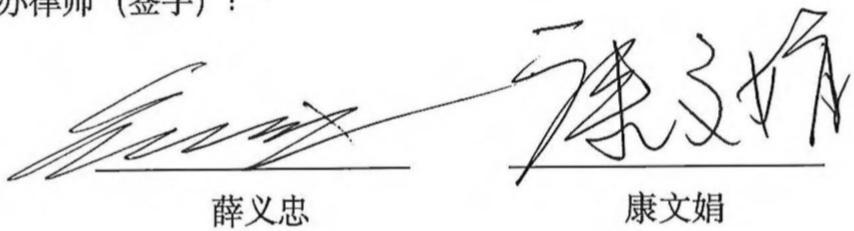

律师事务所负责人（签字）：

S 马卓

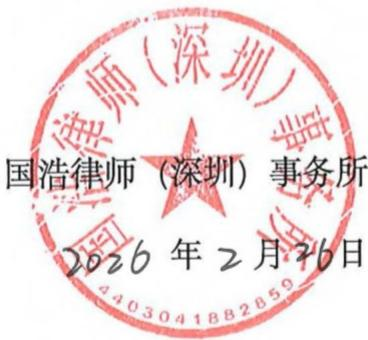  
国港律师（深圳）事所 4403041882859

## 、会计师事务所声明

所及签字注册会计师已阅读募集说明书，确认募集说明书与本所出具的计报告、盈利预测审核报告（如有）等文件不存在矛盾。本所及签字注册会师对发行人在募集说明书中引用的审计报告、盈利预测审核报告（如有）等件的内容无异议，确认募集说明书不因引用上述内容而出现虚假记载、误导陈述或重大遗漏，并承担相应的法律责任。

签字注册会计师（签字）：

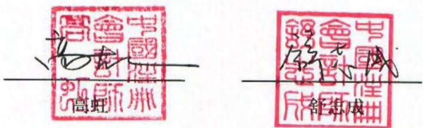

会计师事务所负责人（签字）：

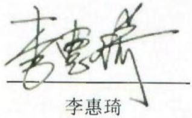

致同会计师事务所待殊普通伙）

  
致同会计师事务所（特殊普通伙） 11000000072741

## 信用评级机构声明

本机构及签字的资信评级人员已阅读江苏本川智能电路科技股份有限公司向不特定对象发行可转换公司债券的募集说明书，确认募集说明书与本机构出具的报告不存在矛盾。本机构及签字的资信评级人员对发行人在募集说明书中引用的报告的内容无异议，确认募集说明书不致因所引用内容而出现虚假记载、误导性陈述或重大遗漏，并对其真实性、准确性和完整性承担相应的法律责任。募集说明书中引用的报告的内容并非是对某种决策的结论或建议，本机构不对任何投资行为和投资结果负责。

资信评级人员（签名）： 美班

评级机构负责人（签字）：

东方金诚国际信用评估有限公司

## 七、董事会关于本次发行的相关声明及承诺

本次向不特定对象发行可转债将可能导致投资者的即期回报被摊薄。为保障股东利益，公司拟采取多种措施降低即期回报被摊薄的风险，以填补股东回报，充分保护中小股东利益，实现公司的可持续发展，增强公司持续回报能力。具体措施如下：

## （一）持续完善公司法人治理结构，为公司发展提供制度保障

公司已设立完善的股东会、董事会和管理层，已建立健全的法人治理结构，规范运作，并设置了与公司生产经营相适应的、能充分独立运行的职能机构，制定了相应的岗位职责，各职能部门之间职责、分工明确，形成了一套合理、完整、有效的公司治理与经营管理框架。未来阶段，公司将严格遵循各项法律法规、规范性文件的要求，不断完善治理结构，对于重大事项强化各项内部程序，切实保护投资者尤其是中小投资者权益，为公司发展提供制度保障。

## （二）加强公司内部管理和控制，提升运营效率和管理水平

随着本次发行可转债募集资金的到位和募集资金投资项目的开展，公司的资产和业务规模将得到进一步扩大。在此基础上，公司将不断加强内部管理和内部控制，积极提高经营水平和管理能力，持续优化公司运营模式。公司将加强对管理人员、技术人员、一线生产人员的专业化培训，持续提升员工管理能力、业务和技术水平，并进一步完善各项管理制度，优化组织架构，强化内部控制，实行精细管理，从而提升公司管理效率、降低运营成本，改善运营效率和管理水平，最终实现盈利能力的全面提高。

## （三）积极推进募投项目建设，提高募集资金使用效率

公司董事会已对本次发行可转债募投项目的可行性进行了充分论证，募投项目是综合考虑行业发展趋势、公司生产经营实际情况等因素所做出的决策，符合国家产业政策的要求，符合公司所处行业发展方向及未来战略规划，具有良好的市场前景。本次发行募集资金到位后，公司将积极调动各项资源，推进募投项目的建设，提高资金使用效率，争取募投项目早日达产并实现预期效益。

## （四）加强募集资金管理，保障募集资金的合理规范使用

为规范募集资金的存储、管理和使用，公司已按照相关法律法规、规范性文件的规定，制定《募集资金管理办法》，并严格管理募集资金，保证募集资金按照约定用途合理、规范使用。公司将根据募集资金管理制度及董事会相关决议，将募集资金存放于指定专户中，并将积极配合监管银行和保荐人对募集资金使用的检查和监督，合理防范募集资金使用风险，充分发挥募集资金效益，切实保护投资者的利益。

## （五）完善利润分配制度，优化投资者回报机制

公司将持续根据国务院《关于进一步加强资本市场中小投资者合法权益保护工作的意见》、中国证监会《上市公司监管指引第 3 号——上市公司现金分红》的有关要求，严格执行《公司章程》明确的现金分红政策。同时，公司已经制定和完善《公司章程》中有关利润分配的相关条款，并已根据前述规定，制定了《江苏本川智能电路科技股份有限公司未来三年股东回报规划（2025-2027 年）》，明确了公司利润分配的原则、形式、现金分配的条件等事项，强化了中小投资者权益保障机制。未来阶段，公司将不断强化投资回报理念，积极推动对股东的利润分配，增强现金分红透明度，保持利润分配政策的连续性与稳定性，给予投资者持续稳定的合理回报。

（六）发行人控股股东、实际控制人、持股 5%以上的股东、董事、时任监事、高级管理人员针对认购本次可转债的说明及承诺

1、控股股东、实际控制人、持股 5%以上股东及董事（不含独立董事）、时任监事、高级管理人员承诺情况

针对本次发行，发行人控股股东、实际控制人、持股 5%以上股东及董事（不含独立董事）、时任监事、高级管理人员出具承诺如下：

“1、若本人在本次发行可转债认购之日起前六个月存在股票减持情形，本人承诺将不参与本次可转债的认购，亦不会委托其他主体参与本次可转债发行认购。

2、若本人在本次发行可转债认购之日起前六个月不存在股票减持情形，本人将根据市场情况决定是否参与本次可转债的认购，若认购成功则本人承诺将严格遵守相关法律法规对短线交易的要求，自本次发行可转债认购之日起至本次可转债发行完成后六个月内不减持公司股票及认购的本次可转债。

3、本人保证本人之配偶、父母、子女将严格遵守短线交易的相关规定。

4、本人自愿作出上述承诺，并自愿接受本承诺的约束。若本人违反上述承诺直接或间接减持上市公司股份或可转债的，因此所得收益全部归上市公司所有，并依法承担由此产生的法律责任。

5、若本承诺函出具之后适用的相关法律、法规、规范性文件、政策及证券监管机构的要求发生变化的，本人承诺将自动适用变更后的相关法律、法规、规范性文件、政策及证券监管机构的要求。”

## 2、独立董事承诺情况

针对本次发行，发行人独立董事出具承诺如下：

“1、本人及本人关系密切的家庭成员承诺不认购本次发行可转债，亦不会委托其他主体参与本次发行可转债发行认购。

2、本人及本人关系密切的家庭成员自愿作出上述承诺，并自愿接受本承诺函的约束。若本人及本人关系密切的家庭成员违反上述承诺，将依法承担由此产生的法律责任。若对公司及/或其他投资者造成损失的，本人将依法承担赔偿责任。”

（本页无正文，为《江苏本川智能电路科技股份有限公司向不特定对象发行可转换公司债券募集说明书》“第九节 声明”之“七、董事会关于本次发行的相关声明及承诺”之盖章页）

江苏本川智能电路科技股份有限公司董事会

  
江苏本川智能电器科技股份有限公司

## 第十节 备查文件

除本募集说明书披露的资料外，公司将整套发行申请文件及其他相关文件作为备查文件，供投资者查阅。有关备查文件目录如下：

一、发行人最近三年的财务报告及审计报告和最近一期的财务报告；

二、保荐机构出具的发行保荐书、发行保荐工作报告和尽职调查报告；

三、法律意见书及律师工作报告；

四、董事会编制、股东会批准的关于前次募集资金使用情况的报告以及会计师出具的鉴证报告；

五、中国证监会对本次发行予以注册的文件；

六、资信评级机构出具的资信评级报告；

七、其他与本次发行有关的重要文件。

自本募集说明书公告之日起，投资者可至发行人、主承销商住所查阅募集说明书全文及备查文件，亦可在中国证监会指定网站查阅本次发行的募集说明书全文及备查文件。