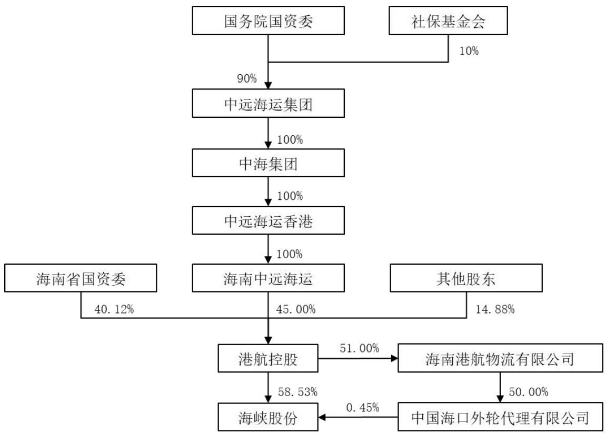
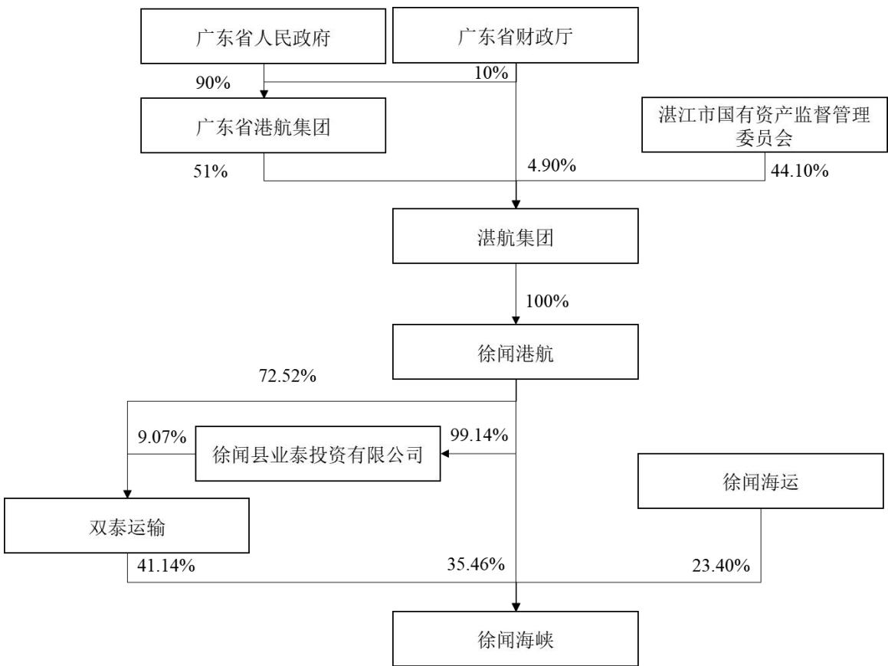
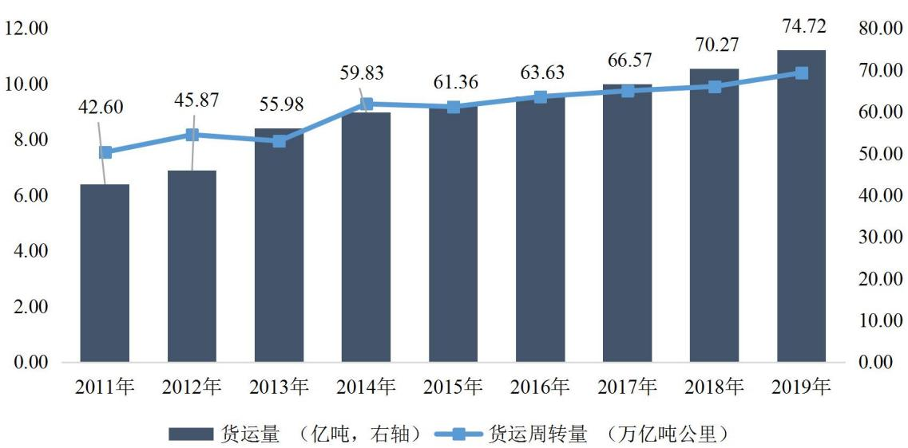
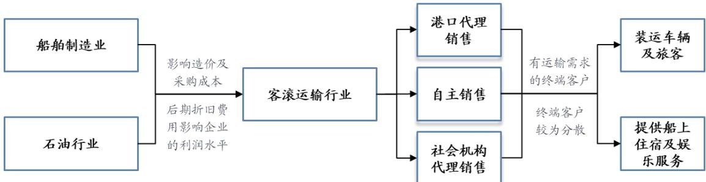
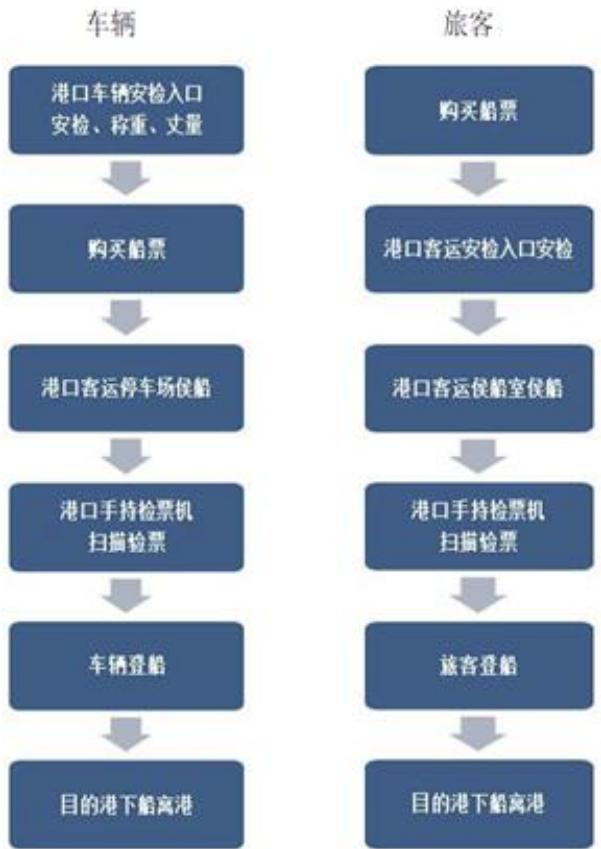

股票代码：002320

证券简称：海峡股份

上市地点：深圳证券交易所

# 海南海峡航运股份有限公司出资组建合资公司重大资产重组报告书（草案）

<table><tr><td>交易对方</td><td>住所、通讯地址</td></tr><tr><td>广东徐闻海峡航运有限公司</td><td>徐闻县海安镇海安大道</td></tr></table>

独立财务顾问

二〇二一年九月

## 释 义

在本重组报告书中，除非上下文另有所指，下列简称具有如下含义：

<table><tr><td colspan="1" rowspan="1">海峡股份/公司/上市公司</td><td colspan="1" rowspan="1">指</td><td colspan="1" rowspan="1">海南海峡航运股份有限公司</td></tr><tr><td colspan="1" rowspan="1">交易对方/徐闻海峡</td><td colspan="1" rowspan="1">指</td><td colspan="1" rowspan="1">广东徐闻海峡航运有限公司，本次交易对方</td></tr><tr><td colspan="1" rowspan="1">海南中远海运</td><td colspan="1" rowspan="1">指</td><td colspan="1" rowspan="1">海南中远海运投资有限公司</td></tr><tr><td colspan="1" rowspan="1">中远海运香港</td><td colspan="1" rowspan="1">指</td><td colspan="1" rowspan="1">中远海运（香港）有限公司</td></tr><tr><td colspan="1" rowspan="1">中远海运集团</td><td colspan="1" rowspan="1">指</td><td colspan="1" rowspan="1">中国远洋海运集团有限公司</td></tr><tr><td colspan="1" rowspan="1">国务院国资委</td><td colspan="1" rowspan="1">指</td><td colspan="1" rowspan="1">国务院国有资产监督管理委员会</td></tr><tr><td colspan="1" rowspan="1">广东省国资委</td><td colspan="1" rowspan="1">指</td><td colspan="1" rowspan="1">广东省国有资产监督管理委员会</td></tr><tr><td colspan="1" rowspan="1">海南省国资委</td><td colspan="1" rowspan="1">指</td><td colspan="1" rowspan="1">海南省国有资产监督管理委员会</td></tr><tr><td colspan="1" rowspan="1">广东省港航集团</td><td colspan="1" rowspan="1">指</td><td colspan="1" rowspan="1">广东省港航集团有限公司</td></tr><tr><td colspan="1" rowspan="1">海口市国资委</td><td colspan="1" rowspan="1">指</td><td colspan="1" rowspan="1">海口市国有资产监督管理委员会</td></tr><tr><td colspan="1" rowspan="1">海南港航</td><td colspan="1" rowspan="1">指</td><td colspan="1" rowspan="1">海南港航控股有限公司</td></tr><tr><td colspan="1" rowspan="1">海峡轮渡</td><td colspan="1" rowspan="1">指</td><td colspan="1" rowspan="1">海南海峡轮渡运输有限公司，上市公司控股子公司，本次出资组建合资公司主体</td></tr><tr><td colspan="1" rowspan="1">金维嘉</td><td colspan="1" rowspan="1">指</td><td colspan="1" rowspan="1">海南金维嘉海运有限公司</td></tr><tr><td colspan="1" rowspan="1">长益公司</td><td colspan="1" rowspan="1">指</td><td colspan="1" rowspan="1">海南长益投资有限公司</td></tr><tr><td colspan="1" rowspan="1">嘉和公司</td><td colspan="1" rowspan="1">指</td><td colspan="1" rowspan="1">海南嘉和海运有限公司</td></tr><tr><td colspan="1" rowspan="1">徐闻港</td><td colspan="1" rowspan="1">指</td><td colspan="1" rowspan="1">湛江徐闻港有限公司</td></tr><tr><td colspan="1" rowspan="1">海安新港</td><td colspan="1" rowspan="1">指</td><td colspan="1" rowspan="1">海安新港港务有限公司</td></tr><tr><td colspan="1" rowspan="1">徐闻港航</td><td colspan="1" rowspan="1">指</td><td colspan="1" rowspan="1">广东徐闻港航控股有限公司</td></tr><tr><td colspan="1" rowspan="1">双泰运输</td><td colspan="1" rowspan="1">指</td><td colspan="1" rowspan="1">广东双泰运输集团有限责任公司</td></tr><tr><td colspan="1" rowspan="1">湛航集团</td><td colspan="1" rowspan="1">指</td><td colspan="1" rowspan="1">广东省湛江航运集团有限公司</td></tr><tr><td colspan="1" rowspan="1">徐闻海运</td><td colspan="1" rowspan="1">指</td><td colspan="1" rowspan="1">徐闻县海运有限公司</td></tr><tr><td colspan="1" rowspan="1">海口港集团</td><td colspan="1" rowspan="1">指</td><td colspan="1" rowspan="1">海口港集团公司</td></tr><tr><td colspan="1" rowspan="1">盐田港</td><td colspan="1" rowspan="1">指</td><td colspan="1" rowspan="1">深圳市盐田港股份有限公司</td></tr><tr><td colspan="1" rowspan="1">海运总</td><td colspan="1" rowspan="1">指</td><td colspan="1" rowspan="1">海南省海运总公司</td></tr><tr><td colspan="1" rowspan="1">新港实业</td><td colspan="1" rowspan="1">指</td><td colspan="1" rowspan="1">海南新港实业发展有限公司</td></tr><tr><td colspan="1" rowspan="1">中海集团</td><td colspan="1" rowspan="1">指</td><td colspan="1" rowspan="1">中国海运集团有限公司</td></tr><tr><td colspan="1" rowspan="1">新海轮渡</td><td colspan="1" rowspan="1">指</td><td colspan="1" rowspan="1">海口新海轮渡码头有限公司，上市公司控股子公司</td></tr><tr><td colspan="1" rowspan="1">本报告书/重组报告书</td><td colspan="1" rowspan="1">指</td><td colspan="1" rowspan="1">《海南海峡航运股份有限公司出资组建合资公司重大资产重组报告书（草案)》</td></tr><tr><td colspan="1" rowspan="1">本报告书摘要/重组报告书摘要</td><td colspan="1" rowspan="1">指</td><td colspan="1" rowspan="1">《海南海峡航运股份有限公司出资组建合资公司重大资产重组报告书（草案）摘要》</td></tr><tr><td colspan="1" rowspan="1">交易标的、标的资产</td><td colspan="1" rowspan="1">指</td><td colspan="1" rowspan="1">徐闻海峡拟用于出资的29艘船舶及其附属资产，海峡轮渡拟用于出资的18艘船舶及其附属设备</td></tr><tr><td colspan="1" rowspan="1">合资公司</td><td colspan="1" rowspan="1">指</td><td colspan="1" rowspan="1">本次交易拟合资设立的琼州海峡（海南）轮渡运输有限公司（最终以市场监督管理部门核准的名称为准）</td></tr><tr><td colspan="1" rowspan="1">本次重大资产重组、本次重组、本次交易</td><td colspan="1" rowspan="1">指</td><td colspan="1" rowspan="1">海南海峡航运股份有限公司出资组建合资公司重大资产重组交易</td></tr><tr><td colspan="1" rowspan="1">《合资合同》</td><td colspan="1" rowspan="1">指</td><td colspan="1" rowspan="1">《海南海峡轮渡运输有限公司与广东徐闻海峡航运有限公司关于琼州海峡(海南)轮渡运输有限公司之合资合同》</td></tr><tr><td colspan="1" rowspan="1">审计基准日</td><td colspan="1" rowspan="1">指</td><td colspan="1" rowspan="1">为实施本次交易而对标的资产进行审计所选定的基准日，即2021年5月31日</td></tr><tr><td colspan="1" rowspan="1">评估基准日</td><td colspan="1" rowspan="1">指</td><td colspan="1" rowspan="1">为实施本次交易而对标的资产进行评估所选定的基准日，即2021年5月31日</td></tr><tr><td colspan="1" rowspan="1">报告期/最近两年及期</td><td colspan="1" rowspan="1">指</td><td colspan="1" rowspan="1">2019年度、2020年度和 2021年1-5月（对于徐闻海峡持有的标的资产而言，报告期为2019年度、2020年1-3月、2020年4-12月和2021年1-5月）</td></tr><tr><td colspan="1" rowspan="1">最近一年及一期</td><td colspan="1" rowspan="1">指</td><td colspan="1" rowspan="1">2020年度和2021年1-5月</td></tr><tr><td colspan="1" rowspan="1">独立财务顾问/中信证券</td><td colspan="1" rowspan="1">指</td><td colspan="1" rowspan="1">中信证券股份有限公司</td></tr><tr><td colspan="1" rowspan="1">法律顾问/通商律所/律师</td><td colspan="1" rowspan="1">指</td><td colspan="1" rowspan="1">北京市通商律师事务所</td></tr><tr><td colspan="1" rowspan="1">审计机构/天职国际/审计师</td><td colspan="1" rowspan="1">指</td><td colspan="1" rowspan="1">天职国际会计师事务所（特殊普通合伙）</td></tr><tr><td colspan="1" rowspan="1">评估机构/中通诚/评估师</td><td colspan="1" rowspan="1">指</td><td colspan="1" rowspan="1">中通诚资产评估有限公司</td></tr><tr><td colspan="3" rowspan="1">专业名词：</td></tr><tr><td colspan="1" rowspan="1">客滚船</td><td colspan="1" rowspan="1">指</td><td colspan="1" rowspan="1">通过对甲板进行功能分区以实现同时装载汽车、旅客以及提供船上旅客住宿和娱乐服务等多项功能的船舶</td></tr><tr><td colspan="1" rowspan="1">客滚港□</td><td colspan="1" rowspan="1">指</td><td colspan="1" rowspan="1">从事客滚运输业务的港口</td></tr><tr><td colspan="1" rowspan="1">客滚轮渡</td><td colspan="1" rowspan="1">指</td><td colspan="1" rowspan="1">通过客滚船的方式进行水路运输</td></tr><tr><td colspan="1" rowspan="1">海安航线</td><td colspan="1" rowspan="1">指</td><td colspan="1" rowspan="1">海口市与徐闻县海安镇之间的客滚航线</td></tr><tr><td colspan="1" rowspan="1">泊位</td><td colspan="1" rowspan="1">指</td><td colspan="1" rowspan="1">在港口可供船舶停靠、装卸货物的位置</td></tr><tr><td colspan="1" rowspan="1">吞吐量</td><td colspan="1" rowspan="1">指</td><td colspan="1" rowspan="1">报告期内经由水路进、出港区范围并经过装卸的货物数量</td></tr><tr><td colspan="3" rowspan="1">常用名词：</td></tr><tr><td colspan="1" rowspan="1">国务院</td><td colspan="1" rowspan="1">指</td><td colspan="1" rowspan="1">中华人民共和国国务院</td></tr><tr><td colspan="1" rowspan="1">中国证监会/证监会</td><td colspan="1" rowspan="1">指</td><td colspan="1" rowspan="1">中国证券监督管理委员会</td></tr><tr><td colspan="1" rowspan="1">深交所/交易所/证券交易所</td><td colspan="1" rowspan="1">指</td><td colspan="1" rowspan="1">深圳证券交易所</td></tr><tr><td colspan="1" rowspan="1">琼州海峡</td><td colspan="1" rowspan="1">指</td><td colspan="1" rowspan="1">中国广东省雷州半岛与海南岛之间的海峡，东为南海广东海区，西为北部湾，是中国三大海峡之一，仅次于台湾海峡和渤海海峡</td></tr><tr><td colspan="1" rowspan="1">《公司法》</td><td colspan="1" rowspan="1">指</td><td colspan="1" rowspan="1">《中华人民共和国公司法》</td></tr><tr><td colspan="1" rowspan="1">《证券法》</td><td colspan="1" rowspan="1">指</td><td colspan="1" rowspan="1">《中华人民共和国证券法》</td></tr><tr><td colspan="1" rowspan="1">《深交所上市规则》</td><td colspan="1" rowspan="1">指</td><td colspan="1" rowspan="1">《深圳证券交易所股票上市规则》</td></tr><tr><td colspan="1" rowspan="1">《重组管理办法》</td><td colspan="1" rowspan="1">指</td><td colspan="1" rowspan="1">《上市公司重大资产重组管理办法》</td></tr><tr><td colspan="1" rowspan="1">《26号准则》</td><td colspan="1" rowspan="1">指</td><td colspan="1" rowspan="1">《公开发行证券的公司信息披露内容与格式准则第26号-上市公司重大资产重组》</td></tr><tr><td colspan="1" rowspan="1">A股</td><td colspan="1" rowspan="1">指</td><td colspan="1" rowspan="1">经中国证监会批准向投资者发行、在境内证券交易所上市、以人民币标明股票面值、以人民币认购和进行交易的普通股</td></tr><tr><td colspan="1" rowspan="1">元、万元、亿元</td><td colspan="1" rowspan="1">指</td><td colspan="1" rowspan="1">人民币元、人民币万元、人民币亿元</td></tr></table>

重组报告书中部分合计数与各加数直接相加之和在尾数上可能因四舍五入存在差异。

## 声 明

## 一、上市公司声明

公司及全体董事、监事、高级管理人员保证本报告书内容的真实、准确、完整，对本报告书的虚假记载、误导性陈述或重大遗漏承担连带责任。

公司法定代表人、主管会计工作的负责人和会计机构负责人保证本报告书中财务会计资料真实、准确、完整。

本报告书所述事项并不代表深圳证券交易所对于本次重大资产重组相关事项的实质性判断、确认或批准。

本次交易完成后，公司经营与收益的变化，由公司自行负责；因本次交易引致的投资风险，由投资者自行负责。投资者若对本报告书及其摘要存在任何疑问，应咨询自己的股票经纪人、律师、专业会计师或其他专业顾问。

## 二、交易对方声明

本次交易的交易对方徐闻海峡已出具承诺函，保证所提供的信息真实、准确、完整，不存在虚假记载、误导性陈述或者重大遗漏，并对所提供信息的真实性、准确性和完整性承担法律责任。

## 三、证券服务机构声明

中信证券承诺：“本公司同意海南海峡航运股份有限公司在本报告书及其摘要以及其他相关披露文件中援引本公司提供的相关材料及内容，本公司已对本报告书及其摘要以及其他相关披露文件中援引的相关内容进行了审阅，确认本报告书及其摘要以及其他相关披露文件不致因上述内容而出现虚假记载、误导性陈述或重大遗漏，并对其真实性、准确性和完整性承担相应法律责任。”

通商律所承诺：“本所同意海南海峡航运股份有限公司在本报告书及其摘要以及其他相关披露文件中援引本所提供的相关材料及内容，本所已对本报告书及其摘要以及其他相关披露文件中援引的相关内容进行了审阅，确认本报告书及其摘要以及其他相关披露文件不致因上述内容而出现虚假记载、误导性陈述或重大遗漏，并对其真实性、准确性和完整性承担相应法律责任。”

天职国际承诺：“本所及签字注册会计师已阅读《海南海峡航运股份有限公司出资组建合资公司重大资产重组报告书（草案）》及其摘要以及其他相关披露文件（以下简称“重组报告书”），确认重组报告书引用的经审阅或审计的财务报表等相关内容，与本所出具的审阅报告（报告编号：天职业字[2021]39049号）及审计报告（报告编号：天职业字[2021] 35207号、报告编号：天职业字[2021]35215号）的内容无矛盾之处。

本所及签字注册会计师对重组报告书中引用的本所出具的上述报告的内容无异议，确认重组报告书不致因完整准确地引用本所出具的上述报告而在相应部分出现虚假记载、误导性陈述或重大遗漏，并对本所出具的上述报告的真实性、准确性和完整性根据有关法律法规的规定承担相应法律责任。”

中通诚承诺：“本公司同意海南海峡航运股份有限公司在本报告书及其摘要以及其他相关披露文件中援引本公司提供的相关材料及内容，本公司已对本报告书及其摘要以及其他相关披露文件中援引的相关内容进行了审阅，确认本报告书及其摘要以及其他相关披露文件不致因上述内容而出现虚假记载、误导性陈述或重大遗漏，并对其真实性、准确性和完整性承担相应法律责任。”

## 目 录

释 义.......  
声 明...... . 4  
一、上市公司声明.. .. 4  
二、交易对方声明.. .. 4  
三、证券服务机构声明. .4  
重大事项提示.... 11  
一、本次交易方案. .11  
二、本次交易构成重大资产重组，不构成重组上市，不构成关联交易......13  
三、标的资产作价情况... ... 15  
四、本次交易对上市公司的影响.. ....16  
五、本次交易决策过程和批准情况. . 18  
六、本次交易相关方的承诺. ... 18  
七、上市公司控股股东对本次重组的原则性意见. . 21  
八、上市公司控股股东及其一致行动人、董事、监事、高级管理人员的股份  
减持计划.. ... 21  
九、表决权委托事项.. ...22  
十、本次重组对中小投资者权益保护的安排. ..22  
重大风险提示.... ... 25  
一、与本次交易相关的风险. .. 25  
二、与标的资产相关的风险. .. 26  
三、其他风险... .. 27  
第一节 本次交易概况..................... ........29  
一、本次交易的背景和目的.. .... 29  
二、本次交易具体方案... ... 29  
三、本次交易构成重大资产重组，不构成重组上市，不构成关联交易......31  
四、标的资产作价情况.. ... 34  
五、本次交易对上市公司的影响... ....34  
六、本次交易决策过程和批准情况... .. 36  
七、上市公司控股股东对本次重组的原则性意见. ... 37  
第二节 上市公司基本情况... ... 38  
一、基本情况.. . 38  
二、历史沿革及股本变动情况. .38  
三、主营业务发展情况.. .. 43  
四、主要财务数据及财务指标.. ...44  
五、控股股东及实际控制人情况.... .......44  
七、最近三年重大资产重组情况.. ..46  
八、上市公司及其现任董事、监事及高级管理人员最近三年受到行政处罚（与  
证券市场明显无关的除外）或刑事处罚情况的说明... ...... 46  
九、上市公司及其现任董事、监事及高级管理人员因涉嫌犯罪被司法机关立  
案侦查或涉嫌违法违规被中国证监会立案调查情况的说明... .....46  
十、上市公司及其现任董事、监事及高级管理人员最近三年诚信情况的说明  
.... 46  
十一、交易主体海峡轮渡的基本情况. ...... 46  
第三节 交易对方基本情况... .... 51  
一、交易对方基本情况. .. 51  
二、历史沿革... ... 51  
三、股权结构及产权控制关系.. ...53  
四、主营业务发展情况.... ... 55  
五、最近两年主要财务数据.. .55  
六、最近一年简要财务报表.. .. 56  
七、交易对方下属企业.... ... 57  
八、交易对方与上市公司之间的关联关系说明. .. 57  
九、向上市公司推荐董事或者高级管理人员的情况.. .... 57  
十、徐闻海峡及其现任主要管理人员最近五年受到行政和刑事处罚、涉及诉  
讼或者仲裁情况.. .... 57  
十一、交易对方及其现任主要管理人员最近五年的诚信情况. .... 57  
第四节 交易标的基本情况... ...... 58  
一、标的资产概述.. ..58  
二、标的资产基本信息. . 58  
三、标的资产的权属情况.. . 79  
四、标的资产的运营情况及财务数据. . 79  
五、标的资产最近三年的资产评估、交易、增资的估值与本次交易估值差异  
的原因... .. 81  
六、报告期内主要会计政策及相关会计处理. ....83  
第五节 交易标的业务与技术.. ..... 83  
一、标的资产所处行业分析.. ... 92  
二、行业主管部门、监管体制、主要法律法规及政策. ....99  
三、标的资产主营业务情况.. ..104  
第六节 标的资产评估情况.... ... 113  
一、徐闻海峡 29艘船舶资产评估情况. ... 113  
二、海峡轮渡 18艘船舶资产评估情况. ..124  
三、上市公司董事会对标的资产评估合理性及定价公允性的分析.............136  
四、独立董事对评估机构的独立性、评估假设前提的合理性及交易定价的公  
允性的意见.... ...139  
第七节 本次交易主要合同... .... 141  
一、合资公司基本情况.. .. 141  
二、合资公司的设立与出资... .... 142  
三、出资义务的履行和出资的具体程序. ..144  
四、业务资质.. ... 145  
五、员工安置.. .. 145  
六、债权债务处理. ..145  
七、合资公司治理结构.. .. 146  
八、协议的生效. ..146  
九、协议的终止.. ... 147  
十、违约责任... .. 148  
第八节 本次交易的合规性分析.... .....150  
一、本次交易符合《重组管理办法》第十一条的规定. ...150  
二、本次交易不适用《重组管理办法》第十三条的规定.. ... 153  
三、本次交易不适用《重组管理办法》四十三条、四十四条的规定........153  
四、本次交易符合《关于规范上市公司重大资产重组若干问题的规定》第四  
条规定的说明.. ..154  
五、独立财务顾问和法律顾问对本次交易合规性的意见 .. 154  
第九节 管理层讨论与分析.... ... 156  
一、本次交易前上市公司财务状况和经营成果的讨论与分析. ..156  
二、交易标的行业特点的讨论与分析.... ..... 165  
三、标的资产报告期内财务状况和经营成果的讨论分析.. .... 166  
四、本次交易对上市公司持续经营能力和未来发展前景的影响. ...185  
五、本次交易对上市公司当期每股收益等财务指标和非财务指标的分析187  
第十节 财务会计信息...... ..... 193  
一、本次交易标的公司的财务信息. ... 193  
二、本次交易模拟实施后上市公司备考财务资料.. ..204  
第十一节 同业竞争和关联交易.... ...210  
一、同业竞争情况.. ..210  
二、关联交易情况.. ..211  
第十二节 风险因素..... ...235  
一、与本次交易相关的风险. .235  
二、与标的资产相关的风险.. ..236  
三、其他风险... . 237  
第十三节 其他重要事项...... ..... 239  
一、担保与非经营性资金占用. ...239  
二、上市公司最近 12 个月重大资产购买或出售情况. ..239  
三、本次交易对于上市公司负债结构的影响. . 240  
四、本次交易后上市公司的现金分红政策及相应的安排、董事会对上述情况  
的说明... ... 241  
五、本次交易涉及的相关主体买卖上市公司股票的自查情况.. .... 241  
六、上市公司控股股东对本次重组的原则性意见及其与上市公司董事、监事、  
高级管理人员的股份减持计划... .... 241  
七、上市公司本次重组草案披露前股票价格的波动情况. .. 242  
八、本次重组对中小投资者权益保护的安排... .. 242  
九、其他能够影响股东及其他投资者做出合理判断的、有关本次交易的所有  
信息.. . 245  
第十四节 对本次交易的结论性意见.. . 246  
一、独立董事对于本次交易的意见. . 246  
二、独立财务顾问对于本次交易的意见. ..247  
三、法律顾问对于本次交易的意见.. . 248  
第十五节 中介机构及有关经办人员.. . 250  
一、独立财务顾问.. ..250  
二、法律顾问.. . 250  
三、审计机构.. . 250  
四、资产评估机构. .251  
第十六节 备查文件及备查地点.. ..252  
一、备查文件.. . 252  
二、备查地点.. . 252  
第十七节 公司及各中介机构声明. .. 253

## 重大事项提示

本公司提醒投资者认真阅读本报告书全文，并特别注意下列事项：

## 一、本次交易方案

## （一）交易对方

本次交易的交易对方为徐闻海峡。

## （二）交易方式

本次交易以 2021 年5 月 31 日为评估基准日，徐闻海峡以29 艘船舶及其附属资产，海峡轮渡以 18艘船舶及其附属设备及现金人民币 4,159.84 万元，共同出资在海口市新设合资公司琼州海峡（海南）轮渡运输有限公司（最终以市场监督管理部门核准的名称为准）。

上市公司将通过海峡轮渡取得合资公司 40%股权，徐闻海峡将取得合资公司60%股权。徐闻海峡将对合资公司的11%股权享有的股东权利中的表决权（包括提议召开股东会及向股东会提出提案并表决等的权利，下同）自合资公司成立之日起全权委托海峡轮渡行使，海峡轮渡拥有对合资公司的 51%表决权，对合资公司实际控制并合并财务报表，该等表决权委托不影响徐闻海峡享有其他包括但不限于分红权等股东权利。未经另一方书面同意，任何一方均不得单方面变更、解除、撤销上述表决权委托安排或转让已委托表决权的股权，否则该等行为无效。

## （三）标的资产

本次交易中，徐闻海峡拟用于出资的资产为其拥有的 29艘船舶及其附属资产；上市公司下属海峡轮渡拟用于出资的资产为其拥有的 18 艘船舶及其附属设备。

## （四）交易双方资产评估作价情况

## 1、徐闻海峡下属 29 艘船舶及其附属资产

根据经广东省港航集团备案的《琼州海峡航运资源整合所涉及的广东徐闻海峡航运有限公司拟出资的“双泰 36”等 29艘客滚船舶及其附属资产价值资产评

估报告》（中通评报字[2021]12261 号），以 2021 年 5 月 31 日为评估基准日，徐闻海峡持有的 29 艘船舶及其附属资产的评估值（含税）为 202,761.36万元。

## 2、海峡轮渡下属 18 艘船舶及其附属设备

根据经中远海运集团备案的《琼州海峡航运资源整合所涉及的海南海峡轮渡运输有限公司拟出资的“信海 12号”等 18艘客滚船舶及其附属设备价值资产评估报告》（中通评报字[2021]12260 号），以 2021 年 5 月 31 日为评估基准日，海峡轮渡持有的 18 艘船舶及其附属设备的评估值（含税）为 131,014.40万元。

## （五）合资公司、注册资本和组织形式

交易双方拟于海口设立合资公司琼州海峡（海南）轮渡运输有限公司（最终以市场监督管理部门核准的名称为准），注册地址为海南省海口市秀英区秀英街道滨海大道 157 号海口港大厦11楼，注册资本为337,935.60 万元，最终以市场监督管理部门登记为准。海峡轮渡认缴注册资本 135,174.24万元，占合资公司注册资本的 40%，徐闻海峡认缴注册资本 202,761.36万元，占合资公司注册资本的60%。

合资公司的组织形式为有限责任公司，股东以其认缴的出资额为限对合资公司承担责任。合资公司以其全部财产对合资公司的债务承担责任。

## （六）资产交付或过户时间安排

本次交易双方应相互配合签署包括但不限于合资公司章程在内的相关文件及其他合资公司设立所需材料，在《合资合同》生效且国家市场监督管理总局反垄断局决定或通知不禁止合资合同项下的经营者集中之日（以较晚者为准）后10 个工作日内完成合资公司设立并取得海南省市场监督管理局颁发的合资公司营业执照。

海峡轮渡应于 2021 年 12月 31 日前向合资公司足额缴付货币出资；本次交易双方应于合资公司成立后 10 个工作日内各向合资公司交付一艘船舶并办理《船舶所有权证书》等证书变更手续，于合资公司取得《国内水路运输经营许可证》后且不晚于 2021 年 12 月 31 日，向合资公司交付剩余船舶并办理《船舶所有权证书》《船舶国籍证书》《船舶营业运输证》等船舶运营必备资质证书的变更手续。

## （七）合资公司/标的资产过渡期安排

本次交易双方各自拟用于出资的船舶资产自评估基准日至出资完成日期间的经营损益由股东方各自享有及承担。

## 二、本次交易构成重大资产重组，不构成重组上市，不构成关联交易

## （一）本次交易构成重大资产重组

根据标的资产财务数据及评估作价情况，与海峡股份 2020 年度相关财务数据比较如下：

单位：万元

<table><tr><td rowspan=1 colspan=1>项目</td><td rowspan=1 colspan=1>海峡股份</td><td rowspan=1 colspan=1>标的资产</td><td rowspan=1 colspan=1>占比</td></tr><tr><td rowspan=1 colspan=1>资产总额（成交金额敦高）</td><td rowspan=1 colspan=1>424,016.93</td><td rowspan=1 colspan=1>202,761.36</td><td rowspan=1 colspan=1>47.82%</td></tr><tr><td rowspan=1 colspan=1>营业收入</td><td rowspan=1 colspan=1>107,272.40</td><td rowspan=1 colspan=1>138,087.54</td><td rowspan=1 colspan=1>128.73%</td></tr></table>

注：因海峡轮渡及合资公司在本次交易前后均为海峡股份控股子公司，在计算重组指标时，标的资产指标未包含海峡轮渡拟用于出资的18 艘船舶资产。

根据《重组管理办法》第十二条规定的重大资产重组标准，本次交易构成上市公司重大资产重组。

根据《重组管理办法》第十四条第（四）项，上市公司在 12 个月内连续对同一或者相关资产进行购买、出售的，以其累计数分别计算相应数额。已按照《重组管理办法》的规定编制并披露重大资产重组报告书的资产交易行为，无须纳入累计计算的范围。

公司最近十二个月对同一或者相关资产进行购买、出售的情况如下：

1、收购新海港区汽车客货滚装码头二期工程资产（以下简称“新海港二期码头”）

经公司于 2021 年 4 月 14 日召开的第六届董事会第二十六次会议及于 2021年 5 月 31 日召开的 2021 年第二次临时股东大会审议通过，公司以新海轮渡为投资主体，通过现金收购方式向海南港航收购新海港二期码头，资金来源为“自有资金+银行贷款”方式，为提高资金使用效率，降低财务费用，前期拟先由新海轮渡通过公司借款方式，解决资金需求。新海二期码头资产交易价格包含评估价值和交易环节增值税，合计金额为 93,751.05万元，其中：评估价值为88,831.55万元（评估基准日为 2020 年 12 月 31 日），交易环节增值税 4,919.50万元。

## 2、合资设立海峡轮渡及增资

经公司于 2021年 3 月 8日召开的第六届董事会第二十三次会议审议通过，公司与金维嘉、长益公司、嘉和公司共同出资 100 万元设立海峡轮渡，公司持股83.3332%。

经公司于 2021 年 3 月 30 日召开的第六届董事会第二十五次会议审议通过，公司认缴海峡轮渡新增注册资本 6,931.93 万元，将海峡轮渡注册资本由 100万元增加至 7,031.93万元，具体方式为以公司持有的“信海12 号”轮、“海峡一号”轮船舶资产评估作价 6,931.93万元进行出资。增资完成后，公司在海峡轮渡持股比例为 99.763%。

经公司于 2021年 5月 14日召开的第六届董事会第三十次会议及于 2021年5 月31 日召开的2021 年第二次临时股东大会审议通过，公司将海口至海安航线“信海 16 号”轮等 13 艘客滚船舶，连同金维嘉、长益公司及嘉和公司分别所属的海口至海安航线“海口六号”轮、“海口九号”轮、“海口 16 号”轮船舶资产增资至海峡轮渡。增资完成后，海峡轮渡的注册资本增加至 115,049.8917万元，公司在海峡轮渡持股比例为 83.3932%。

基于谨慎性原则，前次交易需纳入本次交易累计计算范围。本次交易在与前次交易累计计算口径下仍然构成重大资产重组。

## （二）本次交易不构成重组上市

2019 年2 月19 日，海南省国资委通过无偿划转取得海峡股份控股股东海南港航 85.12%股权，成为海峡股份间接控股股东，导致海峡股份实际控制人由海口市国资委变更为海南省国资委。

2019 年12 月2 日，海南中远海运通过无偿划转取得海峡股份控股股东海南港航 45%股权，并相对控制及对海南港航合并报表，合计间接持有海峡股份584,258,563 股股份，占海峡股份总股本的比例为58.98%，成为海峡股份的间接控股股东，导致海峡股份实际控制人由海南省国资委变更为国务院国资委。

2021 年3 月 1日，中海集团与中国远洋运输有限公司(为海南中远海运间接全资控股股东)签署无偿划转协议，由中国远洋运输有限公司将其所持有的中远海运香港（为海南中远海运全资控股股东）100%股权无偿划转给中海集团，海峡股份的控股股东或实际控制人未发生变更。

本次交易的交易对方徐闻海峡非海南省国资委、海南中远海运、中海集团或其关联人，本次交易完成后，上市公司的控股股东仍为海南港航，实际控制人仍为国务院国资委，本次交易不会导致上市公司的控制权发生变更，本次交易不构成《重组管理办法》第十三条规定的“重组上市”情形。

## （三）本次交易不构成关联交易

本次交易的交易对方徐闻海峡与上市公司不存在关联关系，本次交易不构成关联交易。

## 三、标的资产作价情况

截至本报告书出具日，本次交易的作价情况如下：

单位：万元

<table><tr><td rowspan=1 colspan=1>项目</td><td rowspan=1 colspan=1>海峡轮渡</td><td rowspan=1 colspan=1>徐闻海峡</td></tr><tr><td rowspan=1 colspan=1>资产增资交易对价</td><td rowspan=1 colspan=1>131,014.40</td><td rowspan=1 colspan=1>202,761.36</td></tr><tr><td rowspan=1 colspan=1>现金出资金额</td><td rowspan=1 colspan=1>4,159.84</td><td rowspan=1 colspan=1>-</td></tr><tr><td rowspan=1 colspan=1>资产及现金出资金额合计</td><td rowspan=1 colspan=1>135,174.24</td><td rowspan=1 colspan=1>202,761.36</td></tr><tr><td rowspan=1 colspan=1>交易完成后持股比例</td><td rowspan=1 colspan=1>40%</td><td rowspan=1 colspan=1>60%</td></tr></table>

本次交易以 2021 年5 月 31 日为评估基准日，徐闻海峡拟用于出资的29 艘船舶及其附属资产评估作价为 202,761.36万元；海峡轮渡拟用于出资的 18 艘船舶及其附属设备评估作价为 131,014.40 万元；海峡轮渡现金出资金额为4,159.84万元。

本次交易合计交易作价为 337,935.60万元，交易完成后海峡轮渡持有合资公司 40%股权，徐闻海峡持有合资公司 60%股权。

## 四、本次交易对上市公司的影响

## （一）本次交易对上市公司业务的影响

上市公司主营业务为船舶运输和轮渡港口服务，主要经营海口至海安、海口至北海客滚运输航线、海口（三亚）至西沙旅游客运航线，以及新海港和秀英港轮渡港口服务业务，目前拥有 21 艘船舶，其中 18 艘船舶运营海口至海安航线。徐闻海峡主要负责运营广东徐闻港、海安新港往返海口新海港、秀英港客滚轮渡运输航线，目前拥有 29艘船舶。此次交易完成后，上市公司将进一步整合徐闻海峡 29 艘船舶资产，实现琼州海峡两岸的航运业务的一体化运营，有助于提升港航资源运营与通行效率，具有显著的协同效应。

## （二）本次交易对上市公司股权结构的影响

本次交易不涉及上市公司股份变动，交易前后上市公司股权结构不发生变化。

## （三）本次交易对上市公司主要财务指标的影响

根据天职国际出具的备考审阅报告（天职业字[2021]39049号），本次交易对上市公司主要财务指标的影响如下：

单位：万元

<table><tr><td colspan="1" rowspan="2">项目</td><td colspan="2" rowspan="1">2021年5月31日/2021年1-5月</td><td colspan="2" rowspan="1">2020年12月31日/2020年度</td></tr><tr><td colspan="1" rowspan="1">交易完成前</td><td colspan="1" rowspan="1">交易完成后</td><td colspan="1" rowspan="1">交易完成前</td><td colspan="1" rowspan="1">交易完成后</td></tr><tr><td colspan="1" rowspan="1">总资产</td><td colspan="1" rowspan="1">545,692.16</td><td colspan="1" rowspan="1">737,719.88</td><td colspan="1" rowspan="1">424,016.93</td><td colspan="1" rowspan="1">636,834.39</td></tr><tr><td colspan="1" rowspan="1">总负债</td><td colspan="1" rowspan="1">134,010.78</td><td colspan="1" rowspan="1">145,659.64</td><td colspan="1" rowspan="1">26,778.18</td><td colspan="1" rowspan="1">36,057.44</td></tr><tr><td colspan="1" rowspan="1">所有者权益</td><td colspan="1" rowspan="1">411,681.38</td><td colspan="1" rowspan="1">592,060.24</td><td colspan="1" rowspan="1">397,238.75</td><td colspan="1" rowspan="1">600,776.94</td></tr><tr><td colspan="1" rowspan="1">归属于母公司所有者权益</td><td colspan="1" rowspan="1">392,466.80</td><td colspan="1" rowspan="1">393,217.03</td><td colspan="1" rowspan="1">397,238.75</td><td colspan="1" rowspan="1">397,673.72</td></tr><tr><td colspan="1" rowspan="1">营业收入</td><td colspan="1" rowspan="1">69,253.33</td><td colspan="1" rowspan="1">157,737.08</td><td colspan="1" rowspan="1">107,272.40</td><td colspan="1" rowspan="1">264,156.07</td></tr><tr><td colspan="1" rowspan="1">营业利润</td><td colspan="1" rowspan="1">26,421.28</td><td colspan="1" rowspan="1">68,613.28</td><td colspan="1" rowspan="1">29,453.95</td><td colspan="1" rowspan="1">91,462.32</td></tr><tr><td colspan="1" rowspan="1">利润总额</td><td colspan="1" rowspan="1">26,415.84</td><td colspan="1" rowspan="1">68,679.02</td><td colspan="1" rowspan="1">29,506.77</td><td colspan="1" rowspan="1">91,699.84</td></tr><tr><td colspan="1" rowspan="1">净利润</td><td colspan="1" rowspan="1">20,148.20</td><td colspan="1" rowspan="1">52,517.09</td><td colspan="1" rowspan="1">24,940.42</td><td colspan="1" rowspan="1">72,991.72</td></tr><tr><td colspan="1" rowspan="1">其中：归属于母公司所</td><td colspan="1" rowspan="1">20,210.83</td><td colspan="1" rowspan="1">20,526.10</td><td colspan="1" rowspan="1">24,940.42</td><td colspan="1" rowspan="1">25,375.38</td></tr><tr><td colspan="1" rowspan="1">有者的净利润</td><td colspan="1" rowspan="1"></td><td colspan="1" rowspan="1"></td><td colspan="1" rowspan="1"></td><td colspan="1" rowspan="1"></td></tr><tr><td colspan="1" rowspan="1">基本每股收益(元/股)</td><td colspan="1" rowspan="1">0.091</td><td colspan="1" rowspan="1">0.092</td><td colspan="1" rowspan="1">0.168</td><td colspan="1" rowspan="1">0.171</td></tr><tr><td colspan="1" rowspan="1">稀释每股收益(元/股)</td><td colspan="1" rowspan="1">0.091</td><td colspan="1" rowspan="1">0.092</td><td colspan="1" rowspan="1">0.168</td><td colspan="1" rowspan="1">0.171</td></tr></table>

本次交易完成后，上市公司总资产规模、净资产、营业收入规模水平将显著增加，上市公司财务状况、盈利能力将得以增强。

## （四）本次交易对上市公司同业竞争的影响

本次交易的标的资产为客滚船舶资产，上市公司将通过新设控股合资公司继续运营广东徐闻港、海安新港往返海口新海港、秀英港客滚轮渡运输航线，本次交易不会新增上市公司与控股股东、实际控制人之间的同业竞争。

## （五）本次交易对上市公司关联交易的影响

本次交易的交易对方徐闻海峡与上市公司不存在关联关系，本次交易不构成关联交易。

本次交易完成后交易对方徐闻海峡未持有上市公司股份，但将成为合资公司的重要股东，根据《深交所上市规则》的有关规定，基于实质重于形式原则，本次交易完成后上市公司将认定徐闻海峡为关联方。此外，由于本次交易的标的资产在报告期内的经营主体与徐闻海峡的关联方存在较为频繁的港口服务等日常经营性交易，且预计本次交易后合资公司亦将与徐闻海峡的关联方开展该等交易，基于谨慎性原则，本次交易完成后上市公司在财务角度将本次交易对方徐闻海峡及其关联方均认定为上市公司的关联方，将与其发生的交易按照关联交易披露。

此外，本次交易完成后，上市公司的资产及业务规模将大幅提高，合资公司与上市公司的关联方之间购买燃油等交易规模预计将有所增加，将可能导致上市公司的关联交易增加。

因此，本次交易完成后上市公司存在新增关联交易的情形。就该等新增关联交易事项，交易对方徐闻海峡已针对本次交易事宜出具《关于规范及减少关联交易的承诺函》，上市公司控股股东海南港航将继续履行其2016 年9 月 10 日所出具的《关于减少和规范关联交易的承诺》。

## 五、本次交易决策过程和批准情况

## （一）本次交易已履行的程序

本次交易已取得以下批准和授权：

1、本次交易已获徐闻海峡股东会审议通过；

2、本次交易已获中远海运集团批复同意；

3、本次交易已获广东省港航集团批复同意；

4、本次交易方案、本报告书及相关议案已获得上市公司第七届董事会第一次会议（临时）及第七届监事会第一次会议（临时）审议通过；

5、本次交易涉及的标的资产评估报告已分别经中远海运集团和广东省港航集团备案。

## （二）本次交易尚需履行的程序

本次交易方案尚需获得的批准和核准，包括但不限于：

1、获深交所审核通过；

2、海峡轮渡股东会审议通过本次交易；

3、上市公司股东大会审议通过本次交易；

4、国家市场监督管理总局反垄断局决定或通知不禁止本次交易；

5、相关法律法规所要求的其他可能涉及的批准或核准。

## 六、本次交易相关方的承诺

## （一）上市公司及其控股股东相关承诺

<table><tr><td>承诺方</td><td>出具承诺名称</td><td>承诺的主要内容</td></tr><tr><td>海峡股 份</td><td>关于提供信息 真实、准确、 完整的承诺函</td><td>1、本公司保证在本次重组过程中所提供的信息均为真实、准确 和完整，不存在虚假记载、误导性陈述或者重大遗漏； 2、本公司保证向参与本次重组的各中介机构所提供的资料均为 真实、准确、完整的原始书面资料或副本资料，资料副本或复印 件与原始资料或原件一致；所有文件的签名、印章均是真实的， 该等文件的签署人业经合法授权并有效签署该文件，不存在任何</td></tr><tr><td colspan="1" rowspan="1"></td><td colspan="1" rowspan="1"></td><td colspan="1" rowspan="1">虚假记载、误导性陈述或重大遗漏；3、本公司保证已履行了法定的披露和报告义务，不存在应当披露而未披露的合同、协议、安排或其他事项；本公司负责人、主管会计工作的负责人和会计机构负责人保证《海南海峡航运股份有限公司出资组建合资公司重大资产重组报告书（草案)》及其摘要所引用的相关数据的真实、准确、完整；4、本公司保证本次重组的信息披露和申请文件的内容均真实、准确、完整，不存在任何虚假记载、误导性陈述或者重大遗漏，并对本次重组的信息披露和申请文件中的虚假记载、误导性陈述或者重大遗漏承担个别及连带的法律责任。如违反上述承诺，本公司愿意就此承担全部法律责任。</td></tr><tr><td colspan="1" rowspan="2">海峡股份全体董事、监事、高级管理人员</td><td colspan="1" rowspan="1">关于提供信息真实、准确、完整的承诺函</td><td colspan="1" rowspan="1">1、本人保证本次重组的信息披露和申请文件不存在虚假记载、误导性陈述或者重大遗漏；如本人在本次重组过程中提供的有关文件、资料和信息并非真实、准确、完整，或存在虚假记载、误导性陈述或重大遗漏，本人愿意就此承担个别及连带的法律责任；2、本人保证向参与本次重组的各中介机构所提供的资料均为真实、准确、完整的原始书面资料或副本资料，资料副本或复印件与原始资料或原件一致；所有文件的签名、印章均是真实的，该等文件的签署人业经合法授权并有效签署该文件，不存在任何虚假记载、误导性陈述或重大遗漏；3、本人保证已履行了法定的披露和报告义务，不存在应当披露而未披露的合同、协议、安排或其他事项;4、本人保证已履行了法定的披露和报告义务，不存在应当披露而未披露的合同、协议、安排或其他事项;5、如本次重组因所提供或者披露的信息涉嫌虚假记载、误导性陈述或者重大遗漏，被司法机关立案侦查或者被中国证券监督管理委员会立案调查的，在形成调查结论以前，本人将暂停转让在公司拥有权益的股份，并于收到立案稽查通知的两个交易日内将暂停转让的书面申请和股票账户提交公司董事会，由公司董事会代向证券交易所和登记结算公司申请锁定；如本人未在两个交易日内提交锁定申请的，本人同意授权公司董事会在核实后直接向证券交易所和登记结算公司报送本人的身份信息和账户信息并申请锁定；如公司董事会未向证券交易所和登记结算公司报送本人的身份信息和账户信息的，本人同意授权证券交易所和登记结算公司直接锁定相关股份。如调查结论发现存在违法违规情节，本人承诺自愿锁定股份用于相关投资者赔偿安排。</td></tr><tr><td colspan="1" rowspan="1">关于减持计划的承诺</td><td colspan="1" rowspan="1">1、自本次重组公告之日起至本次重组实施完毕/本次重组终止之日期间，无减持海峡股份之股份的计划，期间如由于海峡股份发生送股、转增股本等事项导致其增持的海峡股份之股份，亦遵照前述安排进行。2、本承诺函自签署之日起即对本人具有法律约束力，本人愿意对违反上述承诺给海峡股份造成的损失承担个别和连带的法律责任。</td></tr><tr><td colspan="1" rowspan="1">海南港航</td><td colspan="1" rowspan="1">关于提供信息真实、准确、完整的承诺函</td><td colspan="1" rowspan="1">1、本公司保证在本次重组过程中所提供的信息均为真实、准确和完整，不存在虚假记载、误导性陈述或者重大遗漏；2、本公司保证向参与本次重组的各中介机构所提供的资料均为真实、准确、完整的原始书面资料或副本资料，资料副本或复印件与原始资料或原件一致；所有文件的签名、印章均是真实的，</td></tr><tr><td colspan="1" rowspan="2"></td><td colspan="1" rowspan="1"></td><td colspan="1" rowspan="1">该等文件的签署人业经合法授权并有效签署该文件，不存在任何虚假记载、误导性陈述或重大遗漏；3、本公司保证已履行了法定的披露和报告义务，不存在应当披露而未披露的合同、协议、安排或其他事项；本公司负责人、主管会计工作的负责人和会计机构负责人保证《海南海峡航运股份有限公司出资组建合资公司重大资产重组报告书（草案)》及其摘要所引用的相关数据的真实、准确、完整;4、本公司保证本次重组的信息披露和申请文件的内容均真实、准确、完整，不存在任何虚假记载、误导性陈述或者重大遗漏，并对本次重组的信息披露和申请文件中的虚假记载、误导性陈述或者重大遗漏承担个别及连带的法律责任。如违反上述承诺，本公司愿意就此承担全部法律责任。</td></tr><tr><td colspan="1" rowspan="1">关于本次重组的原则性意见及减持计划的承诺函</td><td colspan="1" rowspan="1">本次重组有利于提升海峡股份业务规模，有利于增强海峡股份持续经营能力，有利于维护海峡股份及全体股东的利益。海南港航原则性同意本次重组。自本次重组公告之日起至本次重组实施完毕/本次重组终止之日期间，海南港航无减持海峡股份之股份的计划，期间如由于海峡股份发生送股、转增股本等事项导致海南港航增持的海峡股份之股份，亦遵照前述安排进行。本承诺函自签署之日起对海南港航具有法律约束力，海南港航愿意对违反上述承诺给海峡股份造成的一切经济损失、索赔责任及额外的费用支出承担全部法律责任。</td></tr></table>

## （二）交易双方相关承诺

<table><tr><td colspan="1" rowspan="1">承诺方</td><td colspan="1" rowspan="1">出具承诺名称</td><td colspan="1" rowspan="1">承诺的主要内容</td></tr><tr><td colspan="1" rowspan="2">徐闻海峡</td><td colspan="1" rowspan="1">关于提供信息真实、准确、完整的承诺函</td><td colspan="1" rowspan="1">1、承诺方将及时向海峡股份提供本次重组的相关资料，并保证所提供的信息真实、准确、完整，不存在虚假记载、误导性陈述或者重大遗漏，并对所提供信息的真实性、准确性和完整性承担个别和连带的法律责任；如因提供的信息存在虚假记载、误导性陈述或者重大遗漏，给海峡股份或者投资者造成损失的，承诺方将依法承担赔偿责任；2、如本次重组因涉嫌所提供或者披露的信息存在虚假记载、误导性陈述或者重大遗漏，被司法机关立案侦查或者被中国证监会立案调查的，在案件调查结论明确之前，承诺方将暂停转让其在海峡股份拥有权益的股份（如有）。</td></tr><tr><td colspan="1" rowspan="1">关于规范及减少关联交易的承诺函</td><td colspan="1" rowspan="1">1、本公司及所控制的其他企业将尽可能地避免和减少与上市公司之间将来可能发生的关联交易；对于无法避免或者有合理原因而发生的关联交易，本公司将根据有关法律、法规和规范性文件以及海峡股份的公司章程、关联交易制度的规定，遵循市场化的公正、公平、公开的一般商业原则，与海峡股份签订关联交易协议，并确保关联交易的公允性和合规性，按照相关法律法规及规范性文件的要求履行关联交易程序及信息披露义务。2、本公司有关规范关联交易的承诺，将同样适用于本公司所控制的其他企业；本公司将在合法权限范围内促成本公司所控制的其他企业履行规范与上市公司之间已经存在的或可能发生的关联交易的义务。3、本承诺函自本公司正式签署之日起生效并不可撤销。本公司</td></tr><tr><td colspan="1" rowspan="2"></td><td colspan="1" rowspan="1"></td><td colspan="1" rowspan="1">保证切实履行本承诺，且上市公司有权对本承诺函的履行进行监督；如本公司未能切实履行本承诺函，并因此给上市公司造成任何实际损失，本公司将赔偿由此给上市公司造成的全部直接或间接损失。</td></tr><tr><td colspan="1" rowspan="1">关于标的资产权属的承诺函</td><td colspan="1" rowspan="1">截至本承诺函出具之日，（1）本公司对所持标的资产拥有合法的、完整的所有权和处分权。本公司合法拥有标的资产的完整权利，标的资产权属清晰，不存在任何抵押、质押、担保、查封、冻结以及其他权利受限制的情况，不存在禁止或限制转让的承诺或安排；（2）不存在以标的资产作为争议对象或标的之诉讼、仲裁或其他任何形式的纠纷，亦不存在任何可能导致本公司持有的标的资产被有关司法机关或行政机关查封、冻结或限制转让的未决或潜在的诉讼、仲裁以及任何其他行政或司法程序或纠纷，该等标的资产过户或转移不存在法律障碍。本公司保证上述内容均为真实、准确、完整。如因上述内容存在虚假记载、误导性陈述或者重大遗漏，给海峡股份或者投资者造成损失的，本公司将依法承担赔偿责任。</td></tr><tr><td colspan="1" rowspan="1">海峡轮渡</td><td colspan="1" rowspan="1">关于标的资产权属的承诺函</td><td colspan="1" rowspan="1">截至本承诺函出具之日，（1）本公司对所持标的资产拥有合法的、完整的所有权和处分权。本公司合法拥有标的资产的完整权利，标的资产权属清晰，不存在任何抵押、质押、担保、查封、冻结以及其他权利受限制的情况，不存在禁止或限制转让的承诺或安排；（2）不存在以标的资产作为争议对象或标的之诉讼、仲裁或其他任何形式的纠纷，亦不存在任何可能导致本公司持有的标的资产被有关司法机关或行政机关查封、冻结或限制转让的未决或潜在的诉讼、仲裁以及任何其他行政或司法程序或纠纷，该等标的资产过户或转移不存在法律障碍。本公司保证上述内容均为真实、准确、完整。如因上述内容存在虚假记载、误导性陈述或者重大遗漏，给海峡股份或者投资者造成损失的，本公司将依法承担赔偿责任。</td></tr></table>

## 七、上市公司控股股东对本次重组的原则性意见

上市公司控股股东海南港航已原则性同意本次重组。

## 八、上市公司控股股东及其一致行动人、董事、监事、高级管理人员的股份减持计划

海南港航自本报告书披露日至本次重组实施完毕期间不存在减持所持有的上市公司股份的计划。

截至本报告书出具日，公司董事、监事、高级管理人员未持有上市公司股份，自本报告书首次披露之日起至本次重组实施完毕期间，不存在股份减持计划，上述股份包括董事、监事、高级管理人员原持有的上市公司股份以及原持有股份在上述期间内因上市公司分红送股、资本公积转增股本等形成的衍生股份。

## 九、表决权委托事项

本次交易完成后，海峡轮渡将取得合资公司 40%股权。根据《合资合同》，交易对方徐闻海峡将其持有的合资公司 11%股权享有的股东权利中的表决权自合资公司成立之日起全权委托海峡轮渡代为行使，即海峡轮渡拥有合资公司 51%表决权，对合资公司实际控制并合并财务报表。

根据《合资合同》约定，未经另一方书面同意，任何一方均不得单方面变更、解除、撤销上述表决权委托安排或转让已委托表决权的股权，否则该等行为无效。如果在海峡轮渡通过表决权委托方式取得合资公司控制权期间，《合资合同》项下的委托权利的行使因任何原因无法实现，海峡轮渡将积极寻求最相近的替代方案，以确保可继续实现实际控制合资公司之目的。

## 十、本次重组对中小投资者权益保护的安排

## （一）严格履行上市公司信息披露义务

公司及相关信息披露义务人将严格按照《公司法》《证券法》《重组管理办法》《26 号准则》及《关于规范上市公司信息披露及相关各方行为的通知》等法律法规的相关要求，切实履行信息披露义务，及时、公平地向所有投资者披露可能对上市公司股票交易价格产生较大影响的重大事件。本报告书披露后，公司将继续按照相关法规的要求，真实、准确、完整地披露本次交易的进展情况。

## （二）确保本次交易标的资产定价公允

上市公司已聘请具有证券、期货相关业务资格的审计机构、评估机构对标的资产进行审计和评估，并由独立财务顾问和法律顾问对实施过程、相关协议及承诺的履行情况和相关后续事项的合规性及风险进行核查，发表明确意见，以确保本次交易标的资产定价公允、公平，定价过程合法合规，不损害上市公司股东利益。

## （三）股东大会及网络投票情况

公司将根据相关法律法规及时通知召开股东大会审议本次交易方案、本报告书及相关议案。公司将根据中国证监会《关于加强社会公众股股东权益保护的若

干规定》等有关规定，就本次交易方案的表决提供网络投票平台，以便为股东参加股东大会提供便利。股东可以参加现场投票，也可以直接通过网络进行投票表决。

## （四）本次重组是否存在摊薄即期回报情况

根据上市公司 2020 年经审计的财务报告以及按本次交易完成后架构编制的上市公司备考审阅报告，上市公司本次交易前后财务数据如下：

单位：万元

<table><tr><td rowspan=2 colspan=1>项目</td><td rowspan=1 colspan=2>2021年5月31日/2021年1-5月</td><td rowspan=1 colspan=2>2020年12月31日/2020年度</td></tr><tr><td rowspan=1 colspan=1>交易前</td><td rowspan=1 colspan=1>交易后</td><td rowspan=1 colspan=1>交易前</td><td rowspan=1 colspan=1>交易后</td></tr><tr><td rowspan=1 colspan=1>营业收入</td><td rowspan=1 colspan=1>69,253.33</td><td rowspan=1 colspan=1>157,737.08</td><td rowspan=1 colspan=1>107,272.40</td><td rowspan=1 colspan=1>264,156.07</td></tr><tr><td rowspan=1 colspan=1>归属母公司股东净利润</td><td rowspan=1 colspan=1>20,210.83</td><td rowspan=1 colspan=1>20,526.10</td><td rowspan=1 colspan=1>24,940.42</td><td rowspan=1 colspan=1>25,375.38</td></tr><tr><td rowspan=1 colspan=1>基本每股收益(元/股)</td><td rowspan=1 colspan=1>0.091</td><td rowspan=1 colspan=1>0.092</td><td rowspan=1 colspan=1>0.168</td><td rowspan=1 colspan=1>0.171</td></tr></table>

本次交易前，公司 2020 年度、2021 年 1-5 月基本每股收益分别为 0.168元/股、0.091 元/股，本次交易完成后，公司2020 年度和 2021年 1-5月基本每股收益分别为 0.171 元/股、0.092 元/股，相比于交易前有所上升。本次重组不存在摊薄即期回报的情况。

## （五）本次重组过程中的期间损益

本次交易双方各自拟用于出资的船舶资产自评估基准日至出资完成日期间的经营损益由股东方各自享有及承担。

## （六）其他保护投资者权益的措施

1、上市公司保证就本次交易向相关中介机构提供的相关信息和文件（包括但不限于原始书面材料、副本材料或口头证言等）以及为本次交易所出具的说明及确认均真实、准确、完整，不存在任何虚假记载、误导性陈述或重大遗漏，有关文件资料的副本或复印件与正本或原件一致，文件资料上的所有签字与印章均真实、有效。

2、在本次交易期间，上市公司将依照相关法律法规、中国证监会和深交所的有关规定，及时披露有关本次交易的信息并提交有关申报文件，并保证信息披露和申请文件的真实性、准确性和完整性，并承诺如因信息披露和申请文件存在虚假记载、误导性陈述或者重大遗漏，给投资者造成损失的，承诺承担个别和连带的法律责任。

上市公司提醒投资者到指定网站（www.cninfo.com.cn）浏览本报告书全文。

## 重大风险提示

投资者在评价公司本次重大资产重组时，还应特别认真地考虑下述各项风险因素。

## 一、与本次交易相关的风险

## （一）本次重组被暂停、中止或取消的风险

本次交易被迫暂停、终止或取消的事项包括但不限于：

1、考虑到本次重组交易尚需公司股东大会审议，本次交易存在被暂停、中止或取消的风险。

2、尽管公司已经按照相关规定制定了保密措施并严格参照执行，但在本次重大资产重组过程中，仍存在因上市公司股价的异常波动或异常交易可能涉嫌内幕交易而致使本次交易被暂停、中止或取消的风险。

若本次重组因上述某种原因或其他原因被暂停、中止或取消，而上市公司又计划重新启动重组，则面临交易方案重新调整的风险，提请投资者注意。公司董事会将在此次交易过程中及时公告相关工作进展，以便投资者了解交易进度并作出相应判断。

## （二）本次交易审批的风险

本次交易方案尚需获得的批准和核准，包括但不限于：

1、获深交所审核通过；

2、海峡轮渡股东会审议通过本次交易；

3、上市公司股东大会审议通过本次交易；

4、国家市场监督管理总局反垄断局决定或通知不禁止本次交易；

5、相关法律法规所要求的其他可能涉及的批准或核准。

本次交易能否获得相关的批准或核准，以及获得相关批准或核准的时间，均存在不确定性，因此，本次交易能否最终成功实施存在不确定性，提请投资者注

意本次交易的审批风险。

## （三）标的资产估值风险

标的资产的审计和评估基准日为 2021年 5月 31日，根据中通诚出具并经广东省港航集团备案的评估报告，徐闻海峡拟出资的“双泰36”等 29艘客滚船舶资产的评估值为 202,761.36 万元；根据中通诚出具并经中远海运集团备案的评估报告，海峡轮渡拟出资的“信海12号”等18艘客滚船舶资产的评估值为131,014.40万元。

虽然评估机构在执业过程中勤勉、尽责，严格实施了必要的评估程序，遵循了独立性、客观性、科学性、公正性等原则，但仍可能出现未来实际情况与评估假设不一致的情形，特别是宏观经济、监管政策等发生不可预知的变化，均有可能导致标的资产的估值与实际情况不符。本次交易标的资产存在估值风险。

## 二、与标的资产相关的风险

## （一）行业竞争风险

尽管本次交易基本实现了对琼州海峡客滚运输业务的整合，但未来合资公司仍将面临铁路轮渡运输以及其他新式运输方式所带来的竞争风险。铁路轮渡业务可以兼营普通车客滚装运输，其在运输能力、效率、时间可控性、安全性等方面具有一定优势，对琼州海峡的客滚运输起到一定的分流作用。本次交易完成后，如行业竞争加剧，将对上市公司的盈利能力产生不利影响。

## （二）经济及政策风险

琼州海峡港航资源一体化整合后的效益增长与海南省经济发展及海南自贸港政策密切相关。海南自贸港规划作为一个长远的发展蓝图，各项配套的政策均需要较长的时间出台及落实。琼州海峡客滚运输业务的发展很大程度上与海南省经济发展及相关政策的落地相关。政策实施与经济发展不及预期的风险将会影响琼州海峡客滚运输业务需求增长。

## （三）安全生产与环保风险

上市公司制定了较为完善的安全生产管理体系、操作管理规范，配备了相应的事故应急设施，制定了完善的安全应急预案。但仍存在因危险品货物事故、设备损坏事故、船舶交通事故、火灾事故、道路交通事故、作业场地管理不善、货损事故等，造成人身伤亡及财产损失的风险，将可能对公司的经营收入、市场声誉等产生影响。

## （四）盈利能力波动的风险

客滚运输行业发展与宏观经济的景气程度密切相关，国内外经济的周期性波动、区域经济发展程度、航运收费定价标准、燃油价格的波动等多方面因素都将对客滚运输企业经营业绩产生影响。若合资公司未能根据宏观经济的形势变化相应调整发展战略及经营行为，则其未来经营情况及持续盈利能力可能受到不利影响。

## （五）整合风险

本次交易完成后，上市公司资产及收入规模将大幅提升，但随着规模扩大，合资公司的经营决策和风险控制难度将增加，合资公司治理可能面临较为复杂局面，相关决策效率可能会受到一定影响。此外，为发挥本次交易的协同效应，从公司有效经营和资源优化配置的角度出发，交易各方仍需在后续管理方面进一步融合。因此，本次交易完成后的整合能否顺利实施以及整合效果能否达到预期存在一定的不确定性。

## （六）办理资质证书的风险

本次交易完成后，合资公司需要办理营运资质，本次合资公司拟整合的共47 艘船舶需办理所有权变更并办理船舶相关营运证书。如合资公司的营运资质及标的资产 47艘船舶的营运证书未能顺利办理，合资公司的业务经营将受到一定影响。

## 三、其他风险

## （一）股价波动风险

上市公司的股价不仅由公司的经营业绩和发展战略决定，还受到宏观经济形势变化、国家经济政策的调整、股票市场等众多不可控因素的影响。因此，本报告书内对本次交易的阐述和分析不能完全揭示投资者在证券交易中所将面临的全部风险，海峡股份的股价存在波动的可能。针对上述情况，海峡股份将根据《公司法》《证券法》和《上市公司信息披露管理办法》等相关法律法规的要求，真实、准确、及时、完整、公平地向投资者披露可能影响股票价格的重大信息，供投资者作出判断。

## （二）不可抗力风险

琼州海峡自然灾害特别是台风以及强降雨频发。自然灾害将对旅客出行、货物运输产生严重影响，自然灾害达到一定级别后，客滚运输服务需要停航。此外，新冠肺炎疫情对旅客出行、货物运输亦产生严重影响，如新冠肺炎疫情在区域内发生传播，公司客滚运输业务将可能受到冲击。

## （三）前瞻性陈述具有不确定性的风险

本报告书所载内容中包括部分前瞻性陈述，一般采用诸如“将”、“将会”、“预期”、“估计”、“预测”、“计划”、“可能”、“应”、“应该”、“拟”等带有前瞻性色彩的用词。尽管该等陈述是公司基于行业理性所作出的，但由于前瞻性陈述往往具有不确定性或依赖特定条件，包括本报告书所披露的已识别的各种风险因素；因此，除非法律协议所载，本报告书所载的任何前瞻性陈述均不应被视为公司对未来发展战略、目标及结果的承诺。任何潜在投资者应在完整阅读本报告书的基础上独立做出投资判断，且不应依赖于本报告书中所引用的信息和数据。

## 第一节 本次交易概况

## 一、本次交易的背景和目的

## （一）本次交易的背景

为贯彻落实国家发展改革委员会关于《海南自由贸易港建设总体方案》，根据推进海南全面深化改革开放领导小组关于琼州海峡港航一体化的总体工作部署，公司在完成琼州海峡南岸航运资源一体化整合的基础上，正在密切推进南北岸资源整合，以资本为纽带组建统一的投资运营主体，统筹投资运营琼州海峡两岸客滚港航资源。

## （二）本次交易的目的

## 1、打造琼州海峡航运一体化运营主体

通过本次重组打造琼州海峡航运一体化的投资运营主体，能够实现琼州海峡航运产业的统一规划、统一建设、统一标准、统一经营、统一管理，最终构建起“更安全、更高效、更经济、更便捷”的琼州海峡客货运输大通道，有利于扩大上市公司业务规模，提升运营效率，创造更为有利的发展空间。

## 2、实现粤港澳大湾区与海南自贸港联动发展

粤港澳大湾区与海南自贸港两地地理上相邻，文化、政治、社会、经济联系非常密切。本次琼州海峡南北岸航运资源整合有助于海南建设自贸港与粤港澳大湾区将形成联动发展态势，为大湾区及其他城市的产业发展带来更多机遇，大湾区则可以在构建国际国内产业链上为海南自由贸易港提供腹地支撑。

## 二、本次交易具体方案

## （一）交易对方

本次交易的交易对方为徐闻海峡。

## （二）交易方式

本次交易以 2021 年 5 月 31 日为评估基准日，徐闻海峡以29 艘船舶及其附属资产，海峡轮渡以 18艘船舶及其附属设备及现金 4,159.84万元，共同出资在海口市新设合资公司琼州海峡（海南）轮渡运输有限公司（最终以市场监督管理部门核准的名称为准）。

上市公司将通过海峡轮渡取得合资公司 40%股权，徐闻海峡将取得合资公司60%股权。徐闻海峡将对合资公司的11%股权享有的股东权利中的表决权（包括提议召开股东会及向股东会提出提案并表决等的权利，下同）自合资公司成立之日起全权委托予海峡轮渡行使，海峡轮渡拥有对合资公司的 51%表决权，对合资公司实际控制并合并财务报表，该等表决权委托不影响徐闻海峡享有其他包括但不限于分红权等股东权利。未经另一方书面同意，任何一方均不得单方面变更、解除、撤销上述表决权委托安排或转让已委托表决权的股权，否则该等行为无效。

## （三）标的资产

本次交易中，徐闻海峡拟用于出资的资产为其拥有的 29艘船舶及其附属资产；上市公司下属海峡轮渡拟用于出资的资产为其拥有的 18 艘船舶及其附属设备。

## （四）交易双方资产评估作价情况

## 1、徐闻海峡下属 29 艘船舶及其附属资产

根据经广东省港航集团备案的《琼州海峡航运资源整合所涉及的广东徐闻海峡航运有限公司拟出资的“双泰 36”等 29艘客滚船舶及其附属资产价值资产评估报告》（中通评报字[2021]12261 号），以 2021 年 5月 31 日为评估基准日，徐闻海峡持有的 29 艘船舶及其附属资产的评估值（含税）为 202,761.36万元。

## 2、海峡轮渡下属 18 艘船舶及其附属设备

根据经中远海运集团备案的《琼州海峡航运资源整合所涉及的海南海峡轮渡运输有限公司拟出资的“信海 12号”等 18艘客滚船舶及其附属设备价值资产评估报告》（中通评报字[2021]12260 号），以 2021年 5 月 31 日为评估基准日，海峡轮渡持有的 18 艘船舶及其附属设备的评估值（含税）为 131,014.40万元。

## （五）合资公司、注册资本和组织形式

交易双方拟于海口设立合资公司琼州海峡（海南）轮渡运输有限公司（最终以市场监督管理部门核准的名称为准），注册地址为海南省海口市秀英区秀英街道滨海大道 157 号海口港大厦 11 楼，注册资本为337,935.60 万元，最终以市场监督管理部门登记为准。海峡轮渡认缴注册资本 135,174.24万元，占合资公司注册资本的 40%，徐闻海峡认缴注册资本 202,761.36万元，占合资公司注册资本的60%。

合资公司的组织形式为有限责任公司，股东以其认缴的出资额为限对合资公司承担责任。合资公司以其全部财产对合资公司的债务承担责任。

## （六）资产交付或过户时间安排

本次交易双方应相互配合签署包括但不限于合资公司章程在内的相关文件及其他合资公司设立所需材料，在《合资合同》生效且国家市场监督管理总局反垄断局决定或通知不禁止合资合同项下的经营者集中之日（以较晚者为准）后10 个工作日内完成合资公司设立并取得海南省市场监督管理局颁发的合资公司营业执照。

海峡轮渡应于 2021 年 12月 31 日前向合资公司足额缴付货币出资；本次交易双方应于合资公司成立后 10 个工作日内各向合资公司交付一艘船舶并办理《船舶所有权证书》等证书变更手续，于合资公司取得《国内水路运输经营许可证》后且不晚于 2021 年 12月 31 日，向合资公司交付剩余船舶并办理《船舶所有权证书》《船舶国籍证书》《船舶营业运输证》等船舶运营必备资质证书的变更手续。

## （七）合资公司/标的资产过渡期安排

本次交易双方各自拟用于出资的船舶资产自评估基准日至出资完成日期间的经营损益由股东方各自享有及承担。

## 三、本次交易构成重大资产重组，不构成重组上市，不构成关联交易

## （一）本次交易构成重大资产重组

根据标的资产财务数据及评估作价情况，与海峡股份 2020 年度相关财务数

据比较如下：

<table><tr><td rowspan=1 colspan=1>项目</td><td rowspan=1 colspan=1>海峡股份</td><td rowspan=1 colspan=1>标的资产</td><td rowspan=1 colspan=1>占比</td></tr><tr><td rowspan=1 colspan=1>资产总额（成交金额敦高）</td><td rowspan=1 colspan=1>424,016.93</td><td rowspan=1 colspan=1>202,761.36</td><td rowspan=1 colspan=1>47.82%</td></tr><tr><td rowspan=1 colspan=1>营业收入</td><td rowspan=1 colspan=1>107,272.40</td><td rowspan=1 colspan=1>138,087.54</td><td rowspan=1 colspan=1>128.73%</td></tr></table>

单位：万元  
注：因海峡轮渡及合资公司在本次交易前后均为海峡股份控股子公司，在计算重组指标时，标的资产指标未包含海峡轮渡拟用于出资的18 艘船舶资产。

根据《重组管理办法》第十二条规定的重大资产重组标准，本次交易构成上市公司重大资产重组。

根据《重组管理办法》第十四条第（四）项，上市公司在 12 个月内连续对同一或者相关资产进行购买、出售的，以其累计数分别计算相应数额。已按照《重组管理办法》的规定编制并披露重大资产重组报告书的资产交易行为，无须纳入累计计算的范围。

公司最近十二个月对同一或者相关资产进行购买、出售的情况如下：

## 1、收购新海港二期码头

经公司于 2021 年 4 月 14 日召开的第六届董事会第二十六次会议及于 2021年 5 月 31 日召开的 2021 年第二次临时股东大会审议通过，公司以新海轮渡为投资主体，通过现金收购方式向海南港航收购新海港二期码头，资金来源为“自有资金+银行贷款”方式，为提高资金使用效率，降低财务费用，前期拟先由新海轮渡通过公司借款方式，解决资金需求。新海二期码头资产交易价格包含评估价值和交易环节增值税，合计金额为 93,751.05 万元，其中：评估价值为88,831.55万元（评估基准日为 2020 年 12 月 31 日），交易环节增值税 4,919.50万元。

## 2、合资设立海峡轮渡及增资

经公司于 2021年 3 月 8日召开的第六届董事会第二十三次会议审议通过，公司与金维嘉、长益公司、嘉和公司共同出资 100 万元设立海峡轮渡，公司持股83.3332%。

经公司于 2021年 3月 30日召开的第六届董事会第二十五次会议审议通过，公司认缴海峡轮渡新增注册资本 6,931.93万元，将海峡轮渡注册资本由 100万元增加至 7,031.93万元，具体方式为以公司持有的“信海12 号”轮、“海峡一号”轮船舶资产评估作价 6,931.93 万元进行出资。增资完成后，公司在海峡轮渡持股比例为 99.763%。

经公司于 2021年 5月 14日召开的第六届董事会第三十次会议及于 2021年5 月31 日召开的2021 年第二次临时股东大会审议通过，公司将海口至海安航线“信海 16 号”轮等 13 艘客滚船舶，连同金维嘉、长益公司及嘉和公司分别所属的海口至海安航线“海口六号”轮、“海口九号”轮、“海口 16 号”轮船舶资产增资至海峡轮渡。增资完成后，海峡轮渡的注册资本增加至 115,049.8917万元，公司在海峡轮渡持股比例为 83.3932%。

基于谨慎性原则，前次交易需纳入本次交易累计计算范围。本次交易在与前次交易累计计算口径下仍然构成重大资产重组。

## （二）本次交易不构成重组上市

2019 年2 月19 日，海南省国资委通过无偿划转取得海峡股份控股股东海南港航 85.12%股权，成为海峡股份间接控股股东，导致海峡股份实际控制人由海口市国资委变更为海南省国资委。

2019 年12 月2 日，海南中远海运通过无偿划转取得海峡股份控股股东海南港航 45%股权，并相对控制及对海南港航合并报表，合计间接持有海峡股份584,258,563 股股份，占海峡股份总股本的比例为58.98%，成为海峡股份的间接控股股东，导致海峡股份实际控制人由海南省国资委变更为国务院国资委。

2021 年3 月 1日，中海集团与中国远洋运输有限公司(为海南中远海运间接全资控股股东)签署无偿划转协议，由中国远洋运输有限公司将其所持有的中远海运香港（为海南中远海运全资控股股东）100%股权无偿划转给中海集团，海峡股份的控股股东或实际控制人未发生变更。

本次交易的交易对方徐闻海峡非海南省国资委、海南中远海运、中海集团或其关联人，本次交易完成后，上市公司的控股股东仍为海南港航，实际控制人仍为国务院国资委，本次交易不会导致上市公司的控制权发生变更，本次交易不构成《重组管理办法》第十三条规定的“重组上市”情形。

## （三）本次交易不构成关联交易

本次交易的交易对方徐闻海峡与上市公司不存在关联关系，本次交易不构成关联交易。

## 四、标的资产作价情况

截至本报告书出具日，本次交易的作价情况如下：

单位：万元

<table><tr><td rowspan=1 colspan=1>项目</td><td rowspan=1 colspan=1>海峡轮渡</td><td rowspan=1 colspan=1>徐闻海峡</td></tr><tr><td rowspan=1 colspan=1>资产增资交易对价</td><td rowspan=1 colspan=1>131,014.40</td><td rowspan=1 colspan=1>202,761.36</td></tr><tr><td rowspan=1 colspan=1>现金出资金额</td><td rowspan=1 colspan=1>4,159.84</td><td rowspan=1 colspan=1>-</td></tr><tr><td rowspan=1 colspan=1>资产及现金出资金额合计</td><td rowspan=1 colspan=1>135,174.24</td><td rowspan=1 colspan=1>202,761.36</td></tr><tr><td rowspan=1 colspan=1>交易完成后持股比例</td><td rowspan=1 colspan=1>40%</td><td rowspan=1 colspan=1>60%</td></tr></table>

本次交易以 2021 年5 月 31 日为评估基准日，徐闻海峡拟用于出资的29 艘船舶及其附属资产评估作价为 202,761.36万元；海峡轮渡拟用于出资的 18 艘船舶及其附属设备评估作价为 131,014.40万元；海峡轮渡现金出资金额为4,159.84万元。

本次交易合计交易作价为 337,935.60万元，交易完成后海峡轮渡持有合资公司 40%股权，徐闻海峡持有合资公司 60%股权。

## 五、本次交易对上市公司的影响

## （一）本次交易对上市公司业务的影响

上市公司主营业务为船舶运输和轮渡港口服务，主要经营海口至海安、海口至北海客滚运输航线、海口（三亚）至西沙旅游客运航线，以及新海港和秀英港轮渡港口服务业务，目前拥有 21艘船舶，其中 18艘船舶运营海口至海安航线。徐闻海峡主要负责运营广东徐闻港、海安新港往返海口新海港、秀英港客滚轮渡运输航线，目前拥有 29 艘船舶。此次交易完成后，上市公司将进一步整合徐闻海峡 29 艘船舶资产，实现琼州海峡两岸的航运业务的一体化运营，有助于提升港航资源运营与通行效率，具有显著的协同效应。

## （二）本次交易对上市公司股权结构的影响

本次交易不涉及上市公司股份变动，交易前后上市公司股权结构不发生变化。

## （三）本次交易对上市公司主要财务指标的影响

根据天职国际出具的备考审阅报告（天职业字[2021]39049号），本次交易对上市公司主要财务指标的影响如下：

单位：万元

<table><tr><td rowspan=2 colspan=1>项目</td><td rowspan=1 colspan=2>2021年5月31日/2021年1-5月</td><td rowspan=1 colspan=2>2020年12月31日/2020年度</td></tr><tr><td rowspan=1 colspan=1>交易完成前</td><td rowspan=1 colspan=1>交易完成后</td><td rowspan=1 colspan=1>交易完成前</td><td rowspan=1 colspan=1>交易完成后</td></tr><tr><td rowspan=1 colspan=1>总资产</td><td rowspan=1 colspan=1>545,692.16</td><td rowspan=1 colspan=1>737,719.88</td><td rowspan=1 colspan=1>424,016.93</td><td rowspan=1 colspan=1>636,834.39</td></tr><tr><td rowspan=1 colspan=1>总负债</td><td rowspan=1 colspan=1>134,010.78</td><td rowspan=1 colspan=1>145,659.64</td><td rowspan=1 colspan=1>26,778.18</td><td rowspan=1 colspan=1>36,057.44</td></tr><tr><td rowspan=1 colspan=1>所有者权益</td><td rowspan=1 colspan=1>411,681.38</td><td rowspan=1 colspan=1>592,060.24</td><td rowspan=1 colspan=1>397,238.75</td><td rowspan=1 colspan=1>600,776.94</td></tr><tr><td rowspan=1 colspan=1>归属于母公司所有者权益</td><td rowspan=1 colspan=1>392,466.80</td><td rowspan=1 colspan=1>393,217.03</td><td rowspan=1 colspan=1>397,238.75</td><td rowspan=1 colspan=1>397,673.72</td></tr><tr><td rowspan=1 colspan=1>营业收入</td><td rowspan=1 colspan=1>69,253.33</td><td rowspan=1 colspan=1>157,737.08</td><td rowspan=1 colspan=1>107,272.40</td><td rowspan=1 colspan=1>264,156.07</td></tr><tr><td rowspan=1 colspan=1>营业利润</td><td rowspan=1 colspan=1>26,421.28</td><td rowspan=1 colspan=1>68,613.28</td><td rowspan=1 colspan=1>29,453.95</td><td rowspan=1 colspan=1>91,462.32</td></tr><tr><td rowspan=1 colspan=1>利润总额</td><td rowspan=1 colspan=1>26,415.84</td><td rowspan=1 colspan=1>68,679.02</td><td rowspan=1 colspan=1>29,506.77</td><td rowspan=1 colspan=1>91,699.84</td></tr><tr><td rowspan=1 colspan=1>净利润</td><td rowspan=1 colspan=1>20,148.20</td><td rowspan=1 colspan=1>52,517.09</td><td rowspan=1 colspan=1>24,940.42</td><td rowspan=1 colspan=1>72,991.72</td></tr><tr><td rowspan=1 colspan=1>其中：归属于母公司所有者的净利润</td><td rowspan=1 colspan=1>20,210.83</td><td rowspan=1 colspan=1>20,526.10</td><td rowspan=1 colspan=1>24,940.42</td><td rowspan=1 colspan=1>25,375.38</td></tr><tr><td rowspan=1 colspan=1>基本每股收益(元/股)</td><td rowspan=1 colspan=1>0.091</td><td rowspan=1 colspan=1>0.092</td><td rowspan=1 colspan=1>0.168</td><td rowspan=1 colspan=1>0.171</td></tr><tr><td rowspan=1 colspan=1>稀释每股收益(元/股)</td><td rowspan=1 colspan=1>0.091</td><td rowspan=1 colspan=1>0.092</td><td rowspan=1 colspan=1>0.168</td><td rowspan=1 colspan=1>0.171</td></tr></table>

本次交易完成后，上市公司总资产规模、净资产、营业收入规模水平将显著增加，上市公司盈利能力将得以增强。

## （四）本次交易对上市公司同业竞争的影响

本次交易的标的资产为客滚船舶资产，上市公司将通过新设控股合资公司继续运营广东徐闻港、海安新港往返海口新海港、秀英港客滚轮渡运输航线，本次交易不会新增上市公司与控股股东、实际控制人之间的同业竞争。

## （五）本次交易对上市公司关联交易的影响

本次交易的交易对方徐闻海峡与上市公司不存在关联关系，本次交易不构成关联交易。

本次交易完成后交易对方徐闻海峡未持有上市公司股份，但将成为合资公司的重要股东，根据《深交所上市规则》的有关规定，基于实质重于形式原则，本次交易完成后上市公司将认定徐闻海峡为关联方。此外，由于本次交易的标的资产在报告期内的经营主体与徐闻海峡的关联方存在较为频繁的港口服务等日常经营性交易，且预计本次交易后合资公司亦将与徐闻海峡的关联方开展该等交易，基于谨慎性原则，本次交易完成后上市公司在财务角度将本次交易对方徐闻海峡及其关联方均认定为上市公司的关联方，将与其发生的交易按照关联交易披露。

此外，本次交易完成后，上市公司的资产及业务规模将大幅提高，合资公司与上市公司的关联方之间购买燃油等交易规模预计将有所增加，将可能导致上市公司的关联交易增加。

因此，本次交易完成后上市公司存在新增关联交易的情形。就该等新增关联交易事项，交易对方徐闻海峡已针对本次交易事宜出具《关于规范及减少关联交易的承诺函》，上市公司控股股东海南港航将继续履行其2016 年9 月 10 日所出具的《关于减少和规范关联交易的承诺》。

## 六、本次交易决策过程和批准情况

## （一）本次交易已履行的程序

本次交易已取得以下批准和授权：

1、本次交易已获徐闻海峡股东会审议通过；

2、本次交易已获中远海运集团批复同意；

3、本次交易已获广东省港航集团批复同意；

4、本次交易方案、本报告书及相关议案已获得上市公司第七届董事会第一次会议（临时）及第七届监事会第一次会议（临时）审议通过；

5、本次交易涉及的标的资产评估报告已分别经中远海运集团和广东省港航集团备案。

## （二）本次交易尚需履行的程序

本次交易方案尚需获得的批准和核准，包括但不限于：

1、获深交所审核通过；

2、海峡轮渡股东会审议通过本次交易；

3、上市公司股东大会审议通过本次交易；

4、国家市场监督管理总局反垄断局决定或通知不禁止本次交易；

5、相关法律法规所要求的其他可能涉及的批准或核准。

## 七、上市公司控股股东对本次重组的原则性意见

上市公司控股股东海南港航已原则性同意本次重组。

## 第二节 上市公司基本情况

## 一、基本情况

<table><tr><td rowspan=1 colspan=1>上市公司名称</td><td rowspan=1 colspan=1>海南海峡航运股份有限公司</td></tr><tr><td rowspan=1 colspan=1>英文名称</td><td rowspan=1 colspan=1>Hainan Strait Shipping Co.,Ltd</td></tr><tr><td rowspan=1 colspan=1>法定代表人</td><td rowspan=1 colspan=1>叶伟</td></tr><tr><td rowspan=1 colspan=1>统一社会信用代码</td><td rowspan=1 colspan=1>91460000742589256A</td></tr><tr><td rowspan=1 colspan=1>成立日期</td><td rowspan=1 colspan=1>2002年12月6日</td></tr><tr><td rowspan=1 colspan=1>营业期限</td><td rowspan=1 colspan=1>2002年12月6日至2052年12月6日</td></tr><tr><td rowspan=1 colspan=1>注册资本</td><td rowspan=1 colspan=1>222,893.3187万元人民币</td></tr><tr><td rowspan=1 colspan=1>注册地址</td><td rowspan=1 colspan=1>海口市滨海大道157号港航大厦14楼</td></tr><tr><td rowspan=1 colspan=1>邮政编码</td><td rowspan=1 colspan=1>570100</td></tr><tr><td rowspan=1 colspan=1>电话</td><td rowspan=1 colspan=1>0898-68668720</td></tr><tr><td rowspan=1 colspan=1>传真</td><td rowspan=1 colspan=1>0898-68667480</td></tr><tr><td rowspan=1 colspan=1>互联网网址</td><td rowspan=1 colspan=1>www.hnss.net.cn</td></tr><tr><td rowspan=1 colspan=1>电子信箱</td><td rowspan=1 colspan=1>haixiagufen@163.com</td></tr><tr><td rowspan=1 colspan=1>所属行业</td><td rowspan=1 colspan=1>水上运输业</td></tr><tr><td rowspan=1 colspan=1>经营范围</td><td rowspan=1 colspan=1>国内沿海、近洋及远洋货物、汽车、旅客运输，海南海口至广东海安、湛江航线危险品车滚装船运输，货轮运输，港口装卸，水上客货代理，为船舶提供岸电、燃料物、淡水和生活供应，代理人身意外险、货物运输险，物流，旅游项目开发，水上项目安全保障服务，房地产投资，资产租赁，餐饮服务，预包装食品销售，百货、工艺美术品及收藏品零售。（一般经营项目自主经营，许可经营项目凭相关许可证或者批准文件经营)(依法须经批准的项目，经相关部门批准后方可开展经营活动。）</td></tr><tr><td rowspan=1 colspan=1>A股上市信息</td><td rowspan=1 colspan=1>上市地：深圳证券交易所证券代码：002320证券简称：海峡股份</td></tr></table>

## 二、历史沿革及股本变动情况

## （一）历史沿革

## 1、2002 年 12月，公司设立

海峡股份系于 2002 年 12 月 6 日，经海南省经济贸易厅琼经股[2002]477号文《海南省经济贸易厅关于设立海南海峡航运股份有限公司的批复》，由海口港集团以其所属船务公司的客滚运输相关经营性资产和负债作为出资，联合盐田港、中海（海南）海盛船务股份有限公司、中国海口外轮代理有限公司以及自然人邢雯璐其他四方以现金出资共同发起设立的股份有限公司。初始注册资本为9,500.00 万元，北京天华会计师事务所于 2002 年 11 月 22 日出具北京天华验字[2002]第 024号验资报告。公司设立时的股权结构如下：

<table><tr><td rowspan=1 colspan=1>序号</td><td rowspan=1 colspan=1>股东名称</td><td rowspan=1 colspan=1>持股数量（股）</td><td rowspan=1 colspan=1>股权比例</td></tr><tr><td rowspan=1 colspan=1>1</td><td rowspan=1 colspan=1>海口港集团公司</td><td rowspan=1 colspan=1>71,263,029</td><td rowspan=1 colspan=1>75.01%</td></tr><tr><td rowspan=1 colspan=1>2</td><td rowspan=1 colspan=1>深圳市盐田港股份有限公司</td><td rowspan=1 colspan=1>20,758,169</td><td rowspan=1 colspan=1>21.84%</td></tr><tr><td rowspan=1 colspan=1>3</td><td rowspan=1 colspan=1>中海（海南）海盛船务股份有限公司</td><td rowspan=1 colspan=1>992,934</td><td rowspan=1 colspan=1>1.05%</td></tr><tr><td rowspan=1 colspan=1>4</td><td rowspan=1 colspan=1>中国海口外轮代理有限公司</td><td rowspan=1 colspan=1>992,934</td><td rowspan=1 colspan=1>1.05%</td></tr><tr><td rowspan=1 colspan=1>5</td><td rowspan=1 colspan=1>邢雯璐</td><td rowspan=1 colspan=1>992,934</td><td rowspan=1 colspan=1>1.05%</td></tr><tr><td rowspan=1 colspan=2>合计</td><td rowspan=1 colspan=1>95,000,000</td><td rowspan=1 colspan=1>100.00%</td></tr></table>

## 2、2005 年 3 月，第一次控股股东变更

2004年 12月，为优化港口航运资源配置、促进国有资产保值增值，海南省政府决定对海口港集团和海运总两家国有港口航运类企业进行重组，进而整合琼北地区秀英港、新港和马村港三港的岸线资源。为此，2005 年 3 月海南省国资委将海口港集团拥有的海峡航运 75.01%的股权、海口港集装箱有限公司 100%的股权及部分土地房产等无偿划转至海南港航；同时将海运总拥有的新港实业 50%的股权、客滚船舶资产、部分土地及流动资产等无偿划转至海南港航。由此，公司控股股东变更为海南港航。同时，为便于对琼北三港的统一管理和调度，根据国有资产管理部门的授权，海南港航于 2005 年 3 月起整体无偿托管了资产划转后的海口港集团、海运总及马村港港务公司。本次股权划转完成后，公司的股权结构如下：

<table><tr><td rowspan=1 colspan=1>序号</td><td rowspan=1 colspan=1>股东名称</td><td rowspan=1 colspan=1>持股数量（股)</td><td rowspan=1 colspan=1>股权比例</td></tr><tr><td rowspan=1 colspan=1>1</td><td rowspan=1 colspan=1>海南港航控股有限公司</td><td rowspan=1 colspan=1>71,263,029</td><td rowspan=1 colspan=1>75.01%</td></tr><tr><td rowspan=1 colspan=1>2</td><td rowspan=1 colspan=1>深圳市盐田港股份有限公司</td><td rowspan=1 colspan=1>20,758,169</td><td rowspan=1 colspan=1>21.84%</td></tr><tr><td rowspan=1 colspan=1>3</td><td rowspan=1 colspan=1>中海（海南）海盛船务股份有限公司</td><td rowspan=1 colspan=1>992,934</td><td rowspan=1 colspan=1>1.05%</td></tr><tr><td rowspan=1 colspan=1>4</td><td rowspan=1 colspan=1>中国海口外轮代理有限公司</td><td rowspan=1 colspan=1>992,934</td><td rowspan=1 colspan=1>1.05%</td></tr><tr><td rowspan=1 colspan=1>5</td><td rowspan=1 colspan=1>邢雯璐</td><td rowspan=1 colspan=1>992,934</td><td rowspan=1 colspan=1>1.05%</td></tr><tr><td rowspan=1 colspan=2>合计</td><td rowspan=1 colspan=1>95,000,000</td><td rowspan=1 colspan=1>100.00%</td></tr></table>

## 3、2005 年 12月，增资暨资产重组

解决海南港航与公司存在的同业竞争，经公司2005 年第一次临时股东大会审议通过，并经 2005年 8 月 24 日海南省国资委琼国资函[2005]292 号文《海南省政府国有资产监督管理委员会关于海峡航运股份有限公司增资重组方案的批复》同意，本次增资方案为海南港航以其拥有的客滚船舶净资产、其它四方股东分别以现金按照增资前的股权比例对公司同比例增资，增资的价格为3.02元/股。

北京六合正旭资产评估有限公司对海南港航此次增资的客滚船舶资产及相应负债进行了评估，并于 2005 年 10 月 17 日出具了六合正旭评报字（2005）第084 号评估报告，以 2005 年 8 月 31 日为评估基准日，上述资产的评估净值为5,217.03 万元。该评估结果得到海南省国资委琼国资函[2005]490 号文的核准。其他股东中，盐田港现金增资1,519.67 万元，中海（海南）海盛船务股份有限公司、中国海口外轮代理有限公司和自然人邢雯璐各现金增资 72.69万元。上述各股东方的出资，经北京天华会计师事务所出具的天华验字（2005）第016-08 号《验资报告》验证。

增资后，公司注册资本变更为 11,800 万元。公司于 2005年 12月 30日完成工商登记注册资料的变更。本次增资完成后，公司的股权结构如下：

<table><tr><td rowspan=1 colspan=1>序号</td><td rowspan=1 colspan=1>股东名称</td><td rowspan=1 colspan=1>持股数量（股）</td><td rowspan=1 colspan=1>股权比例</td></tr><tr><td rowspan=1 colspan=1>1</td><td rowspan=1 colspan=1>海南港航控股有限公司</td><td rowspan=1 colspan=1>88,516,182</td><td rowspan=1 colspan=1>75.01%</td></tr><tr><td rowspan=1 colspan=1>2</td><td rowspan=1 colspan=1>深圳市盐田港股份有限公司</td><td rowspan=1 colspan=1>25,783,831</td><td rowspan=1 colspan=1>21.84%</td></tr><tr><td rowspan=1 colspan=1>3</td><td rowspan=1 colspan=1>中海（海南）海盛船务股份有限公司</td><td rowspan=1 colspan=1>1,233,329</td><td rowspan=1 colspan=1>1.05%</td></tr><tr><td rowspan=1 colspan=1>4</td><td rowspan=1 colspan=1>中国海口外轮代理有限公司</td><td rowspan=1 colspan=1>1,233,329</td><td rowspan=1 colspan=1>1.05%</td></tr><tr><td rowspan=1 colspan=1>5</td><td rowspan=1 colspan=1>邢雯璐</td><td rowspan=1 colspan=1>1,233,329</td><td rowspan=1 colspan=1>1.05%</td></tr><tr><td rowspan=1 colspan=2>合计</td><td rowspan=1 colspan=1>118,000,000</td><td rowspan=1 colspan=1>100.00%</td></tr></table>

## 4、2006 年 3月，海南港航股权划转

依据国务院办公厅《转发交通部等部门深化中央直属和双重领导港口管理意见的通知》（国办发[2001]91号），经海南省常委会和省长办公会决定，海南省国资委将海南港航的权益整体无偿划转给海口市国资委。

## 5、2009 年 12 月，首次公开发行股票并上市

根据中国证监会证监许可，公司于2009 年12月首次公开发行A股股票3,950万股，发行完成后公司总股本为 15,750 万股。经深交所批准，公司发行的人民币普通股股票于 2009年 12月 16日在深交所上市。

首次公开发行完成后，公司的股权结构如下：

<table><tr><td rowspan=1 colspan=1>序号</td><td rowspan=1 colspan=1>股东名称</td><td rowspan=1 colspan=1>持股数（万股）</td><td rowspan=1 colspan=1>持股比例（%)</td></tr><tr><td rowspan=1 colspan=2>一、首次公开发行前已发行的股份</td><td rowspan=1 colspan=1>11,800.00</td><td rowspan=1 colspan=1>74.92</td></tr><tr><td rowspan=1 colspan=1>1</td><td rowspan=1 colspan=1>海南港航控股有限公司</td><td rowspan=1 colspan=1>8,462.07</td><td rowspan=1 colspan=1>53.73</td></tr><tr><td rowspan=1 colspan=1>2</td><td rowspan=1 colspan=1>深圳市盐田港股份有限公司</td><td rowspan=1 colspan=1>2,578.38</td><td rowspan=1 colspan=1>16.37</td></tr><tr><td rowspan=1 colspan=1>3</td><td rowspan=1 colspan=1>全国社会保障基金理事会转持三户</td><td rowspan=1 colspan=1>395.00</td><td rowspan=1 colspan=1>2.51</td></tr><tr><td rowspan=1 colspan=1>4</td><td rowspan=1 colspan=1>中海（海南）海盛船务股份有限公司</td><td rowspan=1 colspan=1>123.33</td><td rowspan=1 colspan=1>0.78</td></tr><tr><td rowspan=1 colspan=1>5</td><td rowspan=1 colspan=1>中国海口外轮代理有限公司</td><td rowspan=1 colspan=1>117.88</td><td rowspan=1 colspan=1>0.75</td></tr><tr><td rowspan=1 colspan=1>6</td><td rowspan=1 colspan=1>邢雯璐</td><td rowspan=1 colspan=1>123.33</td><td rowspan=1 colspan=1>0.78</td></tr><tr><td rowspan=1 colspan=2>二、首次公开发行的股份</td><td rowspan=1 colspan=1>3,950.00</td><td rowspan=1 colspan=1>25.08</td></tr><tr><td rowspan=1 colspan=2>合计</td><td rowspan=1 colspan=1>15,750.00</td><td rowspan=1 colspan=1>100.00</td></tr></table>

## 6、2017 年 3 月，发行股份购买资产及募集配套资金

2017年，公司向海南港航发行股份，购买其持有的新海轮渡 100%的股权，根据正衡评估出具的标的资产评估报告，标的资产评估值为 101,587.03万元；同时，公司以询价方式向不超过 10 名特定投资者非公开发行股票募集配套资金5,500 万元。本次发行股份购买资产的价格为 12.94 元/股，不低于第五届董事会第十七次会议决议公告日（定价基准日）前 20 个交易日公司股票交易的均价（14.38 元/股）的 90%。

本次权益变动前，海南港航持有海峡股份的21,882.61 万股的股份，持股比例为 51.38%。本次交易完成后，海南港航持有上市公司 29,733.23万股，持股比例由 51.38%增至 58.53%。

<table><tr><td colspan="1" rowspan="1">序号</td><td colspan="1" rowspan="1">股东名称</td><td colspan="1" rowspan="1">持股数（股)</td><td colspan="1" rowspan="1">股权比例</td></tr><tr><td colspan="1" rowspan="1">1</td><td colspan="1" rowspan="1">有限售条件的流通股</td><td colspan="1" rowspan="1"></td><td colspan="1" rowspan="1"></td></tr><tr><td colspan="1" rowspan="1">1-1</td><td colspan="1" rowspan="1">海南港航控股有限公司</td><td colspan="1" rowspan="1">297,332,301</td><td colspan="1" rowspan="1">58.53%</td></tr><tr><td colspan="1" rowspan="1">1-2</td><td colspan="1" rowspan="1">其他股东</td><td colspan="1" rowspan="1">3,632,760</td><td colspan="1" rowspan="1">0.72%</td></tr><tr><td colspan="1" rowspan="1">2</td><td colspan="1" rowspan="1">无限售条件的流通股</td><td colspan="1" rowspan="1"></td><td colspan="1" rowspan="1"></td></tr><tr><td colspan="1" rowspan="1">2-1</td><td colspan="1" rowspan="1">其他股东</td><td colspan="1" rowspan="1">207,053,899</td><td colspan="1" rowspan="1">40.76%</td></tr><tr><td colspan="2" rowspan="1">合计</td><td colspan="1" rowspan="1">508,018,960</td><td colspan="1" rowspan="1">100.00%</td></tr></table>

## 7、2019 年 2月，实际控制人变更

2019年 2月 19日，海南省国资委通过无偿划转取得海峡股份控股股东海南港航 85.12%股权，成为海峡股份间接控股股东，导致海峡股份实际控制人由海口市国资委变更为海南省国资委。

## 8、2019 年 12月，实际控制人变更

2019年 12月 2日，海南省国资委拟将所持港航控股45%股权无偿划转至中远海运集团下属全资子公司。本次无偿划转完成后，中远海运集团下属全资子公司将持有海南港航 45%股权，并相对控制及对海南港航合并报表，合计间接持有公司 584,258,563股股份，占公司总股本的比例为 58.98%，成为公司的间接控股股东。本次无偿划转将导致公司实际控制人由海南省国资委变更为国务院国资委，公司控股股东仍为海南港航。

本次无偿划转完成后，公司的股权结构如下：

<table><tr><td rowspan=1 colspan=1>序号</td><td rowspan=1 colspan=1>股东名称</td><td rowspan=1 colspan=1>持股数（股)</td><td rowspan=1 colspan=1>股权比例</td></tr><tr><td rowspan=1 colspan=1>1</td><td rowspan=1 colspan=1>有限售条件的流通股</td><td rowspan=1 colspan=1></td><td rowspan=1 colspan=1></td></tr><tr><td rowspan=1 colspan=1>1-1</td><td rowspan=1 colspan=1>海南港航控股有限公司</td><td rowspan=1 colspan=1>153,087,090</td><td rowspan=1 colspan=1>15.45%</td></tr><tr><td rowspan=1 colspan=1>2</td><td rowspan=1 colspan=1>无限售条件的流通股</td><td rowspan=1 colspan=1></td><td rowspan=1 colspan=1></td></tr><tr><td rowspan=1 colspan=1>2-1</td><td rowspan=1 colspan=1>海南港航控股有限公司</td><td rowspan=1 colspan=1>426,710,896</td><td rowspan=1 colspan=1>43.07%</td></tr><tr><td rowspan=1 colspan=1>2-2</td><td rowspan=1 colspan=1>其他股东</td><td rowspan=1 colspan=1>410,838,986</td><td rowspan=1 colspan=1>41.47%</td></tr><tr><td rowspan=1 colspan=2>合计</td><td rowspan=1 colspan=1>990,636,972</td><td rowspan=1 colspan=1>100.00%</td></tr></table>

## 9、2021 年间接控股股东变更

2021 年 3 月，因中远海运集团内部股权重组需要，由中海集团通过无偿划转方式受让中国远洋运输有限公司持有的中远海运香港 100%股权导致海峡股份间接控股股东变更。本次收购完成后，中海集团直接持有中远海运香港100%股权，并通过中远海运香港持有海南中远海运100%股权，海南中远海运持有海南港航 45%股权，为海南港航的控股股东。

本次无偿划转完成后，海南港航直接持有海峡股份869,696,979 股股份，占海峡股份总股本的比例为 58.53%，并通过其下属子公司中国海口外轮代理有限公司间接持有海峡股份 6,690,865 股股份，占海峡股份总股本的比例为 0.45%，合计持有海峡股份 876,387,844 股股份，占海峡股份总股本的比例为 58.98%，为海峡股份控股股东。因此，中海集团通过本次收购将间接持有海峡股份876,387,844 股股份，占海峡股份总股本的比例为58.98%，成为海峡股份间接控股股东。本次收购没有导致海峡股份的控股股东或实际控制人发生变更，海峡股份控股股东仍为海南港航，实际控制人仍为国务院国资委。

## （二）最近三十六月的控制权变化情况

2019年 2月 19日，海南省国资委通过无偿划转取得海峡股份控股股东海南港航 85.12%股权，成为海峡股份间接控股股东，导致海峡股份实际控制人由海口市国资委变更为海南省国资委。

2019年 12月 2日，海南中远海运通过无偿划转取得海峡股份控股股东海南港航 45%股权，并相对控制及对海南港航合并报表，合计间接持有海峡股份584,258,563 股股份，占海峡股份总股本的比例为58.98%，成为海峡股份的间接控股股东，导致海峡股份实际控制人由海南省国资委变更为国务院国资委。

2021年 3月 1日，中海集团与中国远洋运输有限公司(为海南中远海运间接全资控股股东)签署无偿划转协议，由中国远洋运输有限公司将其所持有的中远海运香港（为海南中远海运全资控股股东）100%股权无偿划转给中海集团，海峡股份的控股股东或实际控制人未发生变更。

## 三、主营业务发展情况

海峡股份所属行业为交通运输、仓储和邮政业-水上运输业，主营业务为船舶运输和轮渡港口服务，主要经营海口至海安、海口至北海客滚运输航线、海口（三亚）至西沙旅游客运航线以及新海港和秀英港轮渡港口服务业务。

海峡股份是海南省客货进出岛的骨干航运企业，国内最早引进国外客滚船舶的航运企业，主要经营以海南省为中心的琼州海峡客滚运输业务，客滚运输能力和运量均多年稳居琼州海峡客滚运输市场前列。通过消化吸收国外先进技术，并

在实践中大胆探索和创新，积累了丰富的船型设计和改造经验，具备了较高的客滚船型设计和船舶改造能力，参与设计的“五指山”轮已成为琼州海峡客滚运输市场的技术标杆。

## 四、主要财务数据及财务指标

海峡股份最近三年主要财务数据及财务指标如下：

单位：万元

<table><tr><td rowspan=1 colspan=1>资产负债项目</td><td rowspan=1 colspan=1>2021年6月30日</td><td rowspan=1 colspan=1>2020年12月31日</td><td rowspan=1 colspan=1>2019年12月31日</td><td rowspan=1 colspan=1>2018年12月31日</td></tr><tr><td rowspan=1 colspan=1>资产总计</td><td rowspan=1 colspan=1>456,634.10</td><td rowspan=1 colspan=1>424,016.93</td><td rowspan=1 colspan=1>404,581.18</td><td rowspan=1 colspan=1>388,102.82</td></tr><tr><td rowspan=1 colspan=1>负债总计</td><td rowspan=1 colspan=1>36,280.79</td><td rowspan=1 colspan=1>26,778.18</td><td rowspan=1 colspan=1>25,621.96</td><td rowspan=1 colspan=1>24,593.98</td></tr><tr><td rowspan=1 colspan=1>归属于母公司所有者权益</td><td rowspan=1 colspan=1>400,604.47</td><td rowspan=1 colspan=1>397,238.75</td><td rowspan=1 colspan=1>378,959.22</td><td rowspan=1 colspan=1>363,508.84</td></tr><tr><td rowspan=1 colspan=1>收入利润项目</td><td rowspan=1 colspan=1>2021年上半年</td><td rowspan=1 colspan=1>2020年度</td><td rowspan=1 colspan=1>2019年度</td><td rowspan=1 colspan=1>2018年度</td></tr><tr><td rowspan=1 colspan=1>营业收入</td><td rowspan=1 colspan=1>75,994.87</td><td rowspan=1 colspan=1>107,272.40</td><td rowspan=1 colspan=1>111,017.56</td><td rowspan=1 colspan=1>104,958.06</td></tr><tr><td rowspan=1 colspan=1>营业利润</td><td rowspan=1 colspan=1>30,526.00</td><td rowspan=1 colspan=1>29,453.95</td><td rowspan=1 colspan=1>29,697.46</td><td rowspan=1 colspan=1>28,323.20</td></tr><tr><td rowspan=1 colspan=1>利润总额</td><td rowspan=1 colspan=1>30,520.76</td><td rowspan=1 colspan=1>29,506.77</td><td rowspan=1 colspan=1>29,477.14</td><td rowspan=1 colspan=1>28,303.42</td></tr><tr><td rowspan=1 colspan=1>归属于母公司所有者的净利润</td><td rowspan=1 colspan=1>25,477.14</td><td rowspan=1 colspan=1>24,940.42</td><td rowspan=1 colspan=1>21,917.44</td><td rowspan=1 colspan=1>21,056.84</td></tr><tr><td rowspan=1 colspan=1>现金流量项目</td><td rowspan=1 colspan=1>2021年上半年</td><td rowspan=1 colspan=1>2020年度</td><td rowspan=1 colspan=1>2019年度</td><td rowspan=1 colspan=1>2018年度</td></tr><tr><td rowspan=1 colspan=1>经营活动产生的现金流量净额</td><td rowspan=1 colspan=1>34,064.75</td><td rowspan=1 colspan=1>41,448.85</td><td rowspan=1 colspan=1>40,304.56</td><td rowspan=1 colspan=1>35,653.42</td></tr><tr><td rowspan=1 colspan=1>主要财务指标</td><td rowspan=1 colspan=1>2021年6月30日/2021年上半年</td><td rowspan=1 colspan=1>2020年12月31日/2020年度</td><td rowspan=1 colspan=1>2019年12月31日/2019年度</td><td rowspan=1 colspan=1>2018年12月31日/2018年度</td></tr><tr><td rowspan=1 colspan=1>销售毛利率</td><td rowspan=1 colspan=1>49.18%</td><td rowspan=1 colspan=1>37.52%</td><td rowspan=1 colspan=1>34.47%</td><td rowspan=1 colspan=1>39.00%</td></tr><tr><td rowspan=1 colspan=1>销售净利率</td><td rowspan=1 colspan=1>34.15%</td><td rowspan=1 colspan=1>23.25%</td><td rowspan=1 colspan=1>19.74%</td><td rowspan=1 colspan=1>20.06%</td></tr><tr><td rowspan=1 colspan=1>基本每股收益（元/股）</td><td rowspan=1 colspan=1>0.11</td><td rowspan=1 colspan=1>0.17</td><td rowspan=1 colspan=1>0.22</td><td rowspan=1 colspan=1>0.32</td></tr><tr><td rowspan=1 colspan=1>净资产收益率（加权平均）</td><td rowspan=1 colspan=1>6.33%</td><td rowspan=1 colspan=1>6.48%</td><td rowspan=1 colspan=1>5.93%</td><td rowspan=1 colspan=1>5.84%</td></tr><tr><td rowspan=1 colspan=1>资产负债率</td><td rowspan=1 colspan=1>7.95%</td><td rowspan=1 colspan=1>6.32%</td><td rowspan=1 colspan=1>6.33%</td><td rowspan=1 colspan=1>6.34%</td></tr><tr><td rowspan=1 colspan=1>流动比率</td><td rowspan=1 colspan=1>3.52</td><td rowspan=1 colspan=1>8.76</td><td rowspan=1 colspan=1>7.30</td><td rowspan=1 colspan=1>6.99</td></tr><tr><td rowspan=1 colspan=1>速动比率</td><td rowspan=1 colspan=1>3.48</td><td rowspan=1 colspan=1>8.71</td><td rowspan=1 colspan=1>7.24</td><td rowspan=1 colspan=1>6.91</td></tr><tr><td rowspan=1 colspan=1>存货周转率 (次)</td><td rowspan=1 colspan=1>35.01</td><td rowspan=1 colspan=1>56.39</td><td rowspan=1 colspan=1>50.73</td><td rowspan=1 colspan=1>42.10</td></tr><tr><td rowspan=1 colspan=1>应收账款周转率（次）</td><td rowspan=1 colspan=1>25.16</td><td rowspan=1 colspan=1>53.69</td><td rowspan=1 colspan=1>92.77</td><td rowspan=1 colspan=1>40.13</td></tr></table>

## 五、控股股东及实际控制人情况

截至本报告书签署之日，上市公司的控股股东为海南港航，系中远海运集团下属企业，实际控制人为国务院国资委。

海南港航的基本情况如下：

<table><tr><td rowspan=1 colspan=1>名称</td><td rowspan=1 colspan=1>海南港航控股有限公司</td></tr><tr><td rowspan=1 colspan=1>类型</td><td rowspan=1 colspan=1>有限责任公司（国有控股）</td></tr><tr><td rowspan=1 colspan=1>注册资本</td><td rowspan=1 colspan=1>100,000.00万元人民币</td></tr><tr><td rowspan=1 colspan=1>法定代表人</td><td rowspan=1 colspan=1>王善和</td></tr><tr><td rowspan=1 colspan=1>成立日期</td><td rowspan=1 colspan=1>2004年12月28日</td></tr><tr><td rowspan=1 colspan=1>住所</td><td rowspan=1 colspan=1>海南省海口市秀英区滨海大道157号海口港大厦20楼</td></tr><tr><td rowspan=1 colspan=1>统一社会信用代码</td><td rowspan=1 colspan=1>91460000774276617D</td></tr><tr><td rowspan=1 colspan=1>经营范围</td><td rowspan=1 colspan=1>港口装卸、仓储、水上客货代理服务；集装箱运输；外轮理货；产业租赁；港口工程建设；旅游项目开发；轻工产品加工，为船舶提供岸电、燃物料、淡水和生活供应，代理人身意外险、货物运输险（仅限分支机构经营）、物流服务、港口服务、建筑材料加工和销售、船舶服务。（一般经营项目自主经营，许可经营项目凭相关许可证或者批准文件经营）（依法须经批准的项目，经相关部门批准后方可开展经营活动。)</td></tr></table>

公司实际控制人及控股股东的股权结构及控制关系如下：

## 七、最近三年重大资产重组情况

上市公司最近三年内无重大资产重组情况。

## 八、上市公司及其现任董事、监事及高级管理人员最近三年受到行政处罚（与证券市场明显无关的除外）或刑事处罚情况的说明

公司及现任董事、监事及高级管理人员最近三年未受到行政处罚（与证券市场明显无关的除外）或刑事处罚。

## 九、上市公司及其现任董事、监事及高级管理人员因涉嫌犯罪被司法机关立案侦查或涉嫌违法违规被中国证监会立案调查情况的说明

公司及现任董事、监事及高级管理人员不存在因涉嫌犯罪正被司法机关立案侦查或涉嫌违法违规正被中国证监会立案调查的情形。

## 十、上市公司及其现任董事、监事及高级管理人员最近三年诚信情况的说明

公司及现任董事、监事及高级管理人员最近三年诚信情况良好，不存在重大失信行为，亦不存在最近三十六个月受到过中国证监会的行政处罚，或者最近十二个月内受到过证券交易所公开谴责的情形。

## 十一、交易主体海峡轮渡的基本情况

## （一）基本情况

<table><tr><td colspan="1" rowspan="1">公司名称</td><td colspan="1" rowspan="1">海南海峡轮渡运输有限公司</td></tr><tr><td colspan="1" rowspan="1">企业性质</td><td colspan="1" rowspan="1">其他有限责任公司</td></tr><tr><td colspan="1" rowspan="1">法定代表人</td><td colspan="1" rowspan="1">黄剑</td></tr><tr><td colspan="1" rowspan="1">注册资本</td><td colspan="1" rowspan="1">115,049.8917万元</td></tr><tr><td colspan="1" rowspan="1">成立日期</td><td colspan="1" rowspan="1">2021年3月9日</td></tr><tr><td colspan="1" rowspan="1">注册地址</td><td colspan="1" rowspan="1">海南省海口市秀英区秀英街道滨海大道96号海港大厦12楼</td></tr><tr><td>主要办公地点</td><td>海南省海口市秀英区秀英街道滨海大道96号海港大厦12 楼</td></tr><tr><td>统一社会信用代码</td><td>91460000MA5TWJ2Q4P 许可项目：省际客船、危险品船运输；水路普通货物运输；国内</td></tr><tr><td>经营范围</td><td>水路旅客运输；水路危险货物运输；餐饮服务；食品经营（仅销 售预包装食品)；船员、引航员培训；劳务派遣服务（依法须经批 准的项目，经相关部门批准后方可开展经营活动）一般项目：日 用百货销售；工艺美术品及收藏品零售(象牙及其制品除外)；内 河船员事务代理代办服务；海洋船员事务代理代办服务（除许可 业务外，可自主依法经营法律法规非禁止或限制的项目）</td></tr></table>

## （二）历史沿革

## 1、2021 年 3月，海峡轮渡设立

经上市公司 2021 年3 月 8日第六届董事会第二十三次会议审议通过，上市公司与金维嘉、长益公司、嘉和公司共同出资人民币 100万元设立海峡轮渡，公司持股 83.3332%。

## 2、2021 年 3月，第一次增资

为满足海峡轮渡申请《国内水路运输经营许可证》的资质要求，经上市公司2021 年3 月30 日第六届董事会第二十五次会议审议通过，公司认缴海峡轮渡新增注册资本 6,931.93 万元人民币，将海峡轮渡注册资本由 100万元人民币增加至7,031.93 万元人民币，具体方式为以公司持有的“信海 12 号”、“海峡一号”船舶资产评估作价 6,931.93 万元人民币进行出资。增资完成后，公司在海峡轮渡持股比例为 99.763%。

## 3、2021 年 5月，第二次增资

为贯彻落实国家发展改革委员会关于《海南自由贸易港建设总体方案》，根据推进海南全面深化改革开放领导小组关于琼州海峡港航一体化的总体工作部署，公司与金维嘉、长益公司及嘉和公司共同设立海峡轮渡作为琼州海峡南岸航运资源一体化整合平台。

公司于 2021年 5月 14日召开了第六届董事会第三十次会议（临时）审议上述增资事项，并于 2021年 5 月31 日召开 2021 年第二次临时股东大会审议通过了《关于海峡轮渡公司增资的议案》。2021 年 5 月 31 日，海峡股份增资的“信海 16 号”、“信海 19 号”、“宝岛 12 号”、“宝岛 16 号”、“白石岭”、“五指山”、“尖峰岭”、“鹦哥岭”、“黎母岭”、“铜鼓岭”、“凤凰岭”、“六连岭”、“海棠湾”13 艘客滚船舶，金维嘉增资的“海口六号”轮、长益公司增资的“海口九号”轮、以及嘉和公司增资的“海口 16号”轮船舶，已完成船舶交接工作，上述16艘船舶已由海峡轮渡接收。2021 年 5 月 31 日，各方于海口海事局完成上述 16艘船舶所有权变更登记。海峡轮渡已持有本次增资 16艘船舶 100%所有权。

根据北京亚超资产评估有限公司出具的以 2021 年4 月 9日为评估基准日的《海南海峡航运股份有限公司、海南长益投资有限公司、海南金维嘉海运有限公司、海南嘉和海运有限公司拟对海南海峡轮渡运输有限公司进行增资涉及的“海口 16 号”等 16 条客滚船舶资产价值资产评估报告》（北京亚超评报字（2021）第 A124 号），全体股东的增资方式、增资金额如下：海峡股份以其所有的 13 艘船舶资产增资。海峡股份用于增资的资产市场价值为 89,725.63 万元，认缴88,928.5280 万元注册资本，其余 797.1020 万元计入资本公积。金维嘉以“海口六号”客滚轮增资。金维嘉用于增资的资产市场价值为 5,243.93 万元，认缴5,197.3441 万元注册资本，其余 46.5859万元计入资本公积。长益公司以“海口九号”客滚轮增资。长益公司用于增资的资产市场价值为 6,672.03 万元，认缴6,612.7572 万元注册资本，其余 59.2728 万元计入资本公积。嘉和公司以“海口16 号”客滚轮增资。嘉和公司用于增资的资产市场价值为 7,344.58 万元，认缴7,279.3324 万元注册资本，其余 65.2476万元计入资本公积。本次增资完成后，海峡轮渡的股权结构如下：

<table><tr><td rowspan=1 colspan=1>序号</td><td rowspan=1 colspan=1>股东名称</td><td rowspan=1 colspan=1>认缴注册资本（万元）</td><td rowspan=1 colspan=1>出资形式</td><td rowspan=1 colspan=1>股权比例(%)</td></tr><tr><td rowspan=1 colspan=1>1</td><td rowspan=1 colspan=1>海南海峡航运股份有限公司</td><td rowspan=1 colspan=1>95,943.7912</td><td rowspan=1 colspan=1>船舶资产及货币</td><td rowspan=1 colspan=1>83.3932</td></tr><tr><td rowspan=1 colspan=1>2</td><td rowspan=1 colspan=1>海南金维嘉海运有限公司</td><td rowspan=1 colspan=1>5,202.8997</td><td rowspan=1 colspan=1>船舶资产及货币</td><td rowspan=1 colspan=1>4.5223</td></tr><tr><td rowspan=1 colspan=1>3</td><td rowspan=1 colspan=1>海南长益投资有限公司</td><td rowspan=1 colspan=1>6,618.3128</td><td rowspan=1 colspan=1>船舶资产及货币</td><td rowspan=1 colspan=1>5.7526</td></tr><tr><td rowspan=1 colspan=1>4</td><td rowspan=1 colspan=1>海南嘉和海运有限公司</td><td rowspan=1 colspan=1>7,284.8880</td><td rowspan=1 colspan=1>船舶资产及货币</td><td rowspan=1 colspan=1>6.3319</td></tr><tr><td rowspan=1 colspan=2>合计</td><td rowspan=1 colspan=1>115,049.8917</td><td rowspan=1 colspan=1>-</td><td rowspan=1 colspan=1>100.00</td></tr></table>

截至 2021 年 5 月 31 日，海峡轮渡总资产为 116,021.19 万元，归母净资产为115,649.59 万元。

## （三）交易主体海峡轮渡除海峡股份外其他股东情况

除海南海峡股份之外，海峡轮渡另外三名股东的情况如下：

## 1、海南金维嘉海运有限公司

<table><tr><td rowspan=1 colspan=1>企业名称</td><td rowspan=1 colspan=2>海南金维嘉海运有限公司</td></tr><tr><td rowspan=1 colspan=1>成立日期</td><td rowspan=1 colspan=2>2006年12月5日</td></tr><tr><td rowspan=1 colspan=1>住所</td><td rowspan=1 colspan=2>海口市花园新村别墅10幢</td></tr><tr><td rowspan=1 colspan=1>法定代表人</td><td rowspan=1 colspan=2>王持民</td></tr><tr><td rowspan=1 colspan=1>注册资本</td><td rowspan=1 colspan=2>100万元</td></tr><tr><td rowspan=1 colspan=1>公司类型</td><td rowspan=1 colspan=2>其他有限责任公司</td></tr><tr><td rowspan=1 colspan=1>经营范围</td><td rowspan=1 colspan=2>水陆客货运输，船舶修造工程，电子产品及设备研制，化工产品（危险品除外）销售，电脑软硬件开发和销售。</td></tr><tr><td rowspan=1 colspan=1>营业期限</td><td rowspan=1 colspan=2>2006-12-05 至 2036-12-05</td></tr><tr><td rowspan=3 colspan=1>股权结构</td><td rowspan=1 colspan=1>股东</td><td rowspan=1 colspan=1>持股比例</td></tr><tr><td rowspan=1 colspan=1>海南盛华物业开发公司</td><td rowspan=1 colspan=1>75%</td></tr><tr><td rowspan=1 colspan=1>海南广进源实业有限公司</td><td rowspan=1 colspan=1>25%</td></tr></table>

## 2、海南长益投资有限公司

<table><tr><td rowspan=1 colspan=1>企业名称</td><td rowspan=1 colspan=2>海南长益投资有限公司</td></tr><tr><td rowspan=1 colspan=1>成立日期</td><td rowspan=1 colspan=2>2013年3月7日</td></tr><tr><td rowspan=1 colspan=1>住所</td><td rowspan=1 colspan=2>海南省海口市紫荆路11号紫荆花园1#20-21B房</td></tr><tr><td rowspan=1 colspan=1>法定代表人</td><td rowspan=1 colspan=2>蒋新</td></tr><tr><td rowspan=1 colspan=1>注册资本</td><td rowspan=1 colspan=2>2,000万元</td></tr><tr><td rowspan=1 colspan=1>公司类型</td><td rowspan=1 colspan=2>其他有限责任公司</td></tr><tr><td rowspan=1 colspan=1>经营范围</td><td rowspan=1 colspan=2>水上运输项目投资，旅游项目投资，环保项目投资，机电设备项目投资及设备销售，水路运输，陆路运输。</td></tr><tr><td rowspan=1 colspan=1>营业期限</td><td rowspan=1 colspan=2>2013-03-07 至 2063-03-07</td></tr><tr><td rowspan=4 colspan=1>股权结构</td><td rowspan=1 colspan=1>股东</td><td rowspan=1 colspan=1>持股比例</td></tr><tr><td rowspan=1 colspan=1>海南鑫燃能源有限公司</td><td rowspan=1 colspan=1>60.00%</td></tr><tr><td rowspan=1 colspan=1>海南嘉永和投资有限公司</td><td rowspan=1 colspan=1>30.00%</td></tr><tr><td rowspan=1 colspan=1>海南广进源实业有限公司</td><td rowspan=1 colspan=1>10.00%</td></tr></table>

## 3、海南嘉和海运有限公司

<table><tr><td>企业名称</td><td colspan="2">海南嘉和海运有限公司</td></tr><tr><td>成立日期</td><td colspan="2">2015年5月19日</td></tr><tr><td colspan="1" rowspan="1">住所</td><td colspan="2" rowspan="1">海南省海口市龙华区泰华路花园新村9号</td></tr><tr><td colspan="1" rowspan="1">法定代表人</td><td colspan="2" rowspan="1">陈云汉</td></tr><tr><td colspan="1" rowspan="1">注册资本</td><td colspan="2" rowspan="1">3,000万元</td></tr><tr><td colspan="1" rowspan="1">公司类型</td><td colspan="2" rowspan="1">其他有限责任公司</td></tr><tr><td colspan="1" rowspan="1">经营范围</td><td colspan="2" rowspan="1">水陆客货运输，船舶修造工程，电子产品及设备研制，化工产品（危险品除外）销售，电脑软硬件开发和销售。</td></tr><tr><td colspan="1" rowspan="1">营业期限</td><td colspan="2" rowspan="1">2015-05-19 至 2065-05-19</td></tr><tr><td colspan="1" rowspan="6">股权结构</td><td colspan="1" rowspan="1">股东</td><td colspan="1" rowspan="1">持股比例</td></tr><tr><td colspan="1" rowspan="1">海南嘉永和投资有限公司</td><td colspan="1" rowspan="1">60.00%</td></tr><tr><td colspan="1" rowspan="1">海南贝日实业有限公司</td><td colspan="1" rowspan="1">15.00%</td></tr><tr><td colspan="1" rowspan="1">海南广进源实业有限公司</td><td colspan="1" rowspan="1">10.00%</td></tr><tr><td colspan="1" rowspan="1">海口昌云装饰工程有限公司</td><td colspan="1" rowspan="1">10.00%</td></tr><tr><td colspan="1" rowspan="1">海南汇赞实业有限公司</td><td colspan="1" rowspan="1">5.00%</td></tr></table>

## 第三节 交易对方基本情况

## 一、交易对方基本情况

<table><tr><td rowspan=1 colspan=1>公司名称</td><td rowspan=1 colspan=1>广东徐闻海峡航运有限公司</td></tr><tr><td rowspan=1 colspan=1>企业性质</td><td rowspan=1 colspan=1>其他有限责任公司</td></tr><tr><td rowspan=1 colspan=1>法定代表人</td><td rowspan=1 colspan=1>余权新</td></tr><tr><td rowspan=1 colspan=1>注册资本</td><td rowspan=1 colspan=1>50,000万元</td></tr><tr><td rowspan=1 colspan=1>成立日期</td><td rowspan=1 colspan=1>2019年12月1日</td></tr><tr><td rowspan=1 colspan=1>注册地址</td><td rowspan=1 colspan=1>徐闻县海安镇海安大道</td></tr><tr><td rowspan=1 colspan=1>主要办公地点</td><td rowspan=1 colspan=1>徐闻县海安镇海安大道</td></tr><tr><td rowspan=1 colspan=1>统一社会信用代码</td><td rowspan=1 colspan=1>91440825MA544MP35P</td></tr><tr><td rowspan=1 colspan=1>邮政编码</td><td rowspan=1 colspan=1>524145</td></tr><tr><td rowspan=1 colspan=1>经营范围</td><td rowspan=1 colspan=1>徐闻至海口航线海上旅客运输，徐闻至海口航线危险货物水路运输，徐闻至海口航线普通货物水路运输，食品经营，销售：日用百货、工艺礼品(除象牙及其制品)，广告设计、制作、发布，电动按摩椅保健服务，餐饮服务。（依法须经批准的项目，经相关部门批准后方可开展经营活动)</td></tr></table>

## 二、历史沿革

## 1、2019 年 12月，徐闻海峡设立

2019 年 12 月 10 日，徐闻港航、双泰运输、徐闻海运共同出资成立了徐闻海峡。

其中，徐闻港航以货币出资 35,456.00 元，持股比例35.46%；双泰运输以货币出资 41,142.00 元，持股比例 41.14%；徐闻海运以货币出资 23,402.00 元，持股比例 23.40%。

2019 年 12 月 1 日，徐闻县市场监督管理局向徐闻海峡颁发了《营业执照》（统一社会信用代码：91440825MA544MP35P）。

<table><tr><td colspan="1" rowspan="1">序号</td><td colspan="1" rowspan="1">股东名称</td><td colspan="1" rowspan="1">认缴注册资本（万元）</td><td colspan="1" rowspan="1">出资形式</td><td colspan="1" rowspan="1">股权比例</td></tr><tr><td colspan="1" rowspan="1">1</td><td colspan="1" rowspan="1">广东徐闻港航控股有限公司</td><td colspan="1" rowspan="1">3.5456</td><td colspan="1" rowspan="1">货币</td><td colspan="1" rowspan="1">35.46%</td></tr><tr><td colspan="1" rowspan="1">2</td><td colspan="1" rowspan="1">广东双泰运输集团有限公司</td><td colspan="1" rowspan="1">4.1142</td><td colspan="1" rowspan="1">货币</td><td colspan="1" rowspan="1">41.14%</td></tr><tr><td colspan="1" rowspan="1">3</td><td colspan="1" rowspan="1">徐闻县海运有限公司</td><td colspan="1" rowspan="1">2.3402</td><td colspan="1" rowspan="1">货币</td><td colspan="1" rowspan="1">23.40%</td></tr><tr><td colspan="2">合计</td><td>10.00</td><td>-</td><td>100.00%</td></tr></table>

## 2、2020 年 3 月，徐闻海峡第一次增资

2020年3月30日，经徐闻海峡股东会审议通过，公司注册资本由人民币10.00万元增加至 50,000.00万元，其中徐闻港航出资 17,728.30万元，投入 10艘船舶，占股权比例 35.46%；双泰运输出资 20,570.85 万元，投入 11 艘船舶，占股权比例 41.14%；徐闻海运出资11,700.85万元，投入 8艘船舶，占股权比例 23.40%。

具体出资方式：

（1）徐闻海峡向徐闻港航、徐闻海运按照评估价格人民币 4,621.8485 万元购买“紫荆九”轮，徐闻港航以等额资金人民币 4,621.8485万元增资至徐闻海峡；

（2）徐闻海峡向徐闻县双泰宝昌发展有限公司按照评估值 3,307.3409 万元购买“双泰宝昌”轮，徐闻海运以等额资金人民币 3,307.3409万元增资至徐闻海峡；

（3）双泰运输的“双泰 36”轮、“双泰 37”轮按评估值 23,930.5333万元出资至徐闻海峡。“双泰36”轮、“双泰 37”轮评估值高于“双泰8”轮、“双泰9”轮、“双泰 36”轮在建工程、“双泰37”轮在建工程合计评估值人民币19,636.0429万元的部分人民币 4,294.4904万元，按照同股同权原则，徐闻港航和徐闻海运按照各自股权比例以现金方式同比例增资，增资金额为徐闻港航人民币3,701.0631万元，徐闻海运人民币 2,442.7376万元。

（4）其他出资均以船舶资产实物出资。

2021 年2 月26 日，徐闻海峡就上述注册资本增加事宜在徐闻县市场监督管理局办理完毕工商变更登记手续。

本次注册资本增加完成后，徐闻海峡的股权结构如下：

自注册之日起至 2021 年 5 月 31 日，徐闻海峡以上股权比例没有发生变化。
<table><tr><td colspan="1" rowspan="1">序号</td><td colspan="1" rowspan="1">股东名称</td><td colspan="1" rowspan="1">认缴注册资本（万元）</td><td colspan="1" rowspan="1">实缴注册资本（万元）</td><td colspan="1" rowspan="1">股权比例</td></tr><tr><td colspan="1" rowspan="1">1</td><td colspan="1" rowspan="1">广东徐闻港航控股有限公司</td><td colspan="1" rowspan="1">17,728.30</td><td colspan="1" rowspan="1">17,728.30</td><td colspan="1" rowspan="1">35.46%</td></tr><tr><td colspan="1" rowspan="1">2</td><td colspan="1" rowspan="1">广东双泰运输集团有限公司</td><td colspan="1" rowspan="1">20,570.85</td><td colspan="1" rowspan="1">20,570.85</td><td colspan="1" rowspan="1">41.14%</td></tr><tr><td colspan="1" rowspan="1">3</td><td colspan="1" rowspan="1">徐闻县海运有限公司</td><td colspan="1" rowspan="1">11,700.85</td><td colspan="1" rowspan="1">11,700.85</td><td colspan="1" rowspan="1">23.40%</td></tr><tr><td colspan="2" rowspan="1">合计</td><td colspan="1" rowspan="1">50,000.00</td><td colspan="1" rowspan="1">50,000.00</td><td colspan="1" rowspan="1">100.00%</td></tr></table>

## 三、股权结构及产权控制关系

## （一）股权结构及产权控制关系

目前徐闻海峡在工商登记备案的股东共 3个，其控股股东为徐闻港航，实际控制人为广东省人民政府。截至本报告书签署之日，徐闻海峡股权及控制关系如下：

## （二）主要股东情况

截至本报告书签署之日，徐闻海峡控股股东及其他股东情况如下：

## （1）广东徐闻港航控股有限公司

<table><tr><td>企业名称</td><td colspan="2">广东徐闻港航控股有限公司</td></tr><tr><td></td><td colspan="2"></td></tr><tr><td colspan="1" rowspan="1">成立日期</td><td colspan="2" rowspan="1">2009年9月23日</td></tr><tr><td colspan="1" rowspan="1">住所</td><td colspan="2" rowspan="1">广东省徐闻县海安镇海安港内(客运大厦)</td></tr><tr><td colspan="1" rowspan="1">法定代表人</td><td colspan="2" rowspan="1">韦清</td></tr><tr><td colspan="1" rowspan="1">注册资本</td><td colspan="2" rowspan="1">53,000万元</td></tr><tr><td colspan="1" rowspan="1">公司类型</td><td colspan="2" rowspan="1">有限责任公司（非自然人投资或控股的法人独资）</td></tr><tr><td colspan="1" rowspan="1">经营范围</td><td colspan="2" rowspan="1">码头设施经营；港口旅客运输服务经营；在港区内从事货物装卸、仓储经营；港口设施租赁业务经营、船舶港口服务业务经营；船舶代理业务；海安至海口航线普通客船、客滚船运输，海安至海口航线危险品滚装船运输；保险代理（短期人身意外伤害保险、货运险、船舶险);货物进出口；信息技术服务。以下项目限下属分支机构经营：危险品车辆停放，兼营普通车辆停放、司机住宿（与前置许可同时使用）；仓储（除危险化学品）。(依法须经批准的项目，经相关部门批准后方可开展经营活动)</td></tr><tr><td colspan="1" rowspan="1">营业期限</td><td colspan="2" rowspan="1">永续经营</td></tr><tr><td colspan="1" rowspan="2">股权结构</td><td colspan="1" rowspan="1">股东</td><td colspan="1" rowspan="1">持股比例</td></tr><tr><td colspan="1" rowspan="1">广东省湛江航运集团有限公司</td><td colspan="1" rowspan="1">100%</td></tr></table>

## （2）广东双泰运输集团有限责任公司

<table><tr><td rowspan=1 colspan=1>企业名称</td><td rowspan=1 colspan=2>广东双泰运输集团有限责任公司</td></tr><tr><td rowspan=1 colspan=1>成立日期</td><td rowspan=1 colspan=2>1994年6月28日</td></tr><tr><td rowspan=1 colspan=1>住所</td><td rowspan=1 colspan=2>广东省徐闻县海安经济开发试验海安(港)大道 26 号</td></tr><tr><td rowspan=1 colspan=1>法定代表人</td><td rowspan=1 colspan=2>苏红</td></tr><tr><td rowspan=1 colspan=1>注册资本</td><td rowspan=1 colspan=2>3,289万元</td></tr><tr><td rowspan=1 colspan=1>公司类型</td><td rowspan=1 colspan=2>其他有限责任公司</td></tr><tr><td rowspan=1 colspan=1>经营范围</td><td rowspan=1 colspan=2>旅客运输：海安至海口航线客滚船运输，货物运输：海安至海口航线危险品滚装船（含液化气槽车）运输（以上所有项目有效期至2021年6月30日）；仓储（除化学危险品及危险废物的仓储）；土石方工程;销售汽车配件；房地产开发；停车场服务。</td></tr><tr><td rowspan=1 colspan=1>营业期限</td><td rowspan=1 colspan=2>永续经营</td></tr><tr><td rowspan=5 colspan=1>股权结构</td><td rowspan=1 colspan=1>股东</td><td rowspan=1 colspan=1>持股比例</td></tr><tr><td rowspan=1 colspan=1>广东徐闻港航控股有限公司</td><td rowspan=1 colspan=1>72.5226%</td></tr><tr><td rowspan=1 colspan=1>徐闻县生沅投资有限公司</td><td rowspan=1 colspan=1>9.3552%</td></tr><tr><td rowspan=1 colspan=1>徐闻县业泰投资有限公司</td><td rowspan=1 colspan=1>9.0650%</td></tr><tr><td rowspan=1 colspan=1>徐闻县海泰投资有限公司</td><td rowspan=1 colspan=1>9.0573%</td></tr></table>

## （3）徐闻县海运有限公司

<table><tr><td>企业名称</td><td colspan="2">徐闻县海运有限公司</td></tr><tr><td>成立日期</td><td colspan="2">2001年12月29日</td></tr><tr><td colspan="1" rowspan="1">住所</td><td colspan="2" rowspan="1">徐闻县海安镇海安大道16号</td></tr><tr><td colspan="1" rowspan="1">法定代表人</td><td colspan="2" rowspan="1">蔡献</td></tr><tr><td colspan="1" rowspan="1">注册资本</td><td colspan="2" rowspan="1">43,893.1136万元</td></tr><tr><td colspan="1" rowspan="1">公司类型</td><td colspan="2" rowspan="1">其他有限责任公司</td></tr><tr><td colspan="1" rowspan="1">经营范围</td><td colspan="2" rowspan="1">徐闻县海安镇至海南省海口航线客滚船运输、在徐闻县经营国内水路运输货物代理及船舶代理业务。</td></tr><tr><td colspan="1" rowspan="1">营业期限</td><td colspan="2" rowspan="1">永续经营</td></tr><tr><td colspan="1" rowspan="6">股权结构</td><td colspan="1" rowspan="1">股东</td><td colspan="1" rowspan="1">持股比例</td></tr><tr><td colspan="1" rowspan="1">徐闻县海安港装卸运输公司</td><td colspan="1" rowspan="1">53.3927%</td></tr><tr><td colspan="1" rowspan="1">徐闻县海安镇经济发展总公司</td><td colspan="1" rowspan="1">16.3575%</td></tr><tr><td colspan="1" rowspan="1">徐闻县金海渡轮运输有限公司</td><td colspan="1" rowspan="1">11.6641%</td></tr><tr><td colspan="1" rowspan="1">徐闻县旺利经济发展有限公司</td><td colspan="1" rowspan="1">11.0507%</td></tr><tr><td colspan="1" rowspan="1">徐闻县双泰宝昌发展有限公司</td><td colspan="1" rowspan="1">7.5350%</td></tr></table>

## （三）实际控制人基本情况

截至本报告书签署之日，徐闻海峡实际控制人为广东省人民政府。

## 四、主营业务发展情况

徐闻海峡经营范围为：徐闻至海口航线海上旅客运输，徐闻至海口航线危险货物水路运输，徐闻至海口航线普通货物水路运输，食品经营，销售：日用百货、工艺礼品（除象牙及其制品），广告设计、制作、发布，电动按摩椅保健服务，餐饮服务。（依法须经批准的项目，经相关部门批准后方可开展经营活动）。

徐闻海峡主要经营广东徐闻港、海安新港往返海口新海港、秀英港客滚运输服务，拥有在营运 29 艘客滚船，总车位 1,319 个，总客位 25,313 个，全部投入海安至海口客滚运输航线的运营。

## 五、最近两年主要财务数据

徐闻海峡 2020年 4 月起正式运营，截至本重组报告书签署之日，徐闻海峡运行未满两个会计年度，其最近一年主要财务数据（合并报表）如下：

单位：万元

注 1：上述财务数据均已经审计；  
注 2：毛利率（%）=（营业总入-营业成本）/营业收入\*100%；  
净利率（%）=净利润/营业收入\*100%；  
资产负债率（%）=负债合计/资产总计\*100%；  
净资产收益率（%）=净利润／所有者权益\*100%。  
注 3：徐闻海峡相关船舶资产自 2020 年 4 月起正式在徐闻海峡名下投入运营，因此 2020 年收入利润项目仅为相关资产 4 月以来的运营数据。
<table><tr><td>资产负债项目</td><td>2020年12月31日</td></tr><tr><td>资产总计</td><td>219,862.10</td></tr><tr><td colspan="1" rowspan="1">负债合计</td><td colspan="1" rowspan="1">10,361.15</td></tr><tr><td colspan="1" rowspan="1">所有者权益</td><td colspan="1" rowspan="1">209,500.96</td></tr><tr><td colspan="1" rowspan="1">收入利润项目</td><td colspan="1" rowspan="1">2020年度</td></tr><tr><td colspan="1" rowspan="1">营业收入</td><td colspan="1" rowspan="1">97,182.29</td></tr><tr><td colspan="1" rowspan="1">营业利润</td><td colspan="1" rowspan="1">31,472.97</td></tr><tr><td colspan="1" rowspan="1">利润总额</td><td colspan="1" rowspan="1">31,419.71</td></tr><tr><td colspan="1" rowspan="1">净利润</td><td colspan="1" rowspan="1">23,377.30</td></tr><tr><td colspan="1" rowspan="1">主要财务指标</td><td colspan="1" rowspan="1">2020年12月31日/2020年度</td></tr><tr><td colspan="1" rowspan="1">毛利率 (%)</td><td colspan="1" rowspan="1">40.33%</td></tr><tr><td colspan="1" rowspan="1">净利率 (%)</td><td colspan="1" rowspan="1">24.06%</td></tr><tr><td colspan="1" rowspan="1">资产负债率(%)</td><td colspan="1" rowspan="1">4.71%</td></tr><tr><td colspan="1" rowspan="1">净资产收益率（%)</td><td colspan="1" rowspan="1">11.16%</td></tr></table>

## 六、最近一年简要财务报表

## （一）简要合并资产负债表

单位：万元

<table><tr><td rowspan=1 colspan=1>项目</td><td rowspan=1 colspan=1>2020年12月31日</td></tr><tr><td rowspan=1 colspan=1>流动资产</td><td rowspan=1 colspan=1>56,662.07</td></tr><tr><td rowspan=1 colspan=1>非流动资产</td><td rowspan=1 colspan=1>163,200.03</td></tr><tr><td rowspan=1 colspan=1>资产总额</td><td rowspan=1 colspan=1>219,862.10</td></tr><tr><td rowspan=1 colspan=1>流动负债</td><td rowspan=1 colspan=1>10,361.15</td></tr><tr><td rowspan=1 colspan=1>负债总额</td><td rowspan=1 colspan=1>10,361.15</td></tr><tr><td rowspan=1 colspan=1>所有者权益</td><td rowspan=1 colspan=1>209,500.96</td></tr></table>

注：上述财务数据已经中准会计师事务所（特殊普通合伙）广东分所审计。

## （二）简要合并利润表

单位：万元

<table><tr><td rowspan=1 colspan=1>项目</td><td rowspan=1 colspan=1>2020年度</td></tr><tr><td rowspan=1 colspan=1>营业收入</td><td rowspan=1 colspan=1>97,182.29</td></tr><tr><td rowspan=1 colspan=1>营业利润</td><td rowspan=1 colspan=1>31,472.97</td></tr></table>

<table><tr><td>利润总额</td><td></td><td>31,419.71</td></tr><tr><td>净利润</td><td></td><td>23,377.30</td></tr></table>

注：上述财务数据均已经中准会计师事务所（特殊普通合伙）广东分所审计。

## 七、交易对方下属企业

截止本报告书出具日，徐闻海峡无下属企业。

## 八、交易对方与上市公司之间的关联关系说明

截至本报告书出具日，徐闻海峡与上市公司无关联关系。

## 九、向上市公司推荐董事或者高级管理人员的情况

截至本报告书出具日，徐闻海峡未向上市公司推荐董事或者高级管理人员。

## 十、徐闻海峡及其现任主要管理人员最近五年受到行政和刑事处罚、涉及诉讼或者仲裁情况

截至本报告书出具日，徐闻海峡及其现任董事、监事及高级管理人员最近五年未受到过与证券市场相关的行政处罚、刑事处罚，也未涉及与经济纠纷有关的重大民事诉讼或者仲裁的情形，不存在未按期偿还大额债务、未履行的承诺、以及被中国证监会采取行政监管措施或受到证券交易所纪律处分的情形。

## 十一、交易对方及其现任主要管理人员最近五年的诚信情况

截至本报告书出具日，徐闻海峡及其现任董事、监事、高级管理人员最近五年不存在损害投资者合法权益和社会公共利益的其他重大违法行为或不诚信行为。

## 第四节 交易标的基本情况

## 一、标的资产概述

本次交易中，徐闻海峡拟用于出资的资产为其拥有的29 艘客滚船舶及其附属资产；上市公司下属海峡轮渡拟用于出资的资产为其拥有的 18 艘客滚船舶及其附属设备。

本次交易对方徐闻海峡拟用于出资的资产为其拥有的29 艘客滚船舶及其附属资产。截至2021年5月31日，徐闻海峡持有的29艘船舶资产合计总车位1,319个，总客位 25,313 个，分别投入到广东徐闻港、海安新港往返海口新海港、秀英港客滚轮渡运输服务。

本次上市公司下属海峡轮渡拟用于出资的资产为其拥有的 18艘客滚船舶及其附属设备。截至 2021 年 5 月 31 日，海峡轮渡持有的 18 艘船舶资产合计总车位 808 个，总客位 17,208个，分别投入到广东徐闻港、海安新港往返海口新海港、秀英港客滚轮渡运输服务。

## 二、标的资产基本信息

## （一）徐闻海峡 29艘船舶资产情况

截至 2021 年 5 月 31 日，徐闻海峡拥有的29 艘客滚船舶情况具体如下：

<table><tr><td colspan="1" rowspan="1">序号</td><td colspan="1" rowspan="1">船名</td><td colspan="1" rowspan="1">总长(米)</td><td colspan="1" rowspan="1">型宽(米)</td><td colspan="1" rowspan="1">型深(米)</td><td colspan="1" rowspan="1">客位数</td><td colspan="1" rowspan="1">车位数</td></tr><tr><td colspan="1" rowspan="1">1</td><td colspan="1" rowspan="1">双泰36</td><td colspan="1" rowspan="1">127.50</td><td colspan="1" rowspan="1">20.91</td><td colspan="1" rowspan="1">6.50</td><td colspan="1" rowspan="1">999</td><td colspan="1" rowspan="1">50</td></tr><tr><td colspan="1" rowspan="1">2</td><td colspan="1" rowspan="1">双泰37</td><td colspan="1" rowspan="1">127.50</td><td colspan="1" rowspan="1">20.91</td><td colspan="1" rowspan="1">6.50</td><td colspan="1" rowspan="1">999</td><td colspan="1" rowspan="1">50</td></tr><tr><td colspan="1" rowspan="1">3</td><td colspan="1" rowspan="1">双泰11</td><td colspan="1" rowspan="1">93.96</td><td colspan="1" rowspan="1">19.00</td><td colspan="1" rowspan="1">5.40</td><td colspan="1" rowspan="1">650</td><td colspan="1" rowspan="1">36</td></tr><tr><td colspan="1" rowspan="1">4</td><td colspan="1" rowspan="1">双泰12</td><td colspan="1" rowspan="1">93.96</td><td colspan="1" rowspan="1">19.00</td><td colspan="1" rowspan="1">5.40</td><td colspan="1" rowspan="1">650</td><td colspan="1" rowspan="1">36</td></tr><tr><td colspan="1" rowspan="1">5</td><td colspan="1" rowspan="1">双泰16</td><td colspan="1" rowspan="1">111.98</td><td colspan="1" rowspan="1">20.50</td><td colspan="1" rowspan="1">6.10</td><td colspan="1" rowspan="1">680</td><td colspan="1" rowspan="1">40</td></tr><tr><td colspan="1" rowspan="1">6</td><td colspan="1" rowspan="1">双泰18</td><td colspan="1" rowspan="1">119.88</td><td colspan="1" rowspan="1">20.30</td><td colspan="1" rowspan="1">6.00</td><td colspan="1" rowspan="1">960</td><td colspan="1" rowspan="1">42</td></tr><tr><td colspan="1" rowspan="1">7</td><td colspan="1" rowspan="1">双泰19</td><td colspan="1" rowspan="1">119.88</td><td colspan="1" rowspan="1">20.30</td><td colspan="1" rowspan="1">6.00</td><td colspan="1" rowspan="1">960</td><td colspan="1" rowspan="1">42</td></tr><tr><td colspan="1" rowspan="1">8</td><td colspan="1" rowspan="1">双泰26</td><td colspan="1" rowspan="1">126.00</td><td colspan="1" rowspan="1">20.60</td><td colspan="1" rowspan="1">6.35</td><td colspan="1" rowspan="1">960</td><td colspan="1" rowspan="1">50</td></tr><tr><td colspan="1" rowspan="1">9</td><td colspan="1" rowspan="1">双泰27</td><td colspan="1" rowspan="1">126.00</td><td colspan="1" rowspan="1">20.60</td><td colspan="1" rowspan="1">6.35</td><td colspan="1" rowspan="1">960</td><td colspan="1" rowspan="1">50</td></tr><tr><td colspan="1" rowspan="1">10</td><td colspan="1" rowspan="1">双泰28</td><td colspan="1" rowspan="1">127.50</td><td colspan="1" rowspan="1">20.80</td><td colspan="1" rowspan="1">6.40</td><td colspan="1" rowspan="1">999</td><td colspan="1" rowspan="1">50</td></tr><tr><td colspan="1" rowspan="1">11</td><td colspan="1" rowspan="1">双泰29</td><td colspan="1" rowspan="1">127.50</td><td colspan="1" rowspan="1">20.80</td><td colspan="1" rowspan="1">6.40</td><td colspan="1" rowspan="1">999</td><td colspan="1" rowspan="1">50</td></tr><tr><td colspan="1" rowspan="1">12</td><td colspan="1" rowspan="1">扬帆海安</td><td colspan="1" rowspan="1">122.51</td><td colspan="1" rowspan="1">20.30</td><td colspan="1" rowspan="1">6.30</td><td colspan="1" rowspan="1">988</td><td colspan="1" rowspan="1">48</td></tr><tr><td colspan="1" rowspan="1">13</td><td colspan="1" rowspan="1">海装2号</td><td colspan="1" rowspan="1">95.12</td><td colspan="1" rowspan="1">19.00</td><td colspan="1" rowspan="1">5.40</td><td colspan="1" rowspan="1">680</td><td colspan="1" rowspan="1">40</td></tr><tr><td colspan="1" rowspan="1">14</td><td colspan="1" rowspan="1">海装6号</td><td colspan="1" rowspan="1">109.27</td><td colspan="1" rowspan="1">20.00</td><td colspan="1" rowspan="1">6.00</td><td colspan="1" rowspan="1">780</td><td colspan="1" rowspan="1">46</td></tr><tr><td colspan="1" rowspan="1">15</td><td colspan="1" rowspan="1">海装8号</td><td colspan="1" rowspan="1">109.27</td><td colspan="1" rowspan="1">20.00</td><td colspan="1" rowspan="1">6.00</td><td colspan="1" rowspan="1">780</td><td colspan="1" rowspan="1">46</td></tr><tr><td colspan="1" rowspan="1">16</td><td colspan="1" rowspan="1">腾胜宝昌</td><td colspan="1" rowspan="1">106.00</td><td colspan="1" rowspan="1">20.20</td><td colspan="1" rowspan="1">5.95</td><td colspan="1" rowspan="1">963</td><td colspan="1" rowspan="1">46</td></tr><tr><td colspan="1" rowspan="1">17</td><td colspan="1" rowspan="1">海装18号</td><td colspan="1" rowspan="1">127.50</td><td colspan="1" rowspan="1">20.80</td><td colspan="1" rowspan="1">6.40</td><td colspan="1" rowspan="1">998</td><td colspan="1" rowspan="1">50</td></tr><tr><td colspan="1" rowspan="1">18</td><td colspan="1" rowspan="1">南方6号</td><td colspan="1" rowspan="1">109.27</td><td colspan="1" rowspan="1">20.00</td><td colspan="1" rowspan="1">6.00</td><td colspan="1" rowspan="1">780</td><td colspan="1" rowspan="1">46</td></tr><tr><td colspan="1" rowspan="1">19</td><td colspan="1" rowspan="1">双泰宝昌</td><td colspan="1" rowspan="1">106.00</td><td colspan="1" rowspan="1">19.80</td><td colspan="1" rowspan="1">5.95</td><td colspan="1" rowspan="1">939</td><td colspan="1" rowspan="1">46</td></tr><tr><td colspan="1" rowspan="1">20</td><td colspan="1" rowspan="1">金紫荆</td><td colspan="1" rowspan="1">92.80</td><td colspan="1" rowspan="1">19.00</td><td colspan="1" rowspan="1">5.90</td><td colspan="1" rowspan="1">650</td><td colspan="1" rowspan="1">35</td></tr><tr><td colspan="1" rowspan="1">21</td><td colspan="1" rowspan="1">银紫荆</td><td colspan="1" rowspan="1">106.00</td><td colspan="1" rowspan="1">20.20</td><td colspan="1" rowspan="1">5.95</td><td colspan="1" rowspan="1">900</td><td colspan="1" rowspan="1">45</td></tr><tr><td colspan="1" rowspan="1">22</td><td colspan="1" rowspan="1">紫荆九号</td><td colspan="1" rowspan="1">106.00</td><td colspan="1" rowspan="1">20.20</td><td colspan="1" rowspan="1">5.95</td><td colspan="1" rowspan="1">680</td><td colspan="1" rowspan="1">40</td></tr><tr><td colspan="1" rowspan="1">23</td><td colspan="1" rowspan="1">海峡二号</td><td colspan="1" rowspan="1">94.07</td><td colspan="1" rowspan="1">17.60</td><td colspan="1" rowspan="1">5.90</td><td colspan="1" rowspan="1">600</td><td colspan="1" rowspan="1">35</td></tr><tr><td colspan="1" rowspan="1">24</td><td colspan="1" rowspan="1">紫荆十一号</td><td colspan="1" rowspan="1">120.80</td><td colspan="1" rowspan="1">20.60</td><td colspan="1" rowspan="1">6.30</td><td colspan="1" rowspan="1">959</td><td colspan="1" rowspan="1">45</td></tr><tr><td colspan="1" rowspan="1">25</td><td colspan="1" rowspan="1">紫荆十二号</td><td colspan="1" rowspan="1">120.80</td><td colspan="1" rowspan="1">20.60</td><td colspan="1" rowspan="1">6.30</td><td colspan="1" rowspan="1">960</td><td colspan="1" rowspan="1">45</td></tr><tr><td colspan="1" rowspan="1">26</td><td colspan="1" rowspan="1">紫荆十六号</td><td colspan="1" rowspan="1">127.50</td><td colspan="1" rowspan="1">20.88</td><td colspan="1" rowspan="1">6.50</td><td colspan="1" rowspan="1">874</td><td colspan="1" rowspan="1">45</td></tr><tr><td colspan="1" rowspan="1">27</td><td colspan="1" rowspan="1">紫荆十五号</td><td colspan="1" rowspan="1">127.50</td><td colspan="1" rowspan="1">20.88</td><td colspan="1" rowspan="1">6.50</td><td colspan="1" rowspan="1">968</td><td colspan="1" rowspan="1">45</td></tr><tr><td colspan="1" rowspan="1">28</td><td colspan="1" rowspan="1">紫荆二十二号</td><td colspan="1" rowspan="1">127.50</td><td colspan="1" rowspan="1">20.88</td><td colspan="1" rowspan="1">6.50</td><td colspan="1" rowspan="1">999</td><td colspan="1" rowspan="1">60</td></tr><tr><td colspan="1" rowspan="1">29</td><td colspan="1" rowspan="1">紫荆二十三号</td><td colspan="1" rowspan="1">127.50</td><td colspan="1" rowspan="1">20.88</td><td colspan="1" rowspan="1">6.50</td><td colspan="1" rowspan="1">999</td><td colspan="1" rowspan="1">60</td></tr><tr><td colspan="5" rowspan="1">合计</td><td colspan="1" rowspan="1">25,313</td><td colspan="1" rowspan="1">1,319</td></tr></table>

## 1、海峡二号

根据“海峡二号”的《船舶所有权证书》《船舶国籍证书》《船舶营运证》，“海峡二号”的基本信息具体如下：

<table><tr><td colspan="1" rowspan="1">船舶名称</td><td colspan="1" rowspan="1">海峡二号</td><td colspan="1" rowspan="1">船舶识别号</td><td colspan="1" rowspan="1">CN20118521706</td></tr><tr><td colspan="1" rowspan="1">船籍港</td><td colspan="1" rowspan="1">湛江</td><td colspan="1" rowspan="1">船舶种类</td><td colspan="1" rowspan="1">滚装客船</td></tr><tr><td colspan="1" rowspan="1">建成日期</td><td colspan="1" rowspan="1">2012.4.26</td><td colspan="1" rowspan="1">所有权取得日期</td><td colspan="1" rowspan="1">2020.3.9</td></tr><tr><td colspan="1" rowspan="1">船舶所有人</td><td colspan="1" rowspan="1">徐闻海峡</td><td colspan="1" rowspan="1">船舶经营人</td><td colspan="1" rowspan="1">徐闻海峡</td></tr><tr><td colspan="1" rowspan="1">抵押登记事项</td><td colspan="1" rowspan="1">无</td><td colspan="1" rowspan="1">租赁登记事项</td><td colspan="1" rowspan="1">无</td></tr><tr><td colspan="1" rowspan="1">尺度</td><td colspan="1" rowspan="1">长：94.07米</td><td colspan="1" rowspan="1">宽：17.6米</td><td colspan="1" rowspan="1">深：5.9米</td></tr><tr><td colspan="1" rowspan="1">吨位</td><td colspan="1" rowspan="1">总吨：5,960</td><td colspan="2" rowspan="1">净吨：3,218</td></tr><tr><td colspan="1" rowspan="1">主机</td><td colspan="1" rowspan="1">种类：内燃机</td><td colspan="2" rowspan="1">数目：2</td></tr><tr><td>推进器</td><td>种类：-</td><td colspan="2">数目：-</td></tr></table>

## 2、金紫荆

根据“金紫荆”的《船舶所有权证书》《船舶国籍证书》《船舶营运证》，“金紫荆”的基本信息具体如下：

<table><tr><td rowspan=1 colspan=1>船舶名称</td><td rowspan=1 colspan=1>金紫荆</td><td rowspan=1 colspan=1>船舶识别号</td><td rowspan=1 colspan=1>CN20038282202</td></tr><tr><td rowspan=1 colspan=1>船籍港</td><td rowspan=1 colspan=1>湛江</td><td rowspan=1 colspan=1>船舶种类</td><td rowspan=1 colspan=1>滚装客船</td></tr><tr><td rowspan=1 colspan=1>建成日期</td><td rowspan=1 colspan=1>2004.7.15</td><td rowspan=1 colspan=1>所有权取得日期</td><td rowspan=1 colspan=1>2020.3.9</td></tr><tr><td rowspan=1 colspan=1>船舶所有人</td><td rowspan=1 colspan=1>徐闻海峡</td><td rowspan=1 colspan=1>船舶经营人</td><td rowspan=1 colspan=1>徐闻海峡</td></tr><tr><td rowspan=1 colspan=1>抵押登记事项</td><td rowspan=1 colspan=1>无</td><td rowspan=1 colspan=1>租赁登记事项</td><td rowspan=1 colspan=1>无</td></tr><tr><td rowspan=1 colspan=1>尺度</td><td rowspan=1 colspan=1>长：92.8米</td><td rowspan=1 colspan=1>宽：19米</td><td rowspan=1 colspan=1>深：5.9米</td></tr><tr><td rowspan=1 colspan=1>吨位</td><td rowspan=1 colspan=1>总吨：5,680</td><td rowspan=1 colspan=2>净吨：2,954</td></tr><tr><td rowspan=1 colspan=1>主机</td><td rowspan=1 colspan=1>种类：内燃机</td><td rowspan=1 colspan=2>数目：2</td></tr><tr><td rowspan=1 colspan=1>推进器</td><td rowspan=1 colspan=1>种类：-</td><td rowspan=1 colspan=2>数目：-</td></tr></table>

## 3、银紫荆

根据“银紫荆”的《船舶所有权证书》《船舶国籍证书》《船舶营运证》，“银紫荆”的基本信息具体如下：

<table><tr><td rowspan=1 colspan=1>船舶名称</td><td rowspan=1 colspan=1>银紫荆</td><td rowspan=1 colspan=1>船舶识别号</td><td rowspan=1 colspan=1>CN20098712528</td></tr><tr><td rowspan=1 colspan=1>船籍港</td><td rowspan=1 colspan=1>湛江</td><td rowspan=1 colspan=1>船舶种类</td><td rowspan=1 colspan=1>滚装客船</td></tr><tr><td rowspan=1 colspan=1>建成日期</td><td rowspan=1 colspan=1>2010.10.18</td><td rowspan=1 colspan=1>所有权取得日期</td><td rowspan=1 colspan=1>2020.3.9</td></tr><tr><td rowspan=1 colspan=1>船舶所有人</td><td rowspan=1 colspan=1>徐闻海峡</td><td rowspan=1 colspan=1>船舶经营人</td><td rowspan=1 colspan=1>徐闻海峡</td></tr><tr><td rowspan=1 colspan=1>抵押登记事项</td><td rowspan=1 colspan=1>无</td><td rowspan=1 colspan=1>租赁登记事项</td><td rowspan=1 colspan=1>无</td></tr><tr><td rowspan=1 colspan=1>尺度</td><td rowspan=1 colspan=1>长：106米</td><td rowspan=1 colspan=1>宽：20.2米</td><td rowspan=1 colspan=1>深：5.95米</td></tr><tr><td rowspan=1 colspan=1>吨位</td><td rowspan=1 colspan=1>总吨：7,143</td><td rowspan=1 colspan=2>净吨：3,857</td></tr><tr><td rowspan=1 colspan=1>主机</td><td rowspan=1 colspan=1>种类：内燃机</td><td rowspan=1 colspan=2>数目：2</td></tr><tr><td rowspan=1 colspan=1>推进器</td><td rowspan=1 colspan=1>种类：-</td><td rowspan=1 colspan=2>数目：-</td></tr></table>

## 4、紫荆九号

根据“紫荆九号”的《船舶所有权证书》《船舶国籍证书》《船舶营运证》，“紫荆九号”的基本信息具体如下：

<table><tr><td rowspan=1 colspan=1>船舶名称</td><td rowspan=1 colspan=1>紫荆九号</td><td rowspan=1 colspan=1>船舶识别号</td><td rowspan=1 colspan=1>CN20102567733</td></tr><tr><td rowspan=1 colspan=1>船籍港</td><td rowspan=1 colspan=1>湛江</td><td rowspan=1 colspan=1>船舶种类</td><td rowspan=1 colspan=1>滚装客船</td></tr><tr><td rowspan=1 colspan=1>建成日期</td><td rowspan=1 colspan=1>2012.1.12</td><td rowspan=1 colspan=1>所有权取得日期</td><td rowspan=1 colspan=1>2020.3.22</td></tr><tr><td rowspan=1 colspan=1>船舶所有人</td><td rowspan=1 colspan=1>徐闻海峡</td><td rowspan=1 colspan=1>船舶经营人</td><td rowspan=1 colspan=1>徐闻海峡</td></tr><tr><td rowspan=1 colspan=1>抵押登记事项</td><td rowspan=1 colspan=1>无</td><td rowspan=1 colspan=1>租赁登记事项</td><td rowspan=1 colspan=1>无</td></tr><tr><td rowspan=1 colspan=1>尺度</td><td rowspan=1 colspan=1>长：106米</td><td rowspan=1 colspan=1>宽：20.2米</td><td rowspan=1 colspan=1>深：5.95米</td></tr><tr><td rowspan=1 colspan=1>吨位</td><td rowspan=1 colspan=1>总吨：7,152</td><td rowspan=1 colspan=2>净吨：3,862</td></tr><tr><td rowspan=1 colspan=1>主机</td><td rowspan=1 colspan=1>种类：内燃机</td><td rowspan=1 colspan=2>数目：2</td></tr><tr><td rowspan=1 colspan=1>推进器</td><td rowspan=1 colspan=1>种类：-</td><td rowspan=1 colspan=2>数目：-</td></tr></table>

## 5、紫荆十一号

根据“紫荆十一号”的《船舶所有权证书》《船舶国籍证书》《船舶营运证》，“紫荆十一号”的基本信息具体如下：

<table><tr><td rowspan=1 colspan=1>船舶名称</td><td rowspan=1 colspan=1>紫荆十一号</td><td rowspan=1 colspan=1>船舶识别号</td><td rowspan=1 colspan=1>CN20112580173</td></tr><tr><td rowspan=1 colspan=1>船籍港</td><td rowspan=1 colspan=1>湛江</td><td rowspan=1 colspan=1>船舶种类</td><td rowspan=1 colspan=1>滚装客船</td></tr><tr><td rowspan=1 colspan=1>建成日期</td><td rowspan=1 colspan=1>2012.8.8</td><td rowspan=1 colspan=1>所有权取得日期</td><td rowspan=1 colspan=1>2020.3.9</td></tr><tr><td rowspan=1 colspan=1>船舶所有人</td><td rowspan=1 colspan=1>徐闻海峡</td><td rowspan=1 colspan=1>船舶经营人</td><td rowspan=1 colspan=1>徐闻海峡</td></tr><tr><td rowspan=1 colspan=1>抵押登记事项</td><td rowspan=1 colspan=1>无</td><td rowspan=1 colspan=1>租赁登记事项</td><td rowspan=1 colspan=1>无</td></tr><tr><td rowspan=1 colspan=1>尺度</td><td rowspan=1 colspan=1>长：120.8米</td><td rowspan=1 colspan=1>宽：20.6米</td><td rowspan=1 colspan=1>深：6.3米</td></tr><tr><td rowspan=1 colspan=1>吨位</td><td rowspan=1 colspan=1>总吨：8,869</td><td rowspan=1 colspan=2>净吨：4,789</td></tr><tr><td rowspan=1 colspan=1>主机</td><td rowspan=1 colspan=1>种类：内燃机</td><td rowspan=1 colspan=2>数目：2</td></tr><tr><td rowspan=1 colspan=1>推进器</td><td rowspan=1 colspan=1>种类：-</td><td rowspan=1 colspan=2>数目：-</td></tr></table>

## 6、紫荆十二号

根据“紫荆十二号”的《船舶所有权证书》《船舶国籍证书》《船舶营运证》，“紫荆十二号”的基本信息具体如下：

<table><tr><td colspan="1" rowspan="1">船舶名称</td><td colspan="1" rowspan="1">紫荆十二号</td><td colspan="1" rowspan="1">船舶识别号</td><td colspan="1" rowspan="1">CN20133747872</td></tr><tr><td colspan="1" rowspan="1">船籍港</td><td colspan="1" rowspan="1">湛江</td><td colspan="1" rowspan="1">船舶种类</td><td colspan="1" rowspan="1">滚装客船</td></tr><tr><td colspan="1" rowspan="1">建成日期</td><td colspan="1" rowspan="1">2013.12.11</td><td colspan="1" rowspan="1">所有权取得日期</td><td colspan="1" rowspan="1">2020.3.9</td></tr><tr><td colspan="1" rowspan="1">船舶所有人</td><td colspan="1" rowspan="1">徐闻海峡</td><td colspan="1" rowspan="1">船舶经营人</td><td colspan="1" rowspan="1">徐闻海峡</td></tr><tr><td colspan="1" rowspan="1">抵押登记事项</td><td colspan="1" rowspan="1">无</td><td colspan="1" rowspan="1">租赁登记事项</td><td colspan="1" rowspan="1">无</td></tr><tr><td colspan="1" rowspan="1">尺度</td><td colspan="1" rowspan="1">长：120.8米</td><td colspan="1" rowspan="1">宽：20.6米</td><td colspan="1" rowspan="1">深：6.3米</td></tr><tr><td colspan="1" rowspan="1">吨位</td><td colspan="1" rowspan="1">总吨：9,224</td><td colspan="2" rowspan="1">净吨：4,980</td></tr><tr><td colspan="1" rowspan="1">主机</td><td colspan="1" rowspan="1">种类：内燃机</td><td colspan="2" rowspan="1">数目：2</td></tr><tr><td colspan="1" rowspan="1">推进器</td><td colspan="1" rowspan="1">种类：-</td><td colspan="2" rowspan="1">数目：-</td></tr></table>

## 7、紫荆十五号

根据“紫荆十五号”的《船舶所有权证书》《船舶国籍证书》《船舶营运证》，“紫荆十五号”的基本信息具体如下：

<table><tr><td rowspan=1 colspan=1>船舶名称</td><td rowspan=1 colspan=1>紫荆十五号</td><td rowspan=1 colspan=1>船舶识别号</td><td rowspan=1 colspan=1>CN20152710355</td></tr><tr><td rowspan=1 colspan=1>船籍港</td><td rowspan=1 colspan=1>湛江</td><td rowspan=1 colspan=1>船舶种类</td><td rowspan=1 colspan=1>滚装客船</td></tr><tr><td rowspan=1 colspan=1>建成日期</td><td rowspan=1 colspan=1>2016.9.13</td><td rowspan=1 colspan=1>所有权取得日期</td><td rowspan=1 colspan=1>2020.3.9</td></tr><tr><td rowspan=1 colspan=1>船舶所有人</td><td rowspan=1 colspan=1>徐闻海峡</td><td rowspan=1 colspan=1>船舶经营人</td><td rowspan=1 colspan=1>徐闻海峡</td></tr><tr><td rowspan=1 colspan=1>抵押登记事项</td><td rowspan=1 colspan=1>无</td><td rowspan=1 colspan=1>租赁登记事项</td><td rowspan=1 colspan=1>无</td></tr><tr><td rowspan=1 colspan=1>尺度</td><td rowspan=1 colspan=1>长：127.5米</td><td rowspan=1 colspan=1>宽：20.88米</td><td rowspan=1 colspan=1>深：6.5米</td></tr><tr><td rowspan=1 colspan=1>吨位</td><td rowspan=1 colspan=1>总吨：11,388</td><td rowspan=1 colspan=2>净吨：6,149</td></tr><tr><td rowspan=1 colspan=1>主机</td><td rowspan=1 colspan=1>种类：内燃机</td><td rowspan=1 colspan=2>数目：2</td></tr><tr><td rowspan=1 colspan=1>推进器</td><td rowspan=1 colspan=1>种类：-</td><td rowspan=1 colspan=2>数目：-</td></tr></table>

## 8、紫荆十六号

根据“紫荆十六号”的《船舶所有权证书》《船舶国籍证书》《船舶营运证》，“紫荆十六号”的基本信息具体如下：

<table><tr><td rowspan=1 colspan=1>船舶名称</td><td rowspan=1 colspan=1>紫荆十六号</td><td rowspan=1 colspan=1>船舶识别号</td><td rowspan=1 colspan=1>CN20154690820</td></tr><tr><td rowspan=1 colspan=1>船籍港</td><td rowspan=1 colspan=1>湛江</td><td rowspan=1 colspan=1>船舶种类</td><td rowspan=1 colspan=1>滚装客船</td></tr><tr><td rowspan=1 colspan=1>建成日期</td><td rowspan=1 colspan=1>2016.5.6</td><td rowspan=1 colspan=1>所有权取得日期</td><td rowspan=1 colspan=1>2020.3.9</td></tr><tr><td rowspan=1 colspan=1>船舶所有人</td><td rowspan=1 colspan=1>徐闻海峡</td><td rowspan=1 colspan=1>船舶经营人</td><td rowspan=1 colspan=1>徐闻海峡</td></tr><tr><td rowspan=1 colspan=1>抵押登记事项</td><td rowspan=1 colspan=1>无</td><td rowspan=1 colspan=1>租赁登记事项</td><td rowspan=1 colspan=1>无</td></tr><tr><td rowspan=1 colspan=1>尺度</td><td rowspan=1 colspan=1>长：127.5米</td><td rowspan=1 colspan=1>宽：20.88米</td><td rowspan=1 colspan=1>深：6.5米</td></tr><tr><td rowspan=1 colspan=1>吨位</td><td rowspan=1 colspan=1>总吨：10,699</td><td rowspan=1 colspan=2>净吨：5,761</td></tr><tr><td rowspan=1 colspan=1>主机</td><td rowspan=1 colspan=1>种类：内燃机</td><td rowspan=1 colspan=2>数目：2</td></tr><tr><td rowspan=1 colspan=1>推进器</td><td rowspan=1 colspan=1>种类：-</td><td rowspan=1 colspan=2>数目：-</td></tr></table>

## 9、紫荆二十二号

根据“紫荆二十二号”的《船舶所有权证书》《船舶国籍证书》《船舶营运证》，“紫荆二十二号”的基本信息具体如下：

<table><tr><td rowspan=1 colspan=1>船舶名称</td><td rowspan=1 colspan=1>紫荆二十二号</td><td rowspan=1 colspan=1>船舶识别号</td><td rowspan=1 colspan=1>CN20174511392</td></tr><tr><td rowspan=1 colspan=1>船籍港</td><td rowspan=1 colspan=1>湛江</td><td rowspan=1 colspan=1>船舶种类</td><td rowspan=1 colspan=1>滚装客船</td></tr><tr><td rowspan=1 colspan=1>建成日期</td><td rowspan=1 colspan=1>2018.1.18</td><td rowspan=1 colspan=1>所有权取得日期</td><td rowspan=1 colspan=1>2020.3.9</td></tr><tr><td rowspan=1 colspan=1>船舶所有人</td><td rowspan=1 colspan=1>徐闻海峡</td><td rowspan=1 colspan=1>船舶经营人</td><td rowspan=1 colspan=1>徐闻海峡</td></tr><tr><td rowspan=1 colspan=1>抵押登记事项</td><td rowspan=1 colspan=1>无</td><td rowspan=1 colspan=1>租赁登记事项</td><td rowspan=1 colspan=1>无</td></tr><tr><td rowspan=1 colspan=1>尺度</td><td rowspan=1 colspan=1>长：127.5米</td><td rowspan=1 colspan=1>宽：20.88米</td><td rowspan=1 colspan=1>深：6.5米</td></tr><tr><td rowspan=1 colspan=1>吨位</td><td rowspan=1 colspan=1>总吨：12,005</td><td rowspan=1 colspan=2>净吨：6,482</td></tr><tr><td rowspan=1 colspan=1>主机</td><td rowspan=1 colspan=1>种类：内燃机</td><td rowspan=1 colspan=2>数目：2</td></tr><tr><td rowspan=1 colspan=1>推进器</td><td rowspan=1 colspan=1>种类：-</td><td rowspan=1 colspan=2>数目：-</td></tr></table>

## 10、紫荆二十三号

根据“紫荆二十三号”的《船舶所有权证书》《船舶国籍证书》《船舶营运证》，“紫荆二十三号”的基本信息具体如下：

<table><tr><td rowspan=1 colspan=1>船舶名称</td><td rowspan=1 colspan=1>紫荆二十三号</td><td rowspan=1 colspan=1>船舶识别号</td><td rowspan=1 colspan=1>CN20172865514</td></tr><tr><td rowspan=1 colspan=1>船籍港</td><td rowspan=1 colspan=1>湛江</td><td rowspan=1 colspan=1>船舶种类</td><td rowspan=1 colspan=1>滚装客船</td></tr><tr><td rowspan=1 colspan=1>建成日期</td><td rowspan=1 colspan=1>2018.1.31</td><td rowspan=1 colspan=1>所有权取得日期</td><td rowspan=1 colspan=1>2020.2.29</td></tr><tr><td rowspan=1 colspan=1>船舶所有人</td><td rowspan=1 colspan=1>徐闻海峡</td><td rowspan=1 colspan=1>船舶经营人</td><td rowspan=1 colspan=1>徐闻海峡</td></tr><tr><td rowspan=1 colspan=1>抵押登记事项</td><td rowspan=1 colspan=1>无</td><td rowspan=1 colspan=1>租赁登记事项</td><td rowspan=1 colspan=1>无</td></tr><tr><td rowspan=1 colspan=1>尺度</td><td rowspan=1 colspan=1>长：127.5米</td><td rowspan=1 colspan=1>宽：20.88米</td><td rowspan=1 colspan=1>深：6.5米</td></tr><tr><td rowspan=1 colspan=1>吨位</td><td rowspan=1 colspan=1>总吨：12,005</td><td rowspan=1 colspan=2>净吨：6,482</td></tr><tr><td rowspan=1 colspan=1>主机</td><td rowspan=1 colspan=1>种类：内燃机</td><td rowspan=1 colspan=2>数目：2</td></tr><tr><td rowspan=1 colspan=1>推进器</td><td rowspan=1 colspan=1>种类：-</td><td rowspan=1 colspan=2>数目：-</td></tr></table>

## 11、双泰 11

根据“双泰11”的《船舶所有权证书》《船舶国籍证书》《船舶营运证》，“双泰11”的基本信息具体如下：

<table><tr><td colspan="1" rowspan="1">船舶名称</td><td colspan="1" rowspan="1">双泰11</td><td colspan="1" rowspan="1">船舶识别号</td><td colspan="1" rowspan="1">CN20078388475</td></tr><tr><td colspan="1" rowspan="1">船籍港</td><td colspan="1" rowspan="1">湛江</td><td colspan="1" rowspan="1">船舶种类</td><td colspan="1" rowspan="1">滚装客船</td></tr><tr><td colspan="1" rowspan="1">建成日期</td><td colspan="1" rowspan="1">2009.4.15</td><td colspan="1" rowspan="1">所有权取得日期</td><td colspan="1" rowspan="1">2020.3.18</td></tr><tr><td colspan="1" rowspan="1">船舶所有人</td><td colspan="1" rowspan="1">徐闻海峡</td><td colspan="1" rowspan="1">船舶经营人</td><td colspan="1" rowspan="1">徐闻海峡</td></tr><tr><td colspan="1" rowspan="1">抵押登记事项</td><td colspan="1" rowspan="1">无</td><td colspan="1" rowspan="1">租赁登记事项</td><td colspan="1" rowspan="1">无</td></tr><tr><td colspan="1" rowspan="1">尺度</td><td colspan="1" rowspan="1">长：93.96米</td><td colspan="1" rowspan="1">宽：19米</td><td colspan="1" rowspan="1">深：5.4米</td></tr><tr><td colspan="1" rowspan="1">吨位</td><td colspan="1" rowspan="1">总吨：5,297</td><td colspan="2" rowspan="1">净吨：2.860</td></tr><tr><td colspan="1" rowspan="1">主机</td><td colspan="1" rowspan="1">种类：内燃机</td><td colspan="2" rowspan="1">数目：2</td></tr><tr><td colspan="1" rowspan="1">推进器</td><td colspan="1" rowspan="1">种类：-</td><td colspan="2" rowspan="1">数目：-</td></tr></table>

## 12、双泰 12

根据“双泰12”的《船舶所有权证书》《船舶国籍证书》《船舶营运证》，“双泰12”的基本信息具体如下：

<table><tr><td rowspan=1 colspan=1>船舶名称</td><td rowspan=1 colspan=1>双泰12</td><td rowspan=1 colspan=1>船舶识别号</td><td rowspan=1 colspan=1>CN20085462597</td></tr><tr><td rowspan=1 colspan=1>船籍港</td><td rowspan=1 colspan=1>湛江</td><td rowspan=1 colspan=1>船舶种类</td><td rowspan=1 colspan=1>滚装客船</td></tr><tr><td rowspan=1 colspan=1>建成日期</td><td rowspan=1 colspan=1>2009.8.24</td><td rowspan=1 colspan=1>所有权取得日期</td><td rowspan=1 colspan=1>2020.3.18</td></tr><tr><td rowspan=1 colspan=1>船舶所有人</td><td rowspan=1 colspan=1>徐闻海峡</td><td rowspan=1 colspan=1>船舶经营人</td><td rowspan=1 colspan=1>徐闻海峡</td></tr><tr><td rowspan=1 colspan=1>抵押登记事项</td><td rowspan=1 colspan=1>无</td><td rowspan=1 colspan=1>租赁登记事项</td><td rowspan=1 colspan=1>无</td></tr><tr><td rowspan=1 colspan=1>尺度</td><td rowspan=1 colspan=1>长：93.96米</td><td rowspan=1 colspan=1>宽：19米</td><td rowspan=1 colspan=1>深：5.4米</td></tr><tr><td rowspan=1 colspan=1>吨位</td><td rowspan=1 colspan=1>总吨：5,297</td><td rowspan=1 colspan=2>净吨：2,860</td></tr><tr><td rowspan=1 colspan=1>主机</td><td rowspan=1 colspan=1>种类：内燃机</td><td rowspan=1 colspan=2>数目：2</td></tr><tr><td rowspan=1 colspan=1>推进器</td><td rowspan=1 colspan=1>种类：-</td><td rowspan=1 colspan=2>数目：-</td></tr></table>

## 13、双泰 16

根据“双泰16”的《船舶所有权证书》《船舶国籍证书》《船舶营运证》，“双泰16”的基本信息具体如下：

<table><tr><td rowspan=1 colspan=1>船舶名称</td><td rowspan=1 colspan=1>双泰16</td><td rowspan=1 colspan=1>船舶识别号</td><td rowspan=1 colspan=1>CN20128945804</td></tr><tr><td rowspan=1 colspan=1>船籍港</td><td rowspan=1 colspan=1>湛江</td><td rowspan=1 colspan=1>船舶种类</td><td rowspan=1 colspan=1>滚装客船</td></tr><tr><td rowspan=1 colspan=1>建成日期</td><td rowspan=1 colspan=1>2012.11.28</td><td rowspan=1 colspan=1>所有权取得日期</td><td rowspan=1 colspan=1>2020.2.29</td></tr><tr><td rowspan=1 colspan=1>船舶所有人</td><td rowspan=1 colspan=1>徐闻海峡</td><td rowspan=1 colspan=1>船舶经营人</td><td rowspan=1 colspan=1>徐闻海峡</td></tr><tr><td rowspan=1 colspan=1>抵押登记事项</td><td rowspan=1 colspan=1>无</td><td rowspan=1 colspan=1>租赁登记事项</td><td rowspan=1 colspan=1>无</td></tr><tr><td rowspan=1 colspan=1>尺度</td><td rowspan=1 colspan=1>长：111.98米</td><td rowspan=1 colspan=1>宽：20.5米</td><td rowspan=1 colspan=1>深：6.1米</td></tr><tr><td rowspan=1 colspan=1>吨位</td><td rowspan=1 colspan=1>总吨：8,410</td><td rowspan=1 colspan=2>净吨：4,541</td></tr><tr><td rowspan=1 colspan=1>主机</td><td rowspan=1 colspan=1>种类：内燃机</td><td rowspan=1 colspan=2>数目：2</td></tr><tr><td rowspan=1 colspan=1>推进器</td><td rowspan=1 colspan=1>种类：-</td><td rowspan=1 colspan=2>数目：-</td></tr></table>

## 14、双泰 18

根据“双泰18”的《船舶所有权证书》《船舶国籍证书》《船舶营运证》，“双泰18”的基本信息具体如下：

<table><tr><td rowspan=1 colspan=1>船舶名称</td><td rowspan=1 colspan=1>双泰18</td><td rowspan=1 colspan=1>船舶识别号</td><td rowspan=1 colspan=1>CN20104751785</td></tr><tr><td rowspan=1 colspan=1>船籍港</td><td rowspan=1 colspan=1>湛江</td><td rowspan=1 colspan=1>船舶种类</td><td rowspan=1 colspan=1>滚装客船</td></tr><tr><td rowspan=1 colspan=1>建成日期</td><td rowspan=1 colspan=1>2011.8.3</td><td rowspan=1 colspan=1>所有权取得日期</td><td rowspan=1 colspan=1>2020.3.18</td></tr><tr><td rowspan=1 colspan=1>船舶所有人</td><td rowspan=1 colspan=1>徐闻海峡</td><td rowspan=1 colspan=1>船舶经营人</td><td rowspan=1 colspan=1>徐闻海峡</td></tr><tr><td rowspan=1 colspan=1>抵押登记事项</td><td rowspan=1 colspan=1>无</td><td rowspan=1 colspan=1>租赁登记事项</td><td rowspan=1 colspan=1>无</td></tr><tr><td rowspan=1 colspan=1>尺度</td><td rowspan=1 colspan=1>长：119.88米</td><td rowspan=1 colspan=1>宽：20.3米</td><td rowspan=1 colspan=1>深：6米</td></tr><tr><td rowspan=1 colspan=1>吨位</td><td rowspan=1 colspan=1>总吨：8,965</td><td rowspan=1 colspan=2>净吨：4,841</td></tr><tr><td rowspan=1 colspan=1>主机</td><td rowspan=1 colspan=1>种类：内燃机</td><td rowspan=1 colspan=2>数目：2</td></tr><tr><td rowspan=1 colspan=1>推进器</td><td rowspan=1 colspan=1>种类：-</td><td rowspan=1 colspan=2>数目：-</td></tr></table>

## 15、双泰 19

根据“双泰19”的《船舶所有权证书》《船舶国籍证书》《船舶营运证》，“双泰19”的基本信息具体如下：

<table><tr><td rowspan=1 colspan=1>船舶名称</td><td rowspan=1 colspan=1>双泰19</td><td rowspan=1 colspan=1>船舶识别号</td><td rowspan=1 colspan=1>CN20103630766</td></tr><tr><td rowspan=1 colspan=1>船籍港</td><td rowspan=1 colspan=1>湛江</td><td rowspan=1 colspan=1>船舶种类</td><td rowspan=1 colspan=1>滚装客船</td></tr><tr><td rowspan=1 colspan=1>建成日期</td><td rowspan=1 colspan=1>2011.9.29</td><td rowspan=1 colspan=1>所有权取得日期</td><td rowspan=1 colspan=1>2020.3.18</td></tr><tr><td rowspan=1 colspan=1>船舶所有人</td><td rowspan=1 colspan=1>徐闻海峡</td><td rowspan=1 colspan=1>船舶经营人</td><td rowspan=1 colspan=1>徐闻海峡</td></tr><tr><td rowspan=1 colspan=1>抵押登记事项</td><td rowspan=1 colspan=1>无</td><td rowspan=1 colspan=1>租赁登记事项</td><td rowspan=1 colspan=1>无</td></tr><tr><td rowspan=1 colspan=1>尺度</td><td rowspan=1 colspan=1>长：119.88米</td><td rowspan=1 colspan=1>宽：20.3米</td><td rowspan=1 colspan=1>深：6米</td></tr><tr><td rowspan=1 colspan=1>吨位</td><td rowspan=1 colspan=1>总吨：8,965</td><td rowspan=1 colspan=2>净吨：4,841</td></tr><tr><td rowspan=1 colspan=1>主机</td><td rowspan=1 colspan=1>种类：内燃机</td><td rowspan=1 colspan=2>数目：2</td></tr><tr><td rowspan=1 colspan=1>推进器</td><td rowspan=1 colspan=1>种类：-</td><td rowspan=1 colspan=2>数目：-</td></tr></table>

## 16、双泰 26

根据“双泰26”的《船舶所有权证书》《船舶国籍证书》《船舶营运证》，“双泰26”的基本信息具体如下：

<table><tr><td colspan="1" rowspan="1">船舶名称</td><td colspan="1" rowspan="1">双泰26</td><td colspan="1" rowspan="1">船舶识别号</td><td colspan="1" rowspan="1">CN20144981507</td></tr><tr><td colspan="1" rowspan="1">船籍港</td><td colspan="1" rowspan="1">湛江</td><td colspan="1" rowspan="1">船舶种类</td><td colspan="1" rowspan="1">滚装客船</td></tr><tr><td colspan="1" rowspan="1">建成日期</td><td colspan="1" rowspan="1">2015.1.26</td><td colspan="1" rowspan="1">所有权取得日期</td><td colspan="1" rowspan="1">2020.3.18</td></tr><tr><td colspan="1" rowspan="1">船舶所有人</td><td colspan="1" rowspan="1">徐闻海峡</td><td colspan="1" rowspan="1">船舶经营人</td><td colspan="1" rowspan="1">徐闻海峡</td></tr><tr><td colspan="1" rowspan="1">抵押登记事项</td><td colspan="1" rowspan="1">无</td><td colspan="1" rowspan="1">租赁登记事项</td><td colspan="1" rowspan="1">无</td></tr><tr><td colspan="1" rowspan="1">尺度</td><td colspan="1" rowspan="1">长：126米</td><td colspan="1" rowspan="1">宽：20.6米</td><td colspan="1" rowspan="1">深：6.35米</td></tr><tr><td colspan="1" rowspan="1">吨位</td><td colspan="1" rowspan="1">总吨：10,360</td><td colspan="2" rowspan="1">净吨：5,594</td></tr><tr><td colspan="1" rowspan="1">主机</td><td colspan="1" rowspan="1">种类：内燃机</td><td colspan="2" rowspan="1">数目：2</td></tr><tr><td colspan="1" rowspan="1">推进器</td><td colspan="1" rowspan="1">种类：-</td><td colspan="2" rowspan="1">数目：-</td></tr></table>

## 17、双泰 27

根据“双泰27”的《船舶所有权证书》《船舶国籍证书》《船舶营运证》，“双泰27”的基本信息具体如下：

<table><tr><td rowspan=1 colspan=1>船舶名称</td><td rowspan=1 colspan=1>双泰27</td><td rowspan=1 colspan=1>船舶识别号</td><td rowspan=1 colspan=1>CN20146227329</td></tr><tr><td rowspan=1 colspan=1>船籍港</td><td rowspan=1 colspan=1>湛江</td><td rowspan=1 colspan=1>船舶种类</td><td rowspan=1 colspan=1>滚装客船</td></tr><tr><td rowspan=1 colspan=1>建成日期</td><td rowspan=1 colspan=1>2015.1.30</td><td rowspan=1 colspan=1>所有权取得日期</td><td rowspan=1 colspan=1>2020.3.18</td></tr><tr><td rowspan=1 colspan=1>船舶所有人</td><td rowspan=1 colspan=1>徐闻海峡</td><td rowspan=1 colspan=1>船舶经营人</td><td rowspan=1 colspan=1>徐闻海峡</td></tr><tr><td rowspan=1 colspan=1>抵押登记事项</td><td rowspan=1 colspan=1>无</td><td rowspan=1 colspan=1>租赁登记事项</td><td rowspan=1 colspan=1>无</td></tr><tr><td rowspan=1 colspan=1>尺度</td><td rowspan=1 colspan=1>长：126米</td><td rowspan=1 colspan=1>宽：20.6米</td><td rowspan=1 colspan=1>深：6.35米</td></tr><tr><td rowspan=1 colspan=1>吨位</td><td rowspan=1 colspan=1>总吨：10,360</td><td rowspan=1 colspan=2>净吨：5,594</td></tr><tr><td rowspan=1 colspan=1>主机</td><td rowspan=1 colspan=1>种类：内燃机</td><td rowspan=1 colspan=2>数目：2</td></tr><tr><td rowspan=1 colspan=1>推进器</td><td rowspan=1 colspan=1>种类：-</td><td rowspan=1 colspan=2>数目：-</td></tr></table>

## 18、双泰 28

根据“双泰28”的《船舶所有权证书》《船舶国籍证书》《船舶营运证》，“双泰28”的基本信息具体如下：

<table><tr><td rowspan=1 colspan=1>船舶名称</td><td rowspan=1 colspan=1>双泰28</td><td rowspan=1 colspan=1>船舶识别号</td><td rowspan=1 colspan=1>CN20155559666</td></tr><tr><td rowspan=1 colspan=1>船籍港</td><td rowspan=1 colspan=1>湛江</td><td rowspan=1 colspan=1>船舶种类</td><td rowspan=1 colspan=1>滚装客船</td></tr><tr><td rowspan=1 colspan=1>建成日期</td><td rowspan=1 colspan=1>2016.11.8</td><td rowspan=1 colspan=1>所有权取得日期</td><td rowspan=1 colspan=1>2020.3.18</td></tr><tr><td rowspan=1 colspan=1>船舶所有人</td><td rowspan=1 colspan=1>徐闻海峡</td><td rowspan=1 colspan=1>船舶经营人</td><td rowspan=1 colspan=1>徐闻海峡</td></tr><tr><td rowspan=1 colspan=1>抵押登记事项</td><td rowspan=1 colspan=1>无</td><td rowspan=1 colspan=1>租赁登记事项</td><td rowspan=1 colspan=1>无</td></tr><tr><td rowspan=1 colspan=1>尺度</td><td rowspan=1 colspan=1>长：127.5米</td><td rowspan=1 colspan=1>宽：20.8米</td><td rowspan=1 colspan=1>深：6.4米</td></tr><tr><td rowspan=1 colspan=1>吨位</td><td rowspan=1 colspan=1>总吨：11,772</td><td rowspan=1 colspan=2>净吨：6.356</td></tr><tr><td rowspan=1 colspan=1>主机</td><td rowspan=1 colspan=1>种类：内燃机</td><td rowspan=1 colspan=2>数目：2</td></tr><tr><td rowspan=1 colspan=1>推进器</td><td rowspan=1 colspan=1>种类：-</td><td rowspan=1 colspan=2>数目：-</td></tr></table>

## 19、双泰 29

根据“双泰29”的《船舶所有权证书》《船舶国籍证书》《船舶营运证》，“双泰29”的基本信息具体如下：

<table><tr><td rowspan=1 colspan=1>船舶名称</td><td rowspan=1 colspan=1>双泰29</td><td rowspan=1 colspan=1>船舶识别号</td><td rowspan=1 colspan=1>CN20156342298</td></tr><tr><td rowspan=1 colspan=1>船籍港</td><td rowspan=1 colspan=1>湛江</td><td rowspan=1 colspan=1>船舶种类</td><td rowspan=1 colspan=1>滚装客船</td></tr><tr><td rowspan=1 colspan=1>建成日期</td><td rowspan=1 colspan=1>2016.12.29</td><td rowspan=1 colspan=1>所有权取得日期</td><td rowspan=1 colspan=1>2020.3.18</td></tr><tr><td rowspan=1 colspan=1>船舶所有人</td><td rowspan=1 colspan=1>徐闻海峡</td><td rowspan=1 colspan=1>船舶经营人</td><td rowspan=1 colspan=1>徐闻海峡</td></tr><tr><td rowspan=1 colspan=1>抵押登记事项</td><td rowspan=1 colspan=1>无</td><td rowspan=1 colspan=1>租赁登记事项</td><td rowspan=1 colspan=1>无</td></tr><tr><td rowspan=1 colspan=1>尺度</td><td rowspan=1 colspan=1>长：127.5米</td><td rowspan=1 colspan=1>宽：20.8米</td><td rowspan=1 colspan=1>深：6.4米</td></tr><tr><td rowspan=1 colspan=1>吨位</td><td rowspan=1 colspan=1>总吨：11,772</td><td rowspan=1 colspan=2>净吨：6,356</td></tr><tr><td rowspan=1 colspan=1>主机</td><td rowspan=1 colspan=1>种类：内燃机</td><td rowspan=1 colspan=2>数目：2</td></tr><tr><td rowspan=1 colspan=1>推进器</td><td rowspan=1 colspan=1>种类：-</td><td rowspan=1 colspan=2>数目：-</td></tr></table>

## 20、双泰 36

根据“双泰36”的《船舶所有权证书》《船舶国籍证书》《船舶营运证》，“双泰36”的基本信息具体如下：

<table><tr><td rowspan=1 colspan=1>船舶名称</td><td rowspan=1 colspan=1>双泰36</td><td rowspan=1 colspan=1>船舶识别号</td><td rowspan=1 colspan=1>CN20188374572</td></tr><tr><td rowspan=1 colspan=1>船籍港</td><td rowspan=1 colspan=1>湛江</td><td rowspan=1 colspan=1>船舶种类</td><td rowspan=1 colspan=1>滚装客船</td></tr><tr><td rowspan=1 colspan=1>建成日期</td><td rowspan=1 colspan=1>2019.5.31</td><td rowspan=1 colspan=1>所有权取得日期</td><td rowspan=1 colspan=1>2020.3.18</td></tr><tr><td rowspan=1 colspan=1>船舶所有人</td><td rowspan=1 colspan=1>徐闻海峡</td><td rowspan=1 colspan=1>船舶经营人</td><td rowspan=1 colspan=1>徐闻海峡</td></tr><tr><td rowspan=1 colspan=1>抵押登记事项</td><td rowspan=1 colspan=1>无</td><td rowspan=1 colspan=1>租赁登记事项</td><td rowspan=1 colspan=1>无</td></tr><tr><td rowspan=1 colspan=1>尺度</td><td rowspan=1 colspan=1>长：127.5米</td><td rowspan=1 colspan=1>宽：20.91米</td><td rowspan=1 colspan=1>深：6.5米</td></tr><tr><td rowspan=1 colspan=1>吨位</td><td rowspan=1 colspan=1>总吨：12,787</td><td rowspan=1 colspan=2>净吨：6,904</td></tr><tr><td rowspan=1 colspan=1>主机</td><td rowspan=1 colspan=1>种类：内燃机</td><td rowspan=1 colspan=2>数目：2</td></tr><tr><td rowspan=1 colspan=1>推进器</td><td rowspan=1 colspan=1>种类：-</td><td rowspan=1 colspan=2>数目：-</td></tr></table>

## 21、双泰 37

根据“双泰37”的《船舶所有权证书》《船舶国籍证书》《船舶营运证》，“双泰37”的基本信息具体如下：

<table><tr><td colspan="1" rowspan="1">船舶名称</td><td colspan="1" rowspan="1">双泰37</td><td colspan="1" rowspan="1">船舶识别号</td><td colspan="1" rowspan="1">CN20184865297</td></tr><tr><td colspan="1" rowspan="1">船籍港</td><td colspan="1" rowspan="1">湛江</td><td colspan="1" rowspan="1">船舶种类</td><td colspan="1" rowspan="1">滚装客船</td></tr><tr><td colspan="1" rowspan="1">建成日期</td><td colspan="1" rowspan="1">2019.7.10</td><td colspan="1" rowspan="1">所有权取得日期</td><td colspan="1" rowspan="1">2020.3.18</td></tr><tr><td colspan="1" rowspan="1">船舶所有人</td><td colspan="1" rowspan="1">徐闻海峡</td><td colspan="1" rowspan="1">船舶经营人</td><td colspan="1" rowspan="1">徐闻海峡</td></tr><tr><td colspan="1" rowspan="1">抵押登记事项</td><td colspan="1" rowspan="1">无</td><td colspan="1" rowspan="1">租赁登记事项</td><td colspan="1" rowspan="1">无</td></tr><tr><td colspan="1" rowspan="1">尺度</td><td colspan="1" rowspan="1">长：127.5米</td><td colspan="1" rowspan="1">宽：20.91米</td><td colspan="1" rowspan="1">深：6.5米</td></tr><tr><td colspan="1" rowspan="1">吨位</td><td colspan="1" rowspan="1">总吨：12,787</td><td colspan="2" rowspan="1">净吨：6,904</td></tr><tr><td colspan="1" rowspan="1">主机</td><td colspan="1" rowspan="1">种类：内燃机</td><td colspan="2" rowspan="1">数目：2</td></tr><tr><td colspan="1" rowspan="1">推进器</td><td colspan="1" rowspan="1">种类：-</td><td colspan="2" rowspan="1">数目：-</td></tr></table>

## 22、海装2 号

根据“海装 2 号”的《船舶所有权证书》《船舶国籍证书》《船舶营运证》，“海装2 号”的基本信息具体如下：

<table><tr><td rowspan=1 colspan=1>船舶名称</td><td rowspan=1 colspan=1>海装2号</td><td rowspan=1 colspan=1>船舶识别号</td><td rowspan=1 colspan=1>CN20091045302</td></tr><tr><td rowspan=1 colspan=1>船籍港</td><td rowspan=1 colspan=1>湛江</td><td rowspan=1 colspan=1>船舶种类</td><td rowspan=1 colspan=1>滚装客船</td></tr><tr><td rowspan=1 colspan=1>建成日期</td><td rowspan=1 colspan=1>2010.10.8</td><td rowspan=1 colspan=1>所有权取得日期</td><td rowspan=1 colspan=1>2020.3.22</td></tr><tr><td rowspan=1 colspan=1>船舶所有人</td><td rowspan=1 colspan=1>徐闻海峡</td><td rowspan=1 colspan=1>船舶经营人</td><td rowspan=1 colspan=1>徐闻海峡</td></tr><tr><td rowspan=1 colspan=1>抵押登记事项</td><td rowspan=1 colspan=1>无</td><td rowspan=1 colspan=1>租赁登记事项</td><td rowspan=1 colspan=1>无</td></tr><tr><td rowspan=1 colspan=1>尺度</td><td rowspan=1 colspan=1>长：95.12米</td><td rowspan=1 colspan=1>宽：19米</td><td rowspan=1 colspan=1>深：5.4米</td></tr><tr><td rowspan=1 colspan=1>吨位</td><td rowspan=1 colspan=1>总吨：5,371</td><td rowspan=1 colspan=2>净吨：2,900</td></tr><tr><td rowspan=1 colspan=1>主机</td><td rowspan=1 colspan=1>种类：内燃机</td><td rowspan=1 colspan=2>数目：2</td></tr><tr><td rowspan=1 colspan=1>推进器</td><td rowspan=1 colspan=1>种类：-</td><td rowspan=1 colspan=2>数目：-</td></tr></table>

## 23、海装6 号

根据“海装 6 号”的《船舶所有权证书》《船舶国籍证书》《船舶营运证》，“海装6 号”的基本信息具体如下：

<table><tr><td rowspan=1 colspan=1>船舶名称</td><td rowspan=1 colspan=1>海装6号</td><td rowspan=1 colspan=1>船舶识别号</td><td rowspan=1 colspan=1>CN20108342543</td></tr><tr><td rowspan=1 colspan=1>船籍港</td><td rowspan=1 colspan=1>湛江</td><td rowspan=1 colspan=1>船舶种类</td><td rowspan=1 colspan=1>滚装客船</td></tr><tr><td rowspan=1 colspan=1>建成日期</td><td rowspan=1 colspan=1>2011.12.13</td><td rowspan=1 colspan=1>所有权取得日期</td><td rowspan=1 colspan=1>2020.3.22</td></tr><tr><td rowspan=1 colspan=1>船舶所有人</td><td rowspan=1 colspan=1>徐闻海峡</td><td rowspan=1 colspan=1>船舶经营人</td><td rowspan=1 colspan=1>徐闻海峡</td></tr><tr><td rowspan=1 colspan=1>抵押登记事项</td><td rowspan=1 colspan=1>无</td><td rowspan=1 colspan=1>租赁登记事项</td><td rowspan=1 colspan=1>无</td></tr><tr><td rowspan=1 colspan=1>尺度</td><td rowspan=1 colspan=1>长：109.27米</td><td rowspan=1 colspan=1>宽：20米</td><td rowspan=1 colspan=1>深：6米</td></tr><tr><td rowspan=1 colspan=1>吨位</td><td rowspan=1 colspan=1>总吨：7,899</td><td rowspan=1 colspan=2>净吨：4,265</td></tr><tr><td rowspan=1 colspan=1>主机</td><td rowspan=1 colspan=1>种类：内燃机</td><td rowspan=1 colspan=2>数目：2</td></tr><tr><td rowspan=1 colspan=1>推进器</td><td rowspan=1 colspan=1>种类：-</td><td rowspan=1 colspan=2>数目：-</td></tr></table>

## 24、海装8 号

根据“海装 8 号”的《船舶所有权证书》《船舶国籍证书》《船舶营运证》，“海装8 号”的基本信息具体如下：

<table><tr><td rowspan=1 colspan=1>船舶名称</td><td rowspan=1 colspan=1>海装8号</td><td rowspan=1 colspan=1>船舶识别号</td><td rowspan=1 colspan=1>CN20108379415</td></tr><tr><td rowspan=1 colspan=1>船籍港</td><td rowspan=1 colspan=1>湛江</td><td rowspan=1 colspan=1>船舶种类</td><td rowspan=1 colspan=1>滚装客船</td></tr><tr><td rowspan=1 colspan=1>建成日期</td><td rowspan=1 colspan=1>2012.3.14</td><td rowspan=1 colspan=1>所有权取得日期</td><td rowspan=1 colspan=1>2020.3.22</td></tr><tr><td rowspan=1 colspan=1>船舶所有人</td><td rowspan=1 colspan=1>徐闻海峡</td><td rowspan=1 colspan=1>船舶经营人</td><td rowspan=1 colspan=1>徐闻海峡</td></tr><tr><td rowspan=1 colspan=1>抵押登记事项</td><td rowspan=1 colspan=1>无</td><td rowspan=1 colspan=1>租赁登记事项</td><td rowspan=1 colspan=1>无</td></tr><tr><td rowspan=1 colspan=1>尺度</td><td rowspan=1 colspan=1>长：109.27米</td><td rowspan=1 colspan=1>宽：20米</td><td rowspan=1 colspan=1>深：6米</td></tr><tr><td rowspan=1 colspan=1>吨位</td><td rowspan=1 colspan=1>总吨：7,899</td><td rowspan=1 colspan=2>净吨：4,265</td></tr><tr><td rowspan=1 colspan=1>主机</td><td rowspan=1 colspan=1>种类：内燃机</td><td rowspan=1 colspan=2>数目：2</td></tr><tr><td rowspan=1 colspan=1>推进器</td><td rowspan=1 colspan=1>种类：-</td><td rowspan=1 colspan=2>数目：-</td></tr></table>

## 25、海装 18 号

根据“海装18 号”的《船舶所有权证书》《船舶国籍证书》《船舶营运证》，“海装18 号”的基本信息具体如下：

<table><tr><td rowspan=1 colspan=1>船舶名称</td><td rowspan=1 colspan=1>海装18号</td><td rowspan=1 colspan=1>船舶识别号</td><td rowspan=1 colspan=1>CN20168512942</td></tr><tr><td rowspan=1 colspan=1>船籍港</td><td rowspan=1 colspan=1>湛江</td><td rowspan=1 colspan=1>船舶种类</td><td rowspan=1 colspan=1>滚装客船</td></tr><tr><td rowspan=1 colspan=1>建成日期</td><td rowspan=1 colspan=1>2017.7.7</td><td rowspan=1 colspan=1>所有权取得日期</td><td rowspan=1 colspan=1>2020.3.22</td></tr><tr><td rowspan=1 colspan=1>船舶所有人</td><td rowspan=1 colspan=1>徐闻海峡</td><td rowspan=1 colspan=1>船舶经营人</td><td rowspan=1 colspan=1>徐闻海峡</td></tr><tr><td rowspan=1 colspan=1>抵押登记事项</td><td rowspan=1 colspan=1>无</td><td rowspan=1 colspan=1>租赁登记事项</td><td rowspan=1 colspan=1>无</td></tr><tr><td rowspan=1 colspan=1>尺度</td><td rowspan=1 colspan=1>长：127.5米</td><td rowspan=1 colspan=1>宽：20.8米</td><td rowspan=1 colspan=1>深：6.4米</td></tr><tr><td rowspan=1 colspan=1>吨位</td><td rowspan=1 colspan=1>总吨：11,840</td><td rowspan=1 colspan=2>净吨：6,393</td></tr><tr><td rowspan=1 colspan=1>主机</td><td rowspan=1 colspan=1>种类：内燃机</td><td rowspan=1 colspan=2>数目：2</td></tr><tr><td rowspan=1 colspan=1>推进器</td><td rowspan=1 colspan=1>种类：-</td><td rowspan=1 colspan=2>数目：-</td></tr></table>

## 26、腾胜宝昌

根据“腾胜宝昌”的《船舶所有权证书》《船舶国籍证书》《船舶营运证》，“腾胜宝昌”的基本信息具体如下：

<table><tr><td colspan="1" rowspan="1">船舶名称</td><td colspan="1" rowspan="1">腾胜宝昌</td><td colspan="1" rowspan="1">船舶识别号</td><td colspan="1" rowspan="1">CN20118328714</td></tr><tr><td colspan="1" rowspan="1">船籍港</td><td colspan="1" rowspan="1">湛江</td><td colspan="1" rowspan="1">船舶种类</td><td colspan="1" rowspan="1">滚装客船</td></tr><tr><td colspan="1" rowspan="1">建成日期</td><td colspan="1" rowspan="1">2012.11.6</td><td colspan="1" rowspan="1">所有权取得日期</td><td colspan="1" rowspan="1">2020.3.22</td></tr><tr><td colspan="1" rowspan="1">船舶所有人</td><td colspan="1" rowspan="1">徐闻海峡</td><td colspan="1" rowspan="1">船舶经营人</td><td colspan="1" rowspan="1">徐闻海峡</td></tr><tr><td colspan="1" rowspan="1">抵押登记事项</td><td colspan="1" rowspan="1">无</td><td colspan="1" rowspan="1">租赁登记事项</td><td colspan="1" rowspan="1">无</td></tr><tr><td colspan="1" rowspan="1">尺度</td><td colspan="1" rowspan="1">长：106米</td><td colspan="1" rowspan="1">宽：20.2米</td><td colspan="1" rowspan="1">深：5.95米</td></tr><tr><td colspan="1" rowspan="1">吨位</td><td colspan="1" rowspan="1">总吨：7,353</td><td colspan="2" rowspan="1">净吨：3,970</td></tr><tr><td colspan="1" rowspan="1">主机</td><td colspan="1" rowspan="1">种类：内燃机</td><td colspan="2" rowspan="1">数目：2</td></tr><tr><td colspan="1" rowspan="1">推进器</td><td colspan="1" rowspan="1">种类：-</td><td colspan="2" rowspan="1">数目：-</td></tr></table>

## 27、南方6 号

根据“南方 6 号”的《船舶所有权证书》《船舶国籍证书》《船舶营运证》，“南方6 号”的基本信息具体如下：

<table><tr><td rowspan=1 colspan=1>船舶名称</td><td rowspan=1 colspan=1>南方6号</td><td rowspan=1 colspan=1>船舶识别号</td><td rowspan=1 colspan=1>CN20105308090</td></tr><tr><td rowspan=1 colspan=1>船籍港</td><td rowspan=1 colspan=1>湛江</td><td rowspan=1 colspan=1>船舶种类</td><td rowspan=1 colspan=1>滚装客船</td></tr><tr><td rowspan=1 colspan=1>建成日期</td><td rowspan=1 colspan=1>2012.1.13</td><td rowspan=1 colspan=1>所有权取得日期</td><td rowspan=1 colspan=1>2020.3.22</td></tr><tr><td rowspan=1 colspan=1>船舶所有人</td><td rowspan=1 colspan=1>徐闻海峡</td><td rowspan=1 colspan=1>船舶经营人</td><td rowspan=1 colspan=1>徐闻海峡</td></tr><tr><td rowspan=1 colspan=1>抵押登记事项</td><td rowspan=1 colspan=1>无</td><td rowspan=1 colspan=1>租赁登记事项</td><td rowspan=1 colspan=1>无</td></tr><tr><td rowspan=1 colspan=1>尺度</td><td rowspan=1 colspan=1>长：109.27米</td><td rowspan=1 colspan=1>宽：20米</td><td rowspan=1 colspan=1>深：6米</td></tr><tr><td rowspan=1 colspan=1>吨位</td><td rowspan=1 colspan=1>总吨：7,899</td><td rowspan=1 colspan=2>净吨：4,265</td></tr><tr><td rowspan=1 colspan=1>主机</td><td rowspan=1 colspan=1>种类：内燃机</td><td rowspan=1 colspan=2>数目：2</td></tr><tr><td rowspan=1 colspan=1>推进器</td><td rowspan=1 colspan=1>种类：-</td><td rowspan=1 colspan=2>数目：-</td></tr></table>

## 28、扬帆海安

根据“扬帆海安”的《船舶所有权证书》《船舶国籍证书》《船舶营运证》，“扬帆海安”的基本信息具体如下：

<table><tr><td rowspan=1 colspan=1>船舶名称</td><td rowspan=1 colspan=1>扬帆海安</td><td rowspan=1 colspan=1>船舶识别号</td><td rowspan=1 colspan=1>CN20136926814</td></tr><tr><td rowspan=1 colspan=1>船籍港</td><td rowspan=1 colspan=1>湛江</td><td rowspan=1 colspan=1>船舶种类</td><td rowspan=1 colspan=1>滚装客船</td></tr><tr><td rowspan=1 colspan=1>建成日期</td><td rowspan=1 colspan=1>2015.1.7</td><td rowspan=1 colspan=1>所有权取得日期</td><td rowspan=1 colspan=1>2020.3.22</td></tr><tr><td rowspan=1 colspan=1>船舶所有人</td><td rowspan=1 colspan=1>徐闻海峡</td><td rowspan=1 colspan=1>船舶经营人</td><td rowspan=1 colspan=1>徐闻海峡</td></tr><tr><td rowspan=1 colspan=1>抵押登记事项</td><td rowspan=1 colspan=1>无</td><td rowspan=1 colspan=1>租赁登记事项</td><td rowspan=1 colspan=1>无</td></tr><tr><td rowspan=1 colspan=1>尺度</td><td rowspan=1 colspan=1>长：122.51米</td><td rowspan=1 colspan=1>宽：20.3米</td><td rowspan=1 colspan=1>深：6.3米</td></tr><tr><td rowspan=1 colspan=1>吨位</td><td rowspan=1 colspan=1>总吨：9,045</td><td rowspan=1 colspan=2>净吨：4,884</td></tr><tr><td rowspan=1 colspan=1>主机</td><td rowspan=1 colspan=1>种类：内燃机</td><td rowspan=1 colspan=2>数目：2</td></tr><tr><td rowspan=1 colspan=1>推进器</td><td rowspan=1 colspan=1>种类：-</td><td rowspan=1 colspan=2>数目：-</td></tr></table>

## 29、双泰宝昌

根据“双泰宝昌”的《船舶所有权证书》《船舶国籍证书》《船舶营运证》，“双泰宝昌”的基本信息具体如下：

<table><tr><td rowspan=1 colspan=1>船舶名称</td><td rowspan=1 colspan=1>双泰宝昌</td><td rowspan=1 colspan=1>船舶识别号</td><td rowspan=1 colspan=1>CN20078388475</td></tr><tr><td rowspan=1 colspan=1>船籍港</td><td rowspan=1 colspan=1>湛江</td><td rowspan=1 colspan=1>船舶种类</td><td rowspan=1 colspan=1>滚装客船</td></tr><tr><td rowspan=1 colspan=1>建成日期</td><td rowspan=1 colspan=1>2008.5.13</td><td rowspan=1 colspan=1>所有权取得日期</td><td rowspan=1 colspan=1>2020.3.22</td></tr><tr><td rowspan=1 colspan=1>船舶所有人</td><td rowspan=1 colspan=1>徐闻海峡</td><td rowspan=1 colspan=1>船舶经营人</td><td rowspan=1 colspan=1>徐闻海峡</td></tr><tr><td rowspan=1 colspan=1>抵押登记事项</td><td rowspan=1 colspan=1>无</td><td rowspan=1 colspan=1>租赁登记事项</td><td rowspan=1 colspan=1>无</td></tr><tr><td rowspan=1 colspan=1>尺度</td><td rowspan=1 colspan=1>长：106米</td><td rowspan=1 colspan=1>宽：19.8米</td><td rowspan=1 colspan=1>深：5.95米</td></tr><tr><td rowspan=1 colspan=1>吨位</td><td rowspan=1 colspan=1>总吨：6,553</td><td rowspan=1 colspan=2>净吨：3,583</td></tr><tr><td rowspan=1 colspan=1>主机</td><td rowspan=1 colspan=1>种类：内燃机</td><td rowspan=1 colspan=2>数目：2</td></tr><tr><td rowspan=1 colspan=1>推进器</td><td rowspan=1 colspan=1>种类：-</td><td rowspan=1 colspan=2>数目：-</td></tr></table>

## （二）海峡轮渡所属18 艘船舶资产情况

截至 2021年 5 月 31日，海峡轮渡拟用于出资的 18 艘客滚船舶情况具体如下：

<table><tr><td rowspan=1 colspan=1>序号</td><td rowspan=1 colspan=1>船舶名称</td><td rowspan=1 colspan=1>总长(米)</td><td rowspan=1 colspan=1>型宽(米)</td><td rowspan=1 colspan=1>型深(米)</td><td rowspan=1 colspan=1>客位数</td><td rowspan=1 colspan=1>车位数</td></tr><tr><td rowspan=1 colspan=1>1</td><td rowspan=1 colspan=1>信海12号</td><td rowspan=1 colspan=1>98.00</td><td rowspan=1 colspan=1>19.80</td><td rowspan=1 colspan=1>6.50</td><td rowspan=1 colspan=1>790</td><td rowspan=1 colspan=1>40</td></tr><tr><td rowspan=1 colspan=1>2</td><td rowspan=1 colspan=1>信海16号</td><td rowspan=1 colspan=1>106.00</td><td rowspan=1 colspan=1>19.80</td><td rowspan=1 colspan=1>5.95</td><td rowspan=1 colspan=1>963</td><td rowspan=1 colspan=1>41</td></tr><tr><td rowspan=1 colspan=1>3</td><td rowspan=1 colspan=1>信海19号</td><td rowspan=1 colspan=1>119.18</td><td rowspan=1 colspan=1>19.80</td><td rowspan=1 colspan=1>6.30</td><td rowspan=1 colspan=1>972</td><td rowspan=1 colspan=1>41</td></tr><tr><td rowspan=1 colspan=1>4</td><td rowspan=1 colspan=1>宝岛12号</td><td rowspan=1 colspan=1>106.00</td><td rowspan=1 colspan=1>19.80</td><td rowspan=1 colspan=1>5.95</td><td rowspan=1 colspan=1>986</td><td rowspan=1 colspan=1>41</td></tr><tr><td rowspan=1 colspan=1>5</td><td rowspan=1 colspan=1>宝岛16号</td><td rowspan=1 colspan=1>119.18</td><td rowspan=1 colspan=1>19.80</td><td rowspan=1 colspan=1>6.30</td><td rowspan=1 colspan=1>972</td><td rowspan=1 colspan=1>41</td></tr><tr><td rowspan=1 colspan=1>6</td><td rowspan=1 colspan=1>五指山</td><td rowspan=1 colspan=1>123.90</td><td rowspan=1 colspan=1>20.50</td><td rowspan=1 colspan=1>6.30</td><td rowspan=1 colspan=1>999</td><td rowspan=1 colspan=1>46</td></tr><tr><td rowspan=1 colspan=1>7</td><td rowspan=1 colspan=1>海棠湾</td><td rowspan=1 colspan=1>127.50</td><td rowspan=1 colspan=1>20.60</td><td rowspan=1 colspan=1>6.35</td><td rowspan=1 colspan=1>999</td><td rowspan=1 colspan=1>46</td></tr><tr><td rowspan=1 colspan=1>8</td><td rowspan=1 colspan=1>白石岭</td><td rowspan=1 colspan=1>123.90</td><td rowspan=1 colspan=1>20.50</td><td rowspan=1 colspan=1>6.30</td><td rowspan=1 colspan=1>999</td><td rowspan=1 colspan=1>46</td></tr><tr><td rowspan=1 colspan=1>9</td><td rowspan=1 colspan=1>尖峰岭</td><td rowspan=1 colspan=1>123.90</td><td rowspan=1 colspan=1>20.50</td><td rowspan=1 colspan=1>6.30</td><td rowspan=1 colspan=1>999</td><td rowspan=1 colspan=1>46</td></tr><tr><td rowspan=1 colspan=1>10</td><td rowspan=1 colspan=1>鹦哥岭</td><td rowspan=1 colspan=1>123.90</td><td rowspan=1 colspan=1>20.50</td><td rowspan=1 colspan=1>6.30</td><td rowspan=1 colspan=1>999</td><td rowspan=1 colspan=1>46</td></tr><tr><td rowspan=1 colspan=1>11</td><td rowspan=1 colspan=1>黎母岭</td><td rowspan=1 colspan=1>123.90</td><td rowspan=1 colspan=1>20.50</td><td rowspan=1 colspan=1>6.30</td><td rowspan=1 colspan=1>999</td><td rowspan=1 colspan=1>46</td></tr><tr><td rowspan=1 colspan=1>12</td><td rowspan=1 colspan=1>铜鼓岭</td><td rowspan=1 colspan=1>123.90</td><td rowspan=1 colspan=1>20.50</td><td rowspan=1 colspan=1>6.30</td><td rowspan=1 colspan=1>999</td><td rowspan=1 colspan=1>46</td></tr><tr><td rowspan=1 colspan=1>13</td><td rowspan=1 colspan=1>凤凰岭</td><td rowspan=1 colspan=1>127.00</td><td rowspan=1 colspan=1>20.50</td><td rowspan=1 colspan=1>6.50</td><td rowspan=1 colspan=1>999</td><td rowspan=1 colspan=1>46</td></tr><tr><td rowspan=1 colspan=1>14</td><td rowspan=1 colspan=1>六连岭</td><td rowspan=1 colspan=1>127.00</td><td rowspan=1 colspan=1>20.50</td><td rowspan=1 colspan=1>6.50</td><td rowspan=1 colspan=1>999</td><td rowspan=1 colspan=1>46</td></tr><tr><td rowspan=1 colspan=1>15</td><td rowspan=1 colspan=1>海峡一号</td><td rowspan=1 colspan=1>94.07</td><td rowspan=1 colspan=1>17.60</td><td rowspan=1 colspan=1>5.90</td><td rowspan=1 colspan=1>596</td><td rowspan=1 colspan=1>30</td></tr><tr><td rowspan=1 colspan=1>16</td><td rowspan=1 colspan=1>海口六号</td><td rowspan=1 colspan=1>118.16</td><td rowspan=1 colspan=1>20.00</td><td rowspan=1 colspan=1>6.30</td><td rowspan=1 colspan=1>966</td><td rowspan=1 colspan=1>50</td></tr><tr><td rowspan=1 colspan=1>17</td><td rowspan=1 colspan=1>海口九号</td><td rowspan=1 colspan=1>128.57</td><td rowspan=1 colspan=1>20.30</td><td rowspan=1 colspan=1>6.30</td><td rowspan=1 colspan=1>986</td><td rowspan=1 colspan=1>50</td></tr><tr><td rowspan=1 colspan=1>18</td><td rowspan=1 colspan=1>海口16号</td><td rowspan=1 colspan=1>127.50</td><td rowspan=1 colspan=1>20.88</td><td rowspan=1 colspan=1>6.50</td><td rowspan=1 colspan=1>986</td><td rowspan=1 colspan=1>60</td></tr><tr><td rowspan=1 colspan=5>合计</td><td rowspan=1 colspan=1>17,208</td><td rowspan=1 colspan=1>808</td></tr></table>

## 1、白石岭

根据“白石岭”的《船舶所有权证书》《船舶国籍证书》《船舶营运证》，“白石岭”的基本信息具体如下：

<table><tr><td rowspan=1 colspan=1>船舶名称</td><td rowspan=1 colspan=1>白石岭</td><td rowspan=1 colspan=1>船舶识别号</td><td rowspan=1 colspan=1>CN20133391283</td></tr><tr><td rowspan=1 colspan=1>船籍港</td><td rowspan=1 colspan=1>海口</td><td rowspan=1 colspan=1>船舶种类</td><td rowspan=1 colspan=1>滚装客船</td></tr><tr><td rowspan=1 colspan=1>建成日期</td><td rowspan=1 colspan=1>2013.12.24</td><td rowspan=1 colspan=1>所有权取得日期</td><td rowspan=1 colspan=1>2020.03.09</td></tr><tr><td rowspan=1 colspan=1>船舶所有人</td><td rowspan=1 colspan=1>海峡轮渡</td><td rowspan=1 colspan=1>船舶经营人</td><td rowspan=1 colspan=1>海峡轮渡</td></tr><tr><td rowspan=1 colspan=1>抵押登记事项</td><td rowspan=1 colspan=1>无</td><td rowspan=1 colspan=1>租赁登记事项</td><td rowspan=1 colspan=1>无</td></tr><tr><td rowspan=1 colspan=1>尺度</td><td rowspan=1 colspan=1>长：123.9米</td><td rowspan=1 colspan=1>宽：20.5米</td><td rowspan=1 colspan=1>深：6.3米</td></tr><tr><td rowspan=1 colspan=1>吨位</td><td rowspan=1 colspan=1>总吨：10,940</td><td rowspan=1 colspan=2>净吨：5,907</td></tr><tr><td rowspan=1 colspan=1>主机</td><td rowspan=1 colspan=1>种类：内燃机</td><td rowspan=1 colspan=2>数目：2</td></tr><tr><td rowspan=1 colspan=1>推进器</td><td rowspan=1 colspan=1>种类：-</td><td rowspan=1 colspan=2>数目：-</td></tr></table>

## 2、宝岛12 号

根据“宝岛 12 号”的《船舶所有权证书》《船舶国籍证书》《船舶营运证》，“宝岛12 号”的基本信息具体如下：

<table><tr><td rowspan=1 colspan=1>船舶名称</td><td rowspan=1 colspan=1>宝岛12号</td><td rowspan=1 colspan=1>船舶识别号</td><td rowspan=1 colspan=1>CN20087221852</td></tr><tr><td rowspan=1 colspan=1>船籍港</td><td rowspan=1 colspan=1>海口</td><td rowspan=1 colspan=1>船舶种类</td><td rowspan=1 colspan=1>滚装客船</td></tr><tr><td rowspan=1 colspan=1>建成日期</td><td rowspan=1 colspan=1>2010.01.25</td><td rowspan=1 colspan=1>所有权取得日期</td><td rowspan=1 colspan=1>2021.05.31</td></tr><tr><td rowspan=1 colspan=1>船舶所有人</td><td rowspan=1 colspan=1>海峡轮渡</td><td rowspan=1 colspan=1>船舶经营人</td><td rowspan=1 colspan=1>海峡轮渡</td></tr><tr><td rowspan=1 colspan=1>抵押登记事项</td><td rowspan=1 colspan=1>无</td><td rowspan=1 colspan=1>租赁登记事项</td><td rowspan=1 colspan=1>无</td></tr><tr><td rowspan=1 colspan=1>尺度</td><td rowspan=1 colspan=1>长：106米</td><td rowspan=1 colspan=1>宽：19.8米</td><td rowspan=1 colspan=1>深：5.95米</td></tr><tr><td rowspan=1 colspan=1>吨位</td><td rowspan=1 colspan=1>总吨：6.815</td><td rowspan=1 colspan=2>净吨：3,680</td></tr><tr><td rowspan=1 colspan=1>主机</td><td rowspan=1 colspan=1>种类：内燃机</td><td rowspan=1 colspan=2>数目：2</td></tr><tr><td rowspan=1 colspan=1>推进器</td><td rowspan=1 colspan=1>种类：-</td><td rowspan=1 colspan=2>数目：-</td></tr></table>

## 3、宝岛16 号

根据“宝岛 16 号”的《船舶所有权证书》《船舶国籍证书》《船舶营运证》，“宝岛16 号”的基本信息具体如下：

<table><tr><td colspan="1" rowspan="1">船舶名称</td><td colspan="1" rowspan="1">宝岛16号</td><td colspan="1" rowspan="1">船舶识别号</td><td colspan="1" rowspan="1">CN20103954153</td></tr><tr><td colspan="1" rowspan="1">船籍港</td><td colspan="1" rowspan="1">海口</td><td colspan="1" rowspan="1">船舶种类</td><td colspan="1" rowspan="1">滚装客船</td></tr><tr><td colspan="1" rowspan="1">建成日期</td><td colspan="1" rowspan="1">2012.06.20</td><td colspan="1" rowspan="1">所有权取得日期</td><td colspan="1" rowspan="1">2021.05.31</td></tr><tr><td colspan="1" rowspan="1">船舶所有人</td><td colspan="1" rowspan="1">海峡轮渡</td><td colspan="1" rowspan="1">船舶经营人</td><td colspan="1" rowspan="1">海峡轮渡</td></tr><tr><td colspan="1" rowspan="1">抵押登记事项</td><td colspan="1" rowspan="1">无</td><td colspan="1" rowspan="1">租赁登记事项</td><td colspan="1" rowspan="1">无</td></tr><tr><td colspan="1" rowspan="1">尺度</td><td colspan="1" rowspan="1">长：119.18米</td><td colspan="1" rowspan="1">宽：19.8米</td><td colspan="1" rowspan="1">深：6.3米</td></tr><tr><td colspan="1" rowspan="1">吨位</td><td colspan="1" rowspan="1">总吨：8,275</td><td colspan="2" rowspan="1">净吨：4,468</td></tr><tr><td colspan="1" rowspan="1">主机</td><td colspan="1" rowspan="1">种类：内燃机</td><td colspan="2" rowspan="1">数目：2</td></tr><tr><td colspan="1" rowspan="1">推进器</td><td colspan="1" rowspan="1">种类：-</td><td colspan="2" rowspan="1">数目：-</td></tr></table>

## 4、凤凰岭

根据“凤凰岭”的《船舶所有权证书》《船舶国籍证书》《船舶营运证》，“凤凰岭”的基本信息具体如下：

<table><tr><td rowspan=1 colspan=1>船舶名称</td><td rowspan=1 colspan=1>凤凰岭</td><td rowspan=1 colspan=1>船舶识别号</td><td rowspan=1 colspan=1>CN20143176173</td></tr><tr><td rowspan=1 colspan=1>船籍港</td><td rowspan=1 colspan=1>海口</td><td rowspan=1 colspan=1>船舶种类</td><td rowspan=1 colspan=1>滚装客船</td></tr><tr><td rowspan=1 colspan=1>建成日期</td><td rowspan=1 colspan=1>2014.11.25</td><td rowspan=1 colspan=1>所有权取得日期</td><td rowspan=1 colspan=1>2021.05.31</td></tr><tr><td rowspan=1 colspan=1>船舶所有人</td><td rowspan=1 colspan=1>海峡轮渡</td><td rowspan=1 colspan=1>船舶经营人</td><td rowspan=1 colspan=1>海峡轮渡</td></tr><tr><td rowspan=1 colspan=1>抵押登记事项</td><td rowspan=1 colspan=1>无</td><td rowspan=1 colspan=1>租赁登记事项</td><td rowspan=1 colspan=1>无</td></tr><tr><td rowspan=1 colspan=1>尺度</td><td rowspan=1 colspan=1>长：127米</td><td rowspan=1 colspan=1>宽：20.5米</td><td rowspan=1 colspan=1>深：6.5米</td></tr><tr><td rowspan=1 colspan=1>吨位</td><td rowspan=1 colspan=1>总吨：10,982</td><td rowspan=1 colspan=2>净吨：5,930</td></tr><tr><td rowspan=1 colspan=1>主机</td><td rowspan=1 colspan=1>种类：内燃机</td><td rowspan=1 colspan=2>数目：2</td></tr><tr><td rowspan=1 colspan=1>推进器</td><td rowspan=1 colspan=1>种类：-</td><td rowspan=1 colspan=2>数目：-</td></tr></table>

## 5、海口16 号

根据“海口16 号”的《船舶所有权证书》《船舶国籍证书》《船舶营运证》，“海口16 号”的基本信息具体如下：

<table><tr><td rowspan=1 colspan=1>船舶名称</td><td rowspan=1 colspan=1>海口16号</td><td rowspan=1 colspan=1>船舶识别号</td><td rowspan=1 colspan=1>CN20157213402</td></tr><tr><td rowspan=1 colspan=1>船籍港</td><td rowspan=1 colspan=1>海口</td><td rowspan=1 colspan=1>船舶种类</td><td rowspan=1 colspan=1>滚装客船</td></tr><tr><td rowspan=1 colspan=1>建成日期</td><td rowspan=1 colspan=1>2016.08.09</td><td rowspan=1 colspan=1>所有权取得日期</td><td rowspan=1 colspan=1>2021.05.31</td></tr><tr><td rowspan=1 colspan=1>船舶所有人</td><td rowspan=1 colspan=1>海峡轮渡</td><td rowspan=1 colspan=1>船舶经营人</td><td rowspan=1 colspan=1>海峡轮渡</td></tr><tr><td rowspan=1 colspan=1>抵押登记事项</td><td rowspan=1 colspan=1>无</td><td rowspan=1 colspan=1>租赁登记事项</td><td rowspan=1 colspan=1>无</td></tr><tr><td rowspan=1 colspan=1>尺度</td><td rowspan=1 colspan=1>长：127.5米</td><td rowspan=1 colspan=1>宽：20.88米</td><td rowspan=1 colspan=1>深：6.5米</td></tr><tr><td rowspan=1 colspan=1>吨位</td><td rowspan=1 colspan=1>总吨：10,387</td><td rowspan=1 colspan=2>净吨：5,608</td></tr><tr><td rowspan=1 colspan=1>主机</td><td rowspan=1 colspan=1>种类：内燃机</td><td rowspan=1 colspan=2>数目：2</td></tr><tr><td rowspan=1 colspan=1>推进器</td><td rowspan=1 colspan=1>种类：-</td><td rowspan=1 colspan=2>数目：-</td></tr></table>

## 6、海口九号

根据“海口九号”的《船舶所有权证书》《船舶国籍证书》《船舶营运证》，“海口九号”的基本信息具体如下：

<table><tr><td rowspan=1 colspan=1>船舶名称</td><td rowspan=1 colspan=1>海口九号</td><td rowspan=1 colspan=1>船舶识别号</td><td rowspan=1 colspan=1>CN20138795449</td></tr><tr><td rowspan=1 colspan=1>船籍港</td><td rowspan=1 colspan=1>海口</td><td rowspan=1 colspan=1>船舶种类</td><td rowspan=1 colspan=1>滚装客船</td></tr><tr><td rowspan=1 colspan=1>建成日期</td><td rowspan=1 colspan=1>2015.01.21</td><td rowspan=1 colspan=1>所有权取得日期</td><td rowspan=1 colspan=1>2021.05.31</td></tr><tr><td rowspan=1 colspan=1>船舶所有人</td><td rowspan=1 colspan=1>海峡轮渡</td><td rowspan=1 colspan=1>船舶经营人</td><td rowspan=1 colspan=1>海峡轮渡</td></tr><tr><td rowspan=1 colspan=1>抵押登记事项</td><td rowspan=1 colspan=1>无</td><td rowspan=1 colspan=1>租赁登记事项</td><td rowspan=1 colspan=1>无</td></tr><tr><td rowspan=1 colspan=1>尺度</td><td rowspan=1 colspan=1>长：128.57米</td><td rowspan=1 colspan=1>宽：20.3米</td><td rowspan=1 colspan=1>深：6.3米</td></tr><tr><td rowspan=1 colspan=1>吨位</td><td rowspan=1 colspan=1>总吨：9,208</td><td rowspan=1 colspan=2>净吨：4,972</td></tr><tr><td rowspan=1 colspan=1>主机</td><td rowspan=1 colspan=1>种类：内燃机</td><td rowspan=1 colspan=2>数目：2</td></tr><tr><td rowspan=1 colspan=1>推进器</td><td rowspan=1 colspan=1>种类：-</td><td rowspan=1 colspan=2>数目：-</td></tr></table>

## 7、海口六号

根据“海口六号”的《船舶所有权证书》《船舶国籍证书》《船舶营运证》，“海口六号”的基本信息具体如下：

<table><tr><td rowspan=1 colspan=1>船舶名称</td><td rowspan=1 colspan=1>海口六号</td><td rowspan=1 colspan=1>船舶识别号</td><td rowspan=1 colspan=1>CN20114494026</td></tr><tr><td rowspan=1 colspan=1>船籍港</td><td rowspan=1 colspan=1>海□</td><td rowspan=1 colspan=1>船舶种类</td><td rowspan=1 colspan=1>滚装客船</td></tr><tr><td rowspan=1 colspan=1>建成日期</td><td rowspan=1 colspan=1>2012.12.06</td><td rowspan=1 colspan=1>所有权取得日期</td><td rowspan=1 colspan=1>2021.05.31</td></tr><tr><td rowspan=1 colspan=1>船舶所有人</td><td rowspan=1 colspan=1>海峡轮渡</td><td rowspan=1 colspan=1>船舶经营人</td><td rowspan=1 colspan=1>海峡轮渡</td></tr><tr><td rowspan=1 colspan=1>抵押登记事项</td><td rowspan=1 colspan=1>无</td><td rowspan=1 colspan=1>租赁登记事项</td><td rowspan=1 colspan=1>无</td></tr><tr><td rowspan=1 colspan=1>尺度</td><td rowspan=1 colspan=1>长：118.16米</td><td rowspan=1 colspan=1>宽：20米</td><td rowspan=1 colspan=1>深：6.3米</td></tr><tr><td rowspan=1 colspan=1>吨位</td><td rowspan=1 colspan=1>总吨：7,959</td><td rowspan=1 colspan=2>净吨：4,298</td></tr><tr><td rowspan=1 colspan=1>主机</td><td rowspan=1 colspan=1>种类：内燃机</td><td rowspan=1 colspan=2>数目：2</td></tr><tr><td rowspan=1 colspan=1>推进器</td><td rowspan=1 colspan=1>种类：-</td><td rowspan=1 colspan=2>数目：-</td></tr></table>

## 8、海棠湾

根据“海棠湾”的《船舶所有权证书》《船舶国籍证书》《船舶营运证》，“海棠湾”的基本信息具体如下：

<table><tr><td colspan="1" rowspan="1">船舶名称</td><td colspan="1" rowspan="1">海棠湾</td><td colspan="1" rowspan="1">船舶识别号</td><td colspan="1" rowspan="1">CN20145815891</td></tr><tr><td colspan="1" rowspan="1">船籍港</td><td colspan="1" rowspan="1">海口</td><td colspan="1" rowspan="1">船舶种类</td><td colspan="1" rowspan="1">滚装客船</td></tr><tr><td colspan="1" rowspan="1">建成日期</td><td colspan="1" rowspan="1">2014.12.30</td><td colspan="1" rowspan="1">所有权取得日期</td><td colspan="1" rowspan="1">2021.05.31</td></tr><tr><td colspan="1" rowspan="1">船舶所有人</td><td colspan="1" rowspan="1">海峡轮渡</td><td colspan="1" rowspan="1">船舶经营人</td><td colspan="1" rowspan="1">海峡轮渡</td></tr><tr><td colspan="1" rowspan="1">抵押登记事项</td><td colspan="1" rowspan="1">无</td><td colspan="1" rowspan="1">租赁登记事项</td><td colspan="1" rowspan="1">无</td></tr><tr><td colspan="1" rowspan="1">尺度</td><td colspan="1" rowspan="1">长：127.5米</td><td colspan="1" rowspan="1">宽：20.6米</td><td colspan="1" rowspan="1">深：6.35米</td></tr><tr><td colspan="1" rowspan="1">吨位</td><td colspan="1" rowspan="1">总吨：10,124</td><td colspan="2" rowspan="1">净吨：5,467</td></tr><tr><td colspan="1" rowspan="1">主机</td><td colspan="1" rowspan="1">种类：内燃机</td><td colspan="2" rowspan="1">数目：2</td></tr><tr><td colspan="1" rowspan="1">推进器</td><td colspan="1" rowspan="1">种类：-</td><td colspan="2" rowspan="1">数目：-</td></tr></table>

## 9、海峡一号

根据“海峡一号”的《船舶所有权证书》《船舶国籍证书》《船舶营运证》，“海峡一号”的基本信息具体如下：

<table><tr><td rowspan=1 colspan=1>船舶名称</td><td rowspan=1 colspan=1>海峡一号</td><td rowspan=1 colspan=1>船舶识别号</td><td rowspan=1 colspan=1>CN20114113500</td></tr><tr><td rowspan=1 colspan=1>船籍港</td><td rowspan=1 colspan=1>海口</td><td rowspan=1 colspan=1>船舶种类</td><td rowspan=1 colspan=1>滚装客船</td></tr><tr><td rowspan=1 colspan=1>建成日期</td><td rowspan=1 colspan=1>2012.01.18</td><td rowspan=1 colspan=1>所有权取得日期</td><td rowspan=1 colspan=1>2021.03.30</td></tr><tr><td rowspan=1 colspan=1>船舶所有人</td><td rowspan=1 colspan=1>海峡轮渡</td><td rowspan=1 colspan=1>船舶经营人</td><td rowspan=1 colspan=1>海峡轮渡</td></tr><tr><td rowspan=1 colspan=1>抵押登记事项</td><td rowspan=1 colspan=1>无</td><td rowspan=1 colspan=1>租赁登记事项</td><td rowspan=1 colspan=1>无</td></tr><tr><td rowspan=1 colspan=1>尺度</td><td rowspan=1 colspan=1>长：94.07米</td><td rowspan=1 colspan=1>宽：17.6米</td><td rowspan=1 colspan=1>深：5.9米</td></tr><tr><td rowspan=1 colspan=1>吨位</td><td rowspan=1 colspan=1>总吨：5,960</td><td rowspan=1 colspan=2>净吨：3,218</td></tr><tr><td rowspan=1 colspan=1>主机</td><td rowspan=1 colspan=1>种类：内燃机</td><td rowspan=1 colspan=2>数目：2</td></tr><tr><td rowspan=1 colspan=1>推进器</td><td rowspan=1 colspan=1>种类：-</td><td rowspan=1 colspan=2>数目：-</td></tr></table>

## 10、信海 12 号

根据“信海12 号”的《船舶所有权证书》《船舶国籍证书》《船舶营运证》，“信海12 号”的基本信息具体如下：

<table><tr><td rowspan=1 colspan=1>船舶名称</td><td rowspan=1 colspan=1>信海12号</td><td rowspan=1 colspan=1>船舶识别号</td><td rowspan=1 colspan=1>CN20049075795</td></tr><tr><td rowspan=1 colspan=1>船籍港</td><td rowspan=1 colspan=1>海□</td><td rowspan=1 colspan=1>船舶种类</td><td rowspan=1 colspan=1>滚装客船</td></tr><tr><td rowspan=1 colspan=1>建成日期</td><td rowspan=1 colspan=1>2004.12.31</td><td rowspan=1 colspan=1>所有权取得日期</td><td rowspan=1 colspan=1>2021.03.30</td></tr><tr><td rowspan=1 colspan=1>船舶所有人</td><td rowspan=1 colspan=1>海峡轮渡</td><td rowspan=1 colspan=1>船舶经营人</td><td rowspan=1 colspan=1>海峡轮渡</td></tr><tr><td rowspan=1 colspan=1>抵押登记事项</td><td rowspan=1 colspan=1>无</td><td rowspan=1 colspan=1>租赁登记事项</td><td rowspan=1 colspan=1>无</td></tr><tr><td rowspan=1 colspan=1>尺度</td><td rowspan=1 colspan=1>长：98米</td><td rowspan=1 colspan=1>宽：19.8米</td><td rowspan=1 colspan=1>深：6.5米</td></tr><tr><td rowspan=1 colspan=1>吨位</td><td rowspan=1 colspan=1>总吨：6,516</td><td rowspan=1 colspan=2>净吨：3,388</td></tr><tr><td rowspan=1 colspan=1>主机</td><td rowspan=1 colspan=1>种类：内燃机</td><td rowspan=1 colspan=2>数目：2</td></tr><tr><td rowspan=1 colspan=1>推进器</td><td rowspan=1 colspan=1>种类：-</td><td rowspan=1 colspan=2>数目：-</td></tr></table>

## 11、尖峰岭

根据“尖峰岭”的《船舶所有权证书》《船舶国籍证书》《船舶营运证》，“尖峰岭”的基本信息具体如下：

<table><tr><td rowspan=1 colspan=1>船舶名称</td><td rowspan=1 colspan=1>尖峰岭</td><td rowspan=1 colspan=1>船舶识别号</td><td rowspan=1 colspan=1>CN20135532507</td></tr><tr><td rowspan=1 colspan=1>船籍港</td><td rowspan=1 colspan=1>海口</td><td rowspan=1 colspan=1>船舶种类</td><td rowspan=1 colspan=1>滚装客船</td></tr><tr><td rowspan=1 colspan=1>建成日期</td><td rowspan=1 colspan=1>2014.01.17</td><td rowspan=1 colspan=1>所有权取得日期</td><td rowspan=1 colspan=1>2021.05.31</td></tr><tr><td rowspan=1 colspan=1>船舶所有人</td><td rowspan=1 colspan=1>海峡轮渡</td><td rowspan=1 colspan=1>船舶经营人</td><td rowspan=1 colspan=1>海峡轮渡</td></tr><tr><td rowspan=1 colspan=1>抵押登记事项</td><td rowspan=1 colspan=1>无</td><td rowspan=1 colspan=1>租赁登记事项</td><td rowspan=1 colspan=1>无</td></tr><tr><td rowspan=1 colspan=1>尺度</td><td rowspan=1 colspan=1>长：123.9米</td><td rowspan=1 colspan=1>宽：20.5米</td><td rowspan=1 colspan=1>深：6.3米</td></tr><tr><td rowspan=1 colspan=1>吨位</td><td rowspan=1 colspan=1>总吨：10,940</td><td rowspan=1 colspan=2>净吨：5,907</td></tr><tr><td rowspan=1 colspan=1>主机</td><td rowspan=1 colspan=1>种类：内燃机</td><td rowspan=1 colspan=2>数目：2</td></tr><tr><td rowspan=1 colspan=1>推进器</td><td rowspan=1 colspan=1>种类：-</td><td rowspan=1 colspan=2>数目：-</td></tr></table>

## 12、黎母岭

根据“黎母岭”的《船舶所有权证书》《船舶国籍证书》《船舶营运证》，“黎母岭”的基本信息具体如下：

<table><tr><td rowspan=1 colspan=1>船舶名称</td><td rowspan=1 colspan=1>黎母岭</td><td rowspan=1 colspan=1>船舶识别号</td><td rowspan=1 colspan=1>CN20135789630</td></tr><tr><td rowspan=1 colspan=1>船籍港</td><td rowspan=1 colspan=1>海口</td><td rowspan=1 colspan=1>船舶种类</td><td rowspan=1 colspan=1>滚装客船</td></tr><tr><td rowspan=1 colspan=1>建成日期</td><td rowspan=1 colspan=1>2014.02.18</td><td rowspan=1 colspan=1>所有权取得日期</td><td rowspan=1 colspan=1>2021.05.31</td></tr><tr><td rowspan=1 colspan=1>船舶所有人</td><td rowspan=1 colspan=1>海峡轮渡</td><td rowspan=1 colspan=1>船舶经营人</td><td rowspan=1 colspan=1>海峡轮渡</td></tr><tr><td rowspan=1 colspan=1>抵押登记事项</td><td rowspan=1 colspan=1>无</td><td rowspan=1 colspan=1>租赁登记事项</td><td rowspan=1 colspan=1>无</td></tr><tr><td rowspan=1 colspan=1>尺度</td><td rowspan=1 colspan=1>长：123.9米</td><td rowspan=1 colspan=1>宽：20.5米</td><td rowspan=1 colspan=1>深：6.3米</td></tr><tr><td rowspan=1 colspan=1>吨位</td><td rowspan=1 colspan=1>总吨：10,940</td><td rowspan=1 colspan=2>净吨：5,907</td></tr><tr><td rowspan=1 colspan=1>主机</td><td rowspan=1 colspan=1>种类：内燃机</td><td rowspan=1 colspan=2>数目：2</td></tr><tr><td rowspan=1 colspan=1>推进器</td><td rowspan=1 colspan=1>种类：-</td><td rowspan=1 colspan=2>数目：-</td></tr></table>

## 13、六连岭

根据“六连岭”的《船舶所有权证书》《船舶国籍证书》《船舶营运证》，“六连岭”的基本信息具体如下：

<table><tr><td colspan="1" rowspan="1">船舶名称</td><td colspan="1" rowspan="1">六连岭</td><td colspan="1" rowspan="1">船舶识别号</td><td colspan="1" rowspan="1">CN20143005641</td></tr><tr><td colspan="1" rowspan="1">船籍港</td><td colspan="1" rowspan="1">海口</td><td colspan="1" rowspan="1">船舶种类</td><td colspan="1" rowspan="1">滚装客船</td></tr><tr><td colspan="1" rowspan="1">建成日期</td><td colspan="1" rowspan="1">2014.12.08</td><td colspan="1" rowspan="1">所有权取得日期</td><td colspan="1" rowspan="1">2021.05.31</td></tr><tr><td colspan="1" rowspan="1">船舶所有人</td><td colspan="1" rowspan="1">海峡轮渡</td><td colspan="1" rowspan="1">船舶经营人</td><td colspan="1" rowspan="1">海峡轮渡</td></tr><tr><td colspan="1" rowspan="1">抵押登记事项</td><td colspan="1" rowspan="1">无</td><td colspan="1" rowspan="1">租赁登记事项</td><td colspan="1" rowspan="1">无</td></tr><tr><td colspan="1" rowspan="1">尺度</td><td colspan="1" rowspan="1">长：127米</td><td colspan="1" rowspan="1">宽：20.5米</td><td colspan="1" rowspan="1">深：6.5米</td></tr><tr><td colspan="1" rowspan="1">吨位</td><td colspan="1" rowspan="1">总吨：10,982</td><td colspan="2" rowspan="1">净吨：5,930</td></tr><tr><td colspan="1" rowspan="1">主机</td><td colspan="1" rowspan="1">种类：内燃机</td><td colspan="2" rowspan="1">数目：2</td></tr><tr><td colspan="1" rowspan="1">推进器</td><td colspan="1" rowspan="1">种类：-</td><td colspan="2" rowspan="1">数目：-</td></tr></table>

## 14、铜鼓岭

根据“铜鼓岭”的《船舶所有权证书》《船舶国籍证书》《船舶营运证》，“铜鼓岭”的基本信息具体如下：

<table><tr><td rowspan=1 colspan=1>船舶名称</td><td rowspan=1 colspan=1>铜鼓岭</td><td rowspan=1 colspan=1>船舶识别号</td><td rowspan=1 colspan=1>CN20137679160</td></tr><tr><td rowspan=1 colspan=1>船籍港</td><td rowspan=1 colspan=1>海口</td><td rowspan=1 colspan=1>船舶种类</td><td rowspan=1 colspan=1>滚装客船</td></tr><tr><td rowspan=1 colspan=1>建成日期</td><td rowspan=1 colspan=1>2014.03.14</td><td rowspan=1 colspan=1>所有权取得日期</td><td rowspan=1 colspan=1>2021.05.31</td></tr><tr><td rowspan=1 colspan=1>船舶所有人</td><td rowspan=1 colspan=1>海峡轮渡</td><td rowspan=1 colspan=1>船舶经营人</td><td rowspan=1 colspan=1>海峡轮渡</td></tr><tr><td rowspan=1 colspan=1>抵押登记事项</td><td rowspan=1 colspan=1>无</td><td rowspan=1 colspan=1>租赁登记事项</td><td rowspan=1 colspan=1>无</td></tr><tr><td rowspan=1 colspan=1>尺度</td><td rowspan=1 colspan=1>长：123.9米</td><td rowspan=1 colspan=1>宽：20.5米</td><td rowspan=1 colspan=1>深：6.3米</td></tr><tr><td rowspan=1 colspan=1>吨位</td><td rowspan=1 colspan=1>总吨：10,940</td><td rowspan=1 colspan=2>净吨：5,907</td></tr><tr><td rowspan=1 colspan=1>主机</td><td rowspan=1 colspan=1>种类：内燃机</td><td rowspan=1 colspan=2>数目：2</td></tr><tr><td rowspan=1 colspan=1>推进器</td><td rowspan=1 colspan=1>种类：-</td><td rowspan=1 colspan=2>数目：-</td></tr></table>

## 15、五指山

根据“五指山”的《船舶所有权证书》《船舶国籍证书》《船舶营运证》，“五指山”的基本信息具体如下：

<table><tr><td rowspan=1 colspan=1>船舶名称</td><td rowspan=1 colspan=1>五指山</td><td rowspan=1 colspan=1>船舶识别号</td><td rowspan=1 colspan=1>CN20134008070</td></tr><tr><td rowspan=1 colspan=1>船籍港</td><td rowspan=1 colspan=1>海口</td><td rowspan=1 colspan=1>船舶种类</td><td rowspan=1 colspan=1>滚装客船</td></tr><tr><td rowspan=1 colspan=1>建成日期</td><td rowspan=1 colspan=1>2013.12.27</td><td rowspan=1 colspan=1>所有权取得日期</td><td rowspan=1 colspan=1>2021.05.31</td></tr><tr><td rowspan=1 colspan=1>船舶所有人</td><td rowspan=1 colspan=1>海峡轮渡</td><td rowspan=1 colspan=1>船舶经营人</td><td rowspan=1 colspan=1>海峡轮渡</td></tr><tr><td rowspan=1 colspan=1>抵押登记事项</td><td rowspan=1 colspan=1>无</td><td rowspan=1 colspan=1>租赁登记事项</td><td rowspan=1 colspan=1>无</td></tr><tr><td rowspan=1 colspan=1>尺度</td><td rowspan=1 colspan=1>长：123.9米</td><td rowspan=1 colspan=1>宽：20.5米</td><td rowspan=1 colspan=1>深：6.3米</td></tr><tr><td rowspan=1 colspan=1>吨位</td><td rowspan=1 colspan=1>总吨：10,940</td><td rowspan=1 colspan=2>净吨：5.907</td></tr><tr><td rowspan=1 colspan=1>主机</td><td rowspan=1 colspan=1>种类：内燃机</td><td rowspan=1 colspan=2>数目：2</td></tr><tr><td rowspan=1 colspan=1>推进器</td><td rowspan=1 colspan=1>种类：-</td><td rowspan=1 colspan=2>数目：-</td></tr></table>

## 16、信海 16 号

根据“信海16 号”的《船舶所有权证书》《船舶国籍证书》《船舶营运证》，“信海16 号”的基本信息具体如下：

<table><tr><td rowspan=1 colspan=1>船舶名称</td><td rowspan=1 colspan=1>信海16号</td><td rowspan=1 colspan=1>船舶识别号</td><td rowspan=1 colspan=1>CN20066891488</td></tr><tr><td rowspan=1 colspan=1>船籍港</td><td rowspan=1 colspan=1>海口</td><td rowspan=1 colspan=1>船舶种类</td><td rowspan=1 colspan=1>滚装客船</td></tr><tr><td rowspan=1 colspan=1>建成日期</td><td rowspan=1 colspan=1>2007.09.21</td><td rowspan=1 colspan=1>所有权取得日期</td><td rowspan=1 colspan=1>2021.05.31</td></tr><tr><td rowspan=1 colspan=1>船舶所有人</td><td rowspan=1 colspan=1>海峡轮渡</td><td rowspan=1 colspan=1>船舶经营人</td><td rowspan=1 colspan=1>海峡轮渡</td></tr><tr><td rowspan=1 colspan=1>抵押登记事项</td><td rowspan=1 colspan=1>无</td><td rowspan=1 colspan=1>租赁登记事项</td><td rowspan=1 colspan=1>无</td></tr><tr><td rowspan=1 colspan=1>尺度</td><td rowspan=1 colspan=1>长：106米</td><td rowspan=1 colspan=1>宽：19.8米</td><td rowspan=1 colspan=1>深：5.95米</td></tr><tr><td rowspan=1 colspan=1>吨位</td><td rowspan=1 colspan=1>总吨：6,555</td><td rowspan=1 colspan=2>净吨：3,539</td></tr><tr><td rowspan=1 colspan=1>主机</td><td rowspan=1 colspan=1>种类：内燃机</td><td rowspan=1 colspan=2>数目：2</td></tr><tr><td rowspan=1 colspan=1>推进器</td><td rowspan=1 colspan=1>种类：-</td><td rowspan=1 colspan=2>数目：-</td></tr></table>

## 17、信海 19 号

根据“信海19 号”的《船舶所有权证书》《船舶国籍证书》《船舶营运证》，“信海19 号”的基本信息具体如下：

<table><tr><td rowspan=1 colspan=1>船舶名称</td><td rowspan=1 colspan=1>信海19号</td><td rowspan=1 colspan=1>船舶识别号</td><td rowspan=1 colspan=1>CN20102527007</td></tr><tr><td rowspan=1 colspan=1>船籍港</td><td rowspan=1 colspan=1>海口</td><td rowspan=1 colspan=1>船舶种类</td><td rowspan=1 colspan=1>滚装客船</td></tr><tr><td rowspan=1 colspan=1>建成日期</td><td rowspan=1 colspan=1>2011.12.27</td><td rowspan=1 colspan=1>所有权取得日期</td><td rowspan=1 colspan=1>2021.05.31</td></tr><tr><td rowspan=1 colspan=1>船舶所有人</td><td rowspan=1 colspan=1>海峡轮渡</td><td rowspan=1 colspan=1>船舶经营人</td><td rowspan=1 colspan=1>海峡轮渡</td></tr><tr><td rowspan=1 colspan=1>抵押登记事项</td><td rowspan=1 colspan=1>无</td><td rowspan=1 colspan=1>租赁登记事项</td><td rowspan=1 colspan=1>无</td></tr><tr><td rowspan=1 colspan=1>尺度</td><td rowspan=1 colspan=1>长：119.18米</td><td rowspan=1 colspan=1>宽：19.8米</td><td rowspan=1 colspan=1>深：6.3米</td></tr><tr><td rowspan=1 colspan=1>吨位</td><td rowspan=1 colspan=1>总吨：8,275</td><td rowspan=1 colspan=2>净吨：4,468</td></tr><tr><td rowspan=1 colspan=1>主机</td><td rowspan=1 colspan=1>种类：内燃机</td><td rowspan=1 colspan=2>数目：2</td></tr><tr><td rowspan=1 colspan=1>推进器</td><td rowspan=1 colspan=1>种类：-</td><td rowspan=1 colspan=2>数目：-</td></tr></table>

## 18、鹦哥岭

根据“鹦哥岭”的《船舶所有权证书》《船舶国籍证书》《船舶营运证》，“鹦哥岭”的基本信息具体如下：

<table><tr><td colspan="1" rowspan="1">船舶名称</td><td colspan="1" rowspan="1">鹦哥岭</td><td colspan="1" rowspan="1">船舶识别号</td><td colspan="1" rowspan="1">CN20139985247</td></tr><tr><td colspan="1" rowspan="1">船籍港</td><td colspan="1" rowspan="1">海口</td><td colspan="1" rowspan="1">船舶种类</td><td colspan="1" rowspan="1">滚装客船</td></tr><tr><td colspan="1" rowspan="1">建成日期</td><td colspan="1" rowspan="1">2014.01.14</td><td colspan="1" rowspan="1">所有权取得日期</td><td colspan="1" rowspan="1">2021.05.31</td></tr><tr><td colspan="1" rowspan="1">船舶所有人</td><td colspan="1" rowspan="1">海峡轮渡</td><td colspan="1" rowspan="1">船舶经营人</td><td colspan="1" rowspan="1">海峡轮渡</td></tr><tr><td colspan="1" rowspan="1">抵押登记事项</td><td colspan="1" rowspan="1">无</td><td colspan="1" rowspan="1">租赁登记事项</td><td colspan="1" rowspan="1">无</td></tr><tr><td colspan="1" rowspan="1">尺度</td><td colspan="1" rowspan="1">长：123.9米</td><td colspan="1" rowspan="1">宽：20.5米</td><td colspan="1" rowspan="1">深：6.3米</td></tr><tr><td colspan="1" rowspan="1">吨位</td><td colspan="1" rowspan="1">总吨：10,940</td><td colspan="2" rowspan="1">净吨：5,907</td></tr><tr><td colspan="1" rowspan="1">主机</td><td colspan="1" rowspan="1">种类：内燃机</td><td colspan="2" rowspan="1">数目：2</td></tr><tr><td colspan="1" rowspan="1">推进器</td><td colspan="1" rowspan="1">种类：-</td><td colspan="2" rowspan="1">数目：-</td></tr></table>

## 三、标的资产的权属情况

截至本报告书出具日，本次交易的标的资产权属清晰，不存在产权纠纷或潜在纠纷，亦不存在抵押、担保或其他权利受到限制的情况，不存在司法强制执行等重大争议或者存在妨碍权属转移的其他情况。

## 四、标的资产的运营情况及财务数据

## （一）徐闻海峡所属29 艘船舶资产财务数据

在本次交易中，徐闻海峡持有的标的资产为船舶资产及附属资产，编制标的资产的模拟合并财务报表是为充分反映相关船舶资产及附属资产在运营过程中产生的相关资产、负债及损益，除固定资产、无形资产外的其他资产、负债均不会进入合资公司，亦不会进入上市公司。

根据天职国际出具的徐闻海峡拟出资的 29 艘船舶资产模拟财务报表审计报告（天职业字[2021]35215号），徐闻海峡拟出资的29 艘船舶资产于报告期内的基本财务数据如下：

单位：万元

注：毛利率（%）=（营业总入-营业成本）/营业收入\*100%；  
资产负债率（%）=负债合计/资产总计\*100%；  
净资产收益率（%）=净利润／期末所有者权益\*100%
<table><tr><td colspan="1" rowspan="1">资产负债项目</td><td colspan="1" rowspan="1">2021年5月31日</td><td colspan="1" rowspan="1">2020年12月31日</td><td colspan="1" rowspan="1">2020年3月31日</td><td colspan="1" rowspan="1">2019年12月31日</td></tr><tr><td colspan="1" rowspan="1">总资产</td><td colspan="1" rowspan="1">196,356.50</td><td colspan="1" rowspan="1">194,097.76</td><td colspan="1" rowspan="1">139,167.02</td><td colspan="1" rowspan="1">135,755.33</td></tr><tr><td colspan="1" rowspan="1">总负债</td><td colspan="1" rowspan="1">17,612.53</td><td colspan="1" rowspan="1">11,069.34</td><td colspan="1" rowspan="1">49,862.81</td><td colspan="1" rowspan="1">72,583.39</td></tr><tr><td colspan="1" rowspan="1">所有者权益</td><td colspan="1" rowspan="1">178,743.97</td><td colspan="1" rowspan="1">183,028.43</td><td colspan="1" rowspan="1">89,304.21</td><td colspan="1" rowspan="1">63,171.94</td></tr><tr><td colspan="1" rowspan="1">收入利润项目</td><td colspan="1" rowspan="1">2021年1-5月</td><td colspan="1" rowspan="1">2020年4-12月</td><td colspan="1" rowspan="1">2020年1-3月</td><td colspan="1" rowspan="1">2019年度</td></tr><tr><td colspan="1" rowspan="1">营业收入</td><td colspan="1" rowspan="1">78,196.61</td><td colspan="1" rowspan="1">101,531.62</td><td colspan="1" rowspan="1">36,555.92</td><td colspan="1" rowspan="1">128,153.60</td></tr><tr><td colspan="1" rowspan="1">营业成本</td><td colspan="1" rowspan="1">38,345.93</td><td colspan="1" rowspan="1">58,167.81</td><td colspan="1" rowspan="1">20,172.83</td><td colspan="1" rowspan="1">76,267.00</td></tr><tr><td colspan="1" rowspan="1">营业利润</td><td colspan="1" rowspan="1">34,547.24</td><td colspan="1" rowspan="1">33,893.66</td><td colspan="1" rowspan="1">14,689.18</td><td colspan="1" rowspan="1">35,275.41</td></tr><tr><td colspan="1" rowspan="1">利润总额</td><td colspan="1" rowspan="1">34,567.57</td><td colspan="1" rowspan="1">33,840.40</td><td colspan="1" rowspan="1">14,921.40</td><td colspan="1" rowspan="1">36,026.73</td></tr><tr><td colspan="1" rowspan="1">净利润</td><td colspan="1" rowspan="1">25,829.76</td><td colspan="1" rowspan="1">25,197.95</td><td colspan="1" rowspan="1">11,110.00</td><td colspan="1" rowspan="1">27,245.39</td></tr><tr><td colspan="1" rowspan="1">主要财务指标</td><td colspan="1" rowspan="1">2021年5月31日</td><td colspan="1" rowspan="1">2020年12月31日</td><td colspan="1" rowspan="1">2020年3月31日</td><td colspan="1" rowspan="1">2019年12月31日</td></tr><tr><td colspan="1" rowspan="1">资产负债率(%)</td><td colspan="1" rowspan="1">8.97%</td><td colspan="1" rowspan="1">5.70%</td><td colspan="1" rowspan="1">35.83%</td><td colspan="1" rowspan="1">53.47%</td></tr><tr><td colspan="1" rowspan="1">毛利率 (%)</td><td colspan="1" rowspan="1">50.20%</td><td colspan="1" rowspan="1">41.73%</td><td colspan="1" rowspan="1">44.18%</td><td colspan="1" rowspan="1">40.49%</td></tr><tr><td colspan="1" rowspan="1">净资产收益率（%）</td><td colspan="1" rowspan="1">14.45%</td><td colspan="1" rowspan="1">13.77%</td><td colspan="1" rowspan="1">12.44%</td><td colspan="1" rowspan="1">43.13%</td></tr></table>

## （二）海峡轮渡所属18 艘船舶资产财务数据

在本次交易中，海峡轮渡持有的标的资产为船舶资产及附属设备，编制标的资产的模拟合并财务报表是为充分反映相关船舶资产及附属设备在运营过程中产生的相关资产、负债及损益，除固定资产外的其他资产、负债均不会进入合资公司。

根据天职国际出具的海峡轮渡拟出资的 18 艘船舶资产模拟财务报表审计报告（天职业字[2021] 35207 号），海峡轮渡拟出资的 18 艘船舶资产于报告期的基本财务数据如下：

单位：万元

注：毛利率（%）=（营业总入-营业成本）/营业收入\*100%；  
资产负债率（%）=负债合计/资产总计\*100%；  
净资产收益率（%）=净利润／期末所有者权益\*100%
<table><tr><td colspan="1" rowspan="1">资产负债项目</td><td colspan="1" rowspan="1">2021年5月31日</td><td colspan="1" rowspan="1">2020年12月31日</td><td colspan="1" rowspan="1">2019年12月31日</td></tr><tr><td colspan="1" rowspan="1">总资产</td><td colspan="1" rowspan="1">102,728.08</td><td colspan="1" rowspan="1">106,862.35</td><td colspan="1" rowspan="1">112,408.04</td></tr><tr><td colspan="1" rowspan="1">总负债</td><td colspan="1" rowspan="1">19,151.57</td><td colspan="1" rowspan="1">18,293.82</td><td colspan="1" rowspan="1">17,515.10</td></tr><tr><td colspan="1" rowspan="1">所有者权益</td><td colspan="1" rowspan="1">83,576.50</td><td colspan="1" rowspan="1">88,568.54</td><td colspan="1" rowspan="1">94,892.94</td></tr><tr><td colspan="1" rowspan="1">收入利润项目</td><td colspan="1" rowspan="1">2021年1-5月</td><td colspan="1" rowspan="1">2020年度</td><td colspan="1" rowspan="1">2019年度</td></tr><tr><td colspan="1" rowspan="1">营业收入</td><td colspan="1" rowspan="1">55,045.18</td><td colspan="1" rowspan="1">98,728.38</td><td colspan="1" rowspan="1">94,941.47</td></tr><tr><td colspan="1" rowspan="1">营业成本</td><td colspan="1" rowspan="1">25,441.15</td><td colspan="1" rowspan="1">55,198.28</td><td colspan="1" rowspan="1">55,682.34</td></tr><tr><td colspan="1" rowspan="1">营业利润</td><td colspan="1" rowspan="1">25,161.36</td><td colspan="1" rowspan="1">38,348.50</td><td colspan="1" rowspan="1">32,793.04</td></tr><tr><td colspan="1" rowspan="1">利润总额</td><td colspan="1" rowspan="1">25,205.95</td><td colspan="1" rowspan="1">38,411.22</td><td colspan="1" rowspan="1">32,621.06</td></tr><tr><td colspan="1" rowspan="1">净利润</td><td colspan="1" rowspan="1">21,358.91</td><td colspan="1" rowspan="1">32,571.14</td><td colspan="1" rowspan="1">24,132.33</td></tr><tr><td colspan="1" rowspan="1">主要财务指标</td><td colspan="1" rowspan="1">2021年5月31日</td><td colspan="1" rowspan="1">2020年12月31日</td><td colspan="1" rowspan="1">2019年12月31日</td></tr><tr><td colspan="1" rowspan="1">资产负债率(%)</td><td colspan="1" rowspan="1">18.64%</td><td colspan="1" rowspan="1">17.12%</td><td colspan="1" rowspan="1">15.58%</td></tr><tr><td colspan="1" rowspan="1">毛利率 (%)</td><td colspan="1" rowspan="1">53.78%</td><td colspan="1" rowspan="1">44.09%</td><td colspan="1" rowspan="1">41.35%</td></tr><tr><td>净资产收益率（%)</td><td>25.56%</td><td>36.78%</td><td>25.43%</td></tr></table>

## 五、标的资产最近三年的资产评估、交易、增资的估值与本次交易估值差异的原因

## 1、徐闻海峡29 艘船舶资产最近三年评估情况

2019 年，因琼州海峡北岸航运资源整合事宜，徐闻港航、双泰运输、徐闻海运拟以船舶资产出资设立徐闻海峡。中通诚对 29 艘船舶资产进行了评估，除双泰 36、37 号船的评估基准日为 2019年 8 月 31日，其余船舶的评估基准日均为 2019 年 3 月 31 日，评估方法均为成本法。29 艘船舶资产的评估净值 17.56亿元。评估结果汇总如下：

单位：万元

<table><tr><td colspan="1" rowspan="1">序号</td><td colspan="1" rowspan="1">船舶名称</td><td colspan="1" rowspan="1">账面原值</td><td colspan="1" rowspan="1">账面净值</td><td colspan="1" rowspan="1">评估值</td><td colspan="1" rowspan="1">增值率</td></tr><tr><td colspan="1" rowspan="1">1</td><td colspan="1" rowspan="1">扬帆海安</td><td colspan="1" rowspan="1">8,059.05</td><td colspan="1" rowspan="1">4,869.01</td><td colspan="1" rowspan="1">6,353.82</td><td colspan="1" rowspan="1">30.50%</td></tr><tr><td colspan="1" rowspan="1">2</td><td colspan="1" rowspan="1">海装2号</td><td colspan="1" rowspan="1">6,928.25</td><td colspan="1" rowspan="1">1,509.86</td><td colspan="1" rowspan="1">3,796.07</td><td colspan="1" rowspan="1">151.42%</td></tr><tr><td colspan="1" rowspan="1">3</td><td colspan="1" rowspan="1">海装6号</td><td colspan="1" rowspan="1">8,312.51</td><td colspan="1" rowspan="1">2,810.91</td><td colspan="1" rowspan="1">4,742.80</td><td colspan="1" rowspan="1">68.73%</td></tr><tr><td colspan="1" rowspan="1">4</td><td colspan="1" rowspan="1">海装8号</td><td colspan="1" rowspan="1">8,717.54</td><td colspan="1" rowspan="1">3,389.09</td><td colspan="1" rowspan="1">4,832.90</td><td colspan="1" rowspan="1">42.60%</td></tr><tr><td colspan="1" rowspan="1">5</td><td colspan="1" rowspan="1">腾胜宝昌</td><td colspan="1" rowspan="1">8,404.94</td><td colspan="1" rowspan="1">3,370.02</td><td colspan="1" rowspan="1">5,020.32</td><td colspan="1" rowspan="1">48.97%</td></tr><tr><td colspan="1" rowspan="1">6</td><td colspan="1" rowspan="1">海装18号</td><td colspan="1" rowspan="1">9,859.57</td><td colspan="1" rowspan="1">8,376.53</td><td colspan="1" rowspan="1">8,671.82</td><td colspan="1" rowspan="1">3.53%</td></tr><tr><td colspan="1" rowspan="1">7</td><td colspan="1" rowspan="1">南方6号</td><td colspan="1" rowspan="1">7,790.00</td><td colspan="1" rowspan="1">2,547.98</td><td colspan="1" rowspan="1">4,756.33</td><td colspan="1" rowspan="1">86.67%</td></tr><tr><td colspan="1" rowspan="1">8</td><td colspan="1" rowspan="1">双泰宝昌轮</td><td colspan="1" rowspan="1">7,777.36</td><td colspan="1" rowspan="1">2,539.55</td><td colspan="1" rowspan="1">3,243.12</td><td colspan="1" rowspan="1">27.70%</td></tr><tr><td colspan="1" rowspan="1">9</td><td colspan="1" rowspan="1">金紫荆</td><td colspan="1" rowspan="1">4,880.00</td><td colspan="1" rowspan="1">244.00</td><td colspan="1" rowspan="1">1,499.36</td><td colspan="1" rowspan="1">514.49%</td></tr><tr><td colspan="1" rowspan="1">10</td><td colspan="1" rowspan="1">银紫荆</td><td colspan="1" rowspan="1">8,191.04</td><td colspan="1" rowspan="1">1,640.97</td><td colspan="1" rowspan="1">4,229.38</td><td colspan="1" rowspan="1">157.74%</td></tr><tr><td colspan="1" rowspan="1">11</td><td colspan="1" rowspan="1">紫荆九</td><td colspan="1" rowspan="1">7,501.75</td><td colspan="1" rowspan="1">2,374.28</td><td colspan="1" rowspan="1">4,532.10</td><td colspan="1" rowspan="1">90.88%</td></tr><tr><td colspan="1" rowspan="1">12</td><td colspan="1" rowspan="1">海峡二号</td><td colspan="1" rowspan="1">8,101.82</td><td colspan="1" rowspan="1">2,824.74</td><td colspan="1" rowspan="1">4,335.24</td><td colspan="1" rowspan="1">53.47%</td></tr><tr><td colspan="1" rowspan="1">13</td><td colspan="1" rowspan="1">紫荆十一号</td><td colspan="1" rowspan="1">9,646.74</td><td colspan="1" rowspan="1">3,613.56</td><td colspan="1" rowspan="1">5,662.61</td><td colspan="1" rowspan="1">56.70%</td></tr><tr><td colspan="1" rowspan="1">14</td><td colspan="1" rowspan="1">紫荆十二号</td><td colspan="1" rowspan="1">8,225.12</td><td colspan="1" rowspan="1">4,117.91</td><td colspan="1" rowspan="1">6,164.16</td><td colspan="1" rowspan="1">49.69%</td></tr><tr><td colspan="1" rowspan="1">15</td><td colspan="1" rowspan="1">紫荆十六号</td><td colspan="1" rowspan="1">9,102.98</td><td colspan="1" rowspan="1">6,652.11</td><td colspan="1" rowspan="1">7,645.58</td><td colspan="1" rowspan="1">14.93%</td></tr><tr><td colspan="1" rowspan="1">16</td><td colspan="1" rowspan="1">紫荆十五号</td><td colspan="1" rowspan="1">9,193.97</td><td colspan="1" rowspan="1">7,008.39</td><td colspan="1" rowspan="1">7,823.39</td><td colspan="1" rowspan="1">11.63%</td></tr><tr><td colspan="1" rowspan="1">17</td><td colspan="1" rowspan="1">紫荆二十二号</td><td colspan="1" rowspan="1">9,990.70</td><td colspan="1" rowspan="1">8,971.29</td><td colspan="1" rowspan="1">9,468.41</td><td colspan="1" rowspan="1">5.54%</td></tr><tr><td colspan="1" rowspan="1">18</td><td colspan="1" rowspan="1">紫荆二十三号</td><td colspan="1" rowspan="1">9,990.70</td><td colspan="1" rowspan="1">8,971.29</td><td colspan="1" rowspan="1">9,468.41</td><td colspan="1" rowspan="1">5.54%</td></tr><tr><td colspan="1" rowspan="1">19</td><td colspan="1" rowspan="1">双泰11</td><td colspan="1" rowspan="1">8,556.48</td><td colspan="1" rowspan="1">495.56</td><td colspan="1" rowspan="1">3,288.76</td><td colspan="1" rowspan="1">563.64%</td></tr><tr><td colspan="1" rowspan="1">20</td><td colspan="1" rowspan="1">双泰12</td><td colspan="1" rowspan="1">8,328.34</td><td colspan="1" rowspan="1">813.56</td><td colspan="1" rowspan="1">3,420.31</td><td colspan="1" rowspan="1">320.41%</td></tr><tr><td colspan="1" rowspan="1">21</td><td colspan="1" rowspan="1">双泰16</td><td colspan="1" rowspan="1">7,833.74</td><td colspan="1" rowspan="1">3,182.45</td><td colspan="1" rowspan="1">5,497.12</td><td colspan="1" rowspan="1">72.73%</td></tr><tr><td colspan="1" rowspan="1">22</td><td colspan="1" rowspan="1">双泰18</td><td colspan="1" rowspan="1">8,982.31</td><td colspan="1" rowspan="1">2,511.31</td><td colspan="1" rowspan="1">4,788.55</td><td colspan="1" rowspan="1">90.68%</td></tr><tr><td colspan="1" rowspan="1">23</td><td colspan="1" rowspan="1">双泰19</td><td colspan="1" rowspan="1">8,605.25</td><td colspan="1" rowspan="1">2,542.14</td><td colspan="1" rowspan="1">4,865.79</td><td colspan="1" rowspan="1">91.41%</td></tr><tr><td colspan="1" rowspan="1">24</td><td colspan="1" rowspan="1">双泰26</td><td colspan="1" rowspan="1">8,988.16</td><td colspan="1" rowspan="1">5,501.50</td><td colspan="1" rowspan="1">6,846.73</td><td colspan="1" rowspan="1">24.45%</td></tr><tr><td colspan="1" rowspan="1">25</td><td colspan="1" rowspan="1">双泰27</td><td colspan="1" rowspan="1">8,988.45</td><td colspan="1" rowspan="1">5,501.68</td><td colspan="1" rowspan="1">6,846.73</td><td colspan="1" rowspan="1">24.45%</td></tr><tr><td colspan="1" rowspan="1">26</td><td colspan="1" rowspan="1">双泰28</td><td colspan="1" rowspan="1">9,302.87</td><td colspan="1" rowspan="1">7,250.24</td><td colspan="1" rowspan="1">8,429.20</td><td colspan="1" rowspan="1">16.26%</td></tr><tr><td colspan="1" rowspan="1">27</td><td colspan="1" rowspan="1">双泰29</td><td colspan="1" rowspan="1">9,394.13</td><td colspan="1" rowspan="1">7,460.51</td><td colspan="1" rowspan="1">8,524.98</td><td colspan="1" rowspan="1">14.27%</td></tr><tr><td colspan="1" rowspan="1">28</td><td colspan="1" rowspan="1">双泰36</td><td colspan="1" rowspan="1">10,506.81</td><td colspan="1" rowspan="1">10,341.43</td><td colspan="1" rowspan="1">10,392.27</td><td colspan="1" rowspan="1">0.49%</td></tr><tr><td colspan="1" rowspan="1">29</td><td colspan="1" rowspan="1">双泰37</td><td colspan="1" rowspan="1">10,529.94</td><td colspan="1" rowspan="1">10,447.25</td><td colspan="1" rowspan="1">10,413.23</td><td colspan="1" rowspan="1">-0.33%</td></tr><tr><td colspan="2" rowspan="1">合计</td><td colspan="1" rowspan="1">250,690.55</td><td colspan="1" rowspan="1">131,879.10</td><td colspan="1" rowspan="1">175,559.50</td><td colspan="1" rowspan="1">33.12%</td></tr></table>

标的资产本次重组评估值较前次评估值增加3,875.26 万元，增幅为2.21%，两次评估差异较小。

## 2、海峡轮渡18 艘船舶资产最近三年评估情况

2021年，因海峡股份、长益公司、金维嘉、嘉和公司拟以“海口16 号”等16 艘客滚船舶资产对海峡轮渡进行增资，北京亚超资产评估有限公司对“海口16 号”等 16 艘客滚船舶进行了评估，评估方法为成本法，评估基准日为 2021年4 月 9 日；并对海峡轮渡（增资前主要资产为“信海12 号”、“海峡一号”两艘客滚船舶（属于本次标的18 艘船舶））股权价值进行了评估，评估方法为资产基础法，评估基准日为 2021 年 4月 9 日。18 艘船评估净值为 11.59 亿元。评估主要结果汇总如下：

单位：万元

<table><tr><td colspan="1" rowspan="1">序号</td><td colspan="1" rowspan="1">船舶名称</td><td colspan="1" rowspan="1">账面原值</td><td colspan="1" rowspan="1">账面净值</td><td colspan="1" rowspan="1">评估值</td><td colspan="1" rowspan="1">增值率</td></tr><tr><td colspan="1" rowspan="1">1</td><td colspan="1" rowspan="1">信海12号</td><td colspan="1" rowspan="1">2,497.17</td><td colspan="1" rowspan="1">2,497.17</td><td colspan="1" rowspan="1">2,516.17</td><td colspan="1" rowspan="1">0.76%</td></tr><tr><td colspan="1" rowspan="1">2</td><td colspan="1" rowspan="1">海峡一号</td><td colspan="1" rowspan="1">4,383.93</td><td colspan="1" rowspan="1">4,383.93</td><td colspan="1" rowspan="1">4,427.99</td><td colspan="1" rowspan="1">1.01%</td></tr><tr><td colspan="1" rowspan="1">3</td><td colspan="1" rowspan="1">信海16号</td><td colspan="1" rowspan="1">6,586.12</td><td colspan="1" rowspan="1">1,924.84</td><td colspan="1" rowspan="1">3,441.51</td><td colspan="1" rowspan="1">78.79%</td></tr><tr><td colspan="1" rowspan="1">4</td><td colspan="1" rowspan="1">信海19号</td><td colspan="1" rowspan="1">9,519.33</td><td colspan="1" rowspan="1">4,843.11</td><td colspan="1" rowspan="1">5,598.07</td><td colspan="1" rowspan="1">15.59%</td></tr><tr><td colspan="1" rowspan="1">5</td><td colspan="1" rowspan="1">宝岛12号</td><td colspan="1" rowspan="1">9,399.55</td><td colspan="1" rowspan="1">3,865.37</td><td colspan="1" rowspan="1">4,621.71</td><td colspan="1" rowspan="1">19.57%</td></tr><tr><td colspan="1" rowspan="1">6</td><td colspan="1" rowspan="1">宝岛16号</td><td colspan="1" rowspan="1">9,484.51</td><td colspan="1" rowspan="1">5,092.67</td><td colspan="1" rowspan="1">5,729.54</td><td colspan="1" rowspan="1">12.51%</td></tr><tr><td colspan="1" rowspan="1">7</td><td colspan="1" rowspan="1">五指山</td><td colspan="1" rowspan="1">11,040.04</td><td colspan="1" rowspan="1">6,814.38</td><td colspan="1" rowspan="1">7,256.67</td><td colspan="1" rowspan="1">6.49%</td></tr><tr><td colspan="1" rowspan="1">8</td><td colspan="1" rowspan="1">海棠湾</td><td colspan="1" rowspan="1">9,245.1</td><td colspan="1" rowspan="1">6,206.98</td><td colspan="1" rowspan="1">7,422.90</td><td colspan="1" rowspan="1">19.59%</td></tr><tr><td colspan="1" rowspan="1">9</td><td colspan="1" rowspan="1">白石岭</td><td colspan="1" rowspan="1">11,462.88</td><td colspan="1" rowspan="1">7,068.74</td><td colspan="1" rowspan="1">8,093.71</td><td colspan="1" rowspan="1">14.50%</td></tr><tr><td colspan="1" rowspan="1">10</td><td colspan="1" rowspan="1">尖峰岭</td><td colspan="1" rowspan="1">11,809.90</td><td colspan="1" rowspan="1">7,269.19</td><td colspan="1" rowspan="1">8,037.34</td><td colspan="1" rowspan="1">10.57%</td></tr><tr><td colspan="1" rowspan="1">11</td><td colspan="1" rowspan="1">鹦哥岭</td><td colspan="1" rowspan="1">10,777.22</td><td colspan="1" rowspan="1">6,655.33</td><td colspan="1" rowspan="1">8,126.90</td><td colspan="1" rowspan="1">22.11%</td></tr><tr><td colspan="1" rowspan="1">12</td><td colspan="1" rowspan="1">黎母岭</td><td colspan="1" rowspan="1">10,659.64</td><td colspan="1" rowspan="1">6,683.44</td><td colspan="1" rowspan="1">8,159.81</td><td colspan="1" rowspan="1">22.09%</td></tr><tr><td colspan="1" rowspan="1">13</td><td colspan="1" rowspan="1">铜鼓岭</td><td colspan="1" rowspan="1">11,409.28</td><td colspan="1" rowspan="1">7,113.92</td><td colspan="1" rowspan="1">8,125.87</td><td colspan="1" rowspan="1">14.22%</td></tr><tr><td colspan="1" rowspan="1">14</td><td colspan="1" rowspan="1">凤凰岭</td><td colspan="1" rowspan="1">10,536.56</td><td colspan="1" rowspan="1">7,004.59</td><td colspan="1" rowspan="1">7,592.25</td><td colspan="1" rowspan="1">8.39%</td></tr><tr><td colspan="1" rowspan="1">15</td><td colspan="1" rowspan="1">六连岭</td><td colspan="1" rowspan="1">10,325.91</td><td colspan="1" rowspan="1">6,882.19</td><td colspan="1" rowspan="1">7,519.35</td><td colspan="1" rowspan="1">9.26%</td></tr><tr><td colspan="1" rowspan="1">16</td><td colspan="1" rowspan="1">海口六号</td><td colspan="1" rowspan="1">8,032.22</td><td colspan="1" rowspan="1">2,071.23</td><td colspan="1" rowspan="1">5,243.93</td><td colspan="1" rowspan="1">153.18%</td></tr><tr><td colspan="1" rowspan="1">17</td><td colspan="1" rowspan="1">海口九号</td><td colspan="1" rowspan="1">8,605.20</td><td colspan="1" rowspan="1">4,132.14</td><td colspan="1" rowspan="1">6,672.03</td><td colspan="1" rowspan="1">61.47%</td></tr><tr><td colspan="1" rowspan="1">18</td><td colspan="1" rowspan="1">海口16号</td><td colspan="1" rowspan="1">9,774.38</td><td colspan="1" rowspan="1">5,495.24</td><td colspan="1" rowspan="1">7,344.58</td><td colspan="1" rowspan="1">33.65%</td></tr><tr><td colspan="2" rowspan="1">合计</td><td colspan="1" rowspan="1">165,548.94</td><td colspan="1" rowspan="1">96,004.46</td><td colspan="1" rowspan="1">115,930.33</td><td colspan="1" rowspan="1">20.76%</td></tr></table>

标的资产本次重组估值较前次评估值增加 11.62 万元，增幅为0.01%，两次评估差异较小。

## 六、报告期内主要会计政策及相关会计处理

## （一）海峡轮渡所属18 艘船舶情况

## 1、收入的确认原则和计量方法

## （1）收入的确认原则

标的资产营业收入主要为水路运输收入，收入确认原则如下：

在履行了合同中的履约义务，即在客户取得相关商品控制权时确认收入。取得相关商品控制权是指能够主导该商品的使用并从中获得几乎全部的经济利益。依据收入准则相关规定判断相关履约义务性质属于“在某一时段内履行的履约义务”或“某一时点履行的履约义务”，分别按以下原则进行收入确认：

1）满足下列条件之一的，属于在某一时段内履行履约义务：

①客户在本公司履约的同时即取得并消耗本公司履约所带来的经济利益。

②客户能够控制本公司履约过程中在建的资产。

③本公司履约过程中所产出的资产具有不可替代用途，且本公司在整个合同期内有权就累计至今已完成的履约部分收取款项。

对于在某一时段内履行的履约义务，在该段时间内按照履约进度确认收入，但是，履约进度不能合理确定的除外。考虑商品的性质，采用产出法或投入法确定恰当的履约进度。

2）对于不属于在某一时段内履行的履约义务，属于在某一时点履行的履约义务，在客户取得相关商品控制权时点确认收入。

在判断客户是否已取得商品控制权时，本公司考虑下列迹象：

①本公司就该商品享有现时收款权利，即客户就该商品负有现时付款义务。

②本公司已将该商品的法定所有权转移给客户，即客户已拥有该商品的法定所有权。

③本公司已将该商品实物转移给客户，即客户已实物占有该商品。

④本公司已将该商品所有权上的主要风险和报酬转移给客户，即客户已取得该商品所有权上的主要风险和报酬。

⑤客户已接受该商品。

⑥其他表明客户已取得商品控制权的迹象。

## （2）收入的计量方法

收入的计量方法如下：

按照分摊至各单项履约义务的交易价格计量收入。在确定交易价格时，考虑可变对价、合同中存在的重大融资成分、非现金对价、应付客户对价等因素的影响。

## 2、会计政策和会计估计与同行业或同类资产之间的差异及对利润的影响

标的资产主要从事船舶客滚运输等业务，其主要会计政策和会计估计与同行业上市公司不存在重大差异。

## 3、财务报表的编制基础

## （1） 财务报表的编制基础

海峡轮渡根据本次交易的目的和事项，将拟出资船舶资产模拟为独立运营船舶业务的会计主体，海峡轮渡拟出资的18 艘客滚船舶由股东海峡股份、嘉和公司、长益公司及金维嘉于 2021年 4月份及 2021年 5月份注资完成，故模拟财务报表以该 4 家股东运营的18 艘船舶相关业务作为模拟会计主体，其中海峡股份出资 15艘船舶，嘉和公司、长益公司及金维嘉各出资 1 艘船舶。基于此，模拟财务报表的假设条件如下：

①假设拟出资船舶资产于模拟财务报表期间系独立的会计主体。

②本模拟船舶资产包财务报表及附注仅包含与船舶客滚运输业务密切相关的资产、负债及损益项目。

③部分重要会计科目模拟编制的假设条件为：应收及应付款项往来科目仅保留与船舶资产运营相关的运费、燃油、配件、材料、修理费、保险费等款项，剔除与船舶资产运营无关的的往来款项；固定资产科目仅保留拟出资船舶资产；无形资产科目仅保留与拟出资船舶资产相关的资产价值，剔除其他无关的无形资产；剔除与拟出资船舶运营无关的金融资产、长期股权投资等相关业务；职工薪酬仅保留与船舶运营相关的船员薪酬；应交税费、税金及附加科目剔除与拟出资船舶资产经营无关的税项；营业收入及营业成本科目剔除与拟出资船舶资产经营无关的其他船舶业务形成的收入及成本。

④海峡股份、嘉和公司、长益公司及金维嘉各自执行的应收款项预期信用损失率、固定资产计提折旧的残值率及预计使用年限等会计估计不一致，模拟财务报表未予以统一。嘉和公司、长益公司及金维嘉的应收账款余额主要是应收各港口代收的运费，其认为不可回收风险较低，故不计提预计信用损失，则模拟财务报表中对此类应收运费在应收账款的预计信用风险组合中作为性质组合披露。

由于上述假设②的原因，模拟财务报表未列示现金流量表。除此以外，模拟财务报表按照财政部颁布的《企业会计准则——基本准则》和各项具体会计准则、企业会计准则应用指南、企业会计准则解释及其他相关规定编制。

## （2）持续经营

海峡轮渡根据本次交易的目的和事项，对报告期末起12 个月的持续经营能力进行了评价，未发现对持续经营能力产生重大怀疑的事项或情况。

## 4、财务报表合并范围

模拟财务报表以海峡轮渡拟出资的 18 艘船舶相关业务作为模拟会计主体，不存在对外投资情况。

## 5、报告期内资产转移剥离调整情况

报告期内，标的资产不存在资产转移剥离调整的情况。

## 6、会计政策或会计估计与上市公司的差异

标的资产和海峡股份采用的会计政策和会计估计不存在重大差异。

## 7、重要会计政策或会计估计变更

## （1）会计政策变更情况

公司自 2020 年 1 月 1 日采用《企业会计准则第14 号——收入》（财会〔2017〕22 号）相关规定，根据累积影响数，调整年初留存收益及财务报表其他相关项目金额，对可比期间信息不予调整。实施新收入准则后，会计政策变更未对标的资产利润情况产生影响。

公司自2021 年1 月1 日采用《企业会计准则第21 号——租赁》（财会〔201835 号）相关规定，根据累积影响数，调整使用权资产、租赁负债、年初留存收益及财务报表其他相关项目金额，对可比期间信息不予调整。会计政策变更未对标的资产利润情况产生影响。

## （2）会计估计变更情况

报告期内，标的资产不存在会计估计变更的情况。

## 8、行业特殊的会计处理政策

标的资产所处行业不存在特殊会计处理政策。

## （二）徐闻海峡所属29 艘艘船舶情况

## 1、收入的确认原则和计量方法

## （1）收入的确认原则

标的资产营业收入主要为水路运输收入，收入确认原则如下：

在履行了合同中的履约义务，即在客户取得相关商品控制权时确认收入。取得相关商品控制权是指能够主导该商品的使用并从中获得几乎全部的经济利益。依据收入准则相关规定判断相关履约义务性质属于“在某一时段内履行的履约义务”或“某一时点履行的履约义务”，分别按以下原则进行收入确认：

1）满足下列条件之一的，属于在某一时段内履行履约义务：

①客户在本公司履约的同时即取得并消耗本公司履约所带来的经济利益。

②客户能够控制本公司履约过程中在建的资产。

③本公司履约过程中所产出的资产具有不可替代用途，且本公司在整个合同期内有权就累计至今已完成的履约部分收取款项。

对于在某一时段内履行的履约义务，在该段时间内按照履约进度确认收入，但是，履约进度不能合理确定的除外。考虑商品的性质，采用产出法或投入法确定恰当的履约进度。

2）对于不属于在某一时段内履行的履约义务，属于在某一时点履行的履约义务，在客户取得相关商品控制权时点确认收入。

在判断客户是否已取得商品控制权时，本公司考虑下列迹象：

①本公司就该商品享有现时收款权利，即客户就该商品负有现时付款义务。

②本公司已将该商品的法定所有权转移给客户，即客户已拥有该商品的法定所有权。

③本公司已将该商品实物转移给客户，即客户已实物占有该商品。

④本公司已将该商品所有权上的主要风险和报酬转移给客户，即客户已取得该商品所有权上的主要风险和报酬。

⑤客户已接受该商品。

⑥其他表明客户已取得商品控制权的迹象。

## （2）收入的计量方法

收入的计量方法如下：

按照分摊至各单项履约义务的交易价格计量收入。在确定交易价格时，考虑可变对价、合同中存在的重大融资成分、非现金对价、应付客户对价等因素的影响。

## 2、会计政策和会计估计与同行业或同类资产之间的差异及对利润的影响

标的资产主要从事船舶客滚运输等业务，其主要会计政策和会计估计与同行业上市公司不存在重大差异。

## 3、财务报表的编制基础

（1）财务报表的编制基础

徐闻海峡根据本次交易的目的和事项，将拟出资的29 艘船舶资产模拟为独立运营船舶业务的会计主体，模拟 2019 年度、2020 年度以及2021 年1-5月份财务报表及附注。根据《公开发行证券的公司信息披露内容与格式准则第26 号——上市公司重大资产重组》（2018 年修订）第七条中对交易标的基本情况信息披露的要求，需要披露交易标的两年及一期财务数据。鉴于此，按照审计报告“一、公司的基本情况”中所述徐闻海峡之历史沿革，29 艘船舶资产于 2020年 3月份注入徐闻海峡，故模拟财务报表及附注分为两个阶段：

第一阶段：2019 年01 月01 日至2020 年03 月31 日期间，以原船舶资产经营主体徐闻港航、广东双泰运输集团有限责任公司、徐闻县双泰宝昌发展有限公司、徐闻县旺利经济发展有限公司、徐闻县金海渡轮运输有限公司、徐闻县海安镇经济发展总公司、徐闻县聚源运输经营部（普通合伙）及徐闻县海安港装卸运输公司共8 家公司运营29 艘船舶的运营业务作为模拟会计主体；

第二阶段：2020 年04 月01 日至2021 年05 月31 日期间，以徐闻海峡运营29艘船舶的运营业务作为模拟会计主体。

如上所述，模拟财务报表及附注均以两个阶段的报表数据分别列示。另外，因29艘船舶资产于2020年3月注入徐闻海峡时，以中通诚评估的船舶价值入账，故两个阶段的船舶资产入账价值并不连续。

基于上述情况以及本次船舶资产重组的目的，编制模拟财务报表的假设条件如下：

①假设拟出资船舶资产于本模拟财务报表期间系独立的会计主体；

②本模拟船舶资产包财务报表及附注仅包含与船舶客滚运输业务密切相关的资产、负债及损益项目。

③拟出资船舶资产模拟财务报表第一阶段的编制模拟财务报表重要科目的假设条件为：应收及应付款项往来科目仅保留与船舶资产运营相关的运费、燃油、配件、材料、修理费、保险费等款项，剔除与船舶资产运营无关的的往来款项；固定资产科目仅保留拟出资船舶资产；无形资产科目仅保留与拟出资船舶资产相关的无线网络的价值，剔除其他无关无形资产；剔除与拟出资船舶运营无关的金融资产、长期股权投资等相关业务；职工薪酬仅保留与船舶运营相关的船员薪酬；应交税费、税金及附加科目剔除与拟出资船舶资产经营无关的税项；营业收入及营业成本科目剔除与拟出资船舶资产经营无关的其他船舶业务、码头业务形成的收入及成本。

④拟出资船舶资产模拟财务报表第二阶段以徐闻海峡运营 29艘船舶的运营业务作为模拟会计主体，且徐闻海峡除29 艘船舶客滚运输业务外，无其他经营主业，故第二阶段模拟财务报表以徐闻海峡整体财务报表为基础，剔除与船舶客滚业务无关的其他资产、负债及损益项目。

⑤本模拟财务报表是为了模拟徐闻海峡拟出资 29 艘船舶作为会计主体在2019 年度、2020 年度以及 2021 年 1-5 月期间的经营情况，考虑到 2020 年 3 月的运营主体改变，故考虑采用分两个阶段报表分别列示。鉴于此，对于第一阶段8 家公司于 2020 年 3 月份船舶注入徐闻海峡时的船舶资产处置假设不予以账务处理，使得2020 年度1-3 月份利润表体现为客滚运输业务的运营损益。

⑥如上所述，两个阶段的客滚运输业务分别由徐闻海峡及 8家公司运营，分属于不同的运营主体，本模拟财务报表仅体现各自运营主体中船舶客滚业务的情况，不考虑应收款项坏账政策及固定资产折旧计提政策的统一。

由于上述假设②的原因，本模拟财务报表未列示现金流量表。除此以外，模拟财务报表按照财政部颁布的《企业会计准则——基本准则》和各项具体会计准则、企业会计准则应用指南、企业会计准则解释及其他相关规定（以下合称“企业会计准则”）编制。

## （2）持续经营

徐闻海峡根据本次船舶资产重组的目的和事项，对报告期末起12 个月的持续经营能力进行了评价，未发现对持续经营能力产生重大怀疑的事项或情况。

## 4、财务报表合并范围

模拟财务报表以徐闻海峡拟出资的 29 艘船舶相关业务作为模拟会计主体，不存在对外投资情况。

## 5、报告期内资产转移剥离调整情况

报告期内，标的资产不存在资产转移剥离调整的情况。

## 6、会计政策或会计估计与上市公司的差异

标的资产和海峡股份采用的会计政策和会计估计不存在重大差异。

## 7、重要会计政策或会计估计变更

（1）会计政策变更情况

公司自2020 年1 月1 日采用《企业会计准则第14 号— —收入》（财会〔201722 号）相关规定，根据累积影响数，调整年初留存收益及财务报表其他相关项目金额，对可比期间信息不予调整。实施新收入准则后，会计政策变更未对标的资产利润情况产生影响

公司自2021 年1 月1 日采用《企业会计准则第21 号——租赁》（财会〔201835 号）相关规定，根据累积影响数，调整使用权资产、租赁负债、年初留存收益及财务报表其他相关项目金额，对可比期间信息不予调整。会计政策变更未对

标的资产利润情况产生影响

（2）会计估计变更情况

报告期内，标的资产不存在会计估计变更的情况。

## 8、行业特殊的会计处理政策

标的资产所处行业不存在特殊会计处理政策。

## 第五节 交易标的业务与技术

## 一、标的资产所处行业分析

本次交易的标的资产主要从事的是琼州海峡的客滚运输业务，根据中国证监会发布的《上市公司行业分类指引（2012 年修订）》和《国民经济行业分类与代码（GB/T4754-2011）》，标的资产所属行业代码门类为 G 交通运输业，大类为G55 水上运输业，具体子行业为客滚运输业。

客滚运输行业作为水运行业中的一个重要分支，在国内沿江、沿海区域的经济发展中占有重要地位。客滚运输业主要使用客滚船载运乘客与货物，按分类归属于滚装船。客滚运输的载体主要为车客滚装船，又名客滚船，主要用于装运卡车、小汽车、旅客以及提供船上游客住宿和娱乐服务，具有装卸效率高、对码头要求低、港口投资少、装卸费用低等优势。

## （一）行业性质与特点

## 1、区域性竞争

客滚运输与当地地理环境、经济发展水平、物流特征、资源禀赋等密切相关，地理环境是产生客滚运输需求的必要条件；区域经济发展则引导出对客滚运输的现实需求；而物流特征和资源禀赋的不同则使不同区域的客滚运输各具地方特色。此外，由于客滚运输涉及大量旅客生命财产安全，各地方主管部门为防止恶性竞争可能带来的安全隐患，通常实行严格监管和市场准入制度。因此，客滚运输的区域性经营特征明显。

我国客滚运输市场区域特征明显。目前，我国形成了以渤海湾为中心的渤海湾客滚运输市场，以琼州海峡为中心的南海客滚运输市场，以杭州湾为中心的东海客滚运输市场和以长江三峡为中心的川江客滚运输市场。

## 2、分散型客户结构特征

客滚运输具有一定的公共交通属性，其提供的服务是实现车辆和旅客在特定水域内的位移，客户为有水路运输需求的车辆和人员。因此，客滚运输与其他公共交通运输行业一样直接面对众多终端客户，客户结构具有明显的分散型特征。

## 3、周期性

客滚运输的发展与区域内的物流、车流和人流的出行意愿密切相关，而这些都与国内和各区域经济形势密切相关，所以客滚运输企业收益状况和行业发展状况会随着国内和各区域市场的经济走势呈现出相应的周期性。

## 4、季节性

客滚运输由于区域性特征明显，其所在区域的物流、车流和人流的季节性波动决定了该区域市场的季节性特征。例如：从海南省水运客运量来看，海南省客滚运输行业的旺季为每年的10 月至次年 2 月，其中超旺季为春运高峰期（约为正月初四至初九）；从海南省水运货运量来看，琼州海峡市场由于海南省瓜果菜销售出岛原因，淡季一般为5 月至8 月，旺季一般为9 月至次年4 月。

此外，区域大雾、台风等恶劣天气多发，且多发生在运输高峰季，每天不同时段的运输量也存在不均衡的现象。

## 5、港口代理销售特征

客滚运输具有航线相对固定的特点，客滚运输企业在运营过程中需将船舶靠泊在固定的港口。为了实现港口的统一管理和调度以及船舶装卸的安全有序，客滚运输企业的船票一般均由各靠泊的港口代理销售，双方根据票务代理协议进行结算。按照《港口法》，港口还为航运企业提供停泊、供水、供电、码头作业等服务并按统一标准收取费用。

## （二）行业发展状况分析

水上运输行业是国家战略性基础产业，分海运和河运两种；按运输货种可分为干散货运输、集装箱运输、油轮运输、客滚运输、客轮运输等，因其运能大、占地少、能耗小、污染轻、成本低、环保节能等优势，在综合运输体系中占有重要地位。近年来，随着国民经济增长和政策支持，我国航运业发展迅速。从 2011年到 2019 年，我国水路货物运输量由 42.60 亿吨上升至74.72亿吨，年复合增长率达到6.44%；水上货物运输周转量由7.54万亿吨公里上升至10.39万亿吨公里，年复合增长率达到3.63%。

我国水路货物运输量、周转量  

## （三）行业发展趋势

## 1、港航一体化整合趋势

近年来，部分地区航运市场较为激烈。面对激烈竞争的严酷环境，寻找新的发展突破口成为各地港口与航运企业的重要课题。由国家或省级战略主导，进行区域内的港口航运资源整合，将是未来一段时间业内的主要趋势。

## 2、新能源船舶的应用

随着现代航运技术的发展，远洋船舶和内河船舶发展势头迅猛，特别是在世界及地区贸易快速发展背景下，船舶运输仍是大宗货物运输的重要渠道。但现代航运的繁荣，也带来较大程度的环境污染。出于环境保护等原因，船舶新能源化势在必行。交通运输部也提出绿色交通制度体系框架，促进交通运输可持续发展。其中，实现绿色航运，是我国绿色交通体系目标之一。为实现绿色航运，目前我国航运业的替代燃料包括液化天然气动力船、醇类/醚类动力船以及燃料电池动力船也在不断发展并逐步投入使用。未来按交通部规划，LNG 等新能源动力船数量不断增加，现有的燃油动力船舶将面临替代。

## （四）行业进入壁垒

## 1、行业准入壁垒

经营客滚运输的企业必须符合《国内水路运输管理规定》中对企业经营范围和船舶运力等方面业务经营资质条件的相关规定，应当经国务院交通运输主管部门或者设区的市级以上地方人民政府负责水路运输管理的部门批准。因此，取得主管部门核准的经营许可证成为进入行业的壁垒之一。

## 2、技术与人才壁垒

《国内水路运输管理条例》和《国内水路运输管理规定》规定，申请经营水路运输业务，除个人申请经营内河普通货物运输业务外，申请人应当符合下列条件：（一）具有与经营范围相适应的船舶，并取得有效的船舶登记证书和检验证书，船舶应当符合国务院交通运输主管部门关于船型技术标准和船龄的要求，并且自有船舶运力符合国务院交通运输主管部门的规定；（二）有明确的经营范围，其中申请经营水路旅客班轮运输业务的，还应当有可行的航线营运计划；（三）有与其申请的经营范围和船舶运力相适应的海务、机务管理人员；（四）与其直接订立劳动合同的高级船员占全部船员的比例符合国务院交通运输主管部门的规定；（五）有健全的安全管理机构及安全管理人员设置制度、安全管理责任制度、安全监督检查制度、事故应急处置制度、岗位安全操作规程等安全管理制度。

## （五）与上下游行业的关系

客滚运输行业的上游行业主要为船舶制造业以及石油行业。一方面在全球资源价格不断上涨和造船企业产能紧张的背景下，船舶造价不断攀升，短期内对航运企业的运力更新、船舶维修和经营成本控制都将产生不利的影响。但是从长远来看，由于船舶的使用寿命和折旧年限都较长，对客滚运输行业的影响有限；另一方面，船舶制造业技术的提升和更新，能够制造出更快更安全更舒适的船舶，对客滚运输业的未来发展将起到促进作用。

客滚运输行业直接面对旅客、车辆等有运输需求的终端客户，客户比较分散。随着经济增长和人民收入水平提高，出于娱乐等目的出游的旅客人数呈快速增加态势，车辆运输需求亦不断增加，客滚运输市场需求将保持持续增长势头。

2020年 6月 1日，中共中央、国务院公布《海南自由贸易港建设总体方案》，实行部分进口商品零关税、更加便利的免签入境措施等利好政策，相关政策将促进海南进出岛的客流增加，对于琼州海峡客滚运输行业具有促进作用。

客滚运输行业产业链：

## （六）行业竞争分析及主要企业情况

## 1、我国客滚运输行业竞争状况及主要企业

我国商业目前，我国客滚运输市场主要有以渤海湾为中心的渤海湾客滚运输市场，以琼州海峡为中心的南海客滚运输市场，以杭州湾为中心的东海客滚运输市场和以长江三峡为中心的川江客滚运输市场。

## （1）渤海湾客滚运输市场

渤海湾，面积 1.59 万平方千米，约占渤海 1/5，是中国渤海三大海湾之一，京津的海上门户，华北海运枢纽，三面环陆，与河北、天津、山东的陆岸相邻。2020 年，渤海湾省际客滚运输分别完成水路旅客和车辆运输量211 万人次、102万台次，同比下降 64%和 29%。截至 2020 年底，渤海湾省际客滚船舶运力 23艘、34137 客位、3379 车位。

渤海湾客滚运输航线主要有烟台至大连、烟台至旅顺、龙口至旅顺、蓬莱至旅顺、威海至大连、东营至旅顺六条航线，主要经营公司有渤海轮渡集团股份有限公司、中远海运客运有限公司、大连航运集团有限公司、中铁渤海铁路轮渡有限责任公司。其中，渤海轮渡市占率最高，车客市场占有率长期保持在 60%以上。

## （2）琼州海峡客滚运输市场

琼州海峡，位于中国广东省雷州半岛与海南岛之间，东为南海广东海区，西为北部湾，是中国三大海峡之一，仅次于台湾海峡和渤海海峡，是广东海区与北部湾海上交通的重要通道，沟通北部湾和南海中、东部的海上走廊，也是广州、湛江至海南省、广西以及越南的海上交通捷径。琼州海峡主要有海安航线、粤海铁航线两条航线，海南省约 90%以上的进出岛生产生活物资、30%左右的旅客及往来的所有车辆、火车都需要通过琼州海峡客滚运输进出岛。根据海峡股份提供的数据，2020 年，琼州海峡省际客滚运输分别完成水路旅客和车辆运输量 1,182万人次、348 万台次，同比下降 21.64%、增长3.50%。

<table><tr><td rowspan=1 colspan=1>项目</td><td rowspan=1 colspan=1>2020年</td><td rowspan=1 colspan=1>2019年</td><td rowspan=1 colspan=1>2018年</td></tr><tr><td rowspan=1 colspan=1>水路旅客运输量（万人次）</td><td rowspan=1 colspan=1>1,182</td><td rowspan=1 colspan=1>1,508</td><td rowspan=1 colspan=1>1,510</td></tr><tr><td rowspan=1 colspan=1>同比增速</td><td rowspan=1 colspan=1>-21.64%</td><td rowspan=1 colspan=1>-0.14%</td><td rowspan=1 colspan=1>0.93%</td></tr><tr><td rowspan=1 colspan=1>水路车辆运输量（万台次)</td><td rowspan=1 colspan=1>348</td><td rowspan=1 colspan=1>336</td><td rowspan=1 colspan=1>329</td></tr><tr><td rowspan=1 colspan=1>同比增速</td><td rowspan=1 colspan=1>3.50%</td><td rowspan=1 colspan=1>2.14%</td><td rowspan=1 colspan=1>8.51%</td></tr></table>

## （3）东海客滚运输市场

杭州湾，位于中国浙江省东北部，是钱塘江入东海形成的喇叭状河口湾，其内界为钱塘江河口线，外界为上海浦东芦潮港闸与甬江口外长跳咀连线，东面为舟山群岛，北面海域与上海毗邻，南为宁绍平原。湾内有大小岛屿69 个，岸线长约 258 公里。附近地区主要的水运公司为舟山永跃海运集团有限公司、中昌海运股份有限公司、舟山港务集团海运有限公司、舟山和丰船务有限公司等。

## （4）川江客滚运输市场

川江航道指的是长江上游四川省宜宾市至湖北省宜昌市、全长1045km河段的航道，与金沙江及长江支流岷江、沱江、嘉陵江、赤水河、乌江等构成中国西南地区的水运网，成为西南地区通往华中、华东和沿海地区的交通运输大动脉，在中国的经济建设中具有重要地位。三峡是川江航道的关键枢纽，2020 年三峡枢纽通过量仍达到 1.38 亿吨，其中三峡船闸通过量 1.37 亿吨，基本保持稳定。2003年 6 月至 2020 年12 月，已安全通过 90.51万艘次船舶、15.42 亿吨货物、160.09 万人次旅客，通过量年均增长约11%。

川江客滚市场的主要参与公司有：深圳招商滚装运输有限公司、民生轮船股份有限公司、重庆轮船（集团）有限公司等公司。其中，深圳招商滚装运输有限公司是中国国内船队规模最大的滚装船企业，其长江及国内沿海滚装运输能力位居行业前列，占有国内商品车滚装运输市场50%以上的份额。

## 2、琼州海峡客滚运输主要企业及其市场份额

琼州海峡北岸（海安）有四个营运港，分别是海安港、海安新港、粤海铁路北港和徐闻港南山作业区。其中粤海铁路北港是火车轮渡码头，其他港口是汽车轮渡码头。徐闻港于 2020年 9月 26日正式投产使用，原海安港客滚码头设施已暂停使用，相关的客滚运输业务已全部转移至徐闻港。目前北岸码头设计旅客年通过能力为 2,338 万人次、车辆年通过能力为 432万辆。

琼州海峡南岸（海口市）有三个港口，分别是秀英港、新海港和粤海铁路南港，其中粤海铁路南港与粤海铁路北港相对应，是铁路轮渡码头；秀英港和新海港与北岸的海安港、海安新港和徐闻港对应，是汽车轮渡码头。目前南岸码头设计旅客年通过能力为2,302万人次、车辆年通过能力为 475万辆。

琼州海峡除海安航线外，还存在着火车轮渡—粤海铁航线，两者共同承担着琼州海峡的运输任务。根据海南省琼州海峡轮渡运输管理办公室发布的数据统计，2020 年海安航线旅客进出岛、进岛、出岛分别占海峡总数 70.7%、69.7%、71.7%；粤海铁航线旅客进出岛、进岛、出岛分别占海峡总数（含客列）29.3%、30.3%、28.3%。海安航线车辆进出岛、进岛、出岛分别占总数78.6%、77.7%、79.3%；粤海铁航线车辆进出岛、进岛、出岛分别占总数 21.4%、22.3%、20.7%。海安航线的客滚运输在份额上仍领先。从中长期来看，火车轮渡对客滚运输的竞争始终都会存在。

两岸港口基本情况如下：

数据来源：广东政协网、海南港航
<table><tr><td colspan="1" rowspan="1">区位</td><td colspan="1" rowspan="1">港口名称</td><td colspan="1" rowspan="1">所属企业</td><td colspan="1" rowspan="1">轮渡泊位数量（个）</td><td colspan="1" rowspan="1">设计年吞吐量</td></tr><tr><td colspan="1" rowspan="2">海峡南岸</td><td colspan="1" rowspan="1">秀英港</td><td colspan="1" rowspan="1">海南港航、海峡股份</td><td colspan="1" rowspan="1">12</td><td colspan="1" rowspan="1">车辆100万辆次，旅客300万人次</td></tr><tr><td colspan="1" rowspan="1">新海港</td><td colspan="1" rowspan="1">海峡股份</td><td colspan="1" rowspan="1">18</td><td colspan="1" rowspan="1">车辆275万辆次，旅客1,950万人次</td></tr><tr><td colspan="1" rowspan="2">海峡北岸</td><td colspan="1" rowspan="1">海安新港</td><td colspan="1" rowspan="1">海安新港港务有限公司</td><td colspan="1" rowspan="1">7</td><td colspan="1" rowspan="1">车辆144万辆次，旅客755万人次</td></tr><tr><td colspan="1" rowspan="1">海安港</td><td colspan="1" rowspan="1">广东徐闻港航控股有限公司</td><td colspan="1" rowspan="1">9</td><td colspan="1" rowspan="1">车辆159万辆次，方旅客760万人次</td></tr><tr><td colspan="1" rowspan="1"></td><td colspan="1" rowspan="1">徐闻港</td><td colspan="1" rowspan="1">湛江徐闻港有限公司</td><td colspan="1" rowspan="1">16</td><td colspan="1" rowspan="1">车辆320万辆次，旅客1,728万人次</td></tr><tr><td colspan="1" rowspan="1">粤海铁路南北线</td><td colspan="1" rowspan="1">粤海铁南北港</td><td colspan="1" rowspan="1">粤海铁路有限责任公司</td><td colspan="1" rowspan="1">2</td><td colspan="1" rowspan="1">车辆100万辆次，旅客500万人次</td></tr></table>

琼州海峡铁路客滚运输航线由粤海铁路有限责任公司运营，轮渡客滚运输航线则由包括徐闻海峡、海峡轮渡在内的多家航运企业共同运营，琼州海峡航运企业客货运力如下表所示：

<table><tr><td rowspan=2 colspan=1>企业名称</td><td rowspan=1 colspan=2>船舶规模</td><td rowspan=1 colspan=2>运力规模</td></tr><tr><td rowspan=1 colspan=1>总艘数（个）</td><td rowspan=1 colspan=1>万吨船舶数（个）</td><td rowspan=1 colspan=1>车位数（辆）</td><td rowspan=1 colspan=1>客位数(人)</td></tr><tr><td rowspan=1 colspan=1>海南海峡轮渡运输有限公司</td><td rowspan=1 colspan=1>18</td><td rowspan=1 colspan=1>10</td><td rowspan=1 colspan=1>808</td><td rowspan=1 colspan=1>17,208</td></tr><tr><td rowspan=1 colspan=1>海南祥隆船务有限公司</td><td rowspan=1 colspan=1>2</td><td rowspan=1 colspan=1>0</td><td rowspan=1 colspan=1>100</td><td rowspan=1 colspan=1>1,856</td></tr><tr><td rowspan=1 colspan=1>广东徐闻海峡航运有限公司</td><td rowspan=1 colspan=1>29</td><td rowspan=1 colspan=1>10</td><td rowspan=1 colspan=1>1,319</td><td rowspan=1 colspan=1>25,313</td></tr><tr><td rowspan=1 colspan=1>小计</td><td rowspan=1 colspan=1>49</td><td rowspan=1 colspan=1>20</td><td rowspan=1 colspan=1>2,045</td><td rowspan=1 colspan=1>39,211</td></tr><tr><td rowspan=1 colspan=1>粤海铁路有限责任公司</td><td rowspan=1 colspan=1>4</td><td rowspan=1 colspan=1>4</td><td rowspan=1 colspan=1>262</td><td rowspan=1 colspan=1>5,626</td></tr></table>

数据来源：万方数据、海峡办

## 二、行业主管部门、监管体制、主要法律法规及政策

## （一）行业主管部门

目前，中华人民共和国交通运输部是行业主要监管部门，承担规划协调运输体系、拟定监督行业规划、政策和标准、监管水路运输市场和建设市场等职能。交通运输部水运局、海事局、中国船级社作为交通运输部的部内司局或直属机构，承担航运监管功能。

<table><tr><td colspan="1" rowspan="1">机构</td><td colspan="1" rowspan="1">主要职能</td></tr><tr><td colspan="1" rowspan="1">交通运输部水运局</td><td colspan="1" rowspan="1">负责水路建设和运输市场监管工作，拟订水路工程建设、维护、运营和水路运输、航政、港政相关政策、制度和技术标准并监督实施；负责港口、航道及设施、通航建筑物、引航管理工作；负责船舶代理、理货、港口设施保安、无船承运、船舶交易等管理工作；负责国际和国境河流运输及航道管理工作;负责沿海省际散装液体危险货物船舶运输市场运力调控综合评审的管理工作等。</td></tr><tr><td colspan="1" rowspan="1">交通运输部海事局</td><td colspan="1" rowspan="1">拟订和组织实施国家水上交通安全监督管理、船舶及相关水上设施检验和登记、防治船舶污染和航海保障的方针、政策、法规和技术规范、标准；统一管理水上交通安全和防治船舶污染；负责船舶、海上设施检验行业管理以及船舶适航和船舶技术管理；管理船舶及海上设施法定检验、发证工作；负责</td></tr><tr><td colspan="1" rowspan="1"></td><td colspan="1" rowspan="1">中国籍船舶登记、发证、检查和进出港（境）签证；负责船舶载运危险货物及其他货物的安全监督；管理通航秩序、通航环境等。</td></tr><tr><td colspan="1" rowspan="1">中国船级社</td><td colspan="1" rowspan="1">承担国内外船舶、海上设施、集装箱及相关工业产品的入级检验、公正检验、鉴证检验和经中国政府、外国（地区）政府主管机关授权执行法定检验等具体检验业务等。</td></tr></table>

此外，各省、自治区、直辖市交通主管部门设置港航管理机构，履行本辖区的水路交通行政管理职能。针对海安航线运输运量大、班次密的特点，交通运输部珠江航务管理局在海口设立琼州海峡办事处，协调、指导琼州海峡水运有关业务工作，具体承担琼州海峡省际客船、危险品船运输市场监督管理。海南省交通厅专门下设琼州海峡轮渡运输管理办公室，与广东省设立的琼州海峡轮渡运输管理办公室协调，统一负责对琼州海峡轮渡航线行使有关政策实施、纠纷处理、安全检查及查处有关违章行为等职能。

## （二）行业监管体制

## 1、有关经营资质的监管

国家对客滚运输行业采取许可方式进行管理。根据《国内水路运输管理条例》规定，经营水路运输业务，应当经国务院交通运输主管部门或者设区的市级以上地方人民政府负责水路运输管理的部门批准。从事客滚运输业务，还须符合《国内水路运输管理规定》中关于客滚运输业务经营资质条件的规定。除购置或者光租已取得相应水路运输经营资格的船舶外，水路运输经营者新增客船船运力，应当经其所在地设区的市级人民政府水路运输管理部门向具有许可权限的部门提出申请。具有许可权限的部门根据运力运量供求情况对新增运力申请予以审查。根据运力供求情况需要对新增运力予以数量限制时，依据经营者的经营规模、管理水平、安全记录、诚信经营记录等情况，公开竞争择优作出许可决定。

根据《中华人民共和国船舶安全营运和防止污染管理规则》规定，公司应建立、实施并保持包括安全和环境保护方针、保证船舶的安全和防污染操作符合有关规定和标准的工作程序和须知、船、岸人员的职责、权限和相互间的联系渠道、事故和不符合规定情况的报告程序、对紧急情况的准备和反应程序、内部审核、有效性评价和管理复查程序等功能要求的安全管理体系。公司应制定安全和环境保护方针。船舶应当由已取得与该船相关的“符合证明”或“临时符合证明”的

公司营运。

根据《中华人民共和国船舶登记条例》规定，依据中国法律设立的主要营业场所在中国境内的企业法人的船舶均应依照该条例规定进行登记，取得船舶国籍证书、船舶所有权登记证书。船舶抵押、光船租赁应当到船籍港船舶登记机关办理船舶抵押权登记、光船租赁登记。

## 2、有关海上安全的监管

根据《中华人民共和国船舶和海上设施检验条例》，客滚运输企业必须向船舶检验机构申请建造检验、定期检验。

《海上滚装船舶安全监督管理规定》要求，从事滚装船舶运输必须取得相应的从业资质；滚装客船的安全管理体系须经海事管理机构审核认可并取得安全管理体系符合证明；滚装船舶应当按照《船舶与海上设施法定检验技术规则》《船舶消防管理和检验技术要求》等有关技术标准，配备足够的消防设备和救生设备。

《老旧运输船舶管理规定》、修正后的《老旧运输船舶管理规定》及《关于实施运输船舶强制报废制度的意见》明确规定了各类船舶的营运管理及强制报废制度，其中规定沿海老旧客滚船及客渡船的强制报废船龄为30 年。

船舶在琼州海峡进行运输业务经营时还须遵守《琼州海峡水域通航安全管理规定》《琼州海峡轮渡运输管理规定》《琼州海峡船舶定线制》和《琼州海峡船舶报告制》等相关规定，进出港口必须向相关海事部门报告并接受检查。

## 3、有关船员资质的监管

根据《中华人民共和国船员条例》规定，船员必须依法注册取得船员服务簿，包括船长、高级船员、普通船员；参加航行和轮机值班的船员，应当取得相应的船员适任证书。申请在船舶上工作的船员，应当按照国务院交通主管部门的规定，完成相应的船员基本安全培训、船员适任培训。

根据《中华人民共和国海船船员适任考试和发证规则》规定，船长、驾驶员、轮机长、轮机员适任证书分多个等级，分别对应多个吨位数、适航区在不同航区的航行许可。适任证书持有人尽可在适任证书适用范围内担任职务或者担任低于适任证书适用范围的职务。

## 4、有关防止环境污染的监管

根据《中华人民共和国海洋环境保护法》规定，在中国管辖海域，任何船舶不得违反法律规定向海洋排放污染物、废弃物和压载水、船舶垃圾及其他有害物质。

根据《防治船舶污染海洋环境管理条例》，船舶的结构、设备、器材应当符合国家有关防治船舶污染海洋环境的技术规范以及中华人民共和国缔结或者参加的国际条约的要求。船舶不符合污染危害性货物适载要求的，不得载运污染危害性货物。

根据《中华人民共和国大气污染防治法》规定，船舶检验机构对船舶发动机及有关设备进行排放检验。经检验符合国家排放标准的，船舶方可运营；国务院交通运输主管部门可以在沿海海域划定船舶大气污染物排放控制区，进入排放控制区的船舶应当符合船舶相关排放要求。

根据《船舶大气污染物排放控制区实施方案》规定，2019 年 1 月 1 日起，海船进入排放控制区，应使用硫含量不大于 0.50%m/m 的船用燃油。2022 年 1月1 日起，海船进入沿海控制区海南省水域，应使用硫含量不大于0.10%m/m 的船用燃油。2022 年 1 月 1 日及以后建造或进行船用柴油发动机重大改装的、进入沿海控制区海南水域和内河控制区的中国籍国内航行船舶，所使用的单缸排量大于或等于30 升的船用柴油发动机应满足《国际防止船舶造成污染公约》第三阶段氮氧化物排放限值要求。对于违反规定，使用不符合标准或者要求的燃油的船舶，海南海事局将根据《中华人民共和国大气污染防治法》第一百零六条，处以一万元以上十万元以下的罚款。对于船舶油料供受单位未如实填写燃油供受单证的；船舶油料供受单位未按照规定向船舶提供燃油供受单证和燃油样品的；船舶和船舶油料供受单位未按照规定保存燃油供受单证和燃油样品的，海南海事局将根据《中华人民共和国船舶及其有关作业活动污染海洋环境防治管理规定》第六十条，处以2000 元以上1 万元以下的罚款。

根据海南海事局出台的《关于印发船舶污染控制实施方案的通知》，自 2017年 12 月 1 日起，船舶在海南省主要港口区域靠岸停泊期间，船上所有燃油的设备应使用低硫燃油，加强到港船舶燃油质量控制。2018 年，在海南省沿海各主要港口全面落实联单制度，实现船舶污染物接收、转运、处置的闭环管理，防止船舶污染物的去向不明和二次污染。

## （三）行业主要法律法规及政策

<table><tr><td rowspan=1 colspan=1>发布时间</td><td rowspan=1 colspan=1>法律法规名称</td><td rowspan=1 colspan=1>发布部门</td><td rowspan=1 colspan=1>主要内容</td></tr><tr><td rowspan=1 colspan=1>2014年1月</td><td rowspan=1 colspan=1>《水路旅客运输规则》</td><td rowspan=1 colspan=1>交通运输部</td><td rowspan=1 colspan=1>提高水路旅客运输安全水平</td></tr><tr><td rowspan=1 colspan=1>2014年5月</td><td rowspan=1 colspan=1>《琼州海峡客滚运输服务质量规范（试行）》</td><td rowspan=1 colspan=1>交通运输部珠江航务管理局</td><td rowspan=1 colspan=1>从服务设施、服务人员、安全管理、服务要求等多个方面对企业行为作出规定。对旅客所关心的客滚船正班率、正点率和旅客意见处理率等作出要求，其中全年客滚船正班率和正点率不低于90%，旅客意见处理率要达到100%</td></tr><tr><td rowspan=1 colspan=1>2014年8月</td><td rowspan=1 colspan=1>《琼州海峡客滚运输应急预案》</td><td rowspan=1 colspan=1>海南省琼州海峡轮渡运输管理办公室</td><td rowspan=1 colspan=1>对不同风气象条件下的运力安排进行规定，以确保客滚船航运安全</td></tr><tr><td rowspan=1 colspan=1>2016年10月</td><td rowspan=1 colspan=1>《水路旅客运输实名制管理规定》</td><td rowspan=1 colspan=1>交通运输部</td><td rowspan=1 colspan=1>保障水路运输旅客生命和财产安全，维护旅客及各方当事人合法权益和运输秩序</td></tr><tr><td rowspan=1 colspan=1>2017年3月</td><td rowspan=1 colspan=1>《国内水路运输管理条例》</td><td rowspan=1 colspan=1>国务院</td><td rowspan=1 colspan=1>规范国内水路运输市场管理，维护水路运输经营活动各方当事人的合法权益，促进水路运输事业健康发展</td></tr><tr><td rowspan=1 colspan=1>2017年4月</td><td rowspan=1 colspan=1>《琼州海峡轮渡运输管理规定》(广东省人民政府令第235号)</td><td rowspan=1 colspan=1>广东省人民政府</td><td rowspan=1 colspan=1>为了加强琼州海峡轮渡运输管理，维护琼州海峡轮渡运输秩序，保障琼州海峡轮渡运输安全，对琼州海峡轮渡运输企业经营活动进行了规范</td></tr><tr><td rowspan=1 colspan=1>2017年6月</td><td rowspan=1 colspan=1>《琼州海峡轮渡运输管理规定》(海南省人民政府令第266号)</td><td rowspan=1 colspan=1>海南省人民政府</td><td rowspan=1 colspan=1>为了加强琼州海峡轮渡运输管理，维护琼州海峡轮渡运输秩序，保障琼州海峡轮渡运输安全，对琼州海峡轮渡运输企业经营活动进行了规范</td></tr><tr><td rowspan=1 colspan=1>2018年12月</td><td rowspan=1 colspan=1>《中华人民共和国港口法》</td><td rowspan=1 colspan=1>全国人大常委会</td><td rowspan=1 colspan=1>对港口的规划、建设、维护、经营、管理及相关活动进行了全面的规范。建设港口码头使用土地和水域的，应当按照土地管理、水域管理、规划管理、航道管理、环境保护管理、军事设施保护管理等有关法律法规规定办理；</td></tr><tr><td rowspan=1 colspan=1>2019年3月</td><td rowspan=1 colspan=1>《港口收费计费办法》</td><td rowspan=1 colspan=1>交通运输部</td><td rowspan=1 colspan=1>进一步清理规范港口经营服务性收费，切实增强企业减负获得感</td></tr><tr><td rowspan=1 colspan=1>2019年11月</td><td rowspan=1 colspan=1>《港口危险货物安全管理规定》</td><td rowspan=1 colspan=1>交通运输部</td><td rowspan=1 colspan=1>加强港口危险货物安全管理，预防和减少危险货物事故，保障人民生命、财产安全，保护环境</td></tr><tr><td rowspan=1 colspan=1>2020年9月</td><td rowspan=1 colspan=1>《安全诚信航运公司管理办法》</td><td rowspan=1 colspan=1>中华人民共和国海事局</td><td rowspan=1 colspan=1>促进航运公司提升安全与防污染管理水平等</td></tr></table>

## （四）产业政策

<table><tr><td rowspan=1 colspan=1>发布时间</td><td rowspan=1 colspan=1>政策名称</td><td rowspan=1 colspan=1>发布部门</td><td rowspan=1 colspan=1>主要内容</td></tr><tr><td rowspan=1 colspan=1>2014年8月</td><td rowspan=1 colspan=1>《国务院关于促进海运业健康发展的若干意见》</td><td rowspan=1 colspan=1>国务院</td><td rowspan=1 colspan=1>优化船队建设；推动企业转型升级；实施“走出去”战略等</td></tr><tr><td rowspan=1 colspan=1>2014年12月</td><td rowspan=1 colspan=1>《交通运输部关于加快现代航运服务业发展的意见》</td><td rowspan=1 colspan=1>交通运输部</td><td rowspan=1 colspan=1>推进现代航运服务业的健康发展</td></tr><tr><td rowspan=1 colspan=1>2016年5月</td><td rowspan=1 colspan=1>《水运“十三五”发展规划》</td><td rowspan=1 colspan=1>交通运输部</td><td rowspan=1 colspan=1>总体目标；八大任务</td></tr><tr><td rowspan=1 colspan=1>2019年5月</td><td rowspan=1 colspan=1>《智能航运发展指导意见》</td><td rowspan=1 colspan=1>交通运输部等七部门</td><td rowspan=1 colspan=1>加快现代信息、人工智能等高新技术与航运要素深度融合</td></tr><tr><td rowspan=1 colspan=1>2019年9月</td><td rowspan=1 colspan=1>《交通强国建设纲要》</td><td rowspan=1 colspan=1>国务院</td><td rowspan=1 colspan=1>统筹推进交通强国建设</td></tr><tr><td rowspan=1 colspan=1>2020年2月</td><td rowspan=1 colspan=1>《关于大力推进海运业高质量发展的指导意见》</td><td rowspan=1 colspan=1>交通运输部等七部门</td><td rowspan=1 colspan=1>促进海运业高质量发展：建设现代化海运船队、完善全球海运服务网络、提升客货运服务品质、深化海运企业改革、支持企业协同发展、加快补齐航运服务业短板</td></tr></table>

## 三、标的资产主营业务情况

## （一）徐闻海峡持有的标的资产主营业务情况

徐闻海峡持有的标的资产包含总车位1,319 个，总客位25,313个。主营业务为湛江徐闻港、海安新港往返海口新海港、秀英港客滚运输服务。

## 1、业务资质

截至2021 年5 月31 日，徐闻海峡持有的标的资产持有《船舶国籍证书》《海上客船适航证书》《海上船舶吨位证书》《海上船舶防污底系统证书》《海上船舶防止油污证书》《海上船舶防止生活污水污染证书》《海上船舶防止空气污染证书》《海上船舶载重线证书》《海上船舶乘客定额证书》《海上船舶船员舱室设备证书》《船舶起重设备证书》《入级证书》《船舶年审合格证》《船舶营运证》《安全管理证书》。其中，“紫荆十六号”及“双泰16”已取得《海上船舶危险货物适装证书》。

## 2、报告期业务经营情况

报告期内，徐闻海峡持有的标的资产运量统计情况如下：

<table><tr><td>航线</td><td>2021年1-5月</td><td>2020年度</td><td>2019年度</td></tr></table>

<table><tr><td rowspan=1 colspan=1></td><td rowspan=1 colspan=1>车运量（万辆次）</td><td rowspan=1 colspan=1>客运量（万人次）</td><td rowspan=1 colspan=1>车运量（万辆次）</td><td rowspan=1 colspan=1>客运量（万人次）</td><td rowspan=1 colspan=1>车运量（万辆次）</td><td rowspan=1 colspan=1>客运量（万人次）</td></tr><tr><td rowspan=1 colspan=1>徐闻至海口</td><td rowspan=1 colspan=1>85.50</td><td rowspan=1 colspan=1>245.70</td><td rowspan=1 colspan=1>153.70</td><td rowspan=1 colspan=1>463.10</td><td rowspan=1 colspan=1>142.60</td><td rowspan=1 colspan=1>535.80</td></tr></table>

资料来源：上市公司整理

## 3、主要经营模式

## （1）主要产品或服务的业务流程

标的资产从事客滚运输业务制定了一套具体的标准化业务流程。业务流程如下：

## （2）盈利模式

标的资产的主要盈利来源于提供固定航线客滚轮渡运输服务，附带业务包含船舶运输过程的增值服务，航线外的租船业务。其中客滚轮渡运输业务所收取的运费是公司的主要盈利来源。琼州海峡客滚运输收费标准由广东省、海南两省交通厅、物价管理部门统一规范。当前执行的主要标准如下：

<table><tr><td>序号</td><td>收费项目</td><td>收费内容</td><td>收费标准</td></tr><tr><td colspan="1" rowspan="1">1</td><td colspan="1" rowspan="1">客运费</td><td colspan="1" rowspan="1">客票款</td><td colspan="1" rowspan="1">1、全票旅客41.5元/人2、半票旅客22.5元/人</td></tr><tr><td colspan="1" rowspan="1">2</td><td colspan="1" rowspan="1">车运费</td><td colspan="1" rowspan="1">客车、货车等票款</td><td colspan="1" rowspan="1">1、小客车415.5元/辆（车票374元，司机客票41.5元）2、普通货物32元/计费吨；2、鲜活农副产品 28.5元/计费吨;3、危险品货物65元/计费吨；（装载货物车辆长度超过18.1米或货物超过车箱长度的车辆,每超1米计费吨增加1吨(不足1米按1米计)；装载货物车辆宽度超过3.1米或装载货物宽度超过3.1米，按超宽计费，即按正常车辆的1.5倍计费；对长度超过18.1米，且宽度超过3.1米的车辆按正常车辆的2.5倍计费。       ）</td></tr></table>

## （3）采购模式

徐闻海峡主要采购的原材料包括船用燃油、船舶物料等，其中船用燃油为主要的运营能源，是公司主要经营成本之一。

徐闻海峡已建立完善的采购业务相关管理制度，明确了各关键环节的职责和审批权限，按规定程序和审批权限办理采购业务，建立价格监督机制，规范采购行为，确保办理采购与付款业务的不相容岗位相互分离、制约和监督。公司经营采购及船舶修理支出，实行月度计划管理，采购时必须填报采购申请单和提交采购合同，采购完成后应及时办理验收、入库、出库手续，及时办理付款计划，1,000元以下的预算内开支，由分管领导审批：经办人申请→部门负责人审核→财务部经理审核→分管领导审批；1,000 元以上的预算内开支实行财务总监会签制度、其中，5,000 元以下的开支，由总经理审批；10,000 元以下的开支由董事长审批：金额 10,000 元以上的需要联合审批。公司购置固定资产应当货比多家，采购人员不得自定厂商。达到大宗物资采购及需招投标的，按照《广东省湛江航运公司有限公司大宗物资采购实施管理办法》《广东省湛江航运公司有限公司招标投标实施细则》的有关规定开展活动。

## （4）销售模式

徐闻海峡的销售模式主要是港口代理售票模式。具体运作模式如下：客滚运输企业委托停靠港口代理售票；由乘客自行选择乘坐的船舶，因此最终吸引乘客的是船舶的船型、船况、航班时间及服务质量等；客滚运输企业均以实际收到的

结算单据作为确认收入的凭据，并以此与港口定期进行结算，港口将扣除代理售票费后的净额支付给各航运公司。

## （5）结算模式

客滚运输企业会与港口方在港口代理协议中明确约定双方票款收入结算的周期和具体流程，并通过定期提醒、逾期催收等方式确保票款收入及时划转至企业账户。根据徐闻海峡航运目前与港口方签署的《港口作业服务代理合同》约定，旅客港口作业包干费、港口代理费的结算周期为每月分三旬，每旬结算一次，停泊费及水电费等其他收费项目每月结算一次，一般通过银行转账方式支付。

## 4、主要收入构成及采购销售情况

## （1）主要业务收入及构成

报告期内，徐闻海峡持有的标的资产营业收入构成情况如下：

单位：万元

<table><tr><td rowspan=2 colspan=1>项目</td><td rowspan=1 colspan=2>2021年1-5月</td><td rowspan=1 colspan=2>2020年4-12月</td></tr><tr><td rowspan=1 colspan=1>收入</td><td rowspan=1 colspan=1>占比</td><td rowspan=1 colspan=1>收入</td><td rowspan=1 colspan=1>占比</td></tr><tr><td rowspan=1 colspan=1>水路运输</td><td rowspan=1 colspan=1>77,220.06</td><td rowspan=1 colspan=1>98.75%</td><td rowspan=1 colspan=1>101,524.14</td><td rowspan=1 colspan=1>99.99%</td></tr><tr><td rowspan=1 colspan=1>其他</td><td rowspan=1 colspan=1>976.55</td><td rowspan=1 colspan=1>1.25%</td><td rowspan=1 colspan=1>7.48</td><td rowspan=1 colspan=1>0.01%</td></tr><tr><td rowspan=1 colspan=1>合计</td><td rowspan=1 colspan=1>78,196.61</td><td rowspan=1 colspan=1>100.00%</td><td rowspan=1 colspan=1>101,531.62</td><td rowspan=1 colspan=1>100.00%</td></tr><tr><td rowspan=2 colspan=1>项目</td><td rowspan=1 colspan=2>2020年1-3月</td><td rowspan=1 colspan=2>2019年度</td></tr><tr><td rowspan=1 colspan=1>收入</td><td rowspan=1 colspan=1>占比</td><td rowspan=1 colspan=1>收入</td><td rowspan=1 colspan=1>占比</td></tr><tr><td rowspan=1 colspan=1>水路运输</td><td rowspan=1 colspan=1>36,555.92</td><td rowspan=1 colspan=1>100.00%</td><td rowspan=1 colspan=1>128,153.60</td><td rowspan=1 colspan=1>100.00%</td></tr><tr><td rowspan=1 colspan=1>其他</td><td rowspan=1 colspan=1>-</td><td rowspan=1 colspan=1>-</td><td rowspan=1 colspan=1>-</td><td rowspan=1 colspan=1>·</td></tr><tr><td rowspan=1 colspan=1>合计</td><td rowspan=1 colspan=1>36,555.92</td><td rowspan=1 colspan=1>100.00%</td><td rowspan=1 colspan=1>128,153.60</td><td rowspan=1 colspan=1>100.00%</td></tr></table>

## （2）客户情况

标的资产从事的客滚运输业务属于典型的分散型客户结构，报告期徐闻海峡持有的标的资产对前5名客户销售额占主营业务收入的比例分别为0.23%、0.36%、和0.26%。不存在向单个客户的销售比例超过总额 50%或严重依赖少数客户的情形，也不存在主要客户为公司关联单位的情况。

## （3）主要供应商情况

报告期内，徐闻海峡持有的标的资产主要成本构成为燃料费和船舶修理费，前五大供应商如下：

单位：万元

<table><tr><td rowspan=1 colspan=1>序号</td><td rowspan=1 colspan=1>供应商名称</td><td rowspan=1 colspan=1>交易类别</td><td rowspan=1 colspan=1>交易发生额</td><td rowspan=1 colspan=1>占当期营业成本比重（%）</td></tr><tr><td rowspan=1 colspan=5>2021年1-5月：</td></tr><tr><td rowspan=1 colspan=1>1</td><td rowspan=1 colspan=1>中远海运集团下属公司</td><td rowspan=1 colspan=1>燃油采购、港口费</td><td rowspan=1 colspan=1>6,625.60</td><td rowspan=1 colspan=1>17.28%</td></tr><tr><td rowspan=1 colspan=1>2</td><td rowspan=1 colspan=1>湛江徐闻港有限公司</td><td rowspan=1 colspan=1>港口费</td><td rowspan=1 colspan=1>2,215.88</td><td rowspan=1 colspan=1>5.78%</td></tr><tr><td rowspan=1 colspan=1>3</td><td rowspan=1 colspan=1>中国人民财产保险股份有限公司</td><td rowspan=1 colspan=1>保险费</td><td rowspan=1 colspan=1>1,172.11</td><td rowspan=1 colspan=1>3.06%</td></tr><tr><td rowspan=1 colspan=1>4</td><td rowspan=1 colspan=1>徐闻县保安服务公司</td><td rowspan=1 colspan=1>劳务派遣</td><td rowspan=1 colspan=1>216.96</td><td rowspan=1 colspan=1>0.57%</td></tr><tr><td rowspan=1 colspan=1>5</td><td rowspan=1 colspan=1>海南湛航投资发展有限公司</td><td rowspan=1 colspan=1>有偿服务费</td><td rowspan=1 colspan=1>117.39</td><td rowspan=1 colspan=1>0.31%</td></tr><tr><td rowspan=1 colspan=2>合计</td><td rowspan=1 colspan=1>-</td><td rowspan=1 colspan=1>10,347.94</td><td rowspan=1 colspan=1>26.99%</td></tr><tr><td rowspan=1 colspan=5>2020年度</td></tr><tr><td rowspan=1 colspan=1>1</td><td rowspan=1 colspan=1>中远海运集团下属公司</td><td rowspan=1 colspan=1>燃油采购、港口费</td><td rowspan=1 colspan=1>12,605.44</td><td rowspan=1 colspan=1>16.09%</td></tr><tr><td rowspan=1 colspan=1>2</td><td rowspan=1 colspan=1>浙江方圆船有限公司</td><td rowspan=1 colspan=1>造船款</td><td rowspan=1 colspan=1>9,244.49</td><td rowspan=1 colspan=1>11.80%</td></tr><tr><td rowspan=1 colspan=1>3</td><td rowspan=1 colspan=1>中国石化销售股份有限公司</td><td rowspan=1 colspan=1>燃油采购</td><td rowspan=1 colspan=1>2,487.09</td><td rowspan=1 colspan=1>3.17%</td></tr><tr><td rowspan=1 colspan=1>4</td><td rowspan=1 colspan=1>海安新港港务有限公司</td><td rowspan=1 colspan=1>港口费</td><td rowspan=1 colspan=1>2,120.07</td><td rowspan=1 colspan=1>2.71%</td></tr><tr><td rowspan=1 colspan=1>5</td><td rowspan=1 colspan=1>湛江市麻斜祥和船舶修造有限公司</td><td rowspan=1 colspan=1>修理费</td><td rowspan=1 colspan=1>1,444.66</td><td rowspan=1 colspan=1>1.84%</td></tr><tr><td rowspan=1 colspan=2>合计</td><td rowspan=1 colspan=1>-</td><td rowspan=1 colspan=1>27,901.75</td><td rowspan=1 colspan=1>35.62%</td></tr><tr><td rowspan=1 colspan=5>2019年度</td></tr><tr><td rowspan=1 colspan=1>1</td><td rowspan=1 colspan=1>泰州口岸船舶有限公司</td><td rowspan=1 colspan=1>造船款</td><td rowspan=1 colspan=1>15,820.21</td><td rowspan=1 colspan=1>20.74%</td></tr><tr><td rowspan=1 colspan=1>2</td><td rowspan=1 colspan=1>中国石化销售有限公司广东湛江石油分公司</td><td rowspan=1 colspan=1>燃油采购</td><td rowspan=1 colspan=1>7,119.49</td><td rowspan=1 colspan=1>9.33%</td></tr><tr><td rowspan=1 colspan=1>3</td><td rowspan=1 colspan=1>中远海运集团下属公司</td><td rowspan=1 colspan=1>燃油采购、港口费</td><td rowspan=1 colspan=1>4,162.92</td><td rowspan=1 colspan=1>5.46%</td></tr><tr><td rowspan=1 colspan=1>4</td><td rowspan=1 colspan=1>浙江方圆船有限公司</td><td rowspan=1 colspan=1>造船款</td><td rowspan=1 colspan=1>4,052.00</td><td rowspan=1 colspan=1>5.31%</td></tr><tr><td rowspan=1 colspan=1>5</td><td rowspan=1 colspan=1>海安新港港务有限公司</td><td rowspan=1 colspan=1>港口费</td><td rowspan=1 colspan=1>2,915.99</td><td rowspan=1 colspan=1>3.82%</td></tr><tr><td rowspan=1 colspan=2>合计</td><td rowspan=1 colspan=1>-</td><td rowspan=1 colspan=1>34,070.61</td><td rowspan=1 colspan=1>44.67%</td></tr></table>

注 1：中远海运集团下属公司主要为中国船舶燃料湛江有限公司、中石化中海船舶燃料供应有限公司湛江分公司及新海轮渡；  
注 2：湛江徐闻港有限公司与海安新港港务有限公司为徐闻海峡所持标的资产的关联方，其与标的资产发生的交易为关联交易。

## 7、环境保护情况

徐闻海峡建立了有效的防止环境污染的管理体系，符合《中华人民共和国船

舶安全运营和防止污染管理规则》的要求。徐闻海峡持有的标的资产报告期内未受到过与环境保护有关的重大行政处罚。

## 8、安全生产情况

标的资产所处行业特点决定了对客滚运输的安全要求非常严格。徐闻海峡把安全和服务意识放在公司发展的第一位，通过建立安全管理体系及具体安全管理制度，加强船舶的维修和保养，对船员进行安全培训，保障本公司各船舶的安全运营。报告期内，徐闻海峡持有的标的资产未因安全生产受到重大行政处罚。

## 9、质量控制情况

徐闻海峡制定了《服务标准》，详细规定了船舶卫生质量标准、船员和服务员的礼仪言行规范以及员工工作准则等。坚持“提高服务意识，增强服务技能，改善服务态度，创新服务措施”的经营理念，以优质服务促进发展，打造“真情相伴，海上家园”的服务品牌，树立了良好的窗口文明服务企业形象。

## 10、主要产品生产技术所处阶段情况

徐闻海峡持有的标的资产主要提供客滚运输服务，不涉及技术研究、试生产、小批量等生产阶段的情况。

## 11、报告期核心技术人员特点分析及变动情况

徐闻海峡持有的标的资产不涉及核心技术人员。

## （二）海峡轮渡持有的标的资产主营业务情况

海峡轮渡持有的标的资产包含总车位 808 个，总客位17,208 个。主营业务为海口新海港、秀英港往返湛江徐闻港、海安新港客滚运输服务。

## 1、业务资质

截至2021 年5 月31 日，海峡轮渡持有的标的资产持有《船舶国籍证书》《海上客船适航证书》《海上船舶吨位证书》《海上船舶防污底系统证书》《海上船舶防止油污证书》《海上船舶防止生活污水污染证书》《海上船舶防止空气污染证书》《海上船舶载重线证书》《海上船舶乘客定额证书》《海上船舶船员舱室设备证书》《船舶起重设备证书》《入级证书》《船舶年审合格证》《船舶营运证》及《安全管理证书》。

## 2、报告期业务经营情况

报告期内，海峡轮渡持有的标的资产运量统计情况如下：

<table><tr><td rowspan=2 colspan=1>航线</td><td rowspan=1 colspan=2>2021年1-5月</td><td rowspan=1 colspan=2>2020年度</td><td rowspan=1 colspan=2>2019年度</td></tr><tr><td rowspan=1 colspan=1>车运量（万辆次）</td><td rowspan=1 colspan=1>客运量（万人次）</td><td rowspan=1 colspan=1>车运量（万辆次）</td><td rowspan=1 colspan=1>客运量（万人次）</td><td rowspan=1 colspan=1>车运量（万辆次）</td><td rowspan=1 colspan=1>客运量（万人次）</td></tr><tr><td rowspan=1 colspan=1>海口至徐闻</td><td rowspan=1 colspan=1>65.00</td><td rowspan=1 colspan=1>198.50</td><td rowspan=1 colspan=1>108.90</td><td rowspan=1 colspan=1>336.90</td><td rowspan=1 colspan=1>107.90</td><td rowspan=1 colspan=1>421.70</td></tr></table>

资料来源：上市公司整理

## 3、主要经营模式

标的资产均从事琼州海峡的客滚运输业务，主要经营模式相同，具体参见“（二）徐闻海峡持有的标的资产主营业务情况”之“3、主要经营模式”。

## 6、主要收入构成及采购销售情况

## （1）主要业务收入及构成

报告期内，海峡轮渡持有的标的资产营业收入构成情况如下：

单位：万元

<table><tr><td rowspan=2 colspan=1>项目</td><td rowspan=1 colspan=2>2021年1-5月</td><td rowspan=1 colspan=2>2020年度</td><td rowspan=1 colspan=2>2019年度</td></tr><tr><td rowspan=1 colspan=1>收入</td><td rowspan=1 colspan=1>占比</td><td rowspan=1 colspan=1>收入</td><td rowspan=1 colspan=1>占比</td><td rowspan=1 colspan=1>收入</td><td rowspan=1 colspan=1>占比</td></tr><tr><td rowspan=1 colspan=1>水路运输</td><td rowspan=1 colspan=1>54,322.68</td><td rowspan=1 colspan=1>98.69%</td><td rowspan=1 colspan=1>98,297.85</td><td rowspan=1 colspan=1>99.56%</td><td rowspan=1 colspan=1>94,670.12</td><td rowspan=1 colspan=1>99.71%</td></tr><tr><td rowspan=1 colspan=1>其他业务</td><td rowspan=1 colspan=1>722.51</td><td rowspan=1 colspan=1>1.31%</td><td rowspan=1 colspan=1>430.53</td><td rowspan=1 colspan=1>0.44%</td><td rowspan=1 colspan=1>271.35</td><td rowspan=1 colspan=1>0.29%</td></tr><tr><td rowspan=1 colspan=1>合计</td><td rowspan=1 colspan=1>55,045.18</td><td rowspan=1 colspan=1>100.00%</td><td rowspan=1 colspan=1>98,728.38</td><td rowspan=1 colspan=1>100.00%</td><td rowspan=1 colspan=1>94,941.47</td><td rowspan=1 colspan=1>100.00%</td></tr></table>

## （2）客户情况

标的资产从事的客滚运输业务属于典型的分散型客户结构，报告期海峡轮渡持有的标的资产对前5名客户销售额占主营业务收入的比例分别为0.01%、0.08%、和0.34%。不存在向单个客户的销售比例超过总额 50%或严重依赖少数客户的情形，也不存在主要客户为公司关联单位的情况。

## （4）主要供应商情况

报告期内，海峡轮渡持有的标的资产主要成本构成为燃料费和船舶修理费，前五大供应商如下：

单位：万元

<table><tr><td rowspan=1 colspan=1>序号</td><td rowspan=1 colspan=1>供应商名称</td><td rowspan=1 colspan=1>交易类别</td><td rowspan=1 colspan=1>交易发生额</td><td rowspan=1 colspan=1>占当期营业成本比重（%）</td></tr><tr><td rowspan=1 colspan=5>2021年1-5月：</td></tr><tr><td rowspan=1 colspan=1>1</td><td rowspan=1 colspan=1>中远海运集团下属公司</td><td rowspan=1 colspan=1>燃油采购、港口费等</td><td rowspan=1 colspan=1>6,387.64</td><td rowspan=1 colspan=1>25.11%</td></tr><tr><td rowspan=1 colspan=1>2</td><td rowspan=1 colspan=1>湛江徐闻港有限公司</td><td rowspan=1 colspan=1>港口费</td><td rowspan=1 colspan=1>762.24</td><td rowspan=1 colspan=1>3.00%</td></tr><tr><td rowspan=1 colspan=1>3</td><td rowspan=1 colspan=1>海南宏兴耀物资配送有限公司</td><td rowspan=1 colspan=1>材料采购款</td><td rowspan=1 colspan=1>148.82</td><td rowspan=1 colspan=1>0.58%</td></tr><tr><td rowspan=1 colspan=1>4</td><td rowspan=1 colspan=1>海安新港港务有限公司</td><td rowspan=1 colspan=1>港口费</td><td rowspan=1 colspan=1>113.58</td><td rowspan=1 colspan=1>0.45%</td></tr><tr><td rowspan=1 colspan=1>5</td><td rowspan=1 colspan=1>镇江市海舜船舶设备有限公司</td><td rowspan=1 colspan=1>材料采购款</td><td rowspan=1 colspan=1>112.36</td><td rowspan=1 colspan=1>0.44%</td></tr><tr><td rowspan=1 colspan=2>合计</td><td rowspan=1 colspan=1>-</td><td rowspan=1 colspan=1>7,524.64</td><td rowspan=1 colspan=1>29.58%</td></tr><tr><td rowspan=1 colspan=5>2020年度</td></tr><tr><td rowspan=1 colspan=1>1</td><td rowspan=1 colspan=1>中远海运下属公司</td><td rowspan=1 colspan=1>燃油采购、港口费等</td><td rowspan=1 colspan=1>13,670.16</td><td rowspan=1 colspan=1>24.77%</td></tr><tr><td rowspan=1 colspan=1>2</td><td rowspan=1 colspan=1>湛江市麻斜祥和船舶修造有限公司</td><td rowspan=1 colspan=1>修理费</td><td rowspan=1 colspan=1>1,085.85</td><td rowspan=1 colspan=1>1.97%</td></tr><tr><td rowspan=1 colspan=1>3</td><td rowspan=1 colspan=1>广东徐闻港航控股有限公司</td><td rowspan=1 colspan=1>港口费</td><td rowspan=1 colspan=1>911.57</td><td rowspan=1 colspan=1>1.65%</td></tr><tr><td rowspan=1 colspan=1>4</td><td rowspan=1 colspan=1>海安新港港务有限公司</td><td rowspan=1 colspan=1>港口费</td><td rowspan=1 colspan=1>828.2</td><td rowspan=1 colspan=1>1.50%</td></tr><tr><td rowspan=1 colspan=1>5</td><td rowspan=1 colspan=1>茂名市电白区中南船舶修造有限公司</td><td rowspan=1 colspan=1>修理费</td><td rowspan=1 colspan=1>708.61</td><td rowspan=1 colspan=1>1.28%</td></tr><tr><td rowspan=1 colspan=2>合计</td><td rowspan=1 colspan=1>-</td><td rowspan=1 colspan=1>17,204.39</td><td rowspan=1 colspan=1>31.17%</td></tr><tr><td rowspan=1 colspan=5>2019年度</td></tr><tr><td rowspan=1 colspan=1>1</td><td rowspan=1 colspan=1>中远海运集团下属公司</td><td rowspan=1 colspan=1>燃油采购、港口费</td><td rowspan=1 colspan=1>6,279.50</td><td rowspan=1 colspan=1>11.28%</td></tr><tr><td rowspan=1 colspan=1>2</td><td rowspan=1 colspan=1>海南益岛燃气有限公司</td><td rowspan=1 colspan=1>燃油采购</td><td rowspan=1 colspan=1>2,833.30</td><td rowspan=1 colspan=1>5.09%</td></tr><tr><td rowspan=1 colspan=1>3</td><td rowspan=1 colspan=1>中国石化销售有限公司海南石油分公司马村油库</td><td rowspan=1 colspan=1>燃油采购</td><td rowspan=1 colspan=1>2,560.62</td><td rowspan=1 colspan=1>4.60%</td></tr><tr><td rowspan=1 colspan=1>4</td><td rowspan=1 colspan=1>中石油海南销售有限公司</td><td rowspan=1 colspan=1>燃油采购</td><td rowspan=1 colspan=1>2,479.20</td><td rowspan=1 colspan=1>4.45%</td></tr><tr><td rowspan=1 colspan=1>5</td><td rowspan=1 colspan=1>广东徐闻港航控股有限公司</td><td rowspan=1 colspan=1>港口费</td><td rowspan=1 colspan=1>1,204.59</td><td rowspan=1 colspan=1>2.16%</td></tr><tr><td rowspan=1 colspan=2>合计</td><td rowspan=1 colspan=1>1</td><td rowspan=1 colspan=1>15,357.21</td><td rowspan=1 colspan=1>27.58%</td></tr></table>

注：中远海运集团下属公司主要为中国船舶燃料湛江有限公司、海南国盛石油有限公司、广州中远海运船舶供应有限公司及新海轮渡等公司，中远海运集团为标的资产经营主体海峡轮渡的关联方，上述中远海运集团下属公司的交易为海峡轮渡所持有标的资产的关联交易，其中与新海轮渡的交易在上市公司合并报表抵消

## 7、环境保护情况

海峡轮渡建立了有效的防止环境污染的管理体系，符合《中华人民共和国船

舶安全运营和防止污染管理规则》的要求。海峡轮渡持有的标的资产报告期内未受到过与环境保护有关的重大行政处罚。

## 8、安全生产情况

标的资产所处行业特点决定了对客滚运输的安全要求非常严格。海峡轮渡把安全和服务意识放在公司发展的第一位，通过建立安全管理体系及具体安全管理制度，加强船舶的维修和保养，对船员进行安全培训，保障本公司各船舶的安全运营。报告期内，海峡轮渡持有的标的资产没有发生等级以上安全责任事故，不存在因安全生产受到重大行政处罚的情况。

## 9、质量控制情况

根据经营航线和标的资产经营主体的具体情况，海峡轮渡制定了《服务标准》，详细规定了船舶卫生质量标准、船员和服务员的礼仪言行规范以及员工工作准则等。坚持“提高服务意识，增强服务技能，改善服务态度，创新服务措施”的经营理念，以优质服务促进发展，打造“真情相伴，海上家园”的服务品牌，树立了良好的窗口文明服务企业形象。

## 10、主要产品生产技术所处阶段情况

海峡轮渡持有的标的资产主要提供客滚运输服务，不涉及技术研究、试生产、小批量等生产阶段的情况。

## 11、报告期核心技术人员特点分析及变动情况

海峡轮渡持有的标的资产不涉及核心技术人员。

## 第六节 标的资产评估情况

## 一、徐闻海峡 29 艘船舶资产评估情况

## （一）评估基本情况

## 1、评估对象

本次评估对象和评估范围为徐闻海峡拥有并拟出资的29 艘客滚船舶及其附属资产，具体包括固定资产和无形资产。

## 2、评估基准日

评估基准日为2021 年5 月31 日。

## 3、评估结论

本次评估采用资产基础法，截至评估基准日，徐闻海峡 29艘客滚船舶及其附属资产的评估结果如下：

单位：万元

<table><tr><td rowspan=2 colspan=2>项目</td><td rowspan=1 colspan=1>账面价值</td><td rowspan=1 colspan=1>评估价值</td><td rowspan=1 colspan=1>增减值</td><td rowspan=1 colspan=1>增值率</td></tr><tr><td rowspan=1 colspan=1>A</td><td rowspan=1 colspan=1>B</td><td rowspan=1 colspan=1>C=B-A</td><td rowspan=1 colspan=1>D=C/Ax100%</td></tr><tr><td rowspan=1 colspan=1>1</td><td rowspan=1 colspan=1>流动资产</td><td rowspan=1 colspan=1></td><td rowspan=1 colspan=1></td><td rowspan=1 colspan=1></td><td rowspan=1 colspan=1></td></tr><tr><td rowspan=1 colspan=1>2</td><td rowspan=1 colspan=1>非流动资产</td><td rowspan=1 colspan=1>154,917.94</td><td rowspan=1 colspan=1>202,761.36</td><td rowspan=1 colspan=1>47,843.42</td><td rowspan=1 colspan=1>30.88%</td></tr><tr><td rowspan=1 colspan=1>3</td><td rowspan=1 colspan=1>其中：长期股权投资</td><td rowspan=1 colspan=1></td><td rowspan=1 colspan=1></td><td rowspan=1 colspan=1></td><td rowspan=1 colspan=1></td></tr><tr><td rowspan=1 colspan=1>4</td><td rowspan=1 colspan=1>投资性房地产</td><td rowspan=1 colspan=1></td><td rowspan=1 colspan=1></td><td rowspan=1 colspan=1></td><td rowspan=1 colspan=1></td></tr><tr><td rowspan=1 colspan=1>5</td><td rowspan=1 colspan=1>固定资产</td><td rowspan=1 colspan=1>154,500.04</td><td rowspan=1 colspan=1>202,761.36</td><td rowspan=1 colspan=1>48,261.32</td><td rowspan=1 colspan=1>31.24%</td></tr><tr><td rowspan=1 colspan=1>6</td><td rowspan=1 colspan=1>在建工程</td><td rowspan=1 colspan=1></td><td rowspan=1 colspan=1></td><td rowspan=1 colspan=1></td><td rowspan=1 colspan=1></td></tr><tr><td rowspan=1 colspan=1>7</td><td rowspan=1 colspan=1>无形资产</td><td rowspan=1 colspan=1>417.90</td><td rowspan=1 colspan=1>0.00</td><td rowspan=1 colspan=1>-417.90</td><td rowspan=1 colspan=1>-100.00%</td></tr><tr><td rowspan=1 colspan=1>8</td><td rowspan=1 colspan=1>其他非流动资产</td><td rowspan=1 colspan=1></td><td rowspan=1 colspan=1></td><td rowspan=1 colspan=1></td><td rowspan=1 colspan=1></td></tr><tr><td rowspan=1 colspan=1>9</td><td rowspan=1 colspan=1>资产总计</td><td rowspan=1 colspan=1>154,917.94</td><td rowspan=1 colspan=1>202,761.36</td><td rowspan=1 colspan=1>47,843.42</td><td rowspan=1 colspan=1>30.88%</td></tr></table>

在评估基准日 2021 年 5 月 31 日，徐闻海峡 29 艘客滚船舶及附属设备资产评估前账面价值为 154,917.94 万元，经评估后，评估价值为 202,761.36万元，评估值比账面增值 47,843.42 万元，增值率 30.88%。

## （二）评估假设

## 1、交易假设

交易假设是假定所有待评估资产已经处在交易过程中，根据待评估资产的交易条件等模拟市场进行估价。

## 2、公开市场假设

公开市场假设是指资产可以在充分竞争的市场上自由买卖，其价格高低取决于一定市场供给状况下独立的买卖双方对资产价值的判断。公开市场是指一个有众多买者和卖者的充分竞争的市场。在这个市场上，买者和卖者的地位是平等的，彼此都有获得足够市场信息的机会和时间，买卖双方的交易行为都是在自愿的、理智的，而非强制或不受限制的条件下进行的。

## 3、在用续用假设

在用续用假设是假定处于使用中的待评估资产在产权变动发生后或资产业务发生后，将按其现时的使用用途及方式继续使用下去。

## （三）评估方法及其选取理由

## 1、评估方法选择

根据《资产评估执业准则—资产评估方法》，在选择评估方法时，应当充分考虑评估目的和价值类型、评估对象、评估方法的适用条件、评估方法应用所依据数据的质量和数量、影响评估方法选择的其他因素等相关条件，分析收益法、市场法、成本法三种基本方法的适用性，选择评估方法。

市场法是指利用市场上同样或类似资产的近期交易价格，经过直接比较或类比分析以估测资产价值的评估方法。由于客滚船二手交易市场不活跃，在选取参照物方面具有极大难度，不能够从近期公开市场上取得一定数量的交易案例，故本次无法采用市场法进行评估。

收益法一般适用于具有独立获利能力或者获利能力可以量化的资产，需要确定合理收益期限、合理量化未来收益。本次经济行为是以船舶资产出资，委估资产仅为船舶，不包括航线经营权等产生未来收益的必要条件，不具备独立获利能力，故本次评估无法采用收益法进行评估。

成本法是指通过估算资产的重置成本，然后扣减其设备的实体性贬值、功能性贬值、经济型贬值，估算机器设备评估值的方法，由于委估资产的重置成本可以取得，各类型贬值可以合理考虑，故本次评估采用成本法。

## 2、对于所采用的评估方法（成本法）的介绍

本次以资产按照现行用途继续使用为假设前提采用成本法进行评估，对于各条船舶的附属设备，价值包含在所属船舶中，不再单独评估。

成本法的基本公式：评估价值=重置全价×成新率

## （1）重置全价的确定

重置全价是指在现时条件下，重新购置、建造或形成与该船舶完全相同或基本相似的全新状态下的船舶所需花费的全部费用，其计算用公式表示如下：

重置全价=造船成本＋利润＋税金＋建造国系数调整值＋资金成本

## 1）造船成本

A、主材料费和辅助材料费：主要材料包括钢材(板材、型材、管材)、木材、焊料、油漆、电缆、有色金属、铸锻件、装修材料、绝缘材料、建材等。材料数量参照《简明船舶估价办法》及《现代船舶经营实用手册》等资料中的经验公式计算确定，材料价格根据现行市价确定，在得到各种材料的消耗量和单价后，即可计算出各种材料的费用。

B、设备费：设备的数量、规格以船体、轮机、电器设备清单为依据，对于因更新改造或新增的设备，则以实际型号、规格、数量为准。单价为现行市价。

C、属具、备品费：纳入评估范围资产不包括属具、备品，评估不再测算。

D、工时劳务费：根据参考《简明船舶估价办法》及《现代船舶经营实用手册》等资料并结合被评估船舶具体情况计算工时总量。工时单价为国内船厂平均单价，全船劳务费为全船总工时数乘以工时单价。

E、专项费用：主要为设计图纸费、船检入级费、船台费、下水费、试航交验费等，按材料费、设备费、属具备品费、工时劳务费之和为基础取一定的比例计算。

以上材料费、设备费、属具备品费、工时劳务费、专项费用之和为造船成本。

2）利润按照造船成本的一定比例计算。

3）税金按国家规定的有关税率标准并结合造船企业销售税金占造船成本比例的统计数据确定。

以上造船成本、利润和税金之和为船舶造价。

4）进口船舶的建造国系数调整值，参考《简明船舶估价办法》及《现代船舶经营实用手册》等资料为基础选定。国产船舶不进行调整。

5）资金成本指资金的时间价值，假定在建造期间资金均匀投入，按评估基准日适用的银行贷款利率和合理的造船工期计算。

## （2）成新率的确定

主要采用年限法和观察法成新率综合确定，其计算公式为：

综合成新率=年限法成新率×40%+观察法成新率×60%

## 1）年限法

首先参考船舶的设计使用年限，结合船舶的经济使用寿命，确定船舶的总使用年限和尚可使用年限，得出船舶的年限法成新率。

成新率=(经济使用年限-已使用年限)/经济使用年限×100%

2）观察法，评估人员通过现场勘查，结合船舶和设备的维护、修理、改造情况及运行记录进行打分。对于船舶，船体部分主要根据船体检验报告、有无碰撞变形、船体锈蚀情况确定分值；轮机电气设备、舾装等部分主要根据设备的磨损状况、是否有更新和运行时间及实物状况确定各项设备的分值。综合船体、轮机电气设备和舾装部分的各项分值后，即可得到观察法的成新率。对于起重机，现场勘察是对评估设备的实体各主要部位进行技术鉴定，并综合分析资产的设计、制造、使用、磨损、维护、修理、改造情况和物理寿命等因素，将评估对象与其全新状态相比较，考察由于使用磨损和自然损耗对资产的功能、使用效率带来的影响，判断被评估设备的成新率。

若观察法成新率和使用年限法成新率的差异较大，经分析原因后，凭经验判断，选取两者中相对合理的一种。

## （四）成本法的评估技术说明

1、固定资产

## （1）资产概况

固定资产包括徐闻海峡拥有并拟出资的29 艘客滚船舶。截止评估基准日，资产账面原值为 1,771,792,572.45 元，账面净值 1,545,000,400.27 元，减值准备为0 元，账面净额 1,545,000,400.27 元。委估客滚船航行于琼州海峡，航线主要为海口至海安之间，用于运输旅客及车辆。截至评估基准日，委估船舶航行状况正常，日常维护保养状况正常。

## （2）评估过程

1）根据评估目的，制订资产评估工作方案；

2）指导产权持有者清查资产，填报评估基准日的船舶评估清查明细表，搜集准备相关资料；

3）检查、鉴定、核实资产，验证相关资料；

4）对重要设备填写资产评估工作底稿；

5）选择评估方法，确定相关参数，进行评定估算；

6）整理汇总、编写评估说明及案例。

（3）评估方法的选择及其理由

根据《资产评估执业准则—资产评估方法》，在选择评估方法时，应当充分考虑评估目的和价值类型、评估对象、评估方法的适用条件、评估方法应用所依据数据的质量和数量、影响评估方法选择的其他因素等相关条件，分析收益法、市场法、成本法三种基本方法的适用性，选择评估方法。

由于客滚船二手交易市场不活跃，在选取参照物方面具有极大难度，无法从近期公开市场上取得一定数量的交易案例，故本次无法采用市场法进行评估。

委估资产仅为船舶，不包括航线经营权等产生未来收益的必要条件，不具备独立获利能力，故本次无法采用收益法进行评估。

成本法是指通过估算资产的重置成本，然后扣减其设备的实体性贬值、功能性贬值、经济型贬值，估算机器设备评估值的方法，由于委估资产的重置成本可以取得，各类型贬值可以合理考虑，故本次评估采用成本法。

（4）评估案例：“海装2 号”客滚船（评估明细表序号13）

## 1）资产概况

“海装 2 号”为 III 级客滚船，总吨 5,371，净吨 2,900。载重量为 1,639.91吨，该船于 2010年 10月 8日由浙江方圆造船有限公司建造完工，船舶主尺度为总长 95.12 米，型宽 19 米，型深 5,4 米，主机为 2 台淄博柴油机总公司生产的LB8250ZLC-6型柴油机，单台额定功率 1,324千瓦，船舶现正常运营。

“海装 2 号”客滚船《船舶所有权登记证书》证载信息如下：
<table><tr><td colspan="1" rowspan="1">项目</td><td colspan="1" rowspan="1">内容</td></tr><tr><td colspan="1" rowspan="1">登记号码：</td><td colspan="1" rowspan="1">200020000037</td></tr><tr><td colspan="1" rowspan="1">初次登记号码：</td><td colspan="1" rowspan="1">200010000037</td></tr><tr><td colspan="1" rowspan="1">船舶识别号：</td><td colspan="1" rowspan="1">CN20091045302</td></tr><tr><td colspan="1" rowspan="1">船籍港：</td><td colspan="1" rowspan="1">湛江</td></tr><tr><td colspan="1" rowspan="1">船舶种类：</td><td colspan="1" rowspan="1">滚装客船</td></tr><tr><td colspan="1" rowspan="1">船体材料:</td><td colspan="1" rowspan="1">钢质</td></tr><tr><td colspan="1" rowspan="1">造船地点及造船厂：</td><td colspan="1" rowspan="1">浙江临海市，浙江方圆造船有限公司</td></tr><tr><td colspan="1" rowspan="1">建成日期:</td><td colspan="1" rowspan="1">2010年10月18日</td></tr><tr><td colspan="1" rowspan="1">主尺度（总长×型宽×型深）：</td><td colspan="1" rowspan="1">95.12m×19m×5.4m</td></tr><tr><td colspan="1" rowspan="1">吨位：</td><td colspan="1" rowspan="1">总吨：5,371，净吨：2,900</td></tr><tr><td colspan="1" rowspan="1">主机情况：</td><td colspan="1" rowspan="1">2台内燃机，总功率2,648千瓦</td></tr><tr><td colspan="1" rowspan="1">船舶所有人及其地址：</td><td colspan="1" rowspan="1">广东徐闻海峡有限公司徐闻县海安镇海安大道</td></tr><tr><td colspan="1" rowspan="1">船舶所有权人法定代表人姓名：</td><td colspan="1" rowspan="1">余权新</td></tr><tr><td>取得所有权日期：</td><td>2020年3月22日</td></tr></table>

船舶的主要参数如下：

<table><tr><td rowspan=1 colspan=1>船舶名称</td><td rowspan=1 colspan=1>总长（m）</td><td rowspan=1 colspan=1>船长（m）</td><td rowspan=1 colspan=1>型宽（m）</td><td rowspan=1 colspan=1>型深（m）</td><td rowspan=1 colspan=1>满载吃水（m）</td><td rowspan=1 colspan=1>空载吃水（m）</td><td rowspan=1 colspan=1>满载排水量（吨）</td><td rowspan=1 colspan=1>空载排水量（吨）</td><td rowspan=1 colspan=1>客位人</td><td rowspan=1 colspan=1>车位（辆）</td><td rowspan=1 colspan=1>参考载货量（吨）</td></tr><tr><td rowspan=1 colspan=1>海装2号</td><td rowspan=1 colspan=1>95.12</td><td rowspan=1 colspan=1>88.88</td><td rowspan=1 colspan=1>19.00</td><td rowspan=1 colspan=1>5.40</td><td rowspan=1 colspan=1>3.7</td><td rowspan=1 colspan=1>3.198</td><td rowspan=1 colspan=1>4301.48</td><td rowspan=1 colspan=1>2661.57</td><td rowspan=1 colspan=1>680</td><td rowspan=1 colspan=1>40</td><td rowspan=1 colspan=1>1,448</td></tr></table>

<table><tr><td rowspan=2 colspan=1>船舶名称</td><td rowspan=2 colspan=1>安放龙骨日期</td><td rowspan=2 colspan=1>建造完工日期</td><td rowspan=2 colspan=1>入账日期</td><td rowspan=2 colspan=1>船体材料</td><td rowspan=1 colspan=2>账面价值（元）</td></tr><tr><td rowspan=1 colspan=1>原值</td><td rowspan=1 colspan=1>净值</td></tr><tr><td rowspan=1 colspan=1>海装2号</td><td rowspan=1 colspan=1>2009/8/30</td><td rowspan=1 colspan=1>2010/10/8</td><td rowspan=1 colspan=1>2020/3/31</td><td rowspan=1 colspan=1>钢质</td><td rowspan=1 colspan=1>38,712,354.00</td><td rowspan=1 colspan=1>31,027,662.86</td></tr></table>

主要设备情况如下：

## ① 轮机设备

本船为双机、双桨、双舵，柴油机驱动的钢质客滚船，推进装置采用2 台船用中速柴油机，分别通过减速齿轮箱及传动轴系驱动固定螺距螺旋桨。

主机2 台，型号为 LB8250ZLC-6，型式为直列、四冲程、增压、中冷、不可逆转，功率 1,324kw，额定转速 750r/min。

减速齿轮箱型号为GWC39.41，速比为比 2.5:1。

推进轴系由中间轴、中间轴承、螺旋桨轴、艉轴管、螺旋桨及轴系制动装置组成。

螺旋桨为固定螺距螺旋桨，螺旋桨轴轴承采用油润滑，轴承采用百合金材料，前轴承型号：WQA235×300，后轴承型号：WHA240×720。前轴端采用 YQ2-260型密封装置，后端采用 YH3DW-260型密封装置并装有防渔网装置，前后轴承长度满足法规要求。

轮机设备还包括热水加热系统、压缩空气系统、冷却水系统、燃油系统、滑油系统、生活水系统、风机、机舱舱柜等。

② 电气设备

电站由2台CCFJ300J柴油发电机组和1台型号为CCF的应急发电机组组成。1号、2 号发电机组额定功率合计为600kw，应急发电机组额定功率120kw。

## ③ 救生、消防设备

船舶设有3 台电动消防泵，向全船提供消防水源，其中 2台设在机舱内，由机舱内主发电机组提供动力，另 1台独立消防泵设在泵舱内，由应急发电机组提供动力。

车辆甲板设有压力水雾灭火系统，由 2台独立的车辆甲板水雾泵、中速全孔型水雾喷头及其管路阀件组成。

设有固定式二氧化碳灭火器。

配备50 人的封闭式机动救生艇2 艘，125 人的抛投式气胀救生筏4 具，100人抛投式气胀救生筏 2 具。消防设备包括防护服、消防靴、消防手套、消防头盔、手提式安全灯、消防员手斧、自给式压缩空气呼吸器、储压式被动氧气瓶、耐火救生绳等法规规定的全套装备。

## ④ 航行设备

航行设备包括磁罗经、导航雷达、AIS、GPS、VDR、信号灯、电子海图、舵角指示器、回升探测仪、探照灯，闪光灯、桅灯、尾灯、国旗等；

## ⑤ 其他舾装设备

减摇鳍1 对，分别布置在船同一横剖面两舷，用于减小船舶航行时的横摇角，艏侧推1 套。

## 2）成本法评估值的确定

## ① 材料费用

主要材料包括钢材（板材、型材、管材）、木材、焊料、油漆、电缆、有色金属、铸锻件、装修材料、绝缘材料、建材等。材料数量参照《简明船舶估价办法》及《现代船舶经营实用手册》等资料中的经验公式计算确定，材料价格根据现行市价确定，在得到各种材料的消耗量和单价后，即可计算出各种材料的费用。

具体数值如下表：

<table><tr><td rowspan=1 colspan=1>序号</td><td rowspan=1 colspan=1>项目</td><td rowspan=1 colspan=1>数量(t,m,m)</td><td rowspan=1 colspan=1>单价（元）</td><td rowspan=1 colspan=1>总价（元）</td></tr><tr><td rowspan=1 colspan=1>A</td><td rowspan=1 colspan=1>原材料合计</td><td rowspan=1 colspan=1></td><td rowspan=1 colspan=1></td><td rowspan=1 colspan=1>19,508,441.69</td></tr><tr><td rowspan=1 colspan=1>A01</td><td rowspan=1 colspan=1>钢材</td><td rowspan=1 colspan=1></td><td rowspan=1 colspan=1></td><td rowspan=1 colspan=1>11,732,710.00</td></tr><tr><td rowspan=1 colspan=1>A011</td><td rowspan=1 colspan=1>钢板</td><td rowspan=1 colspan=1>1,765.00</td><td rowspan=1 colspan=1>5,393.00</td><td rowspan=1 colspan=1>9,518,645.00</td></tr><tr><td rowspan=1 colspan=1>A012</td><td rowspan=1 colspan=1>型钢</td><td rowspan=1 colspan=1>249</td><td rowspan=1 colspan=1>7,423.00</td><td rowspan=1 colspan=1>1,848,327.00</td></tr><tr><td rowspan=1 colspan=1>A013</td><td rowspan=1 colspan=1>管材</td><td rowspan=1 colspan=1>62</td><td rowspan=1 colspan=1>5,899.00</td><td rowspan=1 colspan=1>365,738.00</td></tr><tr><td rowspan=1 colspan=1>A02</td><td rowspan=1 colspan=1>铸锻件</td><td rowspan=1 colspan=1>17</td><td rowspan=1 colspan=1>7,300.00</td><td rowspan=1 colspan=1>124,100.00</td></tr><tr><td rowspan=1 colspan=1>A03</td><td rowspan=1 colspan=1>有色金属</td><td rowspan=1 colspan=1>9號</td><td rowspan=1 colspan=1>46,697.00</td><td rowspan=1 colspan=1>420,273.00</td></tr><tr><td rowspan=1 colspan=1>A04</td><td rowspan=1 colspan=1>焊料</td><td rowspan=1 colspan=1>47.75</td><td rowspan=1 colspan=1>7,756.00</td><td rowspan=1 colspan=1>370,349.00</td></tr><tr><td rowspan=1 colspan=1>A05</td><td rowspan=1 colspan=1>涂料</td><td rowspan=1 colspan=1>52.92</td><td rowspan=1 colspan=1>20,354.00</td><td rowspan=1 colspan=1>1,077,133.68</td></tr><tr><td rowspan=1 colspan=1>A06</td><td rowspan=1 colspan=1>舱室木作材料</td><td rowspan=1 colspan=1>912</td><td rowspan=1 colspan=1>4,351.88</td><td rowspan=1 colspan=1>3,968,914.56</td></tr><tr><td rowspan=1 colspan=1>A07</td><td rowspan=1 colspan=1>冷库木作绝缘材料</td><td rowspan=1 colspan=1>45.6</td><td rowspan=1 colspan=1>6,527.83</td><td rowspan=1 colspan=1>297,669.05</td></tr><tr><td rowspan=1 colspan=1>A09</td><td rowspan=1 colspan=1>电缆</td><td rowspan=1 colspan=1>47,410.00</td><td rowspan=1 colspan=1>22</td><td rowspan=1 colspan=1>1,043,020.00</td></tr><tr><td rowspan=1 colspan=1>A10</td><td rowspan=1 colspan=1>辅助材料</td><td rowspan=1 colspan=1></td><td rowspan=1 colspan=1></td><td rowspan=1 colspan=1>474,272.40</td></tr></table>

综上，材料费用合计为 19,508,441.69 元。

## ② 设备费

设备费根据船上船体主要设备明细表、轮机设备明细表、电气设备明细表，结合评估专业人员盘点确定的设备、设备型号、设备数量为准，按照现行市场单价确定。

根据委估船舶设备清单，评估人员通过向相关设备代理商和生产厂家询价，其中：

轮机设备（不含税）16,157,787.61 元，

舾装设备（不含税）9,678,761.06 元，

设备费（不含税）合计为2,652,566.37元。

最终确定设备费为 28,489,115.04 元。

③ 属具、备品费

纳入评估范围资产不包括属具、备品，评估不再测算。

## ④ 总工时及劳务费

评估人员参考《简明船舶估价办法》及《现代船舶经营实用手册》等资料并结合被评估船舶具体情况计算工时总量，确定该类型的船舶需耗工时250,000小时，同时根据委估船舶船型取大中型规模造船厂劳务费平均单价40.00元/小时，则建造本船劳务费为 250,000×40.00=10,000,000.00 元。

## ⑤ 生产专项费

主要为设计图纸费、船检入级费、船台费、下水费、试航交验费等，按材料费、设备费、属具备品费、工时劳务费之和为基础取 8%，经计算为 4,639,804.54元。

造船成本为以上各项费用之和，合计为62,637,361.27元。

## ⑥ 利润

船舶建造利润主要受船舶建造时市场整体供求关系和所建造船型的技术含量高低等因素的影响，评估人员根据对造船行业的调查了解以及所查询到的有关行业统计数据，确定评估基准日期间该类型船舶的平均行业利润率为 5%，并计算造船利润为 3,131,868.06 元。

## ⑦ 税金及附加

税金及附加按国家规定的有关税率标准并结合造船企业销售税金占造船成本比例的统计数据，取造船成本的0.51%进行计算，则税金及附加为319,450.54元。

船舶造价=造船成本+利润+税金

=66,088,679.87 元

⑧ 建造国系数调整值，是参考《简明船舶估价办法》及《现代船舶经营实用手册》等资料及我司研究统计数据为基础选定，船舶为中国建造，故无需调整。

## ⑨ 资金成本

根据造船行业平均水平，确定该种船型的合理建造工期为 1年，根据评估基准日中国银行对外公布的一年以内（含）贷款利率为3.85%，假定资金均匀投入，则建造该船的资金成本为

$$
6 6 , 0 8 8 , 6 7 9 . 8 7 \times 1 . 1 3 \times 3 . 8 5 ^ { \circ } { \circ } \times 1 \times 1 / 2 { = } 1 . 4 3 7 , 5 9 4 . 0 1 ~ \overrightarrow { \mathrm { \wedge } }
$$

该船的重置全价为

重置全价=船舶造价+建造国系数调整值+资金成本

=66,088,679.87+0.00+1,437,594.01 =67,526,300.00 元（百位取整）

（3）成新率的确定

主要采用年限法和观察法成新率综合确定，详见下表：

<table><tr><td rowspan=1 colspan=2>船名</td><td rowspan=1 colspan=1>海装2号</td><td rowspan=1 colspan=1>类型</td><td rowspan=1 colspan=1>Ⅲ级客滚船</td><td rowspan=1 colspan=1>建成日期</td><td rowspan=1 colspan=1>2010年10月</td><td rowspan=1 colspan=1>已使用年限</td><td rowspan=1 colspan=1>10.64年</td></tr><tr><td rowspan=3 colspan=1>现场勘察意见</td><td rowspan=1 colspan=1>性能</td><td rowspan=1 colspan=7>“海装2号”为级客滚船，总吨5,371，净吨 2,900。载重量为1,639.91吨，该船于2010年10月8日由浙江方圆造船有限公司建造完工，船舶主尺度为总长95.12米，型宽19米，型深5,4米，主机为2台淄博柴油机总公司生产的LB8250ZLC-6 型柴油机，单台额定功率1,324千瓦。</td></tr><tr><td rowspan=1 colspan=1>实际使用</td><td rowspan=1 colspan=7>该船目前航行于琼州海峡，维护保养情况正常。</td></tr><tr><td rowspan=1 colspan=1>船舶检验</td><td rowspan=1 colspan=7>船体、轮机、装、电气各系统按规定定期检查修理，保养情况正常，未见重大海损事故记录。</td></tr><tr><td rowspan=1 colspan=1></td><td rowspan=1 colspan=1>技术状况</td><td rowspan=1 colspan=7>船体外观状况一般，未见重大变形情况，外壳和上层建筑局部锈蚀；主机及轴系运转基本平稳，发电机组运转基本正常，功率基本能够正常发挥，其他辅机无明显损坏现象，基本属于正常运转状态，机舱其他设备无缺损，运转正常；部分设备铭牌模糊，主配电板外观一般，工作基本正常，全船电缆无损坏，其他电气设备未见损坏现象，驾控装置运转正常，通讯导航设备配置符合规范，使用正常；锚机锚系外观一般，可正常使用，舵机运转基本正常，其他甲板机械无明显损坏，运转正常，房间装修外观良好，无明显损坏，船员生活设施齐全，客舱装修良好，各项生活设施较完备，使用正常，消防、救生、系泊设备完好、符合规范、使用正常。</td></tr><tr><td rowspan=8 colspan=1>成新率鉴定</td><td rowspan=1 colspan=4>年限法</td><td rowspan=1 colspan=4>观察法</td></tr><tr><td rowspan=5 colspan=4>该船已使用10.64年，结合企业相关船舶管理人员的介绍，以及考虑该类客滚船的般使用寿命，确定经济使用年限为25年，.年限法成新率=（25-10.64）/25=57%。</td><td rowspan=1 colspan=2>项目</td><td rowspan=1 colspan=1>标准分</td><td rowspan=1 colspan=1>评估分</td></tr><tr><td rowspan=1 colspan=2>船体</td><td rowspan=1 colspan=1>35</td><td rowspan=1 colspan=1>20</td></tr><tr><td rowspan=1 colspan=2>轮机设备</td><td rowspan=1 colspan=1>35</td><td rowspan=1 colspan=1>19</td></tr><tr><td rowspan=1 colspan=2>装设备</td><td rowspan=1 colspan=1>20</td><td rowspan=1 colspan=1>11</td></tr><tr><td rowspan=1 colspan=2>电气设备</td><td rowspan=1 colspan=1>10</td><td rowspan=1 colspan=1>7</td></tr><tr><td rowspan=1 colspan=2>年限成新率</td><td rowspan=1 colspan=2>57%</td><td rowspan=1 colspan=2>观察法成新率</td><td rowspan=1 colspan=2>57%</td></tr><tr><td rowspan=1 colspan=8>综合成新率=57%×40%+57%×60%=57%</td></tr></table>

## 4）评估值的计算

评估值（不含税）=67,526,300.00×57%=38,490,000.00 元（百位取整）

$$
\begin{array} { r }  \frac { 1 } { b ^ { 2 } } \dddot { \dddot { \ddagger } } _ { 1 \dddot { \mathbf { t } } , 1 } \dddot { \ddot { \boxdot { \mathbf { E } } } _ { 1 } } \ \textbf { ( } \widehat { \textbf { \smallskip } } _ { \boxdot { \mathbf { E } } _ { 1 } } \textbf { ( } \widehat { \textbf { \smallskip } } _ { 1 \dddot { \mathbf { t } } , 1 } ^ { \sharp } \textbf { ) } = 3 8 , 4 9 0 , 0 0 0 . 0 0 \times \textbf { ( } 1 + 1 3 \% \textbf { ) } = 4 3 , 4 9 3 , 7 0 0 . 0 0 \varpi \ \overrightarrow { \textnormal {  { \ x } } } \ \textbf { ( } \boxed { \dot { \mathbf { u } } _ { 1 } \overset { \triangledown } { \underset { \triangledown } { \underset { \triangledown } { \mu } } \mathstrut } \boxed { \hat { \textbf { \xi } } _ { 1 \ddagger } ^ { \sharp \star } } } \end{array}
$$

## 2、无形资产— 其他

## （1）资产概况

其他无形资产中核算的为船舶上安装的高速无线网络。截至评估基准日，原始入账价值 4,628,994.78 元，未提取减值准备，账面价值 4,178,953.65 元。

评估人员查阅了相关购置合同、入账凭证等资料，确定企业拥有相应无形资产。该无线网络为三期工程，改期工程由深圳市置辰海信科技有限公司承建，工程内容包括岸站升级，岸站的网络覆盖范围满足海安新港、海安港、新海港、秀英港、徐闻港之间客滚船的所有航行线路区域。岸站网络容量满足29 艘客滚船各30 路高清视频图像传输的网络传输流量。船站的网络传输吞吐量满足 30路高清视频图像的信息上传。该工程于2020 年10 月完成验收。

## （2）评估方法

本次在船舶评估中考虑了各条船上安装的相关网络设备，即该项无形资产的价值包含在船舶价值中，无形资产中不再单独评估。

## （3）评估结论

经评估，截至2021 年5 月31 日，其他无形资产账面价值为4,178,953.65元，评估价值为 0 元，减值 4,178,953.65 元，减值率 100%，减值原因为该项无形资产与船舶合并评估，价值体现在船舶中。

## 二、海峡轮渡 18 艘船舶资产评估情况

## （一）评估基本情况

## 1、评估对象

本次评估对象和评估范围为海峡轮渡拥有并拟出资的18 艘客滚船舶及其附

属设备。

## 2、评估基准日

评估基准日为2021 年5 月31 日。

## 3、评估结论

本次评估采用成本法，截至评估基准日，海峡轮渡18 艘客滚船舶及其附属设备的评估结果如下：

单位：万元

<table><tr><td rowspan=2 colspan=2>项目</td><td rowspan=1 colspan=1>账面价值</td><td rowspan=1 colspan=1>评估价值</td><td rowspan=1 colspan=1>增减值</td><td rowspan=1 colspan=1>增值率</td></tr><tr><td rowspan=1 colspan=1>A</td><td rowspan=1 colspan=1>B</td><td rowspan=1 colspan=1>C=B-A</td><td rowspan=1 colspan=1>D=C/Ax100%</td></tr><tr><td rowspan=1 colspan=1>1</td><td rowspan=1 colspan=1>流动资产</td><td rowspan=1 colspan=1></td><td rowspan=1 colspan=1></td><td rowspan=1 colspan=1></td><td rowspan=1 colspan=1></td></tr><tr><td rowspan=1 colspan=1>2</td><td rowspan=1 colspan=1>非流动资产</td><td rowspan=1 colspan=1>114,395.53</td><td rowspan=1 colspan=1>131,014.40</td><td rowspan=1 colspan=1>16,618.87</td><td rowspan=1 colspan=1>14.53%</td></tr><tr><td rowspan=1 colspan=1>3</td><td rowspan=1 colspan=1>其中：长期股权投资</td><td rowspan=1 colspan=1></td><td rowspan=1 colspan=1></td><td rowspan=1 colspan=1></td><td rowspan=1 colspan=1></td></tr><tr><td rowspan=1 colspan=1>4</td><td rowspan=1 colspan=1>投资性房地产</td><td rowspan=1 colspan=1></td><td rowspan=1 colspan=1></td><td rowspan=1 colspan=1></td><td rowspan=1 colspan=1></td></tr><tr><td rowspan=1 colspan=1>5</td><td rowspan=1 colspan=1>固定资产</td><td rowspan=1 colspan=1>114,395.53</td><td rowspan=1 colspan=1>131,014.40</td><td rowspan=1 colspan=1>16,618.87</td><td rowspan=1 colspan=1>14.53%</td></tr><tr><td rowspan=1 colspan=1>6</td><td rowspan=1 colspan=1>在建工程</td><td rowspan=1 colspan=1></td><td rowspan=1 colspan=1></td><td rowspan=1 colspan=1></td><td rowspan=1 colspan=1></td></tr><tr><td rowspan=1 colspan=1>7</td><td rowspan=1 colspan=1>无形资产</td><td rowspan=1 colspan=1></td><td rowspan=1 colspan=1></td><td rowspan=1 colspan=1></td><td rowspan=1 colspan=1></td></tr><tr><td rowspan=1 colspan=1>8</td><td rowspan=1 colspan=1>其他非流动资产</td><td rowspan=1 colspan=1></td><td rowspan=1 colspan=1></td><td rowspan=1 colspan=1></td><td rowspan=1 colspan=1></td></tr><tr><td rowspan=1 colspan=1>9</td><td rowspan=1 colspan=1>资产总计</td><td rowspan=1 colspan=1>114,395.53</td><td rowspan=1 colspan=1>131,014.40</td><td rowspan=1 colspan=1>16,618.87</td><td rowspan=1 colspan=1>14.53%</td></tr></table>

截至评估基准日，海峡轮渡 18 艘船舶及其设备资产评估前账面价值为114,395.53 万元，经评估后，评估价值为 131,014.40 万元，评估值比账面增值16,618.87 万元，增值率 14.53%。

## （二）评估假设

## 1、交易假设

交易假设是假定所有待评估资产已经处在交易过程中，根据待评估资产的交易条件等模拟市场进行估价。

## 2、公开市场假设

公开市场假设是指资产可以在充分竞争的市场上自由买卖，其价格高低取决于一定市场供给状况下独立的买卖双方对资产价值的判断。公开市场是指一个有众多买者和卖者的充分竞争的市场。在这个市场上，买者和卖者的地位是平等的，彼此都有获得足够市场信息的机会和时间，买卖双方的交易行为都是在自愿的、理智的，而非强制或不受限制的条件下进行的。

## 3、在用续用假设

在用续用假设是假定处于使用中的待评估资产在产权变动发生后或资产业务发生后，将按其现时的使用用途及方式继续使用下去。

## （三）评估方法及其选取理由

## 1、评估方法选择

根据《资产评估执业准则—资产评估方法》，在选择评估方法时，应当充分考虑评估目的和价值类型、评估对象、评估方法的适用条件、评估方法应用所依据数据的质量和数量、影响评估方法选择的其他因素等相关条件，分析收益法、市场法、成本法三种基本方法的适用性，选择评估方法。

市场法是指利用市场上同样或类似资产的近期交易价格，经过直接比较或类比分析以估测资产价值的评估方法。由客滚船二手交易市场不活跃，在选取参照物方面具有极大难度，不能够从近期公开市场上取得一定数量的交易案例，故本次无法采用市场法进行评估。

收益法一般适用于具有独立获利能力或者获利能力可以量化的资产，需要确定合理收益期限、合理量化未来收益。委估资产仅为船舶，不包括航线经营权等产生未来收益的必要条件，不具备独立获利能力，故本次无法采用收益法进行评估。

成本法是指通过估算资产的重置成本，然后扣减其设备的实体性贬值、功能性贬值、经济型贬值，估算机器设备评估值的方法，由于委估资产的重置成本可以取得，各类型贬值可以合理考虑，故本次评估采用成本法。

## 2、对于所采用的评估方法（成本法）的介绍

本次评估以资产按照现行用途继续使用为假设前提采用成本法进行评估，对

于各条船舶的附属设备，价值包含在所属船舶中，不再单独评估。

成本法的基本公式：评估价值=重置全价×成新率

## （1）重置全价的确定

重置全价是指在现时条件下，重新购置、建造或形成与该船舶完全相同或基本相似的全新状态下的船舶所需花费的全部费用，其计算用公式表示如下：

重置全价=造船成本＋利润＋税金＋建造国系数调整值＋资金成本

## 1）造船成本

A．主材料费和辅助材料费：主要材料包括钢材（板材、型材、管材）、木材、焊料、油漆、电缆、有色金属、铸锻件、装修材料、绝缘材料、建材等。材料数量参照《简明船舶估价办法》及《现代船舶经营实用手册》等资料中的经验公式计算确定，材料价格根据现行市价确定，在得到各种材料的消耗量和单价后，即可计算出各种材料的费用。

B．设备费：设备的数量、规格以船体、轮机、电器设备清单为依据，对于因更新改造或新增的设备，则以实际型号、规格、数量为准。单价为现行市价。

C．属具、备品费：纳入评估范围资产不包括属具、备品，评估不再测算。

D．工时劳务费：根据参考《简明船舶估价办法》及《现代船舶经营实用手册》等资料并结合被评估船舶具体情况计算工时总量。工时单价为国内船厂平均单价，全船劳务费为全船总工时数乘以工时单价。

E．专项费用：主要为设计图纸费、船检入级费、船台费、下水费、试航交验费等，按材料费、设备费、属具备品费、工时劳务费之和为基础取一定的比例计算。

以上材料费、设备费、属具备品费、工时劳务费、专项费用之和为造船成本。

2）利润按照造船成本的一定比例计算。

3）税金按国家规定的有关税率标准并结合造船企业销售税金占造船成本比例的统计数据确定。

以上造船成本、利润和税金之和为船舶造价。

4）进口船舶的建造国系数调整值，参考《简明船舶估价办法》及《现代船舶经营实用手册》等资料为基础选定。国产船舶不进行调整。

5）资金成本指资金的时间价值，假定在建造期间资金均匀投入，按评估基准日适用的银行贷款利率和合理的造船工期计算。

## （2）成新率的确定

主要采用年限法和观察法成新率综合确定，其计算公式为：

综合成新率=年限法成新率×40%+观察法成新率×60%

## 1）年限法

首先参考船舶的设计使用年限，结合船舶的经济使用寿命，确定船舶的总使用年限和尚可使用年限，得出船舶的年限法成新率。

成新率=（经济使用年限-已使用年限）/经济使用年限×100%

2）观察法，评估人员通过现场勘查，结合船舶和设备的维护、修理、改造情况及运行记录进行打分。对于船舶，船体部分主要根据船体检验报告、有无碰撞变形、船体锈蚀情况确定分值；轮机电气设备、舾装等部分主要根据设备的磨损状况、是否有更新和运行时间及实物状况确定各项设备的分值。综合船体、轮机电气设备和舾装部分的各项分值后，即可得到观察法的成新率。对于起重机，现场勘察是对评估设备的实体各主要部位进行技术鉴定，并综合分析资产的设计、制造、使用、磨损、维护、修理、改造情况和物理寿命等因素，将评估对象与其全新状态相比较，考察由于使用磨损和自然损耗对资产的功能、使用效率带来的影响，判断被评估设备的成新率。

若观察法成新率和使用年限法成新率的差异较大，经分析原因后，凭经验判断，选取两者中相对合理的一种。

## （四）成本法的评估技术说明

## 1、资产概况

本次评估对象和评估范围为海南海峡轮渡运输有限公司拥有并拟出资的 18艘客滚船舶及其附属设备。截止评估基准日，资产账面原值为 1,153,032,073.67元，账面净值 1,151,602,876.78 元，减值准备为 7,647,555.03 元，账面净额1,143,955,321.75 元。委估客滚船航行于琼州海峡，航线主要为海口至海安之间，用于运输旅客及车辆。截至评估基准日，委估船舶航行状况正常，日常维护保养状况正常。

## 2、评估过程

（1）根据评估目的，制订资产评估工作方案；

（2）指导产权持有者清查资产，填报评估基准日的船舶评估清查明细表，搜集准备相关资料；

（3）检查、鉴定、核实资产，验证相关资料；

（4）对重要设备填写资产评估工作底稿；

（5）选择评估方法，确定相关参数，进行评定估算；

（6）整理汇总、编写评估说明及案例。

## 3、评估方法的选择及其理由

根据《资产评估执业准则—资产评估方法》，在选择评估方法时，应当充分考虑评估目的和价值类型、评估对象、评估方法的适用条件、评估方法应用所依据数据的质量和数量、影响评估方法选择的其他因素等相关条件，分析收益法、市场法、成本法三种基本方法的适用性，选择评估方法。

由客滚船二手交易市场不活跃，在选取参照物方面具有极大难度，不能够从近期公开市场上取得一定数量的交易案例，故本次评估不采用市场法进行评估。

委估资产仅为船舶，不包括航线经营权等产生未来收益的必要条件，不具备独立获利能力，故本次评估无法采用收益法进行评估。

成本法是指通过估算资产的重置成本，然后扣减其设备的实体性贬值、功能性贬值、经济型贬值，估算机器设备评估值的方法，由于委估资产的重置成本可以取得，各类型贬值可以合理考虑，故本次评估采用成本法。

4、评估案例：“尖峰岭”客滚船（评估明细表序号9）

## （1）资产概况

“尖峰岭”客滚船载重量为 2,403.80吨，于 2014年 1月 17日由广州广船国际股份有限公司建造完工，船舶主尺度为总长123.90 米，型宽20.5米，型深6.3米，主机为 2台镇江中船设备有限公司生产的 6L27/38 型柴油机，额定功率4,080千瓦，船舶现正常运营。

“尖峰岭”客滚船《船舶所有权登记证书》证载信息如下：

<table><tr><td rowspan=1 colspan=1>项目</td><td rowspan=1 colspan=1>内容</td></tr><tr><td rowspan=1 colspan=1>登记号码：</td><td rowspan=1 colspan=1>110121000030</td></tr><tr><td rowspan=1 colspan=1>初次登记号码：</td><td rowspan=1 colspan=1>110114000007</td></tr><tr><td rowspan=1 colspan=1>船舶识别号：</td><td rowspan=1 colspan=1>CN20135532507</td></tr><tr><td rowspan=1 colspan=1>船籍港：</td><td rowspan=1 colspan=1>海口</td></tr><tr><td rowspan=1 colspan=1>船舶种类:</td><td rowspan=1 colspan=1>滚装客船</td></tr><tr><td rowspan=1 colspan=1>船体材料:</td><td rowspan=1 colspan=1>钢质</td></tr><tr><td rowspan=1 colspan=1>造船地点及造船厂：</td><td rowspan=1 colspan=1>广东广州，广州广船国际股份有限公司</td></tr><tr><td rowspan=1 colspan=1>建成日期:</td><td rowspan=1 colspan=1>2014年1月17日</td></tr><tr><td rowspan=1 colspan=1>主尺度（总长×型宽×型深）：</td><td rowspan=1 colspan=1>123.9m×20.5m×6.3m</td></tr><tr><td rowspan=1 colspan=1>吨位：</td><td rowspan=1 colspan=1>总吨：10,940，净吨：5,907</td></tr><tr><td rowspan=1 colspan=1>主机情况：</td><td rowspan=1 colspan=1>2台内燃机，总功率4,080千瓦</td></tr><tr><td rowspan=1 colspan=1>船舶所有人及其地址：</td><td rowspan=1 colspan=1>海南海峡轮渡运输有限公司海南省海口市秀英区秀英街道滨海大道96号海港大厦12楼</td></tr><tr><td rowspan=1 colspan=1>船舶所有权人法定代表人姓名：</td><td rowspan=1 colspan=1>黄剑</td></tr><tr><td rowspan=1 colspan=1>取得所有权日期：</td><td rowspan=1 colspan=1>2021年5月31日</td></tr></table>

船舶的主要参数如下：

<table><tr><td rowspan=1 colspan=1>船舶名称</td><td rowspan=1 colspan=1>总长（m）</td><td rowspan=1 colspan=1>船长（m）</td><td rowspan=1 colspan=1>型宽（m）</td><td rowspan=1 colspan=1>型深（m）</td><td rowspan=1 colspan=1>满载吃水（m）</td><td rowspan=1 colspan=1>空载吃水（m）</td><td rowspan=1 colspan=1>满载排水量（吨）</td><td rowspan=1 colspan=1>空载排水量（吨）</td><td rowspan=1 colspan=1>客位人</td><td rowspan=1 colspan=1>车位（辆）</td><td rowspan=1 colspan=1>参考载货量（吨）</td></tr><tr><td rowspan=1 colspan=1>尖峰岭</td><td rowspan=1 colspan=1>123.901</td><td rowspan=1 colspan=1>116.50</td><td rowspan=1 colspan=1>20.50</td><td rowspan=1 colspan=1>6.30</td><td rowspan=1 colspan=1>4.2</td><td rowspan=1 colspan=1>3.449</td><td rowspan=1 colspan=1>7,190.80</td><td rowspan=1 colspan=1>4,787</td><td rowspan=1 colspan=1>999</td><td rowspan=1 colspan=1>46</td><td rowspan=1 colspan=1>1,990</td></tr></table>

<table><tr><td rowspan=2 colspan=1>名称</td><td rowspan=2 colspan=1>安放龙骨日期</td><td rowspan=2 colspan=1>建造完工日期</td><td rowspan=2 colspan=1>入账日期</td><td rowspan=2 colspan=1>船体材料</td><td rowspan=1 colspan=2>账面价值（元）</td></tr><tr><td rowspan=1 colspan=1>原值</td><td rowspan=1 colspan=1>净值</td></tr><tr><td rowspan=1 colspan=1>尖峰岭及附属设备</td><td rowspan=1 colspan=1>2013/2/28</td><td rowspan=1 colspan=1>2014/1/17</td><td rowspan=1 colspan=1>2020/5/31</td><td rowspan=1 colspan=1>钢质</td><td rowspan=1 colspan=1>79,518,047.50</td><td rowspan=1 colspan=1>79,518,047.50</td></tr></table>

主要设备情况如下：

## 1）轮机设备

本船为双机、双桨、尾机型的柴油机客滚船，推进装置采用2 台船用中速柴油机，分别通过减速齿轮箱及传动轴系驱动固定螺距螺旋桨。

主机 2 台，型号为 MAN B&W 6L27/38 Tier II，型式为直列、四冲程、直接喷射、废气涡轮增压、中冷、不可逆转，功率2,040kw，额定转速 800r/min。

减速齿轮箱为输入输出同心式，倒顺车离合，名义减速比3.33:1。

推进轴系由中间轴、中间轴承、螺旋桨轴、艉轴管、螺旋桨及轴系制动装置组成。

螺旋桨为无键固定螺距螺旋桨，材料为镍铝青铜。

电站由 3 台 MAN B&W 16/24 系列柴油发电机组和1 台型号为WD618.42CD的应急兼停泊发电机组组成。

轮机设备还包括热水加热系统、压缩空气系统、冷却水系统、燃油系统、滑油系统、生活水系统、风机、机舱舱柜等。

## 2）电气设备

船舶配有3 台由柴油机驱动的主发电机组，安装在机舱，用于向全船各种用电负荷供电，1 台应急柴油发电机组安装在应急发电机室。

全船采用免维护铅酸蓄电池组。

主配电板安装在机舱值班室，由多屏构成，钢制结构，自立式，正面遮蔽，带有全套的部件和仪表，防护等级为IP22.

## 3）滚装设备：

汽车跳板：上甲板艏部设有 9.0m×7.5m 跳板，艉部设有 9.0m×6.8m跳板，由液压跳板绞车启闭系统收放。在关闭状态满足风雨密要求。跳板能承受均布载荷为 3.0t/m²，集中载荷为轴距 1.31m 时轴载荷 24t。

旅客跳板：上甲板尾部左侧设置旅客跳板一块，布置在汽车跳板左侧，通过绞车启闭系统收放。

## 4）救生、消防设备

按II类客船配备，布置有全封闭式救生艇和重力倒臂式艇架。100 人气胀式自扶正救生筏2 只，2 套容量为550 人的海上双滑道垂直撤离系统，分别不至于救生甲板两舷。救生圈、救生衣等配置按照法规要求。

消防设备包括防护服、消防靴、消防手套、消防头盔、手提式安全灯、消防员手斧、自给式压缩空气呼吸器、储压式被动氧气瓶、耐火救生绳等法规规定的全套装备。

## 5）航行设备

航行设备包括磁罗经、潜望镜、方位镜、方位圈、比重计、天文钟、星球仪、干湿度计、烟火信号、声响信号及号型、雷达桅、首尾旗杆和后桅灯杆、号旗等；

## 6）其他舾装设备

减摇鳍1 对，分别布置在船同一横剖面两舷，用于减小船舶航行时的横摇角，结构形式为收放式，单鳍面积7m²。

艏侧推1 台，功率为400kw，布置在艏部，采用12 脉冲变频器。

自动扶梯设在上甲板和旅客加班之间，两部，布置在艏部和艉部左舷，宽度800mm，倾斜角度 35°，额定速度 0.45m/s。

本船舯部设有一部直升电梯，可从二甲板到达救生甲板，中间经停旅客甲板，最大载重量为630kg，额定速度 1.0m/s。

## （2）成本法评估值的确定

## 1）材料费用

主要材料包括钢材（板材、型材、管材）、木材、焊料、油漆、电缆、有色金属、铸锻件、装修材料、绝缘材料、建材等。材料数量参照《简明船舶估价办法》及《现代船舶经营实用手册》等资料中的经验公式计算确定，材料价格根据现行市价确定，在得到各种材料的消耗量和单价后，即可计算出各种材料的费用。具体数值如下表：

<table><tr><td rowspan=1 colspan=1>序号</td><td rowspan=1 colspan=1>项目</td><td rowspan=1 colspan=1>数量（吨、m，m）</td><td rowspan=1 colspan=1>单价（元）</td><td rowspan=1 colspan=1>总价（元）</td></tr><tr><td rowspan=1 colspan=1>A</td><td rowspan=1 colspan=1>原材料合计</td><td rowspan=1 colspan=1></td><td rowspan=1 colspan=1></td><td rowspan=1 colspan=1>31,071,648.22</td></tr><tr><td rowspan=1 colspan=1>A01</td><td rowspan=1 colspan=1>钢材</td><td rowspan=1 colspan=1></td><td rowspan=1 colspan=1></td><td rowspan=1 colspan=1>21,103,574.00</td></tr><tr><td rowspan=1 colspan=1>A011</td><td rowspan=1 colspan=1>钢板</td><td rowspan=1 colspan=1>3,174.00</td><td rowspan=1 colspan=1>5,393.00</td><td rowspan=1 colspan=1>17,117,382.00</td></tr><tr><td rowspan=1 colspan=1>A012</td><td rowspan=1 colspan=1>型钢</td><td rowspan=1 colspan=1>448</td><td rowspan=1 colspan=1>7,423.00</td><td rowspan=1 colspan=1>3,325,504.00</td></tr><tr><td rowspan=1 colspan=1>A013</td><td rowspan=1 colspan=1>管材</td><td rowspan=1 colspan=1>112</td><td rowspan=1 colspan=1>5,899.00</td><td rowspan=1 colspan=1>660,688.00</td></tr><tr><td rowspan=1 colspan=1>A02</td><td rowspan=1 colspan=1>铸锻件</td><td rowspan=1 colspan=1>31</td><td rowspan=1 colspan=1>7,300.00</td><td rowspan=1 colspan=1>226,300.00</td></tr><tr><td rowspan=1 colspan=1>A03</td><td rowspan=1 colspan=1>有色金属</td><td rowspan=1 colspan=1>16</td><td rowspan=1 colspan=1>46,697.00</td><td rowspan=1 colspan=1>747,152.00</td></tr><tr><td rowspan=1 colspan=1>A04</td><td rowspan=1 colspan=1>焊料</td><td rowspan=1 colspan=1>85.88</td><td rowspan=1 colspan=1>7,756.00</td><td rowspan=1 colspan=1>666,085.28</td></tr><tr><td rowspan=1 colspan=1>A05</td><td rowspan=1 colspan=1>涂料</td><td rowspan=1 colspan=1>75.71</td><td rowspan=1 colspan=1>20,354.00</td><td rowspan=1 colspan=1>1,541,001.34</td></tr><tr><td rowspan=1 colspan=1>A06</td><td rowspan=1 colspan=1>舱室木作材料</td><td rowspan=1 colspan=1>960</td><td rowspan=1 colspan=1>4,351.88</td><td rowspan=1 colspan=1>4,177,804.80</td></tr><tr><td rowspan=1 colspan=1>A07</td><td rowspan=1 colspan=1>冷库木作绝缘材料</td><td rowspan=1 colspan=1>48</td><td rowspan=1 colspan=1>6,527.83</td><td rowspan=1 colspan=1>313,335.84</td></tr><tr><td rowspan=1 colspan=1>A09</td><td rowspan=1 colspan=1>电缆</td><td rowspan=1 colspan=1>65,600.00</td><td rowspan=1 colspan=1>22</td><td rowspan=1 colspan=1>1,443,200.00</td></tr><tr><td rowspan=1 colspan=1>A10</td><td rowspan=1 colspan=1>辅助材料</td><td rowspan=1 colspan=1></td><td rowspan=1 colspan=1></td><td rowspan=1 colspan=1>853,194.96</td></tr></table>

综上，材料费用合计为 31,071,648.22 元。

## 2）设备费

设备费根据船上船体主要设备明细表、轮机设备明细表、电气设备明细表为依据，结合评估专业人员盘点确定的设备、设备型号、设备数量为准，按照现行市场单价确定。

根据委估船舶设备清单，评估人员通过向相关设备代理商和生产厂家询价，其中：

轮机设备（不含税）31,346,371.68 元，

舾装设备（不含税）16,705,132.74 元，

设备费（不含税）合计为4,013,185.84元。

最终确定设备费为 52,064,690.26 元。

## 3）属具、备品费

纳入评估范围资产不包括属具、备品，评估不再测算。

## 4）总工时及劳务费

评估人员参考《简明船舶估价办法》及《现代船舶经营实用手册》等资料并结合被评估船舶具体情况计算工时总量，确定该类型的船舶需耗工时450,200小时，同时根据委估船舶船型取大中型规模造船厂劳务费平均单价40.00元/小时，则建造本船劳务费为 450,200×40.00=18,008,000.00 元。

## 5）生产专项费

主要为设计图纸费、船检入级费、船台费、下水费、试航交验费等，按材料费、设备费、属具备品费、工时劳务费之和为基础取 8%，经计算为 8,091,547.08元。

造船成本为以上各项费用之和，合计为109,235,886 元。

## 6）利润

船舶建造利润主要受船舶建造时市场整体供求关系和所建造船型的技术含量高低等因素的影响，评估人员根据对造船行业的调查了解以及所查询到的有关行业统计数据，确定评估基准日期间该类型船舶的平均行业利润率 5%，并计算造船利润为 5,461,794.28 元。

## 7）税金及附加

税金及附加按国家规定的有关税率标准并结合造船企业销售税金占造船成本比例的统计数据，取造船成本的的 0.51%进行计算，则税金及附加为 557,103.02元。

船舶造价=造船成本+利润+税金

=115,254,782.86 元

8）建造国系数调整值，是参考《简明船舶估价办法》及《现代船舶经营实用手册》等资料及我司研究统计数据为基础选定，船舶为中国建造，故无需调整。

9）资金成本

根据造船行业平均水平，确定该种船型的合理建造工期为 1年，根据评估基准日中国银行对外公布的一年以内（含）贷款利率为3.85%，假定资金均匀投入，则建造该船的资金成本为

115,254,782.86×1.13×3.85%×1×1/2=2,507,079.66 元

该船的重置全价为

重置全价=船舶造价+建造国系数调整值+资金成本

=115,254,782.86+0.00+2,507,079.66=117,761,900.00 元 百位取整

（3）成新率的确定

主要采用年限法和观察法成新率综合确定，详见下表：

<table><tr><td colspan="2" rowspan="1">船名</td><td colspan="1" rowspan="1">尖峰岭</td><td colspan="1" rowspan="1">类型</td><td colspan="1" rowspan="1">客滚船</td><td colspan="1" rowspan="1">建成日期</td><td colspan="1" rowspan="1">2014年1月</td><td colspan="1" rowspan="1">已使用年限</td><td colspan="1" rowspan="1">7.37年</td></tr><tr><td colspan="1" rowspan="4">现场勘察意见</td><td colspan="1" rowspan="1">性能</td><td colspan="7" rowspan="1">“尖峰岭”号”为Ⅲ级客滚船，由广州广船国际股份有限公司于2014年1月建造完工，载货量1,990 吨，空载排水量4,787吨。总长123.9米，型宽 20.50米，型深6.3米；载客数999人；主机为2台镇江中船设备有限公司生产的6L27/38 型柴油机，单台额定功率2,040千瓦，船舶配备防摇鳍装置。</td></tr><tr><td colspan="1" rowspan="1">实际使用</td><td colspan="7" rowspan="1">该船目前航行于琼州海峡，维护保养情况正常。</td></tr><tr><td colspan="1" rowspan="1">船舶检验</td><td colspan="7" rowspan="1">船体、轮机、装、电气各系统按规定定期检查修理，保养情况正常，未见重大海损事故记录。</td></tr><tr><td colspan="1" rowspan="1">技术状况</td><td colspan="7" rowspan="1">船体外观良好，未见重大变形情况，外壳和上层建筑局部无锈蚀情况；主机及轴系运转平稳，发电机组运转正常，功率发挥正常，其他机舱辅机无明显损坏现象，运转正常，机舱其他设备无缺损，运转正常；主配电板外观良好，工作正常，全船电缆无损坏，其他电气设备未见损坏现象，驾控装置运转正常，通讯导航设备配置符合规范，使用正常；锚机锚系外观良好，使用正常，舵机运转正常，其他甲板机械无明显损坏，运转正常，房间装修外观良好，无明显损坏，船员生活设施齐全，客房装修良好，各项生活设施较完备，使用正常，消防、救生、系泊设备完好、符合规范、使用正常。</td></tr><tr><td colspan="1" rowspan="4">成新率鉴定</td><td colspan="4" rowspan="1">年限法</td><td colspan="4" rowspan="1">观察法</td></tr><tr><td colspan="4" rowspan="3">该船已使用7.37年，结合企业相关船舶管理人员的介绍，以及考虑该类客滚船的般使用寿命，确定经济使用年限为25年，年限法成新率=（25-7.37）/25= 71%。</td><td colspan="2" rowspan="1">项目</td><td colspan="1" rowspan="1">标准分</td><td colspan="1" rowspan="1">评估分</td></tr><tr><td colspan="2" rowspan="1">船体</td><td colspan="1" rowspan="1">35</td><td colspan="1" rowspan="1">25</td></tr><tr><td colspan="2" rowspan="1">轮机设备</td><td colspan="1" rowspan="1">35</td><td colspan="1" rowspan="1">23</td></tr><tr><td colspan="1" rowspan="4"></td><td colspan="4" rowspan="2"></td><td colspan="2" rowspan="1">装设备</td><td colspan="1" rowspan="1">20</td><td colspan="1" rowspan="1">15</td></tr><tr><td colspan="2" rowspan="1">电气设备</td><td colspan="1" rowspan="1">10</td><td colspan="1" rowspan="1">8</td></tr><tr><td colspan="2" rowspan="1">年限成新率</td><td colspan="2" rowspan="1">71%</td><td colspan="2" rowspan="1">观察法成新率</td><td colspan="2" rowspan="1">71%</td></tr><tr><td colspan="8" rowspan="1">综合成新率=71%×40%+71%×60%=71%</td></tr></table>

## （4）评估值的计算

评估值（不含税）=117,761,900.00×71%=83,610,900.00 元（百位取整）

评估值（含税）=83,610,900.00×（1+13%）=94,480,300.00 元（百位取整）

## 三、上市公司董事会对标的资产评估合理性及定价公允性的分析

（一）董事会对资产评估机构或估值机构的独立性、假设前提的合理性、评估或估值方法与目的的相关性的意见

## 1、评估机构具有独立性

公司聘请了具备证券期货相关业务评估资格的中通诚资产评估有限公司担任本次交易的评估机构并与其签署了相关聘用协议，选聘程序合法合规；评估机构及其经办评估师与公司及本次交易对方之间除正常的业务往来关系外，不存在其他的关联关系，亦不存在现实的及预期的利害关系；因此，评估机构具有充分的独立性；评估机构出具的评估报告符合客观、独立、公正、科学的原则和要求。

## 2、评估假设前提具有合理性

本次评估假设的前提均按照国家有关法律法规选取，遵循了市场的通用惯例或准则，符合评估对象的实际情况，未发现与评估假设前提相悖的事实，评估假设前提合理。

## 3、评估方法与评估目的具有相关性

本次评估目的是确定标的资产于评估基准日（即 2021 年 5月 31日）的公允价值，为公司本次交易提供合理的作价依据。评估机构采用成本法对本次交易所涉及的资产在评估基准日所表现的市场价值进行了评估。

本次评估按照国家有关法律法规和行业规范的要求，评估机构实际评估的资产范围与委托评估的资产范围一致，选取了合规且符合标的资产实际情况和本次交易实际情况的评估方法，选用的参照数据、资料可靠，评估方法恰当，评估结果客观、公正地反映了评估基准日评估对象的实际情况，评估方法与评估目的具有相关性。

## 4、评估定价具有公允性

本次评估采取了必要的评估程序，遵循了独立性、客观性、科学性、公正性等原则，评估结果客观、公正地反映了截至评估基准日评估对象的实际情况，各项资产的评估方法适当，本次评估结果具有公允性。

综上所述，公司本次交易所选聘的评估机构具有独立性，评估假设前提合理，评估方法与评估目的具有相关性，出具的资产评估报告的评估结论合理，评估定价公允。

（二）标的资产后续经营过程中政策、宏观环境、技术、行业、重大合作协议、经营许可、技术许可、税收优惠等方面的变化趋势及其对评估或估值的影响分析

截至本报告书出具日，未有迹象表明标的公司在后续经营过程中的政策、宏观环境、技术、行业、重大合作协议、经营许可、技术许可、税收优惠等方面会发生与标的资产《资产评估报告》中的假设和预测相违背的重大变化，预计对本次交易评估值不会产生影响。

## （三）标的资产与上市公司的协同效应

本次交易将进一步促进琼州海峡的一体化建设，本次交易完成后，合资公司将依托中远海运集团以及南北岸股东资源的综合优势，整合琼州海峡的客滚船运力，提高航线的运营及管理效率。

此外，琼州海峡不仅是琼粤两省主要的海上通道，更是海南经济发展的“咽喉”和命脉。一方面，琼州海峡航运一体化建设将有力支持海南自贸港建设，从改善琼州海峡两岸运营管理体制机制、整合两岸航运资源、实施信息联通共享等工作入手，积极构建琼州海峡南北两岸“命运共同体”，不断深化区域合作。

标的公司与上市公司的协同效应无法准确量化，本次交易定价中未考虑协同效应对标的公司或上市公司未来业绩或价值的影响。

## （四）结合交易标的的市场可比交易价格、同行业上市公司的市盈率等指标，分析交易定价的公允性

本次交易标的资产为船舶资产，不包括航线经营权等产生未来收益的必要条件，公开市场可查询的航运行业资产交易均为股权类交易，与本次交易的可比性较低。由于标的资产近三年内曾进行过评估，因此本次交易主要参考前次标的资产评估情况及国内主要从事客滚船运输业务的上市公司估值情况就标的资产评估价值的公允性进行对比分析。可比交易所选取的估值指标为市净率（PB），主要原因为本次标的资产评估采用成本法评估。

可比交易及可比公司选取情况如下表所示：

<table><tr><td rowspan=1 colspan=5>可比交易</td></tr><tr><td rowspan=1 colspan=1>时间</td><td rowspan=1 colspan=1>交易标的</td><td rowspan=1 colspan=1>评估基准日</td><td rowspan=1 colspan=1>交易总价值（万元）</td><td rowspan=1 colspan=1>PB</td></tr><tr><td rowspan=1 colspan=1>2021年2月26日</td><td rowspan=1 colspan=1>徐闻海峡29艘船舶资产</td><td rowspan=1 colspan=1>2019年3月31日/2019年8月31日</td><td rowspan=1 colspan=1>175,559.50</td><td rowspan=1 colspan=1>1.33</td></tr><tr><td rowspan=1 colspan=1>2021年5月31日</td><td rowspan=1 colspan=1>海峡轮渡18艘船舶资产</td><td rowspan=1 colspan=1>2021年4月9日</td><td rowspan=1 colspan=1>115,930.33</td><td rowspan=1 colspan=1>1.21</td></tr><tr><td rowspan=1 colspan=5>可比上市公司</td></tr><tr><td rowspan=1 colspan=1>证券代码</td><td rowspan=1 colspan=1>证券简称</td><td rowspan=1 colspan=2>总市值</td><td rowspan=1 colspan=1>PB (MRQ)</td></tr><tr><td rowspan=1 colspan=1>002320.SZ</td><td rowspan=1 colspan=1>海峡股份</td><td rowspan=1 colspan=2>1,740,796.82</td><td rowspan=1 colspan=1>4.35</td></tr><tr><td rowspan=1 colspan=1>603167.SH</td><td rowspan=1 colspan=1>渤海轮渡</td><td rowspan=1 colspan=2>415,817.81</td><td rowspan=1 colspan=1>1.20</td></tr></table>

根据本次交易估值作价情况模拟测算交易市盈率及市净率情况如下表所示：

<table><tr><td rowspan=1 colspan=1>标的资产</td><td rowspan=1 colspan=1>交易价值（万元）</td><td rowspan=1 colspan=1>PB</td></tr><tr><td rowspan=1 colspan=1>徐闻海峡 29艘船舶资产</td><td rowspan=1 colspan=1>202,761.36</td><td rowspan=1 colspan=1>1.31</td></tr><tr><td rowspan=1 colspan=1>海峡轮渡18艘船舶资产</td><td rowspan=1 colspan=1>131,014.40</td><td rowspan=1 colspan=1>1.15</td></tr></table>

注：标的资产PB指标参考交易价值以及截至评估基准日标的资产账面价值计算所得。

本次交易中，徐闻海峡 29 艘船舶资产的 PB 为 1.31，海峡轮渡 18艘船舶资产的 PB 为 1.15，相比标的资产前次交易的PB 值及可比上市公司渤海轮渡最近一期末的PB 基本一致。

此外，上市公司 PB 值大幅高于本次交易PB，可比性较低。主要原因为海峡股份主要运营琼州海峡的客滚船业务，受到近期海南板块政策利好的整体影响，因此估值水平有所提高。除此之外，本次交易估值情况与可比交易及同行业上市公司比较均存在可比性，不存在估值水平异常的情形。

综上，从相对估值角度分析，本次交易评估值和交易对价合理。

## （五）评估基准日至重组报告书披露日交易标的发生的重要变化事项及其对交易对价的影响分析

本次评估采取了必要的评估程序，遵循了独立性、客观性、科学性、公正性等原则，评估结果客观、公正地反映了评估基准日评估对象的实际情况，各项资产的评估方法适当，本次评估结果具有公允性。

## 四、独立董事对评估机构的独立性、评估假设前提的合理性及交易定价的公允性的意见

根据《公司法》《证券法》《重组管理办法》《上市公司信息披露管理办法》《关于规范上市公司重大资产重组若干问题的规定》《深圳证券交易所股票上市规则》《公开发行证券的公司信息披露内容与格式准则第 26号——上市公司重大资产重组》等法律法规、部门规章、规范性文件及《公司章程》的相关规定，公司独立董事在认真审阅了公司所提供的本次交易相关评估资料后，就评估机构的独立性、评估假设前提的合理性、评估方法与评估目的的相关性以及评估定价的公允性发表明确意见如下：

## “1、评估机构具有独立性

公司聘请了具备证券期货相关业务评估资格的中通诚资产评估有限公司担任本次交易的评估机构并与其签署了相关聘用协议，选聘程序合法合规；评估机构及其经办评估师与公司及本次交易对方之间除正常的业务往来关系外，不存在其他的关联关系，亦不存在现实的及预期的利害关系；因此，评估机构具有充分的独立性；评估机构出具的评估报告符合客观、独立、公正、科学的原则和要求。

## 2、评估假设前提具有合理性

本次评估假设的前提均按照国家有关法律法规选取，遵循了市场的通用惯例或准则，符合评估对象的实际情况，未发现与评估假设前提相悖的事实，评估假设前提合理。

## 3、评估方法与评估目的具有相关性

本次评估目的是确定标的资产于评估基准日（即 2021年 5月 31日）的公允价值，为公司本次交易提供合理的作价依据。评估机构采用成本法对本次交易所涉及的资产在评估基准日所表现的市场价值进行了评估。

本次评估按照国家有关法律法规和行业规范的要求，评估机构实际评估的资产范围与委托评估的资产范围一致，选取了合规且符合标的资产实际情况和本次交易实际情况的评估方法，选用的参照数据、资料可靠，评估方法恰当，评估结果客观、公正地反映了评估基准日评估对象的实际情况，评估方法与评估目的具有相关性。

## 4、评估定价具有公允性

本次评估采取了必要的评估程序，遵循了独立性、客观性、科学性、公正性等原则，评估结果客观、公正地反映了截至评估基准日评估对象的实际情况，各项资产的评估方法适当，本次评估结果具有公允性。

综上所述，公司本次交易所选聘的评估机构具有独立性，评估假设前提合理，评估方法与评估目的具有相关性，出具的资产评估报告的评估结论合理，评估定价公允。”

## 第七节 本次交易主要合同

2021年 9月 28日，海峡轮渡与徐闻海峡（以下合称“双方”）一致同意在海南省海口市共同出资设立合资公司，以开展琼州海峡客滚轮运输业务，为此双方在广东省广州市签署《合资合同》，就本次交易相关事项进行了约定，主要条款具体如下：

## 一、合资公司基本情况

1、合资公司中文名称：琼州海峡（海南）轮渡运输有限公司（最终以市场监督管理部门核准的名称为准）

2、合资公司住所：海南省海口市秀英区秀英街道滨海大道 157 号海口港大厦 11 楼

3、合资公司的组织形式为有限责任公司，双方以其认缴的出资额为限对合资公司承担责任。合资公司以其全部财产对合资公司的债务承担责任。

4、合资公司经营范围为：许可项目：省际客船、危险品船运输；水路普通货物运输；国内水路旅客运输；水路危险货物运输；餐饮服务；食品经营（仅销售预包装食品）；船员、引航员培训；劳务派遣服务、国内船舶管理业务（依法须经批准的项目，经相关部门批准后方可开展经营活动）；一般项目：日用百货销售；工艺美术品及收藏品零售（象牙及其制品除外）；内河船员事务代理代办服务；海洋船员事务代理代办服务（除许可业务外，可自主依法经营法律法规非禁止或限制的项目）。（最终以市场监督管理部门备案的公司章程载明的经营范围为准）

5、合资公司注册资本为人民币 3,379,356,000.00 元（大写：人民币叁拾叁亿柒仟玖佰叁拾伍万陆仟元整）。

6、合资公司股东为海峡轮渡与徐闻海峡。海峡轮渡持有合资公司 40%股权，徐闻海峡持有合资公司60%股权。

7、双方同意，徐闻海峡将其持有的合资公司11%股权享有的股东权利中的表决权（包括提议召开股东会及向股东会提出提案并表决等，下同）自合资公司成立之日起（即营业执照上的成立日期，下同）全权委托海峡轮渡代为行使，即海峡轮渡拥有合资公司 51%表决权，徐闻海峡拥有合资公司 49%表决权。海峡轮渡对合资公司实际控制并合并财务报表，该等表决权委托不影响徐闻海峡享有其他包括但不限于分红权等股东权利。未经另一方书面同意，任何一方均不得单方面变更、解除、撤销上述表决权委托安排或转让已委托表决权的股权，否则该等行为无效。

8、合资公司为依照中国法律设立的法人，合资公司的一切活动必须遵守中国颁布实施的法律法规的规定，并受其管辖和保护。

9、合资公司的生产经营、薪酬、人事等纳入海峡轮渡所属的海峡股份管理体系，海峡股份领导和监管合资公司的安全生产、消防安全、职业病防治和环境保障工作。合资公司的经营管理应符合国务院国资委及海峡股份根据国有资产监督管理部门授权及下放权限制定的相关规定。

10、合资公司的经营期限为长期。

## 二、合资公司的设立与出资

## 1、公司的筹建与设立

（1）合资公司筹建过程中涉及的相关公司登记事宜由海峡轮渡组织，双方代表一起办理。双方应相互配合签署包括但不限于合资公司章程在内的相关文件及其他合资公司设立所需材料，在《合资合同》生效且国家市场监督管理总局反垄断局决定或通知不禁止《合资合同》项下的经营者集中之日（以较晚者为准）后十（10）个工作日内完成合资公司设立并取得海南省市场监督管理局颁发的公司营业执照。

（2）双方应对合资公司的筹建及设立承担下列义务及责任：

1）双方应及时提供、签署并交付设立合资公司所需要的全部文件和资料。双方应尽一切合理努力为合资公司的设立提供必要的支持和帮助；

2）双方应确保各自所提供资料和信息的真实性和完整性；

3）合资公司不能设立时，如因一方故意或过失导致，筹建期间产生的债务

由有过错的一方承担，双方均不存在过错的，按照其认缴出资比例承担；

4）在合资公司设立过程中，由于一方的原因致使合资公司、另一方或第三方的利益受到损害的，有过错的一方应当对合资公司、另一方或第三方承担赔偿责任。

（3）合资公司成立后，经双方协商确定的合资公司筹建阶段产生的相关费用由合资公司承担，双方有权了解合资公司的筹建工作进展情况及筹建的费用明细。

## 2、出资

（1）双方认缴的合资公司注册资本和出资比例如下：

1）海峡轮渡认缴的注册资本为人民币 1,351,742,400.00 元（大写：人民币壹拾叁亿伍仟壹佰柒拾肆万贰仟肆佰元整），占合资公司注册资本的 40%，其中人民币 41,598,400.00 元（大写：人民币肆仟壹佰伍拾玖万捌仟肆佰元整）以货币形式出资，人民币 1,310,144,000.00 元（大写：壹拾叁亿壹仟零壹拾肆万肆仟元整）以其拥有的 18 艘船舶资产及其附属设备出资，根据中通诚出具的经有权国有资产监督管理部门授权的国家出资企业备案的《琼州海峡航运资源整合所涉及的海南海峡轮渡运输有限公司拟出资的“信海 12 号”等 18艘客滚船舶及其附属设备价值资产评估报告》（中通评报字[2021]12260号），海峡轮渡拟出资船舶资产及其附属设备截至评估基准日的评估值（含税）为人民币 1,310,144,000.00元，经双方协商一致，出资资产以评估值（含税）作价，与海峡轮渡的货币出资均全部计入合资公司注册资本；

2）徐闻海峡认缴的注册资本为人民币 2,027,613,600.00 元（大写：人民币贰拾亿零贰仟柒佰陆拾壹万叁仟陆佰元整），占合资公司注册资本的 60%，均以其拥有的 29 艘船舶资产及其附属资产出资，根据中通诚出具的经有权国有资产监督管理部门或其授权的国家出资企业备案的《琼州海峡航运资源整合所涉及的广东徐闻海峡航运有限公司拟出资的“双泰 36”等 29 艘客滚船舶及其附属资产价值资产评估报告》（中通评报字[2021]12261 号），徐闻海峡拟出资船舶资产及其附属资产截至评估基准日的评估值（含税）为人民币2,027,613,600.00 元，经双方协商一致，出资资产以评估值（含税）作价，全部计入合资公司注册资本。

（2）海峡轮渡应于 2021年 12月 31日前向合资公司足额缴付货币出资；双方应于合资公司成立后十（10）个工作日内各向合资公司移交一艘船舶并办理《船舶所有权证书》等证书的变更手续；海峡轮渡与徐闻海峡于合资公司取得《国内水路运输经营许可证》后且不晚于 2021 年12 月 31日，向合资公司移交剩余船舶并办理《船舶所有权证书》《船舶国籍证书》《船舶营业运输证》等船舶运营必备资质证书的变更手续。船舶资产出资义务的履行和出资的具体程序按《合资合同》“出资义务的履行和出资的具体程序”的约定执行。

（3）双方同意，除双方另有约定外，双方各自拟用于出资的船舶资产自评估基准日至出资完成日期间的经营损益由股东方各自享有及承担。

（4）双方与合资公司各自依法承担其因设立合资公司产生的税费。双方就其用于出资的船舶资产及附属设备（或附属资产）按 13%的增值税税率及时向合资公司开具合法有效的足额增值税专用发票。

（5）双方同意，在徐闻海峡履行完毕出资义务后的合理时间内，合资公司以徐闻海峡投入合资公司的船舶资产作为出资，在广东省徐闻县设立全资子公司。

## 三、出资义务的履行和出资的具体程序

1、交接船舶前，双方共同组成船舶交接组开展船舶检查工作。交接组在交接船舶前共同对船舶上的设备设施、产品（含船舶存油）、船舶属具及备件进行清点确认。

2、船舶交接过程中，双方确认且未纳入评估范围的设备设施、产品（含船舶存油）、船舶属具及备件由合资公司向股东方购买，价格由合资公司与股东方另行协商。

3、交接船舶时出资股东应督促原岗位船员与合资公司指定的相应船员进行交接。

4、合资公司应于交接船舶时与出资股东立即签订交接协议书。交接协议书由合资公司与该船舶出资股东法定代表人或其授权代表签署并加盖公章之日生效，船舶于交接协议书生效之日起正式移交给合资公司，船舶的权属和风险自出资完成日发生转移。出资完成日之前产生的债务（包括但不限于侵权赔偿及合同债务）由股东承担；出资完成日后产生的债务（包括但不限于侵权赔偿及合同债务）由合资公司承担。

5、合资公司接管船舶后可聘请中国船级社协助检查，相关费用（如有）由合资公司承担。中国船级社完成船舶检查后出具船舶技术状况的船舶状况检验报告。

## 四、业务资质

双方承诺在合资公司设立后积极配合合资公司取得、换领、变更相关船舶营运等经营所需各项证照。

双方同意在资产出资完成后由合资公司作为在琼州海峡海口至徐闻航线从事客滚轮运输业务的唯一平台，双方自身及关联方不在琼州海峡从事海口至徐闻航线的客滚运输业务，并不再持有相关业务的资质证照。若任何一方未能及时履行出资义务，则其应自《合资合同》约定的履行出资义务之日起停止在琼州海峡海口至徐闻航线从事客滚轮运输业务

## 五、员工安置

1、合资公司设立后，于2021 年 5月 31 日或之前即与徐闻海峡建立劳动关系的员工或与海峡股份或海口能运船务有限公司建立劳动关系且从事琼州海峡海口至徐闻航线客滚轮运输业务相关岗位的员工，本着自愿原则，根据经法定程序审议通过的员工安置方案进行安置。

双方确认，2021年 5月 31日前与海口能运船务有限公司建立劳动关系但未在2021 年8 月31 日前与海峡轮渡建立劳动关系的人员，不属于安置范围。

2、本次与合资公司建立劳动关系的员工其薪资总体水平不降低，工龄连续计算。

## 六、债权债务处理

船舶在出资完成日之前产生的债权和债务由出资股东享有和承担。如因合资公司生产经营需要需由合资公司承接相关合同或协议，需经双方同意并由合资公司履行必要的审批程序。出资完成日后，船舶产生的债权和债务由合资公司享有和承担。

## 七、合资公司治理结构

## 1、董事会

合资公司设立董事会，董事会对股东会负责。合资公司董事会由九（9）名董事组成，包括一（1）名职工代表董事。其中，海峡轮渡有权提名五（5）名董事，徐闻海峡有权提名三（3）名董事，职工代表董事通过职工代表大会或其他形式民主选举产生。董事会设董事长一（1）名，由海峡轮渡提名的董事经董事会选举担任，为合资公司法定代表人；设副董事长一（1）名，由徐闻海峡提名的董事经董事会选举担任。董事任期三（3）年。任期届满，经原提名方重新提名并经选举可以连任；任期届满未及时换届，或者董事在任职期内提出辞职导致董事会成员低于法定人数的，在股东会或职工代表大会或其他形式改选出的董事就任前，该董事仍应当依照法律、行政法规和公司章程的规定履行董事职务。

## 2、监事会

合资公司设监事会，由三（3）名监事组成，包括一（1）名职工监事。其中，海峡轮渡有权提名一（1）名监事；徐闻海峡有权提名一（1）名监事；职工监事通过职工代表大会民主选举产生。监事会设监事会主席一（1）名，由徐闻海峡提名的监事担任。非由职工代表担任的监事由相关方提名后经股东会选举产生。

## 3、高级管理人员

合资公司设立高级管理人员，对合资公司董事会负责。高级管理人员共十（10）名，由总经理一（1）名、常务副总经理一（1）名、副总经理七（7）名及财务总监一（1）名组成。高级管理人员任期三（3）年，由董事会聘任或解聘。

## 八、协议的生效

《合资合同》自双方签署之日起成立，在以下条件全部成就时生效：

（1）双方法定代表人或授权代表签字并加盖公章；

（2）本次交易获得海峡股份的股东大会通过；

（3）本次交易获得海峡轮渡股东会通过；

（4）本次交易获得徐闻海峡股东会通过；

（5）本次交易由深交所审核通过；

（6）本次交易获得适当国资主管部门或其授权的国家出资企业批准。

## 九、协议的终止

1、如发生下列事件之一，无实质性违约行为的一方可向对方送交旨在终止合资公司的书面通知：

（1）任何一方实质性地违反《合资合同》、合资公司章程，导致合资公司无法设立、股东方无法按《合资合同》约定履行出资义务或合资公司无法继续经营，并且在收到合资公司或《合资合同》另一方书面通知后三十（30）个自然日内仍未纠正该违约行为，或此等违约行为无法被纠正；

（2）合资公司因无力偿付到期债务而解散、停业、歇业或破产；

（3）合资公司全部或部分资产被没收或被政府部门长期征用，对合资公司造成重大不利影响致使公司无法继续经营；

（4）不可抗力导致合资公司无法设立、股东方无法按《合资合同》约定履行出资义务或合资公司无法继续经营且此种状态持续超过六（6）个月，且双方未能就解决方法达成一致；

（5）适用法律发生变化，对合资公司造成重大不利影响致使合资公司无法继续经营；

（6）合资公司无法达到其经营目的；

（7）双方一致确认的或法律法规规定的其他导致《合资合同》或合资公司终止情况。

2、双方应在收到旨在终止《合资合同》的书面通知起六十（60）个自然日内进行协商，尽最大努力寻求解决方案。如在前述期限内无法就解决方案达成共识，双方应终止《合资合同》。

## 十、违约责任

1、如果一方未履行《合资合同》规定的任何义务，或存在违反《合资合同》的情况，或在《合资合同》中所作的陈述和保证有任何虚假、不真实、或对事实有隐瞒或重大遗漏，或其未遵守其承诺时，该方即构成违约。

2、该违约方在收到守约方说明违约情况的通知后，应在三十（30）个自然日内纠正该违约行为（如该违约行为能够予以纠正）；如违约方未能在前述三十（30）个自然日内纠正其违约行为，或该违约无法被纠正，在不影响守约方根据《合资合同》享有的其他权利的情况下，违约方应向守约方赔偿因其违约造成的相关损失（为免疑义，该损失还应包括一方为纠正该违约而采取法律行为时所支出的合理费用，包括但不限于诉讼费、律师费、保全费、保险费、执行费等，下同）。

如合资公司因股东违约行为遭受损失，合资公司可从经股东会决议分配给该股东的利润中扣除相应款项。

3、若一方未按《合资合同》约定缴纳出资，已缴纳出资的另一方（简称“出资守约方”，下同）可以要求其每逾期一（1）自然日向出资守约方按照应缴未缴部分出资额的万分之一支付逾期违约金，直至其实缴出资到位。

4、若一方按《合资合同》约定缴纳出资后，因第三方对其用于出资的相关船舶主张所有权或其他权益影响合资公司对该船舶的正常运营，该方即构成出资违约，其应赔偿合资公司因此遭受的损失。出资守约方可以要求出资违约方自合资公司收到该第三方主张且船舶正常运营受到影响之日起，每一（1）自然日按照构成出资违约对应金额的万分之一向出资守约方支付违约金，直至合资公司能够对船舶正常运营。在股东出资违约情形存续期间，该股东利润分配请求权、新股优先认购权、剩余财产分配请求权按其实缴出资且不构成违约的份额计算。

5、若一方违反《合资合同》的约定，自身或其关联方在琼州海峡从事海口至徐闻航线的客滚轮运输业务，则该方每一（1）自然日按照其全部出资额的万分之一向合资公司支付违约金，直至该方或其关联方不再从事相关业务，并应向合资公司全额支付其因此获得的利益。

## 第八节 本次交易的合规性分析

## 一、本次交易符合《重组管理办法》第十一条的规定

（一）本次交易符合国家产业政策和有关环境保护、土地管理、反垄断等法律和行政法规的规定

## 1、本次交易符合国家产业政策规定

本次交易中，海峡轮渡与徐闻海峡拟出资至合资公司的资产为海峡轮渡持有的 18船舶资产及徐闻海峡持有的 29艘船舶资产，经营业务为广东徐闻港、海安新港往返海口新海港、秀英港客滚运输服务。

本次交易是为了构建高水平的中国特色自由贸易港，全面贯彻落实习近平总书记对海南自由贸易港建设工作的重要指示，根据推进海南全面深化改革开放领导小组的总体工作部署实施的重组。目标是通过本次重组打造琼州海峡航运一体化的投资运营主体，能够实现琼州海峡航运产业的统一规划、统一建设、统一标准、统一经营、统一管理，最终构建起“更安全、更高效、更经济、更便捷”的琼州海峡客货运输大通道，有利于扩大上市公司业务规模，提升运营效率，创造更为有利的发展空间。

因此，本次交易符合国家有关产业政策的规定。

## 2、本次交易符合有关环境保护的法律和行政法规的规定

本次交易的标的资产从事的业务不属于高耗能、高污染行业，符合国家有关环境保护的相关规定。

## 3、本次交易符合土地方面的有关法律和行政法规的规定

本次交易的标的资产为船舶资产，不存在违反土地方面的有关法律和行政法规的规定。

## 4、本次交易符合反垄断的有关法律和行政法规的规定

公司及标的资产的营业额已达到经营者集中申报标准，因此，本次交易在实施前应当事先向国家市场监督管理总局反垄断局申报。在本次交易经公司董事会

批准后，公司及交易对方将积极履行经营者集中申报程序，且各方在完成经营者集中申报相关程序之前不实施本次交易。

综上所述，本次交易符合国家产业政策，在重大方面符合有关环境保护、土地管理、反垄断等法律和行政法规的规定，本次交易符合《重组管理办法》第十一条第（一）项之规定。

## （二）本次交易完成后，公司仍具备股票上市条件

本次交易不涉及发行股份，交易完成后对上市公司股权结构无影响，不会导致上市公司不符合股票上市条件。

## （三）本次交易所涉及的资产定价依据公允，不存在损害上市公司和股东合法权益的情形

本次重大资产重组按照相关法律、法规的规定依法进行，由上市公司董事会提出方案，本次交易定价系以中通诚出具并经中远海运集团备案的评估报告（中通评报字[2021]12260 号）所载海峡轮渡拟出资的“信海 12 号”等 18 艘客滚船舶资产的评估值、中通诚出具并经广东省港航集团备案的评估报告（中通评报字[2021]12260 号）所载徐闻海峡拟出资的“双泰 36”等 29 艘客滚船舶资产的评估值以及《合资合同》为依据而确定的。上市公司的独立董事就评估机构的独立性、评估假设前提的合理性、评估方法和评估目的的相关性以及评估定价的公允性发表了独立意见，认为评估机构具有独立性，评估假设前提合理，评估方法与评估目的相关性一致，出具的资产评估报告的评估结论合理，评估定价公允，不存在损害上市公司及其股东合法权益的情形。

因此，本次交易中，相关标的资产的定价公允，不存在损害上市公司和股东合法权益的情形。

## （四）本次交易涉及的资产权属清晰，资产过户或者转移不存在法律障碍，相关债权债务处理合法

截至本报告书出具日，标的资产为海峡轮渡持有的18 船舶资产及徐闻海峡持有的 29 艘船舶资产。根据标的资产各船舶《船舶所有权证书》、海峡轮渡及徐闻海峡调取的《船舶登记簿》，海峡轮渡及徐闻海峡的确认，本次交易所涉及的标的资产权属清晰，资产过户或者转移不存在法律障碍。

根据《合资合同》，船舶在出资完成日之前产生的债权和债务由出资股东享有和承担。如因合资公司生产经营需要需由合资公司承接相关合同或协议，需经合资双方同意并由合资公司履行必要的审批程序。出资完成日后，船舶产生的债权和债务由合资公司享有和承担。本次交易涉及的债权债务处理符合交易双方利益，符合法律法规的规定。

因此，本次交易所涉及的标的资产权属清晰，资产过户或者转移不存在法律障碍，相关债权债务处理合法。

（五）本次交易有利于上市公司增强持续经营能力，不存在导致上市公司重组后主要资产为现金或者无具体经营业务的情形

根据《合资合同》，本次交易后合资公司将成为海峡股份的控股子公司，合资公司拟从事的业务符合国家产业政策，不存在违反法律、法规和规范性文件而导致无法持续经营的情况，有利于上市公司增强持续经营能力，不存在导致上市公司重组后主要资产为现金或者无具体经营业务的情形。

## （六）本次交易有利于上市公司在业务、资产、财务、人员、机构等方面与实际控制人及其关联人保持独立，符合中国证监会关于上市公司独立性的相关规定

本次交易完成后，上市公司将继续保持在业务、资产、人员、机构、财务等方面与控股股东及关联方的独立性。海南港航已出具关于保持海峡控股独立性的承诺函，承诺海南港航及其控制的其他企业将按照相关法律法规及规范性文件的规定在人员、财务、资产、业务和机构等方面与海峡股份保持相互独立。

因此，本次交易符合中国证监会关于上市公司独立性的相关规定。

## （七）本次交易有利于上市公司保持健全有效的法人治理结构

本次交易前，上市公司已经依照《公司法》《证券法》《上市公司治理准则》等法律、行政法规及规范性文件的规定，建立了股东大会、董事会和监事会等组织机构，聘任了总经理、副总经理、财务负责人等高级管理人员，并根据业务运作的需要设置了内部职能部门，具有健全的组织机构。该等规范法人治理结构及措施不会因本次重大资产重组而发生重大变化，上市公司仍将继续保持其健全有效的法人治理结构。

综上所述，本次交易符合《重组管理办法》第十一条的规定。

## 二、本次交易不适用《重组管理办法》第十三条的规定

2019 年 2 月 19 日，海南省国资委通过无偿划转取得海峡股份控股股东海南港航 85.12%股权，成为海峡股份间接控股股东，导致海峡股份实际控制人由海口市国资委变更为海南省国资委。

2019 年12 月2 日，海南中远海运通过无偿划转取得海峡股份控股股东海南港航 45%股权，并相对控制及对海南港航合并报表，合计间接持有海峡股份584,258,563 股股份，占海峡股份总股本的比例为58.98%，成为海峡股份的间接控股股东，导致海峡股份实际控制人由海南省国资委变更为国务院国资委。

2021 年3 月 1日，中海集团与中国远洋运输有限公司(为海南中远海运间接全资控股股东)签署无偿划转协议，由中国远洋运输有限公司将其所持有的中远海运香港（为海南中远海运全资控股股东）100%股权无偿划转给中海集团，海峡股份的控股股东或实际控制人未发生变更。

本次重组的交易对方徐闻海峡，非海南省国资委、海南中远海运、中海集团或其关联人，本次重组完成后，公司的控股股东仍为海南港航，实际控制人仍为国务院国资委，本次重组不会导致公司的控制权发生变更，不构成《上市公司重大资产重组管理办法》第十三条规定的“重组上市”情形。

## 三、本次交易不适用《重组管理办法》四十三条、四十四条的规定

本次交易不涉及股份发行、不存在收购的同时募集配套资金的情况，故不适用《重组管理办法》第四十三条、四十四条的相关规定。

## 四、本次交易符合《关于规范上市公司重大资产重组若干问题的规定》第四条规定的说明

根据《公司法》《证券法》《重组管理办法》《关于规范上市公司重大资产重组若干问题的规定》等相关法律法规，公司根据实际情况对相关事项进行了充分论证后认为，公司本次重大资产重组符合《关于规范上市公司重大资产重组若干问题的规定》第四条规定，具体说明如下：

1、本次交易标的资产不涉及立项、用地、规划、建设施工等有关报批事项，涉及行业准入及环保有关报批事项，已在重组报告书（草案）中披露是否已取得相应的许可证书或有关主管部门的批复文件；本次重大资产重组行为涉及的有关报批事项的进展情况及尚需呈报批准的程序，已在重组报告书（草案）中详细披露，《重组报告书（草案）》已就可能无法获得批准的风险做出了特别提示。

2、本次重组的标的资产为徐闻海峡用于出资的 29 艘船舶及附属资产，以及海峡股份控股子公司海峡轮渡用于出资的 18 艘船舶及其附属设备，交易对方已出具承诺，其合法拥有标的资产的完整权利，不存在限制或者禁止转让的情形。

3、本次重组完成后，合资公司成为上市公司的控股子公司，不影响上市公司资产的完整性，不影响上市公司在人员、采购、生产、销售、知识产权等方面保持独立。

4、本次重组有利于上市公司改善财务状况、增强持续盈利能力，有利于上市公司增强抗风险能力，不会影响上市公司的独立性。本次重组不会导致上市公司新增与控股股东及其控制的企业之间的同业竞争以及不必要的关联交易。

综上所述，本次交易符合《关于规范上市公司重大资产重组若干问题的规定》第四条的相关规定。

## 五、独立财务顾问和法律顾问对本次交易合规性的意见

1、中信证券作为本次交易的独立财务顾问，出具了《中信证券股份有限公司关于海南海峡航运股份有限公司出资组建合资公司重大资产重组之独立财务顾问报告》，中信证券认为：本次交易符合《重组管理办法》第十一条及其他规定，符合《公司法》《证券法》等法律、法规和规范性文件的规定。

2、通商律所作为本次交易的法律顾问，出具了《北京市通商律师事务所关于海南海峡航运股份有限公司出资组建合资公司暨重大资产重组的法律意见书》，通商律所认为本次重组符合《重组管理办法》关于上市公司重大资产重组的实质性条件。

## 第九节 管理层讨论与分析

## 一、本次交易前上市公司财务状况和经营成果的讨论与分析

本次交易前，海峡股份主营业务为船舶运输和轮渡港口服务，公司主要经营海口至海安、海口至北海客滚运输航线，海口（三亚）至西沙旅游客运航线以及新海港和秀英港轮渡港口服务业务。

海峡股份最近两年及一期主要财务数据如下表所示：

单位：万元

<table><tr><td rowspan=1 colspan=1>资产负债项目</td><td rowspan=1 colspan=1>2021年5月31日</td><td rowspan=1 colspan=1>2020年12月31日</td><td rowspan=1 colspan=1>2019年12月31日</td></tr><tr><td rowspan=1 colspan=1>资产总计</td><td rowspan=1 colspan=1>545,692.16</td><td rowspan=1 colspan=1>424,016.93</td><td rowspan=1 colspan=1>404,581.18</td></tr><tr><td rowspan=1 colspan=1>负债合计</td><td rowspan=1 colspan=1>134,010.78</td><td rowspan=1 colspan=1>26,778.18</td><td rowspan=1 colspan=1>25,621.96</td></tr><tr><td rowspan=1 colspan=1>归属于母公司所有者权益合计</td><td rowspan=1 colspan=1>392,466.80</td><td rowspan=1 colspan=1>397,238.75</td><td rowspan=1 colspan=1>378,959.22</td></tr><tr><td rowspan=1 colspan=1>收入利润项目</td><td rowspan=1 colspan=1>2021年1-5月</td><td rowspan=1 colspan=1>2020年度</td><td rowspan=1 colspan=1>2019年度</td></tr><tr><td rowspan=1 colspan=1>营业总收入</td><td rowspan=1 colspan=1>69,253.33</td><td rowspan=1 colspan=1>107,272.40</td><td rowspan=1 colspan=1>111,017.56</td></tr><tr><td rowspan=1 colspan=1>营业利润</td><td rowspan=1 colspan=1>26,421.28</td><td rowspan=1 colspan=1>29,453.95</td><td rowspan=1 colspan=1>29,697.46</td></tr><tr><td rowspan=1 colspan=1>利润总额</td><td rowspan=1 colspan=1>26,415.84</td><td rowspan=1 colspan=1>29,506.77</td><td rowspan=1 colspan=1>29,477.14</td></tr><tr><td rowspan=1 colspan=1>归属于母公司所有者的净利润</td><td rowspan=1 colspan=1>20,210.83</td><td rowspan=1 colspan=1>24,940.42</td><td rowspan=1 colspan=1>21,917.44</td></tr><tr><td rowspan=1 colspan=1>现金流量项目</td><td rowspan=1 colspan=1>2021年1-5月</td><td rowspan=1 colspan=1>2020年度</td><td rowspan=1 colspan=1>2019年度</td></tr><tr><td rowspan=1 colspan=1>经营活动产生的现金流量净额</td><td rowspan=1 colspan=1>33,183.43</td><td rowspan=1 colspan=1>41,448.85</td><td rowspan=1 colspan=1>40,304.56</td></tr><tr><td rowspan=1 colspan=1>投资活动产生的现金流量净额</td><td rowspan=1 colspan=1>-9,235.67</td><td rowspan=1 colspan=1>5,070.19</td><td rowspan=1 colspan=1>-3,104.35</td></tr><tr><td rowspan=1 colspan=1>筹资活动产生的现金流量净额</td><td rowspan=1 colspan=1>-20,786.71</td><td rowspan=1 colspan=1>-22,296.94</td><td rowspan=1 colspan=1>-12,217.05</td></tr><tr><td rowspan=1 colspan=1>现金及现金等价物净增加额</td><td rowspan=1 colspan=1>3,161.05</td><td rowspan=1 colspan=1>24,222.10</td><td rowspan=1 colspan=1>24,983.15</td></tr></table>

海峡股份最近两年及一期的主要财务指标如下：

<table><tr><td colspan="1" rowspan="1">主要财务指标</td><td colspan="1" rowspan="1">2021年5月31日</td><td colspan="1" rowspan="1">2020年12月31日</td><td colspan="1" rowspan="1">2019年12月31日</td></tr><tr><td colspan="1" rowspan="1">资产负债率</td><td colspan="1" rowspan="1">24.56%</td><td colspan="1" rowspan="1">6.32%</td><td colspan="1" rowspan="1">6.33%</td></tr><tr><td colspan="1" rowspan="1">主要财务指标</td><td colspan="1" rowspan="1">2021年1-5月</td><td colspan="1" rowspan="1">2020年度</td><td colspan="1" rowspan="1">2019年度</td></tr><tr><td colspan="1" rowspan="1">基本每股收益(元/股)</td><td colspan="1" rowspan="1">0.09</td><td colspan="1" rowspan="1">0.17</td><td colspan="1" rowspan="1">0.22</td></tr><tr><td colspan="1" rowspan="1">加权平均净资产收益率</td><td colspan="1" rowspan="1">4.89%</td><td colspan="1" rowspan="1">6.28%</td><td colspan="1" rowspan="1">5.78%</td></tr><tr><td colspan="1" rowspan="1">综合毛利率</td><td colspan="1" rowspan="1">48.00%</td><td colspan="1" rowspan="1">37.52%</td><td colspan="1" rowspan="1">34.47%</td></tr></table>

## （一）本次交易前上市公司财务状况

## 1、资产结构分析

公司最近两年一期期末各项资产金额及占总资产比例情况如下表所示：

单位：万元

<table><tr><td rowspan=2 colspan=1>项目</td><td rowspan=1 colspan=2>2021年5月31日</td><td rowspan=1 colspan=2>2020年12月31日</td><td rowspan=1 colspan=2>2019年12月31日</td></tr><tr><td rowspan=1 colspan=1>金额</td><td rowspan=1 colspan=1>占比</td><td rowspan=1 colspan=1>金额</td><td rowspan=1 colspan=1>占比</td><td rowspan=1 colspan=1>金额</td><td rowspan=1 colspan=1>占比</td></tr><tr><td rowspan=1 colspan=7>流动资产：</td></tr><tr><td rowspan=1 colspan=1>货币资金</td><td rowspan=1 colspan=1>188,384.84</td><td rowspan=1 colspan=1>34.52%</td><td rowspan=1 colspan=1>186,349.10</td><td rowspan=1 colspan=1>43.95%</td><td rowspan=1 colspan=1>162,127.00</td><td rowspan=1 colspan=1>40.07%</td></tr><tr><td rowspan=1 colspan=1>应收账款</td><td rowspan=1 colspan=1>6,077.08</td><td rowspan=1 colspan=1>1.11%</td><td rowspan=1 colspan=1>2,691.58</td><td rowspan=1 colspan=1>0.63%</td><td rowspan=1 colspan=1>1,304.39</td><td rowspan=1 colspan=1>0.32%</td></tr><tr><td rowspan=1 colspan=1>预付款项</td><td rowspan=1 colspan=1>929.50</td><td rowspan=1 colspan=1>0.17%</td><td rowspan=1 colspan=1>1,018.18</td><td rowspan=1 colspan=1>0.24%</td><td rowspan=1 colspan=1> 577.47</td><td rowspan=1 colspan=1>0.14%</td></tr><tr><td rowspan=1 colspan=1>其他应收款</td><td rowspan=1 colspan=1>2,285.36</td><td rowspan=1 colspan=1>0.42%</td><td rowspan=1 colspan=1>2,362.91</td><td rowspan=1 colspan=1>0.56%</td><td rowspan=1 colspan=1>909.62</td><td rowspan=1 colspan=1>0.22%</td></tr><tr><td rowspan=1 colspan=1>存货</td><td rowspan=1 colspan=1>994.73</td><td rowspan=1 colspan=1>0.18%</td><td rowspan=1 colspan=1>1,080.29</td><td rowspan=1 colspan=1>0.25%</td><td rowspan=1 colspan=1>1,296.91</td><td rowspan=1 colspan=1>0.32%</td></tr><tr><td rowspan=1 colspan=1>其他流动资产</td><td rowspan=1 colspan=1>6,407.64</td><td rowspan=1 colspan=1>1.17%</td><td rowspan=1 colspan=1>104.21</td><td rowspan=1 colspan=1>0.02%</td><td rowspan=1 colspan=1>58.75</td><td rowspan=1 colspan=1>0.01%</td></tr><tr><td rowspan=1 colspan=1>流动资产合计</td><td rowspan=1 colspan=1>205,079.15</td><td rowspan=1 colspan=1>37.58%</td><td rowspan=1 colspan=1>193,606.27</td><td rowspan=1 colspan=1>45.66%</td><td rowspan=1 colspan=1>166,274.14</td><td rowspan=1 colspan=1>41.10%</td></tr><tr><td rowspan=1 colspan=7>非流动资产：</td></tr><tr><td rowspan=1 colspan=1>其他权益工具投资</td><td rowspan=1 colspan=1>9,295.93</td><td rowspan=1 colspan=1>1.70%</td><td rowspan=1 colspan=1>19,908.79</td><td rowspan=1 colspan=1>4.70%</td><td rowspan=1 colspan=1>12,264.75</td><td rowspan=1 colspan=1>3.03%</td></tr><tr><td rowspan=1 colspan=1>长期股权投资</td><td rowspan=1 colspan=1>463.09</td><td rowspan=1 colspan=1>0.08%</td><td rowspan=1 colspan=1>565.59</td><td rowspan=1 colspan=1>0.13%</td><td rowspan=1 colspan=1>-</td><td rowspan=1 colspan=1>-</td></tr><tr><td rowspan=1 colspan=1>投资性房地产</td><td rowspan=1 colspan=1>67.16</td><td rowspan=1 colspan=1>0.01%</td><td rowspan=1 colspan=1>68.43</td><td rowspan=1 colspan=1>0.02%</td><td rowspan=1 colspan=1>71.50</td><td rowspan=1 colspan=1>0.02%</td></tr><tr><td rowspan=1 colspan=1>固定资产</td><td rowspan=1 colspan=1>307,280.39</td><td rowspan=1 colspan=1>56.31%</td><td rowspan=1 colspan=1>204,608.88</td><td rowspan=1 colspan=1>48.25%</td><td rowspan=1 colspan=1>221,465.00</td><td rowspan=1 colspan=1>54.74%</td></tr><tr><td rowspan=1 colspan=1>在建工程</td><td rowspan=1 colspan=1>13,072.31</td><td rowspan=1 colspan=1>2.40%</td><td rowspan=1 colspan=1>-</td><td rowspan=1 colspan=1>：</td><td rowspan=1 colspan=1>-</td><td rowspan=1 colspan=1>-</td></tr><tr><td rowspan=1 colspan=1>使用权资产</td><td rowspan=1 colspan=1>2,094.51</td><td rowspan=1 colspan=1>0.38%</td><td rowspan=1 colspan=1>1</td><td rowspan=1 colspan=1>-</td><td rowspan=1 colspan=1>-</td><td rowspan=1 colspan=1>-</td></tr><tr><td rowspan=1 colspan=1>无形资产</td><td rowspan=1 colspan=1>6,971.06</td><td rowspan=1 colspan=1>1.28%</td><td rowspan=1 colspan=1>4,229.66</td><td rowspan=1 colspan=1>1.00%</td><td rowspan=1 colspan=1>4,390.37</td><td rowspan=1 colspan=1>1.09%</td></tr><tr><td rowspan=1 colspan=1>长期待摊费用</td><td rowspan=1 colspan=1>299.25</td><td rowspan=1 colspan=1>0.05%</td><td rowspan=1 colspan=1>：</td><td rowspan=1 colspan=1>-</td><td rowspan=1 colspan=1>-</td><td rowspan=1 colspan=1>-</td></tr><tr><td rowspan=1 colspan=1>递延所得税资产</td><td rowspan=1 colspan=1>1,061.07</td><td rowspan=1 colspan=1>0.19%</td><td rowspan=1 colspan=1>929.42</td><td rowspan=1 colspan=1>0.22%</td><td rowspan=1 colspan=1>115.43</td><td rowspan=1 colspan=1>0.03%</td></tr><tr><td rowspan=1 colspan=1>其他非流动资产</td><td rowspan=1 colspan=1>8.24</td><td rowspan=1 colspan=1>0.00%</td><td rowspan=1 colspan=1>99.89</td><td rowspan=1 colspan=1>0.02%</td><td rowspan=1 colspan=1>-</td><td rowspan=1 colspan=1>-</td></tr><tr><td rowspan=1 colspan=1>非流动资产合计</td><td rowspan=1 colspan=1>340,613.01</td><td rowspan=1 colspan=1>62.42%</td><td rowspan=1 colspan=1>230,410.66</td><td rowspan=1 colspan=1> 54.34%</td><td rowspan=1 colspan=1>238,307.05</td><td rowspan=1 colspan=1> 58.90%</td></tr><tr><td rowspan=1 colspan=1>资产总计</td><td rowspan=1 colspan=1>545,692.16</td><td rowspan=1 colspan=1>100.00%</td><td rowspan=1 colspan=1>424,016.93</td><td rowspan=1 colspan=1>100.00%</td><td rowspan=1 colspan=1>404,581.18</td><td rowspan=1 colspan=1>100.00%</td></tr></table>

## （1）流动资产

截至 2019 年末、2020 年末及 2021 年 5 月末，上市公司流动资产分别为166,274.14 万元、193,606.27 万元及 205,079.15 万元，分别占资产总额的 41.10%、45.66%及 37.58%。

## 1）货币资金

公司的货币资金主要为银行存款。报告期各期末，公司货币资金余额分别为162,127.00 万元、186,349.10 万元和 188,384.84 万元，占公司总资产比重分别为40.07%、43.95%和 34.52%。

## 2）应收账款

报告期各期末，公司应收账款分别为 1,304.39 万元、2,691.58 万元和 6,077.08万元，占公司总资产比重分别为 0.32%、0.63%和1.11%。2021 年 5月末应收账款较 2020 年末增加 3,385.51 万元，增幅为 125.78%，主要是报告期公司未收回的船舶运费增加所致。公司应收账款账龄以 1年以内为主，回收风险较小。

## 3）其他应收款

公司的其他应收款主要为应收利息、信息平台建设垫付款、员工备用金、押金及保证金、保险代理费、未达售票款等。报告期各期末，公司其他应收款净额分别为 909.62 万元 2,362.91 万元和 2,285.36 万元，占公司总资产比重分别为0.22%、0.56%和 0.42%。

## 4）存货

公司的主营业务主要为船舶运输和轮渡港口服务，其存货主要为原材料及燃料。报告期各期末，公司存货账面价值分别为 1,296.91 万元、1,080.29 万元和994.73 万元。占公司总资产比重分别为 0.32%、0.25%和 0.18%。

## （2）非流动资产

截至 2019 年末、2020 年末及 2021 年 5 月末，上市公司非流动资产合计分别为 238,307.05 万元、230,410.66 万元及 340,613.01 万元，分别占资产总额的58.90%、54.34%及 62.42%。

## 1）长期股权投资

公司长期股权投资主要为子公司及联营、合营企业的投资。报告期各期末，公司长期股权投资分别为 0.00 万元、565.59 元和 463.09万元，占公司总资产比重分别为 0.00%、0.13%和 0.08%。2020 年末长期股权投资较 2019 年末增加 565.59万元，主要是报告期内公司参股投资数字海峡（海南）科技有限公司及海南皓蓝海洋与有投资发展有限公司所致。

## 2）固定资产

公司固定资产主要为船舶、码头及附属物、房屋建筑物、运输设备、机器设备、其他设备等。报告期各期末，公司固定资产分别为 221,465.00万元、204,608.88元和 307,280.39 万元，占公司总资产比重分别为 54.74%、48.25%和 56.31%。

2020 年末固定资产较 2019 年末减少 16,856.12 万元，降幅为 7.61%，主要是报告期公司计提折旧与计提“棋子湾”轮船舶资产减值所致。2021 年 5 月末固定资产较 2020年末增加 102,671.51万元，增幅为 50.18%，主要是报告期公司购买新海港二期资产以及接受股东实物资产投资所致。

## 3）在建工程

公司在建工程主要为新海港客运综合枢纽建设项目。报告期各期末，公司在建工程分别为 0.00 万元、0.00 万元和13,072.31 万元，占公司总资产比重分别为0.00%、0.00%和 2.40%。2021 年 5 月末在建工程较 2020 年末增加 13,072.31 万元，主要是报告期公司投资建设新海港客运枢纽所致。

## 4）使用权资产

公司使用权资产主要为码头及附属物、房屋建筑物等。报告期各期末，公司使用权资产分别为 0.00 万元、0.00 万元和 2,094.51 万元，占公司总资产比重分别为 0.00%、0.00%和 0.38%。2021 年 5 月末使用权资产较 2020 年末增加 2,094.51万元，主要是报告期公司根据新租赁准则确认使用权资产所致。

## 5）无形资产

公司无形资产主要为土地使用权、海域使用权、软件等。报告期各期末，公

司使用权资产分别为 4,390.37 万元、4,229.66 万元和 6,971.06 万元，占公司总资产比重分别为 1.09%、1.00%和 1.28%。2021 年 5 月末无形资产较 2020 年末增加2,741.40 万元，增幅为 64.81%，主要是报告期新购置海域使用权所致。

## 2、负债结构分析

公司最近两年一期期末各项负债金额及占总负债比例情况如下表所示：

单位：万元

<table><tr><td rowspan=2 colspan=1>项目</td><td rowspan=1 colspan=2>2021年5月31日</td><td rowspan=1 colspan=2>2020年12月31日</td><td rowspan=1 colspan=2>2019年12月31日</td></tr><tr><td rowspan=1 colspan=1>金额</td><td rowspan=1 colspan=1>占比</td><td rowspan=1 colspan=1>金额</td><td rowspan=1 colspan=1>占比</td><td rowspan=1 colspan=1>金额</td><td rowspan=1 colspan=1>占比</td></tr><tr><td rowspan=1 colspan=7>流动负债：</td></tr><tr><td rowspan=1 colspan=1>应付账款</td><td rowspan=1 colspan=1>109,583.23</td><td rowspan=1 colspan=1>81.77%</td><td rowspan=1 colspan=1>6,645.49</td><td rowspan=1 colspan=1>24.82%</td><td rowspan=1 colspan=1>7,785.09</td><td rowspan=1 colspan=1>30.38%</td></tr><tr><td rowspan=1 colspan=1>预收款项</td><td rowspan=1 colspan=1>104.68</td><td rowspan=1 colspan=1>0.08%</td><td rowspan=1 colspan=1>327.86</td><td rowspan=1 colspan=1>1.22%</td><td rowspan=1 colspan=1>2,850.75</td><td rowspan=1 colspan=1>11.13%</td></tr><tr><td rowspan=1 colspan=1>合同负债</td><td rowspan=1 colspan=1>289.78</td><td rowspan=1 colspan=1>0.22%</td><td rowspan=1 colspan=1>1,497.28</td><td rowspan=1 colspan=1>5.59%</td><td rowspan=1 colspan=1>-</td><td rowspan=1 colspan=1>=</td></tr><tr><td rowspan=1 colspan=1>应付职工薪酬</td><td rowspan=1 colspan=1>6,279.88</td><td rowspan=1 colspan=1>4.69%</td><td rowspan=1 colspan=1>8,261.76</td><td rowspan=1 colspan=1>30.85%</td><td rowspan=1 colspan=1>5,870.88</td><td rowspan=1 colspan=1>22.91%</td></tr><tr><td rowspan=1 colspan=1>应交税费</td><td rowspan=1 colspan=1>8,691.16</td><td rowspan=1 colspan=1>6.49%</td><td rowspan=1 colspan=1>3,041.07</td><td rowspan=1 colspan=1>11.36%</td><td rowspan=1 colspan=1>1,956.79</td><td rowspan=1 colspan=1>7.64%</td></tr><tr><td rowspan=1 colspan=1>其他应付款</td><td rowspan=1 colspan=1>3,073.13</td><td rowspan=1 colspan=1>2.29%</td><td rowspan=1 colspan=1>2,325.65</td><td rowspan=1 colspan=1>8.68%</td><td rowspan=1 colspan=1>1,878.79</td><td rowspan=1 colspan=1>7.33%</td></tr><tr><td rowspan=1 colspan=1>一年内到期的非流动负债</td><td rowspan=1 colspan=1>960.02</td><td rowspan=1 colspan=1>0.72%</td><td rowspan=1 colspan=1></td><td rowspan=1 colspan=1>■</td><td rowspan=1 colspan=1>2,445.00</td><td rowspan=1 colspan=1>9.54%</td></tr><tr><td rowspan=1 colspan=1>其他流动负债</td><td rowspan=1 colspan=1>1.13</td><td rowspan=1 colspan=1>0.00%</td><td rowspan=1 colspan=1>10.94</td><td rowspan=1 colspan=1>0.04%</td><td rowspan=1 colspan=1>-</td><td rowspan=1 colspan=1></td></tr><tr><td rowspan=1 colspan=1>流动负债合计</td><td rowspan=1 colspan=1>128,982.99</td><td rowspan=1 colspan=1>96.25%</td><td rowspan=1 colspan=1>22,110.06</td><td rowspan=1 colspan=1>82.57%</td><td rowspan=1 colspan=1>22,787.30</td><td rowspan=1 colspan=1>88.94%</td></tr><tr><td rowspan=1 colspan=7>非流动负债：</td></tr><tr><td rowspan=1 colspan=1>租赁负债</td><td rowspan=1 colspan=1>1,328.78</td><td rowspan=1 colspan=1>0.99%</td><td rowspan=1 colspan=1>-</td><td rowspan=1 colspan=1>-</td><td rowspan=1 colspan=1>■</td><td rowspan=1 colspan=1>=</td></tr><tr><td rowspan=1 colspan=1>长期应付款</td><td rowspan=1 colspan=1>547.27</td><td rowspan=1 colspan=1>0.41%</td><td rowspan=1 colspan=1>-</td><td rowspan=1 colspan=1>-</td><td rowspan=1 colspan=1>-</td><td rowspan=1 colspan=1>-</td></tr><tr><td rowspan=1 colspan=1>递延收益</td><td rowspan=1 colspan=1>2,009.41</td><td rowspan=1 colspan=1>1.50%</td><td rowspan=1 colspan=1>2,077.90</td><td rowspan=1 colspan=1>7.76%</td><td rowspan=1 colspan=1>668.68</td><td rowspan=1 colspan=1>2.61%</td></tr><tr><td rowspan=1 colspan=1>递延所得税负债</td><td rowspan=1 colspan=1>1,142.33</td><td rowspan=1 colspan=1>0.85%</td><td rowspan=1 colspan=1>2,590.22</td><td rowspan=1 colspan=1>9.67%</td><td rowspan=1 colspan=1>2,165.97</td><td rowspan=1 colspan=1>8.45%</td></tr><tr><td rowspan=1 colspan=1>非流动负债合计</td><td rowspan=1 colspan=1>5,027.79</td><td rowspan=1 colspan=1>3.75%</td><td rowspan=1 colspan=1>4,668.12</td><td rowspan=1 colspan=1>17.43%</td><td rowspan=1 colspan=1>2,834.66</td><td rowspan=1 colspan=1>11.06%</td></tr><tr><td rowspan=1 colspan=1>负债合计</td><td rowspan=1 colspan=1>134,010.78</td><td rowspan=1 colspan=1>100.00%</td><td rowspan=1 colspan=1>26,778.18</td><td rowspan=1 colspan=1>100.00%</td><td rowspan=1 colspan=1>25,621.96</td><td rowspan=1 colspan=1>100.00%</td></tr></table>

## （1）流动负债

截至 2019 年末、2020 年末及 2021 年 5 月末，上市公司流动负债合计分别为 22,787.30 万元、22,110.06 万元及 128,982.99 万元，分别占负债总额的 88.94%、82.57%和 96.25%。

## 1）应付账款

报告期各期末，公司应付账款余额分别为 7,785.09 万元、6,645.49 万元和109,583.23 万元，占公司总负债比重分别为 30.38%、24.82%和 81.77%。报告期内，公司的应付账款主要为应付运费、劳务费、工程建设款、船舶维修款等。

## 2）其他应付款

公司其他应付款余额主要为应付合作公司代收代付运费及保险费、工程建设款、押金及质保金等。报告期各期末，公司其他应付款余额分别为 1,878.79万元、2,325.65 万元和 3,073.13 万元。占公司总负债比重分别为 7.33%、8.68%和 2.29%。

## （2）非流动负债

截至 2019 年末、2020 年末及 2021 年 5 月末，上市公司非流动负债合计分别为 2,834.66 万元、4,668.12 万元和 5,027.79 万元，分别占资产总额的 11.06%、17.43%和 3.75%。

## 1）递延收益

报告期各期末，公司递延收益分别为 668.68 万元、2,077.90 万元和 2,077.90万元。占公司总负债比重分别为 2.61%、7.76%和1.50%。

2020 年末递延收益较 2019 年末增加 1,409.22 万元，增幅为 210.75%，主要是报告期公司收到政府补助所致。

## 3、偿债能力分析

公司截至 2019 年末、2020 年末及 2021 年 5 月末偿债能力相关指标如下表所示：

<table><tr><td rowspan=1 colspan=1>项目</td><td rowspan=1 colspan=1>2021年5月31日</td><td rowspan=1 colspan=1>2020年12月31日</td><td rowspan=1 colspan=1>2019年12月31日</td></tr><tr><td rowspan=1 colspan=1>资产负债率(%)</td><td rowspan=1 colspan=1>24.56%</td><td rowspan=1 colspan=1>6.32%</td><td rowspan=1 colspan=1>6.33%</td></tr><tr><td rowspan=1 colspan=1>流动比率</td><td rowspan=1 colspan=1>1.59</td><td rowspan=1 colspan=1>8.76</td><td rowspan=1 colspan=1>7.30</td></tr><tr><td rowspan=1 colspan=1>速动比率</td><td rowspan=1 colspan=1>1.53</td><td rowspan=1 colspan=1>8.71</td><td rowspan=1 colspan=1>7.24</td></tr></table>

注 1：资产负债率=负债合计/资产总计。  
注 2：流动比率=流动资产/流动负债。  
注 3：速动比率=速动资产/流动负债。

报告期内，公司资产负债率有所上升，主要是由于报告期应付账款增加导致，应付账款主要为应付新海港二期项目资产购置款。而公司流动比率及速动比率虽

然有所下降，但仍保持在较高水平，表现出公司具备良好的短期偿债能力。公司无短期借款、长期借款等金融负债，公司负债主要为应付账款、应付职工薪酬、应交税费等经营性负债，公司实际债务偿还压力较小。

## 4、现金流量分析

单位：万元

<table><tr><td rowspan=1 colspan=1>项目</td><td rowspan=1 colspan=1>2021年1-5月</td><td rowspan=1 colspan=1>2020年度</td><td rowspan=1 colspan=1>2019年度</td></tr><tr><td rowspan=1 colspan=1>经营活动产生的现金流量净额</td><td rowspan=1 colspan=1>33,183.43</td><td rowspan=1 colspan=1>41,448.85</td><td rowspan=1 colspan=1>40,304.56</td></tr><tr><td rowspan=1 colspan=1>投资活动产生的现金流量净额</td><td rowspan=1 colspan=1>-9,235.67</td><td rowspan=1 colspan=1>5,070.19</td><td rowspan=1 colspan=1>-3,104.35</td></tr><tr><td rowspan=1 colspan=1>筹资活动产生的现金流量净额</td><td rowspan=1 colspan=1>-20,786.71</td><td rowspan=1 colspan=1>-22,296.94</td><td rowspan=1 colspan=1>-12,217.05</td></tr><tr><td rowspan=1 colspan=1>现金及现金等价物净增加额</td><td rowspan=1 colspan=1>3,161.05</td><td rowspan=1 colspan=1>24,222.10</td><td rowspan=1 colspan=1>24,983.15</td></tr><tr><td rowspan=1 colspan=1>期末现金及现金等价物余额</td><td rowspan=1 colspan=1>189,510.14</td><td rowspan=1 colspan=1>185,949.10</td><td rowspan=1 colspan=1>161,727.00</td></tr></table>

报告期内，经营活动产生的现金流量净额总体呈增长趋势，2021年 1-5月经营活动产生的现金流量净额为 33,183.43 万元，主要是上年同期公司业务受疫情影响，报告期已恢复正常运营所致。

2021 年 1-5 月，投资活动产生的现金流量净额为-9,235.67 万元，主要是报告期公司现金购买新海港二期资产以及投资建设新海港客运枢纽导致。

2020 年度，筹资活动现金净流出 20,786.71万元，同比增长82.51%，主要是报告期公司按 2019 年度权益分派方案分配股利同比增加所致。

## （二）本次交易前上市公司经营成果

## 1、利润构成分析

本次交易前，公司最近两年及一期的经营成果如下：

单位：万元

<table><tr><td colspan="1" rowspan="1">项目</td><td colspan="1" rowspan="1">2021年1-5月</td><td colspan="1" rowspan="1">2020年度</td><td colspan="1" rowspan="1">2019年度</td></tr><tr><td colspan="1" rowspan="1">一、营业收入</td><td colspan="1" rowspan="1">69,253.33</td><td colspan="1" rowspan="1">107,272.40</td><td colspan="1" rowspan="1">111,017.56</td></tr><tr><td colspan="1" rowspan="1">减：营业成本</td><td colspan="1" rowspan="1">36,013.19</td><td colspan="1" rowspan="1">67,020.35</td><td colspan="1" rowspan="1">72,748.99</td></tr><tr><td colspan="1" rowspan="1">税金及附加</td><td colspan="1" rowspan="1">535.23</td><td colspan="1" rowspan="1">742.49</td><td colspan="1" rowspan="1">707.87</td></tr><tr><td colspan="1" rowspan="1">销售费用</td><td colspan="1" rowspan="1">1,463.37</td><td colspan="1" rowspan="1">717.66</td><td colspan="1" rowspan="1">1,362.51</td></tr><tr><td colspan="1" rowspan="1">管理费用</td><td colspan="1" rowspan="1">5,614.91</td><td colspan="1" rowspan="1">9,682.84</td><td colspan="1" rowspan="1">9,701.90</td></tr><tr><td colspan="1" rowspan="1">财务费用</td><td colspan="1" rowspan="1">-938.29</td><td colspan="1" rowspan="1">-3,127.47</td><td colspan="1" rowspan="1">-1,612.63</td></tr><tr><td colspan="1" rowspan="1">加：其他收益</td><td colspan="1" rowspan="1">234.72</td><td colspan="1" rowspan="1">1,441.73</td><td colspan="1" rowspan="1">1,580.41</td></tr><tr><td colspan="1" rowspan="1">投资收益</td><td colspan="1" rowspan="1">-102.50</td><td colspan="1" rowspan="1">24.84</td><td colspan="1" rowspan="1">71.30</td></tr><tr><td colspan="1" rowspan="1">资产减值损失</td><td colspan="1" rowspan="1">-210.38</td><td colspan="1" rowspan="1">-4,139.11</td><td colspan="1" rowspan="1">-22.39</td></tr><tr><td colspan="1" rowspan="1">信用减值损失</td><td colspan="1" rowspan="1">-65.48</td><td colspan="1" rowspan="1">-110.04</td><td colspan="1" rowspan="1">-40.78</td></tr><tr><td colspan="1" rowspan="1">二、营业利润</td><td colspan="1" rowspan="1">26,421.28</td><td colspan="1" rowspan="1">29,453.95</td><td colspan="1" rowspan="1">29,697.46</td></tr><tr><td colspan="1" rowspan="1">加：营业外收入</td><td colspan="1" rowspan="1">1.66</td><td colspan="1" rowspan="1">100.14</td><td colspan="1" rowspan="1">4.25</td></tr><tr><td colspan="1" rowspan="1">减：营业外支出</td><td colspan="1" rowspan="1">7.09</td><td colspan="1" rowspan="1">47.32</td><td colspan="1" rowspan="1">224.57</td></tr><tr><td colspan="1" rowspan="1">三、利润总额</td><td colspan="1" rowspan="1">26,415.84</td><td colspan="1" rowspan="1">29,506.77</td><td colspan="1" rowspan="1">29,477.14</td></tr><tr><td colspan="1" rowspan="1">减：所得税</td><td colspan="1" rowspan="1">6,267.64</td><td colspan="1" rowspan="1">4,566.35</td><td colspan="1" rowspan="1">7,559.70</td></tr><tr><td colspan="1" rowspan="1">四、净利润</td><td colspan="1" rowspan="1">20,148.20</td><td colspan="1" rowspan="1">24,940.42</td><td colspan="1" rowspan="1">21,917.44</td></tr><tr><td colspan="1" rowspan="1">1.归属于母公司所有者的净利润</td><td colspan="1" rowspan="1">20,210.83</td><td colspan="1" rowspan="1">24,940.42</td><td colspan="1" rowspan="1">21,917.44</td></tr><tr><td colspan="1" rowspan="1">2.少数股东损益</td><td colspan="1" rowspan="1">-62.63</td><td colspan="1" rowspan="1">-</td><td colspan="1" rowspan="1">-</td></tr></table>

## 2、盈利能力分析

公司的盈利能力指标具体情况如下表所示：

<table><tr><td rowspan=1 colspan=1>项目</td><td rowspan=1 colspan=1>2021年1-5月</td><td rowspan=1 colspan=1>2020年度</td><td rowspan=1 colspan=1>2019年度</td></tr><tr><td rowspan=1 colspan=1>毛利率</td><td rowspan=1 colspan=1>48.00%</td><td rowspan=1 colspan=1>37.52%</td><td rowspan=1 colspan=1>34.47%</td></tr><tr><td rowspan=1 colspan=1>净利率</td><td rowspan=1 colspan=1>29.09%</td><td rowspan=1 colspan=1>23.25%</td><td rowspan=1 colspan=1>19.74%</td></tr><tr><td rowspan=1 colspan=1>加权平均净资产收益率</td><td rowspan=1 colspan=1>4.89%</td><td rowspan=1 colspan=1>6.48%</td><td rowspan=1 colspan=1>5.93%</td></tr></table>

报告期内，公司毛利率分别为 34.47%、37.52%和 48.00%，2021 年 1-5 月毛利率较 2020 年度有所增长，主要是上年同期受疫情影响导致市场业务量下降，报告期已恢复正常运营，且毛利率存在季节性特征，上半年为航运旺季，历史上半年毛利率普遍高于全年毛利率水平。

## 3、收入构成分析

本次交易前，公司最近两年及一期主营业务收入构成如下：

单位：万元

<table><tr><td rowspan=2 colspan=1>产品类别</td><td rowspan=1 colspan=2>2021年1-5月</td><td rowspan=1 colspan=2>2020年度</td><td rowspan=1 colspan=2>2019年度</td></tr><tr><td rowspan=1 colspan=1>主营业务收入</td><td rowspan=1 colspan=1>主营业务成本</td><td rowspan=1 colspan=1>主营业务收入</td><td rowspan=1 colspan=1>主营业务成本</td><td rowspan=1 colspan=1>主营业务收入</td><td rowspan=1 colspan=1>主营业务成本</td></tr><tr><td rowspan=1 colspan=1>海安航线</td><td rowspan=1 colspan=1>46,030.17</td><td rowspan=1 colspan=1>22,924.57</td><td rowspan=1 colspan=1>82,357.87</td><td rowspan=1 colspan=1>44,947.94</td><td rowspan=1 colspan=1>77,453.44</td><td rowspan=1 colspan=1>45,165.81</td></tr><tr><td rowspan=1 colspan=1>北海航线</td><td rowspan=1 colspan=1>711.61</td><td rowspan=1 colspan=1>1,662.33</td><td rowspan=1 colspan=1>619.47</td><td rowspan=1 colspan=1>3,163.84</td><td rowspan=1 colspan=1>2,348.53</td><td rowspan=1 colspan=1>4,534.94</td></tr><tr><td rowspan=1 colspan=1>西沙航线</td><td rowspan=1 colspan=1>5,854.26</td><td rowspan=1 colspan=1>4,017.49</td><td rowspan=1 colspan=1>1,710.47</td><td rowspan=1 colspan=1>4,311.12</td><td rowspan=1 colspan=1>9,394.05</td><td rowspan=1 colspan=1>8,371.75</td></tr><tr><td rowspan=1 colspan=1>其他航线</td><td rowspan=1 colspan=1>-</td><td rowspan=1 colspan=1>209.97</td><td rowspan=1 colspan=1>2.96</td><td rowspan=1 colspan=1>495.98</td><td rowspan=1 colspan=1>48.74</td><td rowspan=1 colspan=1>506.83</td></tr><tr><td rowspan=1 colspan=1>其他业务</td><td rowspan=1 colspan=1>3,192.10</td><td rowspan=1 colspan=1>831.04</td><td rowspan=1 colspan=1>1,280.77</td><td rowspan=1 colspan=1>647.03</td><td rowspan=1 colspan=1>1,025.68</td><td rowspan=1 colspan=1>712.27</td></tr><tr><td rowspan=1 colspan=1>港口服务</td><td rowspan=1 colspan=1>13,465.19</td><td rowspan=1 colspan=1>6,367.79</td><td rowspan=1 colspan=1>21,300.86</td><td rowspan=1 colspan=1>13,454.43</td><td rowspan=1 colspan=1>20,747.13</td><td rowspan=1 colspan=1>13,457.39</td></tr><tr><td rowspan=1 colspan=1>合计</td><td rowspan=1 colspan=1>69,253.33</td><td rowspan=1 colspan=1>36,013.19</td><td rowspan=1 colspan=1>107,272.40</td><td rowspan=1 colspan=1>67,020.35</td><td rowspan=1 colspan=1>111,017.56</td><td rowspan=1 colspan=1>72,749.00</td></tr></table>

公司主营业务为船舶运输和轮渡港口服务。公司主要经营海口至海安、海口至北海客滚运输航线，海口（三亚）至西沙旅游客运航线以及新海港和秀英港轮渡港口服务业务。公司其他业务主要为运输增值服务。

报告期内，公司主营业务收入分别为 111,017.56 万元、107,272.40 万元和69,253.33万元。2020 年营业收入同比减少 3.37%，主要是受疫情影响，琼州海峡运输市场客流量同比下降所致。2021 年 1-5 月实现营业收入69,253.33万元，较同期实现增长，主要是疫情防控常态化，琼州海峡轮渡运输市场恢复增长所致。

## 4、期间费用分析

公司最近两年及一期的期间费用构成如下：

单位：万元

<table><tr><td rowspan=2 colspan=1>项目</td><td rowspan=1 colspan=2>2021年1-5月</td><td rowspan=1 colspan=2>2020年度</td><td rowspan=1 colspan=2>2019年度</td></tr><tr><td rowspan=1 colspan=1>金额</td><td rowspan=1 colspan=1>占营业收入比例</td><td rowspan=1 colspan=1>金额</td><td rowspan=1 colspan=1>占营业收入比例</td><td rowspan=1 colspan=1>金额</td><td rowspan=1 colspan=1>占营业收入比例</td></tr><tr><td rowspan=1 colspan=1>销售费用</td><td rowspan=1 colspan=1>1,463.37</td><td rowspan=1 colspan=1>2.11%</td><td rowspan=1 colspan=1>717.66</td><td rowspan=1 colspan=1>0.67%</td><td rowspan=1 colspan=1>1,362.51</td><td rowspan=1 colspan=1>1.23%</td></tr><tr><td rowspan=1 colspan=1>管理费用</td><td rowspan=1 colspan=1>5,614.91</td><td rowspan=1 colspan=1>8.11%</td><td rowspan=1 colspan=1>9,682.84</td><td rowspan=1 colspan=1>9.03%</td><td rowspan=1 colspan=1>9,701.90</td><td rowspan=1 colspan=1>8.74%</td></tr><tr><td rowspan=1 colspan=1>财务费用</td><td rowspan=1 colspan=1>-938.29</td><td rowspan=1 colspan=1>-1.35%</td><td rowspan=1 colspan=1>-3,127.47</td><td rowspan=1 colspan=1>-2.92%</td><td rowspan=1 colspan=1>-1,612.63</td><td rowspan=1 colspan=1>-1.45%</td></tr><tr><td rowspan=1 colspan=1>合计</td><td rowspan=1 colspan=1>6,139.99</td><td rowspan=1 colspan=1>8.87%</td><td rowspan=1 colspan=1>7,273.03</td><td rowspan=1 colspan=1>6.78%</td><td rowspan=1 colspan=1>9,451.78</td><td rowspan=1 colspan=1>8.51%</td></tr></table>

报告期内，公司期间费用合计分别为 9,451.78 万元、7,273.03 万元和 6,139.99万元。期间费用占营业收入比例分别为 8.51%、6.78%和 8.87%。受销售费用及财务费用下降影响，2020 年期间费用较2019 年有所下降，主要是报告期公司西

沙航线受新冠肺炎疫情影响长时间停航，导致相关营销费用同比减少，同时公司存量资金增加以及选择高利率存款产品，导致利息收入同比增加所致。

## 5、资产周转能力分析

本次交易前，公司最近两年及一期主营业务资产周转率如下：

<table><tr><td rowspan=1 colspan=1>项目</td><td rowspan=1 colspan=1>2021年1-5月</td><td rowspan=1 colspan=1>2020年度</td><td rowspan=1 colspan=1>2019年度</td></tr><tr><td rowspan=1 colspan=1>总资产周转率</td><td rowspan=1 colspan=1>0.13</td><td rowspan=1 colspan=1>0.26</td><td rowspan=1 colspan=1>0.28</td></tr><tr><td rowspan=1 colspan=1>存货周转率</td><td rowspan=1 colspan=1>36.20</td><td rowspan=1 colspan=1>56.39</td><td rowspan=1 colspan=1>50.73</td></tr><tr><td rowspan=1 colspan=1>应收账款周转率</td><td rowspan=1 colspan=1>11.40</td><td rowspan=1 colspan=1>53.69</td><td rowspan=1 colspan=1>92.77</td></tr></table>

注 1：总资产周转率=主营业务收入/期末总资产  
注 2：存货周转率=主营业务成本/期末存货  
注 3：应收账款周转率=主营营业收入/期末应收账款

## 二、交易标的行业特点的讨论与分析

## （一）本次交易标的所在行业特点的讨论与分析

关于交易标的所在行业特点的讨论与分析，详见本报告书“第五节 交易标的业务与技术”之“一、标的资产所处行业分析”。

## （二）本次交易标的核心竞争力及行业地位

## 1、交易标的的核心竞争力

## （1）琼州海峡两岸一体化规模扩大优势

本次交易的标的资产共计 47 艘客滚船，其中琼州海峡南岸 18 艘船，北岸29 艘。将显著增强合资公司在琼州海峡客滚运输市场的话语权。随着标的资产的整合，未来上述资产将在运营、装卸、港口生产组织等各项业务发挥出协同效应，工作效率稳步提高，品牌效应逐步显现，核心竞争力得到进一步提升。

## （2）区位优势

客滚运输一般在发达地区的内海、海湾、海峡和沿海岛屿间的短途水运中具有比较优势，在这些特殊的地理环境中具有一定的不可替代性。我国客滚运输行业目前形成了琼州海峡、东海、黄海和川江几大区域性市场，其中琼州海峡和东海市场都属于岛岸之间的海峡运输，这些地方距沿岸距离遥远且火车、汽车无法直达，常规船则容易受港口设备条件、装卸周期的限制，只有客滚船这一活动桥梁，才能顺利化解这些诸多不利因素，使岛岸交通运输更为便利；标的资产作为琼州海峡客滚运输主要主体，具有较强的区位优势。

## 2、标的资产行业地位

琼州海峡除海安航线外，还存在着火车轮渡—粤海铁航线，两者共同承担着琼州海峡的运输任务。根据海南省琼州海峡轮渡运输管理办公室发布的数据统计，海安航线旅客进出岛、进岛、出岛分别占海峡总数 70.7%、69.7%、71.7%；粤海铁航线旅客进出岛、进岛、出岛分别占海峡总数（含客列）29.3%、30.3%、28.3%。海安航线车辆进出岛、进岛、出岛分别占总数 78.6%、77.7%、79.3%；粤海铁航线车辆进出岛、进岛、出岛分别占总数 21.4%、22.3%、20.7%。海安航线的客滚运输在份额上仍领先。

标的资产船舶规模与运力规模均处在琼州海峡客滚运输市场处于主导地位。

琼州海峡航运企业客货运力情况统计
<table><tr><td rowspan=2 colspan=1>企业名称</td><td rowspan=1 colspan=2>船舶规模</td><td rowspan=1 colspan=2>运力规模</td></tr><tr><td rowspan=1 colspan=1>总艘数（个)</td><td rowspan=1 colspan=1>万吨船舶数（个）</td><td rowspan=1 colspan=1>车位数（辆）</td><td rowspan=1 colspan=1>客位数(人)</td></tr><tr><td rowspan=1 colspan=1>海南海峡轮渡运输有限公司</td><td rowspan=1 colspan=1>18</td><td rowspan=1 colspan=1>10</td><td rowspan=1 colspan=1>808</td><td rowspan=1 colspan=1>17,208</td></tr><tr><td rowspan=1 colspan=1>海南祥隆船务有限公司</td><td rowspan=1 colspan=1>2</td><td rowspan=1 colspan=1>0</td><td rowspan=1 colspan=1>100</td><td rowspan=1 colspan=1>1,856</td></tr><tr><td rowspan=1 colspan=1>广东徐闻海峡航运有限公司</td><td rowspan=1 colspan=1>29</td><td rowspan=1 colspan=1>10</td><td rowspan=1 colspan=1>1,319</td><td rowspan=1 colspan=1>25,313</td></tr><tr><td rowspan=1 colspan=1>小计</td><td rowspan=1 colspan=1>49</td><td rowspan=1 colspan=1>20</td><td rowspan=1 colspan=1>2,045</td><td rowspan=1 colspan=1>39,211</td></tr><tr><td rowspan=1 colspan=1>粤海铁路有限责任公司</td><td rowspan=1 colspan=1>4</td><td rowspan=1 colspan=1>4</td><td rowspan=1 colspan=1>262</td><td rowspan=1 colspan=1>5,626</td></tr></table>

数据来源：万方数据、海峡办

## 三、标的资产报告期内财务状况和经营成果的讨论分析

## （一）徐闻海峡拟出资的 29艘船舶资产

在本次交易中，徐闻海峡持有的标的资产为船舶资产及附属资产，编制标的资产的模拟合并财务报表是为充分反映相关船舶资产及附属资产在运营过程中产生的相关资产、负债及损益，除固定资产、无形资产外的其他资产、负债均不会进入合资公司，亦不会进入上市公司。

在本次交易中，徐闻海峡拟以所持有的“双泰36”等 29艘客滚船舶资产出资。天职国际对徐闻海峡持有的标的资产报告期内按照附注编制基础进行编制的模拟合并财务报表进行了审计，并出具了无保留意见的天职业字[2021]35215 号专项审计报告。

根据审计报告，徐闻海峡持有的标的资产模拟合并口径报告期各期的主要财务数据及财务指标如下：

## 1、财务状况分析

## （1）资产构成分析

报告期各期末，徐闻海峡持有的标的资产模拟合并的资产构成如下表所示：

单位：万元

<table><tr><td rowspan=2 colspan=1>项目</td><td rowspan=1 colspan=2>2021年5月31日</td><td rowspan=1 colspan=2>2020年12月31日</td><td rowspan=1 colspan=2>2020年3月31日</td><td rowspan=1 colspan=2>2019年12月31日</td></tr><tr><td rowspan=1 colspan=1>金额</td><td rowspan=1 colspan=1>占比</td><td rowspan=1 colspan=1>金额</td><td rowspan=1 colspan=1>占比</td><td rowspan=1 colspan=1>金额</td><td rowspan=1 colspan=1>占比</td><td rowspan=1 colspan=1>金额</td><td rowspan=1 colspan=1>占比</td></tr><tr><td rowspan=1 colspan=1>流动资产：</td><td rowspan=1 colspan=1></td><td rowspan=1 colspan=1></td><td rowspan=1 colspan=1></td><td rowspan=1 colspan=1></td><td rowspan=1 colspan=1></td><td rowspan=1 colspan=1></td><td rowspan=1 colspan=1></td><td rowspan=1 colspan=1></td></tr><tr><td rowspan=1 colspan=1>应收账款</td><td rowspan=1 colspan=1>33,144.74</td><td rowspan=1 colspan=1>16.88%</td><td rowspan=1 colspan=1>18,112.66</td><td rowspan=1 colspan=1>9.33%</td><td rowspan=1 colspan=1>22,208.99</td><td rowspan=1 colspan=1>15.96%</td><td rowspan=1 colspan=1>11,800.46</td><td rowspan=1 colspan=1>8.69%</td></tr><tr><td rowspan=1 colspan=1>预付款项</td><td rowspan=1 colspan=1>38.92</td><td rowspan=1 colspan=1>0.02%</td><td rowspan=1 colspan=1>742.52</td><td rowspan=1 colspan=1>0.38%</td><td rowspan=1 colspan=1>1,067.49</td><td rowspan=1 colspan=1>0.77%</td><td rowspan=1 colspan=1>1,981.48</td><td rowspan=1 colspan=1>1.46%</td></tr><tr><td rowspan=1 colspan=1>其他应收款</td><td rowspan=1 colspan=1>368.34</td><td rowspan=1 colspan=1>0.19%</td><td rowspan=1 colspan=1>819.21</td><td rowspan=1 colspan=1>0.42%</td><td rowspan=1 colspan=1>1,891.15</td><td rowspan=1 colspan=1>1.36%</td><td rowspan=1 colspan=1>3,039.11</td><td rowspan=1 colspan=1>2.24%</td></tr><tr><td rowspan=1 colspan=1>存货</td><td rowspan=1 colspan=1>975.55</td><td rowspan=1 colspan=1>0.50%</td><td rowspan=1 colspan=1>939.75</td><td rowspan=1 colspan=1>0.48%</td><td rowspan=1 colspan=1>714.66</td><td rowspan=1 colspan=1>0.51%</td><td rowspan=1 colspan=1>958.34</td><td rowspan=1 colspan=1>0.71%</td></tr><tr><td rowspan=1 colspan=1>其他流动资产</td><td rowspan=1 colspan=1>6,501.95</td><td rowspan=1 colspan=1>3.31%</td><td rowspan=1 colspan=1>10,283.58</td><td rowspan=1 colspan=1>5.30%</td><td rowspan=1 colspan=1>494.22</td><td rowspan=1 colspan=1>0.36%</td><td rowspan=1 colspan=1>775.22</td><td rowspan=1 colspan=1>0.57%</td></tr><tr><td rowspan=1 colspan=1>流动资产合计</td><td rowspan=1 colspan=1>41,029.50</td><td rowspan=1 colspan=1>20.90%</td><td rowspan=1 colspan=1>30,897.73</td><td rowspan=1 colspan=1>15.92%</td><td rowspan=1 colspan=1>26,376.51</td><td rowspan=1 colspan=1>18.95%</td><td rowspan=1 colspan=1>18,554.61</td><td rowspan=1 colspan=1>13.67%</td></tr><tr><td rowspan=1 colspan=1>非流动资产：</td><td rowspan=1 colspan=1></td><td rowspan=1 colspan=1></td><td rowspan=1 colspan=1></td><td rowspan=1 colspan=1></td><td rowspan=1 colspan=1></td><td rowspan=1 colspan=1></td><td rowspan=1 colspan=1></td><td rowspan=1 colspan=1></td></tr><tr><td rowspan=1 colspan=1>固定资产</td><td rowspan=1 colspan=1>154,641.52</td><td rowspan=1 colspan=1>78.76%</td><td rowspan=1 colspan=1>162,749.99</td><td rowspan=1 colspan=1>83.85%</td><td rowspan=1 colspan=1>111,078.54</td><td rowspan=1 colspan=1>79.82%</td><td rowspan=1 colspan=1>115,283.21</td><td rowspan=1 colspan=1>84.92%</td></tr><tr><td rowspan=1 colspan=1>使用权资产</td><td rowspan=1 colspan=1>266.63</td><td rowspan=1 colspan=1>0.14%</td><td rowspan=1 colspan=1>=</td><td rowspan=1 colspan=1></td><td rowspan=1 colspan=1></td><td rowspan=1 colspan=1></td><td rowspan=1 colspan=1></td><td rowspan=1 colspan=1></td></tr><tr><td rowspan=1 colspan=1>无形资产</td><td rowspan=1 colspan=1>417.90</td><td rowspan=1 colspan=1>0.21%</td><td rowspan=1 colspan=1>450.04</td><td rowspan=1 colspan=1>0.23%</td><td rowspan=1 colspan=1>351.08</td><td rowspan=1 colspan=1>0.25%</td><td rowspan=1 colspan=1>368.93</td><td rowspan=1 colspan=1>0.27%</td></tr><tr><td rowspan=1 colspan=1>递延所得税资产</td><td rowspan=1 colspan=1>0.95</td><td rowspan=1 colspan=1>0.00%</td><td rowspan=1 colspan=1>=</td><td rowspan=1 colspan=1>=</td><td rowspan=1 colspan=1>1,360.89</td><td rowspan=1 colspan=1>0.98%</td><td rowspan=1 colspan=1>1,548.58</td><td rowspan=1 colspan=1>1.14%</td></tr><tr><td rowspan=1 colspan=1>非流动资产合计</td><td rowspan=1 colspan=1>155,327.00</td><td rowspan=1 colspan=1>79.10%</td><td rowspan=1 colspan=1>163,200.03</td><td rowspan=1 colspan=1>84.08%</td><td rowspan=1 colspan=1>112,790.51</td><td rowspan=1 colspan=1>81.05%</td><td rowspan=1 colspan=1>117,200.72</td><td rowspan=1 colspan=1>86.33%</td></tr><tr><td rowspan=1 colspan=1>资产总计</td><td rowspan=1 colspan=1>196,356.50</td><td rowspan=1 colspan=1>100.00%</td><td rowspan=1 colspan=1>194,097.761</td><td rowspan=1 colspan=1>100.00%</td><td rowspan=1 colspan=1>139,167.02</td><td rowspan=1 colspan=1>100.00%</td><td rowspan=1 colspan=1>135,755.33</td><td rowspan=1 colspan=1>100.00%</td></tr></table>

①流动资产

## A、应收账款

报告期各期末，徐闻海峡持有的标的资产应收账款账面价值情况如下：

单位：万元

<table><tr><td rowspan=1 colspan=1>项目</td><td rowspan=1 colspan=1>2021年5月31日</td><td rowspan=1 colspan=1>2020年12月31日</td><td rowspan=1 colspan=1>2020年3月31日</td><td rowspan=1 colspan=1>2019年12月31日</td></tr><tr><td rowspan=1 colspan=1>应收账款</td><td rowspan=1 colspan=1>33,144.74</td><td rowspan=1 colspan=1>18,112.66</td><td rowspan=1 colspan=1>22,208.99</td><td rowspan=1 colspan=1>11,800.46</td></tr></table>

报告期各期末，徐闻海峡持有的标的资产应收账款分别为 11,800.46万元、22,208.99 万元、18,112.66 万元和 33,144.74 万元，主要为对琼州海峡港口的应收运费。报告期内，应收账款存在淡旺季因素呈波动上升趋势，主要系公司业务规模上升，应收轮渡运费增长所致。公司应收账款以 6个月内账龄为主，回款风险较小。

截至报告期末，按欠款方归集的期末应收账款金额前五名情况如下：
<table><tr><td rowspan=1 colspan=1>单位名称</td><td rowspan=1 colspan=1>款项性质</td><td rowspan=1 colspan=1>应收账款金额</td><td rowspan=1 colspan=1>账龄</td><td rowspan=1 colspan=1>占应收账款总额的比例（%）</td></tr><tr><td rowspan=1 colspan=1>湛江徐闻港有限公司</td><td rowspan=1 colspan=1>运费</td><td rowspan=1 colspan=1>15,538.20</td><td rowspan=1 colspan=1>0至6个月以内（含6个月）</td><td rowspan=1 colspan=1>46.88</td></tr><tr><td rowspan=1 colspan=1>广东徐闻港航控股有限公司</td><td rowspan=1 colspan=1>运费</td><td rowspan=1 colspan=1>8,856.99</td><td rowspan=1 colspan=1>0至6个月以内（含6个月）</td><td rowspan=1 colspan=1>26.72</td></tr><tr><td rowspan=1 colspan=1>海南新海轮渡码头有限公司</td><td rowspan=1 colspan=1>运费</td><td rowspan=1 colspan=1>8,655.30</td><td rowspan=1 colspan=1>0至6个月以内（含6个月）</td><td rowspan=1 colspan=1>26.11</td></tr><tr><td rowspan=1 colspan=1>A公司</td><td rowspan=1 colspan=1>运费</td><td rowspan=1 colspan=1>71.29</td><td rowspan=1 colspan=1>0至6个月以内（含6个月）</td><td rowspan=1 colspan=1>0.22</td></tr><tr><td rowspan=1 colspan=1>B公司</td><td rowspan=1 colspan=1>运费</td><td rowspan=1 colspan=1>16.08</td><td rowspan=1 colspan=1>0至6个月以内（含6个月）</td><td rowspan=1 colspan=1>0.05</td></tr><tr><td rowspan=1 colspan=1>合计</td><td rowspan=1 colspan=1></td><td rowspan=1 colspan=1>33,137.86</td><td rowspan=1 colspan=1></td><td rowspan=1 colspan=1>99.98</td></tr></table>

## B、其他应收款

报告期各期末，徐闻海峡持有的标的资产其他应收款情况如下：

单位：万元

<table><tr><td rowspan=1 colspan=1>项目</td><td rowspan=1 colspan=1>2021年5月31日</td><td rowspan=1 colspan=1>2020年12月31日</td><td rowspan=1 colspan=1>2020年3月31日</td><td rowspan=1 colspan=1>2019年12月31日</td></tr><tr><td rowspan=1 colspan=1>其他应收款</td><td rowspan=1 colspan=1>368.34</td><td rowspan=1 colspan=1>819.21</td><td rowspan=1 colspan=1>1,891.15</td><td rowspan=1 colspan=1>3,039.11</td></tr></table>

报告期各期末，徐闻海峡持有的标的资产其他应收款分别为 3,039.11万元、1,891.15万元、819.21万元和 368.34万元，主要为与社保公积金、应收代付款等。报告期内其他应收款金额逐年下降，主要系往来款、代付代缴款、备用金等减少

所致。

## C、存货

报告期各期末，徐闻海峡持有的标的资产存货账面价值情况如下：

<table><tr><td rowspan=1 colspan=1>项目</td><td rowspan=1 colspan=1>2021年5月31日</td><td rowspan=1 colspan=1>2020年12月31日</td><td rowspan=1 colspan=1>2020年3月31日</td><td rowspan=1 colspan=1>2019年12月31日</td></tr><tr><td rowspan=1 colspan=1>原材料</td><td rowspan=1 colspan=1>975.55</td><td rowspan=1 colspan=1>939.75</td><td rowspan=1 colspan=1>714.66</td><td rowspan=1 colspan=1>958.34</td></tr></table>

单位：万元

报告期各期末，徐闻海峡持有的标的资产存货分别为 958.34 万元、714.66万元、939.75万元和 975.55万元，主要为原材料。

D、其他流动资产

报告期各期末，徐闻海峡持有的标的资产其他流动资产构成情况如下：

单位：万元

<table><tr><td rowspan=1 colspan=1>项目</td><td rowspan=1 colspan=1>2021年5月31日</td><td rowspan=1 colspan=1>2020年12月31日</td><td rowspan=1 colspan=1>2020年3月31日</td><td rowspan=1 colspan=1>2019年12月31日</td></tr><tr><td rowspan=1 colspan=1>待抵扣进项税</td><td rowspan=1 colspan=1>6,501.95</td><td rowspan=1 colspan=1>10,283.58</td><td rowspan=1 colspan=1>150.00</td><td rowspan=1 colspan=1>308.34</td></tr><tr><td rowspan=1 colspan=1>预缴税款</td><td rowspan=1 colspan=1>-</td><td rowspan=1 colspan=1>1</td><td rowspan=1 colspan=1>341.98</td><td rowspan=1 colspan=1>464.64</td></tr><tr><td rowspan=1 colspan=1>车船使用税</td><td rowspan=1 colspan=1></td><td rowspan=1 colspan=1>-</td><td rowspan=1 colspan=1>2.24</td><td rowspan=1 colspan=1>2.24</td></tr><tr><td rowspan=1 colspan=1>合计</td><td rowspan=1 colspan=1>6,501.95</td><td rowspan=1 colspan=1>10,283.58</td><td rowspan=1 colspan=1>494.22</td><td rowspan=1 colspan=1>775.22</td></tr></table>

报告期各期末，徐闻海峡持有的标的资产其他流动资产分别为775.22万元、494.22 万元、10,283.58 万元和 6,501.95 万元，主要为待抵扣进项税，主要为 2020年 4月相关 29艘船舶资产注入时按照含税价入账并确认了进项税。

②非流动资产

A、固定资产

徐闻海峡持有的标的资产的报告期各期末固定资产具体情况如下：

单位：万元

<table><tr><td colspan="1" rowspan="1">项目</td><td colspan="1" rowspan="1">2021年5月31日</td><td colspan="1" rowspan="1">2020年12月31日</td><td colspan="1" rowspan="1">2020年3月31日</td><td colspan="1" rowspan="1">2019年12月31日</td></tr><tr><td colspan="1" rowspan="1">一、账面原值</td><td colspan="1" rowspan="1"></td><td colspan="1" rowspan="1"></td><td colspan="1" rowspan="1"></td><td colspan="1" rowspan="1"></td></tr><tr><td colspan="1" rowspan="1">运输设备</td><td colspan="1" rowspan="1">177,239.50</td><td colspan="1" rowspan="1">177,239.50</td><td colspan="1" rowspan="1">251,907.88</td><td colspan="1" rowspan="1">250,690.55</td></tr><tr><td colspan="1" rowspan="1">机器设备</td><td colspan="1" rowspan="1">102.72</td><td colspan="1" rowspan="1">99.50</td><td colspan="1" rowspan="1">-</td><td colspan="1" rowspan="1">-</td></tr><tr><td colspan="1" rowspan="1">二、累计折旧</td><td colspan="1" rowspan="1">-</td><td colspan="1" rowspan="1">-</td><td colspan="1" rowspan="1">.</td><td colspan="1" rowspan="1">■</td></tr><tr><td colspan="1" rowspan="1">运输设备</td><td colspan="1" rowspan="1">22,683.81</td><td colspan="1" rowspan="1">14,580.12</td><td colspan="1" rowspan="1">140,829.34</td><td colspan="1" rowspan="1">135,407.33</td></tr><tr><td colspan="1" rowspan="1">机器设备</td><td colspan="1" rowspan="1">16.88</td><td colspan="1" rowspan="1">8.89</td><td colspan="1" rowspan="1">1</td><td colspan="1" rowspan="1">1</td></tr><tr><td colspan="1" rowspan="1">三、减值准备</td><td colspan="1" rowspan="1">1</td><td colspan="1" rowspan="1">1</td><td colspan="1" rowspan="1">1</td><td colspan="1" rowspan="1">1</td></tr><tr><td colspan="1" rowspan="1">运输设备</td><td colspan="1" rowspan="1">-</td><td colspan="1" rowspan="1">-</td><td colspan="1" rowspan="1">1</td><td colspan="1" rowspan="1">1</td></tr><tr><td colspan="1" rowspan="1">机器设备</td><td colspan="1" rowspan="1">:</td><td colspan="1" rowspan="1">-</td><td colspan="1" rowspan="1">1</td><td colspan="1" rowspan="1">-</td></tr><tr><td colspan="1" rowspan="1">四、账面价值</td><td colspan="1" rowspan="1">一</td><td colspan="1" rowspan="1">-</td><td colspan="1" rowspan="1">-</td><td colspan="1" rowspan="1">1</td></tr><tr><td colspan="1" rowspan="1">运输设备</td><td colspan="1" rowspan="1">154,555.69</td><td colspan="1" rowspan="1">162,659.38</td><td colspan="1" rowspan="1">111,078.54</td><td colspan="1" rowspan="1">115,283.21</td></tr><tr><td colspan="1" rowspan="1">机器设备</td><td colspan="1" rowspan="1">85.84</td><td colspan="1" rowspan="1">90.61</td><td colspan="1" rowspan="1"></td><td colspan="1" rowspan="1">1</td></tr><tr><td colspan="1" rowspan="1">账面价值合计</td><td colspan="1" rowspan="1">154,641.52</td><td colspan="1" rowspan="1">162,749.99</td><td colspan="1" rowspan="1">111,078.54</td><td colspan="1" rowspan="1">115,283.21</td></tr></table>

报告期各期末，徐闻海峡持有的标的资产固定资产账面价值分别为115,283.21 万元、111,078.54 万元、162,749.99 万元和 154,641.52 万元，主要为运输设备。2020年 12 月 31 日固定资产账面价值较 2020 年 3 月 31 日增加51,671.45万元，增幅为 46.52%，主要系徐闻海峡设立时标的资产 29艘船舶资产以评估值入账，而评估价值较账面价值有所增值所致。

## B、使用权资产

报告期各期末，徐闻海峡持有的标的资产使用权资产账面价值分别为 0.00万元、0.00 万元、0.00 万元和 266.63 万元，主要为房屋及建筑物。

## C、无形资产

报告期各期末，徐闻海峡持有的标的资产无形资产的账面价值分别为 368.93万元、351.08 万元、450.04 万元和 417.90 万元，主要为软件。

## （2）负债构成分析

报告期各期末，徐闻海峡持有的标的资产模拟合并的负债构成情况如下：

单位：万元

<table><tr><td colspan="1" rowspan="2">项目</td><td colspan="2" rowspan="1">2021年5月31日</td><td colspan="2" rowspan="1">2020年12月31日</td><td colspan="2" rowspan="1">2020年3月31日</td><td colspan="2" rowspan="1">2019年12月31日</td></tr><tr><td colspan="1" rowspan="1">金额</td><td colspan="1" rowspan="1">占比</td><td colspan="1" rowspan="1">金额</td><td colspan="1" rowspan="1">占比</td><td colspan="1" rowspan="1">金额</td><td colspan="1" rowspan="1">占比</td><td colspan="1" rowspan="1">金额</td><td colspan="1" rowspan="1">占比</td></tr><tr><td colspan="1" rowspan="1">流动负债：</td><td colspan="1" rowspan="1"></td><td colspan="1" rowspan="1"></td><td colspan="1" rowspan="1"></td><td colspan="1" rowspan="1"></td><td colspan="1" rowspan="1"></td><td colspan="1" rowspan="1"></td><td colspan="1" rowspan="1"></td><td colspan="1" rowspan="1"></td></tr><tr><td colspan="1" rowspan="1">短期借款</td><td colspan="1" rowspan="1"></td><td colspan="1" rowspan="1"></td><td colspan="1" rowspan="1"></td><td colspan="1" rowspan="1"></td><td colspan="1" rowspan="1"></td><td colspan="1" rowspan="1"></td><td colspan="1" rowspan="1">9,490.00</td><td colspan="1" rowspan="1">12.99%</td></tr><tr><td colspan="1" rowspan="1">应付账款</td><td colspan="1" rowspan="1">4,479.69</td><td colspan="1" rowspan="1">25.43%</td><td colspan="1" rowspan="1">5,292.33</td><td colspan="1" rowspan="1">47.81%</td><td colspan="1" rowspan="1">5,213.02</td><td colspan="1" rowspan="1">10.43%</td><td colspan="1" rowspan="1">6,644.99</td><td colspan="1" rowspan="1">9.10%</td></tr><tr><td colspan="1" rowspan="1">应付职工薪酬</td><td colspan="1" rowspan="1">6,145.06</td><td colspan="1" rowspan="1">34.89%</td><td colspan="1" rowspan="1">1,116.24</td><td colspan="1" rowspan="1">10.08%</td><td colspan="1" rowspan="1">1,929.80</td><td colspan="1" rowspan="1">3.86%</td><td colspan="1" rowspan="1">2,380.97</td><td colspan="1" rowspan="1">3.26%</td></tr><tr><td colspan="1" rowspan="1">应交税费</td><td colspan="1" rowspan="1">5,781.42</td><td colspan="1" rowspan="1">32.83%</td><td colspan="1" rowspan="1">4,208.82</td><td colspan="1" rowspan="1">38.02%</td><td colspan="1" rowspan="1">9,938.08</td><td colspan="1" rowspan="1">19.89%</td><td colspan="1" rowspan="1">7,389.33</td><td colspan="1" rowspan="1">10.12%</td></tr><tr><td colspan="1" rowspan="1">其他应付款</td><td colspan="1" rowspan="1">936.42</td><td colspan="1" rowspan="1">5.32%</td><td colspan="1" rowspan="1">451.95</td><td colspan="1" rowspan="1">4.08%</td><td colspan="1" rowspan="1">8,389.32</td><td colspan="1" rowspan="1">16.79%</td><td colspan="1" rowspan="1">5,918.58</td><td colspan="1" rowspan="1">8.10%</td></tr><tr><td colspan="1" rowspan="1">一年内到期的非流动负债</td><td colspan="1" rowspan="1">46.49</td><td colspan="1" rowspan="1">0.26%</td><td colspan="1" rowspan="1"></td><td colspan="1" rowspan="1"></td><td colspan="1" rowspan="1">1,820.00</td><td colspan="1" rowspan="1">3.64%</td><td colspan="1" rowspan="1">9,270.00</td><td colspan="1" rowspan="1">12.69%</td></tr><tr><td colspan="1" rowspan="1">流动负债合计</td><td colspan="1" rowspan="1">17,389.08</td><td colspan="1" rowspan="1">98.73%</td><td colspan="1" rowspan="1">11,069.34</td><td colspan="1" rowspan="1">100.00%</td><td colspan="1" rowspan="1">27,290.22</td><td colspan="1" rowspan="1">54.62%</td><td colspan="1" rowspan="1">41,093.87</td><td colspan="1" rowspan="1">56.25%</td></tr><tr><td colspan="1" rowspan="1">非流动负债：</td><td colspan="1" rowspan="1"></td><td colspan="1" rowspan="1"></td><td colspan="1" rowspan="1"></td><td colspan="1" rowspan="1"></td><td colspan="1" rowspan="1"></td><td colspan="1" rowspan="1"></td><td colspan="1" rowspan="1"></td><td colspan="1" rowspan="1"></td></tr><tr><td colspan="1" rowspan="1">长期借款</td><td colspan="1" rowspan="1"></td><td colspan="1" rowspan="1"></td><td colspan="1" rowspan="1"></td><td colspan="1" rowspan="1"></td><td colspan="1" rowspan="1">4,500.00</td><td colspan="1" rowspan="1">9.01%</td><td colspan="1" rowspan="1">28,520.50</td><td colspan="1" rowspan="1">39.04%</td></tr><tr><td colspan="1" rowspan="1">租赁负债</td><td colspan="1" rowspan="1">223.45</td><td colspan="1" rowspan="1">1.27%</td><td colspan="1" rowspan="1"></td><td colspan="1" rowspan="1"></td><td colspan="1" rowspan="1"></td><td colspan="1" rowspan="1"></td><td colspan="1" rowspan="1"></td><td colspan="1" rowspan="1"></td></tr><tr><td colspan="1" rowspan="1">长期应付款</td><td colspan="1" rowspan="1"></td><td colspan="1" rowspan="1"></td><td colspan="1" rowspan="1"></td><td colspan="1" rowspan="1"></td><td colspan="1" rowspan="1">16,147.00</td><td colspan="1" rowspan="1">32.32%</td><td colspan="1" rowspan="1"></td><td colspan="1" rowspan="1"></td></tr><tr><td colspan="1" rowspan="1">递延收益</td><td colspan="1" rowspan="1"></td><td colspan="1" rowspan="1"></td><td colspan="1" rowspan="1"></td><td colspan="1" rowspan="1"></td><td colspan="1" rowspan="1">409.72</td><td colspan="1" rowspan="1">0.82%</td><td colspan="1" rowspan="1">1,868.39</td><td colspan="1" rowspan="1">2.56%</td></tr><tr><td colspan="1" rowspan="1">递延所得税负债</td><td colspan="1" rowspan="1"></td><td colspan="1" rowspan="1"></td><td colspan="1" rowspan="1"></td><td colspan="1" rowspan="1"></td><td colspan="1" rowspan="1">1,618.30</td><td colspan="1" rowspan="1">3.24%</td><td colspan="1" rowspan="1">1,567.73</td><td colspan="1" rowspan="1">2.15%</td></tr><tr><td colspan="1" rowspan="1">非流动负债合计</td><td colspan="1" rowspan="1">223.45</td><td colspan="1" rowspan="1">1.27%</td><td colspan="1" rowspan="1"></td><td colspan="1" rowspan="1"></td><td colspan="1" rowspan="1">22,675.02</td><td colspan="1" rowspan="1">45.38%</td><td colspan="1" rowspan="1">31,956.62</td><td colspan="1" rowspan="1">43.75%</td></tr><tr><td colspan="1" rowspan="1">负债合计</td><td colspan="1" rowspan="1">17,612.53</td><td colspan="1" rowspan="1">100.00%</td><td colspan="1" rowspan="1">11,069.34</td><td colspan="1" rowspan="1">100.00%</td><td colspan="1" rowspan="1">49,965.24</td><td colspan="1" rowspan="1">100.00%</td><td colspan="1" rowspan="1">73,050.49</td><td colspan="1" rowspan="1">100.00%</td></tr></table>

## ①流动负债

## A、应付账款

报告期各期末，徐闻海峡持有的标的资产应付账款构成情况如下：

单位：万元

<table><tr><td rowspan=1 colspan=1>项目</td><td rowspan=1 colspan=1>2021年5月31日</td><td rowspan=1 colspan=1>2020年12月31日</td><td rowspan=1 colspan=1>2020年3月31日</td><td rowspan=1 colspan=1>2019年12月31日</td></tr><tr><td rowspan=1 colspan=1>应付船舶维修款</td><td rowspan=1 colspan=1>3,567.86</td><td rowspan=1 colspan=1>3,661.55</td><td rowspan=1 colspan=1>2,906.16</td><td rowspan=1 colspan=1>3,281.05</td></tr><tr><td rowspan=1 colspan=1>应付材料采购款</td><td rowspan=1 colspan=1>633.72</td><td rowspan=1 colspan=1>259.66</td><td rowspan=1 colspan=1>2,302.87</td><td rowspan=1 colspan=1>3,363.94</td></tr><tr><td rowspan=1 colspan=1>应付备件采购款</td><td rowspan=1 colspan=1>278.12</td><td rowspan=1 colspan=1>1,371.12</td><td rowspan=1 colspan=1>1</td><td rowspan=1 colspan=1>:</td></tr><tr><td rowspan=1 colspan=1>应付服务费</td><td rowspan=1 colspan=1>1</td><td rowspan=1 colspan=1>-</td><td rowspan=1 colspan=1>4.00</td><td rowspan=1 colspan=1>1</td></tr><tr><td rowspan=1 colspan=1>合计</td><td rowspan=1 colspan=1>4,479.69</td><td rowspan=1 colspan=1>5,292.33</td><td rowspan=1 colspan=1>5,213.02</td><td rowspan=1 colspan=1>6,644.99</td></tr></table>

报告期各期末，徐闻海峡持有的标的资产应付账款分别为 6,644.99 万元、

5,213.02 万元、5,292.33 万元和 4,479.69 万元，主要为应付船舶维修款、应付材料及备件采购款等。

B、其他应付款

报告期各期末，徐闻海峡持有的标的资产其他应付款情况如下：

<table><tr><td rowspan=1 colspan=1>项目</td><td rowspan=1 colspan=1>2021年5月31日</td><td rowspan=1 colspan=1>2020年12月31日</td><td rowspan=1 colspan=1>2020年3月31日</td><td rowspan=1 colspan=1>2019年12月31日</td></tr><tr><td rowspan=1 colspan=1>应付股利</td><td rowspan=1 colspan=1>:</td><td rowspan=1 colspan=1>-</td><td rowspan=1 colspan=1>766.39</td><td rowspan=1 colspan=1>295.84</td></tr><tr><td rowspan=1 colspan=1>其他应付款</td><td rowspan=1 colspan=1>936.42</td><td rowspan=1 colspan=1>451.95</td><td rowspan=1 colspan=1>7,622.93</td><td rowspan=1 colspan=1>5,622.74</td></tr><tr><td rowspan=1 colspan=1>合计</td><td rowspan=1 colspan=1>936.42</td><td rowspan=1 colspan=1>451.95</td><td rowspan=1 colspan=1>8,389.32</td><td rowspan=1 colspan=1>5,918.58</td></tr></table>

报告期各期末，徐闻海峡持有的标的资产其他应付款分别为 5,918.58万元、8,389.32 万元、451.95 万元和 936.42 万元，2020 年 12 月 31 日其他应付款较 2020年 3月 31日减少 7,937.37万元，降幅为 94.61%，主要系徐闻海峡设立前部分原船舶持有人资金往来款较多。

②非流动负债

A、长期借款

报告期各期末，徐闻海峡持有的标的资产长期借款情况如下：

<table><tr><td rowspan=1 colspan=1>项目</td><td rowspan=1 colspan=1>2021年5月31日</td><td rowspan=1 colspan=1>2020年12月31日</td><td rowspan=1 colspan=1>2020年3月31日</td><td rowspan=1 colspan=1>2019年12月31日</td></tr><tr><td rowspan=1 colspan=1>抵押借款</td><td rowspan=1 colspan=1>■</td><td rowspan=1 colspan=1>-</td><td rowspan=1 colspan=1>4,500.00</td><td rowspan=1 colspan=1>28,520.50</td></tr><tr><td rowspan=1 colspan=1>合计</td><td rowspan=1 colspan=1>-</td><td rowspan=1 colspan=1>-</td><td rowspan=1 colspan=1>4,500.00</td><td rowspan=1 colspan=1>28,520.50</td></tr></table>

报告期各期末，徐闻海峡持有的标的资产长期借款分别为 28,520.50万元、4,500.00 万元、0.00 万元和 0.00 万元，主要为徐闻海峡设立前部分原船舶持有人的抵押借款。

B、租赁负债

报告期各期末，徐闻海峡持有的标的资产租赁负债情况如下：

<table><tr><td colspan="1" rowspan="1">项目</td><td colspan="1" rowspan="1">2021年5月31日</td><td colspan="1" rowspan="1">2020年12月31日</td><td colspan="1" rowspan="1">2020年3月31日</td><td colspan="1" rowspan="1">2019年12月31日</td></tr><tr><td colspan="1" rowspan="1">租赁付款额</td><td colspan="1" rowspan="1">299.04</td><td colspan="1" rowspan="1">■</td><td colspan="1" rowspan="1">■</td><td colspan="1" rowspan="1">=</td></tr><tr><td colspan="1" rowspan="1">未确认的融资费用</td><td colspan="1" rowspan="1">29.09</td><td colspan="1" rowspan="1">-</td><td colspan="1" rowspan="1"></td><td colspan="1" rowspan="1">-</td></tr><tr><td colspan="1" rowspan="1">重分类至一年内到期的非流动负债</td><td colspan="1" rowspan="1">46.49</td><td colspan="1" rowspan="1"></td><td colspan="1" rowspan="1"></td><td colspan="1" rowspan="1">=</td></tr><tr><td colspan="1" rowspan="1">合计</td><td colspan="1" rowspan="1">223.45</td><td colspan="1" rowspan="1">1</td><td colspan="1" rowspan="1"></td><td colspan="1" rowspan="1"></td></tr></table>

报告期各期末，徐闻海峡持有的标的资产租赁负债分别为 0.00 万元、0.00万元、0.00 万元和 223.45 万元，主要为租赁付款额，主要是根据新租赁准则确认租赁负债所致。

## C、长期应付款

报告期各期末，徐闻海峡持有的标的资产长期应付款情况如下：

<table><tr><td rowspan=1 colspan=1>项目</td><td rowspan=1 colspan=1>2021年5月31日</td><td rowspan=1 colspan=1>2020年12月31日</td><td rowspan=1 colspan=1>2020年3月31日</td><td rowspan=1 colspan=1>2019年12月31日</td></tr><tr><td rowspan=1 colspan=1>长期应付款</td><td rowspan=1 colspan=1>-</td><td rowspan=1 colspan=1>-</td><td rowspan=1 colspan=1>16,147.00</td><td rowspan=1 colspan=1>-</td></tr><tr><td rowspan=1 colspan=1>合计</td><td rowspan=1 colspan=1>-</td><td rowspan=1 colspan=1>-</td><td rowspan=1 colspan=1>16,147.00</td><td rowspan=1 colspan=1>1</td></tr></table>

报告期各期末，徐闻海峡持有的标的资产长期应付款分别为 0.00 万元、16,147.00 万元、0.00 万元和 0.00 万元，主要为徐闻海峡设立前原船舶持有人应付的员工借款。

## （3）偿债能力分析

报告期内，徐闻海峡持有的标的资产偿债能力相关指标如下：

<table><tr><td rowspan=1 colspan=1>项目</td><td rowspan=1 colspan=1>2021年5月31日</td><td rowspan=1 colspan=1>2020年12月31日</td><td rowspan=1 colspan=1>2020年3月31日</td><td rowspan=1 colspan=1>2019年12月31日</td></tr><tr><td rowspan=1 colspan=1>流动比率（倍)</td><td rowspan=1 colspan=1>2.36</td><td rowspan=1 colspan=1>2.79</td><td rowspan=1 colspan=1>0.97</td><td rowspan=1 colspan=1>0.45</td></tr><tr><td rowspan=1 colspan=1>速动比率(倍)</td><td rowspan=1 colspan=1>1.93</td><td rowspan=1 colspan=1>1.78</td><td rowspan=1 colspan=1>0.92</td><td rowspan=1 colspan=1>0.41</td></tr><tr><td rowspan=1 colspan=1>资产负债率</td><td rowspan=1 colspan=1>8.97%</td><td rowspan=1 colspan=1>5.70%</td><td rowspan=1 colspan=1>35.90%</td><td rowspan=1 colspan=1>53.81%</td></tr></table>

注：除特别指出外，上述财务指标以合并财务报表的数据为基础进行计算。计算公式如下（下同）：流动比率=流动资产/流动负债  
速动比率=速动资产/流动负债  
资产负债率=总负债/总资产

报告期内，徐闻海峡持有的标的资产的资产负债率总体下降，流动比率及速动比率总体上升。截至报告期末，徐闻海峡持有的标的资产的资产负债率为8.97%，流动比率、速动比率分别为2.36和 1.93，徐闻海峡持有的标的资产偿债

能力较强。

## 2、经营成果分析

## （1）利润构成分析

本次交易前，徐闻海峡持有的标的资产报告期各期的经营成果如下：

单位：万元

<table><tr><td colspan="1" rowspan="1">项目</td><td colspan="1" rowspan="1">2021年1-5月</td><td colspan="1" rowspan="1">2020年4-12月</td><td colspan="1" rowspan="1">2020年1-3月</td><td colspan="1" rowspan="1">2019年度</td></tr><tr><td colspan="1" rowspan="1">一、营业总收入</td><td colspan="1" rowspan="1">78,196.61</td><td colspan="1" rowspan="1">101,531.62</td><td colspan="1" rowspan="1">36,555.92</td><td colspan="1" rowspan="1">128,153.60</td></tr><tr><td colspan="1" rowspan="1">其中:营业收入</td><td colspan="1" rowspan="1">78,196.61</td><td colspan="1" rowspan="1">101,531.62</td><td colspan="1" rowspan="1">36,555.92</td><td colspan="1" rowspan="1">128,153.60</td></tr><tr><td colspan="1" rowspan="1">二、营业总成本</td><td colspan="1" rowspan="1">43,648.90</td><td colspan="1" rowspan="1">67,637.97</td><td colspan="1" rowspan="1">23,411.73</td><td colspan="1" rowspan="1">93,436.57</td></tr><tr><td colspan="1" rowspan="1">其中:营业成本</td><td colspan="1" rowspan="1">38,345.93</td><td colspan="1" rowspan="1">58,167.81</td><td colspan="1" rowspan="1">20,172.83</td><td colspan="1" rowspan="1">76,267.00</td></tr><tr><td colspan="1" rowspan="1">税金及附加</td><td colspan="1" rowspan="1">40.60</td><td colspan="1" rowspan="1">202.64</td><td colspan="1" rowspan="1">104.68</td><td colspan="1" rowspan="1">694.65</td></tr><tr><td colspan="1" rowspan="1">销售费用</td><td colspan="1" rowspan="1">1</td><td colspan="1" rowspan="1">-</td><td colspan="1" rowspan="1">-</td><td colspan="1" rowspan="1">■</td></tr><tr><td colspan="1" rowspan="1">管理费用</td><td colspan="1" rowspan="1">5,360.85</td><td colspan="1" rowspan="1">9,291.76</td><td colspan="1" rowspan="1">2,243.53</td><td colspan="1" rowspan="1">12,609.05</td></tr><tr><td colspan="1" rowspan="1">研发费用</td><td colspan="1" rowspan="1">-</td><td colspan="1" rowspan="1">-</td><td colspan="1" rowspan="1">-</td><td colspan="1" rowspan="1">-</td></tr><tr><td colspan="1" rowspan="1">财务费用</td><td colspan="1" rowspan="1">-98.49</td><td colspan="1" rowspan="1">-24.25</td><td colspan="1" rowspan="1">890.69</td><td colspan="1" rowspan="1">3,865.87</td></tr><tr><td colspan="1" rowspan="1">其中：利息费用</td><td colspan="1" rowspan="1">4.51</td><td colspan="1" rowspan="1">1</td><td colspan="1" rowspan="1">832.56</td><td colspan="1" rowspan="1">4,083.85</td></tr><tr><td colspan="1" rowspan="1">利息收入</td><td colspan="1" rowspan="1">105.66</td><td colspan="1" rowspan="1">26.78</td><td colspan="1" rowspan="1">5.79</td><td colspan="1" rowspan="1">269.26</td></tr><tr><td colspan="1" rowspan="1">加：其他收益</td><td colspan="1" rowspan="1">1</td><td colspan="1" rowspan="1">-</td><td colspan="1" rowspan="1">1,544.99</td><td colspan="1" rowspan="1">563.24</td></tr><tr><td colspan="1" rowspan="1">投资收益(损失以“一”号填列)</td><td colspan="1" rowspan="1"></td><td colspan="1" rowspan="1">-</td><td colspan="1" rowspan="1">-</td><td colspan="1" rowspan="1">-</td></tr><tr><td colspan="1" rowspan="1">其中:对联营企业和合营企业的投资收益</td><td colspan="1" rowspan="1">=</td><td colspan="1" rowspan="1">-</td><td colspan="1" rowspan="1">=</td><td colspan="1" rowspan="1">-</td></tr><tr><td colspan="1" rowspan="1">以摊余成本计量的金融资产终止确认收益（损失以“一”号填列）</td><td colspan="1" rowspan="1"></td><td colspan="1" rowspan="1"></td><td colspan="1" rowspan="1"></td><td colspan="1" rowspan="1"></td></tr><tr><td colspan="1" rowspan="1">净敞口套期收益（损失以“”号填列)</td><td colspan="1" rowspan="1"></td><td colspan="1" rowspan="1"></td><td colspan="1" rowspan="1"></td><td colspan="1" rowspan="1">■</td></tr><tr><td colspan="1" rowspan="1">公允价值变动收益（损失以“二”号填列）</td><td colspan="1" rowspan="1"></td><td colspan="1" rowspan="1"></td><td colspan="1" rowspan="1"></td><td colspan="1" rowspan="1"></td></tr><tr><td colspan="1" rowspan="1">信用减值损失（损失以“-”号填列）</td><td colspan="1" rowspan="1">-0.47</td><td colspan="1" rowspan="1"></td><td colspan="1" rowspan="1"></td><td colspan="1" rowspan="1"></td></tr><tr><td colspan="1" rowspan="1">资产减值损失（损失以“-”号填列）</td><td colspan="1" rowspan="1"></td><td colspan="1" rowspan="1"></td><td colspan="1" rowspan="1"></td><td colspan="1" rowspan="1">-</td></tr><tr><td colspan="1" rowspan="1">资产处置收益（亏损以“”号填列）</td><td colspan="1" rowspan="1">-</td><td colspan="1" rowspan="1">-</td><td colspan="1" rowspan="1"></td><td colspan="1" rowspan="1">-4.86</td></tr><tr><td colspan="1" rowspan="1">三、营业利润（亏损以“-”号填列）</td><td colspan="1" rowspan="1">34,547.24</td><td colspan="1" rowspan="1">33,893.66</td><td colspan="1" rowspan="1">14,689.18</td><td colspan="1" rowspan="1">35,275.41</td></tr><tr><td colspan="1" rowspan="1">加：营业外收入</td><td colspan="1" rowspan="1">37.69</td><td colspan="1" rowspan="1">21.55</td><td colspan="1" rowspan="1">232.41</td><td colspan="1" rowspan="1">1,119.06</td></tr><tr><td colspan="1" rowspan="1">减：营业外支出</td><td colspan="1" rowspan="1">17.36</td><td colspan="1" rowspan="1">74.80</td><td colspan="1" rowspan="1">0.19</td><td colspan="1" rowspan="1">367.74</td></tr><tr><td colspan="1" rowspan="1">四、利润总额（亏损总额以“_”号填列)</td><td colspan="1" rowspan="1">34,567.57</td><td colspan="1" rowspan="1">33,840.40</td><td colspan="1" rowspan="1">14,921.40</td><td colspan="1" rowspan="1">36,026.73</td></tr><tr><td colspan="1" rowspan="1">减：所得税费用</td><td colspan="1" rowspan="1">8,737.81</td><td colspan="1" rowspan="1">8,642.45</td><td colspan="1" rowspan="1">3,541.81</td><td colspan="1" rowspan="1">8,712.63</td></tr><tr><td colspan="1" rowspan="1">五、净利润（净亏损以“一”号填列）</td><td colspan="1" rowspan="1">25,829.76</td><td colspan="1" rowspan="1">25,197.95</td><td colspan="1" rowspan="1">11,379.59</td><td colspan="1" rowspan="1">27,314.10</td></tr><tr><td colspan="1" rowspan="1">（一）持续经营净利润（净亏损以“_”号填列）</td><td colspan="1" rowspan="1">25,829.76</td><td colspan="1" rowspan="1">25,197.95</td><td colspan="1" rowspan="1">11,379.59</td><td colspan="1" rowspan="1">27,314.10</td></tr><tr><td colspan="1" rowspan="1">（二）终止经营净利润（净亏损以“_”号填列）</td><td colspan="1" rowspan="1">■</td><td colspan="1" rowspan="1">1</td><td colspan="1" rowspan="1">-</td><td colspan="1" rowspan="1">-</td></tr></table>

## （2）盈利能力分析

徐闻海峡持有的标的资产的盈利能力指标具体情况如下表所示：

<table><tr><td rowspan=1 colspan=1>项目</td><td rowspan=1 colspan=1>2021年1-5月</td><td rowspan=1 colspan=1>2020年4-12月</td><td rowspan=1 colspan=1>2020年1-3月</td><td rowspan=1 colspan=1>2019年度</td></tr><tr><td rowspan=1 colspan=1>毛利率</td><td rowspan=1 colspan=1>50.96%</td><td rowspan=1 colspan=1>42.71%</td><td rowspan=1 colspan=1>44.82%</td><td rowspan=1 colspan=1>40.49%</td></tr><tr><td rowspan=1 colspan=1>净利率</td><td rowspan=1 colspan=1>33.03%</td><td rowspan=1 colspan=1>24.82%</td><td rowspan=1 colspan=1>31.13%</td><td rowspan=1 colspan=1>21.31%</td></tr><tr><td rowspan=1 colspan=1>加权平均净资产收益率</td><td rowspan=1 colspan=1>14.45%</td><td rowspan=1 colspan=1>13.77%</td><td rowspan=1 colspan=1>12.76%</td><td rowspan=1 colspan=1>43.56%</td></tr></table>

报告期内，徐闻海峡持有的标的资产毛利率分别为40.49%、44.82%、42.71%和 50.96%。报告期内，毛利率整体呈上升趋势，主要原因是琼州海峡轮渡运输市场持续向好，2021 年上半年疫情常态化后徐闻海峡持有的标的资产业务量反弹回升，且上半年为航运旺季，满载率较高，同时公司成本管控效率亦有所提升。

## （3）收入构成分析

本次交易前，徐闻海峡持有的标的资产报告期各期营业收入及成本构成情况如下：

单位：万元

<table><tr><td rowspan=2 colspan=1>产品类别</td><td rowspan=1 colspan=2>2021年1-5月</td><td rowspan=1 colspan=2>2020年4-12月</td><td rowspan=1 colspan=2>2020年1-3月</td><td rowspan=1 colspan=2>2019年度</td></tr><tr><td rowspan=1 colspan=1>收入</td><td rowspan=1 colspan=1>成本</td><td rowspan=1 colspan=1>收入</td><td rowspan=1 colspan=1>成本</td><td rowspan=1 colspan=1>收入</td><td rowspan=1 colspan=1>成本</td><td rowspan=1 colspan=1>收入</td><td rowspan=1 colspan=1>成本</td></tr><tr><td rowspan=1 colspan=1>主营业务</td><td rowspan=1 colspan=1>77,220.06</td><td rowspan=1 colspan=1>37,793.36</td><td rowspan=1 colspan=1>101,524.14</td><td rowspan=1 colspan=1>58,166.95</td><td rowspan=1 colspan=1>36,555.92</td><td rowspan=1 colspan=1>20,172.83</td><td rowspan=1 colspan=1>128,153.60</td><td rowspan=1 colspan=1>76,267.00</td></tr><tr><td rowspan=1 colspan=1>其他业务</td><td rowspan=1 colspan=1>976.55</td><td rowspan=1 colspan=1>552.57</td><td rowspan=1 colspan=1>7.48</td><td rowspan=1 colspan=1>0.87</td><td rowspan=1 colspan=1></td><td rowspan=1 colspan=1></td><td rowspan=1 colspan=1></td><td rowspan=1 colspan=1></td></tr><tr><td rowspan=1 colspan=1>合计</td><td rowspan=1 colspan=1>78,196.61</td><td rowspan=1 colspan=1>38,345.93</td><td rowspan=1 colspan=1>101,531.62</td><td rowspan=1 colspan=1>58,167.81</td><td rowspan=1 colspan=1>36,555.92</td><td rowspan=1 colspan=1>20,172.83</td><td rowspan=1 colspan=1>128,153.60</td><td rowspan=1 colspan=1>76,267.00</td></tr></table>

徐闻海峡持有的标的资产的主营业务为广东徐闻港、海安新港往返海口新海

港、秀英港的客滚运输服务。报告期各期，徐闻海峡持有的标的资产营业收入分别为 128,153.60 万元、36,555.92 万元、101,531.62 万元和 78,196.61 万元，营业收入主要来自主营业务水路运输。

## （4）期间费用分析

徐闻海峡持有的标的资产报告期各期的期间费用构成如下：

单位：万元

<table><tr><td rowspan=2 colspan=1>项目</td><td rowspan=1 colspan=2>2021年1-5月</td><td rowspan=1 colspan=2>2020年4-12月</td><td rowspan=1 colspan=2>2020年1-3月</td><td rowspan=1 colspan=2>2019年度</td></tr><tr><td rowspan=1 colspan=1>金额</td><td rowspan=1 colspan=1>占营业收入比例</td><td rowspan=1 colspan=1>金额</td><td rowspan=1 colspan=1>占营业收入比例</td><td rowspan=1 colspan=1>金额</td><td rowspan=1 colspan=1>占营业收入比例</td><td rowspan=1 colspan=1>金额</td><td rowspan=1 colspan=1>占营业收入比例</td></tr><tr><td rowspan=1 colspan=1>销售费用</td><td rowspan=1 colspan=1></td><td rowspan=1 colspan=1>=</td><td rowspan=1 colspan=1></td><td rowspan=1 colspan=1>=</td><td rowspan=1 colspan=1>-</td><td rowspan=1 colspan=1></td><td rowspan=1 colspan=1>=</td><td rowspan=1 colspan=1></td></tr><tr><td rowspan=1 colspan=1>管理费用</td><td rowspan=1 colspan=1>5,360.85</td><td rowspan=1 colspan=1>6.86%</td><td rowspan=1 colspan=1>9,291.76</td><td rowspan=1 colspan=1>9.15%</td><td rowspan=1 colspan=1>2,243.53</td><td rowspan=1 colspan=1>6.14%</td><td rowspan=1 colspan=1>12,609.05</td><td rowspan=1 colspan=1>9.84%</td></tr><tr><td rowspan=1 colspan=1>财务费用</td><td rowspan=1 colspan=1>-98.49</td><td rowspan=1 colspan=1>-0.13%</td><td rowspan=1 colspan=1>-24.25</td><td rowspan=1 colspan=1>-0.02%</td><td rowspan=1 colspan=1>890.69</td><td rowspan=1 colspan=1>2.44%</td><td rowspan=1 colspan=1>3,865.87</td><td rowspan=1 colspan=1>3.02%</td></tr><tr><td rowspan=1 colspan=1>合计</td><td rowspan=1 colspan=1>5,262.36</td><td rowspan=1 colspan=1>6.73%</td><td rowspan=1 colspan=1>9,267.51</td><td rowspan=1 colspan=1>9.13%</td><td rowspan=1 colspan=1>3,134.22</td><td rowspan=1 colspan=1>8.57%</td><td rowspan=1 colspan=1>16,474.91</td><td rowspan=1 colspan=1>12.86%</td></tr></table>

报告期内，徐闻海峡持有的标的资产期间费用合计分别为 16,474.91万元、3,134.22 万元、9,267.51 万元和 5,262.36 万元。期间费用占营业收入比例分别为12.86%、8.57%、9.13%和6.73%。报告期各期，公司期间费用占营业收入比重持续下降，主要原因是徐闻海峡设立前部分原船舶持有人的银行借款产生的财务费用较高，徐闻海峡整合北岸船舶完成后，财务费用下降，且经营效率提升，管理费用下降。

## （5）资产周转能力分析

本次交易前，徐闻海峡持有的标的资产最近两年及一期资产周转能力指标情况如下：

<table><tr><td rowspan=1 colspan=1>项目</td><td rowspan=1 colspan=1>2021年1-5月</td><td rowspan=1 colspan=1>2020年4-12月</td><td rowspan=1 colspan=1>2020年1-3月</td><td rowspan=1 colspan=1>2019年度</td></tr><tr><td rowspan=1 colspan=1>总资产周转率</td><td rowspan=1 colspan=1>0.40</td><td rowspan=1 colspan=1>0.52</td><td rowspan=1 colspan=1>0.26</td><td rowspan=1 colspan=1>0.94</td></tr><tr><td rowspan=1 colspan=1>存货周转率</td><td rowspan=1 colspan=1>39.31</td><td rowspan=1 colspan=1>61.90</td><td rowspan=1 colspan=1>28.23</td><td rowspan=1 colspan=1>79.58</td></tr><tr><td rowspan=1 colspan=1>应收账款周转率</td><td rowspan=1 colspan=1>2.36</td><td rowspan=1 colspan=1>5.61</td><td rowspan=1 colspan=1>1.65</td><td rowspan=1 colspan=1>10.86</td></tr></table>

注 1：总资产周转率=主营业务收入/期末总资产  
注 2：存货周转率=主营业务成本/期末存货  
注 3：应收账款周转率=主营营业收入/期末应收账款

## （二）海峡轮渡拟出资的 18艘船舶资产

在本次交易中，海峡轮渡持有的标的资产为船舶资产及附属设备，编制标的资产的模拟合并财务报表是为充分反映相关船舶资产及附属设备在运营过程中产生的相关资产、负债及损益，除固定资产外的其他资产、负债均不会进入合资公司。

在本次交易中，海峡轮渡拟以所持有的“信海 12号”等 18艘客滚船舶资产出资。天职国际对海峡轮渡持有的标的资产报告期内按照附注编制基础进行编制的模拟合并财务报表进行了审计，并出具了无保留意见的天职业字[2021]35207号专项审计报告。

根据审计报告，海峡轮渡持有的标的资产模拟合并口径最近两年及最近一期的主要财务数据及财务指标如下：

## 1、财务状况分析

## （1）资产构成分析

报告期各期末，海峡轮渡持有的标的资产模拟合并的资产构成如下表所示：

单位：万元

<table><tr><td rowspan=2 colspan=1>项目</td><td rowspan=1 colspan=2>2021年5月31日</td><td rowspan=1 colspan=2>2020年12月31日</td><td rowspan=1 colspan=2>2019年12月31日</td></tr><tr><td rowspan=1 colspan=1>金额</td><td rowspan=1 colspan=1>占比</td><td rowspan=1 colspan=1>金额</td><td rowspan=1 colspan=1>占比</td><td rowspan=1 colspan=1>金额</td><td rowspan=1 colspan=1>占比</td></tr><tr><td rowspan=1 colspan=1>流动资产</td><td rowspan=1 colspan=1></td><td rowspan=1 colspan=1></td><td rowspan=1 colspan=1></td><td rowspan=1 colspan=1></td><td rowspan=1 colspan=1></td><td rowspan=1 colspan=1></td></tr><tr><td rowspan=1 colspan=1>应收账款</td><td rowspan=1 colspan=1>9,344.61</td><td rowspan=1 colspan=1>9.10%</td><td rowspan=1 colspan=1>7,949.21</td><td rowspan=1 colspan=1>7.44%</td><td rowspan=1 colspan=1>5,427.06</td><td rowspan=1 colspan=1>4.83%</td></tr><tr><td rowspan=1 colspan=1>预付款项</td><td rowspan=1 colspan=1>831.98</td><td rowspan=1 colspan=1>0.81%</td><td rowspan=1 colspan=1>1,008.49</td><td rowspan=1 colspan=1>0.94%</td><td rowspan=1 colspan=1>800.86</td><td rowspan=1 colspan=1>0.71%</td></tr><tr><td rowspan=1 colspan=1>其他应收款</td><td rowspan=1 colspan=1>1,231.85</td><td rowspan=1 colspan=1>1.20%</td><td rowspan=1 colspan=1>2,072.42</td><td rowspan=1 colspan=1>1.94%</td><td rowspan=1 colspan=1>856.07</td><td rowspan=1 colspan=1>0.76%</td></tr><tr><td rowspan=1 colspan=1>存货</td><td rowspan=1 colspan=1>858.67</td><td rowspan=1 colspan=1>0.84%</td><td rowspan=1 colspan=1>1,025.91</td><td rowspan=1 colspan=1>0.96%</td><td rowspan=1 colspan=1>1,215.34</td><td rowspan=1 colspan=1>1.08%</td></tr><tr><td rowspan=1 colspan=1>其他流动资产</td><td rowspan=1 colspan=1>22.66</td><td rowspan=1 colspan=1>0.02%</td><td rowspan=1 colspan=1>120.91</td><td rowspan=1 colspan=1>0.11%</td><td rowspan=1 colspan=1>63.11</td><td rowspan=1 colspan=1>0.06%</td></tr><tr><td rowspan=1 colspan=1>流动资产合计</td><td rowspan=1 colspan=1>12,289.78</td><td rowspan=1 colspan=1>11.96%</td><td rowspan=1 colspan=1>12,176.95</td><td rowspan=1 colspan=1>11.39%</td><td rowspan=1 colspan=1>8,362.44</td><td rowspan=1 colspan=1>7.44%</td></tr><tr><td rowspan=1 colspan=1>非流动资产</td><td rowspan=1 colspan=1></td><td rowspan=1 colspan=1></td><td rowspan=1 colspan=1></td><td rowspan=1 colspan=1></td><td rowspan=1 colspan=1></td><td rowspan=1 colspan=1></td></tr><tr><td rowspan=1 colspan=1>固定资产</td><td rowspan=1 colspan=1>89,924.67</td><td rowspan=1 colspan=1>87.54%</td><td rowspan=1 colspan=1>94,382.29</td><td rowspan=1 colspan=1>88.32%</td><td rowspan=1 colspan=1>103,935.91</td><td rowspan=1 colspan=1>92.46%</td></tr><tr><td rowspan=1 colspan=1>使用权资产</td><td rowspan=1 colspan=1>183.54</td><td rowspan=1 colspan=1>0.18%</td><td rowspan=1 colspan=1>1</td><td rowspan=1 colspan=1>-</td><td rowspan=1 colspan=1>-</td><td rowspan=1 colspan=1>-</td></tr><tr><td rowspan=1 colspan=1>递延所得税资产</td><td rowspan=1 colspan=1>330.08</td><td rowspan=1 colspan=1>0.32%</td><td rowspan=1 colspan=1>303.12</td><td rowspan=1 colspan=1>0.28%</td><td rowspan=1 colspan=1>109.69</td><td rowspan=1 colspan=1>0.10%</td></tr><tr><td rowspan=1 colspan=1>非流动资产合计</td><td rowspan=1 colspan=1>90,438.30</td><td rowspan=1 colspan=1>88.04%</td><td rowspan=1 colspan=1>94,685.41</td><td rowspan=1 colspan=1>88.61%</td><td rowspan=1 colspan=1>104,045.60</td><td rowspan=1 colspan=1>92.56%</td></tr><tr><td rowspan=1 colspan=1>资产总计</td><td rowspan=1 colspan=1>102,728.08</td><td rowspan=1 colspan=1>100.00%</td><td rowspan=1 colspan=1>106,862.35</td><td rowspan=1 colspan=1>100.00%</td><td rowspan=1 colspan=1>112,408.04</td><td rowspan=1 colspan=1>100.00%</td></tr></table>

①流动资产

A、应收账款

报告期各期末，海峡轮渡持有的标的资产应收账款账面金额情况如下：

单位：万元

<table><tr><td rowspan=1 colspan=1>项目</td><td rowspan=1 colspan=1>2021年5月31日</td><td rowspan=1 colspan=1>2020年12月31日</td><td rowspan=1 colspan=1>2019年12月31日</td></tr><tr><td rowspan=1 colspan=1>应收账款</td><td rowspan=1 colspan=1>9,344.61</td><td rowspan=1 colspan=1>7,949.21</td><td rowspan=1 colspan=1>5,427.06</td></tr></table>

报告期各期末，海峡轮渡持有的标的资产应收账款分别为 5,427.06 万元、7,949.21 万元和9,344.61 万元，主要为对琼州海峡港口的应收运费。报告期内，应收账款呈上升趋势，主要系公司业务规模上升，应收轮渡运费增长所致。公司应收账款以 1年以内账龄为主，回款风险较小。

截至报告期末，按欠款方归集的期末应收账款金额前五名情况如下：

单位：万元

<table><tr><td rowspan=1 colspan=1>单位名称</td><td rowspan=1 colspan=1>款项性质</td><td rowspan=1 colspan=1>2021年5月31日</td><td rowspan=1 colspan=1>账龄</td><td rowspan=1 colspan=1>占应收账款总额的比例（%）</td></tr><tr><td rowspan=1 colspan=1>湛江徐闻港有限公司</td><td rowspan=1 colspan=1>运费</td><td rowspan=1 colspan=1>6,601.32</td><td rowspan=1 colspan=1>1年以内 (含1年)</td><td rowspan=1 colspan=1>69.36</td></tr><tr><td rowspan=1 colspan=1>海口新海轮渡码头有限公司</td><td rowspan=1 colspan=1>运费</td><td rowspan=1 colspan=1>1,477.97</td><td rowspan=1 colspan=1>1年以内 (含1年)</td><td rowspan=1 colspan=1>15.30</td></tr><tr><td rowspan=1 colspan=1>海安新港港务有限公司</td><td rowspan=1 colspan=1>运费</td><td rowspan=1 colspan=1>760.05</td><td rowspan=1 colspan=1>1年以内 (含1年)</td><td rowspan=1 colspan=1>7.87</td></tr><tr><td rowspan=1 colspan=1>广东徐闻港航控股有限公司</td><td rowspan=1 colspan=1>运费</td><td rowspan=1 colspan=1>588.46</td><td rowspan=1 colspan=1>1年以内/1至2年</td><td rowspan=1 colspan=1>6.09</td></tr><tr><td rowspan=1 colspan=1>某公司</td><td rowspan=1 colspan=1>运费</td><td rowspan=1 colspan=1>123.69</td><td rowspan=1 colspan=1>1年以内 (含1年)</td><td rowspan=1 colspan=1>1.28</td></tr><tr><td rowspan=1 colspan=1>合计</td><td rowspan=1 colspan=1></td><td rowspan=1 colspan=1>9,551.49</td><td rowspan=1 colspan=1></td><td rowspan=1 colspan=1>98.91</td></tr></table>

B、其他应收款

报告期各期末，海峡轮渡持有的标的资产其他应收款情况如下：

单位：万元

<table><tr><td rowspan=1 colspan=1>项目</td><td rowspan=1 colspan=1>2021年5月31日</td><td rowspan=1 colspan=1>2020年12月31日</td><td rowspan=1 colspan=1>2019年12月31日</td></tr><tr><td rowspan=1 colspan=1>应收利息</td><td rowspan=1 colspan=1>378.23</td><td rowspan=1 colspan=1>1,085.60</td><td rowspan=1 colspan=1>8.32</td></tr><tr><td rowspan=1 colspan=1>其他应收款</td><td rowspan=1 colspan=1>853.62</td><td rowspan=1 colspan=1>986.82</td><td rowspan=1 colspan=1>847.75</td></tr><tr><td rowspan=1 colspan=1>合计</td><td rowspan=1 colspan=1>1,231.85</td><td rowspan=1 colspan=1>2,072.42</td><td rowspan=1 colspan=1>856.07</td></tr></table>

报告期各期末，海峡轮渡持有的标的资产其他应收款分别为 856.07 万元、2,072.42万元和1,231.85 万元，主要为信息平台建设垫付款项、押金及保证金等。

C、存货

报告期各期末，海峡轮渡持有的标的资产存货账面价值情况如下：

<table><tr><td rowspan=1 colspan=1>项目</td><td rowspan=1 colspan=1>2021年5月31日</td><td rowspan=1 colspan=1>2020年12月31日</td><td rowspan=1 colspan=1>2019年12月31日</td></tr><tr><td rowspan=1 colspan=1>原材料</td><td rowspan=1 colspan=1>736.89</td><td rowspan=1 colspan=1>568.61</td><td rowspan=1 colspan=1>925.19</td></tr><tr><td rowspan=1 colspan=1>燃料</td><td rowspan=1 colspan=1>121.79</td><td rowspan=1 colspan=1>457.30</td><td rowspan=1 colspan=1>290.16</td></tr><tr><td rowspan=1 colspan=1>合计</td><td rowspan=1 colspan=1>858.67</td><td rowspan=1 colspan=1>1,025.91</td><td rowspan=1 colspan=1>1,215.34</td></tr></table>

单位：万元

报告期各期末，海峡轮渡持有的标的资产存货分别为1,215.34 万元、1,025.91万元和 858.67万元，主要为原材料及燃料。

D、其他流动资产

报告期各期末，海峡轮渡持有的标的资产其他流动资产构成情况如下：

单位：万元

<table><tr><td rowspan=1 colspan=1>项目</td><td rowspan=1 colspan=1>2021年5月31日</td><td rowspan=1 colspan=1>2020年12月31日</td><td rowspan=1 colspan=1>2019年12月31日</td></tr><tr><td rowspan=1 colspan=1>待抵扣进项税</td><td rowspan=1 colspan=1>63.11</td><td rowspan=1 colspan=1>120.91</td><td rowspan=1 colspan=1>22.66</td></tr><tr><td rowspan=1 colspan=1>合计</td><td rowspan=1 colspan=1>63.11</td><td rowspan=1 colspan=1>120.91</td><td rowspan=1 colspan=1>22.66</td></tr></table>

报告期各期末，海峡轮渡持有的标的资产其他流动资产分别为 22.66万元、120.91万元和 63.11万元，主要为待抵扣进项税。

②非流动资产

A、固定资产

海峡轮渡持有的标的资产的报告期各期末固定资产具体情况如下：

单位：万元

<table><tr><td colspan="1" rowspan="1">项目</td><td colspan="1" rowspan="1">2021年5月31日</td><td colspan="1" rowspan="1">2020年12月31日</td><td colspan="1" rowspan="1">2019年12月31日</td></tr><tr><td colspan="1" rowspan="1">一、账面原值</td><td colspan="1" rowspan="1"></td><td colspan="1" rowspan="1"></td><td colspan="1" rowspan="1"></td></tr><tr><td colspan="1" rowspan="1">船舶</td><td colspan="1" rowspan="1">170,900.53</td><td colspan="1" rowspan="1">170,900.53</td><td colspan="1" rowspan="1">169,709.54</td></tr><tr><td colspan="1" rowspan="1">运输设备</td><td colspan="1" rowspan="1">33.82</td><td colspan="1" rowspan="1">33.82</td><td colspan="1" rowspan="1">34.95</td></tr><tr><td colspan="1" rowspan="1">机器设备</td><td colspan="1" rowspan="1">610.03</td><td colspan="1" rowspan="1">610.03</td><td colspan="1" rowspan="1">599.23</td></tr><tr><td colspan="1" rowspan="1">其他设备</td><td colspan="1" rowspan="1">594.14</td><td colspan="1" rowspan="1">583.73</td><td colspan="1" rowspan="1">665.67</td></tr><tr><td colspan="1" rowspan="1">二、累计折旧</td><td colspan="1" rowspan="1">0</td><td colspan="1" rowspan="1">0</td><td colspan="1" rowspan="1">0</td></tr><tr><td colspan="1" rowspan="1">船舶</td><td colspan="1" rowspan="1">81,501.49</td><td colspan="1" rowspan="1">77,141.33</td><td colspan="1" rowspan="1">66,531.74</td></tr><tr><td colspan="1" rowspan="1">运输设备</td><td colspan="1" rowspan="1">27.81</td><td colspan="1" rowspan="1">25.54</td><td colspan="1" rowspan="1">20.36</td></tr><tr><td colspan="1" rowspan="1">机器设备</td><td colspan="1" rowspan="1">395.45</td><td colspan="1" rowspan="1">378.92</td><td colspan="1" rowspan="1">335.80</td></tr><tr><td colspan="1" rowspan="1">其他设备</td><td colspan="1" rowspan="1">222.55</td><td colspan="1" rowspan="1">198.98</td><td colspan="1" rowspan="1">184.39</td></tr><tr><td colspan="1" rowspan="1">三、减值准备</td><td colspan="1" rowspan="1">0</td><td colspan="1" rowspan="1">0</td><td colspan="1" rowspan="1">0</td></tr><tr><td colspan="1" rowspan="1">船舶</td><td colspan="1" rowspan="1">65.48</td><td colspan="1" rowspan="1">o</td><td colspan="1" rowspan="1">0</td></tr><tr><td colspan="1" rowspan="1">运输设备</td><td colspan="1" rowspan="1">0</td><td colspan="1" rowspan="1">0</td><td colspan="1" rowspan="1">0</td></tr><tr><td colspan="1" rowspan="1">机器设备</td><td colspan="1" rowspan="1">0</td><td colspan="1" rowspan="1">0</td><td colspan="1" rowspan="1">0</td></tr><tr><td colspan="1" rowspan="1">其他设备</td><td colspan="1" rowspan="1">1.05</td><td colspan="1" rowspan="1">1.05</td><td colspan="1" rowspan="1">1.19</td></tr><tr><td colspan="1" rowspan="1">四、账面价值</td><td colspan="1" rowspan="1">o</td><td colspan="1" rowspan="1">0</td><td colspan="1" rowspan="1">0</td></tr><tr><td colspan="1" rowspan="1">船舶</td><td colspan="1" rowspan="1">89,333.57</td><td colspan="1" rowspan="1">93,759.21</td><td colspan="1" rowspan="1">103,177.80</td></tr><tr><td colspan="1" rowspan="1">运输设备</td><td colspan="1" rowspan="1">6.00</td><td colspan="1" rowspan="1">8.28</td><td colspan="1" rowspan="1">14.58</td></tr><tr><td colspan="1" rowspan="1">机器设备</td><td colspan="1" rowspan="1">214.57</td><td colspan="1" rowspan="1">231.11</td><td colspan="1" rowspan="1">263.44</td></tr><tr><td colspan="1" rowspan="1">其他设备</td><td colspan="1" rowspan="1">370.53</td><td colspan="1" rowspan="1">383.69</td><td colspan="1" rowspan="1">480.09</td></tr><tr><td colspan="1" rowspan="1">账面价值合计</td><td colspan="1" rowspan="1">89,924.67</td><td colspan="1" rowspan="1">94,382.29</td><td colspan="1" rowspan="1">103,935.91</td></tr></table>

报告期各期末，海峡轮渡持有的标的资产固定资产账面价值分别为103,035.91 万元、94,382.29 万元和 89,924.67 万元，主要为船舶。报告期内，固定资产账面价值有所下降，主要系船舶资产计提折旧所致。

## B、使用权资产

报告期末，海峡轮渡持有的标的资产较 2020年 12月 31日新增使用权资产，主要系公司按照新租赁准则确认使用权资产 183.54万元。

## （2）负债构成分析

报告期各期末，海峡轮渡持有的标的资产模拟合并的负债构成情况如下：

单位：万元

<table><tr><td colspan="1" rowspan="2">项目</td><td colspan="2" rowspan="1">2021年5月31日</td><td colspan="2" rowspan="1">2020年12月31日</td><td colspan="2" rowspan="1">2019年12月31日</td></tr><tr><td colspan="1" rowspan="1">金额</td><td colspan="1" rowspan="1">占比</td><td colspan="1" rowspan="1">金额</td><td colspan="1" rowspan="1">占比</td><td colspan="1" rowspan="1">金额</td><td colspan="1" rowspan="1">占比</td></tr><tr><td colspan="1" rowspan="1">流动负债：</td><td colspan="1" rowspan="1"></td><td colspan="1" rowspan="1"></td><td colspan="1" rowspan="1"></td><td colspan="1" rowspan="1"></td><td colspan="1" rowspan="1"></td><td colspan="1" rowspan="1"></td></tr><tr><td colspan="1" rowspan="1">应付账款</td><td colspan="1" rowspan="1">3,178.46</td><td colspan="1" rowspan="1">16.60%</td><td colspan="1" rowspan="1">2,612.95</td><td colspan="1" rowspan="1">14.28%</td><td colspan="1" rowspan="1">4,177.80</td><td colspan="1" rowspan="1">23.85%</td></tr><tr><td colspan="1" rowspan="1">预收款项</td><td colspan="1" rowspan="1">1</td><td colspan="1" rowspan="1">:</td><td colspan="1" rowspan="1">-</td><td colspan="1" rowspan="1">-</td><td colspan="1" rowspan="1">52.12</td><td colspan="1" rowspan="1">0.30%</td></tr><tr><td colspan="1" rowspan="1">合同负债</td><td colspan="1" rowspan="1">12.52</td><td colspan="1" rowspan="1">0.07%</td><td colspan="1" rowspan="1">24.88</td><td colspan="1" rowspan="1">0.14%</td><td colspan="1" rowspan="1">-</td><td colspan="1" rowspan="1">-</td></tr><tr><td colspan="1" rowspan="1">应付职工薪酬</td><td colspan="1" rowspan="1">5,241.07</td><td colspan="1" rowspan="1">27.37%</td><td colspan="1" rowspan="1">7,044.26</td><td colspan="1" rowspan="1">38.51%</td><td colspan="1" rowspan="1">5,209.52</td><td colspan="1" rowspan="1">29.74%</td></tr><tr><td colspan="1" rowspan="1">应交税费</td><td colspan="1" rowspan="1">7,198.67</td><td colspan="1" rowspan="1">37.59%</td><td colspan="1" rowspan="1">5,954.93</td><td colspan="1" rowspan="1">32.55%</td><td colspan="1" rowspan="1">4,174.83</td><td colspan="1" rowspan="1">23.84%</td></tr><tr><td colspan="1" rowspan="1">其他应付款</td><td colspan="1" rowspan="1">1,312.87</td><td colspan="1" rowspan="1">6.86%</td><td colspan="1" rowspan="1">576.66</td><td colspan="1" rowspan="1">3.15%</td><td colspan="1" rowspan="1">787.15</td><td colspan="1" rowspan="1">4.49%</td></tr><tr><td colspan="1" rowspan="1">一年内到期的非流动负债</td><td colspan="1" rowspan="1">197.44</td><td colspan="1" rowspan="1">1.03%</td><td colspan="1" rowspan="1">-</td><td colspan="1" rowspan="1">=</td><td colspan="1" rowspan="1">2,445.00</td><td colspan="1" rowspan="1">13.96%</td></tr><tr><td colspan="1" rowspan="1">其他流动负债</td><td colspan="1" rowspan="1">1.13</td><td colspan="1" rowspan="1">0.01%</td><td colspan="1" rowspan="1">2.24</td><td colspan="1" rowspan="1">0.01%</td><td colspan="1" rowspan="1">-</td><td colspan="1" rowspan="1">-</td></tr><tr><td colspan="1" rowspan="1">流动负债合计</td><td colspan="1" rowspan="1">17,142.16</td><td colspan="1" rowspan="1">89.51%</td><td colspan="1" rowspan="1">16,215.92</td><td colspan="1" rowspan="1">88.64%</td><td colspan="1" rowspan="1">16,846.42</td><td colspan="1" rowspan="1">96.18%</td></tr><tr><td colspan="1" rowspan="1">非流动负债：</td><td colspan="1" rowspan="1"></td><td colspan="1" rowspan="1"></td><td colspan="1" rowspan="1"></td><td colspan="1" rowspan="1"></td><td colspan="1" rowspan="1"></td><td colspan="1" rowspan="1"></td></tr><tr><td colspan="1" rowspan="1">递延收益</td><td colspan="1" rowspan="1">2,009.41</td><td colspan="1" rowspan="1">10.49%</td><td colspan="1" rowspan="1">2,077.90</td><td colspan="1" rowspan="1">11.36%</td><td colspan="1" rowspan="1">668.68</td><td colspan="1" rowspan="1">3.82%</td></tr><tr><td colspan="1" rowspan="1">非流动负债合计</td><td colspan="1" rowspan="1">2,009.41</td><td colspan="1" rowspan="1">10.49%</td><td colspan="1" rowspan="1">2,077.90</td><td colspan="1" rowspan="1">11.36%</td><td colspan="1" rowspan="1">668.68</td><td colspan="1" rowspan="1">3.82%</td></tr><tr><td colspan="1" rowspan="1">负债合计</td><td colspan="1" rowspan="1">19,151.57</td><td colspan="1" rowspan="1">100.00%</td><td colspan="1" rowspan="1">18,293.82</td><td colspan="1" rowspan="1">100.00%</td><td colspan="1" rowspan="1">17,515.10</td><td colspan="1" rowspan="1">100.00%</td></tr></table>

## A、应付账款

报告期各期末，海峡轮渡持有的标的资产应付账款构成情况如下：

单位：万元

<table><tr><td rowspan=1 colspan=1>项目</td><td rowspan=1 colspan=1>2021年5月31日</td><td rowspan=1 colspan=1>2020年12月31日</td><td rowspan=1 colspan=1>2019年12月31日</td></tr><tr><td rowspan=1 colspan=1>船舶维修款</td><td rowspan=1 colspan=1>2,371.33</td><td rowspan=1 colspan=1>1,184.12</td><td rowspan=1 colspan=1>3,407.39</td></tr><tr><td rowspan=1 colspan=1>劳务费</td><td rowspan=1 colspan=1>411.16</td><td rowspan=1 colspan=1>308.65</td><td rowspan=1 colspan=1>318.24</td></tr><tr><td rowspan=1 colspan=1>其他</td><td rowspan=1 colspan=1>395.97</td><td rowspan=1 colspan=1>1,120.18</td><td rowspan=1 colspan=1>452.17</td></tr><tr><td rowspan=1 colspan=1>合计</td><td rowspan=1 colspan=1>3,178.46</td><td rowspan=1 colspan=1>2,612.95</td><td rowspan=1 colspan=1>4,177.80</td></tr></table>

报告期各期末，海峡轮渡持有的标的资产应付账款分别为 4,177.80 万元、2,612.95万元和3,178.46万元，主要为应付船舶维修款、劳务费及其他款项。

## B、其他应付款

报告期各期末，海峡轮渡持有的标的资产其他应付款情况如下：

单位：万元

<table><tr><td rowspan=1 colspan=1>项目</td><td rowspan=1 colspan=1>2021年5月31日</td><td rowspan=1 colspan=1>2020年12月31日</td><td rowspan=1 colspan=1>2019年12月31日</td></tr><tr><td rowspan=1 colspan=1>应付利息</td><td rowspan=1 colspan=1>-</td><td rowspan=1 colspan=1>-</td><td rowspan=1 colspan=1>3.00</td></tr><tr><td rowspan=1 colspan=1>其他应付款</td><td rowspan=1 colspan=1>1,312.87</td><td rowspan=1 colspan=1>576.66</td><td rowspan=1 colspan=1>784.16</td></tr><tr><td rowspan=1 colspan=1>合计</td><td rowspan=1 colspan=1>1,312.87</td><td rowspan=1 colspan=1>576.66</td><td rowspan=1 colspan=1>787.15</td></tr></table>

报告期各期末，海峡轮渡持有的标的资产其他应付款分别为 787.15 万元、

576.66 万元和 1,312.87 万元，主要为代收代付运费及保险费、押金及质保金及其他。

## C、一年内到期的非流动负债

报告期各期末，海峡轮渡持有的标的资产一年内到期的非流动负债情况如下：

单位：万元

<table><tr><td rowspan=1 colspan=1>项目</td><td rowspan=1 colspan=1>2021年5月31日</td><td rowspan=1 colspan=1>2020年12月31日</td><td rowspan=1 colspan=1>2019年12月31日</td></tr><tr><td rowspan=1 colspan=1>1年内到期的长期借款</td><td rowspan=1 colspan=1>-</td><td rowspan=1 colspan=1></td><td rowspan=1 colspan=1>2,445.00</td></tr><tr><td rowspan=1 colspan=1>租赁负债</td><td rowspan=1 colspan=1>197.44</td><td rowspan=1 colspan=1></td><td rowspan=1 colspan=1>1</td></tr><tr><td rowspan=1 colspan=1>合计</td><td rowspan=1 colspan=1>197.44</td><td rowspan=1 colspan=1>1</td><td rowspan=1 colspan=1>2,445.00</td></tr></table>

报告期各期末，海峡轮渡持有的标的资产一年内到期的非流动负债分别为2,455.00 万元、0.00 万元和 197.44 万元。报告期内，一年内到期的非流动负债有所下降，主要系 1 年内到期的长期借款偿还完毕所致。

②非流动负债

## A、递延收益

报告期各期末，海峡轮渡持有的标的资产递延收益分别为 668.68 万元、2,077.90 万元和 2,009.41 万元，主要为客滚船项目补助、危险品客滚船项目补助等政府补助。

## （3）偿债能力分析

报告期内，海峡轮渡持有的标的资产偿债能力相关指标如下：

<table><tr><td rowspan=1 colspan=1>项目</td><td rowspan=1 colspan=1>2021年5月31日</td><td rowspan=1 colspan=1>2020年12月31日</td><td rowspan=1 colspan=1>2019年12月31日</td></tr><tr><td rowspan=1 colspan=1>流动比率（倍)</td><td rowspan=1 colspan=1>0.72</td><td rowspan=1 colspan=1>0.75</td><td rowspan=1 colspan=1>0.50</td></tr><tr><td rowspan=1 colspan=1>速动比率(倍)</td><td rowspan=1 colspan=1>0.67</td><td rowspan=1 colspan=1>0.68</td><td rowspan=1 colspan=1>0.42</td></tr><tr><td rowspan=1 colspan=1>资产负债率</td><td rowspan=1 colspan=1>18.64%</td><td rowspan=1 colspan=1>17.12%</td><td rowspan=1 colspan=1>15.58%</td></tr></table>

注：除特别指出外，上述财务指标以合并财务报表的数据为基础进行计算。计算公式如下（下同）：  
流动比率=流动资产/流动负债  
速动比率=速动资产/流动负债  
资产负债率=总负债/总资产

报告期各期末，海峡轮渡持有的标的资产的资产负债率有所上升但仍维持较

低水平，流动比率、速动比率有所上升。截至报告期末，海峡轮渡持有的标的资产流动比率、速动比率、资产负债率分别为 0.72、0.67和 18.64%。

## 2、经营成果分析

## （1）利润构成分析

本次交易前，海峡轮渡持有的标的资产最近两年及一期的经营成果如下：

单位：万元

<table><tr><td colspan="1" rowspan="1">项目</td><td colspan="1" rowspan="1">2021年1-5月</td><td colspan="1" rowspan="1">2020年度</td><td colspan="1" rowspan="1">2019年度</td></tr><tr><td colspan="1" rowspan="1">一、营业总收入</td><td colspan="1" rowspan="1">55,045.18</td><td colspan="1" rowspan="1">98,728.38</td><td colspan="1" rowspan="1">94,941.47</td></tr><tr><td colspan="1" rowspan="1">其中:营业收入</td><td colspan="1" rowspan="1">55,045.18</td><td colspan="1" rowspan="1">98,728.38</td><td colspan="1" rowspan="1">94,941.47</td></tr><tr><td colspan="1" rowspan="1">二、营业总成本</td><td colspan="1" rowspan="1">29,848.26</td><td colspan="1" rowspan="1">62,074.75</td><td colspan="1" rowspan="1">63,580.12</td></tr><tr><td colspan="1" rowspan="1">其中:营业成本</td><td colspan="1" rowspan="1">25,441.15</td><td colspan="1" rowspan="1">55,198.28</td><td colspan="1" rowspan="1">55,682.34</td></tr><tr><td colspan="1" rowspan="1">税金及附加</td><td colspan="1" rowspan="1">414.12</td><td colspan="1" rowspan="1">598.94</td><td colspan="1" rowspan="1">656.88</td></tr><tr><td colspan="1" rowspan="1">销售费用</td><td colspan="1" rowspan="1">560.30</td><td colspan="1" rowspan="1">783.64</td><td colspan="1" rowspan="1">476.19</td></tr><tr><td colspan="1" rowspan="1">管理费用</td><td colspan="1" rowspan="1">4,363.31</td><td colspan="1" rowspan="1">7,818.64</td><td colspan="1" rowspan="1">8,113.86</td></tr><tr><td colspan="1" rowspan="1">研发费用</td><td colspan="1" rowspan="1">1</td><td colspan="1" rowspan="1">-</td><td colspan="1" rowspan="1">1</td></tr><tr><td colspan="1" rowspan="1">财务费用</td><td colspan="1" rowspan="1">-930.61</td><td colspan="1" rowspan="1">-2,324.75</td><td colspan="1" rowspan="1">-1,349.15</td></tr><tr><td colspan="1" rowspan="1">其中：利息费用</td><td colspan="1" rowspan="1">4.32</td><td colspan="1" rowspan="1">36.20</td><td colspan="1" rowspan="1">273.72</td></tr><tr><td colspan="1" rowspan="1">利息收入</td><td colspan="1" rowspan="1">1,022.38</td><td colspan="1" rowspan="1">2,699.02</td><td colspan="1" rowspan="1">1,954.29</td></tr><tr><td colspan="1" rowspan="1">加：其他收益</td><td colspan="1" rowspan="1">175.73</td><td colspan="1" rowspan="1">1,823.74</td><td colspan="1" rowspan="1">1,526.55</td></tr><tr><td colspan="1" rowspan="1">投资收益(损失以“一”号填列)</td><td colspan="1" rowspan="1">-</td><td colspan="1" rowspan="1">1</td><td colspan="1" rowspan="1">1</td></tr><tr><td colspan="1" rowspan="1">其中:对联营企业和合营企业的投资收益</td><td colspan="1" rowspan="1">-</td><td colspan="1" rowspan="1">-</td><td colspan="1" rowspan="1">1</td></tr><tr><td colspan="1" rowspan="1">以摊余成本计量的金融资产终止确认收益（损失以“一”号填列）</td><td colspan="1" rowspan="1"></td><td colspan="1" rowspan="1"></td><td colspan="1" rowspan="1"></td></tr><tr><td colspan="1" rowspan="1">净口套期收益（损失以“”号填列)</td><td colspan="1" rowspan="1"></td><td colspan="1" rowspan="1">1</td><td colspan="1" rowspan="1">1</td></tr><tr><td colspan="1" rowspan="1">公允价值变动收益（损失以“二”号填列)</td><td colspan="1" rowspan="1">-</td><td colspan="1" rowspan="1">-</td><td colspan="1" rowspan="1">■</td></tr><tr><td colspan="1" rowspan="1">信用减值损失（损失以“二”号填列)</td><td colspan="1" rowspan="1">-145.82</td><td colspan="1" rowspan="1">-128.88</td><td colspan="1" rowspan="1">-72.38</td></tr><tr><td colspan="1" rowspan="1">资产减值损失（损失以“-”号填列）</td><td colspan="1" rowspan="1">-65.48</td><td colspan="1" rowspan="1">-</td><td colspan="1" rowspan="1">-22.39</td></tr><tr><td colspan="1" rowspan="1">资产处置收益（亏损以“”号填列)</td><td colspan="1" rowspan="1">-</td><td colspan="1" rowspan="1">-</td><td colspan="1" rowspan="1">-0.10</td></tr><tr><td colspan="1" rowspan="1">三、营业利润（亏损以“一”号填列)</td><td colspan="1" rowspan="1">25,161.36</td><td colspan="1" rowspan="1">38,348.50</td><td colspan="1" rowspan="1">32,793.04</td></tr><tr><td colspan="1" rowspan="1">加:营业外收入</td><td colspan="1" rowspan="1">50.84</td><td colspan="1" rowspan="1">113.54</td><td colspan="1" rowspan="1">18.67</td></tr><tr><td colspan="1" rowspan="1">减：营业外支出</td><td colspan="1" rowspan="1">6.24</td><td colspan="1" rowspan="1">50.82</td><td colspan="1" rowspan="1">190.65</td></tr><tr><td colspan="1" rowspan="1">四、利润总额（亏损总额以“一”号填列)</td><td colspan="1" rowspan="1">25,205.95</td><td colspan="1" rowspan="1">38,411.22</td><td colspan="1" rowspan="1">32,621.06</td></tr><tr><td colspan="1" rowspan="1">减：所得税费用</td><td colspan="1" rowspan="1">3,847.04</td><td colspan="1" rowspan="1">5,840.08</td><td colspan="1" rowspan="1">8,488.73</td></tr><tr><td colspan="1" rowspan="1">五、净利润（净亏损以“一”号填列)</td><td colspan="1" rowspan="1">21,358.91</td><td colspan="1" rowspan="1">32,571.14</td><td colspan="1" rowspan="1">24,132.33</td></tr><tr><td colspan="1" rowspan="1">（一）持续经营净利润（净亏损以“一”号填列）</td><td colspan="1" rowspan="1">21,358.91</td><td colspan="1" rowspan="1">32,571.14</td><td colspan="1" rowspan="1">24,132.33</td></tr><tr><td colspan="1" rowspan="1">（二）终止经营净利润（净亏损以“一”号填列)</td><td colspan="1" rowspan="1">-</td><td colspan="1" rowspan="1">-</td><td colspan="1" rowspan="1">-</td></tr></table>

## （2）盈利能力分析

<table><tr><td rowspan=1 colspan=1>项目</td><td rowspan=1 colspan=1>2021年1-5月</td><td rowspan=1 colspan=1>2020年度</td><td rowspan=1 colspan=1>2019年度</td></tr><tr><td rowspan=1 colspan=1>毛利率</td><td rowspan=1 colspan=1>53.78%</td><td rowspan=1 colspan=1>44.09%</td><td rowspan=1 colspan=1>41.35%</td></tr><tr><td rowspan=1 colspan=1>净利率</td><td rowspan=1 colspan=1>38.80%</td><td rowspan=1 colspan=1>32.99%</td><td rowspan=1 colspan=1>25.42%</td></tr><tr><td rowspan=1 colspan=1>加权平均净资产收益率</td><td rowspan=1 colspan=1>25.56%</td><td rowspan=1 colspan=1>36.78%</td><td rowspan=1 colspan=1>25.43%</td></tr></table>

报告期内，海峡轮渡持有的标的资产毛利率分别为41.35%、44.09%和53.78%。报告期内，毛利率整体呈上升趋势，主要原因是琼州海峡轮渡运输市场持续向好，海峡轮渡持有的标的资产经营业绩持续提升，2020 年受疫情影响导致上半年业务量有所下降，2021年 1-5月业务量明显提振回升，毛利率存在季节性特征，上半年为航运旺季，满载率较高，历史上半年毛利率普遍高于全年毛利率水平。

## （3）收入构成分析

本次交易前，海峡轮渡持有的标的资产报告期各期主营业务收入构成如下：

单位：万元

<table><tr><td rowspan=2 colspan=1>产品类别</td><td rowspan=1 colspan=2>2021年1-5月</td><td rowspan=1 colspan=2>2020年度</td><td rowspan=1 colspan=2>2019年度</td></tr><tr><td rowspan=1 colspan=1>收入</td><td rowspan=1 colspan=1>成本</td><td rowspan=1 colspan=1>收入</td><td rowspan=1 colspan=1>成本</td><td rowspan=1 colspan=1>收入</td><td rowspan=1 colspan=1>成本</td></tr><tr><td rowspan=1 colspan=1>水路运输</td><td rowspan=1 colspan=1>54,322.68</td><td rowspan=1 colspan=1>25,348.40</td><td rowspan=1 colspan=1>98,297.85</td><td rowspan=1 colspan=1>55,146.84</td><td rowspan=1 colspan=1>94,670.12</td><td rowspan=1 colspan=1>55,679.37</td></tr><tr><td rowspan=1 colspan=1>其他业务</td><td rowspan=1 colspan=1>722.51</td><td rowspan=1 colspan=1>60.84</td><td rowspan=1 colspan=1>430.53</td><td rowspan=1 colspan=1>51.44</td><td rowspan=1 colspan=1>271.35</td><td rowspan=1 colspan=1>2.97</td></tr><tr><td rowspan=1 colspan=1>合计</td><td rowspan=1 colspan=1>55,045.18</td><td rowspan=1 colspan=1>25,409.24</td><td rowspan=1 colspan=1>98,728.38</td><td rowspan=1 colspan=1>55,198.28</td><td rowspan=1 colspan=1>94,941.47</td><td rowspan=1 colspan=1>55,682.34</td></tr></table>

海峡轮渡持有的标的资产的主营业务为广东徐闻港、海安新港往返海口新海

港、秀英港的客滚运输服务。报告期各期，海峡轮渡持有的标的资产营业收入分别为 94,941.47 万元、98,728.38 万元和 55,045.18 万元，营业收入主要来自主营业务水路运输。

## （4）期间费用分析

海峡轮渡持有的标的资产报告期各期的期间费用构成如下：

单位：万元

<table><tr><td rowspan=2 colspan=1>项目</td><td rowspan=1 colspan=2>2021年1-5月</td><td rowspan=1 colspan=2>2020年度</td><td rowspan=1 colspan=2>2019年度</td></tr><tr><td rowspan=1 colspan=1>金额</td><td rowspan=1 colspan=1>占营业收入比例</td><td rowspan=1 colspan=1>金额</td><td rowspan=1 colspan=1>占营业收入比例</td><td rowspan=1 colspan=1>金额</td><td rowspan=1 colspan=1>占营业收入比例</td></tr><tr><td rowspan=1 colspan=1>销售费用</td><td rowspan=1 colspan=1>560.30</td><td rowspan=1 colspan=1>1.02%</td><td rowspan=1 colspan=1>783.64</td><td rowspan=1 colspan=1>0.79%</td><td rowspan=1 colspan=1>476.19</td><td rowspan=1 colspan=1>0.50%</td></tr><tr><td rowspan=1 colspan=1>管理费用</td><td rowspan=1 colspan=1>4,363.31</td><td rowspan=1 colspan=1>7.93%</td><td rowspan=1 colspan=1>7,818.64</td><td rowspan=1 colspan=1>7.92%</td><td rowspan=1 colspan=1>8,113.86</td><td rowspan=1 colspan=1>8.55%</td></tr><tr><td rowspan=1 colspan=1>财务费用</td><td rowspan=1 colspan=1>-930.61</td><td rowspan=1 colspan=1>-1.69%</td><td rowspan=1 colspan=1>-2,324.75</td><td rowspan=1 colspan=1>-2.35%</td><td rowspan=1 colspan=1>-1,349.15</td><td rowspan=1 colspan=1>-1.42%</td></tr><tr><td rowspan=1 colspan=1>合计</td><td rowspan=1 colspan=1>3,993.00</td><td rowspan=1 colspan=1>7.25%</td><td rowspan=1 colspan=1>6,277.53</td><td rowspan=1 colspan=1>6.36%</td><td rowspan=1 colspan=1>7,240.90</td><td rowspan=1 colspan=1>7.63%</td></tr></table>

报告期内，海峡轮渡持有的标的资产期间费用合计分别为 7,240.90 万元、6,277.53 万元和 3,993.00 万元。期间费用占营业收入比例分别为 7.63%、6.36%和 7.25%。报告期各期，公司期间费用占营业收入比重总体稳定。

## （5）资产周转能力分析

本次交易前，海峡轮渡持有的标的资产报告期各期资产周转能力指标情况如下：

<table><tr><td rowspan=1 colspan=1>项目</td><td rowspan=1 colspan=1>2021年1-5月</td><td rowspan=1 colspan=1>2020年度</td><td rowspan=1 colspan=1>2019年度</td></tr><tr><td rowspan=1 colspan=1>总资产周转率</td><td rowspan=1 colspan=1>0.54</td><td rowspan=1 colspan=1>0.92</td><td rowspan=1 colspan=1>0.84</td></tr><tr><td rowspan=1 colspan=1>存货周转率</td><td rowspan=1 colspan=1>29.63</td><td rowspan=1 colspan=1>53.80</td><td rowspan=1 colspan=1>45.82</td></tr><tr><td rowspan=1 colspan=1>应收账款周转率</td><td rowspan=1 colspan=1>5.89</td><td rowspan=1 colspan=1>12.42</td><td rowspan=1 colspan=1>17.49</td></tr></table>

注 1：总资产周转率=主营业务收入/期末总资产  
注 2：存货周转率=主营业务成本/期末存货  
注 3：应收账款周转率=主营营业收入/期末应收账款

## 四、本次交易对上市公司持续经营能力和未来发展前景的影响

## （一）本次交易对上市公司业务及持续盈利能力的影响

海峡股份是海南省客货进出岛的骨干航运企业，国内最早引进国外客滚船舶的航运企业，主要经营以海南省为中心的琼州海峡客滚运输业务，客滚运输能力和运量均多年稳居琼州海峡客滚运输市场前列。通过消化吸收国外先进技术，并在实践中大胆探索和创新，积累了丰富的船型设计和改造经验，具备了较高的客滚船型设计和船舶改造能力，参与设计的“五指山”轮已成为琼州海峡客滚运输市场的技术标杆。

本次交易完成前后，公司的主营业务未发生变化。本次交易有助于公司加快推进生产调度、港航运营一体化，提高通行效率、提供多层次服务，夯实海峡股份的综合竞争力。

本次交易完成后，合资公司将依托海峡股份与徐闻海峡在物流运输、信息化建设、安全管理、运营维护等方面的成功经验和优势资源，加快推进琼州海峡港航一体化建设。港航资源运营效率提升及经营业绩的逐步释放，将促进未来公司业绩持续增长。

## （二）本次交易对上市公司治理的影响

在本次交易完成前，公司已按照《公司法》《证券法》《上市公司治理准则》以及《深交所上市规则》等法律、法规、规范性文件以及《公司章程》建立了规范的法人治理机构和独立运营的公司管理体制，做到了业务独立、资产独立、财务独立、机构独立、人员独立。同时，上市公司根据相关法律、法规的要求结合公司实际工作需要，制定了《股东大会议事规则》《董事会议事规则》《监事会议事规则》和《信息披露事务管理制度》，建立了相关的内部控制制度。上述制度的制定与实行，保障了上市公司治理的规范性。公司将依据有关法律法规的要求进一步完善公司法人治理结构，维护公司及中小股东的利益。

## （三）本次交易对上市公司同业竞争的影响

本次交易的标的资产为客滚船舶资产，上市公司将通过合资公司继续运营广东徐闻港、海安新港往返海口新海港、秀英港客滚轮渡运输航线，本次交易不会新增上市公司与控股股东、实际控制人之间的同业竞争。

## （四）本次交易对上市公司关联交易的影响

本次交易的交易对方徐闻海峡与上市公司不存在关联关系，本次交易不构成

关联交易。

本次交易完成后交易对方徐闻海峡未持有上市公司股份，但将成为合资公司的重要股东，根据《深交所上市规则》的有关规定，基于实质重于形式原则，本次交易完成后上市公司将认定徐闻海峡为关联方。此外，由于本次交易的标的资产在报告期内的经营主体与徐闻海峡的关联方存在较为频繁的港口服务等日常经营性交易，且预计本次交易后合资公司亦将与徐闻海峡的关联方开展该等交易，基于谨慎性原则，本次交易完成后上市公司在财务角度将本次交易对方徐闻海峡及其关联方均认定为上市公司的关联方，将与其发生的交易按照关联交易披露。

此外，本次交易完成后，上市公司的资产及业务规模将大幅提高，合资公司与上市公司的关联方之间购买燃油等交易规模预计将有所增加，将可能导致上市公司的关联交易增加。

因此，本次交易完成后上市公司存在新增关联交易的情形。就该等新增关联交易事项，交易对方徐闻海峡已针对本次交易事宜出具《关于规范及减少关联交易的承诺函》，上市公司控股股东海南港航将继续履行其2016 年9 月 10 日所出具的《关于减少和规范关联交易的承诺》。

## 五、本次交易对上市公司当期每股收益等财务指标和非财务指标的分析

根据天职国际出具的审阅报告（天职业字[2021]39049 号），假设按交易完成后架构模拟编制海峡股份的备考报表，其相关财务指标分析如下：

（一）本次交易完成后资产负债情况的分析

## 1、资产结构分析

单位：万元

<table><tr><td colspan="1" rowspan="2">项目</td><td colspan="3" rowspan="1">2021年5月31日</td><td colspan="3" rowspan="1">2020年12月31日</td></tr><tr><td colspan="1" rowspan="1">实际数据</td><td colspan="1" rowspan="1">备考数据</td><td colspan="1" rowspan="1">变化率</td><td colspan="1" rowspan="1">实际数据</td><td colspan="1" rowspan="1">备考数据</td><td colspan="1" rowspan="1">变化率</td></tr><tr><td colspan="1" rowspan="1">流动资产：</td><td colspan="1" rowspan="1"></td><td colspan="1" rowspan="1"></td><td colspan="1" rowspan="1"></td><td colspan="1" rowspan="1"></td><td colspan="1" rowspan="1"></td><td colspan="1" rowspan="1"></td></tr><tr><td colspan="1" rowspan="1">货币资金</td><td colspan="1" rowspan="1">188,384.84</td><td colspan="1" rowspan="1">188,384.84</td><td colspan="1" rowspan="1">0.00%</td><td colspan="1" rowspan="1">186,349.10</td><td colspan="1" rowspan="1">186,349.10</td><td colspan="1" rowspan="1">0.00%</td></tr><tr><td colspan="1" rowspan="1">应收账款</td><td colspan="1" rowspan="1">6,077.08</td><td colspan="1" rowspan="1">31,861.78</td><td colspan="1" rowspan="1">424.29%</td><td colspan="1" rowspan="1">2,691.58</td><td colspan="1" rowspan="1">18,789.23</td><td colspan="1" rowspan="1">598.08%</td></tr><tr><td colspan="1" rowspan="1">预付款项</td><td colspan="1" rowspan="1">929.50</td><td colspan="1" rowspan="1">968.42</td><td colspan="1" rowspan="1">4.19%</td><td colspan="1" rowspan="1">1,018.18</td><td colspan="1" rowspan="1">1,761.15</td><td colspan="1" rowspan="1">72.97%</td></tr><tr><td colspan="1" rowspan="1">其他应收款</td><td colspan="1" rowspan="1">2,285.36</td><td colspan="1" rowspan="1">2,747.73</td><td colspan="1" rowspan="1">20.23%</td><td colspan="1" rowspan="1">2,362.91</td><td colspan="1" rowspan="1">3,260.41</td><td colspan="1" rowspan="1">37.98%</td></tr><tr><td colspan="1" rowspan="1">存货</td><td colspan="1" rowspan="1">994.73</td><td colspan="1" rowspan="1">1,970.28</td><td colspan="1" rowspan="1">98.07%</td><td colspan="1" rowspan="1">1,080.29</td><td colspan="1" rowspan="1">2,020.04</td><td colspan="1" rowspan="1">86.99%</td></tr><tr><td colspan="1" rowspan="1">其他流动资产</td><td colspan="1" rowspan="1">6,407.64</td><td colspan="1" rowspan="1">12,932.25</td><td colspan="1" rowspan="1">101.83%</td><td colspan="1" rowspan="1">104.21</td><td colspan="1" rowspan="1">10,508.71</td><td colspan="1" rowspan="1">9984.36%</td></tr><tr><td colspan="1" rowspan="1">流动资产合计</td><td colspan="1" rowspan="1">205,079.15</td><td colspan="1" rowspan="1">238,865.29</td><td colspan="1" rowspan="1">16.47%</td><td colspan="1" rowspan="1">193,606.27</td><td colspan="1" rowspan="1">222,688.63</td><td colspan="1" rowspan="1">15.02%</td></tr><tr><td colspan="1" rowspan="1">非流动资产：</td><td colspan="1" rowspan="1"></td><td colspan="1" rowspan="1"></td><td colspan="1" rowspan="1"></td><td colspan="1" rowspan="1"></td><td colspan="1" rowspan="1"></td><td colspan="1" rowspan="1"></td></tr><tr><td colspan="1" rowspan="1">长期股权投资</td><td colspan="1" rowspan="1">463.09</td><td colspan="1" rowspan="1">463.09</td><td colspan="1" rowspan="1">0.00%</td><td colspan="1" rowspan="1">565.59</td><td colspan="1" rowspan="1">565.59</td><td colspan="1" rowspan="1">0.00%</td></tr><tr><td colspan="1" rowspan="1">其他权益工具投资</td><td colspan="1" rowspan="1">9,295.93</td><td colspan="1" rowspan="1">9,295.93</td><td colspan="1" rowspan="1">0.00%</td><td colspan="1" rowspan="1">19,908.79</td><td colspan="1" rowspan="1">19,908.79</td><td colspan="1" rowspan="1">0.00%</td></tr><tr><td colspan="1" rowspan="1">投资性房地产</td><td colspan="1" rowspan="1">67.16</td><td colspan="1" rowspan="1">67.16</td><td colspan="1" rowspan="1">0.00%</td><td colspan="1" rowspan="1">68.43</td><td colspan="1" rowspan="1">68.43</td><td colspan="1" rowspan="1">0.00%</td></tr><tr><td colspan="1" rowspan="1">固定资产</td><td colspan="1" rowspan="1">307,280.39</td><td colspan="1" rowspan="1">464,627.37</td><td colspan="1" rowspan="1">51.21%</td><td colspan="1" rowspan="1">204,608.88</td><td colspan="1" rowspan="1">387,758.80</td><td colspan="1" rowspan="1">89.51%</td></tr><tr><td colspan="1" rowspan="1">在建工程</td><td colspan="1" rowspan="1">13,072.31</td><td colspan="1" rowspan="1">13,072.31</td><td colspan="1" rowspan="1">0.00%</td><td colspan="1" rowspan="1">=</td><td colspan="1" rowspan="1">-</td><td colspan="1" rowspan="1"></td></tr><tr><td colspan="1" rowspan="1">使用权资产</td><td colspan="1" rowspan="1">2,094.51</td><td colspan="1" rowspan="1">2,361.15</td><td colspan="1" rowspan="1">12.73%</td><td colspan="1" rowspan="1">&gt;</td><td colspan="1" rowspan="1">-</td><td colspan="1" rowspan="1"></td></tr><tr><td colspan="1" rowspan="1">无形资产</td><td colspan="1" rowspan="1">6,971.06</td><td colspan="1" rowspan="1">7,388.96</td><td colspan="1" rowspan="1">5.99%</td><td colspan="1" rowspan="1">4,229.66</td><td colspan="1" rowspan="1">4,679.70</td><td colspan="1" rowspan="1">10.64%</td></tr><tr><td colspan="1" rowspan="1">长期待摊费用</td><td colspan="1" rowspan="1">299.25</td><td colspan="1" rowspan="1">299.25</td><td colspan="1" rowspan="1">0.00%</td><td colspan="1" rowspan="1">-</td><td colspan="1" rowspan="1">-</td><td colspan="1" rowspan="1">=</td></tr><tr><td colspan="1" rowspan="1">递延所得税资产</td><td colspan="1" rowspan="1">1,061.07</td><td colspan="1" rowspan="1">1,271.13</td><td colspan="1" rowspan="1">19.80%</td><td colspan="1" rowspan="1">929.42</td><td colspan="1" rowspan="1">1,064.55</td><td colspan="1" rowspan="1">14.54%</td></tr><tr><td colspan="1" rowspan="1">其他非流动资产</td><td colspan="1" rowspan="1">8.24</td><td colspan="1" rowspan="1">8.24</td><td colspan="1" rowspan="1">0.00%</td><td colspan="1" rowspan="1">99.89</td><td colspan="1" rowspan="1">99.89</td><td colspan="1" rowspan="1">0.00%</td></tr><tr><td colspan="1" rowspan="1">非流动资产合计</td><td colspan="1" rowspan="1">340,613.01</td><td colspan="1" rowspan="1">498,854.58</td><td colspan="1" rowspan="1">46.46%</td><td colspan="1" rowspan="1">230,410.66</td><td colspan="1" rowspan="1">414,145.75</td><td colspan="1" rowspan="1">79.74%</td></tr><tr><td colspan="1" rowspan="1">资产总计</td><td colspan="1" rowspan="1">545,692.16</td><td colspan="1" rowspan="1">737,719.88</td><td colspan="1" rowspan="1">35.19%</td><td colspan="1" rowspan="1">424,016.93</td><td colspan="1" rowspan="1">636,834.39</td><td colspan="1" rowspan="1">50.19%</td></tr></table>

本次交易完成后，上市公司最近一年末及最近一期末总资产规模分别增加50.19%和 35.19%，主要系应收账款、固定资产等资产增加所致，上述资产增加的主要原因是合资公司的部分资产来源于股东徐闻海峡，而合资公司由上市公司纳入合并报表范围。

## 2、负债结构分析

单位：万元

<table><tr><td colspan="1" rowspan="2">项目</td><td colspan="3" rowspan="1">2021年5月31日</td><td colspan="3" rowspan="1">2020年12月31日</td></tr><tr><td colspan="1" rowspan="1">实际数据</td><td colspan="1" rowspan="1">备考数据</td><td colspan="1" rowspan="1">变化率</td><td colspan="1" rowspan="1">实际数据</td><td colspan="1" rowspan="1">备考数据</td><td colspan="1" rowspan="1">变化率</td></tr><tr><td colspan="1" rowspan="1">流动负债：</td><td colspan="1" rowspan="1"></td><td colspan="1" rowspan="1"></td><td colspan="1" rowspan="1"></td><td colspan="1" rowspan="1"></td><td colspan="1" rowspan="1"></td><td colspan="1" rowspan="1"></td></tr><tr><td colspan="1" rowspan="1">应付账款</td><td colspan="1" rowspan="1">109,583.23</td><td colspan="1" rowspan="1">104,458.11</td><td colspan="1" rowspan="1">-4.68%</td><td colspan="1" rowspan="1">6,645.49</td><td colspan="1" rowspan="1">8,719.62</td><td colspan="1" rowspan="1">31.21%</td></tr><tr><td colspan="1" rowspan="1">预收款项</td><td colspan="1" rowspan="1">104.68</td><td colspan="1" rowspan="1">104.68</td><td colspan="1" rowspan="1">0.00%</td><td colspan="1" rowspan="1">327.86</td><td colspan="1" rowspan="1">327.86</td><td colspan="1" rowspan="1">0.00%</td></tr><tr><td colspan="1" rowspan="1">合同负债</td><td colspan="1" rowspan="1">289.78</td><td colspan="1" rowspan="1">289.78</td><td colspan="1" rowspan="1">0.00%</td><td colspan="1" rowspan="1">1,497.28</td><td colspan="1" rowspan="1">231.35</td><td colspan="1" rowspan="1">-84.55%</td></tr><tr><td colspan="1" rowspan="1">应付职工薪酬</td><td colspan="1" rowspan="1">6,279.88</td><td colspan="1" rowspan="1">12,443.73</td><td colspan="1" rowspan="1">98.15%</td><td colspan="1" rowspan="1">8,261.76</td><td colspan="1" rowspan="1">9,378.00</td><td colspan="1" rowspan="1">13.51%</td></tr><tr><td colspan="1" rowspan="1">应交税费</td><td colspan="1" rowspan="1">8,691.16</td><td colspan="1" rowspan="1">16,292.92</td><td colspan="1" rowspan="1">87.47%</td><td colspan="1" rowspan="1">3,041.07</td><td colspan="1" rowspan="1">8,532.43</td><td colspan="1" rowspan="1">180.57%</td></tr><tr><td colspan="1" rowspan="1">其他应付款</td><td colspan="1" rowspan="1">3,073.13</td><td colspan="1" rowspan="1">4,336.83</td><td colspan="1" rowspan="1">41.12%</td><td colspan="1" rowspan="1">2,325.65</td><td colspan="1" rowspan="1">3,121.21</td><td colspan="1" rowspan="1">34.21%</td></tr><tr><td colspan="1" rowspan="1">一年内到期的非流动负债</td><td colspan="1" rowspan="1">960.02</td><td colspan="1" rowspan="1">1,006.51</td><td colspan="1" rowspan="1">4.84%</td><td colspan="1" rowspan="1"></td><td colspan="1" rowspan="1">=</td><td colspan="1" rowspan="1"></td></tr><tr><td colspan="1" rowspan="1">其他流动负债</td><td colspan="1" rowspan="1">1.13</td><td colspan="1" rowspan="1">1.13</td><td colspan="1" rowspan="1">0.00%</td><td colspan="1" rowspan="1">10.94</td><td colspan="1" rowspan="1">10.94</td><td colspan="1" rowspan="1">0.00%</td></tr><tr><td colspan="1" rowspan="1">流动负债合计</td><td colspan="1" rowspan="1">128,982.99</td><td colspan="1" rowspan="1">138,933.68</td><td colspan="1" rowspan="1">7.71%</td><td colspan="1" rowspan="1">22,110.06</td><td colspan="1" rowspan="1">30,321.42</td><td colspan="1" rowspan="1">37.14%</td></tr><tr><td colspan="1" rowspan="1">非流动负债：</td><td colspan="1" rowspan="1"></td><td colspan="1" rowspan="1"></td><td colspan="1" rowspan="1"></td><td colspan="1" rowspan="1"></td><td colspan="1" rowspan="1"></td><td colspan="1" rowspan="1"></td></tr><tr><td colspan="1" rowspan="1">租赁负债</td><td colspan="1" rowspan="1">1,328.78</td><td colspan="1" rowspan="1">1,552.23</td><td colspan="1" rowspan="1">16.82%</td><td colspan="1" rowspan="1"></td><td colspan="1" rowspan="1">-</td><td colspan="1" rowspan="1"></td></tr><tr><td colspan="1" rowspan="1">长期应付款</td><td colspan="1" rowspan="1">547.27</td><td colspan="1" rowspan="1">547.27</td><td colspan="1" rowspan="1">0.00%</td><td colspan="1" rowspan="1"></td><td colspan="1" rowspan="1">-</td><td colspan="1" rowspan="1"></td></tr><tr><td colspan="1" rowspan="1">递延收益</td><td colspan="1" rowspan="1">2,009.41</td><td colspan="1" rowspan="1">2,009.41</td><td colspan="1" rowspan="1">0.00%</td><td colspan="1" rowspan="1">2,077.90</td><td colspan="1" rowspan="1">2,077.90</td><td colspan="1" rowspan="1">0.00%</td></tr><tr><td colspan="1" rowspan="1">递延所得税负债</td><td colspan="1" rowspan="1">1,142.33</td><td colspan="1" rowspan="1">2,617.04</td><td colspan="1" rowspan="1">129.10%</td><td colspan="1" rowspan="1">2,590.23</td><td colspan="1" rowspan="1">3,658.12</td><td colspan="1" rowspan="1">41.23%</td></tr><tr><td colspan="1" rowspan="1">非流动负债合计</td><td colspan="1" rowspan="1">5,027.79</td><td colspan="1" rowspan="1">6,725.96</td><td colspan="1" rowspan="1">33.78%</td><td colspan="1" rowspan="1">4,668.12</td><td colspan="1" rowspan="1">5,736.02</td><td colspan="1" rowspan="1">22.88%</td></tr><tr><td colspan="1" rowspan="1">负债合计</td><td colspan="1" rowspan="1">134,010.78</td><td colspan="1" rowspan="1">145,659.64</td><td colspan="1" rowspan="1">8.69%</td><td colspan="1" rowspan="1">26,778.18</td><td colspan="1" rowspan="1">36,057.44</td><td colspan="1" rowspan="1">34.65%</td></tr></table>

本次交易完成后，上市公司最近一年末及最近一期末总负债规模分别增加34.65%和 8.69%，主要系应付职工薪酬、应交税费等增加导致。

## 3、偿债能力分析

报告期内，上市公司主要财务指标如下表所示：

<table><tr><td rowspan=2 colspan=1>项目</td><td rowspan=1 colspan=2>2021年5月31日</td><td rowspan=1 colspan=2>2020年12月31日</td></tr><tr><td rowspan=1 colspan=1>实际数据</td><td rowspan=1 colspan=1>备考数据</td><td rowspan=1 colspan=1>实际数据</td><td rowspan=1 colspan=1>备考数据</td></tr><tr><td rowspan=1 colspan=1>资产负债率</td><td rowspan=1 colspan=1>24.56%</td><td rowspan=1 colspan=1>19.74%</td><td rowspan=1 colspan=1>6.32%</td><td rowspan=1 colspan=1>5.66%</td></tr><tr><td rowspan=1 colspan=1>流动比率</td><td rowspan=1 colspan=1>1.59</td><td rowspan=1 colspan=1>1.72</td><td rowspan=1 colspan=1>8.76</td><td rowspan=1 colspan=1>7.34</td></tr><tr><td rowspan=1 colspan=1>速动比率</td><td rowspan=1 colspan=1>1.53</td><td rowspan=1 colspan=1>1.61</td><td rowspan=1 colspan=1>8.70</td><td rowspan=1 colspan=1>6.93</td></tr></table>

注 1：流动比率=流动资产/流动负债  
注 2：速动比率=速动资产/流动负债  
注 3：资产负债率=负债合计/资产合计

本次交易完成后，上市公司报告期末总资产、净资产规模同步提升，资产负债率有所下降，流动比率、速度比例有所上升，上市公司偿债能力有所提升。

## （二）本次交易完成备考经营成果分析

## 1、利润构成分析

单位：万元

<table><tr><td rowspan=2 colspan=1>项目</td><td rowspan=1 colspan=3>2021年1-5月</td><td rowspan=1 colspan=3>2020年度</td></tr><tr><td rowspan=1 colspan=1>实际数据</td><td rowspan=1 colspan=1>备考数据</td><td rowspan=1 colspan=1>变化率</td><td rowspan=1 colspan=1>实际数据</td><td rowspan=1 colspan=1>备考数据</td><td rowspan=1 colspan=1>变化率</td></tr><tr><td rowspan=1 colspan=1>一、营业总收入</td><td rowspan=1 colspan=1>69,253.33</td><td rowspan=1 colspan=1>157,737.08</td><td rowspan=1 colspan=1>127.77%</td><td rowspan=1 colspan=1>107,272.40</td><td rowspan=1 colspan=1>264,156.07</td><td rowspan=1 colspan=1>146.25%</td></tr><tr><td rowspan=1 colspan=1>其中:营业收入</td><td rowspan=1 colspan=1>69,253.33</td><td rowspan=1 colspan=1>157,737.08</td><td rowspan=1 colspan=1>127.77%</td><td rowspan=1 colspan=1>107,272.40</td><td rowspan=1 colspan=1>264,156.07</td><td rowspan=1 colspan=1>146.25%</td></tr><tr><td rowspan=1 colspan=1>二、营业总成本</td><td rowspan=1 colspan=1>42,688.42</td><td rowspan=1 colspan=1>88,572.21</td><td rowspan=1 colspan=1>107.49%</td><td rowspan=1 colspan=1>75,035.86</td><td rowspan=1 colspan=1>169,569.42</td><td rowspan=1 colspan=1>125.98%</td></tr><tr><td rowspan=1 colspan=1>其中:营业成本</td><td rowspan=1 colspan=1>36,013.19</td><td rowspan=1 colspan=1>76,196.08</td><td rowspan=1 colspan=1>111.58%</td><td rowspan=1 colspan=1>67,020.35</td><td rowspan=1 colspan=1>149,044.44</td><td rowspan=1 colspan=1>122.39%</td></tr><tr><td rowspan=1 colspan=1>税金及附加</td><td rowspan=1 colspan=1>535.23</td><td rowspan=1 colspan=1>601.53</td><td rowspan=1 colspan=1>12.39%</td><td rowspan=1 colspan=1>742.49</td><td rowspan=1 colspan=1>1,120.55</td><td rowspan=1 colspan=1>50.92%</td></tr><tr><td rowspan=1 colspan=1>销售费用</td><td rowspan=1 colspan=1>1,463.37</td><td rowspan=1 colspan=1>1,475.10</td><td rowspan=1 colspan=1>0.80%</td><td rowspan=1 colspan=1>717.66</td><td rowspan=1 colspan=1>771.60</td><td rowspan=1 colspan=1>7.52%</td></tr><tr><td rowspan=1 colspan=1>管理费用</td><td rowspan=1 colspan=1>5,614.91</td><td rowspan=1 colspan=1>11,332.40</td><td rowspan=1 colspan=1>101.83%</td><td rowspan=1 colspan=1>9,682.84</td><td rowspan=1 colspan=1>21,697.23</td><td rowspan=1 colspan=1>124.08%</td></tr><tr><td rowspan=1 colspan=1>财务费用</td><td rowspan=1 colspan=1>-938.29</td><td rowspan=1 colspan=1>-1,032.91</td><td rowspan=1 colspan=1>10.08%</td><td rowspan=1 colspan=1>-3,127.47</td><td rowspan=1 colspan=1>-3,064.40</td><td rowspan=1 colspan=1>-2.02%</td></tr><tr><td rowspan=1 colspan=1>加：其他收益</td><td rowspan=1 colspan=1>234.72</td><td rowspan=1 colspan=1>320.52</td><td rowspan=1 colspan=1>36.55%</td><td rowspan=1 colspan=1>1,441.73</td><td rowspan=1 colspan=1>2,000.84</td><td rowspan=1 colspan=1>38.78%</td></tr><tr><td rowspan=1 colspan=1>投资收益（损失以“二”号填列）</td><td rowspan=1 colspan=1>-102.50</td><td rowspan=1 colspan=1>-102.50</td><td rowspan=1 colspan=1>0.00%</td><td rowspan=1 colspan=1>24.84</td><td rowspan=1 colspan=1>24.84</td><td rowspan=1 colspan=1>0.00%</td></tr><tr><td rowspan=1 colspan=1>信用减值损失（损失以“一”号填列）</td><td rowspan=1 colspan=1>-210.38</td><td rowspan=1 colspan=1>-704.13</td><td rowspan=1 colspan=1>234.69%</td><td rowspan=1 colspan=1>-110.04</td><td rowspan=1 colspan=1>-1,010.89</td><td rowspan=1 colspan=1>818.64%</td></tr><tr><td rowspan=1 colspan=1>资产减值损失（损失以“一”号填列）</td><td rowspan=1 colspan=1>-65.48</td><td rowspan=1 colspan=1>-65.48</td><td rowspan=1 colspan=1>0.00%</td><td rowspan=1 colspan=1>-4,139.11</td><td rowspan=1 colspan=1>-4,139.11</td><td rowspan=1 colspan=1>0.00%</td></tr><tr><td rowspan=1 colspan=1>三、营业利润</td><td rowspan=1 colspan=1>26,421.28</td><td rowspan=1 colspan=1>68,613.28</td><td rowspan=1 colspan=1>159.69%</td><td rowspan=1 colspan=1>29,453.95</td><td rowspan=1 colspan=1>91,462.32</td><td rowspan=1 colspan=1>210.53%</td></tr><tr><td rowspan=1 colspan=1>加:营业外收入</td><td rowspan=1 colspan=1>1.66</td><td rowspan=1 colspan=1>90.19</td><td rowspan=1 colspan=1>5346.15%</td><td rowspan=1 colspan=1>100.14</td><td rowspan=1 colspan=1>367.50</td><td rowspan=1 colspan=1>266.99%</td></tr><tr><td rowspan=1 colspan=1>减：营业外支出</td><td rowspan=1 colspan=1>7.09</td><td rowspan=1 colspan=1>24.45</td><td rowspan=1 colspan=1>244.82%</td><td rowspan=1 colspan=1>47.32</td><td rowspan=1 colspan=1>129.97</td><td rowspan=1 colspan=1>174.66%</td></tr><tr><td rowspan=1 colspan=1>四、利润总额</td><td rowspan=1 colspan=1>26,415.84</td><td rowspan=1 colspan=1>68,679.02</td><td rowspan=1 colspan=1>159.99%</td><td rowspan=1 colspan=1>29,506.77</td><td rowspan=1 colspan=1>91,699.84</td><td rowspan=1 colspan=1>210.78%</td></tr><tr><td rowspan=1 colspan=1>减：所得税费用</td><td rowspan=1 colspan=1>6,267.64</td><td rowspan=1 colspan=1>16,161.93</td><td rowspan=1 colspan=1>157.86%</td><td rowspan=1 colspan=1>4,566.35</td><td rowspan=1 colspan=1>18,708.12</td><td rowspan=1 colspan=1>309.70%</td></tr><tr><td rowspan=1 colspan=1>五、净利润</td><td rowspan=1 colspan=1>20,148.20</td><td rowspan=1 colspan=1>52,517.09</td><td rowspan=1 colspan=1>160.65%</td><td rowspan=1 colspan=1>24,940.42</td><td rowspan=1 colspan=1>72,991.72</td><td rowspan=1 colspan=1>192.66%</td></tr><tr><td rowspan=1 colspan=1>1.归属于母公司股东的净利润</td><td rowspan=1 colspan=1>20,210.83</td><td rowspan=1 colspan=1>20,526.10</td><td rowspan=1 colspan=1>1.56%</td><td rowspan=1 colspan=1>24,940.42</td><td rowspan=1 colspan=1>25,375.38</td><td rowspan=1 colspan=1>1.74%</td></tr><tr><td rowspan=1 colspan=1>2.少数股东损益</td><td rowspan=1 colspan=1>-62.63</td><td rowspan=1 colspan=1>31,990.99</td><td rowspan=1 colspan=1>-51180.54%</td><td rowspan=1 colspan=1>1</td><td rowspan=1 colspan=1>47,616.34</td><td rowspan=1 colspan=1></td></tr></table>

本次交易完成后，上市公司最近一年及最近一期归属于母公司股东的净利润分别提升 1.74%和1.56%，盈利水平有所提升。

## 2、盈利能力分析

<table><tr><td rowspan=2 colspan=1>项目</td><td rowspan=1 colspan=2>2021年1-5月</td><td rowspan=1 colspan=2>2020年度</td></tr><tr><td rowspan=1 colspan=1>实际数据</td><td rowspan=1 colspan=1>备考数据</td><td rowspan=1 colspan=1>实际数据</td><td rowspan=1 colspan=1>备考数据</td></tr><tr><td rowspan=1 colspan=1>毛利率</td><td rowspan=1 colspan=1>48.00%</td><td rowspan=1 colspan=1>51.69%</td><td rowspan=1 colspan=1>37.52%</td><td rowspan=1 colspan=1>43.58%</td></tr><tr><td rowspan=1 colspan=1>净利率</td><td rowspan=1 colspan=1>29.09%</td><td rowspan=1 colspan=1>33.29%</td><td rowspan=1 colspan=1>23.25%</td><td rowspan=1 colspan=1>27.63%</td></tr><tr><td rowspan=1 colspan=1>基本每股收益（元/股）</td><td rowspan=1 colspan=1>0.091</td><td rowspan=1 colspan=1>0.092</td><td rowspan=1 colspan=1>0.168</td><td rowspan=1 colspan=1>0.171</td></tr></table>

本次交易完成后，上市公司毛利率、净利率、基本每股收益均有所上升，盈利能力有所提升。

## 3、资产周转能力分析

<table><tr><td rowspan=2 colspan=1>项目</td><td rowspan=1 colspan=2>2021年5月31日</td><td rowspan=1 colspan=2>2020年12月31日</td></tr><tr><td rowspan=1 colspan=1>实际数据</td><td rowspan=1 colspan=1>备考数据</td><td rowspan=1 colspan=1>实际数据</td><td rowspan=1 colspan=1>备考数据</td></tr><tr><td rowspan=1 colspan=1>总资产周转率</td><td rowspan=1 colspan=1>0.13</td><td rowspan=1 colspan=1>0.21</td><td rowspan=1 colspan=1>0.26</td><td rowspan=1 colspan=1>0.41</td></tr><tr><td rowspan=1 colspan=1>存货周转率</td><td rowspan=1 colspan=1>36.20</td><td rowspan=1 colspan=1>38.67</td><td rowspan=1 colspan=1>56.39</td><td rowspan=1 colspan=1>73.78</td></tr><tr><td rowspan=1 colspan=1>应收账款周转率</td><td rowspan=1 colspan=1>11.40</td><td rowspan=1 colspan=1>4.95</td><td rowspan=1 colspan=1>53.69</td><td rowspan=1 colspan=1>14.06</td></tr></table>

注 1：总资产周转率=主营业务收入/期末总资产  
注 2：存货周转率=主营业务成本/期末存货

注 3：应收账款周转率=主营营业收入/期末应收账款

本次交易完成后，上市公司总资产周转率、存货周转率均有所上升，应收账款周转率有所下降，主要原因是交易后上市公司营业收入、营业成本显著增加，应收账款相应亦有所增长。

## （三）本次交易对上市公司未来资本性支出的影响

本次交易完成后，为满足标的资产的未来的发展计划，上市公司未来的资本性支出较本次交易前有所增加。同时，未来上市公司也将根据业务发展的实际需要、自身的资产负债结构及融资成本等因素，在有其他大规模资本支出需求时，根据实际情况制定融资计划，并履行相应的审批决策、公告程序。

## （四）本次交易的职工安置方案对上市公司的影响

根据徐闻海峡与海峡轮渡签署的《合资合同》，合资公司设立后，于 2021年5 月 31 日或之前即与徐闻海峡建立劳动关系的员工，于 2021 年 5 月 31 日或之前即与海峡股份建立劳动关系且从事琼州海峡海口至徐闻航线客滚轮运输业务相关岗位的员工，或于 2021年 5月 31日前即与海口能运船务有限公司建立劳动关系且于 2021年 8月 31日或之前即与海峡轮渡建立劳动关系，并从事琼州海峡海口至徐闻航线客滚轮运输业务相关岗位的员工，本着自愿原则，根据经法定程序审议通过的员工安置方案进行安置。

本次交易的职工安置方案符合交易双方利益，拟纳入上市公司的人员均属于从事琼州海峡海口至徐闻航线客滚轮运输业务相关岗位的人员，后续将依法继续从事标的资产的相关经营活动，不会对上市公司产生不利影响。

## （五）本次交易成本对上市公司的影响

本次交易成本主要包括税费、中介机构费用及因筹划和实施本次交易所可能发生的差旅费等管理费用支出。本次交易成本预计总体金额相对较小，对上市公司损益影响较小。

## 第十节 财务会计信息

## 一、本次交易标的公司的财务信息

## （一）徐闻海峡拟出资的 29艘船舶资产模拟财务报表

## 1、2019 年初至 2020 年 3 月末期间

根据天职国际审计的徐闻海峡拟出资的 29 艘船舶资产模拟财务报表审计报告（天职业字[2021]35215 号），徐闻海峡拟出资的 29 艘船舶资产于 2019 年初至 2020年 3月末期间的合并财务报表如下：

## （1）资产负债表

单位：万元

<table><tr><td colspan="1" rowspan="1">项目</td><td colspan="1" rowspan="1">2020年3月31日</td><td colspan="1" rowspan="1">2019年12月31日</td></tr><tr><td colspan="1" rowspan="1">流动资产</td><td colspan="1" rowspan="1">1</td><td colspan="1" rowspan="1">1</td></tr><tr><td colspan="1" rowspan="1">货币资金</td><td colspan="1" rowspan="1">1</td><td colspan="1" rowspan="1">1</td></tr><tr><td colspan="1" rowspan="1">交易性金融资产</td><td colspan="1" rowspan="1">1</td><td colspan="1" rowspan="1">1</td></tr><tr><td colspan="1" rowspan="1">衍生金融资产</td><td colspan="1" rowspan="1">-</td><td colspan="1" rowspan="1">1</td></tr><tr><td colspan="1" rowspan="1">应收票据</td><td colspan="1" rowspan="1">1</td><td colspan="1" rowspan="1">1</td></tr><tr><td colspan="1" rowspan="1">应收账款</td><td colspan="1" rowspan="1">22,208.99</td><td colspan="1" rowspan="1">11,800.46</td></tr><tr><td colspan="1" rowspan="1">应收款项融资</td><td colspan="1" rowspan="1">1</td><td colspan="1" rowspan="1">1</td></tr><tr><td colspan="1" rowspan="1">预付款项</td><td colspan="1" rowspan="1">1,067.49</td><td colspan="1" rowspan="1">1,981.48</td></tr><tr><td colspan="1" rowspan="1">其他应收款</td><td colspan="1" rowspan="1">1,891.15</td><td colspan="1" rowspan="1">3,039.11</td></tr><tr><td colspan="1" rowspan="1">其中：应收利息</td><td colspan="1" rowspan="1">1</td><td colspan="1" rowspan="1">1</td></tr><tr><td colspan="1" rowspan="1">应收股利</td><td colspan="1" rowspan="1">1</td><td colspan="1" rowspan="1">-</td></tr><tr><td colspan="1" rowspan="1">存货</td><td colspan="1" rowspan="1">714.66</td><td colspan="1" rowspan="1">958.34</td></tr><tr><td colspan="1" rowspan="1">合同资产</td><td colspan="1" rowspan="1">1</td><td colspan="1" rowspan="1">-</td></tr><tr><td colspan="1" rowspan="1">持有待售资产</td><td colspan="1" rowspan="1">1</td><td colspan="1" rowspan="1">1</td></tr><tr><td colspan="1" rowspan="1">-年内到期的非流动资产</td><td colspan="1" rowspan="1">1</td><td colspan="1" rowspan="1">1</td></tr><tr><td colspan="1" rowspan="1">其他流动资产</td><td colspan="1" rowspan="1">494.22</td><td colspan="1" rowspan="1">775.22</td></tr><tr><td colspan="1" rowspan="1">流动资产合计</td><td colspan="1" rowspan="1">26,376.51</td><td colspan="1" rowspan="1">18,554.61</td></tr><tr><td colspan="1" rowspan="1">非流动资产</td><td colspan="1" rowspan="1">1</td><td colspan="1" rowspan="1">:</td></tr><tr><td colspan="1" rowspan="1">债权投资</td><td colspan="1" rowspan="1">1</td><td colspan="1" rowspan="1"></td></tr><tr><td colspan="1" rowspan="1">可供出售金融资产</td><td colspan="1" rowspan="1"></td><td colspan="1" rowspan="1"></td></tr><tr><td colspan="1" rowspan="1">其他债权投资</td><td colspan="1" rowspan="1"></td><td colspan="1" rowspan="1"></td></tr><tr><td colspan="1" rowspan="1">持有至到期投资</td><td colspan="1" rowspan="1"></td><td colspan="1" rowspan="1"></td></tr><tr><td colspan="1" rowspan="1">长期应收款</td><td colspan="1" rowspan="1">-</td><td colspan="1" rowspan="1"></td></tr><tr><td colspan="1" rowspan="1">长期股权投资</td><td colspan="1" rowspan="1">1</td><td colspan="1" rowspan="1"></td></tr><tr><td colspan="1" rowspan="1">其他权益工具投资</td><td colspan="1" rowspan="1"></td><td colspan="1" rowspan="1"></td></tr><tr><td colspan="1" rowspan="1">其他非流动金融资产</td><td colspan="1" rowspan="1">-</td><td colspan="1" rowspan="1"></td></tr><tr><td colspan="1" rowspan="1">投资性房地产</td><td colspan="1" rowspan="1">-</td><td colspan="1" rowspan="1"></td></tr><tr><td colspan="1" rowspan="1">固定资产</td><td colspan="1" rowspan="1">111,078.54</td><td colspan="1" rowspan="1">115,283.21</td></tr><tr><td colspan="1" rowspan="1">在建工程</td><td colspan="1" rowspan="1">1</td><td colspan="1" rowspan="1"></td></tr><tr><td colspan="1" rowspan="1">生产性生物资产</td><td colspan="1" rowspan="1"></td><td colspan="1" rowspan="1"></td></tr><tr><td colspan="1" rowspan="1">油气资产</td><td colspan="1" rowspan="1"></td><td colspan="1" rowspan="1"></td></tr><tr><td colspan="1" rowspan="1">使用权资产</td><td colspan="1" rowspan="1">，</td><td colspan="1" rowspan="1">■</td></tr><tr><td colspan="1" rowspan="1">无形资产</td><td colspan="1" rowspan="1">351.08</td><td colspan="1" rowspan="1">368.93</td></tr><tr><td colspan="1" rowspan="1">开发支出</td><td colspan="1" rowspan="1"></td><td colspan="1" rowspan="1">-</td></tr><tr><td colspan="1" rowspan="1">商誉</td><td colspan="1" rowspan="1"></td><td colspan="1" rowspan="1"></td></tr><tr><td colspan="1" rowspan="1">长期待摊费用</td><td colspan="1" rowspan="1"></td><td colspan="1" rowspan="1"></td></tr><tr><td colspan="1" rowspan="1">递延所得税资产</td><td colspan="1" rowspan="1">1,360.89</td><td colspan="1" rowspan="1">1,548.58</td></tr><tr><td colspan="1" rowspan="1">其他非流动资产</td><td colspan="1" rowspan="1"></td><td colspan="1" rowspan="1"></td></tr><tr><td colspan="1" rowspan="1">非流动资产合计</td><td colspan="1" rowspan="1">112,790.51</td><td colspan="1" rowspan="1">117,200.72</td></tr><tr><td colspan="1" rowspan="1">资产总计</td><td colspan="1" rowspan="1">139,167.02</td><td colspan="1" rowspan="1">135,755.33</td></tr><tr><td colspan="1" rowspan="1">流动负债</td><td colspan="1" rowspan="1"></td><td colspan="1" rowspan="1"></td></tr><tr><td colspan="1" rowspan="1">短期借款</td><td colspan="1" rowspan="1"></td><td colspan="1" rowspan="1">9,490.00</td></tr><tr><td colspan="1" rowspan="1">交易性金融负债</td><td colspan="1" rowspan="1"></td><td colspan="1" rowspan="1"></td></tr><tr><td colspan="1" rowspan="1">衍生金融负债</td><td colspan="1" rowspan="1"></td><td colspan="1" rowspan="1"></td></tr><tr><td colspan="1" rowspan="1">应付票据</td><td colspan="1" rowspan="1"></td><td colspan="1" rowspan="1"></td></tr><tr><td colspan="1" rowspan="1">应付账款</td><td colspan="1" rowspan="1">5,213.02</td><td colspan="1" rowspan="1">6,644.99</td></tr><tr><td colspan="1" rowspan="1">预收款项</td><td colspan="1" rowspan="1"></td><td colspan="1" rowspan="1"></td></tr><tr><td colspan="1" rowspan="1">合同负债</td><td colspan="1" rowspan="1">-</td><td colspan="1" rowspan="1">-</td></tr><tr><td colspan="1" rowspan="1">应付职工薪酬</td><td colspan="1" rowspan="1">1,929.80</td><td colspan="1" rowspan="1">2,380.97</td></tr><tr><td colspan="1" rowspan="1">应交税费</td><td colspan="1" rowspan="1">9,938.08</td><td colspan="1" rowspan="1">7,389.33</td></tr><tr><td colspan="1" rowspan="1">其他应付款</td><td colspan="1" rowspan="1">8,389.32</td><td colspan="1" rowspan="1">5,918.58</td></tr><tr><td colspan="1" rowspan="1">其中：应付利息</td><td colspan="1" rowspan="1"></td><td colspan="1" rowspan="1"></td></tr><tr><td colspan="1" rowspan="1">应付股利</td><td colspan="1" rowspan="1">766.39</td><td colspan="1" rowspan="1">295.84</td></tr><tr><td colspan="1" rowspan="1">持有待售负债</td><td colspan="1" rowspan="1">-</td><td colspan="1" rowspan="1">1</td></tr><tr><td colspan="1" rowspan="1">-年内到期的非流动负债</td><td colspan="1" rowspan="1">1,820.00</td><td colspan="1" rowspan="1">9,270.00</td></tr><tr><td colspan="1" rowspan="1">其他流动负债</td><td colspan="1" rowspan="1">-</td><td colspan="1" rowspan="1">-</td></tr><tr><td colspan="1" rowspan="1">流动负债合计</td><td colspan="1" rowspan="1">27,290.22</td><td colspan="1" rowspan="1">41,093.87</td></tr><tr><td colspan="1" rowspan="1">非流动负债</td><td colspan="1" rowspan="1">-</td><td colspan="1" rowspan="1">一</td></tr><tr><td colspan="1" rowspan="1">长期借款</td><td colspan="1" rowspan="1">4,500.00</td><td colspan="1" rowspan="1">28,520.50</td></tr><tr><td colspan="1" rowspan="1">应付债券</td><td colspan="1" rowspan="1">-</td><td colspan="1" rowspan="1">-</td></tr><tr><td colspan="1" rowspan="1">其中:优先股</td><td colspan="1" rowspan="1">1</td><td colspan="1" rowspan="1">，</td></tr><tr><td colspan="1" rowspan="1">永续债</td><td colspan="1" rowspan="1">-</td><td colspan="1" rowspan="1">-</td></tr><tr><td colspan="1" rowspan="1">租赁负债</td><td colspan="1" rowspan="1">'</td><td colspan="1" rowspan="1">-</td></tr><tr><td colspan="1" rowspan="1">长期应付款</td><td colspan="1" rowspan="1">16,147.00</td><td colspan="1" rowspan="1">1</td></tr><tr><td colspan="1" rowspan="1">长期应付职工薪酬</td><td colspan="1" rowspan="1">-</td><td colspan="1" rowspan="1">-</td></tr><tr><td colspan="1" rowspan="1">预计负债</td><td colspan="1" rowspan="1">-</td><td colspan="1" rowspan="1">-</td></tr><tr><td colspan="1" rowspan="1">递延收益</td><td colspan="1" rowspan="1">409.72</td><td colspan="1" rowspan="1">1,868.39</td></tr><tr><td colspan="1" rowspan="1">递延所得税负债</td><td colspan="1" rowspan="1">1,618.30</td><td colspan="1" rowspan="1">1,567.73</td></tr><tr><td colspan="1" rowspan="1">其他非流动负债</td><td colspan="1" rowspan="1"></td><td colspan="1" rowspan="1">1</td></tr><tr><td colspan="1" rowspan="1">非流动负债合计</td><td colspan="1" rowspan="1">22,675.02</td><td colspan="1" rowspan="1">31,956.62</td></tr><tr><td colspan="1" rowspan="1">负债合计</td><td colspan="1" rowspan="1">49,965.24</td><td colspan="1" rowspan="1">73,050.49</td></tr><tr><td colspan="1" rowspan="1">股东权益</td><td colspan="1" rowspan="1">-</td><td colspan="1" rowspan="1"></td></tr><tr><td colspan="1" rowspan="1">拟出资船舶资产之净资产</td><td colspan="1" rowspan="1">89,201.78</td><td colspan="1" rowspan="1">62,704.84</td></tr><tr><td colspan="1" rowspan="1">股东权益合计</td><td colspan="1" rowspan="1">89,201.78</td><td colspan="1" rowspan="1">62,704.84</td></tr><tr><td colspan="1" rowspan="1">负债及股东权益合计</td><td colspan="1" rowspan="1">139,167.02</td><td colspan="1" rowspan="1">135,755.33</td></tr></table>

## （2）利润表

单位：万元

<table><tr><td colspan="1" rowspan="1">项目</td><td colspan="1" rowspan="1">2020年1-3月</td><td colspan="1" rowspan="1">2019年度</td></tr><tr><td colspan="1" rowspan="1">一、营业总收入</td><td colspan="1" rowspan="1">36,555.92</td><td colspan="1" rowspan="1">128,153.60</td></tr><tr><td colspan="1" rowspan="1">其中:营业收入</td><td colspan="1" rowspan="1">36,555.92</td><td colspan="1" rowspan="1">128,153.60</td></tr><tr><td colspan="1" rowspan="1">二、营业总成本</td><td colspan="1" rowspan="1">23,411.73</td><td colspan="1" rowspan="1">93,436.57</td></tr><tr><td colspan="1" rowspan="1">其中:营业成本</td><td colspan="1" rowspan="1">20,172.83</td><td colspan="1" rowspan="1">76,267.00</td></tr><tr><td colspan="1" rowspan="1">税金及附加</td><td colspan="1" rowspan="1">104.68</td><td colspan="1" rowspan="1">694.65</td></tr><tr><td colspan="1" rowspan="1">销售费用</td><td colspan="1" rowspan="1">-</td><td colspan="1" rowspan="1">-</td></tr><tr><td colspan="1" rowspan="1">管理费用</td><td colspan="1" rowspan="1">2,243.53</td><td colspan="1" rowspan="1">12,609.05</td></tr><tr><td colspan="1" rowspan="1">研发费用</td><td colspan="1" rowspan="1">1</td><td colspan="1" rowspan="1">-</td></tr><tr><td colspan="1" rowspan="1">财务费用</td><td colspan="1" rowspan="1">890.69</td><td colspan="1" rowspan="1">3,865.87</td></tr><tr><td colspan="1" rowspan="1">其中：利息费用</td><td colspan="1" rowspan="1">832.56</td><td colspan="1" rowspan="1">4,083.85</td></tr><tr><td colspan="1" rowspan="1">利息收入</td><td colspan="1" rowspan="1">5.79</td><td colspan="1" rowspan="1">269.26</td></tr><tr><td colspan="1" rowspan="1">加：其他收益</td><td colspan="1" rowspan="1">1,544.99</td><td colspan="1" rowspan="1">563.24</td></tr><tr><td colspan="1" rowspan="1">投资收益 (损失以“－”号填列)</td><td colspan="1" rowspan="1">1</td><td colspan="1" rowspan="1">-</td></tr><tr><td colspan="1" rowspan="1">其中:对联营企业和合营企业的投资收益</td><td colspan="1" rowspan="1">-</td><td colspan="1" rowspan="1">-</td></tr><tr><td colspan="1" rowspan="1">以摊余成本计量的金融资产终止确认收益（损失以“_”号填列）</td><td colspan="1" rowspan="1">1</td><td colspan="1" rowspan="1">■</td></tr><tr><td colspan="1" rowspan="1">净敞口套期收益 (损失以“-”号填列)</td><td colspan="1" rowspan="1">-</td><td colspan="1" rowspan="1">-</td></tr><tr><td colspan="1" rowspan="1">公允价值变动收益(损失以“一”号填列)</td><td colspan="1" rowspan="1">1</td><td colspan="1" rowspan="1">1</td></tr><tr><td colspan="1" rowspan="1">信用减值损失（损失以“一”号填列)</td><td colspan="1" rowspan="1">，</td><td colspan="1" rowspan="1">-</td></tr><tr><td colspan="1" rowspan="1">资产减值损失(损失以“一”号填列)</td><td colspan="1" rowspan="1"></td><td colspan="1" rowspan="1">-</td></tr><tr><td colspan="1" rowspan="1">资产处置收益（亏损以“-”号填列)</td><td colspan="1" rowspan="1">-</td><td colspan="1" rowspan="1">-4.86</td></tr><tr><td colspan="1" rowspan="1">三、营业利润(亏损以“一”号填列)</td><td colspan="1" rowspan="1">14,689.18</td><td colspan="1" rowspan="1">35,275.41</td></tr><tr><td colspan="1" rowspan="1">加：营业外收入</td><td colspan="1" rowspan="1">232.41</td><td colspan="1" rowspan="1">1,119.06</td></tr><tr><td colspan="1" rowspan="1">减：营业外支出</td><td colspan="1" rowspan="1">0.19</td><td colspan="1" rowspan="1">367.74</td></tr><tr><td colspan="1" rowspan="1">四、利润总额(亏损总额以“一”号填列)</td><td colspan="1" rowspan="1">14,921.40</td><td colspan="1" rowspan="1">36,026.73</td></tr><tr><td colspan="1" rowspan="1">减：所得税费用</td><td colspan="1" rowspan="1">3,541.81</td><td colspan="1" rowspan="1">8,712.63</td></tr><tr><td colspan="1" rowspan="1">五、净利润 (净亏损以“一”号填列)</td><td colspan="1" rowspan="1">11,379.59</td><td colspan="1" rowspan="1">27,314.10</td></tr><tr><td colspan="1" rowspan="1">(一）持续经营净利润（净亏损以“一”号填列)</td><td colspan="1" rowspan="1">11,379.59</td><td colspan="1" rowspan="1">27,314.10</td></tr><tr><td colspan="1" rowspan="1">(二）终止经营净利润 (净亏损以“一”号填列)</td><td colspan="1" rowspan="1">-</td><td colspan="1" rowspan="1">-</td></tr></table>

## 2、2020 年 4 月初至 2021 年 5 月末期间

根据天职国际会计师事务所（特殊普通合伙）审计的徐闻海峡拟出资的 29艘船舶资产模拟财务报表审计报告（天职业字[2021]35215号），徐闻海峡拟出资的29艘船舶资产于2020年4月初至2021年5月末期间的合并财务报表如下：

## （1）资产负债表

单位：万元

<table><tr><td colspan="1" rowspan="1">项目</td><td colspan="1" rowspan="1">2021年5月31日</td><td colspan="1" rowspan="1">2020年12月31日</td></tr><tr><td colspan="1" rowspan="1">流动资产</td><td colspan="1" rowspan="1">-</td><td colspan="1" rowspan="1">-</td></tr><tr><td colspan="1" rowspan="1">货币资金</td><td colspan="1" rowspan="1"></td><td colspan="1" rowspan="1"></td></tr><tr><td colspan="1" rowspan="1">交易性金融资产</td><td colspan="1" rowspan="1"></td><td colspan="1" rowspan="1"></td></tr><tr><td colspan="1" rowspan="1">衍生金融资产</td><td colspan="1" rowspan="1"></td><td colspan="1" rowspan="1"></td></tr><tr><td colspan="1" rowspan="1">应收票据</td><td colspan="1" rowspan="1"></td><td colspan="1" rowspan="1"></td></tr><tr><td colspan="1" rowspan="1">应收账款</td><td colspan="1" rowspan="1">33,144.74</td><td colspan="1" rowspan="1">18,112.66</td></tr><tr><td colspan="1" rowspan="1">应收款项融资</td><td colspan="1" rowspan="1">-</td><td colspan="1" rowspan="1"></td></tr><tr><td colspan="1" rowspan="1">预付款项</td><td colspan="1" rowspan="1">38.92</td><td colspan="1" rowspan="1">742.52</td></tr><tr><td colspan="1" rowspan="1">其他应收款</td><td colspan="1" rowspan="1">368.34</td><td colspan="1" rowspan="1">819.21</td></tr><tr><td colspan="1" rowspan="1">其中：应收利息</td><td colspan="1" rowspan="1"></td><td colspan="1" rowspan="1"></td></tr><tr><td colspan="1" rowspan="1">应收股利</td><td colspan="1" rowspan="1">-</td><td colspan="1" rowspan="1"></td></tr><tr><td colspan="1" rowspan="1">存货</td><td colspan="1" rowspan="1">975.55</td><td colspan="1" rowspan="1">939.75</td></tr><tr><td colspan="1" rowspan="1">合同资产</td><td colspan="1" rowspan="1">-</td><td colspan="1" rowspan="1"></td></tr><tr><td colspan="1" rowspan="1">持有待售资产</td><td colspan="1" rowspan="1">1</td><td colspan="1" rowspan="1"></td></tr><tr><td colspan="1" rowspan="1">-年内到期的非流动资产</td><td colspan="1" rowspan="1"></td><td colspan="1" rowspan="1"></td></tr><tr><td colspan="1" rowspan="1">其他流动资产</td><td colspan="1" rowspan="1">6,501.95</td><td colspan="1" rowspan="1">10,283.58</td></tr><tr><td colspan="1" rowspan="1">流动资产合计</td><td colspan="1" rowspan="1">41,029.50</td><td colspan="1" rowspan="1">30,897.73</td></tr><tr><td colspan="1" rowspan="1">非流动资产</td><td colspan="1" rowspan="1">一</td><td colspan="1" rowspan="1"></td></tr><tr><td colspan="1" rowspan="1">债权投资</td><td colspan="1" rowspan="1"></td><td colspan="1" rowspan="1"></td></tr><tr><td colspan="1" rowspan="1">可供出售金融资产</td><td colspan="1" rowspan="1"></td><td colspan="1" rowspan="1"></td></tr><tr><td colspan="1" rowspan="1">其他债权投资</td><td colspan="1" rowspan="1"></td><td colspan="1" rowspan="1"></td></tr><tr><td colspan="1" rowspan="1">持有至到期投资</td><td colspan="1" rowspan="1">1</td><td colspan="1" rowspan="1"></td></tr><tr><td colspan="1" rowspan="1">长期应收款</td><td colspan="1" rowspan="1"></td><td colspan="1" rowspan="1"></td></tr><tr><td colspan="1" rowspan="1">长期股权投资</td><td colspan="1" rowspan="1"></td><td colspan="1" rowspan="1"></td></tr><tr><td colspan="1" rowspan="1">其他权益工具投资</td><td colspan="1" rowspan="1"></td><td colspan="1" rowspan="1"></td></tr><tr><td colspan="1" rowspan="1">其他非流动金融资产</td><td colspan="1" rowspan="1"></td><td colspan="1" rowspan="1"></td></tr><tr><td colspan="1" rowspan="1">投资性房地产</td><td colspan="1" rowspan="1">-</td><td colspan="1" rowspan="1"></td></tr><tr><td colspan="1" rowspan="1">固定资产</td><td colspan="1" rowspan="1">154,641.52</td><td colspan="1" rowspan="1">162,749.99</td></tr><tr><td colspan="1" rowspan="1">在建工程</td><td colspan="1" rowspan="1">-</td><td colspan="1" rowspan="1"></td></tr><tr><td colspan="1" rowspan="1">生产性生物资产</td><td colspan="1" rowspan="1">-</td><td colspan="1" rowspan="1"></td></tr><tr><td colspan="1" rowspan="1">油气资产</td><td colspan="1" rowspan="1"></td><td colspan="1" rowspan="1"></td></tr><tr><td colspan="1" rowspan="1">使用权资产</td><td colspan="1" rowspan="1">266.63</td><td colspan="1" rowspan="1">■</td></tr><tr><td colspan="1" rowspan="1">无形资产</td><td colspan="1" rowspan="1">417.90</td><td colspan="1" rowspan="1">450.04</td></tr><tr><td colspan="1" rowspan="1">开发支出</td><td colspan="1" rowspan="1">1</td><td colspan="1" rowspan="1">-</td></tr><tr><td colspan="1" rowspan="1">商誉</td><td colspan="1" rowspan="1"></td><td colspan="1" rowspan="1"></td></tr><tr><td colspan="1" rowspan="1">长期待摊费用</td><td colspan="1" rowspan="1">1</td><td colspan="1" rowspan="1"></td></tr><tr><td colspan="1" rowspan="1">递延所得税资产</td><td colspan="1" rowspan="1">0.95</td><td colspan="1" rowspan="1"></td></tr><tr><td colspan="1" rowspan="1">其他非流动资产</td><td colspan="1" rowspan="1"></td><td colspan="1" rowspan="1">■</td></tr><tr><td colspan="1" rowspan="1">非流动资产合计</td><td colspan="1" rowspan="1">155,327.00</td><td colspan="1" rowspan="1">163,200.03</td></tr><tr><td colspan="1" rowspan="1">资产总计</td><td colspan="1" rowspan="1">196,356.50</td><td colspan="1" rowspan="1">194,097.76</td></tr><tr><td colspan="1" rowspan="1">流动负债</td><td colspan="1" rowspan="1"></td><td colspan="1" rowspan="1"></td></tr><tr><td colspan="1" rowspan="1">短期借款</td><td colspan="1" rowspan="1"></td><td colspan="1" rowspan="1"></td></tr><tr><td colspan="1" rowspan="1">交易性金融负债</td><td colspan="1" rowspan="1"></td><td colspan="1" rowspan="1"></td></tr><tr><td colspan="1" rowspan="1">衍生金融负债</td><td colspan="1" rowspan="1"></td><td colspan="1" rowspan="1"></td></tr><tr><td colspan="1" rowspan="1">应付票据</td><td colspan="1" rowspan="1"></td><td colspan="1" rowspan="1"></td></tr><tr><td colspan="1" rowspan="1">应付账款</td><td colspan="1" rowspan="1">4,479.69</td><td colspan="1" rowspan="1">5,292.33</td></tr><tr><td colspan="1" rowspan="1">预收款项</td><td colspan="1" rowspan="1"></td><td colspan="1" rowspan="1"></td></tr><tr><td colspan="1" rowspan="1">合同负债</td><td colspan="1" rowspan="1"></td><td colspan="1" rowspan="1">-</td></tr><tr><td colspan="1" rowspan="1">应付职工薪酬</td><td colspan="1" rowspan="1">6,145.06</td><td colspan="1" rowspan="1">1,116.24</td></tr><tr><td colspan="1" rowspan="1">应交税费</td><td colspan="1" rowspan="1">5,781.42</td><td colspan="1" rowspan="1">4,208.82</td></tr><tr><td colspan="1" rowspan="1">其他应付款</td><td colspan="1" rowspan="1">936.42</td><td colspan="1" rowspan="1">451.95</td></tr><tr><td colspan="1" rowspan="1">其中：应付利息</td><td colspan="1" rowspan="1"></td><td colspan="1" rowspan="1"></td></tr><tr><td colspan="1" rowspan="1">应付股利</td><td colspan="1" rowspan="1"></td><td colspan="1" rowspan="1"></td></tr><tr><td colspan="1" rowspan="1">持有待售负债</td><td colspan="1" rowspan="1"></td><td colspan="1" rowspan="1"></td></tr><tr><td colspan="1" rowspan="1">-年内到期的非流动负债</td><td colspan="1" rowspan="1">46.49</td><td colspan="1" rowspan="1"></td></tr><tr><td colspan="1" rowspan="1">其他流动负债</td><td colspan="1" rowspan="1">1</td><td colspan="1" rowspan="1"></td></tr><tr><td colspan="1" rowspan="1">流动负债合计</td><td colspan="1" rowspan="1">17,389.08</td><td colspan="1" rowspan="1">11,069.34</td></tr><tr><td colspan="1" rowspan="1">非流动负债</td><td colspan="1" rowspan="1"></td><td colspan="1" rowspan="1"></td></tr><tr><td colspan="1" rowspan="1">长期借款</td><td colspan="1" rowspan="1"></td><td colspan="1" rowspan="1"></td></tr><tr><td colspan="1" rowspan="1">应付债券</td><td colspan="1" rowspan="1"></td><td colspan="1" rowspan="1"></td></tr><tr><td colspan="1" rowspan="1">其中:优先股</td><td colspan="1" rowspan="1"></td><td colspan="1" rowspan="1"></td></tr><tr><td colspan="1" rowspan="1">永续债</td><td colspan="1" rowspan="1"></td><td colspan="1" rowspan="1"></td></tr><tr><td colspan="1" rowspan="1">租赁负债</td><td colspan="1" rowspan="1">223.45</td><td colspan="1" rowspan="1">1</td></tr><tr><td colspan="1" rowspan="1">长期应付款</td><td colspan="1" rowspan="1">1</td><td colspan="1" rowspan="1">1</td></tr><tr><td colspan="1" rowspan="1">长期应付职工薪酬</td><td colspan="1" rowspan="1">1</td><td colspan="1" rowspan="1">1</td></tr><tr><td colspan="1" rowspan="1">预计负债</td><td colspan="1" rowspan="1">1</td><td colspan="1" rowspan="1">1</td></tr><tr><td colspan="1" rowspan="1">递延收益</td><td colspan="1" rowspan="1">-</td><td colspan="1" rowspan="1">-</td></tr><tr><td colspan="1" rowspan="1">递延所得税负债</td><td colspan="1" rowspan="1">1</td><td colspan="1" rowspan="1">1</td></tr><tr><td colspan="1" rowspan="1">其他非流动负债</td><td colspan="1" rowspan="1">1</td><td colspan="1" rowspan="1">1</td></tr><tr><td colspan="1" rowspan="1">非流动负债合计</td><td colspan="1" rowspan="1">223.45</td><td colspan="1" rowspan="1">1</td></tr><tr><td colspan="1" rowspan="1">负债合计</td><td colspan="1" rowspan="1">17,612.53</td><td colspan="1" rowspan="1">11,069.34</td></tr><tr><td colspan="1" rowspan="1">股东权益</td><td colspan="1" rowspan="1">-</td><td colspan="1" rowspan="1">-</td></tr><tr><td colspan="1" rowspan="1">拟出资船舶资产之净资产</td><td colspan="1" rowspan="1">178,743.97</td><td colspan="1" rowspan="1">183,028.43</td></tr><tr><td colspan="1" rowspan="1">股东权益合计</td><td colspan="1" rowspan="1">178,743.97</td><td colspan="1" rowspan="1">183,028.43</td></tr><tr><td colspan="1" rowspan="1">负债及股东权益合计</td><td colspan="1" rowspan="1">196,356.50</td><td colspan="1" rowspan="1">194,097.76</td></tr></table>

## （2）利润表

单位：万元

<table><tr><td colspan="1" rowspan="1">项目</td><td colspan="1" rowspan="1">2021年1-5月</td><td colspan="1" rowspan="1">2020年4-12月</td></tr><tr><td colspan="1" rowspan="1">一、营业总收入</td><td colspan="1" rowspan="1">78,196.61</td><td colspan="1" rowspan="1">101,531.62</td></tr><tr><td colspan="1" rowspan="1">其中:营业收入</td><td colspan="1" rowspan="1">78,196.61</td><td colspan="1" rowspan="1">101,531.62</td></tr><tr><td colspan="1" rowspan="1">二、营业总成本</td><td colspan="1" rowspan="1">43,648.90</td><td colspan="1" rowspan="1">67,637.97</td></tr><tr><td colspan="1" rowspan="1">其中:营业成本</td><td colspan="1" rowspan="1">38,345.93</td><td colspan="1" rowspan="1">58,167.81</td></tr><tr><td colspan="1" rowspan="1">税金及附加</td><td colspan="1" rowspan="1">40.60</td><td colspan="1" rowspan="1">202.64</td></tr><tr><td colspan="1" rowspan="1">销售费用</td><td colspan="1" rowspan="1">1</td><td colspan="1" rowspan="1">-</td></tr><tr><td colspan="1" rowspan="1">管理费用</td><td colspan="1" rowspan="1">5,360.85</td><td colspan="1" rowspan="1">9,291.76</td></tr><tr><td colspan="1" rowspan="1">研发费用</td><td colspan="1" rowspan="1">-</td><td colspan="1" rowspan="1">-</td></tr><tr><td colspan="1" rowspan="1">财务费用</td><td colspan="1" rowspan="1">-98.49</td><td colspan="1" rowspan="1">-24.25</td></tr><tr><td colspan="1" rowspan="1">其中：利息费用</td><td colspan="1" rowspan="1">4.51</td><td colspan="1" rowspan="1">-</td></tr><tr><td colspan="1" rowspan="1">利息收入</td><td colspan="1" rowspan="1">105.66</td><td colspan="1" rowspan="1">26.78</td></tr><tr><td colspan="1" rowspan="1">加：其他收益</td><td colspan="1" rowspan="1">-</td><td colspan="1" rowspan="1">-</td></tr><tr><td colspan="1" rowspan="1">投资收益(损失以“一”号填列)</td><td colspan="1" rowspan="1">-</td><td colspan="1" rowspan="1">1</td></tr><tr><td colspan="1" rowspan="1">其中:对联营企业和合营企业的投资收益</td><td colspan="1" rowspan="1">-</td><td colspan="1" rowspan="1">1</td></tr><tr><td colspan="1" rowspan="1">以摊余成本计量的金融资产终止确认收益（损失以“_”号填列）</td><td colspan="1" rowspan="1">-</td><td colspan="1" rowspan="1">-</td></tr><tr><td colspan="1" rowspan="1">净敞口套期收益(损失以“-”号填列)</td><td colspan="1" rowspan="1">-</td><td colspan="1" rowspan="1">-</td></tr><tr><td colspan="1" rowspan="1">公允价值变动收益(损失以“一”号填列)</td><td colspan="1" rowspan="1">-</td><td colspan="1" rowspan="1">-</td></tr><tr><td colspan="1" rowspan="1">信用减值损失(损失以“一”号填列)</td><td colspan="1" rowspan="1">-0.47</td><td colspan="1" rowspan="1">-</td></tr><tr><td colspan="1" rowspan="1">资产减值损失(损失以“一”号填列)</td><td colspan="1" rowspan="1">-</td><td colspan="1" rowspan="1">-</td></tr><tr><td colspan="1" rowspan="1">资产处置收益(亏损以“-”号填列)</td><td colspan="1" rowspan="1">-</td><td colspan="1" rowspan="1">-</td></tr><tr><td colspan="1" rowspan="1">三、营业利润(亏损以“一”号填列)</td><td colspan="1" rowspan="1">34,547.24</td><td colspan="1" rowspan="1">33,893.66</td></tr><tr><td colspan="1" rowspan="1">加:营业外收入</td><td colspan="1" rowspan="1">37.69</td><td colspan="1" rowspan="1">21.55</td></tr><tr><td colspan="1" rowspan="1">减：营业外支出</td><td colspan="1" rowspan="1">17.36</td><td colspan="1" rowspan="1">74.80</td></tr><tr><td colspan="1" rowspan="1">四、利润总额(亏损总额以“一”号填列)</td><td colspan="1" rowspan="1">34,567.57</td><td colspan="1" rowspan="1">33,840.40</td></tr><tr><td colspan="1" rowspan="1">减：所得税费用</td><td colspan="1" rowspan="1">8,737.81</td><td colspan="1" rowspan="1">8,642.45</td></tr><tr><td colspan="1" rowspan="1">五、净利润 (净亏损以“一”号填列)</td><td colspan="1" rowspan="1">25,829.76</td><td colspan="1" rowspan="1">25,197.95</td></tr><tr><td colspan="1" rowspan="1">(一）持续经营净利润（净亏损以“一”号填列)</td><td colspan="1" rowspan="1">25,829.76</td><td colspan="1" rowspan="1">25,197.95</td></tr><tr><td colspan="1" rowspan="1">(二）终止经营净利润(净亏损以“一”号填列)</td><td colspan="1" rowspan="1">-</td><td colspan="1" rowspan="1">-</td></tr></table>

## （二）海峡轮渡拟出资的 18 艘船舶资产模拟财务报表

根据天职国际会计师事务所（特殊普通合伙）审计的海峡轮渡拟出资的 18艘船舶资产模拟财务报表审计报告（天职业字[2021] 35207 号），海峡轮渡拟出资的 18艘船舶资产于报告期的合并财务报表如下：

## 1、资产负债表

单位：万元

<table><tr><td colspan="1" rowspan="1">项目</td><td colspan="1" rowspan="1">2021年5月31日</td><td colspan="1" rowspan="1">2020年12月31日</td><td colspan="1" rowspan="1">2019年12月31日</td></tr><tr><td colspan="1" rowspan="1">流动资产</td><td colspan="1" rowspan="1"></td><td colspan="1" rowspan="1"></td><td colspan="1" rowspan="1"></td></tr><tr><td colspan="1" rowspan="1">货币资金</td><td colspan="1" rowspan="1"></td><td colspan="1" rowspan="1"></td><td colspan="1" rowspan="1"></td></tr><tr><td colspan="1" rowspan="1">交易性金融资产</td><td colspan="1" rowspan="1">1</td><td colspan="1" rowspan="1">:</td><td colspan="1" rowspan="1">1</td></tr><tr><td colspan="1" rowspan="1">衍生金融资产</td><td colspan="1" rowspan="1"></td><td colspan="1" rowspan="1">1</td><td colspan="1" rowspan="1">1</td></tr><tr><td colspan="1" rowspan="1">应收票据</td><td colspan="1" rowspan="1">1</td><td colspan="1" rowspan="1">-</td><td colspan="1" rowspan="1">-</td></tr><tr><td colspan="1" rowspan="1">应收账款</td><td colspan="1" rowspan="1">9,344.61</td><td colspan="1" rowspan="1">7,949.21</td><td colspan="1" rowspan="1">5,427.06</td></tr><tr><td colspan="1" rowspan="1">应收款项融资</td><td colspan="1" rowspan="1">1</td><td colspan="1" rowspan="1">1</td><td colspan="1" rowspan="1">-</td></tr><tr><td colspan="1" rowspan="1">预付款项</td><td colspan="1" rowspan="1">831.98</td><td colspan="1" rowspan="1">1,008.49</td><td colspan="1" rowspan="1">800.86</td></tr><tr><td colspan="1" rowspan="1">其他应收款</td><td colspan="1" rowspan="1">1,231.85</td><td colspan="1" rowspan="1">2,072.42</td><td colspan="1" rowspan="1">856.07</td></tr><tr><td colspan="1" rowspan="1">其中：应收利息</td><td colspan="1" rowspan="1">378.23</td><td colspan="1" rowspan="1">1,085.60</td><td colspan="1" rowspan="1">8.32</td></tr><tr><td colspan="1" rowspan="1">应收股利</td><td colspan="1" rowspan="1">1</td><td colspan="1" rowspan="1"></td><td colspan="1" rowspan="1"></td></tr><tr><td colspan="1" rowspan="1">存货</td><td colspan="1" rowspan="1">858.67</td><td colspan="1" rowspan="1">1,025.91</td><td colspan="1" rowspan="1">1,215.34</td></tr><tr><td colspan="1" rowspan="1">合同资产</td><td colspan="1" rowspan="1"></td><td colspan="1" rowspan="1"></td><td colspan="1" rowspan="1"></td></tr><tr><td colspan="1" rowspan="1">持有待售资产</td><td colspan="1" rowspan="1"></td><td colspan="1" rowspan="1"></td><td colspan="1" rowspan="1"></td></tr><tr><td colspan="1" rowspan="1">-年内到期的非流动资产</td><td colspan="1" rowspan="1"></td><td colspan="1" rowspan="1"></td><td colspan="1" rowspan="1">-</td></tr><tr><td colspan="1" rowspan="1">其他流动资产</td><td colspan="1" rowspan="1">22.66</td><td colspan="1" rowspan="1">120.91</td><td colspan="1" rowspan="1">63.11</td></tr><tr><td colspan="1" rowspan="1">流动资产合计</td><td colspan="1" rowspan="1">12,289.78</td><td colspan="1" rowspan="1">12,176.95</td><td colspan="1" rowspan="1">8,362.44</td></tr><tr><td colspan="1" rowspan="1">非流动资产</td><td colspan="1" rowspan="1">1</td><td colspan="1" rowspan="1"></td><td colspan="1" rowspan="1"></td></tr><tr><td colspan="1" rowspan="1">债权投资</td><td colspan="1" rowspan="1"></td><td colspan="1" rowspan="1"></td><td colspan="1" rowspan="1"></td></tr><tr><td colspan="1" rowspan="1">可供出售金融资产</td><td colspan="1" rowspan="1"></td><td colspan="1" rowspan="1"></td><td colspan="1" rowspan="1"></td></tr><tr><td colspan="1" rowspan="1">其他债权投资</td><td colspan="1" rowspan="1"></td><td colspan="1" rowspan="1"></td><td colspan="1" rowspan="1"></td></tr><tr><td colspan="1" rowspan="1">持有至到期投资</td><td colspan="1" rowspan="1"></td><td colspan="1" rowspan="1"></td><td colspan="1" rowspan="1"></td></tr><tr><td colspan="1" rowspan="1">长期应收款</td><td colspan="1" rowspan="1">1</td><td colspan="1" rowspan="1"></td><td colspan="1" rowspan="1"></td></tr><tr><td colspan="1" rowspan="1">长期股权投资</td><td colspan="1" rowspan="1"></td><td colspan="1" rowspan="1"></td><td colspan="1" rowspan="1"></td></tr><tr><td colspan="1" rowspan="1">其他权益工具投资</td><td colspan="1" rowspan="1">1</td><td colspan="1" rowspan="1"></td><td colspan="1" rowspan="1"></td></tr><tr><td colspan="1" rowspan="1">其他非流动金融资产</td><td colspan="1" rowspan="1"></td><td colspan="1" rowspan="1"></td><td colspan="1" rowspan="1"></td></tr><tr><td colspan="1" rowspan="1">投资性房地产</td><td colspan="1" rowspan="1"></td><td colspan="1" rowspan="1"></td><td colspan="1" rowspan="1"></td></tr><tr><td colspan="1" rowspan="1">固定资产</td><td colspan="1" rowspan="1">89,924.67</td><td colspan="1" rowspan="1">94,382.29</td><td colspan="1" rowspan="1">103,935.91</td></tr><tr><td colspan="1" rowspan="1">在建工程</td><td colspan="1" rowspan="1"></td><td colspan="1" rowspan="1"></td><td colspan="1" rowspan="1"></td></tr><tr><td colspan="1" rowspan="1">生产性生物资产</td><td colspan="1" rowspan="1">1</td><td colspan="1" rowspan="1"></td><td colspan="1" rowspan="1"></td></tr><tr><td colspan="1" rowspan="1">油气资产</td><td colspan="1" rowspan="1"></td><td colspan="1" rowspan="1"></td><td colspan="1" rowspan="1"></td></tr><tr><td colspan="1" rowspan="1">使用权资产</td><td colspan="1" rowspan="1">183.54</td><td colspan="1" rowspan="1"></td><td colspan="1" rowspan="1"></td></tr><tr><td colspan="1" rowspan="1">无形资产</td><td colspan="1" rowspan="1">1</td><td colspan="1" rowspan="1"></td><td colspan="1" rowspan="1"></td></tr><tr><td colspan="1" rowspan="1">开发支出</td><td colspan="1" rowspan="1"></td><td colspan="1" rowspan="1"></td><td colspan="1" rowspan="1"></td></tr><tr><td colspan="1" rowspan="1">商誉</td><td colspan="1" rowspan="1"></td><td colspan="1" rowspan="1"></td><td colspan="1" rowspan="1"></td></tr><tr><td colspan="1" rowspan="1">长期待摊费用</td><td colspan="1" rowspan="1"></td><td colspan="1" rowspan="1"></td><td colspan="1" rowspan="1"></td></tr><tr><td colspan="1" rowspan="1">递延所得税资产</td><td colspan="1" rowspan="1">330.08</td><td colspan="1" rowspan="1">303.12</td><td colspan="1" rowspan="1">109.69</td></tr><tr><td colspan="1" rowspan="1">其他非流动资产</td><td colspan="1" rowspan="1"></td><td colspan="1" rowspan="1"></td><td colspan="1" rowspan="1"></td></tr><tr><td colspan="1" rowspan="1">非流动资产合计</td><td colspan="1" rowspan="1">90,438.30</td><td colspan="1" rowspan="1">94,685.41</td><td colspan="1" rowspan="1">104,045.60</td></tr><tr><td colspan="1" rowspan="1">资产总计</td><td colspan="1" rowspan="1">102,728.08</td><td colspan="1" rowspan="1">106,862.35</td><td colspan="1" rowspan="1">112,408.04</td></tr><tr><td colspan="1" rowspan="1">流动负债</td><td colspan="1" rowspan="1"></td><td colspan="1" rowspan="1"></td><td colspan="1" rowspan="1">1</td></tr><tr><td colspan="1" rowspan="1">短期借款</td><td colspan="1" rowspan="1"></td><td colspan="1" rowspan="1"></td><td colspan="1" rowspan="1"></td></tr><tr><td colspan="1" rowspan="1">交易性金融负债</td><td colspan="1" rowspan="1">1</td><td colspan="1" rowspan="1"></td><td colspan="1" rowspan="1"></td></tr><tr><td colspan="1" rowspan="1">衍生金融负债</td><td colspan="1" rowspan="1">1</td><td colspan="1" rowspan="1"></td><td colspan="1" rowspan="1">■</td></tr><tr><td colspan="1" rowspan="1">应付票据</td><td colspan="1" rowspan="1">1</td><td colspan="1" rowspan="1"></td><td colspan="1" rowspan="1"></td></tr><tr><td colspan="1" rowspan="1">应付账款</td><td colspan="1" rowspan="1">3,178.46</td><td colspan="1" rowspan="1">2,612.95</td><td colspan="1" rowspan="1">4,177.80</td></tr><tr><td colspan="1" rowspan="1">预收款项</td><td colspan="1" rowspan="1"></td><td colspan="1" rowspan="1"></td><td colspan="1" rowspan="1">52.12</td></tr><tr><td colspan="1" rowspan="1">合同负债</td><td colspan="1" rowspan="1">12.52</td><td colspan="1" rowspan="1">24.88</td><td colspan="1" rowspan="1"></td></tr><tr><td colspan="1" rowspan="1">应付职工薪酬</td><td colspan="1" rowspan="1">5,241.07</td><td colspan="1" rowspan="1">7,044.26</td><td colspan="1" rowspan="1">5,209.52</td></tr><tr><td colspan="1" rowspan="1">应交税费</td><td colspan="1" rowspan="1">7,198.67</td><td colspan="1" rowspan="1">5,954.93</td><td colspan="1" rowspan="1">4,174.83</td></tr><tr><td colspan="1" rowspan="1">其他应付款</td><td colspan="1" rowspan="1">1,312.87</td><td colspan="1" rowspan="1">576.66</td><td colspan="1" rowspan="1">787.15</td></tr><tr><td colspan="1" rowspan="1">其中：应付利息</td><td colspan="1" rowspan="1">1</td><td colspan="1" rowspan="1"></td><td colspan="1" rowspan="1">3.00</td></tr><tr><td colspan="1" rowspan="1">应付股利</td><td colspan="1" rowspan="1">1</td><td colspan="1" rowspan="1"></td><td colspan="1" rowspan="1">1</td></tr><tr><td colspan="1" rowspan="1">持有待售负债</td><td colspan="1" rowspan="1"></td><td colspan="1" rowspan="1"></td><td colspan="1" rowspan="1"></td></tr><tr><td colspan="1" rowspan="1">-年内到期的非流动负债</td><td colspan="1" rowspan="1">197.44</td><td colspan="1" rowspan="1"></td><td colspan="1" rowspan="1">2,445.00</td></tr><tr><td colspan="1" rowspan="1">其他流动负债</td><td colspan="1" rowspan="1">1.13</td><td colspan="1" rowspan="1">2.24</td><td colspan="1" rowspan="1"></td></tr><tr><td colspan="1" rowspan="1">流动负债合计</td><td colspan="1" rowspan="1">17,142.17</td><td colspan="1" rowspan="1">16,215.92</td><td colspan="1" rowspan="1">16,846.41</td></tr><tr><td colspan="1" rowspan="1">非流动负债</td><td colspan="1" rowspan="1"></td><td colspan="1" rowspan="1"></td><td colspan="1" rowspan="1"></td></tr><tr><td colspan="1" rowspan="1">长期借款</td><td colspan="1" rowspan="1"></td><td colspan="1" rowspan="1"></td><td colspan="1" rowspan="1"></td></tr><tr><td colspan="1" rowspan="1">应付债券</td><td colspan="1" rowspan="1"></td><td colspan="1" rowspan="1"></td><td colspan="1" rowspan="1"></td></tr><tr><td colspan="1" rowspan="1">其中:优先股</td><td colspan="1" rowspan="1"></td><td colspan="1" rowspan="1"></td><td colspan="1" rowspan="1"></td></tr><tr><td colspan="1" rowspan="1">永续债</td><td colspan="1" rowspan="1"></td><td colspan="1" rowspan="1"></td><td colspan="1" rowspan="1"></td></tr><tr><td colspan="1" rowspan="1">租赁负债</td><td colspan="1" rowspan="1"></td><td colspan="1" rowspan="1"></td><td colspan="1" rowspan="1">1</td></tr><tr><td colspan="1" rowspan="1">长期应付款</td><td colspan="1" rowspan="1"></td><td colspan="1" rowspan="1"></td><td colspan="1" rowspan="1"></td></tr><tr><td colspan="1" rowspan="1">长期应付职工薪酬</td><td colspan="1" rowspan="1"></td><td colspan="1" rowspan="1"></td><td colspan="1" rowspan="1"></td></tr><tr><td colspan="1" rowspan="1">预计负债</td><td colspan="1" rowspan="1"></td><td colspan="1" rowspan="1">1</td><td colspan="1" rowspan="1">-</td></tr><tr><td colspan="1" rowspan="1">递延收益</td><td colspan="1" rowspan="1">2,009.41</td><td colspan="1" rowspan="1">2,077.90</td><td colspan="1" rowspan="1">668.68</td></tr><tr><td colspan="1" rowspan="1">递延所得税负债</td><td colspan="1" rowspan="1">1</td><td colspan="1" rowspan="1"></td><td colspan="1" rowspan="1"></td></tr><tr><td colspan="1" rowspan="1">其他非流动负债</td><td colspan="1" rowspan="1">1</td><td colspan="1" rowspan="1"></td><td colspan="1" rowspan="1"></td></tr><tr><td colspan="1" rowspan="1">非流动负债合计</td><td colspan="1" rowspan="1">2,009.41</td><td colspan="1" rowspan="1">2,077.90</td><td colspan="1" rowspan="1">668.68</td></tr><tr><td colspan="1" rowspan="1">负债合计</td><td colspan="1" rowspan="1">19,151.58</td><td colspan="1" rowspan="1">18,293.82</td><td colspan="1" rowspan="1">17,515.10</td></tr><tr><td colspan="1" rowspan="1">股东权益</td><td colspan="1" rowspan="1"></td><td colspan="1" rowspan="1"></td><td colspan="1" rowspan="1"></td></tr><tr><td colspan="1" rowspan="1">拟出资船舶之净资产</td><td colspan="1" rowspan="1">83,576.50</td><td colspan="1" rowspan="1">88,568.54</td><td colspan="1" rowspan="1">94,892.94</td></tr><tr><td colspan="1" rowspan="1">股东权益合计</td><td colspan="1" rowspan="1">83,576.50</td><td colspan="1" rowspan="1">88,568.54</td><td colspan="1" rowspan="1">94,892.94</td></tr><tr><td colspan="1" rowspan="1">负债及股东权益合计</td><td colspan="1" rowspan="1">102,728.08</td><td colspan="1" rowspan="1">106,862.35</td><td colspan="1" rowspan="1">112,408.04</td></tr></table>

## 2、利润表

单位：万元

<table><tr><td colspan="1" rowspan="1">项目</td><td colspan="1" rowspan="1">2021年1-5月</td><td colspan="1" rowspan="1">2020年度</td><td colspan="1" rowspan="1">2019年度</td></tr><tr><td colspan="1" rowspan="1">一、营业总收入</td><td colspan="1" rowspan="1">55,045.18</td><td colspan="1" rowspan="1">98,728.38</td><td colspan="1" rowspan="1">94,941.47</td></tr><tr><td colspan="1" rowspan="1">其中:营业收入</td><td colspan="1" rowspan="1">55,045.18</td><td colspan="1" rowspan="1">98,728.38</td><td colspan="1" rowspan="1">94,941.47</td></tr><tr><td colspan="1" rowspan="1">二、营业总成本</td><td colspan="1" rowspan="1">29,848.26</td><td colspan="1" rowspan="1">62,074.75</td><td colspan="1" rowspan="1">63,580.12</td></tr><tr><td colspan="1" rowspan="1">其中:营业成本</td><td colspan="1" rowspan="1">25,441.15</td><td colspan="1" rowspan="1">55,198.28</td><td colspan="1" rowspan="1">55,682.34</td></tr><tr><td colspan="1" rowspan="1">税金及附加</td><td colspan="1" rowspan="1">414.12</td><td colspan="1" rowspan="1">598.94</td><td colspan="1" rowspan="1">656.88</td></tr><tr><td colspan="1" rowspan="1">销售费用</td><td colspan="1" rowspan="1">560.30</td><td colspan="1" rowspan="1">783.64</td><td colspan="1" rowspan="1">476.19</td></tr><tr><td colspan="1" rowspan="1">管理费用</td><td colspan="1" rowspan="1">4,363.31</td><td colspan="1" rowspan="1">7,818.64</td><td colspan="1" rowspan="1">8,113.86</td></tr><tr><td colspan="1" rowspan="1">研发费用</td><td colspan="1" rowspan="1">-</td><td colspan="1" rowspan="1">-</td><td colspan="1" rowspan="1">■</td></tr><tr><td colspan="1" rowspan="1">财务费用</td><td colspan="1" rowspan="1">-930.61</td><td colspan="1" rowspan="1">-2,324.75</td><td colspan="1" rowspan="1">-1,349.15</td></tr><tr><td colspan="1" rowspan="1">其中：利息费用</td><td colspan="1" rowspan="1">4.32</td><td colspan="1" rowspan="1">36.20</td><td colspan="1" rowspan="1">273.72</td></tr><tr><td colspan="1" rowspan="1">利息收入</td><td colspan="1" rowspan="1">1,022.38</td><td colspan="1" rowspan="1">2,699.02</td><td colspan="1" rowspan="1">1,954.29</td></tr><tr><td colspan="1" rowspan="1">加：其他收益</td><td colspan="1" rowspan="1">175.73</td><td colspan="1" rowspan="1">1,823.74</td><td colspan="1" rowspan="1">1,526.55</td></tr><tr><td colspan="1" rowspan="1">投资收益(损失以“一”号填列)</td><td colspan="1" rowspan="1"></td><td colspan="1" rowspan="1">1</td><td colspan="1" rowspan="1"></td></tr><tr><td colspan="1" rowspan="1">其中：对联营企业和合营企业的投资收益</td><td colspan="1" rowspan="1">-</td><td colspan="1" rowspan="1">-</td><td colspan="1" rowspan="1"></td></tr><tr><td colspan="1" rowspan="1">以摊余成本计量的金融资产终止确认收益（损失以“一”号填列）</td><td colspan="1" rowspan="1"></td><td colspan="1" rowspan="1">-</td><td colspan="1" rowspan="1">■</td></tr><tr><td colspan="1" rowspan="1">净敞口套期收益(损失以“-”号填列)</td><td colspan="1" rowspan="1">-</td><td colspan="1" rowspan="1">-</td><td colspan="1" rowspan="1">-</td></tr><tr><td colspan="1" rowspan="1">公允价值变动收益（损失以“二”号填列）</td><td colspan="1" rowspan="1">-</td><td colspan="1" rowspan="1">-</td><td colspan="1" rowspan="1"></td></tr><tr><td colspan="1" rowspan="1">信用减值损失(损失以“一”号填列)</td><td colspan="1" rowspan="1">-145.82</td><td colspan="1" rowspan="1">-128.88</td><td colspan="1" rowspan="1">-72.38</td></tr><tr><td colspan="1" rowspan="1">资产减值损失(损失以“一”号填列)</td><td colspan="1" rowspan="1">-65.48</td><td colspan="1" rowspan="1">-</td><td colspan="1" rowspan="1">-22.39</td></tr><tr><td colspan="1" rowspan="1">资产处置收益（亏损以“-”号填列)</td><td colspan="1" rowspan="1">-</td><td colspan="1" rowspan="1">-</td><td colspan="1" rowspan="1">-0.10</td></tr><tr><td colspan="1" rowspan="1">三、营业利润 (亏损以“一”号填列)</td><td colspan="1" rowspan="1">25,161.36</td><td colspan="1" rowspan="1">38,348.50</td><td colspan="1" rowspan="1">32,793.04</td></tr><tr><td colspan="1" rowspan="1">加:营业外收入</td><td colspan="1" rowspan="1">50.84</td><td colspan="1" rowspan="1">113.54</td><td colspan="1" rowspan="1">18.67</td></tr><tr><td colspan="1" rowspan="1">减：营业外支出</td><td colspan="1" rowspan="1">6.24</td><td colspan="1" rowspan="1">50.82</td><td colspan="1" rowspan="1">190.65</td></tr><tr><td colspan="1" rowspan="1">四、利润总额（亏损总额以“-”号填列）</td><td colspan="1" rowspan="1">25,205.95</td><td colspan="1" rowspan="1">38,411.22</td><td colspan="1" rowspan="1">32,621.06</td></tr><tr><td colspan="1" rowspan="1">减：所得税费用</td><td colspan="1" rowspan="1">3,847.04</td><td colspan="1" rowspan="1">5,840.08</td><td colspan="1" rowspan="1">8,488.73</td></tr><tr><td colspan="1" rowspan="1">五、净利润 (净亏损以“一”号填列)</td><td colspan="1" rowspan="1">21,358.91</td><td colspan="1" rowspan="1">32,571.14</td><td colspan="1" rowspan="1">24,132.33</td></tr><tr><td colspan="1" rowspan="1">（一）持续经营净利润（净亏损以“_”号填列）</td><td colspan="1" rowspan="1">21,358.91</td><td colspan="1" rowspan="1">32,571.14</td><td colspan="1" rowspan="1">24,132.33</td></tr><tr><td colspan="1" rowspan="1">（二）终止经营净利润（净亏损以“_”号填列）</td><td colspan="1" rowspan="1"></td><td colspan="1" rowspan="1"></td><td colspan="1" rowspan="1"></td></tr></table>

## 二、本次交易模拟实施后上市公司备考财务资料

## （一）备考合并财务报表的编制基础

## 1、备考合并财务报表的编制基础

根据中国证券监督管理委员会发布的《上市公司重大资产重组管理办法》、《公开发行证券的公司信息披露内容与格式准则第 26 号—上市公司重大资产重组》的相关规定，海峡股份需要对交易资产的经营数据进行模拟备考合并，编制2020 年 12 月 31 日、2021 年 5 月 31 日的备考合并资产负债表，2020 年度、2021年 1-5 月的备考合并利润表以及有限的备考合并财务报表附注（以下统称“备考合并财务报表”）。本备考合并财务报表系根据附注二所述重组方案，并按照以下假设基础编制：

（1）本备考合并财务报表之编制系假设附注二所述重组议案能够获得海峡股份股东大会批准，并获得深圳证券交易所的核准。

（2）本备考合并财务报表假设附注二所述重组交易于2020年1月1日完成，并按重组完成后的船舶资产规模持续经营。即视同徐闻海峡拟出资的 29艘船舶、海峡轮渡拟出资的 18 艘船舶自 2020 年 1 月 1 日起由海峡股份持续经营，并将47 艘船舶资产在2020 年度、2021年 1-5月经营损益按照海峡股份持有合资公司的 40%股权比例确认归母净利润。

（3）上述拟出资船舶共 47 艘，其中 15 艘船舶为海峡股份原自有船舶，于2021 年4-5 月期间注入海峡股份之子公司海峡轮渡。另32艘船舶的所有权人分别为：徐闻海峡 29 艘船舶，嘉和公司、长益公司及金维嘉各 1 艘船舶。嘉和公司、长益公司及金维嘉以3 艘船舶资产在 2021 年 5 月完成对海峡轮渡的注资，成为海峡轮渡的股东。因此，本次交易双方为海峡轮渡与徐闻海峡。

（4）本备考合并财务报表以本公司 2020 年度、2021 年 1 月-5 月合并财务报表为基础，并入了徐闻海峡 29 艘船舶与嘉和公司、长益公司及金维嘉3 艘船舶的 2020 年度、2021 年 1 月-5 月船舶资产模拟财务报表（以下简称 32 艘船舶资产模拟财务报表），按照《企业会计准则》及其应用指南、准则讲解的有关规定，基于附注四所述的重要会计政策和会计估计编制。

（5）32 艘船舶资产模拟财务报表以徐闻海峡、嘉和公司、长益公司、金维嘉单体财务报表中与船舶客滚运输业务密切相关的资产、负债及损益为基础，结合本次交易重组方案，假设 32艘船舶资产在 2020年 1月 1日的账面价值为本次重组评估基准日（2021 年5 月31 日）的评估值，并以此作为累计折旧的计提基础。另说明，徐闻海峡成立于 2019年度，自 2020 年4 月份起经营29 艘船舶，故其船舶业务 2020 年度的经营损益为 2020 年 4 月至 12 月期间。为了完整体现29 艘船舶2020 年度损益情况，本备考合并财务报表对于 2020年 1-3月的船舶业务经营损益，以 29 艘船舶的原经营权主体在期间与船舶客滚运输业务密切相关的损益模拟。

（6）考虑到备考合并财务报表编制的特殊目的及用途，未特别编制备考合并现金流量表和备考合并股东权益变动表，同时本备考合并财务报表仅列示有限备考合并注释，未披露与金融工具相关的风险、公允价值、分部报告等相关信息，并且仅列报和披露备考合并财务信息，未列报和披露母公司财务信息。

## 2、持续经营

公司自报告期末起 12 个月内的持续经营能力不存在重大疑虑。

## （二）最近一年及一期备考合并财务报表

根据天职国际会计师事务所（特殊普通合伙）出具的天职业字[2021]39049号审阅报告及备考财务报表，本次交易模拟实施后，上市公司最近一年及一期的简要备考财务数据（合并报表）如下：

## 1、备考合并资产负债表

单位：万元

<table><tr><td colspan="1" rowspan="1">项目</td><td colspan="1" rowspan="1">2021年5月31日</td><td colspan="1" rowspan="1">2020年12月31日</td></tr><tr><td colspan="1" rowspan="1">流动资产：</td><td colspan="1" rowspan="1">-</td><td colspan="1" rowspan="1">-</td></tr><tr><td colspan="1" rowspan="1">货币资金</td><td colspan="1" rowspan="1">188,384.84</td><td colspan="1" rowspan="1">186,349.10</td></tr><tr><td colspan="1" rowspan="1">交易性金融资产</td><td colspan="1" rowspan="1">1</td><td colspan="1" rowspan="1"></td></tr><tr><td colspan="1" rowspan="1">衍生金融资产</td><td colspan="1" rowspan="1"></td><td colspan="1" rowspan="1"></td></tr><tr><td colspan="1" rowspan="1">应收票据</td><td colspan="1" rowspan="1">1</td><td colspan="1" rowspan="1"></td></tr><tr><td colspan="1" rowspan="1">应收账款</td><td colspan="1" rowspan="1">31,861.78</td><td colspan="1" rowspan="1">18,789.23</td></tr><tr><td colspan="1" rowspan="1">应收款项融资</td><td colspan="1" rowspan="1"></td><td colspan="1" rowspan="1"></td></tr><tr><td colspan="1" rowspan="1">预付款项</td><td colspan="1" rowspan="1">968.42</td><td colspan="1" rowspan="1">1,761.15</td></tr><tr><td colspan="1" rowspan="1">其他应收款</td><td colspan="1" rowspan="1">2,747.73</td><td colspan="1" rowspan="1">3,260.41</td></tr><tr><td colspan="1" rowspan="1">其中：应收利息</td><td colspan="1" rowspan="1">421.02</td><td colspan="1" rowspan="1">1,463.47</td></tr><tr><td colspan="1" rowspan="1">应收股利</td><td colspan="1" rowspan="1">-</td><td colspan="1" rowspan="1"></td></tr><tr><td colspan="1" rowspan="1">存货</td><td colspan="1" rowspan="1">1,970.28</td><td colspan="1" rowspan="1">2,020.04</td></tr><tr><td colspan="1" rowspan="1">合同资产</td><td colspan="1" rowspan="1">1</td><td colspan="1" rowspan="1"></td></tr><tr><td colspan="1" rowspan="1">持有待售资产</td><td colspan="1" rowspan="1"></td><td colspan="1" rowspan="1">-</td></tr><tr><td colspan="1" rowspan="1">-年内到期的非流动资产</td><td colspan="1" rowspan="1">-</td><td colspan="1" rowspan="1"></td></tr><tr><td colspan="1" rowspan="1">其他流动资产</td><td colspan="1" rowspan="1">12,932.25</td><td colspan="1" rowspan="1">10,508.71</td></tr><tr><td colspan="1" rowspan="1">流动资产合计</td><td colspan="1" rowspan="1">238,865.29</td><td colspan="1" rowspan="1">222,688.63</td></tr><tr><td colspan="1" rowspan="1">非流动资产：</td><td colspan="1" rowspan="1"></td><td colspan="1" rowspan="1"></td></tr><tr><td colspan="1" rowspan="1">债权投资</td><td colspan="1" rowspan="1">1</td><td colspan="1" rowspan="1"></td></tr><tr><td colspan="1" rowspan="1">其他债权投资</td><td colspan="1" rowspan="1"></td><td colspan="1" rowspan="1"></td></tr><tr><td colspan="1" rowspan="1">长期应收款</td><td colspan="1" rowspan="1">1</td><td colspan="1" rowspan="1"></td></tr><tr><td colspan="1" rowspan="1">长期股权投资</td><td colspan="1" rowspan="1">463.09</td><td colspan="1" rowspan="1">565.59</td></tr><tr><td colspan="1" rowspan="1">其他权益工具投资</td><td colspan="1" rowspan="1">9,295.93</td><td colspan="1" rowspan="1">19,908.79</td></tr><tr><td colspan="1" rowspan="1">其他非流动金融资产</td><td colspan="1" rowspan="1"></td><td colspan="1" rowspan="1"></td></tr><tr><td colspan="1" rowspan="1">投资性房地产</td><td colspan="1" rowspan="1">67.16</td><td colspan="1" rowspan="1">68.43</td></tr><tr><td colspan="1" rowspan="1">固定资产</td><td colspan="1" rowspan="1">464,627.37</td><td colspan="1" rowspan="1">387,758.80</td></tr><tr><td colspan="1" rowspan="1">在建工程</td><td colspan="1" rowspan="1">13,072.31</td><td colspan="1" rowspan="1"></td></tr><tr><td colspan="1" rowspan="1">生产性生物资产</td><td colspan="1" rowspan="1"></td><td colspan="1" rowspan="1"></td></tr><tr><td colspan="1" rowspan="1">油气资产</td><td colspan="1" rowspan="1">1</td><td colspan="1" rowspan="1"></td></tr><tr><td colspan="1" rowspan="1">使用权资产</td><td colspan="1" rowspan="1">2,361.15</td><td colspan="1" rowspan="1"></td></tr><tr><td colspan="1" rowspan="1">无形资产</td><td colspan="1" rowspan="1">7,388.96</td><td colspan="1" rowspan="1">4,679.70</td></tr><tr><td colspan="1" rowspan="1">开发支出</td><td colspan="1" rowspan="1">1</td><td colspan="1" rowspan="1"></td></tr><tr><td colspan="1" rowspan="1">商誉</td><td colspan="1" rowspan="1">-</td><td colspan="1" rowspan="1"></td></tr><tr><td colspan="1" rowspan="1">长期待摊费用</td><td colspan="1" rowspan="1">299.25</td><td colspan="1" rowspan="1"></td></tr><tr><td colspan="1" rowspan="1">递延所得税资产</td><td colspan="1" rowspan="1">1,271.13</td><td colspan="1" rowspan="1">1,064.55</td></tr><tr><td colspan="1" rowspan="1">其他非流动资产</td><td colspan="1" rowspan="1">8.24</td><td colspan="1" rowspan="1">99.89</td></tr><tr><td colspan="1" rowspan="1">非流动资产合计</td><td colspan="1" rowspan="1">498,854.58</td><td colspan="1" rowspan="1">414,145.75</td></tr><tr><td colspan="1" rowspan="1">资产总计</td><td colspan="1" rowspan="1">737,719.88</td><td colspan="1" rowspan="1">636,834.39</td></tr><tr><td colspan="1" rowspan="1">流动负债：</td><td colspan="1" rowspan="1">■</td><td colspan="1" rowspan="1"></td></tr><tr><td colspan="1" rowspan="1">短期借款</td><td colspan="1" rowspan="1">1</td><td colspan="1" rowspan="1"></td></tr><tr><td colspan="1" rowspan="1">交易性金融负债</td><td colspan="1" rowspan="1">1</td><td colspan="1" rowspan="1"></td></tr><tr><td colspan="1" rowspan="1">衍生金融负债</td><td colspan="1" rowspan="1">1</td><td colspan="1" rowspan="1"></td></tr><tr><td colspan="1" rowspan="1">应付票据</td><td colspan="1" rowspan="1">1</td><td colspan="1" rowspan="1"></td></tr><tr><td colspan="1" rowspan="1">应付账款</td><td colspan="1" rowspan="1">104,458.11</td><td colspan="1" rowspan="1">8,719.62</td></tr><tr><td colspan="1" rowspan="1">预收款项</td><td colspan="1" rowspan="1">104.68</td><td colspan="1" rowspan="1">327.86</td></tr><tr><td colspan="1" rowspan="1">合同负债</td><td colspan="1" rowspan="1">289.78</td><td colspan="1" rowspan="1">231.35</td></tr><tr><td colspan="1" rowspan="1">应付职工薪酬</td><td colspan="1" rowspan="1">12,443.73</td><td colspan="1" rowspan="1">9,378.00</td></tr><tr><td colspan="1" rowspan="1">应交税费</td><td colspan="1" rowspan="1">16,292.92</td><td colspan="1" rowspan="1">8,532.43</td></tr><tr><td colspan="1" rowspan="1">其他应付款</td><td colspan="1" rowspan="1">4,336.83</td><td colspan="1" rowspan="1">3,121.21</td></tr><tr><td colspan="1" rowspan="1">其中：应付利息</td><td colspan="1" rowspan="1">1</td><td colspan="1" rowspan="1"></td></tr><tr><td colspan="1" rowspan="1">应付股利</td><td colspan="1" rowspan="1"></td><td colspan="1" rowspan="1"></td></tr><tr><td colspan="1" rowspan="1">持有待售负债</td><td colspan="1" rowspan="1"></td><td colspan="1" rowspan="1"></td></tr><tr><td colspan="1" rowspan="1">-年内到期的非流动负债</td><td colspan="1" rowspan="1">1,006.51</td><td colspan="1" rowspan="1"></td></tr><tr><td colspan="1" rowspan="1">其他流动负债</td><td colspan="1" rowspan="1">1.13</td><td colspan="1" rowspan="1">10.94</td></tr><tr><td colspan="1" rowspan="1">流动负债合计</td><td colspan="1" rowspan="1">138,933.68</td><td colspan="1" rowspan="1">30,321.42</td></tr><tr><td colspan="1" rowspan="1">非流动负债：</td><td colspan="1" rowspan="1">1</td><td colspan="1" rowspan="1"></td></tr><tr><td colspan="1" rowspan="1">长期借款</td><td colspan="1" rowspan="1"></td><td colspan="1" rowspan="1"></td></tr><tr><td colspan="1" rowspan="1">应付债券</td><td colspan="1" rowspan="1"></td><td colspan="1" rowspan="1"></td></tr><tr><td colspan="1" rowspan="1">其中:优先股</td><td colspan="1" rowspan="1">1</td><td colspan="1" rowspan="1"></td></tr><tr><td colspan="1" rowspan="1">永续债</td><td colspan="1" rowspan="1">1</td><td colspan="1" rowspan="1"></td></tr><tr><td colspan="1" rowspan="1">租赁负债</td><td colspan="1" rowspan="1">1,552.23</td><td colspan="1" rowspan="1"></td></tr><tr><td colspan="1" rowspan="1">长期应付款</td><td colspan="1" rowspan="1">547.27</td><td colspan="1" rowspan="1"></td></tr><tr><td colspan="1" rowspan="1">长期应付职工薪酬</td><td colspan="1" rowspan="1">1</td><td colspan="1" rowspan="1"></td></tr><tr><td colspan="1" rowspan="1">预计负债</td><td colspan="1" rowspan="1">1</td><td colspan="1" rowspan="1"></td></tr><tr><td colspan="1" rowspan="1">递延收益</td><td colspan="1" rowspan="1">2,009.41</td><td colspan="1" rowspan="1">2,077.90</td></tr><tr><td colspan="1" rowspan="1">递延所得税负债</td><td colspan="1" rowspan="1">2,617.04</td><td colspan="1" rowspan="1">3,658.12</td></tr><tr><td colspan="1" rowspan="1">其他非流动负债</td><td colspan="1" rowspan="1">:</td><td colspan="1" rowspan="1">-</td></tr><tr><td colspan="1" rowspan="1">非流动负债合计</td><td colspan="1" rowspan="1">6,725.96</td><td colspan="1" rowspan="1">5,736.02</td></tr><tr><td colspan="1" rowspan="1">负债合计</td><td colspan="1" rowspan="1">145,659.64</td><td colspan="1" rowspan="1">36,057.44</td></tr><tr><td colspan="1" rowspan="1">股东权益：</td><td colspan="1" rowspan="1">“</td><td colspan="1" rowspan="1">-</td></tr><tr><td colspan="1" rowspan="1">股本</td><td colspan="1" rowspan="1">222,893.32</td><td colspan="1" rowspan="1">148,595.55</td></tr><tr><td colspan="1" rowspan="1">其他权益工具</td><td colspan="1" rowspan="1">1</td><td colspan="1" rowspan="1">-</td></tr><tr><td colspan="1" rowspan="1">其中：优先股</td><td colspan="1" rowspan="1">-</td><td colspan="1" rowspan="1">1</td></tr><tr><td colspan="1" rowspan="1">永续债</td><td colspan="1" rowspan="1">-</td><td colspan="1" rowspan="1">-</td></tr><tr><td colspan="1" rowspan="1">资本公积</td><td colspan="1" rowspan="1">29,764.81</td><td colspan="1" rowspan="1">104,062.58</td></tr><tr><td colspan="1" rowspan="1">减:库存股</td><td colspan="1" rowspan="1">-</td><td colspan="1" rowspan="1">-</td></tr><tr><td colspan="1" rowspan="1">其他综合收益</td><td colspan="1" rowspan="1">6,473.20</td><td colspan="1" rowspan="1">14,677.94</td></tr><tr><td colspan="1" rowspan="1">专项储备</td><td colspan="1" rowspan="1">815.33</td><td colspan="1" rowspan="1">413.85</td></tr><tr><td colspan="1" rowspan="1">盈余公积</td><td colspan="1" rowspan="1">22,571.47</td><td colspan="1" rowspan="1">22,191.69</td></tr><tr><td colspan="1" rowspan="1">未分配利润</td><td colspan="1" rowspan="1">110,698.90</td><td colspan="1" rowspan="1">107,732.11</td></tr><tr><td colspan="1" rowspan="1">归属于母公司股东权益合计</td><td colspan="1" rowspan="1">393,217.03</td><td colspan="1" rowspan="1">397,673.72</td></tr><tr><td colspan="1" rowspan="1">少数股东权益</td><td colspan="1" rowspan="1">198,843.21</td><td colspan="1" rowspan="1">203,103.23</td></tr><tr><td colspan="1" rowspan="1">股东权益合计</td><td colspan="1" rowspan="1">592,060.24</td><td colspan="1" rowspan="1">600,776.94</td></tr><tr><td colspan="1" rowspan="1">负债及股东权益合计</td><td colspan="1" rowspan="1">737,719.88</td><td colspan="1" rowspan="1">636,834.39</td></tr></table>

## 2、备考合并利润表

单位：万元

<table><tr><td colspan="1" rowspan="1">项目</td><td colspan="1" rowspan="1">2021年1-5月</td><td colspan="1" rowspan="1">2020年度</td></tr><tr><td colspan="1" rowspan="1">一、营业总收入</td><td colspan="1" rowspan="1">157,737.08</td><td colspan="1" rowspan="1">264,156.07</td></tr><tr><td colspan="1" rowspan="1">其中:营业收入</td><td colspan="1" rowspan="1">157,737.08</td><td colspan="1" rowspan="1">264,156.07</td></tr><tr><td colspan="1" rowspan="1">二、营业总成本</td><td colspan="1" rowspan="1">88,572.21</td><td colspan="1" rowspan="1">169,569.42</td></tr><tr><td colspan="1" rowspan="1">其中:营业成本</td><td colspan="1" rowspan="1">76,196.08</td><td colspan="1" rowspan="1">149,044.44</td></tr><tr><td colspan="1" rowspan="1">税金及附加</td><td colspan="1" rowspan="1">601.53</td><td colspan="1" rowspan="1">1,120.55</td></tr><tr><td colspan="1" rowspan="1">销售费用</td><td colspan="1" rowspan="1">1,475.10</td><td colspan="1" rowspan="1">771.60</td></tr><tr><td colspan="1" rowspan="1">管理费用</td><td colspan="1" rowspan="1">11,332.40</td><td colspan="1" rowspan="1">21,697.23</td></tr><tr><td colspan="1" rowspan="1">研发费用</td><td colspan="1" rowspan="1">1</td><td colspan="1" rowspan="1">-</td></tr><tr><td colspan="1" rowspan="1">财务费用</td><td colspan="1" rowspan="1">-1,032.91</td><td colspan="1" rowspan="1">-3,064.40</td></tr><tr><td colspan="1" rowspan="1">其中：利息费用</td><td colspan="1" rowspan="1">9.18</td><td colspan="1" rowspan="1">36.20</td></tr><tr><td colspan="1" rowspan="1">利息收入</td><td colspan="1" rowspan="1">1,418.55</td><td colspan="1" rowspan="1">3,711.86</td></tr><tr><td colspan="1" rowspan="1">加：其他收益</td><td colspan="1" rowspan="1">320.52</td><td colspan="1" rowspan="1">2,000.84</td></tr><tr><td colspan="1" rowspan="1">投资收益 (损失以“一”号填列)</td><td colspan="1" rowspan="1">-102.50</td><td colspan="1" rowspan="1">24.84</td></tr><tr><td colspan="1" rowspan="1">其中:对联营企业和合营企业的投资收益</td><td colspan="1" rowspan="1">-</td><td colspan="1" rowspan="1">-</td></tr><tr><td colspan="1" rowspan="1">以摊余成本计量的金融资产终止确认收益（损失以“二”号填列）</td><td colspan="1" rowspan="1">-</td><td colspan="1" rowspan="1">-</td></tr><tr><td colspan="1" rowspan="1">净敞口套期收益(损失以“-”号填列)</td><td colspan="1" rowspan="1">-</td><td colspan="1" rowspan="1">-</td></tr><tr><td colspan="1" rowspan="1">公允价值变动收益（损失以“一”号填列)</td><td colspan="1" rowspan="1">-</td><td colspan="1" rowspan="1">-</td></tr><tr><td colspan="1" rowspan="1">信用减值损失(损失以“一”号填列)</td><td colspan="1" rowspan="1">-704.13</td><td colspan="1" rowspan="1">-1,010.89</td></tr><tr><td colspan="1" rowspan="1">资产减值损失（损失以“一”号填列）</td><td colspan="1" rowspan="1">-65.48</td><td colspan="1" rowspan="1">-4,139.11</td></tr><tr><td colspan="1" rowspan="1">资产处置收益（亏损以“-”号填列)</td><td colspan="1" rowspan="1">-</td><td colspan="1" rowspan="1">-</td></tr><tr><td colspan="1" rowspan="1">三、营业利润(亏损以“一”号填列)</td><td colspan="1" rowspan="1">68,613.28</td><td colspan="1" rowspan="1">91,462.32</td></tr><tr><td colspan="1" rowspan="1">加：营业外收入</td><td colspan="1" rowspan="1">90.19</td><td colspan="1" rowspan="1">367.50</td></tr><tr><td colspan="1" rowspan="1">减：营业外支出</td><td colspan="1" rowspan="1">24.45</td><td colspan="1" rowspan="1">129.97</td></tr><tr><td colspan="1" rowspan="1">四、利润总额(亏损总额以“一”号填列)</td><td colspan="1" rowspan="1">68,679.02</td><td colspan="1" rowspan="1">91,699.84</td></tr><tr><td colspan="1" rowspan="1">减：所得税费用</td><td colspan="1" rowspan="1">16,161.93</td><td colspan="1" rowspan="1">18,708.12</td></tr><tr><td colspan="1" rowspan="1">五、净利润 (净亏损以“一”号填列)</td><td colspan="1" rowspan="1">52,517.09</td><td colspan="1" rowspan="1">72,991.72</td></tr><tr><td colspan="1" rowspan="1">1.归属于母公司股东的净利润（净亏损以“一”号填列）</td><td colspan="1" rowspan="1">20,526.10</td><td colspan="1" rowspan="1">25,375.38</td></tr><tr><td colspan="1" rowspan="1">2.少数股东损益(净亏损以“一”号填列)</td><td colspan="1" rowspan="1">31,990.99</td><td colspan="1" rowspan="1">47,616.34</td></tr></table>

## 第十一节 同业竞争和关联交易

## 一、同业竞争情况

## （一）本次交易完成前上市公司的同业竞争情况

本次交易完成前，上市公司与控股股东、实际控制人及其控制的其他企业之间不存在实质的同业竞争。

## （二）本次交易完成后上市公司和控股股东的同业竞争情况

本次交易完成后，上市公司控股股东与实际控制人未发生变化，上市公司与控股股东、实际控制人及其控制的其他企业之间不存在实质的同业竞争。

## （三）关于避免同业竞争的承诺

本次交易完成后，上市公司与控股股东、实际控制人及其控制的其他企业之间不存在新增同业竞争的情况。中远海运集团将持续履行其避免同业竞争的承诺。主要内容如下：

“为保护海峡股份的合法利益，维护广大投资者特别是中小投资者的合法权益，

中远海运集团就本次收购特作出如下关于避免同业竞争的承诺：

1、在本集团直接或间接持有上市公司控股股权期间，本集团及其他下属子公司将不采取任何行为或措施，从事对上市公司及其子公司主营业务构成或可能构成实质性竞争的业务活动，且不会侵害上市公司及其子公司的合法权益，包括但不限于未来设立其他子公司从事与上市公司及其子公司现有主营业务构成实质性竞争的业务，或用其他的方式直接或间接的参与上市公司及其子公司现有主营业务。

2、如本集团及其控制的公司可能在将来与上市公司在主营业务方面发生实质性同业竞争或与上市公司发生实质利益冲突，本集团将放弃或将促使其控制的公司放弃可能发生同业竞争的业务机会，或采取其他适当措施以消除可能发生的同业竞争。

3、本集团不会利用从上市公司了解或知悉的信息协助第三方从事或参与与上市公司现有从事业务存在实质性竞争或潜在竞争的任何经营活动。

4、若因本集团及其控制的公司违反上述承诺而导致上市公司权益受到损害的，本集团将依法承担相应的赔偿责任。”

## 二、关联交易情况

## （一）标的资产报告期关联交易情况

## 1、徐闻海峡

## （1）关联方情况

## ① 母公司

<table><tr><td rowspan=1 colspan=1>公司名称</td><td rowspan=1 colspan=1>注册地</td><td rowspan=1 colspan=1>业务性质</td><td rowspan=1 colspan=1>注册资本</td><td rowspan=1 colspan=1>母公司对本公司的持股比例(%)</td></tr><tr><td rowspan=1 colspan=1>广东徐闻港港航控股有限公司</td><td rowspan=1 colspan=1>湛江</td><td rowspan=1 colspan=1>水上运输业</td><td rowspan=1 colspan=1>35,456.60万元</td><td rowspan=1 colspan=1>58.53%</td></tr></table>

## ② 其他关联方

<table><tr><td rowspan=1 colspan=1>其他关联方名称</td><td rowspan=1 colspan=1>其他关联方与本公司关系</td></tr><tr><td rowspan=1 colspan=1>广东双泰运输集团有限责任公司</td><td rowspan=1 colspan=1>公司股东</td></tr><tr><td rowspan=1 colspan=1>广东徐闻港航控股有限公司</td><td rowspan=1 colspan=1>公司股东</td></tr><tr><td rowspan=1 colspan=1>徐闻县海运有限公司</td><td rowspan=1 colspan=1>公司股东</td></tr><tr><td rowspan=1 colspan=1>广东双泰运输集团救生设备检修站</td><td rowspan=1 colspan=1>同一最终控制方</td></tr><tr><td rowspan=1 colspan=1>湛江徐闻港有限公司</td><td rowspan=1 colspan=1>公司母公司及股东企业的联营企业</td></tr><tr><td rowspan=1 colspan=1>海安新港港务有限公司</td><td rowspan=1 colspan=1>与公司受同一母公司控制的其他企业的联营企业</td></tr><tr><td rowspan=1 colspan=1>广东省湛江航运集团有限公司船厂</td><td rowspan=1 colspan=1>同一最终控制方</td></tr><tr><td rowspan=1 colspan=1>徐闻县生沅投资有限公司</td><td rowspan=1 colspan=1>公司股东的股东</td></tr><tr><td rowspan=1 colspan=1>广东省琼州海峡轮渡服务总公司</td><td rowspan=1 colspan=1>同一最终控制方</td></tr><tr><td rowspan=1 colspan=1>广东新船重工有限公司</td><td rowspan=1 colspan=1>同一最终控制方</td></tr></table>

## （2）关联交易情况

① 采购商品/接受劳务的关联交易

单位：万元

<table><tr><td rowspan=1 colspan=1>关联方</td><td rowspan=1 colspan=1>关联交易内容</td><td rowspan=1 colspan=1>2021年1-5月</td><td rowspan=1 colspan=1>2020年4-12月</td><td rowspan=1 colspan=1>2020年1-3月</td><td rowspan=1 colspan=1>2019年度</td></tr><tr><td rowspan=1 colspan=1>广东双泰运输集团有限责任公司</td><td rowspan=1 colspan=1>购买商品</td><td rowspan=1 colspan=1></td><td rowspan=1 colspan=1>911.99</td><td rowspan=1 colspan=1>=</td><td rowspan=1 colspan=1>=</td></tr><tr><td rowspan=1 colspan=1>广东徐闻港航控股有限公司</td><td rowspan=1 colspan=1>购买商品</td><td rowspan=1 colspan=1></td><td rowspan=1 colspan=1>873.35</td><td rowspan=1 colspan=1></td><td rowspan=1 colspan=1></td></tr><tr><td rowspan=1 colspan=1>徐闻县海运有限公司</td><td rowspan=1 colspan=1>购买商品</td><td rowspan=1 colspan=1></td><td rowspan=1 colspan=1>204.25</td><td rowspan=1 colspan=1></td><td rowspan=1 colspan=1>=</td></tr><tr><td rowspan=1 colspan=1>广东双泰运输集团救生设备检修站</td><td rowspan=1 colspan=1>购买商品</td><td rowspan=1 colspan=1></td><td rowspan=1 colspan=1>7.25</td><td rowspan=1 colspan=1></td><td rowspan=1 colspan=1></td></tr><tr><td rowspan=1 colspan=1>湛江徐闻港有限公司</td><td rowspan=1 colspan=1>接受劳务</td><td rowspan=1 colspan=1>2,215.88</td><td rowspan=1 colspan=1>818.41</td><td rowspan=1 colspan=1>=</td><td rowspan=1 colspan=1>-</td></tr><tr><td rowspan=1 colspan=1>海安新港港务有限公司</td><td rowspan=1 colspan=1>接受劳务</td><td rowspan=1 colspan=1>■</td><td rowspan=1 colspan=1>1,266.15</td><td rowspan=1 colspan=1>853.92</td><td rowspan=1 colspan=1>2,915.99</td></tr><tr><td rowspan=1 colspan=1>广东徐闻港航控股有限公司</td><td rowspan=1 colspan=1>接受劳务</td><td rowspan=1 colspan=1>0.39</td><td rowspan=1 colspan=1>753.42</td><td rowspan=1 colspan=1>103.50</td><td rowspan=1 colspan=1>789.56</td></tr><tr><td rowspan=1 colspan=1>广东省湛江航运集团有限公司船厂</td><td rowspan=1 colspan=1>接受劳务</td><td rowspan=1 colspan=1>-</td><td rowspan=1 colspan=1>71.97</td><td rowspan=1 colspan=1>-</td><td rowspan=1 colspan=1>-</td></tr></table>

② 出售商品、提供劳务的关联交易  
无

③ 关联租赁情况

A. 本公司作为承租方：

单位：万元

<table><tr><td rowspan=1 colspan=1>出租方名称</td><td rowspan=1 colspan=1>租赁资产种类</td><td rowspan=1 colspan=1>租赁起始日</td><td rowspan=1 colspan=1>租赁终止日</td><td rowspan=1 colspan=1>租赁费定价依据</td><td rowspan=1 colspan=1>2021年1-5月租赁费</td><td rowspan=1 colspan=1>2020年度租赁费</td><td rowspan=1 colspan=1>2019年度租赁费</td></tr><tr><td rowspan=1 colspan=1>湛江徐闻港有限公司</td><td rowspan=1 colspan=1>场地租赁</td><td rowspan=1 colspan=1>2020年10月1日</td><td rowspan=1 colspan=1>2026年09月30日</td><td rowspan=1 colspan=1>参考市价</td><td rowspan=1 colspan=1>25.47</td><td rowspan=1 colspan=1>14.29</td><td rowspan=1 colspan=1>=</td></tr><tr><td rowspan=1 colspan=1>合计</td><td rowspan=1 colspan=1></td><td rowspan=1 colspan=1></td><td rowspan=1 colspan=1></td><td rowspan=1 colspan=1></td><td rowspan=1 colspan=1>25.47</td><td rowspan=1 colspan=1>14.29</td><td rowspan=1 colspan=1>1</td></tr></table>

④ 关联方资产转让、债务重组情况  
单位：万元

<table><tr><td rowspan=1 colspan=1>关联方</td><td rowspan=1 colspan=1>关联交易内容</td><td rowspan=1 colspan=1>交易类型</td><td rowspan=1 colspan=1>关联方定价原则</td><td rowspan=1 colspan=1>2021年1-5月</td><td rowspan=1 colspan=1>2020年 4-12月</td></tr><tr><td rowspan=1 colspan=1>广东徐闻港航控股有限公司</td><td rowspan=1 colspan=1>购买船舶</td><td rowspan=1 colspan=1>资产交易</td><td rowspan=1 colspan=1>协议约定</td><td rowspan=1 colspan=1></td><td rowspan=1 colspan=1>4,621.85</td></tr><tr><td rowspan=1 colspan=1>徐闻县海运有限公司</td><td rowspan=1 colspan=1>购买船舶</td><td rowspan=1 colspan=1>资产交易</td><td rowspan=1 colspan=1>协议约定</td><td rowspan=1 colspan=1>-</td><td rowspan=1 colspan=1>3,307.34</td></tr></table>

注：上述购买船舶交易为徐闻海峡重组整合所致，非日常性关联交易

## （3）关联方应收应付款

## ① 应收款项

单位：万元

<table><tr><td rowspan=2 colspan=1>项目名称</td><td rowspan=2 colspan=1>关联方</td><td rowspan=1 colspan=2>2021年5月31日</td><td rowspan=1 colspan=2>2020年12月31日</td><td rowspan=1 colspan=2>2020年3月31日</td><td rowspan=1 colspan=2>2019年12月31日</td></tr><tr><td rowspan=1 colspan=1>账面余额</td><td rowspan=1 colspan=1>坏账准备</td><td rowspan=1 colspan=1>账面余额</td><td rowspan=1 colspan=1>坏账准备</td><td rowspan=1 colspan=1>账面余额</td><td rowspan=1 colspan=1>坏账准备</td><td rowspan=1 colspan=1>账面余额</td><td rowspan=1 colspan=1>坏账准备</td></tr><tr><td rowspan=1 colspan=1>应收账款</td><td rowspan=1 colspan=1>湛江徐闻港有限公司</td><td rowspan=1 colspan=1>15,538.20</td><td rowspan=1 colspan=1></td><td rowspan=1 colspan=1>4,504.83</td><td rowspan=1 colspan=1></td><td rowspan=1 colspan=1></td><td rowspan=1 colspan=1></td><td rowspan=1 colspan=1></td><td rowspan=1 colspan=1></td></tr><tr><td rowspan=1 colspan=1>应收账款</td><td rowspan=1 colspan=1>广东徐闻港航控股有限公司</td><td rowspan=1 colspan=1>8,856.99</td><td rowspan=1 colspan=1>-</td><td rowspan=1 colspan=1>8,857.23</td><td rowspan=1 colspan=1>=</td><td rowspan=1 colspan=1>461.68</td><td rowspan=1 colspan=1></td><td rowspan=1 colspan=1>242.58</td><td rowspan=1 colspan=1></td></tr><tr><td rowspan=1 colspan=1>应收账款</td><td rowspan=1 colspan=1>海安新港港务有限公司</td><td rowspan=1 colspan=1></td><td rowspan=1 colspan=1></td><td rowspan=1 colspan=1>720.97</td><td rowspan=1 colspan=1></td><td rowspan=1 colspan=1>6,844.55</td><td rowspan=1 colspan=1></td><td rowspan=1 colspan=1>4,791.24</td><td rowspan=1 colspan=1></td></tr><tr><td rowspan=1 colspan=1>应收账款</td><td rowspan=1 colspan=1>徐闻县海运有限公司</td><td rowspan=1 colspan=1>-</td><td rowspan=1 colspan=1>-</td><td rowspan=1 colspan=1>■</td><td rowspan=1 colspan=1>=</td><td rowspan=1 colspan=1>6,702.55</td><td rowspan=1 colspan=1></td><td rowspan=1 colspan=1>5,497.73</td><td rowspan=1 colspan=1></td></tr><tr><td rowspan=1 colspan=1>其他应收款</td><td rowspan=1 colspan=1>徐闻县生沅投资有限公司</td><td rowspan=1 colspan=1>101.34</td><td rowspan=1 colspan=1>■</td><td rowspan=1 colspan=1>170.37</td><td rowspan=1 colspan=1></td><td rowspan=1 colspan=1></td><td rowspan=1 colspan=1></td><td rowspan=1 colspan=1></td><td rowspan=1 colspan=1></td></tr><tr><td rowspan=1 colspan=1>其他应收款</td><td rowspan=1 colspan=1>广东徐闻港航控股有限公司</td><td rowspan=1 colspan=1>13.22</td><td rowspan=1 colspan=1>-</td><td rowspan=1 colspan=1>13.63</td><td rowspan=1 colspan=1>=</td><td rowspan=1 colspan=1></td><td rowspan=1 colspan=1></td><td rowspan=1 colspan=1></td><td rowspan=1 colspan=1></td></tr><tr><td rowspan=1 colspan=1>其他应收款</td><td rowspan=1 colspan=1>广东省琼州海峡轮渡服务总公司</td><td rowspan=1 colspan=1></td><td rowspan=1 colspan=1></td><td rowspan=1 colspan=1></td><td rowspan=1 colspan=1></td><td rowspan=1 colspan=1>931.85</td><td rowspan=1 colspan=1></td><td rowspan=1 colspan=1>931.85</td><td rowspan=1 colspan=1></td></tr><tr><td rowspan=1 colspan=1>其他应收款</td><td rowspan=1 colspan=1>徐闻县海运有限公司</td><td rowspan=1 colspan=1>-</td><td rowspan=1 colspan=1></td><td rowspan=1 colspan=1>-</td><td rowspan=1 colspan=1>-</td><td rowspan=1 colspan=1>18.25</td><td rowspan=1 colspan=1>-</td><td rowspan=1 colspan=1>671.80</td><td rowspan=1 colspan=1></td></tr></table>

## ② 应付项目

单位：万元

<table><tr><td rowspan=1 colspan=1>项目名称</td><td rowspan=1 colspan=1>关联方</td><td rowspan=1 colspan=1>2021年5月31日</td><td rowspan=1 colspan=1>2020年12月31日</td><td rowspan=1 colspan=1>2020年3月31日</td><td rowspan=1 colspan=1>2019年12月31日</td></tr><tr><td rowspan=1 colspan=1>应付账款</td><td rowspan=1 colspan=1>广东徐闻港航控股有限公司</td><td rowspan=1 colspan=1></td><td rowspan=1 colspan=1>285.68</td><td rowspan=1 colspan=1></td><td rowspan=1 colspan=1></td></tr><tr><td rowspan=1 colspan=1>应付账款</td><td rowspan=1 colspan=1>广东双泰运输集团有限责任公司</td><td rowspan=1 colspan=1></td><td rowspan=1 colspan=1>265.41</td><td rowspan=1 colspan=1></td><td rowspan=1 colspan=1></td></tr><tr><td rowspan=1 colspan=1>应付账款</td><td rowspan=1 colspan=1>徐闻县海运有限公司</td><td rowspan=1 colspan=1></td><td rowspan=1 colspan=1>149.56</td><td rowspan=1 colspan=1></td><td rowspan=1 colspan=1></td></tr><tr><td rowspan=1 colspan=1>应付账款</td><td rowspan=1 colspan=1>广东省湛江航运集团有限公司船厂</td><td rowspan=1 colspan=1></td><td rowspan=1 colspan=1>71.97</td><td rowspan=1 colspan=1></td><td rowspan=1 colspan=1></td></tr><tr><td rowspan=1 colspan=1>应付账款</td><td rowspan=1 colspan=1>广东双泰运输集团救生设备检修站</td><td rowspan=1 colspan=1></td><td rowspan=1 colspan=1>7.25</td><td rowspan=1 colspan=1></td><td rowspan=1 colspan=1></td></tr><tr><td rowspan=1 colspan=1>应付账款</td><td rowspan=1 colspan=1>海安新港港务有限公司</td><td rowspan=1 colspan=1></td><td rowspan=1 colspan=1>0.25</td><td rowspan=1 colspan=1></td><td rowspan=1 colspan=1></td></tr><tr><td rowspan=1 colspan=1>应付账款</td><td rowspan=1 colspan=1>广东新船重工有限公司</td><td rowspan=1 colspan=1></td><td rowspan=1 colspan=1>-</td><td rowspan=1 colspan=1>7.31</td><td rowspan=1 colspan=1>33.11</td></tr><tr><td rowspan=1 colspan=1>其他应付款</td><td rowspan=1 colspan=1>湛江徐闻港有限公司</td><td rowspan=1 colspan=1>5.09</td><td rowspan=1 colspan=1>14.29</td><td rowspan=1 colspan=1></td><td rowspan=1 colspan=1></td></tr><tr><td rowspan=1 colspan=1>其他应付款</td><td rowspan=1 colspan=1>徐闻县海运有限公司</td><td rowspan=1 colspan=1></td><td rowspan=1 colspan=1>-</td><td rowspan=1 colspan=1>1,816.03</td><td rowspan=1 colspan=1>617.07</td></tr><tr><td rowspan=1 colspan=1>其他应付款</td><td rowspan=1 colspan=1>广东省琼州海峡轮渡服务总公司</td><td rowspan=1 colspan=1></td><td rowspan=1 colspan=1></td><td rowspan=1 colspan=1>14.43</td><td rowspan=1 colspan=1>184.43</td></tr></table>

## 2、海峡轮渡

## （1）关联方情况

① 母公司

<table><tr><td rowspan=1 colspan=1>公司名称</td><td rowspan=1 colspan=1>注册地</td><td rowspan=1 colspan=1>业务性质</td><td rowspan=1 colspan=1>注册资本</td><td rowspan=1 colspan=1>母公持股比例（%）</td></tr><tr><td rowspan=1 colspan=1>海南海峡航运股份有限公司</td><td rowspan=1 colspan=1>海口市</td><td rowspan=1 colspan=1>客滚运输及港口服务</td><td rowspan=1 colspan=1>222,893.3187万元</td><td rowspan=1 colspan=1>83.33%</td></tr></table>

② 其他关联方

<table><tr><td colspan="1" rowspan="1">其他关联方名称</td><td colspan="1" rowspan="1">其他关联方与本公司关系</td></tr><tr><td colspan="1" rowspan="1">海南港航控股有限公司</td><td colspan="1" rowspan="1">母公司之股东</td></tr><tr><td colspan="1" rowspan="1">海口新海轮渡码头有限公司</td><td colspan="1" rowspan="1">同一母公司</td></tr><tr><td colspan="1" rowspan="1">海南司南环岛游艇俱乐部有限公司</td><td colspan="1" rowspan="1">同一母公司</td></tr><tr><td colspan="1" rowspan="1">海口海之峡旅行社有限公司</td><td colspan="1" rowspan="1">同一母公司</td></tr><tr><td colspan="1" rowspan="1">中国船舶燃料湛江有限公司</td><td colspan="1" rowspan="1">同一最终控制方</td></tr><tr><td colspan="1" rowspan="1">中国船舶燃料有限责任公司</td><td colspan="1" rowspan="1">同一最终控制方</td></tr><tr><td colspan="1" rowspan="1">中远海运科技股份有限公司</td><td colspan="1" rowspan="1">同一最终控制方</td></tr><tr><td colspan="1" rowspan="1">中远海运财产保险自保有限公司</td><td colspan="1" rowspan="1">同一最终控制方</td></tr><tr><td colspan="1" rowspan="1">中远海运集团财务有限责任公司</td><td colspan="1" rowspan="1">同一最终控制方</td></tr><tr><td colspan="1" rowspan="1">海南港航实业发展有限公司</td><td colspan="1" rowspan="1">同一最终控制方</td></tr><tr><td colspan="1" rowspan="1">海南港航控股有限公司海口港务分公司</td><td colspan="1" rowspan="1">同一最终控制方</td></tr><tr><td colspan="1" rowspan="1">海南国盛石油有限公司</td><td colspan="1" rowspan="1">同一最终控制方</td></tr><tr><td colspan="1" rowspan="1">中远网络航海科技有限公司</td><td colspan="1" rowspan="1">同一最终控制方</td></tr><tr><td colspan="1" rowspan="1">海南港航拖轮有限公司</td><td colspan="1" rowspan="1">同一最终控制方</td></tr><tr><td colspan="1" rowspan="1">海口港信通科技有限公司</td><td colspan="1" rowspan="1">同一最终控制方</td></tr><tr><td colspan="1" rowspan="1">广州中远海运船舶供应有限公司</td><td colspan="1" rowspan="1">同一最终控制方</td></tr><tr><td colspan="1" rowspan="1">广州中海电信有限公司</td><td colspan="1" rowspan="1">同一最终控制方</td></tr><tr><td colspan="1" rowspan="1">海口港恒安装卸有限公司</td><td colspan="1" rowspan="1">同一最终控制方</td></tr><tr><td colspan="1" rowspan="1">广东中远海运重工有限公司</td><td colspan="1" rowspan="1">同一最终控制方</td></tr><tr><td colspan="1" rowspan="1">广州中远海运船舶电子科技有限公司</td><td colspan="1" rowspan="1">同一最终控制方</td></tr><tr><td colspan="1" rowspan="1">深圳市盐田港股份有限公司</td><td colspan="1" rowspan="1">持有本公司14.06%股份之股东</td></tr><tr><td colspan="1" rowspan="1">海南海汽运输集团股份有限公司海口站务分公司</td><td colspan="1" rowspan="1">海南海汽运输集团股份有限公司之分公司</td></tr><tr><td colspan="1" rowspan="1">海南港航船舶燃料供销有限公司</td><td colspan="1" rowspan="1">同一最终控制方</td></tr><tr><td colspan="1" rowspan="1">中海电信有限公司</td><td colspan="1" rowspan="1">同一最终控制方</td></tr><tr><td colspan="1" rowspan="1">中远海运科技股份有限公司</td><td colspan="1" rowspan="1">同一最终控制方</td></tr><tr><td colspan="1" rowspan="1">广州中远海运船舶电子科技有限公司</td><td colspan="1" rowspan="1">同一最终控制方</td></tr><tr><td colspan="1" rowspan="1">数字海峡（海南）科技有限公司</td><td colspan="1" rowspan="1">本公司母公司的合营公司</td></tr></table>

## （2）关联交易情况

① 购销商品、提供和接受劳务的关联交易

A.采购商品/接受劳务情况表

单位：万元

<table><tr><td rowspan=1 colspan=1>关联方</td><td rowspan=1 colspan=1>关联交易内容</td><td rowspan=1 colspan=1>2021年1-5月</td><td rowspan=1 colspan=1>2020年度</td><td rowspan=1 colspan=1>2019年度</td></tr><tr><td rowspan=1 colspan=1>中国船舶燃料湛江有限公司</td><td rowspan=1 colspan=1>燃料费</td><td rowspan=1 colspan=1>1,884.25</td><td rowspan=1 colspan=1>3,887.61</td><td rowspan=1 colspan=1>12.36</td></tr><tr><td rowspan=1 colspan=1>海口新海轮渡码头有限公司</td><td rowspan=1 colspan=1>港口费</td><td rowspan=1 colspan=1>1,783.28</td><td rowspan=1 colspan=1>3,433.62</td><td rowspan=1 colspan=1>3,691.79</td></tr><tr><td rowspan=1 colspan=1>海南国盛石油有限公司</td><td rowspan=1 colspan=1>燃料费</td><td rowspan=1 colspan=1>2,166.69</td><td rowspan=1 colspan=1>5,708.45</td><td rowspan=1 colspan=1>1,499.95</td></tr><tr><td rowspan=1 colspan=1>广州中远海运船舶供应有限公司</td><td rowspan=1 colspan=1>材料费</td><td rowspan=1 colspan=1>137.95</td><td rowspan=1 colspan=1>197.65</td><td rowspan=1 colspan=1>0.21</td></tr><tr><td rowspan=1 colspan=1>海南港航实业发展有限公司</td><td rowspan=1 colspan=1>水电费/停车费等</td><td rowspan=1 colspan=1>34.31</td><td rowspan=1 colspan=1>49.43</td><td rowspan=1 colspan=1>43.51</td></tr><tr><td rowspan=1 colspan=1>海口港恒安装卸有限公司</td><td rowspan=1 colspan=1>劳务费</td><td rowspan=1 colspan=1>14.97</td><td rowspan=1 colspan=1>40.20</td><td rowspan=1 colspan=1>56.09</td></tr><tr><td rowspan=1 colspan=1>海口港信通科技有限公司</td><td rowspan=1 colspan=1>劳务费等</td><td rowspan=1 colspan=1>9.16</td><td rowspan=1 colspan=1>49.91</td><td rowspan=1 colspan=1>43.22</td></tr><tr><td rowspan=1 colspan=1>广州中海电信有限公司</td><td rowspan=1 colspan=1>通信费/设备采购</td><td rowspan=1 colspan=1>6.87</td><td rowspan=1 colspan=1>-</td><td rowspan=1 colspan=1>61.77</td></tr><tr><td rowspan=1 colspan=1>海南港航拖轮有限公司</td><td rowspan=1 colspan=1>拖轮费</td><td rowspan=1 colspan=1>1.98</td><td rowspan=1 colspan=1>5.68</td><td rowspan=1 colspan=1>10.17</td></tr><tr><td rowspan=1 colspan=1>海南港航船舶燃料供销有限公司</td><td rowspan=1 colspan=1>燃料费</td><td rowspan=1 colspan=1>0.17</td><td rowspan=1 colspan=1>0.36</td><td rowspan=1 colspan=1>0.95</td></tr><tr><td rowspan=1 colspan=1>海南司南环岛游艇俱乐部有限公司</td><td rowspan=1 colspan=1>广告宣传费</td><td rowspan=1 colspan=1>280.60</td><td rowspan=1 colspan=1>98.27</td><td rowspan=1 colspan=1>-</td></tr><tr><td rowspan=1 colspan=1>海口新海轮渡码头有限公司</td><td rowspan=1 colspan=1>手续费</td><td rowspan=1 colspan=1>67.41</td><td rowspan=1 colspan=1>179.07</td><td rowspan=1 colspan=1>219.96</td></tr><tr><td rowspan=1 colspan=1>中海电信有限公司</td><td rowspan=1 colspan=1>办公费</td><td rowspan=1 colspan=1>-</td><td rowspan=1 colspan=1>14.72</td><td rowspan=1 colspan=1>-</td></tr><tr><td rowspan=1 colspan=1>中远海运科技股份有限公司</td><td rowspan=1 colspan=1>办公费</td><td rowspan=1 colspan=1>-</td><td rowspan=1 colspan=1>3.39</td><td rowspan=1 colspan=1>-</td></tr><tr><td rowspan=1 colspan=1>广州中远海运船舶电子科技有限公司</td><td rowspan=1 colspan=1>办公费</td><td rowspan=1 colspan=1>-</td><td rowspan=1 colspan=1>1.81</td><td rowspan=1 colspan=1>-</td></tr><tr><td rowspan=1 colspan=1>广东中远海运重工有限公司</td><td rowspan=1 colspan=1>船舶修理费</td><td rowspan=1 colspan=1>-</td><td rowspan=1 colspan=1>:</td><td rowspan=1 colspan=1>421.53</td></tr><tr><td rowspan=1 colspan=1>海南港航控股有限公司</td><td rowspan=1 colspan=1>劳务费</td><td rowspan=1 colspan=1>-</td><td rowspan=1 colspan=1>-</td><td rowspan=1 colspan=1>217.99</td></tr></table>

B.出售商品/提供劳务情况表

单位：万元

<table><tr><td rowspan=1 colspan=1>关联方</td><td rowspan=1 colspan=1>关联交易内容</td><td rowspan=1 colspan=1>2021年1-5月</td><td rowspan=1 colspan=1>2020年度</td><td rowspan=1 colspan=1>2019年度</td></tr><tr><td rowspan=1 colspan=1>海口新海轮渡码头有限公司</td><td rowspan=1 colspan=1>手续费收入</td><td rowspan=1 colspan=1>-</td><td rowspan=1 colspan=1>25.54</td><td rowspan=1 colspan=1>-</td></tr></table>

C.其他类型的关联交易

单位：万元

<table><tr><td rowspan=1 colspan=1>关联方</td><td rowspan=1 colspan=1>关联交易内容</td><td rowspan=1 colspan=1>2021年1-5月</td><td rowspan=1 colspan=1>2020年度</td><td rowspan=1 colspan=1>2019年度</td></tr><tr><td rowspan=1 colspan=1>中远海运集团财务有限责任公司</td><td rowspan=1 colspan=1>利息收入</td><td rowspan=1 colspan=1>1,020.53</td><td rowspan=1 colspan=1>2,050.65</td><td rowspan=1 colspan=1>1</td></tr></table>

② 关联租赁情况

A.本公司作为承租方

单位：万元

<table><tr><td rowspan=1 colspan=1>出租方名称</td><td rowspan=1 colspan=1>租赁资产种类</td><td rowspan=1 colspan=1>租赁起始日</td><td rowspan=1 colspan=1>租赁终止日</td><td rowspan=1 colspan=1>租赁费定价依据</td><td rowspan=1 colspan=1>2021年1-5月</td><td rowspan=1 colspan=1>2020年度</td><td rowspan=1 colspan=1>2019年度</td></tr><tr><td rowspan=1 colspan=1>海南港航实业发展有限公司</td><td rowspan=1 colspan=1>房屋</td><td rowspan=1 colspan=1>2018年3月27日</td><td rowspan=1 colspan=1>2021年5月31日</td><td rowspan=1 colspan=1>参考市价</td><td rowspan=1 colspan=1>94.55</td><td rowspan=1 colspan=1>220.75</td><td rowspan=1 colspan=1>204.33</td></tr><tr><td rowspan=1 colspan=1>海南港航控股有限公司海口港务分公司</td><td rowspan=1 colspan=1>房屋</td><td rowspan=1 colspan=1>2018年9月1日</td><td rowspan=1 colspan=1>2021年8月31日</td><td rowspan=1 colspan=1>参考市价</td><td rowspan=1 colspan=1>58.35</td><td rowspan=1 colspan=1>76.30</td><td rowspan=1 colspan=1>73.92</td></tr><tr><td rowspan=1 colspan=1>海南港航拖轮有限公司</td><td rowspan=1 colspan=1>船舶</td><td rowspan=1 colspan=1>2019年1月1日</td><td rowspan=1 colspan=1>2020年12月31日</td><td rowspan=1 colspan=1>参考市价</td><td rowspan=1 colspan=1>48.67</td><td rowspan=1 colspan=1>116.81</td><td rowspan=1 colspan=1>116.06</td></tr><tr><td rowspan=1 colspan=1>合计</td><td rowspan=1 colspan=1></td><td rowspan=1 colspan=1></td><td rowspan=1 colspan=1></td><td rowspan=1 colspan=1></td><td rowspan=1 colspan=1>201.57</td><td rowspan=1 colspan=1>413.86</td><td rowspan=1 colspan=1>394.31</td></tr></table>

（3）关联方应收应付款

## ① 应收款项

单位：万元

<table><tr><td rowspan=2 colspan=1>项目名称</td><td rowspan=2 colspan=1>关联方</td><td rowspan=1 colspan=2>2021年5月31日</td><td rowspan=1 colspan=2>2020年12月31日</td><td rowspan=1 colspan=2>2019年12月31日</td></tr><tr><td rowspan=1 colspan=1>账面余额</td><td rowspan=1 colspan=1>坏账准备</td><td rowspan=1 colspan=1>账面余额</td><td rowspan=1 colspan=1>坏账准备</td><td rowspan=1 colspan=1>账面余额</td><td rowspan=1 colspan=1>坏账准备</td></tr><tr><td rowspan=1 colspan=1>应收账款</td><td rowspan=1 colspan=1>海口新海轮渡码头有限公司</td><td rowspan=1 colspan=1>1,477.97</td><td rowspan=1 colspan=1>■</td><td rowspan=1 colspan=1>3,034.29</td><td rowspan=1 colspan=1>■</td><td rowspan=1 colspan=1>1,487.60</td><td rowspan=1 colspan=1></td></tr><tr><td rowspan=1 colspan=1>应收账款</td><td rowspan=1 colspan=1>海南司南环岛游艇俱乐部有限公司</td><td rowspan=1 colspan=1>-</td><td rowspan=1 colspan=1>-</td><td rowspan=1 colspan=1>-</td><td rowspan=1 colspan=1>-</td><td rowspan=1 colspan=1>1.07</td><td rowspan=1 colspan=1></td></tr><tr><td rowspan=1 colspan=1>预付款项</td><td rowspan=1 colspan=1>中国船舶燃料湛江有限公司</td><td rowspan=1 colspan=1>428.53</td><td rowspan=1 colspan=1></td><td rowspan=1 colspan=1></td><td rowspan=1 colspan=1></td><td rowspan=1 colspan=1>1</td><td rowspan=1 colspan=1></td></tr><tr><td rowspan=1 colspan=1>预付款项</td><td rowspan=1 colspan=1>中远海运科技股份有限公司</td><td rowspan=1 colspan=1>66.79</td><td rowspan=1 colspan=1>-</td><td rowspan=1 colspan=1>1</td><td rowspan=1 colspan=1></td><td rowspan=1 colspan=1></td><td rowspan=1 colspan=1></td></tr><tr><td rowspan=1 colspan=1>预付款项</td><td rowspan=1 colspan=1>中远海运财产保险自保有限公司</td><td rowspan=1 colspan=1>45.93</td><td rowspan=1 colspan=1></td><td rowspan=1 colspan=1>106.85</td><td rowspan=1 colspan=1>1</td><td rowspan=1 colspan=1>1</td><td rowspan=1 colspan=1></td></tr><tr><td rowspan=1 colspan=1>预付款项</td><td rowspan=1 colspan=1>海南国盛石油有限公司</td><td rowspan=1 colspan=1>-</td><td rowspan=1 colspan=1></td><td rowspan=1 colspan=1>666.06</td><td rowspan=1 colspan=1>-</td><td rowspan=1 colspan=1>386.59</td><td rowspan=1 colspan=1></td></tr><tr><td rowspan=1 colspan=1>预付款项</td><td rowspan=1 colspan=1>中远网络航海科技有限公司</td><td rowspan=1 colspan=1>1</td><td rowspan=1 colspan=1></td><td rowspan=1 colspan=1>33.40</td><td rowspan=1 colspan=1></td><td rowspan=1 colspan=1>1</td><td rowspan=1 colspan=1></td></tr><tr><td rowspan=1 colspan=1>预付款项</td><td rowspan=1 colspan=1>海南港航拖轮有限公司</td><td rowspan=1 colspan=1>-</td><td rowspan=1 colspan=1></td><td rowspan=1 colspan=1></td><td rowspan=1 colspan=1></td><td rowspan=1 colspan=1>16.93</td><td rowspan=1 colspan=1></td></tr><tr><td rowspan=1 colspan=1>预付款项</td><td rowspan=1 colspan=1>海口港信通科技有限公司</td><td rowspan=1 colspan=1>-</td><td rowspan=1 colspan=1>1</td><td rowspan=1 colspan=1>-</td><td rowspan=1 colspan=1></td><td rowspan=1 colspan=1>3.06</td><td rowspan=1 colspan=1>-</td></tr><tr><td rowspan=1 colspan=1>应收利息</td><td rowspan=1 colspan=1>中远海运集团财务有限责任公司</td><td rowspan=1 colspan=1>378.23</td><td rowspan=1 colspan=1>-</td><td rowspan=1 colspan=1>1,085.60</td><td rowspan=1 colspan=1>-</td><td rowspan=1 colspan=1>-</td><td rowspan=1 colspan=1>-</td></tr><tr><td rowspan=1 colspan=1>其他应收款</td><td rowspan=1 colspan=1>数字海峡（海南）科技有限公司</td><td rowspan=1 colspan=1>395.67</td><td rowspan=1 colspan=1>32.30</td><td rowspan=1 colspan=1>690.58</td><td rowspan=1 colspan=1>62.04</td><td rowspan=1 colspan=1>545.97</td><td rowspan=1 colspan=1>27.30</td></tr><tr><td rowspan=1 colspan=1>其他应收款</td><td rowspan=1 colspan=1>海南港航实业发展有限公司</td><td rowspan=1 colspan=1>44.81</td><td rowspan=1 colspan=1>20.98</td><td rowspan=1 colspan=1>44.81</td><td rowspan=1 colspan=1>20.98</td><td rowspan=1 colspan=1>44.81</td><td rowspan=1 colspan=1>6.31</td></tr><tr><td rowspan=1 colspan=1>其他应收款</td><td rowspan=1 colspan=1>海口新海轮渡码头有限公司</td><td rowspan=1 colspan=1>25.11</td><td rowspan=1 colspan=1>、</td><td rowspan=1 colspan=1>29.58</td><td rowspan=1 colspan=1>-</td><td rowspan=1 colspan=1>-</td><td rowspan=1 colspan=1>-</td></tr><tr><td rowspan=1 colspan=1>其他应收款</td><td rowspan=1 colspan=1>海南港航控股有限公司海口港务分公司</td><td rowspan=1 colspan=1>6.00</td><td rowspan=1 colspan=1>3.00</td><td rowspan=1 colspan=1>6.00</td><td rowspan=1 colspan=1>3.00</td><td rowspan=1 colspan=1>6.00</td><td rowspan=1 colspan=1>3.00</td></tr><tr><td rowspan=1 colspan=1>其他应收款</td><td rowspan=1 colspan=1>海南司南环岛游艇俱乐部有限公司</td><td rowspan=1 colspan=1>-</td><td rowspan=1 colspan=1></td><td rowspan=1 colspan=1>-</td><td rowspan=1 colspan=1>-</td><td rowspan=1 colspan=1>0.28</td><td rowspan=1 colspan=1></td></tr></table>

## ② 应付款项

单位：万元

<table><tr><td colspan="1" rowspan="1">项目名称</td><td colspan="1" rowspan="1">关联方</td><td colspan="1" rowspan="1">2021年5月31日</td><td colspan="1" rowspan="1">2020年12月31日</td><td colspan="1" rowspan="1">2019年12月31日</td></tr><tr><td colspan="1" rowspan="1">应付账款</td><td colspan="1" rowspan="1">海南司南环岛游艇俱乐部有限公司</td><td colspan="1" rowspan="1">580.58</td><td colspan="1" rowspan="1">283.14</td><td colspan="1" rowspan="1">1</td></tr><tr><td colspan="1" rowspan="1">应付账款</td><td colspan="1" rowspan="1">广州中远海运船舶供应有限公司</td><td colspan="1" rowspan="1">120.10</td><td colspan="1" rowspan="1">2.13</td><td colspan="1" rowspan="1">0.21</td></tr><tr><td colspan="1" rowspan="1">应付账款</td><td colspan="1" rowspan="1">海南国盛石油有限公司</td><td colspan="1" rowspan="1">96.53</td><td colspan="1" rowspan="1">0.08</td><td colspan="1" rowspan="1">-</td></tr><tr><td colspan="1" rowspan="1">应付账款</td><td colspan="1" rowspan="1">海南港航拖轮有限公司</td><td colspan="1" rowspan="1">15.85</td><td colspan="1" rowspan="1">6.11</td><td colspan="1" rowspan="1">-</td></tr><tr><td colspan="1" rowspan="1">应付账款</td><td colspan="1" rowspan="1">海口海之峡旅行社有限公司</td><td colspan="1" rowspan="1">15.00</td><td colspan="1" rowspan="1">15.00</td><td colspan="1" rowspan="1">-</td></tr><tr><td colspan="1" rowspan="1">应付账款</td><td colspan="1" rowspan="1">广州中海电信有限公司</td><td colspan="1" rowspan="1">10.59</td><td colspan="1" rowspan="1">14.28</td><td colspan="1" rowspan="1">61.77</td></tr><tr><td colspan="1" rowspan="1">应付账款</td><td colspan="1" rowspan="1">海南港航控股有限公司海口港务分公司</td><td colspan="1" rowspan="1">9.40</td><td colspan="1" rowspan="1"></td><td colspan="1" rowspan="1">-</td></tr><tr><td colspan="1" rowspan="1">应付账款</td><td colspan="1" rowspan="1">海口港恒安装卸有限公司</td><td colspan="1" rowspan="1">4.52</td><td colspan="1" rowspan="1">4.52</td><td colspan="1" rowspan="1"></td></tr><tr><td colspan="1" rowspan="1">应付账款</td><td colspan="1" rowspan="1">中远海运科技股份有限公司</td><td colspan="1" rowspan="1">2.67</td><td colspan="1" rowspan="1">3.48</td><td colspan="1" rowspan="1"></td></tr><tr><td colspan="1" rowspan="1">应付账款</td><td colspan="1" rowspan="1">广东中远海运重工有限公司</td><td colspan="1" rowspan="1"></td><td colspan="1" rowspan="1">-</td><td colspan="1" rowspan="1">296.33</td></tr><tr><td colspan="1" rowspan="1">应付账款</td><td colspan="1" rowspan="1">海口新海轮渡码头有限公司</td><td colspan="1" rowspan="1"></td><td colspan="1" rowspan="1">33.40</td><td colspan="1" rowspan="1">-</td></tr><tr><td colspan="1" rowspan="1">应付账款</td><td colspan="1" rowspan="1">海南港航实业发展有限公司</td><td colspan="1" rowspan="1"></td><td colspan="1" rowspan="1">25.06</td><td colspan="1" rowspan="1">-</td></tr><tr><td colspan="1" rowspan="1">应付账款</td><td colspan="1" rowspan="1">海口港信通科技有限公司</td><td colspan="1" rowspan="1"></td><td colspan="1" rowspan="1">9.12</td><td colspan="1" rowspan="1">-</td></tr><tr><td colspan="1" rowspan="1">应付账款</td><td colspan="1" rowspan="1">中国船舶燃料有限责任公司</td><td colspan="1" rowspan="1">-</td><td colspan="1" rowspan="1">5.66</td><td colspan="1" rowspan="1">13.66</td></tr><tr><td colspan="1" rowspan="1">应付账款</td><td colspan="1" rowspan="1">广州中远海运船舶电子科技有限公司</td><td colspan="1" rowspan="1"></td><td colspan="1" rowspan="1">1.84</td><td colspan="1" rowspan="1">1</td></tr><tr><td colspan="1" rowspan="1">预收款项</td><td colspan="1" rowspan="1">海口新海轮渡码头有限公司</td><td colspan="1" rowspan="1"></td><td colspan="1" rowspan="1"></td><td colspan="1" rowspan="1">38.47</td></tr><tr><td colspan="1" rowspan="1">其他应付款</td><td colspan="1" rowspan="1">深圳市盐田港股份有限公司</td><td colspan="1" rowspan="1">128.87</td><td colspan="1" rowspan="1">66.86</td><td colspan="1" rowspan="1">24.93</td></tr><tr><td colspan="1" rowspan="1">其他应付款</td><td colspan="1" rowspan="1">海南港航实业发展有限公司</td><td colspan="1" rowspan="1">58.61</td><td colspan="1" rowspan="1"></td><td colspan="1" rowspan="1">:</td></tr><tr><td colspan="1" rowspan="1">其他应付款</td><td colspan="1" rowspan="1">中远海运财产保险自保有限公司</td><td colspan="1" rowspan="1">6.61</td><td colspan="1" rowspan="1"></td><td colspan="1" rowspan="1">-</td></tr><tr><td colspan="1" rowspan="1">其他应付款</td><td colspan="1" rowspan="1">海口港恒安装卸有限公司</td><td colspan="1" rowspan="1">5.38</td><td colspan="1" rowspan="1">2.00</td><td colspan="1" rowspan="1">11.68</td></tr><tr><td colspan="1" rowspan="1">其他应付款</td><td colspan="1" rowspan="1">海南海汽运输集团股份有限公司海口站务分公司</td><td colspan="1" rowspan="1">3.00</td><td colspan="1" rowspan="1">3.00</td><td colspan="1" rowspan="1">3.00</td></tr><tr><td colspan="1" rowspan="1">其他应付款</td><td colspan="1" rowspan="1">海南司南环岛游艇俱乐部有限公司</td><td colspan="1" rowspan="1">0.62</td><td colspan="1" rowspan="1">0.39</td><td colspan="1" rowspan="1">1</td></tr><tr><td colspan="1" rowspan="1">其他应付款</td><td colspan="1" rowspan="1">海南港航船舶燃料供销有限公司</td><td colspan="1" rowspan="1"></td><td colspan="1" rowspan="1">0.02</td><td colspan="1" rowspan="1">0.05</td></tr><tr><td colspan="1" rowspan="1">其他应付款</td><td colspan="1" rowspan="1">海口港信通科技有限公司</td><td colspan="1" rowspan="1">-</td><td colspan="1" rowspan="1"></td><td colspan="1" rowspan="1">97.58</td></tr><tr><td colspan="1" rowspan="1">其他应付款</td><td colspan="1" rowspan="1">海南港航控股有限公司海口港务分公司</td><td colspan="1" rowspan="1"></td><td colspan="1" rowspan="1">=</td><td colspan="1" rowspan="1">26.53</td></tr></table>

## （二）标的资产报告期关联交易必要性及定价公允性

## 1、标的资产报告期关联交易的主要内容

报告期内徐闻海峡关联交易主要为与广东双泰以及湛航集团下属企业所发生的采购港口劳务服务。

报告期内海峡轮渡关联交易主要为与中远海运集团、海南港航、海峡股份及下属企业等关联方所发生的燃料、船舶物料采购及港口服务等业务，以及租赁使用港口房屋及拖轮资产。

## 2、标的资产报告期关联交易的必要性

报告期内徐闻海峡及海峡轮渡相关拟用于出资的船舶资产均用于运营琼州海峡客滚运输服务业务，相关船舶在港口靠泊及出港过程中与琼州海峡南北岸港口发生必要的业务往来，相关交易具有必要性。

报告期内发生的上述关联交易，主要是由于标的船舶资产正常与关联方开展主营业务，是标的资产运营效益最大化、经营效率最优化的选择，关联交易具备商业上的合理性和必要性。

## 3、标的资产报告期关联交易的定价公允性

本次交易前，标的的向关联方采购商品/接受劳务，向关联方出售商品/提供劳务，以及向关联方租入资产等关联交易均按照相关产品和服务、资产的市场公允价格确定，以公平、公正、公开的原则为基础进行交易，其定价依据法律法规的有关规定并遵循市场定价的原则，任何一方未利用关联交易损害另一方的利益。

## （三）本次交易完成后的关联交易情况及规范关联交易的措施

## 1、关联方情况

本次交易完成后交易对方徐闻海峡未持有上市公司股份，但将成为合资公司的重要股东，根据《深交所上市规则》的有关规定，基于实质重于形式原则，本次交易完成后上市公司将认定徐闻海峡为关联方。此外，由于本次交易的标的资产在报告期内的经营主体与徐闻海峡的关联方存在较为频繁的港口服务等日常经营性交易，且预计本次交易后合资公司亦将与徐闻海峡的关联方开展该等交易，基于谨慎性原则，本次交易完成后上市公司在财务角度将本次交易对方徐闻海峡及其关联方均认定为上市公司的关联方，将与其发生的交易按照关联交易披露。

此外，本次交易完成后，上市公司的资产及业务规模将大幅提高，合资公司与上市公司的关联方之间购买燃油等交易规模预计将有所增加，将可能导致上市公司的关联交易增加。

## ① 母公司

<table><tr><td rowspan=1 colspan=1>公司名称</td><td rowspan=1 colspan=1>注册地</td><td rowspan=1 colspan=1>业务性质</td><td rowspan=1 colspan=1>注册资本</td><td rowspan=1 colspan=1>母公持股比例（%）</td></tr><tr><td rowspan=1 colspan=1>海南港航控股有限公司</td><td rowspan=1 colspan=1>海口市</td><td rowspan=1 colspan=1>港口航运投资管理</td><td rowspan=1 colspan=1>100,000.00万元</td><td rowspan=1 colspan=1>58.53%</td></tr></table>

② 子公司

<table><tr><td rowspan=2 colspan=1>子公司全称</td><td rowspan=2 colspan=1>注册地</td><td rowspan=2 colspan=1>业务性质</td><td rowspan=1 colspan=2>持股比例（%)</td><td rowspan=2 colspan=1>表决权比例(%)</td></tr><tr><td rowspan=1 colspan=1>直接</td><td rowspan=1 colspan=1>间接</td></tr><tr><td rowspan=1 colspan=1>海南司南环岛游艇俱乐部有限公司</td><td rowspan=1 colspan=1>海口</td><td rowspan=1 colspan=1>服务业</td><td rowspan=1 colspan=1>100</td><td rowspan=1 colspan=1></td><td rowspan=1 colspan=1>100</td></tr><tr><td rowspan=1 colspan=1>海口海之峡旅行社有限公司</td><td rowspan=1 colspan=1>海口</td><td rowspan=1 colspan=1>旅游业</td><td rowspan=1 colspan=1>100</td><td rowspan=1 colspan=1></td><td rowspan=1 colspan=1>100</td></tr><tr><td rowspan=1 colspan=1>海口新海轮渡码头有限公司</td><td rowspan=1 colspan=1>海口</td><td rowspan=1 colspan=1>交通运输业</td><td rowspan=1 colspan=1>100</td><td rowspan=1 colspan=1></td><td rowspan=1 colspan=1>100</td></tr><tr><td rowspan=1 colspan=1>海南海峡轮渡运输有限公司</td><td rowspan=1 colspan=1>海口</td><td rowspan=1 colspan=1>交通运输业</td><td rowspan=1 colspan=1>83.39</td><td rowspan=1 colspan=1></td><td rowspan=1 colspan=1>83.39</td></tr></table>

## ③ 合/联营企业

<table><tr><td rowspan=1 colspan=1>合营或联营企业名称</td><td rowspan=1 colspan=1>合营或联营企业与本公司关系</td></tr><tr><td rowspan=1 colspan=1>数字海峡（海南）科技有限公司</td><td rowspan=1 colspan=1>合营企业</td></tr><tr><td rowspan=1 colspan=1>海南皓蓝海洋旅游投资发展有限公司</td><td rowspan=1 colspan=1>联营企业</td></tr></table>

## ④ 其他关联方

注：中国远洋海运集团有限公司其他下属子公司指除上表已经列示的其他下属子公司。
<table><tr><td colspan="1" rowspan="1">其他关联方名称</td><td colspan="1" rowspan="1">其他关联方与本公司关系</td></tr><tr><td colspan="1" rowspan="1">海口港恒安装卸有限公司</td><td colspan="1" rowspan="1">同一母公司</td></tr><tr><td colspan="1" rowspan="1">海口港信通科技有限公司</td><td colspan="1" rowspan="1">同一母公司</td></tr><tr><td colspan="1" rowspan="1">海南港航拖轮有限公司</td><td colspan="1" rowspan="1">同一母公司</td></tr><tr><td colspan="1" rowspan="1">海南港航实业发展有限公司</td><td colspan="1" rowspan="1">同一母公司</td></tr><tr><td colspan="1" rowspan="1">海口港集装箱码头有限公司</td><td colspan="1" rowspan="1">同一母公司</td></tr><tr><td colspan="1" rowspan="1">海南港航船舶燃料供销有限公司</td><td colspan="1" rowspan="1">同一母公司</td></tr><tr><td colspan="1" rowspan="1">海南港航劳务发展有限公司</td><td colspan="1" rowspan="1">同一母公司</td></tr><tr><td colspan="1" rowspan="1">海南港航物流集团有限公司</td><td colspan="1" rowspan="1">同一母公司</td></tr><tr><td colspan="1" rowspan="1">海南港航水运工程监理有限公司</td><td colspan="1" rowspan="1">同一母公司</td></tr><tr><td colspan="1" rowspan="1">海南港航务建筑勘察设计有限公司</td><td colspan="1" rowspan="1">同一母公司</td></tr><tr><td colspan="1" rowspan="1">海口船舶游艇交易所有限公司</td><td colspan="1" rowspan="1">同一母公司</td></tr><tr><td colspan="1" rowspan="1">海南港航国际港务有限公司</td><td colspan="1" rowspan="1">同一母公司</td></tr><tr><td colspan="1" rowspan="1">海南港航马村港项目投资有限公司</td><td colspan="1" rowspan="1">同一母公司</td></tr><tr><td colspan="1" rowspan="1">海南港航新海港项目投资有限公司</td><td colspan="1" rowspan="1">同一母公司</td></tr><tr><td colspan="1" rowspan="1">海南港航金牌港务有限责任公司</td><td colspan="1" rowspan="1">同一母公司</td></tr><tr><td colspan="1" rowspan="1">海南港航控股有限公司海口港务分公司</td><td colspan="1" rowspan="1">同一母公司</td></tr><tr><td colspan="1" rowspan="1">中远海运集团财务有限责任公司</td><td colspan="1" rowspan="1">同一最终控制方</td></tr><tr><td colspan="1" rowspan="1">海南国盛石油有限公司</td><td colspan="1" rowspan="1">同一最终控制方</td></tr><tr><td colspan="1" rowspan="1">广东中远海运重工有限公司</td><td colspan="1" rowspan="1">同一最终控制方</td></tr><tr><td colspan="1" rowspan="1">中海电信有限公司</td><td colspan="1" rowspan="1">同一最终控制方</td></tr><tr><td colspan="1" rowspan="1">中国船舶燃料湛江有限公司</td><td colspan="1" rowspan="1">同一最终控制方</td></tr><tr><td colspan="1" rowspan="1">大连中远海运国际旅行社有限公司</td><td colspan="1" rowspan="1">同一最终控制方</td></tr><tr><td colspan="1" rowspan="1">广州海星国际旅游有限公司</td><td colspan="1" rowspan="1">同一最终控制方</td></tr><tr><td colspan="1" rowspan="1">广州中远海运船舶供应有限公司</td><td colspan="1" rowspan="1">同一最终控制方</td></tr><tr><td colspan="1" rowspan="1">广州中远海运船舶电子科技有限公司</td><td colspan="1" rowspan="1">同一最终控制方</td></tr><tr><td colspan="1" rowspan="1">中远海运科技股份有限公司</td><td colspan="1" rowspan="1">同一最终控制方</td></tr><tr><td colspan="1" rowspan="1">中海电信有限公司大连分公司</td><td colspan="1" rowspan="1">同一最终控制方</td></tr><tr><td colspan="1" rowspan="1">中远海运财产保险自保有限公司</td><td colspan="1" rowspan="1">同一最终控制方</td></tr><tr><td colspan="1" rowspan="1">中国船舶燃料有限责任公司</td><td colspan="1" rowspan="1">同一最终控制方</td></tr><tr><td colspan="1" rowspan="1">中远网络航海科技有限公司</td><td colspan="1" rowspan="1">同一最终控制方</td></tr><tr><td colspan="1" rowspan="1">三沙南海梦之旅邮轮有限公司</td><td colspan="1" rowspan="1">同一最终控制方</td></tr><tr><td colspan="1" rowspan="1">广州中海电信有限公司</td><td colspan="1" rowspan="1">同一最终控制方</td></tr><tr><td colspan="1" rowspan="1">中远海运集团财务有限责任公司（上海）</td><td colspan="1" rowspan="1">同一最终控制方</td></tr><tr><td colspan="1" rowspan="1">数字海峡（海南）科技有限公司</td><td colspan="1" rowspan="1">本公司的合营公司</td></tr><tr><td colspan="1" rowspan="1">海南海汽运输集团股份有限公司</td><td colspan="1" rowspan="1">本公司的参股公司（2.75%）</td></tr><tr><td colspan="1" rowspan="1">海南海汽港口汽车客运站有限公司</td><td colspan="1" rowspan="1">海南海汽运输集团股份有限公司之控股子公司</td></tr><tr><td colspan="1" rowspan="1">海南海汽运输集团有限公司海口站分公司</td><td colspan="1" rowspan="1">海南海汽运输集团股份有限公司之分公司</td></tr><tr><td colspan="1" rowspan="1">海口港天安装卸有限公司</td><td colspan="1" rowspan="1">母公司的子公司的参股公司（20%)</td></tr><tr><td colspan="1" rowspan="1">海口港集团公司</td><td colspan="1" rowspan="1">母公司受托管理企业</td></tr><tr><td colspan="1" rowspan="1">深圳市盐田港股份有限公司</td><td colspan="1" rowspan="1">持有本公司14.06%股份之股东</td></tr><tr><td colspan="1" rowspan="1">中国远洋海运集团有限公司其他下属子公司</td><td colspan="1" rowspan="1">受同一最终控制方控制</td></tr><tr><td colspan="1" rowspan="1">广东徐闻港航控股有限公司</td><td colspan="1" rowspan="1">徐闻海峡之股东</td></tr><tr><td colspan="1" rowspan="1">广东双泰运输集团有限责任公司</td><td colspan="1" rowspan="1">徐闻海峡之股东</td></tr><tr><td colspan="1" rowspan="1">徐闻县海运有限公司</td><td colspan="1" rowspan="1">徐闻海峡之股东</td></tr><tr><td colspan="1" rowspan="1">广东省湛江航运集团有限公司船厂</td><td colspan="1" rowspan="1">徐闻海峡之关联方</td></tr><tr><td colspan="1" rowspan="1">广东双泰运输集团救生设备检修站</td><td colspan="1" rowspan="1">徐闻海峡之关联方</td></tr><tr><td colspan="1" rowspan="1">徐闻县生沅投资有限公司</td><td colspan="1" rowspan="1">徐闻海峡之关联方</td></tr><tr><td colspan="1" rowspan="1">湛江徐闻港有限公司</td><td colspan="1" rowspan="1">徐闻海峡之关联方</td></tr><tr><td colspan="1" rowspan="1">海安新港港务有限公司</td><td colspan="1" rowspan="1">徐闻海峡之关联方</td></tr></table>

## 2、本次交易完成后的关联交易情况

## （1）银行存款

单位：万元

<table><tr><td rowspan=1 colspan=1>公司名称</td><td rowspan=1 colspan=1>2021年5月31日</td><td rowspan=1 colspan=1>2020年12月31日</td></tr><tr><td rowspan=1 colspan=1>中远海运集团财务有限责任公司</td><td rowspan=1 colspan=1>187,984.75</td><td rowspan=1 colspan=1>185,948.99</td></tr><tr><td rowspan=1 colspan=1>合计</td><td rowspan=1 colspan=1>187,984.75</td><td rowspan=1 colspan=1>185,948.99</td></tr></table>

## （2）购销商品、提供和接受劳务的关联交易

## 1）采购商品/接受劳务

单位：万元

<table><tr><td colspan="1" rowspan="1">关联方</td><td colspan="1" rowspan="1">关联交易内容</td><td colspan="1" rowspan="1">2021年1-5月</td><td colspan="1" rowspan="1">2020年度</td></tr><tr><td colspan="1" rowspan="1">海南国盛石油有限公司</td><td colspan="1" rowspan="1">燃料费</td><td colspan="1" rowspan="1">2,567.81</td><td colspan="1" rowspan="1">6,599.78</td></tr><tr><td colspan="1" rowspan="1">湛江徐闻港有限公司</td><td colspan="1" rowspan="1">港口费</td><td colspan="1" rowspan="1">3,062.22</td><td colspan="1" rowspan="1">1,099.26</td></tr><tr><td colspan="1" rowspan="1">中国船舶燃料湛江有限公司</td><td colspan="1" rowspan="1">燃料费</td><td colspan="1" rowspan="1">1,892.03</td><td colspan="1" rowspan="1">3,887.61</td></tr><tr><td colspan="1" rowspan="1">海安新港港务有限公司</td><td colspan="1" rowspan="1">港口费</td><td colspan="1" rowspan="1">-</td><td colspan="1" rowspan="1">2,952.36</td></tr><tr><td colspan="1" rowspan="1">海南港航控股有限公司</td><td colspan="1" rowspan="1">劳务费/水电费</td><td colspan="1" rowspan="1">517.58</td><td colspan="1" rowspan="1">1,337.34</td></tr><tr><td colspan="1" rowspan="1">海口港恒安装卸有限公司</td><td colspan="1" rowspan="1">劳务费</td><td colspan="1" rowspan="1">327.58</td><td colspan="1" rowspan="1">670.53</td></tr><tr><td colspan="1" rowspan="1">广州中远海运船舶供应有限公司</td><td colspan="1" rowspan="1">材料费</td><td colspan="1" rowspan="1">143.34</td><td colspan="1" rowspan="1">197.65</td></tr><tr><td colspan="1" rowspan="1">广东徐闻港航控股有限公司</td><td colspan="1" rowspan="1">港口费</td><td colspan="1" rowspan="1">94.05</td><td colspan="1" rowspan="1">1,710.19</td></tr><tr><td colspan="1" rowspan="1">海口港天安装卸有限公司</td><td colspan="1" rowspan="1">劳务费</td><td colspan="1" rowspan="1">66.46</td><td colspan="1" rowspan="1">156.77</td></tr><tr><td colspan="1" rowspan="1">海南港航实业发展有限公司</td><td colspan="1" rowspan="1">停车费/水电费/物管费</td><td colspan="1" rowspan="1">44.34</td><td colspan="1" rowspan="1">71.76</td></tr><tr><td colspan="1" rowspan="1">数字海峡（海南）科技有限公司</td><td colspan="1" rowspan="1">售票手续费/劳务费</td><td colspan="1" rowspan="1">31.60</td><td colspan="1" rowspan="1">30.29</td></tr><tr><td colspan="1" rowspan="1">海口港信通科技有限公司</td><td colspan="1" rowspan="1">劳务费/办公费等</td><td colspan="1" rowspan="1">23.78</td><td colspan="1" rowspan="1">118.08</td></tr><tr><td colspan="1" rowspan="1">海口港集装箱码头有限公司</td><td colspan="1" rowspan="1">水电费</td><td colspan="1" rowspan="1">19.34</td><td colspan="1" rowspan="1">87.47</td></tr><tr><td colspan="1" rowspan="1">海南港航船舶燃料供销有限公司</td><td colspan="1" rowspan="1">燃料费</td><td colspan="1" rowspan="1">10.49</td><td colspan="1" rowspan="1">30.14</td></tr><tr><td colspan="1" rowspan="1">海南港航劳务发展有限公司</td><td colspan="1" rowspan="1">劳务费</td><td colspan="1" rowspan="1">6.93</td><td colspan="1" rowspan="1">20.03</td></tr><tr><td colspan="1" rowspan="1">广州中海电信有限公司</td><td colspan="1" rowspan="1">通信费</td><td colspan="1" rowspan="1">6.87</td><td colspan="1" rowspan="1">-</td></tr><tr><td colspan="1" rowspan="1">海南港航拖轮有限公司</td><td colspan="1" rowspan="1">拖轮费</td><td colspan="1" rowspan="1">1.98</td><td colspan="1" rowspan="1">5.68</td></tr><tr><td colspan="1" rowspan="1">大连中远海运国际旅行社有限公司</td><td colspan="1" rowspan="1">销售奖励款/检测费</td><td colspan="1" rowspan="1">-</td><td colspan="1" rowspan="1">10.86</td></tr><tr><td colspan="1" rowspan="1">广东省湛江航运集团有限公司</td><td colspan="1" rowspan="1">修理费</td><td colspan="1" rowspan="1">1</td><td colspan="1" rowspan="1">71.97</td></tr><tr><td colspan="1" rowspan="1">广东双泰运输集团救生设备检修站</td><td colspan="1" rowspan="1">材料费</td><td colspan="1" rowspan="1">-</td><td colspan="1" rowspan="1">7.25</td></tr><tr><td colspan="1" rowspan="1">广东双泰运输集团有限责任公司</td><td colspan="1" rowspan="1">燃料费</td><td colspan="1" rowspan="1">-</td><td colspan="1" rowspan="1">911.99</td></tr><tr><td colspan="1" rowspan="1">广东徐闻港航控股有限公司</td><td colspan="1" rowspan="1">燃料费</td><td colspan="1" rowspan="1">1</td><td colspan="1" rowspan="1">873.35</td></tr><tr><td colspan="1" rowspan="1">广州海星国际旅游有限公司</td><td colspan="1" rowspan="1">销售奖励款</td><td colspan="1" rowspan="1">-</td><td colspan="1" rowspan="1">0.44</td></tr><tr><td colspan="1" rowspan="1">广州中远海运船舶电子科技有限公司</td><td colspan="1" rowspan="1">办公费</td><td colspan="1" rowspan="1">1</td><td colspan="1" rowspan="1">1.81</td></tr><tr><td colspan="1" rowspan="1">海南海汽港口汽车客运站有限公司</td><td colspan="1" rowspan="1">售票代理费</td><td colspan="1" rowspan="1">=</td><td colspan="1" rowspan="1">14.74</td></tr><tr><td colspan="1" rowspan="1">徐闻县海运有限公司</td><td colspan="1" rowspan="1">燃料费</td><td colspan="1" rowspan="1">-</td><td colspan="1" rowspan="1">204.25</td></tr><tr><td colspan="1" rowspan="1">中海电信有限公司</td><td colspan="1" rowspan="1">办公费</td><td colspan="1" rowspan="1">-</td><td colspan="1" rowspan="1">14.72</td></tr><tr><td colspan="1" rowspan="1">中远海运科技股份有限公司</td><td colspan="1" rowspan="1">办公费</td><td colspan="1" rowspan="1">-</td><td colspan="1" rowspan="1">3.39</td></tr></table>

## 2）出售商品/提供劳务

单位：万元

<table><tr><td rowspan=1 colspan=1>关联方</td><td rowspan=1 colspan=1>关联交易内容</td><td rowspan=1 colspan=1>2021年1-5月</td><td rowspan=1 colspan=1>2020年度</td></tr><tr><td rowspan=1 colspan=1>大连中远海运国际旅行社有限公司</td><td rowspan=1 colspan=1>售票收入</td><td rowspan=1 colspan=1>89.94</td><td rowspan=1 colspan=1>85.19</td></tr><tr><td rowspan=1 colspan=1>三沙南海梦之旅邮轮有限公司</td><td rowspan=1 colspan=1>游艇使用收入</td><td rowspan=1 colspan=1>58.52</td><td rowspan=1 colspan=1>91.68</td></tr><tr><td rowspan=1 colspan=1>海南港航拖轮有限公司</td><td rowspan=1 colspan=1>其他收入</td><td rowspan=1 colspan=1>0.62</td><td rowspan=1 colspan=1>1</td></tr><tr><td rowspan=1 colspan=1>广州海星国际旅游有限公司</td><td rowspan=1 colspan=1>售票收入</td><td rowspan=1 colspan=1>-</td><td rowspan=1 colspan=1>4.15</td></tr><tr><td rowspan=1 colspan=1>海南海汽港口汽车客运站有限公司</td><td rowspan=1 colspan=1>水电收入</td><td rowspan=1 colspan=1>-</td><td rowspan=1 colspan=1>0.93</td></tr></table>

## 3）其他类型的关联交易

单位：万元

<table><tr><td rowspan=1 colspan=1>关联方</td><td rowspan=1 colspan=1>关联交易内容</td><td rowspan=1 colspan=1>2021年1-5月</td><td rowspan=1 colspan=1>2020年度</td></tr><tr><td rowspan=1 colspan=1>中远海运集团财务有限责任公司</td><td rowspan=1 colspan=1>利息收入</td><td rowspan=1 colspan=1>1,346.43</td><td rowspan=1 colspan=1>2,817.38</td></tr></table>

## （3）关联租赁情况

## 1）本公司作为出租方

单位：万元

<table><tr><td rowspan=1 colspan=1>承租方名称</td><td rowspan=1 colspan=1>租赁资产种类</td><td rowspan=1 colspan=1>租赁起始日</td><td rowspan=1 colspan=1>租赁终止日</td><td rowspan=1 colspan=1>租赁收益定价依据</td><td rowspan=1 colspan=1>2021年1-5月2</td><td rowspan=1 colspan=1>2020年度</td></tr><tr><td rowspan=1 colspan=1>海南海汽港口汽车客运站有限公司</td><td rowspan=1 colspan=1>房屋</td><td rowspan=1 colspan=1>2021年1月1日</td><td rowspan=1 colspan=1>2021年10月31日</td><td rowspan=1 colspan=1>参考市价</td><td rowspan=1 colspan=1>2.29</td><td rowspan=1 colspan=1>6.42</td></tr><tr><td rowspan=1 colspan=1>湛江徐闻港有限公司</td><td rowspan=1 colspan=1>房屋</td><td rowspan=1 colspan=1>2020年10月1日</td><td rowspan=1 colspan=1>2026年9月30日</td><td rowspan=1 colspan=1>参考市价</td><td rowspan=1 colspan=1>25.47</td><td rowspan=1 colspan=1>14.29</td></tr><tr><td rowspan=1 colspan=1>合计</td><td rowspan=1 colspan=1></td><td rowspan=1 colspan=1></td><td rowspan=1 colspan=1></td><td rowspan=1 colspan=1></td><td rowspan=1 colspan=1>27.76</td><td rowspan=1 colspan=1>20.71</td></tr></table>

## 2）本公司作为承租方

单位：万元

<table><tr><td rowspan=1 colspan=1>出租方名称</td><td rowspan=1 colspan=1>租赁资产种类</td><td rowspan=1 colspan=1>租赁起始日</td><td rowspan=1 colspan=1>租赁终止日</td><td rowspan=1 colspan=1>租赁费定价依据</td><td rowspan=1 colspan=1>2021年1-5月</td><td rowspan=1 colspan=1>2020年度</td></tr><tr><td rowspan=1 colspan=1>海南港航控股有限公司海口港务分公司</td><td rowspan=1 colspan=1>码头</td><td rowspan=1 colspan=1>2017年2月16日</td><td rowspan=1 colspan=1>1</td><td rowspan=1 colspan=1>参考市价</td><td rowspan=1 colspan=1>343.50</td><td rowspan=1 colspan=1>824.40</td></tr><tr><td rowspan=1 colspan=1>海南港航拖轮有限公司</td><td rowspan=1 colspan=1>船舶</td><td rowspan=1 colspan=1>2017年12月1日</td><td rowspan=1 colspan=1>2021年11月30日</td><td rowspan=1 colspan=1>参考市价</td><td rowspan=1 colspan=1>154.87</td><td rowspan=1 colspan=1>303.54</td></tr><tr><td rowspan=1 colspan=1>海南港航实业发展有限公司</td><td rowspan=1 colspan=1>房屋</td><td rowspan=1 colspan=1>2018年3月27日</td><td rowspan=1 colspan=1>2021年5月31日</td><td rowspan=1 colspan=1>参考市价</td><td rowspan=1 colspan=1>94.55</td><td rowspan=1 colspan=1>220.75</td></tr><tr><td rowspan=1 colspan=1>海南港航控股有限公司海口港务分公司</td><td rowspan=1 colspan=1>房屋</td><td rowspan=1 colspan=1>2018年9月1日</td><td rowspan=1 colspan=1>2021年8月31日</td><td rowspan=1 colspan=1>参考市价</td><td rowspan=1 colspan=1>58.35</td><td rowspan=1 colspan=1>76.30</td></tr><tr><td rowspan=1 colspan=1>海口港集团公司</td><td rowspan=1 colspan=1>码头</td><td rowspan=1 colspan=1>2018年5月1日</td><td rowspan=1 colspan=1>2021年5月1日</td><td rowspan=1 colspan=1>参考市价</td><td rowspan=1 colspan=1>44.42</td><td rowspan=1 colspan=1>131.96</td></tr><tr><td rowspan=1 colspan=1>海南港航拖轮有限公司</td><td rowspan=1 colspan=1>船舶</td><td rowspan=1 colspan=1>2019年1月1日</td><td rowspan=1 colspan=1>2020年12月31日</td><td rowspan=1 colspan=1>参考市价</td><td rowspan=1 colspan=1>48.67</td><td rowspan=1 colspan=1>116.81</td></tr><tr><td rowspan=1 colspan=1>合计</td><td rowspan=1 colspan=1></td><td rowspan=1 colspan=1></td><td rowspan=1 colspan=1></td><td rowspan=1 colspan=1></td><td rowspan=1 colspan=1>744.36</td><td rowspan=1 colspan=1>1,673.76</td></tr></table>

（4）关联方资产转让、债务重组情况  
单位：万元

<table><tr><td rowspan=1 colspan=1>关联方</td><td rowspan=1 colspan=1>关联交易内容</td><td rowspan=1 colspan=1>交易类型</td><td rowspan=1 colspan=1>关联方定价原则</td><td rowspan=1 colspan=1>2021年1-5月</td><td rowspan=1 colspan=1>2020年度</td></tr><tr><td rowspan=1 colspan=1>海南港航控股有限公司</td><td rowspan=1 colspan=1>购买海口港新海港区汽车客货滚装码头二期资产</td><td rowspan=1 colspan=1>资产交易</td><td rowspan=1 colspan=1>协议约定</td><td rowspan=1 colspan=1>88,831.55</td><td rowspan=1 colspan=1></td></tr><tr><td rowspan=1 colspan=1>广东徐闻港航控股有限公司</td><td rowspan=1 colspan=1>购买船舶</td><td rowspan=1 colspan=1>资产交易</td><td rowspan=1 colspan=1>协议约定</td><td rowspan=1 colspan=1>-</td><td rowspan=1 colspan=1>4,621.85</td></tr><tr><td rowspan=1 colspan=1>徐闻县海运有限公司</td><td rowspan=1 colspan=1>购买船舶</td><td rowspan=1 colspan=1>资产交易</td><td rowspan=1 colspan=1>协议约定</td><td rowspan=1 colspan=1>-</td><td rowspan=1 colspan=1>3,307.34</td></tr></table>

## （5）关联方应收应付款

## 1）应收款项

单位：万元

<table><tr><td colspan="1" rowspan="2">项目名称</td><td colspan="1" rowspan="2">关联方</td><td colspan="2" rowspan="1">2021年5月31日</td><td colspan="2" rowspan="1">2020年12月31日</td></tr><tr><td colspan="1" rowspan="1">账面余额</td><td colspan="1" rowspan="1">坏账准备</td><td colspan="1" rowspan="1">账面余额</td><td colspan="1" rowspan="1">坏账准备</td></tr><tr><td colspan="1" rowspan="1">应收账款</td><td colspan="1" rowspan="1">湛江徐闻港有限公司</td><td colspan="1" rowspan="1">22,899.58</td><td colspan="1" rowspan="1">1,144.98</td><td colspan="1" rowspan="1">7,416.36</td><td colspan="1" rowspan="1">370.82</td></tr><tr><td colspan="1" rowspan="1">应收账款</td><td colspan="1" rowspan="1">广东徐闻港航控股有限公司</td><td colspan="1" rowspan="1">9,445.45</td><td colspan="1" rowspan="1">472.27</td><td colspan="1" rowspan="1">10,044.63</td><td colspan="1" rowspan="1">502.23</td></tr><tr><td colspan="1" rowspan="1">应收账款</td><td colspan="1" rowspan="1">海安新港港务有限公司</td><td colspan="1" rowspan="1">1</td><td colspan="1" rowspan="1">、</td><td colspan="1" rowspan="1">1,619.75</td><td colspan="1" rowspan="1">80.99</td></tr><tr><td colspan="1" rowspan="1">应收账款</td><td colspan="1" rowspan="1">三沙南海梦之旅邮轮有限公司</td><td colspan="1" rowspan="1">13.23</td><td colspan="1" rowspan="1">1.32</td><td colspan="1" rowspan="1">51.80</td><td colspan="1" rowspan="1">2.59</td></tr><tr><td colspan="1" rowspan="1">应收账款</td><td colspan="1" rowspan="1">海南港航控股有限公司海口港务分公司</td><td colspan="1" rowspan="1">2.36</td><td colspan="1" rowspan="1">0.12</td><td colspan="1" rowspan="1">49.92</td><td colspan="1" rowspan="1">2.50</td></tr><tr><td colspan="1" rowspan="1">预付款项</td><td colspan="1" rowspan="1">中国船舶燃料湛江有限公司</td><td colspan="1" rowspan="1">428.53</td><td colspan="1" rowspan="1">-</td><td colspan="1" rowspan="1">1</td><td colspan="1" rowspan="1">1</td></tr><tr><td colspan="1" rowspan="1">预付款项</td><td colspan="1" rowspan="1">海南国盛石油有限公司</td><td colspan="1" rowspan="1">■</td><td colspan="1" rowspan="1"></td><td colspan="1" rowspan="1">666.06</td><td colspan="1" rowspan="1">■</td></tr><tr><td colspan="1" rowspan="1">预付款项</td><td colspan="1" rowspan="1">中远海运科技股份有限公司</td><td colspan="1" rowspan="1">66.79</td><td colspan="1" rowspan="1">=</td><td colspan="1" rowspan="1">■</td><td colspan="1" rowspan="1"></td></tr><tr><td colspan="1" rowspan="1">预付款项</td><td colspan="1" rowspan="1">中远海运财产保险自保有限公司</td><td colspan="1" rowspan="1">45.93</td><td colspan="1" rowspan="1"></td><td colspan="1" rowspan="1">106.85</td><td colspan="1" rowspan="1"></td></tr><tr><td colspan="1" rowspan="1">预付款项</td><td colspan="1" rowspan="1">中远网络航海科技有限公司</td><td colspan="1" rowspan="1"></td><td colspan="1" rowspan="1"></td><td colspan="1" rowspan="1">33.40</td><td colspan="1" rowspan="1"></td></tr><tr><td colspan="1" rowspan="1">应收利息</td><td colspan="1" rowspan="1">中远海运集团财务有限责任公司 (上海)</td><td colspan="1" rowspan="1">421.02</td><td colspan="1" rowspan="1">■</td><td colspan="1" rowspan="1">1,463.47</td><td colspan="1" rowspan="1">■</td></tr><tr><td colspan="1" rowspan="1">其他应收款</td><td colspan="1" rowspan="1">数字海峡（海南）科技有限公司</td><td colspan="1" rowspan="1">395.67</td><td colspan="1" rowspan="1">32.30</td><td colspan="1" rowspan="1">690.58</td><td colspan="1" rowspan="1">62.04</td></tr><tr><td colspan="1" rowspan="1">其他应收款</td><td colspan="1" rowspan="1">海南海汽港口汽车客运站有限公司</td><td colspan="1" rowspan="1">149.59</td><td colspan="1" rowspan="1">7.48</td><td colspan="1" rowspan="1"></td><td colspan="1" rowspan="1"></td></tr><tr><td colspan="1" rowspan="1">其他应收款</td><td colspan="1" rowspan="1">三沙南海梦之旅邮轮有限公司</td><td colspan="1" rowspan="1">66.13</td><td colspan="1" rowspan="1">3.31</td><td colspan="1" rowspan="1"></td><td colspan="1" rowspan="1">=</td></tr><tr><td colspan="1" rowspan="1">其他应收款</td><td colspan="1" rowspan="1">海南港航实业发展有限公司</td><td colspan="1" rowspan="1">44.81</td><td colspan="1" rowspan="1">20.98</td><td colspan="1" rowspan="1">44.81</td><td colspan="1" rowspan="1">20.98</td></tr><tr><td colspan="1" rowspan="1">其他应收款</td><td colspan="1" rowspan="1">广东徐闻港航控股有限公司</td><td colspan="1" rowspan="1">13.22</td><td colspan="1" rowspan="1">0.66</td><td colspan="1" rowspan="1">13.63</td><td colspan="1" rowspan="1">0.68</td></tr><tr><td colspan="1" rowspan="1">其他应收款</td><td colspan="1" rowspan="1">海南港航控股有限公司海口港务分公司</td><td colspan="1" rowspan="1">7.00</td><td colspan="1" rowspan="1">3.05</td><td colspan="1" rowspan="1">7.00</td><td colspan="1" rowspan="1">3.05</td></tr><tr><td colspan="1" rowspan="1">其他应收款</td><td colspan="1" rowspan="1">海南港航拖轮有限公司</td><td colspan="1" rowspan="1">0.62</td><td colspan="1" rowspan="1">0.03</td><td colspan="1" rowspan="1">■</td><td colspan="1" rowspan="1">-</td></tr><tr><td colspan="1" rowspan="1">其他应收款</td><td colspan="1" rowspan="1">徐闻县生沅投资有限公司</td><td colspan="1" rowspan="1">101.34</td><td colspan="1" rowspan="1">5.07</td><td colspan="1" rowspan="1">170.37</td><td colspan="1" rowspan="1">8.52</td></tr></table>

## 2）应付款项

单位：万元

<table><tr><td colspan="1" rowspan="1">项目名称</td><td colspan="1" rowspan="1">关联方</td><td colspan="1" rowspan="1">2021年5月31日</td><td colspan="1" rowspan="1">2020年12月31日</td></tr><tr><td colspan="1" rowspan="1">应付账款</td><td colspan="1" rowspan="1">海南港航控股有限公司</td><td colspan="1" rowspan="1">93,751.06</td><td colspan="1" rowspan="1">-</td></tr><tr><td colspan="1" rowspan="1">应付账款</td><td colspan="1" rowspan="1">中国船舶燃料湛江有限公司</td><td colspan="1" rowspan="1">628.40</td><td colspan="1" rowspan="1">259.66</td></tr><tr><td colspan="1" rowspan="1">应付账款</td><td colspan="1" rowspan="1">海南国盛石油有限公司</td><td colspan="1" rowspan="1">237.73</td><td colspan="1" rowspan="1">35.88</td></tr><tr><td colspan="1" rowspan="1">应付账款</td><td colspan="1" rowspan="1">广州中远海运船舶供应有限公司</td><td colspan="1" rowspan="1">179.11</td><td colspan="1" rowspan="1">169.98</td></tr><tr><td colspan="1" rowspan="1">应付账款</td><td colspan="1" rowspan="1">海口港恒安装卸有限公司</td><td colspan="1" rowspan="1">60.21</td><td colspan="1" rowspan="1">53.85</td></tr><tr><td colspan="1" rowspan="1">应付账款</td><td colspan="1" rowspan="1">海南港航拖轮有限公司</td><td colspan="1" rowspan="1">15.85</td><td colspan="1" rowspan="1">6.11</td></tr><tr><td colspan="1" rowspan="1">应付账款</td><td colspan="1" rowspan="1">海口港天安装卸有限公司</td><td colspan="1" rowspan="1">13.04</td><td colspan="1" rowspan="1">-</td></tr><tr><td colspan="1" rowspan="1">应付账款</td><td colspan="1" rowspan="1">海南港航实业发展有限公司</td><td colspan="1" rowspan="1">11.14</td><td colspan="1" rowspan="1">26.04</td></tr><tr><td colspan="1" rowspan="1">应付账款</td><td colspan="1" rowspan="1">海口港集团公司</td><td colspan="1" rowspan="1">11.11</td><td colspan="1" rowspan="1">-</td></tr><tr><td colspan="1" rowspan="1">应付账款</td><td colspan="1" rowspan="1">广州中海电信有限公司</td><td colspan="1" rowspan="1">10.59</td><td colspan="1" rowspan="1">14.28</td></tr><tr><td colspan="1" rowspan="1">应付账款</td><td colspan="1" rowspan="1">海口港信通科技有限公司</td><td colspan="1" rowspan="1">10.58</td><td colspan="1" rowspan="1">10.77</td></tr><tr><td colspan="1" rowspan="1">应付账款</td><td colspan="1" rowspan="1">海南港航控股有限公司海口港务分公司</td><td colspan="1" rowspan="1">9.53</td><td colspan="1" rowspan="1">=</td></tr><tr><td colspan="1" rowspan="1">应付账款</td><td colspan="1" rowspan="1">大连中远海运国际旅行社有限公司</td><td colspan="1" rowspan="1">6.14</td><td colspan="1" rowspan="1">-</td></tr><tr><td colspan="1" rowspan="1">应付账款</td><td colspan="1" rowspan="1">海南港航船舶燃料供销有限公司</td><td colspan="1" rowspan="1">3.77</td><td colspan="1" rowspan="1">0.59</td></tr><tr><td colspan="1" rowspan="1">应付账款</td><td colspan="1" rowspan="1">中远海运科技股份有限公司</td><td colspan="1" rowspan="1">2.67</td><td colspan="1" rowspan="1">3.48</td></tr><tr><td colspan="1" rowspan="1">应付账款</td><td colspan="1" rowspan="1">广州中远海运船舶电子科技有限公司</td><td colspan="1" rowspan="1">2.27</td><td colspan="1" rowspan="1">1.84</td></tr><tr><td colspan="1" rowspan="1">应付账款</td><td colspan="1" rowspan="1">海南港航劳务发展有限公司</td><td colspan="1" rowspan="1">1.29</td><td colspan="1" rowspan="1">1.76</td></tr><tr><td colspan="1" rowspan="1">应付账款</td><td colspan="1" rowspan="1">中远海运财产保险自保有限公司</td><td colspan="1" rowspan="1">1.00</td><td colspan="1" rowspan="1">1</td></tr><tr><td colspan="1" rowspan="1">应付账款</td><td colspan="1" rowspan="1">广州海星国际旅游有限公司</td><td colspan="1" rowspan="1">0.44</td><td colspan="1" rowspan="1">0.44</td></tr><tr><td colspan="1" rowspan="1">应付账款</td><td colspan="1" rowspan="1">中国船舶燃料有限责任公司</td><td colspan="1" rowspan="1">-</td><td colspan="1" rowspan="1">5.66</td></tr><tr><td colspan="1" rowspan="1">应付账款</td><td colspan="1" rowspan="1">广东省湛江航运集团有限公司船厂</td><td colspan="1" rowspan="1">-</td><td colspan="1" rowspan="1">71.97</td></tr><tr><td colspan="1" rowspan="1">应付账款</td><td colspan="1" rowspan="1">广东双泰运输集团救生设备检修站</td><td colspan="1" rowspan="1">-</td><td colspan="1" rowspan="1">7.25</td></tr><tr><td colspan="1" rowspan="1">应付账款</td><td colspan="1" rowspan="1">广东双泰运输集团有限责任公司</td><td colspan="1" rowspan="1">1</td><td colspan="1" rowspan="1">265.41</td></tr><tr><td colspan="1" rowspan="1">应付账款</td><td colspan="1" rowspan="1">广东徐闻港航控股有限公司</td><td colspan="1" rowspan="1">-</td><td colspan="1" rowspan="1">285.68</td></tr><tr><td colspan="1" rowspan="1">应付账款</td><td colspan="1" rowspan="1">海安新港港务有限公司</td><td colspan="1" rowspan="1">-</td><td colspan="1" rowspan="1">0.25</td></tr><tr><td colspan="1" rowspan="1">应付账款</td><td colspan="1" rowspan="1">徐闻县海运有限公司</td><td colspan="1" rowspan="1">-</td><td colspan="1" rowspan="1">149.56</td></tr><tr><td colspan="1" rowspan="1">其他应付款</td><td colspan="1" rowspan="1">海南港航控股有限公司海口港务分公司</td><td colspan="1" rowspan="1">284.16</td><td colspan="1" rowspan="1">292.83</td></tr><tr><td colspan="1" rowspan="1">其他应付款</td><td colspan="1" rowspan="1">深圳市盐田港股份有限公司</td><td colspan="1" rowspan="1">128.87</td><td colspan="1" rowspan="1">66.86</td></tr><tr><td colspan="1" rowspan="1">其他应付款</td><td colspan="1" rowspan="1">海南港航实业发展有限公司</td><td colspan="1" rowspan="1">58.83</td><td colspan="1" rowspan="1">0.16</td></tr><tr><td colspan="1" rowspan="1">其他应付款</td><td colspan="1" rowspan="1">海口港集装箱码头有限公司</td><td colspan="1" rowspan="1">19.38</td><td colspan="1" rowspan="1">6.50</td></tr><tr><td colspan="1" rowspan="1">其他应付款</td><td colspan="1" rowspan="1">海口港信通科技有限公司</td><td colspan="1" rowspan="1">13.20</td><td colspan="1" rowspan="1">2.04</td></tr><tr><td colspan="1" rowspan="1">其他应付款</td><td colspan="1" rowspan="1">大连中远海运国际旅行社有限公司</td><td colspan="1" rowspan="1">7.13</td><td colspan="1" rowspan="1">8.55</td></tr><tr><td colspan="1" rowspan="1">其他应付款</td><td colspan="1" rowspan="1">中远海运财产保险自保有限公司</td><td colspan="1" rowspan="1">6.61</td><td colspan="1" rowspan="1">-</td></tr><tr><td colspan="1" rowspan="1">其他应付款</td><td colspan="1" rowspan="1">海口港天安装卸有限公司</td><td colspan="1" rowspan="1">6.00</td><td colspan="1" rowspan="1">19.00</td></tr><tr><td colspan="1" rowspan="1">其他应付款</td><td colspan="1" rowspan="1">海口港恒安装卸有限公司</td><td colspan="1" rowspan="1">5.38</td><td colspan="1" rowspan="1">2.00</td></tr><tr><td colspan="1" rowspan="1">其他应付款</td><td colspan="1" rowspan="1">湛江徐闻港有限公司</td><td colspan="1" rowspan="1">5.09</td><td colspan="1" rowspan="1">14.29</td></tr><tr><td colspan="1" rowspan="1">其他应付款</td><td colspan="1" rowspan="1">海南海汽运输集团股份有限公司海口站务分公司</td><td colspan="1" rowspan="1">3.00</td><td colspan="1" rowspan="1">3.00</td></tr><tr><td colspan="1" rowspan="1">其他应付款</td><td colspan="1" rowspan="1">海南海汽港口汽车客运站有限公司</td><td colspan="1" rowspan="1">1.50</td><td colspan="1" rowspan="1">-</td></tr><tr><td colspan="1" rowspan="1">其他应付款</td><td colspan="1" rowspan="1">广州中远海运船舶供应有限公司</td><td colspan="1" rowspan="1">0.27</td><td colspan="1" rowspan="1">-</td></tr><tr><td colspan="1" rowspan="1">其他应付款</td><td colspan="1" rowspan="1">海口港集团公司</td><td colspan="1" rowspan="1">-</td><td colspan="1" rowspan="1">33.32</td></tr><tr><td colspan="1" rowspan="1">其他应付款</td><td colspan="1" rowspan="1">海南港航船舶燃料供销有限公司</td><td colspan="1" rowspan="1">-</td><td colspan="1" rowspan="1">0.02</td></tr></table>

## 2、规范关联交易的措施

本次交易完成后交易对方徐闻海峡未持有上市公司股份，但将成为合资公司的重要股东，根据《深交所上市规则》的有关规定，基于实质重于形式原则，本次交易完成后上市公司将认定徐闻海峡为关联方。此外，由于本次交易的标的资产在报告期内的经营主体与徐闻海峡的关联方存在较为频繁的港口服务等日常经营性交易，且预计本次交易后合资公司亦将与徐闻海峡的关联方开展该等交易，基于谨慎性原则，本次交易完成后上市公司在财务角度将本次交易对方徐闻海峡及其关联方均认定为上市公司的关联方，将与其发生的交易按照关联交易披露。

此外，本次交易完成后，上市公司的资产及业务规模将大幅提高，合资公司与上市公司的关联方之间购买燃油等交易规模预计将有所增加，将可能导致上市公司的关联交易增加。

就上述新增关联交易的情形，本次交易对方徐闻海峡已针对本次交易事宜出具《关于规范及减少关联交易的承诺函》，具体如下：

“1、本公司及所控制的其他企业将尽可能地避免和减少与上市公司之间将来可能发生的关联交易；对于无法避免或者有合理原因而发生的关联交易，本公司将根据有关法律、法规和规范性文件以及海峡股份的公司章程、关联交易制度的规定，遵循市场化的公正、公平、公开的一般商业原则，与海峡股份签订关联交易协议，并确保关联交易的公允性和合规性，按照相关法律法规及规范性文件的要求履行关联交易程序及信息披露义务。

2、本公司有关规范关联交易的承诺，将同样适用于本公司所控制的其他企业；本公司将在合法权限范围内促成本公司所控制的其他企业履行规范与上市公司之间已经存在的或可能发生的关联交易的义务。

3、本承诺函自本公司正式签署之日起生效并不可撤销。本公司保证切实履行本承诺，且上市公司有权对本承诺函的履行进行监督；如本公司未能切实履行本承诺函，并因此给上市公司造成任何实际损失，本公司将赔偿由此给上市公司造成的全部直接或间接损失。”

此外，上市公司控股股东海南港航将继续履行其 2016年 9月 10日所出具的《关于减少和规范关联交易的承诺》，具体如下：

“海南海峡航运股份有限公司（以下简称"上市公司"）拟发行股份购买海南港航控股有限公司（以下简称"本公司"）持有的海南港航新海轮渡码头有限公司100%股权并募集配套资金（以下简称"本次重组"）。为了维护上市公司及中小投资者的合法权益，本公司作为上市公司的控股股东，现对于本公司以及本公司控制的其他公司或者其他企业或经济组织（以下简称"本公司的关联企业"）与上市公司及其控制的企业的关联交易事项，作出如下承诺：

（1）就本公司及本公司的关联企业与上市公司之间已存在及将来不可避免发生的关联交易事项，保证遵循市场交易的公平原则即正常的商业条款与上市公司发生交易。如未按市场交易的公平原则与上市公司发生交易，而给上市公司造成损失或已经造成损失，由本公司承担赔偿责任。

（2）本公司将善意履行作为上市公司控股股东的义务，充分尊重上市公司的独立法人地位，保障上市公司独立经营、自主决策。本公司将严格按照中国《公司法》以及上市公司的公司章程的规定，促使经本公司提名的上市公司董事依法履行其应尽的诚信和勤勉责任。

（3）本公司及本公司的关联企业，将来尽可能避免与上市公司发生关联交易。

（4）本公司及本公司的关联企业承诺不以借款、代偿债务、代垫款项或者其他方式占用上市公司资金，也不要求上市公司为本公司及本公司的关联企业进行违规担保。

（5）如果上市公司在今后的经营活动中必须与本公司或本公司的关联企业发生不可避免的关联交易，本公司将促使此等交易严格按照国家有关法律法规、中国证监会、深圳证券交易所的相关规定以及上市公司的章程等内部治理相关制度的规定履行有关程序，在上市公司股东大会对关联交易进行表决时，严格履行回避表决的义务；与上市公司依法签订协议，及时进行信息披露；保证按照正常的商业条件进行，且本公司及本公司的关联企业将不会要求或接受上市公司给予比在任何一项市场公平交易中第三者更优惠的条件，保证不通过关联交易损害上市公司及其他股东的合法权益。

（6）本公司及本公司的关联企业将严格和善意地履行其与上市公司签订的各种关联交易协议。本公司及本公司的关联企业将不会向上市公司谋求任何超出上述协议规定以外的利益或收益。

（7）如违反上述承诺给上市公司造成损失，本公司将向上市公司作出赔偿。”

## 3、筹划投资湛江徐闻港有限公司情况

为贯彻落实国家发展改革委员会关于《海南自由贸易港建设总体方案》，根据推进海南全面深化改革开放领导小组关于琼州海峡港航一体化的总体工作部署，公司筹划以现金增资方式投资湛江徐闻港有限公司，获得徐闻港 51%股权并对其控股。

截至本报告书出具日，上述投资徐闻港的交易尚处于筹划阶段，交易方案仍需进一步论证和沟通协商，并需按照相关法律、法规及公司章程的规定履行必要的决策和审批程序，交易对价将根据经国有资产监督管理部门或其他有权单位备案的资产评估价值为基础确定。公司尚未与相关交易方就上述投资徐闻港的交易签署实质性协议。

如上述投资徐闻港的交易得以达成，徐闻港将成为上市公司控股子公司，公司与徐闻港的交易将成为内部交易，不再从财务角度按照关联交易披露。

## 第十二节 风险因素

投资者在评价公司本次重大资产重组时，还应特别认真地考虑下述各项风险因素。

## 一、与本次交易相关的风险

## （一）本次重组被暂停、中止或取消的风险

本次交易被迫暂停、终止或取消的事项包括但不限于：

1、考虑到本次重组交易尚需公司股东大会审议，本次交易存在被暂停、中止或取消的风险。

2、尽管公司已经按照相关规定制定了保密措施并严格参照执行，但在本次重大资产重组过程中，仍存在因上市公司股价的异常波动或异常交易可能涉嫌内幕交易而致使本次交易被暂停、中止或取消的风险。

若本次重组因上述某种原因或其他原因被暂停、中止或取消，而上市公司又计划重新启动重组，则面临交易方案重新调整的风险，提请投资者注意。公司董事会将在此次交易过程中及时公告相关工作进展，以便投资者了解交易进度并作出相应判断。

## （二）本次交易审批的风险

本次交易方案尚需获得的批准和核准，包括但不限于：

1、获深交所审核通过；

2、海峡轮渡股东会审议通过本次交易；

3、上市公司股东大会审议通过本次交易；

4、国家市场监督管理总局反垄断局决定或通知不禁止本次交易；

5、相关法律法规所要求的其他可能涉及的批准或核准。

本次交易能否获得相关的批准或核准，以及获得相关批准或核准的时间，均存在不确定性，因此，本次交易能否最终成功实施存在不确定性，提请投资者注

意本次交易的审批风险。

## （三）标的资产估值风险

标的资产的审计和评估基准日为2021 年5 月31 日，根据中通诚出具并经广东省港航集团备案的评估报告，徐闻海峡拟出资的“双泰 36”等29 艘客滚船舶资产的评估值为202,761.36 万元；根据中通诚出具并经中远海运集团备案的评估报告，海峡轮渡拟出资的“信海 12 号”等 18 艘客滚船舶资产的评估值为131,014.40 万元。

虽然评估机构在执业过程中勤勉、尽责，严格实施了必要的评估程序，遵循了独立性、客观性、科学性、公正性等原则，但仍可能出现未来实际情况与评估假设不一致的情形，特别是宏观经济、监管政策等发生不可预知的变化，均有可能导致标的资产的估值与实际情况不符。本次交易标的资产存在估值风险。

## 二、与标的资产相关的风险

## （一）行业竞争风险

尽管本次交易基本实现了对琼州海峡客滚运输业务的整合，但未来合资公司仍将面临铁路轮渡运输以及其他新式运输方式所带来的竞争风险。铁路轮渡业务可以兼营普通车客滚装运输，其在运输能力、效率、时间可控性、安全性等方面具有一定优势，对琼州海峡的客滚运输起到一定的分流作用。本次交易完成后，如行业竞争加剧，将对上市公司的盈利能力产生不利影响。

## （二）经济及政策风险

琼州海峡港航资源一体化整合后的效益增长与海南省经济发展及海南自贸港政策密切相关。海南自贸港规划作为一个长远的发展蓝图，各项配套的政策均需要较长的时间出台及落实。琼州海峡客滚运输业务的发展很大程度上与海南省经济发展及相关政策的落地相关。政策实施与经济发展不及预期的风险将会影响琼州海峡客滚运输业务需求增长。

## （三）安全生产与环保风险

上市公司制定了较为完善的安全生产管理体系、操作管理规范，配备了相应的事故应急设施，制定了完善的安全应急预案。但仍存在因危险品货物事故、设备损坏事故、船舶交通事故、火灾事故、道路交通事故、作业场地管理不善、货损事故等，造成人身伤亡及财产损失的风险，将可能对公司的经营收入、市场声誉等产生影响。

## （四）盈利能力波动的风险

客滚运输行业发展与宏观经济的景气程度密切相关，国内外经济的周期性波动、区域经济发展程度、航运收费定价标准、燃油价格的波动等多方面因素都将对客滚运输企业经营业绩产生影响。若合资公司未能根据宏观经济的形势变化相应调整发展战略及经营行为，则其未来经营情况及持续盈利能力可能受到不利影响。

## （五）整合风险

本次交易完成后，上市公司资产及收入规模将大幅提升，但随着规模扩大，合资公司的经营决策和风险控制难度将增加，合资公司治理可能面临较为复杂局面，相关决策效率可能会受到一定影响。此外，为发挥本次交易的协同效应，从公司有效经营和资源优化配置的角度出发，交易各方仍需在后续管理方面进一步融合。因此，本次交易完成后的整合能否顺利实施以及整合效果能否达到预期存在一定的不确定性。

## （六）办理资质证书的风险

本次交易完成后，合资公司需要办理营运资质，本次合资公司拟整合的共47 艘船舶需办理所有权变更并办理船舶相关营运证书。如合资公司的营运资质及标的资产47 艘船舶的营运证书未能顺利办理，合资公司的业务经营将受到一定影响。

## 三、其他风险

## （一）股价波动风险

上市公司的股价不仅由公司的经营业绩和发展战略决定，还受到宏观经济形势变化、国家经济政策的调整、股票市场等众多不可控因素的影响。因此，本报告书内对本次交易的阐述和分析不能完全揭示投资者在证券交易中所将面临的全部风险，海峡股份的股价存在波动的可能。针对上述情况，海峡股份将根据《公司法》《证券法》和《上市公司信息披露管理办法》等相关法律法规的要求，真实、准确、及时、完整、公平地向投资者披露可能影响股票价格的重大信息，供投资者作出判断。

## （二）不可抗力风险

琼州海峡自然灾害特别是台风以及强降雨频发。自然灾害将对旅客出行、货物运输产生严重影响，自然灾害达到一定级别后，客滚运输服务需要停航。此外，新冠肺炎疫情对旅客出行、货物运输亦产生严重影响，如新冠肺炎疫情在区域内发生传播，公司客滚运输业务将可能受到冲击。

## （三）前瞻性陈述具有不确定性的风险

本报告书所载内容中包括部分前瞻性陈述，一般采用诸如“将”、“将会”、“预期”、“估计”、“预测”、“计划”、“可能”、“应”、“应该”、“拟”等带有前瞻性色彩的用词。尽管该等陈述是公司基于行业理性所作出的，但由于前瞻性陈述往往具有不确定性或依赖特定条件，包括本报告书所披露的已识别的各种风险因素；因此，除非法律协议所载，本报告书所载的任何前瞻性陈述均不应被视为公司对未来发展战略、目标及结果的承诺。任何潜在投资者应在完整阅读本报告书的基础上独立做出投资判断，且不应依赖于本报告书中所引用的信息和数据。

## 第十三节 其他重要事项

## 一、担保与非经营性资金占用

## （一）交易完成后上市公司资金、资产被占用的情况

本次交易前，不存在上市公司及下属公司资金、资产被控股股东、实际控制人及其关联方非经营性资金占用而损害上市公司利益的情形，亦不会因为本次交易产生上市公司及下属公司资金、资产被控股股东及其关联方非经营性资金占用而损害上市公司利益的情形。

本次交易完成后，上市公司将通过进一步优化内部管理体制、内控体制等方面加强资产、人员、管理整合，按照《深交所上市规则》《公司章程》等相关规定，确保不存在上市公司及下属公司资金、资产被控股股东及其关联方非经营性资金占用而损害上市公司利益的情形。

## （二）交易完成后上市公司为控股股东及其关联方提供担保的情况

本次交易前，本公司以及本公司的全资、控股合营企业及联营企业不存在对本公司的控股股东及其关联企业提供担保的情况。

本次交易完成后，不会因为本次交易导致本公司为控股股东及其关联方提供担保的情形。

## 二、上市公司最近 12 个月重大资产购买或出售情况

公司最近十二个月对同一或者相关资产进行购买、出售的情况如下：

## 1、收购新海港二期码头

经公司于 2021 年 4 月 14 日召开的第六届董事会第二十六次会议及于 2021年5 月31 日召开的2021 年第二次临时股东大会审议通过，公司控股子公司新海轮渡通过现金收购方式向海南港航收购新海港二期码头资产。新海港二期码头资产交易价格包含评估价值和交易环节增值税，合计金额为 93,751.05万元，其中：评估价值为88,831.55 万元（评估基准日为2020 年12 月31 日），交易环节增值税为 4,919.50 万元。

## 2、合资设立海峡轮渡及增资

经公司于2021 年 3月 8日召开的第六届董事会第二十三次会议审议通过，与金维嘉、长益公司、嘉和公司共同出资 100 万元设立海峡轮渡，公司持股83.3332%。

经公司于 2021 年 3 月 30 日召开的第六届董事会第二十五次会议审议通过，公司认缴海峡轮渡新增注册资本6,931.93 万元，将海峡轮渡注册资本由 100万元增加至 7,031.93 万元，具体方式为以公司持有的“信海 12 号”、“海峡一号”船舶资产评估作价6,931.93 万元进行出资。增资完成后，公司在海峡轮渡持股比例为 99.763%。

经公司于2021 年5 月14 日召开的第六届董事会第三十次会议及于2021 年5月 31日召开的 2021年第二次临时股东大会审议通过，公司将海口至海安航线“信海 16 号”等 13 艘客滚船舶，连同金维嘉、长益公司及嘉和公司分别所属的海口至海安航线“海口六号”轮、“海口九号”轮、“海口 16号”轮船舶资产共同增资至海峡轮渡。增资完成后，海峡轮渡的注册资本增加至 115,049.8917 万元，公司在海峡轮渡持股比例为83.3932%。

## 三、本次交易对于上市公司负债结构的影响

单位：万元

<table><tr><td rowspan=2 colspan=1>项目</td><td rowspan=1 colspan=2>2021年5月31日/2021年1-5月</td><td rowspan=1 colspan=2>2020年12月31日/2020年度</td></tr><tr><td rowspan=1 colspan=1>交易完成前</td><td rowspan=1 colspan=1>交易完成后</td><td rowspan=1 colspan=1>交易完成前</td><td rowspan=1 colspan=1>交易完成后</td></tr><tr><td rowspan=1 colspan=1>总资产</td><td rowspan=1 colspan=1>545,692.16</td><td rowspan=1 colspan=1>737,719.88</td><td rowspan=1 colspan=1>424,016.93</td><td rowspan=1 colspan=1>636,834.39</td></tr><tr><td rowspan=1 colspan=1>流动负债</td><td rowspan=1 colspan=1>128,982.99</td><td rowspan=1 colspan=1>138,933.68</td><td rowspan=1 colspan=1>22,110.06</td><td rowspan=1 colspan=1>30,321.42</td></tr><tr><td rowspan=1 colspan=1>非流动负债</td><td rowspan=1 colspan=1>5,027.79</td><td rowspan=1 colspan=1>6,725.96</td><td rowspan=1 colspan=1>4,668.12</td><td rowspan=1 colspan=1>5,736.02</td></tr><tr><td rowspan=1 colspan=1>总负债</td><td rowspan=1 colspan=1>134,010.78</td><td rowspan=1 colspan=1>145,659.64</td><td rowspan=1 colspan=1>26,778.18</td><td rowspan=1 colspan=1>36,057.44</td></tr><tr><td rowspan=1 colspan=1>资产负债率</td><td rowspan=1 colspan=1>24.56%</td><td rowspan=1 colspan=1>19.74%</td><td rowspan=1 colspan=1>6.32%</td><td rowspan=1 colspan=1>5.66%</td></tr></table>

本次交易完成后，上市公司报告期末总资产、净资产规模同步提升，资产负债率有所下降。

## 四、本次交易后上市公司的现金分红政策及相应的安排、董事会对上述情况的说明

本次重大资产重组完成后，上市公司将继续严格按照《公司章程》的规定执行股利分配政策。同时，上市公司将根据中国证监会、深交所及相关法律法规的要求，不断完善利润分配制度。

## 五、本次交易涉及的相关主体买卖上市公司股票的自查情况

根据中国证监会《重组管理办法》《26号准则》等文件的规定，本次自查范围包括上市公司和上市公司控股股东及其各自的董事、监事、高级管理人员，本次重组的交易对方徐闻海峡及其董事、监事、高级管理人员，有关经办人员，为本次交易提供服务的相关证券服务机构及其他知悉本次交易的法人和自然人，以及上述相关人员的直系亲属（指配偶、父母、年满18 周岁的成年子女）。

本次交易的自查期间为上市公司对本次重组相关方及其有关人员在本草案披露日上一个交易日起前 6 个月（以下简称“自查期间”）。海峡股份将于本报告书经过董事会审议通过后向中登公司提交上述内幕信息知情人买卖股票记录的查询申请，并经查询完毕后补充披露查询结果。

## 六、上市公司控股股东对本次重组的原则性意见及其与上市公司董事、监事、高级管理人员的股份减持计划

（一）上市公司控股股东对本次重组的原则性意见

上市公司控股股东海南港航已原则性同意本次重组。

## （二）海南港航的上市公司股份减持计划

海南港航自本报告书披露日至本次重组实施完毕期间不存在减持所持有的上市公司股份的计划。

## （三）董事、监事、高级管理人员的上市公司股份减持计划

公司董事、高级管理人员自草案首次披露之日起至本次重组实施完毕期间，

不存在股份减持计划，上述股份包括董事、监事、高级管理人员原持有的上市公司股份以及原持有股份在上述期间内因上市公司分红送股、资本公积转增股本等形成的衍生股份。

## 七、上市公司本次重组草案披露前股票价格的波动情况

按照中国证监会《关于规范上市公司信息披露及相关各方行为的通知》（证监公司字[2007]128 号）以及深圳证券交易所有关规定的要求，公司对重组草案披露前股票价格波动的情况进行了自查，结果如下：

## （一）股价波动是否达到“128 号文”相关标准

海峡股份本次重组事项首次公告前 20 个交易日累计涨跌幅计算的时间区间段为2021年8月30日至2021年9月28日期间，海峡股份股票（代码：002320.SZ）、深证综指（代码：399106.SZ）及海运指数（代码：886027.WI）累计涨跌幅情况如下：

<table><tr><td rowspan=1 colspan=1>项目</td><td rowspan=1 colspan=1>公司股票首次公告前第20个交易日（2021年8月30日）</td><td rowspan=1 colspan=1>公司股票首次公告前一交易日（2021年9月28日）</td><td rowspan=1 colspan=1>涨跌幅</td></tr><tr><td rowspan=1 colspan=1>海峡股份（002320.SZ）收盘价(元/股）</td><td rowspan=1 colspan=1>6.05</td><td rowspan=1 colspan=1>7.28</td><td rowspan=1 colspan=1>20.33%</td></tr><tr><td rowspan=1 colspan=1>深证综指（399106.SZ)收盘价（点）</td><td rowspan=1 colspan=1>2,441.11</td><td rowspan=1 colspan=1>2,402.20</td><td rowspan=1 colspan=1>-1.59%</td></tr><tr><td rowspan=1 colspan=1>海运指数(886027.WI)收盘价（点）</td><td rowspan=1 colspan=1>3,981.74</td><td rowspan=1 colspan=1>3,761.07</td><td rowspan=1 colspan=1>-5.54%</td></tr><tr><td rowspan=1 colspan=1>剔除大盘因素（深证综指指数）影响涨跌幅</td><td rowspan=1 colspan=3>21.92%</td></tr><tr><td rowspan=1 colspan=1>剔除同行业板块影响涨跌幅</td><td rowspan=1 colspan=3>25.87%</td></tr></table>

数据来源：Wind 资讯

本次重组首次公告前 20 个交易日内，上市公司股票收盘价累计涨跌幅为20.33%，同期深证综指累计涨跌幅为-1.59%，同期上市公司所属的海运指数累计涨跌幅为-5.54%。上市公司股票收盘价在上述期间内，扣除深证综指涨幅因素后，波动幅度为21.92%；扣除海运指数涨幅因素后，波动幅度为25.87%，达到《关于规范上市公司信息披露及相关各方行为的通知》（证监公司字〔2007〕128 号）第五条的相关标准。

## （二）相关说明

在海峡股份本次重组筹划过程中，为防止敏感信息泄露导致股价出现异常波动损害投资者利益，本次重组各方就本次重组事宜采取了严格的保密措施及保密制度，具体如下：

1、强调保密纪律和意识。本次重组启动阶段，上市公司即严正要求交易各方采取有效措施确保参与上市公司重组决策的相关人员及其他知情人员做好重组信息保密工作，未经允许不得向本次重组非相关人员泄漏重组信息，在内幕信息依法公开披露前，不得进行内幕交易，不得建议他人、配合他人以及其他任何方式买卖公司股票。

2、控制内幕信息知情人范围并进行内幕信息知情人登记管理。交易各方参与商讨的人员仅限于核心人员，严格控制本次重组内幕信息知情人范围，严格控制会议内容传达的范围，确保参与机构、人员与交易进程备忘录登记的参与机构、人员及各阶段内幕信息知情人备案信息匹配。同时，及时记录商议筹划、论证咨询等阶段的内幕信息知情人及筹划过程，制作《内幕信息知情人登记表》及《交易进程备忘录》。

3、签署保密承诺。上市公司严格按照法律法规及公司制度，要求本次重组交易对方、各中介机构出具保密承诺函，约定了各方对本次重组信息在依法披露前的保密义务。

海峡股份已组织本次重组的内幕信息知情人针对买卖上市公司股票情况进行自查，并将在本次重组首次公告后向中国证券登记结算有限责任公司深圳分公司申请查询内幕信息敏感期内的交易明细，在取得相关查询结果后及时披露相关自查结果。

综上，海峡股份按照相关法律、法规规定制定了内幕信息知情人登记管理制度，本次重组筹划过程中，本次重组各方严格遵守内幕信息知情人登记制度的规定，采取了必要且充分的保密措施。

## 八、本次重组对中小投资者权益保护的安排

## （一）严格履行上市公司信息披露义务

公司及相关信息披露义务人将严格按照《公司法》《证券法》《重组管理办法》《26 号准则》及《关于规范上市公司信息披露及相关各方行为的通知》等法律法规的相关要求，切实履行信息披露义务，及时、公平地向所有投资者披露可能对上市公司股票交易价格产生较大影响的重大事件。本报告书披露后，公司将继续按照相关法规的要求，真实、准确、完整地披露本次交易的进展情况。

## （二）确保本次交易标的资产定价公允

上市公司已聘请具有证券、期货相关业务资格的审计机构、评估机构对标的资产进行审计和评估，并由独立财务顾问和法律顾问对实施过程、相关协议及承诺的履行情况和相关后续事项的合规性及风险进行核查，发表明确意见，以确保本次交易标的资产定价公允、公平，定价过程合法合规，不损害上市公司股东利益。

## （三）股东大会及网络投票情况

公司将根据相关法律法规及时通知召开股东大会审议本次交易方案、本报告书及相关议案。公司将根据中国证监会《关于加强社会公众股股东权益保护的若干规定》等有关规定，就本次交易方案的表决提供网络投票平台，以便为股东参加股东大会提供便利。股东可以参加现场投票，也可以直接通过网络进行投票表决。

## （四）本次重组是否存在摊薄即期回报情况

根据上市公司 2020年经审计的财务报告以及按本次交易完成后架构编制的上市公司备考审阅报告，上市公司本次交易前后财务数据如下：

单位：万元

<table><tr><td rowspan=2 colspan=1>项目</td><td rowspan=1 colspan=2>2021年5月31日/2021年1-5月</td><td rowspan=1 colspan=2>2020年12月31日/2020年度</td></tr><tr><td rowspan=1 colspan=1>交易前</td><td rowspan=1 colspan=1>交易后</td><td rowspan=1 colspan=1>交易前</td><td rowspan=1 colspan=1>交易后</td></tr><tr><td rowspan=1 colspan=1>营业收入</td><td rowspan=1 colspan=1>69,253.33</td><td rowspan=1 colspan=1>157,737.08</td><td rowspan=1 colspan=1>107,272.40</td><td rowspan=1 colspan=1>264,156.07</td></tr><tr><td rowspan=1 colspan=1>归属母公司股东净利润</td><td rowspan=1 colspan=1>20,210.83</td><td rowspan=1 colspan=1>20,526.10</td><td rowspan=1 colspan=1>24,940.42</td><td rowspan=1 colspan=1>25,375.38</td></tr><tr><td rowspan=1 colspan=1>基本每股收益(元/股)</td><td rowspan=1 colspan=1>0.091</td><td rowspan=1 colspan=1>0.092</td><td rowspan=1 colspan=1>0.168</td><td rowspan=1 colspan=1>0.171</td></tr></table>

本次交易前，公司2020 年度、2021年 1-5月基本每股收益分别为 0.168元/股、0.091 元/股，本次交易完成后，公司 2020 年度和 2021年 1-5月基本每股收益分别为0.171元/股、0.092元/股，相比于交易前有所上升。本次重组不存在摊薄即期回报的情况。

## （五）其他保护投资者权益的措施

1、上市公司保证就本次交易向相关中介机构提供的相关信息和文件（包括但不限于原始书面材料、副本材料或口头证言等）以及为本次交易所出具的说明及确认均真实、准确、完整，不存在任何虚假记载、误导性陈述或重大遗漏，有关文件资料的副本或复印件与正本或原件一致，文件资料上的所有签字与印章均真实、有效。

2、在本次交易期间，上市公司将依照相关法律法规、中国证监会和深交所的有关规定，及时披露有关本次交易的信息并提交有关申报文件，并保证信息披露和申请文件的真实性、准确性和完整性，并承诺如因信息披露和申请文件存在虚假记载、误导性陈述或者重大遗漏，给投资者造成损失的，承诺承担个别和连带的法律责任。

## 九、其他能够影响股东及其他投资者做出合理判断的、有关本次交易的所有信息

本报告书已按有关规定对本次交易的有关信息作了如实披露，除上述事项外，无其他应披露而未披露的信息。

## 第十四节 对本次交易的结论性意见

## 一、独立董事对于本次交易的意见

根据《关于在上市公司建立独立董事制度的指导意见》《重组管理办法》《重组若干规定》《深交所上市规则》《公司章程》等有关规定，作为公司的独立董事，秉承独立、客观、公正的原则及立场，就本次交易事项发表独立意见如下：

“1、本次交易所涉及的相关议案已经公司第七届董事会第一次会议（临时）审议通过。董事会会议的召集召开程序、表决程序及方式符合国家有关法律、法规、规范性文件及《公司章程》的规定。

2、本次重组的方案符合《中华人民共和国公司法》《中华人民共和国证券法》《上市公司重大资产重组管理办法》及其他有关法律、法规和规范性文件的规定，方案合理、切实可行，没有损害中小股东的利益。

3、公司就本次交易所编制的《海南海峡航运股份有限公司出资组建合资公司重大资产重组报告书（草案）》及其摘要及与相关方就本次交易所签署的协议等符合《中华人民共和国公司法》《中华人民共和国证券法》《上市公司重大资产重组管理办法》《关于规范上市公司重大资产重组若干问题的规定》及其他有关法律、法规和规范性文件的规定。

4、公司与本次交易的交易对方之间不存在《深圳证券交易所股票上市规则》及相关法律法规所规定的关联关系本次交易不构成关联交易。

5、本次交易不构成《上市公司重大资产重组管理办法》第十三条规定的重组上市。

6、公司就本次交易聘请的审计机构、评估机构均具有证券期货业务资格，均已经财政部及证监会备案；该等机构及其经办人员与公司及本次交易的交易对方之间不存在关联关系，具有充分的独立性；该等机构出具的审计报告、审阅报告、评估报告符合客观、独立、公正、科学的原则和要求。

7、本次交易的交易价格以国家出资企业备案的资产评估报告载明的评估值确定，最终交易价格为经备案的评估值。本次交易价格的定价原则符合《上市公司重大资产重组管理办法》等法律、法规、规章及规范性文件的规定，本次交易公开、公平、合理，作价公允，不存在损害公司及全体股东特别是中小股东利益的情况。

8、本次交易符合相关法律法规及证券监管规则的要求，有利于进一步提高公司的综合竞争力，扩大业务规模，增强持续盈利能力及抗风险能力，符合公司的长远发展和公司全体股东的利益。”

## 二、独立财务顾问对于本次交易的意见

中信证券作为海峡股份的独立财务顾问，按照《公司法》《证券法》《重组管理办法》和《业务管理办法》等法律法规的规定和中国证监会的要求，通过尽职调查和对重大资产重组报告书等信息披露文件的审慎核查，并与海峡股份、律师、审计机构、评估机构等充分沟通后，认为：

“1、本次交易所涉及的相关议案已经公司第七届董事会第一次会议（临时）审议通过。董事会会议的召集召开程序、表决程序及方式符合国家有关法律、法规、规范性文件及《公司章程》的规定。

2、本次重组的方案符合《中华人民共和国公司法》《中华人民共和国证券法》《上市公司重大资产重组管理办法》及其他有关法律、法规和规范性文件的规定，方案合理、切实可行，没有损害中小股东的利益。

3、公司就本次交易所编制的《海南海峡航运股份有限公司出资组建合资公司重大资产重组报告书（草案）》及其摘要及与相关方就本次交易所签署的协议等符合《中华人民共和国公司法》《中华人民共和国证券法》《上市公司重大资产重组管理办法》《关于规范上市公司重大资产重组若干问题的规定》及其他有关法律、法规和规范性文件的规定。

4、公司与本次交易的交易对方之间不存在《深圳证券交易所股票上市规则》及相关法律法规所规定的关联关系，本次交易不构成关联交易。

5、本次交易不构成《上市公司重大资产重组管理办法》第十三条规定的重组上市。

6、公司就本次交易聘请的审计机构、评估机构均具有证券期货业务资格，均已经财政部及证监会备案；该等机构及其经办人员与公司、及本次交易的交易对方、本次交易涉及的标的公司之间不存在关联关系，具有充分的独立性；该等机构出具的审计报告、审阅报告、评估报告符合客观、独立、公正、科学的原则和要求。

7、本次交易的交易价格以有权国资监管单位备案的资产评估报告载明的评估值确定，最终交易价格为经备案的评估值。本次交易价格的定价原则符合《上市公司重大资产重组管理办法》等法律、法规、规章及规范性文件的规定，本次交易公开、公平、合理，作价公允，不存在损害公司及全体股东特别是中小股东利益的情况。

8、本次交易符合相关法律法规及证券监管规则的要求，有利于进一步提高公司的综合竞争力，扩大业务规模，增强持续盈利能力及抗风险能力，符合公司的长远发展和公司全体股东的利益。”

## 三、法律顾问对于本次交易的意见

法律顾问通商律所就本次重大资产重组事宜出具了《法律意见书》，认为：

“（一）本次交易方案不存在违反有关法律法规禁止性规定的情形，本次交易不构成关联交易；

（二）本次交易的交易文件内容不存在违反法律、行政法规的情形，将自生效条件全部成就时生效；

（三）本次交易相关方均依法有效存续，具备进行本次交易的主体资格；

（四）本次交易已取得现阶段必要的批准及授权，该等批准授权合法有效；

（五）本次交易标的权属清晰，不存在产权纠纷或潜在纠纷，亦不存在抵押、担保或其他权利受到限制的情况；

（六）本次交易所涉及的债权债务的处理符合相关法律、法规的规定，不存在侵害债权人利益的情形，本次交易涉及的员工安置不存在违反法律、法规的情形；

（七）海峡股份已就本次交易履行了法律法规要求的现阶段必须的披露义务；

（八）本次交易符合《重组管理办法》关于上市公司重大资产重组的实质性条件；

（九）参与本次交易的证券服务机构具有为本次交易提供相关证券服务的必要资格；

（十）在本法律意见书中载明的相关法律程序得到适当履行/满足的情形下，本次交易的实施不存在实质性法律障碍。”

## 第十五节 中介机构及有关经办人员

## 一、独立财务顾问

名称：中信证券股份有限公司

注册地址：广东省深圳市福田区中心三路 8号卓越时代广场（二期）北座

法定代表人：张佑君

电话：0755-23835383、010-60836030

传真：0755-23835525、010-60836031

经办人员：吴维思、孔令杰、张婧、董文馨、孙昭、陈楠、刘舒杨、吴左君

## 二、法律顾问

名称：北京市通商律师事务所

注册地址：北京市朝阳区建外大街 1 号国贸写字楼 2座 12至 14层

负责人：孔鑫

电话：010-65637181

传真：010-65693838

经办人员：张小满、郭旭

## 三、审计机构

名称：天职国际会计师事务所（特殊普通合伙）

注册地址：北京市海淀区车公庄西路 19号 68号楼 A-1和 A-5 区域

负责人：邱靖之

电话：010-88827799

传真：010-88018737

经办人员：党小安、王晓蔷

## 四、资产评估机构

名称：中通诚资产评估有限公司

注册地址：北京市朝阳区胜古北里 27号楼一层

负责人：刘公勤

电话：010-64417689

传真：010-64418970

经办人员：黄华韫、祝宇

## 第十六节 备查文件及备查地点

## 一、备查文件

1、海峡股份关于本次重大资产重组的董事会决议；

2、海峡股份独立董事关于本次重大资产重组的独立意见；

3、本次重大资产重组相关协议；

4、标的资产的审计报告；

5、标的资产的资产评估报告；

6、海峡股份备考审阅报告；

7、中信证券出具的关于本次交易的独立财务顾问报告；

8、通商律所出具的法律意见书；

9、其他与本次交易有关的重要文件。

## 二、备查地点

投资者可在下列地点查阅有关备查文件：

海南海峡航运股份有限公司

办公地址：海口市滨海大道157 号港航大厦14 楼

法定代表人：叶伟

联系人：蔡泞检

电话：0898-68668720

# 第十七节 公司及各中介机构声明

董事声明

本公司及全体董事承诺本报告书及其摘要不存在虚假记载、误导性陈述或重大遗漏，并对其真实性、准确性、完整性承担个别和连带法律责任。

公司董事签字：

王善和

汤亮宇

赖宣尧

黎华

李建春

朱火孟

王宏斌

胡秀群

贺春海

胡正良

海南海峡航运股份有限公司

年 月 日

## 监事声明

本公司全体监事承诺本报告书及其摘要不存在虚假记载、误导性陈述或重大遗漏，并对其真实性、准确性、完整性承担个别和连带法律责任。

全体监事签字：

李 燕

秦丽霞

曾祥燕

陈琼峰

吴 燕

海南海峡航运股份有限公司

年 月 日

## 高级管理人员声明

本公司全体高级管理人员承诺本报告书及其摘要不存在虚假记载、误导性陈述或重大遗漏，并对其真实性、准确性、完整性承担个别和连带法律责任。

叶 伟

欧阳汉

刘小卫

王 武

朱润资

潘 虎

李文斌

蔡泞检

海南海峡航运股份有限公司

年 月 日

## 交易对方声明

广东徐闻海峡航运有限公司作为本次交易的交易对方，就所提供信息的真实性、准确性和完整性郑重声明如下：

本公司保证为本次交易所提供的有关信息真实、准确和完整，不存在虚假记载、误导性陈述或者重大遗漏，并对所提供信息的真实性、准确性和完整性承担相应法律责任。

法定代表人： 余权新

广东徐闻海峡航运有限公司

年 月 日

## 独立财务顾问声明

本公司同意海南海峡航运股份有限公司在本报告书及其摘要以及其他相关披露文件中援引本公司提供的相关材料及内容，本公司已对本报告书及其摘要以及其他相关披露文件中援引的相关内容进行了审阅，确认本报告书及其摘要以及其他相关披露文件不致因上述内容而出现虚假记载、误导性陈述或重大遗漏，并对其真实性、准确性和完整性承担相应法律责任。

法定代表人：

张佑君

财务顾问主办人：

吴维思

孔令杰

项目协办人：

张婧

董文馨

孙昭

陈楠

刘舒杨

吴左君

中信证券股份有限公司

年 月 日

## 律师声明

本所同意海南海峡航运股份有限公司在本报告书及其摘要以及其他相关披露文件中援引本所提供的相关材料及内容，本所已对本报告书及其摘要以及其他相关披露文件中援引的相关内容进行了审阅，确认本报告书及其摘要以及其他相关披露文件不致因上述内容而出现虚假记载、误导性陈述或重大遗漏，并对其真实性、准确性和完整性承担相应法律责任。

单位负责人：

孔 鑫

经办律师：

张小满

郭 旭

北京市通商律师事务所

年 月 日

## 审计机构声明

本所及签字注册会计师已阅读《海南海峡航运股份有限公司出资组建合资公司重大资产重组报告书（草案）》及其摘要以及其他相关披露文件（以下简称“重组报告书”），确认重组报告书引用的经审阅或审计的财务报表等相关内容，与本所出具的审阅报告（报告编号：天职业字[2021]39049号）及审计报告（报告编号：天职业字[2021] 35207号、报告编号：天职业字[2021]35215号）的内容无矛盾之处

本所及签字注册会计师对重组报告书中引用的本所出具的上述报告的内容无异议，确认重组报告书不致因完整准确地引用本所出具的上述报告而在相应部分出现虚假记载、误导性陈述或重大遗漏，并对本所出具的上述报告的真实性、准确性和完整性根据有关法律法规的规定承担相应法律责任。

单位负责人：

邱靖之

签字注册会计

师：

党小安

王晓蔷

天职国际会计师事务所（特殊普通合伙）

年 月 日

## 资产评估机构声明

本公司同意海南海峡航运股份有限公司在本报告书及其摘要以及其他相关披露文件中援引本公司提供的相关材料及内容，本公司已对本报告书及其摘要以及其他相关披露文件中援引的相关内容进行了审阅，确认本报告书及其摘要以及其他相关披露文件不致因上述内容而出现虚假记载、误导性陈述或重大遗漏，并对其真实性、准确性和完整性承担相应法律责任。

单位负责人：

刘公勤

签字注册资产

评估师：

黄华韫

祝宇

中通诚资产评估有限公司

年 月 日

（此页无正文，为《海南海峡航运股份有限公司出资组建合资公司重大资产重组报告书（草案）》之盖章页）

海南海峡航运股份有限公司

年 月 日