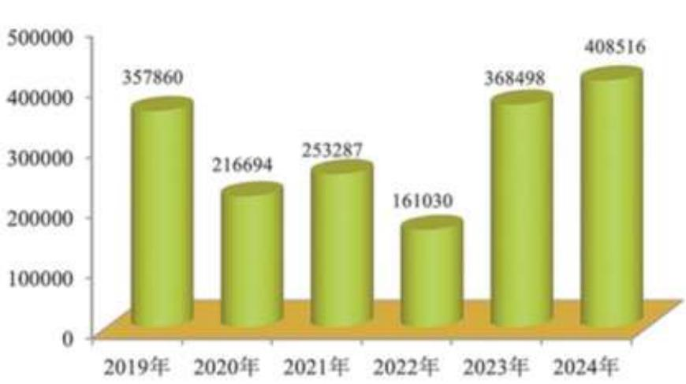
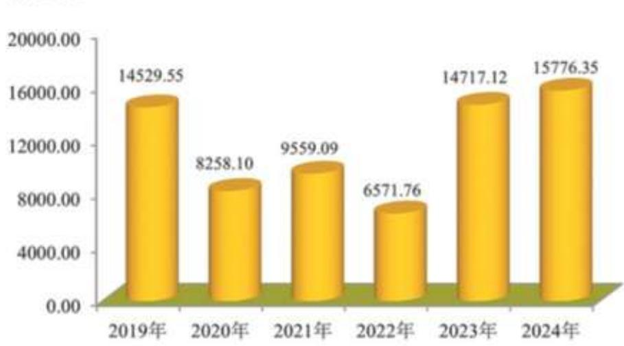
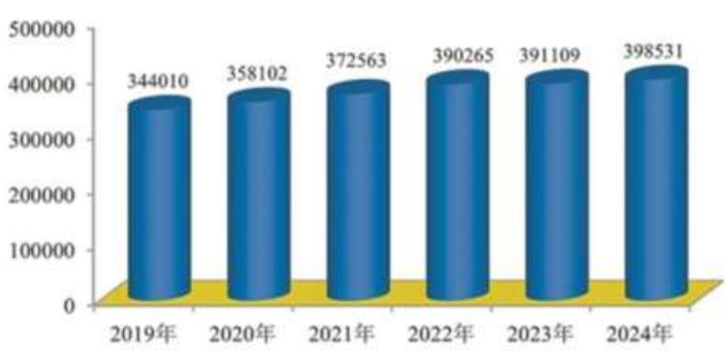
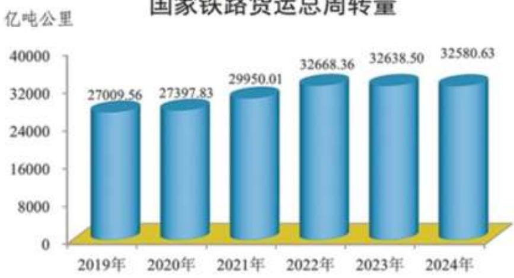
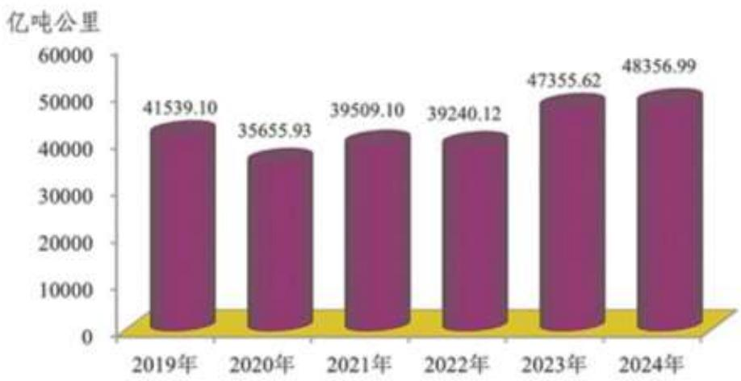
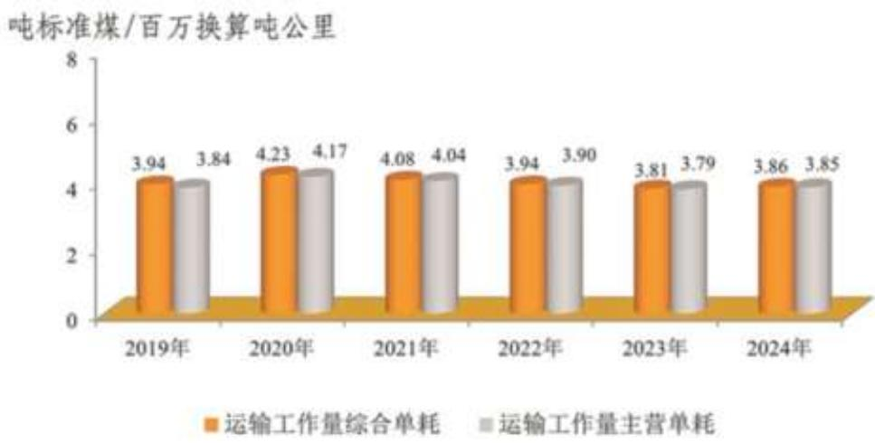
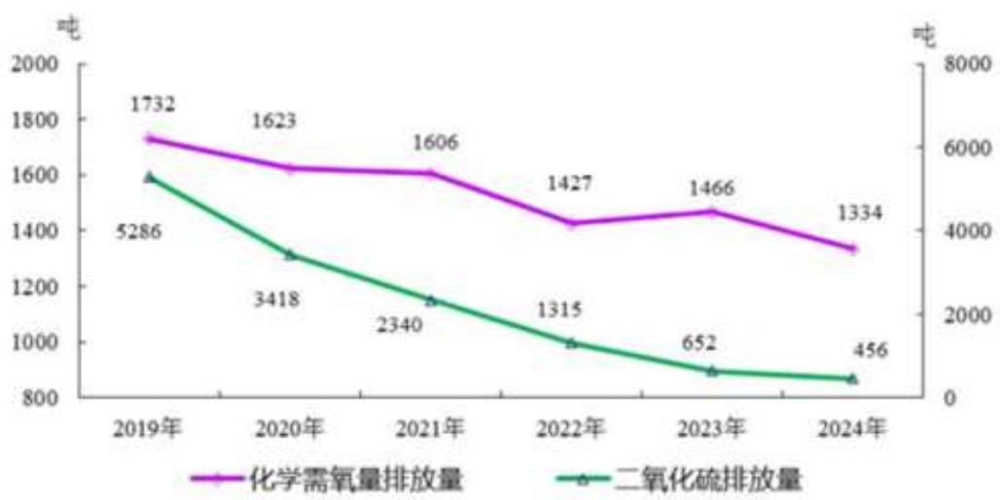

# 2026年度中国铁路建设债券

# 募集说明书

<table><tr><td rowspan=1 colspan=1>发行人</td><td rowspan=1 colspan=1>中国国家铁路集团有限公司福</td></tr><tr><td rowspan=1 colspan=1>注册金额</td><td rowspan=1 colspan=1>3,000亿元人民币</td></tr><tr><td rowspan=1 colspan=1>增信情况</td><td rowspan=1 colspan=1>铁路建设基金心</td></tr><tr><td rowspan=1 colspan=1>受托管理人</td><td rowspan=1 colspan=1>心国开证券股份有限公司</td></tr><tr><td rowspan=1 colspan=1>承销团成员</td><td rowspan=1 colspan=1>国开证券股份有限公司中信证券股份有限公司、华泰联合证券有限责任公司、国泰海通证券股份有限公司、中信建投证券股份有限公司、中国国际金融股份有限公司、中德证券有限责任公司、中银国际证券股份有限公司、招商证券股份有限公司、广发证券股份有限公司、申万宏源证券有限公司、长城国瑞证券有限公司、国信证券股份有限公司、光大证券股份有限公司</td></tr><tr><td rowspan=1 colspan=1>信用评级机构</td><td rowspan=1 colspan=1>中诚信国际信用评级有限责任公司</td></tr><tr><td rowspan=1 colspan=1>发行人主体/债项评级</td><td rowspan=1 colspan=1>AAA/AAA</td></tr></table>

2026年1月

## 声明及提示

## 一、发行人声明

发行人已批准本次债券募集说明书，承诺其中不存在虚假记载、误导性陈述或重大遗漏，并对其真实性、准确性、完整性承担个别或连带的法律责任。

## 二、发行人全体董事、高级管理人员声明

发行人全体董事及高级管理人员承诺本募集说明书不存在虚假记载、误导性陈述或重大遗漏，并对真实性、准确性、完备性承担相应的法律责任。

## 三、发行人相关负责人声明

发行人的负责人和主管会计工作的负责人、会计机构负责人保证本次债券募集说明书中财务报告真实、完整。

## 四、主承销商声明

主承销商保证其已按照中国相关法律、法规的规定，对本次债券发行材料的真实性、准确性、完整性进行了充分核查，确认不存在虚假记载、误导性陈述或重大遗漏，履行了勤勉尽职的义务。

## 五、投资提示

凡欲认购本次债券的投资者，请认真阅读本次债券募集说明书及其有关的信息披露文件，并进行独立投资判断。主管部门对本次债券发行所做出的任何决定，均不表明其对债券风险做出实质性判断。

凡认购、受让并持有本次债券的投资者，均视同自愿接受本次债券募集说明 书对本次债券各项权利义务的约定。

债券依法发行后，发行人经营变化引致的投资风险，投资者自行负责。

## 六、其他重大事项或风险提示

根据中国证券监督管理委员会证监许可〔2024〕1740 号注册通知文件，本次债券的发行总额 3,000亿元。

根据《财政部、税务总局关于铁路债券利息收入所得税政策的公告》（财政部 税务总局公告 2023 年第 64 号），对企业投资者持有本次债券取得的利息收入，减半征收企业所得税；对个人投资者持有本次债券取得的利息收入，减按 50%计入应纳税所得额计算征收个人所得税。

根据《国家发展改革委办公厅关于明确中国铁路建设债券政府支持性质的复函》（发改办财金〔2011〕2482号），中国铁路建设债券是经国务院批准的政府支持债券。根据《国务院关于组建中国铁路总公司有关问题的批复》（国函〔201347号），中国铁路总公司组建后，继续明确铁路建设债券为政府支持债券。

根据《财政部关于中国铁路总公司公司制改革有关事项的批复》（财建〔2019315号），中国铁路总公司由全民所有制企业改制为国有独资企业，改制后名称为“中国国家铁路集团有限公司”，由财政部代表国务院履行出资人职责，国务院及相关部门给予中国铁路总公司的支持政策和优惠政策继续适用于中国国家铁路集团有限公司。

因跨年发行，本次债券发行年份由 2025 年度变为 2026 年度，债券名称变更为 2026 年度中国铁路建设债券。本募集说明书中与“2025 年度中国铁路建设债券”有关的表述及涉及的文件名称不做修改，本次债券名称变更不改变原签订的与本次发行相关的文件效力,原签订的相关文件对更名后的债券继续具有法律效力。

除发行人和主承销商外，发行人没有委托或授权任何其他人或实体提供未在本次债券募集说明书中列明的信息和对本次债券募集说明书做任何说明。

投资者若对本次债券募集说明书存在任何疑问，应咨询自己的证券经纪人、律师、专业会计师或其他专业顾问。

## 目录

声明及提示 ........ 2  
目录 ....  
第一章 释义 ........ .8  
第二章 风险揭示 .. 10  
一、风险因素.... .. 10  
二、风险对策.... .... 11  
第三章 发行条款 .... . 14  
第四章 募集资金用途 ....... .15  
一、募集资金用途基本情况.. .. 15  
二、发行人募集资金管理制度.. .. 27  
三、发行人自身偿付能力... .. 28  
四、其他偿债保障措施...... .. 30  
第五章 发行人基本情况 ........ .31  
一、发行人概况.. . 31  
二、历史沿革.... .. 31  
三、股东情况.. .. 33  
四、公司治理和组织结构. .. 33  
五、发行人下属单位情况. .. 38  
六、发行人董事、高级管理人员情况. ... 43  
七、发行人主营业务情况.... .... 43  
八、发行人所在行业情况.. .... 46  
第六章 发行人财务情况 ...... ... 53  
一、发行人财务总体情况.... .. 53  
二、发行人有息负债情况分析.. ... 64  
三、发行人对外担保情况. ... 64  
四、发行人受限资产情况...... ... 64  
五、发行人关联交易情况.... ... 65  
六、发行人重大诉讼情况...... ... 65  
第七章 发行人信用情况 ....... .... 66  
一、本次发行信用评级报告概要. ... 66  
二、跟踪评级安排.. .. 66  
三、发行人信用评级情况.. .. 67  
四、发行人银行授信情况... ... 67  
五、发行人已发行尚未兑付的债券.. ... 67  
六、发行人信用记录情况.. .. 67  
第八章 担保情况 .... .... 68  
一、铁路建设基金概况......... ... 68  
二、铁路建设基金主要财务情况. .. 68  
第九章 税项 ...... ...................................... ..... 69  
一、增值税 ...... .............................. ... 69  
二、所得税.... ... 69  
三、印花税..... ... 69  
第十章 信息披露安排 . ... 70  
一、信息披露的具体要求.. .. 70  
二、信息披露的具体内容.. . 70  
第十一章 投资者保护机制.... . 72  
一、违约事件及解决措施...... .. 72  
二、债券持有人会议规则.. .. 73  
第十二章 受托管理人... . 79  
一、受托管理人：国开证券股份有限公司. .. 79  
二、《受托管理协议》主要事项... ..79  
第十三章 本次债券发行的有关机构. .93  
一、发行人：中国国家铁路集团有限公司. . 93  
二、担保人：铁路建设基金.. .. 93  
三、承销团成员... .. 93  
四、托管人 ...... ............. .97  
五、上海证券交易所.... .. 98  
六、深圳证券交易所.. . 98  
七、北京证券交易所... ... 98  
八、资金监管银行：中国建设银行股份有限公司.. .. 98  
九、发行人审计机构：中兴财光华会计师事务所（特殊普通合伙）.......99  
十、信用评级机构：中诚信国际信用评级有限责任公司 ..... 99  
十一、财务顾问：中国人寿资产管理有限公司.. .. 99  
十二、发行人律师：北京市鑫河律师事务所...... ... 99  
第十四章 其他应说明的事项.. .101  
一、本次债券发行依据... .. 101  
二、认购与托管....... .101  
三、债券发行场所... .103  
四、认购人承诺...... ... 104  
五、债权本息兑付办法. .105  
六、法律意见.... .... 105  
七、上市流通或交易安排.. .... 105  
第十五章 发行人及中介机构声明.. .106  
发行人声明 ...... .. 107  
发行人全体董事/高管声明. .108  
主承销商声明.... .109  
会计师事务所声明. .122  
发行人律师声明.... .123  
资信评级机构声明. .124  
第十六章 备查文件..... ..125  
一、备查文件. .125  
二、查阅方式.. .125  
三、联系人.. .125

## 第一章 释义

在本次债券募集说明书中，除非上下文另有规定，下列词汇具有以下含义：

<table><tr><td>发行人、国铁集团或公司</td><td>指</td><td>中国国家铁路集团有限公司</td></tr><tr><td>中国铁路总公司</td><td>指</td><td>原中国铁路总公司</td></tr><tr><td>铁道部</td><td>指</td><td>原中华人民共和国铁道部</td></tr><tr><td>本次债券</td><td>指</td><td>根据中国证券监督管理委员会证监许可 （2024）1740号注册通知文件，发行总</td></tr><tr><td>各期债券</td><td>指</td><td>规模为3,000亿元的中国铁路建设债券 本次债券项下，按照分期发行方式发行 的每期债券</td></tr><tr><td>募集说明书</td><td>指</td><td>发行人根据有关法律、法规为发行本次 债券而制作的《2026 年度中国铁路建设 债券募集说明书》</td></tr><tr><td>募集说明书摘要</td><td>指</td><td>发行人根据有关法律、法规为发行本次 债券项下各期债券制作的募集说明书摘 要</td></tr><tr><td>主承销商</td><td>指</td><td>详见各期债券的募集说明书摘要</td></tr><tr><td>牵头主承销商</td><td>指</td><td>详见各期债券的募集说明书摘要 主承销商为本次债券发行组织的，由主</td></tr><tr><td>承销团</td><td>指</td><td>承销商和分销商组成的承销团</td></tr><tr><td>承销协议</td><td>指</td><td>2024 年度中国铁路建设债券承销协议 承销团全体成员按照承销协议的约定对</td></tr><tr><td>余额包销</td><td>指</td><td>发行人承担本次债券的余额包销责任</td></tr><tr><td>中央结算公司 北京证券交易所</td><td>指</td><td>中央国债登记结算有限责任公司 北京证券交易所有限责任公司</td></tr><tr><td>交易所/证券交易所</td><td>指 指</td><td>上海证券交易所、深圳证券交易所、北京</td></tr><tr><td>证券登记公司</td><td>指</td><td>证券交易所 中国证券登记结算有限责任公司</td></tr><tr><td>招标</td><td>指</td><td>由发行人与主承销商确定各期债券的招 标利率区间；发行人在证券交易所或中 央结算公司统一发标，投标人在招标系 统规定的各自用户终端参与投标；投标 结束后，发行人根据招标系统结果最终 确定各期债券的发行利率和投标人中标 金额的过程。有关部门人员将对招标全</td></tr><tr><td>招标系统</td><td>指</td><td>程进行现场监督 证券交易所或中央结算公司提供的债券 招标发行系统；本次债券招投标采用证 券交易所或中央结算公司提供的债券招 标发行系统</td></tr><tr><td colspan="1" rowspan="1">投标人</td><td colspan="1" rowspan="1">指</td><td colspan="1" rowspan="1">指承销团成员和直接投资人</td></tr><tr><td colspan="1" rowspan="1">招投标方式</td><td colspan="1" rowspan="1">指</td><td colspan="1" rowspan="1">详见各期债券的募集说明书摘要</td></tr><tr><td colspan="1" rowspan="1">有效投标</td><td colspan="1" rowspan="1">指</td><td colspan="1" rowspan="1">指投标人按照各期债券的募集说明书摘要和发行办法规定发出的，经招标系统确认有效的投标</td></tr><tr><td colspan="1" rowspan="1">发行利率</td><td colspan="1" rowspan="1">指</td><td colspan="1" rowspan="1">发行人根据市场招标结果确定的各期债券最终票面年利率</td></tr><tr><td colspan="1" rowspan="1">应急投标或应急跨市场交易选择</td><td colspan="1" rowspan="1">指</td><td colspan="1" rowspan="1">如在各期债券招投标过程中，发生由于技术性或其他不可抗力产生的招标系统故障，投标人应填制该期债券的应急投标书或其他发行人跨市场交易选择应急申请书，按要求加盖预留在招标系统的印鉴并填写密押后，在规定的投标时间内传送至招标现场</td></tr><tr><td colspan="1" rowspan="1">招标额</td><td colspan="1" rowspan="1">指</td><td colspan="1" rowspan="1">就各期债券每一品种而言，指该品种参与招标的额度；各期债券每一品种的招标额在当期发行债券时确定</td></tr><tr><td colspan="1" rowspan="1">证监会</td><td colspan="1" rowspan="1">指</td><td colspan="1" rowspan="1">中国证券监督管理委员会</td></tr><tr><td colspan="1" rowspan="1">法定节假日或休息日</td><td colspan="1" rowspan="1">指</td><td colspan="1" rowspan="1">中华人民共和国的法定及政府指定节假日或休息日（不包括香港特别行政区、澳门特别行政区和台湾省的法定节假日或休息日）</td></tr><tr><td colspan="1" rowspan="1">交易日</td><td colspan="1" rowspan="1">指</td><td colspan="1" rowspan="1">按照证券交易所规定、惯例执行的可交易的日期</td></tr><tr><td colspan="1" rowspan="1">元</td><td colspan="1" rowspan="1">指</td><td colspan="1" rowspan="1">如无特别说明，指人民币元</td></tr></table>

## 第二章 风险揭示

## 一、风险因素

投资者在评价和购买本次债券时，应特别认真地考虑下述各项风险因素：

## （一）与本次债券有关的风险

## 1、利率风险

受国民经济总体运行状况、国家宏观经济、金融政策以及国际环境变化的影响，市场利率存在波动的可能性。由于本次债券期限较长，可能跨越一个以上的利率波动周期，市场利率的波动可能使实际投资收益具有一定的不确定性。

## 2、流动性风险

由于具体交易流通审批事宜需要在本次债券发行结束后方能进行，发行人目前无法保证本次债券一定能够按照预期在合法的证券交易场所交易流通，亦无法保证本次债券会在债券二级市场有活跃的交易。

## 3、偿付风险

在本次债券存续期内，如果由于不可控制的因素如市场环境发生变化，发行人不能从预期的还款来源获得足够资金，可能会对本次债券到期时的按期兑付造成一定的影响。

## 4、募投项目投资风险

本次债券募集资金建设项目总体投资规模较大、周期较长。如果建筑材料、设备和劳动力价格上涨，将对项目成本造成一定影响，项目实际投资有可能超出预算。同时，如发行人在管理和技术上出现重大失误，也可能产生不能按时竣工或达不到预先设计要求的情况。

## 5、违规使用债券资金风险

募集资金投资项目的实施存在因市场环境发生较大变化、项目实施过程中发生不可预见因素导致项目延期或无法实施的情况，将可能导致违规使用债券资金的风险。

## （二）与发行人相关的风险

## 1、项目建设风险

## （1）自然灾害对工程建设的影响

如果遭遇超过设计预期的特大自然灾害和公共安全事件，可能会对工程建设进度产生影响。

## （2）项目本身特点对工程建设的影响

铁路工程建设是一项复杂的系统工程，建设规模大、征地拆迁不可控因素多、施工强度高、工期长，对施工的组织管理和物资设备的技术性能要求严格。如果在工程建设的管理中出现重大失误，则可能会对整个工程建设进度产生影响。

## 2、市场风险

由于市场化进程的加快，铁路行业有可能面临其他交通运输方式（如公路、水运、航空）的激烈竞争，这将有可能导致发行人经营业绩及偿债能力的下降。

## 3、运价调整风险

为完善铁路运价机制，理顺铁路价格关系，国家发展和改革委员会已将铁路客货运价格实行政府指导价和市场调节价相结合。不排除未来受宏观经济重大变动及市场等因素影响，可能出现运价调整，进而影响到发行人经营业绩的风险。

## （三）政策风险

国家宏观经济政策和产业政策的调整可能会影响发行人的经营管理活动，不排除在一定时期内对发行人经营环境和业绩产生不利影响的可能性。

## 二、风险对策

发行人已采取或即将采取积极有效的措施，应对以上风险。

## （一）与本次债券有关风险的对策

## 1、利率风险的对策

本次债券拟在发行结束后申请在国家规定的证券交易场所交易流通，如交易流通申请获得批准，本次债券流动性的增强将在一定程度上给投资者提供规避利率风险的便利。

## 2、流动性风险的对策

发行人和主承销商将积极推进本次债券的交易流通申请工作。主承销商和其他承销商也将促进本次债券二级市场交易的进行。另外，随着债券市场的发展，债券流通和交易的条件也会逐步改善，未来的流动性风险将会有所降低。

## 3、偿付风险的对策

发行人制定资金管理制度加强对偿债资金的管理。本次债券由担保人提供不可撤销的连带责任保证担保，进一步增强本次债券本息兑付的可靠性。

## 4、募投项目投资风险的对策

发行人将认真执行招标管理的相关规定，设计建设均由技术实力强、经验丰富的企业承担，关键工程环节均经过反复论证，并由专业人员持续现场跟踪项目施工进度。发行人将对项目投入资金进行监控，严格按照预算拨付和使用资金。

## 5、违规使用债券资金风险的对策

依照国家法律法规和发行人有关规定，结合公司基本建设特点，发行人于2022年制定了《中国国家铁路集团有限公司基本建设财务管理办法》，规范基本建设财务行为。

发行人将严格按照中国证券监督管理委员会关于公司债券有关规定以及《中国国家铁路集团有限公司基本建设财务管理办法》，根据募集说明书披露的项目和进度使用发债资金，保证专款专用。

## （二）与发行人相关风险的对策

## 1、项目建设风险的对策

在建设项目管理方面，发行人制定了《铁路建设管理办法》《铁路建设项目工程质量管理办法》，成立或组建建设项目管理机构，建立健全建设单位或建设项目的内控制度和管理办法；制定了《中国国家铁路集团有限公司基本建设财务管理办法》，规范资金筹集，降低筹资成本，对建设资金使用的全过程进行管理和监督，以保证建设项目的工程质量与进度，减少项目的建设风险。

## 2、市场风险的对策

为进一步提高铁路的竞争力，发行人积极推进确立铁路运输企业市场主体地位，逐步完善企业经营机制，全面实施多元化经营战略，全方位拓展市场，不断推出便民利民措施，提升服务质量，加强运输组织，优化运输产品，逐步与市场需求和人民群众需求相适应。同时发行人非常重视内部管理体制机制创新，制定了《中国国家铁路集团有限公司基本建设财务管理办法》、《中国国家铁路集团有限公司财务管理办法》、《中国国家铁路集团有限公司资金管理办法》、《铁路局集团公司负责人经营业绩考核办法》、《国铁集团所属专业公司负责人经营业绩考核办法》等一系列制度，使铁路建设和经营管理进一步法治化、规范化。

## 3、运价调整风险的对策

发行人将加强对国家关于铁路货物运输价格政策和宏观经济形势的研究，部署应对运价调整风险的相关对策，当宏观经济出现重大变动或运价调整时，把经营风险降到最低。

## （三）政策风险的对策

铁路作为国民经济的大动脉，国家重要基础设施和大众化交通工具，政府对此行业发展高度重视，并给予多方面的支持。发行人将处理好铁路的改革、发展和稳定之间的关系，促进铁路行业的持续健康发展，维护投资者权益。

## 第三章 发行条款

发行人：中国国家铁路集团有限公司。

发行额度：总额人民币3,000亿元，自注册生效之日起两年内有效。

债券名称：2026年度中国铁路建设债券

期限品种：以中长期限品种为主，具体品种根据发行时募集资金用途和市场情况确定。

债券利率：固定利率或浮动利率。债券的票面利率以 Shibor或其他市场基准利率为基础，最终通过招标方式确定。每期利率招标区间不超过 100BP，具体招标区间及基准利率确定方法在每期发行材料中予以明确。

还本付息：采用单利按年计息，不计复利，逾期不另计利息。每年付息一次，到期一次还本，最后一期利息随本金的兑付一起支付。

债券形式：实名制记账式。

债券担保：铁路建设基金。

认购托管：发行认购日结束后，即办理认购托管的确认手续并完成债券在银行间市场和交易所市场交易流通安排，由投资人自行选择托管场所。

承销方式：主承销商余额包销。

兑付方式：通过债券登记托管机构办理。

债券用途：初步安排用于铁路建设项目 800亿元，装备购置 250亿元，债务结构调整 1,950 亿元。

注册批复：采用“一次注册、分期发行”的方式批复。

公告时间：提前 1个交易日对外披露当期发行相关材料。

承销团：国开证券股份有限公司、中信证券股份有限公司、华泰联合证券有限责任公司、国泰海通证券股份有限公司、中信建投证券股份有限公司、中国国际金融股份有限公司、中德证券有限责任公司、中银国际证券股份有限公司、招商证券股份有限公司、广发证券股份有限公司、申万宏源证券有限公司、长城国瑞证券有限公司、国信证券股份有限公司、光大证券股份有限公司。

从上述机构中确定各期债券主承销商为4家，各期债券由主承销商组织承销团，以余额包销的方式承销。

具体内容详见各期债券的募集说明书摘要。

## 第四章 募集资金用途

## 一、募集资金用途基本情况

经证监会同意，本次债券的募集资金总额 3,000亿元，其中800亿元投资于铁路建设项目，250 亿元用于装备购置，1,950 亿元用于债务结构调整。募投项目资本金比例符合国家法律法规，发行人承诺项目收益优先用于偿还债券本息。

表格1-2026年度中国铁路建设债券募集资金拟用于铁路建设项目情况

单位：亿元

募投项目实施主体主要为发行人控股的各铁路局集团公司、控股或参股的合资铁路公司。
<table><tr><td colspan="1" rowspan="1">序号</td><td colspan="1" rowspan="1">铁路建设项目名称</td><td colspan="1" rowspan="1">批准文号</td><td colspan="1" rowspan="1">总投资</td><td colspan="1" rowspan="1">本次债券安排</td></tr><tr><td colspan="1" rowspan="1">1</td><td colspan="1" rowspan="1">滨绥铁路K491+213～K496+247段改造工程</td><td colspan="1" rowspan="1">铁发改函（2023）238号</td><td colspan="1" rowspan="1">3.50</td><td colspan="1" rowspan="1">0.42</td></tr><tr><td colspan="1" rowspan="1">2</td><td colspan="1" rowspan="1">滨洲铁路博克图至西岭口段落坡改线工程</td><td colspan="1" rowspan="1">铁发改函（2023）324号</td><td colspan="1" rowspan="1">29.90</td><td colspan="1" rowspan="1">0.50</td></tr><tr><td colspan="1" rowspan="1">3</td><td colspan="1" rowspan="1">敦化至白河铁路</td><td colspan="1" rowspan="1">铁总计统函（2017）340号</td><td colspan="1" rowspan="1">139.21</td><td colspan="1" rowspan="1">8.5788</td></tr><tr><td colspan="1" rowspan="1">4</td><td colspan="1" rowspan="1">北京至雄安新区至商丘高速铁路雄安新区至商丘段</td><td colspan="1" rowspan="1">发改基础（2020）1740号</td><td colspan="1" rowspan="1">827.10</td><td colspan="1" rowspan="1">100.00</td></tr><tr><td colspan="1" rowspan="1">5</td><td colspan="1" rowspan="1">潍坊至宿迁高速铁路</td><td colspan="1" rowspan="1">发改基础（2023）603号</td><td colspan="1" rowspan="1">1,009.90</td><td colspan="1" rowspan="1">10.00</td></tr><tr><td colspan="1" rowspan="1">6</td><td colspan="1" rowspan="1">天津至潍坊高速铁路</td><td colspan="1" rowspan="1">发改基础（2022）34号</td><td colspan="1" rowspan="1">1,145.40</td><td colspan="1" rowspan="1">25.00</td></tr><tr><td colspan="1" rowspan="1">7</td><td colspan="1" rowspan="1">太子城至锡林浩特铁路</td><td colspan="1" rowspan="1">发改基础（2020）1490号</td><td colspan="1" rowspan="1">127.13</td><td colspan="1" rowspan="1">4.23</td></tr><tr><td colspan="1" rowspan="1">8</td><td colspan="1" rowspan="1">京沪铁路沧州站改造工程</td><td colspan="1" rowspan="1">铁发改函（2023）472号</td><td colspan="1" rowspan="1">4.83</td><td colspan="1" rowspan="1">0.37</td></tr><tr><td colspan="1" rowspan="1">9</td><td colspan="1" rowspan="1">天津新港北集装箱中心站第二线束工程</td><td colspan="1" rowspan="1">铁发改函（2023）355号</td><td colspan="1" rowspan="1">3.50</td><td colspan="1" rowspan="1">0.317</td></tr><tr><td colspan="1" rowspan="1">10</td><td colspan="1" rowspan="1">京原铁路北京局集团公司管段电气化改造工程</td><td colspan="1" rowspan="1">铁总发改函（2018）709号</td><td colspan="1" rowspan="1">32.56</td><td colspan="1" rowspan="1">0.15</td></tr><tr><td colspan="1" rowspan="1">11</td><td colspan="1" rowspan="1">雄安新区至忻州高速铁路</td><td colspan="1" rowspan="1">发改基础（2020）1965号</td><td colspan="1" rowspan="1">572.40</td><td colspan="1" rowspan="1">30.00</td></tr><tr><td colspan="1" rowspan="1">12</td><td colspan="1" rowspan="1">西安至十堰高速铁路</td><td colspan="1" rowspan="1">发改基础（2020）595号</td><td colspan="1" rowspan="1">476.80</td><td colspan="1" rowspan="1">0.20</td></tr><tr><td colspan="1" rowspan="1">13</td><td colspan="1" rowspan="1">京九铁路聊城北站上行线改建工程</td><td colspan="1" rowspan="1">铁发改函（2023）510号</td><td colspan="1" rowspan="1">7.00</td><td colspan="1" rowspan="1">0.21</td></tr><tr><td colspan="1" rowspan="1">14</td><td colspan="1" rowspan="1">上海至杭州铁路客运专线上海南联络线</td><td colspan="1" rowspan="1">铁鉴函（2020）382号发改基础（2009）542号</td><td colspan="1" rowspan="1">45.7486</td><td colspan="1" rowspan="1">4.9111</td></tr><tr><td colspan="1" rowspan="1">15</td><td colspan="1" rowspan="1">新建陆家浜铁路货场</td><td colspan="1" rowspan="1">铁总发改函（2019）166号</td><td colspan="1" rowspan="1">3.60</td><td colspan="1" rowspan="1">0.10</td></tr><tr><td colspan="1" rowspan="1">16</td><td colspan="1" rowspan="1">上海至南通铁路太仓至四团段</td><td colspan="1" rowspan="1">发改基础（2017）1481号</td><td colspan="1" rowspan="1">368.20</td><td colspan="1" rowspan="1">0.31</td></tr><tr><td colspan="1" rowspan="1">17</td><td colspan="1" rowspan="1">龙岩至龙川铁路龙岩至武平段</td><td colspan="1" rowspan="1">铁总发改函（2018）913号</td><td colspan="1" rowspan="1">85.60</td><td colspan="1" rowspan="1">0.30</td></tr><tr><td colspan="1" rowspan="1">18</td><td colspan="1" rowspan="1">赣州至深圳铁路</td><td colspan="1" rowspan="1">发改基础（2016）2128号</td><td colspan="1" rowspan="1">641.30</td><td colspan="1" rowspan="1">4.05</td></tr><tr><td colspan="1" rowspan="1">19</td><td colspan="1" rowspan="1">新建广州站至广州南站联络线工程</td><td colspan="1" rowspan="1">铁发改函（2022）530号</td><td colspan="1" rowspan="1">88.03</td><td colspan="1" rowspan="1">1.00</td></tr><tr><td colspan="1" rowspan="1">20</td><td colspan="1" rowspan="1">邵阳至永州铁路</td><td colspan="1" rowspan="1">铁发改函（2023）159号</td><td colspan="1" rowspan="1">197.00</td><td colspan="1" rowspan="1">0.05</td></tr><tr><td colspan="1" rowspan="1">21</td><td colspan="1" rowspan="1">广州铁路枢纽新建广州白云站(棠溪站)</td><td colspan="1" rowspan="1">铁总发改函（2018）437号</td><td colspan="1" rowspan="1">220.21</td><td colspan="1" rowspan="1">14.00</td></tr><tr><td colspan="1" rowspan="1">22</td><td colspan="1" rowspan="1">益湛线益阳至娄底段电气化改造工程</td><td colspan="1" rowspan="1">铁发改函（2023）382号</td><td colspan="1" rowspan="1">24.30</td><td colspan="1" rowspan="1">1.60</td></tr><tr><td colspan="1" rowspan="1">23</td><td colspan="1" rowspan="1">安顺至六盘水铁路</td><td colspan="1" rowspan="1">铁总计统函（2014）1898号</td><td colspan="1" rowspan="1">155.00</td><td colspan="1" rowspan="1">0.25</td></tr><tr><td colspan="1" rowspan="1">24</td><td colspan="1" rowspan="1">开阳支线电气化改造工程</td><td colspan="1" rowspan="1">铁发改函（2024）42号</td><td colspan="1" rowspan="1">2.84</td><td colspan="1" rowspan="1">1.98</td></tr><tr><td colspan="1" rowspan="1">25</td><td colspan="1" rowspan="1">大理至瑞丽铁路</td><td colspan="1" rowspan="1">发改办基础（2014）2090号</td><td colspan="1" rowspan="1">257.30</td><td colspan="1" rowspan="1">0.1098</td></tr><tr><td colspan="1" rowspan="1">26</td><td colspan="1" rowspan="1">兰新铁路嘉峪关站改造工程</td><td colspan="1" rowspan="1">铁发改函（2023）304号</td><td colspan="1" rowspan="1">6.50</td><td colspan="1" rowspan="1">1.70</td></tr><tr><td colspan="1" rowspan="1">27</td><td colspan="1" rowspan="1">格尔木至库尔勒铁路（新疆段)扩能改造工程</td><td colspan="1" rowspan="1">铁发改函（（2023）144号</td><td colspan="1" rowspan="1">22.55</td><td colspan="1" rowspan="1">3.60</td></tr><tr><td colspan="1" rowspan="1">28</td><td colspan="1" rowspan="1">格尔木至库尔勒铁路（青海段)扩能改造工程</td><td colspan="1" rowspan="1">铁发改函（2023）142号</td><td colspan="1" rowspan="1">16.50</td><td colspan="1" rowspan="1">5.00</td></tr><tr><td colspan="1" rowspan="1">29</td><td colspan="1" rowspan="1">北京至唐山铁路</td><td colspan="1" rowspan="1">发改基础（2016）2129号</td><td colspan="1" rowspan="1">449.00</td><td colspan="1" rowspan="1">1.00</td></tr><tr><td colspan="1" rowspan="1">30</td><td colspan="1" rowspan="1">沪渝蓉高速铁路武汉至宜昌段</td><td colspan="1" rowspan="1">铁发改函（2020）556号</td><td colspan="1" rowspan="1">522.70</td><td colspan="1" rowspan="1">0.024</td></tr><tr><td colspan="1" rowspan="1">31</td><td colspan="1" rowspan="1">天津至大兴机场铁路</td><td colspan="1" rowspan="1">冀发改基础（2020）112号</td><td colspan="1" rowspan="1">116.50</td><td colspan="1" rowspan="1">0.30</td></tr><tr><td colspan="1" rowspan="1">32</td><td colspan="1" rowspan="1">石衡沧港城际铁路衡黄段</td><td colspan="1" rowspan="1">冀发改基础（2018）591号</td><td colspan="1" rowspan="1">346.94</td><td colspan="1" rowspan="1">20.00</td></tr><tr><td colspan="1" rowspan="1">33</td><td colspan="1" rowspan="1">建设项目预留</td><td colspan="1" rowspan="1">1</td><td colspan="1" rowspan="1">1</td><td colspan="1" rowspan="1">559.7393</td></tr><tr><td colspan="1" rowspan="1"></td><td colspan="1" rowspan="1">合计</td><td colspan="1" rowspan="1"></td><td colspan="1" rowspan="1">7,949.05</td><td colspan="1" rowspan="1">800.00</td></tr></table>

## （一）滨绥铁路 K491+213～K496+247 段改造工程

本项目已经《国铁集团关于滨绥铁路 K491+213～K496+247 段改造工程可行性研究报告的批复》（铁发改函〔2023〕238 号）批准实施。

本项目采用沿既有线取直新建线路、部分利用既有线方案，工程上预留双线条件，隧道及部分桥墩按双线建设。新建线路长 3.8km，利用既有线 0.3km。新建桥梁 3 座共 1.4km，新建隧道 1 座计 0.6km。

本项目可行性研究报告批复的项目投资估算总额为 3.5 亿元。本项目拟使用本次债券募集资金 0.42亿元。

## （二）滨洲铁路博克图至西岭口段落坡改线工程

本项目已经《国铁集团关于滨洲铁路博克图至西岭口段落坡改线工程可行性研究报告的批复》（铁发改函〔2023〕324号）批准实施。

本项目改建线路自博克图站引出，利用既有线 8.5 公里后，在既有线南侧新建双线，以长隧道方式通过大兴安岭主岭，接入西岭口站，新建线路 29.8公里。

改建后正线长度 38.3 公里，其中，新建隧道 2 座、总长度 18.6 公里，新建桥梁4座、总长度3.8公里。关闭兴安岭站、伊列克得站、三根河站。

本项目可行性研究报告批复的项目投资估算总额为 29.9 亿元。本项目拟使用本次债券募集资金 0.5亿元。

## （三）敦化至白河铁路

本项目已经《中国铁路总公司 吉林省人民政府关于新建敦化至白河铁路工程可行性研究报告的批复》（铁总计统函（2017）340号）批准实施。

本项目位于吉林省延边自治州境内，于二道白河镇北侧新设长白山站，向北经安图县、敦化市，方向别接吉图珲客专后引入敦化站，长白山站至敦化南站正线长 102 公里，敦化南至敦化间设联络处，南西联络线引入敦化站，长 11.7 单线公里，西南联络线在吉图珲客专区间接轨，长 5.9 单线公里，共计 17.6 单线公里；改建浑白线 2.35 公里，改建白和线 6.15 公里，改建白河专用线 8.4 公里，还建白河货运车场（到发线近期 5 条，预留 3 条），白河站物流货运设施（吉林省以现金形式支付沈阳铁路局，用以回购上述铁路既有资产）。

本项目可行性研究报告批复的项目投资估算总额为 139.21 亿元。本项目拟使用本次债券募集资金 8.5788 亿元。

## （四）北京至雄安新区至商丘高速铁路雄安新区至商丘段

本项目已经《国家发展改革委关于新建北京至雄安新区至商丘高速铁路雄安新区至商丘段可行性研究报告的批复》（发改基础〔2020〕1740号）批准实施。

本项目线路起自京雄城际铁路雄安站，经河北省雄安新区、沧州市、衡水市、邢台市，山东省聊城市，河南省濮阳市，山东省济宁市、菏泽市至河南省商丘市，接入商合杭高铁商丘站，正线全长 552.5 公里，全线设 14 个车站，其中新建车站11 个。同步建设本线与石济客专北东、西南联络线 18.5 公里，雄安站至津保铁路天津方向联络线 11.9公里，雄安动车所增设检查库线、存车线，改建商丘地区相关既有线。

本项目可行性研究报告批复的项目投资估算总额为 827.10 亿元。本项目拟使用本次债券募集资金 100 亿元。

## （五）潍坊至宿迁高速铁路

本项目已经《国家发展改革委关于新建潍坊至宿迁高速铁路可行性研究报告的批复》（发改基础〔2023〕603 号）批准实施。

本项目线路起自天津至潍坊高速铁路潍坊北站，经山东省日照市、临沂市，江苏省新沂市、宿迁市，终至徐州至盐城高速铁路洋河北站，全长 399.3 公里，设站 12 座。同步建设本线至青岛连接线 108.3 公里，本线至济青高铁、日兰高铁、潍莱高铁等联络线共约 43.8公里。改建临沂北动车所，宿迁地区预留合肥至新沂铁路引入条件。

本项目可行性研究报告批复的项目投资估算总额为 1,009.9 亿元。本项目拟使用本次债券募集资金 10亿元。

## （六）天津至潍坊高速铁路

本项目已经《国家发展改革委关于新建天津至潍坊高速铁路可行性研究报告的批复》（发改基础（2022）34 号）批准实施。

本项目线路起自京津城际铁路延伸线滨海站，经天津市滨海新区、河北省沧州市、山东省滨州市、东营市、潍坊市，终至济青高速铁路潍坊北站，全长约 348.9公里，设站 10 座。同步建设本线至济南联络线 150.7 公里，本线至津秦高速铁路、京滨城际铁路、济青高速铁路等联络线共约 33 公里。新建滨海西站动车运用所及东营南站、潍坊北站等存车场。

本项目可行性研究报告批复的项目投资估算总额为 1,145.40 亿元。本项目拟使用本次债券募集资金 25亿元。

## （七）太子城至锡林浩特铁路

本项目已经《国家发展改革委关于太子城至锡林浩特铁路可行性研究报告的批复》（发改基础〔2020〕1490 号）批准实施。

本项目自崇礼铁路太子城站引出，向北经崇礼、张北、沽源、太仆寺旗、塞北管理区后接入既有黑城子站，利用既有黑城子至正蓝旗铁路、锡多铁路引入锡林浩特站，线路全长 392.2 公里，其中新建线路 151.4 公里，既有线电气化改造240.8 公里。

本项目可行性研究报告批复的项目投资估算总额为 127.13 亿元。本项目拟使用本次债券募集资金 4.23亿元。

## （八）京沪铁路沧州站改造工程

本项目已经《国铁集团关于京沪铁路沧州站改造工程可行性研究报告的批复》（铁发改函〔2023〕472号）批准实施。

（一）在站房原址新建沧州站房，采用线侧平式布置，建筑面积按 9500 平方米控制。还建铁路生产和公安用房约 3500平方米，与站房合并设置。

（二）对车场进行改造，拆除既有到发线 3道及三站台，在下行正线东侧还建到发线3道，并在到发线 3、5道之间还建三站台；二站台原位改造为高站台。新建旅客进站天桥、旅客出站地道（与行包地道合建）各一座。新建有柱雨棚 1.6万平方米，南牵出线延长 50米。

本项目可行性研究报告批复的项目投资估算总额为 4.83 亿元。本项目拟使用本次债券募集资金 0.37亿元。

## （九）天津新港北集装箱中心站第二线束工程

本项目已经《国铁集团关于天津新港北集装箱中心站第二线束工程可行性研究报告的批复》（铁发改函〔2023〕355 号）批准实施。

本项目在既有 1束2条集装箱装卸线北侧，按照预留线位建设 1束2条贯通式集装箱装卸线、有效长 980 米，配套装卸机械及主箱区铺面约 5.6 万平方米。在装卸线东西两侧预留土地，建设辅助箱区铺面约 3.8 万平方米，拆拼箱库 1 座、建筑面积约5500 平方米，候工楼1 栋、建筑面积约 1150 平方米及其他生产生活设施。

本项目可行性研究报告批复的项目投资估算总额为 3.5 亿元。本项目拟使用本次债券募集资金 0.317亿元。

## （十）京原铁路北京局集团公司管段电气化改造工程

本项目已经《中国铁路总公司 河北省人民政府关于京原铁路北京局集团公司管段电气化改造工程可行性研究报告的批复》（铁总发改函〔2018〕709 号）批准实施。

本项目石景山南（不含）至大涧站（含）233.4 公里现状电化改造，同步实施平改立工程、与电化相关的病害整治，人口较为稠密区段实施线路封闭、声屏障等工程。全线供电、工务、电务、通信、房建、给排水等固定设备生产、生活设施实现集中管理。沿线大灰厂、上万、良各庄、大涧等 27 座车站及工区既有燃煤锅炉按采用清洁能源改造。

本项目可行性研究报告批复的项目投资估算总额为 32.56 亿元。本项目拟使用本次债券募集资金 0.15 亿元。

## （十一）雄安新区至忻州高速铁路

本项目已经《国家发展改革委关于新建雄安新区至忻州高速铁路可行性研究报告的批复》（发改基础〔2020〕1965 号）批准实施。

本项目新建雄安新区至忻州高速铁路起自京雄城际铁路雄安站，经河北省雄安新区、保定市清苑区及望都、曲阳、阜平等县，山西省五台山风景区，忻州市五台县、定襄县，接入忻州西站，正线全长 342 公里，全线设 12 个车站（含 1个预留车站），雄安新区地下段利用拟建的东西轴线隧道工程进行布设，同步建设相关存车场、存车线。

本项目可行性研究报告批复的项目投资估算总额为 572.40 亿元。本项目拟使用本次债券募集资金 30亿元。

## （十二）西安至十堰高速铁路

本项目已经《国家发展改革委关于新建西安至十堰高速铁路可行性研究报告的批复》（发改基础〔2020〕595 号）批准实施。

新建西安至十堰高速铁路起自西安枢纽西安东站，经蓝田、商洛西、山阳、漫川关、郧西站，接入既有十堰东站，正线全长 256.7 公里，全线设 7 个车站，其中新建车站 6个。配套建设西安东动车所、走行线及普速存车场，新建西安东站至西安站联络线，改建既有陇海线 1.5公里，改建既有田灞联络线 2.3公里。

本项目可行性研究报告批复的项目投资估算总额为 476.80 亿元。本项目拟使用本次债券募集资金 0.2亿元。

## （十三）京九铁路聊城北站上行线改建工程

本项目已经《国铁集团关于京九铁路聊城北站上行线改建工程可行性研究报告的批复》（铁发改函〔2023〕510 号）批准实施。

本项目新建京九上行线自聊城北站北端既有京九上行线约K417+540 处向南引出，并行邯济下行线左侧，于预留线位外包 III场跨周公河后，在 K425+200 处接入京九上行线，并连通站内既有京九上行线，新建正线长约 7.6公里。建设Ⅲ场预留到发线 6条，Ⅱ场调车场尾部增加停车器、道岔纳入集中联锁改造。机务折返段适应性改造。

本项目可行性研究报告批复的项目投资估算总额为 7 亿元。本项目拟使用本次债券募集资金 0.21 亿元。

## （十四）上海至杭州铁路客运专线上海南联络线

本项目已经《国家发展改革委关于新建上海至杭州铁路客运专线可行性研究报告的批复》（发改基础〔2009〕542 号）、《国铁集团 上海市人民政府关于新建上海至杭州铁路客运专线上海南联络线修改初步设计的批复》（铁鉴函〔2020382号）批准实施。

本项目线路自上海虹桥站引出，经春申、松江、嘉兴﹑桐乡、海宁、余杭引入杭州东站，正线全长 159公里。同时，在上海枢纽修建春申至上海南站联络线11公里，在杭州枢纽修建笕桥至杭州站联络线 3.5公里。

本项目新建上海至杭州铁路客运专线（以下简称：沪杭客专）春申线路所至上海南站（含）联络线，沪春 K0+650.5\~沪春 K8+638.8，线路长度 7.99 公里，以及既有沪春线改造工程。

本项目可行性研究报告批复的项目投资估算总额为 45.7486 亿元。本项目拟使用本次债券募集资金 4.9111亿元。

## （十五）新建陆家浜铁路货场

本项目已经《中国铁路总公司关于新建陆家浜铁路货场工程可行性研究报告的批复》（铁总发改函〔2019〕166 号）批准实施。

本项目沿京沪线向东迁建陆家浜站约3.2公里，在车站北侧横列式布置货场。新建陆家浜车站已纳入新建沪通铁路太仓至四团段工程，新建货场由本工程实施。货场自新建车站上海端引出，总占地约 660亩。按照以社会招商方式为主建设仓储物流功能区、铁路投资建设基础部分的原则，本次工程实施征地范围内“三通一平”、封闭设施、综合办公楼（3000 平方米），新建集装箱作业线 1 条、笨大兼综合货物作业线 1 条。货场总体布局、作业线布置、装卸机械配置等要充分结合社会企业需求、货源结构、装卸作业特点等灵活设置，并采用招商引资为主的方式建设各功能区。

本项目可行性研究报告批复的项目投资估算总额为 3.60 亿元。本项目拟使用本次债券募集资金 0.1亿元。

## （十六）上海至南通铁路太仓至四团段

本项目已经《国家发展改革委关于新建上海至南通铁路太仓至四团段可行性研究报告批复的通知》（发改基础〔2017〕1481号）批准实施。

本项目线路北起沪通铁路南通至安亭段太仓站，途径江苏省太仓市，上海市嘉定区、宝山区、浦东新区和奉贤区，南至浦东铁路四团站，线路全长 111.80 公

里，共设6个车站。同时新建外高桥铁路集装箱办理站、港区铁路装卸线、相关联络线及其他配套工程等。

本项目可行性研究报告批复的项目投资估算总额为 368.20 亿元。本项目拟使用本次债券募集资金 0.31亿元。

## （十七）龙岩至龙川铁路龙岩至武平段

本项目已经《中国铁路总公司 福建省人民政府关于新建龙岩至龙川铁路龙岩至武平段可行性研究报告的批复》（铁总发改函〔2018〕913 号）批准实施。

本项目龙岩至古田会址段利用既有赣龙铁路，新建线路自赣龙铁路古田会址站引出，经上杭县至武平县，全长约 92.6 公里，新建正线长 64.4 公里，正线桥隧比为 82.6%。全线设龙岩、古田会址、上杭北、武平 4 座车站。

本项目可行性研究报告批复的项目投资估算总额为 85.60 亿元。本项目拟使用本次债券募集资金 0.3亿元。

## （十八）赣州至深圳铁路

本项目已经《国家发展改革委关于新建赣州至深圳铁路可行性研究报告的批复》（发改基础〔2016〕2128 号）批准实施。

本项目线路从在建的赣州西站引出，经江西省赣州市，广东省河源市、惠州市和东莞市，接入深圳北站，全长 432 公里。全线共设 14 个车站（含预留车站2 个）。

本项目可行性研究报告批复的项目投资估算总额为 641.3 亿元。本项目拟使用本次债券募集资金 4.05亿元。

## （十九）新建广州站至广州南站联络线工程

本项目已经《国铁集团 广东省人民政府关于新建广州站至广州南站联络线工程可行性研究报告的批复》（铁发改函〔2022〕530号）批准实施。

本项目线路起自广州铁路枢纽广州站，利用既有广茂铁路至五眼桥线路所后，新建线路以隧道形式沿规划城市快捷路向南，引入广州南站，正线长 25.3公里，其中新建线路 15.6公里，利用既有线 9.7公里。配套改建广茂铁路 1.4公里。

本项目可行性研究报告批复的项目投资估算总额为 88.03 亿元。本项目拟使用本次债券募集资金 1 亿元。

## （二十）邵阳至永州铁路

本项目已经《国铁集团 湖南省人民政府关于新建邵阳至永州铁路可行性研究报告的批复》（铁发改函〔2023〕159号）批准实施。

本项目线路北起娄邵铁路邵阳站，向南经邵阳县至永州地区永州站，新建线路长 96.1 公里，全线设邵阳、邵阳县、永州等 3 座车站。邵阳地区改建益湛铁路1.6单线公里，永州地区新建衡柳联络线 12.1单线公里。

本项目可行性研究报告批复的项目投资估算总额为 197.0 亿元。本项目拟使用本次债券募集资金 0.05亿元。

## （二十一）广州铁路枢纽新建广州白云站（棠溪站）

本项目已经《中国铁路总公司 广东省人民政府关于广州铁路枢纽新建广州白云站（棠溪站）工程可行性研究报告的批复》（铁总发改函〔2018〕437 号）批准实施。

## 本项目建设方案及主要工程内容：

1、在既有棠溪站北场位置新建车场，自东向西按照城际场、国铁场布置。城际场规模为 1 台 2 线，国铁场总规模为 10 台 19 线，本次按 7 台 13 线实施，预留 3 台 6 线。新建站房综合楼面积 14.3 万平方米，并与地铁、公交等城市交通设施有效衔接。

2、在大朗站西侧新建客车整备所，规划预留客机折返段，设出入段线 2条；机车运用和检修设施维持广州机务段既有设施规模不变。客车整备所设整备线20 条、车底停留线 10 条，存车线 6 条，镟轮、临修线 4 条。

3、建设京广高铁广州北站至广州站联络线，自广州北站南端至广州白云站南咽喉正线长 19.0 公里，广茂联络线（广 S 白云至广州西段）增建二线 3.9 公里，改建京广等相关既有线。

4、新建广州白云站地下停车场等相关设施，合计约 11 万平米，投资计入本项目。其他相关物业开发由广州局集团公司另行报批。

本项目可行性研究报告批复的项目投资估算总额为 220.21 亿元。本项目拟使用本次债券募集资金 14亿元。

## （二十二）益湛线益阳至娄底段电气化改造工程

本项目已经《国铁集团关于益湛线益阳至娄底段电气化改造工程可行性研究报告的批复》（铁发改函〔2023〕382 号）批准实施。

本项目益湛铁路益阳东站（不含）至娄底东站（不含）按现状进行电气化改造，相应实施病害整治及设备补强，建设娄底东站至娄底站疏解线，其中新建线路长约14公里，改建既有线约 5.7公里。

本项目可行性研究报告批复的项目投资估算总额为 24.3 亿元。本项目拟使用本次债券募集资金 1.6 亿元。

## （二十三）安顺至六盘水铁路

本项目已经《中国铁路总公司 贵州省人民政府关于新建安顺至六盘水铁路可行性研究报告的批复》（铁总计统函〔2014〕1898号）批准实施。

本项目新建线路自沪昆客专在建安顺西站接轨，向西经六盘水市六枝特区至六盘水枢纽水城车站接轨后，利用既有沪昆铁路至六盘水站，新建线路全长约119.6 公里，运营长度约 124 公里。同步实施安顺地区、六盘水枢纽相关工程，新建黄桶北、六枝南、长箐、冷坝、六盘水东中间站，改建既有大湾支线于水柏线昆明端接轨，正线桥隧比约 77%。控制工程为岩脚隧道，长 3028米。

本项目可行性研究报告批复的项目投资估算总额为 155 亿元。本项目拟使用本次债券募集资金 0.25亿元。

## （二十四）开阳支线电气化改造工程

本项目已经《国铁集团关于开阳支线电气化改造工程可行性研究报告的批复》（铁发改函〔2024〕42号）批准实施。

本项目小寨坝（不含）至中心站（含）长约 28 公里线路电气化改造，天台、中心站到发线延长改造，对线路病害进行整治，并对楠木坪站进行信号联锁改造。

本项目可行性研究报告批复的项目投资估算总额为 2.84 亿元。本项目拟使用本次债券募集资金 1.98 亿元。

## （二十五）大理至瑞丽铁路

本项目已经《国家发展改革委办公厅关于调整新建大理至瑞丽铁路建设内容和总投资的批复》（发改办基础〔2014〕2090号）批准实施。

批复同意对高黎贡山越岭段等局部线路建设方案进行调整，包括高黎贡山隧道、怒江特大桥等工程方案。调整后大理至瑞丽铁路正线全长 330公里。

本项目可行性研究报告批复的项目投资估算总额为 257.30 亿元。本项目拟使用本次债券募集资金 0.1098 亿元。

## （二十六）兰新铁路嘉峪关站改造工程

本项目已经《国铁集团关于兰新铁路嘉峪关站改造工程可行性研究报告的批复》（铁发改函〔2023〕304号）批准实施。

兰新铁路大草滩新增 10 线规模（不含正线）直通场。嘉峪关站上行场增设1条到发线，有效长满足 880米；上行场两端各增加 1组平行进路；客车整备所搬迁至上行场站房同侧，设整备线 2 条、车底停留线1条、临修线 1条。

本项目可行性研究报告批复的项目投资估算总额为 6.5亿元。本项目拟使用本次债券募集资金 1.7 亿元。

## （二十七）格尔木至库尔勒铁路（新疆段）扩能改造工程

本项目已经《国铁集团 新疆维吾尔自治区人民政府关于格尔木至库尔勒铁路（新疆段）扩能改造工程可行性研究报告的批复》（铁发改函〔2023〕144号）批准实施。

本项目按预留条件增开望阿站等 28 处会让站；库尔勒地区新建吐库铁路至格库铁路货车联络线；库尔勒站、库尔勒东站增设到发线；配套实施牵引供电、电力配套工程及生产生活设施补强等工程。

本项目可行性研究报告批复的项目投资估算总额为 22.55 亿元。本项目拟使用本次债券募集资金 3.6亿元。

## （二十八）格尔木至库尔勒铁路（青海段）扩能改造工程

本项目已经《国铁集团 青海省人民政府关于格尔木至库尔勒铁路（青海段）扩能改造工程可行性研究报告的批复》（铁发改函〔2023〕142 号）批准实施。

本项目按预留条件增开尕斯湖站等 20 处会让站；格尔木南站到发场增建到发线，调车场实施预留的调车线；格尔木枢纽机辆设施相应补强；扩建既有茫崖镇站货场；配套实施牵引供电、电力配套工程及生产生活设施补强等工程。

本项目可行性研究报告批复的项目投资估算总额为 16.50 亿元。本项目拟使用本次债券募集资金 5亿元。

## （二十九）北京至唐山铁路

本项目已经《国家发展改革委关于新建北京至唐山铁路核准的批复》（发改基础〔2016〕2129 号）批准实施。

本项目线路起自北京城市副中心站，经北京市通州区、河北省廊坊市、天津市宝坻区、河北省唐山市，终至既有天津至秦皇岛高速铁路唐山站，正线长约

148.7 公里。全线设 8 座车站。同步配套建设大厂、唐山动车运用所。宝坻南站综合维修工区纳入本项目。

本项目可行性研究报告批复的项目投资估算总额为 449.00 亿元。本项目拟使用本次债券募集资金 1亿元。

## （三十）沪渝蓉高速铁路武汉至宜昌段

本项目已经《国铁集团 湖北省人民政府关于新建沪渝蓉高速铁路武汉至宜昌段可行性研究报告的批复》（铁发改函〔2020〕556 号）批准实施。

1、线路起自汉口站，利用汉宜铁路 17.9公里设线路所后新建线路向西，经汉川、天门、钟祥、荆门及宜昌，接入宜昌至郑万高铁联络线闵家冲线路所，线路全长 313.8 公里，其中新建线路长 295.9 公里。全线设汉口、汉川东、天门北、钟祥南、荆门西、当阳西、宜昌北等 7 座车站，其中新建站 6 座，汉口站为既有站。

2、沪渝蓉高速铁路引入武汉枢纽采用贯通天河站并连通汉口站方案，本线在枢纽内经汉川东接入汉宜铁路至汉口站，相应改建汉宜铁路 3.7公里，预留至天河机场、武西直通线直股贯通条件。

3、荆门地区采用北侧引入设荆门西站方案，规划襄常铁路与荆门西站并站设置，本线车场规模为 2台6线。

4、宜昌地区新建宜昌北站，车站规模 5 台 11 线；新建宜昌北至杨家榜线路所联络线 7.2 公里；新建宜昌北动车运用所规模为 4 条检查库线、20 条存车线。

本项目可行性研究报告批复的项目投资估算总额为 522.70 亿元。本项目拟使用本次债券募集资金 0.024 亿元。

## （三十一）天津至大兴机场铁路

本项目已经《河北省发展和改革委员会 天津市发展和改革委员会 关于新建天津至北京大兴国际机场铁路可行性研究报告的补充批复》（冀发改基础〔2020112号）批准实施。

新建天津至北京大兴国际机场铁路东起天津西站，西至大兴机场站，全线长度100.79 公里。其中：天津西至胜芳利用既有津保铁路；胜芳至京冀界段为新建线路，长度 57.17 公里（含京雄城际代建上、下行联络线 7.28 公里、7.29 公里）；京冀界至大兴机场站利用在建城际铁路联络线；同时，固安东至北京大兴国际机场还可利用京雄城际。全线新设安次南、永清南 2座车站，与京雄城际合建固安东站，改建既有胜芳站，同步建设永清西线路所 1座，新建永清西线路所至固安南站上、下行联络线 5.1公里、4.9 公里。其中胜芳至固安东段按照《河北省发展和改革委员会天津市发展和改革委员会关于新建天津至大兴国际机场铁路可行性研究报告的批复》(冀发改基础〔2019〕1052号)执行。

本项目可行性研究报告批复的项目投资估算总额为 116.5 亿元。本项目拟使用本次债券募集资金 0.3亿元。

## （三十二）石衡沧港城际铁路衡黄段

本项目已经《河北省发展和改革委员会关于新建石衡沧港城际铁路衡黄段核准的批复》（冀发改基础〔2018〕591 号）批准实施。

本项目西起石家庄，经衡水、沧州至黄骅港。石家庄至衡水段利用既有石济客专，线路长度 109.94 公里。衡水至黄骅港段新建，线路自杜家村线路所引出，设衡水北（既有）、武邑、阜城南、交河、泊头西、文庙、沧州西（既有）、沧州东、沧州机场（预留）、黄骅新、渤海新区西、渤海新区等 12 座车站，正线长约223.97公里。同步配套建设沧州动车运用所和衡水地区、沧州地区、黄骅地区相关工程。

本项目可行性研究报告批复的项目投资估算总额为 346.94 亿元。本项目拟使用本次债券募集资金 20亿元。

## 二、发行人募集资金管理制度

为了科学有序推进铁路建设，筹措建设资金，保证建设资金安全，降低筹资成本，提高建设资金使用效益，发行人于 2022 年制定了《中国国家铁路集团有限公司基本建设财务管理办法》。

按照《中国国家铁路集团有限公司基本建设财务管理办法》第三章第十一条的规定，铁路基本建设资金是指依照有关规定，为完成项目建设筹集和使用的资金。建设资金筹集遵循依法合规、多渠道、多元化和低成本的原则。

按照《中国国家铁路集团有限公司基本建设财务管理办法》第三章第十三条的规定，建设资金使用遵循专款专用原则，必须用于批准的项目建设内容。禁止挤占、挪用和项目间串换建设资金，禁止使用建设资金办理委托贷款、定期存款、理财产品、对外投资、担保和拆借、捐赠、赞助、兴办经济实体和从事与项目无关的活动。

发行人将严格按照中国证券监督管理委员会关于公司债券募集资金使用有关规定以及《中国国家铁路集团有限公司基本建设财务管理办法》，对发债资金专项管理，根据募集说明书披露的项目和进度使用发债资金，保证专款专用，按照批准的本次债券募集资金用途进行资金使用。

## 三、发行人自身偿付能力

## （一）发行人拥有庞大的运输资产作为偿债保证，可以有效规避投资人风险

长期以来，铁路一直是国家重点支持发展的基础产业，铁路行业拥有庞大资产和稳定的现金流，是一个特大型企业群体。铁路在中国综合交通运输体系中处于骨干地位，铁路客货运量的稳步增长，已成为整个国民经济发展中的重要部分和社会经济综合体系中的成长型行业，发展前景良好。同时，随着铁路建设的有序推进，路网建设、客货运量的不断上升带来可观的经营性现金收入，为发行人各种负债的还本付息提供资金保证。

## 1、盈利能力

<table><tr><td rowspan=1 colspan=1>项目</td><td rowspan=1 colspan=1>2024年度</td><td rowspan=1 colspan=1>2023年度</td><td rowspan=1 colspan=1>2022年度</td></tr><tr><td rowspan=1 colspan=1>净资产收益率（%）</td><td rowspan=1 colspan=1>0.11</td><td rowspan=1 colspan=1>0.10</td><td rowspan=1 colspan=1>-2.25</td></tr><tr><td rowspan=1 colspan=1>毛利率（%）</td><td rowspan=1 colspan=1>2.07</td><td rowspan=1 colspan=1>1.80</td><td rowspan=1 colspan=1>-7.26</td></tr></table>

① 净资产收益率=净利润/权益合计×100%  
② 毛利率=(营业收入-营业成本)/营业收入×100%

2022-2024 年发行人的净资产收益率分别为-2.25%、0.10%和 0.11%；毛利率分别为-7.26%、1.80%和 2.07%。

2022 年，发行人受新线交付使用带来的折旧和财务费用快速增长等因素的影响，导致净资产收益率、毛利率偏低。2023 年和 2024 年，铁路旅客上座率提高，发行人净资产收益率、毛利率有所上升。

未来随着铁路路网不断完善，发行人的运输收入规模仍有增长潜力。同时，随着铁路体制改革的深化，以及发行人多元化经营战略的深入实施，发行人多元化收入水平将进一步提升。

## 2、偿债能力

① EBITDA=利润总额+折旧+财务费用  
② EBITDA 利息保障倍数=EBITDA/财务费用  
③ 速动比率=（流动资产合计-存货）/流动负债合计  
④ 资产负债率=负债合计/资产总计  
⑤ 长期资本化比率=（长期借款+应付债券）/（长期借款+应付债券+所有者权益合计）×100%
<table><tr><td colspan="1" rowspan="1">项目</td><td colspan="1" rowspan="1">2024年度</td><td colspan="1" rowspan="1">2023年度</td><td colspan="1" rowspan="1">2022年度</td></tr><tr><td colspan="1" rowspan="1">EBITDA（亿元）</td><td colspan="1" rowspan="1">4,062.50</td><td colspan="1" rowspan="1">4,035.96</td><td colspan="1" rowspan="1">3,296.72</td></tr><tr><td colspan="1" rowspan="1">EBITDA利息保障倍数</td><td colspan="1" rowspan="1">2.48</td><td colspan="1" rowspan="1">2.26</td><td colspan="1" rowspan="1">1.71</td></tr><tr><td colspan="1" rowspan="1">速动比率</td><td colspan="1" rowspan="1">0.32</td><td colspan="1" rowspan="1">0.27</td><td colspan="1" rowspan="1">0.31</td></tr><tr><td colspan="1" rowspan="1">资产负债率（%）</td><td colspan="1" rowspan="1">63.51</td><td colspan="1" rowspan="1">65.54</td><td colspan="1" rowspan="1">66.38</td></tr><tr><td colspan="1" rowspan="1">长期资本化比率（%）</td><td colspan="1" rowspan="1">55.90</td><td colspan="1" rowspan="1">57.58</td><td colspan="1" rowspan="1">59.51</td></tr></table>

2022—2024 年，发行人 EBITDA 分别为 3,296.72 亿元、4,035.96 亿元和4,062.50 亿元，EBITDA 利息保障倍数分别为 1.71、2.26 和 2.48，2024 年较 2023年EBITDA及利息保障倍数均有所上升，主要原因系铁路客运上座率有所上升，利润总额有所提高。发行人资产负债率分别为 66.38%、65.54%和 63.51%，总体上保持稳中有降。发行人长期资本化比率分别为 59.51%、57.58%和55.90%，该指标处于合理、可控的范围，表明发行人具有较好的偿债能力。

铁路运输在我国交通运输体系中具有重要的战略地位。目前发行人主要以信用方式向商业银行和政策性银行借款，与金融机构保持良好的合作关系。大量优质的存量资产将拓宽发行人的融资渠道，从而对其未来债务压力起到缓解作用。同时，发行人将合理安排债务偿还的期限、结构，保证其到期债务的按时偿还。

## 3、资产负债情况

金额单位：万元

<table><tr><td rowspan=1 colspan=1>项目</td><td rowspan=1 colspan=1>2024年12月31日</td><td rowspan=1 colspan=1>2023年12月31日</td><td rowspan=1 colspan=1>2022年12月31日</td></tr><tr><td rowspan=1 colspan=1>资产总计</td><td rowspan=1 colspan=1>976,269,370.13</td><td rowspan=1 colspan=1>935,098,018.79</td><td rowspan=1 colspan=1>919,973,267.49</td></tr><tr><td rowspan=1 colspan=1>流动资产合计</td><td rowspan=1 colspan=1>53,446,228.64</td><td rowspan=1 colspan=1>48,105,287.03</td><td rowspan=1 colspan=1>48,251,702.82</td></tr><tr><td rowspan=1 colspan=1>长期投资</td><td rowspan=1 colspan=1>39,273,833.47</td><td rowspan=1 colspan=1>34,312,081.14</td><td rowspan=1 colspan=1>31,636,780.77</td></tr><tr><td rowspan=1 colspan=1>固定资产</td><td rowspan=1 colspan=1>634,352,855.26</td><td rowspan=1 colspan=1>624,355,919.02</td><td rowspan=1 colspan=1>616,880,432.83</td></tr><tr><td rowspan=1 colspan=1>在建工程</td><td rowspan=1 colspan=1>81,491,167.83</td><td rowspan=1 colspan=1>73,960,904.37</td><td rowspan=1 colspan=1>71,625,242.84</td></tr><tr><td rowspan=1 colspan=1>负债合计</td><td rowspan=1 colspan=1>620,017,169.80</td><td rowspan=1 colspan=1>612,817,561.60</td><td rowspan=1 colspan=1>610,684,788.98</td></tr><tr><td rowspan=1 colspan=1>流动负债小计</td><td rowspan=1 colspan=1>137,874,478.01</td><td rowspan=1 colspan=1>145,688,772.00</td><td rowspan=1 colspan=1>128,093,623.94</td></tr><tr><td rowspan=1 colspan=1>非流动负债小计</td><td rowspan=1 colspan=1>482,142,691.79</td><td rowspan=1 colspan=1>467,128,789.60</td><td rowspan=1 colspan=1>482,591,165.04</td></tr><tr><td rowspan=1 colspan=1>权益合计</td><td rowspan=1 colspan=1>356,252,200.33</td><td rowspan=1 colspan=1>322,280,457.19</td><td rowspan=1 colspan=1>309,288,478.51</td></tr><tr><td rowspan=1 colspan=1>负债和权益总计</td><td rowspan=1 colspan=1>976,269,370.13</td><td rowspan=1 colspan=1>935,098,018.79</td><td rowspan=1 colspan=1>919,973,267.49</td></tr><tr><td rowspan=1 colspan=1>资产负债率</td><td rowspan=1 colspan=1>63.51%</td><td rowspan=1 colspan=1>65.54%</td><td rowspan=1 colspan=1>66.38%</td></tr></table>

2024 年底，发行人负债合计为 62,001.72 亿元，占全部资产 97,626.94 亿元的63.51%，负债水平可控。

## （二）发行人债信十分优良

自 1995 年以来，截至本次债券发行前，中国铁路建设债券从未发生任何违约事项。

由于铁路在国民经济和社会发展中的基础性作用和在综合运输体系中的骨干作用，发行人现金流充足，运输收入呈快速增长趋势，债信十分优良。

## （三）筹资主体及银行授信

中国国家铁路集团有限公司、铁路局集团公司、合资铁路公司可作为筹资主体，所筹资金用于铁路经营和建设。铁路局集团公司、合资铁路公司作为筹资主体所筹的债务性资金由铁路局集团公司、合资公司偿还，铁路局集团公司按出资比例可以为合资铁路公司的银行贷款提供担保。

目前商业银行和政策性银行主要以信用方式向发行人及下属单位提供贷款。

## 四、其他偿债保障措施

## （一）偿债计划概况

为了充分、有效地维护债券持有人的利益，发行人为本次债券的按时、足额偿付制定了一系列工作措施，包括确定专门部门与人员、设计工作流程、将偿债资金纳入预算、做好组织协调等。

## （二）人员制度安排

发行人安排专门人员负责管理还本付息工作。自发行起至付息期限或兑付期限结束，由专门人员全面负责利息支付、本金兑付及相关事务，并在需要的情况下继续处理付息或兑付期限结束后的有关事宜。

## （三）偿债财务安排

发行人重点关注债券偿付事项，将偿债资金纳入资金预算管理，统筹安排和使用资金。本次债券的本息将由发行人通过债券托管机构支付。偿债资金主要来源于发行人日常生产经营所产生的现金收入等。

## 第五章 发行人基本情况

## 一、发行人概况

公司名称：中国国家铁路集团有限公司

英文名称：ChinaStateRailwayGroupCo.,Ltd.

成立日期：2013 年 3 月 14 日

注册资本：人民币 17,395 亿元

法定代表人：郭竹学

企业类型：有限责任公司（国有独资）

住所：北京市海淀区复兴路 10 号

邮政编码：100844

经营范围：铁路客货运输；承包与其实力、规模、业绩相适应的对外承包工程项目；并派遣实施上述对外承包工程所需的劳务人员。铁路客货运输相关服务业务；铁路工程建设及相关业务；铁路专用设备及其他工业设备的制造、维修、租赁业务；物资购销、物流服务、对外贸易、咨询服务、运输代理、广告、旅游、电子商务、其他商贸服务业务；铁路土地综合开发、卫生检测与技术服务；国务院或主管部门批准或允许的其他业务；互联网信息服务。（市场主体依法自主选择经营项目，开展经营活动；提供互联网药品、医疗器械信息服务以及依法须经批准的项目，经相关部门批准后依批准的内容开展经营活动；不得从事国家和本市产业政策禁止和限制类项目的经营活动。）

截至 2024 年 12 月 31 日，发行人经审计的资产总计为 97,626.94 亿元，权益合计为 35,625.22 亿元。2024 年，发行人实现营业收入 12,830.38 亿元，净利润38.81 亿元。

## 二、历史沿革

1949 年1 月，中国人民革命军事委员会铁道部（“军委铁道部”）成立；1949年10月 1日，中华人民共和国成立后，军委铁道部改组为中央人民政府铁道部，受中央人民政府政务院领导，作为国家政府机构对全国铁路实行归口管理；1954年 9 月 20 日，中央人民政府政务院改为中华人民共和国国务院，中央人民政府铁道部改为中华人民共和国铁道部；1967 年 6 月，铁路由铁道部军事管制委员会领导；1970 年7月，铁道部与交通部、邮电部所属邮政部分合并，成立新的交通部；1975 年 1 月，铁道、交通两部分设（邮电部分已于 1974 年 6 月划出），恢复成立铁道部。

1994 年，国务院办公厅印发的《铁道部职能配置、内设机构和人员编制方案》（国办发〔1994〕16号）中明确指出：铁道部兼负政府和企业双重职能。1998年机构改革时，国务院办公厅印发的《铁道部职能配置、内设机构和人员编制规定》（国办发〔1998〕85号）中指出：铁道部实行政企分开，根据行业特点和当前实际，通过改革界定政府管理职能、社会管理职能、企业管理职能并逐步分离。

2008 年 3 月，根据《国务院关于机构设置通知》（国发〔2008〕11 号），经第十一届全国人民代表大会审议批准的国务院机构改革方案中确定保留铁道部。2009 年 3 月 2 日，国务院办公厅印发《铁道部主要职责、内设机构和人员编制规定》（国办发〔2009〕19 号）。

2013 年3 月14日，根据第十二届全国人民代表大会第一次会议审议通过的《国务院机构改革和职能转变方案》，决定实行铁路政企分开，不再保留铁道部。将铁道部拟订铁路发展规划和政策的行政职责划入交通运输部。组建国家铁路局，由交通运输部管理，承担铁道部的其他行政职责。组建中国铁路总公司，承担铁道部的企业职责，负责铁路运输统一调度指挥，经营铁路客货运输业务，承担专运、特运任务，负责铁路建设，承担铁路安全生产主体责任等。根据国务院2013年 3 月 14 日发布的《国务院关于组建中国铁路总公司有关问题的批复》（国函〔2013〕47号），中国铁路总公司注册成立。

2019 年6 月14日，根据《财政部关于中国铁路总公司公司制改革有关事项的批复》（财建〔2019〕315号），中国铁路总公司由全民所有制企业改制为国有独资公司，改制后名称为“中国国家铁路集团有限公司”，公司由中央管理，由财政部代表国务院履行出资人职责。经国务院批准，公司为国家授权投资机构和国家控股公司。

发行人以铁路客货运输为主业，实行多元化经营。负责铁路运输统一调度指挥，统筹安排路网性运力资源配置，承担国家规定的公益性运输任务，负责铁路行业运输收入清算和收入进款管理。自觉接受行政监管和公众监督，负责国家铁路新线投产运营的安全评估，保证运输安全，提升服务质量，提高经济效益，增强市场竞争能力。坚持高质量发展，确保国有资产保值增值，推动国有资本做强做优做大。

报告期内，发行人不涉及重大资产重组。

## 三、股东情况

根据《财政部关于中国铁路总公司公司制改革有关事项的批复》（财建〔2019315 号），发行人是依据《中华人民共和国公司法》设立的国有独资公司，由财政部代表国务院履行出资人职责。

## 四、公司治理和组织结构

## （一）治理机制

根据《财政部关于中国铁路总公司公司制改革有关事项的批复》（财建〔2019315号）和《中国国家铁路集团有限公司章程》及中国国家铁路集团有限公司有关制度，发行人不设股东会，由财政部代表国务院履行出资人职责；发行人成立党组，由中央纪委国家监委派驻纪检监察组，党组成员由董事会、经理层有关人员及派驻纪检监察组组长组成。党组书记、董事长原则上由一人担任；总经理兼任党组副书记；设置党组专职副书记，兼任董事。发行人设董事会，对出资人负责，董事会由 11 名成员组成，其中职工董事 1 人；发行人设经理层，经理层设总经理1人，总经理兼任董事或者副董事长，副总经理、总会计师共5人，公司设总工程师、总经济师、总调度长、安全总监、总法律顾问各 1 人；发行人设监事会，监事会机构设置及职责等具体事宜根据《中华人民共和国公司法》以及中央深化国有企业改革部署进行调整完善。

## 1、党组行使下列职权：

（1）保证监督党和国家方针政策在公司的贯彻执行，落实党中央、国务院重大战略部署，以及党中央有关重要工作部署。

（2）加强对选人用人工作的领导和把关，管标准、管程序、管考察、管推荐、管监督，坚持党管干部原则与董事会依法选择经营管理者以及经营管理者依法行使用人权相结合。

（3）先行研究讨论公司改革发展安全稳定、重大经营管理事项和涉及职工切身利益的重大问题，提出意见和建议，支持董事会、经理层依法履职，支持职工代表大会开展工作。

（4）承担全面从严治党主体责任，领导公司党的建设、思想政治工作、统战工作、精神文明建设、企业文化建设，领导工会、共青团等群团组织工作，领导党风廉政建设，支持中央纪委国家监委驻国铁集团纪检监察组切实履行监督责任。

（5）加强公司基层党组织和党员队伍建设，充分发挥党支部战斗堡垒作用和党员先锋模范作用，团结带领干部职工积极投身公司改革发展。

（6）研究审议需要向党中央、国务院请示报告的重要事项。

（7）党组职责范围内的其他事项。

## 2、董事会行使下列职权：

（1）执行出资人的决定，接受财政部的指导和监督，保障公司和董事会的运作依法规范。

（2）制订公司章程修改草案。

（3）制订公司中长期发展战略规划。

（4）决定公司的经营计划和投融资方案。

（5）制订公司的年度财务预算方案、决算方案和国有资本经营预算和决算方案。

（6）制订公司的利润分配方案和弥补亏损方案。

（7）制订发行公司债券的方案。

（8）制订公司及铁路局集团公司增加或者减少注册资本、公司对外转让铁路局集团公司国有产权事项的方案。

（9）制订公司及铁路局集团公司合并、分立、解散以及改制方案。

（10）决定公司内部管理机构的设置。

（11）按程序聘任或者解聘由董事会管理的高级管理人员，根据有关规定进行经营业绩考核并决定其薪酬事项。

（12）审批除铁路局集团公司外的子企业合并、分立、解散以及改制方案。

（13）制定公司的基本管理制度。

（14）国家有关法律法规和公司章程规定及出资人授予的其他职权。

3、总经理对董事会负责，定期向董事会报告工作，接受董事会的监督管理，并行使以下职权：

（1）主持公司的生产经营管理工作，组织实施公司党组和董事会决议。

（2）制订公司年度经营计划和投融资方案，并根据董事会决议组织实施。

（3）贯彻国家安全生产政策和法律规定，研究铁路运输安全重大问题，落实铁路运输安全责任。

（4）行使铁路统一的组织管理和调度指挥权。

（5）拟订公司财务预算方案、决算方案。

（6）拟订公司发行债券的方案。

（7）拟订公司内部管理机构设置方案。

（8）拟订公司的基本管理制度。

（9）制定公司的具体规章。

（10）提请聘任或者解聘公司副总经理及总会计师、总工程师、总经济师、总调度长、安全总监、总法律顾问。

（11）根据党组意见，按照管理权限，决定聘任或者解聘除应由董事会决定聘任或者解聘以外的负责管理人员。

（12）按法定程序和出资比例，向所出资企业委派或更换股东代表，任命或推荐所出资企业董事会、监事会和经理层成员。

（13）根据国家规定制定公司职工工资、福利、奖惩方案。

（14）审批子企业对外投资、借贷、担保、发行股票和债券等重大事项。

（15）审批子企业章程。

（16）审批除铁路局集团公司外的子企业注册资本增加或减少的方案。

（17）董事会授予的其他职权。

## （二）组织结构

发行人机关内设机构包括：办公厅（党组办公室、董事会办公室）、发展和改革部、企业管理和法律事务部、财务部、科技和信息化部（总工程师室）、党组组织部（人事部、党风廉政室）、劳动和卫生部、国际合作部（港澳台办公室）、经营开发部、物资管理部、运输部（总调度长室）、客运部、货运部、机辆部、工电部、建设管理部、安全监督管理局、审计局、宣传部（党组宣传部）、党组巡视工作领导小组办公室、中华全国铁路总工会、全国铁道团委、直属机关党委、离退休干部局、川藏铁路工程建设指挥部（领导小组）办公室。

发行人设置运输调度指挥中心、客运中心、物流中心、财务运营中心、信息数据中心，为公司附属机构。

直属机构：工程管理中心（中国铁路建设管理有限公司）、工程质量监督管理局，资金清算中心（中国铁路财务有限责任公司），档案史志中心。其中：工程管理中心、工程质量监督管理局实行合署办公，工程管理中心与中国铁路建设管理有限公司为一个机构两块牌子；资金清算中心与中国铁路财务有限责任公司为一个机构两块牌子。

派出机构：安全监督管理特派员办事处（6个），分别在沈阳、北京、武汉、上海、成都、兰州各设 1 个。审计特派员办事处（6 个），分别在沈阳、北京、武汉、上海、成都、兰州各设1个。

发行人设置工程设计鉴定中心、信息技术中心、专运局、机关服务局、中国铁路科技创新中心，承担专项工作。

## （三）独立性

发行人经国务院批准并在市场监督管理部门登记注册，具有独立的企业法人资格，与出资人之间在业务、人员、资产、机构、财务等方面相互独立，自主经营、独立核算、自负盈亏。

## 1、业务方面

发行人在国家宏观调控和国家有关主管部门的监管下，依法经营，照章纳税，自主进行各项经营活动。

## 2、人员方面

发行人与出资人在劳动、人事及工资管理等方面相互独立，设立了独立的劳动人事职能部门，且发行人具有与业务发展相适应的经营管理和专业技术队伍。

## 3、资产方面

发行人拥有经营所需的独立的营运资产和配套设施，包括机器设备、房屋建筑物等固定资产以及土地使用权、专利技术等无形资产。资产产权清晰，管理有序。

## 4、机构方面

发行人经营、财务、人事等均设立有自己的独立机构，与出资人相互独立。

## 5、财务方面

发行人设立了独立的财务管理部门，建立了独立的财务核算体系，执行规范的财务会计制度。发行人在银行开设独立于出资人的账户，独立依法纳税。

## （四）内控制度

发行人严格执行《铁路法》、《铁路安全管理条例》、《铁路建设基金管理办法》等国家法律法规，制定执行预算管理、财务管理、重大投融资决策、安全运营、建设管理、担保管理、关联交易管理、对下属单位管理、信息披露以及突发事件应急管理等一系列规章制度，进一步强化了内部风险控制。

预算管理方面，制定实施了《中国国家铁路集团有限公司全面预算管理办法》等规章制度，规定了全面预算管理遵循的原则、包含的内容、编制程序等，并严格规定预算管理责任，发挥了全面预算管理统筹配置企业资源、提高铁路企业经营管理水平和经营效益的作用。

财务管理方面，制定实施了《中国国家铁路集团有限公司财务管理办法》、《中国国家铁路集团有限公司基本建设财务管理办法》、《中国国家铁路集团有限公司资金管理办法》等规章制度，完善了财务管理的约束机制和监督机制，提高了铁路企业资源统筹配置的规范性和效率。

重大投融资决策方面，制定实施了《国铁集团党组决定和前置研究讨论重大事项清单》、《国铁集团董事会职权及董事会决策重大经营管理事项清单》、《国铁集团董事会授权总经理决策重大经营管理事项清单》、《国铁集团总经理职权及总经理办公会决策经营管理事项清单》、《中国国家铁路集团有限公司资金管理办法》、《中国国家铁路集团有限公司股权投资管理办法》等规章制度，明确了铁路运输企业在资金筹集管理、资金使用方面的决策方式、决策程序，规定了资金使用的安全评估和检查监督工作，落实相关责任，确保资金安全。

安全运营方面，制定实施了《铁路技术管理规程》、《中国国家铁路集团有限公司安全管理规定》等规章制度，规范了铁路技术管理，提高了铁路安全管理水平，保证了铁路运输秩序，保障了铁路运输和旅客生命财产安全。

建设管理方面，制定实施了《铁路建设管理办法》、《铁路建设项目施工和监理招标投标实施细则》、《铁路建设项目工程质量管理办法》和《铁路建设项目安全生产管理办法》等规章制度，规范了铁路建设工程招标投标活动，加强了铁路建设工程质量管理，保障了铁路建设工程的安全。

担保管理方面，《中国国家铁路集团有限公司财务管理办法》、《中国国家铁路集团有限公司担保管理办法》明确规定铁路企业禁止对无投资关系的企业提供担保，除对基本建设项目出资比例内的一般保证担保和其他规定外，所属企业提供担保按规定报批；要求铁路企业建立健全资金管理内部控制制度，提高风险防范意识，提出预防、应对措施并做好具体落实。

关联交易管理方面，根据国家有关关联交易的规定，加强关联交易管理，在合并报表编制时，按照《企业会计准则第 33 号—合并财务报表》等有关规定处理关联交易事项和抵消事项。

对下属单位管理方面，制定了《中国国家铁路集团有限公司机构编制管理办法》、《国铁集团所属企业工资决定机制管理办法》、《中国国家铁路集团有限公司财务管理办法》、《铁路局集团公司负责人经营业绩考核办法》、《国铁集团所属专业公司负责人经营业绩考核办法》等一系列管理办法，对下属单位人事、劳资、财务、经营等方面加强管理和指导。

信息披露方面，为保护发行人、投资人、债权人和其他利益相关者的合法权益，制定了《中国国家铁路集团有限公司债券信息披露管理办法》，规范发行债券信息披露管理工作，规定了重大信息披露应当满足相关法律法规和监管部门规定的披露要求，并明确了信息披露的内容、标准、披露程序以及相关责任。

突发事件应急管理方面，以“一案三制”为重点，制定了《中国国家铁路集团有限公司突发事件应急预案管理办法》，全面加强铁路应急预案体系、应急法规体系、应急组织体系、监测预警体系、应急救援体系和应急队伍建设，不断提升铁路应急管理信息化水平，完善铁路突发事件信息报送机制，确保了突发事件及时、科学、有效处置。

## 五、发行人下属单位情况

截至本募集说明书出具之日，发行人所属企事业单位主要包括铁路局集团公司、其他企业等 34 个企业和 3 个事业单位等。具体情况如下：

所属企业包括：中国铁路哈尔滨局集团有限公司、中国铁路沈阳局集团有限公司、中国铁路北京局集团有限公司、中国铁路太原局集团有限公司、中国铁路呼和浩特局集团有限公司、中国铁路郑州局集团有限公司、中国铁路武汉局集团有限公司、中国铁路西安局集团有限公司、中国铁路济南局集团有限公司、中国铁路上海局集团有限公司、中国铁路南昌局集团有限公司、中国铁路广州局集团有限公司、中国铁路南宁局集团有限公司、中国铁路成都局集团有限公司、中国铁路昆明局集团有限公司、中国铁路兰州局集团有限公司、中国铁路乌鲁木齐局集团有限公司、中国铁路青藏集团有限公司；中铁集装箱运输有限责任公司、中铁特货物流股份有限公司、中铁快运股份有限公司；中国铁路投资集团有限公司、中国铁道科学研究院集团有限公司、中国铁路经济规划研究院有限公司、中国铁路信息科技集团有限公司、中国铁路设计集团有限公司、中国铁路国际有限公司、铁总服务有限公司、中国铁道出版社有限公司、《人民铁道》报业有限公司、中国铁路专运中心、中国铁路文工团有限公司、川藏铁路有限公司、国家川藏铁路技术创新中心。

所属事业单位包括：铁道党校、中国铁道博物馆、铁道战备舟桥处。

截至 2024 年底，发行人下属上市公司主要包括广深铁路股份有限公司、大秦铁路股份有限公司、中铁铁龙集装箱物流股份有限公司、京沪高速铁路股份有限公司、北京铁科首钢轨道技术股份有限公司、金鹰重型工程机械股份有限公司、中铁特货物流股份有限公司、哈尔滨国铁科技集团股份有限公司。

## （一）广深铁路股份有限公司

广深铁路股份有限公司由中国铁路广州局集团有限公司控股，主要经营深圳-广州-坪石客货运输业务及部分长途旅客列车运输服务，并与香港铁路公司合作经营广九直通车旅客运输业务。广深铁路股份有限公司还经营铁路设施技术综合服务、商业贸易及兴办各种实业等与公司宗旨相符的其他业务。广深铁路股份有限公司于 1996 年 5 月在香港和纽约上市，于 2006 年 12 月在上海证券交易所上市，目前已从纽约证券交易所退市，是目前中国唯一一家在上海和香港两地上市的铁路运输企业。截至 2024 年 12 月 31 日，发行人通过其下属的中国铁路广州局集团有限公司持有广深铁路股份有限公司37.12%的股份。

截至 2024 年12月31日，广深铁路股份有限公司资产合计 365.67亿元，负债合计 94.98 亿元，归属于母公司股东权益合计 271.09 亿元。2024 年度，广深铁路股份有限公司实现营业收入 270.90 亿元，归属于母公司股东的净利润 10.60亿元。

## （二）大秦铁路股份有限公司

大秦铁路股份有限公司是由中国铁路太原局集团有限公司控股，以西煤东运为主要业务的铁路运输公司。公司管辖大秦、京包（大同-郭磊庄段）、北同蒲（大同-宁武段）、南同蒲、侯月、石太等铁路干线，口泉、宁岢、平朔、兰村、西山等铁路支线。大秦铁路股份有限公司于2006年8月在上海证券交易所上市。

截至 2024 年 12 月 31 日，发行人通过下属中国铁路太原局集团有限公司等公司持有大秦铁路股份有限公司 49.98%的股份。

截至 2024 年 12 月 31 日，大秦铁路股份有限公司资产合计 2,070.18 亿元，负债合计 370.49 亿元，归属于母公司股东权益合计 1,548.84 亿元。2024 年度，大秦铁路股份有限公司实现营业收入 746.27 亿元，归属于母公司股东的净利润90.39 亿元。

## （三）中铁铁龙集装箱物流股份有限公司

中铁铁龙集装箱物流股份有限公司是由中铁集装箱运输有限责任公司控股，以铁路货物运输为主要业务的铁路运输公司。公司拥有干散、冷藏、化工罐、木材、汽车箱等五大类 10 余个箱型，主要从事钢材、粮食、矿石、水泥及冷鲜、液体化工品等运输业务。中铁铁龙集装箱物流股份有限公司于 1998 年 5 月在上海证券交易所上市。截至 2024 年 12 月 31 日，发行人通过下属中铁集装箱运输有限责任公司等公司持有中铁铁龙集装箱物流股份有限公司 30.01%的股份。

截至2024年12月31日，中铁铁龙集装箱物流股份有限公司资产合计104.18亿元，负债合计 31.21亿元，归属于母公司股东权益合计 72.70 亿元。2024年度，中铁铁龙集装箱物流股份有限公司实现营业收入 130.15 亿元，归属于母公司股东的净利润3.82 亿元。

## （四）京沪高速铁路股份有限公司

京沪高速铁路股份有限公司由中国铁路投资集团有限公司控股，是京沪高速铁路及沿线车站的投资、建设、运营主体，通过委托运输管理模式，委托京沪高速铁路沿线的中国铁路北京局集团有限公司、中国铁路济南局集团有限公司和中国铁路上海局集团公司有限公司对京沪高速铁路进行运输管理，并将牵引供电和电力设施运行维修委托中铁电气化局集团进行管理。公司主营业务为高铁旅客运输，具体主要包括：（1）为乘坐担当列车的旅客提供高铁运输服务并收取票价款；（2）其他铁路运输企业担当的列车在京沪高速铁路上运行时，向其提供线路使用、接触网使用等服务并收取相应费用等。自设立以来，公司主营业务未发生重大变化。京沪高速铁路股份有限公司于 2020 年 1 月在上海证券交易所主板挂牌上市。截至 2024 年 12 月 31 日，发行人通过其下属的中国铁路投资集团有限公司持有京沪高速铁路股份有限公司 43.39%的股份。

截至 2024 年 12 月 31 日，京沪高速铁路股份有限公司资产合计 2,846.63 亿元，负债合计 594.14 亿元，归属于母公司股东权益合计 2,024.03 亿元。2024 年度，京沪高速铁路股份有限公司实现营业收入 421.57 亿元，归属于母公司股东的净利润127.68 亿元。

## （五）北京铁科首钢轨道技术股份有限公司

北京铁科首钢轨道技术股份有限公司是由中国铁道科学研究院集团有限公司控股，致力于高铁工务工程领域研发的公司。公司成立于 2006年10月，经营范围包括生产铁路扣件系统、低松弛预应力钢棒、预应力钢丝等。公司主营业务是以高铁扣件为核心的高铁工务工程产品的研发、生产和销售，致力于为高铁运营提供安全、稳定、可靠的工务工程产品。公司股票于 2020 年 8 月 31 日在上海证券交易所上市。截至 2024 年 12 月 31 日，发行人通过其下属的中国铁道科学研究院集团公司等公司持有北京铁科首钢轨道技术股份有限公司 37.50%的股份。

截至 2024 年 12 月 31 日，北京铁科首钢轨道技术股份有限公司资产合计38.51 亿元，负债合计 5.51 亿元，归属于母公司股东权益合计 28.47 亿元。2024年度，北京铁科首钢轨道技术股份有限公司实现营业收入 14.10亿元，归属于母公司股东的净利润 2.14亿元。

## （六）金鹰重型工程机械股份有限公司

金鹰重型工程机械股份有限公司是由中国铁路武汉局集团有限公司控股，专注于轨道工程装备产品及技术的研究与探索，致力于为国家轨道交通运营的安全保驾护航。公司成立于 2001 年 5 月，经营范围主要包括轨道车辆、电气化铁路施工维修检测用车辆、大中型养路机械、城市轨道交通车辆、线路维修机械、物料搬运设备、铁路机车车辆及零部件、铁路接触网零部件、铁路专用设备及器材、集装箱、钢结构产品、成套机械设备及零部件的设计、制造、销售、安装、维修、租赁服务；车用空调器制造安装；货物进出口、技术进出口等。公司股票于 2021年8月 18日在深圳证券交易所上市。截至 2024年12月 31日，发行人通过其下属的中国铁路武汉局集团有限公司、中国铁路设计集团有限公司和中国铁道科学研究院集团公司合计持有金鹰重型工程机械股份有限公司 75.00%的股份。

截至 2024 年 12 月 31 日，金鹰重型工程机械股份有限公司资产合计 53.68亿元，负债合计 26.75亿元，归属于母公司股东权益合计 26.47 亿元。2024年度，金鹰重型工程机械股份有限公司实现营业总收入 30.93亿元，归属于母公司股东的净利润1.91 亿元。

## （七）中铁特货物流股份有限公司

中铁特货物流股份有限公司是由中国铁路投资集团有限公司控股，致力于大件货物物流、冷链物流、商品汽车物流的公司。公司成立于 2003 年 11 月，经营范围包括道路货物运输；特种货物的铁路运输及货物的装卸、仓储、配送、流通加工、包装、信息服务；铁路运输设备、设施、配件的制造、安装、维修；铁路特种货物专用车及相关设备的租赁；铁路特种货物专用车装卸、加固用具的生产、销售、租赁等。公司股票于 2021年 9月8日在深圳证券交易所上市。截至 2024年12月 31日，发行人通过其下属的中国铁路投资集团有限公司持有中铁特货物流股份有限公司 76.50%的股份。

截至 2024 年 12 月 31 日，中铁特货物流股份有限公司资产合计 206.68 亿元，负债合计16.33 亿元，归属于母公司股东权益合计 190.36 亿元。2024年度，中铁特货物流股份有限公司实现营业总收入 112.67 亿元，归属于母公司股东的净利润6.67亿元。

## （八）哈尔滨国铁科技集团股份有限公司

哈尔滨国铁科技集团股份有限公司是由中国铁路哈尔滨局集团有限公司控股，致力于轨道交通安全监测检测的国家高新技术企业。公司成立于 1996 年 10月，经营范围包括铁路运输基础设备制造；轨道交通运营管理系统开发；铁路运输辅助活动；轨道交通专用设备、关键系统及部件销售；信息系统集成服务；铁路运输基础设备销售；通信设备制造等。公司股票于 2022 年 10 月 12 日在上海证券交易所上市。截至 2024 年 12 月 31 日，发行人通过其下属的中国铁路哈尔滨局集团有限公司等公司持有哈尔滨国铁科技集团股份有限公司 63.42%的股份。

截至 2024 年12月31日，哈尔滨国铁科技集团股份有限公司资产合计42.50亿元，负债合计 7.37亿元，归属于母公司股东权益合计34.07 亿元。2024年度，哈尔滨国铁科技集团股份有限公司实现营业总收入 11.06 亿元，归属于母公司股东的净利润1.26 亿元。

## 六、发行人董事、高级管理人员情况

## （一）董事基本情况

郭竹学，男，现任中国国家铁路集团有限公司党组书记、董事长。

徐建军，男，现任中国国家铁路集团有限公司党组副书记、董事。

王进喜，男，现任中国国家铁路集团有限公司党组副书记、董事。

陈雪敏，男，现任中国国家铁路集团有限公司董事（外部）。

马强，男，现任中国国家铁路集团有限公司董事（外部）。

郭家宏，男，现任中国国家铁路集团有限公司董事（外部）。

卢尚艇，男，现任中国国家铁路集团有限公司董事（外部）。

程先东，男，现任中国国家铁路集团有限公司董事（职工），中华全国铁路总工会主席、分党组书记。

## （二）高级管理人员基本情况

徐建军，男，现任中国国家铁路集团有限公司党组成员、总经理。

田威，男，现任中国国家铁路集团有限公司党组成员、总会计师。

吴新红，男，现任中国国家铁路集团有限公司党组成员、副总经理。

王立新，男，现任中国国家铁路集团有限公司党组成员、副总经理。

李迎九，男，现任中国国家铁路集团有限公司党组成员、副总经理。

狄威，男，现任中国国家铁路集团有限公司党组成员、副总经理。

## 七、发行人主营业务情况

## （一）发行人营业总体情况

发行人主要从事铁路运输的经营活动。

## 1、铁路客货运输

2024 年国家铁路货运总发送量完成 39.85 亿吨，货运总周转量 32,580.63 亿吨公里。

2024 年国家铁路旅客发送量完成 40.85 亿人，旅客周转量完成 15,776.35 亿人公里。

## 2、铁路建设

2024 年，铁路固定资产投资完成 8,506 亿元。投产新线 3,113 公里，其中高速铁路2,457公里。

## 3、近三年主要业务板块情况

发行人负责国家铁路的经营和管理，按照多元化经营、一体化管理的思路，积极提升铁路经营质量和效益。除铁路客货运输业务外，发行人还从事包括交通运输（物流、装卸等）、批发和零售、建筑、租赁和商务服务（旅行社和广告等）、制造、科研技术服务等多个行业在内的其他业务。

发行人 2022-2024年营业收入、营业成本情况

单位：亿元、%

<table><tr><td rowspan=2 colspan=1>项目</td><td rowspan=1 colspan=2>2024年度</td><td rowspan=1 colspan=2>2023年度</td><td rowspan=1 colspan=2>2022年度</td></tr><tr><td rowspan=1 colspan=1>金额</td><td rowspan=1 colspan=1>占比</td><td rowspan=1 colspan=1>金额</td><td rowspan=1 colspan=1>占比</td><td rowspan=1 colspan=1>金额</td><td rowspan=1 colspan=1>占比</td></tr><tr><td rowspan=1 colspan=1>营业收入</td><td rowspan=1 colspan=1>12.830.38</td><td rowspan=1 colspan=1>100.00</td><td rowspan=1 colspan=1>12,453.94</td><td rowspan=1 colspan=1>100.00</td><td rowspan=1 colspan=1>11,272.46</td><td rowspan=1 colspan=1>100.00</td></tr><tr><td rowspan=1 colspan=1>营业成本</td><td rowspan=1 colspan=1>12.564.70</td><td rowspan=1 colspan=1>100.00</td><td rowspan=1 colspan=1>12,229.31</td><td rowspan=1 colspan=1>100.00</td><td rowspan=1 colspan=1>12.091.21</td><td rowspan=1 colspan=1>100.00</td></tr><tr><td rowspan=1 colspan=1>其中：运输成本</td><td rowspan=1 colspan=1>10,534.12</td><td rowspan=1 colspan=1>83.84</td><td rowspan=1 colspan=1>10,111.45</td><td rowspan=1 colspan=1>82.68</td><td rowspan=1 colspan=1>9,629.28</td><td rowspan=1 colspan=1>79.64</td></tr><tr><td rowspan=1 colspan=1>其他成本</td><td rowspan=1 colspan=1>2.030.58</td><td rowspan=1 colspan=1>16.16</td><td rowspan=1 colspan=1>2,117.86</td><td rowspan=1 colspan=1>17.32</td><td rowspan=1 colspan=1>2,461.93</td><td rowspan=1 colspan=1>20.36</td></tr></table>

数据来源：中国国家铁路集团有限公司 2022 年、2023 年及 2024 年审计报告

发行人 2022-2024 年毛利润、毛利率情况

单位：亿元、%

<table><tr><td rowspan=1 colspan=1>项目</td><td rowspan=1 colspan=1>2024年度</td><td rowspan=1 colspan=1>2023年度</td><td rowspan=1 colspan=1>2022年度</td></tr><tr><td rowspan=1 colspan=1>毛利润</td><td rowspan=1 colspan=1>265.67</td><td rowspan=1 colspan=1>224.63</td><td rowspan=1 colspan=1>-818.76</td></tr><tr><td rowspan=1 colspan=1>毛利率</td><td rowspan=1 colspan=1>2.07</td><td rowspan=1 colspan=1>1.80</td><td rowspan=1 colspan=1>-7.26</td></tr></table>

数据来源：中国国家铁路集团有限公司 2022 年、2023 年及 2024 年审计报告  
2024年，铁路客运上座率有所上升，发行人主营业务毛利润、毛利率提高。

## （二）发行人主营业务经营模式

## 1、运营模式

## （1）经营合法合规性依据

2019 年6 月14日，根据《财政部关于中国铁路总公司公司制改革有关事项的批复》（财建〔2019〕315 号），中国铁路总公司由全民所有制企业改制为国有独资公司，更名为中国国家铁路集团有限公司。发行人是经国务院批准、依据《中华人民共和国公司法》设立、由中央管理的国有独资公司。公司注册资本为17,395 亿元，由财政部代表国务院履行出资人职责。发行人以铁路客货运输为主业，实行多元化经营。负责铁路运输统一调度指挥，统筹安排路网性运力资源配置，承担国家规定的公益性运输任务，负责铁路行业运输收入清算和收入进款管理。自觉接受行政监管和公众监督，负责国家铁路新线投产运营的安全评估，保证运输安全，提升服务质量，提高经济效益，增强市场竞争能力。坚持高质量发展，确保国有资产保值增值，推动国有资本做强做优做大。

## （2）收费定价依据和收费标准

我国铁路客货运价政策主要依据《铁路法》《价格法》《中央定价目录》、国家发展改革委（原国家计委）有关文件以及省级地方定价目录等规定，根据运输服务产品的不同，实行不同的价格政策。货运方面，铁路货运价格实行政府指导价和市场调节价相结合的管理模式，其中煤、石油、粮食、化肥品类整车货物实行政府指导价。客运方面，普通旅客列车硬座、硬卧票价实行政府指导价；高铁动车组列车票价、普通旅客列车的软席票价由铁路运输企业依法自主制定。

## 2、运营情况

## （1）发行人近三年主要运营指标情况

<table><tr><td rowspan=1 colspan=1>主要运营指标</td><td rowspan=1 colspan=1>2024年</td><td rowspan=1 colspan=1>2023年</td><td rowspan=1 colspan=1>2022年</td></tr><tr><td rowspan=1 colspan=1>旅客发送量（万人）</td><td rowspan=1 colspan=1>408.516</td><td rowspan=1 colspan=1>368,498</td><td rowspan=1 colspan=1>161,030</td></tr><tr><td rowspan=1 colspan=1>旅客周转量（亿人公里）</td><td rowspan=1 colspan=1>15,776.35</td><td rowspan=1 colspan=1>14,717.12</td><td rowspan=1 colspan=1>6,571.76</td></tr><tr><td rowspan=1 colspan=1>货运总发送量（万吨）</td><td rowspan=1 colspan=1>398,531</td><td rowspan=1 colspan=1>391,109</td><td rowspan=1 colspan=1>390,265</td></tr><tr><td rowspan=1 colspan=1>货运总周转量（亿吨公里）</td><td rowspan=1 colspan=1>32,580.63</td><td rowspan=1 colspan=1>32,638.50</td><td rowspan=1 colspan=1>32,668.36</td></tr></table>

数据来源： 2022 年、2023 年和 2024 年国铁集团统计公报。

## （2）发行人在建工程情况

截至 2024 年底，发行人在建工程账面余额 8,149.12 亿元，所有在建工程均已取得必要的审批手续，合法合规。

## （3）发行人拟建工程情况

2024 年全面完成国家下达的铁路投资任务。2025 年铁路项目拟建工程重点为：紧紧围绕“五个工程”目标和“三个施工”要求，高质量组织好川藏铁路建设全面会战，全力打好雅康综合试验段建设攻坚战，用好国家“两重”“两新”等支持政策，统筹推进国家 102 项重大工程中的铁路项目建设，加快实施出疆入藏、沿江沿海沿边等重要通道项目，扎实做好新藏铁路等项目前期工作，高质量完成“十四五” 规划目标任务，突出联网、补网、强链，加快实施货运网络工程，推进既有车站升级改造，提升路网整体功能。

## 八、发行人所在行业情况

## （一）行业现状和前景

铁路作为国民经济的大动脉、国家重要基础设施和大众化交通工具，在国民经济社会发展中具有重要作用。经过近几年的建设和发展，我国铁路运输能力得到进一步扩充，运输效率得到进一步提升，技术装备现代化水平有了显著提高。目前，我国铁路的旅客周转量、货物发送量、货运密度和换算周转量均为世界第。

当前和今后一个时期，我国铁路发展仍将面临良好的机遇：

首先，我国幅员辽阔、内陆深广、人口众多、资源分布不均衡，而铁路具有运能大、运输成本低、绿色环保、占地少等特点，发展铁路运输非常适宜。在“八纵八横”高铁主通道、中西部路网干线、路网空白地区开发性铁路、“最后一公里”补短板铁路等方面还需要加快推进铁路建设。

其次，我国经济增速预计未来几年仍将保持一定水平，旅客和货物的运输需求将保持一定速度的增长。我国拥有近 14亿人口和世界最庞大的中等收入人群，市场规模巨大、潜力巨大，消费总量扩大、结构升级和人民日益增长美好生活需要持续激发强大内需，为铁路客货运输经营和多元经营拓展新天地。

第三，根据《中长期铁路网规划》，未来几年我国铁路建设将继续保持较快发展的势头，为铁路科学发展提供了有利的契机。

第四，从世界范围看，交通运输的二氧化碳排放在总排放中占有较大比重，发展铁路、减少二氧化碳排放，是发展低碳经济的必然要求。建设资源节约型、环境友好型社会，为加快铁路发展提供了有利的政策环境。

## （二）发行人在行业中的地位和竞争优势

上世纪 90 年代以来，因公路、水路和航空等运输行业的高速发展，铁路在国内运输市场所占的份额有所下降，我国运输市场朝着各种运输方式得到充分发挥、既有分工又存在一定竞争的方向发展，充分发挥各种运输方式的优势，有利于提高综合运输效率。

无论从目前看还是从长远看，铁路在我国经济发展中的重要基础作用和战略地位不会改变。铁路固定资产投资完成连续多年超过 8000 亿元，并继续在完成投资上见实效，努力为实现中央“六稳”要求多作贡献。铁路还在煤电保供、疏港运输、中欧班列等国家重大战略方面积极作为。同时，发行人以提高运输能力和技术装备水平为主线，全面推进技术创新，继续深化内涵扩大再生产，在节支降耗提高企业经营效益上见实效。发行人将继续根据国家产业政策，更好地适应经济社会发展需要，强化安全管理，提升服务质量，提高运输效率和效益，不断增强市场竞争力，为广大旅客和货主提供更优质的运输服务。

## （三）2024 年铁路行业经营和建设情况

2024 年，中国国家铁路集团有限公司坚持以习近平新时代中国特色社会主义思想为指导，全面贯彻落实党的二十大和二十届二中、三中全会精神，聚焦服务和支撑中国式现代化，以开展党纪学习教育和推进中央巡视“回头看”整改为动力，真抓实干、砥砺前行，铁路安全保持稳定、客运服务品质持续提升、货运加快向现代物流转型、铁路建设成效显著、服务国家战略有力有效、经营质量效益全面提升、国铁企业改革持续深化、科技自立自强取得新突破，旅客发送量、货物发送量、铁路投资等主要经济指标均创历史新高，圆满完成全年目标任务，铁路高质量发展和现代化建设取得新成效。

## 1、运输生产

## （1）旅客运输

2024年国家铁路旅客发送量完成40.85亿人，比上年增加4亿人，增长10.9%；国家铁路旅客周转量完成 15,776.35 亿人公里，比上年增加 1,059.23 亿人公里，增长 7.2%。

国家铁路旅客发送量  

国家铁路旅客周转量  

## （2）货物运输

2024 年国家铁路货运总发送量完成 39.85 亿吨，比上年增加 0.74 亿吨，增长 1.9%。其中，集装箱发送量比上年增长 12.6%。国家铁路货运总周转量完成32,580.63 亿吨公里，与去年基本持平。

国家铁路货运总发送量  

国家铁路货运总周转量  

## （3）总换算周转量

2024年国家铁路总换算周转量完成48,356.99亿吨公里，比上年增加1001.36亿吨公里，增长 2.1%。

国家铁路总换算周转量  

## （4）运输安全

2024 年未发生特别重大、重大铁路交通事故，铁路交通事故死亡人数比上年下降 26.7%。

## 2、铁路建设

2024 年全国铁路固定资产投资完成 8,506 亿元，投产新线 3,113 公里，其中高速铁路 2,457 公里。

## （1）路网规模

全国铁路营业里程 16.2 万公里，其中高铁 4.8 万公里；全国铁路路网密度168.5 公里/万平方公里，复线率 60.8%，电化率 75.8%。西部地区铁路营业里程6.6万公里。国家铁路营业里程 13.4 万公里，复线率62.8%，电化率77.5%。

## （2）移动装备

全国铁路机车拥有量为 2.25 万台，其中内燃机车 0.78 万台，占 34.7%；电力机车 1.47 万台，占 65.3%。全国铁路客车拥有量为 8.11 万辆，其中动车组 4,806标准组、38,448 辆。全国铁路货车拥有量为 101.9万辆。

国家铁路机车拥有量为 2.15 万台，其中内燃机车 0.73 万台，占 34.0%；电力机车1.42万台，占 66.0%。国家铁路客车拥有量为 7.86 万辆，其中动车组4,613标准组、36,902 辆。国家铁路货车拥有量为 93.0 万辆。

## 3、标准和科技创新

## （1）重要技术标准制定

主持和参与制定的《铁路应用-制动性能计算》系列、《轨道车-重型轨道车》等 13 项铁道国家标准，以及《列车牵引计算-第 2 部分：动车组》《铁路大型养路机械-焊轨车》《电气化铁路接触网作业车-检测车》《铁路货运检查技术要求》《铁路运营安全评估规范》《铁路车辆停车防溜装置-第 4 部分：防溜紧固器》《电气化铁路接触网零部件》系列等 40项铁道行业标准已发布。

国铁集团组织制定并发布了《自主化无线闭塞中心设备技术规范》《铁路信号安全数据网技术条件》《铁路基础设施元数据》《铁路车辆轴温智能探测系统探测设备》《电动车组牵引变流器》《重载铁路道砟垫》《铁路桥梁墩台柔性防船舶撞击装置》《铁路站段真空卸污系统》等 80 项国铁集团技术标准和计量规范。

## （2）获奖成果

在2024年6月24日至25日召开的全国科技大会、国家科学技术奖励大会、两院院士大会上，复兴号高速列车项目荣获国家科学技术进步奖特等奖，高铁技术树起国际标杆。项目完成人代表接受党和国家领导人的接见与表彰，国铁集团作为获奖单位代表作大会交流发言。铁科院集团公司参与的 350km/h 高速铁路道岔结构关键技术及应用项目荣获国家技术发明奖二等奖，上海局集团公司、金鹰重工公司共同参与的复杂运营条件下高速铁路轨道系统状态演化及科学维护技术项目荣获国家科学技术进步奖二等奖。

铁路行业其他单位参与的港珠澳大桥跨海集群工程项目荣获国家科学技术进步奖一等奖，隧道重大地质灾害源探测评估及处置关键技术等 4个项目荣获国家科学技术进步奖二等奖。

## 4、节能减排

## （1）综合能耗

单位运输工作量综合能耗 3.86 吨标准煤/百万换算吨公里，单位运输工作量主营综合能耗 3.85吨标准煤/百万换算吨公里，与上年基本持平。

国家铁路运输工作量综合单耗、主营单耗  

## （2）主要污染物排放量

国家铁路化学需氧量排放量 1334 吨，比上年下降 9.0%。二氧化硫排放量 456吨，比上年降低 30.0%。

国家铁路化学需氧量、二氧化硫排放量  

## （3）沿线绿化

国家铁路绿化里程 6.39万公里，同比增长 1.4%。

## （四）发行人发展规划

2016 年7 月13日，国家发展改革委、交通运输部、中国铁路总公司联合印发新的《中长期铁路网规划》，规划期为 2016—2025 年，远期展望到 2030 年。

根据规划，到 2020年，一批重大标志性项目建成投产，铁路网规模达到 15万公里，其中高速铁路 3万公里，覆盖 80%以上的大城市，为完成“十三五”规划任务、实现全面建成小康社会目标提供有力支撑。到 2025 年，铁路网规模达到17.5 万公里左右，其中高速铁路 3.8 万公里左右，网络覆盖进一步扩大，路网结构更加优化，骨干作用更加显著，更好发挥铁路对经济社会发展的保障作用。展望到 2030 年，基本实现内外互联互通、区际多路畅通、省会高铁连通、地市快速通达、县域基本覆盖。

完善广覆盖的全国铁路网。连接 20 万人口以上城市、资源富集区、货物主要集散地、主要港口及口岸，基本覆盖县级以上行政区，形成便捷高效的现代铁路物流网络，构建全方位的开发开放通道，提供覆盖广泛的铁路运输公共服务。

建成现代的高速铁路网。连接主要城市群，基本连接省会城市和其他 50万人口以上大中城市，形成以特大城市为中心覆盖全国、以省会城市为支点覆盖周边的高速铁路网。实现相邻大中城市间 1～4小时交通圈，城市群内 0.5～2小时交通圈。提供安全可靠、优质高效、舒适便捷的旅客运输服务。

打造一体化的综合交通枢纽。与其他交通方式高效衔接，形成系统配套、一体便捷、站城融合的铁路枢纽，实现客运换乘“零距离”、物流衔接“无缝化”、运输服务“一体化”。

## 第六章 发行人财务情况

## 一、发行人财务总体情况

本次债券募集说明书中 2022 年、2023 年和 2024 年的财务数据分别来源于中兴财光华会计师事务所（特殊普通合伙）出具的中兴财光华审会字（2023）第207386 号审计报告、中兴财光华审会字（2024）第 207366 号审计报告和中兴财光华审会字（2025）第 207262 号审计报告。

2022 年、2023 年及 2024 年审计报告，发行人财务报表以持续经营为基础编制。发行人根据实际发生的交易和事项，按照财政部颁布的《企业会计准则-基本准则》和陆续颁布的各项具体企业会计准则、企业会计准则应用指南、企业会计准则解释及其他相关规定进行确认和计量，在此基础上编制财务报表。

投资者在阅读财务报表中的信息时，应当参阅有关注释，以及本次债券募集说明书中其他部分对于发行人的经营与财务状况的简要说明。

## （一）发行人 2022—2024 年经审计的财务数据

发行人 2022—2024年汇总资产负债表数据

单位：万元

<table><tr><td rowspan=1 colspan=1>项目</td><td rowspan=1 colspan=1>2024年12月31日2</td><td rowspan=1 colspan=1>2023年12月31日</td><td rowspan=1 colspan=1>2022年12月31日</td></tr><tr><td rowspan=1 colspan=1>资产</td><td rowspan=1 colspan=1></td><td rowspan=1 colspan=1></td><td rowspan=1 colspan=1></td></tr><tr><td rowspan=1 colspan=1>流动资产：</td><td rowspan=1 colspan=1></td><td rowspan=1 colspan=1></td><td rowspan=1 colspan=1></td></tr><tr><td rowspan=1 colspan=1>货币资金</td><td rowspan=1 colspan=1>21,251,681.42</td><td rowspan=1 colspan=1>16,698,941.97</td><td rowspan=1 colspan=1>18,549,287.97</td></tr><tr><td rowspan=1 colspan=1>应收款项</td><td rowspan=1 colspan=1>16,797,612.83</td><td rowspan=1 colspan=1>16,623,476.93</td><td rowspan=1 colspan=1>15,192,707.07</td></tr><tr><td rowspan=1 colspan=1>存货</td><td rowspan=1 colspan=1>8,925,941.43</td><td rowspan=1 colspan=1>9,051,874.77</td><td rowspan=1 colspan=1>9,119,386.29</td></tr><tr><td rowspan=1 colspan=1>其他流动资产</td><td rowspan=1 colspan=1>6,470,992.96</td><td rowspan=1 colspan=1>5,730,993.36</td><td rowspan=1 colspan=1>5,390,321.49</td></tr><tr><td rowspan=1 colspan=1>流动资产合计</td><td rowspan=1 colspan=1>53,446,228.64</td><td rowspan=1 colspan=1>48,105,287.03</td><td rowspan=1 colspan=1>48,251,702.82</td></tr><tr><td rowspan=1 colspan=1>非流动资产：</td><td rowspan=1 colspan=1></td><td rowspan=1 colspan=1></td><td rowspan=1 colspan=1></td></tr><tr><td rowspan=1 colspan=1>长期应收款</td><td rowspan=1 colspan=1>360,915.95</td><td rowspan=1 colspan=1>441,264.82</td><td rowspan=1 colspan=1>472,612.09</td></tr><tr><td rowspan=1 colspan=1>长期投资</td><td rowspan=1 colspan=1>39,273,833.47</td><td rowspan=1 colspan=1>34,312,081.14</td><td rowspan=1 colspan=1>31,636,780.77</td></tr><tr><td rowspan=1 colspan=1>固定资产</td><td rowspan=1 colspan=1>634,352,855.26</td><td rowspan=1 colspan=1>624,355,919.02</td><td rowspan=1 colspan=1>616,880,432.83</td></tr><tr><td rowspan=1 colspan=1>在建工程</td><td rowspan=1 colspan=1>81,491,167.83</td><td rowspan=1 colspan=1>73,960,904.37</td><td rowspan=1 colspan=1>71,625,242.84</td></tr><tr><td rowspan=1 colspan=1>无形资产</td><td rowspan=1 colspan=1>138,652,005.09</td><td rowspan=1 colspan=1>123,178,220.49</td><td rowspan=1 colspan=1>116,729,158.20</td></tr><tr><td rowspan=1 colspan=1>长期待摊费用</td><td rowspan=1 colspan=1>374,026.21</td><td rowspan=1 colspan=1>294,920.09</td><td rowspan=1 colspan=1>317,115.75</td></tr><tr><td rowspan=1 colspan=1>递延所得税资产</td><td rowspan=1 colspan=1>2,688,895.69</td><td rowspan=1 colspan=1>3,659,404.21</td><td rowspan=1 colspan=1>3,484,548.80</td></tr></table>

<table><tr><td rowspan=1 colspan=1>其他非流动资产</td><td rowspan=1 colspan=1>25,629,441.99</td><td rowspan=1 colspan=1>26,790,017.62</td><td rowspan=1 colspan=1>30,575,673.39</td></tr><tr><td rowspan=1 colspan=1>非流动资产合计</td><td rowspan=1 colspan=1>922,823,141.49</td><td rowspan=1 colspan=1>886,992,731.76</td><td rowspan=1 colspan=1>871,721,564.67</td></tr><tr><td rowspan=1 colspan=1>资产总计</td><td rowspan=1 colspan=1>976,269,370.13</td><td rowspan=1 colspan=1>935,098,018.79</td><td rowspan=1 colspan=1>919,973,267.49</td></tr><tr><td rowspan=1 colspan=1>负债</td><td rowspan=1 colspan=1></td><td rowspan=1 colspan=1></td><td rowspan=1 colspan=1></td></tr><tr><td rowspan=1 colspan=1>流动负债：</td><td rowspan=1 colspan=1></td><td rowspan=1 colspan=1></td><td rowspan=1 colspan=1></td></tr><tr><td rowspan=1 colspan=1>短期借款</td><td rowspan=1 colspan=1>5,932,042.95</td><td rowspan=1 colspan=1>10,055,471.63</td><td rowspan=1 colspan=1>12,692,169.41</td></tr><tr><td rowspan=1 colspan=1>应付款项</td><td rowspan=1 colspan=1>77,155,014.74</td><td rowspan=1 colspan=1>72,505,348.72</td><td rowspan=1 colspan=1>69,988,876.64</td></tr><tr><td rowspan=1 colspan=1>一年内到期的非流动负债</td><td rowspan=1 colspan=1>54,621,361.53</td><td rowspan=1 colspan=1>62,795,227.74</td><td rowspan=1 colspan=1>45,019,156.91</td></tr><tr><td rowspan=1 colspan=1>其他流动负债</td><td rowspan=1 colspan=1>166,058.79</td><td rowspan=1 colspan=1>332,723.91</td><td rowspan=1 colspan=1>393,420.98</td></tr><tr><td rowspan=1 colspan=1>流动负债合计</td><td rowspan=1 colspan=1>137,874,478.01</td><td rowspan=1 colspan=1>145,688,772.00</td><td rowspan=1 colspan=1>128,093,623.94</td></tr><tr><td rowspan=1 colspan=1>非流动负债：</td><td rowspan=1 colspan=1></td><td rowspan=1 colspan=1></td><td rowspan=1 colspan=1></td></tr><tr><td rowspan=1 colspan=1>长期借款</td><td rowspan=1 colspan=1>286,301,063.16</td><td rowspan=1 colspan=1>265,565,775.96</td><td rowspan=1 colspan=1>274,523,760.67</td></tr><tr><td rowspan=1 colspan=1>应付债券</td><td rowspan=1 colspan=1>165,213,237.33</td><td rowspan=1 colspan=1>171,874,136.77</td><td rowspan=1 colspan=1>180,075,677.72</td></tr><tr><td rowspan=1 colspan=1>递延所得税负债</td><td rowspan=1 colspan=1>461,251.97</td><td rowspan=1 colspan=1>478,857.47</td><td rowspan=1 colspan=1>408,281.31</td></tr><tr><td rowspan=1 colspan=1>其他非流动负债</td><td rowspan=1 colspan=1>30,167,139.33</td><td rowspan=1 colspan=1>29,210,019.40</td><td rowspan=1 colspan=1>27,583,445.34</td></tr><tr><td rowspan=1 colspan=1>非流动负债合计</td><td rowspan=1 colspan=1>482,142,691.79</td><td rowspan=1 colspan=1>467,128,789.60</td><td rowspan=1 colspan=1>482,591,165.04</td></tr><tr><td rowspan=1 colspan=1>负债合计</td><td rowspan=1 colspan=1>620,017,169.80</td><td rowspan=1 colspan=1>612,817,561.60</td><td rowspan=1 colspan=1>610,684,788.98</td></tr><tr><td rowspan=1 colspan=1>权益</td><td rowspan=1 colspan=1></td><td rowspan=1 colspan=1></td><td rowspan=1 colspan=1></td></tr><tr><td rowspan=1 colspan=1>实收资本(股本)</td><td rowspan=1 colspan=1>241,050,491.54</td><td rowspan=1 colspan=1>219,548,452.47</td><td rowspan=1 colspan=1>215,603,301.94</td></tr><tr><td rowspan=1 colspan=1>资本公积</td><td rowspan=1 colspan=1>11,295,198.15</td><td rowspan=1 colspan=1>11,176,752.43</td><td rowspan=1 colspan=1>11,043,117.89</td></tr><tr><td rowspan=1 colspan=1>盈余公积</td><td rowspan=1 colspan=1>3,205,899.87</td><td rowspan=1 colspan=1>2,912,254.46</td><td rowspan=1 colspan=1>2,808,709.28</td></tr><tr><td rowspan=1 colspan=1>未分配利润</td><td rowspan=1 colspan=1>-41,134,778.45</td><td rowspan=1 colspan=1>-40,787,498.50</td><td rowspan=1 colspan=1>-40,567,590.42</td></tr><tr><td rowspan=1 colspan=1>归属于母公司所有者权益合计</td><td rowspan=1 colspan=1>214,416,811.11</td><td rowspan=1 colspan=1>192,849,960.86</td><td rowspan=1 colspan=1>188,887,538.70</td></tr><tr><td rowspan=1 colspan=1>少数股东权益</td><td rowspan=1 colspan=1>141,835,389.22</td><td rowspan=1 colspan=1>129,430,496.33</td><td rowspan=1 colspan=1>120,400,939.81</td></tr><tr><td rowspan=1 colspan=1>所有者权益合计</td><td rowspan=1 colspan=1>356,252,200.33</td><td rowspan=1 colspan=1>322,280,457.19</td><td rowspan=1 colspan=1>309,288,478.51</td></tr><tr><td rowspan=1 colspan=1>负债和所有者权益总计</td><td rowspan=1 colspan=1>976,269,370.13</td><td rowspan=1 colspan=1>935,098,018.79</td><td rowspan=1 colspan=1>919,973,267.49</td></tr></table>

发行人2022—2024年汇总损益表数据

单位：万元

<table><tr><td rowspan=1 colspan=1>项目</td><td rowspan=1 colspan=1>2024年</td><td rowspan=1 colspan=1>2023年</td><td rowspan=1 colspan=1>2022年</td></tr><tr><td rowspan=1 colspan=1>一、营业总收入</td><td rowspan=1 colspan=1>128,303,779.31</td><td rowspan=1 colspan=1>124,539,359.43</td><td rowspan=1 colspan=1>112,724,563.46</td></tr><tr><td rowspan=1 colspan=1>二、营业总成本</td><td rowspan=1 colspan=1>125,647,041.87</td><td rowspan=1 colspan=1>122,293,100.64</td><td rowspan=1 colspan=1>120,912,119.33</td></tr></table>

<table><tr><td rowspan=1 colspan=1>运输成本</td><td rowspan=1 colspan=1>105,341,219.67</td><td rowspan=1 colspan=1>101,114,501.44</td><td rowspan=1 colspan=1>96,292,845.52</td></tr><tr><td rowspan=1 colspan=1>其中：折旧</td><td rowspan=1 colspan=1>20,741,355.01</td><td rowspan=1 colspan=1>20,190,197.25</td><td rowspan=1 colspan=1>19,574,906.25</td></tr><tr><td rowspan=1 colspan=1>财务费用</td><td rowspan=1 colspan=1>16,386,070.66</td><td rowspan=1 colspan=1>17,869,159.26</td><td rowspan=1 colspan=1>19,278,253.22</td></tr><tr><td rowspan=1 colspan=1>非运输成本</td><td rowspan=1 colspan=1>19,776,288.80</td><td rowspan=1 colspan=1>20,684,984.88</td><td rowspan=1 colspan=1>24,385,996.52</td></tr><tr><td rowspan=1 colspan=1>税金及附加</td><td rowspan=1 colspan=1>529,533.40</td><td rowspan=1 colspan=1>493,614.32</td><td rowspan=1 colspan=1>233,277.29</td></tr><tr><td rowspan=1 colspan=1>加：其他收益</td><td rowspan=1 colspan=1>1,021,154.44</td><td rowspan=1 colspan=1>888,463.30</td><td rowspan=1 colspan=1>1,022,083.45</td></tr><tr><td rowspan=1 colspan=1>投资净收益</td><td rowspan=1 colspan=1>-393,260.46</td><td rowspan=1 colspan=1>-469,122.23</td><td rowspan=1 colspan=1>333,642.53</td></tr><tr><td rowspan=1 colspan=1>其他</td><td rowspan=1 colspan=1>737,381.63</td><td rowspan=1 colspan=1>80,876.45</td><td rowspan=1 colspan=1>1,396,238.72</td></tr><tr><td rowspan=1 colspan=1>三、营业利润</td><td rowspan=1 colspan=1>4,022,013.05</td><td rowspan=1 colspan=1>2,746,476.31</td><td rowspan=1 colspan=1>-5,435,591.17</td></tr><tr><td rowspan=1 colspan=1>加：营业外收入</td><td rowspan=1 colspan=1>246,962.18</td><td rowspan=1 colspan=1>240,802.40</td><td rowspan=1 colspan=1>276,235.35</td></tr><tr><td rowspan=1 colspan=1>减：营业外支出</td><td rowspan=1 colspan=1>771,398.59</td><td rowspan=1 colspan=1>687,079.25</td><td rowspan=1 colspan=1>726,624.73</td></tr><tr><td rowspan=1 colspan=1>四、利润总额</td><td rowspan=1 colspan=1>3,497,576.64</td><td rowspan=1 colspan=1>2,300,199.46</td><td rowspan=1 colspan=1>-5,885,980.55</td></tr><tr><td rowspan=1 colspan=1>减：所得税</td><td rowspan=1 colspan=1>3,109,515.69</td><td rowspan=1 colspan=1>1,969,795.17</td><td rowspan=1 colspan=1>1,070,091.16</td></tr><tr><td rowspan=1 colspan=1>五、净利润</td><td rowspan=1 colspan=1>388,060.95</td><td rowspan=1 colspan=1>330,404.29</td><td rowspan=1 colspan=1>-6,956,071.71</td></tr></table>

发行人 2022—2024年汇总现金流量表数据

单位：万元

<table><tr><td colspan="1" rowspan="1">项目</td><td colspan="1" rowspan="1">2024年度</td><td colspan="1" rowspan="1">2023年度</td><td colspan="1" rowspan="1">2022年度</td></tr><tr><td colspan="1" rowspan="1">一、经营活动产生的现金流量：</td><td colspan="1" rowspan="1"></td><td colspan="1" rowspan="1"></td><td colspan="1" rowspan="1"></td></tr><tr><td colspan="1" rowspan="1">销售商品、提供劳务收到的现金</td><td colspan="1" rowspan="1">136,057,078.45</td><td colspan="1" rowspan="1">134,368,123.31</td><td colspan="1" rowspan="1">104,559,786.66</td></tr><tr><td colspan="1" rowspan="1">收到的税费返还</td><td colspan="1" rowspan="1">87,630.46</td><td colspan="1" rowspan="1">139,289.11</td><td colspan="1" rowspan="1">399,998.19</td></tr><tr><td colspan="1" rowspan="1">收到其他与经营活动有关的现金</td><td colspan="1" rowspan="1">11,039,819.77</td><td colspan="1" rowspan="1">10,697,387.83</td><td colspan="1" rowspan="1">16,808,446.56</td></tr><tr><td colspan="1" rowspan="1">经营活动现金流入小计</td><td colspan="1" rowspan="1">147,184,528.68</td><td colspan="1" rowspan="1">145,204,800.25</td><td colspan="1" rowspan="1">121,768,231.41</td></tr><tr><td colspan="1" rowspan="1">购买商品、接受劳务支付的现金</td><td colspan="1" rowspan="1">50,029,219.71</td><td colspan="1" rowspan="1">52,051,142.60</td><td colspan="1" rowspan="1">47,569,852.89</td></tr><tr><td colspan="1" rowspan="1">支付的各项税费</td><td colspan="1" rowspan="1">6,387,719.96</td><td colspan="1" rowspan="1">5,755,481.89</td><td colspan="1" rowspan="1">3,240,107.65</td></tr><tr><td colspan="1" rowspan="1">支付其他与经营活动有关的现金</td><td colspan="1" rowspan="1">51,411,161.63</td><td colspan="1" rowspan="1">51,906,655.04</td><td colspan="1" rowspan="1">44,199,238.07</td></tr><tr><td colspan="1" rowspan="1">经营活动现金流出小计</td><td colspan="1" rowspan="1">107,828,101.30</td><td colspan="1" rowspan="1">109,713,279.53</td><td colspan="1" rowspan="1">95,009,198.61</td></tr><tr><td colspan="1" rowspan="1">经营活动产生的现金流量净额</td><td colspan="1" rowspan="1">39,356,427.38</td><td colspan="1" rowspan="1">35,491,520.72</td><td colspan="1" rowspan="1">26,759,032.80</td></tr><tr><td colspan="1" rowspan="1">二、投资活动产生的现金流量：</td><td colspan="1" rowspan="1"></td><td colspan="1" rowspan="1"></td><td colspan="1" rowspan="1"></td></tr><tr><td colspan="1" rowspan="1">收回投资收到的现金</td><td colspan="1" rowspan="1">512,142.90</td><td colspan="1" rowspan="1">367,821.74</td><td colspan="1" rowspan="1">273,353.70</td></tr><tr><td colspan="1" rowspan="1">取得投资收益收到的现金</td><td colspan="1" rowspan="1">356,070.24</td><td colspan="1" rowspan="1">409,247.17</td><td colspan="1" rowspan="1">380,656.13</td></tr><tr><td colspan="1" rowspan="1">处置固定资产、无形资产和其他长期资产收回的现金净额</td><td colspan="1" rowspan="1">168,327.97</td><td colspan="1" rowspan="1">170,468.60</td><td colspan="1" rowspan="1">646,622.65</td></tr><tr><td colspan="1" rowspan="1">收到其他与投资活动有关的现金</td><td colspan="1" rowspan="1">306,705.05</td><td colspan="1" rowspan="1">326,292.11</td><td colspan="1" rowspan="1">398,201.86</td></tr><tr><td colspan="1" rowspan="1">投资活动现金流入小计</td><td colspan="1" rowspan="1">1,343,246.16</td><td colspan="1" rowspan="1">1,273,829.62</td><td colspan="1" rowspan="1">1,698,834.34</td></tr><tr><td colspan="1" rowspan="1">购建固定资产、无形资产和其他长期资产支付的现金</td><td colspan="1" rowspan="1">43,440,117.57</td><td colspan="1" rowspan="1">40,730,685.52</td><td colspan="1" rowspan="1">37,744,963.97</td></tr><tr><td colspan="1" rowspan="1">投资支付的现金</td><td colspan="1" rowspan="1">1,748,520.57</td><td colspan="1" rowspan="1">1,216,080.39</td><td colspan="1" rowspan="1">2,350,187.56</td></tr><tr><td colspan="1" rowspan="1">支付其他与投资活动有关的现金</td><td colspan="1" rowspan="1">157,417.52</td><td colspan="1" rowspan="1">20,679.01</td><td colspan="1" rowspan="1">125,807.67</td></tr><tr><td colspan="1" rowspan="1">投资活动现金流出小计</td><td colspan="1" rowspan="1">45,346,055.66</td><td colspan="1" rowspan="1">41,967,444.92</td><td colspan="1" rowspan="1">40,220,959.20</td></tr><tr><td colspan="1" rowspan="1">投资活动产生的现金流量净额</td><td colspan="1" rowspan="1">-44,002,809.50</td><td colspan="1" rowspan="1">-40,693,615.30</td><td colspan="1" rowspan="1">-38,522,124.86</td></tr><tr><td colspan="1" rowspan="1">三、筹资活动产生的现金流量：</td><td colspan="1" rowspan="1"></td><td colspan="1" rowspan="1"></td><td colspan="1" rowspan="1"></td></tr><tr><td colspan="1" rowspan="1">吸收投资收到的现金</td><td colspan="1" rowspan="1">17,676,555.86</td><td colspan="1" rowspan="1">14,695,325.23</td><td colspan="1" rowspan="1">13,619,439.05</td></tr><tr><td colspan="1" rowspan="1">取得借款收到的现金</td><td colspan="1" rowspan="1">78,191,239.94</td><td colspan="1" rowspan="1">64,715,364.13</td><td colspan="1" rowspan="1">80,818,788.43</td></tr><tr><td colspan="1" rowspan="1">收到其他与筹资活动有关的现金</td><td colspan="1" rowspan="1">3,588,913.37</td><td colspan="1" rowspan="1">2,359,849.57</td><td colspan="1" rowspan="1">3,344,540.20</td></tr><tr><td colspan="1" rowspan="1">筹资活动现金流入小计</td><td colspan="1" rowspan="1">99,456,709.17</td><td colspan="1" rowspan="1">81,770,538.93</td><td colspan="1" rowspan="1">97,782,767.68</td></tr><tr><td colspan="1" rowspan="1">偿还债务支付的现金</td><td colspan="1" rowspan="1">76,758,071.52</td><td colspan="1" rowspan="1">64,087,076.46</td><td colspan="1" rowspan="1">65,851,893.41</td></tr><tr><td colspan="1" rowspan="1">分配股利、利润或偿付利息支付的现金</td><td colspan="1" rowspan="1">12,757,709.46</td><td colspan="1" rowspan="1">13,152,030.34</td><td colspan="1" rowspan="1">20,257,932.88</td></tr><tr><td colspan="1" rowspan="1">支付其他与筹资活动有关的现金</td><td colspan="1" rowspan="1">1,028,354.97</td><td colspan="1" rowspan="1">1,122,599.52</td><td colspan="1" rowspan="1">972,416.21</td></tr><tr><td colspan="1" rowspan="1">筹资活动现金流出小计</td><td colspan="1" rowspan="1">90,544,135.95</td><td colspan="1" rowspan="1">78,361,706.32</td><td colspan="1" rowspan="1">87,082,242.50</td></tr><tr><td colspan="1" rowspan="1">筹资活动产生的现金流量净额</td><td colspan="1" rowspan="1">8,912,573.22</td><td colspan="1" rowspan="1">3,408,832.61</td><td colspan="1" rowspan="1">10,700,525.18</td></tr><tr><td colspan="1" rowspan="1">四、汇率变动对现金及现金等价物的影响</td><td colspan="1" rowspan="1">2,962.92</td><td colspan="1" rowspan="1">1,548.18</td><td colspan="1" rowspan="1">14,935.75</td></tr><tr><td colspan="1" rowspan="1">五、现金及现金等价物净增加额</td><td colspan="1" rowspan="1">4,269,154.02</td><td colspan="1" rowspan="1">-1,791,713.79</td><td colspan="1" rowspan="1">-1,047,631.12</td></tr><tr><td colspan="1" rowspan="1">加：期初现金及现金等价物余额</td><td colspan="1" rowspan="1">16,356,843.88</td><td colspan="1" rowspan="1">18,148,557.67</td><td colspan="1" rowspan="1">19,196,188.79</td></tr><tr><td colspan="1" rowspan="1">六、期末现金及现金等价物余额</td><td colspan="1" rowspan="1">20,625,997.90</td><td colspan="1" rowspan="1">16,356,843.88</td><td colspan="1" rowspan="1">18,148,557.67</td></tr></table>

## （二）发行人财务分析

## 1、偿债能力分析

<table><tr><td rowspan=1 colspan=1>项目</td><td rowspan=1 colspan=1>2024年</td><td rowspan=1 colspan=1>2023年</td><td rowspan=1 colspan=1>2022年</td></tr><tr><td rowspan=1 colspan=1>EBITDA（亿元）</td><td rowspan=1 colspan=1>4,062.50</td><td rowspan=1 colspan=1>4,035.96</td><td rowspan=1 colspan=1>3,296.72</td></tr><tr><td rowspan=1 colspan=1>EBITDA 利息保障倍数</td><td rowspan=1 colspan=1>2.48</td><td rowspan=1 colspan=1>2.26</td><td rowspan=1 colspan=1>1.71</td></tr><tr><td rowspan=1 colspan=1>速动比率</td><td rowspan=1 colspan=1>0.32</td><td rowspan=1 colspan=1>0.27</td><td rowspan=1 colspan=1>0.31</td></tr><tr><td rowspan=1 colspan=1>资产负债率（%）</td><td rowspan=1 colspan=1>63.51</td><td rowspan=1 colspan=1>65.54</td><td rowspan=1 colspan=1>66.38</td></tr><tr><td rowspan=1 colspan=1>长期资本化比率（%）</td><td rowspan=1 colspan=1>55.90</td><td rowspan=1 colspan=1>57.58</td><td rowspan=1 colspan=1>59.51</td></tr></table>

① EBITDA=利润总额+折旧+财务费用  
② EBITDA 利息保障倍数=EBITDA/财务费用  
③ 速动比率=（流动资产合计-存货）/流动负债合计  
④ 资产负债率=负债合计/资产总计  
⑤ 长期资本化比率=（长期借款+应付债券）/（长期借款+应付债券+所有者权益合计）×100%

2022—2024 年，发行人 EBITDA 分别为 3,296.72 亿元、4,035.96 亿元和4,062.50 亿元，EBITDA 利息保障倍数分别为 1.71、2.26 和 2.48，2024 年较 2023年EBITDA及利息保障倍数均有所上升，主要原因系铁路客运上座率上升，利润总额有所提高。发行人资产负债率分别为 66.38%、65.54%和63.51%，总体上保持稳中有降。发行人长期资本化比率分别为 59.51%、57.58%和55.90%，该指标处于合理、可控的范围，表明发行人具有较好的偿债能力。

## 2、营运能力分析

<table><tr><td rowspan=1 colspan=1>项目</td><td rowspan=1 colspan=1>2024年</td><td rowspan=1 colspan=1>2023年</td><td rowspan=1 colspan=1>2022年</td></tr><tr><td rowspan=1 colspan=1>应收账款周转率（次）</td><td rowspan=1 colspan=1>7.68</td><td rowspan=1 colspan=1>7.83</td><td rowspan=1 colspan=1>8.09</td></tr><tr><td rowspan=1 colspan=1>总资产周转率（次）</td><td rowspan=1 colspan=1>0.13</td><td rowspan=1 colspan=1>0.13</td><td rowspan=1 colspan=1>0.12</td></tr></table>

① 应收账款周转率=营业收入/应收款平均余额  
② 总资产周转率=营业收入/总资产平均余额

2022—2024 年，发行人应收账款周转率分别为 8.09 次、7.83 次和 7.68 次。2022—2024年发行人总资产周转率分别为 0.12次、0.13次和0.13次，总资产周转率较低，主要系近年来铁路建设运营项目增多，总资产规模增长较快所致。

总体而言，发行人营运能力指标较为稳定，说明发行人资产综合营运及生产管理运作较为稳健。

## 3、盈利能力分析

<table><tr><td rowspan=1 colspan=1>项目</td><td rowspan=1 colspan=1>2024年</td><td rowspan=1 colspan=1>2023年</td><td rowspan=1 colspan=1>2022年</td></tr><tr><td rowspan=1 colspan=1>净资产收益率(%)</td><td rowspan=1 colspan=1>0.11</td><td rowspan=1 colspan=1>0.10</td><td rowspan=1 colspan=1>-2.25</td></tr><tr><td rowspan=1 colspan=1>毛利率（%）</td><td rowspan=1 colspan=1>2.07</td><td rowspan=1 colspan=1>1.80</td><td rowspan=1 colspan=1>-7.26</td></tr></table>

① 净资产收益率=净利润/权益合计×100%  
② 毛利率=(营业收入-营业成本)/营业收入×100%

2022—2024 年，发行人的净资产收益率分别为-2.25%、0.10%和 0.11%；毛利率分别为-7.26%、1.80%和 2.07%。

2022 年，由于新线资产，特别是西部铁路持续大量交付运营，同时铁路旅客上座率大幅下降，导致净资产收益率、毛利率偏低。2023 年和 2024 年，铁路旅客上座率大幅增加，净资产收益率、毛利率提高。

未来，发行人的运输收入规模仍有增长潜力。同时，随着铁路体制改革的深化，以及发行人多元化经营战略的深入实施，发行人多元化收入水平将进一步提升。

## 4、现金流量分析

单位：万元

<table><tr><td rowspan=1 colspan=1>项目</td><td rowspan=1 colspan=1>2024年度</td><td rowspan=1 colspan=1>2023年度</td><td rowspan=1 colspan=1>2022年度</td></tr><tr><td rowspan=1 colspan=1>经营活动现金流入小计</td><td rowspan=1 colspan=1>147,184,528.68</td><td rowspan=1 colspan=1>145,204,800.25</td><td rowspan=1 colspan=1>121,768,231.41</td></tr><tr><td rowspan=1 colspan=1>经营活动现金流出小计</td><td rowspan=1 colspan=1>107,828,101.30</td><td rowspan=1 colspan=1>109,713,279.53</td><td rowspan=1 colspan=1>95,009,198.61</td></tr><tr><td rowspan=1 colspan=1>经营活动产生的现金流量净额</td><td rowspan=1 colspan=1>39,356,427.38</td><td rowspan=1 colspan=1>35,491,520.72</td><td rowspan=1 colspan=1>26,759,032.80</td></tr><tr><td rowspan=1 colspan=1>投资活动现金流入小计</td><td rowspan=1 colspan=1>1,343,246.16</td><td rowspan=1 colspan=1>1,273,829.62</td><td rowspan=1 colspan=1>1,698,834.34</td></tr><tr><td rowspan=1 colspan=1>投资活动现金流出小计</td><td rowspan=1 colspan=1>45,346,055.66</td><td rowspan=1 colspan=1>41,967,444.92</td><td rowspan=1 colspan=1>40,220,959.20</td></tr><tr><td rowspan=1 colspan=1>投资活动产生的现金流量净额</td><td rowspan=1 colspan=1>-44,002,809.50</td><td rowspan=1 colspan=1>-40,693,615.30</td><td rowspan=1 colspan=1>-38,522,124.86</td></tr><tr><td rowspan=1 colspan=1>筹资活动现金流入小计</td><td rowspan=1 colspan=1>99,456,709.17</td><td rowspan=1 colspan=1>81,770,538.93</td><td rowspan=1 colspan=1>97,782,767.68</td></tr><tr><td rowspan=1 colspan=1>筹资活动现金流出小计</td><td rowspan=1 colspan=1>90,544,135.95</td><td rowspan=1 colspan=1>78,361,706.32</td><td rowspan=1 colspan=1>87,082,242.50</td></tr><tr><td rowspan=1 colspan=1>筹资活动产生的现金流量净额</td><td rowspan=1 colspan=1>8,912,573.22</td><td rowspan=1 colspan=1>3,408,832.61</td><td rowspan=1 colspan=1>10,700,525.18</td></tr><tr><td rowspan=1 colspan=1>汇率变动对现金及现金等价物的影响</td><td rowspan=1 colspan=1>2,962.92</td><td rowspan=1 colspan=1>1,548.18</td><td rowspan=1 colspan=1>14,935.75</td></tr><tr><td rowspan=1 colspan=1>现金及现金等价物净增加额</td><td rowspan=1 colspan=1>4,269,154.02</td><td rowspan=1 colspan=1>-1,791,713.79</td><td rowspan=1 colspan=1>-1,047,631.12</td></tr></table>

从发行人汇总现金流量表来看，2022—2024 年发行人现金及现金等价物净增加额分别为-104.76 亿元、-179.17 亿元和 426.92 亿元。2022-2024 年，发行人经营活动净现金流量分别为 2,675.90 亿元、3,549.15 亿元和 3,935.64 亿元，表明发行人通过持续经营活动获取现金的能力较为稳定。

此外，我国国民经济保持稳定，对铁路运输的客货需求将较快增长。因此可以预计，发行人长期具有稳定的盈利水平和较好的现金流入。

## （三）发行人资产负债结构分析

## 1、资产结构分析

单位：万元、%

<table><tr><td colspan="1" rowspan="2">项目</td><td colspan="2" rowspan="1">2024年12月31日</td><td colspan="2" rowspan="1">2023年12月31日</td><td colspan="2" rowspan="1">2022年12月31日</td></tr><tr><td colspan="1" rowspan="1">金额</td><td colspan="1" rowspan="1">占比</td><td colspan="1" rowspan="1">金额</td><td colspan="1" rowspan="1">占比</td><td colspan="1" rowspan="1">金额</td><td colspan="1" rowspan="1">占比</td></tr><tr><td colspan="1" rowspan="1">流动资产：</td><td colspan="1" rowspan="1"></td><td colspan="1" rowspan="1"></td><td colspan="1" rowspan="1"></td><td colspan="1" rowspan="1"></td><td colspan="1" rowspan="1"></td><td colspan="1" rowspan="1"></td></tr><tr><td colspan="1" rowspan="1">货币资金</td><td colspan="1" rowspan="1">21,251,681.42</td><td colspan="1" rowspan="1">2.18</td><td colspan="1" rowspan="1">16,698,941.97</td><td colspan="1" rowspan="1">1.79</td><td colspan="1" rowspan="1">18,549,287.97</td><td colspan="1" rowspan="1">2.02</td></tr><tr><td colspan="1" rowspan="1">应收款项</td><td colspan="1" rowspan="1">16,797,612.83</td><td colspan="1" rowspan="1">1.72</td><td colspan="1" rowspan="1">16,623,476.93</td><td colspan="1" rowspan="1">1.78</td><td colspan="1" rowspan="1">15,192,707.07</td><td colspan="1" rowspan="1">1.65</td></tr><tr><td colspan="1" rowspan="1">存货</td><td colspan="1" rowspan="1">8,925,941.43</td><td colspan="1" rowspan="1">0.91</td><td colspan="1" rowspan="1">9,051,874.77</td><td colspan="1" rowspan="1">0.97</td><td colspan="1" rowspan="1">9,119,386.29</td><td colspan="1" rowspan="1">0.99</td></tr><tr><td colspan="1" rowspan="1">其他流动资产</td><td colspan="1" rowspan="1">6,470,992.96</td><td colspan="1" rowspan="1">0.66</td><td colspan="1" rowspan="1">5,730,993.36</td><td colspan="1" rowspan="1">0.61</td><td colspan="1" rowspan="1">5,390,321.49</td><td colspan="1" rowspan="1">0.59</td></tr><tr><td colspan="1" rowspan="1">流动资产合计</td><td colspan="1" rowspan="1">53,446,228.64</td><td colspan="1" rowspan="1">5.47</td><td colspan="1" rowspan="1">48,105,287.03</td><td colspan="1" rowspan="1">5.14</td><td colspan="1" rowspan="1">48,251,702.82</td><td colspan="1" rowspan="1">5.24</td></tr><tr><td colspan="1" rowspan="1">非流动资产：</td><td colspan="1" rowspan="1"></td><td colspan="1" rowspan="1"></td><td colspan="1" rowspan="1"></td><td colspan="1" rowspan="1"></td><td colspan="1" rowspan="1"></td><td colspan="1" rowspan="1"></td></tr><tr><td colspan="1" rowspan="1">长期应收款</td><td colspan="1" rowspan="1">360,915.95</td><td colspan="1" rowspan="1">0.04</td><td colspan="1" rowspan="1">441,264.82</td><td colspan="1" rowspan="1">0.05</td><td colspan="1" rowspan="1">472,612.09</td><td colspan="1" rowspan="1">0.05</td></tr><tr><td colspan="1" rowspan="1">长期投资</td><td colspan="1" rowspan="1">39,273,833.47</td><td colspan="1" rowspan="1">4.02</td><td colspan="1" rowspan="1">34,312,081.14</td><td colspan="1" rowspan="1">3.67</td><td colspan="1" rowspan="1">31,636,780.77</td><td colspan="1" rowspan="1">3.44</td></tr><tr><td colspan="1" rowspan="1">固定资产</td><td colspan="1" rowspan="1">634,352,855.26</td><td colspan="1" rowspan="1">64.98</td><td colspan="1" rowspan="1">624,355,919.02</td><td colspan="1" rowspan="1">66.77</td><td colspan="1" rowspan="1">616,880,432.83</td><td colspan="1" rowspan="1">67.05</td></tr><tr><td colspan="1" rowspan="1">在建工程</td><td colspan="1" rowspan="1">81,491,167.83</td><td colspan="1" rowspan="1">8.35</td><td colspan="1" rowspan="1">73,960,904.37</td><td colspan="1" rowspan="1">7.91</td><td colspan="1" rowspan="1">71,625,242.84</td><td colspan="1" rowspan="1">7.79</td></tr><tr><td colspan="1" rowspan="1">无形资产</td><td colspan="1" rowspan="1">138,652,005.09</td><td colspan="1" rowspan="1">14.20</td><td colspan="1" rowspan="1">123,178,220.49</td><td colspan="1" rowspan="1">13.17</td><td colspan="1" rowspan="1">116,729,158.20</td><td colspan="1" rowspan="1">12.69</td></tr><tr><td colspan="1" rowspan="1">长期待摊费用</td><td colspan="1" rowspan="1">374,026.21</td><td colspan="1" rowspan="1">0.04</td><td colspan="1" rowspan="1">294,920.09</td><td colspan="1" rowspan="1">0.03</td><td colspan="1" rowspan="1">317,115.75</td><td colspan="1" rowspan="1">0.03</td></tr><tr><td colspan="1" rowspan="1">递延所得税资产</td><td colspan="1" rowspan="1">2,688,895.69</td><td colspan="1" rowspan="1">0.28</td><td colspan="1" rowspan="1">3,659,404.21</td><td colspan="1" rowspan="1">0.39</td><td colspan="1" rowspan="1">3,484,548.80</td><td colspan="1" rowspan="1">0.38</td></tr><tr><td colspan="1" rowspan="1">其他非流动资产</td><td colspan="1" rowspan="1">25,629,441.99</td><td colspan="1" rowspan="1">2.63</td><td colspan="1" rowspan="1">26,790,017.62</td><td colspan="1" rowspan="1">2.86</td><td colspan="1" rowspan="1">30,575,673.39</td><td colspan="1" rowspan="1">3.32</td></tr><tr><td colspan="1" rowspan="1">非流动资产合计</td><td colspan="1" rowspan="1">922,823,141.49</td><td colspan="1" rowspan="1">94.53</td><td colspan="1" rowspan="1">886,992,731.76</td><td colspan="1" rowspan="1">94.86</td><td colspan="1" rowspan="1">871,721,564.67</td><td colspan="1" rowspan="1">94.76</td></tr><tr><td colspan="1" rowspan="1">资产总计</td><td colspan="1" rowspan="1">976,269,370.13</td><td colspan="1" rowspan="1">100.00</td><td colspan="1" rowspan="1">935,098,018.79</td><td colspan="1" rowspan="1">100.00</td><td colspan="1" rowspan="1">919,973,267.49</td><td colspan="1" rowspan="1">100.00</td></tr></table>

2022-2024 年，发行人资产总额分别为 91,997.33 亿元、93,509.80 亿元和97,626.94 亿元。2023 年末，发行人资产总计较上年末增加 1,512.48 亿元，增幅1.64%。2024 年末，发行人资产总计较上年末增加 4,117.14 亿元，增幅 4.40%。随着铁路建设有序推进，发行人资产总量持续扩大。

2022-2024 年，发行人流动资产合计分别为 4,825.17 亿元、4,810.53 亿元和5,344.62 亿元，占资产总额的比例分别为 5.24%、5.14%和 5.47%。

最近三年，发行人非流动资产合计分别为 87,172.16亿元、88,699.27亿元和92,282.31 亿元，占资产总额的比例分别为 94.76%、94.86%和 94.53%。发行人非流动资产主要由固定资产和在建工程构成，报告期内合计占资产总额的比例分别为 74.84%、74.68%和 73.32%。

## （1）固定资产

发行人固定资产主要为发行人拥有经营所需的独立的营运资产和配套设施，包括铁路线路、机器设备、车站房屋建筑物等。

最近三年，发行人固定资产分别为 61,688.04 亿元、62,435.59 亿元和 63,435.29亿元，占非流动资产的比例分别为 70.77%、70.39%和 68.74%，占资产总额的比例分别为 67.05%、66.77%、64.98%。

2023 年末，发行人固定资产较上年末增加 747.55 亿元，增幅 1.21%。2024年末，发行人固定资产较上年末增加 999.69亿元，增幅 1.60%。落实政府稳增长扩内需调结构的政策，铁路规划加快推进实施，2024 年一大批新建项目可研获批，我国铁路固定资产投资始终保持较大规模。

## （2）在建工程

最近三年，发行人在建工程分别为 7,162.52 亿元、7,396.09 亿元和 8,149.12亿元，占非流动资产的比例分别为 8.22%、8.34%和8.83%，占资产总额的比例分别为 7.79%、7.91%、8.35%。

2023 年末，发行人在建工程较上年末增加 233.57 亿元，增幅 3.26%。2024年末，发行人在建工程较上年末增加 753.03 亿元，增幅 10.18%，主要系当年基本建设投资影响。

表：发行人前五大在建工程情况

单位：亿元

<table><tr><td rowspan=1 colspan=1>序号</td><td rowspan=1 colspan=1>名称</td><td rowspan=1 colspan=1>批准文号</td><td rowspan=1 colspan=1>总投资</td><td rowspan=1 colspan=1>资本金比例</td><td rowspan=1 colspan=1>资本金到位</td><td rowspan=1 colspan=1>已完成投资</td><td rowspan=1 colspan=1>2025年计划投资</td><td rowspan=1 colspan=1>建设期限</td></tr><tr><td rowspan=1 colspan=1>1</td><td rowspan=1 colspan=1>川藏铁路雅安至林芝段</td><td rowspan=1 colspan=1></td><td rowspan=1 colspan=1>3,198.00</td><td rowspan=1 colspan=1>100%</td><td rowspan=1 colspan=1>931.00</td><td rowspan=1 colspan=1>1,015.28</td><td rowspan=1 colspan=1>285.00</td><td rowspan=1 colspan=1>2020-2032年</td></tr><tr><td rowspan=1 colspan=1>2</td><td rowspan=1 colspan=1>上海至南京至合肥高速铁路</td><td rowspan=1 colspan=1>发改基础[2021]1629号</td><td rowspan=1 colspan=1>1800.20</td><td rowspan=1 colspan=1>50%</td><td rowspan=1 colspan=1>728.72</td><td rowspan=1 colspan=1>790.00</td><td rowspan=1 colspan=1>363.50</td><td rowspan=1 colspan=1>2021-2028年</td></tr><tr><td rowspan=1 colspan=1>3</td><td rowspan=1 colspan=1>重庆至昆明高速铁路</td><td rowspan=1 colspan=1>发改基础[2019]1463号</td><td rowspan=1 colspan=1>1,416.20</td><td rowspan=1 colspan=1>50%</td><td rowspan=1 colspan=1>645.50</td><td rowspan=1 colspan=1>810.18</td><td rowspan=1 colspan=1>171.00</td><td rowspan=1 colspan=1>2019-2026年</td></tr><tr><td rowspan=1 colspan=1>4</td><td rowspan=1 colspan=1>西安至重庆高速铁路安康至重庆段</td><td rowspan=1 colspan=1>发改基础[2022]17号</td><td rowspan=1 colspan=1>1237.22</td><td rowspan=1 colspan=1>50%</td><td rowspan=1 colspan=1>391.36</td><td rowspan=1 colspan=1>376.00</td><td rowspan=1 colspan=1>210.00</td><td rowspan=1 colspan=1>2022-2028年</td></tr><tr><td rowspan=1 colspan=1>5</td><td rowspan=1 colspan=1>天津至潍坊高速铁路</td><td rowspan=1 colspan=1>发改基础[2022]34号</td><td rowspan=1 colspan=1>1145.40</td><td rowspan=1 colspan=1>50%</td><td rowspan=1 colspan=1>237.72</td><td rowspan=1 colspan=1>259.86</td><td rowspan=1 colspan=1>143.00</td><td rowspan=1 colspan=1>2022-2027年</td></tr></table>

## 1）川藏铁路雅安至林芝段

本项目起自既有成都至雅安铁路雅安站，经甘孜、昌都、林芝，接入在建拉萨至林芝铁路林芝站。新建正线 1,011 公里，全线共设 26 座车站。

## 2）上海至南京至合肥高速铁路

本项目起自上海市宝山站，经江苏省苏州市、南通市、泰州市、扬州市、南京市及安徽省滁州市、合肥市，接入既有合肥南站。线路全长 554.6公里，全线设 16 座车站。配套新建上海宝山、南京北动车运用所，扩建南通动车运用所，同步实施南京枢纽普速系统迁改等相关工程。预留扬州东站北联络线工程。

## 3）重庆至昆明高速铁路

本项目线路自重庆西站引出，经重庆市江津区、永川区，四川省泸州市、宜宾市，贵州省毕节市，云南省昭通市、曲靖市，终至昆明南站。正线全长 699 公里，其中新建正线 681 公里，利用在建自贡至宜宾高速铁路 18 公里。全线设站20座（预留车站 1座），同步建设本线至重庆西站渝黔场疏解线、至沪昆高铁嵩明站联络线、至洛羊镇联络线，改建渝黔铁路重庆西站至井口站区间为双线，新建昆明西客站、重庆西动车所 8线动车组检查库。

## 4）西安至重庆高速铁路安康至重庆段

本项目起自在建西安至安康高速铁路安康西站，经岚皋、城口、宣汉、达州、大竹、广安、合川、北碚，至重庆枢纽重庆西站，线路全长 477.9公里，设11座车站；同步建设樊哙经开州至万州连接线。配套新建本线至兰渝铁路、襄渝铁路、成达万高铁联络线约 26公里。

## 5）天津至潍坊高速铁路

本项目起自京津城际铁路延伸线滨海站，经天津市滨海新区、河北省沧州市、山东省滨州市、东营市、潍坊市，终至济青高速铁路潍坊北站，全长约 348.9公里，设站 10 座。同步建设本线至济南联络线 150.7 公里，本线至津秦高速铁路、京滨城际铁路、济青高速铁路等联络线共约 33 公里。新建滨海西站动车运用所及东营南站、潍坊北站等存车场。

## （3）无形资产

发行人无形资产主要为土地使用权、专利权及商标权。

最近三年，发行人无形资产分别为 11,672.92 亿元、12,317.82 亿元和 13,865.20亿元，占非流动资产的比例分别为 13.39%、13.89%和 15.02%，占资产总额的比例分别为 12.69%、13.17%、14.20%。

2023 年末，发行人无形资产较上年末增加 644.91 亿元，增幅 5.52%。2024年末，发行人无形资产较上年末增加 1,547.38 亿元，增幅 12.56%，发行人无形资产余额呈现增长态势，与总资产规模相匹配。

## （4）长期投资

发行人长期投资主要为投资非控股企业的股权投资。

最近三年，发行人长期投资分别为 3,163.68 亿元、3,431.21 亿元和 3,927.38亿元，占非流动资产的比例分别为 3.63%、3.87%和 4.26%，占资产总额的比例分别为 3.44%、3.67%、4.02%。

2023 年末，发行人长期投资较上年末增加 267.53 亿元，增幅 8.46%。2024年末，发行人长期投资较上年末增加 496.18 亿元，增幅 14.46%，主要系合资公司重组及对非控股企业增加投资所致。

## （5）应收款项

发行人应收款项主要为预付的工程款及商贸企业的应收账款。

最近三年，发行人应收款项分别为 1,519.27 亿元、1,662.35 亿元和 1,679.76亿元，占流动资产的比例分别为 31.49%、34.56%和 31.43%，占资产总额的比例分别为 1.65%、1.78%、1.72%。

2023 年末，发行人应收款项较上年末增加 143.08 亿元，增幅 9.42%，主要是应收工程施工款、配合费、委管费等增加。2024 年末，发行人应收款项较上年末增加 17.41 亿元，增幅 1.05%。

## 2、负债结构分析

单位：万元、%

<table><tr><td rowspan=2 colspan=1>项目</td><td rowspan=1 colspan=2>2024年12月31日</td><td rowspan=1 colspan=2>2023年12月31日</td><td rowspan=1 colspan=2>2022年12月31日</td></tr><tr><td rowspan=1 colspan=1>金额</td><td rowspan=1 colspan=1>占比</td><td rowspan=1 colspan=1>金额</td><td rowspan=1 colspan=1>占比</td><td rowspan=1 colspan=1>金额</td><td rowspan=1 colspan=1>占比</td></tr><tr><td rowspan=1 colspan=1>流动负债：</td><td rowspan=1 colspan=1></td><td rowspan=1 colspan=1></td><td rowspan=1 colspan=1></td><td rowspan=1 colspan=1></td><td rowspan=1 colspan=1></td><td rowspan=1 colspan=1></td></tr><tr><td rowspan=1 colspan=1>短期借款</td><td rowspan=1 colspan=1>5,932,042.95</td><td rowspan=1 colspan=1>0.96</td><td rowspan=1 colspan=1>10,055,471.63</td><td rowspan=1 colspan=1>1.64</td><td rowspan=1 colspan=1>12,692,169.41</td><td rowspan=1 colspan=1>2.08</td></tr><tr><td rowspan=1 colspan=1>应付款项</td><td rowspan=1 colspan=1>77,155,014.74</td><td rowspan=1 colspan=1>12.44</td><td rowspan=1 colspan=1>72,505,348.72</td><td rowspan=1 colspan=1>11.83</td><td rowspan=1 colspan=1>69,988,876.64</td><td rowspan=1 colspan=1>11.46</td></tr><tr><td rowspan=1 colspan=1>一年内到期的非流动负债</td><td rowspan=1 colspan=1>54,621,361.53</td><td rowspan=1 colspan=1>8.81</td><td rowspan=1 colspan=1>62,795,227.74</td><td rowspan=1 colspan=1>10.25</td><td rowspan=1 colspan=1>45,019,156.91</td><td rowspan=1 colspan=1>7.37</td></tr><tr><td rowspan=1 colspan=1>其他流动负债</td><td rowspan=1 colspan=1>166,058.79</td><td rowspan=1 colspan=1>0.03</td><td rowspan=1 colspan=1>332,723.91</td><td rowspan=1 colspan=1>0.05</td><td rowspan=1 colspan=1>393,420.98</td><td rowspan=1 colspan=1>0.06</td></tr><tr><td rowspan=1 colspan=1>流动负债合计</td><td rowspan=1 colspan=1>137,874,478.01</td><td rowspan=1 colspan=1>22.24</td><td rowspan=1 colspan=1>145,688,772.00</td><td rowspan=1 colspan=1>23.77</td><td rowspan=1 colspan=1>128,093,623.94</td><td rowspan=1 colspan=1>20.98</td></tr><tr><td rowspan=1 colspan=1>非流动负债：</td><td rowspan=1 colspan=1></td><td rowspan=1 colspan=1></td><td rowspan=1 colspan=1></td><td rowspan=1 colspan=1></td><td rowspan=1 colspan=1></td><td rowspan=1 colspan=1></td></tr><tr><td rowspan=1 colspan=1>长期借款</td><td rowspan=1 colspan=1>286,301,063.16</td><td rowspan=1 colspan=1>46.18</td><td rowspan=1 colspan=1>265,565,775.96</td><td rowspan=1 colspan=1>43.34</td><td rowspan=1 colspan=1>274,523,760.67</td><td rowspan=1 colspan=1>44.95</td></tr><tr><td rowspan=1 colspan=1>应付债券</td><td rowspan=1 colspan=1>165,213,237.33</td><td rowspan=1 colspan=1>26.65</td><td rowspan=1 colspan=1>171,874,136.77</td><td rowspan=1 colspan=1>28.05</td><td rowspan=1 colspan=1>180,075,677.72</td><td rowspan=1 colspan=1>29.49</td></tr><tr><td rowspan=1 colspan=1>递延所得税负债</td><td rowspan=1 colspan=1>461,251.97</td><td rowspan=1 colspan=1>0.07</td><td rowspan=1 colspan=1>478,857.47</td><td rowspan=1 colspan=1>0.08</td><td rowspan=1 colspan=1>408,281.31</td><td rowspan=1 colspan=1>0.07</td></tr><tr><td rowspan=1 colspan=1>其他非流动负债</td><td rowspan=1 colspan=1>30,167,139.33</td><td rowspan=1 colspan=1>4.87</td><td rowspan=1 colspan=1>29,210,019.40</td><td rowspan=1 colspan=1>4.77</td><td rowspan=1 colspan=1>27,583,445.34</td><td rowspan=1 colspan=1>4.52</td></tr><tr><td rowspan=1 colspan=1>非流动负债合计</td><td rowspan=1 colspan=1>482,142,691.79</td><td rowspan=1 colspan=1>77.76</td><td rowspan=1 colspan=1>467,128,789.60</td><td rowspan=1 colspan=1>76.23</td><td rowspan=1 colspan=1>482,591,165.04</td><td rowspan=1 colspan=1>79.02</td></tr><tr><td rowspan=1 colspan=1>负债合计</td><td rowspan=1 colspan=1>620,017,169.80</td><td rowspan=1 colspan=1>100.00</td><td rowspan=1 colspan=1>612,817,561.60</td><td rowspan=1 colspan=1>100.00</td><td rowspan=1 colspan=1>610,684,788.98</td><td rowspan=1 colspan=1>100.00</td></tr></table>

近年来，发行人总体负债规模略有提高，负债结构基本保持不变，与基本建设仍然保持较高规模相匹配，长期负债比例仍然较高。

2022-2024 年，发行人流动负债合计分别为 12,809.36 亿元、14,568.88 亿元和 13,787.45 亿元，占负债总额的比例分别为 20.98%、23.77%和 22.24%。发行人非流动负债合计分别为 48,259.12 亿元、46,712.88 亿元和 48,214.27 亿元，占负债总额的比例分别为 79.02%、76.23%和 77.76%。

## （1）长期借款

发行人长期借款主要为银行借款。

2022-2024 年，发行人长期借款分别为 27,452.38 亿元、26,556.58 亿元和28,630.11 亿元，占非流动负债的比例分别为 56.89%、56.85%和 59.38%，占负债总额的比例分别为 44.95%、43.34%、46.18%。

2022 年末，发行人长期借款较上年末增加 2,046.04 亿元，增幅 8.05%。2023年末，发行人长期借款较上年末减少 895.80 亿元，降幅 3.26%。2024 年末，发行人长期借款较上年末增加 2,073.53 亿元，增幅 7.81%。

## （2）应付债券

发行人应付债券主要为尚未兑付的中国铁路建设债券、中期票据等。

2022-2024 年，发行人应付债券分别为 18,007.57 亿元、17,187.41 亿元和16,521.32 亿元，占非流动负债的比例分别为 37.31%、36.79%和 34.27%，占负债总额的比例分别为 29.49%、28.05%、26.65%。

2022 年末，发行人应付债券较上年末增加 1.63 亿元，增幅 0.01%。2023年末，发行人应付债券较上年末减少 820.15 亿元，降幅 4.55%。2024 年末，发行人应付债券较上年末减少 666.09 亿元，降幅 3.88%。

## （3）应付款项

发行人应付款项主要为应付的设备、材料及工程款项。

2022-2024 年，发行人应付款项分别为 6,998.89 亿元、7,250.53 亿元和 7,715.50亿元，占流动负债的比例分别为 54.64%、49.77%和 55.96%，占负债总额的比例分别为 11.46%、11.83%、12.44%。

2022 年末，发行人应付款项较上年末增加 450.14 亿元，增幅 6.87%。2023年末，发行人应付款项较上年末增加 251.65 亿元，增幅 3.60%。2024 年末，发行人应付款项较上年末增加 464.97 亿元，增幅 6.41%。

## 二、发行人有息负债情况分析

## （一）有息负债结构情况

发行人有息负债结构

单位：亿元、%

<table><tr><td rowspan=2 colspan=1>项目</td><td rowspan=1 colspan=2>2024年12月31日</td><td rowspan=1 colspan=2>2023年12月31日</td><td rowspan=1 colspan=2>2022年12月31日</td></tr><tr><td rowspan=1 colspan=1>金额</td><td rowspan=1 colspan=1>占比</td><td rowspan=1 colspan=1>金额</td><td rowspan=1 colspan=1>占比</td><td rowspan=1 colspan=1>金额</td><td rowspan=1 colspan=1>占比</td></tr><tr><td rowspan=1 colspan=1>一、流动负债</td><td rowspan=1 colspan=1>6,055.34</td><td rowspan=1 colspan=1>11.83</td><td rowspan=1 colspan=1>7,285.07</td><td rowspan=1 colspan=1>14.28</td><td rowspan=1 colspan=1>5,771.14</td><td rowspan=1 colspan=1>11.26</td></tr><tr><td rowspan=1 colspan=1>短期借款</td><td rowspan=1 colspan=1>593.20</td><td rowspan=1 colspan=1>1.16</td><td rowspan=1 colspan=1>1,005.55</td><td rowspan=1 colspan=1>1.97</td><td rowspan=1 colspan=1>1,269.22</td><td rowspan=1 colspan=1>2.48</td></tr><tr><td rowspan=1 colspan=1>一年内到期的非流动负债</td><td rowspan=1 colspan=1>5,462.14</td><td rowspan=1 colspan=1>10.67</td><td rowspan=1 colspan=1>6,279.52</td><td rowspan=1 colspan=1>12.31</td><td rowspan=1 colspan=1>4,501.92</td><td rowspan=1 colspan=1>8.79</td></tr><tr><td rowspan=1 colspan=1>二、非流动负债</td><td rowspan=1 colspan=1>45,151.43</td><td rowspan=1 colspan=1>88.17</td><td rowspan=1 colspan=1>43,743.99</td><td rowspan=1 colspan=1>85.72</td><td rowspan=1 colspan=1>45,459.95</td><td rowspan=1 colspan=1>88.74</td></tr><tr><td rowspan=1 colspan=1>长期借款</td><td rowspan=1 colspan=1>28,630.11</td><td rowspan=1 colspan=1>55.91</td><td rowspan=1 colspan=1>26,556.58</td><td rowspan=1 colspan=1>52.04</td><td rowspan=1 colspan=1>27,452.38</td><td rowspan=1 colspan=1>53.59</td></tr><tr><td rowspan=1 colspan=1>应付债券</td><td rowspan=1 colspan=1>16,521.32</td><td rowspan=1 colspan=1>32.26</td><td rowspan=1 colspan=1>17,187.41</td><td rowspan=1 colspan=1>33.68</td><td rowspan=1 colspan=1>18,007.57</td><td rowspan=1 colspan=1>35.15</td></tr><tr><td rowspan=1 colspan=1>有息负债合计</td><td rowspan=1 colspan=1>51,206.77</td><td rowspan=1 colspan=1>100.00</td><td rowspan=1 colspan=1>51,029.06</td><td rowspan=1 colspan=1>100.00</td><td rowspan=1 colspan=1>51,231.09</td><td rowspan=1 colspan=1>100.00</td></tr></table>

目前商业银行主要以信用方式对发行人提供贷款。

总体来看，未来铁路建设仍有一定数量的债务融资需求，发行人有息负债规模将保持合理增长。

## （二）银行贷款情况

发行人与国家开发银行、进出口银行等政策性银行和工商银行、农业银行、中国银行、建设银行、邮储银行等大型商业银行均有贷款合作。截至 2024年末，国家开发银行贷款余额 2,828.9 亿元，进出口银行贷款余额 938.0 亿元，工商银行贷款余额 2,217.6 亿元，农业银行贷款余额 1,085.6 亿元，中国银行贷款余额915.3亿元，建设银行贷款余额1,786.3亿元，邮政储蓄银行贷款余额992.7亿元。上述贷款多以信用方式取得。

## 三、发行人对外担保情况

截至本募集说明书出具之日，发行人不存在对本次债券兑付产生重大影响的对外担保情况。

## 四、发行人受限资产情况

截至本募集说明书出具之日，发行人不存在对本次债券兑付产生重大影响的受限资产情况，以及其他具有可对抗第三人的优先偿付负债情况。

## 五、发行人关联交易情况

发行人报告期内未发生重大关联交易。

## 六、发行人重大诉讼情况

发行人报告期内未发生对偿债能力有不利影响的重大诉讼。

## 第七章 发行人信用情况

## 一、本次发行信用评级报告概要

## （一）评级观点

中诚信国际充分肯定了我国铁路行业在国民经济中的战略重要性、国家有力的政策支持、具备大运量和中长途跨区域的运输优势以及路网建设不断完善和结构不断优化下铁路运输的综合竞争实力持续增强，同时中国国家铁路集团有限公司具有资产规模大、资金调配能力强等优势对公司信用水平起到的支撑作用；但中诚信国际也关注到未来铁路建设投资带来的资本支出压力以及铁路运营成本较大等因素可能对公司经营和整体信用状况造成的影响。此外，中诚信国际也考虑了铁路建设基金提供的不可撤销连带责任保证担保对铁路建设债券偿还起到的保障作用。

## （二）正面

1、铁路行业是关系国计民生的重要基础设施行业，国家一直对铁路行业给予高度重视和支持。

2、铁路运输能够满足大运量、中长途跨区域旅客运输需求，近年来，铁路在国内运输市场保持较强的竞争力。

3、随着铁路系统的不断建设完善、路网结构的不断优化以及政策利好，铁路竞争实力将进一步增强。

4、公司资产规模大、资金调配能力强，同时铁路建设基金提供不可撤销连带责任保证担保，为铁路建设债券偿还起到了有效保障。

## （三）关注

1、未来铁路投资仍将保持较大规模，公司存在一定资本支出压力。

2、铁路运营成本较大，盈利能力有待改善。

## 二、跟踪评级安排

根据国际惯例和主管部门的要求，中诚信国际将在本期债券的存续期内对其每年进行跟踪评级。

中诚信国际将在本期债券的存续期内对其风险程度进行全程跟踪监测。我公司将密切关注发行人公布的季度报告、年度报告及相关信息。如发行人发生可能影响信用等级的重大事件，应及时通知我公司，并提供相关资料，我公司将就该

事项进行实地调查或电话访谈，及时对该事项进行分析，确定是否要对信用等级进行调整，并根据监管要求进行披露。

具体内容详见评级机构中诚信国际信用评级有限责任公司出具的各期债券评级报告。

## 三、发行人信用评级情况

发行人报告期内评级变动结果如下：

报告期内发行人信用评级情况
<table><tr><td rowspan=1 colspan=1>评级标准</td><td rowspan=1 colspan=1>评级日期</td><td rowspan=1 colspan=1>信用评级</td><td rowspan=1 colspan=1>评级展望</td><td rowspan=1 colspan=1>变动方向</td><td rowspan=1 colspan=1>评级机构</td></tr><tr><td rowspan=1 colspan=1>主体评级</td><td rowspan=1 colspan=1>2025-04-10</td><td rowspan=1 colspan=1>AAA</td><td rowspan=1 colspan=1>稳定</td><td rowspan=1 colspan=1>维持</td><td rowspan=1 colspan=1>中诚信国际信用评级有限责任公司</td></tr><tr><td rowspan=1 colspan=1>主体评级</td><td rowspan=1 colspan=1>2024-11-07</td><td rowspan=1 colspan=1>AAA</td><td rowspan=1 colspan=1>稳定</td><td rowspan=1 colspan=1>维持</td><td rowspan=1 colspan=1>联合资信评估有限公司</td></tr></table>

## 四、发行人银行授信情况

中国国家铁路集团有限公司、铁路局集团公司、合资铁路公司可作为筹资主体，所筹资金用于铁路经营和建设。铁路局集团公司、合资铁路公司作为筹资主体所筹的债务性资金由铁路局集团公司、合资公司偿还，铁路局集团公司按出资比例可以为合资铁路公司的银行贷款提供担保。

目前商业银行主要以信用方式向发行人及下属单位提供贷款。

## 五、发行人已发行尚未兑付的债券

根据《财政部关于中国铁路总公司公司制改革有关事项的批复》（财建〔2019315号）及发行人于 2019年6月18 日发布的《公告》，中国国家铁路集团有限公司自组建之日起承担和履行原中国铁路总公司发行的中国铁路建设债券、非金融企业债务融资工具（短期融资券、中期票据等）及其他有关合同、协议项下的权利和义务，以及相应的债权债务关系和法律责任。

具体内容详见各期债券的募集说明书摘要。

## 六、发行人信用记录情况

发行人近三年不存在债务违约或其他重大违约的情况。

## 第八章 担保情况

本次债券由铁路建设基金提供不可撤销连带责任保证担保。

## 一、铁路建设基金概况

铁路建设基金是指经国务院批准征收的专门用于铁路建设的政府性基金，纳入预算管理，实行收支两条线的管理方式。

铁路建设基金主要用于国家计划内的大中型铁路建设项目以及与建设有关的支出，主要包括：铁路基本建设项目投资；购置铁路机车车辆；与建设有关的还本付息；建设项目的铺底资金；铁路勘测设计前期工作费用；合资铁路的注册资本金；建设项目的周转资金以及经财政部批准的其他支出。

铁路建设基金由铁路运输企业在核收铁路货物运费时一并核收，纳入铁路运输企业运输收入中单独核算。

根据《财政部关于延续农网还贷资金等 17 项政府性基金政策问题的通知》（财综〔2007〕3号），经国务院批准，铁路建设基金继续予以保留。

按 1996 年财政部颁布的《铁路建设基金管理办法》的规定，铁路建设基金可用于与建设有关的还本付息。

## 二、铁路建设基金主要财务情况

2022—2024 年，铁路建设基金（不含增值税）每年收入分别为 626.60 亿元、630.84 亿元和 611.24 亿元。

发行人将统筹安排本次债券存续期内铁路建设基金的使用计划，确保本次债券到期足额兑付。

## 第九章 税项

根据国家有关税收法律、法规的规定，投资者投资本次债券所应缴纳的税款由投资者承担。

下列说明仅供参考，不构成对投资者的法律或税务建议，也不涉及投资本次债券可能出现的税务后果。下列应缴纳税项不与本次债券的各项支付构成抵销。投资者如果准备购买本次债券，本公司建议投资者应向其专业顾问咨询有关的税务责任。

## 一、增值税

《财政部国家税务总局关于全面推开营业税改征增值税试点的通知》（财税〔2016〕36号），金融业自 2016年 5月1日起，纳入营业税改征增值税（以下简称营改增）试点范围，金融业纳税人由缴纳营业税改为缴纳增值税，并在全国范围内全面推开。投资者从事有价证券买卖业务应缴纳增值税。

## 二、所得税

根据 2008 年 1 月 1 日生效的《中华人民共和国企业所得税法》及其实施条例等相关的法律、法规，一般企业投资者来源于债券的利息所得应缴纳企业所得税。企业应将当期应收取的债券利息计入企业当期收入，核算当期损益后缴纳企业所得税。

根据《财政部、税务总局关于铁路债券利息收入所得税政策的公告》（财政部税务总局公告 2023 年第 64 号），对企业投资者持有本次债券取得的利息收入，减半征收企业所得税；对个人投资者持有本次债券取得的利息收入，减按 50%计入应纳税所得额计算征收个人所得税。

## 三、印花税

根据 2022 年 7 月 1 日起生效的《中华人民共和国印花税法》，在中华人民共和国境内书立应税凭证、进行证券交易的单位和个人，为印花税的纳税人，应当缴纳印花税。对企业债券在银行间、交易所市场进行的交易，我国目前还没有关于征收印花税的具体规定。本公司无法预测国家是否或将会于何时决定对有关企业债券交易征收印花税，也无法预测将会适用的税率水平。

## 第十章 信息披露安排

## 一、信息披露的具体要求

发行人承诺，在债券存续期内，将按照法律法规规定和募集说明书的约定，及时、公平地履行信息披露义务，保证信息披露内容的真实、准确、完整，简明清晰，通俗易懂。发行人已制定《中国国家铁路集团有限公司债券信息披露管理办法》（以下简称《披露办法》），以规范发行相关信息披露机制、加强信息披露事务管理，保护投资者合法权益。

## 二、信息披露的具体内容

## 1、信息披露负责人

国铁集团总会计师为信息披露事务负责人，负责组织和协调债券信息披露相关工作。

## 2、定期报告

（1）在每个会计年度结束之日起四个月内披露上一年年度报告。年度报告应当包含报告期内国铁集团主要情况、审计机构出具的审计报告、经审计的财务报表和附注、以及其他必要信息。

（2）在每个会计年度的上半年结束之日起两个月内披露半年度报告。

## 3、临时报告

债券存续期间，国铁集团发生下列可能影响偿债能力或投资者权益的重大事项，应当及时披露，并说明事件的起因、目前的状态和可能产生的影响。

前款所称重大事项包括但不限于：

（1）名称变更、股权结构或生产经营状况发生重大变化；

（2）变更财务报告审计机构、债券受托管理人或具有同等职责的机构（以下简称“受托管理人”）、信用评级机构；

（3）三分之一以上董事、董事长、总经理或具有同等职责的人员发生变动；

（4）法定代表人、董事长、总经理或具有同等职责的人员无法履行职责；

（5）控股股东或者实际控制人变更；

（6）发生超过上年末净资产百分之二十的重大资产抵押、质押、出售、转让、报废、无偿划转以及重大投资行为或重大资产重组；

（7）发生超过上年末净资产百分之十的重大损失；

（8）放弃债权或者财产超过上年末净资产的百分之十；

（9）股权、经营权涉及被委托管理；

（10）丧失对重要子公司的实际控制权；

（11）债券担保情况发生变更，或者债券信用评级发生变化；

（12）转移债券清偿义务；

（13）一次承担他人债务超过上年末净资产百分之十，或者新增借款、对外提供担保超过上年末净资产的百分之二十；

（14）未能清偿到期债务或进行债务重组；

（15）涉嫌违法违规被有权机关调查，受到刑事处罚、重大行政处罚或行政监管措施、市场自律组织作出的债券业务相关的处分，或者存在严重失信行为；

（16）法定代表人、董事、高级管理人员涉嫌违法违规被有权机关调查、采取强制措施，或者存在严重失信行为；

（17）涉及重大诉讼、仲裁事项，主要包括受到广泛公众关注或在主要媒体传播的以及其他涉及公司重大权益的事项；

（18）出现可能影响其偿债能力的资产被查封、扣押或冻结的情况；

（19）分配股利，作出减资、合并、分立、解散及申请破产的决定，或者依法进入破产程序、被责令关闭；

（20）涉及需要说明的市场传闻；

（21）募集说明书约定或承诺的其他应当披露事项；

（22）其他可能影响其偿债能力或投资者权益的事项及法律法规要求的事项。

## 第十一章 投资者保护机制

为保证全体债券持有人的最大利益，按照《公司法》、《证券法》、《中华人民共和国民法典》等有关法律法规和中国证券监督管理委员会有关规定，发行人聘请国开证券为本次债券受托管理人，并签订了《受托管理协议》和《债券持有人会议规则》。凡通过认购、受让、接受赠与、继承等合法途径取得并持有本次债券的投资者，均视作同意《受托管理协议》和《债券持有人会议规则》的条款和条件，并由受托管理人按《受托管理协议》的规定履行其职责。同时，为保障本次债券的按时兑付兑息，发行人聘请中国建设银行股份有限公司北京铁道专业支行为本次债券偿债资金监管银行，并与该行签订了《2024 年度中国铁路建设债券募集资金账户监管协议》、开立了偿债资金专项账户。上述所有协议及《债券持有人会议规则》适用于 2026 年度中国铁路建设债券。

## 一、违约事件及解决措施

## （一）违约事件

1、在本期债券到期、加速清偿或回购（若适用）时，发行人未能偿付到期应付本金；

2、发行人未能偿付本期债券的到期利息；

3、发行人在其资产、财产或股份上设定抵押/质押权利以致对发行人就本期债券的还本付息能力产生重大实质不利影响，或拟进行资产重组以致对发行人就本期债券的还本付息能力产生重大实质不利影响；

4、发行人不履行或违反受托管理协议项下的任何承诺（上述第 1 至 3 项违约情形除外）且将实质影响发行人对本期债券的还本付息义务，且经受托管理人书面通知，或经单独或合计持有未偿还本期债券本金总额 25%及以上的债券持有人书面通知仍未改正；

5、在债券存续期间内，发行人发生解散、注销、吊销、停业、清算、丧失清偿能力、被法院指定接管人或已开始相关的诉讼程序；

6、任何适用的现行或将来的法律法规、规则、规章、判决，或政府、监管、立法或司法机构或权力部门的指令、法令或命令，或上述规定的解释的变更导致发行人在受托管理协议或本期债券项下义务的履行变得不合法；

7、在债券存续期间，发行人发生其他对本期债券的按期兑付产生重大不利影响的情形。

## （二）加速清偿及措施

1、加速清偿的宣布。如果上述违约事件发生，受托管理人、单独或合计持有未偿还本期债券本金总额 10%及以上的债券持有人可以提议召开债券持有人会议，在不违反适用法律规定的前提下，经单独或合计持有未偿还本期债券本金总额 50%以上（不包含本数）的债券持有人通过决议，以书面方式通知发行人，宣布所有未偿还的本期债券本金和相应利息，立即到期应付。

2、措施。在宣布加速清偿后，如果发行人在不违反适用法律规定的前提下采取了以下救济措施，单独或合计持有未偿还本期债券本金总额 50%以上（不包含本数）的债券持有人可通过债券持有人会议决议，以书面方式通知发行人豁免其违约行为，并取消加速清偿的决定：

（1）向受托管理人提供保证金，且保证金数额足以支付以下各项金额的总和：①受托管理人及其代理人和顾问的合理赔偿、费用和开支；②所有迟付的利息；③所有到期应付的本金；④适用法律允许范围内就迟延支付的债券本金计算的利息。

或（2）相关的违约事件已得到救济或被豁免；

或（3）债券持有人会议同意的其他措施。

3、其他救济方式。如果发生违约事件，受托管理人可根据单独或合计持有未偿还本期债券本金总额 50%以上（不包含本数）的债券持有人通过的债券持有人会议决议，依法采取任何可行的法律救济方式收回未偿还的本期债券本金和利息。

## 二、债券持有人会议规则

投资者认购本次债券视作同意发行人与国开证券签订的《2024 年度中国铁路建设债券之债券持有人会议规则》。债券持有人会议决议对全体公司债券持有人具有同等的效力和约束力。以下仅列明《债券持有人会议规则》的主要条款，投资者在作出相关决策时，请查阅《债券持有人会议规则》的全文。

## （一）债券持有人会议的权限范围

1、变更募集说明书的约定；

2、在发行人不能偿还本期债券本息时，决定委托受托管理人通过诉讼等程序强制发行人偿还债券本息，决定委托受托管理人参与发行人的整顿、和解、重组或者破产的法律程序；

3、决定发行人发生减资、合并、分立、解散或者申请破产时债券持有人依法享有的权利的行使；

4、决定变更受托管理人；

5、法律、行政法规和部门规章规定应当由债券持有人会议作出决议的其他情形。

## （二）持有人会议的召集

1、债券持有人会议由受托管理人负责召集。当出现债券持有人会议权限范围内的任何事项时，受托管理人应自其知悉该等事项之日起按勤勉尽责的要求尽快召开债券持有人会议，但会议通知的发出日不得早于会议召开日期之前 15 个交易日，并不得晚于会议召开日期之前 10个交易日。

2、在本期债券存续期内，发生下列事项之一的，应召开债券持有人会议：

（1）变更募集说明书的约定；

（2）发行人不能按期支付本期债券的本息；

（3）发行人减资、合并、分立、解散或者申请破产；

（4）变更、解聘受托管理人；

（5）发生其他对债券持有人权益有实质影响的事项。

3、下列机构或人士提议召开时，应召开债券持有人会议：

（1）发行人书面提议召开时；

（2）受托管理人书面提议召开时；

（3）单独或合计持有未偿还本期债券本金总额 10%及以上的债券持有人书面提议召开时；

（4）法律、法规规定的其他机构或人士。

4、债券持有人会议的召集方式如下：

（1）发生《债券持有人会议规则》3.2 规定的事项之日起 10 个交易日内，受托管理人应以公告方式发出召开债券持有人会议的通知。

（2）发生《债券持有人会议规则》3.2规定的事项或者符合条件的债券持有人依据 3.3 提议召开之日起 10 个交易日内，受托管理人未发出召开债券持有人会议通知的，单独或合计持有未偿还本期债券本金总额 10%及以上的债券持有人可以公告方式发出召开债券持有人会议的通知。

（3）发行人向受托管理人书面提议召开债券持有人会议之日起 10个交易日内，受托管理人未发出召开债券持有人会议通知的，发行人可以公告方式发出召开债券持有人会议的通知。

（4）会议召集人应依法、及时发出召开债券持有人会议的通知，及时组织、召开债券持有人会议。

（5）受托管理人发出召开债券持有人会议通知的，受托管理人为召集人。

（6）发行人发出召开债券持有人会议通知的，发行人为召集人。

（7）单独持有未偿还本期债券本金总额 10%及以上的债券持有人发出召开债券持有人会议的通知的，该债券持有人为召集人；合计持有未偿还本期债券本金总额 10%及以上的多个债券持有人发出召开债券持有人会议的通知的，则发出会议通知的多个债券持有人推举的一名债券持有人为召集人。

5、债券持有人会议通知应以公告形式发出。债券持有人会议通知至少应载明以下内容：

（1）会议召开的时间、地点和方式；

（2）会议拟审议的事项；

（3）确定有权出席债券持有人会议的债券持有人之债权登记日；

（4）代理债券持有人出席会议之代理人的授权委托书的内容要求（包括但不限于代理人身份、代理权限和代理有效期限等）、送达时间和地点；

（5）召集人名称及会务常设联系人姓名、电话。

6、会议召集人可以就公告的会议通知以公告方式发出补充通知，但补充通知应在债券持有人会议召开日 5个交易日前发出。债券持有人会议补充通知应在刊登会议通知的同一信息披露媒体上公告。

7、债券持有人会议拟审议事项应属于债券持有人会议职权范围，有明确议题和具体决议事项，并且符合法律、行政法规和债券持有人会议规则的有关规定。

8、债券持有人会议拟审议的事项由召集人根据《债券持有人会议规则》2.2和 3.2 的规定决定。单独或合计持有未偿还本期债券本金总额 10%及以上的债券持有人可以向召集人书面建议拟审议事项。

9、债券持有人会议应在发行人住所地召开。

10、发出债券持有人会议通知后，无正当理由，债券持有人会议不得延期或取消，一旦出现延期或取消的情形，召集人至少应在原定召开日前 5 个交易日公告并说明原因。

## （三）持有人会议的召开

1、受托管理人委派出席债券持有人会议之授权代表担任会议主持人。如果上述应担任会议主持人之人士未能主持会议，则由出席会议的债券持有人推举一名出席本次会议的债券持有人担任该次会议的主持人。

2、每次债券持有人会议之监票人为两人，负责该次会议之计票、监票。会议主持人应主持推举本次债券持有人会议之监票人，监票人由出席会议的债券持有人担任。与拟审议事项有关联关系的债券持有人及其代理人不得担任监票人。与发行人有关联关系的债券持有人及其代理人不得担任监票人。

债券持有人会议对拟审议事项进行表决时，应由监票人负责计票、监票，律师负责见证表决过程。

3、公告的会议通知载明的各项拟审议事项或同一拟审议事项内并列的各项议题应分开审议、表决。除因不可抗力等特殊原因导致持有人会议中止或不能作出决议外，债券持有人会议不得对会议通知载明的拟审议事项进行搁置或不予表决。

4、债券持有人会议不得就未经公告的事项进行表决。债券持有人会议审议拟审议事项时，不得对拟审议事项进行变更。任何对拟审议事项的变更应被视为一个新的拟审议事项，不得在本次会议上进行表决。

5、债券持有人会议以记名方式现场投票表决。债券持有人或其代理人对拟审议事项表决时，只能投票表示：同意、反对或弃权。未填、错填、字迹无法辨认的表决票或未投的表决票均视为投票人放弃表决权利，其所持有表决权的本期债券对应的表决结果应计为“弃权”。债券持有人会议可通过现场投票表决方式决定以后召开的债券持有人会议投票表决方式采用现场投票和网络投票相结合方式。

6、下述债券持有人在债券持有人会议上可以发表意见，但没有表决权，并且其持有的未偿还本期债券所代表的表决权在计算债券持有人会议决议是否获得通过时，不计入债券持有人会议的表决权总数：

（1）债券持有人为占发行人出资 30%以上的股东；

（2）上述股东及发行人的关联方，与发行人受同一国有资产管理机构控制的企业，不构成股东及发行人的关联方。

7、债券持有人会议决议须经超过出席债券持有人会议且有表决权的持有人所持表决权的 50%同意方可生效。

8、债券持有人会议决议经表决通过后生效。任何与本期债券有关的决议如果导致变更发行人、债券持有人之间的权利义务关系的，除法律及募集说明书明确规定债券持有人作出的决议对发行人有约束力的情形之外，按如下程序实施：

（1）如果该决议是根据债券持有人、受托管理人的提议做出的，该决议经债券持有人会议表决通过并经发行人书面同意后，对发行人和全体债券持有人有约束力；

（2）如果该决议是根据发行人的提议做出的，经债券持有人会议表决通过后，对发行人和全体债券持有人有约束力。

9、债券持有人会议做出决议后，债券持有人会议决议应及时公告，公告中应列明出席会议的债券持有人和代理人人数、出席会议的债券持有人和代理人持有未偿还本期债券本金总额及占未偿还本期债券总额的比例、表决方式、每项拟审议事项的表决结果和通过的各项决议的详细内容。

10、会议主持人应指定专人负责制作债券持有人会议之会议记录。会议记录包括以下内容：

（1）会议时间、地点、议程和召集人姓名或名称；

（2）会议主持人以及出席或列席会议的人员姓名；

（3）本次会议见证律师和监票人的姓名；

（4）出席会议的债券持有人和代理人人数、持有未偿还本期债券本金总额及占未偿还本期债券总额的比例；

（5）对每一拟审议事项的审议经过、发言要点和表决结果；

（6）债券持有人的询问意见或建议以及相应的答复或说明；

（7）法律、行政法规和部门规章规定应载入会议记录的其他内容。

11、债券持有人会议会议记录、表决票、出席会议人员的签名册、出席会议的代理人的授权委托书、律师出具的法律意见书等会议文件、资料由受托管理人保管，保管期限至本期债券兑付之日起二十年期限届满之日结束。

12、召集人应保证债券持有人会议连续进行，直至形成最终决议。因不可抗力等特殊原因导致会议中止或不能作出决议的，应采取必要措施尽快恢复召开债券持有人会议或直接终止本次会议，并及时公告。同时，召集人应向监管机构及本期债券交易的场所报告。

## 第十二章 受托管理人

投资者认购本期债券视作同意发行人与国开证券签订的《2024 年度中国铁路建设债券受托管理协议》。

以下仅列明《受托管理协议》的主要条款，投资者在作出相关决策时，请查阅《受托管理协议》的全文。

## 一、受托管理人：国开证券股份有限公司

住所：北京市西城区阜成门外大街 29 号 1-9 层

法定代表人：刘晖

联系人：赵亮、刘烁、杜晓晨、闫立

联系地址：北京市西城区阜成门外大街 29 号 1-9 层

联系电话：010-88300819、88300622

传真：010-88300161

邮政编码：100037

## 二、《受托管理协议》主要事项

## （一）定义与解释

“本次债券”：发行人拟公开发行的总额不超过 3,000 亿元（含 3,000 亿元）人民币（以主管机关同意注册的发行规模为准）的中国铁路建设债券。

“本期债券”：发行人分期发行的 2026 年度中国铁路建设债券中的每一期债券。

“初始登记日”：有关登记托管机构办理完毕本期债券持有人名册的初始登 记之日。

“工作日”：兑付代理人和商业银行均对公营业的任何一天。

“交易日”：证券交易所交易日。

“日/天”：日历日。

“募集说明书”：《2026 年度中国铁路建设债券募集说明书》。

“未偿还的本期债券”：除下述债券之外的一切已发行的本期债券：（1）根据本期债券条款已兑付本金和利息的债券；（2）已届本金兑付日，兑付资金已按照有关本期债券的登记及托管协议的约定由发行人向兑付代理人支付，并且已经可以向债券持有人进行本金和利息兑付的债券。兑付资金包括该债券截至本金兑付日根据本期债券条款应支付的任何本金和利息；和（3）发行人根据本期债券条款约定回购（若有，包括但不限于发行人赎回、债券持有人回售等情形）并注销的债券。

“债券持有人”：在有关登记托管机构的托管名册或者合格证券账户上登记的持有本期债券的投资者（包括通过认购或购买或其他合法方式取得本期债券的投资者）。

“债券受托管理人”或“受托管理人”：国开证券股份有限公司（除非根据《受托管理协议》约定予以更换）。

“本期债券条款”：募集说明书中约定的本期债券条款。

“债券持有人会议规则”：《2024 年度中国铁路建设债券持有人会议规则》。

“《受托管理协议》”：《受托管理协议》以及不时补充或修订《受托管理协议》的补充协议。若本次债券涉及分期发行的，则《受托管理协议》分别适用于分期发行的某一期本次债券。

“兑付代理人”：根据适用法律或有关协议的规定或约定，受发行人的委托为本期债券办理本金和利息兑付业务的机构。

“高级管理人员”：董事、总经理、副总经理、董事会秘书、财务负责人或根据其公司章程确定的其他高级管理人员。

“元”：人民币元。

“中国证监会”：中国证券监督管理委员会。

“法律、法规和规则”：适用的具有约束力的宪法性规定、条约、公约、法律、行政法规、条例、地方性法规、部门规章、规定、通知、准则、证券交易所规则、行业自律协会规则、司法解释和其他规范性文件。

“有关登记托管机构”：受托办理本期债券登记托管事务的机构。

“中国”：中华人民共和国（为《受托管理协议》之目的，不包括香港特别行政区、澳门特别行政区和台湾地区）。

## （二）受托管理事项

2.1 为维护本期债券全体债券持有人的权益，甲方聘任乙方作为本期债券的受托管理人，并同意接受乙方的监督。乙方接受全体债券持有人的委托，行使受托管理职责。

2.2 在本期债券存续期内，即自债券上市挂牌直至债券本息兑付全部完成或债券的债权债务关系终止的其他情形期间，乙方应当勤勉尽责，根据相关法律法规、部门规章、行政规范性文件与自律规则（以下合称法律、法规和规则）的规定以及募集说明书、《受托管理协议》及债券持有人会议规则的约定，行使权利和履行义务，维护债券持有人合法权益。

乙方依据《受托管理协议》的约定与债券持有人会议的有效决议，履行受托管理职责的法律后果由全体债券持有人承担。个别债券持有人在受托管理人履行相关职责前向受托管理人书面明示自行行使相关权利的，受托管理人的相关履职行为不对其产生约束力。乙方若接受个别债券持有人单独主张权利的，在代为履行其权利主张时，不得与《受托管理协议》、募集说明书和债券持有人会议有效决议内容发生冲突。法律、法规和规则另有规定，募集说明书、《受托管理协议》或者债券持有人会议决议另有约定的除外。

2.3 本期债券发行及存续期内的受托管理事项：辅导发行人及时了解存续期有关制度要求；督导发行人履行存续期应尽义务；按照自律规则和文件约定组织召开持有人会议；协助发行人开展风险和违约处置；其他法律、法规和规则要求开展的工作等。

2.4 任何债券持有人一经通过认购、交易、受让、继承或者其他合法方式持有本期债券，即视为同意乙方作为本期债券的受托管理人，且视为同意并接受《受托管理协议》项下的相关约定，并受《受托管理协议》之约束。

## （三）甲方的权利和义务

3.1 甲方及其董事、监事、高级管理人员应自觉强化法治意识、诚信意识，全面理解和执行公司债券存续期管理的有关法律法规、债券市场规范运作和信息披露的要求。

3.2 甲方应当根据法律、法规和规则及募集说明书的约定，按期足额支付本期债券的本金和利息。

3.3 甲方应当设立募集资金专项账户，用于本期债券募集资金的接收、存储、划转。甲方应当在募集资金到达专项账户前与乙方以及存放募集资金的银行订立监管协议。

3.4 甲方应当按照公司内部资金管理制度要求，合理使用本期债券募集资金。募集资金的使用应当符合现行法律法规的有关规定及募集说明书的约定，如甲方拟变更募集资金的用途，应当按照法律法规的规定或募集说明书、募集资金三方监管协议的约定及募集资金使用管理制度的规定履行相应程序。

3.5 本期债券存续期内，甲方应当根据法律、法规和规则的规定，及时、公平地履行信息披露义务，确保所披露或者报送的信息真实、准确、完整，简明清晰，通俗易懂，不得有虚假记载、误导性陈述或者重大遗漏。

3.6 本期债券存续期内，发生以下任何事项，甲方应尽快以在中国证监会指定信息披露媒体公告的方式以及以其他主管部门要求的方式通知全体债券持有人、受托管理人：

（1）甲方名称变更、股权结构或生产经营状况发生重大变化；

（2）甲方变更财务报告审计机构、资信评级机构；

（3）甲方三分之一以上董事、三分之二以上监事、董事长、总经理或具有同等职责的人员发生变动；

（4）甲方法定代表人、董事长、总经理或具有同等职责的人员无法履行职责；

（5）甲方控股股东或者实际控制人变更；

（6）甲方发生重大资产抵押、质押、出售、转让、报废、无偿划转以及重大投资行为或重大资产重组；

（7）甲方发生超过上年末净资产百分之十的重大损失；

（8）甲方放弃债权或者财产超过上年末净资产的百分之十；

（9）甲方股权、经营权涉及被委托管理；

（10）甲方丧失对重要子公司的实际控制权；

（11）甲方或其债券信用评级发生变化，或者本期债券担保情况发生变更；

（12）甲方转移债券清偿义务；

（13）甲方一次承担他人债务超过上年末净资产百分之十，或者单笔新增借款、对外提供担保超过上年末净资产的百分之二十；

（14）甲方未能清偿到期债务或进行债务重组；

（15）甲方涉嫌违法违规被有权机关调查，受到刑事处罚、重大行政处罚或行政监管措施、市场自律组织作出的债券业务相关的处分，或者存在严重失信行为；

（16）甲方法定代表人、控股股东、实际控制人、董事、监事、高级管理人员涉嫌违法违规被有权机关调查、采取强制措施，或者存在严重失信行为；

（17）甲方涉及重大诉讼、仲裁事项；

（18）甲方出现可能影响其偿债能力的资产被查封、扣押或冻结的情况；

（19）甲方分配股利，作出减资、合并、分立、解散及申请破产的决定，或者依法进入破产程序、被责令关闭；

（20）甲方涉及需要说明的市场传闻；

（21）甲方未按照相关规定与募集说明书的约定使用募集资金；

（22）甲方违反募集说明书承诺且对债券持有人权益有重大影响；

（23）募集说明书约定或甲方承诺的其他应当披露事项；

（24）甲方募投项目情况发生重大变化，可能影响募集资金投入和使用计划，或者导致项目预期运营情况实现存在较大不确定性；

（25）甲方拟修改债券持有人会议规则；

（26）甲方拟变更债券受托管理人或受托管理协议的主要内容；

（27）甲方拟变更债券募集说明书的约定；

（28）其他可能影响甲方偿债能力或债券持有人权益的事项。

3.7 甲方应当协助乙方在债券持有人会议召开前取得债权登记日的本期债券持有人名册，并承担相应费用。

3.8 债券持有人会议审议议案需要甲方推进落实的，甲方应当出席债券持有人会议，接受债券持有人等相关方的问询，并就会议决议的落实安排发表明确意见。甲方单方面拒绝出席债券持有人会议的，不影响债券持有人会议的召开和表决。甲方意见不影响债券持有人会议决议的效力。

甲方及其董事、监事、高级管理人员或者履行同等职责的人员、控股股东、实际控制人应当履行债券持有人会议规则及债券持有人会议决议项下其应当履行的各项职责和义务并向债券投资者披露相关安排，应当配合乙方履行受托管理职责，积极提供受托管理所需的资料、信息和相关情况，维护债券持有人的合法权益。

3.9 甲方无法按时偿付本期债券本金和/或利息时，甲方均应当及时告知乙方，并应当按照乙方要求追加偿债保障措施，履行募集说明书和《受托管理协议》约定的投资者权益保护机制与偿债保障措施。

偿债保障措施包括但不限于：（1）不向股东分配利润；（2）暂缓重大的对外投资、收购兼并等资本性支出项目的实施；（3）除甲方将相关款项用于偿还本期债券本金和/或利息及相关费用外，不得新增债务、对外担保、向第三方出售或抵押主要资产；（4）调减或停发董事和高级管理人员的工资和奖金；（5）主要责任人不得调离等。

乙方依法申请法定机关采取财产保全措施的，甲方应当配合乙方办理。

财产保全措施所需相应担保的提供方式可包括但不限于：申请人提供物的担保或现金担保；第三人提供信用担保、物的担保或现金担保；专业担保公司提供信用担保；申请人自身信用。

甲方追加偿债保障措施或采取投资者权益保护机制与偿债保障措施的费用应由甲方承担，乙方申请财产保全措施的费用也应由甲方承担。

3.10 甲方无法按时偿付本期债券本金和/或利息时，应当对后续偿债措施作出安排，并及时通知乙方和债券持有人。

后续偿债措施包括但不限于：（1）部分偿付措施及其安排；（2）全部偿付措施及其实现期限；（3）由增信机构（如有）或者其他机构代为偿付的安排；（4）重组或者破产的安排。

债券持有人有权对甲方安排的后续偿债措施提出异议。若甲方无法满足债券持有人合理要求的，债券持有人可要求甲方提前偿还本期债券未偿还本金和/或利息。

甲方出现募集说明书约定的其他违约事件的，应当及时整改并按照募集说明书约定承担相应责任。

3.11 甲方无法按时偿付本期债券本息时，乙方根据募集说明书约定及债券持有人会议决议的授权申请处置抵质押物的，甲方应当积极配合并提供必要的协助。

3.12 本期债券违约风险处置过程中，甲方拟聘请财务顾问等专业机构参与违约风险处置，或聘请的专业机构发生变更的，应及时告知乙方，并说明聘请或变更的合理性。该等专业机构与受托管理人的工作职责应当明确区分，不得干扰受托管理人正常履职，不得损害债券持有人的合法权益。相关聘请行为应符合法律法规关于廉洁从业风险防控的相关要求，不应存在以各种形式进行利益输送、商业贿赂等行为。

3.13 甲方成立金融机构债权人委员会且乙方被债券持有人授权加入的，应当协助乙方加入其中，并及时向乙方告知有关信息。

3.14 甲方应对乙方履行《受托管理协议》项下职责或授权予以充分、有效、及时的配合和支持，并提供便利和必要的信息、资料和数据并保证其向乙方提供的任何通知、指示、同意、证书、书面陈述、声明或者其他文书或文件均真实、合法、有效。

甲方应在每年 4月30日之前向乙方提供上一年度审计报告；在每年 8月31日前向乙方提供当年度半年财务报表；并根据乙方的合理需要，向其提供与审计报告相关的其他必要的证明文件。

3.15 受托管理人变更时，甲方应当配合乙方及新任受托管理人完成乙方工作及档案移交的有关事项，并向新任受托管理人履行《受托管理协议》项下应当向乙方履行的各项义务。

3.16 在本期债券存续期内，甲方应尽最大合理努力维持债券上市交易。

3.17 甲方应当根据《受托管理协议》第4.18条的规定向乙方支付本期债券受托管理报酬和乙方履行受托管理人职责产生的额外费用，该等额外费用包括但不限于：

乙方因参加债券持有人会议（包括但不限于因召开债券持有人会议所产生的会议费、场地费、安保费、公告费等合理费用）、申请财产保全、实现担保物权、提起诉讼或仲裁、参与债务重组、参与破产清算、乙方为履行受托管理人职责而聘请第三方机构所产生的费用、因甲方未履行《受托管理协议》和募集说明书项下的义务而导致乙方额外支出的费用等受托管理履职行为所产生的相关费用由甲方承担。

3.18 债券出现违约情形或风险的，或者甲方信息披露文件存在虚假记载、误导性陈述或者重大遗漏，致使债券持有人遭受损失的，甲方应配合乙方采取的一系列措施，包括但不限于：积极与乙方进行谈判、按乙方要求追加担保、承担乙方申请财产保全措施的费用、及时通知乙方参与甲方的重组或者破产的法律程序等。

3.19 甲方应当履行《受托管理协议》、募集说明书及法律、法规和规则规定的其他义务。如存在违反或可能违反约定的投资者权益保护条款的，甲方应当及时采取救济措施并在上述事件发生日立即书面告知乙方。

## （四）乙方的职责、权利和义务

4.1 乙方应当根据法律、法规和规则的规定及《受托管理协议》的约定制定受托管理业务内部操作规则，明确履行受托管理事务的方式和程序，配备充足的具备履职能力的专业人员，对甲方履行募集说明书及《受托管理协议》约定义务的情况进行持续跟踪和监督。

4.2 乙方应当督促甲方自觉强化法治意识、诚信意识，全面理解和执行公司债券存续期管理的有关法律法规、债券市场规范运作和信息披露的要求。

4.3 乙方应当对甲方专项账户募集资金的接收、存储、划转进行监督，并应当在募集资金到达专项账户前与甲方以及存放募集资金的银行订立监管协议。

4.4 在本期债券存续期内，乙方应当对发行人发行本期债券所募集资金的使用进行监督。

4.5 乙方应当督促甲方在募集说明书中披露《受托管理协议》的主要内容与债券持有人会议规则全文，并应当通过符合监管部门规定的方式，向债券持有人披露受托管理事务报告、本期债券到期不能偿还的法律程序以及其他需要向债券持有人披露的重大事项。

4.6 乙方应当每年或根据需要对甲方进行回访，监督甲方对募集说明书约定义务的执行情况，并做好回访记录，出具受托管理事务报告。

4.7 出现《受托管理协议》第 3.6 条情形的，乙方应当在发行人披露临时公告五个交易日内向市场公告临时受托管理事务报告。

4.8 乙方应当根据法律、法规和规则、《受托管理协议》及债券持有人会议规则的规定召集债券持有人会议，并监督甲方或相关各方严格执行债券持有人会议决议，监督债券持有人会议决议的实施。

4.9 乙方应当在债券存续期内持续督促甲方还本付息、履行信息披露及有关承诺的义务。对影响偿债能力和投资者权益的重大事项，乙方应当督促甲方及时、公平地履行信息披露义务，督导甲方提升信息披露质量，有效维护债券持有人利益。乙方应当关注甲方的信息披露情况。

4.10 乙方预计甲方不能偿还债务时，应当要求甲方追加偿债保障措施，督促甲方等履行募集说明书和《受托管理协议》约定投资者权益保护机制与偿债保障措施，或按照《受托管理协议》约定的担保提供方式依法申请法定机关采取财产保全措施。

乙方为履行以上职责发生的相关费用，由甲方承担。

4.11 本期债券存续期内，乙方应当勤勉处理债券持有人与甲方之间的谈判或者诉讼事务。

4.12 甲方不能按期兑付债券本息，或者甲方信息披露文件存在虚假记载、误导性陈述或者重大遗漏或出现募集说明书约定的其他违约事件影响发行人按时兑付债券本息的，乙方应当督促甲方、增信机构和其他具有偿付义务的机构等落实相应的偿债措施和承诺，并可以及时通过召开债券持有人会议等方式征集债券持有人的意见，勤勉尽责、及时有效地采取相关措施，接受全部或者部分债券持有人的委托，以自己名义代表债券持有人依法申请法定机关采取财产保全措施、提起民事诉讼、申请仲裁、参与重组或者破产的法律程序等，或者代表债券持有人申请处置抵质押物。

乙方要求甲方追加担保的，担保物因形势变化发生价值减损或灭失导致无法覆盖违约债券本息的，乙方可以要求再次追加担保。

甲方应承担乙方提起民事诉讼、申请仲裁、参与重组或者破产等法律程序所支付的第三方调查取证费、鉴证费、公证费、律师费、诉讼费、执行费等。

4.13 甲方成立金融机构债权人委员会的，乙方有权接受全部或部分债券持有人的委托参加金融机构债权人委员会会议，维护本期债券持有人权益。

4.14 乙方对受托管理相关事务享有知情权，但应当依法保守所知悉的甲方商业秘密等非公开信息，不得利用提前获知的可能对本期债券持有人权益有重大影响的事项为自己或他人谋取利益。

4.15 乙方应当妥善保管其履行受托管理事务的所有文件档案及电子资料，包括但不限于《受托管理协议》、债券持有人会议规则、受托管理工作底稿，保管时间不得少于本期债券债权债务关系终止后二十年。

4.16 除上述各项外，乙方还应当履行以下职责：

（1）债券持有人会议授权受托管理人履行的其他职责；

（2）募集说明书约定由受托管理人履行的其他职责。

4.17 在本期债券存续期内，乙方不得将其受托管理人的职责和义务委托其他第三方代为履行。

乙方在履行《受托管理协议》项下的职责或义务时，可以聘请律师事务所、会计师事务所等第三方专业机构提供专业服务。

4.18 乙方为本期债券的受托管理人，有权依据《受托管理协议》的规定获得受托管理报酬。受托管理费另行约定。

4.19 乙方有权行使《受托管理协议》、募集说明书及法律、法规和规则规定的其他权利。

## （五）受托管理事务报告

5.1 受托管理事务报告包括年度受托管理事务报告和临时受托管理事务报告。

5.2 乙方应当建立对甲方的定期跟踪机制，监督甲方对募集说明书所约定义务的执行情况，对债券存续期超过一年的，在每年 6 月 30 日前向市场公告上一年度的受托管理事务报告。

乙方可结合发行人定期报告、募集资金使用情况、增信机制的特点，撰写并披露中国铁路建设债券受托管理事务报告。

5.3 本期债券存续期内，乙方在甲方公告披露之日起五个交易日内向市场公告临时受托管理事务报告：

（1）乙方与甲方发生利益冲突的；

（2）内外部增信机制、偿债保障措施发生重大变化的；

（3）发现甲方及其关联方不正当交易其发行的债券；

（4）出现《受托管理协议》第 3.6条第（1）项至第（24）项等情形的；

（5）乙方在履行受托职责时发生利益冲突；

（6）甲方未按照相关规定与募集说明书的约定使用募集资金；

（7）甲方违反募集说明书承诺对债券持有人权益有重大影响；

（8）出现其他可能影响甲方偿债能力或债券持有人权益的事项。

乙方发现甲方提供材料不真实、不准确、不完整的，或者拒绝配合受托管理工作的，且经提醒后仍拒绝补充、纠正，导致乙方无法履行受托管理职责，乙方可以披露临时受托管理事务报告。

临时受托管理事务报告应当说明上述情形的具体情况、可能产生的影响、乙方已采取或者拟采取的应对措施（如有）等。

## （六）利益冲突的风险防范机制

6.1 乙方在履行受托管理职责时可能存在以下利益冲突情形：

（1）乙方自营或乙方通过其代理人，涉及投资银行活动（包括保荐承销、收购兼并、投资顾问、财务顾问、资产管理、研究、证券发行、交易和经纪等业务活动），可能会与乙方履行《受托管理协议》之受托管理职责产生利益冲突。

（2）乙方其他业务部门或关联方的业务活动或参加的交易可能会与乙方履行《受托管理协议》之受托管理职责产生利益冲突。

为防范相关风险，乙方应建立内部信息隔离和防火墙制度，包括业务隔离、人员隔离、物理隔离、信息系统隔离以及资金与账户分离等隔离手段，不将发行人的任何保密信息披露或提供给任何其他客户。

6.2 尽管存在或可能发生利益冲突，如乙方从事以下服务、交易或行为时不利用发行人的保密信息，则乙方有权从事该等服务、交易或行为，发行人同意豁免乙方因此等利益冲突而导致的所有责任，并且乙方为其自身利益有权保留任何相关报酬或收益：

（1）以自营或其他方式从事与发行人或第三方有关的任何交易。

（2）就任何事宜为其自身或第三方行事。

## （七）受托管理人的变更

7.1 在本期债券存续期内，出现下列情形之一的，乙方应当召开债券持有人会议，履行变更受托管理人的程序：

（1）乙方未能持续履行《受托管理协议》约定的受托管理人职责；

（2）乙方停业、解散、破产或依法被撤销；

（3）乙方提出书面辞职；

（4）乙方不再符合受托管理人资格的其他情形。

在受托管理人应当召集而未召集债券持有人会议时，单独或合计持有未偿还的本期债券总额百分之十以上的债券持有人有权自行召集债券持有人会议。

7.2 债券持有人会议决议决定变更受托管理人或者解聘乙方的，自债券持有人会议作出变更债券受托管理人的决议且：甲方与新任受托管理人签订受托协议之日起，新任受托管理人继承乙方在法律、法规和规则及《受托管理协议》项

下的权利和义务，《受托管理协议》终止。新任受托管理人应当及时将变更情况向中国证券业协会报告。

7.3 乙方应当在上述变更生效当日或之前与新任受托管理人办理完毕工作移交手续。

7.4 乙方在《受托管理协议》中的权利和义务，在新任受托管理人与甲方签订受托协议之日或双方约定之日起终止，但并不免除乙方在《受托管理协议》生效期间所应当享有的权利以及应当承担的责任。

## （八）陈述与保证

8.1 甲方保证以下陈述在《受托管理协议》签订之日均属真实和准确：

（1）甲方是一家按照中国法律合法注册并有效存续的有限责任公司(国有独资)；

（2）甲方签署和履行《受托管理协议》已经得到甲方内部必要的授权，并且没有违反适用于甲方的任何法律、法规和规则的规定，也没有违反甲方的公司章程的规定以及甲方与第三方签订的任何合同或者协议的约定。

8.2 乙方保证以下陈述在《受托管理协议》签订之日均属真实和准确：

（1）乙方是一家按照中国法律合法注册并有效存续的证券公司；

（2）乙方具备担任本期债券受托管理人的资格，且就乙方所知，并不存在任何情形导致或者可能导致乙方丧失该资格；

（3）乙方签署和履行《受托管理协议》已经得到乙方内部必要的授权，并且没有违反适用于乙方的任何法律、法规和规则的规定，也没有违反乙方的公司章程以及乙方与第三方签订的任何合同或者协议的规定。

## （九）保密

9.1 《受托管理协议》各方同意：

（1）对其中一方或其代表提供给《受托管理协议》他方的有关《受托管理协议》项下交易的所有重要方面的信息及/或《受托管理协议》所含信息（包括有关定价的信息，但不包括有证据证明是由经正当授权的第三方收到、披露或公开的信息）予以保密。

（2）未经《受托管理协议》他方书面同意，不向任何其他方披露此类信息（不包括与《受托管理协议》拟议之交易有关而需要获知以上信息的披露方的雇员、高级职员和董事）。

9.2 发生以下情形时，披露方可对外披露，并应同时通知《受托管理协议》他方其拟进行披露及拟披露的内容：

（1）为进行《受托管理协议》拟议之交易而向投资者披露；

（2）向与本交易有关而需要获知以上信息并受保密协议约束的律师、会计师、评估师、咨询人员及其他中介机构及其与本期债券相关雇员等披露；

（3）根据适用的中国法律的要求，向中国的有关政府部门或者管理机构披露；

（4）根据适用的法律、法规和规则的要求所做的披露。

9.3 未经《受托管理协议》他方的事先书面同意，任何一方不得将《受托管理协议》拟议之交易向新闻媒体予以公开披露或者发表声明。

## （十）不可抗力

10.1 不可抗力事件是指双方在签署《受托管理协议》时不能预见、不能避免且不能克服的自然事件和社会事件。主张发生不可抗力事件的一方应当及时以书面方式通知其他方，并提供发生该不可抗力事件的证明。主张发生不可抗力事件的一方还必须尽一切合理的努力减轻该不可抗力事件所造成的不利影响。

10.2 在发生不可抗力事件的情况下，双方应当立即协商以寻找适当的解决方案，并应当尽一切合理的努力尽量减轻该不可抗力事件所造成的损失。如果该不可抗力事件导致《受托管理协议》的目标无法实现，则《受托管理协议》提前终止。

## （十一）违约责任

11.1 以下事件构成《受托管理协议》和本期债券项下的违约事件：

（1）在本期债券到期、加速清偿或回购（若适用）时，发行人未能偿付到期应付本金；

（2）发行人未能偿付本期债券的到期利息；

（3）发行人在其资产、财产或股份上设定抵押/质押权利以致对发行人就本期债券的还本付息能力产生重大实质不利影响，或拟进行资产重组以致对发行人就本期债券的还本付息能力产生重大实质不利影响；

（4）发行人不履行或违反《受托管理协议》项下的任何承诺（上述第（1）至（3）项违约情形除外）且将实质影响发行人对本期债券的还本付息义务，且经受托管理人书面通知，或经单独或合计持有未偿还本期债券本金总额 25%及以上的债券持有人书面通知仍未改正；

（5）在债券存续期间内，发行人发生解散、注销、吊销、停业、清算、丧失清偿能力、被法院指定接管人或已开始相关的诉讼程序；

（6）任何适用的现行或将来的法律法规、规则、规章、判决，或政府、监管、立法或司法机构或权力部门的指令、法令或命令，或上述规定的解释的变更导致发行人在《受托管理协议》或本期债券项下义务的履行变得不合法；

（7）在债券存续期间，发行人发生其他对本期债券的按期兑付产生重大不利影响的情形。

11.2 加速清偿及措施。

11.2.1 加速清偿的宣布。如果《受托管理协议》项下的违约事件（《受托管理协议》11.1（1）造成的违约事件除外）发生，受托管理人、单独或合计持有未偿还本期债券本金总额 10%及以上的债券持有人可以提议召开债券持有人会议，在不违反适用法律规定的前提下，经单独或合计持有未偿还本期债券本金总额50%以上（不包含本数）的债券持有人通过决议，以书面方式通知发行人，宣布所有未偿还的本期债券本金和相应利息，立即到期应付。

11.2.2 措施。在宣布加速清偿后，如果发行人在不违反适用法律规定的前提下采取了以下救济措施，单独或合计持有未偿还本期债券本金总额 50%以上（不包含本数）的债券持有人可通过债券持有人会议决议，以书面方式通知发行人豁免其违约行为，并取消加速清偿的决定：

（1）向受托管理人提供保证金，且保证金数额足以支付以下各项金额的总和：①受托管理人及其代理人和顾问的合理赔偿、费用和开支；②所有迟付的利息；③所有到期应付的本金；④适用法律允许范围内就迟延支付的债券本金计算的利息。

或（2）相关的违约事件已得到救济或被豁免；

或（3）债券持有人会议同意的其他措施。

4.3 其他救济方式。如果发生违约事件，受托管理人可根据单独或合计持有未偿还本期债券本金总额 50%以上（不包含本数）的债券持有人通过的债券持有人会议决议，依法采取任何可行的法律救济方式收回未偿还的本期债券本金和利息。

## 第十三章 本次债券发行的有关机构

## 一、发行人：中国国家铁路集团有限公司

住所：北京市海淀区复兴路 10 号

法定代表人：郭竹学

联系人：冯晓振、张卫、郭婷婷

联系电话：010-51844821

邮政编码：100844

## 二、担保人：铁路建设基金

## 三、承销团成员

## 1、国开证券股份有限公司

住所：北京市西城区阜成门外大街 29 号 1-9 层

法定代表人：刘晖

联系人：赵亮、刘烁、杜晓晨、李圣

联系地址：北京市西城区阜成门外大街 29 号 1-9 层

联系电话：010-88300862

传真：010-88300837

邮政编码：100037

## 2、中信证券股份有限公司

住所：广东省深圳市福田区中心三路 8号卓越时代广场（二期）北座

法定代表人：张佑君

联系人：姜琪、吴江博、李天兴

联系地址：北京市朝阳区亮马桥路 48号中信证券大厦

联系电话：010-60833310 010-60837531

传真：010-60833504

邮政编码：100026

## 3、华泰联合证券有限责任公司

住所：深圳市前海深港合作区南山街道桂湾五路 128 号前海深港基金小镇B7 栋 401

法定代表人：江禹

联系人：毕学鹏、朱志博

联系地址：北京市西城区丰盛胡同 22 号丰铭国际大厦 A 座 6 层

联系电话：010-56839300

传真：010-56839300

邮政编码：100033

## 4、国泰海通证券股份有限公司

住所：中国（上海）自由贸易试验区商城路 618号

法定代表人：朱健

联系人： 征、丁泱阳、王

联系地址：北京市西城区金融大街甲 9 号金融街中心南楼 17 层

联系电话：010-83939702

传真：010-66162962

邮政编码：100032

## 5、中信建投证券股份有限公司

住所：北京市朝阳区安立路 66 号4号楼

法定代表人：刘成

联系人：黎铭、刘一鉴、陈红阳、段江伟

联系地址：北京市朝阳区景辉街 16 号院 1 号楼泰康集团大厦 9 层

联系电话：010-56052193

传真：010-56160130

邮政编码：100020

## 6、中国国际金融股份有限公司

住所：北京市朝阳区建国门外大街 1 号国贸写字楼 2 座 27 层及 28 层

法定代表人：陈亮

联系人：杨曦、王宏泰

联系地址：北京市朝阳区建国门外大街 1 号国贸写字楼 2 座 8 层

联系电话：010-65051166

传真：010-65051156

邮政编码：100004

## 7、中德证券有限责任公司

住所：北京市朝阳区建国路 81 号华贸中心1号写字楼 22层

法定代表人：侯巍

联系人：孟慧

联系地址：北京市朝阳区建国路 81 号华贸中心 1 号写字楼 22 层

联系电话：15110274911

传真：010-59026604

邮政编码：100025

## 8、中银国际证券股份有限公司

住所：上海市浦东新区银城中路 200 号中银大厦 39 层

法定代表人：宁敏

联系人：白玲、刘佳楠、聂为

联系地址：北京市西城区西单北大街 110 号 7 层

联系电话：010-83949498、010-83949541

传真：010-66578964

邮政编码：100032

## 9、招商证券股份有限公司

住所：深圳市福田区福田街道福华一路 111号

法定代表人：霍达

联系人：赵鑫、皇甫佳昕、耿昊晨

联系地址：北京市西城区月坛南街 1 号院 3 号楼招商银行大厦 17 层

联系电话：010-60840890

传真：010-57782988

邮政编码：100045

## 10、广发证券股份有限公司

住所：广东省广州市黄埔区中新广州知识城腾飞一街 2 号 618 室

法定代表人：林传辉

联系人：刘亮奇、廖佳、俞蓝飞、李长杰

联系地址：北京市西城区金融大街 5 号新盛大厦 B 座 9 层

联系电话：010-56571635

传真：010-56571600

邮政编码：100033

## 11、申万宏源证券有限公司

住所：上海市徐汇区长乐路 989 号 45 层

法定代表人：张剑

联系人：张睿智、周子健、高晴

联系地址：北京市西城区锦什坊街 26 号恒奥中心 C 座 6 层

联系电话：010-88013864

传真：010-88085373

邮政编码：100033

## 12、长城国瑞证券有限公司

住所：福建省厦门市思明区莲前西路 2号莲富大厦17 楼

法定代表人：李鹏

联系人：杨硕、曾宇轩、王璐、陈栎坤、陈媛、宋娜思

联系地址：北京市丰台区丽泽街道凤凰嘴街 2 号院 1 号楼长城资产大厦 15层

联系电话：010-68086830

传真：010-68086830

邮政编码：100071

## 13、国信证券股份有限公司

住所：深圳市罗湖区红岭中路 1012 号国信证券大厦十六层至二十六层

法定代表人：张纳沙

联系人：戎一嫱、宋敬奎、周鑫男

联系地址：上海市浦东新区民生路 1199 号证大五道口广场 1 号楼 11 层

联系电话：021-60893301

传真： /

邮政编码：200135

## 14、光大证券股份有限公司

住所：上海市静安区新闸路 1508 号

法定代表人：刘秋明

联系人：王忠冕

联系地址：北京市西城区复兴门外大街 6号光大大厦 16层

联系电话：010-56513000

传真：010-56513103

邮政编码：100032

## 五、托管人

## 1、中央国债登记结算有限责任公司

住所：北京市西城区金融大街 10 号

法定代表人：王大庆

联系人：王嘉瑶

联系电话：010-88170734

传真：010-88170752

邮政编码：100033

## 2、中国证券登记结算有限责任公司上海分公司

住所：中国（上海）自由贸易试验区世纪大道 1788 号T2塔楼

负责人：周宁

联系人：王博

联系电话：021-68870204

传真：021-68875802-8245

邮编：200120

## 3、中国证券登记结算有限责任公司深圳分公司

住所：深圳市福田区莲花街道深南大道 2012 号深圳证券交易所广场 25 楼

负责人：汪有为

联系人：陈昊

联系电话：0755-21899306

传真：0755-25988122

邮编：518038

## 4、中国证券登记结算有限责任公司北京分公司

住所：北京市西城区金融大街 26 号5层

负责人：黄英鹏

联系人：魏青

联系电话：010-50939800

传真：010-50939716

邮编：100033

## 六、上海证券交易所

住所：上海市浦东新区浦东南路 528号

负责人：邱勇

联系人：丁莉

联系电话：021-68601989

传真：021-68807177

邮政编码：200120

## 七、深圳证券交易所

住所：深圳市福田区莲花街道福田区深南大道 2012 号

负责人：沙雁

联系人：赵书杰

联系电话：0755-88666352

传真：0755-82083190

邮政编码：518038

## 八、北京证券交易所

住所：北京市西城区金融大街丁 26号

负责人：周贵华

联系人：胡燕

联系电话：010-63889757

邮政编码：100033

## 九、资金监管银行：中国建设银行股份有限公司

住所：北京市丰台区莲花池东路 114-1

法定代表人：张金良

联系人：兰咏梅

联系地址：北京市丰台区莲花池东路 114-1

联系电话：010-63941137

传真：010-63941137

邮政编码：100055

## 十、发行人审计机构：中兴财光华会计师事务所（特殊普通合伙）

住所：北京市西城区阜成门外大街 2 号 22 层 A24

执行事务合伙人：姚庚春

联系人：江小群、韩惠敏

联系电话：010-88000069

传真：010-88000003

邮政编码：100037

## 十一、信用评级机构：中诚信国际信用评级有限责任公司

住所：北京市东城区南竹杆胡同 2 号 1 幢 60101

法定代表人：岳志岗

联系人：王昭

联系电话：010-66428877

传真：010-66426100

邮政编码：100010

## 十二、财务顾问：中国人寿资产管理有限公司

住所：北京市西城区金融大街 17 号中国人寿中心 14 至 18 层

法定代表人：王军辉

联系人：宋梁、李超

联系电话：010-66221370、66221575

传真：010-66222630

邮政编码：100140

## 十三、发行人律师：北京市鑫河律师事务所

住所：北京市西城区太平街 6号 E座901室

负责人：谢亨华

经办律师：谢亨华、韩永杰

联系电话：010-59362077

传真：010-59362188

邮政编码：100050

发行人与发行有关的中介机构及其负责人、高级管理人员、经办人员之间不存在直接或间接的股权关系及其他重大利害关系。

## 第十四章 其他应说明的事项

## 一、本次债券发行依据

2024 年 4 月 29 日，发行人二届董事会第 11 次会议审议通过了申请注册发行中国铁路建设债券的议案。

2024年6 月17日，中华人民共和国财政部作出《财政部关于批复同意中国国家铁路集团有限公司 2024 年申请注册发行中国铁路建设债券的函》（财建函〔2024〕23 号），原则同意发行人 2024 年度中国铁路建设债券注册发行方案。

本次债券根据中国证券监督管理委员会证监许可〔2024〕1740 号注册通知文件，发行总额 3,000亿元。

## 二、认购与托管

本次债券采用实名制记账方式发行，并分别在中央结算公司和证券登记公司分公司登记托管。

## （一）本次债券的认购办法

## 1、招标方式

本次债券的发行利率通过招标系统向投标人进行单一利率（荷兰式）招标确定，并报国家有关主管部门备案。

发 行 人 将 于 招 标 日 前 的 第 1 个 交 易 日 在 中 国 债 券 信 息 网（www.chinabond.com.cn）、中国货币网（www.chinamoney.com.cn）及证券交易所网站（上海证券交易所网站（www.sse.com.cn）、深圳证券交易所网站（www.szse.cn）和北京证券交易所（www.bse.cn）选其一，具体安排以当期债券发行办法为准）上公布《2026 年第【】期中国铁路建设债券发行办法》和《2026年第【】期中国铁路建设债券招标书》，投标人必须按照本次债券招标文件以及有关规定进行投标，否则，为无效投标。

## 2、招标时间

招标日当天，发行人在证券交易所或中央结算公司统一发标；具体时间安排以当期债券公告的招标时间为准；中标处理后 10 分钟为通过招标系统跨市场交易选择时间。

## 3、投标及申购

机构投资者（国家法律、法规另有规定除外）可通过承销团成员向招标系统投标申购。直接投资人可直接在招标系统规定的各自用户终端参与投标。

承销团成员不得为其自身预留本次债券和/或预先购入并留存本次债券之目 的而进行投标。

4、每一投资人投标本次债券应符合国家的所有相关规定，并对其违法、违规投标造成的任何不利后果承担全部责任。

## 5、招标结果

招标日后的第 1 个交易日，本次债券的招标结果在中国债券信息网（www.chinabond.com.cn）、中国货币网（www.chinamoney.com.cn）及证券交易所网站（上海证券交易所网站（www.sse.com.cn）、深圳证券交易所网站（www.szse.cn）和北京证券交易所（www.bse.cn）选其一，具体安排以当期债券发行办法为准）上公布。

## 6、分销

分销时间为招标结束后至招标日次一交易日，具体时间以披露的招标书和招标场所有关规定为准。

## （二）缴款办法

本次债券募集款项的缴款截止时间为北京时间招标日后的第 1 个工作日12:00。中标的投标人应于北京时间招标日后的第 1个工作日 12:00 前，将按招标当日招标系统显示的《2026 年第【】期中国铁路建设债券发行认购额和缴款通知书》（以下简称“《缴款通知书》”）中明确的中标额对应的募集款项划至缴款账户。

中标的投标人应按照《缴款通知书》的要求，按时足额将认购款项划至缴款账户。

## （三）违约的处理

中标的投标人如果未能在规定的时间内按照相关要求划付认购款项，将被视为违约，发行人和主承销商协商一致后有权处置该违约投标人中标的全部债券，违约投标人有义务赔偿有关机构（包括但不限于主承销商）因此遭受的一切损失。

如违约投标人为承销团成员，则其还应按照本次债券的承销协议有关条款承担相应的违约责任。

## （四）托管

本次债券采用实名制记账方式发行。本次债券若在银行间市场招标发行，则在中央结算公司登记托管上市，并从三个证券交易所（上海证券交易所、深圳证券交易所和北京证券交易所）任选其一上市；本次债券若在交易所市场招标发行，则在发行场所上市，并同时在银行间市场上市。

各中标机构应于中标结束后 10 分钟内，选择托管场所。中标结束 10 分钟内未选择托管场所的，若当期债券在银行间市场招标发行，则默认为全部在中央结算公司托管；若当期债券在上海证券交易所招标发行，则默认为全部在证券登记公司上海分公司托管；若当期债券在深圳证券交易所招标发行，则默认为全部在证券登记公司深圳分公司托管；若当期债券在北京证券交易所招标发行，则默认为全部在证券登记公司北京分公司托管。

中标结束 10分钟后至分销日日终前，各中标机构可提交签章的“债券额度调整申请表”原件（不可用单独盖章页），选择调整托管场所。在上海证券交易所、深圳证券交易所和北京证券交易所认购的债券分别由证券登记公司上海分公司、证券登记公司深圳分公司、证券登记公司北京分公司登记托管，其登记托管具体手续按照《中国证券登记结算有限责任公司债券登记、托管与结算业务细则》的要求办理，该规则可在中国证券登记结算有限责任公司网站（www.chinaclear.cn）查阅。

（五）投资者办理认购手续时，不需缴纳任何附加费用；在办理登记和托管手续时，须遵循债券托管机构的有关规定。

（六）本次债券发行结束后，投资者可按照国家有关法规进行债券的转让和质押。

具体内容详见各期债券的募集说明书摘要。

## 三、债券发行场所

本次债券以证券交易所债券招标发行系统或中央国债登记结算有限责任公司债券招标发行系统招标方式，通过承销团成员在上海证券交易所、深圳证券交易所、北京证券交易所以及银行间市场向投资者（国家法律、法规另有规定除外）公开发行。

具体招标发行方式详见各期债券的募集说明书摘要。

## 四、认购人承诺

购买本次债券的投资者（包括本次债券的初始购买人和二级市场的购买人，下同）被视为做出以下承诺：

（一）接受本次债券募集说明书对本次债券项下权利义务的所有规定并受其约束。

（二）本次债券的发行人依据有关法律、法规的规定发生合法变更，在经有关主管部门批准后并依法就该等变更进行信息披露时，投资者同意并接受这种变更。

（三）本次债券的担保人依据有关法律、法规的规定发生合法变更，在经国家有关主管部门批准后并依法就该等变更进行信息披露时，投资者同意并接受这种变更。

（四）本次债券发行结束后，将在有关证券交易场所上市流通或交易，并由主承销商代为办理相关手续，投资者同意并接受这种安排。

（五）在本次债券的存续期限内，若发行人依据有关法律法规将其在本次债券项下的债务转让给新债务人承继时，则在下列各项条件全部满足的前提下，投资者在此不可撤销地事先同意并接受该等债务转让：

1、本次债券发行与上市流通或交易（如已上市流通或交易）的批准部门对本次债券项下的债务变更无异议；

2、就新债务人承继本次债券项下的债务，有资格的评级机构对本次债券出具不次于原债券信用等级的评级报告；

3、原债务人与新债务人取得必要的内部授权后正式签署债务转让承继协议，新债务人承诺将按照本次债券原定条款和条件履行债务；

4、本次债券担保安排在债务转让后维持不变或者新债务人取得经主管部门认可的由新担保人继续履行担保义务；

5、原债务人与新债务人按照有关主管部门的要求就债务转让进行充分的信息披露。

（六）同意发行人指定的受托管理人。

（七）对于债券持有人会议依据《债券持有人会议规则》做出的有效决议，所有投资者（包括所有出席会议、未出席会议、反对决议或放弃投票权，以及在相关决议通过后受让本次债券的投资者）均接受该决议。

## 五、债权本息兑付办法

具体内容详见各期债券的募集说明书摘要。

## 六、法律意见

根据北京市鑫河律师事务所出具的《关于中国国家铁路集团有限公司 2024年度中国铁路建设债券发行的法律意见书》，本次债券发行已依其进行阶段取得各项批准和授权；本次债券发行的《募集说明书》信息披露真实、完整；本次债券发行符合《公司法》、《证券法》、《管理办法》、《企业债券管理条例》等相关法律、法规及规范性文件的有关规定；本次发行涉及的相关中介机构具有参与本次债券发行的资格；《募集说明书》、《受托管理协议》和《债券持有人会议规则》符合《管理办法》、《公司信用类债券信息披露管理办法》等相关规定。

具体内容详见北京市鑫河律师事务所出具的各期债券法律意见书。

## 七、上市流通或交易安排

发行人将于发行结束后办理本次债券上市流通或交易和登记托管事宜。

## 第十五章 发行人及中介机构声明

## 发行人声明

根据《公司法》、《证券法》、《公司债券发行与交易管理办法》和《企业债券管理条例》等有关规定，本公司符合发行本次公司债券的条件。

  
有限公司 1101020364162

## 发行人全体董事/高管声明

本公司全体董事/高管承诺本募集说明书不存在虚假记载、误导性陈述或重大遗漏，并对其真实性、准确性和完整性承担相应法律责任。

全体董事签名： 部竹学

（郭竹学）

  
中国国家铁路集团有限公司 1101020364162

## 发行人全体董事/高管声明

本公司全体董事/高管承诺本募集说明书不存在虚假记载、误导性陈述或重大遗漏，并对其真实性、准确性和完整性承担相应法律责任。

全体董事签名：

（徐建军）

  
团有限公司 1101020354162

## 发行人全体董事/高管声明

本公司全体董事/高管承诺本募集说明书不存在虚假记载、误导性陈述或重大遗漏，并对其真实性、准确性和完整性承担相应法律责任。

全体董事签名： （王进喜）

  
中国国家铁路集团有限公司 1101020364162

## 发行人全体董事/高管声明

本公司全体董事/高管承诺本募集说明书不存在虚假记载、误导性陈述或重大遗漏，并对其真实性、准确性和完整性承担相应法律责任。

全体董事签名：

（陈雪敏）

  
中国国慧铁路集团有限公司 151020364162

## 发行人全体董事/高管声明

本公司全体董事/高管承诺本募集说明书不存在虚假记载、误导性陈述或重大遗漏，并对其真实性、准确性和完整性承担相应法律责任。

全体董事签名：

（马强）

  
中国国家铁路集团有限公司 1101020364162

## 发行人全体董事/高管声明

本公司全体董事/高管承诺本募集说明书不存在虚假记载、误导性陈述或重大遗漏，并对其真实性、准确性和完整性承担相应法律责任。

全体董事签名：部一安

（郭家宏）

  
中国国家铁路集团有限公司 1101020364162

## 发行人全体董事/高管声明

本公司全体董事/高管承诺本募集说明书不存在虚假记载、误导性陈述或重大遗漏，并对其真实性、准确性和完整性承担相应法律责任。

全体董事签名： J卢尚艇）

  
中國国家铁路集团有限公司 1101020364162

## 发行人全体董事/高管声明

本公司全体董事/高管承诺本募集说明书不存在虚假记载、误导性陈述或重大遗漏，并对其真实性、准确性和完整性承担相应法律责任。

全体董事签名： 推克束（程先东）

  
中国国家铁路集团有限公司 1101020364162

## 发行人全体董事/高管声明

本公司全体董事/高管承诺本募集说明书不存在虚假记载、误导性陈述或重大遗漏，并对其真实性、准确性和完整性承担相应法律责任。

全体非董事商级管理人员签名：

（田威）

  
中国国家铁路集团有限公司 1101020364162

## 发行人全体董事/高管声明

本公司全体董事/高管承诺本募集说明书不存在虚假记载、误导性陈述或重大遗漏，并对其真实性、准确性和完整性承担相应法律责任。

全体事董事商级管理人员签名：吴子

（吴新红）

  
中国国家铁路集团有限公司 1101020364162

## 发行人全体董事/高管声明

本公司全体董事/高管承诺本募集说明书不存在虚假记载、误导性陈述或重大遗漏，并对其真实性、准确性和完整性承担相应法律责任。

全保非童事有数管理人员签名，

（王立新）

  
中国国家铁路集团有限公司 1101020364162

## 发行人全体董事/高管声明

本公司全体董事/高管承诺本募集说明书不存在虚假记载、误导性陈述或重大遗漏，并对其真实性、准确性和完整性承担相应法律责任。

全体非董事高级管理人员签名：

（李迎九）

  
中国国家铁路集团有限公司 1101020364162

## 发行人全体董事/高管声明

本公司全体董事/高管承诺本募集说明书不存在虚假记载、误导性陈述或重大遗漏，并对其真实性、准确性和完整性承担相应法律责任。

全体非董事高级管理人员签名： 狄威）

  
中国国家铁路集团有限公司 1101020364162

## 主承销商声明

本公司已对2025年度中国铁路建设债券募集说明书进行了核查，确认不存在虚假记载、误导性陈述和重大遗漏，并对其真实性、准确性和完整性承担相应的法律责任。

赵亮

杜晓晨

法定代表人或授权代表签字： 韩

韩晓普

  
国开证券股份有限公司 1101020254591

# 国开证券股份有限公司

# 基本授权书

##

## 第二章授权事项

## 授权人在此授权【顾仲辉总裁】依据本授权书行使下列经营管理权限：

##

##

## 被授权人对授权事项可以进行转授权。

存份合规法部留存一股份

  
国开证券股份有限公司 110102A254591

仅供办理铁60

业务使用，其它无效

# 国开证券股份有限公司

基本授权书

（被授权人：韩晓普，职务：副总裁）

根据《国开证券股份有限公司授权管理办法》及法定代表人对总裁的基本授权书，国开证券股

## 第一章声明

被授权人应在公司许可的业务范围内开展业务，并依据本授权书的授权范围行使授权权限。被授权人在行使授权权限时，应遵守国家法律法规、监管机构的有关规定以及公司规章制度的规定。

本授权书授权被授权人审批权限范围内涉及的内部文件，以及需对外签订相关法律文件均由被

根据公司章程及各项规章制度，需要股东大会、董事会、各专门委员会等机构履行审批程序决定的事项，审批机构批准的相关议案或会议纪要，即可作为相关授权文件，无需另行出具授权书。

## 第二章授权事项

授权人在此授权【韩晓普副总裁】依据本授权书行使下列经营管理权限：

一、负责分管工作开展所涉及的相关文件签署事宜，包括但不限于合同、合作备忘录、协议文件、业务申报材料等。

二、审批分管工作开展所涉及的公章、分支机构公章、业务专用章用印请示事项。

## 第三章附则

## 一、允许转授权的事项及权限

## 被授权人对授权事项不得进行转授权。

二、本授权书生效之前，公司已颁发的规章制度，已出具的授权书对相关授权事项的规定与本授权书不一致的，以本授权书规定为准。

三、对于本授权书中授权的事项，公司的交易对手或其他第三方要求就本授权书的某一单一事项出具授权书，可由合规法律部负责申请办理法定代表人签字或签章手续。公司交易对手或第三方要求公司提供本授权书的，需加盖公章后方能对外提供。

  
国开证券股份有限公司 11018820254591

国开证券股份限公司章

仅供办理铁定5

业务使用，其它无效

## 主承销商声明

本公司已对募集说明书进行了核查，确认不存在虚假记载、误导性陈述和重大遗漏，并对其真实性、准确性和完整性承担相应的法律责任。

项目负责人签名：

吴博

吴江博

孙毅

  
中信证券股份有限公司

## 法定代表人授权书

  
中信证券股份有限公司

此件与原件一致，仅供债融

## 主承销商声明

本公司已对2025年度中国铁路建设债券募集说明书进行了核查，确认不存在虚假记载、误导性陈述和重大遗漏，并对其真实性、准确性和完整性承担相应的法律责任。

项目负责人签名：

毕学鹏

朱志博

朱志博

法定代表人或授权代表签字： 李康李洪涛

华泰联合证券有限责在公司

  
华泰联备证券有限责注公司

## 华泰联合证券有限责任公司

## 授权委托书

<table><tr><td rowspan=1 colspan=1>授权人</td><td rowspan=1 colspan=1>江禹</td><td rowspan=1 colspan=2>授权人职务</td><td rowspan=1 colspan=1>董事长、法定代表人</td></tr><tr><td rowspan=1 colspan=1>被授权人</td><td rowspan=1 colspan=1>李洪涛</td><td rowspan=1 colspan=2>被授权人职务</td><td rowspan=1 colspan=1>合规总监兼首席风险官</td></tr><tr><td rowspan=1 colspan=1>授权期限</td><td rowspan=1 colspan=4>2025年1月1日至2025年12月31日</td></tr><tr><td rowspan=1 colspan=5>具体授权事项</td></tr><tr><td rowspan=1 colspan=5>授权李洪涛先生在债务融资类业务（包括但不限于企业债、公司债、资产证券化以及按上述类型管控的其他业务等）及公开募集基础设施证券投资基金（REITs）业务涉及的全部文件依照公司规定完成内部审批决策流程后，代表江禹先生对外签署，包括但不限于各类项目相关协议、申报材料、申请文件、说明文件、承诺函、通知书、公告文件、投标文件等。</td></tr><tr><td rowspan=1 colspan=5>特别说明：1、除投标文件外，被授权人需亲自完成授权事项，无转授权的权利。投标文件可进行转授权。2、本授权为非排他性授权，授权作出后，授权人仍有权自行或授权其他人签署相关文件。3、被授权人基于相关职务接收授权人授权，如因被授权人临时不</td></tr><tr><td rowspan=1 colspan=3>授权人（签字）</td><td rowspan=1 colspan=2>（签字）★</td></tr></table>

授权日期：2024年12月8日（加盖公章）

## 主承销商声明

在虚假记载、误导性陈述和重大遗漏，并对其真实性、准确性和完整性承担相应的法律责任。

  
国泰海通证券股份有限公司

# 国泰海通证券股份有限公司文件

  
国泰海通业务股份有限公司

## 授权委托书

授权人：国泰海通证券股份有限公司董事长 朱健

受权人：国泰海通证券股份有限公司投资银行业务委员会总裁 郁伟君

授权人在此授权并委托受权人对其所分管部门依照公司规定履行完毕审批决策流程的事项，对外代表本公司签署如下协议及文件：

## 一、股权业务相关协议及文件

1、保密协议；  
2、财务顾问协议；  
3、上市辅导协议；  
4、承销协议；  
5、承销团协议；  
6、保荐协议；  
7、资金监管协议；  
8、律师见证协议；  
9、持续督导协议；  
10、上市服务协议；

11、战略合作协议、合作协议；

  
4 道 元r 面

12、开展股权融资业务中涉及的其他协议；

13、上述协议的补充协议、解除协议/终止协议。

## 二、债券业务相关协议及文件

1、保密协议；

2、财务顾问协议；

4、承销协议；

5、承销团协议；

6、资金监管协议；

7、受托管理协议或债权代理协议；

8、分销协议；

9、定向发行协议；

10、担保协议；

11、信托协议或者担保及信托协议（仅针对可交换债）；

12、开展债务融资业务中涉及的其他协议；

13、上述协议的补充协议或解除协议/终止协议。

## 三、新三板业务相关协议及文件

1、保密协议；

2、财务顾问协议；

3、推荐挂牌并持续督导协议；

4、持续督导协议：

5、资金监管协议；

6、承销协议；

8、开展新三板推荐挂牌及持续督导业务中涉及的其他协议；

9、上述协议的补充协议或解除协议/终止协议。

四、上述业务条线/部门向监管部门、自律组织等机构（包括但不限于中国证券监督管理委员会及其派出机构、中国人民银行、国有资产监督管理委员会、中国银行间市场交易商协会、中国外汇交易中心、上海清算所、上海证券交易所、深圳证券交易所、北京证券交易所、中国证券登记结算有限公司及其分公司、中国证券业协会、中国证券投资基金业协会、中国证券投资者保护基金有限责任公司、全国中小企业股份转让系统等）报送的文件。

本授权书自授权人与受权人签字之日起生效，有效期至受权人任期届满止。有效期内，授权人可签署新的授权委托书对本授权委托书做出补充或修订。自本授权生效之日起过往授权同时废止。

如授权人或受权人不再担任相关职务或遇组织架构、职责分工调整的，则本授权委托书自动失效。

（此页为签署页）

授权委托书

授权人：国泰海通证券股份有限公司（章）

董事长：

  
国泰海通证券股份有限公 2

受权人：国泰海通证券股份有限公司（章）

  
1 R 1 5

  
有限 A

## 主承销商声明

本公司已对2025年度中国铁路建设债券募集说明书进行了核查，确认不存在虚假记载、误导性陈述或重大遗漏，并对其真实性、准确性和完整性承担相应的法律责任。

项目负责人签名：

黎铭

法定代表人（授权代表人）（签字）刘生

2025年

  
中信鑫投证券股份有限公司 1100000047469

## 中信建投证券股份有限公司特别授权书

  
号股份有限限公司

仅供中国国家铁路集团有公司公司债券使用为公司银行开中建设券服份有限公司董事长刘成先生对生先生特授权如下：

## 一、代表公司法定代表人签署以下文件：

（一）签署投资银行业务承做债券相关业务的文件，限于向监管部门报送的募集说明书、主承销商受托管理人声明、主承销商专项核查报告、承销商核查意见、房地产调控政策之专项核查报告、企业债主承销商综合信用承诺书、债权代理人声明。

（二）签署投资银行业务承做三板重组相关业务的文件，限于向监管部门报送的三板重组（预案）之重组报告书（真实性、准确性、完整性的声明）、三板重组（预案）之独立财务顾问核查意见/报告、定向发行合法合规性的专项意见。

（三）签署投资银行业务承做并购重组相关业务的文件，限于向监管部门报送以下文件：

1、重组报告书、独立财务顾问报告、反馈意见回复报告、重组委意见回复等文件的财务顾问专业意见；

2、申报文件真实性、准确性和完整性的承诺书、独立财务顾问同意书，独立财务顾问声明、举报信核查报告。

（四）签署投资银行业务承做保荐承销相关业务的文件，限于向监管部门报送的会后事项承诺函、不存在影响启动发行重大事项的承诺函、非公开发行股票申请增加询价对象的承诺函、关于办理完成限售登记及符合相关规定的承诺、发行阶段的保荐代表人证明文件及专

中信建投证骑缝

项授权书、关于上市相关媒体质疑的专项回复的声明、认购对象合规性报告、发行情况报告书。

（五）签署由公司担任主承销商的投资银行类项目的发行及登记上市业务中向中国证监会、上海证券交易所、深圳证券交易所、北京证券交易所、中国证券登记结算有限责任公司、中央国债登记结算有限责任公司、全国中小企业股份转让系统有限转让公司等单位提交的文件，限于发行登记摇号公证上市阶段的授权委托书、IPO股票首次发行/可转债/配股/其他发行股票类网上认购资金划款申请表、配股发行失败应退利息支付承诺函、公司债券/资产支持专项计划/其他债权类发行登记及上市相关事宜的承诺函、股份过户登记申请。

二、在以下事务中拥有公司法定代表人人名章与身份证件复印件的使用审批权：

（一）对外出具需要公司法定代表人签署的投资银行类项目的竞标文件、投标文件及建议书。

（二）在办理由公司担任主承销商的投资银行类项目的发行及登记上市业务中向中国证监会、上海证券交易所、深圳证券交易所、北京证券交易所、中国证券登记结算有限责任公司、中央国债登记结算有限责任公司、全国中小企业股份转让系统有限转让公司等单位提交公司法定代表人身份证仆复件，加盖法定代表人人名章的《指定联络人授权委托书《类中办理深交所数字证书的承诺书》《信息披露联络人授权委托书》《可交换债券信托担保专用账户开立及信托担保登记办理授权书》《可交换债券质押担保专用账户开立及质押担保登记办理授权书》《验资业务银行询证函》《网下收款项目询证函》、公司债券转售业务的《非交易过户的申请》、可交换债券业务解除担保及信托事宜的《法定代表人授权委托书》。

（三）在办理由公司担任可转债抵押/质押权人代理人办理资产抵押/质押时提交的公司法定代表人身份证件复印件、加盖法定代表人人名章的《法定代表人证明书/委托书》《不动产登记申请表》等文件。

## 三、转授权的禁止

未经授权人许可，被授权人不得将上述投权内容再行转授权。

## 四、授权期限

本授权有效期限自2025年3月13日起至2025年12月31日。

原2025-08号特别授权书废止。

授权人：

中信建投证券股份有限公司董事长

二零二五年三月十三日

## 主承销商声明

本公司已对2025年度中国铁路建设债券募集说明书进行了核查，确认不存在虚假记载、误导性陈述和重大遗漏，并对其真实性、准确性和完整性承担相应的法律责任。

项目负责人签名：杨曦

来

王宏泰

法定代表人或授权代表签字：

宋黎

  
中国国际金融股份有限公司 1101830073870

# 中国国际金融股份有限公司

# 授权书

兹授权中国国际金融股份有限公司党委委员、管理委员会成员王曙光签署如下合同、协议和文件：

1、授权王曙光签署与投资银行业务、资本市场业务相关的合同、协议和文件，王曙光可根据投资银行业务及资本市场业务经营管理需要对本项授权进行转授权，与上市公司并购重组财务顾问业务相关的申报文件除外。

2、授权王曙光签署与上市公司并购重组财务顾问业务相关的申  
报文件，包括重组报告书、财务顾问报告等申报文件，反馈意见回复  
报告、重组委意见回复等文件的财务顾问专业意见，举报信核查报告  
等。上述申报文件在签署并申报前应完成中国国际金融股份有限公司  
制定的质量控制；内核等相关内部控制流程。本项授权不得转授权。本授权自签署之日起生效，自上述授权撤销之日起失效。

  
中国国际金融股份有限公司 110103007370

陈亮

党委书记、董事长、管委会主席二零二四年四月十日

编号：2025010042

# 中国国际金融股份有限公司

授权书

兹授权中国国际金融股份有限公司投资银行部负责人孙雷签署与投资银行业务相关的协议和文件，与上市公司并购重组财务顾问业务相关的申报文件除外。

# 本授权自签署之日起生效，自上述授权撤销之日起失效。

  
中国国际金融股科有限公司 1101030073870

二零二五年一月六日

编号：2025010044

# 中国国际金融股份有限公司

授权书

兹授权中国国际金融股份有限公司投资银行部执行负责人许佳、投资银行部执行负责人宋黎签署与投资银行业务相关的协议和文件，与上市公司并购重组财务顾问业务相关的申报文件除外。

本授权自签署之日起生效，自上述授权撤销之日起失效。

  
中国国际鑫股股份有限公司 11016007

二零二五年一月六日

## 主承销商声明

本公司已对2025年度中国铁路建设债券募集说明书进行了核查，确认不存在虚假记载、误导性陈述和重大遗漏，并对其真实性、准确性和完整性承担相应的法律责任。

项目负责人签名：

法定代表人或授权代表签字：

  
中德证券有限责任公司

## 中德证券有限责任公司

日常授权委托书

根据中德证券有限责任公司（“公司”）董事会2024年7月26日批准的《中德证券有限责任公司签字授权制度》，公司董事长及法定代表人侯巍在此授权并委托本

他内部制度所规定的权限限制。

  
德证有限责任公司 中德证券有限责任公司

# 中德证券有限责任公司

日常授权委托书

其他内部制度所规定的权限限制。

中德证券有限责任公司（公章）

  
有限责任公司

## 主承销商声明

本公司已对2025年度中国铁路建设债券募集说明书进行了核查，确认不存在虚假记载、误导性陈述和重大遗漏，并对其真实性、准确性和完整性承担相应的法律责任。

周冰

  
银国际证券股份有限公司

## 授权委托书

此复印件仅供签署2025年度中国铁路建设债券募集说明书之角

  
中银通际证券股份有限公司

## 主承销商声明

本公司已对2025年度中国铁路建设债券募集说明书进行了核查，确认不存在虚假记载、误导性陈述和重大遗漏，并对其真实性、准确性和完整性承担相应的法律责任。

创波

  
招商证券股份有限公司 o..0at

## 授权委托书

编号：[2024-非合同类-投资银行运营管理部-21]

兹授权我公司刘波[职务（岗位）：副总裁，身份证

1.签署与投资银行业务相关的协和文件

  
正券版育司

2.签署投资银行委员会发起且经公审批同意的不涉及款项支付的非采购合同（包括人员借调投资银行业务展业相关的账号申请及变更涉及的合同）

授权期限自本授权委托书办理完毕签名（章）及用印手续之日至新授权生效之日止。

本授权生效之日，流程编号为[2024-非合同类-投资银行运营管理部-10]的《授权委托书》所涉授权自动终止。

  
商 西 >

招商证券股份有限公司（公章）

## 主承销商声明

本公司已对2025年度中国铁路建设债券募集说明书进行了核查，确认不存在虚假记载、误导性陈述和重大遗漏，并对其真实性、准确性和完整性承担相应的法律责任。

项目负责人签名：新亮奇

刘亮奇

廖佳

法定代表人或授权代表签字：

胡金泉

  
发证券股份有限公司

# 广发证券股份有限公司

## 2025年法定代表人签字授权书

根据工作需要，现将法定代表人的签字权授权如下：

## 一、授权原则

（一）被授权人根据公司经营管理层工作分工或部门负责人任命行使权力，当职务变更自动调整或终止本授权。

其法律效力等同于法定代表人签字。

（三）被授权人无转委权。

（四）授权人职务变更自动终止本授权。

## 二、授权权限

（一）加盖公司印章的文件签字权，授权公司分管领导。

## 三、授权期限

内授权人可签署新的授权书对本授权书作出补充或修订。

附件：1.公司营业执照

2.被授权人职责证明（公司经营管理层最新分工或部门负责人聘任发文） 股份

结好

发证券股份有限公司

2024年12月20日

  
广发旺券股份有限公司

2024年12月20日印发

91440000126335439C

统一社会信用代码

## 营业执照

称广发证券股份有限公司

米股份有限公司（上市、自然人投资或控股)

## 法定代表人林传辉

## 经营范围

件或许可证件为准） 关部门批准后方可开展经营活动，具体经营项自以相关 提供中间介绍业务：证券投资基金托管。（依法须经批准的项目批准文

此复印件与原件一致，再复印无效，

2025 12 31

## （副本）（1-1）

  
广发证券股份有限公司

信息 多登记、备案、许可、监管 信用信息公示系统’了解更 扫描二维码登录‘国家企业

成立日期月1994年01月21日

所广东省广州市黄埔区中新广州知识城腾飞一街2

## 登记机关

  
上程家会品不车 C

# 广发证券股份有限公司

广发证董（2024）15号

## 关于聘任公司高级管理人员的决定

总部各部门、各分支机构、各子公司：

根据广发证券股份有限公司（以下简称“公司”）第十一届董事会第一次会议决议及工作安排，公司决定：

聘任秦力先生担任公司总经理，主持公司日常经营管理工作，并分管国际业务、产业研究院、战略发展部；

聘任孙晓燕女士担任公司常务副总经理兼财务总监，分管财务部、结算与交易管理部、资金管理部；

聘任肖雪生先生担任公司副总经理，分管战略客户关系管理

聘任欧阳西先生担任公司副总经理，分管资产托管部、证券金融部、财富管理与经纪业务总部（含下设的财富管理部、数字平台部、机构客户部、运营管理部）；

聘任张威先生担任公司副总经理，分管发展研究中心；

聘任易阳方先生担任公司副总经理，分管股权衍生品业务部、

证券投资业务管理总部下设的权益投资部；

聘任辛治运先生担任公司副总经理兼首席信息官，分管信息

聘任李谦先生担任公司副总经理，分管证券投资业务管理总部下设的固定收益投资部、资本中介部；

聘任徐佑军先生担任公司副总经理，分管办公室、人力资源

聘任胡金泉先生担任公司副总经理，分管投行业务管理委员会（含下设的投行综合管理部、战略投行部、兼并收购部、债券业务部、资本市场部、投行质量控制部）；

聘任吴顺虎先生担任公司合规总监，兼任合规与法律事务部总经理，并分管合规与法律事务部、稽核部；

聘任崔舟航先生担任公司首席风险官，兼任风险管理部总经理，并分管风险管理部、投行内核部；

聘任尹中兴先生担任公司董事会秘书、联席公司秘书、证券事务代表，分管董事会办公室。

肖雪生先生和胡金泉先生正式履行上述职务尚需通过证券公司高级管理人员资质测试。尹中兴先生正式履行上述职务尚需通过证券公司高级管理人员资质测试及香港联合交易所有限公司关于公司秘书任职资格的豁免。在胡金泉先生正式履行上述职务之前，指定公司总经理秦力先生代为履行相应职责。在尹中兴先生正式履行上述职务之前，指定公司原董事会秘书、联席公司秘书、证券事务代表徐佑军先生继续履行相应职责。

公司将按规定向监管部门履行备案程序。

  
发证券股份有限公司

（联系人：杨天天电话：020-66336680）

抄送：中国证监会广东监管局。

广发证券股份有限公司董事会办公室

2024年5月10日印发

## 主承销商声明

本公司已对2025年度中国铁路建设债券募集说明书进行了核查，确认不存在虚假记载、误导性陈述和重大遗漏，并对其真实性、准确性和完整性承担相应的法律责任。

项目负责人签名： 梅盛仓

梅盛伦

引张常箱

张睿智

周子健

法定代表人或授权代表签字： 张翠飞

张翼飞

  
申万宏源证券有限公司

# 申万宏源证券有限公司

申万宏源证授（2024）37号

## 申万宏源证券有限公司法定代表人授权委托书

本人作为公司法定代表人，兹授权张翼飞（职务：申万宏源证券有限公司执委会成员）在协助分管工作范围内，代表法定代表人在下列法律文件中签名或盖名章（法律法规及监管规定要求必须由法定代表人本人签名或盖法人章的除外）：

一、与公司债、企业债、金融债、非金融企业债券融资工具等固定收益证券发行与承销业务，以及公司债受托管理业务相关的合同及其他法律文件，包括但不限于项目协议、与项目有关的各类报送审批机关或监管机构的申报文件、投标文件等。

二、所协助分管部门日常经营管理及业务开展所需签订的其他合同及法律文件。

## 三、其他事项

1、上述事项需依照公司规定履行完审批决策流程，再由 被授权人代表法定代表人在相关文件上签名。

2、本授权委托书自授权人与被授权人签字之日起生效，授权期限为2025年1日1日至2025年12月31日。

3、授权期间内，若公司对被授权人分管工作有所调整的，授权书内容按照调整后被授权人的分管工作同步调整。

4、本授权事项原则上不得转授权。为业务开展需要，被授权人确需转授权给所协助分管部门指定人员的，经报公司法定代表人批准后，可转授权一次。

5、本授权书未尽事项，依据公司《法定代表人名章用印审批管理规程》执行。

（以下无正文）

  
申万宏源盛券有限农司

签署日期：224年12月31日

## 主承销商声明

本公司已对2025年度中国铁路建设债券募集说明书进行了核查，确认不存在虚假记载、误导性陈述和重大遗漏，并对其真实性、准确性和完整性承担相应的法律责任。

曾宇轩

法定代表人或授权代表签字： 王宝明

王宝明

  
长城国满证券有限公司 1502000142325

## 法定代表人授权委托书

现授权王宝明先生（身份证号：460100196802061832）代表公司法定代表人签署与投资银行业务相关的合同协议、法律文书和业务文件。

未经授权人许可，被授权人不得转授权。

本授权有效期自2025年3月1日至2025年6月30日止。

授权人：长城国瑞证券有限公司法定代表人李鹏

长城国瑞券券有限公司（公章）

  
长城国瑞券有限公司 3502006142978

## 主承销商声明

本公司已对2025年度中国铁路建设债券募集说明书进行了核查，确认不存在虚假记载、误导性陈述和重大遗漏，并对其真实性、准确性和完整性承担相应的法律责任。

戎一

宋敬奎

罗晓波

  
国信证券股份有限公司

国信证券股份有限公司

5 13

2025字第 4号 号

代表签署经审批并加盖公司公章的主承销项目或我司担任计划管理人的资产支持计划申报材料、反馈材料、发行前核查材料、发行相关材料（发行业务约定书等）、承销情况备案文件、销售类材料（含认购、分销协议）、上市材料（含转让服务协议、登记服务协议等）、存续期材料；2）代表签署经审批并加盖公司公章的我司担任计划管理人资产支持计划的全套交易合同文本及相关附件：3）代表签署经审批并加盖公司公章的参团及分销认购、申购等协议及相关材料；4）代表签署经审批并加盖公司公章的主承销项目协议：承销协议、承销费分配比例协议、受托管理协议、债权代理协议、账户监管协议、持有人会议规则、承销团协议等：代表签署经审批并加盖公司公章的我司担任主承销商或计划管理人时签订的财务顾问协议、金融服务协议：代表签署经审批并加盖公司公章的我司不担任主承销商或计划管理人时，签订的销售服务（顾问）协议，以及限于署经审批并加盖公司公章地分政府政策性金融债承销协议。

授权单位： 股份有（盖章）

有效期限：至20506月30日

法定代表人：

（签名或盖章）

签发日期：2025.01.01

附：代理人性别： 年龄：

职务：

法定代表人证明书

  
海信工委股份有限公司

张纳沙同志，现任我单位董事长职务，为法定代表人，特此证明。

## 主承销商声明

本公司已对2025年度中国铁路建设债券募集说明书进行了核查，确认不存在虚假记载、误导性陈述和重大遗漏，并对其真实性、准确性和完整性承担相应的法律责任。

项目负责人签名：见

王忠冕

法定代表人或授权代表签字： 刘秋明

  
光大证券股份有限公司

## 会计师事务所声明

本所签字注册会计师已阅读2025年度中国铁路建设债券募集说明书，确认募集说明书与本所出具的中兴财光华审会字（2023）第207386号审计报告、中兴财光华审会字（2024）第207366号审计报告和中兴财光华审会字（2025）第207262号审计报告不存在矛盾。本所及签字注册会计师对发行人在募集说明书中引用的审计报告的财务数据内容无异议，确认募集说明书不致因所引用内容出现虚假记载、误导性陈述或重大遗漏，并对其真实性、准确性和完整性承担相应的法律责任。

江小群

王乐

姚庚春

  
第兴财光华会计师事务所(特殊普通鲁伙) 1101020138103

中兴财光华会计师事务所（特殊普通合伙）

2025年5月13日

## 发行人律师声明

本所及签字的律师已阅读《2025年度中国铁路建设债券募集说明书》，确认募集说明书与本所出具的法律意见书不存在矛盾。本所及签字律师对发行人在募集说明书中引用的法律意见书的内容无异议，确认募集说明书不致因所引用内容出现虚假记载、误导性陈述或重大遗漏，并对其真实性、准确性和完整性承担相应的法律责任。

经办律师签字： 谢京牛 谢亨华

负责人签字： 谢京牛 谢亨华

韩永杰

韩永杰

  
北京市鑫河律师事务所 C C 7 110000009611 X

## 资信评级机构声明

本机构及签字的评级人员已阅读《2025年度中国铁路建设债券募集说明书》，确认募集说明书与本机构出具的报告不存在矛盾。本机构及签字的资信评级人员对发行人在募集说明书中引用的报告的内容无异议，确认募集说明书不致因所引用内容出现虚假记载、误导性陈述或重大遗漏，并对其真实性、准确性和完整性承担相应的法律责任。

王照

何瑞婷

中诚信国际评级银责作公司

  
中诚信国际信用评级有限责任公司 1101030098828

## 第十六章 备查文件

## 一、备查文件

（一）中国证券监督管理委员会对本次债券公开发行的批文

（二）《2026年度中国铁路建设债券募集说明书》

（三）各期债券募集说明书摘要

（四）发行人 2022-2024 年审计报告

（五）中诚信国际信用评级有限责任公司出具的信用评级报告

（六）北京市鑫河律师事务所出具的法律意见书

## 二、查阅方式

投资者可以在本次债券发行期限内通过各期债券主承销商提供的联系方式或互联网网址查阅上述备查文件。

此外，投资者可以在本次债券发行期限内到下列互联网网址查阅本次债券募集说明书和各期债券募集说明书摘要全文：

http://www.chinabond.com.cn

http://www.chinamoney.com.cn

http://www.sse.com.cn

http://www.szse.cn

http://www.bse.cn

以上互联网网址所登载的其他内容并不作为《2026 年度中国铁路建设债券募集说明书》及各期债券募集说明书摘要的一部分。

如对上述备查文件有任何疑问，可以咨询发行人或主承销商。

## 三、联系人

详见各期债券募集说明书摘要。