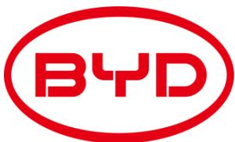
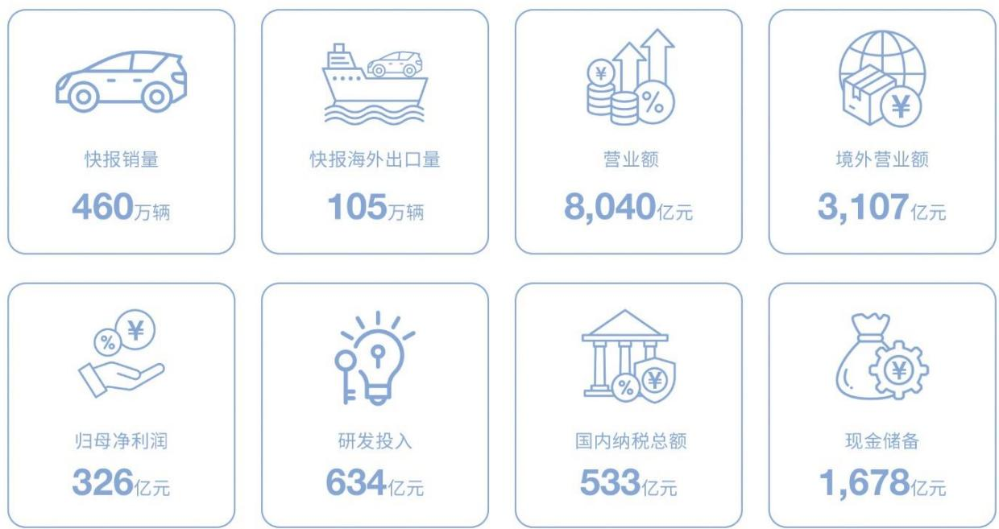
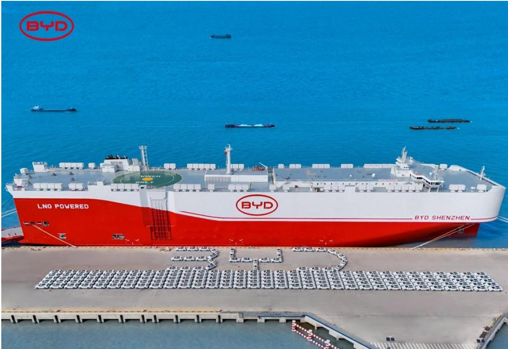
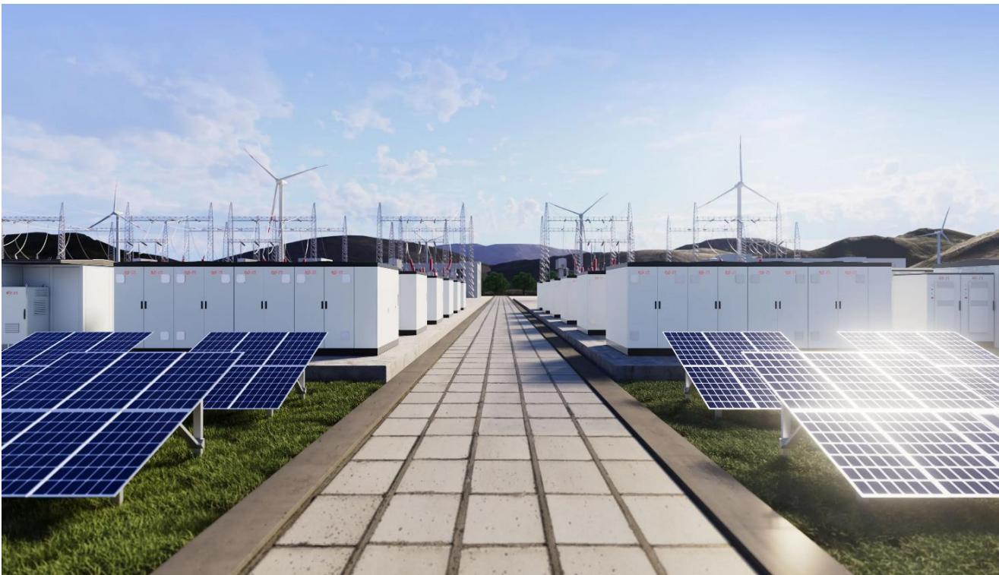
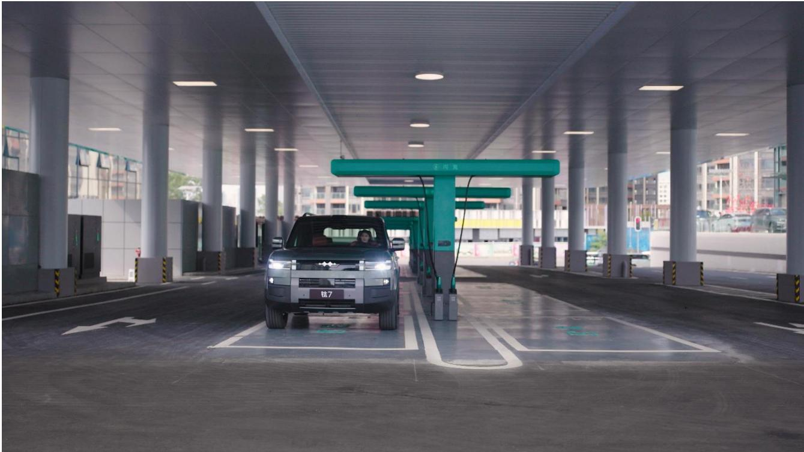
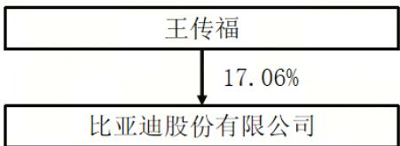

# 比亚迪股份有限公司

2025 年年度报告

2026 年 3 月

## 董事长致辞

## 向新出发，向高生长，向远而行

尊敬的各位股东、合作伙伴、各界朋友：

二零二五年，世界格局加速演变，全球汽车工业百年变革驶入深水区。面对愈加复杂多变的内外部环境，中国汽车工业顶住压力、奋力前行，全年产销再创历史新高，均超 3,400 万辆，连续十七年稳居世界第一。年内，新能源汽车国内新车销量占比历史性过半，也就是说每销售两辆新车中就有一辆是新能源。全年汽车出口同比增长超 21%，新能源汽车出口实现翻倍增长，核心竞争力持续跃升。从二零零九年登顶全球市场至今，中国汽车产业不仅实现了规模的持续领跑，更在新赛道中成功构筑了新的全球发展优势。

伴随中国汽车产业规模持续扩张、海外市场大爆发，二零二五年，比亚迪继续保持稳健增长，连续四年稳居全球新能源汽车销量榜首，连续三年全球汽车集团销量前十，并跻身全球汽车集团销量第五，较上一年度再提升一个名次。比亚迪汽车全年出口量首次突破百万，同比增长 1.4 倍，新能源汽车出口量位居全国首位，全球化发展迈上新台阶。同时，比亚迪品牌高端化也加快向上突破，仰望、腾势和方程豹全年销量近 40 万辆，占集团乘用车总销量比重较二零二四年取得了较大的提升。其中，仰望 U9X 跑出全球汽车极速和圈速双第一纪录，以极致技术重塑超豪华标杆；腾势 N9 三破高速避让世界纪录，将鱼钩测试驶入速度提升至 210km/h，以极致安全舒适赢得市场认可；方程豹全年销量同比增长 316%，凭借硬核性能与独特设计，让硬派越野电动车从小众走向大众。比亚迪通过技术创新和全球化双轮驱动，展现出强大的韧性和增长活力，也为全球汽车产业升级和绿色可持续发展注入强劲动能。

当然我们也看到，新能源汽车产业竞争已经白热化，正在经历残酷的“淘汰赛”。行业大变革期，新旧动能加速转换，技术一定唱主角。过去一年，比亚迪深耕“技术鱼池”，夯实技术创新这个根本，发展壮大新质生产力。针对上半场的电动化，为解决用户痛点，我们发布全球首个量产的乘用车全域千伏高压架构“超级 e 平台”，持续提升出行效率。针对下半场的智能化，通过整车智能战略，把智驾安全提到新高度；同时引领智能化普及，将“天神之眼”技术矩阵覆盖旗下五网四品牌，让好技术人人可享。以前我们用新能源汽车渗透率，衡量行业发展速度；现在还要用智能化，推动行业高质量发展。

中国汽车工业的电动化和智能化变革为中国品牌国际化发展带来机遇，也有利于促进世界汽车产业升级和“双碳”目标早日实现。二零二五年，比亚迪加快出海，新能源汽车运营足迹已遍布全球 119 个国家和地区，出海覆盖范围位居中国车企前列，市场呈现“拉美领跑、欧洲突破、亚太多点开花”的格局：拉美市场核心国家销量稳居前列，成为海外增长支柱；欧洲市场多点突破，在英、西、意、德、法等国实现倍数增长；东南亚及新兴市场表现强劲，成功跻身新加坡、泰国、印尼等国销量前三；中东市场精准对接高端出行需求，以特色打法收获优异口碑。同时，海外本地化建设也取得积极进展，多个基地进入投产或扩产新阶段。中国新能源汽车无论是技术、产品，还是产业链，都保持全球领先。这是中国品牌出海的黄金窗口期，我们要以更惊艳的技术和产品，在开放合作、取长补短中，满足全球消费者对美好生活的向往。

从中国到全球，比亚迪的每一步成长，都离不开所有股东的长期信任，离不开全球用户和产业链伙伴的鼎力支持，以及全体员工及其家属的付出。比亚迪将始终把股东和用户的长远利益置于公司战略的核心，以长期价值创造回应每一份托付与信任。二零二五年三月，我们成功完成 56 亿美元闪电配售，全球顶级长线投资者、主权基金及中东战略投资人纷纷参与，这份认可，既是对比亚迪业务发展和全球化布局的信心，更是对中国新能源产业未来的期许。二零二六年，基于公司经营现金流的实际情况及未来发展需要，董事会建议派发二零二五年末期股息每 10 股人民币 3.58 元（含税），以回馈广

大股东的坚定支持和厚爱。

  
注：现金储蓄包括但不限于：货币资金、交易性金融资产

二零二六年，是中国“十五五”规划开局之年，也是新能源汽车发展极其关键的一年。各企业都在积极探索，推动新进展。比亚迪作为新能源汽车引领者，坚信技术创新带来的增长才是最安全长久的，这也是比亚迪一贯的追求。我们坚持以技术为根、以出海为引擎，奋力向高生长、向远而行、向新出发，打造世界级的中国品牌。

“向高”是要以技术为根，驱动价值向上、品牌向上。从成立之日起，比亚迪就明确要以技术为立身之本，扎实沉淀技术。比亚迪依托超 12 万工程师组成的“技术天团”，将持续深化核心技术攻坚，加速技术成果转化与规模化落地，用更少的资源，让更高阶的技术，创造更高的用户价值、品牌价值和社会价值。二零二六年三月五日，我们发布第二代刀片电池和闪充技术，实现“常温充电，从 10%到 70%，仅需 5 分钟；从 10%到 97%，仅需 9 分钟；零下 30℃，从20%到97%仅需12 分钟”，创造全球量产最快充电速度新纪录，攻克电动化上半场“充电慢”和“低温充电难”的全球难题。同时，发布“闪充中国”战略，引领中国新能源汽车迈入闪充时代，助力电动化上半场完美收官。在智能化赛道上，我们以人工智能为引擎，加快“天神之眼”迭代升级；我们将推动 AI 深入研发、制造、服务与出行全场景，让科技更有温度，更可感知，更可信赖。同时，我们将坚持技术降本，通过全链条技术创新、材料革新与技术升级，实现核心部件持续降本、规模效应持续扩大，让高端技术不再昂贵，让绿色出行真正普惠。

“向远”，是要以全球化为引擎，积极打造世界级品牌。无论是品牌向上、还是出海发展，全球化是绕不开的路。特别是新能源汽车大势已定、趋势不可逆转，我们将充分利用两个市场、两种资源，携手全球产业链伙伴，打造具有本地品牌属性的产品，给全球消费者提供更多绿色技术和环保体验，同时让中国新能源汽车产业红利惠及全球更多同行，共同推进世界汽车向智能化、绿色化、融合化方向发展。我们的梦想很远大，也很朴素，归根到底就是用绿色的技术、创新的发展，给子孙后代带来幸福，为地球带来可持续发展。

“向新”，是要一步一个脚印，持续加强企业内生动力。我们的奋斗目标是要打造基业长青的百年老店，推动三大绿色梦想在全球开花结果。在产业方面，要坚守制造业，努力把生产制造的每一个环节都做到精细化，不断提质增效，推进绿色制造、低碳运营与生态保护，实现产业共赢与环境共生，肩负企业责任和义务。在人才方面，要大力完善员工激励机制，健全全球人才引、育、用、留体系，强化核心人才攻坚能力与青年人才战略储备，夯实企业发展最坚实的人才根基。在国际化方面，要以更长远的视野和更大格局，在关键核心技术上再突破，在新赛道上再快人一步，把绿色梦想推向全球。

惟向上者进，惟向远者胜，惟向新者强。让我们携手前行，以不懈的科技创新，加快把美好的愿望变成现实！谨向全体股东、全球合作伙伴和用户、全体员工，以及所有关心中国汽车工业发展的各界朋友，致以最深切的感激和最崇高的敬意！

比亚迪股份有限公司

董事长 王传福

2026 年 3 月 27 日

## 2025 年年度报告

## 第一节 重要提示、目录和释义

公司董事会及董事、高级管理人员保证年度报告内容的真实、准确、完整，不存在虚假记载、误导性陈述或重大遗漏，并承担个别和连带的法律责任。

公司负责人王传福、主管会计工作负责人周亚琳及会计机构负责人（会计主管人员）刘惠声明：保证本年度报告中财务报告的真实、准确、完整。

所有董事均已出席了审议本报告的董事会会议。

公司不存在对生产经营状况、财务状况和持续盈利能力有严重不利影响的有关风险因素。关于公司经营中可能面临的风险因素，详见本报告第三节管理层讨论与分析之第一项报告期内公司从事的主要业务、第二项报告期内公司所处行业情况及第十一项公司未来发展的展望。

公司经本次董事会审议通过的利润分配预案为：以 9,117,197,565 为基数，向全体股东每 10 股派发现金红利 3.58 元（含税），送红股 0 股（含税），不以公积金转增股本。

## 目录

第一节 重要提示、目录和释义. 5  
第二节 公司简介和主要财务指标.. 9  
第三节 管理层讨论与分析. 13  
第四节 公司治理、环境和社会 . 56  
第五节 重要事项... .. 81  
第六节 股份变动及股东情况 104  
第七节 债券相关情况. 113  
第八节 财务报告.... 117

## 备查文件目录

一、载有公司法定代表人签名的公司 2025 年年度报告及其摘要原文；

二、载有法定代表人王传福先生、主管会计工作负责人周亚琳女士及会计机构负责人刘惠女士签名并盖章的财务报表；

三、载有会计师事务所盖章、注册会计师签名并盖章的 2025年度审计报告；

四、报告期内在公司境内信息披露报纸上公开披露过的所有本公司文件的正本及公告的原稿；

五、在香港联合交易所有限公司网站公布的公司 2025 年年报。

## 释义

<table><tr><td rowspan=1 colspan=1>释义项</td><td rowspan=1 colspan=1>指</td><td rowspan=1 colspan=1>释义内容</td></tr><tr><td rowspan=1 colspan=1>本公司、公司、比亚迪</td><td rowspan=1 colspan=1>指</td><td rowspan=1 colspan=1>比亚迪股份有限公司</td></tr><tr><td rowspan=1 colspan=1>本集团、集团</td><td rowspan=1 colspan=1>指</td><td rowspan=1 colspan=1>比亚迪股份有限公司及其附属公司</td></tr><tr><td rowspan=1 colspan=1>报告期</td><td rowspan=1 colspan=1>指</td><td rowspan=1 colspan=1>2025年01月01日至2025年12月31日</td></tr></table>

## 第二节 公司简介和主要财务指标

## 一、公司信息

<table><tr><td rowspan=1 colspan=1>股票简称</td><td rowspan=1 colspan=1>比亚迪（A股）、比亚迪股份（H股)</td><td rowspan=1 colspan=1>股票代码</td><td rowspan=1 colspan=1>002594、01211、81211</td></tr><tr><td rowspan=1 colspan=1>股票上市证券交易所</td><td rowspan=1 colspan=3>深圳证券交易所、香港联合交易所有限公司</td></tr><tr><td rowspan=1 colspan=1>公司的中文名称</td><td rowspan=1 colspan=3>比亚迪股份有限公司</td></tr><tr><td rowspan=1 colspan=1>公司的中文简称</td><td rowspan=1 colspan=3>比亚迪</td></tr><tr><td rowspan=1 colspan=1>公司的外文名称</td><td rowspan=1 colspan=3>BYD COMPANY LIMITED</td></tr><tr><td rowspan=1 colspan=1>公司的外文名称缩写</td><td rowspan=1 colspan=3>BYD</td></tr><tr><td rowspan=1 colspan=1>公司的法定代表人</td><td rowspan=1 colspan=3>王传福</td></tr><tr><td rowspan=1 colspan=1>注册地址</td><td rowspan=1 colspan=3>深圳市大鹏新区葵涌街道延安路一号</td></tr><tr><td rowspan=1 colspan=1>注册地址的邮政编码</td><td rowspan=1 colspan=3>518119</td></tr><tr><td rowspan=1 colspan=1>公司注册地址历史变更情况</td><td rowspan=1 colspan=3>公司注册地址未曾变更</td></tr><tr><td rowspan=1 colspan=1>办公地址</td><td rowspan=1 colspan=3>深圳市坪山区比亚迪路3009 号</td></tr><tr><td rowspan=1 colspan=1>办公地址的邮政编码</td><td rowspan=1 colspan=3>518118</td></tr><tr><td rowspan=1 colspan=1>公司网址</td><td rowspan=1 colspan=3>www.bydglobal.com</td></tr><tr><td rowspan=1 colspan=1>电子信箱</td><td rowspan=1 colspan=3>db@byd.com</td></tr></table>

## 二、联系人和联系方式

<table><tr><td rowspan=1 colspan=1></td><td rowspan=1 colspan=1>董事会秘书</td><td rowspan=1 colspan=1>证券事务代表</td></tr><tr><td rowspan=1 colspan=1>姓名</td><td rowspan=1 colspan=1>李黔</td><td rowspan=1 colspan=1>程燕/吴越</td></tr><tr><td rowspan=1 colspan=1>联系地址</td><td rowspan=1 colspan=1>深圳市坪山区比亚迪路3009 号</td><td rowspan=1 colspan=1>深圳市坪山区比亚迪路3009 号</td></tr><tr><td rowspan=1 colspan=1>电话</td><td rowspan=1 colspan=1>（+86）755-8988 8888-62126</td><td rowspan=1 colspan=1>（+86）755-8988 8888-62126</td></tr><tr><td rowspan=1 colspan=1>传真</td><td rowspan=1 colspan=1>（+86）755-8420 2222</td><td rowspan=1 colspan=1>（+86）755-8420 2222</td></tr><tr><td rowspan=1 colspan=1>电子信箱</td><td rowspan=1 colspan=1>db@byd.com</td><td rowspan=1 colspan=1>db@byd.com</td></tr></table>

## 三、信息披露及备置地点

<table><tr><td rowspan=1 colspan=1>公司披露年度报告的证券交易所网站</td><td rowspan=1 colspan=1>深圳证券交易所网站（www.szse.cn）、香港联合交易所有限公司网站（www.hkexnews.hk）</td></tr><tr><td rowspan=1 colspan=1>公司披露年度报告的媒体名称及网址</td><td rowspan=1 colspan=1>《证券时报》、《中国证券报》、《上海证券报》、《证券日报》及巨潮资讯网（www.cninfo.com.cn）</td></tr><tr><td rowspan=1 colspan=1>公司年度报告备置地点</td><td rowspan=1 colspan=1>公司董事会办公室</td></tr></table>

## 四、注册变更情况

<table><tr><td>统一社会信用代码</td><td>91440300192317458F</td></tr><tr><td>公司上市以来主营业务的变化情况</td><td>2012 年2月13日公司经营范围变更为：锂离子电池以及其他电池、充电器、 电子产品、仪器仪表、柔性线路板、五金制品、液晶显示器、手机零配件、模</td></tr><tr><td></td><td>具、塑胶制品及其相关附件的生产、销售；道路普通货运（道路运输经营许可 证有效期至 2012年9月30日）；3D 眼镜、GPS导航产品的研发、生产及销 售；货物及技术进出口（不含分销、国家专营专控商品）；作为比亚迪汽车有 限公司比亚迪品牌乘用车、电动车的总经销商，从事上述品牌的乘用车、电动 车及其零部件的营销、批发和出口，提供售后服务。 2012 年9月17日公司经营范围变更为：锂离子电池以及其他电池、充电器、 电子产品、仪器仪表、柔性线路板、五金制品、液晶显示器、手机零配件、模 具、塑胶制品及其相关附件的生产、销售；道路普通货运（道路运输经营许可 证有效期至 2016 年8月15日）；3D 眼镜、GPS 导航产品的研发、生产及销 售；货物及技术进出口（不含分销、国家专营专控商品）；作为比亚迪汽车有 限公司比亚迪品牌乘用车、电动车的总经销商，从事上述品牌的乘用车、电动 车及其零部件的营销、批发和出口，提供售后服务；电池管理系统、换流柜、 逆变柜/器、汇流箱、开关柜、储能机组的销售。 2016 年9月30日公司经营范围变更为：锂离子电池以及其他电池、充电器、 电子产品、仪器仪表、柔性线路板、五金制品、液晶显示器、手机零配件、模 具、塑胶制品及其相关附件的生产、销售；3D 眼镜、GPS 导航产品的研发、生 产及销售；货物及技术进出口（不含分销、国家专营专控商品）；作为比亚迪 汽车有限公司比亚迪品牌乘用车、电动车的总经销商，从事上述品牌的乘用 车、电动车及其零部件的营销、批发和出口，提供售后服务；电池管理系统、 换流柜、逆变柜/器、汇流箱、开关柜、储能机组的销售。 2017年5月18日公司经营范围变更为：锂离子电池以及其他电池、充电器、 电子产品、仪器仪表、柔性线路板、五金制品、液晶显示器、手机零配件、模 具、塑胶制品及其相关附件的生产、销售；3D 眼镜、GPS 导航产品的研发、生 产及销售；货物及技术进出口（不含分销、国家专营专控商品）；作为比亚迪 汽车有限公司比亚迪品牌乘用车、电动车的总经销商，从事上述品牌的乘用 车、电动车及其零部件的营销、批发和出口，提供售后服务；电池管理系统、</td></tr><tr><td></td><td>换流柜、逆变柜/器、汇流箱、开关柜、储能机组的销售；汽车电子装置研 发、销售；新能源汽车关键零部件研发以及上述零部件的关键零件、部件的研 发、销售；轨道交通运输设备（含轨道交通车辆、工程机械、各类机电设备、 电子设备及零部件、电子电气件、轨道交通信号系统、通信及综合监控系统与 设备）的研发、设计、销售、租赁与售后服务（不涉及国营贸易管理商品，涉 及配额、许可证管理及其他专项管理的商品，按国家有关规定办理申请）；轨 道梁柱的研发、设计、销售；自有物业租赁（物业位于大鹏新区葵涌街道延安 路一号比亚迪工业园内及龙岗区龙岗街道宝龙工业城宝荷路 3001 号比亚迪工</td></tr><tr><td>历次控股股东的变更情况</td><td>业园内）；广告设计、制作、代理及发布；信息与技术咨询、技术服务。</td></tr></table>

## 五、其他有关资料

公司聘请的会计师事务所

<table><tr><td rowspan=1 colspan=1>会计师事务所名称</td><td rowspan=1 colspan=1>安永华明会计师事务所（特殊普通合伙）</td></tr><tr><td rowspan=1 colspan=1>会计师事务所办公地址</td><td rowspan=1 colspan=1>北京市东城区东长安街1号东方广场安永大楼17层01-12 室</td></tr><tr><td rowspan=1 colspan=1>签字会计师姓名</td><td rowspan=1 colspan=1>李剑光、胡蝶</td></tr></table>

公司聘请的报告期内履行持续督导职责的保荐机构

□适用 不适用

公司聘请的报告期内履行持续督导职责的财务顾问

□适用 不适用

## 六、主要会计数据和财务指标

公司是否需追溯调整或重述以前年度会计数据

□是 否

<table><tr><td rowspan=1 colspan=1></td><td rowspan=1 colspan=1>2025年</td><td rowspan=1 colspan=1>2024年</td><td rowspan=1 colspan=1>本年比上年增减</td><td rowspan=1 colspan=1>2023年</td></tr><tr><td rowspan=1 colspan=1>营业收入（元)</td><td rowspan=1 colspan=1>803,964,958,000.00</td><td rowspan=1 colspan=1>777,102,455,000.00</td><td rowspan=1 colspan=1>3.46%</td><td rowspan=1 colspan=1>602,315,354,000.00</td></tr><tr><td rowspan=1 colspan=1>归属于上市公司股东的净利润（元）</td><td rowspan=1 colspan=1>32,619,022,000.00</td><td rowspan=1 colspan=1>40,254,346,000.00</td><td rowspan=1 colspan=1>-18.97%</td><td rowspan=1 colspan=1>30,040,811,000.00</td></tr><tr><td rowspan=1 colspan=1>归属于上市公司股东的扣除非经常性损益的净利润（元)</td><td rowspan=1 colspan=1>29,445,703,000.00</td><td rowspan=1 colspan=1>36,982,887,000.00</td><td rowspan=1 colspan=1>-20.38%</td><td rowspan=1 colspan=1>28,462,432,000.00</td></tr><tr><td rowspan=1 colspan=1>经营活动产生的现金流量净额（元）</td><td rowspan=1 colspan=1>59,135,544,000.00</td><td rowspan=1 colspan=1>133,453,873,000. 00</td><td rowspan=1 colspan=1>-55.69%</td><td rowspan=1 colspan=1>169,725,025,000.00</td></tr><tr><td rowspan=1 colspan=1>基本每股收益(元/股)</td><td rowspan=1 colspan=1>3.58</td><td rowspan=1 colspan=1>4.61</td><td rowspan=1 colspan=1>-22.34%</td><td rowspan=1 colspan=1>3.44</td></tr><tr><td rowspan=1 colspan=1>稀释每股收益（元/股)</td><td rowspan=1 colspan=1>3.58</td><td rowspan=1 colspan=1>4.61</td><td rowspan=1 colspan=1>-22.34%</td><td rowspan=1 colspan=1>3.44</td></tr><tr><td rowspan=1 colspan=1>加权平均净资产收益率</td><td rowspan=1 colspan=1>15.31%</td><td rowspan=1 colspan=1>26.05%</td><td rowspan=1 colspan=1>-10.74%</td><td rowspan=1 colspan=1>24.40%</td></tr><tr><td rowspan=1 colspan=1></td><td rowspan=1 colspan=1>2025年末</td><td rowspan=1 colspan=1>2024年末</td><td rowspan=1 colspan=1>本年末比上年末增减</td><td rowspan=1 colspan=1>2023年末</td></tr><tr><td rowspan=1 colspan=1>总资产（元）</td><td rowspan=1 colspan=1>883,729,883,000.00</td><td rowspan=1 colspan=1>783,355,855,000.00</td><td rowspan=1 colspan=1>12.81%</td><td rowspan=1 colspan=1>679,547,670,000. 00</td></tr><tr><td rowspan=1 colspan=1>归属于上市公司股东的净资产（元）</td><td rowspan=1 colspan=1>246,274,606,000.00</td><td rowspan=1 colspan=1>185,251,104,000.00</td><td rowspan=1 colspan=1>32.94%</td><td rowspan=1 colspan=1>138,810,065,000.00</td></tr></table>

注：于2025年7 月，本公司派发股票股利 2,431,252,684 股，资本公积转增股本3,646,879,026 股，派发后的发行在外普通股股数为9,117,197,565 股。因此，以调整后的股数为基础计算各列报期间的每股收益。

公司最近三个会计年度扣除非经常性损益前后净利润孰低者均为负值，且最近一年审计报告显示公司持续经营能力存在不确定性

□是 否

扣除非经常损益前后的净利润孰低者为负值

□是 否

## 七、境内外会计准则下会计数据差异

## 1、同时按照国际会计准则与按照中国会计准则披露的财务报告中净利润和净资产差异情况

□适用  不适用

公司报告期不存在按照国际会计准则与按照中国会计准则披露的财务报告中净利润和净资产差异情况。

## 2、同时按照境外会计准则与按照中国会计准则披露的财务报告中净利润和净资产差异情况

□适用  不适用

公司报告期不存在按照境外会计准则与按照中国会计准则披露的财务报告中净利润和净资产差异情况。

## 八、分季度主要财务指标

单位：元

上述财务指标或其加总数是否与公司已披露季度报告、半年度报告相关财务指标存在重大差异
<table><tr><td colspan="1" rowspan="1"></td><td colspan="1" rowspan="1">第一季度</td><td colspan="1" rowspan="1">第二季度</td><td colspan="1" rowspan="1">第三季度</td><td colspan="1" rowspan="1">第四季度</td></tr><tr><td colspan="1" rowspan="1">营业收入</td><td colspan="1" rowspan="1">170,360,448,000.00</td><td colspan="1" rowspan="1">200,920,500,000.00</td><td colspan="1" rowspan="1">194,984,598,000.00</td><td colspan="1" rowspan="1">237,699,412,000.00</td></tr><tr><td colspan="1" rowspan="1">归属于上市公司股东</td><td colspan="1" rowspan="1">9,154,985,000.00</td><td colspan="1" rowspan="1">6,355,548,000.00</td><td colspan="1" rowspan="1">7,822,640,000.00</td><td colspan="1" rowspan="1">9,285,849,000.00</td></tr><tr><td colspan="1" rowspan="1">的净利润</td><td colspan="1" rowspan="1"></td><td colspan="1" rowspan="1"></td><td colspan="1" rowspan="1"></td><td colspan="1" rowspan="1"></td></tr><tr><td colspan="1" rowspan="1">归属于上市公司股东的扣除非经常性损益的净利润</td><td colspan="1" rowspan="1">8,171,627,000.00</td><td colspan="1" rowspan="1">5,428,114,000.00</td><td colspan="1" rowspan="1">6,890,751,000.00</td><td colspan="1" rowspan="1">8,955,211,000.00</td></tr><tr><td colspan="1" rowspan="1">经营活动产生的现金流量净额</td><td colspan="1" rowspan="1">8,580,961,000.00</td><td colspan="1" rowspan="1">23,252,510,000.00</td><td colspan="1" rowspan="1">9,012,027,000.00</td><td colspan="1" rowspan="1">18,290,046,000.00</td></tr></table>

□是 否

## 九、非经常性损益项目及金额

适用 □不适用

单位：元

<table><tr><td rowspan=1 colspan=1>项目</td><td rowspan=1 colspan=1>2025年金额</td><td rowspan=1 colspan=1>2024年金额</td><td rowspan=1 colspan=1>2023年金额</td><td rowspan=1 colspan=1>说明</td></tr><tr><td rowspan=1 colspan=1>非流动性资产处置损益（包括已计提资产减值准备的冲销部分）</td><td rowspan=1 colspan=1>-752,916,000.00</td><td rowspan=1 colspan=1>-1,691,127,000.00</td><td rowspan=1 colspan=1>-1,022,447,000.00</td><td rowspan=1 colspan=1></td></tr><tr><td rowspan=1 colspan=1>计入当期损益的政府补助（与公司正常经营业务密切相关，符合国家政策规定、按照确定的标准享有、对公司损益产生持续影响的政府补助除外)</td><td rowspan=1 colspan=1>2,512,971,000.00</td><td rowspan=1 colspan=1>3,780,737,000.00</td><td rowspan=1 colspan=1>2,187,382,000.00</td><td rowspan=1 colspan=1></td></tr><tr><td rowspan=1 colspan=1>除同公司正常经营业务相关的有效套期保值业务外，非金融企业持有金融资产和金融负债产生的公允价值变动损益以及处置金融资产和金融负债产生的损益</td><td rowspan=1 colspan=1>1,913,354,000.00</td><td rowspan=1 colspan=1>1,294,357,000.00</td><td rowspan=1 colspan=1>584,169,000.00</td><td rowspan=1 colspan=1></td></tr><tr><td rowspan=1 colspan=1>单独进行减值测试的应收款项减值准备转回</td><td rowspan=1 colspan=1>9,903,000.00</td><td rowspan=1 colspan=1>38,903,000.00</td><td rowspan=1 colspan=1>26,167,000.00</td><td rowspan=1 colspan=1></td></tr><tr><td rowspan=1 colspan=1>除上述各项之外的其他营业外收入和支出</td><td rowspan=1 colspan=1>451,696,000.00</td><td rowspan=1 colspan=1>826,352,000.00</td><td rowspan=1 colspan=1>307,964,000.00</td><td rowspan=1 colspan=1></td></tr><tr><td rowspan=1 colspan=1>减：所得税影响额</td><td rowspan=1 colspan=1>674,811,000.00</td><td rowspan=1 colspan=1>802,702,000.00</td><td rowspan=1 colspan=1>407,457,000. 00</td><td rowspan=1 colspan=1></td></tr><tr><td rowspan=1 colspan=1>少数股东权益影响额（税后）</td><td rowspan=1 colspan=1>286,878,000.00</td><td rowspan=1 colspan=1>175,061,000.00</td><td rowspan=1 colspan=1>97,399,000.00</td><td rowspan=1 colspan=1></td></tr><tr><td rowspan=1 colspan=1>合计</td><td rowspan=1 colspan=1>3,173,319,000. 00</td><td rowspan=1 colspan=1>3,271,459,000.00</td><td rowspan=1 colspan=1>1,578,379,000. 00</td><td rowspan=1 colspan=1></td></tr></table>

其他符合非经常性损益定义的损益项目的具体情况：

□适用  不适用

公司不存在其他符合非经常性损益定义的损益项目的具体情况。

将《公开发行证券的公司信息披露解释性公告第 1 号——非经常性损益》中列举的非经常性损益项目界定为经常性损益项目的情况说明

□适用  不适用

公司不存在将《公开发行证券的公司信息披露解释性公告第 1 号——非经常性损益》中列举的非经常性损益项目界定为经常性损益的项目的情形。

## 第三节 管理层讨论与分析

## 一、报告期内公司从事的主要业务

公司需遵守《深圳证券交易所上市公司自律监管指引第 3 号——行业信息披露》中汽车制造相关业的披露要求

本集团主要从事新能源汽车业务，手机部件及组装业务，二次充电电池及光伏业务，同时利用自身的技术优势拓展城市轨道交通业务领域。

作为全球新能源汽车行业先行者和领导者，本集团凭借在汽车电动化及智能化等关键领域的雄厚技术积累，通过技术的持续创新，打造出长期、可持续的核心竞争优势，夯实了本集团于全球新能源汽车行业的领导地位，加速推动全球汽车产业转型升级进程。

本集团为全球领先的二次充电电池制造商之一。消费类电池领域，本集团生产的锂离子电池广泛应用于各类消费类电子产品及新型智能产品领域。动力电池领域，本集团开发了高度安全的磷酸铁锂电池—“刀片电池”，更好地解决市场安全痛点，加速磷酸铁锂电池重回动力电池主流赛道，助力全球新能源汽车产业行稳致远。储能电池领域，本集团在电源侧储能、电网储能、工商业储能、家庭储能等应用领域发力，为客户提供更加清洁可持续的储能解决方案。

光伏业务作为本集团在清洁能源领域的重要布局之一，致力于用清洁能源改变人类生活方式，以实现能源的可持续发展为目标，拥有硅片、电池片、光伏组件、光伏系统应用等全产业链布局。本集团将继续积极布局新技术，推动产品不断升级。

作为全球领先的高科技创新产品提供商，本集团业务广泛，涵盖智能终端、AI算力基础设施等多元化领域，依托电子信息技术、人工智能技术、5G和物联网技术、热管理技术、新材料技术、精密模具技术和数字化制造技术等核心优势，以及高效规模化的生产经验和丰富的产品组合，为全球客户提供一站式产品解决方案。

凭借在新能源业务领域建立的技术和成本优势，本集团在城市轨道交通领域成功研发出高效率、低成本的中运量“云轨”和低运量“云巴”产品，配合新能源汽车实现对城市公共交通的立体化覆盖，在帮助城市解决交通拥堵和空气污染的同时，实现本集团的长远及可持续发展。

报告期内整车制造生产经营情况

 适用 □不适用

整车产品产销情况

单位：辆

<table><tr><td colspan="1" rowspan="2"></td><td colspan="3" rowspan="1">快报产量</td><td colspan="3" rowspan="1">快报销量</td></tr><tr><td colspan="1" rowspan="1">本报告期</td><td colspan="1" rowspan="1">上年同期</td><td colspan="1" rowspan="1">与上年同比增减</td><td colspan="1" rowspan="1">本报告期</td><td colspan="1" rowspan="1">上年同期</td><td colspan="1" rowspan="1">与上年同比增减</td></tr><tr><td colspan="7" rowspan="1">按车型类别</td></tr><tr><td colspan="1" rowspan="1">-乘用车</td><td colspan="1" rowspan="1">4,479,392</td><td colspan="1" rowspan="1">4,281,084</td><td colspan="1" rowspan="1">4.63%</td><td colspan="1" rowspan="1">4,545,423</td><td colspan="1" rowspan="1">4,250,370</td><td colspan="1" rowspan="1">6.94%</td></tr><tr><td colspan="1" rowspan="1">-轿车</td><td colspan="1" rowspan="1">2,258,530</td><td colspan="1" rowspan="1">2,370,709</td><td colspan="1" rowspan="1">-4.73%</td><td colspan="1" rowspan="1">2,290,292</td><td colspan="1" rowspan="1">2,358,032</td><td colspan="1" rowspan="1">-2.87%</td></tr><tr><td colspan="1" rowspan="1">-SUV</td><td colspan="1" rowspan="1">2,049,129</td><td colspan="1" rowspan="1">1,805,441</td><td colspan="1" rowspan="1">13.50%</td><td colspan="1" rowspan="1">2,080,625</td><td colspan="1" rowspan="1">1,788,787</td><td colspan="1" rowspan="1">16.31%</td></tr><tr><td colspan="1" rowspan="1">-MPV</td><td colspan="1" rowspan="1">171,733</td><td colspan="1" rowspan="1">104,934</td><td colspan="1" rowspan="1">63.66%</td><td colspan="1" rowspan="1">174,506</td><td colspan="1" rowspan="1">103,551</td><td colspan="1" rowspan="1">68.52%</td></tr><tr><td colspan="1" rowspan="1">-商用车</td><td colspan="1" rowspan="1">57,964</td><td colspan="1" rowspan="1">22,989</td><td colspan="1" rowspan="1">152.14%</td><td colspan="1" rowspan="1">57,013</td><td colspan="1" rowspan="1">21,775</td><td colspan="1" rowspan="1">161.83%</td></tr><tr><td colspan="1" rowspan="1">-客车</td><td colspan="1" rowspan="1">4,923</td><td colspan="1" rowspan="1">5,580</td><td colspan="1" rowspan="1">-11. 77%</td><td colspan="1" rowspan="1">4,923</td><td colspan="1" rowspan="1">5,580</td><td colspan="1" rowspan="1">-11. 77%</td></tr><tr><td colspan="1" rowspan="1">-其他</td><td colspan="1" rowspan="1">53,041</td><td colspan="1" rowspan="1">17,409</td><td colspan="1" rowspan="1">204.68%</td><td colspan="1" rowspan="1">52,090</td><td colspan="1" rowspan="1">16,195</td><td colspan="1" rowspan="1">221.64%</td></tr><tr><td colspan="1" rowspan="1">合计</td><td colspan="1" rowspan="1">4,537,356</td><td colspan="1" rowspan="1">4,304,073</td><td colspan="1" rowspan="1">5.42%</td><td colspan="1" rowspan="1">4,602,436</td><td colspan="1" rowspan="1">4,272,145</td><td colspan="1" rowspan="1">7.73%</td></tr></table>

同比变化 30%以上的原因说明

适用 □不适用

报告期内，分车型类别产销量数据发生变化主要是公司业务增长以及产品结构变化所致。

零部件配套体系建设情况

公司在零部件供应链体系建设上，始终坚持垂直整合的战略方向，牢牢掌控电池、电机、电控及芯片等新能源车全产业链核心产品部件的自主研发和生产，未来还将持续加大研发投入，推动公司供应链持续自主创新发展；同时，公司坚持以市场化竞争激发供应链活力，打造内外竞争的开放生态，秉持合作共赢、扶优扶强的原则，发展业界领先、优势互补的核心及战略供应商，形成协同发展的伙伴关系，共存共荣，共同促进行业技术创新升级，从而最终提升公司整车的产品竞争力，从技术、质量、成本、交付、风险等多维度订制完善的供应商准入制度，高标准、严要求建设汽车供应链体系。

报告期内汽车零部件生产经营情况

适用  不适用

公司开展汽车金融业务

□适用  不适用

公司开展新能源汽车相关业务

 适用 □不适用

新能源汽车整车及零部件的生产经营情况

<table><tr><td rowspan=1 colspan=1>产品类别</td><td rowspan=1 colspan=1>产能状况</td><td rowspan=1 colspan=1>快报产量</td><td rowspan=1 colspan=1>快报销量</td><td rowspan=1 colspan=1>销售收入（元）</td></tr><tr><td rowspan=1 colspan=1>乘用车</td><td rowspan=1 colspan=1>4,479,392</td><td rowspan=1 colspan=1>4,479,392</td><td rowspan=1 colspan=1>4,545,423</td><td rowspan=1 colspan=1>541,917,643,000.00</td></tr><tr><td rowspan=1 colspan=1>商用车</td><td rowspan=1 colspan=1>57,964</td><td rowspan=1 colspan=1>57,964</td><td rowspan=1 colspan=1>57,013</td><td rowspan=1 colspan=1>11,780,683,000.00</td></tr></table>

注:产能状况指报告期产量，单位为辆。

## 二、报告期内公司所处行业情况

公司需遵守《深圳证券交易所上市公司自律监管指引第 3 号——行业信息披露》中汽车制造相关业的披露要求

## 1.行业分析及回顾

## 1.1 汽车及电池业务

二零二五年，全球经济在通胀压力边际缓解、贸易摩擦阶段性缓和的支撑下呈现一定韧性，但受全球投资持续低迷、主要经济体财政空间受限等结构性制约，整体增长动能偏弱，复苏格局分化明显。面对复杂严峻的外部环境，中国政府实施积极有为的宏观政策，有力对冲外部风险，在不确定性中稳住了经济基本盘、夯实了发展根基。尽管国内经济转型过程中，供需结构性矛盾依然突出、重点领域风险隐患仍需持续化解、经济运行面临不少老问题与新挑战，但中国经济顶压前行、向新向优发展。据国家统计局数据，全年国内生产总值人民币 140.19 万亿元，同比增长 5.0%，“十四五”规划圆满收官。

二零二五年，中国汽车行业顶住贸易保护和全球产业链重构等外部压力，克服技术攻关难题、行业竞争加剧等多重挑战，在政策赋能与技术升级双轮驱动下，展现出强大的发展韧性和活力，实现了产业规模与发展质量的双提升。国家以旧换新及设备更新（「两新」）政策有效释放内需潜力，安全规范体系持续完善，电动化技术加速落地带动产品全面迭代。

根据中国汽车工业协会数据，二零二五年中国汽车产销分别达到 3,453.1 万辆和 3,440 万辆，同比分别增长 10.4%与 9.4%，产销规模再创历史新高，并连续 17 年位居全球首位。其中，中国新能源汽车继续领跑市场，产销分别达 1,662.6 万辆和1,649 万辆，同比分别增长 29%和 28.2%，连续十一年蝉联全球第一；新能源汽车国内渗透率突破 50%，成为了中国汽车市场主导力量，产业新动能加速释放。

中国自主品牌搭乘新能源崛起的浪潮，凭借科技创新与智能化应用双重驱动，并依托更完整的产业链，不断提升产品竞争力与市场认同度，发展强势，领跑新能源汽车市场。根据中国汽车工业协会的数据，二零二五年中国自主品牌乘用车市场份额达到 69.5%，较去年同期增长 4.3 个百分点。在国内市场实现规模突破的同时，行业竞争格局深度调整带来的挑战不容忽视。新老交替进程加快的大背景下，市场博弈异常激烈，价格竞争加剧，营销过度现象频发，产业盈利空间受到挤压，发展面临阶段性不利影响。面对复杂的市场环境，汽车行业积极响应国家关于规范行业竞争秩序、推动高质量发展的相关决策部署。国内汽车市场正从单纯追求规模扩张为主，转向更加注重质量效益的内涵式发展。

与此同时，海外市场成为拉动汽车行业增长的重要新引擎。据中国汽车工业协会数据，二零二五年中国汽车出口量连续三年全球第一，实现销量 709.8 万辆，同比增长 21.1%。其中，新能源汽车凭借强大的硬实力，国际影响力持续提升，全年出口 261.5 万辆，同比实现翻倍增长。新能源汽车出口也已不再局限于整车贸易，而是通过品牌全球化和运营本土化等新模式，在全球深化拓展。

二零二五年亦是人工智能（Artificial Intelligence，简称“AI”）高速演进的一年，算法、大模型与算力体系持续成熟，推动 AI 与各行各业深度融合，成为科技产业增长的核心引擎，亦重塑汽车产业格局。在新能源汽车领域，AI 已从概念热度走向规模化落地，智能驾驶呈现「向下普及、向上突破」的双向加速态势，既在大众市场快速渗透，也在高阶技术上持续突破。AI 赋能已超越智能驾驶单一场景，全面渗透至研发、制造、供应链、服务与能源管理等全产业链环节，成为决定车企未来竞争力、效率边界与价值创造能力的关键要素。

作为我国从汽车制造大国迈向汽车强国的关键战略支点，新能源汽车产业同时承担着推动科技革新、产业协同及全球低碳转型的重要使命。电动化构筑了规模化的产业基础，智能化则开启了价值创造的新维度，协同发力推动产业向全球价值量高端跃升，其持续向好发展离不开国家政策的精准赋能。二零二五年，国家围绕新能源汽车产业推出多项针对性举措，构建起「消费激励、技术升级、基础设施完善、合规监管」四位一体的政策体系。一月，国家发改委及财政部发布《关于2025 年加力扩围实施大规模设备更新和消费品以旧换新政策的通知》；同月，商务部等八部门办公厅联合印发《关于做好2025 年汽车以旧换新工作的通知》，明确补贴范围与标准，加大政策及超长期特别国债支持力度；四月，工业和信息化部组织制定的强制性国家标准《电动汽车用动力蓄电池安全要求》（GB 38031—2025）发布，将于二零二六年七月起开始实施，该标准有利于保障消费者生命财产安全、助力先进安全技术应用、支撑产业高质量发展、加强全球范围经贸合作；六月，工信部等五部门发布的《关于开展 2025 年新能源汽车下乡活动的通知》正式实施；九月，工业和信息化部等八部门印发《汽车行业稳增长工作方案（2025—2026 年）》，着力扩大国内消费、提升供给质量、优化产业环境，并加快智能网联新能源汽车发展；十月，工业和信息化部、财政部及税务总局联合印发《关于 2026—2027 年减免车辆购置税新能源汽车产品技术要求的公告》，提高插电式混动车型纯电续航里程要求以引导技术升级；同月，国家发展改革委等部门联合印发《电动汽车充电设施服务能力“三年倍增”行动方案（2025—2027 年）》，通过持续健全充电网络、提升充电效能、优化服务品质、创新产业生态，进一步提振消费信心，促进电动汽车更大范围内购置使用；十二月，国家市场监督管理总局发布《汽车行业价格行为合规指南（征求意见稿）》，规范行业定价、遏制恶性竞争，同月，商务部等八部门联合发布《2026 年汽车以旧换新补贴实施细则》，优化补贴方式、扩大补贴范围，为后续消费激励奠定基础。当月，中央经济工作会议明确稳中求进、提质增效总基调，将坚持内需主导、建设强大国内市场置于重点任务首位，围绕扩大汽车大宗消费、推动产业高质量发展、规范市场竞争秩序、强化科技创新与绿色转型作出系统部署，为汽车行业营造稳定可预期的政策环境，继续指引行业由规模扩张转向质量提升。

二次充电电池方面，二零二五年，在全球宏观经济环境不稳与消费信心疲弱的双重影响下，消费电子行业承受一定压力，整体市场动能放缓。然而，受益于全球数字化转型加速、AI 应用全面扩张以及中国「国补」政策对终端消费市场的有效提振，电子产品迎来以性能演进为核心的结构性升级周期，手机、平板等品类逐步回暖，市场整体保持相对稳定。储能方面，二零二五年，储能产业正经历从「规模扩张」向「价值创造」的深刻变革。随着全球多国不断完善政策体系、能源结构转型持续加速，加之前沿 AI 算力需求爆发、数据中心高速建设、电力基础设施扩容空间不断扩大，国内外储能需求呈现快速上升态势，全球储能市场步入爆发式增长新周期，产业规模持续扩大。光伏方面，虽仍面临产能过剩、需求错配及低价竞争交织的「内卷」压力，但在国家「双碳」目标的持续引领下，光伏产品长期需求得到坚实支撑。二零二五年全球光伏装机量继续保持稳健增长，产业整体规模不断拓展，绿色能源转型趋势愈发清晰。

## 1.2 手机部件及组装业务

AI 与物联网等新兴技术的深度融合正重塑全球科技格局，推动智能终端应用场景拓展与市场升级。然而﹐在宏观经济环境不稳与消费信心疲弱的双重影响下，整体市场动能放缓。期内，在关税波动、供应链扰动以及多国宏观经济承压等挑战下，智能手机实现温和增长。根据市场研究机构 IDC 的统计，二零二五年，全球智能手机出货量同比上升 1.9%至 12.6亿部，全球 PC 市场出货量上升 8.1%至 2.85 亿部。Omdia 的数据显示，二零二五年全球平板电脑出货量约 1.62 亿部，同比上升 9.8%。

随着 AI 产业的发展重心正从模型训练逐渐转向推理应用，超大规模数据中心和云服务供应商正加大投入，开启新一轮应用端布局，全球 AI 算力基础设施建设进入加速期，推动服务器、液冷、电源及高速互联产品等市场快速扩张。GlobalMarket Insights 预测，二零二五年全球 AI 服务器市场规模达 1,672 亿美元，按年增长 30.6%。高功率芯片与算力增长带来散热与能耗挑战，散热技术已成为算力发展的核心瓶颈，液冷技术凭借高效散热与节能低碳的优势，正逐步成为数据中心冷却的必然选择。MarketsandMarkets 预计，二零二五年全球数据中心液冷市场规模将达 28.4 亿美元，同比增长 44.9%。

## 2.业务回顾

比亚迪股份有限公司（「比亚迪」或「本公司」及其附属公司统称「本集团」）主要经营包括新能源汽车业务、手机部件及组装业务、二次充电电池及光伏业务，并积极利用自身技术优势拓展城市轨道交通及其他业务。二零二五年，本集团实现收入约人民币 803,965 百万元，同比增长 3.46%，其中汽车、汽车相关产品及其他产品业务的收入约人民币 648,646百万元，同比增长 5.06%；手机部件、组装及其他产品业务的收入约人民币 155,237 百万元，同比减少 2.74%；占本集团总收入的比例分别为 80.68%和19.31%；归属于上市公司股东的净利润约人民币 32,619 百万元，同比下降 18.97%。

本集团是以技术创新为核心驱动力的全球化科技企业，位列二零二五年《财富》世界 500 强第 91 位。怀揣太阳能、储能、电动车「三大绿色梦想」，本集团坚守「技术为王、创新为本」的核心发展理念，秉持「敢想、敢干、敢坚持」的工程师精神，依托由超 12 万名工程师、超 7.1 万项申请专利及超 4.2 万项授权专利构筑的世界级研发体系，在新能源汽车、电池及电子等多个关键领域实现颠覆性技术突破，于二零二五年斩获全球新能源汽车销量、储能系统出货双冠。面对全球能源体系从化石能源向清洁能源转型、以 AI 为代表的智能化成为未来社会发展核心引擎的时代大势，本集团始终坚持高研发投入，二零二五年研发投入约人民币 634 亿元，同比上升17%，累计研发投入超人民币 2,400 亿元。

为全面支撑未来业务拓展、加速全球化布局并与股东及员工共享企业发展成果，本集团年内围绕资本运作、员工激励及股东回报等关键领域，推动落地一系列标志性重大举措。在资本市场层面，三月，本集团圆满完成规模达 56 亿美元的 H股闪电配售，创下全球汽车行业有史以来最大规模闪电配售的记录，成功获得全球众多顶级长线基金、主权基金、中东战略投资人的高度关注与踊跃参与，认购订单多倍覆盖，不仅充分体现全球投资人对本集团长期发展前景的坚定看好，也助力本集团紧抓历史性发展机遇筑牢资本根基；在完善治理与提升经营效率方面，四月，本集团股东会审议通过《2025 年员工持股计划》，计划涉及不超过 2.5 万名员工，资金总额不超过 41 亿人民币，分三期解锁，以此进一步优化本集团长期、有效的激励机制，助力本集团持续改善经营质量与效率；在回馈股东方面，六月，本集团于股东会通过《2024 年度利润分配及资本公积金转增股本方案》，向全体股东每 10 股派发现金红利人民币 39.74 元（含税），每 10 股送红股 8 股，以资本公积金每 10 股转增 12 股，与股东共享发展成果，并有效降低投资门槛，提升股票流动性。期内，本集团获纳入恒生科技指数成分股，比重达 8%，体现了权威指数编制机构对本集团科技实力、智能化及市场影响力的充分认可；亦成功跻身全球百强企业之列，跃居二零二五年《财富》世界 500 强第 91 位，排名实现连续四年大幅跃升，充分彰显本集团稳健向上的发展势能及持续提升的全球影响力。

## 2.1 汽车及电池业务

本集团作为全球新能源汽车行业先行者和领导者，深耕新能源汽车领域，凭借精准的战略布局、领先的技术实力、前瞻的市场洞察、完善的产业体系、持续升级的产品力及品牌力，卫冕二零二五年中国汽车市场车企、中国汽车市场品牌、全球新能源汽车市场销量「三冠王」，并历史性登顶全球纯电动汽车市场销量榜首，彰显出强大的市场主导力。年内，本集团海外市场业务高歌猛进，整车出口突破百万辆，同比增长 1.4 倍，根据中汽协会数据，本集团位列中国新能源汽车出口榜首，且在前十大整车出口企业中增速最快，全球化布局再提速；品牌高端化多维突破，产品结构持续优化，「方程豹」、「腾势」和「仰望」等品牌合计销量实现同比翻倍增长，打造品牌价值新标杆；在大众市场以技术普惠推动行业发展，引领行业技术应用趋势，夯实市场领导者地位。十二月，本集团达成第 1,500 万辆新能源汽车下线的新里程碑，成为全球首家达成这一成就的车企。

作为国内龙头车企，本集团深知规范经营与健康生态是产业长期发展的根本，始终坚守长期主义理念，坚决抵制汽车行业非理性竞争行为，扎实开展自纠自查工作，通过科学合理定价维护市场健康、公平、有序的运行秩序，切实保障消费者核心权益。同时，作为新能源汽车产业链「链主」企业，本集团以赋能产业链、稳定产业生态为己任，持续深化产业链上下游协同，推动全链条高效联动，进一步优化账期管理与渠道管理，与供应商及经销商等共建互信、共生、共赢的合作生态。本集团应付账款及应付票据周转天数处于汽车行业较低水平并持续改善，且本报告期较二零二四年同期进一步下降，以审慎的财务理念、精细化供应链管理及高度企业责任感，彰显行业领军者的担当，为产业集群稳定、健康、可持续发展筑牢坚实支撑。

## 电动化、智能化作为突破口，推动汽车从单一的交通工具向移动智能终端转型

电动化领域，本集团围绕纯电平台、插电混动平台、智能底盘三大核心技术领域，实现了从充电速度到动力性能、从能耗优化到底盘控制的全维度创新。

本集团发布全球首个量产的乘用车全域千伏高压架构—「超级 e 平台」，以 10C 充电倍率「闪充电池」、全球首款量产 3 万转高性能电机和全新一代车规级碳化硅功率芯片为核心，实现「闪充 5 分钟，畅行 400 公里」的突破性充电体验。

本集团「第五代 DM 技术」再进化，以 NEDC 百公里亏电油耗 2.6L 再度刷新全球纪录，AI 大模型的智能推演与多维策

略优化是实现这一成绩的关键，标志着插电混动技术全面迈入以智能决策为核心的「精算时代」。

智能底盘方面，本集团新能源专属智能车身控制系统「云辇」持续进化、加速普及。年内，本集团攻克技术无人区，全球首款智能悬浮车身控制系统「云辇-Z」首发搭载于新能源旗舰轿车「仰望 U7」，以悬浮电机替代传统液压减振器，引领悬架迈入电时代。本集团坚持技术普惠，将智能阻尼车身控制系统「云辇-C」搭载于「秦 L」、「海豹 06」、「海狮 06等大众化市场车型系列，以技术创新赋能产业高质量发展。

智能化领域，年内，本集团发布「全民智驾」战略，以「天神之眼」技术矩阵满足消费者差异化需求，践行「好技术，就应该人人可享」的理念。截至二零二五年年底，本集团辅助驾驶车型保有量超 256 万辆，每天生成辅助驾驶数据超 1.6亿公里，带动行业新能源汽车辅助驾驶搭载率较年初提升三倍。本集团通过规模优势驱动数据快速积累，使「天神之眼」算法持续加速迭代，实现车辆「越开越聪明，越用越安全」。安全是科技的底线，本集团是首个提出「智能泊车兜底承诺的车企，在中国市场为所有搭载「天神之眼」的车辆提供智能泊车场景下的安全及损失全面兜底，引领智慧生活新标杆。

## 以深厚技术筑牢品牌根基，以持续创新驱动价值提升，以全球视野迈向高端发展

新能源乘用车领域，本集团依托核心技术的持续创新与对消费需求的精准洞察，深化由「比亚迪」、「方程豹」、「腾势」及「仰望」构筑的多品牌矩阵布局，全面覆盖从家用到豪华、从大众到个性化的全场景市场，持续焕新产品矩阵，精准满足多元用户需求。二零二五年，面对宏观经济压力与日趋激烈的市场竞争，「比亚迪」品牌凭借核心技术普惠持续强化竞争力，稳居国内大众化市场领导地位，更在海外持续获得亮眼表现；「方程豹」、「腾势」和「仰望」等品牌协同发力，以技术优势构筑品牌深度并积极进军海外市场，合计销量实现同比翻倍增长，品牌高端化战略成效显著。

## 「比亚迪」品牌：

「比亚迪」品牌由「王朝」与「海洋」两大产品系列共同构建，致力打造兼具设计美学与科技实力的产品矩阵。「王朝系列以「龙颜美学」为设计语言，融合中华传统文化与现代美学，主打「主流、品质、新国潮」定位；「海洋」系列以「海洋美学」为设计核心，融合自然意象与科技美学，聚焦「年轻、科技与个性化」需求。年内，依托于「天神之眼」辅助驾驶系统与「超级 e 平台」等重磅技术的相继发布，以及「第五代 DM 技术」与「云辇」智能车身控制系统等核心技术的持续升级、应用，「比亚迪」品牌产品矩阵不断迭代优化，并相继推出「夏」、「秦 L EV」、「海狮 05EV」、「汉 L」、「唐 L」、「海狮 07DM-i」、「海豹 06EV」、「海豹 06DM-i 旅行版」及「海狮 06」等全新车型，以多元高品质产品满足消费者需求，持续加速新能源汽车在主流大众市场的全面普及。

## 「夏」：中大型插混MPV

  
「夏」

一月正式上市并于十一月焕新，拓展比亚迪品牌MPV品类布局，全系标配「第五代DM技术」及「云辇-C」智能阻尼车身控制系统，并提供满足用户智能化需求的「天神之眼」辅助驾驶系统，更荣膺新版C-NCAP五星、C-IASI优秀双重安全标准认证。

## 「秦LEV」：A+级纯电轿车

三月正式上市并于八月加推云辇型，基于「e平台3.0 Evo」打造，标配「天神之眼C」辅助驾驶系统，采用前双球头麦弗逊、后五连杆独立悬架，加推「云辇-C」智能阻尼车身控制系统并同级首搭「TBC」高速爆胎稳行系统，树立操控安全双标杆。

  
「秦 L EV」

「海狮05EV」：A级纯电SUV  
  
「海狮 05EV」  
「汉L」、「唐L」：C级旗舰轿车、SUV

四月正式上市，纯电版首搭「超级e平台」，充电体验再进化；插混版首搭「第五代DM技术」中的「DM‑p 王者混动技术」，高效与性能兼备；全系搭载「天神之眼B」辅助驾驶系统与「云辇-C」智能阻尼车身控制系统。凭借过硬产品实力，「汉L」斩获中汽中心电安全专项评价行业首个五星安全评级、「唐L」荣获C-NCAP超五星安全评级。

「海狮07DM-i」：B+级插混SUV  
  
「海狮 07DM-i」

三月正式上市，基于「e平台3.0 Evo」打造，标配「天神之眼C」辅助驾驶系统，搭载前麦弗逊、后五连杆独立悬架，可实现4.65m同级最小转弯半径，荣获中国汽车消费者研究与评价（CCRT）紧凑型新能源SUV推荐车型。

  
「汉 L」、「唐L」

五月正式上市，全系标配「第五代DM技术」、「天神之眼」辅助驾驶系统及「云辇-C」智能阻尼车身控制系统，更全系可选「灵鸢」智能车载无人机，以硬核科技组合定义智慧出行，树立主流家用SUV新标杆和出行新标准。

## 「海豹06EV」：A+级纯电轿车

  
「海豹 06EV」

六月正式上市，基于「e平台3.0 Evo」打造，全系标配「天神之眼C」辅助驾驶系统，搭载前双球头麦弗逊、后五连杆独立悬架，协同「云辇-C」智能阻尼车身控制系统，全方位满足年轻家庭用户多元用车需求。

## 「海豹06DM-i旅行版」：中型插混旅行车

七月正式上市，兼具轿车灵动驾控基因及SUV级宽适大空间，全系标配「第五代DM技术」及「天神之眼C」辅助驾驶系统，搭载「云辇-C」智能阻尼车身控制系统，全面颠覆旅行车体验标准，树立新能源时代全球旅行车风向标。

  
「海豹06DM-i旅行版」

「海狮06」：B级纯电/插混SUV  
  
「海狮 06」

七月正式上市，纯电版基于「e平台3.0 Evo」打造，插混版搭载「第五代D M技术」，全系标配「天神之眼C」辅助驾驶系统及「云辇-C」智能阻尼车身控制系统，更搭载「TSC」高速爆胎稳定控制系统。依托全能越级的深厚产品力，「海狮0 6」市场表现强劲，上市第一百天即迎来第十万辆整车下线，刷新全品类最快达成十万辆纪录，奠定中国汽车市场全新里程碑。

## 「方程豹」品牌

「方程豹」品牌精准定位新能源个性化赛道，以「豹力美学」设计语言为核心，致力于以技术赋能实现「个性平权」。年内，智能硬派开创者「豹」系列持续迭代并稳步热销，「豹5」蝉联新能源硬派越野冠军，「豹8」持续领跑40万级高端市场；都市潮流引领者「钛」系列「钛3」及「钛7」正式上市并强势崛起，推动「方盒子」从小众爱好进入主流视野。凭借精准的市场定位与硬核的产品实力，「方程豹」于二零二六年一月达成三十万辆累计销量，成为销量增速第一的新势力品牌。

## 「钛3」：A级纯电SUV

  
「钛 3」

四月正式上市并于九月加推新版，定位科技潮品SUV，以「星际战车」为设计灵感，配备独有「1机3舱」（「灵鸢」智能车载无人机系统、电动前舱、生态座舱和便捷后舱）配置，叠加「E+2C」智能三件套（「智能EVO+平台」、「天神之眼C」辅助驾驶系统、「云辇-C」智能阻尼车身控制系统），稳居纯电方盒子销量冠军。

## 「钛7」：C级插混SUV

九月正式上市，采用「星际方舟」设计语言，搭载「第五代DM技术」，采用前双叉臂、后五连杆豪华悬架，配合「云辇-C」智能阻尼车身控制系统，实现操控与舒适兼得；标配「天神之眼」辅助驾驶系统及「TSC」高速爆胎稳定控制系统，打造高级安全保障；更首搭新一代智慧生态，为用户构建全场景「万象互联」体验。「钛7」上市即爆火，蝉联中国混动SUV及方盒子双料销量冠军，并于二零二六年一月达成十万辆累计销量。

  
「钛 7」

## 「腾势」品牌 ：

「腾势」定位科技安全新豪华汽车品牌，秉持「优雅之势」设计理念，依托「易三方」、「云辇」智能车身控制系统等核心技术打造专属智电融合架构，铸就新能源时代的「安全之王」。年内，「腾势D9」持续迭代进化，蝉联三年MPV销量冠军；科技安全全能旗舰SUV「腾势N9」、大六座安全豪华SUV「腾势N8L」全新上市并赢得高端用户青睐；概念跑车「腾势Z」亦首发亮相，助力「腾势」成为全球首个涵盖MPV、SUV、轿车与跑车全品类的新能源豪华品牌。

「腾势N9/腾势N8L」：D级插混SUV

  
「腾势 N9/腾势 N8L」

「腾势N9」三月上市、九月焕新，「腾势N8L」十月接力上市，以硬核科技安全，分别深耕旗舰性能与家庭出行。双车均基于「易三方」技术平台打造，全系标配「云辇-A」智能空气车身控制系统、「天神之眼B」辅助驾驶系统、插混专用2.0T高效发动机及三电机，均实现3.9s零百加速、210km/h鱼钩测试高速避让不侧翻、180km/h高速爆胎不失稳，并配备定眩智能防晕车系统、车位到车位领航辅助等智能舒适配置。「腾势N9」作为全尺寸旗舰，具备4.65m极致转弯半径，二排支持双向横向调节，可选四座行政版，荣获中汽中心「2025中国十佳底盘」、「最佳智能奖」双料权威认证；「腾势N8L」以「超安全家庭大六座、超豪华移动大平层、超智能科技大座驾」精准聚焦家庭场景，上市月余即达成15,000辆下线。

## 「仰望」品牌 ：

「仰望」作为百万级高端新能源汽车品牌，从传统文化中汲取设计灵感，以「易四方」、「云辇」智能车身控制系统等顶尖技术创造极致体验。期内，「仰望」稳居高端新能源汽车市场领先地位，成为中国首个销量破万的国产百万级汽车品牌。尤为瞩目的是，「仰望U9」赛道特别版车型「仰望U9 Xtreme」凭借496.22km/h的全新成绩登顶全球汽车极速榜首，并以6:59.157的成绩刷新纽北量产电车圈速纪录，达成「极速+圈速双第一」里程碑，标志着中国品牌已在全球高性能汽车领域成为当之无愧的技术引领者。

「仰望U7」：运动豪华旗舰轿车  
  
「仰望 U7」

三月正式上市，在「易四方」技术赋能下，「仰望U7」拥有超1,300匹马力及2.9秒零百加速能力，灵活性更媲美A0级小车；全系标配「天神之眼A」辅助驾驶系统三激光版并全球首搭智能悬浮车身控制系统「云辇-Z」，为用户带来前所未有的驾乘体验，并荣获中国汽研「智能底盘标杆车型」权威认证。

## 「仰望U8L」：全尺寸行政豪华SUV

九月正式上市，从中国「鼎」文化中汲取灵感，并打造甲骨文黄金车标，演绎中式豪华新境界。「仰望U8L」采用「2+2+2」大六座空间布局，拥有同级主流车型最长轴距和车身，以更大空间和行政豪华配置在高端用户商务接待和多人出行上与「仰望U8」形成场景互补。「仰望U8L」配备「易四方」、「云辇-P+」智能液压车身控制系统、全行业首个全铝大车架等多项创新技术，具备应急浮水、高速爆胎稳行等极致安全能力，以极致技术重构行政豪华安全标杆。「仰望U8L」搭载全新3nm领先制程座舱芯片，标配「天神之眼A」辅助驾驶系统三激光版，带来科技豪华体验。

  
「仰望U8L」

## 以领先实力拓展全球市场，海外业务多点开花，稳居中国新能源汽车出口第一

二零二五年，本集团坚持立足中国、放眼全球，稳步推进全球化战略纵深落地，海外业务实现突破性增长。依托产品竞争力持续提升、品牌影响力不断扩大及海外渠道网络日趋完善，本集团强势领跑中国新能源汽车出海，整车出口突破百万辆，同比增长 1.4 倍，引领中国汽车产业全球化发展迈入新阶段。本集团海外业务以「高举高打」的定价策略实现优异盈利表现，正加速成为本集团高质量、可持续发展的全新核心增长引擎。

随着国际化战略持续深化，本集团新能源汽车出海足迹已覆盖全球六大洲、119 个国家与地区。依托深厚的技术积淀与完善的产品矩阵，本集团因地制宜，持续推出多款纯电及插混车型，精准匹配全球各市场差异化消费需求，海外市场认可度持续提升并高效转化为销售成果。在亚太及拉丁美洲市场，本集团登顶泰国、新加坡、巴西等多国新能源汽车销量榜首；在欧洲市场，根据欧洲汽车制造商协会统计数据，二零二五年比亚迪新车注册量同比增长 268.6%，显著领跑该区域新能源汽车市场增速，更在英国、意大利、西班牙等多国新能源汽车市场名列前茅，持续推动各地新能源汽车渗透率提升，加速引领全球新能源汽车转型进程。

在品牌全球化方面，「腾势」品牌已正式进入多个国家和地区的市场，并于四月在意大利米兰设计周举行品牌发布会，九月及十一月，又先后亮相德国慕尼黑车展及巴西圣保罗国际车展；同时，本集团持续强化品牌的国际传播力，年内与国际米兰足球俱乐部正式建立三年期战略伙伴关系，成为其官方全球汽车合作伙伴，持续传递品牌价值、推广电动化理念。

为实现海外业务的长期可持续健康发展，本集团持续构建自身海外市场「研发+制造+运输+销售」的全链条运营生态，使得全球战略落地更具深度与效率。年内，本集团海外工厂建设稳步推进，产能持续释放。七月，巴西乘用车工厂仅历时 15 个月便实现从破土动工到首车下线，成为本集团在拉丁美洲首个乘用车工厂，为当地经济发展注入新动力，亦成为撬动拉美新能源市场的重要战略支点；同月，泰国工厂迎来投产一周年并顺利交付当地第 9 万辆新能源汽车，其作为本集团全球智能化标杆基地，已实现全流程本土化生产，成为本集团全球战略的关键枢纽与出海业务进展的重要典范。本集团柬埔寨乘用车工厂亦于年内顺利奠基，进一步深化本集团于亚太市场的产能布局。与此同时，本集团欧洲总部落户匈牙利，承载销售与售后、车辆认证及测试、车型本地化设计与功能开发三大核心职能，包括匈牙利工厂在内的更多海外产能筹备及建设亦稳步推进。为持续强化海外供应链保障能力，本集团自有出海船队不断扩容，整车运输能力持续提升，累计已有八艘滚装船投入运营，为本集团全球化发展提供坚实高效的供应链支撑。此外，本集团秉持合作共赢的全球化理念，携手众多国际顶尖且具深远影响力的大型经销商，加速海外渠道布局，全面提升品牌触达，为全球消费者提供高品质新能源汽车产品与专业完善的全方位服务，助力全球汽车电动化转型。

以关键零部件为技术底座，持续发力新能源全域布局

新能源商用车领域，本集团采取灵活务实的战略部署，持续深化市场布局，依托领先技术不断推出适配多元场景需求的优质产品，稳步提升整体运营效能。根据中国客车统计信息网数据，二零二五年，本集团新能源客车出口蝉联年度冠军，连续三年稳居该排行榜首位，市场份额达 24%，充分彰显了本集团在全球绿色交通领域的领导地位和强劲增长动能。期内，作为业内唯一掌握「三电一芯」新能源核心技术、并长期专注于新能源商用车研发与应用的企业，本集团再次突破既有技术平台边界，成功发布「e Bus 平台 3.0」，推动电动客车迈向「电比油强」的新阶段，进一步树立新能源客车技术新标杆，为全球客车电动化发展注入强劲动能。

二次充电电池领域，本集团持续深化业务布局，以领先的技术实力及规模化优势稳居国内前列，业务保持稳健增长。储能业务方面，本集团二零二五年全球系统出货量超 60GWh，位列全球储能系统出货厂家第一。依托全球领先的电池研发制造技术和强大的创新能力，本集团以垂直整合构筑核心优势，已构建覆盖「BESS-PCS-EMS」的储能「从芯到网」全产业链生态，产品涵盖电源侧、电网侧、工商业、闪充及家庭储能等应用领域，已为国内外超 650 个大型储能项目提供安全可靠的储能系统解决方案，遍及全球 110 多个国家和地区。年内，本集团与沙特电力公司成功签署 12.5GWh 全球最大电网侧储能项目合同并于四月开始交付，标志着本集团在全球超大规模储能项目上树立了新的里程碑。九月，本集团首发新一代「Haohan」储能系统，搭载全球最大 2,710Ah 储能专用刀片电池，实现能量密度跨越级突破；凭借 14.5MWh的最小单元容量（等效 20 尺容量 10MWh）、52.1%的体积利用率双项全球之最，将系统集成度推向全新高度；更以全球最高整机防护等级 IP66 重新定义储能全场景应用新标准。动力电池业务方面，在全面满足自身新能源汽车动力电池需求的基础上，本集团亦积极拓展外部战略客户，为全球知名车企提供高性能电池支持，推动新能源汽车渗透率持续提升。

光伏领域方面，本集团紧扣「双碳」目标，以前沿研发为驱动，不断提升综合竞争力，业务足迹已遍布 100 多个国家和地区。同时，本集团还通过在海外建设生产基地的方式，雇佣本地员工经营，实现了光伏组件的本地化生产，持续推进光伏产业链的高质量发展。

对外合作方面，本集团持续深化全球布局，积极联动世界各领域专业伙伴，致力于共同推动绿色发展愿景落地，通过跨界协作、资源共创与技术联动，为社会构建更高质量的未来出行与生活生态。

十月，本集团与荣耀正式签署战略合作协议，共建 AI 驱动的手机车机跨界互融生态体系。依托本集团 DiLink 全新一代智慧生态与荣耀车联解决方案，双方致力于为用户打造全场景智慧体验无缝衔接的高端移动生活空间。

十一月，本集团与美的达成战略合作，双方以开放共赢为核心理念，整合智能汽车、智能家居及 AIoT 等领域的核心优势，通过「全品牌、全品类、全领域」的全面互联，以 AI重塑「人-车-家」新生态，为全球用户创造更简单、更美好的智慧生活。

前沿科技领域，本集团凭借强大的研发体系，通过持续孵化新业态、探索新模式与培育新动能，系统性构建面向未来的技术能力矩阵，进一步夯实在智能化与新能源融合领域的科技引领地位。

本集团积极拥抱 AI 发展机遇，一方面引入 AI 工具聚焦核心工作环节、激发研发灵感，推动经营效率与质量双提升；另一方面利用 AI 赋能动力系统、智能座舱、智能驾驶等领域不断进化，持续优化消费者体验感，实现产品与功能的迭代进化。

此外，本集团持续聚焦具身智能领域，依托完善的新能源产业链布局、领先的技术创新能力和丰富的场景应用经验，积极布局未来产业。同时，本集团与行业头部企业在股权及业务层面开展多维度协同合作，实现关键技术与资源的深度互补，全面赋能业务提质增效。七月，本集团与香港科技大学签署合作框架协议，共同成立「香港科技大学—比亚迪具身智能联合实验室」，聚焦机器人技术与智能制造的前沿研究，推动技术创新与产业应用深度融合。同时，双方还将展开自动驾驶方向的深度合作，持续提升高阶自动驾驶技术的安全性和可靠性。

## 2.2 手机部件及组装业务

本集团是全球领先的高科技创新产品提供商，依托电子信息技术、人工智能技术、5G 和物联网技术、热管理技术、新材料技术、精密模具技术和数字化制造技术等核心优势，为全球客户提供一站式产品解决方案。本集团业务涵盖智能手机、电脑、AI 算力基础设施、智能家居、游戏硬件、无人机、3D 打印机、物联网、通信设备等多元化的市场领域。作为行业发展的参与者与推动者，本集团始终以战略眼光锚定未来航向，持续巩固研发与智造优势，拓宽业务边界，着力构建穿越周期的长期核心竞争力，实现可持续的高质量增长。

智能终端业务方面，依托领先的技术优势与卓越的交付能力，本集团持续构建技术及价值护城河，持续深化与全系客户的合作，持续拓宽产品品类。零部件业务方面，本集团保持在海内外客户高端旗舰手机的供应链领导地位，并持续扩大在可穿戴、智能家居等智能终端领域的合作。但由于受大客户个别机型需求变化的影响，零部件收入同比减少。组装业务方面，受益于海外大客户整机组装份额进一步提升，业务规模同比微增。

AI 算力基础设施业务方面，本集团积极把握 AI 发展带来的市场机遇，围绕 AI 算力基础设施的核心产品，进行了全面战略布局，打造了涵盖服务器、液冷、电源及高速互联的一体化解决方案。本集团的核心优势之一在于跨领域的技术迁移与复用能力。年内，本集团导入多家服务器新客户，服务器出货量同比增长，多款液冷产品通过认证并开始小批量试产，多款电源产品亦在积极研发中，为本集团业务增长注入新动能。

## 三、核心竞争力分析

公司需遵守《深圳证券交易所上市公司自律监管指引第 3 号——行业信息披露》中汽车制造相关业的披露要求

本集团秉持“技术为王、创新为本”的发展理念，致力于用技术创新满足人们对美好生活的向往，业务横跨汽车、电子、新能源和轨道交通四大产业。

新能源汽车领域，本集团作为全球新能源汽车产业的先行者和领导者，拥有庞大技术研发团队和强大科技创新能力，开发出一系列全球领先的前瞻性技术，打造出长期、可持续的核心竞争优势。在汽车电动化上半场，本集团坚持纯电动及插电式混合动力“两条腿、齐步走”，以全球领先的电动化技术持续引领市场。在汽车智能化下半场，本集团贯彻整车智能战略，依托自身完善的产品矩阵、百万级的销售体量以及强大的研发落地能力，率先推动智驾技术全面普及，引领汽车行业智能化变革。本集团凭借在汽车电动化、智能化等关键领域的核心技术，实现新能源汽车在安全保护、动力性能和能源消费等方面的多重跨越，加速推动全球汽车产业转型升级进程。

在已建立起全球领先的技术优势的基础之上，本集团积极布局产业链关键环节，具备显著的成本优势。为满足日益增长的产品需求，本集团快速提升整车及关键零部件领域产能，亦建立起领先的规模优势。此外，强大的工程化能力亦将为本集团面向未来前沿领域打好坚实基础。

凭借技术、成本、规模等各方面优势，本集团未来将继续致力于新能源汽车技术突破创新和产品推广，积极推进传统燃油车转向新能源汽车的产业变革。本集团将通过“7+4”全市场战略推动新能源汽车的全方位拓展，应用范围覆盖7大常规领域，即私家车、公交车、出租车、环卫车、道路客运、城市商品物流、城市建筑物流，4大特殊领域，即仓储、矿山、港口和机场，实现新能源汽车对道路交通运输的全覆盖。同时，集团也将结合新能源汽车的优势和自主品牌强势崛起的契机，在全球范围内加推更多车型，进一步丰富新能源汽车产品线，提升市场份额和行业地位，推动本集团始终走在全球新能源汽车技术创新和产品应用的最前沿。截止二零二五年，本集团新能源汽车产品已遍及全球6大洲、119个

国家和地区。

## 四、主营业务分析

## 1、概述

参见“管理层讨论与分析”中的“二、报告期内公司所处行业情况”相关内容。

## 2、收入与成本

## （1） 营业收入构成

单位：元

<table><tr><td rowspan=2 colspan=1></td><td rowspan=1 colspan=2>2025年</td><td rowspan=1 colspan=2>2024年</td><td rowspan=2 colspan=1>同比增减</td></tr><tr><td rowspan=1 colspan=1>金额</td><td rowspan=1 colspan=1>占营业收入比重</td><td rowspan=1 colspan=1>金额</td><td rowspan=1 colspan=1>占营业收入比重</td></tr><tr><td rowspan=1 colspan=1>营业收入合计</td><td rowspan=1 colspan=1>803,964,958,000.00</td><td rowspan=1 colspan=1>100%</td><td rowspan=1 colspan=1>777,102,455,000.00</td><td rowspan=1 colspan=1>100%</td><td rowspan=1 colspan=1>3.46%</td></tr><tr><td rowspan=1 colspan=1>分行业</td><td rowspan=1 colspan=2></td><td rowspan=1 colspan=2></td><td rowspan=1 colspan=1></td></tr><tr><td rowspan=1 colspan=1>日用电子器件制造业</td><td rowspan=1 colspan=1>155,236,528,000.00</td><td rowspan=1 colspan=1>19.31%</td><td rowspan=1 colspan=1>159,608,576,000.00</td><td rowspan=1 colspan=1>20.54%</td><td rowspan=1 colspan=1>-2.74%</td></tr><tr><td rowspan=1 colspan=1>交通运输设备及电气制造业</td><td rowspan=1 colspan=1>648,645,636,000.00</td><td rowspan=1 colspan=1>80.68%</td><td rowspan=1 colspan=1>617,381,935,000. 00</td><td rowspan=1 colspan=1>79.45%</td><td rowspan=1 colspan=1>5.06%</td></tr><tr><td rowspan=1 colspan=1>其他</td><td rowspan=1 colspan=1>82,794,000.00</td><td rowspan=1 colspan=1>0.01%</td><td rowspan=1 colspan=1>111,944,000. 00</td><td rowspan=1 colspan=1>0.01%</td><td rowspan=1 colspan=1>-26.04%</td></tr><tr><td rowspan=1 colspan=1>分产品</td><td rowspan=1 colspan=3></td><td rowspan=1 colspan=1></td><td rowspan=1 colspan=1></td></tr><tr><td rowspan=1 colspan=1>手机部件、组装及其他产品</td><td rowspan=1 colspan=1>155,236,528,000.00</td><td rowspan=1 colspan=1>19.31%</td><td rowspan=1 colspan=1>159,608,576,000.00</td><td rowspan=1 colspan=1>20.54%</td><td rowspan=1 colspan=1>-2.74%</td></tr><tr><td rowspan=1 colspan=1>汽车、汽车相关产品及其他产品</td><td rowspan=1 colspan=1>648,645,636,000.00</td><td rowspan=1 colspan=1>80.68%</td><td rowspan=1 colspan=1>617,381,935,000.00</td><td rowspan=1 colspan=1>79.45%</td><td rowspan=1 colspan=1>5.06%</td></tr><tr><td rowspan=1 colspan=1>其他</td><td rowspan=1 colspan=1>82,794,000.00</td><td rowspan=1 colspan=1>0.01%</td><td rowspan=1 colspan=1>111,944,000. 00</td><td rowspan=1 colspan=1>0.01%</td><td rowspan=1 colspan=1>-26.04%</td></tr><tr><td rowspan=1 colspan=1>分地区</td><td rowspan=1 colspan=1></td><td rowspan=1 colspan=1></td><td rowspan=1 colspan=1></td><td rowspan=1 colspan=1></td><td rowspan=1 colspan=1></td></tr><tr><td rowspan=1 colspan=1>中国（包括港澳台地区）</td><td rowspan=1 colspan=1>493,223,970,000.00</td><td rowspan=1 colspan=1>61.35%</td><td rowspan=1 colspan=1>555,217,682,000.00</td><td rowspan=1 colspan=1>71.45%</td><td rowspan=1 colspan=1>-11. 17%</td></tr><tr><td rowspan=1 colspan=1>境外</td><td rowspan=1 colspan=1>310,740,988,000.00</td><td rowspan=1 colspan=1>38.65%</td><td rowspan=1 colspan=1>221,884,773,000.00</td><td rowspan=1 colspan=1>28.55%</td><td rowspan=1 colspan=1>40.05%</td></tr><tr><td rowspan=1 colspan=1>分销售模式</td><td></td><td></td><td></td><td></td><td rowspan=1 colspan=1></td></tr><tr><td rowspan=1 colspan=1>直销</td><td rowspan=1 colspan=1>367,210,862,000.00</td><td rowspan=1 colspan=1>45.67%</td><td rowspan=1 colspan=1>373,156,016,000.00</td><td rowspan=1 colspan=1>48.02%</td><td rowspan=1 colspan=1>-1.59%</td></tr><tr><td rowspan=1 colspan=1>经销</td><td rowspan=1 colspan=1>436,754,096,000.00</td><td rowspan=1 colspan=1>54.33%</td><td rowspan=1 colspan=1>403,946,439,000.00</td><td rowspan=1 colspan=1>51.98%</td><td rowspan=1 colspan=1>8.12%</td></tr></table>

（2） 占公司营业收入或营业利润 10%以上的行业、产品、地区、销售模式的情况

适用 □不适用

单位：元

公司主营业务数据统计口径在报告期发生调整的情况下，公司最近 1 年按报告期末口径调整后的主营业务数据□适用 不适用
<table><tr><td colspan="1" rowspan="1"></td><td colspan="1" rowspan="1">营业收入</td><td colspan="1" rowspan="1">营业成本</td><td colspan="1" rowspan="1">毛利率</td><td colspan="1" rowspan="1">营业收入比上年同期增减</td><td colspan="1" rowspan="1">营业成本比上年同期增减</td><td colspan="1" rowspan="1">毛利率比上年同期增减</td></tr><tr><td colspan="1" rowspan="1">分行业</td><td colspan="1" rowspan="1"></td><td colspan="3" rowspan="1"></td><td colspan="1" rowspan="1"></td><td colspan="1" rowspan="1"></td></tr><tr><td colspan="1" rowspan="1">日用电子器件制造业</td><td colspan="1" rowspan="1">155,236,528,000.00</td><td colspan="1" rowspan="1">145,473,989,000. 00</td><td colspan="1" rowspan="1">6.29%</td><td colspan="1" rowspan="1">-2.74%</td><td colspan="1" rowspan="1">-0.56%</td><td colspan="1" rowspan="1">-2.06%</td></tr><tr><td colspan="1" rowspan="1">交通运输设备及电气制造业</td><td colspan="1" rowspan="1">648,645,636,000.00</td><td colspan="1" rowspan="1">515,762,940,000.00</td><td colspan="1" rowspan="1">20.49%</td><td colspan="1" rowspan="1">5.06%</td><td colspan="1" rowspan="1">7.53%</td><td colspan="1" rowspan="1">-1.82%</td></tr><tr><td colspan="7" rowspan="1">分产品</td></tr><tr><td colspan="1" rowspan="1">手机部件、组装及其他产品</td><td colspan="1" rowspan="1">155,236,528,000.00</td><td colspan="1" rowspan="1">145,473,989,000.00</td><td colspan="1" rowspan="1">6.29%</td><td colspan="1" rowspan="1">-2.74%</td><td colspan="1" rowspan="1">-0.56%</td><td colspan="1" rowspan="1">-2.06%</td></tr><tr><td colspan="1" rowspan="1">汽车、汽车相关产品及其他产品</td><td colspan="1" rowspan="1">648,645,636,000.00</td><td colspan="1" rowspan="1">515,762,940,000.00</td><td colspan="1" rowspan="1">20.49%</td><td colspan="1" rowspan="1">5.06%</td><td colspan="1" rowspan="1">7.53%</td><td colspan="1" rowspan="1">-1.82%</td></tr><tr><td colspan="7" rowspan="1">分地区</td></tr><tr><td colspan="1" rowspan="1">中国(包括港澳台地区）</td><td colspan="1" rowspan="1">493,223,970,000.00</td><td colspan="1" rowspan="1">411,034,216,000. 00</td><td colspan="1" rowspan="1">16.66%</td><td colspan="1" rowspan="1">-11. 17%</td><td colspan="1" rowspan="1">-7.25%</td><td colspan="1" rowspan="1">-3.52%</td></tr><tr><td colspan="1" rowspan="1">境外</td><td colspan="1" rowspan="1">310,740,988,000.00</td><td colspan="1" rowspan="1">250,270,945,000.00</td><td colspan="1" rowspan="1">19.46%</td><td colspan="1" rowspan="1">40.05%</td><td colspan="1" rowspan="1">36.86%</td><td colspan="1" rowspan="1">1.88%</td></tr><tr><td colspan="1" rowspan="1">分销售模式</td><td></td><td></td><td></td><td></td><td></td><td colspan="1" rowspan="1"></td></tr><tr><td colspan="1" rowspan="1">直销</td><td colspan="1" rowspan="1">367,210,862,000.00</td><td colspan="1" rowspan="1">311,440,974,000.00</td><td colspan="1" rowspan="1">15.19%</td><td colspan="1" rowspan="1">-1.59%</td><td colspan="1" rowspan="1">-0.16%</td><td colspan="1" rowspan="1">-1.22%</td></tr><tr><td colspan="1" rowspan="1">经销</td><td colspan="1" rowspan="1">436,754,096,000.00</td><td colspan="1" rowspan="1">349,864,187,000.00</td><td colspan="1" rowspan="1">19.89%</td><td colspan="1" rowspan="1">8.12%</td><td colspan="1" rowspan="1">11.38%</td><td colspan="1" rowspan="1">-2.34%</td></tr></table>

## （3） 公司实物销售收入是否大于劳务收入

是 □否

相关数据同比发生变动 30%以上的原因说明

□适用 不适用

## （4） 公司已签订的重大销售合同、重大采购合同截至本报告期的履行情况

□适用 不适用

## （5） 营业成本构成

行业和产品分类

单位：元

<table><tr><td rowspan=2 colspan=1>行业分类</td><td rowspan=2 colspan=1>项目</td><td rowspan=1 colspan=2>2025年</td><td rowspan=1 colspan=2>2024年</td><td rowspan=2 colspan=1>同比增减</td></tr><tr><td rowspan=1 colspan=1>金额</td><td rowspan=1 colspan=1>占营业成本比重</td><td rowspan=1 colspan=1>金额</td><td rowspan=1 colspan=1>占营业成本比重</td></tr><tr><td rowspan=1 colspan=1>日用电子器件制造业</td><td rowspan=1 colspan=1>主营业务成本</td><td rowspan=1 colspan=1>144,552,489,000.00</td><td rowspan=1 colspan=1>21.86%</td><td rowspan=1 colspan=1>145,501,155,000.00</td><td rowspan=1 colspan=1>23.24%</td><td rowspan=1 colspan=1>-0.65%</td></tr><tr><td rowspan=1 colspan=1>日用电子器件制造业</td><td rowspan=1 colspan=1>其他业务成本</td><td rowspan=1 colspan=1>921,500,000.00</td><td rowspan=1 colspan=1>0.14%</td><td rowspan=1 colspan=1>788,234,000.00</td><td rowspan=1 colspan=1>0.13%</td><td rowspan=1 colspan=1>16.91%</td></tr><tr><td rowspan=1 colspan=1>交通运输设备及电气制造业</td><td rowspan=1 colspan=1>主营业务成本</td><td rowspan=1 colspan=1>502,583,063,000.00</td><td rowspan=1 colspan=1>76.00%</td><td rowspan=1 colspan=1>468,530,763,000.00</td><td rowspan=1 colspan=1>74.83%</td><td rowspan=1 colspan=1>7.27%</td></tr><tr><td rowspan=1 colspan=1>交通运输设备及电气制造业</td><td rowspan=1 colspan=1>其他业务成本</td><td rowspan=1 colspan=1>13,179,877,000. 00</td><td rowspan=1 colspan=1>1.99%</td><td rowspan=1 colspan=1>11,130,096,000.00</td><td rowspan=1 colspan=1>1.78%</td><td rowspan=1 colspan=1>18.42%</td></tr><tr><td rowspan=1 colspan=1>其他</td><td rowspan=1 colspan=1>其他业务成本</td><td rowspan=1 colspan=1>68,232,000.00</td><td rowspan=1 colspan=1>0.01%</td><td rowspan=1 colspan=1>96,368,000.00</td><td rowspan=1 colspan=1>0.02%</td><td rowspan=1 colspan=1>-29.20%</td></tr></table>

单位：元

<table><tr><td colspan="1" rowspan="2">产品分类</td><td colspan="1" rowspan="2">项目</td><td colspan="2" rowspan="1">2025年</td><td colspan="2" rowspan="1">2024年</td><td colspan="1" rowspan="2">同比增减</td></tr><tr><td colspan="1" rowspan="1">金额</td><td colspan="1" rowspan="1">占营业成本比重</td><td colspan="1" rowspan="1">金额</td><td colspan="1" rowspan="1">占营业成本比重</td></tr><tr><td colspan="1" rowspan="1">手机部件、组装及其他产品</td><td colspan="1" rowspan="1">主营业务成本</td><td colspan="1" rowspan="1">144,552,489,000.00</td><td colspan="1" rowspan="1">21.86%</td><td colspan="1" rowspan="1">145,501,155,000.00</td><td colspan="1" rowspan="1">23.24%</td><td colspan="1" rowspan="1">-0.65%</td></tr><tr><td colspan="1" rowspan="1">手机部件、组装及其他产品</td><td colspan="1" rowspan="1">其他业务成本</td><td colspan="1" rowspan="1">921,500,000.00</td><td colspan="1" rowspan="1">0.14%</td><td colspan="1" rowspan="1">788,234,000.00</td><td colspan="1" rowspan="1">0.13%</td><td colspan="1" rowspan="1">16.91%</td></tr><tr><td colspan="1" rowspan="1">汽车、汽车相关产品及其他产品</td><td colspan="1" rowspan="1">主营业务成本</td><td colspan="1" rowspan="1">502,583,063,000.00</td><td colspan="1" rowspan="1">76.00%</td><td colspan="1" rowspan="1">468,530,763,000.00</td><td colspan="1" rowspan="1">74.83%</td><td colspan="1" rowspan="1">7. 27%</td></tr><tr><td colspan="1" rowspan="1">汽车、汽车相关产品及其他产品</td><td colspan="1" rowspan="1">其他业务成本</td><td colspan="1" rowspan="1">13,179,877,000. 00</td><td colspan="1" rowspan="1">1.99%</td><td colspan="1" rowspan="1">11,130,096,000.00</td><td colspan="1" rowspan="1">1.78%</td><td colspan="1" rowspan="1">18.42%</td></tr><tr><td colspan="1" rowspan="1">其他</td><td colspan="1" rowspan="1">其他业务成本</td><td colspan="1" rowspan="1">68,232,000.00</td><td colspan="1" rowspan="1">0.01%</td><td colspan="1" rowspan="1">96,368,000.00</td><td colspan="1" rowspan="1">0.02%</td><td colspan="1" rowspan="1">-29.20%</td></tr></table>

说明

不适用

## （6） 报告期内合并范围是否发生变动

是 □否

参见“第八节财务报告-九、合并范围的变更”相关内容。

## （7） 公司报告期内业务、产品或服务发生重大变化或调整有关情况

□适用 不适用

## （8） 主要销售客户和主要供应商情况

公司主要销售客户情况
<table><tr><td rowspan=1 colspan=1>前五名客户合计销售金额（元)</td><td rowspan=1 colspan=1>145,648,095,000.00</td></tr><tr><td rowspan=1 colspan=1>前五名客户合计销售金额占年度销售总额比例</td><td rowspan=1 colspan=1>18.12%</td></tr><tr><td rowspan=1 colspan=1>前五名客户销售额中关联方销售额占年度销售总额比例</td><td rowspan=1 colspan=1>0.00%</td></tr></table>

公司前 5 大客户资料

<table><tr><td rowspan=1 colspan=1>序号</td><td rowspan=1 colspan=1>客户名称</td><td rowspan=1 colspan=1>销售额（元)</td><td rowspan=1 colspan=1>占年度销售总额比例</td></tr><tr><td rowspan=1 colspan=1>1</td><td rowspan=1 colspan=1>客户一</td><td rowspan=1 colspan=1>100,736,686,000. 00</td><td rowspan=1 colspan=1>12.53%</td></tr><tr><td rowspan=1 colspan=1>2</td><td rowspan=1 colspan=1>客户二</td><td rowspan=1 colspan=1>16,498,131,000.00</td><td rowspan=1 colspan=1>2.05%</td></tr><tr><td rowspan=1 colspan=1>3</td><td rowspan=1 colspan=1>客户三</td><td rowspan=1 colspan=1>10,333,863,000.00</td><td rowspan=1 colspan=1>1. 29%</td></tr><tr><td rowspan=1 colspan=1>4</td><td rowspan=1 colspan=1>客户四</td><td rowspan=1 colspan=1>9,135,092,000.00</td><td rowspan=1 colspan=1>1. 14%</td></tr><tr><td rowspan=1 colspan=1>5</td><td rowspan=1 colspan=1>客户五</td><td rowspan=1 colspan=1>8,944,323,000.00</td><td rowspan=1 colspan=1>1. 11%</td></tr><tr><td rowspan=1 colspan=1>合计</td><td rowspan=1 colspan=1></td><td rowspan=1 colspan=1>145,648,095,000.00</td><td rowspan=1 colspan=1>18.12%</td></tr></table>

主要客户其他情况说明

□适用 不适用

公司主要供应商情况
<table><tr><td rowspan=1 colspan=1>前五名供应商合计采购金额（元）</td><td rowspan=1 colspan=1>98,700,166,000.00</td></tr><tr><td rowspan=1 colspan=1>前五名供应商合计采购金额占年度采购总额比例</td><td rowspan=1 colspan=1>15.31%</td></tr><tr><td rowspan=1 colspan=1>前五名供应商采购额中关联方采购额占年度采购总额比例</td><td rowspan=1 colspan=1>1. 15%</td></tr></table>

公司前 5 名供应商资料
<table><tr><td rowspan=1 colspan=1>序号</td><td rowspan=1 colspan=1>供应商名称</td><td rowspan=1 colspan=1>采购额（元）</td><td rowspan=1 colspan=1>占年度采购总额比例</td></tr><tr><td rowspan=1 colspan=1>1</td><td rowspan=1 colspan=1>供应商一</td><td rowspan=1 colspan=1>62,801,970,000.00</td><td rowspan=1 colspan=1>9.74%</td></tr><tr><td rowspan=1 colspan=1>2</td><td rowspan=1 colspan=1>供应商二</td><td rowspan=1 colspan=1>9,877,728,000.00</td><td rowspan=1 colspan=1>1. 53%</td></tr><tr><td rowspan=1 colspan=1>3</td><td rowspan=1 colspan=1>供应商三</td><td rowspan=1 colspan=1>8,789,122,000.00</td><td rowspan=1 colspan=1>1. 36%</td></tr><tr><td rowspan=1 colspan=1>4</td><td rowspan=1 colspan=1>供应商四</td><td rowspan=1 colspan=1>8,619,008,000.00</td><td rowspan=1 colspan=1>1. 34%</td></tr><tr><td rowspan=1 colspan=1>5</td><td rowspan=1 colspan=1>供应商五</td><td rowspan=1 colspan=1>8,612,338,000.00</td><td rowspan=1 colspan=1>1.34%</td></tr><tr><td rowspan=1 colspan=1>合计</td><td rowspan=1 colspan=1></td><td rowspan=1 colspan=1>98,700,166,000.00</td><td rowspan=1 colspan=1>15.31%</td></tr></table>

主要供应商其他情况说明

□适用 不适用

报告期内公司贸易业务收入占营业收入比例超过 10%

□适用 不适用

## 3、费用

单位：元

<table><tr><td rowspan=1 colspan=1></td><td rowspan=1 colspan=1>2025年</td><td rowspan=1 colspan=1>2024年</td><td rowspan=1 colspan=1>同比增减</td><td rowspan=1 colspan=1>重大变动说明</td></tr><tr><td rowspan=1 colspan=1>销售费用</td><td rowspan=1 colspan=1>26,184,568,000.00</td><td rowspan=1 colspan=1>24,085,317,000.00</td><td rowspan=1 colspan=1>8.72%</td><td rowspan=1 colspan=1>主要是广告展览费增加所致</td></tr><tr><td rowspan=1 colspan=1>管理费用</td><td rowspan=1 colspan=1>20,199,944,000.00</td><td rowspan=1 colspan=1>18,644,661,000. 00</td><td rowspan=1 colspan=1>8.34%</td><td rowspan=1 colspan=1>主要是职工薪酬和折旧及摊销增加所致</td></tr><tr><td rowspan=1 colspan=1>财务费用</td><td rowspan=1 colspan=1>-649,350,000.00</td><td rowspan=1 colspan=1>1,216,206,000.00</td><td rowspan=1 colspan=1>-153.39%</td><td rowspan=1 colspan=1>主要是本期为汇兑收益，上年同期为汇兑损失所致</td></tr><tr><td rowspan=1 colspan=1>研发费用</td><td rowspan=1 colspan=1>57,978,105,000.00</td><td rowspan=1 colspan=1>53,194,745,000.00</td><td rowspan=1 colspan=1>8.99%</td><td rowspan=1 colspan=1>主要是折旧及摊销、检测费、物料消耗增加所致</td></tr></table>

## 4、研发投入

公司研发人员情况  
 适用 □不适用
<table><tr><td colspan="1" rowspan="1">主要研发项目名称</td><td colspan="1" rowspan="1">项目目的</td><td colspan="1" rowspan="1">项目进展</td><td colspan="1" rowspan="1">拟达到的目标</td><td colspan="1" rowspan="1">预计对公司未来发展的影响</td></tr><tr><td colspan="1" rowspan="1">第二代刀片电池及闪充技术</td><td colspan="1" rowspan="1">当前，电动出行的体验仍被“充电慢”和“低温充电难”所困扰。比亚迪第二代刀片电池力求实现“闪充、高能量密度、长寿命、高安全”的兼得，解决消费者上述顾虑。同时，通过全新开发闪充技术、储能系统等，为用户提供友好的充电体验，让充电不仅快速而且便捷。</td><td colspan="1" rowspan="1">2026年3月5日，比亚迪发布第二代刀片电池及闪充技术，并同步启动“闪充中国”战略，在全国大批量建设闪充站。该技术首搭于腾势Z9GT、大唐、宋Ultra EV、海狮06、海豹07、方程豹钛3、方程豹钛7、仰望U7、仰望U8、仰望U8L 等车型。</td><td colspan="1" rowspan="1">第二代刀片电池，以实现常温闪充、低温闪充、高安全、长寿命、高能量密度为目标，力争打造全球顶尖动力电池。凭借全球量产单枪最大功率充电桩（峰值功率可达1,500kW）、全球首创的滑轨悬吊式T 型桩和零重力的枪线以及对电网友好的储能系统实现“5 分钟充好，9分钟充饱，零下30 度只多3分钟”以及消费者“即插即充，无感支付”体验，同时纯电续航里程超 1,000 公里，在第一代刀片电池之后再创动力电池技术新巅峰。</td><td colspan="1" rowspan="1">在新能源汽车渗透率不断提升的背景下，响应国家双碳战略，攻克“充电慢”、“低温充电难”这两大世界性难题，实现公司新能源汽车对传统燃油车的替代，持续巩固公司在动力电池行业的全球龙头地位。</td></tr><tr><td colspan="1" rowspan="1">刀片电池安全防护技术</td><td colspan="1" rowspan="1">旨在解决市场上动力电池的高频失效问题，全方位提升动力电池系统的安全性，并形成一套完整的安全参数量化评价体系。</td><td colspan="1" rowspan="1">通过研究电池内短、底部磕碰、热扩散等失效机理，首次兼顾了超大长宽比刀片电池的高速高精度和高安全性的制造，刀片电池内短路失效率为0，彻底解决了电池自燃的行业难题。</td><td colspan="1" rowspan="1">基于极端工况场景模拟台架，研究动力电池系统在极端工况下的动力电池破坏机制，开发包含极端工况下的全方位安全防护技术，解决底部极端工况下动力电池的失效安全问题；构建针对热扩散抑制技术体系，解决热失控蔓延带来的安全问题，实现极端工况下热扩散风险高度可控。</td><td colspan="1" rowspan="1">解决动力电池行业的安全难题,进一步提升动力电池产品的安全性，构建行业安全新标杆,缓解消费者的安全焦虑。</td></tr><tr><td colspan="1" rowspan="1">“浩瀚”电池储能系统</td><td colspan="1" rowspan="1">打造极具性价比的储能专用电芯，通过技术创新实现刀片电芯的新突破，实现“浩瀚”储能系统的全面领先，实现GWh 级系统解决方案，助力储能能源革命进程。</td><td colspan="1" rowspan="1">2025年9月，比亚迪发布“2710Ah”储能专用刀片电池和“浩瀚”储能系统（系统容量高达14.56MWh）；2025年12月30日，“浩瀚”储能系</td><td colspan="1" rowspan="1">通过技术创新，实现刀片电芯在长度的突破，较上一代产品容量提升300%。系统层级VCTS 提升至50%以上；绝缘阻抗提升至1GΩ以上；簇内温差降低至4℃以内；系统能效提升至95%以上。产品可靠性与经济性显著提升，满足GW 级构网型储能解决方案，可从</td><td colspan="1" rowspan="1">“浩瀚”电池储能系统的发布，定义了下一代电池储能产品的技术标准和应用范式；不仅是产品的更新，更是一次涉及技术制高点抢占、商业模式重塑、市场边界拓展、产业链主导权竞争以及品牌价</td></tr><tr><td colspan="1" rowspan="1"></td><td colspan="1" rowspan="1"></td><td colspan="1" rowspan="1">统顺利通线，一期产能14GWh，远期规划产能 40GWh。比亚迪在储能行业的又一次亮剑，覆盖用户所有需求。</td><td colspan="1" rowspan="1">“发输配用”各环节为新型电力系统提供全价值应用，是比亚迪引领下一代储能技术的全新起点。</td><td colspan="1" rowspan="1">值跃升的战略行动，使比亚迪在即将到来的、更侧重价值维度的竞争中占据主导地位。</td></tr><tr><td colspan="1" rowspan="1">GC Flux PCS2.0和鸿鹄PCS</td><td colspan="1" rowspan="1">打造行业全面领先的储能 PCS 产品，实现比亚迪 PCS 产品从追赶到对行业的全面超越；实现比亚迪储能从直流侧到交流侧、电网侧的拓展，构建储能全生态。</td><td colspan="1" rowspan="1">完成高集成 SIC 模块和组串式 PCS 预研，技术获得突破；GCFlux PCS 2.0 和鸿鹄 PCS 达到A 样状态，预计 2026 年中上市。</td><td colspan="1" rowspan="1">进一步利用高度垂直整合，实现高度集成创新。集成更多的比亚迪优势技术，比如开发行业首个储能专用高集成功率模块-玲珑，采用 96颗 SiC 芯片高集成、单个模块500kW，支持直流母线电压1500Vdc，相比行业方案杂散降低52.7%、安装紧固件减少 88.8%、同等功率芯片数量降低11.1%；模块采用组串式、大功率集中式、跟网、构网3倍10s 过载等不同场景的封装兼容设计。加上液冷高集成电容器、熔断器、霍尔传感器、功率继电器等先进自研技术，将实现产品各项指标全面大幅度超越行业最高水平，系统功率密度比行业最优水平高 54.3%，最大效率高0.05%，过载能力高 100%，噪声低10dB。用源头底层技术重塑 PCS。</td><td colspan="1" rowspan="1">GC Flux PCS 2.0 和鸿PCS 可使比亚迪掌握 PCS技术，掌握构建新型电力系统的话语权；助力比亚迪成为全球唯一一家从芯（电芯、功率芯片）到网（电网）的全产业链储能公司，强化外界对比亚迪国家制造基石的印象，提升公司品牌形象。</td></tr><tr><td colspan="1" rowspan="1">储能专用聚阴离子型钠离子电池工业化落地</td><td colspan="1" rowspan="1">打造高电化学性能、高安全特性的钠离子电池储能系统，实现全球首款储能专用聚阴离子型钠离子电池及储能系统的规模化生产。</td><td colspan="1" rowspan="1">2025年，比亚迪率先实现储能专用聚阴离子型钠离子电池及储能系统的规模化生产，于2025年1月交付全球首套兆瓦级聚阴离子型钠离子电池储能系统，于2025年7月交付了全球最大规模聚阴离子型钠离子电池储能电站，累积申请专利120余项。</td><td colspan="1" rowspan="1">在行业内率先推出全球首款储能专用聚阴离子型钠离子电池及储能系统，具有超长循环寿命、超高能量转换效率、超优低温性能、超优倍率性能以及超高安全的6S 特性。通过持续的技术创新和工艺优化，首次实现聚阴离子型钠离子电池的规模化生产，可满足GWh 级钠离子电池储能项目的交付，为新型电化学储能行业提供全新技术路线选择。</td><td colspan="1" rowspan="1">全球首款储能专用聚阴离子型钠离子电池及储能系统的推出与规模化生产彰显了比亚迪卓越的技术创新实力，符合国家多元化储能技术发展战略，是公司引领未来储能行业健康稳定发展的关键起点。</td></tr><tr><td colspan="1" rowspan="1">激光雷达</td><td colspan="1" rowspan="1">在辅助驾驶领域，激光雷达是环境感知的关键传感器之一，主要用于车辆辅助驾驶，减少驾驶员的视界盲区范围，提前预警，提升驾乘人员的安全指数。</td><td colspan="1" rowspan="1">2025年7月搭载唐、汉车型量产，计划后续搭载更多车型。</td><td colspan="1" rowspan="1">采用了完全不同的光电系统架构，在系统、硬件、光学、标定、信号处理、点云算法等方面做了一系列创新性设计，大幅降低了产品成本、提升了产品性能。</td><td colspan="1" rowspan="1">助力公司获取辅助驾驶系统的深度定制自主权，同时对从芯片设计、产品零部件开发、辅助驾驶系统的深度垂直整合及全民普及战略贡献重要力量。</td></tr><tr><td colspan="1" rowspan="1">全铝大车架</td><td colspan="1" rowspan="1">新能源汽车轻量化需求强烈，钢制大梁式车架整车重量占比约 8%，同等性能下，全铝设计可减重15%-20%，较大助力整车轻量化，对整车轻量化做出更大贡献，进而提升整车的操稳性、舒适性、加速性、制动性及续航能力，并提升扭转刚度和模态性</td><td colspan="1" rowspan="1">2025年7月搭载仰望 U8L 车型量产，同时发布会上作为第一个亮点，引起广泛关注。</td><td colspan="1" rowspan="1">全球首款全铝大梁式车架应用于仰望 U8L，打造中国新能源车的脊梁，更强、更稳、更轻、更安全。在轻量 17%的基础上实现强度、刚度、碰撞等性能完全合格，配合仰望车型打造豪华驾乘底盘基座，扭转刚度提升60%。</td><td colspan="1" rowspan="1">围绕全铝大车架技术布局，如一体化铸造工艺协同、集成化设计方法、虚拟台架、子系统碰撞等效等等，打造技术鱼池，为整车轻量化、节能减排持续性发展作出重要贡献。</td></tr><tr><td colspan="1" rowspan="1"></td><td colspan="1" rowspan="1">能（NVH性能），打造高端豪华车型。</td><td colspan="1" rowspan="1"></td><td colspan="1" rowspan="1"></td><td colspan="1" rowspan="1"></td></tr><tr><td colspan="1" rowspan="1">高功率、耐候性组件技术</td><td colspan="1" rowspan="1">针对多应用场景，提供高耐候性、高性价比组件产品，加速推进能源革命，助力"碳中和"目标早日实现。</td><td colspan="1" rowspan="1">SMBB及OBB技术量产推广，并开展多分片、高功率组件试制；182 电池片 144版型功率大于640W，210电池片132 版型功率大于740W；海面、沙漠、防眩光组件性能达到行业前列。</td><td colspan="1" rowspan="1">采用多分片、0间距、低温焊接及光转和增透技术等组件技术，实现产品综合性能（效率、耐候性等）提升，并满足用户不同应用场景需求，能带来 BOS 成本和 LCOE 优势，提升客户投资收益。</td><td colspan="1" rowspan="1">提升公司光伏产品市场竞争力，完善新能源产品矩阵。</td></tr><tr><td colspan="1" rowspan="1">N 型硅片切割及高效电池技术</td><td colspan="1" rowspan="1">光伏行业竞争加剧，N型电池技术不断创新发展。拉晶、切片及电池工艺提升可有效提升产品性价比。</td><td colspan="1" rowspan="1">目前，新型掺杂技术导入拉晶工段，实现综合硅片综合性能提升；细线切割技术升级，实现骨片成本大幅下降；电池中试线高/低温电池技术路线全面迈上26%技术平台。</td><td colspan="1" rowspan="1">电池技术达到行业前列，具备大规模量产复制能力。</td><td colspan="1" rowspan="1">紧跟市场需求，完善公司在高效太阳能电池技术领域布局。</td></tr><tr><td colspan="1" rowspan="1">CTB（Cellto Body）电池车身一体化技术</td><td colspan="1" rowspan="1">CTB 技术是公司全球首创的一种车身和电池系统深度融合技术。它利用刀片电池的安全性来支撑车身结构的轻量化，并提高整车的集成度，从而提升空间利用率,提高车辆的燃油经济性和安全性能表现，给新能源车型产品带来全方位提升。</td><td colspan="1" rowspan="1">公司在 2023年5月发布了CTB 电池车身一体化技术和首款搭载该技术的e平台3.0车型——海豹。在 CTB 技术的加持下，这款车型在市场上得到了消费者的高度认可,销量持续上升。</td><td colspan="1" rowspan="1">将电池上盖与车身地板合二为一，体积利用率提升至77%；突破性地利用刀片电池既是能量体又是结构件，更好地为整车结构赋能，实现整车扭转刚度达到 40500N·m/°，媲美百万级豪华旗舰车型，提升操控上限；进一步加强整车安全，正碰结构安全提升 50%，侧碰结构安全提升45%，车身轻量化系数低至1.75；同时通过释放原来电池与车身地板之间多层结构占用的空间，增加垂向乘坐空间，提升舒适性。</td><td colspan="1" rowspan="1">通过电池与车身的高度集成设计,实现电动车整车功能和性能的跨越性提升。这一突破将引领电动汽车行业的发展,助力电动汽车技术的升级,推动全球新能源汽车产业的电动化转型。</td></tr><tr><td colspan="1" rowspan="1">超级碳舱</td><td colspan="1" rowspan="1">超级碳舱是行业首创新能源专属纤维超安全车身架构,兼具美观、轻质、安全和科技感，不仅提升了汽车的各项性能，更为用户带来了更加豪华、先进、极致的驾乘体验。</td><td colspan="1" rowspan="1">2024年2月25日上市的仰望 U9 搭建行业首创新能源专属碳纤维超安全车身架构，率先将碳纤维和钢、铝结合应用于车身结构件，属国内汽车行业的一次独特尝试，展现了前瞻性的设计理念。</td><td colspan="1" rowspan="1">超级碳舱在碳纤维选材方面，选用含碳量超95%的T700级12K的高性能宇航级碳纤维材料，其密度仅为传统钢板的 1/5，但其强度却能达到钢的5-6倍。抗拉强度超4900MPa，每平方厘米可承受50t的重物压力。碳纤维具有高强度、高安全、高抗冲击的特点，符合仰望对超级车身极致安全和轻量化的极致追求。仰望U9 的车身轻量化系数突破行业极限（平均为 2.6），首次做到1以内，达到0.95，整车扭转刚度高达54425N·m/°</td><td colspan="1" rowspan="1">超级碳舱将推动多材料车身实现更高的轻量化水平，推动包含碳纤维在内的多材料车身生产工艺的进步，引领新能源汽车新材料和创新技术的开发与应用。</td></tr><tr><td colspan="1" rowspan="1">云辇智能车身控制系统</td><td colspan="1" rowspan="1">云辇智能车身控制系统是行业首个新能源专属智能车身控制系统，系统化考量了新能源汽车的垂直方向控制问题，全面融合感知、决策、控制、交互等软硬件技术，为用户打造高智能、护安全、稳驾乘、全覆盖的车身控制系统。</td><td colspan="1" rowspan="1">2022年3月开始逐步应用于汉、唐、宋L、秦L、海狮、海豹、腾势 D9、腾势N7、腾势 N9、腾势N8L、仰望 U8、仰望U9、仰望U7等多种车型，目前云辇智能车身控制系统仍在持续研发并持续对集团品牌车型赋能及应</td><td colspan="1" rowspan="1">打破了国内垂直方向控制技术“卡脖子”状态及碎片化的开发模式，通过云辇-C 智能阻尼车身控制系统，实现了车辆舒适性和运动性的完美兼容；通过云辇-A 智能空气车身控制系统，让整车具备极致的舒适性、支撑性与通过性，树立奢适新标杆；通过云辇-P 智能液压车身控制系统，实现超高举升、四轮联动、露营调平等超强越野功能，塑造全球豪华越野新巅峰；通过云辇-</td><td colspan="1" rowspan="1">云辇从系统设计、关键零部件设计、软件及策略算法开发、匹配验证等方面实现了全栈自研，标志着集团成为行业内首家掌握新能源智能车身控制系统的整车企业。同时也是首家让悬架从“油”时代跨入“电”时代的车企，不仅在垂向控制电动化上成为全球唯一，也成为在横</td></tr><tr><td colspan="1" rowspan="1"></td><td colspan="1" rowspan="1"></td><td colspan="1" rowspan="1">用。</td><td colspan="1" rowspan="1">X 智能全主动车身控制系统，实现横向急弯不飘，纵向起步不抬头、刹车不点头，垂向颠簸无感、如履平地，满足横、纵、垂三个方向的姿态稳定，兼顾极致舒适与极致操控。通过云辇-Z 智能悬浮车身控制系统超强的主动控制能力，使用户的驾乘体验如同磁悬浮一般，所到之处，皆如履平地，超级稳、超级安全。</td><td colspan="1" rowspan="1">纵垂三向控制上实现全面电动化的车企，云辇不仅填补了国内的技术空白，更是行业技术的重大突破。</td></tr><tr><td colspan="1" rowspan="1">全场景智能脉冲自加热技术</td><td colspan="1" rowspan="1">全场景智能脉冲自加热技术是公司全球首创的动力电池快速自加热技术，可大幅缩短极低温车辆充电时间，时刻保持充沛动力，解决用户低温补能焦虑、提升用车体验。</td><td colspan="1" rowspan="1">2023 年6月搭载于腾势等系列纯电动车型，并逐步应用于王朝、海洋、方程豹等车型，目前全场景智能脉冲自加热技术仍在持续扩大应用。</td><td colspan="1" rowspan="1">通过创新性的拓扑设计、零部件的深度复用以及能量的高效利用，充分解决纯电动汽车在低温条件下充电时间普遍偏长，续航能力差的问题，实现电动汽车在宽温度范围内的全场景使用。全场景智能脉冲自加热技术可大幅降低极低温冷车充电时间，提升用户低温用车体验。方案相较传统方案电池温升速率提升 230%，对比同车型电池低温满充时间降低30%以上。</td><td colspan="1" rowspan="1">通过对全场景智能脉冲自加热技术的进一步开发利用，可进一步缩短全场景下充电时间，巩固公司全球龙头地位，同时助力电动汽车技术升级，推动全球新能源汽车产业电动化转型。</td></tr><tr><td colspan="1" rowspan="1">应急浮水技术</td><td colspan="1" rowspan="1">应急浮水开发的初衷是用极致的技术提升用户在城市洪涝、车辆落水等极致工况下的生命安全，并填补新能源汽车在涉浮水领域的技术空白，为新能源汽车的极致安全赋能。</td><td colspan="1" rowspan="1">应急浮水技术于2023 年9月正式搭载仰望 U8 高端豪华越野车进行全球首发，引爆了全网，得到行业以及国民的高度认可，吸引了大量的高质量客户。相关技术仍在持续研发并扩大应用。</td><td colspan="1" rowspan="1">攻克行业内，彩车身的防水密封、发电系统的防水密封以及其他关键零部的防水密封难题，全面提升整车的防水密封性能，实现整车30min 浮水，且车内无明显进水；并通过精准驱动，实现水中行驶车速≥3km/h，以及通过差动控制，实现车辆在水中的原地转向；应急浮水能有效解决车辆遇水人员涉险的痛点问题，并使应急浮水像安全气囊一样，在关键时刻为乘员提供更多安全应急时间，提升安全性。</td><td colspan="1" rowspan="1">重新定义了新能源汽车安全的新标准，在技术同质化越来越严重的情况下，应急浮水技术在行业及全球的首发，助力公司在众多新能源技术中取得技术突围，巩固了品牌形象，并引领新能源汽车的新变革方向。</td></tr><tr><td colspan="1" rowspan="1">定眩智能防晕车系统</td><td colspan="1" rowspan="1">定眩智能防晕车系统整合底盘、动力与座舱三大系统，实现多感官协同控制。该系统以云辇系统为核心，深度融合转向、制动与电驱系统，实时监测车辆状态，通过毫秒级调节阻尼、刚度和车身姿态，有效抑制加减速俯仰、过弯侧倾及颠簸路段抛跳感，并结合舒适制动与防晕动力设计，从运动源头上减少晕车发生。</td><td colspan="1" rowspan="1">2025年9月17日，2026款腾势 N9 正式上市，首次搭载行业首创定眩智能防晕车系统，并已通过“中汽中心”、“中国人民解放军空军特色医学中心”的严苛认证，同时还陆续搭载在腾势 N8L、腾势 D9等车型上。</td><td colspan="1" rowspan="1">定眩智能防晕车系统以云辇智能车身控制系统为核心，通过联动底盘、动力、座舱三大系统，实现对运动觉、视觉、嗅觉、触觉等全方位干预，让用户告别晕车。定眩智能防晕车系统可实现“因人而异”的柔性定制解决方案。对运动敏感的人群，强化车辆运动控制与主动座椅功能；对环境敏感者，优先启动香氛与恒温新风，净化座舱环境，安抚情绪；而对一看手机就晕车的行为冲突型用户，则可通过视觉补偿缓解感知错位，降低晕车反应。</td><td colspan="1" rowspan="1">定眩智能防晕车系统适用于全场景出行——无论是拥堵路段的频繁启停、高速超车、连续弯道行驶，还是隧道明暗交替，系统皆可提前预判并实时调节，显著降低晕车发生概率，该系统推进了车辆从交通工具向舒适移动空间进化，为用户带来更人性化的驾乘体验。</td></tr><tr><td colspan="1" rowspan="1">第五代 DM 技术</td><td colspan="1" rowspan="1">自第五代DM技术发布以来，比亚迪已经将发动机、电驱总成、域控等硬件效率发挥到极致，2025 年比亚迪通过软硬件协同策略，第五代 DM技术再进化，实现油耗进一步降低，实现技术突破，追求极致创新，</td><td colspan="1" rowspan="1">2025年8月，比亚迪正式宣布第五代DM 技术再进化，NEDC 工况的百公里亏电油耗再降 10%，刷新至2.6L，再创全球百公里亏电油耗新低。2025年10月13日，比亚迪正式</td><td colspan="1" rowspan="1">该成果依托比亚迪超150万用户积累的月均 28亿公里行驶数据库，通过全新研发的 AI 大模型与 AI 能耗管理策略实现一一系统可覆盖超180 万种行驶工况，针对不同场景制定精细化最优省油方案。以秦 LDM-i 或海豹 06DM-i 为例，满油满电状态下综合续航里程可达 2100 公里，升级后每百公里可节省0.3升</td><td colspan="1" rowspan="1">第五代 DM 技术全面革新，实现亏电油耗低至2.6L/百公里，续航突破2100公里，成为插混新标杆，让公司在插混领域开启新的“无人之境”，持续在插混市场占据领先地位，同时也为公司在国际市场的扩张提供强有力</td></tr><tr><td></td><td>再创油耗新极限，树立 全球插混技术标杆。</td><td>开启第五代 DM 技术 再进化OTA 推送，此 次 OTA升级的背后， 是比亚迪 17 年来在 DM 插混技术领域的 持续深耕与引领，凭 借在插混领域的开创 性实力与行业标杆地 位，比亚迪 DM 技术 还两次被编入清华大 学专业教科书并登上 封面，成为高校汽车 专业教学的重要案 例。</td><td>燃油，全程累计省油6.3升；按近 期92 号汽油的市场价格计算，单次 加满油箱可减少 40-50 元支出，长 期使用将有效降低车主用车成本。</td><td>的技术支持，改变全球新 能源汽车市场新格局，继 续引领系能源浪潮，再创 销量新高。</td></tr><tr><td>DMO超级混 动越野平台</td><td>自 2008 年至今，比亚迪 DM 技术根据不同的用户 需求，先后推出 DM-i超 级混动和 DM-p 王者混 动，并获得市场广泛认 可。DMO 超级混动越野 平台则是 DM 技术另一块 版图布局，0即 Off- Road。DMO 全面碾压以 燃油为主的越野车性 能，传承几代 DM 优秀基 因，并通过对各种越野 场景的千锤百炼，成为 全球首款为越野而生的 专属混动平台，以电为 主的设计，开创全新的 电越野时代。</td><td>2025 年10月成功举 办豹5长续航和豹8 大五座车型上市发布 会，双车型都搭载 DMO+全速域路面感知 控制技术，上市后得 到市场高度认可，将 暴力模式的低速性能 赋能五大地形模式， 并且可以OTA给所有 老的豹5 和豹8， DMO 超级混动越野平 台持续进化，夯实电 驱越野赛道的开创者 地位，推动豹5成为 2025 年硬派越野销 量冠军。 DiLink 智能座舱搭</td><td>DMO 越野专用混动平台，各系统进 行了专属化设计，实现了100%的自 主研发。搭载的全球首款纵置 EHS 电混系统，开发了1.5T 和2.0T 两 款越野专用纵置高功率发动机、行 业首创越野专用后驱总成、CTC 刀 片电池、智能三把锁从架构到核心 零部件的专属化设计，都赋予了 DMO 强悍越野能力。2024 年发布的 暴力模式到 2025 年发布的 DMO+全 速域路面感知控制技术，不断的 OTA 让车辆持续进化，进一步减低 用户越野的门槛，真正做到越野更 容易，人人可野。</td><td>DMO 超级混动越野平台完 成了公司在越野领域的版 图布局，完善了公司的业 务体系，加固了公司在新 能源汽车领域的领导者地 位；DMO+使公司在技术上 进一步刷新电越野技术路 线的公众认知，塑造行业 电越野技术高峰，持续推 动中国及全球新能源汽车 产业的发展。</td></tr><tr><td>DiLink 智能 座舱</td><td>DiLink 智能座舱协同座 舱内的硬件、软件、手 机、生态四大维度，全 面连接人、车、生活和 社会，不断进化，拓展 车的使用半径，成为更 懂用户、更有情感的座 舱，为用户创造更加智 慧、科技、便利、舒适 的驾乘新体验。</td><td>载比亚迪现阶段全系 车型。拥有全球独一 无二的灵鸢车载无人 机系统、比亚迪智慧 生态、AI 全场景智 能语音、AI 智能影 像、手车互联、无麦 K 歌系统等一系列领 先产品。智能进入系 统全场景覆盖，累计 支持机型突破 600 款，持续引领行业； 首发智慧生态实现了 从0到1的跨越，以 “技术自研+生态合 作+开发者共创”的 模式，赋能座舱更多 可玩性与想象空间， 为用户提供更多情绪 价值；未来将推出更 多革新性功能，持续</td><td>DiLink 是全球首个100%兼容手机生 态的智能座舱。基于对用户体验的 极致追求，比亚迪通过持续的技术 创新，为用户提供了行业领先的 AI 全场景智能语音、全场景数字钥 匙、多屏互联、车载卫星通信、车 载无人机系统、智慧生态等重磅技 术，推动智能座舱的发展变革。</td><td>顺应新能源汽车智能化下 半场趋势，用开放理念与 自研能力，实现座舱的持 续突破性升级，为用户带 来安全、智能、科技化体 验，并可在交车后持续为 用户提供OTA 服务，延长 公司价值链，为用户带来 更多情绪价值。</td></tr><tr><td>璇玑架构</td><td>基于行业智能化下半场 的开启，比亚迪将以颠</td><td>引领行业座舱发展风 向。 “璇玑架构”于 2024年1月16日梦</td><td>“璇玑架构”将赋能比亚迪集团全 系品牌，重塑行业智能化标杆，承</td><td>璇玑架构的由“一脑两端 三网四链”组成，是行业</td></tr><tr><td></td><td>覆的理念、颠覆的架 构、颠覆的功能，开启 智能化行业格局的重塑 之旅。而”璇玑架构 “则是比亚迪在二十多 年的造车生涯中，探索 技术边界，智电融合的 最好例证，也是承载集 团“整车智能”的战略 的载体，将深度赋能比 亚迪智能化。</td><td>想日活动正式发布， 也代表着比亚迪智能 化从战略到架构再次 引领行业，目前已经 有仰望 U8、腾势 N7 等车型采用，未来将 持续赋能比亚迪集团 全系品牌。 2025 年发布了全民</td><td>载集团“整车智能”战略，基于璇 玑架构在现有的易四方、云辇、DMO 等平台基础上。未来将不断孵化更 多智电融合的技术平台，打造更具 创新性的整车智能化功能，持续引 领行业智能化。</td><td>首个“整车智能”的智能 化架构，不再局限于单独 的智能座舱或智能驾驶， 而是将智能化提升到整车 维度，开创行业新格局， 打破市场原有认知，实现 更高维度的智能化产品落 地，未来将持续赋能比亚 迪全系品牌，将各品牌车 型智能化提升到更高维 度，给用户带来更安全、 舒适的用车体验，深度赋 能销售，助力销量节节攀 升。 “天神之眼”搭载全球首</td></tr><tr><td>天神之眼</td><td>以“安全”为核心，缓 解驾驶疲劳，减少意外 事故，打造比亚迪“天 神之眼”辅助驾驶系 统，为用户带来安全、 舒适的驾乘体验。</td><td>标配“天神之眼辅助 驾驶战略，以整车智 能的璇玑架构为底 座，多传感器融合感 知，结合行业领先的 一段式端到端算法， 依托中国最大车云数 据库，实现领航辅 助、泊车辅助、主动 安全等多项功能，为 用户带来高效丝滑、 舒适安心的驾乘体 验，持续夯实比亚迪 驾驶辅助的安全性与 领先性。 2024年3月灵鸢发</td><td>“天神之眼”辅助驾驶系统，以 “安全”为核心，缓解驾驶疲劳， 减少意外事故。依托比亚迪先进的 电子电气架构和全栈自研能力，提 出的整车系统级解决方案，让整车 智驾真正做到，在危险发生前尽早 识别、尽快纠正、精准控制。 “天神之眼”搭载全球首个舱驾一 体的中央计算平台，系统软件版本 升级至天神之眼5.0，采用强化学 习模型+世界模型，让车辆的辅助驾 驶更像老司机，超越老司机。</td><td>个舱驾一体的中央计算平 台,推出先进的领航辅 助、泊车辅助与安全辅 助，性能稳居行业第一梯 队。此外，还推出了全球 独一无二的易四方泊车、 易三方泊车、全球首创下 车泊入，更多便捷功能如 三速泊车、偏置泊车等。 未来随着技术的逐步落地 与普适，未来将基于比亚 迪集团全系品牌不同车型 的产品定位与用户需求， 推出更多颠覆性、安全、 舒适的智能辅助驾驶功 能。</td></tr><tr><td>灵鸢</td><td>与行业第一的无人机企 业大疆进行品牌联合， 在仰望U8 越野玩家版首 搭灵鸢境享版后，结合 集团全栈自研能力， 2024年3月，集团重磅 发布灵鸢·悦享版，集 团五大品牌均有首搭车 型，实现灵鸢的全品牌 覆盖，大幅提升集团技 术品牌形象，抓住低空 经济增长点，首创的 “动态起降、随动跟 拍、收纳快充、地空双 摄、一键大片”五大核 心能力，为用户带来科 技平权与飞行平权的先 驱体验。</td><td>布会成功举办，并配 套进行一系列推广营 销活动，先后与影视 飓风、国家地理、央 视节目《花开中国》 进行合作，并在上海 车展、成都车展等 A 类车展上进行起飞展 示，累计演示次数超 500 次；在 2025 年 产品五大核心功能上 线后，特邀众多汽 车、科技与数码跨界 媒体进行试驾体验， 并进行用户社群投稿 征集等运营动作。未 来，将结合灵鸢产品 功能节奏，规划在新 车型发布+OTA 传播 节点+线下车展项目</td><td>提升集团全品牌技术形象；与优秀 企业跨界联合，体现比亚迪“开 放”战略；实现对目标车主的精准 营销与社群情感维系；提升推广对 灵鸢无人机版车辆销售的转化。</td><td>灵鸢是行业首个可实现动 态起降的车载无人机系 统，预计在未来通过持续 的优化迭代能力保持行业 第一的领先性；全品牌搭 载策略可满足不同品牌用 户对无人机车型与科技先 锋性的需求；同时，通过 全品牌搭载策略，覆盖更 多用户群体，将比亚迪的 科技平权与先锋技术能力 辐射到更多车主，持续赋 能集团技术品牌影响力。</td></tr><tr><td>易三方</td><td>基于对行业发展与用户 需求的深刻洞察，比亚 迪在 2024年首次提出新</td><td>中，继续进行营销策 划。 比亚迪于 2024年8 月30日重磅发布了 易三方整车智能控制</td><td>易三方整车智能控制技术平台将作 为腾势品牌的全新专属技术，重塑 新能源豪华技术标杆，为消费者打</td><td>作为行业首个整车智能控 制技术平台，易三方将持 续优化运动性能，巩固比</td></tr><tr><td colspan="1" rowspan="1"></td><td colspan="1" rowspan="1">能源汽车智能化发展的全新战略—一整车智能。整车智能通过智能化架构，打破电动化、智能化多系统之间的壁垒，实现数据跨系统调用，执行多系统联动，让车辆的感知更全面、规控更科学、执行更精准，真正打通车辆运行各个环节。另一方面，伴随着科技快速进步与消费水平提升，用户对于车辆的需求更加多样化，尤其是对驾乘体验提出了更高要求。传统豪华汽车由于缺乏整车智能的全维突破性思考，无法满足用户对于新技术与新豪华的进阶需求。比亚迪基于整车智能战略和深度的市场洞察，打造了全球首个整车智能控制技术平台-易三方，真正做到了整车智能化、动力电动化，满足用户对于新豪华的需求。</td><td colspan="1" rowspan="1">技术平台，全球首创三电机独立驱动与后轮双电机独立转向，结合整车感知、规控、执行，带给用户超安全、超灵动、超智慧、超澎湃的智电融合乘驾体验。目前已搭载腾势 Z9GT、腾势 Z9、腾势 N9、腾势 N8L 等多款车型，易三方基于四大核心技术，打造多项全球首创与全球领先的功能，并打造极致转向、圆规掉头、易三方泊车、低附路面增稳系统、智能蟹行5 大标志性核心功能。在 2025年，易三方还创新开发了防侧翻、防甩尾和横风稳定护航功能，进一步完善了极致安全、极致灵活的产品体验。</td><td colspan="1" rowspan="1">造智慧安全新豪华全优出行体验。并且，腾势易三方也兼顾着比亚迪“品牌向上”的历史使命，是集团品牌高端化的重要支点。</td><td colspan="1" rowspan="1">亚迪集团在电动化技术上的领先优势；此外，易三方还将以璇玑架构为纽带，将电动化与智能化深度融合，实现全面超越人类驾驶极限的广义智能驾驶。持续创新开发智电融合类颠覆性技术，用一个个技术突破赋能比亚迪集团品牌影响力建设。</td></tr><tr><td colspan="1" rowspan="1">易四方</td><td colspan="1" rowspan="1">易四方技术平台是中国首款量产四电机独立驱动技术平台,为用户提供极致安全、极致性能、极致体验，并且首个采用集中式电子电气架构以及实现智电融合功能的技术平台，赋能仰望品牌向上开拓高端市场，战略性赋能公司高端线产品。</td><td colspan="1" rowspan="1">易四方技术平台已于2023年1月5日正式发布，并于9月20 日搭载在仰望 U8上正式上市。成功助力仰望品牌跻身原来只有国外品牌占据的高端品牌第一梯队。仰望U7于2025年3月27日发布，首次搭载了插混专用的水平对置发动机以及分体式后轮转向等技术再进化。</td><td colspan="1" rowspan="1">创建四电机独立驱动架构，研制出高集成、高性能的双电机电驱总成。电机最高转速 20500rpm，峰值功率 240kW，峰值扭矩420N·m，最高效率97.7%；全新一代 SiC 电控，最高效率99.5%，达到国际领先水平。创建分布式驱动控制方法，分体式后轮转向等，实现了复杂工况下的车身姿态稳定控制，开发原地掉头、敏捷转向、应急浮水、四电机扭矩矢量控制、四电机驱动防滑控制、爆胎稳定控制、自动路面识别，平行横移，定轮旋转，反美式截停等特色功能。</td><td colspan="1" rowspan="1">易四方技术实现100%自主研发，使公司成为国内首家量产四电机独立驱动技术的整车企业，并在同类市占率上一直保持领先。易四方技术在仰望品牌车型全系搭载，在带来巨大经济效益的同时，可助力公司实现品牌向上及开拓高端市场，巩固在行业中的领导地位。</td></tr><tr><td colspan="1" rowspan="1">智慧生态</td><td colspan="1" rowspan="1">基于比亚迪丰富的生态合作资源，重磅首发比亚迪全新一代智慧生态，以车为核心链接万物，构建行业首个以用户情感需求为导向的智慧生态体系，通过比亚迪独有的生态资源整合中台 能力，打通智能硬件厂商、生活服务商、健康科技开发者三大核心圈层，重新定义车域生态服务标准，通过“技术自研+生态合作+</td><td colspan="1" rowspan="1">1、生态破圈战（2025Q3）：借势方程豹钛7车型发布，打造智慧生态 标杆案例，联动影石、好孩子、支付宝等知名品牌，实现 智慧生态的首发落地。2、生态标准化（2025Q4）：完成生态系列产品标准版资料，完善外部资源合作机制，吸引更多战略合作伙伴入驻生态</td><td colspan="1" rowspan="1">1、品牌维度：突出比亚迪长期贯彻的开放理念；赋能全品牌车型的 DiLink 智能座舱情感特性，确立比亚迪作为智慧生态标准制定者 的行业地位，通过生态服务差异化扭转重硬件、轻体验的公众认知。2、销售维度：链接更多合作伙伴，获取额外的传播与产品合作资源；打造生态选装包 新型盈利模式，助力集团生态业务销售业绩，同时实现生态服务对整车销售毛利率提升。3、传播维度：</td><td colspan="1" rowspan="1">1、市场卡位：在 2026 年汽车智能座舱的生态服务能力将成为核心购车决策因素的行业趋势下，赋能比亚迪全品牌车型营销亮点，提前建立我司竞争壁垒。2、用户运营：通过生态服务的销量等分析，持续调研洞察用户行为背后的需求，引领比亚迪品牌形象持续向拟人化、情感化的趋势进化，从而提升用户的认知度与</td></tr><tr><td></td><td>将多元场景深度融入智 能座舱，为用户带来更 智能、更有情感价值的 用车体验，真正实现 “人-车-端-生活”的多</td><td>型。 3、用户心智建设： 通过生态功能 OTA 构建用户参与感，实 现新生态功能OTA上</td><td>划 双线传播，形成技术开放与用户 关怀的品牌记忆点，赋能比亚迪品 牌形象升维为更懂用户、更懂陪伴 的高情绪价值品牌。</td><td>化服务推荐与车主情感维 系运营提供支撑。 3、品牌溢价： 智慧生态赋能 DiLink 智 能座舱从智能网联系统升 维为移动生活解决方 案，支撑比亚迪车型价</td></tr><tr><td>TACS第三代 车车通信列 车自主运行 系统</td><td>细化控制、自主定位感 知、降级防护、微智能 舱等技术，整合技术生 态资源，形成先进、安 全、轻量化的新一代深 度集成列控系统，响应 低运量轨交项目造价小</td><td>线应用验证外，2025 年新增应用线路郑州 园区线和济南云巴市 政线，正点率均在 99.9%以上，充分证 明系统稳定性与可靠</td><td>位感知等关键技术显著提升系统性 能，TACS系统已实现折返间隔≤85 秒，发车间隔&lt;60 秒，定位时间达 秒级，各核心指标均处于行业顶尖 水平，并已成功申请专利 143 件。 搭载线路相较CBTC 系统轨旁设备成</td><td>竞争力，后续将在更多的 云巴和地铁线路落地，为 公司带来巨大的经济效 益；建立低运量 TACS 系 统标准体系，为轨道交通 行业提供一种有竞争力的</td></tr><tr><td>直流配电技 术</td><td>负荷应用场景提出的一 种新型供电解决方案， 相较传统10kV 交流供电 系统相比，它具有于降 低系统规模、提高功率</td><td>合肥园区线运行与验 证。正在开发 1500V 系统。随着技术的不 断验证成熟，未来将 在市政项目推广应</td><td>分别达到三相380V 的4倍与8倍； 通过高频变换技术，提高设备功率 密度；通过采用换流器控制短路电 流，融合控制保护与主回路一体化 设计，减少柜体数量，提高集成 度；通过在线监测技术，实现全系</td><td>率先提出直流配电技术解 决方案的企业，具有行业 领先地位。该项技术将巩 固公司在新型配电领域的 核心竞争力，拓展多元应 用场景，为公司在轨道业 务的长期发展提供重要支</td></tr></table>

<table><tr><td rowspan=1 colspan=1></td><td rowspan=1 colspan=1>2025年</td><td rowspan=1 colspan=1>2024年</td><td rowspan=1 colspan=1>变动比例</td></tr><tr><td rowspan=1 colspan=1>研发人员数量（人）</td><td rowspan=1 colspan=1>127,665</td><td rowspan=1 colspan=1>121,598</td><td rowspan=1 colspan=1>4.99%</td></tr><tr><td rowspan=1 colspan=1>研发人员数量占比</td><td rowspan=1 colspan=1>14. 68%</td><td rowspan=1 colspan=1>12.55%</td><td rowspan=1 colspan=1>2.13%</td></tr><tr><td rowspan=1 colspan=1>研发人员学历结构</td><td rowspan=1 colspan=1></td><td rowspan=1 colspan=1></td><td rowspan=1 colspan=1></td></tr><tr><td rowspan=1 colspan=1>本科（人）</td><td rowspan=1 colspan=1>55,564</td><td rowspan=1 colspan=1>53,222</td><td rowspan=1 colspan=1>4.40%</td></tr><tr><td rowspan=1 colspan=1>硕士(人)</td><td rowspan=1 colspan=1>33,230</td><td rowspan=1 colspan=1>28,842</td><td rowspan=1 colspan=1>15.21%</td></tr><tr><td rowspan=1 colspan=1>博士(人）</td><td rowspan=1 colspan=1>3,011</td><td rowspan=1 colspan=1>2,403</td><td rowspan=1 colspan=1>25.30%</td></tr><tr><td rowspan=1 colspan=1>研发人员年龄构成</td><td rowspan=1 colspan=1></td><td rowspan=1 colspan=1></td><td rowspan=1 colspan=1></td></tr><tr><td rowspan=1 colspan=1>30岁以下（人）</td><td rowspan=1 colspan=1>67,429</td><td rowspan=1 colspan=1>68,548</td><td rowspan=1 colspan=1>-1.63%</td></tr><tr><td rowspan=1 colspan=1>30~40岁（人）</td><td rowspan=1 colspan=1>50,749</td><td rowspan=1 colspan=1>45,764</td><td rowspan=1 colspan=1>10.89%</td></tr><tr><td rowspan=1 colspan=1>40 岁以上（人）</td><td rowspan=1 colspan=1>9,487</td><td rowspan=1 colspan=1>7,286</td><td rowspan=1 colspan=1>30.21%</td></tr></table>

公司研发人员构成发生重大变化的原因及影响

□适用 不适用

公司研发投入情况

<table><tr><td rowspan=1 colspan=1></td><td rowspan=1 colspan=1>2025年</td><td rowspan=1 colspan=1>2024年</td><td rowspan=1 colspan=1>变动比例</td></tr><tr><td rowspan=1 colspan=1>研发投入金额（元）</td><td rowspan=1 colspan=1>63,441,379,000.00</td><td rowspan=1 colspan=1>54,160,964,000.00</td><td rowspan=1 colspan=1>17.13%</td></tr><tr><td rowspan=1 colspan=1>研发投入占营业收入比例</td><td rowspan=1 colspan=1>7.89%</td><td rowspan=1 colspan=1>6.97%</td><td rowspan=1 colspan=1>0.92%</td></tr><tr><td rowspan=1 colspan=1>研发投入资本化的金额（元）</td><td rowspan=1 colspan=1>5,463,274,000. 00</td><td rowspan=1 colspan=1>966,219,000.00</td><td rowspan=1 colspan=1>465.43%</td></tr><tr><td rowspan=1 colspan=1>资本化研发投入占研发投入的比例</td><td rowspan=1 colspan=1>8.61%</td><td rowspan=1 colspan=1>1.78%</td><td rowspan=1 colspan=1>6.83%</td></tr></table>

研发投入总额占营业收入的比重较上年发生显著变化的原因

□适用 不适用

研发投入资本化率大幅变动的原因及其合理性说明

□适用 不适用

## 5、现金流

单位：元

<table><tr><td rowspan=1 colspan=1>项目</td><td rowspan=1 colspan=1>2025年</td><td rowspan=1 colspan=1>2024年</td><td rowspan=1 colspan=1>同比增减</td></tr><tr><td rowspan=1 colspan=1>经营活动现金流入小计</td><td rowspan=1 colspan=1>861,740,107,000.00</td><td rowspan=1 colspan=1>814,817,630,000. 00</td><td rowspan=1 colspan=1>5.76%</td></tr><tr><td rowspan=1 colspan=1>经营活动现金流出小计</td><td rowspan=1 colspan=1>802,604,563,000.00</td><td rowspan=1 colspan=1>681,363,757,000.00</td><td rowspan=1 colspan=1>17.79%</td></tr><tr><td rowspan=1 colspan=1>经营活动产生的现金流量净额</td><td rowspan=1 colspan=1>59,135,544,000.00</td><td rowspan=1 colspan=1>133,453,873,000. 00</td><td rowspan=1 colspan=1>-55.69%</td></tr><tr><td rowspan=1 colspan=1>投资活动现金流入小计</td><td rowspan=1 colspan=1>25,591,775,000.00</td><td rowspan=1 colspan=1>15,400,173,000.00</td><td rowspan=1 colspan=1>66.18%</td></tr><tr><td rowspan=1 colspan=1>投资活动现金流出小计</td><td rowspan=1 colspan=1>223,054,884,000.00</td><td rowspan=1 colspan=1>144,482,455,000. 00</td><td rowspan=1 colspan=1>54.38%</td></tr><tr><td rowspan=1 colspan=1>投资活动产生的现金流量净额</td><td rowspan=1 colspan=1>-197,463,109,000.00</td><td rowspan=1 colspan=1>-129,082,282,000.00</td><td rowspan=1 colspan=1>52.97%</td></tr><tr><td rowspan=1 colspan=1>筹资活动现金流入小计</td><td rowspan=1 colspan=1>226,265,882,000.00</td><td rowspan=1 colspan=1>55,721,666,000.00</td><td rowspan=1 colspan=1>306.06%</td></tr><tr><td rowspan=1 colspan=1>筹资活动现金流出小计</td><td rowspan=1 colspan=1>121,652,012,000.00</td><td rowspan=1 colspan=1>65,989,213,000.00</td><td rowspan=1 colspan=1>84.35%</td></tr><tr><td rowspan=1 colspan=1>筹资活动产生的现金流量净额</td><td rowspan=1 colspan=1>104,613,870,000.00</td><td rowspan=1 colspan=1>-10,267,547,000. 00</td><td rowspan=1 colspan=1>1,118.88%</td></tr><tr><td rowspan=1 colspan=1>现金及现金等价物净增加额</td><td rowspan=1 colspan=1>-33,861,345,000. 00</td><td rowspan=1 colspan=1>-6,255,203,000.00</td><td rowspan=1 colspan=1>-441.33%</td></tr></table>

相关数据同比发生重大变动的主要影响因素说明

适用 □不适用

经营活动产生的现金流量净额同比变动-55.69%,主要是购买商品、接受劳务支付的现金增加所致；

投资活动产生的现金流量净额同比变动 52.97%，主要是购建固定资产、无形资产和其他长期资产支付的现金增加所致；筹资活动产生的现金流量净额同比变动 1118.88%，主要是本期配售 H 股及取得借款、发行债券较上年同期收到款项增加所致。

报告期内公司经营活动产生的现金净流量与本年度净利润存在重大差异的原因说明

□适用 不适用

## 五、非主营业务分析

适用 □不适用

单位：元

<table><tr><td rowspan=1 colspan=1></td><td rowspan=1 colspan=1>金额</td><td rowspan=1 colspan=1>占利润总额比例</td><td rowspan=1 colspan=1>形成原因说明</td><td rowspan=1 colspan=1>是否具有可持续性</td></tr><tr><td rowspan=1 colspan=1>投资收益</td><td rowspan=1 colspan=1>2,856,608,000.00</td><td rowspan=1 colspan=1>7.19%</td><td rowspan=1 colspan=1>主要是对合营公司以及理财产品投资收益等</td><td rowspan=1 colspan=1>香</td></tr><tr><td rowspan=1 colspan=1>公允价值变动损益</td><td rowspan=1 colspan=1>364,238,000.00</td><td rowspan=1 colspan=1>0.92%</td><td rowspan=1 colspan=1>主要是理财收益计提、对外投资公司估值变动等</td><td rowspan=1 colspan=1>香</td></tr><tr><td rowspan=1 colspan=1>资产减值</td><td rowspan=1 colspan=1>-2,230,219,000.00</td><td rowspan=1 colspan=1>-5.61%</td><td rowspan=1 colspan=1>主要是资产减值损失、信用减值损失等</td><td rowspan=1 colspan=1>香</td></tr><tr><td rowspan=1 colspan=1>营业外收入</td><td rowspan=1 colspan=1>1,132,191,000. 00</td><td rowspan=1 colspan=1>2.85%</td><td rowspan=1 colspan=1>主要是违约金、损失赔款及其他收入等</td><td rowspan=1 colspan=1>香</td></tr><tr><td rowspan=1 colspan=1>营业外支出</td><td rowspan=1 colspan=1>1,563,851,000. 00</td><td rowspan=1 colspan=1>3.93%</td><td rowspan=1 colspan=1>主要是非流动资产清理损失等</td><td rowspan=1 colspan=1>香</td></tr></table>

## 六、资产及负债状况分析

## 1、资产构成重大变动情况

单位：元

<table><tr><td rowspan=2 colspan=1></td><td rowspan=1 colspan=2>2025年末</td><td rowspan=1 colspan=2>2025年初</td><td rowspan=2 colspan=1>比重增减</td><td rowspan=2 colspan=1>重大变动说明</td></tr><tr><td rowspan=1 colspan=1>金额</td><td rowspan=1 colspan=1>占总资产比例</td><td rowspan=1 colspan=1>金额</td><td rowspan=1 colspan=1>占总资产比例</td></tr><tr><td rowspan=1 colspan=1>货币资金</td><td rowspan=1 colspan=1>75,424,747,000.00</td><td rowspan=1 colspan=1>8.53%</td><td rowspan=1 colspan=1>102,738,734,000.00</td><td rowspan=1 colspan=1>13.12%</td><td rowspan=1 colspan=1>-4.59%</td><td rowspan=1 colspan=1>无</td></tr><tr><td rowspan=1 colspan=1>应收账款</td><td rowspan=1 colspan=1>37,004,685,000.00</td><td rowspan=1 colspan=1>4.19%</td><td rowspan=1 colspan=1>62,298,988,000.00</td><td rowspan=1 colspan=1>7.95%</td><td rowspan=1 colspan=1>-3.76%</td><td rowspan=1 colspan=1>无</td></tr><tr><td rowspan=1 colspan=1>合同资产</td><td rowspan=1 colspan=1>1,165,068,000.00</td><td rowspan=1 colspan=1>0.13%</td><td rowspan=1 colspan=1>1,410,541,000. 00</td><td rowspan=1 colspan=1>0.18%</td><td rowspan=1 colspan=1>-0.05%</td><td rowspan=1 colspan=1>无</td></tr><tr><td rowspan=1 colspan=1>存货</td><td rowspan=1 colspan=1>138,420,580,000.00</td><td rowspan=1 colspan=1>15. 66%</td><td rowspan=1 colspan=1>116,036,237,000. 00</td><td rowspan=1 colspan=1>14.81%</td><td rowspan=1 colspan=1>0.85%</td><td rowspan=1 colspan=1>无</td></tr><tr><td rowspan=1 colspan=1>投资性房地产</td><td rowspan=1 colspan=1>58,520,000.00</td><td rowspan=1 colspan=1>0.01%</td><td rowspan=1 colspan=1>60,228,000.00</td><td rowspan=1 colspan=1>0.01%</td><td rowspan=1 colspan=1>0.00%</td><td rowspan=1 colspan=1>无</td></tr><tr><td rowspan=1 colspan=1>长期股权投资</td><td rowspan=1 colspan=1>21,781,418,000.00</td><td rowspan=1 colspan=1>2.46%</td><td rowspan=1 colspan=1>19,082,496,000.00</td><td rowspan=1 colspan=1>2.44%</td><td rowspan=1 colspan=1>0.02%</td><td rowspan=1 colspan=1>无</td></tr><tr><td rowspan=1 colspan=1>固定资产</td><td rowspan=1 colspan=1>292,775,929,000.00</td><td rowspan=1 colspan=1>33.13%</td><td rowspan=1 colspan=1>262,287,302,000.00</td><td rowspan=1 colspan=1>33.48%</td><td rowspan=1 colspan=1>-0.35%</td><td rowspan=1 colspan=1>无</td></tr><tr><td rowspan=1 colspan=1>在建工程</td><td rowspan=1 colspan=1>48,293,781,000.00</td><td rowspan=1 colspan=1>5.46%</td><td rowspan=1 colspan=1>19,954,343,000.00</td><td rowspan=1 colspan=1>2.55%</td><td rowspan=1 colspan=1>2.91%</td><td rowspan=1 colspan=1>无</td></tr><tr><td rowspan=1 colspan=1>使用权资产</td><td rowspan=1 colspan=1>9,082,775,000.00</td><td rowspan=1 colspan=1>1.03%</td><td rowspan=1 colspan=1>10,575,072,000. 00</td><td rowspan=1 colspan=1>1.35%</td><td rowspan=1 colspan=1>-0.32%</td><td rowspan=1 colspan=1>无</td></tr><tr><td rowspan=1 colspan=1>短期借款</td><td rowspan=1 colspan=1>38,484,710,000.00</td><td rowspan=1 colspan=1>4.35%</td><td rowspan=1 colspan=1>12,103,272,000.00</td><td rowspan=1 colspan=1>1.55%</td><td rowspan=1 colspan=1>2.80%</td><td rowspan=1 colspan=1>无</td></tr><tr><td rowspan=1 colspan=1>合同负债</td><td rowspan=1 colspan=1>51,471,055,000.00</td><td rowspan=1 colspan=1>5.82%</td><td rowspan=1 colspan=1>43,729,585,000.00</td><td rowspan=1 colspan=1>5.58%</td><td rowspan=1 colspan=1>0.24%</td><td rowspan=1 colspan=1>无</td></tr><tr><td rowspan=1 colspan=1>长期借款</td><td rowspan=1 colspan=1>60,705,569,000.00</td><td rowspan=1 colspan=1>6.87%</td><td rowspan=1 colspan=1>8,257,786,000.00</td><td rowspan=1 colspan=1>1. 05%</td><td rowspan=1 colspan=1>5.82%</td><td rowspan=1 colspan=1>无</td></tr><tr><td rowspan=1 colspan=1>租赁负债</td><td rowspan=1 colspan=1>8,620,487,000.00</td><td rowspan=1 colspan=1>0.98%</td><td rowspan=1 colspan=1>9,875,967,000.00</td><td rowspan=1 colspan=1>1.26%</td><td rowspan=1 colspan=1>-0.28%</td><td rowspan=1 colspan=1>无</td></tr></table>

境外资产占比较高  
□适用 不适用

## 2、以公允价值计量的资产和负债

适用 □不适用

单位：元

<table><tr><td rowspan=1 colspan=1>项目</td><td rowspan=1 colspan=1>期初数</td><td rowspan=1 colspan=1>本期公允价值变动损益</td><td rowspan=1 colspan=1>计入权益的累计公  本期计提的允价值变动        减值</td><td rowspan=1 colspan=1>本期购买金额</td><td rowspan=1 colspan=1>本期出售金额</td><td rowspan=1 colspan=1>其他变动</td><td rowspan=1 colspan=1>期末数</td></tr><tr><td rowspan=1 colspan=2>金融资产</td><td></td><td></td><td></td><td></td><td></td><td></td></tr><tr><td rowspan=1 colspan=1>1.交易性金融资产（不含衍生金融资产）</td><td rowspan=1 colspan=1>40,511,496,000.00</td><td rowspan=1 colspan=1>683,647,000.00</td><td rowspan=1 colspan=1></td><td rowspan=1 colspan=1>32,903,211,000.00</td><td rowspan=1 colspan=1>19,565,813,000.00</td><td rowspan=1 colspan=1></td><td rowspan=1 colspan=1>54,532,541,000.00</td></tr><tr><td rowspan=1 colspan=1>2.衍生金融资产</td><td rowspan=1 colspan=1>35,093,000.00</td><td rowspan=1 colspan=1></td><td rowspan=1 colspan=1></td><td rowspan=1 colspan=1></td><td rowspan=1 colspan=1>35,093,000.00</td><td rowspan=1 colspan=1></td><td rowspan=1 colspan=1></td></tr><tr><td rowspan=1 colspan=1>3.其他权益工具投资</td><td rowspan=1 colspan=1>8,501,093,000.00</td><td rowspan=1 colspan=1></td><td rowspan=1 colspan=1>1,628,614,000. 00</td><td rowspan=1 colspan=1>252,785,000.00</td><td rowspan=1 colspan=1>1,772,170,00.00</td><td rowspan=1 colspan=1></td><td rowspan=1 colspan=1>8,610,322,000.00</td></tr><tr><td rowspan=1 colspan=1>4.其他非流动金融资产</td><td rowspan=1 colspan=1>2,655,245,000.00</td><td rowspan=1 colspan=1>230,685,000.00</td><td rowspan=1 colspan=1></td><td rowspan=1 colspan=1>305,135,000.00</td><td rowspan=1 colspan=1>88,921,000.00</td><td rowspan=1 colspan=1>-22,184,000.00</td><td rowspan=1 colspan=1>3,079,960,000. 00</td></tr><tr><td rowspan=1 colspan=1>金融资产小计</td><td rowspan=1 colspan=1>51,702,927,000.00</td><td rowspan=1 colspan=1>914,332,000.00</td><td rowspan=1 colspan=1>1,628,614,000. 00         0.00</td><td rowspan=1 colspan=1>33,461,131,000.00</td><td rowspan=1 colspan=1>21,461,997,000.00</td><td rowspan=1 colspan=1>-22,184,000.00</td><td rowspan=1 colspan=1>66,222,823,000.00</td></tr><tr><td rowspan=1 colspan=1>应收款项融资</td><td rowspan=1 colspan=1>10,449,966,000.00</td><td rowspan=1 colspan=1></td><td rowspan=1 colspan=1>28,931,000.00</td><td rowspan=1 colspan=1></td><td rowspan=1 colspan=1>4,994,771,000.00</td><td rowspan=1 colspan=1></td><td rowspan=1 colspan=1>5,484,126,000.00</td></tr><tr><td rowspan=1 colspan=1>上述合计</td><td rowspan=1 colspan=1>62,152,893,000.00</td><td rowspan=1 colspan=1>914,332,000.00</td><td rowspan=1 colspan=1>1,657,545,000. 00        0.00</td><td rowspan=1 colspan=1>33,461,131,000.00</td><td rowspan=1 colspan=1>26,456,768,000.00</td><td rowspan=1 colspan=1>-22,184,000.00</td><td rowspan=1 colspan=1>71,706,949,000.00</td></tr><tr><td rowspan=1 colspan=1>金融负债</td><td rowspan=1 colspan=1>-1,993,000.00</td><td rowspan=1 colspan=1>-550,144,000.00</td><td rowspan=1 colspan=1></td><td rowspan=1 colspan=1></td><td rowspan=1 colspan=1>-1,993,000.00</td><td rowspan=1 colspan=1></td><td rowspan=1 colspan=1>-550,144,000.00</td></tr></table>

其他变动的内容

无

报告期内公司主要资产计量属性是否发生重大变化

□是 否

## 3、截至报告期末的资产权利受限情况

参见“第八节财务报告-七、23.所有权或使用权受到限制的资产”相关内容。

## 七、投资状况分析

## 1、总体情况

适用 □不适用

<table><tr><td rowspan=1 colspan=1>报告期投资额（元）</td><td rowspan=1 colspan=1>上年同期投资额（元）</td><td rowspan=1 colspan=1>变动幅度</td></tr><tr><td rowspan=1 colspan=1>21,781,418,000.00</td><td rowspan=1 colspan=1>19,082,496,000.00</td><td rowspan=1 colspan=1>14.14%</td></tr></table>

2、报告期内获取的重大的股权投资情况

□适用 不适用

## 3、报告期内正在进行的重大的非股权投资情况

□适用 不适用

## 4、金融资产投资

（1） 证券投资情况

适用 □不适用

单位：元

<table><tr><td rowspan="2">证券品种</td><td rowspan="2">证券代 码</td><td rowspan="2">证券简称</td><td rowspan="2">最初投资成本</td><td rowspan="2">会计计量模式</td><td rowspan="2">期初账面价值</td><td rowspan="2">本期公允价值变动 损益</td><td rowspan="2">计入权益的累计公允 价值变动</td><td rowspan="2">本期购买金额</td><td rowspan="2">本期出售金额</td><td rowspan="2">报告期损益</td><td rowspan="2">期末账面价值</td><td rowspan="2">会计核算科目</td><td rowspan="2">资金来源</td></tr><tr><td></td></tr><tr><td>境内外股票</td><td>301358</td><td>湖南裕能</td><td>74,694,00.00</td><td>公允价值计量</td><td>1,012,934,000.00</td><td>0.00</td><td>1,370,503,000.00</td><td>0.00</td><td>0.00</td><td>3,509,000.00</td><td>1,445,197,000. 00</td><td>其他权益工具投资</td><td>自有资金</td></tr><tr><td>境内外股票</td><td>00300</td><td>美的</td><td>710,214,000.00</td><td>公允价值计量</td><td>957,582,000.00</td><td>0.00</td><td>370,554,000.00</td><td>0.00</td><td>0.00</td><td>56,323,000.00</td><td>1,080,768,000.00</td><td>其他权益工具投资</td><td>自有资金</td></tr><tr><td>境内外股票</td><td>688141</td><td>杰华特</td><td>29,700,000.00</td><td>公允价值计量</td><td>81,821,000.00</td><td>0.00</td><td>86,388,000.0</td><td>0.00</td><td>0.00</td><td>0.00</td><td>116,088,000.0</td><td>其他权益工具投资</td><td>自有资金</td></tr><tr><td>境内外股票</td><td>02658</td><td>天域半导体</td><td>49,500,000.00</td><td>公允价值计量</td><td>177,519,000.00</td><td>0.00</td><td>126,709,000.00</td><td>0.00</td><td>0.0</td><td>0.00</td><td>176,209,000.00</td><td>其他权益工具投资</td><td>自有资金</td></tr><tr><td>境内外股票</td><td>688153</td><td>唯捷创芯</td><td>50.000,000.000</td><td>公允价值计量</td><td>24,995,000.00</td><td>0.00</td><td>-21,882,000.000</td><td>0.00</td><td>0.00</td><td>0.00</td><td>28,118,00.000</td><td>其他权益工具投资</td><td>自有资金</td></tr><tr><td>境内外股票</td><td>600039</td><td>四川路桥</td><td>50,019,000.0</td><td>公允价值计量</td><td>39,661,000.00</td><td>0.00</td><td>10,650,000.00</td><td>0.00</td><td>0.00</td><td>2,494,000.00</td><td>60,669,000.00</td><td>其他权益工具投资</td><td>自有资金</td></tr><tr><td>境内外股票</td><td>301687</td><td>新广益</td><td>50,000,000.0000</td><td>公允价值计量</td><td>144,778,000.00</td><td>0.00</td><td>171,467,000.00</td><td>0.00</td><td>0.00</td><td>0.00</td><td>221,467,000.00</td><td>其他权益工具投资</td><td>自有资金</td></tr><tr><td>境内外股票</td><td>02149</td><td>贝克微电子</td><td>50.000,000.000</td><td>公允价值计量</td><td>54,494,000.00</td><td>0.00</td><td>34,026,000.00</td><td>0.00</td><td>0.00</td><td>0.00</td><td>84,026,00.00</td><td>其他权益工具投资</td><td>自有资金</td></tr><tr><td>境内外股票</td><td>02676</td><td>纳芯微</td><td>70,618,000.00</td><td>公允价值计量</td><td>0.00</td><td>0.00</td><td>-10,019,000.00</td><td>70,618,000.00</td><td>0.00</td><td>0.00</td><td>60,599,000.00</td><td>其他权益工具投资</td><td>自有资金</td></tr></table>

比亚迪股份有限公司 2025 年年度报告全文
<table><tr><td>债券 019742</td><td>24特国01 113,357,000.00</td><td>公允价值计量</td><td>45,298,000.00</td><td>-7,803,000.00</td><td>0.00</td><td>71,486,000.00</td><td>0.00</td><td>-7,803,000.00</td><td>108,981,000.00</td><td>交易性金融资产</td><td>自有资金</td></tr><tr><td>期末持有的其他证券投资</td><td>29,283,000.00</td><td></td><td>1,174,224,000. 00</td><td>-1,186,000.00</td><td>-175,040,000.00</td><td>0.00</td><td>1,772,170,000.00</td><td>-430,000.00</td><td>42,960,000.00</td><td>一</td><td>11</td></tr><tr><td>合计</td><td>1,277,385,000.00</td><td></td><td>3,713,306,000.00</td><td>-8,989,000.00</td><td>1,963,356,000.00</td><td>142,104,000.00</td><td>1,772,170,000.00</td><td>54,093,000.00</td><td>3,425,082,000.00</td><td></td><td></td></tr><tr><td>证券投资审批董事会公告披露日期</td><td>不适用（注1）</td><td></td><td></td><td></td><td></td><td></td><td></td><td></td><td></td><td></td><td></td></tr><tr><td>证券投资审批股东会公告披露日期</td><td>不适用 (注1)</td><td></td><td></td><td></td><td></td><td></td><td></td><td></td><td></td><td></td><td></td></tr></table>

注 1：以上证券投资项目均未达到董事会及股东会审议标准。

## （2） 衍生品投资情况

适用 □不适用

## 1） 报告期内以套期保值为目的的衍生品投资

适用 □不适用

单位：万元

<table><tr><td rowspan=1 colspan=1>衍生品投资类型</td><td rowspan=1 colspan=1>初始投资金额</td><td rowspan=1 colspan=1>期初金额</td><td rowspan=1 colspan=1>本期公允价值变动损益</td><td rowspan=1 colspan=1>计入权益的累计公允价值变动</td><td rowspan=1 colspan=1>报告期内购入金额</td><td rowspan=1 colspan=1>报告期内售出金额</td><td rowspan=1 colspan=1>期末金额</td><td rowspan=1 colspan=1>期末投资金额占公司报告期末净资产比例</td></tr><tr><td rowspan=1 colspan=1>外汇</td><td rowspan=1 colspan=1>47,120,107</td><td rowspan=1 colspan=1>893,626</td><td rowspan=1 colspan=1>-55,009</td><td rowspan=1 colspan=1>0</td><td rowspan=1 colspan=1>46,823,930</td><td rowspan=1 colspan=1>40,539,492</td><td rowspan=1 colspan=1>7,178,064</td><td rowspan=1 colspan=1>27.76%</td></tr><tr><td rowspan=1 colspan=1>合计</td><td rowspan=1 colspan=1>47,120,107</td><td rowspan=1 colspan=1>893,626</td><td rowspan=1 colspan=1>-55,009</td><td rowspan=1 colspan=1>0</td><td rowspan=1 colspan=1>46,823,930</td><td rowspan=1 colspan=1>40,539,492</td><td rowspan=1 colspan=1>7,178,064</td><td rowspan=1 colspan=1>27.76%</td></tr><tr><td rowspan=1 colspan=3>报告期内套期保值业务的会计政策、会计核算具体原则，以及与上一报告期相比是否发生重大变化的说明</td><td rowspan=1 colspan=6>报告期内套期保值业务的会计政策、会计核算原则见第八节财务报告-五、10.金融工具，与上一报告期相比无重大变化。</td></tr><tr><td rowspan=1 colspan=3>报告期实际损益情况的说明</td><td rowspan=1 colspan=6>公司报告期内以套期保值为目的的衍生品投资合约实际损益为131,040 万元</td></tr><tr><td rowspan=1 colspan=3>套期保值效果的说明</td><td rowspan=1 colspan=6>公司为规避日常经营中所面临的汇率、利率风险，通过操作金融衍生品对实际持有的风险口进行套期保值。金融衍生品合约损益一定程度上对冲了由汇率、利率变动而引起的资产或负债的价值变动，整体套期保值效果符合预期。</td></tr><tr><td rowspan=1 colspan=3>衍生品投资资金来源</td><td rowspan=1 colspan=6>自有资金</td></tr><tr><td rowspan=1 colspan=3>报告期衍生品持仓的风险分析及控制措施说明（包括但不限于市场风险、流动性风险、信用风险、操作风险、法律风险等）</td><td rowspan=1 colspan=6>1、公司开展的外汇衍生品交易品种均为与基础业务密切相关的简单外汇衍生产品，且该类外汇衍生产品与基础业务在品种、规模、方向、期限等方面相互匹配，以遵循公司谨慎、稳健的风险管理原则。2、公司进行外汇衍生品交易业务只允许与经国家外汇管理局和中国人民银行批准、具有外汇衍生品交易业务经营资格的金融机构进行交易，不得与前述金融机构之外的其他组织或个人进行交易。3、公司已建立《外汇衍生品交易业务管理制度》，并对相应业务的操作原则、审批权限、业务流程、信息隔离、风险管理等方面进行明确规定。</td></tr><tr><td rowspan=1 colspan=3>已投资衍生品报告期内市场价格或产品公允价值变动的情况，对衍生品公允价值的分析应披露具体使用的方法及相关假设与参数的设定</td><td rowspan=1 colspan=6>外汇衍生品的公允价值变动以公司确定的交割日所在月份的公平市价与合约价格之差额计算。</td></tr><tr><td rowspan=1 colspan=3>涉诉情况</td><td rowspan=1 colspan=6>无</td></tr><tr><td rowspan=1 colspan=3>衍生品投资审批董事会公告披露日期</td><td rowspan=1 colspan=6>2025年8月1日</td></tr><tr><td rowspan=1 colspan=3>衍生品投资审批股东会公告披露日期</td><td rowspan=1 colspan=6>无</td></tr></table>

## 2） 报告期内以投机为目的的衍生品投资

□适用 不适用

公司报告期不存在以投机为目的的衍生品投资。

## 八、重大资产和股权出售

## 1、出售重大资产情况

□适用 不适用

公司报告期未出售重大资产。

## 2、出售重大股权情况

□适用 不适用

## 九、主要控股参股公司分析

适用 □不适用

主要子公司及对公司净利润影响达 10%以上的参股公司情况

单位：元

<table><tr><td rowspan=1 colspan=1>公司名称</td><td rowspan=1 colspan=1>公司类型</td><td rowspan=1 colspan=1>主要业务</td><td rowspan=1 colspan=1>注册资本</td><td rowspan=1 colspan=1>总资产</td><td rowspan=1 colspan=1>净资产</td><td rowspan=1 colspan=1>营业收入</td><td rowspan=1 colspan=1>营业利润</td><td rowspan=1 colspan=1>净利润</td></tr><tr><td rowspan=1 colspan=1>常州比亚迪汽车有限公司</td><td rowspan=1 colspan=1>子公司</td><td rowspan=1 colspan=1>汽车及汽车零部件的研发、生产及销售</td><td rowspan=1 colspan=1>5,000万元</td><td rowspan=1 colspan=1>43,813,203,000. 00</td><td rowspan=1 colspan=1>10,616,780,000. 00</td><td rowspan=1 colspan=1>70,930,071,000.00</td><td rowspan=1 colspan=1>3,992,369,000.00</td><td rowspan=1 colspan=1>3,442,890,000.00</td></tr><tr><td rowspan=1 colspan=1>比亚迪汽车有限公司</td><td rowspan=1 colspan=1>子公司</td><td rowspan=1 colspan=1>汽车及汽车零部件的研发、生产及销售</td><td rowspan=1 colspan=1>438,131万元</td><td rowspan=1 colspan=1>104,617,092,000. 00</td><td rowspan=1 colspan=1>31,285,866,000.00</td><td rowspan=1 colspan=1>185,861,749,000.00</td><td rowspan=1 colspan=1>3,116,863,000.00</td><td rowspan=1 colspan=1>3,542,767,000.00</td></tr></table>

报告期内取得和处置子公司的情况

适用 □不适用

报告期内取得和处置子公司情况，详见“第八节 财务报告-九.合并范围的变更”。

主要控股参股公司情况说明

报告期内取得和处置子公司情况，详见“第八节 财务报告-九.合并范围的变更”。

## 十、公司控制的结构化主体情况

□适用 不适用

## 十一、公司未来发展的展望

展望二零二六年，全球经济仍处于调整与复苏阶段，国际贸易环境充满不确定性，主要经济体增长动能持续分化。纵然外部变化影响加深，但中国经济基础稳、韧性强、潜能大，长期向好的支持条件和基本面依然坚实。为确保「十五五」顺利开局，预期宏观政策将进一步加力，并以「稳中求进、以进促稳」为核心，充分挖掘内需潜能。汽车产业在扩大内需中仍扮演着举足轻重的角色，新一年，在领先技术迭代升级、产品力显著增强、消费者需求持续演进以及多维政策积极引导下，新能源乘用车渗透率有望持续增长。在科技自立自强的推进下，人工智能亦将加快产业协同，「飞轮效应」逐步显现，为制造业升级与新能源汽车产业发展提供坚实支撑。在人工智能赋能下，智能驾驶、智能座舱与智能网联日益深入人心，成为未来发展趋势。

政策层面，国家围绕汽车消费与智能化推出一系列精准措施。在汽车消费方面，以旧换新补贴政策延续并优化，商务部等八部门早前联合发布的《2026 年汽车以旧换新补贴实施细则》已于二零二六年一月一日正式执行，有助于优化市场结构、促进技术升级。同月，商务部等九部门联合印发《关于实施绿色消费推进行动的通知》，顺应「十五五」规划，加快消费模式绿色转型。在智能化方面，国家支持政策亦将持续聚焦智能化升级、「AI+制造」全链条融合，重点支持新能源汽车、AI 与高端芯片等电子智能制造领域。一月，工信部等八部门联合印发的《人工智能+制造专项行动实施意见》明确提出要强化智能芯片、智算设施等核心环节，助力制造业产业升级。在人工智能浪潮中，自动驾驶不仅是技术革新，更是汽车产业从「交通工具」迈向「智能消费品」的关键。随着首批 L3 级自动驾驶车型于二零二五年十二月获准上路试点，二零二六年产业将迈入有序商业化阶段，加速新能源汽车产品的升级迭代，带领行业产品力整体提升。

中国新能源汽车产业已确立全球领先地位，但二零二六年仍面临多重挑战。市场层面，持续的价格战与高度竞争环境正压缩车企盈利空间；政策方面，以旧换新政策与地方性激励的动态优化，可能短期影响消费节奏；产业链方面，关键原材料价格波动、核心零部件的稳定供应形成新的挑战，且地缘政治紧张局势可能加剧海外贸易壁垒，阻碍出口扩张。面对诸多挑战，本集团作为领军者，将以迎难而上的姿态，坚定不移地强化核心技术自主创新，提升上游资源供应保障韧性，持续优化产品品牌矩阵，并加速海外本地化进程，以有效抵御外部冲击，确保在复杂多变的市场环境下实现稳健增长，持续引领行业发展。

## 1．汽车及电池业务

进入「十五五」发展周期，中国新能源汽车产业将迎来技术深度迭代、智能电动全面融合与全球化纵深拓展的新阶段。二零二六年，本集团将笃定战略航向，攻坚核心技术自主可控，锻造核心竞争力。面对日新月异的市场格局，本集团将把脉行业趋势，恪守用户至上理念，以差异化产品矩阵丰盈多品牌生态，并加速全球版图拓展。凭借新能源汽车领域的系统性领先优势，本集团致力为全球用户呈献超凡新能源汽车使用体验，助力中国汽车产业夯实全球新能源革命的引领者地位。

## 以技术筑底，以智电领航，驱动汽车产业迈进新世代

新能源汽车产业已迈入高质量发展新阶段，持续向品牌高端跃升、配置迭代升级、个性价值彰显纵深演进。本集团将矢志深耕新能源领域战略性技术攻关，聚势资源投入，以前瞻视野锚定电动化与智能化技术的深度融合与底层创新，全维赋能产业链转型升级，为全球绿色出行贡献中国方案、彰显中国力量。

电动化领域，本集团将坚持以用户需求为原点，深入践行「好技术人人可享」的价值理念，全面推动「全民长续航」愿景落地，正式开启「大电池插混」新纪元——旗下多款热销插混轿车重磅加推大电池 DM-i 版本，CLTC 纯电续航全面跃升至 210km，较同级车型实现翻倍式突破，综合续航更突破 2,110km 大关，强力牵引插混市场向「长续航+高智能」新阶段加速演进，持续擎领新能源汽车行业高质量发展新篇。

本集团发布第二代刀片电池及闪充技术，攻克电动化上半场最后「顽疾」——「充电慢」与「低温充电难」，实现了全球量产最快的充电速度——「常温充电，从 10%到 70%，仅需 5 分钟；从10%到 97%，仅需 9 分钟；零下30℃，从20%到 97%仅需 12 分钟」，让充电和加油一样快。在实现闪充的同时，第二代刀片电池能量密度较上一代提升 5%以上，支持超 1,000 公里的超长续航；安全标准更是全面超越新国标，并加码质保政策，充分彰显本集团对电池核心技术的笃定与自信。

为匹配优异的电池性能，本集团推出了全球量产单枪功率最大的 1,500kW 闪充桩，采用全球首创的「滑轨悬吊式 T型桩」与「零重力充电枪」设计，使充电线缆更轻巧、干净且移动灵活；结合「即插即充，无感支付」功能，并配备超级快放储能系统，构成对社会电网友好的解决方案。同时，本集团启动「闪充中国」战略，计划于二零二六年底前在全国建成总计 20,000 座闪充站。其中包括 18,000 座与运营商合作的城区「站中站」，旨在实现城区 90%区域 5 公里内覆盖；以及 2,000 座「高速站」，覆盖近三分之一高速服务区，平均间隔约 100 公里。

智能化领域，一月，本集团重磅发布「天神之眼 5.0」，搭载最新大模型版本，在全闭环端到端的基础上新增强化学习能力，提供行业领先的辅助驾驶体验。该系统兼具「超安心、超拟人、超高效」三大核心特性，结合「天神之眼」积累的海量车辆数据，构建起可快速迭代的核心竞争壁垒，巩固本集团在智能驾驶领域的领先地位，为本集团在智能化赛道上的长远发展持续赋能。

坚持创新升级，立足用户需求，全面助力品牌高质量发展

本集团矢志不渝，以颠覆性技术为矛、高质量产品为盾，铸就品牌核心基因。面向未来，本集团将持续攻坚核心技术，丰盈产品矩阵，精进销售渠道，革新营销模式，精准回应消费者对安全、智能、便利、环保及极致体验的多元个性化诉求，进一步夯实大众化市场主流领导地位，并擎领高端品牌迈入新一轮增长周期。

另一方面，本集团积极推动品牌突破，二月份，本集团宣布全新子品牌「领汇」，定位为「超价值出行践行者」，专注美好出行，拥有独立的渠道体系，致力以高技术、普惠化的产品方案，满足多元市场需求。

## 强势出海，高端领航，铸就世界新标杆

本集团汽车业务出海步伐全面提速，海外业务已跃升为全新核心增长极，更成为中国新能源汽车走向世界的一张璀璨名片。本集团将依托新能源技术与产品实力的全球领先优势，积极延展产品线、完善海外产能与销售网络、构建全球化供应链体系、搭建自有运力体系；尤为关键的是，高端品牌出海是本集团出海战略的关键落子，多个车型已陆续亮相海外市场，并将渐次面向全球发布上市，持续纵深全球化战略布局。

## 深耕新能源相关领域，打造全球绿色新未來

本集团将持续为全球各国家和地区提供可持续、零排放、智能化的公共交通解决方案，依托行业领先的创新技术，推出市场高度认可的绿色环保高品质公共交通产品与服务，积极推动低碳社会的快速普及与健康发展。

二次充电电池领域，全球储能系统集成市场正经历深度重构，行业竞争已由规模与价格竞争，升级为技术、品牌及生态的综合价值竞争。本集团将通过全产业链整合、全球化布局、技术创新迭代与品牌影响力提升构筑核心壁垒，持续强化自主研发与技术创新能力，全面加快新产品及前沿技术的产业化落地；同步深化国内外市场拓展，不断扩大全球市场覆盖，以双轮驱动实现业务规模与发展质量的协同提升。光伏领域，本集团将紧抓绿色能源转型战略机遇，聚力突破关键技术与产品迭代升级，精准契合国内外光伏装机需求的多元化演进趋势，以高品质创新产品主动应对行业变革与市场挑战，稳健开拓高质量发展新空间。

## 2.手机部件及组装业务

作为全球领先的高科技创新产品提供商，本集团将持续深耕核心技术研发，提升高端制造创新能力，不断加强垂直整合壁垒，深化大客户战略合作，力图抢占未来市场制高点。在巩固智能终端行业龙头地位的同时，推动 AI 算力基础设施新兴业务加速成长，共同驱动本集团的长足发展。

智能终端业务方面，随着 AI 全局渗透加速，智能终端正开启人机交互的全新周期。情绪消费的崛起，正在重塑消费者的购买逻辑。产品的外观设计、品牌情感连结所带来的情绪价值已与技术性能同等重要。手机厂商将投入更多资源，通过形态变革、差异化外观设计等，激发消费者购买意愿。AI 终端复杂度攀升与折叠屏市场持续增长，将拉动高强度轻量化零部件及高效散热器件的需求，为产业带来新发展机遇。本集团将持续深化与客户在高端产品的战略合作，紧密配合客户的需求，全面支持客户产品的升级，持续强化在智能终端领域的龙头地位。同时，紧扣 AI 发展机遇，布局新型AI 终端，积极拓展高价值有潜力的新品类与新市场。未来，AI 技术迭代与应用场景拓展将驱动智能终端市场迎来新一轮的增长，本集团将携手海内外客户，把握行业增长机遇，推动业务持续发展。

AI 算力基础设施业务方面，AI 技术快速演进及全球数字化进程持续提速，算力需求呈指数级增长，推动 AI 数据中心市场进入快速扩张阶段。本集团在 AI 算力基础设施领域前瞻性投入研发资源，已构建涵盖服务器、液冷系统、电源和高速互联等产品的战略性布局，将受益于庞大的市场增量。二零二六年，受益于算力需求持续攀升，本集团 AI 算力基础设施业务将进入高速增长通道。本集团的服务器业务将迎来强劲增长，液冷产品将进入规模化量产阶段。同时，本集团将积极拓展海内外新客户，加快电源、高速互联等新产品落地，打造业务的增长新引擎。

## 十二、报告期内接待调研、沟通、采访等活动

 适用 □不适用
<table><tr><td colspan="1" rowspan="1">接待时间</td><td colspan="1" rowspan="1">接待地点</td><td colspan="1" rowspan="1">接待方式</td><td colspan="1" rowspan="1">接待对象类型</td><td colspan="1" rowspan="1">接待对象</td><td colspan="1" rowspan="1">谈论的主要内容及提供的资料</td><td colspan="1" rowspan="1">调研的基本情况索引</td></tr><tr><td colspan="1" rowspan="1">2025年1月7日</td><td colspan="1" rowspan="1">公司会议室</td><td colspan="1" rowspan="1">实地调研</td><td colspan="1" rowspan="1">机构</td><td colspan="1" rowspan="1">OverlookInvestments Limited</td><td colspan="1" rowspan="1">公司基本情况、发展趋势、行业状况等</td><td colspan="1" rowspan="1">详见深交所互动易：https://irm.cninfo.com.cn/《2025年1月7日投资者关系活动记录表（一）》</td></tr><tr><td colspan="1" rowspan="1">2025年1月7日</td><td colspan="1" rowspan="1">公司会议室</td><td colspan="1" rowspan="1">实地调研</td><td colspan="1" rowspan="1">机构</td><td colspan="1" rowspan="1">海通证券</td><td colspan="1" rowspan="1">公司基本情况、发展趋势、行业状况等</td><td colspan="1" rowspan="1">详见深交所互动易：https://irm.cninfo.com.cn/《2025年1月7日投资者关系活动记录表（二）》</td></tr><tr><td colspan="1" rowspan="1">2025年1月15日</td><td colspan="1" rowspan="1">公司会议室</td><td colspan="1" rowspan="1">电话沟通</td><td colspan="1" rowspan="1">机构</td><td colspan="1" rowspan="1">HSBC</td><td colspan="1" rowspan="1">公司基本情况、发展趋势、行业状况等</td><td colspan="1" rowspan="1">详见深交所互动易：https://irm.cninfo.com.cn/《2025年1月15日投资者关系活动记录表》</td></tr><tr><td colspan="1" rowspan="1">2025年1月17日</td><td colspan="1" rowspan="1">公司会议室</td><td colspan="1" rowspan="1">实地调研</td><td colspan="1" rowspan="1">机构</td><td colspan="1" rowspan="1">AmiralGestion</td><td colspan="1" rowspan="1">公司基本情况、发展趋势、行业状况等</td><td colspan="1" rowspan="1">详见深交所互动易：https://irm.cninfo.com.cn/《2025年1月17日投资者关系活动记录表》</td></tr><tr><td colspan="1" rowspan="1">2025年1月21日</td><td colspan="1" rowspan="1">公司会议室</td><td colspan="1" rowspan="1">电话沟通</td><td colspan="1" rowspan="1">机构</td><td colspan="1" rowspan="1">中金公司</td><td colspan="1" rowspan="1">公司基本情况、发展趋势、行业状况等</td><td colspan="1" rowspan="1">详见深交所互动易：https://irm.cninfo.com.cn/《2025年1月21日投资者关系活动记录表》</td></tr><tr><td colspan="1" rowspan="1">2025年3月25日</td><td colspan="1" rowspan="1">香港四季酒店</td><td colspan="1" rowspan="1">实地调研</td><td colspan="1" rowspan="1">其他</td><td colspan="1" rowspan="1">受邀投资人220人</td><td colspan="1" rowspan="1">公司基本情况、发展趋势、行业状况等</td><td colspan="1" rowspan="1">详见深交所互动易：https://irm.cninfo.com.cn/《2025年3月25日投资者关系活动记录表》</td></tr><tr><td colspan="1" rowspan="1">2025年3月28日</td><td colspan="1" rowspan="1">公司会议室</td><td colspan="1" rowspan="1">电话沟通</td><td colspan="1" rowspan="1">机构</td><td colspan="1" rowspan="1">高盛</td><td colspan="1" rowspan="1">公司基本情况、发展趋势、行业状况等</td><td colspan="1" rowspan="1">详见深交所互动易：https://irm.cninfo.com.cn/《2025年3月28日投资者关系活动记录表》</td></tr><tr><td colspan="1" rowspan="1">2025年3月31日</td><td colspan="1" rowspan="1">公司会议室</td><td colspan="1" rowspan="1">电话沟通</td><td colspan="1" rowspan="1">机构</td><td colspan="1" rowspan="1">野村证券</td><td colspan="1" rowspan="1">公司基本情况、发展趋势、行业状况等</td><td colspan="1" rowspan="1">详见深交所互动易：https://irm.cninfo.com.cn/《2025年3月31日投资者关系活动记录表》</td></tr><tr><td colspan="1" rowspan="1">2025年4月1日</td><td colspan="1" rowspan="1">公司会议室</td><td colspan="1" rowspan="1">电话沟通</td><td colspan="1" rowspan="1">机构</td><td colspan="1" rowspan="1">Macquarie</td><td colspan="1" rowspan="1">公司基本情况、发展趋势、行业状况等</td><td colspan="1" rowspan="1">详见深交所互动易：https://irm.cninfo.com.cn/《2025年4月1日投资者关系活动记录表》</td></tr><tr><td colspan="1" rowspan="1">2025年4月2日</td><td colspan="1" rowspan="1">公司会议室</td><td colspan="1" rowspan="1">网络平台线上交流</td><td colspan="1" rowspan="1">其他</td><td colspan="1" rowspan="1">面向所有投资人</td><td colspan="1" rowspan="1">公司基本情况、发展趋势、行业状况等</td><td colspan="1" rowspan="1">详见深交所互动易：https://irm.cninfo.com.cn/《2025年4月2日投资者关系活动记录表》</td></tr><tr><td colspan="1" rowspan="1">2025年4月8日</td><td colspan="1" rowspan="1">公司会议室</td><td colspan="1" rowspan="1">实地调研</td><td colspan="1" rowspan="1">机构</td><td colspan="1" rowspan="1">PublicMutual</td><td colspan="1" rowspan="1">公司基本情况、发展趋势、行业状况等</td><td colspan="1" rowspan="1">详见深交所互动易：https://irm.cninfo.com.cn/《2025年4月8日投资者关系活动记录表（一）》</td></tr><tr><td colspan="1" rowspan="1">2025年4月8日</td><td colspan="1" rowspan="1">公司会议室</td><td colspan="1" rowspan="1">实地调研</td><td colspan="1" rowspan="1">机构</td><td colspan="1" rowspan="1">长江证券</td><td colspan="1" rowspan="1">公司基本情况、发展趋势、行业状况等</td><td colspan="1" rowspan="1">详见深交所互动易：https://irm.cninfo.com.cn/《2025年4月8日投资者关系活动记录表（二）》</td></tr><tr><td colspan="1" rowspan="1">2025年4月8日</td><td colspan="1" rowspan="1">公司会议室</td><td colspan="1" rowspan="1">电话沟通</td><td colspan="1" rowspan="1">机构</td><td colspan="1" rowspan="1">兴业证券</td><td colspan="1" rowspan="1">公司基本情况、发展趋势、行业状况等</td><td colspan="1" rowspan="1">详见深交所互动易：https://irm.cninfo.com.cn/《2025年4月8日投资</td></tr><tr><td colspan="1" rowspan="1"></td><td colspan="1" rowspan="1"></td><td colspan="1" rowspan="1"></td><td colspan="1" rowspan="1"></td><td colspan="1" rowspan="1"></td><td colspan="1" rowspan="1"></td><td colspan="1" rowspan="1">者关系活动记录表（三）》</td></tr><tr><td colspan="1" rowspan="1">2025年4月9日</td><td colspan="1" rowspan="1">公司会议室</td><td colspan="1" rowspan="1">实地调研</td><td colspan="1" rowspan="1">机构</td><td colspan="1" rowspan="1">华泰保兴基金、人保养老、融通基金</td><td colspan="1" rowspan="1">公司基本情况、发展趋势、行业状况等</td><td colspan="1" rowspan="1">详见深交所互动易：https://irm.cninfo.com.cn/《2025年4月9日投资者关系活动记录表（一）》</td></tr><tr><td colspan="1" rowspan="1">2025年4月9日</td><td colspan="1" rowspan="1">公司会议室</td><td colspan="1" rowspan="1">电话沟通</td><td colspan="1" rowspan="1">机构</td><td colspan="1" rowspan="1">BAM</td><td colspan="1" rowspan="1">公司基本情况、发展趋势、行业状况等</td><td colspan="1" rowspan="1">详见深交所互动易：https://irm.cninfo.com.cn/《2025年4月9日投资者关系活动记录表（二）》</td></tr><tr><td colspan="1" rowspan="1">2025年4月9日</td><td colspan="1" rowspan="1">公司会议室</td><td colspan="1" rowspan="1">电话沟通</td><td colspan="1" rowspan="1">机构</td><td colspan="1" rowspan="1">Citadel</td><td colspan="1" rowspan="1">公司基本情况、发展趋势、行业状况等</td><td colspan="1" rowspan="1">详见深交所互动易：https://irm.cninfo.com.cn/《2025年4月9日投资者关系活动记录表（三）》</td></tr><tr><td colspan="1" rowspan="1">2025年4月10日</td><td colspan="1" rowspan="1">公司会议室</td><td colspan="1" rowspan="1">实地调研</td><td colspan="1" rowspan="1">机构</td><td colspan="1" rowspan="1">大成基金</td><td colspan="1" rowspan="1">公司基本情况、发展趋势、行业状况等</td><td colspan="1" rowspan="1">详见深交所互动易：https://irm.cninfo.com.cn/《2025年4月10日投资者关系活动记录表（一）》</td></tr><tr><td colspan="1" rowspan="1">2025年4月10日</td><td colspan="1" rowspan="1">公司会议室</td><td colspan="1" rowspan="1">电话沟通</td><td colspan="1" rowspan="1">机构</td><td colspan="1" rowspan="1">大和证券</td><td colspan="1" rowspan="1">公司基本情况、发展趋势、行业状况等</td><td colspan="1" rowspan="1">详见深交所互动易：https://irm.cninfo.com.cn/《2025年4月10日投资者关系活动记录表（二）》</td></tr><tr><td colspan="1" rowspan="1">2025年4月11日</td><td colspan="1" rowspan="1">公司会议室」实地调研</td><td colspan="1" rowspan="1">公司会议室」实地调研</td><td colspan="1" rowspan="1">机构</td><td colspan="1" rowspan="1">中信证券</td><td colspan="1" rowspan="1">公司基本情况、发展趋势、行业状况等</td><td colspan="1" rowspan="1">详见深交所互动易：https://irm.cninfo.com.cn/《2025年4月11日投资者关系活动记录表》</td></tr><tr><td colspan="1" rowspan="1">2025年4月15日</td><td colspan="1" rowspan="1">公司会议室</td><td colspan="1" rowspan="1">实地调研</td><td colspan="1" rowspan="1">机构</td><td colspan="1" rowspan="1">CGSInternational</td><td colspan="1" rowspan="1">公司基本情况、发展趋势、行业状况等</td><td colspan="1" rowspan="1">详见深交所互动易：https://irm.cninfo.com.cn/《2025年4月15日投资者关系活动记录表（一）》</td></tr><tr><td colspan="1" rowspan="1">2025年4月15日</td><td colspan="1" rowspan="1">公司会议室</td><td colspan="1" rowspan="1">电话沟通</td><td colspan="1" rowspan="1">机构</td><td colspan="1" rowspan="1">国联民生证券</td><td colspan="1" rowspan="1">公司基本情况、发展趋势、行业状况等</td><td colspan="1" rowspan="1">详见深交所互动易：https://irm.cninfo.com.cn/《2025年4月15日投资者关系活动记录表（二）》</td></tr><tr><td colspan="1" rowspan="1">2025年5月14日</td><td colspan="1" rowspan="1">公司会议室</td><td colspan="1" rowspan="1">实地调研</td><td colspan="1" rowspan="1">机构</td><td colspan="1" rowspan="1">Jefferies</td><td colspan="1" rowspan="1">公司基本情况、发展趋势、行业状况等</td><td colspan="1" rowspan="1">详见深交所互动易：https://irm.cninfo.com. cn/《2025年5月14日投资者关系活动记录表（一）》</td></tr><tr><td colspan="1" rowspan="1">2025年5月14日</td><td colspan="1" rowspan="1">公司会议室」实地调研</td><td colspan="1" rowspan="1">公司会议室」实地调研</td><td colspan="1" rowspan="1">机构</td><td colspan="1" rowspan="1">国泰海通</td><td colspan="1" rowspan="1">公司基本情况、发展趋势、行业状况等</td><td colspan="1" rowspan="1">详见深交所互动易：https://irm.cninfo.com.cn/《2025年5月14日投资者关系活动记录表（二）》</td></tr><tr><td colspan="1" rowspan="1">2025年5月16日</td><td colspan="1" rowspan="1">公司会议室</td><td colspan="1" rowspan="1">实地调研</td><td colspan="1" rowspan="1">机构</td><td colspan="1" rowspan="1">Macquarie</td><td colspan="1" rowspan="1">公司基本情况、发展趋势、行业状况等</td><td colspan="1" rowspan="1">详见深交所互动易：https://irm.cninfo.com.cn/《2025年5月16日投资者关系活动记录表（一）》</td></tr><tr><td colspan="1" rowspan="1">2025年5月16日</td><td colspan="1" rowspan="1">公司会议室」实地调研</td><td colspan="1" rowspan="1">公司会议室」实地调研</td><td colspan="1" rowspan="1">机构</td><td colspan="1" rowspan="1">大和证券</td><td colspan="1" rowspan="1">公司基本情况、发展趋势、行业状况等</td><td colspan="1" rowspan="1">详见深交所互动易：https://irm.cninfo.com.cn/《2025年5月16日投资者关系活动记录表（二）》</td></tr><tr><td colspan="1" rowspan="1">2025年6月3日</td><td colspan="1" rowspan="1">公司会议室</td><td colspan="1" rowspan="1">实地调研</td><td colspan="1" rowspan="1">机构</td><td colspan="1" rowspan="1">ArielInvestmentS</td><td colspan="1" rowspan="1">公司基本情况、发展趋势、行业状况等</td><td colspan="1" rowspan="1">详见深交所互动易：https://irm.cninfo.com.cn/《2025年6月3日投资者关系活动记录表》</td></tr><tr><td colspan="1" rowspan="1">2025年6月17日</td><td colspan="1" rowspan="1">公司会议室</td><td colspan="1" rowspan="1">电话沟通</td><td colspan="1" rowspan="1">机构</td><td colspan="1" rowspan="1">UBP</td><td colspan="1" rowspan="1">公司基本情况、发展趋势、行业状况等</td><td colspan="1" rowspan="1">详见深交所互动易：https://irm.cninfo.com.cn/《2025年6月17日投资者关系活动记录表》</td></tr><tr><td colspan="1" rowspan="1">2025年6月24日</td><td colspan="1" rowspan="1">公司会议室</td><td colspan="1" rowspan="1">实地调研</td><td colspan="1" rowspan="1">机构</td><td colspan="1" rowspan="1">Jefferies</td><td colspan="1" rowspan="1">公司基本情况、</td><td colspan="1" rowspan="1">详见深交所互动易：</td></tr><tr><td colspan="1" rowspan="1"></td><td colspan="1" rowspan="1"></td><td colspan="1" rowspan="1"></td><td colspan="1" rowspan="1"></td><td colspan="1" rowspan="1"></td><td colspan="1" rowspan="1">发展趋势、行业状况等</td><td colspan="1" rowspan="1">https://irm.cninfo.com.cn/《2025年6月24日投资者关系活动记录表》</td></tr><tr><td colspan="1" rowspan="1">2025年6月30日</td><td colspan="1" rowspan="1">公司会议室</td><td colspan="1" rowspan="1">实地调研</td><td colspan="1" rowspan="1">机构</td><td colspan="1" rowspan="1">高盛</td><td colspan="1" rowspan="1">公司基本情况、发展趋势、行业状况等</td><td colspan="1" rowspan="1">详见深交所互动易：https://irm.cninfo.com.cn/《2025年6月30日投资者关系活动记录表》</td></tr><tr><td colspan="1" rowspan="1">2025年7月9日</td><td colspan="1" rowspan="1">公司会议室</td><td colspan="1" rowspan="1">电话沟通</td><td colspan="1" rowspan="1">机构</td><td colspan="1" rowspan="1">Pictet</td><td colspan="1" rowspan="1">公司基本情况、发展趋势、行业状况等</td><td colspan="1" rowspan="1">详见深交所互动易：https://irm.cninfo.com.cn/《2025年7月9日投资者关系活动记录表》</td></tr><tr><td colspan="1" rowspan="1">2025年7月15日</td><td colspan="1" rowspan="1">公司会议室</td><td colspan="1" rowspan="1">电话沟通</td><td colspan="1" rowspan="1">机构</td><td colspan="1" rowspan="1">中金公司</td><td colspan="1" rowspan="1">公司基本情况、发展趋势、行业状况等</td><td colspan="1" rowspan="1">详见深交所互动易：https://irm.cninfo.com.cn/《2025年7月15日投资者关系活动记录表》</td></tr><tr><td colspan="1" rowspan="1">2025年7月24日</td><td colspan="1" rowspan="1">公司会议室</td><td colspan="1" rowspan="1">实地调研</td><td colspan="1" rowspan="1">机构</td><td colspan="1" rowspan="1">西部证券</td><td colspan="1" rowspan="1">公司基本情况、发展趋势、行业状况等</td><td colspan="1" rowspan="1">详见深交所互动易：https://irm.cninfo.com.cn/《2025年7月24日投资者关系活动记录表》</td></tr><tr><td colspan="1" rowspan="1">2025年9月4日</td><td colspan="1" rowspan="1">公司会议室</td><td colspan="1" rowspan="1">实地调研</td><td colspan="1" rowspan="1">机构</td><td colspan="1" rowspan="1">汇丰证券</td><td colspan="1" rowspan="1">公司基本情况、发展趋势、行业状况等</td><td colspan="1" rowspan="1">详见深交所互动易：https://irm.cninfo.com.cn/《2025年9月4日投资者关系活动记录表》</td></tr><tr><td colspan="1" rowspan="1">2025年9月14日</td><td colspan="1" rowspan="1">比亚迪郑州赛车场</td><td colspan="1" rowspan="1">实地调研</td><td colspan="1" rowspan="1">其他</td><td colspan="1" rowspan="1">受邀投资人28人</td><td colspan="1" rowspan="1">公司基本情况、发展趋势、行业状况等</td><td colspan="1" rowspan="1">详见深交所互动易：https://irm.cninfo.com.cn/《2025年9月14日投资者关系活动记录表》</td></tr><tr><td colspan="1" rowspan="1">2025年9月19日</td><td colspan="1" rowspan="1">公司会议室</td><td colspan="1" rowspan="1">实地调研</td><td colspan="1" rowspan="1">机构</td><td colspan="1" rowspan="1">盛博</td><td colspan="1" rowspan="1">公司基本情况、发展趋势、行业状况等</td><td colspan="1" rowspan="1">详见深交所互动易：https://irm.cninfo.com.cn/《2025年9月19日投资者关系活动记录表》</td></tr><tr><td colspan="1" rowspan="1">2025年9月22日</td><td colspan="1" rowspan="1">公司会议室</td><td colspan="1" rowspan="1">电话沟通</td><td colspan="1" rowspan="1">机构</td><td colspan="1" rowspan="1">Daiwa</td><td colspan="1" rowspan="1">公司基本情况、发展趋势、行业状况等</td><td colspan="1" rowspan="1">详见深交所互动易：https://irm.cninfo.com.cn／《2025年9月22日投资者关系活动记录表》</td></tr><tr><td colspan="1" rowspan="1">2025年10月10日</td><td colspan="1" rowspan="1">公司会议室</td><td colspan="1" rowspan="1">电话沟通</td><td colspan="1" rowspan="1">机构</td><td colspan="1" rowspan="1">麦格里</td><td colspan="1" rowspan="1">公司基本情况、发展趋势、行业状况等</td><td colspan="1" rowspan="1">详见深交所互动易：https://irm.cninfo.com.cn/《2025年10月10日投资者关系活动记录表》</td></tr><tr><td colspan="1" rowspan="1">2025年10月14日</td><td colspan="1" rowspan="1">公司会议室</td><td colspan="1" rowspan="1">电话沟通</td><td colspan="1" rowspan="1">机构</td><td colspan="1" rowspan="1">野村</td><td colspan="1" rowspan="1">公司基本情况、发展趋势、行业状况等</td><td colspan="1" rowspan="1">详见深交所互动易：https://irm.cninfo.com.cn/《2025年10月14日投资者关系活动记录表》</td></tr><tr><td colspan="1" rowspan="1">2025年11月4日</td><td colspan="1" rowspan="1">公司会议室</td><td colspan="1" rowspan="1">实地调研</td><td colspan="1" rowspan="1">机构</td><td colspan="1" rowspan="1">Invesco</td><td colspan="1" rowspan="1">公司基本情况、发展趋势、行业状况等</td><td colspan="1" rowspan="1">详见深交所互动易：https://irm.cninfo.com.cn/《2025年11月4日投资者关系活动记录表》</td></tr><tr><td colspan="1" rowspan="1">2025年11月6日</td><td colspan="1" rowspan="1">公司会议室</td><td colspan="1" rowspan="1">电话沟通</td><td colspan="1" rowspan="1">机构</td><td colspan="1" rowspan="1">Citi</td><td colspan="1" rowspan="1">公司基本情况、发展趋势、行业状况等</td><td colspan="1" rowspan="1">详见深交所互动易：https://irm.cninfo.com.cn/《2025年11月6日投资者关系活动记录表（一）》</td></tr><tr><td colspan="1" rowspan="1">2025年11月6日</td><td colspan="1" rowspan="1">公司会议室</td><td colspan="1" rowspan="1">电话沟通</td><td colspan="1" rowspan="1">机构</td><td colspan="1" rowspan="1">高盛</td><td colspan="1" rowspan="1">公司基本情况、发展趋势、行业状况等</td><td colspan="1" rowspan="1">详见深交所互动易：https://irm.cninfo.com.cn/《2025年11月6日投资者关系活动记录表（二）》</td></tr><tr><td colspan="1" rowspan="1">2025年11月7日</td><td colspan="1" rowspan="1">公司会议室</td><td colspan="1" rowspan="1">电话沟通</td><td colspan="1" rowspan="1">机构</td><td colspan="1" rowspan="1">汇丰</td><td colspan="1" rowspan="1">公司基本情况、发展趋势、行业状况等</td><td colspan="1" rowspan="1">详见深交所互动易：https://irm.cninfo.com.cn/《2025年11月7日投资</td></tr><tr><td colspan="1" rowspan="1"></td><td colspan="1" rowspan="1"></td><td colspan="1" rowspan="1"></td><td colspan="1" rowspan="1"></td><td colspan="1" rowspan="1"></td><td colspan="1" rowspan="1"></td><td colspan="1" rowspan="1">者关系活动记录表》</td></tr><tr><td colspan="1" rowspan="1">2025年11月19日</td><td colspan="1" rowspan="1">新加坡</td><td colspan="1" rowspan="1">其他</td><td colspan="1" rowspan="1">机构</td><td colspan="1" rowspan="1">摩根士丹利亚太峰会参会投资机构240人</td><td colspan="1" rowspan="1">公司基本情况、发展趋势、行业状况等</td><td colspan="1" rowspan="1">详见深交所互动易：https://irm.cninfo.com.cn/《2025年11月19日投资者关系活动记录表》</td></tr><tr><td colspan="1" rowspan="1">2025年11月21日</td><td colspan="1" rowspan="1">公司会议室</td><td colspan="1" rowspan="1">电话沟通</td><td colspan="1" rowspan="1">机构</td><td colspan="1" rowspan="1">美银美林</td><td colspan="1" rowspan="1">公司基本情况、发展趋势、行业状况等</td><td colspan="1" rowspan="1">详见深交所互动易：https://irm.cninfo.com.cn/《2025年11月21日投资者关系活动记录表》</td></tr><tr><td colspan="1" rowspan="1">2025年12月5日</td><td colspan="1" rowspan="1">公司会议室</td><td colspan="1" rowspan="1">实地调研</td><td colspan="1" rowspan="1">其他</td><td colspan="1" rowspan="1">A\H股东及股东代理人共计137人</td><td colspan="1" rowspan="1">公司基本情况、发展趋势、行业状况等</td><td colspan="1" rowspan="1">详见深交所互动易：https://irm.cninfo.com.cn/《2025年12月5日投资者关系活动记录表》</td></tr></table>

## 十三、市值管理制度和估值提升计划的制定落实情况

公司是否制定了市值管理制度。

是 □否

公司是否披露了估值提升计划。

□是 否

公司制定了市值管理制度。为切实推动公司提升投资价值，加强和规范公司市值管理行为，维护公司和投资者的合法权益，根据中国证券监督管理委员会《上市公司监管指引第 10 号——市值管理》等相关规定，公司于 2024年 12 月26 日召开第八届董事会第十二次会议，审议通过《关于授权公司管理层制定<市值管理制度>的议案》，董事会同意授权公司管理层制定《市值管理制度》；公司于 2025年 3月 24日召开第八届董事会第十六次会议，审议通过《关于制定<市值管理制度>的议案》，并根据深圳证券交易所要求履行信息披露义务。

根据中国证券监督管理委员会《上市公司监管指引第 10 号——市值管理》第九条“市净率低于所在行业平均水平的长期破净公司应当就估值提升计划执行情况在年度业绩说明会中进行专项说明”，公司不属于市净率低于所在行业平均水平的长期破净公司，因此并未披露估值提升计划。

## 十四、“质量回报双提升”行动方案贯彻落实情况

公司是否披露了“质量回报双提升”行动方案。

是 □否

为践行中央政治局会议提出的“要活跃资本市场、提振投资者信心”及国常会提出的“要大力提升上市公司质量和投资价值，要采取更加有力有效措施，着力稳市场、稳信心”的指导思想，结合公司发展战略、经营情况及财务情况，为维护公司全体股东利益，增强投资者信心，促进公司长远健康可持续发展，公司制定了“质量回报双提升”行动方案，主要体现在长期坚持做大做强公司主业、提升公司规范运作水平、践行以投资者需求为导向的信息披露理念、通过合理的股份回购、利润分配、董监高增持等方式切实回报广大投资者等方面。详情请见公司于 2024 年2 月19 日在巨潮资讯网（www.cninfo.com.cn）披露的《关于“质量回报双提升”行动方案的公告》（公告编号：2024-014）。

公司作为全球新能源汽车行业先行者和领导者，二零二五年，本集团实现收入约人民币 803,965 百万元，同比增长3.46%，其中汽车、汽车相关产品及其他产品业务的收入约人民币 648,646 百万元，同比增长 5.06%；手机部件、组装及其他产品业务的收入约人民币 155,237 百万元，同比减少 2.74%；占本集团总收入的比例分别为 80.68%和 19.31%；归属于上市公司股东的净利润约人民币 32,619 百万元，同比下降 18.97%。在智能化与电动化的双轮驱动下，本集团品牌高端化取得多维突破，产品结构持续优化。年内，“仰望”、“腾势”、“方程豹”品牌合计销量实现同比翻倍增长。其中，仰望 U9X 跑出全球汽车极速和圈速双第一纪录，以极致技术重塑超豪华标杆；腾势 N9三破高速避让世界纪录，将鱼钩测试驶入速度提升至 210km/h，以极致安全舒适赢得市场认可；方程豹全年销量同比增长 316%，凭借硬核性能与独特设计，让硬派越野电动车从小众走向大众。全球化进展方面，本集团海外市场业务高歌猛进，全年整车出口突破百万辆，同比增长 1.4 倍，位列中国新能源汽车出口榜首，且在前十大整车出口企业中增速最快，全球化布局再提速。2025 年公司研发投入高达 634 亿元，再创历史新高。截至 2025 年 12 月 31 日，公司拥有超 12 万名研发工程师，全球累计申请专利超 7.1 万项、授权专利超 4.2 万项。过去一年，公司在电动化领域围绕纯电平台、插电混动平台、智能底盘三大核心技术领域，实现了从充电速度到动力性能、从能耗优化到底盘控制的全维度创新。在智能化领域，公司发布“全民智驾”战略，以“天神之眼”技术矩阵满足消费者差异化需求。同时，通过规模优势驱动数据快速积累，使“天神之眼”算法持续加速迭代，实现车辆越开越聪明，越用越安全。除此之外，本集团率先提出智能泊车兜底承诺，为中国市场所有搭载“天神之眼”的车辆提供智能泊车场景下的安全及损失全面兜底，引领智慧生活新标杆。

为积极回报投资者，与投资者分享公司经营成果，优化公司股本结构，保持股本扩张与业绩增长相适应，提升广大投资者的参与度和获得感，公司于 2025 年 4 月 22 日召开第八届董事会第十七次会议和第八届监事会第十一次会议，审议通过 2024 年度利润分配及资本公积金转增股本方案：以 2025 年4 月22 日公司总股本 3,039,065,855 股为基数，向全体股东每 10 股派发现金红利人民币 39.74 元（含税），现金红利总额约为人民币 12,077,248 千元，每10 股送红股 8 股，以资本公积金每 10 股转增 12 股；该权益分派方案已获公司 2025 年 6 月 6 日召开的 2024 年度股东会审议通过。详情请见公司于 2025 年 4 月 23 日在巨潮资讯网（www.cninfo.com.cn）披露的《关于 2024 年度利润分配及资本公积金转增股本方案的公告》（公告编号：2025-033）及于 2025 年 6 月 7 日披露的《2024 年度股东会决议公告》（公告编号：2025-043）。

为进一步完善公司治理结构、提升公司治理水平和整体价值，健全公司长期、有效的激励约束机制，同时，为建立和完善员工与公司的利益共享机制，有效调动公司管理层和员工的积极性，吸引和保留优秀管理人才和业务骨干，提高公司的凝聚力和竞争力，实现公司可持续、健康发展，从而为股东带来更高效、更持久的回报，公司决定实施 2025 年员工持股计划。公司于 2025年 3月 17 日召开了第八届董事会第十五次会议及第八届监事会第九次会议，并于 2025 年 4 月15 日召开了 2025 年第一次临时股东会，审议通过了《关于审议<比亚迪股份有限公司 2025 年员工持股计划（草案）>及其摘要的议案》，2025 年员工持股计划涉及不超过 2.5 万名员工，资金总额不超过 41 亿元，计划分三期解锁，业绩考核要求为考核期内每年营业收入同比上一年度增长不低于 10%。截止 2025 年 5 月 23 日，本员工持股计划已通过二级市场以集中竞价交易的方式累计买入公司 A 股股票 10,714,990 股，成交均价约为人民币 372.18 元/股，成交金额为人民币3,987,912,042.01 元。详情请见公司于 2025 年 3 月 18 日在巨潮资讯网（www.cninfo.com.cn）披露的《第八届董事会第十五次会议决议公告》（公告编号：2025-010）、于 2025 年 4 月 16 日披露的《2025 年第一次临时股东会决议公告》（公告编号：2025-030）及《2025 年员工持股计划》、于 2025 年 5 月 24 日披露的《关于 2025 年员工持股计划完成股票购买的公告》（公告编号：2025-040）。

基于对公司未来发展的信心，对公司价值的认可，以及对国内资本市场长期投资价值的持续看好，公司高级管理人员罗红斌、周亚琳、杨冬生、罗忠良、李巍以及其他 32 名核心人员于年内通过深圳证券交易所交易系统以集中竞价交易方式增持公司 A 股股份共计 488,200 股，增持金额共计 52,327,816.00 元。详情请见公司于 2025 年 9 月 11 日在巨潮资讯网（www.cninfo.com.cn）披露的《关于高级管理人员、核心人员增持公司股份的公告》（公告编号：2025-055）。

## 第四节 公司治理、环境和社会

## 一、公司治理的基本状况

报告期内，公司严格按照《公司法》、《证券法》、《上市公司治理准则》、《深圳证券交易所股票上市规则》等有关法律、行政法规、部门规章、规范性文件的要求，完善公司治理，建立健全内部管理和控制制度，不断提高公司的治理水平。截至报告期末，公司治理的实际状况符合中国证监会发布的有关上市公司治理的规范性文件要求，未收到被监管部门采取行政监管措施的有关文件。报告期内：

1、公司及董事、时任监事、高级管理人员严格按照《公司法》、《证券法》、《深圳证券交易所股票上市规则》等有关法律法规和《公司章程》的规定履行职责，继续致力于提高公司治理水平。

2、报告期内，公司共召开了三次股东会，九次董事会，八次董事会下设专门委员会及六次监事会，各会议举行合法有效。公司严格按照《深圳证券交易所股票上市规则》、《公司章程》及公司《股东会议事规则》的规定召集并召开股东会。公司能够确保所有股东、特别是中小股东享有平等地位，确保所有股东能充分行使自己的权利，不存在损害中小股东利益的情形。公司严格按照《公司章程》、《董事会议事规则》、原《监事会议事规则》的规定，召开董事会、董事会下设专门委员会会议及监事会，董事、专门委员会成员、时任监事工作勤勉尽责。2025 年 12 月，公司响应监管号召优化治理结构，不再设置监事会和监事，由董事会审核委员会承接法律法规规定的监事会相关职权，持续推动公司规范运作。

3、公司按照《公司法》和《公司章程》要求，不存在控股股东占用公司资金的现象，公司亦无为控股股东提供担保的情形。

4、公司继续加强投资者关系管理，举行了 2024 年年度报告网上说明会，并通过电话、互动易、微信公众号、现场接待等方式最大限度保证了与投资者之间的顺畅交流。

5、公司按照《公司法》、《证券法》、《深圳证券交易所股票上市规则》以及其它有关法律法规及规范性文件规定，并严格按照公司《信息披露事务管理制度》对外进行信息披露，确保公司真实、准确、完整、及时、公平地进行信息披露，增加公司运作的公开性和透明度。不存在因信息披露问题被交易所实施批评、谴责等惩戒措施。

6、公司根据《内幕信息知情人管理制度》要求，做好内幕信息管理以及内幕信息知情人登记工作，如实、完整记录内幕信息在公开披露前的传递、编制、审核、披露等各环节所有内幕信息知情人名单。公司对董事、时任监事、高级管理人员及其他内幕信息知情人员在定期报告披露期间以及其他重大事项披露期间等敏感期内买卖公司股票的情况进行自查，没有发现相关人员利用内幕信息违规操作的情形。

7、根据财政部、证监会等部委联合发布的《企业内部控制基本规范》、《企业内部控制应用指引》、《企业内部控制评价指引》、《深圳证券交易所股票上市规则》等要求，公司选定安永华明会计师事务所（特殊普通合伙）作为内控建设咨询机构，成立内部控制体系建设委员会，根据公司实际情况及最新监管要求持续完善公司主要业务流程的内部控制体系，并对内部控制设计和运行的有效性进行评价。

公司治理的实际状况与法律、行政法规和中国证监会发布的关于上市公司治理的规定是否存在重大差异

□是 否

公司治理的实际状况与法律、行政法规和中国证监会发布的关于上市公司治理的规定不存在重大差异。

## 二、公司相对于控股股东、实际控制人在保证公司资产、人员、财务、机构、业务等方面的独立情况

公司在资产、人员、财务、机构、业务等方面与控股股东相互独立，公司具有独立完整的业务及自主经营能力。

1、资产：公司拥有独立于控股股东的生产经营场所，拥有独立完整的资产结构，拥有独立的生产系统、辅助生产系统和配套设施、土地使用权、房屋所有权等资产，拥有独立的采购和销售系统。

2、人员：公司人员、劳动、人事及工资完全独立。公司总裁、副总裁、董事会秘书、财务总监等高级管理人员均在公司工作并领取薪酬。未在控股股东及其下属企业担任除董事、监事以外的任何职务和领取报酬。

3、财务：公司有独立的财务会计部门，建立了独立的会计核算体系和财务管理制度，独立进行财务决策。公司独立开设银行账户，独立纳税。

4、机构：公司设立了健全的组织机构体系，独立运作，不存在与控股股东或其职能部门之间的从属关系。

5、业务：公司业务独立于控股股东及其下属企业，拥有独立完整的供应、生产和销售系统，独立开展业务，不依赖于股东或其它任何关联方。

## 三、同业竞争情况

□适用  不适用

## 四、董事和高级管理人员情况

## 1、基本情况

<table><tr><td rowspan=1 colspan=1>姓名</td><td rowspan=1 colspan=1>性别</td><td rowspan=1 colspan=1>年龄</td><td rowspan=1 colspan=1>职务</td><td rowspan=1 colspan=1>任职状态</td><td rowspan=1 colspan=1>任期起始日期</td><td rowspan=1 colspan=1>任期终止日期</td><td rowspan=1 colspan=1>期初持股数（股）</td><td rowspan=1 colspan=1>本期增持股份数量（股）</td><td rowspan=1 colspan=1>本期减持股份数量（股）</td><td rowspan=1 colspan=1>其他增减变动（股）</td><td rowspan=1 colspan=1>期末持股数（股）</td><td rowspan=1 colspan=1>股份增减变动的原因</td></tr><tr><td rowspan=1 colspan=1>王传福</td><td rowspan=1 colspan=1>男</td><td rowspan=1 colspan=1>60</td><td rowspan=1 colspan=1>董事长、执行董事、总裁</td><td rowspan=1 colspan=1>现任</td><td rowspan=1 colspan=1>2002年6月10日</td><td rowspan=1 colspan=1>2026年9月19日</td><td rowspan=1 colspan=1>513,623,850</td><td rowspan=1 colspan=1></td><td rowspan=1 colspan=1></td><td rowspan=1 colspan=1>1,027,247,700</td><td rowspan=1 colspan=1>1,540,871, 550</td><td rowspan=1 colspan=1>注1</td></tr><tr><td rowspan=1 colspan=1>吕向阳</td><td rowspan=1 colspan=1>男</td><td rowspan=1 colspan=1>64</td><td rowspan=1 colspan=1>副董事长、非执行董事</td><td rowspan=1 colspan=1>现任</td><td rowspan=1 colspan=1>2002年6月10日</td><td rowspan=1 colspan=1>2026年9月19日</td><td rowspan=1 colspan=1>239,228,620</td><td rowspan=1 colspan=1></td><td rowspan=1 colspan=1></td><td rowspan=1 colspan=1>478,457,240</td><td rowspan=1 colspan=1>717,685,860</td><td rowspan=1 colspan=1>注1</td></tr><tr><td rowspan=1 colspan=1>夏佐全</td><td rowspan=1 colspan=1>男</td><td rowspan=1 colspan=1>63</td><td rowspan=1 colspan=1>非执行董事</td><td rowspan=1 colspan=1>现任</td><td rowspan=1 colspan=1>2002年6月10日</td><td rowspan=1 colspan=1>2026年9月19日</td><td rowspan=1 colspan=1>82,635,607</td><td rowspan=1 colspan=1></td><td rowspan=1 colspan=1></td><td rowspan=1 colspan=1>165,271,214</td><td rowspan=1 colspan=1>247,906,821</td><td rowspan=1 colspan=1>注1</td></tr><tr><td rowspan=1 colspan=1>蔡洪平</td><td rowspan=1 colspan=1>男</td><td rowspan=1 colspan=1>72</td><td rowspan=1 colspan=1>独立董事</td><td rowspan=1 colspan=1>现任</td><td rowspan=1 colspan=1>2020年9月8日</td><td rowspan=1 colspan=1>2026年9月19日</td><td rowspan=1 colspan=1></td><td rowspan=1 colspan=1></td><td rowspan=1 colspan=1></td><td rowspan=1 colspan=1></td><td rowspan=1 colspan=1></td><td rowspan=1 colspan=1></td></tr><tr><td rowspan=1 colspan=1>张敏</td><td rowspan=1 colspan=1>男</td><td rowspan=1 colspan=1>49</td><td rowspan=1 colspan=1>独立董事</td><td rowspan=1 colspan=1>现任</td><td rowspan=1 colspan=1>2020年9月8日</td><td rowspan=1 colspan=1>2026年9月19日</td><td rowspan=1 colspan=1></td><td rowspan=1 colspan=1></td><td rowspan=1 colspan=1></td><td rowspan=1 colspan=1></td><td rowspan=1 colspan=1></td><td rowspan=1 colspan=1></td></tr><tr><td rowspan=1 colspan=1>喻玲</td><td rowspan=1 colspan=1>女</td><td rowspan=1 colspan=1>49</td><td rowspan=1 colspan=1>独立董事</td><td rowspan=1 colspan=1>现任</td><td rowspan=1 colspan=1>2023年9月19日</td><td rowspan=1 colspan=1>2026年9月19日</td><td rowspan=1 colspan=1></td><td rowspan=1 colspan=1></td><td rowspan=1 colspan=1></td><td rowspan=1 colspan=1></td><td rowspan=1 colspan=1></td><td rowspan=1 colspan=1></td></tr><tr><td rowspan=1 colspan=1>李柯</td><td rowspan=1 colspan=1>女</td><td rowspan=1 colspan=1>56</td><td rowspan=1 colspan=1>执行副总裁</td><td rowspan=1 colspan=1>现任</td><td rowspan=1 colspan=1>2015年4月27日</td><td rowspan=1 colspan=1>2026年9月19日</td><td rowspan=1 colspan=1>10,861,400</td><td rowspan=1 colspan=1></td><td rowspan=1 colspan=1></td><td rowspan=1 colspan=1>21,722,800</td><td rowspan=1 colspan=1>32,584,200</td><td rowspan=1 colspan=1>注1</td></tr><tr><td rowspan=1 colspan=1>何志奇</td><td rowspan=1 colspan=1>男</td><td rowspan=1 colspan=1>54</td><td rowspan=1 colspan=1>执行副总裁</td><td rowspan=1 colspan=1>现任</td><td rowspan=1 colspan=1>2019年3月1日</td><td rowspan=1 colspan=1>2026年9月19日</td><td rowspan=1 colspan=1>2,411,824</td><td rowspan=1 colspan=1></td><td rowspan=1 colspan=1></td><td rowspan=1 colspan=1>4,823,648</td><td rowspan=1 colspan=1>7,235,472</td><td rowspan=1 colspan=1>注1</td></tr><tr><td rowspan=1 colspan=1>何龙</td><td rowspan=1 colspan=1>男</td><td rowspan=1 colspan=1>54</td><td rowspan=1 colspan=1>执行副总裁</td><td rowspan=1 colspan=1>现任</td><td rowspan=1 colspan=1>2007年2月6日</td><td rowspan=1 colspan=1>2026年9月19日</td><td rowspan=1 colspan=1>2,514,360</td><td rowspan=1 colspan=1></td><td rowspan=1 colspan=1></td><td rowspan=1 colspan=1>5,028,720</td><td rowspan=1 colspan=1>7,543,080</td><td rowspan=1 colspan=1>注1</td></tr><tr><td rowspan=1 colspan=1>罗红斌</td><td rowspan=1 colspan=1>男</td><td rowspan=1 colspan=1>60</td><td rowspan=1 colspan=1>高级副总裁</td><td rowspan=1 colspan=1>现任</td><td rowspan=1 colspan=1>2012年1月18日</td><td rowspan=1 colspan=1>2026年9月19日</td><td rowspan=1 colspan=1>48,300</td><td rowspan=1 colspan=1>21,000</td><td rowspan=1 colspan=1></td><td rowspan=1 colspan=1>96,600</td><td rowspan=1 colspan=1>165,900</td><td rowspan=1 colspan=1>1、注12、看好公司发展，增持公司股份</td></tr><tr><td rowspan=1 colspan=1>周亚琳</td><td rowspan=1 colspan=1>女</td><td rowspan=1 colspan=1>49</td><td rowspan=1 colspan=1>高级副总裁、财务总监</td><td rowspan=1 colspan=1>现任</td><td rowspan=1 colspan=1>2014年11月18日</td><td rowspan=1 colspan=1>2026年9月19日</td><td rowspan=1 colspan=1>321,700</td><td rowspan=1 colspan=1>59,100</td><td rowspan=1 colspan=1></td><td rowspan=1 colspan=1>643,400</td><td rowspan=1 colspan=1>1,024,200</td><td rowspan=1 colspan=1>1、注12、看好公司发展，增持公司股份</td></tr><tr><td rowspan=1 colspan=1>杨冬生</td><td rowspan=1 colspan=1>男</td><td rowspan=1 colspan=1>47</td><td rowspan=1 colspan=1>高级副总裁</td><td rowspan=1 colspan=1>现任</td><td rowspan=1 colspan=1>2021年3月29日</td><td rowspan=1 colspan=1>2026年9月19日</td><td rowspan=1 colspan=1>39,700</td><td rowspan=1 colspan=1>79,600</td><td rowspan=1 colspan=1></td><td rowspan=1 colspan=1>79,400</td><td rowspan=1 colspan=1>198,700</td><td rowspan=1 colspan=1>1、注12、看好公司发展，增持公司股份</td></tr><tr><td rowspan=1 colspan=1>刘焕明</td><td rowspan=1 colspan=1>男</td><td rowspan=1 colspan=1>63</td><td rowspan=1 colspan=1>副总裁</td><td rowspan=1 colspan=1>现任</td><td rowspan=1 colspan=1>2012年1月18日</td><td rowspan=1 colspan=1>2026年9月19日</td><td rowspan=1 colspan=1>3,948,980</td><td rowspan=1 colspan=1></td><td rowspan=1 colspan=1></td><td rowspan=1 colspan=1>7,897,960</td><td rowspan=1 colspan=1>11,846,940</td><td rowspan=1 colspan=1>注1</td></tr><tr><td rowspan=1 colspan=1>王传方</td><td rowspan=1 colspan=1>男</td><td rowspan=1 colspan=1>65</td><td rowspan=1 colspan=1>副总裁</td><td rowspan=1 colspan=1>现任</td><td rowspan=1 colspan=1>2017年1月3日</td><td rowspan=1 colspan=1>2026年9月19日</td><td rowspan=1 colspan=1>8,824,680</td><td rowspan=1 colspan=1></td><td rowspan=1 colspan=1></td><td rowspan=1 colspan=1>17,649,360</td><td rowspan=1 colspan=1>26,474,040</td><td rowspan=1 colspan=1>注1</td></tr><tr><td rowspan=1 colspan=1>任林</td><td rowspan=1 colspan=1>男</td><td rowspan=1 colspan=1>59</td><td rowspan=1 colspan=1>副总裁</td><td rowspan=1 colspan=1>现任</td><td rowspan=1 colspan=1>2017年1月3日</td><td rowspan=1 colspan=1>2026年9月19日</td><td rowspan=1 colspan=1></td><td rowspan=1 colspan=1></td><td rowspan=1 colspan=1></td><td rowspan=1 colspan=1></td><td rowspan=1 colspan=1></td><td rowspan=1 colspan=1></td></tr><tr><td rowspan=1 colspan=1>赵俭平</td><td rowspan=1 colspan=1>男</td><td rowspan=1 colspan=1>49</td><td rowspan=1 colspan=1>副总裁</td><td rowspan=1 colspan=1>现任</td><td rowspan=1 colspan=1>2023年5月19日</td><td rowspan=1 colspan=1>2026年9月19日</td><td rowspan=1 colspan=1></td><td rowspan=1 colspan=1></td><td rowspan=1 colspan=1></td><td rowspan=1 colspan=1></td><td rowspan=1 colspan=1></td><td rowspan=1 colspan=1></td></tr></table>

比亚迪股份有限公司 2025 年年度报告全文
<table><tr><td rowspan=1 colspan=1>罗忠良</td><td rowspan=1 colspan=1>男</td><td rowspan=1 colspan=1>47</td><td rowspan=1 colspan=1>副总裁</td><td rowspan=1 colspan=1>现任</td><td rowspan=1 colspan=1>2024年5月28日</td><td rowspan=1 colspan=1>2026年9月19日</td><td rowspan=1 colspan=1>18,200</td><td rowspan=1 colspan=1>30,500</td><td rowspan=1 colspan=1>36,400</td><td rowspan=1 colspan=1>1、注12、看好公司发85,100展，增持公司股份</td></tr><tr><td rowspan=1 colspan=1>李巍</td><td rowspan=1 colspan=1>女</td><td rowspan=1 colspan=1>44</td><td rowspan=1 colspan=1>副总裁</td><td rowspan=1 colspan=1>现任</td><td rowspan=1 colspan=1>2024年5月28日</td><td rowspan=1 colspan=1>2026年9月19日</td><td rowspan=1 colspan=1>15,200</td><td rowspan=1 colspan=1>31,600</td><td rowspan=1 colspan=1>30,400</td><td rowspan=1 colspan=1>1、注12、看好公司发77,200展，增持公司股份</td></tr><tr><td rowspan=1 colspan=1>李黔</td><td rowspan=1 colspan=1>男</td><td rowspan=1 colspan=1>53</td><td rowspan=1 colspan=1>董事会秘书、公司秘书</td><td rowspan=1 colspan=1>现任</td><td rowspan=1 colspan=1>2014年11月18日</td><td rowspan=1 colspan=1>2026年9月19日</td><td rowspan=1 colspan=1>27,500</td><td rowspan=1 colspan=1></td><td rowspan=1 colspan=1>55,000</td><td rowspan=1 colspan=1>82,500注1</td></tr><tr><td rowspan=1 colspan=1>合计</td><td rowspan=1 colspan=1></td><td rowspan=1 colspan=1></td><td rowspan=1 colspan=1></td><td rowspan=1 colspan=1></td><td rowspan=1 colspan=1></td><td rowspan=1 colspan=1></td><td rowspan=1 colspan=1>864,519,921</td><td rowspan=1 colspan=1>221,800</td><td rowspan=1 colspan=1>0 1,729,039,842</td><td rowspan=1 colspan=1>2,593,781, 563</td></tr></table>

注 1：公司于 2025 年 6 月 6 日召开的 2024 年度股东会审议通过了《关于审议公司 2024 年度利润分配及资本公积金转增股本方案的议案》，以总股本 3,039,065,855 股为基数，向全体股东每 10 股派发现金红利人民币 39.74 元（含税），每 10 股送红股 8 股，以资本公积金每 10 股转增 12 股（以下简称“权益分派方案”）。截至报告期末，该次权益分派方案已实施完毕，公司总股本数由原 3,039,065,855 股增加至 9,117,197,565 股，公司董事及高级管理人员持股数量随之变化。

报告期是否存在任期内董事和高级管理人员离任的情况

□是  否

公司董事、高级管理人员变动情况

□适用  不适用

## 2、任职情况

公司现任董事、高级管理人员专业背景、主要工作经历以及目前在公司的主要职责

## （1）董事会成员

王传福先生，一九六六年出生，中国国籍，硕士研究生学历，正高级工程师、国务院特殊津贴专家，担任联合国“可持续发展顾问委员会”创始成员、“十三五”“十四五”“十五五”国家发展规划专家委员会委员等社会职务。王先生于一九八七年毕业于中南工业大学（现为中南大学），主修冶金物理化学，获学士学位；并于一九九零年毕业于北京有色金属研究总院，主修冶金物理化学，获硕士学位。王先生历任北京有色金属研究总院 301 室副主任、深圳市比格电池有限公司总经理，并于一九九五年二月与吕向阳先生共同注册成立深圳市比亚迪实业有限公司（以下简称“比亚迪实业”，于二零零二年六月十一日变更为比亚迪股份有限公司）任总经理；现任本公司董事长、执行董事兼总裁，负责本公司一般营运及制定本公司各项业务策略，并担任比亚迪电子（国际）有限公司的非执行董事及主席、比亚迪半导体股份有限公司董事长、深圳腾势新能源汽车有限公司董事长。王先生入选 2024《时代》周刊全球最具影响力 100 人、2023《财富》中国最具影响力的 50 位商界领袖，并连续五年进入“福布斯中国最佳 CEO”榜单。

吕向阳先生，一九六二年出生，中国国籍，经济师。吕先生曾在中国人民银行巢湖分行工作，一九九五年二月与王传福先生共同创办比亚迪实业，现任本公司副董事长兼非执行董事，并担任融捷投资控股集团有限公司董事长、融捷股份有限公司董事长、融捷健康科技股份有限公司董事、南京融捷康生物科技有限公司董事长、安华农业保险股份有限公司董事、广东省制造业协会名誉会长、广东省产业发展促进会名誉会长等职。

夏佐全先生，一九六三年出生，中国国籍，硕士研究生学历。夏先生于一九八五年至一九八七年期间在北京钢铁学院（现为北京科技大学）修读计算机科学；并于二零零七年获北京大学光华管理学院高级工商管理硕士学位；夏先生曾在中国人民保险公司湖北分公司工作，并于一九九七年加入比亚迪实业；曾任本公司执行董事、副总裁，现任本公司非执行董事，并担任深圳市正轩投资有限公司、深圳市正轩前瞻创业投资有限公司、深圳正轩前海股权投资基金管理有限公司、北京正轩投资有限责任公司董事长、深圳市优必选科技股份有限公司董事、联合利丰供应链股份有限公司董事、安诺优达基因科技（北京）股份有限公司董事长、深圳市莲夏慈善基金会副理事长等职。

蔡洪平先生，一九五四年出生，中国香港籍，本科学历。蔡先生于一九八八年毕业于复旦大学，获新闻学学士学位。蔡先生曾任德意志银行投行亚太区执行主席；瑞银投行亚洲区主席；法国巴黎资本（亚太）有限公司中国区主席；百富勤投资银行高级副总裁、董事总经理；国务院国家体改委中国企业海外上市指导小组办公室成员及中国 H 股公司董事会秘书联席会议主席；蔡先生现任本公司独立非执行董事，汉德资本主席、创始合伙人，并担任上海浦东发展银行股份有限公司、中国太平保险控股有限公司独立董事。

张敏先生，一九七七年出生，中国国籍，博士研究生学历，会计学教授。张先生于一九九九年毕业于北京物资学院，主修会计学，管理学学士学位，于二零零五年毕业于中南财经政法大学，主修会计学，管理学硕士学位，于二零零八年毕业于中国人民大学，主修会计学，获管理学博士学位，并于二零一零年从北京大学光华管理学院博士后出站。张先生现任本公司独立非执行董事，中国人民大学商学院会计系教授、博士生导师、会计系主任，并担任中国南玻集团股份有限公司独立董事。

喻玲女士，一九七七年出生，中国国籍，博士研究生学历，法学教授。喻女士于二零零一年毕业于湘潭工学院（现湖南科技大学）、湘潭大学，获法学学士学位，二零零四年毕业于江西财经大学，获经济法学硕士学位，后于华东政法大学获经济法学博士学位。喻女士在合规、监管及风险防控方面拥有丰富经验，尤其熟悉反垄断合规、反洗钱及法律风险管理。曾主持国家市场监督管理总局课题六项，主导设计反垄断合规指引框架，并为企业提供法律风险识别与防控方案。喻女士亦参与了二零二五年一月一日起正式实施《中华人民共和国反洗钱法》的修订工作。喻女士现任本公司独立非执行董事，

并担任中国经济法学研究会、财税法学研究会、案例法学研究会理事，同时担任新余农村商业银行股份有限公司、江西润田实业股份有限公司、江西洪城环境股份有限公司独立董事。

## （2）高级管理人员

王传福先生任本公司总裁，简历具体情况请参见本节“2、任职情况”“（1）董事会成员”。

李柯女士，一九七零年出生，中国国籍，本科学历。李女士于一九九二年毕业于复旦大学，获统计学学士学位。李女士曾任职于亚洲资源，并于一九九六年九月加入比亚迪实业，历任市场部经理、销售总经理、比亚迪电子（国际）有限公司执行董事及行政总裁等职，现任本公司执行副总裁兼比亚迪美洲地区总裁、欧洲汽车销售事业部总经理、中东非洲汽车销售事业部总经理及比亚迪慈善基金会副理事长。

何志奇先生，一九七二年出生，中国国籍，硕士学历。何先生于一九九八年毕业于中科院长春应用化学研究所，主修无机化学，获硕士学位；二零一零年获中欧工商管理学院工商管理硕士学位。何先生于一九九八年七月加入比亚迪实业，历任公司中研部、品质部经理、第四事业部总经理、采购处总经理等职，现任本公司执行副总裁及乘用车事业群首席运营官、深圳腾势新能源汽车有限公司董事。

何龙先生，一九七二年出生，中国国籍，硕士研究生学历。何先生于一九九九年毕业于北京大学，先后获得应用化学理学学士学位、法学学士学位及无机化学硕士学位。何先生于一九九九年七月加入比亚迪实业，曾任第一事业部、第二事业部质量部经理，第二事业部副总经理，佛山市金辉高科光电材料有限公司副董事长。现任本公司执行副总裁、弗迪电池有限公司董事长，并担任西藏日喀则扎布耶锂业高科技有限公司董事、中冶瑞木新能源科技有限公司董事及比亚迪慈善基金会理事。

罗红斌先生，一九六六年出生，中国国籍，硕士研究生学历，教授级高级工程师职称。罗先生主修计算机应用，获硕士学位。罗先生于二零零三年十月加入本集团，历任第十五事业部电子三部经理，电动汽车研究所所长，电力科学研究院院长、第十四事业部总经理、第十七事业部总经理等职务，现任本公司高级副总裁、第十四事业部总经理、弗迪动力有限公司董事长、深圳比亚迪汽车实业有限公司董事长及比亚迪慈善基金会理事。

周亚琳女士，一九七七年出生，中国国籍，硕士研究生学历。周女士于一九九九年毕业于江西财经大学，获经济学学士学位，二零二四年六月，获清华大学工商管理硕士学位。周女士于一九九九年三月加入比亚迪实业，现任本公司高级副总裁兼财务总监，并担任比亚迪电子（国际）有限公司财务总监、比亚迪半导体股份有限公司董事、比亚迪汽车金融有限公司董事长、深圳比亚迪财产保险有限公司董事长、比亚迪丰田电动车科技有限公司监事及比亚迪慈善基金会监事等职。

杨冬生先生，一九七九年出生，中国国籍，硕士学历，正高级工程师。杨先生二零零五年三月毕业于东北大学，获硕士学位。杨先生于二零零五年加入本集团，历任公司汽车工程研究院高级工程师、汽车工程研究院底盘部副经理、总裁高级业务秘书、产品及技术规划处总经理等职，现任本公司高级副总裁兼汽车新技术研究院院长。

刘焕明先生，一九六三年出生，中国国籍，硕士研究生学历，高级工程师。刘先生于一九八八年毕业于东北工学院（现为东北大学），主修冶金物理化学，先后取得学士学位和硕士学位。刘先生曾在四川攀枝花钢铁公司钢铁研究院、辽宁本溪钢铁公司任职，并于一九九七年三月加入比亚迪实业，曾任人力资源处总经理、新能源车直营管理事业部总经理、轨道业务第三事业部总经理，现任本公司副总裁、党委副书记、纪委书记、审计监察处总经理及比亚迪慈善基金会理事，同时分管比亚迪知识产权及法务处、信息中心等部门。

王传方先生，一九六一年出生，中国国籍，王先生于一九九六年八月加入比亚迪实业，历任人事部经理、后勤部经理；现任本公司副总裁、后勤处总经理，并担任比亚迪慈善基金会理事。

任林先生，一九六七年出生，中国国籍，本科学历，教授级高工。任先生于一九八九年毕业于北京理工大学，主修机械设计制造及其自动化，获学士学位；工作期间曾多次于日本、清华大学、北京理工大学进修。任先生曾在陕西秦川汽车有限责任公司任职，并于二零零三年一月加入本集团，历任汽车工程研究院常务副院长等职，现任本公司副总裁、第二十一事业部总经理、比亚迪慈善基金会理事、中国城市轨道交通协会低运能系统分会副会长、中国城市轨道交通协会单轨分会副会长、中国城市轨道交通协会专家和学术委员会专家委员等职务。

赵俭平先生，一九七七年出生，中国国籍，本科学历。赵先生于一九九九年七月毕业于北京大学，获化学学士学位。赵先生于一九九九年加入比亚迪实业，历任公司第十一事业部品质部副经理、汽车产业群品质处总经理，现任本公司副总裁兼品质处总经理。

罗忠良先生，一九七九年出生，中国国籍，硕士研究生学历。罗先生于二零零五年毕业于大连理工大学机械电子工程专业，获硕士学位。罗先生于二零零五年加入比亚迪，历任中央研究院高级工程师、第十五事业部厂长助理、厂长、第十五事业部总经理、第十六事业部总经理（兼），现任本公司副总裁、弗迪科技有限公司董事长、第十五事业部兼商用车事业部总经理。

李巍女士，一九八二年出生，中国国籍，本科学历。李女士于二零零五年毕业于西安交通大学，获学士学位。李女士于二零零五年加入比亚迪，历任比亚迪集团总裁秘书、海外事业部高级商务经理、新加坡国家经理、海外事业部市场总监、集团品牌及公关处总经理，现任本公司副总裁、总裁办公室主任、比亚迪慈善基金会秘书长，并担任广东省第十四届人大代表。

李黔先生，一九七三年出生，中国国籍，硕士研究生学历。李先生于一九九七年毕业于江西财经大学，获经济学学士学位，二零一六年七月，获北京大学光华管理学院高级工商管理硕士学位。李先生曾于普华永道会计师事务所、安达信会计师事务所、中兴通讯股份有限公司任职。李先生为香港公司治理公会（前身为“香港特许秘书公会”）资深会士，并曾担任深圳证券交易所第十届上市委员会委员、深圳证券交易所第一届创业板上市委员会委员。李先生于二零零五年八月加入本集团，现任本公司董事会秘书、公司秘书、投资处总经理以及比亚迪电子（国际）有限公司之联席公司秘书、比亚迪半导体股份有限公司董事、深圳市比亚迪投资管理有限公司董事长、深圳市弗迪创业投资有限公司董事长、深圳华大北斗科技股份有限公司副董事长、青海盐湖比亚迪资源开发有限公司董事、盛新锂能集团股份有限公司董事、四川路桥建设集团股份有限公司董事、无锡邑文微电子科技股份有限公司董事等职。

控股股东、实际控制人同时担任上市公司董事长和总经理的情况

适用 □不适用

公司实际控制人王传福先生为本公司创始人，同时担任公司董事长、总裁。王传福先生拥有丰富的企业管理经验与行业资源，能够投入充足时间和精力全面履职。其任职是结合公司现阶段经营发展作出的合理安排，符合《公司法》及《公司章程》相关规定。公司已建立完善的内部控制体系与关联交易决策制度，确保公司治理规范、运作独立，切实维护全体股东特别是中小股东的合法权益。

在股东单位任职情况

适用 □不适用

<table><tr><td rowspan=1 colspan=1>任职人员姓名</td><td rowspan=1 colspan=1>股东单位名称</td><td rowspan=1 colspan=1>在股东单位担任的职务</td><td rowspan=1 colspan=1>任期起始日期</td><td rowspan=1 colspan=1>任期终止日期</td><td rowspan=1 colspan=1>在股东单位是否领取报酬津贴</td></tr><tr><td rowspan=1 colspan=1>吕向阳</td><td rowspan=1 colspan=1>融捷投资控股集团有限公司</td><td rowspan=1 colspan=1>董事长</td><td rowspan=1 colspan=1>2025年04月18日</td><td rowspan=1 colspan=1>2028年04月17日</td><td rowspan=1 colspan=1>香</td></tr><tr><td rowspan=1 colspan=1>在股东单位任职情况的说明</td><td rowspan=1 colspan=5>无</td></tr></table>

在其他单位任职情况

适用 □不适用

公司现任及报告期内离任董事和高级管理人员近三年证券监管机构处罚的情况
<table><tr><td colspan="1" rowspan="1">任职人员姓名</td><td colspan="1" rowspan="1">其他单位名称</td><td colspan="1" rowspan="1">在其他单位担任的职务</td><td colspan="1" rowspan="1">任期起始日期</td><td colspan="1" rowspan="1">任期终止日期</td><td colspan="1" rowspan="1">在其他单位是否领取报酬津贴</td></tr><tr><td colspan="1" rowspan="1">王传福</td><td colspan="1" rowspan="1">深圳腾势新能源汽车有限公司</td><td colspan="1" rowspan="1">董事长</td><td colspan="1" rowspan="1">2022年07月08日</td><td colspan="1" rowspan="1">N/A</td><td colspan="1" rowspan="1">香</td></tr><tr><td colspan="1" rowspan="1">王传福</td><td colspan="1" rowspan="1">比亚迪电子（国际）有限公司</td><td colspan="1" rowspan="1">非执行董事及主席</td><td colspan="1" rowspan="1">2007年06月14日</td><td colspan="1" rowspan="1">N/A</td><td colspan="1" rowspan="1">香</td></tr><tr><td colspan="1" rowspan="1">王传福</td><td colspan="1" rowspan="1">比亚迪半导体股份有限公司</td><td colspan="1" rowspan="1">董事长</td><td colspan="1" rowspan="1">2020年12月03日</td><td colspan="1" rowspan="1">N/A</td><td colspan="1" rowspan="1">香</td></tr><tr><td colspan="1" rowspan="1">吕向阳</td><td colspan="1" rowspan="1">安华农业保险股份有限公司</td><td colspan="1" rowspan="1">董事</td><td colspan="1" rowspan="1">2012年12月07日</td><td colspan="1" rowspan="1">N/A</td><td colspan="1" rowspan="1">是</td></tr><tr><td colspan="1" rowspan="1">吕向阳</td><td colspan="1" rowspan="1">广东融捷融资担保有限公司</td><td colspan="1" rowspan="1">董事长及总经理</td><td colspan="1" rowspan="1">2023年11月21日</td><td colspan="1" rowspan="1">2026年11月20日</td><td colspan="1" rowspan="1">香</td></tr><tr><td colspan="1" rowspan="1">吕向阳</td><td colspan="1" rowspan="1">广东融捷融资服务有限公司</td><td colspan="1" rowspan="1">执行董事</td><td colspan="1" rowspan="1">2025年03月23日</td><td colspan="1" rowspan="1">2028年03月22日</td><td colspan="1" rowspan="1">香</td></tr><tr><td colspan="1" rowspan="1">吕向阳</td><td colspan="1" rowspan="1">广东融捷融资租赁有限公司</td><td colspan="1" rowspan="1">董事长</td><td colspan="1" rowspan="1">2025年09月13日</td><td colspan="1" rowspan="1">2028年09月12日</td><td colspan="1" rowspan="1">香</td></tr><tr><td colspan="1" rowspan="1">吕向阳</td><td colspan="1" rowspan="1">海南世银能源科技有限公司</td><td colspan="1" rowspan="1">董事长</td><td colspan="1" rowspan="1">2026年01月23日</td><td colspan="1" rowspan="1">2029年01月22日</td><td colspan="1" rowspan="1">香</td></tr><tr><td colspan="1" rowspan="1">吕向阳</td><td colspan="1" rowspan="1">融捷股份有限公司</td><td colspan="1" rowspan="1">董事长及总裁</td><td colspan="1" rowspan="1">2025年11月11日</td><td colspan="1" rowspan="1">2028年11月10日</td><td colspan="1" rowspan="1">是</td></tr><tr><td colspan="1" rowspan="1">吕向阳</td><td colspan="1" rowspan="1">融捷教育科技有限公司</td><td colspan="1" rowspan="1">董事长</td><td colspan="1" rowspan="1">2025年03月30日</td><td colspan="1" rowspan="1">2028年03月29日</td><td colspan="1" rowspan="1">香</td></tr><tr><td colspan="1" rowspan="1">吕向阳</td><td colspan="1" rowspan="1">芜湖市融捷方舟智慧科技有限公司</td><td colspan="1" rowspan="1">董事长</td><td colspan="1" rowspan="1">2024年04月24日</td><td colspan="1" rowspan="1">2027年04月23日</td><td colspan="1" rowspan="1">香</td></tr><tr><td colspan="1" rowspan="1">吕向阳</td><td colspan="1" rowspan="1">融捷健康科技股份有限公司（原名为安徽乐金健康科技股份有限公司）</td><td colspan="1" rowspan="1">董事</td><td colspan="1" rowspan="1">2025年12月23日</td><td colspan="1" rowspan="1">2028年12月22日</td><td colspan="1" rowspan="1">是</td></tr><tr><td colspan="1" rowspan="1">吕向阳</td><td colspan="1" rowspan="1">广州融捷商业保理有限公司</td><td colspan="1" rowspan="1">执行董事</td><td colspan="1" rowspan="1">2024年01月12日</td><td colspan="1" rowspan="1">2025年08月11日</td><td colspan="1" rowspan="1">香</td></tr><tr><td colspan="1" rowspan="1">吕向阳</td><td colspan="1" rowspan="1">南京融捷康生物科技有限公司</td><td colspan="1" rowspan="1">董事长</td><td colspan="1" rowspan="1">2023年12月29日</td><td colspan="1" rowspan="1">2026年12月28日</td><td colspan="1" rowspan="1">香</td></tr><tr><td colspan="1" rowspan="1">吕向阳</td><td colspan="1" rowspan="1">南京三江源生命科技研究院有限公司</td><td colspan="1" rowspan="1">董事长</td><td colspan="1" rowspan="1">2023年12月19日</td><td colspan="1" rowspan="1">2026年12月18日</td><td colspan="1" rowspan="1">香</td></tr><tr><td colspan="1" rowspan="1">吕向阳</td><td colspan="1" rowspan="1">广州融之捷企业管理合伙企业（有限合伙）</td><td colspan="1" rowspan="1">执行事务合伙人</td><td colspan="1" rowspan="1">2024年06月13日</td><td colspan="1" rowspan="1">2027年06月12日</td><td colspan="1" rowspan="1">香</td></tr><tr><td colspan="1" rowspan="1">吕向阳</td><td colspan="1" rowspan="1">广州德瑞企业管理合伙企业（有限合伙）</td><td colspan="1" rowspan="1">执行事务合伙人</td><td colspan="1" rowspan="1">2024年12月29日</td><td colspan="1" rowspan="1">2027年12月28日</td><td colspan="1" rowspan="1">香</td></tr><tr><td colspan="1" rowspan="1">吕向阳</td><td colspan="1" rowspan="1">广州融创达运营管理合伙企业（有限合伙）</td><td colspan="1" rowspan="1">执行事务合伙人</td><td colspan="1" rowspan="1">2024年07月06日</td><td colspan="1" rowspan="1">2027年07月05日</td><td colspan="1" rowspan="1">香</td></tr><tr><td colspan="1" rowspan="1">吕向阳</td><td colspan="1" rowspan="1">广州融智捷运营管理合伙企业（有限合伙）</td><td colspan="1" rowspan="1">执行事务合伙人</td><td colspan="1" rowspan="1">2025年07月27日</td><td colspan="1" rowspan="1">2028年07月26日</td><td colspan="1" rowspan="1">香</td></tr><tr><td colspan="1" rowspan="1">吕向阳</td><td colspan="1" rowspan="1">广州融捷企业整合顾问有限公司</td><td colspan="1" rowspan="1">执行董事</td><td colspan="1" rowspan="1">2024年06月05日</td><td colspan="1" rowspan="1">2026年01月15日</td><td colspan="1" rowspan="1">香</td></tr><tr><td colspan="1" rowspan="1">吕向阳</td><td colspan="1" rowspan="1">广州融捷创业顾问有限公司</td><td colspan="1" rowspan="1">执行董事</td><td colspan="1" rowspan="1">2024年06月05日</td><td colspan="1" rowspan="1">2026年01月15日</td><td colspan="1" rowspan="1">香</td></tr><tr><td colspan="1" rowspan="1">吕向阳</td><td colspan="1" rowspan="1">广州融捷科技创新有限公司</td><td colspan="1" rowspan="1">董事长</td><td colspan="1" rowspan="1">2025年03月27日</td><td colspan="1" rowspan="1">2028年03月26日</td><td colspan="1" rowspan="1">香</td></tr><tr><td colspan="1" rowspan="1">吕向阳</td><td colspan="1" rowspan="1">广州融捷中老年服务有限公司</td><td colspan="1" rowspan="1">董事长</td><td colspan="1" rowspan="1">2025年08月08日</td><td colspan="1" rowspan="1">2028年08月08日</td><td colspan="1" rowspan="1">香</td></tr><tr><td colspan="1" rowspan="1">吕向阳</td><td colspan="1" rowspan="1">广州融捷能源发展有限公司</td><td colspan="1" rowspan="1">董事长</td><td colspan="1" rowspan="1">2026年01月12日</td><td colspan="1" rowspan="1">2026年02月11日</td><td colspan="1" rowspan="1">香</td></tr><tr><td colspan="1" rowspan="1">吕向阳</td><td colspan="1" rowspan="1">广州融捷银龄科技有限公司</td><td colspan="1" rowspan="1">董事</td><td colspan="1" rowspan="1">2026年02月24日</td><td colspan="1" rowspan="1">2029年02月24日</td><td colspan="1" rowspan="1">香</td></tr><tr><td colspan="1" rowspan="1">夏佐全</td><td colspan="1" rowspan="1">深圳市正轩投资有限公司</td><td colspan="1" rowspan="1">法定代表人、董事长、总经理</td><td colspan="1" rowspan="1">2003年06月05日</td><td colspan="1" rowspan="1">N/A</td><td colspan="1" rowspan="1">是</td></tr><tr><td colspan="1" rowspan="1">夏佐全</td><td colspan="1" rowspan="1">深圳市优必选科技股份有限公司</td><td colspan="1" rowspan="1">董事</td><td colspan="1" rowspan="1">2015年11月17日</td><td colspan="1" rowspan="1">N/A</td><td colspan="1" rowspan="1">香</td></tr><tr><td colspan="1" rowspan="1">夏佐全</td><td colspan="1" rowspan="1">深圳正轩空间信息技术开发合伙企业（有限合伙）</td><td colspan="1" rowspan="1">执行事务合伙人</td><td colspan="1" rowspan="1">2016年10月10日</td><td colspan="1" rowspan="1">N/A</td><td colspan="1" rowspan="1">香</td></tr><tr><td colspan="1" rowspan="1">夏佐全</td><td colspan="1" rowspan="1">深圳天和盛同位素新材料有限公司</td><td colspan="1" rowspan="1">董事</td><td colspan="1" rowspan="1">2022年11月25日</td><td colspan="1" rowspan="1">N/A</td><td colspan="1" rowspan="1">香</td></tr><tr><td colspan="1" rowspan="1">夏佐全</td><td colspan="1" rowspan="1">深圳市正富联合实业有限公司</td><td colspan="1" rowspan="1">董事</td><td colspan="1" rowspan="1">2018年10月16日</td><td colspan="1" rowspan="1">N/A</td><td colspan="1" rowspan="1">香</td></tr><tr><td colspan="1" rowspan="1">夏佐全</td><td colspan="1" rowspan="1">北京正轩投资有限责任公司</td><td colspan="1" rowspan="1">法定代表人、董事长、总经理</td><td colspan="1" rowspan="1">2010年05月26日</td><td colspan="1" rowspan="1">N/A</td><td colspan="1" rowspan="1">香</td></tr><tr><td colspan="1" rowspan="1">夏佐全</td><td colspan="1" rowspan="1">联合利丰供应链股份有限公司（曾用名“深圳市联合利丰供应链管理有限公司“）</td><td colspan="1" rowspan="1">董事</td><td colspan="1" rowspan="1">2014年11月30日</td><td colspan="1" rowspan="1">N/A</td><td colspan="1" rowspan="1">香</td></tr><tr><td colspan="1" rowspan="1">夏佐全</td><td colspan="1" rowspan="1">深圳市正轩前瞻创业投资有限公司</td><td colspan="1" rowspan="1">法定代表人、董事长、总经理</td><td colspan="1" rowspan="1">2017年11月10日</td><td colspan="1" rowspan="1">N/A</td><td colspan="1" rowspan="1">是</td></tr><tr><td colspan="1" rowspan="1">夏佐全</td><td colspan="1" rowspan="1">深圳正轩前海股权投资基金管理有限公司</td><td colspan="1" rowspan="1">法定代表人、董事长</td><td colspan="1" rowspan="1">2016年03月18日</td><td colspan="1" rowspan="1">N/A</td><td colspan="1" rowspan="1">香</td></tr><tr><td colspan="1" rowspan="1">夏佐全</td><td colspan="1" rowspan="1">安诺优达基因科技（北京）股份有限公司（曾用名“安诺优达基因科技（北京）有限公司”）</td><td colspan="1" rowspan="1">法定代表人、董事长</td><td colspan="1" rowspan="1">2013年06月20日</td><td colspan="1" rowspan="1">N/A</td><td colspan="1" rowspan="1">香</td></tr><tr><td colspan="1" rowspan="1">夏佐全</td><td colspan="1" rowspan="1">深圳市正轩志合投资有限公司</td><td colspan="1" rowspan="1">法定代表人、执行董事、总经理</td><td colspan="1" rowspan="1">2018年04月18日</td><td colspan="1" rowspan="1">N/A</td><td colspan="1" rowspan="1">香</td></tr><tr><td colspan="1" rowspan="1">蔡洪平</td><td colspan="1" rowspan="1">汉德资本</td><td colspan="1" rowspan="1">主席、创始合伙人</td><td colspan="1" rowspan="1">2015年01月01日</td><td colspan="1" rowspan="1">N/A</td><td colspan="1" rowspan="1">是</td></tr><tr><td colspan="1" rowspan="1">蔡洪平</td><td colspan="1" rowspan="1">上海浦东发展银行股份有限公司</td><td colspan="1" rowspan="1">独立董事</td><td colspan="1" rowspan="1">2019年12月16日</td><td colspan="1" rowspan="1">N/A</td><td colspan="1" rowspan="1">是</td></tr><tr><td colspan="1" rowspan="1">蔡洪平</td><td colspan="1" rowspan="1">招商银行股份有限公司</td><td colspan="1" rowspan="1">监事</td><td colspan="1" rowspan="1">2022年06月29日</td><td colspan="1" rowspan="1">2025年12月18日</td><td colspan="1" rowspan="1">是</td></tr><tr><td colspan="1" rowspan="1">蔡洪平</td><td colspan="1" rowspan="1">中国太平保险控股有限公司</td><td colspan="1" rowspan="1">独立董事</td><td colspan="1" rowspan="1">2024年12月18日</td><td colspan="1" rowspan="1">N/A</td><td colspan="1" rowspan="1">是</td></tr><tr><td colspan="1" rowspan="1">张敏</td><td colspan="1" rowspan="1">中国南玻集团股份有限公司</td><td colspan="1" rowspan="1">独立董事</td><td colspan="1" rowspan="1">2022年11月25日</td><td colspan="1" rowspan="1">N/A</td><td colspan="1" rowspan="1">是</td></tr><tr><td colspan="1" rowspan="1">张敏</td><td colspan="1" rowspan="1">国投资本股份有限公司</td><td colspan="1" rowspan="1">独立董事</td><td colspan="1" rowspan="1">2019年09月26日</td><td colspan="1" rowspan="1">2025年10月28日</td><td colspan="1" rowspan="1">是</td></tr><tr><td colspan="1" rowspan="1">喻玲</td><td colspan="1" rowspan="1">新余农村商业银行股份有限公司</td><td colspan="1" rowspan="1">独立董事</td><td colspan="1" rowspan="1">2023年04月01日</td><td colspan="1" rowspan="1">2026年03月31日</td><td colspan="1" rowspan="1">是</td></tr><tr><td colspan="1" rowspan="1">喻玲</td><td colspan="1" rowspan="1">江西润田实业股份有限公司</td><td colspan="1" rowspan="1">独立董事</td><td colspan="1" rowspan="1">2023年05月01日</td><td colspan="1" rowspan="1">2026年04月30日</td><td colspan="1" rowspan="1">是</td></tr><tr><td colspan="1" rowspan="1">喻玲</td><td colspan="1" rowspan="1">江西洪城环境股份有限公司</td><td colspan="1" rowspan="1">独立董事</td><td colspan="1" rowspan="1">2024年04月08日</td><td colspan="1" rowspan="1">N/A</td><td colspan="1" rowspan="1">是</td></tr><tr><td colspan="1" rowspan="1">喻玲</td><td colspan="1" rowspan="1">江西安义农村商业银行股份有限公司</td><td colspan="1" rowspan="1">独立董事</td><td colspan="1" rowspan="1">2023年03月01日</td><td colspan="1" rowspan="1">2025年12月31日</td><td colspan="1" rowspan="1">是</td></tr><tr><td colspan="1" rowspan="1">李柯</td><td colspan="1" rowspan="1">比亚迪慈善基金会</td><td colspan="1" rowspan="1">副理事长</td><td colspan="1" rowspan="1">2021年07月28日</td><td colspan="1" rowspan="1">2026年07月27日</td><td colspan="1" rowspan="1">香</td></tr><tr><td colspan="1" rowspan="1">罗红斌</td><td colspan="1" rowspan="1">比亚迪慈善基金会</td><td colspan="1" rowspan="1">理事</td><td colspan="1" rowspan="1">2021年07月28日</td><td colspan="1" rowspan="1">2026年07月27日</td><td colspan="1" rowspan="1">香</td></tr><tr><td colspan="1" rowspan="1">何志奇</td><td colspan="1" rowspan="1">美好出行（杭州）汽车科技有限公司</td><td colspan="1" rowspan="1">董事长</td><td colspan="1" rowspan="1">2019年11月01日</td><td colspan="1" rowspan="1">2025年08月05日</td><td colspan="1" rowspan="1">香</td></tr><tr><td colspan="1" rowspan="1">何志奇</td><td colspan="1" rowspan="1">深圳腾势新能源汽车有限公司</td><td colspan="1" rowspan="1">董事</td><td colspan="1" rowspan="1">2022年07月08日</td><td colspan="1" rowspan="1">N/A</td><td colspan="1" rowspan="1">香</td></tr><tr><td colspan="1" rowspan="1">何龙</td><td colspan="1" rowspan="1">西藏日喀则扎布耶锂业高科技有限公司</td><td colspan="1" rowspan="1">董事</td><td colspan="1" rowspan="1">2010年10月18日</td><td colspan="1" rowspan="1">N/A</td><td colspan="1" rowspan="1">香</td></tr><tr><td colspan="1" rowspan="1">何龙</td><td colspan="1" rowspan="1">中冶瑞木新能源科技有限公司</td><td colspan="1" rowspan="1">董事</td><td colspan="1" rowspan="1">2017年09月06日</td><td colspan="1" rowspan="1">N/A</td><td colspan="1" rowspan="1">香</td></tr><tr><td colspan="1" rowspan="1">何龙</td><td colspan="1" rowspan="1">比亚迪慈善基金会</td><td colspan="1" rowspan="1">理事</td><td colspan="1" rowspan="1">2021年07月28日</td><td colspan="1" rowspan="1">2026年07月27日</td><td colspan="1" rowspan="1">香</td></tr><tr><td colspan="1" rowspan="1">刘焕明</td><td colspan="1" rowspan="1">比亚迪慈善基金会</td><td colspan="1" rowspan="1">理事</td><td colspan="1" rowspan="1">2021年07月28日</td><td colspan="1" rowspan="1">2026年07月27日</td><td colspan="1" rowspan="1">香</td></tr><tr><td colspan="1" rowspan="1">王传方</td><td colspan="1" rowspan="1">比亚迪慈善基金会</td><td colspan="1" rowspan="1">理事</td><td colspan="1" rowspan="1">2021年07月28日</td><td colspan="1" rowspan="1">2026年07月27日</td><td colspan="1" rowspan="1">香</td></tr><tr><td colspan="1" rowspan="1">任林</td><td colspan="1" rowspan="1">比亚迪慈善基金会</td><td colspan="1" rowspan="1">理事</td><td colspan="1" rowspan="1">2021年07月28日</td><td colspan="1" rowspan="1">2026年07月27日</td><td colspan="1" rowspan="1">香</td></tr><tr><td colspan="1" rowspan="1">周亚琳</td><td colspan="1" rowspan="1">比亚迪半导体股份有限公司</td><td colspan="1" rowspan="1">董事</td><td colspan="1" rowspan="1">2020年12月03日</td><td colspan="1" rowspan="1">N/A</td><td colspan="1" rowspan="1">香</td></tr><tr><td colspan="1" rowspan="1">周亚琳</td><td colspan="1" rowspan="1">比亚迪汽车金融有限公司</td><td colspan="1" rowspan="1">董事长</td><td colspan="1" rowspan="1">2018年08月29日</td><td colspan="1" rowspan="1">N/A</td><td colspan="1" rowspan="1">香</td></tr><tr><td colspan="1" rowspan="1">周亚琳</td><td colspan="1" rowspan="1">深圳佛吉亚汽车部件有限公司</td><td colspan="1" rowspan="1">董事</td><td colspan="1" rowspan="1">2018年06月29日</td><td colspan="1" rowspan="1">N/A</td><td colspan="1" rowspan="1">香</td></tr><tr><td colspan="1" rowspan="1">周亚琳</td><td colspan="1" rowspan="1">美好出行（杭州）汽车科技有限公司</td><td colspan="1" rowspan="1">董事</td><td colspan="1" rowspan="1">2021年01月07日</td><td colspan="1" rowspan="1">2025年08月05日</td><td colspan="1" rowspan="1">香</td></tr><tr><td colspan="1" rowspan="1">周亚琳</td><td colspan="1" rowspan="1">深圳腾势新能源汽车有限公司</td><td colspan="1" rowspan="1">监事</td><td colspan="1" rowspan="1">2017年06月05日</td><td colspan="1" rowspan="1">2025年09月28日</td><td colspan="1" rowspan="1">香</td></tr><tr><td colspan="1" rowspan="1">周亚琳</td><td colspan="1" rowspan="1">比亚迪丰田电动车科技有限公司</td><td colspan="1" rowspan="1">监事</td><td colspan="1" rowspan="1">2020年03月25日</td><td colspan="1" rowspan="1">N/A</td><td colspan="1" rowspan="1">香</td></tr><tr><td colspan="1" rowspan="1">周亚琳</td><td colspan="1" rowspan="1">比亚迪慈善基金会</td><td colspan="1" rowspan="1">监事</td><td colspan="1" rowspan="1">2021年07月28日</td><td colspan="1" rowspan="1">2026年07月27日</td><td colspan="1" rowspan="1">香</td></tr><tr><td colspan="1" rowspan="1">杨冬生</td><td colspan="1" rowspan="1">深圳市迪派智行科技有限公司</td><td colspan="1" rowspan="1">董事长、总经理</td><td colspan="1" rowspan="1">2021年11月26日</td><td colspan="1" rowspan="1">N/A</td><td colspan="1" rowspan="1">香</td></tr><tr><td colspan="1" rowspan="1">李巍</td><td colspan="1" rowspan="1">比亚迪慈善基金会</td><td colspan="1" rowspan="1">秘书长</td><td colspan="1" rowspan="1">2021年7月28日</td><td colspan="1" rowspan="1">2026年7月27日</td><td colspan="1" rowspan="1">香</td></tr><tr><td colspan="1" rowspan="1">李黔</td><td colspan="1" rowspan="1">比亚迪半导体股份有限公司</td><td colspan="1" rowspan="1">董事</td><td colspan="1" rowspan="1">2020年12月03日</td><td colspan="1" rowspan="1">N/A</td><td colspan="1" rowspan="1">香</td></tr><tr><td colspan="1" rowspan="1">李黔</td><td colspan="1" rowspan="1">储能电站（湖北）有限公司</td><td colspan="1" rowspan="1">董事长、总经理</td><td colspan="1" rowspan="1">2018年05月25日</td><td colspan="1" rowspan="1">2025年07月04日</td><td colspan="1" rowspan="1">香</td></tr><tr><td colspan="1" rowspan="1">李黔</td><td colspan="1" rowspan="1">美好出行（杭州）汽车科技有限公司</td><td colspan="1" rowspan="1">董事</td><td colspan="1" rowspan="1">2019年11月01日</td><td colspan="1" rowspan="1">2025年08月05日</td><td colspan="1" rowspan="1">香</td></tr><tr><td colspan="1" rowspan="1">李黔</td><td colspan="1" rowspan="1">西藏日喀则扎布耶锂业高科技有限公司</td><td colspan="1" rowspan="1">董事</td><td colspan="1" rowspan="1">2019年11月29日</td><td colspan="1" rowspan="1">N/A</td><td colspan="1" rowspan="1">香</td></tr><tr><td colspan="1" rowspan="1">李黔</td><td colspan="1" rowspan="1">深圳佛吉亚汽车部件有限公司</td><td colspan="1" rowspan="1">董事</td><td colspan="1" rowspan="1">2019年12月24日</td><td colspan="1" rowspan="1">N/A</td><td colspan="1" rowspan="1">香</td></tr><tr><td colspan="1" rowspan="1">李黔</td><td colspan="1" rowspan="1">深圳华大北斗科技股份有限公司</td><td colspan="1" rowspan="1">副董事长</td><td colspan="1" rowspan="1">2021年12月06日</td><td colspan="1" rowspan="1">N/A</td><td colspan="1" rowspan="1">香</td></tr><tr><td colspan="1" rowspan="1">李黔</td><td colspan="1" rowspan="1">青海盐湖比亚迪资源开发有限</td><td colspan="1" rowspan="1">董事</td><td colspan="1" rowspan="1">2021年01月01日</td><td colspan="1" rowspan="1">N/A</td><td colspan="1" rowspan="1">香</td></tr><tr><td colspan="1" rowspan="1"></td><td colspan="1" rowspan="1">公司</td><td colspan="1" rowspan="1"></td><td colspan="1" rowspan="1"></td><td colspan="1" rowspan="1"></td><td colspan="1" rowspan="1"></td></tr><tr><td colspan="1" rowspan="1">李黔</td><td colspan="1" rowspan="1">盛新锂能集团股份有限公司</td><td colspan="1" rowspan="1">董事</td><td colspan="1" rowspan="1">2022年05月17日</td><td colspan="1" rowspan="1">2026年06月15日</td><td colspan="1" rowspan="1">香</td></tr><tr><td colspan="1" rowspan="1">李黔</td><td colspan="1" rowspan="1">四川路桥建设集团股份有限公司</td><td colspan="1" rowspan="1">董事</td><td colspan="1" rowspan="1">2022年06月13日</td><td colspan="1" rowspan="1">N/A</td><td colspan="1" rowspan="1">香</td></tr><tr><td colspan="1" rowspan="1">李黔</td><td colspan="1" rowspan="1">无锡邑文微电子科技股份有限公司</td><td colspan="1" rowspan="1">董事</td><td colspan="1" rowspan="1">2022年11月30日</td><td colspan="1" rowspan="1">N/A</td><td colspan="1" rowspan="1">香</td></tr><tr><td colspan="1" rowspan="1">李黔</td><td colspan="1" rowspan="1">深圳市尚水智能股份有限公司</td><td colspan="1" rowspan="1">董事</td><td colspan="1" rowspan="1">2022年09月20日</td><td colspan="1" rowspan="1">N/A</td><td colspan="1" rowspan="1">香</td></tr><tr><td colspan="1" rowspan="1">李黔</td><td colspan="1" rowspan="1">佛山市格瑞芬新能源有限公司</td><td colspan="1" rowspan="1">董事</td><td colspan="1" rowspan="1">2022年06月21日</td><td colspan="1" rowspan="1">2025年12月21日</td><td colspan="1" rowspan="1">香</td></tr><tr><td colspan="1" rowspan="1">李黔</td><td colspan="1" rowspan="1">厦门微亚智能科技股份有限公司</td><td colspan="1" rowspan="1">董事</td><td colspan="1" rowspan="1">2023年09月20日</td><td colspan="1" rowspan="1">N/A</td><td colspan="1" rowspan="1">香</td></tr><tr><td colspan="1" rowspan="1">李黔</td><td colspan="1" rowspan="1">深圳市卓驭科技有限公司</td><td colspan="1" rowspan="1">董事</td><td colspan="1" rowspan="1">2025年02月08日</td><td colspan="1" rowspan="1">N/A</td><td colspan="1" rowspan="1">香</td></tr><tr><td colspan="1" rowspan="1">李黔</td><td colspan="1" rowspan="1">比亚迪电子（国际）有限公司</td><td colspan="1" rowspan="1">联席公司秘书</td><td colspan="1" rowspan="1">2007年11月29日</td><td colspan="1" rowspan="1">N/A</td><td colspan="1" rowspan="1">香</td></tr><tr><td colspan="1" rowspan="1">李黔</td><td colspan="1" rowspan="1">比亚迪丰田电动车科技有限公司</td><td colspan="1" rowspan="1">董事</td><td colspan="1" rowspan="1">2026年02月09日</td><td colspan="1" rowspan="1">N/A</td><td colspan="1" rowspan="1">香</td></tr><tr><td colspan="1" rowspan="1">在其他单位任职情况的说明</td><td colspan="5" rowspan="1">无</td></tr></table>

□适用 不适用

## 3、董事、高级管理人员薪酬情况

董事、高级管理人员报酬的决策程序、确定依据、实际支付情况

## （一）决策程序

公司董事的薪酬由董事会审议后提交股东会审议确定；高级管理人员的薪酬由薪酬委员会向董事会提出相关建议，经董事会审议确定。

## （二）确定依据

1、在公司任职的董事、高级管理人员按其管理岗位、级别及职务，根据公司现行的薪酬制度厘定薪酬，并根据生产经营业绩按照公司绩效考核管理办法进行考核，确定其奖金。

2、不在公司任职的董事由薪酬委员会根据公司董事的工作情况以及同行业其它上市公司的薪酬水平向董事会提出相关建议，提交股东会批准。

公司报告期内董事和高级管理人员报酬情况

单位：万元

<table><tr><td colspan="1" rowspan="1">姓名</td><td colspan="1" rowspan="1">性别</td><td colspan="1" rowspan="1">年龄</td><td colspan="1" rowspan="1">职务</td><td colspan="1" rowspan="1">任职状态</td><td colspan="1" rowspan="1">从公司获得的税前报酬总额</td><td colspan="1" rowspan="1">是否在公司关联方获取报酬</td></tr><tr><td colspan="1" rowspan="1">王传福</td><td colspan="1" rowspan="1">男</td><td colspan="1" rowspan="1">60</td><td colspan="1" rowspan="1">董事长、执行董事、总裁</td><td colspan="1" rowspan="1">现任</td><td colspan="1" rowspan="1">813.90</td><td colspan="1" rowspan="1">香</td></tr><tr><td colspan="1" rowspan="1">吕向阳</td><td colspan="1" rowspan="1">男</td><td colspan="1" rowspan="1">64</td><td colspan="1" rowspan="1">副董事长、非执行董事</td><td colspan="1" rowspan="1">现任</td><td colspan="1" rowspan="1">30.00</td><td colspan="1" rowspan="1">是</td></tr><tr><td colspan="1" rowspan="1">夏佐全</td><td colspan="1" rowspan="1">男</td><td colspan="1" rowspan="1">63</td><td colspan="1" rowspan="1">非执行董事</td><td colspan="1" rowspan="1">现任</td><td colspan="1" rowspan="1">30.00</td><td colspan="1" rowspan="1">是</td></tr><tr><td colspan="1" rowspan="1">蔡洪平</td><td colspan="1" rowspan="1">男</td><td colspan="1" rowspan="1">72</td><td colspan="1" rowspan="1">独立董事</td><td colspan="1" rowspan="1">现任</td><td colspan="1" rowspan="1">30.00</td><td colspan="1" rowspan="1">是</td></tr><tr><td colspan="1" rowspan="1">张敏</td><td colspan="1" rowspan="1">男</td><td colspan="1" rowspan="1">49</td><td colspan="1" rowspan="1">独立董事</td><td colspan="1" rowspan="1">现任</td><td colspan="1" rowspan="1">30.00</td><td colspan="1" rowspan="1">香</td></tr><tr><td colspan="1" rowspan="1">喻玲</td><td colspan="1" rowspan="1">女</td><td colspan="1" rowspan="1">49</td><td colspan="1" rowspan="1">独立董事</td><td colspan="1" rowspan="1">现任</td><td colspan="1" rowspan="1">30.00</td><td colspan="1" rowspan="1">香</td></tr><tr><td colspan="1" rowspan="1">李柯</td><td colspan="1" rowspan="1">女</td><td colspan="1" rowspan="1">56</td><td colspan="1" rowspan="1">执行副总裁</td><td colspan="1" rowspan="1">现任</td><td colspan="1" rowspan="1">1,426. 10</td><td colspan="1" rowspan="1">香</td></tr><tr><td colspan="1" rowspan="1">何志奇</td><td colspan="1" rowspan="1">男</td><td colspan="1" rowspan="1">54</td><td colspan="1" rowspan="1">执行副总裁</td><td colspan="1" rowspan="1">现任</td><td colspan="1" rowspan="1">1,096.70</td><td colspan="1" rowspan="1">香</td></tr><tr><td colspan="1" rowspan="1">何龙</td><td colspan="1" rowspan="1">男</td><td colspan="1" rowspan="1">54</td><td colspan="1" rowspan="1">执行副总裁</td><td colspan="1" rowspan="1">现任</td><td colspan="1" rowspan="1">1,190.00</td><td colspan="1" rowspan="1">香</td></tr><tr><td colspan="1" rowspan="1">罗红斌</td><td colspan="1" rowspan="1">男</td><td colspan="1" rowspan="1">60</td><td colspan="1" rowspan="1">高级副总裁</td><td colspan="1" rowspan="1">现任</td><td colspan="1" rowspan="1">1,209.90</td><td colspan="1" rowspan="1">香</td></tr><tr><td colspan="1" rowspan="1">周亚琳</td><td colspan="1" rowspan="1">女</td><td colspan="1" rowspan="1">49</td><td colspan="1" rowspan="1">高级副总裁、财务总监</td><td colspan="1" rowspan="1">现任</td><td colspan="1" rowspan="1">1, 013.50</td><td colspan="1" rowspan="1">否</td></tr><tr><td colspan="1" rowspan="1">杨冬生</td><td colspan="1" rowspan="1">男</td><td colspan="1" rowspan="1">47</td><td colspan="1" rowspan="1">高级副总裁</td><td colspan="1" rowspan="1">现任</td><td colspan="1" rowspan="1">1,001.00</td><td colspan="1" rowspan="1">否</td></tr><tr><td colspan="1" rowspan="1">刘焕明</td><td colspan="1" rowspan="1">男</td><td colspan="1" rowspan="1">63</td><td colspan="1" rowspan="1">副总裁</td><td colspan="1" rowspan="1">现任</td><td colspan="1" rowspan="1">704.30</td><td colspan="1" rowspan="1">否</td></tr><tr><td colspan="1" rowspan="1">王传方</td><td colspan="1" rowspan="1">男</td><td colspan="1" rowspan="1">65</td><td colspan="1" rowspan="1">副总裁</td><td colspan="1" rowspan="1">现任</td><td colspan="1" rowspan="1">659.60</td><td colspan="1" rowspan="1">否</td></tr><tr><td colspan="1" rowspan="1">任林</td><td colspan="1" rowspan="1">男</td><td colspan="1" rowspan="1">59</td><td colspan="1" rowspan="1">副总裁</td><td colspan="1" rowspan="1">现任</td><td colspan="1" rowspan="1">780.50</td><td colspan="1" rowspan="1">香</td></tr><tr><td colspan="1" rowspan="1">赵俭平</td><td colspan="1" rowspan="1">男</td><td colspan="1" rowspan="1">49</td><td colspan="1" rowspan="1">副总裁</td><td colspan="1" rowspan="1">现任</td><td colspan="1" rowspan="1">769.60</td><td colspan="1" rowspan="1">否</td></tr><tr><td colspan="1" rowspan="1">罗忠良</td><td colspan="1" rowspan="1">男</td><td colspan="1" rowspan="1">47</td><td colspan="1" rowspan="1">副总裁</td><td colspan="1" rowspan="1">现任</td><td colspan="1" rowspan="1">732.00</td><td colspan="1" rowspan="1">香</td></tr><tr><td colspan="1" rowspan="1">李巍</td><td colspan="1" rowspan="1">女</td><td colspan="1" rowspan="1">44</td><td colspan="1" rowspan="1">副总裁</td><td colspan="1" rowspan="1">现任</td><td colspan="1" rowspan="1">747.00</td><td colspan="1" rowspan="1">香</td></tr><tr><td colspan="1" rowspan="1">李黔</td><td colspan="1" rowspan="1">男</td><td colspan="1" rowspan="1">53</td><td colspan="1" rowspan="1">董事会秘书、公司秘书</td><td colspan="1" rowspan="1">现任</td><td colspan="1" rowspan="1">565.10</td><td colspan="1" rowspan="1">香</td></tr><tr><td colspan="1" rowspan="1">合计</td><td colspan="1" rowspan="1">1</td><td colspan="1" rowspan="1">1</td><td colspan="1" rowspan="1"></td><td colspan="1" rowspan="1">11</td><td colspan="1" rowspan="1">12,859.20</td><td colspan="1" rowspan="1">-</td></tr></table>

<table><tr><td rowspan=1 colspan=1>报告期末全体董事和高级管理人员实际获得薪酬的考核依据</td><td rowspan=1 colspan=1>公司独立董事及未在公司担任管理职务的非独立董事领取董事津贴，津贴数额由公司股东会审议决定；在公司担任管理职务的非独立董事，按照所担任的管理职务领取薪酬；高级管理人员考评方案结合业务规划、风险合规及社会责任要求确定，考评结果与高级管理人员绩效薪酬等挂钩。</td></tr><tr><td rowspan=1 colspan=1>报告期末全体董事和高级管理人员实际获得薪酬的考核完成情况</td><td rowspan=1 colspan=1>非独立董事在公司担任管理职务者和高级管理人员依据公司绩效考核规定获得相应的薪酬,绩效考核工作按公司规定有效执行并完成。</td></tr><tr><td rowspan=1 colspan=1>报告期末全体董事和高级管理人员实际获得薪酬的递延支付安排</td><td rowspan=1 colspan=1>不适用</td></tr><tr><td rowspan=1 colspan=1>报告期末全体董事和高级管理人员实际获得薪酬的止付追索情况</td><td rowspan=1 colspan=1>不适用</td></tr></table>

其他情况说明

□适用 不适用

## 五、报告期内董事履行职责的情况

## 1、董事出席董事会及股东会的情况

<table><tr><td rowspan=1 colspan=8>董事出席董事会及股东会的情况</td></tr><tr><td rowspan=1 colspan=1>董事姓名</td><td rowspan=1 colspan=1>本报告期应参加董事会次数</td><td rowspan=1 colspan=1>现场出席董事会次数</td><td rowspan=1 colspan=1>以通讯方式参加董事会次数</td><td rowspan=1 colspan=1>委托出席董事会次数</td><td rowspan=1 colspan=1>缺席董事会次数</td><td rowspan=1 colspan=1>是否连续两次未亲自参加董事会会议</td><td rowspan=1 colspan=1>出席股东会次数</td></tr><tr><td rowspan=1 colspan=1>王传福</td><td rowspan=1 colspan=1>9</td><td rowspan=1 colspan=1>2</td><td rowspan=1 colspan=1>7</td><td rowspan=1 colspan=1>0</td><td rowspan=1 colspan=1>0</td><td rowspan=1 colspan=1>香</td><td rowspan=1 colspan=1>3</td></tr><tr><td rowspan=1 colspan=1>吕向阳</td><td rowspan=1 colspan=1>9</td><td rowspan=1 colspan=1>2</td><td rowspan=1 colspan=1>7</td><td rowspan=1 colspan=1>0</td><td rowspan=1 colspan=1>0</td><td rowspan=1 colspan=1>香</td><td rowspan=1 colspan=1>2</td></tr><tr><td rowspan=1 colspan=1>夏佐全</td><td rowspan=1 colspan=1>9</td><td rowspan=1 colspan=1>2</td><td rowspan=1 colspan=1>7</td><td rowspan=1 colspan=1>0</td><td rowspan=1 colspan=1>0</td><td rowspan=1 colspan=1>香</td><td rowspan=1 colspan=1>1</td></tr><tr><td rowspan=1 colspan=1>蔡洪平</td><td rowspan=1 colspan=1>9</td><td rowspan=1 colspan=1>1</td><td rowspan=1 colspan=1>8</td><td rowspan=1 colspan=1>0</td><td rowspan=1 colspan=1>0</td><td rowspan=1 colspan=1>香</td><td rowspan=1 colspan=1>3</td></tr><tr><td rowspan=1 colspan=1>张敏</td><td rowspan=1 colspan=1>9</td><td rowspan=1 colspan=1>2</td><td rowspan=1 colspan=1>7</td><td rowspan=1 colspan=1>0</td><td rowspan=1 colspan=1>0</td><td rowspan=1 colspan=1>香</td><td rowspan=1 colspan=1>1</td></tr><tr><td rowspan=1 colspan=1>喻玲</td><td rowspan=1 colspan=1>9</td><td rowspan=1 colspan=1>1</td><td rowspan=1 colspan=1>8</td><td rowspan=1 colspan=1>0</td><td rowspan=1 colspan=1>0</td><td rowspan=1 colspan=1>香</td><td rowspan=1 colspan=1>2</td></tr></table>

连续两次未亲自出席董事会的说明

报告期内，公司董事不存在连续两次未亲自出席董事会的情况。

## 2、董事对公司有关事项提出异议的情况

董事对公司有关事项是否提出异议

□是 否

报告期内董事对公司有关事项未提出异议。

## 3、董事履行职责的其他说明

董事对公司有关建议是否被采纳

是 □否

董事对公司有关建议被采纳或未被采纳的说明

报告期内，公司董事严格按照各项相关法律、法规及《公司章程》、《董事会议事规则》等公司治理制度要求，按期出席董事会，诚信、勤勉、忠实履行职责，根据公司的实际情况，对公司的经营决策以及公司治理提出相关的意见，经过充分沟通讨论，审议通过相关议案，维护公司和全体股东的合法权益。

## 六、董事会下设专门委员会在报告期内的情况

<table><tr><td rowspan=1 colspan=1>委员会名称</td><td rowspan=1 colspan=1>成员情况</td><td rowspan=1 colspan=1>召开会议次数</td><td rowspan=1 colspan=1>召开日期</td><td rowspan=1 colspan=1>会议内容</td><td rowspan=1 colspan=1>提出的重要意见和建议</td><td rowspan=1 colspan=1>其他履行职责的情况</td><td rowspan=1 colspan=1>异议事项具体情况</td></tr><tr><td rowspan=1 colspan=1>战略及可持续发展委员会</td><td rowspan=1 colspan=1>王传福（主席）、吕向阳、夏佐全、蔡洪平、张敏</td><td rowspan=1 colspan=1>1</td><td rowspan=1 colspan=1>2025年3月24日</td><td rowspan=1 colspan=1>关于审议公司 2024 年度可持续发展报告的议案</td><td rowspan=1 colspan=1>战略及可持续发展委员会审议通过了《关于审议公司 2024年度可持续发展报告的议案》。</td><td rowspan=1 colspan=1>不适用</td><td rowspan=1 colspan=1>不适用</td></tr><tr><td rowspan=4 colspan=1>审核委员会</td><td rowspan=4 colspan=1>张敏（主席）、夏佐全、蔡洪平、喻玲</td><td rowspan=4 colspan=1>5</td><td rowspan=1 colspan=1>2025年3月24日2025年4月22日</td><td rowspan=1 colspan=1>1、2024年度财务报告；2、2024年度利润分配方案；3、2024 年度内部控制自我评价报告；4、2024年度审计工作总结报告；5、聘任2025 年度审计机构。1、取消原《关于审议公司2024年度利润分配方案的议案》；2、公司 2024 年度利润分配及资本公积金转增股本方案。</td><td rowspan=1 colspan=1>审核委员会审议通过了 2024 年年度财务报告、利润分配、内部控制自我评价、审计总结报告、续聘审计机构等议案。审核委员会审议通过了取消原《关于审议公司2024 年度利润分配方案的议案》的议案、公司 2024 年度利润分配及资本公积金转增股本方案的议案。</td><td rowspan=1 colspan=1>不适用不适用</td><td rowspan=1 colspan=1>不适用不适用</td></tr><tr><td rowspan=1 colspan=1>2025年4月25日</td><td rowspan=1 colspan=1>2025 年第一季度财务报告</td><td rowspan=1 colspan=1>审核委员会审议通过了2025年第一季度财务报告议案。</td><td rowspan=1 colspan=1>不适用</td><td rowspan=1 colspan=1>不适用</td></tr><tr><td rowspan=1 colspan=1>2025年8月29日</td><td rowspan=1 colspan=1>2025 年半年度财务报告</td><td rowspan=1 colspan=1>审核委员会审议通过了2025 年半年度财务报告议案。</td><td rowspan=1 colspan=1>不适用</td><td rowspan=1 colspan=1>不适用</td></tr><tr><td rowspan=1 colspan=1>2025年10月30日</td><td rowspan=1 colspan=1>2025 年第三季度财务报告</td><td rowspan=1 colspan=1>审核委员会审议通过了2025年第三季度财务报告议案。</td><td rowspan=1 colspan=1>不适用</td><td rowspan=1 colspan=1>不适用</td></tr><tr><td rowspan=2 colspan=1>薪酬委员会</td><td rowspan=2 colspan=1>蔡洪平（主席）、王传福、夏佐全、张敏、喻玲</td><td rowspan=2 colspan=1>2</td><td rowspan=1 colspan=1>2025年3月17日</td><td rowspan=1 colspan=1>1、2025 年员工持股计划（草案）及其摘要；2、2025 年员工持股计划管理办法。</td><td rowspan=1 colspan=1>薪酬委员会审议通过了2025年员工持股计划（草案）》及其摘要和 2025 年员工持股计划管理办法。</td><td rowspan=1 colspan=1>不适用</td><td rowspan=1 colspan=1>不适用</td></tr><tr><td rowspan=1 colspan=1>2025年3月24日</td><td rowspan=1 colspan=1>1、制定《董事、高级管理人员薪酬管理制度》；2、公司董事 2024年度、高级管理人员 2024 年度和2025 年度薪酬事项。</td><td rowspan=1 colspan=1>薪酬委员会审议通过了《董事、高级管理人员薪酬管理制度》、公司董事 2024 年度、高级管理人员 2024年度和 2025 年度薪酬事项议案。</td><td rowspan=1 colspan=1>不适用</td><td rowspan=1 colspan=1>不适用</td></tr></table>

## 七、审计委员会工作情况

审计委员会在报告期内的监督活动中发现公司是否存在风险

## □是  否

审核委员会对报告期内的监督事项无异议。

## 八、公司员工情况

## 1、员工数量、专业构成及教育程度

<table><tr><td rowspan=1 colspan=1>报告期末母公司在职员工的数量（人）</td><td rowspan=1 colspan=1>2,075</td></tr><tr><td rowspan=1 colspan=1>报告期末主要子公司在职员工的数量（人）</td><td rowspan=1 colspan=1>867,547</td></tr><tr><td rowspan=1 colspan=1>报告期末在职员工的数量合计（人)</td><td rowspan=1 colspan=1>869,622</td></tr><tr><td rowspan=1 colspan=1>当期领取薪酬员工总人数（人）</td><td rowspan=1 colspan=1>869,622</td></tr><tr><td rowspan=1 colspan=1>母公司及主要子公司需承担费用的离退休职工人数（人）</td><td rowspan=1 colspan=1>0</td></tr><tr><td rowspan=1 colspan=2>专业构成</td></tr><tr><td rowspan=1 colspan=1>专业构成类别</td><td rowspan=1 colspan=1>专业构成人数（人）</td></tr><tr><td rowspan=1 colspan=1>生产人员</td><td rowspan=1 colspan=1>665,812</td></tr><tr><td rowspan=1 colspan=1>销售人员</td><td rowspan=1 colspan=1>40,348</td></tr><tr><td rowspan=1 colspan=1>技术人员</td><td rowspan=1 colspan=1>127, 665</td></tr><tr><td rowspan=1 colspan=1>财务人员</td><td rowspan=1 colspan=1>2,075</td></tr><tr><td rowspan=1 colspan=1>行政人员</td><td rowspan=1 colspan=1>33,722</td></tr><tr><td rowspan=1 colspan=1>合计</td><td rowspan=1 colspan=1>869,622</td></tr><tr><td rowspan=1 colspan=2>教育程度</td></tr><tr><td rowspan=1 colspan=1>教育程度类别</td><td rowspan=1 colspan=1>数量（人）</td></tr><tr><td rowspan=1 colspan=1>硕士及以上（人）</td><td rowspan=1 colspan=1>43,481</td></tr><tr><td rowspan=1 colspan=1>本科（人）</td><td rowspan=1 colspan=1>102,307</td></tr><tr><td rowspan=1 colspan=1>大专及以下（人）</td><td rowspan=1 colspan=1>723,834</td></tr><tr><td rowspan=1 colspan=1>合计</td><td rowspan=1 colspan=1>869,622</td></tr></table>

## 2、薪酬政策

集团致力于构建一个全面、公平且具有竞争力的薪酬与福利体系，这一体系不仅遵循适用法律法规和当地市场条件，还充分考虑员工的生活水平。集团提供的福利面向全体员工，涵盖日常生活（职工宿舍、职工食堂、话费补助等）、子女教育、医疗健康、零首付购车、福利购房等多个维度。

在福利津贴方面，集团构建多元化的选择体系，以满足不同员工的需求。针对特定工作环境和岗位，集团提供夜班津贴、艰苦岗位津贴、支援补助、异地安家费等，集团还提供话费补助、车补等其他补贴支持。对于员工个人发展，集团设立技能津贴，鼓励并支持员工职业成长。

集团严格遵守运营所在国家及地区关于工作时长、假期的法律法规，确保所有员工依法享有带薪年休假、孕产假、婚假、丧假、陪产假等一系列福利假期。集团尊重员工根据自身需求合理安排有薪假的使用权利。对于女性员工，集团为孕期、哺乳期、产期妇女提供全方位保障。除法定孕检假、产假、哺乳假外，集团广泛建设母婴室，营造以人为本、关怀备至的工作环境。

主要有以下几点：

（1）比亚迪设立了从公司层面到生产单位层面的各种奖项，包括公司立功授奖（总裁奖、特等功、一等功、二等功）、资金奖、专利奖、质量基金奖励、安环奖励等。2025 年共评选出总裁奖 5 个、特等功 30 个、一等功 52 个、二等功 87 个，共计174 个奖项。同时，包括集团文化宣传奖、安环管理先进奖、金徽工匠奖、专利布局奖、专利荣誉奖、质量基金奖、优秀员工奖等奖项，累计奖金发放总额达 50 亿元人民币。除公司级奖励评优外，比亚迪在 2025 年针对《2022 年员工持股计划》中授予的股票进行第三期解锁并兑现奖金，并于 2025 年制定并实施最新的《2025 年员工持股计划》，通过长期激励，持续提高员工的工作热情、投入度及凝聚力，从而提高公司的整体竞争力。

（2）比亚迪始终关心并致力于持续解决员工基本生活困难，通过关注并改善员工在住房、交通、子女教育、医疗等方面的切身需求，不断提升员工的归属感和幸福感。

（3）住房方面，集团针对员工的住房问题，提供了福利购房、职工宿舍、人才公寓、住房补贴等多种途径，为园区员工提供安居住房保障。

（4）交通方面，集团持续增加通勤班车，并对通勤车进行了基础设施智能化升级——集团逐步淘汰老旧车辆，贯彻“新能源”理念，全面更换为新能源车；增设排队围栏，确保乘车秩序井然，安全无忧；集团利用信息化技术，推出“迪迪巴士”系统，支持员工随时掌握车辆位置实时动态，无需担心错过车次，系统设有到站提醒功能，提高员工的乘坐便捷性和认同感。2025 年开通免费班次超 100 万，通勤人次超 4500 万。

（5）子女教育方面，比亚迪投资创办深圳亚迪学校，下设小学、初中教育，实现学有优教，秉承“一切为了学生德智体美劳全面充分发展”的办校宗旨，坚持素质教育的发展方向，探索独具特色的办学之路。并与生产基地周边学校积极沟通，协助员工解决子女入学问题。

（6）比亚迪重视员工健康，严格遵守国家及属地国法规，为员工缴纳社会保险。除此之外，比亚迪每年开展员工福利体检及健康讲座，提高员工自我健康管理的意识，促进员工健康生活方式养成。同时，比亚迪成立医疗基金为患病员工提供医疗资金支援。截止 2025 年，累计帮助超6 万名员工减轻医疗负担。

## 3、培训计划

企业的竞争归根到底是人才的竞争，人才是比亚迪最宝贵的财富。比亚迪坚持人才的自主培养，设立覆盖全体员工的人才培养机制，不断完善多层次、分类型的人才培养体系。

## 新员工赋能

集团为应届生量身打造“明日之星”应届生训练营，建立了涵盖集团、事业群、事业部、部门、岗位 5大层级的新员工培训体系，并通过应届生参观比亚迪历史博物馆、导师带教等方式，关注应届生的融入与成长，帮助应届生快速实现从校园人到职场人的转身。

集团坚持训战结合的人才培养理念，在实战中提升应届生能力。集团敢用应届生、善用应届生，安排应届生进项目、担课题、接任务，有机会承担项目关键角色，为公司的快速发展做出重要贡献。

## 管理人才培养

集团面向基层、中层、高层人员持续开展管理人才培训。各事业部在集团引领方向的基础上，结合业务和员工需求，开展面向不同管理层级的人才培训项目，包括“班组先锋训练营”“科长/车间主任培训”“经理研习班”等多个管理人才培训项目。

## 班组先锋训练营

班组长是生产一线最小生产单位的管理者，班组长的综合素质、岗位认知和精气神直接影响着生产运营结果，集团高度重视班组长的管理能力，持续开展“班组先锋训练营”系列培训，为班组长提供标准化的培训内容，全面提升班组长的管理与领导能力。

## 技能人才培养

比亚迪立足公司业务发展，根据产业特点、岗位特点，搭建特色技能人才发展通道，更好的激励员工的发展。在搭建技能人才专业发展通道的同时，继续深化技能人才的自主培养体系，积极探索并实践多元化的培养模式。集团聚焦集团发展的关键技能与紧缺技能岗位，通过“师带徒”、特色专班、校企合作等方式，构建全链条式管理技能人才。2025年，比亚迪已内部培养 6.2万余技能人才。

## 数字化学习平台建设

比亚迪积极推进数字化人才培养平台的建设工作，搭建了 E-learning在线学习平台，让员工随时、随地都可以获取知识，也通过在线学习平台为比亚迪知识的萃取、经验的传承，实现了 100%培训覆盖。

## 4、劳务外包情况

 适用 不适用

中国劳务外包：不适用

国外劳务外包：适用

<table><tr><td>劳务外包的工时总数（小时）一 国外</td><td>5,286,101</td></tr><tr><td>劳务外包支付的报酬总额（元） 国外</td><td>52,806,850&#x27;</td></tr></table>

公司严格恪守境外劳务外包合规与人文关怀并重的劳务管理原则，对劳务公司实行严格的准入及监管，确保管理要求在各个环节有效落地：实行劳务例会制度，定期与劳务公司就人员配置、考勤纪律及员工诉求进行沟通协同；对工资发放与保险缴纳，并进行全流程追踪核验，杜绝拖欠、漏缴现象；同时推行劳务公司考核机制，以此驱动劳务方提升服务配合度。通过“制度+追踪+考核”的闭环管理，持续强化员工权益保障与劳务公司合规水平。在职业发展方面，构建覆盖新员工入职、技能提升等培训体系，通过文化融入、政策解读、产线实训等，持续赋能劳务工人作业与技术水平的提升。在关怀与关爱方面，积极打造线上与线下相结合的无障碍沟通渠道，及时响应工人诉求，推动改善，提高劳务工人满意度。同时，公司积极推动国外跨文化融合，尊重当地文化习俗，通过组织中国与国外法定节假日的共同庆祝等活动，营造平等、包容、有归属感的工作氛围。

## 九、公司利润分配及资本公积金转增股本情况

## 报告期内利润分配政策，特别是现金分红政策的制定、执行或调整情况

## 适用 □不适用

2025年6月 6日召开的公司 2024年度股东会审议通过《关于审议公司 2024年度利润分配及资本公积金转增股本方案的议案》，以公司总股本 3,039,065,855 股为基数（其中 A 股 1,811,265,855 股，H 股 1,227,800,000 股），向全体股东每 10股派人民币39.74元现金（含税），现金红利总额约为人民币 12,077,248千元，每 10股送红股 8股，以资本公积金每 10股转增12股。

2025年7月 22日，公司在《证券时报》、《中国证券报》、《上海证券报》和《证券日报》及巨潮资讯网（www.cninfo.com.cn）上刊登了《2024年度利润分配及资本公积金转增股本实施公告》（公告编号：2025-047），本次权益分派 A股股权登记日为 2025年7月 28日。2025年7月 29日，公司实施了上述 2024年度利润分配及资本公积金转增股本方案。

<table><tr><td rowspan=1 colspan=2>现金分红政策的专项说明</td></tr><tr><td rowspan=1 colspan=1>是否符合公司章程的规定或股东会决议的要求：</td><td rowspan=1 colspan=1>是</td></tr><tr><td rowspan=1 colspan=1>分红标准和比例是否明确和清晰：</td><td rowspan=1 colspan=1>是</td></tr><tr><td rowspan=1 colspan=1>相关的决策程序和机制是否完备：</td><td rowspan=1 colspan=1>是</td></tr><tr><td rowspan=1 colspan=1>独立董事是否履职尽责并发挥了应有的作用：</td><td rowspan=1 colspan=1>是</td></tr><tr><td rowspan=1 colspan=1>公司未进行现金分红的，应当披露具体原因，以及下一步为增强投资者回报水平拟采取的举措：</td><td rowspan=1 colspan=1>不适用</td></tr><tr><td rowspan=1 colspan=1>中小股东是否有充分表达意见和诉求的机会，其合法权益是否得到了充分保护：</td><td rowspan=1 colspan=1>是</td></tr><tr><td rowspan=1 colspan=1>现金分红政策进行调整或变更的，条件及程序是否合规、透明：</td><td rowspan=1 colspan=1>不适用</td></tr></table>

公司报告期内盈利且母公司可供股东分配利润为正但未提出现金红利分配预案

## □适用 不适用

董事会是否审议利润分配方案（含不分红不转增）

是 □否

本报告期利润分配及资本公积金转增股本情况

适用 □不适用

<table><tr><td rowspan=1 colspan=1>每10 股送红股数（股）</td><td rowspan=1 colspan=1>0</td></tr><tr><td rowspan=1 colspan=1>每10股派息数（元）（含税）</td><td rowspan=1 colspan=1>3.58</td></tr><tr><td rowspan=1 colspan=1>每10 股转增数（股）</td><td rowspan=1 colspan=1>0</td></tr><tr><td rowspan=1 colspan=1>分配预案的股本基数（股）</td><td rowspan=1 colspan=1>9,117,197,565</td></tr><tr><td rowspan=1 colspan=1>现金分红金额（元）（含税）</td><td rowspan=1 colspan=1>3,263,956,728（如实施权益分派股权登记日公司总股本发生变动，公司拟维持每股分配金额不变，相应调整分配总额)</td></tr><tr><td rowspan=1 colspan=1>以其他方式（如回购股份）现金分红金额（元）</td><td rowspan=1 colspan=1>0</td></tr><tr><td rowspan=1 colspan=1>现金分红总额（含其他方式）（元）</td><td rowspan=1 colspan=1>3,263,956,728（如实施权益分派股权登记日公司总股本发生变动，公司拟维持每股分配金额不变，相应调整分配总额)</td></tr><tr><td rowspan=1 colspan=1>可分配利润（元）</td><td rowspan=1 colspan=1>3,504,244,000</td></tr><tr><td rowspan=1 colspan=1>现金分红总额（含其他方式）占利润分配总额的比例</td><td rowspan=1 colspan=1>100%</td></tr><tr><td rowspan=1 colspan=2>本次现金分红情况</td></tr><tr><td rowspan=1 colspan=2>其他</td></tr><tr><td rowspan=1 colspan=2>利润分配或资本公积金转增预案的详细情况说明</td></tr><tr><td rowspan=1 colspan=2>公司第八届董事会第二十二次会议审议通过了《关于审议公司 2025年度利润分配方案的议案》，该议案尚需提交 2025年度股东会审议。符合公司章程的规定，相关决策程序和机制完备，充分保护中小投资者的合法权益。</td></tr></table>

## 十、公司股权激励计划、员工持股计划或其他员工激励措施的实施情况

☑适用 □不适用

## 1、股权激励

不适用

公司董事、高级管理人员获得的股权激励情况

□适用 不适用

高级管理人员的考评机制及激励情况

不适用

## 2、员工持股计划的实施情况

☑适用 □不适用

报告期内全部有效的员工持股计划情况

报告期内董事、高级管理人员在员工持股计划中的持股情况
<table><tr><td colspan="1" rowspan="1">员工的范围</td><td colspan="1" rowspan="1">员工人数</td><td colspan="1" rowspan="1">持有的股票总数（股）</td><td colspan="1" rowspan="1">变更情况</td><td colspan="1" rowspan="1">占上市公司股本总额的比例</td><td colspan="1" rowspan="1">实施计划的资金来源</td></tr><tr><td colspan="1" rowspan="1">比亚迪股份有限公司2022年员工持股计划：公司的职工代表监事、高级管理人员；比亚迪集团的中层管理人员、核心骨干员工</td><td colspan="1" rowspan="1">10,243</td><td colspan="1" rowspan="1">0</td><td colspan="1" rowspan="1">公司 2022 年员工持股计划第三个锁定期届满后，按照相关规定减持了所持的公司股份。</td><td colspan="1" rowspan="1">0</td><td colspan="1" rowspan="1">受让价格为0元/股，参与对象无需出资</td></tr><tr><td colspan="1" rowspan="1">比亚迪股份有限公司2024年员工持股计划：比亚迪集</td><td colspan="1" rowspan="1">100</td><td colspan="1" rowspan="1">1,595,465</td><td colspan="1" rowspan="1">公司2024年员工持股计划第一个锁定</td><td colspan="1" rowspan="1">0.0175%</td><td colspan="1" rowspan="1">员工合法薪酬、自筹资金以及法</td></tr><tr><td colspan="1" rowspan="1">团的中层管理人员、核心骨干员工</td><td colspan="1" rowspan="1"></td><td colspan="1" rowspan="1"></td><td colspan="1" rowspan="1">期届满后，按照相关规定减持了部分所持的公司股份。</td><td colspan="1" rowspan="1"></td><td colspan="1" rowspan="1">律、行政法规允许的其他方式</td></tr><tr><td colspan="1" rowspan="1">比亚迪股份有限公司2025年员工持股计划：公司职工代表监事、高级管理人员；比亚迪集团的中层管理人员、核心骨干员工</td><td colspan="1" rowspan="1">21,417</td><td colspan="1" rowspan="1">32,144,970</td><td colspan="1" rowspan="1">无</td><td colspan="1" rowspan="1">0.3526%</td><td colspan="1" rowspan="1">（1）集团提取的激励基金;（2）员工合法薪酬；（3）员工自筹资金；（4）法律、行政法规允许的其他方式。</td></tr></table>

<table><tr><td rowspan=1 colspan=1>姓名</td><td rowspan=1 colspan=1>职务</td><td rowspan=1 colspan=1>报告期初持股数（股）</td><td rowspan=1 colspan=1>报告期末持股数（股）</td><td rowspan=1 colspan=1>占上市公司股本总额的比例</td></tr><tr><td rowspan=1 colspan=1>李柯、何志奇、何龙、罗红斌、周亚琳、杨冬生、刘焕明、王传方、任林、赵俭平、罗忠良、李巍、李黔</td><td rowspan=1 colspan=1>高级管理人员</td><td rowspan=1 colspan=1>130,166</td><td rowspan=1 colspan=1>762,834</td><td rowspan=1 colspan=1>0.0084%</td></tr></table>

报告期内资产管理机构的变更情况

□适用  不适用

报告期内因持有人处置份额等引起的权益变动情况

☑适用 □不适用

公司 2022 年员工持股计划第三个锁定期届满后，按照相关规定减持了所持的公司股份。

公司 2024 年员工持股计划第一个锁定期届满后，按照相关规定减持了部分所持的公司股份。

报告期内股东权利行使的情况

报告期内，2024 年员工持股计划、2025 年员工持股计划行使了参加 2024 年度利润分配及资本公积金转增股本的股东权利，2022 年员工持股计划、2024 年员工持股计划、2025 年员工持股计划未参与公司股东会的表决及行使其他股东权利。报告期内员工持股计划的其他相关情形及说明

☑适用 □不适用

报告期内，公司 2022 年员工持股计划的部分参与对象离职、降级、年度个人层面业绩考核结果为待改进/不胜任的，根据管理办法的相关规定，管理委员会对该部分参与对象持有的员工持股计划相应份额进行了强制收回，并按相关规定进行再分配。

员工持股计划管理委员会成员发生变化

 适用 □不适用

公司于 2025 年 12 月 5 日以通讯方式召开了公司 2024 年员工持股计划第一次持有人会议及公司 2025 年员工持股计划第一次持有人会议，分别审议通过了《关于调整比亚迪股份有限公司 2024 年员工持股计划管理委员会委员的议案》及《关于调整比亚迪股份有限公司 2025 年员工持股计划管理委员会委员的议案》，王珍女士因工作调整，不再担任公司 2024年员工持股计划管理委员会及 2025 年员工持股计划管理委员会委员职务。为了更好地保障员工持股计划的整体利益，持有人会议改选叶子先生为管理委员会委员，与李黔先生、李巍女士共同组成公司 2024 年员工持股计划及公司 2025 年员工持股计划管理委员会，任期为员工持股计划持有人会议审议通过之日起至员工持股计划存续期届满之日止。

员工持股计划对报告期上市公司的财务影响及相关会计处理

 适用 □不适用

按照《企业会计准则第 11 号——股份支付》的规定：完成等待期内的服务或达到规定业绩条件才可行权的换取职工服务的以权益结算的股份支付，在等待期内的每个资产负债表日，应当以对可行权权益工具数量的最佳估计为基础，按照权益工具授予日的公允价值，将当期取得的服务计入相关成本或费用和资本公积。

公司员工持股计划在 2025 年度费用摊销金额请详见“第八节财务报告-十五.股份支付”相关内容。

报告期内员工持股计划终止的情况

 适用 □不适用

报告期内，公司 2022 年员工持股计划股票已出售完毕，所持资产已均为货币资金，公司提前终止上述员工持股计划，根据相关法律法规和上述员工持股计划相关的规定完成了相关资产清算等工作。具体内容详见公司 2025 年 7 月 19 日披露于巨潮资讯网(www.cninfo.com.cn)的《比亚迪股份有限公司关于 2022 年员工持股计划股票出售完毕暨终止的公告》(公告编号:2025-046)。

其他说明：

无

## 3、其他员工激励措施

□适用 ☑不适用

## 十一、报告期内的内部控制制度建设及实施情况

## 1、内部控制建设及实施情况

公司于 2025年 10 月 30 日召开第八届董事会第二十一次会议审议通过了《关于修订公司部分治理制度（董事会审议通过生效）的议案》，对《内部审计制度》进行了修订，具体修订内容请详见于 2025 年 12 月 31 日在巨潮资讯网（www.cninfo.com.cn）上发布的《内部审计制度》。

公司根据《公司法》《证券法》《企业内部控制基本规范》《深圳证券交易所股票上市规则》《上市公司内部控制指引》等法律、法规，建立健全和有效实施内部控制，合理保证了经营管理合法合规、资产安全、财务报告及相关信息真实完整，提高经营效率和效果。公司及时修订、补充和完善日常经营管理规定，内控运行机制有效，达到了内部控制预期目标，保障了公司及全体股东的利益，为公司健康、快速的发展奠定了良好的制度基础。公司《2025 年度内部控制自我评价报告》全面、真实、准确地反映了公司内部控制的实际情况，报告期公司不存在内部控制重大缺陷和重要缺陷。

## 2、报告期内发现的内部控制重大缺陷的具体情况

□是  否

## 十二、公司报告期内对子公司的管理控制情况

不适用

对子公司的管理控制存在异常

□是  否

## 十三、内部控制评价报告或内部控制审计报告

## 1、内控评价报告

<table><tr><td rowspan=1 colspan=1>内部控制评价报告全文披露日期</td><td rowspan=1 colspan=2>2026年03月28日</td></tr><tr><td rowspan=1 colspan=1>内部控制评价报告全文披露索引</td><td rowspan=1 colspan=2>刊登在巨潮资讯网（www.cninfo.com.cn）上的《比亚迪股份有限公司2025 年度内部控制自我评价报告》</td></tr><tr><td rowspan=1 colspan=1>纳入评价范围单位资产总额占公司合并财务报表资产总额的比例</td><td rowspan=1 colspan=2>80.00%</td></tr><tr><td rowspan=1 colspan=1>纳入评价范围单位营业收入占公司合并财务报表营业收入的比例</td><td rowspan=1 colspan=2>80.00%</td></tr><tr><td rowspan=1 colspan=1></td><td rowspan=1 colspan=2>缺陷认定标准</td></tr><tr><td rowspan=1 colspan=1>类别</td><td rowspan=1 colspan=1>财务报告</td><td rowspan=1 colspan=1>非财务报告</td></tr><tr><td rowspan=1 colspan=1>定性标准</td><td rowspan=1 colspan=1>重大缺陷：1）控制环境无效；2）公司审核委员会和内部审计机构对内部控制的监督无效；3）发现董事、监事和高级管理人员重大舞；4）公司对已经公布的财务报表进行重大更正；5）已经发现并报告给管理层的重大缺陷在合理的时间后未加以改正；6）其他可能影响报表使用者正确判断的缺陷。重要缺陷或一般缺陷：除 1）和 2)之外的其他缺陷，按影响重要性水平分别确定为重要缺陷或一般缺陷。</td><td rowspan=1 colspan=1>重大缺陷：1）违反国家法律、法规或规范性文件；2）缺乏决策程序或决策程序不科学，导致重大失误；3）重要业务缺乏制度控制或制度系统性失败；4）内部控制评价的结果特别是重大或重要缺陷未得到整改；5）其他对公司影响重大的情形。重要缺陷或一般缺陷：按影响程度分别确定为重要缺陷或一般缺陷。</td></tr><tr><td rowspan=1 colspan=1>定量标准</td><td rowspan=1 colspan=1>重大缺陷：按照错报金额与上一年度财报资产总额比例计算：错报&gt;1%重要缺陷：0.5%&lt;错报≤1%般缺陷：错报≤0.5%</td><td rowspan=1 colspan=1>重大缺陷：按照损失金额与上一年度财报资产总额比例计算：损失&gt;1%重要缺陷：0.5%&lt;损失≤1%-般缺陷：损失≤0.5%</td></tr><tr><td rowspan=1 colspan=1>财务报告重大缺陷数量（个）</td><td rowspan=1 colspan=2>0</td></tr><tr><td rowspan=1 colspan=1>非财务报告重大缺陷数量（个）</td><td rowspan=1 colspan=2>0</td></tr><tr><td rowspan=1 colspan=1>财务报告重要缺陷数量（个）</td><td rowspan=1 colspan=2>0</td></tr><tr><td rowspan=1 colspan=1>非财务报告重要缺陷数量（个)</td><td rowspan=1 colspan=2>0</td></tr></table>

## 2、内部控制审计报告

适用 □不适用
<table><tr><td rowspan=1 colspan=2>内部控制审计报告中的审议意见段</td></tr><tr><td rowspan=1 colspan=2>安永华明会计师事务所（特殊普通合伙）对公司内部控制的有效性发表意见，认为：比亚迪股份有限公司于2025年12月 31日按照《企业内部控制基本规范》和相关规定在所有重大方面保持了有效的财务报告内部控制。</td></tr><tr><td rowspan=1 colspan=1>内控审计报告披露情况</td><td rowspan=1 colspan=1>披露</td></tr><tr><td rowspan=1 colspan=1>内部控制审计报告全文披露日期</td><td rowspan=1 colspan=1>2026年03月28日</td></tr><tr><td rowspan=1 colspan=1>内部控制审计报告全文披露索引</td><td rowspan=1 colspan=1>刊登在巨潮资讯网（www.cninfo.com.cn）上的《比亚迪股份有限公司2025年度内部控制审计报告》</td></tr><tr><td rowspan=1 colspan=1>内控审计报告意见类型</td><td rowspan=1 colspan=1>标准无保留意见</td></tr><tr><td rowspan=1 colspan=1>非财务报告是否存在重大缺陷</td><td rowspan=1 colspan=1>否</td></tr></table>

会计师事务所是否出具非标准意见的内部控制审计报告  
□是 否

会计师事务所出具的内部控制审计报告与董事会的自我评价报告意见是否一致

是 □否

报告期或上年度是否被出具内部控制非标准审计意见

□是 否

## 十四、上市公司治理专项行动自查问题整改情况

2020 年 12 月，中国证券监督管理委员会发布了《关于开展上市公司治理专项行动的公告》（证监会公告[2020]69号），要求上市公司对公司治理问题进行自查，并于 2021 年 4 月 30 日前填报“上市公司治理专项自查清单”。公司于2020 年 12 月 31 日完成了初步自查工作，形成了自查报告及整改计划，并按期填报了“上市公司治理专项自查清单”。在自查过程中，公司将相关制度按照最新法律、法规和部门规章进行了梳理，针对部分需更新、完善的内容进行了修订，具体修订内容及相应制度文件详情请见于 2021 年8 月28 日在巨潮资讯网（www.cninfo.com.cn）上发布的相关制度文件，后续将根据不时修订的法律、法规和部门规章以及公司业务情况更新。

## 十五、环境信息披露情况

上市公司及其主要子公司是否纳入环境信息依法披露企业名单

 是 □否

<table><tr><td colspan="2" rowspan="1">纳入环境信息依法披露企业名单中的企业数量（家）</td><td colspan="1" rowspan="1">58</td></tr><tr><td colspan="1" rowspan="1">序号</td><td colspan="1" rowspan="1">企业名称</td><td colspan="1" rowspan="1">环境信息依法披露报告的查询索引</td></tr><tr><td colspan="1" rowspan="1">1</td><td colspan="1" rowspan="1">比亚迪汽车工业有限公司坪山厂</td><td colspan="1" rowspan="1">广东省企业环境信息依法披露系统https://www-app.gdeei.cn/gdeepub/front/dal/dal/newindex</td></tr><tr><td colspan="1" rowspan="1">2</td><td colspan="1" rowspan="1">深圳比亚迪汽车实业有限公司（小漠厂）</td><td colspan="1" rowspan="1">广东省企业环境信息依法披露系统https://www-app.gdeei.cn/gdeepub/front/dal/dal/newindex</td></tr><tr><td colspan="1" rowspan="1">3</td><td colspan="1" rowspan="1">深圳比亚迪汽车实业有限公司（鹅埠厂）</td><td colspan="1" rowspan="1">广东省企业环境信息依法披露系统https://www-app.gdeei.cn/gdeepub/front/dal/dal/newindex</td></tr><tr><td colspan="1" rowspan="1">4</td><td colspan="1" rowspan="1">比亚迪汽车工业有限公司坑梓厂</td><td colspan="1" rowspan="1">广东省企业环境信息依法披露系统https://www-app.gdeei.cn/gdeepub/front/dal/dal/newindex</td></tr><tr><td colspan="1" rowspan="1">5</td><td colspan="1" rowspan="1">汕尾比亚迪实业有限公司</td><td colspan="1" rowspan="1">广东省企业环境信息依法披露系统https://www-app.gdeei.cn/gdeepub/front/dal/dal/newindex</td></tr><tr><td colspan="1" rowspan="1">6</td><td colspan="1" rowspan="1">汕尾比亚迪电子有限公司</td><td colspan="1" rowspan="1">广东省企业环境信息依法披露系统https://www-app.gdeei.cn/gdeepub/front/dal/dal/newindex</td></tr><tr><td colspan="1" rowspan="1">7</td><td colspan="1" rowspan="1">广西弗迪电池有限公司</td><td colspan="1" rowspan="1">企业环境信息依法披露系统（广西）https://bqfq.sthjt.gxzf.gov.cn/GXHJXXPLQYD/frontal/index.html#/home/AreaQuery?areaCode=451100</td></tr><tr><td colspan="1" rowspan="1">8</td><td colspan="1" rowspan="1">南宁弗迪电池有限公司</td><td colspan="1" rowspan="1">企业环境信息依法披露系统（广西）https://bqfq.sthjt.gxzf.gov.cn/GXHJXXPLQYD/frontal/index.html#/home/AreaQuery?areaCode=451100</td></tr><tr><td colspan="1" rowspan="1">9</td><td colspan="1" rowspan="1">广西东盟弗迪电池有限公司</td><td colspan="1" rowspan="1">企业环境信息依法披露系统（广西)https://bqfq.sthjt.gxzf.gov.cn/GXHJXXPLQYD/frontal/index.htm1#/home/AreaQuery?areaCode=451100</td></tr><tr><td colspan="1" rowspan="1">10</td><td colspan="1" rowspan="1">韶关比亚迪实业有限公司</td><td colspan="1" rowspan="1">广东省企业环境信息依法披露系统https://www-app.gdeei.cn/gdeepub/front/dal/dal/newindex</td></tr><tr><td colspan="1" rowspan="1">11</td><td colspan="1" rowspan="1">南宁比亚迪新材料有限公司</td><td colspan="1" rowspan="1">企业环境信息依法披露系统（广西）https://bqfq.sthjt.gxzf.gov.cn/GXHJXXPLQYD/frontal/index.html#/home/AreaQuery?areaCode=451100</td></tr><tr><td colspan="1" rowspan="1">12</td><td colspan="1" rowspan="1">桂林比亚迪实业有限公司</td><td colspan="1" rowspan="1">企业环境信息依法披露系统（广西）https://bqfq.sthjt.gxzf.gov.cn/GXHJXXPLQYD/frontal/index.html#/home/AreaQuery?areaCode=451100</td></tr><tr><td colspan="1" rowspan="1">13</td><td colspan="1" rowspan="1">惠州比亚迪实业有限公司（一期工业园）</td><td colspan="1" rowspan="1">广东省企业环境信息依法披露系统https://www-app.gdeei.cn/gdeepub/front/dal/dal/newindex</td></tr><tr><td colspan="1" rowspan="1">14</td><td colspan="1" rowspan="1">惠州比亚迪电池有限公司（一期工业园）</td><td colspan="1" rowspan="1">广东省企业环境信息依法披露系统https://www-app.gdeei.cn/gdeepub/front/dal/dal/newindex</td></tr><tr><td colspan="1" rowspan="1">15</td><td colspan="1" rowspan="1">惠州比亚迪电池有限公司（二期工业园）</td><td colspan="1" rowspan="1">广东省企业环境信息依法披露系统https://www-app.gdeei.cn/gdeepub/front/dal/dal/newindex</td></tr><tr><td colspan="1" rowspan="1">16</td><td colspan="1" rowspan="1">惠州比亚迪电子有限公司（三期工业园）</td><td colspan="1" rowspan="1">广东省企业环境信息依法披露系统https://www-app.gdeei.cn/gdeepub/front/dal/dal/newindex</td></tr><tr><td colspan="1" rowspan="1">17</td><td colspan="1" rowspan="1">上海比亚迪有限公司</td><td colspan="1" rowspan="1">企业环境信息依法披露系统（上海)https://e2.sthj.sh.gov.cn/jsp/view/hjpl/index.jsp</td></tr><tr><td colspan="1" rowspan="1">18</td><td colspan="1" rowspan="1">台州弗迪电池有限公司</td><td colspan="1" rowspan="1">浙江省企业环境信息依法披露系统https://mlzj.sthjt.zj.gov.cn/eps/index/enterprise-search</td></tr><tr><td colspan="1" rowspan="1">19</td><td colspan="1" rowspan="1">宁波弗迪电池有限公司</td><td colspan="1" rowspan="1">浙江省企业环境信息依法披露系统https://mlzj.sthjt.zj.gov.cn/eps/index/enterprise-search</td></tr><tr><td colspan="1" rowspan="1">20</td><td colspan="1" rowspan="1">宁波比亚迪半导体有限公司</td><td colspan="1" rowspan="1">浙江省企业环境信息依法披露系统https://mlzj.sthjt.zj.gov.cn/eps/index/enterprise-search</td></tr><tr><td colspan="1" rowspan="1">21</td><td colspan="1" rowspan="1">无为弗迪电池有限公司</td><td colspan="1" rowspan="1">企业环境信息依法披露系统（安徽)https://39.145.37.16:8081/zhhb/yfplpub_html/#/home?callbackSuccess=true&amp;tokenId=56941441ee374d49994c3d7eb2d2d01a%3Ac9aec913901242c5ae3fa8c55db2a551</td></tr><tr><td colspan="1" rowspan="1">22</td><td colspan="1" rowspan="1">淮安比亚迪实业有限公司</td><td colspan="1" rowspan="1">企业环境信息依法披露系统（江苏)http://ywxt.sthjt.jiangsu.gov.cn:18181/spsarchive-webapp/web/viewRunner.html?viewId=http%3A%2F%2Fywxt.sthjt.jiangsu.gov.cn%3A18181%2Fspsarchive-webapp%2Fweb%2Fsps%2Fviews%2Fyfpl%2Fviews%2FyfplYearReport%2Findex.js</td></tr><tr><td colspan="1" rowspan="1">23</td><td colspan="1" rowspan="1">比亚迪汽车工业有限公司淮安分公司</td><td colspan="1" rowspan="1">企业环境信息依法披露系统（江苏)http://ywxt.sthjt.jiangsu.gov.cn:18181/spsarchive-webapp/web/viewRunner.html?viewId=http%3A%2F% 2Fywxt.sthjt.jiangsu.gov.cn%3A18181%2Fspsarchive-webapp%2Fweb%2Fsps%2Fviews%2Fyfpl%2Fviews%2FyfplYearReport%2Findex.js</td></tr><tr><td colspan="1" rowspan="1">24</td><td colspan="1" rowspan="1">比亚迪汽车有限公司常州分公司</td><td colspan="1" rowspan="1">企业环境信息依法披露系统（江苏）http://ywxt.sthjt.jiangsu.gov.cn:18181/spsarchive-webapp/web/viewRunner.html?viewId=http%3A%2F%2Fywxt.sthjt.jiangsu.gov.cn%3A18181%2Fspsarchive-webapp%2Fweb%2Fsps%2Fviews%2Fyfpl%2Fviews%2FyfplYearReport%2Findex.js</td></tr><tr><td colspan="1" rowspan="1">25</td><td colspan="1" rowspan="1">南京市比亚迪汽车有限公司</td><td colspan="1" rowspan="1">企业环境信息依法披露系统（江苏)http://ywxt.sthjt.jiangsu.gov.cn:18181/spsarchive-webapp/web/viewRunner.html?viewId=http%3A%2F%2Fywxt.sthjt.jiangsu.gov.cn%3A18181%2Fspsarchive-webapp%2Fweb%2Fsps%2Fviews%2Fyfpl%2Fviews%2FyfplYearReport%2Findex.js</td></tr><tr><td colspan="1" rowspan="1">26</td><td colspan="1" rowspan="1">青海弗迪电池有限公司</td><td colspan="1" rowspan="1">青海省企业环境信息依法披露系统http://110.167.168.147:8074/idp-province/#/home</td></tr><tr><td colspan="1" rowspan="1">27</td><td colspan="1" rowspan="1">青海弗迪实业有限公司</td><td colspan="1" rowspan="1">青海省企业环境信息依法披露系统http://110.167.168.147:8074/idp-province/#/home</td></tr><tr><td colspan="1" rowspan="1">28</td><td colspan="1" rowspan="1">商洛比亚迪实业有限公司</td><td colspan="1" rowspan="1">企业环境信息依法披露系统（陕西)http://113.140.66.227:11077/#/noLogin/index</td></tr><tr><td colspan="1" rowspan="1">29</td><td colspan="1" rowspan="1">西安比亚迪汽车零部件有限公司</td><td colspan="1" rowspan="1">企业环境信息依法披露系统（陕西）http://113.140.66.227:11077/#/noLogin/index</td></tr><tr><td colspan="1" rowspan="1">30</td><td colspan="1" rowspan="1">比亚迪汽车有限公司（二厂）</td><td colspan="1" rowspan="1">企业环境信息依法披露系统（陕西)http://113.140.66.227:11077/#/noLogin/index</td></tr><tr><td colspan="1" rowspan="1">31</td><td colspan="1" rowspan="1">青海弗迪锂能科技有限公司</td><td colspan="1" rowspan="1">青海省企业环境信息依法披露系统http://110.167.168.147:8074/idp-province/#/home</td></tr><tr><td colspan="1" rowspan="1">32</td><td colspan="1" rowspan="1">包头比亚迪电池有限公司</td><td colspan="1" rowspan="1">企业环境信息依法披露系统（内蒙古)</td></tr><tr><td colspan="1" rowspan="1"></td><td colspan="1" rowspan="1"></td><td colspan="1" rowspan="1">http://111.56.142.62:40010/support-yfpl-web/web/viewRunner.html?viewId=http://111.56.142.62:40010/support-yfpl-web/web/sps/views/yfpl/views/yfplYearReport/index.js&amp;ticket=undefined</td></tr><tr><td colspan="1" rowspan="1">33</td><td colspan="1" rowspan="1">长沙市比亚迪汽车有限公司</td><td colspan="1" rowspan="1">企业环境信息依法披露系统（湖南)https://yfpl.sthjt.hunan.gov.cn:8181/hnyfpl/frontal/index.html#/home/index</td></tr><tr><td colspan="1" rowspan="1">34</td><td colspan="1" rowspan="1">比亚迪汽车工业有限公司长沙分公司</td><td colspan="1" rowspan="1">企业环境信息依法披露系统（湖南）https://yfpl.sthjt.hunan.gov.cn:8181/hnyfpl/frontal/index.html#/home/index</td></tr><tr><td colspan="1" rowspan="1">35</td><td colspan="1" rowspan="1">长沙弗迪电池有限公司</td><td colspan="1" rowspan="1">企业环境信息依法披露系统（湖南）https://yfpl.sthjt.hunan.gov.cn:8181/hnyfpl/frontal/index.html#/home/index</td></tr><tr><td colspan="1" rowspan="1">36</td><td colspan="1" rowspan="1">长沙比亚迪电子有限公司</td><td colspan="1" rowspan="1">企业环境信息依法披露系统（湖南)https://yfpl.sthjt.hunan.gov.cn:8181/hnyfpl/frontal/index.html#/home/index</td></tr><tr><td colspan="1" rowspan="1">37</td><td colspan="1" rowspan="1">重庆弗迪锂电池有限公司</td><td colspan="1" rowspan="1">企业环境信息依法披露系统（璧山区）https://www.bishan.gov.cn/bmjz/bm_97237/qsthjj_97248/zwgk_92018/hjczw/yfplxt/plmd/</td></tr><tr><td colspan="1" rowspan="1">38</td><td colspan="1" rowspan="1">衡阳比亚迪实业有限公司</td><td colspan="1" rowspan="1">企业环境信息依法披露系统（湖南）https://yfpl.sthjt.hunan.gov.cn:8181/hnyfpl/frontal/index.html#/home/index</td></tr><tr><td colspan="1" rowspan="1">39</td><td colspan="1" rowspan="1">成都比亚迪电子有限公司</td><td colspan="1" rowspan="1">企业环境信息依法披露系统（四川)https://103.203.219.138:8082/eps/index/enterprise-search</td></tr><tr><td colspan="1" rowspan="1">40</td><td colspan="1" rowspan="1">贵安新区弗迪电池有限公司</td><td colspan="1" rowspan="1">企业环境信息依法披露系统（贵州）https://222.85.128.186:8081/eps/index/enterprise-search</td></tr><tr><td colspan="1" rowspan="1">41</td><td colspan="1" rowspan="1">大连比亚迪汽车有限公司</td><td colspan="1" rowspan="1">辽宁省企业环境信息依法披露系统https://qyxxpl.ywzh.lnsthj.cn:8802/home/index</td></tr><tr><td colspan="1" rowspan="1">42</td><td colspan="1" rowspan="1">太原比亚迪汽车有限公司</td><td colspan="1" rowspan="1">企业环境信息依法披露系统（山西)http://sthjt.shanxi.gov.cn/qyhjxxyfpl/#/</td></tr><tr><td colspan="1" rowspan="1">43</td><td colspan="1" rowspan="1">安阳比亚迪实业有限公司</td><td colspan="1" rowspan="1">企业环境信息依法披露系统（河南)http://22.143.24.250:8247/home/home</td></tr><tr><td colspan="1" rowspan="1">44</td><td colspan="1" rowspan="1">安阳比亚迪电子有限公司</td><td colspan="1" rowspan="1">企业环境信息依法披露系统（河南)http://22.143.24.250:8247/home/home</td></tr><tr><td colspan="1" rowspan="1">45</td><td colspan="1" rowspan="1">襄阳弗迪电池有限公司</td><td colspan="1" rowspan="1">企业环境信息依法披露系统（湖北)http://219.140.164.18:8007/hbyfpl/frontal/index.html#/home/indeX</td></tr><tr><td colspan="1" rowspan="1">46</td><td colspan="1" rowspan="1">抚州比亚迪实业有限公司</td><td colspan="1" rowspan="1">企业环境信息依法披露系统（江西）http://qyhjxxyfpl.sthjt.jiangxi.gov.cn:15004/information</td></tr><tr><td colspan="1" rowspan="1">47</td><td colspan="1" rowspan="1">抚州弗迪电池有限公司</td><td colspan="1" rowspan="1">企业环境信息依法披露系统（江西）http://qyhjxxyfpl.sthjt.jiangxi.gov.cn:15004/information</td></tr><tr><td colspan="1" rowspan="1">48</td><td colspan="1" rowspan="1">济南比亚迪半导体有限公司</td><td colspan="1" rowspan="1">企业环境信息依法披露系统（山东)http://221.214.62.226:8090/EnvironmentDisclosure/enterpriseRoster/openPublicEnterpriseRosterPage</td></tr><tr><td colspan="1" rowspan="1">49</td><td colspan="1" rowspan="1">比亚迪汽车工业有限公司青岛分公司</td><td colspan="1" rowspan="1">企业环境信息依法披露系统（山东)http://221.214.62.226:8090/EnvironmentDisclosure/enterpriseRoster/openPublicEnterpriseRosterPage</td></tr><tr><td colspan="1" rowspan="1">50</td><td colspan="1" rowspan="1">济南弗迪电池有限公司</td><td colspan="1" rowspan="1">企业环境信息依法披露系统（山东)http://221.214.62.226:8090/EnvironmentDisclosure/enterpriseRoster/openPublicEnterpriseRosterPage</td></tr><tr><td colspan="1" rowspan="1">51</td><td colspan="1" rowspan="1">无锡比亚迪电子有限公司</td><td colspan="1" rowspan="1">企业环境信息依法披露系统（江苏）http://ywxt.sthjt.jiangsu.gov.cn:18181/spsarchive-webapp/web/viewRunner.html?viewId=http%3A% 2F%2Fywxt.sthjt.jiangsu.gov.cn%3A18181%2Fspsarchive- webapp%2Fweb%2Fsps%2Fviews%2Fyfpl%2Fviews%2FyfplYearReport%2Findex.js</td></tr><tr><td colspan="1" rowspan="1">52</td><td colspan="1" rowspan="1">无锡比亚迪电子科技有限公司</td><td colspan="1" rowspan="1">企业环境信息依法披露系统（江苏)http://ywxt.sthjt.jiangsu.gov.cn:18181/spsarchive-webapp/web/viewRunner.html?viewId=http%3A%2F%2Fywxt.sthjt.jiangsu.gov.cn%3A18181%2Fspsarchive-webapp%2Fweb%2Fsps%2Fviews%2Fyfpl%2Fviews%2FyfplYearReport%2Findex.js</td></tr><tr><td colspan="1" rowspan="1">53</td><td colspan="1" rowspan="1">蚌埠弗迪电池有限公司</td><td colspan="1" rowspan="1">企业环境信息依法披露系统（安徽)https://39.145.37.16:8081/zhhb/yfplpub_html/#/home?callbackSuccess=true&amp;tokenId=56941441ee374d49994c3d7eb2d2d01a%3Ac9aec913901242c5ae3fa8c55db2a551</td></tr><tr><td colspan="1" rowspan="1">54</td><td colspan="1" rowspan="1">合肥比亚迪汽车有限公司</td><td colspan="1" rowspan="1">企业环境信息依法披露系统（安徽）https://39.145.37.16:8081/zhhb/yfplpub_html/#/home?callbackSuccess=true&amp;tokenId=56941441ee374d49994c3d7eb2d2d01a%3Ac9aec913901242c5ae3fa8c55db2a551</td></tr><tr><td colspan="1" rowspan="1">55</td><td colspan="1" rowspan="1">合肥比亚迪汽车有限公司(二期)</td><td colspan="1" rowspan="1">企业环境信息依法披露系统（安徽）https://39.145.37.16:8081/zhhb/yfplpub_html/#/home?callbackSuccess=true&amp;tokenId=56941441ee374d49994c3d7eb2d2d01a%3Ac9aec913901242c5ae3fa8c55db2a551</td></tr><tr><td colspan="1" rowspan="1">56</td><td colspan="1" rowspan="1">盐城弗迪电池有限公司</td><td colspan="1" rowspan="1">企业环境信息依法披露系统（江苏)http://ywxt.sthjt.jiangsu.gov.cn:18181/spsarchive-webapp/web/viewRunner.html?viewId=http%3A%2F%2Fywxt.sthjt.jiangsu.gov.cn%3A18181%2Fspsarchive-webapp%2Fweb%2Fsps%2Fviews%2Fyfpl%2Fviews%2FyfplYearReport%2Findex.js</td></tr><tr><td colspan="1" rowspan="1">57</td><td colspan="1" rowspan="1">汕头比亚迪电子有限公司</td><td colspan="1" rowspan="1">广东省企业环境信息依法披露系统https://www-app.gdeei.cn/gdeepub/front/dal/dal/newindex</td></tr><tr><td colspan="1" rowspan="1">58</td><td colspan="1" rowspan="1">济宁比亚迪实业有限公司</td><td colspan="1" rowspan="1">企业环境信息依法披露系统（山东）http://221.214.62.226:8090/EnvironmentDisclosure/enterpriseRoster/openPublicEnterpriseRosterPage</td></tr></table>

## 十六、社会责任情况

本公司已披露了社会责任报告全文，具体内容详见本公司于 2026 年3 月28 日在巨潮资讯网（www.cninfo.com.cn）上发布的《2025 年度可持续发展报告》。

## 十七、巩固拓展脱贫攻坚成果、乡村振兴的情况

作为具有社会担当的企业，比亚迪始终积极履行社会责任，常年围绕赈灾救助、教育支持、关爱特殊人群等领域开展公益行动。2025 年，集团在全球范围内，通过物资及资金捐赠等方式，累计捐赠超 157,223 千元人民币。

“教育慈善”是比亚迪公益慈善新聚焦：截至 2025 年 12 月，比亚迪已携手清华大学、北京大学、中南大学等 127所高校，搭建起覆盖全国的教育协作体系，相关奖学（教）项目年度累计激励优秀本科生、研究生超 6000名，形成从知名高校到特色院校的多层次教育支持网络。“激发广大青少年对汽车技术和工业制造的兴趣，助力培养更多的卓越工程师!”是 30 亿教育慈善基金新能源汽车科普展具项目的一个重要使命。2025 年，项目团队走访中国科学技术馆、北京汽车博物馆等 33所国内重点科技场馆，开展实地调研与观众行为分析。通过 7场专题专家研讨会，不断优化展具设计方案，构建“1 台解剖车+多元互动展具”的展具设计框架。目前实物已在集团总部展厅接受访客体验，下一步将对展具原型进行最终优化，为大众展示更全面、更科学、更有趣的科普展具。

在赈灾救助领域，集团第一时间响应政府号召累计捐赠约 2000 万元现金，分别面向西藏日喀则市定日县 6.8 级地震（1000 万元）及香港新界大埔屋邨宏福苑火灾（1000 万港元），用于紧急救灾和灾后重建工作。

在教育支持领域，集团持续开展助学、奖学、奖教、教育设施改善公益项目：通过开展比亚迪圆梦行动，资助包括初中、高中及大学困难学子共计 141 人次；分别在广东省河源市、贵州省毕节市、河北省邢台市、安徽省无为市的小学开展班级图书角建设，教学设备、科创实验包捐赠及实验楼建设；此外，集团也十分关注高校科研发展，捐赠新能源汽车，支持高校开展科研活动及日常教学使用。

在关爱特殊群体领域，集团不仅关注农村地区留守老人问题，全年累计发放养老金 302 人次；还通过持续开展比亚迪大爱精诚援助脑瘫儿童计划，为脑瘫困境儿童及其家庭提供帮助，同时支持提升民间机构专业服务能力和组织发展能力，2025 年项目共陪伴 34 名儿童，并在 5 座城市举办 5 场车主融合活动，让关爱驶进日常；在匈牙利，集团通过“Ágota run——为他们在塞格德奔跑”的慈善跑活动，向当地 ÁGOTA 基金会捐赠 1000 万匈牙利福林（约合 20 万元人民币），用于支持 ÁGOTA 基金会开展儿童活动项目所需设施的购置资金，为与家人失散的儿童和青少年，创造健康快乐的成长环境。

2025 年第十五届全国运动会于 11 月 9 日至 21 日举办，集团积极响应，捐赠 3 万吨碳资产（涵盖碳配额与碳普惠减排量），并携手其他企业一起捐赠碳资产，创下全国大型赛事碳资产捐赠之最。本次捐赠标志着深圳赛区在大型赛事碳中和领域取得重大突破，为实现“碳中和”目标的全运会奠定坚实基础，并树立大型赛事绿色低碳举办的“中国标杆”。

未来，集团将继续扩大公益影响力，为构建更包容、更有温度的社会贡献力量。

## 第五节 重要事项

## 一、承诺事项履行情况

1、公司实际控制人、股东、关联方、收购人以及公司等承诺相关方在报告期内履行完毕及截至报告期末尚未履行完毕的承诺事项

适用 □不适用

<table><tr><td colspan="1" rowspan="1">承诺事由</td><td colspan="1" rowspan="1">承诺方</td><td colspan="1" rowspan="1">承诺类型</td><td colspan="1" rowspan="1">承诺内容</td><td colspan="1" rowspan="1">承诺时间</td><td colspan="1" rowspan="1">承诺期限</td><td colspan="1" rowspan="1">履行情况</td></tr><tr><td colspan="1" rowspan="1">股改承诺</td><td colspan="1" rowspan="1">不适用</td><td colspan="1" rowspan="1">不适用</td><td colspan="1" rowspan="1">不适用</td><td colspan="1" rowspan="1">不适用</td><td colspan="1" rowspan="1">不适用</td><td colspan="1" rowspan="1">不适用</td></tr><tr><td colspan="1" rowspan="1">收购报告书或权益变动报告书中所作承诺</td><td colspan="1" rowspan="1">不适用</td><td colspan="1" rowspan="1">不适用</td><td colspan="1" rowspan="1">不适用</td><td colspan="1" rowspan="1">不适用</td><td colspan="1" rowspan="1">不适用</td><td colspan="1" rowspan="1">不适用</td></tr><tr><td colspan="1" rowspan="1">资产重组时所作承诺</td><td colspan="1" rowspan="1">不适用</td><td colspan="1" rowspan="1">不适用</td><td colspan="1" rowspan="1">不适用</td><td colspan="1" rowspan="1">不适用</td><td colspan="1" rowspan="1">不适用</td><td colspan="1" rowspan="1">不适用</td></tr><tr><td colspan="1" rowspan="1">首次公开发行或再融资时所作承诺</td><td colspan="1" rowspan="1">王传福、吕向阳、夏佐全、融捷投资控股集团有限公司（简称"融捷投资"）</td><td colspan="1" rowspan="1">杜绝同业竞争承诺</td><td colspan="1" rowspan="1">2009 年9月，持有本公司 5%以上股份的A股股东王传福、吕向阳、夏佐全、融捷投资分别签署《不竞争承诺》，向本公司作出承诺：1、自本承诺函出具之日起，不以任何方式从事，包括但不限于单独与他人合作直接或间接从事与比亚迪及其控股子公司相同、相似或在任何方面构成竞争的业务。2、将尽一切可能之努力使本人/本公司其他关联企业不从事于与比亚迪及其控股子公司相同、类似或在任何方面构成竞争的业务。不直接或间接投资控股于业务与比亚迪及其控股子公司相同、类似或在任何方面构成竞争的公司、企业或其他机构、组织。3、如本人/本公司直接或间接参股的公司从事的业务与比亚迪及其控股子公司有竞争，则本人/本公司将作为参股股东或促使本人/本公司控制的参股股东对此等事项实施否决权。不向其他业务与比亚迪及其控股子公司相同、类似或在任何方面构成竞争的公司、企业或其他机构、组织或个人提供比亚迪及其控股子公司的专有技术或销售渠道、客户信息等商业秘密。4、如果未来本人/本公司或本人/本公司控制的其他企业拟从事的新业务可能与比亚迪及其控股子公司存在同业竞争，本人/本公司将本着比亚迪及其控股子公司优先的原则与比亚迪协商解决。5、如本人/本公司或本人/本公司所控制的其他企业获得的商业机会与比亚迪及其控股子公司主营业务发生同业竞争或可能发生同业竞争的，本人/本公司承诺将上述商业机会通知比亚迪，在通知中所指定的合理期间内，如比亚迪及其控股子公司作出愿意利用该商业机会的肯定答</td><td colspan="1" rowspan="1"></td><td colspan="1" rowspan="1">长期有效</td><td colspan="1" rowspan="1">履行中</td></tr><tr><td colspan="1" rowspan="1"></td><td colspan="1" rowspan="1"></td><td colspan="1" rowspan="1"></td><td colspan="1" rowspan="1">复，则本人/本公司及本人/本公司控制的其他企业将无条件放弃该商业机会，以确保比亚迪及其全体股东利益和控股子公司不受损害；如果比亚迪不予答复或者给予否定的答复，则视为放弃该商业机会。6、在比亚迪发行 A 股并上市后，如本人/本公司及/或本人/本公司控制的其他企业与比亚迪及其控股子公司之间出现同业竞争的情形，本人/本公司将促使比亚迪依据有关同业竞争的信息披露规则，详细地披露同业竞争的性质、涉及同业竞争的相关交易的具体情况以及本人/本公司是否履行避免同业竞争的承诺，接受投资者的监督。</td><td colspan="1" rowspan="1"></td><td colspan="1" rowspan="1"></td><td colspan="1" rowspan="1"></td></tr><tr><td colspan="1" rowspan="1">首次公开发行或再融资时所作承诺</td><td colspan="1" rowspan="1">王传福、吕向阳、融捷投资、本公司首次公开发行A股股票前的其他非境外上市股股东</td><td colspan="1" rowspan="1">股份限售承诺</td><td colspan="1" rowspan="1">1、本公司控股股东及实际控制人王传福及本公司股东吕向阳、融捷投资承诺：王传福在其担任本公司董事及高级管理人员期间、吕向阳在其担任本公司董事期间，每年转让的股份不超过其所持有本公司可转让股份总数的百分之二十五，在离职后半年内不转让其所持有的本公司的股份，在申报离任六个月后的十二个月内通过证券交易所挂牌交易出售的股份不超过所持本公司股份总数的百分之五十。此外，吕向阳进一步承诺：其在本公司担任董事期间，其每年转让的融捷投资股权不超过其持有融捷投资股权总数的百分之二十五，在离职后半年内不转让其持有的融捷投资股权。融捷投资进一步承诺：吕向阳控股融捷投资期间，其每年转让的股份不超过其所持本公司股份总数的百分之二十五，在吕向阳不再控股该公司后半年内，不转让其所持有的本公司股份。2、本公司首次公开发行 A 股股票前的其他非境外上市股股东承诺：自本公司股票上市之日起十二个月内，不转让或者委托他人管理其持有的股份，也不由本公司回购其持有的股份。其中担任本公司董事、高级管理人员的夏佐全、何龙还承诺：在上述锁定期满后，在本公司任职期间每年转让的股份不超过其所持有本公司可转让股份总数的百分之二十五，在离职后半年内不转让其所持有的本公司的股份，在申报离任六个月后的十二个月内通过证券交易所挂牌交易出售的股份不超过所持本公司股份总数的百分之五十。</td><td colspan="1" rowspan="1"></td><td colspan="1" rowspan="1">长期有效</td><td colspan="1" rowspan="1">履行中</td></tr><tr><td colspan="1" rowspan="1">首次公开发行或再融资时所作承诺</td><td colspan="1" rowspan="1">王传福</td><td colspan="1" rowspan="1">涉及A股首次公开发行时税收优惠、社会保险及住房公积金承诺</td><td colspan="1" rowspan="1">本公司控股股东、实际控制人王传福先生针对本公司税收优惠、社会保险及住房公积金问题分别作出承诺。1、承诺：如果税务机关在任何时候认定公司及其有关下属公司（深圳市比亚迪锂电池有限公司、比亚迪精密制造有限公司、比亚迪汽车工业有限公司、深圳市比亚迪电子部品件有限公司、比亚迪汽车销售有限公司、深圳比亚迪电池模具有限公司、深圳市比亚迪电子有限公司、深圳比亚迪技工学校）享受的深圳特区的企业所得税税收优惠不合法，要求补缴企业所得税，本人将全额承担上述应补缴的税款及其滞纳金、罚款（如有）等，并放弃对公司及下属公司的追索权，保证公司及上述下属公司不会因此遭受任何损失。2、承诺：如公司及其下属公司因在 2008年1月1日至2009 年6月30 日期间未为其聘用的员工按时足额缴纳社会保险金而遭受任何损失，包括但不限于被劳动与社会保障部门、社保部门或其他政府机关要求缴纳滞纳金或被罚款，及被员工要求承担支付义务或赔偿义务，该等缴纳滞纳金、罚款或支付及赔偿义务将由本人全额承担，且不需本公司及其下属公司支付任何对价，并放弃对本公司及其下属公司的追索权，保证不使本公司或其下属公司遭受任何损失。3、承诺：如公司及其下属公司因在 2008 年1月1日至 2010 年 12月 31日之间未为其聘用的员工按时足额缴纳住房公积金而遭受任何损失，包括但不限于被住房公积金管理部门或其他政府机关要求缴纳滞纳金或被</td><td colspan="1" rowspan="1"></td><td colspan="1" rowspan="1">长期有效</td><td colspan="1" rowspan="1">履行中</td></tr><tr><td colspan="1" rowspan="1"></td><td colspan="1" rowspan="1"></td><td colspan="1" rowspan="1"></td><td colspan="1" rowspan="1">罚款，及被员工要求承担支付义务或赔偿义务，该等缴纳滞纳金、罚款或支付及赔偿义务将由本人全额承担，且不需公司及其下属公司支付任何对价，并放弃对公司及其下属公司的追索权，保证公司或其下属公司不因此遭受任何损失。</td><td colspan="1" rowspan="1"></td><td colspan="1" rowspan="1"></td><td colspan="1" rowspan="1"></td></tr><tr><td colspan="1" rowspan="1">股权激励承诺</td><td colspan="1" rowspan="1">不适用</td><td colspan="1" rowspan="1">不适用</td><td colspan="1" rowspan="1">不适用</td><td colspan="1" rowspan="1">不适用</td><td colspan="1" rowspan="1">不适用</td><td colspan="1" rowspan="1">不适用</td></tr><tr><td colspan="1" rowspan="1">其他对公司中小股东所作承诺</td><td colspan="1" rowspan="1">本公司及王传福</td><td colspan="1" rowspan="1">禁售承诺</td><td colspan="1" rowspan="1">承诺人承诺由配售协议日期至交割日后90日期间，在未经配售代理事先书面批准的情况下，除配售股份外，本公司或代表其或彼等行事之任何人士概不会（1）出售、转让、处置、配发或发行，或要约出售、转让、处置、配发或发行，或授出任何购股权、权利或认股权证以有条件或无条件或直接或间接或以其他方式认购任何股份或任何股份权益或任何可转换或行使或兑换为任何股份或股份权益或与之基本类似的证券（无论是通过现金结算或以其他方式进行的实际处置、有效经济处置或互换）或（2）有条件或无条件同意订立或进行任何与上文（1）项所述者有相同经济效应的交易或（3）宣布有意订立或进行上文（1）或（2）项所述之交易。</td><td colspan="1" rowspan="1">2025年3月3日</td><td colspan="1" rowspan="1">由配售协议日期至交割日后90日期间</td><td colspan="1" rowspan="1">履行完毕</td></tr><tr><td colspan="1" rowspan="1">其他承诺</td><td colspan="1" rowspan="1">不适用</td><td colspan="1" rowspan="1">不适用</td><td colspan="1" rowspan="1">不适用</td><td colspan="1" rowspan="1">不适用</td><td colspan="1" rowspan="1">不适用</td><td colspan="1" rowspan="1">不适用</td></tr><tr><td colspan="1" rowspan="1">承诺是否按时履行</td><td colspan="6" rowspan="1">是</td></tr><tr><td colspan="1" rowspan="1">如承诺超期未履行完毕的，应当详细说明未完成履行的具体原因及下一步的工作计划</td><td colspan="6" rowspan="1">不适用</td></tr></table>

## 2、公司资产或项目存在盈利预测，且报告期仍处在盈利预测期间，公司就资产或项目达到原盈利预测及其原因做出说明

□适用 不适用

## 3、公司涉及业绩承诺

□适用 不适用

## 二、控股股东及其他关联方对上市公司的非经营性占用资金情况

□适用 不适用

公司报告期不存在控股股东及其他关联方对上市公司的非经营性占用资金。

## 三、违规对外担保情况

□适用 不适用

公司报告期无违规对外担保情况。

## 四、董事会对最近一期“非标准审计报告”相关情况的说明

□适用 不适用

## 五、董事会、独立董事（如有）对会计师事务所本报告期“非标准审计报告”的说明

□适用 不适用

## 六、与上年度财务报告相比，会计政策、会计估计变更或重大会计差错更正的情况说明

□适用 不适用

公司报告期无会计政策、会计估计变更或重大会计差错更正的情况。

## 七、与上年度财务报告相比，合并报表范围发生变化的情况说明

适用 □不适用

与上年度财务报告相比，合并报表范围发生变化的情况，详见“第八节 财务报告-九.合并范围的变更”。

## 八、聘任、解聘会计师事务所情况

现聘任的会计师事务所

<table><tr><td rowspan=1 colspan=1>境内会计师事务所名称</td><td rowspan=1 colspan=1>安永华明会计师事务所（特殊普通合伙）</td></tr><tr><td rowspan=1 colspan=1>境内会计师事务所报酬（万元）</td><td rowspan=1 colspan=1>578</td></tr><tr><td rowspan=1 colspan=1>境内会计师事务所审计服务的连续年限</td><td rowspan=1 colspan=1>20</td></tr><tr><td rowspan=1 colspan=1>境内会计师事务所注册会计师姓名</td><td rowspan=1 colspan=1>李剑光、胡蝶</td></tr><tr><td rowspan=1 colspan=1>境内会计师事务所注册会计师审计服务的连续年限</td><td rowspan=1 colspan=1>5、2</td></tr></table>

当期是否改聘会计师事务所

□是 否

聘请内部控制审计会计师事务所、财务顾问或保荐人情况

适用 □不适用

本报告期内，公司聘请安永华明会计师事务所（特殊普通合伙）作为公司 2025 年度内部控制审计机构，内部控制审计费用为 105 万元。

## 九、年度报告披露后面临退市情况

□适用 不适用

## 十、破产重整相关事项

□适用 不适用

公司报告期未发生破产重整相关事项。

## 十一、重大诉讼、仲裁事项

适用 □不适用

<table><tr><td>诉讼 (仲裁)基本情 况</td><td>涉案金额 （万元）</td><td>是否形成 预计负债</td><td>诉讼 (仲裁) 进展</td><td>诉讼(仲裁)审理结果 及影响</td><td>诉讼 (仲裁)判决执行 情况</td><td>披露 日期</td><td>披露 索引</td></tr><tr><td>1.比亚迪汽车有限 公司（简称&quot;比亚 迪公司&quot;）和山西 利民机电有限责任 公司（简称&quot;山西 利民&quot;）的购销合 同纠纷-人民币</td><td>1,971.74</td><td>香</td><td>执行中</td><td>山西利民赔偿比亚迪 汽车有限公司各项经 济损失 14,840,300 元。一审诉讼费 161,543元，反诉费 70,902元，由比亚 迪公司负担 61,543 元，山西利民负担 170,902元，二审诉 讼费 231,760元，由 比亚迪公司负担 23,176元，山西利 民负担208,584元</td><td>经查，山西利民机电 有限责任公司暂无财 产可供执行</td><td>不适用</td><td>不适用</td></tr><tr><td>2、惠州比亚迪实 业有限公司与爱佩 仪光电技术有限公 司（简称&quot;香港爱 佩仪&quot;）和爱佩仪 光电技术 (深圳) 有限公司（简称&quot; 深圳爱佩仪&quot;）购 销合同纠纷-人民 币</td><td>1,021</td><td>香</td><td>执行中</td><td>1、香港爱佩仪向惠 州比亚迪实业支付 1,621,365美元； 2、香港爱佩仪支付 惠州比亚迪实业一审 案件受理费 83,086.99元、财产 保全费人民币 5,000 元</td><td>正在执行</td><td>不适用</td><td>不适用</td></tr></table>

注：  
1、比亚迪汽车有限公司和山西利民机电有限责任公司的购销合同纠纷  
2009 年 9 月 15 日，比亚迪汽车有限公司（下称“比亚迪汽车”）作为原告因产品质量纠纷向西安市中级人民法院提起诉讼，请求判令被告山西利民机电有限责任公司（下称“山西利民”）赔偿“三包”旧件排气管的经济损失人民币

9,638,215.61 元，原告库房内的“三包”旧件排气管由原告按废旧物资处理，并判令被告赔偿原告的三元催化剂的经济损失 10,079,163.24 元，并承担该案件的诉讼费。

2009 年 11 月 12 日，山西利民对比亚迪汽车提起反诉，要求比亚迪汽车支付货款人民币 16,423,500.09 元及自2008 年2 月1 日起至实际给付之日止的迟延付款利息损失，并承担本案诉讼费用。

2010 年 5 月 24 日，西安市中级人民法院作出民事判决书，判决山西利民赔偿比亚迪汽车“三包”旧件排气管的经济损失人民币 9,638,215.61 元；比亚迪汽车库房内的“三包”旧件排气管由山西利民自行拉走，逾期不拉走，则由比亚迪汽车按废旧物资自行处理；山西利民赔偿比亚迪汽车三元催化剂的经济损失人民币 10,079,163.24 元；比亚迪汽车向山西利民支付货款人民币 4,833,140.8 元。上述双方数额抵消后，山西利民赔偿比亚迪汽车各项的经济损失共计人民币14,884,238.05 元。案件诉讼费人民币 161,543 元，反诉费人民币 70,902 元，由比亚迪汽车负担人民币 61,543 元，山西利民负担人民币 170,902 元。

2010 年 6 月 9 日，一审被告山西利民向陕西省高级人民法院提起上诉，要求驳回比亚迪汽车的全部诉讼请求，由比亚迪汽车向其支付货款及各项经济损失共计 16,423,500.09 元及逾期利息，并承担该案全部诉讼费用。

2010 年 9 月 8 日，该案件第二次开庭（二审第一次开庭）。2011 年 7 月 8 日，该案件第三次开庭（二审第二次开庭）。

2012 年 9 月 28 日，陕西省高级人民法院作出终审判决，维持西安市中级人民法院（2009）西民三初字第 66 号民事判决书第一、二、三、五项；变更西安市中级人民法院（2009）西民三初字第66 号民事判决书第四项为：比亚迪公司向山西利民支付货款 4,877,078.85 元。双方所付金额相抵后，山西利民赔偿比亚迪公司各项经济损失 14,840,300 元。一审诉讼费 161,543 元，反诉费 70,902 元，由比亚迪公司负担 61,543 元，山西利民负担 170,902 元，二审诉讼费231,760 元，由比亚迪公司负担 23,176 元，山西利民负担 208,584 元。因山西利民未能履行终审判决书，比亚迪汽车向西安市中级人民法院申请强制执行并被受理，该案件已进入执行程序，目前暂无财产可供执行。

本案涉及的诉讼标的金额较小，在上述纠纷发生后，山西利民机电有限责任公司已经不再为本集团供货且本集团已经重新选择供货商，因此，该诉讼对本公司经营成果与财务状况不会产生重大不利影响。

## 2、惠州比亚迪实业有限公司与爱佩仪光电技术有限公司和爱佩仪光电技术（深圳）有限公司购销合同纠纷

2013 年 10 月 8 日，惠州比亚迪实业有限公司（下称“惠州比亚迪”）作为原告，向深圳市中级人民法院起诉，要求爱佩仪光电技术有限公司（下称“香港爱佩仪”）和爱佩仪光电技术（深圳）有限公司（下称“深圳爱佩仪”）偿还拖欠货款 1,621,365.00 美元（按 6.1415：1 汇率计算，折合人民币 9,957,613.15 元），以及赔偿逾期付款损失人民币253,836.16 元。2014 年 1 月 22 日，香港爱佩仪向中院提交反诉状，请求法院判决惠州比亚迪向其支付物料货款人民币9,681,482.34 元，以及逾期付款违约金 452,609.28 元，两项合计 10,134,091.62 元。深圳中院于 2014 年 4 月受理了香港爱佩仪的反诉，并于 2014 年 5 月 12 日开庭对本诉及反诉进行了合并审理。深圳中院于 2017 年 5 月 11 日下达了一审判决，支持了惠州比亚迪的诉请，要求香港爱佩仪在 15 日内支付 1,621,365.00 美元的货款，赔偿逾期付款损失，并承担所有诉讼费用。香港爱佩仪于 2017年 6 月1 日向广东省高级人民法院（以下简称“广东高院”）提起上诉，要求改判由惠州比亚迪向香港爱佩仪支付物料货款人民币 9,681,482.34 元以及逾期付款违约金。2018 年 10 月 18 日二审判决。2018 年11 月 30 日，深圳中院受理比亚迪执行申请，目前该案仍在执行中。

本案涉及的诉讼标的金额较小，该诉讼对本公司经营成果与财务状况不会产生重大不利影响。

## 十二、处罚及整改情况

□适用  不适用

公司报告期不存在重大处罚及整改情况。

## 十三、公司及其控股股东、实际控制人的诚信状况

 适用 □不适用

经查询中国证券监督管理委员会证券期货市场失信记录查询平台、国家工商行政管理总局企业信息公示系统、国家税务总局重大税收违法案件信息公布栏、最高人民法院失信被执行人信息查询平台等主要信用信息系统，公司及其控股股东、实际控制人王传福先生不存在违法失信的情况。

## 十四、重大关联交易

## 1、与日常经营相关的关联交易

□适用 不适用

公司报告期未发生与日常经营相关的关联交易。

## 2、资产或股权收购、出售发生的关联交易

□适用 不适用

公司报告期未发生资产或股权收购、出售的关联交易。

## 3、共同对外投资的关联交易

□适用 不适用

公司报告期未发生共同对外投资的关联交易。

## 4、关联债权债务往来

□适用 不适用

公司报告期不存在关联债权债务往来。

## 5、与存在关联关系的财务公司的往来情况

□适用 不适用

公司与存在关联关系的财务公司与关联方之间不存在存款、贷款、授信或其他金融业务。

## 6、公司控股的财务公司与关联方的往来情况

□适用 不适用

公司控股的财务公司与关联方之间不存在存款、贷款、授信或其他金融业务。

## 7、其他重大关联交易

□适用 不适用

公司报告期无其他重大关联交易。

## 十五、重大合同及其履行情况

## 1、托管、承包、租赁事项情况

## （1） 托管情况

□适用 不适用

公司报告期不存在托管情况。

## （2） 承包情况

□适用 不适用

公司报告期不存在承包情况。

## （3） 租赁情况

适用 □不适用

租赁情况说明

详见“第八节财务报告-七.64.租赁”相关内容。

为公司带来的损益达到公司报告期利润总额 10%以上的项目

□适用 不适用

公司报告期不存在为公司带来的损益达到公司报告期利润总额 10%以上的租赁项目。

## 2、重大担保

适用 □不适用

单位：万元

<table><tr><td rowspan=1 colspan=11>公司及其子公司对外担保情况（不包括对子公司的担保)</td></tr><tr><td rowspan=1 colspan=1>担保对象名称</td><td rowspan=1 colspan=1>担保额度相关公告披露日期</td><td rowspan=1 colspan=1>担保额度</td><td rowspan=1 colspan=1>实际发生日期</td><td rowspan=1 colspan=1>实际担保金额</td><td rowspan=1 colspan=1>担保类型</td><td rowspan=1 colspan=1>担保物</td><td rowspan=1 colspan=1>反担保情况</td><td rowspan=1 colspan=1>担保期</td><td rowspan=1 colspan=1>是否行华</td><td rowspan=1 colspan=1>是否为关联方担保</td></tr><tr><td rowspan=1 colspan=1>不适用</td><td rowspan=1 colspan=1>不适用</td><td rowspan=1 colspan=1>不适用不适用</td><td rowspan=1 colspan=1>不适用不适用</td><td rowspan=1 colspan=1>不适用</td><td rowspan=1 colspan=1>不适用</td><td rowspan=1 colspan=1>不适用</td><td rowspan=1 colspan=1>不适用</td><td rowspan=1 colspan=1>不适用</td><td rowspan=1 colspan=1>不适用</td><td rowspan=1 colspan=1>不适用</td></tr><tr><td rowspan=1 colspan=2>报告期内审批的对外担保额度合计（A1）</td><td rowspan=1 colspan=2>0</td><td rowspan=1 colspan=2>报告期内对外担保实际发生额合计（A2）</td><td rowspan=1 colspan=5>0</td></tr><tr><td rowspan=1 colspan=2>报告期末已审批的对外担保额度合计（A3）</td><td rowspan=1 colspan=2>0</td><td rowspan=1 colspan=2>报告期末实际对外担保余额合计（A4）</td><td rowspan=1 colspan=5>0</td></tr><tr><td rowspan=1 colspan=2></td><td rowspan=1 colspan=2>公司对子公司的担保情况</td><td rowspan=1 colspan=2></td><td rowspan=1 colspan=5></td></tr><tr><td rowspan=1 colspan=1>担保对象名称</td><td rowspan=1 colspan=1>担保额度相关公告披露日期</td><td rowspan=1 colspan=1>担保额度</td><td rowspan=1 colspan=1>实际发生日期</td><td rowspan=1 colspan=1>实际担保金额</td><td rowspan=1 colspan=1>担保类型</td><td rowspan=1 colspan=1>担保物（如有）</td><td rowspan=1 colspan=1>反担保情况（如有）</td><td rowspan=1 colspan=1>担保期</td><td rowspan=1 colspan=1>是否履行完毕</td><td rowspan=1 colspan=1>是否为关联方担保</td></tr><tr><td rowspan=1 colspan=1>BYD（H.K.）CO.，LIMITED</td><td rowspan=1 colspan=1>2025年3月25日</td><td rowspan=1 colspan=1>200,000</td><td rowspan=1 colspan=1>2025年12月31日（注1）</td><td rowspan=1 colspan=1>43,000</td><td rowspan=1 colspan=1>连带责任保证</td><td rowspan=1 colspan=1>无</td><td rowspan=1 colspan=1>无</td><td rowspan=1 colspan=1>不适用</td><td rowspan=1 colspan=1>香</td><td rowspan=1 colspan=1>香</td></tr><tr><td rowspan=1 colspan=1>BYD （H.K.） CO.，LIMITED</td><td rowspan=1 colspan=1>2025年3月25日</td><td rowspan=1 colspan=1>63,259</td><td rowspan=1 colspan=1>2025年12月31日（注1）</td><td rowspan=1 colspan=1>6,138</td><td rowspan=1 colspan=1>连带责任保证</td><td rowspan=1 colspan=1>无</td><td rowspan=1 colspan=1>无</td><td rowspan=1 colspan=1>不适用</td><td rowspan=1 colspan=1>香</td><td rowspan=1 colspan=1>香</td></tr><tr><td rowspan=1 colspan=1>BYD （H.K.）CO.，LIMITED</td><td rowspan=1 colspan=1>2025年3月25日</td><td rowspan=1 colspan=1>28,115</td><td rowspan=1 colspan=1>2025年12月31日（注1）</td><td rowspan=1 colspan=1>0</td><td rowspan=1 colspan=1>连带责任保证</td><td rowspan=1 colspan=1>无</td><td rowspan=1 colspan=1>无</td><td rowspan=1 colspan=1>不适用</td><td rowspan=1 colspan=1>香</td><td rowspan=1 colspan=1>香</td></tr><tr><td rowspan=1 colspan=1>BYD（H.K.）CO.，LIMITED</td><td rowspan=1 colspan=1>2025年3月25日</td><td rowspan=1 colspan=1>154,634</td><td rowspan=1 colspan=1>2025年12月31日（注1）</td><td rowspan=1 colspan=1>1,692</td><td rowspan=1 colspan=1>连带责任保证</td><td rowspan=1 colspan=1>无</td><td rowspan=1 colspan=1>无</td><td rowspan=1 colspan=1>不适用</td><td rowspan=1 colspan=1>香</td><td rowspan=1 colspan=1>香</td></tr><tr><td rowspan=1 colspan=1>BYD AMERICA LLC</td><td rowspan=1 colspan=1>2025年3月25日</td><td rowspan=1 colspan=1>70,288</td><td rowspan=1 colspan=1>2025年12月31日（注1）</td><td rowspan=1 colspan=1>0</td><td rowspan=1 colspan=1>连带责任保证</td><td rowspan=1 colspan=1>无</td><td rowspan=1 colspan=1>无</td><td rowspan=1 colspan=1>不适用</td><td rowspan=1 colspan=1>香</td><td rowspan=1 colspan=1>香</td></tr><tr><td rowspan=1 colspan=1>BYD AMERICA LLC</td><td rowspan=1 colspan=1>2025年3月25日</td><td rowspan=1 colspan=1>281,152</td><td rowspan=1 colspan=1>2025年12月31日（注1）</td><td rowspan=1 colspan=1>58,025</td><td rowspan=1 colspan=1>连带责任保证</td><td rowspan=1 colspan=1>无</td><td rowspan=1 colspan=1>无</td><td rowspan=1 colspan=1>不适用</td><td rowspan=1 colspan=1>香</td><td rowspan=1 colspan=1>香</td></tr><tr><td rowspan=1 colspan=1>BYD AMERICA LLC</td><td rowspan=1 colspan=1>2025年3月25日</td><td rowspan=1 colspan=1>9,278</td><td rowspan=1 colspan=1>2025年12月31日（注1）</td><td rowspan=1 colspan=1>0</td><td rowspan=1 colspan=1>连带责任保证</td><td rowspan=1 colspan=1>无</td><td rowspan=1 colspan=1>无</td><td rowspan=1 colspan=1>不适用</td><td rowspan=1 colspan=1>香</td><td rowspan=1 colspan=1>香</td></tr><tr><td rowspan=1 colspan=1>比亚迪汽车工业有限公司、深圳市比亚迪锂电池有限公司</td><td rowspan=1 colspan=1>2025年3月25日</td><td rowspan=1 colspan=1>77,317</td><td rowspan=1 colspan=1>2025年12月31日（注1）</td><td rowspan=1 colspan=1>0</td><td rowspan=1 colspan=1>连带责任保证</td><td rowspan=1 colspan=1>无</td><td rowspan=1 colspan=1>无</td><td rowspan=1 colspan=1>不适用</td><td rowspan=1 colspan=1>香</td><td rowspan=1 colspan=1>香</td></tr><tr><td rowspan=1 colspan=1>比亚迪汽车工业有限公司</td><td rowspan=1 colspan=1>2025年3月25日</td><td rowspan=1 colspan=1>810,000</td><td rowspan=1 colspan=1>2025年7月24日</td><td rowspan=1 colspan=1>200,000</td><td rowspan=1 colspan=1>连带责任保证</td><td rowspan=1 colspan=1>无</td><td rowspan=1 colspan=1>无</td><td rowspan=1 colspan=1>6年</td><td rowspan=1 colspan=1>香</td><td rowspan=1 colspan=1>香</td></tr><tr><td rowspan=1 colspan=1>比亚迪汽车工业有限公司</td><td rowspan=1 colspan=1>2025年3月25日</td><td rowspan=1 colspan=1>810,000</td><td rowspan=1 colspan=1>2025年8月21日</td><td rowspan=1 colspan=1>420,000</td><td rowspan=1 colspan=1>连带责任保证</td><td rowspan=1 colspan=1>无</td><td rowspan=1 colspan=1>无</td><td rowspan=1 colspan=1>6年</td><td rowspan=1 colspan=1>香</td><td rowspan=1 colspan=1>香</td></tr><tr><td rowspan=1 colspan=1>比亚迪汽车工业有限公司</td><td rowspan=1 colspan=1>2025年3月25日</td><td rowspan=1 colspan=1>810,000</td><td rowspan=1 colspan=1>2025年12月31日（注1）</td><td rowspan=1 colspan=1>7,124</td><td rowspan=1 colspan=1>连带责任保证</td><td rowspan=1 colspan=1>无</td><td rowspan=1 colspan=1>无</td><td rowspan=1 colspan=1>不适用</td><td rowspan=1 colspan=1>香</td><td rowspan=1 colspan=1>香</td></tr><tr><td rowspan=1 colspan=1>比亚迪汽车工业有限公司</td><td rowspan=1 colspan=1>2025年3月25日</td><td rowspan=1 colspan=1>490,000</td><td rowspan=1 colspan=1>2025年12月31日（注1）</td><td rowspan=1 colspan=1>283,318</td><td rowspan=1 colspan=1>连带责任保证</td><td rowspan=1 colspan=1>无</td><td rowspan=1 colspan=1>无</td><td rowspan=1 colspan=1>不适用</td><td rowspan=1 colspan=1>香</td><td rowspan=1 colspan=1>香</td></tr><tr><td rowspan=1 colspan=1>比亚迪汽车工业有限公司</td><td rowspan=1 colspan=1>2025年3月25日</td><td rowspan=1 colspan=1>1,500,000</td><td rowspan=1 colspan=1>2025年12月31日（注1）</td><td rowspan=1 colspan=1>510,279</td><td rowspan=1 colspan=1>连带责任保证</td><td rowspan=1 colspan=1>无</td><td rowspan=1 colspan=1>无</td><td rowspan=1 colspan=1>不适用</td><td rowspan=1 colspan=1>香</td><td rowspan=1 colspan=1>香</td></tr><tr><td rowspan=1 colspan=1>比亚迪汽车工业有限公司</td><td rowspan=1 colspan=1>2025年3月25日</td><td rowspan=1 colspan=1>1,240,000</td><td rowspan=1 colspan=1>2025年7月24日</td><td rowspan=1 colspan=1>450,000</td><td rowspan=1 colspan=1>连带责任保证</td><td rowspan=1 colspan=1>无</td><td rowspan=1 colspan=1>无</td><td rowspan=1 colspan=1>6年</td><td rowspan=1 colspan=1>香</td><td rowspan=1 colspan=1>香</td></tr><tr><td rowspan=1 colspan=1>比亚迪汽车工业有限公司</td><td rowspan=1 colspan=1>2025年3月25日</td><td rowspan=1 colspan=1>1,240,000</td><td rowspan=1 colspan=1>2025年8月22日</td><td rowspan=1 colspan=1>450,000</td><td rowspan=1 colspan=1>连带责任保证</td><td rowspan=1 colspan=1>无</td><td rowspan=1 colspan=1>无</td><td rowspan=1 colspan=1>6年</td><td rowspan=1 colspan=1>香</td><td rowspan=1 colspan=1>香</td></tr><tr><td rowspan=1 colspan=1>比亚迪汽车工业有限公司</td><td rowspan=1 colspan=1>2025年3月25日</td><td rowspan=1 colspan=1>1,240,000</td><td rowspan=1 colspan=1>2025年12月31日（注1）</td><td rowspan=1 colspan=1>254,305</td><td rowspan=1 colspan=1>连带责任保证</td><td rowspan=1 colspan=1>无</td><td rowspan=1 colspan=1>无</td><td rowspan=1 colspan=1>不适用</td><td rowspan=1 colspan=1>香</td><td rowspan=1 colspan=1>香</td></tr></table>

比亚迪股份有限公司 2025 年年度报告全文
<table><tr><td rowspan=1 colspan=1>比亚迪汽车工业有限公司</td><td rowspan=1 colspan=1>2025年3月25日</td><td rowspan=1 colspan=1>500,000</td><td rowspan=1 colspan=1>2025年12月31日（注1）</td><td rowspan=1 colspan=1>100,000</td><td rowspan=1 colspan=1>连带责任保证</td><td rowspan=1 colspan=1>无</td><td rowspan=1 colspan=1>无</td><td rowspan=1 colspan=1>不适用</td><td rowspan=1 colspan=1>香</td><td rowspan=1 colspan=1>香</td></tr><tr><td rowspan=1 colspan=1>比亚迪汽车工业有限公司</td><td rowspan=1 colspan=1>2025年3月25日</td><td rowspan=1 colspan=1>500,000</td><td rowspan=1 colspan=1>2025年11月26日</td><td rowspan=1 colspan=1>300,000</td><td rowspan=1 colspan=1>连带责任保证</td><td rowspan=1 colspan=1></td><td rowspan=1 colspan=1></td><td rowspan=1 colspan=1>4年</td><td rowspan=1 colspan=1>香</td><td rowspan=1 colspan=1></td></tr><tr><td rowspan=1 colspan=1>比亚迪汽车工业有限公司</td><td rowspan=1 colspan=1>2025年3月25日</td><td rowspan=1 colspan=1>400,000</td><td rowspan=1 colspan=1>2025年11月28日</td><td rowspan=1 colspan=1>200,000</td><td rowspan=1 colspan=1>连带责任保证</td><td rowspan=1 colspan=1></td><td rowspan=1 colspan=1></td><td rowspan=1 colspan=1>3.5年</td><td rowspan=1 colspan=1>香</td><td rowspan=1 colspan=1></td></tr><tr><td rowspan=1 colspan=1>比亚迪汽车工业有限公司</td><td rowspan=1 colspan=1>2025年3月25日</td><td rowspan=1 colspan=1>2,564,400</td><td rowspan=1 colspan=1>2025年7月23日</td><td rowspan=1 colspan=1>550,000</td><td rowspan=1 colspan=1>连带责任保证</td><td rowspan=1 colspan=1>无</td><td rowspan=1 colspan=1>无</td><td rowspan=1 colspan=1>6年</td><td rowspan=1 colspan=1>香</td><td rowspan=1 colspan=1></td></tr><tr><td rowspan=1 colspan=1>比亚迪汽车工业有限公司</td><td rowspan=1 colspan=1>2025年3月25日</td><td rowspan=1 colspan=1>2,564,400</td><td rowspan=1 colspan=1>2025年8月22日</td><td rowspan=1 colspan=1>600,000</td><td rowspan=1 colspan=1>连带责任保证</td><td rowspan=1 colspan=1>无</td><td rowspan=1 colspan=1>无</td><td rowspan=1 colspan=1>6年</td><td rowspan=1 colspan=1>香</td><td rowspan=1 colspan=1>香</td></tr><tr><td rowspan=1 colspan=1>比亚迪汽车工业有限公司</td><td rowspan=1 colspan=1>2025年3月25日</td><td rowspan=1 colspan=1>2,564,400</td><td rowspan=1 colspan=1>2025年11月27日</td><td rowspan=1 colspan=1>80,000</td><td rowspan=1 colspan=1>连带责任保证</td><td rowspan=1 colspan=1>无</td><td rowspan=1 colspan=1>无</td><td rowspan=1 colspan=1>4年</td><td rowspan=1 colspan=1>香</td><td rowspan=1 colspan=1>香</td></tr><tr><td rowspan=1 colspan=1>比亚迪汽车工业有限公司</td><td rowspan=1 colspan=1>2025年3月25日</td><td rowspan=1 colspan=1>2,564,400</td><td rowspan=1 colspan=1>2025年12月31日（注1）</td><td rowspan=1 colspan=1>659,944</td><td rowspan=1 colspan=1>连带责任保证</td><td rowspan=1 colspan=1>无</td><td rowspan=1 colspan=1>无</td><td rowspan=1 colspan=1>不适用</td><td rowspan=1 colspan=1>香</td><td rowspan=1 colspan=1>香</td></tr><tr><td rowspan=1 colspan=1>比亚迪汽车工业有限公司</td><td rowspan=1 colspan=1>2025年3月25日</td><td rowspan=1 colspan=1>450,000</td><td rowspan=1 colspan=1>2025年8月15日</td><td rowspan=1 colspan=1>199,950</td><td rowspan=1 colspan=1>连带责任保证</td><td rowspan=1 colspan=1>无</td><td rowspan=1 colspan=1>无</td><td rowspan=1 colspan=1>6年</td><td rowspan=1 colspan=1>香</td><td rowspan=1 colspan=1>香</td></tr><tr><td rowspan=1 colspan=1>比亚迪汽车工业有限公司</td><td rowspan=1 colspan=1>2025年3月25日</td><td rowspan=1 colspan=1>450,000</td><td rowspan=1 colspan=1>2025年11月26日</td><td rowspan=1 colspan=1>170,000</td><td rowspan=1 colspan=1>连带责任保证</td><td rowspan=1 colspan=1>无</td><td rowspan=1 colspan=1>无</td><td rowspan=1 colspan=1>4年</td><td rowspan=1 colspan=1>香</td><td rowspan=1 colspan=1>香</td></tr><tr><td rowspan=1 colspan=1>比亚迪汽车工业有限公司</td><td rowspan=1 colspan=1>2025年3月25日</td><td rowspan=1 colspan=1>450,000</td><td rowspan=1 colspan=1>2025年12月31日（注1）</td><td rowspan=1 colspan=1>11,569</td><td rowspan=1 colspan=1>连带责任保证</td><td rowspan=1 colspan=1>无</td><td rowspan=1 colspan=1>无</td><td rowspan=1 colspan=1>6年</td><td rowspan=1 colspan=1>香</td><td rowspan=1 colspan=1>香</td></tr><tr><td rowspan=1 colspan=1>比亚迪汽车工业有限公司</td><td rowspan=1 colspan=1>2025年3月25日</td><td rowspan=1 colspan=1>100,000</td><td rowspan=1 colspan=1>2023年2月1日</td><td rowspan=1 colspan=1>100,000</td><td rowspan=1 colspan=1>连带责任保证</td><td rowspan=1 colspan=1>无</td><td rowspan=1 colspan=1>无</td><td rowspan=1 colspan=1>3年</td><td rowspan=1 colspan=1>香</td><td rowspan=1 colspan=1>香</td></tr><tr><td rowspan=1 colspan=1>比亚迪汽车工业有限公司</td><td rowspan=1 colspan=1>2025年3月25日</td><td rowspan=1 colspan=1>295,210</td><td rowspan=1 colspan=1>2025年12月31日（注1）</td><td rowspan=1 colspan=1>475</td><td rowspan=1 colspan=1>连带责任保证</td><td rowspan=1 colspan=1>无</td><td rowspan=1 colspan=1>无</td><td rowspan=1 colspan=1>不适用</td><td rowspan=1 colspan=1>香</td><td rowspan=1 colspan=1>香</td></tr><tr><td rowspan=1 colspan=1>比亚迪汽车工业有限公司</td><td rowspan=1 colspan=1>2025年3月25日</td><td rowspan=1 colspan=1>60,058</td><td rowspan=1 colspan=1>2025年12月31日（注1）</td><td rowspan=1 colspan=1>0</td><td rowspan=1 colspan=1>连带责任保证</td><td rowspan=1 colspan=1>无</td><td rowspan=1 colspan=1>无</td><td rowspan=1 colspan=1>不适用</td><td rowspan=1 colspan=1>香</td><td rowspan=1 colspan=1>香</td></tr><tr><td rowspan=1 colspan=1>比亚迪汽车工业有限公司</td><td rowspan=1 colspan=1>2025年3月25日</td><td rowspan=1 colspan=1>59,745</td><td rowspan=1 colspan=1>2025年12月31日（注1）</td><td rowspan=1 colspan=1>0</td><td rowspan=1 colspan=1>连带责任保证</td><td rowspan=1 colspan=1>无</td><td rowspan=1 colspan=1>无</td><td rowspan=1 colspan=1>不适用</td><td rowspan=1 colspan=1>香</td><td rowspan=1 colspan=1>香</td></tr><tr><td rowspan=1 colspan=1>比亚迪汽车工业有限公司</td><td rowspan=1 colspan=1>2025年3月25日</td><td rowspan=1 colspan=1>35,144</td><td rowspan=1 colspan=1>2025年12月31日（注1）</td><td rowspan=1 colspan=1>24，766</td><td rowspan=1 colspan=1>连带责任保证</td><td rowspan=1 colspan=1>无</td><td rowspan=1 colspan=1>无</td><td rowspan=1 colspan=1>不适用</td><td rowspan=1 colspan=1>香</td><td rowspan=1 colspan=1>香</td></tr><tr><td rowspan=1 colspan=1>比亚迪汽车销售有限公司</td><td rowspan=1 colspan=1>2025年3月25日</td><td rowspan=1 colspan=1>690,000</td><td rowspan=1 colspan=1>2025年12月31日（注1）</td><td rowspan=1 colspan=1>410,300</td><td rowspan=1 colspan=1>连带责任保证</td><td rowspan=1 colspan=1>无</td><td rowspan=1 colspan=1>无</td><td rowspan=1 colspan=1>不适用</td><td rowspan=1 colspan=1>香</td><td rowspan=1 colspan=1>香</td></tr><tr><td rowspan=1 colspan=1>比亚迪汽车销售有限公司</td><td rowspan=1 colspan=1>2025年3月25日</td><td rowspan=1 colspan=1>490,000</td><td rowspan=1 colspan=1>2025年12月31日（注1）</td><td rowspan=1 colspan=1>117,460</td><td rowspan=1 colspan=1>连带责任保证</td><td rowspan=1 colspan=1>无</td><td rowspan=1 colspan=1>无</td><td rowspan=1 colspan=1>不适用</td><td rowspan=1 colspan=1>香</td><td rowspan=1 colspan=1>香</td></tr><tr><td rowspan=1 colspan=1>比亚迪汽车销售有限公司</td><td rowspan=1 colspan=1>2025年3月25日</td><td rowspan=1 colspan=1>500,000</td><td rowspan=1 colspan=1>2025年12月31日（注1）</td><td rowspan=1 colspan=1>100,000</td><td rowspan=1 colspan=1>连带责任保证</td><td rowspan=1 colspan=1>无</td><td rowspan=1 colspan=1>无</td><td rowspan=1 colspan=1>不适用</td><td rowspan=1 colspan=1>香</td><td rowspan=1 colspan=1>香</td></tr><tr><td rowspan=1 colspan=1>比亚迪汽车销售有限公司</td><td rowspan=1 colspan=1>2025年3月25日</td><td rowspan=1 colspan=1>650,000</td><td rowspan=1 colspan=1>2025年12月31日（注1）</td><td rowspan=1 colspan=1>553,077</td><td rowspan=1 colspan=1>连带责任保证</td><td rowspan=1 colspan=1>无</td><td rowspan=1 colspan=1>无</td><td rowspan=1 colspan=1>不适用</td><td rowspan=1 colspan=1>香</td><td rowspan=1 colspan=1>香</td></tr><tr><td rowspan=1 colspan=1>比亚迪汽车销售有限公司</td><td rowspan=1 colspan=1>2025年3月25日</td><td rowspan=1 colspan=1>280,000</td><td rowspan=1 colspan=1>2025年12月31日（注1）</td><td rowspan=1 colspan=1>0</td><td rowspan=1 colspan=1>连带责任保证</td><td rowspan=1 colspan=1>无</td><td rowspan=1 colspan=1>无</td><td rowspan=1 colspan=1>不适用</td><td rowspan=1 colspan=1>否</td><td rowspan=1 colspan=1>香</td></tr><tr><td rowspan=1 colspan=1>比亚迪汽车销售有限公司</td><td rowspan=1 colspan=1>2025年3月25日</td><td rowspan=1 colspan=1>216,000</td><td rowspan=1 colspan=1>2025年12月31日（注1）</td><td rowspan=1 colspan=1>74,463</td><td rowspan=1 colspan=1>连带责任保证</td><td rowspan=1 colspan=1>无</td><td rowspan=1 colspan=1>无</td><td rowspan=1 colspan=1>不适用</td><td rowspan=1 colspan=1>否</td><td rowspan=1 colspan=1>香</td></tr><tr><td rowspan=1 colspan=1>比亚迪汽车销售有限公司</td><td rowspan=1 colspan=1>2025年3月25日</td><td rowspan=1 colspan=1>300,000</td><td rowspan=1 colspan=1>2025年12月31日（注1）</td><td rowspan=1 colspan=1>108,781</td><td rowspan=1 colspan=1>连带责任保证</td><td rowspan=1 colspan=1>无</td><td rowspan=1 colspan=1>无</td><td rowspan=1 colspan=1>不适用</td><td rowspan=1 colspan=1>香</td><td rowspan=1 colspan=1>香</td></tr><tr><td rowspan=1 colspan=1>比亚迪汽车销售有限公司</td><td rowspan=1 colspan=1>2025年3月25日</td><td rowspan=1 colspan=1>360,000</td><td rowspan=1 colspan=1>2025年12月31日（注1）</td><td rowspan=1 colspan=1>355,000</td><td rowspan=1 colspan=1>连带责任保证</td><td rowspan=1 colspan=1>无</td><td rowspan=1 colspan=1>无</td><td rowspan=1 colspan=1>不适用</td><td rowspan=1 colspan=1>香</td><td rowspan=1 colspan=1>香</td></tr><tr><td rowspan=1 colspan=1>无为弗迪电池有限公司</td><td rowspan=1 colspan=1>2025年3月25日</td><td rowspan=1 colspan=1>20,000</td><td rowspan=1 colspan=1>2023年12月25日</td><td rowspan=1 colspan=1>8,500</td><td rowspan=1 colspan=1>连带责任保证</td><td rowspan=1 colspan=1>无</td><td rowspan=1 colspan=1>无</td><td rowspan=1 colspan=1>6年</td><td rowspan=1 colspan=1>香</td><td rowspan=1 colspan=1>香</td></tr><tr><td rowspan=1 colspan=1>无为弗迪电池有限公司</td><td rowspan=1 colspan=1>2025年3月25日</td><td rowspan=1 colspan=1>50,000</td><td rowspan=1 colspan=1>2023年12月25日</td><td rowspan=1 colspan=1>19,000</td><td rowspan=1 colspan=1>连带责任保证</td><td rowspan=1 colspan=1>无</td><td rowspan=1 colspan=1>无</td><td rowspan=1 colspan=1>6年</td><td rowspan=1 colspan=1>香</td><td rowspan=1 colspan=1>香</td></tr><tr><td rowspan=1 colspan=1>无为弗迪电池有限公司</td><td rowspan=1 colspan=1>2025年3月25日</td><td rowspan=1 colspan=1>60,000</td><td rowspan=1 colspan=1>2023年12月25日</td><td rowspan=1 colspan=1>21,000</td><td rowspan=1 colspan=1>连带责任保证</td><td rowspan=1 colspan=1>无</td><td rowspan=1 colspan=1>无</td><td rowspan=1 colspan=1>6年</td><td rowspan=1 colspan=1>香</td><td rowspan=1 colspan=1>香</td></tr><tr><td rowspan=1 colspan=1>无为弗迪电池有限公司</td><td rowspan=1 colspan=1>2025年3月25日</td><td rowspan=1 colspan=1>50,000</td><td rowspan=1 colspan=1>2024年6月29日</td><td rowspan=1 colspan=1>47,000</td><td rowspan=1 colspan=1>连带责任保证</td><td rowspan=1 colspan=1>无</td><td rowspan=1 colspan=1>无</td><td rowspan=1 colspan=1>6.75年</td><td rowspan=1 colspan=1>香</td><td rowspan=1 colspan=1>香</td></tr><tr><td rowspan=1 colspan=1>无为弗迪电池有限公司</td><td rowspan=1 colspan=1>2025年3月25日</td><td rowspan=1 colspan=1>50,000</td><td rowspan=1 colspan=1>2024年10月28日</td><td rowspan=1 colspan=1>47,500</td><td rowspan=1 colspan=1>连带责任保证</td><td rowspan=1 colspan=1>无</td><td rowspan=1 colspan=1>无</td><td rowspan=1 colspan=1>6.5年</td><td rowspan=1 colspan=1>香</td><td rowspan=1 colspan=1>香</td></tr><tr><td rowspan=1 colspan=1>无为弗迪电池有限公司</td><td rowspan=1 colspan=1>2025年3月25日</td><td rowspan=1 colspan=1>51,000</td><td rowspan=1 colspan=1>2025年3月31日</td><td rowspan=1 colspan=1>48,000</td><td rowspan=1 colspan=1>连带责任保证</td><td rowspan=1 colspan=1>无</td><td rowspan=1 colspan=1>无</td><td rowspan=1 colspan=1>6年</td><td rowspan=1 colspan=1>香</td><td rowspan=1 colspan=1>香</td></tr><tr><td rowspan=1 colspan=1>长沙市比亚迪汽车有限公司</td><td rowspan=1 colspan=1>2025年3月25日</td><td rowspan=1 colspan=1>70,000</td><td rowspan=1 colspan=1>2025年12月31日（注1）</td><td rowspan=1 colspan=1>0</td><td rowspan=1 colspan=1>连带责任保证</td><td rowspan=1 colspan=1>无</td><td rowspan=1 colspan=1>无</td><td rowspan=1 colspan=1>不适用</td><td rowspan=1 colspan=1>香</td><td rowspan=1 colspan=1>香</td></tr><tr><td rowspan=1 colspan=1>长沙市比亚迪汽车有限公司</td><td rowspan=1 colspan=1>2025年3月25日</td><td rowspan=1 colspan=1>30,000</td><td rowspan=1 colspan=1>2025年12月31日（注1）</td><td rowspan=1 colspan=1>0</td><td rowspan=1 colspan=1>连带责任保证</td><td rowspan=1 colspan=1>无</td><td rowspan=1 colspan=1>无</td><td rowspan=1 colspan=1>不适用</td><td rowspan=1 colspan=1>香</td><td rowspan=1 colspan=1>香</td></tr><tr><td rowspan=1 colspan=1>合肥比亚迪汽车有限公司</td><td rowspan=1 colspan=1>2025年3月25日</td><td rowspan=1 colspan=1>180,000</td><td rowspan=1 colspan=1>2025年12月1日</td><td rowspan=1 colspan=1>160,000</td><td rowspan=1 colspan=1>连带责任保证</td><td rowspan=1 colspan=1>无</td><td rowspan=1 colspan=1>无</td><td rowspan=1 colspan=1>4年</td><td rowspan=1 colspan=1>香</td><td rowspan=1 colspan=1>香</td></tr><tr><td rowspan=1 colspan=1>深圳市比亚迪锂电池有限公司</td><td rowspan=1 colspan=1>2025年3月25日</td><td rowspan=1 colspan=1>80,000</td><td rowspan=1 colspan=1>2025年8月19日</td><td rowspan=1 colspan=1>80,000</td><td rowspan=1 colspan=1>连带责任保证</td><td rowspan=1 colspan=1>无</td><td rowspan=1 colspan=1>无</td><td rowspan=1 colspan=1>6年</td><td rowspan=1 colspan=1>香</td><td rowspan=1 colspan=1>香</td></tr><tr><td rowspan=1 colspan=1>深圳市比亚迪锂电池有限公司</td><td rowspan=1 colspan=1>2025年3月25日</td><td rowspan=1 colspan=1>12,000</td><td rowspan=1 colspan=1>2025年12月31日（注1）</td><td rowspan=1 colspan=1>12</td><td rowspan=1 colspan=1>连带责任保证</td><td rowspan=1 colspan=1>无</td><td rowspan=1 colspan=1>无</td><td rowspan=1 colspan=1>不适用</td><td rowspan=1 colspan=1>香</td><td rowspan=1 colspan=1>香</td></tr><tr><td rowspan=1 colspan=1>深圳市比亚迪锂电池有限公司</td><td rowspan=1 colspan=1>2025年3月25日</td><td rowspan=1 colspan=1>250,000</td><td rowspan=1 colspan=1>2025年8月15日</td><td rowspan=1 colspan=1>199,950</td><td rowspan=1 colspan=1>连带责任保证</td><td rowspan=1 colspan=1>无</td><td rowspan=1 colspan=1>无</td><td rowspan=1 colspan=1>6年</td><td rowspan=1 colspan=1>香</td><td rowspan=1 colspan=1>香</td></tr><tr><td rowspan=1 colspan=1>深圳方程豹汽车销售有限公司</td><td rowspan=1 colspan=1>2025年3月25日</td><td rowspan=1 colspan=1>160,000</td><td rowspan=1 colspan=1>2025年12月31日（注1）</td><td rowspan=1 colspan=1>156,428</td><td rowspan=1 colspan=1>连带责任保证</td><td rowspan=1 colspan=1>无</td><td rowspan=1 colspan=1>无</td><td rowspan=1 colspan=1>不适用</td><td rowspan=1 colspan=1>香</td><td rowspan=1 colspan=1>香</td></tr><tr><td rowspan=1 colspan=1>深圳腾势汽车有限公司</td><td rowspan=1 colspan=1>2025年3月25日</td><td rowspan=1 colspan=1>160,000</td><td rowspan=1 colspan=1>2025年12月31日（注1）</td><td rowspan=1 colspan=1>150,000</td><td rowspan=1 colspan=1>连带责任保证</td><td rowspan=1 colspan=1>无</td><td rowspan=1 colspan=1>无</td><td rowspan=1 colspan=1>不适用</td><td rowspan=1 colspan=1>香</td><td rowspan=1 colspan=1>香</td></tr><tr><td rowspan=1 colspan=1>比亚迪汽车有限公司</td><td rowspan=1 colspan=1>2025年3月25日</td><td rowspan=1 colspan=1>35,000</td><td rowspan=1 colspan=1>2025年12月31日（注1）</td><td rowspan=1 colspan=1>472</td><td rowspan=1 colspan=1>连带责任担保</td><td rowspan=1 colspan=1>无</td><td rowspan=1 colspan=1>无</td><td rowspan=1 colspan=1>不适用</td><td rowspan=1 colspan=1>香</td><td rowspan=1 colspan=1>香</td></tr></table>

比亚迪股份有限公司 2025 年年度报告全文
<table><tr><td rowspan=1 colspan=1>郑州比亚迪汽车有限公司</td><td rowspan=1 colspan=1>2025年3月25日</td><td rowspan=1 colspan=1>50,000</td><td rowspan=1 colspan=1>2025年12月31日（注1）</td><td rowspan=1 colspan=1>。</td><td rowspan=1 colspan=1>连带责任担保</td><td rowspan=1 colspan=1>无</td><td rowspan=1 colspan=1>无</td><td rowspan=1 colspan=1>不适用</td><td rowspan=1 colspan=1>香</td><td rowspan=1 colspan=1>香</td></tr><tr><td rowspan=1 colspan=1>西安比亚迪汽车零部件有限公司</td><td rowspan=1 colspan=1>2025年3月25日</td><td rowspan=1 colspan=1>30,000</td><td rowspan=1 colspan=1>2025年12月31日（注1）</td><td rowspan=1 colspan=1>694</td><td rowspan=1 colspan=1>连带责任担保</td><td rowspan=1 colspan=1>无</td><td rowspan=1 colspan=1>无</td><td rowspan=1 colspan=1>不适用</td><td rowspan=1 colspan=1>香</td><td rowspan=1 colspan=1>香</td></tr><tr><td rowspan=1 colspan=1>长沙弗迪电池有限公司</td><td rowspan=1 colspan=1>2025年3月25日</td><td rowspan=1 colspan=1>10,000</td><td rowspan=1 colspan=1>2025年12月31日（注1）</td><td rowspan=1 colspan=1>0</td><td rowspan=1 colspan=1>连带责任保证</td><td rowspan=1 colspan=1></td><td rowspan=1 colspan=1></td><td rowspan=1 colspan=1>不适用</td><td rowspan=1 colspan=1>香</td><td rowspan=1 colspan=1>香</td></tr><tr><td rowspan=1 colspan=1>深圳弗迪融资租赁有限公司</td><td rowspan=1 colspan=1>2025年3月25日</td><td rowspan=1 colspan=1>100,000</td><td rowspan=1 colspan=1>2025年12月31日（注1）</td><td rowspan=1 colspan=1>0</td><td rowspan=1 colspan=1>连带责任保证</td><td rowspan=1 colspan=1></td><td rowspan=1 colspan=1></td><td rowspan=1 colspan=1>不适用</td><td rowspan=1 colspan=1>香</td><td rowspan=1 colspan=1>香</td></tr><tr><td rowspan=1 colspan=2>报告期内审批对子公司担保额度合计（B1)</td><td rowspan=1 colspan=2>11,748,610</td><td rowspan=1 colspan=2>报告期内对子公司担保实际发生额合计（B2）</td><td rowspan=1 colspan=5>8,095,221</td></tr><tr><td rowspan=1 colspan=2>报告期末已审批的对子公司担保额度合计（B3）</td><td rowspan=1 colspan=2>14,288,071</td><td rowspan=1 colspan=2>报告期末对子公司实际担保余额合计（B4）</td><td rowspan=1 colspan=5>8,338,221</td></tr><tr><td rowspan=1 colspan=2></td><td rowspan=1 colspan=2>子公司对子公司的担保情况</td><td rowspan=1 colspan=2>保情况</td><td rowspan=1 colspan=5></td></tr><tr><td rowspan=1 colspan=1>担保对象名称</td><td rowspan=1 colspan=1>担保额度相关公告披露日期</td><td rowspan=1 colspan=1>担保额度</td><td rowspan=1 colspan=1>实际发生日期</td><td rowspan=1 colspan=1>实际担保金额</td><td rowspan=1 colspan=1>担保类型</td><td rowspan=1 colspan=1>担保物（如有）</td><td rowspan=1 colspan=1>反担保情况（如有）</td><td rowspan=1 colspan=1>担保期</td><td rowspan=1 colspan=1>是否履行毕</td><td rowspan=1 colspan=1>是否为关联方担保</td></tr><tr><td rowspan=1 colspan=1>LEAD WEALTH INTERNATIONALLIMITED</td><td rowspan=1 colspan=1>2025年3月25日</td><td rowspan=1 colspan=1>35,144</td><td rowspan=1 colspan=1>2025年12月31日（注1）</td><td rowspan=1 colspan=1>0</td><td rowspan=1 colspan=1>连带责任保证</td><td rowspan=1 colspan=1>无</td><td rowspan=1 colspan=1>无</td><td rowspan=1 colspan=1>不适用</td><td rowspan=1 colspan=1>香</td><td rowspan=1 colspan=1>香</td></tr><tr><td rowspan=1 colspan=1>LEAD WEALTH INTERNATIONALLIMITED</td><td rowspan=1 colspan=1>2025年3月25日</td><td rowspan=1 colspan=1>18,626</td><td rowspan=1 colspan=1>2025年12月31日（注1）</td><td rowspan=1 colspan=1>0</td><td rowspan=1 colspan=1>连带责任保证</td><td rowspan=1 colspan=1>无</td><td rowspan=1 colspan=1>无</td><td rowspan=1 colspan=1>不适用</td><td rowspan=1 colspan=1>香</td><td rowspan=1 colspan=1>香</td></tr><tr><td rowspan=1 colspan=1>BYD INDIA PRIVATE LIMITED</td><td rowspan=1 colspan=1>2025年3月25日</td><td rowspan=1 colspan=1>3,514</td><td rowspan=1 colspan=1>2025年12月31日（注1）</td><td rowspan=1 colspan=1>1,209</td><td rowspan=1 colspan=1>连带责任保证</td><td rowspan=1 colspan=1>无</td><td rowspan=1 colspan=1>无</td><td rowspan=1 colspan=1>不适用</td><td rowspan=1 colspan=1>香</td><td rowspan=1 colspan=1>香</td></tr><tr><td rowspan=1 colspan=1>BYD INDIA PRIVATE LIMITED</td><td rowspan=1 colspan=1>2025年3月25日</td><td rowspan=1 colspan=1>7,029</td><td rowspan=1 colspan=1>2025年12月31日（注1）</td><td rowspan=1 colspan=1>105</td><td rowspan=1 colspan=1>连带责任保证</td><td rowspan=1 colspan=1>无</td><td rowspan=1 colspan=1>无</td><td rowspan=1 colspan=1>不适用</td><td rowspan=1 colspan=1>香</td><td rowspan=1 colspan=1>香</td></tr><tr><td rowspan=1 colspan=1>惠州比亚迪电子有限公司</td><td rowspan=1 colspan=1>2025年3月25日</td><td rowspan=1 colspan=1>16,800</td><td rowspan=1 colspan=1>2025年12月31日（注1）</td><td rowspan=1 colspan=1>6,362</td><td rowspan=1 colspan=1>连带责任保证</td><td rowspan=1 colspan=1>无</td><td rowspan=1 colspan=1>无</td><td rowspan=1 colspan=1>不适用</td><td rowspan=1 colspan=1>香</td><td rowspan=1 colspan=1>香</td></tr><tr><td rowspan=1 colspan=1>惠州比亚迪电子有限公司</td><td rowspan=1 colspan=1>2025年3月25日</td><td rowspan=1 colspan=1>400,000</td><td rowspan=1 colspan=1>2025年12月31日（注1）</td><td rowspan=1 colspan=1>140,498</td><td rowspan=1 colspan=1>连带责任保证</td><td rowspan=1 colspan=1>无</td><td rowspan=1 colspan=1>无</td><td rowspan=1 colspan=1>不适用</td><td rowspan=1 colspan=1>香</td><td rowspan=1 colspan=1>香</td></tr><tr><td rowspan=1 colspan=1>汕尾比亚迪实业有限公司</td><td rowspan=1 colspan=1>2025年3月25日</td><td rowspan=1 colspan=1>30,000</td><td rowspan=1 colspan=1>2025年12月31日（注1）</td><td rowspan=1 colspan=1>57</td><td rowspan=1 colspan=1>连带责任保证</td><td rowspan=1 colspan=1>无</td><td rowspan=1 colspan=1>无</td><td rowspan=1 colspan=1>不适用</td><td rowspan=1 colspan=1>香</td><td rowspan=1 colspan=1>香</td></tr><tr><td rowspan=1 colspan=2>报告期内审批对子公司担保额度合计（C1）</td><td rowspan=1 colspan=2>416,800</td><td rowspan=1 colspan=2>报告期内对子公司担保实际发生额合计（C2）</td><td rowspan=1 colspan=5>148,230</td></tr><tr><td rowspan=1 colspan=2>报告期末已审批的对子公司担保额度合计（C3）</td><td rowspan=1 colspan=2>481,170</td><td rowspan=1 colspan=2>报告期末对子公司实际担保余额合计（C4）</td><td rowspan=1 colspan=5>148,230</td></tr><tr><td rowspan=1 colspan=2></td><td rowspan=1 colspan=2>公司担保总额（即前三大项的合计）</td><td rowspan=1 colspan=2>项的合计）</td><td rowspan=1 colspan=5></td></tr><tr><td rowspan=1 colspan=2>报告期内审批担保额度合计（A1+B1+C1）</td><td rowspan=1 colspan=2>12,165,410</td><td rowspan=1 colspan=2>报告期内担保实际发生额合计（A2+B2+C2）</td><td rowspan=1 colspan=5>8,243,451</td></tr><tr><td rowspan=1 colspan=2>报告期末已审批的担保额度合计（A3+B3+C3）</td><td rowspan=1 colspan=2>14,769,241</td><td rowspan=1 colspan=2>报告期末实际担保余额合计（A4+B4+C4）</td><td rowspan=1 colspan=5>8,486,451</td></tr><tr><td rowspan=1 colspan=4>实际担保总额（即A4+B4+C4）占公司净资产的比例</td><td rowspan=1 colspan=2></td><td rowspan=1 colspan=5>34.46%</td></tr><tr><td rowspan=1 colspan=4>其中：</td><td></td><td></td><td></td><td></td><td></td><td></td><td></td></tr><tr><td rowspan=1 colspan=4>为股东、实际控制人及其关联方提供担保的余额（D）</td><td rowspan=1 colspan=7>0</td></tr><tr><td rowspan=1 colspan=4>直接或间接为资产负债率超过70%的被担保对象提供的债务担保余额（E）</td><td rowspan=1 colspan=7>8,339,591</td></tr></table>

比亚迪股份有限公司 2025 年年度报告全文
<table><tr><td>担保总额超过净资产50%部分的金额（F)</td><td>0</td></tr><tr><td>上述三项担保金额合计（D+E+F)</td><td>8,339,591</td></tr><tr><td>对未到期担保合同，报告期内发生担保责任或有证据表明有可能承担连带清偿责任的情况说明（如 有）</td><td>不适用</td></tr><tr><td>违反规定程序对外提供担保的说明（如有）</td><td>不适用</td></tr></table>

## 采用复合方式担保的具体情况说明

注 1、本集团在融资事务的基本操作为由本公司与各银行签署统一的授信协议，在日常性的商业融资（如贸易融资、银行承兑汇票、商票贴现、保函等）活动中，该授信额度由本公司及其下属子公司共同使用，并构成本公司于授信协议下对子公司或子公司对子公司的相应担保。

以上日常性的商业融资活动为正常的商业行为，本公司并无违规担保的情况。该注项下的内容为日常性商业融资活动，数据为报告期末余额。本次披露的担保数据涉及到外币的，均按 2025年 12 月31日的汇率折合成人民币。原担保合同已失效的，原担保合同项下未结清的债务自动转移到新的担保合同项下。

## 3、委托他人进行现金资产管理情况

## （1） 委托理财情况

适用 □不适用

报告期内委托理财概况

单位：万元

<table><tr><td rowspan=1 colspan=1>产品类别</td><td rowspan=1 colspan=1>风险特征</td><td rowspan=1 colspan=1>报告期内委托理财的余额</td><td rowspan=1 colspan=1>逾期未收回的金额</td></tr><tr><td rowspan=1 colspan=1>银行理财产品</td><td rowspan=1 colspan=1>R2（中低风险）</td><td rowspan=1 colspan=1>1,773,871</td><td rowspan=1 colspan=1>0</td></tr><tr><td rowspan=1 colspan=1>券商理财产品</td><td rowspan=1 colspan=1>R2（中低风险）</td><td rowspan=1 colspan=1>704,365</td><td rowspan=1 colspan=1>0</td></tr><tr><td rowspan=1 colspan=1>公募基金产品</td><td rowspan=1 colspan=1>R2（中低风险）-R4（中高风险）</td><td rowspan=1 colspan=1>286,437</td><td rowspan=1 colspan=1>0</td></tr><tr><td rowspan=1 colspan=1>其他类</td><td rowspan=1 colspan=1>R2（中低风险）-R4（中高风险）</td><td rowspan=1 colspan=1>222,136</td><td rowspan=1 colspan=1>0</td></tr></table>

公司作为单一委托人委托金融机构开展资产管理，或投资安全性较低、流动性较差的高风险委托理财具体情况

适用 □不适用

单位：万元

<table><tr><td rowspan=1 colspan=1>受托机构名称（或受托人姓名）</td><td rowspan=1 colspan=1>受托机构（或受托人）类型</td><td rowspan=1 colspan=1>风险特征</td><td rowspan=1 colspan=1>产品类型</td><td rowspan=1 colspan=1>金额</td><td rowspan=1 colspan=1>起始日期</td><td rowspan=1 colspan=1>终止日期</td><td rowspan=1 colspan=1>资金投向</td><td rowspan=1 colspan=1>报告期实际损益金额</td><td rowspan=1 colspan=1>报告期损益实际收回情况</td><td rowspan=1 colspan=1>事项概述及相关查询索引（如有）</td></tr><tr><td rowspan=1 colspan=1>中信证券资产管理有限公司</td><td rowspan=1 colspan=1>证券</td><td rowspan=1 colspan=1>R2（中低风险）</td><td rowspan=1 colspan=1>单一资管计划</td><td rowspan=1 colspan=1>603,421.43</td><td rowspan=1 colspan=1>2025年8月19日</td><td rowspan=1 colspan=1>2035年8月20日之前不定期赎回</td><td rowspan=1 colspan=1>同业存单、货币市场工具、债权类资产</td><td rowspan=1 colspan=1>3,421.43</td><td rowspan=1 colspan=1>报告期内产品未到期，无实际收回金额</td><td rowspan=1 colspan=1></td></tr><tr><td rowspan=1 colspan=4>合计</td><td rowspan=1 colspan=1>603,421.43</td><td rowspan=1 colspan=1>--</td><td rowspan=1 colspan=1>-</td><td rowspan=1 colspan=1>-i</td><td rowspan=1 colspan=1>3,421.43</td><td rowspan=1 colspan=1>1</td><td rowspan=1 colspan=1></td></tr></table>

## （2） 委托贷款情况

□适用 不适用

公司报告期不存在委托贷款。

## 4、其他重大合同

□适用 不适用

公司报告期不存在其他重大合同。

## 十六、募集资金使用情况

适用 □不适用

## 1、募集资金总体使用情况

适用 □不适用

单位：万港元

<table><tr><td rowspan=1 colspan=1>募集年份</td><td rowspan=1 colspan=1>募集方式</td><td rowspan=1 colspan=1>证券上市日期</td><td rowspan=1 colspan=1>募集资金总额</td><td rowspan=1 colspan=1>募集资金净额（1)</td><td rowspan=1 colspan=1>本期已使用募集资金总额</td><td rowspan=1 colspan=1>已累计使用募集资金总额(2)</td><td rowspan=1 colspan=1>报告期末募集资金使用比例(3)=(2) /(1）</td><td rowspan=1 colspan=1>报告期内变更用途的募集资金总额</td><td rowspan=1 colspan=1>累计变更用途的募集资金总额</td><td rowspan=1 colspan=1>累计变更用途的募集资金总额比例</td><td rowspan=1 colspan=1>尚未使用募集资金总额</td><td rowspan=1 colspan=1>尚未使用募集资金用途及去向</td><td rowspan=1 colspan=1>闲置两年以上募集资金金额</td></tr><tr><td rowspan=1 colspan=1>2025</td><td rowspan=1 colspan=1>H股配售</td><td rowspan=1 colspan=1>2025年03月11日</td><td rowspan=1 colspan=1>4,350,900</td><td rowspan=1 colspan=1>4,338,300</td><td rowspan=1 colspan=1>4,338,300</td><td rowspan=1 colspan=1>4,338,300</td><td rowspan=1 colspan=1>100.00%</td><td rowspan=1 colspan=1>0</td><td rowspan=1 colspan=1>0</td><td rowspan=1 colspan=1>0.00%</td><td rowspan=1 colspan=1>0</td><td rowspan=1 colspan=1>不适用</td><td rowspan=1 colspan=1>0</td></tr><tr><td rowspan=1 colspan=1>合计</td><td rowspan=1 colspan=1>-</td><td rowspan=1 colspan=1>11</td><td rowspan=1 colspan=1>4,350,900</td><td rowspan=1 colspan=1>4,338,300</td><td rowspan=1 colspan=1>4,338,300</td><td rowspan=1 colspan=1>4,338,300</td><td rowspan=1 colspan=1>100.00%</td><td rowspan=1 colspan=1>0</td><td rowspan=1 colspan=1>0</td><td rowspan=1 colspan=1>0.00%</td><td rowspan=1 colspan=1>0</td><td rowspan=1 colspan=1>1</td><td rowspan=1 colspan=1>0</td></tr></table>

募集资金总体使用情况说明：

截至 2025年 12 月31 日，本集团已使用年内配售事项所得款项净额约人民币 40,075 百万元(相当于 43,383 百万港元)，其中（i）约人民币 13,178 百万元用于研发投入及一般企业用途；（ii）约人民币19,697百万元用于海外业务扩展；及（iii）约人民币 7,200 百万元用于补充本集团营运资金

## 2、募集资金承诺项目情况

□适用 不适用

## 3、募集资金变更项目情况

□适用 不适用

公司报告期不存在募集资金变更项目情况。

## 4、中介机构关于募集资金存储与使用情况的核查意见

□适用 不适用

## 十七、其他重大事项的说明

适用 □不适用

<table><tr><td colspan="1" rowspan="1">公告编号</td><td colspan="1" rowspan="1">公告标题</td><td colspan="1" rowspan="1">披露时间</td><td colspan="1" rowspan="1">查询索引</td></tr><tr><td colspan="1" rowspan="1">2025-001</td><td colspan="1" rowspan="1">2024年12月产销快报</td><td colspan="1" rowspan="1">2025年1月2日</td><td colspan="1" rowspan="1">《证券时报》、《中国证券报》、《上海证券报》、《证券日报》及巨潮资讯网（www.cninfo.com.cn）</td></tr><tr><td colspan="1" rowspan="1"></td><td colspan="1" rowspan="1">H股公告（股份发行人及根据《上市规则》第十九B章上市的香港预托证券发行人的证券</td><td colspan="1" rowspan="1">2025年1月8日</td><td colspan="1" rowspan="1">巨潮资讯网（www.cninfo.com.cn）</td></tr><tr><td colspan="1" rowspan="1"></td><td colspan="1" rowspan="1">变动月报表）</td><td colspan="1" rowspan="1"></td><td colspan="1" rowspan="1"></td></tr><tr><td colspan="1" rowspan="1">2025-002</td><td colspan="1" rowspan="1">第八届董事会第十三次会议决议公告</td><td colspan="1" rowspan="1">2025年1月25日</td><td colspan="1" rowspan="1">《证券时报》、《中国证券报》、《上海证券报》、《证券日报》及巨潮资讯网（www.cninfo.com.cn）</td></tr><tr><td colspan="1" rowspan="1">2025-003</td><td colspan="1" rowspan="1">关于开展外汇衍生品套期保值交易业务的公告</td><td colspan="1" rowspan="1">2025年1月25日</td><td colspan="1" rowspan="1">《证券时报》、《中国证券报》、《上海证券报》、《证券日报》及巨潮资讯网（www.cninfo.com.cn）</td></tr><tr><td colspan="1" rowspan="1"></td><td colspan="1" rowspan="1">关于开展外汇衍生品交易的可行性分析报告</td><td colspan="1" rowspan="1">2025年1月25日</td><td colspan="1" rowspan="1">巨潮资讯网（www.cninfo.com.cn）</td></tr><tr><td colspan="1" rowspan="1"></td><td colspan="1" rowspan="1">H股公告（股份发行人及根据《上市规则》第十九B章上市的香港预托证券发行人的证券变动月报表）</td><td colspan="1" rowspan="1">2025年2月5日</td><td colspan="1" rowspan="1">巨潮资讯网（www.cninfo.com.cn）</td></tr><tr><td colspan="1" rowspan="1">2025-004</td><td colspan="1" rowspan="1">2025年1月产销快报</td><td colspan="1" rowspan="1">2025年2月5日</td><td colspan="1" rowspan="1">《证券时报》、《中国证券报》、《上海证券报》、《证券日报》及巨潮资讯网（www.cninfo.com.cn）</td></tr><tr><td colspan="1" rowspan="1">2025-005</td><td colspan="1" rowspan="1">2025年2月产销快报</td><td colspan="1" rowspan="1">2025年3月3日</td><td colspan="1" rowspan="1">《证券时报》、《中国证券报》、《上海证券报》、《证券日报》及巨潮资讯网（www.cninfo.com.cn）</td></tr><tr><td colspan="1" rowspan="1">2025-006</td><td colspan="1" rowspan="1">第八届董事会第十四次会议决议公告</td><td colspan="1" rowspan="1">2025年3月4日</td><td colspan="1" rowspan="1">《证券时报》、《中国证券报》、《上海证券报》、《证券日报》及巨潮资讯网（www.cninfo.com.cn）</td></tr><tr><td colspan="1" rowspan="1">2025-007</td><td colspan="1" rowspan="1">关于根据一般授权配售新H股的公告</td><td colspan="1" rowspan="1">2025年3月4日</td><td colspan="1" rowspan="1">《证券时报》、《中国证券报》、《上海证券报》、《证券日报》及巨潮资讯网（www.cninfo.com.cn）</td></tr><tr><td colspan="1" rowspan="1"></td><td colspan="1" rowspan="1">境外发行证券与上市相关保密和档案管理工作制度</td><td colspan="1" rowspan="1">2025年3月4日</td><td colspan="1" rowspan="1">巨潮资讯网（www.cninfo.com.cn）</td></tr><tr><td colspan="1" rowspan="1"></td><td colspan="1" rowspan="1">H股公告（股份发行人及根据《上市规则》第十九B章上市的香港预托证券发行人的证券变动月报表）</td><td colspan="1" rowspan="1">2025年3月4日</td><td colspan="1" rowspan="1">巨潮资讯网（www.cninfo.com.cn）</td></tr><tr><td colspan="1" rowspan="1"></td><td colspan="1" rowspan="1">H股公告（董事会会议通告）</td><td colspan="1" rowspan="1">2025年3月8日</td><td colspan="1" rowspan="1">巨潮资讯网（www.cninfo.com.cn）</td></tr><tr><td colspan="1" rowspan="1"></td><td colspan="1" rowspan="1">H股公告(翌日披露报表)</td><td colspan="1" rowspan="1">2025年3月12日</td><td colspan="1" rowspan="1">巨潮资讯网（www.cninfo.com.cn）</td></tr><tr><td colspan="1" rowspan="1">2025-008</td><td colspan="1" rowspan="1">关于完成配售H股的公告</td><td colspan="1" rowspan="1">2025年3月12日</td><td colspan="1" rowspan="1">《证券时报》、《中国证券报》、《上海证券报》、《证券日报》及巨潮资讯网（www.cninfo.com.cn）</td></tr><tr><td colspan="1" rowspan="1">2025-009</td><td colspan="1" rowspan="1">关于持股5%以上的股东及其一致行动人持股比例被动稀释触及1%整数倍的公告</td><td colspan="1" rowspan="1">2025年3月14日</td><td colspan="1" rowspan="1">《证券时报》、《中国证券报》、《上海证券报》、《证券日报》及巨潮资讯网（www.cninfo.com.cn）</td></tr><tr><td colspan="1" rowspan="1"></td><td colspan="1" rowspan="1">2025年员工持股计划（草案）摘要</td><td colspan="1" rowspan="1">2025年3月18日</td><td colspan="1" rowspan="1">巨潮资讯网（www.cninfo.com.cn）</td></tr><tr><td colspan="1" rowspan="1"></td><td colspan="1" rowspan="1">监事会对2025年员工持股计划的核查意见</td><td colspan="1" rowspan="1">2025年3月18日</td><td colspan="1" rowspan="1">巨潮资讯网（www.cninfo.com.cn）</td></tr><tr><td colspan="1" rowspan="1">2025-010</td><td colspan="1" rowspan="1">第八届董事会第十五次会议决议公告</td><td colspan="1" rowspan="1">2025年3月18日</td><td colspan="1" rowspan="1">《证券时报》、《中国证券报》、《上海证券报》、《证券日报》及巨潮资讯网（www.cninfo.com.cn）</td></tr><tr><td colspan="1" rowspan="1"></td><td colspan="1" rowspan="1">董事会关于公司2025年员工持股计划合规性的说明</td><td colspan="1" rowspan="1">2025年3月18日</td><td colspan="1" rowspan="1">巨潮资讯网（www.cninfo.com.cn）</td></tr><tr><td colspan="1" rowspan="1"></td><td colspan="1" rowspan="1">公司章程（2025年3月）</td><td colspan="1" rowspan="1">2025年3月18日</td><td colspan="1" rowspan="1">巨潮资讯网（www.cninfo.com.cn）</td></tr><tr><td colspan="1" rowspan="1">2025-011</td><td colspan="1" rowspan="1">第八届监事会第九次会议决议公告</td><td colspan="1" rowspan="1">2025年3月18日</td><td colspan="1" rowspan="1">《证券时报》、《中国证券报》、《上海证券报》、《证券日报》及巨潮资讯网</td></tr><tr><td colspan="1" rowspan="1"></td><td colspan="1" rowspan="1"></td><td colspan="1" rowspan="1"></td><td colspan="1" rowspan="1">（www.cninfo.com.cn）</td></tr><tr><td colspan="1" rowspan="1"></td><td colspan="1" rowspan="1">2025 年员工持股计划（草案）</td><td colspan="1" rowspan="1">2025年3月18日</td><td colspan="1" rowspan="1">巨潮资讯网（www.cninfo.com.cn）</td></tr><tr><td colspan="1" rowspan="1">2025-012</td><td colspan="1" rowspan="1">关于变更公司注册资本暨修订公司章程的公告</td><td colspan="1" rowspan="1">2025年3月18日</td><td colspan="1" rowspan="1">《证券时报》、《中国证券报》、《上海证券报》、《证券日报》及巨潮资讯网（www.cninfo.com.cn）</td></tr><tr><td colspan="1" rowspan="1"></td><td colspan="1" rowspan="1">2025 年员工持股计划管理办法</td><td colspan="1" rowspan="1">2025年3月18日</td><td colspan="1" rowspan="1">巨潮资讯网（www.cninfo.com.cn）</td></tr><tr><td colspan="1" rowspan="1"></td><td colspan="1" rowspan="1">H股公告（临时股东会的出席回条）</td><td colspan="1" rowspan="1">2025年3月22日</td><td colspan="1" rowspan="1">巨潮资讯网（www.cninfo.com.cn）</td></tr><tr><td colspan="1" rowspan="1"></td><td colspan="1" rowspan="1">H股公告(建议采纳2025年员工持股计划（草案）、建议采纳 2025年员工持股计划管理办法、建议授权董事会及其授权人士全权办理2025年员工持股计划相关事项及临时股东会通告）</td><td colspan="1" rowspan="1">2025年3月22日</td><td colspan="1" rowspan="1">巨潮资讯网（www.cninfo.com.cn）</td></tr><tr><td colspan="1" rowspan="1"></td><td colspan="1" rowspan="1">H股公告（临时股东会通告）</td><td colspan="1" rowspan="1">2025年3月22日</td><td colspan="1" rowspan="1">巨潮资讯网（www.cninfo.com.cn）</td></tr><tr><td colspan="1" rowspan="1">2025-013</td><td colspan="1" rowspan="1">关于召开 2025年第一次临时股东会会议通知</td><td colspan="1" rowspan="1">2025年3月22日</td><td colspan="1" rowspan="1">《证券时报》、《中国证券报》  《上海证券报》、《证券日报》及巨潮资讯网（www.cninfo.com.cn）</td></tr><tr><td colspan="1" rowspan="1"></td><td colspan="1" rowspan="1">H股公告（暂停办理过户登记）</td><td colspan="1" rowspan="1">2025年3月22日</td><td colspan="1" rowspan="1">巨潮资讯网（www.cninfo.com.cn）</td></tr><tr><td colspan="1" rowspan="1"></td><td colspan="1" rowspan="1">H股公告（于二零二五年四月十五日（星期二）临时股东会或其任何续会适用的H股持有人代表委任表格）</td><td colspan="1" rowspan="1">2025年3月22日</td><td colspan="1" rowspan="1">巨潮资讯网（www.cninfo.com.cn）</td></tr><tr><td colspan="1" rowspan="1"></td><td colspan="1" rowspan="1">监事会 2024年度工作报告</td><td colspan="1" rowspan="1">2025年3月25日</td><td colspan="1" rowspan="1">巨潮资讯网（www.cninfo.com.cn）</td></tr><tr><td colspan="1" rowspan="1">2025-025</td><td colspan="1" rowspan="1">关于 2024年度计提信用及资产减值损失的公告</td><td colspan="1" rowspan="1">2025年3月25日</td><td colspan="1" rowspan="1">《证券时报》、《中国证券报》、《上海证券报》、《证券日报》及巨潮资讯网（www.cninfo.com.cn）</td></tr><tr><td colspan="1" rowspan="1">2025-014</td><td colspan="1" rowspan="1">2024 年年度报告摘要</td><td colspan="1" rowspan="1">2025年3月25日</td><td colspan="1" rowspan="1">《证券时报》、《中国证券报》、《上海证券报》、《证券日报》及巨潮资讯网（www.cninfo.com.cn）</td></tr><tr><td colspan="1" rowspan="1"></td><td colspan="1" rowspan="1">2024 年年度报告</td><td colspan="1" rowspan="1">2025年3月25日</td><td colspan="1" rowspan="1">巨潮资讯网（www.cninfo.com.cn）</td></tr><tr><td colspan="1" rowspan="1"></td><td colspan="1" rowspan="1">2024 年度可持续发展报告</td><td colspan="1" rowspan="1">2025年3月25日</td><td colspan="1" rowspan="1">巨潮资讯网（www.cninfo.com.cn）</td></tr><tr><td colspan="1" rowspan="1">2025-020</td><td colspan="1" rowspan="1">关于向参股公司购买设备暨关联交易的公告</td><td colspan="1" rowspan="1">2025年3月25日</td><td colspan="1" rowspan="1">《证券时报》、《中国证券报》、《上海证券报》、《证券日报》及巨潮资讯网（www.cninfo.com.cn）</td></tr><tr><td colspan="1" rowspan="1"></td><td colspan="1" rowspan="1">内部控制审计报告</td><td colspan="1" rowspan="1">2025年3月25日</td><td colspan="1" rowspan="1">巨潮资讯网（www.cninfo.com.cn）</td></tr><tr><td colspan="1" rowspan="1"></td><td colspan="1" rowspan="1">2024年年度审计报告</td><td colspan="1" rowspan="1">2025年3月25日</td><td colspan="1" rowspan="1">巨潮资讯网（www.cninfo.com.cn）</td></tr><tr><td colspan="1" rowspan="1">2025-026</td><td colspan="1" rowspan="1">关于 2024年度利润分配方案的公告</td><td colspan="1" rowspan="1">2025年3月25日</td><td colspan="1" rowspan="1">《证券时报》、《中国证券报》、《上海证券报》、《证券日报》及巨潮资讯网（www.cninfo.com.cn）</td></tr><tr><td colspan="1" rowspan="1"></td><td colspan="1" rowspan="1">监事会关于2024年度内部控制自我评价报告的核查意见</td><td colspan="1" rowspan="1">2025年3月25日</td><td colspan="1" rowspan="1">巨潮资讯网（www.cninfo.com.cn）</td></tr><tr><td colspan="1" rowspan="1">2025-016</td><td colspan="1" rowspan="1">监事会决议公告</td><td colspan="1" rowspan="1">2025年3月25日</td><td colspan="1" rowspan="1">《证券时报》、《中国证券报》、《上海证券报》、《证券日报》及巨潮资讯网（www.cninfo.com.cn）</td></tr><tr><td colspan="1" rowspan="1"></td><td colspan="1" rowspan="1">内部控制自我评价报告</td><td colspan="1" rowspan="1">2025年3月25日</td><td colspan="1" rowspan="1">巨潮资讯网（www.cninfo.com.cn）</td></tr><tr><td colspan="1" rowspan="1"></td><td colspan="1" rowspan="1">董事、高级管理人员薪酬管理制度</td><td colspan="1" rowspan="1">2025年3月25日</td><td colspan="1" rowspan="1">巨潮资讯网（www.cninfo.com.cn）</td></tr><tr><td colspan="1" rowspan="1">2025-019</td><td colspan="1" rowspan="1">2025 年度日常关联交易预计公告</td><td colspan="1" rowspan="1">2025年3月25日</td><td colspan="1" rowspan="1">《证券时报》、《中国证券报》、《上海证券报》、《证券日报》及巨潮资讯网（www.cninfo.com.cn）</td></tr><tr><td colspan="1" rowspan="1">2025-024</td><td colspan="1" rowspan="1">关于公司会计政策变更的公告</td><td colspan="1" rowspan="1">2025年3月25日</td><td colspan="1" rowspan="1">《证券时报》、《中国证券报》、《上海证券报》、《证券日报》及巨潮资讯网（www.cninfo.com.cn）</td></tr><tr><td colspan="1" rowspan="1"></td><td colspan="1" rowspan="1">董事会审核委员会对会计师事务所履行监督职责的情况报告</td><td colspan="1" rowspan="1">2025年3月25日</td><td colspan="1" rowspan="1">巨潮资讯网（www.cninfo.com.cn）</td></tr><tr><td colspan="1" rowspan="1"></td><td colspan="1" rowspan="1">市值管理制度</td><td colspan="1" rowspan="1">2025年3月25日</td><td colspan="1" rowspan="1">巨潮资讯网（www.cninfo.com.cn）</td></tr><tr><td colspan="1" rowspan="1"></td><td colspan="1" rowspan="1">战略及可持续发展委员会实施细则</td><td colspan="1" rowspan="1">2025年3月25日</td><td colspan="1" rowspan="1">巨潮资讯网（www.cninfo.com.cn）</td></tr><tr><td colspan="1" rowspan="1">2025-021</td><td colspan="1" rowspan="1">关于董事会战略委员会调整为董事会战略及可持续发展委员会并修订相关制度的公告</td><td colspan="1" rowspan="1">2025年3月25日</td><td colspan="1" rowspan="1">《证券时报》、《中国证券报》、《上海证券报》、《证券日报》及巨潮资讯网（www.cninfo.com.cn）</td></tr><tr><td colspan="1" rowspan="1"></td><td colspan="1" rowspan="1">公司对会计师事务所履职情况的评估报告</td><td colspan="1" rowspan="1">2025年3月25日</td><td colspan="1" rowspan="1">巨潮资讯网（www.cninfo.com.cn）</td></tr><tr><td colspan="1" rowspan="1"></td><td colspan="1" rowspan="1">董事会对独立董事独立性评估的专项意见</td><td colspan="1" rowspan="1">2025年3月25日</td><td colspan="1" rowspan="1">巨潮资讯网（www.cninfo.com.cn）</td></tr><tr><td colspan="1" rowspan="1"></td><td colspan="1" rowspan="1">年度关联方资金占用专项审计报告</td><td colspan="1" rowspan="1">2025年3月25日</td><td colspan="1" rowspan="1">巨潮资讯网（www.cninfo.com.cn）</td></tr><tr><td colspan="1" rowspan="1">2025-018</td><td colspan="1" rowspan="1">关于公司及其控股子公司提供对外担保额度的公告</td><td colspan="1" rowspan="1">2025年3月25日</td><td colspan="1" rowspan="1">《证券时报》、《中国证券报》、《上海证券报》、《证券日报》及巨潮资讯网（www.cninfo.com.cn）</td></tr><tr><td colspan="1" rowspan="1">2025-022</td><td colspan="1" rowspan="1">关于利用自有闲置资金进行委托理财的公告</td><td colspan="1" rowspan="1">2025年3月25日</td><td colspan="1" rowspan="1">《证券时报》、《中国证券报》、《上海证券报》、《证券日报》及巨潮资讯网（www.cninfo.com.cn）</td></tr><tr><td colspan="1" rowspan="1">2025-017</td><td colspan="1" rowspan="1">拟聘任会计师事务所的公告</td><td colspan="1" rowspan="1">2025年3月25日</td><td colspan="1" rowspan="1">《证券时报》、《中国证券报》、《上海证券报》、《证券日报》及巨潮资讯网（www.cninfo.com.cn）</td></tr><tr><td colspan="1" rowspan="1">2025-015</td><td colspan="1" rowspan="1">董事会决议公告</td><td colspan="1" rowspan="1">2025年3月25日</td><td colspan="1" rowspan="1">《证券时报》、《中国证券报》、《上海证券报》、《证券日报》及巨潮资讯网（www.cninfo.com.cn）</td></tr><tr><td colspan="1" rowspan="1">2025-023</td><td colspan="1" rowspan="1">关于在比亚迪汽车金融有限公司办理存款业务暨关联交易的公告</td><td colspan="1" rowspan="1">2025年3月25日</td><td colspan="1" rowspan="1">《证券时报》、《中国证券报》、《上海证券报》、《证券日报》及巨潮资讯网（www.cninfo.com.cn）</td></tr><tr><td colspan="1" rowspan="1"></td><td colspan="1" rowspan="1">独立董事年度述职报告</td><td colspan="1" rowspan="1">2025年3月25日</td><td colspan="1" rowspan="1">巨潮资讯网（www.cninfo.com.cn）</td></tr><tr><td colspan="1" rowspan="1"></td><td colspan="1" rowspan="1">H股公告（截至二零二四年十二月三十一日止年度的末期股息）</td><td colspan="1" rowspan="1">2025年3月26日</td><td colspan="1" rowspan="1">巨潮资讯网（www.cninfo.com.cn）</td></tr><tr><td colspan="1" rowspan="1"></td><td colspan="1" rowspan="1">H股公告（2024年年报）</td><td colspan="1" rowspan="1">2025年3月26日</td><td colspan="1" rowspan="1">巨潮资讯网（www.cninfo.com.cn）</td></tr><tr><td colspan="1" rowspan="1">2025-027</td><td colspan="1" rowspan="1">关于召开2024年年度报告网上说明会并征集问题的公告</td><td colspan="1" rowspan="1">2025年3月29日</td><td colspan="1" rowspan="1">《证券时报》、《中国证券报》、《上海证券报》、《证券日报》及巨潮资讯网（www.cninfo.com.cn）</td></tr><tr><td colspan="1" rowspan="1">2025-028</td><td colspan="1" rowspan="1">2025年3月产销快报</td><td colspan="1" rowspan="1">2025年4月2日</td><td colspan="1" rowspan="1">《证券时报》、《中国证券报》、《上海证券报》、《证券日报》及巨潮资讯网（www.cninfo.com.cn）</td></tr><tr><td colspan="1" rowspan="1"></td><td colspan="1" rowspan="1">H股公告（股份发行人及根据《上市规则》第十九B章上市的香港预托证券发行人的证券变动月报表）</td><td colspan="1" rowspan="1">2025年4月2日</td><td colspan="1" rowspan="1">巨潮资讯网（www.cninfo.com.cn）</td></tr><tr><td colspan="1" rowspan="1">2025-029</td><td colspan="1" rowspan="1">2025 年第一季度业绩预告</td><td colspan="1" rowspan="1">2025年4月8日</td><td colspan="1" rowspan="1">《证券时报》、《中国证券报》、《上海证券报》、《证券日报》及巨潮资讯网（www.cninfo.com.cn）</td></tr><tr><td colspan="1" rowspan="1"></td><td colspan="1" rowspan="1">H股公告（董事会会议通告）</td><td colspan="1" rowspan="1">2025年4月10日</td><td colspan="1" rowspan="1">巨潮资讯网（www.cninfo.com.cn）</td></tr><tr><td colspan="1" rowspan="1"></td><td colspan="1" rowspan="1">北京市中伦（深圳）律师事务所关于比亚迪股份有限公司2025 年员工持股计划的法律意见书</td><td colspan="1" rowspan="1">2025年4月10日</td><td colspan="1" rowspan="1">巨潮资讯网（www.cninfo.com.cn）</td></tr><tr><td colspan="1" rowspan="1"></td><td colspan="1" rowspan="1">2025 年员工持股计划</td><td colspan="1" rowspan="1">2025年4月16日</td><td colspan="1" rowspan="1">巨潮资讯网（www.cninfo.com.cn）</td></tr><tr><td colspan="1" rowspan="1">2025-030</td><td colspan="1" rowspan="1">2025年第一次临时股东会决议公告</td><td colspan="1" rowspan="1">2025年4月16日</td><td colspan="1" rowspan="1">《证券时报》、《中国证券报》、《上海证券报》、《证券日报》及巨潮资讯网（www.cninfo.com.cn）</td></tr><tr><td colspan="1" rowspan="1"></td><td colspan="1" rowspan="1">北京市中伦（深圳）律师事务所关于比亚迪股份有限公司2025年第一次临时股东会的法律意见书</td><td colspan="1" rowspan="1">2025年4月16日</td><td colspan="1" rowspan="1">巨潮资讯网（www.cninfo.com.cn）</td></tr><tr><td colspan="1" rowspan="1">2025-031</td><td colspan="1" rowspan="1">第八届董事会第十七次会议决议公告</td><td colspan="1" rowspan="1">2025年4月23日</td><td colspan="1" rowspan="1">《证券时报》、《中国证券报》、《上海证券报》、《证券日报》及巨潮资讯网（www.cninfo.com.cn）</td></tr><tr><td colspan="1" rowspan="1">2025-032</td><td colspan="1" rowspan="1">第八届监事会第十一次会议决议公告</td><td colspan="1" rowspan="1">2025年4月23日</td><td colspan="1" rowspan="1">《证券时报》、《中国证券报》、《上海证券报》、《证券日报》及巨潮资讯网（www.cninfo.com.cn）</td></tr><tr><td colspan="1" rowspan="1">2025-033</td><td colspan="1" rowspan="1">关于 2024年度利润分配及资本公积金转增股本方案的公告</td><td colspan="1" rowspan="1">2025年4月23日</td><td colspan="1" rowspan="1">《证券时报》、《中国证券报》、《上海证券报》、《证券日报》及巨潮资讯网（www.cninfo.com.cn）</td></tr><tr><td colspan="1" rowspan="1"></td><td colspan="1" rowspan="1">H股公告（截至2024年12月31日止年度之红股)</td><td colspan="1" rowspan="1">2025年4月25日</td><td colspan="1" rowspan="1">巨潮资讯网（www.cninfo.com.cn）</td></tr><tr><td colspan="1" rowspan="1"></td><td colspan="1" rowspan="1">H股公告（截至2024年12月31日止年度之末期股息)</td><td colspan="1" rowspan="1">2025年4月25日</td><td colspan="1" rowspan="1">巨潮资讯网（www.cninfo.com.cn）</td></tr><tr><td colspan="1" rowspan="1"></td><td colspan="1" rowspan="1">关于增加外汇衍生品交易业务额度的可行性分析报告</td><td colspan="1" rowspan="1">2025年4月26日</td><td colspan="1" rowspan="1">巨潮资讯网（www.cninfo.com.cn）</td></tr><tr><td colspan="1" rowspan="1">2025-036</td><td colspan="1" rowspan="1">关于增加外汇衍生品套期保值交易业务额度的公告</td><td colspan="1" rowspan="1">2025年4月26日</td><td colspan="1" rowspan="1">《证券时报》、《中国证券报》、《上海证券报》、《证券日报》及巨潮资讯网（www.cninfo.com.cn）</td></tr><tr><td colspan="1" rowspan="1">2025-034</td><td colspan="1" rowspan="1">第八届董事会第十八次会议决议公告</td><td colspan="1" rowspan="1">2025年4月26日</td><td colspan="1" rowspan="1">《证券时报》、《中国证券报》、《上海证券报》、《证券日报》及巨潮资讯网（www.cninfo.com.cn）</td></tr><tr><td colspan="1" rowspan="1">2025-035</td><td colspan="1" rowspan="1">2025年一季度报告</td><td colspan="1" rowspan="1">2025年4月26日</td><td colspan="1" rowspan="1">《证券时报》、《中国证券报》、《上海证券报》、《证券日报》及巨潮资讯网（www.cninfo.com.cn）</td></tr><tr><td colspan="1" rowspan="1">2025-037</td><td colspan="1" rowspan="1">关于 2025年员工持股计划实施进展的公告</td><td colspan="1" rowspan="1">2025年5月6日</td><td colspan="1" rowspan="1">《证券时报》、《中国证券报》、《上海证券报》、《证券日报》及巨潮资讯网（www.cninfo.com.cn）</td></tr><tr><td colspan="1" rowspan="1">2025-038</td><td colspan="1" rowspan="1">2025年4月产销快报</td><td colspan="1" rowspan="1">2025年5月6日</td><td colspan="1" rowspan="1">《证券时报》、《中国证券报》、《上海证券报》、《证券日报》及巨潮资讯网（www.cninfo.com.cn）</td></tr><tr><td colspan="1" rowspan="1"></td><td colspan="1" rowspan="1">H股公告（股份发行人及根据《上市规则》第十九B章上市的香港预托证券发行人的证券变动月报表）</td><td colspan="1" rowspan="1">2025年5月7日</td><td colspan="1" rowspan="1">巨潮资讯网（www.cninfo.com.cn）</td></tr><tr><td colspan="1" rowspan="1"></td><td colspan="1" rowspan="1">H股公告（于二零二五年六月六日举行的股东周年大会（「股东周年大会」）或其任何续会适用的H股持有人代表委任表格）</td><td colspan="1" rowspan="1">2025年5月8日</td><td colspan="1" rowspan="1">巨潮资讯网（www.cninfo.com.cn）</td></tr><tr><td colspan="1" rowspan="1"></td><td colspan="1" rowspan="1">H股公告（股东周年大会通告）</td><td colspan="1" rowspan="1">2025年5月8日</td><td colspan="1" rowspan="1">巨潮资讯网（www.cninfo.com.cn）</td></tr><tr><td colspan="1" rowspan="1"></td><td colspan="1" rowspan="1">H股公告（截至二零二四年十二月三十一日止年度之红股(更新））</td><td colspan="1" rowspan="1">2025年5月8日</td><td colspan="1" rowspan="1">巨潮资讯网（www.cninfo.com.cn）</td></tr><tr><td colspan="1" rowspan="1"></td><td colspan="1" rowspan="1">H股公告（股东周年大会的出席回条）</td><td colspan="1" rowspan="1">2025年5月8日</td><td colspan="1" rowspan="1">巨潮资讯网（www.cninfo.com.cn）</td></tr><tr><td colspan="1" rowspan="1"></td><td colspan="1" rowspan="1">H股公告（暂停办理过户登记）</td><td colspan="1" rowspan="1">2025年5月8日</td><td colspan="1" rowspan="1">巨潮资讯网（www.cninfo.com.cn）</td></tr><tr><td colspan="1" rowspan="1"></td><td colspan="1" rowspan="1">H股公告（通函）</td><td colspan="1" rowspan="1">2025年5月8日</td><td colspan="1" rowspan="1">巨潮资讯网（www.cninfo.com.cn）</td></tr><tr><td colspan="1" rowspan="1">2025-039</td><td colspan="1" rowspan="1">关于召开 2024年度股东会会议通知</td><td colspan="1" rowspan="1">2025年5月8日</td><td colspan="1" rowspan="1">《证券时报》、《中国证券报》、《上海证券报》、《证券日报》及巨潮资讯网（www.cninfo.com.cn）</td></tr><tr><td colspan="1" rowspan="1"></td><td colspan="1" rowspan="1">H股公告（截至二零二四年十二月三十一日止年度之末期股息（更新)）</td><td colspan="1" rowspan="1">2025年5月8日</td><td colspan="1" rowspan="1">巨潮资讯网（www.cninfo.com.cn）</td></tr><tr><td colspan="1" rowspan="1">2025-040</td><td colspan="1" rowspan="1">关于 2025年员工持股计划完成股票购买的公告</td><td colspan="1" rowspan="1">2025年5月24日</td><td colspan="1" rowspan="1">《证券时报》、《中国证券报》、《上海证券报》、《证券日报》及巨潮资讯网（www.cninfo.com.cn）</td></tr><tr><td colspan="1" rowspan="1">2025-041</td><td colspan="1" rowspan="1">2025 年员工持股计划第一次持有人会议决议公告</td><td colspan="1" rowspan="1">2025年5月24日</td><td colspan="1" rowspan="1">《证券时报》、《中国证券报》、《上海证券报》、《证券日报》及巨潮资讯网（www.cninfo.com.cn）</td></tr><tr><td colspan="1" rowspan="1">2025-042</td><td colspan="1" rowspan="1">2025年5月产销快报</td><td colspan="1" rowspan="1">2025年6月3日</td><td colspan="1" rowspan="1">《证券时报》、《中国证券报》、《上海证券报》、《证券日报》及巨潮资讯网（www.cninfo.com.cn）</td></tr><tr><td colspan="1" rowspan="1"></td><td colspan="1" rowspan="1">H股公告（股份发行人及根据《上市规则》第十九B章上市的香港预托证券发行人的证券变动月报表）</td><td colspan="1" rowspan="1">2025年6月3日</td><td colspan="1" rowspan="1">巨潮资讯网（www.cninfo.com.cn）</td></tr><tr><td colspan="1" rowspan="1">2025-043</td><td colspan="1" rowspan="1">2024年度股东会决议公告</td><td colspan="1" rowspan="1">2025年6月7日</td><td colspan="1" rowspan="1">《证券时报》、《中国证券报》、《上海证券报》、《证券日报》及巨潮资讯网（www.cninfo.com.cn）</td></tr><tr><td colspan="1" rowspan="1"></td><td colspan="1" rowspan="1">北京市中伦（深圳）律师事务所关于比亚迪股份有限公司2024年度股东会的法律意见书</td><td colspan="1" rowspan="1">2025年6月7日</td><td colspan="1" rowspan="1">巨潮资讯网（www.cninfo.com.cn）</td></tr><tr><td colspan="1" rowspan="1"></td><td colspan="1" rowspan="1">H股公告（股份发行人及根据《上市规则》第十九B章上市的香港预托证券发行人的证券变动月报表）</td><td colspan="1" rowspan="1">2025年7月2日</td><td colspan="1" rowspan="1">巨潮资讯网（www.cninfo.com.cn）</td></tr><tr><td colspan="1" rowspan="1">2025-044</td><td colspan="1" rowspan="1">2025年6月产销快报</td><td colspan="1" rowspan="1">2025年7月2日</td><td colspan="1" rowspan="1">《证券时报》、《中国证券报》、《上海证券报》、《证券日报》及巨潮资讯网（www.cninfo.com.cn）</td></tr><tr><td colspan="1" rowspan="1">2025-045</td><td colspan="1" rowspan="1">关于 2022年员工持股计划第三个锁定期届满暨解锁条件成就的公告</td><td colspan="1" rowspan="1">2025年7月16日</td><td colspan="1" rowspan="1">《证券时报》、《中国证券报》、《上海证券报》、《证券日报》及巨潮资讯网（www.cninfo.com.cn）</td></tr><tr><td colspan="1" rowspan="1">2025-046</td><td colspan="1" rowspan="1">关于 2022年员工持股计划股票出售完毕暨终止的公告</td><td colspan="1" rowspan="1">2025年7月19日</td><td colspan="1" rowspan="1">《证券时报》、《中国证券报》、《上海证券报》、《证券日报》及巨潮资讯网</td></tr><tr><td colspan="1" rowspan="1"></td><td colspan="1" rowspan="1"></td><td colspan="1" rowspan="1"></td><td colspan="1" rowspan="1">（www.cninfo.com.cn）</td></tr><tr><td colspan="1" rowspan="1">2025-047</td><td colspan="1" rowspan="1">2024 年度利润分配及资本公积金转增股本实施公告</td><td colspan="1" rowspan="1">2025年7月22日</td><td colspan="1" rowspan="1">《证券时报》、《中国证券报》、《上海证券报》、《证券日报》及巨潮资讯网（www.cninfo.com.cn）</td></tr><tr><td colspan="1" rowspan="1"></td><td colspan="1" rowspan="1">H股公告(翌日披露报表)</td><td colspan="1" rowspan="1">2025年7月31日</td><td colspan="1" rowspan="1">巨潮资讯网（www.cninfo.com.cn）</td></tr><tr><td colspan="1" rowspan="1">2025-048</td><td colspan="1" rowspan="1">第八届董事会第十九次会议决议公告</td><td colspan="1" rowspan="1">2025年8月2日</td><td colspan="1" rowspan="1">《证券时报》、《中国证券报》、《上海证券报》、《证券日报》及巨潮资讯网（www.cninfo.com.cn）</td></tr><tr><td colspan="1" rowspan="1">2025-051</td><td colspan="1" rowspan="1">2025年7月产销快报</td><td colspan="1" rowspan="1">2025年8月2日</td><td colspan="1" rowspan="1">《证券时报》、《中国证券报》、《上海证券报》、《证券日报》及巨潮资讯网（www.cninfo.com.cn）</td></tr><tr><td colspan="1" rowspan="1">2025-050</td><td colspan="1" rowspan="1">关于增加外汇衍生品套期保值交易业务额度的公告</td><td colspan="1" rowspan="1">2025年8月2日</td><td colspan="1" rowspan="1">《证券时报》、《中国证券报》、《上海证券报》、《证券日报》及巨潮资讯网（www.cninfo.com.cn）</td></tr><tr><td colspan="1" rowspan="1"></td><td colspan="1" rowspan="1">关于增加外汇衍生品交易业务额度的可行性分析报告</td><td colspan="1" rowspan="1">2025年8月2日</td><td colspan="1" rowspan="1">巨潮资讯网（www.cninfo.com.cn）</td></tr><tr><td colspan="1" rowspan="1">2025-049</td><td colspan="1" rowspan="1">关于变更公司注册资本暨修订公司章程的公告</td><td colspan="1" rowspan="1">2025年8月2日</td><td colspan="1" rowspan="1">《证券时报》、《中国证券报》、《上海证券报》、《证券日报》及巨潮资讯网（www.cninfo.com.cn）</td></tr><tr><td colspan="1" rowspan="1"></td><td colspan="1" rowspan="1">公司章程（2025年8月）</td><td colspan="1" rowspan="1">2025年8月2日</td><td colspan="1" rowspan="1">巨潮资讯网（www.cninfo.com.cn）</td></tr><tr><td colspan="1" rowspan="1"></td><td colspan="1" rowspan="1">H股公告（股份发行人及根据《上市规则》第十九B章上市的香港预托证券发行人的证券变动月报表）</td><td colspan="1" rowspan="1">2025年8月2日</td><td colspan="1" rowspan="1">巨潮资讯网（www.cninfo.com.cn）</td></tr><tr><td colspan="1" rowspan="1"></td><td colspan="1" rowspan="1">H股公告（董事会会议通告）</td><td colspan="1" rowspan="1">2025年8月9日</td><td colspan="1" rowspan="1">巨潮资讯网（www.cninfo.com.cn）</td></tr><tr><td colspan="1" rowspan="1"></td><td colspan="1" rowspan="1">半年度非经营性资金占用及其他关联资金往来情况汇总表</td><td colspan="1" rowspan="1">2025年8月30日</td><td colspan="1" rowspan="1">巨潮资讯网（www.cninfo.com.cn）</td></tr><tr><td colspan="1" rowspan="1"></td><td colspan="1" rowspan="1">2025 年半年度报告</td><td colspan="1" rowspan="1">2025年8月30日</td><td colspan="1" rowspan="1">巨潮资讯网（www.cninfo.com.cn）</td></tr><tr><td colspan="1" rowspan="1">2025-052</td><td colspan="1" rowspan="1">半年报董事会决议公告</td><td colspan="1" rowspan="1">2025年8月30日</td><td colspan="1" rowspan="1">《证券时报》、《中国证券报》、《上海证券报》、《证券日报》及巨潮资讯网（www.cninfo.com.cn）</td></tr><tr><td colspan="1" rowspan="1"></td><td colspan="1" rowspan="1">H股公告（2025年中期报告）</td><td colspan="1" rowspan="1">2025年8月30日</td><td colspan="1" rowspan="1">巨潮资讯网（www.cninfo.com.cn）</td></tr><tr><td colspan="1" rowspan="1">2025-053</td><td colspan="1" rowspan="1">2025 年半年度报告摘要</td><td colspan="1" rowspan="1">2025年8月30日</td><td colspan="1" rowspan="1">《证券时报》、《中国证券报》、《上海证券报》、《证券日报》及巨潮资讯网（www.cninfo.com.cn）</td></tr><tr><td colspan="1" rowspan="1"></td><td colspan="1" rowspan="1">H股公告（更改每手买卖单位）</td><td colspan="1" rowspan="1">2025年8月30日</td><td colspan="1" rowspan="1">巨潮资讯网（www.cninfo.com.cn）</td></tr><tr><td colspan="1" rowspan="1"></td><td colspan="1" rowspan="1">H股公告（二零二五年中期业绩公告）</td><td colspan="1" rowspan="1">2025年8月30日</td><td colspan="1" rowspan="1">巨潮资讯网（www.cninfo.com.cn）</td></tr><tr><td colspan="1" rowspan="1"></td><td colspan="1" rowspan="1">2025 年半年度财务报告</td><td colspan="1" rowspan="1">2025年8月30日</td><td colspan="1" rowspan="1">巨潮资讯网（www.cninfo.com.cn）</td></tr><tr><td colspan="1" rowspan="1">2025-054</td><td colspan="1" rowspan="1">2025年8月产销快报</td><td colspan="1" rowspan="1">2025年9月2日</td><td colspan="1" rowspan="1">《证券时报》、《中国证券报》、《上海证券报》、《证券日报》及巨潮资讯网（www.cninfo.com.cn）</td></tr><tr><td colspan="1" rowspan="1"></td><td colspan="1" rowspan="1">H股公告（股份发行人及根据《上市规则》第十九B章上市的香港预托证券发行人的证券变动月报表）</td><td colspan="1" rowspan="1">2025年9月2日</td><td colspan="1" rowspan="1">巨潮资讯网（www.cninfo.com.cn）</td></tr><tr><td colspan="1" rowspan="1">2025-055</td><td colspan="1" rowspan="1">关于高级管理人员、核心人员增持公司股份的公告</td><td colspan="1" rowspan="1">2025年9月11日</td><td colspan="1" rowspan="1">《证券时报》、《中国证券报》、《上海证券报》、《证券日报》及巨潮资讯网（www.cninfo.com.cn）</td></tr><tr><td colspan="1" rowspan="1"></td><td colspan="1" rowspan="1">H股公告（股份发行人及根据《上市规则》第十九B章上市的香港预托证券发行人的证券变动月报表）</td><td colspan="1" rowspan="1">2025年10月9日</td><td colspan="1" rowspan="1">巨潮资讯网（www.cninfo.com.cn）</td></tr><tr><td colspan="1" rowspan="1">2025-056</td><td colspan="1" rowspan="1">2025年9月产销快报</td><td colspan="1" rowspan="1">2025年10月9日</td><td colspan="1" rowspan="1">《证券时报》、《中国证券报》、《上海证券报》、《证券日报》及巨潮资讯网（www.cninfo.com.cn）</td></tr><tr><td colspan="1" rowspan="1"></td><td colspan="1" rowspan="1">H股公告（董事会会议通告）</td><td colspan="1" rowspan="1">2025年10月16日</td><td colspan="1" rowspan="1">巨潮资讯网（www.cninfo.com.cn）</td></tr><tr><td colspan="1" rowspan="1"></td><td colspan="1" rowspan="1">董事和高级管理人员所持本公司股份变动管理制度（2025年10月）</td><td colspan="1" rowspan="1">2025年10月31日</td><td colspan="1" rowspan="1">巨潮资讯网（www.cninfo.com.cn）</td></tr><tr><td colspan="1" rowspan="1"></td><td colspan="1" rowspan="1">募集资金管理制度（2025年10月）</td><td colspan="1" rowspan="1">2025年10月31日</td><td colspan="1" rowspan="1">巨潮资讯网（www.cninfo.com.cn）</td></tr><tr><td colspan="1" rowspan="1"></td><td colspan="1" rowspan="1">投资者来访接待工作管理制度（2025年10月）</td><td colspan="1" rowspan="1">2025年10月31日</td><td colspan="1" rowspan="1">巨潮资讯网（www.cninfo.com.cn）</td></tr><tr><td colspan="1" rowspan="1"></td><td colspan="1" rowspan="1">关联交易决策制度（2025年10月）</td><td colspan="1" rowspan="1">2025年10月31日</td><td colspan="1" rowspan="1">巨潮资讯网（www.cninfo.com.cn）</td></tr><tr><td colspan="1" rowspan="1"></td><td colspan="1" rowspan="1">提名委员会实施细则（2025年10月）</td><td colspan="1" rowspan="1">2025年10月31日</td><td colspan="1" rowspan="1">巨潮资讯网（www.cninfo.com.cn）</td></tr><tr><td colspan="1" rowspan="1"></td><td colspan="1" rowspan="1">防范控股股东、实际控制人及其他关联方资金占用管理制度（2025年10月）</td><td colspan="1" rowspan="1">2025年10月31日</td><td colspan="1" rowspan="1">巨潮资讯网（www.cninfo.com.cn）</td></tr><tr><td colspan="1" rowspan="1"></td><td colspan="1" rowspan="1">股东会议事规则（2025年10月）</td><td colspan="1" rowspan="1">2025年10月31日</td><td colspan="1" rowspan="1">巨潮资讯网（www.cninfo.com.cn）</td></tr><tr><td colspan="1" rowspan="1">2025-058</td><td colspan="1" rowspan="1">2025年三季度报告</td><td colspan="1" rowspan="1">2025年10月31日</td><td colspan="1" rowspan="1">《证券时报》、《中国证券报》、《上海证券报》、《证券日报》及巨潮资讯网（www.cninfo.com.cn）</td></tr><tr><td colspan="1" rowspan="1"></td><td colspan="1" rowspan="1">委托理财管理制度（2025年10月）</td><td colspan="1" rowspan="1">2025年10月31日</td><td colspan="1" rowspan="1">巨潮资讯网（www.cninfo.com.cn）</td></tr><tr><td colspan="1" rowspan="1">2025-059</td><td colspan="1" rowspan="1">关于修订《公司章程》及公司部分治理制度的公告</td><td colspan="1" rowspan="1">2025年10月31日</td><td colspan="1" rowspan="1">《证券时报》、《中国证券报》、《上海证券报》、《证券日报》及巨潮资讯网（www.cninfo.com.cn）</td></tr><tr><td colspan="1" rowspan="1"></td><td colspan="1" rowspan="1">年报信息披露重大差错责任追究制度（2025年10月）</td><td colspan="1" rowspan="1">2025年10月31日</td><td colspan="1" rowspan="1">巨潮资讯网（www.cninfo.com.cn）</td></tr><tr><td colspan="1" rowspan="1"></td><td colspan="1" rowspan="1">外汇衍生品交易业务管理制度（2025年10月）</td><td colspan="1" rowspan="1">2025年10月31日</td><td colspan="1" rowspan="1">巨潮资讯网（www.cninfo.com.cn）</td></tr><tr><td colspan="1" rowspan="1"></td><td colspan="1" rowspan="1">投资者关系管理制度（2025年10月）</td><td colspan="1" rowspan="1">2025年10月31日</td><td colspan="1" rowspan="1">巨潮资讯网（www.cninfo.com.cn）</td></tr><tr><td colspan="1" rowspan="1"></td><td colspan="1" rowspan="1">薪酬委员会实施细则（2025年10月）</td><td colspan="1" rowspan="1">2025年10月31日</td><td colspan="1" rowspan="1">巨潮资讯网（www.cninfo.com.cn）</td></tr><tr><td colspan="1" rowspan="1"></td><td colspan="1" rowspan="1">审核委员会实施细则（2025年10月）</td><td colspan="1" rowspan="1">2025年10月31日</td><td colspan="1" rowspan="1">巨潮资讯网（www.cninfo.com.cn）</td></tr><tr><td colspan="1" rowspan="1"></td><td colspan="1" rowspan="1">独立董事制度（2025年10月）</td><td colspan="1" rowspan="1">2025年10月31日</td><td colspan="1" rowspan="1">巨潮资讯网（www.cninfo.com.cn）</td></tr><tr><td colspan="1" rowspan="1"></td><td colspan="1" rowspan="1">公司章程（2025年10月）</td><td colspan="1" rowspan="1">2025年10月31日</td><td colspan="1" rowspan="1">巨潮资讯网（www.cninfo.com.cn）</td></tr><tr><td colspan="1" rowspan="1"></td><td colspan="1" rowspan="1">会计师事务所选聘制度（2025年10月）</td><td colspan="1" rowspan="1">2025年10月31日</td><td colspan="1" rowspan="1">巨潮资讯网（www.cninfo.com.cn）</td></tr><tr><td colspan="1" rowspan="1"></td><td colspan="1" rowspan="1">对外担保制度（2025年10月）</td><td colspan="1" rowspan="1">2025年10月31日</td><td colspan="1" rowspan="1">巨潮资讯网（www.cninfo.com.cn）</td></tr><tr><td colspan="1" rowspan="1"></td><td colspan="1" rowspan="1">董事会议事规则（2025年10月）</td><td colspan="1" rowspan="1">2025年10月31日</td><td colspan="1" rowspan="1">巨潮资讯网（www.cninfo.com.cn）</td></tr><tr><td colspan="1" rowspan="1"></td><td colspan="1" rowspan="1">证券投资管理制度（2025年10月）</td><td colspan="1" rowspan="1">2025年10月31日</td><td colspan="1" rowspan="1">巨潮资讯网（www.cninfo.com.cn）</td></tr><tr><td colspan="1" rowspan="1">2025-057</td><td colspan="1" rowspan="1">第八届董事会第二十一次会议决议公告</td><td colspan="1" rowspan="1">2025年10月31日</td><td colspan="1" rowspan="1">《证券时报》、《中国证券报》、《上海证券报》、《证券日报》及巨潮资讯网（www.cninfo.com.cn）</td></tr><tr><td colspan="1" rowspan="1"></td><td colspan="1" rowspan="1">信息披露事务管理制度（2025年10月）</td><td colspan="1" rowspan="1">2025年10月31日</td><td colspan="1" rowspan="1">巨潮资讯网（www.cninfo.com.cn）</td></tr><tr><td colspan="1" rowspan="1"></td><td colspan="1" rowspan="1">内幕信息知情人管理制度（2025年10月）</td><td colspan="1" rowspan="1">2025年10月31日</td><td colspan="1" rowspan="1">巨潮资讯网（www.cninfo.com.cn）</td></tr><tr><td colspan="1" rowspan="1"></td><td colspan="1" rowspan="1">战略及可持续发展委员会实施细则（2025年10月）</td><td colspan="1" rowspan="1">2025年10月31日</td><td colspan="1" rowspan="1">巨潮资讯网（www.cninfo.com.cn）</td></tr><tr><td colspan="1" rowspan="1"></td><td colspan="1" rowspan="1">财务负责人管理制度（2025年10月）</td><td colspan="1" rowspan="1">2025年10月31日</td><td colspan="1" rowspan="1">巨潮资讯网（www.cninfo.com.cn）</td></tr><tr><td colspan="1" rowspan="1"></td><td colspan="1" rowspan="1">内部审计制度（2025年10月）</td><td colspan="1" rowspan="1">2025年10月31日</td><td colspan="1" rowspan="1">巨潮资讯网（www.cninfo.com.cn）</td></tr><tr><td colspan="1" rowspan="1">2025-060</td><td colspan="1" rowspan="1">2025年10月产销快报</td><td colspan="1" rowspan="1">2025年11月3日</td><td colspan="1" rowspan="1">《证券时报》、《中国证券报》、《上海证券报》、《证券日报》及巨潮资讯网（www.cninfo.com.cn）</td></tr><tr><td colspan="1" rowspan="1"></td><td colspan="1" rowspan="1">H股公告（股份发行人及根据《上市规则》第十九B章上市的香港预托证券发行人的证券变动月报表）</td><td colspan="1" rowspan="1">2025年11月4日</td><td colspan="1" rowspan="1">巨潮资讯网（www.cninfo.com.cn）</td></tr><tr><td colspan="1" rowspan="1"></td><td colspan="1" rowspan="1">H股公告（暂停办理过户登记）</td><td colspan="1" rowspan="1">2025年11月13日</td><td colspan="1" rowspan="1">巨潮资讯网（www.cninfo.com.cn）</td></tr><tr><td colspan="1" rowspan="1"></td><td colspan="1" rowspan="1">H股公告（临时股东会的出席回条）</td><td colspan="1" rowspan="1">2025年11月13日</td><td colspan="1" rowspan="1">巨潮资讯网（www.cninfo.com.cn）</td></tr><tr><td colspan="1" rowspan="1"></td><td colspan="1" rowspan="1">H股公告（于二零二五年十二月五日（星期五）临时股东会（「临时股东会」）或其任何续会适用的H股持有人代表委任表格）</td><td colspan="1" rowspan="1">2025年11月13日</td><td colspan="1" rowspan="1">巨潮资讯网（www.cninfo.com.cn）</td></tr><tr><td colspan="1" rowspan="1"></td><td colspan="1" rowspan="1">H股公告（通函）</td><td colspan="1" rowspan="1">2025年11月13日</td><td colspan="1" rowspan="1">巨潮资讯网（www.cninfo.com.cn）</td></tr><tr><td colspan="1" rowspan="1">2025-061</td><td colspan="1" rowspan="1">关于召开2025年第二次临时股东会的通知</td><td colspan="1" rowspan="1">2025年11月13日</td><td colspan="1" rowspan="1">《证券时报》、《中国证券报》、《上海证券报》、《证券日报》及巨潮资讯网（www.cninfo.com.cn）</td></tr><tr><td colspan="1" rowspan="1"></td><td colspan="1" rowspan="1">H股公告（临时股东会通告）</td><td colspan="1" rowspan="1">2025年11月13日</td><td colspan="1" rowspan="1">巨潮资讯网（www.cninfo.com.cn）</td></tr><tr><td colspan="1" rowspan="1">2025-062</td><td colspan="1" rowspan="1">关于 2024年员工持股计划第一个锁定期届满的公告</td><td colspan="1" rowspan="1">2025年11月28日</td><td colspan="1" rowspan="1">《证券时报》、《中国证券报》、《上海证券报》、《证券日报》及巨潮资讯网（www.cninfo.com.cn）</td></tr><tr><td colspan="1" rowspan="1"></td><td colspan="1" rowspan="1">H股公告（股份发行人及根据《上市规则》第十九B章上市的香港预托证券发行人的证券变动月报表）</td><td colspan="1" rowspan="1">2025年12月2日</td><td colspan="1" rowspan="1">巨潮资讯网（www.cninfo.com.cn）</td></tr><tr><td colspan="1" rowspan="1">2025-063</td><td colspan="1" rowspan="1">2025年11月产销快报</td><td colspan="1" rowspan="1">2025年12月2日</td><td colspan="1" rowspan="1">《证券时报》、《中国证券报》、《上海证券报》、《证券日报》及巨潮资讯网（www.cninfo.com.cn）</td></tr><tr><td colspan="1" rowspan="1">2025-064</td><td colspan="1" rowspan="1">2025年第二次临时股东会决议公告</td><td colspan="1" rowspan="1">2025年12月6日</td><td colspan="1" rowspan="1">《证券时报》、《中国证券报》、《上海证券报》、《证券日报》及巨潮资讯网</td></tr><tr><td colspan="1" rowspan="1"></td><td colspan="1" rowspan="1"></td><td colspan="1" rowspan="1"></td><td colspan="1" rowspan="1">（www.cninfo.com.cn）</td></tr><tr><td colspan="1" rowspan="1">2025-066</td><td colspan="1" rowspan="1">2025 年员工持股计划第二次持有人会议决议公告</td><td colspan="1" rowspan="1">2025年12月6日</td><td colspan="1" rowspan="1">《证券时报》、《中国证券报》、《上海证券报》、《证券日报》及巨潮资讯网（www.cninfo.com.cn）</td></tr><tr><td colspan="1" rowspan="1">2025-065</td><td colspan="1" rowspan="1">2024年员工持股计划第二次持有人会议决议公告</td><td colspan="1" rowspan="1">2025年12月6日</td><td colspan="1" rowspan="1">《证券时报》、《中国证券报》、《上海证券报》、《证券日报》及巨潮资讯网（www.cninfo.com.cn）</td></tr><tr><td colspan="1" rowspan="1"></td><td colspan="1" rowspan="1">北京市中伦（深圳）律师事务所关于比亚迪股份有限公司2025 年第二次临时股东会的法律意见书</td><td colspan="1" rowspan="1">2025年12月6日</td><td colspan="1" rowspan="1">巨潮资讯网（www.cninfo.com.cn）</td></tr></table>

## 十八、公司子公司重大事项

□适用 不适用

## 第六节 股份变动及股东情况

## 一、股份变动情况

## 1、股份变动情况

单位：股

<table><tr><td rowspan=2 colspan=1></td><td rowspan=1 colspan=2>本次变动前</td><td rowspan=1 colspan=5>本次变动增减（十，－）</td><td rowspan=1 colspan=2>本次变动后</td></tr><tr><td rowspan=1 colspan=1>数量</td><td rowspan=1 colspan=1>比例</td><td rowspan=1 colspan=1>发行新股</td><td rowspan=1 colspan=1>送股</td><td rowspan=1 colspan=1>公积金转股</td><td rowspan=1 colspan=1>其他</td><td rowspan=1 colspan=1>小计</td><td rowspan=1 colspan=1>数量</td><td rowspan=1 colspan=1>比例</td></tr><tr><td rowspan=1 colspan=1>一、有限售条件股份</td><td rowspan=1 colspan=1>648,851,914</td><td rowspan=1 colspan=1>22.30%</td><td rowspan=1 colspan=1></td><td rowspan=1 colspan=1>519,081,531</td><td rowspan=1 colspan=1>778,622,297</td><td rowspan=1 colspan=1>628,323</td><td rowspan=1 colspan=1>1,298,332,151</td><td rowspan=1 colspan=1>1,947,184,065</td><td rowspan=1 colspan=1>21.36%</td></tr><tr><td rowspan=1 colspan=1>1、国家持股</td><td rowspan=1 colspan=1></td><td rowspan=1 colspan=1></td><td rowspan=1 colspan=1></td><td rowspan=1 colspan=1></td><td rowspan=1 colspan=1></td><td rowspan=1 colspan=1></td><td rowspan=1 colspan=1>0</td><td rowspan=1 colspan=1></td><td rowspan=1 colspan=1></td></tr><tr><td rowspan=1 colspan=1>2、国有法人持股</td><td rowspan=1 colspan=1></td><td rowspan=1 colspan=1></td><td rowspan=1 colspan=1></td><td rowspan=1 colspan=1></td><td rowspan=1 colspan=1></td><td rowspan=1 colspan=1></td><td rowspan=1 colspan=1>0</td><td rowspan=1 colspan=1></td><td rowspan=1 colspan=1></td></tr><tr><td rowspan=1 colspan=1>3、其他内资持股</td><td rowspan=1 colspan=1>648,851,914</td><td rowspan=1 colspan=1>22.30%</td><td rowspan=1 colspan=1></td><td rowspan=1 colspan=1>519,081,531</td><td rowspan=1 colspan=1>778,622,297</td><td rowspan=1 colspan=1>628,323</td><td rowspan=1 colspan=1>1,298,332,151</td><td rowspan=1 colspan=1>1,947,184,065</td><td rowspan=1 colspan=1>21.36%</td></tr><tr><td rowspan=1 colspan=1>其中：境内法人持股</td><td rowspan=1 colspan=1></td><td rowspan=1 colspan=1></td><td rowspan=1 colspan=1></td><td rowspan=1 colspan=1></td><td rowspan=1 colspan=1></td><td rowspan=1 colspan=1></td><td rowspan=1 colspan=1>0</td><td rowspan=1 colspan=1></td><td rowspan=1 colspan=1></td></tr><tr><td rowspan=1 colspan=1>境内自然人持股</td><td rowspan=1 colspan=1>648,851,914</td><td rowspan=1 colspan=1>22.30%</td><td rowspan=1 colspan=1></td><td rowspan=1 colspan=1>519,081,531</td><td rowspan=1 colspan=1>778,622,297</td><td rowspan=1 colspan=1>628,323</td><td rowspan=1 colspan=1>1,298,332,151</td><td rowspan=1 colspan=1>1,947,184,065</td><td rowspan=1 colspan=1>21.36%</td></tr><tr><td rowspan=1 colspan=1>4、外资持股</td><td rowspan=1 colspan=1></td><td rowspan=1 colspan=1></td><td rowspan=1 colspan=1></td><td rowspan=1 colspan=1></td><td rowspan=1 colspan=1></td><td rowspan=1 colspan=1></td><td rowspan=1 colspan=1>0</td><td rowspan=1 colspan=1></td><td rowspan=1 colspan=1></td></tr><tr><td rowspan=1 colspan=1>其中：境外法人持股</td><td rowspan=1 colspan=1></td><td rowspan=1 colspan=1></td><td rowspan=1 colspan=1></td><td rowspan=1 colspan=1></td><td rowspan=1 colspan=1></td><td rowspan=1 colspan=1></td><td rowspan=1 colspan=1>0</td><td rowspan=1 colspan=1></td><td rowspan=1 colspan=1></td></tr><tr><td rowspan=1 colspan=1>境外自然人持股</td><td rowspan=1 colspan=1></td><td rowspan=1 colspan=1></td><td rowspan=1 colspan=1></td><td rowspan=1 colspan=1></td><td rowspan=1 colspan=1></td><td rowspan=1 colspan=1></td><td rowspan=1 colspan=1>0</td><td rowspan=1 colspan=1></td><td rowspan=1 colspan=1></td></tr><tr><td rowspan=1 colspan=1>二、无限售条件股份</td><td rowspan=1 colspan=1>2,260,413,941</td><td rowspan=1 colspan=1>77.70%</td><td rowspan=1 colspan=1>129,800,000</td><td rowspan=1 colspan=1>1,912,171,153</td><td rowspan=1 colspan=1>2,868,256,729</td><td rowspan=1 colspan=1>-628,323</td><td rowspan=1 colspan=1>4,909,599,559</td><td rowspan=1 colspan=1>7,170,013,500</td><td rowspan=1 colspan=1>78.64%</td></tr><tr><td rowspan=1 colspan=1>1、人民币普通股</td><td rowspan=1 colspan=1>1,162,413,941</td><td rowspan=1 colspan=1>39.96%</td><td rowspan=1 colspan=1></td><td rowspan=1 colspan=1>929,931,153</td><td rowspan=1 colspan=1>1,394,896,729</td><td rowspan=1 colspan=1>-628,323</td><td rowspan=1 colspan=1>2,324,199,559</td><td rowspan=1 colspan=1>3,486,613,500</td><td rowspan=1 colspan=1>38.24%</td></tr><tr><td rowspan=1 colspan=1>2、境内上市的外资股</td><td rowspan=1 colspan=1></td><td rowspan=1 colspan=1></td><td rowspan=1 colspan=1></td><td rowspan=1 colspan=1></td><td rowspan=1 colspan=1></td><td rowspan=1 colspan=1></td><td rowspan=1 colspan=1>0</td><td rowspan=1 colspan=1></td><td rowspan=1 colspan=1></td></tr><tr><td rowspan=1 colspan=1>3、境外上市的外资股</td><td rowspan=1 colspan=1>1,098,000,000</td><td rowspan=1 colspan=1>37.74%</td><td rowspan=1 colspan=1>129,800,000</td><td rowspan=1 colspan=1>982,240,000</td><td rowspan=1 colspan=1>1,473,360,000</td><td rowspan=1 colspan=1></td><td rowspan=1 colspan=1>2,585,400,000</td><td rowspan=1 colspan=1>3,683,400,000</td><td rowspan=1 colspan=1>40.40%</td></tr><tr><td rowspan=1 colspan=1>4、其他</td><td rowspan=1 colspan=1></td><td rowspan=1 colspan=1></td><td rowspan=1 colspan=1></td><td rowspan=1 colspan=1></td><td rowspan=1 colspan=1></td><td rowspan=1 colspan=1></td><td rowspan=1 colspan=1>0</td><td rowspan=1 colspan=1></td><td rowspan=1 colspan=1></td></tr><tr><td rowspan=1 colspan=1>三、股份总数</td><td rowspan=1 colspan=1>2,909,265,855</td><td rowspan=1 colspan=1>100.00%</td><td rowspan=1 colspan=1>129,800,000</td><td rowspan=1 colspan=1>2,431,252,684</td><td rowspan=1 colspan=1>3,646,879,026</td><td rowspan=1 colspan=1>0</td><td rowspan=1 colspan=1>6,207,931,710</td><td rowspan=1 colspan=1>9,117,197,565</td><td rowspan=1 colspan=1>100.00%</td></tr></table>

注：公司于 2025年 6月 6 日召开的 2024 年度股东会审议通过了《关于审议公司 2024 年度利润分配及资本公积金转增股本方案的议案》，以总股本 3,039,065,855 股为基数，向全体股东每 10 股派发现金红利人民币 39.74 元（含税），每 10 股送红股 8 股，以资本公积金每 10 股转增 12 股。送红股与资本公积金转增股本同步进行，最终未产生零碎股。

## 股份变动的原因

##  适用 □不适用

## 1、新增发行并配售 H 股

2025 年 3 月 11 日，本公司成功按配售价 335.2 港元向不少于六名的承配人(彼等及其最终实益拥有人为独立于本公司、本公司之关连人士、本公司或其任何附属公司之任何董事、监事、最高行政人员或主要股东或彼等各自之联系人并概无关连的第三方)配发及发行合计 129,800,000 股新 H 股。详情请见公司 2025 年 3 月 4 日、2025 年 3 月 12 日披露于《证券时报》、《中国证券报》、《上海证券报》、《证券日报》及巨潮资讯网（www.cninfo.com.cn）的《关于根据一般授权配售新 H 股的公告》(公告编号：2025-007)及《关于完成配售 H 股的公告》（公告编号：2025-008）。

## 2、实施 2024 年度利润分配及资本公积金转增股本方案

公司于 2025 年 4 月 22 日召开第八届董事会第十七次会议和第八届监事会第十一次会议，审议通过 2024 年度利润分配及资本公积金转增股本方案：以 2025 年 4 月 22 日公司总股本 3,039,065,855 股为基数，向全体股东每 10 股派发现金红利人民币 39.74 元（含税），现金红利总额约为人民币 12,077,248 千元，每 10 股送红股 8 股，以资本公积金每 10 股转增 12 股；该权益分派方案已获公司 2025 年 6 月 6 日召开的 2024 年度股东会审议通过。截至报告期末，该次权益分派方案已实施完毕，公司总股本数由原3,039,065,855 股增加至 9,117,197,565 股，公司股东持股数量随之变化。详情请见公司 2025 年 6 月 7 日披露于《证券时报》、《中国证券报》、《上海证券报》、《证券日报》及巨潮资讯网（www.cninfo.com.cn）的《2024 年度股东会决议公告》（公告编号：2025-043）、2025 年 7 月 22 日披露的《2024 年度利润分配及资本公积转增股本实施公告》（公告编号：2025-047）。

## 3、高级管理人员增持股份

《深圳证券交易所上市公司自律监管指引第 10 号——股份变动管理》第七条规定，上市已满一年的公司的董事和高级管理人员证券账户内通过二级市场购买、可转债转股、行权、协议受让等方式年内新增的本公司无限售条件股份，按 75%自动锁定；新增有限售条件的股份，计入次年可转让股份的计算基数。

公司高级管理人员罗红斌、周亚琳、杨冬生、罗忠良、李巍于 2025年 9月 1 日至2025 年9 月9 日期间通过深圳证券交易所交易系统以集中竞价交易方式增持公司 A 股股份共计 221,800 股，增持金额共计 23,624,192.00 元。详情请见公司 2025 年 9 月 11 日披露于《证券时报》、《中国证券报》、《上海证券报》、《证券日报》及巨潮资讯网（www.cninfo.com.cn）的《关于高级管理人员、核心人员增持公司股份的公告》（公告编号：2025-055）。

## 4、监事离任股份锁定

《深圳证券交易所上市公司自律监管指引第 18 号——股东及董事、高级管理人员减持股份》第九条规定，相关人员离任后六个月内，不得减持本公司股份。

公司于 2025 年 10 月 30 日召开第八届董事会第二十一次会议，并于 2025 年 12 月 5 日召开 2025 年第二次临时股东会，审议通过了《关于修订<公司章程>的议案》、《关于修订公司部分治理制度（股东会审议通过生效）的议案》，对制度中涉及监事会、审核委员会的职权条款进行修订，决定取消监事会，相关职权由审核委员会继续履行。按照上述规范指引，监事离任后半年内，不得转让其所持本公司股份。详情请见公司 2025 年 10 月 31 日、2025 年 12 月 6 日披露于《证券时报》、《中国证券报》、《上海证券报》、《证券日报》及巨潮资讯网（www.cninfo.com.cn）的《第八届董事会第二十一次会议决议公告》（公告编号：2025-057）、《关于修订<公司章程>及公司部分治理制度的公告》（公告编号：2025-059）、《2025 年第二次临时股东会决议公告》（公告编号：2025-064）。

## 股份变动的批准情况

## 适用□不适用

公司于 2025年 3 月3 日召开了第八届董事会第十四次会议，审议通过了《关于公司行使一般性授权在香港联合交易所有限公司主板配售股份的议案》、《关于制定<比亚迪股份有限公司境外发行证券和上市相关保密和档案管理工作制度>的议案》，详情请见公司 2025 年 3 月4 日披露于《证券时报》、《中国证券报》、《上海证券报》、《证券日报》及巨潮资讯网（www.cninfo.com.cn）的《第八届董事会第十四次会议决议公告》（公告编号：2025-006）。

公司于 2025 年 4 月 22 日召开第八届董事会第十七次会议和第八届监事会第十一次会议，审议通过《2024 年度利润分配及资本公积金转增股本方案》；2025 年 6 月 6 日召开 2024 年度股东会，审议通过《关于审议公司 2024 年度利润分配及资本公积金转增股本方案的议案》。详情请见公司 2025 年 4 月 23 日、2025 年 6 月 7 日披露于《证券时报》、《中国证券报》、《上海证券报》、《证券日报》及巨潮资讯网（www.cninfo.com.cn）的《第八届董事会第十七次会议决议公告》（公告编号：2025-031）、《第八届监事会第十一次会议决议公告》（公告编号：2025-032）、《2024 年度股东会决议公告》（公告编号：2025-043）

公司于 2025年 10 月 30 日召开第八届董事会第二十一次会议，审议通过了《关于修订<公司章程>的议案》《关于修订公司部分治理制度的议案》，2025 年 12 月 5 日召开 2025 年第二次临时股东会，审议通过了《关于修订<公司章程>的议案》、《关于修订公司部分治理制度（股东会审议通过生效）的议案》。详情请见公司 2025 年 10 月 31 日、2025 年12 月 6 日披露于《证券时报》、《中国证券报》、《上海证券报》、《证券日报》及巨潮资讯网（www.cninfo.com.cn）的《第八届董事会第二十一次会议决议公告》（公告编号：2025-057）、《2025 年第二次临时股东会决议公告》（公告编号：2025-064）。

## 股份变动的过户情况

## 适用□不适用

1、公司于 2025 年3 月 11 日新增发行并配售 H 股，配售完成后，公司的已发行股份总数由 2,909,265,855 股增加至3,039,065,855 股。详情请见公司 2025 年 3 月 12 日披露于《证券时报》、《中国证券报》、《上海证券报》、《证券日报》及巨潮资讯网（www.cninfo.com.cn）的《关于完成配售 H 股的公告》（公告编号：2025-008）。

2、报告期内，公司完成 2024 年度利润分配及资本公积金转增股本方案：每 10 股送红股 8 股，以资本公积金每 10股转增 12 股，公司总股本数由原 3,039,065,855 股增加至 9,117,197,565 股。详情请见公司 2025 年 7 月 22 日披露于《证券时报》、《中国证券报》、《上海证券报》、《证券日报》及巨潮资讯网（www.cninfo.com.cn）的《2024 年度

利润分配及资本公积转增股本实施公告》（公告编号：2025-047）。

股份变动对最近一年和最近一期基本每股收益和稀释每股收益、归属于公司普通股股东的每股净资产等财务指标的影响

适用□不适用

报告期内，公司于 2025 年 3 月 11 日完成新增发行并配售 H 股，公司总股本由 2,909,265,855 股增加至3,039,065,855 股；并于报告期内完成 2024 年度利润分配及资本公积金转增股本方案：每 10 股送红股 8 股，以资本公积金每 10 股转增 12 股，公司总股本数由原 3,039,065,855 股增加至 9,117,197,565 股。

<table><tr><td rowspan=2 colspan=1>指标</td><td rowspan=1 colspan=2>2025年</td><td rowspan=1 colspan=2>2024年</td></tr><tr><td rowspan=1 colspan=1>按原股本计算</td><td rowspan=1 colspan=1>按新股本计算</td><td rowspan=1 colspan=1>按原股本计算</td><td rowspan=1 colspan=1>按新股本计算</td></tr><tr><td rowspan=1 colspan=1>基本每股收益(元/股)</td><td rowspan=1 colspan=1>11. 12</td><td rowspan=1 colspan=1>3.58</td><td rowspan=1 colspan=1>13.84</td><td rowspan=1 colspan=1>4.46</td></tr><tr><td rowspan=1 colspan=1>稀释每股收益(元/股)</td><td rowspan=1 colspan=1>11. 12</td><td rowspan=1 colspan=1>3.58</td><td rowspan=1 colspan=1>13.84</td><td rowspan=1 colspan=1>4.46</td></tr><tr><td rowspan=2 colspan=1>指标</td><td rowspan=1 colspan=2>2024年</td><td rowspan=1 colspan=2>2023年</td></tr><tr><td rowspan=1 colspan=1>按原股本计算</td><td rowspan=1 colspan=1>按新股本计算</td><td rowspan=1 colspan=1>按原股本计算</td><td rowspan=1 colspan=1>按新股本计算</td></tr><tr><td rowspan=1 colspan=1>归属于公司普通股东的每股净资产(元/股)</td><td rowspan=1 colspan=1>73.30</td><td rowspan=1 colspan=1>23.61</td><td rowspan=1 colspan=1>53.16</td><td rowspan=1 colspan=1>17. 12</td></tr></table>

公司认为必要或证券监管机构要求披露的其他内容

□适用 不适用

## 2、限售股份变动情况

适用 □不适用

单位：股

<table><tr><td rowspan=1 colspan=1>股东名称</td><td rowspan=1 colspan=1>期初限售股数</td><td rowspan=1 colspan=1>本期增加限售股数 (注)</td><td rowspan=1 colspan=1>本期解除限售股数</td><td rowspan=1 colspan=1>期末限售股数</td><td rowspan=1 colspan=1>限售原因</td><td rowspan=1 colspan=1>解除限售日期</td></tr><tr><td rowspan=1 colspan=1>王传福</td><td rowspan=1 colspan=1>385,217,887</td><td rowspan=1 colspan=1>770,435,774</td><td rowspan=1 colspan=1></td><td rowspan=1 colspan=1>1,155, 653,661</td><td rowspan=1 colspan=1>高管锁定股</td><td rowspan=1 colspan=1>不适用</td></tr><tr><td rowspan=1 colspan=1>吕向阳</td><td rowspan=1 colspan=1>179,421,465</td><td rowspan=1 colspan=1>358,842,930</td><td rowspan=1 colspan=1></td><td rowspan=1 colspan=1>538,264,395</td><td rowspan=1 colspan=1>高管锁定股</td><td rowspan=1 colspan=1>不适用</td></tr><tr><td rowspan=1 colspan=1>夏佐全</td><td rowspan=1 colspan=1>61,976,705</td><td rowspan=1 colspan=1>123,953,410</td><td rowspan=1 colspan=1></td><td rowspan=1 colspan=1>185,930,115</td><td rowspan=1 colspan=1>高管锁定股</td><td rowspan=1 colspan=1>不适用</td></tr><tr><td rowspan=1 colspan=1>朱爱云</td><td rowspan=1 colspan=1>461,974</td><td rowspan=1 colspan=1>1,385,921</td><td rowspan=1 colspan=1></td><td rowspan=1 colspan=1>1,847,895</td><td rowspan=1 colspan=1>高管锁定股</td><td rowspan=1 colspan=1>不适用</td></tr><tr><td rowspan=1 colspan=1>李柯</td><td rowspan=1 colspan=1>8,146,050</td><td rowspan=1 colspan=1>16,292,100</td><td rowspan=1 colspan=1></td><td rowspan=1 colspan=1>24,438,150</td><td rowspan=1 colspan=1>高管锁定股</td><td rowspan=1 colspan=1>不适用</td></tr><tr><td rowspan=1 colspan=1>何志奇</td><td rowspan=1 colspan=1>1,808,868</td><td rowspan=1 colspan=1>3,617,736</td><td rowspan=1 colspan=1></td><td rowspan=1 colspan=1>5,426,604</td><td rowspan=1 colspan=1>高管锁定股</td><td rowspan=1 colspan=1>不适用</td></tr><tr><td rowspan=1 colspan=1>何龙</td><td rowspan=1 colspan=1>1,885,770</td><td rowspan=1 colspan=1>3,771,540</td><td rowspan=1 colspan=1></td><td rowspan=1 colspan=1>5,657,310</td><td rowspan=1 colspan=1>高管锁定股</td><td rowspan=1 colspan=1>不适用</td></tr><tr><td rowspan=1 colspan=1>罗红斌</td><td rowspan=1 colspan=1>36,225</td><td rowspan=1 colspan=1>88,200</td><td rowspan=1 colspan=1></td><td rowspan=1 colspan=1>124,425</td><td rowspan=1 colspan=1>高管锁定股</td><td rowspan=1 colspan=1>不适用</td></tr><tr><td rowspan=1 colspan=1>周亚琳</td><td rowspan=1 colspan=1>241,275</td><td rowspan=1 colspan=1>526,875</td><td rowspan=1 colspan=1></td><td rowspan=1 colspan=1>768,150</td><td rowspan=1 colspan=1>高管锁定股</td><td rowspan=1 colspan=1>不适用</td></tr><tr><td rowspan=1 colspan=1>杨冬生</td><td rowspan=1 colspan=1>29,775</td><td rowspan=1 colspan=1>119,250</td><td rowspan=1 colspan=1></td><td rowspan=1 colspan=1>149,025</td><td rowspan=1 colspan=1>高管锁定股</td><td rowspan=1 colspan=1>不适用</td></tr><tr><td rowspan=1 colspan=1>刘焕明</td><td rowspan=1 colspan=1>2,961,735</td><td rowspan=1 colspan=1>5,923,470</td><td rowspan=1 colspan=1></td><td rowspan=1 colspan=1>8,885,205</td><td rowspan=1 colspan=1>高管锁定股</td><td rowspan=1 colspan=1>不适用</td></tr><tr><td rowspan=1 colspan=1>王传方</td><td rowspan=1 colspan=1>6,618,510</td><td rowspan=1 colspan=1>13,237,020</td><td rowspan=1 colspan=1></td><td rowspan=1 colspan=1>19,855,530</td><td rowspan=1 colspan=1>高管锁定股</td><td rowspan=1 colspan=1>不适用</td></tr><tr><td rowspan=1 colspan=1>罗忠良</td><td rowspan=1 colspan=1>13,650</td><td rowspan=1 colspan=1>50,175</td><td rowspan=1 colspan=1></td><td rowspan=1 colspan=1>63,825</td><td rowspan=1 colspan=1>高管锁定股</td><td rowspan=1 colspan=1>不适用</td></tr><tr><td rowspan=1 colspan=1>李巍</td><td rowspan=1 colspan=1>11,400</td><td rowspan=1 colspan=1>46,500</td><td rowspan=1 colspan=1></td><td rowspan=1 colspan=1>57,900</td><td rowspan=1 colspan=1>高管锁定股</td><td rowspan=1 colspan=1>不适用</td></tr><tr><td rowspan=1 colspan=1>李黔</td><td rowspan=1 colspan=1>20,625</td><td rowspan=1 colspan=1>41,250</td><td rowspan=1 colspan=1></td><td rowspan=1 colspan=1>61,875</td><td rowspan=1 colspan=1>高管锁定股</td><td rowspan=1 colspan=1>不适用</td></tr><tr><td rowspan=1 colspan=1>合计</td><td rowspan=1 colspan=1>648,851,914</td><td rowspan=1 colspan=1>1,298,332,151</td><td rowspan=1 colspan=1></td><td rowspan=1 colspan=1>1,947,184,065</td><td rowspan=1 colspan=1>-</td><td rowspan=1 colspan=1>-</td></tr></table>

注：公司于 2025年 6月 6 日召开的 2024 年度股东会审议通过了《关于审议公司 2024 年度利润分配及资本公积金转增股本方案的议案》，以总股本 3,039,065,855 股为基数，向全体股东每 10 股派发现金红利人民币 39.74 元（含税），每10 股送红股8 股，以资本公积金每 10 股转增 12 股（以下简称“权益分派方案”）。截至报告期末，该次权益分派方案已实施完毕，公司总股本数由原 3,039,065,855 股增加至9,117,197,565 股，公司董事、时任监事、高级管理人员持股数量随之变化。

公司高级管理人员罗红斌、周亚琳、杨冬生、罗忠良、李巍于 2025年 9月 1 日至 2025 年9 月9 日期间通过深圳证券交易所交易系统以集中竞价交易方式增持公司 A 股股份共计 221,800 股。

公司于 2025年 12 月5 日召开股东会审议通过取消监事会，朱爱云女士不再担任公司监事，监事离任后半年内，不得转让其所持本公司股份。

## 二、证券发行与上市情况

## 1、报告期内证券发行（不含优先股）情况

##  适用 不适用

<table><tr><td rowspan=1 colspan=1>股票及其衍生证券名称</td><td rowspan=1 colspan=1>发行日期</td><td rowspan=1 colspan=1>发行价格（或利率）</td><td rowspan=1 colspan=1>发行数量</td><td rowspan=1 colspan=1>上市日期</td><td rowspan=1 colspan=1>获准上市交易数量</td><td rowspan=1 colspan=1>交易终止日期</td><td rowspan=1 colspan=1>披露索引</td><td rowspan=1 colspan=1>披露日期</td></tr><tr><td rowspan=1 colspan=7>股票类</td><td rowspan=1 colspan=2></td></tr><tr><td rowspan=1 colspan=1>比亚迪股份（H股）</td><td rowspan=1 colspan=1>2025年3月11日</td><td rowspan=1 colspan=1>335.2元港币/股</td><td rowspan=1 colspan=1>129,800,000</td><td rowspan=1 colspan=1>2025年3月11日</td><td rowspan=1 colspan=1>129,800,000</td><td rowspan=1 colspan=1>不适用</td><td rowspan=1 colspan=1>《证券时报》、《中国证券报》、《上海证券报》、《证券日报》及巨潮资讯网（www.cninfo.com. cn)</td><td rowspan=1 colspan=1>2025年3月12日</td></tr></table>

报告期内证券发行（不含优先股）情况的说明

为提升技术实力、提速出海进程，亦通过吸引若干高品质机构投资者参与配售，进一步丰富公司股东基础，优化资产负债结构，公司于 2025 年3月 3 日召开第八届董事会第十四次会议，审议通过《关于公司行使一般性授权在香港联合交易所有限公司主板配售股份的议案》，同意根据《公司章程》及公司 2023 年度股东大会的决议，行使股东大会授予董事会对配发、发行及处理公司 H 股股本中的额外股份的一般性授权，新增发行 H 股（以下简称“本次配售”）。2025 年3 月 11 日，本公司成功按配售价 335.2 港元向不少于六名的承配人完成配售，所得款项净额约为 43,383 百万港元。

配售完成后，本公司的已发行股份总数由 2,909,265,855 股增加至 3,039,065,855 股，已发行 H 股总数由1,098,000,000 股 H 股增加至 1,227,800,000 股 H 股，A 股的数目维持不变为 1,811,265,855 股 A 股。详情请见公司2025 年 3 月 4 日披露的《第八届董事会第十四次会议决议公告》（公告编号：2025-006）、《关于根据一般授权配售新H 股的公告》(公告编号；2025-007)、2025 年3 月 12 日披露的《关于完成配售 H 股的公告》（公告编号：2025-008）。

## 2、公司股份总数及股东结构的变动、公司资产和负债结构的变动情况说明

##  适用 □不适用

报告期内，公司于 2025 年 3 月 11 日完成新增发行并配售 H 股 129,800,000 股，公司总股本由 2,909,265,855 股增

加至 3,039,065,855 股。其中，A 股股东持有 1,811,265,855 股，占公司已经发行的普通股总数的 59.60%，境外上市外资股股东持有 1,227,800,000 股，占公司已经发行的普通股总数的 40.40%。

公司于 2025 年 7 月 29 日完成 2024 年度利润分配：每 10 股送红股 8 股，以资本公积金每 10 股转增 12 股，公司总股本数由原 3,039,065,855 股增加至 9,117,197,565 股。其中，A 股股东持有 5,433,797,565 股，占公司已经发行的普通股总数的 59.60%，境外上市外资股股东持有 3,683,400,000 股，占公司已经发行的普通股总数的 40.40%。

## 3、现存的内部职工股情况

□适用  不适用

## 三、股东和实际控制人情况

## 1、公司股东数量及持股情况

单位：股

<table><tr><td colspan="1" rowspan="1"></td><td colspan="2" rowspan="1">685,147（其中A股股东为685,034户，H股股东为113户）</td><td colspan="2" rowspan="1">年度报告披露日前上一月末普通股股东总数</td><td colspan="1" rowspan="1">732,853（其中A股股东为732,736户，H股股东为117户）</td><td colspan="1" rowspan="1">报告期末表决权恢复的优先股股东总数</td><td colspan="1" rowspan="1">0</td><td colspan="1" rowspan="1">年度报告披露日前上一月末表决权恢复的优先股股东总数</td><td colspan="2" rowspan="1">0</td></tr><tr><td colspan="11" rowspan="1">持股 5%以上的股东或前 10 名股东持股情况（不含通过转融通出借股份）</td></tr><tr><td colspan="2" rowspan="2">股东名称</td><td colspan="2" rowspan="2">股东性质</td><td colspan="1" rowspan="2">持股比例</td><td colspan="1" rowspan="2">报告期末持股数量</td><td colspan="1" rowspan="2">报告期内增减变动情况（注4）</td><td colspan="1" rowspan="2">持有有限售条件的股份数量</td><td colspan="1" rowspan="2">持有无限售条件的股份数量</td><td colspan="2" rowspan="1">质押、标记或冻结情况</td></tr><tr><td colspan="1" rowspan="1">股份状态</td><td colspan="1" rowspan="1">数量</td></tr><tr><td colspan="2" rowspan="1">HKSCCNOMINEESLIMITED</td><td colspan="2" rowspan="1">境外法人</td><td colspan="1" rowspan="1">40.38%</td><td colspan="1" rowspan="1">3,681,393,469（注1）</td><td colspan="1" rowspan="1">2,583,933,670（注5）</td><td colspan="1" rowspan="1">0</td><td colspan="1" rowspan="1">3,681,393,469</td><td colspan="1" rowspan="1">不适用</td><td colspan="1" rowspan="1">0</td></tr><tr><td colspan="2" rowspan="1">王传福</td><td colspan="2" rowspan="1">境内自然人</td><td colspan="1" rowspan="1">16.90%</td><td colspan="1" rowspan="1">1,540,871, 550（注2）</td><td colspan="1" rowspan="1">1,027,247,700</td><td colspan="1" rowspan="1">1,155,653,661</td><td colspan="1" rowspan="1">385,217,889</td><td colspan="1" rowspan="1">不适用</td><td colspan="1" rowspan="1">0</td></tr><tr><td colspan="2" rowspan="1">吕向阳</td><td colspan="2" rowspan="1">境内自然人</td><td colspan="1" rowspan="1">7.87%</td><td colspan="1" rowspan="1">717,685,860</td><td colspan="1" rowspan="1">478,457,240</td><td colspan="1" rowspan="1">538,264,395</td><td colspan="1" rowspan="1">179,421,465</td><td colspan="1" rowspan="1">质押</td><td colspan="1" rowspan="1">169,954,500</td></tr><tr><td colspan="2" rowspan="1">融捷投资控股集团有限公司</td><td colspan="2" rowspan="1">境内非国有法人</td><td colspan="1" rowspan="1">5.11%</td><td colspan="1" rowspan="1">465,448,806</td><td colspan="1" rowspan="1">310,299,204</td><td colspan="1" rowspan="1">0</td><td colspan="1" rowspan="1">465,448,806</td><td colspan="1" rowspan="1">质押</td><td colspan="1" rowspan="1">38,790,000</td></tr><tr><td colspan="2" rowspan="1">夏佐全</td><td colspan="2" rowspan="1">境内自然人</td><td colspan="1" rowspan="1">2.72%</td><td colspan="1" rowspan="1">247,906,821（注3）</td><td colspan="1" rowspan="1">165,271,214</td><td colspan="1" rowspan="1">185,930,115</td><td colspan="1" rowspan="1">61,976,706</td><td colspan="1" rowspan="1">质押</td><td colspan="1" rowspan="1">7,620,000</td></tr><tr><td colspan="2" rowspan="1">香港中央结算有限公司</td><td colspan="2" rowspan="1">境外法人</td><td colspan="1" rowspan="1">2.38%</td><td colspan="1" rowspan="1">217,172,704</td><td colspan="1" rowspan="1">121,230,028</td><td colspan="1" rowspan="1">0</td><td colspan="1" rowspan="1">217,172,704</td><td colspan="1" rowspan="1">不适用</td><td colspan="1" rowspan="1">0</td></tr><tr><td colspan="2" rowspan="1">王念强</td><td colspan="2" rowspan="1">境内自然人</td><td colspan="1" rowspan="1">0.60%</td><td colspan="1" rowspan="1">54,899,220</td><td colspan="1" rowspan="1">36,599,480</td><td colspan="1" rowspan="1">0</td><td colspan="1" rowspan="1">54,899,220</td><td colspan="1" rowspan="1">质押</td><td colspan="1" rowspan="1">7,300,000</td></tr><tr><td colspan="2" rowspan="1">张炜</td><td colspan="2" rowspan="1">境内自然人</td><td colspan="1" rowspan="1">0.55%</td><td colspan="1" rowspan="1">50,080,123</td><td colspan="1" rowspan="1">50,080,123</td><td colspan="1" rowspan="1">0</td><td colspan="1" rowspan="1">50,080,123</td><td colspan="1" rowspan="1">不适用</td><td colspan="1" rowspan="1">0</td></tr><tr><td colspan="2" rowspan="1">中国工商银行股份有限公司一华泰柏瑞沪深300交易型开放式指数证券投资基金</td><td colspan="2" rowspan="1">其他</td><td colspan="1" rowspan="1">0.49%</td><td colspan="1" rowspan="1">44,751,114</td><td colspan="1" rowspan="1">29,183,132</td><td colspan="1" rowspan="1">0</td><td colspan="1" rowspan="1">44,751,114</td><td colspan="1" rowspan="1">不适用</td><td colspan="1" rowspan="1">0</td></tr><tr><td colspan="2" rowspan="1">全国社保基金一一四组合</td><td colspan="2" rowspan="1">其他</td><td colspan="1" rowspan="1">0.43%</td><td colspan="1" rowspan="1">39,021,843</td><td colspan="1" rowspan="1">27,919,371</td><td colspan="1" rowspan="1">0</td><td colspan="1" rowspan="1">39,021,843</td><td colspan="1" rowspan="1">不适用</td><td colspan="1" rowspan="1">0</td></tr><tr><td colspan="11" rowspan="1">注1：此数包括王传福先生持有的3,O0,000股 H股和夏佐全先生及其控股的海外公司 SIGN INVESTMENTS LIMITED 分别持有的 585,000</td></tr><tr><td colspan="11" rowspan="1">股H股和915,000 股H股;注 2：此数不包括王传福先生持有的 3,00,000 股 H股；此数不包括王传福先生通过易方达资产比亚迪增持 1号资产管理计划持有的11,183,100 股A股；注3：此数不包括夏佐全先生及其控股的海外公司 SIGN INVESTMENTS LIMITED 分别持有的585,00股H股和915,00 股H股；注4：公司于 2025年6月6日召开的 2024 年度股东会审议通过了《关于审议公司2024年度利润分配及资本公积金转增股本方案的议案》，以总股本3,039,065,855股为基数，向全体股东每10股派发现金红利人民币39.74元（含税），每10股送红股8股，以资本公积金每10 股转增12股（以下简称“权益分派方案”）。截至报告期末，该次权益分派方案已实施完毕，公司总股本数由原3,039,065,855股增加至9,117,197,565股，公司股东持股数量随之变化；注 5：2025年3月 11日公司完成配售 129,800,000 股新H股，叠加报告期内权益分派方案影响，HKSCC NOMINEES LIMITED 持股随之增加。</td></tr><tr><td colspan="1" rowspan="1">战略投资者或一般法人因配售新股成为前10名股东的情况</td><td colspan="10" rowspan="1">不适用</td></tr><tr><td colspan="1" rowspan="1">上述股东关联关系或一致行动的说明</td><td colspan="10" rowspan="1">1、吕向阳先生为王传福先生之表兄，吕向阳先生及其配偶张长虹女士分别持有融捷投资控股集团有限公司89.5%和10.5%的股权；2、HKSCC NOMINEES LIMITED 所持股份为其代理的在 HKSCC NOMINEES LIMITED 交易平台上交易的本公司H股股东账户的股份总和;3、公司未知其他股东之间是否存在关联关系或属于《上市公司收购管理办法》规定的一致行动人。</td></tr><tr><td colspan="1" rowspan="1">上述股东涉及委托/受托表决权、放弃表决权情况的说明</td><td colspan="10" rowspan="1">不适用</td></tr><tr><td colspan="1" rowspan="1">前10 名股东中存在回购专户的特别说明</td><td colspan="10" rowspan="1">无</td></tr><tr><td colspan="1" rowspan="1"></td><td colspan="10" rowspan="1">前 10 名无限售条件股东持股情况</td></tr><tr><td colspan="1" rowspan="2">股东名称</td><td colspan="1" rowspan="2">报告期末持有无限售条件股份数量</td><td colspan="9" rowspan="1">股份种类</td></tr><tr><td colspan="1" rowspan="1">股份种类</td><td colspan="8" rowspan="1">数量</td></tr><tr><td colspan="1" rowspan="1">HKSCC NOMINEES LIMITED</td><td colspan="1" rowspan="1">3,681,393,469（注1）</td><td colspan="1" rowspan="1">境外上市外资股</td><td colspan="8" rowspan="1">3,681,393,469</td></tr><tr><td colspan="1" rowspan="1">融捷投资控股集团有限公司</td><td colspan="1" rowspan="1">465,448,806</td><td colspan="1" rowspan="1">人民币普通股</td><td colspan="8" rowspan="1">465,448,806</td></tr><tr><td colspan="1" rowspan="1">王传福</td><td colspan="1" rowspan="1">385,217,889（注2）</td><td colspan="1" rowspan="1">人民币普通股</td><td colspan="8" rowspan="1">385,217,889</td></tr><tr><td colspan="1" rowspan="1">香港中央结算有限公司</td><td colspan="1" rowspan="1">217,172,704</td><td colspan="1" rowspan="1">人民币普通股</td><td colspan="8" rowspan="1">217,172,704</td></tr><tr><td colspan="1" rowspan="1">吕向阳</td><td colspan="1" rowspan="1">179,421,465</td><td colspan="1" rowspan="1">人民币普通股</td><td colspan="8" rowspan="1">179,421,465</td></tr><tr><td colspan="1" rowspan="1">夏佐全</td><td colspan="1" rowspan="1">61,976,706（注3）</td><td colspan="1" rowspan="1">人民币普通股</td><td colspan="8" rowspan="1">61,976,706</td></tr><tr><td colspan="1" rowspan="1">王念强</td><td colspan="1" rowspan="1">54,899,220</td><td colspan="1" rowspan="1">人民币普通股</td><td colspan="8" rowspan="1">54,899,220</td></tr><tr><td colspan="1" rowspan="1">张炜</td><td colspan="1" rowspan="1">50,080,123</td><td colspan="1" rowspan="1">人民币普通股</td><td colspan="8" rowspan="1">50,080,123</td></tr><tr><td colspan="1" rowspan="1">中国工商银行股份有限公司一华泰柏瑞沪深 300 交易型开放式指数证券投资基金</td><td colspan="1" rowspan="1">44,751,114</td><td colspan="1" rowspan="1">人民币普通股</td><td colspan="8" rowspan="1">44,751,114</td></tr><tr><td colspan="1" rowspan="1">全国社保基金一一四组合</td><td colspan="1" rowspan="1">39,021,843</td><td colspan="1" rowspan="1">人民币普通股</td><td colspan="8" rowspan="1">39,021,843</td></tr><tr><td colspan="11" rowspan="1">注1：此数包括王传福先生持有的3,O0,000 股H股和夏佐全先生及其控股的海外公司 SIGN INVESTMENTS LIMITED 分别持有的 585,000股H股和915,000 股H股；注 2：此数不包括王传福先生持有的 3,00,000 股 H股；此数不包括王传福先生通过易方达资产比亚迪增持 1 号资产管理计划持有的11,183,100 股A股；注3：此数不包括夏佐全先生及其控股的海外公司SIGN INVESTMENTS LIMITED 分别持有的585,00股H股和915,00股H股。</td></tr><tr><td colspan="1" rowspan="1">前10名无限售流通股股东之间，以及前10 名无限售流通股股东和前10 名股东之间关联关系或一致行动的说明</td><td colspan="10" rowspan="1">1、吕向阳先生为王传福先生之表兄，吕向阳先生及其配偶张长虹女士分别持有融捷投资控股集团有限公司89.5%和10.5%的股权；2、HKSCC NOMINEES LIMITED 所持股份为其代理的在 HKSCC NOMINEES LIMITED 交易平台上交易的本公司 H股股东账户的股份总和；3、公司未知其他股东之间是否存在关联关系或属于《上市公司收购管理办法》规定的一致行动人。</td></tr><tr><td colspan="1" rowspan="1">前 10 名普通股股东参与融资融券业务情况说明</td><td colspan="10" rowspan="1">截至报告期末，前10名无限售流通股股东和前10名股东中，HKSCC NOMINEES LIMITED 所持股份为其代理的在 HKSCC NOMINEES LIMITED 交易平台上交易的本公司 H 股股东账户的股份总和，未知其参与融资融券情况；股东张炜通过信用证券账户持有公司42,000,123股A股股票。除上述股东外，其余前 10 名无限售流通股股东和前10 名股东均不存在通过信用证券账户持有公司股票的情形。</td></tr></table>

持股 5%以上股东、前10 名股东及前 10 名无限售流通股股东参与转融通业务出借股份情况

□适用  不适用

前 10 名股东及前 10 名无限售流通股股东因转融通出借/归还原因导致较上期发生变化

适用  不适用

公司前 10 名普通股股东、前 10 名无限售条件普通股股东在报告期内是否进行约定购回交易

□是  否

公司前 10 名普通股股东、前 10 名无限售条件普通股股东在报告期内未进行约定购回交易。

## 2、公司控股股东情况

控股股东性质：自然人控股

控股股东类型：自然人

<table><tr><td rowspan=1 colspan=1>控股股东姓名</td><td rowspan=1 colspan=1>国籍</td><td rowspan=1 colspan=1>是否取得其他国家或地区居留权</td></tr><tr><td rowspan=1 colspan=1>王传福</td><td rowspan=1 colspan=1>中国</td><td rowspan=1 colspan=1>香</td></tr><tr><td rowspan=1 colspan=1>主要职业及职务</td><td rowspan=1 colspan=2>公司控股股东和实际控制人为王传福先生，为公司董事长兼总裁。</td></tr><tr><td rowspan=1 colspan=1>报告期内控股和参股的其他境内外上市公司的股权情况</td><td rowspan=1 colspan=2>王传福先生通过比亚迪股份有限公司间接持有比亚迪电子（国际）有限公司（HK.0285）11.22%的股权。</td></tr></table>

控股股东报告期内变更

□适用 不适用

公司报告期控股股东未发生变更。

## 3、公司实际控制人及其一致行动人

实际控制人性质：境内自然人

实际控制人类型：自然人

<table><tr><td rowspan=1 colspan=1>实际控制人姓名</td><td rowspan=1 colspan=1>与实际控制人关系</td><td rowspan=1 colspan=1>国籍</td><td rowspan=1 colspan=1>是否取得其他国家或地区居留权</td></tr><tr><td rowspan=1 colspan=1>王传福</td><td rowspan=1 colspan=1>本人</td><td rowspan=1 colspan=1>中国</td><td rowspan=1 colspan=1>香</td></tr><tr><td rowspan=1 colspan=1>主要职业及职务</td><td rowspan=1 colspan=3>公司控股股东和实际控制人为王传福先生，为公司董事长兼总裁。</td></tr><tr><td rowspan=1 colspan=1>过去 10 年曾控股的境内外上市公司情况</td><td rowspan=1 colspan=3>王传福先生通过比亚迪股份有限公司间接持有比亚迪电子（国际）有限公司（HK.0285）11.22%的股权。</td></tr></table>

实际控制人报告期内变更

□适用 不适用

公司报告期实际控制人未发生变更。

公司与实际控制人之间的产权及控制关系的方框图

实际控制人通过信托或其他资产管理方式控制公司

□适用 不适用

## 4、公司控股股东或第一大股东及其一致行动人累计质押股份数量占其所持公司股份数量比例达到 80%

□适用  不适用

## 5、其他持股在10%以上的法人股东

□适用  不适用

## 6、控股股东、实际控制人、重组方及其他承诺主体股份限制减持情况

□适用  不适用

## 四、股份回购在报告期的具体实施情况

股份回购的实施进展情况

□适用  不适用

采用集中竞价交易方式减持回购股份的实施进展情况

□适用  不适用

## 五、优先股相关情况

□适用  不适用

报告期公司不存在优先股。

## 第七节 债券相关情况

适用 □不适用

## 一、企业债券

□适用 不适用

报告期公司不存在企业债券。

## 二、公司债券

□适用 不适用

报告期公司不存在公司债券。

## 三、非金融企业债务融资工具

适用 □不适用

## 1、非金融企业债务融资工具基本信息

单位：万元

逾期未偿还债券
<table><tr><td colspan="1" rowspan="1">债券名称</td><td colspan="1" rowspan="1">债券简称</td><td colspan="1" rowspan="1">债券代码</td><td colspan="1" rowspan="1">发行日</td><td colspan="1" rowspan="1">起息日</td><td colspan="1" rowspan="1">到期日</td><td colspan="1" rowspan="1">债券余额</td><td colspan="1" rowspan="1">利率</td><td colspan="1" rowspan="1">还本付息方式</td><td colspan="1" rowspan="1">交易场所</td></tr><tr><td colspan="1" rowspan="1">深圳弗迪融资租赁有限公司2025年度第一期绿色资产支持票据次级</td><td colspan="1" rowspan="1">25弗迪租赁ABN001次(绿色)</td><td colspan="1" rowspan="1">082580900</td><td colspan="1" rowspan="1">2025年10月15日</td><td colspan="1" rowspan="1">2025年10月17日</td><td colspan="1" rowspan="1">2030年7月12日</td><td colspan="1" rowspan="1">53,700</td><td colspan="1" rowspan="1">/</td><td colspan="1" rowspan="1">分配剩余利益</td><td colspan="1" rowspan="1">银行间债券市场</td></tr><tr><td colspan="1" rowspan="1">深圳弗迪融资租赁有限公司2025年度第二期绿色资产支持票据次级</td><td colspan="1" rowspan="1">25弗迪租赁ABN002次(绿色)</td><td colspan="1" rowspan="1">082581097</td><td colspan="1" rowspan="1">2025年12月10日</td><td colspan="1" rowspan="1">2025年12月12日</td><td colspan="1" rowspan="1">2030年1月26日</td><td colspan="1" rowspan="1">45,000</td><td colspan="1" rowspan="1">/</td><td colspan="1" rowspan="1">分配剩余利益</td><td colspan="1" rowspan="1">银行间债券市场</td></tr><tr><td colspan="1" rowspan="1">深圳弗迪融资租赁有限公司2025年度第三期绿色资产支持票据次级</td><td colspan="1" rowspan="1">25弗迪租赁ABN003次(绿色)</td><td colspan="1" rowspan="1">082581145</td><td colspan="1" rowspan="1">2025年12月23日</td><td colspan="1" rowspan="1">2025年12月25日</td><td colspan="1" rowspan="1">2030年4月26日</td><td colspan="1" rowspan="1">37,000</td><td colspan="1" rowspan="1">一</td><td colspan="1" rowspan="1">分配剩余利益</td><td colspan="1" rowspan="1">银行间债券市场</td></tr><tr><td colspan="1" rowspan="1">深圳弗迪融资租赁有限公司2026年度第一期绿色资产支持票据次级</td><td colspan="1" rowspan="1">26弗迪租赁ABN001次(绿色)</td><td colspan="1" rowspan="1">082601442</td><td colspan="1" rowspan="1">2026年3月18日</td><td colspan="1" rowspan="1">2026年3月20日</td><td colspan="1" rowspan="1">2030年9月26日</td><td colspan="1" rowspan="1">35,200</td><td colspan="1" rowspan="1">/</td><td colspan="1" rowspan="1">分配剩余利益</td><td colspan="1" rowspan="1">银行间债券市场</td></tr><tr><td colspan="1" rowspan="1">比亚迪股份有限公司2025年度第四期科技创新债券</td><td colspan="1" rowspan="1">25比亚迪MTN004(科创债)</td><td colspan="1" rowspan="1">102583634</td><td colspan="1" rowspan="1">2025年08月25日</td><td colspan="1" rowspan="1">2025年08月26日</td><td colspan="1" rowspan="1">2028年08月26日</td><td colspan="1" rowspan="1">500,000</td><td colspan="1" rowspan="1">1.82%</td><td colspan="1" rowspan="1">每年8月26日付息，到期一次性还本</td><td colspan="1" rowspan="1">银行间债券市场</td></tr><tr><td colspan="1" rowspan="1">比亚迪股份有限公司2026</td><td colspan="1" rowspan="1">26比亚迪SCP001（</td><td colspan="1" rowspan="1">012680624</td><td colspan="1" rowspan="1">2026年03月12日</td><td colspan="1" rowspan="1">2026年03月13日</td><td colspan="1" rowspan="1">2026年12月08日</td><td colspan="1" rowspan="1">500,000</td><td colspan="1" rowspan="1">1.50%</td><td colspan="1" rowspan="1">到期一次还本付息</td><td colspan="1" rowspan="1">银行间债券市场</td></tr><tr><td colspan="1" rowspan="1">年度第一期科技创新债券</td><td colspan="1" rowspan="1">科创债)</td><td colspan="1" rowspan="1"></td><td colspan="1" rowspan="1"></td><td colspan="1" rowspan="1"></td><td colspan="1" rowspan="1"></td><td colspan="1" rowspan="1"></td><td colspan="1" rowspan="1"></td><td colspan="1" rowspan="1"></td><td colspan="1" rowspan="1"></td></tr><tr><td colspan="3" rowspan="1">投资者适当性安排（如有）</td><td colspan="7" rowspan="1">银行间债券市场的合格机构投资者（国家法律、法规禁止购买者除外）</td></tr><tr><td colspan="3" rowspan="1">适用的交易机制</td><td colspan="7" rowspan="1">集中竞价和综合协议交易</td></tr><tr><td colspan="3" rowspan="1">是否存在终止上市交易的风险（如有）和应对措施</td><td colspan="7" rowspan="1">不存在</td></tr></table>

□适用不适用

## 2、发行人或投资者选择权条款、投资者保护条款的触发和执行情况

□适用不适用

## 3、中介机构的情况

<table><tr><td rowspan=1 colspan=1>债券项目名称</td><td rowspan=1 colspan=1>中介机构名称</td><td rowspan=1 colspan=1>办公地址</td><td rowspan=1 colspan=1>签字会计师姓名</td><td rowspan=1 colspan=1>中介机构联系人</td><td rowspan=1 colspan=1>联系电话</td></tr><tr><td rowspan=1 colspan=1>深圳弗迪融资租赁有限公司2025年度第一期绿色资产支持票据次级</td><td rowspan=1 colspan=1>国泰海通证券股份有限公司</td><td rowspan=1 colspan=1>北京市西城区金融大街甲9号金融街中心南楼17层</td><td rowspan=1 colspan=1>/</td><td rowspan=1 colspan=1>林毅</td><td rowspan=1 colspan=1>18516171785</td></tr><tr><td rowspan=1 colspan=1>深圳弗迪融资租赁有限公司2025年度第二期绿色资产支持票据次级</td><td rowspan=1 colspan=1>国泰海通证券股份有限公司</td><td rowspan=1 colspan=1>北京市西城区金融大街甲9号金融街中心南楼17层</td><td rowspan=1 colspan=1></td><td rowspan=1 colspan=1>林毅</td><td rowspan=1 colspan=1>18516171785</td></tr><tr><td rowspan=1 colspan=1>深圳弗迪融资租赁有限公司2025年度第三期绿色资产支持票据次级</td><td rowspan=1 colspan=1>中国国际金融股份有限公司</td><td rowspan=1 colspan=1>深圳市南山区粤海街道海珠社区科苑南路 2801号中金大厦21层</td><td rowspan=1 colspan=1></td><td rowspan=1 colspan=1>戴子钧</td><td rowspan=1 colspan=1>18811015589</td></tr><tr><td rowspan=1 colspan=1>深圳弗迪融资租赁有限公司2026年度第一期绿色资产支持票据次级</td><td rowspan=1 colspan=1>中信证券股份有限公司</td><td rowspan=1 colspan=1>广东省深圳市福田区中心三路8号卓越时代广场（二期）北座</td><td rowspan=1 colspan=1>/</td><td rowspan=1 colspan=1>邢剑宁</td><td rowspan=1 colspan=1>0755-23835377</td></tr><tr><td rowspan=1 colspan=1>比亚迪股份有限公司 2025年度第四期科技创新债券</td><td rowspan=1 colspan=1>兴业银行股份有限公司</td><td rowspan=1 colspan=1>深圳市福田区兴业银行大厦</td><td rowspan=1 colspan=1></td><td rowspan=1 colspan=1>胡杨</td><td rowspan=1 colspan=1>0755-82989186</td></tr><tr><td rowspan=1 colspan=1>比亚迪股份有限公司 2026 年度第一期科技创新债券</td><td rowspan=1 colspan=1>中国农业银行股份有限公司</td><td rowspan=1 colspan=1>北京市东城区建国门内大街69号</td><td rowspan=1 colspan=1></td><td rowspan=1 colspan=1>刘兆莹</td><td rowspan=1 colspan=1>010-85109688</td></tr></table>

报告期内上述机构是否发生变化

□是☑否

## 4、募集资金使用情况

单位：万元

<table><tr><td rowspan=1 colspan=1>债券项目名称</td><td rowspan=1 colspan=1>募集资金总金额</td><td rowspan=1 colspan=1>募集资金约定用途</td><td rowspan=1 colspan=1>已使用金额</td><td rowspan=1 colspan=1>未使用金额</td><td rowspan=1 colspan=1>募集资金专项账户运作情况（如有）</td><td rowspan=1 colspan=1>募集资金违规使用的整改情况（如有）</td><td rowspan=1 colspan=1>是否与募集说明书承诺的用途、使用计划及其他约定一致</td></tr><tr><td rowspan=1 colspan=1>深圳弗迪融资租赁有限公司2025年度第一期绿色资产支持票据次级</td><td rowspan=1 colspan=1>53,700</td><td rowspan=1 colspan=1>用于租赁业务投放及补充流动资金</td><td rowspan=1 colspan=1>53,700</td><td rowspan=1 colspan=1>0</td><td rowspan=1 colspan=1>不适用</td><td rowspan=1 colspan=1>不适用</td><td rowspan=1 colspan=1>是</td></tr><tr><td rowspan=1 colspan=1>深圳弗迪融资租赁有限公司2025年度第二期绿色资产支持票据次级</td><td rowspan=1 colspan=1>45,000</td><td rowspan=1 colspan=1>用于租赁业务投放及补充流动资金</td><td rowspan=1 colspan=1>45,000</td><td rowspan=1 colspan=1>0</td><td rowspan=1 colspan=1>不适用</td><td rowspan=1 colspan=1>不适用</td><td rowspan=1 colspan=1>是</td></tr><tr><td rowspan=1 colspan=1>深圳弗迪融资租赁有限公司2025年度第三期绿色资产支持票据次级</td><td rowspan=1 colspan=1>37,000</td><td rowspan=1 colspan=1>用于租赁业务投放及补充流动资金</td><td rowspan=1 colspan=1>37,000</td><td rowspan=1 colspan=1>0</td><td rowspan=1 colspan=1>不适用</td><td rowspan=1 colspan=1>不适用</td><td rowspan=1 colspan=1>是</td></tr><tr><td rowspan=1 colspan=1>深圳弗迪融资租赁有限公司2026 年度第一期绿色资产支持票据次级</td><td rowspan=1 colspan=1>35,200</td><td rowspan=1 colspan=1>用于租赁业务投放及补充流动资金</td><td rowspan=1 colspan=1>35,200</td><td rowspan=1 colspan=1>0</td><td rowspan=1 colspan=1>不适用</td><td rowspan=1 colspan=1>不适用</td><td rowspan=1 colspan=1>是</td></tr><tr><td rowspan=1 colspan=1>比亚迪股份有限公司 2025 年度第四期科技创新债券</td><td rowspan=1 colspan=1>500,000</td><td rowspan=1 colspan=1>运营资金</td><td rowspan=1 colspan=1>500,000</td><td rowspan=1 colspan=1>0</td><td rowspan=1 colspan=1>不适用</td><td rowspan=1 colspan=1>不适用</td><td rowspan=1 colspan=1>是</td></tr><tr><td rowspan=1 colspan=1>比亚迪股份有限公司 2026 年度第一期科技创新债券</td><td rowspan=1 colspan=1>500,000</td><td rowspan=1 colspan=1>运营资金</td><td rowspan=1 colspan=1>500,000</td><td rowspan=1 colspan=1>0</td><td rowspan=1 colspan=1>不适用</td><td rowspan=1 colspan=1>不适用</td><td rowspan=1 colspan=1>是</td></tr></table>

募集资金用于建设项目

□适用不适用

公司报告期内变更上述债券募集资金用途

□适用不适用

## 5、报告期内信用评级结果调整情况

□适用不适用

6、担保情况、偿债计划及其他偿债保障措施在报告期内的执行情况和变化情况及对债券投资者权益的影响

□适用不适用

## 四、可转换公司债券

□适用不适用

报告期公司不存在可转换公司债券。

## 五、报告期内合并报表范围亏损超过上年末净资产 10%

□适用 不适用

## 六、报告期末除债券外的有息债务逾期情况

□适用 不适用

## 七、报告期内是否有违反规章制度的情况

□是 否

## 八、截至报告期末公司近两年的主要会计数据和财务指标

单位：万元

<table><tr><td rowspan=1 colspan=1>项目</td><td rowspan=1 colspan=1>本报告期末</td><td rowspan=1 colspan=1>上年末</td><td rowspan=1 colspan=1>本报告期末比上年末增减</td></tr><tr><td rowspan=1 colspan=1>流动比率</td><td rowspan=1 colspan=1>0.79</td><td rowspan=1 colspan=1>0.75</td><td rowspan=1 colspan=1>5.33%</td></tr><tr><td rowspan=1 colspan=1>资产负债率</td><td rowspan=1 colspan=1>70.74%</td><td rowspan=1 colspan=1>74. 64%</td><td rowspan=1 colspan=1>-3.90%</td></tr><tr><td rowspan=1 colspan=1>速动比率</td><td rowspan=1 colspan=1>0.42</td><td rowspan=1 colspan=1>0.47</td><td rowspan=1 colspan=1>-10.64%</td></tr><tr><td rowspan=1 colspan=1></td><td rowspan=1 colspan=1>本报告期</td><td rowspan=1 colspan=1>上年同期</td><td rowspan=1 colspan=1>本报告期比上年同期增减</td></tr><tr><td rowspan=1 colspan=1>扣除非经常性损益后净利润</td><td rowspan=1 colspan=1>2,944,570</td><td rowspan=1 colspan=1>3,698,289</td><td rowspan=1 colspan=1>-20.38%</td></tr><tr><td rowspan=1 colspan=1>EBITDA 全部债务比</td><td rowspan=1 colspan=1>103.11%</td><td rowspan=1 colspan=1>293.33%</td><td rowspan=1 colspan=1>-190. 22%</td></tr><tr><td rowspan=1 colspan=1>利息保障倍数</td><td rowspan=1 colspan=1>16.58</td><td rowspan=1 colspan=1>24.73</td><td rowspan=1 colspan=1>-32.96%</td></tr><tr><td rowspan=1 colspan=1>现金利息保障倍数</td><td rowspan=1 colspan=1>33.38</td><td rowspan=1 colspan=1>88.70</td><td rowspan=1 colspan=1>-62.37%</td></tr><tr><td rowspan=1 colspan=1>EBITDA 利息保障倍数</td><td rowspan=1 colspan=1>48.14</td><td rowspan=1 colspan=1>56.68</td><td rowspan=1 colspan=1>-15. 07%</td></tr><tr><td rowspan=1 colspan=1>贷款偿还率</td><td rowspan=1 colspan=1>100.00%</td><td rowspan=1 colspan=1>100.00%</td><td rowspan=1 colspan=1>0.00%</td></tr><tr><td rowspan=1 colspan=1>利息偿付率</td><td rowspan=1 colspan=1>100.00%</td><td rowspan=1 colspan=1>100. 00%</td><td rowspan=1 colspan=1>0.00%</td></tr></table>

## 第八节 财务报告

## 一、审计报告

<table><tr><td rowspan=1 colspan=1>审计意见类型</td><td rowspan=1 colspan=1>标准的无保留意见</td></tr><tr><td rowspan=1 colspan=1>审计报告签署日期</td><td rowspan=1 colspan=1>2026年03月27日</td></tr><tr><td rowspan=1 colspan=1>审计机构名称</td><td rowspan=1 colspan=1>安永华明会计师事务所（特殊普通合伙）</td></tr><tr><td rowspan=1 colspan=1>审计报告文号</td><td rowspan=1 colspan=1>安永华明（2026）审字第70013328_H01号</td></tr><tr><td rowspan=1 colspan=1>注册会计师姓名</td><td rowspan=1 colspan=1>李剑光，胡蝶</td></tr></table>

审计报告正文

安永华明（2026）审字第 70013328_H01 号

比亚迪股份有限公司

## 比亚迪股份有限公司全体股东：

## 一、审计意见

我们审计了比亚迪股份有限公司的财务报表，包括 2025 年 12 月 31 日的合并及公司资产负债表，2025 年度合并及公司利润表、股东权益变动表和现金流量表以及相关财务报表附注。

我们认为，后附的比亚迪股份有限公司的财务报表在所有重大方面按照企业会计准则的规定编制，公允反映了比亚迪股份有限公司 2025年 12 月31 日的合并及公司的财务状况以及 2025 年度的合并及公司的经营成果和现金流量。

## 二、形成审计意见的基础

我们按照中国注册会计师审计准则的规定执行了审计工作。审计报告的“注册会计师对财务报表审计的责任”部分进一步阐述了我们在这些准则下的责任。按照《中国注册会计师独立性准则第 1 号——财务报表审计和审阅业务对独立性的要求》和中国注册会计师职业道德守则，我们独立于比亚迪股份有限公司，并履行了职业道德方面的其他责任。我们在审计中遵循了对公众利益实体审计的独立性要求。我们相信，我们获取的审计证据是充分、适当的，为发表审计意见提供了基础。

## 三、关键审计事项

关键审计事项是我们根据职业判断，认为对本期财务报表审计最为重要的事项。这些事项的应对以对财务报表整体进行审计并形成审计意见为背景，我们不对这些事项单独发表意见。我们对下述每一事项在审计中是如何应对的描述也以此为背景。

我们已经履行了本报告“注册会计师对财务报表审计的责任”部分阐述的责任，包括与这些关键审计事项相关的责任。相应地，我们的审计工作包括执行为应对评估的财务报表重大错报风险而设计的审计程序。我们执行审计程序的结果，包括应对下述关键审计事项所执行的程序，为财务报表整体发表审计意见提供了基础。

## 审计报告（续）

安永华明(2026)审字第 70013328_H01 号

比亚迪股份有限公司

## 三、关键审计事项（续）

<table><tr><td>关键审计事项：</td><td>该事项在审计中是如何应对：</td></tr><tr><td colspan="2">收入确认 比亚迪股份有限公司的营业收入主要来自于汽车、汽车相</td></tr><tr><td rowspan="2">关产品及其他产品、手机部件、组装及其他产品。2025 年 度，比亚迪股份有限公司合并财务报表中营业收入金额为 人民币8,040亿元，较2024 年度增加人民币 269 亿元，增 长率为3%。 考虑到本集团收入金额重大且涉及不同类型的客户以及不 同的业务类型，收入的不恰当确认对财务报表有重大影 响。因此，我们将收入确认识别为关键审计事项。 该会计政策、重大会计判断和估计以及相关财务报表披露 参见附注五、24、25、32，以及附注七、45。</td><td>我们在审计过程中对收入确认执行的审计程序主要包 括： . 了解、评价和测试与营业收入相关的内部控制的 设计及执行有效性； . 获取主要的销售合同，检查和识别与控制权转移 及收入确认相关的合同条款与条件，评价收入确 认的会计政策是否符合企业会计准则的要求； . 结合应收账款函证，以抽样方式向主要客户函证 本期销售额，对未回函的样本执行替代测试;</td></tr><tr><td>就资产负债表日前后的销售商品交易选取样本， 检查出库单和物流单据等支持性文件，评价相关 收入是否被记录于恰当的会计期间； 根据不同的收入模式，选取样本，执行收入确认 . 的细节测试，检查销售订单、出库单、物流单、 签收单、银行流水、出口报关单及销售发票等支 持性文件； . 执行分析性复核程序，对比各类别收入及毛利率 的变动情况，分析收入与毛利率变动的合理性；</td></tr></table>

## 审计报告（续）

安永华明(2026)审字第 70013328_H01 号

比亚迪股份有限公司

## 三、关键审计事项（续）

<table><tr><td>关键审计事项：</td><td>该事项在审计中是如何应对：</td></tr><tr><td>应收账款和长期应收款的预期信用损失 截止2025年12月31日，比亚迪股份有限公司合并财务报</td><td>我们在审计过程中对应收账款和长期应收款的预期信用损失</td></tr><tr><td>表中应收账款账面价值为人民币370亿元，长期应收款 （包括一年内到期部分）账面价值为人民币244亿元，对 合并财务报表总资产而言金额重大。 比亚迪股份有限公司运用简化计量方法，按照风险特征划 分不同组合，采用信用风险矩阵对上述金融资产的预期信 用损失进行评估。对于单项金额重大且存在客观证据表明 该单项应收款项的信用风险与其他应收款项的信用风险有 显著不同的，按照该单项合同下应收款项的所有合同现金 流量现值与预期收取的所有现金流量现值之间的差额计提 预期信用损失。对于其他的应收款项，管理层考虑了不同 客户的信用风险特征，以账龄组合为基础评估预期信用损 失。管理层对预期信用损失的估计考虑所有合理且有依据 的信息，包括客户信用评级、期末余额的账龄、是否存在 纠纷以及历史回款情况等信息，还需要结合预期宏观经济 环境等因素考虑前瞻性信息。</td><td>执行的审计工作主要包括： . 了解、评价和测试与应收账款和长期应收款预期信用损 失估计相关的内部控制设计和运行的有效性； 与管理层讨论信用风险特征组合类别的划分、预期信用 损失率的估计，根据历史损失率评估其准确性，并结合 当前经济状况来评价管理层使用的预期信用损失模型的 合理性； 对单项计提坏账准备的应收款项，与管理层讨论划分标 准的合理性并对该类款项的可回收性进行分析； ? 对按信用风险特征组合计提坏账准备的应收款项，检查 应收款项迁徙率计算的准确性，考虑客户偿债能力、历 史回款情况、行业和宏观经济指标等参数的合理性; 重新测算应收账款和长期应收款预期信用损失的计算过 程，检查应收账款账龄的准确性，复核减值准备的金 额；</td></tr></table>

## 审计报告（续）

安永华明(2026)审字第 70013328_H01 号

比亚迪股份有限公司

## 四、其他信息

比亚迪股份有限公司管理层对其他信息负责。其他信息包括年度报告中涵盖的信息，但不包括财务报表和我们的审计报告。

我们对财务报表发表的审计意见不涵盖其他信息，我们也不对其他信息发表任何形式的鉴证结论。

结合我们对财务报表的审计，我们的责任是阅读其他信息，在此过程中，考虑其他信息是否与财务报表或我们在审计过程中了解到的情况存在重大不一致或者似乎存在重大错报。

基于我们已执行的工作，如果我们确定其他信息存在重大错报，我们应当报告该事实。在这方面，我们无任何事项需要报告。

## 五、管理层和治理层对财务报表的责任

管理层负责按照企业会计准则的规定编制财务报表，使其实现公允反映，并设计、执行和维护必要的内部控制，以使财务报表不存在由于舞弊或错误导致的重大错报。

在编制财务报表时，管理层负责评估比亚迪股份有限公司的持续经营能力，披露与持续经营相关的事项（如适用），并运用持续经营假设，除非计划进行清算、终止运营或别无其他现实的选择。

治理层负责监督比亚迪股份有限公司的财务报告过程。

## 六、注册会计师对财务报表审计的责任

我们的目标是对财务报表整体是否不存在由于舞弊或错误导致的重大错报获取合理保证，并出具包含审计意见的审计报告。合理保证是高水平的保证，但并不能保证按照审计准则执行的审计在某一重大错报存在时总能发现。错报可能由于舞弊或错误导致，如果合理预期错报单独或汇总起来可能影响财务报表使用者依据财务报表作出的经济决策，则通常认为错报是重大的。

## 审计报告（续）

安永华明(2026)审字第 70013328_H01 号

比亚迪股份有限公司

## 六、注册会计师对财务报表审计的责任（续）

在按照审计准则执行审计工作的过程中，我们运用了职业判断，并保持职业怀疑。同时，我们也执行以下工作：

（1）识别和评估由于舞弊或错误导致的财务报表重大错报风险，设计和实施审计程序以应对这些风险，并获取充分、适当的审计证据，作为发表审计意见的基础。由于舞弊可能涉及串通、伪造、故意遗漏、虚假陈述或凌驾于内部控制之上，未能发现由于舞弊导致的重大错报的风险高于未能发现由于错误导致的重大错报的风险。

（2）了解与审计相关的内部控制，以设计恰当的审计程序。

（3）评价管理层选用会计政策的恰当性和作出会计估计及相关披露的合理性。

（4）对管理层使用持续经营假设的恰当性得出结论。同时，根据获取的审计证据，就可能导致对比亚迪股份有限公司持续经营能力产生重大疑虑的事项或情况是否存在重大不确定性得出结论。如果我们得出结论认为存在重大不确定性，审计准则要求我们在审计报告中提请报表使用者注意财务报表中的相关披露；如果披露不充分，我们应当发表非无保留意见。我们的结论基于截至审计报告日可获得的信息。然而，未来的事项或情况可能导致比亚迪股份有限公司不能持续经营。

（5）评价财务报表的总体列报（包括披露）、结构和内容，并评价财务报表是否公允反映相关交易和事项。

（6）就比亚迪股份有限公司中实体或业务活动的财务信息获取充分、适当的审计证据，以对财务报表发表审计意见。我们负责指导、监督和执行集团审计，并对审计意见承担全部责任。

我们与治理层就计划的审计范围、时间安排和重大审计发现等事项进行沟通，包括沟通我们在审计中识别出的值得关注的内部控制缺陷。

我们还就已遵守与独立性相关的职业道德要求向治理层提供声明，并与治理层沟通可能被合理认为影响我们独立性的所有关系和其他事项，以及相关的防范措施（如适用）。

从与治理层沟通过的事项中，我们确定哪些事项对本期财务报表审计最为重要，因而构成关键审计事项。我们在审计报告中描述这些事项，除非法律法规禁止公开披露这些事项，或在极少数情形下，如果合理预期在审计报告中沟通某事项造成的负面后果超过在公众利益方面产生的益处，我们确定不应在审计报告中沟通该事项。

## 审计报告（续）

安永华明(2026)审字第 70013328_H01 号

比亚迪股份有限公司

（本页无正文）

安永华明会计师事务所（特殊普通合伙）

中国注册会计师：李剑光

（项目合伙人）

中国注册会计师：胡 蝶

中国 北京

2026 年 3 月 27 日

## 二、财务报表

财务附注中报表的单位为：千元

## 1、合并资产负债表

<table><tr><td>资产</td><td>附注七</td><td>2025年12月31日</td><td>2024年12月31日</td></tr><tr><td>流动资产</td><td></td><td></td><td></td></tr><tr><td>货币资金</td><td>1</td><td>75,424,747</td><td>102,738,734</td></tr><tr><td>交易性金融资产</td><td>2</td><td>54,532,541</td><td>40,511,496</td></tr><tr><td>衍生金融资产</td><td></td><td>1</td><td>35,093</td></tr><tr><td>买入返售金融资产</td><td></td><td>1</td><td>392,472</td></tr><tr><td>应收账款</td><td>3</td><td>37,004,685</td><td>62,298,988</td></tr><tr><td>应收款项融资</td><td>4</td><td>5,484,126</td><td>10,449,966</td></tr><tr><td>预付款项</td><td>6</td><td>5,024,873</td><td>3,974,023</td></tr><tr><td>其他应收款</td><td>5</td><td>3,153,552</td><td>3,616,030</td></tr><tr><td>存货</td><td>7</td><td>138,420,580</td><td>116,036,237</td></tr><tr><td>合同资产</td><td>8</td><td>1,165,068</td><td>1,410,541</td></tr><tr><td>一年内到期的非流动资产</td><td>9</td><td>20,533,911</td><td>11,379,480</td></tr><tr><td>其他流动资产</td><td>10</td><td>30,723,475</td><td>17,729,184</td></tr><tr><td></td><td></td><td></td><td></td></tr><tr><td>流动资产合计</td><td></td><td>371,467, 558</td><td>370,572,244</td></tr><tr><td>非流动资产</td><td></td><td></td><td></td></tr><tr><td>长期应收款 长期股权投资</td><td>11</td><td>13,056,606</td><td>10,206,134</td></tr><tr><td></td><td>12</td><td>21,781,418</td><td>19,082,496</td></tr><tr><td>其他权益工具投资</td><td>13</td><td>8,610,322</td><td>8,501,093</td></tr><tr><td>其他非流动金融资产</td><td>14</td><td>3,079,960</td><td>2,655,245</td></tr><tr><td>投资性房地产</td><td></td><td>58,520</td><td>60,228</td></tr><tr><td>固定资产</td><td>15</td><td>292,775,929</td><td>262,287,302</td></tr><tr><td>在建工程</td><td>16</td><td>48,293,781</td><td>19,954,343</td></tr><tr><td>使用权资产</td><td>17</td><td>9,082,775</td><td>10,575,072</td></tr><tr><td>无形资产</td><td>18</td><td>41,485,229</td><td>38,423,925</td></tr><tr><td>开发支出</td><td></td><td>5,971,312</td><td>508,038</td></tr><tr><td>商誉</td><td>19</td><td>4,427,571</td><td>4,427,571</td></tr><tr><td>长期待摊费用</td><td>20</td><td>4,171,222</td><td>5,006,717</td></tr><tr><td>递延所得税资产</td><td>21</td><td>15,358,088</td><td>8,559,492</td></tr><tr><td>其他非流动资产</td><td>22</td><td>44,109,592</td><td>22,535,955</td></tr><tr><td></td><td></td><td></td><td></td></tr><tr><td>非流动资产合计</td><td></td><td>512,262,325</td><td>412,783,611</td></tr><tr><td></td><td></td><td></td><td></td></tr><tr><td></td><td></td><td></td><td></td></tr><tr><td colspan="2">资产总计</td><td>883,729,883</td><td>783,355,855</td></tr></table>

后附财务报表附注为本财务报表的组成部分

<table><tr><td>负债</td><td>附注七</td><td>2025年12月31日</td><td>2024年12月31日</td></tr><tr><td>流动负债</td><td></td><td></td><td></td></tr><tr><td>短期借款</td><td>24</td><td>38,484,710</td><td>12,103,272</td></tr><tr><td>衍生金融负债</td><td></td><td>550,144</td><td>1,993</td></tr><tr><td>应付票据</td><td>25</td><td>22,463,883</td><td>2,383,996</td></tr><tr><td>应付账款</td><td>26</td><td>186,742,375</td><td>241,643,424</td></tr><tr><td>合同负债</td><td>27</td><td>51,471,055</td><td>43,729,585</td></tr><tr><td>应付职工薪酬</td><td>28</td><td>16,025,385</td><td>21,843,196</td></tr><tr><td>应交税费</td><td>29</td><td>10,716,012</td><td>10,096,912</td></tr><tr><td>其他应付款</td><td>30</td><td>119,482,902</td><td>144, 989, 197</td></tr><tr><td>预计负债</td><td>31</td><td>5,384,983</td><td>3,547,165</td></tr><tr><td>一年内到期的非流动负债</td><td>32</td><td>6,311,964</td><td>10,222,575</td></tr><tr><td>其他流动负债</td><td>33</td><td>10,817,944</td><td>5,423,861</td></tr><tr><td></td><td></td><td></td><td></td></tr><tr><td>流动负债合计</td><td></td><td>468,451,357</td><td>495,985,176</td></tr><tr><td>非流动负债</td><td></td><td></td><td></td></tr><tr><td>长期借款</td><td>34</td><td>60,705,569</td><td>8,257,786</td></tr><tr><td>应付债券</td><td>35</td><td>4,997,910</td><td></td></tr><tr><td>租赁负债</td><td>36</td><td>8,620,487</td><td>9,875,967</td></tr><tr><td>递延所得税负债</td><td>21</td><td>1, 617,317</td><td>2,787,484</td></tr><tr><td>其他非流动负债</td><td>37</td><td>80,798,058</td><td>67,761,233</td></tr><tr><td>非流动负债合计</td><td></td><td>156,739,341</td><td>88,682,470</td></tr><tr><td></td><td></td><td></td><td></td></tr><tr><td>负债合计</td><td></td><td>625,190,698</td><td>584,667,646</td></tr><tr><td>股东权益</td><td>附注七</td><td>2025年12月31日</td><td>2024年12月31日</td></tr><tr><td></td><td></td><td></td><td></td></tr><tr><td>股东权益 股本</td><td>38</td><td>9,117,198</td><td>2,909,266</td></tr><tr><td>其他权益工具</td><td>39</td><td>18,733,984</td><td>14,894, 442</td></tr><tr><td>其中：永续债</td><td></td><td>18,733,984</td><td>14,894, 442</td></tr><tr><td>资本公积</td><td>40</td><td>95,276,659</td><td>60,679,406</td></tr><tr><td>减：库存股</td><td>41</td><td>3,988,271</td><td>723,968</td></tr><tr><td>其他综合收益</td><td>42</td><td>3,251,842</td><td>1,440,616</td></tr><tr><td>专项储备</td><td></td><td>31,078</td><td>29,461</td></tr><tr><td>盈余公积</td><td>43</td><td>7,794,688</td><td>7,374,087</td></tr><tr><td>未分配利润</td><td>44</td><td>116,057,428</td><td>98,647,794</td></tr><tr><td></td><td></td><td></td><td></td></tr><tr><td>归属于母公司股东权益合计</td><td></td><td>246,274,606</td><td>185,251,104</td></tr><tr><td>少数股东权益</td><td></td><td>12,264,579</td><td>13,437,105</td></tr><tr><td>股东权益合计</td><td></td><td></td><td></td></tr><tr><td></td><td></td><td>258,539,185</td><td>198,688,209</td></tr><tr><td>负债和股东权益总计</td><td></td><td>883,729,883</td><td>783,355,855</td></tr></table>

财务报表由以下人士签署：

法定代表人：王传福

主管会计工作负责人：周亚琳

会计机构负责人：刘惠

## 2、合并利润表

<table><tr><td colspan="2"></td><td>附注七</td><td>2025年</td><td>2024年 （经重述）</td></tr><tr><td colspan="2"></td><td>45</td><td>803,964,958</td><td>777,102, 455</td></tr><tr><td>营业收入 减：营业成本</td><td></td><td>45</td><td>661,305,161</td><td></td></tr><tr><td>税金及附加</td><td></td><td></td><td></td><td>626,046,616</td></tr><tr><td>销售费用</td><td></td><td>46 47</td><td>13,580,544</td><td>14,752,402</td></tr><tr><td>管理费用</td><td></td><td>48</td><td>26,184,568</td><td>24,085,317</td></tr><tr><td>研发费用</td><td></td><td>49</td><td>20,199,944 57,978,105</td><td>18,644,661</td></tr><tr><td>财务费用</td><td></td><td>50</td><td>(649,350)</td><td>53,194,745</td></tr><tr><td>其中：利息费用</td><td></td><td>50</td><td>2,551,657</td><td>1,216,206</td></tr><tr><td>利息收入</td><td></td><td>50</td><td>2,436,953</td><td>2,093,781</td></tr><tr><td>加：其他收益</td><td></td><td></td><td></td><td>2,483,756</td></tr><tr><td>投资收益</td><td></td><td>51 52</td><td>13,800,300 2,856,608</td><td>14,051,650</td></tr><tr><td></td><td>其中：对联营企业和合营企业的投资收益</td><td></td><td>1,007,213</td><td>2,291,475 1,468,954</td></tr><tr><td></td><td>以摊余成本计量的金融资产终止确认损</td><td></td><td></td><td></td></tr><tr><td></td><td>失 公允价值变动收益</td><td></td><td>(797,013)</td><td>(7,411)</td></tr><tr><td>信用减值损失</td><td></td><td>53</td><td>364,238</td><td>531,933</td></tr><tr><td>资产减值损失</td><td></td><td>54</td><td>(407,137)</td><td>(1,553,315)</td></tr><tr><td>资产处置收益</td><td></td><td>55</td><td>(1,823,082)</td><td>(3,871,677)</td></tr><tr><td></td><td></td><td>56</td><td>27,796</td><td>(126,527)</td></tr><tr><td>二、</td><td>营业利润</td><td></td><td></td><td></td></tr><tr><td rowspan="4"></td><td></td><td></td><td>40,184,709</td><td>50,486,047</td></tr><tr><td>加：营业外收入</td><td>57</td><td>1,132,191</td><td>1,251,576</td></tr><tr><td>减：营业外支出</td><td>58</td><td>1,563,851</td><td>2,056,946</td></tr><tr><td></td><td></td><td></td><td></td></tr><tr><td>三、</td><td>利润总额</td><td></td><td>39,753,049</td><td>49,680,677</td></tr><tr><td rowspan="2"></td><td>减：所得税费用</td><td>59</td><td>5,992,291</td><td>8,092,737</td></tr><tr><td></td><td></td><td></td><td></td></tr><tr><td>四、 净利润</td><td></td><td></td><td>33,760,758</td><td>41,587,940</td></tr><tr><td>五、</td><td>按经营持续性分类 持续经营净利润</td><td></td><td>33,760,758</td><td></td></tr><tr><td>六、</td><td>按所有权归属分类</td><td></td><td></td><td>41,587,940</td></tr><tr><td rowspan="5">七、</td><td></td><td></td><td></td><td></td></tr><tr><td>归属于母公司所有者的净利润</td><td></td><td>32,619,022</td><td>40,254,346</td></tr><tr><td>少数股东损益</td><td></td><td>1,141, 736</td><td>1,333,594</td></tr><tr><td>每股收益(元/股)</td><td></td><td></td><td></td></tr><tr><td>基本每股收益</td><td>60</td><td>3.58</td><td>4.61</td></tr><tr><td></td><td></td><td></td><td></td><td></td></tr><tr><td>稀释每股收益</td><td></td><td></td><td>3.58</td><td>4.61</td></tr><tr><td>八、</td><td>其他综合收益</td><td></td><td>1,793,151</td><td>843,398</td></tr><tr><td></td><td>不能重分类进损益的其他综合收益</td><td></td><td></td><td></td></tr><tr><td></td><td>其他权益工具投资公允价值变动 所得税影响</td><td></td><td>1,628,614 (361,275)</td><td>408,375</td></tr><tr><td></td><td></td><td></td><td>1,267,339</td><td>(40,823) 367,552</td></tr><tr><td></td><td>将重分类进损益的其他综合收益</td><td></td><td></td><td></td></tr><tr><td></td><td>应收款项融资公允价值变动 外币报表折算差额</td><td></td><td>14,609</td><td>(12,095)</td></tr><tr><td></td><td></td><td></td><td>529,278</td><td>481,496</td></tr><tr><td></td><td></td><td></td><td>543,887</td><td>469,401</td></tr><tr><td></td><td>归属于少数股东的其他综合收益的税后净额</td><td>42</td><td>(18,075)</td><td>6,445</td></tr><tr><td>九、</td><td>综合收益总额</td><td></td><td>35,553,909</td><td>42,431,338</td></tr><tr><td></td><td>其中：</td><td></td><td></td><td></td></tr><tr><td></td><td>归属于母公司股东的综合收益总额</td><td></td><td></td><td></td></tr><tr><td></td><td></td><td></td><td>34,430,248</td><td>41,091,299</td></tr><tr><td></td><td>归属于少数股东的综合收益总额</td><td></td><td>1,123,661</td><td>1,340,039</td></tr></table>

## 3、合并所有者权益变动表

2025 年

<table><tr><td colspan="2"></td><td rowspan="2">股本</td><td rowspan="2">其他权益工具</td><td rowspan="2">资本公积减：库存股其他综合收益</td><td colspan="2">归属于母公司股东权益</td><td rowspan="2">专项储备</td><td rowspan="2">盈余公积</td><td rowspan="2">未分配利润</td><td rowspan="2">小计</td><td rowspan="2">少数股东 权益</td><td rowspan="2">股东权益 合计</td></tr><tr><td></td><td>2,909,266</td><td></td><td></td></tr><tr><td></td><td>上年年末及本年年初余额</td><td></td><td>14,894,442</td><td>60,679,406</td><td>723,968</td><td>1,440,616</td><td>29,461</td><td>7,374,087</td><td>98,647,794</td><td>185,251,104</td><td>13,437,105</td><td>198,688,209</td></tr><tr><td></td><td>本年增减变动金额</td><td></td><td></td><td></td><td></td><td></td><td></td><td></td><td></td><td></td><td></td><td></td></tr><tr><td>（一）综合收益总额</td><td></td><td></td><td></td><td></td><td></td><td></td><td></td><td></td><td></td><td></td><td></td><td></td></tr><tr><td>本年发生 其他</td><td></td><td></td><td></td><td></td><td></td><td>1,708,047 103,179</td><td></td><td></td><td>32,619,022</td><td>34,327,069</td><td>1,123,661</td><td>35,450,730</td></tr><tr><td>2 (二）</td><td>股东投入和减少资本</td><td></td><td></td><td></td><td></td><td></td><td></td><td></td><td>(103,179)</td><td></td><td></td><td></td></tr><tr><td></td><td>股东投入的普通股</td><td>129,800</td><td></td><td>39,944,968</td><td></td><td></td><td></td><td></td><td></td><td>40,074,768</td><td></td><td>40,187,013</td></tr><tr><td>2</td><td>其他权益工具持有者投入资本</td><td></td><td>31,550,661</td><td></td><td></td><td></td><td></td><td></td><td></td><td>31,550,661</td><td>112,245</td><td>31,550,661</td></tr><tr><td>3</td><td>其他权益工具持有者减少资本</td><td></td><td>(27,711,119)</td><td>(288,881)</td><td></td><td></td><td></td><td></td><td></td><td>(28,000,000)</td><td></td><td>(28,000,000)</td></tr><tr><td>4</td><td>回购普通股</td><td></td><td></td><td></td><td>3,988,271</td><td></td><td></td><td></td><td></td><td>(3,988,271)</td><td></td><td>(3,988,271)</td></tr><tr><td></td><td>股份支付计入股东权益的金额(附注</td><td></td><td></td><td></td><td></td><td></td><td></td><td></td><td></td><td></td><td></td><td></td></tr><tr><td>5 6</td><td>十五) 解锁限制性股票的影响</td><td></td><td></td><td>911,981 (723,968)</td><td></td><td></td><td></td><td></td><td></td><td>911,981</td><td></td><td>911,981</td></tr><tr><td>7</td><td>其他</td><td></td><td></td><td>(1,599,968)</td><td>(723,968)</td><td></td><td></td><td></td><td></td><td></td><td>(1,599,968)(1,970,222)</td><td></td></tr><tr><td>(三）</td><td>利润分配</td><td></td><td></td><td></td><td></td><td></td><td></td><td></td><td></td><td></td><td></td><td>(3,570,190)</td></tr><tr><td></td><td>提取盈余公积</td><td></td><td></td><td></td><td></td><td></td><td></td><td>420,601</td><td>(420,601)</td><td></td><td></td><td></td></tr><tr><td>2</td><td>对股东的分配(附注七、44)</td><td>2,431,253</td><td></td><td></td><td></td><td></td><td></td><td></td><td>(14,508,500)</td><td>(12,077,247)</td><td>(438,210)</td><td>(12,515,457)</td></tr><tr><td>3</td><td>对其他权益工具持有者的分配</td><td></td><td></td><td></td><td></td><td></td><td></td><td></td><td>(177,108)</td><td>(177,108)</td><td></td><td>(177,108)</td></tr><tr><td>（四）月</td><td>股东权益内部结转</td><td></td><td></td><td></td><td></td><td></td><td></td><td></td><td></td><td></td><td></td><td></td></tr><tr><td>1</td><td>资本公积转增股本</td><td>3,646,879</td><td></td><td>(3,646,879)</td><td></td><td></td><td></td><td></td><td></td><td></td><td></td><td></td></tr><tr><td>(五）</td><td>专项储备</td><td></td><td></td><td></td><td></td><td></td><td></td><td></td><td></td><td></td><td></td><td></td></tr><tr><td>1</td><td>本年提取</td><td></td><td></td><td></td><td></td><td></td><td>1,617</td><td></td><td></td><td>1,617</td><td></td><td>1,617</td></tr><tr><td></td><td>本年年末余额</td><td>9,117,198</td><td>18,733,984</td><td>95,276,659</td><td>3,988,271</td><td>3,251,842</td><td></td><td>31,0787,794,688</td><td>116,057,428</td><td>3246,274,606</td><td>12,264,579</td><td>258,539,185</td></tr></table>

## 2024 年

<table><tr><td colspan="2"></td><td rowspan="2"></td><td rowspan="2">其他权益工具</td><td colspan="4">归属于母公司股东权益</td><td rowspan="2">盈余公积</td><td colspan="2"></td><td rowspan="2">少数股东 权益</td><td rowspan="2">股东权益 合计</td></tr><tr><td></td><td>股本</td><td></td><td>资本公积减：库存股其他综合收益</td><td></td><td>专项储备</td><td>未分配利润</td><td>小计</td></tr><tr><td></td><td>上年年末及本年年初余额</td><td>2,911,143</td><td></td><td>62,041,774</td><td>1,266,944</td><td>603,663</td><td>22,370</td><td>7,374,087</td><td>67,123,972</td><td>138,810,065</td><td>11,652,048</td><td>150,462,113</td></tr><tr><td></td><td>本年增减变动金额</td><td></td><td></td><td></td><td></td><td></td><td></td><td></td><td></td><td></td><td></td><td></td></tr><tr><td></td><td>（一）综合收益总额</td><td></td><td></td><td></td><td></td><td></td><td></td><td></td><td></td><td></td><td></td><td></td></tr><tr><td>1</td><td>本年发生</td><td></td><td></td><td></td><td></td><td>1,118,922</td><td></td><td></td><td>40,254,346</td><td>41,373,268</td><td>1,340,039</td><td>42,713,307</td></tr><tr><td>2</td><td>其他</td><td></td><td></td><td></td><td></td><td>(281,969)</td><td></td><td></td><td>281,969</td><td></td><td></td><td></td></tr><tr><td>(二）</td><td>股东投入和减少资本</td><td></td><td></td><td></td><td></td><td></td><td></td><td></td><td></td><td></td><td></td><td></td></tr><tr><td>1</td><td>股东投入的普通股</td><td></td><td></td><td></td><td></td><td></td><td></td><td></td><td></td><td></td><td>98,000</td><td>98,000</td></tr><tr><td>2 3</td><td>其他权益工具持有者投入资本 回购普通股</td><td>(1,877)</td><td>14,894,442</td><td>(398,151)</td><td></td><td></td><td></td><td></td><td></td><td>14,894,442</td><td></td><td>14,894,442</td></tr><tr><td></td><td>股份支付计入股东权益的金额(附注</td><td></td><td></td><td></td><td></td><td></td><td></td><td></td><td></td><td>(400,028)</td><td></td><td>(400,028)</td></tr><tr><td>4</td><td>十五)</td><td></td><td></td><td>396,933</td><td></td><td></td><td></td><td></td><td></td><td>396,933</td><td>3,471</td><td>400,404</td></tr><tr><td>5</td><td>解锁限制性股票的影响</td><td></td><td></td><td>(542,976)</td><td>(542,976)</td><td></td><td></td><td></td><td></td><td></td><td></td><td></td></tr><tr><td>6</td><td>其他</td><td></td><td></td><td>(818,174)</td><td></td><td></td><td></td><td></td><td></td><td>(818,174)</td><td>758,613</td><td>(59,561)</td></tr><tr><td>(三)</td><td>利润分配</td><td></td><td></td><td></td><td></td><td></td><td></td><td></td><td></td><td></td><td></td><td></td></tr><tr><td></td><td>对股东的分配(附注七、44)</td><td></td><td></td><td></td><td></td><td></td><td></td><td></td><td>(9,012,493)</td><td>(9,012,493)</td><td>(415,066)</td><td>(9,427,559)</td></tr><tr><td></td><td>（四）专项储备</td><td></td><td></td><td></td><td></td><td></td><td></td><td></td><td></td><td></td><td></td><td></td></tr><tr><td>1</td><td>本年提取</td><td></td><td></td><td></td><td></td><td></td><td>7,091</td><td></td><td></td><td>7,091</td><td></td><td>7,091</td></tr><tr><td></td><td>三、本年年末余额</td><td>2,909,266</td><td>14,894,442</td><td>60,679,406</td><td>723,968</td><td>1,440,616</td><td></td><td>29,4617,374,087</td><td>98,647,794</td><td>185,251,10413,437,105</td><td></td><td>198,688,209</td></tr></table>

## 4、合并现金流量表

<table><tr><td></td><td></td><td>附注七</td><td>2025年</td><td>2024年</td></tr><tr><td></td><td>经营活动产生的现金流量：</td><td></td><td></td><td></td></tr><tr><td></td><td>销售商品、提供劳务收到的现金</td><td></td><td>821,214,650</td><td>774,347,395</td></tr><tr><td></td><td>收到的税费返还</td><td>61</td><td>17,048,237</td><td>12,073,925</td></tr><tr><td></td><td>收到其他与经营活动有关的现金</td><td></td><td>23,477,220</td><td>28,396,310</td></tr><tr><td></td><td>经营活动现金流入小计</td><td></td><td>861,740,107</td><td>814,817,630</td></tr><tr><td></td><td></td><td></td><td></td><td></td></tr><tr><td></td><td>购买商品、接受劳务支付的现金</td><td></td><td>579,332,669</td><td>489,866,241</td></tr><tr><td></td><td>支付给职工以及为职工支付的现金</td><td></td><td>130,434,959</td><td>117,067,584</td></tr><tr><td></td><td>支付的各项税费</td><td></td><td>53,801,954</td><td>52,697,132</td></tr><tr><td></td><td>支付其他与经营活动有关的现金</td><td>61</td><td>39,034,981</td><td>21,732,800</td></tr><tr><td></td><td>经营活动现金流出小计</td><td></td><td>802,604,563</td><td></td></tr><tr><td></td><td></td><td></td><td></td><td>681,363,757</td></tr><tr><td>二、</td><td>经营活动产生的现金流量净额</td><td>62</td><td>59,135,544</td><td>133,453,873</td></tr><tr><td></td><td>投资活动产生的现金流量：</td><td></td><td></td><td></td></tr><tr><td></td><td>收回投资收到的现金</td><td></td><td>1,727,438</td><td></td></tr><tr><td></td><td>处置合营或联营公司所收到的现金</td><td></td><td>134,183</td><td>128,755</td></tr><tr><td></td><td>取得投资收益收到的现金</td><td></td><td>360,609</td><td>13,898 469,217</td></tr><tr><td></td><td>处置子公司及其他营业单位收到的现金净额</td><td></td><td></td><td></td></tr><tr><td>额</td><td>处置固定资产、无形资产和其他长期资产收回的现金净</td><td></td><td>66,961</td><td>7,776</td></tr><tr><td></td><td></td><td></td><td>2,097,658</td><td></td></tr><tr><td></td><td>收到其他与投资活动有关的现金</td><td>61</td><td>21,204,926</td><td>1,068,016 13,712,511</td></tr><tr><td></td><td></td><td></td><td></td><td></td></tr><tr><td></td><td>投资活动现金流入小计</td><td></td><td>25,591,775</td><td>15,400,173</td></tr><tr><td></td><td></td><td></td><td></td><td></td></tr><tr><td></td><td>购建固定资产、无形资产和其他长期资产支付的现金</td><td></td><td>156,807,853</td><td>97,359,768</td></tr><tr><td></td><td>收购子公司及其他营业单位支付的现金净额</td><td></td><td>183,492</td><td>125,437</td></tr><tr><td>投资支付的现金</td><td></td><td></td><td>2,814,568</td><td>3,666,259</td></tr><tr><td></td><td>支付其他与投资活动有关的现金</td><td>61</td><td>63,248,971</td><td>43,330,991</td></tr><tr><td>投资活动现金流出小计</td><td></td><td></td><td>223,054,884</td><td></td></tr><tr><td>投资活动使用的现金流量净额</td><td></td><td></td><td>(197,463,109)</td><td>144,482, 455 (129,082,282)</td></tr><tr><td>三、</td><td>筹资活动产生的现金流量：</td><td></td><td></td><td></td></tr><tr><td></td><td>吸收投资收到的现金</td><td></td><td>40,222,013</td><td>98,000</td></tr><tr><td></td><td>其中：子公司吸收少数股东投资收到的现金</td><td></td><td>147,245</td><td>98,000</td></tr><tr><td></td><td>取得借款收到的现金</td><td></td><td>134,006,370</td><td>37,663,666</td></tr><tr><td></td><td>发行债券收到的现金</td><td></td><td>19,997,500</td><td>2,960,000</td></tr><tr><td></td><td>其他权益工具持有者投入的现金</td><td></td><td>32,039,999</td><td>14,894,442</td></tr><tr><td></td><td>收到的其他与筹资活动有关的现金</td><td></td><td></td><td>105,558</td></tr><tr><td></td><td></td><td></td><td></td><td></td></tr><tr><td></td><td>筹资活动现金流入小计</td><td></td><td>226,265,882</td><td>55,721,666</td></tr><tr><td></td><td>偿还债务支付的现金</td><td></td><td>69,220,472</td><td></td></tr><tr><td></td><td>分配股利、利润或偿付利息支付的现金</td><td></td><td>14,125,279</td><td>50,103,695</td></tr><tr><td></td><td>其中：子公司支付给少数股东的股利、利润</td><td></td><td>438,210</td><td>10,051,081 415,066</td></tr><tr><td></td><td>支付给其他权益所有者利息</td><td></td><td>546,796</td><td></td></tr><tr><td></td><td>其他权益工具持有者赎回支付的现金</td><td></td><td>28,000,000</td><td></td></tr><tr><td></td><td>支付其他与筹资活动有关的现金</td><td>61</td><td>10,306,261</td><td>5,834,437</td></tr><tr><td></td><td></td><td></td><td></td><td></td></tr><tr><td></td><td>筹资活动现金流出小计</td><td></td><td>121,652,012</td><td>65,989,213</td></tr><tr><td></td><td></td><td></td><td></td><td></td></tr><tr><td></td><td>筹资活动产生／（使用）的现金流量净额</td><td></td><td>104,613,870</td><td>(10,267,547)</td></tr><tr><td>四、</td><td></td><td></td><td></td><td></td></tr><tr><td></td><td>汇率变动对现金及现金等价物的影响</td><td></td><td>(147,650)</td><td>(359,247)</td></tr><tr><td>五、</td><td></td><td></td><td></td><td></td></tr><tr><td></td><td>现金及现金等价物净减少额</td><td>62</td><td>(33,861,345)</td><td>(6,255,203)</td></tr><tr><td></td><td>加：年初现金及现金等价物余额</td><td>62</td><td>102,256,542</td><td>108,511,745</td></tr><tr><td>六、</td><td></td><td></td><td></td><td></td></tr><tr><td></td><td>年末现金及现金等价物余额</td><td>62</td><td>68,395,197</td><td>102,256,542</td></tr></table>

## 5、公司资产负债表

<table><tr><td rowspan=2 colspan=5>资产                                                         附注十九      2025年12月31日     2024年12月31日流动资产货币资金                                                                          16,513,550             30,794,989</td></tr><tr><td rowspan=1 colspan=1>16,513,550</td><td rowspan=1 colspan=1>30,794,989</td></tr><tr><td rowspan=1 colspan=3>交易性金融资产</td><td rowspan=1 colspan=1>6,909,454</td><td rowspan=1 colspan=1>5,285,514</td></tr><tr><td rowspan=1 colspan=3>应收账款                                                     1</td><td rowspan=1 colspan=1>622,288</td><td rowspan=1 colspan=1>2,363,347</td></tr><tr><td rowspan=1 colspan=3>应收款项融资</td><td rowspan=1 colspan=1></td><td rowspan=1 colspan=1>34,640</td></tr><tr><td rowspan=1 colspan=3>预付款项</td><td rowspan=1 colspan=1>33,517</td><td rowspan=1 colspan=1>14,357</td></tr><tr><td rowspan=4 colspan=3>其他应收款                                                   2存货</td><td></td><td></td></tr><tr><td rowspan=3 colspan=2>其他应收款存货一年内到期的非流动资产</td><td></td><td></td></tr><tr><td rowspan=1 colspan=1>43,823,897</td><td rowspan=1 colspan=1>32,953,005</td></tr><tr><td rowspan=2 colspan=2></td><td rowspan=1 colspan=1>20,829</td><td rowspan=1 colspan=1>186,545</td></tr><tr><td rowspan=1 colspan=2>一年内到期的非流动资产</td><td rowspan=1 colspan=1>4,323,595</td><td rowspan=1 colspan=1></td></tr><tr><td rowspan=3 colspan=3>其他流动资产流动资产合计非流动资产</td><td rowspan=1 colspan=1>175,898</td><td rowspan=1 colspan=1>126,910</td></tr><tr><td rowspan=1 colspan=1>72,423,028</td><td rowspan=1 colspan=1>71,759,307</td></tr><tr><td rowspan=1 colspan=1></td><td rowspan=1 colspan=1></td></tr><tr><td rowspan=1 colspan=3>长期股权投资                                                 3</td><td rowspan=1 colspan=1>80,550,853</td><td rowspan=1 colspan=1>69,312,088</td></tr><tr><td rowspan=1 colspan=3>其他权益工具投资</td><td rowspan=1 colspan=1>4,957,701</td><td rowspan=1 colspan=1>5,174,153</td></tr><tr><td rowspan=1 colspan=3>其他非流动金融资产</td><td rowspan=1 colspan=1>1,687,653</td><td rowspan=1 colspan=1>1,456,192</td></tr><tr><td rowspan=1 colspan=3>投资性房地产</td><td rowspan=1 colspan=1>49,123</td><td rowspan=1 colspan=1>50,732</td></tr><tr><td rowspan=1 colspan=3>固定资产</td><td rowspan=1 colspan=1>683,825</td><td rowspan=1 colspan=1>706,441</td></tr><tr><td rowspan=1 colspan=3>在建工程</td><td rowspan=1 colspan=1>24,035</td><td rowspan=1 colspan=1>4,357</td></tr><tr><td rowspan=1 colspan=3>使用权资产</td><td rowspan=1 colspan=1>9,523</td><td rowspan=1 colspan=1>41,537</td></tr><tr><td rowspan=1 colspan=3>无形资产</td><td rowspan=1 colspan=1>1,268,316</td><td rowspan=1 colspan=1>1,558,967</td></tr><tr><td rowspan=3 colspan=3>其他非流动资产非流动资产合计资产总计</td><td rowspan=1 colspan=1>3,177,195</td><td rowspan=1 colspan=1>79,799</td></tr><tr><td rowspan=1 colspan=1>92,408,224</td><td rowspan=1 colspan=1>78,384,266</td></tr><tr><td rowspan=1 colspan=1>164,831,252</td><td rowspan=1 colspan=1>150,143,573</td></tr></table>

<table><tr><td>负债和股东权益</td><td>2025年12月31日</td><td>2024年12月31日</td></tr><tr><td>流动负债</td><td></td><td></td></tr><tr><td>应付账款</td><td>147,961</td><td>2,024,742</td></tr><tr><td>合同负债</td><td>114,475</td><td>16,898</td></tr><tr><td>应付职工薪酬</td><td>52,105</td><td>57,888</td></tr><tr><td>应交税费</td><td>19,151</td><td>6,690</td></tr><tr><td>其他应付款</td><td>514,120</td><td>52,235,910</td></tr><tr><td>一年内到期的非流动负债</td><td>2,159,787</td><td>2,697,937</td></tr><tr><td>其他流动负债</td><td>5,261,090</td><td>106,309</td></tr><tr><td>流动负债合计</td><td>8,268,689</td><td>57,146,374</td></tr><tr><td>非流动负债</td><td></td><td></td></tr><tr><td>长期借款</td><td>26,993,000</td><td>2,092,500</td></tr><tr><td>应付债券</td><td>4,997,910</td><td></td></tr><tr><td>租赁负债</td><td></td><td>8,978</td></tr><tr><td>递延所得税负债</td><td></td><td></td></tr><tr><td>其他非流动负债</td><td>478,209 145</td><td>227,656 9,525</td></tr><tr><td></td><td></td><td></td></tr><tr><td>非流动负债合计</td><td>32,469,264</td><td>2,338,659</td></tr><tr><td>负债合计</td><td>40,737,953</td><td>59,485,033</td></tr><tr><td>股东权益</td><td></td><td></td></tr><tr><td>股本</td><td>9,117,198</td><td>2,909,266</td></tr><tr><td>其他权益工具</td><td>18,733,984</td><td>14,894,442</td></tr><tr><td>其中：永续债</td><td>18,733,984</td><td>14,894,442</td></tr><tr><td>资本公积</td><td>92,481,436</td><td>56,312,492</td></tr><tr><td>减：库存股</td><td>3,988,271</td><td>723,968</td></tr><tr><td>其他综合收益</td><td>2,143,129</td><td>1,066,148</td></tr><tr><td>盈余公积</td><td>2,101,579</td><td>1,680,978</td></tr><tr><td>未分配利润</td><td>3,504,244</td><td>14,519,182</td></tr><tr><td></td><td></td><td></td></tr><tr><td>归属于母公司股东权益合计</td><td>124,093,299</td><td>90,658,540</td></tr><tr><td>股东权益合计</td><td></td><td></td></tr><tr><td></td><td>124,093,299</td><td>90,658,540</td></tr><tr><td>负债和股东权益总计</td><td>164,831,252</td><td>150,143,573</td></tr></table>

## 6、公司利润表

<table><tr><td></td><td>附注十九</td><td>2025年</td><td>2024年</td></tr><tr><td>营业收入</td><td>4</td><td>1,525,075</td><td>4,280,965</td></tr><tr><td>减：营业成本</td><td>4</td><td>1,238,668</td><td>3,758,305</td></tr><tr><td>税金及附加</td><td></td><td>32,296</td><td>19,190</td></tr><tr><td>销售费用</td><td></td><td>25,396</td><td>21,948</td></tr><tr><td>管理费用</td><td></td><td>1,232,099</td><td>502,130</td></tr><tr><td>研发费用</td><td></td><td>260,851</td><td>231,599</td></tr><tr><td>财务费用</td><td></td><td>(600,541)</td><td>(447,093)</td></tr><tr><td>其中：利息费用</td><td></td><td>468,287</td><td>157,293</td></tr><tr><td>利息收入</td><td></td><td>927,332</td><td>641,445</td></tr><tr><td>加：其他收益</td><td></td><td>5,388</td><td>43,238</td></tr><tr><td>投资收益</td><td>5</td><td>4,610,058</td><td>14,308,810</td></tr><tr><td>其中：对联营企业和合营企业的投资收益 以摊余成本计量的金融资产终止确认损失</td><td></td><td>729,094</td><td>1,271,765</td></tr><tr><td>公允价值变动收益</td><td></td><td></td><td></td></tr><tr><td>信用减值损失</td><td></td><td>255,628</td><td>177,820</td></tr><tr><td>资产减值损失</td><td></td><td>(34,286)</td><td>45,811</td></tr><tr><td>资产处置收益</td><td></td><td>(3)</td><td>(638,262)</td></tr><tr><td></td><td></td><td>721</td><td>200</td></tr><tr><td>营业利润</td><td></td><td></td><td></td></tr><tr><td>加：营业外收入</td><td></td><td>4,173,812</td><td>14,132,503</td></tr><tr><td>减：营业外支出</td><td></td><td>29,342</td><td>19,733</td></tr><tr><td></td><td></td><td>35,928</td><td>39,074</td></tr><tr><td>利润总额</td><td></td><td></td><td></td></tr><tr><td>减：所得税费用</td><td></td><td>4,167,226</td><td>14,113,162</td></tr><tr><td></td><td></td><td>(38,786)</td><td>(58,794)</td></tr><tr><td>净利润</td><td></td><td></td><td></td></tr><tr><td></td><td></td><td>4,206,012</td><td>14,171,956</td></tr><tr><td>按经营持续性分类</td><td></td><td></td><td></td></tr><tr><td>其中：持续经营净利润</td><td></td><td>4,206,012</td><td>14,171,956</td></tr><tr><td></td><td></td><td></td><td></td></tr><tr><td>其他综合收益 不能重分类进损益的其他综合收益</td><td></td><td>1,076,981</td><td>165,034</td></tr><tr><td></td><td></td><td></td><td></td></tr><tr><td>其他权益工具投资公允价值变动</td><td></td><td>1,435,810</td><td>220,169</td></tr><tr><td>所得税影响</td><td></td><td>(358,952)</td><td>(55,042)</td></tr><tr><td></td><td></td><td>1,076,858</td><td>165,127</td></tr><tr><td>将重分类进损益的其他综合收益</td><td></td><td></td><td></td></tr><tr><td>应收款项融资公允价值变动</td><td></td><td>123</td><td>(93)</td></tr><tr><td></td><td></td><td>123</td><td>(93)</td></tr><tr><td></td><td></td><td></td><td></td></tr><tr><td>综合收益总额</td><td></td><td>5,282,993</td><td>14,336,990</td></tr></table>

后附财务报表附注为本财务报表的组成部分

## 7、公司所有者权益变动表

2025 年

<table><tr><td></td><td></td><td>股本</td><td>其他权益工具</td><td>资本公积</td><td>减：库存股</td><td>其他综合收益</td><td>盈余公积</td><td>未分配利润</td><td>股东权益合计</td></tr><tr><td></td><td>上年年末及本年年初余额</td><td>2,909,266</td><td>14, 894, 442</td><td>56,312,492</td><td>723,968</td><td>1,066,148</td><td>1,680,978</td><td>14, 519, 182</td><td>90,658,540</td></tr><tr><td></td><td>本年增减变动金额</td><td></td><td></td><td></td><td></td><td></td><td></td><td></td><td></td></tr><tr><td>(一)</td><td>综合收益总额</td><td></td><td></td><td></td><td></td><td></td><td></td><td></td><td></td></tr><tr><td></td><td>本年发生</td><td></td><td></td><td></td><td></td><td>962,240</td><td></td><td>4,206,012</td><td>5,168,252</td></tr><tr><td>2</td><td>其他</td><td></td><td></td><td></td><td></td><td>114,741</td><td></td><td>(114,741)</td><td></td></tr><tr><td>(二）</td><td>股东投入和减少资本</td><td></td><td></td><td></td><td></td><td></td><td></td><td></td><td></td></tr><tr><td>1</td><td>股东投入资本</td><td>129,800</td><td></td><td>39,944,968</td><td></td><td></td><td></td><td></td><td>40,074,768</td></tr><tr><td>2</td><td>其他权益工具持有者投入资本</td><td></td><td>31,550,661</td><td></td><td></td><td></td><td></td><td></td><td>31,550,661</td></tr><tr><td></td><td>其他权益工具持有者减少资本</td><td></td><td>(27,711,119)</td><td>(288,881)</td><td></td><td></td><td></td><td></td><td>(28,000,000)</td></tr><tr><td>4</td><td>股份支付计入股东权益的金额</td><td></td><td></td><td>883,704</td><td></td><td></td><td></td><td></td><td>883,704</td></tr><tr><td>5 6</td><td>解锁限制性股票的影响</td><td></td><td></td><td>(723,968)</td><td>(723,968)</td><td></td><td></td><td></td><td></td></tr><tr><td>(三)</td><td>回购普通股</td><td></td><td></td><td></td><td>3,988,271</td><td></td><td></td><td></td><td>(3,988,271)</td></tr><tr><td></td><td>利润分配</td><td></td><td></td><td></td><td></td><td></td><td></td><td></td><td></td></tr><tr><td>1</td><td>提取盈余公积</td><td></td><td></td><td></td><td></td><td></td><td>420,601</td><td>(420,601)</td><td></td></tr><tr><td>2</td><td>对股东的分配(附注七、44)</td><td>2,431,253</td><td></td><td></td><td></td><td></td><td></td><td>(14,508,500)</td><td>(12,077,247)</td></tr><tr><td>3</td><td>对其他权益工具持有者的分配</td><td></td><td></td><td></td><td></td><td></td><td></td><td>(177,108)</td><td>(177,108)</td></tr><tr><td>(四)</td><td>股东权益内部结转</td><td></td><td></td><td></td><td></td><td></td><td></td><td></td><td></td></tr><tr><td>1.</td><td>资本公积转增股本</td><td>3,646,879</td><td></td><td>(3,646,879)</td><td></td><td></td><td></td><td></td><td></td></tr><tr><td>三、本年年末余额</td><td></td><td>9,117,198</td><td>18,733,984</td><td>92,481,436</td><td>3,988,271</td><td>2,143,129</td><td>2,101,579</td><td>3,504,244</td><td>124,093,299</td></tr><tr><td rowspan="2">上年年末及本年年初余额</td><td rowspan="2"></td><td>股本</td><td rowspan="2">其他权益工具</td><td>资本公积</td><td>减：库存股</td><td>其他综合收益</td><td>盈余公积</td><td>未分配利润</td><td>股东权益合计</td></tr><tr><td>2,911,143</td><td>56,865,744</td><td>1,266,944</td><td>901,114</td><td>1,680,978</td><td>9,077,750</td><td>70,169,785</td></tr><tr><td></td><td>本年增减变动金额</td><td></td><td></td><td></td><td></td><td></td><td></td><td></td><td></td></tr><tr><td>(一)</td><td>综合收益总额</td><td></td><td></td><td></td><td></td><td></td><td></td><td></td><td></td></tr><tr><td></td><td>本年发生</td><td></td><td></td><td></td><td></td><td>447,003</td><td></td><td>14,171,956</td><td>14,618,959</td></tr><tr><td>2</td><td>其他</td><td></td><td></td><td></td><td></td><td>(281,969)</td><td></td><td></td><td></td></tr><tr><td>(二）</td><td>股东投入和减少资本</td><td></td><td></td><td></td><td></td><td></td><td></td><td>281,969</td><td></td></tr><tr><td>1</td><td>其他权益工具持有者投入资本</td><td></td><td>14,894,442</td><td></td><td></td><td></td><td></td><td></td><td>14,894,442</td></tr><tr><td>2</td><td>股份支付计入股东权益的金额</td><td></td><td></td><td>387,875</td><td></td><td></td><td></td><td></td><td>387,875</td></tr><tr><td>3</td><td>解锁限制性股票的影响</td><td></td><td></td><td>(542,976)</td><td>(542,976)</td><td></td><td></td><td></td><td></td></tr><tr><td>4</td><td>回购普通股</td><td>(1,877)</td><td></td><td>(398,151)</td><td></td><td></td><td></td><td></td><td>(400,028)</td></tr><tr><td>5</td><td>其他</td><td></td><td></td><td></td><td></td><td></td><td></td><td></td><td></td></tr><tr><td>(三)</td><td>利润分配</td><td></td><td></td><td></td><td></td><td></td><td></td><td></td><td></td></tr><tr><td></td><td>对股东的分配(附注七、44)</td><td></td><td></td><td></td><td></td><td></td><td></td><td>(9,012,493)</td><td>(9,012,493)</td></tr><tr><td></td><td>本年年末余额</td><td>2,909,266</td><td>14,894,442</td><td>56,312,492</td><td>723,968</td><td>1,066,148</td><td>1,680,978</td><td>14,519,182</td><td>90,658,540</td></tr></table>

## 8、公司现金流量表

<table><tr><td></td><td></td><td>2025年</td><td>2024年</td></tr><tr><td></td><td>经营活动产生的现金流量：</td><td></td><td></td></tr><tr><td></td><td>销售商品、提供劳务收到的现金</td><td>3,741,844</td><td>4,055,589</td></tr><tr><td></td><td>收到的税费返还</td><td>6,716</td><td>5,809</td></tr><tr><td></td><td>收到其他与经营活动有关的现金</td><td>974,689</td><td>7,503,562</td></tr><tr><td></td><td>经营活动现金流入小计</td><td>4,723,249</td><td>11,564,960</td></tr><tr><td></td><td></td><td></td><td></td></tr><tr><td></td><td>购买商品、接受劳务支付的现金</td><td>2,999,080</td><td>3,162,303</td></tr><tr><td></td><td>支付给职工以及为职工支付的现金</td><td>444,824</td><td>445,544</td></tr><tr><td></td><td>支付的各项税费</td><td>53,273</td><td>22,041</td></tr><tr><td></td><td>支付其他与经营活动有关的现金</td><td>59,193,759</td><td>1,779,614</td></tr><tr><td></td><td></td><td></td><td></td></tr><tr><td></td><td>经营活动现金流出小计</td><td>62,690,936</td><td>5,409,502</td></tr><tr><td></td><td>经营活动（使用）/产生的现金流量净额</td><td>(57,967,687)</td><td>6,155,458</td></tr><tr><td>二、</td><td>投资活动产生的现金流量：</td><td></td><td></td></tr><tr><td></td><td>取得投资收益收到的现金</td><td></td><td></td></tr><tr><td></td><td>处置固定资产、无形资产和其他长期资产收回的</td><td>53,154</td><td>7,989,708</td></tr><tr><td></td><td>现金净额</td><td>9,453</td><td></td></tr><tr><td></td><td>处置子公司及其他营业单位收到的现金净额</td><td></td><td>2,263</td></tr><tr><td></td><td></td><td>1,645,161</td><td>346,983</td></tr><tr><td></td><td>收回投资收到的现金</td><td>195,082</td><td>1</td></tr><tr><td></td><td>收到其他与投资活动有关的现金</td><td>3,891</td><td>359,806</td></tr><tr><td></td><td>投资活动现金流入小计</td><td>1,906,741</td><td>8,698,760</td></tr><tr><td></td><td></td><td></td><td></td></tr><tr><td>现金</td><td>购建固定资产、无形资产和其他长期资产支付的</td><td></td><td></td></tr><tr><td></td><td>投资支付的现金</td><td>1,095,018</td><td>1,746,971</td></tr><tr><td></td><td></td><td>8,571,867</td><td>6,539,986</td></tr><tr><td></td><td>支付其他与投资活动有关的现金</td><td>8,500,000</td><td>5,260,000</td></tr><tr><td></td><td>投资活动现金流出小计</td><td>18,166,885</td><td>13,546,957</td></tr><tr><td></td><td></td><td></td><td></td></tr><tr><td></td><td>投资活动使用的现金流量净额</td><td>(16,260,144)</td><td>(4,848,197)</td></tr><tr><td>三、 筹资活动产生的现金流量：</td><td></td><td></td></tr><tr><td>吸收投资收到的现金</td><td>40,074,768</td><td></td></tr><tr><td>取得借款收到的现金</td><td>27,000,000</td><td>3,000,000</td></tr><tr><td>发行债券收到的现金</td><td>19,997,500</td><td></td></tr><tr><td>其他权益工具持有者投入的现金</td><td>32,039,999</td><td>14,894,442</td></tr><tr><td>收到的其他与筹资活动有关的现金</td><td>689,485</td><td>16,060,281</td></tr><tr><td>筹资活动现金流入小计</td><td>119,801, 752</td><td>33,954,723</td></tr><tr><td>偿还债务所支付的现金</td><td>12,660,000</td><td>7,260,000</td></tr><tr><td>分配股利、利润或偿付利息支付的现金</td><td>13,010,077</td><td>9,170,390</td></tr><tr><td>其中：支付的其他权益工具利息</td><td>546,796</td><td></td></tr><tr><td>其他权益工具持有者赎回的现金</td><td>28,000,000</td><td></td></tr><tr><td>支付其他与筹资活动有关的现金</td><td>6,205,184</td><td>3,295,549</td></tr><tr><td>筹资活动现金流出小计</td><td></td><td></td></tr><tr><td></td><td>59,875,261</td><td>19,725,939</td></tr><tr><td>筹资活动产生的现金流量净额</td><td>59,926,491</td><td>14,228,784</td></tr><tr><td>四、 汇率变动对现金及现金等价物的影响</td><td></td><td>168,055 (6,714)</td></tr><tr><td>五、</td><td></td><td></td></tr><tr><td>现金及现金等价物（减少）/增加额</td><td>(14,133,285)</td><td>15,529,331</td></tr><tr><td>加：年初现金及现金等价物余额</td><td>30,349,027</td><td>14,819,696</td></tr><tr><td></td><td></td><td></td></tr><tr><td>六、</td><td>16,215,742</td><td></td></tr><tr><td>年末现金及现金等价物余额</td><td></td><td></td></tr></table>

注：财务报表附注中标记为#号的部分为遵循香港《公司条例》和香港联合交易所《上市规则》 所作的补充披露。

## 三、基本情况

比亚迪股份有限公司（“本公司”）是一家在中华人民共和国广东省注册成立的股份有限公司。本公司前身为深圳市比亚迪实业有限公司，2002 年经原国家经贸委以《关于同意设立比亚迪股份有限公司的批复》（国经贸企改[2002]153 号）以及《关于同意比亚迪股份有限公司调整股本结构的复函》（国经贸厅企改[2002]348 号）批准，深圳市比亚迪实业有限公司以 2002 年 4 月 30 日经审计的净资产为基础，于 2002 年 6 月 11 日整体变更设立本公司。本公司目前持有深圳市市场监督管理局颁发的《企业法人营业执照》（统一社会信用代码：91440300192317458F），截至2025 年12 月31 日，本公司所发行人民币普通股 A 股为5,433,798千股已在深圳证券交易所上市，H 股 3,683,400 千股已在香港联交所上市。本公司住所为广东省深圳市大鹏新区葵涌街道延安路 1 号，办公地址为广东省深圳市坪山新区比亚迪路3009 号。

本集团主要从事新能源汽车业务、手机部件及组装业务，二次充电电池及光伏业务，同时利用自身的技术优势积极拓展城市轨道交通业务领域。

本公司直接第一大股东和最终第一大股东均为自然人王传福，持股比例为 17.06%。

本财务报表业经本公司董事会于 2026 年 3 月 27 日决议批准报出。根据本公司章程，本财务报表将递交股东大会审议。

## 四、财务报表的编制基础

## 1、编制基础

本财务报表按照财政部颁布的《企业会计准则—基本准则》以及其后颁布及修订的具体会计准则、解释以及其他相关规定（统称“企业会计准则”）编制。此外，本财务报表还按照《公开发行证券的公司信息披露编报规则第 15 号—财务报告的一般规定》披露有关财务信息。

## 2、持续经营

本财务报表以持续经营为基础列报。截至 2025 年 12 月 31 日，本集团净流动负债为人民币 96,983,799 千元，根据本公司管理层编制的现金流预测，并考虑本集团经营活动产生的现金流量净额、拥有的金融信贷额度以及资本性投入的速度，本集团董事认为，本集团将有足够的营运资金支付其自 2025年 12 月 31 日起未来十二个月到期的负债和义务，因此，本财务报告以持续经营为基础编制是适当的。

## 五、重要会计政策及会计估计

本集团根据实际生产经营特点制定了具体会计政策和会计估计，主要体现在收入确认和计量、应收款项预期信用损失、固定资产折旧、无形资产摊销、开发阶段支出资本化条件、非流动资产减值等。

## 1、遵循企业会计准则的声明

本财务报表符合企业会计准则的要求，真实、完整地反映了本公司及本集团于 2025 年 12 月 31 日的财务状况以及2025 年度的经营成果和现金流量。

## 2、会计期间

本集团会计年度采用公历年度，即每年自 1 月1 日起至12月 31 日止。

## 3、记账本位币

本公司记账本位币和编制本财务报表所采用的货币均为人民币，除有特别说明外，均以人民币千元为单位表示。

本集团下属子公司、合营企业及联营企业，根据其经营所处的主要经济环境自行决定其记账本位币，编制本财务报表时折算为人民币。

## 4、财务报表披露遵循的重要性标准确定方法和选择依据

重要性标准

应收款项坏账准备收回或转回金额重要的

重要的应收款项实际核销

账龄超过 1 年且金额重要的预付款项

合同资产账面价值发生重大变动

合同资产减值准备收回或转回金额重要的

重要的在建工程

单项收回或转回金额占各类应收款项坏账准备总额的 10%以上且金额大于 3 亿

重要的资本化研发项目

单项核销金额占应收款项坏账准备总额的 10%以上且金额大于 3 亿

单项账龄超过 1 年的预付款项占预付款项总额的 10%以上且金额大于 3 亿

单项收回或转回金额占合同资产减值准备总额的 10%以上且金额大于 3 亿

单个地理区域内的工业园在建工程余额大于总在建工程余额的 10%且金额大于 10 亿

单个项目期末余额占开发支出期末余额 10%以上且金额大于5 亿

## 五、重要会计政策及会计估计（续）

## 4. 财务报表披露遵循的重要性标准确定方法和选择依据（续）

重要的外购在研项目 单项占研发投入总额的 10%以上变更/调整金额占原合同额的 30%以上，且对本期收入影响金额占本期收入总额的 1%  
重要的合同变更 以上  
账龄超过一年的重要合同负债 单项账龄超过 1 年的合同负债占合同负债总额的 10%以上且金额大于 5 亿  
合同负债账面价值发生重大变动 合同负债账面价值变动金额占合同负债总额的 30%以上账龄超过 1 年的单项应付账款/其他应付款占应付账款/其他应付款总额的 10%以上  
重要的应付账款、其他应付款 且金额大于 5 亿单项投资活动占收到或支付投资活动相关的现金流入或流出总额的 10%以上且金额  
重要投资活动 大于 10 亿对单个被投资单位的长期股权投资账面价值占集团归属母公司净资产的 5%以上，且  
重要的合营企业或联营企业 长期股权投资权益法下投资损益占集团合并净利润的 10%以上子公司净资产占集团归属母公司净资产 5%以上，或子公司净利润占集团合并净利润  
重要子公司 的 10%以上子公司净资产占集团归属母公司净资产 5%以上，且单个子公司少数股东权益占集团  
存在重要少数股东权益的子公司 净资产的 1%以上不涉及当期现金收支，对当期报表影响超过净资产 10%，或预计对未来现金流影响  
不涉及当期现金收支的重大活动 超过相对应现金流入或流出总额的 10%的活动

## 5、企业合并

企业合并分为同一控制下企业合并和非同一控制下企业合并。

参与合并的企业在合并前后均受同一方或相同的多方最终控制，且该控制并非暂时性的，为同一控制下企业合并。合并方在同一控制下企业合并中取得的资产和负债（包括最终控制方收购被合并方而形成的商誉），按合并日在最终控制方财务报表中的账面价值为基础进行相关会计处理。合并方取得的净资产账面价值与支付的合并对价的账面价值（或发行股份面值总额）的差额，调整资本公积中的股本溢价，不足冲减的则调整留存收益。

参与合并的企业在合并前后不受同一方或相同的多方最终控制的，为非同一控制下企业合并。非同一控制下企业合并中所取得的被购买方可辨认资产、负债及或有负债在收购日以公允价值计量。合并成本大于合并中取得的被购买方可辨认净资产公允价值份额的差额，确认为商誉，并以成本减去累计减值损失进行后续计量。合并成本小于合并中取得的被购买方可辨认净资产公允价值份额的，对取得的被购买方各项可辨认资产、负债及或有负债的公允价值以及合并成本的计量进行复核，复核后合并成本仍小于合并中取得的被购买方可辨认净资产公允价值份额的，其差额计入当期损益。

## 五、重要会计政策及会计估计（续）

## 6、合并财务报表

合并财务报表的合并范围以控制为基础确定，包括本公司及全部子公司的财务报表。子公司，是指被本集团控制的主体（含企业、被投资单位中可分割的部分，以及本公司所控制的结构化主体等）。当且仅当投资方具备下列三要素时，投资方能够控制被投资方：投资方拥有对被投资方的权力；因参与被投资方的相关活动而享有可变回报；有能力运用对被投资方的权力影响其回报金额。

子公司与本公司采用的会计政策或会计期间不一致的，在编制合并财务报表时，按照本公司的会计政策和会计期间对子公司财务报表进行必要的调整。本集团内部各公司之间的所有交易产生的资产、负债、权益、收入、费用和现金流量于合并时全额抵销。

子公司少数股东分担的当期亏损超过了少数股东在该子公司期初股东权益中所享有的份额的，其余额仍冲减少数股东权益。

对于通过非同一控制下企业合并取得的子公司，被购买方的经营成果和现金流量自本集团取得控制权之日起纳入合并财务报表，直至本集团对其控制权终止。在编制合并财务报表时，以购买日确定的各项可辨认资产、负债及或有负债的公允价值为基础对子公司的财务报表进行调整。

对于通过同一控制下企业合并取得的子公司，被合并方的经营成果和现金流量自合并当期期初纳入合并财务报表。编制比较合并财务报表时，对前期财务报表的相关项目进行调整，视同合并后形成的报告主体，自最终控制方开始实施控制时一直存在。

如果相关事实和情况的变化导致对控制要素中的一项或多项发生变化的，本集团重新评估是否控制被投资方。

不丧失控制权情况下，少数股东权益发生变化作为权益性交易。

## 7、合营安排分类及共同经营

合营安排分为共同经营和合营企业。共同经营，是指合营方享有该安排相关资产且承担该安排相关负债的合营安排。合营企业，是指合营方仅对该安排的净资产享有权利的合营安排。

合营方确认其与共同经营中利益份额相关的下列项目：确认单独所持有的资产，以及按其份额确认共同持有的资产；确认单独所承担的负债，以及按其份额确认共同承担的负债；确认出售其享有的共同经营产出份额所产生的收入；按其份额确认共同经营因出售产出所产生的收入；确认单独所发生的费用，以及按其份额确认共同经营发生的费用。

## 8、现金及现金等价物

现金，是指本集团的库存现金以及可以随时用于支付的存款；现金等价物，是指本集团持有的期限短、流动性强、易于转换为已知金额的现金、价值变动风险很小的投资。

## 五、重要会计政策及会计估计（续）

## 9、外币业务和外币报表折算

本集团对于发生的外币交易，将外币金额折算为记账本位币金额。

外币交易在初始确认时，采用交易发生当月月初中国人民银行公布的中间汇率（除非汇率波动使得采用该汇率折算不适当，则采用交易发生日的即期汇率折算）将外币金额折算为记账本位币金额，但投资者以外币投入的资本以交易发生日的即期汇率折算。于资产负债表日，对于外币货币性项目采用资产负债表日即期汇率折算。由此产生的结算和货币性项目折算差额，除属于与购建符合资本化条件的资产相关的外币专门借款产生的差额按照借款费用资本化的原则处理外，均计入当期损益。以历史成本计量的外币非货币性项目，仍采用初始确认时所采用的汇率折算，不改变其记账本位币金额。以公允价值计量的外币非货币性项目，采用公允价值确定日的即期汇率折算，由此产生的差额根据非货币性项目的性质计入当期损益或其他综合收益。

对于境外经营，本集团在编制财务报表时将其记账本位币折算为人民币：对资产负债表中的资产和负债项目，采用资产负债表日的即期汇率折算，所有者权益项目除“未分配利润”项目外，其他项目采用发生时的即期汇率折算；利润表中的收入和费用项目，采用交易发生当期平均汇率（除非汇率波动使得采用该汇率折算不适当，则采用交易发生日的即期汇率折算）折算。按照上述折算产生的外币财务报表折算差额，确认为其他综合收益。处置境外经营时，将与该境外经营相关的其他综合收益转入处置当期损益，部分处置的按处置比例计算。对于在可预见的未来无需偿还、实质构成对境外子公司的净投资的外币货币性项目，以母子公司的记账本位币以外的货币反映的，管理层将母子公司的此项外币货币性项目产生的汇兑差额相互抵消，差额计入外币报表折算差额。

外币现金流量以及境外子公司的现金流量，采用现金流量发生当期平均汇率（除非汇率波动使得采用该汇率折算不适当，则采用现金流量发生日的即期汇率折算）折算。汇率变动对现金的影响额作为调节项目，在现金流量表中单独列报。

## 10、金融工具

金融工具，是指形成一个企业的金融资产，并形成其他单位的金融负债或权益工具的合同。

## （1） 金融工具的确认和终止确认

本集团于成为金融工具合同的一方时确认一项金融资产或金融负债。

满足下列条件的，终止确认金融资产（或金融资产的一部分，或一组类似金融资产的一部分) ，即将之前确认的金融资产从资产负债表中予以转出：

1) 收取金融资产现金流量的权利届满；

2) 转移了收取金融资产现金流量的权利，或在“过手”协议下承担了及时将收取的现金流量全额支付给第三方的义务；并且实质上转让了金融资产所有权上几乎所有的风险和报酬，或虽然实质上既没有转移也没有保留金融资产所有权上几乎所有的风险和报酬，但放弃了对该金融资产的控制。

## 五、重要会计政策及会计估计（续）

## 10、金融工具（续）

## （1） 金融工具的确认和终止确认（续）

如果金融负债的责任已履行、撤销或届满，则对金融负债进行终止确认。如果现有金融负债被同一债权人以实质上几乎完全不同条款的另一金融负债所取代，或者现有负债的条款几乎全部被实质性修改，则此类替换或修改作为终止确认原负债和确认新负债处理，差额计入当期损益。

以常规方式买卖金融资产，按交易日会计进行确认和终止确认。以常规方式买卖金融资产，是指按照合同规定购买或出售金融资产，并且该合同条款规定，根据通常由法规或市场惯例所确定的时间安排来交付金融资产。交易日，是指本集团承诺买入或卖出金融资产的日期。

## （2） 金融资产分类和计量

本集团的金融资产于初始确认时根据本集团管理金融资产的业务模式和金融资产的合同现金流量特征分类为：以摊余成本计量的金融资产、以公允价值计量且其变动计入其他综合收益的金融资产、以公允价值计量且其变动计入当期损益的金融资产。当且仅当本集团改变管理金融资产的业务模式时，才对所有受影响的相关金融资产进行重分类。

金融资产在初始确认时以公允价值计量，但是因销售商品或提供服务等产生的应收账款或应收票据未包含重大融资成分或不考虑不超过一年的融资成分的，按照交易价格进行初始计量。

对于以公允价值计量且其变动计入当期损益的金融资产，相关交易费用直接计入当期损益，其他类别的金融资产相关交易费用计入其初始确认金额。

金融资产的后续计量取决于其分类：

## 以摊余成本计量的债务工具投资

金融资产同时符合下列条件的，分类为以摊余成本计量的金融资产：管理该金融资产的业务模式是以收取合同现金流量为目标；该金融资产的合同条款规定，在特定日期产生的现金流量仅为对本金和以未偿付本金金额为基础的利息的支付。此类金融资产采用实际利率法确认利息收入，其终止确认、修改或减值产生的利得或损失，均计入当期损益。

## 以公允价值计量且其变动计入其他综合收益的债务工具投资

金融资产同时符合下列条件的，分类为以公允价值计量且其变动计入其他综合收益的金融资产：本集团管理该金融资产的业务模式是既以收取合同现金流量为目标又以出售金融资产为目标；该金融资产的合同条款规定，在特定日期产生的现金流量仅为对本金和以未偿付本金金额为基础的利息的支付。此类金融资产采用实际利率法确认利息收入。除利息收入、减值损失及汇兑差额确认为当期损益外，其余公允价值变动计入其他综合收益。当金融资产终止确认时，之前计入其他综合收益的累计利得或损失从其他综合收益转出，计入当期损益。

## 五、重要会计政策及会计估计（续）

## 10、金融工具（续）

## （2） 金融资产分类和计量（续）

以公允价值计量且其变动计入其他综合收益的权益工具投资

本集团不可撤销地选择将部分非交易性权益工具投资指定为以公允价值计量且其变动计入其他综合收益的金融资产，仅将相关股利收入（明确作为投资成本部分收回的股利收入除外）计入当期损益，公允价值的后续变动计入其他综合收益，不需计提减值准备。当金融资产终止确认时，之前计入其他综合收益的累计利得或损失从其他综合收益转出，计入留存收益。

以公允价值计量且其变动计入当期损益的金融资产

上述以摊余成本计量的金融资产和以公允价值计量且其变动计入其他综合收益的金融资产之外的金融资产，分类为以公允价值计量且其变动计入当期损益的金融资产。对于此类金融资产，采用公允价值进行后续计量，除与套期会计有关外，所有公允价值变动计入当期损益。

## （3） 金融负债分类和计量

除了签发的财务担保合同以外，本集团的金融负债于初始确认时分类为：以公允价值计量且其变动计入当期损益的金融负债、以摊余成本计量的金融负债。对于以公允价值计量且其变动计入当期损益的金融负债，相关交易费用直接计入当期损益，以摊余成本计量的金融负债的相关交易费用计入其初始确认金额。

金融负债的后续计量取决于其分类：

## 以公允价值计量且其变动计入当期损益的金融负债

以公允价值计量且其变动计入当期损益的金融负债，包括交易性金融负债（含属于金融负债的衍生工具）和初始确认时指定为以公允价值计量且其变动计入当期损益的金融负债。交易性金融负债（含属于金融负债的衍生工具），按照公允价值进行后续计量，除与套期会计有关外，所有公允价值变动均计入当期损益。对于指定为以公允价值计量且其变动计入当期损益的金融负债，按照公允价值进行后续计量，除由本集团自身信用风险变动引起的公允价值变动计入其他综合收益之外，其他公允价值变动计入当期损益；如果由本集团自身信用风险变动引起的公允价值变动计入其他综合收益会造成或扩大损益中的会计错配，本集团将所有公允价值变动（包括自身信用风险变动的影响金额）计入当期损益。

## 以摊余成本计量的金融负债

对于此类金融负债，采用实际利率法，按照摊余成本进行后续计量。

## 五、重要会计政策及会计估计（续）

## 10、金融工具（续）

## （4） 金融工具减值

预期信用损失的确定方法及会计处理方法

本集团以预期信用损失为基础，对以摊余成本计量的金融资产及以公允价值计量且其变动计入其他综合收益的债务工具投资、合同资产及财务担保合同进行减值处理并确认损失准备。

对于不含重大融资成分的应收款项以及合同资产，本集团运用简化计量方法，按照相当于整个存续期内的预期信用损失金额计量损失准备。

对于包含重大融资成分的应收款项以及合同资产，本集团选择运用简化计量方法，按照相当于整个存续期内的预期信用损失金额计量损失准备。

除上述采用简化计量方法以外的金融资产及财务担保合同，本集团在每个资产负债表日评估其信用风险自初始确认后是否已经显著增加，如果信用风险自初始确认后未显著增加，处于第一阶段，本集团按照相当于未来 12 个月内预期信用损失的金额计量损失准备，并按照账面余额和实际利率计算利息收入；如果信用风险自初始确认后已显著增加但尚未发生信用减值的，处于第二阶段，本集团按照相当于整个存续期内预期信用损失的金额计量损失准备，并按照账面余额和实际利率计算利息收入；如果初始确认后发生信用减值的，处于第三阶段，本集团按照相当于整个存续期内预期信用损失的金额计量损失准备，并按照摊余成本和实际利率计算利息收入。对于资产负债表日只具有较低信用风险的金融工具，本集团假设其信用风险自初始确认后未显著增加。

关于本集团对信用风险显著增加判断标准、已发生信用减值资产的定义等披露参见附注十二、2。

本集团计量金融工具预期信用损失的方法反映的因素包括：通过评价一系列可能的结果而确定的无偏概率加权平均金额、货币时间价值，以及在资产负债表日无须付出不必要的额外成本或努力即可获得的有关过去事项、当前状况以及未来经济状况预测的合理且有依据的信息。

按照信用风险特征组合计提减值准备的组合类别及确定依据

本集团考虑了不同客户的信用风险特征，以共同风险特征为依据，以账龄组合为基础评估金融工具的预期信用损失。

基于账龄确认信用风险特征组合的账龄计算方法

本集团根据确认收入的日期确定账龄。

## 按照单项计提坏账减值准备的单项计提判断标准

若某一对手方信用风险特征与组合中其他对手方显著不同，对应收该对手方款项按照单项计提损失准备。本集团对于①已发生信用减值的金融资产基于单项评估预期信用损失；②与对手方修改或重新议定合同，未导致金融资产终止确认，但导致合同现金流量发生变化的金融资产基于单项评估预期信用损失。

## 五、重要会计政策及会计估计（续）

## 10、金融工具（续）

## （4） 金融工具减值（续）

减值准备的核销

当本集团不再合理预期能够全部或部分收回金融资产合同现金流量时，本集团直接减记该金融资产的账面余额。

## （5） 金融工具抵销

同时满足下列条件的，金融资产和金融负债以相互抵销后的净额在资产负债表内列示：具有抵销已确认金额的法定权利，且该种法定权利是当前可执行的；计划以净额结算，或同时变现该金融资产和清偿该金融负债。

## （6） 财务担保合同

财务担保合同，是指特定债务人到期不能按照债务工具条款偿付债务时，发行方向蒙受损失的合同持有人赔付特定金额的合同。财务担保合同在初始确认时按照公允价值计量，除指定为以公允价值计量且其变动计入当期损益的金融负债的财务担保合同外，其余财务担保合同在初始确认后按照资产负债表日确定的预期信用损失准备金额和初始确认金额扣除按照收入确认原则确定的累计摊销额后的余额两者孰高者进行后续计量。

## （7） 衍生金融工具

本集团使用衍生金融工具。衍生金融工具初始以衍生交易合同签订当日的公允价值进行计量，并以其公允价值进行后续计量。公允价值为正数的衍生金融工具确认为一项资产，公允价值为负数的确认为一项负债。

除与套期会计有关外，衍生工具公允价值变动产生的利得或损失直接计入当期损益。

## （8） 金融资产转移

本集团已将金融资产所有权上几乎所有的风险和报酬转移给转入方的，终止确认该金融资产；保留了金融资产所有权上几乎所有的风险和报酬的，不终止确认该金融资产。

本集团既没有转移也没有保留金融资产所有权上几乎所有的风险和报酬的，分别下列情况处理：放弃了对该金融资产控制的，终止确认该金融资产并确认产生的资产和负债；未放弃对该金融资产控制的，按照其继续涉入所转移金融资产的程度确认有关金融资产，并相应确认有关负债。

通过对所转移金融资产提供财务担保方式继续涉入的，按照金融资产的账面价值和财务担保金额两者之中的较低者，确认继续涉入形成的资产。财务担保金额，是指所收到的对价中，将被要求偿还的最高金额。

## 五、重要会计政策及会计估计（续）

## 11、存货

存货包括原材料、在产品、库存商品、周转材料等。

存货按照成本进行初始计量。存货成本包括采购成本、加工成本和其他成本。发出存货，采用加权平均法确定其实际成本。周转材料主要包括包装物，领用时采用一次转销法计入成本费用。

存货盘存制度采用永续盘存制。

于资产负债表日，存货按照成本与可变现净值孰低计量，对成本高于可变现净值的，计提存货跌价准备，计入当期损益。

可变现净值，是指在日常活动中，存货的估计售价减去至完工时估计将要发生的成本、估计的销售费用以及相关税费后的金额。计提存货跌价准备时，汽车及汽车相关业务中的库存商品按单个存货项目计提，以估计售价为基础确定可变现净值。汽车及汽车相关业务中的其他存货以及手机业务存货以历史损失情况与业务风险为基础，考虑不同类型存货呆滞过时风险及未来市场需求、产品迭代及项目变更风险，结合库龄情况估计可变现净值经验数据来确定相关存货的可变现净值。

## 五、重要会计政策及会计估计（续）

## 12、长期股权投资

长期股权投资包括对子公司以及合营企业和联营企业的权益性投资。

长期股权投资在取得时以初始投资成本进行初始计量。通过同一控制下企业合并取得的长期股权投资，以合并日取得被合并方所有者权益在最终控制方合并财务报表中的账面价值的份额作为初始投资成本；初始投资成本与合并对价账面价值之间差额，调整资本公积（不足冲减的，冲减留存收益）。通过非同一控制下企业合并取得的长期股权投资，以合并成本作为初始投资成本（通过多次交易分步实现非同一控制下企业合并的，以购买日之前所持被购买方的股权投资的账面价值与购买日新增投资成本之和作为初始投资成本）。除企业合并形成的长期股权投资以外方式取得的长期股权投资，按照下列方法确定初始投资成本：支付现金取得的，以实际支付的购买价款及与取得长期股权投资直接相关的费用、税金及其他必要支出作为初始投资成本；发行权益性证券取得的，以发行权益性证券的公允价值作为初始投资成本。

本公司能够对被投资单位实施控制的长期股权投资，在本公司个别财务报表中采用成本法核算。控制，是指拥有对被投资方的权力，通过参与被投资方的相关活动而享有可变回报，并且有能力运用对被投资方的权力影响回报金额。

采用成本法时，长期股权投资按初始投资成本计价。追加或收回投资的，调整长期股权投资的成本。被投资单位宣告分派的现金股利或利润，确认为当期投资收益。

本集团对被投资单位具有共同控制及重大影响的，长期股权投资采用权益法核算。共同控制，是指按照相关约定对某项安排所共有的控制，并且该安排的相关活动必须经过分享控制权的参与方一致同意后才能决策。重大影响，是指对一个被投资单位的财务和经营政策有参与决策的权力，但并不能够控制或者与其他方一起共同控制这些政策的制定。

采用权益法时，长期股权投资的初始投资成本大于投资时应享有被投资单位可辨认净资产公允价值份额的，归入长期股权投资的初始投资成本；长期股权投资的初始投资成本小于投资时应享有被投资单位可辨认净资产公允价值份额的，其差额计入当期损益，同时调整长期股权投资的成本。

采用权益法时，取得长期股权投资后，按照应享有或应分担的被投资单位实现的净损益和其他综合收益的份额，分别确认投资损益和其他综合收益并调整长期股权投资的账面价值。在确认应享有被投资单位净损益的份额时，以取得投资时被投资单位可辨认资产等的公允价值为基础，按照本集团的会计政策及会计期间，并抵销与联营企业及合营企业之间发生的内部交易损益按照应享有的比例计算归属于投资方的部分（但内部交易损失属于资产减值损失的，应全额确认），对被投资单位的净利润进行调整后确认，但投资或出售的资产构成业务的除外。按照被投资单位宣告分派的利润或现金股利计算应享有的部分，相应减少长期股权投资的账面价值。本集团确认被投资单位发生的净亏损，以长期股权投资的账面价值以及其他实质上构成对被投资单位净投资的长期权益减记至零为限，本集团负有承担额外损失义务的除外。对于被投资单位除净损益、其他综合收益和利润分配以外所有者权益的其他变动，调整长期股权投资的账面价值并计入股东权益。

## 五、重要会计政策及会计估计（续）

## 13、投资性房地产

投资性房地产，是指为赚取租金或资本增值，或两者兼有而持有的房地产。

投资性房地产按照成本进行初始计量。与投资性房地产有关的后续支出，如果与该资产有关的经济利益很可能流入且其成本能够可靠地计量，则计入投资性房地产成本。否则，于发生时计入当期损益。

本集团采用成本模式对投资性房地产进行后续计量。

投资性房地产中的房屋及建筑物折旧采用年限平均法计提，估计使用年限为 30-50 年。本集团至少于每年年度终了，对投资性房地产的使用寿命、预计净残值和折旧方法进行复核，必要时进行调整。

## 14、固定资产

固定资产仅在与其有关的经济利益很可能流入本集团，且其成本能够可靠地计量时才予以确认。与固定资产有关的后续支出，符合该确认条件的，计入固定资产成本，并终止确认被替换部分的账面价值；否则，在发生时按照受益对象计入当期损益。

固定资产按照成本进行初始计量。购置固定资产的成本包括购买价款，相关税费，以及为使固定资产达到预定可使用状态前所发生的可直接归属于该资产的其他支出。

除永久业权土地不计提折旧以及除机器设备中的模具按工作量法折旧外，其余均采用年限平均法计提。按照年限平均法折旧的固定资产的估计使用年限、预计净残值率及年折旧率如下：

<table><tr><td></td><td>估计使用年限</td><td>预计净残值率</td><td>年折旧率</td></tr><tr><td>房屋及建筑物</td><td>3-70年</td><td></td><td></td></tr><tr><td>机器设备</td><td></td><td>0%-5%</td><td>1.4%-33.3%</td></tr><tr><td>运输工具及船舶</td><td>3-12年 3-20年</td><td>0%-5%</td><td>7.9%-33.3%</td></tr><tr><td>办公及其他设备</td><td>10 年及10年以下</td><td>0%-5% 0%-5%</td><td>4.8%-33.3% 9.5%及9.5%以上</td></tr></table>

本集团至少于每年年度终了，对固定资产的使用寿命、预计净残值和折旧方法进行复核，必要时进行调整。

## 五、重要会计政策及会计估计（续）

## 15、在建工程

在建工程成本按实际工程支出确定，包括在建期间发生的各项必要工程支出、工程达到预定可使用状态前的应予资本化的借款费用以及其他相关费用等。

在建工程在达到预定可使用状态时转入固定资产。标准如下：

<table><tr><td></td><td>结转固定资产的标准</td></tr><tr><td>房屋及建筑物</td><td>完工验收/实际开始使用孰早</td></tr><tr><td>机器设备</td><td>完成安装并验收/实际开始使用敦早</td></tr><tr><td>办公及其他设备</td><td>完成安装并验收/实际开始使用孰早</td></tr></table>

## 16、借款费用

可直接归属于符合资本化条件的资产的购建或者生产的借款费用，予以资本化，其他借款费用计入当期损益。当资本支出和借款费用已经发生，且为使资产达到预定可使用或可销售状态所必要的购建或生产活动已经开始时，借款费用开始资本化。

购建或者生产符合资本化条件的资产达到预定可使用或者可销售状态时，借款费用停止资本化。之后发生的借款费用计入当期损益。

在资本化期间内，每一会计期间的利息资本化金额，按照下列方法确定：专门借款以当期实际发生的利息费用，减去暂时性的存款利息收入或投资收益后的金额确定；占用的一般借款，根据累计资产支出超过专门借款部分的资产支出加权平均数乘以所占用一般借款的加权平均利率计算确定。

符合资本化条件的资产在购建或者生产过程中，发生除达到预定可使用或者可销售状态必要的程序之外的非正常中断、且中断时间连续超过 3 个月的，暂停借款费用的资本化。在中断期间发生的借款费用确认为费用，计入当期损益，直至资产的购建或者生产活动重新开始。

## 17、无形资产

## （1） 无形资产使用寿命

除新能源汽车研发支出所形成的无形资产按照生产总量法计算摊销之外，其余无形资产在使用寿命内采用直线法摊销，其使用寿命如下：

<table><tr><td>类别</td><td>使用寿命</td><td>确定依据</td></tr><tr><td>土地使用权</td><td>30-99年</td><td>土地使用权期限</td></tr><tr><td>工业产权及专有技术</td><td>2-10年</td><td>专利权期限与预计使用期限敦短</td></tr><tr><td></td><td></td><td>非专利技术及软件使用年限与预计使用</td></tr><tr><td>非专利技术及软件</td><td>1-5年</td><td>年限敦短</td></tr><tr><td>客户关系</td><td>5年</td><td>预计客户关系受益年限</td></tr></table>

## 五、重要会计政策及会计估计（续）

## 17、无形资产（续）

## （2） 研发支出

本集团将内部研究开发项目的支出，区分为研究阶段支出和开发阶段支出。研究阶段的支出，于发生时计入当期损益。开发阶段的支出，只有在同时满足下列条件时，才能予以资本化，即：完成该无形资产以使其能够使用或出售在技术上具有可行性；具有完成该无形资产并使用或出售的意图；无形资产产生经济利益的方式，包括能够证明运用该无形资产生产的产品存在市场或无形资产自身存在市场，无形资产将在内部使用的，能够证明其有用性；有足够的技术、财务资源和其他资源支持，以完成该无形资产的开发，并有能力使用或出售该无形资产；归属于该无形资产开发阶段的支出能够可靠地计量。不满足上述条件的开发支出，于发生时计入当期损益。

本集团相应项目在满足上述条件，在研究阶段的工作已完成，预计该项目开发形成的无形资产满足市场需求已明确、技术方案已确定、能够给企业带来经济利益等条件时，经本集团评审通过后进入开发阶段，开发阶段发生的支出在满足上述资本化条件后开始资本化。在项目结题验收达到预计可使用状态时结转无形资产。

## 18、资产减值

对除存货、合同资产及与合同成本有关的资产、递延所得税、金融资产外的资产减值，按以下方法确定：

于资产负债表日判断资产是否存在可能发生减值的迹象，存在减值迹象的，本集团将估计其可收回金额，进行减值测试；对因企业合并所形成的商誉、使用寿命不确定的无形资产和尚未达到可使用状态的无形资产，无论是否存在减值迹象，至少于每年末进行减值测试。

可收回金额根据资产的公允价值减去处置费用后的净额与资产预计未来现金流量的现值两者之间较高者确定。本集团以单项资产为基础估计其可收回金额；难以对单项资产的可收回金额进行估计的，以该资产所属的资产组为基础确定资产组的可收回金额。资产组的认定，以资产组产生的主要现金流入是否独立于其他资产或者资产组的现金流入为依据。

当资产或资产组的可收回金额低于其账面价值时，本集团将其账面价值减记至可收回金额，减记的金额计入当期损益，同时计提相应的资产减值准备。

就商誉的减值测试而言，对于商誉的账面价值，自购买日起按照合理的方法分摊至相关的资产组或者资产组组合。相关的资产组或资产组组合，是能够从企业合并的协同效应中受益的资产组或者资产组组合，且不大于本集团确定的经营分部。

比较包含商誉的资产组或者资产组组合的账面价值与可收回金额，如可收回金额低于账面价值的，减值损失金额首先抵减分摊至资产组或资产组组合中商誉的账面价值，再根据资产组或资产组组合中除商誉之外的其他各项资产的账面价值所占比重，按比例抵减其他各项资产的账面价值。

上述资产减值损失一经确认，在以后会计期间不再转回。

## 五、重要会计政策及会计估计（续）

## 19、长期待摊费用

长期待摊费用是指本公司已经支出、期限在 1 年以上的各项费用。 长期待摊费用按直线法摊销。类别

摊销期

使用权资产的改良支出

租赁期与预计可使用寿命孰短

## 20、职工薪酬

职工薪酬，指本集团为获得职工提供的服务或解除劳动关系而给予的，除股份支付以外的各种形式的报酬或补偿。职工薪酬包括短期薪酬、离职后福利、辞退福利和其他长期职工福利。

## （1） 短期薪酬

在职工提供服务的会计期间，将实际发生的短期薪酬确认为负债，并计入当期损益或相关资产成本。

## （2） 离职后福利（设定提存计划）

本集团的职工参加由当地政府管理的养老保险和失业保险，相应支出在发生时计入相关资产成本或当期损益。

## （3） 辞退福利

本集团向职工提供辞退福利的，在下列两者孰早日确认辞退福利产生的职工薪酬负债，并计入当期损益：企业不能单方面撤回因解除劳动关系计划或裁减建议所提供的辞退福利时；企业确认与涉及支付辞退福利的重组相关的成本或费用时。

## 21、预计负债

除了非同一控制下企业合并中的或有对价及承担的或有负债之外，与或有事项相关的义务是本集团承担的现时义务且该义务的履行很可能会导致经济利益流出本集团，同时有关金额能够可靠地计量的，本集团将其确认为预计负债。

预计负债按照履行相关现时义务所需支出的最佳估计数进行初始计量，并综合考虑与或有事项有关的风险、不确定性和货币时间价值等因素。于资产负债表日对预计负债的账面价值进行复核并进行适当调整以反映当前最佳估计数。

非同一控制下企业合并中取得的被购买方或有负债在初始确认时按照公允价值计量，在初始确认后，按照预计负债确认的金额，和初始确认金额扣除收入确认原则确定的累计摊销额后的余额，以两者之中的较高者进行后续计量。

## 五、重要会计政策及会计估计（续）

## 22、股份支付

股份支付，分为以权益结算的股份支付和以现金结算的股份支付。以权益结算的股份支付，是指本集团为获取服务以股份或其他权益工具作为对价进行结算的交易。

以权益结算的股份支付换取职工提供服务的，以授予职工权益工具的公允价值计量。授予后立即可行权的，在授予日按照公允价值计入相关成本或费用，相应增加资本公积；完成等待期内的服务或达到规定业绩条件才可行权的，在等待期内每个资产负债表日，以对可行权权益工具数量的最佳估计为基础，按照授予日的公允价值，将当期取得的服务计入相关成本或费用，相应增加资本公积。

如果修改了以权益结算的股份支付的条款，至少按照未修改条款的情况确认取得的服务。此外，增加所授予权益工具公允价值的修改，或在修改日对职工有利的变更，均确认取得服务的增加。

如果取消了以权益结算的股份支付，则于取消日作为加速行权处理，立即确认尚未确认的金额。职工或其他方能够选择满足非可行权条件但在等待期内未满足的，作为取消以权益结算的股份支付处理。但是，如果授予新的权益工具，并在新权益工具授予日认定所授予的新权益工具是用于替代被取消的权益工具的，则以与处理原权益工具条款和条件修改相同的方式，对所授予的替代权益工具进行处理。

## 23、其他权益工具

本集团发行的永续债没有到期日或到期后本集团有权不限次数展期，本集团并无合同义务支付现金或其他金融资产，分类为权益工具。

## 24、与客户之间的合同产生的收入

本集团在履行了合同中的履约义务，即在客户取得相关商品或服务控制权时确认收入。取得相关商品或服务的控制权，是指能够主导该商品的使用或该服务的提供并从中获得几乎全部的经济利益。

## （1） 销售商品合同

本集团与客户之间的销售商品合同通常仅包含转让商品的履约义务。本集团在综合考虑了下列因素的基础上，在交付且客户接受商品的时点确认收入：取得商品的现时收款权利、商品所有权上的主要风险和报酬的转移、商品的法定所有权的转移、商品实物资产的转移、客户接受该商品。

本集团将因向客户转让商品而预期有权收取的对价金额作为交易价格，并根据合同条款，结合以往的商业惯例予以确定。本集团按照期望值或最有可能发生金额对折扣做出最佳估计，以估计折扣后的交易价格不超过在相关不确定性消除时累计已确认收入极可能不会发生重大转回的金额为限计入交易价格，并在每一个资产负债表日进行重新估计。

## 五、重要会计政策及会计估计（续）

## 24、与客户之间的合同产生的收入（续）

## （1） 销售商品合同（续）

对于合同中存在重大融资成分的，本集团按照假定客户在取得商品控制权时即以现金支付的应付金额确定交易价格，使用将合同对价的名义金额折现为商品现销价格的折现率，将确定的交易价格与合同承诺的对价金额之间的差额在合同期间内采用实际利率法摊销。对于预计客户取得商品控制权与客户支付价款间隔未超过一年的，本集团未考虑合同中存在的重大融资成分。

本集团的部分销售商品合同中销售商品的客户同时也是该商品制造中关键材料的供应商。本集团判断其是主要责任人还是代理人时，需要对在向客户转让商品前是否拥有对上述关键材料的控制权进行分析。如果本集团获取上述关键材料的控制权，那么本集团为主要责任人，并按照已收或应收对价总额确认收入。否则，本集团为代理人，按照预期有权收取的佣金或手续费的金额确认收入。

根据合同约定、法律规定等，本集团为所销售的商品提供质量保证，属于为向客户保证所销售的商品符合既定标准的保证类质量保证，本集团按照附注五、21 进行会计处理。本集团为客户提供了超过法定质保期限或范围的质量保证，属于对所销售的商品符合既定标准之外提供了一项单独服务，本集团将其作为一项单项履约义务。本集团按照提供商品和服务类质量保证的单独售价的相对比例，将部分交易价格分摊至服务类质量保证，并在客户取得服务控制权时确认收入。

## （2） 提供服务合同

本集团与客户之间的提供服务合同通常包含维修服务、运输服务、技术服务、平台服务等履约义务，如果本集团履约的同时客户即取得并消耗本集团履约所带来的经济利益，本集团将其作为在某一时段内履行的履约义务，按照履约进度确认收入，履约进度不能合理确定的除外。本集团按照投入法确定提供服务的履约进度。对于履约进度不能合理确定时，本集团已经发生的成本预计能够得到补偿的，按照已经发生的成本金额确认收入，直到履约进度能够合理确定为止。对于不能满足在某一时段内履行履约义务的服务合同，本集团在服务完成时点确认收入。

## （3） 建造合同

本集团通过向客户提供建造服务履行履约义务，由于客户能够控制本集团履约过程中的在建资产，本集团将其作为在某一时段内履行的履约义务，按照履约进度确认收入，履约进度不能合理确定的除外。本集团按照产出法，根据实际测量的完工进度确定建造服务的履约进度。对于履约进度不能合理确定时，本集团已经发生的成本预计能够得到补偿的，按照已经发生的成本金额确认收入，直到履约进度能够合理确定为止。

## 五、重要会计政策及会计估计（续）

## 25、合同资产与合同负债

本集团根据履行履约义务与客户付款之间的关系在资产负债表中列示合同资产或合同负债。本集团将同一合同下的合同资产和合同负债相互抵销后以净额列示。

## （1） 合同资产

在客户实际支付合同对价或在该对价到期应付之前，已向客户转让商品或服务而有权收取对价的权利（且该权利取决于时间流逝之外的其他因素），确认为合同资产；后续取得无条件收款权时，转为应收款项。

本集团对合同资产的预期信用损失的确定方法及会计处理方法详见附注五、10。

## （2） 合同负债

在向客户转让商品或服务之前，已收客户对价或取得无条件收取对价权利而应向客户转让商品或服务的义务，确认为合同负债。

## 26、与合同成本有关的资产

本集团与合同成本有关的资产包括合同取得成本和合同履约成本。根据其流动性，分别列报在存货、其他流动资产和其他非流动资产中。

本集团为取得合同发生的增量成本预期能够收回的，作为合同取得成本确认为一项资产，除非该资产摊销期限不超过一年。

本集团为履行合同发生的成本，不适用存货、固定资产或无形资产等相关准则的规范范围的，且同时满足下列条件的，作为合同履约成本确认为一项资产：

1) 该成本与一份当前或预期取得的合同直接相关，包括直接人工、直接材料、制造费用（或类似费用）、明确由客户承担的成本以及仅因该合同而发生的其他成本；

2) 该成本增加了企业未来用于履行履约义务的资源；

3) 该成本预期能够收回。

本集团对与合同成本有关的资产采用与该资产相关的收入确认相同的基础进行摊销，计入当期损益。

与合同成本有关的资产，其账面价值高于下列两项差额的，本集团将超出部分计提减值准备，并确认为资产减值损失：

1) 因转让与该资产相关的商品或服务预期能够取得的剩余对价；

2) 为转让该相关商品或服务估计将要发生的成本。

## 五、重要会计政策及会计估计（续）

## 27、政府补助

政府补助在能够满足其所附的条件并且能够收到时，予以确认。政府补助为货币性资产的，按照收到或应收的金额计量。政府补助为非货币性资产的，按照公允价值计量；公允价值不能可靠取得的，按照名义金额计量。

政府补助采用总额法核算。

政府文件规定用于购建或以其他方式形成长期资产的，作为与资产相关的政府补助；政府文件不明确的，以取得该补助必须具备的基本条件为基础进行判断，以购建或其他方式形成长期资产为基本条件的作为与资产相关的政府补助，除此之外的作为与收益相关的政府补助。

与收益相关的政府补助，用于补偿以后期间的相关成本费用或损失的，确认为递延收益，并在确认相关成本费用或损失的期间计入当期损益；用于补偿已发生的相关成本费用或损失的，直接计入当期损益。与资产相关的政府补助，确认为递延收益，在相关资产使用寿命内按照合理、系统的方法分期计入损益。但按照名义金额计量的政府补助，直接计入当期损益。相关资产在使用寿命结束前被出售、转让、报废或发生毁损的，尚未分配的相关递延收益余额转入资产处置当期的损益。

财政将贴息资金拨付给贷款银行，由贷款银行以政策性优惠利率向本集团提供贷款的，以借款的公允价值作为借款的入账价值并按照实际利率法计算借款费用，实际收到的金额与借款公允价值之间的差额确认为递延收益，在借款存续期内采用实际利率法摊销，冲减相关借款费用。财政将贴息资金直接拨付给本集团的，将对应的贴息冲减相关借款费用。

## 28、递延所得税

本集团根据资产与负债于资产负债表日的账面价值与计税基础之间的暂时性差异，以及未作为资产和负债确认但按照税法规定可以确定其计税基础的项目的账面价值与计税基础之间的差额产生的暂时性差异，采用资产负债表债务法计提递延所得税。

各种应纳税暂时性差异均据以确认递延所得税负债，除非：

1) 应纳税暂时性差异是在以下交易中产生的：商誉的初始确认，或者具有以下特征的单项交易中产生的资产或负债的初始确认：该交易不是企业合并、交易发生时既不影响会计利润也不影响应纳税所得额或可抵扣亏损、且初始确认的资产和负债未导致产生等额应纳税暂时性差异和可抵扣暂时性差异；

2) 对于与子公司及合营企业及联营企业投资相关的应纳税暂时性差异，该暂时性差异转回的时间能够控制并且该暂时性差异在可预见的未来很可能不会转回。

对于可抵扣暂时性差异、能够结转以后年度的可抵扣亏损和税款抵减，本集团以很可能取得用来抵扣可抵扣暂时性差异、可抵扣亏损和税款抵减的未来应纳税所得额为限，确认由此产生的递延所得税资产，除非：

1) 可抵扣暂时性差异是在以下单项交易中产生的：该交易不是企业合并、交易发生时既不影响会计利润也不影响应纳税所得额或可抵扣亏损、且初始确认的资产和负债未导致产生等额应纳税暂时性差异和可抵扣暂时性差异；

## 五、重要会计政策及会计估计（续）

## 28、递延所得税（续）

2) 对于与子公司及合营企业投资及联营企业相关的可抵扣暂时性差异，暂时性差异在可预见的未来很可能转回且未来很可能获得用来抵扣该暂时性差异的应纳税所得额。

本集团于资产负债表日，对于递延所得税资产和递延所得税负债，依据税法规定，按照预期收回该资产或清偿该负债期间的适用税率计量，并反映资产负债表日预期收回资产或清偿负债方式的所得税影响。

于资产负债表日，本集团对递延所得税资产的账面价值进行复核，如果未来期间很可能无法获得足够的应纳税所得额用以抵扣递延所得税资产的利益，减记递延所得税资产的账面价值。于资产负债表日，本集团重新评估未确认的递延所得税资产，在很可能获得足够的应纳税所得额可供所有或部分递延所得税资产转回的限度内，确认递延所得税资产。

如果拥有以净额结算递延所得税资产及递延所得税负债的法定权利，且递延所得税与同一应纳税主体和同一税收征管部门相关，但在未来每一具有重要性的递延所得税资产和递延所得税负债转回的期间内，涉及的纳税主体意图以净额结算当期所得税资产及当期所得税负债或是同时取得资产、清偿债务，则将递延所得税资产和递延所得税负债以抵销后的净额列示。

## 29、租赁

在合同开始日，本集团评估合同是否为租赁或者包含租赁，如果合同中一方让渡了在一定期间内控制一项或多项已识别资产使用的权利以换取对价，则该合同为租赁或者包含租赁。

## （1） 作为承租人

除了短期租赁和低价值资产租赁，本集团对租赁确认使用权资产和租赁负债。

合同中同时包含租赁和非租赁部分的，本集团按照各部分单独价格的相对比例分摊合同对价。

在租赁期开始日，本集团将其可在租赁期内使用租赁资产的权利确认为使用权资产，按照成本进行初始计量。使用权资产成本包括：租赁负债的初始计量金额；在租赁期开始日或之前支付的租赁付款额扣除已享受的租赁激励相关金额；承租人发生的初始直接费用；承租人为拆卸及移除租赁资产、复原租赁资产所在场地或将租赁资产恢复至租赁条款约定状态预计将发生的成本。本集团因租赁付款额变动重新计量租赁负债的，相应调整使用权资产的账面价值。本集团后续采用年限平均法对使用权资产计提折旧。能够合理确定租赁期届满时取得租赁资产所有权的，本集团在租赁资产剩余使用寿命内计提折旧。无法合理确定租赁期届满时能够取得租赁资产所有权的，本集团在租赁期与租赁资产剩余使用寿命两者孰短的期间内计提折旧。

在租赁期开始日，本集团将尚未支付的租赁付款额的现值确认为租赁负债，短期租赁和低价值资产租赁除外。租赁付款额包括固定付款额及实质固定付款额扣除租赁激励后的金额、取决于指数或比率的可变租赁付款额、根据担保余值预计应支付的款项，还包括购买选择权的行权价格或行使终止租赁选择权需支付的款项，前提是本集团合理确定将行使该选择权或租赁期反映出本集团将行使终止租赁选择权。

未纳入租赁负债计量的可变租赁付款额于实际发生时计入当期损益，但另有规定计入相关资产成本的除外。

## 五、重要会计政策及会计估计（续）

## 29、租赁（续）

## （1） 作为承租人（续）

当实质固定付款额发生变动、担保余值预计的应付金额发生变化、用于确定租赁付款额的指数或比率发生变动、购买选择权、续租选择权或终止选择权的评估结果或实际行权情况发生变化时，本集团按照变动后的租赁付款额的现值重新计量租赁负债。

本集团将在租赁期开始日，租赁期不超过 12 个月，且不包含购买选择权的租赁认定为短期租赁；将单项租赁资产为全新资产时价值较低的租赁认定为低价值资产租赁。本集团转租或预期转租租赁资产的，原租赁不认定为低价值资产租赁。本集团对短期租赁和低价值资产租赁选择不确认使用权资产和租赁负债，在租赁期内各个期间按照直线法计入相关的资产成本或当期损益。

## （2） 作为出租人

租赁开始日实质上转移了与租赁资产所有权有关的几乎全部风险和报酬的租赁为融资租赁，除此之外的均为经营租赁。

（适用于经营租赁）经营租赁的租金收入在租赁期内各个期间按直线法确认为当期损益，未计入租赁收款额的可变租赁付款额在实际发生时计入当期损益。初始直接费用资本化，在租赁期内按照与租金收入确认相同的基础进行分摊，分期计入当期损益。

（适用于融资租赁）在租赁期开始日，本集团对融资租赁确认应收融资租赁款，并终止确认融资租赁资产。本集团对应收融资租赁款进行初始计量时，以租赁投资净额作为应收融资租赁款的入账价值。租赁投资净额为未担保余值和租赁期开始日尚未收到的租赁收款额按照租赁内含利率折现的现值之和，包括初始直接费用。本集团按照固定的周期性利率计算并确认租赁期内各个期间的利息收入。本集团取得的未纳入租赁投资净额计量的可变租赁付款额在实际发生时计入当期损益。

## 30、回购股份

回购自身权益工具支付的对价和交易费用，减少股东权益。除股份支付之外，发行（含再融资）、回购、出售或注销自身权益工具，作为权益的变动处理。

## 31、公允价值计量

在财务报表中以公允价值计量或披露的资产和负债，根据对公允价值计量整体而言具有重要意义的最低层次输入值，确定所属的公允价值层次：第一层次输入值，在计量日能够取得的相同资产或负债在活跃市场上未经调整的报价；第二层次输入值，除第一层次输入值外相关资产或负债直接或间接可观察的输入值；第三层次输入值，相关资产或负债的不可观察输入值。

每个资产负债表日，本集团对在财务报表中确认的持续以公允价值计量的资产和负债进行重新评估，以确定是否在公允价值计量层次之间发生转换。

## 五、重要会计政策及会计估计（续）

## 32、重大会计判断和估计

编制财务报表要求管理层作出判断、估计和假设，这些判断、估计和假设会影响收入、费用、资产和负债的列报金额及其披露以及资产负债表日或有负债的披露。这些假设和估计的不确定性所导致的结果可能造成对未来受影响的资产或负债的账面价值进行重大调整。

## （1） 判断

在应用本集团的会计政策的过程中，管理层作出了以下对财务报表所确认的金额具有重大影响的判断：

## 业务模式

金融资产于初始确认时的分类取决于本集团管理金融资产的业务模式，在判断业务模式时，本集团考虑包括企业评价和向关键管理人员报告金融资产业绩的方式、影响金融资产业绩的风险及其管理方式以及相关业务管理人员获得报酬的方式等。在评估是否以收取合同现金流量为目标时，本集团需要对金融资产到期日前的出售原因、时间、频率和价值等进行分析判断。

## 合同现金流量特征

金融资产于初始确认时的分类取决于金融资产的合同现金流量特征，需要判断合同现金流量是否仅为对本金和以未偿付本金为基础的利息的支付时，包含对货币时间价值的修正进行评估时，需要判断与基准现金流量相比是否具有显著差异等。

## 主要责任人与代理人

本集团向客户销售商品，客户同时也是该商品制造中关键材料的供应商。本集团判断其是主要责任人还是代理人时，需要对在向客户转让商品前是否拥有对上述关键材料的控制权进行分析。如果本集团获取上述关键材料的控制权，那么本集团为主要责任人，并按照已收或应收对价总额确认收入。否则，本集团为代理人，按照预期有权收取的佣金或手续费的金额确认收入。本集团在判断向客户转让商品前是否拥有对该商品的控制权时，不仅局限于合同的法律形式而且应综合考虑所有相关事实和情况。

## 股利分配引起的代扣代缴所得税之递延所得税负债

本集团对于其境外子公司来源于其中国境内子公司分派的股利是否需要计提代扣代缴所得税取决于股利实际支付时点。本集团若预计该盈利不会在可预见的未来予以分派，且能控制该等子公司由股利分派产生的暂时性差异的转回时间，则不需计提上述代扣代缴所得税产生的递延所得税负债。详见附注七、21。

## 五、重要会计政策及会计估计（续）

## 32、重大会计判断和估计（续）

## （2） 估计的不确定性

以下为于资产负债表日有关未来的关键假设以及估计不确定性的其他关键来源，可能会导致未来会计期间资产和负债账面价值重大调整。

## 金融工具和合同资产减值

本集团采用预期信用损失模型对金融工具和合同资产的减值进行评估，应用预期信用损失模型需要做出重大判断和估计，需考虑所有合理且有依据的信息，包括前瞻性信息。在做出这些判断和估计时，本集团根据历史还款数据结合经济政策、宏观经济指标、行业风险等因素推断债务人信用风险的预期变动。不同的估计可能会影响减值准备的计提，已计提的减值准备可能并不等于未来实际的减值损失金额。

## 除金融资产之外的非流动资产减值（除商誉外）

本集团于资产负债表日对除金融资产之外的非流动资产判断是否存在可能发生减值的迹象。对使用寿命不确定和尚未达到可使用状态的无形资产，除每年进行的减值测试外，当其存在减值迹象时，也进行减值测试。其他除金融资产之外的非流动资产，当存在迹象表明其账面价值不可收回时，进行减值测试。当资产或资产组的账面价值高于可收回金额，即公允价值减去处置费用后的净额和预计未来现金流量的现值中的较高者，表明发生了减值。公允价值减去处置费用后的净额，参考公平交易中类似资产的销售协议价格或可观察到的市场价格，减去可直接归属于该资产处置的增量成本确定。预计未来现金流量现值时，管理层必须估计该项资产或资产组的预计未来现金流量，并选择恰当的折现率确定未来现金流量的现值。详见附注七、12、15-18、20、22。

## 商誉减值

本集团至少每年测试商誉是否发生减值。这要求对分配了商誉的资产组或者资产组组合的未来现金流量的现值进行预计。对未来现金流量的现值进行预计时，本集团需要预计未来资产组或者资产组组合产生的现金流量，同时选择恰当的折现率确定未来现金流量的现值。详见附注七、19。

## 开发支出

确定资本化的金额时，管理层必须做出有关资产的预计未来现金流量，适用的折现率以及预计受益期间的假设。

## 五、重要会计政策及会计估计（续）

## 32、重大会计判断和估计（续）

## （2） 估计的不确定性（续）

## 递延所得税资产

在很可能有足够的应纳税所得额用以抵扣可抵扣亏损的限度内，应就所有尚未利用的可抵扣亏损确认递延所得税资产。这需要管理层运用大量的判断来估计未来取得应纳税所得额的时间、金额以及相应的税率，结合纳税筹划策略，以决定应确认的递延所得税资产的金额。

## 涉及销售折扣的可变对价

本集团对具有类似特征的合同组合，根据销售历史数据、当前销售情况，考虑客户需求变化、市场变化等全部相关信息后，对折扣率予以合理估计。估计的折扣率可能并不等于未来实际的折扣率，本集团至少于每一资产负债表日对折扣率进行重新评估，并根据重新评估后的折扣率确定会计处理。

## 产品质量保证的预计负债

本集团对具有类似特征的合同组合，根据历史保修数据、当前保修情况，考虑产品改进、市场变化等全部相关信息后，对保修费率予以合理估计。估计的保修费率可能并不等于未来实际的保修费率，本集团至少于每一资产负债表日对保修费率进行重新评估，并根据重新评估后的保修费率确定预计负债。

## 以可变现净值为基础计提存货跌价准备

本集团存货按成本和可变现净值孰低计量。估计存货可变现净值要求在取得确凿证据，并且考虑持有存货的目的、资产负债表日后事项的影响等因素的基础上作出判断和估计。实际的结果与原先估计的差异将在估计被改变的期间影响存货的账面价值及存货跌价准备的计提或转回。

## 折旧及摊销

本集团于资产达到预定可使用状态起按有关的估计使用寿命及净残值以年限平均法或生产总量法计算固定资产的折旧及无形资产的摊销，反映了管理层就本集团拟从使用该固定资产及无形资产获得未来经济利益的期间的估计。

## 承租人增量借款利率

对于无法确定租赁内含利率的租赁，本集团采用承租人增量借款利率作为折现率计算租赁付款额的现值。确定增量借款利率时，本集团根据所处经济环境，以可观察的利率作为确定增量借款利率的参考基础，在此基础上，根据自身情况、标的资产情况、租赁期和租赁负债金额等租赁业务具体情况对参考利率进行调整以得出适用的增量借款利率。

## 五、重要会计政策及会计估计（续）

## 32、重大会计判断和估计（续）

## （2） 估计的不确定性（续）

## 非上市股权投资之公允价值

本集团对于上市的权益工具投资，以市场报价确定公允价值。对于限售股票、非上市的权益工具投资，利用近期交易法或者采用估值技术来确定其公允价值，估值技术包括市场乘数法、期权定价模型等。其公允价值的计量采用了重要的不可观察参数，比如企业价值/收入（“EV/Revenue”）比率、流动性折扣等。这要求本集团确定可比上市公司、选择市场乘数法、期权定价模型、信用风险、波动和折现率等，因此具有不确定性。详情载于附注十三。

## 六、 税项

## 1、主要税种及税率

<table><tr><td></td><td>计税依据</td><td>税率</td></tr><tr><td></td><td>销售额和适用税率计算的销项税额，抵扣准予抵扣的进</td><td></td></tr><tr><td>增值税</td><td>项税额后的差额</td><td>3%、6%、9%或13%</td></tr><tr><td>消费税</td><td>从价计征应税消费品销售额</td><td>汽车1%-10%</td></tr><tr><td>城市维护建设税</td><td>实际缴纳的增值税、消费税税额</td><td>1%-7%</td></tr><tr><td>企业所得税</td><td>应纳税所得额</td><td>注1</td></tr><tr><td>教育费附加</td><td>实际缴纳的增值税、消费税税额</td><td>3%</td></tr><tr><td>地方教育附加</td><td>实际缴纳的增值税、消费税税额</td><td>2%</td></tr><tr><td>海外税项</td><td>根据境外各国家和地区的税收法规计算</td><td></td></tr></table>

注 1：除附注六、2 所述享受企业所得税优惠的子公司外，本公司主要境内分、子公司法定企业所得税税率为 25%。

## 2、税收优惠及批文

<table><tr><td>公司名称</td><td>优惠税率</td><td>适用年份</td></tr><tr><td>比亚迪汽车有限公司</td><td>15%（国家级高新技术企业）</td><td>2025-2027</td></tr><tr><td>无为弗迪电池有限公司</td><td>15% (国家级高新技术企业）</td><td>2025-2027</td></tr><tr><td>郑州弗迪电池有限公司</td><td>15%(国家级高新技术企业)</td><td>2025-2027</td></tr><tr><td>惠州比亚迪电池有限公司</td><td>15%（国家级高新技术企业）</td><td>2025-2027</td></tr><tr><td>韶关比亚迪实业有限公司</td><td>15%(国家级高新技术企业）</td><td>2025-2027</td></tr><tr><td>宁波比亚迪半导体有限公司</td><td>15%（国家级高新技术企业）</td><td>2025-2027</td></tr><tr><td>长沙市比亚迪汽车有限公司</td><td>15%（国家级高新技术企业)</td><td>2025-2027</td></tr><tr><td>比亚迪汽车工业有限公司</td><td>15%（国家级高新技术企业）</td><td>2024-2026</td></tr><tr><td>汕尾比亚迪实业有限公司</td><td>15%（国家级高新技术企业）</td><td></td></tr><tr><td>深圳比亚迪汽车实业有限公司</td><td>15%（国家级高新技术企业）</td><td>2024-2026 2024-2026</td></tr><tr><td>济南比亚迪汽车有限公司</td><td>15%（国家级高新技术企业）</td><td></td></tr><tr><td>济南弗迪电池有限公司</td><td>15%（国家级高新技术企业）</td><td>2024-2026</td></tr><tr><td>郑州比亚迪汽车有限公司</td><td>15%（国家级高新技术企业)</td><td>2024-2026</td></tr><tr><td>深圳市比亚迪锂电池有限公司</td><td>15%(国家级高新技术企业）</td><td>2024-2026</td></tr><tr><td>惠州比亚迪电子有限公司</td><td>15%（国家级高新技术企业）</td><td>2024-2026</td></tr><tr><td>北京比亚迪模具有限公司</td><td>15%(国家级高新技术企业）</td><td>2024-2026</td></tr><tr><td>比亚迪精密制造有限公司</td><td>15%（国家级高新技术企业）</td><td>2024-2026</td></tr><tr><td>广东比亚迪节能科技有限公司</td><td>15%（国家级高新技术企业)</td><td>2024-2026</td></tr><tr><td>常州比亚迪汽车有限公司</td><td>15%(国家级高新技术企业）</td><td>2024-2026</td></tr><tr><td>合肥比亚迪汽车有限公司</td><td>15%（国家级高新技术企业）</td><td>2023-2025</td></tr><tr><td>长沙弗迪电池有限公司</td><td>15%（国家级高新技术企业）</td><td>2023-2025</td></tr><tr><td>一汽弗迪新能源科技有限公司</td><td>15%(国家级高新技术企业）</td><td>2023-2025</td></tr><tr><td>上海比亚迪有限公司</td><td>15%（国家级高新技术企业）</td><td>2023-2025</td></tr><tr><td>汕头比亚迪电子有限公司</td><td>15%（国家级高新技术企业）</td><td>2023-2025</td></tr><tr><td>比亚迪通信信号有限公司</td><td>15%(国家级高新技术企业)</td><td>2023-2025</td></tr><tr><td>汕尾比亚迪汽车有限公司</td><td>15%（国家级高新技术企业）</td><td>2023-2025</td></tr><tr><td>重庆比亚迪锂电池有限公司</td><td>15%（西部大开发优惠政策）</td><td>2023-2025 2025</td></tr><tr><td></td><td></td><td></td></tr><tr><td>西安比亚迪汽车零部件有限公司</td><td>15%(西部大开发优惠政策）</td><td>2025</td></tr></table>

## 六、税项（续）

## 2、税收优惠及批文（续）

企业所得税（续）

<table><tr><td rowspan=2 colspan=3>公司名称                                                                                                  优惠税率       适用年份青海弗迪锂能科技有限公司                                                         15%（西部大开发优惠政策）             2025</td></tr><tr><td rowspan=1 colspan=1>2025</td></tr><tr><td rowspan=1 colspan=1>成都比亚迪半导体有限公司</td><td rowspan=1 colspan=1>15%（西部大开发优惠政策）</td><td rowspan=1 colspan=1>2025</td></tr><tr><td rowspan=1 colspan=2>西安弗迪电池有限公司                                                              15%（西部大开发优惠政策）</td><td rowspan=1 colspan=1>2025</td></tr><tr><td rowspan=2 colspan=1>西安比亚迪电子有限公司桂林比亚迪实业有限公司</td><td rowspan=1 colspan=1>15%（西部大开发优惠政策）</td><td rowspan=1 colspan=1>2025</td></tr><tr><td rowspan=1 colspan=1>15%（西部大开发优惠政策）</td><td rowspan=1 colspan=1>2025</td></tr><tr><td rowspan=1 colspan=1>青海弗迪实业有限公司</td><td rowspan=1 colspan=1>15%（西部大开发优惠政策）</td><td rowspan=1 colspan=1>2025</td></tr><tr><td rowspan=1 colspan=1>重庆弗迪锂电池有限公司</td><td rowspan=1 colspan=1>15%（西部大开发优惠政策）</td><td rowspan=1 colspan=1>2025</td></tr><tr><td rowspan=1 colspan=1>贵阳弗迪电池有限公司</td><td rowspan=1 colspan=1>15%（西部大开发优惠政策）</td><td rowspan=1 colspan=1>2025</td></tr><tr><td rowspan=1 colspan=1>广安比亚迪实业有限公司</td><td rowspan=1 colspan=1>15%（西部大开发优惠政策）</td><td rowspan=1 colspan=1>2025</td></tr><tr><td rowspan=1 colspan=2>贵安新区弗迪电池有限公司                                                        15%（西部大开发优惠政策）</td><td rowspan=1 colspan=1>2025</td></tr><tr><td rowspan=1 colspan=2>贵阳弗迪动力有限公司                                                              15%（西部大开发优惠政策）</td><td rowspan=1 colspan=1>2025</td></tr><tr><td rowspan=1 colspan=1>重庆弗迪电池研究院有限公司</td><td rowspan=1 colspan=1>15%（西部大开发优惠政策）</td><td rowspan=1 colspan=1>2025</td></tr><tr><td rowspan=1 colspan=1>青海弗迪电池有限公司</td><td rowspan=1 colspan=1>15%（西部大开发优惠政策）</td><td rowspan=1 colspan=1>2025</td></tr><tr><td rowspan=1 colspan=1>商洛比亚迪实业有限公司</td><td rowspan=1 colspan=1>15%（西部大开发优惠政策）</td><td rowspan=1 colspan=1>2025</td></tr><tr><td rowspan=1 colspan=1>宝鸡比亚迪实业有限公司</td><td rowspan=1 colspan=1>15%（西部大开发优惠政策）</td><td rowspan=1 colspan=1>2025</td></tr><tr><td rowspan=1 colspan=1>成都比亚迪电子有限公司</td><td rowspan=1 colspan=1>15%(西部大开发优惠政策)</td><td rowspan=1 colspan=1>2025</td></tr><tr><td rowspan=1 colspan=2>广西东盟弗迪电池有限公司                       9%(西部大开发优惠政策+广西北部湾经济区税收优惠政策)</td><td rowspan=1 colspan=1>2025</td></tr><tr><td rowspan=1 colspan=2>南宁弗迪电池有限公司                            9%(西部大开发优惠政策+广西北部湾经济区税收优惠政策）</td><td rowspan=1 colspan=1>2025</td></tr><tr><td rowspan=1 colspan=2>广西弗迪电池有限公司                            9%(西部大开发优惠政策+广西北部湾经济区税收优惠政策）</td><td rowspan=1 colspan=1>2025</td></tr><tr><td rowspan=1 colspan=2>南宁比亚迪新材料有限公司                       9%(西部大开发优惠政策+广西北部湾经济区税收优惠政策)</td><td rowspan=1 colspan=1>2025</td></tr><tr><td rowspan=1 colspan=3>比亚迪半导体股份有限公司                                                    10%（国家级重点集成电路企业）复审，暂按10%</td></tr><tr><td rowspan=1 colspan=3>深圳弗迪融资租赁有限公司                 15%（广东横琴、福建平潭、深圳前海等地区的鼓励类产业企业)             2025</td></tr><tr><td rowspan=1 colspan=2>深圳市比亚迪供应链管理有限公司         15%（广东横琴、福建平潭、深圳前海等地区的鼓励类产业企业)</td><td rowspan=1 colspan=1>2025</td></tr><tr><td rowspan=1 colspan=3>深圳迪链科技有限公司                      15%（广东横琴、福建平潭、深圳前海等地区的鼓励类产业企业)             2025</td></tr></table>

## 其他税收优惠

根据财政部、税务总局公告 2023 年第 43 号《关于先进制造业企业增值税加计抵减政策的公告》，自 2023 年 1 月 1日至 2027 年 12 月 31 日，允许先进制造业企业按照当期可抵扣进项税额加计 5%抵减应纳增值税税额（以下称加计抵减政策），比亚迪汽车工业有限公司、深圳市比亚迪锂电池有限公司、惠州比亚迪电子有限公司、北京比亚迪模具有限公司、广东比亚迪节能科技有限公司、惠州比亚迪电池有限公司、韶关比亚迪实业有限公司、宁波比亚迪半导体有限公司、常州比亚迪汽车有限公司、长沙市比亚迪汽车有限公司、汕头比亚迪电子有限公司、汕尾比亚迪汽车有限公司、上海比亚迪有限公司（复审中，暂适用）、长沙弗迪电池有限公司、合肥比亚迪汽车有限公司、一汽弗迪新能源科技有限公司、济南比亚迪汽车有限公司、济南弗迪电池有限公司、比亚迪汽车有限公司、汕尾比亚迪实业有限公司、深圳比亚迪汽车实业有限公司适用该加计抵减政策。

根据财政部、税务总局公告 2023 年第17 号《关于集成电路企业增值税加计抵减政策的公告》，自 2023年 1 月1 日至 2027年 12 月 31 日，允许集成电路设计、生产、封测、装备、材料企业（以下称集成电路企业），按照当期可抵扣进项税额加计 15%抵减应纳增值税税额（以下称加计抵减政策），比亚迪半导体股份有限公司适用该加计抵减政策。

## 七、合并财务报表主要项目注释

## 1、货币资金

<table><tr><td></td><td>2025年</td><td>2024年</td></tr><tr><td>库存现金</td><td>795</td><td>952</td></tr><tr><td>银行存款</td><td>40,641,446</td><td>60,528,123</td></tr><tr><td>其他货币资金</td><td>34,782,506</td><td>42,209,659</td></tr><tr><td></td><td></td><td></td></tr><tr><td>合计</td><td>75,424,747</td><td>102,738,734</td></tr><tr><td>其中：存放在境外的款项总额</td><td>11,323,430*</td><td>10,382,455</td></tr></table>

于 2025年 12 月31 日，本集团存放在境外且资金汇回受到限制的货币资金为人民币 175,812 千元（2024 年12月 31日：人民币 8,561 千元）。

\*不含港澳台地区。

## 2、交易性金融资产

<table><tr><td></td><td>2025年</td><td>2024年</td></tr><tr><td>以公允价值计量且其变动计入当期损益的金融资产</td><td></td><td></td></tr><tr><td>理财及其他产品</td><td>54,532,541</td><td>40,511,496</td></tr></table>

## 3、应收账款

## （1） 按账龄披露

应收账款账龄按收入确认的时间予以确认，应收账款的账龄分析如下：

<table><tr><td></td><td>2025年</td><td>2024年</td></tr><tr><td>1年以内</td><td>34,395,603</td><td>53,521,437</td></tr><tr><td>1年至2年</td><td>1,814,306</td><td>7,054,299</td></tr><tr><td>2年至3年</td><td>2,263,344</td><td>1,193,105</td></tr><tr><td>3年以上</td><td>2,781,612</td><td>4,987,183</td></tr><tr><td rowspan="2">减：应收账款坏账准备</td><td>41,254,865</td><td>66,756,024</td></tr><tr><td>4,250,180</td><td>4,457,036</td></tr><tr><td>合计</td><td>37,004,685</td><td>62,298,988</td></tr></table>

上述应收账款含应收新能源汽车补贴款。

## 七、合并财务报表主要项目注释（续）

## 3、应收账款（续）

## （2） 按坏账计提方法分类披露

2025 年

<table><tr><td rowspan="2"></td><td colspan="2">账面余额</td><td colspan="2">坏账准备</td><td rowspan="2">账面价值</td></tr><tr><td>金额</td><td>比例 (%)</td><td>金额</td><td>计提比例 (%)</td></tr><tr><td rowspan="3">单项计提坏账准备 按信用风险特征组合 计提坏账准备</td><td></td><td></td><td></td><td></td><td></td></tr><tr><td>809,662</td><td>1.96</td><td>809,662</td><td>100.00</td><td></td></tr><tr><td>40,445,203</td><td>98.04</td><td>3,440,518</td><td>8.51</td><td>37,004,685</td></tr><tr><td>合计</td><td>41,254,865</td><td>100.00</td><td>4,250,180</td><td></td><td>37,004,685</td></tr></table>

2024 年

<table><tr><td rowspan="2"></td><td colspan="2">账面余额</td><td colspan="2">坏账准备</td><td rowspan="2">账面价值</td></tr><tr><td>金额</td><td>比例</td><td>金额</td><td>计提比例</td></tr><tr><td rowspan="3">单项计提坏账准备 按信用风险特征组合 计提坏账准备</td><td></td><td>(%)</td><td></td><td>(%）</td><td></td></tr><tr><td>1,005,795</td><td>1. 51</td><td>1,005,795</td><td>100.00</td><td></td></tr><tr><td>65,750,229</td><td>98.49</td><td>3,451,241</td><td>5.25</td><td>62,298,988</td></tr><tr><td>合计</td><td>66,756,024</td><td>100.00</td><td>4,457,036</td><td></td><td>62,298,988</td></tr></table>

单项计提坏账准备的应收账款情况如下：

<table><tr><td rowspan="2"></td><td colspan="4">2025年</td></tr><tr><td>账面余额</td><td>坏账准备</td><td>计提比例（%)</td><td>计提理由</td></tr><tr><td>客户一</td><td></td><td>156,202</td><td>100.00</td><td>预计无法收回</td></tr><tr><td>客户二</td><td>156,202</td><td>110,377</td><td></td><td>预计无法收回</td></tr><tr><td></td><td>110,377</td><td>84,616</td><td>100.00</td><td>预计无法收回</td></tr><tr><td>客户三</td><td>84,616</td><td>74,601</td><td>100.00</td><td></td></tr><tr><td>客户四</td><td>74,601</td><td></td><td>100.00</td><td>预计无法收回</td></tr><tr><td>客户五 其他</td><td>57,223 326,643</td><td>57,223 326,643</td><td>100.00 100.00</td><td>预计无法收回</td></tr><tr><td></td><td></td><td></td><td></td><td></td></tr><tr><td>合计</td><td>809,662</td><td>809,662</td><td></td><td></td></tr></table>

于 2025年 12 月31 日，组合计提坏账准备的应收账款情况如下：

<table><tr><td></td><td>账面余额</td><td>减值准备</td><td>计提比例（%)</td></tr><tr><td>1年以内(含1年)</td><td>34,327,019</td><td>836,527</td><td>2.44</td></tr><tr><td>1-2年(含2年)</td><td>1,814,277</td><td>322,398</td><td>17.77</td></tr><tr><td>2-3年(含3年)</td><td>2,147,615</td><td>584,857</td><td>27.23</td></tr><tr><td>3年以上</td><td>2,156,292</td><td>1,696,736</td><td>78.69</td></tr><tr><td>合计</td><td>40,445,203</td><td>3,440,518</td><td></td></tr></table>

## 七、合并财务报表主要项目注释（续）

## 3、应收账款（续）

## （2） 按坏账计提方法分类披露（续）

于 2024年 12 月31 日，组合计提坏账准备的应收账款情况如下：

<table><tr><td></td><td>账面余额</td><td>减值准备</td><td>计提比例（%)</td></tr><tr><td>1年以内(含1年)</td><td>53,514,942</td><td>684,342</td><td>1.28</td></tr><tr><td>1-2年(含2年)</td><td>6,966,459</td><td>752,057</td><td>10.80</td></tr><tr><td>2-3年(含3年)</td><td>1,145,020</td><td>322,356</td><td>28.15</td></tr><tr><td>3年以上</td><td>4,123,808</td><td>1,692,486</td><td>41.04</td></tr><tr><td></td><td></td><td></td><td></td></tr><tr><td>合计</td><td>65,750,229</td><td>3,451,241</td><td></td></tr></table>

## （3） 坏账准备的情况

应收账款坏账准备的变动如下：

<table><tr><td rowspan="2"></td><td rowspan="2">年初余额</td><td rowspan="2">本年计提</td><td rowspan="2">本年转回</td><td colspan="3">外币报表折</td></tr><tr><td>本年核销</td><td>算差额</td><td>年末余额</td></tr><tr><td rowspan="2">2025年</td><td>4,457,036</td><td>1,450,158</td><td>(1,437,032)</td><td>(233,166)</td><td>13,184</td><td>4,250,180</td></tr><tr><td></td><td></td><td></td><td></td><td></td><td></td></tr><tr><td>2024年</td><td>3,583,617</td><td>1,871,790</td><td>(933,484)</td><td>(47,269)</td><td>(17,618)</td><td>4,457,036</td></tr></table>

于 2025 年度，无坏账准备收回或转回金额重要的款项，无重要的应收账款核销款项。

## （4） 按欠款方归集的年末余额前五名的应收账款和合同资产情况

于 2025年 12 月 31 日，应收账款和合同资产合计金额前五名共计人民币 7,010,339 千元，占应收账款和合同资产期末余额合计数的 16.26%，应收账款和合同资产合计金额前五名的资产减值准备期末余额共计人民币 46,961 千元。

关于应收账款转移，参见附注十二、4。

## 七、合并财务报表主要项目注释（续）

## 4、应收款项融资

## （1） 应收款项融资分类列示

<table><tr><td></td><td>2025年</td><td>2024年</td></tr><tr><td>银行承兑汇票</td><td>2,705,105</td><td>6,841,475</td></tr><tr><td>应收账款</td><td>2,807,952</td><td>3,652,031</td></tr><tr><td>年末账面原值</td><td>5,513,057</td><td>10,493,506</td></tr><tr><td>减：其他综合收益-公允价值变动</td><td>28,931</td><td>43,540</td></tr><tr><td></td><td></td><td></td></tr><tr><td>年末公允价值</td><td>5,484,126</td><td>10,449,966</td></tr></table>

企业对应收票据与信用证管理的业务模式既以收取合同现金流为目标又以出售为目标，分类为以公允价值计量且其变动计入其他综合收益的金融资产，列报为应收款项融资。

已背书或贴现但在资产负债表日尚未到期的应收票据如下：

<table><tr><td rowspan="2"></td><td colspan="2">2025年</td><td colspan="2">2024年</td></tr><tr><td>终止确认</td><td>未终止确认</td><td>终止确认</td><td>未终止确认</td></tr><tr><td>银行承兑汇票</td><td>119,197,696</td><td></td><td>154,983,146</td><td></td></tr></table>

与应收票据相关的金融资产转移详见附注十二、4。

## 七、合并财务报表主要项目注释（续）

## 5、其他应收款

<table><tr><td>2025年 2024年</td></tr><tr><td>其他应收款 3,153,552 3,616,030</td></tr></table>

## （1） 按账龄披露

<table><tr><td></td><td>2025年</td><td>2024年</td></tr><tr><td>1年以内</td><td>2,395,238</td><td>2,633,552</td></tr><tr><td>1年至2年</td><td>224,779</td><td>504,828</td></tr><tr><td>2年至3年</td><td>246,359</td><td>294,290</td></tr><tr><td>3年以上</td><td>464,921</td><td>360,306</td></tr><tr><td></td><td>3,331,297</td><td>3,792,976</td></tr><tr><td>减：其他应收款坏账准备</td><td>177,745</td><td>176,946</td></tr><tr><td>合计</td><td>3,153,552</td><td>3,616,030</td></tr></table>

## （2） 按款项性质分类情况

<table><tr><td></td><td>2025年</td><td>2024年</td></tr><tr><td>保证金及押金</td><td>987,642</td><td>979,368</td></tr><tr><td>出口退税及税金</td><td>289,596</td><td>335,164</td></tr><tr><td>未发货预付款转入</td><td>175,703</td><td>174,793</td></tr><tr><td>代扣代缴员工社保</td><td>1,021,560</td><td>982,689</td></tr><tr><td>设备款</td><td>43,719</td><td>386,442</td></tr><tr><td>其他</td><td>813,077</td><td>934,520</td></tr><tr><td>合计</td><td>3,331,297</td><td>3,792,976</td></tr></table>

## 七、合并财务报表主要项目注释（续）

## 5、其他应收款（续）

## （3） 坏账准备计提情况

2025 年

<table><tr><td rowspan="2"></td><td colspan="2">账面余额</td><td colspan="2">坏账准备</td><td rowspan="2">账面价值</td></tr><tr><td>金额</td><td>比例 （%）</td><td>金额</td><td>计提比例 （%）</td></tr><tr><td>单项计提坏账准备</td><td>175,703</td><td>5.27</td><td>175,703</td><td>100.00</td><td></td></tr><tr><td>按信用风险特征组合 计提坏账准备</td><td>3,155,594</td><td>94.73</td><td>2,042</td><td>0.06</td><td>3,153,552</td></tr><tr><td></td><td></td><td></td><td></td><td></td><td></td></tr><tr><td>合计</td><td>3,331,297</td><td>100.00</td><td>177,745</td><td></td><td>3,153,552</td></tr></table>

2024 年

<table><tr><td rowspan="2"></td><td colspan="2">账面余额</td><td colspan="2">坏账准备</td><td rowspan="2">账面价值</td></tr><tr><td>金额</td><td>比例</td><td>金额</td><td>计提比例</td></tr><tr><td rowspan="3">单项计提坏账准备 按信用风险特征组合</td><td></td><td>(%）</td><td></td><td>（%）</td><td></td></tr><tr><td>174,793</td><td>4.61</td><td>174,793</td><td>100.00</td><td></td></tr><tr><td>3,618,183</td><td>95.39</td><td>2,153</td><td>0.06</td><td>3,616,030</td></tr><tr><td>合计</td><td>3,792,976</td><td>100.00</td><td>176,946</td><td></td><td>3,616,030</td></tr></table>

单项计提坏账准备的其他应收款情况如下：

<table><tr><td rowspan="2"></td><td colspan="4">2025年</td></tr><tr><td>账面余额</td><td>坏账准备</td><td>计提比例（%)</td><td>计提理由</td></tr><tr><td></td><td></td><td></td><td></td><td></td></tr><tr><td>客户一</td><td>94,616</td><td>94,616</td><td>100.00</td><td>预计无法收回</td></tr><tr><td>客户二</td><td>79,700</td><td>79,700</td><td>100.00</td><td>预计无法收回</td></tr><tr><td>客户三</td><td>1,387</td><td>1,387</td><td>100.00</td><td>预计无法收回</td></tr><tr><td>合计</td><td>175,703</td><td>175,703</td><td></td><td></td></tr></table>

## 七、合并财务报表主要项目注释（续）

## 5、其他应收款（续）

## （3） 坏账准备计提（续）

其他应收款按照 12 个月预期信用损失及整个存续期预期信用损失分别计提的坏账准备的变动如下：

<table><tr><td colspan="2">第一阶段</td><td rowspan="2">第二阶段 整个存续期预 期信用损失（未发 生信用减值)</td><td rowspan="2">第三阶段 整个存续期预 期信用损失（已发 生信用减值)</td><td rowspan="2"></td></tr><tr><td></td><td>未来12个月 预期信用损失</td></tr><tr><td></td><td></td><td></td><td></td><td>合计</td></tr><tr><td>年初余额</td><td>1,177</td><td>976</td><td>174,793</td><td>176,946</td></tr><tr><td>年初余额在本年阶段转换</td><td>(91)</td><td>91</td><td></td><td></td></tr><tr><td>本年计提</td><td>544</td><td>1 (655)</td><td>910</td><td>1,454</td></tr><tr><td>本年转回</td><td>1</td><td></td><td>1</td><td>(655)</td></tr><tr><td>本年转销</td><td></td><td>1</td><td></td><td>1</td></tr><tr><td>本年核销 其他变动</td><td></td><td></td><td></td><td></td></tr><tr><td></td><td></td><td></td><td></td><td></td></tr><tr><td>年末余额</td><td>1,630</td><td>412</td><td>175,703</td><td>177,745</td></tr></table>

## （4） 坏账准备的情况

其他应收款坏账准备的变动如下：

<table><tr><td></td><td>年初余额</td><td>本年计提</td><td>本年收回或转回</td><td>本年核销</td><td>年末余额</td></tr><tr><td>其他应收款坏账准备</td><td>176,946</td><td>1,454</td><td>(655)</td><td></td><td>177,745</td></tr></table>

于 2025 年度，无坏账准备收回或转回金额重要的款项，无重要的其他应收款核销款项。

## 七、合并财务报表主要项目注释（续）

## 5、其他应收款（续）

## （5） 按欠款方归集的年末余额其他应收款金额前五名

<table><tr><td colspan="5">占其他应收款</td></tr><tr><td>年末余额</td><td>余额合计数的</td><td>比例(%)</td><td>性质</td><td>坏账准备年 账龄</td></tr><tr><td>国通信托有限责任公司</td><td>170,000</td><td>5.10</td><td>保证金及押金</td><td>1年以内</td></tr><tr><td>深圳东部云轨投资建设有限 公司</td><td>108,945</td><td>3.27 其他</td><td></td><td>170 3年以上 109</td></tr><tr><td>U.S.Customs Border Protection</td><td>102,941</td><td>3.09</td><td>出口退税及税金</td><td>1年以内</td></tr><tr><td>Mobility Access</td><td></td><td></td><td></td><td></td></tr><tr><td>Philippines Ventures, Inc.</td><td>99,226</td><td>2.98</td><td>其他</td><td>1年以内</td></tr><tr><td>WoongJin Polysilicon Co.,Ltd</td><td>94,616</td><td>2.84</td><td>未发货预付款转入</td><td>3年以上</td></tr><tr><td>合计</td><td>575,728</td><td>17.28</td><td></td><td>94,616</td></tr></table>

## 6、预付款项

## （1） 预付款项按账龄列示

<table><tr><td></td><td colspan="2">2025年</td><td colspan="2">2024年</td></tr><tr><td></td><td>账面余额</td><td>比例</td><td>账面余额</td><td>比例</td></tr><tr><td>1年以内</td><td>4,468,356</td><td>88.92%</td><td>3,584,288</td><td>90.20%</td></tr><tr><td>1年至2年</td><td>227,511</td><td>4.53%</td><td>213,975</td><td>5.38%</td></tr><tr><td>2年至3年</td><td>173,617</td><td>3.46%</td><td>74,863</td><td>1.88%</td></tr><tr><td>3年以上</td><td>155,389</td><td>3.09%</td><td>100,897</td><td>2.54%</td></tr><tr><td>合计</td><td>5,024,873</td><td>100%</td><td>3,974,023</td><td>100.00%</td></tr></table>

于 2025 年 12 月 31 日，预付款项前五名共计人民币 1,134,202 千元，占预付款项期末余额合计数的比例为 22.59%。（2024 年 12 月 31 日人民币 1,045,864 千元，占预付账款总额的 26.31%）

## 七、合并财务报表主要项目注释（续）

## 7、存货

## （1） 存货分类

<table><tr><td rowspan="2"></td><td colspan="3">2025年</td><td colspan="3">2024年</td></tr><tr><td></td><td>跌价准备/减</td><td></td><td></td><td>跌价准备/减</td><td></td></tr><tr><td></td><td>账面余额</td><td>值准备</td><td>账面价值</td><td>账面余额</td><td>值准备</td><td>账面价值</td></tr><tr><td>原材料</td><td>17,102,224</td><td>990,567</td><td>16,111,657</td><td>21,483,662</td><td>1,138,785</td><td>20,344,877</td></tr><tr><td>在产品</td><td>35,828,537</td><td>563,650</td><td>35,264,887</td><td>38,166,867</td><td>989,613</td><td>37,177,254</td></tr><tr><td>库存商品</td><td>85,645,740</td><td>2,642,273</td><td>83,003,467</td><td>57,667,094</td><td>2,915,597</td><td>54,751,497</td></tr><tr><td>周转材料</td><td>4,045,395</td><td>4,826</td><td>4,040,569</td><td>3,767,696</td><td>5,087</td><td>3,762,609</td></tr><tr><td>合计</td><td>142,621,896</td><td>4,201,316</td><td>138,420,580</td><td>121,085,319</td><td>5,049,082</td><td>116,036,237</td></tr></table>

## （2） 存货跌价准备

2025 年

<table><tr><td></td><td>年初余额</td><td>本年计提</td><td>本年减少 转回或转销</td><td>年末余额</td></tr><tr><td>原材料</td><td>1,138,785</td><td>531,126</td><td>(679,344)</td><td>990,567</td></tr><tr><td>在产品</td><td>989,613</td><td>349,950</td><td>(775,913)</td><td>563,650</td></tr><tr><td>库存商品</td><td>2,915,597</td><td>740,630</td><td>(1,013,954)</td><td>2,642,273</td></tr><tr><td>周转材料</td><td>5,087</td><td>6,316</td><td>(6,577)</td><td>4,826</td></tr><tr><td></td><td></td><td></td><td></td><td></td></tr><tr><td>合计</td><td>5,049,082</td><td>1,628,022</td><td>(2,475,788)</td><td>4,201,316</td></tr></table>

## 七、合并财务报表主要项目注释（续）

## 7、存货（续）

## （3） 存货跌价准备（续）

按组合计提存货跌价准备的情况如下：

<table><tr><td></td><td colspan="3">2025年</td><td colspan="3">2024年</td></tr><tr><td></td><td>账面余额</td><td>跌价准备</td><td>计提比例 （%）</td><td>账面余额</td><td>跌价准备</td><td>计提比例 （%）</td></tr><tr><td>汽车、汽车相关产</td><td></td><td></td><td></td><td></td><td></td><td></td></tr><tr><td>品及其他产品</td><td>125,695,841</td><td>3,758,565</td><td>2.99</td><td>102,820,706</td><td>4,500, 112</td><td>4.38</td></tr><tr><td>原材料</td><td>13,959,462</td><td>879,444</td><td>6.30</td><td>18,532,166</td><td>1,058,411</td><td>5.71</td></tr><tr><td>在产品</td><td>31,979,127</td><td>543,544</td><td>1.70</td><td>32,876,488</td><td>958,808</td><td>2.92</td></tr><tr><td>库存商品</td><td>76,783,107</td><td>2,332,866</td><td>3.04</td><td>48,420,926</td><td>2,479,190</td><td>5.12</td></tr><tr><td>周转材料</td><td>2,974,145</td><td>2,711</td><td>0.09</td><td>2,991,126</td><td>3,703</td><td>0.12</td></tr><tr><td>手机部件、组装及</td><td></td><td></td><td></td><td></td><td></td><td></td></tr><tr><td>其他产品</td><td>16,926,055</td><td>442, 751</td><td>2.62</td><td>18,264,613</td><td>548,970</td><td>3.01</td></tr><tr><td>合计</td><td>142,621,896</td><td>4,201,316</td><td>2.95</td><td>121,085,319</td><td>5,049,082</td><td>4. 17</td></tr></table>

汽车及汽车相关业务中的库存商品按单个存货项目计提，以估计售价为基础确定可变现净值。汽车及汽车相关业务中的其他存货以及手机业务存货以历史损失情况与业务风险为基础，考虑不同类型存货呆滞过时风险及未来市场需求、产品迭代及项目变更风险，结合库龄分别评估相关存货的可变现净值。同时基于谨慎性原则，对手机业务 1 年以上库龄的存货全额计提跌价准备。

本年转回或转销存货跌价准备的原因为产品价格回升或因产品销售相应转销存货跌价准备。

## 8、合同资产

## （1） 合同资产情况

<table><tr><td></td><td colspan="3">2025年</td><td colspan="3">2024年</td></tr><tr><td></td><td>账面余额</td><td>减值准备</td><td>账面价值</td><td>账面余额</td><td>减值准备</td><td>账面价值</td></tr><tr><td>合同资产</td><td>1,866,816</td><td>701,748</td><td>1,165,068</td><td>1,886,300</td><td>475,759</td><td>1,410, 541</td></tr></table>

合同资产，是指企业已向客户转让商品而有权收取对价的权利。履约义务的履行早于合同中约定的付款进度则会出现合同资产，在合同达到无条件收款权条件时，转入应收账款。

## 七、合并财务报表主要项目注释（续）

## 8、合同资产（续）

## （2） 按合同资产减值准备计提方法分类披露

2025 年

<table><tr><td rowspan="2"></td><td colspan="2">账面余额</td><td colspan="2">减值准备</td><td>账面价值</td></tr><tr><td>金额</td><td>比例</td><td>金额</td><td>计提比例</td><td></td></tr><tr><td rowspan="3">单项计提减值准备 按信用风险特征组合计提</td><td></td><td>（%）</td><td></td><td>（%）</td><td></td></tr><tr><td>267,772</td><td>14.34</td><td>267,772</td><td>100.00</td><td></td></tr><tr><td>1,599,044</td><td>85.66</td><td>433,976</td><td>27.14</td><td>1,165,068</td></tr><tr><td>合计</td><td>1,866,816</td><td>100.00</td><td>701,748</td><td></td><td>1,165,068</td></tr></table>

2024 年

<table><tr><td rowspan="3"></td><td colspan="2">账面余额</td><td colspan="2">减值准备</td><td>账面价值</td></tr><tr><td>金额</td><td>比例</td><td>金额</td><td>计提比例</td><td></td></tr><tr><td></td><td>（%）</td><td></td><td>（%）</td><td></td></tr><tr><td>单项计提减值准备 按信用风险特征组合计提</td><td>242,810</td><td>12.87</td><td>242,810</td><td>100.00</td><td></td></tr><tr><td>减值准备</td><td>1,643,490</td><td>87.13</td><td>232,949</td><td>14.17</td><td>1,410,541</td></tr><tr><td>合计</td><td>1,886,300</td><td>100.00</td><td>475,759</td><td></td><td>1,410,541</td></tr></table>

单项计提减值准备的合同资产情况如下：

<table><tr><td rowspan="2"></td><td colspan="4">2025年</td></tr><tr><td>账面余额</td><td>减值准备</td><td>计提比例（%)</td><td>计提理由</td></tr><tr><td>客户一</td><td>267,772</td><td>267,772</td><td>100.00</td><td>预计无法收回</td></tr></table>

## 七、合并财务报表主要项目注释（续）

## 8、合同资产（续）

## （3） 合同资产减值准备的情况

<table><tr><td></td><td>年初余额</td><td>本年计提</td><td>本年转回</td><td>本年核销</td><td>外币报表折算差额</td><td>年末余额</td></tr><tr><td rowspan="2">2025年</td><td>475,759</td><td>205,977</td><td>(5,110)</td><td></td><td>25,122</td><td>701,748</td></tr><tr><td></td><td></td><td></td><td></td><td></td><td></td></tr><tr><td>2024年</td><td>427,764</td><td>183,556</td><td>(73,768)</td><td></td><td>(61,793)</td><td>475,759</td></tr></table>

于 2025 年度及 2024 年度，无重大合同资产减值准备转回、核销或收回情况。

## 9、一年内到期的非流动资产

<table><tr><td></td><td>2025年</td><td>2024年</td></tr><tr><td>一年内到期的长期应收款(附注七、11)</td><td>11,354,347</td><td>11,379, 480</td></tr><tr><td>一年内到期的定期存款</td><td>9,179,564</td><td></td></tr><tr><td>合计</td><td>20,533,911</td><td>11,379,480</td></tr></table>

## 10、其他流动资产

<table><tr><td></td><td>2025年</td><td>2024年</td></tr><tr><td></td><td></td><td></td></tr><tr><td>待抵扣税金</td><td>26,313,816</td><td>16,392,714</td></tr><tr><td>待出售房产成本（注1) 其他</td><td>1,556,052</td><td>1,065,831</td></tr><tr><td></td><td>2,853,607</td><td>270,639</td></tr><tr><td>合计</td><td>30,723,475</td><td>17,729,184</td></tr></table>

注 1：2017 年本集团向第三方开发商整体购入已完成开发的房产（亚迪三村）以及 2025 年新增已完成开发的房产（亚迪四村）。本年部分完成交付，确认营业收入金额为人民币 82,794 千元（2024 年：人民币 89,721 千元）。

## 七、合并财务报表主要项目注释（续）

## 11、长期应收款

## （1） 长期应收款情况

<table><tr><td rowspan="2"></td><td colspan="3">2025年</td><td colspan="3">2024年</td><td rowspan="2">折现率区间</td></tr><tr><td>账面余额</td><td>坏账准备</td><td>账面价值</td><td>账面余额</td><td>坏账准备</td><td>账面价值</td></tr><tr><td>长期应收款</td><td></td><td></td><td></td><td>26,009,5981,598,64524,410,95323,161,2241,575,61021,585,614</td><td></td><td></td><td></td></tr><tr><td>其中：一年内到期的 长期应收款</td><td></td><td></td><td></td><td></td><td></td><td></td><td></td></tr><tr><td></td><td>（附注七、9）12,743,3851,389,03811,354,34712,719,820</td><td></td><td></td><td></td><td>）1,340,34011,379,480</td><td></td><td></td></tr><tr><td></td><td>13,266,213</td><td></td><td></td><td></td><td></td><td>235,27010,206,1344.75%-9.80%</td><td></td></tr><tr><td></td><td></td><td></td><td>209,60713,056,60610,441,404</td><td></td><td></td><td></td><td></td></tr></table>

2025 年

<table><tr><td></td><td colspan="2">账面余额</td><td colspan="2">坏账准备</td><td>账面价值</td></tr><tr><td></td><td>金额</td><td>比例</td><td>金额</td><td>计提比例</td><td></td></tr><tr><td></td><td></td><td>(%）</td><td></td><td>（%）</td><td></td></tr><tr><td>按信用风险特征组合计提坏</td><td></td><td></td><td></td><td></td><td></td></tr><tr><td>账准备</td><td>26,009,598</td><td>100.00</td><td>1,598,645</td><td>6.15</td><td>24,410,953</td></tr></table>

2024 年

<table><tr><td rowspan="2"></td><td colspan="2">账面余额</td><td colspan="2">坏账准备</td><td rowspan="2">账面价值</td></tr><tr><td>金额</td><td>比例</td><td>金额</td><td>计提比例</td></tr><tr><td></td><td></td><td>(%)</td><td></td><td>(%)</td><td></td></tr><tr><td>按信用风险特征组合</td><td></td><td></td><td></td><td></td><td></td></tr><tr><td>计提坏账准备</td><td>23,161,224</td><td>100.00</td><td>1,575,610</td><td>6.80</td><td>21,585,614</td></tr><tr><td></td><td></td><td></td><td></td><td></td><td></td></tr></table>

于 2025年 12 月31 日，组合计提坏账准备的长期应收款情况如下：

<table><tr><td></td><td>账面余额</td><td>减值准备</td><td>计提比例（%)</td></tr><tr><td>组合1</td><td>24,566,470</td><td>463,517</td><td>1.89</td></tr><tr><td>组合2</td><td>1,443,128</td><td>1,135,128</td><td>78.66</td></tr><tr><td>合计</td><td>26,009,598</td><td>1,598,645</td><td></td></tr></table>

## 七、合并财务报表主要项目注释（续）

## 11、长期应收款（续）

## （1） 长期应收款情况（续）

长期应收款坏账准备的变动如下：

<table><tr><td></td><td>年初余额</td><td>本年计提</td><td>本年转回</td><td>本年转销外币报表折算差额</td><td>年末余额</td></tr><tr><td rowspan="2">2025年</td><td>235,270</td><td>55,658</td><td>(52,578)</td><td>(28,743)</td><td>209,607</td></tr><tr><td></td><td></td><td></td><td></td><td></td></tr><tr><td>2024年</td><td>150,010</td><td>114,940</td><td>(29,680)</td><td></td><td>235,270</td></tr></table>

## 七、合并财务报表主要项目注释（续）

## 12、长期股权投资

## （1） 长期股权投资情况

2025 年 12 月 31 日

<table><tr><td>合营企业</td><td>年初账面价值年初减值准备</td><td></td><td>追加投资</td><td>减少投资</td><td>权益法下投资收益</td><td>本年变动 其他综合收益</td><td>其他权益变动</td><td>宣告现金股利 计提减值准备</td><td></td><td></td><td>其他 年末账面价值年末减值准备</td></tr><tr><td>比亚迪汽车金融有限公</td><td></td><td></td><td></td><td></td><td></td><td></td><td></td><td></td><td></td><td></td><td></td></tr><tr><td>司</td><td>11,243,316</td><td></td><td></td><td></td><td>761,506</td><td></td><td></td><td></td><td></td><td>12,004,822</td><td></td></tr><tr><td>横琴和谐鼎泰股权投资</td><td></td><td></td><td></td><td></td><td></td><td></td><td></td><td></td><td></td><td></td><td></td></tr><tr><td>企业（有限合伙）</td><td>693,018</td><td></td><td></td><td></td><td>13,762</td><td></td><td></td><td>(15,293)</td><td></td><td>691,487</td><td></td></tr><tr><td>Community Fund LP</td><td>502,677</td><td></td><td>966,975</td><td></td><td>9,121</td><td></td><td></td><td></td><td></td><td>1,478,773</td><td></td></tr><tr><td></td><td></td><td></td><td></td><td></td><td></td><td></td><td></td><td></td><td></td><td></td><td></td></tr><tr><td>深圳市迪滴新能源汽车 科技有限公司</td><td>494,102</td><td></td><td></td><td></td><td>76,789</td><td></td><td></td><td></td><td></td><td>570,891</td><td></td></tr><tr><td></td><td></td><td></td><td>476,743</td><td></td><td></td><td></td><td></td><td></td><td></td><td></td><td></td></tr><tr><td>其他合营企业</td><td>1,194,220</td><td></td><td></td><td></td><td>185,238</td><td></td><td></td><td>(17,915)</td><td>(277,425)</td><td>1,560,861</td><td></td></tr><tr><td></td><td></td><td></td><td>1,443,718</td><td></td><td></td><td></td><td></td><td></td><td></td><td></td><td></td></tr><tr><td>小计</td><td>14,127,333</td><td></td><td></td><td></td><td>1,046,416</td><td></td><td>(33,208)</td><td></td><td>(277,425)</td><td>16,306,834</td><td></td></tr></table>

## 七、合并财务报表主要项目注释（续）

## 12、长期股权投资（续）

## （1） 长期股权投资情况（续）

2025 年 12 月 31 日

<table><tr><td>联营企业</td><td>年初账面价值年初减值准备</td><td></td><td>追加投资</td><td>减少投资</td><td>权益法下投资收益</td><td>本年变动 其他综合收益</td><td>其他权益变动</td><td>宣告现金股利</td><td>计提减值准备</td><td>其他 年末账面价值年末减值准备</td><td></td></tr><tr><td>盛新锂能集团股份有限 公司</td><td>1,351,673</td><td>(638,157)</td><td></td><td></td><td>(36,765)</td><td></td><td></td><td></td><td></td><td>1,314,908</td><td>(638,157)</td></tr><tr><td>西藏日喀则扎布耶锂业</td><td></td><td></td><td></td><td></td><td></td><td></td><td></td><td></td><td></td><td></td><td></td></tr><tr><td>高科技有限公司</td><td>478,572</td><td></td><td></td><td></td><td>(15,571)</td><td></td><td></td><td></td><td></td><td>463,001</td><td></td></tr><tr><td>深圳佛吉亚汽车部件有 限公司</td><td>643,011</td><td></td><td></td><td></td><td>117,847</td><td></td><td></td><td>(169,189)</td><td></td><td>591,669</td><td></td></tr><tr><td>其他联营企业</td><td>2,481,907</td><td></td><td>795,357</td><td>(105,637)</td><td></td><td></td><td></td><td>(19,158)</td><td>6,495</td><td>3,105,006</td><td></td></tr><tr><td>小计</td><td></td><td></td><td></td><td></td><td>(53,958)</td><td></td><td></td><td></td><td></td><td></td><td>(638,157)</td></tr><tr><td>合计</td><td>4,955,163</td><td>(638,157) (638,157)</td><td>795,357 2,239,075</td><td>(105,637) (105,637)</td><td>11,553</td><td></td><td></td><td>(188,347) (221,555)</td><td>6,495 (270,930)</td><td>5,474,584 21,781,418</td><td>(638,157)</td></tr></table>

## 七、合并财务报表主要项目注释（续）

## 13、其他权益工具投资

## （1） 其他权益工具投资情况

<table><tr><td></td><td>年初余额</td><td>本年计入其他 综合收益的利得</td><td>本年计入其他 综合收益的损失</td><td></td><td></td><td>其他</td><td>累计计入 其他综合收益的 利得</td><td>累计计入 其他综合收益的</td><td></td><td></td><td>指定为以公允 价值计量且其变动计入</td></tr><tr><td></td><td></td><td></td><td></td><td>本年增加</td><td>本年减少</td><td></td><td></td><td>损失</td><td>本年股利收入</td><td>年末余额</td><td>其他综合收益的原因</td></tr><tr><td>上市权益工具投资</td><td>3,284,471</td><td>1,887,460</td><td>(192,069)</td><td>107,772</td><td>(1,772,170)</td><td>426,945</td><td>2,552,408</td><td>(31,901)</td><td>63,082</td><td>3,742,409</td><td>战略持有</td></tr><tr><td>非上市权益工具投资</td><td>5,216,622</td><td>230,707</td><td>(297,484)</td><td>145,013</td><td></td><td>(426,945)</td><td>923,379</td><td>(48,494)</td><td>61,999</td><td>4,867,913</td><td>战略持有</td></tr><tr><td>合计</td><td></td><td></td><td></td><td></td><td></td><td></td><td></td><td></td><td></td><td></td><td></td></tr></table>

## 七、合并财务报表主要项目注释（续）

## 14、其他非流动金融资产

<table><tr><td></td><td>2025年</td><td>2024年</td></tr><tr><td rowspan="2">以公允价值计量且其变动计入当期损益的金融资产</td><td>3,079,960</td><td>2,655,245</td></tr><tr><td></td><td></td></tr><tr><td colspan="3">上述金融资产包括基金投资和其他股权投资。</td></tr></table>

## 七、合并财务报表主要项目注释（续）

## 15、固定资产

## （1） 固定资产情况

2025 年

<table><tr><td></td><td>永久业权土地房屋及建筑物</td><td></td><td>机器设备</td><td>运输工具及 船舶</td><td>办公及其他 设备</td><td>合计</td></tr><tr><td>原价</td><td></td><td></td><td></td><td></td><td></td><td></td></tr><tr><td>年初余额</td><td>1,396,298</td><td>113,152,739</td><td>249,637,130</td><td>6,064,208</td><td>35,375,453</td><td>405,625,828</td></tr><tr><td>购置</td><td>101,642</td><td>1,222,454</td><td>37,748,734</td><td>9,954,812</td><td>10,582,861</td><td>59,610,503</td></tr><tr><td>在建工程转入</td><td></td><td>16,658,155</td><td>27,053,058</td><td>22,124</td><td>1,766,654</td><td>45,499,991</td></tr><tr><td>处置或报废</td><td></td><td>(329,375)</td><td>(4,173,031)</td><td>(2,656,764)</td><td>(1,048,875)</td><td>(8,208,045)</td></tr><tr><td>外币报表折算差额</td><td>22,379</td><td>98,252</td><td>130,248</td><td>79,137</td><td>8,816</td><td>338,832</td></tr><tr><td>年末余额</td><td>1,520,319</td><td>130,802,225</td><td>310,396,139</td><td>13,463,517</td><td>46,684,909</td><td>502,867,109</td></tr><tr><td></td><td></td><td></td><td></td><td></td><td></td><td></td></tr><tr><td>累计折旧 年初余额</td><td></td><td></td><td></td><td></td><td></td><td></td></tr><tr><td>计提</td><td></td><td>11,861,362</td><td>108,333,754</td><td>2,179,202</td><td>20,701,101</td><td>143,075,419</td></tr><tr><td></td><td></td><td>4,710,007</td><td>54,672,475</td><td>1,735,044</td><td>10,929,104</td><td>72,046,630</td></tr><tr><td>处置或报废</td><td></td><td>(75,747)</td><td>(3,342,173)</td><td>(997,387)</td><td>(916,237)</td><td>(5,331,544)</td></tr><tr><td>外币报表折算差额 年末余额</td><td></td><td>(1,782)</td><td>16,612</td><td>28,655</td><td>126</td><td>43,611</td></tr><tr><td></td><td></td><td>16,493,840</td><td>159,680,668</td><td>2,945,514</td><td>30,714,094</td><td>209,834,116</td></tr><tr><td>减值准备</td><td></td><td></td><td></td><td></td><td></td><td></td></tr><tr><td>年初余额</td><td></td><td>171,502</td><td>89,009</td><td>2,386</td><td>210</td><td>263,107</td></tr><tr><td>处置</td><td></td><td></td><td>(2,504)</td><td>126</td><td>(3,665)</td><td>(6,043)</td></tr><tr><td></td><td></td><td></td><td></td><td></td><td></td><td></td></tr><tr><td>年末余额</td><td></td><td>171,502</td><td>86,505</td><td>2,512</td><td>(3,455)</td><td>257,064</td></tr><tr><td></td><td></td><td></td><td></td><td></td><td></td><td></td></tr><tr><td>账面价值</td><td></td><td></td><td></td><td></td><td></td><td></td></tr><tr><td>年末</td><td>1,520,319</td><td>114,136,883</td><td>150,628,966</td><td>10,515,491</td><td>15,974,270</td><td>292,775,929</td></tr><tr><td></td><td></td><td></td><td></td><td></td><td></td><td></td></tr><tr><td>年初</td><td>1,396,298</td><td>101,119,875</td><td>141,214,367</td><td>3,882,620</td><td>14,674,142</td><td>262,287,302</td></tr></table>

## 七、合并财务报表主要项目注释（续）

## 15、固定资产（续）

## （1） 固定资产情况（续）

2024 年

<table><tr><td rowspan=2 colspan=15>办公及其他永久业权土地房屋及建筑物     机器设备   运输工具         设备         合计原价年初余额                 427,672    83,953,599 207,313,830 5,124,395 28,254,514325,074,010</td></tr><tr><td rowspan=1 colspan=1>427,672</td><td rowspan=1 colspan=1>83,953,599</td><td rowspan=1 colspan=4>207,313,830</td><td rowspan=1 colspan=2>5,124,395</td><td rowspan=1 colspan=1>28,254,514</td><td rowspan=1 colspan=1>325,074,010</td></tr><tr><td rowspan=1 colspan=4>购置</td><td rowspan=1 colspan=1>961,699</td><td rowspan=1 colspan=1>3,724,904</td><td rowspan=1 colspan=4>14,856,235</td><td rowspan=1 colspan=2>2,564,430</td><td rowspan=1 colspan=1>6,257,179</td><td rowspan=1 colspan=1>28,364,447</td><td rowspan=1 colspan=1></td></tr><tr><td rowspan=1 colspan=4>投资性房地产转入</td><td rowspan=1 colspan=1></td><td rowspan=1 colspan=1>25,500</td><td rowspan=1 colspan=4>1</td><td rowspan=1 colspan=2>1</td><td rowspan=1 colspan=1></td><td rowspan=1 colspan=1>25,500</td><td rowspan=1 colspan=1></td></tr><tr><td rowspan=1 colspan=4>在建工程转入</td><td rowspan=1 colspan=1></td><td rowspan=1 colspan=1>25,830,185</td><td rowspan=1 colspan=4>34,420,592</td><td rowspan=1 colspan=2>13,836</td><td rowspan=1 colspan=1>2,269,660</td><td rowspan=1 colspan=1>62,534,273</td><td rowspan=1 colspan=1></td></tr><tr><td rowspan=4 colspan=4>处置或报废外币报表折算差额年末余额</td><td rowspan=1 colspan=1></td><td rowspan=1 colspan=1>(368,555)</td><td rowspan=1 colspan=4>(6,907,358)</td><td rowspan=1 colspan=2>）(1,576,781)</td><td rowspan=1 colspan=1>(1,400,683)</td><td rowspan=1 colspan=1>(10,253,377)</td><td rowspan=1 colspan=1></td></tr><tr><td rowspan=1 colspan=1>6,927</td><td rowspan=1 colspan=1>(12,894)</td><td rowspan=1 colspan=4>(46,169)</td><td rowspan=1 colspan=2>(61,672)</td><td rowspan=1 colspan=1>(5,217)</td><td rowspan=1 colspan=1>(119,025)</td><td rowspan=1 colspan=1>）</td></tr><tr><td rowspan=1 colspan=2></td><td rowspan=1 colspan=1></td><td rowspan=1 colspan=1></td><td rowspan=1 colspan=4></td><td rowspan=1 colspan=2></td><td rowspan=1 colspan=1></td><td rowspan=1 colspan=1></td><td rowspan=1 colspan=1></td></tr><tr><td rowspan=1 colspan=1>1,396,298</td><td rowspan=1 colspan=1>113,152,739</td><td rowspan=1 colspan=4>249,637,130</td><td rowspan=1 colspan=2>6,064,208</td><td rowspan=1 colspan=1>35,375,453</td><td rowspan=1 colspan=1>405,625,828</td><td></td></tr><tr><td rowspan=5 colspan=4>累计折旧年初余额</td><td rowspan=5 colspan=1></td><td rowspan=2 colspan=1></td><td rowspan=4 colspan=4></td><td rowspan=4 colspan=2></td><td rowspan=4 colspan=1></td><td rowspan=4 colspan=1></td><td></td></tr><tr><td rowspan=3 colspan=1></td><td></td></tr><tr><td rowspan=1 colspan=1></td><td></td></tr><tr><td rowspan=2 colspan=1>8,386,308</td><td></td></tr><tr><td rowspan=1 colspan=4>70,456,707</td><td rowspan=1 colspan=2>1,639,918</td><td rowspan=1 colspan=1>13,573,887</td><td rowspan=1 colspan=1>94,056,820</td><td></td></tr><tr><td rowspan=1 colspan=4>计提</td><td rowspan=1 colspan=1></td><td rowspan=1 colspan=1>3,608,658</td><td rowspan=1 colspan=4>43,825,633</td><td rowspan=1 colspan=2>1,214,367</td><td rowspan=1 colspan=1>8,271,404</td><td rowspan=1 colspan=1>56,920,062</td><td></td></tr><tr><td rowspan=1 colspan=4>投资性房地产转入</td><td rowspan=1 colspan=1></td><td rowspan=1 colspan=1>4,925</td><td rowspan=1 colspan=4></td><td rowspan=1 colspan=2></td><td rowspan=1 colspan=1></td><td rowspan=1 colspan=1>4,925</td><td></td></tr><tr><td rowspan=1 colspan=4>处置或报废</td><td rowspan=1 colspan=1></td><td rowspan=1 colspan=1>(130,928)</td><td rowspan=1 colspan=4>(5,935,052)</td><td rowspan=1 colspan=2>(646,308)</td><td rowspan=1 colspan=1>(1,141,208)</td><td rowspan=1 colspan=1>(7,853,496)</td><td></td></tr><tr><td rowspan=3 colspan=4>外币报表折算差额年末余额</td><td rowspan=1 colspan=1></td><td rowspan=1 colspan=1>(7,601)</td><td rowspan=1 colspan=4>(13,534)</td><td rowspan=1 colspan=2>(28,775)</td><td rowspan=1 colspan=1>(2,982)</td><td rowspan=1 colspan=1>(52,892)</td><td></td></tr><tr><td rowspan=2 colspan=1></td><td rowspan=1 colspan=1></td><td rowspan=1 colspan=4></td><td rowspan=1 colspan=2></td><td rowspan=1 colspan=1></td><td rowspan=1 colspan=1></td><td></td></tr><tr><td rowspan=1 colspan=1>11,861, 362</td><td rowspan=1 colspan=4>108, 333,754</td><td rowspan=1 colspan=2>2,179,202</td><td rowspan=1 colspan=1>20,701,101</td><td rowspan=1 colspan=1>143,075,419</td><td></td></tr><tr><td rowspan=1 colspan=4>减值准备</td><td rowspan=1 colspan=1></td><td rowspan=2 colspan=1>42,353</td><td rowspan=2 colspan=4>71,017</td><td rowspan=1 colspan=2></td><td rowspan=1 colspan=1></td><td rowspan=1 colspan=1></td><td></td></tr><tr><td rowspan=1 colspan=4>年初余额</td><td rowspan=1 colspan=1></td><td rowspan=1 colspan=2></td><td rowspan=1 colspan=1></td><td rowspan=1 colspan=1>113,370</td><td></td></tr><tr><td rowspan=6 colspan=4>计提处置年末余额账面价值年末</td><td rowspan=4 colspan=1></td><td rowspan=3 colspan=1>129,149</td><td rowspan=3 colspan=4>19,703(1,711)</td><td rowspan=1 colspan=1>03</td><td rowspan=2 colspan=1>2,386</td><td rowspan=2 colspan=1>210</td><td rowspan=1 colspan=1>151,448</td><td></td></tr><tr><td rowspan=1 colspan=1>11)</td><td></td><td rowspan=2 colspan=1></td><td rowspan=1 colspan=1>(1,711)</td><td></td></tr><tr><td rowspan=1 colspan=2></td><td rowspan=1 colspan=1></td><td></td></tr><tr><td rowspan=1 colspan=1>171,502</td><td rowspan=1 colspan=4>89,009</td><td rowspan=1 colspan=2>2,386</td><td rowspan=1 colspan=1>210</td><td rowspan=1 colspan=1>263,107</td><td></td></tr><tr><td rowspan=2 colspan=1>1,396,298</td><td rowspan=2 colspan=1>101,119,875</td><td rowspan=2 colspan=4>141,214,367</td><td rowspan=2 colspan=2>3,882,620</td><td rowspan=2 colspan=1>14,674,142</td><td rowspan=2 colspan=1>262,287,302</td><td></td></tr><tr><td rowspan=3 colspan=4>年末年初</td><td rowspan=1 colspan=1></td><td></td></tr><tr><td rowspan=2 colspan=2>427,672    75,524,938</td><td rowspan=2 colspan=4>136,786,106</td><td rowspan=1 colspan=2></td><td rowspan=2 colspan=1>14,680,627</td><td rowspan=2 colspan=1>230,903,820</td><td></td></tr><tr><td rowspan=1 colspan=2>106</td><td rowspan=1 colspan=2>3,484,477</td><td rowspan=1 colspan=1>477</td><td></td></tr></table>

于 2025年 12 月31 日及 2024年 12月 31 日，本集团无暂时闲置的固定资产。

## 七、合并财务报表主要项目注释（续）

## 15、固定资产（续）

## （2） 经营性租出固定资产

<table><tr><td></td><td>资产原值</td><td>累计折旧</td><td>账面净值</td></tr><tr><td>房屋及建筑物</td><td>730,430</td><td>(160,389)</td><td>570,041</td></tr><tr><td>运输工具</td><td>2,855,375</td><td>(182,217)</td><td>2,673,158</td></tr><tr><td>合计</td><td>3,585,805</td><td>(342,606)</td><td>3,243,199</td></tr></table>

## （3） 未办妥产权证书的固定资产

<table><tr><td></td><td>账面价值</td><td>未办妥产权证书的原因</td></tr><tr><td>房屋及建筑物</td><td>41,744,687</td><td>尚未办完所有手续</td></tr></table>

## 16、在建工程

<table><tr><td></td><td>2025年</td><td>2024年</td></tr><tr><td>在建工程</td><td>42,814,774</td><td>13,170,384</td></tr><tr><td>工程物资</td><td>5,479,007</td><td>6,783,959</td></tr><tr><td></td><td></td><td></td></tr><tr><td>合计</td><td>48,293,781</td><td>19,954,343</td></tr></table>

## 在建工程

## （1） 在建工程情况

<table><tr><td></td><td colspan="3">2025年</td><td colspan="3">2024年</td></tr><tr><td></td><td>账面余额</td><td>减值准备</td><td>账面价值</td><td>账面余额</td><td>减值准备</td><td>账面价值</td></tr><tr><td>华南工业园</td><td>13,939,902</td><td></td><td>13,939,902</td><td>5,961,134</td><td></td><td>5,961,134</td></tr><tr><td>华东工业园</td><td>8,602,692</td><td></td><td>8,602,692</td><td>3,388,297</td><td></td><td>3,388,297</td></tr><tr><td>华中工业园</td><td>5,215,991</td><td></td><td>5,215,991</td><td>607,081</td><td></td><td>607,081</td></tr><tr><td>西北工业园</td><td>4,339,884</td><td>37,752</td><td>4,302,132</td><td>683,373</td><td>37,752</td><td>645,621</td></tr><tr><td>西南工业园</td><td>1,702,105</td><td></td><td>1,702,105</td><td>502,311</td><td></td><td>502,311</td></tr><tr><td>其他工业园</td><td>9,115,027</td><td>63,075</td><td>9,051,952</td><td>2,129,015</td><td>63,075</td><td>2,065,940</td></tr><tr><td>合计</td><td>42,915,601</td><td>100,827</td><td>42,814,774</td><td>13,271,211</td><td>100,827</td><td>13,170,384</td></tr></table>

注：以上工程项目均由若干相关的分项目组成

## 七、合并财务报表主要项目注释（续）

## 16、在建工程（续）

## （2） 重要的在建工程变动情况

<table><tr><td rowspan="2">项目名称</td><td rowspan="2">预算数</td><td rowspan="2">年初余额</td><td rowspan="2">本年增加</td><td colspan="5">本年转入</td></tr><tr><td>固定资产其他减少</td><td></td><td>年末余额</td><td>资金来源预算比例(%)</td><td>工程投入占</td></tr><tr><td>华南工业园</td><td>42,907,781</td><td>5,961,134</td><td>19,303,532</td><td>(11,324,764)</td><td></td><td>13,939,902</td><td>自筹资金</td><td>59%</td></tr><tr><td>华东工业园</td><td>39,341,691</td><td>3,388,297</td><td>20,244,686</td><td>(15,030,291)</td><td></td><td>8,602,692</td><td>自筹资金</td><td>60%</td></tr><tr><td>华中工业园</td><td>29,441,556</td><td>607,081</td><td>12,775,580</td><td>(8,166,670)</td><td></td><td>5,215,991</td><td>自筹资金</td><td></td></tr><tr><td>西北工业园</td><td>16,164,748</td><td>683,373</td><td>11,254,671</td><td>(7,598,160)</td><td></td><td>4,339,884</td><td></td><td>45%</td></tr><tr><td>西南工业园</td><td>5,040,632</td><td>502,311</td><td>3,459,840</td><td>(2,260,046)</td><td></td><td></td><td>自筹资金</td><td>74%</td></tr><tr><td>其他工业园</td><td>32,799,524</td><td>2,129,015</td><td>8,106,072</td><td>(1,120,060)</td><td></td><td>1,702,105 9,115,027</td><td>自筹资金 自筹资金</td><td>91% 31%</td></tr><tr><td>合计</td><td>165,695,932</td><td>13,271,211</td><td></td><td>75,144,381(45,499,991)</td><td></td><td>42,915,601</td><td></td><td></td></tr></table>

于 2025年 12 月31 日，本集团在建工程中无借款费用利息资本化金额。

## 工程物资

<table><tr><td rowspan="2">项目</td><td colspan="3">2025年</td><td colspan="3">2024年</td></tr><tr><td>账面余额</td><td>减值准备</td><td>账面价值</td><td>账面余额</td><td>减值准备</td><td>账面价值</td></tr><tr><td>设备及工程类</td><td>5,479,007</td><td></td><td>5,479,007</td><td>6,783,959</td><td></td><td>6,783,959</td></tr></table>

## 七、合并财务报表主要项目注释（续）

## 17、使用权资产

## （1） 使用权资产情况

2025 年 12 月 31 日

<table><tr><td></td><td>房屋及建筑物</td><td>其他设备</td><td>合计</td></tr><tr><td>原价</td><td></td><td></td><td></td></tr><tr><td>年初余额</td><td>9,855,647</td><td>5,159,521</td><td>15,015,168</td></tr><tr><td>本年新增</td><td>1,651,247</td><td>60,760</td><td>1,712,007</td></tr><tr><td>处置或报废</td><td>(1,527,565)</td><td>(2,485)</td><td>(1,530,050)</td></tr><tr><td>外币报表折算差额</td><td>34,759</td><td>3,770</td><td>38,529</td></tr><tr><td>年末余额</td><td>10,014,088</td><td>5,221,566</td><td>15,235,654</td></tr><tr><td>累计折旧</td><td></td><td></td><td></td></tr><tr><td>年初余额</td><td>3,781,804</td><td>658,292</td><td>4,440,096</td></tr><tr><td>计提</td><td>2,010,741</td><td>643,864</td><td>2,654,605</td></tr><tr><td>处置或报废</td><td>(949,723)</td><td>(1,987)</td><td>(951,710)</td></tr><tr><td>外币报表折算差额</td><td>9,304</td><td>584</td><td>9,888</td></tr><tr><td>年末余额</td><td>4,852,126</td><td>1,300,753</td><td>6,152,879</td></tr><tr><td></td><td></td><td></td><td></td></tr><tr><td>账面价值 年末</td><td>5,161,962</td><td>3,920,813</td><td>9,082,775</td></tr><tr><td></td><td></td><td></td><td></td></tr><tr><td>年初</td><td>6,073,843</td><td>4,501,229</td><td>10,575,072</td></tr></table>

## 七、合并财务报表主要项目注释（续）

## 17、使用权资产（续）

## （1） 使用权资产情况（续）

2024 年 12 月 31 日

<table><tr><td></td><td>房屋及建筑物</td><td>其他设备</td><td>合计</td></tr><tr><td>原价</td><td></td><td></td><td></td></tr><tr><td>年初余额</td><td>8,220,720</td><td>3,610,591</td><td>11,831,311</td></tr><tr><td>本年新增</td><td>2,340,756</td><td>1,571,508</td><td>3,912,264</td></tr><tr><td>处置或报废</td><td>(685,252)</td><td>(22,071)</td><td>(707,323)</td></tr><tr><td>外币报表折算差额</td><td>(20,577)</td><td>(507)</td><td>(21,084)</td></tr><tr><td>年末余额</td><td>9,855,647</td><td>5,159,521</td><td>15,015,168</td></tr><tr><td>累计折旧</td><td></td><td></td><td></td></tr><tr><td>年初余额</td><td>2,003,058</td><td>149,297</td><td>2,152,355</td></tr><tr><td>计提</td><td>2,114,412</td><td>528,829</td><td>2,643,241</td></tr><tr><td>处置或报废</td><td>(320,609)</td><td>(19,500)</td><td>(340,109)</td></tr><tr><td>外币报表折算差额</td><td>(15,057)</td><td>(334)</td><td>(15,391)</td></tr><tr><td>年末余额</td><td>3,781,804</td><td>658,292</td><td>4,440,096</td></tr><tr><td>账面价值</td><td></td><td></td><td></td></tr><tr><td>年末</td><td>6,073,843</td><td>4,501,229</td><td>10,575,072</td></tr><tr><td>年初</td><td>6,217,662</td><td>3,461,294</td><td>9,678,956</td></tr></table>

## 七、合并财务报表主要项目注释（续）

## 18、无形资产

## （1） 无形资产情况

2025 年 12 月 31 日

<table><tr><td rowspan=2 colspan=6>土地使用权工业产权及专有技术非专利技术及软件     客户关系原价年初余额             34,713,607           23,807,725          4,405,728    4,608,955</td><td rowspan=2 colspan=1>合计67,536,015</td></tr><tr><td rowspan=1 colspan=1>年初余额</td><td rowspan=1 colspan=2>34,713,607</td><td rowspan=1 colspan=1>23,807,725</td><td rowspan=1 colspan=1>4,405,728</td></tr><tr><td rowspan=1 colspan=1>购置</td><td rowspan=1 colspan=2>5,783,510</td><td rowspan=1 colspan=1>10,574</td><td rowspan=1 colspan=1>1,137,498</td><td rowspan=1 colspan=1></td><td rowspan=1 colspan=1>6,931,582</td></tr><tr><td rowspan=1 colspan=1>企业合并</td><td rowspan=1 colspan=2>1</td><td rowspan=1 colspan=1>1</td><td rowspan=1 colspan=1>233</td><td rowspan=1 colspan=1></td><td rowspan=1 colspan=1>233</td></tr><tr><td rowspan=1 colspan=1>处置</td><td rowspan=1 colspan=2>(1,283)</td><td rowspan=1 colspan=1>(91)</td><td rowspan=1 colspan=1>(17,456)</td><td rowspan=1 colspan=1></td><td rowspan=1 colspan=1>(18,830)</td></tr><tr><td rowspan=4 colspan=1>外币报表折算差额年末余额累计摊销</td><td rowspan=1 colspan=2>(3,617)</td><td rowspan=1 colspan=1>638</td><td rowspan=1 colspan=1>2,106</td><td rowspan=1 colspan=1></td><td rowspan=1 colspan=1>(873)</td></tr><tr><td rowspan=2 colspan=2>40,492,217</td><td rowspan=2 colspan=1>23,818,846</td><td rowspan=1 colspan=1></td><td rowspan=2 colspan=1>4,608,955</td><td rowspan=2 colspan=1>74,448,127</td></tr><tr><td rowspan=1 colspan=1>5,528,109</td></tr><tr><td rowspan=1 colspan=2></td><td rowspan=1 colspan=1></td><td rowspan=1 colspan=1></td><td rowspan=1 colspan=1></td><td rowspan=1 colspan=1></td></tr><tr><td rowspan=1 colspan=1>年初余额</td><td rowspan=1 colspan=2>3,099,356</td><td rowspan=1 colspan=1>22,579,727</td><td rowspan=1 colspan=1>2,152,743</td><td rowspan=1 colspan=1>921,791</td><td rowspan=1 colspan=1>28,753,617</td></tr><tr><td rowspan=1 colspan=1>本年计提</td><td rowspan=1 colspan=2>856,281</td><td rowspan=1 colspan=1>791,974</td><td rowspan=1 colspan=1>1,297,605</td><td rowspan=1 colspan=1>921,791</td><td rowspan=1 colspan=1>3,867,651</td></tr><tr><td rowspan=1 colspan=1>企业合并</td><td rowspan=1 colspan=2></td><td rowspan=1 colspan=1>1</td><td rowspan=1 colspan=1>233</td><td rowspan=1 colspan=1></td><td rowspan=1 colspan=1>233</td></tr><tr><td rowspan=1 colspan=1>本年减少</td><td rowspan=1 colspan=2></td><td rowspan=1 colspan=1>(91)</td><td rowspan=1 colspan=1>(16,916)</td><td rowspan=1 colspan=1></td><td rowspan=1 colspan=1>(17,007)</td></tr><tr><td rowspan=1 colspan=1>外币报表折算差额</td><td rowspan=1 colspan=2>(429)</td><td rowspan=1 colspan=1>3</td><td rowspan=1 colspan=1>357</td><td rowspan=1 colspan=1></td><td rowspan=1 colspan=1>(69)</td></tr><tr><td rowspan=3 colspan=1>年末余额减值准备</td><td rowspan=2 colspan=2>3,955,208</td><td rowspan=2 colspan=1>23,371, 613</td><td rowspan=2 colspan=1>3,434,022</td><td rowspan=2 colspan=1>1,843,582</td><td rowspan=2 colspan=1>32,604,425</td></tr><tr><td rowspan=1 colspan=1></td></tr><tr><td rowspan=1 colspan=2></td><td rowspan=1 colspan=1></td><td rowspan=2 colspan=1>358,473</td><td rowspan=3 colspan=1></td><td rowspan=3 colspan=1></td><td rowspan=3 colspan=1>358,473</td></tr><tr><td rowspan=1 colspan=1>年初余额</td><td rowspan=1 colspan=2></td></tr><tr><td rowspan=3 colspan=1>本年计提本年减少年末余额账面价值</td><td rowspan=1 colspan=2></td><td rowspan=1 colspan=1></td></tr><tr><td rowspan=1 colspan=2></td><td rowspan=1 colspan=1>358,473</td><td rowspan=1 colspan=1></td><td rowspan=1 colspan=1></td><td rowspan=1 colspan=1>358,473</td></tr><tr><td rowspan=1 colspan=2></td><td rowspan=1 colspan=1></td><td rowspan=1 colspan=1></td><td rowspan=1 colspan=1></td><td rowspan=1 colspan=1></td></tr><tr><td rowspan=2 colspan=1>年末年初</td><td rowspan=1 colspan=2>36,537,009</td><td rowspan=1 colspan=1>88,760</td><td rowspan=1 colspan=1>2,094,087</td><td rowspan=1 colspan=1>2,765,373</td><td rowspan=1 colspan=1>41,485,229</td></tr><tr><td rowspan=1 colspan=2>31,614,251</td><td rowspan=1 colspan=1>869,525</td><td rowspan=1 colspan=1>2,252,985</td><td rowspan=1 colspan=1>3,687,164</td><td rowspan=1 colspan=1>38,423,925</td></tr></table>

## 七、合并财务报表主要项目注释（续）

## 18、无形资产（续）

## （1） 无形资产情况（续）

2024 年 12 月 31 日

<table><tr><td rowspan=2 colspan=13>土地使用权工业产权及专有技术非专利技术及软件     客户关系         合计原价年初余额              31,034, 498           23,342,314          2,412,750    4,608,955  61,398,517</td></tr><tr><td rowspan=1 colspan=2>31,034, 498</td><td rowspan=1 colspan=5>23,342,314</td><td rowspan=1 colspan=2>2,412,750</td><td rowspan=1 colspan=2>4,608,955</td></tr><tr><td rowspan=1 colspan=1>购置</td><td rowspan=1 colspan=2>3,679,103</td><td rowspan=1 colspan=5>16,389</td><td rowspan=1 colspan=2>2,012,709</td><td rowspan=1 colspan=2></td><td rowspan=1 colspan=1>5,708,201</td></tr><tr><td rowspan=1 colspan=1>内部研发</td><td rowspan=1 colspan=2></td><td rowspan=1 colspan=5>999,181</td><td rowspan=1 colspan=2></td><td rowspan=1 colspan=2></td><td rowspan=1 colspan=1>999,181</td></tr><tr><td rowspan=1 colspan=1>企业合并</td><td rowspan=1 colspan=2></td><td rowspan=1 colspan=5></td><td rowspan=2 colspan=2>(17,625)</td><td rowspan=2 colspan=2></td><td rowspan=2 colspan=1>一(566,206)</td></tr><tr><td rowspan=1 colspan=1>处置</td><td rowspan=1 colspan=2></td><td rowspan=1 colspan=5>(548,581)</td></tr><tr><td rowspan=2 colspan=1>外币报表折算差额年末余额</td><td rowspan=1 colspan=2>6</td><td rowspan=1 colspan=5>(1,578)</td><td rowspan=1 colspan=2>(2,106)</td><td rowspan=1 colspan=2></td><td rowspan=1 colspan=1>(3,678)</td></tr><tr><td rowspan=1 colspan=2>34,713,607</td><td rowspan=1 colspan=5>23,807,725</td><td rowspan=1 colspan=2>4,405,728</td><td rowspan=1 colspan=2>4,608,955</td><td rowspan=1 colspan=1>67,536,015</td></tr><tr><td rowspan=2 colspan=1>累计摊销年初余额</td><td rowspan=1 colspan=2></td><td rowspan=2 colspan=5>20,106,935</td><td rowspan=2 colspan=2>1,283,253</td><td rowspan=2 colspan=2></td><td rowspan=2 colspan=1>23,775,787</td></tr><tr><td rowspan=1 colspan=2>2,385,599</td></tr><tr><td rowspan=1 colspan=1>本年计提</td><td rowspan=1 colspan=2>713,726</td><td rowspan=1 colspan=5>2,993,383</td><td rowspan=1 colspan=2>885,139</td><td rowspan=1 colspan=2>921,791</td><td rowspan=1 colspan=1>5,514,039</td></tr><tr><td rowspan=1 colspan=1>本年减少</td><td rowspan=1 colspan=2>一</td><td rowspan=1 colspan=5>(520,586)</td><td rowspan=1 colspan=2>(15,064)</td><td rowspan=1 colspan=1></td><td rowspan=1 colspan=1></td><td rowspan=1 colspan=1>(535,650)</td></tr><tr><td rowspan=6 colspan=1>外币报表折算差额年末余额减值准备</td><td rowspan=1 colspan=2>31</td><td rowspan=1 colspan=5>(5)</td><td rowspan=1 colspan=2>(585)</td><td rowspan=1 colspan=1></td><td rowspan=1 colspan=1></td><td rowspan=1 colspan=1>(559)</td></tr><tr><td rowspan=4 colspan=2>3,099,356</td><td rowspan=2 colspan=5>22,579,727</td><td rowspan=4 colspan=2>2,152,743</td><td rowspan=4 colspan=2>921,791</td><td rowspan=4 colspan=1>28,753,617</td></tr><tr><td rowspan=3 colspan=3>22,579,727</td></tr><tr><td rowspan=2 colspan=2>，579</td><td></td></tr><tr><td rowspan=1 colspan=2>22,579,727</td></tr><tr><td rowspan=1 colspan=2></td><td rowspan=2 colspan=5>386,469</td><td rowspan=2 colspan=2></td><td rowspan=2 colspan=1></td><td rowspan=2 colspan=1></td><td rowspan=2 colspan=1>386,469</td></tr><tr><td rowspan=1 colspan=1>年初余额</td><td rowspan=1 colspan=2></td></tr><tr><td rowspan=3 colspan=1>本年计提本年减少年末余额</td><td rowspan=1 colspan=2></td><td rowspan=1 colspan=5></td><td rowspan=2 colspan=2></td><td rowspan=3 colspan=2></td><td rowspan=2 colspan=1></td></tr><tr><td rowspan=2 colspan=2></td><td rowspan=5 colspan=5>(27,996)358,473</td><td rowspan=1 colspan=1></td></tr><tr><td rowspan=1 colspan=2></td><td rowspan=1 colspan=1>358,473</td></tr><tr><td rowspan=5 colspan=1>账面价值年末年初</td><td rowspan=4 colspan=2>31,614,251</td><td rowspan=3 colspan=2></td><td rowspan=4 colspan=2>3,687,164</td><td rowspan=3 colspan=1></td></tr><tr><td rowspan=1 colspan=1></td></tr><tr><td rowspan=1 colspan=1></td></tr><tr><td rowspan=1 colspan=5>869,525</td><td rowspan=1 colspan=2>2,252,985</td><td rowspan=1 colspan=1>38,423,925</td></tr><tr><td rowspan=1 colspan=7>28,648,899            2,848,910</td></tr></table>

于 2025年 12 月31 日，通过内部研发形成的无形资产占无形资产年末余额的比例为 0.21%（2024 年：2.26%）

## （2） 未办妥产权证书的无形资产

项目

2025 年 12 月 31 日

未办妥产权证书的原因

账面价值

土地使用权

正在办理中

## 七、合并财务报表主要项目注释（续）

## 19、商誉

## （1） 商誉原值

<table><tr><td></td><td>年初余额</td><td>本年增加 企业合并</td><td>本年减少</td><td>年末余额</td></tr><tr><td></td><td></td><td></td><td></td><td></td></tr><tr><td>比亚迪汽车有限公司</td><td>63,399</td><td></td><td></td><td>63,399</td></tr><tr><td>比亚迪电动大巴&amp;卡车匈牙利有限公司</td><td>4,875</td><td></td><td></td><td>4,875</td></tr><tr><td>馆林模具株式会社 Juno Newco</td><td>7,311</td><td></td><td></td><td>7,311</td></tr><tr><td></td><td>4,361,657</td><td></td><td></td><td>4,361,657</td></tr><tr><td>合计</td><td>4,437,242</td><td></td><td></td><td>4,437,242</td></tr></table>

## （2） 商誉减值准备

<table><tr><td></td><td>年初余额</td><td>本年增加</td><td>本年减少</td><td>年末余额</td></tr><tr><td>比亚迪汽车有限公司</td><td>4,796</td><td></td><td></td><td>4,796</td></tr><tr><td>比亚迪电动大巴&amp;卡车匈牙利有限公司</td><td>4,875</td><td></td><td></td><td>4,875</td></tr><tr><td>合计</td><td>9,671</td><td></td><td></td><td>9,671</td></tr></table>

## （3） 商誉所在资产组或资产组组合的相关信息

所属资产组或资产组组合的构成及依据

移动智能终端精密结构件的移动电子制造业务，产生的现金流入基本上独立于其他资产或者资产组产生的现金流入

所属经营分部及依据

基于其主营业务及集团管理规划，该资产组归属于手机部件、组装机其他产品分部

是否与以前年度保持一致

是

## 七、合并财务报表主要项目注释（续）

## 19、商誉（续）

## （4） 可收回金额的具体确定方法

可收回金额按预计未来现金流量的现值确定的：

<table><tr><td rowspan="2">预算/预</td><td colspan="3">预算/预测期的</td><td rowspan="2">稳定期的关键参数的确定依据</td></tr><tr><td>测期的年限</td><td>关键参数</td><td>稳定期的关键参数</td></tr><tr><td></td><td></td><td></td><td>预测期增长率2%~5%</td><td></td></tr><tr><td>Juno</td><td></td><td>可收回金额按照未</td><td>折现率14.67%</td><td>预计现金流量根据经公司管理</td></tr><tr><td>Newco*</td><td></td><td>5来现金流量的现值计算</td><td></td><td>永续增长率2.0%层审批的5年现金流量预测为基础</td></tr></table>

\*采用资产组组合的预计未来现金流量现值计算的可收回金额高于资产组账面价值，上述参数的合理变化不会导致商誉出现减值。

企业合并取得的其他商誉已经分配至下列资产组以进行减值测试：

由于比亚迪汽车有限公司、比亚迪电动大巴&卡车匈牙利有限公司、馆林模具株式会社收购的协同效应受益对象是整个汽车及相关产品分部，且难以分摊至各资产组，所以将商誉分摊至汽车及相关产品资产组，该资产组构成与以前年度保持一致。汽车及相关产品资产组商誉的账面金额为人民币 65,914 千元（2024 年：人民币 65,914 千元）。可收回金额采用资产组组合的预计未来现金流量的现值，根据管理层批准的 5 年期的财务预算基础上的现金流量预测来确定。该期间内现金流量的增长率均为 4%。现金流量预测所用的折现率是 13%(2024 年：13%)，用于推断 5 年以后的汽车及相关产品的稳定期现金流量的增长率是 3%(2024 年：3%)。该增长率低于汽车行业长期平均增长率。

以下说明了管理层为进行商誉减值测试，在确定现金流量预测时作出的关键假设：

收入增长率—管理层根据历史经验及对市场发展的预测确定五年详细预测期收入增长率。

预算毛利率—确定基础是在预算年度前一年实现的平均毛利率基础上，根据预计效率的提高及预计市场开发情况适当提高该平均毛利率。

折现率—采用的折现率是反映相关资产组特定风险的税前折现率。

分配至上述资产组的关键假设的金额与本集团历史经验及外部信息一致。

## 20、长期待摊费用

<table><tr><td></td><td>年初余额</td><td>本年增加</td><td>本年摊销</td><td>其他减少</td><td>年末余额</td></tr><tr><td>使用权资产的改良支出</td><td>5,006,717</td><td>1,262,338</td><td>(1,955,190)</td><td>(142,643)</td><td>4,171,222</td></tr></table>

## 七、合并财务报表主要项目注释（续）

## 21、递延所得税资产/负债

## （1） 未经抵销的递延所得税资产

<table><tr><td rowspan="2"></td><td colspan="2">2025年</td><td colspan="2">2024年</td></tr><tr><td>可抵扣暂时性差异</td><td>递延所得税资产</td><td>可抵扣暂时性差异</td><td>递延所得税资产</td></tr><tr><td>减值准备</td><td>6,221,118</td><td>1,039,397</td><td>6,165,840</td><td>1,011,779</td></tr><tr><td>固定资产折旧、无形资产摊销</td><td>35,964,164</td><td>6,084,108</td><td>23,748,690</td><td>3,964,930</td></tr><tr><td>租赁负债</td><td>10,749,491</td><td>1,945,919</td><td>11,875, 571</td><td>2,216,535</td></tr><tr><td>预提费用和预计负债</td><td>34,203,317</td><td>5,637,245</td><td>34,005,846</td><td>5,713,632</td></tr><tr><td>递延收益</td><td>3,406,629</td><td>668,473</td><td>3,989,080</td><td>751,141</td></tr><tr><td>可抵扣亏损</td><td>13,982,821</td><td>2,193,015</td><td>2,547,277</td><td>407,763</td></tr><tr><td>来自集团内交易的未实现盈利</td><td>23,991,804</td><td>3,756,016</td><td>11,998,827</td><td>1,969,008</td></tr><tr><td>股份支付</td><td>929,123</td><td>142,070</td><td>765,118</td><td>116,504</td></tr><tr><td>其他</td><td>584,603</td><td>87,691</td><td>75,003</td><td>11,251</td></tr><tr><td>合计</td><td>130,033,070</td><td>21,553,934</td><td>95,171,252</td><td>16,162,543</td></tr></table>

## （2） 未经抵销的递延所得税负债

<table><tr><td rowspan="2"></td><td colspan="2">2025年</td><td colspan="2">2024年</td></tr><tr><td>应纳税暂时性差异</td><td>递延所得税负债</td><td>应纳税暂时性差异</td><td>递延所得税负债</td></tr><tr><td>其他权益工具投资</td><td>2,960,807</td><td>734,012</td><td>1,491,953</td><td>372,736</td></tr><tr><td>固定资产折旧</td><td>23,600,892</td><td>4,213,441</td><td>36,298,143</td><td>6,582,834</td></tr><tr><td>使用权资产</td><td>9,082,775</td><td>1,796,717</td><td>10,575,072</td><td>2,122,626</td></tr><tr><td>公允价值变动计入当期损益的金</td><td></td><td></td><td></td><td></td></tr><tr><td>融资产 非同一控制下企业合并引起的资</td><td>1,837,076</td><td>363,270</td><td>1,342,865</td><td>273,218</td></tr><tr><td>产增值</td><td>2,793,947</td><td>460,573</td><td>3,725,263</td><td>614,097</td></tr><tr><td>其他</td><td>1,736,676</td><td>245,150</td><td>2,972,020</td><td>425,024</td></tr><tr><td></td><td></td><td></td><td></td><td></td></tr><tr><td></td><td></td><td></td><td></td><td></td></tr><tr><td>合计</td><td>42,012,173</td><td>7,813,163</td><td>56,405,316</td><td>10,390,535</td></tr></table>

## 七、合并财务报表主要项目注释（续）

## 21、递延所得税资产/负债（续）

## （3） 以抵销后净额列示的递延所得税资产或负债

<table><tr><td></td><td colspan="2">2025年</td><td colspan="2">2024年</td></tr><tr><td></td><td>抵销金额</td><td>抵销后余额</td><td>抵销金额</td><td>抵销后余额</td></tr><tr><td>递延所得税资产</td><td>6,195,846</td><td>15,358,088</td><td>7,603,051</td><td>8,559,492</td></tr><tr><td>递延所得税负债</td><td>6,195,846</td><td>1,617,317</td><td>7,603,051</td><td>2,787,484</td></tr></table>

## （4） 未确认递延所得税资产明细

<table><tr><td></td><td>2025年</td><td>2024年</td></tr><tr><td>可抵扣暂时性差异</td><td>45,671,546</td><td>39,802,622</td></tr><tr><td>可抵扣亏损</td><td>38,554,196</td><td>34,020,733</td></tr><tr><td></td><td></td><td></td></tr><tr><td>合计</td><td>84,225,742</td><td>73,823,355</td></tr></table>

## （5） 未确认递延所得税资产的可抵扣亏损的到期日分析

<table><tr><td rowspan=3 colspan=1>2025年2026年2027年</td><td rowspan=1 colspan=2>2025年                      2024年314,088</td></tr><tr><td rowspan=1 colspan=1>372,052</td><td rowspan=1 colspan=1>548,193</td></tr><tr><td rowspan=1 colspan=1>1,912,192</td><td rowspan=1 colspan=1>2,194,063</td></tr><tr><td rowspan=3 colspan=1>2028年2029年及以后合计</td><td rowspan=1 colspan=1>1,109,558</td><td rowspan=1 colspan=1>1,979,954</td></tr><tr><td rowspan=1 colspan=1>35,160,394</td><td rowspan=1 colspan=1>28,984,435</td></tr><tr><td rowspan=1 colspan=1>38,554,196</td><td rowspan=1 colspan=1>34,020,733</td></tr></table>

由于产生上述亏损的相关公司预计在未来盈利具有较大不确定性，不存在可足以抵扣亏损的盈利，本集团并未对上述税务亏损确认递延所得税资产。

本集团以未来期间很可能取得的用以抵扣可抵扣暂时性差异和可抵扣亏损的应纳税所得额为限，按照预期收回该资产或清偿该负债期间的适用税率，计算确认由可抵扣暂时性差异产生的递延所得税资产。

根据《中华人民共和国企业所得税法》及其实施条例的规定，2008 年 1 月 1 日起，境外投资者从中国大陆成立的外商投资企业获得的股息将按照 10%的税率征收预提所得税。该规定适用于自 2008 年 1 月 1 日起取得的利润。倘若中国与该境外投资者的司法管辖区签订了税收协定，则可能采用较低预提所得税税率。本集团须就中国大陆成立的某些子公司自 2008年 1月 1 日起产生的利润而派发的股息预提所得税。

于 2025 年 12 月 31 日，本集团就预计若干附属公司于可预见未来将汇出的盈利确认相关的递延所得税负债人民币121,662 千元（2024 年：人民币 121,662 千元）。根据包括管理层对境外资金需求估计在内的多项因素，本集团并未就预期由中国附属公司保留且不会于可预见未来汇给境外投资者的盈利拨备预提所得税。

## 七、合并财务报表主要项目注释（续）

## 22、其他非流动资产

<table><tr><td></td><td colspan="3">2025年</td><td colspan="3">2024年</td></tr><tr><td></td><td>账面余额</td><td>减值准备</td><td>账面价值</td><td>账面余额</td><td>减值准备</td><td>账面价值</td></tr><tr><td>定期存款和大额存单</td><td>22,317,745</td><td></td><td>22,317,745</td><td></td><td></td><td></td></tr><tr><td>预付工程设备款</td><td>16,102,626</td><td></td><td>16,102,626</td><td>19,033,450</td><td></td><td>19,033,450</td></tr><tr><td>资产支持票据</td><td>1,357,000</td><td></td><td>1,357,000</td><td></td><td></td><td></td></tr><tr><td>继续涉入资产</td><td>1,357,000</td><td></td><td>1,357,000</td><td></td><td></td><td></td></tr><tr><td>预付无形资产款</td><td>511,720</td><td></td><td>511,720</td><td>1,336,029</td><td></td><td>1,336,029</td></tr><tr><td>其他</td><td>2,463,501</td><td></td><td>2,463,501</td><td>2,166,476</td><td></td><td>2,166,476</td></tr><tr><td>合计</td><td>44,109,592</td><td></td><td>44,109,592</td><td>22,535,955</td><td></td><td>22,535,955</td></tr></table>

## 23、所有权或使用权受到限制的资产

<table><tr><td colspan="5">2025年</td></tr><tr><td></td><td>账面余额</td><td>账面价值</td><td>受限类型</td><td>受限情况</td></tr><tr><td>货币资金</td><td>6,697,550</td><td>6,697,550</td><td>保证金及专款专用</td><td>使用受限</td></tr><tr><td>其他非流动资产</td><td>849,080</td><td>849,080</td><td>存出资本保证金及利息</td><td>使用受限 (注)</td></tr><tr><td>合计</td><td>7,546,630</td><td>7,546,630</td><td></td><td></td></tr><tr><td>2024年</td><td></td><td></td><td></td><td></td></tr><tr><td></td><td>账面余额</td><td>账面价值</td><td>受限类型</td><td>受限情况</td></tr><tr><td>货币资金</td><td>204,057</td><td>204,057</td><td>保证金及专款专用 存出资本保证金及利息</td><td>使用受限 使用受限(注)</td></tr><tr><td>其他非流动资产</td><td>844,495</td><td>844,495</td><td></td><td></td></tr><tr><td></td><td>1,048,552</td><td>1,048,552</td><td></td><td></td></tr><tr><td>合计</td><td></td><td></td><td></td><td></td></tr></table>

注：根据《保险法》等有关规定，本集团从事保险业务的子公司按其注册资本的 20%提取资本保证金，存放于符合监管机构规定条件的全国性中资商业银行。资本保证金仅当保险公司清算时用于清偿债务。

## 七、合并财务报表主要项目注释（续）

## 24、短期借款

## （1） 短期借款分类

<table><tr><td>2025年 2024年</td></tr><tr><td>信用借款 38,484,710 12,103,272</td></tr></table>

于 2025年 12 月31 日及 2024年 12月 31 日，本集团无已到期但尚未偿还的短期借款。

## 25、应付票据

<table><tr><td></td><td>2025年</td><td>2024年</td></tr><tr><td>商业承兑汇票</td><td>10, 414, 044</td><td>1,257,930</td></tr><tr><td>银行承兑汇票</td><td>12,049,839</td><td>1,126,066</td></tr><tr><td>合计</td><td>22,463,883</td><td>2,383,996</td></tr></table>

于 2025年 12 月31 日，由于持票人未发起到期托收，本集团尚有余额为人民币 7,109 千元（2024 年：人民币7,107千元）的应付票据到期未付。

## 26. 应付账款

<table><tr><td></td><td>2025年</td><td>2024年</td></tr><tr><td>1年以内</td><td>185,250,981</td><td>240,418,157</td></tr><tr><td>1年至2年</td><td>910,151</td><td>667,782</td></tr><tr><td>2年至3年</td><td>220,938</td><td>199,805</td></tr><tr><td>3年以上</td><td>360,305</td><td>357,680</td></tr><tr><td></td><td></td><td></td></tr><tr><td>合计</td><td>186,742, 375</td><td>241,643,424</td></tr></table>

应付账款不计息，并通常在一年以内清偿。应付账款的账龄是以购买材料、商品或接受劳务等确认的时间为基准。

于 2025年 12 月31 日及 2024年 12月 31 日，本集团无账龄超过 1 年或逾期的重要应付账款。

## 七、合并财务报表主要项目注释（续）

## 27、合同负债

<table><tr><td></td><td>2025年</td><td>2024年</td></tr><tr><td>预收购房款（附注七、10)</td><td>595,842</td><td>604,661</td></tr><tr><td>预收货款</td><td>50,875,213</td><td>43,124,924</td></tr><tr><td></td><td></td><td></td></tr><tr><td>合计</td><td>51,471,055</td><td>43,729,585</td></tr></table>

于 2025年 12 月31 日及 2024年 12月 31 日，本集团无账龄超过一年的重要合同负债。

合同负债，是指企业已收或应收客户对价而应向客户转让商品的义务。合同中约定的付款进度早于履约义务的履行则会出现合同负债。

## 28、应付职工薪酬

## （1） 应付职工薪酬列示

<table><tr><td></td><td>年初余额</td><td>本年增加</td><td>本年减少</td><td>年末余额</td></tr><tr><td>短期薪酬</td><td>21,829,629</td><td>113,525,662</td><td>(119,346,252)</td><td>16,009,039</td></tr><tr><td>离职后福利 (设定提存计划)</td><td>13,567</td><td>14,490,065</td><td>(14,487,286)</td><td>16,346</td></tr><tr><td>辞退福利</td><td></td><td>174,800</td><td>(174,800)</td><td></td></tr><tr><td></td><td></td><td></td><td></td><td></td></tr><tr><td>合计</td><td>21,843,196</td><td>128,190,527</td><td>(134,008,338)</td><td>16,025,385</td></tr></table>

## （2） 短期薪酬列示

<table><tr><td></td><td>年初余额</td><td>本年增加</td><td>本年减少</td><td>年末余额</td></tr><tr><td>工资、奖金、津贴和补贴</td><td>17,679,252</td><td>100,087,341</td><td>(106,267,537)</td><td>11,499,056</td></tr><tr><td>职工福利费</td><td>8,512</td><td>1,446,237</td><td>(1,446,474)</td><td>8,275</td></tr><tr><td>劳务派遣费</td><td>26,054</td><td>106,742</td><td>(118,686)</td><td>14,110</td></tr><tr><td>社会保险费</td><td>12,268</td><td>6,182,948</td><td>(6,184,373)</td><td>10,843</td></tr><tr><td>其中：医疗保险费</td><td>5,188</td><td>5,118,112</td><td>(5,121,801)</td><td>1,499</td></tr><tr><td>工伤保险费</td><td>634</td><td>668,058</td><td>(668,527)</td><td>165</td></tr><tr><td>生育保险费</td><td>566</td><td>219,296</td><td>(219,730)</td><td>132</td></tr><tr><td>其他</td><td>5,880</td><td>177,482</td><td>(174,315)</td><td>9,047</td></tr><tr><td>住房公积金</td><td>8,742</td><td>4,088,298</td><td>(4,079,958)</td><td>17,082</td></tr><tr><td>工会经费和职工教育经费</td><td>4,094,801</td><td>1,614,096</td><td>(1,249,224)</td><td>4,459,673</td></tr><tr><td>合计</td><td>21,829,629</td><td>113,525,662</td><td>(119,346,252)</td><td>16,009,039</td></tr></table>

## 七、合并财务报表主要项目注释（续）

## 28、应付职工薪酬（续）

## （3） 设定提存计划列示

<table><tr><td></td><td>年初余额</td><td>本年增加</td><td>本年减少</td><td>年末余额</td></tr><tr><td>基本养老保险费</td><td>13,213</td><td>13,873,614</td><td>(13,871,823)</td><td>15,004</td></tr><tr><td>失业保险费</td><td>354</td><td>616,451</td><td>(615,463)</td><td>1,342</td></tr><tr><td>合计</td><td>13,567</td><td>14,490,065</td><td>(14,487,286)</td><td>16,346</td></tr></table>

本集团的设定提存计划是按照当地政府政策和法规要求，以员工工资为缴费基数，按一定比例计提和缴纳。

## 29、应交税费

<table><tr><td></td><td>2025年</td><td>2024年</td></tr><tr><td>企业所得税</td><td>6,486,777</td><td>6,844,315</td></tr><tr><td>增值税</td><td>1,696,632</td><td>779,656</td></tr><tr><td>消费税</td><td>694,797</td><td>1,042,792</td></tr><tr><td>房产税</td><td>238,319</td><td>172,990</td></tr><tr><td>个人所得税</td><td>414,508</td><td>390,712</td></tr><tr><td>其他</td><td>1,184,979</td><td>866,447</td></tr><tr><td></td><td></td><td></td></tr><tr><td>合计</td><td>10,716,012</td><td>10,096,912</td></tr></table>

应交各项税金缴纳基础及税率参见附注六、税项。

## 30、其他应付款

<table><tr><td></td><td>2025年</td><td>2024年</td></tr><tr><td>外部往来款</td><td>117,816,027</td><td>142,518,138</td></tr><tr><td>保证金</td><td>1,384,948</td><td>2,239,873</td></tr><tr><td>医疗基金</td><td>281,927</td><td>231,186</td></tr><tr><td></td><td></td><td></td></tr><tr><td>合计</td><td>119,482,902</td><td>144,989,197</td></tr></table>

## 七、合并财务报表主要项目注释（续）

## 31、预计负债

<table><tr><td></td><td>2024年</td><td>本年变动</td><td>2025年</td></tr><tr><td>产品质量保证</td><td>22,720,381</td><td>8,552,903</td><td>31,273,284</td></tr><tr><td>继续涉入负债</td><td></td><td>1,357,000</td><td>1,357,000</td></tr><tr><td>合计</td><td>22,720,381</td><td>9,909,903</td><td>32,630,284</td></tr><tr><td></td><td></td><td></td><td></td></tr><tr><td>其中：流动部分</td><td>3,547,165</td><td>1,837,818</td><td>5,384,983</td></tr><tr><td>非流动部分 (附注七、37)</td><td>19,173,216</td><td>8,072,085</td><td>27,245,301</td></tr></table>

本集团对汽车以及其他提供保修的产品承诺维修或更换运行不良的产品部件。预计负债为基于销售量以及过往维修程度及退换记录而作出的保用金额预计。本集团持续对保用金额而产生的预计负债的估计标准进行复核，并在必要时进行调整。

## 32、一年内到期的非流动负债

<table><tr><td></td><td>2025年</td><td>2024年</td></tr><tr><td>一年内到期的长期借款（附注七、34)</td><td>4,184,334</td><td>7,031,370</td></tr><tr><td>一年内到期的应付债券（附注七、35)</td><td>31,663</td><td>1,191,601</td></tr><tr><td>一年内到期的租赁负债（附注七、36)</td><td>2,095,967</td><td>1,999,604</td></tr><tr><td></td><td></td><td></td></tr><tr><td>合计</td><td>6,311,964</td><td>10,222,575</td></tr></table>

## 33、其他流动负债

<table><tr><td></td><td>2025年</td><td>2024年</td></tr><tr><td>待转销项税</td><td>1,944,113</td><td>3,071,548</td></tr><tr><td>未到期责任准备金</td><td>1, 574,762</td><td>1,215,998</td></tr><tr><td>未决赔款准备金</td><td>1,275,642</td><td>334,217</td></tr><tr><td>股东投资回购权</td><td>636,152</td><td>621,362</td></tr><tr><td>超短期融资券</td><td>5,031,145</td><td></td></tr><tr><td>其他</td><td>356,130</td><td>180,736</td></tr><tr><td></td><td></td><td></td></tr><tr><td>合计</td><td>10,817,944</td><td>5,423,861</td></tr></table>

## 七、合并财务报表主要项目注释（续）

## 33、其他流动负债（续）

超短期融资券相关信息列示如下：

<table><tr><td rowspan="2">(%)</td><td colspan="2">票面利率</td><td rowspan="2">债券期限</td><td rowspan="2"></td><td rowspan="2">发行金额年初余额</td><td rowspan="2">本年发行</td><td colspan="3">本年计提 折价摊销</td><td rowspan="2">本年偿还</td><td rowspan="2">年末余额</td></tr><tr><td>面值</td><td>发行日期</td><td></td><td>利息</td></tr><tr><td>2025 年度第一期</td><td></td><td></td><td>2025年</td><td></td><td></td><td></td><td></td><td></td><td></td><td></td><td></td></tr><tr><td>超短期融资券</td><td>5,000,000</td><td>1. 47</td><td>6月24日</td><td>184日</td><td>4,999,524</td><td></td><td>4,999,524</td><td>37,052</td><td>476</td><td>5,037,052</td><td></td></tr><tr><td>2025 年度第二期</td><td></td><td></td><td>2025年</td><td></td><td></td><td></td><td></td><td></td><td></td><td></td><td></td></tr><tr><td>超短期融资券</td><td>5,000,000</td><td>1.47</td><td>6月24日</td><td>184日</td><td>4,999,524</td><td></td><td>4,999,524</td><td>37,052</td><td>476</td><td>5,037,052</td><td></td></tr><tr><td>2025 年度第三期</td><td></td><td></td><td>2025年</td><td></td><td></td><td></td><td></td><td></td><td></td><td></td><td></td></tr><tr><td>超短期融资券</td><td>5,000,000</td><td>1.48</td><td>7月30日</td><td>183日</td><td>4,999, 527</td><td></td><td>4,999,527</td><td>31,222</td><td>396</td><td></td><td>5,031,145</td></tr><tr><td>合计</td><td></td><td></td><td></td><td></td><td>14,998, 575</td><td></td><td>14,998, 575</td><td>105,326</td><td>1,348</td><td>10,074,104</td><td>5,031,145</td></tr></table>

## 七、合并财务报表主要项目注释（续）

## 34、长期借款

<table><tr><td></td><td>2025年</td><td>2024年</td></tr><tr><td>信用借款</td><td>64,889,903</td><td>15,289,156</td></tr><tr><td>减：一年内到期的长期借款</td><td>4,184,334</td><td>7, 031,370</td></tr><tr><td></td><td></td><td></td></tr><tr><td></td><td>60,705,569</td><td>8,257,786</td></tr><tr><td></td><td></td><td></td></tr><tr><td></td><td></td><td></td></tr><tr><td></td><td></td><td></td></tr><tr><td></td><td></td><td></td></tr><tr><td></td><td></td><td></td></tr></table>

于 2025 年 12 月 31 日，上述借款的年利率为 1.5%-2.98%（2024 年 12 月 31 日：1.85%-2.98%）。

于 2025年 12 月31 日及 2024年 12月 31 日，本集团无已到期但尚未偿还的长期借款。

## #长/短期银行借款账龄

<table><tr><td></td><td>2025年</td><td>2024年</td></tr><tr><td>列示为：</td><td></td><td></td></tr><tr><td>应偿付的银行贷款</td><td></td><td></td></tr><tr><td>一年之内</td><td>42,669,044</td><td>19,134,642</td></tr><tr><td>第二年内</td><td>1,232,985</td><td>6,979,176</td></tr><tr><td rowspan="2">第三至第五年内，包括首尾两年</td><td>59,472,584</td><td>1,278,610</td></tr><tr><td>103,374,613</td><td>27,392,428</td></tr><tr><td>应付债券</td><td></td><td></td></tr><tr><td>一年之内</td><td>31,663</td><td>1,191,601</td></tr><tr><td>第二至第五年内，包括首尾两年</td><td>4,997,910</td><td></td></tr><tr><td></td><td>5,029,573</td><td>1,191,601</td></tr><tr><td></td><td>108,404,186</td><td>28,584,029</td></tr></table>

## 七、合并财务报表主要项目注释（续）

## 35、应付债券

## （1） 应付债券

<table><tr><td></td><td>2025年</td><td>2024年</td></tr><tr><td>应付债券</td><td>5,029,573</td><td>1,191,601</td></tr><tr><td>减：一年内到期的应付债券</td><td>31,663</td><td>1,191, 601</td></tr><tr><td></td><td></td><td></td></tr><tr><td></td><td>4,997,910</td><td></td></tr><tr><td></td><td></td><td></td></tr><tr><td></td><td></td><td></td></tr><tr><td></td><td></td><td></td></tr><tr><td></td><td></td><td></td></tr><tr><td></td><td></td><td></td></tr><tr><td></td><td></td><td></td></tr></table>

## （2） 应付债券的增减变动

<table><tr><td></td><td colspan="2">面值票面利率（%)</td><td>发行日期</td><td>债券期限</td><td>发行金额</td><td>年初余额</td><td></td><td>本年发行本年计提利息折溢价摊销</td><td></td><td></td><td>本年偿还年末余额是否违约</td><td></td></tr><tr><td>2025年度第四</td><td></td><td></td><td></td><td></td><td></td><td></td><td></td><td></td><td></td><td></td><td></td><td></td></tr><tr><td>期科技创新债 券</td><td>5,000,000</td><td>1.82%</td><td>2025年8月25 日</td><td></td><td>3年4,997,642</td><td></td><td>4,997,642</td><td>31,663</td><td>268</td><td></td><td>5,029,573</td><td>否</td></tr><tr><td></td><td></td><td></td><td></td><td></td><td></td><td></td><td></td><td></td><td></td><td></td><td></td><td></td></tr><tr><td>合计</td><td></td><td></td><td></td><td></td><td>4,997,642</td><td></td><td>4,997,642</td><td>31,663</td><td>268</td><td></td><td>5,029,573</td><td></td></tr></table>

于 2025年 12 月31 日及 2024年 12月 31 日，本集团无逾期的债券。

## 36、租赁负债

<table><tr><td rowspan=3 colspan=3>年初余额本年新增</td><td rowspan=2 colspan=1>2025年11,875,571</td><td rowspan=1 colspan=1>2024年</td></tr><tr><td rowspan=1 colspan=1>10,341,223</td></tr><tr><td rowspan=1 colspan=1>1,757,859</td><td rowspan=1 colspan=1>3,927,776</td></tr><tr><td rowspan=1 colspan=3>本年处置</td><td rowspan=1 colspan=1>(750,857)</td><td rowspan=1 colspan=1>(390,192)</td></tr><tr><td rowspan=2 colspan=3>利息费用本年支付</td><td rowspan=1 colspan=1>532,558</td><td rowspan=1 colspan=1>567,329</td></tr><tr><td rowspan=6 colspan=3>本年支付年末余额减：一年以内到期的租赁负债（附注七、32)</td><td rowspan=1 colspan=1>(2,698,677)</td><td rowspan=1 colspan=1>(2,570,565)</td></tr><tr><td rowspan=1 colspan=1>10,716,454</td><td rowspan=1 colspan=1>11,875,571</td></tr><tr><td rowspan=1 colspan=1></td><td rowspan=1 colspan=1></td></tr><tr><td></td><td></td></tr><tr><td rowspan=1 colspan=1>2,095,967</td><td rowspan=1 colspan=1>1,999,604</td></tr><tr><td rowspan=1 colspan=1>8,620,487</td><td rowspan=1 colspan=1>9,875,967</td></tr></table>

## 七、合并财务报表主要项目注释（续）

## 37、其他非流动负债

<table><tr><td></td><td>2025年</td><td>2024年</td></tr><tr><td>递延收益</td><td>44,320,300</td><td>39,717,206</td></tr><tr><td>预计负债（附注七、31)</td><td>27,245,301</td><td>19,173,216</td></tr><tr><td>外部往来款</td><td>9,232,457</td><td>8,861,588</td></tr><tr><td>长期财务担保合同</td><td></td><td>9,223</td></tr><tr><td></td><td></td><td></td></tr><tr><td></td><td>80,798,058</td><td>67,761,233</td></tr></table>

递延收益

<table><tr><td></td><td>年初余额</td><td>本年增加</td><td>本年减少</td><td>年末余额</td></tr><tr><td>汽车及汽车相关</td><td>39,477,064</td><td>16,264,327</td><td>(11,697,954)</td><td>44,043,437</td></tr><tr><td>手机相关</td><td>240,142</td><td>807,140</td><td>(770,419)</td><td>276,863</td></tr><tr><td>合计</td><td>39,717,206</td><td>17,071,467</td><td>(12,468,373)</td><td>44,320,300</td></tr></table>

## 38、股本

注册及实收股本

本年注册及实收股本变动详见附注七、40。

本公司每股面值人民币 1 元。

## 七、合并财务报表主要项目注释（续）

## 39、其他权益工具

<table><tr><td colspan="3">年初账面价值</td><td rowspan="2">本年增加</td><td rowspan="2">本年减少</td><td rowspan="2">年末账面价值</td></tr><tr><td></td><td></td><td></td></tr><tr><td>国通信托永续债</td><td>注1</td><td>9,929,334</td><td>27,616,763</td><td>22,746,011</td><td>14,800,086</td></tr><tr><td>渤海信托永续债</td><td></td><td>4,965,108</td><td></td><td>4,965,108</td><td></td></tr><tr><td>中粮信托永续债</td><td>注2</td><td></td><td>3,933,898</td><td></td><td>3,933,898</td></tr><tr><td></td><td></td><td></td><td></td><td></td><td></td></tr><tr><td>合计</td><td></td><td>14,894,442</td><td>31,550,661</td><td>27,711,119</td><td>18,733,984</td></tr></table>

注 1：本公司分别于 2024 年12 月、2025 年5 月、2025 年6月、2025 年9 月以及2025 年 12 月与国通信托有限责任公司（“国通信托”）签订本金金额分别为人民币 100 亿元、100 亿元、30 亿元、40 亿元以及 110.4 亿元的永续债券投资合同，双方确认该永续债权投资期限为无固定期限。其中 2025 年12 月的永续债权投资初始投资周期不超过 12 个月，且初始投资周期超过 6 个月的不超过 50 亿元；其余各期永续债权投资的初始投资周期不超过 6 个月，初始投资周期届满后每一年为一个利率重置期。本公司有权在任何一期永续债权投资资金投放后且初始投资周期届满前任何一天或初始投资周期届满日及之后任何一天行使赎回权。如本公司决定行使赎回权，应提前一个月通知国通信托。

重置利率：上述永续债债权在初始投资周期内，2024 年12月永续债权第一期初始投资利率为 3.18%，其余永续债权第一期初始投资利率为 2.80%，如初始投资周期届满本公司不行使赎回权，且该期永续债权进入利率重置期，初始投资周期届满日起至第一个利率重置期届满日的期间，各期永续债权投资利率按以下两项孰高计算，且最高设定为 6%/年：(1)投资利率=该期永续债权初始投资利率+300BP；(2)投资利率=该期永续债权初始投资周期届满日的基准利率+初始利差+300BP。

除非发生合同约定的强制付息事件，本公司可自行选择将当期利息以及按照本条款已经递延的所有利息及其孳息推迟至下一个付息日支付，且不受到任何递延支付利息次数的限制，前述利息递延不应视为本公司未按照合同约定支付利息的违约事件。本公司决定递延支付利息的，本公司需在当个计息日前 30 个工作日书面通知国通信托。在每个付息日前12 个月内，发生以下事件之一，本公司不得递延当期利息以及按照本条款已经递延的所有利息及其孳息：(1)本公司向普通股股东分红；(2)本公司减少注册资本；(3)本公司宣布清算。

由于本公司在付息日的前 12 个月内向普通股股东进行了分红，因此部分利息无法递延支付，上述永续债权投资本金合计人民币 38,040,000 千元，其中无法递延支付的利息人民币 493,903 千元计入债务工具，本年内赎回部分国通信托债券人民币 22,746,011 千元，剩余部分人民币 14,800,086 千元，由于本公司有权利避免以交付现金或其他金融资产的方式向出借人支付利息和本金，故将其划分为权益类工具。

## 七、合并财务报表主要项目注释（续）

## 39、其他权益工具（续）

注 2：本公司于 2025 年 6 月与中粮信托有限责任公司（“中粮信托”）签订本金金额人民币 40 亿元的永续债券投资合同，双方确认该永续债权投资期限为无固定期限，各笔投资资金的投资期限自该笔投资资金的划款日(含当日)起计算，至该笔投资资金的到期日(不含当日)止。如果该日为非工作日，则顺延至该日后的第一个工作日。

重置利率：本合同项下投资收益率为固定利率，每笔投资资金的基础年投资收益率为 2.78%(以下称“基础投资收益率”)，自该笔投资资金的投资收益起算日(含当日)起开始执行。若发生下列情形之一，则该笔投资资金的投资收益率按照下方约定予以重置: (1)自该笔投资资金的投资收益起算日起满 25 个月的对应日的次日(含当日)起，该笔投资资金的年投资收益率每年在上一年适用的年投资收益率基础上另上调 300BP 计算，可累计调升，但年投资收益率最高不超过 6%；(2)若本公司在该笔投资资金的投资期限内选择按照合同约定递延支付投资收益，该笔投资资金在递延期间内适用的年投资收益率为该笔投资资金届时所适用的年投资收益率的基础上另上调 300BP 计算且递延期间发生重复递延的，每次递延调升 300BP，但年投资收益率最高不超过 6%。

除非发生合同约定的强制付息事件，本公司可自行选择将当期利息以及按照本条款已经递延的所有利息及其孳息推迟至下一个付息日支付，且不受到任何递延支付利息次数的限制，前述利息递延不应视为本公司未按照合同约定支付利息的违约事件。本公司决定递延支付利息的，本公司需在当个计息日前 30 个工作日书面通知中粮信托。在每个付息日前12 个月内，发生以下事件之一，本公司不得递延当期利息以及按照本条款已经递延的所有利息及其孳息：(1) 本公司向股东以任何方式分配股息、红利；(2)本公司减少注册资本或返还股东其他形式出资；(3)本公司以任何形式向计入公司权益核算的融资工具支付投资收益/利息或本金。

本合同项下首笔债券资金为人民币 4,000,000 千元，由于本公司在付息日的前 12 个月内向普通股股东进行了分红，因此部分利息无法递延支付，本金人民币 4,000,000 千元，其中无法递延支付的利息人民币 66,102 千元计入债务工具，剩余部分人民币 3,933,898 千元，由于本公司有权利避免以交付现金或其他金融资产的方式向出借人支付利息和本金，故将其划分为权益类工具。

## 40、资本公积

<table><tr><td></td><td>年初余额</td><td>本年增加</td><td>本年减少</td><td>年末余额</td></tr><tr><td>股本溢价</td><td>59,939,010</td><td>39,944,968</td><td>(3,656,545)</td><td>96,227,433</td></tr><tr><td>其他</td><td>740,396</td><td>911,981</td><td>(2,603,151)</td><td>(950,774)</td></tr><tr><td></td><td></td><td></td><td></td><td></td></tr><tr><td>合计</td><td>60,679,406</td><td>40,856,949</td><td>(6,259,696)</td><td>95,276,659</td></tr><tr><td></td><td></td><td></td><td></td><td></td></tr></table>

2025 年本集团资本公积其他的增加主要是由于计提股份支付费用以及限制性股票解锁，将与解锁限制性股票有关的库存股及资本公积-其他结转至股本溢价。详见附注十五。

资本公积-股本溢价的增加主要是本公司于 2025 年 3 月完成增发境外上市外资股 129,800 千股，导致股本溢价增加人民币 39,944,968 千元；资本公积-股本溢价的减少主要是本公司于 2025年 7 月资本公积转增股本 3,646,879 千股，派发后的发行在外普通股股数为 9,117,198 千股。因此，资本公积股本溢价减少人民币 3,646,879 千元。

## 七、合并财务报表主要项目注释（续）

## 41、库存股

<table><tr><td></td><td>年初余额</td><td>本年增加</td><td>本年减少</td><td>年末余额</td></tr><tr><td>实行股权激励回购</td><td>723,968</td><td>3,988,271</td><td>(723,968)</td><td>3,988,271</td></tr></table>

库存股本的变动为本年回购以及限制性股票解锁所致。

## 42、其他综合收益

资产负债表中归属于母公司的其他综合收益余额：

2025 年

<table><tr><td></td><td>2025年1月1日</td><td>增减变动</td><td>2025年12月31日</td></tr><tr><td>其他权益工具投资公允价值变动</td><td>1,395,768</td><td>1,267,339</td><td>2,663,107</td></tr><tr><td>应收款项融资公允价值变动</td><td>(43,540)</td><td>14,609</td><td>(28,931)</td></tr><tr><td>外币报表折算差额</td><td>88,388</td><td>529,278</td><td>617,666</td></tr><tr><td></td><td>1,440,616</td><td>1,811,226</td><td>3,251,842</td></tr></table>

2024 年

<table><tr><td></td><td>2024年1月1日</td><td>增减变动</td><td>2024年12月31日</td></tr><tr><td>其他权益工具投资公允价值变动</td><td>1,028,216</td><td>367,552</td><td>1,395,768</td></tr><tr><td>应收款项融资公允价值变动</td><td>(31,445)</td><td>(12,095)</td><td>(43,540)</td></tr><tr><td>外币报表折算差额</td><td>(393,108)</td><td>481,496</td><td>88,388</td></tr><tr><td></td><td>603,663</td><td>836,953</td><td>1,440,616</td></tr></table>

其他综合收益发生额：

2025 年

<table><tr><td colspan="3">税前发生额</td><td>归属于 所得税 母公司股东</td><td>归属于 少数股东</td></tr><tr><td rowspan="7">不能重分类进损益的其他综合收益 其他权益工具投资公允价值变动 将重分类进损益的其他综合收益 应收款项融资公允价值变动</td><td></td><td></td><td></td><td></td></tr><tr><td>1,628,614</td><td>(361,275)</td><td>1,267,339</td><td></td></tr><tr><td>14,609</td><td></td><td>14,609</td><td></td></tr><tr><td>511,203</td><td></td><td>529,278</td><td>(18,075)</td></tr><tr><td>2,154,426</td><td>(361,275)</td><td>1,811,226</td><td>(18,075)</td></tr><tr><td></td><td></td><td></td><td></td></tr></table>

## 七、合并财务报表主要项目注释（续）

## 39、其他综合收益（续）

2024 年

<table><tr><td colspan="3">税前发生额</td><td>归属于 母公司股东</td><td>归属于 少数股东</td></tr><tr><td>不能重分类进损益的其他综合收益 其他权益工具投资公允价值变动</td><td>408,375</td><td>(40,823)</td><td>367,552</td><td></td></tr><tr><td>将重分类进损益的其他综合收益 应收款项融资公允价值变动</td><td>(12,095)</td><td></td><td>(12,095)</td><td></td></tr><tr><td>应收款项融资信用减值准备 外币报表折算差额</td><td></td><td></td><td></td><td></td></tr><tr><td></td><td>487,941</td><td></td><td>481,496</td><td>6,445</td></tr><tr><td></td><td>884,221</td><td>(40,823)</td><td>836,953</td><td>6,445</td></tr></table>

## 43、盈余公积

<table><tr><td></td><td>年初余额</td><td>本年增加</td><td>本年减少</td><td>年末余额</td></tr><tr><td>法定盈余公积</td><td>7,374,087</td><td>420,601</td><td></td><td>7,794,688</td></tr></table>

根据公司法、本公司章程的规定，本公司按净利润的 10%提取法定盈余公积金，法定盈余公积金累计额为本公司注册资本 50%以上的，可以不再提取。

## 44、未分配利润

<table><tr><td></td><td>2025年</td><td>2024年</td></tr><tr><td>年初未分配利润</td><td>98,647,794</td><td>67,123,972</td></tr><tr><td>本年归属于母公司股东的净利润</td><td>32,619,022</td><td>40,254,346</td></tr><tr><td>减：提取法定盈余公积</td><td>420,601</td><td></td></tr><tr><td>支付普通股现金股利</td><td>14,508,500</td><td>9,012,493</td></tr><tr><td>对其他权益工具持有者的分配</td><td>177,108</td><td></td></tr><tr><td>处置其他权益工具</td><td>103,179</td><td>(281,969)</td></tr><tr><td></td><td></td><td></td></tr><tr><td>年末未分配利润</td><td>116,057,428</td><td>98,647,794</td></tr></table>

## 七、合并财务报表主要项目注释（续）

## 45、营业收入和营业成本

## （1） 营业收入和营业成本情况

<table><tr><td></td><td colspan="2">2025年</td><td colspan="2">2024年</td></tr><tr><td></td><td>收入</td><td>成本</td><td>收入</td><td>成本</td></tr><tr><td>主营业务收入</td><td>785,675,542</td><td>647,135,552</td><td>761,135,162</td><td>614,031,918</td></tr><tr><td>其他业务收入</td><td>18,289,416</td><td>14,169,609</td><td>15,967,293</td><td>12,014,698</td></tr><tr><td>合计</td><td>803,964,958</td><td>661,305,161</td><td>777,102,455</td><td>626,046,616</td></tr></table>

营业收入列示如下：

<table><tr><td></td><td>2025年</td><td>2024年</td></tr><tr><td>与客户之间合同产生的收入</td><td></td><td></td></tr><tr><td>手机部件、组装及其他产品</td><td>155,186,689</td><td>159,568,013</td></tr><tr><td>汽车、汽车相关产品及其他产品</td><td>648,393,278</td><td>617,147,559</td></tr><tr><td>其他</td><td>81,667</td><td>110,375</td></tr><tr><td></td><td>803,661,634</td><td>776,825,947</td></tr><tr><td>租赁收入</td><td>303,324</td><td>276,508</td></tr><tr><td></td><td></td><td></td></tr><tr><td>合计</td><td>803,964,958</td><td>777,102,455</td></tr></table>

## （2） 营业收入分解信息

2025 年

<table><tr><td>报告分部</td><td>手机部件、组 装及其他产品</td><td>汽车、汽车相关 产品及其他产品</td><td>其他</td><td>合计</td></tr><tr><td>经营地区</td><td></td><td></td><td></td><td></td></tr><tr><td>中国(包括港澳台地区)</td><td>35,897,253</td><td>457,044,255</td><td>81,667</td><td>493,023,175</td></tr><tr><td>境外</td><td>119,289,436</td><td>191,349, 023</td><td></td><td>310,638,459</td></tr><tr><td></td><td></td><td></td><td></td><td></td></tr><tr><td></td><td>155,186,689</td><td>648,393,278</td><td>81,667</td><td>803,661,634</td></tr><tr><td>商品转让的时间</td><td></td><td></td><td></td><td></td></tr><tr><td></td><td></td><td></td><td></td><td></td></tr><tr><td>在某一时点转让</td><td>155,159,790</td><td>645,184,241</td><td>81,667</td><td>800,425,698</td></tr><tr><td>在某一时段内转让</td><td>26,899</td><td>3,209,037</td><td></td><td>3,235,936</td></tr><tr><td></td><td>155,186,689</td><td>648,393,278</td><td>81,667</td><td>803,661,634</td></tr></table>

## 七、合并财务报表主要项目注释（续）

## 45、营业外收入和营业成本（续）

## （2） 营业收入分解信息（续）

2024 年

<table><tr><td>报告分部</td><td>手机部件、组 装及其他产品</td><td>汽车、汽车相关 产品及其他产品</td><td>其他</td><td>合计</td></tr><tr><td>经营地区</td><td></td><td></td><td></td><td></td></tr><tr><td>中国(包括港澳台地区) 境外</td><td>37,503,823 122,064,190</td><td>517,409,835 99,737,724</td><td>110,375</td><td>555,024,033 221,801,914</td></tr><tr><td></td><td>159,568,013</td><td>617,147,559</td><td>110,375</td><td>776,825,947</td></tr><tr><td>商品转让的时间</td><td></td><td></td><td></td><td></td></tr><tr><td></td><td></td><td></td><td></td><td></td></tr><tr><td>在某一时点转让 在某一时段内转让</td><td>159,248,360 319,653</td><td>614,622,917 2,524,642</td><td>110,375</td><td>773,981,652 2,844,295</td></tr><tr><td></td><td></td><td></td><td></td><td></td></tr><tr><td></td><td></td><td></td><td></td><td></td></tr><tr><td></td><td>159,568,013</td><td>617,147,559</td><td>110,375</td><td>776,825,947</td></tr></table>

## （3） 营业成本分解信息

2025 年

<table><tr><td>报告分部</td><td>手机部件、组 装及其他产品</td><td>汽车、汽车相关 产品及其他产品</td><td>其他</td><td>合计</td></tr><tr><td>经营地区</td><td></td><td></td><td></td><td></td></tr><tr><td>中国(包括港澳台地区)</td><td>33,526,802</td><td>377,348,078</td><td>68,232</td><td>410,943,112</td></tr><tr><td>境外</td><td>111,897,006</td><td>138,254,803</td><td></td><td>250,151,809</td></tr><tr><td></td><td></td><td></td><td></td><td></td></tr><tr><td></td><td>145,423,808</td><td>515,602,881</td><td>68,232</td><td>661,094,921</td></tr><tr><td>商品转让的时间</td><td></td><td></td><td></td><td></td></tr><tr><td>在某一时点转让</td><td></td><td>512,751,092</td><td></td><td></td></tr><tr><td>在某一时段内转让</td><td>145,398,617</td><td></td><td>68,232</td><td>658,217,941</td></tr><tr><td></td><td>25,191</td><td>2,851,789</td><td></td><td>2,876,980</td></tr><tr><td></td><td></td><td></td><td></td><td></td></tr><tr><td></td><td>145,423,808</td><td>515,602,881</td><td>68,232</td><td>661,094,921</td></tr></table>

## 七、合并财务报表主要项目注释（续）

## 45、营业外收入和营业成本（续）

## （4） 履约义务

确认的收入来源于：

<table><tr><td></td><td>2025年</td><td>2024年</td></tr><tr><td>合同负债年初账面价值-销售商品及提供服务</td><td>38,044,739</td><td>31,922,629</td></tr></table>

本集团与履约义务相关的信息如下：

<table><tr><td colspan="3">履行履约义务的时间重要的支付条款</td><td colspan="3">承诺转让商品的 是否为主要 将退还给客 性质</td><td colspan="2">提供的质量保 证类型及相关 义务</td></tr><tr><td></td><td></td><td></td><td></td><td></td><td>责任人户的款项</td><td></td></tr><tr><td colspan="3"></td><td>主要销售汽车、 汽车相关产品、</td><td></td><td></td><td></td></tr><tr><td>销售商品</td><td>交付且客户接受时预收/到货收款</td><td></td><td>手机部件、组装</td><td></td><td></td><td></td></tr><tr><td></td><td></td><td></td><td>及其他产品</td><td>是</td><td>有</td><td>保证类质保</td></tr><tr><td></td><td></td><td>服务进度收款/</td><td>主要提供维修、 运输、平台服务</td><td></td><td></td><td></td></tr><tr><td>提供服务</td><td>服务期间/交付时</td><td>服务完成收款</td><td>及技术服务等</td><td></td><td>无</td><td>无</td></tr><tr><td>建造服务</td><td>服务期间完工进度收款</td><td></td><td>轨道交通建造</td><td>是是</td><td>无</td><td>保证类质保</td></tr></table>

于 2025年 12 月31 日，主要的已签订合同、但尚未履行或尚未履行完毕的履约义务预计于 1 年以内确认为收入。

## 46、税金及附加

<table><tr><td></td><td>2025年</td><td>2024年</td></tr><tr><td>消费税</td><td>6,563,898</td><td>8,377,348</td></tr><tr><td>城市维护建设税</td><td>1,912,080</td><td>1,732,104</td></tr><tr><td>教育费附加</td><td>1,471,302</td><td>1,312,280</td></tr><tr><td>房产税</td><td>1,120,766</td><td>898,438</td></tr><tr><td>土地使用税</td><td>485,699</td><td>418,929</td></tr><tr><td>其他</td><td>2,026,799</td><td>2,013,303</td></tr><tr><td>合计</td><td>13,580,544</td><td>14,752,402</td></tr></table>

## 七、合并财务报表主要项目注释（续）

## 47、销售费用

<table><tr><td></td><td>2025年</td><td>2024年</td></tr><tr><td>广告展览费</td><td>8,791,474</td><td>7,847,450</td></tr><tr><td>职工薪酬</td><td>7,718,854</td><td>7,436,708</td></tr><tr><td>折旧及摊销</td><td>3,919,053</td><td>3,600,415</td></tr><tr><td>物料消耗</td><td>835,565</td><td>1,242,761</td></tr><tr><td>办公费用</td><td>805,808</td><td>816,451</td></tr><tr><td>差旅费</td><td>567,690</td><td>595,326</td></tr><tr><td>股份支付</td><td>85,953</td><td>38,345</td></tr><tr><td>其他</td><td>3,460,171</td><td>2,507,861</td></tr><tr><td>合计</td><td>26,184,568</td><td>24,085,317</td></tr></table>

## 48、管理费用

<table><tr><td></td><td>2025年</td><td>2024年</td></tr><tr><td>职工薪酬</td><td>12,980,453</td><td>12,627,537</td></tr><tr><td>折旧及摊销</td><td>4,219,458</td><td>3,161,948</td></tr><tr><td>物料消耗</td><td>979,943</td><td>1,291,159</td></tr><tr><td>股份支付</td><td>248,378</td><td>121,769</td></tr><tr><td>其他</td><td>1, 771, 712</td><td>1,442,248</td></tr><tr><td>其中：审计费#</td><td>6,830</td><td>6,350</td></tr><tr><td></td><td></td><td></td></tr><tr><td>合计</td><td>20,199,944</td><td>18,644,661</td></tr></table>

## 49、研发费用

<table><tr><td></td><td>2025年</td><td>2024年</td></tr><tr><td>职工薪酬</td><td>31,364,565</td><td>31,772,136</td></tr><tr><td>物料消耗</td><td>13,834,269</td><td>12,281,826</td></tr><tr><td>折旧及摊销</td><td>5,128,109</td><td>3,527,974</td></tr><tr><td>检测费</td><td>3,693,284</td><td>2,224,632</td></tr><tr><td>股份支付</td><td>395,229</td><td>179,543</td></tr><tr><td>其他</td><td>3,562,649</td><td>3,208,634</td></tr><tr><td>合计</td><td>57,978,105</td><td>53,194,745</td></tr></table>

## 七、合并财务报表主要项目注释（续）

## 50、财务费用

<table><tr><td></td><td>2025年</td><td>2024年</td></tr><tr><td>利息支出</td><td>2,551,657</td><td>2,093,781</td></tr><tr><td>减：利息收入</td><td>2,436,953</td><td>2,483,756</td></tr><tr><td>汇兑(收益）／损失</td><td>(1,033,771)</td><td>1,531,645</td></tr><tr><td>其他</td><td>269,717</td><td>74,536</td></tr><tr><td>合计</td><td>(649,350)</td><td>1,216,206</td></tr></table>

## 51、其他收益

<table><tr><td></td><td>2025年</td><td>2024年</td></tr><tr><td>与日常活动相关的政府补助</td><td>12,468,373</td><td>10,406,200</td></tr><tr><td>其他</td><td>1,331,927</td><td>3,645,450</td></tr><tr><td></td><td></td><td></td></tr><tr><td>合计</td><td>13,800,300</td><td>14,051,650</td></tr></table>

## 52、投资收益

<table><tr><td></td><td>2025年</td><td>2024年</td></tr><tr><td>按权益法核算的长期股权投资收益</td><td>1,007,213</td><td>1,468,954</td></tr><tr><td>处置交易性金融资产或负债的投资收益</td><td>1,313,554</td><td>380,019</td></tr><tr><td>投资理财产品与债权投资产生的投资收益</td><td>1,096,941</td><td>271,779</td></tr><tr><td>处置长期股权投资产生的投资收益</td><td>105,059</td><td>108,138</td></tr><tr><td>仍持有的其他权益工具投资的股利收入</td><td>125,081</td><td>63,867</td></tr><tr><td>其他非流动金融资产在持有期间取得的投资收益</td><td>8,189</td><td>4,869</td></tr><tr><td>处置子公司的投资收益/(损失)</td><td>(2,416)</td><td>1,260</td></tr><tr><td>以摊余成本计量的金融资产终止确认损失</td><td>(797,013)</td><td>(7,411)</td></tr><tr><td>合计</td><td>2,856,608</td><td>2,291,475</td></tr></table>

## 53、公允价值变动收益

<table><tr><td></td><td>2025年</td><td>2024年</td></tr><tr><td>交易性金融资产</td><td>683,647</td><td>366,222</td></tr><tr><td>衍生金融工具</td><td>(550,094)</td><td>33,100</td></tr><tr><td>其他非流动金融资产</td><td>230,685</td><td>132,611</td></tr><tr><td></td><td></td><td></td></tr><tr><td>合计</td><td>364,238</td><td>531,933</td></tr></table>

## 七、合并财务报表主要项目注释（续）

## 54、信用减值损失

<table><tr><td></td><td>2025年</td><td>2024年</td></tr><tr><td>应收款项类坏账损失</td><td>416,360</td><td>1,606,076</td></tr><tr><td>财务担保合同相关减值损失</td><td>(9,223)</td><td>(52,761)</td></tr><tr><td>合计</td><td>407,137</td><td>1,553,315</td></tr></table>

## 55、资产减值损失

<table><tr><td></td><td>2025年</td><td>2024年</td></tr><tr><td>存货跌价损失</td><td>1,622,215</td><td>2,899,021</td></tr><tr><td>固定资产减值损失</td><td>1</td><td>132,200</td></tr><tr><td>在建工程减值损失</td><td>1</td><td>92,511</td></tr><tr><td>合同资产减值损失</td><td>200,867</td><td>109,788</td></tr><tr><td>长期股权投资减值损失</td><td></td><td>638,157</td></tr><tr><td></td><td></td><td></td></tr><tr><td>合计</td><td>1,823,082</td><td>3,871,677</td></tr></table>

## 56、资产处置收益

<table><tr><td></td><td>2025年</td><td>2024年</td></tr><tr><td>固定资产处置收益/(损失)</td><td>27,796</td><td>(126,527)</td></tr></table>

## 57、营业外收入

<table><tr><td></td><td>2025年</td><td>2024年</td><td>计入2025年度 非经常性损益</td></tr><tr><td>政府补助</td><td></td><td>387</td><td></td></tr><tr><td>违约金及损失赔款</td><td>510,517</td><td>786,690</td><td>510,517</td></tr><tr><td>其他</td><td>621,674</td><td>464,499</td><td>621,674</td></tr><tr><td>合计</td><td>1,132,191</td><td>1,251,576</td><td>1,132,191</td></tr></table>

## 七、合并财务报表主要项目注释（续）

## 58、营业外支出

<table><tr><td></td><td>2025年</td><td>2024年</td><td>计入2025 年度非经常性损益</td></tr><tr><td>非流动资产清理损失</td><td>883,356</td><td>1,632,109</td><td>883,356</td></tr><tr><td>捐赠支出</td><td>157,223</td><td>29,965</td><td>157,223</td></tr><tr><td>其他</td><td>523,272</td><td>394,872</td><td>523,272</td></tr><tr><td></td><td></td><td></td><td></td></tr><tr><td>合计</td><td>1,563,851</td><td>2,056,946</td><td>1,563,851</td></tr></table>

## 59、所得税费用

<table><tr><td></td><td>2025年</td><td>2024年</td></tr><tr><td>当期所得税费用</td><td>14,237,669</td><td>11,262,547</td></tr><tr><td>支柱二所得税-当期税</td><td>84,661</td><td>9,435</td></tr><tr><td>递延所得税费用</td><td>(8,330,039)</td><td>(3,179,245)</td></tr><tr><td></td><td></td><td></td></tr><tr><td>合计</td><td>5,992,291</td><td>8,092,737</td></tr></table>

所得税费用与利润总额的关系列示如下：

<table><tr><td></td><td>2025年</td><td>2024年</td></tr><tr><td>利润总额</td><td>39,753,049</td><td>49,680,677</td></tr><tr><td>按法定税率计算的所得税（注1)</td><td>9,938,262</td><td>12,420,103</td></tr><tr><td>子公司适用不同税率的影响</td><td>(3,667,163)</td><td>(6,000,834)</td></tr><tr><td>归属于合营企业和联营企业的损益</td><td>(237,687)</td><td>(350,323)</td></tr><tr><td>不可抵扣的成本、费用和损失的影响</td><td>571,928</td><td>230,034</td></tr><tr><td>支柱二所得税-当期税（注2）</td><td>84,661</td><td>9,435</td></tr><tr><td>本期未确认递延所得税资产的可抵扣暂时性差异的影响或 可抵扣亏损的影响</td><td>4,017,596</td><td>8,169,879</td></tr><tr><td>使用前期未确认递延所得税资产的可抵扣 亏损的影响</td><td>(945,069)</td><td>(646,074)</td></tr><tr><td>税率变动对期初递延所得税余额的影响</td><td>(100,335)</td><td>(400,271)</td></tr><tr><td>研发费用及其他税法规定的加计扣除</td><td>(3,669,902)</td><td>(5,339,212)</td></tr><tr><td>按本集团实际税率计算的所得税费用</td><td>5,992,291</td><td>8,092,737</td></tr></table>

注 1：本集团所得税按在中国境内取得的估计应纳税所得额及法定税率计提。

注 2：本集团属于全球算税基侵蚀（GloBE）规则立法模板（以下简称支柱二立法模板）的使用范围内。本集团暂时豁免因实施支柱二立法模板产生的递延所得税资产或负债的确认以及相关信息的披露，并将在支柱二所得税产生时核算于当期所得税中。2025 年度，本集团经营所涉及的特定司法辖区已实施支柱二相关法规。基于现有可得信息，本集团已对本年度财务业绩相关的潜在风险敞口进行了评估，该评估结果可能无法完全反映未来实际情况。根据评估结果，本集团针对在特定司法管辖区计提了人民币 84,661 千元的支柱二税收准备金，因为在该特定司法辖区，由于特定的税收激励措施，支柱二有效税率低于 15%。鉴于更多国家即将颁布支柱二立法，本集团将持续跟进经营所涉司法辖区的相关立法动态，以评估其未来对财务报表的潜在影响。

## 七、合并财务报表主要项目注释（续）

## 60、每股收益

<table><tr><td></td><td>2025年 元/股</td><td>2024年 元/股 (经重述)</td></tr><tr><td>基本每股收益</td><td></td><td></td></tr><tr><td>持续经营</td><td>3.58</td><td>4. 61</td></tr><tr><td>稀释每股收益</td><td></td><td></td></tr><tr><td>持续经营</td><td>3.58</td><td>4. 61</td></tr></table>

基本每股收益的分子以归属于本公司普通股股东的当期净利润，扣除归属于预计未来可解锁限制性股票的净利润确定。

基本每股收益分母为发行在外的普通股的加权平均数。

稀释每股收益的分子以归属于本公司普通股股东的当期净利润确定，即分子在计算的时候加回计算基本每股收益分子时已扣除的归属于预计未来可解锁限制性股票的净利润。

稀释每股收益的分母等于下列两项之和：基本每股收益中母公司已发行普通股的加权平均数；及假定稀释性潜在普通股转换为普通股而增加的普通股的加权平均数。

在计算稀释性潜在普通股转换为已发行普通股而增加的普通股股数的加权平均数时，以前期间发行的稀释性潜在普通股，假设在当期期初转换；当期发行的稀释性潜在普通股，假设在发行日转换。

基本与稀释每股收益的具体计算如下：

<table><tr><td></td><td>2025年</td><td>2024年 (经重述)</td></tr><tr><td>收益</td><td></td><td></td></tr><tr><td>归属于本公司普通股股东的当期净利润 减去：应扣除归属于预计未来可解锁限制性股票</td><td>32,619,022</td><td>40,254,346</td></tr><tr><td>的净利润</td><td>115,007</td><td>30,502</td></tr><tr><td>应扣除归属于预计未来其他权益工具持有者的净利润</td><td>177,108</td><td></td></tr><tr><td>调整后归属于本公司普通股股东的当期净利润</td><td>32,326,907</td><td>40,223,844</td></tr><tr><td>股份</td><td></td><td></td></tr><tr><td>本公司发行在外普通股的加权平均数（千股）</td><td>9,026,249</td><td>8,720,541</td></tr><tr><td>稀释效应——普通股的加权平均数 限制性股票（千股）</td><td></td><td></td></tr><tr><td></td><td>9,026,249</td><td>4,815</td></tr></table>

注：于 2025年 7 月，本公司派发股票股利 2,431,252,684 股，资本公积转增股本 3,646,879,026 股，派发后的发行在外普通股股数为 9,117,197,565 股。因此，以调整后的股数为基础计算各列报期间的每股收益。

2025 年，本公司的限制性股票对每股收益无稀释影响，因此稀释每股收益与基本每股收益金额相同。

## 七、合并财务报表主要项目注释（续）

## 61、现金流量表项目注释

与经营活动有关的现金

<table><tr><td></td><td>2025年</td><td>2024年</td></tr><tr><td>收到其他与经营活动有关的大额现金流入列示如下：</td><td></td><td></td></tr><tr><td>其他收益款</td><td>9,594,083</td><td>19,600,017</td></tr><tr><td>收回保证金</td><td>5,892,785</td><td>5,397,783</td></tr><tr><td>利息收入</td><td>2,395,635</td><td>2,256,777</td></tr><tr><td>支付其他与经营活动有关的大额现金流出列示如下：</td><td></td><td></td></tr><tr><td>销售及推广费用</td><td>14,504,480</td><td>9,425,061</td></tr><tr><td>研发及开发费用</td><td>7,244,933</td><td>5,441,533</td></tr><tr><td>支付保证金 行政及管理相关费用</td><td>6,732,271</td><td>4,884,851</td></tr><tr><td></td><td>1, 771,712</td><td>1,437,080</td></tr><tr><td>资活动有关的现金</td><td></td><td></td></tr><tr><td></td><td>2025年</td><td>2024年</td></tr><tr><td>收到其他与投资活动有关的大额现金流入列示如下：</td><td></td><td></td></tr><tr><td>收回理财产品及其他投资款</td><td></td><td></td></tr><tr><td></td><td>19,197,721</td><td>12,495,370</td></tr><tr><td>支付其他与投资活动有关的大额现金流出列示如下：</td><td></td><td></td></tr><tr><td>购买理财产品及其他投资款</td><td>63,248,971</td><td></td></tr></table>

## 七、合并财务报表主要项目注释（续）

## 61、现金流量表项目注释（续）

与筹资活动有关的现金

<table><tr><td></td><td>2025年</td><td>2024年</td></tr><tr><td>支付其他与筹资活动有关的大额现金流出列示如下：</td><td></td><td></td></tr><tr><td>少数股东权益回购款</td><td>3,622,378</td><td>2,863,844</td></tr><tr><td>库存股增加</td><td>3,985,206</td><td>400,028</td></tr><tr><td>支付租赁负债</td><td>2,698,677</td><td>2,570,565</td></tr></table>

筹资活动产生的各项负债的变动如下：

<table><tr><td></td><td>年初余额</td><td colspan="2">本年增加</td><td colspan="2">本年减少</td><td rowspan="2">年末余额</td></tr><tr><td></td><td></td><td>现金变动</td><td>非现金变动</td><td>现金变动</td><td>非现金变动</td></tr><tr><td>短期借款</td><td>12,103,272</td><td>74,435,874</td><td></td><td>48,022,349</td><td>32,087</td><td>38,484,710</td></tr><tr><td>长期借款</td><td>15,289,156</td><td>59,570,496</td><td>38,493</td><td>10,008,242</td><td>1</td><td>64,889,903</td></tr><tr><td>应付债券</td><td>1,191,601</td><td>4,997,500</td><td>30,353</td><td>1,189,881</td><td></td><td>5,029,573</td></tr><tr><td>租赁负债</td><td>11,875,571</td><td></td><td>2,290,417</td><td>2,698,677</td><td>750,857</td><td>10,716,454</td></tr><tr><td>其他非流动负 债</td><td></td><td>15,000,000</td><td>31,145</td><td>10,000,000</td><td></td><td>5,031,145</td></tr><tr><td>合计</td><td>40,459,600</td><td>154,003,870</td><td>2,390,408</td><td></td><td></td><td>124,151,785</td></tr></table>

## 七、合并财务报表主要项目注释（续）

## 62、现金流量表补充资料

## （1） 现金流量表补充资料

将净利润调节为经营活动现金流量：

<table><tr><td></td><td>2025年</td><td>2024年</td></tr><tr><td>净利润</td><td>33,760,758</td><td>41,587,940</td></tr><tr><td>加：信用减值准备</td><td>407,137</td><td>1,553,315</td></tr><tr><td>资产减值准备</td><td>1,823,082</td><td>3,871,677</td></tr><tr><td>固定资产折旧</td><td>72,046,630</td><td>56,920,062</td></tr><tr><td>使用权资产折旧</td><td>2,654,605</td><td>2,643,241</td></tr><tr><td>投资性房地产折旧</td><td>1,708</td><td>1,707</td></tr><tr><td>无形资产摊销</td><td>3,867,651</td><td>5,514,039</td></tr><tr><td>长期待摊费用摊销</td><td>1,955,190</td><td>1,827,327</td></tr><tr><td>处置固定资产和其他长期资产的损失</td><td>855,560</td><td>1,758,636</td></tr><tr><td>公允价值变动收益 财务费用</td><td>(364,238)</td><td>(531,933)</td></tr><tr><td>投资收益</td><td>2,044,011</td><td>1,907,942</td></tr><tr><td>递延所得税资产增加</td><td>(3,653,621)</td><td>(2,298,886)</td></tr><tr><td></td><td>(6,798,596)</td><td>(1,975,070)</td></tr><tr><td>递延所得税负债减少</td><td>(1,531,443)</td><td>(1,204,175)</td></tr><tr><td>存货的增加</td><td>(23,970,233)</td><td>(31,248,137)</td></tr><tr><td>经营性应收项目的减少／（增加)</td><td>12,398,330</td><td>(14,841,203)</td></tr><tr><td>经营性应付项目的（减少）/增加</td><td>(37,198,431)</td><td>67,559,896</td></tr><tr><td>其他</td><td>837,444</td><td>407,495</td></tr><tr><td>经营活动产生的现金流量净额</td><td>59,135,544</td><td>133,453,873</td></tr><tr><td>不涉及现金的重大投资和筹资活动：</td><td>2025年</td><td>2024年</td></tr><tr><td>新增使用权资产</td><td>1,712,007</td><td>3,912,264</td></tr><tr><td>现金及现金等价物净变动：</td><td></td><td></td></tr><tr><td></td><td>2025年</td><td>2024年</td></tr><tr><td>现金及现金等价物的年末余额</td><td>68,395,197</td><td>102,256,542</td></tr><tr><td>减：现金及现金等价物的年初余额</td><td>102,256,542</td><td>108,511,745</td></tr><tr><td></td><td></td><td></td></tr><tr><td>现金及现金等价物净减少额</td><td>(33,861,345)</td><td>(6,255,203)</td></tr></table>

## 七、合并财务报表主要项目注释（续）

## 62、现金流量表补充资料（续）

## （2） 取得子公司及其他营业单位的现金净额

<table><tr><td></td><td>2025年</td><td>2024年</td></tr><tr><td>本年取得子公司及其他营业单位于本年支付的</td><td></td><td></td></tr><tr><td>现金和现金等价物 减：购买日子公司及其他营业单位持有的</td><td>479,285</td><td>142,684</td></tr><tr><td>现金和现金等价物</td><td>295,793</td><td>17,247</td></tr><tr><td>加：以前年度取得子公司及其他营业单位于本年</td><td></td><td></td></tr><tr><td>支付的现金和现金等价物</td><td></td><td></td></tr><tr><td>取得子公司及其他营业单位支付的现金净额</td><td>183,492</td><td>125,437</td></tr></table>

## （3） 处置子公司及其他营业单位的现金净额

<table><tr><td></td><td>2025年</td><td>2024年</td></tr><tr><td>本年处置子公司及其他营业单位于本年收到的 现金和现金等价物</td><td></td><td>7,779</td></tr><tr><td>减：丧失控制权日子公司及其他营业单位持有的</td><td></td><td></td></tr><tr><td>现金和现金等价物 加：以前年度处置子公司及其他营业单位于本年</td><td></td><td>3</td></tr><tr><td>支付的现金和现金等价物</td><td>66,961</td><td></td></tr><tr><td>处置子公司及其他营业单位收到的现金净额</td><td>66,961</td><td>7,776</td></tr></table>

## （4） 现金及现金等价物的构成

<table><tr><td></td><td>2025年</td><td>2024年</td></tr><tr><td>现金</td><td>68,395,197</td><td>102,256,542</td></tr><tr><td>其中：库存现金</td><td>795</td><td>952</td></tr><tr><td>可随时用于支付的银行存款</td><td>43,429,960</td><td>60,004,283</td></tr><tr><td>可随时用于支付的其他货币资金</td><td>24,964,442</td><td>41,858,835</td></tr><tr><td>三个月以内到期的买入返售金融资产</td><td></td><td>392,472</td></tr><tr><td></td><td></td><td></td></tr><tr><td>年末现金及现金等价物余额</td><td>68,395,197</td><td>102,256,542</td></tr></table>

## （5） 不属于现金及现金等价物的货币资金

<table><tr><td></td><td>2025年</td><td>2024年</td><td>理由</td></tr><tr><td>保证金、专款专用</td><td>6,697,550</td><td>204,057</td><td>使用受限</td></tr><tr><td>应计利息</td><td>332,000</td><td>670,607</td><td>不可随时支取</td></tr><tr><td>合计</td><td>7,029,550</td><td>874,664</td><td></td></tr></table>

## 七、合并财务报表主要项目注释（续）

## 63、外币货币性项目

<table><tr><td rowspan="2"></td><td colspan="3">2025年</td></tr><tr><td>原币</td><td>汇率</td><td>折合人民币</td></tr><tr><td>现金</td><td></td><td></td><td></td></tr><tr><td>日元</td><td>4,621</td><td>0.0448</td><td>207</td></tr><tr><td>美元</td><td>2</td><td>7.0288</td><td>14</td></tr><tr><td>其他币种</td><td></td><td></td><td>4</td></tr><tr><td>小计</td><td></td><td></td><td>225</td></tr><tr><td>银行存款</td><td></td><td></td><td></td></tr><tr><td>美元</td><td>2,974,525</td><td>7.0288</td><td>20,907,341</td></tr><tr><td>巴西雷亚尔</td><td>3,569,290</td><td>1.2832</td><td>4,579,934</td></tr><tr><td>欧元</td><td>348,604</td><td>8.2355</td><td>2,870,928</td></tr><tr><td>英镑</td><td>131,110</td><td>9.4346</td><td>1,236,971</td></tr><tr><td>日元</td><td>2,957,944</td><td>0.0448</td><td>132,507</td></tr><tr><td>港币</td><td>43,782</td><td>0.9032</td><td>39,545</td></tr><tr><td>其他币种</td><td></td><td></td><td>2,024,078</td></tr><tr><td>小计</td><td></td><td></td><td>31,791,304</td></tr><tr><td>其他货币资金</td><td></td><td></td><td></td></tr><tr><td>港币</td><td>3,110,800</td><td>0.9032</td><td>2,809,737</td></tr><tr><td>美元</td><td>1,261</td><td>7.0288</td><td>8,863</td></tr><tr><td>其他币种</td><td></td><td></td><td>172,296</td></tr><tr><td></td><td></td><td></td><td></td></tr><tr><td>小计</td><td></td><td></td><td>2,990,896</td></tr><tr><td>合计</td><td></td><td></td><td>34,782,425</td></tr><tr><td>应收账款</td><td></td><td></td><td></td></tr><tr><td>美元</td><td>1,318,150</td><td>7.0288</td><td>9,265,013</td></tr><tr><td>欧元</td><td>485,795</td><td>8.2355</td><td>4,000,765</td></tr><tr><td>巴西雷亚尔</td><td>1,310,729</td><td>1.2832</td><td>1,681,862</td></tr><tr><td>英镑</td><td>112,170</td><td>9.4346</td><td>1,058,279</td></tr><tr><td>印度卢比</td><td>9,689,067</td><td>0.0783</td><td>758,654</td></tr><tr><td>其他币种</td><td></td><td></td><td>3,730,006</td></tr><tr><td></td><td></td><td></td><td></td></tr><tr><td colspan="2">合计</td><td></td><td>20,494,579</td></tr></table>

## 七、合并财务报表主要项目注释（续）

## 63、外币货币性项目（续）

<table><tr><td rowspan="2"></td><td colspan="3">2025年</td></tr><tr><td>原币</td><td>汇率</td><td>折合人民币</td></tr><tr><td>其他应收款</td><td></td><td></td><td></td></tr><tr><td>欧元</td><td>30,773</td><td>8.2355</td><td>253,431</td></tr><tr><td>美元</td><td>16,914</td><td>7.0288</td><td>118,885</td></tr><tr><td>菲律宾比索</td><td>839,204 21,351</td><td>0.1195 1.2832</td><td>100,285</td></tr><tr><td>巴西雷亚尔</td><td>523,320</td><td></td><td>27,398</td></tr><tr><td>日元</td><td></td><td>0.0448</td><td>23,445</td></tr><tr><td>新加坡元</td><td>3,302</td><td>5.4586</td><td>18,024 65,675</td></tr><tr><td>其他币种</td><td></td><td></td><td>607,143</td></tr><tr><td>应付账款</td><td></td><td></td><td></td></tr><tr><td>美元</td><td>2,072,820</td><td>7.0288</td><td>14,569,437</td></tr><tr><td>巴西雷亚尔</td><td>1,984,493</td><td>1.2832</td><td>2,546,402</td></tr><tr><td>欧元</td><td>123,262</td><td>8.2355</td><td>1,015,124</td></tr><tr><td>印度卢比</td><td>10,330,024</td><td>0.0783</td><td>808,841</td></tr><tr><td>英镑</td><td>22,948</td><td>9.4346</td><td>216,505</td></tr><tr><td>日元</td><td>3,136,675</td><td>0.0448</td><td></td></tr><tr><td>其他币种</td><td></td><td></td><td>140,523</td></tr><tr><td></td><td></td><td></td><td>1,951,602</td></tr><tr><td>其他应付款</td><td></td><td></td><td>21,248,434</td></tr><tr><td>欧元</td><td>275,217</td><td>8.2355</td><td></td></tr><tr><td>美元</td><td>46,973</td><td>7.0288</td><td>2,266,551</td></tr><tr><td></td><td></td><td></td><td>330,161</td></tr><tr><td>英镑</td><td>34,154</td><td>9.4346</td><td>322,227</td></tr><tr><td>日元</td><td>2,082,274</td><td>0.0448</td><td>93,286</td></tr><tr><td>匈牙利福林</td><td>2,316,268</td><td>0.0213</td><td>49,427</td></tr><tr><td>其他币种</td><td></td><td></td><td>1,360,438</td></tr><tr><td></td><td></td><td></td><td></td></tr><tr><td></td><td></td><td></td><td></td></tr><tr><td></td><td></td><td></td><td></td></tr><tr><td></td><td></td><td></td><td></td></tr><tr><td></td><td></td><td></td><td></td></tr><tr><td></td><td></td><td></td><td></td></tr><tr><td></td><td></td><td></td><td>4,422,090</td></tr><tr><td></td><td></td><td></td><td></td></tr><tr><td></td><td></td><td></td><td></td></tr><tr><td></td><td></td><td></td><td></td></tr></table>

## 七、合并财务报表主要项目注释（续）

## 64、租赁

## （1） 作为承租人

<table><tr><td></td><td>2025年</td><td>2024年</td></tr><tr><td>租赁负债利息费用</td><td>532,558</td><td>567,329</td></tr><tr><td>计入当期损益的采用简化处理的短期租赁费用和低价值资</td><td></td><td></td></tr><tr><td>产租赁费用</td><td>1,201,359</td><td>1,545,926</td></tr><tr><td>与租赁相关的总现金流出</td><td>3,900,036</td><td>4,116,491</td></tr></table>

本集团承租的租赁资产包括经营过程中使用的房屋及建筑物和机器设备，房屋及建筑物的租赁期通常为 1-20 年，机器设备的租赁期通常为 1-20 年。租赁合同通常约定本集团不能将租赁资产进行转租。

## （2） 作为出租人

本集团将部分房屋建筑物、设备用于出租，租赁期为 1-20 年，形成经营租赁。根据租赁合同，每年需根据市场租金状况对租金进行调整。因预计存在二手市场，租赁资产余值风险不重大。

经营租赁

与经营租赁有关的损益列示如下：

<table><tr><td></td><td>2025年</td><td>2024年</td></tr><tr><td>租赁收入</td><td>303,324</td><td>276,508</td></tr></table>

## 八、研发支出

## 1、按性质列示

<table><tr><td></td><td>2025年</td><td>2024年</td></tr><tr><td>职工薪酬</td><td>34,345,993</td><td>32,449,433</td></tr><tr><td>物料消耗</td><td>14,438,590</td><td>12,407,888</td></tr><tr><td>折旧及摊销</td><td>5,312,283</td><td>3,551,939</td></tr><tr><td>检测费</td><td>3,876,325</td><td>2,264,419</td></tr><tr><td>股份支付</td><td></td><td>185,029</td></tr><tr><td>其他</td><td>487,712 4,980,476</td><td>3,302,256</td></tr><tr><td></td><td></td><td></td></tr><tr><td>合计</td><td>63,441,379</td><td>54,160,964</td></tr><tr><td>其中：费用化研发支出</td><td>57,978,105</td><td>53,194,745</td></tr><tr><td>资本化研发支出</td><td>5,463,274</td><td>966,219</td></tr></table>

## 2、符合资本化条件的研发项目开发支出

<table><tr><td></td><td>年初金额</td><td colspan="2">本年增加</td><td colspan="2">本年减少</td><td>年末余额</td></tr><tr><td></td><td></td><td>内部开发</td><td>其他</td><td>确认</td><td>计入</td><td></td></tr><tr><td></td><td></td><td></td><td></td><td>无形资产</td><td>当期损益</td><td></td></tr><tr><td>汽车项目</td><td>508,038</td><td>5,463,274</td><td></td><td></td><td></td><td>5,971,312</td></tr></table>

## 九、 合并范围的变更

## （1）处置子公司

2025 年度，本集团处置1 家子公司 （2024 年：2 家）。

## （2）其他原因的合并范围变动

2025 年度，本集团新增24 家子公司（2024 年：55 家）。

2025 年度，本集团吸收合并减少 1 家子公司（2024 年：1 家）。

## （3）新设重要子公司

2025 年度，本集团无重要的新设子公司（2024 年：无）。

## （4）注销子公司

2025 年度，本集团注销9 家子公司 （2024 年：9 家）。

## 十、 在其他主体中的权益

## 1、在子公司中的权益

## （1） 企业集团的构成

<table><tr><td>子公司全称</td><td>主要经营地</td><td>注册地</td><td>业务性质</td><td></td><td colspan="2">注册资本/股本持股比例(%)</td></tr><tr><td>通过设立或投资等方式取得的</td><td></td><td></td><td></td><td></td><td>直接间接</td><td></td></tr><tr><td>重要子公司</td><td></td><td></td><td></td><td></td><td></td><td></td></tr><tr><td>比亚迪汽车工业有限公司</td><td>深圳</td><td>深圳</td><td>制造</td><td>美元3,757,654,524</td><td>96.79</td><td>3.21</td></tr><tr><td>长沙比亚迪汽车有限公司</td><td>长沙</td><td>长沙</td><td>制造</td><td>人民币1,000,000,000元</td><td></td><td>99.88</td></tr><tr><td>郑州比亚迪汽车有限公司</td><td>郑州</td><td>郑州</td><td>制造</td><td>人民币50,000,000元</td><td></td><td>-100.00</td></tr><tr><td>合肥比亚迪汽车有限公司</td><td>合肥</td><td>合肥</td><td>制造</td><td>人民币2,000,000,000元</td><td></td><td>-100.00</td></tr><tr><td>广西弗迪电池有限公司</td><td>南宁</td><td>南宁</td><td>制造</td><td>人民币50,000,000元</td><td></td><td>100.00</td></tr><tr><td>比亚迪电子（国际）有限公司</td><td>香港</td><td>香港</td><td>投资控股</td><td>港元440,000,000</td><td></td><td>65.76注2</td></tr><tr><td>比亚迪精密制造有限公司</td><td>深圳</td><td>深圳</td><td>制造</td><td>美元145,000,000</td><td></td><td>65.76注1</td></tr><tr><td>惠州比亚迪电子有限公司</td><td>惠州</td><td>惠州</td><td>制造</td><td>美元110,000,000</td><td></td><td>65.76 注1</td></tr><tr><td>常州比亚迪汽车有限公司</td><td>常州</td><td>常州</td><td>制造</td><td>人民币 50,000,000元</td><td></td><td>-100.00</td></tr><tr><td>比亚迪（香港）有限公司 非同一控制下企业合并取得的</td><td>香港</td><td>香港</td><td>投资控股</td><td>港元15,176,599,778100.00</td><td></td><td></td></tr><tr><td>子公司</td><td></td><td></td><td></td><td></td><td></td><td></td></tr><tr><td>比亚迪汽车有限公司</td><td>西安</td><td>西安</td><td>制造</td><td>人民币4,381,313,131元99.00</td><td></td><td></td></tr></table>

注 1： 该等重要子公司是通过比亚迪电子(国际)有限公司全资持有，相应的少数股东权益已在比亚迪电子(国际)有限公司反映。

注 2： 比亚迪电子(国际)有限公司为香港联交所上市公司，股本为 4.4 亿港币。截至 2025 年12月 31 日，金菱环球有限公司占该公司 65.76%权益，故将其作为子公司纳入合并范围。

## 十、在其他主体中的权益（续）

## 1、在子公司中的权益（续）

## （2） 存在重要少数股东权益的子公司

2025 年 12 月 31 日

<table><tr><td></td><td>少数股东 持股比例（%)</td><td>归属于少数 股东的损益</td><td>向少数股东 支付股利</td><td>年末累计 少数股东权益</td></tr><tr><td>比亚迪电子(国际)有限公司</td><td>34.24</td><td>1,203,389</td><td>438,210</td><td>11,859,507</td></tr></table>

## （3） 存在重要少数股东权益的子公司的主要财务信息

下表列示了上述子公司合并财务报表的主要财务信息。这些信息为本集团内各企业之间相互抵消前的金额：

<table><tr><td rowspan=1 colspan=4>2025年流动资产                                                                  54,677,694</td><td rowspan=1 colspan=1>2024年60,415,511</td></tr><tr><td rowspan=3 colspan=3>非流动资产资产合计流动负债</td><td rowspan=1 colspan=1></td><td rowspan=1 colspan=1>28,934,481</td></tr><tr><td rowspan=1 colspan=2></td><td rowspan=1 colspan=1>83,612,175</td><td rowspan=1 colspan=1>90,347,204</td></tr><tr><td rowspan=1 colspan=1>46,627,648</td><td rowspan=1 colspan=1>50,823,330</td></tr><tr><td rowspan=3 colspan=3>非流动负债负债合计营业收入</td><td rowspan=1 colspan=1>2,542,576</td><td rowspan=1 colspan=1>7,122,210</td></tr><tr><td rowspan=1 colspan=1>49,170,224</td><td rowspan=1 colspan=1>57,945,540</td></tr><tr><td rowspan=1 colspan=1>181,203,522</td><td rowspan=1 colspan=1>178,938,029</td></tr><tr><td rowspan=1 colspan=3>净利润</td><td rowspan=1 colspan=1>3,514,572</td><td rowspan=1 colspan=1>4,265,638</td></tr><tr><td rowspan=2 colspan=3>综合收益总额经营活动产生的现金流量净额</td><td rowspan=1 colspan=1>3,461,623</td><td rowspan=1 colspan=1>4,283,499</td></tr><tr><td rowspan=1 colspan=2>18,768,443                6,713,671</td></tr></table>

在子公司的股东权益份额发生变化且未影响控制权的交易：

2025 年无处置部分子公司的股权投资，但未丧失对子公司的控制权的交易。

## 十、在其他主体中的权益（续）

## 2、在合营企业和联营企业中的权益

## （1） 重要的合营企业或联营企业

本集团本年无重要合营企业及联营企业。

## （2） 不重要的合营企业和联营企业的汇总财务信息

下表列示了对本集团单项不重要的合营企业和联营企业的汇总财务信息：

<table><tr><td></td><td>2025年</td><td>2024年</td></tr><tr><td>合营企业</td><td></td><td></td></tr><tr><td>投资账面价值合计</td><td>16,306,834</td><td>14,127,333</td></tr><tr><td>净利润</td><td>998,956</td><td>1,349,075</td></tr><tr><td>综合收益总额</td><td>998,956</td><td>1,349,075</td></tr><tr><td>调整事项</td><td>44,492</td><td>(41,531)</td></tr><tr><td>联营企业</td><td></td><td></td></tr><tr><td>投资账面价值合计</td><td>5,474,584</td><td>4,955,163</td></tr><tr><td>净利润</td><td>8,257</td><td>119,876</td></tr><tr><td>综合收益总额</td><td>8,257</td><td>119,876</td></tr><tr><td>调整事项</td><td>6,265</td><td>(3,574)</td></tr><tr><td>与对合营企业投资相关的未确认承诺：</td><td></td><td></td></tr><tr><td></td><td></td><td></td></tr><tr><td></td><td>2025年</td><td>2024年</td></tr><tr><td>本集团对合营企业的出资承诺</td><td>540,851</td><td>223,691</td></tr></table>

## 十一、 政府补助

## 1、涉及政府补助的负债项目

<table><tr><td rowspan="2">递延收益</td><td>年初余额</td><td>本年增加</td><td>本年减少</td><td>年末余额</td></tr><tr><td>39,717,206</td><td>17,071,467</td><td>(12,468,373)</td><td>44,320,300</td></tr><tr><td>计入当期损益的政府补助</td><td></td><td></td><td></td><td></td></tr><tr><td></td><td></td><td></td><td>2025年</td><td>2024年</td></tr><tr><td>与资产相关的政府补助 计入其他收益 计入营业外收入</td><td></td><td></td><td>9,967,765</td><td>6,625,463</td></tr><tr><td>与收益相关的政府补助 计入其他收益</td><td></td><td></td><td></td><td>387</td></tr><tr><td>冲减财务费用</td><td></td><td></td><td>2,500,608 165,252</td><td>3,780,737 253,291</td></tr><tr><td></td><td></td><td></td><td></td><td></td></tr><tr><td>合计</td><td></td><td></td><td>12,633,625</td><td>10,659,878</td></tr></table>

## 十二、与金融工具相关的风险

## 1、金融工具抵销

本集团就应收账款签订了净额结算协议。根据该协议，本集团具有应收债权人的金额全部或部分抵销应付债权人的金额的法定权利。

抵销的金融资产以及遵循可执行的总互抵协议或类似协议下的金融资产如下：

2025 年

应收账款

2024 年

## 十二、与金融工具相关的风险（续）

## 1、金融工具抵消（续）

抵销的金融负债以及遵循可执行的总互抵协议或类似协议下的金融负债如下：

2025 年

<table><tr><td></td><td>已确认金融 负债的总额</td><td>抵销的已 确认金融负债的总额</td><td>资产负债 表中列示的净额</td></tr><tr><td>应付账款</td><td>15,164,196</td><td>(15,052,742)</td><td>111, 454</td></tr><tr><td>2024年</td><td></td><td></td><td>资产负债</td></tr><tr><td></td><td>已确认金融 负债的总额</td><td>抵销的已 确认金融负债的总额</td><td>表中列示的净额</td></tr><tr><td>应付账款</td><td>18,978,209</td><td>(18,850,783)</td><td>127,426</td></tr></table>

## 2、金融工具风险

金融风险管理目标及政策

本集团在日常活动中面临各种金融工具的风险，主要包括信用风险、流动性风险及市场风险。本集团有关衍生工具的会计政策载于财务报表附注五、10。

## （1） 信用风险

本集团仅与经认可的、信誉良好的第三方进行交易。按照本集团的政策，需对所有要求采用信用方式进行交易的客户进行信用审核。另外，本集团对应收账款以及合同资产余额进行持续监控，以确保本集团不致面临重大坏账风险。对于未采用相关经营单位的记账本位币结算的交易，除非本集团信用控制部门特别批准，否则本集团不提供信用交易条件。

## 十二、与金融工具相关的风险（续）

## 2、金融工具风险（续）

## （1） 信用风险（续）

由于货币资金、应收款项融资和衍生金融工具的交易对手是声誉良好并拥有较高信用评级的银行，这些金融工具信用风险较低。

本集团其他金融资产包括货币资金、应收账款、其他应收款及长期应收款，这些金融资产以及合同资产的信用风险源自交易对方违约，最大风险敞口等于这些工具的账面价值。本集团还因提供财务担保而面临信用风险，详见附注十六、2 中披露。

由于本集团仅与经认可的且信誉良好的第三方进行交易，所以无需担保物。信用风险集中按照客户/交易对手、地理区域和行业进行管理。于 2025 年 12 月 31 日，本集团具有特定信用风险集中，本集团应收账款和合同资产合计余额的 6%（2024 年 12 月 31 日：23%）及 16%（2024 年 12 月 31 日：32%）分别来源于应收账款和合同资产合计余额最大客户及前五大客户。本集团对应收账款或合同资产余额未持有任何担保物或其他信用增级。

## 信用风险显著增加判断标准

本集团在每个资产负债表日评估相关金融工具的信用风险自初始确认后是否已显著增加。本集团判断信用风险显著增加的主要标准为逾期天数超过 30 日，或者以下一个或多个指标发生显著变化：债务人所处的经营环境、内外部信用评级、实际或预期经营成果出现重大不利变化等。

## 已发生信用减值资产的定义

本集团判断已发生信用减值的主要标准为逾期天数超过 90 日，但在某些情况下，如果内部或外部信息显示，在考虑所持有的任何信用增级之前，可能无法全额收回合同金额，本集团也会将其视为已发生信用减值。

金融资产发生信用减值，有可能是多个事件的共同作用所致，未必是可单独识别的事件所致。

## 信用风险敞口

应收账款、其他应收款、合同资产、长期应收款的信用风险敞口详见附注七、3，附注七、5，附注七、8，附注七、11 的披露。

## 十二、与金融工具相关的风险（续）

## 2、金融工具风险（续）

## （2） 流动性风险

本集团的目标是运用多种融资手段、以保持融资的持续性与灵活性的平衡。本集团通过经营和借款等产生的资金为经营融资。

下表概括了金融负债按未折现的合同现金流量所作的到期期限分析：

2025 年 12 月 31 日

<table><tr><td rowspan=4 colspan=6>金融负债                             1年以内          1年至5年银行借款及其他抵押借款         43,455,360          61,876,552</td><td></td><td></td><td></td></tr><tr><td rowspan=2 colspan=2>1年至5年</td><td></td><td></td><td></td></tr><tr><td rowspan=2 colspan=3>5年以上                   合计105,331,912</td></tr><tr><td rowspan=1 colspan=2>61,876,552</td><td rowspan=1 colspan=2></td></tr><tr><td rowspan=1 colspan=2>应付账款</td><td rowspan=1 colspan=2>186,742,375</td><td rowspan=1 colspan=2></td><td rowspan=1 colspan=2></td><td rowspan=1 colspan=1>186,742,375</td></tr><tr><td rowspan=1 colspan=2>应付票据</td><td rowspan=1 colspan=2>22,463,883</td><td rowspan=1 colspan=2></td><td rowspan=1 colspan=2></td><td rowspan=1 colspan=1>22,463,883</td></tr><tr><td rowspan=1 colspan=2>租赁负债</td><td rowspan=1 colspan=2>2,502,762</td><td rowspan=1 colspan=2>7,138,099</td><td rowspan=1 colspan=2>2,634,209</td><td rowspan=1 colspan=1>12,275,070</td></tr><tr><td rowspan=1 colspan=2>其他应付款</td><td rowspan=1 colspan=2>119,482,902</td><td rowspan=1 colspan=2></td><td rowspan=1 colspan=2></td><td rowspan=1 colspan=1>119,482,902</td></tr><tr><td rowspan=1 colspan=2>应付债券</td><td rowspan=1 colspan=1>91,000</td><td rowspan=1 colspan=1></td><td rowspan=1 colspan=2>5,182,000</td><td rowspan=1 colspan=2></td><td rowspan=1 colspan=1>5,273,000</td></tr><tr><td rowspan=1 colspan=1></td><td rowspan=1 colspan=1>其他流动负债</td><td rowspan=1 colspan=1>8,873,831</td><td rowspan=1 colspan=1></td><td rowspan=1 colspan=2></td><td rowspan=1 colspan=2></td><td rowspan=1 colspan=1>8,873,831</td></tr><tr><td rowspan=1 colspan=1></td><td rowspan=1 colspan=1>其他非流动负债</td><td rowspan=2 colspan=4>9,232,457383,612,113          83,429,108</td><td rowspan=1 colspan=1>9,232,457</td><td rowspan=1 colspan=1></td><td rowspan=1 colspan=1></td></tr><tr><td rowspan=1 colspan=2>2024年12月31日</td><td rowspan=1 colspan=1></td><td rowspan=1 colspan=2>2,634,209</td><td rowspan=1 colspan=1>469,675,430</td></tr><tr><td rowspan=2 colspan=1></td><td rowspan=4 colspan=1>金融负债银行借款及其他抵押借款</td><td rowspan=1 colspan=1>1年以内</td><td rowspan=1 colspan=1></td><td rowspan=1 colspan=1>1年至5年</td><td rowspan=1 colspan=1></td><td rowspan=1 colspan=1>5年以上</td><td rowspan=1 colspan=1></td><td rowspan=4 colspan=1>合计27,546,815</td></tr><tr><td rowspan=3 colspan=1>19,260,222</td><td rowspan=3 colspan=1></td><td rowspan=3 colspan=2>8,286,593</td><td></td><td></td></tr><tr><td rowspan=2 colspan=1></td><td></td><td></td></tr><tr><td rowspan=1 colspan=1></td><td rowspan=1 colspan=1></td></tr><tr><td rowspan=1 colspan=1></td><td rowspan=1 colspan=1>应付账款</td><td rowspan=1 colspan=1>241,643,424</td><td rowspan=1 colspan=1></td><td rowspan=1 colspan=2>1</td><td rowspan=1 colspan=1></td><td rowspan=1 colspan=1></td><td rowspan=1 colspan=1>241,643,424</td></tr><tr><td rowspan=1 colspan=1></td><td rowspan=1 colspan=1>应付票据</td><td rowspan=1 colspan=1>2,383,996</td><td rowspan=1 colspan=1></td><td rowspan=1 colspan=1>1</td><td rowspan=1 colspan=1></td><td rowspan=1 colspan=1></td><td rowspan=1 colspan=1></td><td rowspan=1 colspan=1>2,383,996</td></tr><tr><td rowspan=1 colspan=1></td><td rowspan=1 colspan=1>租赁负债</td><td rowspan=1 colspan=1>2,480,451</td><td rowspan=1 colspan=1></td><td rowspan=1 colspan=1>8,045,753</td><td rowspan=1 colspan=1></td><td rowspan=1 colspan=1>3,280,085</td><td rowspan=1 colspan=1></td><td rowspan=1 colspan=1>13,806,289</td></tr><tr><td rowspan=1 colspan=2>其他应付款</td><td rowspan=1 colspan=1>144,989,197</td><td rowspan=1 colspan=1></td><td rowspan=1 colspan=1></td><td rowspan=1 colspan=1></td><td rowspan=1 colspan=1></td><td rowspan=1 colspan=1></td><td rowspan=1 colspan=1>144, 989,197</td></tr><tr><td rowspan=1 colspan=2>应付债券</td><td rowspan=1 colspan=1>1,193,120</td><td rowspan=1 colspan=1></td><td rowspan=1 colspan=1></td><td rowspan=1 colspan=1></td><td rowspan=1 colspan=1></td><td rowspan=1 colspan=1></td><td rowspan=1 colspan=1>1,193,120</td></tr><tr><td rowspan=1 colspan=2>其他流动负债</td><td rowspan=1 colspan=2>2,352,313</td><td rowspan=1 colspan=2></td><td rowspan=1 colspan=1></td><td rowspan=1 colspan=1></td><td rowspan=1 colspan=1>2,352,313</td></tr><tr><td rowspan=1 colspan=2>其他非流动负债</td><td rowspan=1 colspan=2></td><td rowspan=1 colspan=2>8,861,588</td><td rowspan=1 colspan=1></td><td rowspan=1 colspan=1></td><td rowspan=1 colspan=1>8,861,588</td></tr><tr><td rowspan=2 colspan=2></td><td rowspan=2 colspan=2>414,302,723</td><td rowspan=1 colspan=2></td><td rowspan=2 colspan=2>3,280,085</td><td rowspan=2 colspan=1>442,776,742</td></tr><tr><td rowspan=1 colspan=2>25,193,934</td></tr></table>

## 十二、与金融工具相关的风险（续）

## 2、金融工具风险（续）

## （3） 市场风险

汇率风险

本集团面临交易性的汇率风险。此类风险由于经营单位以其记账本位币以外的货币进行的销售或采购所致。

本集团采用外汇远期合同减少汇率风险敞口。

下表为汇率风险的敏感性分析，反映了在其他变量不变的假设下，人民币对美元在合理的范围内波动时，将对净利润(由于货币性资产和货币性负债的公允价值变化)和股东权益产生的影响。

<table><tr><td></td><td>基点的 增加/(减少)</td><td>利润总额的 增加/(减少) 人民币千元</td><td>其他综合收益 的税后净额 增加／(减少） 人民币千元</td><td>股东权益合计 增加／（减少）* 人民币千元</td></tr><tr><td>2025年12月31日</td><td>5%</td><td>1,293,332</td><td></td><td></td></tr><tr><td>人民币对美元贬值 人民币对美元升值</td><td>(5%)</td><td>(1,293,332)</td><td></td><td>1,293,332 (1,293,332)</td></tr><tr><td></td><td></td><td></td><td></td><td></td></tr><tr><td>2024年12月31日 人民币对美元贬值</td><td>5%</td><td>1,206,285</td><td></td><td>1,206,285</td></tr><tr><td>人民币对美元升值</td><td>(5%</td><td>(1,206,285)</td><td></td><td>(1,206,285)</td></tr></table>

\*不包括留存收益和外币报表折算差额

## 权益工具投资价格风险

权益工具投资价格风险，是指权益性投资的公允价值因股票指数水平和个别证券价值、股权价值的变化而降低的风险。于 2025年 12 月 31 日，本集团暴露于因分类为以公允价值计量且其变动计入其他综合收益的权益工具投资和以公允价值计量且其变动计入当期损益的权益工具投资的个别权益工具投资而产生的权益工具投资价格风险之下。本集团通过持有不同风险的投资组合来管理风险。

## 十二、与金融工具相关的风险（续）

## 2、金融工具风险（续）

权益工具投资价格风险（续）

下表说明了，在所有其他变量保持不变的假设下，本集团的净损益和其他综合收益的税后净额对权益工具投资的公允价值的每 5%的变动（以资产负债表日的账面价值为基础）的敏感性。

2025 年 12 月 31 日

<table><tr><td rowspan="2">金融资产</td><td colspan="4">其他综合收益的税</td></tr><tr><td>权益工具投资 账面价值</td><td>净损益 增加/(减少)</td><td>后净额 增加/(减少)</td><td>股东权益合计 增加/(减少)</td></tr><tr><td>权益工具投资</td><td></td><td></td><td></td><td></td></tr><tr><td>以公允价值计量且其变动计入当</td><td></td><td></td><td></td><td></td></tr><tr><td>期损益的权益工具投资 以公允价值计量且其变动计入其</td><td>2,514,716</td><td>94,302/(94,302)</td><td></td><td>94,302/(94,302)</td></tr><tr><td>他综合收益的权益工具投资</td><td>8,610,322</td><td></td><td>3</td><td>322,887/(322,887)322,887/(322,887)</td></tr><tr><td>024年12月31日</td><td></td><td></td><td></td><td></td></tr><tr><td>金融资产</td><td>权益工具投资</td><td>净损益</td><td>其他综合收益的税 后净额</td><td>股东权益合计</td></tr><tr><td></td><td>账面价值</td><td>增加／（减少）</td><td>增加/ (减少)</td><td>增加／(减少)</td></tr><tr><td>权益工具投资</td><td></td><td></td><td></td><td></td></tr><tr><td></td><td></td><td></td><td></td><td></td></tr><tr><td>以公允价值计量且其变动计入当</td><td></td><td></td><td></td><td></td></tr><tr><td>期损益的权益工具投资</td><td></td><td></td><td></td><td></td></tr><tr><td></td><td></td><td>2,123,97779,649/(79,649)</td><td></td><td></td></tr><tr><td>以公允价值计量且其变动计入其</td><td></td><td></td><td></td><td>79,649/(79,649)</td></tr><tr><td></td><td></td><td></td><td></td><td></td></tr><tr><td>他综合收益的权益工具投资</td><td>8,501,093</td><td></td><td>318,791/(318,791)318,791/(318,791)</td><td></td></tr></table>

## 3、资本管理

本集团资本管理的主要目标是确保本集团持续经营的能力，并保持健康的资本比率，以支持业务发展并使股东价值最大化。

本集团根据经济形势以及相关资产的风险特征的变化管理资本结构并对其进行调整。为维持或调整资本结构，本集团可以调整对股东的利润分配、向股东归还资本或发行新股。本集团不受外部强制性资本要求约束。2025 年度和 2024年度，资本管理目标、政策或程序未发生变化。

本集团采用杠杆比率来管理资本，杠杆比率是指净负债和净资本的比率。本集团的政策为使该杠杆比率保持在尽量低的水平。净负债包括债务资本减去货币资金的净值，债务资本包括短期借款、一年内到期的非流动负债、长期借款、应付债券和租赁负债，净资产为归属于母公司股东权益。本集团于资产负债表日的杠杆比率如下：

资本负债率

## 十二、与金融工具相关的风险（续）

## 4、金融资产转移

<table><tr><td></td><td>已转移 金融资产性质</td><td>已转移</td><td>金融资产金额终止确认情况</td><td>终止确认情况的判断依据</td></tr><tr><td>转移方式</td><td></td><td></td><td></td><td></td></tr><tr><td>票据背书/ 票据贴现</td><td>应收款项融资</td><td></td><td></td><td>终止确认已经转移了其几乎所有的风险和报酬</td></tr><tr><td>保理</td><td>应收账款</td><td>119,197,696 34,064,189</td><td>终止确认</td><td>已经转移了其几乎所有的风险和报酬</td></tr><tr><td></td><td></td><td></td><td></td><td>既没有转移也没有保留金融资产所有 权上几乎所有的风险和报酬，且保留</td></tr><tr><td>资产票据化</td><td>长期应收款</td><td>23,497,407</td><td>继续涉入</td><td>了对相关金融资产的控制</td></tr><tr><td></td><td></td><td></td><td></td><td></td></tr><tr><td>合计</td><td></td><td>176,759,292</td><td></td><td></td></tr></table>

因转移而终止确认的金融资产如下：

<table><tr><td colspan="3">金融资产转移的方式 终止确认的金融资产金额</td><td rowspan="2">与终止确认相关的利得 或(损失)</td></tr><tr><td></td><td></td><td></td></tr><tr><td rowspan="2">应收款项融资 应收账款</td><td>票据背书/票据贴现</td><td>119,197,696</td><td>(190,904)</td></tr><tr><td>保理</td><td>34,064,189</td><td>(105,958)</td></tr><tr><td>合计</td><td></td><td>153,261,885</td><td>(296,862)</td></tr><tr><td>继续涉入的转移金融资产如下：</td><td></td><td></td><td></td></tr><tr><td></td><td>资产转移方式</td><td>继续涉入形成的资产金额</td><td>继续涉入形成的负债金额</td></tr><tr><td>长期应收款</td><td>资产票据化</td><td>1,357,000</td><td>1,357,000</td></tr></table>

## 十三、公允价值的披露

## 1、以公允价值计量的资产和负债

2025 年 12 月 31 日

公允价值计量使用的输入值
<table><tr><td rowspan="2"></td><td rowspan="2">活跃市场报价 第一层次</td><td colspan="2">重要可观察输入值 重要不可观察输入值</td><td rowspan="2">合计</td></tr><tr><td>第二层次</td><td>第三层次</td></tr><tr><td>交易性金融资产</td><td></td><td>54,532,541</td><td></td><td>54,532,541</td></tr><tr><td>其他权益工具投资</td><td>2,837,383</td><td>1,375,137</td><td>4,397,802</td><td>8,610,322</td></tr><tr><td>其他非流动金融资产</td><td></td><td>1,238,556</td><td>1, 841,404</td><td>3,079,960</td></tr><tr><td>应收款项融资</td><td></td><td>5,484,126</td><td></td><td>5,484,126</td></tr><tr><td>合计</td><td>2,837,383</td><td>62,630,360</td><td>6,239,206</td><td>71,706,949</td></tr><tr><td>衍生金融负债</td><td></td><td>550,144</td><td></td><td>550,144</td></tr><tr><td></td><td></td><td></td><td></td><td></td></tr><tr><td>合计</td><td></td><td>550,144</td><td></td><td>550,144</td></tr></table>

2024 年 12 月 31 日

公允价值计量使用的输入值
<table><tr><td rowspan="2"></td><td rowspan="2">活跃市场报价 第一层次</td><td colspan="3">重要可观察输入值 重要不可观察输入值</td></tr><tr><td>第二层次</td><td>第三层次</td><td>合计</td></tr><tr><td>交易性金融资产</td><td></td><td>40,511,496</td><td></td><td>40,511,496</td></tr><tr><td>衍生金融资产</td><td></td><td>35,093</td><td></td><td>35,093</td></tr><tr><td>其他权益工具投资</td><td>2,140,761</td><td>2,776,151</td><td>3,584,181</td><td>8,501,093</td></tr><tr><td>其他非流动金融资产</td><td></td><td>878,164</td><td>1,777,081</td><td>2,655,245</td></tr><tr><td>应收款项融资</td><td></td><td>10,449,966</td><td></td><td>10,449,966</td></tr><tr><td>合计</td><td>2,140,761</td><td>54,650,870</td><td>5,361,262</td><td>62,152,893</td></tr><tr><td>衍生金融负债</td><td></td><td>1,993</td><td></td><td>1,993</td></tr><tr><td></td><td></td><td></td><td></td><td></td></tr><tr><td>合计</td><td></td><td>1,993</td><td></td><td>1,993</td></tr></table>

## 2、第一层次公允价值计量

上市的权益工具投资，以市场报价确定公允价值。

## 十三、公允价值的披露（续）

## 3、第二层次公允价值计量

本集团与银行订立了衍生金融工具合同，为外汇远期合同，采用类似于远期定价以及现值方法的估值技术进行计量。模型涵盖了多个市场可观察到的输入值，包括交易对手的信用质量、即期和远期汇率和利率曲线。外汇远期合同的账面价值与公允价值相同。衍生金融资产的盯市价值，是抵销了归属于衍生工具交易对手违约风险的信用估值调整之后的净值。交易对手信用风险的变化，对于套期关系中指定衍生工具的套期有效性的评价和其他以公允价值计量的金融工具，均无重大影响。

以公允价值计量且其变动计入损益的理财产品、应收款项融资，本集团会利用条款及风险相类似的工具之市场利率按照贴现现金流量估值模型估算公允价值。以公允价值计量的权益工具，本集团以市场数据和估值模型相结合为基础估算公允价值。

## 4、第三层次公允价值计量

对于限售股票、非上市的权益工具投资，利用近期交易法或者采用估值技术来确定其公允价值，估值技术包括市场乘数法、期权定价模型等。其公允价值的计量采用了重要的不可观察参数，比如企业价值/收入（“EV/Revenue”）比率、平均企业价值/息税折旧前利润比率、平均企业价值/净利润比率、流动性折扣、波动率、投资标的净值等。持续第三层次公允价值计量的金融工具对这些不可观察输入值的合理变动无重大敏感性。本集团相信，以估值技术估计的公允价值及其变动，是合理的，并且亦是于资产负债表日最合适的价值。

## 十三、公允价值的披露（续）

## 4、第三层次公允价值计量（续）

如下为主要的第三层次公允价值计量的重要不可观察输入值概述：

2025 年 12 月 31 日

<table><tr><td colspan="3">年末公允价值</td><td rowspan="5">不可观察输入值</td><td colspan="11">范围区间 （加权平均值)</td></tr><tr><td colspan="3"></td><td></td><td>市盈率</td><td></td><td>63.22-129.93</td></tr><tr><td></td><td></td><td></td><td></td><td>市销率</td><td></td><td>2.58-38.81</td></tr><tr><td colspan="3"></td><td></td><td>市净率</td><td></td></tr><tr><td colspan="3">其他权益工具投资 3,492,778</td><td>市场法</td><td>平均企业价值/收入比率</td><td>1. 66-10.87</td></tr><tr><td colspan="3">283,003</td><td></td><td>市销率</td><td>5.02 21.3</td></tr><tr><td colspan="3">其他非流动金融资产</td><td>市场法</td><td>平均企业价值/研发费用比率</td><td>56.06</td></tr><tr><td colspan="3">其他权益工具投资 905,024</td><td>期权定价模型</td><td>标的资产价格的波动率</td><td>4.49%-70.96%</td></tr><tr><td colspan="3">其他非流动金融资产</td><td>1,558,401投资标的净值法</td><td></td><td>人民币721,219千元-</td></tr><tr><td colspan="3"></td><td></td><td></td><td>投资标的的净值人民币47,800,610千元</td></tr><tr><td rowspan="9">估值技术</td><td colspan="3">2024年12月31日</td><td></td><td></td></tr><tr><td colspan="3"></td><td></td><td></td></tr><tr><td colspan="3">年末公允价值</td><td></td><td>范围区间</td></tr><tr><td colspan="3"></td><td>不可观察输入值</td><td>（加权平均值)</td></tr><tr><td colspan="3"></td><td>市盈率</td><td>20.09-58.21</td></tr><tr><td colspan="3"></td><td>市销率</td><td>1.42-25.59</td></tr><tr><td colspan="3"></td><td>市净率</td><td>1. 54</td></tr><tr><td colspan="3"></td><td>平均企业价值/收入比率</td><td>2.43-2.68</td></tr><tr><td colspan="3"></td><td>平均企业价值/息税折旧前利润</td><td></td></tr><tr><td colspan="3">其他权益工具投资 2,440,471</td><td></td><td>比率</td><td>17.34-46.68</td></tr><tr><td colspan="3"></td><td>市场法</td><td>平均企业价值/研发费用比率</td><td>55.61</td></tr><tr><td colspan="3"></td><td></td><td>市盈率</td><td>29.62-47.15</td></tr><tr><td colspan="3"></td><td></td><td>市销率</td><td>9.23-17. 74</td></tr><tr><td colspan="3">其他非流动金融资产</td><td>市场法</td><td>平均企业价值/研发费用比率</td><td>41.83</td></tr><tr><td colspan="3">其他权益工具投资</td><td>期权定价模型</td><td>标的资产价格的波动率</td><td>5.88%-56.82%</td></tr><tr><td colspan="3">其他非流动金融资产</td><td>期权定价模型</td><td>标的资产价格的波动率</td><td></td></tr><tr><td colspan="3"></td><td></td><td></td><td>33.82%</td></tr><tr><td colspan="3"></td><td></td><td></td><td>人民币654,576千元-</td></tr><tr><td colspan="3">其他非流动金融资产</td><td>投资标的净值法</td><td></td><td>投资标的的净值人民币41,933,687千元</td></tr><tr><td colspan="3"></td><td>1,308,625</td><td></td><td></td></tr></table>

## 十三、公允价值的披露（续）

## 5、持续第三层次公允价值计量的调节信息

持续的第三层次公允价值计量的调节信息如下：

2025 年

<table><tr><td rowspan=3 colspan=12>年初     转入       转出当期利得或损失总额余额第三层次第三层次  计入损益 计入其他综合收益其他权益工具</td><td rowspan=1 colspan=1>购买</td><td rowspan=6 colspan=2>出售       年末 年末持有的资产余额计入损益的当期未实现利得或损失的变动4,397,802(52,083) 1,841,404        (72,004)</td></tr><tr><td rowspan=1 colspan=1></td><td rowspan=1 colspan=1></td></tr><tr><td rowspan=1 colspan=1></td><td rowspan=2 colspan=1></td></tr><tr><td rowspan=1 colspan=1>投资</td><td rowspan=1 colspan=1>3,584,181 1,856,801</td><td rowspan=1 colspan=3>3,584,181 1,856,801</td><td rowspan=1 colspan=5>(1,446,445)</td><td rowspan=1 colspan=1></td><td rowspan=1 colspan=1>273,035</td><td rowspan=1 colspan=1>130,230</td></tr><tr><td rowspan=2 colspan=1>其他非流动金融资产</td><td rowspan=2 colspan=1>1,777,081</td><td rowspan=2 colspan=8>108,165   (124,890)</td><td rowspan=2 colspan=1>(72,004)</td><td rowspan=2 colspan=1></td><td rowspan=2 colspan=1>205,135</td><td rowspan=1 colspan=1>(52,083)</td><td rowspan=1 colspan=1>1,841,404</td></tr><tr><td rowspan=4 colspan=1>融资产</td></tr><tr><td rowspan=2 colspan=1>5,361,2621,964,966</td><td rowspan=2 colspan=7></td><td rowspan=3 colspan=4>5,361,2621,964,966 (1,571,335)</td><td rowspan=2 colspan=1>(72,004)</td><td rowspan=2 colspan=1>273,035</td><td rowspan=2 colspan=1>335,365</td></tr><tr><td rowspan=1 colspan=1>(52,083)</td><td rowspan=1 colspan=1>6,239,206</td></tr><tr><td rowspan=1 colspan=1></td><td></td><td></td><td></td><td></td><td></td><td rowspan=1 colspan=3></td><td rowspan=1 colspan=1></td><td rowspan=1 colspan=1></td><td rowspan=1 colspan=1></td><td rowspan=1 colspan=1></td><td rowspan=4 colspan=1></td></tr><tr><td rowspan=3 colspan=1>2024年</td><td rowspan=1 colspan=1></td><td rowspan=1 colspan=3></td><td rowspan=1 colspan=3></td><td rowspan=3 colspan=3></td><td rowspan=3 colspan=1></td><td rowspan=3 colspan=1></td><td rowspan=2 colspan=1></td><td rowspan=2 colspan=1></td></tr><tr><td rowspan=2 colspan=1></td><td rowspan=2 colspan=3></td><td></td><td></td><td></td></tr><tr><td></td><td></td><td></td><td rowspan=1 colspan=1></td><td rowspan=1 colspan=1></td><td rowspan=1 colspan=1></td></tr><tr><td rowspan=2 colspan=1></td><td rowspan=2 colspan=1>年初</td><td rowspan=2 colspan=3>转入</td><td></td><td></td><td></td><td></td><td></td><td></td><td></td><td></td><td></td><td></td></tr><tr><td rowspan=1 colspan=5></td><td rowspan=1 colspan=1>当期利得或</td><td rowspan=1 colspan=1>损失总额</td><td rowspan=1 colspan=1>购买</td><td rowspan=1 colspan=1>出售</td><td rowspan=1 colspan=1>年末 年末持有的资产</td></tr><tr><td rowspan=1 colspan=1></td><td rowspan=1 colspan=1>余额</td><td rowspan=1 colspan=3>第三层次</td><td rowspan=1 colspan=5>第三层次</td><td rowspan=1 colspan=1>计入损益</td><td rowspan=1 colspan=1>计入其他</td><td rowspan=1 colspan=1></td><td rowspan=1 colspan=1></td><td rowspan=1 colspan=1>余额</td></tr><tr><td rowspan=3 colspan=1></td><td rowspan=3 colspan=1></td><td rowspan=1 colspan=3></td><td rowspan=1 colspan=5></td><td rowspan=1 colspan=1></td><td rowspan=1 colspan=1>综合收益</td><td rowspan=1 colspan=1></td><td rowspan=1 colspan=1></td><td rowspan=1 colspan=1></td></tr><tr><td rowspan=2 colspan=2></td><td rowspan=2 colspan=2></td><td rowspan=3 colspan=5></td><td rowspan=3 colspan=1></td><td rowspan=3 colspan=1></td><td rowspan=3 colspan=1></td><td rowspan=3 colspan=1></td><td rowspan=1 colspan=1>或损失的变动</td></tr><tr><td rowspan=2 colspan=1></td></tr><tr><td rowspan=1 colspan=1>其他权益工具</td><td rowspan=1 colspan=1></td><td rowspan=1 colspan=3></td></tr><tr><td rowspan=1 colspan=1>投资</td><td rowspan=1 colspan=1>3,015,408</td><td rowspan=1 colspan=3>898,938</td><td rowspan=1 colspan=5>(1,409,861)</td><td rowspan=1 colspan=1></td><td rowspan=1 colspan=1>369,482</td><td rowspan=1 colspan=1>710,214</td><td rowspan=1 colspan=1></td><td rowspan=1 colspan=1>3,584,181</td></tr><tr><td rowspan=1 colspan=1>其他非流动金</td><td rowspan=1 colspan=1></td><td rowspan=1 colspan=3></td><td rowspan=1 colspan=5></td><td rowspan=3 colspan=1>(207,660)</td><td rowspan=3 colspan=1></td><td rowspan=3 colspan=1>22,702</td><td rowspan=3 colspan=1>(63,741)</td><td rowspan=3 colspan=1>1,777,081</td></tr><tr><td rowspan=2 colspan=1>融资产</td><td rowspan=2 colspan=1>1,471,261</td><td rowspan=2 colspan=3>554,519</td><td rowspan=2 colspan=5></td></tr><tr><td rowspan=1 colspan=1>(207,660)</td></tr><tr><td rowspan=1 colspan=1></td><td rowspan=1 colspan=1></td><td rowspan=1 colspan=3></td><td rowspan=1 colspan=5>（</td><td rowspan=1 colspan=1></td><td rowspan=1 colspan=1></td><td rowspan=1 colspan=1></td><td rowspan=2 colspan=1>(63,741)</td><td rowspan=2 colspan=1>5,361,262</td></tr><tr><td rowspan=1 colspan=1></td><td rowspan=1 colspan=1>4,486,669</td><td rowspan=1 colspan=8>1,453,457 (1,409,861)</td><td rowspan=1 colspan=1>(207,660)</td><td rowspan=1 colspan=1>369,482</td><td rowspan=1 colspan=1>732,916</td></tr></table>

## 十三、公允价值的披露（续）

## 6、持续公允价值计量的层次转换

2025 年度，本集团持有的其他权益工具投资因限售期解除，存在活跃市场报价，其公允价值从第三层次转入第一层次，转移金额为人民币 1,183,323 千元。本集团持有的部分金融工具由于被投资公司近一年内新增融资，存在非活跃市场中相同或类似资产或负债的报价，因此采用第二层次估值技术予以估值，并将其公允价值从第三层次转入第二层次，转移金额为人民币 388,012 千元。本集团部分金融工具因无法获取可观察输入值而采用第三层次估值技术予以估值，并将其公允价值从第二层次转移到第三层次，转移金额为人民币 1,964,966 千元。除此之外，2025 年度本集团金融工具的公允价值层次之间无其他重大转移。

2024 年度，本集团持有的其他权益工具投资因限售期解除，存在活跃市场报价，其公允价值从第三层次转入第一层次，转移金额为人民币 1,224,836 千元。本集团持有的部分金融工具由于被投资公司近一年内新增融资，存在非活跃市场中相同或类似资产或负债的报价，因此采用第二层次估值技术予以估值，并将其公允价值从第三层次转入第二层次，转移金额为人民币 185,025 千元。本集团部分金融工具因无法获取可观察输入值而采用第三层次估值技术予以估值，并将其公允价值从第二层次转移到第三层次，转移金额为人民币 1,453,457 千元。除此之外，2024 年度本集团金融工具的公允价值层次之间无其他重大转移。

## 7、估值技术变更

2025 年度，本集团未发生变更估值技术的情况。

## 十四、关联方关系及其交易

## 1、存在控制关系的关联方

<table><tr><td>名称</td><td>与本企业关系</td><td>占本公司股份</td><td>持股比例</td><td>表决权比例</td></tr><tr><td>王传福</td><td></td><td>1,555,054,650</td><td></td><td></td></tr><tr><td></td><td>公司第一大股东、董事长</td><td></td><td>17.06%</td><td>17.06%</td></tr><tr><td></td><td></td><td></td><td></td><td></td></tr></table>

注： 王传福先生持股总数及持股比例中均包括持有的 3,000,000 股 H 股股份，也包括王传福先生通过易方达资产比亚迪增持 1 号资产管理计划持有的 11,183,100股 A 股股份。

## 2、子公司

子公司详见附注十、1。

## 十四、关联方关系及其交易（续）

## 3、合营企业和联营企业

与本集团发生交易的合营企业和联营企业如下：

## 公司名称

## 关联方关系

<table><tr><td></td></tr><tr><td>深圳壳牌比亚迪电动汽车投资有限公司 联营企业</td></tr><tr><td>深圳比亚迪国际融资租赁有限公司 合营企业</td></tr><tr><td>比亚迪汽车金融有限公司 合营企业</td></tr><tr><td>杭州西湖比亚迪新能源汽车有限公司 合营企业</td></tr><tr><td>深圳市迪滴新能源汽车科技有限公司 合营企业</td></tr><tr><td>深圳佛吉亚汽车部件有限公司 联营企业</td></tr><tr><td>北京华林特装车有限公司 合营企业</td></tr><tr><td>银川云轨运营有限公司 联营企业</td></tr><tr><td>天津宏迪融资租赁有限公司 联营企业</td></tr><tr><td>比亚迪丰田电动车科技有限公司 合营企业</td></tr><tr><td>深圳市微网数电科技有限公司 联营企业</td></tr><tr><td>深圳市迪派智行科技有限公司 合营企业</td></tr><tr><td>LA SkyRail Express HoldingLLC 合营企业</td></tr><tr><td>盛新锂能集团股份有限公司 联营企业</td></tr><tr><td>浙江中贝能源科技有限公司 联营企业</td></tr><tr><td>深圳市尚水智能股份有限公司 联营企业</td></tr><tr><td>BYD UZBEKISTAN FACTORY LLC 合营企业</td></tr><tr><td>天津三英精密仪器股份有限公司 联营企业</td></tr><tr><td>无锡邑文微电子科技股份有限公司 联营企业</td></tr><tr><td>山煤灵丘比星实业开发有限公司 联营企业</td></tr><tr><td>佛山市格瑞芬新能源有限公司 联营企业</td></tr><tr><td>碳一新能源集团有限责任公司 联营企业</td></tr><tr><td>厦门微亚智能科技股份有限公司 联营企业</td></tr><tr><td>河北海伟电子新材料科技股份有限公司 联营企业</td></tr><tr><td>深圳芯源新材料有限公司 联营企业</td></tr><tr><td>深圳市卓驭科技有限公司 联营企业</td></tr><tr><td>庆虹电子(苏州)有限公司 联营企业</td></tr><tr><td>长三角一体化示范区（浙江嘉善）嘉芯半导体设备科技有限公司 联营企业</td></tr><tr><td>新毅东（北京）科技有限公司 联营企业</td></tr><tr><td>帕西尼感知科技（深圳）有限公司 联营企业</td></tr></table>

## 4、其他关联方

## 公司名称

## 关联方关系

<table><tr><td>深圳市优必选科技股份有限公司</td><td>本公司一名非执行董事为该公司董事</td></tr><tr><td>融捷投资控股集团有限公司</td><td>本公司一名非执行董事为该公司董事</td></tr><tr><td>融捷股份有限公司</td><td>本公司一名非执行董事为该公司董事</td></tr><tr><td>四川长和华锂科技有限公司</td><td>该公司是本公司一名非执行董事间接控制的公司</td></tr><tr><td>成都融捷锂业科技有限公司</td><td>该公司是本公司一名非执行董事间接控制的公司</td></tr><tr><td>东莞市德瑞精密设备有限公司</td><td>该公司是本公司一名非执行董事间接控制的公司</td></tr><tr><td>四川路桥建设集团股份有限公司</td><td>本公司一名高级管理人员为该公司董事</td></tr></table>

## 十四、关联方关系及其交易（续）

## 5、关联方交易

## （1） 关联方商品及劳务交易

自关联方购买商品和接受劳务

<table><tr><td colspan="4">获批的 是否超过</td></tr><tr><td>交易内容</td><td>2025年</td><td>交易额度</td><td>交易额度</td></tr><tr><td>合营企业 采购商品和接受劳务</td><td>510,386</td><td>1,092,132</td><td>否否否</td></tr><tr><td>联营企业</td><td>采购商品和接受劳务 10,229,099</td><td>7,026,264</td><td>9,453,770</td></tr><tr><td>其他关联方 采购商品和接受劳务</td><td>68,075</td><td>979,000</td><td>177,570</td></tr><tr><td>合计</td><td>10,807,560</td><td>9,097,396</td><td>10, 393,115</td></tr><tr><td colspan="4">向关联方销售商品及提供劳务</td></tr><tr><td></td><td>交易内容</td><td>2025年</td><td>2024年</td></tr><tr><td>合营企业</td><td>出售商品和提供劳务</td><td>1,098,273</td><td>2,494,111</td></tr><tr><td>联营企业</td><td>出售商品和提供劳务</td><td>418,917</td><td>455,939</td></tr><tr><td>其他关联方</td><td>出售商品和提供劳务</td><td>43,439</td><td>29,147</td></tr><tr><td></td><td></td><td></td><td></td></tr><tr><td>合计</td><td></td><td>1,560,629</td><td>2,979,197</td></tr></table>

上述关联方交易价格由双方根据市场价格协商确定。

## 十四、关联方关系及其交易（续）

## 5. 关联方交易（续）

## （2） 关联方资产转让

<table><tr><td colspan="2">交易内容</td><td>2025年</td><td>2024年</td></tr><tr><td>合营企业</td><td>购买固定资产</td><td></td><td>4,163</td></tr><tr><td>联营企业</td><td>购买固定资产</td><td>561,388</td><td>125,960</td></tr><tr><td>其他关联方</td><td>购买固定资产</td><td>96,971</td><td>30,948</td></tr><tr><td rowspan="4">（3）其他</td><td></td><td>658,359</td><td>161,071</td></tr><tr><td></td><td></td><td></td></tr><tr><td></td><td></td><td></td></tr><tr><td></td><td></td><td></td></tr><tr><td></td><td></td><td>2025年</td><td>2024年</td></tr><tr><td>关键管理人员薪酬</td><td></td><td>133,429</td><td>139,925</td></tr></table>

本公司关键管理人员获授的 2022 年员工持股计划于 2025 年确认的股份支付费用为人民币 8,007 千元，2025 年员工持股计划于 2025 年确认的股份支付费用为人民币 18,045千元，上述薪酬未包含该项金额。

## 十四、关联方关系及其交易（续）

## 6、关联方应收应付款项余额

## （1） 应收款项

<table><tr><td></td><td colspan="2">2025年</td><td colspan="2">2024年</td></tr><tr><td></td><td>账面余额</td><td>坏账准备</td><td>账面余额</td><td>坏账准备</td></tr><tr><td>合营企业</td><td>1,190,172</td><td>73,194</td><td>1,442,769</td><td>397,172</td></tr><tr><td>联营企业</td><td>166,917</td><td>33,470</td><td>191,160</td><td>31,037</td></tr><tr><td>其他关联方</td><td>39,136</td><td>26,184</td><td>49,996</td><td>29,184</td></tr><tr><td>合计</td><td>1,396,225</td><td>132,848</td><td>1,683,925</td><td>457,393</td></tr></table>

## （2） 应付款项

<table><tr><td></td><td>2025年</td><td>2024年</td></tr><tr><td>合营企业</td><td>93,302</td><td>1,012,796</td></tr><tr><td>联营企业</td><td>3,115,406</td><td>4,216,545</td></tr><tr><td>其他关联方</td><td>105,876</td><td>179,398</td></tr><tr><td></td><td></td><td></td></tr><tr><td>合计</td><td>3,314,584</td><td>5,408,739</td></tr></table>

除租赁负债外，应收应付关联方款项均不计利息、无担保。

## 7、存放关联方的货币资金

<table><tr><td></td><td>2025年</td><td>2024年</td></tr><tr><td>比亚迪汽车金融有限公司</td><td>24,610,777</td><td>22,146,767</td></tr></table>

2025 年，上述存款年利率按照中国人民银行公布的同期存款基准利率加上上浮幅度不高于 3.20%，2025 年度确认利息收入人民币 780,856 千元（2024 年度：不高于3.20%，确认利息收入人民币 171,996 千元）。

## 十五、股份支付

## 1、各项权益工具

## （1）2022年本集团之员工持股计划

2022 年 4 月 22 日，比亚迪股份有限公司召开比亚迪股份有限公司（以下简称“公司”）第七届董事会第二十一次会议，审议通过了《比亚迪股份有限公司 2022 年员工持股计划（草案）》及其摘要的议案，拟对比亚迪股份有限公司职工代表监事、高级管理人员以及比亚迪集团的中层管理人员、核心骨干员工实施《比亚迪股份有限公司 2022年员工持股计划》（以下简称“员工持股计划”）。公司于 2022 年 5 月 27 日召开 2022 年第一次临时股东大会，审议通过了员工持股计划。公司通过回购专用证券账户以集中竞价交易的方式累计回购 A 股股份的数量为 5,511,024 股，占公司于本报告之日已发行股本的 0.1813%，并于 2022 年 6 月完成回购，2022 年 7 月完成过户登记。本员工持股计划认购价 0 元/股，参与对象无需出资。本员工持股计划的存续期为 48 个月，自本员工持股计划经股东大会审议通过且公司公告最后一笔标的股票过户至本员工持股计划名下之日起算。

## （2）2025年本集团之员工持股计划

本公司于 2025 年 3 月 17 日召开了第八届董事会第十五次会议及第八届监事会第九次会议，审议通过了《关于审议<比亚迪股份有限公司 2025 年员工持股计划（草案） >及其摘要的议案》及《关于审议<比亚迪股份有限公司 2025年员工持股计划管理办法>的议案》等相关议案。

本公司 2025 年员工持股计划（以下简称“本次员工持股计划”）参与对象包括高级管理人员以及比亚迪集团的中层管理人员、核心骨干员工。参与本次员工持股计划的总人数不超过 25,000 人。

本员工持股计划已通过二级市场以集中竞价交易的方式累计买入公司 A 股股票 10,714,990 股，约占公司总股本的 0.3526%，成交均价约为人民币 372.18 元/股，成交金额为人民币 3,987,912,042.01 元(不含交易费用)，本员工持股计划已完成股票的购买，购买股票的资金来源为集团提取的激励基金、员工合法薪酬、员工自筹资金以及法律、行政法规允许的其他方式。本员工持股计划以“份”作为认购单位，每份份额的认购价格为 1.00 元，实际认购份额为 3,988,270,580 份。

本员工持股计划持有的标的股票分三期解锁，解锁时点分别为自公司公告最后一笔标的股票购买完成之日起满12 个月、24 个月、36 个月，每期解锁的标的股票比例分别为 30%、30%、40%。每期具体解锁比例和数量根据公司业绩考核及个人业绩考核结果确定。

## 十五、股份支付（续）

## 1、各项权益工具（续）

## （3）2025年本集团之子公司比亚迪电子集团股份奖励计划

比亚迪电子董事会于 2025 年 3 月 17 日通过比亚迪电子（国际）有限公司 2025 年股份奖励计划（以下简称：“本股份奖励计划”）。本股份奖励计划并不构成香港联合交易所有限公司证券上市规则第十七章所指的涉及发行新股的计划以至本股份奖励计划的采纳无须比亚迪电子股东批准。

本股份奖励计划的参与人数拟不超过 3000 人，本股份奖励计划参与对象包括（i）比亚迪电子的执行董事、高级管理人员；（ii）比亚迪电子集团的中层管理人员、核心骨干员工。符合上述标准的员工参与本股份奖励计划遵循比亚迪电子自主决定，员工自愿参与、风险自担的原则，不存在以摊派、强制分配等方式强制员工参与的情形。比亚迪电子将从中选出最终名单。

本股份奖励计划所涉及的资金总额不超过人民币 25,000 万元。比亚迪电子董事会或其授权人士将可按本股份奖励计划的相关规定于其认为合适的时间用上述资金按当时的市价通过二级市场购买比亚迪电子股票，该股票为本股份奖励计划的标的股票来源。

本股份奖励计划的标的股票分三期解锁，解锁时点分别为自最后一笔标的股票购买完成之次日起满 12 个月、24个月、36 个月，每期解锁的标的股票比例分别为 30%、30%、40%。每期具体解锁比例和数量根据公司业绩考核及个人业绩考核结果确定。

## 各项权益工具如下：

<table><tr><td></td><td colspan="2">本年解锁</td><td colspan="2">本年注销</td></tr><tr><td></td><td>数量 (千股)</td><td>金额*</td><td>数量 (千股)</td><td>金额*</td></tr><tr><td>销售人员</td><td>204</td><td>65,857</td><td></td><td></td></tr><tr><td>管理人员</td><td>748</td><td>241,543</td><td></td><td></td></tr><tr><td>研发人员</td><td>1,051</td><td>339,447</td><td></td><td></td></tr><tr><td>制造及其他人员</td><td>202</td><td>65,288</td><td></td><td></td></tr><tr><td>合计</td><td>2,205</td><td>712,135</td><td></td><td></td></tr></table>

\*本年解锁为本集团之员工持股计划解锁数量，解锁的权益工具以在解锁日的公允价值计算。

2025 年解锁的股份于解锁日的加权平均股价为人民币 323.05 元/股（2024 年：人民币 261.71 元/股）。

年末发行在外的各项权益工具行权价为 0 元，合同剩余期限为 5-43 个月。

## 十五、股份支付（续）

## 2、以权益结算的股份支付情况

<table><tr><td>2025年</td></tr><tr><td>可行权权益工具数量的确定依据 管理层的最佳估计数</td></tr><tr><td>本年估计与上年估计有重大差异的原因 无</td></tr><tr><td>以权益结算的股份支付计入资本公积的累计金额 2,966,570</td></tr></table>

## 3、本年发生的股份支付费用

<table><tr><td></td><td>以权益结算的股份支付费用</td></tr><tr><td>研发人员</td><td>395,229</td></tr><tr><td>管理人员</td><td>248,378</td></tr><tr><td>销售人员</td><td>85,953</td></tr><tr><td>制造及其他人员</td><td>182,421</td></tr><tr><td>合计</td><td>911,981</td></tr></table>

## 十六、承诺及或有事项

## 1、重要承诺事项

<table><tr><td></td><td>2025年</td><td>2024年</td></tr><tr><td></td><td>32,842,743</td><td>35,169,398</td></tr><tr><td>资本承诺</td><td></td><td>568,455</td></tr><tr><td>投资承诺</td><td>223,986</td><td></td></tr><tr><td></td><td></td><td></td></tr><tr><td>合计</td><td>33,066,729</td><td>35,737,853</td></tr></table>

## 十六、承诺及或有事项（续）

## 2、或有事项

<table><tr><td>本集团提供担保形成的或有负债及其财务影响列示如下：</td><td></td><td></td></tr><tr><td></td><td>2025年</td><td>2024年</td></tr><tr><td>就授予子公司的融资能够向银行提供的担保额度</td><td>142,880, 707</td><td>125,886,603</td></tr><tr><td></td><td></td><td></td></tr></table>

于 2025 年 12 月 31 日，本公司为其子公司实际提供的担保为人民币 84,864,506 千元(2024 年 12 月 31 日：人民币 37,826,863 千元)，无为关联方提供的担保(2024 年 12 月 31 日：人民币 2,541,000 千元)。

本集团与某些客户（含终端客户）及第三方或关联融资机构签订合作合同及文件，根据相关合作合同及文件的安排，本公司向该等融资机构承担回购义务，若客户违约或发生合同约定的特定条件，本公司继承全部债权以及相关权益，并有权自行采取收回并变卖新能源汽车等救济措施，以偿付客户对融资机构的剩余欠款，并保留任何对剩余欠款债权余额进行追索的权利。管理层认为，收回的资产能够变卖，而变卖收入基本能够支付对融资机构的剩余欠款。截至 2025 年 12 月 31 日，本集团对该等义务的最大敞口为人民币 133,841 千元（2024 年 12 月 31 日：人民币 828,127千元），且未发生因客户违约或合同约定的特定条件而令本公司需予以支付任何款项的情况。

## 十七、资产负债表日后事项

## 1、2025年度利润分配预案

经 2026 年 3 月 27 日本公司第八届董事会第二十二次会议批准 2025 年度利润分配预案，以 2025 年 12 月31 日总股本 9,117,197,565 股为基数，分配现金股利人民币 3,263,957 千元（即每股现金股利人民币 0.358 元（含税）），该股利分配方案尚待股东大会审议批准。

## 十八、其他重要事项

## 1、分部报告

## （1）经营分部

出于管理目的，本集团根据产品和服务划分业务单元。本集团目前有两个报告分部，分别如下：

a） 手机部件、组装及其他产品分部包括制造和销售外壳等手机及电子产品部件并提供整机组装服务；

b） 汽车、汽车相关产品及其他产品分部包括制造和销售汽车、汽车相关的模具及零部件、汽车租赁和汽车的售后服务、汽车动力电池、锂离子电池、光伏产品以及铁电池产品、轨道交通及其相关业务。

管理层出于配置资源和评价业绩的决策目的，对各业务单元的经营成果分开进行管理。分部业绩以报告的分部利润为基础进行评价。该指标系对利润总额进行调整后的指标，除不包括公允价值变动损益、财务费用（除租赁负债利息支出和汇兑损益）、营业外收入、其他收益、资产处置损失、营业外支出、投资收益（除对联营企业和合营企业的投资收益外）、销售房产收入、对应的成本和税费以及本公司作为集团总部发生的管理费用之外，该指标与本集团利润总额是一致的。

分部资产不包括递延所得税资产、商誉、交易性金融资产、其他权益工具投资、其他非流动金融资产、投资性房地产和本公司作为集团总部占用的资产，原因在于这些资产均由本集团统一管理。

分部负债不包括递延所得税负债、应交税费、其他流动负债、其他非流动负债、短期借款、长期借款、应付债券、其他应付款中的应付利息和应付股利、交易性金融负债和本公司作为集团总部而负担的负债，原因在于这些负债均由本集团统一管理。

## 十八、其他重要事项（续）

## 1、分部报告（续）

## （1） 经营分部（续）

经营分部间的转移定价，按照经营分部间的协议价格制定。

<table><tr><td rowspan=3 colspan=1>2025年对外交易收入</td><td rowspan=1 colspan=1>手机部件、组装</td><td rowspan=1 colspan=1>汽车、汽车相关产品</td><td rowspan=1 colspan=1></td><td rowspan=1 colspan=1></td></tr><tr><td rowspan=2 colspan=1>及其他产品155,236,528</td><td rowspan=1 colspan=1>及其他产品</td><td rowspan=1 colspan=1>调整和抵销</td><td rowspan=2 colspan=1>合计803,964, 958</td></tr><tr><td rowspan=1 colspan=1>648,645,636</td><td rowspan=1 colspan=1>82,794</td></tr><tr><td rowspan=1 colspan=1>分部间交易收入</td><td rowspan=1 colspan=1>26,342,005</td><td rowspan=1 colspan=1>3,836,361</td><td rowspan=1 colspan=1>(30,178,366)</td><td rowspan=1 colspan=1></td></tr><tr><td rowspan=1 colspan=1>合计</td><td rowspan=1 colspan=1>181, 578, 533</td><td rowspan=1 colspan=1>652,481,997</td><td rowspan=1 colspan=1>(30,095,572)</td><td rowspan=1 colspan=1>803,964, 958</td></tr><tr><td rowspan=2 colspan=1>采用权益法核算的投资收益</td><td rowspan=1 colspan=1></td><td rowspan=1 colspan=1></td><td rowspan=1 colspan=1></td><td rowspan=1 colspan=1></td></tr><tr><td rowspan=1 colspan=1></td><td rowspan=1 colspan=1>1,007,213</td><td rowspan=1 colspan=1></td><td rowspan=1 colspan=1>1,007,213</td></tr><tr><td rowspan=1 colspan=1>折旧及摊销</td><td rowspan=1 colspan=1>5,326,998</td><td rowspan=1 colspan=1>71,456,480</td><td rowspan=1 colspan=1>1,082,994</td><td rowspan=1 colspan=1>77,866,472</td></tr><tr><td rowspan=1 colspan=1>利润总额</td><td rowspan=1 colspan=1>2,749,565</td><td rowspan=1 colspan=1>28,417,336</td><td rowspan=1 colspan=1>8,586,148</td><td rowspan=1 colspan=1>39,753,049</td></tr><tr><td rowspan=1 colspan=1>所得税费用</td><td rowspan=1 colspan=1>408,139</td><td rowspan=1 colspan=1>5,584,152</td><td rowspan=1 colspan=1>1</td><td rowspan=1 colspan=1>5,992,291</td></tr><tr><td rowspan=1 colspan=1>资本性支出（注)</td><td rowspan=1 colspan=1>5,021,669</td><td rowspan=1 colspan=1>134,491, 587</td><td rowspan=1 colspan=1>708,875</td><td rowspan=1 colspan=1>140,222,131</td></tr><tr><td rowspan=1 colspan=1>资产总额</td><td rowspan=1 colspan=1>74, 447,221</td><td rowspan=1 colspan=1>754,393,307</td><td rowspan=1 colspan=1>54,889,355</td><td rowspan=1 colspan=1>883,729,883</td></tr><tr><td rowspan=1 colspan=1>负债总额</td><td rowspan=1 colspan=1>46,065,788</td><td rowspan=1 colspan=1>477,110,060</td><td rowspan=1 colspan=1>102,014,850</td><td rowspan=1 colspan=1>625,190,698</td></tr><tr><td rowspan=1 colspan=1>其他披露</td><td rowspan=1 colspan=1></td><td rowspan=2 colspan=1></td><td rowspan=3 colspan=1></td><td rowspan=4 colspan=1>21,781,418</td></tr><tr><td rowspan=1 colspan=1>采用权益法核算的长期股权</td><td rowspan=1 colspan=1></td></tr><tr><td rowspan=2 colspan=1>投资</td><td rowspan=1 colspan=1></td><td rowspan=1 colspan=1>21,781,418</td></tr><tr><td rowspan=1 colspan=1>手机部件、组装</td><td rowspan=1 colspan=1>汽车、汽车相关产品</td><td rowspan=1 colspan=1></td></tr><tr><td rowspan=2 colspan=1>2024年对外交易收入</td><td rowspan=1 colspan=1>及其他产品</td><td rowspan=1 colspan=1>及其他产品</td><td rowspan=1 colspan=1>调整和抵销</td><td rowspan=1 colspan=1>合计</td></tr><tr><td rowspan=1 colspan=1>159,608,577</td><td rowspan=1 colspan=1>617,381, 933</td><td rowspan=1 colspan=1>111,945</td><td rowspan=1 colspan=1>777,102,455</td></tr><tr><td rowspan=1 colspan=1>分部间交易收入</td><td rowspan=1 colspan=1>19,523,856</td><td rowspan=1 colspan=1>3,348,995</td><td rowspan=1 colspan=1>(22,872,851)</td><td rowspan=1 colspan=1></td></tr><tr><td rowspan=2 colspan=1>合计</td><td rowspan=2 colspan=1>179,132,433</td><td rowspan=2 colspan=1>620,730, 928</td><td rowspan=1 colspan=1></td><td rowspan=1 colspan=1></td></tr><tr><td rowspan=1 colspan=1>(22,760,906)</td><td rowspan=1 colspan=1>777,102, 455</td></tr><tr><td rowspan=2 colspan=1>采用权益法核算的投资收益</td><td rowspan=1 colspan=1></td><td rowspan=1 colspan=1></td><td rowspan=1 colspan=1></td><td rowspan=1 colspan=1></td></tr><tr><td rowspan=1 colspan=1></td><td rowspan=1 colspan=1>1,468,954</td><td rowspan=1 colspan=1></td><td rowspan=1 colspan=1>1,468,954</td></tr><tr><td rowspan=1 colspan=1>折旧及摊销</td><td rowspan=1 colspan=1>5,751,722</td><td rowspan=1 colspan=1>57,820,157</td><td rowspan=1 colspan=1>691,257</td><td rowspan=1 colspan=1>64,263,136</td></tr><tr><td rowspan=1 colspan=1>利润总额</td><td rowspan=1 colspan=1>4,246,624</td><td rowspan=1 colspan=1>36,332,561</td><td rowspan=1 colspan=1>9,101,492</td><td rowspan=1 colspan=1>49,680,677</td></tr><tr><td rowspan=1 colspan=1>所得税费用</td><td rowspan=1 colspan=1>486,188</td><td rowspan=1 colspan=1>7,606,549</td><td rowspan=1 colspan=1></td><td rowspan=1 colspan=1>8,092,737</td></tr><tr><td rowspan=1 colspan=1>资本性支出（注)</td><td rowspan=1 colspan=1>2,984,340</td><td rowspan=1 colspan=1>87,970,727</td><td rowspan=1 colspan=1>1,579,048</td><td rowspan=1 colspan=1>92,534,115</td></tr><tr><td rowspan=1 colspan=1>资产总额</td><td rowspan=1 colspan=1>84,730,119</td><td rowspan=1 colspan=1>639,641,360</td><td rowspan=1 colspan=1>58,984,376</td><td rowspan=1 colspan=1>783,355,855</td></tr><tr><td rowspan=1 colspan=1>负债总额</td><td rowspan=1 colspan=1>55,863,180</td><td rowspan=1 colspan=1>498,882,921</td><td rowspan=1 colspan=1>29,921, 545</td><td rowspan=1 colspan=1>584,667,646</td></tr><tr><td rowspan=1 colspan=1>其他披露</td><td rowspan=1 colspan=1></td><td rowspan=2 colspan=1></td><td rowspan=3 colspan=2>19,082,496</td></tr><tr><td rowspan=2 colspan=1>采用权益法核算的长期股权投资</td><td rowspan=1 colspan=1></td></tr><tr><td rowspan=1 colspan=2>19,082,496</td></tr></table>

注：资本性支出包括固定资产、无形资产等长期资产的增加。

## 十八、其他重要事项（续）

## 1、分部报告（续）

## （2）其他信息

地区信息

营业收入

<table><tr><td></td><td>2025年</td><td>2024年</td></tr><tr><td></td><td>493,223,970</td><td></td></tr><tr><td>中国(包括港澳台地区)</td><td></td><td>555,217,682</td></tr><tr><td>境外</td><td>310,740,988</td><td>221,884,773</td></tr><tr><td>合计</td><td>803,964,958</td><td>777,102,455</td></tr></table>

对外交易收入按客户所处区域统计。

非流动资产总额

<table><tr><td></td><td>2025年</td><td>2024年</td></tr><tr><td></td><td></td><td></td></tr><tr><td>中国(包括港澳台地区)</td><td>435,904,638</td><td>363,092,866</td></tr><tr><td>境外</td><td>31,825,140</td><td>15,341,210</td></tr><tr><td></td><td></td><td></td></tr><tr><td>合计</td><td>467,729,778</td><td>378,434,076</td></tr></table>

非流动资产按该资产所处区域统计，不包括商誉、其他权益工具投资、其他非流动金融资产、长期应收款和递延所得税资产。

## 主要客户信息

2025 年的营业收入人民币 100,736,686 千元（2024 年：人民币 98,561,168 千元）为对某一单个客户的收入。

## 十八、其他重要事项（续）

## 2、#董事及监事薪酬

按照上市规则、香港公司条例第 383(1)(a)、(b)、(c)及(f)条和公司（披露董事利益资料）规例第 2 部，本年度董事及监事的薪酬披露如下：

董事及监事薪酬如下：

<table><tr><td></td><td>2025年</td><td>2024年</td></tr><tr><td>袍金</td><td>1,500</td><td>1,500</td></tr><tr><td>其他薪酬：</td><td></td><td></td></tr><tr><td>工资、津贴及福利</td><td>12,818</td><td>16,013</td></tr><tr><td>养老金计划</td><td></td><td></td></tr><tr><td></td><td>158</td><td>150</td></tr><tr><td></td><td></td><td></td></tr><tr><td>合计</td><td>14,476</td><td>17,663</td></tr></table>

注：本公司监事获授的 2022 年员工持股计划于 2025 年确认的股份支付费用为人民币 101 千元，2025 年员工持股计划于 2025 年确认的股份支付费用为人民币 227 千元，未包含在上述薪酬中（2024 年：人民币 299 千元）。

本年度不存在董事或监事放弃或同意放弃任何酬金，本集团无向本公司董事或监事支付任何酬金，作为鼓励加入或加入本集团的薪金，或作为离职补偿（2024 年：无）。

独立非执行董事：

<table><tr><td></td><td>2025年</td><td>2024年</td></tr><tr><td>蔡洪平先生</td><td>300</td><td>300</td></tr><tr><td>张敏先生</td><td>300</td><td>300</td></tr><tr><td>喻玲女士</td><td>300</td><td>300</td></tr><tr><td></td><td></td><td></td></tr><tr><td>合计</td><td>900</td><td>900</td></tr></table>

## 十八、其他重要事项（续）

## 2、#董事及监事薪酬（续）

执行董事、非执行董事及监事：

2025 年

<table><tr><td></td><td>袍金</td><td>工资、津贴及福利</td><td>养老金计划</td><td>总额</td></tr><tr><td>执行董事</td><td></td><td></td><td></td><td></td></tr><tr><td>王传福先生</td><td></td><td>8,082</td><td>57</td><td>8,139</td></tr><tr><td></td><td></td><td></td><td></td><td></td></tr><tr><td>非执行董事 吕向阳先生</td><td></td><td></td><td></td><td>300</td></tr><tr><td>夏佐全先生</td><td>300 300</td><td></td><td></td><td>300</td></tr><tr><td></td><td></td><td></td><td></td><td></td></tr><tr><td>监事</td><td></td><td></td><td></td><td></td></tr><tr><td>李永钊先生</td><td></td><td>186</td><td></td><td>186</td></tr><tr><td>朱爱云女士</td><td></td><td>186</td><td></td><td>186</td></tr><tr><td>黄江锋先生</td><td></td><td>186</td><td></td><td>186</td></tr><tr><td>王珍女士</td><td></td><td>2,315</td><td>48</td><td>2,363</td></tr><tr><td>唐梅女士</td><td></td><td>1,863</td><td>53</td><td>1,916</td></tr><tr><td></td><td></td><td></td><td></td><td></td></tr><tr><td></td><td></td><td></td><td></td><td></td></tr><tr><td></td><td></td><td></td><td></td><td></td></tr><tr><td></td><td></td><td></td><td></td><td></td></tr><tr><td></td><td></td><td></td><td></td><td></td></tr><tr><td></td><td></td><td></td><td></td><td></td></tr><tr><td></td><td></td><td></td><td></td><td></td></tr><tr><td></td><td></td><td></td><td></td><td></td></tr><tr><td></td><td></td><td></td><td></td><td></td></tr><tr><td></td><td></td><td></td><td></td><td></td></tr><tr><td></td><td></td><td></td><td></td><td></td></tr><tr><td></td><td></td><td></td><td></td><td></td></tr><tr><td></td><td></td><td></td><td></td><td></td></tr><tr><td>合计</td><td>600</td><td></td><td></td><td></td></tr><tr><td></td><td></td><td>12,818</td><td></td><td></td></tr><tr><td></td><td></td><td></td><td>158</td><td>13,576</td></tr><tr><td></td><td></td><td></td><td></td><td></td></tr><tr><td></td><td></td><td></td><td></td><td></td></tr><tr><td></td><td></td><td></td><td></td><td></td></tr><tr><td></td><td></td><td></td><td></td><td></td></tr><tr><td></td><td></td><td></td><td></td><td></td></tr><tr><td></td><td></td><td></td><td></td><td></td></tr><tr><td></td><td></td><td></td><td></td><td></td></tr><tr><td></td><td></td><td></td><td></td><td></td></tr><tr><td></td><td></td><td></td><td></td><td></td></tr><tr><td></td><td></td><td></td><td></td><td></td></tr><tr><td></td><td></td><td></td><td></td><td></td></tr><tr><td></td><td></td><td></td><td></td><td></td></tr><tr><td></td><td></td><td></td><td></td><td></td></tr><tr><td></td><td></td><td></td><td></td><td></td></tr><tr><td></td><td></td><td></td><td></td><td></td></tr><tr><td></td><td></td><td></td><td></td><td></td></tr><tr><td></td><td></td><td></td><td></td><td></td></tr><tr><td></td><td></td><td></td><td></td><td></td></tr><tr><td></td><td></td><td></td><td></td><td></td></tr><tr><td></td><td></td><td></td><td></td><td></td></tr><tr><td></td><td></td><td></td><td></td><td></td></tr><tr><td></td><td></td><td></td><td></td><td></td></tr><tr><td></td><td></td><td></td><td></td><td></td></tr><tr><td></td><td></td><td></td><td></td><td></td></tr><tr><td></td><td></td><td></td><td></td><td></td></tr><tr><td></td><td></td><td></td><td></td><td></td></tr><tr><td></td><td></td><td></td><td></td><td></td></tr><tr><td></td><td></td><td></td><td></td><td></td></tr><tr><td></td><td></td><td></td><td></td><td></td></tr><tr><td></td><td></td><td></td><td></td><td></td></tr><tr><td></td><td></td><td></td><td></td><td></td></tr><tr><td></td><td></td><td></td><td></td><td></td></tr><tr><td></td><td></td><td></td><td></td><td></td></tr></table>

注：根据本公司股东于 2025 年 12 月 5 日举行的临时股东会上通过有关修订本公司《公司章程》的决议案，本公司不再设有监事会或任何监事。李永钊先生、朱爱云女士、王珍女士、黄江锋先生、唐梅女士不再担任本公司监事，自 2025年 12 月5 日起生效。

2024 年

<table><tr><td></td><td>袍金</td><td>工资、津贴及福利</td><td>养老金计划</td><td>总额</td></tr><tr><td>执行董事</td><td></td><td></td><td></td><td></td></tr><tr><td>王传福先生</td><td></td><td>7,605</td><td>50</td><td>7,655</td></tr><tr><td></td><td></td><td></td><td></td><td></td></tr><tr><td>非执行董事</td><td></td><td></td><td></td><td></td></tr><tr><td>吕向阳先生 夏佐全先生</td><td>300</td><td></td><td></td><td>300</td></tr><tr><td></td><td>300</td><td></td><td></td><td>300</td></tr><tr><td>监事</td><td></td><td></td><td></td><td></td></tr><tr><td>李永钊先生</td><td></td><td>200</td><td></td><td></td></tr><tr><td>朱爱云女士</td><td></td><td></td><td></td><td>200</td></tr><tr><td></td><td></td><td>200</td><td></td><td>200</td></tr><tr><td>黄江锋先生</td><td></td><td>200</td><td></td><td>200</td></tr><tr><td>王珍女士</td><td></td><td>5,695</td><td>50</td><td>5,745</td></tr><tr><td>唐梅女士</td><td></td><td>2,113</td><td>50</td><td>2,163</td></tr><tr><td></td><td></td><td></td><td></td><td></td></tr><tr><td></td><td></td><td></td><td></td><td></td></tr><tr><td></td><td></td><td></td><td></td><td></td></tr><tr><td></td><td></td><td></td><td></td><td></td></tr><tr><td></td><td></td><td></td><td></td><td></td></tr><tr><td></td><td></td><td></td><td></td><td></td></tr><tr><td></td><td></td><td></td><td></td><td></td></tr><tr><td></td><td></td><td></td><td></td><td></td></tr><tr><td></td><td></td><td></td><td></td><td></td></tr><tr><td></td><td></td><td></td><td></td><td></td></tr><tr><td></td><td></td><td></td><td></td><td></td></tr><tr><td></td><td></td><td></td><td></td><td></td></tr><tr><td>合计</td><td></td><td></td><td></td><td></td></tr><tr><td></td><td>600</td><td></td><td></td><td></td></tr><tr><td></td><td></td><td></td><td></td><td></td></tr><tr><td></td><td></td><td>16,013</td><td></td><td></td></tr><tr><td></td><td></td><td></td><td>150</td><td>16,763</td></tr><tr><td></td><td></td><td></td><td></td><td></td></tr><tr><td></td><td></td><td></td><td></td><td></td></tr><tr><td></td><td></td><td></td><td></td><td></td></tr><tr><td></td><td></td><td></td><td></td><td></td></tr><tr><td></td><td></td><td></td><td></td><td></td></tr><tr><td></td><td></td><td></td><td></td><td></td></tr><tr><td></td><td></td><td></td><td></td><td></td></tr><tr><td></td><td></td><td></td><td></td><td></td></tr><tr><td></td><td></td><td></td><td></td><td></td></tr><tr><td></td><td></td><td></td><td></td><td></td></tr><tr><td></td><td></td><td></td><td></td><td></td></tr><tr><td></td><td></td><td></td><td></td><td></td></tr><tr><td></td><td></td><td></td><td></td><td></td></tr><tr><td></td><td></td><td></td><td></td><td></td></tr><tr><td></td><td></td><td></td><td></td><td></td></tr><tr><td></td><td></td><td></td><td></td><td></td></tr><tr><td></td><td></td><td></td><td></td><td></td></tr><tr><td></td><td></td><td></td><td></td><td></td></tr><tr><td></td><td></td><td></td><td></td><td></td></tr><tr><td></td><td></td><td></td><td></td><td></td></tr><tr><td></td><td></td><td></td><td></td><td></td></tr><tr><td></td><td></td><td></td><td></td><td></td></tr><tr><td></td><td></td><td></td><td></td><td></td></tr><tr><td></td><td></td><td></td><td></td><td></td></tr><tr><td></td><td></td><td></td><td></td><td></td></tr><tr><td></td><td></td><td></td><td></td><td></td></tr><tr><td></td><td></td><td></td><td></td><td></td></tr><tr><td></td><td></td><td></td><td></td><td></td></tr><tr><td></td><td></td><td></td><td></td><td></td></tr><tr><td></td><td></td><td></td><td></td><td></td></tr><tr><td></td><td></td><td></td><td></td><td></td></tr><tr><td></td><td></td><td></td><td></td><td></td></tr></table>

## 十八、其他重要事项（续）

## 3、#本集团本年度薪酬最高的前五名雇员

本集团本年度薪酬最高的前五名雇员均为非董事雇员（2024 年：均为非董事雇员），2025 年董事的薪酬详见上文。其余详情如下：

<table><tr><td></td><td>2025年</td><td>2024年</td></tr><tr><td>工资、津贴及福利</td><td>60,287</td><td>60,924</td></tr><tr><td>养老金计划</td><td></td><td>216</td></tr><tr><td></td><td>191</td><td></td></tr><tr><td></td><td></td><td></td></tr><tr><td></td><td>60,478</td><td>61,140</td></tr></table>

注：上述本集团本年度薪酬最高的前五名非董事雇员获授的 2022 年员工持股计划于 2025 年确认的股份支付费用为人民币 694 千元，2025 年员工持股计划于 2025 年确认的股份支付费用为人民币 882 千元，未包含在上述薪酬中（2024 年：人民币2,069 千元）。

属于以下薪酬范围的本集团本年度薪酬最高的前五名非董事雇员人数如下：

<table><tr><td></td><td>2025年</td><td>2024年</td></tr><tr><td>RMB8,500,001 to RMB10,000,000</td><td></td><td>1</td></tr><tr><td>RMB10,000,001 to RMB11,500,000</td><td>2</td><td></td></tr><tr><td>RMB11,500,001 to RMB13,000,000</td><td>2</td><td>3</td></tr><tr><td>RMB13,000,001 to RMB14,500,000</td><td>1</td><td>1</td></tr><tr><td></td><td>5</td><td>5</td></tr></table>

本集团无向本年度薪酬最高的前五名雇员支付任何酬金，作为鼓励加入本集团的薪金，或作为离职补偿（2024年：无）。

## 十八、其他重要事项（续）

## 4、#净流动负债

<table><tr><td></td><td>2025年</td><td>2024年</td></tr><tr><td>流动资产</td><td>371,467,558</td><td>370,572,244</td></tr><tr><td>减：流动负债</td><td>468,451, 357</td><td>495,985,176</td></tr><tr><td></td><td></td><td></td></tr><tr><td>净流动负债</td><td>(96,983,799)</td><td>(125,412,932)</td></tr></table>

## 5、#总资产减流动负债

<table><tr><td></td><td>2025年</td><td>2024年</td></tr><tr><td>总资产</td><td></td><td>783,355,855</td></tr><tr><td>减：流动负债</td><td>883,729,883</td><td></td></tr><tr><td></td><td>468,451,357</td><td>495,985,176</td></tr><tr><td></td><td></td><td></td></tr><tr><td>总资产减流动负债</td><td>415,278,526</td><td>287,370,679</td></tr></table>

## 十九、公司财务报表主要项目注释

## 1、应收账款

## （1）按账龄披露

应收账款账龄按收入确认的时间予以确认，应收账款的账龄分析如下：

<table><tr><td></td><td>2025年</td><td>2024年</td></tr><tr><td>1年以内</td><td>623,847</td><td>2,370,224</td></tr><tr><td>1年至2年</td><td>44,525</td><td>2,920</td></tr><tr><td>2年至3年</td><td>70</td><td>76</td></tr><tr><td></td><td>668,442</td><td>2,373,220</td></tr><tr><td>减：应收账款坏账准备</td><td>46,154</td><td>9,873</td></tr><tr><td>合计</td><td>622,288</td><td>2,363,347</td></tr></table>

## 十九、公司财务报表主要项目注释（续）

## 1、应收账款（续）

## （2）按坏账计提方法分类披露

2025 年

<table><tr><td rowspan="3"></td><td colspan="2">账面余额</td><td colspan="2">坏账准备</td><td rowspan="3">账面价值</td></tr><tr><td>金额</td><td>比例</td><td>金额</td><td>计提比例</td></tr><tr><td></td><td>(%)</td><td></td><td>（%）</td></tr><tr><td>单项计提坏账准备</td><td colspan="2"></td><td colspan="2"></td><td></td></tr><tr><td rowspan="2">按信用风险特征组合 计提坏账准备</td><td></td><td></td><td></td><td></td><td></td></tr><tr><td>668,442</td><td>100.00</td><td>46,154</td><td>6.90</td><td>622,288</td></tr><tr><td>合计</td><td></td><td></td><td></td><td></td><td></td></tr><tr><td></td><td>668,442</td><td></td><td></td><td></td><td></td></tr><tr><td></td><td></td><td></td><td>46,154</td><td></td><td>622,288</td></tr><tr><td></td><td></td><td></td><td></td><td></td><td></td></tr></table>

2024 年

<table><tr><td rowspan="2"></td><td colspan="2">账面余额</td><td colspan="2">坏账准备</td><td rowspan="2">账面价值</td></tr><tr><td>金额</td><td>比例</td><td>金额</td><td>计提比例</td></tr><tr><td></td><td></td><td>(%）</td><td></td><td>（%）</td><td></td></tr><tr><td>单项计提坏账准备 按信用风险特征组合</td><td></td><td></td><td></td><td></td><td></td></tr><tr><td>计提坏账准备</td><td>2,373,220</td><td>100.00</td><td>9,873</td><td>0.42</td><td>2,363,347</td></tr><tr><td>合计</td><td></td><td></td><td></td><td></td><td></td></tr><tr><td></td><td>2,373,220</td><td></td><td></td><td></td><td></td></tr><tr><td></td><td></td><td></td><td>9,873</td><td></td><td>2,363,347</td></tr></table>

于 2025 年 12 月 31 日，无单项计提坏账准备的应收账款。（2024 年 12 月 31 日：无）。

于 2025年 12 月31 日，组合计提坏账准备的应收账款情况如下：

<table><tr><td></td><td>账面余额</td><td>减值准备</td><td>计提比例(%)</td></tr><tr><td>1年以内 (含1年)</td><td>623,847</td><td>1,559</td><td>0.25</td></tr><tr><td>1年以上</td><td>44,595</td><td>44,595</td><td>100.00</td></tr><tr><td></td><td>668,442</td><td>46,154</td><td></td></tr></table>

于 2024年 12 月31 日，组合计提坏账准备的应收账款情况如下：

<table><tr><td></td><td>账面余额</td><td>减值准备</td><td>计提比例(%)</td></tr><tr><td>1年以内 (含1年)</td><td>2,370,225</td><td>6,881</td><td>0.29</td></tr><tr><td>1年以上</td><td>2,995</td><td>2,992</td><td>99.90</td></tr><tr><td></td><td>2,373,220</td><td>9,873</td><td></td></tr></table>

## 十九、公司财务报表主要项目注释（续）

## 1、应收账款（续）

## （3）坏账准备的情况

<table><tr><td></td><td>年初余额</td><td>本年计提</td><td>本年转回</td><td>本年核销</td><td>年末余额</td></tr><tr><td>2025年</td><td>9,873</td><td>43,933</td><td>(7,652)</td><td></td><td>46,154</td></tr><tr><td>2024年</td><td>4,437</td><td>6,142</td><td>(706)</td><td></td><td>9,873</td></tr></table>

于 2025 年度及 2024 年度，无坏账准备收回或转回金额重要的款项，无重要的应收账款核销款项。

## （4）按欠款方归集的年末余额前五名的应收账款情况

于 2025 年 12 月 31 日，应收账款金额前五名共计人民币 474,996 千元，占应收账款期末余额的 71.06%，应收账款金额前五名的资产减值准备期末余额共计人民币 29,215 千元。

## 十九、公司财务报表主要项目注释（续）

## 2、其他应收款

<table><tr><td></td><td>2025年</td><td>2024年</td></tr><tr><td>应收股利</td><td>16,550,000</td><td>12,950,000</td></tr><tr><td>其他应收款</td><td>27,273,897</td><td>20,003,005</td></tr><tr><td></td><td></td><td></td></tr><tr><td></td><td>43,823,897</td><td>32,953,005</td></tr></table>

其他应收款

## （1）按款项性质分类情况

<table><tr><td></td><td>2025年</td><td>2024年</td></tr><tr><td>应收子公司款项</td><td>26,983,990</td><td>19,966,462</td></tr><tr><td rowspan="2">保证金及押金 其他</td><td>209,910</td><td>1</td></tr><tr><td>107,194</td><td>56,513</td></tr><tr><td rowspan="2">减：其他应收款坏账准备</td><td>27,301,094</td><td>20,022,975</td></tr><tr><td>27,197</td><td>19,970</td></tr><tr><td></td><td>27,273,897</td><td>20,003,005</td></tr></table>

## （2）按账龄披露

<table><tr><td></td><td>2025年</td><td>2024年</td></tr><tr><td>1年以内</td><td>27,300,105</td><td>20,020,899</td></tr><tr><td>1年以上</td><td>989</td><td>2,076</td></tr><tr><td></td><td>27,301,094</td><td>20,022,975</td></tr><tr><td>减：其他应收款坏账准备</td><td>27,197</td><td>19,970</td></tr><tr><td></td><td>27,273,897</td><td>20,003,005</td></tr></table>

## 十九、公司财务报表主要项目注释（续）

## 2、其他应收款（续）

其他应收款（续）

## （3）坏账准备计提情况

其他应收款按照 12 个月预期信用损失及整个存续期预期信用损失分别计提的坏账准备的变动如下：

2025 年

<table><tr><td rowspan="2"></td><td rowspan="2">第一阶段</td><td colspan="3">第二阶段 第三阶段</td></tr><tr><td>整个存续期预期信</td><td>整个存续期预期信</td><td></td></tr><tr><td></td><td>未来12个月预期信</td><td>用损失（未发生信</td><td>用损失（已发生信</td><td></td></tr><tr><td></td><td>用损失</td><td>用减值)</td><td>用减值)</td><td>合计</td></tr><tr><td>年初余额</td><td>19,970</td><td></td><td></td><td>19,970</td></tr><tr><td>年初余额在本年</td><td></td><td></td><td></td><td></td></tr><tr><td>阶段转换 本年计提</td><td>7,227</td><td></td><td></td><td></td></tr><tr><td>本年转回</td><td></td><td></td><td></td><td>7,227</td></tr><tr><td>本年转销</td><td></td><td></td><td></td><td></td></tr><tr><td>本年核销</td><td></td><td></td><td></td><td></td></tr><tr><td>其他变动</td><td></td><td></td><td></td><td></td></tr><tr><td rowspan="3">年末余额</td><td></td><td></td><td></td><td></td></tr><tr><td></td><td></td><td></td><td></td></tr><tr><td>27,197</td><td></td><td></td><td>27,197</td></tr><tr><td>2024年</td><td></td><td></td><td></td><td></td></tr><tr><td></td><td>第一阶段</td><td>第二阶段</td><td>第三阶段</td><td></td></tr><tr><td></td><td></td><td>整个存续期预期信</td><td>整个存续期预期信</td><td></td></tr><tr><td></td><td>未来12个月预期信</td><td>用损失（未发生信</td><td>用损失（已发生信</td><td></td></tr><tr><td></td><td>用损失</td><td>用减值)</td><td>用减值)</td><td>合计</td></tr><tr><td></td><td></td><td></td><td></td><td></td></tr><tr><td>年初余额 年初余额在本年</td><td>18,454</td><td></td><td></td><td>18,454</td></tr><tr><td>阶段转换</td><td></td><td></td><td></td><td></td></tr><tr><td>本年计提</td><td>1,516</td><td></td><td></td><td>1,516</td></tr><tr><td>本年转回</td><td>1</td><td></td><td></td><td></td></tr><tr><td>本年转销</td><td></td><td></td><td></td><td></td></tr><tr><td>本年核销</td><td></td><td></td><td></td><td></td></tr><tr><td>其他变动</td><td></td><td></td><td></td><td></td></tr><tr><td></td><td></td><td></td><td></td><td></td></tr><tr><td>年末余额</td><td>19,970</td><td></td><td></td><td>19,970</td></tr></table>

## 十九、公司财务报表主要项目注释（续）

## 2、其他应收款（续）

其他应收款（续）

## （4）按欠款方归集的年末余额其他应收款金额前五名

<table><tr><td rowspan="2"></td><td rowspan="2">年末余额</td><td colspan="3">占其他应收款总</td></tr><tr><td>账龄</td><td>额的比例(%)</td><td>坏账准备</td></tr><tr><td>比亚迪汽车工业有限公司</td><td>13,535,239</td><td>一年以内</td><td>49.58</td><td>13,535</td></tr><tr><td>BYD（H.K.）CO.，LIMITED</td><td>13,415,930</td><td>一年以内</td><td>49.14</td><td>13,416</td></tr><tr><td>比亚迪精密制造有限公司</td><td>18,250</td><td>一年以内</td><td>0.07</td><td>18</td></tr><tr><td>比亚迪半导体股份有限公司 深圳市比亚迪锂电池有限公</td><td>4,561</td><td>一年以内</td><td>0.02</td><td>5</td></tr><tr><td>司</td><td>4,231</td><td>一年以内</td><td>0.02</td><td>4</td></tr><tr><td></td><td>26,978,211</td><td></td><td>98.83</td><td>26,978</td></tr></table>

## 十九、公司财务报表主要项目注释（续）

## 3、长期股权投资

## （1）长期股权投资情况

<table><tr><td colspan="4"></td><td colspan="2">其他增加</td><td colspan="3">本年变动</td><td colspan="4"></td></tr><tr><td></td><td>年初余额</td><td>年初减值</td><td></td><td>/(减少）</td><td></td><td>权益法下</td><td></td><td>其他权益</td><td>宣告现金</td><td>计提减值</td><td></td><td>年末减值</td></tr><tr><td>成本法：</td><td></td><td>准备</td><td>追加投资</td><td>（注）</td><td>减少投资</td><td>投资收益</td><td>其他综合收益</td><td>变动</td><td>股利</td><td>准备</td><td>年末余额</td><td>准备</td></tr><tr><td>比亚迪美国有限公司</td><td>248</td><td></td><td></td><td></td><td></td><td></td><td></td><td></td><td></td><td></td><td>248</td><td></td></tr><tr><td>比亚迪欧洲公司</td><td>755</td><td></td><td></td><td></td><td></td><td></td><td></td><td></td><td></td><td></td><td>755</td><td></td></tr><tr><td>深圳市比亚迪锂电池有限公司</td><td>6,530,708</td><td></td><td></td><td>14,924</td><td></td><td></td><td></td><td></td><td></td><td></td><td>6,545,632</td><td></td></tr><tr><td>上海比亚迪有限公司</td><td>389,015</td><td></td><td></td><td>9,240</td><td></td><td></td><td></td><td></td><td></td><td></td><td>398,255</td><td></td></tr><tr><td>比亚迪汽车有限公司</td><td>4,251,178</td><td></td><td></td><td>22,000</td><td></td><td></td><td></td><td></td><td></td><td></td><td></td><td></td></tr><tr><td>比亚迪（香港）有限公司</td><td>6,092,288</td><td></td><td>7,844,880</td><td></td><td></td><td></td><td></td><td></td><td></td><td></td><td>4,273,178</td><td></td></tr><tr><td>上海比亚迪电动车有限公司</td><td>9,000</td><td></td><td></td><td></td><td></td><td></td><td></td><td></td><td></td><td></td><td>13,937,168</td><td></td></tr><tr><td>北京比亚迪模具有限公司</td><td>70,533</td><td></td><td></td><td></td><td></td><td></td><td></td><td></td><td></td><td></td><td>9,000</td><td></td></tr><tr><td>比亚迪汽车销售有限公司</td><td>66,411</td><td></td><td></td><td>(2,049) 3,526</td><td></td><td></td><td></td><td></td><td></td><td></td><td>68,484 69,937</td><td></td></tr></table>

## 十九、公司财务报表主要项目注释（续）

## 3、长期股权投资（续）

## （1）长期股权投资情况（续）

<table><tr><td colspan="3"></td><td colspan="3">其他增加</td><td colspan="3">本年变动</td><td colspan="3"></td><td rowspan="2">年末减值</td></tr><tr><td></td><td>年初余额</td><td>年初减值 准备追加投资</td><td>/(减少) （注）</td><td>减少投资</td><td>权益法下 投资收益</td><td></td><td>其他综合收益</td><td>其他权益 变动</td><td>宣告现金</td><td>计提减</td><td></td></tr><tr><td>成本法：</td><td></td><td></td><td></td><td></td><td></td><td></td><td></td><td></td><td>股利</td><td>值准备</td><td>年末余额</td><td>准备</td></tr><tr><td>比亚迪半导体股份有限公司</td><td>3,406,936</td><td>-2,178,535</td><td></td><td>1,836</td><td></td><td></td><td></td><td></td><td></td><td></td><td>5,587,307</td><td></td></tr><tr><td>BYD JAPAN 株式会社</td><td>16,153</td><td></td><td></td><td></td><td></td><td></td><td></td><td></td><td></td><td></td><td>16,153</td><td></td></tr><tr><td>比亚迪汽车工业有限公司</td><td>24,092,349</td><td></td><td></td><td>(7,054)</td><td></td><td></td><td></td><td></td><td></td><td></td><td>24,085,295</td><td></td></tr><tr><td>惠州比亚迪实业有限公司</td><td>555,642</td><td></td><td></td><td>(103)</td><td></td><td></td><td></td><td></td><td></td><td></td><td>555,539</td><td></td></tr><tr><td>惠州比亚迪电池有限公司</td><td>117,499</td><td></td><td></td><td>484</td><td></td><td></td><td></td><td></td><td></td><td></td><td>117,983</td><td></td></tr><tr><td>深圳比亚迪创芯材料有限公司</td><td>11,820</td><td></td><td></td><td>1</td><td></td><td></td><td></td><td></td><td></td><td></td><td>11,820</td><td></td></tr><tr><td>商洛比亚迪实业有限公司</td><td>1,002,074</td><td></td><td></td><td>(75)</td><td></td><td></td><td></td><td></td><td></td><td></td><td>1,001,999</td><td></td></tr><tr><td>深圳市比亚迪供应链管理有限公司</td><td>3,500,154</td><td></td><td></td><td>20</td><td></td><td></td><td></td><td></td><td></td><td></td><td>3,500,174</td><td></td></tr><tr><td>深圳市比亚迪投资管理有限公司</td><td>20,000</td><td></td><td></td><td></td><td></td><td></td><td></td><td></td><td></td><td></td><td>20,000</td><td></td></tr><tr><td>比亚迪建设工程有限公司</td><td>106,001</td><td></td><td></td><td>(646)</td><td></td><td></td><td></td><td></td><td></td><td></td><td>105,355</td><td></td></tr></table>

## 十九、公司财务报表主要项目注释（续）

## 3、长期股权投资（续）

## （1）长期股权投资情况（续）

<table><tr><td colspan="3"></td><td colspan="3">其他增加</td><td colspan="3">本年变动</td><td colspan="3"></td><td rowspan="2"></td><td rowspan="2">年末减值</td></tr><tr><td></td><td>年初余额</td><td>年初减值 追加投 准备</td><td>资</td><td>/（减少）</td><td>减少投</td><td>权益法下</td><td></td><td>其他权益</td><td>宣告现金</td><td>计提减值</td><td></td></tr><tr><td>成本法：</td><td></td><td></td><td></td><td>（注）</td><td>资</td><td>投资收益</td><td>其他综合收益</td><td></td><td>变动</td><td>股利</td><td>准备</td><td>年末余额</td><td>准备</td></tr><tr><td>比亚迪通信信号有限公司</td><td>126,616</td><td></td><td></td><td>(1,699)</td><td></td><td></td><td></td><td></td><td></td><td></td><td></td><td>124,917</td><td></td></tr><tr><td>深圳市弗迪创业投资有限公司</td><td>3,000</td><td></td><td></td><td></td><td>(3,000)</td><td></td><td></td><td></td><td></td><td></td><td></td><td></td><td></td></tr><tr><td>深圳弗迪融资租赁有限公司</td><td>3,756,192</td><td></td><td></td><td>486</td><td></td><td></td><td></td><td></td><td></td><td></td><td></td><td>3,756,678</td><td></td></tr><tr><td>弗迪科技有限公司</td><td>100,737</td><td></td><td></td><td>(35)</td><td></td><td></td><td></td><td></td><td></td><td></td><td></td><td>100,702</td><td></td></tr><tr><td>弗迪电池有限公司</td><td>300,090</td><td></td><td></td><td>234</td><td></td><td></td><td></td><td></td><td></td><td></td><td></td><td></td><td></td></tr><tr><td>宜春比亚迪矿业有限责任公司</td><td>65,000</td><td></td><td></td><td></td><td>(65,000)</td><td></td><td></td><td></td><td></td><td></td><td></td><td>300,324</td><td></td></tr><tr><td>广州广汽比亚迪新能源客车有限公</td><td></td><td></td><td></td><td></td><td></td><td></td><td></td><td></td><td></td><td></td><td></td><td></td><td></td></tr><tr><td>司</td><td>103,879</td><td></td><td></td><td></td><td></td><td></td><td></td><td></td><td></td><td></td><td></td><td>103,879</td><td></td></tr><tr><td>其他 (股份支付)</td><td>105,151</td><td></td><td></td><td>143,254</td><td></td><td></td><td></td><td></td><td></td><td></td><td></td><td>248,405</td><td></td></tr><tr><td>权益法</td><td></td><td></td><td></td><td></td><td></td><td></td><td></td><td></td><td></td><td></td><td></td><td></td><td></td></tr><tr><td>比亚迪汽车金融有限公司</td><td>10,824,616</td><td></td><td></td><td></td><td></td><td>732,950</td><td></td><td></td><td></td><td></td><td></td><td>11,557,566</td><td></td></tr><tr><td>其他合营企业</td><td>315,459</td><td></td><td>-150,000</td><td></td><td></td><td>34,384</td><td></td><td></td><td></td><td>(17,915)</td><td></td><td>481,928</td><td></td></tr></table>

## 十九、公司财务报表主要项目注释（续）

## 3、长期股权投资（续）

## （1）长期股权投资情况（续）

<table><tr><td colspan="10">本年变动</td></tr><tr><td></td><td colspan="3">年初减值准</td><td colspan="3">其他增加 /（减少） 权益法下</td><td colspan="3">其他权益</td><td colspan="3"></td></tr><tr><td></td><td>年初余额</td><td>备</td><td>追加投资</td><td>（注）</td><td>减少投资</td><td>投资收益</td><td>其他综合收益</td><td>变动</td><td>宣告现金 股利</td><td>计提减 值准备</td><td>年末余额</td><td>年末减值 准备</td></tr><tr><td>盛新锂能集团股份有限公司</td><td></td><td>1,351,673(638,157)</td><td></td><td></td><td></td><td>(36,765)</td><td></td><td></td><td></td><td></td><td>1,314,908</td><td>(638,157)</td></tr><tr><td>西藏日喀则扎布耶锂业高科技有限</td><td></td><td></td><td></td><td></td><td></td><td></td><td></td><td></td><td></td><td></td><td></td><td></td></tr><tr><td>公司</td><td>478,572</td><td></td><td></td><td></td><td></td><td>(15,571)</td><td></td><td></td><td></td><td></td><td>463,001</td><td></td></tr><tr><td>其他联营企业</td><td>1,542,339</td><td></td><td>357,076</td><td></td><td>(100,089)</td><td>14,096</td><td></td><td></td><td>(19,159)</td><td></td><td>1,794,263</td><td></td></tr><tr><td>合计</td><td></td><td>69,312,088(638,157) 10,530,491</td><td></td><td>184,343(168,089)</td><td></td><td>729,094</td><td></td><td></td><td>(37,074)</td><td></td><td>80,550,853</td><td>(638,157)</td></tr></table>

注：其他增加为集团内本公司与子公司基于以自身权益结算的集团内股份支付安排的影响。

## 十九、公司财务报表主要项目注释（续）

## 4、营业收入及成本

## （1）营业收入和营业成本情况

<table><tr><td></td><td colspan="2">2025年</td><td colspan="2">2024年</td></tr><tr><td></td><td>收入</td><td>成本</td><td>收入</td><td>成本</td></tr><tr><td>主营业务收入</td><td>420,896</td><td>403,175</td><td>2,963,250</td><td>2,927,810</td></tr><tr><td>其他业务收入</td><td>1,104,179</td><td>835,493</td><td>1,317,715</td><td>830,495</td></tr><tr><td>合计</td><td>1,525,075</td><td>1,238,668</td><td>4,280,965</td><td>3,758,305</td></tr></table>

营业收入列示如下：

<table><tr><td></td><td>2025年</td><td>2024年</td></tr><tr><td>与客户之间合同产生的收入 汽车、汽车相关产品及其他产品</td><td></td><td>4,042,775</td></tr><tr><td></td><td>1,321,966</td><td></td></tr><tr><td>租赁收入</td><td>203,109</td><td>238,190</td></tr><tr><td>合计</td><td>1,525,075</td><td>4,280,965</td></tr><tr><td></td><td></td><td></td></tr></table>

## 5、投资收益

<table><tr><td></td><td>2025年</td><td>2024年</td></tr><tr><td>合并范围内子公司股利</td><td>3,601,853</td><td>12,950,000</td></tr><tr><td>按权益法核算的长期股权投资收益</td><td>729,094</td><td>1,271,765</td></tr><tr><td>投资理财产品与债权投资产生的投资收益</td><td>237,891</td><td>59,606</td></tr><tr><td>处置长期股权投资产生的投资收益</td><td>28,294</td><td></td></tr><tr><td>仍持有的其他权益工具投资的股利收入</td><td>14,218</td><td>25,690</td></tr><tr><td>其他非流动金融资产在持有期间取得的投资收益</td><td>9</td><td>1,549</td></tr><tr><td>处置交易性金融资产或负债的投资收益</td><td>1</td><td>200</td></tr><tr><td>处置子公司的投资损失</td><td>(1,301)</td><td></td></tr><tr><td>合计</td><td>4,610,058</td><td>14,308,810</td></tr></table>

## 二十、补充资料

## 1、非经常性损益明细表

<table><tr><td></td><td>金额</td></tr><tr><td>非流动性资产处置损益，包括已计提资产减值准备的冲销部分 计入当期损益的政府补助（与正常经营业务密切相关，符合国家政策规定、按照确</td><td>(752,916)</td></tr><tr><td>定的标准享有、对损益产生持续影响的政府补助除外) 除同正常经营业务相关的有效套期保值业务外，非金融企业持有金融资产和金融负</td><td>2, 512,971</td></tr><tr><td>债产生的公允价值变动损益以及处置金融资产和金融负债产生的损益 单独进行减值测试的应收款项减值准备转回</td><td>1,913,354</td></tr><tr><td>除上述各项之外的其他营业外收入和支出</td><td>9,903 451,696</td></tr><tr><td>所得税影响</td><td>(674,811)</td></tr><tr><td>少数股东权益影响(税后）</td><td>(286,878)</td></tr><tr><td>合计</td><td>3,173,319</td></tr></table>

本集团对非经常性损益项目的确认按照《公开发行证券的公司信息披露解释性公告第 1 号——非经常性损益》（证监会公告〔2023〕65 号）的规定执行。

## 2、净资产收益率和每股收益

<table><tr><td rowspan="2"></td><td rowspan="2">加权平均 净资产收益率(%)</td><td colspan="2">每股收益 （人民币元）</td></tr><tr><td>基本</td><td>稀释</td></tr><tr><td>2025年</td><td></td><td></td><td></td></tr><tr><td>归属于母公司普通股股东的净利润 扣除非经常性损益后归属于母公司普通股股东的</td><td>15.31</td><td>3.58</td><td>3.58</td></tr><tr><td>净利润</td><td>13.82</td><td>3.23</td><td>3.23</td></tr><tr><td></td><td></td><td></td><td></td></tr></table>

比亚迪股份有限公司

董事长：王传福

董事会批准报送日期：2026年3月 27日