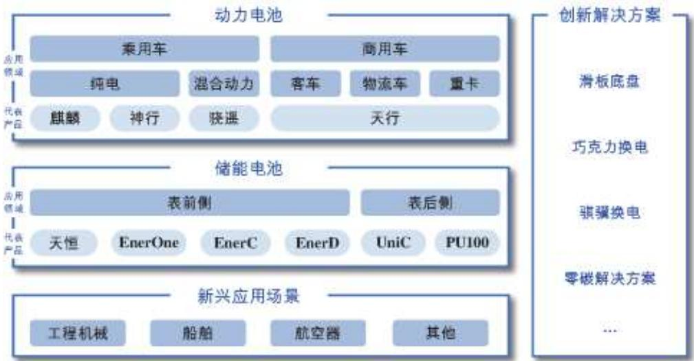
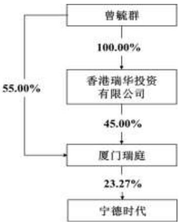

# 宁德时代新能源科技股份有限公司

2025 年 03 月

## 第一节 重要提示、目录和释义

## 一、董事、监事、高级管理人员是否存在对年度报告内容存在异议或无法保证其真实、准确、完整的情况

□是 否

公司董事会、监事会及董事、监事、高级管理人员保证年度报告内容的真实、准确、完整，不存在虚假记载、误导性陈述或者重大遗漏，并承担个别和连带的法律责任。

公司负责人曾毓群先生、主管会计工作负责人及会计机构负责人郑舒先生声明：保证本年度报告中财务报告的真实、准确、完整。

所有董事均已出席了审议本报告的董事会会议。

## 二、非标准审计意见提示

□适用 不适用

## 三、内部控制重大缺陷提示

□适用 不适用

## 四、业绩大幅下滑或亏损的风险提示

□适用 不适用

## 五、对年度报告涉及未来计划等前瞻性陈述的风险提示

适用 □不适用

本报告中涉及的未来发展规划等前瞻性陈述不构成公司对投资者的实质承诺，敬请广大投资者理性投资，注意风险。

## 六、公司上市时未盈利且目前未实现盈利

□适用 不适用

## 七、公司是否需要遵守特殊行业的披露要求

适用 □不适用

公司需要遵守锂离子电池产业链相关行业的披露要求。

## 八、董事会审议的报告期利润分配预案或公积金转增股本预案

## 适用 □不适用

经公司第四届董事会第二次会议审议通过的 2024 年度利润分配预案为：本次年度现金分红及特别现金分红合计可派发的现金分红总额为 19,975,746,623.17 元，即以可参与分配的股本 4,387,403,387 股为基数，向全体股东每 10股派发现金分红 45.53元（含税）。2024年度，公司不实施资本公积金转增股本，不送红股。本次利润分配预案尚需提交公司股东会审议。

## 目录

第一节重要提示、目录和释义.  
第二节 公司简介和主要财务指标. 8  
第三节管理层讨论与分析.. 11  
第四节公司治理. . 42  
第五节环境和社会责任.. . 67  
第六节 重要事项. . 76  
第七节股份变动及股东情况. . 95  
第八节优先股相关情况.. .. 104  
第九节债券相关情况.... .... 105  
第十节财务报告. 110

## 备查文件目录

一、载有公司法定代表人签字的 2024年年度报告原件。

二、载有公司负责人、主管会计工作负责人、会计机构负责人签名并盖章的财务报表。

三、载有会计师事务所盖章、注册会计师签名并盖章的审计报告原件。

四、报告期内在中国证监会指定网站上公开披露过的所有公司文件的正本及公告的原稿。

以上备查文件的备置地点：公司住所（福建省宁德市蕉城区漳湾镇新港路 2 号）及深圳证券交易所（http://www.szse.cn/）。

## 释义

<table><tr><td colspan="1" rowspan="1">释义项</td><td colspan="1" rowspan="1">指</td><td colspan="1" rowspan="1">释义内容</td></tr><tr><td colspan="1" rowspan="1">本公司、公司、宁德时代</td><td colspan="1" rowspan="1">指</td><td colspan="1" rowspan="1">宁德时代新能源科技股份有限公司</td></tr><tr><td colspan="1" rowspan="1">厦门瑞庭</td><td colspan="1" rowspan="1">指</td><td colspan="1" rowspan="1">公司控股股东，厦门瑞庭投资有限公司</td></tr><tr><td colspan="1" rowspan="1">厦门时代</td><td colspan="1" rowspan="1">指</td><td colspan="1" rowspan="1">公司合并报表子公司，厦门时代新能源科技有限公司</td></tr><tr><td colspan="1" rowspan="1">宜春时代</td><td colspan="1" rowspan="1">指</td><td colspan="1" rowspan="1">公司合并报表子公司，宜春时代新能源科技有限公司</td></tr><tr><td colspan="1" rowspan="1">贵州时代</td><td colspan="1" rowspan="1">指</td><td colspan="1" rowspan="1">公司合并报表子公司，宁德时代（贵州）新能源科技有限公司</td></tr><tr><td colspan="1" rowspan="1">三江时代</td><td colspan="1" rowspan="1">指</td><td colspan="1" rowspan="1">公司合并报表子公司，宜宾三江时代新能源科技有限公司</td></tr><tr><td colspan="1" rowspan="1">江苏时代</td><td colspan="1" rowspan="1">指</td><td colspan="1" rowspan="1">公司合并报表子公司，江苏时代新能源科技有限公司</td></tr><tr><td colspan="1" rowspan="1">中州时代</td><td colspan="1" rowspan="1">指</td><td colspan="1" rowspan="1">公司合并报表子公司，中州时代新能源科技有限公司</td></tr><tr><td colspan="1" rowspan="1">时代广汽</td><td colspan="1" rowspan="1">指</td><td colspan="1" rowspan="1">公司合并报表子公司，时代广汽动力电池有限公司</td></tr><tr><td colspan="1" rowspan="1">时代绿能</td><td colspan="1" rowspan="1">指</td><td colspan="1" rowspan="1">公司合并报表子公司，时代绿色能源有限公司</td></tr><tr><td colspan="1" rowspan="1">广东邦普</td><td colspan="1" rowspan="1">指</td><td colspan="1" rowspan="1">公司合并报表子公司，广东邦普循环科技有限公司</td></tr><tr><td colspan="1" rowspan="1"> SNE Research</td><td colspan="1" rowspan="1">指</td><td colspan="1" rowspan="1">韩国新能源领域咨询公司，提供电池行业全球市场研究和咨询服务</td></tr><tr><td colspan="1" rowspan="1">Net Zero Tracker</td><td colspan="1" rowspan="1">指</td><td colspan="1" rowspan="1">由 the Energy &amp; Climate Intelligence Unit (ECIU)、the Data-DrivenEnviroLab (DDL)、NewClimate Institute 和 Oxford Net Zero 共同开展的国际合作项目，旨在提高国家、地区、城市及公司净零排放目标承诺的责任度及透明度。</td></tr><tr><td colspan="1" rowspan="1">ESG</td><td colspan="1" rowspan="1">指</td><td colspan="1" rowspan="1">Environment、Social and Governance，环境、社会与公司治理</td></tr><tr><td colspan="1" rowspan="1">中国证监会</td><td colspan="1" rowspan="1">指</td><td colspan="1" rowspan="1">中国证券监督管理委员会</td></tr><tr><td colspan="1" rowspan="1">深交所</td><td colspan="1" rowspan="1">指</td><td colspan="1" rowspan="1">深圳证券交易所</td></tr><tr><td colspan="1" rowspan="1">中登公司</td><td colspan="1" rowspan="1">指</td><td colspan="1" rowspan="1">中国证券登记结算有限责任公司深圳分公司</td></tr><tr><td colspan="1" rowspan="1">巨潮资讯网</td><td colspan="1" rowspan="1">指</td><td colspan="1" rowspan="1">http://www.cninfo.com.cn</td></tr><tr><td colspan="1" rowspan="1">动力电池系统</td><td colspan="1" rowspan="1">指</td><td colspan="1" rowspan="1">动力电池里的电芯、模组/电箱、电池包</td></tr><tr><td colspan="1" rowspan="1">储能电池系统</td><td colspan="1" rowspan="1">指</td><td colspan="1" rowspan="1">储能电池里的电芯、模组/电箱、电池柜</td></tr><tr><td colspan="1" rowspan="1">CTP</td><td colspan="1" rowspan="1">指</td><td colspan="1" rowspan="1">电芯一电池包，一种将电芯直接集成到电池包的技术，不需要通过模组</td></tr><tr><td colspan="1" rowspan="1">CTC</td><td colspan="1" rowspan="1">指</td><td colspan="1" rowspan="1">电芯一底盘，一种将电芯直接集成到整车底盘的技术，不需要通过模组或电池包</td></tr><tr><td colspan="1" rowspan="1">NEV</td><td colspan="1" rowspan="1">指</td><td colspan="1" rowspan="1">新能源汽车，包括电动汽车和氢燃料等新型燃料电池车</td></tr><tr><td colspan="1" rowspan="1">BEV</td><td colspan="1" rowspan="1">指</td><td colspan="1" rowspan="1">英文：battery electric vehicle中文：纯电动车</td></tr><tr><td colspan="1" rowspan="1">PHEV</td><td colspan="1" rowspan="1">指</td><td colspan="1" rowspan="1">英文：Plug-in hybrid electric vehicle中文：插电式混合动力车</td></tr><tr><td colspan="1" rowspan="1">HEV</td><td colspan="1" rowspan="1">指</td><td colspan="1" rowspan="1">英文：hybrid electric vehicle中文：混合动力车</td></tr><tr><td colspan="1" rowspan="1">DPPB</td><td colspan="1" rowspan="1">指</td><td colspan="1" rowspan="1">十亿分之一的失效率，制造过程中的质量度量标准</td></tr><tr><td colspan="1" rowspan="1">DPPM</td><td colspan="1" rowspan="1">指</td><td colspan="1" rowspan="1">百万分之一的失效率，制造过程中的质量度量标准</td></tr><tr><td colspan="1" rowspan="1">GWh</td><td colspan="1" rowspan="1">指</td><td colspan="1" rowspan="1">吉瓦时，一种电能单位，1GWh=10亿瓦时</td></tr><tr><td colspan="1" rowspan="1">MWh</td><td colspan="1" rowspan="1">指</td><td colspan="1" rowspan="1">兆瓦时，一种电能单位，1MWh=1百万瓦时</td></tr><tr><td colspan="1" rowspan="1">TWh</td><td colspan="1" rowspan="1">指</td><td colspan="1" rowspan="1">太瓦时，一种电能单位，1TWh=10亿千瓦时</td></tr><tr><td>报告期</td><td>指</td><td>12月31日</td></tr><tr><td></td><td></td><td></td></tr></table>

注：本报告中若出现总数与各分项数值之和尾数不符的情况，均为四舍五入原因造成。

## 第二节 公司简介和主要财务指标

## 一、公司信息

<table><tr><td rowspan=1 colspan=1>股票简称</td><td rowspan=1 colspan=1>宁德时代</td><td rowspan=1 colspan=1>股票代码</td><td rowspan=1 colspan=1>300750</td></tr><tr><td rowspan=1 colspan=1>公司的中文名称</td><td rowspan=1 colspan=3>宁德时代新能源科技股份有限公司</td></tr><tr><td rowspan=1 colspan=1>公司的中文简称</td><td rowspan=1 colspan=3>宁德时代</td></tr><tr><td rowspan=1 colspan=1>公司的外文名称</td><td rowspan=1 colspan=3>Contemporary Amperex Technology Co.,Ltd.</td></tr><tr><td rowspan=1 colspan=1>公司的外文名称缩写</td><td rowspan=1 colspan=3>CATL</td></tr><tr><td rowspan=1 colspan=1>公司的法定代表人</td><td rowspan=1 colspan=3>曾毓群</td></tr><tr><td rowspan=1 colspan=1>注册地址</td><td rowspan=1 colspan=3>福建省宁德市蕉城区漳湾镇新港路2号</td></tr><tr><td rowspan=1 colspan=1>注册地址的邮政编码</td><td rowspan=1 colspan=3>352100</td></tr><tr><td rowspan=1 colspan=1>公司注册地址历史变更情况</td><td rowspan=1 colspan=3>无</td></tr><tr><td rowspan=1 colspan=1>办公地址</td><td rowspan=1 colspan=3>福建省宁德市蕉城区漳湾镇新港路2号</td></tr><tr><td rowspan=1 colspan=1>办公地址的邮政编码</td><td rowspan=1 colspan=3>352100</td></tr><tr><td rowspan=1 colspan=1>公司网址</td><td rowspan=1 colspan=3>www.catl.com</td></tr><tr><td rowspan=1 colspan=1>电子信箱</td><td rowspan=1 colspan=3>CATL-IR@catl.com</td></tr></table>

## 二、联系人和联系方式

<table><tr><td rowspan=1 colspan=1></td><td rowspan=1 colspan=1>董事会秘书</td><td rowspan=1 colspan=1>证券事务代表</td></tr><tr><td rowspan=1 colspan=1>姓名</td><td rowspan=1 colspan=1>蒋理</td><td rowspan=1 colspan=1>陈津</td></tr><tr><td rowspan=1 colspan=1>联系地址</td><td rowspan=1 colspan=1>福建省宁德市蕉城区漳湾镇新港路2号</td><td rowspan=1 colspan=1>福建省宁德市蕉城区漳湾镇新港路2号</td></tr><tr><td rowspan=1 colspan=1>电话</td><td rowspan=1 colspan=1>0593-8901666</td><td rowspan=1 colspan=1>0593-8901666</td></tr><tr><td rowspan=1 colspan=1>传真</td><td rowspan=1 colspan=1>0593-8901999</td><td rowspan=1 colspan=1>0593-8901999</td></tr><tr><td rowspan=1 colspan=1>电子信箱</td><td rowspan=1 colspan=1>CATL-IR@catl.com</td><td rowspan=1 colspan=1>CATL-IR@catl.com</td></tr></table>

## 三、信息披露及备置地点

<table><tr><td rowspan=1 colspan=1>公司披露年度报告的证券交易所网站</td><td rowspan=1 colspan=1>https://www.szse.cn/index/index.html</td></tr><tr><td rowspan=1 colspan=1>公司披露年度报告的媒体名称及网址</td><td rowspan=1 colspan=1>巨潮资讯网</td></tr><tr><td rowspan=1 colspan=1>公司年度报告备置地点</td><td rowspan=1 colspan=1>公司住所</td></tr></table>

## 四、其他有关资料

## 1、公司聘请的会计师事务所

<table><tr><td rowspan=1 colspan=1>会计师事务所名称</td><td rowspan=1 colspan=1>致同会计师事务所（特殊普通合伙）</td></tr><tr><td rowspan=1 colspan=1>会计师事务所办公地址</td><td rowspan=1 colspan=1>北京市朝阳区建国门外大街22号赛特广场5层</td></tr><tr><td rowspan=1 colspan=1>签字会计师姓名</td><td rowspan=1 colspan=1>殷雪芳、郑海霞</td></tr></table>

## 2、公司聘请的报告期内履行持续督导职责的保荐机构

适用 □不适用

<table><tr><td rowspan=1 colspan=1></td><td rowspan=1 colspan=1>保荐机构办公地址</td><td rowspan=1 colspan=1>保荐代表人姓名</td><td rowspan=1 colspan=1>持续督导期间</td></tr><tr><td rowspan=1 colspan=1>中信建投证券股份有限公司</td><td rowspan=1 colspan=1>北京市朝阳区景辉街16号院1号楼泰康集团大厦11层</td><td rowspan=1 colspan=1>吕晓峰、张帅</td><td rowspan=1 colspan=1>2020年8月4日-2024年12月31日</td></tr></table>

## 3、公司聘请的报告期内履行持续督导职责的财务顾问

□适用 不适用

## 五、主要会计数据和财务指标

公司是否需追溯调整或重述以前年度会计数据

是 □否

追溯调整或重述原因：2022年每股收益调整原因系公司 2023 年 4月完成资本公积金转增股本，对该指标进行重新计算。

<table><tr><td rowspan=2 colspan=1>项目</td><td rowspan=2 colspan=1>2024年</td><td rowspan=2 colspan=1>2023年</td><td rowspan=2 colspan=1>本年比上年增减</td><td rowspan=1 colspan=2>2022年</td></tr><tr><td rowspan=1 colspan=1>调整前</td><td rowspan=1 colspan=1>调整后</td></tr><tr><td rowspan=1 colspan=1>营业收入(千元)</td><td rowspan=1 colspan=1>362,012,554</td><td rowspan=1 colspan=1>400,917,045</td><td rowspan=1 colspan=1>-9.70%</td><td rowspan=1 colspan=1>328,593,988</td><td rowspan=1 colspan=1>328,593,988</td></tr><tr><td rowspan=1 colspan=1>归属于上市公司股东的净利润(千元)</td><td rowspan=1 colspan=1>50,744,682</td><td rowspan=1 colspan=1>44,121,248</td><td rowspan=1 colspan=1>15.01%</td><td rowspan=1 colspan=1>30,729,163</td><td rowspan=1 colspan=1>30,729,163</td></tr><tr><td rowspan=1 colspan=1>归属于上市公司股东的扣除非经常性损益的净利润(千元)</td><td rowspan=1 colspan=1>44,992,919</td><td rowspan=1 colspan=1>40,091,674</td><td rowspan=1 colspan=1>12.23%</td><td rowspan=1 colspan=1>28,213,098</td><td rowspan=1 colspan=1>28,213,098</td></tr><tr><td rowspan=1 colspan=1>经营活动产生的现金流量净额（千元)</td><td rowspan=1 colspan=1>96,990,345</td><td rowspan=1 colspan=1>92,826,124</td><td rowspan=1 colspan=1>4.49%</td><td rowspan=1 colspan=1>61,208,843</td><td rowspan=1 colspan=1>61,208,843</td></tr><tr><td rowspan=1 colspan=1>基本每股收益（元/股)</td><td rowspan=1 colspan=1>11.58</td><td rowspan=1 colspan=1>10.06</td><td rowspan=1 colspan=1>15.11%</td><td rowspan=1 colspan=1>12.92</td><td rowspan=1 colspan=1>7.18</td></tr><tr><td rowspan=1 colspan=1>稀释每股收益（元/股）</td><td rowspan=1 colspan=1>11.58</td><td rowspan=1 colspan=1>10.05</td><td rowspan=1 colspan=1>15.22%</td><td rowspan=1 colspan=1>12.88</td><td rowspan=1 colspan=1>7.16</td></tr><tr><td rowspan=1 colspan=1>加权平均净资产收益率</td><td rowspan=1 colspan=1>24.13%</td><td rowspan=1 colspan=1>24.04%</td><td rowspan=1 colspan=1>0.09%</td><td rowspan=1 colspan=1>24.67%</td><td rowspan=1 colspan=1>24.67%</td></tr><tr><td rowspan=2 colspan=1>项目</td><td rowspan=2 colspan=1>2024年末</td><td rowspan=2 colspan=1>2023年末</td><td rowspan=2 colspan=1>本年末比上年末增减</td><td rowspan=1 colspan=2>2022年末</td></tr><tr><td rowspan=1 colspan=1>调整前</td><td rowspan=1 colspan=1>调整后</td></tr><tr><td rowspan=1 colspan=1>资产总额（千元)</td><td rowspan=1 colspan=1>786,658,123</td><td rowspan=1 colspan=1>717,168,041</td><td rowspan=1 colspan=1>9.69%</td><td rowspan=1 colspan=1>600,952,352</td><td rowspan=1 colspan=1>600,952,352</td></tr><tr><td rowspan=1 colspan=1>归属于上市公司股东的净资产（千元)</td><td rowspan=1 colspan=1>246,930,033</td><td rowspan=1 colspan=1>197,708,052</td><td rowspan=1 colspan=1>24.90%</td><td rowspan=1 colspan=1>164,481,252</td><td rowspan=1 colspan=1>164,481,252</td></tr></table>

公司最近三个会计年度扣除非经常性损益前后净利润孰低者均为负值，且最近一年审计报告显示公司持续经营能力存在不确定性

□是 否

扣除非经常损益前后的净利润孰低者为负值

□是 否

## 六、分季度主要财务指标

单位：千元

上述财务指标或其加总数是否与公司已披露季度报告、半年度报告相关财务指标存在重大差异
<table><tr><td colspan="1" rowspan="1">项目</td><td colspan="1" rowspan="1">第一季度</td><td colspan="1" rowspan="1">第二季度</td><td colspan="1" rowspan="1">第三季度</td><td colspan="1" rowspan="1">第四季度</td></tr><tr><td colspan="1" rowspan="1">营业收入</td><td colspan="1" rowspan="1">79,770,779</td><td colspan="1" rowspan="1">86,996,055</td><td colspan="1" rowspan="1">92,277,915</td><td colspan="1" rowspan="1">102,967,805</td></tr><tr><td colspan="1" rowspan="1">归属于上市公司股东的净利润</td><td colspan="1" rowspan="1">10,509,923</td><td colspan="1" rowspan="1">12,355,064</td><td colspan="1" rowspan="1">13,136,086</td><td colspan="1" rowspan="1">14,743,608</td></tr><tr><td colspan="1" rowspan="1">归属于上市公司股东的扣除非经常性损益的净利润</td><td colspan="1" rowspan="1">9,247,439</td><td colspan="1" rowspan="1">10,806,502</td><td colspan="1" rowspan="1">12,122,470</td><td colspan="1" rowspan="1">12,816,508</td></tr><tr><td colspan="1" rowspan="1">经营活动产生的现金流量净额</td><td colspan="1" rowspan="1">28,357,911</td><td colspan="1" rowspan="1">16,351,044</td><td colspan="1" rowspan="1">22,734,647</td><td colspan="1" rowspan="1">29,546,744</td></tr></table>

## 七、境内外会计准则下会计数据差异

## 1、同时按照国际会计准则与按照中国会计准则披露的财务报告中净利润和净资产差异情况

□适用 不适用

公司报告期不存在按照国际会计准则与按照中国会计准则披露的财务报告中净利润和净资产差异情况。

## 2、同时按照境外会计准则与按照中国会计准则披露的财务报告中净利润和净资产差异情况

□适用 不适用

公司报告期不存在按照境外会计准则与按照中国会计准则披露的财务报告中净利润和净资产差异情况。

## 八、非经常性损益项目及金额

适用 □不适用

单位：千元

<table><tr><td rowspan=1 colspan=1>项目</td><td rowspan=1 colspan=1>2024年金额</td><td rowspan=1 colspan=1>2023年金额</td><td rowspan=1 colspan=1>2022年金额</td><td rowspan=1 colspan=1>说明</td></tr><tr><td rowspan=1 colspan=1>非流动性资产处置损益（包括已计提资产减值准备的冲销部分）</td><td rowspan=1 colspan=1>169,816</td><td rowspan=1 colspan=1>-235,944</td><td rowspan=1 colspan=1>264,713</td><td rowspan=1 colspan=1></td></tr><tr><td rowspan=1 colspan=1>除同公司正常经营业务相关的有效套期保值业务外，非金融企业持有金融资产和金融负债产生的公允价值变动损益以及处置金融资产和金融负债产生的损益</td><td rowspan=1 colspan=1>664,223</td><td rowspan=1 colspan=1>46,270</td><td rowspan=1 colspan=1>400,241</td><td rowspan=1 colspan=1></td></tr><tr><td rowspan=1 colspan=1>委托他人投资或管理资产的损益</td><td rowspan=1 colspan=1>179,608</td><td rowspan=1 colspan=1>26,759</td><td rowspan=1 colspan=1>52,937</td><td rowspan=1 colspan=1></td></tr><tr><td rowspan=1 colspan=1>单独进行减值测试的应收款项减值准备转回</td><td rowspan=1 colspan=1>2,687</td><td rowspan=1 colspan=1>62,339</td><td rowspan=1 colspan=1>32,781</td><td rowspan=1 colspan=1></td></tr><tr><td rowspan=1 colspan=1>除上述各项之外的其他营业外收入和支出</td><td rowspan=1 colspan=1>-612,613</td><td rowspan=1 colspan=1>195,751</td><td rowspan=1 colspan=1>-111,199</td><td rowspan=1 colspan=1></td></tr><tr><td rowspan=1 colspan=1>其他符合非经常性损益定义的损益项目</td><td rowspan=1 colspan=1>8,128,318</td><td rowspan=1 colspan=1>5,909,090</td><td rowspan=1 colspan=1>2,745,358</td><td rowspan=1 colspan=1></td></tr><tr><td rowspan=1 colspan=1>减：所得税影响额</td><td rowspan=1 colspan=1>1,665,244</td><td rowspan=1 colspan=1>1,194,027</td><td rowspan=1 colspan=1>689,187</td><td rowspan=1 colspan=1></td></tr><tr><td rowspan=1 colspan=1>少数股东权益影响额（税后）</td><td rowspan=1 colspan=1>1,115,034</td><td rowspan=1 colspan=1>780,664</td><td rowspan=1 colspan=1>179,578</td><td rowspan=1 colspan=1></td></tr><tr><td rowspan=1 colspan=1>合计</td><td rowspan=1 colspan=1>5,751,762</td><td rowspan=1 colspan=1>4,029,575</td><td rowspan=1 colspan=1>2,516,065</td><td rowspan=1 colspan=1>!</td></tr></table>

其他符合非经常性损益定义的损益项目的具体情况：

适用 □不适用

主要是部分股权投资的持股比例变动产生的投资收益、其他非流动金融资产投资分红收益及其他收益等。

将《公开发行证券的公司信息披露解释性公告第 1号——非经常性损益》中列举的非经常性损益项目界定为经常性损益项目的情况说明

□适用 不适用

公司不存在将《公开发行证券的公司信息披露解释性公告第 1号——非经常性损益》中列举的非经常性损益项目界定为经常性损益的项目的情形。

## 第三节 管理层讨论与分析

## 一、报告期内公司所处行业情况

## 1、公司行业分类

公司主要从事动力电池、储能电池和电池回收利用产品的研发、生产和销售。根据国家统计局发布的《国民经济行业分类与代码》（GB/T4754-2017），公司属于门类“C 制造业”中的大类“C38 电气机械和器材制造业”中的小类“C3841锂离子电池制造”。

## 2、行业发展状况及发展趋势

为应对全球气候变化的挑战，推进可持续发展，多个国家提出推动清洁能源转型及构建绿色低碳经济的战略。根据净零倡议组织 Net Zero Tracker 统计，目前全球已有 195 个国家和地区制定并公布了碳减排国家自主贡献目标，重点关注电力、交通、工业等主要碳排放领域。高品质的锂电池凭借高能量密度、长循环寿命、良好稳定性及安全性等性能优势，作为核心蓄能载体，在低碳社会及能源转型中扮演重要的角色，相关产业近年来快速发展。

## （1）动力电池行业

受益于新能源在售车型数量快速增加、智能化水平提升、充换电基础设施不断完善等因素，全球新能源车市场需求持续增长。国内市场，根据中国汽车工业协会数据，2024 年我国新能源乘用车销量为1,105 万辆，同比增长 40.2%，渗透率提升至 48.9%；新能源商用车销量为 53 万辆，同比增长 28.9%，渗透率提升至 17.9%。海外市场，根据欧洲汽车制造商协会数据，2024 年欧洲 31 国实现新能源乘用车注册量295万辆、渗透率为22.7%；根据美国汽车创新联盟数据，2024年前三季度美国新能源轻型车实现销量约114万辆、渗透率约10%。新能源车市场的快速发展、单车带电量的逐步提升带动动力电池市场增长，根据 SNE Research统计，2024年全球新能源车动力电池使用量达 894.4GWh，同比增长 27.2%。

## （2）储能行业

在全球可再生能源发展、储能成本下探、数据中心需求提升等因素驱动下，全球储能市场需求持续增长。国内市场，风电、光伏装机继续提升，根据国家能源局数据，2024 年我国风电光伏新增装机容量356.5GW，同比增长 21.8%；受益于政策支持且储能成本下降提升储能项目经济性，储能需求快速增长，根据中关村储能产业技术联盟统计，2024 年我国新型储能新增装机规模达 109.8GWh，同比增长 136%。海外市场，美国简化发电机组并网流程，并网节奏加快，带动配套储能需求增长；欧洲多国及海外其他地区不断出台支持政策，储能招标规模持续增长。此外，随着智能应用的快速发展，新型数据中心建设加速，成为储能市场发展的新动力。根据 SNE Research 统计，2024 年全球储能电池出货量 301GWh，同

比增长 62.7%。

## （3）电池材料及回收行业

随着动力电池、储能电池市场的持续增长，电池材料的需求也相应增长。根据SMM统计，2024年我国三元与磷酸铁锂正极材料合计产量达 302.7 万吨，同比增长 59.7%。此外，从废旧电池中提取可再生金属资源，已成为实现资源循环利用及推动电池材料行业可持续发展的重要途径。随着早期投放市场的锂电池逐渐进入退役期，退役电池的回收需求逐步提升，根据上海钢联数据，2024 年我国锂电池报废量达75.1万吨，同比增长 8.2%。

## 3、公司行业地位

公司是全球领先的动力电池和储能电池企业。根据SNE Research数据，在动力电池领域，公司 2017-2024 年连续 8年动力电池使用量排名全球第一，2024 年全球市占率为 37.9%，较第二名高出 20.7 个百分点；在储能领域，公司 2021-2024年连续 4年储能电池出货量排名全球第一，2024年全球市占率为 36.5%，较第二名高出 23.3个百分点。

## 4、主要法律法规及行业政策

2024年以来行业有关的主要法律法规及政策如下表所示：

<table><tr><td colspan="1" rowspan="1">时间</td><td colspan="1" rowspan="1">颁布单位</td><td colspan="1" rowspan="1">文件名称及主要内容</td></tr><tr><td colspan="1" rowspan="1">2024年3月</td><td colspan="1" rowspan="1">国务院</td><td colspan="1" rowspan="1">《推动大规模设备更新和消费品以旧换新行动方案》，开展汽车以旧换新，加大政策支持力度，畅通流通堵点，促进汽车梯次消费、更新消费。支持交通运输设备和老旧农业机械更新，持续推进城市公交车电动化替代，支持老旧新能源公交车和动力电池更新换代；加快淘汰国三及以下排放标准营运类柴油货车；加强电动、氢能等绿色航空装备产业化能力建设；加快高耗能高排放老旧船舶报废更新，大力支持新能源动力船舶发展，完善新能源动力船舶配套基础设施和标准规范，逐步扩大电动、液化天然气动力、生物柴油动力、绿色甲醇动力等新能源船舶应用范围。</td></tr><tr><td colspan="1" rowspan="1">2024年4月</td><td colspan="1" rowspan="1">国家能源局</td><td colspan="1" rowspan="1">《关于促进新型储能并网和调度运用的通知》，通过规范并网接入、优化调度方式、加强运行管理等措施，明确新型储能的功能定位和技术要求，持续完善新型储能调度机制，保障新型储能合理高效利用，有力支撑新型电力系统建设。</td></tr><tr><td colspan="1" rowspan="1">2024年5月</td><td colspan="1" rowspan="1">生态环境部、发改委、工信部等十五部门</td><td colspan="1" rowspan="1">《关于建立碳足迹管理体系的实施方案》，优先聚焦锂电池、新能源汽车、光伏和电子电器等重点产品，制定发布核算规则标准。力争在锂电池、新能源汽车、光伏和电子电器等领域推动制定产品碳足迹国际标准。</td></tr><tr><td colspan="1" rowspan="1">2024年6月</td><td colspan="1" rowspan="1">工信部</td><td colspan="1" rowspan="1">《锂离子电池行业规范条件（2024年本)》，引导企业加强技术创新、提高产品质量、降低生产成本。对动力电池、储能电池单体及电池组的能量密度、功率密度、循环寿命、容量保持率等产品性能指标进行了规定。</td></tr><tr><td colspan="1" rowspan="1">2024年6月</td><td colspan="1" rowspan="1">欧洲议会及理事会</td><td colspan="1" rowspan="1">Regulation(EU)2024/1735《净零工业法案》，提出到 2030年欧盟本土净零技术（如太阳能板、风力涡轮机、电池和热泵）制造产能达到部署需求的40%，到2040年欧盟在这些技术上达到世界产量的15%。法案规定了增加绿色技术投资的多项举措，包括简化战略性项目的许可程序、利用公共采购和可再生能源拍卖提升战略性技术产品的市场准入等。</td></tr><tr><td colspan="1" rowspan="1">2024年7月</td><td colspan="1" rowspan="1">欧洲议会及理事会</td><td colspan="1" rowspan="1">Regulation(EU)2024/1747《欧盟电力市场改革方案》，为应对天然气价格导致电价上涨问题，欧盟电力市场改革旨在降低电价对波动的化石燃料价格的依赖，保护消费者不受价格飙升的影响，加快可再生能源等清洁电力的部署，激励清洁能源转型。关键举措包括：1、通过对长期购电协议（PPA）和差价合约的推广、可再生能源的投资建设，间接驱动储能发展；2、非化石灵活性支持系统"可用容量付费”，使灵活性资源充分满足清洁能源目标，或将直接增加储能机组收益，促进储能发展。</td></tr><tr><td colspan="1" rowspan="1">2024年9月</td><td colspan="1" rowspan="1">国家发改委、国家能源局</td><td colspan="1" rowspan="1">《关于推动车网互动规模化应用试点工作的通知》，按照"创新引导、先行先试"的原则，全面推广新能源汽车有序充电，扩大双向充放电（V2G）项目规模，丰富车网互动应用场景，以城市为主体完善规模化、可持续的车网互动政策机制，以V2G项目为主体探索技术先进、模式清晰、可复制推广的商业模式，力争以市场化机制引导车网互动规模化发展。参与试点的地区应全面执行充电峰谷分时电价，力争年度充电电量60%以上集中在低谷时段，其中通过私人桩充电的电量 80%以上集中在低谷时段。参与试点的V2G项目放电总功率原则上不低于500千瓦，年度放电量不低于10万千瓦时，西部地区可适当降低。</td></tr><tr><td colspan="1" rowspan="1">2024年12月</td><td colspan="1" rowspan="1">国家发改委、国家能源局</td><td colspan="1" rowspan="1">《电力系统调节能力优化专项行动实施方案（2025—2027年)》，明确到 2027年，通过调节能力的建设优化，支撑 2025-2027 年年均新增2亿千瓦以上新能源的合理消纳利用，全国新能源利用率不低于90%。优化选择适宜新型储能技术，高质量建设一批技术先进、发挥功效的新型储能电站。优化新型储能调度运行，发挥移峰填谷和顶峰发电作用，增强本地电力供应保障能力，实现应用尽用。在新能源消纳困难时段优先调度新型储能，实现日内应调尽调。完善调节资源参与市场机制，包括完善峰谷电价机制，建立健全调频、备用辅助服务市场体系，加快建立市场化容量补偿机制。</td></tr></table>

## 二、报告期内公司从事的主要业务

公司需遵守《深圳证券交易所上市公司自律监管指引第 4 号——创业板行业信息披露》中的“锂离子电池产业链相关业务”的披露要求。

## 1、主要业务

公司是全球领先的新能源创新科技公司，主要从事动力电池、储能电池的研发、生产、销售，以推动移动式化石能源替代、固定式化石能源替代，并通过电动化和智能化实现市场应用的集成创新。截至报告期末，公司已在全球设立六大研发中心、十三大电池生产制造基地，并覆盖全球最广泛的动力与储能客户群体。

公司在锂电池领域深耕多年，具备了全链条自主、高效的研发能力，在电池材料、电池系统、电池回收等产业链领域拥有核心技术优势及前瞻性研发布局，通过材料及材料体系创新、系统结构创新、绿色极限制造创新及商业模式创新为全球新能源应用提供一流的解决方案和服务，已形成全面、先进的产品矩阵，可应用于乘用车、商用车、表前储能、表后储能等领域，以及工程机械、船舶、航空器等新兴应用场景，能够全方位满足不同客户的多元化需求。

## 2、主要产品及其用途

公司致力于为全球新能源应用提供一流的动力电池和储能电池产品及相关创新解决方案，具体如下：

## （1）动力电池系统

公司动力电池产品包括电芯、模组/电箱及电池包。公司可提供磷酸铁锂电池、三元高压中镍电池、三元高镍电池、钠离子电池、M3P 电池、凝聚态电池等覆盖不同能量密度区间的多种化学体系产品系列，能满足快充、长寿命、长续航、高安全、宽温度适应性等多种功能需求。公司根据应用领域及客户要求，通过定制或联合研发等方式设计个性化产品方案，以满足客户对产品性能的不同需求。

乘用车应用领域，公司产品可应用于 BEV、REV、PHEV、HEV 等不同细分市场，广泛应用于私家车、运营车等领域；商业应用领域，公司产品可应用于道路客运、城市配送、重载运输、道路清洁等客车及商用车领域。此外，公司产品还可应用于电动工具、电动两轮车等领域，具备高能量密度、高功率、高安全的特性。

## （2）储能电池系统

公司提供电芯、电池柜、储能集装箱以及交流侧系统等储能产品解决方案。公司的储能电池广泛应用于表前储能和表后储能领域，包括公用事业储能、工商业储能及数据中心储能等。

电芯产品方面，基于多样的应用场景和产品全周期的经济性，公司开发了多款发电侧、输配电侧储能专用电芯以及适用于用户侧的系列电芯，覆盖多种容量并兼具超长寿命、高安全、宽温度适应性等特性。

系统集成方面，在表前领域，公司依托智能液冷控温、高成组 CTP、无热扩散等技术，推出了户外液冷电池柜 EnerOne、EnerOnePlus 以及针对全气候场景的集装箱式液冷电池柜 EnerC、EnerCPlus、EnerD、EnerX。公司进一步推出了天恒储能系统，是全球首款 5 年功率与容量零衰减的产品，单箱能量高达6.25MWh，具有高安全、长寿命、高度集成等优势。在表后储能领域，公司产品已实现从低压、中压到高压平台的全场景覆盖。其中，UniC 系列产品具备长寿命、简运维、低辅源等特点，适配工商储能多元场景应用需求；PU100产品具备高安全、高功率、易维护等特点，可满足数据中心能源管理需求。

## （3）新兴应用领域及创新解决方案

除上述应用领域外，公司的动力电池的应用也不断拓展至工程机械、船舶、航空器等新兴应用场景。公司也持续推出创新解决方案，包括滑板底盘、针对乘用车领域的巧克力换电、针对重卡领域的骐骥换电解决方案等。

## （4）电池材料和回收

公司电池材料产品主要包括锂盐、前驱体及正极材料等。公司亦通过回收方式，对废旧电池中的镍、钴、锰、锂、磷、铁、铝、铜等金属材料及其他材料进行加工、提纯、合成等工艺，生产锂电池生产所需的正极材料、三元前驱体、磷铁前驱体、锂盐等材料，并将收集后的铜、铝等金属材料通过第三方回收利用，使电池生产所需的关键金属资源实现有效循环利用。

此外，为进一步保障电池生产所需的上游关键资源及材料供应，公司通过自建、参股、合资等多种方式参与锂、镍、钴、磷等电池矿产资源及相关产品的投资、建设及运营。

## 3、经营模式

公司拥有独立的研发、采购、生产和销售体系，主要通过销售动力电池、储能电池和电池材料等产品实现盈利。研发方面，公司建立了完备的研发体系，形成以自主研发为主、外部合作为辅的研发模式，通过数字化、智能化的方式，紧紧围绕材料及材料体系、系统结构、绿色极限制造及商业模式领域开展创新，以引领行业技术发展。采购方面，公司通过严格的评估和考核程序遴选合格供应商，并通过技术授权、长期协议、合资合作等方式与供应商紧密合作，以保证原料、设备的技术先进性、产品可靠性以及成本竞争力。生产销售方面，公司综合考虑市场情况以及客户需求安排生产。

报告期内，公司的主要经营模式未发生重大变化。

## 4、主要的业绩驱动因素

## （1）行业持续增长

动力电池方面，全球新能源车销量增长带动动力电池需求持续增长。根据 SNE Research 统计，2024年全球新能源车销量1,763万辆，同比增长26.1%，全球动力电池使用量达894.4GWh，同比增长27.2%。储能电池方面，在各国清洁能源转型目标推动下，随着风电光伏装机比例提升、电力系统灵活性要求提高、储能技术进步及系统成本下降，储能电池市场需求持续快速增长。根据 SNE Research 统计，2024 年全球储能电池出货量301GWh，同比增长62.7%。

## （2）公司竞争力进一步提升

公司坚持技术领先、服务优质、运营卓越的经营理念，致力于为全球客户提供一流产品及解决方案。

基于强大创新基因、深刻行业洞察、高效经营管理，公司在技术研发、极限制造、供应链管理、全球客户合作、可持续发展、新兴市场拓展等方面的竞争力进一步提升，推动业务稳健增长，为股东持续创造价值。

## 三、核心竞争力分析

## 1、全方位的研发优势

锂电池是全球绿色低碳与清洁能源转型的关键部件。研发并大规模生产兼具高安全、高性能、高质量、低成本等特性的锂电池门槛极高，不仅要求公司对电化学、热力学、分子动力学等多学科及覆盖微观、介观、宏观多尺度的基础理论有深刻的理解和综合应用能力，还要求公司具备强大的工艺设计、工程制造和质量管控的能力。

公司的团队深耕锂电行业多年，基于对分子动力学、电化学相场法、相图理论等研究方法和科学理论的理解，依托自身在锂电池行业的丰富经验与技术沉淀，形成了基于第一性原理的独特研发创新体系。截至报告期末，公司拥有六大研发中心，研发人员超过 2 万名。公司将安全、质量、成本贯穿全流程管理，自主研发了高通量材料集成计算、智能化电芯设计、智能化工艺设计等高效研发平台，并基于海量、多场景的客户及终端用户需求反哺研发设计，针对性地提升产品性能，优化产品方案，形成正向良性循环，打造全方位的研发优势。截至报告期末，公司拥有专利及专利申请合计达 43,354 项，其中境内拥有专利及专利申请 25,439项，境外拥有专利及专利申请 17,915项。

## 2、先进的产品矩阵

基于全方位的研发优势，公司已打造出行业内最全面、最先进的产品矩阵。公司产品具备高能量密度、长循环寿命、高充电倍率、宽温度适应性、高安全性等性能优势，广泛适用于乘用车、商用车、储能领域及新兴应用场景。

在乘用车领域，公司推出了以麒麟电池和神行电池为代表的系列产品，满足纯电乘用车用户对于充电速度、续航里程、功率等多元化需求，并针对混动乘用车用户的纯电续航里程短等需求痛点推出了骁遥电池；在商用车领域，公司推出了天行电池系列产品精准适配客车、物流车、重卡等商用车，有效解决商用车续航短、补能慢、寿命衰减快等行业痛点；在储能领域，公司推出的天恒储能系统是全球首款 5年功率与容量零衰减的产品，单箱能量达 6.25MWh，具有高安全、长寿命、高度集成等优势。

## 3、全面的客户合作

公司与全球知名车企、储能系统集成商、储能项目开发商或运营商等客户建立了长期且深度的战略合作，除产品销售外，还通过参股、合资、技术授权等方式与客户开展全面合作，助力客户打造全球领先 的 竞 争 力 。 公 司 的 车 企 客 户 包 括 BMW、Mercedes-Benz、Stellantis、Volkswagen、Ford、Toyota、

Hyundai、Honda、Volvo、上汽、吉利、蔚来、理想、宇通、小米等；公司的储能客户及合作方包括NextEra、Synergy、Wärtsilä、Excelsior、Jupiter Power、Flexgen、国家能源集团、国家电力投资集团、中国华能、中国华电、中石油等。截至报告期末，公司已实现动力电池累计装车超 1,700 万辆，储能电池在全球应用超 1,700个项目。

## 4、领先的可持续发展实践

公司高度重视可持续发展及履行社会责任，近年来ESG评级稳步上升，其中MSCI评级已达AA、标普企业可持续发展评估评分 58 分，均处于行业领先水平。我们于 2023 年发布了“零碳战略”，即 2025 年实现核心运营碳中和，2035 年实现价值链碳中和。为全方位推进零碳目标实现，公司对生产基地进行节能改造与可再生能源利用，积极推进零碳工厂建设与可再生能源项目开发，提升零碳电力使用比例。截至报告期末，公司核心运营零碳电力比例提升至 74.51%，已拥有 9 座“零碳工厂”，单位产品温室气体排放强度下降 20.97%。公司已建立覆盖全球的回收基地，形成了大规模、广泛的回收网络体系，具备 27万吨废旧电池年处理能力，镍钴锰金属回收率可达 99.6%，锂金属回收率可达93.8%。

## 四、主营业务分析

## 1、概述

报告期内，公司实现归属于上市公司股东的净利润 507.45 亿元，同比增长 15.01%。公司实现锂离子电池销量 475GWh，同比增长 21.79%，其中，动力电池系统销量 381GWh，同比增长 18.85%；储能电池系统销量 93GWh，同比增长 34.32%。

报告期内，公司主要经营情况如下：

## （1）持续推出创新产品

乘用车领域，公司在 2023 年发布神行 4C 超充电池的基础上发布神行 Plus 电池，可实现系统能量密度超200Wh/kg，是全球首个兼备1,000km续航以及4C超充特性的磷酸铁锂电池；推出新一代麒麟高功率电池，放电功率超 1,300kW，可助力新能源车实现零百加速 2秒以内；推出全球首款纯电续航达到 400公里以上，同时兼具 4C超充能力的骁遥增混电池，弥补增混车型充电补能效率慢的短板。

商用车领域，针对时效性高的物流与平台接单场景，推出天行 L-超充、天行 L-长续航，使用寿命可达 8年 80万公里；针对客车应用场景，推出天行客车版，使用寿命可达 15年 150万公里；针对重卡应用场景，推出天行电池重型商用车版本，使用寿命可达 15 年 300 万公里，在矿区、建筑工地等恶劣环境下保持可靠性和稳定性。

储能领域，公司发布了全球首款 5 年零衰减、单体 6.25MWh 的天恒储能系统，较上一代产品单位面积能量密度提升 30%，占地面积降低 20%，可进一步提升储能项目收益率；推出了 PU100 储能产品，可支持 6C 放电以满足 10-15 分钟紧急备用电源需求，同时还具备高安全、高功率、易维护等特点，持续助力数据中心能源管理。

## （2）不断升级创新解决方案

公司推出的新一代巧克力换电解决方案适配车型广，灵活性强，已在多款车型落地推广，与车企、运营商、金融机构、服务商等各方合作共同构建换电生态，通过快速换电大幅提升乘用车终端用户的补能效率和体验。公司推出的骐骥换电能够为重卡运输行业带来更环保、更经济、更高效的补能解决方案。公司推出的滑板底盘产品具备上下解耦、高度集成以及对外开放三大特征，助力合作伙伴进行个性化开发，促进联合创新和资源共享。公司推出的超安全磐石底盘在全球范围内首个通过“最高时速+最强冲击”的双重极限安全测试，可适配不同车型，显著缩短整车开发周期，开创电动车开发合作新生态。

## （3）全面深化客户合作

公司在各新能源领域积极推进全方位的深度客户合作。动力电池领域，公司与 Volvo、北京现代、猛士科技、江汽集团、临工重机、中国龙工、陕西交控、奇瑞商用车、上海国际港务集团、上海城投集团、山东重工集团、太原重型机械集团、陕汽商用车、厦门路桥等达成战略合作，与法国达飞海运集团签署合作协议，加深在乘用车、商用车、船舶等领域业务合作。储能电池领域，公司与Quinbrook、NextEra等签署战略合作协议、全面深化合作，与 Rolls-Royce 达成战略合作，拟将天恒储能系统引入欧盟和英国市场。

## （4）稳步推进全球产能建设

公司稳步推进电池产能建设以满足全球客户订单交付需求。国内方面，公司顺利推进中州基地、贵阳基地、厦门基地、济宁基地等建设，部分产线已投产并正在进行产能爬坡；海外方面，公司德国工厂产能逐渐提升，并获得大众汽车集团模组测试实验室及电芯测试实验室双认证，成为全球首家获得大众集团模组认证、欧洲首家获得大众集团电芯认证的电池制造商。此外，公司积极推进匈牙利工厂、与Stellantis合资的西班牙工厂以及印尼电池产业链项目的建设或筹建。

## （5）推进零碳科技产品与解决方案

基于公司在清洁能源领域的产品与技术优势，结合自身减碳经验，积极开发零碳科技产品与解决方案。报告期内，公司与山东东营市、江苏南京市、天津市、澳门特别行政区、横琴粤澳深度合作区等城市或地区签署战略合作协议，同时在海南、盐城、鄂尔多斯、宁德等地开展零碳试点示范，推动公司绿电直供、源网荷储微电网以及构网型储能等相关创新和示范项目落地。公司通过打造零碳城市建设方案，与各界合作伙伴共同推动新能源产品绿色智造、新能源投资开发、交通电动化及基础设施建设、电池回收及梯次利用等领域合作发展，推动各领域绿色低碳转型。

## 2、收入与成本

## （1）营业收入构成

## 1）营业收入整体情况

单位：千元

<table><tr><td rowspan=2 colspan=1>项目</td><td rowspan=1 colspan=2>2024年</td><td rowspan=1 colspan=2>2023年</td><td rowspan=2 colspan=1>同比增减</td></tr><tr><td rowspan=1 colspan=1>金额</td><td rowspan=1 colspan=1>占营业收入比重</td><td rowspan=1 colspan=1>金额</td><td rowspan=1 colspan=1>占营业收入比重</td></tr><tr><td rowspan=1 colspan=1>营业收入合计</td><td rowspan=1 colspan=1>362,012,554</td><td rowspan=1 colspan=1>100.00%</td><td rowspan=1 colspan=1>400,917,045</td><td rowspan=1 colspan=1>100.00%</td><td rowspan=1 colspan=1>-9.70%</td></tr><tr><td rowspan=1 colspan=2>分行业</td><td rowspan=1 colspan=1></td><td rowspan=1 colspan=2></td><td rowspan=1 colspan=1></td></tr><tr><td rowspan=1 colspan=1>电气机械及器材制造业</td><td rowspan=1 colspan=1>356,519,551</td><td rowspan=1 colspan=1>98.48%</td><td rowspan=1 colspan=1>393,182,894</td><td rowspan=1 colspan=1>98.07%</td><td rowspan=1 colspan=1>-9.32%</td></tr><tr><td rowspan=1 colspan=1>采选冶炼行业</td><td rowspan=1 colspan=1>5,493,003</td><td rowspan=1 colspan=1>1.52%</td><td rowspan=1 colspan=1>7,734,151</td><td rowspan=1 colspan=1>1.93%</td><td rowspan=1 colspan=1>-28.98%</td></tr><tr><td rowspan=1 colspan=5>分产品</td><td rowspan=1 colspan=1></td></tr><tr><td rowspan=1 colspan=1>动力电池系统</td><td rowspan=1 colspan=1>253,041,337</td><td rowspan=1 colspan=1>69.90%</td><td rowspan=1 colspan=1>285,252,917</td><td rowspan=1 colspan=1>71.15%</td><td rowspan=1 colspan=1>-11.29%</td></tr><tr><td rowspan=1 colspan=1>储能电池系统</td><td rowspan=1 colspan=1>57,290,460</td><td rowspan=1 colspan=1>15.83%</td><td rowspan=1 colspan=1>59,900,522</td><td rowspan=1 colspan=1>14.94%</td><td rowspan=1 colspan=1>-4.36%</td></tr><tr><td rowspan=1 colspan=1>电池材料及回收</td><td rowspan=1 colspan=1>28,699,935</td><td rowspan=1 colspan=1>7.93%</td><td rowspan=1 colspan=1>33,602,284</td><td rowspan=1 colspan=1>8.38%</td><td rowspan=1 colspan=1>-14.59%</td></tr><tr><td rowspan=1 colspan=1>电池矿产资源</td><td rowspan=1 colspan=1>5,493,003</td><td rowspan=1 colspan=1>1.52%</td><td rowspan=1 colspan=1>7,734,151</td><td rowspan=1 colspan=1>1.93%</td><td rowspan=1 colspan=1>-28.98%</td></tr><tr><td rowspan=1 colspan=1>其他业务</td><td rowspan=1 colspan=1>17,487,818</td><td rowspan=1 colspan=1>4.83%</td><td rowspan=1 colspan=1>14,427,171</td><td rowspan=1 colspan=1>3.60%</td><td rowspan=1 colspan=1>21.21%</td></tr><tr><td rowspan=1 colspan=6>分地区</td></tr><tr><td rowspan=1 colspan=1>境内</td><td rowspan=1 colspan=1>251,677,045</td><td rowspan=1 colspan=1>69.52%</td><td rowspan=1 colspan=1>269,924,895</td><td rowspan=1 colspan=1>67.33%</td><td rowspan=1 colspan=1>-6.76%</td></tr><tr><td rowspan=1 colspan=1>境外</td><td rowspan=1 colspan=1>110,335,509</td><td rowspan=1 colspan=1>30.48%</td><td rowspan=1 colspan=1>130,992,150</td><td rowspan=1 colspan=1>32.67%</td><td rowspan=1 colspan=1>-15.77%</td></tr></table>

## 2）公司需遵守《深圳证券交易所上市公司自律监管指引第 4号——创业板行业信息披露》中的“锂离子电池产业链相关业务”的披露要求

报告期内上市公司从事锂离子电池产业链相关业务的海外销售收入占同期营业收入 30%以上

适用 □不适用

报告期内，公司销售境外的主要产品为电池系统，较上年同期相比未发生明显变化。公司境外收入 110,335,509千元，占本期营业收入 30.48%。公司主要业务地区的经营环境未发生重大变化，境外客户回款情况正常。

## （2）占公司营业收入或营业利润 10%以上的行业、产品、地区、销售模式的情况

适用 □不适用

公司需遵守《深圳证券交易所上市公司自律监管指引第 4号——创业板行业信息披露》中的“锂离子电池产业链相关业务”的披露要求

## 1）营业收入及营业成本整体情况

单位：千元

<table><tr><td colspan="1" rowspan="1">项目</td><td colspan="1" rowspan="1">营业收入</td><td colspan="1" rowspan="1">营业成本</td><td colspan="1" rowspan="1">毛利率</td><td colspan="1" rowspan="1">营业收入比上年同期增减</td><td colspan="1" rowspan="1">营业成本比上年同期增减</td><td colspan="1" rowspan="1">毛利率比上年同期增减</td></tr><tr><td colspan="7" rowspan="1">分业务</td></tr><tr><td colspan="1" rowspan="1">电气机械及器材制造业</td><td colspan="1" rowspan="1">356,519,551</td><td colspan="1" rowspan="1">268,494,348</td><td colspan="1" rowspan="1">24.69%</td><td colspan="1" rowspan="1">-9.32%</td><td colspan="1" rowspan="1">-15.51%</td><td colspan="1" rowspan="1">5.51%</td></tr><tr><td colspan="1" rowspan="1">采选冶炼行业</td><td colspan="1" rowspan="1">5,493,003</td><td colspan="1" rowspan="1">5,024,611</td><td colspan="1" rowspan="1">8.53%</td><td colspan="1" rowspan="1">-28.98%</td><td colspan="1" rowspan="1">-18.93%</td><td colspan="1" rowspan="1">-11.33%</td></tr><tr><td colspan="3" rowspan="1">分产品</td><td colspan="3" rowspan="1"></td><td colspan="1" rowspan="1"></td></tr><tr><td colspan="1" rowspan="1">动力电池系统</td><td colspan="1" rowspan="1">253,041,337</td><td colspan="1" rowspan="1">192,461,282</td><td colspan="1" rowspan="1">23.94%</td><td colspan="1" rowspan="1">-11.29%</td><td colspan="1" rowspan="1">-17.59%</td><td colspan="1" rowspan="1">5.81%</td></tr><tr><td colspan="1" rowspan="1">储能电池系统</td><td colspan="1" rowspan="1">57,290,460</td><td colspan="1" rowspan="1">41,914,003</td><td colspan="1" rowspan="1">26.84%</td><td colspan="1" rowspan="1">-4.36%</td><td colspan="1" rowspan="1">-13.98%</td><td colspan="1" rowspan="1">8.19%</td></tr><tr><td colspan="1" rowspan="1">电池材料及回收</td><td colspan="1" rowspan="1">28,699,935</td><td colspan="1" rowspan="1">25,682,916</td><td colspan="1" rowspan="1">10.51%</td><td colspan="1" rowspan="1">-14.59%</td><td colspan="1" rowspan="1">-13.75%</td><td colspan="1" rowspan="1">-0.87%</td></tr><tr><td colspan="1" rowspan="1">电池矿产资源</td><td colspan="1" rowspan="1">5,493,003</td><td colspan="1" rowspan="1">5,024,611</td><td colspan="1" rowspan="1">8.53%</td><td colspan="1" rowspan="1">-28.98%</td><td colspan="1" rowspan="1">-18.93%</td><td colspan="1" rowspan="1">-11.33%</td></tr><tr><td colspan="3" rowspan="1">分地区</td><td colspan="3" rowspan="1"></td><td colspan="1" rowspan="1"></td></tr><tr><td colspan="1" rowspan="1">境内</td><td colspan="1" rowspan="1">251,677,045</td><td colspan="1" rowspan="1">195,678,188</td><td colspan="1" rowspan="1">22.25%</td><td colspan="1" rowspan="1">-6.76%</td><td colspan="1" rowspan="1">-10.50%</td><td colspan="1" rowspan="1">3.24%</td></tr><tr><td colspan="1" rowspan="1">境外</td><td colspan="1" rowspan="1">110,335,509</td><td colspan="1" rowspan="1">77,840,771</td><td colspan="1" rowspan="1">29.45%</td><td colspan="1" rowspan="1">-15.77%</td><td colspan="1" rowspan="1">-26.12%</td><td colspan="1" rowspan="1">9.88%</td></tr></table>

## 2）公司主营业务数据统计口径在报告期发生调整的情况下，公司最近 1年按报告期末口径调整后的主营业务数据

□适用 不适用

## 3）锂离子电池产业链各环节主要产品或业务相关的关键技术或性能指标

适用□不适用

<table><tr><td colspan="1" rowspan="2">产品种类</td><td colspan="1" rowspan="2">技术路线</td><td colspan="1" rowspan="2">主要产品类型</td><td colspan="4" rowspan="1">技术参数情况</td><td colspan="1" rowspan="2">下游主要应用领域</td></tr><tr><td colspan="1" rowspan="1">电芯质量能量密度</td><td colspan="1" rowspan="1">倍率性能</td><td colspan="1" rowspan="1">循环寿命</td><td colspan="1" rowspan="1">安全性</td></tr><tr><td colspan="1" rowspan="3">三元锂离子电池</td><td colspan="1" rowspan="3">正极材料为镍钴锰的锂离子电池</td><td colspan="1" rowspan="2">方形</td><td colspan="1" rowspan="1">220~310Wh/kg</td><td colspan="1" rowspan="1">1~5C</td><td colspan="1" rowspan="1">2,000~6,000次</td><td colspan="1" rowspan="2">满足GB38031、UN38.3、ECER100.3等标准</td><td colspan="1" rowspan="2">乘用车、商用车</td></tr><tr><td colspan="1" rowspan="1">HEV:100～130Wh/kg</td><td colspan="1" rowspan="1">HEV:1C~50C</td><td colspan="1" rowspan="1">HEV:20,000次</td></tr><tr><td colspan="1" rowspan="1">软包、圆柱</td><td colspan="1" rowspan="1">180-350Wh/kg</td><td colspan="1" rowspan="1">1C~17C</td><td colspan="1" rowspan="1">200-4,000次</td><td colspan="1" rowspan="1">便携式储能：满足GB31241等标准；消费无人机：满足IEC621332012/2017等标准；电动工具：（软包）满足IEC62133 2012/2017、UL1642、IEC62133、UN38.3等标准；电动摩托车：满足GB/T36672等标准</td><td colspan="1" rowspan="1">便携式储能、消费无人机、电动工具、电动摩托车等</td></tr><tr><td colspan="1" rowspan="1">磷酸铁锂电池</td><td colspan="1" rowspan="1">正极材料为磷酸铁锂的锂离子电池</td><td colspan="1" rowspan="1">方形、圆柱</td><td colspan="1" rowspan="1">180~200Wh/kg</td><td colspan="1" rowspan="1">0.25C~4C</td><td colspan="1" rowspan="1">4,000-15,000次</td><td colspan="1" rowspan="1">乘用车、商用车：满足GB38031、GB38032、UN38.3、ECE R100.3等标准储能系统：满足GB/T36276、UN38.3，UL9540A、UL1973、IEC62619等标准电动船舶：满足《船舶应用电池动力规范》、UN38.3等标准电动自行车：满足GB/T36972、UN38.3等标准</td><td colspan="1" rowspan="1">乘用车、商用车、储能系统、电动船舶、电动自行车等</td></tr><tr><td></td><td></td><td>软包</td><td>140- 190Wh/kg</td><td>0.5C~6C</td><td>2,000-15,000 次</td><td>家庭储能：满足GB31241等标 准；工商业储能：满足GB31241 等标准；UPS：满足GB31241等 标准；电动自行车：满足 GB/T36972等标准</td><td>便携式储 能、家庭 储能、工 商业储 能、UPS 等</td></tr></table>

4）占公司最近一个会计年度销售收入 30%以上产品的销售均价较期初变动幅度超过 30%的

□适用 不适用

## 5）不同产品或业务的产销情况

<table><tr><td rowspan=1 colspan=1>项目</td><td rowspan=1 colspan=1>产能</td><td rowspan=1 colspan=1>在建产能</td><td rowspan=1 colspan=1>产能利用率</td><td rowspan=1 colspan=1>产量</td></tr><tr><td rowspan=1 colspan=1>电池系统（GWh）</td><td rowspan=1 colspan=1>676</td><td rowspan=1 colspan=1>219</td><td rowspan=1 colspan=1>76.33%</td><td rowspan=1 colspan=1>516</td></tr></table>

## （3）公司实物销售收入是否大于劳务收入

是 □否

<table><tr><td rowspan=1 colspan=1>行业分类</td><td rowspan=1 colspan=1>项目</td><td rowspan=1 colspan=1>单位</td><td rowspan=1 colspan=1>2024年</td><td rowspan=1 colspan=1>2023年</td><td rowspan=1 colspan=1>同比增减</td></tr><tr><td rowspan=3 colspan=1>电池系统</td><td rowspan=1 colspan=1>销售量</td><td rowspan=1 colspan=1>GWh</td><td rowspan=1 colspan=1>475</td><td rowspan=1 colspan=1>390</td><td rowspan=1 colspan=1>21.79%</td></tr><tr><td rowspan=1 colspan=1>生产量</td><td rowspan=1 colspan=1>GWh</td><td rowspan=1 colspan=1>516</td><td rowspan=1 colspan=1>389</td><td rowspan=1 colspan=1>32.65%</td></tr><tr><td rowspan=1 colspan=1>库存量</td><td rowspan=1 colspan=1>GWh</td><td rowspan=1 colspan=1>106</td><td rowspan=1 colspan=1>70</td><td rowspan=1 colspan=1>51.43%</td></tr></table>

相关数据同比发生变动 30%以上的原因说明  
适用 □不适用

国内外新能源行业持续增长，公司新技术、新产品陆续落地，海外市场拓展加速，客户合作关系进一步深化，公司产品产销两旺。

## （4）公司已签订的重大销售合同、重大采购合同截至本报告期的履行情况

## 1）已签订的重大销售合同截至本报告期的履行情况

适用 □不适用

单位：千元

<table><tr><td rowspan=1 colspan=1>合同标的</td><td rowspan=1 colspan=1>对方当事人</td><td rowspan=1 colspan=1>合同总金额</td><td rowspan=1 colspan=1>本报告期履行金额</td><td rowspan=1 colspan=1>待履行金额</td><td rowspan=1 colspan=1>本期确认的销售收入金额</td><td rowspan=1 colspan=1>应收账款回款情况</td><td rowspan=1 colspan=1>是否正常履行</td><td rowspan=1 colspan=1>影响重大合同履行的各项条件是否发生重大变化</td><td rowspan=1 colspan=1>是否存在合同无法履行的重大风险</td><td rowspan=1 colspan=1>合同未正常履行的说明</td></tr><tr><td rowspan=1 colspan=1>锂离子动力电池供应</td><td rowspan=1 colspan=1>客户A</td><td rowspan=1 colspan=1>-</td><td rowspan=1 colspan=1>54,173,399</td><td rowspan=1 colspan=1>-</td><td rowspan=1 colspan=1>54,173,399</td><td rowspan=1 colspan=1>正常回款</td><td rowspan=1 colspan=1>是</td><td rowspan=1 colspan=1>否</td><td rowspan=1 colspan=1>否</td><td rowspan=1 colspan=1>不适用</td></tr></table>

说明：  
1、 基于双方保密协议约定，不便披露客户具体名称；  
2、 该重大销售合同未明确约定合同总金额，最终销售金额以客户后续发出的订单方式确定。

## 2）已签订的重大采购合同截至本报告期的履行情况

□适用 不适用

## （5）营业成本构成

单位：千元

<table><tr><td rowspan=2 colspan=1>行业分类</td><td rowspan=2 colspan=1>项目</td><td rowspan=1 colspan=2>2024年</td><td rowspan=1 colspan=2>2023年</td><td rowspan=2 colspan=1>同比增减</td></tr><tr><td rowspan=1 colspan=1>金额</td><td rowspan=1 colspan=1>占主营业务成本比重</td><td rowspan=1 colspan=1>金额</td><td rowspan=1 colspan=1>占主营业务成本比重</td></tr><tr><td rowspan=1 colspan=1>电池行业</td><td rowspan=1 colspan=1>直接材料</td><td rowspan=1 colspan=1>202,723,479</td><td rowspan=1 colspan=1>76.48%</td><td rowspan=1 colspan=1>255,662,877</td><td rowspan=1 colspan=1>80.33%</td><td rowspan=1 colspan=1>-3.86%</td></tr></table>

## （6）报告期内合并范围是否发生变动

是 □否

<table><tr><td colspan="1" rowspan="1">公司名称</td><td colspan="1" rowspan="1">报告期内取得和处置子公司方式</td><td colspan="1" rowspan="1">对整体生产经营和业绩的影响</td></tr><tr><td colspan="1" rowspan="1">成都青白江时代新能品牌管理有限公司</td><td colspan="1" rowspan="1">设立</td><td colspan="1" rowspan="1">无重大影响</td></tr><tr><td colspan="1" rowspan="1">鄂尔多斯市时代可再生能源发展有限公司</td><td colspan="1" rowspan="1">设立</td><td colspan="1" rowspan="1">无重大影响</td></tr><tr><td colspan="1" rowspan="1">广东邦普设计有限公司</td><td colspan="1" rowspan="1">设立</td><td colspan="1" rowspan="1">无重大影响</td></tr><tr><td colspan="1" rowspan="1">贵州时代化工有限公司</td><td colspan="1" rowspan="1">设立</td><td colspan="1" rowspan="1">无重大影响</td></tr><tr><td colspan="1" rowspan="1">杭州时代电服科技有限公司</td><td colspan="1" rowspan="1">设立</td><td colspan="1" rowspan="1">无重大影响</td></tr><tr><td colspan="1" rowspan="1">宁德时代（无锡）智慧交通科技有限公司</td><td colspan="1" rowspan="1">设立</td><td colspan="1" rowspan="1">无重大影响</td></tr><tr><td colspan="1" rowspan="1">宁普时代电池科技有限公司下属14家子公司</td><td colspan="1" rowspan="1">设立</td><td colspan="1" rowspan="1">无重大影响</td></tr><tr><td colspan="1" rowspan="1">上海酝电智能科技有限公司</td><td colspan="1" rowspan="1">设立</td><td colspan="1" rowspan="1">无重大影响</td></tr><tr><td colspan="1" rowspan="1">深圳市时代新能源供应链有限公司</td><td colspan="1" rowspan="1">设立</td><td colspan="1" rowspan="1">无重大影响</td></tr><tr><td colspan="1" rowspan="1">厦门实证储能科技研究院有限公司</td><td colspan="1" rowspan="1">设立</td><td colspan="1" rowspan="1">无重大影响</td></tr><tr><td colspan="1" rowspan="1">时代北汽（北京）新能源科技有限公司</td><td colspan="1" rowspan="1">设立</td><td colspan="1" rowspan="1">无重大影响</td></tr><tr><td colspan="1" rowspan="1">时代绿色能源有限公司下属43家项目子公司</td><td colspan="1" rowspan="1">设立</td><td colspan="1" rowspan="1">无重大影响</td></tr><tr><td colspan="1" rowspan="1">时代电服（江苏）科技有限公司</td><td colspan="1" rowspan="1">设立</td><td colspan="1" rowspan="1">无重大影响</td></tr><tr><td colspan="1" rowspan="1">Ampace Corporation（新能安科技公司）</td><td colspan="1" rowspan="1">设立</td><td colspan="1" rowspan="1">无重大影响</td></tr><tr><td colspan="1" rowspan="1">Brunp Recycling Technology Hungary Limited Liability Company （邦普循环科技（匈牙利）有限责任公司）</td><td colspan="1" rowspan="1">设立</td><td colspan="1" rowspan="1">无重大影响</td></tr><tr><td colspan="1" rowspan="1">CATL Operation Service Thuringia GmbH&amp; Co.KG（德国时代新能源科技运营服务（图林根）有限两合公司）</td><td colspan="1" rowspan="1">设立</td><td colspan="1" rowspan="1">无重大影响</td></tr><tr><td colspan="1" rowspan="1">CATLThuringia TrustGmbH（德国时代新能源科技信托（图林根）有限公司）</td><td colspan="1" rowspan="1">设立</td><td colspan="1" rowspan="1">无重大影响</td></tr><tr><td colspan="1" rowspan="1">Contemporary Amperex Technology Australia Pty.Ltd.（澳洲时代新能源有限公司）</td><td colspan="1" rowspan="1">设立</td><td colspan="1" rowspan="1">无重大影响</td></tr><tr><td colspan="1" rowspan="1">Contemporary Amperex Technology Treasury Management (Hong Kong)Limited（宁德时代财资管理（香港）有限公司）</td><td colspan="1" rowspan="1">设立</td><td colspan="1" rowspan="1">无重大影响</td></tr><tr><td colspan="1" rowspan="1">PT.Contemporary Brunp Indonesia（印尼邦普时代有限公司）</td><td colspan="1" rowspan="1">设立</td><td colspan="1" rowspan="1">无重大影响</td></tr><tr><td colspan="1" rowspan="1">PT.Contemporary Ampere Technology Indonesia（印尼时代科技有限公司）</td><td colspan="1" rowspan="1">设立</td><td colspan="1" rowspan="1">无重大影响</td></tr><tr><td colspan="1" rowspan="1">PT.Contemporary Amperex Technology Indonesia Battery（印尼时代新能源科技有限公司）</td><td colspan="1" rowspan="1">设立</td><td colspan="1" rowspan="1">无重大影响</td></tr><tr><td colspan="1" rowspan="1">PT.Contemporary Energy Solution Indonesia（印尼时代新能源方案有限公司）</td><td colspan="1" rowspan="1">设立</td><td colspan="1" rowspan="1">无重大影响</td></tr><tr><td colspan="1" rowspan="1">宁普时代电池科技有限公司及其下属21家子公司</td><td colspan="1" rowspan="1">非同一控制下合并</td><td colspan="1" rowspan="1">无重大影响</td></tr><tr><td colspan="1" rowspan="1">亳州西甲新能源有限公司</td><td colspan="1" rowspan="1">非同一控制下合并</td><td colspan="1" rowspan="1">无重大影响</td></tr><tr><td colspan="1" rowspan="1">漂阳润福新能源有限公司（原名漂阳乐叶光伏能源有限公司）</td><td colspan="1" rowspan="1">非同一控制下合并</td><td colspan="1" rowspan="1">无重大影响</td></tr><tr><td colspan="1" rowspan="1">AmpaceGmbH（德国新能安科技有限公司）</td><td colspan="1" rowspan="1">非同一控制下合并</td><td colspan="1" rowspan="1">无重大影响</td></tr><tr><td colspan="1" rowspan="1">CATTATAG（奥地利时代新能源科技股份有限公司）</td><td colspan="1" rowspan="1">非同一控制下合并</td><td colspan="1" rowspan="1">无重大影响</td></tr><tr><td colspan="1" rowspan="1">东风时代（武汉）电池系统有限公司</td><td colspan="1" rowspan="1">转让</td><td colspan="1" rowspan="1">无重大影响</td></tr><tr><td colspan="1" rowspan="1">宁普时代数字科技（大连）有限公司</td><td colspan="1" rowspan="1">注销</td><td colspan="1" rowspan="1">无重大影响</td></tr><tr><td colspan="1" rowspan="1">宁普时代数字科技（包头昆都仑区）有限公司</td><td colspan="1" rowspan="1">注销</td><td colspan="1" rowspan="1">无重大影响</td></tr><tr><td colspan="1" rowspan="1">时代绿色能源有限公司下属7家项目子公司</td><td colspan="1" rowspan="1">注销</td><td colspan="1" rowspan="1">无重大影响</td></tr><tr><td colspan="1" rowspan="1">时代电服科技（辽源）有限公司</td><td colspan="1" rowspan="1">注销</td><td colspan="1" rowspan="1">无重大影响</td></tr><tr><td colspan="1" rowspan="1">宜春时代骐骥数字科技有限公司</td><td colspan="1" rowspan="1">注销</td><td colspan="1" rowspan="1">无重大影响</td></tr><tr><td colspan="1" rowspan="1">Singapore Brunp Contemporary Energy PTE.LTD（新加坡邦普时代能源有限公司）</td><td colspan="1" rowspan="1">注销</td><td colspan="1" rowspan="1">无重大影响</td></tr><tr><td colspan="1" rowspan="1">Singapore Brunp Contemporary Holding PTE.LTD（新加坡邦普时代控股有限公司）</td><td colspan="1" rowspan="1">注销</td><td colspan="1" rowspan="1">无重大影响</td></tr></table>

## （7）公司报告期内业务、产品或服务发生重大变化或调整有关情况

□适用 不适用

## （8）主要销售客户和主要供应商情况

## 1）公司主要销售客户情况

<table><tr><td rowspan=1 colspan=1>前五名客户合计销售金额（千元）</td><td rowspan=1 colspan=1>134,064,232</td></tr><tr><td rowspan=1 colspan=1>前五名客户合计销售金额占年度销售总额比例</td><td rowspan=1 colspan=1>37.03%</td></tr><tr><td rowspan=1 colspan=1>前五名客户销售额中关联方销售额占年度销售总额比例</td><td rowspan=1 colspan=1>0.00%</td></tr></table>

公司前 5大客户资料
<table><tr><td rowspan=1 colspan=1>序号</td><td rowspan=1 colspan=1>客户名称</td><td rowspan=1 colspan=1>销售额(千元)</td><td rowspan=1 colspan=1>占年度销售总额比例</td></tr><tr><td rowspan=1 colspan=1>1</td><td rowspan=1 colspan=1>第一名</td><td rowspan=1 colspan=1>54,173,399</td><td rowspan=1 colspan=1>14.96%</td></tr><tr><td rowspan=1 colspan=1>2</td><td rowspan=1 colspan=1>第二名</td><td rowspan=1 colspan=1>27,868,873</td><td rowspan=1 colspan=1>7.70%</td></tr><tr><td rowspan=1 colspan=1>3</td><td rowspan=1 colspan=1>第三名</td><td rowspan=1 colspan=1>22,441,092</td><td rowspan=1 colspan=1>6.20%</td></tr><tr><td rowspan=1 colspan=1>4</td><td rowspan=1 colspan=1>第四名</td><td rowspan=1 colspan=1>17,447,788</td><td rowspan=1 colspan=1>4.82%</td></tr><tr><td rowspan=1 colspan=1>5</td><td rowspan=1 colspan=1>第五名</td><td rowspan=1 colspan=1>12,133,080</td><td rowspan=1 colspan=1>3.35%</td></tr><tr><td rowspan=1 colspan=1>合计</td><td rowspan=1 colspan=1></td><td rowspan=1 colspan=1>134,064,232</td><td rowspan=1 colspan=1>37.03%</td></tr></table>

## 2）公司主要供应商情况

<table><tr><td rowspan=1 colspan=1>前五名供应商合计采购金额（千元）</td><td rowspan=1 colspan=1>44,342,120</td></tr><tr><td rowspan=1 colspan=1>前五名供应商合计采购金额占年度采购总额比例</td><td rowspan=1 colspan=1>16.33%</td></tr><tr><td rowspan=1 colspan=1>前五名供应商采购额中关联方采购额占年度采购总额比例</td><td rowspan=1 colspan=1>0.00%</td></tr></table>

公司前 5名供应商资料

<table><tr><td rowspan=1 colspan=1>序号</td><td rowspan=1 colspan=1>供应商名称</td><td rowspan=1 colspan=1>采购额（千元)</td><td rowspan=1 colspan=1>占年度采购总额比例</td></tr><tr><td rowspan=1 colspan=1>1</td><td rowspan=1 colspan=1>第一名</td><td rowspan=1 colspan=1>16,264,222</td><td rowspan=1 colspan=1>5.99%</td></tr><tr><td rowspan=1 colspan=1>2</td><td rowspan=1 colspan=1>第二名</td><td rowspan=1 colspan=1>9,058,659</td><td rowspan=1 colspan=1>3.34%</td></tr><tr><td rowspan=1 colspan=1>3</td><td rowspan=1 colspan=1>第三名</td><td rowspan=1 colspan=1>8,218,966</td><td rowspan=1 colspan=1>3.03%</td></tr><tr><td rowspan=1 colspan=1>4</td><td rowspan=1 colspan=1>第四名</td><td rowspan=1 colspan=1>5,781,185</td><td rowspan=1 colspan=1>2.13%</td></tr><tr><td rowspan=1 colspan=1>5</td><td rowspan=1 colspan=1>第五名</td><td rowspan=1 colspan=1>5,019,088</td><td rowspan=1 colspan=1>1.85%</td></tr><tr><td rowspan=1 colspan=1>合计</td><td rowspan=1 colspan=1>--</td><td rowspan=1 colspan=1>44,342,120</td><td rowspan=1 colspan=1>16.33%</td></tr></table>

## 3、费用

单位：千元

<table><tr><td rowspan=1 colspan=1>项目</td><td rowspan=1 colspan=1>2024年</td><td rowspan=1 colspan=1>2023年</td><td rowspan=1 colspan=1>同比增减</td><td rowspan=1 colspan=1>重大变动说明</td></tr><tr><td rowspan=1 colspan=1>销售费用</td><td rowspan=1 colspan=1>3,562,797</td><td rowspan=1 colspan=1>3,042,744</td><td rowspan=1 colspan=1>17.09%</td><td rowspan=1 colspan=1></td></tr><tr><td rowspan=1 colspan=1>管理费用</td><td rowspan=1 colspan=1>9,689,839</td><td rowspan=1 colspan=1>8,461,824</td><td rowspan=1 colspan=1>14.51%</td><td rowspan=1 colspan=1></td></tr><tr><td rowspan=1 colspan=1>财务费用</td><td rowspan=1 colspan=1>-4,131,918</td><td rowspan=1 colspan=1>-4,927,697</td><td rowspan=1 colspan=1>-16.15%</td><td rowspan=1 colspan=1></td></tr><tr><td rowspan=1 colspan=1>研发费用</td><td rowspan=1 colspan=1>18,606,756</td><td rowspan=1 colspan=1>18,356,108</td><td rowspan=1 colspan=1>1.37%</td><td rowspan=1 colspan=1></td></tr></table>

## 4、研发投入

## （1）主要研发项目

<table><tr><td rowspan=1 colspan=1>主要研发项目名称</td><td rowspan=1 colspan=1>项目目的</td><td rowspan=1 colspan=1>项目进展</td><td rowspan=1 colspan=1>拟达到的目标</td><td rowspan=1 colspan=1>预计对公司未来发展的影响</td></tr><tr><td rowspan=1 colspan=1>麒麟电池</td><td rowspan=1 colspan=1>提升能量密度、快充性能、放电倍率</td><td rowspan=1 colspan=1>产品已发布，与客户推进落地中</td><td rowspan=1 colspan=1>助力新能源车实现长续航和快速补能</td><td rowspan=1 colspan=1>增强产品竞争力，为客户提供更高性能产品</td></tr><tr><td rowspan=1 colspan=1>神行电池</td><td rowspan=1 colspan=1>提升能量密度、快充性能</td><td rowspan=1 colspan=1>产品已发布，与客户推进落地中</td><td rowspan=1 colspan=1>助力新能源车实现快速补能</td><td rowspan=1 colspan=1>提升新能源车在补能便利性和低温用车体验的竞争力</td></tr><tr><td rowspan=1 colspan=1>晓遥电池</td><td rowspan=1 colspan=1>解决增混车型纯电续航短、低温性能差、充电速度慢、亏电动力差等痛点</td><td rowspan=1 colspan=1>产品已发布，与客户推进落地中</td><td rowspan=1 colspan=1>抢占高速增长的增混市场</td><td rowspan=1 colspan=1>提升公司混动业务市场竞争力</td></tr><tr><td rowspan=1 colspan=1>天行电池</td><td rowspan=1 colspan=1>实现能量密度、快充、寿命、低温、安全等性能全面提升</td><td rowspan=1 colspan=1>产品已发布，与客户推进落地中</td><td rowspan=1 colspan=1>助力商用车实现长续航、长寿命、快速补能</td><td rowspan=1 colspan=1>提升公司新能源商用车业务竞争力</td></tr><tr><td rowspan=1 colspan=1>凝聚态电池</td><td rowspan=1 colspan=1>提升能量密度的同时，提升产品安全性能</td><td rowspan=1 colspan=1>产品已发布，与客户推进落地中</td><td rowspan=1 colspan=1>打造高比能、高安全电池产品</td><td rowspan=1 colspan=1>增强公司产品竞争力，通过创新为客户提供高性能产品</td></tr><tr><td rowspan=1 colspan=1>钠离子电池</td><td rowspan=1 colspan=1>推动电化学体系多元化，进一步降低电池成本，适用更丰富应用场景</td><td rowspan=1 colspan=1>第一代产品已实现量产，正推进第二代产品开发</td><td rowspan=1 colspan=1>推动钠离子电池产业化，发挥特定应用场景使用优势</td><td rowspan=1 colspan=1>突破现有锂离子体系的创新电池，为客户提供差异化产品</td></tr><tr><td rowspan=1 colspan=1>一体化底盘</td><td rowspan=1 colspan=1>为客户提供新能源动力底盘系统解决方案</td><td rowspan=1 colspan=1>产品已发布，与客户推进落地中</td><td rowspan=1 colspan=1>适配不同车型，支持整车平行开发</td><td rowspan=1 colspan=1>为客户缩短整车开发周期，开创电动车开发合作新生态</td></tr></table>

## （2）公司研发人员情况

公司研发人员构成发生重大变化的原因及影响
<table><tr><td colspan="1" rowspan="1"></td><td colspan="1" rowspan="1">2024年</td><td colspan="1" rowspan="1">2023年</td><td colspan="1" rowspan="1">变动比例</td></tr><tr><td colspan="1" rowspan="1">研发人员数量（人）</td><td colspan="1" rowspan="1">20,346</td><td colspan="1" rowspan="1">20,604</td><td colspan="1" rowspan="1">-1.25%</td></tr><tr><td colspan="1" rowspan="1">研发人员数量占比</td><td colspan="1" rowspan="1">15.42%</td><td colspan="1" rowspan="1">17.75%</td><td colspan="1" rowspan="1">-2.33%</td></tr><tr><td colspan="4" rowspan="1">研发人员学历</td></tr><tr><td colspan="1" rowspan="1">本科</td><td colspan="1" rowspan="1">8,247</td><td colspan="1" rowspan="1">7,937</td><td colspan="1" rowspan="1">3.91%</td></tr><tr><td colspan="1" rowspan="1">硕士</td><td colspan="1" rowspan="1">5.083</td><td colspan="1" rowspan="1">3.913</td><td colspan="1" rowspan="1">29.90%</td></tr><tr><td colspan="1" rowspan="1">博士</td><td colspan="1" rowspan="1">573</td><td colspan="1" rowspan="1">361</td><td colspan="1" rowspan="1">58.73%</td></tr><tr><td colspan="1" rowspan="1">研发人员年龄构成</td><td colspan="3" rowspan="1"></td></tr><tr><td colspan="1" rowspan="1">30岁以下</td><td colspan="1" rowspan="1">10,408</td><td colspan="1" rowspan="1">10,419</td><td colspan="1" rowspan="1">-0.11%</td></tr><tr><td colspan="1" rowspan="1">30~40岁</td><td colspan="1" rowspan="1">8.830</td><td colspan="1" rowspan="1">9.022</td><td colspan="1" rowspan="1">-2.13%</td></tr><tr><td colspan="1" rowspan="1">40岁以上</td><td colspan="1" rowspan="1">1,108</td><td colspan="1" rowspan="1">1,163</td><td colspan="1" rowspan="1">-4.73%</td></tr></table>

□适用 不适用

## （3）近三年公司研发投入金额及占营业收入的比例

<table><tr><td rowspan=1 colspan=1>项目</td><td rowspan=1 colspan=1>2024年</td><td rowspan=1 colspan=1>2023年</td><td rowspan=1 colspan=1>2022年</td></tr><tr><td rowspan=1 colspan=1>研发投入金额（千元）</td><td rowspan=1 colspan=1>18,606,756</td><td rowspan=1 colspan=1>18,356,108</td><td rowspan=1 colspan=1>15,510,453</td></tr><tr><td rowspan=1 colspan=1>研发投入占营业收入比例</td><td rowspan=1 colspan=1>5.14%</td><td rowspan=1 colspan=1>4.58%</td><td rowspan=1 colspan=1>4.72%</td></tr></table>

研发投入总额占营业收入的比重较上年发生显著变化的原因

□适用 不适用

研发投入资本化率大幅变动的原因及其合理性说明

□适用 不适用

## 5、现金流

单位：千元

<table><tr><td rowspan=1 colspan=1>项目</td><td rowspan=1 colspan=1>2024年</td><td rowspan=1 colspan=1>2023年</td><td rowspan=1 colspan=1>同比增减</td></tr><tr><td rowspan=1 colspan=1>经营活动现金流入小计</td><td rowspan=1 colspan=1>444,879,417</td><td rowspan=1 colspan=1>446,407,497</td><td rowspan=1 colspan=1>-0.34%</td></tr><tr><td rowspan=1 colspan=1>经营活动现金流出小计</td><td rowspan=1 colspan=1>347,889,072</td><td rowspan=1 colspan=1>353,581,373</td><td rowspan=1 colspan=1>-1.61%</td></tr><tr><td rowspan=1 colspan=1>经营活动产生的现金流量净额</td><td rowspan=1 colspan=1>96,990,345</td><td rowspan=1 colspan=1>92,826,124</td><td rowspan=1 colspan=1>4.49%</td></tr><tr><td rowspan=1 colspan=1>投资活动现金流入小计</td><td rowspan=1 colspan=1>4,906,012</td><td rowspan=1 colspan=1>10,618,510</td><td rowspan=1 colspan=1>-53.80%</td></tr><tr><td rowspan=1 colspan=1>投资活动现金流出小计</td><td rowspan=1 colspan=1>53,781,323</td><td rowspan=1 colspan=1>39,806,275</td><td rowspan=1 colspan=1>35.11%</td></tr><tr><td rowspan=1 colspan=1>投资活动产生的现金流量净额</td><td rowspan=1 colspan=1>-48,875,311</td><td rowspan=1 colspan=1>-29,187,764</td><td rowspan=1 colspan=1>-67.45%</td></tr><tr><td rowspan=1 colspan=1>筹资活动现金流入小计</td><td rowspan=1 colspan=1>33,392,735</td><td rowspan=1 colspan=1>50,286,501</td><td rowspan=1 colspan=1>-33.60%</td></tr><tr><td rowspan=1 colspan=1>筹资活动现金流出小计</td><td rowspan=1 colspan=1>47,916,971</td><td rowspan=1 colspan=1>35,570,138</td><td rowspan=1 colspan=1>34.71%</td></tr><tr><td rowspan=1 colspan=1>筹资活动产生的现金流量净额</td><td rowspan=1 colspan=1>-14,524,236</td><td rowspan=1 colspan=1>14,716,363</td><td rowspan=1 colspan=1>-198.69%</td></tr><tr><td rowspan=1 colspan=1>现金及现金等价物净增加额</td><td rowspan=1 colspan=1>31,994,247</td><td rowspan=1 colspan=1>80,536,170</td><td rowspan=1 colspan=1>-60.27%</td></tr></table>

相关数据同比发生重大变动的主要影响因素说明

适用 □不适用

2024年，公司投资活动产生的现金流量净额较上年减少 197亿元，下降 67.45%，主要是收回股权投资现金减少及购买理财产品额增加；

2024年，公司筹资活动产生的现金流量净额较上年减少 292亿元，下降 198.69%，主要是现金分红金额增加及减少银行融资。

报告期内公司经营活动产生的现金净流量与本年度净利润存在重大差异的原因说明

□适用 不适用

## 五、非主营业务情况

单位：千元

<table><tr><td rowspan=1 colspan=1>项目</td><td rowspan=1 colspan=1>金额</td><td rowspan=1 colspan=1>占利润总额比例</td><td rowspan=1 colspan=1>形成原因说明</td><td rowspan=1 colspan=1>是否具有可持续性</td></tr><tr><td rowspan=1 colspan=1>投资收益</td><td rowspan=1 colspan=1>3,987,823</td><td rowspan=1 colspan=1>6.31%</td><td rowspan=1 colspan=1>部分参股公司净利润提升相应增加投资收益</td><td rowspan=1 colspan=1>香</td></tr><tr><td rowspan=1 colspan=1>公允价值变动损益</td><td rowspan=1 colspan=1>664,223</td><td rowspan=1 colspan=1>1.05%</td><td rowspan=1 colspan=1></td><td rowspan=1 colspan=1>香</td></tr><tr><td rowspan=1 colspan=1>资产减值</td><td rowspan=1 colspan=1>-8,423,325</td><td rowspan=1 colspan=1>-13.33%</td><td rowspan=1 colspan=1>固定资产、无形资产可回收金额低于账面价值计算的减值准备；存货成本高于其可变现净值计算的存货跌价准备</td><td rowspan=1 colspan=1>香</td></tr><tr><td rowspan=1 colspan=1>信用减值</td><td rowspan=1 colspan=1>-872,526</td><td rowspan=1 colspan=1>-1.38%</td><td rowspan=1 colspan=1>按照预计损失率计提的应收款项减值损失</td><td rowspan=1 colspan=1>香</td></tr><tr><td rowspan=1 colspan=1>营业外收入</td><td rowspan=1 colspan=1>135,422</td><td rowspan=1 colspan=1>0.21%</td><td rowspan=1 colspan=1></td><td rowspan=1 colspan=1>香</td></tr><tr><td rowspan=1 colspan=1>营业外支出</td><td rowspan=1 colspan=1>1,005,182</td><td rowspan=1 colspan=1>1.59%</td><td rowspan=1 colspan=1></td><td rowspan=1 colspan=1>香</td></tr><tr><td rowspan=1 colspan=1>其他收益</td><td rowspan=1 colspan=1>9,967,630</td><td rowspan=1 colspan=1>15.78%</td><td rowspan=1 colspan=1></td><td rowspan=1 colspan=1>香</td></tr></table>

## 六、资产及负债状况分析

## 1、资产构成重大变动情况

单位：千元

<table><tr><td rowspan=2 colspan=1>项目</td><td rowspan=1 colspan=2>2024年末</td><td rowspan=1 colspan=2>2024年初</td><td rowspan=2 colspan=1>比重增减</td><td rowspan=2 colspan=1>重大变动说明</td></tr><tr><td rowspan=1 colspan=1>金额</td><td rowspan=1 colspan=1>占总资产比例</td><td rowspan=1 colspan=1>金额</td><td rowspan=1 colspan=1>占总资产比例</td></tr><tr><td rowspan=1 colspan=1>货币资金</td><td rowspan=1 colspan=1>303,511,993</td><td rowspan=1 colspan=1>38.58%</td><td rowspan=1 colspan=1>264,306,515</td><td rowspan=1 colspan=1>36.85%</td><td rowspan=1 colspan=1>1.73%</td><td rowspan=1 colspan=1>无重大变化</td></tr><tr><td rowspan=1 colspan=1>应收账款</td><td rowspan=1 colspan=1>64,135,510</td><td rowspan=1 colspan=1>8.15%</td><td rowspan=1 colspan=1>64,020,533</td><td rowspan=1 colspan=1>8.93%</td><td rowspan=1 colspan=1>-0.78%</td><td rowspan=1 colspan=1>无重大变化</td></tr><tr><td rowspan=1 colspan=1>合同资产</td><td rowspan=1 colspan=1>400,626</td><td rowspan=1 colspan=1>0.05%</td><td rowspan=1 colspan=1>233,964</td><td rowspan=1 colspan=1>0.03%</td><td rowspan=1 colspan=1>0.02%</td><td rowspan=1 colspan=1>无重大变化</td></tr><tr><td rowspan=1 colspan=1>存货</td><td rowspan=1 colspan=1>59,835,533</td><td rowspan=1 colspan=1>7.61%</td><td rowspan=1 colspan=1>45,433,890</td><td rowspan=1 colspan=1>6.34%</td><td rowspan=1 colspan=1>1.27%</td><td rowspan=1 colspan=1>无重大变化</td></tr><tr><td rowspan=1 colspan=1>长期股权投资</td><td rowspan=1 colspan=1>54,791,525</td><td rowspan=1 colspan=1>6.97%</td><td rowspan=1 colspan=1>50,027,694</td><td rowspan=1 colspan=1>6.98%</td><td rowspan=1 colspan=1>-0.01%</td><td rowspan=1 colspan=1>无重大变化</td></tr><tr><td rowspan=1 colspan=1>固定资产</td><td rowspan=1 colspan=1>112,589,053</td><td rowspan=1 colspan=1>14.31%</td><td rowspan=1 colspan=1>115,387,960</td><td rowspan=1 colspan=1>16.09%</td><td rowspan=1 colspan=1>-1.78%</td><td rowspan=1 colspan=1>无重大变化</td></tr><tr><td rowspan=1 colspan=1>在建工程</td><td rowspan=1 colspan=1>29,754,703</td><td rowspan=1 colspan=1>3.78%</td><td rowspan=1 colspan=1>25,011,907</td><td rowspan=1 colspan=1>3.49%</td><td rowspan=1 colspan=1>0.29%</td><td rowspan=1 colspan=1>无重大变化</td></tr><tr><td rowspan=1 colspan=1>使用权资产</td><td rowspan=1 colspan=1>889,995</td><td rowspan=1 colspan=1>0.11%</td><td rowspan=1 colspan=1>377,934</td><td rowspan=1 colspan=1>0.05%</td><td rowspan=1 colspan=1>0.06%</td><td rowspan=1 colspan=1>无重大变化</td></tr><tr><td rowspan=1 colspan=1>短期借款</td><td rowspan=1 colspan=1>19,696,282</td><td rowspan=1 colspan=1>2.50%</td><td rowspan=1 colspan=1>15,181,012</td><td rowspan=1 colspan=1>2.12%</td><td rowspan=1 colspan=1>0.38%</td><td rowspan=1 colspan=1>无重大变化</td></tr><tr><td rowspan=1 colspan=1>合同负债</td><td rowspan=1 colspan=1>27,834,446</td><td rowspan=1 colspan=1>3.54%</td><td rowspan=1 colspan=1>23,982,352</td><td rowspan=1 colspan=1>3.34%</td><td rowspan=1 colspan=1>0.20%</td><td rowspan=1 colspan=1>无重大变化</td></tr><tr><td rowspan=1 colspan=1>长期借款</td><td rowspan=1 colspan=1>81,238,456</td><td rowspan=1 colspan=1>10.33%</td><td rowspan=1 colspan=1>83,448,982</td><td rowspan=1 colspan=1>11.64%</td><td rowspan=1 colspan=1>-1.31%</td><td rowspan=1 colspan=1>无重大变化</td></tr><tr><td rowspan=1 colspan=1>租赁负债</td><td rowspan=1 colspan=1>662,814</td><td rowspan=1 colspan=1>0.08%</td><td rowspan=1 colspan=1>283,296</td><td rowspan=1 colspan=1>0.04%</td><td rowspan=1 colspan=1>0.04%</td><td rowspan=1 colspan=1>无重大变化</td></tr><tr><td rowspan=1 colspan=1>其他非流动负债</td><td rowspan=1 colspan=1>5,400,795</td><td rowspan=1 colspan=1>0.69%</td><td rowspan=1 colspan=1>31,341,466</td><td rowspan=1 colspan=1>4.37%</td><td rowspan=1 colspan=1>-3.68%</td><td rowspan=1 colspan=1>终止确认授予少数股东回售权产生的义务</td></tr></table>

境外资产占比较高  
□适用 不适用

## 2、以公允价值计量的资产和负债

单位：千元

<table><tr><td rowspan=1 colspan=1>项目</td><td rowspan=1 colspan=1>期初数</td><td rowspan=1 colspan=1>本期公允价值变动损益</td><td rowspan=1 colspan=1>计入权益的累计公允价值变动</td><td rowspan=1 colspan=1>本期计提的减值</td><td rowspan=1 colspan=1>本期购买金额</td><td rowspan=1 colspan=1>本期出售金额</td><td rowspan=1 colspan=1>其他变动</td><td rowspan=1 colspan=1>期末数</td></tr><tr><td rowspan=1 colspan=8>金融资产</td><td rowspan=1 colspan=1></td></tr><tr><td rowspan=1 colspan=1>1.交易性金融资产（不含衍生金融资产）</td><td rowspan=1 colspan=1>7,767</td><td rowspan=1 colspan=1>192,135</td><td rowspan=1 colspan=1></td><td rowspan=1 colspan=1></td><td rowspan=1 colspan=1>14,231,073</td><td rowspan=1 colspan=1></td><td rowspan=1 colspan=1></td><td rowspan=1 colspan=1>14,282,253</td></tr><tr><td rowspan=1 colspan=1>2.衍生金融资产</td><td rowspan=1 colspan=1>-3,941,410</td><td rowspan=1 colspan=1></td><td rowspan=1 colspan=1>-2,116,017</td><td rowspan=1 colspan=1></td><td rowspan=1 colspan=1>87,900,883</td><td rowspan=1 colspan=1>132,592,114</td><td rowspan=1 colspan=1></td><td rowspan=1 colspan=1>-2,116,017</td></tr><tr><td rowspan=1 colspan=1>3.其他权益工具投资</td><td rowspan=1 colspan=1>14,128,318</td><td rowspan=1 colspan=1></td><td rowspan=1 colspan=1>432,997</td><td rowspan=1 colspan=1></td><td rowspan=1 colspan=1>1,110,724</td><td rowspan=1 colspan=1>350,649</td><td rowspan=1 colspan=1>171,423</td><td rowspan=1 colspan=1>11,900,901</td></tr><tr><td rowspan=1 colspan=1>4.其他非流动金融资产</td><td rowspan=1 colspan=1>2,816,190</td><td rowspan=1 colspan=1>472,089</td><td rowspan=1 colspan=1></td><td rowspan=1 colspan=1></td><td rowspan=1 colspan=1>195,000</td><td rowspan=1 colspan=1></td><td rowspan=1 colspan=1></td><td rowspan=1 colspan=1>3,135,658</td></tr><tr><td rowspan=1 colspan=1>5.应收款项融资</td><td rowspan=1 colspan=1>55,289,319</td><td rowspan=1 colspan=1></td><td rowspan=1 colspan=1>-118,073</td><td rowspan=1 colspan=1></td><td rowspan=1 colspan=1></td><td rowspan=1 colspan=1>2,161,397</td><td rowspan=1 colspan=1></td><td rowspan=1 colspan=1>53,309,701</td></tr><tr><td rowspan=1 colspan=1>金融资产小计</td><td rowspan=1 colspan=1>68,300,184</td><td rowspan=1 colspan=1>664,223</td><td rowspan=1 colspan=1>-1801,094</td><td rowspan=1 colspan=1></td><td rowspan=1 colspan=1>103,437,680</td><td rowspan=1 colspan=1>135,104,160</td><td rowspan=1 colspan=1>171,423</td><td rowspan=1 colspan=1>80,512,496</td></tr></table>

其他变动的内容：其他权益工具投资的其他变动由于对部分长期股权投资不再具有重大影响转入本项。  
报告期内公司主要资产计量属性是否发生重大变化

□是 否

## 3、截至报告期末的资产权利受限情况

单位：千元

<table><tr><td rowspan=2 colspan=1>项目</td><td rowspan=1 colspan=4>期末</td></tr><tr><td rowspan=1 colspan=1>账面余额</td><td rowspan=1 colspan=1>账面价值</td><td rowspan=1 colspan=1>受限类型</td><td rowspan=1 colspan=1>受限原因</td></tr><tr><td rowspan=1 colspan=1>货币资金</td><td rowspan=1 colspan=1>23,339,555</td><td rowspan=1 colspan=1>23,339,555</td><td rowspan=1 colspan=1>质押</td><td rowspan=1 colspan=1>保证金及质押定期存款</td></tr><tr><td rowspan=1 colspan=1>应收票据</td><td rowspan=1 colspan=1>130,403</td><td rowspan=1 colspan=1>130,403</td><td rowspan=1 colspan=1>质押</td><td rowspan=1 colspan=1>已质押但尚未到期的应收票据</td></tr><tr><td rowspan=1 colspan=1>应收账款</td><td rowspan=1 colspan=1>2,028</td><td rowspan=1 colspan=1>2.000</td><td rowspan=1 colspan=1>质押</td><td rowspan=1 colspan=1>以应收账款作为质押取得银行综合授信及借款</td></tr><tr><td rowspan=1 colspan=1>固定资产</td><td rowspan=1 colspan=1>8,279,530</td><td rowspan=1 colspan=1>6,795,491</td><td rowspan=1 colspan=1>抵押</td><td rowspan=1 colspan=1>以机器设备及房屋建筑物作为抵押取得银行综合授信及借款</td></tr><tr><td rowspan=1 colspan=1>无形资产</td><td rowspan=1 colspan=1>1,657,548</td><td rowspan=1 colspan=1>1,550,127</td><td rowspan=1 colspan=1>抵押</td><td rowspan=1 colspan=1>以土地使用权作为抵押取得银行综合授信及借款</td></tr><tr><td rowspan=1 colspan=1>在建工程</td><td rowspan=1 colspan=1>334,977</td><td rowspan=1 colspan=1>334,977</td><td rowspan=1 colspan=1>抵押</td><td rowspan=1 colspan=1>以在建工程作为抵押物向银行取得借款</td></tr><tr><td rowspan=1 colspan=1>股权投资（含权益投资）</td><td rowspan=1 colspan=1>2,712,227</td><td rowspan=1 colspan=1>2,712,227</td><td rowspan=1 colspan=1>限售</td><td rowspan=1 colspan=1>限售股票</td></tr><tr><td rowspan=1 colspan=1>合计</td><td rowspan=1 colspan=1>36,456,268</td><td rowspan=1 colspan=1>34,864,780</td><td rowspan=1 colspan=1></td><td rowspan=1 colspan=1></td></tr></table>

## 七、投资状况分析

## 1、总体情况

适用 □不适用

<table><tr><td rowspan=1 colspan=1>报告期投资额（千元）</td><td rowspan=1 colspan=1>上年同期投资额（千元)</td><td rowspan=1 colspan=1>变动幅度</td></tr><tr><td rowspan=1 colspan=1>34,726,381</td><td rowspan=1 colspan=1>39,274,586</td><td rowspan=1 colspan=1>-11.58%</td></tr></table>

## 2、报告期内获取的重大的股权投资情况

□适用 不适用

## 3、报告期内正在进行的重大的非股权投资情况

适用 □不适用

单位：千元

<table><tr><td>项目名称</td><td>投资方 式</td><td>是否为固 定资产投 资</td><td>投资项目 涉及行业</td><td>本报告期投入金 额</td><td>截至报告期末 累计实际投入 金额</td><td>资金来源</td><td>项目进度</td><td>预计收益</td><td>截止报告 期末累计 实现的收 益</td><td>未达到计 划进度和 预计收益 的原因</td><td>披露日期 （如有）</td><td>披露索引 （如有）</td></tr><tr><td>宜昌邦普一体 化电池材料产 业园项目</td><td>自建</td><td>是</td><td>锂离子电 池正极材 料制造业</td><td>3,873,288</td><td>14,266,075</td><td>自有及自筹 资金</td><td>建设中</td><td>不适用</td><td>不适用</td><td>尚在建设 中</td><td>2021年10 月12日</td><td>巨潮资讯 网，公告 编号： 2021-100</td></tr><tr><td>印度尼西亚动 力电池产业链 项目</td><td>自建</td><td>是</td><td>电器机械 及器材制 造业</td><td>590,610</td><td>3,886,307</td><td>自有及自筹 资金</td><td>建设中</td><td>不适用</td><td>不适用</td><td>尚在建设 中</td><td>2022年4 月15日</td><td>巨潮资讯 网，公告 编号： 2022-012</td></tr><tr><td>厦门时代新能 源电池产业基 地项目</td><td>自建</td><td>是</td><td>电器机械 及器材制 造业</td><td>1,067,590</td><td>3,134,107</td><td>自有及自筹 资金</td><td>建设中</td><td>不适用</td><td>不适用</td><td>尚在建设 中</td><td>2022年4 月21日</td><td>巨潮资讯 网，公告 编号： 2022-030</td></tr><tr><td colspan="1" rowspan="1">山东时代新能源电池产业基地项目</td><td colspan="1" rowspan="1">自建</td><td colspan="1" rowspan="1">是</td><td colspan="1" rowspan="1">电器机械及器材制造业</td><td colspan="1" rowspan="1">1,627,468</td><td colspan="1" rowspan="1">1,997,927</td><td colspan="1" rowspan="1">自有及自筹资金</td><td colspan="1" rowspan="1">建设中</td><td colspan="1" rowspan="1">不适用</td><td colspan="1" rowspan="1">不适用</td><td colspan="1" rowspan="1">尚在建设中</td><td colspan="1" rowspan="1">2022年7月21日</td><td colspan="1" rowspan="1">巨潮资讯网，公告编号：2022-064</td></tr><tr><td colspan="1" rowspan="1">中州时代新能源电池产业基地项目</td><td colspan="1" rowspan="1">自建</td><td colspan="1" rowspan="1">是</td><td colspan="1" rowspan="1">电器机械及器材制造业</td><td colspan="1" rowspan="1">1,963,574</td><td colspan="1" rowspan="1">1,963,574</td><td colspan="1" rowspan="1">自有及自筹资金</td><td colspan="1" rowspan="1">建设中</td><td colspan="1" rowspan="1">不适用</td><td colspan="1" rowspan="1">不适用</td><td colspan="1" rowspan="1">尚在建设中</td><td colspan="1" rowspan="1">2022年9月28日</td><td colspan="1" rowspan="1">巨潮资讯网，公告编号：2022-103</td></tr><tr><td colspan="1" rowspan="1">匈牙利时代新能源电池产业基地项目</td><td colspan="1" rowspan="1">自建</td><td colspan="1" rowspan="1">是</td><td colspan="1" rowspan="1">电器机械及器材制造业</td><td colspan="1" rowspan="1">3,530,795</td><td colspan="1" rowspan="1">4,605,834</td><td colspan="1" rowspan="1">自有及自筹资金</td><td colspan="1" rowspan="1">建设中</td><td colspan="1" rowspan="1">不适用</td><td colspan="1" rowspan="1">不适用</td><td colspan="1" rowspan="1">尚在建设中</td><td colspan="1" rowspan="1">2022年8月13日</td><td colspan="1" rowspan="1">巨潮资讯网，公告编号：2022-070</td></tr><tr><td colspan="1" rowspan="1">合计</td><td colspan="1" rowspan="1">-</td><td colspan="1" rowspan="1">-</td><td colspan="1" rowspan="1">-</td><td colspan="1" rowspan="1">12,653,326</td><td colspan="1" rowspan="1">29,853,824</td><td colspan="1" rowspan="1">11</td><td colspan="1" rowspan="1">-</td><td colspan="1" rowspan="1">不适用</td><td colspan="1" rowspan="1">不适用</td><td colspan="1" rowspan="1">-</td><td colspan="1" rowspan="1">-</td><td colspan="1" rowspan="1">-</td></tr></table>

## 4、金融资产投资

## （1） 证券投资情况

适用 □不适用

单位：千元

<table><tr><td rowspan=1 colspan=1>证券品种</td><td rowspan=1 colspan=1>证券代码</td><td rowspan=1 colspan=1>证券简称</td><td rowspan=1 colspan=1>最初投资成本</td><td rowspan=1 colspan=1>会计计量模式</td><td rowspan=1 colspan=1>本期公允价值期初账面价值变动损益</td><td rowspan=1 colspan=1>计入权益的累计公允价值变动</td><td rowspan=1 colspan=1>本期购买金额</td><td rowspan=1 colspan=1>本期出售金额</td><td rowspan=1 colspan=1>报告期损益</td><td rowspan=1 colspan=1>期末账面价值</td><td rowspan=1 colspan=1>会计核算科目</td><td rowspan=1 colspan=1>资金来源</td></tr><tr><td rowspan=1 colspan=1>境内外股票</td><td rowspan=1 colspan=1>603993.SH</td><td rowspan=1 colspan=1>洛阳钼业</td><td rowspan=1 colspan=1>26,747,361</td><td rowspan=1 colspan=1>权益法</td><td rowspan=1 colspan=1>28,915,122</td><td rowspan=1 colspan=1></td><td rowspan=1 colspan=1></td><td rowspan=1 colspan=1></td><td rowspan=1 colspan=1>2,936,119</td><td rowspan=1 colspan=1>31,051,153</td><td rowspan=1 colspan=1>长期股权投资</td><td rowspan=1 colspan=1>自有</td></tr><tr><td rowspan=1 colspan=1>境内外股票</td><td rowspan=1 colspan=1>301358.SZ</td><td rowspan=1 colspan=1>湖南裕能</td><td rowspan=1 colspan=1>200,000</td><td rowspan=1 colspan=1>公允价值计量</td><td rowspan=1 colspan=1>2,031,776</td><td rowspan=1 colspan=1>2,512,227</td><td rowspan=1 colspan=1></td><td rowspan=1 colspan=1></td><td rowspan=1 colspan=1>25,016</td><td rowspan=1 colspan=1>2,712,227</td><td rowspan=1 colspan=1>其他权益工具投资</td><td rowspan=1 colspan=1>自有</td></tr><tr><td rowspan=1 colspan=1>境内外股票</td><td rowspan=1 colspan=1>300450.SZ</td><td rowspan=1 colspan=1>先导智能</td><td rowspan=1 colspan=1>2,500,000</td><td rowspan=1 colspan=1>权益法</td><td rowspan=1 colspan=1>2,873,903</td><td rowspan=1 colspan=1></td><td rowspan=1 colspan=1></td><td rowspan=1 colspan=1>772,907</td><td rowspan=1 colspan=1>63,584</td><td rowspan=1 colspan=1>1,994,933</td><td rowspan=1 colspan=1>长期股权投资</td><td rowspan=1 colspan=1>自有</td></tr></table>

<table><tr><td rowspan=1 colspan=1>境内外股票</td><td rowspan=1 colspan=1>ZK.NYSE</td><td rowspan=1 colspan=1>ZK</td><td rowspan=1 colspan=1>1,495,089</td><td rowspan=1 colspan=1>公允价值计量</td><td rowspan=1 colspan=1>1,723,137</td><td rowspan=1 colspan=1></td><td rowspan=1 colspan=1>-414,603</td><td rowspan=1 colspan=1>135,489</td><td rowspan=1 colspan=1></td><td rowspan=1 colspan=1></td><td rowspan=1 colspan=1>1,080,486</td><td rowspan=1 colspan=1>其他权益工具投资</td><td rowspan=1 colspan=1>自有</td></tr><tr><td rowspan=1 colspan=1>境内外股票</td><td rowspan=1 colspan=1> MDKA.IDX</td><td rowspan=1 colspan=1>MDKA</td><td rowspan=1 colspan=1>1,540,298</td><td rowspan=1 colspan=1>公允价值计量</td><td rowspan=1 colspan=1>1,495,509</td><td rowspan=1 colspan=1></td><td rowspan=1 colspan=1>-674,398</td><td rowspan=1 colspan=1></td><td rowspan=1 colspan=1></td><td rowspan=1 colspan=1></td><td rowspan=1 colspan=1>865,899</td><td rowspan=1 colspan=1>其他权益工具投资</td><td rowspan=1 colspan=1>自有</td></tr><tr><td rowspan=1 colspan=1>境内外股票</td><td rowspan=1 colspan=1>DIDIY.OTC</td><td rowspan=1 colspan=1>DIDIY</td><td rowspan=1 colspan=1>355,960</td><td rowspan=1 colspan=1>公允价值计量</td><td rowspan=1 colspan=1></td><td rowspan=1 colspan=1></td><td rowspan=1 colspan=1>69,269</td><td rowspan=1 colspan=1>355,960</td><td rowspan=1 colspan=1></td><td rowspan=1 colspan=1></td><td rowspan=1 colspan=1>425,229</td><td rowspan=1 colspan=1>其他权益工具投资</td><td rowspan=1 colspan=1>自有</td></tr><tr><td rowspan=1 colspan=1>境内外股</td><td rowspan=1 colspan=1>09660.HK</td><td rowspan=1 colspan=1>地平线</td><td rowspan=1 colspan=1>326,245</td><td rowspan=1 colspan=1>公允价值计量</td><td rowspan=1 colspan=1>589,989</td><td rowspan=1 colspan=1></td><td rowspan=1 colspan=1>55,559</td><td rowspan=1 colspan=1></td><td rowspan=1 colspan=1></td><td rowspan=1 colspan=1></td><td rowspan=1 colspan=1>381,804</td><td rowspan=1 colspan=1>其他权益工具投资</td><td rowspan=1 colspan=1>自有</td></tr><tr><td rowspan=1 colspan=1>外股票</td><td rowspan=1 colspan=1>02245.HK</td><td rowspan=1 colspan=1>力勤资源</td><td rowspan=1 colspan=1>729,273</td><td rowspan=1 colspan=1>公允价值计量</td><td rowspan=1 colspan=1>275,147</td><td rowspan=1 colspan=1></td><td rowspan=1 colspan=1>-421,476</td><td rowspan=1 colspan=1></td><td rowspan=1 colspan=1></td><td rowspan=1 colspan=1>9.934</td><td rowspan=1 colspan=1>307,797</td><td rowspan=1 colspan=1>其他权益工具投资</td><td rowspan=1 colspan=1>自有</td></tr><tr><td rowspan=1 colspan=1>境内外股票</td><td rowspan=1 colspan=1>300712.SZ</td><td rowspan=1 colspan=1>永福股份</td><td rowspan=1 colspan=1>211,527</td><td rowspan=1 colspan=1>权益法</td><td rowspan=1 colspan=1>225,330</td><td rowspan=1 colspan=1></td><td rowspan=1 colspan=1></td><td rowspan=1 colspan=1></td><td rowspan=1 colspan=1></td><td rowspan=1 colspan=1>4,290</td><td rowspan=1 colspan=1>223,525</td><td rowspan=1 colspan=1>长期股权投资</td><td rowspan=1 colspan=1>自有</td></tr><tr><td rowspan=1 colspan=1>境内外股票</td><td rowspan=1 colspan=1>688531.SH</td><td rowspan=1 colspan=1>日联科技</td><td rowspan=1 colspan=1>48.600</td><td rowspan=1 colspan=1>公允价值计量</td><td rowspan=1 colspan=1>292,556</td><td rowspan=1 colspan=1></td><td rowspan=1 colspan=1>106,693</td><td rowspan=1 colspan=1></td><td rowspan=1 colspan=1>71,946</td><td rowspan=1 colspan=1>3,155</td><td rowspan=1 colspan=1>140,967</td><td rowspan=1 colspan=1>其他权益工具投资</td><td rowspan=1 colspan=1>自有</td></tr><tr><td rowspan=1 colspan=3>期末持有的其他证券投资</td><td rowspan=1 colspan=1>465,392</td><td rowspan=1 colspan=1>-</td><td rowspan=1 colspan=1>479,601</td><td rowspan=1 colspan=1></td><td rowspan=1 colspan=1>-88,019</td><td rowspan=1 colspan=1></td><td rowspan=1 colspan=1>270,303</td><td rowspan=1 colspan=1>5,216</td><td rowspan=1 colspan=1>227,373</td><td rowspan=1 colspan=1>-</td><td rowspan=1 colspan=1>-</td></tr><tr><td rowspan=1 colspan=3>合计</td><td rowspan=1 colspan=1>34,619,745</td><td rowspan=1 colspan=1>-</td><td rowspan=1 colspan=1>38,902,070</td><td rowspan=1 colspan=1></td><td rowspan=1 colspan=1>1,145,252</td><td rowspan=1 colspan=1>491,449</td><td rowspan=1 colspan=1>1,115,157</td><td rowspan=1 colspan=1>3,047,314</td><td rowspan=1 colspan=1>39,411,394</td><td rowspan=1 colspan=1>-</td><td rowspan=1 colspan=1>-</td></tr><tr><td rowspan=1 colspan=3>证券投资审批董事会公告披露日期</td><td rowspan=1 colspan=11>2020年8月10日、2021年4月26日</td></tr></table>

说明：权益法计量的证券投资，报告期损益金额包括投资变动产生的损益等。

## （2） 衍生品投资情况

适用 □不适用

## 1）报告期内以套期保值为目的的衍生品投资

适用 □不适用

单位：千元

说明：  
1、以上“初始投资金额”为名义本金；
<table><tr><td colspan="1" rowspan="1">衍生品投资类型</td><td colspan="1" rowspan="1">初始投资金额</td><td colspan="1" rowspan="1">期初金额</td><td colspan="1" rowspan="1">本期公允价值变动损益</td><td colspan="1" rowspan="1">计入权益的累计公允价值变动</td><td colspan="1" rowspan="1">报告期内购入金额</td><td colspan="1" rowspan="1">报告期内售出金额</td><td colspan="1" rowspan="1">期末金额</td><td colspan="1" rowspan="1">期末投资金额占公司报告期末净资产比例</td></tr><tr><td colspan="1" rowspan="1">商品</td><td colspan="1" rowspan="1">5,391,753</td><td colspan="1" rowspan="1">145,150</td><td colspan="1" rowspan="1"></td><td colspan="1" rowspan="1">-2,962</td><td colspan="1" rowspan="1">5,336,022</td><td colspan="1" rowspan="1">4,900,743</td><td colspan="1" rowspan="1">445,396</td><td colspan="1" rowspan="1">0.18%</td></tr><tr><td colspan="1" rowspan="1">外汇</td><td colspan="1" rowspan="1">166,217,792</td><td colspan="1" rowspan="1">82,456,396</td><td colspan="1" rowspan="1"></td><td colspan="1" rowspan="1">-2,113,055</td><td colspan="1" rowspan="1">82,577,633</td><td colspan="1" rowspan="1">127,694,836</td><td colspan="1" rowspan="1">36,324,037</td><td colspan="1" rowspan="1">14.71%</td></tr><tr><td colspan="1" rowspan="1">合计</td><td colspan="1" rowspan="1">171,609,545</td><td colspan="1" rowspan="1">82,601,545</td><td colspan="1" rowspan="1"></td><td colspan="1" rowspan="1">-2,116,017</td><td colspan="1" rowspan="1">87,913,655</td><td colspan="1" rowspan="1">132,595,579</td><td colspan="1" rowspan="1">36,769,433</td><td colspan="1" rowspan="1">14.89%</td></tr><tr><td colspan="1" rowspan="1">报告期内套期保值业务的会计政策、会计核算具体原则，以及与上一报告期相比是否发生重大变化的说明</td><td colspan="8" rowspan="1">无重大变化</td></tr><tr><td colspan="1" rowspan="1">报告期实际损益情况的说明</td><td colspan="8" rowspan="1">为规避和防范主要产品价格及外汇汇率波动给公司带来的经营风险，公司按照一定比例，针对公司生产经营相关的产品、原材料及外汇开展套期保值、远期结售汇及外汇掉期等业务，业务规模均在预期的采购、销售业务规模内，具备明确的业务基础。报告期内，公司商品及外汇套期保值衍生品合约和现货盈亏相抵后的结果为略有盈利，套期业务实际损益金额合计1.34亿元。</td></tr><tr><td colspan="1" rowspan="1">套期保值效果的说明</td><td colspan="8" rowspan="1">公司从事套期保值业务的金融衍生品和商品期货品种与公司生产经营相关的产品、原材料和外汇相挂钩，可抵消现货市场交易中存在的价格风险的交易活动，实现了预期风险管理目标。</td></tr><tr><td colspan="1" rowspan="1">衍生品投资资金来源</td><td colspan="8" rowspan="1">自有及自筹资金</td></tr><tr><td colspan="1" rowspan="1">报告期衍生品持仓的风险分析及控制措施说明（包括但不限于市场风险、流动性风险、信用风险、操作风险、法律风险等）</td><td colspan="8" rowspan="1">一、公司进行套期保值业务的风险分析通过套期保值操作可以规避商品价格波动、汇率波动对公司造成的影响，有利于公司的正常经营，但同时也可能存在一定风险：1、市场风险：期货、远期合约及其他衍生产品行情变动幅度较大，可能产生价格波动风险，造成套期保值损失；2、系统风险：全球性经济影响导致金融系统风险；3、技术风险：可能因为计算机系统不完备导致技术风险；4、操作风险：由于交易员主观臆断或不完善的操作造成错单，给公司带来损失；5、违约风险：由于对手出现违约，不能按照约定支付公司套期保值盈利而无法对冲公司实际的损失。二、公司进行套期保值的准备工作及风险控制措施1、公司已制定《套期保值业务内部控制及风险管理制度》，在整个套期保值操作过程中所有交易都将严格按照上述制度执行；2、为进一步加强期货、远期合约及其他衍生产品保值管理工作，健全和完善境外期货、远期合约及其他衍生产品运作程序，确保公司生产经营目标的实现，公司成立了套期保值领导小组、工作小组和风控小组，配备投资决策、业务操作、风险控制等专业人员，明确相应人员的职责；3、工作小组根据公司业务需求，对政治经济形势、产业发展、期货市场等情况进行综合研判分析，在董事会审议的套期保值计划范围内制定套期保值方案，提报领导小组审批。此外，工作小组实时关注市场走势、资金头寸等情况，发现异常情况及时报告领导小组，并定期向领导小组提交业务情况报告；</td></tr><tr><td colspan="1" rowspan="1"></td><td colspan="8" rowspan="1">4、公司领导小组对工作小组提报的具体套期保值方案进行审批后，将交易指令传达给工作小组，工作小组严格按照指令进行开、平仓，并将操作情况及时报告领导小组；5、风控小组在套期保值业务具体执行过程中，实时关注市场风险、资金风险、操作风险、基差风险等，及时监测、评估公司散口风险。当出现市场波动风险及其他异常风险时，制定相应的风险控制方案，并及时报告领导小组。风控小组、审计部根据情况对套期保值业务的实际操作情况、资金使用情况及盈亏情况进行检查或审计。</td></tr><tr><td colspan="1" rowspan="1">已投资衍生品报告期内市场价格或产品公允价值变动的情况，对衍生品公允价值的分析应披露具体使用的方法及相关假设与参数的设定</td><td colspan="8" rowspan="1">每月底根据外部金融机构的市场报价确定公允价值变动。</td></tr><tr><td colspan="1" rowspan="1">涉诉情况</td><td colspan="8" rowspan="1">无</td></tr><tr><td colspan="1" rowspan="1">衍生品投资审批董事会公告披露日期</td><td colspan="8" rowspan="1">2024年3月16日</td></tr><tr><td colspan="1" rowspan="1">衍生品投资审批股东会公告披露日期</td><td colspan="8" rowspan="1">2024年4月19日</td></tr></table>

2、截至 2024 年12 月31 日，公司开展套期保值业务使用的保证金余额为 42.48亿元，在公司董事会及股东大会审议的额度范围内；  
3、以上衍生品投资情况根据衍生品投资类型进行分类汇总披露。

## 2） 报告期内以投机为目的的衍生品投资

□适用 不适用

公司报告期不存在以投机为目的的衍生品投资。

## 5、募集资金使用情况

适用 □不适用

## （1）募集资金总体使用情况

适用 □不适用

单位：千元

<table><tr><td rowspan=1 colspan=1>募集年份</td><td rowspan=1 colspan=1>募集方式</td><td rowspan=1 colspan=1>证券上市日期</td><td rowspan=1 colspan=1>募集资金总额</td><td rowspan=1 colspan=1>募集资金净额（1）</td><td rowspan=1 colspan=1>本期已使用募集资金总额</td><td rowspan=1 colspan=1>已累计使用募集资金总额(2)</td><td rowspan=1 colspan=1>报告期末募集资金使用比例(3）=(2) /(1）</td><td rowspan=1 colspan=1>报告期内变更用途的募集资金总额</td><td rowspan=1 colspan=1>累计变更用途的募集资金总额</td><td rowspan=1 colspan=1>累计变更用途的募集资金总额比例</td><td rowspan=1 colspan=1>尚未使用募集资金总额</td><td rowspan=1 colspan=1>尚未使用募集资金用途及去向</td><td rowspan=1 colspan=1>闲置两年以上募集资金金额</td></tr><tr><td rowspan=1 colspan=1>2022年</td><td rowspan=1 colspan=1>向特定对象发行股票募集资金</td><td rowspan=1 colspan=1>2022年7月4日</td><td rowspan=1 colspan=1>45,000,000</td><td rowspan=1 colspan=1>44,870,113</td><td rowspan=1 colspan=1>2,826,583</td><td rowspan=1 colspan=1>37,668,391</td><td rowspan=1 colspan=1>83.95%</td><td rowspan=1 colspan=1>0</td><td rowspan=1 colspan=1>0</td><td rowspan=1 colspan=1>0.00%</td><td rowspan=1 colspan=1>7,946,247</td><td rowspan=1 colspan=1>存放于募集资金专户和现金管理</td><td rowspan=1 colspan=1>0</td></tr><tr><td rowspan=1 colspan=1>合计</td><td rowspan=1 colspan=1>--</td><td rowspan=1 colspan=1>-</td><td rowspan=1 colspan=1>45,000,000</td><td rowspan=1 colspan=1>44,870,113</td><td rowspan=1 colspan=1>2,826,583</td><td rowspan=1 colspan=1>37,668,391</td><td rowspan=1 colspan=1>83.95%</td><td rowspan=1 colspan=1>0</td><td rowspan=1 colspan=1>0</td><td rowspan=1 colspan=1>0.00%</td><td rowspan=1 colspan=1>7,946,247</td><td rowspan=1 colspan=1>-</td><td rowspan=1 colspan=1>0</td></tr><tr><td rowspan=1 colspan=14>募集资金总体使用情况说明1、经中国证监会《关于同意宁德时代新能源科技股份有限公司向特定对象发行股票注册的批复》（证监许可（2022）901号）核准，公司向特定对象发行人民币普通股10,756097股，募集资金总额人民币4,,00千元，扣除各项发行费用人民币29.887千元（不含税），实际募集资金净额为人民币44,87013千元。上述资金到位情况已由致同会计师事务所（特殊普通合伙）审验，并已于2022年6月21日出具“致同验字（2022）第351C00348号”《验资报告》。2、上述募集资金已经全部存放于募集资金专户管理，并与保荐机构、存放募集资金的商业银行签署了募集资金监管协议。3、截至2024年12月31日，公司已累计投入募集资金总额37,68,391千元，合计尚未使用募集资金7,946,247千元（含扣除手续费后的相关利息收入）。</td></tr></table>

## （2）募集资金承诺项目情况

适用 □不适用

单位：千元

<table><tr><td>融资 项目 名称</td><td>证券 上市 日期</td><td>承诺投资 项目和超 募资金投</td><td>项 目 性</td><td>是否已 变更项 目（含部</td><td>募集资金 承诺投资 总额</td><td>调整后投 资总额(1)</td><td>本报告期投 入金额</td><td>截至期末累 计投入金额 (2)</td><td>截至期末投 资进度(3)= (2)/(1)</td><td>项目达到预 定可使用状 态日期</td><td>本报告期 实现的效 益</td><td>截止报告 期末累计 实现的效</td><td>是否达 到预计 效益</td><td>项目可行 性是否发 生重大变</td></tr><tr><td></td><td>承诺投资项目</td><td>向</td><td>质</td><td>分变更)</td><td></td><td></td><td></td><td></td><td></td><td></td><td></td><td>益</td><td></td><td>化</td></tr><tr><td>2022 年向 特定</td><td>2022 年7 月4</td><td>1.福鼎时 代锂离子 电池生产</td><td>生 工产建设</td><td>香</td><td>15,200,000</td><td>15,200,000</td><td>332,751</td><td>15,397,434</td><td>101.30%</td><td>2024年12 月1日</td><td>8,221,086</td><td>14,380,448</td><td>是</td><td>香</td></tr><tr><td colspan="1" rowspan="1">发行股票项目</td><td colspan="1" rowspan="1"></td><td colspan="1" rowspan="1"></td><td colspan="1" rowspan="1"></td><td colspan="1" rowspan="1"></td><td colspan="1" rowspan="1"></td><td colspan="1" rowspan="1"></td><td colspan="1" rowspan="1"></td><td colspan="1" rowspan="1"></td><td colspan="1" rowspan="1"></td><td colspan="1" rowspan="1"></td><td colspan="1" rowspan="1"></td><td colspan="1" rowspan="1"></td><td colspan="1" rowspan="1"></td><td colspan="1" rowspan="1"></td></tr><tr><td colspan="1" rowspan="1">2022年向特定对象发行股票项目</td><td colspan="1" rowspan="1">2022年7月4日</td><td colspan="1" rowspan="1">2.广东瑞庆时代锂离子电池生产项目一期</td><td colspan="1" rowspan="1">生产建设</td><td colspan="1" rowspan="1">否</td><td colspan="1" rowspan="1">11,700,000</td><td colspan="1" rowspan="1">11,700,000</td><td colspan="1" rowspan="1">648,823</td><td colspan="1" rowspan="1">6,596,085</td><td colspan="1" rowspan="1">56.38%</td><td colspan="1" rowspan="1">2026年12月31日</td><td colspan="1" rowspan="1">2,885,220</td><td colspan="1" rowspan="1">7,194,592</td><td colspan="1" rowspan="1">是</td><td colspan="1" rowspan="1">否</td></tr><tr><td colspan="1" rowspan="1">2022年向特定对象发行股票项目</td><td colspan="1" rowspan="1">2022年7月4日</td><td colspan="1" rowspan="1">3.江苏时代动力及储能锂离子电池研发与生产项目（四期</td><td colspan="1" rowspan="1">生产建设</td><td colspan="1" rowspan="1">香</td><td colspan="1" rowspan="1">6,500,000</td><td colspan="1" rowspan="1">6,500,000</td><td colspan="1" rowspan="1">1,429,581</td><td colspan="1" rowspan="1">6,366,460</td><td colspan="1" rowspan="1">97.95%</td><td colspan="1" rowspan="1">2024年12月1日</td><td colspan="1" rowspan="1">2,934,244</td><td colspan="1" rowspan="1">9,191,886</td><td colspan="1" rowspan="1">是</td><td colspan="1" rowspan="1">香</td></tr><tr><td colspan="1" rowspan="1">2022年向特定对象发行股票项目</td><td colspan="1" rowspan="1">2022年7月4日</td><td colspan="1" rowspan="1">4.宁德蕉城时代锂离子动力电池生产基地项目（车里湾项目）</td><td colspan="1" rowspan="1">生产建设</td><td colspan="1" rowspan="1">香</td><td colspan="1" rowspan="1">4,600,000</td><td colspan="1" rowspan="1">4,600,000</td><td colspan="1" rowspan="1">0</td><td colspan="1" rowspan="1">4,607,773</td><td colspan="1" rowspan="1">100.17%</td><td colspan="1" rowspan="1">2024年06月1日</td><td colspan="1" rowspan="1">930,949</td><td colspan="1" rowspan="1">2,022,346</td><td colspan="1" rowspan="1">不适用</td><td colspan="1" rowspan="1">香</td></tr><tr><td colspan="1" rowspan="1">2022年向特定对象发行股票项目</td><td colspan="1" rowspan="1">2022年7月4日</td><td colspan="1" rowspan="1">5.宁德时代新能源先进技术研发与应用项目</td><td colspan="1" rowspan="1">研发项目</td><td colspan="1" rowspan="1">香</td><td colspan="1" rowspan="1">6,870,113</td><td colspan="1" rowspan="1">6,870,113</td><td colspan="1" rowspan="1">415,428</td><td colspan="1" rowspan="1">4,700,639</td><td colspan="1" rowspan="1">68.42%</td><td colspan="1" rowspan="1">2026年7月1日</td><td colspan="1" rowspan="1">不适用</td><td colspan="1" rowspan="1">不适用</td><td colspan="1" rowspan="1">不适用</td><td colspan="1" rowspan="1">香</td></tr><tr><td colspan="1" rowspan="1">承诺投</td><td colspan="1" rowspan="1">资项目小</td><td colspan="2" rowspan="1">计</td><td colspan="1" rowspan="1">-</td><td colspan="1" rowspan="1">44,870,113</td><td colspan="1" rowspan="1">44,870,113</td><td colspan="1" rowspan="1">2,826,583</td><td colspan="1" rowspan="1">37,668,391</td><td colspan="1" rowspan="1">--</td><td colspan="1" rowspan="1">-</td><td colspan="1" rowspan="1">14,971,498</td><td colspan="1" rowspan="1">32,789,273</td><td colspan="1" rowspan="1">-</td><td colspan="1" rowspan="1">--</td></tr><tr><td colspan="15" rowspan="1">超募资金投向无</td></tr><tr><td colspan="4" rowspan="1">合计</td><td colspan="1" rowspan="1">!-</td><td colspan="1" rowspan="1">44,870,113</td><td colspan="1" rowspan="1">44,870,113</td><td colspan="1" rowspan="1">2,826,583</td><td colspan="1" rowspan="1">37,668,391</td><td colspan="1" rowspan="1">--</td><td colspan="1" rowspan="1">--</td><td colspan="1" rowspan="1">14,971,498</td><td colspan="1" rowspan="1">32,789,273</td><td colspan="1" rowspan="1">!-</td><td colspan="1" rowspan="1">--</td></tr><tr><td colspan="2" rowspan="1">分项目说明未</td><td colspan="11" rowspan="1">1、2024年7月26日，公司召开的第三届董事会第二十九次会议审议通过了《关于部分募集资金投资项目延期的议案》，根据"广东瑞庆时代锂离子电池生产项目一期”</td><td colspan="2" rowspan="1">子电池生产项目一期”</td></tr></table>

<table><tr><td colspan="1" rowspan="1">达到计划进度、预计收益的情况和原因（含“是否达到预计效益”选择“不适用”的原因）</td><td colspan="1" rowspan="1">实际建设情况和投资进度，在募投项目实施主体、募集资金投资用途及投资规模不发生变更的情况下，同意公司将该募投项目达到预定可使用状态日期延期至2026年12月31日。公司保荐机构、监事会对前述募集资金投资项目延期事项均发表了明确的同意意见。具体情况详见公司于2024年7月27日披露的《关于部分募集资金投资项目延期的公告》。2、“宁德蕉城时代锂离子动力电池生产基地项目（车里湾项目）”对应的募集资金已全部投入，目前处于产能爬坡阶段。</td></tr><tr><td colspan="1" rowspan="1">项目可行性发生重大变化的情况说明</td><td colspan="1" rowspan="1">不适用</td></tr><tr><td colspan="1" rowspan="1">超募资金的金额、用途及使用进展情况</td><td colspan="1" rowspan="1">不适用</td></tr><tr><td colspan="1" rowspan="1">募集资金投资项目实施地点变更情况</td><td colspan="1" rowspan="1">不适用</td></tr><tr><td colspan="1" rowspan="1">募集资金投资项目实施方式调整情况</td><td colspan="1" rowspan="1">不适用</td></tr><tr><td colspan="1" rowspan="1">募集资金投资项目先期投入及置换情况</td><td colspan="1" rowspan="1">2022年6月27日，公司召开的第三届董事会第六次会议审议通过了《关于使用募集资金置换先期投入募投项目自筹资金的议案》，同意公司使用向特定对象发行股票募集资金置换先期投入募投项目的自筹资金人民币13,106,263千元。致同会计师事务所（特殊普通合伙）对宁德时代以自筹资金预先投入募集资金投资项目的情况进行了审验，并出具了《关于宁德时代新能源科技股份有限公司以自筹资金预先投入募集资金投资项目情况鉴证报告》（致同专字（2022）第351A013172号）。公司保荐机构、监事会、独立董事对上述以募集资金置换预先投入募集资金投资项目的自筹资金事项均发表了明确的同意意见。</td></tr><tr><td colspan="1" rowspan="1">用闲置募集资金暂时补充流动资金情况</td><td colspan="1" rowspan="1">不适用</td></tr><tr><td colspan="1" rowspan="1">项目实施出现募集资金结余的金额及原因</td><td colspan="1" rowspan="1">不适用</td></tr><tr><td colspan="1" rowspan="1">尚未使用的募集资金用途及去向</td><td colspan="1" rowspan="1">除用于现金管理的6,047,00千元外，其余尚未使用的募集资金存放在公司募集资金专户内。截至2024年12月31日募集资金专户余额为1,89,247千元。前述尚未使用的募集资金未来将全部投入承诺募投项目，并根据募投项目建设进度及资金需求，妥善安排使用计划。</td></tr><tr><td colspan="1" rowspan="1">募集资金使用</td><td colspan="1" rowspan="1">公司严格按照《上市公司监管指引第2号-   上市公司募集资金管理和使用的监管要求》和《深圳证券交易所上市公司自律监管指引第2号   创业板上市公司规范运</td></tr><tr><td>及披露中存在 的问题或其他 况。 情况</td><td>作》等监管要求和公司《募集资金管理制度》的规定进行募集资金管理，并及时、真实、准确、完整披露募集资金的存放与使用情况，不存在募集资金管理违规情</td></tr></table>

## （3）募集资金变更项目情况

□适用 不适用

公司报告期不存在募集资金变更项目情况。

## 八、重大资产和股权出售

## 1、出售重大资产情况

□适用 不适用公司报告期未出售重大资产。

## 2、出售重大股权情况

□适用 不适用公司报告期未出售重大股权。

## 九、主要控股参股公司分析

□适用 不适用公司报告期内无应当披露的重要控股参股公司信息。

## 十、公司控制的结构化主体情况

□适用 不适用

## 十一、公司未来发展的展望

## 1、行业格局和趋势

全球气候变化挑战加大，各国对于碳减排和能源转型的关注度持续上升。交通领域的电动化转型以及电力能源的清洁化进程正在全球范围内持续推进，同时，工业领域等也在逐步推广电动化。全球市场正从新能源的产业化阶段迈向产业的新能源化阶段，新能源领域的科技创新和市场应用空间广阔。此外智能技术的快速发展和广泛应用加速了各领域的创新和变革，将进一步增强新能源车的吸引力，加快交通电动化进程，并大幅提升储能配置及应用需求。

## 2、公司发展战略

公司按照“三大战略方向”和“四大创新体系”的指引，推动各项业务发展。公司致力于以革命性的电池技术创新和规模化的商业落地，不断推广动力电池及储能电池的应用，通过集成式创新及零碳解决方案，减少全人类对化石能源的依赖，助力全球实现可持续发展。

## （1）公司的三大战略方向

公司三大战略发展方向：以“电化学储能+可再生能源发电”为核心，实现对固定式化石能源的替代，摆脱对火力发电的依赖；以“动力电池+新能源车”为核心，实现对移动式化石能源的替代，摆脱交通出行领域对石油的依赖；以“电动化+智能化”为核心，推动市场应用的集成创新，为各行各业提供可持续、可普及、可信赖的能量来源，推动区域零碳生态建设及各领域绿色低碳转型。

## （2）公司的四大创新体系

创新是公司的基因，也是公司可持续发展的动力。根据“三大战略方向”的指引，公司构建了“材料及材料体系创新”、“系统结构创新”、“绿色极限制造创新”和“商业模式创新”四大创新体系，支撑各项业务发展，并以“开放式创新”践行四大创新体系。公司将把数字化、智能化贯彻至研发、制造、销售、管理等各个环节，提升材料体系创新、电芯开发设计、制造工艺设计的效率，实现从科学到技术到产品再到商品的高效转化和大规模高质量生产，保障公司在市场竞争中持续领先。

材料及材料体系创新：公司将继续完善高通量材料集成计算平台等智能化开发平台，借助先进的算法和算力，利用已被验证的平台技术，在原子级别对材料进行模拟计算和设计仿真，寻找各种材料基因的结合点，高效筛选有潜质的材料体系，对材料及材料体系进行全面创新，从而快速推进电池设计，在新产品新技术开发方面始终保持前瞻性及领先性。

系统结构创新：公司通过数字化的设计工具和方法，优化电池包和底盘集成的系统结构设计，对CTP、CTC等技术不断迭代和升级，进一步提升电池系统和滑板底盘产品的集成度，推出更高效、更安全、更经济的产品，改善新能源车和储能系统的关键性能，有效助力新能源整车开发和储能系统应用。

绿色极限制造创新：公司致力于打造绿色、高效的极限制造体系，保障电池产品全生命周期的安全性和可靠性。通过持续不断的研发投入和经验积累，公司已推出超级拉线并推广至各生产基地，实现了电芯单体失效率达行业内领先的 DPPB 级。未来公司将继续利用大数据、云计算、数字孪生、3D 打印等技术提升工业数字化能力、优化生产工艺、提升产品质量、提高生产效率，打造“TWh”级别的高质量交付能力。

商业模式创新：公司将充分发挥现有业务的优势，不断探索和拓展新的应用领域，实现创新技术和产品在工程机械、船舶、航空器等更多场景中的应用并推出巧克力换电、骐骥换电等创新解决方案。同时公司将结合自身运营与价值链减碳方面的丰富经验，以区域性试点项目为切入点，积极推动零碳科技产品和解决方案落地，助力区域零碳生态建设及各领域绿色低碳转型。

实现全球绿色低碳转型需要社会各界的共同努力。公司将继续秉承“开放式创新”的精神践行四大创新体系，将内部与外部的创新能力优势互补，实现全社会创新资源高效的配置，共同推动技术进步，进而实现全社会的共享与共赢。

## 3、经营计划

公司将紧抓全球能源革命和科技革命发展机遇，坚持“创新驱动、绿色发展、开放合作、共享共赢”的理念，全力构建新能源产业生态圈，坚定推进数智化、全球化、低碳化经营，实现公司高质量发展。数智化方面，公司将数字化、智能化贯彻至研发、采购、生产、销售、管理等各个运营环节，持续推进材料研发智能平台持续升级，加快制造工艺设计智能化、电芯开发设计智能化，实现从科学到技术到产品再到商品的高效转化和大规模高质量生产；全球化方面，不断推进全球化体系建设，包括海外产能建设运营、海外供应链布局、海外资源及回收布局等，广泛吸纳国际化人才，构建高效的跨国运营体系。低碳化方面，作为新能源科技公司，通过领先技术和卓越运营，全面推进零碳战略，不断降低自身核心生产运营和相关价值链的碳排强度，同时探索区域零碳生态建设，推动公司长期可持续发展。

## 4、可能面对的风险

## （1）宏观经济与市场波动风险

全球宏观经济存在不确定性，若未来出现经济增长放缓和市场需求下滑，将影响整个新能源以及动力和储能电池行业的发展，进而对公司的经营业绩和财务状况产生不利影响。

应对措施：公司积极推进材料及材料体系、系统结构、绿色极限制造、商业模式等方面的创新，不断推出行业领先、具有市场竞争力的新技术、新产品，满足客户多元化需求。同时，不断探索和拓展新的应用领域，实现创新技术和产品在更多场景中的应用，推动市场发展。此外，公司还灵活运用创新的业务合作模式，积极开拓海外市场，增强全球竞争力。

## （2）市场竞争加剧风险

近年来，随着全球新能源市场快速发展，国内外企业电池产能快速扩张，存在市场竞争加剧的风险。

应对措施：公司将以更优质的产品和服务应对市场竞争。公司持续将研发创新作为发展的根本驱动力，不断升级产品性能和质量、提升运营效率及降低生产成本，从而保持公司的产品竞争力持续大幅领先。在前期累积的广泛、深度客户关系基础上，积极推进创新商业合作模式，服务终端消费者多元化需求。公司加速品牌推广，充分利用线上及线下传播渠道，提升终端消费者对公司产品及品牌的认知，提升产品的综合竞争力。此外，公司设立服务品牌，为终端消费者提供包括维修、电池保养、健康检测等一站式的全方位服务。

## （3）新产品和新技术开发风险

由于对能量密度、安全性、快充等更高性能电池技术的追求，全球知名的车企、电池企业、材料企业、研究机构纷纷加大对新技术路线的研究开发。公司如果不能有效预判且始终保持研发能力的行业领先，市场竞争力和盈利能力可能会受到影响。

应对措施：公司基于先进的研发体系及强大的研发能力，通过高强度的研发投入、优秀的研发人才团队，利用算力驱动的智能化开发平台高效筛选有潜质的材料体系、快速推进电池设计、提升制造运营效率，在新产品新技术开发方面始终保持前瞻性及领先性，通过快速的电池工程化能力以及供应链体系快速推动新产品和新技术的商业化落地，以实现公司的高质量发展。

## （4）原材料价格波动及供应风险

公司生产经营所需主要原材料包括正极材料、负极材料、隔膜和电解液等，上述原材料受锂、镍、钴等大宗商品或化工原料价格影响较大。受相关材料价格变动及市场供需情况的影响，公司原材料的采购价格及规模也会出现一定波动。

应对措施：公司不断深化全球供应链布局，并持续完善供应链管理体系，及时追踪重要原材料市场供求和价格变动，保障原材料供应及优化采购成本。公司已采取自制开采、投资合作、签署长协订单等措施保障供应链安全及稳定。公司持续重视回收技术的发展与应用，实现资源的可持续利用。

## 十二、报告期内接待调研、沟通、采访等活动登记表

## 适用 □不适用

<table><tr><td rowspan=1 colspan=1>接待时间</td><td rowspan=1 colspan=1>接待地点</td><td rowspan=1 colspan=1>接待方式</td><td rowspan=1 colspan=1>接待对象类型</td><td rowspan=1 colspan=1>接待对象</td><td rowspan=1 colspan=1>谈论的主要内容及提供的资料</td><td rowspan=1 colspan=1>调研的基本情况索引</td></tr><tr><td rowspan=1 colspan=1>2024年3月15日</td><td rowspan=1 colspan=1>电话会议</td><td rowspan=1 colspan=1>电话沟通</td><td rowspan=1 colspan=1>机构及个人投资者</td><td rowspan=1 colspan=1>参与单位名称详见巨潮资讯网披露内容</td><td rowspan=1 colspan=1>参见巨潮资讯网</td><td rowspan=1 colspan=1>参见巨潮资讯网《2024年3月15日投资者关系活动记录表》</td></tr><tr><td rowspan=1 colspan=1>2024年4月15日</td><td rowspan=1 colspan=1>电话会议</td><td rowspan=1 colspan=1>电话沟通</td><td rowspan=1 colspan=1>机构及个人投资者</td><td rowspan=1 colspan=1>参与单位名称详见巨潮资讯网披露内容</td><td rowspan=1 colspan=1>参见巨潮资讯网</td><td rowspan=1 colspan=1>参见巨潮资讯网《2024年4月15日投资者关系活动记录表》</td></tr><tr><td rowspan=1 colspan=1>2024年6月21日</td><td rowspan=1 colspan=1>公司会议室</td><td rowspan=1 colspan=1>实地调研</td><td rowspan=1 colspan=1>机构</td><td rowspan=1 colspan=1>参与单位名称详见巨潮资讯网披露内容</td><td rowspan=1 colspan=1>参见巨潮资讯网</td><td rowspan=1 colspan=1>参见巨潮资讯网《2024年6月21日投资者关系活动记录表》</td></tr><tr><td rowspan=1 colspan=1>2024年7月2日</td><td rowspan=1 colspan=1>公司会议室</td><td rowspan=1 colspan=1>实地调研</td><td rowspan=1 colspan=1>机构</td><td rowspan=1 colspan=1>参与单位名称详见巨潮资讯网披露内容</td><td rowspan=1 colspan=1>参见巨潮资讯网</td><td rowspan=1 colspan=1>参见巨潮资讯网《2024年7月2日投资者关系活动记录表》</td></tr><tr><td rowspan=1 colspan=1>2024年7月26日</td><td rowspan=1 colspan=1>电话会议</td><td rowspan=1 colspan=1>电话沟通</td><td rowspan=1 colspan=1>机构及个人投资者</td><td rowspan=1 colspan=1>参与单位名称详见巨潮资讯网披露内容</td><td rowspan=1 colspan=1>参见巨潮资讯网</td><td rowspan=1 colspan=1>参见巨潮资讯网《2024年7月26日投资者关系活动记录表》</td></tr><tr><td rowspan=1 colspan=1>2024年10月18日</td><td rowspan=1 colspan=1>电话会议</td><td rowspan=1 colspan=1>电话沟通</td><td rowspan=1 colspan=1>机构及个人投资者</td><td rowspan=1 colspan=1>参与单位名称详见巨潮资讯网披露内容</td><td rowspan=1 colspan=1>参见巨潮资讯网</td><td rowspan=1 colspan=1>参见巨潮资讯网《2024年10月18日投资者关系活动记录表》</td></tr></table>

## 十三、市值管理制度和估值提升计划的制定落实情况

公司是否制定了市值管理制度。

是 □否

2025年3月13日，公司召开的第四届董事会第二次会议审议通过《关于制定及修订公司制度的议案》，其中新增制定了《市值管理制度》，该制度与《2024年年度报告》一同披露。

公司是否披露了估值提升计划。

□是 否

## 十四、“质量回报双提升”行动方案贯彻落实情况

公司是否披露了“质量回报双提升”行动方案公告。

## 是 □否

为践行以“投资者为本”的上市公司发展理念，维护公司全体股东利益，基于对公司未来发展前景的信心及价值的认可，公司制定了“质量回报双提升”行动方案。该方案围绕“创新引领高质量发展”、“以投资者为本，重视投资者回报”、“进一步加强投资者交流”等方面，制定了相应的行动举措。具体详见公司于 2024年 2月 28日在巨潮资讯网披露的《关于“质量回报双提升”行动方案的公告》。

报告期内，公司积极推进“质量回报双提升”行动方案。在投资者回报方面，一方面实施了 2023 年度利润分配方案，向全体股东每 10股派发 20.11元作为年度现金分红及 30.17元作为特别现金分红，合计分红金额高达220.60亿元；另一方面实施了2024年特别分红方案，向全体股东每10股派发现金分红12.30元，合计分红金额高达54亿元；此外，公司完成股份回购方案，截至报告期末已累计回购27.11亿元。在投资者关系管理方面，加强与投资者的沟通交流，增加沟通的频率、深度和针对性，通过组织投资者实地参观调研、召开电话会议、参加策略会、互动易回复、投资者热线电话接听等多元化的沟通渠道，积极主动向市场传导公司的长期投资价值，提高信息传播的效率和透明度，重视投资者的期望和建议，构建与投资者良好互动的生态，为投资者创造长期价值。

## 第四节 公司治理

## 一、公司治理的基本状况

报告期内，公司严格按照《公司法》《证券法》《上市公司治理准则》《上市公司独立董事管理办法》《深圳证券交易所创业板股票上市规则》《深圳证券交易所上市公司自律监管指引第 2 号——创业板上市公司规范运作》等法律法规及规范性文件（以下统称为“相关监管规则”）规定，不断完善公司法人治理机构，建立健全内部管理和控制制度，以进一步提高公司治理水平。截至报告期末，公司治理的实际状况符合中国证监会、深交所等监管规则的要求，具体治理情况如下：

## 1、关于公司治理制度

报告期内，公司根据相关监管规则的变化及公司实际情况，修订了《公司章程》《股东会议事规则》《董事会议事规则》《监事会议事规则》《委托理财管理制度》《套期保值业务内部控制风险管理制度》《募集资金管理制度》《证券投资管理制度》《关联交易管理制度》《内部审计制度》等系列公司治理制度，进一步明确并规范股东会、董事会、经理层等不同主体在法人治理中的权责，以及募集资金管理、委托理财、套期保值、证券投资、关联交易等重要事项的运作要求，公司治理制度体系得到进一步完善。此外，公司拟发行 H 股股票并在香港联合交易所有限公司主板上市，相应修订《公司章程》及其附件的草案，并新增制定了《境外发行证券和上市相关保密和档案管理工作制度》，以满足相关法律法规及监管规则的需要。

## 2、关于股东与股东（大）会

公司严格按照相关监管规则及《公司章程》《股东大会议事规则》等制度规定召集、召开股东（大）会，平等对待所有股东，保证中小股东享有平等地位，并尽可能为股东参加股东会提供便利，使其充分行使自己的权利。

报告期内，公司共召开2次股东（大）会，均由董事会召集，历次股东（大）会会议的召集、召开、表决程序符合相关监管规则及《公司章程》的规定，出席会议人员资格合法有效，表决结果合法有效。公司未发生重大事项绕过股东（大）会，或先实施后审议的情况。

## 3、关于董事和董事会

公司董事会由 9 名董事组成，其中独立董事 3 名。董事会的人数及人员构成符合相关监管规则的要求。公司董事能够依据相关监管规则及《公司章程》《董事会议事规则》等规定开展工作，出席董事会和股东会，勤勉尽责地履行职责和义务。独立董事按照相关监管规则及《公司章程》《独立董事工作制度》等相关规定不受影响地独立履行职责，积极出席公司董事会及其专门委员会会议、股东（大）会，针对关联交易等涉及中小投资者利益的事项，参加独立董事专门会议，并基于独立、客观及审慎的原则发表意见，保证了公司的规范运作。

公司董事会根据相关监管规则及《公司章程》下设审计委员会、战略委员会、提名委员会、薪酬与考核委员会，上述专门委员会严格按照相关监管规则及各专门委员会议事规则履行其职责，为董事会的科学决策提供了有益补充。

报告期内，公司共召开了7次董事会，会议的召集、召开和表决程序、决议内容均符合相关监管规则和《公司章程》《董事会议事规则》的相关规定。

## 4、关于监事和监事会

公司监事会由3名监事组成，其中职工代表监事 1名，监事会的人数和人员构成符合相关监管规则的要求。公司监事会严格按照相关监管规则及《公司章程》《监事会议事规则》等制度规定履行职责，通过列席董事会和股东会，对公司生产经营活动、重大事项、财务状况及董事会、高级管理人员履行职责情况等进行监督，有效维护公司利益及股东的合法权益。

报告期内，公司共召开了7次监事会，会议的召集、召开和表决程序、决议内容均符合相关监管规则及《公司章程》《监事会议事规则》的相关规定。

## 5、关于经营管理层

公司高级管理人员共计4名，包括总经理、副总经理、董事会秘书及财务总监。公司经营管理层按照相关监管规则及《公司章程》《总经理工作细则》等制度的规定履行职责，严格执行董事会和股东（大）会的各项决议，积极推动业务发展及内部管理提升，较好地完成了年度各项业务指标和管理目标。

## 6、关于绩效评价与激励约束机制

公司建立了公正透明的高级管理人员绩效评价标准和程序，高级管理人员的聘任严格按照相关监管规则及《公司章程》等制度的相关规定执行。为进一步建立健全长效激励机制，公司自上市以来已累计推出六期股权激励计划，激励工具涵盖一类/二类限制性股票及股票期权，覆盖公司董事、高级管理人员、中层管理人员及核心骨干，充分调动管理层和核心员工的积极性、创造性，推动公司稳定、健康及长远发展。

## 7、关于利益相关者

公司充分尊重和维护利益相关者的合法权利，以实现股东、职工和社会等各方利益的协调平衡，在公司持续健康发展、实现股东利益的同时，重视公司的社会责任，并根据《上市公司社会责任指引》《深圳证券交易所上市公司自律监管指引第2号——创业板上市公司规范运作》及《深圳证券交易所上市公司业务办理指南第 2号——定期报告披露相关事宜》等法律法规及规范性文件出具了 2024年度 ESG报告，详见公司于2025年3月15日在巨潮资讯网上披露的《宁德时代新能源科技股份有限公司2024年度环境、

社会与公司治理（ESG）报告》。

## 8、关于信息披露与透明度

公司建立了信息披露相关的管理制度，由董事会秘书负责公司信息披露工作。公司指定《中国证券报》《上海证券报》《证券时报》《证券日报》及“巨潮资讯网”为公司信息披露的报纸和网站。报告期内，公司严格遵守中国证监会和深交所有关信息披露的规章制度要求履行信息披露义务，确保所有股东有平等的机会获得信息。

同时，公司严格遵守《上市公司投资者关系管理工作指引》及《公司章程》《投资者关系管理制度》等相关规定，设置了董事会办公室作为投资者关系管理的具体实施机构，致力于以更好的方式和途径使广大投资者能够平等地获取公司经营管理、未来发展等信息。公司通过官方网站投资者关系专栏、投资者“互动易”平台、投资者咨询电话、公开电子信箱等多元的沟通渠道，以及定期开展业绩说明会、投资者调研工作等方式，积极回复投资者关心的重要问题，广泛听取投资者关于公司经营和管理的意见与建议，向投资者提供了畅通的沟通渠道。

报告期内，公司在深交所信息披露考核中再获最高等级A，已连续五年获评深交所年度上市公司信息披露考核A级，并成功入选中国上市公司协会“2024年度上市公司董办最佳实践案例”“2024年上市公司董事会优秀实践案例”。

公司治理的实际状况与法律、行政法规和中国证监会发布的关于上市公司治理的规定是否存在重大差异

□是 否

公司治理的实际状况与法律、行政法规和中国证监会发布的关于上市公司治理的规定不存在重大差异。

## 二、公司相对于控股股东、实际控制人在保证公司资产、人员、财务、机构、业务等方面的独立情况

公司与控股股东、实际控制人在业务、人员、财务、机构和资产等方面严格分离，各自独立核算，独立承担责任和风险，公司不存在不能保证独立性、不能保持自主经营能力的情况。

## 1、业务独立方面

公司构建了完整且成熟的业务体系，可直接面向市场独立开展各项经营活动。公司业务独立于控股股东、实际控制人及其控制的其他企业，不存在与控股股东、实际控制人及其控制的其他企业间同业竞争的情形，公司业务独立。

## 2、人员独立方面

公司已经建立了独立的人事档案、人事聘用和任免制度以及考核、奖惩制度，建立了独立的工资管理、福利与社会保障体系。公司高级管理人员均在本公司领取报酬，没有在控股股东、实际控制人及其控制的其他企业担任除董事以外职务；未有在控股股东、实际控制人及其控制的其他企业领薪的情况。同时，公司的财务人员没有在控股股东、实际控制人控制的其他企业中兼职，公司人员独立。

## 3、财务独立方面

公司设立财经部并配备专职财务人员，具有独立的财务核算体系、规范的财务会计制度和对分公司、子公司的财务管理制度，能够独立作出财务决策。公司不存在与控股股东、实际控制人及其控制的企业共用银行账户的情况。公司作为独立纳税人，依法履行纳税申报和税款缴纳义务。

## 4、机构独立方面

公司已建立健全了股东会、董事会、监事会的治理结构，并制定了相应的议事规则。同时，公司已建立健全内部经营管理机构，独立行使经营管理职权，不存在与控股股东和实际控制人及其控制的其他企业间机构混同的情形，公司机构独立。

## 5、资产方面

公司已具备与生产经营相关的主要生产系统、辅助生产系统和配套设施，合法拥有与生产经营相关的主要土地、厂房、机器设备以及商标、专利、非专利技术的所有权或使用权，具备独立的原材料采购和产品销售系统。公司与控股股东产权关系明晰，不存在资产、资金被控股股东占用而损害公司其他股东利益的情况。

## 三、同业竞争情况

□适用 不适用

## 四、报告期内召开的年度股东大会和临时股东大会的有关情况

## 1、本报告期股东大会情况

<table><tr><td rowspan=1 colspan=1>会议届次</td><td rowspan=1 colspan=1>会议类型</td><td rowspan=1 colspan=1>投资者参与比例</td><td rowspan=1 colspan=1>召开日期</td><td rowspan=1 colspan=1>披露日期</td><td rowspan=1 colspan=1>会议决议</td></tr><tr><td rowspan=1 colspan=1>2023年年度股东大会</td><td rowspan=1 colspan=1>年度股东大会</td><td rowspan=1 colspan=1>64.5162%</td><td rowspan=1 colspan=1>2024年4月19日</td><td rowspan=1 colspan=1>2024年4月19日</td><td rowspan=1 colspan=1>巨潮资讯网《2023年年度股东大会决议公告》（2024-029）</td></tr><tr><td rowspan=1 colspan=1>2024年第一次临时股东大会</td><td rowspan=1 colspan=1>临时股东大会</td><td rowspan=1 colspan=1>62.7670%</td><td rowspan=1 colspan=1>2024年12月26日</td><td rowspan=1 colspan=1>2024年12月27日</td><td rowspan=1 colspan=1>巨潮资讯网《2024年第一次临时股东大会决议公告》（2024-089)</td></tr></table>

## 2、表决权恢复的优先股股东请求召开临时股东大会

□适用 不适用

## 五、公司具有表决权差异安排

□适用 不适用

## 六、红筹架构公司治理情况

□适用 不适用

## 七、董事、监事和高级管理人员情况

## 1、基本情况

<table><tr><td colspan="1" rowspan="1">姓名</td><td colspan="1" rowspan="1">性别</td><td colspan="1" rowspan="1">年龄</td><td colspan="1" rowspan="1">任职状态</td><td colspan="1" rowspan="1">职务</td><td colspan="1" rowspan="1">任期起始日期</td><td colspan="1" rowspan="1">任期终止日期</td><td colspan="1" rowspan="1">期初持股数（股）</td><td colspan="1" rowspan="1">本期增持股份数量（股）</td><td colspan="1" rowspan="1">本期减持股份数量（股）</td><td colspan="1" rowspan="1">其他增减变动（股）</td><td colspan="1" rowspan="1">期末持股数（股）</td><td colspan="1" rowspan="1">股份增减变动的原因</td></tr><tr><td colspan="1" rowspan="2">曾毓群</td><td colspan="1" rowspan="2">男</td><td colspan="1" rowspan="2">56</td><td colspan="1" rowspan="2">现任</td><td colspan="1" rowspan="1">董事长</td><td colspan="1" rowspan="1">2017年6月5日</td><td colspan="1" rowspan="1">2027年12月25日</td><td colspan="1" rowspan="2"></td><td colspan="1" rowspan="2"></td><td colspan="1" rowspan="2"></td><td colspan="1" rowspan="2"></td><td colspan="1" rowspan="2"></td><td colspan="1" rowspan="2"></td></tr><tr><td colspan="1" rowspan="1">总经理</td><td colspan="1" rowspan="1">2022年8月1日</td><td colspan="1" rowspan="1">2027年12月25日</td></tr><tr><td colspan="1" rowspan="2">潘健</td><td colspan="1" rowspan="2">男</td><td colspan="1" rowspan="2">49</td><td colspan="1" rowspan="2">现任</td><td colspan="1" rowspan="1">董事</td><td colspan="1" rowspan="1">2017年6月5日</td><td colspan="1" rowspan="1">2027年12月25日</td><td colspan="1" rowspan="1"></td><td colspan="1" rowspan="1"></td><td colspan="1" rowspan="1"></td><td colspan="1" rowspan="1"></td><td colspan="1" rowspan="1"></td><td colspan="1" rowspan="1"></td></tr><tr><td colspan="1" rowspan="1">联席董事长</td><td colspan="1" rowspan="1">2025年1月17日</td><td colspan="1" rowspan="1">2027年12月25日</td><td colspan="1" rowspan="1"></td><td colspan="1" rowspan="1"></td><td colspan="1" rowspan="1"></td><td colspan="1" rowspan="1"></td><td colspan="1" rowspan="1"></td><td colspan="1" rowspan="1"></td></tr><tr><td colspan="1" rowspan="2">李平</td><td colspan="1" rowspan="2">男</td><td colspan="1" rowspan="2">56</td><td colspan="1" rowspan="2">现任</td><td colspan="1" rowspan="1">董事长</td><td colspan="1" rowspan="1">2015年12月15日</td><td colspan="1" rowspan="1">2017年6月5日</td><td colspan="1" rowspan="2">201,510,277</td><td colspan="1" rowspan="2"></td><td colspan="1" rowspan="2"></td><td colspan="1" rowspan="2"></td><td colspan="1" rowspan="2">201,510,277</td><td colspan="1" rowspan="2"></td></tr><tr><td colspan="1" rowspan="1">副董事长</td><td colspan="1" rowspan="1">2017年6月5日</td><td colspan="1" rowspan="1">2027年12月25日</td></tr><tr><td colspan="1" rowspan="2">周佳</td><td colspan="1" rowspan="2">男</td><td colspan="1" rowspan="2">47</td><td colspan="1" rowspan="2">现任</td><td colspan="1" rowspan="1">董事</td><td colspan="1" rowspan="1">2015年12月15日</td><td colspan="1" rowspan="1">2027年12月25日</td><td colspan="1" rowspan="1"></td><td colspan="1" rowspan="1"></td><td colspan="1" rowspan="1"></td><td colspan="1" rowspan="1"></td><td colspan="1" rowspan="1"></td><td colspan="1" rowspan="1"></td></tr><tr><td colspan="1" rowspan="1">副董事长</td><td colspan="1" rowspan="1">2022年8月1日</td><td colspan="1" rowspan="1">2027年12月25日</td><td colspan="1" rowspan="1"></td><td colspan="1" rowspan="1"></td><td colspan="1" rowspan="1"></td><td colspan="1" rowspan="1"></td><td colspan="1" rowspan="1"></td><td colspan="1" rowspan="1"></td></tr><tr><td colspan="1" rowspan="1">欧阳楚英</td><td colspan="1" rowspan="1">男</td><td colspan="1" rowspan="1">48</td><td colspan="1" rowspan="1">现任</td><td colspan="1" rowspan="1">董事</td><td colspan="1" rowspan="1">2023年8月24日</td><td colspan="1" rowspan="1">2027年12月25日</td><td colspan="1" rowspan="1"></td><td colspan="1" rowspan="1"></td><td colspan="1" rowspan="1"></td><td colspan="1" rowspan="1"></td><td colspan="1" rowspan="1"></td><td colspan="1" rowspan="1"></td></tr><tr><td colspan="1" rowspan="1">赵丰刚</td><td colspan="1" rowspan="1">男</td><td colspan="1" rowspan="1">58</td><td colspan="1" rowspan="1">现任</td><td colspan="1" rowspan="1">董事</td><td colspan="1" rowspan="1">2024年12月26日</td><td colspan="1" rowspan="1">2027年12月25日</td><td colspan="1" rowspan="1"></td><td colspan="1" rowspan="1"></td><td colspan="1" rowspan="1"></td><td colspan="1" rowspan="1"></td><td colspan="1" rowspan="1"></td><td colspan="1" rowspan="1"></td></tr><tr><td colspan="1" rowspan="1"></td><td colspan="1" rowspan="1">男</td><td colspan="1" rowspan="1">46</td><td colspan="1" rowspan="1">现任</td><td colspan="1" rowspan="1">独立董事</td><td colspan="1" rowspan="1">2023年8月24日</td><td colspan="1" rowspan="1">2027年12月25日</td><td colspan="1" rowspan="1"></td><td colspan="1" rowspan="1"></td><td colspan="1" rowspan="1"></td><td colspan="1" rowspan="1"></td><td colspan="1" rowspan="1"></td><td colspan="1" rowspan="1"></td></tr><tr><td colspan="1" rowspan="1">林小雄</td><td colspan="1" rowspan="1">男</td><td colspan="1" rowspan="1">63</td><td colspan="1" rowspan="1">现任</td><td colspan="1" rowspan="1">独立董事</td><td colspan="1" rowspan="1">2023年8月24日</td><td colspan="1" rowspan="1">2027年12月25日</td><td colspan="1" rowspan="1"></td><td colspan="1" rowspan="1"></td><td colspan="1" rowspan="1"></td><td colspan="1" rowspan="1"></td><td colspan="1" rowspan="1"></td><td colspan="1" rowspan="1"></td></tr><tr><td colspan="1" rowspan="1">赵蓓</td><td colspan="1" rowspan="1">女</td><td colspan="1" rowspan="1">67</td><td colspan="1" rowspan="1">现任</td><td colspan="1" rowspan="1">独立董事</td><td colspan="1" rowspan="1">2023年8月24日</td><td colspan="1" rowspan="1">2027年12月25日</td><td colspan="1" rowspan="1"></td><td colspan="1" rowspan="1"></td><td colspan="1" rowspan="1"></td><td colspan="1" rowspan="1"></td><td colspan="1" rowspan="1"></td><td colspan="1" rowspan="1"></td></tr><tr><td colspan="1" rowspan="1">吴映明</td><td colspan="1" rowspan="1">男</td><td colspan="1" rowspan="1">58</td><td colspan="1" rowspan="1">现任</td><td colspan="1" rowspan="1">监事会主席</td><td colspan="1" rowspan="1">2015年12月15日</td><td colspan="1" rowspan="1">2027年12月25日</td><td colspan="1" rowspan="1"></td><td colspan="1" rowspan="1"></td><td colspan="1" rowspan="1"></td><td colspan="1" rowspan="1"></td><td colspan="1" rowspan="1"></td><td colspan="1" rowspan="1"></td></tr><tr><td colspan="1" rowspan="1">冯春艳</td><td colspan="1" rowspan="1">女</td><td colspan="1" rowspan="1">50</td><td colspan="1" rowspan="1">现任</td><td colspan="1" rowspan="1">监事</td><td colspan="1" rowspan="1">2016年12月19日</td><td colspan="1" rowspan="1">2027年12月25日</td><td colspan="1" rowspan="1"></td><td colspan="1" rowspan="1"></td><td colspan="1" rowspan="1"></td><td colspan="1" rowspan="1"></td><td colspan="1" rowspan="1"></td><td colspan="1" rowspan="1"></td></tr><tr><td colspan="1" rowspan="1">柳娜</td><td colspan="1" rowspan="1">女</td><td colspan="1" rowspan="1">45</td><td colspan="1" rowspan="1">现任</td><td colspan="1" rowspan="1">职工代表监事</td><td colspan="1" rowspan="1">2021年12月30日</td><td colspan="1" rowspan="1">2027年12月25日</td><td colspan="1" rowspan="1"></td><td colspan="1" rowspan="1"></td><td colspan="1" rowspan="1"></td><td colspan="1" rowspan="1"></td><td colspan="1" rowspan="1"></td><td colspan="1" rowspan="1"></td></tr><tr><td colspan="1" rowspan="1">谭立斌</td><td colspan="1" rowspan="1">男</td><td colspan="1" rowspan="1">56</td><td colspan="1" rowspan="1">现任</td><td colspan="1" rowspan="1">副总经理</td><td colspan="1" rowspan="1">2015年12月15日</td><td colspan="1" rowspan="1">2027年12月25日</td><td colspan="1" rowspan="1">19,102</td><td colspan="1" rowspan="1">74,192</td><td colspan="1" rowspan="1"></td><td colspan="1" rowspan="1"></td><td colspan="1" rowspan="1">93,294</td><td colspan="1" rowspan="1">股权激励</td></tr><tr><td colspan="1" rowspan="1">蒋理</td><td colspan="1" rowspan="1">男</td><td colspan="1" rowspan="1">45</td><td colspan="1" rowspan="1">现任</td><td colspan="1" rowspan="1">副总经理、董事会秘书</td><td colspan="1" rowspan="1">2017年6月5日</td><td colspan="1" rowspan="1">2027年12月25日</td><td colspan="1" rowspan="1">3,548</td><td colspan="1" rowspan="1">41,121</td><td colspan="1" rowspan="1"></td><td colspan="1" rowspan="1"></td><td colspan="1" rowspan="1">44,669</td><td colspan="1" rowspan="1">股权激励</td></tr><tr><td colspan="1" rowspan="1">郑舒</td><td colspan="1" rowspan="1">男</td><td colspan="1" rowspan="1">45</td><td colspan="1" rowspan="1">现任</td><td colspan="1" rowspan="1">财务总监</td><td colspan="1" rowspan="1">2017年6月5日</td><td colspan="1" rowspan="1">2027年12月25日</td><td colspan="1" rowspan="1">2,487</td><td colspan="1" rowspan="1">40,363</td><td colspan="1" rowspan="1"></td><td colspan="1" rowspan="1"></td><td colspan="1" rowspan="1">42,850</td><td colspan="1" rowspan="1">股权激励</td></tr><tr><td colspan="1" rowspan="1">忻榕</td><td colspan="1" rowspan="1">女</td><td colspan="1" rowspan="1">61</td><td colspan="1" rowspan="1">离任</td><td colspan="1" rowspan="1">董事</td><td colspan="1" rowspan="1">2022年11月16日</td><td colspan="1" rowspan="1">2024年12月26日</td><td colspan="1" rowspan="1"></td><td colspan="1" rowspan="1"></td><td colspan="1" rowspan="1"></td><td colspan="1" rowspan="1"></td><td colspan="1" rowspan="1"></td><td colspan="1" rowspan="1"></td></tr><tr><td colspan="1" rowspan="1">合计</td><td colspan="1" rowspan="1">-</td><td colspan="1" rowspan="1">-</td><td colspan="1" rowspan="1">-</td><td colspan="1" rowspan="1">-</td><td colspan="1" rowspan="1">-</td><td colspan="1" rowspan="1">-</td><td colspan="1" rowspan="1">201,535,414</td><td colspan="1" rowspan="1">155,676</td><td colspan="1" rowspan="1"></td><td colspan="1" rowspan="1"></td><td colspan="1" rowspan="1">201,691,090</td><td colspan="1" rowspan="1">--</td></tr></table>

## （1）报告期是否存在任期内董事、监事离任和高级管理人员解聘的情况

## 是 □否

2024年12月26日，公司董事忻榕女士因任期届满 3年离任，经公司 2024年第一次临时股东大会审议通过，公司完成了新任董事选举。

## （2）公司董事、监事、高级管理人员变动情况

适用 □不适用

<table><tr><td rowspan=1 colspan=1>姓名</td><td rowspan=1 colspan=1>担任的职务</td><td rowspan=1 colspan=1>类型</td><td rowspan=1 colspan=1>日期</td><td rowspan=1 colspan=1>原因</td></tr><tr><td rowspan=1 colspan=1>忻榕</td><td rowspan=1 colspan=1>董事</td><td rowspan=1 colspan=1>离任</td><td rowspan=1 colspan=1>2024年12月26日</td><td rowspan=1 colspan=1>任期届满离任</td></tr><tr><td rowspan=1 colspan=1>赵丰刚</td><td rowspan=1 colspan=1>董事</td><td rowspan=1 colspan=1>被选举</td><td rowspan=1 colspan=1>2024年12月26日</td><td rowspan=1 colspan=1>被选举为公司第四届董事会董事</td></tr></table>

## 2、任职情况

（1）公司现任董事、监事、高级管理人员专业背景、主要工作经历以及目前在公司的主要职责
<table><tr><td>治理机构</td><td>简历</td></tr><tr><td rowspan="7">董事会</td><td>公司现任董事会为第四届董事会，董事会成员9人，其中独立董事3人。各董事简历如下： 1、曾毓群先生，56岁，公司董事长兼总经理，主要负责公司总体战略规划与发展。曾先生于2011年12</td></tr><tr><td>月创立公司，自创立以来至2013年5月担任公司董事，于2017年6月起担任公司董事长，并于2022 年8月起担任公司总经理。他目前在公司多家附属公司担任董事职务。 在加入公司之前，曾先生曾任：(i)新能源科技有限公司总裁、首席执行官及董事；(i)宁德新能源科</td></tr><tr><td>技有限公司董事长；(ii)东莞新能源科技有限公司及东莞新能源电子科技有限公司董事长兼总经理; (iv)东莞新能德科技有限公司执行董事；及(v)TDK株式会社副总裁及高级副总裁等。 曾先生于1989年在上海交通大学获得学士学位，并于 2006年获得物理博士学位。</td></tr><tr><td>2、 潘健先生，49岁，公司联席董事长，主要负责公司管理及业务发展。潘先生于2014年11月加入公司</td></tr><tr><td>并担任公司董事，于2017年6月至2025年1月期间历任副董事长、董事职务，并于2025年1月起 担任公司联席董事长。 在加入公司之前，潘先生曾(i)在科尔尼咨询担任咨询顾问；(i)在贝恩咨询担任咨询顾问；(iii)在</td></tr><tr><td>MBK Partners 担任投资基金副总裁；及(iv)在 CDH Investments Management (Hong Kong) Limited 担任 董事总经理。 潘先生(i)曾在绿叶制药集团有限公司担任非执行董事；及(ii)于2011年至2017年5月在上海晨光文具</td></tr><tr><td></td></tr><tr><td rowspan="8">月起担任江西师范大学教授，并曾于2012年至2015年担任该校首席教授。2010年1月至2010年12</td><td>股份有限公司担任董事并自2023年4月起担任独立董事。 潘先生于2005年在芝加哥大学获得工商管理硕士学位。</td></tr><tr><td>3、 李平先生，56岁，公司副董事长，主要负责公司管理及业务发展。李先生于2014年10月加入公司， 于 2014年11月至2017年6月担任董事长，并于2017年6月起担任副董事长。他目前在公司多家附</td></tr><tr><td>属公司担任董事职务。 此外，李先生(i)于2014年1月起担任上海适达投资管理有限公司执行董事；及(ii)于2019年5月起担</td></tr><tr><td>任上海盘毂动力科技股份有限公司董事长。 李先生于1989年在复旦大学获得学士学位，并于2005年在中欧国际工商学院获得高级管理人员工商 管理硕士学位。</td></tr><tr><td>4、 周佳先生，47岁，公司副董事长，主要负责公司管理及业务发展。周先生于2015年12月加入公司， 先后担任公司董事、常务副总经理、财务总监及总经理等职务。他于 2022年8月起担任公司副董事 长。</td></tr><tr><td>在加入公司之前，周先生曾(i)在贝恩咨询担任战略咨询顾问；(ii)在 U.S.Capital Group 担任投资经 理；(ii)在鼎晖嘉业（天津）股权投资基金合伙企业（有限合伙）担任执行董事；及(iv)在宁德新能</td></tr><tr><td>源科技有限公司先后担任财务总监、资深人力资源总监及总裁办主任。 周先生于2007年在芝加哥大学获得工商管理硕士学位。</td></tr><tr><td>5、 欧阳楚英先生，48岁，公司董事，主要负责公司研发体系管理。欧阳先生于2019年9月加入公司， 目前担任公司研发体系联席总裁和创新实验室常务副主任，并于2023年8月起担任董事。 在加入公司之前，自上世纪90年代以来，欧阳先生一直从事物理学方向的科学研究。他于2009年11</td></tr><tr><td rowspan="14">女士于 2016年1月加入公司，曾先后担任公司总裁办资深经理、综合管理部总监。目前，冯女士担 任公司供应链与运营体系联席总裁。</td><td>月，欧阳先生在韩国科学技术研究院担任访问学者。</td></tr><tr><td>欧阳先生于 2005年在中国科学院物理研究所获得博士学位，并于2005年8月至 2008年8月在瑞士 联邦理工学院（洛桑）开展博士后研究。</td></tr><tr><td>6、 赵丰刚先生，58岁，公司董事，主要负责公司研发及工程制造体系管理。赵先生于2015年12月加入 公司，担任公司工程副总裁至 2019年12月，目前为公司研发体系及工程制造体系联席总裁，并于 2024年12月起担任董事。</td></tr><tr><td>在加入公司之前，赵先生曾(i)在中国石化集团南京化学工业公司担任高级工程师；(ii)在东莞新科磁 电厂担任高级工程师；(ii)在东莞新能源科技有限公司担任研发总监；及(iv)在宁德新能源科技有限</td></tr><tr><td>公司担任资深工程总监。 赵先生于1990年在中国科学技术大学获得化学物理硕士学位。</td></tr><tr><td>7、吴育辉先生，46岁，公司独立董事，主要负责监督董事会并向其提供独立意见及判断。</td></tr><tr><td>吴先生于 2010年9月起在厦门大学管理学院任教，现为厦门大学管理学院副院长、财务系主任、教 授及博士生导师。</td></tr><tr><td>吴先生在多家上市公司担任或曾任独立董事职务，曾任福耀玻璃工业集团股份有限公司、合力泰科 技股份有限公司、游族网络股份有限公司、深圳顺络电子股份有限公司、深圳华大基因股份有限公</td></tr><tr><td>司及福建七匹狼实业股份有限公司独立董事；现任青岛征和工业股份有限公司、厦门建发股份有限 公司独立董事。</td></tr><tr><td>吴先生于 2010 年在厦门大学获得管理学（财务学）博士学位。吴先生亦为中国注册会计师协会非执 业会员。</td></tr><tr><td>8、林小雄先生，63岁，公司独立董事，主要负责监督董事会并向其提供独立意见及判断。 林先生于 2016 年起在福建省游艇产业发展协会担任会长，并在福建省闽商研究会担任荣誉会长。在</td></tr><tr><td>担任该等职务之前，林先生曾(i)在厦门市经济发展委员会担任处长及主任助理；(i)在厦门金龙汽车 集团股份有限公司（原厦门汽车股份有限公司）担任董事长、总经理；(i)在厦门国有资产投资公司</td></tr><tr><td>担任总经理；及(iv)在厦门路桥建设集团有限公司担任董事长。 林先生于1982年在南京工学院（现称东南大学）获得建筑材料工学学士学位，并于2011年在乐卓博</td></tr><tr><td>大学获得工商管理硕士学位。林先生亦拥有高级工程师资格。 9、 赵蓓女士，67岁，公司独立董事，主要负责监督董事会并向其提供独立意见及判断。</td></tr><tr><td>赵女士于 2005 年起于厦门大学管理学院担任教授及博士生导师。赵女士曾(i)在阿卡迪亚大学、阿尔</td></tr><tr><td>格玛大学和蒙特爱立森大学任教；及(ii)在加拿大皇家银行担任个人理财经理。 赵女士在多家上市公司担任或曾任独立董事职务，曾任福建七匹狼实业股份有限公司及华厦眼科医</td></tr><tr><td>院集团股份有限公司独立董事；现任厦门金龙汽车集团股份有限公司、安井食品集团股份有限公司 独立董事。</td></tr><tr><td>赵女士于 1982 年在厦门大学获得经济学学士学位，于 1986 年在达尔豪西大学获得工商管理硕士学 位，并于2003 年在香港大学获得博士学位。</td></tr><tr><td>公司现任监事会为第四届监事会，监事会成员3人，其中职工代表监事1人。各监事简历如下： 1、吴映明先生，58岁，公司监事会主席，于2015年12月获委任为监事会主席，主要负责监督董事及高 级管理层的履职情况。吴先生于 2015年12月加入公司，担任公司采购与信息技术总监至2017年 5</td></tr><tr><td>月。目前，吴先生担任公司区域管理总裁。 在加入公司之前，吴先生曾(i)在东莞新能源科技有限公司担任采购与信息技术总监；及(ii)在宁德新 能源科技有限公司担任采购总监。 监事会 吴先生于1989 年在东北工学院（现称东北大学）获得计算机软件学士学位。 2、 冯春艳女士，50岁，于2016年12月获委任为监事，主要负责监督董事及高级管理层的履职情况。冯</td></tr><tr><td></td><td>3、 柳娜女士，45岁，于2021年12月获委任为监事，主要负责监督董事及高级管理层的履职情况。柳女 士于 2016年1月加入公司，曾担任公司资深主任工程师。目前，柳女士担任公司研究院副院长。 在加入公司之前，柳女士曾(i)在东莞新能源科技有限公司担任主任工程师；及(ii)在宁德新能源科技 有限公司担任资深主任工程师。 柳女士于2006年在中国科学院物理研究所获得博士学位。</td></tr><tr><td>高级管理人 员</td><td>公司现任高级管理人员共计4人，各高级管理人员简历如下： 1、曾毓群先生，56岁，公司总经理。关于其简介，见上述董事会成员中简历介绍。 2、 谭立斌先生，56岁，公司副总经理，主要负责公司的销售业务。谭先生于2015年12月加入公司，担 任公司董事至2017年5月，目前担任公司副总经理、首席客户官及市场体系联席总裁。 在加入公司之前，谭先生曾(i)在东莞新科电子厂担任部门经理；(i)在戴尔（中国）计算机公司担任 NPI经理；(i)在东莞新能源电子科技有限公司担任销售经理；(iv)在东莞新能源科技有限公司担任销 售总监；及(v)在宁德新能源科技有限公司担任销售副总裁。 谭先生于1991年在浙江大学获得机械设计与制造学士学位。 3、 蒋理先生，45岁，公司副总经理兼董事会秘书。蒋先生于2017年6月加入公司，主要负责公司的董 事会相关事务、资本市场及公司治理。 在加入公司之前，蒋先生曾(i)在中国银河证券股份有限公司担任投资银行部业务经理；(i)在瑞银证 券有限责任公司先后担任投资银行部副董事、董事及执行董事；及(i)在国开证券有限责任公司担任 董事会办公室主任。 蒋先生于2004年在北京大学获得金融学硕士学位。 4、 郑舒先生，45岁，公司财务总监，主要负责公司的整体财务事务。郑先生于2016年4月加入公司， 担任公司财务部负责人，并自2017年6月起担任公司财务总监。 在加入公司之前，郑先生曾(i)在中国铁通集团有限公司福建分公司担任财务部副经理；(ii)在华为技 术有限公司担任海外区域预算经理及其子公司财务负责人；(i)在万鼎硅钢集团有限公司担任财务部 总经理；及(iv)在搜狐畅游（纳斯达克上市的公司，股票代码：CYOU）担任财务总监。 郑先生于 2002年在福州大学获得会计学、计算机科学与技术双学士学位。郑先生亦为英国特许管理 会计师公会会计师(CIMA)和全球特许管理会计师(CGMA)。</td></tr></table>

## （2）在股东单位任职情况

适用□不适用

<table><tr><td rowspan=1 colspan=1>任职人员姓名</td><td rowspan=1 colspan=1>股东单位名称</td><td rowspan=1 colspan=1>在股东单位担任的职务</td><td rowspan=1 colspan=1>任期起始日期</td><td rowspan=1 colspan=1>任期终止日期</td><td rowspan=1 colspan=1>在股东单位是否领取报酬津贴</td></tr><tr><td rowspan=1 colspan=1>曾毓群</td><td rowspan=1 colspan=1>厦门瑞庭投资有限公司</td><td rowspan=1 colspan=1>执行董事</td><td rowspan=1 colspan=1>2012年10月</td><td rowspan=1 colspan=1></td><td rowspan=1 colspan=1>香</td></tr><tr><td rowspan=1 colspan=1>在股东单位任职情况的说明</td><td rowspan=1 colspan=5>曾毓群通过直接或间接方式合计持有厦门瑞庭投资有限公司100%股权</td></tr></table>

## （3）在其他单位任职情况

适用 □不适用

除公司及子公司外，公司现任董事、监事及高级管理人员在其他单位担任董事或者高级管理人员职务情况如下：

（4）公司现任及报告期内离任董事、监事和高级管理人员近三年证券监管机构处罚的情况□适用 不适用
<table><tr><td colspan="1" rowspan="1">任职人员姓名</td><td colspan="1" rowspan="1">其他单位名称</td><td colspan="1" rowspan="1">在其他单位担任的职务</td><td colspan="1" rowspan="1">任期起始日期</td><td colspan="1" rowspan="1">任期终止日期</td><td colspan="1" rowspan="1">在其他单位是否领取报酬津贴</td></tr><tr><td colspan="1" rowspan="3">曾毓群</td><td colspan="1" rowspan="1">宁德瑞庭投资有限公司</td><td colspan="1" rowspan="1">执行董事</td><td colspan="1" rowspan="1">2016年04月</td><td colspan="1" rowspan="1">2024年04月</td><td colspan="1" rowspan="1">香</td></tr><tr><td colspan="1" rowspan="1">宁德瑞合投资有限公司</td><td colspan="1" rowspan="1">执行董事</td><td colspan="1" rowspan="1">2016年04月</td><td colspan="1" rowspan="1">2024年04月</td><td colspan="1" rowspan="1">否</td></tr><tr><td colspan="1" rowspan="1">香港瑞华投资有限公司</td><td colspan="1" rowspan="1">董事</td><td colspan="1" rowspan="1">2017年09月</td><td colspan="1" rowspan="1"></td><td colspan="1" rowspan="1">香</td></tr><tr><td colspan="1" rowspan="3"></td><td colspan="1" rowspan="1">瑞友投资有限公司</td><td colspan="1" rowspan="1">董事</td><td colspan="1" rowspan="1">2017年10月</td><td colspan="1" rowspan="1"></td><td colspan="1" rowspan="1">香</td></tr><tr><td colspan="1" rowspan="1">TOP UNION HOLDINGS LIMITED</td><td colspan="1" rowspan="1">董事</td><td colspan="1" rowspan="1">2019年09月</td><td colspan="1" rowspan="1"></td><td colspan="1" rowspan="1">香</td></tr><tr><td colspan="1" rowspan="1">香港安勝礦業投資有限公司</td><td colspan="1" rowspan="1">董事</td><td colspan="1" rowspan="1">2024年08月</td><td colspan="1" rowspan="1"></td><td colspan="1" rowspan="1">香</td></tr><tr><td colspan="1" rowspan="10">李平</td><td colspan="1" rowspan="1">RCS INVESTMENT CO.,LTD</td><td colspan="1" rowspan="1">董事</td><td colspan="1" rowspan="1">2005年02月</td><td colspan="1" rowspan="1"></td><td colspan="1" rowspan="1">香</td></tr><tr><td colspan="1" rowspan="1">RAINBOW RICH PROFITS LTD.</td><td colspan="1" rowspan="1">董事</td><td colspan="1" rowspan="1">2005年06月</td><td colspan="1" rowspan="1"></td><td colspan="1" rowspan="1">香</td></tr><tr><td colspan="1" rowspan="1">宁德永佳投资有限公司</td><td colspan="1" rowspan="1">执行董事兼总经理</td><td colspan="1" rowspan="1">2012年10月</td><td colspan="1" rowspan="1">2024年07月</td><td colspan="1" rowspan="1">香</td></tr><tr><td colspan="1" rowspan="1">RAINBOW CASTLE DEVELOPMENTSLIMITED</td><td colspan="1" rowspan="1">董事</td><td colspan="1" rowspan="1">2013年11月</td><td colspan="1" rowspan="1"></td><td colspan="1" rowspan="1">香</td></tr><tr><td colspan="1" rowspan="1">上海适达投资管理有限公司</td><td colspan="1" rowspan="1">执行董事兼总经理</td><td colspan="1" rowspan="1">2014年01月</td><td colspan="1" rowspan="1"></td><td colspan="1" rowspan="1">是</td></tr><tr><td colspan="1" rowspan="1">PERFECT LINK VENTURES LIMITED</td><td colspan="1" rowspan="1">董事</td><td colspan="1" rowspan="1">2019年01月</td><td colspan="1" rowspan="1"></td><td colspan="1" rowspan="1">香</td></tr><tr><td colspan="1" rowspan="1">上海盘毂动力科技股份有限公司</td><td colspan="1" rowspan="1">董事长</td><td colspan="1" rowspan="1">2019年05月</td><td colspan="1" rowspan="1"></td><td colspan="1" rowspan="1">香</td></tr><tr><td colspan="1" rowspan="1">TOP UNION HOLDINGS LIMITED</td><td colspan="1" rowspan="1">董事</td><td colspan="1" rowspan="1">2019年09月</td><td colspan="1" rowspan="1"></td><td colspan="1" rowspan="1">香</td></tr><tr><td colspan="1" rowspan="1">海南柏睿投资有限公司</td><td colspan="1" rowspan="1">执行董事兼总经理</td><td colspan="1" rowspan="1">2022年04月</td><td colspan="1" rowspan="1"></td><td colspan="1" rowspan="1">香</td></tr><tr><td colspan="1" rowspan="1">SHIDA INVESTMENT HOLDINGSLIMITED</td><td colspan="1" rowspan="1">董事</td><td colspan="1" rowspan="1">2024年02月</td><td colspan="1" rowspan="1"></td><td colspan="1" rowspan="1">香</td></tr><tr><td colspan="1" rowspan="1">周佳</td><td colspan="1" rowspan="1">上汽时代动力电池系统有限公司</td><td colspan="1" rowspan="1">副董事长</td><td colspan="1" rowspan="1">2017年06月</td><td colspan="1" rowspan="1"></td><td colspan="1" rowspan="1">香</td></tr><tr><td colspan="1" rowspan="5">潘健</td><td colspan="1" rowspan="1">EMERRALD INDUSTRIES LIMITED</td><td colspan="1" rowspan="1">董事</td><td colspan="1" rowspan="1">2015年02月</td><td colspan="1" rowspan="1"></td><td colspan="1" rowspan="1">香</td></tr><tr><td colspan="1" rowspan="1">Glenorchy International Ltd.</td><td colspan="1" rowspan="1">董事</td><td colspan="1" rowspan="1">2020年01月</td><td colspan="1" rowspan="1"></td><td colspan="1" rowspan="1">香</td></tr><tr><td colspan="1" rowspan="1">Trisara International Ltd.</td><td colspan="1" rowspan="1">董事</td><td colspan="1" rowspan="1">2020年01月</td><td colspan="1" rowspan="1"></td><td colspan="1" rowspan="1">香</td></tr><tr><td colspan="1" rowspan="1">Andaman International Ltd.</td><td colspan="1" rowspan="1">董事</td><td colspan="1" rowspan="1">2020年01月</td><td colspan="1" rowspan="1"></td><td colspan="1" rowspan="1">香</td></tr><tr><td colspan="1" rowspan="1">上海晨光文具股份有限公司</td><td colspan="1" rowspan="1">独立董事</td><td colspan="1" rowspan="1">2023年04月</td><td colspan="1" rowspan="1"></td><td colspan="1" rowspan="1">是</td></tr><tr><td colspan="1" rowspan="1">欧阳楚英</td><td colspan="1" rowspan="1">昆山协鑫光电材料有限公司</td><td colspan="1" rowspan="1">董事</td><td colspan="1" rowspan="1">2020年09月</td><td colspan="1" rowspan="1"></td><td colspan="1" rowspan="1">香</td></tr><tr><td colspan="1" rowspan="7">赵丰刚</td><td colspan="1" rowspan="1">宁波梅山保税港区积发投资管理有限公司</td><td colspan="1" rowspan="1">执行董事兼总经理</td><td colspan="1" rowspan="1">2015年12月</td><td colspan="1" rowspan="1"></td><td colspan="1" rowspan="1">香</td></tr><tr><td colspan="1" rowspan="1">宜宾市天宜锂业科创有限公司</td><td colspan="1" rowspan="1">董事</td><td colspan="1" rowspan="1">2018年11月</td><td colspan="1" rowspan="1"></td><td colspan="1" rowspan="1">香</td></tr><tr><td colspan="1" rowspan="1">曲靖市麟铁科技有限公司</td><td colspan="1" rowspan="1">董事</td><td colspan="1" rowspan="1">2019年10月</td><td colspan="1" rowspan="1"></td><td colspan="1" rowspan="1">香</td></tr><tr><td colspan="1" rowspan="1">安脉时代智能制造（宁德）有限公司</td><td colspan="1" rowspan="1">董事</td><td colspan="1" rowspan="1">2020年07月</td><td colspan="1" rowspan="1"></td><td colspan="1" rowspan="1">香</td></tr><tr><td colspan="1" rowspan="1">常州孟腾智能装备有限公司</td><td colspan="1" rowspan="1">董事</td><td colspan="1" rowspan="1">2021年04月</td><td colspan="1" rowspan="1">2025年02月</td><td colspan="1" rowspan="1">香</td></tr><tr><td colspan="1" rowspan="1">上汽时代动力电池系统有限公司</td><td colspan="1" rowspan="1">董事</td><td colspan="1" rowspan="1">2023年06月</td><td colspan="1" rowspan="1"></td><td colspan="1" rowspan="1">香</td></tr><tr><td colspan="1" rowspan="1">安脉时代智能制造（杭州）有限公司</td><td colspan="1" rowspan="1">董事</td><td colspan="1" rowspan="1">2024年08月</td><td colspan="1" rowspan="1"></td><td colspan="1" rowspan="1">香</td></tr><tr><td colspan="1" rowspan="4">赵蓓</td><td colspan="1" rowspan="1">厦门金龙汽车集团股份有限公司</td><td colspan="1" rowspan="1">独立董事</td><td colspan="1" rowspan="1">2020年09月</td><td colspan="1" rowspan="1"></td><td colspan="1" rowspan="1">是</td></tr><tr><td colspan="1" rowspan="1">上海恒润达生生物科技股份有限公司（非上市公司）</td><td colspan="1" rowspan="1">独立董事</td><td colspan="1" rowspan="1">2021年06月</td><td colspan="1" rowspan="1"></td><td colspan="1" rowspan="1">是</td></tr><tr><td colspan="1" rowspan="1">中乔体育股份有限公司（非上市公司）</td><td colspan="1" rowspan="1">独立董事</td><td colspan="1" rowspan="1">2022年06月</td><td colspan="1" rowspan="1"></td><td colspan="1" rowspan="1">是</td></tr><tr><td colspan="1" rowspan="1">安井食品集团股份有限公司</td><td colspan="1" rowspan="1">独立董事</td><td colspan="1" rowspan="1">2023年05月</td><td colspan="1" rowspan="1"></td><td colspan="1" rowspan="1">是</td></tr><tr><td colspan="1" rowspan="3">吴育辉</td><td colspan="1" rowspan="1">青岛征和工业股份有限公司</td><td colspan="1" rowspan="1">独立董事</td><td colspan="1" rowspan="1">2019年11月</td><td colspan="1" rowspan="1"></td><td colspan="1" rowspan="1">是</td></tr><tr><td colspan="1" rowspan="1">厦门建发股份有限公司</td><td colspan="1" rowspan="1">独立董事</td><td colspan="1" rowspan="1">2022年05月</td><td colspan="1" rowspan="1"></td><td colspan="1" rowspan="1">是</td></tr><tr><td colspan="1" rowspan="1">世纪证券有限责任公司（非上市公司）</td><td colspan="1" rowspan="1">独立董事</td><td colspan="1" rowspan="1">2019年06月</td><td colspan="1" rowspan="1">2024年11月</td><td colspan="1" rowspan="1">是</td></tr><tr><td colspan="1" rowspan="1">吴映明</td><td colspan="1" rowspan="1">宁波梅山保税港区倍道投资管理有限公司</td><td colspan="1" rowspan="1">执行董事兼总经理</td><td colspan="1" rowspan="1">2015年12月</td><td colspan="1" rowspan="1"></td><td colspan="1" rowspan="1">香</td></tr><tr><td colspan="1" rowspan="2"></td><td colspan="1" rowspan="1">上汽时代动力电池系统有限公司</td><td colspan="1" rowspan="1">副总经理</td><td colspan="1" rowspan="1">2018年01月</td><td colspan="1" rowspan="1"></td><td colspan="1" rowspan="1">香</td></tr><tr><td colspan="1" rowspan="1">深圳盛德新能源科技有限公司</td><td colspan="1" rowspan="1">董事</td><td colspan="1" rowspan="1">2022年01月</td><td colspan="1" rowspan="1"></td><td colspan="1" rowspan="1">香</td></tr><tr><td colspan="1" rowspan="3">冯春艳</td><td colspan="1" rowspan="1">晋江闽投电力储能科技有限公司</td><td colspan="1" rowspan="1">董事</td><td colspan="1" rowspan="1">2018年06月</td><td colspan="1" rowspan="1"></td><td colspan="1" rowspan="1">香</td></tr><tr><td colspan="1" rowspan="1">广汽时代动力电池系统有限公司</td><td colspan="1" rowspan="1">董事</td><td colspan="1" rowspan="1">2018年12月</td><td colspan="1" rowspan="1">2024年11月</td><td colspan="1" rowspan="1">香</td></tr><tr><td colspan="1" rowspan="1">安脉时代智能制造（宁德）有限公司</td><td colspan="1" rowspan="1">董事</td><td colspan="1" rowspan="1">2021年05月</td><td colspan="1" rowspan="1">2024年09月</td><td colspan="1" rowspan="1">香</td></tr><tr><td colspan="1" rowspan="8">谭立斌</td><td colspan="1" rowspan="1">广汽时代动力电池系统有限公司</td><td colspan="1" rowspan="1">董事长</td><td colspan="1" rowspan="1">2018年12月</td><td colspan="1" rowspan="1">2024年11月</td><td colspan="1" rowspan="1">香</td></tr><tr><td colspan="1" rowspan="1">宁德时代科士达科技有限公司</td><td colspan="1" rowspan="1">董事</td><td colspan="1" rowspan="1">2019年07月</td><td colspan="1" rowspan="1"></td><td colspan="1" rowspan="1">香</td></tr><tr><td colspan="1" rowspan="1">上海快卜新能源科技有限公司</td><td colspan="1" rowspan="1">董事</td><td colspan="1" rowspan="1">2020年03月</td><td colspan="1" rowspan="1"></td><td colspan="1" rowspan="1">香</td></tr><tr><td colspan="1" rowspan="1">福建永福电力设计股份有限公司</td><td colspan="1" rowspan="1">董事</td><td colspan="1" rowspan="1">2021年09月</td><td colspan="1" rowspan="1"></td><td colspan="1" rowspan="1">香</td></tr><tr><td colspan="1" rowspan="1">广州汇宁时代新能源发展有限公司</td><td colspan="1" rowspan="1">董事长</td><td colspan="1" rowspan="1">2021年12月</td><td colspan="1" rowspan="1"></td><td colspan="1" rowspan="1">香</td></tr><tr><td colspan="1" rowspan="1">福建时代星云科技有限公司</td><td colspan="1" rowspan="1">董事</td><td colspan="1" rowspan="1">2022年12月</td><td colspan="1" rowspan="1"></td><td colspan="1" rowspan="1">香</td></tr><tr><td colspan="1" rowspan="1">能建时代新能源科技有限公司</td><td colspan="1" rowspan="1">董事</td><td colspan="1" rowspan="1">2023年08月</td><td colspan="1" rowspan="1"></td><td colspan="1" rowspan="1">香</td></tr><tr><td colspan="1" rowspan="1">国宁新储（福建）科技有限公司</td><td colspan="1" rowspan="1">董事</td><td colspan="1" rowspan="1">2024年04月</td><td colspan="1" rowspan="1"></td><td colspan="1" rowspan="1">香</td></tr><tr><td colspan="1" rowspan="8">蒋理</td><td colspan="1" rowspan="1">南京市卡睿创新创业管理服务有限公司</td><td colspan="1" rowspan="1">董事</td><td colspan="1" rowspan="1">2018年09月</td><td colspan="1" rowspan="1"></td><td colspan="1" rowspan="1">香</td></tr><tr><td colspan="1" rowspan="1">天津市滨海产业基金管理有限公司</td><td colspan="1" rowspan="1">董事</td><td colspan="1" rowspan="1">2020年08月</td><td colspan="1" rowspan="1"></td><td colspan="1" rowspan="1">香</td></tr><tr><td colspan="1" rowspan="1">小康人寿保险有限责任公司</td><td colspan="1" rowspan="1">董事</td><td colspan="1" rowspan="1">2021年09月</td><td colspan="1" rowspan="1"></td><td colspan="1" rowspan="1">香</td></tr><tr><td colspan="1" rowspan="1">广州汇宁时代新能源发展有限公司</td><td colspan="1" rowspan="1">董事</td><td colspan="1" rowspan="1">2021年12月</td><td colspan="1" rowspan="1"></td><td colspan="1" rowspan="1">香</td></tr><tr><td colspan="1" rowspan="1">厦门新能达科技有限公司</td><td colspan="1" rowspan="1">董事</td><td colspan="1" rowspan="1">2022年06月</td><td colspan="1" rowspan="1"></td><td colspan="1" rowspan="1">香</td></tr><tr><td colspan="1" rowspan="1">解放时代新能源科技有限公司</td><td colspan="1" rowspan="1">董事</td><td colspan="1" rowspan="1">2023年03月</td><td colspan="1" rowspan="1"></td><td colspan="1" rowspan="1">香</td></tr><tr><td colspan="1" rowspan="1">时代宏宇（厦门）智能科技有限公司</td><td colspan="1" rowspan="1">执行董事兼总经理</td><td colspan="1" rowspan="1">2023年06月</td><td colspan="1" rowspan="1"></td><td colspan="1" rowspan="1">香</td></tr><tr><td colspan="1" rowspan="1">洛阳栾川钼业集团股份有限公司</td><td colspan="1" rowspan="1">董事</td><td colspan="1" rowspan="1">2023年06月</td><td colspan="1" rowspan="1"></td><td colspan="1" rowspan="1">香</td></tr><tr><td colspan="1" rowspan="4">郑舒</td><td colspan="1" rowspan="1">晋江闽投电力储能科技有限公司</td><td colspan="1" rowspan="1">董事</td><td colspan="1" rowspan="1">2018年06月</td><td colspan="1" rowspan="1"></td><td colspan="1" rowspan="1">香</td></tr><tr><td colspan="1" rowspan="1">北京普莱德新材料有限公司</td><td colspan="1" rowspan="1">董事</td><td colspan="1" rowspan="1">2020年12月</td><td colspan="1" rowspan="1"></td><td colspan="1" rowspan="1">香</td></tr><tr><td colspan="1" rowspan="1">上海捷能智电新能源科技有限公司</td><td colspan="1" rowspan="1">董事</td><td colspan="1" rowspan="1">2022年09月</td><td colspan="1" rowspan="1"></td><td colspan="1" rowspan="1">香</td></tr><tr><td colspan="1" rowspan="1">福田时代新能源科技有限公司</td><td colspan="1" rowspan="1">董事</td><td colspan="1" rowspan="1">2023年08月</td><td colspan="1" rowspan="1"></td><td colspan="1" rowspan="1">香</td></tr><tr><td colspan="1" rowspan="1">在其他单位任职情况的说明</td><td colspan="5" rowspan="1"></td></tr></table>

## 3、董事、监事、高级管理人员报酬情况

（1）董事、监事、高级管理人员报酬的决策程序、确定依据、实际支付情况

<table><tr><td>事项</td><td>具体情况</td></tr><tr><td>董事、监事、高级管理人员报 酬的决策程序</td><td>董事的薪酬方案经董事会薪酬与考核委员会审议确认后，提交董事会、股东（大）会审议 通过；公司高级管理人员的薪酬方案经董事会薪酬与考核委员会审议确认后，提交董事会 审议通过。</td></tr><tr><td>董事、监事、高级管理人员报 酬确定依据</td><td>在公司或子公司任职的董事、监事、高级管理人员的薪酬由工资、奖金和福利补贴组成, 按各自所在岗位职务依据公司或子公司相关薪酬标准和制度领取，公司不再另行支付任期 内担任董事、监事的报酬；未在公司担任职务的非独立董事忻榕女士以及独立董事原则每 年领取 20万元的固定津贴（其中林小雄先生不领取固定津贴)；其余未在公司或子公司担 任职务的董事、监事任期内不领取薪酬。</td></tr><tr><td>董事、监事和高级管理人员报 酬的实际支付情况</td><td>报告期内，公司实际支付董事、监事、高级管理人员报酬共计31,950千元。</td></tr></table>

## （2）公司报告期内董事、监事和高级管理人员报酬情况

单位：千元

<table><tr><td rowspan=1 colspan=1>姓名</td><td rowspan=1 colspan=1>性别</td><td rowspan=1 colspan=1>年龄</td><td rowspan=1 colspan=1>职务</td><td rowspan=1 colspan=1>任职状态</td><td rowspan=1 colspan=1>从公司获得的税前报酬总额</td><td rowspan=1 colspan=1>是否在公司关联方获取报酬</td></tr><tr><td rowspan=1 colspan=1>曾毓群</td><td rowspan=1 colspan=1>男</td><td rowspan=1 colspan=1>56</td><td rowspan=1 colspan=1>董事长、总经理</td><td rowspan=1 colspan=1>现任</td><td rowspan=1 colspan=1>5,743</td><td rowspan=1 colspan=1>香</td></tr><tr><td rowspan=1 colspan=1>潘健</td><td rowspan=1 colspan=1>男</td><td rowspan=1 colspan=1>49</td><td rowspan=1 colspan=1>联席董事长</td><td rowspan=1 colspan=1>现任</td><td rowspan=1 colspan=1>328</td><td rowspan=1 colspan=1>香</td></tr><tr><td rowspan=1 colspan=1>李平</td><td rowspan=1 colspan=1>男</td><td rowspan=1 colspan=1>56</td><td rowspan=1 colspan=1>副董事长</td><td rowspan=1 colspan=1>现任</td><td rowspan=1 colspan=1>538</td><td rowspan=1 colspan=1>是</td></tr><tr><td rowspan=1 colspan=1>周佳</td><td rowspan=1 colspan=1>男</td><td rowspan=1 colspan=1>47</td><td rowspan=1 colspan=1>副董事长</td><td rowspan=1 colspan=1>现任</td><td rowspan=1 colspan=1>3,328</td><td rowspan=1 colspan=1>香</td></tr><tr><td rowspan=1 colspan=1>欧阳楚英</td><td rowspan=1 colspan=1>男</td><td rowspan=1 colspan=1>48</td><td rowspan=1 colspan=1>董事</td><td rowspan=1 colspan=1>现任</td><td rowspan=1 colspan=1>3,096</td><td rowspan=1 colspan=1>否</td></tr><tr><td rowspan=1 colspan=1>赵丰刚</td><td rowspan=1 colspan=1>男</td><td rowspan=1 colspan=1>58</td><td rowspan=1 colspan=1>董事</td><td rowspan=1 colspan=1>现任</td><td rowspan=1 colspan=1>3,313</td><td rowspan=1 colspan=1>香</td></tr><tr><td rowspan=1 colspan=1>吴育辉</td><td rowspan=1 colspan=1>男</td><td rowspan=1 colspan=1>46</td><td rowspan=1 colspan=1>独立董事</td><td rowspan=1 colspan=1>现任</td><td rowspan=1 colspan=1>200</td><td rowspan=1 colspan=1>香</td></tr><tr><td rowspan=1 colspan=1>林小雄</td><td rowspan=1 colspan=1>男</td><td rowspan=1 colspan=1>63</td><td rowspan=1 colspan=1>独立董事</td><td rowspan=1 colspan=1>现任</td><td rowspan=1 colspan=1></td><td rowspan=1 colspan=1>香</td></tr><tr><td rowspan=1 colspan=1>赵蓓</td><td rowspan=1 colspan=1>男</td><td rowspan=1 colspan=1>67</td><td rowspan=1 colspan=1>独立董事</td><td rowspan=1 colspan=1>现任</td><td rowspan=1 colspan=1>200</td><td rowspan=1 colspan=1>香</td></tr><tr><td rowspan=1 colspan=1>吴映明</td><td rowspan=1 colspan=1>男</td><td rowspan=1 colspan=1>58</td><td rowspan=1 colspan=1>监事会主席</td><td rowspan=1 colspan=1>现任</td><td rowspan=1 colspan=1>2,086</td><td rowspan=1 colspan=1>香</td></tr><tr><td rowspan=1 colspan=1>冯春艳</td><td rowspan=1 colspan=1>女</td><td rowspan=1 colspan=1>50</td><td rowspan=1 colspan=1>监事</td><td rowspan=1 colspan=1>现任</td><td rowspan=1 colspan=1>3,369</td><td rowspan=1 colspan=1>香</td></tr><tr><td rowspan=1 colspan=1>柳娜</td><td rowspan=1 colspan=1>女</td><td rowspan=1 colspan=1>45</td><td rowspan=1 colspan=1>职工代表监事</td><td rowspan=1 colspan=1>现任</td><td rowspan=1 colspan=1>1,746</td><td rowspan=1 colspan=1>香</td></tr><tr><td rowspan=1 colspan=1>谭立斌</td><td rowspan=1 colspan=1>男</td><td rowspan=1 colspan=1>56</td><td rowspan=1 colspan=1>副总经理</td><td rowspan=1 colspan=1>现任</td><td rowspan=1 colspan=1>2,724</td><td rowspan=1 colspan=1>香</td></tr><tr><td rowspan=1 colspan=1>蒋理</td><td rowspan=1 colspan=1>男</td><td rowspan=1 colspan=1>45</td><td rowspan=1 colspan=1>副总经理、董事会秘书</td><td rowspan=1 colspan=1>现任</td><td rowspan=1 colspan=1>2,228</td><td rowspan=1 colspan=1>香</td></tr><tr><td rowspan=1 colspan=1>郑舒</td><td rowspan=1 colspan=1>男</td><td rowspan=1 colspan=1>45</td><td rowspan=1 colspan=1>财务总监</td><td rowspan=1 colspan=1>现任</td><td rowspan=1 colspan=1>2,851</td><td rowspan=1 colspan=1>香</td></tr><tr><td rowspan=1 colspan=1>忻榕</td><td rowspan=1 colspan=1>女</td><td rowspan=1 colspan=1>61</td><td rowspan=1 colspan=1>董事</td><td rowspan=1 colspan=1>离任</td><td rowspan=1 colspan=1>200</td><td rowspan=1 colspan=1>否</td></tr><tr><td rowspan=1 colspan=1>合计</td><td rowspan=1 colspan=1>-</td><td rowspan=1 colspan=1>-</td><td rowspan=1 colspan=1>-</td><td rowspan=1 colspan=1>-</td><td rowspan=1 colspan=1>31,950</td><td rowspan=1 colspan=1>1</td></tr></table>

说明：李平先生在其控股并担任执行董事的上海适达投资管理有限公司领取薪酬。

## 八、报告期内董事履行职责的情况

## 1、本报告期董事会情况

说明：鉴于第三届董事会第二十八次会议仅审议 2024年第三季度报告一项议案且无投反对票及弃权票情形，根据《深圳证券交易所创业板上市公司自律监管指南第 1号——业务办理》，董事会决议可免于公告。
<table><tr><td colspan="1" rowspan="1">会议届次</td><td colspan="1" rowspan="1">召开日期</td><td colspan="1" rowspan="1">披露日期</td><td colspan="1" rowspan="1">会议决议</td></tr><tr><td colspan="1" rowspan="1">第三届董事会第二十七次会议</td><td colspan="1" rowspan="1">2024年3月14日</td><td colspan="1" rowspan="1">2024年3月16日</td><td colspan="1" rowspan="1">巨潮资讯网《第三届董事会第二十七次会议决议公告》（公告编号：2024-009）</td></tr><tr><td colspan="1" rowspan="1">第三届董事会第二十八次会议</td><td colspan="1" rowspan="1">2024年4月15日</td><td colspan="1" rowspan="1">-</td><td colspan="1" rowspan="1">-</td></tr><tr><td colspan="1" rowspan="1">第三届董事会第二十九次会议</td><td colspan="1" rowspan="1">2024年7月26日</td><td colspan="1" rowspan="1">2024年7月27日</td><td colspan="1" rowspan="1">巨潮资讯网《第三届董事会第二十九次会议决议公告》（公告编号：2024-036)</td></tr><tr><td colspan="1" rowspan="1">第三届董事会第三十次会议</td><td colspan="1" rowspan="1">2024年9月9日</td><td colspan="1" rowspan="1">2024年9月9日</td><td colspan="1" rowspan="1">巨潮资讯网《第三届董事会第三十次会议决议公告》（公告编号：2024-044）</td></tr><tr><td colspan="1" rowspan="1">第三届董事会第三十一次会议</td><td colspan="1" rowspan="1">2024年10月18日</td><td colspan="1" rowspan="1">2024年10月19日</td><td colspan="1" rowspan="1">巨潮资讯网《第三届董事会第三十一次会议决议公告》（公告编号：2024-060）</td></tr><tr><td colspan="1" rowspan="1">第三届董事会第三十二次会议</td><td colspan="1" rowspan="1">2024年12月10日</td><td colspan="1" rowspan="1">2024年12月11日</td><td colspan="1" rowspan="1">巨潮资讯网《第三届董事会第三十二次会议决议公告》（公告编号：2024-073）</td></tr><tr><td colspan="1" rowspan="1">第四届董事会第一次会议</td><td colspan="1" rowspan="1">2024年12月26日</td><td colspan="1" rowspan="1">2024年12月27日</td><td colspan="1" rowspan="1">巨潮资讯网《第四届董事会第一次会议决议公告》（公告编号：2024-090）</td></tr></table>

## 2、董事出席董事会及股东大会的情况

<table><tr><td rowspan=1 colspan=8>董事出席董事会及股东大会的情况</td></tr><tr><td rowspan=1 colspan=1>董事姓名</td><td rowspan=1 colspan=1>本报告期应参加董事会次数</td><td rowspan=1 colspan=1>现场出席董事会次数</td><td rowspan=1 colspan=1>以通讯方式参加董事会次数</td><td rowspan=1 colspan=1>委托出席董事会次数</td><td rowspan=1 colspan=1>缺席董事会次数</td><td rowspan=1 colspan=1>是否连续两次未亲自参加董事会会议</td><td rowspan=1 colspan=1>出席股东大会次数</td></tr><tr><td rowspan=1 colspan=1>曾毓群</td><td rowspan=1 colspan=1>7</td><td rowspan=1 colspan=1>1</td><td rowspan=1 colspan=1>6</td><td rowspan=1 colspan=1>0</td><td rowspan=1 colspan=1>0</td><td rowspan=1 colspan=1>香</td><td rowspan=1 colspan=1>2</td></tr><tr><td rowspan=1 colspan=1>潘健</td><td rowspan=1 colspan=1>7</td><td rowspan=1 colspan=1>1</td><td rowspan=1 colspan=1>6</td><td rowspan=1 colspan=1>0</td><td rowspan=1 colspan=1>0</td><td rowspan=1 colspan=1>香</td><td rowspan=1 colspan=1>1</td></tr><tr><td rowspan=1 colspan=1>李平</td><td rowspan=1 colspan=1>7</td><td rowspan=1 colspan=1>1</td><td rowspan=1 colspan=1>6</td><td rowspan=1 colspan=1>0</td><td rowspan=1 colspan=1>0</td><td rowspan=1 colspan=1>香</td><td rowspan=1 colspan=1>1</td></tr><tr><td rowspan=1 colspan=1>周佳</td><td rowspan=1 colspan=1>7</td><td rowspan=1 colspan=1>1</td><td rowspan=1 colspan=1>6</td><td rowspan=1 colspan=1>0</td><td rowspan=1 colspan=1>0</td><td rowspan=1 colspan=1>香</td><td rowspan=1 colspan=1>1</td></tr><tr><td rowspan=1 colspan=1>赵丰刚</td><td rowspan=1 colspan=1>1</td><td rowspan=1 colspan=1>0</td><td rowspan=1 colspan=1>1</td><td rowspan=1 colspan=1>0</td><td rowspan=1 colspan=1>0</td><td rowspan=1 colspan=1>香</td><td rowspan=1 colspan=1>1</td></tr><tr><td rowspan=1 colspan=1>欧阳楚英</td><td rowspan=1 colspan=1>7</td><td rowspan=1 colspan=1>0</td><td rowspan=1 colspan=1>7</td><td rowspan=1 colspan=1>0</td><td rowspan=1 colspan=1>0</td><td rowspan=1 colspan=1>香</td><td rowspan=1 colspan=1>1</td></tr><tr><td rowspan=1 colspan=1>吴育辉</td><td rowspan=1 colspan=1>7</td><td rowspan=1 colspan=1>1</td><td rowspan=1 colspan=1>6</td><td rowspan=1 colspan=1>0</td><td rowspan=1 colspan=1>0</td><td rowspan=1 colspan=1>香</td><td rowspan=1 colspan=1>2</td></tr><tr><td rowspan=1 colspan=1>林小雄</td><td rowspan=1 colspan=1>7</td><td rowspan=1 colspan=1>1</td><td rowspan=1 colspan=1>6</td><td rowspan=1 colspan=1>0</td><td rowspan=1 colspan=1>0</td><td rowspan=1 colspan=1>香</td><td rowspan=1 colspan=1>2</td></tr><tr><td rowspan=1 colspan=1>赵蓓</td><td rowspan=1 colspan=1>7</td><td rowspan=1 colspan=1>1</td><td rowspan=1 colspan=1>6</td><td rowspan=1 colspan=1>o</td><td rowspan=1 colspan=1>0</td><td rowspan=1 colspan=1>香</td><td rowspan=1 colspan=1>2</td></tr><tr><td rowspan=1 colspan=1>忻榕</td><td rowspan=1 colspan=1>6</td><td rowspan=1 colspan=1>1</td><td rowspan=1 colspan=1>5</td><td rowspan=1 colspan=1>0</td><td rowspan=1 colspan=1>0</td><td rowspan=1 colspan=1>香</td><td rowspan=1 colspan=1>1</td></tr></table>

## 3、董事对公司有关事项提出异议的情况

董事对公司有关事项是否提出异议

□是 否

报告期内董事对公司有关事项未提出异议。

## 4、董事履行职责的其他说明

董事对公司有关建议是否被采纳

是 □否

报告期内，公司董事根据《公司法》《证券法》《深圳证券交易所创业板股票上市规则》等法律法规、规范性文件和《公司章程》《董事会议事规则》等制度的规定，勤勉尽责地履行职责和义务，对公司日常经营决策和内控制度完善等方面提出了宝贵的专业性意见，有效提高了公司科学决策和规范运作水平。公司全体董事通过自评和互评方式对履职情况进行了评价，评价结果均为“称职”。

## 九、董事会下设专门委员会在报告期内的情况

<table><tr><td colspan="1" rowspan="1">委员会名</td><td colspan="1" rowspan="1">成员情况</td><td colspan="1" rowspan="1">召开会议次数</td><td colspan="1" rowspan="1">召开日期</td><td colspan="1" rowspan="1">会议内容</td><td colspan="1" rowspan="1">提出的重要意见和建议</td><td colspan="1" rowspan="1">其他履行职责的情况</td><td colspan="1" rowspan="1">异议事项具体情况</td></tr><tr><td colspan="1" rowspan="1">称</td><td colspan="1" rowspan="1"></td><td colspan="1" rowspan="1"></td><td colspan="1" rowspan="1"></td><td colspan="1" rowspan="1"></td><td colspan="1" rowspan="1"></td><td colspan="1" rowspan="1"></td><td colspan="1" rowspan="1"></td></tr><tr><td colspan="1" rowspan="6">审计委员会</td><td colspan="1" rowspan="5">吴育辉赵蓓潘健</td><td colspan="1" rowspan="5">5</td><td colspan="1" rowspan="1">2024年3月4日</td><td colspan="1" rowspan="1">审议通过《关于2023年度财务报告的议案》《关于2023年度计提减值准备的议案》《关于对会计师事务所2023年度履职情况评估及履行监督职责情况的报告》《关于续聘公司 2024年度审计机构的议案》《关于2024年度套期保值计划的议案》《关于2023年内部控制评价报告的议案》《关于审计部2023年度工作报告及2024年度工作计划的议案》《关于修订内部审计制度的议案》等议案</td><td colspan="1" rowspan="1">审计委员会严格按照相关法律法规及《公司章程》《董事会审计委员会议事规则》等相关制度</td><td colspan="1" rowspan="5">无</td><td colspan="1" rowspan="5">无</td></tr><tr><td colspan="1" rowspan="1">2024年4月11日</td><td colspan="1" rowspan="1">审议通过《关于 2024年第一季度报告的议案》《关于审计部 2024年第一季度工作报告的议案》</td><td colspan="1" rowspan="4">的规定开展工作，勤勉尽责，根据公司的实际情况，提出了相关的意见，经过充分沟通讨论，一致通过所有议案</td></tr><tr><td colspan="1" rowspan="1">2024年7月16日</td><td colspan="1" rowspan="1">审议通过《关于2024年半年度财务报告的议案》《关于审计部 2024年二季度工作报告的议案》</td></tr><tr><td colspan="1" rowspan="1">2024年10月15日</td><td colspan="1" rowspan="1">审议通过《关于 2024年第三季度报告的议案》《关于2024年前三季度计提减值准备的议案》《关于审计部2024年第三季度工作报告的议案》</td></tr><tr><td colspan="1" rowspan="1">2024年12月23日</td><td colspan="1" rowspan="1">审议通过《关于聘请H股审计机构的议案》</td></tr><tr><td colspan="1" rowspan="1">吴育辉、林小雄、赵蓓</td><td colspan="1" rowspan="1">1</td><td colspan="1" rowspan="1">2024年12月26日</td><td colspan="1" rowspan="1">审议通过《关于选举第四届董事会审计委员会主任的议案》</td><td colspan="1" rowspan="1">审计委员会严格按照相关法律法规及《公司章程》《董事会审计委员会议事规则》等相关制度的规定开展工作，勤勉尽责，根据公司的实际情况，提出了相关的意见，经过充分沟通讨论，一致通过所有议案</td><td colspan="1" rowspan="1">无</td><td colspan="1" rowspan="1">无</td></tr><tr><td colspan="1" rowspan="3">战略委员会</td><td colspan="1" rowspan="3">曾毓楚英</td><td colspan="1" rowspan="3">3</td><td colspan="1" rowspan="1">2024年8月31日</td><td colspan="1" rowspan="1">审议通过《关于签署&lt;关于进一步加强和深化合作的协议&gt;的议案》</td><td colspan="1" rowspan="3">战略委员会按照相关法律法规及《公司章程》《董事会战略委员会议事规则》等相关制度的规定开展工作，勤勉尽责，根据公司的实际情况，提出了相关的意见，经过充分沟通讨论，一致通过所有议案。</td><td colspan="1" rowspan="3">无</td><td colspan="1" rowspan="3">无</td></tr><tr><td colspan="1" rowspan="1">2024年12月10日</td><td colspan="1" rowspan="1">审议通过《关于公司与 Stellantis合资建厂的议案》</td></tr><tr><td colspan="1" rowspan="1">2024年12月23日</td><td colspan="1" rowspan="1">审议通过《关于公司发行H股股票并在香港联合交易所有限公司上市的议案》《关于公司发行H股股票并在香港联合交易所有限公司上市方案的议案》《关于公司转为境外募集股份有限公司的议案》《关于公司发行H股股票募集资金使用计划的议案》等议案</td></tr><tr><td colspan="1" rowspan="2">提名委员</td><td colspan="1" rowspan="2">林小雄、吴育辉、</td><td colspan="1" rowspan="2">4</td><td colspan="1" rowspan="1">2024年3月4日</td><td colspan="1" rowspan="1">审议通过《关于独立董事 2023年度保持独立性情况的专项意见》</td><td colspan="1" rowspan="2">提名委员会严格按照相关法律法规及《公司章程》《提名委员会</td><td colspan="1" rowspan="2">无</td><td colspan="1" rowspan="2">无</td></tr><tr><td colspan="1" rowspan="1">2024年12月10日</td><td colspan="1" rowspan="1">审议通过《关于董事会换届选举暨提名第四届董事会非独立董事候选人的议案》《关于</td></tr><tr><td>会</td><td>曾毓 群</td><td></td><td>2024年12月23日</td><td>董事会换届选举暨提名第四届董事会独立董 事候选人的议案》 审议通过《关于聘任高级管理人员的议案》</td><td>议事规则》等相 关制度的规定开 展工作，根据公 司的实际情况， 提出了相关的意 审议通过《关于选举第四届董事会提名委员 见，经过充分沟</td><td></td><td></td></tr><tr><td></td><td rowspan="4">赵补</td><td rowspan="4"></td><td>2024年12月26日 2024年3月4日</td><td>会主任的议案》《关于确定公司董事角色的 议案》 审议通过《关于确认公司董事 2023年度薪 酬及拟定2024年度薪酬方案的议案》《关于 确认公司高级管理人员2023年度薪酬及拟 定2024年度薪酬方案的议案》《关于公司为</td><td rowspan="4">通讨论，一致通 过所有议案 董事、监事及高级管理人员购买责任险的议 审议通过《关于调整股票期权行权价格和限</td><td rowspan="4">司章程》《薪酬与 无</td><td rowspan="4"></td></tr><tr><td></td><td>案》《关于回购注销部分限制性股票及调整 回购价格和回购数量的议案》等议案 2024年7月16日</td></tr><tr><td></td><td>制性股票授予价格的议案》 审议通过《关于2019年限制性股票激励计 划第五个限售期解除限售条件成就的议案》 《关于2022年股票期权与限制性股票激励</td></tr><tr><td>2024年8月31日 6 2024年10月15日</td><td>属期归属条件成就的议案》《关于2022年股 票期权与限制性股票激励计划之股票期权首 次及预留授予第二个行权期行权条件成就的 议案》《关于 2023年限制性股票激励计划首 次及预留授予第一个归属期归属条件成就的 议案》《关于回购注销部分限制性股票及调 整回购价格和回购数量的议案》《关于作废 部分已授予尚未归属的限制性股票的议案》 《关于注销部分已授予尚未行权的股票期权 的议案》等议案 审议通过《关于 2021年股票期权与限制性 股票激励计划之限制性股票首次及预留授予 第三个归属期归属条件成就的议案》《关于 2021年股票期权与限制性股票激励计划之股</td></tr></table>

## 十、监事会工作情况

监事会在报告期内的监督活动中发现公司是否存在风险

□是 否

监事会对报告期内的监督事项无异议。

## 十一、公司员工情况

## 1、员工数量、专业构成及教育程度

<table><tr><td rowspan=1 colspan=1>报告期末母公司在职员工的数量（人）</td><td rowspan=1 colspan=1>32,510</td></tr><tr><td rowspan=1 colspan=1>报告期末主要子公司在职员工的数量（人）</td><td rowspan=1 colspan=1>99,478</td></tr><tr><td rowspan=1 colspan=1>报告期末在职员工的数量合计（人）</td><td rowspan=1 colspan=1>131,988</td></tr><tr><td rowspan=1 colspan=1>当期领取薪酬员工总人数（人）</td><td rowspan=1 colspan=1>131,988</td></tr><tr><td rowspan=1 colspan=1>母公司及主要子公司需承担费用的离退休职工人数（人）</td><td rowspan=1 colspan=1>0</td></tr><tr><td rowspan=1 colspan=1>专业构成</td><td rowspan=1 colspan=1>专业构成</td></tr><tr><td rowspan=1 colspan=1>专业构成类别</td><td rowspan=1 colspan=1>专业构成人数（人）</td></tr><tr><td rowspan=1 colspan=1>生产人员</td><td rowspan=1 colspan=1>96,725</td></tr><tr><td rowspan=1 colspan=1>销售人员</td><td rowspan=1 colspan=1>2.806</td></tr><tr><td rowspan=1 colspan=1>技术人员</td><td rowspan=1 colspan=1>20,346</td></tr><tr><td rowspan=1 colspan=1>财务人员</td><td rowspan=1 colspan=1>692</td></tr><tr><td rowspan=1 colspan=1>行政人员</td><td rowspan=1 colspan=1>11,419</td></tr><tr><td rowspan=1 colspan=1>合计</td><td rowspan=1 colspan=1>131,988</td></tr><tr><td rowspan=1 colspan=1>教育程度</td><td rowspan=1 colspan=1>程度</td></tr><tr><td rowspan=1 colspan=1>教育程度类别</td><td rowspan=1 colspan=1>数量（人）</td></tr><tr><td rowspan=1 colspan=1>博士</td><td rowspan=1 colspan=1>625</td></tr><tr><td rowspan=1 colspan=1>硕士</td><td rowspan=1 colspan=1>8.015</td></tr><tr><td rowspan=1 colspan=1>本科</td><td rowspan=1 colspan=1>26,292</td></tr><tr><td rowspan=1 colspan=1>大专及以下</td><td rowspan=1 colspan=1>97,056</td></tr><tr><td rowspan=1 colspan=1>合计</td><td rowspan=1 colspan=1>131,988</td></tr></table>

## 2、薪酬政策

为确保公司健康发展的内在动力，公司提供科学合理的、有市场竞争力的整体薪酬体系。

公司基于岗位价值和个人业绩贡献，确定员工的基本薪酬。结合公平、公正的绩效考核机制，建立了短期和中长期激励计划，充分调动公司管理人员及核心骨干员工的积极性，有效地将股东利益、公司利益和核心团队个人利益结合在一起，实现企业和员工共赢发展。

## 3、培训计划

公司致力于打造系统的人才培养体系以及健全的培训制度流程。通过持续提高员工的综合能力，建设基本功扎实的各级人才梯队，以此提升组织能力，支撑公司业务快速成长及战略目标的达成。

公司培训体系主要由通用力培训、专业力培训及领导力培训三个核心模块组成，并配备优秀的培训团队进行人才培训项目设计及落地运营管理。同时公司积极推动知识与技能的沉淀与传承，建立了完善的知识管理及内训师管理与激励制度，致力于自主开发学习资源，鼓励员工自我学习和自我提升，打造自育型组织。

## 4、劳务外包情况

□适用 不适用

报告期内，公司不存在劳务外包数量较大情况。

## 十二、公司利润分配及资本公积金转增股本情况

## 1、报告期内普通股利润分配政策，特别是现金分红政策的制定、执行或调整情况

是 □否

报告期内，公司严格按照《公司章程》相关利润分配政策审议和实施利润分配方案，分红标准和分红比例明确清晰，相关的决策程序和机制完备，利润分配方案审议通过后在规定时间内进行实施，保证了全体股东的利益。报告期内，公司未进行利润分配政策的变更。

2024年 3月 14日、2024年 4月 19日，公司分别召开的第三届董事会第二十七次会议和 2023年年度股东大会审议通过了《关于<2023年度利润分配预案>的议案》，并于2024年4月23日披露《2023年年度权益分派实施公告》，以公司当时总股本剔除已回购股份 11,609,630 股后的 4,387,431,606 股为基数，向全体股东每 10股派发现金分红 50.28元（含税）。

2024年 12月 10日、2024年 12月 26日，公司分别召开的第三届董事会第三十二次会议和 2024年第一次临时股东大会审议通过了《关于2024年特别分红方案的议案》，并于2025年1月17日披露《2024年特别分红权益分派实施公告》，以公司当时总股本剔除已回购股份 15,991,524股后的 4,387,474,934股为基数，向全体股东每 10股派发现金分红 12.30元（含税）。

上述利润分配方案实施的决策程序完备，分红标准和比例明确清晰，符合《公司章程》和股东大会决议的要求。

<table><tr><td rowspan=1 colspan=2>现金分红政策的专项说明</td></tr><tr><td rowspan=1 colspan=1>是否符合公司章程的规定或股东大会决议的要求：</td><td rowspan=1 colspan=1>是</td></tr><tr><td rowspan=1 colspan=1>分红标准和比例是否明确和清晰：</td><td rowspan=1 colspan=1>是</td></tr><tr><td rowspan=1 colspan=1>相关的决策程序和机制是否完备：</td><td rowspan=1 colspan=1>是</td></tr><tr><td rowspan=1 colspan=1>独立董事是否履职尽责并发挥了应有的作用：</td><td rowspan=1 colspan=1>是</td></tr><tr><td rowspan=1 colspan=1>中小股东是否有充分表达意见和诉求的机会，其合法权益是否得到了充分保护：</td><td rowspan=1 colspan=1>是</td></tr><tr><td rowspan=1 colspan=1>公司未进行现金分红的，应当披露具体原因，以及下一步为增强投资者回报水平拟采取的举措：</td><td rowspan=1 colspan=1>不适用</td></tr><tr><td rowspan=1 colspan=1>现金分红政策进行调整或变更的，条件及程序是否合规、透明：</td><td rowspan=1 colspan=1>不适用</td></tr></table>

## 2、公司报告期利润分配预案及资本公积金转增股本预案与公司章程和分红管理办法等的相关规定一致

是 □否 □不适用

报告期内，公司利润分配预案符合《公司章程》等的相关规定，公司未宣告资本公积金转增股本预案。

## 3、本年度利润分配及资本公积金转增股本情况

<table><tr><td rowspan=1 colspan=1>每10股送红股数（股）</td><td rowspan=1 colspan=1>0</td></tr><tr><td rowspan=1 colspan=1>每10股派息数（元）（含税）</td><td rowspan=1 colspan=1>45.53</td></tr><tr><td rowspan=1 colspan=1>每10股转增数（股）</td><td rowspan=1 colspan=1>0</td></tr><tr><td rowspan=1 colspan=1>分配预案的股本基数（股）</td><td rowspan=1 colspan=1>4,387,403,387</td></tr><tr><td rowspan=1 colspan=1>现金分红金额（元）（含税）</td><td rowspan=1 colspan=1>25,372,340,791.99</td></tr><tr><td rowspan=1 colspan=1>以其他方式（如回购股份）现金分红金额（元）</td><td rowspan=1 colspan=1>1,207,450,756.47</td></tr><tr><td rowspan=1 colspan=1>现金分红总额（含其他方式）（元）</td><td rowspan=1 colspan=1>26,579,791,548.46</td></tr><tr><td rowspan=1 colspan=1>可分配利润（元）</td><td rowspan=1 colspan=1>126,601,541,070.22</td></tr><tr><td rowspan=1 colspan=1>现金分红总额（含其他方式）占利润分配总额的比例</td><td rowspan=1 colspan=1>100.00%</td></tr><tr><td rowspan=1 colspan=2>本次现金分红情况</td></tr><tr><td rowspan=1 colspan=2>公司发展阶段属成长期且有重大资金支出安排的，进行利润分配时，现金分红在本次利润分配中所占比例最低应达到20%。</td></tr><tr><td rowspan=1 colspan=2>利润分配或资本公积金转增预案的详细情况说明</td></tr><tr><td rowspan=1 colspan=2>2025年3月13日，公司召开的第四届董事会第二次会议审议通过了《关于&lt;2024年度利润分配预案&gt;的议案》，公司董事会提出 2024年度利润分配预案如下：1、年度现金分红：拟以 2024年度公司合并报表归属于上市公司股东的净利润的 20%即10,148,936,316.80元作为分配额实施年度现金分红；2、特别现金分红：为积极落实《国务院关于加强监管防范风险推动资本市场高质量发展的若干意见》（国发（2024）10号）及中国证监会《上市公司监管指引第10号——市值管理》的相关精神和要求，在上述年度现金分红的基础上，拟以2024年度公司合并报表归属于上市公司股东的净利润的30%即15,223,404,475.19元作为分配额实施特别现金分红。综上，公司拟以2024年度公司合并报表归属于上市公司股东的净利润的50%即25,372,340,791.99元作为分配额实施年度现金分红及特别现金分红，但鉴于公司已于2025年1月24日提前实施部分特别现金分红5,396,594,168.82元，因此，本次剩余待分配的年度现金分红及特别现金分红金额为19,975,746.623.17元，即以可参与分配的股本 4,387,403,387为基数，向全体股东每10股派发现金分红45.53元（含税，取小数点后两位并四舍五入）。2024年度，公司不实施资本公积金转增股本，不送红股。本次利润分配预案尚需提交公司2024年年度股东会审议。</td></tr></table>

□适用 不适用

## 十三、公司股权激励计划、员工持股计划或其他员工激励措施的实施情况

适用 □不适用

## 1、股权激励

## （1）概览

报告期内，公司共有五期股权激励计划处于实施状态，具体情况如下：
<table><tr><td rowspan=1 colspan=1>股权激励计划</td><td rowspan=1 colspan=1>激励工具</td><td rowspan=1 colspan=1>授予日期</td><td rowspan=1 colspan=1>初始授予人数（人）</td><td rowspan=1 colspan=1>初始授予数量（股）</td><td rowspan=1 colspan=1>截止报告期末尚未解除行权/归属/限售条件数量（股）</td><td rowspan=1 colspan=1>授予/行使价格（调整后）</td><td rowspan=1 colspan=1>解锁期/归属期/行使期</td></tr><tr><td rowspan=1 colspan=1>2018年限制性股票激励计划</td><td rowspan=1 colspan=1>第一类限制性股票</td><td rowspan=1 colspan=1>2018年8月30日</td><td rowspan=1 colspan=1>1,628</td><td rowspan=1 colspan=1>22,580,400</td><td rowspan=1 colspan=1>0</td><td rowspan=1 colspan=1>19.53元/股</td><td rowspan=1 colspan=1>36/72个月</td></tr><tr><td rowspan=1 colspan=1>2019年限制性股票激励计划</td><td rowspan=1 colspan=1>第一类限制性股票</td><td rowspan=1 colspan=1>2019年9月2日</td><td rowspan=1 colspan=1>3,105</td><td rowspan=1 colspan=1>13,954,700</td><td rowspan=1 colspan=1>71,547</td><td rowspan=1 colspan=1>19.74元/股</td><td rowspan=1 colspan=1>36/72个月</td></tr><tr><td rowspan=2 colspan=1>2021年股票期权与限制性股票激励计划</td><td rowspan=1 colspan=1>股票期权</td><td rowspan=1 colspan=1>2021年11月19日</td><td rowspan=1 colspan=1>350</td><td rowspan=1 colspan=1>2,412,050</td><td rowspan=1 colspan=1>758,489</td><td rowspan=1 colspan=1>333.25元/份</td><td rowspan=1 colspan=1>48/60个月</td></tr><tr><td rowspan=1 colspan=1>第二类限制性股票</td><td rowspan=1 colspan=1>2021年11月19日</td><td rowspan=1 colspan=1>4,254</td><td rowspan=1 colspan=1>1,879,180</td><td rowspan=1 colspan=1>346,676</td><td rowspan=1 colspan=1>163.23元/股</td><td rowspan=1 colspan=1>48/60个月</td></tr><tr><td rowspan=2 colspan=1>2022年股票期权与限制性股票激励计划</td><td rowspan=1 colspan=1>股票期权</td><td rowspan=1 colspan=1>2022年9月8日</td><td rowspan=1 colspan=1>167</td><td rowspan=1 colspan=1>1,660,619</td><td rowspan=1 colspan=1>1,534,627</td><td rowspan=1 colspan=1>285.69元/股</td><td rowspan=1 colspan=1>48/60/72个月</td></tr><tr><td rowspan=1 colspan=1>第二类限制性股票</td><td rowspan=1 colspan=1>2022年9月8日</td><td rowspan=1 colspan=1>4,609</td><td rowspan=1 colspan=1>2,906,129</td><td rowspan=1 colspan=1>2,444,788</td><td rowspan=1 colspan=1>139.45元/股</td><td rowspan=1 colspan=1>48/60/72个月</td></tr><tr><td rowspan=1 colspan=1>2023年限制性股票激励计划</td><td rowspan=1 colspan=1>第二类限制性股票</td><td rowspan=1 colspan=1>2023年9月8日</td><td rowspan=1 colspan=1>426</td><td rowspan=1 colspan=1>11,130,003</td><td rowspan=1 colspan=1>8,117,913</td><td rowspan=1 colspan=1>107.68元/股</td><td rowspan=1 colspan=1>36/72个月</td></tr></table>

说明：鉴于公司于 2023年4月实施了资本公积转增股本方案，以资本公积向全体股东每 10股转增 8股，因此，2021年激励计划和 2022年激励计划授予数量相应进行了调整。

## （2）实施进展

<table><tr><td colspan="1" rowspan="1">股权激励计划</td><td colspan="1" rowspan="1">类别</td><td colspan="1" rowspan="1">实施进展情况</td></tr><tr><td colspan="1" rowspan="1">2018年限制性股票激励计划</td><td colspan="1" rowspan="1">回购注销</td><td colspan="1" rowspan="1">2024年4月19日，公司召开的2023年年度股东大会审议通过了《关于回购注销部分限制性股票及调整回购价格和回购数量的议案》，同意公司回购注销 2018年激励计划中的部分激励对象已获授尚未解除限售的126,720股限制性股票，并于 2024年6月17日办理完成了回购注销手续。</td></tr><tr><td colspan="1" rowspan="2">2019年限制性股票激励计划</td><td colspan="1" rowspan="1">解除限售</td><td colspan="1" rowspan="1">2024年9月9日，公司召开的第三届董事会第三十次会议审议通过了《关于2019年限制性股票激励计划第五个限售期解除限售条件成就的议案》，2019 年激励计划第五个限售期解除限售条件已经成就，本次符合解除限售条件的激励对象人数为 860人，解除限售的股票数量为3,208,269股，并于2024年9月24日上市流通。</td></tr><tr><td colspan="1" rowspan="1">回购注销</td><td colspan="1" rowspan="1">2024年4月19日，公司召开的2023年年度股东大会审议通过了《关于回购注销部分限制性股票及调整回购价格和回购数量的议案》，同意回购注销部分激励对象已获授尚未解除限售的107,294股限制性股票，并于2024年6月17日办理完成了回购注销手续。2024年9月9日、2024年12月26日，公司分别召开的第三届董事会第三十次会议、2024年第一次临时股东大会审议通过了《关于回购注销部分限制性股票及调整回购价格和回购数量的议案》，同意回购注销部分激励对象已获授尚未解除限售的 71,547股限制性股票，并于 2025年2月21日办理完成了回购注销手续。</td></tr><tr><td colspan="1" rowspan="4">2021年股票期权与限制性股票激励计划</td><td colspan="1" rowspan="1">归属</td><td colspan="1" rowspan="1">2024年10月18日，公司召开的第三届董事会第三十一次会议审议通过了《关于2021年股票期权与限制性股票激励计划之限制性股票首次及预留授予第三个归属期归属条件成就的议案》，2021年激励计划第三个归属期归属条件已经成就，本次实际归属的人数为3,369人，实际可归属的限制性股票为1,090,773股，并于2024年11月19日上市流通。</td></tr><tr><td colspan="1" rowspan="1">作废</td><td colspan="1" rowspan="1">2024 年 10月18日，公司召开的第三届董事会第三十一次会议审议通过了《关于作废部分已授予尚未归属的限制性股票的议案》，同意作废部分激励对象已获授尚未归属的 86,593股限制性股票。此外，在限制性股票资金缴纳、股份登记过程中，部分激励对象放弃本次归属的全部或部分股票、部分激励对象离职，前述人员持有的已获授尚未归属的11,499 股限制性股票予以作废。</td></tr><tr><td colspan="1" rowspan="1">行权</td><td colspan="1" rowspan="1">2023 年10月19日，公司召开的第三届董事会第二十四次会议审议通过了《关于 2021年股票期权与限制性股票激励计划之股票期权首次及预留授予第二个行权期行权条件成就的议案》，2021年激励计划第二个行权期行权条件已经成就，实际可行权期限为 2023年11月21日至 2024 年11月18日。2024年10月29日，公司2021年激励计划1名激励对象进行股票期权行权，行权数量为15股。2024年10月18日，公司召开的第三届董事会第三十一次会议审议通过了《关于 2021年股票期权与限制性股票激励计划之股票期权首次及预留授予第三个行权期行权条件成就的议案》，2021年激励计划第三个行权期行权条件已经成就，本次符合行权条件的激励对象人数实际为309人，可行权数量为1,261,597份，采用自主行权模式，实际可行权期限为2024年11月26日至2025年11月18日。</td></tr><tr><td colspan="1" rowspan="1">注销</td><td colspan="1" rowspan="1">2024 年10月18日，公司召开的第三届董事会第三十一次会议审议通过了《关于注销部分已授予尚未行权的股票期权的议案》，同意注销部分激励对象已获授尚未行权的93,753份股票期权，并于 2024年11月14日办理完成了注销手续。2024 年 12月10日，公司召开的第三届董事会第三十二次会议审议通过了《关于注销部分已授予尚未行权的股票期权的议案》，同意注销部分激励对象已获授尚未行权的 1,043,620 份股票期权，并于2024年12月17日办理完成了注销手续。</td></tr><tr><td colspan="1" rowspan="4">2022年股票期权与限制性股票激励计划</td><td colspan="1" rowspan="1">归属</td><td colspan="1" rowspan="1">2024年9月9日，公司召开的第三届董事会第三十次会议审议通过了《关于 2022年股票期权与限制性股票激励计划之限制性股票首次及预留授予第二个归属期归属条件成就的议案》，2022 年激励计划第二个归属期归属条件已经成就，本次符合归属条件的激励对象人数为3,903人，实际归属的股票数量为1,209,851股，并于 2024年9月20日上市流通。</td></tr><tr><td colspan="1" rowspan="1">作废</td><td colspan="1" rowspan="1">2024 年9月9日，公司召开的第三届董事会第三十次会议审议通过了《关于作废部分已授予尚未归属的限制性股票的议案》，同意作废部分激励对象已获授尚未归属的 252,117 股限制性股票。</td></tr><tr><td colspan="1" rowspan="1">行权</td><td colspan="1" rowspan="1">2024年9月9日，公司召开的第三届董事会第三十次会议审议通过了《关于 2022年股票期权与限制性股票激励计划之股票期权首次及预留授予第二个行权期行权条件成就的议案》，2022 年激励计划第二个行权期行权条件已经成就，本次符合行权条件的激励对象人数为152人，可行权数量为765,556份，采用自主行权模式，实际可行权期限为2024年9月20日至2025年9月5日。2024年11月13日，公司2022年激励计划1名激励对象进行股票期权行权，行权数量为1股。</td></tr><tr><td colspan="1" rowspan="1">注销</td><td colspan="1" rowspan="1">2024 年9月9日，公司召开的第三届董事会第三十次会议审议通过了《关于注销部分已授予尚未行权的股票期权的议案》，同意注销部分激励对象已获授尚未行权的 588,771 份股票期权，并于 2024年9月19日办理完成了注销手续。</td></tr><tr><td colspan="1" rowspan="2">2023年限制性股票激励计划</td><td colspan="1" rowspan="1">归属</td><td colspan="1" rowspan="1">2024年9月9日，公司召开的第三届董事会第三十次会议审议通过了《关于 2023年限制性股票激励计划首次及预留授予第一个归属期归属条件成就的议案》，2023年激励计划第一个归属期归属条件已经成就，本次符合归属条件的激励对象人数为 407人，实际归属的股票数量为2,358,596股，并于2024年9月20日上市流通。</td></tr><tr><td colspan="1" rowspan="1">作废</td><td colspan="1" rowspan="1">2024 年9月9日，公司召开的第三届董事会第三十次会议审议通过了《关于作废部分已授予尚未归属的限制性股票的议案》，同意作废部分激励对象已获授尚未归属的 653,494 股限制性股票。</td></tr></table>

## （3）董事、高级管理人员获得的股权激励

适用 □不适用

单位：股

<table><tr><td rowspan=1 colspan=1>姓名</td><td rowspan=1 colspan=1>任职状态</td><td rowspan=1 colspan=1>职务</td><td rowspan=1 colspan=1>年初持有股票期权数量</td><td rowspan=1 colspan=1>报告期新授予股票期权数量</td><td rowspan=1 colspan=1>报告期内可行权股数</td><td rowspan=1 colspan=1>报告期内已行权股数</td><td rowspan=1 colspan=1>报告期内已行权股数行权价格（元/股）</td><td rowspan=1 colspan=1>期末持有股票期权数量</td><td rowspan=1 colspan=1>报告期末市价（元/股）</td><td rowspan=1 colspan=1>期初持有限制性股票数量</td><td rowspan=1 colspan=1>本期已解锁股份数量</td><td rowspan=1 colspan=1>报告期新授予限制性股票数量</td><td rowspan=1 colspan=1>限制性股票的授予价格（元/股）</td><td rowspan=1 colspan=1>期末持有限制性股票数量</td></tr><tr><td rowspan=1 colspan=1>周佳</td><td rowspan=1 colspan=1>现任</td><td rowspan=1 colspan=1>副董事长</td><td rowspan=1 colspan=1>474,253</td><td rowspan=1 colspan=1></td><td rowspan=1 colspan=1>225,053</td><td rowspan=1 colspan=1></td><td rowspan=1 colspan=1></td><td rowspan=1 colspan=1>379,403</td><td rowspan=1 colspan=1>266.00</td><td rowspan=1 colspan=1></td><td rowspan=1 colspan=1></td><td rowspan=1 colspan=1></td><td rowspan=1 colspan=1></td><td rowspan=1 colspan=1></td></tr><tr><td rowspan=1 colspan=1>赵丰刚</td><td rowspan=1 colspan=1>现任</td><td rowspan=1 colspan=1>董事</td><td rowspan=1 colspan=1>107,453</td><td rowspan=1 colspan=1></td><td rowspan=1 colspan=1>53,725</td><td rowspan=1 colspan=1></td><td rowspan=1 colspan=1></td><td rowspan=1 colspan=1>85,963</td><td rowspan=1 colspan=1>266.00</td><td rowspan=1 colspan=1>308,197</td><td rowspan=1 colspan=1>67,011</td><td rowspan=1 colspan=1></td><td rowspan=1 colspan=1></td><td rowspan=1 colspan=1>241,186</td></tr><tr><td rowspan=1 colspan=1>谭立斌</td><td rowspan=1 colspan=1>现任</td><td rowspan=1 colspan=1>副总经理</td><td rowspan=1 colspan=1></td><td rowspan=1 colspan=1></td><td rowspan=1 colspan=1></td><td rowspan=1 colspan=1></td><td rowspan=1 colspan=1></td><td rowspan=1 colspan=1></td><td rowspan=1 colspan=1></td><td rowspan=1 colspan=1>319,030</td><td rowspan=1 colspan=1>74,192</td><td rowspan=1 colspan=1></td><td rowspan=1 colspan=1></td><td rowspan=1 colspan=1>244,838</td></tr><tr><td rowspan=1 colspan=1>蒋理</td><td rowspan=1 colspan=1>现任</td><td rowspan=1 colspan=1>副总经理、董事会秘书</td><td rowspan=1 colspan=1></td><td rowspan=1 colspan=1></td><td rowspan=1 colspan=1></td><td rowspan=1 colspan=1></td><td rowspan=1 colspan=1></td><td rowspan=1 colspan=1></td><td rowspan=1 colspan=1></td><td rowspan=1 colspan=1>203,558</td><td rowspan=1 colspan=1>41,121</td><td rowspan=1 colspan=1></td><td rowspan=1 colspan=1></td><td rowspan=1 colspan=1>162,437</td></tr><tr><td rowspan=1 colspan=1>郑舒</td><td rowspan=1 colspan=1>现任</td><td rowspan=1 colspan=1>财务总监</td><td rowspan=1 colspan=1></td><td rowspan=1 colspan=1></td><td rowspan=1 colspan=1></td><td rowspan=1 colspan=1></td><td rowspan=1 colspan=1></td><td rowspan=1 colspan=1></td><td rowspan=1 colspan=1></td><td rowspan=1 colspan=1>203,479</td><td rowspan=1 colspan=1>40,363</td><td rowspan=1 colspan=1></td><td rowspan=1 colspan=1></td><td rowspan=1 colspan=1>163,116</td></tr><tr><td rowspan=1 colspan=1>合计</td><td rowspan=1 colspan=2></td><td rowspan=1 colspan=1>581,706</td><td rowspan=1 colspan=1></td><td rowspan=1 colspan=1>278,778</td><td rowspan=1 colspan=1></td><td rowspan=1 colspan=1></td><td rowspan=1 colspan=1>465,366</td><td rowspan=1 colspan=1></td><td rowspan=1 colspan=1>1,034,264</td><td rowspan=1 colspan=1>222,687</td><td rowspan=1 colspan=1></td><td rowspan=1 colspan=1>-</td><td rowspan=1 colspan=1>811,577</td></tr><tr><td rowspan=1 colspan=3>备注</td><td rowspan=1 colspan=12>无</td></tr></table>

高级管理人员的考评机制及激励情况

公司高级管理人员由董事会聘任，并对董事会负责。公司董事会下设薪酬与考核委员会，负责对高级管理人员的专业能力、履职成效及责任目标完成进度进行考评。

报告期内，公司高级管理人员严格依据《公司法》等法律法规、规范性文件，以及《公司章程》《总经理工作细则》的规定，忠实勤勉地履行职责，积极落实公司股东（大）会和董事会相关决议，较好地完成了本年度既定经营任务，保障公司稳健发展与运营。

## 2、员工持股计划的实施情况

□适用 不适用

## 3、其他员工激励措施

□适用 不适用

## 十四、报告期内的内部控制制度建设及实施情况

## 1、内部控制建设及实施情况

报告期内，公司严格依照《公司法》《企业内部控制基本规范》及其配套指引、中国证监会及深交所等有关内部控制监管要求，结合公司的实际情况、自身特点和管理需要，制定了涵盖公司经营管理各环节的内部控制体系，不存在重大遗漏，并确保其有效运行。

报告期内，公司依据企业内部控制规范体系及公司内部控制评价方法规定的程序组织开展了内部控制评价工作。纳入评价范围的单位、业务和事项以及高风险领域涵盖了公司经营管理的主要方面，不存在重大遗漏；根据公司内部控制重大缺陷的认定情况，于内部控制评价报告基准日，公司不存在财务报告、非财务报告的内部控制重大缺陷。董事会认为，公司已经按照企业内部控制规范体系和相关规定的要求在所有重大方面保持了有效的财务报告及非财务报告的内部控制。

## 2、报告期内发现的内部控制重大缺陷的具体情况

□是 否

## 十五、公司报告期内对子公司的管理控制情况

报告期内，公司根据《公司法》及各子公司章程、相关投资协议等，依法对子公司享有股东权利，并负有对子公司进行指导、监督和提供相关服务的义务。公司建立了《子公司管理制度》，并通过委派人员、设置专门投后管理团队等方式对子公司进行管理，其中重点关注子公司规范运作、会计核算、信息披露、资金安全、安全生产、合规运营等方面。此外，公司还定期、不定期对子公司的经营管理情况开展专项审计。报告期内，公司未发现子公司内部控制存在重大缺陷的情形。

报告期内，公司通过收购方式取得的子公司整合情况如下：

<table><tr><td>公司名称</td><td>整合计划</td><td>整合 进展</td><td>整合中 遇到的 问题</td><td>已采取 的解决 措施</td><td>解决进 展</td><td>后续解 决计划</td></tr><tr><td colspan="1" rowspan="1">宁普时代电池科技有限公司</td><td colspan="1" rowspan="1">公司收购宁普时代电池科技有限公司（以下简称“宁普时代"）部分股权，上述交易完成后，公司持有宁普时代94.44%股权，宁普时代由公司的联营企业变更为公司控股子公司，进而公司实现对宁普时代及其下属控制的21家子公司并表</td><td colspan="1" rowspan="1">已完成</td><td colspan="1" rowspan="1">无</td><td colspan="1" rowspan="1">不适用</td><td colspan="1" rowspan="1">不适用</td><td colspan="1" rowspan="1">不适用</td></tr><tr><td colspan="1" rowspan="1">漂阳润福新能源有限公司（原名：溧阳乐叶光伏能源有限公司）</td><td colspan="1" rowspan="1">公司控股子公司时代绿色能源有限公司收购漂阳润福新能源有限公司51%的股权，进而公司实现并表</td><td colspan="1" rowspan="1">已完成</td><td colspan="1" rowspan="1">无</td><td colspan="1" rowspan="1">不适用</td><td colspan="1" rowspan="1">不适用</td><td colspan="1" rowspan="1">不适用</td></tr><tr><td colspan="1" rowspan="1">亳州西甲新能源有限公司</td><td colspan="1" rowspan="1">公司控股子公司时代绿色能源有限公司收购亳州西甲新能源有限公司100%的股权，进而公司实现并表</td><td colspan="1" rowspan="1">已完成</td><td colspan="1" rowspan="1">无</td><td colspan="1" rowspan="1">不适用</td><td colspan="1" rowspan="1">不适用</td><td colspan="1" rowspan="1">不适用</td></tr><tr><td colspan="1" rowspan="1">Ampace GmbH（德国新能安科技有限公司）</td><td colspan="1" rowspan="1">公司子公司 Ampace Technology Limited（香港新能安科技有限公司）收购Ampace GmbH（德国新能安科技有限公司）100%股权，进而公司实现并表</td><td colspan="1" rowspan="1">已完成</td><td colspan="1" rowspan="1">无</td><td colspan="1" rowspan="1">不适用</td><td colspan="1" rowspan="1">不适用</td><td colspan="1" rowspan="1">不适用</td></tr><tr><td colspan="1" rowspan="1">CATTAT AG（奥地利时代新能源科技股份有限公司）</td><td colspan="1" rowspan="1">公司子公司 Contemporary AmperexTechnology Thuringia AG（德国时代新能源科技（图林根）股份有限公司）收购CATTATAG（奥地利时代新能源科技股份有限公司）100%股权，进而公司实现并表</td><td colspan="1" rowspan="1">已完成</td><td colspan="1" rowspan="1">无</td><td colspan="1" rowspan="1">不适用</td><td colspan="1" rowspan="1">不适用</td><td colspan="1" rowspan="1">不适用</td></tr></table>

## 十六、内部控制评价报告及内部控制审计报告

## 1、内控评价报告

<table><tr><td colspan="1" rowspan="1">内部控制评价报告全文披露日期</td><td colspan="2" rowspan="1">2025年3月15日</td></tr><tr><td colspan="1" rowspan="1">内部控制评价报告全文披露索引</td><td colspan="2" rowspan="1">详见巨潮资讯网《2024年度内部控制评价报告》</td></tr><tr><td colspan="1" rowspan="1">纳入评价范围单位资产总额占公司合并财务报表资产总额的比例</td><td colspan="2" rowspan="1">100.00%</td></tr><tr><td colspan="1" rowspan="1">纳入评价范围单位营业收入占公司合并财务报表营业收入的比例</td><td colspan="2" rowspan="1">100.00%</td></tr><tr><td colspan="3" rowspan="1">缺陷认定标准</td></tr><tr><td colspan="1" rowspan="1">类别</td><td colspan="1" rowspan="1">财务报告</td><td colspan="1" rowspan="1">非财务报告</td></tr><tr><td colspan="1" rowspan="1">定性标准</td><td colspan="1" rowspan="1">一、重大缺陷：是指一项内部控制缺陷单独或连同其他缺陷具备合理可能性导致不能及时防止或发现并纠正财务报告中的重大错报。出现下列情形的，认定为重大缺陷：①控制环境无效；董事、监事和高级管理人员舞，内控系统未能发现或进行事前的约束控制；②外部审计师发现财务报表存在重大错报，而内部控制在运行过程中未能发现该错报；③其他可能影响报表使用者正确判断的重大缺陷。二、重要缺陷：是指一项内部控制缺陷单独或连同其他缺陷具备合理可能性导致不能及时防止或发现并纠正财务报告中虽然未达到和超过重要性水平、但仍应引起董事会和管理层重视的错报，其严重程度与经济后果低于重大缺陷，但仍有可能导致企业偏离控制目标。出现下列情形的，认定为重要缺陷：企业更正已公布的财务报告一般性错误。三、一般缺陷：是指除重大、重要缺陷外的其他控制缺陷。</td><td colspan="1" rowspan="1">一、重大缺陷：是指一个或多个控制缺陷的组合，可能导致企业严重偏离控制目标。如存在以下任一缺陷，应被认定为重大缺陷：①公司重大事项缺乏决策程序或决策程序不科学，导致重大失误；②严重违法违规受到监管部门处罚；③多项重要业务缺乏制度控制或制度系统失效；④公司中高级管理人员或关键技术人员流失严重，对公司经营造成重大影响；③媒体重大负面新闻频现，给公司声誉带来长期无法弥补的损害；③重大缺陷未得到整改;?其他可能对公司产生重大负面影响的情形。二、重要缺陷：是指一个或多个控制缺陷的组合，其严重程度和经济后果低于重大缺陷，但仍有可能导致企业偏离控制目标。如出现下列情形的，应判定为重要缺陷：发生上述非财务报告重大缺陷所列情形或其他情形虽未达到重大缺陷标准，但对公司产生重要负面影响的。三、一般缺陷：是指除重大、重要缺陷外的其他控制缺陷。</td></tr><tr><td colspan="1" rowspan="1">定量标准</td><td colspan="1" rowspan="1">一、重大缺陷：错报≥利润总额的 5%；错报≥资产总额的1.5%二、重要缺陷：利润总额的 5%&gt;错报≥利润总额的1.5%；资产总额的1.5%&gt;错报≥资产总额的0.5%三、一般缺陷：错报&lt;利润总额的 1.5%;错报&lt;资产总额的0.5%</td><td colspan="1" rowspan="1">一、重大缺陷：直接财务损失≥资产总额1%二、重要缺陷：资产总额1%&gt;直接财务损失≥资产总额0.5%三、一般缺陷：直接财务损失&lt;资产总额0.5%</td></tr><tr><td colspan="1" rowspan="1">财务报告重大缺陷数量（个）</td><td colspan="2" rowspan="1">0</td></tr><tr><td colspan="1" rowspan="1">非财务报告重大缺陷数量（个)</td><td colspan="1" rowspan="1"></td><td colspan="1" rowspan="1"></td></tr><tr><td colspan="1" rowspan="1">财务报告重要缺陷数量（个）</td><td colspan="2" rowspan="1">0</td></tr><tr><td colspan="1" rowspan="1">非财务报告重要缺陷数量（个）</td><td colspan="2" rowspan="1">0</td></tr></table>

## 2、内部控制审计报告

适用 □不适用

<table><tr><td rowspan=1 colspan=2>内部控制审计报告中的审议意见段</td></tr><tr><td rowspan=1 colspan=2>根据致同会计师事务所（特殊普通合伙）出具的《内部控制审计报告》，宁德时代公司于 2024年12月31日按照《企业内部控制基本规范》和相关规定在所有重大方面保持了有效的财务报告内部控制。</td></tr><tr><td rowspan=1 colspan=1>内控审计报告披露情况</td><td rowspan=1 colspan=1>披露</td></tr><tr><td rowspan=1 colspan=1>内部控制审计报告全文披露日期</td><td rowspan=1 colspan=1>2025年3月15日</td></tr><tr><td rowspan=1 colspan=1>内部控制审计报告全文披露索引</td><td rowspan=1 colspan=1>详见巨潮资讯网《内部控制审计报告》</td></tr><tr><td rowspan=1 colspan=1>内控审计报告意见类型</td><td rowspan=1 colspan=1>标准无保留意见</td></tr><tr><td rowspan=1 colspan=1>非财务报告是否存在重大缺陷</td><td rowspan=1 colspan=1>香</td></tr></table>

会计师事务所是否出具非标准意见的内部控制审计报告

□是 否

会计师事务所出具的内部控制审计报告与董事会的自我评价报告意见是否一致

是 □否

## 十七、上市公司治理专项行动自查问题整改情况

□适用 不适用

## 第五节 环境和社会责任

## 一、重大环保问题

上市公司及其子公司是否属于环境保护部门公布的重点排污单位

是 □否

报告期内，公司及下属 22家子公司属于环境保护部门公布的环境监管重点单位，具体情况详见本节“3、行业排放标准及生产经营活动中涉及的污染物排放的具体情况”。

## 1、环境保护相关政策和行业标准

报告期内，公司及属于环境监管重点单位的子公司在日常生产经营中严格遵守《中华人民共和国环境保护法》《中华人民共和国大气污染防治法》《中华人民共和国水污染防治法》《中华人民共和国固体废物污染环境防治法》《中华人民共和国环境噪声污染防治法》《中华人民共和国土壤污染防治法》《中华人民共和国环境影响评价法》等环境保护相关法律法规；严格执行《污水综合排放标准》（GB8978）《大气污染物综合排放标准》（GB16297）《锅炉大气污染物排放标准》（GB13271）《工业企业厂界环境噪声排放标准》（GB12348）《一般工业固体废物贮存和填埋污染控制标准》（GB18599）《危险废物贮存污染控制标准》（GB18597）《电池工业污染物排放标准》（GB30484）《无机化学工业污染物排放标准》（GB31573）等环境保护相关国家、行业标准，及《锅炉大气污染物排放标准》（DB32/4385）《污水综合排放标准》（DB31/199）等地方环境保护标准。

## 2、环境保护行政许可情况

报告期内，公司及属于环境监管重点单位的子公司均按照环境保护相关法律法规要求，开展建设项目环境影响评价及排污许可工作，严格按照建设项目环境影响评价中的要求进行项目建设、竣工验收及生产运营，建设项目均符合环境影响评价制度及环境保护行政许可要求，无未经许可建设项目。

## 3、行业排放标准及生产经营活动中涉及的污染物排放的具体情况

说明：“--”表示该污染物指标在公司所在地区无总量核定要求，或根据所在地污染物总量核定准则，公司或子公司对应排放口无需进行污染物总量核定，故部分污染物无核定的年度排放总量。
<table><tr><td colspan="1" rowspan="1">公司名称</td><td colspan="1" rowspan="1">主要污染物及特征污染物的种类</td><td colspan="1" rowspan="1">主要污染物及特征污染物的名称</td><td colspan="1" rowspan="1">排放方式</td><td colspan="1" rowspan="1">排放口数量</td><td colspan="1" rowspan="1">排放口分布情况</td><td colspan="1" rowspan="1">排放浓度/强度</td><td colspan="1" rowspan="1">执行的污染物排放标准</td><td colspan="1" rowspan="1">排放总量</td><td colspan="1" rowspan="1">核定的排放总量</td><td colspan="1" rowspan="1">超标排放情况</td></tr><tr><td colspan="1" rowspan="1">宁德时代新能</td><td colspan="1" rowspan="1">水体污染物</td><td colspan="1" rowspan="1">化学需氧量（COD）</td><td colspan="1" rowspan="1">间接排放</td><td colspan="1" rowspan="1">4个</td><td colspan="1" rowspan="1">宁德厂区</td><td colspan="1" rowspan="1">29mg/L</td><td colspan="1" rowspan="1">《电池工业污染物排放标准》（GB30484-2013）表2间接排放标准：150mg/L</td><td colspan="1" rowspan="1">5.2359吨/年</td><td colspan="1" rowspan="1">18.433吨/年</td><td colspan="1" rowspan="1">无</td></tr><tr><td colspan="1" rowspan="1">源科技股份有</td><td colspan="1" rowspan="1">水体污染物</td><td colspan="1" rowspan="1">氨氮</td><td colspan="1" rowspan="1">间接排放</td><td colspan="1" rowspan="1">4个</td><td colspan="1" rowspan="1">宁德厂区</td><td colspan="1" rowspan="1">1.99mg/L</td><td colspan="1" rowspan="1">《电池工业污染物排放标准》（GB30484-2013）表2间接排放标准：30mg/L</td><td colspan="1" rowspan="1">0.3562吨/年</td><td colspan="1" rowspan="1">2.3878吨/年</td><td colspan="1" rowspan="1">无</td></tr><tr><td colspan="1" rowspan="2">限公司</td><td colspan="1" rowspan="1">大气污染物</td><td colspan="1" rowspan="1">氮氧化物</td><td colspan="1" rowspan="1">有组织排放</td><td colspan="1" rowspan="1">50个</td><td colspan="1" rowspan="1">宁德厂区</td><td colspan="1" rowspan="1">66mg/m³</td><td colspan="1" rowspan="1">《锅炉大气污染物排放标准》（GB13271-2014）表2燃气锅炉标准：200mg/m</td><td colspan="1" rowspan="1">76.9489吨/年</td><td colspan="1" rowspan="1">271.333吨/年</td><td colspan="1" rowspan="1">无</td></tr><tr><td colspan="1" rowspan="1">大气污染物</td><td colspan="1" rowspan="1">二氧化硫</td><td colspan="1" rowspan="1">有组织排放</td><td colspan="1" rowspan="1">50个</td><td colspan="1" rowspan="1">宁德厂区</td><td colspan="1" rowspan="1">3mg/m³</td><td colspan="1" rowspan="1">《锅炉大气污染物排放标准》（GB13271-2014）表2燃气锅炉标准：50mg/m</td><td colspan="1" rowspan="1">2.4737吨/年</td><td colspan="1" rowspan="1">57.3430吨/年</td><td colspan="1" rowspan="1">无</td></tr><tr><td colspan="1" rowspan="4">青海时代新能源科技有限公司</td><td colspan="1" rowspan="1">水体污染物</td><td colspan="1" rowspan="1">化学需氧量（COD）</td><td colspan="1" rowspan="1">间接排放</td><td colspan="1" rowspan="1">1个</td><td colspan="1" rowspan="1">西宁厂区</td><td colspan="1" rowspan="1">15mg/L</td><td colspan="1" rowspan="1">《电池工业污染物排放标准》（GB30484-2013）表2间接排放标准：150mg/L</td><td colspan="1" rowspan="1">0.1094吨/年</td><td colspan="1" rowspan="1">:</td><td colspan="1" rowspan="1">无</td></tr><tr><td colspan="1" rowspan="1">水体污染物</td><td colspan="1" rowspan="1">氨氮</td><td colspan="1" rowspan="1">间接排放</td><td colspan="1" rowspan="1">1个</td><td colspan="1" rowspan="1">西宁厂区</td><td colspan="1" rowspan="1">0.72mg/L</td><td colspan="1" rowspan="1">《电池工业污染物排放标准》（GB30484-2013）表2间接排放标准：30mg/L</td><td colspan="1" rowspan="1">0.0051吨/年</td><td colspan="1" rowspan="1">:</td><td colspan="1" rowspan="1">无</td></tr><tr><td colspan="1" rowspan="1">大气污染物</td><td colspan="1" rowspan="1">氮氧化物</td><td colspan="1" rowspan="1">有组织排放</td><td colspan="1" rowspan="1">3个</td><td colspan="1" rowspan="1">西宁厂区</td><td colspan="1" rowspan="1">99mg/m³</td><td colspan="1" rowspan="1">《锅炉大气污染物排放标准》（GB13271-2014）表2燃气锅炉标准：200mg/m3</td><td colspan="1" rowspan="1">4.8697吨/年</td><td colspan="1" rowspan="1">9.4吨/年</td><td colspan="1" rowspan="1">无</td></tr><tr><td colspan="1" rowspan="1">大气污染物</td><td colspan="1" rowspan="1">二氧化硫</td><td colspan="1" rowspan="1">有组织排放</td><td colspan="1" rowspan="1">3个</td><td colspan="1" rowspan="1">西宁厂区</td><td colspan="1" rowspan="1">4mg/m³</td><td colspan="1" rowspan="1">《锅炉大气污染物排放标准》（GB13271-2014）表2燃气锅炉标准：50mg/m</td><td colspan="1" rowspan="1">0.1899吨/年</td><td colspan="1" rowspan="1">-</td><td colspan="1" rowspan="1">无</td></tr><tr><td colspan="1" rowspan="1">江苏时代新能</td><td colspan="1" rowspan="1">大气污染物</td><td colspan="1" rowspan="1">氮氧化物</td><td colspan="1" rowspan="1">有组织排放</td><td colspan="1" rowspan="1">13个</td><td colspan="1" rowspan="1">漂阳厂区</td><td colspan="1" rowspan="1">24mg/m³</td><td colspan="1" rowspan="1">《锅炉大气污染物排放标准》（DB32/4385-2022）表1燃气锅炉排放标准：50mg/m</td><td colspan="1" rowspan="1">15.4392吨/年</td><td colspan="1" rowspan="1">62.505吨/年</td><td colspan="1" rowspan="1">无</td></tr><tr><td colspan="1" rowspan="1">源科技有限公司</td><td colspan="1" rowspan="1">大气污染物</td><td colspan="1" rowspan="1">二氧化硫</td><td colspan="1" rowspan="1">有组织排放</td><td colspan="1" rowspan="1">13个</td><td colspan="1" rowspan="1">溧阳厂区</td><td colspan="1" rowspan="1">3mg/m</td><td colspan="1" rowspan="1">《锅炉大气污染物排放标准》（DB32/4385-2022）表1燃气锅炉排放标准：35mg/m</td><td colspan="1" rowspan="1">1.0471吨/年</td><td colspan="1" rowspan="1">32.98吨/年</td><td colspan="1" rowspan="1">无</td></tr><tr><td colspan="1" rowspan="2">时代上汽动力电池有限公司</td><td colspan="1" rowspan="1">大气污染物</td><td colspan="1" rowspan="1">氮氧化物</td><td colspan="1" rowspan="1">有组织排放</td><td colspan="1" rowspan="1">10个</td><td colspan="1" rowspan="1">溧阳厂区</td><td colspan="1" rowspan="1">26mg/m³</td><td colspan="1" rowspan="1">《锅炉大气污染物排放标准》（DB32/4385-2022）表1燃气锅炉排放标准：50mg/m</td><td colspan="1" rowspan="1">10.9109吨/年</td><td colspan="1" rowspan="1">57.8719吨/年</td><td colspan="1" rowspan="1">无</td></tr><tr><td colspan="1" rowspan="1">大气污染物</td><td colspan="1" rowspan="1">二氧化硫</td><td colspan="1" rowspan="1">有组织排放</td><td colspan="1" rowspan="1">10个</td><td colspan="1" rowspan="1">溧阳厂区</td><td colspan="1" rowspan="1">3mg/m3</td><td colspan="1" rowspan="1">《锅炉大气污染物排放标准》（DB32/4385-2022）表1燃气锅炉排放标准：35mg/m</td><td colspan="1" rowspan="1">0.6679吨/年</td><td colspan="1" rowspan="1">30.268吨/年</td><td colspan="1" rowspan="1">无</td></tr><tr><td colspan="1" rowspan="4">时代一汽动力电池有限公司</td><td colspan="1" rowspan="1">水体污染物</td><td colspan="1" rowspan="1">化学需氧量（COD）</td><td colspan="1" rowspan="1">间接排放</td><td colspan="1" rowspan="1">1个</td><td colspan="1" rowspan="1">霞浦厂区</td><td colspan="1" rowspan="1">91mg/L</td><td colspan="1" rowspan="1">《电池工业污染物排放标准》（GB30484-2013）表2间接排放标准：150mg/L</td><td colspan="1" rowspan="1">1.6121吨/年</td><td colspan="1" rowspan="1">1.9345吨/年</td><td colspan="1" rowspan="1">无</td></tr><tr><td colspan="1" rowspan="1">水体污染物</td><td colspan="1" rowspan="1">氨氮</td><td colspan="1" rowspan="1">间接排放</td><td colspan="1" rowspan="1">1个</td><td colspan="1" rowspan="1">霞浦厂区</td><td colspan="1" rowspan="1">0.66mg/L</td><td colspan="1" rowspan="1">《电池工业污染物排放标准》（GB30484-2013）表2间接排放标准：30mg/L</td><td colspan="1" rowspan="1">0.0116吨/年</td><td colspan="1" rowspan="1">0.193吨/年</td><td colspan="1" rowspan="1">无</td></tr><tr><td colspan="1" rowspan="1">大气污染物</td><td colspan="1" rowspan="1">氮氧化物</td><td colspan="1" rowspan="1">有组织排放</td><td colspan="1" rowspan="1">5个</td><td colspan="1" rowspan="1">霞浦厂区</td><td colspan="1" rowspan="1">31mg/m³</td><td colspan="1" rowspan="1">《锅炉大气污染物排放标准》（GB13271-2014）表2燃气锅炉标准：200mg/m</td><td colspan="1" rowspan="1">13.4246吨/年</td><td colspan="1" rowspan="1">29.872吨/年</td><td colspan="1" rowspan="1">无</td></tr><tr><td colspan="1" rowspan="1">大气污染物</td><td colspan="1" rowspan="1">二氧化硫</td><td colspan="1" rowspan="1">有组织排放</td><td colspan="1" rowspan="1">5个</td><td colspan="1" rowspan="1">霞浦厂区</td><td colspan="1" rowspan="1">3mg/m</td><td colspan="1" rowspan="1">《锅炉大气污染物排放标准》（GB13271-2014）表2燃气锅炉标准：50mg/m3</td><td colspan="1" rowspan="1">0.6432吨/年</td><td colspan="1" rowspan="1">1.792吨/年</td><td colspan="1" rowspan="1">无</td></tr><tr><td colspan="1" rowspan="4">时代广汽动力电池有限公司</td><td colspan="1" rowspan="1">水体污染物</td><td colspan="1" rowspan="1">化学需氧量（COD）</td><td colspan="1" rowspan="1">间接排放</td><td colspan="1" rowspan="1">1个</td><td colspan="1" rowspan="1">番禺厂区</td><td colspan="1" rowspan="1">21mg/L</td><td colspan="1" rowspan="1">《电池工业污染物排放标准》（GB30484-2013）表2间接排放标准：150mg/L</td><td colspan="1" rowspan="1">0.1343吨/年</td><td colspan="1" rowspan="1">:</td><td colspan="1" rowspan="1">无</td></tr><tr><td colspan="1" rowspan="1">水体污染物</td><td colspan="1" rowspan="1">氨氮</td><td colspan="1" rowspan="1">间接排放</td><td colspan="1" rowspan="1">1个</td><td colspan="1" rowspan="1">番禺厂区</td><td colspan="1" rowspan="1">3.49mg/L</td><td colspan="1" rowspan="1">《电池工业污染物排放标准》（GB30484-2013）表2间接排放标准：30mg/L</td><td colspan="1" rowspan="1">0.0226吨/年</td><td colspan="1" rowspan="1">:</td><td colspan="1" rowspan="1">无</td></tr><tr><td colspan="1" rowspan="1">大气污染物</td><td colspan="1" rowspan="1">氮氧化物</td><td colspan="1" rowspan="1">有组织排放</td><td colspan="1" rowspan="1">4个</td><td colspan="1" rowspan="1">番禺厂区</td><td colspan="1" rowspan="1">32mg/m³</td><td colspan="1" rowspan="1">《锅炉大气污染物排放标准》（DB44/765-2019）表3标准：50mg/m³</td><td colspan="1" rowspan="1">4.6663吨/年</td><td colspan="1" rowspan="1">11.24吨/年</td><td colspan="1" rowspan="1">无</td></tr><tr><td colspan="1" rowspan="1">大气污染物</td><td colspan="1" rowspan="1">二氧化硫</td><td colspan="1" rowspan="1">有组织排放</td><td colspan="1" rowspan="1">4个</td><td colspan="1" rowspan="1">番禺厂区</td><td colspan="1" rowspan="1">3mg/m3</td><td colspan="1" rowspan="1">《锅炉大气污染物排放标准》（DB44/765-2019）表3标准：35mg/m3</td><td colspan="1" rowspan="1">0.2212吨/年</td><td colspan="1" rowspan="1">:</td><td colspan="1" rowspan="1">无</td></tr><tr><td colspan="1" rowspan="1">时代吉利四</td><td colspan="1" rowspan="1">水体污染物</td><td colspan="1" rowspan="1">化学需氧量（COD）</td><td colspan="1" rowspan="1">间接排放</td><td colspan="1" rowspan="1">1个</td><td colspan="1" rowspan="1">宜宾厂区</td><td colspan="1" rowspan="1">38mg/L</td><td colspan="1" rowspan="1">《电池工业污染物排放标准》（GB30484-2013）表2间接排放标准：150mg/L</td><td colspan="1" rowspan="1">0.3727吨/年</td><td colspan="1" rowspan="1">:</td><td colspan="1" rowspan="1">无</td></tr><tr><td colspan="1" rowspan="3">川动力电池有限公司</td><td colspan="1" rowspan="1">水体污染物</td><td colspan="1" rowspan="1">氨氮</td><td colspan="1" rowspan="1">间接排放</td><td colspan="1" rowspan="1">1个</td><td colspan="1" rowspan="1">宜宾厂区</td><td colspan="1" rowspan="1">2.41mg/L</td><td colspan="1" rowspan="1">《电池工业污染物排放标准》（GB30484-2013）表2间接排放标准：30mg/L</td><td colspan="1" rowspan="1">0.0235吨/年</td><td colspan="1" rowspan="1">-</td><td colspan="1" rowspan="1">无</td></tr><tr><td colspan="1" rowspan="1">大气污染物</td><td colspan="1" rowspan="1">氮氧化物</td><td colspan="1" rowspan="1">有组织排放</td><td colspan="1" rowspan="1">6个</td><td colspan="1" rowspan="1">宜宾厂区</td><td colspan="1" rowspan="1">23mg/m</td><td colspan="1" rowspan="1">DA003~DA007执行《四川省大气污染物工程减量指导意见（2023-2025年)》（川污防攻坚办[2023]15号）附表5中的燃气锅炉标准：30mg/m³DA013执行《大气污染物综合排放标准》（GB16297-1996）二级标准，氮氧化物240mg/m</td><td colspan="1" rowspan="1">5.7698吨/年</td><td colspan="1" rowspan="1">19.89吨/年</td><td colspan="1" rowspan="1">无</td></tr><tr><td colspan="1" rowspan="1">大气污染物</td><td colspan="1" rowspan="1">二氧化硫</td><td colspan="1" rowspan="1">有组织排放</td><td colspan="1" rowspan="1">5个</td><td colspan="1" rowspan="1">宜宾厂区</td><td colspan="1" rowspan="1">3mg/m³</td><td colspan="1" rowspan="1">DA003~DA007执行《四川省大气污染物工程减量指导意见（2023-2025年）》（川污防攻坚办[2023]15号）附表5中的燃气锅炉标准：10mg/m</td><td colspan="1" rowspan="1">0.5168吨/年</td><td colspan="1" rowspan="1">-</td><td colspan="1" rowspan="1">无</td></tr><tr><td colspan="1" rowspan="2">成都市新津时代新</td><td colspan="1" rowspan="1">水体污染物</td><td colspan="1" rowspan="1">化学需氧量（COD）</td><td colspan="1" rowspan="1">间接排放</td><td colspan="1" rowspan="1">1个</td><td colspan="1" rowspan="1">新津厂区</td><td colspan="1" rowspan="1">28mg/L</td><td colspan="1" rowspan="1">《电池工业污染物排放标准》（GB30484-2013）表2间接排放标准：150mg/L</td><td colspan="1" rowspan="1">0.2009吨/年</td><td colspan="1" rowspan="1">-</td><td colspan="1" rowspan="1">无</td></tr><tr><td colspan="1" rowspan="1">水体污染物</td><td colspan="1" rowspan="1">氨氮</td><td colspan="1" rowspan="1">间接排放</td><td colspan="1" rowspan="1">1个</td><td colspan="1" rowspan="1">新津厂区</td><td colspan="1" rowspan="1">0.14mg/L</td><td colspan="1" rowspan="1">《电池工业污染物排放标准》（GB30484-2013）表2间接排放标准：30mg/L</td><td colspan="1" rowspan="1">0.0010吨/年</td><td colspan="1" rowspan="1">1</td><td colspan="1" rowspan="1">无</td></tr><tr><td colspan="1" rowspan="2">能源科技有限公司</td><td colspan="1" rowspan="1">大气污染物</td><td colspan="1" rowspan="1">氮氧化物</td><td colspan="1" rowspan="1">有组织排放</td><td colspan="1" rowspan="1">2个</td><td colspan="1" rowspan="1">新津厂区</td><td colspan="1" rowspan="1">14mg/m³</td><td colspan="1" rowspan="1">《大气污染物综合排放标准》（GB16297-1996）表2标准限值：240mg/m³</td><td colspan="1" rowspan="1">0.4246吨/年</td><td colspan="1" rowspan="1">-</td><td colspan="1" rowspan="1">无</td></tr><tr><td colspan="1" rowspan="1">大气污染物</td><td colspan="1" rowspan="1">二氧化硫</td><td colspan="1" rowspan="1">有组织排放</td><td colspan="1" rowspan="1">1个</td><td colspan="1" rowspan="1">新津厂区</td><td colspan="1" rowspan="1">3mg/m</td><td colspan="1" rowspan="1">《大气污染物综合排放标准》（GB16297-1996）表2标准限值：550mg/m</td><td colspan="1" rowspan="1">0.0392吨/年</td><td colspan="1" rowspan="1">-</td><td colspan="1" rowspan="1">无</td></tr><tr><td colspan="1" rowspan="4">福鼎时代新能源科技有限公司</td><td colspan="1" rowspan="1">水体污染物</td><td colspan="1" rowspan="1">化学需氧量（COD）</td><td colspan="1" rowspan="1">间接排放</td><td colspan="1" rowspan="1">2个</td><td colspan="1" rowspan="1">福鼎厂区</td><td colspan="1" rowspan="1">10mg/L</td><td colspan="1" rowspan="1">《电池工业污染物排放标准》（GB30484-2013）表2间接排放标准：150mg/L</td><td colspan="1" rowspan="1">0.6493吨/年</td><td colspan="1" rowspan="1">12.364吨/年</td><td colspan="1" rowspan="1">无</td></tr><tr><td colspan="1" rowspan="1">水体污染物</td><td colspan="1" rowspan="1">氨氮</td><td colspan="1" rowspan="1">间接排放</td><td colspan="1" rowspan="1">2个</td><td colspan="1" rowspan="1">福鼎厂区</td><td colspan="1" rowspan="1">3.66mg/L</td><td colspan="1" rowspan="1">《电池工业污染物排放标准》（GB30484-2013）表2间接排放标准：30mg/L</td><td colspan="1" rowspan="1">0.2416吨/年</td><td colspan="1" rowspan="1">1.236吨/年</td><td colspan="1" rowspan="1">无</td></tr><tr><td colspan="1" rowspan="1">大气污染物</td><td colspan="1" rowspan="1">氮氧化物</td><td colspan="1" rowspan="1">有组织排放</td><td colspan="1" rowspan="1">26个</td><td colspan="1" rowspan="1">福鼎厂区</td><td colspan="1" rowspan="1">32mg/m3</td><td colspan="1" rowspan="1">《锅炉大气污染物排放标准》（GB13271-2014）表2燃气锅炉标准：200mg/m</td><td colspan="1" rowspan="1">29.8501吨/年</td><td colspan="1" rowspan="1">229.22吨/年</td><td colspan="1" rowspan="1">无</td></tr><tr><td colspan="1" rowspan="1">大气污染物</td><td colspan="1" rowspan="1">二氧化硫</td><td colspan="1" rowspan="1">有组织排放</td><td colspan="1" rowspan="1">26个</td><td colspan="1" rowspan="1">福鼎厂区</td><td colspan="1" rowspan="1">3mg/m³</td><td colspan="1" rowspan="1">《锅炉大气污染物排放标准》（GB13271-2014）表2燃气锅炉标准：50mg/m</td><td colspan="1" rowspan="1">2.4540吨/年</td><td colspan="1" rowspan="1">102.93吨/年</td><td colspan="1" rowspan="1">无</td></tr><tr><td colspan="1" rowspan="4">宁德蕉城时代新能源科技有限公司</td><td colspan="1" rowspan="1">水体污染物</td><td colspan="1" rowspan="1">化学需氧量（COD）</td><td colspan="1" rowspan="1">间接排放</td><td colspan="1" rowspan="1">1个</td><td colspan="1" rowspan="1">车里湾厂区</td><td colspan="1" rowspan="1">53mg/L</td><td colspan="1" rowspan="1">《电池工业污染物排放标准》（GB30484-2013）表2间接排放标准：150mg/L</td><td colspan="1" rowspan="1">1.6921吨/年</td><td colspan="1" rowspan="1">2.886吨/年</td><td colspan="1" rowspan="1">无</td></tr><tr><td colspan="1" rowspan="1">水体污染物</td><td colspan="1" rowspan="1">氨氮</td><td colspan="1" rowspan="1">间接排放</td><td colspan="1" rowspan="1">1个</td><td colspan="1" rowspan="1">车里湾厂区</td><td colspan="1" rowspan="1">0.17mg/L</td><td colspan="1" rowspan="1">《电池工业污染物排放标准》（GB30484-2013）表2间接排放标准：30mg/L</td><td colspan="1" rowspan="1">0.0055吨/年</td><td colspan="1" rowspan="1">0.144吨/年</td><td colspan="1" rowspan="1">无</td></tr><tr><td colspan="1" rowspan="1">大气污染物</td><td colspan="1" rowspan="1">氮氧化物</td><td colspan="1" rowspan="1">有组织排放</td><td colspan="1" rowspan="1">18个</td><td colspan="1" rowspan="1">车里湾厂区</td><td colspan="1" rowspan="1">34mg/m3</td><td colspan="1" rowspan="1">《锅炉大气污染物排放标准》（GB13271-2014）表2燃气锅炉标准：200mg/m</td><td colspan="1" rowspan="1">11.8868吨/年</td><td colspan="1" rowspan="1">152.769吨/年</td><td colspan="1" rowspan="1">无</td></tr><tr><td colspan="1" rowspan="1">大气污染物</td><td colspan="1" rowspan="1">二氧化硫</td><td colspan="1" rowspan="1">有组织排放</td><td colspan="1" rowspan="1">18个</td><td colspan="1" rowspan="1">车里湾厂区</td><td colspan="1" rowspan="1">6mg/m³</td><td colspan="1" rowspan="1">《锅炉大气污染物排放标准》（GB13271-2014）表2燃气锅炉标准：50mg/m3</td><td colspan="1" rowspan="1">2.2440吨/年</td><td colspan="1" rowspan="1">68.938吨/年</td><td colspan="1" rowspan="1">无</td></tr><tr><td colspan="1" rowspan="1">广东瑞庆时代</td><td colspan="1" rowspan="1">水体污染物</td><td colspan="1" rowspan="1">化学需氧量（COD）</td><td colspan="1" rowspan="1">间接排放</td><td colspan="1" rowspan="1">1个</td><td colspan="1" rowspan="1">肇庆厂区</td><td colspan="1" rowspan="1">33mg/L</td><td colspan="1" rowspan="1">企业承诺排放限值：90mg/L</td><td colspan="1" rowspan="1">0.2925吨/年</td><td colspan="1" rowspan="1">1.701吨/年</td><td colspan="1" rowspan="1">无</td></tr><tr><td colspan="1" rowspan="1">新能源科技有</td><td colspan="1" rowspan="1">水体污染物</td><td colspan="1" rowspan="1">氨氮</td><td colspan="1" rowspan="1">间接排放</td><td colspan="1" rowspan="1">1个</td><td colspan="1" rowspan="1">肇庆厂区</td><td colspan="1" rowspan="1">0.15mg/L</td><td colspan="1" rowspan="1">企业承诺排放限值：10mg/L</td><td colspan="1" rowspan="1">0.0013吨/年</td><td colspan="1" rowspan="1">0.189吨/年</td><td colspan="1" rowspan="1">无</td></tr><tr><td colspan="1" rowspan="2">限公司</td><td colspan="1" rowspan="1">大气污染物</td><td colspan="1" rowspan="1">氮氧化物</td><td colspan="1" rowspan="1">有组织排放</td><td colspan="1" rowspan="1">3个</td><td colspan="1" rowspan="1">肇庆厂区</td><td colspan="1" rowspan="1">1.7mg/m³</td><td colspan="1" rowspan="1">企业承诺排放限值：120mg/m3</td><td colspan="1" rowspan="1">0.1535吨/年</td><td colspan="1" rowspan="1">0.315吨/年</td><td colspan="1" rowspan="1">无</td></tr><tr><td colspan="1" rowspan="1">大气污染物</td><td colspan="1" rowspan="1">二氧化硫</td><td colspan="1" rowspan="1">有放</td><td colspan="1" rowspan="1">1个</td><td colspan="1" rowspan="1">肇庆厂区</td><td colspan="1" rowspan="1">1.3mg/m³</td><td colspan="1" rowspan="1">企业承诺排放限值：200mg/m</td><td colspan="1" rowspan="1">0.0711吨/年</td><td colspan="1" rowspan="1">-</td><td colspan="1" rowspan="1">无</td></tr><tr><td colspan="1" rowspan="1">瑞庭时代（上</td><td colspan="1" rowspan="1">水体污染物</td><td colspan="1" rowspan="1">化学需氧量（COD）</td><td colspan="1" rowspan="1">间接排放</td><td colspan="1" rowspan="1">1个</td><td colspan="1" rowspan="1">上海厂区</td><td colspan="1" rowspan="1">70mg/L</td><td colspan="1" rowspan="1">《污水综合排放标准》（DB31/199-2018）表2三级标准：500mg/L</td><td colspan="1" rowspan="1">0.4901吨/年</td><td colspan="1" rowspan="1">2.17吨/年</td><td colspan="1" rowspan="1">无</td></tr><tr><td colspan="1" rowspan="1">海）新能源科技有限公司</td><td colspan="1" rowspan="1">水体污染物</td><td colspan="1" rowspan="1">氨氮</td><td colspan="1" rowspan="1">间接排放</td><td colspan="1" rowspan="1">1个</td><td colspan="1" rowspan="1">上海厂区</td><td colspan="1" rowspan="1">2.74mg/L</td><td colspan="1" rowspan="1">《污水综合排放标准》（DB31/199-2018）表2三级标准：45mg/L</td><td colspan="1" rowspan="1">0.0192吨/年</td><td colspan="1" rowspan="1">0.03吨/年</td><td colspan="1" rowspan="1">无</td></tr><tr><td colspan="1" rowspan="4">四川时代新能源科技有限公司</td><td colspan="1" rowspan="1">水体污染物</td><td colspan="1" rowspan="1">化学需氧量（COD）</td><td colspan="1" rowspan="1">间接排放</td><td colspan="1" rowspan="1">3个</td><td colspan="1" rowspan="1">宜宾厂区</td><td colspan="1" rowspan="1">30mg/L</td><td colspan="1" rowspan="1">《电池工业污染物排放标准》（GB30484-2013）表2间接排放标准：150mg/L</td><td colspan="1" rowspan="1">2.6364吨/年</td><td colspan="1" rowspan="1">-</td><td colspan="1" rowspan="1">无</td></tr><tr><td colspan="1" rowspan="1">水体污染物</td><td colspan="1" rowspan="1">氨氮</td><td colspan="1" rowspan="1">间接排放</td><td colspan="1" rowspan="1">3个</td><td colspan="1" rowspan="1">宜宾厂区</td><td colspan="1" rowspan="1">0.60mg/L</td><td colspan="1" rowspan="1">《电池工业污染物排放标准》（GB30484-2013）表2间接排放标准：30mg/L</td><td colspan="1" rowspan="1">0.0519吨/年</td><td colspan="1" rowspan="1">:</td><td colspan="1" rowspan="1">无</td></tr><tr><td colspan="1" rowspan="1">大气污染物</td><td colspan="1" rowspan="1">氮氧化物</td><td colspan="1" rowspan="1">有组织排放</td><td colspan="1" rowspan="1">27个</td><td colspan="1" rowspan="1">宜宾厂区</td><td colspan="1" rowspan="1">20mg/m3</td><td colspan="1" rowspan="1">DA032、DA082、DA106执行《大气污染综合排放标准》（GB16297-1996）表2中二级标准：240mg/m³其他排放口执行《锅炉大气污染物排放标准》（GB13271-2014）表3燃气锅炉标准：150mg/m</td><td colspan="1" rowspan="1">23.1605吨/年</td><td colspan="1" rowspan="1">115.794吨/年</td><td colspan="1" rowspan="1">无</td></tr><tr><td colspan="1" rowspan="1">大气污染物</td><td colspan="1" rowspan="1">二氧化硫</td><td colspan="1" rowspan="1">有组织排放</td><td colspan="1" rowspan="1">24个</td><td colspan="1" rowspan="1">宜宾厂区</td><td colspan="1" rowspan="1">3mg/m³</td><td colspan="1" rowspan="1">《锅炉大气污染物排放标准》（GB13271-2014）表3燃气锅炉标准：50mg/m</td><td colspan="1" rowspan="1">1.7621吨/年</td><td colspan="1" rowspan="1">31.332吨/年</td><td colspan="1" rowspan="1">无</td></tr><tr><td colspan="1" rowspan="1">万载时代新能</td><td colspan="1" rowspan="1">水体污染物</td><td colspan="1" rowspan="1">化学需氧量（COD）</td><td colspan="1" rowspan="1">间接排放</td><td colspan="1" rowspan="1">1个</td><td colspan="1" rowspan="1">万载时代厂区</td><td colspan="1" rowspan="1">29mg/L</td><td colspan="1" rowspan="1">《无机化学工业污染物排放标准》（GB31573-2015）表1间接排放标准：200mg/L</td><td colspan="1" rowspan="1">3.5022吨/年</td><td colspan="1" rowspan="1">4.04吨/年</td><td colspan="1" rowspan="1">无</td></tr><tr><td colspan="1" rowspan="1">源材料有限公司</td><td colspan="1" rowspan="1">水体污染物</td><td colspan="1" rowspan="1">氨氮</td><td colspan="1" rowspan="1">间接排放</td><td colspan="1" rowspan="1">1个</td><td colspan="1" rowspan="1">万载时代厂区</td><td colspan="1" rowspan="1">1.86mg/L</td><td colspan="1" rowspan="1">《无机化学工业污染物排放标准》（GB31573-2015）表1间接排放标准：40mg/L</td><td colspan="1" rowspan="1">0.2273吨/年</td><td colspan="1" rowspan="1">0.41吨/年</td><td colspan="1" rowspan="1">无</td></tr><tr><td colspan="1" rowspan="2">龙岩思康新材料有限公司</td><td colspan="1" rowspan="1">水体污染物</td><td colspan="1" rowspan="1">化学需氧量（COD）</td><td colspan="1" rowspan="1">间接排放</td><td colspan="1" rowspan="1">1个</td><td colspan="1" rowspan="1">龙岩思康厂区</td><td colspan="1" rowspan="1">62mg/L</td><td colspan="1" rowspan="1">《污水排入城镇下水道水质标准》（GB/T31962-2015）表1B级标准：500mg/L</td><td colspan="1" rowspan="1">0.0344吨/年</td><td colspan="1" rowspan="1">0.34吨/年</td><td colspan="1" rowspan="1">无</td></tr><tr><td colspan="1" rowspan="1">水体污染物</td><td colspan="1" rowspan="1">氨氮</td><td colspan="1" rowspan="1">间接排放</td><td colspan="1" rowspan="1">1个</td><td colspan="1" rowspan="1">龙岩思康厂区</td><td colspan="1" rowspan="1">18.10mg/L</td><td colspan="1" rowspan="1">《污水排入城镇下水道水质标准》（GB/T31962-2015）表1B级标准：45mg/L</td><td colspan="1" rowspan="1">0.0022吨/年</td><td colspan="1" rowspan="1">0.024吨/年</td><td colspan="1" rowspan="1">无</td></tr><tr><td colspan="1" rowspan="2">时代思康新材料有限公司</td><td colspan="1" rowspan="1">水体污染物</td><td colspan="1" rowspan="1">化学需氧量（COD）</td><td colspan="1" rowspan="1">间接排放</td><td colspan="1" rowspan="1">1个</td><td colspan="1" rowspan="1">时代思康厂区</td><td colspan="1" rowspan="1">32mg/L</td><td colspan="1" rowspan="1">《无机化学工业污染物排放标准》（GB31573-2015）表1间接排放标准：200mg/L</td><td colspan="1" rowspan="1">0.7769吨/年</td><td colspan="1" rowspan="1">6.8650吨/年</td><td colspan="1" rowspan="1">无</td></tr><tr><td colspan="1" rowspan="1">水体污染物</td><td colspan="1" rowspan="1">氨氮</td><td colspan="1" rowspan="1">间接排放</td><td colspan="1" rowspan="1">1个</td><td colspan="1" rowspan="1">时代思康厂区</td><td colspan="1" rowspan="1">2.10mg/L</td><td colspan="1" rowspan="1">《无机化学工业污染物排放标准》（GB31573-2015）表1间接排放标准：40mg/L</td><td colspan="1" rowspan="1">0.0383吨/年</td><td colspan="1" rowspan="1">0.6864吨/年</td><td colspan="1" rowspan="1">无</td></tr><tr><td colspan="1" rowspan="2"></td><td colspan="1" rowspan="1">大气污染物</td><td colspan="1" rowspan="1">氮氧化物</td><td colspan="1" rowspan="1">有组织排放</td><td colspan="1" rowspan="1">5个</td><td colspan="1" rowspan="1">时代思康厂区</td><td colspan="1" rowspan="1">8mg/m³</td><td colspan="1" rowspan="1">DA001执行《锅炉大气污染物排放标准》（GB13271-2014）表2燃气锅炉排放限值：200mg/m其他排放口执行《无机化学工业污染物排放标准》（GB31573-2015）表3排放限值：200mg/m</td><td colspan="1" rowspan="1">0.8547吨/年</td><td colspan="1" rowspan="1">16.5065吨/年</td><td colspan="1" rowspan="1">无</td></tr><tr><td colspan="1" rowspan="1">大气污染物</td><td colspan="1" rowspan="1">二氧化硫</td><td colspan="1" rowspan="1">有组织排放</td><td colspan="1" rowspan="1">2个</td><td colspan="1" rowspan="1">时代思康厂区</td><td colspan="1" rowspan="1">3mg/m3</td><td colspan="1" rowspan="1">DA001执行《锅炉大气污染物排放标准》（GB13271-2014）表2燃气锅炉排放限值：50mg/m其他排放口执行《无机化学工业污染物排放标准》（GB31573-2015）表3排放限值：100mg/m</td><td colspan="1" rowspan="1">0.1892吨/年</td><td colspan="1" rowspan="1">1.1221吨/年</td><td colspan="1" rowspan="1">无</td></tr><tr><td colspan="1" rowspan="2">江苏力泰锂能科技有限公司</td><td colspan="1" rowspan="1">大气污染物</td><td colspan="1" rowspan="1">氮氧化物</td><td colspan="1" rowspan="1">有组织排放</td><td colspan="1" rowspan="1">8个</td><td colspan="1" rowspan="1">溧阳厂区</td><td colspan="1" rowspan="1">11mg/m²</td><td colspan="1" rowspan="1">DA010执行《苏大气办[2021]4号》燃气锅炉限值：50mg/mDA015执行《工业炉窑大气污染物排放标准》（DB32/3728-2020）表1标准限值：180mg/m其他排放口执行《大气污染物综合排放标准》（DB32/4041-2021）表1标准限值：100mg/m3</td><td colspan="1" rowspan="1">0.0331吨/年</td><td colspan="1" rowspan="1">4.067吨/年</td><td colspan="1" rowspan="1">无</td></tr><tr><td colspan="1" rowspan="1">大气污染物</td><td colspan="1" rowspan="1">二氧化硫</td><td colspan="1" rowspan="1">有组织排放</td><td colspan="1" rowspan="1">8个</td><td colspan="1" rowspan="1">溧阳厂区</td><td colspan="1" rowspan="1">3mg/m²</td><td colspan="1" rowspan="1">DA010执行《锅炉大气污染物排放标准》（GB13271-2014）表3燃气锅炉标准：50mg/mDA015执行《工业炉窑大气污染物排放标准》（DB32/3728-2020）表1标准限值：80mg/m其他排放口执行《大气污染物综合排放标准》（DB32/4041-2021）表1标准限值：200mg/m3</td><td colspan="1" rowspan="1">0.0088吨/年</td><td colspan="1" rowspan="1">0.253吨/年</td><td colspan="1" rowspan="1">无</td></tr><tr><td colspan="1" rowspan="2">厦门新能安科</td><td colspan="1" rowspan="1">水体污染物</td><td colspan="1" rowspan="1">化学需氧量（COD）</td><td colspan="1" rowspan="1">间接排放</td><td colspan="1" rowspan="1">1个</td><td colspan="1" rowspan="1">厦门厂区</td><td colspan="1" rowspan="1">26mg/L</td><td colspan="1" rowspan="1">《电池工业污染物排放标准》（GB30484-2013）表2间接排放标准：150mg/L</td><td colspan="1" rowspan="1">0.9849吨/年</td><td colspan="1" rowspan="1">1.2385吨/年</td><td colspan="1" rowspan="1">无</td></tr><tr><td colspan="1" rowspan="1">水体污染物</td><td colspan="1" rowspan="1">氨氮</td><td colspan="1" rowspan="1">间接排放</td><td colspan="1" rowspan="1">1个</td><td colspan="1" rowspan="1">厦门厂区</td><td colspan="1" rowspan="1">0.24mg/L</td><td colspan="1" rowspan="1">《电池工业污染物排放标准》（GB30484-2013）表2间接排放标准：30mg/L</td><td colspan="1" rowspan="1">0.0090吨/年</td><td colspan="1" rowspan="1">0.0619吨/年</td><td colspan="1" rowspan="1">无</td></tr><tr><td colspan="1" rowspan="2">技有限公司</td><td colspan="1" rowspan="1">大气污染物</td><td colspan="1" rowspan="1">氮氧化物</td><td colspan="1" rowspan="1">有组织排放</td><td colspan="1" rowspan="1">6个</td><td colspan="1" rowspan="1">厦门厂区</td><td colspan="1" rowspan="1">40mg/m3</td><td colspan="1" rowspan="1">《厦门市大气污染物排放标准》（DB35/323-2018）表4标准：150mg/m³</td><td colspan="1" rowspan="1">6.5661吨/年</td><td colspan="1" rowspan="1">43.5346吨/年</td><td colspan="1" rowspan="1">无</td></tr><tr><td colspan="1" rowspan="1">大气污染物</td><td colspan="1" rowspan="1">二氧化硫</td><td colspan="1" rowspan="1">有组织排放</td><td colspan="1" rowspan="1">6个</td><td colspan="1" rowspan="1">厦门厂区</td><td colspan="1" rowspan="1">5mg/m²</td><td colspan="1" rowspan="1">《厦门市大气污染物排放标准》（DB35/323-2018）表4标准：50mg/m³</td><td colspan="1" rowspan="1">0.7948吨/年</td><td colspan="1" rowspan="1">3.2651吨/年</td><td colspan="1" rowspan="1">无</td></tr><tr><td colspan="1" rowspan="3">广东邦普循环科技有限公司</td><td colspan="1" rowspan="1">水体污染物</td><td colspan="1" rowspan="1">化学需氧量（COD）</td><td colspan="1" rowspan="1">间接排放</td><td colspan="1" rowspan="1">1个</td><td colspan="1" rowspan="1">佛山厂区</td><td colspan="1" rowspan="1">27mg/L</td><td colspan="1" rowspan="1">《无机化学工业污染物排放标准》（GB31573-2015）表1中的直接排放限值：50mg/L</td><td colspan="1" rowspan="1">0.8269吨/年</td><td colspan="1" rowspan="1">:</td><td colspan="1" rowspan="1">无</td></tr><tr><td colspan="1" rowspan="1">水体污染物</td><td colspan="1" rowspan="1">氨氮</td><td colspan="1" rowspan="1">间接排放</td><td colspan="1" rowspan="1">1个</td><td colspan="1" rowspan="1">佛山厂区</td><td colspan="1" rowspan="1">0.92mg/L</td><td colspan="1" rowspan="1">《无机化学工业污染物排放标准》（GB31573-2015）表1中的直接排放限值：10mg/L</td><td colspan="1" rowspan="1">0.0283吨/年</td><td colspan="1" rowspan="1">-</td><td colspan="1" rowspan="1">无</td></tr><tr><td colspan="1" rowspan="1">大气污染物</td><td colspan="1" rowspan="1">氮氧化物</td><td colspan="1" rowspan="1">有组织排放</td><td colspan="1" rowspan="1">2个</td><td colspan="1" rowspan="1">佛山厂区</td><td colspan="1" rowspan="1">0.7mg/m3</td><td colspan="1" rowspan="1">GB31573-2015《无机化学工业污染物标准》表4中氮氧化物排放限值：100mg/m</td><td colspan="1" rowspan="1">0.0311吨/年</td><td colspan="1" rowspan="1">0.174吨/年</td><td colspan="1" rowspan="1">无</td></tr><tr><td colspan="1" rowspan="2">湖南邦普循环科技有限公司</td><td colspan="1" rowspan="1">水体污染物</td><td colspan="1" rowspan="1">化学需氧量（COD）</td><td colspan="1" rowspan="1">间接排放</td><td colspan="1" rowspan="1">2个</td><td colspan="1" rowspan="1">宁乡厂区</td><td colspan="1" rowspan="1">195mg/L</td><td colspan="1" rowspan="1">《污水综合排放标准》（GB8978-1996）表4中的三级标准：500mg/L</td><td colspan="1" rowspan="1">20.3652吨/年</td><td colspan="1" rowspan="1">114.47吨/年</td><td colspan="1" rowspan="1">无</td></tr><tr><td colspan="1" rowspan="1">水体污染物</td><td colspan="1" rowspan="1">氨氮</td><td colspan="1" rowspan="1">间接排放</td><td colspan="1" rowspan="1">2个</td><td colspan="1" rowspan="1">宁乡厂区</td><td colspan="1" rowspan="1">11.23mg/L</td><td colspan="1" rowspan="1">CS1-DW002执行《无机化学工业污染物排放标准》（GB31573-2015）表1排放标准：40mg/L；CS2-DW002执行《污水排入城镇下水道水质标准》（GB/T31962-2015）B级标准：45mg/L</td><td colspan="1" rowspan="1">0.3694吨/年</td><td colspan="1" rowspan="1">11.44吨/年</td><td colspan="1" rowspan="1">无</td></tr><tr><td colspan="1" rowspan="2"></td><td colspan="1" rowspan="1">大气</td><td colspan="1" rowspan="1">氮氧化物</td><td colspan="1" rowspan="1">有组</td><td colspan="1" rowspan="1">4个</td><td colspan="1" rowspan="1">宁乡厂区</td><td colspan="1" rowspan="1">13mg/m³</td><td colspan="1" rowspan="1">CS2-DA039、CS2-DA040执行《长沙市燃气锅炉(设施)低氮改造指导意见(试行)》要求：30mg/m³;CS2-DA042、CS2-DA043 执行《大气污染物综合排放标准》（GB16297-1996）表2标准：240mg/m³</td><td colspan="1" rowspan="1">3.0652吨/年</td><td colspan="1" rowspan="1">8.64吨/年</td><td colspan="1" rowspan="1">无</td></tr><tr><td colspan="1" rowspan="1">大气污染物</td><td colspan="1" rowspan="1">二氧化硫</td><td colspan="1" rowspan="1">有组织排放</td><td colspan="1" rowspan="1">4个</td><td colspan="1" rowspan="1">宁乡厂区</td><td colspan="1" rowspan="1">3mg/m³</td><td colspan="1" rowspan="1">CS2-DA039、CS2-DA040执行《锅炉大气污染物排放标准》（GB13271-2014）表3排放标准：50mg/m；CS2-DA042、CS2-DA043 执行《湖南省工业窑炉大气污染物综合治理实施方案》（湘环发[2020]6号）要求：200mg/m3</td><td colspan="1" rowspan="1">0.3738吨/年</td><td colspan="1" rowspan="1">3.513吨/年</td><td colspan="1" rowspan="1">无</td></tr><tr><td colspan="1" rowspan="2">湖南邦普汽车循环有限公司</td><td colspan="1" rowspan="1">水体污染物</td><td colspan="1" rowspan="1">化学需氧量（COD）</td><td colspan="1" rowspan="1">间接排放</td><td colspan="1" rowspan="1">1个</td><td colspan="1" rowspan="1">宁乡厂区</td><td colspan="1" rowspan="1">38mg/L</td><td colspan="1" rowspan="1">《污水综合排放标准》（GB8978-1996）表4中的三级标准：500mg/L</td><td colspan="1" rowspan="1">0.0042吨/年</td><td colspan="1" rowspan="1">:</td><td colspan="1" rowspan="1">无</td></tr><tr><td colspan="1" rowspan="1">水体污染物</td><td colspan="1" rowspan="1">氨氮</td><td colspan="1" rowspan="1">间接排放</td><td colspan="1" rowspan="1">1个</td><td colspan="1" rowspan="1">宁乡厂区</td><td colspan="1" rowspan="1">0.09mg/L</td><td colspan="1" rowspan="1">《污水排入城镇下水道水质标准》（GB/T31962-2015）B等级标准：45mg/L</td><td colspan="1" rowspan="1">0.0001吨/年</td><td colspan="1" rowspan="1">-</td><td colspan="1" rowspan="1">无</td></tr><tr><td colspan="1" rowspan="1">宁德安普环保</td><td colspan="1" rowspan="1">水体污染物</td><td colspan="1" rowspan="1">化学需氧量（COD）</td><td colspan="1" rowspan="1">直接排放</td><td colspan="1" rowspan="1">1个</td><td colspan="1" rowspan="1">福鼎厂区</td><td colspan="1" rowspan="1">12mg/L</td><td colspan="1" rowspan="1">《污水综合排放标准》（GB8978-1996）表4一级标准：100mg/L</td><td colspan="1" rowspan="1">17.3161吨/年</td><td colspan="1" rowspan="1">467.42吨/年</td><td colspan="1" rowspan="1">无</td></tr><tr><td colspan="1" rowspan="1">科技有限公司</td><td colspan="1" rowspan="1">水体污染物</td><td colspan="1" rowspan="1">氨氮</td><td colspan="1" rowspan="1">直接排放</td><td colspan="1" rowspan="1">1个</td><td colspan="1" rowspan="1">福鼎厂区</td><td colspan="1" rowspan="1">3.13mg/L</td><td colspan="1" rowspan="1">《污水综合排放标准》（GB8978-1996）表4一级标准：15mg/L</td><td colspan="1" rowspan="1">4.6716吨/年</td><td colspan="1" rowspan="1">74.02吨/年</td><td colspan="1" rowspan="1">无</td></tr><tr><td colspan="1" rowspan="4">宜昌邦普循环科技有限公司</td><td colspan="1" rowspan="1">水体污染物</td><td colspan="1" rowspan="1">化学需氧量（COD）</td><td colspan="1" rowspan="1">间接排放</td><td colspan="1" rowspan="1">1个</td><td colspan="1" rowspan="1">宜昌邦普厂区</td><td colspan="1" rowspan="1">16mg/L</td><td colspan="1" rowspan="1">《污水综合排放标准》（GB8978-1996):500mg/L</td><td colspan="1" rowspan="1">9.8666吨/年</td><td colspan="1" rowspan="1">645吨/年</td><td colspan="1" rowspan="1">无</td></tr><tr><td colspan="1" rowspan="1">水体污染物</td><td colspan="1" rowspan="1">氨氮</td><td colspan="1" rowspan="1">间接排放</td><td colspan="1" rowspan="1">1个</td><td colspan="1" rowspan="1">宜昌邦普厂区</td><td colspan="1" rowspan="1">7.21mg/L</td><td colspan="1" rowspan="1">田家河污水处理厂接管控制标准：35mg/L</td><td colspan="1" rowspan="1">4.3664吨/年</td><td colspan="1" rowspan="1">45.15吨/年</td><td colspan="1" rowspan="1">无</td></tr><tr><td colspan="1" rowspan="1">大气污染物</td><td colspan="1" rowspan="1">氮氧化物</td><td colspan="1" rowspan="1">有组织排放</td><td colspan="1" rowspan="1">1个</td><td colspan="1" rowspan="1">宜昌邦普厂区</td><td colspan="1" rowspan="1">40mg/m³</td><td colspan="1" rowspan="1">《大气污染物综合排放标准》（GB16297-1996）表2标准：240mg/m³</td><td colspan="1" rowspan="1">0.1027吨/年</td><td colspan="1" rowspan="1">101.376吨/年</td><td colspan="1" rowspan="1">无</td></tr><tr><td colspan="1" rowspan="1">大气污染物</td><td colspan="1" rowspan="1">二氧化硫</td><td colspan="1" rowspan="1">有组织排放</td><td colspan="1" rowspan="1">1个</td><td colspan="1" rowspan="1">宜昌邦普厂区</td><td colspan="1" rowspan="1">3mg/m³</td><td colspan="1" rowspan="1">《工业窑炉大气污染物综合治理方案》（环大气[2019]56号：200mg/m³</td><td colspan="1" rowspan="1">0.0039吨/年</td><td colspan="1" rowspan="1">58.51吨/年</td><td colspan="1" rowspan="1">无</td></tr></table>

## 4、对污染物的处理

报告期内，公司及属于环境监管重点单位的子公司的污染防治设施、系统等均运行正常，除江苏力泰工业废水作危险废物委外处置、主营业务为废水处理的宁德安普将工业废水处理达标后直接排放外，其他公司产生的工业废水和生活污水经厂区废水治理设施预处理后达标排放入市政污水管网（其中江苏时代及时代上汽制成工艺过程生产废水零排放），经园区污水厂深度处理后排入外环境；生产废气经相应废气治理设施处理后达标排放；产生的生活垃圾、一般工业固废、危险废物按相关规定分类收集、合规暂存，其中生活垃圾交由环卫部门处置，一般工业固废交由有主体资格和技术能力的下游供应商循环利用或无害化处置，危险废物交由有对应资质的单位利用或无害化处置；公司优选低噪声设备，合理规划生产布局，厂界噪声均符合相关排放标准。

## 5、环境自行监测方案

公司及属于环境监管重点单位的子公司均按照相关法律法规的要求，制定了环境自行监测方案，并按要求安装自动监测设备或委托具备资质的第三方监测机构在稳定工况下开展自行监测工作，其监测结果均满足相关排放标准。

## 6、突发环境事件应急预案

公司及属于环境监管重点单位的子公司依据《国家突发环境事件应急预案》等相关文件，结合实际情况，制定了突发环境事件应急预案，并经当地生态环境主管部门备案。同时，各公司均按照要求定期开展应急预案演练，提高突发环境事件应急处置能力。

## 7、环境治理和保护的投入及缴纳环境保护税的相关情况

为保证各类污染物持续稳定达标，助力企业可持续发展，公司及属于环境监管重点单位的子公司不断加强环保投入。报告期内，公司及属于环境监管重点单位的子公司共计投入环保相关费用 482,740千元，并按时足额缴纳了环保税。

## 8、在报告期内为减少其碳排放所采取的措施及效果

自 2023年正式发布“零碳战略”以来，公司通过规划“零碳”设计、“零碳”制造、“零碳”工厂、“零碳”供应、“零碳”电力及循环生态六大专项，组建专项工作团队，全方位推动零碳目标实现。报告期内主要工作开展情况如下：

（1）碳排放核算。针对电池系统、电池材料与回收、电池矿产等对公司碳排放有实质性影响的业务，公司完成相关并表子公司 2024 年度温室气体排放量盘查工作。同时，为确保数据的准确性与可靠性，委托了第三方认证机构（包括 SGS 通标标准技术服务、华测认证及德国 TÜV 莱茵）对 42 家相关基地及子公司开展了独立核查工作。

（2）推动零碳工厂建设。公司积极推动电池生产基地的节能改造及可再生能源利用。报告期内，公司在电池基地新增分布式光伏装机容量 92.4 兆瓦，分布式光伏发电总量达 349,894.81 兆瓦时，相当于减少约 291,287.43 吨二氧化碳当量排放。截至报告期末，公司电池基地零碳电力比例提升至 74.51%。公司积极挖掘节能改造潜能，报告期内针对电池基地共落地相关项目 285 项，其节能量相当于避免约 21.77 万吨二氧化碳当量排放。报告期内电池基地生产能耗同比下降 14.63%。同时，公司高度重视新建产线的能源利用效率，新投产的厦门时代、三江时代、中州时代等基地已导入多项创新设备及工艺节能技术，提升整体能源利用效率。

报告期内，贵州时代、宜春时代、宁德时代Z工厂、时代广汽、江苏时代等5家电池生产基地新获得认证机构 SGS颁发的PAS 2060:2014碳中和认证证书。截至报告期末，公司累计已有 9家电池生产基地获

得该碳中和认证证书。

（3）加速布局低碳技术研发。公司秉承从产品开发层级实现降碳的理念，依托“时代碳链”平台，持续搭建并完善产品各元素的碳足迹数据库。报告期内，已累计完成产品及原材料模型超 800 款，覆盖130 余家供应商、40 余种物料品类（含 NCM、LFP、人造石墨、天然石墨、铜箔、铝箔、铝壳、顶盖等），其中正负极供应商数据覆盖率达 100%。报告期内，公司基于前瞻性全生命周期预测方法，通过产品碳足迹实景数据库识别减碳热点环节，研发成熟降碳技术，共发布相关专利 70 余篇，导入约 200 项降碳技术。

（4）全面推进供应链降碳。公司与上游供应商建立减碳沟通机制，定期评估其碳排放表现，并围绕数据质量、降碳空间及措施执行进展等开展深入沟通，并为供应商提供专业支持。报告期内，实现正负极材料碳足迹较2023年度降低18.62%，结构件材料碳足迹下降10.35%。截至报告期末，正负极材料供应商整体零碳电力使用比例达到 57%，铝制品供应商达到 45%。此外，公司大力推行供应链物流电动化，已实现国内全部独资电池基地及部分合资电池基地厂区内（危化品运输除外）轻型商用车 100%电动化。同时，通过“时代碳链”平台，公司已实现成品运输及包装碳排放数据自动化收集。

加强可再生材料循环利用是确保“零碳战略”可持续的关键举措之一。宁德时代及子公司邦普循环在全球范围内持续拓展回收处置渠道，不断增设回收网点，并面向有关企业开展相关回收处置合作。2024年内，宁德时代与60余家海外回收处置合作伙伴建立了合作联系，合作伙伴覆盖26个不同的国家和地区，并将持续扩大。截至报告期末，邦普循环在国内已累计建立 240 余个废旧电池回收网点。报告期内，邦普循环废旧电池综合回收利用量达 12.87万吨，再生出锂盐 1.71万吨。

（5）加强可再生能源开发与利用。公司通过子公司时代绿能积极推动可再生能源项目的开发建设与运营，旨在为公司及价值链伙伴提供可再生能源保障。截至报告期末，时代绿能在集中式可再生能源项目方面已获取总计 4,775.8兆瓦的开发指标。截至报告期末，在建可再生能源项目容量 466.66兆瓦，建成项目并网容量 633.8 兆瓦。这些可再生能源发电项目的稳步实施为公司及价值链能源结构转型提供了重要动能，为实现“零碳战略”目标注入了强劲动力。

## 9、报告期内因环境问题受到行政处罚的情况

报告期内，公司及子公司未发生因环境问题受到行政处罚的情形。

## 10、其他环保相关信息

无。

## 二、社会责任情况

公司始终以成为企业社会责任的实践者、推动者和引领者为己任，在不断提升经营业绩同时，高度重视股东和债权人权益保护、职工权益保护、供应商、客户和消费者权益保护、环境保护与可持续发展、

公共关系、社会公益等社会责任。报告期内社会责任履行情况详见公司于 2025年3月 15日在巨潮资讯网上披露的《宁德时代新能源科技股份有限公司 2024年度环境、社会与公司治理（ESG）报告》。

## 三、巩固拓展脱贫攻坚成果、乡村振兴的情况

报告期内公司积极探索助力乡村振兴的长效机制，发挥自身资源与能力，持续开展就业帮扶、教育振兴、产业振兴等多元化乡村振兴工作，提升当地经济的自主造血能力，推动脱贫攻坚成果同乡村振兴的有效衔接。具体工作开展情况详见公司于 2025年 3月 15日在巨潮资讯网上披露的《宁德时代新能源科技股份有限公司 2024年度环境、社会与公司治理（ESG）报告》。

## 第六节 重要事项

## 一、承诺事项履行情况

1、公司实际控制人、股东、关联方、收购人以及公司等承诺相关方在报告期内履行完毕及截至报告期末尚未履行完毕的承诺事项

适用 □不适用

<table><tr><td>承诺来源</td><td>承诺方</td><td>承诺 类型</td><td>承诺内容</td><td>承诺时间</td><td>承诺期限</td><td>履行 情况</td></tr><tr><td rowspan="2">首次公开 发行或再 融资时所 作承诺</td><td>厦门瑞 庭投资 有限公 司、曾 毓群</td><td>关于 避免 同业 竞争 的承 诺</td><td>1、于本承诺函签署之日，本公司及本公司（本人及 本人）直接或间接控制的除宁德时代及其控股子公司 以外的其他企业，未从事或参与任何与宁德时代主营 业务构成竞争的业务；2、自本承诺函签署之日起， 本公司及本公司（本人及本人）直接或间接控制的除 宁德时代及其控股子公司以外的其他企业将不会从事 或参与任何与宁德时代主营业务构成竞争或可能存在 竞争的业务；3、自本承诺函签署之日起，如宁德时 代进一步拓展其主营业务范围，本公司及本公司（本 人及本人）直接或间接控制的除宁德时代及其子公司 以外的其他企业将不与宁德时代拓展后的主营业务相 竞争；若与宁德时代拓展后的主营业务产生竞争，本 公司及本公司（本人及本人）直接或间接控制的除宁 德时代及其控股子公司外的其他企业将以停止经营相 竞争业务、或者将相竞争业务纳入到宁德时代经营、 或者将相竞争业务转让给无关联关系第三方等方式避 免同业竞争；4、上述承诺在本公司（本人）作为宁</td><td>2017年11 月2日</td><td>2017年 11月2 日-长期</td><td>正常 履行 中</td></tr><tr><td>曾毓群</td><td>关于 避免 同业 竞争 的承 诺</td><td>德时代控股股东（实际控制人）期间持续有效。 针对本人投资、控制或拟投资、控制企业拥有的与宁 德时代投资、控制企业相同种类的矿产资源探矿权转 换为采矿权的潜在同业竞争问题，承诺在本人投资、 控制或拟投资、控制的企业探矿业务取得成果后、开 采锂矿等矿产资源前，本人将本人持有的该等企业全 部股权对外出售，本人承诺以市场公允价格将本人持 有的该等企业全部股权转让给宁德时代或其控股子公 司，宁德时代按照关联交易程序决定是否购买；如宁 德时代或其控股子公司放弃购买本人持有的该等企业 全部股权，则本人承诺将本人持有的该等企业全部股 权转让给无关联第三方。</td><td>2018年3 月5日</td><td>2018年3 月5日- 宁德时代 不再持有 任何矿业 公司股权 之日起自 动终止</td><td>正常 履行 中</td></tr><tr><td colspan="1" rowspan="3"></td><td colspan="1" rowspan="1">李平</td><td colspan="1" rowspan="1">关于避免同业竞争的承诺</td><td colspan="1" rowspan="1">1、于本承诺函签署之日，本人及本人直接或间接控制的除宁德时代及其控股子公司以外的其他企业，未从事或参与任何与宁德时代主营业务构成竞争的业务；2、自本承诺函签署之日起，本人及本人直接或间接控制的除宁德时代及其控股子公司以外的其他企业将不会从事或参与任何与宁德时代主营业务构成竞争或可能存在竞争的业务；3、自本承诺函签署之日起，如宁德时代进一步拓展其主营业务范围，本人及本人直接或间接控制的除宁德时代及其子公司以外的其他企业将不与宁德时代拓展后的主营业务相竞争；若与宁德时代拓展后的主营业务产生竞争，本人及本人直接或间接控制的除宁德时代及其控股子公司外的其他企业将以停止经营相竞争业务、或者将相竞争业务纳入到宁德时代经营、或者将相竞争业务转让给无关联关系第三方等方式避免同业竞争；4、上述承诺在本人作为宁德时代实际控制人期间持续有效。</td><td colspan="1" rowspan="1">2017年11月2日</td><td colspan="1" rowspan="1">2017年11月2日-2024年2月8日</td><td colspan="1" rowspan="1">履行完毕</td></tr><tr><td colspan="1" rowspan="1">厦门瑞庭投资有限公司、曾毓群</td><td colspan="1" rowspan="1">关于规范和减少关联交易的承诺</td><td colspan="1" rowspan="1">1、本公司及本公司（本人及本人）控制的除宁德时代及其控股子公司以外的其他企业与宁德时代及其控股子公司之间将尽量减少关联交易；在进行确有必要且无法避免的关联交易时，保证按市场化原则和公允价格进行公平操作，并按相关法律、法规、规章、规范性文件及宁德时代《公司章程》的规定履行交易程序及信息披露义务；保证不通过关联交易损害宁德时代及其他股东的合法权益。2、上述承诺在本公司（本人）作为宁德时代控股股东（实际控制人）期间持续有效。</td><td colspan="1" rowspan="1">2017年11月2日</td><td colspan="1" rowspan="1">2017年11月2日-长期</td><td colspan="1" rowspan="1">正常履行中</td></tr><tr><td colspan="1" rowspan="1">李平</td><td colspan="1" rowspan="1">关于规范和减少关联交易的承诺</td><td colspan="1" rowspan="1">1、本人及本人控制的除宁德时代及其控股子公司以外的其他企业与宁德时代及其控股子公司之间将尽量减少关联交易；在进行确有必要且无法避免的关联交易时，保证按市场化原则和公允价格进行公平操作，并按相关法律、法规、规章、规范性文件及宁德时代《公司章程》的规定履行交易程序及信息披露义务；保证不通过关联交易损害宁德时代及其他股东的合法权益。2、上述承诺在本人作为宁德时代实际控制人期间持续有效。</td><td colspan="1" rowspan="1">2017年11月2日</td><td colspan="1" rowspan="1">2017年11月2日-2024年2月8日</td><td colspan="1" rowspan="1">履行完毕</td></tr><tr><td colspan="1" rowspan="2">其他承诺</td><td colspan="1" rowspan="1">曾毓群</td><td colspan="1" rowspan="1">关于股份减持的承诺</td><td colspan="1" rowspan="1">自本人与李平先生一致行动关系解除之日起一年内，本人控制的厦门瑞庭投资有限公司减持公司股份时将继续与李平先生合并计算减持额度。</td><td colspan="1" rowspan="1">2024年2月8日</td><td colspan="1" rowspan="1">2024年2月8日2025年2月7日</td><td colspan="1" rowspan="1">正常履行中</td></tr><tr><td colspan="1" rowspan="1">李平</td><td colspan="1" rowspan="1">关于股份减持的承诺</td><td colspan="1" rowspan="1">自本人与曾毓群先生一致行动关系解除之日起一年内，本人减持公司股份时将继续遵守本次解除一致行动关系前应遵守的关于上市公司实际控制人股份减持的相关规定，本人将继续与曾毓群先生控制的厦门瑞庭投资有限公司合并计算减持额度，将参照上市公司实际控制人的标准履行相应信息披露义务。</td><td colspan="1" rowspan="1">2024年2月8日</td><td colspan="1" rowspan="1">2024年2月8日2025年2月7日</td><td colspan="1" rowspan="1">正常履行中</td></tr><tr><td colspan="1" rowspan="1">承诺是否按时履行</td><td colspan="6" rowspan="1">是</td></tr><tr><td>如承诺超 期未履行 完毕的， 应当详细 说明未完 成履行的 具体原因 及下一步 的工作计 划</td><td colspan="6"></td></tr></table>

## 2、公司资产或项目存在盈利预测，且报告期仍处在盈利预测期间，公司就资产或项目达到原盈利预测及其原因做出说明

□适用 不适用

公司股东、交易对手方对公司或相关资产年度经营业绩作出的承诺情况

□适用 不适用

## 二、控股股东及其他关联方对上市公司的非经营性占用资金情况

□适用 不适用

公司报告期不存在控股股东及其他关联方对上市公司的非经营性占用资金。

## 三、违规对外担保情况

□适用 不适用

公司报告期无违规对外担保情况。

## 四、董事会对最近一期“非标准审计报告”相关情况的说明

□适用 不适用

## 五、董事会、监事会、独立董事（如有）对会计师事务所本报告期“非标准审计报告”的说明

□适用 不适用

## 六、 董事会关于报告期会计政策、会计估计变更或重大会计差错更正的说明

□适用 不适用

## 七、与上年度财务报告相比，合并报表范围发生变化的情况说明

适用 □不适用

详见本报告“第三节 管理层讨论与分析” 之“四 主营业务分析”“2、收入与成本”“（6）报告期内合并范围是否发生变动”。

## 八、聘任、解聘会计师事务所情况

现聘任的会计师事务所

<table><tr><td rowspan=1 colspan=1>境内会计师事务所名称</td><td rowspan=1 colspan=1>致同会计师事务所(特殊普通合伙）</td></tr><tr><td rowspan=1 colspan=1>境内会计师事务所报酬（万元）</td><td rowspan=1 colspan=1>520</td></tr><tr><td rowspan=1 colspan=1>境内会计师事务所审计服务的连续年限</td><td rowspan=1 colspan=1>10</td></tr><tr><td rowspan=1 colspan=1>境内会计师事务所注册会计师姓名</td><td rowspan=1 colspan=1>殷雪芳、郑海霞</td></tr><tr><td rowspan=1 colspan=1>境内会计师事务所注册会计师审计服务的连续年限</td><td rowspan=1 colspan=1>殷雪芳3年、郑海霞1年</td></tr></table>

是否改聘会计师事务所

□是 否

聘请内部控制审计会计师事务所、财务顾问或保荐人情况

适用 □不适用

报告期内，公司聘请致同会计师事务所(特殊普通合伙)为内部控制审计机构，支付的内部控制审计费用为 110万元。

## 九、年度报告披露后面临退市情况

□适用 不适用

## 十、破产重整相关事项

□适用 不适用

公司报告期未发生破产重整相关事项。

## 十一、重大诉讼、仲裁事项

## 1、重大诉讼仲裁事项

□适用 不适用

公司报告期未发生重大诉讼、仲裁事项。

## 2、其他诉讼仲裁事项

适用 □不适用

报告期内，公司未达到重大诉讼仲裁披露标准的其他诉讼仲裁案件涉案总金额为 4,000,942千元（其中公司作为原告/申请人的涉案总金额为 2,180,695千元，作为被告/被申请人的涉案总金额为 1,820,246千元），截至报告期末前述案件尚未结案的涉案总金额为 3,459,700千元，该等诉讼仲裁事项不会对公司的财务状况和持续经营能力构成重大不利影响。

## 十二、处罚及整改情况

□适用 不适用

公司报告期不存在重大处罚及整改情况。

## 十三、公司及其控股股东、实际控制人的诚信状况

□适用 不适用

## 十四、重大关联交易

## 1、与日常经营相关的关联交易

适用 □不适用

单位：千元

<table><tr><td rowspan=1 colspan=1>关联交易方</td><td rowspan=1 colspan=1>关联关系</td><td rowspan=1 colspan=1>关联交易类型</td><td rowspan=1 colspan=1>关联交易内容</td><td rowspan=1 colspan=1>关联交易定价原则</td><td rowspan=1 colspan=1>关联交易价格</td><td rowspan=1 colspan=1>关联交易  占同类交金额（千  易金额的元）       比例</td><td rowspan=1 colspan=1>获批的交易额度（千元）</td><td rowspan=1 colspan=1>是否超过获批额度</td><td rowspan=1 colspan=1>关联交易结算方式</td><td rowspan=1 colspan=1>可获得的同类交易市价</td><td rowspan=1 colspan=1>披露日期</td><td rowspan=1 colspan=1>披露索引</td></tr><tr><td rowspan=2 colspan=1>厦门新能达科技有限公司</td><td rowspan=2 colspan=1>公司副总经理、董事会秘书蒋理先生担任董事</td><td rowspan=1 colspan=1>向关联方采购商品</td><td rowspan=1 colspan=1>委托加工电池产品</td><td rowspan=1 colspan=1>参照市场价格公允定价</td><td rowspan=1 colspan=1>协议约定</td><td rowspan=1 colspan=1>1,430,225     0.52%</td><td rowspan=1 colspan=1>2,000,000</td><td rowspan=1 colspan=1>香</td><td rowspan=1 colspan=1>按协议约定结算</td><td rowspan=1 colspan=1>不适用</td><td rowspan=1 colspan=1>2024年3月16日</td><td rowspan=1 colspan=1>公告编号：2024-016</td></tr><tr><td rowspan=1 colspan=1>向关联方提供服务</td><td rowspan=1 colspan=1>租金、咨询服务</td><td rowspan=1 colspan=1>参照市场价格公允定价</td><td rowspan=1 colspan=1>协议约定</td><td rowspan=1 colspan=1>218,605     0.06%</td><td rowspan=1 colspan=1>83.000</td><td rowspan=1 colspan=1>香</td><td rowspan=1 colspan=1>按协议约定结算</td><td rowspan=1 colspan=1>不适用</td><td rowspan=1 colspan=1>2024年3月16日</td><td rowspan=1 colspan=1>公告编号：2024-016</td></tr><tr><td rowspan=1 colspan=1>安脉时代智能制造（宁德）有限公司</td><td rowspan=1 colspan=1>公司监事冯春艳女士过去12个月内曾担任董事、公司董事赵丰刚先生担任董事</td><td rowspan=1 colspan=1>向关联方采购商品</td><td rowspan=1 colspan=1>锂电池生产设备、配件</td><td rowspan=1 colspan=1>参照市场价格公允定价</td><td rowspan=1 colspan=1>协议约定</td><td rowspan=1 colspan=1>176,501      0.06%</td><td rowspan=1 colspan=1>320,000</td><td rowspan=1 colspan=1>香</td><td rowspan=1 colspan=1>按协议约定结算</td><td rowspan=1 colspan=1>不适用</td><td rowspan=1 colspan=1>2024年3月16日</td><td rowspan=1 colspan=1>公告编号：2024-016</td></tr><tr><td rowspan=1 colspan=1>福建永福电力设计股份有限公司</td><td rowspan=1 colspan=1>公司副总经理谭立斌先生担任董事</td><td rowspan=1 colspan=1>向关联方采购商品</td><td rowspan=1 colspan=1>储能、光伏项目工程设计及建设</td><td rowspan=1 colspan=1>参照市场价格公允定价</td><td rowspan=1 colspan=1>协议约定</td><td rowspan=1 colspan=1>180,969      0.07%</td><td rowspan=1 colspan=1>250,000</td><td rowspan=1 colspan=1>香</td><td rowspan=1 colspan=1>按协议约定结算</td><td rowspan=1 colspan=1>不适用</td><td rowspan=1 colspan=1>2024年3月16日</td><td rowspan=1 colspan=1>公告编号：2024-016</td></tr><tr><td rowspan=2 colspan=1>福建时代星云科技有限公司</td><td rowspan=2 colspan=1>公司持股5%以上自然人股东黄世霖先生担任董事长，公</td><td rowspan=1 colspan=1>向关联方采购商品</td><td rowspan=1 colspan=1>委托加工储能电池产品</td><td rowspan=1 colspan=1>参照市场价格公允定价</td><td rowspan=1 colspan=1>协议约定</td><td rowspan=1 colspan=1>18,516     0.01%</td><td rowspan=1 colspan=1>40,000</td><td rowspan=1 colspan=1>香</td><td rowspan=1 colspan=1>按协议约定结算</td><td rowspan=1 colspan=1>不适用</td><td rowspan=1 colspan=1>2024年3月16日</td><td rowspan=1 colspan=1>公告编号：2024-016</td></tr><tr><td rowspan=1 colspan=1>向关联方销售商品</td><td rowspan=1 colspan=1>储能电池系统、设备、原材</td><td rowspan=1 colspan=1>参照市场价格公允定价</td><td rowspan=1 colspan=1>协议约定</td><td rowspan=1 colspan=1>125,105     0.03%</td><td rowspan=1 colspan=1>500,000</td><td rowspan=1 colspan=1>香</td><td rowspan=1 colspan=1>按协议约定结算</td><td rowspan=1 colspan=1>不适用</td><td rowspan=1 colspan=1>2024年3月16日</td><td rowspan=1 colspan=1>公告编号：2024-016</td></tr></table>

<table><tr><td rowspan=1 colspan=1></td><td rowspan=1 colspan=1>司副总经理谭立斌先生担任董事</td><td rowspan=1 colspan=1></td><td rowspan=1 colspan=1>料</td><td rowspan=1 colspan=1></td><td rowspan=1 colspan=1></td><td rowspan=1 colspan=1></td><td rowspan=1 colspan=1></td><td rowspan=1 colspan=1></td><td rowspan=1 colspan=1></td><td rowspan=1 colspan=1></td><td rowspan=1 colspan=1></td><td rowspan=1 colspan=1></td><td rowspan=1 colspan=1></td></tr><tr><td rowspan=1 colspan=1>宁德时代科士达科技有限公司</td><td rowspan=1 colspan=1>公司副总经理谭立斌先生担任董事</td><td rowspan=1 colspan=1>向关联方销售商品</td><td rowspan=1 colspan=1>储能电池系统</td><td rowspan=1 colspan=1>参照市场价格公允定价</td><td rowspan=1 colspan=1>协议约定</td><td rowspan=1 colspan=1>29,770</td><td rowspan=1 colspan=1>0.01%</td><td rowspan=1 colspan=1>180,000</td><td rowspan=1 colspan=1>香</td><td rowspan=1 colspan=1>按协议约定结算</td><td rowspan=1 colspan=1>不适用</td><td rowspan=1 colspan=1>2024年3月16日</td><td rowspan=1 colspan=1>公告编号：2024-016</td></tr><tr><td rowspan=1 colspan=1>上汽时代动力电池系统有限公司</td><td rowspan=1 colspan=1>公司副董事长周佳先生担任副董事长、监事会主席吴映明先生担任副总经理</td><td rowspan=1 colspan=1>向关联方销售商品</td><td rowspan=1 colspan=1>动力电池产品</td><td rowspan=1 colspan=1>参照市场价格公允定价</td><td rowspan=1 colspan=1>协议约定</td><td rowspan=1 colspan=1>23,714</td><td rowspan=1 colspan=1>0.01%</td><td rowspan=1 colspan=1>90,000</td><td rowspan=1 colspan=1>香</td><td rowspan=1 colspan=1>按协议约定结算</td><td rowspan=1 colspan=1>不适用</td><td rowspan=1 colspan=1>2024年3月16日</td><td rowspan=1 colspan=1>公告编号：2024-016</td></tr><tr><td rowspan=1 colspan=1>上海快卜新能源科技有限公司</td><td rowspan=1 colspan=1>公司副总经理谭立斌先生担任董事</td><td rowspan=1 colspan=1>向关联方销售商品</td><td rowspan=1 colspan=1>储能电池系统</td><td rowspan=1 colspan=1>参照市场价格公允定价</td><td rowspan=1 colspan=1>协议约定</td><td rowspan=1 colspan=1>12,172</td><td rowspan=1 colspan=1>0.00%</td><td rowspan=1 colspan=1>70,000</td><td rowspan=1 colspan=1>香</td><td rowspan=1 colspan=1>按协议约定结算</td><td rowspan=1 colspan=1>不适用</td><td rowspan=1 colspan=1>2024年3月16日</td><td rowspan=1 colspan=1>公告编号：2024-016</td></tr><tr><td rowspan=1 colspan=1>上海捷能智电新能源科技有限公司</td><td rowspan=1 colspan=1>公司财务总监郑舒先生担任董事</td><td rowspan=1 colspan=1>向关联方销售商品</td><td rowspan=1 colspan=1>动力电池产品</td><td rowspan=1 colspan=1>参照市场价格公允定价</td><td rowspan=1 colspan=1>协议约定</td><td rowspan=1 colspan=1>1,922</td><td rowspan=1 colspan=1>0.00%</td><td rowspan=1 colspan=1>25,000</td><td rowspan=1 colspan=1>香</td><td rowspan=1 colspan=1>按协议约定结算</td><td rowspan=1 colspan=1>不适用</td><td rowspan=1 colspan=1>2024年3月16日</td><td rowspan=1 colspan=1>公告编号：2024-016</td></tr><tr><td rowspan=1 colspan=4>合计</td><td rowspan=1 colspan=1>--</td><td rowspan=1 colspan=1>-</td><td rowspan=1 colspan=1>2,217,499</td><td rowspan=1 colspan=1>--</td><td rowspan=1 colspan=1>3,558,000</td><td rowspan=1 colspan=1>!</td><td rowspan=1 colspan=1>--</td><td rowspan=1 colspan=1>-</td><td rowspan=1 colspan=1>--</td><td rowspan=1 colspan=1>--</td></tr><tr><td rowspan=1 colspan=4>大额销货退回的详细情况</td><td rowspan=1 colspan=10>不适用</td></tr><tr><td rowspan=1 colspan=4>按类别对本期将发生的日常关联交易进行总金额预计的，在报告期内的实际履行情况</td><td rowspan=1 colspan=10>公司2024年度与上述关联方之间发生的关联交易符合公司生产经营及业务发展实际需要，实际交易金额均在董事会和股东大会审议的额度范围内（其中与厦门新能达发生的关联采购及销售合计金额未超过预计的与其关联采购及销售合计金额），实际发生情况与预计产生差异主要是受公司及相关关联方业务发展情况、市场需求波动等因素影响。公司2024年度与关联方实际发生的关联交易定价公允，对公司日常经营及业绩不会产生重大不利影响，不存在损害公司和股东利益的情形。除上述披露的日常关联交易情况外，报告期内公司未发生触及披露标准的其他日常关联交易事项。</td></tr><tr><td rowspan=1 colspan=4>交易价格与市场参考价格差异较大的原因</td><td rowspan=1 colspan=10>不适用</td></tr></table>

## 2、资产或股权收购、出售发生的关联交易

□适用 不适用

公司报告期未发生资产或股权收购、出售的关联交易。

## 3、共同对外投资的关联交易

□适用 不适用

公司报告期未发生共同对外投资的关联交易。

## 4、关联债权债务往来

□适用 不适用

公司报告期不存在关联债权债务往来。

## 5、与存在关联关系的财务公司的往来情况

□适用 不适用

公司与存在关联关系的财务公司与关联方之间不存在存款、贷款、授信或其他金融业务。

## 6、公司控股的财务公司与关联方的往来情况

□适用 不适用

公司控股的财务公司与关联方之间不存在存款、贷款、授信或其他金融业务。

## 7、其他重大关联交易

□适用 不适用

公司报告期无其他重大关联交易。

## 十五、重大合同及其履行情况

## 1、托管、承包、租赁事项情况

（1） 托管情况

□适用 不适用

公司报告期不存在托管情况。

（2） 承包情况

□适用 不适用

公司报告期不存在为公司带来的损益达到公司报告期利润总额 10%以上的承包项目。

## （3） 租赁情况

□适用 不适用

公司报告期不存在为公司带来的损益达到公司报告期利润总额 10%以上的租赁项目。

## 2、重大担保

适用 □不适用

单位：千元

<table><tr><td colspan="11" rowspan="1">公司及其子公司对外担保情况（不包括对子公司的担保)</td></tr><tr><td colspan="1" rowspan="1">担保对象名称</td><td colspan="1" rowspan="1">担保额度相关公告披露日期</td><td colspan="1" rowspan="1">担保额度</td><td colspan="1" rowspan="1">实际发生日期</td><td colspan="1" rowspan="1">实际担保金额</td><td colspan="1" rowspan="1">担保类型</td><td colspan="1" rowspan="1">担保物</td><td colspan="1" rowspan="1">反担保情况</td><td colspan="1" rowspan="1">担保期</td><td colspan="1" rowspan="1">是否履行完毕</td><td colspan="1" rowspan="1">是否为关联方担保</td></tr><tr><td colspan="1" rowspan="2">晋江闽投电力储能科技有限公司</td><td colspan="1" rowspan="2">2019年4月25日</td><td colspan="1" rowspan="2">83,160</td><td colspan="1" rowspan="1">2019年7月19日</td><td colspan="1" rowspan="1">5,500</td><td colspan="1" rowspan="1">连带责任保证</td><td colspan="1" rowspan="1"></td><td colspan="1" rowspan="1"></td><td colspan="1" rowspan="1">4年-6年</td><td colspan="1" rowspan="1">是</td><td colspan="1" rowspan="1">是</td></tr><tr><td colspan="1" rowspan="1">2019年7月19日</td><td colspan="1" rowspan="1">57,860</td><td colspan="1" rowspan="1">连带责任保证</td><td colspan="1" rowspan="1"></td><td colspan="1" rowspan="1"></td><td colspan="1" rowspan="1">5年-15年</td><td colspan="1" rowspan="1">香</td><td colspan="1" rowspan="1">是</td></tr><tr><td colspan="1" rowspan="2">洛阳国宏投资控股集团有限公司</td><td colspan="1" rowspan="2">2022年11月1日</td><td colspan="1" rowspan="2">10,000,000</td><td colspan="1" rowspan="1">2022年12月7日</td><td colspan="1" rowspan="1">2,000,000</td><td colspan="1" rowspan="1">连带责任保证</td><td colspan="1" rowspan="1"></td><td colspan="1" rowspan="1">已提供反担保</td><td colspan="1" rowspan="1">1年-2年</td><td colspan="1" rowspan="1">是</td><td colspan="1" rowspan="1">香</td></tr><tr><td colspan="1" rowspan="1">2022年12月7日-2024年10月25日</td><td colspan="1" rowspan="1">3,670,000</td><td colspan="1" rowspan="1">连带责任保证</td><td colspan="1" rowspan="1"></td><td colspan="1" rowspan="1">已提供反担保</td><td colspan="1" rowspan="1">1年-3年</td><td colspan="1" rowspan="1">香</td><td colspan="1" rowspan="1">香</td></tr><tr><td colspan="1" rowspan="1">佛山华普气体科技有限公司</td><td colspan="1" rowspan="1">2022年4月22日</td><td colspan="1" rowspan="1">58,800</td><td colspan="1" rowspan="1">2023年1月1日-2024年6月25日</td><td colspan="1" rowspan="1">39,363</td><td colspan="1" rowspan="1">连带责任保证</td><td colspan="1" rowspan="1"></td><td colspan="1" rowspan="1"></td><td colspan="1" rowspan="1">3年-5年</td><td colspan="1" rowspan="1">香</td><td colspan="1" rowspan="1">香</td></tr><tr><td colspan="1" rowspan="3">宜春龙蟠时代锂业科技有限公司</td><td colspan="1" rowspan="2">2023年3月10日</td><td colspan="1" rowspan="2">450,000</td><td colspan="1" rowspan="1">2023年8月23日</td><td colspan="1" rowspan="1">13,683</td><td colspan="1" rowspan="1">连带责任保证</td><td colspan="1" rowspan="1"></td><td colspan="1" rowspan="1"></td><td colspan="1" rowspan="1">1年</td><td colspan="1" rowspan="1">是</td><td colspan="1" rowspan="1">否</td></tr><tr><td colspan="1" rowspan="1">2023年8月23日-2024年12月9日</td><td colspan="1" rowspan="1">354,169</td><td colspan="1" rowspan="1">连带责任保证</td><td colspan="1" rowspan="1"></td><td colspan="1" rowspan="1"></td><td colspan="1" rowspan="1">2年-8年</td><td colspan="1" rowspan="1">香</td><td colspan="1" rowspan="1">香</td></tr><tr><td colspan="1" rowspan="1">2024年3月16日</td><td colspan="1" rowspan="1">90,000</td><td colspan="1" rowspan="1"></td><td colspan="1" rowspan="1"></td><td colspan="1" rowspan="1"></td><td colspan="1" rowspan="1"></td><td colspan="1" rowspan="1"></td><td colspan="1" rowspan="1"></td><td colspan="1" rowspan="1">香</td><td colspan="1" rowspan="1">香</td></tr><tr><td colspan="1" rowspan="1">宜昌城市发展投资集团有限公司</td><td colspan="1" rowspan="1">2023年3月10日</td><td colspan="1" rowspan="1">225,000</td><td colspan="1" rowspan="1">2024年1月16日</td><td colspan="1" rowspan="1">122,500</td><td colspan="1" rowspan="1">连带责任保证</td><td colspan="1" rowspan="1"></td><td colspan="1" rowspan="1"></td><td colspan="1" rowspan="1">1年-14年</td><td colspan="1" rowspan="1">香</td><td colspan="1" rowspan="1">香</td></tr><tr><td colspan="1" rowspan="1">湖北宜化磷化工有限公司</td><td colspan="1" rowspan="1">2024年3月16日</td><td colspan="1" rowspan="1">900,000</td><td colspan="1" rowspan="1"></td><td colspan="1" rowspan="1"></td><td colspan="1" rowspan="1"></td><td colspan="1" rowspan="1"></td><td colspan="1" rowspan="1"></td><td colspan="1" rowspan="1"></td><td colspan="1" rowspan="1">香</td><td colspan="1" rowspan="1">香</td></tr><tr><td colspan="1" rowspan="1">湖北宜化肥业有限公司</td><td colspan="1" rowspan="1">2024年3月16日</td><td colspan="1" rowspan="1">287,000</td><td colspan="1" rowspan="1">2024年9月25日</td><td colspan="1" rowspan="1">3,500</td><td colspan="1" rowspan="1">连带责任保证</td><td colspan="1" rowspan="1"></td><td colspan="1" rowspan="1"></td><td colspan="1" rowspan="1">2年-10年</td><td colspan="1" rowspan="1">香</td><td colspan="1" rowspan="1">香</td></tr><tr><td colspan="1" rowspan="1">青美邦新能源材料有限公司</td><td colspan="1" rowspan="1">2024年3月16日</td><td colspan="1" rowspan="1">86,261</td><td colspan="1" rowspan="1">2024年12月10日</td><td colspan="1" rowspan="1">86,261</td><td colspan="1" rowspan="1">连带责任保证</td><td colspan="1" rowspan="1"></td><td colspan="1" rowspan="1"></td><td colspan="1" rowspan="1">4年-5年</td><td colspan="1" rowspan="1">香</td><td colspan="1" rowspan="1">否</td></tr><tr><td colspan="2" rowspan="1">报告期内审批的对外担保额度合计（A1)</td><td colspan="2" rowspan="1">1,363,261</td><td colspan="2" rowspan="1">报告期内对外担保实际发生额合计（A2）</td><td colspan="5" rowspan="1">6,352,835</td></tr><tr><td colspan="2" rowspan="1">报告期末已审批的对外担保额度合计（A3）</td><td colspan="2" rowspan="1">12,180,221</td><td colspan="2" rowspan="1">报告期末实际对外担保余额合计（A4）</td><td colspan="5" rowspan="1">4,333,653</td></tr><tr><td colspan="2" rowspan="1"></td><td colspan="9" rowspan="1">公司对子公司的担保情况</td></tr><tr><td colspan="1" rowspan="1">担保对象名称</td><td colspan="1" rowspan="1">担保额度相关公告披露日期</td><td colspan="1" rowspan="1">担保额度</td><td colspan="1" rowspan="1">实际发生日期</td><td colspan="1" rowspan="1">实际担保金额</td><td colspan="1" rowspan="1">担保类型</td><td colspan="1" rowspan="1">担保物</td><td colspan="1" rowspan="1">反担保情况</td><td colspan="1" rowspan="1">担保期</td><td colspan="1" rowspan="1">是否履行完毕</td><td colspan="1" rowspan="1">是否为关联方担保</td></tr><tr><td colspan="1" rowspan="3">宁普时代电池科技有限公司及其控股子公司</td><td colspan="1" rowspan="1">2021年4月28、2021年10月27日2022年4月22日</td><td colspan="1" rowspan="1">0</td><td colspan="1" rowspan="1">2022年1月25日-2022年10月27日</td><td colspan="1" rowspan="1">66,810</td><td colspan="1" rowspan="1">连带责任保证</td><td colspan="1" rowspan="1"></td><td colspan="1" rowspan="1"></td><td colspan="1" rowspan="1">1年-3年</td><td colspan="1" rowspan="1">是</td><td colspan="1" rowspan="1">香</td></tr><tr><td colspan="1" rowspan="2">2024年3月16日</td><td colspan="1" rowspan="2">5,270,000</td><td colspan="1" rowspan="1">2024年8月30日</td><td colspan="1" rowspan="1">5,720</td><td colspan="1" rowspan="1">连带责任保证</td><td colspan="1" rowspan="1"></td><td colspan="1" rowspan="1"></td><td colspan="1" rowspan="1">1个月-3个月</td><td colspan="1" rowspan="1">是</td><td colspan="1" rowspan="1">否</td></tr><tr><td colspan="1" rowspan="1">2024年8月30日-2024年9月29日</td><td colspan="1" rowspan="1">40,280</td><td colspan="1" rowspan="1">连带责任保证</td><td colspan="1" rowspan="1"></td><td colspan="1" rowspan="1"></td><td colspan="1" rowspan="1">3个月-10年</td><td colspan="1" rowspan="1">香</td><td colspan="1" rowspan="1">香</td></tr><tr><td colspan="1" rowspan="3">香港邦普时代新能源有限公司</td><td colspan="1" rowspan="2">2021年4月282021年10月14日、2021年10月27日  、2022年4月22日</td><td colspan="1" rowspan="2">5,882,268</td><td colspan="1" rowspan="1">2021年12月14日</td><td colspan="1" rowspan="1">352,232</td><td colspan="1" rowspan="1">连带责任保证</td><td colspan="1" rowspan="1"></td><td colspan="1" rowspan="1">已提供反担保</td><td colspan="1" rowspan="1">2年-3年</td><td colspan="1" rowspan="1">是</td><td colspan="1" rowspan="1">否</td></tr><tr><td colspan="1" rowspan="1">2021年7月29日-2023年9月12日</td><td colspan="1" rowspan="1">5,283,474</td><td colspan="1" rowspan="1">连带责任保证</td><td colspan="1" rowspan="1"></td><td colspan="1" rowspan="1">已提供反担保</td><td colspan="1" rowspan="1">2年-5年</td><td colspan="1" rowspan="1">香</td><td colspan="1" rowspan="1">香</td></tr><tr><td colspan="1" rowspan="1">2024年3月16日</td><td colspan="1" rowspan="1">1,761,158</td><td colspan="1" rowspan="1"></td><td colspan="1" rowspan="1"></td><td colspan="1" rowspan="1"></td><td colspan="1" rowspan="1"></td><td colspan="1" rowspan="1"></td><td colspan="1" rowspan="1"></td><td colspan="1" rowspan="1">香</td><td colspan="1" rowspan="1">香</td></tr><tr><td colspan="1" rowspan="3">匈牙利时代新能源科技有限责任公司</td><td colspan="1" rowspan="2">2023年3月10日</td><td colspan="1" rowspan="2">112,904</td><td colspan="1" rowspan="1">2023年7月10日</td><td colspan="1" rowspan="1">169,355</td><td colspan="1" rowspan="1">连带责任保证</td><td colspan="1" rowspan="1"></td><td colspan="1" rowspan="1"></td><td colspan="1" rowspan="1">1年-2年</td><td colspan="1" rowspan="1">是</td><td colspan="1" rowspan="1">香</td></tr><tr><td colspan="1" rowspan="1">2023年7月10日</td><td colspan="1" rowspan="1">112,904</td><td colspan="1" rowspan="1">连带责任保证</td><td colspan="1" rowspan="1"></td><td colspan="1" rowspan="1"></td><td colspan="1" rowspan="1">21年-22年</td><td colspan="1" rowspan="1">香</td><td colspan="1" rowspan="1">香</td></tr><tr><td colspan="1" rowspan="1">2024年3月16日</td><td colspan="1" rowspan="1">19,566,820</td><td colspan="1" rowspan="1">2024年9月30日-2024年12月17日</td><td colspan="1" rowspan="1">1,730,911</td><td colspan="1" rowspan="1">连带责任保证</td><td colspan="1" rowspan="1"></td><td colspan="1" rowspan="1"></td><td colspan="1" rowspan="1">4年-5年</td><td colspan="1" rowspan="1">香</td><td colspan="1" rowspan="1">香</td></tr><tr><td colspan="1" rowspan="1">宜昌邦普时代</td><td colspan="1" rowspan="1">2022年4月22</td><td colspan="1" rowspan="1">3,841,600</td><td colspan="1" rowspan="1">2022年12月22</td><td colspan="1" rowspan="1">533,868</td><td colspan="1" rowspan="1">连带责任保证</td><td colspan="1" rowspan="1"></td><td colspan="1" rowspan="1">已提供反担保</td><td colspan="1" rowspan="1">3年-9年</td><td colspan="1" rowspan="1">香</td><td colspan="1" rowspan="1">香</td></tr><tr><td colspan="1" rowspan="2">新能源有限公司</td><td colspan="1" rowspan="1">日</td><td colspan="1" rowspan="1"></td><td colspan="1" rowspan="1">日-2024年10月23日</td><td colspan="1" rowspan="1"></td><td colspan="1" rowspan="1"></td><td colspan="1" rowspan="1"></td><td colspan="1" rowspan="1"></td><td colspan="1" rowspan="1"></td><td colspan="1" rowspan="1"></td><td colspan="1" rowspan="1"></td></tr><tr><td colspan="1" rowspan="1">2024年3月16日</td><td colspan="1" rowspan="1">637,000</td><td colspan="1" rowspan="1"></td><td colspan="1" rowspan="1"></td><td colspan="1" rowspan="1"></td><td colspan="1" rowspan="1"></td><td colspan="1" rowspan="1"></td><td colspan="1" rowspan="1"></td><td colspan="1" rowspan="1">香</td><td colspan="1" rowspan="1">香</td></tr><tr><td colspan="1" rowspan="1">宜昌邦普宜化新材料有限公司及其控股子公司</td><td colspan="1" rowspan="1">2022年4月22日</td><td colspan="1" rowspan="1">2,211,440</td><td colspan="1" rowspan="1">2022年6月28日-2024年6月25日</td><td colspan="1" rowspan="1">974,547</td><td colspan="1" rowspan="1">连带责任保证</td><td colspan="1" rowspan="1"></td><td colspan="1" rowspan="1">已提供反担保</td><td colspan="1" rowspan="1">3年-10年</td><td colspan="1" rowspan="1">香</td><td colspan="1" rowspan="1">香</td></tr><tr><td colspan="1" rowspan="3">宜春时代新能源科技有限公司</td><td colspan="1" rowspan="2">2022年4月22日、2023年3月10日</td><td colspan="1" rowspan="2">3,260,000</td><td colspan="1" rowspan="1">2023年1月17日-2023年8月29日</td><td colspan="1" rowspan="1">52,652</td><td colspan="1" rowspan="1">连带责任保证</td><td colspan="1" rowspan="1"></td><td colspan="1" rowspan="1"></td><td colspan="1" rowspan="1">1年-2年</td><td colspan="1" rowspan="1">是</td><td colspan="1" rowspan="1">香</td></tr><tr><td colspan="1" rowspan="1">2023年1月17日-2023年8月29日</td><td colspan="1" rowspan="1">2,723,793</td><td colspan="1" rowspan="1">连带责任保证</td><td colspan="1" rowspan="1"></td><td colspan="1" rowspan="1"></td><td colspan="1" rowspan="1">2年-8年</td><td colspan="1" rowspan="1">香</td><td colspan="1" rowspan="1">香</td></tr><tr><td colspan="1" rowspan="1">2024年3月16日</td><td colspan="1" rowspan="1">1,740,000</td><td colspan="1" rowspan="1"></td><td colspan="1" rowspan="1"></td><td colspan="1" rowspan="1"></td><td colspan="1" rowspan="1"></td><td colspan="1" rowspan="1"></td><td colspan="1" rowspan="1"></td><td colspan="1" rowspan="1">香</td><td colspan="1" rowspan="1">香</td></tr><tr><td colspan="1" rowspan="3">宜春时代新能源资源有限公司及其控股子公司</td><td colspan="1" rowspan="2">2022年4月22、2023年3月10日</td><td colspan="1" rowspan="2">2,775,200</td><td colspan="1" rowspan="1">2022年10月28日-2024年7月29日</td><td colspan="1" rowspan="1">1,430,372</td><td colspan="1" rowspan="1">连带责任保证</td><td colspan="1" rowspan="1"></td><td colspan="1" rowspan="1"></td><td colspan="1" rowspan="1">6个月-2年</td><td colspan="1" rowspan="1">是</td><td colspan="1" rowspan="1">香</td></tr><tr><td colspan="1" rowspan="1">2023年6月25日-2024年9月23日</td><td colspan="1" rowspan="1">2,123,849</td><td colspan="1" rowspan="1">连带责任保证</td><td colspan="1" rowspan="1"></td><td colspan="1" rowspan="1"></td><td colspan="1" rowspan="1">1年-8年</td><td colspan="1" rowspan="1">香</td><td colspan="1" rowspan="1">香</td></tr><tr><td colspan="1" rowspan="1">2024年3月16日</td><td colspan="1" rowspan="1">3,852,000</td><td colspan="1" rowspan="1">2024年12月12日-2024年12月13日</td><td colspan="1" rowspan="1">733,348</td><td colspan="1" rowspan="1">连带责任保证</td><td colspan="1" rowspan="1"></td><td colspan="1" rowspan="1"></td><td colspan="1" rowspan="1">1年-8年</td><td colspan="1" rowspan="1">香</td><td colspan="1" rowspan="1">香</td></tr><tr><td colspan="1" rowspan="1">成都金堂时代新材料科技有限公司</td><td colspan="1" rowspan="1">2022年4月22日、2023年</td><td colspan="1" rowspan="1">500,000</td><td colspan="1" rowspan="1">2022年1月17日-2023年8月28日</td><td colspan="1" rowspan="1">428,315</td><td colspan="1" rowspan="1">连带责任保证</td><td colspan="1" rowspan="1"></td><td colspan="1" rowspan="1"></td><td colspan="1" rowspan="1">7年-8年</td><td colspan="1" rowspan="1">香</td><td colspan="1" rowspan="1">香</td></tr><tr><td colspan="1" rowspan="2">成都市新津时代新能源科技有限公司</td><td colspan="1" rowspan="2">2022年4月22日、2023年3月10日</td><td colspan="1" rowspan="2">1,250,000</td><td colspan="1" rowspan="1">2022年5月26日-2023年7月26日</td><td colspan="1" rowspan="1">11,043</td><td colspan="1" rowspan="1">连带责任保证</td><td colspan="1" rowspan="1"></td><td colspan="1" rowspan="1"></td><td colspan="1" rowspan="1">2年-3年</td><td colspan="1" rowspan="1">是</td><td colspan="1" rowspan="1">香</td></tr><tr><td colspan="1" rowspan="1">2022年5月26日-2023年7月26日</td><td colspan="1" rowspan="1">793,257</td><td colspan="1" rowspan="1">连带责任保证</td><td colspan="1" rowspan="1"></td><td colspan="1" rowspan="1"></td><td colspan="1" rowspan="1">2年-8年</td><td colspan="1" rowspan="1">香</td><td colspan="1" rowspan="1">香</td></tr><tr><td colspan="1" rowspan="3">福鼎时代新能源科技有限公司</td><td colspan="1" rowspan="2">2021年4月28日  、2021年10月14日、2022年4月222023年3月10日</td><td colspan="1" rowspan="2">3,581,251</td><td colspan="1" rowspan="1">2021年11月30日-2023年10月13日</td><td colspan="1" rowspan="1">694,939</td><td colspan="1" rowspan="1">连带责任保证</td><td colspan="1" rowspan="1"></td><td colspan="1" rowspan="1"></td><td colspan="1" rowspan="1">6个月-3年</td><td colspan="1" rowspan="1">是</td><td colspan="1" rowspan="1">香</td></tr><tr><td colspan="1" rowspan="1">2021年11月30日-2023年10月13日</td><td colspan="1" rowspan="1">2,353,431</td><td colspan="1" rowspan="1">连带责任保证</td><td colspan="1" rowspan="1"></td><td colspan="1" rowspan="1"></td><td colspan="1" rowspan="1">2年-10年</td><td colspan="1" rowspan="1">香</td><td colspan="1" rowspan="1">香</td></tr><tr><td colspan="1" rowspan="1">2024年3月16日</td><td colspan="1" rowspan="1">924,000</td><td colspan="1" rowspan="1"></td><td colspan="1" rowspan="1"></td><td colspan="1" rowspan="1"></td><td colspan="1" rowspan="1"></td><td colspan="1" rowspan="1"></td><td colspan="1" rowspan="1"></td><td colspan="1" rowspan="1">香</td><td colspan="1" rowspan="1">香</td></tr><tr><td colspan="1" rowspan="2">广东瑞庆时代新能源科技有限公司</td><td colspan="1" rowspan="2">2021年4月28日</td><td colspan="1" rowspan="2">4,890,000</td><td colspan="1" rowspan="1">2022年4月25日-2022年11月10日</td><td colspan="1" rowspan="1">10.317</td><td colspan="1" rowspan="1">连带责任保证</td><td colspan="1" rowspan="1"></td><td colspan="1" rowspan="1"></td><td colspan="1" rowspan="1">1年-3年</td><td colspan="1" rowspan="1">是</td><td colspan="1" rowspan="1">香</td></tr><tr><td colspan="1" rowspan="1">2022年4月25日-2022年11月10日</td><td colspan="1" rowspan="1">484,908</td><td colspan="1" rowspan="1">连带责任保证</td><td colspan="1" rowspan="1"></td><td colspan="1" rowspan="1"></td><td colspan="1" rowspan="1">3年-8年</td><td colspan="1" rowspan="1">香</td><td colspan="1" rowspan="1">香</td></tr><tr><td colspan="1" rowspan="2">江苏时代新能源科技有限公司</td><td colspan="1" rowspan="2">2022年4月22日</td><td colspan="1" rowspan="2">986,409</td><td colspan="1" rowspan="1">2022年9月15日-2023年3月20日</td><td colspan="1" rowspan="1">44,932</td><td colspan="1" rowspan="1">连带责任保证</td><td colspan="1" rowspan="1"></td><td colspan="1" rowspan="1"></td><td colspan="1" rowspan="1">1年-3年</td><td colspan="1" rowspan="1">是</td><td colspan="1" rowspan="1">否</td></tr><tr><td colspan="1" rowspan="1">2022年9月15日-2023年3月20日</td><td colspan="1" rowspan="1">909,606</td><td colspan="1" rowspan="1">连带责任保证</td><td colspan="1" rowspan="1"></td><td colspan="1" rowspan="1"></td><td colspan="1" rowspan="1">3年-8年</td><td colspan="1" rowspan="1">香</td><td colspan="1" rowspan="1">香</td></tr><tr><td colspan="1" rowspan="1">宁波邦普时代新能源有限公司</td><td colspan="1" rowspan="1">2024年3月16日</td><td colspan="1" rowspan="1">1,008,000</td><td colspan="1" rowspan="1"></td><td colspan="1" rowspan="1"></td><td colspan="1" rowspan="1"></td><td colspan="1" rowspan="1"></td><td colspan="1" rowspan="1"></td><td colspan="1" rowspan="1"></td><td colspan="1" rowspan="1">香</td><td colspan="1" rowspan="1">香</td></tr><tr><td colspan="1" rowspan="2">宁德邦普循环科技有限公司</td><td colspan="1" rowspan="2">2021年4月28、2021年10月27日</td><td colspan="1" rowspan="2">2,058,000</td><td colspan="1" rowspan="1">2021年6月30日</td><td colspan="1" rowspan="1">181,727</td><td colspan="1" rowspan="1">连带责任保证</td><td colspan="1" rowspan="1"></td><td colspan="1" rowspan="1">已提供反担保</td><td colspan="1" rowspan="1">6个月-3年</td><td colspan="1" rowspan="1">是</td><td colspan="1" rowspan="1">香</td></tr><tr><td colspan="1" rowspan="1">2021年12月28日-2024年6月14日</td><td colspan="1" rowspan="1">902,360</td><td colspan="1" rowspan="1">连带责任保证</td><td colspan="1" rowspan="1"></td><td colspan="1" rowspan="1">已提供反担保</td><td colspan="1" rowspan="1">7年-10年</td><td colspan="1" rowspan="1">香</td><td colspan="1" rowspan="1">香</td></tr><tr><td colspan="1" rowspan="2">宁德蕉城时代新能源科技有限公司</td><td colspan="1" rowspan="2">2021年4月28日、2021年10月27日</td><td colspan="1" rowspan="2">1,940,913</td><td colspan="1" rowspan="1">2021年12月17日-2023年8月22日</td><td colspan="1" rowspan="1">351,622</td><td colspan="1" rowspan="1">连带责任保证</td><td colspan="1" rowspan="1"></td><td colspan="1" rowspan="1"></td><td colspan="1" rowspan="1">6个月-3年</td><td colspan="1" rowspan="1">是</td><td colspan="1" rowspan="1">香</td></tr><tr><td colspan="1" rowspan="1">2021年12月17日-2022年6月</td><td colspan="1" rowspan="1">1,767,518</td><td colspan="1" rowspan="1">连带责任保证</td><td colspan="1" rowspan="1"></td><td colspan="1" rowspan="1"></td><td colspan="1" rowspan="1">3年-8年</td><td colspan="1" rowspan="1">香</td><td colspan="1" rowspan="1">香</td></tr><tr><td colspan="1" rowspan="1"></td><td colspan="1" rowspan="1"></td><td colspan="1" rowspan="1"></td><td colspan="1" rowspan="1">29日</td><td colspan="1" rowspan="1"></td><td colspan="1" rowspan="1"></td><td colspan="1" rowspan="1"></td><td colspan="1" rowspan="1"></td><td colspan="1" rowspan="1"></td><td colspan="1" rowspan="1"></td><td colspan="1" rowspan="1"></td></tr><tr><td colspan="1" rowspan="4">宁德时代（贵州）新能源科技有限公司</td><td colspan="1" rowspan="2">2022年4月22日、2021年10月27日</td><td colspan="1" rowspan="2">1,000,000</td><td colspan="1" rowspan="1">2022年6月27日-2022年12月12日</td><td colspan="1" rowspan="1">523,292</td><td colspan="1" rowspan="1">连带责任保证</td><td colspan="1" rowspan="1"></td><td colspan="1" rowspan="1"></td><td colspan="1" rowspan="1">1年-2年</td><td colspan="1" rowspan="1">是</td><td colspan="1" rowspan="1">香</td></tr><tr><td colspan="1" rowspan="1">2023年3月27日-2023年8月14日</td><td colspan="1" rowspan="1">660,757</td><td colspan="1" rowspan="1">连带责任保证</td><td colspan="1" rowspan="1"></td><td colspan="1" rowspan="1"></td><td colspan="1" rowspan="1">2年-8年</td><td colspan="1" rowspan="1">香</td><td colspan="1" rowspan="1">香</td></tr><tr><td colspan="1" rowspan="2">2024年3月16日</td><td colspan="1" rowspan="2">1,153,000</td><td colspan="1" rowspan="1">2024年7月19日</td><td colspan="1" rowspan="1">59,107</td><td colspan="1" rowspan="1">连带责任保证</td><td colspan="1" rowspan="1"></td><td colspan="1" rowspan="1"></td><td colspan="1" rowspan="1">3个月</td><td colspan="1" rowspan="1">是</td><td colspan="1" rowspan="1">香</td></tr><tr><td colspan="1" rowspan="1">2024年6月26日-2024年7月19日</td><td colspan="1" rowspan="1">542,994</td><td colspan="1" rowspan="1">连带责任保证</td><td colspan="1" rowspan="1"></td><td colspan="1" rowspan="1"></td><td colspan="1" rowspan="1">2年-7年</td><td colspan="1" rowspan="1">香</td><td colspan="1" rowspan="1">香</td></tr><tr><td colspan="1" rowspan="2">屏南时代新材料技术有限公司</td><td colspan="1" rowspan="2">2018年8月24日  、2021年4月28日、2021年10月27日、2022年4月22日</td><td colspan="1" rowspan="2">948,550</td><td colspan="1" rowspan="1">2018年12月18日-2023年11月10日</td><td colspan="1" rowspan="1">86.668</td><td colspan="1" rowspan="1">连带责任保证</td><td colspan="1" rowspan="1"></td><td colspan="1" rowspan="1">已提供反担保</td><td colspan="1" rowspan="1">6个月-6年</td><td colspan="1" rowspan="1">是</td><td colspan="1" rowspan="1">香</td></tr><tr><td colspan="1" rowspan="1">2018年12月18日-2024年5月16日</td><td colspan="1" rowspan="1">432,170</td><td colspan="1" rowspan="1">连带责任保证</td><td colspan="1" rowspan="1"></td><td colspan="1" rowspan="1">已提供反担保</td><td colspan="1" rowspan="1">6个月-10年</td><td colspan="1" rowspan="1">香</td><td colspan="1" rowspan="1">香</td></tr><tr><td colspan="1" rowspan="1">普勤时代国际有限公</td><td colspan="1" rowspan="1">2023年3月10日</td><td colspan="1" rowspan="1">665,280</td><td colspan="1" rowspan="1">2023年12月21日</td><td colspan="1" rowspan="1">661,827</td><td colspan="1" rowspan="1">连带责任保证</td><td colspan="1" rowspan="1"></td><td colspan="1" rowspan="1">已提供反担保</td><td colspan="1" rowspan="1">7年</td><td colspan="1" rowspan="1">香</td><td colspan="1" rowspan="1">香</td></tr><tr><td colspan="1" rowspan="1">司及其控股子公司</td><td colspan="1" rowspan="1">2024年3月16日</td><td colspan="1" rowspan="1">2,063,071</td><td colspan="1" rowspan="1"></td><td colspan="1" rowspan="1"></td><td colspan="1" rowspan="1"></td><td colspan="1" rowspan="1"></td><td colspan="1" rowspan="1"></td><td colspan="1" rowspan="1"></td><td colspan="1" rowspan="1">香</td><td colspan="1" rowspan="1">香</td></tr><tr><td colspan="1" rowspan="3">瑞庭时代（上海）新能源科技有限公司</td><td colspan="1" rowspan="2">2022年4月22日  、2023年3月10日</td><td colspan="1" rowspan="2">483,730</td><td colspan="1" rowspan="1">2022年6月30日-2023年6月15日</td><td colspan="1" rowspan="1">334,727</td><td colspan="1" rowspan="1">连带责任保证</td><td colspan="1" rowspan="1"></td><td colspan="1" rowspan="1"></td><td colspan="1" rowspan="1">7个月-2年</td><td colspan="1" rowspan="1">是</td><td colspan="1" rowspan="1">香</td></tr><tr><td colspan="1" rowspan="1">2023年11月10日-2024年1月10日</td><td colspan="1" rowspan="1">483,727</td><td colspan="1" rowspan="1">连带责任保证</td><td colspan="1" rowspan="1"></td><td colspan="1" rowspan="1"></td><td colspan="1" rowspan="1">2年-8年</td><td colspan="1" rowspan="1">否</td><td colspan="1" rowspan="1">香</td></tr><tr><td colspan="1" rowspan="1">2024年3月16日</td><td colspan="1" rowspan="1">552,000</td><td colspan="1" rowspan="1"></td><td colspan="1" rowspan="1"></td><td colspan="1" rowspan="1"></td><td colspan="1" rowspan="1"></td><td colspan="1" rowspan="1"></td><td colspan="1" rowspan="1"></td><td colspan="1" rowspan="1">香</td><td colspan="1" rowspan="1">香</td></tr><tr><td colspan="1" rowspan="2">厦门时代新能源科技有限公司</td><td colspan="1" rowspan="1">2023年3月10日</td><td colspan="1" rowspan="1">1,496,520</td><td colspan="1" rowspan="1">2023年4月27日-2023年9月25日</td><td colspan="1" rowspan="1">1,011,312</td><td colspan="1" rowspan="1">连带责任保证</td><td colspan="1" rowspan="1"></td><td colspan="1" rowspan="1"></td><td colspan="1" rowspan="1">2年-8年</td><td colspan="1" rowspan="1">香</td><td colspan="1" rowspan="1">香</td></tr><tr><td colspan="1" rowspan="1">2024年3月16</td><td colspan="1" rowspan="1">1,621,000</td><td colspan="1" rowspan="1"></td><td colspan="1" rowspan="1"></td><td colspan="1" rowspan="1"></td><td colspan="1" rowspan="1"></td><td colspan="1" rowspan="1"></td><td colspan="1" rowspan="1"></td><td colspan="1" rowspan="1">香</td><td colspan="1" rowspan="1">香</td></tr><tr><td colspan="1" rowspan="1"></td><td colspan="1" rowspan="1">日</td><td colspan="1" rowspan="1"></td><td colspan="1" rowspan="1"></td><td colspan="1" rowspan="1"></td><td colspan="1" rowspan="1"></td><td colspan="1" rowspan="1"></td><td colspan="1" rowspan="1"></td><td colspan="1" rowspan="1"></td><td colspan="1" rowspan="1"></td><td colspan="1" rowspan="1"></td></tr><tr><td colspan="1" rowspan="3">厦门新能安科技有限公司</td><td colspan="1" rowspan="2">2022年4月22日 、2023年3月10日</td><td colspan="1" rowspan="2">2,520,000</td><td colspan="1" rowspan="1">2023年12月11日</td><td colspan="1" rowspan="1">3</td><td colspan="1" rowspan="1">连带责任保证</td><td colspan="1" rowspan="1"></td><td colspan="1" rowspan="1"></td><td colspan="1" rowspan="1">4个月</td><td colspan="1" rowspan="1">是</td><td colspan="1" rowspan="1">香</td></tr><tr><td colspan="1" rowspan="1">2022年12月26日-2024年5月16日</td><td colspan="1" rowspan="1">2,090,261</td><td colspan="1" rowspan="1">连带责任保证</td><td colspan="1" rowspan="1"></td><td colspan="1" rowspan="1"></td><td colspan="1" rowspan="1">2年-8年</td><td colspan="1" rowspan="1">香</td><td colspan="1" rowspan="1">香</td></tr><tr><td colspan="1" rowspan="1">2024年3月16日</td><td colspan="1" rowspan="1">1,820,000</td><td colspan="1" rowspan="1"></td><td colspan="1" rowspan="1"></td><td colspan="1" rowspan="1"></td><td colspan="1" rowspan="1"></td><td colspan="1" rowspan="1"></td><td colspan="1" rowspan="1"></td><td colspan="1" rowspan="1">香</td><td colspan="1" rowspan="1">香</td></tr><tr><td colspan="1" rowspan="1">时代电服科技有限公司</td><td colspan="1" rowspan="1">2022年11月1日</td><td colspan="1" rowspan="1">3,380,000</td><td colspan="1" rowspan="1">2022年11月25日-2022年12月13日</td><td colspan="1" rowspan="1">2,574,414</td><td colspan="1" rowspan="1">连带责任保证</td><td colspan="1" rowspan="1"></td><td colspan="1" rowspan="1"></td><td colspan="1" rowspan="1">2年-5年</td><td colspan="1" rowspan="1">香</td><td colspan="1" rowspan="1">香</td></tr><tr><td colspan="1" rowspan="1">时代瑞鼎发展有限公司</td><td colspan="1" rowspan="1">2020年4月25日 、2021年4月28日</td><td colspan="1" rowspan="1">14,376,800</td><td colspan="1" rowspan="1">2020年9月17日-2021年9月10日</td><td colspan="1" rowspan="1">14,376,800</td><td colspan="1" rowspan="1">连带责任保证</td><td colspan="1" rowspan="1"></td><td colspan="1" rowspan="1"></td><td colspan="1" rowspan="1">5年-10年</td><td colspan="1" rowspan="1">香</td><td colspan="1" rowspan="1">香</td></tr><tr><td colspan="1" rowspan="3">时代思康新材料有限公司</td><td colspan="1" rowspan="2">2020年4月25日 、2021年4月282022年4月22日、2023年3月10日</td><td colspan="1" rowspan="2">639,000</td><td colspan="1" rowspan="1">2020年12月20日-2024年1月3日</td><td colspan="1" rowspan="1">214,993</td><td colspan="1" rowspan="1">连带责任保证</td><td colspan="1" rowspan="1"></td><td colspan="1" rowspan="1"></td><td colspan="1" rowspan="1">1年-3年</td><td colspan="1" rowspan="1">是</td><td colspan="1" rowspan="1">否</td></tr><tr><td colspan="1" rowspan="1">2022年6月2日-2024年1月3日</td><td colspan="1" rowspan="1">512,526</td><td colspan="1" rowspan="1">连带责任保证</td><td colspan="1" rowspan="1"></td><td colspan="1" rowspan="1"></td><td colspan="1" rowspan="1">3年</td><td colspan="1" rowspan="1">香</td><td colspan="1" rowspan="1">香</td></tr><tr><td colspan="1" rowspan="1">2024年3月16日</td><td colspan="1" rowspan="1">500,000</td><td colspan="1" rowspan="1"></td><td colspan="1" rowspan="1"></td><td colspan="1" rowspan="1"></td><td colspan="1" rowspan="1"></td><td colspan="1" rowspan="1"></td><td colspan="1" rowspan="1"></td><td colspan="1" rowspan="1">香</td><td colspan="1" rowspan="1">香</td></tr><tr><td colspan="1" rowspan="3">四川时代新能源科技有限公司</td><td colspan="1" rowspan="2">2020年4月25日  、2021年4月28日  、2022年4月22日 、2023年3月10日</td><td colspan="1" rowspan="2">10,387,000</td><td colspan="1" rowspan="1">2020年10月21日-2023年8月30日</td><td colspan="1" rowspan="1">1,148,700</td><td colspan="1" rowspan="1">连带责任保证</td><td colspan="1" rowspan="1"></td><td colspan="1" rowspan="1"></td><td colspan="1" rowspan="1">6个月-4年</td><td colspan="1" rowspan="1">是</td><td colspan="1" rowspan="1">香</td></tr><tr><td colspan="1" rowspan="1">2020年10月21日-2023年8月30日</td><td colspan="1" rowspan="1">6,881,435</td><td colspan="1" rowspan="1">连带责任保证</td><td colspan="1" rowspan="1"></td><td colspan="1" rowspan="1"></td><td colspan="1" rowspan="1">2年-8年</td><td colspan="1" rowspan="1">香</td><td colspan="1" rowspan="1">否</td></tr><tr><td colspan="1" rowspan="1">2024年3月16日</td><td colspan="1" rowspan="1">1,000,000</td><td colspan="1" rowspan="1"></td><td colspan="1" rowspan="1"></td><td colspan="1" rowspan="1"></td><td colspan="1" rowspan="1"></td><td colspan="1" rowspan="1"></td><td colspan="1" rowspan="1"></td><td colspan="1" rowspan="1">香</td><td colspan="1" rowspan="1">香</td></tr><tr><td colspan="1" rowspan="1">山东时代新能源科技有限公</td><td colspan="1" rowspan="1">2024年3月16日</td><td colspan="1" rowspan="1">1,667,000</td><td colspan="1" rowspan="1">2024年5月28日</td><td colspan="1" rowspan="1">18.982</td><td colspan="1" rowspan="1">连带责任保证</td><td colspan="1" rowspan="1"></td><td colspan="1" rowspan="1"></td><td colspan="1" rowspan="1">3个月-5个月</td><td colspan="1" rowspan="1">是</td><td colspan="1" rowspan="1">香</td></tr><tr><td colspan="1" rowspan="1">司</td><td colspan="1" rowspan="1"></td><td colspan="1" rowspan="1"></td><td colspan="1" rowspan="1"></td><td colspan="1" rowspan="1"></td><td colspan="1" rowspan="1"></td><td colspan="1" rowspan="1"></td><td colspan="1" rowspan="1"></td><td colspan="1" rowspan="1"></td><td colspan="1" rowspan="1"></td><td colspan="1" rowspan="1"></td></tr><tr><td colspan="1" rowspan="1">湖北宜化江家墩矿业有限公司</td><td colspan="1" rowspan="1">2023年3月10日</td><td colspan="1" rowspan="1">261,170</td><td colspan="1" rowspan="1">2024年9月25日</td><td colspan="1" rowspan="1">3,185</td><td colspan="1" rowspan="1">连带责任保证</td><td colspan="1" rowspan="1"></td><td colspan="1" rowspan="1">已提供反担保</td><td colspan="1" rowspan="1">2年-10年</td><td colspan="1" rowspan="1">香</td><td colspan="1" rowspan="1">香</td></tr><tr><td colspan="1" rowspan="1">时代绿色能源有限公司及其控股子公司</td><td colspan="1" rowspan="1">2024年3月16日</td><td colspan="1" rowspan="1">17,300,000</td><td colspan="1" rowspan="1"></td><td colspan="1" rowspan="1"></td><td colspan="1" rowspan="1"></td><td colspan="1" rowspan="1"></td><td colspan="1" rowspan="1"></td><td colspan="1" rowspan="1"></td><td colspan="1" rowspan="1">香</td><td colspan="1" rowspan="1">香</td></tr><tr><td colspan="1" rowspan="1">云南时代新能源科技有限公司</td><td colspan="1" rowspan="1">2024年3月16日</td><td colspan="1" rowspan="1">1,800,000</td><td colspan="1" rowspan="1"></td><td colspan="1" rowspan="1"></td><td colspan="1" rowspan="1"></td><td colspan="1" rowspan="1"></td><td colspan="1" rowspan="1"></td><td colspan="1" rowspan="1"></td><td colspan="1" rowspan="1">香</td><td colspan="1" rowspan="1">香</td></tr><tr><td colspan="1" rowspan="1">宜宾三江时代新能源科技有限公司</td><td colspan="1" rowspan="1">2024年3月16日</td><td colspan="1" rowspan="1">1,676,000</td><td colspan="1" rowspan="1"></td><td colspan="1" rowspan="1"></td><td colspan="1" rowspan="1"></td><td colspan="1" rowspan="1"></td><td colspan="1" rowspan="1"></td><td colspan="1" rowspan="1"></td><td colspan="1" rowspan="1">香</td><td colspan="1" rowspan="1">香</td></tr><tr><td colspan="1" rowspan="1">宁德时代（上海）智能科技有限公司</td><td colspan="1" rowspan="1">2024年3月16日</td><td colspan="1" rowspan="1">700,000</td><td colspan="1" rowspan="1"></td><td colspan="1" rowspan="1"></td><td colspan="1" rowspan="1"></td><td colspan="1" rowspan="1"></td><td colspan="1" rowspan="1"></td><td colspan="1" rowspan="1"></td><td colspan="1" rowspan="1">香</td><td colspan="1" rowspan="1">香</td></tr><tr><td colspan="1" rowspan="1">宁德时代储能发展有限公司</td><td colspan="1" rowspan="1">2024年3月16日</td><td colspan="1" rowspan="1">480,000</td><td colspan="1" rowspan="1"></td><td colspan="1" rowspan="1"></td><td colspan="1" rowspan="1"></td><td colspan="1" rowspan="1"></td><td colspan="1" rowspan="1"></td><td colspan="1" rowspan="1"></td><td colspan="1" rowspan="1">香</td><td colspan="1" rowspan="1">香</td></tr><tr><td colspan="1" rowspan="1">宜春时代智能科技有限公司</td><td colspan="1" rowspan="1">2024年3月16日</td><td colspan="1" rowspan="1">300,000</td><td colspan="1" rowspan="1"></td><td colspan="1" rowspan="1"></td><td colspan="1" rowspan="1"></td><td colspan="1" rowspan="1"></td><td colspan="1" rowspan="1"></td><td colspan="1" rowspan="1"></td><td colspan="1" rowspan="1">香</td><td colspan="1" rowspan="1">香</td></tr><tr><td colspan="1" rowspan="1">宁德时代未来能源（上海）研究院有限公司</td><td colspan="1" rowspan="1">2024年3月16日</td><td colspan="1" rowspan="1">260,000</td><td colspan="1" rowspan="1"></td><td colspan="1" rowspan="1"></td><td colspan="1" rowspan="1"></td><td colspan="1" rowspan="1"></td><td colspan="1" rowspan="1"></td><td colspan="1" rowspan="1"></td><td colspan="1" rowspan="1">香</td><td colspan="1" rowspan="1">香</td></tr><tr><td colspan="1" rowspan="1">时代天源（深圳）科技有限公司</td><td colspan="1" rowspan="1">2024年3月16日</td><td colspan="1" rowspan="1">150,000</td><td colspan="1" rowspan="1"></td><td colspan="1" rowspan="1"></td><td colspan="1" rowspan="1"></td><td colspan="1" rowspan="1"></td><td colspan="1" rowspan="1"></td><td colspan="1" rowspan="1"></td><td colspan="1" rowspan="1">香</td><td colspan="1" rowspan="1">香</td></tr><tr><td colspan="1" rowspan="1">宁德烯铖科技有限公司</td><td colspan="1" rowspan="1">2024年3月16日</td><td colspan="1" rowspan="1">60,000</td><td colspan="1" rowspan="1"></td><td colspan="1" rowspan="1"></td><td colspan="1" rowspan="1"></td><td colspan="1" rowspan="1"></td><td colspan="1" rowspan="1"></td><td colspan="1" rowspan="1"></td><td colspan="1" rowspan="1">香</td><td colspan="1" rowspan="1">香</td></tr><tr><td colspan="1" rowspan="1">宁德时代电船科技有限公司</td><td colspan="1" rowspan="1">2024年3月16日</td><td colspan="1" rowspan="1">32,000</td><td colspan="1" rowspan="1"></td><td colspan="1" rowspan="1"></td><td colspan="1" rowspan="1"></td><td colspan="1" rowspan="1"></td><td colspan="1" rowspan="1"></td><td colspan="1" rowspan="1"></td><td colspan="1" rowspan="1">香</td><td colspan="1" rowspan="1">香</td></tr><tr><td colspan="1" rowspan="1">香港</td><td colspan="1" rowspan="1">2024年</td><td colspan="1" rowspan="1">826,666</td><td colspan="1" rowspan="1"></td><td colspan="1" rowspan="1"></td><td colspan="1" rowspan="1"></td><td colspan="1" rowspan="1"></td><td colspan="1" rowspan="1"></td><td colspan="1" rowspan="1"></td><td colspan="1" rowspan="1">香</td><td colspan="1" rowspan="1">香</td></tr><tr><td colspan="1" rowspan="1">CBC投资有限公司及其控股子公司</td><td colspan="1" rowspan="1">3月16日</td><td colspan="1" rowspan="1"></td><td colspan="1" rowspan="1"></td><td colspan="1" rowspan="1"></td><td colspan="1" rowspan="1"></td><td colspan="1" rowspan="1"></td><td colspan="1" rowspan="1"></td><td colspan="1" rowspan="1"></td><td colspan="1" rowspan="1"></td><td colspan="1" rowspan="1"></td></tr><tr><td colspan="2" rowspan="1">报告期内审批对子公司担保额度合计（B1）</td><td colspan="2" rowspan="1">68,719,715</td><td colspan="2" rowspan="1">报告期内对子公司担保实际发生额合计（B2）</td><td colspan="5" rowspan="1">57,885,968</td></tr><tr><td colspan="2" rowspan="1">报告期末已审批的对子公司担保额度合计（B3）</td><td colspan="2" rowspan="1">138,167,750</td><td colspan="2" rowspan="1">报告期末对子公司实际担保余额合计（B4）</td><td colspan="5" rowspan="1">52,127,777</td></tr><tr><td colspan="2" rowspan="1"></td><td colspan="2" rowspan="1"></td><td colspan="7" rowspan="1">子公司对子公司的担保情况</td></tr><tr><td colspan="1" rowspan="1">担保对象名称</td><td colspan="1" rowspan="1">担保额度相关公告披露日期</td><td colspan="1" rowspan="1">担保额度</td><td colspan="1" rowspan="1">实际发生日期</td><td colspan="1" rowspan="1">实际担保金额</td><td colspan="1" rowspan="1">担保类型</td><td colspan="1" rowspan="1">担保物</td><td colspan="1" rowspan="1">反担保情况</td><td colspan="1" rowspan="1">担保期</td><td colspan="1" rowspan="1">是否履行完毕</td><td colspan="1" rowspan="1">是否为关联方担保</td></tr><tr><td colspan="1" rowspan="3">广东邦普循环科技有限公司</td><td colspan="1" rowspan="2">2021年4月28日</td><td colspan="1" rowspan="2">1,600,000</td><td colspan="1" rowspan="1">2021年12月24日-2023年8月22日</td><td colspan="1" rowspan="1">105,341</td><td colspan="1" rowspan="1">连带责任保证</td><td colspan="1" rowspan="1"></td><td colspan="1" rowspan="1"></td><td colspan="1" rowspan="1">7个月-3年</td><td colspan="1" rowspan="1">是</td><td colspan="1" rowspan="1">香</td></tr><tr><td colspan="1" rowspan="1">2021年12月24日-2023年8月22日</td><td colspan="1" rowspan="1">526,704</td><td colspan="1" rowspan="1">连带责任保证</td><td colspan="1" rowspan="1"></td><td colspan="1" rowspan="1"></td><td colspan="1" rowspan="1">3年-8年</td><td colspan="1" rowspan="1">香</td><td colspan="1" rowspan="1">香</td></tr><tr><td colspan="1" rowspan="1">2024年3月16日</td><td colspan="1" rowspan="1">272,000</td><td colspan="1" rowspan="1"></td><td colspan="1" rowspan="1">3,315</td><td colspan="1" rowspan="1">连带责任保证</td><td colspan="1" rowspan="1"></td><td colspan="1" rowspan="1"></td><td colspan="1" rowspan="1">2年-10年</td><td colspan="1" rowspan="1">香</td><td colspan="1" rowspan="1">香</td></tr><tr><td colspan="1" rowspan="1">湖南邦普循环科技有限公司</td><td colspan="1" rowspan="1">2019年4月252020年4月25日</td><td colspan="1" rowspan="1">0</td><td colspan="1" rowspan="1">2021年6月24日-2021年9月10日</td><td colspan="1" rowspan="1">100,000</td><td colspan="1" rowspan="1">连带责任保证</td><td colspan="1" rowspan="1"></td><td colspan="1" rowspan="1"></td><td colspan="1" rowspan="1">2年-3年</td><td colspan="1" rowspan="1">是</td><td colspan="1" rowspan="1">香</td></tr><tr><td colspan="1" rowspan="1">宁波邦普时代新能源有限公司</td><td colspan="1" rowspan="1">2024年3月16日</td><td colspan="1" rowspan="1">1,050,000</td><td colspan="1" rowspan="1"></td><td colspan="1" rowspan="1"></td><td colspan="1" rowspan="1"></td><td colspan="1" rowspan="1"></td><td colspan="1" rowspan="1"></td><td colspan="1" rowspan="1"></td><td colspan="1" rowspan="1">香</td><td colspan="1" rowspan="1">香</td></tr><tr><td colspan="1" rowspan="2">宁德邦普循环科技有限公司</td><td colspan="1" rowspan="2">2021年4月282021年10月27日</td><td colspan="1" rowspan="2">2,142,000</td><td colspan="1" rowspan="1">2021年6月30日</td><td colspan="1" rowspan="1">189,144</td><td colspan="1" rowspan="1">连带责任保证</td><td colspan="1" rowspan="1"></td><td colspan="1" rowspan="1">已提供反担保</td><td colspan="1" rowspan="1">6个月-3年</td><td colspan="1" rowspan="1">是</td><td colspan="1" rowspan="1">香</td></tr><tr><td colspan="1" rowspan="1">2021年12月28日-2024年6月14日</td><td colspan="1" rowspan="1">939,191</td><td colspan="1" rowspan="1">连带责任保证</td><td colspan="1" rowspan="1"></td><td colspan="1" rowspan="1">已提供反担保</td><td colspan="1" rowspan="1">3年-10年</td><td colspan="1" rowspan="1">香</td><td colspan="1" rowspan="1">香</td></tr><tr><td colspan="1" rowspan="1">普勤时代国际有限公</td><td colspan="1" rowspan="1">2023年3月10日</td><td colspan="1" rowspan="1">692,435</td><td colspan="1" rowspan="1">2023年12月21日</td><td colspan="1" rowspan="1">688,841</td><td colspan="1" rowspan="1">连带责任保证</td><td colspan="1" rowspan="1"></td><td colspan="1" rowspan="1">已提供反担保</td><td colspan="1" rowspan="1">7年</td><td colspan="1" rowspan="1">香</td><td colspan="1" rowspan="1">香</td></tr><tr><td colspan="1" rowspan="1">司及其控股子公司</td><td colspan="1" rowspan="1">2024年3月16日</td><td colspan="1" rowspan="1">2,156,520</td><td colspan="1" rowspan="1"></td><td colspan="1" rowspan="1"></td><td colspan="1" rowspan="1"></td><td colspan="1" rowspan="1"></td><td colspan="1" rowspan="1"></td><td colspan="1" rowspan="1"></td><td colspan="1" rowspan="1">香</td><td colspan="1" rowspan="1">香</td></tr><tr><td colspan="1" rowspan="1">香港邦普时代</td><td colspan="1" rowspan="1">2021年4月28</td><td colspan="1" rowspan="1">6,122,360</td><td colspan="1" rowspan="1">2021年12月14</td><td colspan="1" rowspan="1">366,608</td><td colspan="1" rowspan="1">连带责任保证</td><td colspan="1" rowspan="1"></td><td colspan="1" rowspan="1">已提供反担保</td><td colspan="1" rowspan="1">2年-3年</td><td colspan="1" rowspan="1">是</td><td colspan="1" rowspan="1">香</td></tr><tr><td colspan="1" rowspan="3">新能源有限公司</td><td colspan="1" rowspan="2">日  、2021年10月27日  、2022年4月22日</td><td colspan="1" rowspan="2"></td><td colspan="1" rowspan="1">日</td><td colspan="1" rowspan="1"></td><td colspan="1" rowspan="1"></td><td colspan="1" rowspan="1"></td><td colspan="1" rowspan="1"></td><td colspan="1" rowspan="1"></td><td colspan="1" rowspan="1"></td><td colspan="1" rowspan="1"></td></tr><tr><td colspan="1" rowspan="1">2021年7月29日-2023年9月12日</td><td colspan="1" rowspan="1">5,499,126</td><td colspan="1" rowspan="1">连带责任保证</td><td colspan="1" rowspan="1"></td><td colspan="1" rowspan="1">已提供反担保</td><td colspan="1" rowspan="1">3年-5年</td><td colspan="1" rowspan="1">香</td><td colspan="1" rowspan="1">香</td></tr><tr><td colspan="1" rowspan="1">2024年3月16日</td><td colspan="1" rowspan="1">1,833,042</td><td colspan="1" rowspan="1"></td><td colspan="1" rowspan="1"></td><td colspan="1" rowspan="1"></td><td colspan="1" rowspan="1"></td><td colspan="1" rowspan="1"></td><td colspan="1" rowspan="1"></td><td colspan="1" rowspan="1">香</td><td colspan="1" rowspan="1">香</td></tr><tr><td colspan="1" rowspan="2">宜昌邦普时代新能源有限公司</td><td colspan="1" rowspan="1">2022年4月22日</td><td colspan="1" rowspan="1">3,998,400</td><td colspan="1" rowspan="1">2022年12月22日-2024年10月23日</td><td colspan="1" rowspan="1">555,658</td><td colspan="1" rowspan="1">连带责任保证</td><td colspan="1" rowspan="1"></td><td colspan="1" rowspan="1">已提供反担保</td><td colspan="1" rowspan="1">3年-9年</td><td colspan="1" rowspan="1">香</td><td colspan="1" rowspan="1">香</td></tr><tr><td colspan="1" rowspan="1">2024年3月16日</td><td colspan="1" rowspan="1">663,000</td><td colspan="1" rowspan="1"></td><td colspan="1" rowspan="1"></td><td colspan="1" rowspan="1"></td><td colspan="1" rowspan="1"></td><td colspan="1" rowspan="1"></td><td colspan="1" rowspan="1"></td><td colspan="1" rowspan="1">香</td><td colspan="1" rowspan="1">香</td></tr><tr><td colspan="1" rowspan="1">宜昌邦普循环科技有限公司</td><td colspan="1" rowspan="1">2021年10月27日2022年4月22、2023年3月10日</td><td colspan="1" rowspan="1">7,070,000</td><td colspan="1" rowspan="1">2022年3月31日-2024年1月26日</td><td colspan="1" rowspan="1">3,032,923</td><td colspan="1" rowspan="1">连带责任保证</td><td colspan="1" rowspan="1"></td><td colspan="1" rowspan="1"></td><td colspan="1" rowspan="1">3年-10年</td><td colspan="1" rowspan="1">香</td><td colspan="1" rowspan="1">否</td></tr><tr><td colspan="1" rowspan="1">宜昌邦普宜化新材料有限公司及其控股子公司</td><td colspan="1" rowspan="1">2022年4月22日</td><td colspan="1" rowspan="1">2,301,835</td><td colspan="1" rowspan="1">2022年6月28日-2024年6月25日</td><td colspan="1" rowspan="1">1,014,376</td><td colspan="1" rowspan="1">连带责任保证</td><td colspan="1" rowspan="1"></td><td colspan="1" rowspan="1">已提供反担保</td><td colspan="1" rowspan="1">3年-10年</td><td colspan="1" rowspan="1">香</td><td colspan="1" rowspan="1">香</td></tr><tr><td colspan="1" rowspan="3">印尼普青循环科技有限公司</td><td colspan="1" rowspan="2">2022年4月22日2022年9月1日</td><td colspan="1" rowspan="2">300,000</td><td colspan="1" rowspan="1">2022年9月26日-2023年5月31日</td><td colspan="1" rowspan="1">47,157</td><td colspan="1" rowspan="1"></td><td colspan="1" rowspan="1">存单</td><td colspan="1" rowspan="1"></td><td colspan="1" rowspan="1">1年-2年</td><td colspan="1" rowspan="1">是</td><td colspan="1" rowspan="1">香</td></tr><tr><td colspan="1" rowspan="1">2022年9月26日-2023年5月31日</td><td colspan="1" rowspan="1">235,783</td><td colspan="1" rowspan="1"></td><td colspan="1" rowspan="1">存单</td><td colspan="1" rowspan="1"></td><td colspan="1" rowspan="1">2年-5年</td><td colspan="1" rowspan="1">香</td><td colspan="1" rowspan="1">香</td></tr><tr><td colspan="1" rowspan="1">2024年3月16日</td><td colspan="1" rowspan="1">646.956</td><td colspan="1" rowspan="1"></td><td colspan="1" rowspan="1"></td><td colspan="1" rowspan="1"></td><td colspan="1" rowspan="1"></td><td colspan="1" rowspan="1"></td><td colspan="1" rowspan="1"></td><td colspan="1" rowspan="1">香</td><td colspan="1" rowspan="1">香</td></tr><tr><td colspan="1" rowspan="2">香港邦普循环科技有限公司</td><td colspan="1" rowspan="1">2023年3月10日</td><td colspan="1" rowspan="1">575,072</td><td colspan="1" rowspan="1"></td><td colspan="1" rowspan="1"></td><td colspan="1" rowspan="1"></td><td colspan="1" rowspan="1"></td><td colspan="1" rowspan="1"></td><td colspan="1" rowspan="1"></td><td colspan="1" rowspan="1">香</td><td colspan="1" rowspan="1">香</td></tr><tr><td colspan="1" rowspan="1">2024年3月16日</td><td colspan="1" rowspan="1">2,875,360</td><td colspan="1" rowspan="1">2024年5月17日-2024年6月13日</td><td colspan="1" rowspan="1">171,053</td><td colspan="1" rowspan="1">连带责任保证</td><td colspan="1" rowspan="1"></td><td colspan="1" rowspan="1"></td><td colspan="1" rowspan="1">5个月</td><td colspan="1" rowspan="1">是</td><td colspan="1" rowspan="1">香</td></tr><tr><td colspan="1" rowspan="1">湖北宜化江家</td><td colspan="1" rowspan="1">2023年3月10</td><td colspan="1" rowspan="1">271,830</td><td colspan="1" rowspan="1">2024年9月25</td><td colspan="1" rowspan="1">3.315</td><td colspan="1" rowspan="1">连带责任保证</td><td colspan="1" rowspan="1"></td><td colspan="1" rowspan="1">已提供反担保</td><td colspan="1" rowspan="1">2年-10年</td><td colspan="1" rowspan="1">香</td><td colspan="1" rowspan="1">香</td></tr><tr><td colspan="1" rowspan="1">墩矿业有限公司</td><td colspan="1" rowspan="1">日</td><td colspan="1" rowspan="1"></td><td colspan="1" rowspan="1">日</td><td colspan="1" rowspan="1"></td><td colspan="1" rowspan="1"></td><td colspan="1" rowspan="1"></td><td colspan="1" rowspan="1"></td><td colspan="1" rowspan="1"></td><td colspan="1" rowspan="1"></td><td colspan="1" rowspan="1"></td></tr><tr><td colspan="1" rowspan="3">宁德时代新能源科技股份有限公司</td><td colspan="1" rowspan="2">2023年3月10日</td><td colspan="1" rowspan="2">507,000</td><td colspan="1" rowspan="1">2023年6月16日-2024年5月16日</td><td colspan="1" rowspan="1">46.324</td><td colspan="1" rowspan="1">连带责任保证</td><td colspan="1" rowspan="1"></td><td colspan="1" rowspan="1"></td><td colspan="1" rowspan="1">6个月-2年</td><td colspan="1" rowspan="1">是</td><td colspan="1" rowspan="1">否</td></tr><tr><td colspan="1" rowspan="1">2023年6月16日-2024年5月16日</td><td colspan="1" rowspan="1">230,995</td><td colspan="1" rowspan="1">连带责任保证</td><td colspan="1" rowspan="1"></td><td colspan="1" rowspan="1"></td><td colspan="1" rowspan="1">1个月-9年</td><td colspan="1" rowspan="1">香</td><td colspan="1" rowspan="1">香</td></tr><tr><td colspan="1" rowspan="1">2024年</td><td colspan="1" rowspan="1">262,000</td><td colspan="1" rowspan="1">2024年9月25日</td><td colspan="1" rowspan="1">3,185</td><td colspan="1" rowspan="1">连带责任保证</td><td colspan="1" rowspan="1"></td><td colspan="1" rowspan="1"></td><td colspan="1" rowspan="1">2年-10年</td><td colspan="1" rowspan="1">香</td><td colspan="1" rowspan="1">香</td></tr><tr><td colspan="1" rowspan="4">宁普时代电池科技有限公司及其控股子公司</td><td colspan="1" rowspan="2">并表前业务</td><td colspan="1" rowspan="2">200,000</td><td colspan="1" rowspan="1">2022年8月12日-2024年1月2日</td><td colspan="1" rowspan="1">170,263</td><td colspan="1" rowspan="1">连带责任保证</td><td colspan="1" rowspan="1"></td><td colspan="1" rowspan="1"></td><td colspan="1" rowspan="1">1个月-3年</td><td colspan="1" rowspan="1">是</td><td colspan="1" rowspan="1">香</td></tr><tr><td colspan="1" rowspan="1">2023年4月27日</td><td colspan="1" rowspan="1">33,206</td><td colspan="1" rowspan="1">连带责任保证</td><td colspan="1" rowspan="1"></td><td colspan="1" rowspan="1"></td><td colspan="1" rowspan="1">1年-3年</td><td colspan="1" rowspan="1">香</td><td colspan="1" rowspan="1">香</td></tr><tr><td colspan="1" rowspan="2">2024年3月16日</td><td colspan="1" rowspan="2">2,000,000</td><td colspan="1" rowspan="1">2024年5月30日-2024年9月30日</td><td colspan="1" rowspan="1">108,824</td><td colspan="1" rowspan="1"></td><td colspan="1" rowspan="1">银承</td><td colspan="1" rowspan="1"></td><td colspan="1" rowspan="1">1个月-4个月</td><td colspan="1" rowspan="1">是</td><td colspan="1" rowspan="1">香</td></tr><tr><td colspan="1" rowspan="1">2024年9月30日-2024年12月23日</td><td colspan="1" rowspan="1">69,932</td><td colspan="1" rowspan="1"></td><td colspan="1" rowspan="1">银承</td><td colspan="1" rowspan="1"></td><td colspan="1" rowspan="1">3个月6个月</td><td colspan="1" rowspan="1">香</td><td colspan="1" rowspan="1">香</td></tr><tr><td colspan="1" rowspan="1">时代绿色能源有限公司及其控股子公司</td><td colspan="1" rowspan="1">2024年3月16日</td><td colspan="1" rowspan="1">400,000</td><td colspan="1" rowspan="1"></td><td colspan="1" rowspan="1"></td><td colspan="1" rowspan="1"></td><td colspan="1" rowspan="1"></td><td colspan="1" rowspan="1"></td><td colspan="1" rowspan="1"></td><td colspan="1" rowspan="1">香</td><td colspan="1" rowspan="1">香</td></tr><tr><td colspan="1" rowspan="1">时代天源（深圳）科技有限公司</td><td colspan="1" rowspan="1">2024年3月16日</td><td colspan="1" rowspan="1">200,000</td><td colspan="1" rowspan="1"></td><td colspan="1" rowspan="1"></td><td colspan="1" rowspan="1"></td><td colspan="1" rowspan="1"></td><td colspan="1" rowspan="1"></td><td colspan="1" rowspan="1"></td><td colspan="1" rowspan="1">香</td><td colspan="1" rowspan="1">香</td></tr><tr><td colspan="1" rowspan="1">珠海先阳新能源有限公司</td><td colspan="1" rowspan="1">2024年3月16日</td><td colspan="1" rowspan="1">200,000</td><td colspan="1" rowspan="1"></td><td colspan="1" rowspan="1"></td><td colspan="1" rowspan="1"></td><td colspan="1" rowspan="1"></td><td colspan="1" rowspan="1"></td><td colspan="1" rowspan="1"></td><td colspan="1" rowspan="1">香</td><td colspan="1" rowspan="1">香</td></tr><tr><td colspan="1" rowspan="1">香港CBC投资有限公司及其控股子公司</td><td colspan="1" rowspan="1">2024年3月16日</td><td colspan="1" rowspan="1">862,608</td><td colspan="1" rowspan="1"></td><td colspan="1" rowspan="1"></td><td colspan="1" rowspan="1"></td><td colspan="1" rowspan="1"></td><td colspan="1" rowspan="1"></td><td colspan="1" rowspan="1"></td><td colspan="1" rowspan="1">否</td><td colspan="1" rowspan="1">香</td></tr><tr><td colspan="1" rowspan="1">印尼时代科技</td><td colspan="1" rowspan="1">2024年3月16</td><td colspan="1" rowspan="1">718,840</td><td colspan="1" rowspan="1"></td><td colspan="1" rowspan="1"></td><td colspan="1" rowspan="1"></td><td colspan="1" rowspan="1"></td><td colspan="1" rowspan="1"></td><td colspan="1" rowspan="1"></td><td colspan="1" rowspan="1">香</td><td colspan="1" rowspan="1">香</td></tr><tr><td colspan="1" rowspan="1">有限公司</td><td colspan="1" rowspan="1">日</td><td colspan="1" rowspan="1"></td><td colspan="1" rowspan="1"></td><td colspan="1" rowspan="1"></td><td colspan="1" rowspan="1"></td><td colspan="1" rowspan="1"></td><td colspan="1" rowspan="1"></td><td colspan="1" rowspan="1"></td><td colspan="1" rowspan="1"></td><td colspan="1" rowspan="1"></td></tr><tr><td colspan="1" rowspan="1">德国时代新能源科技有限公司</td><td colspan="1" rowspan="1">2024年3月16日</td><td colspan="1" rowspan="1">1,505,140</td><td colspan="1" rowspan="1"></td><td colspan="1" rowspan="1"></td><td colspan="1" rowspan="1"></td><td colspan="1" rowspan="1"></td><td colspan="1" rowspan="1"></td><td colspan="1" rowspan="1"></td><td colspan="1" rowspan="1">香</td><td colspan="1" rowspan="1">香</td></tr><tr><td colspan="2" rowspan="1">报告期内审批对子公司担保额度合计(C1）</td><td colspan="2" rowspan="1">15,645,466</td><td colspan="2" rowspan="1">报告期内对子公司担保实际发生额合计(C2）</td><td colspan="5" rowspan="1">14,141,265</td></tr><tr><td colspan="2" rowspan="1">报告期末已审批的对子公司担保额度合计（C3）</td><td colspan="2" rowspan="1">41,426,398</td><td colspan="2" rowspan="1">报告期末对子公司实际担保余额合计(C4)</td><td colspan="5" rowspan="1">12,836,551</td></tr><tr><td colspan="2" rowspan="1"></td><td colspan="9" rowspan="1">公司担保总额（即前三大项的合计)</td></tr><tr><td colspan="2" rowspan="1">报告期内审批担保额度合计（A1+B1+C1)</td><td colspan="2" rowspan="1">85,728,442</td><td colspan="2" rowspan="1">报告期内担保实际发生额合计（A2+B2+C2）</td><td colspan="5" rowspan="1">78,380,068</td></tr><tr><td colspan="2" rowspan="1">报告期末已审批的担保额度合计（A3+B3+C3)</td><td colspan="2" rowspan="1">191,774,369</td><td colspan="2" rowspan="1">报告期末实际担保余额合计（A4+B4+C4)</td><td colspan="5" rowspan="1">69,297,980</td></tr><tr><td colspan="4" rowspan="1">实际担保总额（即A4+B4+C4）占公司净资产的比例</td><td colspan="7" rowspan="1">28.06%</td></tr><tr><td colspan="11" rowspan="1">其中：</td></tr><tr><td colspan="4" rowspan="1">为股东、实际控制人及其关联方提供担保的余额（D)</td><td colspan="7" rowspan="1">57,860</td></tr><tr><td colspan="4" rowspan="1">直接或间接为资产负债率超过70%的被担保对象提供的债务担保余额（E)</td><td colspan="7" rowspan="1">46,537,208</td></tr><tr><td colspan="4" rowspan="1">担保总额超过净资产50%部分的金额(F)</td><td colspan="7" rowspan="1">68,478,708</td></tr><tr><td colspan="4" rowspan="1">上述三项担保金额合计（D+E+F)</td><td colspan="7" rowspan="1">115,073,776</td></tr><tr><td colspan="4" rowspan="1">对未到期担保合同，报告期内发生担保责任或有证据表明有可能承担连带清偿责任的情况说明</td><td colspan="7" rowspan="1">无</td></tr><tr><td colspan="4" rowspan="1">违反规定程序对外提供担保的说明</td><td colspan="7" rowspan="1">无</td></tr></table>

采用复合方式担保的具体情况说明

□适用 不适用

## 3、委托他人进行现金资产管理情况

## （1） 委托理财情况

适用 □不适用

报告期内委托理财概况

单位：千元

<table><tr><td rowspan=1 colspan=1>具体类型</td><td rowspan=1 colspan=1>委托理财的资金来源</td><td rowspan=1 colspan=1>委托理财发生额</td><td rowspan=1 colspan=1>未到期余额</td><td rowspan=1 colspan=1>逾期未收回的金额</td><td rowspan=1 colspan=1>逾期未收回理财已计提减值金额</td></tr><tr><td rowspan=1 colspan=1>银行理财产品</td><td rowspan=1 colspan=1>自有资金</td><td rowspan=1 colspan=1>27,211,808</td><td rowspan=1 colspan=1>14,282,253</td><td rowspan=1 colspan=1></td><td rowspan=1 colspan=1></td></tr><tr><td rowspan=1 colspan=2>合计</td><td rowspan=1 colspan=1>27,211,808</td><td rowspan=1 colspan=1>14,282,253</td><td rowspan=1 colspan=1></td><td rowspan=1 colspan=1></td></tr></table>

单项金额重大或安全性较低、流动性较差的高风险委托理财具体情况

□适用 不适用

委托理财出现预期无法收回本金或存在其他可能导致减值的情形

□适用 不适用

## （2） 委托贷款情况

□适用 不适用

公司报告期不存在委托贷款。

## 4、其他重大合同

□适用 不适用

公司报告期不存在其他重大合同。

## 十六、其他重大事项的说明

适用 □不适用

<table><tr><td>序号</td><td>重大事项</td><td>具体内容</td></tr><tr><td>1</td><td>关于发行H股股 票并在香港联合 交易所有限公司 上市事项</td><td>2024年12月26日、2025年1月17日，公司分别召开的第四届董事会第一次会议、 2025 年第一次临时股东大会审议通过公司拟发行H股股票并在香港联合交易所有限公司 （以下简称“香港联交所&quot;）上市的相关议案，为进一步推进公司全球化战略布局，打造国 际化资本运作平台，提高综合竞争力，公司拟发行境外上市外资股（H股）股票并申请在 香港联交所主板挂牌上市。公司将充分考虑现有股东的利益和境内外资本市场的情况，在 股东大会决议有效期内（即经公司股东大会审议通过之日起18个月或同意延长的其他期 限）选择适当的时机和发行窗口完成本次发行并上市。 2025年2月11日，公司向香港联交所递交了发行H股股票并在香港联交所的申请，并 于同日在香港联交所网站刊登了本次发行并上市的申请资料。 上述具体内容详见公司于2024年12月27日、2025年2月11日在巨潮资讯网披露的相 关公告。</td></tr></table>

## 十七、公司子公司重大事项

□适用 不适用

## 第七节 股份变动及股东情况

## 一、股份变动情况

## 1、股份变动情况

单位：股

<table><tr><td rowspan=2 colspan=1></td><td rowspan=1 colspan=2>本次变动前</td><td rowspan=1 colspan=5>本次变动增减（十，－)</td><td rowspan=1 colspan=2>本次变动后</td></tr><tr><td rowspan=1 colspan=1>数量</td><td rowspan=1 colspan=1>比例</td><td rowspan=1 colspan=1>发行新股</td><td rowspan=1 colspan=1>送股</td><td rowspan=1 colspan=1>公积金转股</td><td rowspan=1 colspan=1>其他</td><td rowspan=1 colspan=1>小计</td><td rowspan=1 colspan=1>数量</td><td rowspan=1 colspan=1>比例</td></tr><tr><td rowspan=1 colspan=1>一、有限售条件股份</td><td rowspan=1 colspan=1>504,186,743</td><td rowspan=1 colspan=1>11.46%</td><td rowspan=1 colspan=1>165,664</td><td rowspan=1 colspan=1></td><td rowspan=1 colspan=1></td><td rowspan=1 colspan=1>-3,442,282</td><td rowspan=1 colspan=1>-3,276,618</td><td rowspan=1 colspan=1>500,910,125</td><td rowspan=1 colspan=1>11.38%</td></tr><tr><td rowspan=1 colspan=1>1、国家持股</td><td rowspan=1 colspan=1></td><td rowspan=1 colspan=1></td><td rowspan=1 colspan=1></td><td rowspan=1 colspan=1></td><td rowspan=1 colspan=1></td><td rowspan=1 colspan=1></td><td rowspan=1 colspan=1></td><td rowspan=1 colspan=1></td><td rowspan=1 colspan=1></td></tr><tr><td rowspan=1 colspan=1>2、国有法人持股</td><td rowspan=1 colspan=1></td><td rowspan=1 colspan=1></td><td rowspan=1 colspan=1></td><td rowspan=1 colspan=1></td><td rowspan=1 colspan=1></td><td rowspan=1 colspan=1></td><td rowspan=1 colspan=1></td><td rowspan=1 colspan=1></td><td rowspan=1 colspan=1></td></tr><tr><td rowspan=1 colspan=1>3、其他内资持股</td><td rowspan=1 colspan=1>504,159,203</td><td rowspan=1 colspan=1>11.46%</td><td rowspan=1 colspan=1>165,664</td><td rowspan=1 colspan=1></td><td rowspan=1 colspan=1></td><td rowspan=1 colspan=1>-3,414,742</td><td rowspan=1 colspan=1>-3,249,078</td><td rowspan=1 colspan=1>500,910,125</td><td rowspan=1 colspan=1>11.38%</td></tr><tr><td rowspan=1 colspan=1>其中：境内法人持股</td><td rowspan=1 colspan=1></td><td rowspan=1 colspan=1></td><td rowspan=1 colspan=1></td><td rowspan=1 colspan=1></td><td rowspan=1 colspan=1></td><td rowspan=1 colspan=1></td><td rowspan=1 colspan=1></td><td rowspan=1 colspan=1></td><td rowspan=1 colspan=1></td></tr><tr><td rowspan=1 colspan=1>境内自然人持股</td><td rowspan=1 colspan=1>504,159,203</td><td rowspan=1 colspan=1>11.46%</td><td rowspan=1 colspan=1>165,664</td><td rowspan=1 colspan=1></td><td rowspan=1 colspan=1></td><td rowspan=1 colspan=1>-3,414,742</td><td rowspan=1 colspan=1>-3,249,078</td><td rowspan=1 colspan=1>500,910,125</td><td rowspan=1 colspan=1>11.38%</td></tr><tr><td rowspan=1 colspan=1>4、外资持股</td><td rowspan=1 colspan=1>27,540</td><td rowspan=1 colspan=1>0.00%</td><td rowspan=1 colspan=1></td><td rowspan=1 colspan=1></td><td rowspan=1 colspan=1></td><td rowspan=1 colspan=1>-27,540</td><td rowspan=1 colspan=1>-27,540</td><td rowspan=1 colspan=1></td><td rowspan=1 colspan=1></td></tr><tr><td rowspan=1 colspan=1>其中：境外法人持股</td><td rowspan=1 colspan=1></td><td rowspan=1 colspan=1></td><td rowspan=1 colspan=1></td><td rowspan=1 colspan=1></td><td rowspan=1 colspan=1></td><td rowspan=1 colspan=1></td><td rowspan=1 colspan=1></td><td rowspan=1 colspan=1></td><td rowspan=1 colspan=1></td></tr><tr><td rowspan=1 colspan=1>境外自然人持股</td><td rowspan=1 colspan=1>27,540</td><td rowspan=1 colspan=1>0.00%</td><td rowspan=1 colspan=1></td><td rowspan=1 colspan=1></td><td rowspan=1 colspan=1></td><td rowspan=1 colspan=1>-27,540</td><td rowspan=1 colspan=1>-27,540</td><td rowspan=1 colspan=1></td><td rowspan=1 colspan=1></td></tr><tr><td rowspan=1 colspan=1>二、无限售条件股份</td><td rowspan=1 colspan=1>3,894,854,493</td><td rowspan=1 colspan=1>88.54%</td><td rowspan=1 colspan=1>4,493,572</td><td rowspan=1 colspan=1></td><td rowspan=1 colspan=1></td><td rowspan=1 colspan=1>3,208,268</td><td rowspan=1 colspan=1>7,701,840</td><td rowspan=1 colspan=1>3,902,556,333</td><td rowspan=1 colspan=1>88.62%</td></tr><tr><td rowspan=1 colspan=1>1、人民币普通股</td><td rowspan=1 colspan=1>3,894,854,493</td><td rowspan=1 colspan=1>88.54%</td><td rowspan=1 colspan=1>4,493,572</td><td rowspan=1 colspan=1></td><td rowspan=1 colspan=1></td><td rowspan=1 colspan=1>3,208,268</td><td rowspan=1 colspan=1>7,701,840</td><td rowspan=1 colspan=1>3,902,556,333</td><td rowspan=1 colspan=1>88.62%</td></tr><tr><td rowspan=1 colspan=1>2、境内上市的外资股</td><td rowspan=1 colspan=1></td><td rowspan=1 colspan=1></td><td rowspan=1 colspan=1></td><td rowspan=1 colspan=1></td><td rowspan=1 colspan=1></td><td rowspan=1 colspan=1></td><td rowspan=1 colspan=1></td><td rowspan=1 colspan=1></td><td rowspan=1 colspan=1></td></tr><tr><td rowspan=1 colspan=1>3、境外上市的外资股</td><td rowspan=1 colspan=1></td><td rowspan=1 colspan=1></td><td rowspan=1 colspan=1></td><td rowspan=1 colspan=1></td><td rowspan=1 colspan=1></td><td rowspan=1 colspan=1></td><td rowspan=1 colspan=1></td><td rowspan=1 colspan=1></td><td rowspan=1 colspan=1></td></tr><tr><td rowspan=1 colspan=1>4、其他</td><td rowspan=1 colspan=1></td><td rowspan=1 colspan=1></td><td rowspan=1 colspan=1></td><td rowspan=1 colspan=1></td><td rowspan=1 colspan=1></td><td rowspan=1 colspan=1></td><td rowspan=1 colspan=1></td><td rowspan=1 colspan=1></td><td rowspan=1 colspan=1></td></tr><tr><td rowspan=1 colspan=1>三、股份总数</td><td rowspan=1 colspan=1>4,399,041,236</td><td rowspan=1 colspan=1>100.00%</td><td rowspan=1 colspan=1>4,659,236</td><td rowspan=1 colspan=1></td><td rowspan=1 colspan=1></td><td rowspan=1 colspan=1>-234,014</td><td rowspan=1 colspan=1>4,425,222</td><td rowspan=1 colspan=1>4,403,466,458</td><td rowspan=1 colspan=1>100.00%</td></tr></table>

## （1）股份变动的原因

## 适用 □不适用

2024年 6月 18日，公司披露了《关于部分限制性股票回购注销完成的公告》，经公司 2023年年度股东大会审议通过，公司完成了2018年及2019年限制性股票激励计划部分限制性股票的回购注销手续，回购注销共计 234,014股股份，为有限售条件股份。本次回购注销完成后，公司总股本由4,399,041,236股变更为 4,398,807,222 股。

2024 年 9月 13 日，公司披露了《关于 2022 年股票期权与限制性股票激励计划第二个归属期及 2023年限制性股票激励计划第一个归属期归属结果暨股份上市的提示性公告》，经公司第三届董事会第三十次会议审议通过，公司 2022年股票期权与限制性股票激励计划第二个归属期及2023年限制性股票激励计划第一个归属期归属条件成就，归属股票数量 3,568,447 股，并于 2024 年 9月 20 日上市流通。本次归属完成后，公司总股本由 4,398,807,222 股增加至 4,402,375,669 股。

2024年9月20日，公司披露了《关于2019年限制性股票激励计划第五个限售期解除限售股份上市流通的提示性公告》，经公司第三届董事会三十次会议审议通过，公司2019年激励计划第五个限售期的股份解除限售条件成就，解除限售股份数量共计 3,208,269股，并于2024年9月24日上市流通。

2024年 10月 29日，公司 2021年股票期权与限制性股票激励计划 1名激励对象进行股票期权行权，行权数量为 15 股，行权后公司总股本由 4,402,375,669 股增加至 4,402,375,684 股。

2024年 11月 13日，公司 2022年股票期权与限制性股票激励计划 1名激励对象进行股票期权行权，行权数量为 1 股，行权后公司总股本由 4,402,375,684 股增加至 4,402,375,685 股。

2024年 11月 14日，公司披露了《关于 2021年股票期权与限制性股票激励计划第三个归属期归属结果暨股份上市的提示性公告》，经公司第三届董事会第三十一次会议审议通过，公司2021年股票期权与限制性股票激励计划第三个归属期归属条件成就，归属股票数量 1,090,773股，并于 2024年 11月 19日上市流通。本次归属完成后，公司总股本由 4,402,375,685 股增加至 4,403,466,458 股。

## （2）股份变动的批准情况

适用 □不适用

同“股份变动的原因”。

## （3）股份变动的过户情况

适用 □不适用

同“股份变动的原因”。

## （4）股份变动对最近一年和最近一期基本每股收益和稀释每股收益、归属于公司普通股股东的每股净资产等财务指标的影响

适用 □不适用

股份变动对最近一年和最近一期基本每股收益和稀释每股收益、归属于公司普通股股东的每股净资产等财务指标的影响，详见“第二节公司简介及主要财务指标之五、主要会计数据和财务指标。

## （5）公司认为必要或证券监管机构要求披露的其他内容

□适用 不适用

## 2、限售股份变动情况

适用 □不适用

单位：股

<table><tr><td rowspan=1 colspan=1>股东名称</td><td rowspan=1 colspan=1>期初限售股数</td><td rowspan=1 colspan=1>本期增加限售股数</td><td rowspan=1 colspan=1>本期解除限售股数</td><td rowspan=1 colspan=1>期末限售股数</td><td rowspan=1 colspan=1>限售原因</td><td rowspan=1 colspan=1>解除限售日期</td></tr><tr><td rowspan=1 colspan=1>黄世霖</td><td rowspan=1 colspan=1>349,515,982</td><td rowspan=1 colspan=1></td><td rowspan=1 colspan=1></td><td rowspan=1 colspan=1>349,515,982</td><td rowspan=1 colspan=1>董监高锁定股</td><td rowspan=1 colspan=1>离职后全部股份锁定至2023年2月1日，此外在原定任期内和任期届满后6个月内（即2025年6月29日前）每年按持有股份总数的25%解除锁定，其余75%自动锁定</td></tr><tr><td rowspan=1 colspan=1>李平</td><td rowspan=1 colspan=1>151,132,707</td><td rowspan=1 colspan=1>1</td><td rowspan=1 colspan=1></td><td rowspan=1 colspan=1>151,132,708</td><td rowspan=1 colspan=1>董监高锁定股</td><td rowspan=1 colspan=1>董监高任职期间，每年按持有股份总数的25%解除锁定，其余75%自动锁定</td></tr><tr><td rowspan=1 colspan=1>其他高管锁定股</td><td rowspan=1 colspan=1>24,224</td><td rowspan=1 colspan=1>165,664</td><td rowspan=1 colspan=1></td><td rowspan=1 colspan=1>189,888</td><td rowspan=1 colspan=1>董监高锁定股</td><td rowspan=1 colspan=1>董监高任职期间，每年按持有股份总数的25%解除锁定，其余75%自动锁定</td></tr><tr><td rowspan=1 colspan=1>限制性股票激励计划激励对象</td><td rowspan=1 colspan=1>3,513,830</td><td rowspan=1 colspan=1></td><td rowspan=1 colspan=1>3,442,283</td><td rowspan=1 colspan=1>71,547</td><td rowspan=1 colspan=1>股权激励限售股</td><td rowspan=1 colspan=1>自授予登记完成之日起12个月后分五期解除限售</td></tr><tr><td rowspan=1 colspan=1>合计</td><td rowspan=1 colspan=1>504,186,743</td><td rowspan=1 colspan=1>165,665</td><td rowspan=1 colspan=1>3,442,283</td><td rowspan=1 colspan=1>500,910,125</td><td rowspan=1 colspan=1>-</td><td rowspan=1 colspan=1></td></tr></table>

说明：上表中“限制性股票激励计划激励对象”对应的“本期解除限售股数”含已完成回购注销的 234,014股限制性股票。

## 二、证券发行与上市情况

## 1、报告期内证券发行（不含优先股）情况

适用 □不适用

单位：股

报告期内证券发行情况的说明
<table><tr><td colspan="1" rowspan="1">股票及其衍生证券名称</td><td colspan="1" rowspan="1">发行日期</td><td colspan="1" rowspan="1">发行价格</td><td colspan="1" rowspan="1">发行数量</td><td colspan="1" rowspan="1">上市日期</td><td colspan="1" rowspan="1">获准上市交易数量</td><td colspan="1" rowspan="1">交易终止日期</td><td colspan="1" rowspan="1">披露索引</td><td colspan="1" rowspan="1">披露日期</td></tr><tr><td colspan="9" rowspan="1">股票类</td></tr><tr><td colspan="1" rowspan="1">限制性股票</td><td colspan="1" rowspan="1">2024年9月20日</td><td colspan="1" rowspan="1">139.45元/股</td><td colspan="1" rowspan="1">3,568,447</td><td colspan="1" rowspan="1">2024年9月20日</td><td colspan="1" rowspan="1">3,568,447</td><td colspan="1" rowspan="1">／</td><td colspan="1" rowspan="1">巨潮资讯网《关于2022年股票期权与限制性股票激励计划第二个归属期及2023年限制性股票激励计划第一个归属期归属结果暨股份上市的提示性公告》</td><td colspan="1" rowspan="1">2024年9月13日</td></tr><tr><td colspan="1" rowspan="1">限制性股票</td><td colspan="1" rowspan="1">2024年11月19日</td><td colspan="1" rowspan="1">163.23元/股</td><td colspan="1" rowspan="1">1,090,773</td><td colspan="1" rowspan="1">2024年11月19日</td><td colspan="1" rowspan="1">1,090,773</td><td colspan="1" rowspan="1">/</td><td colspan="1" rowspan="1">巨潮资讯网《关于2021年股票期权与限制性股票激励计划第三个归属期归属结果暨股份上市的提示性公告》</td><td colspan="1" rowspan="1">2024年11月14日</td></tr><tr><td colspan="1" rowspan="1">股票期权</td><td colspan="1" rowspan="1">2024年10月29日</td><td colspan="1" rowspan="1">333.25元/份</td><td colspan="1" rowspan="1">15</td><td colspan="1" rowspan="1">2024年10月29日</td><td colspan="1" rowspan="1">15</td><td colspan="1" rowspan="1"></td><td colspan="1" rowspan="1">巨潮资讯网《关于2021年股票期权与限制性股票激励计划之股票期权首次及预留授予第二个行权期自主行权的提示性公告》</td><td colspan="1" rowspan="1">2023年11月17日</td></tr><tr><td colspan="1" rowspan="1">股票期权</td><td colspan="1" rowspan="1">2024年11月13日</td><td colspan="1" rowspan="1">285.69元/份</td><td colspan="1" rowspan="1">1</td><td colspan="1" rowspan="1">2024年11月13日</td><td colspan="1" rowspan="1">1</td><td colspan="1" rowspan="1">/</td><td colspan="1" rowspan="1">巨潮资讯网《关于2022年股票期权与限制性股票激励计划第二个行权期自主行权的提示性公告》</td><td colspan="1" rowspan="1">2024年9月13日</td></tr><tr><td colspan="9" rowspan="1">可转换公司债券、分离交易的可转换公司债券、公司债类</td></tr><tr><td colspan="9" rowspan="1">不适用</td></tr><tr><td colspan="9" rowspan="1">其他衍生证券类</td></tr><tr><td colspan="9" rowspan="1">不适用</td></tr></table>

经公司第三届董事会第三十次会议审议通过，公司 2022 年股票期权与限制性股票激励计划第二个归属期及 2023 年限制性股票激励计划第一个归属期归属条件成就，归属股票数量 3,568,447 股，并于 2024年 9月 20日上市流通。

经公司第三届董事会第三十一次会议审议通过，公司 2021 年股票期权与限制性股票激励计划第三个归属期归属条件成就，归属股票数量 1,090,773股，并于 2024年11月19日上市流通。

经公司第三届董事会第二十四次会议审议通过，公司 2021 年股票期权与限制性股票激励计划第二个行权期行权条件已经成就，采用自主行权模式，实际可行权期限为 2023 年11月21日至 2024 年11月18日。2024 年10月29日，1名激励对象进行股票期权行权，行权数量为15股。

经公司第三届董事会第三十次会议审议通过，公司 2022 年股票期权与限制性股票激励计划第二个行权期行权条件已经成就，采用自主行权模式，实际可行权期限为 2024年 9月 20日至 2025年 9月 5日。2024 年11月 13日，1名激励对象进行股票期权行权，行权数量为 1股。

## 2、公司股份总数及股东结构的变动、公司资产和负债结构的变动情况说明

适用 □不适用

报告期内，公司股份总数及股东结构均发生了变化，具体变化情况详见本报告“第七节股份变动及股东情况”之“一、股份变动情况”；公司资产和负债结构的变动情况详见“第十节财务报告”相关部分。

## 3、现存的内部职工股情况

□适用 不适用

## 三、股东和实际控制人情况

## 1、公司股东数量及持股情况

## （1）前10名股东持股基本情况

单位：股

<table><tr><td colspan="1" rowspan="1">报告期末普通股股东总数</td><td colspan="2" rowspan="1">212.061</td><td colspan="2" rowspan="1">年度报告披露日前上一月末普通股股东总数</td><td colspan="2" rowspan="1">208,828</td><td colspan="1" rowspan="1">报告期末表决权恢复的优先股股东总数</td><td colspan="1" rowspan="1">0</td><td colspan="1" rowspan="1">年度报告披露日前上一月末表决权恢复的优先股股东总数</td><td colspan="1" rowspan="1">0</td><td colspan="2" rowspan="1">持有特别表决权股份的股东总数</td><td colspan="1" rowspan="1">0</td></tr><tr><td colspan="14" rowspan="1">持股 5%以上的股东或前10 名股东持股情况（不含通过转融通出借股份)</td></tr><tr><td colspan="2" rowspan="2">股东名称</td><td colspan="2" rowspan="2">股东性质</td><td colspan="2" rowspan="2">持股比例</td><td colspan="2" rowspan="2">报告期末持股数量</td><td colspan="1" rowspan="2">报告期内增减变动情况</td><td colspan="1" rowspan="2">持有有限售条件的股份数量</td><td colspan="2" rowspan="2">持有无限售条件的股份数量</td><td colspan="2" rowspan="1">质押、标记或冻结情况</td></tr><tr><td colspan="1" rowspan="1">股份状态</td><td colspan="1" rowspan="1">数量</td></tr><tr><td colspan="2" rowspan="1">厦门瑞庭投资有限公司</td><td colspan="2" rowspan="1">境内一般法人</td><td colspan="2" rowspan="1">23.27%</td><td colspan="2" rowspan="1">1,024,704,949</td><td colspan="1" rowspan="1"></td><td colspan="1" rowspan="1"></td><td colspan="2" rowspan="1">1,024,704,949</td><td colspan="1" rowspan="1"></td><td colspan="1" rowspan="1"></td></tr><tr><td colspan="2" rowspan="1">香港中央结算有限公司</td><td colspan="2" rowspan="1">境外法人</td><td colspan="2" rowspan="1">12.30%</td><td colspan="2" rowspan="1">541,541,472</td><td colspan="1" rowspan="1">118,246,123</td><td colspan="1" rowspan="1"></td><td colspan="2" rowspan="1">541,541,472</td><td colspan="1" rowspan="1"></td><td colspan="1" rowspan="1"></td></tr><tr><td colspan="2" rowspan="1">黄世霖</td><td colspan="2" rowspan="1">境内自然人</td><td colspan="2" rowspan="1">10.58%</td><td colspan="2" rowspan="1">466,021,310</td><td colspan="1" rowspan="1"></td><td colspan="1" rowspan="1">349,515,982</td><td colspan="2" rowspan="1">116,505,328</td><td colspan="1" rowspan="1"></td><td colspan="1" rowspan="1"></td></tr><tr><td colspan="2" rowspan="1">宁波联合创新新能源投资管理合伙企业（有限合伙）</td><td colspan="2" rowspan="1">境内一般法人</td><td colspan="2" rowspan="1">6.45%</td><td colspan="2" rowspan="1">284,220,608</td><td colspan="1" rowspan="1"></td><td colspan="1" rowspan="1"></td><td colspan="2" rowspan="1">284,220,608</td><td colspan="1" rowspan="1"></td><td colspan="1" rowspan="1"></td></tr><tr><td colspan="2" rowspan="1">李平</td><td colspan="2" rowspan="1">境内自然人</td><td colspan="2" rowspan="1">4.58%</td><td colspan="2" rowspan="1">201,510,277</td><td colspan="1" rowspan="1"></td><td colspan="1" rowspan="1">151,132,708</td><td colspan="2" rowspan="1">50,377,569</td><td colspan="1" rowspan="1">质押</td><td colspan="1" rowspan="1">32,290,000</td></tr><tr><td colspan="2" rowspan="1">中国工商银行股份有限公司一易方达创业板交易型开放式指数证券投资基金</td><td colspan="2" rowspan="1">基金、理财产品等</td><td colspan="2" rowspan="1">1.61%</td><td colspan="2" rowspan="1">70,850,223</td><td colspan="1" rowspan="1">33,514,287</td><td colspan="1" rowspan="1"></td><td colspan="2" rowspan="1">70,850,223</td><td colspan="1" rowspan="1">质押</td><td colspan="1" rowspan="1">600,000</td></tr><tr><td colspan="2" rowspan="1">中国工商银行股份有限公司一华泰柏瑞沪深300交易型开放式指数证券投资基金</td><td colspan="2" rowspan="1">基金、理财产品等</td><td colspan="2" rowspan="1">1.03%</td><td colspan="2" rowspan="1">45,552,565</td><td colspan="1" rowspan="1">25,788,156</td><td colspan="1" rowspan="1"></td><td colspan="2" rowspan="1">45,552,565</td><td colspan="1" rowspan="1"></td><td colspan="1" rowspan="1"></td></tr><tr><td colspan="2" rowspan="1">本田技研工业（中国）投资有限公司</td><td colspan="2" rowspan="1">境内一般法人</td><td colspan="2" rowspan="1">0.94%</td><td colspan="2" rowspan="1">41,400,000</td><td colspan="1" rowspan="1"></td><td colspan="1" rowspan="1"></td><td colspan="2" rowspan="1">41,400,000</td><td colspan="1" rowspan="1"></td><td colspan="1" rowspan="1"></td></tr><tr><td colspan="2" rowspan="1">厦门润泰宏裕投资合伙企业（有限合伙）</td><td colspan="2" rowspan="1">境内一般法人</td><td colspan="2" rowspan="1">0.78%</td><td colspan="2" rowspan="1">34,393,473</td><td colspan="1" rowspan="1"></td><td colspan="1" rowspan="1"></td><td colspan="2" rowspan="1">34,393,473</td><td colspan="1" rowspan="1"></td><td colspan="1" rowspan="1"></td></tr><tr><td colspan="2" rowspan="1">深圳市招银叁号股权投资合伙企业（有限合伙）</td><td colspan="2" rowspan="1">境内一般法人</td><td colspan="2" rowspan="1">0.73%</td><td colspan="2" rowspan="1">32,117,613</td><td colspan="1" rowspan="1">-5,341,976</td><td colspan="1" rowspan="1"></td><td colspan="2" rowspan="1">32,117,613</td><td colspan="1" rowspan="1"></td><td colspan="1" rowspan="1"></td></tr><tr><td colspan="4" rowspan="1">战略投资者或一般法人因配售新股成为前10名股东的情况</td><td colspan="10" rowspan="1">不适用</td></tr><tr><td colspan="4" rowspan="1">上述股东关联关系或一致行动的说明</td><td colspan="10" rowspan="1">1、截至2024年2月8日，厦门瑞庭的股东曾毓群和李平为一致行动人；公司于2024年2月8日收到公司实际控制人曾毓群先生及李平先生的通知，双方经协商一致签署了《&lt;-致行动人协议&gt;之终止协议》，决定解除双方于2015年10月23日签署的《一致行动人协议》；2、除上述情况之外，未知其他股东之前是否存在关联关系，也未知是否属于《上市公司收购管理办法》中规定的一致行动人。</td></tr><tr><td colspan="4" rowspan="1">上述股东涉及委托/受托表决权、放弃表决权情况的说明</td><td colspan="10" rowspan="1">不适用</td></tr><tr><td colspan="4" rowspan="1">前10名股东中存在回购专户的特别说明</td><td colspan="10" rowspan="1">不适用</td></tr><tr><td colspan="14" rowspan="1">前10名无限售条件股东持股情况</td></tr><tr><td colspan="2" rowspan="2">股东名称</td><td colspan="1" rowspan="2">报告期末持有无限售条件股份数量</td><td colspan="11" rowspan="1">股份种类</td></tr><tr><td colspan="1" rowspan="1">股份种类</td><td colspan="10" rowspan="1">数量</td></tr><tr><td colspan="2" rowspan="1">厦门瑞庭投资有限公司</td><td colspan="1" rowspan="1">1,024,704,949</td><td colspan="1" rowspan="1">人民币普通股</td><td colspan="10" rowspan="1">1,024,704,949</td></tr><tr><td colspan="2" rowspan="1">香港中央结算有限公司</td><td colspan="1" rowspan="1">541,541,472</td><td colspan="1" rowspan="1">人民币普通股</td><td colspan="10" rowspan="1">541,541,472</td></tr><tr><td colspan="2" rowspan="1">宁波联合创新新能源投资管理合伙企业（有限合伙)</td><td colspan="1" rowspan="1">284,220,608</td><td colspan="1" rowspan="1">人民币普通股</td><td colspan="10" rowspan="1">284,220,608</td></tr><tr><td colspan="2" rowspan="1">黄世霖</td><td colspan="1" rowspan="1">116,505,328</td><td colspan="1" rowspan="1">人民币普通股</td><td colspan="10" rowspan="1">116,505,328</td></tr><tr><td colspan="2" rowspan="1">中国工商银行股份有限公司一易方达创业板交易型开放式指数证券投资基金</td><td colspan="1" rowspan="1">70,850,223</td><td colspan="1" rowspan="1">人民币普通股</td><td colspan="10" rowspan="1">70,850,223</td></tr><tr><td colspan="2" rowspan="1">李平</td><td colspan="1" rowspan="1">50,377,569</td><td colspan="1" rowspan="1">人民币普通股</td><td colspan="10" rowspan="1">50,377,569</td></tr><tr><td colspan="2" rowspan="1">中国工商银行股份有限公司一华泰柏瑞沪深300交易型开放式指数证券投资基金</td><td colspan="1" rowspan="1">45,552,565</td><td colspan="1" rowspan="1">人民币普通股</td><td colspan="10" rowspan="1">45,552,565</td></tr><tr><td colspan="2" rowspan="1">本田技研工业（中国）投资有限公司</td><td colspan="1" rowspan="1">41,400,000</td><td colspan="1" rowspan="1">人民币普通股</td><td colspan="10" rowspan="1">41,400,000</td></tr><tr><td colspan="2" rowspan="1">厦门润泰宏裕投资合伙企业(有限合伙)</td><td colspan="1" rowspan="1">34,393,473</td><td colspan="1" rowspan="1">人民币普通股</td><td colspan="10" rowspan="1">34,393,473</td></tr><tr><td colspan="2" rowspan="1">深圳市招银叁号股权投资合伙企业（有限合伙)</td><td colspan="1" rowspan="1">32,117,613</td><td colspan="1" rowspan="1">人民币普通股</td><td colspan="10" rowspan="1">32,117,613</td></tr><tr><td colspan="4" rowspan="1">前10名无限售流通股股东之间，以及前10名无限售流通股股东和前10名股东之间关联关系或一致行动的说明</td><td colspan="10" rowspan="1">1、截至2024年2月8日，厦门瑞庭的股东曾毓群和李平为一致行动人；公司于2024年2月8日收到公司实际控制人曾毓群先生及李平先生的通知，双方经协商一致签署了《&lt;一致行动人协议&gt;之终止协议》，决定解除双方于2015年10月23日签署的《一致行动人协议》；2、除上述情况之外，未知其他股东之前是否存在关联关系，也未知是否属于《上市公司收购管理办法》中规定的一致行动人。</td></tr><tr><td colspan="4" rowspan="1">参与融资融券业务股东情况说明</td><td colspan="10" rowspan="1">不适用</td></tr></table>

## （2）持股5%以上股东、前 10名股东及前10名无限售流通股股东参与转融通业务出借股份情况□适用 不适用

截至报告期末，持股 5%以上股东、前 10名股东及前10名无限售流通股股东不存在参与转融通业务出借股份情况。

## （3）前10名股东及前10名无限售流通股股东因转融通出借/归还原因导致较上期发生变化

□适用 不适用

## （4）公司是否具有表决权差异安排

□适用 不适用

（5）公司前10名普通股股东、前 10名无限售条件普通股股东在报告期内是否进行约定购回交易□是 否

公司前 10名普通股股东、前10名无限售条件普通股股东在报告期内未进行约定购回交易。

## 2、公司控股股东情况

## （1）控股股东基本情况

控股股东性质：自然人控股

控股股东类型：法人

<table><tr><td rowspan=1 colspan=1>控股股东名称</td><td rowspan=1 colspan=1>法定代表人</td><td rowspan=1 colspan=1>成立日期</td><td rowspan=1 colspan=1>组织机构代码</td><td rowspan=1 colspan=1>主要经营业务</td></tr><tr><td rowspan=1 colspan=1>厦门瑞庭投资有限公司</td><td rowspan=1 colspan=1>曾毓群</td><td rowspan=1 colspan=1>2012年10月15日</td><td rowspan=1 colspan=1>91350902054341492Y</td><td rowspan=1 colspan=1>投资</td></tr><tr><td rowspan=1 colspan=1>控股股东报告期内控股和参股的其他境内外上市公司的股权情况</td><td rowspan=1 colspan=4>香</td></tr></table>

## （2）控股股东报告期内变更

□适用 不适用

公司报告期控股股东未发生变更。

## 3、公司实际控制人及其一致行动人

## （1）实际控制人基本情况

实际控制人性质：境内自然人

实际控制人类型：自然人

<table><tr><td rowspan=1 colspan=1>实际控制人姓名</td><td rowspan=1 colspan=1>与实际控制人关系</td><td rowspan=1 colspan=1>国籍</td><td rowspan=1 colspan=1>是否取得其他国家或地区居留权</td></tr><tr><td rowspan=1 colspan=1>曾毓群</td><td rowspan=1 colspan=1>本人</td><td rowspan=1 colspan=1>中国香港</td><td rowspan=1 colspan=1>是</td></tr><tr><td rowspan=1 colspan=1>主要职业及职务</td><td rowspan=1 colspan=3>曾毓群先生为公司董事长兼总经理，具体情况详见本报告&quot;第四节公司治理&quot;之&quot;七、董事、监事和高级管理人员情况&quot;中的&quot;2、任职情况”。</td></tr><tr><td rowspan=1 colspan=1>过去 10年曾控股的境内外上市公司情况</td><td rowspan=1 colspan=3>无</td></tr></table>

## （2）公司最终控制层面是否存在持股比例在 10%以上的股东情况

是 □否

□法人 自然人

最终控制层面持股情况

<table><tr><td rowspan=1 colspan=1>最终控制层面股东姓名</td><td rowspan=1 colspan=1>国籍</td><td rowspan=1 colspan=1>是否取得其他国家或地区居留权</td></tr><tr><td rowspan=1 colspan=1>曾毓群</td><td rowspan=1 colspan=1>中国香港</td><td rowspan=1 colspan=1>是</td></tr><tr><td rowspan=1 colspan=1>主要职业及职务</td><td rowspan=1 colspan=2>曾毓群先生为公司董事长兼总经理，具体情况详见本报告&quot;第四节公司治理&quot;之&quot;七、董事、监事和高级管理人员情况&quot;中的&quot;2、任职情况”。</td></tr><tr><td rowspan=1 colspan=1>过去10年曾控股的境内外上市公司情况</td><td rowspan=1 colspan=2>无</td></tr></table>

## （3）实际控制人报告期内变更

适用 □不适用

（4）公司与实际控制人之间的产权及控制关系的方框图
<table><tr><td colspan="1" rowspan="1">原实际控制人名称</td><td colspan="1" rowspan="1">曾毓群、李平</td></tr><tr><td colspan="1" rowspan="1">新实际控制人名称</td><td colspan="1" rowspan="1">曾毓群</td></tr><tr><td colspan="1" rowspan="1">变更日期</td><td colspan="1" rowspan="1">2024年2月8日</td></tr><tr><td colspan="1" rowspan="1">指定网站查询索引</td><td colspan="1" rowspan="1">巨潮资讯网，《关于实际控制人解除一致行动关系暨变更实际控制人的提示性公告》（公告编号：2024-004）</td></tr><tr><td>指定网站披露主要内容</td><td>公司于 2024年2月8日收到实际控制人曾毓群先生及李平先生的通知，双方经协 商一致签署了《&lt;一致行动人协议&gt;之终止协议》，决定解除双方于2015年10月 23 日签署的《一致行动人协议》。曾毓群先生与李平先生解除一致行动关系后，公司 实际控制人由曾毓群先生、李平先生变更为曾毓群先生。本次曾毓群先生及李平 先生均不涉及股份减持事项。</td></tr><tr><td>指定网站披露日期</td><td>2024年2月8日</td></tr></table>

（5）实际控制人通过信托或其他资产管理方式控制公司

□适用 不适用

4、公司控股股东或第一大股东及其一致行动人累计质押股份数量占其所持公司股份数量比例达到 80%□适用 不适用

## 5、其他持股在10%以上的法人股东

□适用 不适用

## 6、控股股东、实际控制人、重组方及其他承诺主体股份限制减持情况

□适用 不适用

## 四、股份回购在报告期的具体实施情况

股份回购的实施进展情况

适用 □不适用

<table><tr><td rowspan=1 colspan=1>方案披露时间</td><td rowspan=1 colspan=1>拟回购股份数量（股）</td><td rowspan=1 colspan=1>占总股本的比例</td><td rowspan=1 colspan=1>拟回购金额（万元）</td><td rowspan=1 colspan=1>拟回购期间</td><td rowspan=1 colspan=1>回购用途</td><td rowspan=1 colspan=1>已回购数量（股）</td><td rowspan=1 colspan=1>已回购数量占股权激励计划所涉及的标的股票的比例</td></tr></table>

<table><tr><td rowspan=1 colspan=1>2023年10月31日</td><td rowspan=1 colspan=1>拟使用不低于人民币 20亿元（含本数）且不超过人民币30亿元（含本数），回购价格上限为294.45元/股，具体回购股份的数量以回购结束时实际回购的股份数量为准</td><td rowspan=1 colspan=1>自公司董事会审议通过回购股份方案之日起12个月内</td><td rowspan=1 colspan=1>将用于实施股权激励计划或员工持股计划</td><td rowspan=1 colspan=1>15,991,524</td><td rowspan=1 colspan=1>不适用</td></tr></table>

采用集中竞价交易方式减持回购股份的实施进展情况

□适用 不适用

## 第八节 优先股相关情况

□适用 不适用

报告期公司不存在优先股。

## 第九节 债券相关情况

## 一、企业债券

□适用 不适用

报告期公司不存在企业债券。

## 二、公司债券

适用 □不适用

## 1、公司债券基本信息

单位：千元

<table><tr><td rowspan=1 colspan=1>债券名称</td><td rowspan=1 colspan=1>债券简称</td><td rowspan=1 colspan=1>债券代码</td><td rowspan=1 colspan=1>发行日</td><td rowspan=1 colspan=1>起息日</td><td rowspan=1 colspan=1>到期日</td><td rowspan=1 colspan=1>币种</td><td rowspan=1 colspan=1>债券余额</td><td rowspan=1 colspan=1>利率</td><td rowspan=1 colspan=1>还本付息方式</td><td rowspan=1 colspan=1>交易场所</td></tr><tr><td rowspan=1 colspan=1>时代瑞鼎发展有限公司10亿美元债</td><td rowspan=1 colspan=1>-</td><td rowspan=1 colspan=1>40381</td><td rowspan=1 colspan=1>2020年9月10日</td><td rowspan=1 colspan=1>2020年9月17日</td><td rowspan=1 colspan=1>2025年9月17日</td><td rowspan=1 colspan=1>美元</td><td rowspan=1 colspan=1>1,000,000</td><td rowspan=1 colspan=1>1.875%</td><td rowspan=3 colspan=1>每半年付息一次，到期一次还本，最后一期利息随本金的兑付一起支付</td><td rowspan=3 colspan=1>香港联合交易所有限公司</td></tr><tr><td rowspan=1 colspan=1>时代瑞鼎发展有限公司5亿美元债</td><td rowspan=1 colspan=1>--</td><td rowspan=1 colspan=1>40382</td><td rowspan=1 colspan=1>2020年9月10日</td><td rowspan=1 colspan=1>2020年9月17日</td><td rowspan=1 colspan=1>2030年9月17日</td><td rowspan=1 colspan=1>美元</td><td rowspan=1 colspan=1>500,000</td><td rowspan=1 colspan=1>2.625%</td></tr><tr><td rowspan=1 colspan=1>时代瑞鼎发展有限公司5亿美元债</td><td rowspan=1 colspan=1>-</td><td rowspan=1 colspan=1>40833</td><td rowspan=1 colspan=1>2021年9月2日</td><td rowspan=1 colspan=1>2021年9月9日</td><td rowspan=1 colspan=1>2026年9月9日</td><td rowspan=1 colspan=1>美元</td><td rowspan=1 colspan=1>500,000</td><td rowspan=1 colspan=1>1.50%</td></tr><tr><td rowspan=1 colspan=3>投资者适当性安排</td><td rowspan=1 colspan=8>“40381&quot;40382&quot;*40833&quot;面向专业投资者发行。</td></tr><tr><td rowspan=1 colspan=3>适用的交易机制</td><td rowspan=1 colspan=8>“40381&quot;&quot;40382&quot;40833&quot;在香港联合交易所面向专业投资者交易。</td></tr><tr><td rowspan=1 colspan=3>是否存在终止上市交易的风险和应对措施</td><td rowspan=1 colspan=8>不存在终止上市交易的风险。</td></tr></table>

说明：时代瑞鼎发展有限公司（Contemporary Ruiding Development Limited）为公司合并报表范围内全资子公司。  
□适用 不适用

## 2、发行人或投资者选择权条款、投资者保护条款的触发和执行情况

□适用 不适用

## 3、中介机构的情况

报告期内上述机构是否发生变化  
□是 否
<table><tr><td colspan="1" rowspan="1">债券项目名称</td><td colspan="1" rowspan="1">中介机构名称</td><td colspan="1" rowspan="1">办公地址</td><td colspan="1" rowspan="1">签字会计师姓名</td><td colspan="1" rowspan="1">中介机构联系人</td><td colspan="1" rowspan="1">联系电话</td></tr><tr><td colspan="1" rowspan="2">时代瑞鼎发展有限公司15亿美元债（40381、40382）</td><td colspan="1" rowspan="1">香港上海汇丰银行有限公司</td><td colspan="1" rowspan="1">香港皇后大道中1号汇丰总行大厦17楼</td><td colspan="1" rowspan="2">蔡志良、施旭锋</td><td colspan="1" rowspan="1">马梦龙</td><td colspan="1" rowspan="1">852-39411084</td></tr><tr><td colspan="1" rowspan="1">美银证券</td><td colspan="1" rowspan="1">香港中环皇后大道中2号长江集团中心55楼</td><td colspan="1" rowspan="1">李涵汀</td><td colspan="1" rowspan="1">852-35083739</td></tr><tr><td colspan="1" rowspan="3"></td><td colspan="1" rowspan="1">工银国际证券有限公司</td><td colspan="1" rowspan="1">香港中环花园道3号中国工商银行大厦37楼</td><td colspan="1" rowspan="3"></td><td colspan="1" rowspan="1">秦旭嘉</td><td colspan="1" rowspan="1">852-60507350</td></tr><tr><td colspan="1" rowspan="1">招银国际融资有限公司</td><td colspan="1" rowspan="1">香港中环花园道三号冠君大厦45楼</td><td colspan="1" rowspan="1">黄小燕</td><td colspan="1" rowspan="1">852-37618810</td></tr><tr><td colspan="1" rowspan="1">致同会计师事务所（特殊普通合伙)</td><td colspan="1" rowspan="1">北京朝阳区建国门外大街22号赛特广场5层</td><td colspan="1" rowspan="1">施旭锋</td><td colspan="1" rowspan="1">010-85665588</td></tr><tr><td colspan="1" rowspan="4">时代瑞鼎发展有限公司5亿美元债（40833）</td><td colspan="1" rowspan="1">香港上海汇丰银行有限公司</td><td colspan="1" rowspan="1">香港皇后大道中1号汇丰总行大厦17楼</td><td colspan="1" rowspan="4">蔡志良、施旭锋</td><td colspan="1" rowspan="1">马梦龙</td><td colspan="1" rowspan="1">852-39411084</td></tr><tr><td colspan="1" rowspan="1">美银证券</td><td colspan="1" rowspan="1">香港中环皇后大道中2号长江集团中心55楼</td><td colspan="1" rowspan="1">李涵汀</td><td colspan="1" rowspan="1">852-35083739</td></tr><tr><td colspan="1" rowspan="1">工银国际证券有限公司</td><td colspan="1" rowspan="1">香港中环花园道3号中国工商银行大厦37楼</td><td colspan="1" rowspan="1">秦旭嘉</td><td colspan="1" rowspan="1">852-60507350</td></tr><tr><td colspan="1" rowspan="1">致同会计师事务所（特殊普通合伙）</td><td colspan="1" rowspan="1">北京朝阳区建国门外大街22号赛特广场5层</td><td colspan="1" rowspan="1">施旭锋</td><td colspan="1" rowspan="1">010-85665588</td></tr></table>

## 4、募集资金使用情况

单位：千元

<table><tr><td rowspan=1 colspan=1>债券项目名称</td><td rowspan=1 colspan=1>债券简称</td><td rowspan=1 colspan=1>币种</td><td rowspan=1 colspan=1>募集资金总金额</td><td rowspan=1 colspan=1>募集资金约定用途</td><td rowspan=1 colspan=1>已使用金额</td><td rowspan=1 colspan=1>募集资金的实际使用情况（按用途分类，不含临时补流）</td><td rowspan=1 colspan=1>每类实际使用资金情况</td><td rowspan=1 colspan=1>未使用金额</td><td rowspan=1 colspan=1>募集资金专项账户运作情况</td><td rowspan=1 colspan=1>募集资金违规使用的整改情况</td><td rowspan=1 colspan=1>是否与募集说明书承诺的用途、使用计划及其他约定一致</td></tr><tr><td rowspan=1 colspan=1>时代瑞鼎发展有限公司10亿美元债、时代瑞鼎发展有限公司5亿美元债</td><td rowspan=1 colspan=1></td><td rowspan=1 colspan=1>美元</td><td rowspan=1 colspan=1>1,500,000</td><td rowspan=1 colspan=1>用于欧洲德国图林根项目新建及扩建项目、补充境外流动资金</td><td rowspan=1 colspan=1>1,500,000</td><td rowspan=1 colspan=1>用于欧洲生产基地新建及扩建项目及补充境外流动资金</td><td rowspan=1 colspan=1>11亿美元用于欧洲德国图林根项目新建及扩建项目，4亿美元用于补充境外流动资金</td><td rowspan=1 colspan=1>0</td><td rowspan=1 colspan=1>不适用</td><td rowspan=1 colspan=1>不适用</td><td rowspan=1 colspan=1>是</td></tr><tr><td rowspan=1 colspan=1>时代瑞鼎发展有限公司5亿美元债</td><td rowspan=1 colspan=1>--</td><td rowspan=1 colspan=1>美元</td><td rowspan=1 colspan=1>500,000</td><td rowspan=1 colspan=1>偿还境外银行借款、原材料采购、补充其他营运资金</td><td rowspan=1 colspan=1>500,000</td><td rowspan=1 colspan=1>用于偿还境外银行借款、原材料采购及补充其他营运资金</td><td rowspan=1 colspan=1>1.5亿美元用于偿还境外银行借款、2亿美元用于原材料采购、1.5亿美元用于补充其他营运资金</td><td rowspan=1 colspan=1>0</td><td rowspan=1 colspan=1>不适用</td><td rowspan=1 colspan=1>不适用</td><td rowspan=1 colspan=1>是</td></tr></table>

募集资金用于建设项目  
适用 □不适用

公司报告期内变更上述债券募集资金用途  
□适用 不适用
<table><tr><td>债券代码</td><td>债券 简称</td><td>项目进展情 况及运营效 益</td><td>报告期内项目 是否发生重大 变化且可能影 响募集资金投 入和使用计划</td><td>项目变化 情况及程 序履行情 况</td><td>报告期内项目是否净收益与募 集说明书等披露相比下降 50% 以上，或者报告期内发生其他 可能影响项目运营效益的重大 不利变化</td><td>项目净收益变化情况 以及对发行人偿债能 力和投资者权益的影 响、应对措施</td></tr><tr><td colspan="1" rowspan="1">40381、40382</td><td colspan="1" rowspan="1">无</td><td colspan="1" rowspan="1">项目已实现投产，目前尚在产能爬坡期</td><td colspan="1" rowspan="1">香</td><td colspan="1" rowspan="1">不适用</td><td colspan="1" rowspan="1">香</td><td colspan="1" rowspan="1">不适用</td></tr></table>

## 5、报告期内信用评级结果调整情况

适用 □不适用

公司分别于 2024年4月16日、2024年5月 9日披露了《关于公司主体及债券信用评级上调的公告》，穆迪将宁德时代的主体信用评级以及宁德时代担保的美元债的债项评级从“Baa1”上调至“A3”，评级展望为“稳定”；标普将宁德时代的主体信用评级以及宁德时代担保的美元债的债项评级从“BBB+”上调至“A-”，评级展望为“稳定”。

截至报告期末，公司主体信用评级情况为：（1）穆迪投资者服务公司对公司主体信用评级为“A3”；（2）惠誉国际信用评级有限公司对公司主体信用评级为“A-”；（3）标普全球评级对公司主体信用评级为“A-”；（4）联合资信评估股份有限公司对公司主体信用评级为“AAA”。

## 6、担保情况、偿债计划及其他偿债保障措施在报告期内的执行情况和变化情况及对债券投资者权益的影响

□适用 不适用

报告期内，上述公司债券的增信机制、偿债计划及其他偿债保障措施未发生变更。

## 三、非金融企业债务融资工具

适用 □不适用

## 1、非金融企业债务融资工具基本信息

单位：千元

<table><tr><td rowspan=1 colspan=1>债券名称</td><td rowspan=1 colspan=1>债券简称</td><td rowspan=1 colspan=1>债券代码</td><td rowspan=1 colspan=1>发行日</td><td rowspan=1 colspan=1>起息日</td><td rowspan=1 colspan=1>到期日</td><td rowspan=1 colspan=1>债券余额</td><td rowspan=1 colspan=1>利率</td><td rowspan=1 colspan=1>还本付息方式</td><td rowspan=1 colspan=1>交易场所</td></tr><tr><td rowspan=1 colspan=1>宁德时代新能源科技股份有限公司2022年度第一期绿色中期票据</td><td rowspan=1 colspan=1>22宁德时代GN001</td><td rowspan=1 colspan=1>132280119</td><td rowspan=1 colspan=1>2022年12月12日</td><td rowspan=1 colspan=1>2022年12月14日</td><td rowspan=1 colspan=1>2027年12月14日</td><td rowspan=1 colspan=1>5,000,000</td><td rowspan=1 colspan=1>2.90%</td><td rowspan=1 colspan=1>每年付息一次，到期一次还本，最后一期利息随本金的兑付一起支付</td><td rowspan=1 colspan=1>银行间债券市场</td></tr><tr><td rowspan=1 colspan=3>投资者适当性安排</td><td rowspan=1 colspan=7>全国银行间债券市场的机构投资者（国家法律、法规禁止购买者除外)</td></tr><tr><td rowspan=1 colspan=3>适用的交易机制</td><td rowspan=1 colspan=7>在全国银行间债券市场流通转让，其上市流通按照全国银行间同业拆借中心颁布的相关规定进行。</td></tr><tr><td rowspan=1 colspan=3>是否存在终止上市交易的风险和应对措施</td><td rowspan=1 colspan=7>不存在终止上市交易的风险。</td></tr></table>

逾期未偿还债券

□适用 不适用

## 2、发行人或投资者选择权条款、投资者保护条款的触发和执行情况

□适用 不适用

## 3、中介机构的情况

<table><tr><td rowspan=1 colspan=1>债券项目名称</td><td rowspan=1 colspan=1>中介机构名称</td><td rowspan=1 colspan=1>办公地址</td><td rowspan=1 colspan=1>签字会计师姓名</td><td rowspan=1 colspan=1>中介机构联系人</td><td rowspan=1 colspan=1>联系电话</td></tr><tr><td rowspan=6 colspan=1>宁德时代新能源科技股份有限公司2022年度第一期绿色中期票据</td><td rowspan=1 colspan=1>兴业银行股份有限公司</td><td rowspan=1 colspan=1>福建省福州市台江区江滨中大道398号兴业银行大厦</td><td rowspan=6 colspan=1>蔡志良施旭锋</td><td rowspan=1 colspan=1>刘媛、吴黄衍</td><td rowspan=1 colspan=1>010-89926570、0593-2539317</td></tr><tr><td rowspan=1 colspan=1>中国工商银行股份有限公司</td><td rowspan=1 colspan=1>北京市西城区复兴门内大街55号</td><td rowspan=1 colspan=1>王思源</td><td rowspan=1 colspan=1>010-81013642</td></tr><tr><td rowspan=1 colspan=1>致同会计师事务所（特殊普通合伙）</td><td rowspan=1 colspan=1>北京朝阳区建国门外大街22号赛特广场5层</td><td rowspan=1 colspan=1>施旭锋</td><td rowspan=1 colspan=1>010-85665588</td></tr><tr><td rowspan=1 colspan=1>上海市通力律师事务所</td><td rowspan=1 colspan=1>上海市银城中路68号时代金融中心19楼</td><td rowspan=1 colspan=1>蔡若思</td><td rowspan=1 colspan=1>021-31358666</td></tr><tr><td rowspan=1 colspan=1>联合资信评估股份有限公司</td><td rowspan=1 colspan=1>北京市朝阳区建国门外大街2号中国人保财险大厦17层</td><td rowspan=1 colspan=1>高鹏</td><td rowspan=1 colspan=1>010-85679696</td></tr><tr><td rowspan=1 colspan=1>联合赤道环境评价股份有限公司</td><td rowspan=1 colspan=1>天津市和平区小白楼街曲阜道80号503室</td><td rowspan=1 colspan=1>刘景允</td><td rowspan=1 colspan=1>022-58356817</td></tr></table>

报告期内上述机构是否发生变化  
□是 否

## 4、募集资金使用情况

单位：千元

<table><tr><td rowspan=1 colspan=1>债券项目名称</td><td rowspan=1 colspan=1>募集资金总金额</td><td rowspan=1 colspan=1>募集资金约定用途</td><td rowspan=1 colspan=1>已使用金额</td><td rowspan=1 colspan=1>未使用金额</td><td rowspan=1 colspan=1>募集资金专项账户运作情况</td><td rowspan=1 colspan=1>募集资金违规使用的整改情况</td><td rowspan=1 colspan=1>是否与募集说明书承诺的用途、使用计划及其他约定一致</td></tr><tr><td rowspan=1 colspan=1>宁德时代新能源科技股份有限公司2022年度第一期绿色中期票据</td><td rowspan=1 colspan=1>5,000,000</td><td rowspan=1 colspan=1>用于公司及子公司下属的锂离子电池生产项目运营，包括原材料购置及偿付购置项目原材料开具的银行承兑汇票</td><td rowspan=1 colspan=1>5,002,557</td><td rowspan=1 colspan=1>0</td><td rowspan=1 colspan=1>根据相关法律法规的规定指定募集资金专项账户，用于债券募集资金的接收、存储、划转。截至报告期末，募集资金已依照募集说明书中的资金运用计划，用于锂离子电池生产项目运营。</td><td rowspan=1 colspan=1>不适用</td><td rowspan=1 colspan=1>是</td></tr></table>

说明：上表中募集资金已使用金额与未使用金额加总超过 50亿元部分为募集资金产生的利息收入。

募集资金用于建设项目

□适用 不适用

公司报告期内变更上述债券募集资金用途

□适用 不适用

## 5、报告期内信用评级结果调整情况

适用 □不适用

同本节“二、公司债券”之“5、报告期内信用评级结果调整情况”。

## 6、担保情况、偿债计划及其他偿债保障措施在报告期内的执行情况和变化情况及对债券投资者权益的影响

□适用 不适用

报告期内，公司上述债务融资工具偿债计划及其他偿债保障措施未发生变化。

## 四、可转换公司债券

□适用 不适用

报告期公司不存在可转换公司债券。

## 五、报告期内合并报表范围亏损超过上年末净资产 10%

□适用 不适用

## 六、报告期末除债券外的有息债务逾期情况

□适用 不适用

## 七、报告期内是否有违反规章制度的情况

□是 否

## 八、截至报告期末公司近两年的主要会计数据和财务指标

单位：千元

<table><tr><td rowspan=1 colspan=1>项目</td><td rowspan=1 colspan=1>本报告期末</td><td rowspan=1 colspan=1>上年末</td><td rowspan=1 colspan=1>本报告期末比上年末增减</td></tr><tr><td rowspan=1 colspan=1>流动比率</td><td rowspan=1 colspan=1>1.61</td><td rowspan=1 colspan=1>1.57</td><td rowspan=1 colspan=1>2.55%</td></tr><tr><td rowspan=1 colspan=1>资产负债率</td><td rowspan=1 colspan=1>65.24%</td><td rowspan=1 colspan=1>69.34%</td><td rowspan=1 colspan=1>-4.10%</td></tr><tr><td rowspan=1 colspan=1>速动比率</td><td rowspan=1 colspan=1>1.42</td><td rowspan=1 colspan=1>1.41</td><td rowspan=1 colspan=1>0.71%</td></tr><tr><td rowspan=1 colspan=1>有息负债率</td><td rowspan=1 colspan=1>17.44%</td><td rowspan=1 colspan=1>17.61%</td><td rowspan=1 colspan=1>-0.17%</td></tr><tr><td rowspan=1 colspan=1>项目</td><td rowspan=1 colspan=1>本报告期</td><td rowspan=1 colspan=1>上年同期</td><td rowspan=1 colspan=1>本报告期比上年同期增减</td></tr><tr><td rowspan=1 colspan=1>扣除非经常性损益后净利润</td><td rowspan=1 colspan=1>47,139,998</td><td rowspan=1 colspan=1>41,950,796</td><td rowspan=1 colspan=1>12.37%</td></tr><tr><td rowspan=1 colspan=1>EBITDA全部债务比</td><td rowspan=1 colspan=1>44.83%</td><td rowspan=1 colspan=1>39.18%</td><td rowspan=1 colspan=1>5.65%</td></tr><tr><td rowspan=1 colspan=1>利息保障倍数</td><td rowspan=1 colspan=1>16.16</td><td rowspan=1 colspan=1>15.35</td><td rowspan=1 colspan=1>5.28%</td></tr><tr><td rowspan=1 colspan=1>现金利息保障倍数</td><td rowspan=1 colspan=1>28.61</td><td rowspan=1 colspan=1>27.47</td><td rowspan=1 colspan=1>4.15%</td></tr><tr><td rowspan=1 colspan=1>EBITDA利息保障倍数</td><td rowspan=1 colspan=1>22.12</td><td rowspan=1 colspan=1>21.37</td><td rowspan=1 colspan=1>3.51%</td></tr><tr><td rowspan=1 colspan=1>贷款偿还率</td><td rowspan=1 colspan=1>100.00%</td><td rowspan=1 colspan=1>100.00%</td><td rowspan=1 colspan=1>0.00%</td></tr><tr><td rowspan=1 colspan=1>利息偿付率</td><td rowspan=1 colspan=1>100.00%</td><td rowspan=1 colspan=1>100.00%</td><td rowspan=1 colspan=1>0.00%</td></tr></table>

## 第十节 财务报告

## 一、审计报告

<table><tr><td rowspan=1 colspan=1>审计意见类型</td><td rowspan=1 colspan=1>标准的无保留意见</td></tr><tr><td rowspan=1 colspan=1>审计报告签署日期</td><td rowspan=1 colspan=1>2025年3月13日</td></tr><tr><td rowspan=1 colspan=1>审计机构名称</td><td rowspan=1 colspan=1>致同会计师事务所（特殊普通合伙)</td></tr><tr><td rowspan=1 colspan=1>审计报告文号</td><td rowspan=1 colspan=1>致同审字（2025）第351A001511号</td></tr><tr><td rowspan=1 colspan=1>注册会计师姓名</td><td rowspan=1 colspan=1>殷雪芳、郑海霞</td></tr></table>

## 审计报告正文

宁德时代新能源科技股份有限公司全体股东：

## 一、审计意见

我们审计了宁德时代新能源科技股份有限公司（以下简称宁德时代公司）财务报表，包括 2024 年12月 31日的合并及公司资产负债表，2024年度的合并及公司利润表、合并及公司现金流量表、合并及公司股东权益变动表以及相关财务报表附注。

我们认为，后附的财务报表在所有重大方面按照企业会计准则的规定编制，公允反映了宁德时代公司 2024年12月31日的合并及公司财务状况以及 2024年度的合并及公司经营成果和现金流量。

## 二、形成审计意见的基础

我们按照中国注册会计师审计准则的规定执行了审计工作。审计报告的“注册会计师对财务报表审计的责任”部分进一步阐述了我们在这些准则下的责任。按照中国注册会计师职业道德守则，我们独立于宁德时代公司，并履行了职业道德方面的其他责任。我们相信，我们获取的审计证据是充分、适当的，为发表审计意见提供了基础。

## 三、关键审计事项

关键审计事项是我们根据职业判断，认为对本期财务报表审计最为重要的事项。这些事项的应对以对财务报表整体进行审计并形成审计意见为背景，我们不对这些事项单独发表意见。

## （一）固定资产、无形资产的减值

相关信息披露详见详见“第十节财务报告”之“五、重要会计政策及会计估计”“15、固定资产，17、无形资产，19、长期资产减值”及“第十节财务报告”之“七、合并财务报表项目注释”“16、固定资产， 19、无形资产”。

## 1、事项描述

截至 2024 年 12 月 31 日，宁德时代公司固定资产账面价值为 112,589,053 千元，无形资产账面价值为 14,419,804千元，其中 2024年度计提固定资产减值准备 3,214,322千元，计 提 无 形 资 产 减值 准备 2,017,078 千元。宁德时代公司于资产负债表日评估固定资产、无形资产是否存在减值迹象。对于存在减值迹象的固定资产、无形资产进行减值测试，减值测试结果表明资产或资产组的可收回金额低于其账面价值的，按其差额计提减值准备并计入资产减值损失。可收回金额为资产或资产组的公允价值减去处置费用后的净额与资产预计未来现金流量的现值两者之间的较高者。由于存在减值迹象的固定资产、无形资产账面价值对财务报表影响较大，且在确定固定资产、无形资产减值准备时涉及重大的管理层判断，我们将宁德时代公司的固定资产、无形资产减值识别为关键审计事项。

## 2、审计应对

（1）评估及测试与固定资产、无形资产减值相关的内部控制的设计及执行有效性，包括关键假设的采用及减值计提金额的复核及审批；

（2）获取管理层对于存在减值资产的范围的认定材料，并评估管理层对于资产组认定的合理性；

（3）获取相关行业政策，询问相关管理人员，了解公司产能利用率变动原因，相关机器设备是否存在闲置的情形；检查管理层评估的固定资产、无形资产减值可能性的判断是否与行业发展及经济环境形势相一致；

（4）对公司固定资产实施监盘程序，核查固定资产是否账实相符、固定资产实际运行状况等；

（5）获取管理层编制的存在减值迹象的固定资产、无形资产的减值测试表，检查复核计算其准确性；

（6）复核资产减值测试方法与模型、关键假设、关键参数的恰当性；

（7）利用内部专家的工作，对关键假设的适当性进行了评估。

## （二）收入确认

相关信息披露详见“第十节财务报告”之“五、重要会计政策及会计估计” “24、收入”及“第十节财务报告”之“七、合并财务报表项目注释”“49、营业收入和营业成本”。

## 1、事项描述

宁德时代公司2024年度实现收入362,012,554千元，较上年下降9.70%。宁德时代公司按合同约定发送产品至客户，由客户验收或对账后确认收入的实现。由于收入金额重大且为关键业绩指标之一，从而存在管理层为了达到特定目标或期望而操纵收入确认的固有风险，因此我们将收入确认识别为关键审计事项。

## 2、审计应对

（1）了解、评价与收入确认相关的内部控制设计，并测试关键内部控制运行的有效性；

（2）获取公司与客户签订的合同，检查合同关键条款，评价收入确认政策是否符合企业会计准则的规定；

（3）执行分析程序，包括毛利率分析、月度数据分析、财务数据与业务数据的验证分析等；

（4）选取样本，核对与该笔销售相关的合同、订单、发货单据、与客户的确认记录、发票等，结合应收账款期后回款情况，判断公司确认收入的正确性，并特别关注临近资产负债表日前后的样本是否计入正确的会计期间；

（5）向主要客户往来款项余额实施函证程序；

（6）复核年末返利金额的计算并评估返利计算的准确性；

（7）对资产负债表日前后确认的营业收入实施截止测试，评价营业收入是否在恰当期间确认。

## 四、其他信息

宁德时代公司管理层（以下简称管理层）对其他信息负责。其他信息包括宁德时代公司 2024 年年度报告中涵盖的信息，但不包括财务报表和我们的审计报告。

我们对财务报表发表的审计意见不涵盖其他信息，我们也不对其他信息发表任何形式的鉴证结论。

结合我们对财务报表的审计，我们的责任是阅读其他信息，在此过程中，考虑其他信息是否与财务报表或我们在审计过程中了解到的情况存在重大不一致或者似乎存在重大错报。

基于我们已执行的工作，如果我们确定其他信息存在重大错报，我们应当报告该事实。在这方面，我们无任何事项需要报告。

## 五、管理层和治理层对财务报表的责任

宁德时代公司管理层负责按照企业会计准则的规定编制财务报表，使其实现公允反映，并设计、执行和维护必要的内部控制，以使财务报表不存在由于舞弊或错误导致的重大错报。

在编制财务报表时，管理层负责评估宁德时代公司的持续经营能力，披露与持续经营相关的事项（如适用），并运用持续经营假设，除非管理层计划清算宁德时代公司、终止运营或别无其他现实的选择。

治理层负责监督宁德时代公司的财务报告过程。

## 六、注册会计师对财务报表审计的责任

我们的目标是对财务报表整体是否不存在由于舞弊或错误导致的重大错报获取合理保证，并出具包含审计意见的审计报告。合理保证是高水平的保证，但并不能保证按照审计准则执行的审计在某一重大错报存在时总能发现。错报可能由于舞弊或错误导致，如果合理预期错报单独或汇总起来可能影响财务报表使用者依据财务报表作出的经济决策，则通常认为错报是重大的。

在按照审计准则执行审计工作的过程中，我们运用职业判断，并保持职业怀疑。同时，我们也执行以下工作：

（1）识别和评估由于舞弊或错误导致的财务报表重大错报风险，设计和实施审计程序以应对这些风险，并获取充分、适当的审计证据，作为发表审计意见的基础。由于舞弊可能涉及串通、伪造、故意遗漏、虚假陈述或凌驾于内部控制之上，未能发现由于舞弊导致的重大错报的风险高于未能发现由于错误导致的重大错报的风险。

（2）了解与审计相关的内部控制，以设计恰当的审计程序，但目的并非对内部控制的有效性发表意见。

（3）评价管理层选用会计政策的恰当性和作出会计估计及相关披露的合理性。

（4）对管理层使用持续经营假设的恰当性得出结论。同时，根据获取的审计证据，就可能导致对宁德时代公司的持续经营能力产生重大疑虑的事项或情况是否存在重大不确定性得出结论。如果我们得出结论认为存在重大不确定性，审计准则要求我们在审计报告中提请报表使用者注意财务报表中的相关披露；如果披露不充分，我们应当发表非无保留意见。我们的结论基于截至审计报告日可获得的信息。然而，未来的事项或情况可能导致宁德时代公司不能持续经营。

（5）评价财务报表的总体列报、结构和内容，并评价财务报表是否公允反映相关交易和事项。

（6）就宁德时代公司中实体或业务活动的财务信息获取充分、适当的审计证据，以对财务报表发表意见。我们负责指导、监督和执行集团审计，并对审计意见承担全部责任。

我们与治理层就计划的审计范围、时间安排和重大审计发现等事项进行沟通，包括沟通我们在审计中识别出的值得关注的内部控制缺陷。

我们还就已遵守与独立性相关的职业道德要求向治理层提供声明，并与治理层沟通可能被合理认为影响我们独立性的所有关系和其他事项，以及相关的防范措施（如适用）。

从与治理层沟通过的事项中，我们确定哪些事项对本期财务报表审计最为重要，因而构成关键审计事项。我们在审计报告中描述这些事项，除非法律法规禁止公开披露这些事项，或在极少数情形下，如果合理预期在审计报告中沟通某事项造成的负面后果超过在公众利益方面产生的益处，我们确定不应在审计报告中沟通该事项。

致同会计师事务所

（特殊普通合伙）

中国注册会计师

（项目合伙人）

中国注册会计师

中国·北京

二〇二五年三月十三日

## 二、财务报表

财务附注中报表的单位为：千元

## 1、合并资产负债表

编制单位：宁德时代新能源科技股份有限公司

2024 年 12 月 31 日

单位：千元

法定代表人：曾毓群  
主管会计工作负责人：郑舒  
会计机构负责人：郑舒
<table><tr><td colspan="1" rowspan="1">项目</td><td colspan="1" rowspan="1">期末余额</td><td colspan="1" rowspan="1">期初余额</td></tr><tr><td colspan="1" rowspan="1">流动资产：</td><td colspan="1" rowspan="1"></td><td colspan="1" rowspan="1"></td></tr><tr><td colspan="1" rowspan="1">货币资金</td><td colspan="1" rowspan="1">303,511,993</td><td colspan="1" rowspan="1">264,306,515</td></tr><tr><td colspan="1" rowspan="1">结算备付金</td><td colspan="1" rowspan="1"></td><td colspan="1" rowspan="1"></td></tr><tr><td colspan="1" rowspan="1">拆出资金</td><td colspan="1" rowspan="1"></td><td colspan="1" rowspan="1"></td></tr><tr><td colspan="1" rowspan="1">交易性金融资产</td><td colspan="1" rowspan="1">14,282,253</td><td colspan="1" rowspan="1">7,767</td></tr><tr><td colspan="1" rowspan="1">衍生金融资产</td><td colspan="1" rowspan="1"></td><td colspan="1" rowspan="1"></td></tr><tr><td colspan="1" rowspan="1">应收票据</td><td colspan="1" rowspan="1">130,403</td><td colspan="1" rowspan="1">1,751,725</td></tr><tr><td colspan="1" rowspan="1">应收账款</td><td colspan="1" rowspan="1">64,135,510</td><td colspan="1" rowspan="1">64,020,533</td></tr><tr><td colspan="1" rowspan="1">应收款项融资</td><td colspan="1" rowspan="1">53,309,701</td><td colspan="1" rowspan="1">55,289,319</td></tr><tr><td colspan="1" rowspan="1">预付款项</td><td colspan="1" rowspan="1">5,969,685</td><td colspan="1" rowspan="1">6,962,873</td></tr><tr><td colspan="1" rowspan="1">应收保费</td><td colspan="1" rowspan="1"></td><td colspan="1" rowspan="1"></td></tr><tr><td colspan="1" rowspan="1">应收分保账款</td><td colspan="1" rowspan="1"></td><td colspan="1" rowspan="1"></td></tr><tr><td colspan="1" rowspan="1">应收分保合同准备金</td><td colspan="1" rowspan="1"></td><td colspan="1" rowspan="1"></td></tr><tr><td colspan="1" rowspan="1">其他应收款</td><td colspan="1" rowspan="1">2,206,947</td><td colspan="1" rowspan="1">3,438,564</td></tr><tr><td colspan="1" rowspan="1">其中：应收利息</td><td colspan="1" rowspan="1"></td><td colspan="1" rowspan="1"></td></tr><tr><td colspan="1" rowspan="1">应收股利</td><td colspan="1" rowspan="1">65,217</td><td colspan="1" rowspan="1">425,985</td></tr><tr><td colspan="1" rowspan="1">买入返售金融资产</td><td colspan="1" rowspan="1"></td><td colspan="1" rowspan="1"></td></tr><tr><td colspan="1" rowspan="1">存货</td><td colspan="1" rowspan="1">59,835,533</td><td colspan="1" rowspan="1">45,433,890</td></tr><tr><td colspan="1" rowspan="1">其中：数据资源</td><td colspan="1" rowspan="1"></td><td colspan="1" rowspan="1"></td></tr><tr><td colspan="1" rowspan="1">合同资产</td><td colspan="1" rowspan="1">400,626</td><td colspan="1" rowspan="1">233,964</td></tr><tr><td colspan="1" rowspan="1">持有待售资产</td><td colspan="1" rowspan="1"></td><td colspan="1" rowspan="1"></td></tr><tr><td colspan="1" rowspan="1">一年内到期的非流动资产</td><td colspan="1" rowspan="1">72,972</td><td colspan="1" rowspan="1">56.828</td></tr><tr><td colspan="1" rowspan="1">其他流动资产</td><td colspan="1" rowspan="1">6,286,465</td><td colspan="1" rowspan="1">8,286,025</td></tr><tr><td colspan="1" rowspan="1">流动资产合计</td><td colspan="1" rowspan="1">510,142,089</td><td colspan="1" rowspan="1">449,788,002</td></tr><tr><td colspan="1" rowspan="1">非流动资产：</td><td colspan="1" rowspan="1"></td><td colspan="1" rowspan="1"></td></tr><tr><td colspan="1" rowspan="1">发放贷款和垫款</td><td colspan="1" rowspan="1"></td><td colspan="1" rowspan="1"></td></tr><tr><td colspan="1" rowspan="1">债权投资</td><td colspan="1" rowspan="1"></td><td colspan="1" rowspan="1"></td></tr><tr><td colspan="1" rowspan="1">其他债权投资</td><td colspan="1" rowspan="1"></td><td colspan="1" rowspan="1"></td></tr><tr><td colspan="1" rowspan="1">长期应收款</td><td colspan="1" rowspan="1">151,342</td><td colspan="1" rowspan="1">9,840</td></tr><tr><td colspan="1" rowspan="1">长期股权投资</td><td colspan="1" rowspan="1">54,791,525</td><td colspan="1" rowspan="1">50,027,694</td></tr><tr><td colspan="1" rowspan="1">其他权益工具投资</td><td colspan="1" rowspan="1">11,900,901</td><td colspan="1" rowspan="1">14,128,318</td></tr><tr><td colspan="1" rowspan="1">其他非流动金融资产</td><td colspan="1" rowspan="1">3,135,658</td><td colspan="1" rowspan="1">2,816,190</td></tr><tr><td colspan="1" rowspan="1">投资性房地产</td><td colspan="1" rowspan="1"></td><td colspan="1" rowspan="1"></td></tr><tr><td colspan="1" rowspan="1">固定资产</td><td colspan="1" rowspan="1">112,589,053</td><td colspan="1" rowspan="1">115,387,960</td></tr><tr><td colspan="1" rowspan="1">在建工程</td><td colspan="1" rowspan="1">29,754,703</td><td colspan="1" rowspan="1">25,011,907</td></tr><tr><td colspan="1" rowspan="1">生产性生物资产</td><td colspan="1" rowspan="1"></td><td colspan="1" rowspan="1"></td></tr><tr><td colspan="1" rowspan="1">油气资产</td><td colspan="1" rowspan="1"></td><td colspan="1" rowspan="1"></td></tr><tr><td colspan="1" rowspan="1">使用权资产</td><td colspan="1" rowspan="1">889,995</td><td colspan="1" rowspan="1">377,934</td></tr><tr><td colspan="1" rowspan="1">无形资产</td><td colspan="1" rowspan="1">14,419,804</td><td colspan="1" rowspan="1">15,675,876</td></tr><tr><td colspan="1" rowspan="1">其中：数据资源</td><td colspan="1" rowspan="1"></td><td colspan="1" rowspan="1"></td></tr><tr><td colspan="1" rowspan="1">开发支出</td><td colspan="1" rowspan="1"></td><td colspan="1" rowspan="1"></td></tr><tr><td colspan="1" rowspan="1">其中：数据资源</td><td colspan="1" rowspan="1"></td><td colspan="1" rowspan="1"></td></tr><tr><td colspan="1" rowspan="1">商誉</td><td colspan="1" rowspan="1">894,757</td><td colspan="1" rowspan="1">707,882</td></tr><tr><td colspan="1" rowspan="1">长期待摊费用</td><td colspan="1" rowspan="1">4,593,980</td><td colspan="1" rowspan="1">4,695,780</td></tr><tr><td colspan="1" rowspan="1">递延所得税资产</td><td colspan="1" rowspan="1">24,118,834</td><td colspan="1" rowspan="1">17,395,585</td></tr><tr><td colspan="1" rowspan="1">其他非流动资产</td><td colspan="1" rowspan="1">19,275,483</td><td colspan="1" rowspan="1">21,145,073</td></tr><tr><td colspan="1" rowspan="1">非流动资产合计</td><td colspan="1" rowspan="1">276,516,035</td><td colspan="1" rowspan="1">267,380,039</td></tr><tr><td colspan="1" rowspan="1">资产总计</td><td colspan="1" rowspan="1">786,658,123</td><td colspan="1" rowspan="1">717,168,041</td></tr><tr><td colspan="1" rowspan="1">流动负债：</td><td colspan="1" rowspan="1"></td><td colspan="1" rowspan="1"></td></tr><tr><td colspan="1" rowspan="1">短期借款</td><td colspan="1" rowspan="1">19,696,282</td><td colspan="1" rowspan="1">15,181,012</td></tr><tr><td colspan="1" rowspan="1">向中央银行借款</td><td colspan="1" rowspan="1"></td><td colspan="1" rowspan="1"></td></tr><tr><td colspan="1" rowspan="1">拆入资金</td><td colspan="1" rowspan="1"></td><td colspan="1" rowspan="1"></td></tr><tr><td colspan="1" rowspan="1">交易性金融负债</td><td colspan="1" rowspan="1"></td><td colspan="1" rowspan="1"></td></tr><tr><td colspan="1" rowspan="1">衍生金融负债</td><td colspan="1" rowspan="1">2,116,017</td><td colspan="1" rowspan="1">3,941,410</td></tr><tr><td colspan="1" rowspan="1">应付票据</td><td colspan="1" rowspan="1">67,356,323</td><td colspan="1" rowspan="1">77,514,941</td></tr><tr><td colspan="1" rowspan="1">应付账款</td><td colspan="1" rowspan="1">130,977,408</td><td colspan="1" rowspan="1">117,038,774</td></tr><tr><td colspan="1" rowspan="1">预收款项</td><td colspan="1" rowspan="1"></td><td colspan="1" rowspan="1"></td></tr><tr><td colspan="1" rowspan="1">合同负债</td><td colspan="1" rowspan="1">27,834,446</td><td colspan="1" rowspan="1">23,982,352</td></tr><tr><td colspan="1" rowspan="1">卖出回购金融资产款</td><td colspan="1" rowspan="1"></td><td colspan="1" rowspan="1"></td></tr><tr><td colspan="1" rowspan="1">吸收存款及同业存放</td><td colspan="1" rowspan="1"></td><td colspan="1" rowspan="1"></td></tr><tr><td colspan="1" rowspan="1">代理买卖证券款</td><td colspan="1" rowspan="1"></td><td colspan="1" rowspan="1"></td></tr><tr><td colspan="1" rowspan="1">代理承销证券款</td><td colspan="1" rowspan="1"></td><td colspan="1" rowspan="1"></td></tr><tr><td colspan="1" rowspan="1">应付职工薪酬</td><td colspan="1" rowspan="1">18,653,079</td><td colspan="1" rowspan="1">14,846,251</td></tr><tr><td colspan="1" rowspan="1">应交税费</td><td colspan="1" rowspan="1">9,436,442</td><td colspan="1" rowspan="1">11,741,826</td></tr><tr><td colspan="1" rowspan="1">其他应付款</td><td colspan="1" rowspan="1">16,161,923</td><td colspan="1" rowspan="1">13,654,002</td></tr><tr><td colspan="1" rowspan="1">其中：应付利息</td><td colspan="1" rowspan="1"></td><td colspan="1" rowspan="1"></td></tr><tr><td colspan="1" rowspan="1">应付股利</td><td colspan="1" rowspan="1">5,400,161</td><td colspan="1" rowspan="1">29,916</td></tr><tr><td colspan="1" rowspan="1">应付手续费及佣金</td><td colspan="1" rowspan="1"></td><td colspan="1" rowspan="1"></td></tr><tr><td colspan="1" rowspan="1">应付分保账款</td><td colspan="1" rowspan="1"></td><td colspan="1" rowspan="1"></td></tr><tr><td colspan="1" rowspan="1">持有待售负债</td><td colspan="1" rowspan="1"></td><td colspan="1" rowspan="1"></td></tr><tr><td colspan="1" rowspan="1">一年内到期的非流动负债</td><td colspan="1" rowspan="1">22.,881,417</td><td colspan="1" rowspan="1">7,008,874</td></tr><tr><td colspan="1" rowspan="1">其他流动负债</td><td colspan="1" rowspan="1">2,058,196</td><td colspan="1" rowspan="1">2,091,628</td></tr><tr><td colspan="1" rowspan="1">流动负债合计</td><td colspan="1" rowspan="1">317,171,534</td><td colspan="1" rowspan="1">287,001,069</td></tr><tr><td colspan="1" rowspan="1">非流动负债：</td><td colspan="1" rowspan="1"></td><td colspan="1" rowspan="1"></td></tr><tr><td colspan="1" rowspan="1">保险合同准备金</td><td colspan="1" rowspan="1"></td><td colspan="1" rowspan="1"></td></tr><tr><td colspan="1" rowspan="1">长期借款</td><td colspan="1" rowspan="1">81,238,456</td><td colspan="1" rowspan="1">83,448,982</td></tr><tr><td colspan="1" rowspan="1">应付债券</td><td colspan="1" rowspan="1">11,922,623</td><td colspan="1" rowspan="1">19,237,014</td></tr><tr><td colspan="1" rowspan="1">其中：优先股</td><td colspan="1" rowspan="1"></td><td colspan="1" rowspan="1"></td></tr><tr><td colspan="1" rowspan="1">永续债</td><td colspan="1" rowspan="1"></td><td colspan="1" rowspan="1"></td></tr><tr><td colspan="1" rowspan="1">租赁负债</td><td colspan="1" rowspan="1">662,814</td><td colspan="1" rowspan="1">283,296</td></tr><tr><td colspan="1" rowspan="1">长期应付款</td><td colspan="1" rowspan="1">1,606,480</td><td colspan="1" rowspan="1">1,520,256</td></tr><tr><td colspan="1" rowspan="1">长期应付职工薪酬</td><td colspan="1" rowspan="1"></td><td colspan="1" rowspan="1"></td></tr><tr><td colspan="1" rowspan="1">预计负债</td><td colspan="1" rowspan="1">71,926,943</td><td colspan="1" rowspan="1">51,638,913</td></tr><tr><td colspan="1" rowspan="1">递延收益</td><td colspan="1" rowspan="1">22,041,069</td><td colspan="1" rowspan="1">21,448,987</td></tr><tr><td colspan="1" rowspan="1">递延所得税负债</td><td colspan="1" rowspan="1">1,231,236</td><td colspan="1" rowspan="1">1,364,906</td></tr><tr><td colspan="1" rowspan="1">其他非流动负债</td><td colspan="1" rowspan="1">5,400,795</td><td colspan="1" rowspan="1">31,341,466</td></tr><tr><td colspan="1" rowspan="1">非流动负债合计</td><td colspan="1" rowspan="1">196,030,416</td><td colspan="1" rowspan="1">210,283,821</td></tr><tr><td colspan="1" rowspan="1">负债合计</td><td colspan="1" rowspan="1">513,201,949</td><td colspan="1" rowspan="1">497,284,890</td></tr><tr><td colspan="1" rowspan="1">所有者权益：</td><td colspan="1" rowspan="1"></td><td colspan="1" rowspan="1"></td></tr><tr><td colspan="1" rowspan="1">股本</td><td colspan="1" rowspan="1">4,403,466</td><td colspan="1" rowspan="1">4,399,041</td></tr><tr><td colspan="1" rowspan="1">其他权益工具</td><td colspan="1" rowspan="1"></td><td colspan="1" rowspan="1"></td></tr><tr><td colspan="1" rowspan="1">其中：优先股</td><td colspan="1" rowspan="1"></td><td colspan="1" rowspan="1"></td></tr><tr><td colspan="1" rowspan="1">永续债</td><td colspan="1" rowspan="1"></td><td colspan="1" rowspan="1"></td></tr><tr><td colspan="1" rowspan="1">资本公积</td><td colspan="1" rowspan="1">116,756,136</td><td colspan="1" rowspan="1">87,907,213</td></tr><tr><td colspan="1" rowspan="1">减：库存股</td><td colspan="1" rowspan="1">2,712,804</td><td colspan="1" rowspan="1">1,572,972</td></tr><tr><td colspan="1" rowspan="1">其他综合收益</td><td colspan="1" rowspan="1">-348,637</td><td colspan="1" rowspan="1">1,528,223</td></tr><tr><td colspan="1" rowspan="1">专项储备</td><td colspan="1" rowspan="1">35,551</td><td colspan="1" rowspan="1">9,355</td></tr><tr><td colspan="1" rowspan="1">盈余公积</td><td colspan="1" rowspan="1">2,194,779</td><td colspan="1" rowspan="1">2,192,566</td></tr><tr><td colspan="1" rowspan="1">一般风险准备</td><td colspan="1" rowspan="1"></td><td colspan="1" rowspan="1"></td></tr><tr><td colspan="1" rowspan="1">未分配利润</td><td colspan="1" rowspan="1">126,601,541</td><td colspan="1" rowspan="1">103,244,626</td></tr><tr><td colspan="1" rowspan="1">归属于母公司所有者权益合计</td><td colspan="1" rowspan="1">246,930,033</td><td colspan="1" rowspan="1">197,708,052</td></tr><tr><td colspan="1" rowspan="1">少数股东权益</td><td colspan="1" rowspan="1">26,526,141</td><td colspan="1" rowspan="1">22,175,098</td></tr><tr><td colspan="1" rowspan="1">所有者权益合计</td><td colspan="1" rowspan="1">273,456,174</td><td colspan="1" rowspan="1">219,883,151</td></tr><tr><td colspan="1" rowspan="1">负债和所有者权益总计</td><td colspan="1" rowspan="1">786,658,123</td><td colspan="1" rowspan="1">717,168,041</td></tr></table>

## 2、母公司资产负债表

单位：千元

<table><tr><td colspan="1" rowspan="1">项目</td><td colspan="1" rowspan="1">期末余额</td><td colspan="1" rowspan="1">期初余额</td></tr><tr><td colspan="1" rowspan="1">流动资产：</td><td colspan="1" rowspan="1"></td><td colspan="1" rowspan="1"></td></tr><tr><td colspan="1" rowspan="1">货币资金</td><td colspan="1" rowspan="1">203,597,936</td><td colspan="1" rowspan="1">172,374,048</td></tr><tr><td colspan="1" rowspan="1">交易性金融资产</td><td colspan="1" rowspan="1">10,871,100</td><td colspan="1" rowspan="1"></td></tr><tr><td colspan="1" rowspan="1">衍生金融资产</td><td colspan="1" rowspan="1"></td><td colspan="1" rowspan="1"></td></tr><tr><td colspan="1" rowspan="1">应收票据</td><td colspan="1" rowspan="1"></td><td colspan="1" rowspan="1">40,372</td></tr><tr><td colspan="1" rowspan="1">应收账款</td><td colspan="1" rowspan="1">69,969,060</td><td colspan="1" rowspan="1">68,062,677</td></tr><tr><td colspan="1" rowspan="1">应收款项融资</td><td colspan="1" rowspan="1">49,145,249</td><td colspan="1" rowspan="1">51,716,459</td></tr><tr><td colspan="1" rowspan="1">预付款项</td><td colspan="1" rowspan="1">3,593,245</td><td colspan="1" rowspan="1">5,734,249</td></tr><tr><td colspan="1" rowspan="1">其他应收款</td><td colspan="1" rowspan="1">33,353,170</td><td colspan="1" rowspan="1">28,065,190</td></tr><tr><td colspan="1" rowspan="1">其中：应收利息</td><td colspan="1" rowspan="1"></td><td colspan="1" rowspan="1"></td></tr><tr><td colspan="1" rowspan="1">应收股利</td><td colspan="1" rowspan="1"></td><td colspan="1" rowspan="1">22.940</td></tr><tr><td colspan="1" rowspan="1">存货</td><td colspan="1" rowspan="1">32,369,700</td><td colspan="1" rowspan="1">24,016,255</td></tr><tr><td colspan="1" rowspan="1">其中：数据资源</td><td colspan="1" rowspan="1"></td><td colspan="1" rowspan="1"></td></tr><tr><td colspan="1" rowspan="1">合同资产</td><td colspan="1" rowspan="1">360,229</td><td colspan="1" rowspan="1">230,302</td></tr><tr><td colspan="1" rowspan="1">持有待售资产</td><td colspan="1" rowspan="1"></td><td colspan="1" rowspan="1"></td></tr><tr><td colspan="1" rowspan="1">一年内到期的非流动资产</td><td colspan="1" rowspan="1"></td><td colspan="1" rowspan="1"></td></tr><tr><td colspan="1" rowspan="1">其他流动资产</td><td colspan="1" rowspan="1">916,489</td><td colspan="1" rowspan="1">1,930,505</td></tr><tr><td colspan="1" rowspan="1">流动资产合计</td><td colspan="1" rowspan="1">404,176,178</td><td colspan="1" rowspan="1">352,170,058</td></tr><tr><td colspan="1" rowspan="1">非流动资产：</td><td colspan="1" rowspan="1"></td><td colspan="1" rowspan="1"></td></tr><tr><td colspan="1" rowspan="1">债权投资</td><td colspan="1" rowspan="1"></td><td colspan="1" rowspan="1"></td></tr><tr><td colspan="1" rowspan="1">其他债权投资</td><td colspan="1" rowspan="1"></td><td colspan="1" rowspan="1"></td></tr><tr><td colspan="1" rowspan="1">长期应收款</td><td colspan="1" rowspan="1"></td><td colspan="1" rowspan="1"></td></tr><tr><td colspan="1" rowspan="1">长期股权投资</td><td colspan="1" rowspan="1">87,047,194</td><td colspan="1" rowspan="1">70,563,593</td></tr><tr><td colspan="1" rowspan="1">其他权益工具投资</td><td colspan="1" rowspan="1">4,528,748</td><td colspan="1" rowspan="1">4,473,126</td></tr><tr><td colspan="1" rowspan="1">其他非流动金融资产</td><td colspan="1" rowspan="1">1,177,193</td><td colspan="1" rowspan="1">967,188</td></tr><tr><td colspan="1" rowspan="1">投资性房地产</td><td colspan="1" rowspan="1"></td><td colspan="1" rowspan="1"></td></tr><tr><td colspan="1" rowspan="1">固定资产</td><td colspan="1" rowspan="1">2,363,547</td><td colspan="1" rowspan="1">13,631,236</td></tr><tr><td colspan="1" rowspan="1">在建工程</td><td colspan="1" rowspan="1">613,304</td><td colspan="1" rowspan="1">604,273</td></tr><tr><td colspan="1" rowspan="1">生产性生物资产</td><td colspan="1" rowspan="1"></td><td colspan="1" rowspan="1"></td></tr><tr><td colspan="1" rowspan="1">油气资产</td><td colspan="1" rowspan="1"></td><td colspan="1" rowspan="1"></td></tr><tr><td colspan="1" rowspan="1">使用权资产</td><td colspan="1" rowspan="1">161,965</td><td colspan="1" rowspan="1">166,193</td></tr><tr><td colspan="1" rowspan="1">无形资产</td><td colspan="1" rowspan="1">357,706</td><td colspan="1" rowspan="1">986,285</td></tr><tr><td colspan="1" rowspan="1">其中：数据资源</td><td colspan="1" rowspan="1"></td><td colspan="1" rowspan="1"></td></tr><tr><td colspan="1" rowspan="1">开发支出</td><td colspan="1" rowspan="1"></td><td colspan="1" rowspan="1"></td></tr><tr><td colspan="1" rowspan="1">其中：数据资源</td><td colspan="1" rowspan="1"></td><td colspan="1" rowspan="1"></td></tr><tr><td colspan="1" rowspan="1">商誉</td><td colspan="1" rowspan="1"></td><td colspan="1" rowspan="1"></td></tr><tr><td colspan="1" rowspan="1">长期待摊费用</td><td colspan="1" rowspan="1">76,114</td><td colspan="1" rowspan="1">427,456</td></tr><tr><td colspan="1" rowspan="1">递延所得税资产</td><td colspan="1" rowspan="1">13,496,389</td><td colspan="1" rowspan="1">11,004,452</td></tr><tr><td colspan="1" rowspan="1">其他非流动资产</td><td colspan="1" rowspan="1">7,485,682</td><td colspan="1" rowspan="1">8,505,854</td></tr><tr><td colspan="1" rowspan="1">非流动资产合计</td><td colspan="1" rowspan="1">117,307,840</td><td colspan="1" rowspan="1">111,329,657</td></tr><tr><td colspan="1" rowspan="1">资产总计</td><td colspan="1" rowspan="1">521,484,018</td><td colspan="1" rowspan="1">463,499,715</td></tr><tr><td colspan="1" rowspan="1">流动负债：</td><td colspan="1" rowspan="1"></td><td colspan="1" rowspan="1"></td></tr><tr><td colspan="1" rowspan="1">短期借款</td><td colspan="1" rowspan="1"></td><td colspan="1" rowspan="1"></td></tr><tr><td colspan="1" rowspan="1">交易性金融负债</td><td colspan="1" rowspan="1"></td><td colspan="1" rowspan="1"></td></tr><tr><td colspan="1" rowspan="1">衍生金融负债</td><td colspan="1" rowspan="1">2,408,537</td><td colspan="1" rowspan="1">3,887,967</td></tr><tr><td colspan="1" rowspan="1">应付票据</td><td colspan="1" rowspan="1">50,701,433</td><td colspan="1" rowspan="1">52,680,163</td></tr><tr><td colspan="1" rowspan="1">应付账款</td><td colspan="1" rowspan="1">103,822,126</td><td colspan="1" rowspan="1">94,721,753</td></tr><tr><td colspan="1" rowspan="1">预收款项</td><td colspan="1" rowspan="1"></td><td colspan="1" rowspan="1"></td></tr><tr><td colspan="1" rowspan="1">合同负债</td><td colspan="1" rowspan="1">25,228,351</td><td colspan="1" rowspan="1">24,060,818</td></tr><tr><td colspan="1" rowspan="1">应付职工薪酬</td><td colspan="1" rowspan="1">14,038,319</td><td colspan="1" rowspan="1">10,887,193</td></tr><tr><td colspan="1" rowspan="1">应交税费</td><td colspan="1" rowspan="1">4,801,118</td><td colspan="1" rowspan="1">7,494,960</td></tr><tr><td colspan="1" rowspan="1">其他应付款</td><td colspan="1" rowspan="1">17,315,034</td><td colspan="1" rowspan="1">15,062,584</td></tr><tr><td colspan="1" rowspan="1">其中：应付利息</td><td colspan="1" rowspan="1"></td><td colspan="1" rowspan="1"></td></tr><tr><td colspan="1" rowspan="1">应付股利</td><td colspan="1" rowspan="1">5,400,161</td><td colspan="1" rowspan="1">6.976</td></tr><tr><td colspan="1" rowspan="1">持有待售负债</td><td colspan="1" rowspan="1"></td><td colspan="1" rowspan="1"></td></tr><tr><td colspan="1" rowspan="1">一年内到期的非流动负债</td><td colspan="1" rowspan="1">9,954,220</td><td colspan="1" rowspan="1">1,798,694</td></tr><tr><td colspan="1" rowspan="1">其他流动负债</td><td colspan="1" rowspan="1">2,218,997</td><td colspan="1" rowspan="1">2,262,153</td></tr><tr><td colspan="1" rowspan="1">流动负债合计</td><td colspan="1" rowspan="1">230,488,136</td><td colspan="1" rowspan="1">212,856,285</td></tr><tr><td colspan="1" rowspan="1">非流动负债：</td><td colspan="1" rowspan="1"></td><td colspan="1" rowspan="1"></td></tr><tr><td colspan="1" rowspan="1">长期借款</td><td colspan="1" rowspan="1">26,951,712</td><td colspan="1" rowspan="1">31,955,775</td></tr><tr><td colspan="1" rowspan="1">应付债券</td><td colspan="1" rowspan="1">4,866,013</td><td colspan="1" rowspan="1">5,010,666</td></tr><tr><td colspan="1" rowspan="1">其中：优先股</td><td colspan="1" rowspan="1"></td><td colspan="1" rowspan="1"></td></tr><tr><td colspan="1" rowspan="1">永续债</td><td colspan="1" rowspan="1"></td><td colspan="1" rowspan="1"></td></tr><tr><td colspan="1" rowspan="1">租赁负债</td><td colspan="1" rowspan="1">146,796</td><td colspan="1" rowspan="1">154,041</td></tr><tr><td colspan="1" rowspan="1">长期应付款</td><td colspan="1" rowspan="1"></td><td colspan="1" rowspan="1"></td></tr><tr><td colspan="1" rowspan="1">长期应付职工薪酬</td><td colspan="1" rowspan="1"></td><td colspan="1" rowspan="1"></td></tr><tr><td colspan="1" rowspan="1">预计负债</td><td colspan="1" rowspan="1">62,990,080</td><td colspan="1" rowspan="1">46,268,522</td></tr><tr><td colspan="1" rowspan="1">递延收益</td><td colspan="1" rowspan="1">705,408</td><td colspan="1" rowspan="1">570,785</td></tr><tr><td colspan="1" rowspan="1">递延所得税负债</td><td colspan="1" rowspan="1">789,773</td><td colspan="1" rowspan="1">708.838</td></tr><tr><td colspan="1" rowspan="1">其他非流动负债</td><td colspan="1" rowspan="1"></td><td colspan="1" rowspan="1"></td></tr><tr><td colspan="1" rowspan="1">非流动负债合计</td><td colspan="1" rowspan="1">96,449,782</td><td colspan="1" rowspan="1">84,668,627</td></tr><tr><td colspan="1" rowspan="1">负债合计</td><td colspan="1" rowspan="1">326,937,918</td><td colspan="1" rowspan="1">297,524,912</td></tr><tr><td colspan="1" rowspan="1">所有者权益：</td><td colspan="1" rowspan="1"></td><td colspan="1" rowspan="1"></td></tr><tr><td colspan="1" rowspan="1">股本</td><td colspan="1" rowspan="1">4,403,466</td><td colspan="1" rowspan="1">4,399,041</td></tr><tr><td colspan="1" rowspan="1">其他权益工具</td><td colspan="1" rowspan="1"></td><td colspan="1" rowspan="1"></td></tr><tr><td colspan="1" rowspan="1">其中：优先股</td><td colspan="1" rowspan="1"></td><td colspan="1" rowspan="1"></td></tr><tr><td colspan="1" rowspan="1">永续债</td><td colspan="1" rowspan="1"></td><td colspan="1" rowspan="1"></td></tr><tr><td colspan="1" rowspan="1">资本公积</td><td colspan="1" rowspan="1">94,452,344</td><td colspan="1" rowspan="1">91,926,289</td></tr><tr><td colspan="1" rowspan="1">减：库存股</td><td colspan="1" rowspan="1">2,712,804</td><td colspan="1" rowspan="1">1,572,972</td></tr><tr><td colspan="1" rowspan="1">其他综合收益</td><td colspan="1" rowspan="1">-448,715</td><td colspan="1" rowspan="1">-366,779</td></tr><tr><td colspan="1" rowspan="1">专项储备</td><td colspan="1" rowspan="1"></td><td colspan="1" rowspan="1"></td></tr><tr><td colspan="1" rowspan="1">盈余公积</td><td colspan="1" rowspan="1">2,201,733</td><td colspan="1" rowspan="1">2,199,521</td></tr><tr><td colspan="1" rowspan="1">未分配利润</td><td colspan="1" rowspan="1">96,650,076</td><td colspan="1" rowspan="1">69,389,703</td></tr><tr><td colspan="1" rowspan="1">所有者权益合计</td><td colspan="1" rowspan="1">194,546,100</td><td colspan="1" rowspan="1">165,974,803</td></tr><tr><td colspan="1" rowspan="1">负债和所有者权益总计</td><td colspan="1" rowspan="1">521,484,018</td><td colspan="1" rowspan="1">463,499,715</td></tr></table>

## 3、合并利润表

单位：千元

本期发生同一控制下企业合并的，被合并方在合并前实现的净利润为：0千元，上期被合并方实现的净利润为：0千元。法定代表人：曾毓群 主管会计工作负责人：郑舒 会计机构负责人：郑舒
<table><tr><td colspan="1" rowspan="1">项目</td><td colspan="1" rowspan="1">2024年度</td><td colspan="1" rowspan="1">2023年度</td></tr><tr><td colspan="1" rowspan="1">一、营业总收入</td><td colspan="1" rowspan="1">362,012,554</td><td colspan="1" rowspan="1">400,917,045</td></tr><tr><td colspan="1" rowspan="1">其中：营业收入</td><td colspan="1" rowspan="1">362,012,554</td><td colspan="1" rowspan="1">400,917,045</td></tr><tr><td colspan="1" rowspan="1">利息收入</td><td colspan="1" rowspan="1"></td><td colspan="1" rowspan="1"></td></tr><tr><td colspan="1" rowspan="1">已赚保费</td><td colspan="1" rowspan="1"></td><td colspan="1" rowspan="1"></td></tr><tr><td colspan="1" rowspan="1">手续费及佣金收入</td><td colspan="1" rowspan="1"></td><td colspan="1" rowspan="1"></td></tr><tr><td colspan="1" rowspan="1">二、营业总成本</td><td colspan="1" rowspan="1">303,303,900</td><td colspan="1" rowspan="1">350,610,618</td></tr><tr><td colspan="1" rowspan="1">其中：营业成本</td><td colspan="1" rowspan="1">273,518,959</td><td colspan="1" rowspan="1">323,982,130</td></tr><tr><td colspan="1" rowspan="1">利息支出</td><td colspan="1" rowspan="1"></td><td colspan="1" rowspan="1"></td></tr><tr><td colspan="1" rowspan="1">手续费及佣金支出</td><td colspan="1" rowspan="1"></td><td colspan="1" rowspan="1"></td></tr><tr><td colspan="1" rowspan="1">退保金</td><td colspan="1" rowspan="1"></td><td colspan="1" rowspan="1"></td></tr><tr><td colspan="1" rowspan="1">赔付支出净额</td><td colspan="1" rowspan="1"></td><td colspan="1" rowspan="1"></td></tr><tr><td colspan="1" rowspan="1">提取保险责任合同准备金净额</td><td colspan="1" rowspan="1"></td><td colspan="1" rowspan="1"></td></tr><tr><td colspan="1" rowspan="1">保单红利支出</td><td colspan="1" rowspan="1"></td><td colspan="1" rowspan="1"></td></tr><tr><td colspan="1" rowspan="1">分保费用</td><td colspan="1" rowspan="1"></td><td colspan="1" rowspan="1"></td></tr><tr><td colspan="1" rowspan="1">税金及附加</td><td colspan="1" rowspan="1">2,057,466</td><td colspan="1" rowspan="1">1,695,508</td></tr><tr><td colspan="1" rowspan="1">销售费用</td><td colspan="1" rowspan="1">3,562,797</td><td colspan="1" rowspan="1">3,042,744</td></tr><tr><td colspan="1" rowspan="1">管理费用</td><td colspan="1" rowspan="1">9,689,839</td><td colspan="1" rowspan="1">8,461,824</td></tr><tr><td colspan="1" rowspan="1">研发费用</td><td colspan="1" rowspan="1">18,606,756</td><td colspan="1" rowspan="1">18,356,108</td></tr><tr><td colspan="1" rowspan="1">财务费用</td><td colspan="1" rowspan="1">-4,131,918</td><td colspan="1" rowspan="1">-4,927,697</td></tr><tr><td colspan="1" rowspan="1">其中：利息费用</td><td colspan="1" rowspan="1">3,879,076</td><td colspan="1" rowspan="1">3,446,516</td></tr><tr><td colspan="1" rowspan="1">利息收入</td><td colspan="1" rowspan="1">9,502,997</td><td colspan="1" rowspan="1">8,321,802</td></tr><tr><td colspan="1" rowspan="1">加：其他收益</td><td colspan="1" rowspan="1">9,967,630</td><td colspan="1" rowspan="1">6,267,388</td></tr><tr><td colspan="1" rowspan="1">投资收益（损失以“-"号填列）</td><td colspan="1" rowspan="1">3,987,823</td><td colspan="1" rowspan="1">3,189,201</td></tr><tr><td colspan="1" rowspan="1">其中：对联营企业和合营企业的投资收益</td><td colspan="1" rowspan="1">3,743,040</td><td colspan="1" rowspan="1">3,745,762</td></tr><tr><td colspan="1" rowspan="1">以摊余成本计量的金融资产终止确认收益</td><td colspan="1" rowspan="1">-396,983</td><td colspan="1" rowspan="1">-636,725</td></tr><tr><td colspan="1" rowspan="1">汇兑收益（损失以""号填列）</td><td colspan="1" rowspan="1"></td><td colspan="1" rowspan="1"></td></tr><tr><td colspan="1" rowspan="1">净敞口套期收益（损失以“一”号填列）</td><td colspan="1" rowspan="1"></td><td colspan="1" rowspan="1"></td></tr><tr><td colspan="1" rowspan="1">公允价值变动收益（损失以“-"号填列)</td><td colspan="1" rowspan="1">664,223</td><td colspan="1" rowspan="1">46,270</td></tr><tr><td colspan="1" rowspan="1">信用减值损失（损失以""号填列）</td><td colspan="1" rowspan="1">-872,526</td><td colspan="1" rowspan="1">-254,041</td></tr><tr><td colspan="1" rowspan="1">资产减值损失（损失以""号填列）</td><td colspan="1" rowspan="1">-8,423,325</td><td colspan="1" rowspan="1">-5,853,927</td></tr><tr><td colspan="1" rowspan="1">资产处置收益（损失以""号填列）</td><td colspan="1" rowspan="1">19,319</td><td colspan="1" rowspan="1">16,984</td></tr><tr><td colspan="1" rowspan="1">三、营业利润（亏损以“-"号填列)</td><td colspan="1" rowspan="1">64,051,799</td><td colspan="1" rowspan="1">53,718,302</td></tr><tr><td colspan="1" rowspan="1">加：营业外收入</td><td colspan="1" rowspan="1">135,422</td><td colspan="1" rowspan="1">503,675</td></tr><tr><td colspan="1" rowspan="1">减：营业外支出</td><td colspan="1" rowspan="1">1,005,182</td><td colspan="1" rowspan="1">307,924</td></tr><tr><td colspan="1" rowspan="1">四、利润总额（亏损总额以“-"号填列）</td><td colspan="1" rowspan="1">63,182,039</td><td colspan="1" rowspan="1">53,914,053</td></tr><tr><td colspan="1" rowspan="1">减：所得税费用</td><td colspan="1" rowspan="1">9,175,245</td><td colspan="1" rowspan="1">7,153,019</td></tr><tr><td colspan="1" rowspan="1">五、净利润(净亏损以“-"号填列)</td><td colspan="1" rowspan="1">54,006,794</td><td colspan="1" rowspan="1">46,761,034</td></tr><tr><td colspan="1" rowspan="1">（一）按经营持续性分类</td><td colspan="1" rowspan="1"></td><td colspan="1" rowspan="1"></td></tr><tr><td colspan="1" rowspan="1">1.持续经营净利润（净亏损以“一”号填列)</td><td colspan="1" rowspan="1">54,006,794</td><td colspan="1" rowspan="1">46,761,034</td></tr><tr><td colspan="1" rowspan="1">2.终止经营净利润（净亏损以“一”号填列）</td><td colspan="1" rowspan="1"></td><td colspan="1" rowspan="1"></td></tr><tr><td colspan="1" rowspan="1">（二）按所有权归属分类</td><td colspan="1" rowspan="1"></td><td colspan="1" rowspan="1"></td></tr><tr><td colspan="1" rowspan="1">1.归属于母公司股东的净利润</td><td colspan="1" rowspan="1">50,744,682</td><td colspan="1" rowspan="1">44,121,248</td></tr><tr><td colspan="1" rowspan="1">2.少数股东损益</td><td colspan="1" rowspan="1">3,262,113</td><td colspan="1" rowspan="1">2,639,786</td></tr><tr><td colspan="1" rowspan="1">六、其他综合收益的税后净额</td><td colspan="1" rowspan="1">-1,687,613</td><td colspan="1" rowspan="1">-4,711,859</td></tr><tr><td colspan="1" rowspan="1">归属母公司所有者的其他综合收益的税后净额</td><td colspan="1" rowspan="1">-1,804,283</td><td colspan="1" rowspan="1">-4,553,144</td></tr><tr><td colspan="1" rowspan="1">（一）不能重分类进损益的其他综合收益</td><td colspan="1" rowspan="1">-2,527,245</td><td colspan="1" rowspan="1">-1,116,764</td></tr><tr><td colspan="1" rowspan="1">1.重新计量设定受益计划变动额</td><td colspan="1" rowspan="1"></td><td colspan="1" rowspan="1"></td></tr><tr><td colspan="1" rowspan="1">2.权益法下不能转损益的其他综合收益</td><td colspan="1" rowspan="1">93,456</td><td colspan="1" rowspan="1">-1,687</td></tr><tr><td colspan="1" rowspan="1">3.其他权益工具投资公允价值变动</td><td colspan="1" rowspan="1">-2,620,701</td><td colspan="1" rowspan="1">-1,115,077</td></tr><tr><td colspan="1" rowspan="1">4.企业自身信用风险公允价值变动</td><td colspan="1" rowspan="1"></td><td colspan="1" rowspan="1"></td></tr><tr><td colspan="1" rowspan="1">5.其他</td><td colspan="1" rowspan="1"></td><td colspan="1" rowspan="1"></td></tr><tr><td colspan="1" rowspan="1">（二）将重分类进损益的其他综合收益</td><td colspan="1" rowspan="1">722,962</td><td colspan="1" rowspan="1">-3,436,380</td></tr><tr><td colspan="1" rowspan="1">1.权益法下可转损益的其他综合收益</td><td colspan="1" rowspan="1">-235,668</td><td colspan="1" rowspan="1">526,624</td></tr><tr><td colspan="1" rowspan="1">2.其他债权投资公允价值变动</td><td colspan="1" rowspan="1"></td><td colspan="1" rowspan="1"></td></tr><tr><td colspan="1" rowspan="1">3.金融资产重分类计入其他综合收益的金额</td><td colspan="1" rowspan="1">157,579</td><td colspan="1" rowspan="1">-212,739</td></tr><tr><td colspan="1" rowspan="1">4.其他债权投资信用减值准备</td><td colspan="1" rowspan="1"></td><td colspan="1" rowspan="1"></td></tr><tr><td colspan="1" rowspan="1">5.现金流量套期储备</td><td colspan="1" rowspan="1">-441,101</td><td colspan="1" rowspan="1">-3,028,698</td></tr><tr><td colspan="1" rowspan="1">6.外币财务报表折算差额</td><td colspan="1" rowspan="1">1,242,151</td><td colspan="1" rowspan="1">-721,567</td></tr><tr><td colspan="1" rowspan="1">7.其他</td><td colspan="1" rowspan="1"></td><td colspan="1" rowspan="1"></td></tr><tr><td colspan="1" rowspan="1">归属于少数股东的其他综合收益的税后净额</td><td colspan="1" rowspan="1">116,670</td><td colspan="1" rowspan="1">-158,715</td></tr><tr><td colspan="1" rowspan="1">七、综合收益总额</td><td colspan="1" rowspan="1">52,319,181</td><td colspan="1" rowspan="1">42,049,175</td></tr><tr><td colspan="1" rowspan="1">归属于母公司所有者的综合收益总额</td><td colspan="1" rowspan="1">48,940,398</td><td colspan="1" rowspan="1">39,568,104</td></tr><tr><td colspan="1" rowspan="1">归属于少数股东的综合收益总额</td><td colspan="1" rowspan="1">3,378,782</td><td colspan="1" rowspan="1">2,481,071</td></tr><tr><td colspan="1" rowspan="1">八、每股收益</td><td colspan="1" rowspan="1"></td><td colspan="1" rowspan="1"></td></tr><tr><td colspan="1" rowspan="1">（一）基本每股收益</td><td colspan="1" rowspan="1">11.58</td><td colspan="1" rowspan="1">10.06</td></tr><tr><td colspan="1" rowspan="1">（二）稀释每股收益</td><td colspan="1" rowspan="1">11.58</td><td colspan="1" rowspan="1">10.05</td></tr></table>

## 4、母公司利润表

单位：千元

<table><tr><td colspan="1" rowspan="1">项目</td><td colspan="1" rowspan="1">2024年度</td><td colspan="1" rowspan="1">2023年度</td></tr><tr><td colspan="1" rowspan="1">一、营业收入</td><td colspan="1" rowspan="1">191,320,942</td><td colspan="1" rowspan="1">222,629,450</td></tr><tr><td colspan="1" rowspan="1">减：营业成本</td><td colspan="1" rowspan="1">122,683,701</td><td colspan="1" rowspan="1">171,800,075</td></tr><tr><td colspan="1" rowspan="1">税金及附加</td><td colspan="1" rowspan="1">500,577</td><td colspan="1" rowspan="1">432.663</td></tr><tr><td colspan="1" rowspan="1">销售费用</td><td colspan="1" rowspan="1">2,807,720</td><td colspan="1" rowspan="1">2,572,620</td></tr><tr><td colspan="1" rowspan="1">管理费用</td><td colspan="1" rowspan="1">4,427,557</td><td colspan="1" rowspan="1">4,176,790</td></tr><tr><td colspan="1" rowspan="1">研发费用</td><td colspan="1" rowspan="1">12,001,186</td><td colspan="1" rowspan="1">10,204,235</td></tr><tr><td colspan="1" rowspan="1">财务费用</td><td colspan="1" rowspan="1">-4,946,792</td><td colspan="1" rowspan="1">-4,979,469</td></tr><tr><td colspan="1" rowspan="1">其中：利息费用</td><td colspan="1" rowspan="1">1,200,457</td><td colspan="1" rowspan="1">1,036,500</td></tr><tr><td colspan="1" rowspan="1">利息收入</td><td colspan="1" rowspan="1">7,132,734</td><td colspan="1" rowspan="1">6,255,276</td></tr><tr><td colspan="1" rowspan="1">加：其他收益</td><td colspan="1" rowspan="1">2,198,382</td><td colspan="1" rowspan="1">581,617</td></tr><tr><td colspan="1" rowspan="1">投资收益（损失以“-"号填列）</td><td colspan="1" rowspan="1">11,917,152</td><td colspan="1" rowspan="1">465,689</td></tr><tr><td colspan="1" rowspan="1">其中：对联营企业和合营企业的投资收益</td><td colspan="1" rowspan="1">-494,374</td><td colspan="1" rowspan="1">716,192</td></tr><tr><td colspan="1" rowspan="1">以摊余成本计量的金融资产终止确认收益（损失以""号填列）</td><td colspan="1" rowspan="1">-38,451</td><td colspan="1" rowspan="1">-215,207</td></tr><tr><td colspan="1" rowspan="1">净敞口套期收益（损失以“一”号填列)</td><td colspan="1" rowspan="1"></td><td colspan="1" rowspan="1"></td></tr><tr><td colspan="1" rowspan="1">公允价值变动收益（损失以“一"号填列)</td><td colspan="1" rowspan="1">167,447</td><td colspan="1" rowspan="1">30,100</td></tr><tr><td colspan="1" rowspan="1">信用减值损失（损失以""号填列）</td><td colspan="1" rowspan="1">-472,408</td><td colspan="1" rowspan="1">-221,697</td></tr><tr><td colspan="1" rowspan="1">资产减值损失（损失以""号填列）</td><td colspan="1" rowspan="1">-5,622,771</td><td colspan="1" rowspan="1">-3,234,675</td></tr><tr><td colspan="1" rowspan="1">资产处置收益（损失以""号填列）</td><td colspan="1" rowspan="1">47,839</td><td colspan="1" rowspan="1">9,276</td></tr><tr><td colspan="1" rowspan="1">二、营业利润（亏损以“-"号填列）</td><td colspan="1" rowspan="1">62,082,636</td><td colspan="1" rowspan="1">36,052,846</td></tr><tr><td colspan="1" rowspan="1">加：营业外收入</td><td colspan="1" rowspan="1">52,225</td><td colspan="1" rowspan="1">318,438</td></tr><tr><td colspan="1" rowspan="1">减：营业外支出</td><td colspan="1" rowspan="1">875,915</td><td colspan="1" rowspan="1">184,402</td></tr><tr><td colspan="1" rowspan="1">三、利润总额（亏损总额以“-"号填列）</td><td colspan="1" rowspan="1">61,258,945</td><td colspan="1" rowspan="1">36,186,883</td></tr><tr><td colspan="1" rowspan="1">减：所得税费用</td><td colspan="1" rowspan="1">6,584,433</td><td colspan="1" rowspan="1">4,372,423</td></tr><tr><td colspan="1" rowspan="1">四、净利润(净亏损以“-"号填列)</td><td colspan="1" rowspan="1">54,674,512</td><td colspan="1" rowspan="1">31,814,460</td></tr><tr><td colspan="1" rowspan="1">（一）持续经营净利润（净亏损以“-"号填列)</td><td colspan="1" rowspan="1">54,674,512</td><td colspan="1" rowspan="1">31,814,460</td></tr><tr><td colspan="1" rowspan="1">（二）终止经营净利润（净亏损以“_"号填列）</td><td colspan="1" rowspan="1"></td><td colspan="1" rowspan="1"></td></tr><tr><td colspan="1" rowspan="1">五、其他综合收益的税后净额</td><td colspan="1" rowspan="1">-35,731</td><td colspan="1" rowspan="1">-4,526,057</td></tr><tr><td colspan="1" rowspan="1">（一）不能重分类进损益的其他综合收益</td><td colspan="1" rowspan="1">199,117</td><td colspan="1" rowspan="1">-1,471,011</td></tr><tr><td colspan="1" rowspan="1">1.重新计量设定受益计划变动额</td><td colspan="1" rowspan="1"></td><td colspan="1" rowspan="1"></td></tr><tr><td colspan="1" rowspan="1">2.权益法下不能转损益的其他综合收益</td><td colspan="1" rowspan="1">93,456</td><td colspan="1" rowspan="1">-1,687</td></tr><tr><td colspan="1" rowspan="1">3.其他权益工具投资公允价值变动</td><td colspan="1" rowspan="1">105,660</td><td colspan="1" rowspan="1">-1,469,324</td></tr><tr><td colspan="1" rowspan="1">4.企业自身信用风险公允价值变动</td><td colspan="1" rowspan="1"></td><td colspan="1" rowspan="1"></td></tr><tr><td colspan="1" rowspan="1">5.其他</td><td colspan="1" rowspan="1"></td><td colspan="1" rowspan="1"></td></tr><tr><td colspan="1" rowspan="1">（二）将重分类进损益的其他综合收益</td><td colspan="1" rowspan="1">-234,848</td><td colspan="1" rowspan="1">-3,055,046</td></tr><tr><td colspan="1" rowspan="1">1.权益法下可转损益的其他综合收益</td><td colspan="1" rowspan="1">-11,903</td><td colspan="1" rowspan="1">-787</td></tr><tr><td colspan="1" rowspan="1">2.其他债权投资公允价值变动</td><td colspan="1" rowspan="1"></td><td colspan="1" rowspan="1"></td></tr><tr><td colspan="1" rowspan="1">3.金融资产重分类计入其他综合收益的金额</td><td colspan="1" rowspan="1">143,612</td><td colspan="1" rowspan="1">-201,427</td></tr><tr><td colspan="1" rowspan="1">4.其他债权投资信用减值准备</td><td colspan="1" rowspan="1"></td><td colspan="1" rowspan="1"></td></tr><tr><td colspan="1" rowspan="1">5.现金流量套期储备</td><td colspan="1" rowspan="1">-366,557</td><td colspan="1" rowspan="1">-2,852,832</td></tr><tr><td colspan="1" rowspan="1">6.外币财务报表折算差额</td><td colspan="1" rowspan="1"></td><td colspan="1" rowspan="1"></td></tr><tr><td colspan="1" rowspan="1">7.其他</td><td colspan="1" rowspan="1"></td><td colspan="1" rowspan="1"></td></tr><tr><td colspan="1" rowspan="1">六、综合收益总额</td><td colspan="1" rowspan="1">54,638,781</td><td colspan="1" rowspan="1">27,288,403</td></tr><tr><td colspan="1" rowspan="1">七、每股收益：</td><td colspan="1" rowspan="1"></td><td colspan="1" rowspan="1"></td></tr><tr><td colspan="1" rowspan="1">（一）基本每股收益</td><td colspan="1" rowspan="1"></td><td colspan="1" rowspan="1"></td></tr><tr><td colspan="1" rowspan="1">（二）稀释每股收益</td><td colspan="1" rowspan="1"></td><td colspan="1" rowspan="1"></td></tr></table>

## 5、合并现金流量表

单位：千元

<table><tr><td colspan="1" rowspan="1">项目</td><td colspan="1" rowspan="1">2024年度</td><td colspan="1" rowspan="1">2023年度</td></tr><tr><td colspan="1" rowspan="1">一、经营活动产生的现金流量：</td><td colspan="1" rowspan="1"></td><td colspan="1" rowspan="1"></td></tr><tr><td colspan="1" rowspan="1">销售商品、提供劳务收到的现金</td><td colspan="1" rowspan="1">417,525,378</td><td colspan="1" rowspan="1">417,943,223</td></tr><tr><td colspan="1" rowspan="1">客户存款和同业存放款项净增加额</td><td colspan="1" rowspan="1"></td><td colspan="1" rowspan="1"></td></tr><tr><td colspan="1" rowspan="1">向中央银行借款净增加额</td><td colspan="1" rowspan="1"></td><td colspan="1" rowspan="1"></td></tr><tr><td colspan="1" rowspan="1">向其他金融机构拆入资金净增加额</td><td colspan="1" rowspan="1"></td><td colspan="1" rowspan="1"></td></tr><tr><td colspan="1" rowspan="1">收到原保险合同保费取得的现金</td><td colspan="1" rowspan="1"></td><td colspan="1" rowspan="1"></td></tr><tr><td colspan="1" rowspan="1">收到再保业务现金净额</td><td colspan="1" rowspan="1"></td><td colspan="1" rowspan="1"></td></tr><tr><td colspan="1" rowspan="1">保户储金及投资款净增加额</td><td colspan="1" rowspan="1"></td><td colspan="1" rowspan="1"></td></tr><tr><td colspan="1" rowspan="1">收取利息、手续费及佣金的现金</td><td colspan="1" rowspan="1"></td><td colspan="1" rowspan="1"></td></tr><tr><td colspan="1" rowspan="1">拆入资金净增加额</td><td colspan="1" rowspan="1"></td><td colspan="1" rowspan="1"></td></tr><tr><td colspan="1" rowspan="1">回购业务资金净增加额</td><td colspan="1" rowspan="1"></td><td colspan="1" rowspan="1"></td></tr><tr><td colspan="1" rowspan="1">代理买卖证券收到的现金净额</td><td colspan="1" rowspan="1"></td><td colspan="1" rowspan="1"></td></tr><tr><td colspan="1" rowspan="1">收到的税费返还</td><td colspan="1" rowspan="1">10,506,188</td><td colspan="1" rowspan="1">12,739,610</td></tr><tr><td colspan="1" rowspan="1">收到其他与经营活动有关的现金</td><td colspan="1" rowspan="1">16,847,851</td><td colspan="1" rowspan="1">15,724,664</td></tr><tr><td colspan="1" rowspan="1">经营活动现金流入小计</td><td colspan="1" rowspan="1">444,879,417</td><td colspan="1" rowspan="1">446,407,497</td></tr><tr><td colspan="1" rowspan="1">购买商品、接受劳务支付的现金</td><td colspan="1" rowspan="1">285,455,632</td><td colspan="1" rowspan="1">310,521,178</td></tr><tr><td colspan="1" rowspan="1">客户贷款及垫款净增加额</td><td colspan="1" rowspan="1"></td><td colspan="1" rowspan="1"></td></tr><tr><td colspan="1" rowspan="1">存放中央银行和同业款项净增加额</td><td colspan="1" rowspan="1"></td><td colspan="1" rowspan="1"></td></tr><tr><td colspan="1" rowspan="1">支付原保险合同赔付款项的现金</td><td colspan="1" rowspan="1"></td><td colspan="1" rowspan="1"></td></tr><tr><td colspan="1" rowspan="1">拆出资金净增加额</td><td colspan="1" rowspan="1"></td><td colspan="1" rowspan="1"></td></tr><tr><td colspan="1" rowspan="1">支付利息、手续费及佣金的现金</td><td colspan="1" rowspan="1"></td><td colspan="1" rowspan="1"></td></tr><tr><td colspan="1" rowspan="1">支付保单红利的现金</td><td colspan="1" rowspan="1"></td><td colspan="1" rowspan="1"></td></tr><tr><td colspan="1" rowspan="1">支付给职工以及为职工支付的现金</td><td colspan="1" rowspan="1">25,499,653</td><td colspan="1" rowspan="1">21,140,597</td></tr><tr><td colspan="1" rowspan="1">支付的各项税费</td><td colspan="1" rowspan="1">28,529,188</td><td colspan="1" rowspan="1">17,117,192</td></tr><tr><td colspan="1" rowspan="1">支付其他与经营活动有关的现金</td><td colspan="1" rowspan="1">8,404,599</td><td colspan="1" rowspan="1">4,802,406</td></tr><tr><td colspan="1" rowspan="1">经营活动现金流出小计</td><td colspan="1" rowspan="1">347,889,072</td><td colspan="1" rowspan="1">353,581,373</td></tr><tr><td colspan="1" rowspan="1">经营活动产生的现金流量净额</td><td colspan="1" rowspan="1">96,990,345</td><td colspan="1" rowspan="1">92,826,124</td></tr><tr><td colspan="1" rowspan="1">二、投资活动产生的现金流量：</td><td colspan="1" rowspan="1"></td><td colspan="1" rowspan="1"></td></tr><tr><td colspan="1" rowspan="1">收回投资收到的现金</td><td colspan="1" rowspan="1">2,028,899</td><td colspan="1" rowspan="1">7,651,158</td></tr><tr><td colspan="1" rowspan="1">取得投资收益收到的现金</td><td colspan="1" rowspan="1">1,838,083</td><td colspan="1" rowspan="1">1,711,393</td></tr><tr><td colspan="1" rowspan="1">处置固定资产、无形资产和其他长期资产收回的现金净额</td><td colspan="1" rowspan="1">75,110</td><td colspan="1" rowspan="1">12,853</td></tr><tr><td colspan="1" rowspan="1">处置子公司及其他营业单位收到的现金净额</td><td colspan="1" rowspan="1"></td><td colspan="1" rowspan="1">3,307</td></tr><tr><td colspan="1" rowspan="1">收到其他与投资活动有关的现金</td><td colspan="1" rowspan="1">963,920</td><td colspan="1" rowspan="1">1,239,799</td></tr><tr><td colspan="1" rowspan="1">投资活动现金流入小计</td><td colspan="1" rowspan="1">4,906,012</td><td colspan="1" rowspan="1">10,618,510</td></tr><tr><td colspan="1" rowspan="1">购建固定资产、无形资产和其他长期资产支付的现金</td><td colspan="1" rowspan="1">31,179,943</td><td colspan="1" rowspan="1">33,624,897</td></tr><tr><td colspan="1" rowspan="1">投资支付的现金</td><td colspan="1" rowspan="1">22,169,451</td><td colspan="1" rowspan="1">5,649,689</td></tr><tr><td colspan="1" rowspan="1">质押贷款净增加额</td><td colspan="1" rowspan="1"></td><td colspan="1" rowspan="1"></td></tr><tr><td colspan="1" rowspan="1">取得子公司及其他营业单位支付的现金净额</td><td colspan="1" rowspan="1">244,022</td><td colspan="1" rowspan="1">321,445</td></tr><tr><td colspan="1" rowspan="1">支付其他与投资活动有关的现金</td><td colspan="1" rowspan="1">187,907</td><td colspan="1" rowspan="1">210,243</td></tr><tr><td colspan="1" rowspan="1">投资活动现金流出小计</td><td colspan="1" rowspan="1">53,781,323</td><td colspan="1" rowspan="1">39,806,275</td></tr><tr><td colspan="1" rowspan="1">投资活动产生的现金流量净额</td><td colspan="1" rowspan="1">-48,875,311</td><td colspan="1" rowspan="1">-29,187,764</td></tr><tr><td colspan="1" rowspan="1">三、筹资活动产生的现金流量：</td><td colspan="1" rowspan="1"></td><td colspan="1" rowspan="1"></td></tr><tr><td colspan="1" rowspan="1">吸收投资收到的现金</td><td colspan="1" rowspan="1">2,560,428</td><td colspan="1" rowspan="1">3,323,996</td></tr><tr><td colspan="1" rowspan="1">其中：子公司吸收少数股东投资收到的现金</td><td colspan="1" rowspan="1">1,959,694</td><td colspan="1" rowspan="1">2,926,448</td></tr><tr><td colspan="1" rowspan="1">取得借款收到的现金</td><td colspan="1" rowspan="1">30,540,129</td><td colspan="1" rowspan="1">46,595,746</td></tr><tr><td colspan="1" rowspan="1">收到其他与筹资活动有关的现金</td><td colspan="1" rowspan="1">292,179</td><td colspan="1" rowspan="1">366,758</td></tr><tr><td colspan="1" rowspan="1">筹资活动现金流入小计</td><td colspan="1" rowspan="1">33,392,735</td><td colspan="1" rowspan="1">50,286,501</td></tr><tr><td colspan="1" rowspan="1">偿还债务支付的现金</td><td colspan="1" rowspan="1">19,972,240</td><td colspan="1" rowspan="1">23,795,322</td></tr><tr><td colspan="1" rowspan="1">分配股利、利润或偿付利息支付的现金</td><td colspan="1" rowspan="1">25,807,432</td><td colspan="1" rowspan="1">9,481,093</td></tr><tr><td colspan="1" rowspan="1">其中：子公司支付给少数股东的股利、利润</td><td colspan="1" rowspan="1">496,051</td><td colspan="1" rowspan="1">469,828</td></tr><tr><td colspan="1" rowspan="1">支付其他与筹资活动有关的现金</td><td colspan="1" rowspan="1">2,137,299</td><td colspan="1" rowspan="1">2,293,723</td></tr><tr><td colspan="1" rowspan="1">筹资活动现金流出小计</td><td colspan="1" rowspan="1">47,916,971</td><td colspan="1" rowspan="1">35,570,138</td></tr><tr><td colspan="1" rowspan="1">筹资活动产生的现金流量净额</td><td colspan="1" rowspan="1">-14,524,236</td><td colspan="1" rowspan="1">14,716,363</td></tr><tr><td colspan="1" rowspan="1">四、汇率变动对现金及现金等价物的影响</td><td colspan="1" rowspan="1">-1,596,552</td><td colspan="1" rowspan="1">2,181,447</td></tr><tr><td colspan="1" rowspan="1">五、现金及现金等价物净增加额</td><td colspan="1" rowspan="1">31,994,247</td><td colspan="1" rowspan="1">80,536,170</td></tr><tr><td colspan="1" rowspan="1">加：期初现金及现金等价物余额</td><td colspan="1" rowspan="1">238,165,487</td><td colspan="1" rowspan="1">157,629,317</td></tr><tr><td colspan="1" rowspan="1">六、期末现金及现金等价物余额</td><td colspan="1" rowspan="1">270,159,734</td><td colspan="1" rowspan="1">238,165,487</td></tr></table>

## 6、母公司现金流量表

单位：千元

<table><tr><td colspan="1" rowspan="1">项目</td><td colspan="1" rowspan="1">2024年度</td><td colspan="1" rowspan="1">2023年度</td></tr><tr><td colspan="1" rowspan="1">一、经营活动产生的现金流量：</td><td colspan="1" rowspan="1"></td><td colspan="1" rowspan="1"></td></tr><tr><td colspan="1" rowspan="1">销售商品、提供劳务收到的现金</td><td colspan="1" rowspan="1">214,332,896</td><td colspan="1" rowspan="1">219,883,759</td></tr><tr><td colspan="1" rowspan="1">收到的税费返还</td><td colspan="1" rowspan="1">7,652,302</td><td colspan="1" rowspan="1">7,663,917</td></tr><tr><td colspan="1" rowspan="1">收到其他与经营活动有关的现金</td><td colspan="1" rowspan="1">5,959,797</td><td colspan="1" rowspan="1">4,829,682</td></tr><tr><td colspan="1" rowspan="1">经营活动现金流入小计</td><td colspan="1" rowspan="1">227,944,994</td><td colspan="1" rowspan="1">232,377,357</td></tr><tr><td colspan="1" rowspan="1">购买商品、接受劳务支付的现金</td><td colspan="1" rowspan="1">135,060,214</td><td colspan="1" rowspan="1">161,699,086</td></tr><tr><td colspan="1" rowspan="1">支付给职工以及为职工支付的现金</td><td colspan="1" rowspan="1">8,775,686</td><td colspan="1" rowspan="1">7,296,232</td></tr><tr><td colspan="1" rowspan="1">支付的各项税费</td><td colspan="1" rowspan="1">12,287,563</td><td colspan="1" rowspan="1">4,625,241</td></tr><tr><td colspan="1" rowspan="1">支付其他与经营活动有关的现金</td><td colspan="1" rowspan="1">4,948,264</td><td colspan="1" rowspan="1">2,282,228</td></tr><tr><td colspan="1" rowspan="1">经营活动现金流出小计</td><td colspan="1" rowspan="1">161,071,727</td><td colspan="1" rowspan="1">175,902,787</td></tr><tr><td colspan="1" rowspan="1">经营活动产生的现金流量净额</td><td colspan="1" rowspan="1">66,873,266</td><td colspan="1" rowspan="1">56,474,570</td></tr><tr><td colspan="1" rowspan="1">二、投资活动产生的现金流量：</td><td colspan="1" rowspan="1"></td><td colspan="1" rowspan="1"></td></tr><tr><td colspan="1" rowspan="1">收回投资收到的现金</td><td colspan="1" rowspan="1">1,259,126</td><td colspan="1" rowspan="1">1,096,225</td></tr><tr><td colspan="1" rowspan="1">取得投资收益收到的现金</td><td colspan="1" rowspan="1">12,500,511</td><td colspan="1" rowspan="1">745,560</td></tr><tr><td colspan="1" rowspan="1">处置固定资产、无形资产和其他长期资产收回的现金净额</td><td colspan="1" rowspan="1">14,794</td><td colspan="1" rowspan="1"></td></tr><tr><td colspan="1" rowspan="1">处置子公司及其他营业单位收到的现金净额</td><td colspan="1" rowspan="1"></td><td colspan="1" rowspan="1"></td></tr><tr><td colspan="1" rowspan="1">收到其他与投资活动有关的现金</td><td colspan="1" rowspan="1"></td><td colspan="1" rowspan="1">2,480,209</td></tr><tr><td colspan="1" rowspan="1">投资活动现金流入小计</td><td colspan="1" rowspan="1">13,774,431</td><td colspan="1" rowspan="1">4,321,994</td></tr><tr><td colspan="1" rowspan="1">购建固定资产、无形资产和其他长期资产支付的现金</td><td colspan="1" rowspan="1">3,130,258</td><td colspan="1" rowspan="1">3,167,049</td></tr><tr><td colspan="1" rowspan="1">投资支付的现金</td><td colspan="1" rowspan="1">22,415,571</td><td colspan="1" rowspan="1">17,122,057</td></tr><tr><td colspan="1" rowspan="1">取得子公司及其他营业单位支付的现金净额</td><td colspan="1" rowspan="1"></td><td colspan="1" rowspan="1"></td></tr><tr><td colspan="1" rowspan="1">支付其他与投资活动有关的现金</td><td colspan="1" rowspan="1">7,442,032</td><td colspan="1" rowspan="1"></td></tr><tr><td colspan="1" rowspan="1">投资活动现金流出小计</td><td colspan="1" rowspan="1">32,987,861</td><td colspan="1" rowspan="1">20,289,106</td></tr><tr><td colspan="1" rowspan="1">投资活动产生的现金流量净额</td><td colspan="1" rowspan="1">-19,213,430</td><td colspan="1" rowspan="1">-15,967,111</td></tr><tr><td colspan="1" rowspan="1">三、筹资活动产生的现金流量：</td><td colspan="1" rowspan="1"></td><td colspan="1" rowspan="1"></td></tr><tr><td colspan="1" rowspan="1">吸收投资收到的现金</td><td colspan="1" rowspan="1">600,735</td><td colspan="1" rowspan="1">397,548</td></tr><tr><td colspan="1" rowspan="1">取得借款收到的现金</td><td colspan="1" rowspan="1">7,600,000</td><td colspan="1" rowspan="1">10,216,444</td></tr><tr><td colspan="1" rowspan="1">收到其他与筹资活动有关的现金</td><td colspan="1" rowspan="1">2,304,313</td><td colspan="1" rowspan="1">7,684,019</td></tr><tr><td colspan="1" rowspan="1">筹资活动现金流入小计</td><td colspan="1" rowspan="1">10,505,047</td><td colspan="1" rowspan="1">18,298,011</td></tr><tr><td colspan="1" rowspan="1">偿还债务支付的现金</td><td colspan="1" rowspan="1">4,757,614</td><td colspan="1" rowspan="1">6,002,446</td></tr><tr><td colspan="1" rowspan="1">分配股利、利润或偿付利息支付的现金</td><td colspan="1" rowspan="1">23,172,648</td><td colspan="1" rowspan="1">7,099,415</td></tr><tr><td colspan="1" rowspan="1">支付其他与筹资活动有关的现金</td><td colspan="1" rowspan="1">1,216,151</td><td colspan="1" rowspan="1">1,823,105</td></tr><tr><td colspan="1" rowspan="1">筹资活动现金流出小计</td><td colspan="1" rowspan="1">29,146,412</td><td colspan="1" rowspan="1">14,924,966</td></tr><tr><td colspan="1" rowspan="1">筹资活动产生的现金流量净额</td><td colspan="1" rowspan="1">-18,641,364</td><td colspan="1" rowspan="1">3,373,045</td></tr><tr><td colspan="1" rowspan="1">四、汇率变动对现金及现金等价物的影响</td><td colspan="1" rowspan="1">-1,744,984</td><td colspan="1" rowspan="1">1,435,256</td></tr><tr><td colspan="1" rowspan="1">五、现金及现金等价物净增加额</td><td colspan="1" rowspan="1">27,273,489</td><td colspan="1" rowspan="1">45,315,760</td></tr><tr><td colspan="1" rowspan="1">加：期初现金及现金等价物余额</td><td colspan="1" rowspan="1">162,037,858</td><td colspan="1" rowspan="1">116,722,098</td></tr><tr><td colspan="1" rowspan="1">六、期末现金及现金等价物余额</td><td colspan="1" rowspan="1">189,311,347</td><td colspan="1" rowspan="1">162,037,858</td></tr></table>

## 7、合并所有者权益变动表

本期金额

单位：千元

上期金额  
单位：千元
<table><tr><td colspan="1" rowspan="4">项目</td><td colspan="15" rowspan="1">2024年度</td></tr><tr><td colspan="13" rowspan="1">归属于母公司所有者权益</td><td colspan="1" rowspan="3">少数股东权益</td><td colspan="1" rowspan="3">所有者权益合计</td></tr><tr><td colspan="1" rowspan="2">股本</td><td colspan="3" rowspan="1">其他权益工具</td><td colspan="1" rowspan="2">资本公积</td><td colspan="1" rowspan="2">减：库存股</td><td colspan="1" rowspan="2">其他综合收益</td><td colspan="1" rowspan="2">专项储备</td><td colspan="1" rowspan="2">盈余公积</td><td colspan="1" rowspan="2">般风险准备</td><td colspan="1" rowspan="2">未分配利润</td><td colspan="1" rowspan="2">其他</td><td colspan="1" rowspan="2">小计</td></tr><tr><td colspan="1" rowspan="1">优先股</td><td colspan="1" rowspan="1">永续债</td><td colspan="1" rowspan="1">其他</td></tr><tr><td colspan="1" rowspan="1">一、上年期末余额</td><td colspan="1" rowspan="1">4,399,041</td><td colspan="1" rowspan="1"></td><td colspan="1" rowspan="1"></td><td colspan="1" rowspan="1"></td><td colspan="1" rowspan="1">87,907,213</td><td colspan="1" rowspan="1">1,572,972</td><td colspan="1" rowspan="1">1,528,223</td><td colspan="1" rowspan="1">9,355</td><td colspan="1" rowspan="1">2,192,566</td><td colspan="1" rowspan="1"></td><td colspan="1" rowspan="1">103,244,626</td><td colspan="1" rowspan="1"></td><td colspan="1" rowspan="1">197,708,052</td><td colspan="1" rowspan="1">22,175,098</td><td colspan="1" rowspan="1">219,883,151</td></tr><tr><td colspan="1" rowspan="1">加：会计政策变更</td><td colspan="1" rowspan="1"></td><td colspan="1" rowspan="1"></td><td colspan="1" rowspan="1"></td><td colspan="1" rowspan="1"></td><td colspan="1" rowspan="1"></td><td colspan="1" rowspan="1"></td><td colspan="1" rowspan="1"></td><td colspan="1" rowspan="1"></td><td colspan="1" rowspan="1"></td><td colspan="1" rowspan="1"></td><td colspan="1" rowspan="1"></td><td colspan="1" rowspan="1"></td><td colspan="1" rowspan="1"></td><td colspan="1" rowspan="1"></td><td colspan="1" rowspan="1"></td></tr><tr><td colspan="1" rowspan="1">前期差错更正</td><td colspan="1" rowspan="1"></td><td colspan="1" rowspan="1"></td><td colspan="1" rowspan="1"></td><td colspan="1" rowspan="1"></td><td colspan="1" rowspan="1"></td><td colspan="1" rowspan="1"></td><td colspan="1" rowspan="1"></td><td colspan="1" rowspan="1"></td><td colspan="1" rowspan="1"></td><td colspan="1" rowspan="1"></td><td colspan="1" rowspan="1"></td><td colspan="1" rowspan="1"></td><td colspan="1" rowspan="1"></td><td colspan="1" rowspan="1"></td><td colspan="1" rowspan="1"></td></tr><tr><td colspan="1" rowspan="1">其他</td><td colspan="1" rowspan="1"></td><td colspan="1" rowspan="1"></td><td colspan="1" rowspan="1"></td><td colspan="1" rowspan="1"></td><td colspan="1" rowspan="1"></td><td colspan="1" rowspan="1"></td><td colspan="1" rowspan="1"></td><td colspan="1" rowspan="1"></td><td colspan="1" rowspan="1"></td><td colspan="1" rowspan="1"></td><td colspan="1" rowspan="1"></td><td colspan="1" rowspan="1"></td><td colspan="1" rowspan="1"></td><td colspan="1" rowspan="1"></td><td colspan="1" rowspan="1"></td></tr><tr><td colspan="1" rowspan="1">二、本年期初余额</td><td colspan="1" rowspan="1">4,399,041</td><td colspan="1" rowspan="1"></td><td colspan="1" rowspan="1"></td><td colspan="1" rowspan="1"></td><td colspan="1" rowspan="1">87,907,213</td><td colspan="1" rowspan="1">1,572,972</td><td colspan="1" rowspan="1">1,528,223</td><td colspan="1" rowspan="1">9,355</td><td colspan="1" rowspan="1">2,192,566</td><td colspan="1" rowspan="1"></td><td colspan="1" rowspan="1">103,244,626</td><td colspan="1" rowspan="1"></td><td colspan="1" rowspan="1">197,708,052</td><td colspan="1" rowspan="1">22,175,098</td><td colspan="1" rowspan="1">219,883,151</td></tr><tr><td colspan="1" rowspan="1">三、本期增减变动金额（减少以“一”号填列）</td><td colspan="1" rowspan="1">4,425</td><td colspan="1" rowspan="1"></td><td colspan="1" rowspan="1"></td><td colspan="1" rowspan="1"></td><td colspan="1" rowspan="1">28,848,923</td><td colspan="1" rowspan="1">1,139,832</td><td colspan="1" rowspan="1">-1,876,860</td><td colspan="1" rowspan="1">26,196</td><td colspan="1" rowspan="1">2,213</td><td colspan="1" rowspan="1"></td><td colspan="1" rowspan="1">23,356,915</td><td colspan="1" rowspan="1"></td><td colspan="1" rowspan="1">49,221,980</td><td colspan="1" rowspan="1">4,351,043</td><td colspan="1" rowspan="1">53,573,023</td></tr><tr><td colspan="1" rowspan="1">（一）综合收益总额</td><td colspan="1" rowspan="1"></td><td colspan="1" rowspan="1"></td><td colspan="1" rowspan="1"></td><td colspan="1" rowspan="1"></td><td colspan="1" rowspan="1"></td><td colspan="1" rowspan="1"></td><td colspan="1" rowspan="1">-1,804,283</td><td colspan="1" rowspan="1"></td><td colspan="1" rowspan="1"></td><td colspan="1" rowspan="1"></td><td colspan="1" rowspan="1">50,744,682</td><td colspan="1" rowspan="1"></td><td colspan="1" rowspan="1">48,940,398</td><td colspan="1" rowspan="1">3,378,782</td><td colspan="1" rowspan="1">52,319,181</td></tr><tr><td colspan="1" rowspan="1">（二）所有者投入和减少资</td><td colspan="1" rowspan="1">4,425</td><td colspan="1" rowspan="1"></td><td colspan="1" rowspan="1"></td><td colspan="1" rowspan="1"></td><td colspan="1" rowspan="1">2,932,839</td><td colspan="1" rowspan="1">1,139,832</td><td colspan="1" rowspan="1"></td><td colspan="1" rowspan="1"></td><td colspan="1" rowspan="1"></td><td colspan="1" rowspan="1"></td><td colspan="1" rowspan="1"></td><td colspan="1" rowspan="1"></td><td colspan="1" rowspan="1">1,797,432</td><td colspan="1" rowspan="1">1,412,079</td><td colspan="1" rowspan="1">3,209,511</td></tr><tr><td colspan="1" rowspan="1">本</td><td colspan="1" rowspan="1"></td><td colspan="1" rowspan="1"></td><td colspan="1" rowspan="1"></td><td colspan="1" rowspan="1"></td><td colspan="1" rowspan="1"></td><td colspan="1" rowspan="1"></td><td colspan="1" rowspan="1"></td><td colspan="1" rowspan="1"></td><td colspan="1" rowspan="1"></td><td colspan="1" rowspan="1"></td><td colspan="1" rowspan="1"></td><td colspan="1" rowspan="1"></td><td colspan="1" rowspan="1"></td><td colspan="1" rowspan="1"></td><td colspan="1" rowspan="1"></td></tr><tr><td colspan="1" rowspan="1">1．所有者投入的普通股</td><td colspan="1" rowspan="1">4,425</td><td colspan="1" rowspan="1"></td><td colspan="1" rowspan="1"></td><td colspan="1" rowspan="1"></td><td colspan="1" rowspan="1">591,722</td><td colspan="1" rowspan="1">1,139,832</td><td colspan="1" rowspan="1"></td><td colspan="1" rowspan="1"></td><td colspan="1" rowspan="1"></td><td colspan="1" rowspan="1"></td><td colspan="1" rowspan="1"></td><td colspan="1" rowspan="1"></td><td colspan="1" rowspan="1">-543,685</td><td colspan="1" rowspan="1">1,959,694</td><td colspan="1" rowspan="1">1,416,008</td></tr><tr><td colspan="1" rowspan="1">2．其他权益工具持有者投入资本</td><td colspan="1" rowspan="1"></td><td colspan="1" rowspan="1"></td><td colspan="1" rowspan="1"></td><td colspan="1" rowspan="1"></td><td colspan="1" rowspan="1"></td><td colspan="1" rowspan="1"></td><td colspan="1" rowspan="1"></td><td colspan="1" rowspan="1"></td><td colspan="1" rowspan="1"></td><td colspan="1" rowspan="1"></td><td colspan="1" rowspan="1"></td><td colspan="1" rowspan="1"></td><td colspan="1" rowspan="1"></td><td colspan="1" rowspan="1"></td><td colspan="1" rowspan="1"></td></tr><tr><td colspan="1" rowspan="1">3．股份支付计入所有者权益的金额</td><td colspan="1" rowspan="1"></td><td colspan="1" rowspan="1"></td><td colspan="1" rowspan="1"></td><td colspan="1" rowspan="1"></td><td colspan="1" rowspan="1">678,260</td><td colspan="1" rowspan="1"></td><td colspan="1" rowspan="1"></td><td colspan="1" rowspan="1"></td><td colspan="1" rowspan="1"></td><td colspan="1" rowspan="1"></td><td colspan="1" rowspan="1"></td><td colspan="1" rowspan="1"></td><td colspan="1" rowspan="1">678,260</td><td colspan="1" rowspan="1">10,735</td><td colspan="1" rowspan="1">688,995</td></tr><tr><td colspan="1" rowspan="1">4.其他</td><td colspan="1" rowspan="1"></td><td colspan="1" rowspan="1"></td><td colspan="1" rowspan="1"></td><td colspan="1" rowspan="1"></td><td colspan="1" rowspan="1">1,662,857</td><td colspan="1" rowspan="1"></td><td colspan="1" rowspan="1"></td><td colspan="1" rowspan="1"></td><td colspan="1" rowspan="1"></td><td colspan="1" rowspan="1"></td><td colspan="1" rowspan="1"></td><td colspan="1" rowspan="1"></td><td colspan="1" rowspan="1">1,662,857</td><td colspan="1" rowspan="1">-558,349</td><td colspan="1" rowspan="1">1,104,508</td></tr><tr><td colspan="1" rowspan="1">（三）利润分配</td><td colspan="1" rowspan="1"></td><td colspan="1" rowspan="1"></td><td colspan="1" rowspan="1"></td><td colspan="1" rowspan="1"></td><td colspan="1" rowspan="1"></td><td colspan="1" rowspan="1"></td><td colspan="1" rowspan="1"></td><td colspan="1" rowspan="1"></td><td colspan="1" rowspan="1">2,213</td><td colspan="1" rowspan="1"></td><td colspan="1" rowspan="1">-27,460,343</td><td colspan="1" rowspan="1"></td><td colspan="1" rowspan="1">-27,458,131</td><td colspan="1" rowspan="1">-450,171</td><td colspan="1" rowspan="1">-27,908,302</td></tr><tr><td colspan="1" rowspan="1">1．提取盈余公积</td><td colspan="1" rowspan="1"></td><td colspan="1" rowspan="1"></td><td colspan="1" rowspan="1"></td><td colspan="1" rowspan="1"></td><td colspan="1" rowspan="1"></td><td colspan="1" rowspan="1"></td><td colspan="1" rowspan="1"></td><td colspan="1" rowspan="1"></td><td colspan="1" rowspan="1">2,213</td><td colspan="1" rowspan="1"></td><td colspan="1" rowspan="1">-2,213</td><td colspan="1" rowspan="1"></td><td colspan="1" rowspan="1"></td><td colspan="1" rowspan="1"></td><td colspan="1" rowspan="1"></td></tr><tr><td colspan="1" rowspan="1">2．提取一般风险准备</td><td colspan="1" rowspan="1"></td><td colspan="1" rowspan="1"></td><td colspan="1" rowspan="1"></td><td colspan="1" rowspan="1"></td><td colspan="1" rowspan="1"></td><td colspan="1" rowspan="1"></td><td colspan="1" rowspan="1"></td><td colspan="1" rowspan="1"></td><td colspan="1" rowspan="1"></td><td colspan="1" rowspan="1"></td><td colspan="1" rowspan="1"></td><td colspan="1" rowspan="1"></td><td colspan="1" rowspan="1"></td><td colspan="1" rowspan="1"></td><td colspan="1" rowspan="1"></td></tr><tr><td colspan="1" rowspan="1">3．对所有者（或股东）的分配</td><td colspan="1" rowspan="1"></td><td colspan="1" rowspan="1"></td><td colspan="1" rowspan="1"></td><td colspan="1" rowspan="1"></td><td colspan="1" rowspan="1"></td><td colspan="1" rowspan="1"></td><td colspan="1" rowspan="1"></td><td colspan="1" rowspan="1"></td><td colspan="1" rowspan="1"></td><td colspan="1" rowspan="1"></td><td colspan="1" rowspan="1">-27,458,131</td><td colspan="1" rowspan="1"></td><td colspan="1" rowspan="1">-27,458,131</td><td colspan="1" rowspan="1">-450,171</td><td colspan="1" rowspan="1">-27,908,302</td></tr><tr><td colspan="1" rowspan="1">4.其他</td><td colspan="1" rowspan="1"></td><td colspan="1" rowspan="1"></td><td colspan="1" rowspan="1"></td><td colspan="1" rowspan="1"></td><td colspan="1" rowspan="1"></td><td colspan="1" rowspan="1"></td><td colspan="1" rowspan="1"></td><td colspan="1" rowspan="1"></td><td colspan="1" rowspan="1"></td><td colspan="1" rowspan="1"></td><td colspan="1" rowspan="1"></td><td colspan="1" rowspan="1"></td><td colspan="1" rowspan="1"></td><td colspan="1" rowspan="1"></td><td colspan="1" rowspan="1"></td></tr><tr><td colspan="1" rowspan="1">（四）所有者权益内部结转</td><td colspan="1" rowspan="1"></td><td colspan="1" rowspan="1"></td><td colspan="1" rowspan="1"></td><td colspan="1" rowspan="1"></td><td colspan="1" rowspan="1"></td><td colspan="1" rowspan="1"></td><td colspan="1" rowspan="1">-72.,577</td><td colspan="1" rowspan="1"></td><td colspan="1" rowspan="1"></td><td colspan="1" rowspan="1"></td><td colspan="1" rowspan="1">72.577</td><td colspan="1" rowspan="1"></td><td colspan="1" rowspan="1"></td><td colspan="1" rowspan="1"></td><td colspan="1" rowspan="1"></td></tr><tr><td colspan="1" rowspan="1">1．资本公积转增资本（或股本）</td><td colspan="1" rowspan="1"></td><td colspan="1" rowspan="1"></td><td colspan="1" rowspan="1"></td><td colspan="1" rowspan="1"></td><td colspan="1" rowspan="1"></td><td colspan="1" rowspan="1"></td><td colspan="1" rowspan="1"></td><td colspan="1" rowspan="1"></td><td colspan="1" rowspan="1"></td><td colspan="1" rowspan="1"></td><td colspan="1" rowspan="1"></td><td colspan="1" rowspan="1"></td><td colspan="1" rowspan="1"></td><td colspan="1" rowspan="1"></td><td colspan="1" rowspan="1"></td></tr><tr><td colspan="1" rowspan="1">2．盈余公</td><td colspan="1" rowspan="1"></td><td colspan="1" rowspan="1"></td><td colspan="1" rowspan="1"></td><td colspan="1" rowspan="1"></td><td colspan="1" rowspan="1"></td><td colspan="1" rowspan="1"></td><td colspan="1" rowspan="1"></td><td colspan="1" rowspan="1"></td><td colspan="1" rowspan="1"></td><td colspan="1" rowspan="1"></td><td colspan="1" rowspan="1"></td><td colspan="1" rowspan="1"></td><td colspan="1" rowspan="1"></td><td colspan="1" rowspan="1"></td><td colspan="1" rowspan="1"></td></tr><tr><td colspan="1" rowspan="1">积转增资本（或股本）</td><td colspan="1" rowspan="1"></td><td colspan="1" rowspan="1"></td><td colspan="1" rowspan="1"></td><td colspan="1" rowspan="1"></td><td colspan="1" rowspan="1"></td><td colspan="1" rowspan="1"></td><td colspan="1" rowspan="1"></td><td colspan="1" rowspan="1"></td><td colspan="1" rowspan="1"></td><td colspan="1" rowspan="1"></td><td colspan="1" rowspan="1"></td><td colspan="1" rowspan="1"></td><td colspan="1" rowspan="1"></td><td colspan="1" rowspan="1"></td><td colspan="1" rowspan="1"></td></tr><tr><td colspan="1" rowspan="1">3．盈余公积弥补亏损</td><td colspan="1" rowspan="1"></td><td colspan="1" rowspan="1"></td><td colspan="1" rowspan="1"></td><td colspan="1" rowspan="1"></td><td colspan="1" rowspan="1"></td><td colspan="1" rowspan="1"></td><td colspan="1" rowspan="1"></td><td colspan="1" rowspan="1"></td><td colspan="1" rowspan="1"></td><td colspan="1" rowspan="1"></td><td colspan="1" rowspan="1"></td><td colspan="1" rowspan="1"></td><td colspan="1" rowspan="1"></td><td colspan="1" rowspan="1"></td><td colspan="1" rowspan="1"></td></tr><tr><td colspan="1" rowspan="1">4．设定受益计划变动额结转留存收益</td><td colspan="1" rowspan="1"></td><td colspan="1" rowspan="1"></td><td colspan="1" rowspan="1"></td><td colspan="1" rowspan="1"></td><td colspan="1" rowspan="1"></td><td colspan="1" rowspan="1"></td><td colspan="1" rowspan="1"></td><td colspan="1" rowspan="1"></td><td colspan="1" rowspan="1"></td><td colspan="1" rowspan="1"></td><td colspan="1" rowspan="1"></td><td colspan="1" rowspan="1"></td><td colspan="1" rowspan="1"></td><td colspan="1" rowspan="1"></td><td colspan="1" rowspan="1"></td></tr><tr><td colspan="1" rowspan="1">5.其他综合收益结转留存收益</td><td colspan="1" rowspan="1"></td><td colspan="1" rowspan="1"></td><td colspan="1" rowspan="1"></td><td colspan="1" rowspan="1"></td><td colspan="1" rowspan="1"></td><td colspan="1" rowspan="1"></td><td colspan="1" rowspan="1">-72,577</td><td colspan="1" rowspan="1"></td><td colspan="1" rowspan="1"></td><td colspan="1" rowspan="1"></td><td colspan="1" rowspan="1">72,577</td><td colspan="1" rowspan="1"></td><td colspan="1" rowspan="1"></td><td colspan="1" rowspan="1"></td><td colspan="1" rowspan="1"></td></tr><tr><td colspan="1" rowspan="1">6．其他</td><td colspan="1" rowspan="1"></td><td colspan="1" rowspan="1"></td><td colspan="1" rowspan="1"></td><td colspan="1" rowspan="1"></td><td colspan="1" rowspan="1"></td><td colspan="1" rowspan="1"></td><td colspan="1" rowspan="1"></td><td colspan="1" rowspan="1"></td><td colspan="1" rowspan="1"></td><td colspan="1" rowspan="1"></td><td colspan="1" rowspan="1"></td><td colspan="1" rowspan="1"></td><td colspan="1" rowspan="1"></td><td colspan="1" rowspan="1"></td><td colspan="1" rowspan="1"></td></tr><tr><td colspan="1" rowspan="1">（五）专项储备</td><td colspan="1" rowspan="1"></td><td colspan="1" rowspan="1"></td><td colspan="1" rowspan="1"></td><td colspan="1" rowspan="1"></td><td colspan="1" rowspan="1"></td><td colspan="1" rowspan="1"></td><td colspan="1" rowspan="1"></td><td colspan="1" rowspan="1">26,196</td><td colspan="1" rowspan="1"></td><td colspan="1" rowspan="1"></td><td colspan="1" rowspan="1"></td><td colspan="1" rowspan="1"></td><td colspan="1" rowspan="1">26,196</td><td colspan="1" rowspan="1">10,352</td><td colspan="1" rowspan="1">36,549</td></tr><tr><td colspan="1" rowspan="1">1．本期提取2．本期使用</td><td colspan="1" rowspan="1"></td><td colspan="1" rowspan="1"></td><td colspan="1" rowspan="1"></td><td colspan="1" rowspan="1"></td><td colspan="1" rowspan="1"></td><td colspan="1" rowspan="1"></td><td colspan="1" rowspan="1"></td><td colspan="1" rowspan="1">77,254-51,058</td><td colspan="1" rowspan="1"></td><td colspan="1" rowspan="1"></td><td colspan="1" rowspan="1"></td><td colspan="1" rowspan="1"></td><td colspan="1" rowspan="1">77,254-51,058</td><td colspan="1" rowspan="1">10,600-248</td><td colspan="1" rowspan="1">87,854-51,305</td></tr><tr><td colspan="1" rowspan="1">（六)其他</td><td colspan="1" rowspan="1"></td><td colspan="1" rowspan="1"></td><td colspan="1" rowspan="1"></td><td colspan="1" rowspan="1"></td><td colspan="1" rowspan="1">25,916,084</td><td colspan="1" rowspan="1"></td><td colspan="1" rowspan="1"></td><td colspan="1" rowspan="1"></td><td colspan="1" rowspan="1"></td><td colspan="1" rowspan="1"></td><td colspan="1" rowspan="1"></td><td colspan="1" rowspan="1"></td><td colspan="1" rowspan="1">25,916,084</td><td colspan="1" rowspan="1"></td><td colspan="1" rowspan="1">25,916,084</td></tr><tr><td colspan="1" rowspan="1">四、本期期末余额</td><td colspan="1" rowspan="1">4,403,466</td><td colspan="1" rowspan="1"></td><td colspan="1" rowspan="1"></td><td colspan="1" rowspan="1"></td><td colspan="1" rowspan="1">116,756,136</td><td colspan="1" rowspan="1">2,712,804</td><td colspan="1" rowspan="1">-348,637</td><td colspan="1" rowspan="1">35,551</td><td colspan="1" rowspan="1">2,194,779</td><td colspan="1" rowspan="1"></td><td colspan="1" rowspan="1">126,601,541</td><td colspan="1" rowspan="1"></td><td colspan="1" rowspan="1">246,930,033</td><td colspan="1" rowspan="1">26,526,141</td><td colspan="1" rowspan="1">273,456,174</td></tr></table>

<table><tr><td rowspan="3">项目</td><td colspan="11">2023年度</td></tr><tr><td></td><td colspan="3"></td><td colspan="2">归属于母公司所有者权益</td><td colspan="2"></td><td rowspan="2"></td><td rowspan="2"></td><td rowspan="2">少数股东权</td><td rowspan="2">所有者权益</td></tr><tr><td>股本</td><td></td><td>其他权益工具</td><td>减：库存</td><td>其他综合收</td><td>专项储 盈余公积</td><td>般</td><td>未分配利润</td></tr><tr><td></td><td></td><td>优 永</td><td>资本公积 其</td><td>股</td><td>益</td><td>备</td><td>风</td><td></td><td>其他</td><td>小计</td><td>益</td><td>合计</td></tr></table>

<table><tr><td colspan="1" rowspan="1"></td><td colspan="1" rowspan="1"></td><td colspan="1" rowspan="1">股债</td><td colspan="1" rowspan="1">股债</td><td colspan="1" rowspan="1"></td><td colspan="1" rowspan="1"></td><td colspan="1" rowspan="1"></td><td colspan="1" rowspan="1"></td><td colspan="1" rowspan="1"></td><td colspan="1" rowspan="1"></td><td colspan="1" rowspan="1">险准备</td><td colspan="1" rowspan="1"></td><td colspan="1" rowspan="1"></td><td colspan="1" rowspan="1"></td><td colspan="1" rowspan="1"></td><td colspan="1" rowspan="1"></td></tr><tr><td colspan="1" rowspan="1">一、上年期末余额</td><td colspan="1" rowspan="1">2,442,515</td><td colspan="1" rowspan="1"></td><td colspan="1" rowspan="1"></td><td colspan="1" rowspan="1"></td><td colspan="1" rowspan="1">88,904,372</td><td colspan="1" rowspan="1">253,991</td><td colspan="1" rowspan="1">8,931,300</td><td colspan="1" rowspan="1"></td><td colspan="1" rowspan="1">1,214,303</td><td colspan="1" rowspan="1"></td><td colspan="1" rowspan="1">63,242,753</td><td colspan="1" rowspan="1"></td><td colspan="1" rowspan="1">164,481,252</td><td colspan="1" rowspan="1">12,427,910</td><td colspan="1" rowspan="1">176,909,162</td></tr><tr><td colspan="1" rowspan="1">加：会计政策变更</td><td colspan="1" rowspan="1"></td><td colspan="1" rowspan="1"></td><td colspan="1" rowspan="1"></td><td colspan="1" rowspan="1"></td><td colspan="1" rowspan="1"></td><td colspan="1" rowspan="1"></td><td colspan="1" rowspan="1"></td><td colspan="1" rowspan="1"></td><td colspan="1" rowspan="1"></td><td colspan="1" rowspan="1"></td><td colspan="1" rowspan="1"></td><td colspan="1" rowspan="1"></td><td colspan="1" rowspan="1"></td><td colspan="1" rowspan="1"></td><td colspan="1" rowspan="1"></td></tr><tr><td colspan="1" rowspan="1">差错更正</td><td colspan="1" rowspan="1"></td><td colspan="1" rowspan="1"></td><td colspan="1" rowspan="1"></td><td colspan="1" rowspan="1"></td><td colspan="1" rowspan="1"></td><td colspan="1" rowspan="1"></td><td colspan="1" rowspan="1"></td><td colspan="1" rowspan="1"></td><td colspan="1" rowspan="1"></td><td colspan="1" rowspan="1"></td><td colspan="1" rowspan="1"></td><td colspan="1" rowspan="1"></td><td colspan="1" rowspan="1"></td><td colspan="1" rowspan="1"></td><td colspan="1" rowspan="1"></td></tr><tr><td colspan="1" rowspan="1">其他</td><td colspan="1" rowspan="1"></td><td colspan="1" rowspan="1"></td><td colspan="1" rowspan="1"></td><td colspan="1" rowspan="1"></td><td colspan="1" rowspan="1"></td><td colspan="1" rowspan="1"></td><td colspan="1" rowspan="1"></td><td colspan="1" rowspan="1"></td><td colspan="1" rowspan="1"></td><td colspan="1" rowspan="1"></td><td colspan="1" rowspan="1"></td><td colspan="1" rowspan="1"></td><td colspan="1" rowspan="1"></td><td colspan="1" rowspan="1"></td><td colspan="1" rowspan="1"></td></tr><tr><td colspan="1" rowspan="1">二、本年期初余额</td><td colspan="1" rowspan="1">2,442,515</td><td colspan="1" rowspan="1"></td><td colspan="1" rowspan="1"></td><td colspan="1" rowspan="1"></td><td colspan="1" rowspan="1">88,904,372</td><td colspan="1" rowspan="1">253,991</td><td colspan="1" rowspan="1">8,931,300</td><td colspan="1" rowspan="1"></td><td colspan="1" rowspan="1">1,214,303</td><td colspan="1" rowspan="1"></td><td colspan="1" rowspan="1">63,242,753</td><td colspan="1" rowspan="1"></td><td colspan="1" rowspan="1">164,481,252</td><td colspan="1" rowspan="1">12,427,910</td><td colspan="1" rowspan="1">176,909,162</td></tr><tr><td colspan="1" rowspan="1">三、本期增减变动金额（减少以“-”号填列)</td><td colspan="1" rowspan="1">1,956,527</td><td colspan="1" rowspan="1"></td><td colspan="1" rowspan="1"></td><td colspan="1" rowspan="1"></td><td colspan="1" rowspan="1">-997,160</td><td colspan="1" rowspan="1">1,318,981</td><td colspan="1" rowspan="1">-7,403,077</td><td colspan="1" rowspan="1">9,355</td><td colspan="1" rowspan="1">978,263</td><td colspan="1" rowspan="1"></td><td colspan="1" rowspan="1">40,001,873</td><td colspan="1" rowspan="1"></td><td colspan="1" rowspan="1">33,226,801</td><td colspan="1" rowspan="1">9,747,188</td><td colspan="1" rowspan="1">42,973,989</td></tr><tr><td colspan="1" rowspan="1">（一）综合收益总额</td><td colspan="1" rowspan="1"></td><td colspan="1" rowspan="1"></td><td colspan="1" rowspan="1"></td><td colspan="1" rowspan="1"></td><td colspan="1" rowspan="1"></td><td colspan="1" rowspan="1"></td><td colspan="1" rowspan="1">-4,553,144</td><td colspan="1" rowspan="1"></td><td colspan="1" rowspan="1"></td><td colspan="1" rowspan="1"></td><td colspan="1" rowspan="1">44,121,248</td><td colspan="1" rowspan="1"></td><td colspan="1" rowspan="1">39,568,104</td><td colspan="1" rowspan="1">2,481,071</td><td colspan="1" rowspan="1">42,049,175</td></tr><tr><td colspan="1" rowspan="1">（二）所有者投入和减少资</td><td colspan="1" rowspan="1">2.619</td><td colspan="1" rowspan="1"></td><td colspan="1" rowspan="1"></td><td colspan="1" rowspan="1"></td><td colspan="1" rowspan="1">23,821,655</td><td colspan="1" rowspan="1">1,318,981</td><td colspan="1" rowspan="1"></td><td colspan="1" rowspan="1"></td><td colspan="1" rowspan="1"></td><td colspan="1" rowspan="1"></td><td colspan="1" rowspan="1"></td><td colspan="1" rowspan="1"></td><td colspan="1" rowspan="1">22,505,293</td><td colspan="1" rowspan="1">7,682,020</td><td colspan="1" rowspan="1">30,187,312</td></tr><tr><td colspan="1" rowspan="1">1．所有者投入的普通股</td><td colspan="1" rowspan="1">2.619</td><td colspan="1" rowspan="1"></td><td colspan="1" rowspan="1"></td><td colspan="1" rowspan="1"></td><td colspan="1" rowspan="1">762,537</td><td colspan="1" rowspan="1">1,318,981</td><td colspan="1" rowspan="1"></td><td colspan="1" rowspan="1"></td><td colspan="1" rowspan="1"></td><td colspan="1" rowspan="1"></td><td colspan="1" rowspan="1"></td><td colspan="1" rowspan="1"></td><td colspan="1" rowspan="1">-553,824</td><td colspan="1" rowspan="1">28,918,614</td><td colspan="1" rowspan="1">28,364,789</td></tr><tr><td colspan="1" rowspan="1">2.其他权益工具持有者投入资本</td><td colspan="1" rowspan="1"></td><td colspan="1" rowspan="1"></td><td colspan="1" rowspan="1"></td><td colspan="1" rowspan="1"></td><td colspan="1" rowspan="1"></td><td colspan="1" rowspan="1"></td><td colspan="1" rowspan="1"></td><td colspan="1" rowspan="1"></td><td colspan="1" rowspan="1"></td><td colspan="1" rowspan="1"></td><td colspan="1" rowspan="1"></td><td colspan="1" rowspan="1"></td><td colspan="1" rowspan="1"></td><td colspan="1" rowspan="1"></td><td colspan="1" rowspan="1"></td></tr><tr><td colspan="1" rowspan="1">3．股份支付计入所有者权益</td><td colspan="1" rowspan="1"></td><td colspan="1" rowspan="1"></td><td colspan="1" rowspan="1"></td><td colspan="1" rowspan="1"></td><td colspan="1" rowspan="1">316,962</td><td colspan="1" rowspan="1"></td><td colspan="1" rowspan="1"></td><td colspan="1" rowspan="1"></td><td colspan="1" rowspan="1"></td><td colspan="1" rowspan="1"></td><td colspan="1" rowspan="1"></td><td colspan="1" rowspan="1"></td><td colspan="1" rowspan="1">316,962</td><td colspan="1" rowspan="1">7,753</td><td colspan="1" rowspan="1">324,715</td></tr><tr><td colspan="1" rowspan="1">的金额</td><td colspan="1" rowspan="1"></td><td colspan="1" rowspan="1"></td><td colspan="1" rowspan="1"></td><td colspan="1" rowspan="1"></td><td colspan="1" rowspan="1"></td><td colspan="1" rowspan="1"></td><td colspan="1" rowspan="1"></td><td colspan="1" rowspan="1"></td><td colspan="1" rowspan="1"></td><td colspan="1" rowspan="1"></td><td colspan="1" rowspan="1"></td><td colspan="1" rowspan="1"></td><td colspan="1" rowspan="1"></td><td colspan="1" rowspan="1"></td><td colspan="1" rowspan="1"></td></tr><tr><td colspan="1" rowspan="1">4．其他</td><td colspan="1" rowspan="1"></td><td colspan="1" rowspan="1"></td><td colspan="1" rowspan="1"></td><td colspan="1" rowspan="1"></td><td colspan="1" rowspan="1">22,742,155</td><td colspan="1" rowspan="1"></td><td colspan="1" rowspan="1"></td><td colspan="1" rowspan="1"></td><td colspan="1" rowspan="1"></td><td colspan="1" rowspan="1"></td><td colspan="1" rowspan="1"></td><td colspan="1" rowspan="1"></td><td colspan="1" rowspan="1">22,742,155</td><td colspan="1" rowspan="1">-21,244,347</td><td colspan="1" rowspan="1">1,497,809</td></tr><tr><td colspan="1" rowspan="1">（三）利润分配</td><td colspan="1" rowspan="1"></td><td colspan="1" rowspan="1"></td><td colspan="1" rowspan="1"></td><td colspan="1" rowspan="1"></td><td colspan="1" rowspan="1"></td><td colspan="1" rowspan="1"></td><td colspan="1" rowspan="1"></td><td colspan="1" rowspan="1"></td><td colspan="1" rowspan="1">978,263</td><td colspan="1" rowspan="1"></td><td colspan="1" rowspan="1">-7,132,952</td><td colspan="1" rowspan="1"></td><td colspan="1" rowspan="1">-6,154,689</td><td colspan="1" rowspan="1">-420,940</td><td colspan="1" rowspan="1">-6,575,629</td></tr><tr><td colspan="1" rowspan="1">1．提取盈余公积</td><td colspan="1" rowspan="1"></td><td colspan="1" rowspan="1"></td><td colspan="1" rowspan="1"></td><td colspan="1" rowspan="1"></td><td colspan="1" rowspan="1"></td><td colspan="1" rowspan="1"></td><td colspan="1" rowspan="1"></td><td colspan="1" rowspan="1"></td><td colspan="1" rowspan="1">978,263</td><td colspan="1" rowspan="1"></td><td colspan="1" rowspan="1">-978,263</td><td colspan="1" rowspan="1"></td><td colspan="1" rowspan="1"></td><td colspan="1" rowspan="1"></td><td colspan="1" rowspan="1"></td></tr><tr><td colspan="1" rowspan="1">2．提取一般风险准备</td><td colspan="1" rowspan="1"></td><td colspan="1" rowspan="1"></td><td colspan="1" rowspan="1"></td><td colspan="1" rowspan="1"></td><td colspan="1" rowspan="1"></td><td colspan="1" rowspan="1"></td><td colspan="1" rowspan="1"></td><td colspan="1" rowspan="1"></td><td colspan="1" rowspan="1"></td><td colspan="1" rowspan="1"></td><td colspan="1" rowspan="1"></td><td colspan="1" rowspan="1"></td><td colspan="1" rowspan="1"></td><td colspan="1" rowspan="1"></td><td colspan="1" rowspan="1"></td></tr><tr><td colspan="1" rowspan="1">3．对所有者（或股东）的分配</td><td colspan="1" rowspan="1"></td><td colspan="1" rowspan="1"></td><td colspan="1" rowspan="1"></td><td colspan="1" rowspan="1"></td><td colspan="1" rowspan="1"></td><td colspan="1" rowspan="1"></td><td colspan="1" rowspan="1"></td><td colspan="1" rowspan="1"></td><td colspan="1" rowspan="1"></td><td colspan="1" rowspan="1"></td><td colspan="1" rowspan="1">-6,154,689</td><td colspan="1" rowspan="1"></td><td colspan="1" rowspan="1">-6,154,689</td><td colspan="1" rowspan="1">-420,940</td><td colspan="1" rowspan="1">-6,575,629</td></tr><tr><td colspan="1" rowspan="1">4.其他</td><td colspan="1" rowspan="1"></td><td colspan="1" rowspan="1"></td><td colspan="1" rowspan="1"></td><td colspan="1" rowspan="1"></td><td colspan="1" rowspan="1"></td><td colspan="1" rowspan="1"></td><td colspan="1" rowspan="1"></td><td colspan="1" rowspan="1"></td><td colspan="1" rowspan="1"></td><td colspan="1" rowspan="1"></td><td colspan="1" rowspan="1"></td><td colspan="1" rowspan="1"></td><td colspan="1" rowspan="1"></td><td colspan="1" rowspan="1"></td><td colspan="1" rowspan="1"></td></tr><tr><td colspan="1" rowspan="1">（四）所有者权益内部结转</td><td colspan="1" rowspan="1">1,953,908</td><td colspan="1" rowspan="1"></td><td colspan="1" rowspan="1"></td><td colspan="1" rowspan="1"></td><td colspan="1" rowspan="1">-1,953,908</td><td colspan="1" rowspan="1"></td><td colspan="1" rowspan="1">-2,849,933</td><td colspan="1" rowspan="1"></td><td colspan="1" rowspan="1"></td><td colspan="1" rowspan="1"></td><td colspan="1" rowspan="1">2,849,933</td><td colspan="1" rowspan="1"></td><td colspan="1" rowspan="1"></td><td colspan="1" rowspan="1"></td><td colspan="1" rowspan="1"></td></tr><tr><td colspan="1" rowspan="1">1．资本公积转增资本（或股本）</td><td colspan="1" rowspan="1">1,953,908</td><td colspan="1" rowspan="1"></td><td colspan="1" rowspan="1"></td><td colspan="1" rowspan="1"></td><td colspan="1" rowspan="1">-1,953,908</td><td colspan="1" rowspan="1"></td><td colspan="1" rowspan="1"></td><td colspan="1" rowspan="1"></td><td colspan="1" rowspan="1"></td><td colspan="1" rowspan="1"></td><td colspan="1" rowspan="1"></td><td colspan="1" rowspan="1"></td><td colspan="1" rowspan="1"></td><td colspan="1" rowspan="1"></td><td colspan="1" rowspan="1"></td></tr><tr><td colspan="1" rowspan="1">2．盈余公积转增资本（或股本）</td><td colspan="1" rowspan="1"></td><td colspan="1" rowspan="1"></td><td colspan="1" rowspan="1"></td><td colspan="1" rowspan="1"></td><td colspan="1" rowspan="1"></td><td colspan="1" rowspan="1"></td><td colspan="1" rowspan="1"></td><td colspan="1" rowspan="1"></td><td colspan="1" rowspan="1"></td><td colspan="1" rowspan="1"></td><td colspan="1" rowspan="1"></td><td colspan="1" rowspan="1"></td><td colspan="1" rowspan="1"></td><td colspan="1" rowspan="1"></td><td colspan="1" rowspan="1"></td></tr><tr><td colspan="1" rowspan="1">3．盈余公积弥补亏损</td><td colspan="1" rowspan="1"></td><td colspan="1" rowspan="1"></td><td colspan="1" rowspan="1"></td><td colspan="1" rowspan="1"></td><td colspan="1" rowspan="1"></td><td colspan="1" rowspan="1"></td><td colspan="1" rowspan="1"></td><td colspan="1" rowspan="1"></td><td colspan="1" rowspan="1"></td><td colspan="1" rowspan="1"></td><td colspan="1" rowspan="1"></td><td colspan="1" rowspan="1"></td><td colspan="1" rowspan="1"></td><td colspan="1" rowspan="1"></td><td colspan="1" rowspan="1"></td></tr><tr><td colspan="1" rowspan="1">4．设定受益计划变动额结转留存收益</td><td colspan="1" rowspan="1"></td><td colspan="1" rowspan="1"></td><td colspan="1" rowspan="1"></td><td colspan="1" rowspan="1"></td><td colspan="1" rowspan="1"></td><td colspan="1" rowspan="1"></td><td colspan="1" rowspan="1"></td><td colspan="1" rowspan="1"></td><td colspan="1" rowspan="1"></td><td colspan="1" rowspan="1"></td><td colspan="1" rowspan="1"></td><td colspan="1" rowspan="1"></td><td colspan="1" rowspan="1"></td><td colspan="1" rowspan="1"></td><td colspan="1" rowspan="1"></td></tr><tr><td colspan="1" rowspan="1">5．其他综</td><td colspan="1" rowspan="1"></td><td colspan="1" rowspan="1"></td><td colspan="1" rowspan="1"></td><td colspan="1" rowspan="1"></td><td colspan="1" rowspan="1"></td><td colspan="1" rowspan="1"></td><td colspan="1" rowspan="1">-2,849,933</td><td colspan="1" rowspan="1"></td><td colspan="1" rowspan="1"></td><td colspan="1" rowspan="1"></td><td colspan="1" rowspan="1">2,849,933</td><td colspan="1" rowspan="1"></td><td colspan="1" rowspan="1"></td><td colspan="1" rowspan="1"></td><td colspan="1" rowspan="1"></td></tr></table>

<table><tr><td rowspan=1 colspan=1>合收益结转留存收益</td><td rowspan=1 colspan=1></td><td rowspan=1 colspan=1></td><td rowspan=1 colspan=1></td><td rowspan=1 colspan=1></td><td rowspan=1 colspan=1></td><td rowspan=1 colspan=1></td><td rowspan=1 colspan=1></td><td rowspan=1 colspan=1></td><td rowspan=1 colspan=1></td><td rowspan=1 colspan=1></td><td rowspan=1 colspan=1></td><td rowspan=1 colspan=1></td><td rowspan=1 colspan=1></td><td rowspan=1 colspan=1></td></tr><tr><td rowspan=1 colspan=1>6.其他</td><td rowspan=1 colspan=1></td><td rowspan=1 colspan=1></td><td rowspan=1 colspan=1></td><td rowspan=1 colspan=1></td><td rowspan=1 colspan=1></td><td rowspan=1 colspan=1></td><td rowspan=1 colspan=1></td><td rowspan=1 colspan=1></td><td rowspan=1 colspan=1></td><td rowspan=1 colspan=1></td><td rowspan=1 colspan=1></td><td rowspan=1 colspan=1></td><td rowspan=1 colspan=1></td><td rowspan=1 colspan=1></td></tr><tr><td rowspan=1 colspan=1>（五）专项储备</td><td rowspan=1 colspan=1></td><td rowspan=1 colspan=1></td><td rowspan=1 colspan=1></td><td rowspan=1 colspan=1></td><td rowspan=1 colspan=1></td><td rowspan=1 colspan=1></td><td rowspan=1 colspan=1></td><td rowspan=1 colspan=1>9,355</td><td rowspan=1 colspan=1></td><td rowspan=1 colspan=1></td><td rowspan=1 colspan=1></td><td rowspan=1 colspan=1></td><td rowspan=1 colspan=1>9,355         5,037</td><td rowspan=1 colspan=1>14,392</td></tr><tr><td rowspan=1 colspan=1>1．本期提取</td><td rowspan=1 colspan=1></td><td rowspan=1 colspan=1></td><td rowspan=1 colspan=1></td><td rowspan=1 colspan=1></td><td rowspan=1 colspan=1></td><td rowspan=1 colspan=1></td><td rowspan=1 colspan=1></td><td rowspan=1 colspan=1>50,535</td><td rowspan=1 colspan=1></td><td rowspan=1 colspan=1></td><td rowspan=1 colspan=1></td><td rowspan=1 colspan=1></td><td rowspan=1 colspan=1>50,535       27,377</td><td rowspan=1 colspan=1>77,912</td></tr><tr><td rowspan=1 colspan=1>2．本期使用</td><td rowspan=1 colspan=1></td><td rowspan=1 colspan=1></td><td rowspan=1 colspan=1></td><td rowspan=1 colspan=1></td><td rowspan=1 colspan=1></td><td rowspan=1 colspan=1></td><td rowspan=1 colspan=1></td><td rowspan=1 colspan=1>-41,180</td><td rowspan=1 colspan=1></td><td rowspan=1 colspan=1></td><td rowspan=1 colspan=1></td><td rowspan=1 colspan=1></td><td rowspan=1 colspan=1>-41,180       -22,340</td><td rowspan=1 colspan=1>-63,520</td></tr><tr><td rowspan=1 colspan=1>（六）其他</td><td rowspan=1 colspan=1></td><td rowspan=1 colspan=1></td><td rowspan=1 colspan=1></td><td rowspan=1 colspan=1></td><td rowspan=1 colspan=1>-22,864,906</td><td rowspan=1 colspan=1></td><td rowspan=1 colspan=1></td><td rowspan=1 colspan=1></td><td rowspan=1 colspan=1></td><td rowspan=1 colspan=1></td><td rowspan=1 colspan=1>163,644</td><td rowspan=1 colspan=1></td><td rowspan=1 colspan=1>-22,701,262</td><td rowspan=1 colspan=1>-22,701,262</td></tr><tr><td rowspan=1 colspan=1>四、本期期末余额</td><td rowspan=1 colspan=1>4,399,041</td><td rowspan=1 colspan=1></td><td rowspan=1 colspan=1></td><td rowspan=1 colspan=1></td><td rowspan=1 colspan=1>87,907,213</td><td rowspan=1 colspan=1>1,572,972</td><td rowspan=1 colspan=1>1,528,223</td><td rowspan=1 colspan=1>9,355</td><td rowspan=1 colspan=1>2,192,566</td><td rowspan=1 colspan=1></td><td rowspan=1 colspan=1>103,244,626</td><td rowspan=1 colspan=1></td><td rowspan=1 colspan=1>197,708,052   22,175,098</td><td rowspan=1 colspan=1>219,883,151</td></tr></table>

## 8、母公司所有者权益变动表

本期金额

单位：千元

上期金额  
单位：千元
<table><tr><td colspan="1" rowspan="3">项目</td><td colspan="12" rowspan="1">2024年度</td></tr><tr><td colspan="1" rowspan="2">股本</td><td colspan="3" rowspan="1">其他权益工具</td><td colspan="1" rowspan="2">资本公积</td><td colspan="1" rowspan="2">减：库存股</td><td colspan="1" rowspan="2">其他综合收益</td><td colspan="1" rowspan="2">专项储备</td><td colspan="1" rowspan="2">盈余公积</td><td colspan="1" rowspan="2">未分配利润</td><td colspan="1" rowspan="2">其他</td><td colspan="1" rowspan="2">所有者权益合计</td></tr><tr><td colspan="1" rowspan="1">优先股</td><td colspan="1" rowspan="1">永续债</td><td colspan="1" rowspan="1">其他</td></tr><tr><td colspan="1" rowspan="1">一、上年期末余额</td><td colspan="1" rowspan="1">4,399,041</td><td colspan="1" rowspan="1"></td><td colspan="1" rowspan="1"></td><td colspan="1" rowspan="1"></td><td colspan="1" rowspan="1">91,926,289</td><td colspan="1" rowspan="1">1,572,972</td><td colspan="1" rowspan="1">-366,779</td><td colspan="1" rowspan="1"></td><td colspan="1" rowspan="1">2,199,521</td><td colspan="1" rowspan="1">69,389,703</td><td colspan="1" rowspan="1"></td><td colspan="1" rowspan="1">165,974,803</td></tr><tr><td colspan="1" rowspan="1">加：会计政策变更</td><td colspan="1" rowspan="1"></td><td colspan="1" rowspan="1"></td><td colspan="1" rowspan="1"></td><td colspan="1" rowspan="1"></td><td colspan="1" rowspan="1"></td><td colspan="1" rowspan="1"></td><td colspan="1" rowspan="1"></td><td colspan="1" rowspan="1"></td><td colspan="1" rowspan="1"></td><td colspan="1" rowspan="1"></td><td colspan="1" rowspan="1"></td><td colspan="1" rowspan="1"></td></tr><tr><td colspan="1" rowspan="1">前期差错更正</td><td colspan="1" rowspan="1"></td><td colspan="1" rowspan="1"></td><td colspan="1" rowspan="1"></td><td colspan="1" rowspan="1"></td><td colspan="1" rowspan="1"></td><td colspan="1" rowspan="1"></td><td colspan="1" rowspan="1"></td><td colspan="1" rowspan="1"></td><td colspan="1" rowspan="1"></td><td colspan="1" rowspan="1"></td><td colspan="1" rowspan="1"></td><td colspan="1" rowspan="1"></td></tr><tr><td colspan="1" rowspan="1">其他</td><td colspan="1" rowspan="1"></td><td colspan="1" rowspan="1"></td><td colspan="1" rowspan="1"></td><td colspan="1" rowspan="1"></td><td colspan="1" rowspan="1"></td><td colspan="1" rowspan="1"></td><td colspan="1" rowspan="1"></td><td colspan="1" rowspan="1"></td><td colspan="1" rowspan="1"></td><td colspan="1" rowspan="1"></td><td colspan="1" rowspan="1"></td><td colspan="1" rowspan="1"></td></tr><tr><td colspan="1" rowspan="1">二、本年期</td><td colspan="2" rowspan="1">4,399,041</td><td colspan="1" rowspan="1"></td><td colspan="1" rowspan="1"></td><td colspan="1" rowspan="1">91,926,289</td><td colspan="1" rowspan="1">1,572,972</td><td colspan="1" rowspan="1">-366,779</td><td colspan="1" rowspan="1"></td><td colspan="1" rowspan="1">2,199,521</td><td colspan="1" rowspan="1">69,389,703</td><td colspan="1" rowspan="1"></td><td colspan="1" rowspan="1">165,974,803</td></tr><tr><td colspan="1" rowspan="1">初余额</td><td colspan="1" rowspan="1"></td><td colspan="1" rowspan="1"></td><td colspan="1" rowspan="1"></td><td colspan="1" rowspan="1"></td><td colspan="1" rowspan="1"></td><td colspan="1" rowspan="1"></td><td colspan="1" rowspan="1"></td><td colspan="1" rowspan="1"></td><td colspan="1" rowspan="1"></td><td colspan="1" rowspan="1"></td><td colspan="1" rowspan="1"></td><td colspan="1" rowspan="1"></td></tr><tr><td colspan="1" rowspan="1">三、本期增减变动金额（减少以“-”号填列）</td><td colspan="1" rowspan="1">4,425</td><td colspan="1" rowspan="1"></td><td colspan="1" rowspan="1"></td><td colspan="1" rowspan="1"></td><td colspan="1" rowspan="1">2,526,055</td><td colspan="1" rowspan="1">1,139,832</td><td colspan="1" rowspan="1">-81,936</td><td colspan="1" rowspan="1"></td><td colspan="1" rowspan="1">2.213</td><td colspan="1" rowspan="1">27,260,373</td><td colspan="1" rowspan="1"></td><td colspan="1" rowspan="1">28,571,298</td></tr><tr><td colspan="1" rowspan="1">（一）综合收益总额</td><td colspan="1" rowspan="1"></td><td colspan="1" rowspan="1"></td><td colspan="1" rowspan="1"></td><td colspan="1" rowspan="1"></td><td colspan="1" rowspan="1"></td><td colspan="1" rowspan="1"></td><td colspan="1" rowspan="1">-35,731</td><td colspan="1" rowspan="1"></td><td colspan="1" rowspan="1"></td><td colspan="1" rowspan="1">54,674,512</td><td colspan="1" rowspan="1"></td><td colspan="1" rowspan="1">54,638,781</td></tr><tr><td colspan="1" rowspan="1">（二）所有者投入和减少资本</td><td colspan="1" rowspan="1">4,425</td><td colspan="1" rowspan="1"></td><td colspan="1" rowspan="1"></td><td colspan="1" rowspan="1"></td><td colspan="1" rowspan="1">2,526,055</td><td colspan="1" rowspan="1">1,139,832</td><td colspan="1" rowspan="1"></td><td colspan="1" rowspan="1"></td><td colspan="1" rowspan="1"></td><td colspan="1" rowspan="1"></td><td colspan="1" rowspan="1"></td><td colspan="1" rowspan="1">1,390,647</td></tr><tr><td colspan="1" rowspan="1">1．所有者投入的普通股</td><td colspan="1" rowspan="1">4,425</td><td colspan="1" rowspan="1"></td><td colspan="1" rowspan="1"></td><td colspan="1" rowspan="1"></td><td colspan="1" rowspan="1">591,722</td><td colspan="1" rowspan="1">1,139,832</td><td colspan="1" rowspan="1"></td><td colspan="1" rowspan="1"></td><td colspan="1" rowspan="1"></td><td colspan="1" rowspan="1"></td><td colspan="1" rowspan="1"></td><td colspan="1" rowspan="1">-543,685</td></tr><tr><td colspan="1" rowspan="1">2．其他权益工具持有者投入资本</td><td colspan="1" rowspan="1"></td><td colspan="1" rowspan="1"></td><td colspan="1" rowspan="1"></td><td colspan="1" rowspan="1"></td><td colspan="1" rowspan="1"></td><td colspan="1" rowspan="1"></td><td colspan="1" rowspan="1"></td><td colspan="1" rowspan="1"></td><td colspan="1" rowspan="1"></td><td colspan="1" rowspan="1"></td><td colspan="1" rowspan="1"></td><td colspan="1" rowspan="1"></td></tr><tr><td colspan="1" rowspan="1">3．股份支付计入所有者权益的金额</td><td colspan="1" rowspan="1"></td><td colspan="1" rowspan="1"></td><td colspan="1" rowspan="1"></td><td colspan="1" rowspan="1"></td><td colspan="1" rowspan="1">668,722</td><td colspan="1" rowspan="1"></td><td colspan="1" rowspan="1"></td><td colspan="1" rowspan="1"></td><td colspan="1" rowspan="1"></td><td colspan="1" rowspan="1"></td><td colspan="1" rowspan="1"></td><td colspan="1" rowspan="1">668,722</td></tr><tr><td colspan="1" rowspan="1">4.其他</td><td colspan="1" rowspan="1"></td><td colspan="1" rowspan="1"></td><td colspan="1" rowspan="1"></td><td colspan="1" rowspan="1"></td><td colspan="1" rowspan="1">1,265,611</td><td colspan="1" rowspan="1"></td><td colspan="1" rowspan="1"></td><td colspan="1" rowspan="1"></td><td colspan="1" rowspan="1"></td><td colspan="1" rowspan="1"></td><td colspan="1" rowspan="1"></td><td colspan="1" rowspan="1">1,265,611</td></tr><tr><td colspan="1" rowspan="1">（三）利润分配</td><td colspan="1" rowspan="1"></td><td colspan="1" rowspan="1"></td><td colspan="1" rowspan="1"></td><td colspan="1" rowspan="1"></td><td colspan="1" rowspan="1"></td><td colspan="1" rowspan="1"></td><td colspan="1" rowspan="1"></td><td colspan="1" rowspan="1"></td><td colspan="1" rowspan="1">2.213</td><td colspan="1" rowspan="1">-27,460,343</td><td colspan="1" rowspan="1"></td><td colspan="1" rowspan="1">-27,458,131</td></tr><tr><td colspan="1" rowspan="1">1．提取盈余公积</td><td colspan="1" rowspan="1"></td><td colspan="1" rowspan="1"></td><td colspan="1" rowspan="1"></td><td colspan="1" rowspan="1"></td><td colspan="1" rowspan="1"></td><td colspan="1" rowspan="1"></td><td colspan="1" rowspan="1"></td><td colspan="1" rowspan="1"></td><td colspan="1" rowspan="1">2,213</td><td colspan="1" rowspan="1">-2,213</td><td colspan="1" rowspan="1"></td><td colspan="1" rowspan="1"></td></tr><tr><td colspan="1" rowspan="1">2.对所有者（或股东）的分配</td><td colspan="1" rowspan="1"></td><td colspan="1" rowspan="1"></td><td colspan="1" rowspan="1"></td><td colspan="1" rowspan="1"></td><td colspan="1" rowspan="1"></td><td colspan="1" rowspan="1"></td><td colspan="1" rowspan="1"></td><td colspan="1" rowspan="1"></td><td colspan="1" rowspan="1"></td><td colspan="1" rowspan="1">-27,458,131</td><td colspan="1" rowspan="1"></td><td colspan="1" rowspan="1">-27,458,131</td></tr><tr><td colspan="1" rowspan="1">3．其他</td><td colspan="1" rowspan="1"></td><td colspan="1" rowspan="1"></td><td colspan="1" rowspan="1"></td><td colspan="1" rowspan="1"></td><td colspan="1" rowspan="1"></td><td colspan="1" rowspan="1"></td><td colspan="1" rowspan="1"></td><td colspan="1" rowspan="1"></td><td colspan="1" rowspan="1"></td><td colspan="1" rowspan="1"></td><td colspan="1" rowspan="1"></td><td colspan="1" rowspan="1"></td></tr><tr><td colspan="1" rowspan="1">（四）所有者权益内部结转</td><td colspan="1" rowspan="1"></td><td colspan="1" rowspan="1"></td><td colspan="1" rowspan="1"></td><td colspan="1" rowspan="1"></td><td colspan="1" rowspan="1"></td><td colspan="1" rowspan="1"></td><td colspan="1" rowspan="1">-46,205</td><td colspan="1" rowspan="1"></td><td colspan="1" rowspan="1"></td><td colspan="1" rowspan="1">46,205</td><td colspan="1" rowspan="1"></td><td colspan="1" rowspan="1"></td></tr><tr><td colspan="1" rowspan="1">1．资本公积转增资本（或股本）</td><td colspan="1" rowspan="1"></td><td colspan="1" rowspan="1"></td><td colspan="1" rowspan="1"></td><td colspan="1" rowspan="1"></td><td colspan="1" rowspan="1"></td><td colspan="1" rowspan="1"></td><td colspan="1" rowspan="1"></td><td colspan="1" rowspan="1"></td><td colspan="1" rowspan="1"></td><td colspan="1" rowspan="1"></td><td colspan="1" rowspan="1"></td><td colspan="1" rowspan="1"></td></tr><tr><td colspan="1" rowspan="1">2．盈余公积转增资本（或股本）</td><td colspan="1" rowspan="1"></td><td colspan="1" rowspan="1"></td><td colspan="1" rowspan="1"></td><td colspan="1" rowspan="1"></td><td colspan="1" rowspan="1"></td><td colspan="1" rowspan="1"></td><td colspan="1" rowspan="1"></td><td colspan="1" rowspan="1"></td><td colspan="1" rowspan="1"></td><td colspan="1" rowspan="1"></td><td colspan="1" rowspan="1"></td><td colspan="1" rowspan="1"></td></tr><tr><td colspan="1" rowspan="1">3．盈余公积弥补亏损</td><td colspan="1" rowspan="1"></td><td colspan="1" rowspan="1"></td><td colspan="1" rowspan="1"></td><td colspan="1" rowspan="1"></td><td colspan="1" rowspan="1"></td><td colspan="1" rowspan="1"></td><td colspan="1" rowspan="1"></td><td colspan="1" rowspan="1"></td><td colspan="1" rowspan="1"></td><td colspan="1" rowspan="1"></td><td colspan="1" rowspan="1"></td><td colspan="1" rowspan="1"></td></tr><tr><td colspan="1" rowspan="1">4．设定受益计划变动额结转留存收益</td><td colspan="1" rowspan="1"></td><td colspan="1" rowspan="1"></td><td colspan="1" rowspan="1"></td><td colspan="1" rowspan="1"></td><td colspan="1" rowspan="1"></td><td colspan="1" rowspan="1"></td><td colspan="1" rowspan="1"></td><td colspan="1" rowspan="1"></td><td colspan="1" rowspan="1"></td><td colspan="1" rowspan="1"></td><td colspan="1" rowspan="1"></td><td colspan="1" rowspan="1"></td></tr><tr><td colspan="1" rowspan="1">5．其他综合收益结转留存收益</td><td colspan="1" rowspan="1"></td><td colspan="1" rowspan="1"></td><td colspan="1" rowspan="1"></td><td colspan="1" rowspan="1"></td><td colspan="1" rowspan="1"></td><td colspan="1" rowspan="1"></td><td colspan="1" rowspan="1">-46,205</td><td colspan="1" rowspan="1"></td><td colspan="1" rowspan="1"></td><td colspan="1" rowspan="1">46,205</td><td colspan="1" rowspan="1"></td><td colspan="1" rowspan="1"></td></tr><tr><td colspan="1" rowspan="1">6．其他</td><td colspan="2" rowspan="1"></td><td colspan="1" rowspan="1"></td><td colspan="1" rowspan="1"></td><td colspan="1" rowspan="1"></td><td colspan="1" rowspan="1"></td><td colspan="1" rowspan="1"></td><td colspan="1" rowspan="1"></td><td colspan="1" rowspan="1"></td><td colspan="1" rowspan="1"></td><td colspan="1" rowspan="1"></td><td colspan="1" rowspan="1"></td></tr><tr><td colspan="1" rowspan="1">（五）专项储备</td><td colspan="1" rowspan="1"></td><td colspan="1" rowspan="1"></td><td colspan="1" rowspan="1"></td><td colspan="1" rowspan="1"></td><td colspan="1" rowspan="1"></td><td colspan="1" rowspan="1"></td><td colspan="1" rowspan="1"></td><td colspan="1" rowspan="1"></td><td colspan="1" rowspan="1"></td><td colspan="1" rowspan="1"></td><td colspan="1" rowspan="1"></td><td colspan="1" rowspan="1"></td></tr><tr><td colspan="1" rowspan="1">1．本期提取</td><td colspan="2" rowspan="1"></td><td colspan="1" rowspan="1"></td><td colspan="1" rowspan="1"></td><td colspan="1" rowspan="1"></td><td colspan="1" rowspan="1"></td><td colspan="1" rowspan="1"></td><td colspan="1" rowspan="1"></td><td colspan="1" rowspan="1"></td><td colspan="1" rowspan="1"></td><td colspan="1" rowspan="1"></td><td colspan="1" rowspan="1"></td></tr><tr><td colspan="1" rowspan="1">2．本期使用</td><td colspan="1" rowspan="1"></td><td colspan="1" rowspan="1"></td><td colspan="1" rowspan="1"></td><td colspan="1" rowspan="1"></td><td colspan="1" rowspan="1"></td><td colspan="1" rowspan="1"></td><td colspan="1" rowspan="1"></td><td colspan="1" rowspan="1"></td><td colspan="1" rowspan="1"></td><td colspan="1" rowspan="1"></td><td colspan="1" rowspan="1"></td><td colspan="1" rowspan="1"></td></tr><tr><td colspan="1" rowspan="1">（六）其他</td><td colspan="1" rowspan="1"></td><td colspan="1" rowspan="1"></td><td colspan="1" rowspan="1"></td><td colspan="1" rowspan="1"></td><td colspan="1" rowspan="1"></td><td colspan="1" rowspan="1"></td><td colspan="1" rowspan="1"></td><td colspan="1" rowspan="1"></td><td colspan="1" rowspan="1"></td><td colspan="1" rowspan="1"></td><td colspan="1" rowspan="1"></td><td colspan="1" rowspan="1"></td></tr><tr><td colspan="1" rowspan="1">四、本期期末余额</td><td colspan="2" rowspan="1">4,403,466</td><td colspan="1" rowspan="1"></td><td colspan="1" rowspan="1"></td><td colspan="1" rowspan="1">94,452,344</td><td colspan="1" rowspan="1">2,712,804</td><td colspan="1" rowspan="1">-448,715</td><td colspan="1" rowspan="1"></td><td colspan="1" rowspan="1">2,201,733</td><td colspan="1" rowspan="1">96,650,076</td><td colspan="1" rowspan="1"></td><td colspan="1" rowspan="1">194,546,100</td></tr></table>

<table><tr><td rowspan=3 colspan=1>项目</td><td rowspan=1 colspan=11>2023年度</td></tr><tr><td rowspan=2 colspan=1>股本</td><td rowspan=1 colspan=3>其他权益工具</td><td rowspan=2 colspan=1>资本公积</td><td rowspan=2 colspan=1>减：库存股</td><td rowspan=2 colspan=1>其他综合收益</td><td rowspan=2 colspan=1>专项储备</td><td rowspan=2 colspan=1>盈余公积</td><td rowspan=2 colspan=1>未分配利润    其他</td><td rowspan=2 colspan=1>所有者权益合计</td></tr><tr><td rowspan=1 colspan=1>优先股</td><td rowspan=1 colspan=1>永续债</td><td rowspan=1 colspan=1>其他</td></tr><tr><td rowspan=1 colspan=1>一、上年期</td><td rowspan=1 colspan=1>2,442,515</td><td rowspan=1 colspan=1></td><td rowspan=1 colspan=1></td><td rowspan=1 colspan=1></td><td rowspan=1 colspan=1>90,664,615</td><td rowspan=1 colspan=1>253,991</td><td rowspan=1 colspan=1>4,475,889</td><td rowspan=1 colspan=1></td><td rowspan=1 colspan=1>1,221,257</td><td rowspan=1 colspan=1>44,391,584</td><td rowspan=1 colspan=1>142,941,869</td></tr></table>

<table><tr><td colspan="1" rowspan="1">末余额</td><td colspan="1" rowspan="1"></td><td colspan="1" rowspan="1"></td><td colspan="1" rowspan="1"></td><td colspan="1" rowspan="1"></td><td colspan="1" rowspan="1"></td><td colspan="1" rowspan="1"></td><td colspan="1" rowspan="1"></td><td colspan="1" rowspan="1"></td><td colspan="1" rowspan="1"></td><td colspan="1" rowspan="1"></td><td colspan="1" rowspan="1"></td><td colspan="1" rowspan="1"></td></tr><tr><td colspan="1" rowspan="1">加：会计政策变更</td><td colspan="1" rowspan="1"></td><td colspan="1" rowspan="1"></td><td colspan="1" rowspan="1"></td><td colspan="1" rowspan="1"></td><td colspan="1" rowspan="1"></td><td colspan="1" rowspan="1"></td><td colspan="1" rowspan="1"></td><td colspan="1" rowspan="1"></td><td colspan="1" rowspan="1"></td><td colspan="1" rowspan="1"></td><td colspan="1" rowspan="1"></td><td colspan="1" rowspan="1"></td></tr><tr><td colspan="1" rowspan="1">前期差错更正</td><td colspan="1" rowspan="1"></td><td colspan="1" rowspan="1"></td><td colspan="1" rowspan="1"></td><td colspan="1" rowspan="1"></td><td colspan="1" rowspan="1"></td><td colspan="1" rowspan="1"></td><td colspan="1" rowspan="1"></td><td colspan="1" rowspan="1"></td><td colspan="1" rowspan="1"></td><td colspan="1" rowspan="1"></td><td colspan="1" rowspan="1"></td><td colspan="1" rowspan="1"></td></tr><tr><td colspan="1" rowspan="1">其他</td><td colspan="1" rowspan="1"></td><td colspan="1" rowspan="1"></td><td colspan="1" rowspan="1"></td><td colspan="1" rowspan="1"></td><td colspan="1" rowspan="1"></td><td colspan="1" rowspan="1"></td><td colspan="1" rowspan="1"></td><td colspan="1" rowspan="1"></td><td colspan="1" rowspan="1"></td><td colspan="1" rowspan="1"></td><td colspan="1" rowspan="1"></td><td colspan="1" rowspan="1"></td></tr><tr><td colspan="1" rowspan="1">二、本年期初余额</td><td colspan="1" rowspan="1">2,442,515</td><td colspan="1" rowspan="1"></td><td colspan="1" rowspan="1"></td><td colspan="1" rowspan="1"></td><td colspan="1" rowspan="1">90,664,615</td><td colspan="1" rowspan="1">253,991</td><td colspan="1" rowspan="1">4,475,889</td><td colspan="1" rowspan="1"></td><td colspan="1" rowspan="1">1,221,257</td><td colspan="1" rowspan="1">44,391,584</td><td colspan="1" rowspan="1"></td><td colspan="1" rowspan="1">142,941,869</td></tr><tr><td colspan="1" rowspan="1">三、本期增减变动金额（减少以“一”号填列）</td><td colspan="1" rowspan="1">1,956,527</td><td colspan="1" rowspan="1"></td><td colspan="1" rowspan="1"></td><td colspan="1" rowspan="1"></td><td colspan="1" rowspan="1">1,261,674</td><td colspan="1" rowspan="1">1,318,981</td><td colspan="1" rowspan="1">-4,842,669</td><td colspan="1" rowspan="1"></td><td colspan="1" rowspan="1">978,263</td><td colspan="1" rowspan="1">24,998,119</td><td colspan="1" rowspan="1"></td><td colspan="1" rowspan="1">23,032,934</td></tr><tr><td colspan="1" rowspan="1">（一）综合收益总额</td><td colspan="1" rowspan="1"></td><td colspan="1" rowspan="1"></td><td colspan="1" rowspan="1"></td><td colspan="1" rowspan="1"></td><td colspan="1" rowspan="1"></td><td colspan="1" rowspan="1"></td><td colspan="1" rowspan="1">-4,526,057</td><td colspan="1" rowspan="1"></td><td colspan="1" rowspan="1"></td><td colspan="1" rowspan="1">31,814,460</td><td colspan="1" rowspan="1"></td><td colspan="1" rowspan="1">27,288,403</td></tr><tr><td colspan="1" rowspan="1">（二）所有者投入和减少资本</td><td colspan="1" rowspan="1">2,619</td><td colspan="1" rowspan="1"></td><td colspan="1" rowspan="1"></td><td colspan="1" rowspan="1"></td><td colspan="1" rowspan="1">3,215,582</td><td colspan="1" rowspan="1">1,318,981</td><td colspan="1" rowspan="1"></td><td colspan="1" rowspan="1"></td><td colspan="1" rowspan="1"></td><td colspan="1" rowspan="1"></td><td colspan="1" rowspan="1"></td><td colspan="1" rowspan="1">1,899,220</td></tr><tr><td colspan="1" rowspan="1">1．所有者投入的普通股</td><td colspan="1" rowspan="1">2,619</td><td colspan="1" rowspan="1"></td><td colspan="1" rowspan="1"></td><td colspan="1" rowspan="1"></td><td colspan="1" rowspan="1">762,537</td><td colspan="1" rowspan="1">1,318,981</td><td colspan="1" rowspan="1"></td><td colspan="1" rowspan="1"></td><td colspan="1" rowspan="1"></td><td colspan="1" rowspan="1"></td><td colspan="1" rowspan="1"></td><td colspan="1" rowspan="1">-553,824</td></tr><tr><td colspan="1" rowspan="1">2.其他权益工具持有者投入资本</td><td colspan="1" rowspan="1"></td><td colspan="1" rowspan="1"></td><td colspan="1" rowspan="1"></td><td colspan="1" rowspan="1"></td><td colspan="1" rowspan="1"></td><td colspan="1" rowspan="1"></td><td colspan="1" rowspan="1"></td><td colspan="1" rowspan="1"></td><td colspan="1" rowspan="1"></td><td colspan="1" rowspan="1"></td><td colspan="1" rowspan="1"></td><td colspan="1" rowspan="1"></td></tr><tr><td colspan="1" rowspan="1">3．股份支付计入所有者权益的金额</td><td colspan="1" rowspan="1"></td><td colspan="1" rowspan="1"></td><td colspan="1" rowspan="1"></td><td colspan="1" rowspan="1"></td><td colspan="1" rowspan="1">312,790</td><td colspan="1" rowspan="1"></td><td colspan="1" rowspan="1"></td><td colspan="1" rowspan="1"></td><td colspan="1" rowspan="1"></td><td colspan="1" rowspan="1"></td><td colspan="1" rowspan="1"></td><td colspan="1" rowspan="1">312,790</td></tr><tr><td colspan="1" rowspan="1">4.其他</td><td colspan="1" rowspan="1"></td><td colspan="1" rowspan="1"></td><td colspan="1" rowspan="1"></td><td colspan="1" rowspan="1"></td><td colspan="1" rowspan="1">2,140,254</td><td colspan="1" rowspan="1"></td><td colspan="1" rowspan="1"></td><td colspan="1" rowspan="1"></td><td colspan="1" rowspan="1"></td><td colspan="1" rowspan="1"></td><td colspan="1" rowspan="1"></td><td colspan="1" rowspan="1">2,140,254</td></tr><tr><td colspan="1" rowspan="1">（三）利润分配</td><td colspan="1" rowspan="1"></td><td colspan="1" rowspan="1"></td><td colspan="1" rowspan="1"></td><td colspan="1" rowspan="1"></td><td colspan="1" rowspan="1"></td><td colspan="1" rowspan="1"></td><td colspan="1" rowspan="1"></td><td colspan="1" rowspan="1"></td><td colspan="1" rowspan="1">978,263</td><td colspan="1" rowspan="1">-7,132,952</td><td colspan="1" rowspan="1"></td><td colspan="1" rowspan="1">-6,154,689</td></tr><tr><td colspan="1" rowspan="1">1．提取盈余公积</td><td colspan="1" rowspan="1"></td><td colspan="1" rowspan="1"></td><td colspan="1" rowspan="1"></td><td colspan="1" rowspan="1"></td><td colspan="1" rowspan="1"></td><td colspan="1" rowspan="1"></td><td colspan="1" rowspan="1"></td><td colspan="1" rowspan="1"></td><td colspan="1" rowspan="1">978,263</td><td colspan="1" rowspan="1">-978,263</td><td colspan="1" rowspan="1"></td><td colspan="1" rowspan="1"></td></tr><tr><td colspan="1" rowspan="1">2.对所有者（或股东）</td><td colspan="1" rowspan="1"></td><td colspan="1" rowspan="1"></td><td colspan="1" rowspan="1"></td><td colspan="1" rowspan="1"></td><td colspan="1" rowspan="1"></td><td colspan="1" rowspan="1"></td><td colspan="1" rowspan="1"></td><td colspan="1" rowspan="1"></td><td colspan="1" rowspan="1"></td><td colspan="1" rowspan="1">-6,154,689</td><td colspan="1" rowspan="1"></td><td colspan="1" rowspan="1">-6,154,689</td></tr><tr><td colspan="1" rowspan="1">的分配</td><td colspan="1" rowspan="1"></td><td colspan="1" rowspan="1"></td><td colspan="1" rowspan="1"></td><td colspan="1" rowspan="1"></td><td colspan="1" rowspan="1"></td><td colspan="1" rowspan="1"></td><td colspan="1" rowspan="1"></td><td colspan="1" rowspan="1"></td><td colspan="1" rowspan="1"></td><td colspan="1" rowspan="1"></td><td colspan="1" rowspan="1"></td><td colspan="1" rowspan="1"></td></tr><tr><td colspan="1" rowspan="1">3．其他</td><td colspan="1" rowspan="1"></td><td colspan="1" rowspan="1"></td><td colspan="1" rowspan="1"></td><td colspan="1" rowspan="1"></td><td colspan="1" rowspan="1"></td><td colspan="1" rowspan="1"></td><td colspan="1" rowspan="1"></td><td colspan="1" rowspan="1"></td><td colspan="1" rowspan="1"></td><td colspan="1" rowspan="1"></td><td colspan="1" rowspan="1"></td><td colspan="1" rowspan="1"></td></tr><tr><td colspan="1" rowspan="1">（四）所有者权益内部结转</td><td colspan="1" rowspan="1">1,953,908</td><td colspan="1" rowspan="1"></td><td colspan="1" rowspan="1"></td><td colspan="1" rowspan="1"></td><td colspan="1" rowspan="1">-1,953,908</td><td colspan="1" rowspan="1"></td><td colspan="1" rowspan="1">-316,612</td><td colspan="1" rowspan="1"></td><td colspan="1" rowspan="1"></td><td colspan="1" rowspan="1">316,612</td><td colspan="1" rowspan="1"></td><td colspan="1" rowspan="1"></td></tr><tr><td colspan="1" rowspan="1">1．资本公积转增资本（或股本）</td><td colspan="1" rowspan="1">1,953,908</td><td colspan="1" rowspan="1"></td><td colspan="1" rowspan="1"></td><td colspan="1" rowspan="1"></td><td colspan="1" rowspan="1">-1,953,908</td><td colspan="1" rowspan="1"></td><td colspan="1" rowspan="1"></td><td colspan="1" rowspan="1"></td><td colspan="1" rowspan="1"></td><td colspan="1" rowspan="1"></td><td colspan="1" rowspan="1"></td><td colspan="1" rowspan="1"></td></tr><tr><td colspan="1" rowspan="1">2．盈余公积转增资本（或股本）</td><td colspan="1" rowspan="1"></td><td colspan="1" rowspan="1"></td><td colspan="1" rowspan="1"></td><td colspan="1" rowspan="1"></td><td colspan="1" rowspan="1"></td><td colspan="1" rowspan="1"></td><td colspan="1" rowspan="1"></td><td colspan="1" rowspan="1"></td><td colspan="1" rowspan="1"></td><td colspan="1" rowspan="1"></td><td colspan="1" rowspan="1"></td><td colspan="1" rowspan="1"></td></tr><tr><td colspan="1" rowspan="1">3．盈余公积弥补亏损</td><td colspan="1" rowspan="1"></td><td colspan="1" rowspan="1"></td><td colspan="1" rowspan="1"></td><td colspan="1" rowspan="1"></td><td colspan="1" rowspan="1"></td><td colspan="1" rowspan="1"></td><td colspan="1" rowspan="1"></td><td colspan="1" rowspan="1"></td><td colspan="1" rowspan="1"></td><td colspan="1" rowspan="1"></td><td colspan="1" rowspan="1"></td><td colspan="1" rowspan="1"></td></tr><tr><td colspan="1" rowspan="1">4．设定受益计划变动额结转留存收益</td><td colspan="1" rowspan="1"></td><td colspan="1" rowspan="1"></td><td colspan="1" rowspan="1"></td><td colspan="1" rowspan="1"></td><td colspan="1" rowspan="1"></td><td colspan="1" rowspan="1"></td><td colspan="1" rowspan="1"></td><td colspan="1" rowspan="1"></td><td colspan="1" rowspan="1"></td><td colspan="1" rowspan="1"></td><td colspan="1" rowspan="1"></td><td colspan="1" rowspan="1"></td></tr><tr><td colspan="1" rowspan="1">5．其他综合收益结转留存收益</td><td colspan="1" rowspan="1"></td><td colspan="1" rowspan="1"></td><td colspan="1" rowspan="1"></td><td colspan="1" rowspan="1"></td><td colspan="1" rowspan="1"></td><td colspan="1" rowspan="1"></td><td colspan="1" rowspan="1">-316,612</td><td colspan="1" rowspan="1"></td><td colspan="1" rowspan="1"></td><td colspan="1" rowspan="1">316,612</td><td colspan="1" rowspan="1"></td><td colspan="1" rowspan="1"></td></tr><tr><td colspan="1" rowspan="1">6.其他</td><td colspan="1" rowspan="1"></td><td colspan="1" rowspan="1"></td><td colspan="1" rowspan="1"></td><td colspan="1" rowspan="1"></td><td colspan="1" rowspan="1"></td><td colspan="1" rowspan="1"></td><td colspan="1" rowspan="1"></td><td colspan="1" rowspan="1"></td><td colspan="1" rowspan="1"></td><td colspan="1" rowspan="1"></td><td colspan="1" rowspan="1"></td><td colspan="1" rowspan="1"></td></tr><tr><td colspan="1" rowspan="1">（五）专项储备</td><td colspan="1" rowspan="1"></td><td colspan="1" rowspan="1"></td><td colspan="1" rowspan="1"></td><td colspan="1" rowspan="1"></td><td colspan="1" rowspan="1"></td><td colspan="1" rowspan="1"></td><td colspan="1" rowspan="1"></td><td colspan="1" rowspan="1"></td><td colspan="1" rowspan="1"></td><td colspan="1" rowspan="1"></td><td colspan="1" rowspan="1"></td><td colspan="1" rowspan="1"></td></tr><tr><td colspan="1" rowspan="1">1．本期提取</td><td colspan="1" rowspan="1"></td><td colspan="1" rowspan="1"></td><td colspan="1" rowspan="1"></td><td colspan="1" rowspan="1"></td><td colspan="1" rowspan="1"></td><td colspan="1" rowspan="1"></td><td colspan="1" rowspan="1"></td><td colspan="1" rowspan="1"></td><td colspan="1" rowspan="1"></td><td colspan="1" rowspan="1"></td><td colspan="1" rowspan="1"></td><td colspan="1" rowspan="1"></td></tr><tr><td colspan="1" rowspan="1">2．本期使用</td><td colspan="1" rowspan="1"></td><td colspan="1" rowspan="1"></td><td colspan="1" rowspan="1"></td><td colspan="1" rowspan="1"></td><td colspan="1" rowspan="1"></td><td colspan="1" rowspan="1"></td><td colspan="1" rowspan="1"></td><td colspan="1" rowspan="1"></td><td colspan="1" rowspan="1"></td><td colspan="1" rowspan="1"></td><td colspan="1" rowspan="1"></td><td colspan="1" rowspan="1"></td></tr><tr><td colspan="1" rowspan="1">（六）其他</td><td colspan="1" rowspan="1"></td><td colspan="1" rowspan="1"></td><td colspan="1" rowspan="1"></td><td colspan="1" rowspan="1"></td><td colspan="1" rowspan="1"></td><td colspan="1" rowspan="1"></td><td colspan="1" rowspan="1"></td><td colspan="1" rowspan="1"></td><td colspan="1" rowspan="1"></td><td colspan="1" rowspan="1"></td><td colspan="1" rowspan="1"></td><td colspan="1" rowspan="1"></td></tr><tr><td colspan="1" rowspan="1">四、本期期末余额</td><td colspan="1" rowspan="1">4,399,041</td><td colspan="1" rowspan="1"></td><td colspan="1" rowspan="1"></td><td colspan="1" rowspan="1"></td><td colspan="1" rowspan="1">91,926,289</td><td colspan="1" rowspan="1">1,572,972</td><td colspan="1" rowspan="1">-366,79</td><td colspan="1" rowspan="1"></td><td colspan="1" rowspan="1">2,199,521</td><td colspan="1" rowspan="1">69,389,703</td><td colspan="1" rowspan="1"></td><td colspan="1" rowspan="1">165,974,803</td></tr></table>

## 三、公司基本情况

宁德时代新能源科技股份有限公司（以下简称“本公司”或“公司”）前身为宁德时代新能源科技有限公司，于 2011 年 12 月 16 日在福建省宁德市注册成立，取得福建省宁德市工商行政管理局核发的注册号为350902100027641的企业法人营业执照。宁德时代新能源科技有限公司以2015年10月31日为基准日，于2015年 12月 15日整体变更为股份有限公司，股本总额为 400,000千元，取得了福建省宁德市工商行政管理局核发的统一社会信用代码为 91350900587527783P的企业法人营业执照。

2018年 5月 18日，经中国证监会《关于核准宁德时代新能源科技股份有限公司首次公开发行股票的批复》（证监许可〔2018〕829号）核准，本公司首次公开发行人民币普通股（A股）217,243,733股。于2018年 6月 11日，本公司 A股股票在深圳证券交易所上市（股票代码：300750）。2020年 6月 24日，经中国证监会《关于核准宁德时代新能源科技股份有限公司非公开发行股票的批复》（证监许可〔20201268 号）核准，本公司非公开发行人民币普通股（A 股）122,360,248 股，并于 2020 年 8 月 4 日上市。2022 年 4月 29日，经中国证监会《关于同意宁德时代新能源科技股份有限公司向特定对象发行股票注册的批复》（证监许可〔2022〕901 号）核准，本公司向特定对象发行人民币普通股（A股）109,756,097股，并于 2022年7月4日上市。2023年4月 25日，本公司以资本公积金向全体股东每 10 股转增 8 股，总股本由 2,442,384,964 股增加为 4,396,292,935 股。

截至2024年12月31日，公司总股本为人民币4,403,466千元，法定代表人曾毓群，注册地为宁德市蕉城区漳湾镇新港路 2号。

本公司及其子公司的主要营业范围为动力电池、储能电池以及应用电池回收技术形成的电池材料的开发、生产和销售及售后服务。

本财务报表及财务报表附注业经本公司2025年3月13日召开的第四届董事会第二次会议批准。

## 四、财务报表的编制基础

## 1、编制基础

本财务报表按照财政部颁布的企业会计准则及其应用指南、解释及其他有关规定（统称“企业会计准则”）编制。此外，本公司还按照中国证监会《公开发行证券的公司信息披露编报规则第 15号—财务报告的一般规定》（2023年修订）披露有关财务信息。

## 2、持续经营

本财务报表以持续经营为基础列报。

本公司会计核算以权责发生制为基础。除某些金融工具外，本财务报表均以历史成本为计量基础。资产如果发生减值，则按照相关规定计提相应的减值准备。

## 五、重要会计政策及会计估计

具体会计政策和会计估计提示：

本公司根据自身生产经营特点，确定固定资产折旧、无形资产摊销以及收入确认政策，具体会计政策详见“第十节 财务报告”之“五、 重要会计政策及会计估计”“15、固定资产”、“17、无形资产” 、“24、收入” 。

## 1、遵循企业会计准则的声明

本财务报表符合企业会计准则的要求，真实、完整地反映了本公司 2024 年 12 月 31 日的合并及公司财务状况以及 2024年的合并及公司经营成果和合并及公司现金流量等有关信息。

## 2、会计期间

本公司会计期间采用公历年度，即每年自1月1日起至12月 31日止。

## 3、营业周期

本公司的营业周期为12个月。

## 4、记账本位币

本公司及境内子公司以人民币为记账本位币。本公司之境外子公司根据其经营所处的主要经济环境中的货币以及实际经营情况确定记账本位币。本公司编制本财务报表时所采用的货币为人民币。

## 5、重要性标准确定方法和选择依据

适用 □不适用

<table><tr><td rowspan=1 colspan=1>项目</td><td rowspan=1 colspan=1>重要性标准</td></tr><tr><td rowspan=1 colspan=1>重要的合营企业或联营企业</td><td rowspan=1 colspan=1>合营企业或联营企业的长期股权投资账面价值占公司期末净资产的5%以上或长期股权投资权益法下投资收益占公司合并净利润的10%以上</td></tr><tr><td rowspan=1 colspan=1>重要的非全资子公司</td><td rowspan=1 colspan=1>非全资子公司总资产占公司期末总资产的10%以上或利润总额占公司利润总额的10%以上</td></tr><tr><td rowspan=1 colspan=1>重要的在建工程</td><td rowspan=1 colspan=1>单个项目的预算金额大于期末净资产的5%以上</td></tr></table>

## 6、同一控制下和非同一控制下企业合并的会计处理方法

## （1）非同一控制下的企业合并

对于非同一控制下的企业合并，合并成本为购买日为取得对被购买方的控制权而付出的资产、发生或承担的负债以及发行的权益性证券的公允价值。在购买日，取得的被购买方的资产、负债及或有负债按公允价值确认。

对合并成本大于合并中取得的被购买方可辨认净资产公允价值份额的差额，确认为商誉，按成本扣除累计减值准备进行后续计量；对合并成本小于合并中取得的被购买方可辨认净资产公允价值份额的差额，经复核后计入当期损益。

## （2）企业合并中有关交易费用的处理

为进行企业合并发生的审计、法律服务、评估咨询等中介费用以及其他相关管理费用，于发生时计入当期损益。作为合并对价发行的权益性证券或债务性证券的交易费用，计入权益性证券或债务性证券的初始确认金额。

## 7、控制的判断标准和合并财务报表的编制方法

## （1）控制的判断标准

合并财务报表的合并范围以控制为基础予以确定。控制，是指本公司拥有对被投资单位的权力，通过参与被投资单位的相关活动而享有可变回报，并且有能力运用对被投资单位的权力影响其回报金额。当相关事实和情况的变化导致对控制定义所涉及的相关要素发生变化时，本公司将进行重新评估。

## （2）合并财务报表的编制方法

合并财务报表以本公司和子公司的财务报表为基础，根据其他有关资料，由本公司编制。在编制合并财务报表时，本公司和子公司的会计政策和会计期间要求保持一致，公司间的重大交易和往来余额予以抵销。

在报告期内因非同一控制下企业合并增加的子公司，将该子公司自购买日至报告期末的收入、费用、利润纳入合并利润表，将其现金流量纳入合并现金流量表。

子公司的股东权益中不属于本公司所拥有的部分，作为少数股东权益在合并资产负债表中股东权益项下单独列示；子公司当期净损益中属于少数股东权益的份额，在合并利润表中净利润项目下以“少数股东损益”项目列示。少数股东分担的子公司的亏损超过了少数股东在该子公司期初所有者权益中所享有的份额，其余额仍冲减少数股东权益。

## （3）购买子公司少数股东股权

因购买少数股权新取得的长期股权投资成本与按照新增持股比例计算应享有子公司自购买日或合并日开始持续计算的净资产份额之间的差额，以及在不丧失控制权的情况下因部分处置对子公司的股权投资而取得的处置价款与处置长期股权投资相对应享有子公司自购买日或合并日开始持续计算的净资产份额之间的差额，均调整合并资产负债表中的资本公积（股本溢价），资本公积不足冲减的，调整留存收益。

## （4）丧失子公司控制权的处理

因处置部分股权投资或其他原因丧失了对原有子公司控制权的，剩余股权按照其在丧失控制权日的公允价值进行重新计量；处置股权取得的对价与剩余股权公允价值之和，减去按原持股比例计算应享有原有子公司自购买日开始持续计算的净资产账面价值的份额与商誉之和，形成的差额计入丧失控制权当期的投资收益。

与原有子公司的股权投资相关的其他综合收益应当在丧失控制权时采用与原有子公司直接处置相关资产或负债相同的基础进行会计处理，与原有子公司相关的涉及权益法核算下的其他所有者权益变动应当在丧失控制权时转入当期损益。

## 8、合营安排分类及共同经营会计处理方法

合营安排，是指一项由两个或两个以上的参与方共同控制的安排。本公司合营安排分为合营企业。

合营企业是指本公司仅对该安排的净资产享有权利的合营安排。

本公司按照长期股权投资有关权益法核算的规定对合营企业的投资进行会计处理。

## 9、现金及现金等价物的确定标准

现金是指库存现金以及可以随时用于支付的存款。现金等价物，是指本公司持有的期限短、流动性强、易于转换为已知金额现金、价值变动风险很小的投资。

## 10、外币业务和外币报表折算

## （1）外币业务

本公司发生外币业务，采用按照系统合理的方法确定的、与交易发生日即期汇率近似的汇率折算为记账本位币金额。

资产负债表日，对外币货币性项目，采用资产负债表日即期汇率折算。因资产负债表日即期汇率与初始确认时或者前一资产负债表日即期汇率不同而产生的汇兑差额，计入当期损益；对以历史成本计量的外币非货币性项目，仍采用交易发生日的即期汇率折算；对以公允价值计量的外币非货币性项目，采用公允价值确定日的即期汇率折算，折算后的记账本位币金额与原记账本位币金额的差额，计入当期损益或其他综合收益。

## （2）外币财务报表的折算

资产负债表日，对境外子公司外币财务报表进行折算时，资产负债表中的资产和负债项目，采用资产负债表日的即期汇率折算，股东权益项目除“未分配利润”外，其他项目采用发生日的即期汇率折算。

利润表中的收入和费用项目，采用按照系统合理的方法确定的、与交易发生日即期汇率近似的汇率折算。

现金流量表所有项目均按照系统合理的方法确定的、与现金流量发生日即期汇率近似的汇率折算。汇率变动对现金的影响额作为调节项目，在现金流量表中单独列示“汇率变动对现金及现金等价物的影响”项目反映。

由于财务报表折算而产生的差额，在资产负债表股东权益项目下的“其他综合收益”项目反映。

## 11、金融工具

金融工具是指形成一方的金融资产，并形成其他方的金融负债或权益工具的合同。

## （1）金融工具的确认和终止确认

本公司于成为金融工具合同的一方时确认一项金融资产或金融负债。

金融资产满足下列条件之一的，终止确认：

①收取该金融资产现金流量的合同权利终止；

②该金融资产已转移，且符合下述金融资产转移的终止确认条件。

金融负债的现时义务全部或部分已经解除的，终止确认该金融负债或其一部分。本公司（债务人）与债权人之间签订协议，以承担新金融负债方式替换现存金融负债，且新金融负债与现存金融负债的合同条款实质上不同的，终止确认现存金融负债，并同时确认新金融负债。

以常规方式买卖金融资产，按交易日进行会计确认和终止确认。

## （2）金融资产分类和计量

本公司在初始确认时根据管理金融资产的业务模式和金融资产的合同现金流量特征，将金融资产分为以下三类：以摊余成本计量的金融资产、以公允价值计量且其变动计入其他综合收益的金融资产、以公允价值计量且其变动计入当期损益的金融资产。

## 以摊余成本计量的金融资产

本公司将同时符合下列条件且未被指定为以公允价值计量且其变动计入当期损益的金融资产，分类为以摊余成本计量的金融资产：

. 本公司管理该金融资产的业务模式是以收取合同现金流量为目标；

该金融资产的合同条款规定，在特定日期产生的现金流量，仅为对本金和以未偿付本金金额为基础的利息的支付。

初始确认后，对于该类金融资产采用实际利率法以摊余成本计量。以摊余成本计量且不属于任何套期关系的一部分的金融资产所产生的利得或损失，在终止确认、按照实际利率法摊销或确认减值时，计入当期损益。

## 以公允价值计量且其变动计入其他综合收益的金融资产

本公司将同时符合下列条件且未被指定为以公允价值计量且其变动计入当期损益的金融资产，分类为以公允价值计量且其变动计入其他综合收益的金融资产：

• 本公司管理该金融资产的业务模式既以收取合同现金流量为目标又以出售该金融资产为目标；

该金融资产的合同条款规定，在特定日期产生的现金流量，仅为对本金和以未偿付本金金额为基础的利息的支付。

初始确认后，对于该类金融资产以公允价值进行后续计量。采用实际利率法计算的利息、减值损失或利得及汇兑损益计入当期损益，其他利得或损失计入其他综合收益。终止确认时，将之前计入其他综合收益的累计利得或损失从其他综合收益中转出，计入当期损益。

## 以公允价值计量且其变动计入当期损益的金融资产

除上述以摊余成本计量和以公允价值计量且其变动计入其他综合收益的金融资产外，本公司将其余所有的金融资产分类为以公允价值计量且其变动计入当期损益的金融资产。

初始确认后，对于该类金融资产以公允价值进行后续计量，产生的利得或损失（包括利息和股利收入）计入当期损益，除非该金融资产属于套期关系的一部分。

但是，对于非交易性权益工具投资，本公司在初始确认时将其不可撤销地指定为以公允价值计量且其变动计入其他综合收益的金融资产。该指定在单项投资的基础上作出，且相关投资从发行方的角度符合权益工具的定义。

初始确认后，对于该类金融资产以公允价值进行后续计量。满足条件的股利收入计入损益，其他利得或损失及公允价值变动计入其他综合收益。终止确认时，将之前计入其他综合收益的累计利得或损失从其他综合收益中转出，计入留存收益。

管理金融资产的业务模式，是指本公司如何管理金融资产以产生现金流量。业务模式决定本公司所管理金融资产现金流量的来源是收取合同现金流量、出售金融资产还是两者兼有。本公司以客观事实为依据、以关键管理人员决定的对金融资产进行管理的特定业务目标为基础，确定管理金融资产的业务模式。

本公司对金融资产的合同现金流量特征进行评估，以确定相关金融资产在特定日期产生的合同现金流量是否仅为对本金和以未偿付本金金额为基础的利息的支付。其中，本金是指金融资产在初始确认时的公允价值；利息包括对货币时间价值、与特定时期未偿付本金金额相关的信用风险、以及其他基本借贷风险、成本和利润的对价。此外，本公司对可能导致金融资产合同现金流量的时间分布或金额发生变更的合同条款进行评估，以确定其是否满足上述合同现金流量特征的要求。

仅在本公司改变管理金融资产的业务模式时，所有受影响的相关金融资产在业务模式发生变更后的首个报告期间的第一天进行重分类，否则金融资产在初始确认后不得进行重分类。

金融资产在初始确认时以公允价值计量。对于以公允价值计量且其变动计入当期损益的金融资产，相关交易费用直接计入当期损益；对于其他类别的金融资产，相关交易费用计入初始确认金额。因销售产品或提供劳务而产生的、未包含或不考虑重大融资成分的应收账款，本公司按照预期有权收取的对价金额作为初始确认金额。

## （3）金融负债分类和计量

本公司的金融负债于初始确认时分类为：以公允价值计量且其变动计入当期损益的金融负债、以摊余成本计量的金融负债。对于未划分为以公允价值计量且其变动计入当期损益的金融负债的，相关交易费用计入其初始确认金额。

## 以公允价值计量且其变动计入当期损益的金融负债

以公允价值计量且其变动计入当期损益的金融负债，包括交易性金融负债和初始确认时指定为以公允价值计量且其变动计入当期损益的金融负债。对于此类金融负债，按照公允价值进行后续计量，公允价值变动形成的利得或损失以及与该等金融负债相关的股利和利息支出计入当期损益。

## 以摊余成本计量的金融负债

其他金融负债采用实际利率法，按摊余成本进行后续计量，终止确认或摊销产生的利得或损失计入当期损益。

## 金融负债与权益工具的区分

金融负债，是指符合下列条件之一的负债：

①向其他方交付现金或其他金融资产的合同义务。

②在潜在不利条件下，与其他方交换金融资产或金融负债的合同义务。

③将来须用或可用企业自身权益工具进行结算的非衍生工具合同，且企业根据该合同将交付可变数量的自身权益工具。

④将来须用或可用企业自身权益工具进行结算的衍生工具合同，但以固定数量的自身权益工具交换固定金额的现金或其他金融资产的衍生工具合同除外。

权益工具，是指能证明拥有某个企业在扣除所有负债后的资产中剩余权益的合同。

如果本公司不能无条件地避免以交付现金或其他金融资产来履行一项合同义务，则该合同义务符合金融负债的定义。

如果一项金融工具须用或可用本公司自身权益工具进行结算，需要考虑用于结算该工具的本公司自身权益工具，是作为现金或其他金融资产的替代品，还是为了使该工具持有方享有在发行方扣除所有负债后的资产中的剩余权益。如果是前者，该工具是本公司的金融负债；如果是后者，该工具是本公司的权益工具。

## （4）衍生金融工具及嵌入衍生工具

本公司衍生金融工具包括远期外汇合约、期货合约及外汇期权合同等。初始以衍生交易合同签订当日的公允价值进行计量，并以其公允价值进行后续计量。公允价值为正数的衍生金融工具确认为一项资产，公允价值为负数的确认为一项负债。因公允价值变动而产生的任何不符合套期会计规定的利得或损失，直接计入当期损益。

对包含嵌入衍生工具的混合工具，如主合同为金融资产的，混合工具作为一个整体适用金融资产分类的相关规定。如主合同并非金融资产，且该混合工具不是以公允价值计量且其变动计入当期损益进行会计处理，嵌入衍生工具与该主合同在经济特征及风险方面不存在紧密关系，且与嵌入衍生工具条件相同，单独存在的工具符合衍生工具定义的，嵌入衍生工具从混合工具中分拆，作为单独的衍生金融工具处理。如果无法在取得时或后续的资产负债表日对嵌入衍生工具进行单独计量，则将混合工具整体指定为以公允价值计量且其变动计入当期损益的金融资产或金融负债。

## （5）金融工具的公允价值

金融资产和金融负债的公允价值确定方法详见“第十节 财务报告”之“五、重要会计政策及会计估计”“12、公允价值计量”。

## （6）金融资产减值

本公司以预期信用损失为基础，对下列项目进行减值会计处理并确认损失准备：

以摊余成本计量的金融资产；

. 以公允价值计量且其变动计入其他综合收益的应收款项和债务工具投资；

《企业会计准则第 14号——收入》定义的合同资产。

## 预期信用损失的计量

预期信用损失，是指以发生违约的风险为权重的金融工具信用损失的加权平均值。信用损失，是指本公司按照原实际利率折现的、根据合同应收的所有合同现金流量与预期收取的所有现金流量之间的差额，即全部现金短缺的现值。

本公司考虑有关过去事项、当前状况以及对未来经济状况的预测等合理且有依据的信息，以发生违约的风险为权重，计算合同应收的现金流量与预期能收到的现金流量之间差额的现值的概率加权金额，确认预期信用损失。

本公司对于处于不同阶段的金融工具的预期信用损失分别进行计量。金融工具自初始确认后信用风险未显著增加的，处于第一阶段，本公司按照未来 12 个月内的预期信用损失计量损失准备；金融工具自初始确认后信用风险已显著增加但尚未发生信用减值的，处于第二阶段，本公司按照该工具整个存续期的预期信用损失计量损失准备；金融工具自初始确认后已经发生信用减值的，处于第三阶段，本公司按照该工具整个存续期的预期信用损失计量损失准备。

对于在资产负债表日具有较低信用风险的金融工具，本公司假设其信用风险自初始确认后并未显著增加，按照未来 12个月内的预期信用损失计量损失准备。

整个存续期预期信用损失，是指因金融工具整个预计存续期内所有可能发生的违约事件而导致的预期信用损失。未来12个月内预期信用损失，是指因资产负债表日后 12个月内（若金融工具的预计存续期少于 12 个月，则为预计存续期）可能发生的金融工具违约事件而导致的预期信用损失，是整个存续期预期信用损失的一部分。

在计量预期信用损失时，本公司需考虑的最长期限为企业面临信用风险的最长合同期限（包括考虑续约选择权）。

本公司对于处于第一阶段和第二阶段、以及较低信用风险的金融工具，按照其未扣除减值准备的账面余额和实际利率计算利息收入。对于处于第三阶段的金融工具，按照其账面余额减已计提减值准备后的摊余成本和实际利率计算利息收入。

对于应收票据、应收账款、应收款项融资、其他应收款、合同资产等应收款项，若某一客户信用风险特征与组合中其他客户显著不同，或该客户信用风险特征发生显著变化，本公司对该应收款项单项计提坏账准备。除单项计提坏账准备的应收款项之外，本公司依据信用风险特征对应收款项划分组合，在组合基础上计算坏账准备。

## 应收票据、应收账款和合同资产

对于应收票据、应收账款、合同资产，无论是否存在重大融资成分，本公司始终按照相当于整个存续期内预期信用损失的金额计量其损失准备。

当单项金融资产或合同资产无法以合理成本评估预期信用损失的信息时，本公司依据信用风险特征对应收票据、应收账款和合同资产划分组合，在组合基础上计算预期信用损失，确定组合的依据如下：

## A、应收票据

. 应收票据组合 1：银行承兑汇票

应收票据组合 2：商业承兑汇票

## B、应收账款

应收账款组合 1：应收并表内关联方

. 应收账款组合 2：应收外部客户

## C、合同资产

合同资产组合 1：产品销售

对于划分为组合的应收票据、合同资产，本公司参考历史信用损失经验，结合当前状况以及对未来经济状况的预测，通过违约风险敞口和整个存续期预期信用损失率，计算预期信用损失。

对于划分为组合的应收账款，本公司参考历史信用损失经验，结合当前状况以及对未来经济状况的预测，编制应收账款账龄与整个存续期预期信用损失率对照表，计算预期信用损失。应收账款的账龄自确认之日起计算。

## 其他应收款

本公司依据信用风险特征将其他应收款划分为若干组合，在组合基础上计算预期信用损失，确定组合的依据如下：

. 其他应收款组合 1：应收并表内关联方

其他应收款组合 2：应收员工款项

其他应收款组合 3：应收保证金或押金

其他应收款组合 4：应收其他款项

对划分为组合的其他应收款，本公司通过违约风险敞口和未来 12 个月内或整个存续期预期信用损失率，计算预期信用损失。对于按账龄划分组合的其他应收款，账龄自确认之日起计算。

## 长期应收款

本公司的长期应收款包括应收融资租赁款等款项。

本公司依据信用风险特征将应收融资租赁款划分为若干组合，在组合基础上计算预期信用损失，确定组合的依据如下：

## A、应收融资租赁款

• 融资租赁款组合 1：应收并表内关联方

融资租赁款组合 2：应收外部客户

对于应收融资租赁款，本公司参考历史信用损失经验，结合当前状况以及对未来经济状况的预测，通过违约风险敞口和整个存续期预期信用损失率，计算预期信用损失。

## 债权投资、其他债权投资

对于债权投资和其他债权投资，本公司按照投资的性质，根据交易对手和风险敞口的各种类型，通过违约风险敞口和未来 12个月内或整个存续期预期信用损失率，计算预期信用损失。

## 信用风险显著增加的评估

本公司通过比较金融工具在资产负债表日发生违约的风险与在初始确认日发生违约的风险，以确定金融工具预计存续期内发生违约风险的相对变化，以评估金融工具的信用风险自初始确认后是否已显著增加。

在确定信用风险自初始确认后是否显著增加时，本公司考虑无须付出不必要的额外成本或努力即可获得的合理且有依据的信息，包括前瞻性信息。本公司考虑的信息包括：

. 债务人未能按合同到期日支付本金和利息的情况；

已发生的或预期的金融工具的外部或内部信用评级（如有）的严重恶化；

已发生的或预期的债务人经营成果的严重恶化；

现存的或预期的技术、市场、经济或法律环境变化，并将对债务人对本公司的还款能力产生重大不利影响。

根据金融工具的性质，本公司以单项金融工具或金融工具组合为基础评估信用风险是否显著增加。以金融工具组合为基础进行评估时，本公司可基于共同信用风险特征对金融工具进行分类，例如逾期信息和信用风险评级。

## 已发生信用减值的金融资产

本公司在资产负债表日评估以摊余成本计量的金融资产和以公允价值计量且其变动计入其他综合收益的债权投资是否已发生信用减值。当对金融资产预期未来现金流量具有不利影响的一项或多项事件发生时，该金融资产成为已发生信用减值的金融资产。金融资产已发生信用减值的证据包括下列可观察信息：

发行方或债务人发生重大财务困难；

债务人违反合同，如偿付利息或本金违约或逾期等；

本公司出于与债务人财务困难有关的经济或合同考虑，给予债务人在任何其他情况下都不会做出的让步；

债务人很可能破产或进行其他财务重组；

发行方或债务人财务困难导致该金融资产的活跃市场消失。

## 预期信用损失准备的列报

为反映金融工具的信用风险自初始确认后的变化，本公司在每个资产负债表日重新计量预期信用损失，由此形成的损失准备的增加或转回金额，应当作为减值损失或利得计入当期损益。对于以摊余成本计量的金融资产，损失准备抵减该金融资产在资产负债表中列示的账面价值；对于以公允价值计量且其变动计入其他综合收益的债权投资，本公司在其他综合收益中确认其损失准备，不抵减该金融资产的账面价值。

## 核销

如果本公司不再合理预期金融资产合同现金流量能够全部或部分收回，则直接减记该金融资产的账面余额。这种减记构成相关金融资产的终止确认。这种情况通常发生在本公司确定债务人没有资产或收入来源可产生足够的现金流量以偿还将被减记的金额。但是，按照本公司收回到期款项的程序，被减记的金融资产仍可能受到执行活动的影响。

已减记的金融资产以后又收回的，作为减值损失的转回计入收回当期的损益。

## （7）金融资产转移

金融资产转移，是指将金融资产让与或交付给该金融资产发行方以外的另一方（转入方）。

本公司已将金融资产所有权上几乎所有的风险和报酬转移给转入方的，终止确认该金融资产；保留了金融资产所有权上几乎所有的风险和报酬的，不终止确认该金融资产。

本公司既没有转移也没有保留金融资产所有权上几乎所有的风险和报酬的，分别下列情况处理：放弃了对该金融资产控制的，终止确认该金融资产并确认产生的资产和负债；未放弃对该金融资产控制的，按照其继续涉入所转移金融资产的程度确认有关金融资产，并相应确认有关负债。

## （8）金融资产和金融负债的抵销

当本公司具有抵销已确认金融资产和金融负债的法定权利，且目前可执行该种法定权利，同时本公司计划以净额结算或同时变现该金融资产和清偿该金融负债时，金融资产和金融负债以相互抵销后的金额在资产负债表内列示。除此以外，金融资产和金融负债在资产负债表内分别列示，不予相互抵销。

## 12、公允价值计量

公允价值是指市场参与者在计量日发生的有序交易中，出售一项资产所能收到或者转移一项负债所需支付的价格。

本公司以公允价值计量相关资产或负债，假定出售资产或者转移负债的有序交易在相关资产或负债的主要市场进行；不存在主要市场的，本公司假定该交易在相关资产或负债的最有利市场进行。主要市场（或最有利市场）是本公司在计量日能够进入的交易市场。本公司采用市场参与者在对该资产或负债定价时为实现其经济利益最大化所使用的假设。

存在活跃市场的金融资产或金融负债，本公司采用活跃市场中的报价确定其公允价值。金融工具不存在活跃市场的，本公司采用估值技术确定其公允价值。

以公允价值计量非金融资产的，考虑市场参与者将该资产用于最佳用途产生经济利益的能力，或者将该资产出售给能够用于最佳用途的其他市场参与者产生经济利益的能力。

本公司采用在当前情况下适用并且有足够可利用数据和其他信息支持的估值技术，优先使用相关可观察输入值，只有在可观察输入值无法取得或取得不切实可行的情况下，才使用不可观察输入值。

在财务报表中以公允价值计量或披露的资产和负债，根据对公允价值计量整体而言具有重要意义的最低层次输入值，确定所属的公允价值层次：第一层次输入值，是在计量日能够取得的相同资产或负债在活跃市场上未经调整的报价；第二层次输入值，是除第一层次输入值外相关资产或负债直接或间接可观察的输入值；第三层次输入值，是相关资产或负债的不可观察输入值。

每个资产负债表日，本公司对在财务报表中确认的持续以公允价值计量的资产和负债进行重新评估，以确定是否在公允价值计量层次之间发生转换。

## 13、存货

## （1）存货的分类

本公司存货分为原材料、库存商品、周转材料、自制半成品、发出商品、在产品、委托加工物资、合同履约成本等。

## （2）发出存货的计价方法

本公司存货取得时按实际成本计价。原材料、库存商品等发出时采用加权平均法计价。

## （3）存货跌价准备的确定依据和计提方法

资产负债表日，存货按照成本与可变现净值孰低计量。当其可变现净值低于成本时，计提存货跌价准备。

可变现净值是按存货的估计售价减去至完工时估计将要发生的成本、估计的销售费用以及相关税费后的金额。在确定存货的可变现净值时，以取得的确凿证据为基础，同时考虑持有存货的目的以及资产负债表日后事项的影响。

本公司通常按照单个存货项目计提存货跌价准备。

资产负债表日，以前减记存货价值的影响因素已经消失的，存货跌价准备在原已计提的金额内转回。

## （4）存货的盘存制度

本公司存货盘存制度采用永续盘存制。

## （5）周转材料的摊销方法

本公司周转材料领用时采用一次转销法摊销。

## 14、长期股权投资

长期股权投资包括对子公司、合营企业和联营企业的权益性投资。本公司能够对被投资单位施加重大影响的，为本公司的联营企业。

## （1）初始投资成本确定

形成企业合并的长期股权投资：同一控制下企业合并取得的长期股权投资，在合并日按照取得被合并方所有者权益在最终控制方合并财务报表中的账面价值份额作为投资成本；非同一控制下企业合并取得的长期股权投资，按照合并成本作为长期股权投资的投资成本。

对于其他方式取得的长期股权投资：支付现金取得的长期股权投资，按照实际支付的购买价款作为初始投资成本；发行权益性证券取得的长期股权投资，以发行权益性证券的公允价值作为初始投资成本。

## （2）后续计量及损益确认方法

对子公司的投资，采用成本法核算，除非投资符合持有待售的条件；对联营企业和合营企业的投资，采用权益法核算。

采用成本法核算的长期股权投资，除取得投资时实际支付的价款或对价中包含的已宣告但尚未发放的现金股利或利润外，被投资单位宣告分派的现金股利或利润，确认为投资收益计入当期损益。

采用权益法核算的长期股权投资，初始投资成本大于投资时应享有被投资单位可辨认净资产公允价值份额的，不调整长期股权投资的投资成本；初始投资成本小于投资时应享有被投资单位可辨认净资产公允价值份额的，对长期股权投资的账面价值进行调整，差额计入投资当期的损益。

采用权益法核算时，按照应享有或应分担的被投资单位实现的净损益和其他综合收益的份额，分别确认投资收益和其他综合收益，同时调整长期股权投资的账面价值；按照被投资单位宣告分派的利润或现金股利计算应享有的部分，相应减少长期股权投资的账面价值；被投资单位除净损益、其他综合收益和利润分配以外所有者权益的其他变动，调整长期股权投资的账面价值并计入资本公积（其他资本公积）。在确认应享有被投资单位净损益的份额时，以取得投资时被投资单位各项可辨认资产等的公允价值为基础，并按照本公司的会计政策及会计期间，对被投资单位的净利润进行调整后确认。

本公司与联营企业及合营企业之间发生的未实现内部交易损益按照持股比例计算归属于本公司的部分，在抵销基础上确认投资损益。但本公司与被投资单位发生的未实现内部交易损失，属于所转让资产减值损失的，不予以抵销。

## （3）确定对被投资单位具有共同控制、重大影响的依据

共同控制，是指按照相关约定对某项安排所共有的控制，并且该安排的相关活动必须经过分享控制权的参与方一致同意后才能决策。在判断是否存在共同控制时，首先判断是否由所有参与方或参与方组合集体控制该安排，其次再判断该安排相关活动的决策是否必须经过这些集体控制该安排的参与方一致同意。如果所有参与方或一组参与方必须一致行动才能决定某项安排的相关活动，则认为所有参与方或一组参与方集体控制该安排；如果存在两个或两个以上的参与方组合能够集体控制某项安排的，不构成共同控制。判断是否存在共同控制时，不考虑享有的保护性权利。

重大影响，是指投资方对被投资单位的财务和经营政策有参与决策的权力，但并不能够控制或者与其他方一起共同控制这些政策的制定。在确定能否对被投资单位施加重大影响时，考虑投资方直接或间接持有被投资单位的表决权股份以及投资方及其他方持有的当期可执行潜在表决权在假定转换为对被投资方单位的股权后产生的影响，包括被投资单位发行的当期可转换的认股权证、股份期权及可转换公司债券等的影响。

当本公司直接或通过子公司间接拥有被投资单位 20%（含 20%）以上但低于 50%的表决权股份时，一般认为对被投资单位具有重大影响，除非有明确证据表明该种情况下不能参与被投资单位的生产经营决策，不形成重大影响；本公司拥有被投资单位 20%（不含）以下的表决权股份时，一般不认为对被投资单位具有重大影响，除非有明确证据表明该种情况下能够参与被投资单位的生产经营决策，形成重大影响。

## （4）减值测试方法及减值准备计提方法

对子公司、联营企业及合营企业的投资，计提资产减值的方法见“第十节 财务报告”之“五、重要会计政策及会计估计”“19、长期资产减值” 。

## 15、固定资产

## （1）确认条件

本公司固定资产是指为生产商品、提供劳务、出租或经营管理而持有的，使用寿命超过一个会计年度的有形资产。

与该固定资产有关的经济利益很可能流入企业，并且该固定资产的成本能够可靠地计量时，固定资产才能予以确认。

本公司固定资产按照取得时的实际成本进行初始计量。

与固定资产有关的后续支出，在与其有关的经济利益很可能流入本公司且其成本能够可靠计量时，计入固定资产成本；不符合固定资产资本化后续支出条件的固定资产日常修理费用，在发生时按照受益对象计入当期损益或计入相关资产的成本。对于被替换的部分，终止确认其账面价值。

## （2）折旧方法

<table><tr><td rowspan=1 colspan=1>类别</td><td rowspan=1 colspan=1>折旧方法</td><td rowspan=1 colspan=1>折旧年限</td><td rowspan=1 colspan=1>残值率</td><td rowspan=1 colspan=1>年折旧率</td></tr><tr><td rowspan=1 colspan=1>房屋及建筑物</td><td rowspan=1 colspan=1>年限平均法</td><td rowspan=1 colspan=1>10-50</td><td rowspan=1 colspan=1>0.00-5.00</td><td rowspan=1 colspan=1>10.00-1.90</td></tr><tr><td rowspan=1 colspan=1>机器设备</td><td rowspan=1 colspan=1>年限平均法</td><td rowspan=1 colspan=1>3-10</td><td rowspan=1 colspan=1>0.00-5.00</td><td rowspan=1 colspan=1>33.00-9.50</td></tr><tr><td rowspan=1 colspan=1>电子设备</td><td rowspan=1 colspan=1>年限平均法</td><td rowspan=1 colspan=1>3-10</td><td rowspan=1 colspan=1>0.00-5.00</td><td rowspan=1 colspan=1>33.00-9.50</td></tr><tr><td rowspan=1 colspan=1>运输设备</td><td rowspan=1 colspan=1>年限平均法</td><td rowspan=1 colspan=1>3-10</td><td rowspan=1 colspan=1>0.00-5.00</td><td rowspan=1 colspan=1>33.00-9.50</td></tr><tr><td rowspan=1 colspan=1>专用设备</td><td rowspan=1 colspan=1>年限平均法</td><td rowspan=1 colspan=1>3-25</td><td rowspan=1 colspan=1>0.00-5.00</td><td rowspan=1 colspan=1>33.00-3.80</td></tr><tr><td rowspan=1 colspan=1>其他设备</td><td rowspan=1 colspan=1>年限平均法</td><td rowspan=1 colspan=1>3-10</td><td rowspan=1 colspan=1>0.00-5.00</td><td rowspan=1 colspan=1>33.00-9.50</td></tr></table>

其中：  
A.已计提减值准备的固定资产，还应扣除已计提的固定资产减值准备累计金额计算确定折旧率。  
B.对于新购进的专门用于研发的仪器、设备，金额在 1,000千元以下的固定资产，一次性计入当期成本费用。

## （3）固定资产的减值测试方法

减值准备计提方法见“第十节财务报告”之“五、重要会计政策及会计估计”“19、长期资产减值” 。

（4）每年年度终了，本公司对固定资产的使用寿命、预计净残值和折旧方法进行复核。

使用寿命预计数与原先估计数有差异的，调整固定资产使用寿命；预计净残值预计数与原先估计数有差异的，调整预计净残值。

## （5）固定资产处置

当固定资产被处置、或者预期通过使用或处置不能产生经济利益时，终止确认该固定资产。固定资产出售、转让、报废或毁损的处置收入扣除其账面价值和相关税费后的金额计入当期损益。

## 16、在建工程

本公司在建工程成本按实际工程支出确定，包括在建期间发生的各项必要工程支出、工程达到预定可使用状态前的应予资本化的借款费用以及其他相关费用等。

在建工程在达到预定可使用状态时转入固定资产，标准如下：

<table><tr><td rowspan=1 colspan=1>项目</td><td rowspan=1 colspan=1>结转固定资产的时点</td></tr><tr><td rowspan=1 colspan=1>房屋及建筑物</td><td rowspan=1 colspan=1>实际开始使用/完工验收敦早</td></tr><tr><td rowspan=1 colspan=1>机器设备、专用设备</td><td rowspan=1 colspan=1>完成安装调试/达到设计要求并完成试生产敦早</td></tr><tr><td rowspan=1 colspan=1>电子设备、其他设备</td><td rowspan=1 colspan=1>完成安装调试/实际开始使用敦早</td></tr></table>

在建工程计提资产减值方法见“第十节 财务报告”之“五、重要会计政策及会计估计”“19、长期资产减值”。

## 17、无形资产

本公司无形资产包括土地使用权、专利权及非专利技术、采矿及探矿权、商标及域名、软件等。

无形资产按照成本进行初始计量，并于取得无形资产时分析判断其使用寿命。使用寿命为有限的，自无形资产可供使用时起，采用能反映与该资产有关的经济利益的预期实现方式的摊销方法，在预计使用年限内摊销；无法可靠确定预期实现方式的，采用直线法摊销；使用寿命不确定的无形资产，不作摊销。

使用寿命有限的无形资产摊销方法如下：

<table><tr><td rowspan=1 colspan=1>类别</td><td rowspan=1 colspan=1>使用寿命</td><td rowspan=1 colspan=1>摊销方法</td><td rowspan=1 colspan=1>备注</td></tr><tr><td rowspan=1 colspan=1>土地使用权</td><td rowspan=1 colspan=1>土地使用权有效期</td><td rowspan=1 colspan=1>直线法</td><td rowspan=1 colspan=1>无净残值</td></tr><tr><td rowspan=1 colspan=1>专利权及非专利技术</td><td rowspan=1 colspan=1>不超过10年</td><td rowspan=1 colspan=1>直线法</td><td rowspan=1 colspan=1>无净残值</td></tr><tr><td rowspan=1 colspan=1>采矿及探矿权</td><td rowspan=1 colspan=1>不适用</td><td rowspan=1 colspan=1>产量法</td><td rowspan=1 colspan=1>无净残值</td></tr><tr><td rowspan=1 colspan=1>软件</td><td rowspan=1 colspan=1>不超过5年</td><td rowspan=1 colspan=1>直线法</td><td rowspan=1 colspan=1>无净残值</td></tr></table>

本公司于每年年度终了，对使用寿命有限的无形资产的使用寿命及摊销方法进行复核，与以前估计不同的，调整原先估计数，并按会计估计变更处理。

资产负债表日预计某项无形资产已经不能给企业带来未来经济利益的，将该项无形资产的账面价值全部转入当期损益。

无形资产计提资产减值方法详见“第十节 财务报告”之“五、重要会计政策及会计估计”“19、长期资产减值” 。

## 18、研发支出

本公司将内部研究开发项目的支出，区分为研究阶段支出和开发阶段支出。

研究阶段的支出，于发生时计入当期损益。

开发阶段的支出，同时满足下列条件的，才能予以资本化，即：完成该无形资产以使其能够使用或出售在技术上具有可行性；具有完成该无形资产并使用或出售的意图；无形资产产生经济利益的方式，包括能够证明运用该无形资产生产的产品存在市场或无形资产自身存在市场，无形资产将在内部使用的，能够证明其有用性；有足够的技术、财务资源和其他资源支持，以完成该无形资产的开发，并有能力使用或出售该无形资产；归属于该无形资产开发阶段的支出能够可靠地计量。不满足上述条件的开发支出计入当期损益。

本公司研究开发项目在满足上述条件，通过技术可行性及经济可行性研究，形成项目立项后，进入开发阶段。

已资本化的开发阶段的支出在资产负债表上列示为开发支出，自该项目达到预定用途之日转为无形资产。

## 19、长期资产减值

对子公司、联营企业和合营企业的长期股权投资、固定资产、在建工程、使用权资产、无形资产和商誉的资产减值，按以下方法确定：

于资产负债表日判断资产是否存在可能发生减值的迹象，存在减值迹象的，本公司将估计其可收回金额，进行减值测试。对因企业合并所形成的商誉、使用寿命不确定的无形资产和尚未达到可使用状态的无形资产无论是否存在减值迹象，每年都进行减值测试。

可收回金额根据资产的公允价值减去处置费用后的净额与资产预计未来现金流量的现值两者之间较高者确定。本公司以单项资产为基础估计其可收回金额；难以对单项资产的可收回金额进行估计的，以该资产所属的资产组为基础确定资产组的可收回金额。资产组的认定，以资产组产生的主要现金流入是否独立于其他资产或者资产组的现金流入为依据。

当资产或资产组的可收回金额低于其账面价值时，本公司将其账面价值减记至可收回金额，减记的金额计入当期损益，同时计提相应的资产减值准备。

就商誉的减值测试而言，对于因企业合并形成的商誉的账面价值，自购买日起按照合理的方法分摊至相关的资产组；难以分摊至相关的资产组的，将其分摊至相关的资产组组合。相关的资产组或资产组组合，是能够从企业合并的协同效应中受益的资产组或者资产组组合，且不大于本公司确定的报告分部。

减值测试时，如与商誉相关的资产组或者资产组组合存在减值迹象的，首先对不包含商誉的资产组或者资产组组合进行减值测试，计算可收回金额，确认相应的减值损失。然后对包含商誉的资产组或者资产组组合进行减值测试，比较其账面价值与可收回金额，如可收回金额低于账面价值的，确认商誉的减值损失。

资产减值损失一经确认，在以后会计期间不再转回。

## 20、长期待摊费用

本公司发生的长期待摊费用按实际成本计价，并按预计受益期限平均摊销。对不能使以后会计期间受益的长期待摊费用项目，其摊余价值全部计入当期损益。

## 21、职工薪酬

## （1）职工薪酬的范围

职工薪酬，是指企业为获得职工提供的服务或解除劳动关系而给予的各种形式的报酬或补偿。职工薪酬包括短期薪酬、离职后福利、辞退福利和其他长期职工福利。企业提供给职工配偶、子女、受赡养人、已故员工遗属及其他受益人等的福利，也属于职工薪酬。

根据流动性，职工薪酬分别列示于资产负债表的“应付职工薪酬”项目和“长期应付职工薪酬”项目。

## （2）短期薪酬

本公司在职工提供服务的会计期间，将实际发生的职工工资、奖金、按规定的基准和比例为职工缴纳的医疗保险费、工伤保险费和生育保险费等社会保险费和住房公积金，确认为负债，并计入当期损益或相关资产成本。

## （3）离职后福利

离职后福利计划包括设定提存计划和设定受益计划。其中，设定提存计划，是指向独立的基金缴存固定费用后，企业不再承担进一步支付义务的离职后福利计划；设定受益计划，是指除设定提存计划以外的离职后福利计划。

## 设定提存计划

设定提存计划包括基本养老保险、失业保险等。

在职工提供服务的会计期间，根据设定提存计划计算的应缴存金额确认为负债，并计入当期损益或相关资产成本。

## （4）辞退福利

本公司向职工提供辞退福利的，在下列两者孰早日确认辞退福利产生的职工薪酬负债，并计入当期损益：本公司不能单方面撤回因解除劳动关系计划或裁减建议所提供的辞退福利时；本公司确认与涉及支付辞退福利的重组相关的成本或费用时。

## 22、预计负债

如果与或有事项相关的义务同时符合以下条件，本公司将其确认为预计负债：

（1）该义务是本公司承担的现时义务；

（2）该义务的履行很可能导致经济利益流出本公司；

（3）该义务的金额能够可靠地计量。

预计负债按照履行相关现时义务所需支出的最佳估计数进行初始计量，并综合考虑与或有事项有关的风险、不确定性和货币时间价值等因素。货币时间价值影响重大的，通过对相关未来现金流出进行折现后确定最佳估计数。本公司于资产负债表日对预计负债的账面价值进行复核，并对账面价值进行调整以反映当前最佳估计数。

如果清偿已确认预计负债所需支出全部或部分预期由第三方或其他方补偿，则补偿金额只能在基本确定能收到时，作为资产单独确认。确认的补偿金额不超过所确认负债的账面价值。

本公司预计负债主要是计提的售后综合服务费以及销售返利。

售后综合服务费：目前本公司与客户签订的动力电池系统、储能系统销售合同带有质保条款，在公司承诺的售后服务期限内，不论市场价格指数如何变动，公司需要承担已售出产品的维修责任。公司根据可能产生最大损失的最佳估计数确认预计负债。

销售返利：本公司与部分客户签订带有返利的合同条款，公司根据合同约定的返利条款确认预计负债。

## 23、股份支付

## （1）股份支付的种类

本公司股份支付为以权益结算的股份支付。

## （2）权益工具公允价值的确定方法

本公司对于授予的存在活跃市场的期权等权益工具，按照活跃市场中的报价确定其公允价值。对于授予的不存在活跃市场的期权等权益工具，采用期权定价模型等确定其公允价值。

## （3）确认可行权权益工具最佳估计的依据

等待期内每个资产负债表日，本公司根据最新取得的可行权职工人数变动等后续信息作出最佳估计，修正预计可行权的权益工具数量。在可行权日，最终预计可行权权益工具的数量应当与实际可行权数量一致。

## （4）实施、修改、终止股份支付计划的相关会计处理

以权益结算的股份支付，按授予职工权益工具的公允价值计量。授予后立即可行权的，在授予日按照权益工具的公允价值计入相关成本或费用，相应增加资本公积。在完成等待期内的服务或达到规定业绩条件才可行权的，在等待期内的每个资产负债表日，以对可行权权益工具数量的最佳估计为基础，按照权益工具授予日的公允价值，将当期取得的服务计入相关成本或费用和资本公积。在可行权日之后不再对已确认的相关成本或费用和所有者权益总额进行调整。

本公司对股份支付计划进行修改时，若修改增加了所授予权益工具的公允价值，按照权益工具公允价值的增加相应地确认取得服务的增加；若修改增加了所授予权益工具的数量，则将增加的权益工具的公允价值相应地确认为取得服务的增加。权益工具公允价值的增加是指修改前后的权益工具在修改日的公允价值之间的差额。若修改减少了股份支付公允价值总额或采用了其他不利于职工的方式修改股份支付计划的条款和条件，则仍继续对取得的服务进行会计处理，视同该变更从未发生，除非本公司取消了部分或全部已授予的权益工具。

在等待期内，如果取消了授予的权益工具（因未满足可行权条件的非市场条件而被取消的除外），本公司对取消所授予的权益性工具作为加速行权处理，将剩余等待期内应确认的金额立即计入当期损益，同时确认资本公积。职工或其他方能够选择满足非可行权条件但在等待期内未满足的，本公司将其作为授予权益工具的取消处理。

## （5）限制性股票

股权激励计划中，本公司授予被激励对象限制性股票，被激励对象先认购股票，如果后续未达到股权激励计划规定的解锁条件，则本公司按照事先约定的价格回购股票。向职工发行的限制性股票按有关

规定履行了注册登记等增资手续的，在授予日，本公司根据收到的职工缴纳的认股款确认股本和资本公积（股本溢价）；同时就回购义务确认库存股和其他应付款。

## 24、收入

按照业务类型披露收入确认和计量所采用的会计政策

## （1）一般原则

本公司在履行了合同中的履约义务，即在客户取得相关商品或服务的控制权时确认收入。

合同中包含两项或多项履约义务的，本公司在合同开始日，按照各单项履约义务所承诺商品或服务的单独售价的相对比例，将交易价格分摊至各单项履约义务，按照分摊至各单项履约义务的交易价格计量收入。

满足下列条件之一时，本公司属于在某一时段内履行履约义务；否则，属于在某一时点履行履约义务：

①客户在本公司履约的同时即取得并消耗本公司履约所带来的经济利益。

②客户能够控制本公司履约过程中在建的商品。

③本公司履约过程中所产出的商品具有不可替代用途，且本公司在整个合同期间内有权就累计至今已完成的履约部分收取款项。

对于在某一时段内履行的履约义务，本公司在该段时间内按照履约进度确认收入。履约进度不能合理确定时，本公司已经发生的成本预计能够得到补偿的，按照已经发生的成本金额确认收入，直到履约进度能够合理确定为止。

对于在某一时点履行的履约义务，本公司在客户取得相关商品或服务控制权时点确认收入。在判断客户是否已取得商品或服务控制权时，本公司会考虑下列迹象：

①本公司就该商品或服务享有现时收款权利，即客户就该商品负有现时付款义务。

②本公司已将该商品的法定所有权转移给客户，即客户已拥有该商品的法定所有权。

③本公司已将该商品的实物转移给客户，即客户已实物占有该商品。

④本公司已将该商品所有权上的主要风险和报酬转移给客户，即客户已取得该商品所有权上的主要风险和报酬。

⑤客户已接受该商品或服务。

⑥其他表明客户已取得商品控制权的迹象。

本公司已向客户转让商品或服务而有权收取对价的权利（且该权利取决于时间流逝之外的其他因素）作为合同资产，合同资产以预期信用损失为基础计提减值。本公司拥有的、无条件（仅取决于时间流逝）向客户收取对价的权利作为应收款项列示。本公司已收或应收客户对价而应向客户转让商品或服务的义务作为合同负债。

同一合同下的合同资产和合同负债以净额列示，净额为借方余额的，根据其流动性在“合同资产”或“其他非流动资产”项目中列示；净额为贷方余额的，根据其流动性在“合同负债”或“其他非流动负债”项目中列示。

## （2）具体方法

## 商品销售合同

本公司与客户之间的销售商品合同通常仅包含转让商品的履约义务，属于在某一时点履行履约义务。

内销产品收入确认具体方法：本公司已根据合同约定将产品交付给客户且经客户验收并取得其他收货凭据时，确认相关产品销售收入。

出口产品收入确认具体方法：本公司已根据合同约定将产品报关，取得报关单后或经客户验收并取得其他收货凭据时，确认相关产品销售收入。

本公司为销售产品提供产品质量保证，并确认相应的预计负债，本公司并未因此提供任何额外的服务或额外的质量保证，故该产品质量保证不构成单独的履约义务。

本公司部分与客户之间的合同存在销售返利的安排，形成可变对价。本公司按照期望值或最有可能发生金额确定可变对价的最佳估计数，但包含可变对价的交易价格不超过在相关不确定性消除时累计已确认收入极可能不会发生重大转回的金额。

## 提供服务合同

本公司与客户之间的提供服务合同通常包含技术服务等，如果本公司履约的同时客户即取得并消耗本公司履约所带来的经济利益，本公司将其作为在某一时段内履行的履约义务，按照履约进度确认收入，履约进度不能合理确定的除外。

服务收入确认具体方法：本公司已根据合同约定履行相应的服务内容，经客户验收并取得其他确认凭据时，确认相关服务收入。

## 25、合同成本

合同成本包括为取得合同发生的增量成本及合同履约成本。

为取得合同发生的增量成本是指本公司不取得合同就不会发生的成本（如销售佣金等）。该成本预期能够收回的，本公司将其作为合同取得成本确认为一项资产。本公司为取得合同发生的、除预期能够收回的增量成本之外的其他支出于发生时计入当期损益。

为履行合同发生的成本，不属于存货等其他企业会计准则规范范围且同时满足下列条件的，本公司将其作为合同履约成本确认为一项资产：

①该成本与一份当前或预期取得的合同直接相关，包括直接人工、直接材料、制造费用（或类似费用）、明确由客户承担的成本以及仅因该合同而发生的其他成本；

②该成本增加了本公司未来用于履行履约义务的资源；

③该成本预期能够收回。

合同取得成本确认的资产和合同履约成本确认的资产（以下简称“与合同成本有关的资产”）采用与该资产相关的商品或服务收入确认相同的基础进行摊销，计入当期损益。当与合同成本有关的资产的账面价值高于下列两项的差额时，本公司对超出部分计提减值准备，并确认为资产减值损失：

①本公司因转让与该资产相关的商品或服务预期能够取得的剩余对价；

②为转让该相关商品或服务估计将要发生的成本。

确认为资产的合同履约成本，初始确认时摊销期限不超过一年或一个正常营业周期，在“存货”项目中列示，初始确认时摊销期限超过一年或一个正常营业周期，在“其他非流动资产”项目中列示。

确认为资产的合同取得成本，初始确认时摊销期限不超过一年或一个正常营业周期，在“其他流动资产”项目中列示，初始确认时摊销期限超过一年或一个正常营业周期，在“其他非流动资产”项目中列示。

## 26、政府补助

政府补助在满足政府补助所附条件并能够收到时确认。

对于货币性资产的政府补助，按照收到或应收的金额计量。

与资产相关的政府补助，是指本公司取得的、用于购建或以其他方式形成长期资产的政府补助；除此之外，作为与收益相关的政府补助。

对于政府文件未明确规定补助对象的，能够形成长期资产的，与资产价值相对应的政府补助部分作为与资产相关的政府补助，其余部分作为与收益相关的政府补助；难以区分的，将政府补助整体作为与收益相关的政府补助。

与资产相关的政府补助，确认为递延收益在相关资产使用期限内按照合理、系统的方法分期计入损益。与收益相关的政府补助，用于补偿已发生的相关成本费用或损失的，计入当期损益；用于补偿以后期间的相关成本费用或损失的，则计入递延收益，于相关成本费用或损失确认期间计入当期损益。本公司对相同或类似的政府补助业务，采用一致的方法处理。

与日常活动相关的政府补助，按照经济业务实质，计入其他收益或冲减相关成本费用。与日常活动无关的政府补助，计入营业外收支。

已确认的政府补助需要返还时，初始确认时冲减相关资产账面价值的，调整资产账面价值；存在相关递延收益余额的，冲减相关递延收益账面余额，超出部分计入当期损益；属于其他情况的，直接计入当期损益。

## 27、递延所得税资产及递延所得税负债

所得税包括当期所得税和递延所得税。除由于企业合并产生的调整商誉，或与直接计入所有者权益的交易或者事项相关的递延所得税计入所有者权益外，均作为所得税费用计入当期损益。

本公司根据资产、负债于资产负债表日的账面价值与计税基础之间的暂时性差异，采用资产负债表债务法确认递延所得税。

各项应纳税暂时性差异均确认相关的递延所得税负债，除非该应纳税暂时性差异是在以下交易中产生的：

（1）商誉的初始确认，或者具有以下特征的交易中产生的资产或负债的初始确认：该交易不是企业合并，并且交易发生时既不影响会计利润也不影响应纳税所得额（初始确认的资产和负债导致产生等额应纳税暂时性差异和可抵扣暂时性差异的单项交易除外）；

（2）对于与子公司、合营企业及联营企业投资相关的应纳税暂时性差异，该暂时性差异转回的时间能够控制并且该暂时性差异在可预见的未来很可能不会转回。

对于可抵扣暂时性差异、能够结转以后年度的可抵扣亏损和税款抵减，本公司以很可能取得用来抵扣可抵扣暂时性差异、可抵扣亏损和税款抵减的未来应纳税所得额为限，确认由此产生的递延所得税资产，除非该可抵扣暂时性差异是在以下交易中产生的：

（1）该交易不是企业合并，并且交易发生时既不影响会计利润也不影响应纳税所得额（初始确认的资产和负债导致产生等额应纳税暂时性差异和可抵扣暂时性差异的单项交易除外）；

（2）对于与子公司、合营企业及联营企业投资相关的可抵扣暂时性差异，同时满足下列条件的，确认相应的递延所得税资产：暂时性差异在可预见的未来很可能转回，且未来很可能获得用来抵扣可抵扣暂时性差异的应纳税所得额。

于资产负债表日，本公司对递延所得税资产和递延所得税负债，按照预期收回该资产或清偿该负债期间的适用税率计量，并反映资产负债表日预期收回资产或清偿负债方式的所得税影响。

于资产负债表日，本公司对递延所得税资产的账面价值进行复核。如果未来期间很可能无法获得足够的应纳税所得额用以抵扣递延所得税资产的利益，减记递延所得税资产的账面价值。在很可能获得足够的应纳税所得额时，减记的金额予以转回。

资产负债表日，递延所得税资产和递延所得税负债在同时满足下列条件时以抵销后的净额列示：

（1）本公司内该纳税主体拥有以净额结算当期所得税资产和当期所得税负债的法定权利；

（2）递延所得税资产和递延所得税负债是与同一税收征管部门对本公司内同一纳税主体征收的所得税相关。

## 28、安全生产费用及维简费

本公司根据有关规定，按财资［2022］136 号《企业安全生产费用提取和使用管理办法》，提取安全生产费用及维简费。

安全生产费用及维简费于提取时计入相关产品的成本或当期损益，同时计入“专项储备”科目。

提取的安全生产费及维简费按规定范围使用时，属于费用性支出的，直接冲减专项储备；形成固定资产的，先通过“在建工程”科目归集所发生的支出，待安全项目完工达到预定可使用状态时确认为固定资产；同时，按照形成固定资产的成本冲减专项储备，并确认相同金额的累计折旧。该固定资产在以后期间不再计提折旧。

## 29、回购股份

本公司回购的股份在注销或者转让之前，作为库存股管理，回购股份的全部支出转作库存股成本。股份回购中支付的对价和交易费用减少所有者权益，回购、转让或注销本公司股份时，不确认利得或损失。

转让库存股，按实际收到的金额与库存股账面金额的差额，计入资本公积，资本公积不足冲减的，冲减盈余公积和未分配利润。注销库存股，按股票面值和注销股数减少股本，按注销库存股的账面余额与面值的差额，冲减资本公积，资本公积不足冲减的，冲减盈余公积和未分配利润。

## 30、套期会计

在初始指定套期关系时，本公司正式指定套期工具和被套期项目，并有正式的书面文件记录套期关系、风险管理策略和风险管理目标。其内容记录包括载明套期工具、被套期项目、被套期风险的性质以及套期有效性评估方法。

本公司持续地对套期有效性进行评价，判断该套期在套期关系被指定的会计期间内是否满足运用套期会计对于有效性的要求。如果不满足，则终止运用套期关系。运用套期会计，应当符合下列套期有效性的要求：

①被套期项目和套期工具之间存在经济关系。

②被套期项目和套期工具经济关系产生的价值变动中，信用风险的影响不占主导地位。

③套期关系的套期比率，应当等于企业实际套期的被套期项目数量与对其进行套期的套期工具实际数量之比，但不应当反映被套期项目和套期工具相对权重的失衡，这种失衡会导致套期无效，并可能产生与套期会计目标不一致的会计结果。

本公司发生下列情形之一的，终止运用套期会计：

①因风险管理目标发生变化，导致套期关系不再满足风险管理目标。

②套期工具已到期、被出售、合同终止或已行使。

③被套期项目与套期工具之间不再存在经济关系，或者被套期项目和套期工具经济关系产生的价值变动中，信用风险的影响开始占主导地位。

④套期关系不再满足运用套期会计方法的其他条件。

## 公允价值套期

公允价值套期是指对本公司的已确认资产或负债、尚未确认的确定承诺，或上述项目组成部分的公允价值变动风险敞口进行的套期，该公允价值变动源于特定风险，且将影响企业的损益或其他综合收益。

对于公允价值套期，套期工具产生的利得或损失计入当期损益。被套期项目因被套期风险敞口形成的利得或损失计入当期损益，同时调整未以公允价值计量的已确认被套期项目的账面价值。

被套期项目为以摊余成本计量的金融工具（或其组成部分）的，对被套期项目账面价值所作的调整按照开始摊销日重新计算的实际利率进行摊销，并计入当期损益。

被套期项目为尚未确认的确定承诺（或其组成部分）的，其在套期关系指定后因被套期风险引起的公允价值累计变动额确认为一项资产或负债，相关的利得或损失计入各相关期间损益。当履行确定承诺而取得资产或承担负债时，调整该资产或负债的初始确认金额，以包括已确认的被套期项目的公允价值累计变动额。

## 现金流量套期

现金流量套期，是指对现金流量变动风险进行的套期。该现金流量变动源于与已确认资产或负债、极可能发生的预期交易，或与上述项目组成部分有关的特定风险，且将影响企业的损益。

套期工具产生的利得或损失中属于套期有效的部分，作为现金流量套期储备，计入其他综合收益。属于套期无效的部分（即扣除计入其他综合收益后的其他利得或损失），计入当期损益。

对于现金流量套期，被套期项目为预期交易，且该预期交易使本公司随后确认一项非金融资产或非金融负债的，或者非金融资产或非金融负债的预期交易形成一项适用于公允价值套期会计的确定承诺时，本公司将原在其他综合收益中确认的现金流量套期储备金额转出，计入该资产或负债的初始确认金额。

对于不属于上述情况的现金流量套期，本公司在被套期的预期现金流量影响损益的相同期间，将原在其他综合收益中确认的现金流量套期储备金额转出，计入当期损益。

如果在其他综合收益中确认的现金流量套期储备金额是一项损失，且该损失全部或部分预计在未来会计期间不能弥补的，本公司在预计不能弥补时，将预计不能弥补的部分从其他综合收益中转出，计入当期损益。

当本公司对现金流量套期终止运用套期会计时，若被套期的未来现金流量预期仍然会发生的，在其他综合收益中确认的累计现金流量套期储备的金额予以保留，直至预期交易实际发生时，再按上述现金流量套期的会计政策处理。如果被套期的未来现金流量预期不再发生的，在其他综合收益中确认的累计现金流量套期储备的金额从其他综合收益中转出，计入当期损益。被套期的未来现金流量预期不再极可能发生但可能预期仍然会发生，在预期仍然会发生的情况下，累计现金流量套期储备的金额予以保留，直至预期交易实际发生时，再按上述现金流量套期的会计政策处理。

## 31、租赁

## （1）租赁的识别

在合同开始日，本公司作为承租人或出租人评估合同中的客户是否有权获得在使用期间内因使用已识别资产所产生的几乎全部经济利益，并有权在该使用期间主导已识别资产的使用。如果合同中一方让渡了在一定期间内控制一项或多项已识别资产使用的权利以换取对价，则本公司认定合同为租赁或者包含租赁。

## （2）本公司作为承租人

在租赁期开始日，本公司对所有租赁确认使用权资产和租赁负债，简化处理的短期租赁和低价值资产租赁除外。

使用权资产的会计政策见“第十节财务报告”之“五、重要会计政策及会计估计”“32、使用权资产” 。

租赁负债按照租赁期开始日尚未支付的租赁付款额采用租赁内含利率计算的现值进行初始计量，无法确定租赁内含利率的，采用增量借款利率作为折现率。租赁付款额包括：固定付款额及实质固定付款额，存在租赁激励的，扣除租赁激励相关金额；取决于指数或比率的可变租赁付款额；购买选择权的行权价格，前提是承租人合理确定将行使该选择权；行使终止租赁选择权需支付的款项，前提是租赁期反映出承租人将行使终止租赁选择权；以及根据承租人提供的担保余值预计应支付的款项。后续按照固定的周期性利率计算租赁负债在租赁期内各期间的利息费用，并计入当期损益。未纳入租赁负债计量的可变租赁付款额在实际发生时计入当期损益。

## 短期租赁

短期租赁是指在租赁期开始日，租赁期不超过12个月的租赁，包含购买选择权的租赁除外。

本公司将短期租赁的租赁付款额，在租赁期内各个期间按照直线法的方法计入相关资产成本或当期损益。

对于短期租赁，本公司将租赁期不超过12个月的租赁选择采用上述简化处理方法。

## 低价值资产租赁

低价值资产租赁是指单项租赁资产为全新资产时价值较低的租赁。

本公司将低价值资产租赁的租赁付款额，在租赁期内各个期间按照直线法的方法计入相关资产成本或当期损益。

对于低价值资产租赁，本公司根据每项租赁的具体情况选择采用上述简化处理方法。

## 租赁变更

租赁发生变更且同时符合下列条件的，本公司将该租赁变更作为一项单独租赁进行会计处理：①该租赁变更通过增加一项或多项租赁资产的使用权而扩大了租赁范围；②增加的对价与租赁范围扩大部分的单独价格按该合同情况调整后的金额相当。

租赁变更导致租赁范围缩小或租赁期缩短的，本公司相应调减使用权资产的账面价值，并将部分终止或完全终止租赁的相关利得或损失计入当期损益。

其他租赁变更导致租赁负债重新计量的，本公司相应调整使用权资产的账面价值。

## （3）本公司作为出租人

本公司作为出租人时，将实质上转移了与资产所有权有关的全部风险和报酬的租赁确认为融资租赁，除融资租赁之外的其他租赁确认为经营租赁。

## 融资租赁

融资租赁中，在租赁期开始日本公司按租赁投资净额作为应收融资租赁款的入账价值，租赁投资净额为未担保余值和租赁期开始日尚未收到的租赁收款额按照租赁内含利率折现的现值之和。本公司作为出租人按照固定的周期性利率计算并确认租赁期内各个期间的利息收入。本公司作为出租人取得的未纳入租赁投资净额计量的可变租赁付款额在实际发生时计入当期损益。

应收融资租赁款的终止确认和减值按照《企业会计准则第 22 号——金融工具确认和计量》和《企业会计准则第 23号——金融资产转移》的规定进行会计处理。

## 经营租赁

经营租赁中的租金，本公司在租赁期内各个期间按照直线法确认当期损益。发生的与经营租赁有关的初始直接费用应当资本化，在租赁期内按照与租金收入确认相同的基础进行分摊，分期计入当期损益。取得的与经营租赁有关的未计入租赁收款额的可变租赁付款额，在实际发生时计入当期损益。

## 租赁变更

融资租赁发生变更未作为一项单独租赁进行会计处理的，本公司分别下列情形对变更后的租赁进行处理：①假如变更在租赁开始日生效，该租赁会被分类为经营租赁的，本公司自租赁变更生效日开始将其作为一项新租赁进行会计处理，并以租赁变更生效日前的租赁投资净额作为租赁资产的账面价值；②假如变更在租赁开始日生效，该租赁会被分类为融资租赁的，本公司按照《企业会计准则第 22 号——金融工具确认和计量》关于修改或重新议定合同的规定进行会计处理。

## 32、使用权资产

## （1）使用权资产确认条件

本公司使用权资产是指本公司作为承租人可在租赁期内使用租赁资产的权利。

在租赁期开始日，使用权资产按照成本进行初始计量。该成本包括：租赁负债的初始计量金额；在租赁期开始日或之前支付的租赁付款额，存在租赁激励的，扣除已享受的租赁激励相关金额；本公司作为承租人发生的初始直接费用；本公司作为承租人为拆卸及移除租赁资产、复原租赁资产所在场地或将租赁资产恢复至租赁条款约定状态预计将发生的成本。本公司作为承租人按照《企业会计准则第 13 号——或有事项》对拆除复原等成本进行确认和计量。后续就租赁负债的任何重新计量作出调整。

## （2）使用权资产的折旧方法

本公司采用直线法计提折旧。本公司作为承租人能够合理确定租赁期届满时取得租赁资产所有权的，在租赁资产剩余使用寿命内计提折旧。无法合理确定租赁期届满时能够取得租赁资产所有权的，在租赁期与租赁资产剩余使用寿命两者孰短的期间内计提折旧。

## （3）使用权资产的减值测试方法

减值准备计提方法见“第十节财务报告”之“五、重要会计政策及会计估计”“19、长期资产减值” 。

## 33、重要会计政策和会计估计变更

## （1）重要会计政策变更

适用 □不适用

## 1）企业会计准则解释第17号

2023 年10 月，财政部发布《企业会计准则解释第17 号》（财会〔2023〕21号）（以下简称“解释第17号”），具体要求及对公司影响如下：

供应商融资安排的披露

解释第17号规定，对于供应商融资安排应披露：（1）供应商融资安排的条款和条件（如延长付款期限和担保提供情况等）。（2）①属于供应商融资安排的金融负债在资产负债表中的列报项目和账面金额。②供应商已从融资提供方收到款项的，应披露所对应的金融负债的列报项目和账面金额；③相关金融负债的付款到期日区间，以及不属于供应商融资安排的可比应付账款的付款到期日区间。如果付款到期日区间的范围较大，企业还应当披露有关这些区间的解释性信息或额外的区间信息；（3）相关金融负债账面金额中不涉及现金收支的当期变动（包括企业合并、汇率变动以及其他不需使用现金或现金等价物的交易或事项）的类型和影响。

企业在根据《企业会计准则第 37 号——金融工具列报》的要求披露流动性风险信息时，应当考虑其是否已获得或已有途径获得通过供应商融资安排向企业提供延期付款或向其供应商提供提前收款的授信。企业在根据相关准则的要求识别流动性风险集中度时，应当考虑供应商融资安排导致企业将其原来应付供应商的部分金融负债集中于融资提供方这一因素。

本公司自 2024 年 1 月 1 日起执行该规定。在首次执行该规定时，本公司无需披露可比期间相关信息和第（2）项下②和③所要求的期初信息。

采用解释第17号未对本公司财务状况和经营成果产生重大影响。

## 2）企业会计准则解释第18号

2024年12月，财政部发布《企业会计准则解释第18号》（财会〔2024〕24号，以下简称“解释第18号”），具体要求及对公司影响如下：

不属于单项履约义务的保证类质量保证的会计处理

解释第 18 号规定，在对不属于单项履约义务的保证类质量保证产生的预计负债进行会计核算时，企业应当根据《企业会计准则第13号——或有事项》有关规定，按确定的预计负债金额，借记“主营业务成本”、“其他业务成本”等科目，贷记“预计负债”科目，并相应在利润表中的“营业成本”和资产负债表中的“其他流动负债”、“一年内到期的非流动负债”、“预计负债”等项目列示。

本公司自解释第18号印发之日起执行该规定，并进行追溯调整。采用解释第18号未对本公司财务状况和经营成果产生重大影响。

执行上述会计政策对2024年度合并利润表的影响如下：

单位：千元

<table><tr><td rowspan=1 colspan=1>合并利润表项目(2024年度）</td><td rowspan=1 colspan=1>影响金额</td></tr><tr><td rowspan=1 colspan=1>销售费用</td><td rowspan=1 colspan=1>-11,842,606</td></tr><tr><td rowspan=1 colspan=1>营业成本</td><td rowspan=1 colspan=1>11,842,606</td></tr></table>

执行上述会计政策对2023年度合并利润表的影响如下：

单位：千元

<table><tr><td rowspan=1 colspan=1>合并利润表项目（2023年度）</td><td rowspan=1 colspan=1>调整前</td><td rowspan=1 colspan=1>调整金额</td><td rowspan=1 colspan=1>调整后</td></tr><tr><td rowspan=1 colspan=1>销售费用</td><td rowspan=1 colspan=1>17,954,440</td><td rowspan=1 colspan=1>-14,911,696</td><td rowspan=1 colspan=1>3,042,744</td></tr><tr><td rowspan=1 colspan=1>营业成本</td><td rowspan=1 colspan=1>309,070,434</td><td rowspan=1 colspan=1>14,911,696</td><td rowspan=1 colspan=1>323,982,130</td></tr></table>

## （2）重要会计估计变更

□适用 不适用

（3）2024年起首次执行新会计准则调整首次执行当年年初财务报表相关项目情况

□适用 不适用

## 六、税项

## 1、主要税种及税率

<table><tr><td rowspan=1 colspan=1>税种</td><td rowspan=1 colspan=1>计税依据</td><td rowspan=1 colspan=1>税率 (%)</td></tr><tr><td rowspan=1 colspan=1>增值税</td><td rowspan=1 colspan=1>应纳税增值额</td><td rowspan=1 colspan=1>13、9、6</td></tr><tr><td rowspan=1 colspan=1>城市维护建设税</td><td rowspan=1 colspan=1>实际缴纳的流转税额</td><td rowspan=1 colspan=1>7、5</td></tr><tr><td rowspan=1 colspan=1>企业所得税</td><td rowspan=1 colspan=1>应纳税所得额</td><td rowspan=1 colspan=1>注</td></tr><tr><td rowspan=1 colspan=1>教育费附加</td><td rowspan=1 colspan=1>实际缴纳的流转税额</td><td rowspan=1 colspan=1>3</td></tr><tr><td rowspan=1 colspan=1>地方教育费附加</td><td rowspan=1 colspan=1>实际缴纳的流转税额</td><td rowspan=1 colspan=1>2</td></tr></table>

注：高新技术企业、西部大开发企业所得税率详见税收优惠，除高新技术企业、西部大开发企业及下列子公司外，合并范围内的其他应纳税主体适用企业所得税税率均为 25%。

<table><tr><td colspan="1" rowspan="1">纳税主体名称</td><td colspan="1" rowspan="1">所得税税率（%)</td></tr><tr><td colspan="1" rowspan="1">Contemporary Amperex Technology HoldingLLCBELGRADE(Serbia)（塞尔维亚时代新能源科技有限公司）等注册于塞尔维亚的公司</td><td colspan="1" rowspan="1">15</td></tr><tr><td colspan="1" rowspan="1">Contemporary Amperex Technology（Hong Kong）Limited（香港时代新能源科技有限公司）等注册于香港的公司</td><td colspan="1" rowspan="1">8.25、16.5</td></tr><tr><td colspan="1" rowspan="1">Contemporary Amperex Technology Canada Limited（加拿大时代新能源科技有限公司）等注册于加拿大的公司</td><td colspan="1" rowspan="1">27</td></tr><tr><td colspan="1" rowspan="1">Contemporary Amperex Technology USA Inc.（美国时代新能源科技有限公司）等注册于美国的公司</td><td colspan="1" rowspan="1">21-29.7</td></tr><tr><td colspan="1" rowspan="1">Contemporary Amperex Technology Hungary Projekt Menedzsment KorlatoltFelelösseguTarsasag（宁德时代新能源科技（匈牙利）项目管理有限责任公司）等注册于匈牙利的公司</td><td colspan="1" rowspan="1">11.3</td></tr><tr><td colspan="1" rowspan="1">CattatAG（奥地利时代新能源科技股份有限公司）</td><td colspan="1" rowspan="1">23</td></tr><tr><td colspan="1" rowspan="1">ContemporaryAmperex Technology Australia Pty Ltd（澳洲时代新能源有限公司）</td><td colspan="1" rowspan="1">30</td></tr><tr><td colspan="1" rowspan="1">CATL Investment International PTE.LTD.（宁德时代国际投资有限公司）等注册于新加坡的公司</td><td colspan="1" rowspan="1">17</td></tr><tr><td colspan="1" rowspan="1">Contemporary Amperex Technology Japan KK.（日本时代新能源科技株式会社）</td><td colspan="1" rowspan="1">44.49</td></tr><tr><td colspan="1" rowspan="1">Contemporary Amperex Technology Luxembourg S.a.r.l.（卢森堡时代新能源科技有限公司）</td><td colspan="1" rowspan="1">24.94</td></tr><tr><td colspan="1" rowspan="1">Contemporary Amperex Technology GmbH（德国时代新能源科技有限公司）等注册于德国的公司</td><td colspan="1" rowspan="1">30.175-32.975</td></tr><tr><td colspan="1" rowspan="1">PT Indonesia Puqing Recycling Technology（印尼普青循环科技有限公司）等注册于印度尼西亚的公司</td><td colspan="1" rowspan="1">22</td></tr><tr><td colspan="1" rowspan="1">Contemporary Amperex Technology Mexico, S.A.DE C.V.（墨西哥时代新能源科技有限公司）</td><td colspan="1" rowspan="1">30</td></tr><tr><td colspan="1" rowspan="1">Brunp-CATL (Argentina) S.A.（阿根廷邦普时代有限公司）</td><td colspan="1" rowspan="1">25-35</td></tr><tr><td colspan="1" rowspan="1">Contemporary Ruiding Development Limited（时代瑞鼎发展有限公司）等注册于英属维尔京群岛的公司</td><td colspan="1" rowspan="1">0</td></tr></table>

## 2、税收优惠

（1）本公司及部分子公司被认定为高新技术企业，根据《中华人民共和国企业所得税法》、《中华人民共和国企业所得税法实施条例》等相关规定，企业所得税税率享受减按 15%的优惠政策，详见下表：

<table><tr><td rowspan=1 colspan=1>序号</td><td rowspan=1 colspan=1>公司名称</td><td rowspan=1 colspan=1>实际执行税率</td><td rowspan=1 colspan=1>优惠期间</td></tr><tr><td rowspan=1 colspan=1>1</td><td rowspan=1 colspan=1>宁德时代新能源科技股份有限公司</td><td rowspan=1 colspan=1>15%</td><td rowspan=1 colspan=1>2023-2025年</td></tr><tr><td rowspan=1 colspan=1>2</td><td rowspan=1 colspan=1>广东邦普循环科技有限公司</td><td rowspan=1 colspan=1>15%</td><td rowspan=1 colspan=1>2022-2024年</td></tr><tr><td rowspan=1 colspan=1>3</td><td rowspan=1 colspan=1>湖南邦普循环科技有限公司（注1)</td><td rowspan=1 colspan=1>15%</td><td rowspan=1 colspan=1>2022-2024年</td></tr><tr><td rowspan=1 colspan=1>4</td><td rowspan=1 colspan=1>湖南邦普汽车循环有限公司</td><td rowspan=1 colspan=1>15%</td><td rowspan=1 colspan=1>2023-2025年</td></tr><tr><td rowspan=1 colspan=1>5</td><td rowspan=1 colspan=1>宁德邦普循环科技有限公司</td><td rowspan=1 colspan=1>15%</td><td rowspan=1 colspan=1>2023-2025年</td></tr><tr><td rowspan=1 colspan=1>6</td><td rowspan=1 colspan=1>屏南时代新材料技术有限公司</td><td rowspan=1 colspan=1>15%</td><td rowspan=1 colspan=1>2022-2024年</td></tr><tr><td rowspan=1 colspan=1>7</td><td rowspan=1 colspan=1>宜昌邦普循环科技有限公司</td><td rowspan=1 colspan=1>15%</td><td rowspan=1 colspan=1>2024-2026年</td></tr><tr><td rowspan=1 colspan=1>8</td><td rowspan=1 colspan=1>时代天源（深圳）科技有限公司</td><td rowspan=1 colspan=1>15%</td><td rowspan=1 colspan=1>2023-2025年</td></tr><tr><td rowspan=1 colspan=1>9</td><td rowspan=1 colspan=1>龙岩思康新材料有限公司</td><td rowspan=1 colspan=1>15%</td><td rowspan=1 colspan=1>2022-2024年</td></tr><tr><td rowspan=1 colspan=1>10</td><td rowspan=1 colspan=1>时代思康新材料有限公司</td><td rowspan=1 colspan=1>15%</td><td rowspan=1 colspan=1>2023-2025年</td></tr><tr><td rowspan=1 colspan=1>11</td><td rowspan=1 colspan=1>时代广汽动力电池有限公司</td><td rowspan=1 colspan=1>15%</td><td rowspan=1 colspan=1>2023-2025年</td></tr><tr><td rowspan=1 colspan=1>12</td><td rowspan=1 colspan=1>时代一汽动力电池有限公司</td><td rowspan=1 colspan=1>15%</td><td rowspan=1 colspan=1>2022-2024年</td></tr></table>

注 1：根据《中华人民共和国企业所得税法实施条例》第九十九条的规定，子公司湖南邦普以《资源综合利用企业所得税优惠目录》规定的资源作为主要原材料生产产品取得的收入，减按 90%计入收入总额。

（2）《关于对电池、涂料征收消费税的通知》（财税（2015）16 号）有关规定，本公司及下属从事锂离子蓄电池生产、销售业务的子公司属于免征消费税的项目，享受免征消费税的优惠。

（3）子公司湖南邦普自 2022年 3月 1日起，销售自产的资源综合利用产品和提供资源综合利用劳务符合国家税务总局《资源综合利用产品和劳务增值税优惠目录》的相关规定，享受增值税即征即退政策，退税比率 50%。

（4）根据《关于执行<西部地区鼓励类产业目录>有关所得税问题的公告》（国家税务总局公告 2015年第 14 号）的规定，子公司青海时代、四川时代、新津时代、时代吉利（四川）、金堂时代、贵州科技、时代长安、宜宾创能公司享受减按 15%税率征收企业所得税的优惠政策。

根据《关于延续西部大开发企业所得税政策的公告》（财政部公告2020年第23号）的规定，子公司青海时代、四川时代、新津时代、时代吉利（四川）、金堂时代、贵州科技、时代长安、宜宾创能的企业所得税的优惠政策将延续至 2030年12月31日。

<table><tr><td>税种</td><td>实际执行税率</td><td>优惠期间</td></tr><tr><td colspan="1" rowspan="1">青海时代新能源科技有限公司</td><td colspan="1" rowspan="1">15%</td><td colspan="1" rowspan="1">2015年1月至2030年12月</td></tr><tr><td colspan="1" rowspan="1">四川时代新能源科技有限公司</td><td colspan="1" rowspan="1">15%</td><td colspan="1" rowspan="1">2019年10月至2030年12月</td></tr><tr><td colspan="1" rowspan="1">成都市新津时代新能源科技有限公司</td><td colspan="1" rowspan="1">15%</td><td colspan="1" rowspan="1">2021年2月至2030年12月</td></tr><tr><td colspan="1" rowspan="1">时代吉利（四川）动力电池有限公司</td><td colspan="1" rowspan="1">15%</td><td colspan="1" rowspan="1">2020年9月至2030年12月</td></tr><tr><td colspan="1" rowspan="1">成都金堂时代新材料科技有限公司</td><td colspan="1" rowspan="1">15%</td><td colspan="1" rowspan="1">2021年7月至2030年12月</td></tr><tr><td colspan="1" rowspan="1">宁德时代（贵州）新能源科技有限公司</td><td colspan="1" rowspan="1">15%</td><td colspan="1" rowspan="1">2021年11月至2030年12月</td></tr><tr><td colspan="1" rowspan="1">时代长安动力电池有限公司</td><td colspan="1" rowspan="1">15%</td><td colspan="1" rowspan="1">2023年6月至2030年12月</td></tr><tr><td colspan="1" rowspan="1">宜宾创能测试分析技术服务有限公司</td><td colspan="1" rowspan="1">15%</td><td colspan="1" rowspan="1">2024年1月至2030年12月</td></tr></table>

（5）根据香港的税务条例，对于 2018年 4月 1日之后开始的课税年度，首 200万港币利润利得税税率为 8.25%，超过200万港币部分利润按照 16.5%征税。

（6）根据印度尼西亚共和国财政部部长决定《关于向蓝天金属工业有限公司给予企业所得税减免优惠政策》，印尼蓝天金属工业有限公司享受自开始商业生产的纳税年度起10年内主营业务减免100%企业所得税并免除第三方从印尼蓝天金属工业有限公司所取得收入中代扣代缴税款，上述减免到期后2年内享受 50%企业所得税减免。

（7）根据《财政部税务总局发展改革委工业和信息化部关于促进集成电路产业和软件产业高质量发展企业所得税政策的公告》（2020 年第 45 号）第四条、第五条、第六条、第七条、第八条、第九条，宁德时代润智软件科技有限公司属于国家鼓励的重点软件企业，自获利年度起，第一年至第五年免征企业所得税,接续年度减按10%的税率征收企业所得税。

（8）根据《财政部、国家税务总局关于软件产品增值税政策的通知》（财税[2011]100号），宁德时代润智软件科技有限公司及珠海先阳新能源有限公司销售其自行开发生产的软件产品，对其增值税实际税负超过 3％的部分实行即征即退政策。

（9）根据《关于先进制造业企业增值税加计抵减政策的公告》（财政部税务总局公告 2023 年第 43号），本公司及下属高新技术企业，自 2023年 1月 1日至 2027年12月 31日，允许先进制造业企业按照当期可抵扣进项税额加计5%抵减应纳增值税税额。

（10）根据财政部 国家税务总局国家发展改革委关于公布公共基础设施项目企业所得税优惠目录（2008 年版）的通知，本公司子公司时代绿色能源有限公司下属多家公司从事国家重点扶持的公共基础设施项目的投资经营的所得，自项目取得第一笔生产经营收入所属纳税年度起，第一年至第三年免征企业所得税，第四年至第六年减半征收企业所得税。

（11）根据江西省第十三届人民代表大会常务委员会第二十一次会议批准《江西省资源税适用税率方案》的第三条第四项规定，宜春时代新能源矿业有限公司开采的部分矿石享受按其应纳税额的 50%减征资源税。

（12）根据《财政部 税务总局关于延续深圳前海深港现代服务业合作区企业所得税优惠政策的通知》（财税〔2021〕30 号）、《财政部 税务总局关于前海深港现代服务业合作区企业所得税优惠政策的通知》(财税〔2024〕13号)，深圳市时代新能源供应链有限公司属于设在前海深港现代服务业合作区的符合条件的企业，享受减按 15%税率征收企业所得税的优惠政策。

## 七、合并财务报表项目注释

## 1、货币资金

单位：千元

<table><tr><td rowspan=1 colspan=1>项目</td><td rowspan=1 colspan=1>期末余额</td><td rowspan=1 colspan=1>期初余额</td></tr><tr><td rowspan=1 colspan=1>库存现金</td><td rowspan=1 colspan=1>373</td><td rowspan=1 colspan=1>1,277</td></tr><tr><td rowspan=1 colspan=1>银行存款</td><td rowspan=1 colspan=1>274,816,769</td><td rowspan=1 colspan=1>238,458,317</td></tr><tr><td rowspan=1 colspan=1>其他货币资金</td><td rowspan=1 colspan=1>28,694,852</td><td rowspan=1 colspan=1>25,846,921</td></tr><tr><td rowspan=1 colspan=1>合计</td><td rowspan=1 colspan=1>303,511,993</td><td rowspan=1 colspan=1>264,306,515</td></tr><tr><td rowspan=1 colspan=1>其中：存放在境外的款项总额</td><td rowspan=1 colspan=1>35,198,866</td><td rowspan=1 colspan=1>20,416,787</td></tr></table>

说明：期末除保证金 22,319,711千元、质押定期存款 1,019,843千元外，不存在质押或冻结、或存放在境外且资金汇回受到限制的款项。

## 2、交易性金融资产

单位：千元

<table><tr><td rowspan=1 colspan=1>项目</td><td rowspan=1 colspan=1>期末余额</td><td rowspan=1 colspan=1>期初余额</td></tr><tr><td rowspan=1 colspan=1>银行理财产品及结构性存款</td><td rowspan=1 colspan=1>14,282,253</td><td rowspan=1 colspan=1>7,767</td></tr><tr><td rowspan=1 colspan=1>合计</td><td rowspan=1 colspan=1>14,282,253</td><td rowspan=1 colspan=1>7,767</td></tr></table>

## 3、应收票据

## （1）应收票据分类列示

单位：千元

<table><tr><td rowspan=1 colspan=1>项目</td><td rowspan=1 colspan=1>期末余额</td><td rowspan=1 colspan=1>期初余额</td></tr><tr><td rowspan=1 colspan=1>银行承兑票据</td><td rowspan=1 colspan=1>130,403</td><td rowspan=1 colspan=1>1,751,725</td></tr><tr><td rowspan=1 colspan=1>合计</td><td rowspan=1 colspan=1>130,403</td><td rowspan=1 colspan=1>1,751,725</td></tr></table>

## （2）期末公司已质押的应收票据

单位：千元

<table><tr><td rowspan=1 colspan=1>项目</td><td rowspan=1 colspan=1>期末已质押金额</td></tr><tr><td rowspan=1 colspan=1>银行承兑票据</td><td rowspan=1 colspan=1>130,403</td></tr><tr><td rowspan=1 colspan=1>合计</td><td rowspan=1 colspan=1>130,403</td></tr></table>

说明：期末用于质押或担保的应收票据详见 “第十节 财务报告”之“ 七、合并财务报表项目注释”“24、所有权或使用权受到限制的资产”。

## 4、应收账款

## （1）按账龄披露

单位：千元

<table><tr><td rowspan=1 colspan=1>账龄</td><td rowspan=1 colspan=1>期末账面余额</td><td rowspan=1 colspan=1>期初账面余额</td></tr><tr><td rowspan=1 colspan=1>1年以内 (含1年)</td><td rowspan=1 colspan=1>64,578,043</td><td rowspan=1 colspan=1>64,337,084</td></tr><tr><td rowspan=1 colspan=1>1至2年</td><td rowspan=1 colspan=1>1,237,842</td><td rowspan=1 colspan=1>917,161</td></tr><tr><td rowspan=1 colspan=1>2至3年</td><td rowspan=1 colspan=1>185,572</td><td rowspan=1 colspan=1>38,290</td></tr><tr><td rowspan=1 colspan=1>3年以上</td><td rowspan=1 colspan=1>774,946</td><td rowspan=1 colspan=1>772,922</td></tr><tr><td rowspan=1 colspan=1>合计</td><td rowspan=1 colspan=1>66,776,402</td><td rowspan=1 colspan=1>66,065,457</td></tr></table>

## （2）按坏账计提方法分类披露

单位：千元

<table><tr><td rowspan=3 colspan=1>类别</td><td rowspan=1 colspan=5>期末余额</td><td rowspan=1 colspan=5>期初余额</td></tr><tr><td rowspan=1 colspan=2>账面余额</td><td rowspan=1 colspan=2>坏账准备</td><td rowspan=2 colspan=1>账面价值</td><td rowspan=1 colspan=2>账面余额</td><td rowspan=1 colspan=2>坏账准备</td><td rowspan=2 colspan=1>账面价值</td></tr><tr><td rowspan=1 colspan=1>金额</td><td rowspan=1 colspan=1>比例(%)</td><td rowspan=1 colspan=1>金额</td><td rowspan=1 colspan=1>计提比例(%)</td><td rowspan=1 colspan=1>金额</td><td rowspan=1 colspan=1>比例(%)</td><td rowspan=1 colspan=1>金额</td><td rowspan=1 colspan=1>计提比例(%)</td></tr><tr><td rowspan=1 colspan=1>按单项计提坏账准备的应收账款</td><td rowspan=1 colspan=1>860,071</td><td rowspan=1 colspan=1>1.29</td><td rowspan=1 colspan=1>841,405</td><td rowspan=1 colspan=1>97.83</td><td rowspan=1 colspan=1>18,667</td><td rowspan=1 colspan=1>85,135</td><td rowspan=1 colspan=1>0.13</td><td rowspan=1 colspan=1>85,135</td><td rowspan=1 colspan=1>100.00</td><td rowspan=1 colspan=1></td></tr><tr><td rowspan=1 colspan=1>按组合计提坏账准备的应收账款</td><td rowspan=1 colspan=1>65,916,331</td><td rowspan=1 colspan=1>98.71</td><td rowspan=1 colspan=1>1,799,487</td><td rowspan=1 colspan=1>2.73</td><td rowspan=1 colspan=1>64,116,844</td><td rowspan=1 colspan=1>65,980,321</td><td rowspan=1 colspan=1>99.87</td><td rowspan=1 colspan=1>1,959,788</td><td rowspan=1 colspan=1>2.97</td><td rowspan=1 colspan=1>64,020,533</td></tr><tr><td rowspan=1 colspan=1>其中：</td><td rowspan=1 colspan=1></td><td rowspan=1 colspan=1></td><td rowspan=1 colspan=1></td><td rowspan=1 colspan=1></td><td rowspan=1 colspan=1></td><td rowspan=1 colspan=1></td><td rowspan=1 colspan=1></td><td rowspan=1 colspan=1></td><td rowspan=1 colspan=1></td><td rowspan=1 colspan=1></td></tr><tr><td rowspan=1 colspan=1>外部客户</td><td rowspan=1 colspan=1>65,916,331</td><td rowspan=1 colspan=1>98.71</td><td rowspan=1 colspan=1>1,799,487</td><td rowspan=1 colspan=1>2.73</td><td rowspan=1 colspan=1>64,116,844</td><td rowspan=1 colspan=1>65,980,321</td><td rowspan=1 colspan=1>99.87</td><td rowspan=1 colspan=1>1,959,788</td><td rowspan=1 colspan=1>2.97</td><td rowspan=1 colspan=1>64,020,533</td></tr><tr><td rowspan=1 colspan=1>合计</td><td rowspan=1 colspan=1>66,776,402</td><td rowspan=1 colspan=1>100.00</td><td rowspan=1 colspan=1>2,640,892</td><td rowspan=1 colspan=1>3.95</td><td rowspan=1 colspan=1>64,135,510</td><td rowspan=1 colspan=1>66,065,457</td><td rowspan=1 colspan=1>100.00</td><td rowspan=1 colspan=1>2,044,923</td><td rowspan=1 colspan=1>3.10</td><td rowspan=1 colspan=1>64,020,533</td></tr></table>

按单项计提坏账准备：  
单位：千元

<table><tr><td rowspan=2 colspan=1>名称</td><td rowspan=1 colspan=4>期末余额</td></tr><tr><td rowspan=1 colspan=1>账面余额</td><td rowspan=1 colspan=1>坏账准备</td><td rowspan=1 colspan=1>计提比例（%)</td><td rowspan=1 colspan=1></td></tr><tr><td rowspan=1 colspan=1>第一名</td><td rowspan=1 colspan=1>449,885</td><td rowspan=1 colspan=1>449,885</td><td rowspan=1 colspan=1>100.00</td><td rowspan=1 colspan=1>预计无法收回</td></tr><tr><td rowspan=1 colspan=1>第二名</td><td rowspan=1 colspan=1>213,383</td><td rowspan=1 colspan=1>213,383</td><td rowspan=1 colspan=1>100.00</td><td rowspan=1 colspan=1>预计无法收回</td></tr><tr><td rowspan=1 colspan=1>第三名</td><td rowspan=1 colspan=1>46,621</td><td rowspan=1 colspan=1>46,621</td><td rowspan=1 colspan=1>100.00</td><td rowspan=1 colspan=1>预计无法收回</td></tr><tr><td rowspan=1 colspan=1>第四名</td><td rowspan=1 colspan=1>45,389</td><td rowspan=1 colspan=1>45,389</td><td rowspan=1 colspan=1>100.00</td><td rowspan=1 colspan=1>预计无法收回</td></tr><tr><td rowspan=1 colspan=1>第五名</td><td rowspan=1 colspan=1>25,465</td><td rowspan=1 colspan=1>6,798</td><td rowspan=1 colspan=1>26.70</td><td rowspan=1 colspan=1>预计无法全额收回</td></tr><tr><td rowspan=1 colspan=1>其他</td><td rowspan=1 colspan=1>79,328</td><td rowspan=1 colspan=1>79,328</td><td rowspan=1 colspan=1>100.00</td><td rowspan=1 colspan=1>预计无法收回</td></tr><tr><td rowspan=1 colspan=1>合计</td><td rowspan=1 colspan=1>860,071</td><td rowspan=1 colspan=1>841,405</td><td rowspan=1 colspan=1></td><td rowspan=1 colspan=1></td></tr></table>

（续上表）

按组合计提坏账准备：  
单位：千元
<table><tr><td colspan="1" rowspan="2">名称</td><td colspan="4" rowspan="1">期初余额</td></tr><tr><td colspan="1" rowspan="1">账面余额</td><td colspan="1" rowspan="1">坏账准备</td><td colspan="1" rowspan="1">计提比例(%)</td><td colspan="1" rowspan="1"></td></tr><tr><td colspan="1" rowspan="1">第一名</td><td colspan="1" rowspan="1">18,002</td><td colspan="1" rowspan="1">18,002</td><td colspan="1" rowspan="1">100.00</td><td colspan="1" rowspan="1">预计无法收回</td></tr><tr><td colspan="1" rowspan="1">第二名</td><td colspan="1" rowspan="1">16,338</td><td colspan="1" rowspan="1">16,338</td><td colspan="1" rowspan="1">100.00</td><td colspan="1" rowspan="1">预计无法收回</td></tr><tr><td colspan="1" rowspan="1">第三名</td><td colspan="1" rowspan="1">16,337</td><td colspan="1" rowspan="1">16,337</td><td colspan="1" rowspan="1">100.00</td><td colspan="1" rowspan="1">预计无法收回</td></tr><tr><td colspan="1" rowspan="1">第四名</td><td colspan="1" rowspan="1">13,928</td><td colspan="1" rowspan="1">13,928</td><td colspan="1" rowspan="1">100.00</td><td colspan="1" rowspan="1">预计无法收回</td></tr><tr><td colspan="1" rowspan="1">第五名</td><td colspan="1" rowspan="1">13,879</td><td colspan="1" rowspan="1">13,879</td><td colspan="1" rowspan="1">100.00</td><td colspan="1" rowspan="1">预计无法收回</td></tr><tr><td colspan="1" rowspan="1">其他</td><td colspan="1" rowspan="1">6,650</td><td colspan="1" rowspan="1">6,650</td><td colspan="1" rowspan="1">100.00</td><td colspan="1" rowspan="1">预计无法收回</td></tr><tr><td colspan="1" rowspan="1">合计</td><td colspan="1" rowspan="1">85,135</td><td colspan="1" rowspan="1">85,135</td><td colspan="1" rowspan="1"></td><td colspan="1" rowspan="1"></td></tr></table>

<table><tr><td rowspan=2 colspan=1>名称</td><td rowspan=1 colspan=3>期末余额</td></tr><tr><td rowspan=1 colspan=1>账面余额</td><td rowspan=1 colspan=1>坏账准备</td><td rowspan=1 colspan=1>计提比例（%)</td></tr><tr><td rowspan=1 colspan=1>1年以内</td><td rowspan=1 colspan=1>64,452,484</td><td rowspan=1 colspan=1>752,810</td><td rowspan=1 colspan=1>1.17</td></tr><tr><td rowspan=1 colspan=1>1至2年</td><td rowspan=1 colspan=1>610,440</td><td rowspan=1 colspan=1>214,287</td><td rowspan=1 colspan=1>35.10</td></tr><tr><td rowspan=1 colspan=1>2至3年</td><td rowspan=1 colspan=1>147,031</td><td rowspan=1 colspan=1>126,013</td><td rowspan=1 colspan=1>85.71</td></tr><tr><td rowspan=1 colspan=1>3年以上</td><td rowspan=1 colspan=1>706,377</td><td rowspan=1 colspan=1>706,377</td><td rowspan=1 colspan=1>100.00</td></tr><tr><td rowspan=1 colspan=1>合计</td><td rowspan=1 colspan=1>65,916,331</td><td rowspan=1 colspan=1>1,799,487</td><td rowspan=1 colspan=1></td></tr></table>

（续上表）  
单位：千元

<table><tr><td rowspan=2 colspan=1>名称</td><td rowspan=1 colspan=3>期初余额</td></tr><tr><td rowspan=1 colspan=1>账面余额</td><td rowspan=1 colspan=1>坏账准备</td><td rowspan=1 colspan=1>计提比例 (%)</td></tr><tr><td rowspan=1 colspan=1>1年以内</td><td rowspan=1 colspan=1>64,339,466</td><td rowspan=1 colspan=1>897,028</td><td rowspan=1 colspan=1>1.39</td></tr><tr><td rowspan=1 colspan=1>1至2年</td><td rowspan=1 colspan=1>914,779</td><td rowspan=1 colspan=1>341,562</td><td rowspan=1 colspan=1>37.34</td></tr><tr><td rowspan=1 colspan=1>2至3年</td><td rowspan=1 colspan=1>38,290</td><td rowspan=1 colspan=1>33,411</td><td rowspan=1 colspan=1>87.26</td></tr><tr><td rowspan=1 colspan=1>3年以上</td><td rowspan=1 colspan=1>687,786</td><td rowspan=1 colspan=1>687,786</td><td rowspan=1 colspan=1>100.00</td></tr><tr><td rowspan=1 colspan=1>合计</td><td rowspan=1 colspan=1>65,980,321</td><td rowspan=1 colspan=1>1,959,788</td><td rowspan=1 colspan=1></td></tr></table>

如是按照预期信用损失一般模型计提应收账款坏账准备：  
□适用 不适用

## （3）本期计提、收回或转回的坏账准备情况

单位：千元

<table><tr><td rowspan=2 colspan=1>类别</td><td rowspan=2 colspan=1>期初余额</td><td rowspan=1 colspan=4>本期变动金额</td><td rowspan=2 colspan=1>期末余额</td></tr><tr><td rowspan=1 colspan=1>计提</td><td rowspan=1 colspan=1>收回或转回</td><td rowspan=1 colspan=1>核销</td><td rowspan=1 colspan=1>其他</td></tr><tr><td rowspan=1 colspan=1>应收账款坏账准备</td><td rowspan=1 colspan=1>2,044,923</td><td rowspan=1 colspan=1>611,041</td><td rowspan=1 colspan=1></td><td rowspan=1 colspan=1>-13,998</td><td rowspan=1 colspan=1>-1,074</td><td rowspan=1 colspan=1>2,640,892</td></tr><tr><td rowspan=1 colspan=1>合计</td><td rowspan=1 colspan=1>2,044,923</td><td rowspan=1 colspan=1>611,041</td><td rowspan=1 colspan=1></td><td rowspan=1 colspan=1>-13,998</td><td rowspan=1 colspan=1>-1,074</td><td rowspan=1 colspan=1>2,640,892</td></tr></table>

## （4）本期实际核销的应收账款情况

单位：千元

<table><tr><td>项目</td><td>核销金额</td></tr><tr><td>实际核销的应收账款</td><td>13,998</td></tr></table>

## （5）按欠款方归集的期末余额前五名的应收账款和合同资产情况

本期按欠款方归集的期末余额前五名应收账款和合同资产汇总金额17,440,258千元，占应收账款和合同资产期末余额合计数的比例 25.94%，相应计提的坏账准备期末余额汇总金额 236,962千元。

## 5、合同资产

## （1）合同资产情况

单位：千元

<table><tr><td rowspan=2 colspan=1>项目</td><td rowspan=1 colspan=3>期末余额</td><td rowspan=1 colspan=3>期初余额</td></tr><tr><td rowspan=1 colspan=1>账面余额</td><td rowspan=1 colspan=1>坏账准备</td><td rowspan=1 colspan=1>账面价值</td><td rowspan=1 colspan=1>账面余额</td><td rowspan=1 colspan=1>坏账准备</td><td rowspan=1 colspan=1>账面价值</td></tr><tr><td rowspan=1 colspan=1>合同资产</td><td rowspan=1 colspan=1>450,546</td><td rowspan=1 colspan=1>49,920</td><td rowspan=1 colspan=1>400,626</td><td rowspan=1 colspan=1>266,257</td><td rowspan=1 colspan=1>32,293</td><td rowspan=1 colspan=1>233,964</td></tr><tr><td rowspan=1 colspan=1>合计</td><td rowspan=1 colspan=1>450,546</td><td rowspan=1 colspan=1>49,920</td><td rowspan=1 colspan=1>400,626</td><td rowspan=1 colspan=1>266,257</td><td rowspan=1 colspan=1>32,293</td><td rowspan=1 colspan=1>233,964</td></tr></table>

## （2）按坏账计提方法分类披露

单位：千元

<table><tr><td rowspan=3 colspan=1>类别</td><td rowspan=1 colspan=5>期末余额</td><td rowspan=1 colspan=5>期初余额</td></tr><tr><td rowspan=1 colspan=2>账面余额</td><td rowspan=1 colspan=2>坏账准备</td><td rowspan=2 colspan=1>账面价值</td><td rowspan=1 colspan=2>账面余额</td><td rowspan=1 colspan=2>坏账准备</td><td rowspan=2 colspan=1>账面价值</td></tr><tr><td rowspan=1 colspan=1>金额</td><td rowspan=1 colspan=1>比例(%)</td><td rowspan=1 colspan=1>金额</td><td rowspan=1 colspan=1>计提比例(%)</td><td rowspan=1 colspan=1>金额</td><td rowspan=1 colspan=1>比例(%)</td><td rowspan=1 colspan=1>金额</td><td rowspan=1 colspan=1>计提比例(%)</td></tr><tr><td rowspan=1 colspan=1>按组合计提坏账准备</td><td rowspan=1 colspan=1>450,546</td><td rowspan=1 colspan=1>100.00</td><td rowspan=1 colspan=1>49,920</td><td rowspan=1 colspan=1>11.08</td><td rowspan=1 colspan=1>400,626</td><td rowspan=1 colspan=1>266,257</td><td rowspan=1 colspan=1>100.00</td><td rowspan=1 colspan=1>32,293</td><td rowspan=1 colspan=1>12.13</td><td rowspan=1 colspan=1>233,964</td></tr><tr><td rowspan=1 colspan=1>其中：</td><td rowspan=1 colspan=1></td><td rowspan=1 colspan=1></td><td rowspan=1 colspan=1></td><td rowspan=1 colspan=1></td><td rowspan=1 colspan=1></td><td rowspan=1 colspan=1></td><td rowspan=1 colspan=1></td><td rowspan=1 colspan=1></td><td rowspan=1 colspan=1></td><td rowspan=1 colspan=1></td></tr><tr><td rowspan=1 colspan=1>产品销售</td><td rowspan=1 colspan=1>450,546</td><td rowspan=1 colspan=1>100.00</td><td rowspan=1 colspan=1>49,920</td><td rowspan=1 colspan=1>11.08</td><td rowspan=1 colspan=1>400,626</td><td rowspan=1 colspan=1>266,257</td><td rowspan=1 colspan=1>100.00</td><td rowspan=1 colspan=1>32,293</td><td rowspan=1 colspan=1>12.13</td><td rowspan=1 colspan=1>233,964</td></tr><tr><td rowspan=1 colspan=1>合计</td><td rowspan=1 colspan=1>450,546</td><td rowspan=1 colspan=1>100.00</td><td rowspan=1 colspan=1>49,920</td><td rowspan=1 colspan=1>11.08</td><td rowspan=1 colspan=1>400,626</td><td rowspan=1 colspan=1>266,257</td><td rowspan=1 colspan=1>100.00</td><td rowspan=1 colspan=1>32,293</td><td rowspan=1 colspan=1>12.13</td><td rowspan=1 colspan=1>233,964</td></tr></table>

按预期信用损失一般模型计提坏账准备  
□适用 不适用

## （3）本期计提、收回或转回的坏账准备情况

单位：千元

<table><tr><td rowspan=1 colspan=1>项目</td><td rowspan=1 colspan=1>本期计提</td><td rowspan=1 colspan=1>本期收回或转回</td><td rowspan=1 colspan=1>本期转销/核销</td><td rowspan=1 colspan=1>原因</td></tr><tr><td rowspan=1 colspan=1>合同资产减值准备</td><td rowspan=1 colspan=1>17,627</td><td rowspan=1 colspan=1></td><td rowspan=1 colspan=1></td><td rowspan=1 colspan=1></td></tr><tr><td rowspan=1 colspan=1>合计</td><td rowspan=1 colspan=1>17,627</td><td rowspan=1 colspan=1></td><td rowspan=1 colspan=1></td><td rowspan=1 colspan=1></td></tr></table>

## 6、应收款项融资

## （1）应收款项融资分类列示

单位：千元

<table><tr><td colspan="1" rowspan="1">项目</td><td colspan="1" rowspan="1">期末余额</td><td colspan="1" rowspan="1">期初余额</td></tr><tr><td colspan="1" rowspan="1">应收票据</td><td colspan="1" rowspan="1">53,427,774</td><td colspan="1" rowspan="1">55,589,171</td></tr><tr><td colspan="1" rowspan="1">减：其他综合收益-公允价值变动</td><td colspan="1" rowspan="1">118,073</td><td colspan="1" rowspan="1">299,852</td></tr><tr><td colspan="1" rowspan="1">合计</td><td colspan="1" rowspan="1">53,309,701</td><td colspan="1" rowspan="1">55,289,319</td></tr></table>

## （2）期末公司已背书或贴现且在资产负债表日尚未到期的应收款项融资

单位：千元

<table><tr><td rowspan=1 colspan=1>项目</td><td rowspan=1 colspan=1>期末终止确认金额</td><td rowspan=1 colspan=1>期末未终止确认金额</td></tr><tr><td rowspan=1 colspan=1>银行承兑票据</td><td rowspan=1 colspan=1>35,348,142</td><td rowspan=1 colspan=1></td></tr><tr><td rowspan=1 colspan=1>合计</td><td rowspan=1 colspan=1>35,348,142</td><td rowspan=1 colspan=1></td></tr></table>

说明：银行承兑票据用于贴现和背书的承兑汇票是由信用等级较高的银行进行承兑，信用风险和延期付款风险很小，并且票据相关的利率风险已转移给银行和贴现方。

## 7、其他应收款

单位：千元

<table><tr><td rowspan=1 colspan=1>项目</td><td rowspan=1 colspan=1>期末余额</td><td rowspan=1 colspan=1>期初余额</td></tr><tr><td rowspan=1 colspan=1>应收股利</td><td rowspan=1 colspan=1>65,217</td><td rowspan=1 colspan=1>425,985</td></tr><tr><td rowspan=1 colspan=1>其他应收款</td><td rowspan=1 colspan=1>2,141,729</td><td rowspan=1 colspan=1>3,012,579</td></tr><tr><td rowspan=1 colspan=1>合计</td><td rowspan=1 colspan=1>2,206,947</td><td rowspan=1 colspan=1>3,438,564</td></tr></table>

## （1）应收股利

单位：千元

<table><tr><td rowspan=1 colspan=1>项目(或被投资单位)</td><td rowspan=1 colspan=1>期末余额</td><td rowspan=1 colspan=1>期初余额</td></tr><tr><td rowspan=1 colspan=1>被投资单位1</td><td rowspan=1 colspan=1>64,696</td><td rowspan=1 colspan=1></td></tr><tr><td rowspan=1 colspan=1>被投资单位2</td><td rowspan=1 colspan=1>522</td><td rowspan=1 colspan=1></td></tr><tr><td rowspan=1 colspan=1>被投资单位3</td><td rowspan=1 colspan=1></td><td rowspan=1 colspan=1>419,862</td></tr><tr><td rowspan=1 colspan=1>被投资单位4</td><td rowspan=1 colspan=1></td><td rowspan=1 colspan=1>6,122</td></tr><tr><td rowspan=1 colspan=1>合计</td><td rowspan=1 colspan=1>65,217</td><td rowspan=1 colspan=1>425,985</td></tr></table>

## （2）其他应收款

## 1） 其他应收款按款项性质分类情况

单位：千元

<table><tr><td rowspan=1 colspan=1>款项性质</td><td rowspan=1 colspan=1>期末账面余额</td><td rowspan=1 colspan=1>期初账面余额</td></tr><tr><td rowspan=1 colspan=1>应收员工款项</td><td rowspan=1 colspan=1>196,639</td><td rowspan=1 colspan=1>273,609</td></tr><tr><td rowspan=1 colspan=1>应收保证金或押金</td><td rowspan=1 colspan=1>1,214,364</td><td rowspan=1 colspan=1>1,357,117</td></tr><tr><td rowspan=1 colspan=1>应收其他款项</td><td rowspan=1 colspan=1>1,114,735</td><td rowspan=1 colspan=1>1,591,845</td></tr><tr><td rowspan=1 colspan=1>合计</td><td rowspan=1 colspan=1>2,525,738</td><td rowspan=1 colspan=1>3,222,571</td></tr></table>

## 2） 按账龄披露

单位：千元

<table><tr><td rowspan=1 colspan=1>账龄</td><td rowspan=1 colspan=1>期末账面余额</td><td rowspan=1 colspan=1>期初账面余额</td></tr><tr><td rowspan=1 colspan=1>1年以内 (含1年)</td><td rowspan=1 colspan=1>1,061,727</td><td rowspan=1 colspan=1>2,496,698</td></tr><tr><td rowspan=1 colspan=1>1至2年</td><td rowspan=1 colspan=1>1,128,718</td><td rowspan=1 colspan=1>427,825</td></tr><tr><td rowspan=1 colspan=1>2至3年</td><td rowspan=1 colspan=1>55,388</td><td rowspan=1 colspan=1>162,970</td></tr><tr><td rowspan=1 colspan=1>3年以上</td><td rowspan=1 colspan=1>279,905</td><td rowspan=1 colspan=1>135,077</td></tr><tr><td rowspan=1 colspan=1>合计</td><td rowspan=1 colspan=1>2,525,738</td><td rowspan=1 colspan=1>3,222,571</td></tr></table>

## 3） 按坏账计提方法分类披露

按预期信用损失一般模型计提坏账准备：

单位：千元

<table><tr><td rowspan=2 colspan=1>坏账准备</td><td rowspan=1 colspan=1>第一阶段</td><td rowspan=1 colspan=1>第二阶段</td><td rowspan=1 colspan=1>第三阶段</td><td rowspan=2 colspan=1>合计</td></tr><tr><td rowspan=1 colspan=1>未来12个月预期信用损失</td><td rowspan=1 colspan=1>整个存续期预期信用损失(未发生信用减值)</td><td rowspan=1 colspan=1>整个存续期预期信用损失(已发生信用减值)</td></tr><tr><td rowspan=1 colspan=1>2024年1月1日余额</td><td rowspan=1 colspan=1>101,922</td><td rowspan=1 colspan=1></td><td rowspan=1 colspan=1>108,070</td><td rowspan=1 colspan=1>209,992</td></tr><tr><td rowspan=1 colspan=1>本期计提</td><td rowspan=1 colspan=1>156,705</td><td rowspan=1 colspan=1></td><td rowspan=1 colspan=1>17,748</td><td rowspan=1 colspan=1>174,453</td></tr><tr><td rowspan=1 colspan=1>本期转销或核销</td><td rowspan=1 colspan=1>-23</td><td rowspan=1 colspan=1></td><td rowspan=1 colspan=1></td><td rowspan=1 colspan=1>-23</td></tr><tr><td rowspan=1 colspan=1>其他变动</td><td rowspan=1 colspan=1>-413</td><td rowspan=1 colspan=1></td><td rowspan=1 colspan=1></td><td rowspan=1 colspan=1>-413</td></tr><tr><td rowspan=1 colspan=1>2024年12月31日余额</td><td rowspan=1 colspan=1>258,191</td><td rowspan=1 colspan=1></td><td rowspan=1 colspan=1>125,818</td><td rowspan=1 colspan=1>384,009</td></tr></table>

损失准备本期变动金额重大的账面余额变动情况  
□适用 不适用

## 4） 本期计提、收回或转回的坏账准备情况

单位：千元

<table><tr><td rowspan=2 colspan=1>类别</td><td rowspan=2 colspan=1>期初余额</td><td rowspan=1 colspan=4>本期变动金额</td><td rowspan=2 colspan=1>期末余额</td></tr><tr><td rowspan=1 colspan=1>计提</td><td rowspan=1 colspan=1>收回或转回</td><td rowspan=1 colspan=1>转销或核销</td><td rowspan=1 colspan=1>其他</td></tr><tr><td rowspan=1 colspan=1>其他应收款坏账准备</td><td rowspan=1 colspan=1>209,992</td><td rowspan=1 colspan=1>174,453</td><td rowspan=1 colspan=1></td><td rowspan=1 colspan=1>-23</td><td rowspan=1 colspan=1>-413</td><td rowspan=1 colspan=1>384,009</td></tr><tr><td rowspan=1 colspan=1>合计</td><td rowspan=1 colspan=1>209,992</td><td rowspan=1 colspan=1>174,453</td><td rowspan=1 colspan=1></td><td rowspan=1 colspan=1>-23</td><td rowspan=1 colspan=1>-413</td><td rowspan=1 colspan=1>384,009</td></tr></table>

## 5）按欠款方归集的期末余额前五名的其他应收款情况

单位：千元

<table><tr><td rowspan=1 colspan=1>单位名称</td><td rowspan=1 colspan=1>款项的性质</td><td rowspan=1 colspan=1>期末余额</td><td rowspan=1 colspan=1>账龄</td><td rowspan=1 colspan=1>占其他应收款期末余额合计数的比例(%）</td><td rowspan=1 colspan=1>坏账准备期末余额</td></tr><tr><td rowspan=1 colspan=1>第一名</td><td rowspan=1 colspan=1>应收其他款项</td><td rowspan=1 colspan=1>610,000</td><td rowspan=1 colspan=1>1-2年</td><td rowspan=1 colspan=1>24.15</td><td rowspan=1 colspan=1>71,309</td></tr><tr><td rowspan=1 colspan=1>第二名</td><td rowspan=1 colspan=1>应收保证金或押金</td><td rowspan=1 colspan=1>300,000</td><td rowspan=1 colspan=1>1-2年</td><td rowspan=1 colspan=1>11.88</td><td rowspan=1 colspan=1>35,070</td></tr><tr><td rowspan=1 colspan=1>第三名</td><td rowspan=1 colspan=1>应收保证金或押金</td><td rowspan=1 colspan=1>194,616</td><td rowspan=1 colspan=1>1年以内</td><td rowspan=1 colspan=1>7.71</td><td rowspan=1 colspan=1>1,946</td></tr><tr><td rowspan=1 colspan=1>第四名</td><td rowspan=1 colspan=1>应收保证金或押金</td><td rowspan=1 colspan=1>188,163</td><td rowspan=1 colspan=1>1年以内</td><td rowspan=1 colspan=1>7.45</td><td rowspan=1 colspan=1>8,580</td></tr><tr><td rowspan=1 colspan=1>第五名</td><td rowspan=1 colspan=1>应收其他款项</td><td rowspan=1 colspan=1>110,000</td><td rowspan=1 colspan=1>3-4年</td><td rowspan=1 colspan=1>4.36</td><td rowspan=1 colspan=1>44,979</td></tr><tr><td rowspan=1 colspan=1>合计</td><td rowspan=1 colspan=1></td><td rowspan=1 colspan=1>1,402,779</td><td rowspan=1 colspan=1></td><td rowspan=1 colspan=1>55.54</td><td rowspan=1 colspan=1>161,884</td></tr></table>

## 8、预付款项

## （1）预付款项按账龄列示

单位：千元

<table><tr><td rowspan=2 colspan=1>账龄</td><td rowspan=1 colspan=2>期末余额</td><td rowspan=1 colspan=2>期初余额</td></tr><tr><td rowspan=1 colspan=1>金额</td><td rowspan=1 colspan=1>比例 (%)</td><td rowspan=1 colspan=1>金额</td><td rowspan=1 colspan=1>比例 (%)</td></tr><tr><td rowspan=1 colspan=1>1年以内</td><td rowspan=1 colspan=1>5,246,232</td><td rowspan=1 colspan=1>87.88</td><td rowspan=1 colspan=1>5,796,094</td><td rowspan=1 colspan=1>83.24</td></tr><tr><td rowspan=1 colspan=1>1年以上</td><td rowspan=1 colspan=1>723,454</td><td rowspan=1 colspan=1>12.12</td><td rowspan=1 colspan=1>1,166,778</td><td rowspan=1 colspan=1>16.76</td></tr><tr><td rowspan=1 colspan=1>合计</td><td rowspan=1 colspan=1>5,969,685</td><td rowspan=1 colspan=1></td><td rowspan=1 colspan=1>6,962,873</td><td rowspan=1 colspan=1></td></tr></table>

账龄超过 1年且金额重要的预付款项未及时结算原因的说明：于 2024年12月 31日，账龄超过一年的预付款主要是预付供应商未结算的款项。

## （2）按预付对象归集的期末余额前五名的预付款情况

本期按预付对象归集的期末余额前五名预付款项汇总金额 3,424,219千元，占预付款项期末余额合计数的比例 57.36%。

## 9、存货

公司是否需要遵守房地产行业的披露要求

否

## （1）存货分类

单位：千元

<table><tr><td rowspan=2 colspan=1>项目</td><td rowspan=1 colspan=3>期末余额</td><td rowspan=1 colspan=3>期初余额</td></tr><tr><td rowspan=1 colspan=1>账面余额</td><td rowspan=1 colspan=1>存货跌价准备或合同履约成本减值准备</td><td rowspan=1 colspan=1>账面价值</td><td rowspan=1 colspan=1>账面余额</td><td rowspan=1 colspan=1>存货跌价准备或合同履约成本减值准备</td><td rowspan=1 colspan=1>账面价值</td></tr><tr><td rowspan=1 colspan=1>原材料</td><td rowspan=1 colspan=1>10,991,607</td><td rowspan=1 colspan=1>1,191,496</td><td rowspan=1 colspan=1>9,800,111</td><td rowspan=1 colspan=1>4,698,977</td><td rowspan=1 colspan=1>318,173</td><td rowspan=1 colspan=1>4,380,804</td></tr><tr><td rowspan=1 colspan=1>在产品</td><td rowspan=1 colspan=1>613,930</td><td rowspan=1 colspan=1>17,225</td><td rowspan=1 colspan=1>596,705</td><td rowspan=1 colspan=1>630,202</td><td rowspan=1 colspan=1>20,736</td><td rowspan=1 colspan=1>609,466</td></tr><tr><td rowspan=1 colspan=1>库存商品</td><td rowspan=1 colspan=1>14,339,799</td><td rowspan=1 colspan=1>3,492,673</td><td rowspan=1 colspan=1>10,847,126</td><td rowspan=1 colspan=1>15,306,369</td><td rowspan=1 colspan=1>3,360,095</td><td rowspan=1 colspan=1>11,946,273</td></tr><tr><td rowspan=1 colspan=1>周转材料</td><td rowspan=1 colspan=1>435,684</td><td rowspan=1 colspan=1>33,396</td><td rowspan=1 colspan=1>402,289</td><td rowspan=1 colspan=1>356,923</td><td rowspan=1 colspan=1>32,091</td><td rowspan=1 colspan=1>324,832</td></tr><tr><td rowspan=1 colspan=1>合同履约成本</td><td rowspan=1 colspan=1>3,684,683</td><td rowspan=1 colspan=1></td><td rowspan=1 colspan=1>3,684,683</td><td rowspan=1 colspan=1>1,271,307</td><td rowspan=1 colspan=1></td><td rowspan=1 colspan=1>1,271,307</td></tr><tr><td rowspan=1 colspan=1>发出商品</td><td rowspan=1 colspan=1>24,654,769</td><td rowspan=1 colspan=1>840,908</td><td rowspan=1 colspan=1>23,813,861</td><td rowspan=1 colspan=1>18,302,744</td><td rowspan=1 colspan=1>337,930</td><td rowspan=1 colspan=1>17,964,814</td></tr><tr><td rowspan=1 colspan=1>委托加工物资</td><td rowspan=1 colspan=1>3,199,951</td><td rowspan=1 colspan=1>32,913</td><td rowspan=1 colspan=1>3,167,038</td><td rowspan=1 colspan=1>3,984,976</td><td rowspan=1 colspan=1>19,110</td><td rowspan=1 colspan=1>3,965,866</td></tr><tr><td rowspan=1 colspan=1>自制半成品</td><td rowspan=1 colspan=1>7,974,293</td><td rowspan=1 colspan=1>450,573</td><td rowspan=1 colspan=1>7,523,720</td><td rowspan=1 colspan=1>5,465,566</td><td rowspan=1 colspan=1>495,039</td><td rowspan=1 colspan=1>4,970,527</td></tr><tr><td rowspan=1 colspan=1>合计</td><td rowspan=1 colspan=1>65,894,717</td><td rowspan=1 colspan=1>6,059,183</td><td rowspan=1 colspan=1>59,835,533</td><td rowspan=1 colspan=1>50,017,065</td><td rowspan=1 colspan=1>4,583,174</td><td rowspan=1 colspan=1>45,433,890</td></tr></table>

## （2）存货跌价准备和合同履约成本减值准备

单位：千元

<table><tr><td rowspan=1 colspan=1>项目</td><td rowspan=1 colspan=1>期初余额</td><td rowspan=1 colspan=1>本期增加金额</td><td rowspan=1 colspan=1>本期减少金额</td><td rowspan=1 colspan=1>期末余额</td></tr></table>

<table><tr><td rowspan=1 colspan=1></td><td rowspan=1 colspan=1></td><td rowspan=1 colspan=1>计提</td><td rowspan=1 colspan=1>其他</td><td rowspan=1 colspan=1>转回或转销</td><td rowspan=1 colspan=1>其他</td><td rowspan=1 colspan=1></td></tr><tr><td rowspan=1 colspan=1>原材料</td><td rowspan=1 colspan=1>318,173</td><td rowspan=1 colspan=1>1,862,792</td><td rowspan=1 colspan=1></td><td rowspan=1 colspan=1>987,315</td><td rowspan=1 colspan=1>2,154</td><td rowspan=1 colspan=1>1,191,496</td></tr><tr><td rowspan=1 colspan=1>在产品</td><td rowspan=1 colspan=1>20,736</td><td rowspan=1 colspan=1>560</td><td rowspan=1 colspan=1></td><td rowspan=1 colspan=1></td><td rowspan=1 colspan=1>4,072</td><td rowspan=1 colspan=1>17,225</td></tr><tr><td rowspan=1 colspan=1>库存商品</td><td rowspan=1 colspan=1>3,360,095</td><td rowspan=1 colspan=1>3,179,708</td><td rowspan=1 colspan=1>5,499</td><td rowspan=1 colspan=1>3,052,629</td><td rowspan=1 colspan=1></td><td rowspan=1 colspan=1>3,492,673</td></tr><tr><td rowspan=1 colspan=1>周转材料</td><td rowspan=1 colspan=1>32,091</td><td rowspan=1 colspan=1>20,663</td><td rowspan=1 colspan=1></td><td rowspan=1 colspan=1>19,358</td><td rowspan=1 colspan=1></td><td rowspan=1 colspan=1>33,396</td></tr><tr><td rowspan=1 colspan=1>发出商品</td><td rowspan=1 colspan=1>337,930</td><td rowspan=1 colspan=1>853,195</td><td rowspan=1 colspan=1></td><td rowspan=1 colspan=1>349,157</td><td rowspan=1 colspan=1>1,060</td><td rowspan=1 colspan=1>840,908</td></tr><tr><td rowspan=1 colspan=1>委托加工物资</td><td rowspan=1 colspan=1>19,110</td><td rowspan=1 colspan=1>385,700</td><td rowspan=1 colspan=1></td><td rowspan=1 colspan=1>371,896</td><td rowspan=1 colspan=1></td><td rowspan=1 colspan=1>32,913</td></tr><tr><td rowspan=1 colspan=1>自制半成品</td><td rowspan=1 colspan=1>495,039</td><td rowspan=1 colspan=1>289,317</td><td rowspan=1 colspan=1></td><td rowspan=1 colspan=1>333,600</td><td rowspan=1 colspan=1>182</td><td rowspan=1 colspan=1>450,573</td></tr><tr><td rowspan=1 colspan=1>合计</td><td rowspan=1 colspan=1>4,583,174</td><td rowspan=1 colspan=1>6,591,934</td><td rowspan=1 colspan=1>5,499</td><td rowspan=1 colspan=1>5,113,956</td><td rowspan=1 colspan=1>7,469</td><td rowspan=1 colspan=1>6,059,183</td></tr></table>

存货跌价准备及合同履约成本减值准备（续）

<table><tr><td rowspan=1 colspan=1>存货种类</td><td rowspan=1 colspan=1>确定可变现净值/剩余对价与将要发生的成本的具体依据</td><td rowspan=1 colspan=1>本期转回或转销存货跌价准备/合同履约成本减值准备的原因</td></tr><tr><td rowspan=1 colspan=1>原材料</td><td rowspan=1 colspan=1>预计售价减去至完工时预计将要发生的成本及税费后的金额</td><td rowspan=1 colspan=1>领用或者销售结转</td></tr><tr><td rowspan=1 colspan=1>在产品</td><td rowspan=1 colspan=1>预计售价减去至完工时预计将要发生的成本及税费后的金额</td><td rowspan=1 colspan=1>领用</td></tr><tr><td rowspan=1 colspan=1>周转材料</td><td rowspan=1 colspan=1>预计售价减去至完工时预计将要发生的成本及税费后的金额</td><td rowspan=1 colspan=1>领用或者销售结转</td></tr><tr><td rowspan=1 colspan=1>库存商品</td><td rowspan=1 colspan=1>预计售价减去预计税费后的金额</td><td rowspan=1 colspan=1>售出结转</td></tr><tr><td rowspan=1 colspan=1>发出商品</td><td rowspan=1 colspan=1>预计售价减去预计税费后的金额</td><td rowspan=1 colspan=1>售出结转</td></tr><tr><td rowspan=1 colspan=1>自制半成品</td><td rowspan=1 colspan=1>预计售价减去至完工时预计将要发生的成本及税费后的金额</td><td rowspan=1 colspan=1>领用或者销售结转</td></tr><tr><td rowspan=1 colspan=1>委托加工物资</td><td rowspan=1 colspan=1>预计售价减去至完工时预计将要发生的成本及税费后的金额</td><td rowspan=1 colspan=1>领用或者销售结转</td></tr></table>

## 10、一年内到期的非流动资产

单位：千元

<table><tr><td rowspan=1 colspan=1>项目</td><td rowspan=1 colspan=1>期末余额</td><td rowspan=1 colspan=1>期初余额</td></tr><tr><td rowspan=1 colspan=1>-年内到期的长期应收款</td><td rowspan=1 colspan=1>72,972</td><td rowspan=1 colspan=1>56,828</td></tr><tr><td rowspan=1 colspan=1>合计</td><td rowspan=1 colspan=1>72,972</td><td rowspan=1 colspan=1>56,828</td></tr></table>

## 11、其他流动资产

单位：千元

<table><tr><td rowspan=1 colspan=1>项目</td><td rowspan=1 colspan=1>期末余额</td><td rowspan=1 colspan=1>期初余额</td></tr><tr><td rowspan=1 colspan=1>进项税额</td><td rowspan=1 colspan=1>6,168,120</td><td rowspan=1 colspan=1>7,860,084</td></tr><tr><td rowspan=1 colspan=1>其他</td><td rowspan=1 colspan=1>118,346</td><td rowspan=1 colspan=1>425,941</td></tr><tr><td rowspan=1 colspan=1>合计</td><td rowspan=1 colspan=1>6,286,465</td><td rowspan=1 colspan=1>8,286,025</td></tr></table>

## 12、其他权益工具投资

单位：千元

<table><tr><td rowspan=1 colspan=1>项目名称</td><td rowspan=1 colspan=1>期末余额</td><td rowspan=1 colspan=1>期初余额</td><td rowspan=1 colspan=1>本期计入其他综合收益的利得</td><td rowspan=1 colspan=1>本期计入其他综合收益的损失</td><td rowspan=1 colspan=1>本期末累计计入其他综合收益的利得</td><td rowspan=1 colspan=1>本期末累计计入其他综合收益的损失</td><td rowspan=1 colspan=1>本期确认的股利收入</td><td rowspan=1 colspan=1>指定为以公允价值计量且其变动计入其他综合收益的原因</td></tr><tr><td rowspan=1 colspan=1>湖南裕能新能源电池材料股份有限公司</td><td rowspan=1 colspan=1>2,712,227</td><td rowspan=1 colspan=1>2,031,776</td><td rowspan=1 colspan=1>680,451</td><td rowspan=1 colspan=1></td><td rowspan=1 colspan=1>2,512,227</td><td rowspan=1 colspan=1></td><td rowspan=1 colspan=1>25,016</td><td rowspan=1 colspan=1>长期持有</td></tr><tr><td rowspan=1 colspan=1>奇瑞控股集团有限公司</td><td rowspan=1 colspan=1>1,185,440</td><td rowspan=1 colspan=1>1,216,602</td><td rowspan=1 colspan=1></td><td rowspan=1 colspan=1>31,162</td><td rowspan=1 colspan=1></td><td rowspan=1 colspan=1>31,162</td><td rowspan=1 colspan=1></td><td rowspan=1 colspan=1>长期持有</td></tr><tr><td rowspan=1 colspan=1>ZEEKR IntelligentTechnology HoldingLimited</td><td rowspan=1 colspan=1>1,080,486</td><td rowspan=1 colspan=1>1,723,137</td><td rowspan=1 colspan=1></td><td rowspan=1 colspan=1>778,140</td><td rowspan=1 colspan=1></td><td rowspan=1 colspan=1>414,603</td><td rowspan=1 colspan=1></td><td rowspan=1 colspan=1>长期持有</td></tr><tr><td rowspan=1 colspan=1>PT.Merdeka CopperGold Tbk. (MDKA)</td><td rowspan=1 colspan=1>865,899</td><td rowspan=1 colspan=1>1,495,509</td><td rowspan=1 colspan=1></td><td rowspan=1 colspan=1>603,491</td><td rowspan=1 colspan=1></td><td rowspan=1 colspan=1>674,398</td><td rowspan=1 colspan=1></td><td rowspan=1 colspan=1>长期持有</td></tr><tr><td rowspan=1 colspan=1>奇瑞汽车股份有限公司</td><td rowspan=1 colspan=1>724,364</td><td rowspan=1 colspan=1>720,642</td><td rowspan=1 colspan=1>3,722</td><td rowspan=1 colspan=1></td><td rowspan=1 colspan=1>3,722</td><td rowspan=1 colspan=1></td><td rowspan=1 colspan=1></td><td rowspan=1 colspan=1>长期持有</td></tr><tr><td rowspan=1 colspan=1>重庆蚂蚁消费金融有限公司</td><td rowspan=1 colspan=1>640,000</td><td rowspan=1 colspan=1>640,090</td><td rowspan=1 colspan=1></td><td rowspan=1 colspan=1>90</td><td rowspan=1 colspan=1></td><td rowspan=1 colspan=1></td><td rowspan=1 colspan=1></td><td rowspan=1 colspan=1>长期持有</td></tr><tr><td rowspan=1 colspan=1>北京天科合达半导体股份有限公司</td><td rowspan=1 colspan=1>597,786</td><td rowspan=1 colspan=1>895,620</td><td rowspan=1 colspan=1></td><td rowspan=1 colspan=1>297,834</td><td rowspan=1 colspan=1>197,796</td><td rowspan=1 colspan=1></td><td rowspan=1 colspan=1></td><td rowspan=1 colspan=1>长期持有</td></tr><tr><td rowspan=1 colspan=1>福建金石能源有限公司</td><td rowspan=1 colspan=1>428,415</td><td rowspan=1 colspan=1>535,395</td><td rowspan=1 colspan=1></td><td rowspan=1 colspan=1>106,980</td><td rowspan=1 colspan=1>128,415</td><td rowspan=1 colspan=1></td><td rowspan=1 colspan=1></td><td rowspan=1 colspan=1>长期持有</td></tr><tr><td rowspan=1 colspan=1>宁波力勤资源科技股份有限公司</td><td rowspan=1 colspan=1>307,797</td><td rowspan=1 colspan=1>275,147</td><td rowspan=1 colspan=1>45,017</td><td rowspan=1 colspan=1></td><td rowspan=1 colspan=1></td><td rowspan=1 colspan=1>421,476</td><td rowspan=1 colspan=1>9,934</td><td rowspan=1 colspan=1>长期持有</td></tr><tr><td rowspan=1 colspan=1>深圳市首航新能源股份有限公司</td><td rowspan=1 colspan=1>207,332</td><td rowspan=1 colspan=1>268,493</td><td rowspan=1 colspan=1></td><td rowspan=1 colspan=1>61,160</td><td rowspan=1 colspan=1></td><td rowspan=1 colspan=1>24,626</td><td rowspan=1 colspan=1></td><td rowspan=1 colspan=1>长期持有</td></tr><tr><td rowspan=1 colspan=1>其他汇总</td><td rowspan=1 colspan=1>3,151,153</td><td rowspan=1 colspan=1>4,325,907</td><td rowspan=1 colspan=1>280,638</td><td rowspan=1 colspan=1>2,321,057</td><td rowspan=1 colspan=1>516,485</td><td rowspan=1 colspan=1>1,359,383</td><td rowspan=1 colspan=1>8.371</td><td rowspan=1 colspan=1>长期持有</td></tr><tr><td rowspan=1 colspan=1>合计</td><td rowspan=1 colspan=1>11,900,901</td><td rowspan=1 colspan=1>14,128,318</td><td rowspan=1 colspan=1>1,009,828</td><td rowspan=1 colspan=1>4,199,914</td><td rowspan=1 colspan=1>3,358,645</td><td rowspan=1 colspan=1>2,925,648</td><td rowspan=1 colspan=1>43,321</td><td rowspan=1 colspan=1></td></tr></table>

分项披露本期非交易性权益工具投资

单位：千元

<table><tr><td colspan="1" rowspan="1">项目名称</td><td colspan="1" rowspan="1">确认的股利收入</td><td colspan="1" rowspan="1">累计利得</td><td colspan="1" rowspan="1">累计损失</td><td colspan="1" rowspan="1">其他综合收益转入留存收益的金额</td><td colspan="1" rowspan="1">指定为以公允价值计量且其变动计入其他综合收益的原因</td><td colspan="1" rowspan="1">其他综合收益转入留存收益的原因</td></tr><tr><td colspan="1" rowspan="1">湖南裕能新能源电池材料股份有限公司</td><td colspan="1" rowspan="1">25,016</td><td colspan="1" rowspan="1">2,512,227</td><td colspan="1" rowspan="1"></td><td colspan="1" rowspan="1"></td><td colspan="1" rowspan="1">长期持有</td><td colspan="1" rowspan="1"></td></tr><tr><td colspan="1" rowspan="1">奇瑞控股集团有限公司</td><td colspan="1" rowspan="1"></td><td colspan="1" rowspan="1"></td><td colspan="1" rowspan="1">31,162</td><td colspan="1" rowspan="1"></td><td colspan="1" rowspan="1">长期持有</td><td colspan="1" rowspan="1"></td></tr><tr><td colspan="1" rowspan="1">ZEEKR Intelligent Technology HoldingLimited</td><td colspan="1" rowspan="1"></td><td colspan="1" rowspan="1"></td><td colspan="1" rowspan="1">414,603</td><td colspan="1" rowspan="1"></td><td colspan="1" rowspan="1">长期持有</td><td colspan="1" rowspan="1"></td></tr><tr><td colspan="1" rowspan="1">PT.Merdeka Copper Gold Tbk.(MDKA)</td><td colspan="1" rowspan="1"></td><td colspan="1" rowspan="1"></td><td colspan="1" rowspan="1">674,398</td><td colspan="1" rowspan="1"></td><td colspan="1" rowspan="1">长期持有</td><td colspan="1" rowspan="1"></td></tr><tr><td colspan="1" rowspan="1">奇瑞汽车股份有限公司</td><td colspan="1" rowspan="1"></td><td colspan="1" rowspan="1">3,722</td><td colspan="1" rowspan="1"></td><td colspan="1" rowspan="1"></td><td colspan="1" rowspan="1">长期持有</td><td colspan="1" rowspan="1"></td></tr><tr><td colspan="1" rowspan="1">重庆蚂蚁消费金融有限公司</td><td colspan="1" rowspan="1"></td><td colspan="1" rowspan="1"></td><td colspan="1" rowspan="1"></td><td colspan="1" rowspan="1"></td><td colspan="1" rowspan="1">长期持有</td><td colspan="1" rowspan="1"></td></tr><tr><td colspan="1" rowspan="1">北京天科合达半导体股份有限公司</td><td colspan="1" rowspan="1"></td><td colspan="1" rowspan="1">197,796</td><td colspan="1" rowspan="1"></td><td colspan="1" rowspan="1"></td><td colspan="1" rowspan="1">长期持有</td><td colspan="1" rowspan="1"></td></tr><tr><td colspan="1" rowspan="1">福建金石能源有限公司</td><td colspan="1" rowspan="1"></td><td colspan="1" rowspan="1">128,415</td><td colspan="1" rowspan="1"></td><td colspan="1" rowspan="1"></td><td colspan="1" rowspan="1">长期持有</td><td colspan="1" rowspan="1"></td></tr><tr><td colspan="1" rowspan="1">宁波力勤资源科技股份有限公司</td><td colspan="1" rowspan="1">9,934</td><td colspan="1" rowspan="1"></td><td colspan="1" rowspan="1">421,476</td><td colspan="1" rowspan="1"></td><td colspan="1" rowspan="1">长期持有</td><td colspan="1" rowspan="1"></td></tr><tr><td colspan="1" rowspan="1">深圳市首航新能源股份有限公司</td><td colspan="1" rowspan="1"></td><td colspan="1" rowspan="1"></td><td colspan="1" rowspan="1">24,626</td><td colspan="1" rowspan="1"></td><td colspan="1" rowspan="1">长期持有</td><td colspan="1" rowspan="1"></td></tr><tr><td colspan="1" rowspan="1">其他汇总</td><td colspan="1" rowspan="1">8,371</td><td colspan="1" rowspan="1">516,485</td><td colspan="1" rowspan="1">1,359,383</td><td colspan="1" rowspan="1">72,577</td><td colspan="1" rowspan="1">长期持有</td><td colspan="1" rowspan="1">处置</td></tr><tr><td colspan="1" rowspan="1">合计</td><td colspan="1" rowspan="1">43,321</td><td colspan="1" rowspan="1">3,358,645</td><td colspan="1" rowspan="1">2,925,648</td><td colspan="1" rowspan="1">72,577</td><td colspan="1" rowspan="1"></td><td colspan="1" rowspan="1"></td></tr></table>

## 13、长期应收款

单位：千元

<table><tr><td rowspan=2 colspan=1>项目</td><td rowspan=1 colspan=3>期末余额</td><td rowspan=1 colspan=3>期初余额</td><td rowspan=2 colspan=1>折现率区间</td></tr><tr><td rowspan=1 colspan=1>账面余额</td><td rowspan=1 colspan=1>坏账准备</td><td rowspan=1 colspan=1>账面价值</td><td rowspan=1 colspan=1>账面余额</td><td rowspan=1 colspan=1>坏账准备</td><td rowspan=1 colspan=1>账面价值</td></tr><tr><td rowspan=1 colspan=1>融资租赁款</td><td rowspan=1 colspan=1>232,090</td><td rowspan=1 colspan=1>7,777</td><td rowspan=1 colspan=1>224,314</td><td rowspan=1 colspan=1>66,667</td><td rowspan=1 colspan=1></td><td rowspan=1 colspan=1>66,667</td><td rowspan=1 colspan=1>4.15%-11.04%</td></tr><tr><td rowspan=1 colspan=1>其中：未实现融资收益</td><td rowspan=1 colspan=1>-13,710</td><td rowspan=1 colspan=1></td><td rowspan=1 colspan=1>-13,710</td><td rowspan=1 colspan=1>-3,052</td><td rowspan=1 colspan=1></td><td rowspan=1 colspan=1>-3,052</td><td rowspan=1 colspan=1></td></tr><tr><td rowspan=1 colspan=1>减：一年内到期的长期应收款</td><td rowspan=1 colspan=1>74,316</td><td rowspan=1 colspan=1>1,344</td><td rowspan=1 colspan=1>72,972</td><td rowspan=1 colspan=1>56,828</td><td rowspan=1 colspan=1></td><td rowspan=1 colspan=1>56,828</td><td rowspan=1 colspan=1></td></tr><tr><td rowspan=1 colspan=1>合计</td><td rowspan=1 colspan=1>157,774</td><td rowspan=1 colspan=1>6,432</td><td rowspan=1 colspan=1>151,342</td><td rowspan=1 colspan=1>9.840</td><td rowspan=1 colspan=1></td><td rowspan=1 colspan=1>9.840</td><td rowspan=1 colspan=1></td></tr></table>

## （2）本期计提、收回或转回的坏账准备的情况

单位：千元

<table><tr><td rowspan=2 colspan=1>类别</td><td rowspan=2 colspan=1>期初余额</td><td rowspan=1 colspan=4>本期变动金额</td><td rowspan=2 colspan=1>期末余额</td></tr><tr><td rowspan=1 colspan=1>计提</td><td rowspan=1 colspan=1>收回或转回</td><td rowspan=1 colspan=1>转销或核销</td><td rowspan=1 colspan=1>其他</td></tr><tr><td rowspan=1 colspan=1>长期应收款</td><td rowspan=1 colspan=1></td><td rowspan=1 colspan=1>87,032</td><td rowspan=1 colspan=1></td><td rowspan=1 colspan=1>-111,785</td><td rowspan=1 colspan=1>31,185</td><td rowspan=1 colspan=1>6,432</td></tr></table>

## （3）本期实际核销的长期应收款情况

单位：千元

<table><tr><td>项目</td><td>核销金额</td></tr><tr><td>实际核销的长期应收款</td><td>111,785</td></tr></table>

## 14、长期股权投资

单位：千元

<table><tr><td rowspan=2 colspan=1>被投资单位</td><td rowspan=2 colspan=1>期初余额（账面价值）</td><td rowspan=2 colspan=1>减值准备期初余额</td><td rowspan=1 colspan=8>本期增减变动</td><td rowspan=2 colspan=1>期末余额（账面价值）</td><td rowspan=2 colspan=1>减值准备期末余额</td></tr><tr><td rowspan=1 colspan=1>追加投资</td><td rowspan=1 colspan=1>减少投资</td><td rowspan=1 colspan=1>权益法下确认的投资损益</td><td rowspan=1 colspan=1>其他综合收益调整</td><td rowspan=1 colspan=1>其他权益变动</td><td rowspan=1 colspan=1>宣告发放现金股利或利润</td><td rowspan=1 colspan=1>计提减值准备</td><td rowspan=1 colspan=1>其他</td></tr><tr><td rowspan=1 colspan=1>一、合营企业</td><td rowspan=1 colspan=2></td><td rowspan=1 colspan=1></td><td rowspan=1 colspan=1></td><td rowspan=1 colspan=1></td><td rowspan=1 colspan=1></td><td rowspan=1 colspan=2></td><td rowspan=1 colspan=2></td><td rowspan=1 colspan=1></td><td rowspan=1 colspan=1></td></tr><tr><td rowspan=1 colspan=1>福建时代闽东新能源产业股权投资合伙企业（有限合伙）</td><td rowspan=1 colspan=1>546,086</td><td rowspan=1 colspan=1></td><td rowspan=1 colspan=1></td><td rowspan=1 colspan=1>87,840</td><td rowspan=1 colspan=1>5,545</td><td rowspan=1 colspan=1></td><td rowspan=1 colspan=1></td><td rowspan=1 colspan=1></td><td rowspan=1 colspan=1></td><td rowspan=1 colspan=1></td><td rowspan=1 colspan=1>463,791</td><td rowspan=1 colspan=1></td></tr><tr><td rowspan=1 colspan=1>宁普时代电池科技有限公司</td><td rowspan=1 colspan=1>202,998</td><td rowspan=1 colspan=1></td><td rowspan=1 colspan=1></td><td rowspan=1 colspan=1></td><td rowspan=1 colspan=1>-2,098</td><td rowspan=1 colspan=1></td><td rowspan=1 colspan=1></td><td rowspan=1 colspan=1></td><td rowspan=1 colspan=1></td><td rowspan=1 colspan=1>-200,900</td><td rowspan=1 colspan=1></td><td rowspan=1 colspan=1></td></tr><tr><td rowspan=1 colspan=1>福田时代新能源科技有限公司</td><td rowspan=1 colspan=1>100,000</td><td rowspan=1 colspan=1></td><td rowspan=1 colspan=1></td><td rowspan=1 colspan=1></td><td rowspan=1 colspan=1>-446</td><td rowspan=1 colspan=1></td><td rowspan=1 colspan=1></td><td rowspan=1 colspan=1></td><td rowspan=1 colspan=1></td><td rowspan=1 colspan=1></td><td rowspan=1 colspan=1>99,554</td><td rowspan=1 colspan=1></td></tr><tr><td rowspan=1 colspan=1>福建时代泽远股权投资基金合伙企业（有限合伙）</td><td rowspan=1 colspan=1></td><td rowspan=1 colspan=1></td><td rowspan=1 colspan=1>700,000</td><td rowspan=1 colspan=1></td><td rowspan=1 colspan=1></td><td rowspan=1 colspan=1></td><td rowspan=1 colspan=1></td><td rowspan=1 colspan=1></td><td rowspan=1 colspan=1></td><td rowspan=1 colspan=1></td><td rowspan=1 colspan=1>700,000</td><td rowspan=1 colspan=1></td></tr><tr><td rowspan=1 colspan=1>其他合营企业</td><td rowspan=1 colspan=1>210,775</td><td rowspan=1 colspan=1></td><td rowspan=1 colspan=1>72,361</td><td rowspan=1 colspan=1></td><td rowspan=1 colspan=1>-79,184</td><td rowspan=1 colspan=1></td><td rowspan=1 colspan=1></td><td rowspan=1 colspan=1>-7,353</td><td rowspan=1 colspan=1></td><td rowspan=1 colspan=1>4,551</td><td rowspan=1 colspan=1>201,149</td><td rowspan=1 colspan=1></td></tr><tr><td rowspan=1 colspan=1>小计</td><td rowspan=1 colspan=1>1,059,859</td><td rowspan=1 colspan=1></td><td rowspan=1 colspan=1>772,361</td><td rowspan=1 colspan=1>87,840</td><td rowspan=1 colspan=1>-76,184</td><td rowspan=1 colspan=1></td><td rowspan=1 colspan=1></td><td rowspan=1 colspan=1>-7,353</td><td rowspan=1 colspan=1></td><td rowspan=1 colspan=1>-196,349</td><td rowspan=1 colspan=1>1,464,494</td><td rowspan=1 colspan=1></td></tr><tr><td rowspan=1 colspan=1>二、联营企业</td><td rowspan=1 colspan=1></td><td rowspan=1 colspan=1></td><td rowspan=1 colspan=1></td><td rowspan=1 colspan=1></td><td rowspan=1 colspan=1></td><td rowspan=1 colspan=1></td><td rowspan=1 colspan=1></td><td rowspan=1 colspan=1></td><td rowspan=1 colspan=1></td><td rowspan=1 colspan=1></td><td rowspan=1 colspan=1></td><td rowspan=1 colspan=1></td></tr><tr><td rowspan=1 colspan=1> PT.Sumberdaya Arindo</td><td rowspan=1 colspan=1>2,949,945</td><td rowspan=1 colspan=1></td><td rowspan=1 colspan=1></td><td rowspan=1 colspan=1></td><td rowspan=1 colspan=1>89,111</td><td rowspan=1 colspan=1></td><td rowspan=1 colspan=1></td><td rowspan=1 colspan=1></td><td rowspan=1 colspan=1></td><td rowspan=1 colspan=1>44,623</td><td rowspan=1 colspan=1>3,083,679</td><td rowspan=1 colspan=1></td></tr><tr><td rowspan=1 colspan=1> Newstride Limited</td><td rowspan=1 colspan=1>1,169,939</td><td rowspan=1 colspan=1></td><td rowspan=1 colspan=1></td><td rowspan=1 colspan=1></td><td rowspan=1 colspan=1>269,912</td><td rowspan=1 colspan=1></td><td rowspan=1 colspan=1></td><td rowspan=1 colspan=1>-145,458</td><td rowspan=1 colspan=1></td><td rowspan=1 colspan=1>19,451</td><td rowspan=1 colspan=1>1,313,844</td><td rowspan=1 colspan=1></td></tr><tr><td rowspan=1 colspan=1>小康人寿保险有限责任公司</td><td rowspan=1 colspan=1>762,588</td><td rowspan=1 colspan=1></td><td rowspan=1 colspan=1></td><td rowspan=1 colspan=1></td><td rowspan=1 colspan=1>139,399</td><td rowspan=1 colspan=1>89,928</td><td rowspan=1 colspan=1></td><td rowspan=1 colspan=1></td><td rowspan=1 colspan=1></td><td rowspan=1 colspan=1></td><td rowspan=1 colspan=1>991,915</td><td rowspan=1 colspan=1></td></tr><tr><td rowspan=1 colspan=1>上海捷能智电新能源科技有限公司</td><td rowspan=1 colspan=1>747,195</td><td rowspan=1 colspan=1></td><td rowspan=1 colspan=1></td><td rowspan=1 colspan=1></td><td rowspan=1 colspan=1>5,529</td><td rowspan=1 colspan=1></td><td rowspan=1 colspan=1></td><td rowspan=1 colspan=1></td><td rowspan=1 colspan=1></td><td rowspan=1 colspan=1></td><td rowspan=1 colspan=1>752,725</td><td rowspan=1 colspan=1></td></tr><tr><td rowspan=1 colspan=1>贵州磷化新能源科技有限责任公司</td><td rowspan=1 colspan=1>692,649</td><td rowspan=1 colspan=1></td><td rowspan=1 colspan=1></td><td rowspan=1 colspan=1></td><td rowspan=1 colspan=1>-60,005</td><td rowspan=1 colspan=1></td><td rowspan=1 colspan=1></td><td rowspan=1 colspan=1></td><td rowspan=1 colspan=1></td><td rowspan=1 colspan=1></td><td rowspan=1 colspan=1>632,644</td><td rowspan=1 colspan=1></td></tr><tr><td rowspan=1 colspan=1>福建宁德智享无限科技有限公司</td><td rowspan=1 colspan=1>411,050</td><td rowspan=1 colspan=1>138,113</td><td rowspan=1 colspan=1></td><td rowspan=1 colspan=1></td><td rowspan=1 colspan=1>6,711</td><td rowspan=1 colspan=1></td><td rowspan=1 colspan=1></td><td rowspan=1 colspan=1></td><td rowspan=1 colspan=1></td><td rowspan=1 colspan=1></td><td rowspan=1 colspan=1>417,761</td><td rowspan=1 colspan=1>138,113</td></tr><tr><td rowspan=1 colspan=1>苏州天华时代新能源产业投资有限责任公</td><td rowspan=1 colspan=1>419,122</td><td rowspan=1 colspan=1></td><td rowspan=1 colspan=1></td><td rowspan=1 colspan=1></td><td rowspan=1 colspan=1>808</td><td rowspan=1 colspan=1>-3,547</td><td rowspan=1 colspan=1></td><td rowspan=1 colspan=1></td><td rowspan=1 colspan=1></td><td rowspan=1 colspan=1></td><td rowspan=1 colspan=1>416,383</td><td rowspan=1 colspan=1></td></tr></table>

<table><tr><td rowspan=1 colspan=1>司</td><td rowspan=1 colspan=1></td><td rowspan=1 colspan=1></td><td rowspan=1 colspan=1></td><td rowspan=1 colspan=1></td><td rowspan=1 colspan=1></td><td rowspan=1 colspan=1></td><td rowspan=1 colspan=1></td><td rowspan=1 colspan=1></td><td rowspan=1 colspan=1></td><td rowspan=1 colspan=1></td></tr><tr><td rowspan=1 colspan=1>北京酷车易美网络科技有限公司</td><td rowspan=1 colspan=1>405,671</td><td rowspan=1 colspan=1></td><td rowspan=1 colspan=1></td><td rowspan=1 colspan=1></td><td rowspan=1 colspan=1>1,012</td><td rowspan=1 colspan=1></td><td rowspan=1 colspan=1></td><td rowspan=1 colspan=1></td><td rowspan=1 colspan=1>406,683</td><td rowspan=1 colspan=1></td></tr><tr><td rowspan=1 colspan=1>上汽时代动力电池系统有限公司</td><td rowspan=1 colspan=1>333,641</td><td rowspan=1 colspan=1></td><td rowspan=1 colspan=1></td><td rowspan=1 colspan=1></td><td rowspan=1 colspan=1>4,655</td><td rowspan=1 colspan=1></td><td rowspan=1 colspan=1>-60,090</td><td rowspan=1 colspan=1></td><td rowspan=1 colspan=1>278,206</td><td rowspan=1 colspan=1></td></tr><tr><td rowspan=1 colspan=1>上市公司及上市公司部分子公司投资</td><td rowspan=1 colspan=1>37,129,687</td><td rowspan=1 colspan=1>317,523</td><td rowspan=1 colspan=1>983,115</td><td rowspan=1 colspan=1>773,569</td><td rowspan=1 colspan=1>3,347,517  -287,439</td><td rowspan=1 colspan=1>1,228,399</td><td rowspan=1 colspan=1>-861,942</td><td rowspan=1 colspan=1>365,103</td><td rowspan=1 colspan=1>28,371  40,429,036</td><td rowspan=1 colspan=1>682,626</td></tr><tr><td rowspan=1 colspan=1>其他联营企业</td><td rowspan=1 colspan=1>3,946,349</td><td rowspan=1 colspan=1>215,395</td><td rowspan=1 colspan=1>738,722</td><td rowspan=1 colspan=1>193,972</td><td rowspan=1 colspan=1>236,564</td><td rowspan=1 colspan=1>94,134</td><td rowspan=1 colspan=1>-262,861</td><td rowspan=1 colspan=1></td><td rowspan=1 colspan=1>45,220    4,604,156</td><td rowspan=1 colspan=1>217,884</td></tr><tr><td rowspan=1 colspan=1>小计</td><td rowspan=1 colspan=1>48,967,835</td><td rowspan=1 colspan=1>671,031</td><td rowspan=1 colspan=1>1,721,837</td><td rowspan=1 colspan=1>967,541</td><td rowspan=1 colspan=1>4,041,214  -201,058</td><td rowspan=1 colspan=1>1,322,532</td><td rowspan=1 colspan=1>-1,330,351</td><td rowspan=1 colspan=1>365,103</td><td rowspan=1 colspan=1>137,665   53,327,031</td><td rowspan=1 colspan=1>1,038,624</td></tr><tr><td rowspan=1 colspan=1>合计</td><td rowspan=1 colspan=1>50,027,694</td><td rowspan=1 colspan=1>671,031</td><td rowspan=1 colspan=1>2,494,198</td><td rowspan=1 colspan=1>1,055,381</td><td rowspan=1 colspan=1>3,965,031  -201,058</td><td rowspan=1 colspan=1>1,322,532</td><td rowspan=1 colspan=1>-1,337,704</td><td rowspan=1 colspan=1>365,103</td><td rowspan=1 colspan=1>-58,684  54,791,525</td><td rowspan=1 colspan=1>1,038,624</td></tr></table>

说明：  
①本期增减变动中的“其他”，包含被投资企业类型变动及对境外投资因汇率变动产生的影响金额。  
②本公司长期股权投资的可收回金额按公允价值减去处置费用后的净额确定。可收回金额的关键参数如下：  
单位：千元

<table><tr><td rowspan=1 colspan=1>项目</td><td rowspan=1 colspan=1>账面价值</td><td rowspan=1 colspan=1>可收回金额</td><td rowspan=1 colspan=1>减值金额</td><td rowspan=1 colspan=1>公允价值和处置费用的确定方式</td><td rowspan=1 colspan=1>关键参数</td><td rowspan=1 colspan=1>关键参数的确定依据</td></tr><tr><td rowspan=1 colspan=1>部分联营企业</td><td rowspan=1 colspan=1>620,483</td><td rowspan=1 colspan=1>255,380</td><td rowspan=1 colspan=1>365,103</td><td rowspan=1 colspan=1>公允价值采用市场法、处置费用为处置资产有关的费用</td><td rowspan=1 colspan=1>被投资单位可比公司市净率、市销率以及近期交易价格</td><td rowspan=1 colspan=1>可比公司市净率、市销率：同行业可比上市公司的相关参数；近期交易价格：被投资单位融资情况</td></tr><tr><td rowspan=1 colspan=1>合计</td><td rowspan=1 colspan=1>620,483</td><td rowspan=1 colspan=1>255.380</td><td rowspan=1 colspan=1>365,103</td><td rowspan=1 colspan=1></td><td rowspan=1 colspan=1></td><td rowspan=1 colspan=1></td></tr></table>

## 15、其他非流动金融资产

单位：千元

<table><tr><td rowspan=1 colspan=1>项目</td><td rowspan=1 colspan=1>期末余额</td><td rowspan=1 colspan=1>期初余额</td></tr><tr><td rowspan=1 colspan=1>权益工具投资</td><td rowspan=1 colspan=1>3,135,658</td><td rowspan=1 colspan=1>2,816,190</td></tr><tr><td rowspan=1 colspan=1>合计</td><td rowspan=1 colspan=1>3,135,658</td><td rowspan=1 colspan=1>2,816,190</td></tr></table>

## 16、固定资产

单位：千元

<table><tr><td rowspan=1 colspan=1>项目</td><td rowspan=1 colspan=1>期末余额</td><td rowspan=1 colspan=1>期初余额</td></tr><tr><td rowspan=1 colspan=1>固定资产</td><td rowspan=1 colspan=1>112,589,053</td><td rowspan=1 colspan=1>115,387,960</td></tr><tr><td rowspan=1 colspan=1>合计</td><td rowspan=1 colspan=1>112,589,053</td><td rowspan=1 colspan=1>115,387,960</td></tr></table>

## （1）固定资产情况

单位：千元

<table><tr><td colspan="1" rowspan="1">项目</td><td colspan="1" rowspan="1">房屋及建筑物</td><td colspan="1" rowspan="1">机器设备</td><td colspan="1" rowspan="1">运输设备</td><td colspan="1" rowspan="1">电子设备</td><td colspan="1" rowspan="1">专用设备</td><td colspan="1" rowspan="1">其他</td><td colspan="1" rowspan="1">合计</td></tr><tr><td colspan="1" rowspan="1">一、账面原值：</td><td colspan="1" rowspan="1"></td><td colspan="1" rowspan="1"></td><td colspan="1" rowspan="1"></td><td colspan="1" rowspan="1"></td><td colspan="1" rowspan="1"></td><td colspan="1" rowspan="1"></td><td colspan="1" rowspan="1"></td></tr><tr><td colspan="1" rowspan="1">1.期初余额</td><td colspan="1" rowspan="1">58,150,262</td><td colspan="1" rowspan="1">105,210,440</td><td colspan="1" rowspan="1">222,145</td><td colspan="1" rowspan="1">2,288,226</td><td colspan="1" rowspan="1">1,326,524</td><td colspan="1" rowspan="1">357,678</td><td colspan="1" rowspan="1">167,555,274</td></tr><tr><td colspan="1" rowspan="1">2.本期增加金额</td><td colspan="1" rowspan="1">8,446,142</td><td colspan="1" rowspan="1">13,807,812</td><td colspan="1" rowspan="1">149,589</td><td colspan="1" rowspan="1">354,080</td><td colspan="1" rowspan="1">2,065,045</td><td colspan="1" rowspan="1">83,245</td><td colspan="1" rowspan="1">24,905,913</td></tr><tr><td colspan="1" rowspan="1">（1）购置</td><td colspan="1" rowspan="1">200,072</td><td colspan="1" rowspan="1">405,577</td><td colspan="1" rowspan="1">20,117</td><td colspan="1" rowspan="1">34,548</td><td colspan="1" rowspan="1">10,924</td><td colspan="1" rowspan="1">5,839</td><td colspan="1" rowspan="1">677,076</td></tr><tr><td colspan="1" rowspan="1">(2）在建工程转入</td><td colspan="1" rowspan="1">8,100,338</td><td colspan="1" rowspan="1">13,312,287</td><td colspan="1" rowspan="1">82,270</td><td colspan="1" rowspan="1">317,434</td><td colspan="1" rowspan="1">1,857,370</td><td colspan="1" rowspan="1">68,759</td><td colspan="1" rowspan="1">23,738,458</td></tr><tr><td colspan="1" rowspan="1">（3）企业合并增加</td><td colspan="1" rowspan="1"></td><td colspan="1" rowspan="1">78,944</td><td colspan="1" rowspan="1">13,274</td><td colspan="1" rowspan="1">740</td><td colspan="1" rowspan="1">196,751</td><td colspan="1" rowspan="1">656</td><td colspan="1" rowspan="1">290,365</td></tr><tr><td colspan="1" rowspan="1">（4）其他增加</td><td colspan="1" rowspan="1">145,732</td><td colspan="1" rowspan="1">11,005</td><td colspan="1" rowspan="1">33,928</td><td colspan="1" rowspan="1">1,358</td><td colspan="1" rowspan="1"></td><td colspan="1" rowspan="1">7,991</td><td colspan="1" rowspan="1">200,014</td></tr><tr><td colspan="1" rowspan="1">3.本期减少金额</td><td colspan="1" rowspan="1">450,272</td><td colspan="1" rowspan="1">5,565,818</td><td colspan="1" rowspan="1">31,919</td><td colspan="1" rowspan="1">36,654</td><td colspan="1" rowspan="1">56,473</td><td colspan="1" rowspan="1">9,060</td><td colspan="1" rowspan="1">6,150,196</td></tr><tr><td colspan="1" rowspan="1">（1）处置或报废</td><td colspan="1" rowspan="1">354,193</td><td colspan="1" rowspan="1">5,220,734</td><td colspan="1" rowspan="1">31,919</td><td colspan="1" rowspan="1">36,482</td><td colspan="1" rowspan="1">47,340</td><td colspan="1" rowspan="1">6,383</td><td colspan="1" rowspan="1">5,697,052</td></tr><tr><td colspan="1" rowspan="1">（2）其他减少</td><td colspan="1" rowspan="1">96,078</td><td colspan="1" rowspan="1">345,084</td><td colspan="1" rowspan="1"></td><td colspan="1" rowspan="1">171</td><td colspan="1" rowspan="1">9,133</td><td colspan="1" rowspan="1">2.677</td><td colspan="1" rowspan="1">453,143</td></tr><tr><td colspan="1" rowspan="1">4.期末余额</td><td colspan="1" rowspan="1">66,146,133</td><td colspan="1" rowspan="1">113,452,434</td><td colspan="1" rowspan="1">339,815</td><td colspan="1" rowspan="1">2,605,653</td><td colspan="1" rowspan="1">3,335,095</td><td colspan="1" rowspan="1">431,862</td><td colspan="1" rowspan="1">186,310,991</td></tr><tr><td colspan="1" rowspan="1">二、累计折旧</td><td colspan="1" rowspan="1"></td><td colspan="1" rowspan="1"></td><td colspan="1" rowspan="1"></td><td colspan="1" rowspan="1"></td><td colspan="1" rowspan="1"></td><td colspan="1" rowspan="1"></td><td colspan="1" rowspan="1"></td></tr><tr><td colspan="1" rowspan="1">1.期初余额</td><td colspan="1" rowspan="1">5,199,394</td><td colspan="1" rowspan="1">42,218,183</td><td colspan="1" rowspan="1">119,943</td><td colspan="1" rowspan="1">1,251,267</td><td colspan="1" rowspan="1">37,060</td><td colspan="1" rowspan="1">200,115</td><td colspan="1" rowspan="1">49,025,963</td></tr><tr><td colspan="1" rowspan="1">2.本期增加金额</td><td colspan="1" rowspan="1">3,112,635</td><td colspan="1" rowspan="1">18,728,743</td><td colspan="1" rowspan="1">59,164</td><td colspan="1" rowspan="1">393,907</td><td colspan="1" rowspan="1">204,055</td><td colspan="1" rowspan="1">79,867</td><td colspan="1" rowspan="1">22,578,371</td></tr><tr><td colspan="1" rowspan="1">（1）计提</td><td colspan="1" rowspan="1">3,047,639</td><td colspan="1" rowspan="1">18,713,106</td><td colspan="1" rowspan="1">30,179</td><td colspan="1" rowspan="1">393,555</td><td colspan="1" rowspan="1">182,118</td><td colspan="1" rowspan="1">71,274</td><td colspan="1" rowspan="1">22,437,872</td></tr><tr><td colspan="1" rowspan="1">（2）其他增加</td><td colspan="1" rowspan="1">64,996</td><td colspan="1" rowspan="1">15,637</td><td colspan="1" rowspan="1">28.984</td><td colspan="1" rowspan="1">352</td><td colspan="1" rowspan="1">21,937</td><td colspan="1" rowspan="1">8,593</td><td colspan="1" rowspan="1">140,499</td></tr><tr><td colspan="1" rowspan="1">3.本期减少金额</td><td colspan="1" rowspan="1">111,256</td><td colspan="1" rowspan="1">4,049,424</td><td colspan="1" rowspan="1">10,643</td><td colspan="1" rowspan="1">33,756</td><td colspan="1" rowspan="1">11,790</td><td colspan="1" rowspan="1">5,509</td><td colspan="1" rowspan="1">4,222,377</td></tr><tr><td colspan="1" rowspan="1">（1）处置或报废</td><td colspan="1" rowspan="1">106,218</td><td colspan="1" rowspan="1">3,990,001</td><td colspan="1" rowspan="1">10,612</td><td colspan="1" rowspan="1">33,614</td><td colspan="1" rowspan="1">11,790</td><td colspan="1" rowspan="1">4,536</td><td colspan="1" rowspan="1">4,156,771</td></tr><tr><td colspan="1" rowspan="1">（2）其他减少</td><td colspan="1" rowspan="1">5,038</td><td colspan="1" rowspan="1">59,422</td><td colspan="1" rowspan="1">31</td><td colspan="1" rowspan="1">142</td><td colspan="1" rowspan="1"></td><td colspan="1" rowspan="1">973</td><td colspan="1" rowspan="1">65,606</td></tr><tr><td colspan="1" rowspan="1">4.期末余额</td><td colspan="1" rowspan="1">8,200,773</td><td colspan="1" rowspan="1">56,897,503</td><td colspan="1" rowspan="1">168,465</td><td colspan="1" rowspan="1">1,611,419</td><td colspan="1" rowspan="1">229,325</td><td colspan="1" rowspan="1">274,473</td><td colspan="1" rowspan="1">67,381,957</td></tr><tr><td colspan="1" rowspan="1">三、减值准备</td><td colspan="1" rowspan="1"></td><td colspan="1" rowspan="1"></td><td colspan="1" rowspan="1"></td><td colspan="1" rowspan="1"></td><td colspan="1" rowspan="1"></td><td colspan="1" rowspan="1"></td><td colspan="1" rowspan="1"></td></tr><tr><td colspan="1" rowspan="1">1.期初余额</td><td colspan="1" rowspan="1">296,651</td><td colspan="1" rowspan="1">2,842,328</td><td colspan="1" rowspan="1"></td><td colspan="1" rowspan="1">620</td><td colspan="1" rowspan="1"></td><td colspan="1" rowspan="1">1,752</td><td colspan="1" rowspan="1">3,141,351</td></tr><tr><td colspan="1" rowspan="1">2.本期增加金额</td><td colspan="1" rowspan="1">1,126,544</td><td colspan="1" rowspan="1">2,382,676</td><td colspan="1" rowspan="1">1,877</td><td colspan="1" rowspan="1">438</td><td colspan="1" rowspan="1">152,426</td><td colspan="1" rowspan="1">23</td><td colspan="1" rowspan="1">3,663,983</td></tr><tr><td colspan="1" rowspan="1">（1）计提</td><td colspan="1" rowspan="1">946,205</td><td colspan="1" rowspan="1">2,114,016</td><td colspan="1" rowspan="1">1,577</td><td colspan="1" rowspan="1">76</td><td colspan="1" rowspan="1">152,426</td><td colspan="1" rowspan="1">23</td><td colspan="1" rowspan="1">3,214,322</td></tr><tr><td colspan="1" rowspan="1">（2）其他增加</td><td colspan="1" rowspan="1">180,339</td><td colspan="1" rowspan="1">268,660</td><td colspan="1" rowspan="1">300</td><td colspan="1" rowspan="1">362</td><td colspan="1" rowspan="1"></td><td colspan="1" rowspan="1"></td><td colspan="1" rowspan="1">449,661</td></tr><tr><td colspan="1" rowspan="1">3.本期减少金额</td><td colspan="1" rowspan="1"></td><td colspan="1" rowspan="1">464,546</td><td colspan="1" rowspan="1">61</td><td colspan="1" rowspan="1">747</td><td colspan="1" rowspan="1"></td><td colspan="1" rowspan="1"></td><td colspan="1" rowspan="1">465,354</td></tr><tr><td colspan="1" rowspan="1">（1）处置或报废</td><td colspan="1" rowspan="1"></td><td colspan="1" rowspan="1">464,546</td><td colspan="1" rowspan="1">61</td><td colspan="1" rowspan="1">747</td><td colspan="1" rowspan="1"></td><td colspan="1" rowspan="1"></td><td colspan="1" rowspan="1">465,354</td></tr><tr><td colspan="1" rowspan="1">4.期末余额</td><td colspan="1" rowspan="1">1,423,195</td><td colspan="1" rowspan="1">4,760,458</td><td colspan="1" rowspan="1">1,816</td><td colspan="1" rowspan="1">311</td><td colspan="1" rowspan="1">152,426</td><td colspan="1" rowspan="1">1,774</td><td colspan="1" rowspan="1">6,339,980</td></tr><tr><td colspan="1" rowspan="1">四、账面价值</td><td colspan="1" rowspan="1"></td><td colspan="1" rowspan="1"></td><td colspan="1" rowspan="1"></td><td colspan="1" rowspan="1"></td><td colspan="1" rowspan="1"></td><td colspan="1" rowspan="1"></td><td colspan="1" rowspan="1"></td></tr><tr><td colspan="1" rowspan="1">1.期末账面价值</td><td colspan="1" rowspan="1">56,522,165</td><td colspan="1" rowspan="1">51,794,473</td><td colspan="1" rowspan="1">169,534</td><td colspan="1" rowspan="1">993,923</td><td colspan="1" rowspan="1">2,953,345</td><td colspan="1" rowspan="1">155,614</td><td colspan="1" rowspan="1">112,589,053</td></tr><tr><td colspan="1" rowspan="1">2.期初账面价值</td><td colspan="1" rowspan="1">52,654,217</td><td colspan="1" rowspan="1">60,149,929</td><td colspan="1" rowspan="1">102,201</td><td colspan="1" rowspan="1">1,036,339</td><td colspan="1" rowspan="1">1,289,464</td><td colspan="1" rowspan="1">155,811</td><td colspan="1" rowspan="1">115,387,960</td></tr></table>

说明：期末用于抵押或担保的固定资产详见 “第十节 财务报告”之“ 七、合并财务报表项目注释”“24、所有权或使用权受到限制的资产”。

## （2）未办妥产权证书的固定资产情况

单位：千元

<table><tr><td rowspan=1 colspan=1>项目</td><td rowspan=1 colspan=1>账面价值</td><td rowspan=1 colspan=1>未办妥产权证书的原因</td></tr><tr><td rowspan=1 colspan=1>福鼎时代园区建筑物</td><td rowspan=1 colspan=1>4,765,523</td><td rowspan=1 colspan=1>部分正在办理</td></tr><tr><td rowspan=1 colspan=1>广东邦普园区建筑物</td><td rowspan=1 colspan=1>2,078,560</td><td rowspan=1 colspan=1>部分正在办理</td></tr><tr><td rowspan=1 colspan=1>贵州科技园区建筑物</td><td rowspan=1 colspan=1>1,483,512</td><td rowspan=1 colspan=1>部分正在办理</td></tr><tr><td rowspan=1 colspan=1>厦门时代园区建筑物</td><td rowspan=1 colspan=1>1,441,370</td><td rowspan=1 colspan=1>部分正在办理</td></tr><tr><td rowspan=1 colspan=1>宜春资源园区建筑物</td><td rowspan=1 colspan=1>1,116,085</td><td rowspan=1 colspan=1>部分正在办理</td></tr><tr><td rowspan=1 colspan=1>其他</td><td rowspan=1 colspan=1>3,064,015</td><td rowspan=1 colspan=1>部分正在办理</td></tr><tr><td rowspan=1 colspan=1>合计</td><td rowspan=1 colspan=1>13,949,065</td><td rowspan=1 colspan=1></td></tr></table>

## （3）固定资产的减值测试情况

本公司固定资产的可收回金额按预计未来现金流量的现值确定。可收回金额的关键参数如下：

单位：千元

<table><tr><td rowspan=1 colspan=1>项目</td><td rowspan=1 colspan=1>账面价值</td><td rowspan=1 colspan=1>可收回金额</td><td rowspan=1 colspan=1>减值金额</td><td rowspan=1 colspan=1>预测期的年限</td><td rowspan=1 colspan=1>预测期的关键参数</td><td rowspan=1 colspan=1>稳定期的关键参数</td><td rowspan=1 colspan=1>稳定期的关键参数的确定依据</td></tr><tr><td rowspan=1 colspan=1>矿产资源相关固定资产、电池生产相关及其他固定资产</td><td rowspan=1 colspan=1>4,192,205</td><td rowspan=1 colspan=1>977,883</td><td rowspan=1 colspan=1>3,214,322</td><td rowspan=1 colspan=1>电池生产相关及其他固定资产基于管理层预计未来5年内的现金流量；矿产资源相关固定资产基于公司拥有的可采储量和公司生产能力为基础综合确定</td><td rowspan=1 colspan=1>未来现金流量、折现率</td><td rowspan=1 colspan=1>未来现金流量、折现率</td><td rowspan=1 colspan=1>未来现金流量：根据管理层对市场发展的预期折现率：反映当前市场货币时间价值和相关资产组特定风险的报酬率</td></tr><tr><td rowspan=1 colspan=1>合计</td><td rowspan=1 colspan=1>4,192,205</td><td rowspan=1 colspan=1>977,883</td><td rowspan=1 colspan=1>3,214,322</td><td rowspan=1 colspan=1></td><td rowspan=1 colspan=1></td><td rowspan=1 colspan=1></td><td rowspan=1 colspan=1></td></tr></table>

## 17、在建工程

单位：千元

<table><tr><td colspan="1" rowspan="1">项目</td><td colspan="1" rowspan="1">期末余额</td><td colspan="1" rowspan="1">期初余额</td></tr><tr><td colspan="1" rowspan="1">在建工程</td><td colspan="1" rowspan="1">29,754,703</td><td colspan="1" rowspan="1">25,011,907</td></tr><tr><td></td><td></td><td></td></tr><tr><td>合计</td><td>29,754,703</td><td>25,011,907</td></tr></table>

## （1）在建工程情况

单位：千元

<table><tr><td rowspan=2 colspan=1>项目</td><td rowspan=1 colspan=3>期末余额</td><td rowspan=1 colspan=3>期初余额</td></tr><tr><td rowspan=1 colspan=1>账面余额</td><td rowspan=1 colspan=1>减值准备</td><td rowspan=1 colspan=1>账面价值</td><td rowspan=1 colspan=1>账面余额</td><td rowspan=1 colspan=1>减值准备</td><td rowspan=1 colspan=1>账面价值</td></tr><tr><td rowspan=1 colspan=1>境外</td><td rowspan=1 colspan=1>11,030,017</td><td rowspan=1 colspan=1></td><td rowspan=1 colspan=1>11,030,017</td><td rowspan=1 colspan=1>8,550,659</td><td rowspan=1 colspan=1></td><td rowspan=1 colspan=1>8,550,659</td></tr><tr><td rowspan=1 colspan=1>华中地区</td><td rowspan=1 colspan=1>9,691,501</td><td rowspan=1 colspan=1></td><td rowspan=1 colspan=1>9,691,501</td><td rowspan=1 colspan=1>4,780,921</td><td rowspan=1 colspan=1></td><td rowspan=1 colspan=1>4,780,921</td></tr><tr><td rowspan=1 colspan=1>华东地区</td><td rowspan=1 colspan=1>6,068,323</td><td rowspan=1 colspan=1>440,577</td><td rowspan=1 colspan=1>5,627,746</td><td rowspan=1 colspan=1>9,087,137</td><td rowspan=1 colspan=1>481,607</td><td rowspan=1 colspan=1>8,605,530</td></tr><tr><td rowspan=1 colspan=1>华南地区</td><td rowspan=1 colspan=1>2,335,906</td><td rowspan=1 colspan=1></td><td rowspan=1 colspan=1>2,335,906</td><td rowspan=1 colspan=1>1,070,840</td><td rowspan=1 colspan=1></td><td rowspan=1 colspan=1>1,070,840</td></tr><tr><td rowspan=1 colspan=1>西南地区</td><td rowspan=1 colspan=1>733,856</td><td rowspan=1 colspan=1></td><td rowspan=1 colspan=1>733,856</td><td rowspan=1 colspan=1>1,941,271</td><td rowspan=1 colspan=1></td><td rowspan=1 colspan=1>1,941,271</td></tr><tr><td rowspan=1 colspan=1>其他地区</td><td rowspan=1 colspan=1>335,677</td><td rowspan=1 colspan=1></td><td rowspan=1 colspan=1>335,677</td><td rowspan=1 colspan=1>62,685</td><td rowspan=1 colspan=1></td><td rowspan=1 colspan=1>62,685</td></tr><tr><td rowspan=1 colspan=1>合计</td><td rowspan=1 colspan=1>30,195,280</td><td rowspan=1 colspan=1>440,577</td><td rowspan=1 colspan=1>29,754,703</td><td rowspan=1 colspan=1>25,493,514</td><td rowspan=1 colspan=1>481,607</td><td rowspan=1 colspan=1>25,011,907</td></tr></table>

## （2）重要在建工程项目本期变动情况

单位：千元

<table><tr><td rowspan=1 colspan=1>项目名称</td><td rowspan=1 colspan=1>预算数       期初余额</td><td rowspan=1 colspan=1>本期增加金额</td><td rowspan=1 colspan=1>转入固定资产/无形资产/长期待摊费用</td><td rowspan=1 colspan=1>本期其他减少金额</td><td rowspan=1 colspan=1>期末余额</td><td rowspan=1 colspan=1>工程累计投入占预算比例(%)</td><td rowspan=1 colspan=1>工程进度</td><td rowspan=1 colspan=1>利息资本化累计金额</td><td rowspan=1 colspan=1>其中：本期利息资本化金额</td><td rowspan=1 colspan=1>本期利息资本化率</td><td rowspan=1 colspan=1>资金来源</td></tr><tr><td rowspan=1 colspan=1>境外</td><td rowspan=1 colspan=1>61,742,000        8,076,481</td><td rowspan=1 colspan=1>4,871,250</td><td rowspan=1 colspan=1>2,925,882</td><td rowspan=1 colspan=1></td><td rowspan=1 colspan=1>10,021,849</td><td rowspan=1 colspan=1>21.23</td><td rowspan=1 colspan=1>建设中</td><td rowspan=1 colspan=1></td><td rowspan=1 colspan=1></td><td rowspan=1 colspan=1></td><td rowspan=1 colspan=1>自筹</td></tr><tr><td rowspan=1 colspan=1>华中地区</td><td rowspan=1 colspan=1>47,498,736        4,737,495</td><td rowspan=1 colspan=1>6,904,600</td><td rowspan=1 colspan=1>2,107,041</td><td rowspan=1 colspan=1></td><td rowspan=1 colspan=1>9,535,054</td><td rowspan=1 colspan=1>29.51</td><td rowspan=1 colspan=1>建设中</td><td rowspan=1 colspan=1>337,126</td><td rowspan=1 colspan=1>158,944</td><td rowspan=1 colspan=1>2.67%-3.40%</td><td rowspan=1 colspan=1>自筹</td></tr><tr><td rowspan=1 colspan=1>华东地区</td><td rowspan=1 colspan=1>122,806,639        3,162,184</td><td rowspan=1 colspan=1>5,833,087</td><td rowspan=1 colspan=1>7,861,946</td><td rowspan=1 colspan=1></td><td rowspan=1 colspan=1>1,133,326</td><td rowspan=1 colspan=1>57.42</td><td rowspan=1 colspan=1>建设中</td><td rowspan=1 colspan=2></td><td rowspan=1 colspan=1></td><td rowspan=1 colspan=1>募集资金</td></tr><tr><td rowspan=1 colspan=1>华南地区</td><td rowspan=1 colspan=1>43,254,336          398,762</td><td rowspan=1 colspan=1>510,948</td><td rowspan=1 colspan=1>445,982</td><td rowspan=1 colspan=1></td><td rowspan=1 colspan=1>463,729</td><td rowspan=1 colspan=1>15.74</td><td rowspan=1 colspan=1>建设中</td><td rowspan=1 colspan=2></td><td rowspan=1 colspan=1></td><td rowspan=1 colspan=1>自筹</td></tr><tr><td rowspan=1 colspan=1>西南地区</td><td rowspan=1 colspan=1>58,640,000         1,679,545</td><td rowspan=1 colspan=1>1,143,052</td><td rowspan=1 colspan=1>2,451,180</td><td rowspan=1 colspan=1></td><td rowspan=1 colspan=1>371,416</td><td rowspan=1 colspan=1>46.42</td><td rowspan=1 colspan=1>建设中</td><td rowspan=1 colspan=1></td><td rowspan=1 colspan=1></td><td rowspan=1 colspan=1></td><td rowspan=1 colspan=1>、资金</td></tr><tr><td rowspan=1 colspan=1>合计</td><td rowspan=1 colspan=1>333,941,711       18,054,467</td><td rowspan=1 colspan=1>19,262,938</td><td rowspan=1 colspan=1>15,792,031</td><td rowspan=1 colspan=1></td><td rowspan=1 colspan=1>21,525,374</td><td rowspan=1 colspan=1></td><td rowspan=1 colspan=1></td><td rowspan=1 colspan=2>337,126     158,944</td><td rowspan=1 colspan=1></td><td rowspan=1 colspan=1></td></tr></table>

## （3）本期计提在建工程减值准备情况

单位：千元

<table><tr><td rowspan=1 colspan=1>项目</td><td rowspan=1 colspan=1>期初余额</td><td rowspan=1 colspan=1>本期增加</td><td rowspan=1 colspan=1>本期减少</td><td rowspan=1 colspan=1>期末余额</td><td rowspan=1 colspan=1>计提原因</td></tr><tr><td rowspan=1 colspan=1>矿产资源相关在建工程</td><td rowspan=1 colspan=1>481,607</td><td rowspan=1 colspan=1>602,014</td><td rowspan=1 colspan=1>643,044</td><td rowspan=1 colspan=1>440,577</td><td rowspan=1 colspan=1></td></tr><tr><td rowspan=1 colspan=1>合计</td><td rowspan=1 colspan=1>481,607</td><td rowspan=1 colspan=1>602,014</td><td rowspan=1 colspan=1>643,044</td><td rowspan=1 colspan=1>440,577</td><td rowspan=1 colspan=1></td></tr></table>

## （4）在建工程的减值测试情况

本公司在建工程的可收回金额按预计未来现金流量的现值确定。可收回金额的关键参数如下：

单位：千元

<table><tr><td colspan="1" rowspan="1">项目</td><td colspan="1" rowspan="1">账面价值</td><td colspan="1" rowspan="1">可收回金额</td><td colspan="1" rowspan="1">减值金额</td><td colspan="1" rowspan="1">预测期的年限</td><td colspan="1" rowspan="1">预测期的关键参数」稳定期的关键参数</td><td colspan="1" rowspan="1">预测期的关键参数」稳定期的关键参数</td><td colspan="1" rowspan="1">稳定期的关键参数的确定依据</td></tr><tr><td colspan="1" rowspan="1">矿产资源相关在建工程</td><td colspan="1" rowspan="1">1,081,584</td><td colspan="1" rowspan="1">479,570</td><td colspan="1" rowspan="1">602,014</td><td colspan="1" rowspan="1">基于公司拥有的可采储量和公司生产能力为基础综合确定</td><td colspan="1" rowspan="1">未来现金流量、折现率</td><td colspan="1" rowspan="1">未来现金流量、折现率</td><td colspan="1" rowspan="1">未来现金流量：根据管理层对市场发展的预期折现率：反映当前市场货币时间价值和相关资产组特定风险的报酬率</td></tr><tr><td colspan="1" rowspan="1">合计</td><td colspan="1" rowspan="1">1,081,584</td><td colspan="1" rowspan="1">479,570</td><td colspan="1" rowspan="1">602,014</td><td colspan="1" rowspan="1"></td><td colspan="1" rowspan="1"></td><td colspan="1" rowspan="1"></td><td colspan="1" rowspan="1"></td></tr></table>

## 18、使用权资产

## （1）使用权资产情况

单位：千元

<table><tr><td rowspan=1 colspan=1>项目</td><td rowspan=1 colspan=1>房屋及建筑物</td><td rowspan=1 colspan=1>机器设备</td><td rowspan=1 colspan=1>合计</td></tr><tr><td rowspan=1 colspan=1>一、账面原值</td><td rowspan=1 colspan=1></td><td rowspan=1 colspan=1></td><td rowspan=1 colspan=1></td></tr><tr><td rowspan=1 colspan=1>1.期初余额</td><td rowspan=1 colspan=1>569,469</td><td rowspan=1 colspan=1>389</td><td rowspan=1 colspan=1>569,859</td></tr><tr><td rowspan=1 colspan=1>2.本期增加金额</td><td rowspan=1 colspan=1>771,559</td><td rowspan=1 colspan=1>9.840</td><td rowspan=1 colspan=1>781,399</td></tr><tr><td rowspan=1 colspan=1>（1）新增租赁及合并增加</td><td rowspan=1 colspan=1>771,559</td><td rowspan=1 colspan=1>9,840</td><td rowspan=1 colspan=1>781,399</td></tr><tr><td rowspan=1 colspan=1>3.本期减少金额</td><td rowspan=1 colspan=1>69,222</td><td rowspan=1 colspan=1></td><td rowspan=1 colspan=1>69,222</td></tr><tr><td rowspan=1 colspan=1>（1）处置或报废</td><td rowspan=1 colspan=1>69,222</td><td rowspan=1 colspan=1></td><td rowspan=1 colspan=1>69,222</td></tr><tr><td rowspan=1 colspan=1>4.期末余额</td><td rowspan=1 colspan=1>1,271,806</td><td rowspan=1 colspan=1>10,229</td><td rowspan=1 colspan=1>1,282,035</td></tr><tr><td rowspan=1 colspan=1>二、累计折旧</td><td rowspan=1 colspan=1></td><td rowspan=1 colspan=1></td><td rowspan=1 colspan=1></td></tr><tr><td rowspan=1 colspan=1>1.期初余额</td><td rowspan=1 colspan=1>191,762</td><td rowspan=1 colspan=1>162</td><td rowspan=1 colspan=1>191,924</td></tr><tr><td rowspan=1 colspan=1>2.本期增加金额</td><td rowspan=1 colspan=1>243,833</td><td rowspan=1 colspan=1>2,822</td><td rowspan=1 colspan=1>246,655</td></tr><tr><td rowspan=1 colspan=1>（1）计提及合并增加</td><td rowspan=1 colspan=1>243,833</td><td rowspan=1 colspan=1>2,822</td><td rowspan=1 colspan=1>246,655</td></tr><tr><td rowspan=1 colspan=1>3.本期减少金额</td><td rowspan=1 colspan=1>46,540</td><td rowspan=1 colspan=1></td><td rowspan=1 colspan=1>46,540</td></tr><tr><td rowspan=1 colspan=1>（1）处置</td><td rowspan=1 colspan=1>46,540</td><td rowspan=1 colspan=1></td><td rowspan=1 colspan=1>46,540</td></tr><tr><td rowspan=1 colspan=1>4.期末余额</td><td rowspan=1 colspan=1>389,056</td><td rowspan=1 colspan=1>2,984</td><td rowspan=1 colspan=1>392.040</td></tr><tr><td rowspan=1 colspan=1>三、减值准备</td><td rowspan=1 colspan=1></td><td rowspan=1 colspan=1></td><td rowspan=1 colspan=1></td></tr><tr><td rowspan=1 colspan=1>1.期初余额</td><td rowspan=1 colspan=1></td><td rowspan=1 colspan=1></td><td rowspan=1 colspan=1></td></tr><tr><td rowspan=1 colspan=1>2.本期增加金额</td><td rowspan=1 colspan=1></td><td rowspan=1 colspan=1></td><td rowspan=1 colspan=1></td></tr><tr><td rowspan=1 colspan=1>（1）计提</td><td rowspan=1 colspan=1></td><td rowspan=1 colspan=1></td><td rowspan=1 colspan=1></td></tr><tr><td rowspan=1 colspan=1>3.本期减少金额</td><td rowspan=1 colspan=1></td><td rowspan=1 colspan=1></td><td rowspan=1 colspan=1></td></tr><tr><td rowspan=1 colspan=1>（1）处置</td><td rowspan=1 colspan=1></td><td rowspan=1 colspan=1></td><td rowspan=1 colspan=1></td></tr><tr><td rowspan=1 colspan=1>4.期末余额</td><td rowspan=1 colspan=1></td><td rowspan=1 colspan=1></td><td rowspan=1 colspan=1></td></tr><tr><td rowspan=1 colspan=1>四、账面价值</td><td rowspan=1 colspan=1></td><td rowspan=1 colspan=1></td><td rowspan=1 colspan=1></td></tr><tr><td rowspan=1 colspan=1>1.期末账面价值</td><td rowspan=1 colspan=1>882,750</td><td rowspan=1 colspan=1>7,245</td><td rowspan=1 colspan=1>889,995</td></tr><tr><td rowspan=1 colspan=1>2.期初账面价值</td><td rowspan=1 colspan=1>377,707</td><td rowspan=1 colspan=1>227</td><td rowspan=1 colspan=1>377,934</td></tr></table>

## 19、无形资产

## （1）无形资产情况

单位：千元

<table><tr><td colspan="1" rowspan="1">项目</td><td colspan="1" rowspan="1">土地使用权</td><td colspan="1" rowspan="1">专利权及非专利技术</td><td colspan="1" rowspan="1">软件</td><td colspan="1" rowspan="1">采矿及探矿权</td><td colspan="1" rowspan="1">商标及域名</td><td colspan="1" rowspan="1">合计</td></tr><tr><td colspan="1" rowspan="1">一、账面原值</td><td colspan="1" rowspan="1"></td><td colspan="1" rowspan="1"></td><td colspan="1" rowspan="1"></td><td colspan="1" rowspan="1"></td><td colspan="1" rowspan="1"></td><td colspan="1" rowspan="1"></td></tr><tr><td colspan="1" rowspan="1">1.期初余额</td><td colspan="1" rowspan="1">9,152,304</td><td colspan="1" rowspan="1">897,323</td><td colspan="1" rowspan="1">693,219</td><td colspan="1" rowspan="1">7,945,529</td><td colspan="1" rowspan="1">62,730</td><td colspan="1" rowspan="1">18,751,106</td></tr><tr><td colspan="1" rowspan="1">2.本期增加金额</td><td colspan="1" rowspan="1">1,449,271</td><td colspan="1" rowspan="1">11,202</td><td colspan="1" rowspan="1">136,793</td><td colspan="1" rowspan="1">127,148</td><td colspan="1" rowspan="1"></td><td colspan="1" rowspan="1">1,724,414</td></tr><tr><td colspan="1" rowspan="1">（1）购置</td><td colspan="1" rowspan="1">1,396,096</td><td colspan="1" rowspan="1">9,800</td><td colspan="1" rowspan="1">121,484</td><td colspan="1" rowspan="1">127,148</td><td colspan="1" rowspan="1"></td><td colspan="1" rowspan="1">1,654,528</td></tr><tr><td colspan="1" rowspan="1">（2）企业合并</td><td colspan="1" rowspan="1"></td><td colspan="1" rowspan="1"></td><td colspan="1" rowspan="1">15,309</td><td colspan="1" rowspan="1"></td><td colspan="1" rowspan="1"></td><td colspan="1" rowspan="1">15,309</td></tr><tr><td colspan="1" rowspan="1">（3）其他增加</td><td colspan="1" rowspan="1">53,175</td><td colspan="1" rowspan="1">1,402</td><td colspan="1" rowspan="1"></td><td colspan="1" rowspan="1"></td><td colspan="1" rowspan="1"></td><td colspan="1" rowspan="1">54,577</td></tr><tr><td colspan="1" rowspan="1">3.本期减少金额</td><td colspan="1" rowspan="1">226,044</td><td colspan="1" rowspan="1">719</td><td colspan="1" rowspan="1">40,085</td><td colspan="1" rowspan="1">36,089</td><td colspan="1" rowspan="1"></td><td colspan="1" rowspan="1">302,936</td></tr><tr><td colspan="1" rowspan="1">（1）处置</td><td colspan="1" rowspan="1">139,463</td><td colspan="1" rowspan="1"></td><td colspan="1" rowspan="1">40,085</td><td colspan="1" rowspan="1">36,089</td><td colspan="1" rowspan="1"></td><td colspan="1" rowspan="1">215,637</td></tr><tr><td colspan="1" rowspan="1">（2）其他减少</td><td colspan="1" rowspan="1">86,581</td><td colspan="1" rowspan="1">719</td><td colspan="1" rowspan="1"></td><td colspan="1" rowspan="1"></td><td colspan="1" rowspan="1"></td><td colspan="1" rowspan="1">87,299</td></tr><tr><td colspan="1" rowspan="1">4.期末余额</td><td colspan="1" rowspan="1">10,375,531</td><td colspan="1" rowspan="1">907,806</td><td colspan="1" rowspan="1">789,928</td><td colspan="1" rowspan="1">8,036,589</td><td colspan="1" rowspan="1">62,730</td><td colspan="1" rowspan="1">20,172,583</td></tr><tr><td colspan="1" rowspan="1">二、累计摊销</td><td colspan="1" rowspan="1"></td><td colspan="1" rowspan="1"></td><td colspan="1" rowspan="1"></td><td colspan="1" rowspan="1"></td><td colspan="1" rowspan="1"></td><td colspan="1" rowspan="1"></td></tr><tr><td colspan="1" rowspan="1">1.期初余额</td><td colspan="1" rowspan="1">492,259</td><td colspan="1" rowspan="1">368,689</td><td colspan="1" rowspan="1">345,314</td><td colspan="1" rowspan="1">14,194</td><td colspan="1" rowspan="1"></td><td colspan="1" rowspan="1">1,220,456</td></tr><tr><td colspan="1" rowspan="1">2.本期增加金额</td><td colspan="1" rowspan="1">291,762</td><td colspan="1" rowspan="1">98,357</td><td colspan="1" rowspan="1">119,569</td><td colspan="1" rowspan="1">26,306</td><td colspan="1" rowspan="1"></td><td colspan="1" rowspan="1">535,994</td></tr><tr><td colspan="1" rowspan="1">（1）计提</td><td colspan="1" rowspan="1">229,522</td><td colspan="1" rowspan="1">98,114</td><td colspan="1" rowspan="1">116,460</td><td colspan="1" rowspan="1">26,306</td><td colspan="1" rowspan="1"></td><td colspan="1" rowspan="1">470,401</td></tr><tr><td colspan="1" rowspan="1">（2）其他增加</td><td colspan="1" rowspan="1">62,240</td><td colspan="1" rowspan="1">244</td><td colspan="1" rowspan="1">3,109</td><td colspan="1" rowspan="1"></td><td colspan="1" rowspan="1"></td><td colspan="1" rowspan="1">65,593</td></tr><tr><td colspan="1" rowspan="1">3.本期减少金额</td><td colspan="1" rowspan="1">11,207</td><td colspan="1" rowspan="1"></td><td colspan="1" rowspan="1">48,998</td><td colspan="1" rowspan="1">1,928</td><td colspan="1" rowspan="1"></td><td colspan="1" rowspan="1">62,133</td></tr><tr><td colspan="1" rowspan="1">（1）处置</td><td colspan="1" rowspan="1">7,759</td><td colspan="1" rowspan="1"></td><td colspan="1" rowspan="1">38,813</td><td colspan="1" rowspan="1">1,928</td><td colspan="1" rowspan="1"></td><td colspan="1" rowspan="1">48,500</td></tr><tr><td colspan="1" rowspan="1">（2）其他减少</td><td colspan="1" rowspan="1">3,448</td><td colspan="1" rowspan="1"></td><td colspan="1" rowspan="1">10,186</td><td colspan="1" rowspan="1"></td><td colspan="1" rowspan="1"></td><td colspan="1" rowspan="1">13,634</td></tr><tr><td colspan="1" rowspan="1">4.期末余额</td><td colspan="1" rowspan="1">772,814</td><td colspan="1" rowspan="1">467,046</td><td colspan="1" rowspan="1">415,885</td><td colspan="1" rowspan="1">38,572</td><td colspan="1" rowspan="1"></td><td colspan="1" rowspan="1">1,694,317</td></tr><tr><td colspan="1" rowspan="1">三、减值准备</td><td colspan="1" rowspan="1"></td><td colspan="1" rowspan="1"></td><td colspan="1" rowspan="1"></td><td colspan="1" rowspan="1"></td><td colspan="1" rowspan="1"></td><td colspan="1" rowspan="1"></td></tr><tr><td colspan="1" rowspan="1">1.期初余额</td><td colspan="1" rowspan="1">21,576</td><td colspan="1" rowspan="1"></td><td colspan="1" rowspan="1"></td><td colspan="1" rowspan="1">1,833,197</td><td colspan="1" rowspan="1"></td><td colspan="1" rowspan="1">1,854,773</td></tr><tr><td colspan="1" rowspan="1">2.本期增加金额</td><td colspan="1" rowspan="1">468,035</td><td colspan="1" rowspan="1"></td><td colspan="1" rowspan="1"></td><td colspan="1" rowspan="1">1,735,914</td><td colspan="1" rowspan="1"></td><td colspan="1" rowspan="1">2,203,950</td></tr><tr><td colspan="1" rowspan="1">（1）计提</td><td colspan="1" rowspan="1">281,164</td><td colspan="1" rowspan="1"></td><td colspan="1" rowspan="1"></td><td colspan="1" rowspan="1">1,735,914</td><td colspan="1" rowspan="1"></td><td colspan="1" rowspan="1">2,017,078</td></tr><tr><td colspan="1" rowspan="1">（2）其他增加</td><td colspan="1" rowspan="1">186,872</td><td colspan="1" rowspan="1"></td><td colspan="1" rowspan="1"></td><td colspan="1" rowspan="1"></td><td colspan="1" rowspan="1"></td><td colspan="1" rowspan="1">186,872</td></tr><tr><td colspan="1" rowspan="1">3.本期减少金额</td><td colspan="1" rowspan="1">260</td><td colspan="1" rowspan="1"></td><td colspan="1" rowspan="1"></td><td colspan="1" rowspan="1"></td><td colspan="1" rowspan="1"></td><td colspan="1" rowspan="1">260</td></tr><tr><td colspan="1" rowspan="1">（1）处置</td><td colspan="1" rowspan="1">260</td><td colspan="1" rowspan="1"></td><td colspan="1" rowspan="1"></td><td colspan="1" rowspan="1"></td><td colspan="1" rowspan="1"></td><td colspan="1" rowspan="1">260</td></tr><tr><td colspan="1" rowspan="1">4.期末余额</td><td colspan="1" rowspan="1">489,351</td><td colspan="1" rowspan="1"></td><td colspan="1" rowspan="1"></td><td colspan="1" rowspan="1">3,569,111</td><td colspan="1" rowspan="1"></td><td colspan="1" rowspan="1">4,058,463</td></tr><tr><td colspan="1" rowspan="1">四、账面价值</td><td colspan="1" rowspan="1"></td><td colspan="1" rowspan="1"></td><td colspan="1" rowspan="1"></td><td colspan="1" rowspan="1"></td><td colspan="1" rowspan="1"></td><td colspan="1" rowspan="1"></td></tr><tr><td colspan="1" rowspan="1">1.期末账面价值</td><td colspan="1" rowspan="1">9,113,365</td><td colspan="1" rowspan="1">440,760</td><td colspan="1" rowspan="1">374,043</td><td colspan="1" rowspan="1">4,428,905</td><td colspan="1" rowspan="1">62,730</td><td colspan="1" rowspan="1">14,419,804</td></tr><tr><td colspan="1" rowspan="1">2.期初账面价值</td><td colspan="1" rowspan="1">8,638,469</td><td colspan="1" rowspan="1">528,634</td><td colspan="1" rowspan="1">347,905</td><td colspan="1" rowspan="1">6,098,138</td><td colspan="1" rowspan="1">62,730</td><td colspan="1" rowspan="1">15,675,876</td></tr></table>

说明：期末用于抵押或担保的固定资产详见 “第十节 财务报告”之“ 七、合并财务报表项目注释”“24、所有权或使用权受到限制的资产”。

## （2）未办妥产权证书的土地使用权情况

<table><tr><td rowspan=1 colspan=1>项目</td><td rowspan=1 colspan=1>账面价值</td><td rowspan=1 colspan=1>未办妥产权证书的原因</td></tr><tr><td rowspan=1 colspan=1>宜春资源园区</td><td rowspan=1 colspan=1>317,765</td><td rowspan=1 colspan=1>部分正在办理</td></tr></table>

## （3）无形资产的减值测试情况

本公司无形资产的可收回金额按预计未来现金流量的现值确定。可收回金额的关键参数如下：

单位：千元

<table><tr><td rowspan=1 colspan=1>项目</td><td rowspan=1 colspan=1>账面价值</td><td rowspan=1 colspan=1>可收回金额</td><td rowspan=1 colspan=1>减值金额</td><td rowspan=1 colspan=1>预测期的年限</td><td rowspan=1 colspan=1>预测期的关键参数</td><td rowspan=1 colspan=1>稳定期的关键参数</td><td rowspan=1 colspan=1>稳定期的关键参数的确定依据</td></tr><tr><td rowspan=1 colspan=1>矿产资源相关无形资产</td><td rowspan=1 colspan=1>5,896,850</td><td rowspan=1 colspan=1>3,879,772</td><td rowspan=1 colspan=1>2,017,078</td><td rowspan=1 colspan=1>基于公司拥有的可采储量和公司生产能力为基础综合确定</td><td rowspan=1 colspan=1>未来现金流量、折现率</td><td rowspan=1 colspan=1>未来现金流量、折现率</td><td rowspan=1 colspan=1>未来现金流量：根据管理层对市场发展的预期折现率：反映当前市场货币时间价值和相关资产组特定风险的报酬率</td></tr><tr><td rowspan=1 colspan=1>合计</td><td rowspan=1 colspan=1>5,896,850</td><td rowspan=1 colspan=1>3,879,772</td><td rowspan=1 colspan=1>2,017,078</td><td rowspan=1 colspan=1></td><td rowspan=1 colspan=1></td><td rowspan=1 colspan=1></td><td rowspan=1 colspan=1></td></tr></table>

## 20、商誉

## （1）商誉账面原值

单位：千元

<table><tr><td rowspan=2 colspan=1>被投资单位名称或形成商誉的事项</td><td rowspan=2 colspan=1>期初余额</td><td rowspan=1 colspan=2>本期增加</td><td rowspan=1 colspan=2>本期减少</td><td rowspan=2 colspan=1>期末余额</td></tr><tr><td rowspan=1 colspan=1>企业合并形成的</td><td rowspan=1 colspan=1>其他</td><td rowspan=1 colspan=1>处置</td><td rowspan=1 colspan=1>其他</td></tr><tr><td rowspan=1 colspan=1>PT Feni Haltim</td><td rowspan=1 colspan=1>239,200</td><td rowspan=1 colspan=1></td><td rowspan=1 colspan=1>2,800</td><td rowspan=1 colspan=1></td><td rowspan=1 colspan=1></td><td rowspan=1 colspan=1>242,000</td></tr><tr><td rowspan=1 colspan=1>LANGTI International Holding Limited</td><td rowspan=1 colspan=1>200,750</td><td rowspan=1 colspan=1></td><td rowspan=1 colspan=1>2,996</td><td rowspan=1 colspan=1></td><td rowspan=1 colspan=1></td><td rowspan=1 colspan=1>203,746</td></tr><tr><td rowspan=1 colspan=1>江苏力泰锂能科技有限公司</td><td rowspan=1 colspan=1>176,668</td><td rowspan=1 colspan=1></td><td rowspan=1 colspan=1></td><td rowspan=1 colspan=1></td><td rowspan=1 colspan=1></td><td rowspan=1 colspan=1>176,668</td></tr><tr><td rowspan=1 colspan=1>广东邦普循环科技有限公司</td><td rowspan=1 colspan=1>100,419</td><td rowspan=1 colspan=1></td><td rowspan=1 colspan=1></td><td rowspan=1 colspan=1></td><td rowspan=1 colspan=1></td><td rowspan=1 colspan=1>100,419</td></tr><tr><td rowspan=1 colspan=1>宁普时代电池科技有限公司</td><td rowspan=1 colspan=1></td><td rowspan=1 colspan=1>181,080</td><td rowspan=1 colspan=1></td><td rowspan=1 colspan=1></td><td rowspan=1 colspan=1></td><td rowspan=1 colspan=1>181,080</td></tr><tr><td rowspan=1 colspan=1>其他</td><td rowspan=1 colspan=1>167,512</td><td rowspan=1 colspan=1></td><td rowspan=1 colspan=1></td><td rowspan=1 colspan=1></td><td rowspan=1 colspan=1></td><td rowspan=1 colspan=1>167,512</td></tr><tr><td rowspan=1 colspan=1>合计</td><td rowspan=1 colspan=1>884,550</td><td rowspan=1 colspan=1>181,080</td><td rowspan=1 colspan=1>5,796</td><td rowspan=1 colspan=1></td><td rowspan=1 colspan=1></td><td rowspan=1 colspan=1>1,071,425</td></tr></table>

## （2）商誉减值准备

单位：千元

<table><tr><td rowspan=2 colspan=1>被投资单位名称或形成商誉的事项</td><td rowspan=2 colspan=1>期初余额</td><td rowspan=1 colspan=2>本期增加</td><td rowspan=1 colspan=2>本期减少</td><td rowspan=2 colspan=1>期末余额</td></tr><tr><td rowspan=1 colspan=1>计提</td><td rowspan=1 colspan=1></td><td rowspan=1 colspan=1>处置</td><td rowspan=1 colspan=1></td></tr><tr><td rowspan=1 colspan=1>江苏力泰锂能科技有限公司</td><td rowspan=1 colspan=1>176,668</td><td rowspan=1 colspan=1></td><td rowspan=1 colspan=1></td><td rowspan=1 colspan=1></td><td rowspan=1 colspan=1></td><td rowspan=1 colspan=1>176,668</td></tr><tr><td rowspan=1 colspan=1>合计</td><td rowspan=1 colspan=1>176,668</td><td rowspan=1 colspan=1></td><td rowspan=1 colspan=1></td><td rowspan=1 colspan=1></td><td rowspan=1 colspan=1></td><td rowspan=1 colspan=1>176,668</td></tr></table>

说明：

本公司采用预计未来现金流现值的方法计算资产组的可收回金额。管理层根据过往表现及其对市场发展的预期编制财务预算，在财务预算的基础上预计未来 5年内现金流量，其后年度采用的现金流量与第 5年一致，不会超过资产组经营业务的长期平均增长率。计算未来现金流现值所采用的税前折现率为 8.71%-12.19%。根据减值测试的结果，本期计提商誉减值准备金额为 0千元（上期期末：176,668千元）。

## 21、长期待摊费用

单位：千元

<table><tr><td rowspan=1 colspan=1>项目</td><td rowspan=1 colspan=1>期初余额</td><td rowspan=1 colspan=1>本期增加金额</td><td rowspan=1 colspan=1>本期摊销金额</td><td rowspan=1 colspan=1>其他减少金额</td><td rowspan=1 colspan=1>期末余额</td></tr><tr><td rowspan=1 colspan=1>项目改造支出</td><td rowspan=1 colspan=1>625,813</td><td rowspan=1 colspan=1>124,074</td><td rowspan=1 colspan=1>184,343</td><td rowspan=1 colspan=1></td><td rowspan=1 colspan=1>565,544</td></tr><tr><td rowspan=1 colspan=1>室外设施</td><td rowspan=1 colspan=1>3,570,696</td><td rowspan=1 colspan=1>1,346,312</td><td rowspan=1 colspan=1>1,134,393</td><td rowspan=1 colspan=1></td><td rowspan=1 colspan=1>3,782,616</td></tr><tr><td rowspan=1 colspan=1>其他</td><td rowspan=1 colspan=1>499,272</td><td rowspan=1 colspan=1>218,195</td><td rowspan=1 colspan=1>471,647</td><td rowspan=1 colspan=1></td><td rowspan=1 colspan=1>245,820</td></tr><tr><td rowspan=1 colspan=1>合计</td><td rowspan=1 colspan=1>4,695,780</td><td rowspan=1 colspan=1>1,688,582</td><td rowspan=1 colspan=1>1,790,382</td><td rowspan=1 colspan=1></td><td rowspan=1 colspan=1>4,593,980</td></tr></table>

## 22、递延所得税资产/递延所得税负债

## （1）未经抵销的递延所得税资产

单位：千元

<table><tr><td></td><td></td><td></td></tr><tr><td>项目</td><td>期末余额</td><td>期初余额</td></tr></table>

<table><tr><td rowspan=1 colspan=1></td><td rowspan=1 colspan=1>可抵扣暂时性差异</td><td rowspan=1 colspan=1>递延所得税资产</td><td rowspan=1 colspan=1>可抵扣暂时性差异</td><td rowspan=1 colspan=1>递延所得税资产</td></tr><tr><td rowspan=1 colspan=1>资产减值准备</td><td rowspan=1 colspan=1>10,201,921</td><td rowspan=1 colspan=1>1,795,928</td><td rowspan=1 colspan=1>9,533,213</td><td rowspan=1 colspan=1>1,667,648</td></tr><tr><td rowspan=1 colspan=1>售后综合服务费</td><td rowspan=1 colspan=1>38,703,505</td><td rowspan=1 colspan=1>6,051,187</td><td rowspan=1 colspan=1>28,183,994</td><td rowspan=1 colspan=1>4,422,555</td></tr><tr><td rowspan=1 colspan=1>销售返利</td><td rowspan=1 colspan=1>31,625,749</td><td rowspan=1 colspan=1>4,744,488</td><td rowspan=1 colspan=1>21,479,123</td><td rowspan=1 colspan=1>3,221,869</td></tr><tr><td rowspan=1 colspan=1>递延收益</td><td rowspan=1 colspan=1>12,642,722</td><td rowspan=1 colspan=1>2,716,857</td><td rowspan=1 colspan=1>8,739,068</td><td rowspan=1 colspan=1>1,982,772</td></tr><tr><td rowspan=1 colspan=1>待支付职工薪酬</td><td rowspan=1 colspan=1>16,597,810</td><td rowspan=1 colspan=1>2,730,339</td><td rowspan=1 colspan=1>12,062,063</td><td rowspan=1 colspan=1>1,918,093</td></tr><tr><td rowspan=1 colspan=1>内部交易暂时性差异</td><td rowspan=1 colspan=1>10,345,733</td><td rowspan=1 colspan=1>1,617,008</td><td rowspan=1 colspan=1>6,322,516</td><td rowspan=1 colspan=1>999,017</td></tr><tr><td rowspan=1 colspan=1>其他</td><td rowspan=1 colspan=1>24,331,828</td><td rowspan=1 colspan=1>4,463,026</td><td rowspan=1 colspan=1>18,475,782</td><td rowspan=1 colspan=1>3,183,632</td></tr><tr><td rowspan=1 colspan=1>合计</td><td rowspan=1 colspan=1>144,449,268</td><td rowspan=1 colspan=1>24,118,834</td><td rowspan=1 colspan=1>104,795,759</td><td rowspan=1 colspan=1>17,395,585</td></tr></table>

## （2）未经抵销的递延所得税负债

单位：千元

<table><tr><td rowspan=2 colspan=1>项目</td><td rowspan=1 colspan=2>期末余额</td><td rowspan=1 colspan=2>期初余额</td></tr><tr><td rowspan=1 colspan=1>应纳税暂时性差异</td><td rowspan=1 colspan=1>递延所得税负债</td><td rowspan=1 colspan=1>应纳税暂时性差异</td><td rowspan=1 colspan=1>递延所得税负债</td></tr><tr><td rowspan=1 colspan=1>其他权益工具投资公允价值变动</td><td rowspan=1 colspan=1>2,778,468</td><td rowspan=1 colspan=1>418,818</td><td rowspan=1 colspan=1>4,912,099</td><td rowspan=1 colspan=1>933,210</td></tr><tr><td rowspan=1 colspan=1>未确认融资收益</td><td rowspan=1 colspan=1>1,200,066</td><td rowspan=1 colspan=1>180,010</td><td rowspan=1 colspan=1>1,029,186</td><td rowspan=1 colspan=1>154,378</td></tr><tr><td rowspan=1 colspan=1>其他</td><td rowspan=1 colspan=1>3,171,532</td><td rowspan=1 colspan=1>632,408</td><td rowspan=1 colspan=1>1,568,510</td><td rowspan=1 colspan=1>277,318</td></tr><tr><td rowspan=1 colspan=1>合计</td><td rowspan=1 colspan=1>7,150,066</td><td rowspan=1 colspan=1>1,231,236</td><td rowspan=1 colspan=1>7,509,795</td><td rowspan=1 colspan=1>1,364,906</td></tr></table>

## （3）未确认递延所得税资产明细

单位：千元

<table><tr><td rowspan=1 colspan=1>项目</td><td rowspan=1 colspan=1>期末余额</td><td rowspan=1 colspan=1>期初余额</td></tr><tr><td rowspan=1 colspan=1>可抵扣暂时性差异</td><td rowspan=1 colspan=1>9,039,818</td><td rowspan=1 colspan=1>3,637,017</td></tr><tr><td rowspan=1 colspan=1>可抵扣亏损</td><td rowspan=1 colspan=1>6,149,671</td><td rowspan=1 colspan=1>4,664,732</td></tr><tr><td rowspan=1 colspan=1>内部交易暂时性差异</td><td rowspan=1 colspan=1></td><td rowspan=1 colspan=1>39,101</td></tr><tr><td rowspan=1 colspan=1>合计</td><td rowspan=1 colspan=1>15,189,489</td><td rowspan=1 colspan=1>8,340,850</td></tr></table>

## （4）未确认递延所得税资产的可抵扣亏损将于以下年度到期

单位：千元

<table><tr><td rowspan=1 colspan=1>年份</td><td rowspan=1 colspan=1>期末金额</td><td rowspan=1 colspan=1>期初金额</td><td rowspan=1 colspan=1>备注</td></tr><tr><td rowspan=1 colspan=1>2024年</td><td rowspan=1 colspan=1></td><td rowspan=1 colspan=1>81,159</td><td rowspan=1 colspan=1></td></tr><tr><td rowspan=1 colspan=1>2025年</td><td rowspan=1 colspan=1>12,917</td><td rowspan=1 colspan=1>66,229</td><td rowspan=1 colspan=1></td></tr><tr><td rowspan=1 colspan=1>2026年</td><td rowspan=1 colspan=1>201,446</td><td rowspan=1 colspan=1>420,739</td><td rowspan=1 colspan=1></td></tr><tr><td rowspan=1 colspan=1>2027年</td><td rowspan=1 colspan=1>744,617</td><td rowspan=1 colspan=1>1,124,087</td><td rowspan=1 colspan=1></td></tr><tr><td rowspan=1 colspan=1>2028年及以后</td><td rowspan=1 colspan=1>不适用</td><td rowspan=1 colspan=1>2,972,519</td><td rowspan=1 colspan=1></td></tr><tr><td rowspan=1 colspan=1>2028年</td><td rowspan=1 colspan=1>1,741,658</td><td rowspan=1 colspan=1>不适用</td><td rowspan=1 colspan=1></td></tr><tr><td rowspan=1 colspan=1>2029年及以后</td><td rowspan=1 colspan=1>3,449,033</td><td rowspan=1 colspan=1>不适用</td><td rowspan=1 colspan=1></td></tr><tr><td rowspan=1 colspan=1>合计</td><td rowspan=1 colspan=1>6,149,671</td><td rowspan=1 colspan=1>4,664,732</td><td rowspan=1 colspan=1></td></tr></table>

说明：

根据国家税务总局《关于延长高新技术企业和科技型中小企业亏损结转弥补年限有关企业所得税处理问题的公告》（公告 2018年第45号），本公司部分高新技术企业延长亏损结转弥补年限至 10年。

## 23、其他非流动资产

单位：千元

<table><tr><td rowspan=2 colspan=1>项目</td><td rowspan=1 colspan=3>期末余额</td><td rowspan=1 colspan=3>期初余额</td></tr><tr><td rowspan=1 colspan=1>账面余额</td><td rowspan=1 colspan=1>减值准备</td><td rowspan=1 colspan=1>账面价值</td><td rowspan=1 colspan=1>账面余额</td><td rowspan=1 colspan=1>减值准备</td><td rowspan=1 colspan=1>账面价值</td></tr><tr><td rowspan=1 colspan=1>预付工程、设备款</td><td rowspan=1 colspan=1>8,504,151</td><td rowspan=1 colspan=1></td><td rowspan=1 colspan=1>8,504,151</td><td rowspan=1 colspan=1>8,077,426</td><td rowspan=1 colspan=1></td><td rowspan=1 colspan=1>8,077,426</td></tr><tr><td rowspan=1 colspan=1>预付长期货款</td><td rowspan=1 colspan=1>1,732,644</td><td rowspan=1 colspan=1></td><td rowspan=1 colspan=1>1,732,644</td><td rowspan=1 colspan=1>3,170,453</td><td rowspan=1 colspan=1></td><td rowspan=1 colspan=1>3,170,453</td></tr><tr><td rowspan=1 colspan=1>采购保证金</td><td rowspan=1 colspan=1>8,910,741</td><td rowspan=1 colspan=1></td><td rowspan=1 colspan=1>8,910,741</td><td rowspan=1 colspan=1>8,779,715</td><td rowspan=1 colspan=1></td><td rowspan=1 colspan=1>8,779,715</td></tr><tr><td rowspan=1 colspan=1>长期应收款项</td><td rowspan=1 colspan=1>127,947</td><td rowspan=1 colspan=1></td><td rowspan=1 colspan=1>127,947</td><td rowspan=1 colspan=1>1,117,480</td><td rowspan=1 colspan=1></td><td rowspan=1 colspan=1>1,117,480</td></tr><tr><td rowspan=1 colspan=1>合计</td><td rowspan=1 colspan=1>19,275,483</td><td rowspan=1 colspan=1></td><td rowspan=1 colspan=1>19,275,483</td><td rowspan=1 colspan=1>21,145,073</td><td rowspan=1 colspan=1></td><td rowspan=1 colspan=1>21,145,073</td></tr></table>

## 24、所有权或使用权受到限制的资产

单位：千元

<table><tr><td rowspan=2 colspan=1>项目</td><td rowspan=1 colspan=4>期末</td><td rowspan=1 colspan=4>期初</td></tr><tr><td rowspan=1 colspan=1>账面余额</td><td rowspan=1 colspan=1>账面价值</td><td rowspan=1 colspan=1>受限类型</td><td rowspan=1 colspan=1>受限情况</td><td rowspan=1 colspan=1>账面余额</td><td rowspan=1 colspan=1>账面价值</td><td rowspan=1 colspan=1>受限类型</td><td rowspan=1 colspan=1>受限情况</td></tr><tr><td rowspan=1 colspan=1>货币资金</td><td rowspan=1 colspan=1>23,339,555</td><td rowspan=1 colspan=1>23,339,555</td><td rowspan=1 colspan=1>质押</td><td rowspan=1 colspan=1>保证金及质押定期存款</td><td rowspan=1 colspan=1>22,475,346</td><td rowspan=1 colspan=1>22,475,346</td><td rowspan=1 colspan=1>质押</td><td rowspan=1 colspan=1>质押的存单、定期存款及保证金</td></tr><tr><td rowspan=1 colspan=1>应收票据</td><td rowspan=1 colspan=1>130,403</td><td rowspan=1 colspan=1>130,403</td><td rowspan=1 colspan=1>质押</td><td rowspan=1 colspan=1>已质押但尚未到期的应收票据</td><td rowspan=1 colspan=1>1,751,725</td><td rowspan=1 colspan=1>1,751,725</td><td rowspan=1 colspan=1>质押</td><td rowspan=1 colspan=1>已质押但尚未到期的应收票据</td></tr><tr><td rowspan=1 colspan=1>固定资产</td><td rowspan=1 colspan=1>8,279,530</td><td rowspan=1 colspan=1>6,795,491</td><td rowspan=1 colspan=1>抵押</td><td rowspan=1 colspan=1>以机器设备及房屋建筑物作为抵押取得银行综合授信及借款</td><td rowspan=1 colspan=1>4,206,113</td><td rowspan=1 colspan=1>3,827,805</td><td rowspan=1 colspan=1>抵押</td><td rowspan=1 colspan=1>以机器设备及房屋建筑物作为抵押取得银行综合授信及借款</td></tr><tr><td rowspan=1 colspan=1>无形资产</td><td rowspan=1 colspan=1>1,657,548</td><td rowspan=1 colspan=1>1,550,127</td><td rowspan=1 colspan=1>抵押</td><td rowspan=1 colspan=1>以土地使用权作为抵押取得银行综合授信及借款</td><td rowspan=1 colspan=1>1,362,300</td><td rowspan=1 colspan=1>1,292,171</td><td rowspan=1 colspan=1>抵押</td><td rowspan=1 colspan=1>以土地使用权作为抵押取得银行综合授信及借款</td></tr><tr><td rowspan=1 colspan=1>在建工程</td><td rowspan=1 colspan=1>334,977</td><td rowspan=1 colspan=1>334,977</td><td rowspan=1 colspan=1>抵押</td><td rowspan=1 colspan=1>以在建工程作为抵押物向银行取得借款</td><td rowspan=1 colspan=1>1,139,761</td><td rowspan=1 colspan=1>1,139,761</td><td rowspan=1 colspan=1>抵押</td><td rowspan=1 colspan=1>以在建工程作为抵押物向银行取得借款</td></tr><tr><td rowspan=1 colspan=1>股权投资（含权益投资）</td><td rowspan=1 colspan=1>2,712,227</td><td rowspan=1 colspan=1>2,712,227</td><td rowspan=1 colspan=1>限售</td><td rowspan=1 colspan=1>限售股票</td><td rowspan=1 colspan=1>4,988,767</td><td rowspan=1 colspan=1>4,988,767</td><td rowspan=1 colspan=1>限售</td><td rowspan=1 colspan=1>限售股票</td></tr><tr><td rowspan=1 colspan=1>应收账款</td><td rowspan=1 colspan=1>2,028</td><td rowspan=1 colspan=1>2.000</td><td rowspan=1 colspan=1>质押</td><td rowspan=1 colspan=1>以应收账款作为质押取得银行综合授信及借款</td><td rowspan=1 colspan=1>544</td><td rowspan=1 colspan=1>535</td><td rowspan=1 colspan=1>质押</td><td rowspan=1 colspan=1>以应收账款作为质押取得银行综合授信及借款</td></tr><tr><td rowspan=1 colspan=1>合计</td><td rowspan=1 colspan=1>36,456,268</td><td rowspan=1 colspan=1>34,864,780</td><td rowspan=1 colspan=1></td><td rowspan=1 colspan=1></td><td rowspan=1 colspan=1>35,924,554</td><td rowspan=1 colspan=1>35,476,109</td><td rowspan=1 colspan=1></td><td rowspan=1 colspan=1></td></tr></table>

## 25、短期借款

单位：千元

<table><tr><td rowspan=1 colspan=1>项目</td><td rowspan=1 colspan=1>期末余额</td><td rowspan=1 colspan=1>期初余额</td></tr><tr><td rowspan=1 colspan=1>质押借款</td><td rowspan=1 colspan=1>52,900</td><td rowspan=1 colspan=1>190,566</td></tr><tr><td rowspan=1 colspan=1>保证借款</td><td rowspan=1 colspan=1></td><td rowspan=1 colspan=1>7,308</td></tr><tr><td rowspan=1 colspan=1>信用借款</td><td rowspan=1 colspan=1>19,643,382</td><td rowspan=1 colspan=1>14,983,138</td></tr><tr><td rowspan=1 colspan=1>合计</td><td rowspan=1 colspan=1>19,696,282</td><td rowspan=1 colspan=1>15,181,012</td></tr></table>

说明：  
质押的财产详见 “第十节 财务报告”之“ 七、合并财务报表项目注释”“24、所有权或使用权受到限制的资产”。

## 26、衍生金融负债

单位：千元

<table><tr><td rowspan=1 colspan=1>项目</td><td rowspan=1 colspan=1>期末余额</td><td rowspan=1 colspan=1>期初余额</td></tr><tr><td rowspan=1 colspan=1>套期工具</td><td rowspan=1 colspan=1>2,116,017</td><td rowspan=1 colspan=1>3,941,410</td></tr><tr><td rowspan=1 colspan=1>合计</td><td rowspan=1 colspan=1>2,116,017</td><td rowspan=1 colspan=1>3,941,410</td></tr></table>

说明：

公司开展套期保值业务，以金属远期和远期结售汇等合约做为套期工具，期末余额系金属远期和远期结售汇等合约的公允价值，详见“第十节 财务报告”之“十一、与金融工具相关的风险”“3、 套期”。

## 27、应付票据

单位：千元

<table><tr><td rowspan=1 colspan=1>种类</td><td rowspan=1 colspan=1>期末余额</td><td rowspan=1 colspan=1>期初余额</td></tr><tr><td rowspan=1 colspan=1>商业承兑汇票</td><td rowspan=1 colspan=1>969,394</td><td rowspan=1 colspan=1>40,074</td></tr><tr><td rowspan=1 colspan=1>银行承兑汇票</td><td rowspan=1 colspan=1>66,386,929</td><td rowspan=1 colspan=1>77,474,867</td></tr><tr><td rowspan=1 colspan=1>合计</td><td rowspan=1 colspan=1>67,356,323</td><td rowspan=1 colspan=1>77,514,941</td></tr></table>

说明：期末无已到期未支付的应付票据。

## 28、应付账款

## （1）应付账款列示

单位：千元

<table><tr><td rowspan=1 colspan=1>项目</td><td rowspan=1 colspan=1>期末余额</td><td rowspan=1 colspan=1>期初余额</td></tr><tr><td rowspan=1 colspan=1>货款</td><td rowspan=1 colspan=1>112,120,161</td><td rowspan=1 colspan=1>90,310,810</td></tr><tr><td rowspan=1 colspan=1>工程设备款</td><td rowspan=1 colspan=1>18,857,247</td><td rowspan=1 colspan=1>26,727,963</td></tr><tr><td rowspan=1 colspan=1>合计</td><td rowspan=1 colspan=1>130,977,408</td><td rowspan=1 colspan=1>117,038,774</td></tr></table>

## 29、其他应付款

单位：千元

<table><tr><td rowspan=1 colspan=1>项目</td><td rowspan=1 colspan=1>期末余额</td><td rowspan=1 colspan=1>期初余额</td></tr><tr><td rowspan=1 colspan=1>应付股利</td><td rowspan=1 colspan=1>5,400,161</td><td rowspan=1 colspan=1>29,916</td></tr><tr><td rowspan=1 colspan=1>其他应付款</td><td rowspan=1 colspan=1>10,761,762</td><td rowspan=1 colspan=1>13,624,086</td></tr><tr><td rowspan=1 colspan=1>合计</td><td rowspan=1 colspan=1>16,161,923</td><td rowspan=1 colspan=1>13,654,002</td></tr></table>

## （1）应付股利

单位：千元

<table><tr><td rowspan=1 colspan=1>项目</td><td rowspan=1 colspan=1>期末余额</td><td rowspan=1 colspan=1>期初余额</td></tr><tr><td rowspan=1 colspan=1>普通股股利</td><td rowspan=1 colspan=1>5,400,161</td><td rowspan=1 colspan=1>29,916</td></tr><tr><td rowspan=1 colspan=1>合计</td><td rowspan=1 colspan=1>5,400,161</td><td rowspan=1 colspan=1>29,916</td></tr></table>

## （2）其他应付款

## 1） 按款项性质列示其他应付款

单位：千元

<table><tr><td rowspan=1 colspan=1>项目</td><td rowspan=1 colspan=1>期末余额</td><td rowspan=1 colspan=1>期初余额</td></tr><tr><td rowspan=1 colspan=1>预提费用</td><td rowspan=1 colspan=1>4,541,876</td><td rowspan=1 colspan=1>3,258,954</td></tr><tr><td rowspan=1 colspan=1>履约保证金、押金</td><td rowspan=1 colspan=1>4,478,969</td><td rowspan=1 colspan=1>8,763,865</td></tr><tr><td rowspan=1 colspan=1>其他往来款</td><td rowspan=1 colspan=1>1,740,917</td><td rowspan=1 colspan=1>1,601,267</td></tr><tr><td rowspan=1 colspan=1>合计</td><td rowspan=1 colspan=1>10,761,762</td><td rowspan=1 colspan=1>13,624,086</td></tr></table>

## 2） 账龄超过 1年或逾期的重要其他应付款

单位：千元

<table><tr><td rowspan=1 colspan=1>项目</td><td rowspan=1 colspan=1>期末余额</td><td rowspan=1 colspan=1>未偿还或结转的原因</td></tr><tr><td rowspan=1 colspan=1>履约保证金、押金</td><td rowspan=1 colspan=1>1,582,000</td><td rowspan=1 colspan=1>未达到合同约定的支付条件</td></tr><tr><td rowspan=1 colspan=1>合计</td><td rowspan=1 colspan=1>1,582,000</td><td rowspan=1 colspan=1></td></tr></table>

## 30、合同负债

单位：千元

<table><tr><td rowspan=1 colspan=1>项目</td><td rowspan=1 colspan=1>期末余额</td><td rowspan=1 colspan=1>期初余额</td></tr><tr><td rowspan=1 colspan=1>货款</td><td rowspan=1 colspan=1>27,834,446</td><td rowspan=1 colspan=1>23,982,352</td></tr><tr><td rowspan=1 colspan=1>合计</td><td rowspan=1 colspan=1>27,834,446</td><td rowspan=1 colspan=1>23,982,352</td></tr></table>

## 31、应付职工薪酬

## （1）应付职工薪酬列示

单位：千元

<table><tr><td colspan="1" rowspan="1">项目</td><td colspan="1" rowspan="1">期初余额</td><td colspan="1" rowspan="1">本期增加</td><td colspan="1" rowspan="1">本期减少</td><td colspan="1" rowspan="1">期末余额</td></tr><tr><td colspan="1" rowspan="1">一、短期薪酬</td><td colspan="1" rowspan="1">14,840,448</td><td colspan="1" rowspan="1">28,151,691</td><td colspan="1" rowspan="1">24,345,435</td><td colspan="1" rowspan="1">18,646,704</td></tr><tr><td colspan="1" rowspan="1">二、离职后福利-设定提存计划</td><td colspan="1" rowspan="1">5,803</td><td colspan="1" rowspan="1">1,528,334</td><td colspan="1" rowspan="1">1,527,762</td><td colspan="1" rowspan="1">6,375</td></tr><tr><td colspan="1" rowspan="1">合计</td><td colspan="1" rowspan="1">14,846,251</td><td colspan="1" rowspan="1">29,680,025</td><td colspan="1" rowspan="1">25,873,197</td><td colspan="1" rowspan="1">18,653,079</td></tr></table>

## （2）短期薪酬列示

单位：千元

<table><tr><td rowspan=1 colspan=1>项目</td><td rowspan=1 colspan=1>期初余额</td><td rowspan=1 colspan=1>本期增加</td><td rowspan=1 colspan=1>本期减少</td><td rowspan=1 colspan=1>期末余额</td></tr><tr><td rowspan=1 colspan=1>1、工资、奖金、津贴和补贴</td><td rowspan=1 colspan=1>14,776,113</td><td rowspan=1 colspan=1>25,002,292</td><td rowspan=1 colspan=1>21,224,400</td><td rowspan=1 colspan=1>18,554,005</td></tr><tr><td rowspan=1 colspan=1>2、职工福利费</td><td rowspan=1 colspan=1>15,660</td><td rowspan=1 colspan=1>1,227,058</td><td rowspan=1 colspan=1>1,218,953</td><td rowspan=1 colspan=1>23,764</td></tr><tr><td rowspan=1 colspan=1>3、社会保险费</td><td rowspan=1 colspan=1>5,037</td><td rowspan=1 colspan=1>1,117,615</td><td rowspan=1 colspan=1>1,117,807</td><td rowspan=1 colspan=1>4,845</td></tr><tr><td rowspan=1 colspan=1>其中：医疗保险费</td><td rowspan=1 colspan=1>4,952</td><td rowspan=1 colspan=1>1,004,580</td><td rowspan=1 colspan=1>1,005,153</td><td rowspan=1 colspan=1>4,379</td></tr><tr><td rowspan=1 colspan=1>工伤保险费</td><td rowspan=1 colspan=1>84</td><td rowspan=1 colspan=1>73,555</td><td rowspan=1 colspan=1>73,175</td><td rowspan=1 colspan=1>464</td></tr><tr><td rowspan=1 colspan=1>生育保险费</td><td rowspan=1 colspan=1>1</td><td rowspan=1 colspan=1>39,479</td><td rowspan=1 colspan=1>39,479</td><td rowspan=1 colspan=1>2</td></tr><tr><td rowspan=1 colspan=1>4、住房公积金</td><td rowspan=1 colspan=1>5,229</td><td rowspan=1 colspan=1>654,914</td><td rowspan=1 colspan=1>650,258</td><td rowspan=1 colspan=1>9,885</td></tr><tr><td rowspan=1 colspan=1>5、工会经费和职工教育经费</td><td rowspan=1 colspan=1>38,409</td><td rowspan=1 colspan=1>149,812</td><td rowspan=1 colspan=1>134,017</td><td rowspan=1 colspan=1>54,205</td></tr><tr><td rowspan=1 colspan=1>合计</td><td rowspan=1 colspan=1>14,840,448</td><td rowspan=1 colspan=1>28,151,691</td><td rowspan=1 colspan=1>24,345,435</td><td rowspan=1 colspan=1>18,646,704</td></tr></table>

## （3）设定提存计划列示

单位：千元

<table><tr><td rowspan=1 colspan=1>项目</td><td rowspan=1 colspan=1>期初余额</td><td rowspan=1 colspan=1>本期增加</td><td rowspan=1 colspan=1>本期减少</td><td rowspan=1 colspan=1>期末余额</td></tr><tr><td rowspan=1 colspan=1>1、基本养老保险</td><td rowspan=1 colspan=1>5,603</td><td rowspan=1 colspan=1>1,479,908</td><td rowspan=1 colspan=1>1,479,365</td><td rowspan=1 colspan=1>6,145</td></tr><tr><td rowspan=1 colspan=1>2、失业保险费</td><td rowspan=1 colspan=1>200</td><td rowspan=1 colspan=1>48,426</td><td rowspan=1 colspan=1>48,397</td><td rowspan=1 colspan=1>230</td></tr><tr><td rowspan=1 colspan=1>合计</td><td rowspan=1 colspan=1>5,803</td><td rowspan=1 colspan=1>1,528,334</td><td rowspan=1 colspan=1>1,527,762</td><td rowspan=1 colspan=1>6,375</td></tr></table>

## 32、应交税费

单位：千元

<table><tr><td rowspan=1 colspan=1>项目</td><td rowspan=1 colspan=1>期末余额</td><td rowspan=1 colspan=1>期初余额</td></tr><tr><td rowspan=1 colspan=1>增值税</td><td rowspan=1 colspan=1>966,156</td><td rowspan=1 colspan=1>1,197,009</td></tr><tr><td rowspan=1 colspan=1>企业所得税</td><td rowspan=1 colspan=1>8,047,240</td><td rowspan=1 colspan=1>10,121,425</td></tr><tr><td rowspan=1 colspan=1>其他税费</td><td rowspan=1 colspan=1>423,046</td><td rowspan=1 colspan=1>423,392</td></tr><tr><td rowspan=1 colspan=1>合计</td><td rowspan=1 colspan=1>9,436,442</td><td rowspan=1 colspan=1>11,741,826</td></tr></table>

## 33、一年内到期的非流动负债

单位：千元

<table><tr><td colspan="1" rowspan="1">项目</td><td colspan="1" rowspan="1">期末余额</td><td colspan="1" rowspan="1">期初余额</td></tr><tr><td colspan="1" rowspan="1">-年内到期的长期借款</td><td colspan="1" rowspan="1">15,132,226</td><td colspan="1" rowspan="1">6,634,759</td></tr><tr><td colspan="1" rowspan="1">-年内到期的应付债券</td><td colspan="1" rowspan="1">7,511,773</td><td colspan="1" rowspan="1">210,641</td></tr><tr><td colspan="1" rowspan="1">-年内到期的长期应付款</td><td colspan="1" rowspan="1">55,039</td><td colspan="1" rowspan="1">57,175</td></tr><tr><td colspan="1" rowspan="1">-年内到期的租赁负债</td><td colspan="1" rowspan="1">182,379</td><td colspan="1" rowspan="1">106,299</td></tr><tr><td></td><td></td><td></td></tr><tr><td>合计</td><td>22,881,417</td><td>7,008,874</td></tr></table>

## （1）一年内到期的长期借款

单位：千元

<table><tr><td rowspan=1 colspan=1>项目</td><td rowspan=1 colspan=1>期末余额</td><td rowspan=1 colspan=1>期初余额</td></tr><tr><td rowspan=1 colspan=1>质押借款</td><td rowspan=1 colspan=1>44,259</td><td rowspan=1 colspan=1>109,637</td></tr><tr><td rowspan=1 colspan=1>抵押借款</td><td rowspan=1 colspan=1>958,614</td><td rowspan=1 colspan=1>493,174</td></tr><tr><td rowspan=1 colspan=1>抵押及保证借款</td><td rowspan=1 colspan=1>881,289</td><td rowspan=1 colspan=1>131,100</td></tr><tr><td rowspan=1 colspan=1>保证借款</td><td rowspan=1 colspan=1>2,968,507</td><td rowspan=1 colspan=1>2,998,765</td></tr><tr><td rowspan=1 colspan=1>信用借款</td><td rowspan=1 colspan=1>10,279,557</td><td rowspan=1 colspan=1>2,902,083</td></tr><tr><td rowspan=1 colspan=1>合计</td><td rowspan=1 colspan=1>15,132,226</td><td rowspan=1 colspan=1>6,634,759</td></tr></table>

## （2）一年内到期的长期应付款

单位：千元

<table><tr><td rowspan=1 colspan=1>项目</td><td rowspan=1 colspan=1>期末余额</td><td rowspan=1 colspan=1>期初余额</td></tr><tr><td rowspan=1 colspan=1>应付合作投资款</td><td rowspan=1 colspan=1>33,333</td><td rowspan=1 colspan=1>33,33</td></tr><tr><td rowspan=1 colspan=1>未缴纳的矿业权出让收益</td><td rowspan=1 colspan=1>21,582</td><td rowspan=1 colspan=1>23,740</td></tr><tr><td rowspan=1 colspan=1>国开发展基金有限公司</td><td rowspan=1 colspan=1>124</td><td rowspan=1 colspan=1>101</td></tr><tr><td rowspan=1 colspan=1>合计</td><td rowspan=1 colspan=1>55,039</td><td rowspan=1 colspan=1>57,175</td></tr></table>

## （3）一年内到期的应付债券

单位：千元

<table><tr><td rowspan=1 colspan=1>债券名称</td><td rowspan=1 colspan=1>面值</td><td rowspan=1 colspan=1>发行日期</td><td rowspan=1 colspan=1>债券期限</td><td rowspan=1 colspan=1>发行金额</td><td rowspan=1 colspan=1>期末余额</td><td rowspan=1 colspan=1>期初余额</td></tr><tr><td rowspan=1 colspan=1>19CATL01</td><td rowspan=1 colspan=1>1,500,000</td><td rowspan=1 colspan=1>2019年10月25日</td><td rowspan=1 colspan=1>5年</td><td rowspan=1 colspan=1>1,500,000</td><td rowspan=1 colspan=1></td><td rowspan=1 colspan=1>210,641</td></tr><tr><td rowspan=1 colspan=1>22宁德时代GN001</td><td rowspan=1 colspan=1>5,000,000</td><td rowspan=1 colspan=1>2022年12月12日</td><td rowspan=1 colspan=1>5年</td><td rowspan=1 colspan=1>5,000,000</td><td rowspan=1 colspan=1>145,000</td><td rowspan=1 colspan=1></td></tr><tr><td rowspan=1 colspan=1>15亿美元境外债券</td><td rowspan=1 colspan=1>9,787,350</td><td rowspan=1 colspan=1>2020年9月10日</td><td rowspan=1 colspan=1>5年和10年</td><td rowspan=1 colspan=1>9,787,350</td><td rowspan=1 colspan=1>7,312,860</td><td rowspan=1 colspan=1></td></tr><tr><td rowspan=1 colspan=1>5亿美元境外债券</td><td rowspan=1 colspan=1>3,187,850</td><td rowspan=1 colspan=1>2021年9月2日</td><td rowspan=1 colspan=1>5年</td><td rowspan=1 colspan=1>3,187,850</td><td rowspan=1 colspan=1>53,913</td><td rowspan=1 colspan=1></td></tr><tr><td rowspan=1 colspan=1>合计</td><td rowspan=1 colspan=1>19,475,200</td><td rowspan=1 colspan=1></td><td rowspan=1 colspan=1></td><td rowspan=1 colspan=1>19,475,200</td><td rowspan=1 colspan=1>7,511,773</td><td rowspan=1 colspan=1>210,641</td></tr></table>

## 34、其他流动负债

单位：千元

<table><tr><td rowspan=1 colspan=1>项目</td><td rowspan=1 colspan=1>期末余额</td><td rowspan=1 colspan=1>期初余额</td></tr><tr><td rowspan=1 colspan=1>待转销项税额</td><td rowspan=1 colspan=1>1,986,462</td><td rowspan=1 colspan=1>2,091,628</td></tr><tr><td rowspan=1 colspan=1>其他</td><td rowspan=1 colspan=1>71,734</td><td rowspan=1 colspan=1></td></tr><tr><td rowspan=1 colspan=1>合计</td><td rowspan=1 colspan=1>2,058,196</td><td rowspan=1 colspan=1>2,091,628</td></tr></table>

## 35、长期借款

单位：千元

<table><tr><td rowspan=1 colspan=1>项目</td><td rowspan=1 colspan=1>期末余额</td><td rowspan=1 colspan=1>期初余额</td></tr><tr><td rowspan=1 colspan=1>质押借款</td><td rowspan=1 colspan=1>501,916</td><td rowspan=1 colspan=1>463,077</td></tr><tr><td rowspan=1 colspan=1>抵押借款</td><td rowspan=1 colspan=1>6,011,659</td><td rowspan=1 colspan=1>5,328,538</td></tr><tr><td rowspan=1 colspan=1>信用借款</td><td rowspan=1 colspan=1>42,572,318</td><td rowspan=1 colspan=1>38,540,706</td></tr><tr><td rowspan=1 colspan=1>保证借款</td><td rowspan=1 colspan=1>36,444,429</td><td rowspan=1 colspan=1>36,485,260</td></tr><tr><td rowspan=1 colspan=1>抵押及保证借款</td><td rowspan=1 colspan=1>10,840,360</td><td rowspan=1 colspan=1>9,266,159</td></tr><tr><td rowspan=1 colspan=1>减：一年内到期的长期借款</td><td rowspan=1 colspan=1>15,132,226</td><td rowspan=1 colspan=1>6,634,759</td></tr><tr><td rowspan=1 colspan=1>合计</td><td rowspan=1 colspan=1>81,238,456</td><td rowspan=1 colspan=1>83,448,982</td></tr></table>

说明：  
①截至 2024 年 12 月 31 日，上述借款的年利率为 1.74%-5.48%（2023 年：1.20%-6.33%）；  
②抵押的财产详见“第十节 财务报告”之“七、合并财务报表项目注释”“24、所有权或使用权受到限制的资产”。

## 36、应付债券

## （1）应付债券

单位：千元

<table><tr><td rowspan=1 colspan=1>项目</td><td rowspan=1 colspan=1>期末余额</td><td rowspan=1 colspan=1>期初余额</td></tr><tr><td rowspan=1 colspan=1>公司债券</td><td rowspan=1 colspan=1>11,922,623</td><td rowspan=1 colspan=1>19,237,014</td></tr><tr><td rowspan=1 colspan=1>合计</td><td rowspan=1 colspan=1>11,922,623</td><td rowspan=1 colspan=1>19,237,014</td></tr></table>

## （2）应付债券的增减变动

单位：千元

<table><tr><td rowspan=1 colspan=1>债券名称</td><td rowspan=1 colspan=1>面值</td><td rowspan=1 colspan=1>票面利率</td><td rowspan=1 colspan=1>发行日期</td><td rowspan=1 colspan=1>债券期限</td><td rowspan=1 colspan=1>发行金额</td></tr><tr><td rowspan=1 colspan=1>19CATL01</td><td rowspan=1 colspan=1>1,500,000</td><td rowspan=1 colspan=1>3.68%、2.55%</td><td rowspan=1 colspan=1>2019年10月25日</td><td rowspan=1 colspan=1>5年</td><td rowspan=1 colspan=1>1,500,000</td></tr><tr><td rowspan=1 colspan=1>22宁德时代GN001</td><td rowspan=1 colspan=1>5,000,000</td><td rowspan=1 colspan=1>2.90%</td><td rowspan=1 colspan=1>2022年12月12日</td><td rowspan=1 colspan=1>5年</td><td rowspan=1 colspan=1>5,000,000</td></tr><tr><td rowspan=1 colspan=1>15亿美元境外债券</td><td rowspan=1 colspan=1>9,787,350</td><td rowspan=1 colspan=1>1.875%、2.625%</td><td rowspan=1 colspan=1>2020年9月10日</td><td rowspan=1 colspan=1>5年和10年</td><td rowspan=1 colspan=1>9,787,350</td></tr><tr><td rowspan=1 colspan=1>5亿美元境外债券</td><td rowspan=1 colspan=1>3,187,850</td><td rowspan=1 colspan=1>1.50%</td><td rowspan=1 colspan=1>2021年9月2日</td><td rowspan=1 colspan=1>5年</td><td rowspan=1 colspan=1>3,187,850</td></tr><tr><td rowspan=1 colspan=1>合计</td><td rowspan=1 colspan=1>19,475,200</td><td rowspan=1 colspan=1></td><td rowspan=1 colspan=1></td><td rowspan=1 colspan=1></td><td rowspan=1 colspan=1>19,475,200</td></tr></table>

（续上表）

<table><tr><td rowspan=1 colspan=1>债券名称</td><td rowspan=1 colspan=1>期初余额</td><td rowspan=1 colspan=1>本期发行</td><td rowspan=1 colspan=1>按面值计提利息</td><td rowspan=1 colspan=1>溢折价摊销</td><td rowspan=1 colspan=1>本期偿还</td><td rowspan=1 colspan=1>期末余额</td><td rowspan=1 colspan=1>是否违约</td></tr><tr><td rowspan=1 colspan=1>19CATL01</td><td rowspan=1 colspan=1>210,641</td><td rowspan=1 colspan=1></td><td rowspan=1 colspan=1>4,463</td><td rowspan=1 colspan=1>251</td><td rowspan=1 colspan=1>215,355</td><td rowspan=1 colspan=1></td><td rowspan=1 colspan=1>香</td></tr><tr><td rowspan=1 colspan=1>22宁德时代GN001</td><td rowspan=1 colspan=1>5,010,666</td><td rowspan=1 colspan=1></td><td rowspan=1 colspan=1>145,000</td><td rowspan=1 colspan=1>347</td><td rowspan=1 colspan=1>145,000</td><td rowspan=1 colspan=1>5,011,013</td><td rowspan=1 colspan=1>香</td></tr><tr><td rowspan=1 colspan=1>15亿美元境外债券</td><td rowspan=1 colspan=1>10,683,295</td><td rowspan=1 colspan=1></td><td rowspan=1 colspan=1>229,130</td><td rowspan=1 colspan=1>138,153</td><td rowspan=1 colspan=1>229,130</td><td rowspan=1 colspan=1>10,821,449</td><td rowspan=1 colspan=1>香</td></tr><tr><td rowspan=1 colspan=1>5亿美元境外债券</td><td rowspan=1 colspan=1>3,543,053</td><td rowspan=1 colspan=1></td><td rowspan=1 colspan=1>53,913</td><td rowspan=1 colspan=1>58,882</td><td rowspan=1 colspan=1>53.913</td><td rowspan=1 colspan=1>3,601,934</td><td rowspan=1 colspan=1>香</td></tr><tr><td rowspan=1 colspan=1>小计</td><td rowspan=1 colspan=1>19,447,656</td><td rowspan=1 colspan=1></td><td rowspan=1 colspan=1>432,506</td><td rowspan=1 colspan=1>197,633</td><td rowspan=1 colspan=1>643,398</td><td rowspan=1 colspan=1>19,434,396</td><td rowspan=1 colspan=1></td></tr><tr><td rowspan=1 colspan=1>减：一年内到期的应付债券</td><td rowspan=1 colspan=1>210,641</td><td rowspan=1 colspan=1></td><td rowspan=1 colspan=1></td><td rowspan=1 colspan=1></td><td rowspan=1 colspan=1></td><td rowspan=1 colspan=1>7,511,773</td><td rowspan=1 colspan=1></td></tr><tr><td rowspan=1 colspan=1>合计</td><td rowspan=1 colspan=1>19,237,014</td><td rowspan=1 colspan=1></td><td rowspan=1 colspan=1>432,506</td><td rowspan=1 colspan=1>197,633</td><td rowspan=1 colspan=1>643,398</td><td rowspan=1 colspan=1>11,922,623</td><td rowspan=1 colspan=1></td></tr></table>

## 37、租赁负债

单位：千元

<table><tr><td rowspan=1 colspan=1>项目</td><td rowspan=1 colspan=1>期末余额</td><td rowspan=1 colspan=1>期初余额</td></tr><tr><td rowspan=1 colspan=1>租赁付款额</td><td rowspan=1 colspan=1>938,904</td><td rowspan=1 colspan=1>432,689</td></tr><tr><td rowspan=1 colspan=1>减：未确认融资费用</td><td rowspan=1 colspan=1>93,711</td><td rowspan=1 colspan=1>43,094</td></tr><tr><td rowspan=1 colspan=1>减：一年内到期的租赁负债</td><td rowspan=1 colspan=1>182,379</td><td rowspan=1 colspan=1>106,299</td></tr><tr><td rowspan=1 colspan=1>合计</td><td rowspan=1 colspan=1>662,814</td><td rowspan=1 colspan=1>283,296</td></tr></table>

## 38、长期应付款

单位：千元

<table><tr><td rowspan=1 colspan=1>项目</td><td rowspan=1 colspan=1>期末余额</td><td rowspan=1 colspan=1>期初余额</td></tr><tr><td rowspan=1 colspan=1>长期应付款</td><td rowspan=1 colspan=1>1,606,480</td><td rowspan=1 colspan=1>1,520,256</td></tr><tr><td rowspan=1 colspan=1>合计</td><td rowspan=1 colspan=1>1,606,480</td><td rowspan=1 colspan=1>1,520,256</td></tr></table>

## （1）按款项性质列示长期应付款

单位：千元

<table><tr><td rowspan=1 colspan=1>项目</td><td rowspan=1 colspan=1>期末余额</td><td rowspan=1 colspan=1>期初余额</td></tr><tr><td rowspan=1 colspan=1>国开发展基金有限公司</td><td rowspan=1 colspan=1>250,124</td><td rowspan=1 colspan=1>250,101</td></tr><tr><td rowspan=1 colspan=1>应付合作投资款</td><td rowspan=1 colspan=1>1,233,333</td><td rowspan=1 colspan=1>1,133,333</td></tr><tr><td rowspan=1 colspan=1>未缴纳的矿业权出让收益</td><td rowspan=1 colspan=1>178,062</td><td rowspan=1 colspan=1>193,996</td></tr><tr><td rowspan=1 colspan=1>减：一年内到期长期应付款</td><td rowspan=1 colspan=1>55,039</td><td rowspan=1 colspan=1>57,175</td></tr><tr><td rowspan=1 colspan=1>合计</td><td rowspan=1 colspan=1>1,606,480</td><td rowspan=1 colspan=1>1,520,256</td></tr></table>

## 39、预计负债

单位：千元

<table><tr><td rowspan=1 colspan=1>项目</td><td rowspan=1 colspan=1>期末余额</td><td rowspan=1 colspan=1>期初余额</td><td rowspan=1 colspan=1>形成原因</td></tr><tr><td rowspan=1 colspan=1>售后综合服务费</td><td rowspan=1 colspan=1>39,070,181</td><td rowspan=1 colspan=1>28,390,014</td><td rowspan=1 colspan=1>根据质保协议预计承担的质量保证费用</td></tr><tr><td rowspan=1 colspan=1>销售返利</td><td rowspan=1 colspan=1>32,721,169</td><td rowspan=1 colspan=1>23,118,593</td><td rowspan=1 colspan=1>根据签订的具体返利协议或合同承担的返利</td></tr><tr><td rowspan=1 colspan=1>弃置费用</td><td rowspan=1 colspan=1>135,592</td><td rowspan=1 colspan=1>130,307</td><td rowspan=1 colspan=1>矿山复垦义务</td></tr><tr><td rowspan=1 colspan=1>合计</td><td rowspan=1 colspan=1>71,926,943</td><td rowspan=1 colspan=1>51,638,913</td><td rowspan=1 colspan=1></td></tr></table>

说明：

本公司对已出售的且处于质保期内的电池产品承担维修责任。本公司将履行该义务所产生售后综合服务费的最佳估计数，确认为一项预计负债，于资产负债表日对预计负债账面价值进行复核，并在必要时对账面价值进行调整。预计承担的售后综合服务费用，主要是基于“处于质保期内的电池产品累计销量”、“预计单位维修成本”、“预计维修率”等因素作出的最佳估计。

## 40、递延收益

单位：千元

<table><tr><td rowspan=1 colspan=1>项目</td><td rowspan=1 colspan=1>期初余额</td><td rowspan=1 colspan=1>本期增加</td><td rowspan=1 colspan=1>本期减少</td><td rowspan=1 colspan=1>期末余额</td><td rowspan=1 colspan=1>形成原因</td></tr><tr><td rowspan=1 colspan=1>递延收益</td><td rowspan=1 colspan=1>21,448,987</td><td rowspan=1 colspan=1>5,346,435</td><td rowspan=1 colspan=1>4,754,353</td><td rowspan=1 colspan=1>22,041,069</td><td rowspan=1 colspan=1></td></tr><tr><td rowspan=1 colspan=1>合计</td><td rowspan=1 colspan=1>21,448,987</td><td rowspan=1 colspan=1>5,346,435</td><td rowspan=1 colspan=1>4,754,353</td><td rowspan=1 colspan=1>22,041,069</td><td rowspan=1 colspan=1></td></tr></table>

## 41、其他非流动负债

单位：千元

<table><tr><td rowspan=1 colspan=1>项目</td><td rowspan=1 colspan=1>期末余额</td><td rowspan=1 colspan=1>期初余额</td></tr><tr><td rowspan=1 colspan=1>销售预收款</td><td rowspan=1 colspan=1>5,400,795</td><td rowspan=1 colspan=1>6,093,840</td></tr><tr><td rowspan=1 colspan=1>少数股东回售权</td><td rowspan=1 colspan=1></td><td rowspan=1 colspan=1>25,247,626</td></tr><tr><td rowspan=1 colspan=1>合计</td><td rowspan=1 colspan=1>5,400,795</td><td rowspan=1 colspan=1>31,341,466</td></tr></table>

## 42、股本

单位：千元

<table><tr><td rowspan=2 colspan=1>项目</td><td rowspan=2 colspan=1>期初余额</td><td rowspan=1 colspan=5>本次变动增减（+、-)</td><td rowspan=2 colspan=1>期末余额</td></tr><tr><td rowspan=1 colspan=1>发行新股</td><td rowspan=1 colspan=1>送股</td><td rowspan=1 colspan=1>公积金转股</td><td rowspan=1 colspan=1>其他</td><td rowspan=1 colspan=1>小计</td></tr><tr><td rowspan=1 colspan=1>股份总数</td><td rowspan=1 colspan=1>4,399,041</td><td rowspan=1 colspan=1>4,659</td><td rowspan=1 colspan=1></td><td rowspan=1 colspan=1></td><td rowspan=1 colspan=1>-234</td><td rowspan=1 colspan=1>4,425</td><td rowspan=1 colspan=1>4,403,466</td></tr><tr><td rowspan=1 colspan=1>合计</td><td rowspan=1 colspan=1>4,399,041</td><td rowspan=1 colspan=1>4,659</td><td rowspan=1 colspan=1></td><td rowspan=1 colspan=1></td><td rowspan=1 colspan=1>-234</td><td rowspan=1 colspan=1>4,425</td><td rowspan=1 colspan=1>4,403,466</td></tr></table>

说明：

本期股本增加 4,659千元系本期因股权激励授予限制性股票发行新股 4,659千股，该事项业经致同会计师事务所（特殊普通合伙）审验，并于 2024年出具了致同验字（2024）第351C000295号《验资报告》和致同验字（2024）第351C000407号《验资报告》。

本期减少股本 234千元系公司回购注销部分激励对象已获授但尚未解锁的限制性股票 234千股，该事项业经致同会计师事务所（特殊普通合伙）审验，并于 2024年6月出具了致同验字（2024）第351C000117号《验资报告》。

## 43、资本公积

单位：千元

<table><tr><td rowspan=1 colspan=1>项目</td><td rowspan=1 colspan=1>期初余额</td><td rowspan=1 colspan=1>本期增加</td><td rowspan=1 colspan=1>本期减少</td><td rowspan=1 colspan=1>期末余额</td></tr><tr><td rowspan=1 colspan=1>资本溢价（股本溢价）</td><td rowspan=1 colspan=1>84,302,084</td><td rowspan=1 colspan=1>27,977,918</td><td rowspan=1 colspan=1>443,510</td><td rowspan=1 colspan=1>111,836,493</td></tr><tr><td rowspan=1 colspan=1>其他资本公积</td><td rowspan=1 colspan=1>3,605,128</td><td rowspan=1 colspan=1>2,032,369</td><td rowspan=1 colspan=1>717,855</td><td rowspan=1 colspan=1>4,919,643</td></tr><tr><td rowspan=1 colspan=1>合计</td><td rowspan=1 colspan=1>87,907,213</td><td rowspan=1 colspan=1>30,010,288</td><td rowspan=1 colspan=1>1,161,364</td><td rowspan=1 colspan=1>116,756,136</td></tr></table>

说明：

本期股本溢价增加主要系终止确认对子公司少数股东的回售权详见“第十节 财务报告”之“七、合并财务报表项目注释”“41、其他非流动负债”；以及子公司少数股东增资产生的权益变动，详见“第十节 财务报告”之“十、在其他主体中的权益”“2、在子公司的所有者权益份额发生变化且仍控制子公司的交易” 。

本期股本溢价减少主要系购买少数股权与取得净资产份额之间的差额形成股本溢价，详见“第十节 财务报告”之“十、在其他主体中的权益”“2、在子公司的所有者权益份额发生变化且仍控制子公司的交易” 。

## 44、库存股

单位：千元

<table><tr><td rowspan=1 colspan=1>项目</td><td rowspan=1 colspan=1>期初余额</td><td rowspan=1 colspan=1>本期增加</td><td rowspan=1 colspan=1>本期减少</td><td rowspan=1 colspan=1>期末余额</td></tr><tr><td rowspan=1 colspan=1>库存股</td><td rowspan=1 colspan=1>1,572,972</td><td rowspan=1 colspan=1>1,207,753</td><td rowspan=1 colspan=1>67,920</td><td rowspan=1 colspan=1>2,712,804</td></tr><tr><td rowspan=1 colspan=1>合计</td><td rowspan=1 colspan=1>1,572,972</td><td rowspan=1 colspan=1>1,207,753</td><td rowspan=1 colspan=1>67,920</td><td rowspan=1 colspan=1>2,712,804</td></tr></table>

说明：

本期库存股增加 1,207,753千元，系公司通过深圳证券交易所股票交易系统以集中竞价交易方式回购公司股份 6,905千股，对应增加库存股 1,207,753千元。

## 45、其他综合收益

资产负债表中归属于母公司的其他综合收益：

单位：千元

<table><tr><td rowspan=2 colspan=1>项目</td><td rowspan=2 colspan=1>期初余额（1)</td><td rowspan=1 colspan=2>本期发生额</td><td rowspan=2 colspan=1>期末余额（4）=(1）+(2)- (3)</td></tr><tr><td rowspan=1 colspan=1>税后归属于母公司(2)</td><td rowspan=1 colspan=1>减：前期计入其他综合收益当期转入留存收益（3）</td></tr><tr><td rowspan=1 colspan=1>、不能重分类进损益的其他综合收益</td><td rowspan=1 colspan=1>3,322,164</td><td rowspan=1 colspan=1>-2,527,245</td><td rowspan=1 colspan=1>72,577</td><td rowspan=1 colspan=1>722,343</td></tr><tr><td rowspan=1 colspan=1>1.权益法下不能转损益的其他综合收益</td><td rowspan=1 colspan=1>96,519</td><td rowspan=1 colspan=1>93,456</td><td rowspan=1 colspan=1></td><td rowspan=1 colspan=1>189,976</td></tr><tr><td rowspan=1 colspan=1>2.其他权益工具投资公允价值变动</td><td rowspan=1 colspan=1>3,225,645</td><td rowspan=1 colspan=1>-2,620,701</td><td rowspan=1 colspan=1>72,577</td><td rowspan=1 colspan=1>532,367</td></tr><tr><td rowspan=1 colspan=1>、将重分类进损益的其他综合收益</td><td rowspan=1 colspan=1>-1,793,941</td><td rowspan=1 colspan=1>722,962</td><td rowspan=1 colspan=1></td><td rowspan=1 colspan=1>-1,070,980</td></tr><tr><td rowspan=1 colspan=1>1.权益法下可转损益的其他综合收益</td><td rowspan=1 colspan=1>539,124</td><td rowspan=1 colspan=1>-235,668</td><td rowspan=1 colspan=1></td><td rowspan=1 colspan=1>303,456</td></tr><tr><td rowspan=1 colspan=1>2.应收款项融资公允价值变动</td><td rowspan=1 colspan=1>-255,528</td><td rowspan=1 colspan=1>157,579</td><td rowspan=1 colspan=1></td><td rowspan=1 colspan=1>-97,949</td></tr><tr><td rowspan=1 colspan=1>3.现金流量套期储备</td><td rowspan=1 colspan=1>-2,443,635</td><td rowspan=1 colspan=1>-441,101</td><td rowspan=1 colspan=1></td><td rowspan=1 colspan=1>-2,884,736</td></tr><tr><td rowspan=1 colspan=1>4.外币财务报表折算差额</td><td rowspan=1 colspan=1>366,098</td><td rowspan=1 colspan=1>1,242,151</td><td rowspan=1 colspan=1></td><td rowspan=1 colspan=1>1,608,249</td></tr><tr><td rowspan=1 colspan=1>其他综合收益合计</td><td rowspan=1 colspan=1>1,528,223</td><td rowspan=1 colspan=1>-1,804,283</td><td rowspan=1 colspan=1>72,577</td><td rowspan=1 colspan=1>-348,637</td></tr></table>

利润表中归属于母公司的其他综合收益：  
单位：千元

<table><tr><td rowspan=2 colspan=1>项目</td><td rowspan=1 colspan=5>本期发生额</td></tr><tr><td rowspan=1 colspan=1>本期所得税前发生额（1)</td><td rowspan=1 colspan=1>减：前期计入其他综合收益当期转入损益(2）</td><td rowspan=1 colspan=1>减：所得税费用减：税后归属于(3)</td><td rowspan=1 colspan=1>减：所得税费用减：税后归属于少数股东（4）</td><td rowspan=1 colspan=1>税后归属于母公司（5）=（1）(2)-(3) -（4）</td></tr><tr><td rowspan=1 colspan=1>、不能重分类进损益的其他综合收益</td><td rowspan=1 colspan=1>-3,096,629</td><td rowspan=1 colspan=1></td><td rowspan=1 colspan=1>-672,020</td><td rowspan=1 colspan=1>102,636</td><td rowspan=1 colspan=1>-2,527,245</td></tr><tr><td rowspan=1 colspan=1>1.权益法下不能转损益的其他综合收益</td><td rowspan=1 colspan=1>93,456</td><td rowspan=1 colspan=1></td><td rowspan=1 colspan=1></td><td rowspan=1 colspan=1></td><td rowspan=1 colspan=1>93,456</td></tr><tr><td rowspan=1 colspan=1>2.其他权益工具投资公允价值变动</td><td rowspan=1 colspan=1>-3,190,085</td><td rowspan=1 colspan=1></td><td rowspan=1 colspan=1>-672,020</td><td rowspan=1 colspan=1>102,636</td><td rowspan=1 colspan=1>-2,620,701</td></tr><tr><td rowspan=1 colspan=1>、将重分类进损益的其他综合收益</td><td rowspan=1 colspan=1>781,683</td><td rowspan=1 colspan=1></td><td rowspan=1 colspan=1>44,687</td><td rowspan=1 colspan=1>14,034</td><td rowspan=1 colspan=1>722,962</td></tr><tr><td rowspan=1 colspan=1>1.权益法下可转损益的其他综合收益</td><td rowspan=1 colspan=1>-294,514</td><td rowspan=1 colspan=1></td><td rowspan=1 colspan=1></td><td rowspan=1 colspan=1>-58,847</td><td rowspan=1 colspan=1>-235,668</td></tr><tr><td rowspan=1 colspan=1>2.应收款项融资公允价值变动</td><td rowspan=1 colspan=1>181,779</td><td rowspan=1 colspan=1></td><td rowspan=1 colspan=1>27,267</td><td rowspan=1 colspan=1>-3,067</td><td rowspan=1 colspan=1>157,579</td></tr><tr><td rowspan=1 colspan=1>3.现金流量套期储备</td><td rowspan=1 colspan=1>-410,644</td><td rowspan=1 colspan=1></td><td rowspan=1 colspan=1>17,421</td><td rowspan=1 colspan=1>13,036</td><td rowspan=1 colspan=1>-441,101</td></tr><tr><td rowspan=1 colspan=1>4.外币财务报表折算差额</td><td rowspan=1 colspan=1>1,305,063</td><td rowspan=1 colspan=1></td><td rowspan=1 colspan=1></td><td rowspan=1 colspan=1>62,912</td><td rowspan=1 colspan=1>1,242,151</td></tr><tr><td rowspan=1 colspan=1>其他综合收益合计</td><td rowspan=1 colspan=1>-2,314,946</td><td rowspan=1 colspan=1></td><td rowspan=1 colspan=1>-627,333</td><td rowspan=1 colspan=1>116,670</td><td rowspan=1 colspan=1>-1,804,283</td></tr></table>

说明：

其他综合收益的税后净额本期发生额为-1,687,613千元。其中，归属于母公司股东的其他综合收益的税后净额本期发生

额为-1,804,283千元；归属于少数股东的其他综合收益的税后净额的本期发生额为 116,670千元。

## 46、专项储备

单位：千元

<table><tr><td rowspan=1 colspan=1>项目</td><td rowspan=1 colspan=1>期初余额</td><td rowspan=1 colspan=1>本期增加</td><td rowspan=1 colspan=1>本期减少</td><td rowspan=1 colspan=1>期末余额</td></tr><tr><td rowspan=1 colspan=1>安全生产及维简费</td><td rowspan=1 colspan=1>9,355</td><td rowspan=1 colspan=1>77,254</td><td rowspan=1 colspan=1>51,058</td><td rowspan=1 colspan=1>35,551</td></tr><tr><td rowspan=1 colspan=1>合计</td><td rowspan=1 colspan=1>9,355</td><td rowspan=1 colspan=1>77,254</td><td rowspan=1 colspan=1>51,058</td><td rowspan=1 colspan=1>35,551</td></tr></table>

## 47、盈余公积

单位：千元

<table><tr><td rowspan=1 colspan=1>项目</td><td rowspan=1 colspan=1>期初余额</td><td rowspan=1 colspan=1>本期增加</td><td rowspan=1 colspan=1>本期减少</td><td rowspan=1 colspan=1>期末余额</td></tr><tr><td rowspan=1 colspan=1>法定盈余公积</td><td rowspan=1 colspan=1>2,192,566</td><td rowspan=1 colspan=1>2,213</td><td rowspan=1 colspan=1></td><td rowspan=1 colspan=1>2,194,779</td></tr><tr><td rowspan=1 colspan=1>合计</td><td rowspan=1 colspan=1>2,192,566</td><td rowspan=1 colspan=1>2,213</td><td rowspan=1 colspan=1></td><td rowspan=1 colspan=1>2,194,779</td></tr></table>

说明：法定盈余公积余额以母公司股本 50%为限。

## 48、未分配利润

单位：千元

<table><tr><td rowspan=1 colspan=1>项目</td><td rowspan=1 colspan=1>本期</td><td rowspan=1 colspan=1>上期</td></tr><tr><td rowspan=1 colspan=1>调整前上期末未分配利润</td><td rowspan=1 colspan=1>103,244,626</td><td rowspan=1 colspan=1>63,242,753</td></tr><tr><td rowspan=1 colspan=1>调整后期初未分配利润</td><td rowspan=1 colspan=1>103,244,626</td><td rowspan=1 colspan=1>63,242,753</td></tr><tr><td rowspan=1 colspan=1>加：本期归属于母公司所有者的净利润</td><td rowspan=1 colspan=1>50,744,682</td><td rowspan=1 colspan=1>44,121,248</td></tr><tr><td rowspan=1 colspan=1>减：提取法定盈余公积</td><td rowspan=1 colspan=1>2.213</td><td rowspan=1 colspan=1>978,263</td></tr><tr><td rowspan=1 colspan=1>应付普通股股利</td><td rowspan=1 colspan=1>27,458,131</td><td rowspan=1 colspan=1>6,154,689</td></tr><tr><td rowspan=1 colspan=1>其他综合收益转入</td><td rowspan=1 colspan=1>-72,577</td><td rowspan=1 colspan=1>-3,013,577</td></tr><tr><td rowspan=1 colspan=1>期末未分配利润</td><td rowspan=1 colspan=1>126,601,541</td><td rowspan=1 colspan=1>103,244,626</td></tr></table>

## 49、营业收入和营业成本

单位：千元

<table><tr><td rowspan=2 colspan=2>项目</td><td rowspan=1 colspan=1></td><td rowspan=1 colspan=2>本期发生额</td><td rowspan=1 colspan=1>上期发生额</td></tr><tr><td rowspan=1 colspan=1>收入</td><td rowspan=1 colspan=1>成本</td><td rowspan=1 colspan=1>收入</td><td rowspan=1 colspan=1>成本</td></tr><tr><td rowspan=1 colspan=2>主营业务</td><td rowspan=1 colspan=1>344,524,735</td><td rowspan=1 colspan=1>265,082,813</td><td rowspan=1 colspan=1>386,489,874</td><td rowspan=1 colspan=1>318,249,306</td></tr><tr><td rowspan=1 colspan=2>其他业务</td><td rowspan=1 colspan=1>17,487,818</td><td rowspan=1 colspan=1>8,436,146</td><td rowspan=1 colspan=1>14,427,171</td><td rowspan=1 colspan=1>5,732,824</td></tr><tr><td rowspan=1 colspan=2>合计</td><td rowspan=1 colspan=1>362,012,554</td><td rowspan=1 colspan=1>273,518,959</td><td rowspan=1 colspan=1>400,917,045</td><td rowspan=1 colspan=1>323,982,130</td></tr></table>

经审计扣除非经常损益前后净利润孰低是否为负值  
□是 否

营业收入、营业成本的分解信息：

单位：千元

与履约义务相关的信息：
<table><tr><td colspan="1" rowspan="2">合同分类</td><td colspan="2" rowspan="1">电气机械及器材制造业</td><td colspan="2" rowspan="1">采选冶炼行业</td><td colspan="2" rowspan="1">合计</td></tr><tr><td colspan="1" rowspan="1">营业收入</td><td colspan="1" rowspan="1">营业成本</td><td colspan="1" rowspan="1">营业收入</td><td colspan="1" rowspan="1">营业成本</td><td colspan="1" rowspan="1">营业收入</td><td colspan="1" rowspan="1">营业成本</td></tr><tr><td colspan="1" rowspan="1">业务类型</td><td colspan="1" rowspan="1">356,519,551</td><td colspan="1" rowspan="1">268,494,348</td><td colspan="1" rowspan="1">5,493,003</td><td colspan="1" rowspan="1">5,024,611</td><td colspan="1" rowspan="1">362,012,554</td><td colspan="1" rowspan="1">273,518,959</td></tr><tr><td colspan="1" rowspan="1">其中：</td><td colspan="1" rowspan="1"></td><td colspan="1" rowspan="1"></td><td colspan="1" rowspan="1"></td><td colspan="1" rowspan="1"></td><td colspan="1" rowspan="1"></td><td colspan="1" rowspan="1"></td></tr><tr><td colspan="1" rowspan="1">动力电池系统</td><td colspan="1" rowspan="1">253,041,337</td><td colspan="1" rowspan="1">192,461,282</td><td colspan="1" rowspan="1"></td><td colspan="1" rowspan="1"></td><td colspan="1" rowspan="1">253,041,337</td><td colspan="1" rowspan="1">192,461,282</td></tr><tr><td colspan="1" rowspan="1">按经营地区分类</td><td colspan="1" rowspan="1"></td><td colspan="1" rowspan="1"></td><td colspan="1" rowspan="1"></td><td colspan="1" rowspan="1"></td><td colspan="1" rowspan="1"></td><td colspan="1" rowspan="1"></td></tr><tr><td colspan="1" rowspan="1">其中：</td><td colspan="1" rowspan="1"></td><td colspan="1" rowspan="1"></td><td colspan="1" rowspan="1"></td><td colspan="1" rowspan="1"></td><td colspan="1" rowspan="1"></td><td colspan="1" rowspan="1"></td></tr><tr><td colspan="1" rowspan="1">境内</td><td colspan="1" rowspan="1">251,677,045</td><td colspan="1" rowspan="1">195,678,188</td><td colspan="1" rowspan="1"></td><td colspan="1" rowspan="1"></td><td colspan="1" rowspan="1">251,677,045</td><td colspan="1" rowspan="1">195,678,188</td></tr></table>

公司主要业务为动力电池系统、储能电池系统以及应用电池回收技术形成的电池材料的开发、生产和销售及售后服务。对于销售商品类交易，本公司在客户取得相关商品的控制权时完成履约义务；对于提供服务类交易，如果本公司履约的同时客户即取得并消耗本公司履约所带来的经济利益，本公司在提供整个服务的期间根据履约进度确认已完成的履约义务，履约进度不能合理确定的除外。

## 50、税金及附加

单位：千元

<table><tr><td rowspan=1 colspan=1>项目</td><td rowspan=1 colspan=1>本期发生额</td><td rowspan=1 colspan=1>上期发生额</td></tr><tr><td rowspan=1 colspan=1>房产税</td><td rowspan=1 colspan=1>534,813</td><td rowspan=1 colspan=1>429,928</td></tr><tr><td rowspan=1 colspan=1>城市维护建设税</td><td rowspan=1 colspan=1>572,731</td><td rowspan=1 colspan=1>412,966</td></tr><tr><td rowspan=1 colspan=1>印花税</td><td rowspan=1 colspan=1>310,263</td><td rowspan=1 colspan=1>324,554</td></tr><tr><td rowspan=1 colspan=1>教育费附加</td><td rowspan=1 colspan=1>293,946</td><td rowspan=1 colspan=1>219,566</td></tr><tr><td rowspan=1 colspan=1>其他</td><td rowspan=1 colspan=1>345,713</td><td rowspan=1 colspan=1>308,494</td></tr><tr><td rowspan=1 colspan=1>合计</td><td rowspan=1 colspan=1>2,057,466</td><td rowspan=1 colspan=1>1,695,508</td></tr></table>

## 51、管理费用

单位：千元

<table><tr><td rowspan=1 colspan=1>项目</td><td rowspan=1 colspan=1>本期发生额</td><td rowspan=1 colspan=1>上期发生额</td></tr><tr><td rowspan=1 colspan=1>职工薪酬</td><td rowspan=1 colspan=1>4,707,167</td><td rowspan=1 colspan=1>4,551,375</td></tr><tr><td rowspan=1 colspan=1>折旧和摊销费</td><td rowspan=1 colspan=1>2,059,630</td><td rowspan=1 colspan=1>1,577,059</td></tr><tr><td rowspan=1 colspan=1>后勤及办公费</td><td rowspan=1 colspan=1>1,248,011</td><td rowspan=1 colspan=1>736,399</td></tr><tr><td rowspan=1 colspan=1>其他</td><td rowspan=1 colspan=1>1,675,031</td><td rowspan=1 colspan=1>1,596,991</td></tr><tr><td rowspan=1 colspan=1>合计</td><td rowspan=1 colspan=1>9,689,839</td><td rowspan=1 colspan=1>8,461,824</td></tr></table>

## 52、销售费用

单位：千元

<table><tr><td rowspan=1 colspan=1>项目</td><td rowspan=1 colspan=1>本期发生额</td><td rowspan=1 colspan=1>上期发生额</td></tr><tr><td rowspan=1 colspan=1>职工薪酬</td><td rowspan=1 colspan=1>1,533,505</td><td rowspan=1 colspan=1>1,347,024</td></tr><tr><td rowspan=1 colspan=1>宣传及办公费</td><td rowspan=1 colspan=1>999,331</td><td rowspan=1 colspan=1>1,132,966</td></tr><tr><td rowspan=1 colspan=1>业务费用</td><td rowspan=1 colspan=1>343,182</td><td rowspan=1 colspan=1>267,302</td></tr><tr><td rowspan=1 colspan=1>其他</td><td rowspan=1 colspan=1>686,778</td><td rowspan=1 colspan=1>295,453</td></tr><tr><td rowspan=1 colspan=1>合计</td><td rowspan=1 colspan=1>3,562,797</td><td rowspan=1 colspan=1>3,042,744</td></tr></table>

## 53、研发费用

单位：千元

<table><tr><td rowspan=1 colspan=1>项目</td><td rowspan=1 colspan=1>本期发生额</td><td rowspan=1 colspan=1>上期发生额</td></tr><tr><td rowspan=1 colspan=1>职工薪酬</td><td rowspan=1 colspan=1>7,561,191</td><td rowspan=1 colspan=1>7,421,248</td></tr><tr><td rowspan=1 colspan=1>材料费</td><td rowspan=1 colspan=1>5,845,226</td><td rowspan=1 colspan=1>5,396,630</td></tr><tr><td rowspan=1 colspan=1>其他</td><td rowspan=1 colspan=1>5,200,339</td><td rowspan=1 colspan=1>5,538,230</td></tr><tr><td rowspan=1 colspan=1>合计</td><td rowspan=1 colspan=1>18,606,756</td><td rowspan=1 colspan=1>18,356,108</td></tr></table>

## 54、财务费用

单位：千元

<table><tr><td rowspan=1 colspan=1>项目</td><td rowspan=1 colspan=1>本期发生额</td><td rowspan=1 colspan=1>上期发生额</td></tr><tr><td rowspan=1 colspan=1>利息支出</td><td rowspan=1 colspan=1>4,149,186</td><td rowspan=1 colspan=1>3,737,886</td></tr><tr><td rowspan=1 colspan=1>减：利息资本化</td><td rowspan=1 colspan=1>270,109</td><td rowspan=1 colspan=1>291,370</td></tr><tr><td rowspan=1 colspan=1>利息收入</td><td rowspan=1 colspan=1>9,502,997</td><td rowspan=1 colspan=1>8,321,802</td></tr><tr><td rowspan=1 colspan=1>汇兑损益</td><td rowspan=1 colspan=1>1,287,050</td><td rowspan=1 colspan=1>-421,518</td></tr><tr><td rowspan=1 colspan=1>手续费及其他</td><td rowspan=1 colspan=1>204,953</td><td rowspan=1 colspan=1>369,107</td></tr><tr><td rowspan=1 colspan=1>合计</td><td rowspan=1 colspan=1>-4,131,918</td><td rowspan=1 colspan=1>-4,927,697</td></tr></table>

## 55、其他收益

单位：千元

<table><tr><td rowspan=1 colspan=1>项目</td><td rowspan=1 colspan=1>本期发生额</td><td rowspan=1 colspan=1>上期发生额</td></tr><tr><td rowspan=1 colspan=1>其他收益</td><td rowspan=1 colspan=1>9,967,630</td><td rowspan=1 colspan=1>6,267,388</td></tr></table>

## 56、公允价值变动收益

单位：千元

<table><tr><td rowspan=1 colspan=1>产生公允价值变动收益的来源</td><td rowspan=1 colspan=1>本期发生额</td><td rowspan=1 colspan=1>上期发生额</td></tr><tr><td rowspan=1 colspan=1>交易性金融资产</td><td rowspan=1 colspan=1>192,135</td><td rowspan=1 colspan=1>387</td></tr><tr><td rowspan=1 colspan=1>其他非流动金融资产</td><td rowspan=1 colspan=1>472,089</td><td rowspan=1 colspan=1>45,883</td></tr><tr><td rowspan=1 colspan=1>合计</td><td rowspan=1 colspan=1>664,223</td><td rowspan=1 colspan=1>46,270</td></tr></table>

## 57、投资收益

单位：千元

<table><tr><td colspan="1" rowspan="1">项目</td><td colspan="1" rowspan="1">本期发生额</td><td colspan="1" rowspan="1">上期发生额</td></tr><tr><td colspan="1" rowspan="1">权益法核算的长期股权投资收益</td><td colspan="1" rowspan="1">3,743,040</td><td colspan="1" rowspan="1">3,745,762</td></tr><tr><td colspan="1" rowspan="1">处置长期股权投资产生的投资收益</td><td colspan="1" rowspan="1">300,363</td><td colspan="1" rowspan="1">-252,928</td></tr><tr><td colspan="1" rowspan="1">处置交易性金融资产取得的投资收益</td><td colspan="1" rowspan="1">179,608</td><td colspan="1" rowspan="1">26,759</td></tr><tr><td colspan="1" rowspan="1">以摊余成本计量的金融资产终止确认收益</td><td colspan="1" rowspan="1">-396,983</td><td colspan="1" rowspan="1">-636,725</td></tr><tr><td colspan="1" rowspan="1">部分股权不具备重大影响后，按公允价值重新计量产生的利得</td><td colspan="1" rowspan="1">107,281</td><td colspan="1" rowspan="1"></td></tr><tr><td colspan="1" rowspan="1">其他权益工具投资持有期间取得的股利收入</td><td colspan="1" rowspan="1">43,321</td><td colspan="1" rowspan="1">121,805</td></tr><tr><td colspan="1" rowspan="1">其他</td><td colspan="1" rowspan="1">11,193</td><td colspan="1" rowspan="1">184,528</td></tr><tr><td colspan="1" rowspan="1">合计</td><td colspan="1" rowspan="1">3,987,823</td><td colspan="1" rowspan="1">3,189,201</td></tr></table>

## 58、信用减值损失

单位：千元

<table><tr><td rowspan=1 colspan=1>项目</td><td rowspan=1 colspan=1>本期发生额</td><td rowspan=1 colspan=1>上期发生额</td></tr><tr><td rowspan=1 colspan=1>应收账款坏账损失</td><td rowspan=1 colspan=1>-611,041</td><td rowspan=1 colspan=1>-214,677</td></tr><tr><td rowspan=1 colspan=1>其他应收款坏账损失</td><td rowspan=1 colspan=1>-174,453</td><td rowspan=1 colspan=1>-39,365</td></tr><tr><td rowspan=1 colspan=1>长期应收款坏账损失</td><td rowspan=1 colspan=1>-87,032</td><td rowspan=1 colspan=1></td></tr><tr><td rowspan=1 colspan=1>合计</td><td rowspan=1 colspan=1>-872,526</td><td rowspan=1 colspan=1>-254,041</td></tr></table>

## 59、资产减值损失

单位：千元

<table><tr><td rowspan=1 colspan=1>项目</td><td rowspan=1 colspan=1>本期发生额</td><td rowspan=1 colspan=1>上期发生额</td></tr><tr><td rowspan=1 colspan=1>存货跌价损失</td><td rowspan=1 colspan=1>-2,207,180</td><td rowspan=1 colspan=1>-209,154</td></tr><tr><td rowspan=1 colspan=1>固定资产减值损失</td><td rowspan=1 colspan=1>-3,214,322</td><td rowspan=1 colspan=1>-2,613,886</td></tr><tr><td rowspan=1 colspan=1>无形资产减值损失</td><td rowspan=1 colspan=1>-2,017,078</td><td rowspan=1 colspan=1>-1,854,773</td></tr><tr><td rowspan=1 colspan=1>其他资产减值损失</td><td rowspan=1 colspan=1>-984,745</td><td rowspan=1 colspan=1>-1,176,113</td></tr><tr><td rowspan=1 colspan=1>合计</td><td rowspan=1 colspan=1>-8,423,325</td><td rowspan=1 colspan=1>-5,853,927</td></tr></table>

## 60、资产处置收益

单位：千元

<table><tr><td rowspan=1 colspan=1>资产处置收益的来源</td><td rowspan=1 colspan=1>本期发生额</td><td rowspan=1 colspan=1>上期发生额</td></tr><tr><td rowspan=1 colspan=1>固定资产处置收益</td><td rowspan=1 colspan=1>67,090</td><td rowspan=1 colspan=1>16,421</td></tr><tr><td rowspan=1 colspan=1>其他</td><td rowspan=1 colspan=1>-47,771</td><td rowspan=1 colspan=1>562</td></tr><tr><td rowspan=1 colspan=1>合计</td><td rowspan=1 colspan=1>19,319</td><td rowspan=1 colspan=1>16,984</td></tr></table>

## 61、营业外收入

单位：千元

<table><tr><td rowspan=1 colspan=1>项目</td><td rowspan=1 colspan=1>本期发生额</td><td rowspan=1 colspan=1>上期发生额</td><td rowspan=1 colspan=1>计入当期非经常性损益的金额</td></tr><tr><td rowspan=1 colspan=1>违约金收入及其他</td><td rowspan=1 colspan=1>135,422</td><td rowspan=1 colspan=1>503,675</td><td rowspan=1 colspan=1>135,422</td></tr></table>

## 62、营业外支出

单位：千元

<table><tr><td rowspan=1 colspan=1>项目</td><td rowspan=1 colspan=1>本期发生额</td><td rowspan=1 colspan=1>上期发生额</td><td rowspan=1 colspan=1>计入当期非经常性损益的金额</td></tr><tr><td rowspan=1 colspan=1>对外捐赠及其他</td><td rowspan=1 colspan=1>1,005,182</td><td rowspan=1 colspan=1>307,924</td><td rowspan=1 colspan=1>1,005,182</td></tr></table>

## 63、所得税费用

## （1）所得税费用表

单位：千元

<table><tr><td rowspan=1 colspan=1>项目</td><td rowspan=1 colspan=1>本期发生额</td><td rowspan=1 colspan=1>上期发生额</td></tr><tr><td rowspan=1 colspan=1>当期所得税费用</td><td rowspan=1 colspan=1>15,555,258</td><td rowspan=1 colspan=1>14,805,611</td></tr><tr><td rowspan=1 colspan=1>递延所得税费用</td><td rowspan=1 colspan=1>-6,380,013</td><td rowspan=1 colspan=1>-7,652,592</td></tr><tr><td rowspan=1 colspan=1>合计</td><td rowspan=1 colspan=1>9,175,245</td><td rowspan=1 colspan=1>7,153,019</td></tr></table>

## （2）会计利润与所得税费用调整过程

单位：千元

<table><tr><td rowspan=1 colspan=1>项目</td><td rowspan=1 colspan=1>本期发生额</td></tr><tr><td rowspan=1 colspan=1>利润总额</td><td rowspan=1 colspan=1>63,182,039</td></tr><tr><td rowspan=1 colspan=1>按法定/适用税率计算的所得税费用</td><td rowspan=1 colspan=1>9,477,306</td></tr><tr><td rowspan=1 colspan=1>子公司适用不同税率的影响</td><td rowspan=1 colspan=1>618,143</td></tr><tr><td rowspan=1 colspan=1>调整以前期间所得税的影响</td><td rowspan=1 colspan=1>-66,295</td></tr><tr><td rowspan=1 colspan=1>非应税收入的影响</td><td rowspan=1 colspan=1>-251,551</td></tr><tr><td rowspan=1 colspan=1>不可抵扣的成本、费用和损失的影响</td><td rowspan=1 colspan=1>204,895</td></tr><tr><td rowspan=1 colspan=1>使用前期未确认递延所得税资产的可抵扣亏损的影响</td><td rowspan=1 colspan=1>-481,197</td></tr><tr><td rowspan=1 colspan=1>本期未确认递延所得税资产的可抵扣暂时性差异或可抵扣亏损的影响</td><td rowspan=1 colspan=1>2,350,965</td></tr><tr><td rowspan=1 colspan=1>权益法核算的合营企业和联营企业损益</td><td rowspan=1 colspan=1>-922,248</td></tr><tr><td rowspan=1 colspan=1>税率变动对期初递延所得税余额的影响</td><td rowspan=1 colspan=1>3,185</td></tr><tr><td rowspan=1 colspan=1>研究开发费加成扣除的纳税影响（以&quot;&quot;填列)</td><td rowspan=1 colspan=1>-1,834,324</td></tr><tr><td rowspan=1 colspan=1>其他</td><td rowspan=1 colspan=1>76,365</td></tr><tr><td rowspan=1 colspan=1>所得税费用</td><td rowspan=1 colspan=1>9,175,245</td></tr></table>

## 64、其他综合收益

详见“第十节 财务报告”之“七、合并财务报表项目注释”“45、其他综合收益”。

## 65、现金流量表项目

## （1）与经营活动有关的现金

收到的其他与经营活动有关的现金

单位：千元

<table><tr><td colspan="1" rowspan="1">项目</td><td colspan="1" rowspan="1">本期发生额</td><td colspan="1" rowspan="1">上期发生额</td></tr><tr><td colspan="1" rowspan="1">收到其他收益款</td><td colspan="1" rowspan="1">8,775,738</td><td colspan="1" rowspan="1">7,473,846</td></tr><tr><td colspan="1" rowspan="1">收到利息</td><td colspan="1" rowspan="1">5,839,929</td><td colspan="1" rowspan="1">6,334,318</td></tr><tr><td colspan="1" rowspan="1">收到保证金及押金(净额)</td><td colspan="1" rowspan="1"></td><td colspan="1" rowspan="1">572,593</td></tr><tr><td colspan="1" rowspan="1">收到往来款及其他</td><td colspan="1" rowspan="1">2,232,183</td><td colspan="1" rowspan="1">1,343,907</td></tr><tr><td colspan="1" rowspan="1">合计</td><td colspan="1" rowspan="1">16,847,851</td><td colspan="1" rowspan="1">15,724,664</td></tr></table>

支付的其他与经营活动有关的现金

单位：千元

<table><tr><td rowspan=1 colspan=1>项目</td><td rowspan=1 colspan=1>本期发生额</td><td rowspan=1 colspan=1>上期发生额</td></tr><tr><td rowspan=1 colspan=1>营业费用、管理费用及金融机构手续费等付现费用</td><td rowspan=1 colspan=1>7,937,907</td><td rowspan=1 colspan=1>4,496,261</td></tr><tr><td rowspan=1 colspan=1>支出保证金及押金(净额)</td><td rowspan=1 colspan=1>145,666</td><td rowspan=1 colspan=1></td></tr><tr><td rowspan=1 colspan=1>支付其他往来款</td><td rowspan=1 colspan=1>321,025</td><td rowspan=1 colspan=1>306,145</td></tr><tr><td rowspan=1 colspan=1>合计</td><td rowspan=1 colspan=1>8,404,599</td><td rowspan=1 colspan=1>4,802.406</td></tr></table>

## （2）与投资活动有关的现金

收到的其他与投资活动有关的现金

单位：千元

<table><tr><td rowspan=1 colspan=1>项目</td><td rowspan=1 colspan=1>本期发生额</td><td rowspan=1 colspan=1>上期发生额</td></tr><tr><td rowspan=1 colspan=1>融资租赁款</td><td rowspan=1 colspan=1>174,893</td><td rowspan=1 colspan=1>369,489</td></tr><tr><td rowspan=1 colspan=1>收到其他往来款</td><td rowspan=1 colspan=1>789,028</td><td rowspan=1 colspan=1>870,309</td></tr><tr><td rowspan=1 colspan=1>合计</td><td rowspan=1 colspan=1>963,920</td><td rowspan=1 colspan=1>1,239,799</td></tr></table>

支付的其他与投资活动有关的现金

单位：千元

<table><tr><td rowspan=1 colspan=1>项目</td><td rowspan=1 colspan=1>本期发生额</td><td rowspan=1 colspan=1>上期发生额</td></tr><tr><td rowspan=1 colspan=1>支付投资意向款</td><td rowspan=1 colspan=1>76,834</td><td rowspan=1 colspan=1></td></tr><tr><td rowspan=1 colspan=1>其他</td><td rowspan=1 colspan=1>111,073</td><td rowspan=1 colspan=1>210,243</td></tr><tr><td rowspan=1 colspan=1>合计</td><td rowspan=1 colspan=1>187,907</td><td rowspan=1 colspan=1>210,243</td></tr></table>

## （3）与筹资活动有关的现金

收到的其他与筹资活动有关的现金

单位：千元

<table><tr><td rowspan=1 colspan=1>项目</td><td rowspan=1 colspan=1>本期发生额</td><td rowspan=1 colspan=1>上期发生额</td></tr><tr><td rowspan=1 colspan=1>其他</td><td rowspan=1 colspan=1>292,179</td><td rowspan=1 colspan=1>366,758</td></tr><tr><td rowspan=1 colspan=1>合计</td><td rowspan=1 colspan=1>292,179</td><td rowspan=1 colspan=1>366,758</td></tr></table>

支付的其他与筹资活动有关的现金  
单位：千元

<table><tr><td rowspan=1 colspan=1>项目</td><td rowspan=1 colspan=1>本期发生额</td><td rowspan=1 colspan=1>上期发生额</td></tr><tr><td rowspan=1 colspan=1>支付股份回购款</td><td rowspan=1 colspan=1>1,209,018</td><td rowspan=1 colspan=1>1,823,105</td></tr><tr><td rowspan=1 colspan=1>其他</td><td rowspan=1 colspan=1>928,281</td><td rowspan=1 colspan=1>470,618</td></tr><tr><td rowspan=1 colspan=1>合计</td><td rowspan=1 colspan=1>2,137,299</td><td rowspan=1 colspan=1>2,293,723</td></tr></table>

筹资活动产生的各项负债的变动情况  
单位：千元

<table><tr><td rowspan=2 colspan=1>项目</td><td rowspan=2 colspan=1>期初余额</td><td rowspan=1 colspan=2>现金变动</td><td rowspan=1 colspan=1>非现金变动</td><td rowspan=2 colspan=1>期末余额</td></tr><tr><td rowspan=1 colspan=1>现金流入</td><td rowspan=1 colspan=1>现金流出</td><td rowspan=1 colspan=1>计提的利息及其他</td></tr><tr><td rowspan=1 colspan=1>短期借款及长期借款</td><td rowspan=1 colspan=1>105,264,753</td><td rowspan=1 colspan=1>30,540,129</td><td rowspan=1 colspan=1>-22,517,670</td><td rowspan=1 colspan=1>2,779,752</td><td rowspan=1 colspan=1>116,066,964</td></tr><tr><td rowspan=1 colspan=1>应付债券</td><td rowspan=1 colspan=1>19,447,656</td><td rowspan=1 colspan=1></td><td rowspan=1 colspan=1>-643,398</td><td rowspan=1 colspan=1>630,139</td><td rowspan=1 colspan=1>19,434,396</td></tr><tr><td rowspan=1 colspan=1>租赁负债</td><td rowspan=1 colspan=1>389,595</td><td rowspan=1 colspan=1></td><td rowspan=1 colspan=1>-300,767</td><td rowspan=1 colspan=1>756,365</td><td rowspan=1 colspan=1>845,193</td></tr><tr><td rowspan=1 colspan=1>合计</td><td rowspan=1 colspan=1>125,102,004</td><td rowspan=1 colspan=1>30,540,129</td><td rowspan=1 colspan=1>-23,461,835</td><td rowspan=1 colspan=1>4,166,256</td><td rowspan=1 colspan=1>136,346,553</td></tr></table>

## 66、现金流量表补充资料

## （1）现金流量表补充资料

单位：千元

<table><tr><td colspan="1" rowspan="1">补充资料</td><td colspan="1" rowspan="1">本期金额</td><td colspan="1" rowspan="1">上期金额</td></tr><tr><td colspan="1" rowspan="1">1．将净利润调节为经营活动现金流量</td><td colspan="1" rowspan="1"></td><td colspan="1" rowspan="1"></td></tr><tr><td colspan="1" rowspan="1">净利润</td><td colspan="1" rowspan="1">54,006,794</td><td colspan="1" rowspan="1">46,761,034</td></tr><tr><td colspan="1" rowspan="1">加：资产减值准备</td><td colspan="1" rowspan="1">8,423,325</td><td colspan="1" rowspan="1">5,853,927</td></tr><tr><td colspan="1" rowspan="1">信用减值损失</td><td colspan="1" rowspan="1">872,526</td><td colspan="1" rowspan="1">254,041</td></tr><tr><td colspan="1" rowspan="1">固定资产折旧</td><td colspan="1" rowspan="1">22,437,872</td><td colspan="1" rowspan="1">21,098,131</td></tr><tr><td colspan="1" rowspan="1">使用权资产折旧</td><td colspan="1" rowspan="1">239,273</td><td colspan="1" rowspan="1">117,593</td></tr><tr><td colspan="1" rowspan="1">无形资产摊销</td><td colspan="1" rowspan="1">470,401</td><td colspan="1" rowspan="1">330,992</td></tr><tr><td colspan="1" rowspan="1">长期待摊费用摊销</td><td colspan="1" rowspan="1">1,790,382</td><td colspan="1" rowspan="1">1,099,266</td></tr><tr><td colspan="1" rowspan="1">处置固定资产、无形资产和其他长期资产的损失（收益以"-"号填列）</td><td colspan="1" rowspan="1">-19,319</td><td colspan="1" rowspan="1">-16,984</td></tr><tr><td colspan="1" rowspan="1">固定资产报废损失（收益以“-"号填列)</td><td colspan="1" rowspan="1">257,488</td><td colspan="1" rowspan="1">55,558</td></tr><tr><td colspan="1" rowspan="1">公允价值变动损失（收益以“-"号填列)</td><td colspan="1" rowspan="1">-664,223</td><td colspan="1" rowspan="1">-46,270</td></tr><tr><td colspan="1" rowspan="1">财务费用（收益以“-"号填列）</td><td colspan="1" rowspan="1">5,165,670</td><td colspan="1" rowspan="1">3,013,734</td></tr><tr><td colspan="1" rowspan="1">投资损失（收益以“-"号填列）</td><td colspan="1" rowspan="1">-4,384,806</td><td colspan="1" rowspan="1">-3,825,926</td></tr><tr><td colspan="1" rowspan="1">递延所得税资产减少（增加以“-"号填列)</td><td colspan="1" rowspan="1">-6,700,359</td><td colspan="1" rowspan="1">-7,809,038</td></tr><tr><td colspan="1" rowspan="1">递延所得税负债增加（减少以“-"号填列)</td><td colspan="1" rowspan="1">320,345</td><td colspan="1" rowspan="1">156,446</td></tr><tr><td colspan="1" rowspan="1">存货的减少（增加以“-"号填列）</td><td colspan="1" rowspan="1">-16,606,853</td><td colspan="1" rowspan="1">31,029,323</td></tr><tr><td colspan="1" rowspan="1">经营性应收项目的减少（增加以“-"号填列)</td><td colspan="1" rowspan="1">634,969</td><td colspan="1" rowspan="1">-34,168,243</td></tr><tr><td colspan="1" rowspan="1">经营性应付项目的增加（减少以“-"号填列)</td><td colspan="1" rowspan="1">31,206,935</td><td colspan="1" rowspan="1">29,013,934</td></tr><tr><td colspan="1" rowspan="1">其他</td><td colspan="1" rowspan="1">-460,075</td><td colspan="1" rowspan="1">-91,394</td></tr><tr><td colspan="1" rowspan="1">经营活动产生的现金流量净额</td><td colspan="1" rowspan="1">96,990,345</td><td colspan="1" rowspan="1">92,826,124</td></tr><tr><td colspan="1" rowspan="1">2．不涉及现金收支的重大投资和筹资</td><td colspan="1" rowspan="1"></td><td colspan="1" rowspan="1"></td></tr><tr><td colspan="1" rowspan="1">活动</td><td colspan="1" rowspan="1"></td><td colspan="1" rowspan="1"></td></tr><tr><td colspan="1" rowspan="1">债务转为资本</td><td colspan="1" rowspan="1"></td><td colspan="1" rowspan="1"></td></tr><tr><td colspan="1" rowspan="1">一年内到期的可转换公司债券</td><td colspan="1" rowspan="1"></td><td colspan="1" rowspan="1"></td></tr><tr><td colspan="1" rowspan="1">融资租入固定资产</td><td colspan="1" rowspan="1"></td><td colspan="1" rowspan="1"></td></tr><tr><td colspan="1" rowspan="1">3．现金及现金等价物净变动情况：</td><td colspan="1" rowspan="1"></td><td colspan="1" rowspan="1"></td></tr><tr><td colspan="1" rowspan="1">现金的期末余额</td><td colspan="1" rowspan="1">270,159,734</td><td colspan="1" rowspan="1">238,165,487</td></tr><tr><td colspan="1" rowspan="1">减：现金的期初余额</td><td colspan="1" rowspan="1">238,165,487</td><td colspan="1" rowspan="1">157,629,317</td></tr><tr><td colspan="1" rowspan="1">加：现金等价物的期末余额</td><td colspan="1" rowspan="1"></td><td colspan="1" rowspan="1"></td></tr><tr><td colspan="1" rowspan="1">减：现金等价物的期初余额</td><td colspan="1" rowspan="1"></td><td colspan="1" rowspan="1"></td></tr><tr><td colspan="1" rowspan="1">现金及现金等价物净增加额</td><td colspan="1" rowspan="1">31,994,247</td><td colspan="1" rowspan="1">80,536,170</td></tr></table>

## （2）本期支付的取得子公司的现金净额

单位：千元

<table><tr><td rowspan=1 colspan=1>项目</td><td rowspan=1 colspan=1>金额</td></tr><tr><td rowspan=1 colspan=1>本期发生的企业合并于本期支付的现金或现金等价物</td><td rowspan=1 colspan=1>352,649</td></tr><tr><td rowspan=1 colspan=1>减：购买日子公司持有的现金及现金等价物</td><td rowspan=1 colspan=1>108,627</td></tr><tr><td rowspan=1 colspan=1>取得子公司支付的现金净额</td><td rowspan=1 colspan=1>244,022</td></tr></table>

## （3）现金和现金等价物的构成

单位：千元

<table><tr><td rowspan=1 colspan=1>项目</td><td rowspan=1 colspan=1>期末余额</td><td rowspan=1 colspan=1>期初余额</td></tr><tr><td rowspan=1 colspan=1>一、现金</td><td rowspan=1 colspan=1>270,159,734</td><td rowspan=1 colspan=1>238,165,487</td></tr><tr><td rowspan=1 colspan=1>其中：库存现金</td><td rowspan=1 colspan=1>373</td><td rowspan=1 colspan=1>1,277</td></tr><tr><td rowspan=1 colspan=1>可随时用于支付的银行存款</td><td rowspan=1 colspan=1>269,682,360</td><td rowspan=1 colspan=1>235,920,130</td></tr><tr><td rowspan=1 colspan=1>可随时用于支付的其他货币资金</td><td rowspan=1 colspan=1>477,001</td><td rowspan=1 colspan=1>2,244,081</td></tr><tr><td rowspan=1 colspan=1>二、期末现金及现金等价物余额</td><td rowspan=1 colspan=1>270,159,734</td><td rowspan=1 colspan=1>238,165,487</td></tr></table>

## （4）不属于现金及现金等价物的货币资金

单位：千元

<table><tr><td rowspan=1 colspan=1>项目</td><td rowspan=1 colspan=1>本期金额</td><td rowspan=1 colspan=1>上期金额</td><td rowspan=1 colspan=1>不属于现金及现金等价物的理由</td></tr><tr><td rowspan=1 colspan=1>保证金</td><td rowspan=1 colspan=1>22,319,711</td><td rowspan=1 colspan=1>21,504,136</td><td rowspan=1 colspan=1>使用受限</td></tr><tr><td rowspan=1 colspan=1>质押定期存款</td><td rowspan=1 colspan=1>1,019,843</td><td rowspan=1 colspan=1>971,209</td><td rowspan=1 colspan=1>使用受限</td></tr><tr><td rowspan=1 colspan=1>定期存款及应计利息</td><td rowspan=1 colspan=1>10,012,705</td><td rowspan=1 colspan=1>3,665,682</td><td rowspan=1 colspan=1>不可随时支取</td></tr><tr><td rowspan=1 colspan=1>合计</td><td rowspan=1 colspan=1>33,352,259</td><td rowspan=1 colspan=1>26,141,028</td><td rowspan=1 colspan=1></td></tr></table>

## （5）供应商融资安排

## 1）供应商融资安排的条款和条件

本公司引入第三方供应链信息服务平台，为持有本公司电子债权凭证的供应商提供服务。本公司在电子债权凭证项下的付款义务是无条件且不可撤销的，不受电子债权凭证流转相关方之间任何商业纠纷的影响，本公司不就该付款责任主张抵销或者进行抗辩。本公司将根据业务规则于付款日划付等额电子债权凭证项下金额。电子债权凭证可转让、融资。

## 2）资产负债表中的列报项目和相关信息

单位：千元

<table><tr><td rowspan=1 colspan=1>项目</td><td rowspan=1 colspan=1>期末余额</td><td rowspan=1 colspan=1>期初余额</td></tr><tr><td rowspan=1 colspan=1>应付账款</td><td rowspan=1 colspan=1>44,362,409</td><td rowspan=1 colspan=1>31,999,446</td></tr></table>

截至2024年12月31日的应付账款44,362,409千元中，供应商已从融资提供方收到款项33,088,172千元。

## 3）付款到期日的区间

属于该安排项下的负债和不属于该安排项下的可比应付账款的付款到期区间无明显变化，通常付款天数不超过90天。

## 4）不涉及现金收支的当期变动

本公司上述金融负债变动中不存在企业合并和汇率变动的影响。

## 67、外币货币性项目

## （1）外币货币性项目

单位：千元

<table><tr><td colspan="1" rowspan="1">项目</td><td colspan="1" rowspan="1">期末外币余额</td><td colspan="1" rowspan="1">折算汇率</td><td colspan="1" rowspan="1">期末折算人民币余额</td></tr><tr><td colspan="1" rowspan="1">货币资金</td><td colspan="1" rowspan="1"></td><td colspan="1" rowspan="1"></td><td colspan="1" rowspan="1"></td></tr><tr><td colspan="1" rowspan="1">其中：美元</td><td colspan="1" rowspan="1">13,257,446</td><td colspan="1" rowspan="1">7.1884</td><td colspan="1" rowspan="1">95,299,824</td></tr><tr><td colspan="1" rowspan="1">欧元</td><td colspan="1" rowspan="1">1,615,984</td><td colspan="1" rowspan="1">7.5257</td><td colspan="1" rowspan="1">12,161,414</td></tr><tr><td colspan="1" rowspan="1">港币</td><td colspan="1" rowspan="1">29,176</td><td colspan="1" rowspan="1">0.926</td><td colspan="1" rowspan="1">27,017</td></tr><tr><td colspan="1" rowspan="1">加元</td><td colspan="1" rowspan="1">323</td><td colspan="1" rowspan="1">5.0498</td><td colspan="1" rowspan="1">1,629</td></tr><tr><td colspan="1" rowspan="1">日元</td><td colspan="1" rowspan="1">3,418,643</td><td colspan="1" rowspan="1">0.0462</td><td colspan="1" rowspan="1">158,054</td></tr><tr><td colspan="1" rowspan="1">印尼盾</td><td colspan="1" rowspan="1">221,445,609</td><td colspan="1" rowspan="1">0.0005</td><td colspan="1" rowspan="1">100,114</td></tr><tr><td colspan="1" rowspan="1">澳元</td><td colspan="1" rowspan="1">533,652</td><td colspan="1" rowspan="1">4.507</td><td colspan="1" rowspan="1">2,405,170</td></tr><tr><td colspan="1" rowspan="1">其他币种</td><td colspan="1" rowspan="1"></td><td colspan="1" rowspan="1"></td><td colspan="1" rowspan="1">109</td></tr><tr><td colspan="1" rowspan="1">小计</td><td colspan="1" rowspan="1"></td><td colspan="1" rowspan="1"></td><td colspan="1" rowspan="1">110,153,331</td></tr><tr><td colspan="1" rowspan="1">应收账款</td><td colspan="1" rowspan="1"></td><td colspan="1" rowspan="1"></td><td colspan="1" rowspan="1"></td></tr><tr><td colspan="1" rowspan="1">其中：美元</td><td colspan="1" rowspan="1">374,408</td><td colspan="1" rowspan="1">7.1884</td><td colspan="1" rowspan="1">2,691,391</td></tr><tr><td colspan="1" rowspan="1">欧元</td><td colspan="1" rowspan="1">164,740</td><td colspan="1" rowspan="1">7.5257</td><td colspan="1" rowspan="1">1,239,787</td></tr><tr><td colspan="1" rowspan="1">日元</td><td colspan="1" rowspan="1">1,866,391</td><td colspan="1" rowspan="1">0.0462</td><td colspan="1" rowspan="1">86,289</td></tr><tr><td colspan="1" rowspan="1">印尼盾</td><td colspan="1" rowspan="1">27,298,687</td><td colspan="1" rowspan="1">0.0005</td><td colspan="1" rowspan="1">12,366</td></tr><tr><td colspan="1" rowspan="1">小计</td><td colspan="1" rowspan="1"></td><td colspan="1" rowspan="1"></td><td colspan="1" rowspan="1">4,029,833</td></tr><tr><td colspan="1" rowspan="1">长期借款</td><td colspan="1" rowspan="1"></td><td colspan="1" rowspan="1"></td><td colspan="1" rowspan="1"></td></tr><tr><td colspan="1" rowspan="1">其中：美元</td><td colspan="1" rowspan="1">2,148,800</td><td colspan="1" rowspan="1">7.1884</td><td colspan="1" rowspan="1">15,446,437</td></tr><tr><td colspan="1" rowspan="1">欧元</td><td colspan="1" rowspan="1">225,085</td><td colspan="1" rowspan="1">7.5257</td><td colspan="1" rowspan="1">1,693,922</td></tr><tr><td colspan="1" rowspan="1">小计</td><td colspan="1" rowspan="1"></td><td colspan="1" rowspan="1"></td><td colspan="1" rowspan="1">17,140,359</td></tr><tr><td colspan="1" rowspan="1">应付账款</td><td colspan="1" rowspan="1"></td><td colspan="1" rowspan="1"></td><td colspan="1" rowspan="1"></td></tr><tr><td colspan="1" rowspan="1">其中：美元</td><td colspan="1" rowspan="1">107,650</td><td colspan="1" rowspan="1">7.1884</td><td colspan="1" rowspan="1">773,834</td></tr><tr><td colspan="1" rowspan="1">欧元</td><td colspan="1" rowspan="1">113,861</td><td colspan="1" rowspan="1">7.5257</td><td colspan="1" rowspan="1">856,886</td></tr><tr><td colspan="1" rowspan="1">新加坡元</td><td colspan="1" rowspan="1">19</td><td colspan="1" rowspan="1">5.3214</td><td colspan="1" rowspan="1">98</td></tr><tr><td colspan="1" rowspan="1">日元</td><td colspan="1" rowspan="1">2,276.074</td><td colspan="1" rowspan="1">0.0462</td><td colspan="1" rowspan="1">105,230</td></tr><tr><td colspan="1" rowspan="1">印尼盾</td><td colspan="1" rowspan="1">369,210,512</td><td colspan="1" rowspan="1">0.0005</td><td colspan="1" rowspan="1">167,252</td></tr><tr><td colspan="1" rowspan="1">小计</td><td colspan="1" rowspan="1"></td><td colspan="1" rowspan="1"></td><td colspan="1" rowspan="1">1,903,301</td></tr><tr><td colspan="1" rowspan="1">其他应收款</td><td colspan="1" rowspan="1"></td><td colspan="1" rowspan="1"></td><td colspan="1" rowspan="1"></td></tr><tr><td colspan="1" rowspan="1">其中：美元</td><td colspan="1" rowspan="1">45,203</td><td colspan="1" rowspan="1">7.1884</td><td colspan="1" rowspan="1">324,939</td></tr><tr><td colspan="1" rowspan="1">欧元</td><td colspan="1" rowspan="1">34,308</td><td colspan="1" rowspan="1">7.5257</td><td colspan="1" rowspan="1">258,192</td></tr><tr><td colspan="1" rowspan="1">港币</td><td colspan="1" rowspan="1">524</td><td colspan="1" rowspan="1">0.9260</td><td colspan="1" rowspan="1">485</td></tr><tr><td colspan="1" rowspan="1">日元</td><td colspan="1" rowspan="1">54,473</td><td colspan="1" rowspan="1">0.0462</td><td colspan="1" rowspan="1">2,518</td></tr><tr><td colspan="1" rowspan="1">印尼盾</td><td colspan="1" rowspan="1">20,404,988</td><td colspan="1" rowspan="1">0.0005</td><td colspan="1" rowspan="1">9,243</td></tr><tr><td colspan="1" rowspan="1">韩元</td><td colspan="1" rowspan="1">104,353</td><td colspan="1" rowspan="1">0.0049</td><td colspan="1" rowspan="1">515</td></tr><tr><td colspan="1" rowspan="1">小计</td><td colspan="1" rowspan="1"></td><td colspan="1" rowspan="1"></td><td colspan="1" rowspan="1">595,894</td></tr><tr><td colspan="1" rowspan="1">其他应付款</td><td colspan="1" rowspan="1"></td><td colspan="1" rowspan="1"></td><td colspan="1" rowspan="1"></td></tr><tr><td colspan="1" rowspan="1">其中：美元</td><td colspan="1" rowspan="1">157,077</td><td colspan="1" rowspan="1">7.1884</td><td colspan="1" rowspan="1">1,129,133</td></tr><tr><td colspan="1" rowspan="1">欧元</td><td colspan="1" rowspan="1">155,244</td><td colspan="1" rowspan="1">7.5257</td><td colspan="1" rowspan="1">1,168,320</td></tr><tr><td colspan="1" rowspan="1">港币</td><td colspan="1" rowspan="1">173</td><td colspan="1" rowspan="1">0.9260</td><td colspan="1" rowspan="1">160</td></tr><tr><td colspan="1" rowspan="1">英镑</td><td colspan="1" rowspan="1">210</td><td colspan="1" rowspan="1">9.0765</td><td colspan="1" rowspan="1">1,906</td></tr><tr><td colspan="1" rowspan="1">日元</td><td colspan="1" rowspan="1">10,584</td><td colspan="1" rowspan="1">0.0462</td><td colspan="1" rowspan="1">489</td></tr><tr><td colspan="1" rowspan="1">印尼盾</td><td colspan="1" rowspan="1">5,861,098</td><td colspan="1" rowspan="1">0.0005</td><td colspan="1" rowspan="1">2,669</td></tr><tr><td colspan="1" rowspan="1">阿根廷比索</td><td colspan="1" rowspan="1">409</td><td colspan="1" rowspan="1">0.0070</td><td colspan="1" rowspan="1">3</td></tr><tr><td colspan="1" rowspan="1">小计</td><td colspan="1" rowspan="1"></td><td colspan="1" rowspan="1"></td><td colspan="1" rowspan="1">2,302,679</td></tr><tr><td colspan="1" rowspan="1">应付债券</td><td colspan="1" rowspan="1"></td><td colspan="1" rowspan="1"></td><td colspan="1" rowspan="1"></td></tr><tr><td colspan="1" rowspan="1">其中：美元</td><td colspan="1" rowspan="1">981,666</td><td colspan="1" rowspan="1">7.1884</td><td colspan="1" rowspan="1">7,056,610</td></tr><tr><td colspan="1" rowspan="1">一年内到期的非流动负债</td><td colspan="1" rowspan="1"></td><td colspan="1" rowspan="1"></td><td colspan="1" rowspan="1"></td></tr><tr><td colspan="1" rowspan="1">其中：美元</td><td colspan="1" rowspan="1">1,024,814</td><td colspan="1" rowspan="1">7.1884</td><td colspan="1" rowspan="1">7,366,773</td></tr></table>

（2）境外经营实体说明，包括对于重要的境外经营实体，应披露其境外主要经营地、记账本位币及选择依据，记账本位币发生变化的还应披露原因。

□适用 不适用

## 八、研发支出

单位：千元

<table><tr><td rowspan=1 colspan=1>项目</td><td rowspan=1 colspan=1>本期发生额</td><td rowspan=1 colspan=1>上期发生额</td></tr><tr><td rowspan=1 colspan=1>职工薪酬</td><td rowspan=1 colspan=1>7,561,191</td><td rowspan=1 colspan=1>7,421,248</td></tr><tr><td rowspan=1 colspan=1>材料费</td><td rowspan=1 colspan=1>5,845,226</td><td rowspan=1 colspan=1>5,396,630</td></tr><tr><td rowspan=1 colspan=1>其他</td><td rowspan=1 colspan=1>5,200,339</td><td rowspan=1 colspan=1>5,538,230</td></tr><tr><td rowspan=1 colspan=1>合计</td><td rowspan=1 colspan=1>18,606,756</td><td rowspan=1 colspan=1>18,356,108</td></tr><tr><td rowspan=1 colspan=1>其中：费用化研发支出</td><td rowspan=1 colspan=1>18,606,756</td><td rowspan=1 colspan=1>18,356,108</td></tr></table>

## 九、合并范围的变更

## 1、非同一控制下企业合并

<table><tr><td rowspan=1 colspan=1>被合并主体</td><td rowspan=1 colspan=1>具体情况</td></tr><tr><td rowspan=1 colspan=1>宁普时代电池科技有限公司及其子公司</td><td rowspan=1 colspan=1>本公司于本期以299,433千元收购宁普时代电池科技有限公司（以下简称&quot;宁普时代&quot;）部分股东股权，上述交易完成后，本公司持有宁普时代94.44%股权，宁普时代由本公司的联营企业变更为本公司控股子公司，宁普时代及其下属控制的21家子公司同步纳入本公司合并范围，截至报告期末已全部支付。上述合并对本公司整体财务状况无重大影响。</td></tr><tr><td rowspan=1 colspan=1>漂阳润福新能源有限公司（原名：漂阳乐叶光伏能源有限公司）</td><td rowspan=1 colspan=1>本公司子公司时代绿色能源有限公司于本期收购漂阳润福新能源有限公司100%股权，收购对价为52.997千元。上述合并对本公司整体财务状况无重大影响。</td></tr><tr><td rowspan=1 colspan=1>亳州西甲新能源有限公司</td><td rowspan=1 colspan=1>本公司子公司时代绿色能源有限公司于本期收购毫州西甲新能源有限公司100%股权，因该公司尚未出资且未实际经营，收购对价为0千元。上述合并对本公司整体财务状况无重大影响。</td></tr><tr><td rowspan=1 colspan=1>Ampace GmbH（德国新能安科技有限公司)</td><td rowspan=1 colspan=1>本公司子公司Ampace TechnologyLimited（香港新能安科技有限公司）于本期收购AmpaceGmbH（德国新能安科技有限公司）100%股权，收购对价29千欧元。上述合并对本公司整体财务状况无重大影响。</td></tr><tr><td rowspan=1 colspan=1>CATTATAG（奥地利时代新能源科技股份有限公司）</td><td rowspan=1 colspan=1>本公司子公司Contemporary Amperex Technology Thuringia AG（德国时代新能源科技（图林根）股份有限公司）于本期收购CATTATAG（奥地利时代新能源科技股份有限公司）100%股权，因该公司尚未出资且未实际经营，收购对价为0千元。上述合并对本公司整体财务状况无重大影响。</td></tr></table>

## 2、同一控制下企业合并

本期内未发生同一控制下企业合并。

## 3、处置子公司

本公司于本期转让东风时代（武汉）电池系统有限公司 50%股权，转让对价合计为 27,060 千元。该股权转让对本公司整体财务状况不存在重大影响。

## 4、其他原因的合并范围变动

## （1）本期设立取得的子公司

<table><tr><td rowspan=1 colspan=1>公司名称</td><td rowspan=1 colspan=1>变动原因</td></tr><tr><td rowspan=1 colspan=1>成都青白江时代新能品牌管理有限公司</td><td rowspan=1 colspan=1>设立</td></tr><tr><td rowspan=1 colspan=1>鄂尔多斯市时代可再生能源发展有限公司</td><td rowspan=1 colspan=1>设立</td></tr><tr><td rowspan=1 colspan=1>广东邦普设计有限公司</td><td rowspan=1 colspan=1>设立</td></tr><tr><td rowspan=1 colspan=1>贵州时代化工有限公司</td><td rowspan=1 colspan=1>设立</td></tr><tr><td rowspan=1 colspan=1>杭州时代电服科技有限公司</td><td rowspan=1 colspan=1>设立</td></tr><tr><td rowspan=1 colspan=1>宁德时代（无锡）智慧交通科技有限公司</td><td rowspan=1 colspan=1>设立</td></tr><tr><td rowspan=1 colspan=1>宁普时代电池科技有限公司下属14家子公司</td><td rowspan=1 colspan=1>设立</td></tr><tr><td rowspan=1 colspan=1>上海酝电智能科技有限公司</td><td rowspan=1 colspan=1>设立</td></tr><tr><td rowspan=1 colspan=1>深圳市时代新能源供应链有限公司</td><td rowspan=1 colspan=1>设立</td></tr><tr><td rowspan=1 colspan=1>厦门实证储能科技研究院有限公司</td><td rowspan=1 colspan=1>设立</td></tr><tr><td rowspan=1 colspan=1>时代北汽（北京）新能源科技有限公司</td><td rowspan=1 colspan=1>设立</td></tr><tr><td rowspan=1 colspan=1>时代绿色能源有限公司下属43家项目子公司</td><td rowspan=1 colspan=1>设立</td></tr><tr><td rowspan=1 colspan=1>时代电服（江苏）科技有限公司</td><td rowspan=1 colspan=1>设立</td></tr><tr><td rowspan=1 colspan=1>Ampace Corporation（新能安科技公司）</td><td rowspan=1 colspan=1>设立</td></tr><tr><td rowspan=1 colspan=1>Brunp Recycling Technology Hungary Limited Liability Company（邦普循环科技（匈牙利）有限责任公司）</td><td rowspan=1 colspan=1>设立</td></tr><tr><td rowspan=1 colspan=1>CATL Operation Service Thuringia GmbH&amp;Co.KG（德国时代新能源科技运营服务（图林根）有限两合公司）</td><td rowspan=1 colspan=1>设立</td></tr><tr><td rowspan=1 colspan=1>CATLThuringiaTrustGmbH（德国时代新能源科技信托（图林根）有限公司）</td><td rowspan=1 colspan=1>设立</td></tr><tr><td rowspan=1 colspan=1>Contemporary Amperex Technology AustraliaPty.Ltd.（澳洲时代新能源有限公司）</td><td rowspan=1 colspan=1>设立</td></tr><tr><td rowspan=1 colspan=1>Contemporary Amperex Technology Treasury Management (Hong Kong) Limited（宁德时代财资管理（香港）有限公司）</td><td rowspan=1 colspan=1>设立</td></tr><tr><td rowspan=1 colspan=1>PT.Contemporary Brunp Indonesia（印尼邦普时代有限公司）</td><td rowspan=1 colspan=1>设立</td></tr><tr><td rowspan=1 colspan=1>PT.Contemporary Ampere Technology Indonesia（印尼时代科技有限公司）</td><td rowspan=1 colspan=1>设立</td></tr><tr><td rowspan=1 colspan=1>PT.Contemporary Amperex Technology Indonesia Batery（印尼时代新能源科技有限公司）</td><td rowspan=1 colspan=1>设立</td></tr><tr><td rowspan=1 colspan=1>PT.Contemporary Energy Solution Indonesia（印尼时代新能源方案有限公司）</td><td rowspan=1 colspan=1>设立</td></tr></table>

## （2）本报告期注销的子公司

<table><tr><td rowspan=1 colspan=1>企业名称</td><td rowspan=1 colspan=1>变动原因</td></tr><tr><td rowspan=1 colspan=1>宁普时代数字科技（大连）有限公司</td><td rowspan=1 colspan=1>注销</td></tr><tr><td rowspan=1 colspan=1>宁普时代数字科技（包头昆都仑区）有限公司</td><td rowspan=1 colspan=1>注销</td></tr><tr><td rowspan=1 colspan=1>时代绿色能源有限公司下属7家项目子公司</td><td rowspan=1 colspan=1>注销</td></tr><tr><td rowspan=1 colspan=1>时代电服科技（辽源）有限公司</td><td rowspan=1 colspan=1>注销</td></tr><tr><td rowspan=1 colspan=1>宜春时代骐骥数字科技有限公司</td><td rowspan=1 colspan=1>注销</td></tr><tr><td rowspan=1 colspan=1>Singapore Brunp Contemporary Holding PTE.LTD（新加坡邦普时代控股有限公司）</td><td rowspan=1 colspan=1>注销</td></tr><tr><td rowspan=1 colspan=1>Singapore Brunp Contemporary Energy PTE.LTD（新加坡邦普时代能源有限公司）</td><td rowspan=1 colspan=1>注销</td></tr></table>

## 十、在其他主体中的权益

## 1、在子公司中的权益

## （1）主要子公司情况

单位：千元

<table><tr><td rowspan=2 colspan=1>子公司名称</td><td rowspan=2 colspan=1>币种</td><td rowspan=2 colspan=1>注册资本</td><td rowspan=2 colspan=1>主要经营地</td><td rowspan=2 colspan=1>注册地</td><td rowspan=2 colspan=1>业务性质</td><td rowspan=1 colspan=2>持股比例</td><td rowspan=2 colspan=1>取得方式</td></tr><tr><td rowspan=1 colspan=1>直接</td><td rowspan=1 colspan=1>间接</td></tr><tr><td rowspan=1 colspan=1>江苏时代新能源科技有限公司</td><td rowspan=1 colspan=1>人民币</td><td rowspan=1 colspan=1>1,000,000</td><td rowspan=1 colspan=1>溧阳市</td><td rowspan=1 colspan=1>溧阳市</td><td rowspan=1 colspan=1>制造业</td><td rowspan=1 colspan=1>100.00%</td><td rowspan=1 colspan=1></td><td rowspan=1 colspan=1>设立</td></tr><tr><td rowspan=1 colspan=1>福鼎时代新能源科技有限公司</td><td rowspan=1 colspan=1>人民币</td><td rowspan=1 colspan=1>4,500,000</td><td rowspan=1 colspan=1>福鼎市</td><td rowspan=1 colspan=1>福鼎市</td><td rowspan=1 colspan=1>制造业</td><td rowspan=1 colspan=1>100.00%</td><td rowspan=1 colspan=1></td><td rowspan=1 colspan=1>设立</td></tr><tr><td rowspan=1 colspan=1>瑞庭时代（上海）新能源科技有限公司</td><td rowspan=1 colspan=1>人民币</td><td rowspan=1 colspan=1>500,000</td><td rowspan=1 colspan=1>上海市</td><td rowspan=1 colspan=1>上海市</td><td rowspan=1 colspan=1>制造业</td><td rowspan=1 colspan=1>100.00%</td><td rowspan=1 colspan=1></td><td rowspan=1 colspan=1>设立</td></tr><tr><td rowspan=1 colspan=1>四川时代新能源科技有限公司</td><td rowspan=1 colspan=1>人民币</td><td rowspan=1 colspan=1>5,303,005</td><td rowspan=1 colspan=1>宜宾市</td><td rowspan=1 colspan=1>宜宾市</td><td rowspan=1 colspan=1>制造业</td><td rowspan=1 colspan=1>79.20%</td><td rowspan=1 colspan=1></td><td rowspan=1 colspan=1>设立</td></tr><tr><td rowspan=1 colspan=1>广东邦普循环科技有限公司</td><td rowspan=1 colspan=1>人民币</td><td rowspan=1 colspan=1>132,741</td><td rowspan=1 colspan=1>佛山市</td><td rowspan=1 colspan=1>佛山市</td><td rowspan=1 colspan=1>制造业</td><td rowspan=1 colspan=1>69.08%</td><td rowspan=1 colspan=1></td><td rowspan=1 colspan=1>非同一控制下合并</td></tr><tr><td rowspan=1 colspan=1>Contemporary AmperexTechnology （HongKong）Limited（香港时代新能源科技有限公司）</td><td rowspan=1 colspan=1>港币</td><td rowspan=1 colspan=1>6,756,363</td><td rowspan=1 colspan=1>香港</td><td rowspan=1 colspan=1>香港</td><td rowspan=1 colspan=1>投资</td><td rowspan=1 colspan=1>100.00%</td><td rowspan=1 colspan=1></td><td rowspan=1 colspan=1>设立</td></tr></table>

持有半数以上表决权但不控制被投资单位的依据：

①公司对广州汇宁时代新能源发展有限公司（以下简称“汇宁时代”）持股比例为 51%，未纳入合并的原因为：根据汇宁时代的章程，股东会决议时合资方对汇宁时代的日常经营事项具有一票否决权，公司无法单独对汇宁时代施加控制，因此公司未将汇宁时代纳入合并范围。

②公司全资子公司时代电服科技有限公司对成都电服交投能源科技有限公司（以下简称“成都电服交投”）持股比例为52%，未纳入合并的原因为：根据成都电服交投的章程，涉及重大经营管理的决议，必须经代表全体股东 2/3 以上表决权的股东同意通过，公司无法单独对成都电服交投施加控制，因此公司未将成都电服交投纳入合并范围。

## 2、在子公司的所有者权益份额发生变化且仍控制子公司的交易

## （1）在子公司所有者权益份额发生变化的情况说明

<table><tr><td colspan="1" rowspan="1">子公司名称</td><td colspan="1" rowspan="1">具体情况</td></tr><tr><td colspan="1" rowspan="1">漂阳润永新能源有限公司等下属9家子公司</td><td colspan="1" rowspan="1">本公司子公司时代绿色能源有限公司（以下简称“时代绿能"）原持有漂阳润永新能源有限公司等下属9家子公司100%股权，2024年6月，时代绿能转让其持有的漂阳润永新能源有限公司等下属8家49%股权、济宁市充州区润永新能源有限公司37.42%股权，转让后时代绿能仍控制上述9 家子公司；该项交易导致资本公积增加718千元。</td></tr><tr><td colspan="1" rowspan="1">万载时代新能源材料有限公司</td><td colspan="1" rowspan="1">本公司子公司宜春时代新能源资源有限公司（以下简称“宜春资源"）原持有万载时代新能源材料有限公司（以下简称“万载时代"）80%股权，2024年9月，宜春资源购买万载时代 20%股权。该项交易导致资本公积减少159,210千元。</td></tr><tr><td colspan="1" rowspan="1">时代天源(深圳)科技有限公司</td><td colspan="1" rowspan="1">本公司原持有时代天源（深圳）科技有限公司（以下简称“时代天源"）51%股权，2024年9月，本公司向时代天源增资 490,000千元，增资完成后本公司持有时代天源99.5051%股权。该项交易导致资本公积减少142,034千元。</td></tr><tr><td colspan="1" rowspan="1">宁波邦普循环科技有限公司</td><td colspan="1" rowspan="1">本公司及子公司广东邦普循环科技有限公司（以下简称“广东邦普"）原持有宁波邦普时代新能源有限公司（以下简称“宁波邦普时代"）100%股权，本年宁波邦普时代取得其少数股东实缴出资，本次交易完成后本公司仍控制宁波邦普时代。截至2024年12月31日，该项交易导致资本公积减少 168,084千元。</td></tr><tr><td colspan="1" rowspan="1">湖南邦普汽车循环有限公司</td><td colspan="1" rowspan="1">本公司子公司湖南邦普循环科技有限公司（以下简称“湖南邦普"）原持有湖南邦普汽车循环有限公司（以下简称“邦普汽车"）100%股权，2024年8月，邦普汽车取得其少数股东实缴出资，增资完成后湖南邦普仍能控制该子公司。该项交易导致资本公积增加 591,563千元。</td></tr><tr><td colspan="1" rowspan="1">广东邦普循环科技有限公司</td><td colspan="1" rowspan="1">本公司原持有广东邦普64.7986%股权，2024年10月，本公司购买广东邦普4.2840%股权。该项交易导致资本公积增加186,876千元。</td></tr></table>

## （2）交易对于少数股东权益及归属于母公司所有者权益的影响

单位：千元

<table><tr><td rowspan=1 colspan=1>项目</td><td rowspan=1 colspan=1>万载时代、时代天源、广东邦普</td></tr><tr><td rowspan=1 colspan=1>购买成本</td><td rowspan=1 colspan=1>1,011,167</td></tr><tr><td rowspan=1 colspan=1>--现金</td><td rowspan=1 colspan=1>1,011,167</td></tr><tr><td rowspan=1 colspan=1>购买成本合计</td><td rowspan=1 colspan=1>1,011,167</td></tr><tr><td rowspan=1 colspan=1>减：按取得的股权比例计算的子公司净资产份额</td><td rowspan=1 colspan=1>896,800</td></tr><tr><td rowspan=1 colspan=1>差额</td><td rowspan=1 colspan=1>114,367</td></tr><tr><td rowspan=1 colspan=1>其中：调整资本公积</td><td rowspan=1 colspan=1>-114,367</td></tr></table>

（续）

<table><tr><td rowspan=1 colspan=1>项目</td><td rowspan=1 colspan=1>时代绿能、宁波邦普、邦普汽车</td></tr><tr><td rowspan=1 colspan=1>处置对价</td><td rowspan=1 colspan=1>1,023,474</td></tr><tr><td rowspan=1 colspan=1>--现金</td><td rowspan=1 colspan=1>1,023,474</td></tr><tr><td rowspan=1 colspan=1>处置对价合计</td><td rowspan=1 colspan=1>1,023,474</td></tr><tr><td rowspan=1 colspan=1>减：处置的股权比例计算的子公司净资产份额</td><td rowspan=1 colspan=1>599,276</td></tr><tr><td rowspan=1 colspan=1>差额</td><td rowspan=1 colspan=1>424,198</td></tr><tr><td rowspan=1 colspan=1>其中：调整资本公积</td><td rowspan=1 colspan=1>424,198</td></tr></table>

## 3、在合营安排或联营企业中的重要权益

<table><tr><td rowspan=2 colspan=1>合营企业或联营企业名称</td><td rowspan=2 colspan=1>主要经营地</td><td rowspan=2 colspan=1>注册地</td><td rowspan=2 colspan=1>业务性质</td><td rowspan=1 colspan=2>持股比例</td><td rowspan=2 colspan=1>对合营企业或联营企业投资的会计处理方法</td></tr><tr><td rowspan=1 colspan=1>直接</td><td rowspan=1 colspan=1>间接</td></tr><tr><td rowspan=1 colspan=1>洛阳栾川钼业集团股份有限公司</td><td rowspan=1 colspan=1>洛阳市</td><td rowspan=1 colspan=1>洛阳市</td><td rowspan=1 colspan=1>有色金属矿采选业</td><td rowspan=1 colspan=1></td><td rowspan=1 colspan=1>24.68%</td><td rowspan=1 colspan=1>权益法</td></tr></table>

## 十一、与金融工具相关的风险

本公司的主要金融工具包括货币资金、衍生金融资产、应收账款、应收票据、应收款项融资、其他应收款、一年内到期的非流动资产、其他流动资产、交易性金融资产、其他权益工具投资、其他非流动金融资产、长期应收款、衍生金融负债、应付账款、应付票据、应付股利、其他应付款、短期借款、一年内到期的非流动负债、长期借款、应付债券、租赁负债及长期应付款。各项金融工具的详细情况已于相关附注内披露。与这些金融工具有关的风险，以及本公司为降低这些风险所采取的风险管理政策如下所述。本公司管理层对这些风险敞口进行管理和监控以确保将上述风险控制在限定的范围之内。

## 1、风险管理目标和政策

本公司从事风险管理的目标是在风险和收益之间取得适当的平衡，力求降低金融风险对本公司财务业绩的不利影响。基于该风险管理目标，本公司已制定风险管理政策以辨别和分析本公司所面临的风险，设定适当的风险可接受水平并设计相应的内部控制程序，以监控本公司的风险水平。本公司会定期审阅这些风险管理政策及有关内部控制系统，以适应市场情况或本公司经营活动的改变。本公司的内部审计部门也定期或随机检查内部控制系统的执行是否符合风险管理政策。

本公司的金融工具导致的主要风险是信用风险、流动性风险、市场风险（包括汇率风险、利率风险和商品价格风险）。

## （1）信用风险

信用风险，是指交易对手未能履行合同义务而导致本公司产生财务损失的风险。

本公司对信用风险按组合分类进行管理。信用风险主要产生于银行存款、应收票据、应收账款、其他应收款等。

本公司银行存款主要存放于声誉良好并拥有较高信用评级的金融机构，本公司预期银行存款不存在重大的信用风险。

对于应收票据、应收账款、其他应收款，本公司设定相关政策以控制信用风险敞口。本公司基于对客户的财务状况、信用记录及其他因素诸如目前市场状况等评估客户的信用资质并设置相应信用期。本公司会定期对客户信用记录进行监控，对于信用记录不良的客户，本公司会采用书面催款、缩短信用期或取消信用期等方式，以确保本公司的整体信用风险在可控的范围内。

本公司应收账款的债务人为分布于不同行业和地区的客户。本公司持续对应收账款的财务状况实施信用评估，并在适当时购买信用担保保险。

本公司所承受的最大信用风险敞口为资产负债表中每项金融资产的账面金额。本公司没有提供任何其他可能令本公司承受信用风险的担保。

本公司应收账款中，前五大客户的应收账款占本公司应收账款总额的26.12%（2023年 25.91%）；本公司其他应收款中，欠款金额前五大公司的其他应收款占本公司其他应收款总额的 55.54%（2023年55.74%）。

## （2）流动性风险

流动性风险，是指本公司在履行以交付现金或其他金融资产结算的义务时遇到资金短缺的风险。

管理流动风险时，本公司保持管理层认为充分的现金及现金等价物并对其进行监控，以满足本公司经营需要，并降低现金流量波动的影响。本公司管理层对银行借款的使用情况进行监控并确保遵守借款协议。同时从主要金融机构获得提供足够备用资金的承诺，以满足短期和长期的资金需求。

本公司通过经营业务产生的资金及银行及其他借款来筹措营运资金。于2024年12月 31日，本公司尚未使用的银行借款额度为 3,441亿元（2023年12月 31日3,373亿元）。

期末，本公司持有的金融负债按未折现剩余合同现金流量的到期期限分析如下：

单位：千元

<table><tr><td rowspan=2 colspan=1>项目</td><td rowspan=1 colspan=4>期末余额</td></tr><tr><td rowspan=1 colspan=1>一年以内</td><td rowspan=1 colspan=1>一至五年</td><td rowspan=1 colspan=1>五年以上</td><td rowspan=1 colspan=1>合计</td></tr><tr><td rowspan=1 colspan=1>短期借款</td><td rowspan=1 colspan=1>19,696,282</td><td rowspan=1 colspan=1></td><td rowspan=1 colspan=1></td><td rowspan=1 colspan=1>19,696,282</td></tr><tr><td rowspan=1 colspan=1>衍生金融负债</td><td rowspan=1 colspan=1>2,116,017</td><td rowspan=1 colspan=1></td><td rowspan=1 colspan=1></td><td rowspan=1 colspan=1>2,116,017</td></tr><tr><td rowspan=1 colspan=1>应付票据</td><td rowspan=1 colspan=1>67,356,323</td><td rowspan=1 colspan=1></td><td rowspan=1 colspan=1></td><td rowspan=1 colspan=1>67,356,323</td></tr><tr><td rowspan=1 colspan=1>应付账款</td><td rowspan=1 colspan=1>130,977,408</td><td rowspan=1 colspan=1></td><td rowspan=1 colspan=1></td><td rowspan=1 colspan=1>130,977,408</td></tr><tr><td rowspan=1 colspan=1>其他应付款</td><td rowspan=1 colspan=1>10,761,762</td><td rowspan=1 colspan=1></td><td rowspan=1 colspan=1></td><td rowspan=1 colspan=1>10,761,762</td></tr><tr><td rowspan=1 colspan=1>一年内到期的非流动负债</td><td rowspan=1 colspan=1>22,881,417</td><td rowspan=1 colspan=1></td><td rowspan=1 colspan=1></td><td rowspan=1 colspan=1>22,881,417</td></tr><tr><td rowspan=1 colspan=1>长期借款</td><td rowspan=1 colspan=1></td><td rowspan=1 colspan=1>58,995,638</td><td rowspan=1 colspan=1>22,242,818</td><td rowspan=1 colspan=1>81,238,456</td></tr><tr><td rowspan=1 colspan=1>应付债券</td><td rowspan=1 colspan=1></td><td rowspan=1 colspan=1>8,414,035</td><td rowspan=1 colspan=1>3,508,589</td><td rowspan=1 colspan=1>11,922,623</td></tr><tr><td rowspan=1 colspan=1>租赁负债</td><td rowspan=1 colspan=1></td><td rowspan=1 colspan=1>552,042</td><td rowspan=1 colspan=1>110,772</td><td rowspan=1 colspan=1>662,814</td></tr><tr><td rowspan=1 colspan=1>长期应付款</td><td rowspan=1 colspan=1></td><td rowspan=1 colspan=1>768,978</td><td rowspan=1 colspan=1>837,502</td><td rowspan=1 colspan=1>1,606,480</td></tr><tr><td rowspan=1 colspan=1>合计</td><td rowspan=1 colspan=1>253,789,209</td><td rowspan=1 colspan=1>68,730,692</td><td rowspan=1 colspan=1>26,699,681</td><td rowspan=1 colspan=1>349,219,581</td></tr></table>

期初，本公司持有的金融负债按未折现剩余合同现金流量的到期期限分析如下：  
单位：千元

<table><tr><td rowspan=2 colspan=1>项目</td><td rowspan=1 colspan=4>期初余额</td></tr><tr><td rowspan=1 colspan=1>一年以内</td><td rowspan=1 colspan=1>一至五年</td><td rowspan=1 colspan=1>五年以上</td><td rowspan=1 colspan=1>合计</td></tr><tr><td rowspan=1 colspan=1>短期借款</td><td rowspan=1 colspan=1>15,181,012</td><td rowspan=1 colspan=1></td><td rowspan=1 colspan=1></td><td rowspan=1 colspan=1>15,181,012</td></tr><tr><td rowspan=1 colspan=1>衍生金融负债</td><td rowspan=1 colspan=1>3,941,410</td><td rowspan=1 colspan=1></td><td rowspan=1 colspan=1></td><td rowspan=1 colspan=1>3,941,410</td></tr><tr><td rowspan=1 colspan=1>应付票据</td><td rowspan=1 colspan=1>77,514,941</td><td rowspan=1 colspan=1></td><td rowspan=1 colspan=1></td><td rowspan=1 colspan=1>77,514,941</td></tr><tr><td rowspan=1 colspan=1>应付账款</td><td rowspan=1 colspan=1>117,038,774</td><td rowspan=1 colspan=1></td><td rowspan=1 colspan=1></td><td rowspan=1 colspan=1>117,038,774</td></tr><tr><td rowspan=1 colspan=1>其他应付款</td><td rowspan=1 colspan=1>13,624,086</td><td rowspan=1 colspan=1></td><td rowspan=1 colspan=1></td><td rowspan=1 colspan=1>13,624,086</td></tr><tr><td rowspan=1 colspan=1>-年内到期的非流动负债</td><td rowspan=1 colspan=1>7,008,874</td><td rowspan=1 colspan=1></td><td rowspan=1 colspan=1></td><td rowspan=1 colspan=1>7,008,874</td></tr><tr><td rowspan=1 colspan=1>长期借款</td><td rowspan=1 colspan=1></td><td rowspan=1 colspan=1>55,013,696</td><td rowspan=1 colspan=1>28,435,286</td><td rowspan=1 colspan=1>83,448,982</td></tr><tr><td rowspan=1 colspan=1>应付债券</td><td rowspan=1 colspan=1></td><td rowspan=1 colspan=1>15,659,131</td><td rowspan=1 colspan=1>3,577,883</td><td rowspan=1 colspan=1>19,237,014</td></tr><tr><td rowspan=1 colspan=1>租赁负债</td><td rowspan=1 colspan=1></td><td rowspan=1 colspan=1>222,694</td><td rowspan=1 colspan=1>60.602</td><td rowspan=1 colspan=1>283,296</td></tr><tr><td rowspan=1 colspan=1>长期应付款</td><td rowspan=1 colspan=1></td><td rowspan=1 colspan=1>86.923</td><td rowspan=1 colspan=1>1,433,333</td><td rowspan=1 colspan=1>1,520,256</td></tr><tr><td rowspan=1 colspan=1>合计</td><td rowspan=1 colspan=1>234,309,096</td><td rowspan=1 colspan=1>70,982,445</td><td rowspan=1 colspan=1>33,507,104</td><td rowspan=1 colspan=1>338,798,645</td></tr></table>

## （3）市场风险

金融工具的市场风险，是指金融工具的公允价值或未来现金流量因市场价格变动而发生波动的风险，包括利率风险、汇率风险和其他价格风险。

## 利率风险

利率风险，是指金融工具的公允价值或未来现金流量因市场利率变动而发生波动的风险。利率风险可源于已确认的计息金融工具和未确认的金融工具（如某些贷款承诺）。

本公司的利率风险主要产生于长期银行借款及应付债券等长期带息债务。浮动利率的金融负债使本公司面临现金流量利率风险，固定利率的金融负债使本公司面临公允价值利率风险。本公司根据当时的市场环境来决定固定利率及浮动利率合同的相对比例，并通过定期审阅与监察维持适当的固定和浮动利率工具组合。

本公司密切关注利率变动对本公司利率风险的影响。本公司目前并未采取利率对冲政策。但管理层负责监控利率风险，并将于需要时考虑对冲重大利率风险。利率上升会增加新增带息债务的成本以及本公司尚未付清的以浮动利率计息的带息债务的利息费用，并对本公司的财务业绩产生重大的不利影响，管理层会依据最新的市场状况及时做出调整，这些调整可能是进行利率互换的安排来降低利率风险。

## 汇率风险

汇率风险，是指金融工具的公允价值或未来现金流量因外汇汇率变动而发生波动的风险。汇率风险可源于以记账本位币之外的外币进行计价的金融工具。

本公司的主要经营位于中国境内，主要业务以人民币结算。但本公司已确认的外币资产和负债及未来的外币交易（外币资产和负债及外币交易的计价货币主要为美元、欧元）依然存在外汇风险。

本公司期末外币金融资产和外币金融负债列示见“第十节财务报告”之“七、合并财务报表项目注释”“ 67、外币货币性项目”。

## 其他价格风险

其他价格风险，是指汇率风险和利率风险以外的市场价格变动而发生波动的风险，无论这些变动是由于与单项金融工具或其发行方有关的因素而引起的，还是由于与市场内交易的所有类似金融工具有关的因素而引起的。其他价格风险可源于商品价格、股票市场指数、权益工具价格以及其他风险变量的变化

本公司持有的分类为其他权益工具投资的上市权益工具投资在资产负债表日以公允价值计量。因此，本公司承担着证券市场变动的风险。

本公司密切关注价格变动对本公司权益证券投资价格风险的影响。管理层负责监控其他价格风险，并将于需要时考虑采取持有多种权益证券组合的方式降低权益证券投资的价格风险。

## 2、资本管理

本公司资本管理政策的目标是为了保障本公司能够持续经营，从而为股东提供回报，并使其他利益相关者获益，同时维持最佳的资本结构以降低资本成本。

为了维持或调整资本结构，本公司可能会调整融资方式、调整支付给股东的股利金额、向股东返还资本、发行新股与其他权益工具或出售资产以减低债务。

本公司以资产负债率（即总负债除以总资产）为基础对资本结构进行监控。于 2024年12月 31日，本公司的资产负债率为 65.24%（2023年 12月 31日：69.34%）。

## 3、套期

按照套期类别披露套期项目及相关套期工具、被套期风险的定性和定量信息：

（1）本期公司开展商品套期保值业务，以金属远期等衍生品合约为套期工具，部分预期采购、销售交易中商品价格风险成分为被套期项目，以此来规避本公司承担的随着商品市场价格的波动，预期采购、销售带来的预计未来现金流量发生波动的风险。该类套期为现金流量套期。

（2）本期公司开展外汇套期保值业务，以远期结售汇等衍生品合约为套期工具，部分预期采购、销售交易涉及的外汇现金流量为被套期项目，以此来规避本公司承担的随着外汇市场价格的波动，预期采购、销售带来的预计未来现金流量发生波动的风险。该类套期为现金流量套期。

（3）本期公司开展外汇套期保值业务，以远期结售汇等衍生品合约为套期工具，部分外汇存款为被

套期项目，以此来规避本公司承担的随着外汇市场价格的波动，现有外汇存款发生波动的风险。该类套期为公允价值套期。

套期工具的账面价值以及公允价值变动如下：

2024 年

单位：千元

<table><tr><td rowspan=2 colspan=1>项目</td><td rowspan=2 colspan=1>套期工具的名义金额</td><td rowspan=1 colspan=2>套期工具的账面价值</td><td rowspan=2 colspan=1>包含套期工具的资产负债表列示项目</td></tr><tr><td rowspan=1 colspan=1>资产</td><td rowspan=1 colspan=1>负债</td></tr><tr><td rowspan=1 colspan=1>公允价值套期</td><td rowspan=1 colspan=1></td><td rowspan=1 colspan=1></td><td rowspan=1 colspan=1></td><td rowspan=1 colspan=1></td></tr><tr><td rowspan=1 colspan=1>美元存款</td><td rowspan=1 colspan=1>USD 620,050</td><td rowspan=1 colspan=1></td><td rowspan=1 colspan=1>528,566</td><td rowspan=1 colspan=1>衍生金融负债</td></tr><tr><td rowspan=1 colspan=1>欧元存款</td><td rowspan=1 colspan=1>EUR 250,000</td><td rowspan=1 colspan=1></td><td rowspan=1 colspan=1>-6,663</td><td rowspan=1 colspan=1>衍生金融负债</td></tr><tr><td rowspan=1 colspan=1>澳元存款</td><td rowspan=1 colspan=1>AUD 515,000</td><td rowspan=1 colspan=1></td><td rowspan=1 colspan=1>-222,475</td><td rowspan=1 colspan=1>衍生金融负债</td></tr><tr><td rowspan=1 colspan=1>现金流量套期</td><td rowspan=1 colspan=1></td><td rowspan=1 colspan=1></td><td rowspan=1 colspan=2></td></tr><tr><td rowspan=1 colspan=1>外汇风险-预期交易</td><td rowspan=1 colspan=1>USD 4,032,640</td><td rowspan=1 colspan=1></td><td rowspan=1 colspan=1>1,814,881</td><td rowspan=1 colspan=1>衍生金融负债</td></tr><tr><td rowspan=1 colspan=1>外汇风险-预期交易</td><td rowspan=1 colspan=1>IDR 1,434,381,000</td><td rowspan=1 colspan=1></td><td rowspan=1 colspan=1>-1,253</td><td rowspan=1 colspan=1>衍生金融负债</td></tr><tr><td rowspan=1 colspan=1>商品价格风险-预期交易</td><td rowspan=1 colspan=1>445,396</td><td rowspan=1 colspan=1></td><td rowspan=1 colspan=1>2,962</td><td rowspan=1 colspan=1>衍生金融负债</td></tr></table>

2023 年  
单位：千元

<table><tr><td rowspan=2 colspan=1>项目</td><td rowspan=2 colspan=1>套期工具的名义金额</td><td rowspan=1 colspan=2>套期工具的账面价值</td><td rowspan=2 colspan=1>包含套期工具的资产负债表列示项目</td></tr><tr><td rowspan=1 colspan=1>资产</td><td rowspan=1 colspan=1>负债</td></tr><tr><td rowspan=1 colspan=5>公允价值套期</td></tr><tr><td rowspan=1 colspan=1>美元存款</td><td rowspan=1 colspan=1>USD 4,155,000</td><td rowspan=1 colspan=1></td><td rowspan=1 colspan=1>1,958,138</td><td rowspan=1 colspan=1>衍生金融负债</td></tr><tr><td rowspan=1 colspan=2>现金流量套期</td><td rowspan=1 colspan=3></td></tr><tr><td rowspan=1 colspan=1>外汇风险-预期交易</td><td rowspan=1 colspan=1>USD 7,959,150</td><td rowspan=1 colspan=1></td><td rowspan=1 colspan=1>1,934,035</td><td rowspan=1 colspan=1>衍生金融负债</td></tr><tr><td rowspan=1 colspan=1>商品价格风险-预期交易</td><td rowspan=1 colspan=1>USD 146,442</td><td rowspan=1 colspan=1></td><td rowspan=1 colspan=1>49,262</td><td rowspan=1 colspan=1>衍生金融负债</td></tr></table>

## 4、金融资产转移

于 2024年度，本集团于多家银行操作若干应收票据贴现业务，并将若干银行承兑汇票背书转移给其他方以支付同等金额的应付款项，本集团认为相关应收票据于贴现或背书时已经转移了其几乎所有的风险与报酬，符合金融资产终止确认条件，因此于贴现日或背书日按照账面价值全部终止确认相关应收票据。于 2024年12月31日，因票据贴现和背书而终止确认但尚未到期的应收票据为人民币 35,348,142千元。于 2024年12月31日，无继续涉入的转移金融资产。

## 十二、公允价值的披露

## 1、以公允价值计量的资产和负债的期末公允价值

单位：千元

<table><tr><td colspan="1" rowspan="2">项目</td><td colspan="4" rowspan="1">期末公允价值</td></tr><tr><td colspan="1" rowspan="1">第一层次公允价值计量</td><td colspan="1" rowspan="1">第二层次公允价值计量</td><td colspan="1" rowspan="1">第三层次公允价值计量</td><td colspan="1" rowspan="1">合计</td></tr><tr><td colspan="1" rowspan="1">一、持续的公允价值计量</td><td colspan="1" rowspan="1">!</td><td colspan="1" rowspan="1">-</td><td colspan="1" rowspan="1">-</td><td colspan="1" rowspan="1">!-</td></tr><tr><td colspan="1" rowspan="1">（一）交易性金融资产</td><td colspan="1" rowspan="1"></td><td colspan="1" rowspan="1">14,282,253</td><td colspan="1" rowspan="1"></td><td colspan="1" rowspan="1">14,282,253</td></tr><tr><td colspan="1" rowspan="1">（二）应收款项融资</td><td colspan="1" rowspan="1"></td><td colspan="1" rowspan="1">53,309,701</td><td colspan="1" rowspan="1"></td><td colspan="1" rowspan="1">53,309,701</td></tr><tr><td colspan="1" rowspan="1">（三）其他权益工具投资</td><td colspan="1" rowspan="1">6,141,783</td><td colspan="1" rowspan="1"></td><td colspan="1" rowspan="1">5,759,118</td><td colspan="1" rowspan="1">11,900,901</td></tr><tr><td colspan="1" rowspan="1">（四）其他非流动金融资产</td><td colspan="1" rowspan="1"></td><td colspan="1" rowspan="1"></td><td colspan="1" rowspan="1">3,135,658</td><td colspan="1" rowspan="1">3,135,658</td></tr><tr><td colspan="1" rowspan="1">持续以公允价值计量的资产总额</td><td colspan="1" rowspan="1">6,141,783</td><td colspan="1" rowspan="1">67,591,954</td><td colspan="1" rowspan="1">8,894,776</td><td colspan="1" rowspan="1">82,628,513</td></tr><tr><td colspan="1" rowspan="1">（一）衍生金融负债</td><td colspan="1" rowspan="1">2,116,017</td><td colspan="1" rowspan="1"></td><td colspan="1" rowspan="1"></td><td colspan="1" rowspan="1">2,116,017</td></tr><tr><td colspan="1" rowspan="1">持续以公允价值计量的负债总额</td><td colspan="1" rowspan="1">2,116,017</td><td colspan="1" rowspan="1"></td><td colspan="1" rowspan="1"></td><td colspan="1" rowspan="1">2,116,017</td></tr><tr><td colspan="1" rowspan="1">二、非持续的公允价值计量</td><td colspan="1" rowspan="1">-</td><td colspan="1" rowspan="1">--</td><td colspan="1" rowspan="1">-</td><td colspan="1" rowspan="1">--</td></tr></table>

## 2、持续和非持续第一层次公允价值计量项目市价的确定依据

相同资产或负债在活跃市场中的报价（未经调整的）。

## 3、持续和非持续第二层次公允价值计量项目，采用的估值技术和重要参数的定性及定量信息

直接（即价格）或间接（即从价格推导出）地使用除第一层次中的资产或负债的市场报价之外的可观察输入值。

## 4、持续和非持续第三层次公允价值计量项目，采用的估值技术和重要参数的定性及定量信息

资产或负债使用了任何非基于可观察市场数据的输入值（不可观察输入值）。

## 十三、关联方及关联交易

## 1、本公司的控股股东与实际控制人

本公司控股股东为厦门瑞庭投资有限公司，截至2024年12月31日，持有本公司股权比例为23.27%。

本公司 2024 年 2 月 8 日收到公司实际控制人曾毓群先生及李平先生的通知，双方经协商一致签署了《〈一致行动人协议〉之终止协议》，决定解除双方于 2015年 10月 23日签署的《一致行动人协议》。曾毓群先生与李平先生解除一致行动关系后，公司实际控制人由曾毓群先生、李平先生变更为曾毓群先生。

截至 2024 年 12 月 31 日，曾毓群先生通过直接和间接持股方式合计持有公司控股股东厦门瑞庭投资有限公司 100%股权，间接持有本公司 23.27%的股份。

## 2、本企业的子公司情况

本企业子公司的情况详见“第十节财务报告”之“十、在其他主体中的权益”“1、在子公司中的权益”。

## 3、本企业合营和联营企业情况

本企业重要的合营或联营企业详见详见“第十节 财务报告”之“十、 在其他主体中的权益”“3、在合营安排或联营企业中的权益”。

本期与本公司发生关联方交易，或前期与本公司发生关联方交易形成余额的其他合营或联营企业情况如下：

<table><tr><td colspan="1" rowspan="1">合营或联营企业名称</td><td colspan="1" rowspan="1">与本企业关系</td></tr><tr><td colspan="1" rowspan="1">成都电服交投能源科技有限公司</td><td colspan="1" rowspan="1">合营企业</td></tr><tr><td colspan="1" rowspan="1">晋江闽投电力储能科技有限公司</td><td colspan="1" rowspan="1">合营企业</td></tr><tr><td colspan="1" rowspan="1">上海快卜新能源科技有限公司</td><td colspan="1" rowspan="1">合营企业</td></tr><tr><td colspan="1" rowspan="1">宜宾三江绿城能源科技有限公司</td><td colspan="1" rowspan="1">合营企业</td></tr><tr><td colspan="1" rowspan="1">商飞时代（上海）航空有限公司</td><td colspan="1" rowspan="1">合营企业</td></tr><tr><td colspan="1" rowspan="1">国网时代（福建）储能发展有限公司部分子公司</td><td colspan="1" rowspan="1">合营企业</td></tr><tr><td colspan="1" rowspan="1">上海快卜新能源科技有限公司部分子公司</td><td colspan="1" rowspan="1">合营企业</td></tr><tr><td colspan="1" rowspan="1">宜春龙蟠时代锂业科技有限公司</td><td colspan="1" rowspan="1">联营企业</td></tr><tr><td colspan="1" rowspan="1">宜昌白洋供热有限公司</td><td colspan="1" rowspan="1">联营企业</td></tr><tr><td colspan="1" rowspan="1">宜宾市天宜锂业科创有限公司及其部分子公司</td><td colspan="1" rowspan="1">联营企业</td></tr><tr><td colspan="1" rowspan="1">宜宾百川绿能科技有限公司</td><td colspan="1" rowspan="1">联营企业</td></tr><tr><td colspan="1" rowspan="1">无锡先导智能装备股份有限公司及其部分子公司</td><td colspan="1" rowspan="1">联营企业</td></tr><tr><td colspan="1" rowspan="1">苏州天华时代新能源产业投资有限责任公司</td><td colspan="1" rowspan="1">联营企业</td></tr><tr><td colspan="1" rowspan="1">时代智慧科技（福建）有限公司部分子公司</td><td colspan="1" rowspan="1">联营企业</td></tr><tr><td colspan="1" rowspan="1">深圳盛德新能源科技有限公司及其部分子公司</td><td colspan="1" rowspan="1">联营企业</td></tr><tr><td colspan="1" rowspan="1">深圳吉阳智能科技有限公司及其部分子公司</td><td colspan="1" rowspan="1">联营企业</td></tr><tr><td colspan="1" rowspan="1">深圳壁虎新能源汽车科技有限公司</td><td colspan="1" rowspan="1">联营企业</td></tr><tr><td colspan="1" rowspan="1">上汽时代动力电池系统有限公司</td><td colspan="1" rowspan="1">联营企业</td></tr><tr><td colspan="1" rowspan="1">上海芯时代新能源科技有限公司</td><td colspan="1" rowspan="1">联营企业</td></tr><tr><td colspan="1" rowspan="1">上海杉杉锂电材料科技有限公司部分子公司</td><td colspan="1" rowspan="1">联营企业</td></tr><tr><td colspan="1" rowspan="1">上海融和电科融资租赁有限公司及其部分子公司</td><td colspan="1" rowspan="1">联营企业</td></tr><tr><td colspan="1" rowspan="1">上海启源芯动力科技有限公司</td><td colspan="1" rowspan="1">联营企业</td></tr><tr><td colspan="1" rowspan="1">上海捷能智电新能源科技有限公司</td><td colspan="1" rowspan="1">联营企业</td></tr><tr><td colspan="1" rowspan="1">山东亘元新材料股份有限公司及其部分子公司</td><td colspan="1" rowspan="1">联营企业</td></tr><tr><td colspan="1" rowspan="1">厦门新能达科技有限公司及其部分子公司</td><td colspan="1" rowspan="1">联营企业</td></tr><tr><td colspan="1" rowspan="1">曲靖市麟铁科技有限公司及其部分子公司</td><td colspan="1" rowspan="1">联营企业</td></tr><tr><td colspan="1" rowspan="1">宁乡金锂邦普环保科技有限公司</td><td colspan="1" rowspan="1">联营企业</td></tr><tr><td colspan="1" rowspan="1">宁普易充新能源科技（江苏）有限公司</td><td colspan="1" rowspan="1">联营企业</td></tr><tr><td colspan="1" rowspan="1">宁德汇智镁铝科技有限公司</td><td colspan="1" rowspan="1">联营企业</td></tr><tr><td colspan="1" rowspan="1">宁德时代科士达科技有限公司</td><td colspan="1" rowspan="1">联营企业</td></tr><tr><td colspan="1" rowspan="1">能建时代新能源科技有限公司</td><td colspan="1" rowspan="1">联营企业</td></tr><tr><td colspan="1" rowspan="1">南京市卡睿创新创业管理服务有限公司</td><td colspan="1" rowspan="1">联营企业</td></tr><tr><td colspan="1" rowspan="1">洛阳栾川钼业集团股份有限公司及其部分子公司</td><td colspan="1" rowspan="1">联营企业</td></tr><tr><td colspan="1" rowspan="1">江西升华新材料有限公司及其部分子公司</td><td colspan="1" rowspan="1">联营企业</td></tr><tr><td colspan="1" rowspan="1">江西春友锂业有限公司</td><td colspan="1" rowspan="1">联营企业</td></tr><tr><td colspan="1" rowspan="1">河南跃薪时代新能源科技有限公司</td><td colspan="1" rowspan="1">联营企业</td></tr><tr><td colspan="1" rowspan="1">杭州安脉盛智能技术有限公司及其部分子公司</td><td colspan="1" rowspan="1">联营企业</td></tr><tr><td colspan="1" rowspan="1">国宁新储（福建）科技有限公司</td><td colspan="1" rowspan="1">联营企业</td></tr><tr><td colspan="1" rowspan="1">国联汽车动力电池研究院有限责任公司</td><td colspan="1" rowspan="1">联营企业</td></tr><tr><td colspan="1" rowspan="1">贵州磷化新能源科技有限责任公司</td><td colspan="1" rowspan="1">联营企业</td></tr><tr><td colspan="1" rowspan="1">贵安新区中科星城石墨有限公司</td><td colspan="1" rowspan="1">联营企业</td></tr><tr><td colspan="1" rowspan="1">广汽时代动力电池系统有限公司</td><td colspan="1" rowspan="1">联营企业</td></tr><tr><td colspan="1" rowspan="1">格威半导体（厦门）有限公司</td><td colspan="1" rowspan="1">联营企业</td></tr><tr><td colspan="1" rowspan="1">港华时代智慧能源科技（苏州）有限公司</td><td colspan="1" rowspan="1">联营企业</td></tr><tr><td colspan="1" rowspan="1">福建永福电力设计股份有限公司及其部分子公司</td><td colspan="1" rowspan="1">联营企业</td></tr><tr><td colspan="1" rowspan="1">福建时代星云科技有限公司</td><td colspan="1" rowspan="1">联营企业</td></tr><tr><td colspan="1" rowspan="1">福建宁德智享无限科技有限公司部分子公司</td><td colspan="1" rowspan="1">联营企业</td></tr><tr><td colspan="1" rowspan="1">福建宏大时代新能源科技有限公司</td><td colspan="1" rowspan="1">联营企业</td></tr><tr><td colspan="1" rowspan="1">佛山华普气体科技有限公司</td><td colspan="1" rowspan="1">联营企业</td></tr><tr><td colspan="1" rowspan="1">东营时代储能科技有限公司</td><td colspan="1" rowspan="1">联营企业</td></tr><tr><td colspan="1" rowspan="1">常州孟腾智能装备有限公司</td><td colspan="1" rowspan="1">联营企业</td></tr><tr><td colspan="1" rowspan="1">常州锂源新能源科技有限公司部分子公司</td><td colspan="1" rowspan="1">联营企业</td></tr><tr><td colspan="1" rowspan="1">众德世纪（天津）新能源科技有限公司部分子公司</td><td colspan="1" rowspan="1">联营企业</td></tr><tr><td colspan="1" rowspan="1">志存锂业集团有限公司部分子公司</td><td colspan="1" rowspan="1">联营企业</td></tr><tr><td colspan="1" rowspan="1">宜丰县花桥永拓矿业有限公司部分子公司</td><td colspan="1" rowspan="1">联营企业</td></tr><tr><td colspan="1" rowspan="1">北京酷车易美网络科技有限公司</td><td colspan="1" rowspan="1">联营企业</td></tr><tr><td colspan="1" rowspan="1">安脉时代智能制造（宁德）有限公司</td><td colspan="1" rowspan="1">联营企业</td></tr><tr><td colspan="1" rowspan="1">阿维塔科技（重庆）有限公司</td><td colspan="1" rowspan="1">联营企业</td></tr><tr><td colspan="1" rowspan="1">PT.QMB New Energy Materials（青美邦新能源材料有限公司）</td><td colspan="1" rowspan="1">联营企业</td></tr><tr><td colspan="1" rowspan="1">PT.Sumberdaya Arindo</td><td colspan="1" rowspan="1">联营企业</td></tr><tr><td colspan="1" rowspan="1">Newstride Technology Limited部分子公司</td><td colspan="1" rowspan="1">联营企业</td></tr><tr><td colspan="1" rowspan="1">CHC Co.Limited部分子公司</td><td colspan="1" rowspan="1">联营企业</td></tr><tr><td colspan="1" rowspan="1">Autoflightx Inc 部分子公司</td><td colspan="1" rowspan="1">联营企业</td></tr></table>

## 4、其他关联方情况

<table><tr><td rowspan=1 colspan=1>其他关联方名称</td><td rowspan=1 colspan=1>其他关联方与本企业关系</td></tr><tr><td rowspan=1 colspan=1>海南亦安商务咨询有限公司</td><td rowspan=1 colspan=1>关联自然人直接或间接控制、或担任董事或高级管理人员的其他企业</td></tr><tr><td rowspan=1 colspan=1>和舟蓝海文化产业发展（福建）有限公司</td><td rowspan=1 colspan=1>关联自然人直接或间接控制、或担任董事或高级管理人员的其他企业</td></tr></table>

## 5、关联交易情况

## （1）购销商品、提供和接受劳务的关联交易

采购商品/接受劳务情况表

单位：千元

出售商品/提供劳务情况表  
单位：千元
<table><tr><td>关联方</td><td>关联交易内容</td><td>本期发生额</td><td>上期发生额</td></tr><tr><td colspan="1" rowspan="1">联营企业</td><td colspan="1" rowspan="1">采购商品</td><td colspan="1" rowspan="1">16,355,995</td><td colspan="1" rowspan="1">5,116,890</td></tr><tr><td colspan="1" rowspan="1">联营企业</td><td colspan="1" rowspan="1">采购材料</td><td colspan="1" rowspan="1">11,026,643</td><td colspan="1" rowspan="1">15,846,926</td></tr><tr><td colspan="1" rowspan="1">联营企业</td><td colspan="1" rowspan="1">采购劳务及其他</td><td colspan="1" rowspan="1">299,951</td><td colspan="1" rowspan="1">505,872</td></tr><tr><td colspan="1" rowspan="1">合营企业</td><td colspan="1" rowspan="1">采购商品</td><td colspan="1" rowspan="1">539</td><td colspan="1" rowspan="1">47</td></tr><tr><td colspan="1" rowspan="1">关联自然人直接或间接控制、或担任董事或高级管理人员的其他企业</td><td colspan="1" rowspan="1">采购劳务及其他</td><td colspan="1" rowspan="1">4,841</td><td colspan="1" rowspan="1">12,708</td></tr></table>

<table><tr><td rowspan=1 colspan=1>关联方</td><td rowspan=1 colspan=1>关联交易内容</td><td rowspan=1 colspan=1>本期发生额</td><td rowspan=1 colspan=1>上期发生额</td></tr><tr><td rowspan=1 colspan=1>合营企业</td><td rowspan=1 colspan=1>销售商品</td><td rowspan=1 colspan=1>11,786</td><td rowspan=1 colspan=1>214,884</td></tr><tr><td rowspan=1 colspan=1>合营企业</td><td rowspan=1 colspan=1>销售服务及其他</td><td rowspan=1 colspan=1>8,368</td><td rowspan=1 colspan=1>11</td></tr><tr><td rowspan=1 colspan=1>联营企业</td><td rowspan=1 colspan=1>销售商品</td><td rowspan=1 colspan=1>5,389,551</td><td rowspan=1 colspan=1>4,849,198</td></tr><tr><td rowspan=1 colspan=1>联营企业</td><td rowspan=1 colspan=1>销售材料</td><td rowspan=1 colspan=1>1,661,404</td><td rowspan=1 colspan=1>1,834,870</td></tr><tr><td rowspan=1 colspan=1>联营企业</td><td rowspan=1 colspan=1>销售服务及其他</td><td rowspan=1 colspan=1>1,109,221</td><td rowspan=1 colspan=1>862,303</td></tr><tr><td rowspan=1 colspan=1>关联自然人直接或间接控制、或担任董事或高级管理人员的其他企业</td><td rowspan=1 colspan=1>销售服务及其他</td><td rowspan=1 colspan=1>12</td><td rowspan=1 colspan=1></td></tr></table>

## （2）关联担保情况

本公司作为担保方

单位：千元

<table><tr><td rowspan=1 colspan=1>被担保方</td><td rowspan=1 colspan=1>担保金额</td><td rowspan=1 colspan=1>担保起始日</td><td rowspan=1 colspan=1>担保到期日</td><td rowspan=1 colspan=1>担保是否已经履行完毕</td></tr><tr><td rowspan=1 colspan=1>晋江闽投电力储能科技有限公司</td><td rowspan=1 colspan=1>2.860</td><td rowspan=1 colspan=1>2019年7月19日</td><td rowspan=1 colspan=1>2025年4月20日</td><td rowspan=1 colspan=1>香</td></tr><tr><td rowspan=1 colspan=1>晋江闽投电力储能科技有限公司</td><td rowspan=1 colspan=1>2,860</td><td rowspan=1 colspan=1>2019年7月19日</td><td rowspan=1 colspan=1>2025年10月20日</td><td rowspan=1 colspan=1>香</td></tr><tr><td rowspan=1 colspan=1>晋江闽投电力储能科技有限公司</td><td rowspan=1 colspan=1>52,140</td><td rowspan=1 colspan=1>2019年7月19日</td><td rowspan=1 colspan=1>2034年7月18日</td><td rowspan=1 colspan=1>香</td></tr><tr><td rowspan=1 colspan=1>佛山华普气体科技有限公司</td><td rowspan=1 colspan=1>39,363</td><td rowspan=1 colspan=1>2023年1月1日</td><td rowspan=1 colspan=1>2027年12月12日</td><td rowspan=1 colspan=1>香</td></tr><tr><td rowspan=1 colspan=1>宜春龙蟠时代锂业科技有限公司</td><td rowspan=1 colspan=1>242,070</td><td rowspan=1 colspan=1>2023年8月23日</td><td rowspan=1 colspan=1>2030年2月22日</td><td rowspan=1 colspan=1>香</td></tr><tr><td rowspan=1 colspan=1>宜春龙蟠时代锂业科技有限公司</td><td rowspan=1 colspan=1>112,099</td><td rowspan=1 colspan=1>2023年8月25日</td><td rowspan=1 colspan=1>2031年8月24日</td><td rowspan=1 colspan=1>香</td></tr></table>

## （3）关键管理人员报酬

单位：千元

<table><tr><td rowspan=1 colspan=1>项目</td><td rowspan=1 colspan=1>本期发生额</td><td rowspan=1 colspan=1>上期发生额</td></tr><tr><td rowspan=1 colspan=1>关键管理人员薪酬</td><td rowspan=1 colspan=1>24,749</td><td rowspan=1 colspan=1>28,912</td></tr></table>

## 6、关联方应收应付款项

## （1）应收项目

单位：千元

<table><tr><td rowspan=2 colspan=1>项目名称</td><td rowspan=2 colspan=1>关联方</td><td rowspan=1 colspan=2>期末余额</td><td rowspan=1 colspan=1>期初余额</td></tr><tr><td rowspan=1 colspan=1>账面余额</td><td rowspan=1 colspan=1>坏账准备</td><td rowspan=1 colspan=1>坏账准备</td></tr></table>

<table><tr><td rowspan=1 colspan=1>应收账款</td><td rowspan=1 colspan=1>合营企业</td><td rowspan=1 colspan=1>85,504</td><td rowspan=1 colspan=1>57,483</td><td rowspan=1 colspan=1>106,593</td><td rowspan=1 colspan=1>26,166</td></tr><tr><td rowspan=1 colspan=1>应收账款</td><td rowspan=1 colspan=1>联营企业</td><td rowspan=1 colspan=1>1,997,056</td><td rowspan=1 colspan=1>75,050</td><td rowspan=1 colspan=1>830,489</td><td rowspan=1 colspan=1>39,716</td></tr><tr><td rowspan=1 colspan=1>合同资产</td><td rowspan=1 colspan=1>合营企业</td><td rowspan=1 colspan=1></td><td rowspan=1 colspan=1></td><td rowspan=1 colspan=1>402</td><td rowspan=1 colspan=1>7</td></tr><tr><td rowspan=1 colspan=1>合同资产</td><td rowspan=1 colspan=1>联营企业</td><td rowspan=1 colspan=1>2,000</td><td rowspan=1 colspan=1>26</td><td rowspan=1 colspan=1>2,000</td><td rowspan=1 colspan=1>33</td></tr><tr><td rowspan=1 colspan=1>预付款项</td><td rowspan=1 colspan=1>合营企业</td><td rowspan=1 colspan=1>22</td><td rowspan=1 colspan=1></td><td rowspan=1 colspan=1></td><td rowspan=1 colspan=1></td></tr><tr><td rowspan=1 colspan=1>预付款项</td><td rowspan=1 colspan=1>联营企业</td><td rowspan=1 colspan=1>1,949,136</td><td rowspan=1 colspan=1></td><td rowspan=1 colspan=1>2,715,243</td><td rowspan=1 colspan=1></td></tr><tr><td rowspan=1 colspan=1>其他应收款</td><td rowspan=1 colspan=1>合营企业</td><td rowspan=1 colspan=1></td><td rowspan=1 colspan=1></td><td rowspan=1 colspan=1>999</td><td rowspan=1 colspan=1>28</td></tr><tr><td rowspan=1 colspan=1>其他应收款</td><td rowspan=1 colspan=1>联营企业</td><td rowspan=1 colspan=1>198,354</td><td rowspan=1 colspan=1>33</td><td rowspan=1 colspan=1>201,641</td><td rowspan=1 colspan=1>15</td></tr><tr><td rowspan=1 colspan=1>其他非流动资产</td><td rowspan=1 colspan=1>合营企业</td><td rowspan=1 colspan=1>523</td><td rowspan=1 colspan=1></td><td rowspan=1 colspan=1></td><td rowspan=1 colspan=1></td></tr><tr><td rowspan=1 colspan=1>其他非流动资产</td><td rowspan=1 colspan=1>联营企业</td><td rowspan=1 colspan=1>11,421,073</td><td rowspan=1 colspan=1></td><td rowspan=1 colspan=1>13,303,227</td><td rowspan=1 colspan=1></td></tr></table>

## （2） 应付项目

单位：千元

<table><tr><td rowspan=1 colspan=1>项目名称</td><td rowspan=1 colspan=1>关联方</td><td rowspan=1 colspan=1>期末账面余额</td><td rowspan=1 colspan=1>期初账面余额</td></tr><tr><td rowspan=1 colspan=1>应付账款</td><td rowspan=1 colspan=1>合营企业</td><td rowspan=1 colspan=1>388</td><td rowspan=1 colspan=1>47</td></tr><tr><td rowspan=1 colspan=1>应付账款</td><td rowspan=1 colspan=1>联营企业</td><td rowspan=1 colspan=1>7,432,522</td><td rowspan=1 colspan=1>6,361,723</td></tr><tr><td rowspan=1 colspan=1>合同负债</td><td rowspan=1 colspan=1>合营企业</td><td rowspan=1 colspan=1>17,213</td><td rowspan=1 colspan=1>72,253</td></tr><tr><td rowspan=1 colspan=1>合同负债</td><td rowspan=1 colspan=1>联营企业</td><td rowspan=1 colspan=1>136,215</td><td rowspan=1 colspan=1>873,234</td></tr><tr><td rowspan=1 colspan=1>其他应付款</td><td rowspan=1 colspan=1>合营企业</td><td rowspan=1 colspan=1>5,423</td><td rowspan=1 colspan=1>2,381</td></tr><tr><td rowspan=1 colspan=1>其他应付款</td><td rowspan=1 colspan=1>联营企业</td><td rowspan=1 colspan=1>173,125</td><td rowspan=1 colspan=1>449,287</td></tr><tr><td rowspan=1 colspan=1>其他应付款</td><td rowspan=1 colspan=1>关联自然人直接或间接控制、或担任董事或高级管理人员的其他企业</td><td rowspan=1 colspan=1></td><td rowspan=1 colspan=1>129,941</td></tr></table>

## 十四、股份支付

## 1、股份支付总体情况

适用 □不适用
<table><tr><td rowspan=2 colspan=1>授予对象类别</td><td rowspan=1 colspan=2>本期授予</td><td rowspan=1 colspan=2>本期行权</td><td rowspan=1 colspan=2>本期解锁</td><td rowspan=1 colspan=2>本期失效</td></tr><tr><td rowspan=1 colspan=1>数量（千股）</td><td rowspan=1 colspan=1>金额（千元）</td><td rowspan=1 colspan=1>数量（千股）</td><td rowspan=1 colspan=1>金额（千元）</td><td rowspan=1 colspan=1>数量（千股）</td><td rowspan=1 colspan=1>金额（千元）</td><td rowspan=1 colspan=1>数量（千股）</td><td rowspan=1 colspan=1>金额（千元）</td></tr><tr><td rowspan=1 colspan=1>管理人员</td><td rowspan=1 colspan=1></td><td rowspan=1 colspan=1></td><td rowspan=1 colspan=1>0</td><td rowspan=1 colspan=1>2</td><td rowspan=1 colspan=1>3,470</td><td rowspan=1 colspan=1>231,616</td><td rowspan=1 colspan=1>1,745</td><td rowspan=1 colspan=1>145,615</td></tr><tr><td rowspan=1 colspan=1>销售人员</td><td rowspan=1 colspan=1></td><td rowspan=1 colspan=1></td><td rowspan=1 colspan=1></td><td rowspan=1 colspan=1></td><td rowspan=1 colspan=1>1,411</td><td rowspan=1 colspan=1>82,079</td><td rowspan=1 colspan=1>582</td><td rowspan=1 colspan=1>44,373</td></tr><tr><td rowspan=1 colspan=1>研发人员</td><td rowspan=1 colspan=1></td><td rowspan=1 colspan=1></td><td rowspan=1 colspan=1></td><td rowspan=1 colspan=1></td><td rowspan=1 colspan=1>2,497</td><td rowspan=1 colspan=1>209,947</td><td rowspan=1 colspan=1>830</td><td rowspan=1 colspan=1>57,271</td></tr><tr><td rowspan=1 colspan=1>生产人员</td><td rowspan=1 colspan=1></td><td rowspan=1 colspan=1></td><td rowspan=1 colspan=1></td><td rowspan=1 colspan=1></td><td rowspan=1 colspan=1>490</td><td rowspan=1 colspan=1>71,128</td><td rowspan=1 colspan=1>271</td><td rowspan=1 colspan=1>17,870</td></tr><tr><td rowspan=1 colspan=1>合计</td><td rowspan=1 colspan=1></td><td rowspan=1 colspan=1></td><td rowspan=1 colspan=1>0</td><td rowspan=1 colspan=1>2</td><td rowspan=1 colspan=1>7,867</td><td rowspan=1 colspan=1>594,770</td><td rowspan=1 colspan=1>3,428</td><td rowspan=1 colspan=1>265,129</td></tr></table>

说明：  
（1）2019年 9月，公司通过发行限制性股票授予的股权激励的行权价格为 35.53元/股，合同期限不超过 5年。  
（2）2020年 11月，公司通过发行限制性股票授予的股权激励的行权价格为 230.97元/股，合同期限不超过 3年。  
（3）2021年 11月，公司通过发行限制性股票授予的股权激励的行权价格为 305.39元/股，股票期权的行权价格为 611.43元/份，合同期限不超过 4年。

（4）2022年 9月，公司通过发行限制性股票授予的股权激励的行权价格为 263.23元/股，股票期权的行权价格为 525.81元/份，合同期限不超过 5年。

（5）2023年 9月，公司通过发行限制性股票授予的股权激励的行权价格为 112.71元/股，合同期限不超过 5年。

## 2、以权益结算的股份支付情况

适用 □不适用

单位：千元

<table><tr><td rowspan=1 colspan=1>授予日权益工具公允价值的确定方法</td><td rowspan=1 colspan=1>1）采用授予日同期公司股票收盘价格确定限制性股票的公允价值，减去授予员工的价格。2）按照布莱克-斯科尔斯期权定价模型（B-S模型）计算确定</td></tr><tr><td rowspan=1 colspan=1>授予日权益工具公允价值的重要参数</td><td rowspan=1 colspan=1>股票当前市场价格、年化波动率、年化无风险利率、到期年限、股息收益率</td></tr><tr><td rowspan=1 colspan=1>可行权权益工具数量的确定依据</td><td rowspan=1 colspan=1>按预计离职率及可行权条件确定</td></tr><tr><td rowspan=1 colspan=1>本期估计与上期估计有重大差异的原因</td><td rowspan=1 colspan=1>不适用</td></tr><tr><td rowspan=1 colspan=1>以权益结算的股份支付计入资本公积的累计金额</td><td rowspan=1 colspan=1>3,154,112</td></tr><tr><td rowspan=1 colspan=1>本期以权益结算的股份支付确认的费用总额</td><td rowspan=1 colspan=1>688,995</td></tr></table>

## 3、以现金结算的股份支付情况

□适用 不适用

## 4、本期股份支付费用

适用 □不适用

单位：千元

<table><tr><td rowspan=1 colspan=1>授予对象类别</td><td rowspan=1 colspan=1>以权益结算的股份支付费用</td><td rowspan=1 colspan=1>以现金结算的股份支付费用</td></tr><tr><td rowspan=1 colspan=1>管理人员</td><td rowspan=1 colspan=1>293,558</td><td rowspan=1 colspan=1></td></tr><tr><td rowspan=1 colspan=1>销售人员</td><td rowspan=1 colspan=1>111,183</td><td rowspan=1 colspan=1></td></tr><tr><td rowspan=1 colspan=1>研发人员</td><td rowspan=1 colspan=1>231,802</td><td rowspan=1 colspan=1></td></tr><tr><td rowspan=1 colspan=1>生产人员</td><td rowspan=1 colspan=1>52,453</td><td rowspan=1 colspan=1></td></tr><tr><td rowspan=1 colspan=1>合计</td><td rowspan=1 colspan=1>688,995</td><td rowspan=1 colspan=1></td></tr></table>

## 十五、承诺及或有事项

## 1、或有事项

## （1）资产负债表日存在的重要或有事项

为其他单位提供债务担保形成的或有负债及其财务影响

截至2024年12月31日，本公司及子公司对外实际提供担保余额为人民币 4,333,653千元（2023年12 月 31 日：人民币 4,734,873 千元）。

截至2024年12月31日，本公司为子公司实际提供担保余额为人民币52,127,777千元（2023年 12月 31 日：人民币 52,695,826 千元）。

截至2024年12月31日，本公司不存在其他应披露的或有事项。

## 十六、资产负债表日后事项

## 1、利润分配情况

<table><tr><td rowspan=1 colspan=1>拟分配每10股派息数（元）</td><td rowspan=1 colspan=1>45.53</td></tr><tr><td rowspan=1 colspan=1>利润分配方案</td><td rowspan=1 colspan=1>经公司第四届董事会第二次会议审议通过的 2024 年度利润分配预案为：本次年度现金分红及特别现金分红合计可派发的现金分红总额为19.975,746.623.17元，即以可参与分配的股本 4,387,403.387 股为基数，向全体股东每10 股派发现金分红 45.53 元（含税）。2024 年度，公司不实施资本公积金转增股本，不送红股。本次利润分配预案尚需提交公司股东会审议。</td></tr></table>

说明：以上利润分配方案已经公司 2025年3月13日第四届董事会第二次会议审议通过，尚需提交公司股东会批准。

## 2、其他资产负债表日后事项说明

截至2025年3月13日（董事会批准报告日），本公司不存在其他应披露的资产负债表日后事项。

## 十七、其他重要事项

## 1、分布报告

根据本公司内部组织结构、管理要求及内部报告制度，本公司的经营及策略均以一个整体运行，向主要营运决策者提供的财务资料并无载有各项经营活动的损益资料。因此，管理层认为本公司仅有一个经营分部，无需按经营分部对报告披露分类业绩作出个别分析。

## 2、其他信息

## （1）产品和劳务信息

本公司作为一个整体，产品和服务的对外交易收入情况详见“第十节财务报告”之“七、合并财务报表项目注释”“49、营业收入和营业成本”

## （2）地区信息

本公司作为一个整体，产品和服务的对外交易收入的地区情况详见“第十节财务报告”之“七、合并财务报表项目注释”“49、营业收入和营业成本”。

非流动资产包括固定资产及在建工程等，根据资产所在实际位置而定。公司位于境内的非流动资产占比超过 80%，故无须列报更详细的非流动资产地区信息。

## 十八、母公司财务报表主要项目注释

## 1、应收账款

## （1）按账龄披露

单位：千元

<table><tr><td rowspan=1 colspan=1>账龄</td><td rowspan=1 colspan=1>期末账面余额</td><td rowspan=1 colspan=1>期初账面余额</td></tr><tr><td rowspan=1 colspan=1>1年以内 (含1年)</td><td rowspan=1 colspan=1>60,502,327</td><td rowspan=1 colspan=1>64,100,386</td></tr><tr><td rowspan=1 colspan=1>1至2年</td><td rowspan=1 colspan=1>7,796,458</td><td rowspan=1 colspan=1>5,103,129</td></tr><tr><td rowspan=1 colspan=1>2至3年</td><td rowspan=1 colspan=1>3,186,737</td><td rowspan=1 colspan=1>26,060</td></tr><tr><td rowspan=1 colspan=1>3年以上</td><td rowspan=1 colspan=1>740,075</td><td rowspan=1 colspan=1>750,768</td></tr><tr><td rowspan=1 colspan=1>合计</td><td rowspan=1 colspan=1>72,225,597</td><td rowspan=1 colspan=1>69,980,342</td></tr></table>

## （2）按坏账计提方法分类披露

单位：千元

<table><tr><td rowspan=3 colspan=1>类别</td><td rowspan=1 colspan=5>期末余额</td><td rowspan=1 colspan=5>期初余额</td></tr><tr><td rowspan=1 colspan=2>账面余额</td><td rowspan=1 colspan=2>坏账准备</td><td rowspan=2 colspan=1>账面价值</td><td rowspan=1 colspan=2>账面余额</td><td rowspan=1 colspan=2>坏账准备</td><td rowspan=2 colspan=1>账面价值</td></tr><tr><td rowspan=1 colspan=1>金额</td><td rowspan=1 colspan=1>比例(%)</td><td rowspan=1 colspan=1>金额</td><td rowspan=1 colspan=1>计提比例(%)</td><td rowspan=1 colspan=1>金额</td><td rowspan=1 colspan=1>比例(%)</td><td rowspan=1 colspan=1>金额</td><td rowspan=1 colspan=1>计提比例(%)</td></tr><tr><td rowspan=1 colspan=1>按单项计提坏账准备的应收账款</td><td rowspan=1 colspan=1>730,184</td><td rowspan=1 colspan=1>1.01</td><td rowspan=1 colspan=1>730,184</td><td rowspan=1 colspan=1>100.00</td><td rowspan=1 colspan=1></td><td rowspan=1 colspan=1>71,208</td><td rowspan=1 colspan=1>0.10</td><td rowspan=1 colspan=1>71,208</td><td rowspan=1 colspan=1>100.00</td><td rowspan=1 colspan=1></td></tr><tr><td rowspan=1 colspan=1>按组合计提坏账准备的应收账款</td><td rowspan=1 colspan=1>71,495,413</td><td rowspan=1 colspan=1>98.99</td><td rowspan=1 colspan=1>1,526,352</td><td rowspan=1 colspan=1>2.13</td><td rowspan=1 colspan=1>69,969,060</td><td rowspan=1 colspan=1>69,909,135</td><td rowspan=1 colspan=1>99.90</td><td rowspan=1 colspan=1>1,846,458</td><td rowspan=1 colspan=1>2.64</td><td rowspan=1 colspan=1>68,062,677</td></tr><tr><td rowspan=1 colspan=1>其中：</td><td rowspan=1 colspan=1></td><td rowspan=1 colspan=1></td><td rowspan=1 colspan=1></td><td rowspan=1 colspan=1></td><td rowspan=1 colspan=1></td><td rowspan=1 colspan=1></td><td rowspan=1 colspan=1></td><td rowspan=1 colspan=1></td><td rowspan=1 colspan=1></td><td rowspan=1 colspan=1></td></tr><tr><td rowspan=1 colspan=1>应收外部客户</td><td rowspan=1 colspan=1>41,541,052</td><td rowspan=1 colspan=1>57.52</td><td rowspan=1 colspan=1>1,526,352</td><td rowspan=1 colspan=1>3.67</td><td rowspan=1 colspan=1>40,014,700</td><td rowspan=1 colspan=1>50,172,380</td><td rowspan=1 colspan=1>71.69</td><td rowspan=1 colspan=1>1,846,458</td><td rowspan=1 colspan=1>3.68</td><td rowspan=1 colspan=1>48,325,922</td></tr><tr><td rowspan=1 colspan=1>应收并表内关联方</td><td rowspan=1 colspan=1>29,954,360</td><td rowspan=1 colspan=1>41.47</td><td rowspan=1 colspan=1></td><td rowspan=1 colspan=1></td><td rowspan=1 colspan=1>29,954,360</td><td rowspan=1 colspan=1>19,736,755</td><td rowspan=1 colspan=1>28.20</td><td rowspan=1 colspan=1></td><td rowspan=1 colspan=1></td><td rowspan=1 colspan=1>19,736,755</td></tr><tr><td rowspan=1 colspan=1>合计</td><td rowspan=1 colspan=1>72,225,597</td><td rowspan=1 colspan=1>100.00</td><td rowspan=1 colspan=1>2,256,537</td><td rowspan=1 colspan=1>3.12</td><td rowspan=1 colspan=1>69,969,060</td><td rowspan=1 colspan=1>69,980,342</td><td rowspan=1 colspan=1>100.00</td><td rowspan=1 colspan=1>1,917,665</td><td rowspan=1 colspan=1>2.74</td><td rowspan=1 colspan=1>68,062,677</td></tr></table>

按单项计提坏账准备：  
单位：千元

（续上表）
<table><tr><td colspan="1" rowspan="2">名称</td><td colspan="4" rowspan="1">期末余额</td></tr><tr><td colspan="1" rowspan="1">账面余额</td><td colspan="1" rowspan="1">坏账准备</td><td colspan="1" rowspan="1">计提比例（%)</td><td colspan="1" rowspan="1">计提理由</td></tr><tr><td colspan="1" rowspan="1">第一名</td><td colspan="1" rowspan="1">409,322</td><td colspan="1" rowspan="1">409,322</td><td colspan="1" rowspan="1">100.00</td><td colspan="1" rowspan="1">预计无法收回</td></tr><tr><td colspan="1" rowspan="1">第二名</td><td colspan="1" rowspan="1">213,383</td><td colspan="1" rowspan="1">213,383</td><td colspan="1" rowspan="1">100.00</td><td colspan="1" rowspan="1">预计无法收回</td></tr><tr><td colspan="1" rowspan="1">第三名</td><td colspan="1" rowspan="1">45,389</td><td colspan="1" rowspan="1">45,389</td><td colspan="1" rowspan="1">100.00</td><td colspan="1" rowspan="1">预计无法收回</td></tr><tr><td colspan="1" rowspan="1">第四名</td><td colspan="1" rowspan="1">16,975</td><td colspan="1" rowspan="1">16,975</td><td colspan="1" rowspan="1">100.00</td><td colspan="1" rowspan="1">预计无法收回</td></tr><tr><td colspan="1" rowspan="1">其他</td><td colspan="1" rowspan="1">45,115</td><td colspan="1" rowspan="1">45,115</td><td colspan="1" rowspan="1">100.00</td><td colspan="1" rowspan="1">预计无法收回</td></tr><tr><td colspan="1" rowspan="1">合计</td><td colspan="1" rowspan="1">730,184</td><td colspan="1" rowspan="1">730,184</td><td colspan="1" rowspan="1"></td><td colspan="1" rowspan="1"></td></tr></table>

<table><tr><td rowspan=2 colspan=1>名称</td><td rowspan=1 colspan=4>期初余额</td></tr><tr><td rowspan=1 colspan=1>账面余额</td><td rowspan=1 colspan=1>坏账准备</td><td rowspan=1 colspan=1>计提比例（%)</td><td rowspan=1 colspan=1>计提理由</td></tr><tr><td rowspan=1 colspan=1>第一名</td><td rowspan=1 colspan=1>18,002</td><td rowspan=1 colspan=1>18,002</td><td rowspan=1 colspan=1>100.00</td><td rowspan=1 colspan=1>预计无法收回</td></tr><tr><td rowspan=1 colspan=1>第二名</td><td rowspan=1 colspan=1>16,338</td><td rowspan=1 colspan=1>16,338</td><td rowspan=1 colspan=1>100.00</td><td rowspan=1 colspan=1>预计无法收回</td></tr><tr><td rowspan=1 colspan=1>第三名</td><td rowspan=1 colspan=1>16,337</td><td rowspan=1 colspan=1>16,337</td><td rowspan=1 colspan=1>100.00</td><td rowspan=1 colspan=1>预计无法收回</td></tr><tr><td rowspan=1 colspan=1>第四名</td><td rowspan=1 colspan=1>13,879</td><td rowspan=1 colspan=1>13,879</td><td rowspan=1 colspan=1>100.00</td><td rowspan=1 colspan=1>预计无法收回</td></tr><tr><td rowspan=1 colspan=1>其他</td><td rowspan=1 colspan=1>6,650</td><td rowspan=1 colspan=1>6,650</td><td rowspan=1 colspan=1>100.00</td><td rowspan=1 colspan=1>预计无法收回</td></tr><tr><td rowspan=1 colspan=1>合计</td><td rowspan=1 colspan=1>71,208</td><td rowspan=1 colspan=1>71,208</td><td rowspan=1 colspan=1></td><td rowspan=1 colspan=1></td></tr></table>

按组合计提坏账准备：  
单位：千元

<table><tr><td rowspan=2 colspan=1>名称</td><td rowspan=1 colspan=3>期末余额</td></tr><tr><td rowspan=1 colspan=1>账面余额</td><td rowspan=1 colspan=1>坏账准备</td><td rowspan=1 colspan=1>计提比例（%)</td></tr><tr><td rowspan=1 colspan=1>1年以内</td><td rowspan=1 colspan=1>40,249,904</td><td rowspan=1 colspan=1>551,396</td><td rowspan=1 colspan=1>1.37</td></tr><tr><td rowspan=1 colspan=1>1至2年</td><td rowspan=1 colspan=1>462,600</td><td rowspan=1 colspan=1>166,860</td><td rowspan=1 colspan=1>36.07</td></tr><tr><td rowspan=1 colspan=1>2至3年</td><td rowspan=1 colspan=1>143,114</td><td rowspan=1 colspan=1>122,662</td><td rowspan=1 colspan=1>85.71</td></tr><tr><td rowspan=1 colspan=1>3年以上</td><td rowspan=1 colspan=1>685,434</td><td rowspan=1 colspan=1>685,434</td><td rowspan=1 colspan=1>100.00</td></tr><tr><td rowspan=1 colspan=1>合计</td><td rowspan=1 colspan=1>41,541,052</td><td rowspan=1 colspan=1>1,526,352</td><td rowspan=1 colspan=1></td></tr></table>

（续上表）  
单位：千元

<table><tr><td rowspan=2 colspan=1>名称</td><td rowspan=1 colspan=3>期初余额</td></tr><tr><td rowspan=1 colspan=1>账面余额</td><td rowspan=1 colspan=1>坏账准备</td><td rowspan=1 colspan=1>计提比例（%)</td></tr><tr><td rowspan=1 colspan=1>1年以内</td><td rowspan=1 colspan=1>48,624,521</td><td rowspan=1 colspan=1>816,859</td><td rowspan=1 colspan=1>1.68</td></tr><tr><td rowspan=1 colspan=1>1至2年</td><td rowspan=1 colspan=1>842,345</td><td rowspan=1 colspan=1>327,438</td><td rowspan=1 colspan=1>38.87</td></tr><tr><td rowspan=1 colspan=1>2至3年</td><td rowspan=1 colspan=1>26,060</td><td rowspan=1 colspan=1>22,707</td><td rowspan=1 colspan=1>87.13</td></tr><tr><td rowspan=1 colspan=1>3年以上</td><td rowspan=1 colspan=1>679,453</td><td rowspan=1 colspan=1>679,453</td><td rowspan=1 colspan=1>100.00</td></tr><tr><td rowspan=1 colspan=1>合计</td><td rowspan=1 colspan=1>50,172,380</td><td rowspan=1 colspan=1>1,846,458</td><td rowspan=1 colspan=1></td></tr></table>

如是按照预期信用损失一般模型计提应收账款坏账准备：  
□适用 不适用

## （3）本期计提、收回或转回的坏账准备情况

本期计提坏账准备情况：

单位：千元

<table><tr><td rowspan=2 colspan=1>类别</td><td rowspan=2 colspan=1>期初余额</td><td rowspan=1 colspan=4>本期变动金额</td><td rowspan=2 colspan=1>期末余额</td></tr><tr><td rowspan=1 colspan=1>计提</td><td rowspan=1 colspan=1>收回或转回</td><td rowspan=1 colspan=1>核销</td><td rowspan=1 colspan=1>其他</td></tr><tr><td rowspan=1 colspan=1>应收账款坏账准备</td><td rowspan=1 colspan=1>1,917,665</td><td rowspan=1 colspan=1>352,750</td><td rowspan=1 colspan=1></td><td rowspan=1 colspan=1>-13,879</td><td rowspan=1 colspan=1></td><td rowspan=1 colspan=1>2,256,537</td></tr><tr><td rowspan=1 colspan=1>合计</td><td rowspan=1 colspan=1>1,917,665</td><td rowspan=1 colspan=1>352,750</td><td rowspan=1 colspan=1></td><td rowspan=1 colspan=1>-13,879</td><td rowspan=1 colspan=1></td><td rowspan=1 colspan=1>2,256,537</td></tr></table>

## （4）按欠款方归集的期末余额前五名的应收账款和合同资产情况

本期按欠款方归集的期末余额前五名应收账款和合同资产汇总金额32,067,681千元，占应收账款和合同资产期末余额合计数的比例 44.15%，相应计提的坏账准备期末余额汇总金额 121,596千元。

## 2、其他应收款

单位：千元

<table><tr><td rowspan=1 colspan=1>项目</td><td rowspan=1 colspan=1>期末余额</td><td rowspan=1 colspan=1>期初余额</td></tr><tr><td rowspan=1 colspan=1>应收股利</td><td rowspan=1 colspan=1></td><td rowspan=1 colspan=1>22,940</td></tr><tr><td rowspan=1 colspan=1>其他应收款</td><td rowspan=1 colspan=1>33,353,170</td><td rowspan=1 colspan=1>28,042,250</td></tr><tr><td rowspan=1 colspan=1>合计</td><td rowspan=1 colspan=1>33,353,170</td><td rowspan=1 colspan=1>28,065,190</td></tr></table>

## （1）应收股利

单位：千元

<table><tr><td rowspan=1 colspan=1>项目(或被投资单位)</td><td rowspan=1 colspan=1>期末余额</td><td rowspan=1 colspan=1>期初余额</td></tr><tr><td rowspan=1 colspan=1>被投资单位5</td><td rowspan=1 colspan=1></td><td rowspan=1 colspan=1>22,940</td></tr><tr><td rowspan=1 colspan=1>合计</td><td rowspan=1 colspan=1></td><td rowspan=1 colspan=1>22,940</td></tr></table>

## （2）其他应收款

## 1） 其他应收款按款项性质分类情况

单位：千元

<table><tr><td rowspan=1 colspan=1>款项性质</td><td rowspan=1 colspan=1>期末账面余额</td><td rowspan=1 colspan=1>期初账面余额</td></tr><tr><td rowspan=1 colspan=1>应收员工款项</td><td rowspan=1 colspan=1>84,998</td><td rowspan=1 colspan=1>139,748</td></tr><tr><td rowspan=1 colspan=1>应收保证金或押金</td><td rowspan=1 colspan=1>430,260</td><td rowspan=1 colspan=1>450,932</td></tr><tr><td rowspan=1 colspan=1>应收并表内关联方</td><td rowspan=1 colspan=1>32,297,465</td><td rowspan=1 colspan=1>26,783,658</td></tr><tr><td rowspan=1 colspan=1>应收其他款项</td><td rowspan=1 colspan=1>826,842</td><td rowspan=1 colspan=1>834,650</td></tr><tr><td rowspan=1 colspan=1>合计</td><td rowspan=1 colspan=1>33,639,565</td><td rowspan=1 colspan=1>28,208,988</td></tr></table>

## 2） 按账龄披露

单位：千元

<table><tr><td rowspan=1 colspan=1>账龄</td><td rowspan=1 colspan=1>期末账面余额</td><td rowspan=1 colspan=1>期初账面余额</td></tr><tr><td rowspan=1 colspan=1>1年以内 (含1年)</td><td rowspan=1 colspan=1>25,397,764</td><td rowspan=1 colspan=1>24,909,956</td></tr><tr><td rowspan=1 colspan=1>1至2年</td><td rowspan=1 colspan=1>7,959,409</td><td rowspan=1 colspan=1>3,052,167</td></tr><tr><td rowspan=1 colspan=1>2至3年</td><td rowspan=1 colspan=1>48,232</td><td rowspan=1 colspan=1>128,184</td></tr><tr><td rowspan=1 colspan=1>3年以上</td><td rowspan=1 colspan=1>234,161</td><td rowspan=1 colspan=1>118,681</td></tr><tr><td rowspan=1 colspan=1>合计</td><td rowspan=1 colspan=1>33,639,565</td><td rowspan=1 colspan=1>28,208,988</td></tr></table>

## 3） 按坏账计提方法分类披露

单位：千元

<table><tr><td rowspan=2 colspan=1>坏账准备</td><td rowspan=1 colspan=1>第一阶段</td><td rowspan=1 colspan=1>第二阶段</td><td rowspan=1 colspan=1>第三阶段</td><td rowspan=2 colspan=1>合计</td></tr><tr><td rowspan=1 colspan=1>未来12个月预期信用损失</td><td rowspan=1 colspan=1>整个存续期预期信用损失(未发生信用减值</td><td rowspan=1 colspan=1>整个存续期预期信用损失(已发生信用减值)</td></tr><tr><td rowspan=1 colspan=1>2024年1月1日余额</td><td rowspan=1 colspan=1>66,738</td><td rowspan=1 colspan=1></td><td rowspan=1 colspan=1>100,000</td><td rowspan=1 colspan=1>166,738</td></tr><tr><td rowspan=1 colspan=1>本期计提</td><td rowspan=1 colspan=1>119,657</td><td rowspan=1 colspan=1></td><td rowspan=1 colspan=1></td><td rowspan=1 colspan=1>119,657</td></tr><tr><td rowspan=1 colspan=1>2024年12月31日余额</td><td rowspan=1 colspan=1>186,395</td><td rowspan=1 colspan=1></td><td rowspan=1 colspan=1>100,000</td><td rowspan=1 colspan=1>286,395</td></tr></table>

损失准备本期变动金额重大的账面余额变动情况  
□适用 不适用

## 4） 本期计提、收回或转回的坏账准备情况

本期计提坏账准备情况：

单位：千元

<table><tr><td rowspan=2 colspan=1>类别</td><td rowspan=2 colspan=1>期初余额</td><td rowspan=1 colspan=4>本期变动金额</td><td rowspan=2 colspan=1>期末余额</td></tr><tr><td rowspan=1 colspan=1>计提</td><td rowspan=1 colspan=1>收回或转回</td><td rowspan=1 colspan=1>转销或核销</td><td rowspan=1 colspan=1>其他</td></tr><tr><td rowspan=1 colspan=1>其他应收款坏账准备</td><td rowspan=1 colspan=1>166,738</td><td rowspan=1 colspan=1>119,657</td><td rowspan=1 colspan=1></td><td rowspan=1 colspan=1></td><td rowspan=1 colspan=1></td><td rowspan=1 colspan=1>286,395</td></tr><tr><td rowspan=1 colspan=1>合计</td><td rowspan=1 colspan=1>166,738</td><td rowspan=1 colspan=1>119,657</td><td rowspan=1 colspan=1></td><td rowspan=1 colspan=1></td><td rowspan=1 colspan=1></td><td rowspan=1 colspan=1>286,395</td></tr></table>

## 5） 按欠款方归集的期末余额前五名的其他应收款情况

按欠款方归集的期末余额前五名其他应收款汇总金额 21,776,734千元，占其他应收款期末余额合计数的比例 64.74%，相应计提的坏账准备期末余额汇总金额 0千元。

## 3、长期股权投资

单位：千元

<table><tr><td rowspan=2 colspan=1>项目</td><td rowspan=1 colspan=3>期末余额</td><td rowspan=1 colspan=3>期初余额</td></tr><tr><td rowspan=1 colspan=1>账面余额</td><td rowspan=1 colspan=1>减值准备</td><td rowspan=1 colspan=1>账面价值</td><td rowspan=1 colspan=1>账面余额</td><td rowspan=1 colspan=1>减值准备</td><td rowspan=1 colspan=1>账面价值</td></tr><tr><td rowspan=1 colspan=1>对子公司投资</td><td rowspan=1 colspan=1>79,414,185</td><td rowspan=1 colspan=1>6,363,785</td><td rowspan=1 colspan=1>73,050,400</td><td rowspan=1 colspan=1>58,825,755</td><td rowspan=1 colspan=1>2,352,415</td><td rowspan=1 colspan=1>56,473,340</td></tr><tr><td rowspan=1 colspan=1>对联营、合营企业投资</td><td rowspan=1 colspan=1>14,766,650</td><td rowspan=1 colspan=1>769,857</td><td rowspan=1 colspan=1>13,996,794</td><td rowspan=1 colspan=1>14,495,007</td><td rowspan=1 colspan=1>404,754</td><td rowspan=1 colspan=1>14,090,253</td></tr><tr><td rowspan=1 colspan=1>合计</td><td rowspan=1 colspan=1>94,180,835</td><td rowspan=1 colspan=1>7,133,641</td><td rowspan=1 colspan=1>87,047,194</td><td rowspan=1 colspan=1>73,320,762</td><td rowspan=1 colspan=1>2,757,169</td><td rowspan=1 colspan=1>70,563,593</td></tr></table>

## （1）对子公司投资

单位：千元

<table><tr><td rowspan=2 colspan=1>被投资单位</td><td rowspan=2 colspan=1>期初余额（账面价值）</td><td rowspan=2 colspan=5>减值准备期                          本期增减变动                            期末余额初余额       追加投资      减少投资 计提减值准备  其他   （账面价值）</td><td rowspan=2 colspan=1>减值准备期末余额</td></tr><tr><td rowspan=1 colspan=1>减少投资</td><td rowspan=1 colspan=1>计提减值准备</td><td rowspan=1 colspan=1>其他</td></tr><tr><td rowspan=1 colspan=1>宁德福宁时代新能源有限公司</td><td rowspan=1 colspan=1>3,000</td><td rowspan=1 colspan=1>9.885,747</td><td rowspan=1 colspan=1></td><td rowspan=1 colspan=1></td><td rowspan=1 colspan=1></td><td rowspan=1 colspan=1>9,888,747</td><td rowspan=1 colspan=1></td></tr><tr><td rowspan=1 colspan=1>Contemporary Amperex Technology （Hong Kong）Limited（香港时代新能源科技有限公司）</td><td rowspan=1 colspan=1>5,520,335</td><td rowspan=1 colspan=1>816,307</td><td rowspan=1 colspan=1></td><td rowspan=1 colspan=1></td><td rowspan=1 colspan=1></td><td rowspan=1 colspan=1>6,336,643</td><td rowspan=1 colspan=1></td></tr><tr><td rowspan=1 colspan=1>广东邦普循环科技有限公司</td><td rowspan=1 colspan=1>4,214,654</td><td rowspan=1 colspan=1>521,167</td><td rowspan=1 colspan=1></td><td rowspan=1 colspan=1></td><td rowspan=1 colspan=1></td><td rowspan=1 colspan=1>4,735,821</td><td rowspan=1 colspan=1></td></tr><tr><td rowspan=1 colspan=1>福鼎时代新能源科技有限公司</td><td rowspan=1 colspan=1>4,505,728</td><td rowspan=1 colspan=1>3,233</td><td rowspan=1 colspan=1></td><td rowspan=1 colspan=1></td><td rowspan=1 colspan=1></td><td rowspan=1 colspan=1>4,508,961</td><td rowspan=1 colspan=1></td></tr><tr><td rowspan=1 colspan=1>四川时代新能源科技有限公司</td><td rowspan=1 colspan=1>4,239,582</td><td rowspan=1 colspan=1>13,143</td><td rowspan=1 colspan=1></td><td rowspan=1 colspan=1></td><td rowspan=1 colspan=1></td><td rowspan=1 colspan=1>4,252,724</td><td rowspan=1 colspan=1></td></tr><tr><td rowspan=1 colspan=1>雅江县斯诺威矿业发展有限公司</td><td rowspan=1 colspan=1>4,609,460</td><td rowspan=1 colspan=1>1,833,197</td><td rowspan=1 colspan=1></td><td rowspan=1 colspan=1>1,065,779</td><td rowspan=1 colspan=1></td><td rowspan=1 colspan=1>3,543,681</td><td rowspan=1 colspan=1>2,898,976</td></tr><tr><td rowspan=1 colspan=1>宁德时代润智软件科技有限公司</td><td rowspan=1 colspan=1>3,212,231</td><td rowspan=1 colspan=1>7,476</td><td rowspan=1 colspan=1></td><td rowspan=1 colspan=1></td><td rowspan=1 colspan=1></td><td rowspan=1 colspan=1>3,219.707</td><td rowspan=1 colspan=1></td></tr><tr><td rowspan=1 colspan=1>厦门新能和科技有限公司</td><td rowspan=1 colspan=1>1,890,000</td><td rowspan=1 colspan=1>637,000</td><td rowspan=1 colspan=1></td><td rowspan=1 colspan=1></td><td rowspan=1 colspan=2>2,527,000</td><td rowspan=1 colspan=1></td></tr><tr><td rowspan=1 colspan=1>宁德蕉城时代新能源科技有限公司</td><td rowspan=1 colspan=1>2,500,000</td><td rowspan=1 colspan=1></td><td rowspan=1 colspan=1></td><td rowspan=1 colspan=1></td><td rowspan=1 colspan=2>2,500,000</td><td rowspan=1 colspan=1></td></tr><tr><td rowspan=1 colspan=1>宁德时代（上海）智能科技有限公司</td><td rowspan=1 colspan=1>1,855,400</td><td rowspan=1 colspan=1>394,600</td><td rowspan=1 colspan=1></td><td rowspan=1 colspan=1></td><td rowspan=1 colspan=2>2,250,000</td><td rowspan=1 colspan=1></td></tr><tr><td rowspan=1 colspan=1>宁波梅山保税港区问鼎投资有限公司</td><td rowspan=1 colspan=1>2,167,000</td><td rowspan=1 colspan=1></td><td rowspan=1 colspan=1></td><td rowspan=1 colspan=1></td><td rowspan=1 colspan=2>2,167,000</td><td rowspan=1 colspan=1></td></tr><tr><td rowspan=1 colspan=1>宁德时代（贵州）新能源科技有限公司</td><td rowspan=1 colspan=1>1,027,010</td><td rowspan=1 colspan=1>972,990</td><td rowspan=1 colspan=1></td><td rowspan=1 colspan=1></td><td rowspan=1 colspan=2>2,000,000</td><td rowspan=1 colspan=1></td></tr><tr><td rowspan=1 colspan=1>宜春时代新能源科技有限公司</td><td rowspan=1 colspan=1>1,546,100</td><td rowspan=1 colspan=1>453,900</td><td rowspan=1 colspan=1></td><td rowspan=1 colspan=1></td><td rowspan=1 colspan=2>2,000,000</td><td rowspan=1 colspan=1></td></tr><tr><td rowspan=1 colspan=1>厦门时代新能源科技有限公司</td><td rowspan=1 colspan=1>1,137,100</td><td rowspan=1 colspan=1>862,900</td><td rowspan=1 colspan=1></td><td rowspan=1 colspan=1></td><td rowspan=1 colspan=2>2,000,000</td><td rowspan=1 colspan=1></td></tr><tr><td rowspan=1 colspan=1>其他子公司</td><td rowspan=1 colspan=1>18,045,740</td><td rowspan=1 colspan=1>519,218         6,069.968</td><td rowspan=1 colspan=1>50,000</td><td rowspan=1 colspan=1>2,945,590</td><td rowspan=1 colspan=2>21,120,117</td><td rowspan=1 colspan=1>3,464,809</td></tr><tr><td rowspan=1 colspan=1>合计</td><td rowspan=1 colspan=1>56,473,340</td><td rowspan=1 colspan=1>2,352,415        20,638,430</td><td rowspan=1 colspan=1>50,000</td><td rowspan=1 colspan=1>4,011,369</td><td rowspan=1 colspan=2>73.050,400</td><td rowspan=1 colspan=1>6.363,785</td></tr></table>

## （2）对联营、合营企业投资

单位：千元

<table><tr><td rowspan=1 colspan=1>被投资单位</td><td rowspan=1 colspan=1>期初余额</td><td rowspan=1 colspan=1>减值准备</td><td rowspan=1 colspan=1>本期增减变动</td><td rowspan=1 colspan=1>期末余额</td><td rowspan=1 colspan=1>减值准备</td></tr></table>

<table><tr><td rowspan=1 colspan=1></td><td rowspan=1 colspan=1>（账面价值）</td><td rowspan=1 colspan=1>期初余额</td><td rowspan=1 colspan=1>追加投资</td><td rowspan=1 colspan=1>减少投资</td><td rowspan=1 colspan=1>权益法下确认的投资损益</td><td rowspan=1 colspan=1>其他综合收益调整</td><td rowspan=1 colspan=1>其他权益变动</td><td rowspan=1 colspan=1>宣告发放现金股利或利润</td><td rowspan=1 colspan=1>计提减值准备</td><td rowspan=1 colspan=1>其他</td><td rowspan=1 colspan=1>（账面价值）</td><td rowspan=1 colspan=1>期末余额</td></tr><tr><td rowspan=1 colspan=2>一、合营企业</td><td rowspan=1 colspan=1></td><td rowspan=1 colspan=2></td><td rowspan=1 colspan=1></td><td rowspan=1 colspan=1></td><td rowspan=1 colspan=3></td><td rowspan=1 colspan=3></td></tr><tr><td rowspan=1 colspan=1>福建时代泽远股权投资基金合伙企业（有限合伙）</td><td rowspan=1 colspan=1></td><td rowspan=1 colspan=1></td><td rowspan=1 colspan=1>700,000</td><td rowspan=1 colspan=1></td><td rowspan=1 colspan=1></td><td rowspan=1 colspan=1></td><td rowspan=1 colspan=1></td><td rowspan=1 colspan=1></td><td rowspan=1 colspan=1></td><td rowspan=1 colspan=1></td><td rowspan=1 colspan=1>700,000</td><td rowspan=1 colspan=1></td></tr><tr><td rowspan=1 colspan=1>福建时代闽东新能源产业股权投资合伙企业（有限合伙）</td><td rowspan=1 colspan=1>545,086</td><td rowspan=1 colspan=1></td><td rowspan=1 colspan=1></td><td rowspan=1 colspan=1>87,680</td><td rowspan=1 colspan=1>5,535</td><td rowspan=1 colspan=1></td><td rowspan=1 colspan=1></td><td rowspan=1 colspan=1></td><td rowspan=1 colspan=1></td><td rowspan=1 colspan=1></td><td rowspan=1 colspan=1>462.941</td><td rowspan=1 colspan=1></td></tr><tr><td rowspan=1 colspan=1>福田时代新能源科技有限公司</td><td rowspan=1 colspan=1>100,000</td><td rowspan=1 colspan=1></td><td rowspan=1 colspan=1></td><td rowspan=1 colspan=1></td><td rowspan=1 colspan=1>-446</td><td rowspan=1 colspan=1></td><td rowspan=1 colspan=1></td><td rowspan=1 colspan=1></td><td rowspan=1 colspan=1></td><td rowspan=1 colspan=1></td><td rowspan=1 colspan=1>99,554</td><td rowspan=1 colspan=1></td></tr><tr><td rowspan=1 colspan=1>其他合营企业</td><td rowspan=1 colspan=1>386,880</td><td rowspan=1 colspan=1></td><td rowspan=1 colspan=1>20,816</td><td rowspan=1 colspan=1></td><td rowspan=1 colspan=1>-80,239</td><td rowspan=1 colspan=1></td><td rowspan=1 colspan=1></td><td rowspan=1 colspan=1>-6,832</td><td rowspan=1 colspan=1></td><td rowspan=1 colspan=1>-200,900</td><td rowspan=1 colspan=1>119,726</td><td rowspan=1 colspan=1></td></tr><tr><td rowspan=1 colspan=1>小计</td><td rowspan=1 colspan=1>1,031,966</td><td rowspan=1 colspan=1></td><td rowspan=1 colspan=1>720,816</td><td rowspan=1 colspan=1>87,680</td><td rowspan=1 colspan=1>-75,151</td><td rowspan=1 colspan=1></td><td rowspan=1 colspan=1></td><td rowspan=1 colspan=1>-6,832</td><td rowspan=1 colspan=1></td><td rowspan=1 colspan=1>-200,900</td><td rowspan=1 colspan=1>1,382,221</td><td rowspan=1 colspan=1></td></tr><tr><td rowspan=1 colspan=1>二、联营企业</td><td rowspan=1 colspan=1></td><td rowspan=1 colspan=1></td><td rowspan=1 colspan=1></td><td rowspan=1 colspan=1></td><td rowspan=1 colspan=1></td><td rowspan=1 colspan=1></td><td rowspan=1 colspan=1></td><td rowspan=1 colspan=1></td><td rowspan=1 colspan=1></td><td rowspan=1 colspan=1></td><td rowspan=1 colspan=1></td><td rowspan=1 colspan=1></td></tr><tr><td rowspan=1 colspan=1>小康人寿保险有限责任公司</td><td rowspan=1 colspan=1>762,588</td><td rowspan=1 colspan=1></td><td rowspan=1 colspan=1></td><td rowspan=1 colspan=1></td><td rowspan=1 colspan=1>139,399</td><td rowspan=1 colspan=1>89,928</td><td rowspan=1 colspan=1></td><td rowspan=1 colspan=1></td><td rowspan=1 colspan=1></td><td rowspan=1 colspan=1></td><td rowspan=1 colspan=1>991,915</td><td rowspan=1 colspan=1></td></tr><tr><td rowspan=1 colspan=1>福建宁德智享无限科技有限公司</td><td rowspan=1 colspan=1>411,050</td><td rowspan=1 colspan=1>138,113</td><td rowspan=1 colspan=1></td><td rowspan=1 colspan=1></td><td rowspan=1 colspan=1>6,711</td><td rowspan=1 colspan=1></td><td rowspan=1 colspan=1></td><td rowspan=1 colspan=1></td><td rowspan=1 colspan=1></td><td rowspan=1 colspan=1></td><td rowspan=1 colspan=1>417,761</td><td rowspan=1 colspan=1>138,113</td></tr><tr><td rowspan=1 colspan=1>上海捷能智电新能源科技有限公司</td><td rowspan=1 colspan=1>498,130</td><td rowspan=1 colspan=1></td><td rowspan=1 colspan=1></td><td rowspan=1 colspan=1></td><td rowspan=1 colspan=1>3,686</td><td rowspan=1 colspan=1></td><td rowspan=1 colspan=1></td><td rowspan=1 colspan=1></td><td rowspan=1 colspan=1></td><td rowspan=1 colspan=1></td><td rowspan=1 colspan=1>501,817</td><td rowspan=1 colspan=1></td></tr><tr><td rowspan=1 colspan=1>苏州天华时代新能源产业投资有限责任公司</td><td rowspan=1 colspan=1>419,122</td><td rowspan=1 colspan=1></td><td rowspan=1 colspan=1></td><td rowspan=1 colspan=1></td><td rowspan=1 colspan=1>808</td><td rowspan=1 colspan=1>-3,547</td><td rowspan=1 colspan=1></td><td rowspan=1 colspan=1></td><td rowspan=1 colspan=1></td><td rowspan=1 colspan=1></td><td rowspan=1 colspan=1>416,383</td><td rowspan=1 colspan=1></td></tr><tr><td rowspan=1 colspan=1>上汽时代动力电池系统有限公司</td><td rowspan=1 colspan=1>333,641</td><td rowspan=1 colspan=1></td><td rowspan=1 colspan=1></td><td rowspan=1 colspan=1></td><td rowspan=1 colspan=1>4,655</td><td rowspan=1 colspan=1></td><td rowspan=1 colspan=1></td><td rowspan=1 colspan=1>-60,090</td><td rowspan=1 colspan=1></td><td rowspan=1 colspan=1></td><td rowspan=1 colspan=1>278,206</td><td rowspan=1 colspan=1></td></tr><tr><td rowspan=1 colspan=1>上市公司及上市公司部分子公司投资</td><td rowspan=1 colspan=1>6,877,844</td><td rowspan=1 colspan=1>218,452</td><td rowspan=1 colspan=1>3,180</td><td rowspan=1 colspan=1>772.907</td><td rowspan=1 colspan=1>-618,676</td><td rowspan=1 colspan=1>-4,827</td><td rowspan=1 colspan=1>971,641</td><td rowspan=1 colspan=1>-39,824</td><td rowspan=1 colspan=1>365,103</td><td rowspan=1 colspan=1></td><td rowspan=1 colspan=1>6,051,327</td><td rowspan=1 colspan=1>583,555</td></tr><tr><td rowspan=1 colspan=1>其他联营企业</td><td rowspan=1 colspan=1>3,755,912</td><td rowspan=1 colspan=1>48,189</td><td rowspan=1 colspan=1>164,700</td><td rowspan=1 colspan=1>73,616</td><td rowspan=1 colspan=1>44,193</td><td rowspan=1 colspan=1></td><td rowspan=1 colspan=1>72,474</td><td rowspan=1 colspan=1>-6,500</td><td rowspan=1 colspan=1></td><td rowspan=1 colspan=1></td><td rowspan=1 colspan=1>3,957,164</td><td rowspan=1 colspan=1>48,189</td></tr><tr><td rowspan=1 colspan=1>小计</td><td rowspan=1 colspan=1>13,058,287</td><td rowspan=1 colspan=1>404,754</td><td rowspan=1 colspan=1>167,880</td><td rowspan=1 colspan=1>846,523</td><td rowspan=1 colspan=1>-419,223</td><td rowspan=1 colspan=1>81,553</td><td rowspan=1 colspan=1>1,044,115</td><td rowspan=1 colspan=1>-106,413</td><td rowspan=1 colspan=1>365,103</td><td rowspan=1 colspan=1></td><td rowspan=1 colspan=1>12,614,572</td><td rowspan=1 colspan=1>769,857</td></tr><tr><td rowspan=1 colspan=1>合计</td><td rowspan=1 colspan=1>14,090,253</td><td rowspan=1 colspan=1>404,754</td><td rowspan=1 colspan=1>888,696</td><td rowspan=1 colspan=1>934,203</td><td rowspan=1 colspan=1>-494,374</td><td rowspan=1 colspan=1>81,553</td><td rowspan=1 colspan=1>1,044,115</td><td rowspan=1 colspan=1>-113,245</td><td rowspan=1 colspan=1>365,103</td><td rowspan=1 colspan=1>-200,900</td><td rowspan=1 colspan=1>13,996,794</td><td rowspan=1 colspan=1>769,857</td></tr></table>

可收回金额按公允价值减去处置费用后的净额确定

适用 □不适用

单位：千元

<table><tr><td rowspan=1 colspan=1>项目</td><td rowspan=1 colspan=1>账面价值</td><td rowspan=1 colspan=1>可收回金额</td><td rowspan=1 colspan=1>减值金额</td><td rowspan=1 colspan=1>公允价值和处置费用的确定方式</td><td rowspan=1 colspan=1>关键参数</td><td rowspan=1 colspan=1>关键参数的确定依据</td></tr><tr><td rowspan=1 colspan=1>部分子公司及联营企业</td><td rowspan=1 colspan=1>4,266,073</td><td rowspan=1 colspan=1>955,380</td><td rowspan=1 colspan=1>3,310,693</td><td rowspan=1 colspan=1>公允价值采用市场法、处置费用为处置资产有关的费用</td><td rowspan=1 colspan=1>被投资单位的净资产、被投资单位可比公司市净率、市销率</td><td rowspan=1 colspan=1>被投资单位的财务报表、可比公司市净率、市销率：同行业可比上市公司的相关参数</td></tr></table>

可收回金额按预计未来现金流量的现值确定  
适用 □不适用  
单位：千元

<table><tr><td rowspan=1 colspan=1>项目</td><td rowspan=1 colspan=1>账面价值</td><td rowspan=1 colspan=1>可收回金额</td><td rowspan=1 colspan=1>减值金额</td><td rowspan=1 colspan=1>预测期的年限</td><td rowspan=1 colspan=1>预测期的关键参数</td><td rowspan=1 colspan=1>稳定期的关键参数</td><td rowspan=1 colspan=1>稳定期的关键参数的确定依据</td></tr><tr><td rowspan=1 colspan=1>子公司A</td><td rowspan=1 colspan=1>4,609,460</td><td rowspan=1 colspan=1>3,543,681</td><td rowspan=1 colspan=1>1,065,779</td><td rowspan=1 colspan=1>基于公司拥有的可采储量和公司生产能力为基础综合确定</td><td rowspan=1 colspan=1>未来现金流量、折现率</td><td rowspan=1 colspan=1>未来现金流量、折现率</td><td rowspan=1 colspan=1>未来现金流量：根据管理层对市场发展的预期折现率：反映当前市场货币时间价值和相关资产组特定风险的报酬率</td></tr></table>

## 4、营业收入和营业成本

单位：千元

<table><tr><td rowspan=2 colspan=2>项目</td><td rowspan=1 colspan=1></td><td rowspan=1 colspan=2>本期发生额</td><td rowspan=1 colspan=1>上期发生额</td></tr><tr><td rowspan=1 colspan=1>收入</td><td rowspan=1 colspan=1>成本</td><td rowspan=1 colspan=1>收入</td><td rowspan=1 colspan=1>成本</td></tr><tr><td rowspan=1 colspan=2>主营业务</td><td rowspan=1 colspan=1>138,033,720</td><td rowspan=1 colspan=1>119,132,376</td><td rowspan=1 colspan=1>178,074,693</td><td rowspan=1 colspan=1>165,306,316</td></tr><tr><td rowspan=1 colspan=2>其他业务</td><td rowspan=1 colspan=1>53,287,222</td><td rowspan=1 colspan=1>3,551,324</td><td rowspan=1 colspan=1>44,554,757</td><td rowspan=1 colspan=1>6,493,759</td></tr><tr><td rowspan=1 colspan=2>合计</td><td rowspan=1 colspan=1>191,320,942</td><td rowspan=1 colspan=1>122,683,701</td><td rowspan=1 colspan=1>222,629,450</td><td rowspan=1 colspan=1>171,800,075</td></tr></table>

与履约义务相关的信息：

公司主要业务为动力电池系统、储能电池系统的开发、生产和销售及售后服务。对于销售商品类交易，本公司在客户取得相关商品的控制权时完成履约义务；对于提供服务类交易，本公司在提供整个服务的期间根据履约进度确认已完成的履约义务。

## 5、投资收益

单位：千元

<table><tr><td rowspan=1 colspan=1>项目</td><td rowspan=1 colspan=1>本期发生额</td><td rowspan=1 colspan=1>上期发生额</td></tr><tr><td rowspan=1 colspan=1>成本法核算的长期股权投资收益</td><td rowspan=1 colspan=1>12,079,222</td><td rowspan=1 colspan=1>124,940</td></tr><tr><td rowspan=1 colspan=1>权益法核算的长期股权投资收益</td><td rowspan=1 colspan=1>-494,374</td><td rowspan=1 colspan=1>716,192</td></tr><tr><td rowspan=1 colspan=1>其他</td><td rowspan=1 colspan=1>332,304</td><td rowspan=1 colspan=1>-375,443</td></tr><tr><td rowspan=1 colspan=1>合计</td><td rowspan=1 colspan=1>11,917,152</td><td rowspan=1 colspan=1>465,689</td></tr></table>

## 十九、补充资料

## 1、当期非经常性损益明细表

适用 □不适用

单位：千元

<table><tr><td rowspan=1 colspan=1>项目</td><td rowspan=1 colspan=1>金额</td><td rowspan=1 colspan=1>说明</td></tr><tr><td rowspan=1 colspan=1>非流动性资产处置损益（包括已计提资产减值准备的冲销部分）</td><td rowspan=1 colspan=1>169,816</td><td rowspan=1 colspan=1></td></tr><tr><td rowspan=1 colspan=1>符合非经常性损益定义的其他收益等</td><td rowspan=1 colspan=1></td><td rowspan=1 colspan=1></td></tr><tr><td rowspan=1 colspan=1>除同公司正常经营业务相关的有效套期保值业务外，非金融企业持有金融资产和金融负债产生的公允价值变动损益以及处置金融资产和金融负债产生的损益</td><td rowspan=1 colspan=1>664,223</td><td rowspan=1 colspan=1></td></tr><tr><td rowspan=1 colspan=1>委托他人投资或管理资产的损益</td><td rowspan=1 colspan=1>179,608</td><td rowspan=1 colspan=1></td></tr><tr><td rowspan=1 colspan=1>单独进行减值测试的应收款项减值准备转回</td><td rowspan=1 colspan=1>2,687</td><td rowspan=1 colspan=1></td></tr><tr><td rowspan=1 colspan=1>除上述各项之外的其他营业外收入和支出</td><td rowspan=1 colspan=1>-612,613</td><td rowspan=1 colspan=1></td></tr><tr><td rowspan=1 colspan=1>其他符合非经常性损益定义的损益项目</td><td rowspan=1 colspan=1>8,128,318</td><td rowspan=1 colspan=1></td></tr><tr><td rowspan=1 colspan=1>减：所得税影响额</td><td rowspan=1 colspan=1>1,665,244</td><td rowspan=1 colspan=1></td></tr><tr><td rowspan=1 colspan=1>少数股东权益影响额（税后）</td><td rowspan=1 colspan=1>1,115,034</td><td rowspan=1 colspan=1></td></tr><tr><td rowspan=1 colspan=1>合计</td><td rowspan=1 colspan=1>5,751,762</td><td rowspan=1 colspan=1>!</td></tr></table>

其他符合非经常性损益定义的损益项目的具体情况：

适用 □不适用

主要是部分股权投资的持股比例变动产生的投资收益、其他非流动金融资产投资分红收益及其他收益等。

将《公开发行证券的公司信息披露解释性公告第 1号——非经常性损益》中列举的非经常性损益项目界定为经常性损益项目的情况说明

□适用 不适用

## 2、净资产收益率及每股收益

<table><tr><td rowspan=2 colspan=1>报告期利润</td><td rowspan=2 colspan=1>加权平均净资产收益率（%)</td><td rowspan=1 colspan=2>每股收益</td></tr><tr><td rowspan=1 colspan=1>基本每股收益(元/股)</td><td rowspan=1 colspan=1>稀释每股收益（元/股）</td></tr><tr><td rowspan=1 colspan=1>归属于公司普通股股东的净利润</td><td rowspan=1 colspan=1>24.13</td><td rowspan=1 colspan=1>11.58</td><td rowspan=1 colspan=1>11.58</td></tr><tr><td rowspan=1 colspan=1>扣除非经常性损益后归属于公司普通股股东的净利润</td><td rowspan=1 colspan=1>21.39</td><td rowspan=1 colspan=1>10.26</td><td rowspan=1 colspan=1>10.26</td></tr></table>

## 3、境内外会计准则下会计数据差异

（1）同时按照国际会计准则与按中国会计准则披露的财务报告中净利润和净资产差异情况□适用 不适用

（2）同时按照境外会计准则与按中国会计准则披露的财务报告中净利润和净资产差异情况□适用 不适用

（3）境内外会计准则下会计数据差异原因说明，对已经境外审计机构审计的数据进行差异调节的，应注明该境外机构的名称

□适用 不适用

## 4、其他

无