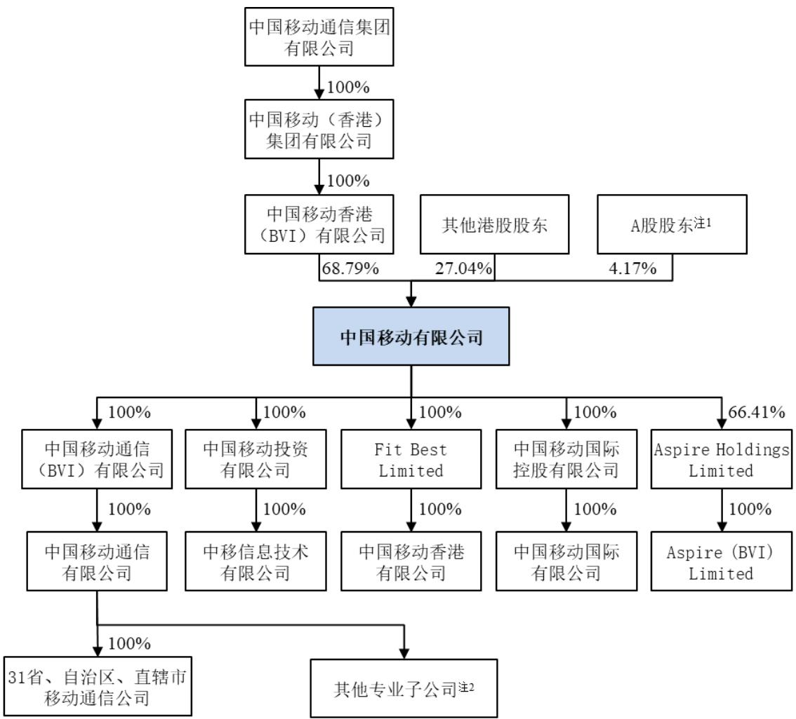

公司简称：中国移动

股票代码：600941

## 重要提示

中国移动有限公司（“本公司”或“公司”）董事会及董事、高级管理人员保证年度报告内容的真实性、准确性、完整性，不存在虚假记载、误导性陈述或重大遗漏，并承担个别和连带的法律责任。

本年度报告已经公司 2026年第一次董事会审议通过。本次会议应出席董事 7 名，实际出席董事7名。

本公司分别按照中国企业会计准则及国际财务报告会计准则/香港财务报告会计准则编制财务报告。本公司按中国企业会计准则及国际财务报告会计准则/香港财务报告会计准则编制的 2025 年度财务报告已分别经毕马威华振会计师事务所（特殊普通合伙）及毕马威会计师事务所审计并出具标准无保留意见的审计报告。

公司负责人陈忠岳、主管会计工作负责人李荣华及会计机构负责人（会计主管人员）胡宇霆声明：保证年度报告中财务报告的真实、准确、完整。

董事会建议向全体股东派发截至 2025年12月31日止年度末期股息每股2.52港元，连同已派发的中期股息，2025 年全年股息合计每股5.27 港元，同比增长3.5%。2025年全年派息率为75%。为更好地回馈股东、共享发展成果，公司充分考虑盈利能力、现金流状况及未来发展需要，2026 年派息率将稳中有升。公司 2025 年度利润分配方案已经 2026 年第一次董事会审议通过，尚需公司 2026年股东周年大会审议。

本年度报告载有若干涉及本公司未来计划、发展战略等事宜的前瞻性陈述，不构成公司对投资者的实质承诺。该等前瞻性陈述涉及已知和未知的风险、不确定性及其他因素，而相关因素可能导致本公司的实际表现、财务状况或经营业绩与前瞻性陈述中所暗示的有重大出入，敬请投资者注意投资风险。

本公司不存在被控股股东及其关联方非经营性占用资金的情形，不存在违反规定决策程序对外提供担保的情形，亦不存在半数以上董事无法保证公司所披露年度报告的真实性、准确性和完整性的情形。

公司已在本年度报告中描述了可能存在的外部环境和市场竞争方面的风险，敬请查阅“董事长报告书”章节之“未来展望”相关内容。

根据《创新企业境内发行股票或存托凭证上市后持续监管实施办法（试行）》（“《持续监管办法》”），境外已上市红筹企业的年度报告应当包括《中华人民共和国证券法》《上市公司信息披露管理办法》《存托凭证发行与交易管理办法（试行）》《公开发行证券的公司信息披露内容与格式准则第 2 号——年度报告的内容与格式》（“《2 号准则》”）和《持续监管办法》（以下合称“A 股年报披露规则”）要求披露的内容；境外已上市红筹企业在确保具备 A 股年报披露规则要求披露的内容、不影响信息披露完整性的前提下，可以继续按照境外原有格式编制对应的定期报告，但应当对境内外报告格式的主要差异作出必要说明和提示。本公司按照《持续监管办法》的前述规定编制本年度报告，确保本年度报告具备A股年报披露规则要求披露的内容、不影响信息披露完整性，但本年度报告的格式与《2 号准则》所规定的年度报告格式存在差异，本公司亦将主要差异事项在本年度报告“其他重要事项”部分予以列示，提请投资者注意。

本报告中数据若出现合计值与各分项数值之和尾数不符的情况，均为四舍五入所致。

## 目 录

重要提示..  
公司简介. 3  
近三年主要会计数据和财务指标 7  
董事及高级管理人员简介 8  
董事长报告书.. 11  
业务概览. 15  
财务概览. 17  
可持续发展报告. 22  
企业管治报告.. 25  
人力资源发展.. 42  
董事会报告书.. 43  
其他重要事项.. 53  
财务报告. 77

## 公司简介

本公司于 1997 年 9 月 3 日在中国香港特别行政区（“香港”）注册，并于 1997 年 10月 23 日在香港联合交易所有限公司（“香港联交所”）上市。公司股票在 1998 年 1 月 27日成为香港恒生指数成份股。2022 年 1 月 5 日，本公司人民币普通股（“A 股”）于上海证券交易所（“上海交易所”）上市。2023年6 月19 日，本公司于香港联交所增设人民币柜台交易香港股份。

公司在中国境内 31 个省（自治区、直辖市）和香港设有全资子公司提供通信服务、算力服务及智能服务，同时面向全球超过 200个国家和地区提供国际漫游及信息服务。公司的实际控制人是中国移动通信集团有限公司（“中国移动集团公司”）。截至 2025年12月 31日，该公司直接和间接持有本公司约 68.80%的已发行总股数，余下约 31.20%由其他股东持有。

2025 年，面对错综复杂的外部环境和诸多压力挑战，公司各方面工作取得积极成效，经营发展稳中有进，运营能力全面升级，改革创新成效显著，“十四五”实现圆满收官。公司的主营业务涵盖包括移动通信、宽带网络、蜂窝物联和卫星互联的通信服务，数据中心、移动云和移动云应用的算力服务，以及数据算法、具身智能、数智文化、数智电商和行业数智服务的智能服务。截至 2025 年 12 月 31 日，公司员工总数达 46 万人，移动客户总数达到10.05 亿户，千兆宽带客户达到 1.1 亿户。2025 年，营业收入达到人民币 10,502 亿元。

2025年，本公司再次被《福布斯》选入其“全球2000领先企业榜”、被《财富》杂志选入其“全球500强”。“中国移动”品牌在2025年再次荣登凯度的“BrandZ™全球最具价值品牌 100 强”第 62 位。目前，本公司的债信评级等同于中国国家主权评级，为标普 A+/前景稳定和穆迪A1/前景负面。

公司将锚定“世界一流科技服务企业”愿景，坚守“通信服务、算力服务、智能服务”三大主业，坚持“网络强基、全栈创新”，2030年基本建成世界一流科技服务企业，2035年全面建成世界一流科技服务企业，成为全球领先的通信运营商、算力运营商、智能运营商。

截至 2025 年 12 月 31 日，本公司的股权结构主要情况如下图所示：

  
注 1：A股股东持有公司4.17%股份中包含中国移动集团公司直接持有公司的 0.0018%股份  
注 2：除中国移动通信集团财务有限公司（“中移财务公司”）由中国移动通信有限公司（“中移通信”）直接及间接持股92%、中国移动集团公司持股8%，以及中国移动通信集团终端有限公司由中移通信持股 99.97%、中国移动集团公司持股0.03%外，其他专业子公司均由中移通信100%持股

公司的中文名称：

中国移动有限公司

公司的中文简称：

中国移动

公司的英文名称：

China Mobile Limited

公司的英文简称：

China Mobile

公司董事长：

陈忠岳

公司信息披露境内代表：

胡宇霆

联系地址：

中国北京市西城区金融大街29号

电话：

010-53992600

传真：

010-52616951

电子信箱：

zqswb@chinamobile.com

公司注册地址： 中国香港中环皇后大道中99号中环中心60楼

公司办公地址： 中国北京市西城区金融大街29号

邮政编码： 100033

公司网址： www.chinamobileltd.com

电子信箱： zqswb@chinamobile.com

公司披露年度报告的媒体名称及网址：

中国证券报： www.cs.com.cn

上海证券报： www.cnstock.com

证券时报： www.stcn.com

证券日报： www.zqrb.cn

公司披露年度报告的证券交易所网址：

上海交易所： www.sse.com.cn

香港联交所： www.hkexnews.hk

公司年度报告备置地点：

中国北京市西城区金融大街29号

中国香港中环皇后大道中99号中环中心60楼

公司股票简况：

A股上市交易所： 上海交易所

A股简称： 中国移动

A股股票代码： 600941

港股上市交易所： 香港联交所

港股简称： 中国移动（港币柜台）及中国移动-R（人民币柜台）

港股股票代码： 941（港币柜台）及80941（人民币柜台）

公司聘请的会计师事务所：

境内：

毕马威华振会计师事务所（特殊普通合伙）

办公地址：

中国北京市东城区东长安街1号东方广场毕马威大楼8层

签字会计师姓名：

肖中珂（中国注册会计师）

叶韵（中国注册会计师）

境外： 毕马威会计师事务所

办公地址：

目前审计机构已累计为公司提供审计服务5年；境内审计机构肖中珂作为签字会计师已累计为公司提供审计服务5年、叶韵作为签字会计师已累计为公司提供审计服务2年。

## 近三年主要会计数据和财务指标

除特别注明外，金额单位为人民币百万元。

主要会计数据
<table><tr><td></td><td>2025年</td><td>2024年</td><td>变化</td><td>2023年</td></tr><tr><td>营业收入</td><td>1,050,187</td><td>1,040,759</td><td>0.9%</td><td>1,009,309</td></tr><tr><td>其中：主营业务收入</td><td>895,530</td><td>889,468</td><td>0.7%</td><td>863,514</td></tr><tr><td>利润总额</td><td>175,608</td><td>178,389</td><td>-1.6%</td><td>170,531</td></tr><tr><td>归属于母公司股东的净利润</td><td>137,095</td><td>138,373</td><td>-0.9%注1</td><td>131,766</td></tr><tr><td>归属于母公司股东的扣除非经常性损益的 净利润</td><td>127,961</td><td>122,715</td><td>4.3%</td><td>117,980</td></tr><tr><td>经营活动产生的现金流量净额</td><td>232,919</td><td>315,741</td><td>-26.2%</td><td>303,780</td></tr><tr><td>归属于母公司股东权益</td><td>1,393,175</td><td>1,356,732</td><td>2.7%</td><td>1,306,432</td></tr><tr><td>总资产</td><td>2,092,882</td><td>2,072,827</td><td>1.0%</td><td>1,957,357</td></tr></table>

主要财务指标
<table><tr><td></td><td>2025年</td><td>2024年</td><td>变化</td><td>2023年</td></tr><tr><td>EBITDA注2</td><td>338,931</td><td>333.691</td><td>1.6%</td><td>341,478</td></tr><tr><td>EBITDA率注3</td><td>32.3%</td><td>32.1%</td><td>0.2pp</td><td>33.8%</td></tr><tr><td>EBITDA占主营业务收入比</td><td>37.8%</td><td>37.5%</td><td>0.3pp</td><td>39.5%</td></tr><tr><td>基本每股收益(人民币元)</td><td>6.35</td><td>6.45</td><td>-1.6%</td><td>6.16</td></tr><tr><td>稀释每股收益(人民币元)</td><td>6.30</td><td>6.42</td><td>-1.9%</td><td>6.15</td></tr><tr><td>扣除非经常性损益后的基本每股收益 （人民币元）</td><td>5.92</td><td>5.72</td><td>3.5%</td><td>5.52</td></tr><tr><td>加权平均净资产收益率</td><td>9.9%</td><td>10.4%</td><td>-0.5pp</td><td>10.2%</td></tr><tr><td>扣除非经常性损益后的加权平均净资产 收益率</td><td>9.3%</td><td>9.2%</td><td>0.1pp</td><td>9.2%</td></tr></table>

注 1：剔除套餐收入分拆纳税影响，同口径增长 2.0%  
注 2：EBITDA=营运利润+折旧摊销（其中，营运利润为利润总额加回财务费用并剔除投资收益、公允价值变动净收益、其他收益、营业外收入及营业外支出等非日常营运项目）  
注 3：EBITDA 率=EBITDA/营业收入

## 董事及高级管理人员简介

执行董事

陈忠岳先生

本公司执行董事兼董事长，于 2025 年12 月加入本公司董事会，主持本公司全面工作。现为中国移动集团公司董事长；中移通信董事、董事长。陈先生为硕士研究生。陈先生曾先后担任中国电信浙江分公司副总经理，中国电信公众客户事业部总经理，中国电信山西分公司总经理，中国电信集团有限公司副总经理，中国电信股份有限公司执行董事兼执行副总裁，中国联合网络通信集团有限公司总经理、董事长，中国联合网络通信股份有限公司总裁、董事长，中国联合网络通信有限公司总裁、董事长，以及中国联合网络通信（香港）股份有限公司总裁、执行董事、董事长兼首席执行官。

## 王利民先生

本公司执行董事，于 2025年 1 月加入本公司董事会，分管本公司人力资源、企业文化等事务。现为中国移动集团公司董事和中移通信董事。王先生为硕士研究生。王先生曾先后担任中华人民共和国最高人民检察院反贪污贿赂总局副局长及二局副局长，中央纪律检查委员会第三纪检监察室副主任、中央纪律检查委员会和国家监察委员会第七监督检查室副主任、中国华能集团有限公司纪检组组长及纪检监察组组长。

## 李荣华先生

本公司执行董事兼财务总监，于 2020年10 月加入本公司董事会，分管本公司财务、内审、证券事务等工作，并自 2024年1月 1日起担任本公司可持续发展委员会委员。李先生现同时担任中国移动集团公司总会计师、中移通信董事兼副总经理。李先生为硕士研究生。李先生曾先后担任国家电网有限公司财务部副主任、财务资产部主任，国家电网有限公司副总会计师，国家电网海外投资有限公司（香港）董事、总经理、董事长，国网英大国际控股集团有限公司董事长。李先生于 2019年 12月至 2020 年3月期间曾担任国网英大股份有限公司（于上海上市）筹备组组长，2020年3 月至2020 年9 月任国网英大股份有限公司董事长。

## 独立非执行董事

## 姚建华先生 JP

本公司独立非执行董事，于 2017 年 3月加入本公司董事会，现亦为审核委员会和薪酬委员会主席，以及提名委员会委员。姚先生现为香港保险业监管局主席、香港金融学院的董事、安踏体育用品有限公司及 Amer Sports, Inc.（于纽约交易所上市之公司）的独立非执行董事、香港科技大学校董会成员兼司库，香港机场管理局董事会成员，以及国家金融监督管理总局国际咨询委员会、香港公务员叙用委员会和香港金融管理局外汇基金咨询委员会的委员。姚先生曾任职于毕马威会计师事务所，最后职位为毕马威中国及香港的主席和首席执行官、毕马威国际及亚太地区的执行委员和董事会成员，亦曾任香港交易及结算所有限公司之独立非执行董事。姚先生持有香港理工大学会计专业文凭及英国华威大学工商管理硕士学位。姚先生为特许公认会计师公会和香港会计师公会的资深会员。

## 杨强博士

本公司独立非执行董事，于 2018 年 5月加入本公司董事会，现亦为提名委员会主席，以及审核委员会和薪酬委员会委员。杨博士现为香港理工大学（“理大”）人工智能高等研究院院长、人工智能讲座教授、首席人工智能官、香港岭南大学高等研究院院士、香港科技大学（“科大”）讲座教授以及香港人工智能与机器人学会（HKSAIR）理事长、中国人工智能学会（CAAI）副理事长，亦为北京第四范式智能技术股份有限公司的联合创始人及非执行董事，以及为北京智谱华章科技股份有限公司非执行董事。杨博士曾任加拿大滑铁卢大学计算机科学系助理教授、终身副教授、加拿大西蒙•弗雷泽大学计算机科学学院终身副教授、工业研究主任、教授及香港科技大学计算机科学及工程学系副教授、教授、系主任、香港科技大学（荣休）讲座教授等。杨博士亦曾任深圳前海微众银行股份有限公司的独立非执行董事及管理顾问、华为诺亚方舟实验室创始主任、国际人工智能联合会(IJCAI)主席、人工智能促进学会(AAAI)执行委员会成员及会议主席。杨博士是人工智能促进学会(AAAI)、美国计算机学会(ACM)、国际电气与电子工程师学会(IEEE)等多个国际学会会士，亦被选为加拿大皇家学院及加拿大工程院院士。杨博士持有北京大学天体物理学士学位、美国马里兰大学天体物理和计算机科学硕士学位及马里兰大学计算机科学博士学位。

## 李嘉士先生 JP

本公司独立非执行董事，于 2022 年 5月加入本公司董事会，现亦为审核委员会、提名委员会、薪酬委员会和可持续发展委员会委员。李先生自 1989 年起担任胡关李罗律师行的合伙人，现为安全货仓有限公司及彩星集团有限公司的非执行董事、顺丰控股股份有限公司的独立非执行董事，和深圳控股有限公司的公司秘书。李先生亦为香港公益金筹募委员会委员。李先生曾任合景泰富集团控股有限公司的独立非执行董事。李先生持有香港大学法律学士学位和法学专业证书，为香港、英格兰及威尔斯、新加坡及澳洲首都地域的合资格律师。

## 梁高美懿女士 SBS, JP

本公司独立非执行董事，于 2022 年 5月加入本公司董事会，现亦为可持续发展委员会主席，以及审核委员会、提名委员会和薪酬委员会委员。梁女士现为第一太平有限公司、新鸿基地产发展有限公司和中国银行股份有限公司之独立非执行董事。梁女士为香港特别行政区行政会议非官守议员、艺术发展咨询委员会主席、香港文化委员会委员、香港法律改革委员会非当然成员，以及香港大学校务委员会委员、司库、财务委员会主席和人力资源政策委员会委员。梁女士曾任汇丰控股有限公司集团总经理及工商业务环球联席主管、恒生银行有限公司副董事长兼行政总裁，和创兴银行有限公司之副主席、董事总经理兼行政总裁。另外，梁女士曾任太古股份有限公司、和记黄埔有限公司、中国建设银行股份有限公司、QBEInsurance Group Limited、香港交易及结算所有限公司、利丰有限公司和中国农业银行股份有限公司之独立非执行董事。梁女士持有香港大学经济、会计及工商管理学士学位。

高级管理人员

李慧镝先生

本公司副总经理，于 2019年 9 月获委任，分管本公司计划建设、网络运维、信息港建设、信息安全、国际业务、设计院等。李先生同时担任中国移动集团公司副总经理兼首席网络安全官，中移通信董事、副总经理。李先生为博士研究生。李先生曾任联想集团有限公司副总裁兼移动新技术及高端产品事业部总经理，联想移动通信科技有限公司首席技术官、技术创新委员会主席，中国移动集团公司总经理助理。

## 张冬先生

本公司副总经理，于2024年7月获委任，分管本公司市场经营、客户服务、在线业务、终端业务、移动互联网、智慧家庭、金融科技等业务。张先生同时担任中国移动集团公司副总经理兼首席数据官，中移通信董事、副总经理。张先生为硕士研究生。张先生曾任海南移动、江苏移动副总经理，中国移动集团公司市场经营部总经理，北京移动董事长兼总经理。

## 程建军先生

本公司副总经理，于2025年 2月获委任，分管本公司科技创新、法律与监管事务、5G共建共享、股权投资、研究院、供应链管理等。程先生同时担任中国移动集团公司副总经理，中移通信董事、副总经理。程先生为硕士研究生。程先生曾任中国工业和信息化部无线电管理局副局长和国际合作司副司长、黑龙江省通信管理局局长、福建省通信管理局局长、国家无线电监测中心（国家无线电频谱管理中心）主任、工业和信息化部无线电管理局局长。

## 陈怀达先生

本公司副总经理，于 2025年 3 月获委任，分管本公司政企业务、云业务、系统集成、垂直行业、物联网业务等。陈先生同时担任中国移动集团公司副总经理，中移通信董事、副总经理。陈先生为硕士研究生。陈先生曾任山东移动董事、副总经理，陕西移动董事长、总经理，陕西通信实业有限公司执行董事、总经理，中国移动集团公司政企事业部、政企客户分公司、中国移动驻雄安新区办公室临时主要负责人。

## 董事长报告书

尊敬的各位股东：

2025 年，面对错综复杂的外部环境和诸多压力挑战，公司各方面工作取得积极成效，经营发展稳中有进，运营能力全面升级，改革创新成效显著，“十四五”实现圆满收官。

## 2025 业绩表现

2025年公司营业收入稳健增长，达到人民币10,502亿元，同比增长0.9%；主营业务收入1达到人民币8,955亿元，同比增长0.7%。通信服务2收入占主营业务收入比为79.8%；算力服务3、智能服务4收入占主营业务收入比为 20.2%，同比提升 1.4 个百分点。

2025年公司营运利润5达到人民币1,489亿元，同比增长 4.4%。归属于母公司股东的净利润为人民币1,371亿元，同比下降 0.9%，同口径6同比增长 2.0%，基本每股收益为人民币6.35 元；EBITDA 为人民币 3,389 亿元，同比增长 1.6%，EBITDA 率为 32.3%，同比提升 0.2个百分点。盈利能力继续保持国际一流运营商领先水平。资本开支为人民币1,509亿元，同比下降8.0%。自由现金流为人民币 820亿元，保持健康充沛。

董事会建议向全体股东派发截至 2025 年 12 月 31 日止年度末期股息每股 2.52 港元7，连同已派发的中期股息，2025年全年股息合计每股5.27 港元，同比增长3.5%。2025年全年派息率为75%8。

为更好地回馈股东、共享发展成果，公司充分考虑盈利能力、现金流状况及未来发展需要，2026年派息率将稳中有升。

## 经营发展稳中有进

通信服务基础稳健。通信服务是公司经营的基本盘，公司坚持融合发展和精细运营。移动客户规模稳固，达到 10.05 亿户；5G 网络客户达到 6.42 亿户，净增 8,960 万户，渗透率达到 63.9%。宽带联网9客户再创新高，达到 3.29 亿户，净增 999 万户，宽带网络收入同比增长7.1%。物联网卡连接数达到 14.8亿，AIoT平台成为全球最大的连接管理平台。公司获颁卫星移动通信业务经营许可，卫星通信迈入商业化运营阶段。2025 年通信服务收入完成人民币7,149亿元，同比下降 1.0%。

算力服务加速推进。算力服务是公司高质量发展的重要增长极，公司强化 AIDC 资源供给和储备，“AIDC+网络+算力+运维”服务能力明显提升，移动云品牌更加彰显。数据中心收入同比增长8.7%，其中AIDC收入同比增长35.4%。得益于智算需求的迅猛增长，智算服务成为第一引擎，增速达 279%，拉动云算服务收入同比增长 13.9%。云盘月活跃客户达到2.1亿户，云视频客户超8,670万户。2025年算力服务收入快速增长，完成人民币898亿元，同比增长 11.1%。

智能服务创新突破。智能服务是公司赢得未来竞争的制高点，公司深化落实“人工智能+”行动，在数智生活、数智生产、数智治理场景发挥创新牵引作用。升级九天基础大模型3.0，推出超 100 款 AI+产品及应用解决方案、29 款垂类智能体，自主打造高质量数据集3,500TB，数据算法收入同比增长 12.6%，数智文化收入同比增长 13.3%。重点布局超 50 款自研行业大模型，联合能源、水利、农业等行业龙头共建行业大模型，赋能新型工业化走深走实。2025年智能服务收入良好增长，完成人民币908 亿元，同比增长5.3%。

两类客群融合贯通。公司持续推动公众政企“两类客群”融合贯通，移宽融合率达到96.5%，政企客群中成员客户超 2亿户，净增935万户。面向公众客群，着力稳存量、激用量、提价值，全球通客户达到 2.0亿户，净增 419万户；千兆宽带客户达到 1.1 亿户，净增970万户；公众客群收入完成人民币 6,551亿元，同比下降 1.2%。面向政企客群，加快推进政企市场体系升级，着力强能力、拓规模、优质效，政企客户数达到 3,617 万家，净增 358万家，政企客群收入达到人民币 2,404 亿元，同比增长 6.1%。

国际市场快速拓展。公司持续增强国内国际“两个市场”融通效应，推动优质产品、能力出海，支撑“一带一路”高质量共建。服务万家中资企业跨国发展，全球合作数据中心超1,300 个，“牵手计划”覆盖全球用户超 30 亿户，成功收购香港宽频，充分发挥协同效应，着力为香港消费者提供更丰富、更优质的通信和数字化服务。2025 年国际市场收入快速增长，完成人民币293亿元，同比增长 28.5%。

品牌服务持续完善。构建大服务体系，加强优质服务供给，创新全面质量管理，十项服务承诺有效落地，服务水平再上新台阶，中国移动APP 月活跃客户达3.46亿户，同比增长50.0%，5G 网络时长驻留比提升至 97.6%。深化中国移动战略品牌体系10建设运营，焕新全球通、移动爱家客户品牌，打造移动商客品牌，品牌影响力持续提升，中国移动品牌价值在全球运营商中名列前茅。

## 运营能力全面升级

基础设施不断夯实。通信网络保持领先。5G 网络基站超过 277 万站，实现全国乡镇以上连续覆盖，全球率先引入 5G-A 核心网智能化。千兆网络覆盖住户 5.3 亿户，万兆光网试点积极推进。算力网络加快布局。智算总规模11达 92.5 EFLOPS（FP16），实现百卡至超万卡的全规格计算能力。完善城域 1 毫秒、省域5 毫秒、全国 20 毫秒的三级算力时延圈，省际骨干400G OTN网络基本覆盖全国，对外服务 IDC 标准机架12超 150万架。智能网络融合创新。着力构建智能化的以能力供给为核心、以泛在互联和场景化服务为特征的平台型基础设施，打造多模型和智能体聚合服务引擎 MoMA13，建强 MaaS和智能体平台，升级数据流通基础设施“数联网”，深化“5G+工业互联网”融合应用。

产品供给显著增强。抢抓经济社会加速数字化转型机遇，持续加大产品布局与创新力度，取得积极成效。通信服务方面，在技术升级、业态焕新、流量创新等方面持续用力；算力服务方面，做强移动云品牌，强化AIDC资源供给，构建智能云服务，实现通算、智算、超算、量子多元算网资源智能调度与服务；智能服务方面，充分发挥九天人工智能禀赋，发力数智生活场景，融入数智生产场景，拓展数智治理场景。公司成功打造收入百亿级产品 13 项，客户超亿户产品17项，AI智能助理灵犀智能体月活跃客户超 1亿。

## 改革创新成效显著

科技实力不断增强。持续加大科技创新投入，深化通信技术、信息技术、智能技术融合创新，提升公司内生动力、硬核实力。

网络创新成果持续涌现。通信网络方面，率先联合打造 5G-A 蜂窝无源物联网产品，6G国际标准立项数居全球运营商第一阵营。算力网络方面，全国首次商用空芯光纤线路，首次完成T 比特级现网验证；上线算网大脑3.0，落地8个国家级、枢纽级、区域级平台；发布业内首台 115.2T 智算路由器。智能网络方面，九天大模型登顶 OpenCompass 榜单。

新兴领域赛道加速拓展。工业互联网领域，九天•工业大模型入选 2025全球工业大模型TOP 50第六名；具身智能领域，自研 3B 参数VLA 具身智能大模型；低空智联网领域，在雄安、杭州、广州、深圳、苏州等地构建低空技术试验网；量子科技领域，量子计算云平台超2000量子比特规模；卫星互联网领域，首发大众消费级北斗通导融合芯片。

公司科技创新取得一系列标志性成果，科创影响力不断提升。成为首家担任3GPP RAN1工作组主席的中国公司，5G 核心技术专利获得中国专利金奖，“低空智联网关键技术研究与应用”获世界互联网大会领先科技奖。

改革管理深化推进。以改革促活力，设立算力办公室，统筹公司算力网布局、生态资源整合与重大项目交付；打造人工智能创新高地，成立中移九天人工智能科技（北京）有限公司（九天人工智能研究院），组建具身智能产业创新中心、人工智能安全治理研究中心、AI+新型工业化创新研究院。以激励聚人才，建强“十百千万”人才雁阵，持续推动员工队伍转型，不断健全精准多元的激励体系，队伍规模、结构、质量更加适配新质生产力发展，公司荣获“2025中国年度最佳雇主 10强”。以数智促转型，全面推进公司数智化转型，能力中台调用总量超 1.4 万亿次；加速 AI 在生产经营管理各环节的深度融合，活跃数智员工超 8万个。以精益强管理，把“精准、精细、精益”贯穿到经营管理工作的全流程，全面提升全要素资源效率、效益、效能，2025年营运支出14增幅低于营运收入增幅 0.6个百分点。

## 积极履行 ESG责任

公司高度重视可持续发展，基于自身成长，带动和赋能经济、社会、环境全面发展。

绿色发展全面深入。深耕“C²三能——中国移动碳达峰碳中和行动计划”15，从通信网络、算力网络到智能网络全方位推进绿色低碳运营，2025 年碳排放强度同比下降 6.6%；充分发挥信息化技术降碳杠杆作用，助力全社会碳减排约 4.7 亿吨。

社会担当务实有为。深入推进通信普遍服务，助力消除数字鸿沟，加速实现“乡乡双千兆、村村全通达”。京津冀、长三角、大湾区、川渝等区域多个重大项目落地，有力支持区域协调发展。全力打造“和美乡途”数智乡村文旅平台，赋能乡村产业振兴。圆满完成重大活动通信保障，全力做好防汛抗震救灾保通信工作。积极防范打击电信网络违法犯罪，竭力营造清朗网络空间。

公司治理卓有成效。持续筑牢依法合规经营防线，合规管理体系更加健全；强化穿透式监管，加强全覆盖、数智化审计监督，提升风险预警能力和防控成效；积极承担上市公司责任，切实保障股东合法权益，开展各类投资者交流活动 200 余场，保持可信、透明、良好的资本市场形象。

公司 ESG 表现赢得广泛赞誉，中央广播电视总台、中国企业改革与发展研究会授予公司“ESG 榜样示范基地”称号；公司连续三年获得“五星佳级”最高评价，入选“中国ESG上市公司先锋100”榜单。《Extel》杂志授予公司“最受尊崇企业”殊荣；《彭博商业周刊/中文版》杂志向公司颁发“年度上市企业”荣誉；《金融亚洲》（Finance Asia）授予公司“最佳电信服务企业（中国内地）”金奖。公司亦入选中国上市公司协会“年报业绩说明会最佳实践”“上市公司董事会最佳实践”等荣誉榜单。

## 未来展望

当前，新一轮科技革命和产业变革加速演进，数智技术深度融入经济社会发展各领域，驱动通信范畴深化拓展、算力需求强劲增长、智能应用加速突破。信息通信业作为创新驱动发展的先导力量、国民经济和社会发展的基础性行业、国际竞争和未来发展的战略前沿，在助力国家打造智能经济新形态、加快发展新质生产力的进程中，将迎来新的重大发展机遇。与此同时，外部环境变化影响加深；行业进入新旧动能转换的关键期，传统通信业务增长放缓，新兴信息服务增长动能尚在培育；电信服务增值税政策调整带来一定影响，公司发展也面临一些不确定性因素。

展望未来，公司将锚定“世界一流科技服务企业”愿景，坚守“通信服务、算力服务、智能服务”三大主业，坚持“网络强基、全栈创新”，2030年基本建成世界一流科技服务企业，2035年全面建成世界一流科技服务企业，成为全球领先的通信运营商、算力运营商、智能运营商。

2026 年是“十五五”规划的开局之年，公司将持续做强做优做大通信、算力、智能服务，推动实现质的有效提升和量的合理增长。一方面，着力提质增效，提升核心竞争力。焕新通信服务，加速算力服务，提升智能服务；深化网络强基，深化数智强能，深化品牌强企。另一方面，推进科技创新，发展新质生产力。坚持创新领先，提升投资效益，更好地投资于网；加快新兴产业布局，更快地投资于新；全面推进人才发展，更强地投资于人。公司将努力实现收入稳健增长、利润同口径16协同增长，向“世界一流科技服务企业”迈出坚实步伐，持续为广大股东、客户创造更大价值。

## 致谢

杨杰先生于2025年 12月辞任执行董事兼董事长职务，何飚先生于2026年 2 月辞任执行董事兼首席执行官职务。杨先生、何先生在服务中国移动期间担当重任，带领公司全面推进数智化转型、高质量发展，成绩卓著，贡献突出。我谨代表董事会，衷心感谢杨杰先生、何飚先生对公司作出的突出贡献。

最后，借此机会代表董事会对全体股东、广大客户和社会各界长期以来对公司的关心和支持，对全体员工的努力与贡献致以诚挚谢意！

陈忠岳

董事长

香港，2026 年 3 月 26 日

## 业务概览

2025年，公司稳步拓展通信服务、算力服务、智能服务，持续锻造差异化竞争优势，经营发展稳中有进，营业收入达到人民币10,502亿元，同比增长0.9%；主营业务收入达到人民币8,955亿元，同比增长 0.7%。

## 主要运营数据

<table><tr><td></td><td>2025年</td><td>2024年</td><td>变化</td></tr><tr><td colspan="4">通信服务</td></tr><tr><td>移动客户数（百万户）</td><td>1,005</td><td>1,004</td><td>0.1%</td></tr><tr><td>其中：5G网络客户数（百万户）</td><td>642</td><td>552</td><td>16.2%</td></tr><tr><td>平均每月每户通话分钟MOU（分钟/户/月）</td><td>204</td><td>222</td><td>-8.1%</td></tr><tr><td>平均每月每户手机上网流量DOU（GB/户/月）</td><td>17.3</td><td>15.9</td><td>9.0%</td></tr><tr><td>移动ARPU（人民币元/户/月）</td><td>46.8</td><td>48.5</td><td>-3.5%</td></tr><tr><td>千兆宽带客户数（百万户）</td><td>109</td><td>99</td><td>9.8%</td></tr><tr><td>家庭客户综合ARPU（人民币元/户/月）</td><td>44.5</td><td>43.8</td><td>1.6%</td></tr><tr><td>物联网卡客户数（百万）</td><td>1,482</td><td>1,416</td><td>4.6%</td></tr><tr><td colspan="4">算力服务</td></tr><tr><td>对外服务IDC标准机架1（万架）</td><td>150.4</td><td>134.4</td><td>11.9%</td></tr><tr><td>智算总规模²（EFLOPS，FP16)</td><td>92.5</td><td>一</td><td>1</td></tr><tr><td colspan="4">智能服务</td></tr><tr><td>AI智能助理灵犀智能体月活跃客户数（亿户）</td><td>1.17</td><td>0.24</td><td>383.9%</td></tr><tr><td>咪咕视频AI智能观赛累计使用人次（亿）</td><td>3.1</td><td>1.6</td><td>93.7%</td></tr></table>

## 三大主业稳步拓展

## 通信服务

深化基于规模的价值经营，坚持“连接+应用+权益+硬件”融合发展，全面推进分客户、分场景的精细化运营，移动通信规模稳固，移动客户达到 10.05亿户。

以移动爱家品牌为引领，加快AI+智慧家庭全面升级，宽带网络收入良好增长。千兆宽带客户达到1.1亿户，FTTR 客户达到2,527万户，净增 1,464万户，移动高清客户达到 2.06亿户。

推进AIoT（智能物联网）升级，加快产业互联、生活物联、市政智联等重点场景深耕，物联网卡连接数达到 14.8 亿。公司获颁卫星移动通信业务经营许可，卫星通信迈入商业化运营阶段。

## 算力服务

紧密衔接国家“东数西算”工程部署，重点围绕京津冀、长三角、粤港澳大湾区、成渝、内蒙古、宁夏、甘肃、贵州等国家枢纽节点加快资源规划建设，强化AIDC资源供给和储备，数据中心收入良好增长。

发挥网云融合、智通一体、云智协同优势，持续升级云智算产品体系，云算服务收入快速增长。得益于智算需求的迅猛增长，智算服务收入增速达 279%，是拉动整体云算服务增长的第一引擎。

着力打造端网云一体化解决方案，云盘、云视频、云电脑等云算应用实现规模推广。云 盘月活跃客户达到2.1亿户，云视频客户超 8,670万户。

## 智能服务

升级九天基础大模型 3.0，推出超 100 款 AI+产品及应用解决方案、29 款垂类智能体，数据算法收入快速增长。成立具身智能产业创新中心，在技术、产品等多方面取得明显进展。

深耕视频、音乐彩媒3、沉浸内容、阅读/游戏四大产品赛道，贯通内容、平台、客户、商业四位一体运营，产品竞争力和差异化优势更加凸显，数智文化收入快速增长。

全新上线移动爱购商城，打造数智生活服务平台。建强金融科技能力，打造全国首个“通信+防诈”融合产品。

重点布局超50款自研行业大模型，联合能源、水利、农业等行业龙头共建行业大模型，行业数智服务收入稳健增长。

## 基础设施持续夯实

公司始终坚持前瞻布局、精准投资，一方面围绕通信网络、算力网络和智能网络，确保网络规模、技术、质量和安全全面领先；另一方面持续加强精益管理，进一步优化投资结构，提升资源效率，保障投资效益，促进绿色低碳。

网络能力品质不断提升。截至 2025年12月底，公司已开通 5G基站超277万站，光缆长度达 3,691 万皮长公里，省际骨干传送网承载业务带宽达到 1,098Tbps，智算总规模4达92.5EFLOPS，智算训练全国中心节点和区域中心节点基本覆盖国家八大枢纽。

国际信息基础设施布局持续优化。截至 2025年12月底，公司已拥有通达全球的 100余条海陆缆资源、406Tbps国际传输总带宽，446个POP 点覆盖全球主要国家和地区。

2025 年公司各项资本开支合计约人民币 1,509 亿元。2026 年公司预计资本开支合计约为1,366亿元，主要用于确保通信网络领先、加速算力网络建强、探索智能网络创新以及优化端到端感知等方面，所需资金主要来自经营活动现金流。

## 财务概览

2025年，公司积极拓展市场，深化提质增效，营业收入稳健增长，盈利能力继续保持国际一流运营商领先水平，持续为股东创造价值。（除特别注明外，金额单位为人民币百万元）

<table><tr><td></td><td>2025年</td><td>2024年</td><td>变化</td></tr><tr><td>营业收入</td><td>1,050,187</td><td>1,040,759</td><td>0.9%</td></tr><tr><td>主营业务收入</td><td>895,530</td><td>889,468</td><td>0.7%</td></tr><tr><td>其他业务收入</td><td>154,657</td><td>151,291</td><td>2.2%</td></tr><tr><td>营运支出注</td><td>901,255</td><td>898,169</td><td>0.3%</td></tr><tr><td>营运利润注2</td><td>148,932</td><td>142,590</td><td>4.4%</td></tr><tr><td>EBITDA</td><td>338,931</td><td>333,691</td><td>1.6%</td></tr><tr><td>EBITDA率</td><td>32.3%</td><td>32.1%</td><td>0.2pp</td></tr><tr><td>归属于母公司股东的净利润</td><td>137,095</td><td>138,373</td><td>-0.9%</td></tr><tr><td>基本每股收益(人民币元)</td><td>6.35</td><td>6.45</td><td>-1.6%</td></tr></table>

注 1：营运支出为依据国际财务报告会计准则/香港财务报告会计准则列示的成本项目，主要包括营业成本、税金及附加、销售费用、管理费用、研发费用、信用减值损失等

## 注 2：营运利润=营业收入-营运支出

## 营业收入

2025年，公司营业收入达到 10,502亿元，比上年增长 0.9%。

## 主营业务收入

主营业务收入为 8,955 亿元，比上年增长 0.7%。其中：

## 无线上网业务收入

公司创新流量经营，加强融合运营，无线上网业务收入为 3,691 亿元。

## 有线宽带业务收入

公司持续筑牢宽带规模底座，大力拓展家庭亲情圈，持续推进商客规模价值拓展。有线宽带收入达到1,416亿元，比上年增长8.7%。

## 应用及信息服务收入

公司着力强化网云协同、融合创新，加快拓展算力服务、智能服务。应用及信息服务收入达 2,588 亿元，比上年增长 6.1%。

## 其他业务收入

受手机等终端销售带动，其他业务收入达 1,547 亿元，比上年增长 2.2%。

## 成本费用情况

公司把“精准、精细、精益”贯穿到经营管理工作的全流程，打造覆盖全员、全要素、全过程的成本管控机制，推动成本应管尽管、应控尽控，持续提升成本使用效益。

2025 年，公司营运支出为 9,013 亿元，较上年增长 0.3%，低于营业收入增幅 0.6pp。

<table><tr><td></td><td>2025年 2024年</td><td></td><td>变化</td></tr><tr><td>营业成本</td><td>747,016</td><td>738,772</td><td>1.1%</td></tr><tr><td>主营业务成本</td><td>594,024</td><td>589,532</td><td>0.8%</td></tr><tr><td>网络运营及支撑支出</td><td>278,398</td><td>275,237</td><td>1.1%</td></tr><tr><td>折旧与摊销</td><td>178,869</td><td>180,453</td><td>-0.9%</td></tr><tr><td>职工薪酬</td><td>101,312</td><td>100,944</td><td>0.4%</td></tr><tr><td>网间结算支出</td><td>30,583</td><td>28,445</td><td>7.5%</td></tr><tr><td>其他</td><td>4,862</td><td>4,453</td><td>9.2%</td></tr><tr><td>其他业务成本</td><td>152,992</td><td>149,240</td><td>2.5%</td></tr><tr><td>销售费用</td><td>56,184</td><td>54,564</td><td>3.0%</td></tr><tr><td>管理费用</td><td>55,821</td><td>56,937</td><td>-2.0%</td></tr><tr><td>研发费用</td><td>29,253</td><td>28,163</td><td>3.9%</td></tr><tr><td>财务费用</td><td>-1,535</td><td>-2,495</td><td>-38.5%</td></tr></table>

## 主营业务成本

主营业务成本为 5,940 亿元，比上年增长 0.8%，占营业收入比重为 56.6%。其中：

公司在保障转型投入的基础上，严控外包支出，加强自有能力应用。网络运营及支撑成本为2,784亿元，比上年增长 1.1%，占营业收入比重为 26.5%。

## 折旧与摊销

公司坚持精准投资，优化投向结构，近年资本开支稳中有降，折旧及摊销为1,789亿元，比上年下降0.9%，占营业收入比重为 17.0%。

## 职工薪酬

公司持续加大核心骨干、基层一线人员激励倾斜力度。职工薪酬为1,013亿元，比上年增长 0.4%，占营业收入比重为 9.6%。

## 其他业务成本

受手机终端销售增长推动，其他业务成本为1,530 亿元，比上年增长2.5%，占营业收入比重为 14.6%。

## 销售费用

公司加大存量运营、客户服务营销资源投入。销售费用为 562亿元，比上年增长 3.0%，占营业收入比重为 5.3%。

## 管理费用

管理费用为 558 亿元，比上年下降 2.0%，占营业收入比重为 5.3%。

## 研发费用

研发费用为293亿元，比上年增长 3.9%，占营业收入比重为 2.8%。

## 财务费用

财务费用为-15 亿元，其中利息收入为 53 亿元，利息费用为 37 亿元。

## 盈利水平

2025 年，公司持续推进提质增效，盈利水平继续保持国际一流运营商领先水平。营业利润为 1,784 亿元，比上年增长 1.2%；EBITDA 为 3,389 亿元，比上年增长 1.6%；EBITDA占主营业务收入比为 37.8%，比上年增长 0.3 个百分点；归属于母公司股东的净利润为 1,371亿元，比上年下降 0.9%，同口径1比上年增长 2.0%，归属于母公司股东的净利润率为 13.1%。

<table><tr><td></td><td>2025年</td><td>2024年</td><td>变化</td></tr><tr><td>营业利润</td><td>178,444</td><td>176,284</td><td>1.2%</td></tr><tr><td>归属于母公司股东的净利润</td><td>137,095</td><td>138,373</td><td>-0.9%</td></tr><tr><td>归属于母公司股东的扣除非经常性损益的净利润</td><td>127,961</td><td>122,715</td><td>4.3%</td></tr><tr><td>归属于母公司股东的净利润率</td><td>13.1%</td><td>13.3%</td><td>-0.2pp</td></tr><tr><td>基本每股收益（人民币元)</td><td>6.35</td><td>6.45</td><td>-1.6%</td></tr><tr><td>稀释每股收益（人民币元）</td><td>6.30</td><td>6.42</td><td>-1.9%</td></tr><tr><td>扣除非经常性损益后的基本每股收益（人民币元)</td><td>5.92</td><td>5.72</td><td>3.5%</td></tr><tr><td>加权平均净资产收益率</td><td>9.9%</td><td>10.4%</td><td>-0.5pp</td></tr><tr><td>扣除非经常性损益后的加权平均净资产收益率</td><td>9.3%</td><td>9.2%</td><td>0.1pp</td></tr></table>

## 资本结构

公司财务状况继续保持稳健。2025年底，资产总额为 20,929亿元，负债总额为 6,953亿元，位于境外地区的资产规模不重大。公司一贯坚持审慎的财务风险管理政策，偿债能力雄厚，公司资产负债率为 33.2%。

<table><tr><td></td><td>2025年 12月31日 12月31日</td><td>2024年 变化</td></tr><tr><td>流动资产</td><td>497,646</td><td>568,559 -12.5%</td></tr><tr><td>非流动资产</td><td>1,595,236</td><td>1,504,268 6.0%</td></tr><tr><td>资产总额 2,092,882</td><td>2,072,827</td><td>1.0%</td></tr><tr><td>流动负债</td><td>613,560 633,018</td><td>-3.1%</td></tr><tr><td>非流动负债</td><td>81,771 78,570</td><td>4.1%</td></tr><tr><td>负债总额</td><td>695,331 711,588</td><td>-2.3%</td></tr><tr><td>归属于母公司股东权益</td><td>1,393,175 1,356,732</td><td>2.7%</td></tr><tr><td>少数股东权益</td><td>4,376 4,507</td><td>-2.9%</td></tr><tr><td>总权益</td><td>1,397,551</td><td></td></tr><tr><td></td><td>1,361,239</td><td>2.7%</td></tr></table>

## 现金流

公司一贯坚持稳健审慎的财务政策和严格的资金管理制度，保持健康的现金流水平，通过高度集中的投融资管理，确保资金安全与完整；同时，公司持续加大资金集中管理力度，合理调度资金，充分发挥资金规模效益。

2025 年，公司现金流健康充沛，经营活动产生的现金净流入为 2,329 亿元，同比下降26.2%；投资活动产生的现金净流出为 1,904亿元，同比增长 2.8%；筹资活动产生的现金净流出为1,121亿元，同比增长 6.6%；自由现金流为820 亿元，同比下降45.9%。下半年经营活动现金流入净额、自由现金流较上半年均有明显好转。2025 年底，公司总现金及银行结存余额为 2,328 亿元，其中人民币资金占 92.4%，港币资金占 5.6%，美元资金占 1.8%。

<table><tr><td></td><td>2025年</td><td>2024年</td><td>变化</td></tr><tr><td>经营活动产生的现金流量净额</td><td>232,919</td><td>315,741</td><td>-26.2%</td></tr><tr><td>投资活动产生的现金流量净额</td><td>-190,403</td><td>-185,194</td><td>2.8%</td></tr><tr><td>筹资活动产生的现金流量净额</td><td>-112,143</td><td>-105,167</td><td>6.6%</td></tr><tr><td>自由现金流</td><td>82,041</td><td>151,720</td><td>-45.9%</td></tr></table>

## 分季度主要财务数据

<table><tr><td></td><td>第一季度 (1-3月份）</td><td>第二季度 (4-6月份）</td><td>第三季度 （7-9月份）</td><td>第四季度 （10-12月份）</td></tr><tr><td>营业收入</td><td>263,760</td><td>280,009</td><td>250,897</td><td>255,521</td></tr><tr><td>归属于母公司股东的净利润</td><td>30,631</td><td>53,604</td><td>31,118</td><td>21,742</td></tr><tr><td>归属于母公司股东的扣除非经 常性损益后的净利润</td><td>28,915</td><td>49,451</td><td>28,740</td><td>20,855</td></tr><tr><td>经营活动产生的现金流量净额</td><td>31,317</td><td>52.515</td><td>77,215</td><td>71,872</td></tr></table>

## 债信评级

目前，公司的债信评级等同于中国国家主权评级，为标普 A+/前景稳定和穆迪 A1/前景负面，公司雄厚的财务实力、良好的业务潜力和稳健的财务管理得到市场高度认可。

## 可持续发展报告

中国移动积极履行企业社会责任，将可持续发展理念全面融入公司发展战略，锚定“世界一流科技服务企业”愿景，以数智创新、包容成长、绿色发展和卓越治理为行动主线，为经济、社会、环境的可持续发展贡献智慧和力量。

数智创新，赋能经济社会高质量发展。公司积极推进科技创新与产业创新深度融合，加快发展新质生产力，着力做强做优做大通信服务、算力服务、智能服务，加速数智技术融入经济社会各领域，赋能千行百业、服务千家万户。截至 2025年底，累计开通5G基站超 277万站，千兆网络覆盖住户达 5.3 亿户，5G 网络客户数达 6.4 亿户，5G 行业商用案例累计超5.7 万个，服务 97 个国民经济大类中的 91 个。智算总规模达 92.5EFLOPS（FP16），实现百卡至超万卡的全规格计算能力。AI 智能助理灵犀智能体用户突破 1 亿规模，工业互联网平台服务超万户企业，5G 智慧农业示范项目超 3,000 个，自研乡村振兴云平台覆盖行政村达 15 万个，全面赋能生产、生活、治理数智升级。公司首席科学家、总工程师王晓云当选中国工程院院士，公司“全球首个6G开放众创试验装置”入选“2025年度央企十大国之重器”，“全球领先全国规模最大的算力网络”入选“2025 年度央企十大超级工程”。

包容成长，积极服务保障和改善民生。公司深入践行以人民为中心的发展思想，用心为客户提供高品质服务，全力保障客户、员工和社会各方权益，深化数智普惠，让科技服务惠及全民，与社会共享发展成果。2025年，公司积极回应客户关切，以提升服务标准、引领行业规范为目标，向社会公布十项服务承诺，服务质量不断提升。全面加强网信安全体系建设，筑牢网信安全防线，累计拦截垃圾短彩信213.2 亿条，阻断各类不良网站访问 1.9 万亿次，切实维护清朗网络空间。圆满完成哈尔滨亚冬会、第十五届全运会等重大活动通信和网信安全保障。深入推进电信普遍服务，以数智技术促进区域协调发展、赋能乡村振兴、助力共同富裕，建成数字乡村达标村超45.8万个。深耕“一红一蓝”公益慈善品牌项目，积极开展公益慈善活动和志愿服务，参与员工志愿者达 10 万人次。坚持“人才强企”战略，强化引才、育才、用才，注重保障员工权益，提升员工幸福感。

绿色发展，助力社会绿色低碳转型。公司积极应对气候变化，深入实施“C2三能计划”，对内深化绿色低碳运营，对外充分发挥信息技术降碳杠杆作用，赋能经济社会绿色低碳发展。2025 年，公司推进绿色基站和绿色数据中心建设，开展“绿智无线”“绿智算力”专项行动，全年节电150亿度，大型、超大型数据中心总体PUE值降至1.285，公司能耗强度同比降低5.6%，碳排放强度同比降低6.6%。积极引领供应链绿色发展，通过制度构建、标准融入、过程监督与行业协同，系统推动全链条绿色转型，电子采购率接近100%，节约纸张 1.15亿张。发挥数智技术降碳杠杆作用，支持环保治污数智化转型升级，推动生态绿色发展，赋能社会绿色转型，“十四五”期间助力全社会碳减排约 16 亿吨。

卓越治理，持续增强可持续发展能力。公司持续推动现代企业制度的健全与完善，加强董事会建设，推动改革向纵深发展，完善风险管控和合规管理体系，为公司高质量可持续发展筑牢根基、保驾护航。2025 年，高质量完成公司国企改革深化提升行动任务，公司重点领域改革实现重要突破，改革专项行动成效显著，培育“专精特新”团队 22 支，其中 3 支获评“小巨人”企业。持续强化审计监督机制，构建“AI+审计”新范式。完善内控风险防控体系，深入实施“合规护航计划”，开展“AI+巡视”提升巡视质效，深化嵌入式廉洁风险防控机制建设，风险防范能力进一步提升。

健全可持续发展管理架构和工作体系。公司秉承“至诚尽性，成己达人”的履责理念，在董事会下设立可持续发展委员会，加强对可持续发展工作的监督与管理。连续 20 年发布《可持续发展报告》，深度回应相关方的关切和期望。连续18年开展“企业社会责任优秀实践案例评选”，收集各类实践成果 1,464 项，评选出 319 项优秀成果，促进内外优秀可持续发展实践推广应用。

中国移动可持续发展管理架构
<table><tr><td rowspan=1 colspan=1>决策层</td><td rowspan=1 colspan=1>公司董事会下设可持续发展委员会，由执行董事和独立非执行董事组成，负责就公司企业社会责任及可持续发展的目标、策略、重点、措施及目的向董事会提出建议，支撑董事会就公司社会责任及可持续发展议题进行决策。监督、审视及评估公司所采取以贯彻企业社会责任及可持续发展重点与目的之行动，审阅及向董事会汇报可持续发展之风险及机遇。可持续发展委员会的设立，将进一步加强可持续发展治理能力。</td></tr><tr><td rowspan=1 colspan=1>组织层</td><td rowspan=1 colspan=1>公司设置可持续发展办公室，作为常设机构牵头推进公司可持续发展重要议题管理及信息披露。</td></tr><tr><td rowspan=1 colspan=1>实施层</td><td rowspan=1 colspan=1>各专业部门、各所属单位的可持续发展管理部门负责落实公司可持续发展要求与管理规范，定期报告可持续发展工作进展。</td></tr></table>

中国移动可持续发展管理体系
<table><tr><td rowspan="4">策略管理</td><td>· 可持续发展理念</td><td></td></tr><tr><td>.</td><td>可持续发展战略与规划</td></tr><tr><td>.</td><td>可持续发展管理制度及专项政策</td></tr><tr><td>.</td><td>可持续发展大团队建设</td></tr><tr><td rowspan="4">执行管理</td><td></td><td></td></tr><tr><td>.</td><td>可持续发展专题研究与宣贯培训</td></tr><tr><td>.</td><td>可持续发展实质性议题识别与管理</td></tr><tr><td>.</td><td>可持续发展融入专业管理</td></tr><tr><td>沟通管理</td><td>. .</td><td>可持续发展报告编制、发布与传播 利益相关方日常及专项沟通</td></tr><tr><td rowspan="2">绩效管理</td><td>.</td><td>可持续发展融入战略绩效管理</td></tr><tr><td>.</td><td>优秀企业社会责任实践评选</td></tr></table>

关于本公司2025年可持续发展的更多详细信息，敬请参阅本公司与本报告同日在上海交易所（www.sse.com.cn）和本公司网站（www.chinamobileltd.com）披露的《中国移动有限

公司2025年可持续发展报告》。

## 企业管治报告

本公司一贯的目标是努力提升企业价值，确保公司的长期持续发展，为股东带来良好回报。为此，公司秉承诚信、透明、公开、高效的企业管治原则，针对优良企业管治政策措施所涉及的主要相关方：股东、董事会及其委员会、管理层及员工、内部审计、外聘核数师和其他利益相关方（包括客户、员工、社群、价值链伙伴、监管机构等），逐步建立完善一系列政策体系、内控制度以及管理机制和流程，全面防范化解各项风险，不断推动企业管治水平，保障股东及权益人的最佳利益。

作为一家在香港和上海两地上市的公司，本公司亦需遵守中国证监会和上海交易所有关企业管治的规定。本公司企业管治的实际状况与中国证监会关于上市公司治理规定的主要差异，请参见本公司日期为 2021年 12月 21 日的《中国移动有限公司首次公开发行人民币普通股（A股）股票招股说明书》“第九节－公司治理”之“二、注册地的公司法律制度、《组织章程细则》与境内《公司法》等法律制度的主要差异”。

有关本公司环境、社会及管治的规章制度、政策指引的更多详情连同本报告及可持续发展报告一并载于本公司网站（www.chinamobileltd.com）。

## 遵守《企业管治守则》的守则条文

本公司董事会下属可持续发展委员会负责履行企业管治职能，包括讨论环境、社会及治理事宜相关的议题、制定及检讨公司治理政策及常规、检讨及监察公司在遵守法律及监管规定方面的政策及常规等，并向董事会提出建议。截至 2025年 12月 31 日止年度期间，本公司已全面遵守《香港联合交易所有限公司证券上市规则》（“《香港上市规则》”）附录C1《企业管治守则》第二部分所载的所有守则条文。

本公司按照《企业管治守则》的各项原则严格规范董事会、各董事会委员会以及公司内部的职能工作流程。

## 股东

本公司1997年在香港注册成立，由所有股东拥有，最终控股股东是中国移动集团公司。本公司普通股分别于 1997 年 10 月 23 日和 2022 年 1 月 5 日在香港联交所和上海交易所上市。于 2025 年 12 月 31 日，本公司之已发行股份总数目 21,644,606,612 股，其中约 68.80%由中国移动集团公司直接及间接持有，余下约31.20%由公众人士持有。

## 股东权利

本公司股东可以书面向董事会提出查询，递交至本公司位于香港皇后大道中99 号中环中心 60 楼的注册办事处（“注册办事处”），交公司秘书收，并提供足够的联系资料，以便有关查询可获适当处理。另外，股东也可以在股东周年大会的股东提问环节向公司提出意见和建议。

依据本公司《组织章程细则》及《公司条例》（香港法例第 622章）（“《香港公司条例》”）规定，股东亦可：(1)要求传阅股东周年大会决议；(2)要求召开股东特别大会；及(3)建议于股东周年大会选举退任董事以外的其他人士为董事。本公司《组织章程细则》全文刊

载于本公司、香港联交所和上海交易所网站。

## 1. 要求传阅股东周年大会决议

本公司每年举行一次股东大会，作为其股东周年大会。股东周年大会通常于五月举行。下列股东可要求传阅股东周年大会决议：

(i) 占全体有权在该股东周年大会上就该决议表决的股东的总表决权最少2.5%的股东；或

(ii) 最少50名有权在该股东周年大会上就该决议表决的股东。

该要求须指出有待发出通知所关乎的决议，并须经所有提出该要求的人认证。该要求应送交至本公司注册办事处，交公司秘书收，并须在不晚于该股东周年大会举行前六个星期或发出该股东周年大会通知之时（两者以较后者为准）送抵本公司。

该要求将由本公司的股份过户登记处香港中央证券登记有限公司进行验证并经其确认为符合规定后，由公司秘书提请董事会将该决议纳入股东周年大会的议程。

## 2. 请求召开股东特别大会

占全体有权在本公司股东大会上表决的股东的总表决权最少5%的股东可要求召开股东特别大会。

该要求须述明有待在有关大会上处理的事务的一般性质，并须经所有提出该要求的人认证。该要求可包含可在该大会上恰当地动议并拟在该大会上动议的决议的文本，亦可由若干份格式相近的文件组成。该要求应送交至本公司注册办事处，交公司秘书收。

该要求将由本公司的股份过户登记处香港中央证券登记有限公司进行验证并经其确认为符合规定后，由公司秘书提请董事会依照法律规定向全体登记股东发出充分的通知以召开股东特别大会。

## 3. 在股东大会上建议选举退任董事以外的其他人士为董事

若股东希望在股东周年大会上建议选举退任董事以外的其他人士为董事，必须将一份关于该事项的书面通知递交至本公司注册办事处，交公司秘书收。为了使本公司能够将该建议告知各位股东，该书面通知须述明该建议董事人选的全名，并包括该人士按照《香港上市规则》第13.51(2)条要求的详细履历，且须经该股东签字。一份经由该建议董事人选签署的表明其愿意出任董事之意向的书面通知亦须递交至本公司。递交上述书面通知的期限不得少于7 天，而该期限的起始日期不得早于股东周年大会通知寄发日期，且截止日期不得晚于股东周年大会召开日期前7 天。若本公司在股东周年大会召开前 15 日内收到该等通知，本公司需考虑将股东周年大会延期举行，从而使股东就该建议享有 14 天的通知期。

上述有关股东权利的详细要求和程序已在公司网站登载。

## 股东价值与沟通

本公司一贯的原则就是努力创造价值，为股东带来良好回报。本公司相信，本公司同业领先的盈利水平和健康的现金流产生能力，将对未来发展提供充足支持，同时为股东创造更大价值。

<table><tr><td rowspan=1 colspan=2>财政年度</td><td rowspan=1 colspan=1>每股基本股息（港币）</td><td rowspan=1 colspan=1>每股总股息（港币）</td></tr><tr><td rowspan=2 colspan=1>2025</td><td rowspan=1 colspan=1>末期1</td><td rowspan=1 colspan=1>2.5202</td><td rowspan=2 colspan=1>5.270</td></tr><tr><td rowspan=1 colspan=1>中期</td><td rowspan=1 colspan=1>2.750</td></tr><tr><td rowspan=2 colspan=1>2024</td><td rowspan=1 colspan=1>末期</td><td rowspan=1 colspan=1>2.490</td><td rowspan=2 colspan=1>5.090</td></tr><tr><td rowspan=1 colspan=1>中期</td><td rowspan=1 colspan=1>2.600</td></tr><tr><td rowspan=2 colspan=1>2023</td><td rowspan=1 colspan=1>末期</td><td rowspan=1 colspan=1>2.400</td><td rowspan=2 colspan=1>4.830</td></tr><tr><td rowspan=1 colspan=1>中期</td><td rowspan=1 colspan=1>2.430</td></tr><tr><td rowspan=2 colspan=1>2022</td><td rowspan=1 colspan=1>末期</td><td rowspan=1 colspan=1>2.210</td><td rowspan=2 colspan=1>4.410</td></tr><tr><td rowspan=1 colspan=1>中期</td><td rowspan=1 colspan=1>2.200</td></tr><tr><td rowspan=2 colspan=1>2021</td><td rowspan=1 colspan=1>末期</td><td rowspan=1 colspan=1>2.430</td><td rowspan=2 colspan=1>4.060</td></tr><tr><td rowspan=1 colspan=1>中期</td><td rowspan=1 colspan=1>1.630</td></tr></table>

注 1：尚待股东周年大会批准

注 2：末期股息将以港元计价并宣派，其中 A股股东末期股息将以人民币支付，折算汇率按股东周年大会宣派股息之日前一周的中国人民银行公布的港元对人民币中间价平均值计算

为确保本公司与股东之间的有效沟通，本公司已制定股东通讯政策，定期检讨其实施状况，并认为其行之有效。本公司设有投资者关系网站（www.chinamobleltd.com）,为刊发本公司公告、通告及其他企业通讯的指定公司网站，亦设有“证券事务部”，专门负责向股东及投资人士提供所需信息、数据和服务，与股东及投资人士和其他资本市场参与人士保持积极的沟通，令股东及投资人士充分了解公司运营和发展状况。

我们通过多个正式渠道向股东报告公司的表现和业务情况，尤其是年报和中报。在按照有关监管规定公布中期业绩、全年业绩或重大交易时，公司一般都会安排进行投资分析师会议、新闻发布会和投资者会议等，向股东、投资者和公众阐释有关业绩和重大交易，聆听他们的意见并解答他们的提问。除此之外，公司还按季度披露未经审核的若干主要营运及财务数据，适时为股东、投资者和公众人士提供额外资料，便利他们了解本公司的经营情况，并提高本公司的透明度。

公司与投资者保持密切沟通，通过投行会议、一对一会面、电话会议等多种形式与投资者进行交流互动，及时向资本市场传递公司经营状况。2025 年，开展各类投资者交流活动200余场。本公司将继续努力提升投资者关系工作。

公司十分重视股东大会，包括股东周年大会和股东特别大会，以股东周年大会作为与股东作建设性对话的平台，重视公司董事和股东之间的相互沟通。在每次的股东大会上，董事都致力于就股东的提问进行详细的回答和说明。

## 2025 年股东周年大会

2025 年，本公司共召开了一次股东周年大会。于 2025 年 5 月 22 日，本公司在香港湾仔港湾道一号香港君悦酒店大会议厅召开股东周年大会。以下为会议讨论的主要事项及相关决议案所获赞成票数的比率：

1. 审议及批准本公司2024年年度报告（包括截至2024年12月31日止年度之经审核合并财务报表、董事会报告书及核数师报告书）（赞成票比率为99.9697%）；

2. 审议及批准本公司截至2024年12月31日止年度之利润分配方案并宣布派发末期股息（赞成票比率为99.9698%）；

3. 审议及批准授权董事会决定本公司截至2025年12月31日止年度之中期利润分配（赞成票比率为99.9697%）；

4. 重选王利民先生、李荣华先生为本公司执行董事（赞成票比率分别为99.9248%和99.9483%）；

5. 重选姚建华先生为本公司独立非执行董事（赞成票比率为99.7442%）；

6. 重新委聘毕马威会计师事务所、毕马威华振会计师事务所（特殊普通合伙）为本公司的核数师，并授权董事会厘定其酬金（赞成票比率为99.9692%）；

7. 一般性授权董事会购回不超过现有已发行香港股份（不包括库存股份）数目10%之香港股份（赞成票比率为99.9687%）；

8. 一般性授权董事会配发、发行及处理不超过现有已发行股份（不包括库存股份）数目20%之额外股份（包括出售或转让库存股份）（赞成票比率为97.2764%）；

9. 按被购回香港股份之数目扩大授予董事会配发、发行及处理股份（包括出售或转让库存股份）之一般性授权（赞成票比率为98.1560%）；

10. 审议及批准2025年度对外担保计划（赞成票比率为98.1747%）；及

11. 审议及批准继续履行与中国铁塔股份有限公司关联交易协议（赞成票比率为99.9692%）。

上述股东周年大会上提呈的所有决议案均获通过。本公司的香港股份过户登记处香港中央证券登记有限公司于股东周年大会上担任点票的监票员。投票表决的结果在该股东周年大会当日在公司、香港联交所和上海交易所网站上公布。

## 2026 年股东周年大会

本公司 2026 年股东周年大会将于 2026 年 5 月 21 日（星期四）上午 10 时在香港湾仔港湾道一号香港君悦酒店大会议厅举行。2026 年股东周年大会通告将与股东通函连同本年报一并寄发。该通告、载有将于 2026 年股东周年大会上进行的事项详情的通函，以及代表委任表格，均将载于本公司网站。建议决议案的投票结果将于 2026 年股东周年大会举行后随即于本公司网站公布。

## 股东日志

下表列出截至2026 年12月31日止财政年度内对股东的暂定重要日期，该等日期可能根据实际情况作出更改，敬请股东留意本公司不时刊发的公告。

2026年股东重要事项日志
<table><tr><td rowspan=1 colspan=1>3月26日</td><td rowspan=1 colspan=1>宣布截至2025年12月31日止全年业绩及末期股息；2025年A股年报载列于公司和上海交易所网站</td></tr><tr><td rowspan=1 colspan=1>5月21日</td><td rowspan=1 colspan=1>2026 年股东周年大会</td></tr><tr><td rowspan=1 colspan=1>8月中旬</td><td rowspan=1 colspan=1>宣布截至2026年6月30日止中期业绩及中期股息（如有)</td></tr></table>

## 董事会及董事会委员会

## 董事会

本公司董事会的主要职责包括制定本公司整体战略方针和目标、设定管理目标、监督公司的内部控制和财务管理、监管管理层的表现；而公司业务的日常运作则由董事会授权公司管理层进行管理。

根据本公司《组织章程细则》及《董事会议事规则》，董事会可行使下列主要职权：

1. 召集股东大会，并向股东大会报告工作；

2. 执行股东大会的决议；

3. 制订公司的股息分派方案；

4. 制订公司增加或减少已发行股份的方案；

5. 制订公司合并、清盘或者更改公司地位（包括公众公司变更为私人公司等）的方案；

6. 在适用法律法规、上市规则、股东大会和《组织章程细则》的允许或授权范围内，审议批准公司的重大交易、对外投资、收购出售资产、资产抵押、对外担保、关连交易、关联交易等事项；

7. 聘任或者解聘公司首席执行官及其他高级管理人员、公司秘书，并决定其报酬事项和奖惩事项；

8. 制订《组织章程细则》的修改方案；

9. 向股东大会提请聘请或更换为公司审计的核数师；

10. 在适用法律法规和上市规则允许的范围内，审议批准公司发行债券（需要股东大会审议批准的可转股债券除外）；及

11. 适用法律法规、上市规则、《组织章程细则》等规定的其他职权。

董事会目前共由七名董事组成，包括陈忠岳先生（董事长）、王利民先生及李荣华先生（财务总监）担任执行董事，由姚建华先生、杨强博士、李嘉士先生和梁高美懿女士担任独立非执行董事。本公司董事会成员之间不存有任何财务、业务、家属或其他重大/相关的关系。董事名单与其角色和职能已在公司、香港联交所和上海交易所网站上公布。所有董事的简介载于本年报及本公司网站。

何飚先生因工作调动原因辞任本公司执行董事兼首席执行官以及可持续发展委员会委员的职务，自2026年2月12日起生效。杨杰先生因年龄原因辞任本公司执行董事兼董事长职务，自2025年 12月 22 日起生效。李丕征先生因年龄原因辞任本公司执行董事的职务，自 2025 年 1 月 8 日起生效。何先生、杨先生和李先生均已确认与董事会并无不同意见，而就其辞任一事，亦无任何事项需要通知本公司股东。

经本公司提名委员会提议、董事会审议及批准，王利民先生已获委任为本公司的执行董事，自2025年1 月8 日起生效；陈忠岳先生已获委任为本公司的执行董事兼董事长，自 2025年 12 月 22 日起生效。

董事会技能表

<table><tr><td rowspan=1 colspan=1>技能领域</td><td rowspan=1 colspan=1>描述</td><td rowspan=1 colspan=1>重要性</td><td rowspan=1 colspan=1>充足性</td><td rowspan=1 colspan=1>增补技能的计划</td></tr><tr><td rowspan=1 colspan=1>行政领导及战略</td><td rowspan=1 colspan=1>领导企业团队实施计划及政策、识别战略机会及威胁、制定和实施计划以实现企业目标的能力</td><td rowspan=1 colspan=1>必须</td><td rowspan=1 colspan=1>充足</td><td rowspan=1 colspan=1>不适用</td></tr><tr><td rowspan=1 colspan=1>通信和信息技术</td><td rowspan=1 colspan=1>熟悉公司的日常业务运作、市场发展及竞争格局</td><td rowspan=1 colspan=1>必须</td><td rowspan=1 colspan=1>充足</td><td rowspan=1 colspan=1>不适用</td></tr><tr><td rowspan=1 colspan=1>科研及人工智能</td><td rowspan=1 colspan=1>对科研、创新及人工智能等与公司未来发展相关技术的认知，确保公司具备前瞻性思维</td><td rowspan=1 colspan=1>必须</td><td rowspan=1 colspan=1>充足</td><td rowspan=1 colspan=1>不适用</td></tr><tr><td rowspan=1 colspan=1>会计及财务管理</td><td rowspan=1 colspan=1>能阅读并理解账目、财务资料及财务汇报要求</td><td rowspan=1 colspan=1>必须</td><td rowspan=1 colspan=1>充足</td><td rowspan=1 colspan=1>不适用</td></tr><tr><td rowspan=1 colspan=1>风险管理及合规</td><td rowspan=1 colspan=1>具备实施、管理及监督针对法律与监管合规的风险管理及内部监控系统的能力、经验及相关专业资格</td><td rowspan=1 colspan=1>必须</td><td rowspan=1 colspan=1>充足</td><td rowspan=1 colspan=1>不适用</td></tr><tr><td rowspan=1 colspan=1>可持续发展</td><td rowspan=1 colspan=1>熟悉环境、社会及管治方面的风险和机遇，并具备制定及实施管理战略的能力</td><td rowspan=1 colspan=1>必须</td><td rowspan=1 colspan=1>充足</td><td rowspan=1 colspan=1>不适用</td></tr></table>

## 就任培训及发展

本公司会安排新任董事参加由本公司高管及外部法律顾问进行的全面就任培训计划，确保新任董事对本公司的运营和管治政策及其作为本公司董事会成员的角色和职责有深入的认识和了解。在2025年 12月陈忠岳先生获委任前，本公司外聘的香港和中国内地法律顾问分别根据《香港上市规则》第3.09D条就《香港上市规则》中适用于其作为上市公司董事的规定、及向香港联交所作出虚假声明或提供虚假信息可引致的后果，以及“A股上市公司规范运作”，向其提供了有关香港法例和中国内地法律的法律意见。陈先生确认明白其作为上市发行人董事的责任。

持续培训能让董事紧贴本公司当前所面对的发展趋势及重要议题，同时亦可让董事更新其有效履行职责所需的技能和知识。本公司所有董事已遵守《企业管治守则》守则条文第C.1.4条规定，参与持续专业发展，并向公司提供了在 2025年期间所接受培训的记录。

2025年董事培训（按培训主题）

单位：小时

<table><tr><td rowspan=1 colspan=1>董事</td><td rowspan=1 colspan=1>董事会、专门委员会及董事的角色、职能及责任，及董事会的效能</td><td rowspan=1 colspan=1>上市公司责任及董事职责，以及有关主要法律及监管发展</td><td rowspan=1 colspan=1>企业管治及环境、社会及管治事宜</td><td rowspan=1 colspan=1>风险管理及内部控制</td><td rowspan=1 colspan=1>上市公司相关行业发展、业务趋势及策略的更新</td><td rowspan=1 colspan=1>培训总时数</td></tr></table>

<table><tr><td rowspan=1 colspan=1>陈忠岳先生」（董事长）</td><td rowspan=1 colspan=1>9</td><td rowspan=1 colspan=2>13.5</td><td rowspan=1 colspan=1>11.5</td><td rowspan=1 colspan=1>4.5</td><td rowspan=1 colspan=2>18</td><td rowspan=1 colspan=1>19.5</td><td rowspan=1 colspan=1>76</td></tr><tr><td rowspan=1 colspan=1>王利民先生</td><td rowspan=1 colspan=1>6</td><td rowspan=1 colspan=1>3</td><td rowspan=1 colspan=1>7</td><td rowspan=1 colspan=1>3.5</td><td rowspan=1 colspan=1>3.5</td><td rowspan=1 colspan=3>47</td><td rowspan=1 colspan=1>70</td></tr><tr><td rowspan=1 colspan=1>李荣华先生</td><td rowspan=1 colspan=1></td><td rowspan=1 colspan=2>2</td><td rowspan=1 colspan=1>6</td><td rowspan=1 colspan=1>2</td><td rowspan=1 colspan=3>57</td><td rowspan=1 colspan=1>68</td></tr><tr><td rowspan=1 colspan=1>姚建华先生</td><td rowspan=1 colspan=1></td><td rowspan=1 colspan=2></td><td rowspan=1 colspan=1>2</td><td rowspan=1 colspan=1>3.5</td><td rowspan=1 colspan=3>23.5</td><td rowspan=1 colspan=1>32</td></tr><tr><td rowspan=1 colspan=1>杨强博士</td><td rowspan=1 colspan=1></td><td rowspan=1 colspan=2>1</td><td rowspan=1 colspan=1>2</td><td rowspan=1 colspan=1></td><td rowspan=1 colspan=1>20</td><td rowspan=1 colspan=2>6</td><td rowspan=1 colspan=1>31</td></tr><tr><td rowspan=1 colspan=1>李嘉士先生</td><td rowspan=1 colspan=1>1.5</td><td rowspan=1 colspan=2>5.5</td><td rowspan=1 colspan=1>3</td><td rowspan=1 colspan=1>4.5</td><td rowspan=1 colspan=1>20</td><td rowspan=1 colspan=2>4.5</td><td rowspan=1 colspan=1>39</td></tr><tr><td rowspan=1 colspan=1>梁高美懿女士</td><td rowspan=1 colspan=1>?</td><td rowspan=1 colspan=2>29</td><td rowspan=1 colspan=1>27</td><td rowspan=1 colspan=1></td><td rowspan=1 colspan=3>20</td><td rowspan=1 colspan=1>78</td></tr><tr><td rowspan=1 colspan=1>杨杰先生²</td><td rowspan=1 colspan=1>1</td><td rowspan=1 colspan=2>1</td><td rowspan=1 colspan=1>2</td><td rowspan=1 colspan=1>1</td><td rowspan=1 colspan=3>54</td><td rowspan=1 colspan=1>59</td></tr><tr><td rowspan=1 colspan=1>何飚先生3</td><td rowspan=1 colspan=1>1</td><td rowspan=1 colspan=2>2</td><td rowspan=1 colspan=1>3</td><td rowspan=1 colspan=1>2</td><td rowspan=1 colspan=1>50</td><td rowspan=1 colspan=2>24</td><td rowspan=1 colspan=1>82</td></tr></table>

注 1：陈忠岳先生获委任为本公司执行董事兼董事长的职务，自 2025 年 12 月 22 日起生效。  
注 2：杨杰先生辞任本公司执行董事兼董事长的职务，自 2025 年12 月 22 日起生效。  
注 3：何飚先生辞任本公司执行董事兼首席执行官以及可持续发展委员会委员的职务，自 2026 年2 月12日起生效。

内部培训

： 外部培训，包括由公司法律顾问、内控顾问及其他专业顾问提供的培训，以及（如适用）由其所任职的其他上市发行人和专业机构提供的培训

## 董事薪酬、任免与轮换

本公司之薪酬委员会负责厘定全体执行董事及高级管理人员的薪酬待遇。本公司执行董事之薪酬结构分为基本年薪、绩效年薪、任期激励收入三个部分。独立非执行董事的酬金则部分根据其经验和市场水平，并考虑其担任本公司独立非执行董事及董事会委员会成员的工作繁重程度厘定。本公司董事及高级管理人员2025年的薪酬情况请参阅本年报。

本公司董事会已采纳董事提名政策。提名委员会及/或董事会应一经收到有关委任新董事的建议及人选的履历（或相关详情）后，根据下述标准评估该人选以决定该人选是否适合担任董事职位。其后，提名委员会应向董事会推荐委任合适的人选担任董事职务（如适用）。评估及甄选董事职位人选之标准如下：

品德及操守；

 资历，包括与本公司业务及企业战略相关之专业资历、技能、知识及经验，及董事会多元化政策下的多元化考虑；

 《香港上市规则》规定的委任独立董事的要求及根据《香港上市规则》列明之有关独立性之指引人选是否具有独立性；

 人选可为董事会的资历、技巧、经验、独立性及性别多元化等方面带来的贡献；

履行董事会及/或董事会委员会成员职责而投入足够时间的意愿及能力；及

 董事会及提名委员会不时可就董事提名及继任规划而采纳及/或修订的其他符合本公司业务及继任规划的考虑因素。

所有新委任的董事均获得全面的就任须知，以确保他们对公司的运作及业务均有适当的理解、以及完全了解其本身的责任、公司上市地的上市规则、适用的法律法规及本公司业务及管治政策下的职责。本公司独立非执行董事的服务合约并无特定服务年期。新任董事须于获委任后首次的股东周年大会上告退并重选。每名董事应至少每三年一次轮值告退及重选。

2025 年，陈忠岳先生和王利民先生的提名和任命已按照上述政策和流程进行。本公司与陈先生和王先生的服务合约无特定服务年期，王先生已在本公司于 2025 年 5 月 22 日召开的股东周年大会上膺选连任，陈先生的任期可持续到本公司即将召开的股东周年大会，其届时可膺选连任。经董事会建议并经股东批准，陈先生和王先生的董事袍金分别为每年180,000 港元，服务不足一年的，董事袍金按服务时间比例支付。陈先生和王先生之酬金乃由董事会依据其职务、责任、经验及当前市场情况等而厘定。陈先生和王先生已自愿放弃其年度董事袍金。

## 董事会会议

本公司董事会最少每季度及需要时召开会议。董事须在董事会会议审议任何动议或交易时，申报其涉及的任何直接或间接利益，并在适当情况下回避表决。于 2025 年，所有执行董事因同时担任中国移动集团公司行政职位，均已自愿回避表决有关批准持续关连交易及日常关联交易之董事会议案。2025 年公司董事长与独立非执行董事举行 1 次没有其他董事出席的会议。

截至 2025 年 12 月 31 日止财政年度期间内，董事会共召开了 11 次会议(包括 4 次书面决议)，所有董事出席会议的情况如下：

<table><tr><td rowspan=1 colspan=1></td><td rowspan=1 colspan=1>董事会</td><td rowspan=1 colspan=1>审核委员会</td><td rowspan=1 colspan=1>薪酬委员会</td><td rowspan=1 colspan=1>提名委员会</td><td rowspan=1 colspan=1>可持续发展委员会</td><td rowspan=1 colspan=1>股东周年大会</td></tr><tr><td rowspan=1 colspan=7>独立非执行董事</td></tr><tr><td rowspan=1 colspan=1>姚建华</td><td rowspan=1 colspan=1>11</td><td rowspan=1 colspan=1>7</td><td rowspan=1 colspan=1>3</td><td rowspan=1 colspan=1>3</td><td rowspan=1 colspan=1></td><td rowspan=1 colspan=1>1</td></tr><tr><td rowspan=1 colspan=1>杨强</td><td rowspan=1 colspan=1>11</td><td rowspan=1 colspan=1>7</td><td rowspan=1 colspan=1>3</td><td rowspan=1 colspan=1>3</td><td rowspan=1 colspan=1>-</td><td rowspan=1 colspan=1>1</td></tr><tr><td rowspan=1 colspan=1>李嘉士</td><td rowspan=1 colspan=1>11</td><td rowspan=1 colspan=1>7</td><td rowspan=1 colspan=1>3</td><td rowspan=1 colspan=1>3</td><td rowspan=1 colspan=1>2</td><td rowspan=1 colspan=1>1</td></tr><tr><td rowspan=1 colspan=1>梁高美懿</td><td rowspan=1 colspan=1>11</td><td rowspan=1 colspan=1>7</td><td rowspan=1 colspan=1>3</td><td rowspan=1 colspan=1>3</td><td rowspan=1 colspan=1>2</td><td rowspan=1 colspan=1>1</td></tr><tr><td rowspan=1 colspan=7>执行董事</td></tr><tr><td rowspan=1 colspan=1>陈忠岳（董事长）1</td><td rowspan=1 colspan=1>1</td><td rowspan=1 colspan=1></td><td rowspan=1 colspan=1></td><td rowspan=1 colspan=1></td><td rowspan=1 colspan=1></td><td rowspan=1 colspan=1></td></tr><tr><td rowspan=1 colspan=1>杨杰2</td><td rowspan=1 colspan=1>8</td><td rowspan=1 colspan=1>-</td><td rowspan=1 colspan=1></td><td rowspan=1 colspan=1>1</td><td rowspan=1 colspan=1>-</td><td rowspan=1 colspan=1>1</td></tr><tr><td rowspan=1 colspan=1>何飚3</td><td rowspan=1 colspan=1>11</td><td rowspan=1 colspan=1>-</td><td rowspan=1 colspan=1>-</td><td rowspan=1 colspan=1>-</td><td rowspan=1 colspan=1>2</td><td rowspan=1 colspan=1>1</td></tr><tr><td rowspan=1 colspan=1>李丕征4</td><td rowspan=1 colspan=1>，</td><td rowspan=1 colspan=1>1</td><td rowspan=1 colspan=1>1</td><td rowspan=1 colspan=1></td><td rowspan=1 colspan=1></td><td rowspan=1 colspan=1>1</td></tr><tr><td rowspan=1 colspan=1>王利民5</td><td rowspan=1 colspan=1>9</td><td rowspan=1 colspan=1>1</td><td rowspan=1 colspan=1>1</td><td rowspan=1 colspan=1>1</td><td rowspan=1 colspan=1>，</td><td rowspan=1 colspan=1>1</td></tr><tr><td rowspan=1 colspan=1>李荣华（财务总监）</td><td rowspan=1 colspan=1>7</td><td rowspan=1 colspan=1></td><td rowspan=1 colspan=1></td><td rowspan=1 colspan=1></td><td rowspan=1 colspan=1>1</td><td rowspan=1 colspan=1>0</td></tr></table>

注 1：陈忠岳先生获委任为本公司执行董事兼董事长的职务，自 2025 年 12 月 22 日起生效  
注 2：杨杰先生辞任本公司执行董事兼董事长的职务，自 2025 年12 月 22 日起生效  
注 3：何飚先生辞任本公司执行董事兼首席执行官以及可持续发展委员会委员的职务，自 2026 年 2 月 12日起生效

注 4：李丕征先生因年龄原因辞任本公司执行董事的职务，自 2025 年 1月 8 日起生效

## 注 5：王利民先生获委任为本公司的执行董事，自 2025年 1月 8 日起生效

本公司董事均亲身、通过视频或电话会议形式出席董事会会议和各委员会会议。2025年，本公司董事会主要工作包括：审议通过董事委任、公司持续关连交易和日常关联交易，2025年港股中期业绩报告和 A 股半年度报告，2025 年中期派息，人民币股份发行募集资金存放与实际使用情况专项报告，2024年年度报告（包括公司截至2024年 12月31日止年度之经审核财务报表及核数师报告书），可持续发展报告，2024 年度和2025年中期利润分配方案，年度重大风险评估报告，年度内部控制评价报告，续聘核数师并厘定其酬金，年度业务、投资及财务计划，年度对外担保计划，年度股权投资计划，年度内部审计项目计划，战略滚动规划和实施方案，港交所对《企业管治守则》和相关《香港上市规则》新修订条文报告，采纳员工多元化政策、修订董事会成员多元化政策和提名委员会职权范围书等。此外，董事会以书面决议案审议通过公司季度业绩等议案。

## 董事会组成

本公司董事会已于 2013 年 9 月采纳董事会成员多元化政策。董事会在考虑董事会的组成架构时，会根据本公司的业务模式和特定需要考虑不同的多元化因素，包括专业经验及资历、区域及行业经验、教育及文化背景、技能、行业知识及声誉、对适用于本公司的法律及法规的知识、性别、种族、语言能力及服务任期等。在就董事的任命及重选作出推荐时，公司的提名委员会应对多元化政策予以考虑，并持续监督政策的执行情况。《董事会成员多元化政策》载于本公司网站。

2025 年，提名委员会考虑了现行董事会的组成、董事会成员多元化政策，结合公司的策略和业务发展的需要，审议通过了关于执行董事王利民先生和董事长陈忠岳先生的任命。董事会提名委员会目前有一位女性董事，符合其成员性别多元化的目标。2025 年，提名委员会已就董事会多元化政策和提名委员会职权范围书进行检讨并作出相关修订。

<table><tr><td rowspan=1 colspan=1></td><td rowspan=1 colspan=2>独立非执行董事：4位董事</td><td rowspan=1 colspan=2>执行董事：3位董事</td></tr><tr><td rowspan=1 colspan=1>性别</td><td rowspan=1 colspan=2>女性</td><td rowspan=1 colspan=2>男性</td></tr><tr><td rowspan=1 colspan=1></td><td rowspan=1 colspan=2>1位董事</td><td rowspan=1 colspan=2>6位董事</td></tr><tr><td rowspan=1 colspan=1>种族</td><td rowspan=1 colspan=4>华人</td></tr><tr><td rowspan=1 colspan=1></td><td rowspan=1 colspan=4>7位董事</td></tr><tr><td rowspan=1 colspan=1>年龄组别</td><td rowspan=1 colspan=1>51-55</td><td rowspan=1 colspan=1>56-60</td><td rowspan=1 colspan=1>61-65</td><td rowspan=1 colspan=1>66-70</td></tr><tr><td rowspan=1 colspan=1></td><td rowspan=1 colspan=1>1位董事</td><td rowspan=1 colspan=1>2位董事</td><td rowspan=1 colspan=1>3位董事</td><td rowspan=1 colspan=1>1位董事</td></tr><tr><td rowspan=1 colspan=1>担任本公司董事的年期 (年数)</td><td rowspan=1 colspan=1>&lt;1</td><td rowspan=1 colspan=1>1-3</td><td rowspan=1 colspan=1>4-6</td><td rowspan=1 colspan=1>7-9</td></tr><tr><td rowspan=1 colspan=1></td><td rowspan=1 colspan=1>1位董事</td><td rowspan=1 colspan=1>3位董事</td><td rowspan=1 colspan=1>1位董事</td><td rowspan=1 colspan=1>2位董事</td></tr><tr><td rowspan=1 colspan=1>同时担任其他上市公司的董事(公司数目)</td><td rowspan=1 colspan=1>0</td><td rowspan=1 colspan=1>1</td><td rowspan=1 colspan=1>2</td><td rowspan=1 colspan=1>3</td></tr><tr><td rowspan=1 colspan=1></td><td rowspan=1 colspan=1>3位董事</td><td rowspan=1 colspan=1>1位董事</td><td rowspan=1 colspan=1>1位董事</td><td rowspan=1 colspan=1>2位董事</td></tr></table>

本公司已制定继任机制，使董事会的组合保持均衡，确保董事会可获得独立观点和意见。

公司已收到独立非执行董事姚建华先生、杨强博士、李嘉士先生和梁高美懿女士的独立性确认函，亦对他们的独立性表示认同。截至目前，本公司独立非执行董事中的75%在任少

于九年。

为确保本公司董事个人信息有任何变更情况能够及时披露，本公司已与各董事设置特定沟通渠道。董事于接受委任时已向公司披露其在任何其他公众公司或组织担任职务及其他重大承担的情况，此后公司在编制年度和中期业绩报告时亦会向所有董事查询是否有任何变动并作出及时披露。所有董事在过去三年担任上市公司董事职务的资料载于本年报及本公司网站，所有独立非执行董事均已符合《香港上市规则》中有关“超额任职”的新规定，即，均未同时出任多于六家香港联交所上市发行人的董事。公司为董事及管理层购买了责任保险，并每年检讨有关条款。

## 资本管理

董事会已于 2019 年采纳了股息政策，列明有关宣布、支付及派发股息时适用的原则及指引，其中包括：在建议或宣布股息时，公司应允许股东分享其利润同时维持充足现金量以满足其日常营运资金及长期可持续发展的要求，并应考虑本公司之实际财务表现、业务策略及营运，未来对资金需求及投资需要、可能对本公司业务及财务表现和状况产生影响之经济状况及其他内部或外部因素，以及其他董事会认为相关的因素等。

公司充分考虑盈利能力、现金流状况及未来发展需要，从 2024 年起，三年内以现金方式分配的利润逐步提升至当年股东应占利润的75%以上，力争为股东创造更大价值。

本公司已采纳《香港上市规则》附录 C3的《标准守则》以规范董事的证券交易。于 2025年12月31日，除了在本年报董事会报告中所披露的权益外，董事并无持有任何其他本公司证券的权益。公司并已向所有董事作出特定查询，所有董事确认在 2025年1月1 日至 2025年12月31日期间，均已遵守《标准守则》。

本公司董事须就制备本公司账目负责。本公司管理层每月向董事会成员提交董事月报，载列有关公司的表现和行业的报告和信息，以便董事全面地评核和了解公司的表现及情况。有关核数师就财务报表的核数师报告的汇报责任作出的声明，请参阅本年报的《审计报告》。

## 董事会委员会

本公司董事会目前下设四个专业委员会，包括审核委员会、薪酬委员会、提名委员会和可持续发展委员会。除可持续发展委员会外，全部由独立非执行董事组成。经由董事会委任和授权，各委员会按照其职权范围书进行运作。2025 年，本公司董事会修订了提名委员会之职权范围书。

本公司各委员会之职权范围书载于本公司、香港联交所和上海交易所的网站，亦可以书面向公司秘书索取。

## 审核委员会

1.成员：

所有现任成员均为独立非执行董事，包括：姚建华先生（主席）、杨强博士、李嘉士先生和梁高美懿女士，拥有包括会计、财务与风险管理、人工智能与科研、法律与监管，以及金融与财经等专业资格和丰富经验。

## 2.主要职权和职责：

审核委员会可获董事会授权调查其职权范围内的活动，并可获授权向任何雇员索取其所需的任何数据，亦可听取外界法律或其他独立专业意见，费用由公司支付。审核委员会主要负责就外聘审计师的委任、重新委任及罢免向董事会提供建议、批准外聘审计师的薪酬及聘用条款，及处理任何有关该审计师辞职或辞退的问题；按适用的标准检讨及监察外聘审计师是否独立客观及审计程序是否有效；就外聘审计师提供非审计服务制定政策并予以执行；监察公司的财务报表、年度报告及账目、半年度报告及季度报告（如适用）的真实性、完整性和准确性，并审阅报表及报告所载有关财务申报的重大意见；监管公司财务申报制度、风险管理及内部监控系统等。

## 3.2025 年主要工作：

2025年审核委员会举行了7次会议（包括2次书面决议案），各委员的会议出席率情况见本年报；与公司的外聘核数师开会3次，其中 1 次与公司的外聘核数师的会议没有执行董事出席。

4.2025年度审核委员会的主要工作包括：

审议通过本公司截至2024年12月31日止年度之经审核财务报表、年度业绩、董事会报告书、财务概览等；

审议通过2024年度利润分配方案和2025年度中期股息；

 审议通过重新委聘公司的外聘核数师、其审计费用及审计费用预算；

审议通过本公司2025年首季度业绩、截至2025年6月30日止六个月的中期业绩和2025年首3季度业绩；

审议通过2024年股权投资工作完成情况及2025年股权投资计划；

审议通过2024年度内部控制评价报告；

审议通过内部审计工作开展情况综合报告；

审议通过年度风险评估报告、对外担保计划；

审议通过2024年度会计及财务报告体系评估报告；及

审议通过关连（联）交易。

2025年，审核委员会已完成对风险管理及内部监控系统建设和执行情况的有关检讨，并对其本身在上一年度的履职情况进行了检讨。

## 薪酬委员会

## 1.成员：

所有现任成员均为独立非执行董事，包括：姚建华先生（主席）、杨强博士、李嘉士先生和梁高美懿女士。

## 2.主要职责：

包括向董事会建议个别执行董事及高级管理人员的薪酬待遇，包括非金钱利益、退休金权利及赔偿金额（包括丧失或终止职务或委任的赔偿），并就非执行董事的薪酬向董事会提出建议；因应董事会所订的公司方针及目标，检讨及批准管理层的薪酬建议；检讨及批准向执行董事及高级管理人员就其丧失或终止职务或委任而须支付的赔偿；检讨及批准因董事行为失当而解雇或罢免有关董事所涉及的赔偿安排；确保任何董事或其任何联系人不得参与厘定其自己的薪酬；就公司董事、高级管理人员及员工的薪酬、激励机制和其他股权计划等方面的全体薪酬政策及架构，以及就设立正规而具透明度的程序制订薪酬政策向董事会提出建议；审阅及/或批准香港上市规则第十七章所述有关股份计划的事宜等。

## 3.2025 年主要工作：

2025 年薪酬委员会举行了 3 次会议（包括 1 次书面决议案），主要审议通过了年度高管考评指标完成情况分析报告及薪酬兑现情况报告的议案。

## 提名委员会

## 1.成员：

所有现任成员均为独立非执行董事，包括：杨强博士（主席）、姚建华先生、李嘉士先生和梁高美懿女士。

## 2.主要职责：

包括至少每年检讨董事会的架构、人数及组成（包括技能、知识及经验方面）、协助董事会编制董事会技能表，并就任何为配合公司的公司策略而拟对董事会作出的变动提出建议；物色具备合适资格可担任董事的人士，并挑选提名有关人士出任董事或就此向董事会提供意见；评核独立非执行董事的独立性；就董事委任或重新委任以及董事（尤其是董事长及首席执行官）继任计划向董事会提出建议；支持公司定期评估董事会表现；就提名董事的政策及其实施情况向董事会提出建议等。

## 3.2025 年主要工作：

2025 年提名委员会举行了 3 次会议（包括 1 次书面决议案），主要审议通过董事会成员调整、修订董事会成员多元化政策和提名委员会职权范围书等议案。

## 可持续发展委员会

## 1.成员：

现任成员包括：梁高美懿女士（独立非执行董事）（主席）、李荣华先生（执行董事）和李嘉士先生（独立非执行董事）。

## 2.主要职责：

包括讨论环境、社会及治理事宜相关的议题，就公司企业社会责任及可持续发展之目标、策略、重点、措施及目的向董事会提出建议，并就其决定向董事会作出汇报；监督、审视及评估公司所采取以贯彻企业社会责任及可持续发展重点与目的之行动；审阅及向董事会汇报可持续发展之风险及机遇；制定及检讨公司治理政策及常规，并向董事会提供建议；检讨及监察公司在遵守法律及监管规定方面的政策及常规；检讨及监察董事及高级管理人员的培训及持续专业发展；制定、检讨及监察雇员及董事的操守准则及合规手册（如有）；审阅公司企业社会责任、可持续发展及公司治理之表现，以及公司之公众通讯、披露与发布（包括可持续发展报告及公司治理报告），并向董事会提供建议等。

## 3.2025 年主要工作：

2025 年可持续发展委员会举行了 2 次会议，主要审议通过了 2024 年可持续发展报告、企业管治报告及年度法律法规遵守情况报告，采纳员工多元化政策等议案。

## 管理层及员工

本公司管理层的主要责任是执行董事会的策略和方针，管理公司的日常运作，并维持公司价值观和企业文化。公司主要执行人员和高级管理人员的职责分工都有所不同，分别载于本年报本公司网站的董事和高管人员简介中。

本公司实施多项贯彻整个集团的管治政策及制度，并且定期进行检讨，以致力维持高水平的业务、专业及道德操守，为管理层及员工提供明确的原则和指导方针，阐明全体员工应坚守正道、遵守法规，并要求和提供不同类型的培训和持续专业发展，包括网上学习及把握各种信息、参加管理人员专业发展计划，以及出席有关专题的简报会议等。

2025 年，本公司订立了员工多元化政策。多元化乃本公司的核心价值之一，亦是公司高质量可持续发展的重要元素。本公司坚持多元化与非歧视用工，严格遵守所在地法律法规要求，在选用和招聘人才过程中贯彻公平、公开、公正的原则，反对并采取措施避免任何形式的职场歧视。我们在《中国移动员工招聘管理办法》中明确规定，不得设置种族、民族、性别、宗教信仰、身高、相貌等歧视性条件，不得设置与岗位职责无关的资格条件，坚持平等雇佣原则，持续完善薪酬福利管理体系，畅通员工沟通渠道，切实保障员工基本权益。截至2025年底，本公司员工总数达 461,345人，未发生使用童工及强制劳工等情况。

<table><tr><td rowspan=1 colspan=1></td><td rowspan=1 colspan=1>男性</td><td rowspan=1 colspan=1>女性</td><td rowspan=1 colspan=1>总数</td></tr><tr><td rowspan=1 colspan=1>员工</td><td rowspan=1 colspan=1>223,719 (48.493%)</td><td rowspan=1 colspan=1>237,626 (51.507%)</td><td rowspan=1 colspan=1>461,345 (100%)</td></tr><tr><td rowspan=1 colspan=1>高级管理人员</td><td rowspan=1 colspan=1>8 (0.000%)</td><td rowspan=1 colspan=1>0 (0.000%)</td><td rowspan=1 colspan=1>8 (0.000%)</td></tr><tr><td rowspan=1 colspan=1>其他员工</td><td rowspan=1 colspan=1>223,711 (48.491%)</td><td rowspan=1 colspan=1>237,626 (51.507%)</td><td rowspan=1 colspan=1>461,337 (99.998%)</td></tr></table>

## 商业道德操守与反腐败

为了鼓励诚实道德的行为，防范错误行为，公司于 2004 年通过了适用于本公司首席执行官、财务总监、副财务总监、助理财务总监以及其他高级职务的职业操守守则。根据该守则，如发生违反守则的情况，本公司经与董事会协商，将采取适当的防范或惩戒性措施。

公司设有举报渠道：邮政信箱，地址：北京市西城区金融大街 29号A座，100033；CEO信箱；监督检查工作现场接收举报，接受员工和公众反映的违纪违法问题及任何关于公司的不当事宜的关注。公司依法保护举报人的权益，对举报事项、受理举报情况以及与举报人相关的信息予以保密。已公开的贪污诉讼案件数目及诉讼结果等更多信息可登录中央纪委国家监委网站查询。

在廉政建设方面，公司恪守商业道德，以负责任的态度开展业务运营，反对任何形式的贪污腐败，对发现并经确认的贪污腐败行为实行零容忍政策。坚持把制度建设贯穿到反腐倡廉各个领域中，制定了《中国移动廉洁从业承诺制度（试行）》，持续深化嵌入式廉洁风险防控机制建设，提升廉洁风险防控数智化水平。2025 年，组织开展丰富多彩的各类反腐倡廉教育活动1.3万场，覆盖约 47万名高管和员工。

<table><tr><td rowspan=1 colspan=1>指标名称（单位）</td><td rowspan=1 colspan=1>2023</td><td rowspan=1 colspan=1>2024</td><td rowspan=1 colspan=1>2025</td></tr><tr><td rowspan=1 colspan=1>年度开展反腐倡廉教育活动数量（场次)</td><td rowspan=1 colspan=1>13,705</td><td rowspan=1 colspan=1>14,736</td><td rowspan=1 colspan=1>13,785</td></tr><tr><td rowspan=1 colspan=1>年度接受反腐教育与培训人次数（人次）</td><td rowspan=1 colspan=1>833,181</td><td rowspan=1 colspan=1>1,165,838</td><td rowspan=1 colspan=1>972,484</td></tr></table>

## 管理体系

公司定有严格的重大事项集体决策制度，规范决策行为。建立健全监督制约机制，开展效能监察工作，加强对采购招投标等重点领域和关键环节合法合规风险的排查和监督，发现并逐步解决管理中存在的问题。督促本公司内各级公司诚信经营、健康发展，创造优良业绩，维护股东合法权益。

公司持续推进各项管理制度优化和业务流程改进，每年定期全面梳理并优化修订《中国移动内部控制手册和矩阵》，与业务制度流程保持同频共振。在风险管理方面，公司发布《中国移动风险管理与内部控制管理办法》《中国移动重大项目专项风险评估管理办法》《中国移动重大经营风险事件报告工作管理办法》等顶层内控风险管理制度，并且围绕总体经营目标，在公司生产运营的各个环节中嵌入风险管理基本流程和制度体系，着力构建形成融合统一、协调运转的一体化风险管理体系。2025年，公司强化重大经营风险量化监测，构建财务穿透监管体系，升级数智化风险监测能力，持续提升风险管控效能，紧密围绕业务发展需求，新增14个内控点、优化超 100个内控流程，实现全集团内控标准统一。

在加强合规管理方面，公司深入推进“合规护航计划”，持续完善合规管理制度，健全合规管理组织，夯实合规运行机制，强化合规风险防控，筑牢公司高质量发展合规基石。持续强化合规管理队伍建设，实现首席合规官应设尽设，编发合规管理员履职指南。持续健全重点领域合规制度，完善市场营销、信息安全、科技创新、供应链等重点领域合规要求，编制更新反垄断合规指南。持续一体推进合规风险识别评估预警机制与内控机制协同运行。持续深化智慧法务建设，加速合同管理“AI+”进程，助力合规管理提质增效。持续开展多层级、多维度的合规培训和文化建设活动，推动合规意识融入工作日常。

## 内部审计

公司内部审计通过运用系统化和规范化的审计程序和方法，对公司各项业务活动、内部控制和风险管理的适当性、合规性和有效性进行独立、客观的确认并提供咨询服务，协助改善公司治理、风险管理和内部控制的效果，旨在增加公司价值，改善公司运营，促进公司持续健康发展，服务公司战略目标的达成。

公司及其运营子公司设有内审部，对公司及子公司各业务单位开展独立的内部审计工作。内审部主管每年四次直接向审核委员会汇报，并由审核委员会定期向董事会作出报告，董事会及审核委员会对内部审计工作进行具体指导。内审部定期向管理层报告审计工作，管理层对内审资源和权限予以充分保障，部署和督促审计发现问题的改进工作。内审部在执行职务时，可不受限制地查阅各业务单位相关业务、财务、资产记录，相关信息系统数据及接触相关人员。

内审部搭建了公司内部审计范围框架，每年开展风险调查，基于风险调查结果制定年度审计计划，并与审核委员会及董事会检讨及议定年度审计计划及资源运用。内审部年度审计计划涵盖财务审计、内部控制审计、信息系统审计、风险评估等类型工作。财务审计对公司财务活动及财务信息的真实性、准确性、合规性和效益性，以及公司资金、资产的管理和使用情况进行审查和评价；内部控制审计对公司内部控制制度设计有效性和执行有效性进行审查和评价，并按照《香港上市规则》下之《企业管治守则》，中国证监会《年度内部控制评价报告的一般规定》，上海交易所《上市公司自律监管指引第 1号——规范运作》《企业内部控制基本规范》及《企业内部控制评价指引》等中国内地相关监管要求，每年组织开展对公司总部及各子公司与财务报告和非财务报告相关的内部控制进行测试，涵盖财务监控、运作监控及合规监控等所有重要方面，并分别在中期及年度向管理层和董事会报告，为管理层出具内部控制评价报告提供保证；信息系统审计对公司的信息系统、信息技术应用、信息安全及其相关的内部控制和流程进行审查与评价。同时，内审部按公司管理层或审核委员会的要求或根据需要进行特设的项目及调查工作。此外，在不损害独立性的前提下，内审部亦会根据公司管理层要求及业务部门需要，利用审计资源和审计信息，为公司决策和经营管理活动提供管理建议或咨询服务。

内审部针对各项审计中的发现提出改进建议，并要求相关公司管理层承诺和明确改进的计划、方法及时限。内审部定期对审计建议的落实情况进行跟进，确保相关公司改进计划能得到执行。

2025 年，公司紧密围绕国家重大政策和公司战略规划开展内部审计工作，积极构建穿透式审计监督格局，深入推进“七类全覆盖”审计组织模式，有力监督国家政策、法律法规和公司制度的遵循情况，加强网信安全、产品运营、业务质量、国际业务、网络建设等重点领域审计监督，深入推进审计整改分类督查机制，持续提升责任追究匹配性适当性。全面升级“AI+审计”引领新范式，发布业界首个审计行业大模型“明铭”和工程审计专业大模型“建审千询”，“中移智审”系列产品持续对内赋能、对外输出创效，创收突破亿元大关。

董事会及审核委员会定期听取公司内部审计组织体系建设、人力资源配备和资历、员工培训、年度审计计划及预算等管理工作及审计工作成果的汇报。2025 年，重点审议了各审计项目主要发现问题和整改情况，对审计重点、问题整改、“AI+审计”建设、队伍建设等提出具体指导意见，确保内部审计职能有效发挥。

2026年，公司将持续推进穿透式审计监督向纵深发展，紧密围绕公司“十五五”时期发展规划实施重点和部署要求，聚焦主责主业，加大对科技创新、网信安全、流量运营、算网建设、经营业绩、国际业务、资金管理等重点领域的穿透式审计监督力度，持续深化基于“AI+审计”和数据驱动的风险识别防控机制，强化重大风险预警和防范化解，发挥“由审及治”作用，筑牢治理防线，以高质量审计保障公司高质量发展与高水平安全。

## 外聘核数师

经本公司股东在 2025 年股东周年大会决议通过，本公司 2025 年度的外聘核数师为毕马威会计师事务所、毕马威华振会计师事务所（特殊普通合伙）（统称“毕马威”），负责公司财务报告相关事宜。2025年，毕马威为本公司提供的主要审计服务包括：

审阅本公司的中期合并财务数据；

审计本公司年度合并财务报表及各子公司的年度财务报表；

 审计本公司2025年12月31日与财务报告相关的内部控制的有效性; 及

审核委员会预先审批的其他非审计服务工作。

有关毕马威为本公司提供的主要审计服务和其他非审计服务工作的类别及费用如下（详细内容载于合并财务报表附注 7内）：

<table><tr><td rowspan=1 colspan=1></td><td rowspan=1 colspan=1>2024年人民币百万元</td><td rowspan=1 colspan=1>2025年人民币百万元</td></tr><tr><td rowspan=1 colspan=1>审计服务费用！</td><td rowspan=1 colspan=1>86</td><td rowspan=1 colspan=1>89</td></tr><tr><td rowspan=1 colspan=1>非审计服务费用2</td><td rowspan=1 colspan=1>2</td><td rowspan=1 colspan=1>6</td></tr></table>

注 1：该金额不含增值税，包括按照相关监管要求对与财务报告相关的内部控制进行审计的费用人民币16 百万元（2024 年：人民币 16 百万元）  
注 2：包括税务合规服务及咨询服务以及除财务报表审计服务之外的其他鉴证服务等

## 风险管理及内部监控

董事会对本公司风险管理及内部监控系统负责，并负责检讨该等制度的有效性。本公司审核委员会每年定期检讨本公司风险管理及内部监控系统的成效，以合理保障公司的合法经营、资产安全，以及业务上使用或向外公布的财务数据正确可靠。该等系统旨在管理而非消除未能达成业务目标的风险，而且只能就不会有重大的失实陈述或损失作出合理而非绝对的保证。就截至2025年 12 月 31 日止年度，审核委员会已完成检讨有关本公司的风险管理及内部监控系统是否有效，涵盖所有重要的监控方面，包括财务监控、运作监控及合规监控，确保公司在会计、内部审核、财务报告职能方面，以及 ESG 表现和报告相关的资源、员工资历及经验、员工所受培训课程、有关预算等是足够的。基于上述检讨，董事会认为本公司风险管理及内部监控系统是有效及足够的。

建立和维持足够的与财务报告相关的内部控制是公司管理层的责任。本公司管理层至少每年两次向审核委员会汇报风险管理及内部控制体系建设和执行情况，包括中期评估汇报和年度评估汇报，接受审核委员会的指导和监督。本公司遵循《香港上市规则》，以及中国内地《企业内部控制基本规范》《企业内部控制评价指引》等相关监管要求，建立了一套严格的与财务报告相关的内部控制体系。

本公司建立了自上而下的分层级风险评估机制，依靠公司层面的战略层风险评估（重大风险评估）、经营层风险评估（重大项目专项风险评估）和操作层风险评估（流程风险评估），协助管理层及时掌握风险管理信息，做出科学合理的决策。在风险评估的基础上，建立了“内控顶层制度－内控专业制度－内控操作指引”的三层级内控管理制度，将控制要求扩展到市场、生产、管理等全流程，并力求从业务视角出发，聚焦高风险领域和管理重点，促进内控要求融入日常业务活动。同时，本公司依靠责任到人以及将内控要求固化到 IT 系统中的方式强化内控执行，并通过自查、管理层测试、外部审计等多层次、内外结合的监督检查，有效提升了内控制度的执行效率和效果。

在内部控制日常监督和专项监督的基础上，公司已对 2025年 12 月31日（内部控制评价报告基准日）的本公司内部控制有效性进行了评价，不存在财务报告内部控制和非财务报告内部控制重大缺陷，董事会认为，公司已按照企业内部控制规范体系和相关规定的要求在所有重大方面保持了有效的财务报告内部控制。

## 信息披露及内幕消息

本公司信息披露工作由董事会统一领导和管理，公司管理层履行相关职责。信息披露内控制度和流程可使公司及时、合法、真实和完整地进行信息披露，确保公司的优良企业管治和透明度，并尽快妥善回复投资者、证券分析师和媒体的查询，防止公司股价因市场错误信

息引起波动。

为满足本公司人民币股份发行的相关监管要求，本公司董事会审议并通过了《信息披露管理办法》和《募集资金管理办法》，于 2022年 1月5 日开始生效。上述办法以中文书写，并载于本公司、香港联交所和上海交易所的网站上。

任何部门或人员如违反信息披露流程及内控制度，导致公司对外信息披露失误，或违反信息披露相关法律法规，公司将在适当的情况下追究有关当事人的责任。

根据香港《证券及期货条例》（香港法例第571章）、《中华人民共和国证券法》、中国证监会《上市公司信息披露管理办法》等规定，公司制定了《中国移动有限公司内幕信息知情人登记管理办法》，对公司董事、管理层及员工进行公司股票有关交易或行使公司期权时就所涉及和掌握的内幕消息的使用和责任进行了规范，实施禁售期，明确保密要求，严禁未经授权使用机密或内幕消息获利，预防违反法律法规及公司纪律。

本公司非常重视内幕消息的管理。一般情况下，已获授权的公司发言人只澄清及解释已向市场发布的信息，以避免泄露任何未对外公布的内幕消息。对外进行访谈前，该等发言人将向公司有关部门求证披露信息有关的任何疑问。

## 企业管治实践的不断演进

公司将一如既往紧密跟进国际上先进管治模式的发展、以及相关监管格局的发展和投资者的要求，定期检讨及加强企业管治措施和实践，确保公司在管治方面履行责任的水平不断提升，满足股东期望，确保公司的长期持续发展。

## 人力资源发展

围绕核心能力锻造，高质量建强人才队伍。一是加大顶尖人才托举力度，积极融入国家战略人才体系，公司首次产生“两院”院士，累计培育 20 余名战略领军人才。二是量质并重建强人才雁阵，“十百千”技术专家规模超7,000人，高级专家占比、战略重点领域占比显著提升，成熟高端技术类“拔尖人才”、重点专业优秀博士毕业生“金种子人才”引进数量逐年递增。三是优化人才作用发挥机制，出台人工智能人才队伍建设方案，强化技术总师履职保障，创新“专家建功在一线”人才调用机制，人才集聚效应进一步凸显。

突出高质量发展效能，深化员工队伍转型。一是精细调优队伍结构，对标世界一流，加大力度引入具备科技背景的高素质人员，新招聘3T人员占比达 90%；将增量资源优先投放至技术领域，近8成校招人员投放至技术领域；打造懂业务、懂技术的复合型队伍，促进技术人员赋能生产。二是精准优化队伍配置，聚焦主责主业，持续建强各类重点队伍，专项配置资源，建强前端销售和集成交付队伍，政企队伍增配超万人；研发队伍规模超6万，支撑业务创新发展。三是碳硅并举提升效能，深耕数智员工队伍建设，全集团数智员工规模超 8万，覆盖网络故障排查、客服投诉处理等3.2万个业务场景，为一线减负增效。

深化激励机制改革，推动薪酬资源精准配置。一是坚持业绩导向、市场化原则，深入实施人工成本“获取分享制”，推动薪酬总量与业绩高低、价值增减强挂钩。二是聚焦公司主责主业，加力实施稳增长专项激励举措，围绕经营发展，加大专项激励资源的集成供给；围绕科技创新，体系化实施“高水平、差异化、长周期”科创激励计划，强化科技人才正向激励。三是构建科学的收入分配关系，持续加大核心骨干、基层一线人员激励倾斜力度，切实激发广大干部员工活力动力。

系统锻造卓越领导力，统筹推进重点领域人才实战培养。一是全覆盖开展高管人员、地市分公司主要负责人轮训，举办中青年干部进修班，聚焦科创前沿开展上下联学，创新开展跨界学习等，促进强化思想政治建设，拓宽全局思维视野，系统提升履职能力。二是创新构建中国移动特色“九天·毕昇”AI 人才培养认证体系，开展实操演练、研发实战等，建强AI 人才队伍；聚焦科创、市场、政企、网格、品牌等重点技术业务领域，开展一系列“赋能”特色品牌项目，推动人才能力转型。

## 董事会报告书

董事会仝人谨将截至 2025年12月 31日止年度的年报及经审核财务报表呈览。

## 主要业务

本公司在中国境内 31 个省（自治区、直辖市）和香港设有全资子公司提供通信服务、算力服务及智能服务，同时面向全球超过200个国家和地区提供国际漫游及信息服务。本公司的主要业务是投资控股。

本公司在本财政年度的收入主要来自通信服务、算力服务及智能服务而产生的收入。

## 主要客户及供应商

本公司来自前五名客户的销售额为人民币347亿元，占本公司2025年度销售总额的3%；其中前五名客户中不存在《上海证券交易所股票上市规则》（“《上交所上市规则》”）下的关联方。

本公司的采购额主要包括网络设备采购额、网络运营及支撑服务以及网间互联结算等有关的付款。本年度的最大供应商采购额占本公司采购总额的7%。本公司来自前五名供应商的采购额为人民币 1,550 亿元，占本公司 2025 年度采购总额的 21%，其中前五名供应商采购额中《上交所上市规则》下的关联方采购额为人民币 398 亿元，占本公司2025 年度采购额的6%。

除于以下“董事及最高行政人员拥有股份、相关股份和债权证的权益及持有股份的淡仓”一节所披露外，截至 2025 年 12月 31日止年度内，本公司董事、其紧密联系人或任何股东（据董事会所知，拥有本公司 5%以上已发行股份数目者）概无在这五个最大供应商中拥有任何权益。

## 主要子公司及长期股权投资

本公司的主要子公司及长期股权投资于2025年 12 月 31 日的详情载于本年报内；而本公司各附属公司的董事名单已载于本公司网站。

## 财务报表

本公司截至 2025年 12月 31 日止年度的利润和本公司及本公司于该日的财政状况载于本年报财务报告章节。

股息

本公司董事会已采纳股息政策。在建议或宣布股息时，本公司应允许股东分享其利润同

时维持充足的现金量以满足其日常营运资金及长期可持续发展的要求。在不违反本公司《组织章程细则》及一切适用法律与法规的前提下、并经考虑本公司及其附属公司的以下因素，董事会有酌情权向本公司股东提议、宣布及派发股息：

本公司之实际财务表现；

本公司之业务策略及营运，包括未来对资金需求及投资需要；

可能对本公司业务或财务表现及状况产生影响之经济状况及其他内部或外部因素；及

其他董事会认为相关的因素。

董事会建议向全体股东派发截至 2025年12月31日止年度末期股息每股2.52港元，连同已派发的中期股息，2025 年全年股息合计每股5.27 港元，同比增长3.5%。2025年全年派息率为75%。

捐款

本公司在年度内作出的捐款合计人民币 70,069,256 元（2024 年：人民币 69,936,425 元）。

固定资产

本公司在截至2025年12月31日的年度内的固定资产变动载于本年报的财务报告章节。

## 股东权益

本公司的股东权益变动载于合并股东权益变动表。

## 董事

本财政年度的董事为：

执行董事：

陈忠岳 （于2025 年12 月22 日获委任）

王利民 （于2025 年1 月8 日获委任）

李荣华

杨杰 （于 2025 年 12 月 22 日辞任）

何飚 （于2026 年2 月 12 日辞任）

李丕征 （于2025 年1 月8 日辞任）

独立非执行董事：

## 姚建华

## 杨强

## 李嘉士

## 梁高美懿

根据《组织章程细则》第113条，陈忠岳先生的任期将持续至本公司即将召开的股东周年大会为止，其有资格获得重选并愿膺选连任。另外，根据《组织章程细则》第109条，李嘉士先生及梁高美懿女士将在本公司即将召开的股东周年大会上轮值告退，其有资格获得重选并愿膺选连任。

拟在即将召开的股东周年大会上进行重选的董事的简历载于本年报。除于该等简历中披露外，重选董事在过去三年内并无在任何其他上市公司担任董事职务。此外，除简历中披露外，重选董事与本公司之其他董事、高级管理人员、主要股东或控股股东概无任何关系。除于以下“董事及最高行政人员拥有股份、相关股份和债权证的权益及持有股份的淡仓”一节所披露外，重选董事并无拥有《证券及期货条例》（香港法例第 571章）第XV 部所指本公司任何股份权益。

所有重选董事的服务合约并无特定服务年期，而每位重选董事将每三年于股东周年大会轮值告退及重选。每位重选董事享有由董事会建议并由本公司股东批准之董事袍金每年180,000 港元，服务不足一年的，董事袍金按服务时间比例支付。重选董事之酬金乃参考其于本公司的职务、责任、经验及当前市场情况等而厘定。陈忠岳先生已自愿放弃其年度董事袍金。本公司董事酬金详情载于本年报内。

重选董事概无与本公司或其任何附属公司订立于一年内终止而须作出赔偿（一般法定赔偿除外）的未到期服务合约。

除本年报所披露外，概无其他与重选董事重选有关的事宜需提请本公司股东注意或其他根据《香港联合交易所有限公司证券上市规则》第 13.51(2)条的任何规定须予披露的数据。

## 董事在重要交易、安排或合约中的利害关系

本公司、其任何控股公司或附属公司、或其任何控股公司之附属公司概无订立任何于年终时或年度内任何时间有效且令本公司董事或与本公司董事有关连之实体以前或现时有直接或间接重大利害关系的重要交易、安排或合约。

## 获准许的弥偿条文

根据《组织章程细则》第 175条，每名董事或其他高级人员因其履行职务或进行与履行职务有关之其他活动而招致或产生之所有债务（受限于《公司条例》（香港法例第 622 章）的规定），有权获得从本公司资产中拨付弥偿。此外，本公司已为董事及高级人员购买责任保险。

董事及最高行政人员拥有股份、相关股份和债权证的权益及持有股份的淡仓

于 2025年 12月 31 日，董事持有本公司及其相联法团（定义见《证券及期货条例》第XV 部）之股份的详情载列如下：

于本公司股份的好仓
<table><tr><td rowspan=1 colspan=1>董事</td><td rowspan=1 colspan=1>身份</td><td rowspan=1 colspan=1>持有普通股数目</td><td rowspan=1 colspan=1>占总发行股份数目百分比</td></tr><tr><td rowspan=1 colspan=1>梁高美懿</td><td rowspan=1 colspan=1>实益拥有人</td><td rowspan=1 colspan=1>20,000</td><td rowspan=1 colspan=1>0.00%</td></tr></table>

注：根据本公司于 2025 年 12 月 31 日已发行普通股总数 21,644,606,612 股计算，并调整至小数后两位数字

于相联法团股份及相关股份的好仓
<table><tr><td rowspan=1 colspan=1>相联法团</td><td rowspan=1 colspan=1>董事</td><td rowspan=1 colspan=1>身份</td><td rowspan=1 colspan=1>股份类别</td><td rowspan=1 colspan=1>持有股份数目</td><td rowspan=1 colspan=1>占总发行股份数目百分比</td></tr><tr><td rowspan=1 colspan=1>中国铁塔</td><td rowspan=1 colspan=1>李嘉士</td><td rowspan=1 colspan=1>实益拥有人</td><td rowspan=1 colspan=1>H股</td><td rowspan=1 colspan=1>50,000</td><td rowspan=1 colspan=1>0.00%</td></tr></table>

注：根据中国铁塔于2025年 12月31 日已发行股份总数 17,600,847,102 股计算，并调整至小数后两位数字。中国铁塔是2025 年度本公司前五名供应商之一

除本文所披露外，概无任何本公司的董事或最高行政人员于2025年 12 月 31 日在本公司或其任何相联法团之股份、相关股份或债券证中拥有任何按《证券及期货条例》第 352条规定而备存的登记册中所载之权益或淡仓，或任何根据《香港上市规则》附录 C3的《上市发行人董事进行证券交易的标准守则》已另行通知本公司及香港联交所之权益。

## 董事、最高行政人员及雇员购入股份的权利

除下述披露外，本公司、其任何控股公司或附属公司、或其任何控股公司之附属公司在截至2025年 12月 31日止年度期间概无作出任何安排，使本公司董事、最高行政人员或其配偶或任何未满十八岁的子女可藉收购本公司或任何其他法人团体的股份或债券而取得利益。

## 本公司的股票期权激励计划

本公司于 2020 年 5 月 20 日举行的股东周年大会上，通过决议案批准采纳本公司股票期权激励计划（“该计划”）。有关该计划的详情，请参阅下文各段以及本公司日期为 2020年4月14日有关“建议采纳股票期权激励计划”的通函。

## 目的

该计划旨在(1)进一步完善本公司治理结构，建立健全员工与股东、投资者及本公司的利益均衡机制；(2)建立股东、本公司与员工的利益共享、风险共担机制，促进本公司业绩提升和长期稳定发展；及(3)有效吸引、激励和保留本公司核心骨干员工，支撑本公司战略转型和长远发展。

## 激励对象范围

激励对象原则上限于本公司董事（独立非执行董事除外）、本公司高级管理人员以及对本公司经营业绩和持续发展有直接影响的管理、技术和业务骨干。激励对象的评估结果应达到或超越本公司有关绩效考核的有关标准。

## 有效期

除非按该计划内相关规定提前终止，该计划的有效期为 10 年，自2020 年5月 20 日起生效。

## 授予总量

依据该计划（及任何其他计划）授予的股票期权予以行使时发行的普通股总数累计不得超过2,047,548,289股（“计划授权限额”），即批准该计划之日本公司普通股总数的 10%。

除非经股东大会批准，任何一名激励对象在该计划的有效期内获授予的股票期权（包括已行使或未行使的股票期权）予以行使时所发行及将发行的普通股，不得超过本公司普通股总数的 1%。

## 行权价格

股票期权的行权价格根据公平市场价格原则厘定，定价基准日为授予日。行权价格不得低于下列价格较高者：

(i) 授予日本公司普通股收盘价；及

(ii) 授予日前五个交易日本公司普通股平均收盘价。

## 申请或接纳费用

激励对象就申请或接纳股票期权的授予无须支付任何费用。手续上激励对象接纳股票期权的授予须支付1.00港元的象征性代价。

## 股票期权的失效及注销

若与激励对象有关的任何若干事件（包括但不限于未有效履职或者严重失职、渎职）发生，则其股票期权将自动失效，且董事会应停止授予新股票期权，注销其尚未行使的股票期权，并收回其从行使股票期权中获得的任何收益。

## 于年内股票期权的变动

截至2025年12月31 日止年度期间，本公司并无根据该计划授出任何股票期权。

截至 2025 年 12 月 31 日止年度内，该计划项下的股票期权变动如下：

注： 若达到该计划规定的开放行权条件，授出的股票期权将分三批开放如下：  
(i) 第一批（占授出的股票期权的 40%）将于授予日起 24 个月后的首个交易日开放行权；  
(ii) 第二批（占授出的股票期权的 30%）将于授予日起 36 个月后的首个交易日开放行权；及  
(iii) 第三批（占授出的股票期权的 30%）将于授予日起 48 个月后的首个交易日开放行权。  
行权有效期自开放行权开始直至授予日起 10 年后结束
<table><tr><td colspan="1" rowspan="2">授予对象</td><td colspan="5" rowspan="1">股票期权涉及普通股数目</td><td colspan="1" rowspan="2">授予日</td><td colspan="1" rowspan="2">行权价格（港元）</td></tr><tr><td colspan="1" rowspan="1">于2025年1月1日未行权</td><td colspan="1" rowspan="1">于年内授出</td><td colspan="1" rowspan="1">于年内行权</td><td colspan="1" rowspan="1">于年内失效及注销</td><td colspan="1" rowspan="1">于2025年12月31日未行权</td></tr><tr><td colspan="1" rowspan="2">本公司的员工及人员</td><td colspan="1" rowspan="1">132,408,080</td><td colspan="1" rowspan="1">0</td><td colspan="1" rowspan="1">53,396,782</td><td colspan="1" rowspan="1">(229,835)</td><td colspan="1" rowspan="1">78,781,463</td><td colspan="1" rowspan="1">2020年6月12日</td><td colspan="1" rowspan="1">55.00</td></tr><tr><td colspan="1" rowspan="1">543,088,575</td><td colspan="1" rowspan="1">0</td><td colspan="1" rowspan="1">73,892,393</td><td colspan="1" rowspan="1">(18,283,627)</td><td colspan="1" rowspan="1">450,912,555</td><td colspan="1" rowspan="1">2022年9月19日</td><td colspan="1" rowspan="1">51.60</td></tr><tr><td colspan="1" rowspan="1">合计</td><td colspan="1" rowspan="1">675,496,655</td><td colspan="1" rowspan="1">0</td><td colspan="1" rowspan="1">127,289,175</td><td colspan="1" rowspan="1">(18,513,462)</td><td colspan="1" rowspan="1">529,694,018</td><td colspan="1" rowspan="1"></td><td colspan="1" rowspan="1"></td></tr><tr><td colspan="1" rowspan="1">剩余计划</td><td colspan="1" rowspan="1">1,214,455,961</td><td colspan="1" rowspan="1"></td><td colspan="1" rowspan="1"></td><td colspan="1" rowspan="1"></td><td colspan="1" rowspan="1">1,232,969,423</td><td colspan="1" rowspan="1"></td><td colspan="1" rowspan="1"></td></tr><tr><td colspan="1" rowspan="1">授权限额</td><td colspan="1" rowspan="1"></td><td colspan="1" rowspan="1"></td><td colspan="1" rowspan="1"></td><td colspan="1" rowspan="1"></td><td colspan="1" rowspan="1"></td><td colspan="1" rowspan="1"></td><td colspan="1" rowspan="1"></td></tr></table>

截至 2025 年 12 月 31 日止年度期间，行使股票期权的详情如下：
<table><tr><td rowspan=1 colspan=1>行使股票期权期间</td><td rowspan=1 colspan=1>行权价格（港元）</td><td rowspan=1 colspan=1>紧接行权日之前的加权平均每股收盘价（港元）</td><td rowspan=1 colspan=1>行使股票期权涉及普通股数目</td></tr><tr><td rowspan=1 colspan=1>2025年1月2日至2025年12月31日</td><td rowspan=1 colspan=1>55.00</td><td rowspan=1 colspan=1>82.45</td><td rowspan=1 colspan=1>53,396,782</td></tr><tr><td rowspan=1 colspan=1>2025年1月2日至2025年12月31日</td><td rowspan=1 colspan=1>51.60</td><td rowspan=1 colspan=1>82.60</td><td rowspan=1 colspan=1>73,892,393</td></tr></table>

## 大股东及其他人士拥有股份和相关股份的权益及持有股份的淡仓

本公司获告知，于本公司2025年 12 月 31 日已发行股份的下列权益，占本公司已发行普通股 5%或以上：

于本公司股份及相关股份的好仓
<table><tr><td rowspan=2 colspan=1></td><td rowspan=2 colspan=1></td><td rowspan=1 colspan=2>持有普通股数目</td><td rowspan=2 colspan=1>占总发行股份数目百分比</td></tr><tr><td rowspan=1 colspan=1>直接持有</td><td rowspan=1 colspan=1>间接持有</td></tr><tr><td rowspan=1 colspan=1>i</td><td rowspan=1 colspan=1>中国移动集团公司</td><td rowspan=1 colspan=1>385,652</td><td rowspan=1 colspan=1>14,890,116,842</td><td rowspan=1 colspan=1>68.80%</td></tr><tr><td rowspan=1 colspan=1>(i)</td><td rowspan=1 colspan=1>中国移动（香港）集团有限公司(“中国移动（香港）集团”)</td><td rowspan=1 colspan=1></td><td rowspan=1 colspan=1>14,890,116,842</td><td rowspan=1 colspan=1>68.79%</td></tr><tr><td rowspan=1 colspan=1>(mi)</td><td rowspan=1 colspan=1>中国移动香港(BVI)有限公司（“中国移动香港(BVI)&quot;)</td><td rowspan=1 colspan=1>14,890,116,842</td><td rowspan=1 colspan=1></td><td rowspan=1 colspan=1>68.79%</td></tr></table>

注：于 2025 年 12 月 31 日，中国移动集团公司持有 385,652 股人民币股份、中国移动香港（BVI）持有 14,890,116,842股香港股份。由于中国移动集团公司及中国移动（香港）集团直接或间接有权在中国移动香港（BVI）的股东大会上行使三分之一或以上的投票权，故根据《证券及期货条例》，中国移动香港(BVI)的权益被视作及因而列入中国移动集团公司及中国移动（香港）集团的权益。“占总发行股份数目百分比”乃根据本公司于2025年12 月31 日已发行普通股总数21,644,606,612 股计算，并调整至小数后两位数字

除上述披露外，概无任何其他人士（除了本公司的董事或最高行政人员）于2025 年12月 31 日在本公司之股份及相关股份中拥有任何按《证券及期货条例》第 336 条规定而备存的登记册中所载或任何已另行通知本公司及香港联交所之权益或淡仓。

关连（联）交易

持续关连交易

有关于截至 2025年 12月 31 日止年度本公司进行的关联方交易的详细内容载于本年报内。其中大部分的交易亦构成《香港上市规则》第十四A章中定义的持续关连交易。

于截至2025年12月 31日止年度，下列持续关连交易并无超逾其各自的年度上限：

（1）本公司就向中国移动集团公司及其附属公司提供通信设施建设服务而收取的服务费并不超逾人民币 28 亿元之年度上限。本公司就个别项目向中国移动集团公司及其附属公司提供通信设施建设服务乃受公开招标程序规限，而通信设施建设服务的定价乃主要基于通过公开招标程序厘定的市场费率，且遵守适用法律法规规定。若个别项目不适用公开招标程序，则采用与公开招标程序类似的遴选标准及定价机制；

（2）本公司作为承租方就向中国移动集团公司及其附属公司租赁物业而确认的使用权资产新增及租赁负债利息支出并不超逾人民币 35 亿元，而本公司从中国移动集团公司及其附属公司收取的租金根据《香港上市规则》第 14.07条所列载的每项适用的百分比率均低于 0.1%。租金乃参考交易执行时的市场价格、独立中介机构评定的价值厘定。承租方使用了第三方物业，仅向出租方支付出租方实际结算给第三方的租金以及国家规定的税赋；

（3）本公司作为承租方就向中国移动集团公司及其附属公司租赁机房和传输管道而确认的使用权资产新增及租赁负债利息支出并不超逾人民币 152 亿元，而本公司从中国移动集团公司及其附属公司收取的租金根据《香港上市规则》第 14.07条所列载的每项适用的百分比率均低于 0.1%。租金乃按市场价格厘定，不高于出租方向任何第三方出租同类资产的标准结算租金，也不低于出租方出租同类资产的成本价格；

（4）本公司就向中国移动集团公司及其附属公司租赁动力配套等网络资产资源而支付的租赁费并不超逾人民币115亿元，而本公司从中国移动集团公司及其附属公司收取的租赁费根据《香港上市规则》第 14.07条所列载的每项适用的百分比率均低于0.1%。租赁费乃按市场价格厘定，不高于出租方向任何第三方出租同类资产资源的标准结算租赁费，也不低于出租方出租同类资产资源的成本价格；及

（5）本公司向中国移动集团公司及其附属公司销售商品及提供服务的交易金额并不超逾人民币 47 亿元，而中国移动集团公司及其附属公司向本公司销售商品及提供服务的交易金额并不超逾人民币 29 亿元。其中，本公司向启明星辰信息技术集团股份有限公司（“启明星辰”）及其附属公司销售商品及提供服务的交易金额并不超逾人民币 2亿元，而启明星辰及其附属公司向本公司销售商品及提供服务的交易金额并不超逾人民币19 亿元。交易价格乃按市场价格厘定、不偏离市场独立第三方的公允标准；在确定市场价格时，已考虑双方向独立第三方就同类型产品或服务支付及收取的费用水平。

上文第（1）段所指的交易乃根据本公司与中国移动集团公司于 2025年1 月8日签订的2025 年度通信设施建设服务协议（“2025 年度通信设施建设服务协议”）而进行的交易。本公司已于 2025 年 1 月 8 日就签订 2025 年度通信设施建设服务协议作出公告。2025 年度通信设施建设服务协议的期限为一年，于2025年12 月 31 日终止。

上文第（2）段所指的交易乃根据本公司与中国移动集团公司于 2025年1 月8日签订的2025-2027年度物业租赁协议（“2025-2027年度物业租赁协议”）而进行的交易。本公司已于2025年1 月8 日就签订 2025-2027年度物业租赁协议作出公告。2025-2027 年度物业租赁协议的期限为三年，于2027 年12月31日终止。

上文第（3）段所指的交易乃根据本公司与中国移动集团公司于 2025 年 1 月 8 日签订的

2025-2027年度机房和传输管道租赁协议（“2025-2027 年度机房和传输管道租赁协议”）而进行的交易。本公司已于 2025 年 1 月 8 日就签订 2025-2027 年度机房和传输管道租赁协议作出公告。2025-2027 年度机房和传输管道租赁协议的期限为三年，于 2027 年 12 月 31 日终止。

上文第（4）段所指的交易乃根据本公司与中国移动集团公司于 2025年1 月8日签订的2025 年度动力配套等网络资产资源租赁协议（“2025 年度动力配套等网络资产资源租赁协议”）而进行的交易。本公司已于 2025年1 月8 日就签订 2025年度动力配套等网络资产资源租赁协议作出公告。2025 年度动力配套等网络资产资源租赁协议的期限为一年，于 2025年12月31日终止。

上文第（5）段所指的交易乃根据本公司与中国移动集团公司于 2025年1 月8日签订的2025 年度电信业务和信息服务协议（“2025 年度电信业务和信息服务协议”）而进行的交易。本公司已于2025年 1月 8日就签订2025年度电信业务和信息服务协议作出公告。2025年度电信业务和信息服务协议的期限为一年，于2025 年 12月31日终止。

中国移动集团公司为本公司的最终控股股东、启明星辰为中国移动集团公司的附属公司，因此中国移动集团公司和启明星辰均是本公司的关连人士。因此，根据《香港上市规则》，上文第（1）至（5）段所指的各项交易构成本公司的持续关连交易。

本公司的独立非执行董事认为，本公司所进行的持续关连交易均：

(i) 属本公司的日常业务；

(ii) 按照一般商务条款或更佳条款进行；及

(iii) 根据有关交易的协议进行，条款公平合理，并且符合本公司股东的整体利益。

本公司已委聘核数师，遵照香港会计师公会颁布的《香港鉴证业务准则》（Hong KongStandard on Assurance Engagements）第 3000 号（修订版）“历史财务资料审计或审阅以外之鉴证业务”（Assurance Engagements Other than Audits or Reviews of Historical FinancialInformation），并参考《实务说明》（Practice Note）第 740号（修订版）“关于香港上市规则所述持续关连交易的核数师函件”（Auditor’s Letter on Continuing Connected Transactionsunder the Hong Kong Listing Rules），就持续关连交易作出汇报。核数师已根据《香港上市规则》第 14A.56 条发出载有其有关持续关连交易的审验结果的无保留意见函件。核数师的函件确认其并未注意到任何事情可使他们认为持续关连交易：

(i) 并未获董事会批准；

(ii) 在各重大方面没有按照本年报所述的本公司定价政策进行；

(iii) 在各重大方面没有根据持续关连交易的有关协议进行；及

(iv) 超逾在本公司之前发出的公告中所载其各自于截至 2025 年 12月 31 日止年度的上限。

就持续关连交易而言，本公司已遵守《香港上市规则》中不时规定的披露要求，并于截至2025年12月31日止年度进行交易时依从香港联交所发出的指引信HKEX-GL73-14中所规定的政策及指引进行定价及制定交易条款。

其他重大关联交易

除上述与中国移动集团公司的持续关连交易外，本公司与中国移动集团公司和中国铁塔存在依据中国境内法律法规界定的其他重大关联交易，该等关联交易的详细内容载于本年报中。

## 购入、出售或赎回本公司的上市证券

截至2025年 12月 31 日止年度期间，本公司及各附属公司均没有购入、出售或赎回本公司的任何上市证券。

## 薪酬政策

本公司一向重视人才吸引、激励、培养和保留，关注薪酬制度的外部竞争性和内部公平性，以及薪酬成本效率，重视薪酬管理与绩效管理的相互关系，以继续保持企业持续发展的竞争能力。截至 2025年 12 月31日止年度期间，员工收入由基本工资、绩效奖金和中长期激励组成。

## 员工退休福利

本公司的员工退休福利详情载于本年报的财务报告章节。

## 公众持股量

截至本年报日期为止，基于公开予本公司查阅之资料及据董事所知悉，本公司一直维持《香港上市规则》所订明之公众持股量。

## 核数师

将在即将召开的股东周年大会上提出重新委聘毕马威会计师事务所、毕马威华振会计师事务所（特殊普通合伙）为本公司的核数师的决议案。

## 附属公司董事清单

本公司附属公司董事清单载列于本公司网站。

本年报中“董事长报告书”、“业务概览”、“财务概览”及“人力资源发展”章节亦构成本董事会报告书的一部份，请一并参阅。

承董事会命

陈忠岳

董事长

香港，2026 年 3 月 26 日

## 其他重要事项

报告期内或持续到报告期内的承诺事项履行情况
<table><tr><td colspan="1" rowspan="1">承诺背景</td><td colspan="1" rowspan="1">承诺类型</td><td colspan="1" rowspan="1">承诺方</td><td colspan="1" rowspan="1">承诺内容</td><td colspan="1" rowspan="1">承诺期限</td><td colspan="1" rowspan="1">承诺时间</td><td colspan="1" rowspan="1">是香有履行期限</td><td colspan="1" rowspan="1">是否及时严格履行</td><td colspan="1" rowspan="1">如未能及时履行应说明未完成履行的具体原因</td><td colspan="1" rowspan="1">如未能及时履行应说明下一步计划</td></tr><tr><td colspan="1" rowspan="9">与首次公开发行相关的承诺</td><td colspan="1" rowspan="1">股份限售</td><td colspan="1" rowspan="1">中国移动香港（BVI）、中国移动（香港）集团、中国移动集团公司</td><td colspan="1" rowspan="1">不主动放弃公司的控股股东或实际控制人地位</td><td colspan="1" rowspan="1">自公司的A股股票在上海交易所上市之日起三十六个月内</td><td colspan="1" rowspan="1">2022年1月</td><td colspan="1" rowspan="1">是</td><td colspan="1" rowspan="1">是</td><td colspan="1" rowspan="1">不适用</td><td colspan="1" rowspan="1">不适用</td></tr><tr><td colspan="1" rowspan="1">其他</td><td colspan="1" rowspan="1">公司、中国移动香港（BVI）、中国移动集团公司、董事（独立非执行董事及不在公司领取薪酬董事除外）及高级管理人员</td><td colspan="1" rowspan="1">关于稳定A股股价的预案及承诺</td><td colspan="1" rowspan="1">自公司的A股股票在上海交易所上市之日起三年内</td><td colspan="1" rowspan="1">2022年1月</td><td colspan="1" rowspan="1">是</td><td colspan="1" rowspan="1">是</td><td colspan="1" rowspan="1">不适用</td><td colspan="1" rowspan="1">不适用</td></tr><tr><td colspan="1" rowspan="1">其他</td><td colspan="1" rowspan="1">公司、中国移动香港（BVI）、中国移动（香港）集团、中国移动集团公司、董事及高级管理人员</td><td colspan="1" rowspan="1">关于摊薄即期回报填补措施的承诺</td><td colspan="1" rowspan="1">长期</td><td colspan="1" rowspan="1">2022年1月</td><td colspan="1" rowspan="1">是</td><td colspan="1" rowspan="1">是</td><td colspan="1" rowspan="1">不适用</td><td colspan="1" rowspan="1">不适用</td></tr><tr><td colspan="1" rowspan="1">其他</td><td colspan="1" rowspan="1">公司、中国移动香港（BVI）、中国移动（香港）集团、中国移动集团公司、董事及高级管理人员、联席保荐机构、联席主承销商、发行人律师、发行人会计师</td><td colspan="1" rowspan="1">关于不存在虚假记载、误导性陈述或者重大遗漏的承诺</td><td colspan="1" rowspan="1">长期</td><td colspan="1" rowspan="1">2022年1月</td><td colspan="1" rowspan="1">是</td><td colspan="1" rowspan="1">是</td><td colspan="1" rowspan="1">不适用</td><td colspan="1" rowspan="1">不适用</td></tr><tr><td colspan="1" rowspan="1">其他</td><td colspan="1" rowspan="1">公司、中国移动香港（BVI）、中国移动（香港）集团、中国移动集团公司、董事及高级管理人员</td><td colspan="1" rowspan="1">关于适用法律和管辖法院的承诺</td><td colspan="1" rowspan="1">长期</td><td colspan="1" rowspan="1">2022年1月</td><td colspan="1" rowspan="1">是</td><td colspan="1" rowspan="1">是</td><td colspan="1" rowspan="1">不适用</td><td colspan="1" rowspan="1">不适用</td></tr><tr><td colspan="1" rowspan="1">其他</td><td colspan="1" rowspan="1">公司、中国移动香港（BVI）、中国移动（香港）集团、中国移动集团公司、董事及高级管理人员</td><td colspan="1" rowspan="1">关于未履行承诺的约束措施</td><td colspan="1" rowspan="1">长期</td><td colspan="1" rowspan="1">2022年1月</td><td colspan="1" rowspan="1">是</td><td colspan="1" rowspan="1">是</td><td colspan="1" rowspan="1">不适用</td><td colspan="1" rowspan="1">不适用</td></tr><tr><td colspan="1" rowspan="1">其他</td><td colspan="1" rowspan="1">公司</td><td colspan="1" rowspan="1">关于股东信息披露情况的承诺</td><td colspan="1" rowspan="1">长期</td><td colspan="1" rowspan="1">2022年1月</td><td colspan="1" rowspan="1">是</td><td colspan="1" rowspan="1">是</td><td colspan="1" rowspan="1">不适用</td><td colspan="1" rowspan="1">不适用</td></tr><tr><td colspan="1" rowspan="1">解决同业竞争</td><td colspan="1" rowspan="1">中国移动香港（BVI）、中国移动（香港）集团、中国移动集团公司</td><td colspan="1" rowspan="1">关于避免同业竞争的承诺</td><td colspan="1" rowspan="1">长期</td><td colspan="1" rowspan="1">2022年1月</td><td colspan="1" rowspan="1">是</td><td colspan="1" rowspan="1">是</td><td colspan="1" rowspan="1">不适用</td><td colspan="1" rowspan="1">不适用</td></tr><tr><td colspan="1" rowspan="1">解决关联交易</td><td colspan="1" rowspan="1">中国移动香港（BVI）、中国移动（香港）集团、中国移动集团公司</td><td colspan="1" rowspan="1">关于规范和减少关联交易的承诺</td><td colspan="1" rowspan="1">长期</td><td colspan="1" rowspan="1">2022年1月</td><td colspan="1" rowspan="1">是</td><td colspan="1" rowspan="1">是</td><td colspan="1" rowspan="1">不适用</td><td colspan="1" rowspan="1">不适用</td></tr><tr><td colspan="1" rowspan="1">承诺背景</td><td colspan="1" rowspan="1">承诺类型</td><td colspan="1" rowspan="1">承诺方</td><td colspan="1" rowspan="1">承诺内容</td><td colspan="1" rowspan="1">承诺期限</td><td colspan="1" rowspan="1">承诺时间</td><td colspan="1" rowspan="1">是否限</td><td colspan="1" rowspan="1">是否及时严格履行</td><td colspan="1" rowspan="1">如未能及时履行应说明未完成履行的具体原因</td><td colspan="1" rowspan="1">如未能及时履行应说明下一步计划</td></tr><tr><td colspan="1" rowspan="2"></td><td colspan="1" rowspan="1">关于房产土地相关安排</td><td colspan="1" rowspan="1">中国移动集团公司</td><td colspan="1" rowspan="1">关于房产土地相关安排的承诺</td><td colspan="1" rowspan="1">长期</td><td colspan="1" rowspan="1">2022年1月</td><td colspan="1" rowspan="1">是</td><td colspan="1" rowspan="1">是</td><td colspan="1" rowspan="1">不适用</td><td colspan="1" rowspan="1">不适用</td></tr><tr><td colspan="1" rowspan="1">关于知识产权相关安排</td><td colspan="1" rowspan="1">中国移动集团公司</td><td colspan="1" rowspan="1">关于知识产权相关安排的承诺</td><td colspan="1" rowspan="1">长期</td><td colspan="1" rowspan="1">2022年1月</td><td colspan="1" rowspan="1">是</td><td colspan="1" rowspan="1">是</td><td colspan="1" rowspan="1">不适用</td><td colspan="1" rowspan="1">不适用</td></tr></table>

## 股份变动及股东情况

股份变动情况

单位：股

<table><tr><td colspan="1" rowspan="2"></td><td colspan="2" rowspan="1">本次变动前</td><td colspan="5" rowspan="1">本次变动增减（十，一)</td><td colspan="2" rowspan="1">本次变动后</td></tr><tr><td colspan="1" rowspan="1">数量</td><td colspan="1" rowspan="1">比例(%)</td><td colspan="1" rowspan="1">发行新股</td><td colspan="1" rowspan="1">送股</td><td colspan="1" rowspan="1">公积金转股</td><td colspan="1" rowspan="1">其他</td><td colspan="1" rowspan="1">小计</td><td colspan="1" rowspan="1">数量</td><td colspan="1" rowspan="1">比例(%)</td></tr><tr><td colspan="1" rowspan="1">一、有限售条件股份</td><td colspan="1" rowspan="1">144,145,000</td><td colspan="1" rowspan="1">0.67</td><td colspan="1" rowspan="1"></td><td colspan="1" rowspan="1"></td><td colspan="1" rowspan="1">=</td><td colspan="1" rowspan="1">-144,145,000</td><td colspan="1" rowspan="1">-144,145,000</td><td colspan="1" rowspan="1"></td><td colspan="1" rowspan="1"></td></tr><tr><td colspan="1" rowspan="1">1、国家持股</td><td colspan="1" rowspan="1"></td><td colspan="1" rowspan="1">1</td><td colspan="1" rowspan="1">1</td><td colspan="1" rowspan="1">1</td><td colspan="1" rowspan="1">1</td><td colspan="1" rowspan="1"></td><td colspan="1" rowspan="1"></td><td colspan="1" rowspan="1"></td><td colspan="1" rowspan="1"></td></tr><tr><td colspan="1" rowspan="1">2、国有法人持股</td><td colspan="1" rowspan="1"></td><td colspan="1" rowspan="1">-</td><td colspan="1" rowspan="1">：</td><td colspan="1" rowspan="1"></td><td colspan="1" rowspan="1">1</td><td colspan="1" rowspan="1"></td><td colspan="1" rowspan="1"></td><td colspan="1" rowspan="1"></td><td colspan="1" rowspan="1"></td></tr><tr><td colspan="1" rowspan="1">3、其他内资持股</td><td colspan="1" rowspan="1">133,725,000</td><td colspan="1" rowspan="1">0.62</td><td colspan="1" rowspan="1"></td><td colspan="1" rowspan="1"></td><td colspan="1" rowspan="1"></td><td colspan="1" rowspan="1">-133,725,000</td><td colspan="1" rowspan="1">-133,725,000</td><td colspan="1" rowspan="1"></td><td colspan="1" rowspan="1"></td></tr><tr><td colspan="1" rowspan="1">其中：境内非国有法人持股</td><td colspan="1" rowspan="1">133,725,000</td><td colspan="1" rowspan="1">0.62</td><td colspan="1" rowspan="1"></td><td colspan="1" rowspan="1"></td><td colspan="1" rowspan="1">-</td><td colspan="1" rowspan="1">-133,725,000</td><td colspan="1" rowspan="1">-133,725,000</td><td colspan="1" rowspan="1"></td><td colspan="1" rowspan="1"></td></tr><tr><td colspan="1" rowspan="1">境内自然人持股</td><td colspan="1" rowspan="1"></td><td colspan="1" rowspan="1"></td><td colspan="1" rowspan="1"></td><td colspan="1" rowspan="1"></td><td colspan="1" rowspan="1">1</td><td colspan="1" rowspan="1"></td><td colspan="1" rowspan="1"></td><td colspan="1" rowspan="1"></td><td colspan="1" rowspan="1"></td></tr><tr><td colspan="1" rowspan="1">4、外资持股</td><td colspan="1" rowspan="1">10,420,000</td><td colspan="1" rowspan="1">0.05</td><td colspan="1" rowspan="1">：</td><td colspan="1" rowspan="1">1</td><td colspan="1" rowspan="1">1</td><td colspan="1" rowspan="1">-10,420,000</td><td colspan="1" rowspan="1">-10,420,000</td><td colspan="1" rowspan="1"></td><td colspan="1" rowspan="1"></td></tr><tr><td colspan="1" rowspan="1">其中：境外法人持股</td><td colspan="1" rowspan="1">10,420,000</td><td colspan="1" rowspan="1">0.05</td><td colspan="1" rowspan="1">1</td><td colspan="1" rowspan="1"></td><td colspan="1" rowspan="1">-</td><td colspan="1" rowspan="1">-10,420,000</td><td colspan="1" rowspan="1">-10,420,000</td><td colspan="1" rowspan="1"></td><td colspan="1" rowspan="1"></td></tr><tr><td colspan="1" rowspan="1">境外自然人持股</td><td colspan="1" rowspan="1"></td><td colspan="1" rowspan="1"></td><td colspan="1" rowspan="1">：</td><td colspan="1" rowspan="1"></td><td colspan="1" rowspan="1"></td><td colspan="1" rowspan="1"></td><td colspan="1" rowspan="1"></td><td colspan="1" rowspan="1"></td><td colspan="1" rowspan="1"></td></tr><tr><td colspan="1" rowspan="1">二、无限售条件流通股份</td><td colspan="1" rowspan="1">21,373,172,437</td><td colspan="1" rowspan="1">99.33</td><td colspan="1" rowspan="1">127,289,175</td><td colspan="1" rowspan="1"></td><td colspan="1" rowspan="1">-</td><td colspan="1" rowspan="1">144,145,000</td><td colspan="1" rowspan="1">271,434,175</td><td colspan="1" rowspan="1">21,644,606,612</td><td colspan="1" rowspan="1">100.00</td></tr><tr><td colspan="1" rowspan="1">1、人民币普通股</td><td colspan="1" rowspan="1">758,622,867</td><td colspan="1" rowspan="1">3.53</td><td colspan="1" rowspan="1">-</td><td colspan="1" rowspan="1"></td><td colspan="1" rowspan="1">-</td><td colspan="1" rowspan="1">144,145,000</td><td colspan="1" rowspan="1">144,145,000</td><td colspan="1" rowspan="1">902,767,867</td><td colspan="1" rowspan="1">4.17</td></tr><tr><td colspan="1" rowspan="1">2、境内上市的外资股</td><td colspan="1" rowspan="1"></td><td colspan="1" rowspan="1"></td><td colspan="1" rowspan="1"></td><td colspan="1" rowspan="1"></td><td colspan="1" rowspan="1">1</td><td colspan="1" rowspan="1"></td><td colspan="1" rowspan="1"></td><td colspan="1" rowspan="1"></td><td colspan="1" rowspan="1">-</td></tr><tr><td colspan="1" rowspan="1">3、境外上市的外资股</td><td colspan="1" rowspan="1">20,614,549,570</td><td colspan="1" rowspan="1">95.80</td><td colspan="1" rowspan="1">127,289,175</td><td colspan="1" rowspan="1"></td><td colspan="1" rowspan="1">1</td><td colspan="1" rowspan="1"></td><td colspan="1" rowspan="1">127,289,175</td><td colspan="1" rowspan="1">20,741,838,745</td><td colspan="1" rowspan="1">95.83</td></tr><tr><td colspan="1" rowspan="1">4、其他</td><td colspan="1" rowspan="1"></td><td colspan="1" rowspan="1"></td><td colspan="1" rowspan="1"></td><td colspan="1" rowspan="1">-</td><td colspan="1" rowspan="1">-</td><td colspan="1" rowspan="1"></td><td colspan="1" rowspan="1"></td><td colspan="1" rowspan="1"></td><td colspan="1" rowspan="1">-</td></tr><tr><td colspan="1" rowspan="1">三、股份总数</td><td colspan="1" rowspan="1">21,517,317,437</td><td colspan="1" rowspan="1">100.00</td><td colspan="1" rowspan="1">127,289,175</td><td colspan="1" rowspan="1">-</td><td colspan="1" rowspan="1"></td><td colspan="1" rowspan="1">-</td><td colspan="1" rowspan="1">127,289,175</td><td colspan="1" rowspan="1">21,644,606,612</td><td colspan="1" rowspan="1">100.00</td></tr></table>

## 股份变动情况说明：

报告期内，因公司 A 股首次公开发行战略配售股解禁，有限售条件股份减少 144,145,000 股，无限售条件人民币普通股相应增加 144,145,000 股；因港股股票期权激励计划行权，新发行无限售条件港股股份（境外上市的外资股）127,289,175 股。报告期内，有限售条件股份合计减少144,145,000股，无限售条件流通股份合计增加 271,434,175 股，股份总数增加 127,289,175 股。以上详情请参见公司在上海交易所及香港联交所网站披露的相关公告。上述变动对每股收益、每股净资产等财务指标无重大影响。

## 限售股份变动情况

单位：股

<table><tr><td rowspan=1 colspan=1>股东名称</td><td rowspan=1 colspan=1>期初限售股数</td><td rowspan=1 colspan=1>报告期解除限售股数</td><td rowspan=1 colspan=1>报告期增加限售股数</td><td rowspan=1 colspan=1>报告期末限售股数</td><td rowspan=1 colspan=1>限售原因</td><td rowspan=1 colspan=1>解除限售日期</td></tr><tr><td rowspan=1 colspan=1>战略配售部分</td><td rowspan=1 colspan=1>144,145,000</td><td rowspan=1 colspan=1>144,145,000</td><td rowspan=1 colspan=1></td><td rowspan=1 colspan=1>=</td><td rowspan=1 colspan=1>首发战略配售限售</td><td rowspan=1 colspan=1>2025-01-06</td></tr><tr><td rowspan=1 colspan=1>合计</td><td rowspan=1 colspan=1>144,145,000</td><td rowspan=1 colspan=1>144,145,000</td><td rowspan=1 colspan=1></td><td rowspan=1 colspan=1>1</td><td rowspan=1 colspan=1>/</td><td rowspan=1 colspan=1>/</td></tr></table>

解除限售的战略配售部分已于 2025年 1 月6 日锁定期届满并上市流通。详情请参见公司在上海交易所网站披露的相关公告。

股东情况

## （一）股东总数

<table><tr><td rowspan=1 colspan=1>截至报告期末普通股股东总数（户）1</td><td rowspan=1 colspan=1>162,272</td></tr><tr><td rowspan=1 colspan=1>年度报告披露日前上一月末的普通股股东总数（户）2</td><td rowspan=1 colspan=1>203,010</td></tr><tr><td rowspan=1 colspan=1>截至报告期末表决权恢复的优先股股东总数（户）</td><td rowspan=1 colspan=1>不适用</td></tr><tr><td rowspan=1 colspan=1>年度报告披露日前上一月末表决权恢复的优先股股东总数（户）</td><td rowspan=1 colspan=1>不适用</td></tr></table>

注 1：截至报告期末，普通股股东总数 162,272 户中：A股 154,795 户，港股7,477 户  
注 2：截至 2026 年 2 月 28 日，普通股股东总数 203,010 户中：A 股 195,542 户，港股 7,468 户

## （二）截至报告期末前十名股东、前十名流通股东（或无限售条件股东）持股情况表

单位：股

前十名股东 1持股情况（不含通过转融通 3出借股份）
<table><tr><td rowspan=2 colspan=1>股东名称</td><td rowspan=2 colspan=1>报告期内增减</td><td rowspan=2 colspan=1>期末持股数量</td><td rowspan=2 colspan=1>比例(%)</td><td rowspan=2 colspan=1>持有有限售条件股份数量</td><td rowspan=1 colspan=2>质押、标记或冻结情况</td><td rowspan=2 colspan=1>股东性质</td></tr><tr><td rowspan=1 colspan=1>股份状态</td><td rowspan=1 colspan=1>数量</td></tr><tr><td rowspan=1 colspan=1>中国移动香港（BVI）有限公司</td><td rowspan=1 colspan=1></td><td rowspan=1 colspan=1>14,890,116,842</td><td rowspan=1 colspan=1>68.79</td><td rowspan=1 colspan=1></td><td rowspan=1 colspan=1>无</td><td rowspan=1 colspan=1></td><td rowspan=1 colspan=1>国有法人</td></tr><tr><td rowspan=1 colspan=1>香港中央结算（代理人）有限公司2</td><td rowspan=1 colspan=1>131,504,635</td><td rowspan=1 colspan=1>5,617,904,547</td><td rowspan=1 colspan=1>25.96</td><td rowspan=1 colspan=1></td><td rowspan=1 colspan=1>未知</td><td rowspan=1 colspan=1></td><td rowspan=1 colspan=1>未知</td></tr><tr><td rowspan=1 colspan=1>港股股东A&#x27;</td><td rowspan=1 colspan=1>未知</td><td rowspan=1 colspan=1>75,709,500</td><td rowspan=1 colspan=1>0.35</td><td rowspan=1 colspan=1></td><td rowspan=1 colspan=1>未知</td><td rowspan=1 colspan=1></td><td rowspan=1 colspan=1>未知</td></tr><tr><td rowspan=1 colspan=1>中国石油天然气集团有限公司</td><td rowspan=1 colspan=1>41,981,348</td><td rowspan=1 colspan=1>41,981,348</td><td rowspan=1 colspan=1>0.19</td><td rowspan=1 colspan=1></td><td rowspan=1 colspan=1>无</td><td rowspan=1 colspan=1></td><td rowspan=1 colspan=1>国有法人</td></tr><tr><td rowspan=1 colspan=1>国家能源集团资本控股有限公司</td><td rowspan=1 colspan=1></td><td rowspan=1 colspan=1>34,734,000</td><td rowspan=1 colspan=1>0.16</td><td rowspan=1 colspan=1></td><td rowspan=1 colspan=1>无</td><td rowspan=1 colspan=1></td><td rowspan=1 colspan=1>国有法人</td></tr><tr><td rowspan=1 colspan=1>太平人寿保险有限公司－传统一普通保险产品－022L-CT001 沪</td><td rowspan=1 colspan=1>7,987,022</td><td rowspan=1 colspan=1>26,494,022</td><td rowspan=1 colspan=1>0.12</td><td rowspan=1 colspan=1></td><td rowspan=1 colspan=1>无</td><td rowspan=1 colspan=1></td><td rowspan=1 colspan=1>其他</td></tr><tr><td rowspan=1 colspan=1>国新投资有限公司</td><td rowspan=1 colspan=1>134</td><td rowspan=1 colspan=1>25,523,387</td><td rowspan=1 colspan=1>0.12</td><td rowspan=1 colspan=1></td><td rowspan=1 colspan=1>无</td><td rowspan=1 colspan=1></td><td rowspan=1 colspan=1>国有法人</td></tr><tr><td rowspan=1 colspan=1>国网英大国际控股集团有限公司</td><td rowspan=1 colspan=1></td><td rowspan=1 colspan=1>25,147,215</td><td rowspan=1 colspan=1>0.12</td><td rowspan=1 colspan=1></td><td rowspan=1 colspan=1>无</td><td rowspan=1 colspan=1></td><td rowspan=1 colspan=1>国有法人</td></tr><tr><td rowspan=1 colspan=1>港股股东B&#x27;</td><td rowspan=1 colspan=1>未知</td><td rowspan=1 colspan=1>17,000,00</td><td rowspan=1 colspan=1>0.08</td><td rowspan=1 colspan=1></td><td rowspan=1 colspan=1>未知</td><td rowspan=1 colspan=1></td><td rowspan=1 colspan=1>未知</td></tr><tr><td rowspan=1 colspan=1>中国工商银行股份有限公司一华泰柏瑞沪深 300 交易型开放式指数证券投资基金</td><td rowspan=1 colspan=1>-672,426</td><td rowspan=1 colspan=1>14,834,494</td><td rowspan=1 colspan=1>0.07</td><td rowspan=1 colspan=1></td><td rowspan=1 colspan=1>无</td><td rowspan=1 colspan=1></td><td rowspan=1 colspan=1>其他</td></tr></table>

前十名无限售条件股东 1 持股情况（不含通过转融通 3 出借股份）

<table><tr><td rowspan=2 colspan=1>股东名称</td><td rowspan=2 colspan=1>持有无限售条件流通股的数量</td><td rowspan=1 colspan=2>股份种类及数量</td></tr><tr><td rowspan=1 colspan=1>种类</td><td rowspan=1 colspan=1>数量</td></tr><tr><td rowspan=1 colspan=1>中国移动香港（BVI）有限公司</td><td rowspan=1 colspan=1>14,890,116,842</td><td rowspan=1 colspan=1>境外上市外资股</td><td rowspan=1 colspan=1>14,890,116,842</td></tr><tr><td rowspan=1 colspan=1>香港中央结算（代理人）有限公司2</td><td rowspan=1 colspan=1>5,617,904,547</td><td rowspan=1 colspan=1>境外上市外资股</td><td rowspan=1 colspan=1>5,617,904,547</td></tr><tr><td rowspan=1 colspan=1>港股股东A1</td><td rowspan=1 colspan=1>75,709,500</td><td rowspan=1 colspan=1>境外上市外资股</td><td rowspan=1 colspan=1>75,709,500</td></tr><tr><td rowspan=1 colspan=1>中国石油天然气集团有限公司</td><td rowspan=1 colspan=1>41,981,348</td><td rowspan=1 colspan=1>人民币普通股</td><td rowspan=1 colspan=1>41,981,348</td></tr><tr><td rowspan=1 colspan=1>国家能源集团资本控股有限公司</td><td rowspan=1 colspan=1>34,734,000</td><td rowspan=1 colspan=1>人民币普通股</td><td rowspan=1 colspan=1>34,734,000</td></tr><tr><td rowspan=1 colspan=1>太平人寿保险有限公司－传统一普通保险产品－022L－CT001 沪</td><td rowspan=1 colspan=1>26,494,022</td><td rowspan=1 colspan=1>人民币普通股</td><td rowspan=1 colspan=1>26,494,022</td></tr><tr><td rowspan=1 colspan=1>国新投资有限公司</td><td rowspan=1 colspan=1>25,523,387</td><td rowspan=1 colspan=1>人民币普通股</td><td rowspan=1 colspan=1>25,523,387</td></tr><tr><td rowspan=1 colspan=1>国网英大国际控股集团有限公司</td><td rowspan=1 colspan=1>25,147,215</td><td rowspan=1 colspan=1>人民币普通股</td><td rowspan=1 colspan=1>25,147,215</td></tr><tr><td rowspan=1 colspan=1>港股股东B1</td><td rowspan=1 colspan=1>17,000,000</td><td rowspan=1 colspan=1>境外上市外资股</td><td rowspan=1 colspan=1>17,000,000</td></tr><tr><td rowspan=1 colspan=1>中国工商银行股份有限公司一华泰柏瑞沪深300交易型开放式指数证券投资基金</td><td rowspan=1 colspan=1>14,834,494</td><td rowspan=1 colspan=1>人民币普通股</td><td rowspan=1 colspan=1>14,834,494</td></tr><tr><td rowspan=1 colspan=1>前十名股东中回购专户情况说明</td><td rowspan=1 colspan=3>不适用</td></tr><tr><td rowspan=1 colspan=1>上述股东委托表决权、受托表决权、放弃表决权的说明</td><td rowspan=1 colspan=3>不适用</td></tr><tr><td rowspan=1 colspan=1>上述股东关联关系或一致行动的说明</td><td rowspan=1 colspan=3>公司未知上述股东是否存在关联关系或一致行动关系。</td></tr><tr><td rowspan=1 colspan=1>表决权恢复的优先股股东及持股数量的说明</td><td rowspan=1 colspan=3>不适用</td></tr></table>

注 1：中国香港《个人资料（私隐）条例》规定，收集个人资料应向资料当事人说明收集资料是否为必须事项，香港上市规则及港股信息披露规则均未要求披露持股 5%以下的个人股东信息。基于《个人资料（私隐）条例》的前述规定，公司未披露其余持股比例低于 5%的港股股东信息，仅披露持股数量。

注 2：香港中央结算（代理人）有限公司为香港交易及结算所有限公司之全资附属公司，以代理人身份代其他公司或个人股东持有本公司港股股票。

注 3：港股股票（境外上市外资股）不涉及 A股股票转融通相关事项；持股 5%以上股东、前十名股东及前十名无限售流通股股东中的 A股股东，期初期末均不存在转融通出借股份的情形；亦不存在前十名股东及前十名无限售流通股股东中的 A股股东因转融通出借/归还原因导致较上期发生变化的情形。

## （三）战略投资者或一般法人因配售新股成为前十名股东

<table><tr><td rowspan=1 colspan=1>战略投资者或一般法人的名称</td><td rowspan=1 colspan=1>约定持股起始日期</td><td rowspan=1 colspan=1>约定持股终止日期</td></tr><tr><td rowspan=1 colspan=1>国家能源集团资本控股有限公司</td><td rowspan=1 colspan=1>2022年1月5日</td><td rowspan=1 colspan=1>/</td></tr><tr><td rowspan=1 colspan=1>国网英大国际控股集团有限公司</td><td rowspan=1 colspan=1>2022年1月5日</td><td rowspan=1 colspan=1>/</td></tr><tr><td rowspan=1 colspan=1>战略投资者或一般法人参与配售新股约定持股期限的说明</td><td rowspan=1 colspan=2>国家能源集团资本控股有限公司、国网英大国际控股集团有限公司持有的首发战略配售限售股限售期为：自A股上市之日起12个月。</td></tr></table>

控股股东情况

<table><tr><td rowspan=1 colspan=1>名称</td><td rowspan=1 colspan=1>中国移动香港（BVI）有限公司</td></tr><tr><td rowspan=1 colspan=1>公司董事</td><td rowspan=1 colspan=1>陈忠岳、李荣华</td></tr><tr><td rowspan=1 colspan=1>成立日期</td><td rowspan=1 colspan=1>1997年8月13日</td></tr><tr><td rowspan=1 colspan=1>主要经营业务</td><td rowspan=1 colspan=1>投资控股</td></tr><tr><td rowspan=1 colspan=1>报告期内控股和参股的其他境内外上市公司的股权情况</td><td rowspan=1 colspan=1>无</td></tr></table>

实际控制人情况

<table><tr><td rowspan=1 colspan=1>名称</td><td rowspan=1 colspan=1>中国移动通信集团有限公司</td></tr><tr><td rowspan=1 colspan=1>法定代表人</td><td rowspan=1 colspan=1>陈忠岳</td></tr><tr><td rowspan=1 colspan=1>成立日期</td><td rowspan=1 colspan=1>1999年7月22日</td></tr><tr><td rowspan=1 colspan=1>主要经营业务</td><td rowspan=1 colspan=1>基础电信业务；第一类增值电信业务；第二类增值电信业务；信息网络传播视听节目；广播电视节目制作经营；信息系统集成服务；人工智能行业应用系统集成服务；智能控制系统集成；技术服务；技术开发；技术咨询；技术交流；技术转让；技术推广；广告制作、广告发布、广告设计、代理；通信设备销售；移动通信设备销售；通讯设备销售；网络设备销售；电子产品销售；物联网设备销售;人工智能硬件销售；光通信设备销售；软件销售；移动终端设备销售；数字视频监控系统销售；卫星移动通信终端销售；智能家庭消费设备销售；云计算设备销售；技术进出口；货物进出口；以自有资金从事投资活动；自有资金投资的资产管理服务；企业总部管理；业务培训；会议及展览服务；5G通信技术服务；数据处理服务。</td></tr><tr><td rowspan=1 colspan=1>报告期内控股和参股的其他境内外上市2.持有人民网股份有限公司1.47%股权公司的股权情况</td><td rowspan=1 colspan=1>1.持有中国通信服务股份有限公司8.78%股权报告期内控股和参股的其他境内外上市2.持有人民网股份有限公司1.47%股权3.持有中国邮政储蓄银行股份有限公司6.70%股权4.持有浙江大华技术股份有限公司8.92%股权</td></tr></table>

注：以上控股和参股的其他境内外上市公司所列持股比例系根据相关上市公司所披露的最近一期定期报告的信息列示

## 报告期内公司及其控股股东、实际控制人诚信状况的说明

报告期内，公司及其控股股东、实际控制人的诚信状况良好，不存在未履行法院生效判决或者所负数额较大的债务到期未清偿等情况。

## 公司控股股东、实际控制人在保证公司资产、人员、财务、机构、业务等方面独立性的具体措施

本公司相对于控股股东、实际控制人在业务、资产、财务等各方面具有独立性。本公司控股股东通过股东大会依法行使股东权利，未出现超越本公司股东大会权限、直接或间接干预本公司经营决策和经营活动的行为。本公司具有独立完整的业务及自主经营能力。报告期内，本公司未发现控股股东利用其特殊地位侵占和损害本公司及其他股东利益的行为。

公司及其董事、高级管理人员、控股股东、实际控制人涉嫌违法违规、受到处罚及整改情况

报告期内，本公司及本公司董事、高级管理人员、控股股东、实际控制人不存在涉嫌犯罪被依法采取强制措施或受到刑事处罚，涉嫌违法违规被中国证监会立案调查或者受到中国证监会行政处罚、或者被其他行政管理部门给予重大行政处罚，以及被证券交易所公开谴责的情形。本公司现任董事和高级管理人员近三年未受到证券监管机构处罚。

## 董事、高级管理人员的情况

单位：股

注：
<table><tr><td colspan="1" rowspan="1">姓名</td><td colspan="1" rowspan="1">职务</td><td colspan="1" rowspan="1">性别</td><td colspan="1" rowspan="1">年龄</td><td colspan="1" rowspan="1">任期起始日期</td><td colspan="1" rowspan="1">任期终止日期</td><td colspan="1" rowspan="1">年初持股数</td><td colspan="1" rowspan="1">年末持股数</td><td colspan="1" rowspan="1">年度内股份增减变动量</td><td colspan="1" rowspan="1">增减变动原因</td><td colspan="1" rowspan="1">报告期内从公司获得的税前报酬总额（万元）</td><td colspan="1" rowspan="1">是否在公司关联方获取报酬</td></tr><tr><td colspan="1" rowspan="1">陈忠岳</td><td colspan="1" rowspan="1">执行董事董事长</td><td colspan="1" rowspan="1">男</td><td colspan="1" rowspan="1">54岁</td><td colspan="1" rowspan="1">2025年12月</td><td colspan="1" rowspan="1">至今</td><td colspan="1" rowspan="1">0</td><td colspan="1" rowspan="1">0</td><td colspan="1" rowspan="1"></td><td colspan="1" rowspan="1"></td><td colspan="1" rowspan="1">14.7</td><td colspan="1" rowspan="1">否</td></tr><tr><td colspan="1" rowspan="1">王利民</td><td colspan="1" rowspan="1">执行董事</td><td colspan="1" rowspan="1">男</td><td colspan="1" rowspan="1">57岁</td><td colspan="1" rowspan="1">2025年1月</td><td colspan="1" rowspan="1">至今</td><td colspan="1" rowspan="1">0</td><td colspan="1" rowspan="1">0</td><td colspan="1" rowspan="1"></td><td colspan="1" rowspan="1"></td><td colspan="1" rowspan="1">81.0</td><td colspan="1" rowspan="1">香</td></tr><tr><td colspan="1" rowspan="2">李荣华</td><td colspan="1" rowspan="1">执行董事</td><td colspan="1" rowspan="2">男</td><td colspan="1" rowspan="2">60岁</td><td colspan="1" rowspan="2">2020年10月</td><td colspan="1" rowspan="2">至今</td><td colspan="1" rowspan="2">0</td><td colspan="1" rowspan="2">0</td><td colspan="1" rowspan="2"></td><td colspan="1" rowspan="2"></td><td colspan="1" rowspan="2">80.3</td><td colspan="1" rowspan="2">香</td></tr><tr><td colspan="1" rowspan="1">财务总监</td></tr><tr><td colspan="1" rowspan="1">姚建华</td><td colspan="1" rowspan="1">独立非执行董事</td><td colspan="1" rowspan="1">男</td><td colspan="1" rowspan="1">65岁</td><td colspan="1" rowspan="1">2017年3月</td><td colspan="1" rowspan="1">至今</td><td colspan="1" rowspan="1">0</td><td colspan="1" rowspan="1">0</td><td colspan="1" rowspan="1"></td><td colspan="1" rowspan="1"></td><td colspan="1" rowspan="1">49万港币</td><td colspan="1" rowspan="1">否</td></tr><tr><td colspan="1" rowspan="1">杨强</td><td colspan="1" rowspan="1">独立非执行董事</td><td colspan="1" rowspan="1">男</td><td colspan="1" rowspan="1">64岁</td><td colspan="1" rowspan="1">2018年5月</td><td colspan="1" rowspan="1">至今</td><td colspan="1" rowspan="1">0</td><td colspan="1" rowspan="1">0</td><td colspan="1" rowspan="1"></td><td colspan="1" rowspan="1"></td><td colspan="1" rowspan="1">34.125万港币</td><td colspan="1" rowspan="1">否</td></tr><tr><td colspan="1" rowspan="1">李嘉士</td><td colspan="1" rowspan="1">独立非执行董事</td><td colspan="1" rowspan="1">男</td><td colspan="1" rowspan="1">65岁</td><td colspan="1" rowspan="1">2022年5月</td><td colspan="1" rowspan="1">至今</td><td colspan="1" rowspan="1">0</td><td colspan="1" rowspan="1">0</td><td colspan="1" rowspan="1"></td><td colspan="1" rowspan="1"></td><td colspan="1" rowspan="1">50万港币</td><td colspan="1" rowspan="1">是</td></tr><tr><td colspan="1" rowspan="1">梁高美懿</td><td colspan="1" rowspan="1">独立非执行董事</td><td colspan="1" rowspan="1">女</td><td colspan="1" rowspan="1">73岁</td><td colspan="1" rowspan="1">2022年5月</td><td colspan="1" rowspan="1">至今</td><td colspan="1" rowspan="1">20,000</td><td colspan="1" rowspan="1">20.000</td><td colspan="1" rowspan="1"></td><td colspan="1" rowspan="1"></td><td colspan="1" rowspan="1">52万港币</td><td colspan="1" rowspan="1">香</td></tr><tr><td colspan="1" rowspan="1">李慧镝</td><td colspan="1" rowspan="1">副总经理</td><td colspan="1" rowspan="1">男</td><td colspan="1" rowspan="1">57岁</td><td colspan="1" rowspan="1">2019年9月</td><td colspan="1" rowspan="1">至今</td><td colspan="1" rowspan="1">0</td><td colspan="1" rowspan="1">0</td><td colspan="1" rowspan="1"></td><td colspan="1" rowspan="1"></td><td colspan="1" rowspan="1">81.0</td><td colspan="1" rowspan="1">香</td></tr><tr><td colspan="1" rowspan="1">张冬</td><td colspan="1" rowspan="1">副总经理</td><td colspan="1" rowspan="1">男</td><td colspan="1" rowspan="1">56岁</td><td colspan="1" rowspan="1">2024年7月</td><td colspan="1" rowspan="1">至今</td><td colspan="1" rowspan="1">1,100</td><td colspan="1" rowspan="1">1,100</td><td colspan="1" rowspan="1"></td><td colspan="1" rowspan="1">/</td><td colspan="1" rowspan="1">80.3</td><td colspan="1" rowspan="1">香</td></tr><tr><td colspan="1" rowspan="1">程建军</td><td colspan="1" rowspan="1">副总经理</td><td colspan="1" rowspan="1">男</td><td colspan="1" rowspan="1">54岁</td><td colspan="1" rowspan="1">2025年2月</td><td colspan="1" rowspan="1">至今</td><td colspan="1" rowspan="1">0</td><td colspan="1" rowspan="1">0</td><td colspan="1" rowspan="1"></td><td colspan="1" rowspan="1"></td><td colspan="1" rowspan="1">79.4</td><td colspan="1" rowspan="1">香</td></tr><tr><td colspan="1" rowspan="1">陈怀达</td><td colspan="1" rowspan="1">副总经理</td><td colspan="1" rowspan="1">男</td><td colspan="1" rowspan="1">51岁</td><td colspan="1" rowspan="1">2025年3月</td><td colspan="1" rowspan="1">至今</td><td colspan="1" rowspan="1">0</td><td colspan="1" rowspan="1">0</td><td colspan="1" rowspan="1"></td><td colspan="1" rowspan="1"></td><td colspan="1" rowspan="1">66.9</td><td colspan="1" rowspan="1">香</td></tr><tr><td colspan="1" rowspan="2">杨杰（离任）</td><td colspan="1" rowspan="1">执行董事</td><td colspan="1" rowspan="2">男</td><td colspan="1" rowspan="2">63岁</td><td colspan="1" rowspan="2">2019年3月</td><td colspan="1" rowspan="2">2025年12月</td><td colspan="1" rowspan="2">0</td><td colspan="1" rowspan="2">0</td><td colspan="1" rowspan="2"></td><td colspan="1" rowspan="2"></td><td colspan="1" rowspan="2">73.8</td><td colspan="1" rowspan="2">否</td></tr><tr><td colspan="1" rowspan="1">董事长</td></tr><tr><td colspan="1" rowspan="2">何飚（离任）</td><td colspan="1" rowspan="1">执行董事</td><td colspan="1" rowspan="2">男</td><td colspan="1" rowspan="2">54岁</td><td colspan="1" rowspan="2">2024年4月</td><td colspan="1" rowspan="2">2026年2月</td><td colspan="1" rowspan="2">0</td><td colspan="1" rowspan="2">0</td><td colspan="1" rowspan="2"></td><td colspan="1" rowspan="2"></td><td colspan="1" rowspan="2">88.1</td><td colspan="1" rowspan="2">否</td></tr><tr><td colspan="1" rowspan="1">首席执行官</td></tr><tr><td colspan="1" rowspan="1">合计</td><td colspan="1" rowspan="1">1</td><td colspan="1" rowspan="1">一</td><td colspan="1" rowspan="1">/</td><td colspan="1" rowspan="1">/</td><td colspan="1" rowspan="1">/</td><td colspan="1" rowspan="1">21,100</td><td colspan="1" rowspan="1">21,100</td><td colspan="1" rowspan="1"></td><td colspan="1" rowspan="1">/</td><td colspan="1" rowspan="1">/</td><td colspan="1" rowspan="1">/</td></tr></table>

1、公司董事的任职起始日期中，连任的董事自首次聘任日起算

2、梁高美懿所持股份为公司港股股票，张冬所持股份为公司 A股股票

3、公司部分独立非执行董事因在除公司及公司控股子公司以外的法人或其他组织担任董事（不含同为双方的独立非执行董事）、高级管理人员，而使该法人或其他组织成为公司关联方。报告期内，公司部分独立非执行董事在前述关联方获取薪酬

4、陈忠岳、王利民、李荣华自愿放弃其袍金

5、报告期内另有 2024 年年度奖金，其中：王利民 3.0 万元，李荣华 34.6 万元，李慧镝 35.0 万元，张冬 20.2 万元，杨杰 36.7 万元，何飚 29.7 万元；报告期内另有 2022-2024 年任期激励，其中：王利民 2.2 万元，李荣华 76.9 万元，李慧镝 77.8 万元，张冬 15.0 万元，杨杰 86.4 万元，何飚 21.6 万元

## 现任董事、高级管理人员的任职情况

## （一）在股东单位任职情况

<table><tr><td rowspan=1 colspan=1>任职人员姓名</td><td rowspan=1 colspan=1>股东单位名称</td><td rowspan=1 colspan=1>在股东单位担任的职务</td><td rowspan=1 colspan=1>任期起始日期</td><td rowspan=1 colspan=1>任期终止日期</td></tr><tr><td rowspan=3 colspan=1>陈忠岳</td><td rowspan=1 colspan=1>中国移动香港（BVI）有限公司</td><td rowspan=1 colspan=1>董事</td><td rowspan=1 colspan=1>2026年1月</td><td rowspan=1 colspan=1>至今</td></tr><tr><td rowspan=1 colspan=1>中国移动（香港）集团有限公司</td><td rowspan=1 colspan=1>董事</td><td rowspan=1 colspan=1>2026年1月</td><td rowspan=1 colspan=1>至今</td></tr><tr><td rowspan=1 colspan=1>中国移动通信集团有限公司</td><td rowspan=1 colspan=1>董事长</td><td rowspan=1 colspan=1>2025年10月</td><td rowspan=1 colspan=1>至今</td></tr><tr><td rowspan=1 colspan=1>王利民</td><td rowspan=1 colspan=1>中国移动通信集团有限公司</td><td rowspan=1 colspan=1>董事</td><td rowspan=1 colspan=1>2024年11月</td><td rowspan=1 colspan=1>至今</td></tr><tr><td rowspan=3 colspan=1>李荣华</td><td rowspan=1 colspan=1>中国移动香港（BVI）有限公司</td><td rowspan=1 colspan=1>董事</td><td rowspan=1 colspan=1>2021年3月</td><td rowspan=1 colspan=1>至今</td></tr><tr><td rowspan=1 colspan=1>中国移动（香港）集团有限公司</td><td rowspan=1 colspan=1>董事</td><td rowspan=1 colspan=1>2021年3月</td><td rowspan=1 colspan=1>至今</td></tr><tr><td rowspan=1 colspan=1>中国移动通信集团有限公司</td><td rowspan=1 colspan=1>总会计师</td><td rowspan=1 colspan=1>2020年9月</td><td rowspan=1 colspan=1>至今</td></tr><tr><td rowspan=2 colspan=1>李慧镝</td><td rowspan=2 colspan=1>中国移动通信集团有限公司</td><td rowspan=1 colspan=1>副总经理</td><td rowspan=1 colspan=1>2011年12月</td><td rowspan=1 colspan=1>至今</td></tr><tr><td rowspan=1 colspan=1>首席网络安全官</td><td rowspan=1 colspan=1>2020年12月</td><td rowspan=1 colspan=1>至今</td></tr><tr><td rowspan=2 colspan=1>张冬</td><td rowspan=2 colspan=1>中国移动通信集团有限公司</td><td rowspan=1 colspan=1>副总经理</td><td rowspan=1 colspan=1>2024年5月</td><td rowspan=2 colspan=1>至今</td></tr><tr><td rowspan=1 colspan=1>首席数据官</td><td rowspan=1 colspan=1>2025年1月</td></tr><tr><td rowspan=1 colspan=1>程建军</td><td rowspan=1 colspan=1>中国移动通信集团有限公司</td><td rowspan=1 colspan=1>副总经理</td><td rowspan=1 colspan=1>2024年12月</td><td rowspan=1 colspan=1>至今</td></tr><tr><td rowspan=1 colspan=1>陈怀达</td><td rowspan=1 colspan=1>中国移动通信集团有限公司</td><td rowspan=1 colspan=1>副总经理</td><td rowspan=1 colspan=1>2025年2月</td><td rowspan=1 colspan=1>至今</td></tr></table>

## （二）在其他单位任职情况

<table><tr><td colspan="1" rowspan="1">任职人员姓名</td><td colspan="1" rowspan="1">其他单位名称</td><td colspan="1" rowspan="1">在其他单位担任的职务</td><td colspan="1" rowspan="1">任期起始日期</td><td colspan="1" rowspan="1">任期终止日期</td></tr><tr><td colspan="1" rowspan="10">姚建华</td><td colspan="1" rowspan="1">香港保险业监管局</td><td colspan="1" rowspan="1">主席</td><td colspan="1" rowspan="1">2021年12月</td><td colspan="1" rowspan="1">至今</td></tr><tr><td colspan="1" rowspan="1">香港金融学院</td><td colspan="1" rowspan="1">董事</td><td colspan="1" rowspan="1">2022年2月</td><td colspan="1" rowspan="1">至今</td></tr><tr><td colspan="1" rowspan="1">安踏体育用品有限公司</td><td colspan="1" rowspan="1">独立非执行董事</td><td colspan="1" rowspan="1">2018年6月</td><td colspan="1" rowspan="1">至今</td></tr><tr><td colspan="1" rowspan="1">Amer Sports, Inc.</td><td colspan="1" rowspan="1">独立非执行董事</td><td colspan="1" rowspan="1">2024年1月</td><td colspan="1" rowspan="1">至今</td></tr><tr><td colspan="1" rowspan="2">香港科技大学</td><td colspan="1" rowspan="1">校董会成员</td><td colspan="1" rowspan="1">2016年8月</td><td colspan="1" rowspan="1">至今</td></tr><tr><td colspan="1" rowspan="1">司库</td><td colspan="1" rowspan="1">2021年11月</td><td colspan="1" rowspan="1">至今</td></tr><tr><td colspan="1" rowspan="1">香港机场管理局</td><td colspan="1" rowspan="1">董事会成员</td><td colspan="1" rowspan="1">2023年6月</td><td colspan="1" rowspan="1">至今</td></tr><tr><td colspan="1" rowspan="1">国家金融监督管理总局国际咨询委员会</td><td colspan="1" rowspan="1">委员</td><td colspan="1" rowspan="1">2023年11月</td><td colspan="1" rowspan="1">至今</td></tr><tr><td colspan="1" rowspan="1">香港公务员叙用委员会</td><td colspan="1" rowspan="1">委员</td><td colspan="1" rowspan="1">2024年7月</td><td colspan="1" rowspan="1">至今</td></tr><tr><td colspan="1" rowspan="1">香港金融管理局外汇基金咨询委员会</td><td colspan="1" rowspan="1">委员</td><td colspan="1" rowspan="1">2018年11月</td><td colspan="1" rowspan="1">至今</td></tr><tr><td colspan="1" rowspan="4">杨强</td><td colspan="1" rowspan="2">北京第四范式智能技术股份有限公司</td><td colspan="1" rowspan="1">联合创始人</td><td colspan="1" rowspan="1">2016年11月</td><td colspan="1" rowspan="1">至今</td></tr><tr><td colspan="1" rowspan="1">非执行董事</td><td colspan="1" rowspan="1">2021年7月</td><td colspan="1" rowspan="1">至今</td></tr><tr><td colspan="1" rowspan="1">北京智谱华章科技股份有限公司</td><td colspan="1" rowspan="1">非执行董事</td><td colspan="1" rowspan="1">2026年2月</td><td colspan="1" rowspan="1">至今</td></tr><tr><td colspan="1" rowspan="1">香港科技大学</td><td colspan="1" rowspan="1">荣休教授</td><td colspan="1" rowspan="1">2024年1月</td><td colspan="1" rowspan="1">至今</td></tr><tr><td colspan="1" rowspan="3">李嘉士</td><td colspan="1" rowspan="1">胡关李罗律师行</td><td colspan="1" rowspan="1">合伙人</td><td colspan="1" rowspan="1">1989年4月</td><td colspan="1" rowspan="1">至今</td></tr><tr><td colspan="1" rowspan="1">安全货仓有限公司</td><td colspan="1" rowspan="1">非执行董事</td><td colspan="1" rowspan="1">2004年9月</td><td colspan="1" rowspan="1">至今</td></tr><tr><td colspan="1" rowspan="1">彩星集团有限公司</td><td colspan="1" rowspan="1">非执行董事</td><td colspan="1" rowspan="1">2019年11月</td><td colspan="1" rowspan="1">至今</td></tr><tr><td colspan="1" rowspan="3"></td><td colspan="1" rowspan="1">顺丰控股股份有限公司</td><td colspan="1" rowspan="1">独立非执行董事</td><td colspan="1" rowspan="1">2022年12月</td><td colspan="1" rowspan="1">至今</td></tr><tr><td colspan="1" rowspan="1">深圳控股有限公司</td><td colspan="1" rowspan="1">公司秘书</td><td colspan="1" rowspan="1">2009年6月</td><td colspan="1" rowspan="1">至今</td></tr><tr><td colspan="1" rowspan="1">香港公益金筹募委员会</td><td colspan="1" rowspan="1">委员</td><td colspan="1" rowspan="1">1997年4月</td><td colspan="1" rowspan="1">至今</td></tr><tr><td colspan="1" rowspan="11">梁高美懿</td><td colspan="1" rowspan="1">第一太平有限公司</td><td colspan="1" rowspan="1">独立非执行董事</td><td colspan="1" rowspan="1">2012年12月</td><td colspan="1" rowspan="1">至今</td></tr><tr><td colspan="1" rowspan="1">新鸿基地产发展有限公司</td><td colspan="1" rowspan="1">独立非执行董事</td><td colspan="1" rowspan="1">2013年3月</td><td colspan="1" rowspan="1">至今</td></tr><tr><td colspan="1" rowspan="1">中国银行股份有限公司</td><td colspan="1" rowspan="1">独立非执行董事</td><td colspan="1" rowspan="1">2025年8月</td><td colspan="1" rowspan="1">至今</td></tr><tr><td colspan="1" rowspan="1">香港特别行政区行政会议</td><td colspan="1" rowspan="1">非官守议员</td><td colspan="1" rowspan="1">2022年7月</td><td colspan="1" rowspan="1">至今</td></tr><tr><td colspan="1" rowspan="1">艺术发展咨询委员会</td><td colspan="1" rowspan="1">主席</td><td colspan="1" rowspan="1">2023年1月</td><td colspan="1" rowspan="1">至今</td></tr><tr><td colspan="1" rowspan="1">香港文化委员会</td><td colspan="1" rowspan="1">委员</td><td colspan="1" rowspan="1">2023年3月</td><td colspan="1" rowspan="1">至今</td></tr><tr><td colspan="1" rowspan="1">香港法律改革委员会</td><td colspan="1" rowspan="1">非当然成员</td><td colspan="1" rowspan="1">2021年5月</td><td colspan="1" rowspan="1">至今</td></tr><tr><td colspan="1" rowspan="4">香港大学</td><td colspan="1" rowspan="1">校务委员会委员</td><td colspan="1" rowspan="1">2009年11月</td><td colspan="1" rowspan="1">至今</td></tr><tr><td colspan="1" rowspan="1">司库</td><td colspan="1" rowspan="1">2014年7月</td><td colspan="1" rowspan="1">至今</td></tr><tr><td colspan="1" rowspan="1">财务委员会主席</td><td colspan="1" rowspan="1">2014年7月</td><td colspan="1" rowspan="1">至今</td></tr><tr><td colspan="1" rowspan="1">人力资源政策委员会委员</td><td colspan="1" rowspan="1">2014年7月</td><td colspan="1" rowspan="1">至今</td></tr></table>

## 内部控制自我评价及审计报告的相关情况

## 内部控制自我评价报告

根据《企业内部控制基本规范》及其配套指引的规定和其他内部控制监管要求，结合本公司内部控制制度和评价办法，在内部控制日常监督和专项监督的基础上，董事会对公司2025年 12月 31日（内部控制评价报告基准日）的内部控制有效性进行了评价。

本公司《2025 年度内部控制评价报告》有关内部控制评价结论如下：根据公司财务报告内部控制重大缺陷的认定情况，于内部控制评价报告基准日，不存在财务报告内部控制重大缺陷，董事会认为，公司已按照企业内部控制规范体系和相关规定的要求在所有重大方面保持了有效的财务报告内部控制。根据公司非财务报告内部控制重大缺陷认定情况，于内部控制评价报告基准日，公司未发现非财务报告内部控制重大缺陷。自内部控制评价报告基准日至内部控制评价报告发出日之间未发生影响内部控制有效性评价结论的因素。

本公司聘请的毕马威华振会计师事务所（特殊普通合伙）出具的内部控制审计意见与公司对内部控制有效性的评价结论一致。

本公司《2025 年度内部控制评价报告》详见本公司与本报告同日在上海交易所网站（www.sse.com.cn）及本公司网站（www.chinamobileltd.com）披露的相关文件。

## 内部控制审计报告

本公司聘请的毕马威华振会计师事务所（特殊普通合伙）出具了标准无保留意见的《内部控制审计报告》，认为：中国移动于2025年 12 月 31 日按照《企业内部控制基本规范》和相关规定在所有重大方面保持了有效的财务报告内部控制。

上述《内部控制审计报告》详见本公司与本报告同日在上海交易所网站（www.sse.com.cn）及本公司网站（www.chinamobileltd.com）披露的相关文件。

## 重大合同及其履行情况

## 重大合同情况

2015 年 6 月，中移通信与中国铁塔签订《综合服务协议》，约定中移通信及其子公司接受中国铁塔提供的电信基础设施综合服务，主要包括塔类产品、室分产品、传输产品和服务产品等，协议有效期 10 年，届满后可自动续展。2016 年 7 月及 2018 年 1 月，中移通信与中国铁塔分别签订《商务定价协议》及补充协议，对前述协议中的相关产品和服务定价进行约定，有效期至 2022 年 12 月 31 日。2018 年 4 月，中移通信与中国铁塔签订《服务协议》，将《综合服务协议》有效期调整至2022年 12月 31日。2023年1 月，中移通信与中国铁塔签订《商务定价协议》和《服务协议》（“新协议”），新协议保持了原有商务定价框架体系，通过增加共享折扣等给予运营商一定的租费优惠，并提高了运营商对中国铁塔服务质量和运营保障能力的要求，有效期至2027年12 月 31 日。

2021 年 1 月 26 日，中移通信与中国广电签订了一系列合作协议，包括《5G 网络共建共享合作协议》《5G 网络维护合作协议》《市场合作协议》及《网络使用费结算协议》，2021 年 9 月 10 日双方签订《5G 网络共建共享补充协议》。基于该等合作协议，双方在遵守国家法律及相关行业有关规定的前提下，基于“平等自愿、合作共赢、优势互补”的原则开展合作，共同探索产品、运营等方面的模式创新，坚持高质量发展，切实维护行业可持续发展。双方围绕中国广电获得的国家相关部门授权使用的 700MHz 全部频率共建共享700MHz 无线网络，中移通信向中国广电有偿共享 2.6GHz 网络。中国广电向中移通信支付网络使用费。

报告期内，上述合同均正常履行。

担保情况

公司不存在违规对外提供担保的情况，公司担保情况具体如下：

单位：百万元

<table><tr><td colspan="3" rowspan="1">公司对外担保情况(不包括对子公司的担保)</td></tr><tr><td colspan="1" rowspan="1">报告期内担保发生额合计(不包括对子公司的担保)</td><td colspan="2" rowspan="1"></td></tr><tr><td colspan="1" rowspan="1">报告期末担保余额合计（A）（不包括对子公司的担保)</td><td colspan="2" rowspan="1">=</td></tr><tr><td colspan="3" rowspan="1">公司及其子公司对子公司的担保情况</td></tr><tr><td colspan="1" rowspan="1">报告期内对子公司担保发生额合计</td><td colspan="2" rowspan="1">3.503</td></tr><tr><td colspan="1" rowspan="1">其中：</td><td colspan="1" rowspan="1">担保人为中移财务公司</td><td colspan="1" rowspan="1">担保人为中国移动国际有限公司</td></tr><tr><td colspan="1" rowspan="1">为资产负债率低于 70%的子公司提供的非融资性保函发生额</td><td colspan="1" rowspan="1">2.372</td><td colspan="1" rowspan="1">7</td></tr><tr><td colspan="1" rowspan="1">为资产负债率超过（含）70%的子公司提供的非融资性保函发生额</td><td colspan="1" rowspan="1">1,106</td><td colspan="1" rowspan="1">18</td></tr><tr><td colspan="1" rowspan="1">报告期末对子公司担保余额合计（B)</td><td colspan="2" rowspan="1">3,121</td></tr><tr><td colspan="1" rowspan="1">其中：</td><td colspan="1" rowspan="1">担保人为中移财务公司</td><td colspan="1" rowspan="1">担保人为中国移动国际有限公司</td></tr><tr><td colspan="1" rowspan="1">为资产负债率低于70%的子公司提供的非融资性保函余额</td><td colspan="1" rowspan="1">2.371</td><td colspan="1" rowspan="1">1</td></tr><tr><td colspan="1" rowspan="1">为资产负债率超过（含）70%的子公司提供的非融资性保函余额</td><td colspan="1" rowspan="1">680</td><td colspan="1" rowspan="1">59</td></tr><tr><td colspan="3" rowspan="1">公司担保总额情况(包括对子公司的担保)</td></tr><tr><td colspan="1" rowspan="1">担保总额（A+B)</td><td colspan="2" rowspan="1">3,121</td></tr><tr><td colspan="1" rowspan="1">担保总额占公司净资产的比例(%)</td><td colspan="2" rowspan="1">0.22</td></tr><tr><td colspan="3" rowspan="1">其中：</td></tr><tr><td colspan="1" rowspan="1">为股东、实际控制人及其关联方提供担保的金额（C)</td><td colspan="2" rowspan="1">-</td></tr><tr><td colspan="1" rowspan="1">直接或间接为资产负债率超过70%的被担保对象提供的债务担保金额（D)</td><td colspan="2" rowspan="1">-</td></tr><tr><td colspan="1" rowspan="1">担保总额超过净资产50%部分的金额(E)</td><td colspan="2" rowspan="1">-</td></tr><tr><td colspan="1" rowspan="1">上述三项担保金额合计(C+D+E)</td><td colspan="2" rowspan="1">1</td></tr><tr><td>未到期担保可能承担连带清偿责任说明</td><td colspan="2">无</td></tr><tr><td>担保情况说明</td><td colspan="2">报告期内，公司及其控股子公司对外担保均严 格遵守和执行有关规定。</td></tr></table>

公司严格按照相关法律法规及制度文件的有关规定审批担保事项，严格控制公司代偿风险，无对外担保、无反担保、无逾期担保。

委托他人进行现金资产管理的情况

单位：百万元

<table><tr><td rowspan=1 colspan=1>类型</td><td rowspan=1 colspan=1>风险特征</td><td rowspan=1 colspan=1>未到期余额</td><td rowspan=1 colspan=1>逾期未收回金额</td></tr><tr><td rowspan=1 colspan=1>理财产品</td><td rowspan=1 colspan=1>中低风险</td><td rowspan=1 colspan=1>240.650</td><td rowspan=1 colspan=1>0•</td></tr><tr><td rowspan=1 colspan=1>其他</td><td rowspan=1 colspan=1>中低风险、中风险</td><td rowspan=1 colspan=1>114,436</td><td rowspan=1 colspan=1>0•</td></tr><tr><td rowspan=1 colspan=1>合计</td><td rowspan=1 colspan=1>中低风险、中风险</td><td rowspan=1 colspan=1>355.086</td><td rowspan=1 colspan=1>0</td></tr></table>

## 重大关联交易

## 与日常经营相关的关联交易

2025 年 1 月 8 日，公司董事会审议通过了《中国移动有限公司关于关连（联）交易的议案》，批准公司与中国移动集团公司签署关联交易协议事项，并批准公司与中国移动集团公司日常关联交易预计金额上限；批准公司与中国铁塔 2025 年度日常关联交易预计金额上限。

2025年3月20日，公司董事会审议通过了《关于继续履行与中国铁塔股份有限公司关联交易协议的议案》，批准公司继续履行与中国铁塔的《商务定价协议》和《服务协议》。该事项已于2025年5 月22日经公司股东大会批准。

报告期内，本公司与中国移动集团公司、中国铁塔及启明星辰之间重大关联交易的执行情况如下：

单位：亿元

<table><tr><td colspan="1" rowspan="1">关联方</td><td colspan="1" rowspan="1">关联交易内容</td><td colspan="1" rowspan="1">2025年度预计金额上限</td><td colspan="1" rowspan="1">2025年度实际发生金额</td></tr><tr><td colspan="1" rowspan="8">中国移动集团公司</td><td colspan="1" rowspan="1">通信设施建设服务</td><td colspan="1" rowspan="1">28</td><td colspan="1" rowspan="1">16.62</td></tr><tr><td colspan="1" rowspan="1">物业租赁</td><td colspan="1" rowspan="1">35</td><td colspan="1" rowspan="1">6.25</td></tr><tr><td colspan="1" rowspan="1">机房和传输管道租赁</td><td colspan="1" rowspan="1">152</td><td colspan="1" rowspan="1">109.41</td></tr><tr><td colspan="1" rowspan="1">动力配套等网络资产资源租赁</td><td colspan="1" rowspan="1">115</td><td colspan="1" rowspan="1">92.13</td></tr><tr><td colspan="1" rowspan="1">电信业务和信息服务一向中国移动集团公司销售商品及提供服务</td><td colspan="1" rowspan="1">47</td><td colspan="1" rowspan="1">24.74</td></tr><tr><td colspan="1" rowspan="1">其中：向启明星辰销售</td><td colspan="1" rowspan="1">2</td><td colspan="1" rowspan="1">0.26</td></tr><tr><td colspan="1" rowspan="1">电信业务和信息服务一从中国移动集团公司购买商品及接受服务</td><td colspan="1" rowspan="1">29</td><td colspan="1" rowspan="1">12.71</td></tr><tr><td colspan="1" rowspan="1">其中：从启明星辰购买</td><td colspan="1" rowspan="1">19</td><td colspan="1" rowspan="1">6.37</td></tr><tr><td colspan="1" rowspan="3">中国铁塔</td><td colspan="1" rowspan="1">收入类：向铁塔提供设计施工与维护服务、物业租赁及管理服务、以及电信服务等</td><td colspan="1" rowspan="1">25</td><td colspan="1" rowspan="1">14.38</td></tr><tr><td colspan="1" rowspan="1">费用化支出：铁塔相关资产租赁与维护、包干电费、租赁负债利息支出等</td><td colspan="1" rowspan="1">295</td><td colspan="1" rowspan="1">256.95</td></tr><tr><td colspan="1" rowspan="1">使用权资产新增</td><td colspan="1" rowspan="1">75</td><td colspan="1" rowspan="1">38.54</td></tr></table>

## 公司控股财务公司与关联方之间的金融业务

2025 年 1 月 8 日，中移财务公司分别与中国移动集团公司、启明星辰签署了《金融服务协议》，服务期限自 2025 年 1 月 1 日至 2027 年 12 月 31 日。

2025 年度，中国移动集团公司及其非上市附属子公司（不包括启明星辰）于中移财务公司存置的每日最高存款余额（含应计利息）为800.00 亿元，每日最高存款实际发生额（含应计利息）为 669.01 亿元；中移财务公司向中国移动集团公司提供的其他金融服务上限金额为1.00亿元，实际发生额为 1.35万元。

2025年度，启明星辰于中移财务公司存置的每日最高存款余额（含应计利息）为 30.00亿元，每日最高存款实际发生额（含应计利息）为0.20 亿元。

本公司预计的最高存款余额是根据双方可能发生的上限金额确定，而中国移动集团公司与本公司之间的相关业务属于非独家服务，实际业务开展具有不确定性，导致实际发生额与预计金额存在差异。

报告期内，公司控股财务公司与中国移动集团公司、启明星辰之间的金融业务具体执行情况如下：

## （1）存款业务

单位：百万元

<table><tr><td rowspan=2 colspan=1>关联方</td><td rowspan=2 colspan=1>关联关系</td><td rowspan=2 colspan=1>每日最高存款限额</td><td rowspan=2 colspan=1>存款利率范围</td><td rowspan=2 colspan=1>期初余额</td><td rowspan=1 colspan=2>本期发生额</td><td rowspan=2 colspan=1>期末余额</td></tr><tr><td rowspan=1 colspan=1>本期累计存入金额</td><td rowspan=1 colspan=1>本期累计取出金额</td></tr><tr><td rowspan=1 colspan=1>中国移动集团公司及其非上市附属子公司</td><td rowspan=1 colspan=1>实际控制人及其附属子公司</td><td rowspan=1 colspan=1>80,000</td><td rowspan=1 colspan=1>0.25%-1.54%</td><td rowspan=1 colspan=1>18,884</td><td rowspan=1 colspan=1>298,127</td><td rowspan=1 colspan=1>277,009</td><td rowspan=1 colspan=1>40,002</td></tr><tr><td rowspan=1 colspan=1>启明星辰</td><td rowspan=1 colspan=1>实际控制人控制的主体</td><td rowspan=1 colspan=1>3,000</td><td rowspan=1 colspan=1>0.25%-1.35%</td><td rowspan=1 colspan=1></td><td rowspan=1 colspan=1>172</td><td rowspan=1 colspan=1>169</td><td rowspan=1 colspan=1>3</td></tr><tr><td rowspan=1 colspan=1>合计</td><td rowspan=1 colspan=1>/</td><td rowspan=1 colspan=1></td><td rowspan=1 colspan=1>/</td><td rowspan=1 colspan=1>18,884</td><td rowspan=1 colspan=1>298,299</td><td rowspan=1 colspan=1>277,178</td><td rowspan=1 colspan=1>40,005</td></tr></table>

## （2）其他金融业务

单位：百万元

<table><tr><td rowspan=1 colspan=1>关联方</td><td rowspan=1 colspan=1>关联关系</td><td rowspan=1 colspan=1>业务类型</td><td rowspan=1 colspan=1>总额</td><td rowspan=1 colspan=1>实际发生额</td></tr><tr><td rowspan=1 colspan=1>中国移动集团公司</td><td rowspan=1 colspan=1>实际控制人</td><td rowspan=1 colspan=1>委托贷款手续费</td><td rowspan=1 colspan=1>100</td><td rowspan=1 colspan=1>0注1</td></tr></table>

注 1：其他金融业务中，本公司为中国移动集团公司办理与其下属子公司的委托贷款业务收取的手续费为人民币 1.35 万元。

报告期内，除以上与日常经营相关的关联交易和公司控股财务公司与关联方之间的金融业务以外，本公司不存在应当披露的资产或股权收购、出售发生的重大关联交易、共同对外投资的重大关联交易、重大关联债权债务往来及其他重大关联交易。

## 报告期末公司的员工情况

单位：人

<table><tr><td rowspan=1 colspan=1>公司在职员工的数量</td><td rowspan=1 colspan=1>461,345</td></tr><tr><td rowspan=1 colspan=1>公司需承担费用的离退休职工人数</td><td rowspan=1 colspan=1>49.010</td></tr><tr><td rowspan=1 colspan=2>专业构成</td></tr><tr><td rowspan=1 colspan=1>专业构成类别</td><td rowspan=1 colspan=1>专业构成人数</td></tr><tr><td rowspan=1 colspan=1>市场类人员</td><td rowspan=1 colspan=1>198,736</td></tr><tr><td rowspan=1 colspan=1>技术类人员</td><td rowspan=1 colspan=1>185,397</td></tr><tr><td rowspan=1 colspan=1>综合类人员</td><td rowspan=1 colspan=1>41,279</td></tr><tr><td rowspan=1 colspan=1>经理类人员</td><td rowspan=1 colspan=1>33,249</td></tr><tr><td rowspan=1 colspan=1>其他类人员</td><td rowspan=1 colspan=1>2,684</td></tr><tr><td rowspan=1 colspan=1>合计</td><td rowspan=1 colspan=1>461,345</td></tr><tr><td rowspan=1 colspan=2>教育程度</td></tr><tr><td rowspan=1 colspan=1>教育程度类别</td><td rowspan=1 colspan=1>数量（人）</td></tr><tr><td rowspan=1 colspan=1>硕士及以上</td><td rowspan=1 colspan=1>71,272</td></tr><tr><td rowspan=1 colspan=1>本科</td><td rowspan=1 colspan=1>315,658</td></tr><tr><td rowspan=1 colspan=1>专科及以下</td><td rowspan=1 colspan=1>74,415</td></tr><tr><td rowspan=1 colspan=1>合计</td><td rowspan=1 colspan=1>461,345</td></tr></table>

## 研发投入

公司不断完善科技创新体系，持续加大研发投入，关键核心能力不断增强，研发创新实力获得认可。研发投入和研发人员情况如下：

## 研发投入金额

单位：百万元

<table><tr><td>本期费用化研发投入</td><td>29,253</td></tr><tr><td>本期资本化研发投入</td><td>8,195</td></tr><tr><td colspan="1" rowspan="1">研发投入合计</td><td colspan="1" rowspan="1">37,448</td></tr><tr><td colspan="1" rowspan="1">研发投入总额占营业收入比例</td><td colspan="1" rowspan="1">3.6%</td></tr><tr><td colspan="1" rowspan="1">研发投入资本化的比重</td><td colspan="1" rowspan="1">21.9%</td></tr></table>

<table><tr><td rowspan=1 colspan=2>单位：人</td></tr><tr><td rowspan=1 colspan=1>公司研发人员的数量</td><td rowspan=1 colspan=1>69,788</td></tr><tr><td rowspan=1 colspan=1>研发人员数量占公司总人数的比例</td><td rowspan=1 colspan=1>15.13%</td></tr></table>

<table><tr><td rowspan=1 colspan=1>学历结构类别</td><td rowspan=1 colspan=1>学历结构人数</td></tr><tr><td rowspan=1 colspan=1>博士研究生</td><td rowspan=1 colspan=1>1,000</td></tr><tr><td rowspan=1 colspan=1>硕士研究生</td><td rowspan=1 colspan=1>27,582</td></tr><tr><td rowspan=1 colspan=1>大学本科</td><td rowspan=1 colspan=1>41,206</td></tr><tr><td rowspan=1 colspan=1>大学专科</td><td rowspan=1 colspan=1>o</td></tr><tr><td rowspan=1 colspan=1>中专</td><td rowspan=1 colspan=1>o</td></tr><tr><td rowspan=1 colspan=1>高中及以下</td><td rowspan=1 colspan=1>0</td></tr></table>

<table><tr><td rowspan=1 colspan=1>年龄结构类别</td><td rowspan=1 colspan=1>年龄结构人数</td></tr><tr><td rowspan=1 colspan=1>35岁及以下</td><td rowspan=1 colspan=1>34,357</td></tr><tr><td rowspan=1 colspan=1>36-40岁</td><td rowspan=1 colspan=1>16.843</td></tr><tr><td rowspan=1 colspan=1>41-50岁</td><td rowspan=1 colspan=1>16,792</td></tr><tr><td rowspan=1 colspan=1>51-59岁</td><td rowspan=1 colspan=1>1,783</td></tr><tr><td rowspan=1 colspan=1>60岁及以上</td><td rowspan=1 colspan=1>13</td></tr></table>

重大诉讼、仲裁事项

报告期内，公司无重大诉讼、仲裁事项。

## 主要控股参股公司分析

主要控股子公司情况

公司主要控股子公司基本情况及截至2025 年12月31日和 2025年度合并口径的主要财务数据如下：

单位：百万元

<table><tr><td rowspan=1 colspan=1>序号</td><td rowspan=1 colspan=1>公司名称</td><td rowspan=1 colspan=1>公司类型</td><td rowspan=1 colspan=1>主要业务</td><td rowspan=1 colspan=1>注册资本</td><td rowspan=1 colspan=1>持股比例</td><td rowspan=1 colspan=1>总资产</td><td rowspan=1 colspan=1>净资产</td><td rowspan=1 colspan=1>营业收入</td><td rowspan=1 colspan=1>营业利润</td><td rowspan=1 colspan=1>净利润</td><td rowspan=1 colspan=1>主营业务收入</td><td rowspan=1 colspan=1>主营业务利润</td></tr><tr><td rowspan=1 colspan=1>1</td><td rowspan=1 colspan=1>中国移动通信有限公司</td><td rowspan=1 colspan=1>子公司</td><td rowspan=1 colspan=1>通信服务、算力服务及智能服务</td><td rowspan=1 colspan=1>53,219</td><td rowspan=1 colspan=1>通过中国移动通信（BVI)间接持股100%</td><td rowspan=1 colspan=1>1,378,565</td><td rowspan=1 colspan=1>875,759</td><td rowspan=1 colspan=1>25,141</td><td rowspan=1 colspan=1>100,887</td><td rowspan=1 colspan=1>100,296</td><td rowspan=1 colspan=1>24,528</td><td rowspan=1 colspan=1>8,884</td></tr><tr><td rowspan=1 colspan=1>2</td><td rowspan=1 colspan=1>中国移动通信集团广东有限公司</td><td rowspan=1 colspan=1>子公司</td><td rowspan=1 colspan=1>通信服务、算力服务及智能服务</td><td rowspan=1 colspan=1>5.595</td><td rowspan=1 colspan=1>通过中移通信间接持股100%</td><td rowspan=1 colspan=1>333,283</td><td rowspan=1 colspan=1>263,696</td><td rowspan=1 colspan=1>117,706</td><td rowspan=1 colspan=1>37,377</td><td rowspan=1 colspan=1>29.698</td><td rowspan=1 colspan=1>115,360</td><td rowspan=1 colspan=1>43,941</td></tr><tr><td rowspan=1 colspan=1>3</td><td rowspan=1 colspan=1>中国移动通信集团浙江有限公司</td><td rowspan=1 colspan=1>子公司</td><td rowspan=1 colspan=1>通信服务、算力服务及智能服务</td><td rowspan=1 colspan=1>2,118</td><td rowspan=1 colspan=1>通过中移通信间接持股100%</td><td rowspan=1 colspan=1>120,040</td><td rowspan=1 colspan=1>70,064</td><td rowspan=1 colspan=1>73,879</td><td rowspan=1 colspan=1>18,728</td><td rowspan=1 colspan=1>13,848</td><td rowspan=1 colspan=1>71,019</td><td rowspan=1 colspan=1>28,537</td></tr></table>

注：中移通信相关财务数据为单体财务报表数据

## 主要参股公司情况

<table><tr><td rowspan=1 colspan=1>序号</td><td rowspan=1 colspan=1>公司名称</td><td rowspan=1 colspan=1>主要业务</td><td rowspan=1 colspan=1>持股比例</td><td rowspan=1 colspan=1>会计处理方法</td></tr><tr><td rowspan=1 colspan=1>1</td><td rowspan=1 colspan=1>上海浦东发展银行股份有限公司</td><td rowspan=1 colspan=1>提供银行业服务</td><td rowspan=1 colspan=1>18%</td><td rowspan=1 colspan=1>权益法</td></tr><tr><td rowspan=1 colspan=1>2</td><td rowspan=1 colspan=1>中国铁塔股份有限公司</td><td rowspan=1 colspan=1>提供通信铁塔建设、维护、运营服务</td><td rowspan=1 colspan=1>28%</td><td rowspan=1 colspan=1>权益法</td></tr></table>

## 报告期内控股股东及其他关联方非经营性占用资金情况

报告期内，公司不存在被控股股东及其关联方非经营性占用资金的情况。

## 境内外会计准则下会计数据差异

鉴于本公司为在香港注册的有限公司，且本公司在香港联交所和上海交易所上市，本公司按照国际财务报告会计准则/香港财务报告会计准则编制了截至 2025 年 12 月 31 日止年度财务报告。本公司亦按照中国企业会计准则的规定编制合并财务报表，在适用中国企业会计准则前境内外会计准则仍存在差异。自2008年采用中国企业会计准则后，无新增重大会计准则差异。该等准则差异对本公司合并净利润和合并净资产的影响列示如下：

单位：百万元

<table><tr><td rowspan=2 colspan=1>项目</td><td rowspan=1 colspan=2>净利润</td><td rowspan=1 colspan=2>净资产</td></tr><tr><td rowspan=1 colspan=1>2025年度</td><td rowspan=1 colspan=1>2024年度</td><td rowspan=1 colspan=1>2025年12月31日</td><td rowspan=1 colspan=1>2024年12月31日</td></tr><tr><td rowspan=1 colspan=1>按中国企业会计准则</td><td rowspan=1 colspan=1>137,264</td><td rowspan=1 colspan=1>138,526</td><td rowspan=1 colspan=1>1,397,551</td><td rowspan=1 colspan=1>1,361,239</td></tr></table>

按国际财务报告会计准则/香港财务报告会计准则财务报告会计准则调整增加：
<table><tr><td rowspan=1 colspan=1>因以前年度同一控制下企业合并产生的长期股权投资差额、商誉在中国企业会计准则与国际财务报告会计准则/香港财务报告会计准则下存在差异1</td><td rowspan=1 colspan=1>=</td><td rowspan=1 colspan=1></td><td rowspan=1 colspan=1>35,300</td><td rowspan=1 colspan=1>35.300</td></tr><tr><td rowspan=1 colspan=1>按国际财务报告会计准则/香港财务报告会计准则</td><td rowspan=1 colspan=1>137,264</td><td rowspan=1 colspan=1>138.526</td><td rowspan=1 colspan=1>1,432,851</td><td rowspan=1 colspan=1>1,396,539</td></tr></table>

境内外会计准则差异的说明：

注 1：因以前年度收购 8 省和 10 省运营子公司产生的长期股权投资差额、商誉在中国企业会计准则与国际财务报告会计准则/香港财务报告会计准则存在差异。本公司分别于 2002 年和 2004 年向最终控股母公司收购了其内地 8 省和10 省的移动通信业务及资产。在中国企业会计准则下，收购价与收购生效日被收购公司账面净资产值之间的差额确认为长期股权投资差额，并于 2008 年1 月1 日将长期股权投资差额冲销并减记了本公司资本公积。而在国际财务报告会计准则/香港财务报告会计准则下，收购价与收购生效日被收购公司资产及负债的公允价值之间的差额确认为商誉并进行摊销，并于 2005 年 1 月 1 日起停止摊销，剩余商誉账面价值每年及当有减值迹象时进行减值测试。因此，自 2005年 1月 1 日起开始出现净资产差异，2008 年1 月1 日，差异额为人民币 353.00 亿元，并持续至今

## 公司对会计政策、会计估计变更或重大会计差错更正原因和影响的分析说明

截至2025年12月31日止十二个月期间，本公司无重要会计政策和会计估计变更。

## 非经常性损益

单位：百万元

<table><tr><td rowspan=1 colspan=1>项目</td><td rowspan=1 colspan=1>2025年</td><td rowspan=1 colspan=1>2024年</td><td rowspan=1 colspan=1>2023年</td></tr><tr><td rowspan=1 colspan=1>非金融企业持有金融资产和金融负债产生的公允价值变动损益以及处置金融资产和金融负债产生的损益</td><td rowspan=1 colspan=1>12,566</td><td rowspan=1 colspan=1>15.,897</td><td rowspan=1 colspan=1>12.874</td></tr><tr><td rowspan=1 colspan=1>计入当期损益的政府补助，但与公司正常经营业务密切相关、符合国家政策规定、按照确定的标准享有、对公司损益产生持续影响的政府补助除外</td><td rowspan=1 colspan=1>2,388</td><td rowspan=1 colspan=1>2,504</td><td rowspan=1 colspan=1>2.628</td></tr><tr><td rowspan=1 colspan=1>计入当期损益的对非金融企业收取的资金占用费</td><td rowspan=1 colspan=1></td><td rowspan=1 colspan=1>-</td><td rowspan=1 colspan=1>=</td></tr><tr><td rowspan=1 colspan=1>单独进行减值测试的应收款项减值准备转回</td><td rowspan=1 colspan=1></td><td rowspan=1 colspan=1>-</td><td rowspan=1 colspan=1>1</td></tr><tr><td rowspan=1 colspan=1>非流动资产处置损益</td><td rowspan=1 colspan=1>-61</td><td rowspan=1 colspan=1>-125</td><td rowspan=1 colspan=1>-194</td></tr><tr><td rowspan=1 colspan=1>除上述各项之外的其他营业外收入和支出</td><td rowspan=1 colspan=1>-2,795</td><td rowspan=1 colspan=1>2,195</td><td rowspan=1 colspan=1>2,766</td></tr><tr><td rowspan=1 colspan=1>小计</td><td rowspan=1 colspan=1>12,098</td><td rowspan=1 colspan=1>20,471</td><td rowspan=1 colspan=1>18,074</td></tr><tr><td rowspan=1 colspan=1>减：所得税影响额</td><td rowspan=1 colspan=1>2,959</td><td rowspan=1 colspan=1>4,812</td><td rowspan=1 colspan=1>4,277</td></tr><tr><td rowspan=1 colspan=1>减：少数股东权益影响额（税后)</td><td rowspan=1 colspan=1>5</td><td rowspan=1 colspan=1>1</td><td rowspan=1 colspan=1>11</td></tr><tr><td rowspan=1 colspan=1>合计</td><td rowspan=1 colspan=1>9,134</td><td rowspan=1 colspan=1>15,658</td><td rowspan=1 colspan=1>13,786</td></tr></table>

## 报告期末主要资产受限情况

单位：百万元

<table><tr><td rowspan=1 colspan=1>项目</td><td rowspan=1 colspan=1>期末余额</td><td rowspan=1 colspan=1>受限原因</td></tr><tr><td rowspan=1 colspan=1>货币资金</td><td rowspan=1 colspan=1></td><td rowspan=1 colspan=1>3,005客户备付金、履约保证金存款等</td></tr><tr><td rowspan=1 colspan=1>其他非流动资产</td><td rowspan=1 colspan=1></td><td rowspan=1 colspan=1>10,106|法定存款准备金等</td></tr><tr><td rowspan=1 colspan=1>合计</td><td rowspan=1 colspan=1>13,111</td><td rowspan=1 colspan=1></td></tr></table>

## 以公允价值计量的金融资产

本公司截至2025年12月31日的以公允价值计量的金融资产载于本年报的财务报告章节“公允价值估计”。

## 财务报告

中国移动有限公司

自 2025 年 1 月 1 日

至 2025 年 12 月 31 日止期间财务报表

## 审计报告

毕马威华振审字第 2608866 号

中国移动有限公司全体股东：

## 一、审计意见

我们审计了后附的中国移动有限公司 (以下简称“中国移动”) 财务报表，包括 2025 年 12月 31 日的合并资产负债表，2025 年度的合并利润表、合并现金流量表、合并股东权益变动表以及相关财务报表附注。

我们认为，后附的财务报表在所有重大方面按照中华人民共和国财政部颁布的企业会计准则 (以下简称“企业会计准则”) 的规定编制，公允反映了中国移动 2025 年 12 月 31 日的合并财务状况以及 2025年度的合并经营成果和现金流量。

## 二、形成审计意见的基础

我们按照中国注册会计师审计准则 (以下简称“审计准则”) 的规定执行了审计工作。审计报告的“注册会计师对财务报表审计的责任”部分进一步阐述了我们在这些准则下的责任。按照中国注册会计师职业道德守则和《中国注册会计师独立性准则第 1 号——财务报表审计和审阅业务对独立性的要求》中适用于公众利益实体财务报表审计业务的独立性要求，我们独立于中国移动，并履行了职业道德方面的其他责任。我们相信，我们获取的审计证据是充分、适当的，为发表审计意见提供了基础。

## 三、关键审计事项

关键审计事项是我们根据职业判断，认为对本期财务报表审计最为重要的事项。这些事项的应对以对财务报表整体进行审计并形成审计意见为背景，我们不对这些事项单独发表意见。

## 审计报告 (续)

毕马威华振审字第 2608866 号

## 三、关键审计事项 (续)

## 收入确认

请参阅合并财务报表附注“二、重要会计政策和会计估计”注释 21 所述的会计政策及“四、 合并财务报表项目附注”注释 39。

<table><tr><td>关键审计事项 中国移动的收入主要来自于提供各种</td><td>在审计中如何应对该事项</td></tr><tr><td>通信服务及销售通信相关产品。 序: 由于电信公司的计费系统复杂，需要 处理销售不同服务组合而产生的大量 业务数据，因此在合并财务报表中来 自通信服务收入（“服务收入”）确 认的准确性存在电信行业的固有风 险。 由于服务收入是中国移动的关键绩效 指标之一，且其涉及复杂的信息技术 系统，可能存在计费系统出账流程外 记录服务收入的人工分录及服务收入 存在金额不准确或计入不正确会计期 间的固有风险，我们将中国移动服务 收入确认识别为关键审计事项。</td><td>与评价服务收入确认相关的审计程序中包括以下程 ·利用本所信息技术专家的工作，评价如下与信 息系统相关的关键内部控制的设计、执行和运 行有效性： -与计费系统相关的信息技术一般控制，包括 系统访问控制、程序变更控制、程序开发控 制和计算机运行控制； 与计费系统中账单生成的完整性和准确性， 以及计费系统与财务系统间接口核对等相关 的关键内部控制； ·选取合同检查主要条款，评价不同业务类型服 务收入确认会计政策的恰当性; 在抽样的基础上，选取服务套餐，将套餐所提 供的服务内容及套餐价格与计费系统中的相关 配置结果进行核对； ，在抽样的基础上，选取向用户出具的账单，与 计费系统中该用户订购的服务/与已提供服务相 关支持性文件，相应的应收账款记录以及缴费 记录 (如适用)进行核对； ·选取财务系统中的部分服务收入记录，与外部 的银行收款记录进行比较分析; ·从计费系统中提取数据，利用计算机辅助审计 工具重新计算期末应收账款和用户预存款金</td></tr></table>

## 审计报告 (续)

毕马威华振审字第 2608866号

## 三、关键审计事项 (续)

## 对一家联营公司的权益减值评估认定

请参阅合并财务报表附注“二、重要会计政策和会计估计”注释 11 所述的会计政策、“四、 合并财务报表项目附注”注释 11 及“五、在其他主体中的权益”注释 2。

<table><tr><td>关键审计事项</td><td>在审计中如何应对该事项</td></tr><tr><td rowspan="2">中国移动对上海浦东发展银行股份有 限公司（“浦发银行”）投资基于市场 报价的公允价值在一段时间内持续低 于账面价值。这被视为存在减值迹 象。 根据《企业会计准则第8号- -资产减 计其可收回金额，可收回金额根据资 产的公允价值减去处置费用后的净额 与资产预计未来现金流量的现值两者 之间较高者确定。当资产账面价值超 过其可收回金额时，确认资产减值损 失。 于2025年12月31日，中国移动管理层 聘请外部评估专家，协助对浦发银行 投资执行了减值评估。基于预计未来 现金流量的现值确定其可收回金额， 该评估涉及管理层对等关键假设的判</td><td>与评价中国移动对浦发银行投资的减值评估相关的 审计程序中包括以下程序： ·评价与浦发银行投资减值评估相关的关键内部 控制的设计、执行和运行有效性； ·评价管理层聘请的外部评估专家的胜任能力、</td></tr><tr><td>专业素质和客观性; 值》，资产存在减值迹象的，应当估」·基于我们对浦发银行所在行业的了解，结合浦 发银行的历史经营情况和其他相关外部信息， 评价管理层在确定预计未来现金流量现值时所 采用的关键假设的合理性。本所估值专家亦协 助评价管理层确定预计未来现金流量现值的方 法的适当性以及所使用的折现率的合理性； ·通过将上一年度预计未来现金流量的现值所使 用的关键假设与本年度的实际经营结果进行比 较，以评价是否存在管理层偏向的迹象； 评价管理层为预计未来现金流量的现值使用的 关键假设所编制的敏感性分析，评价是否存在 管理层偏向的迹象；及 ·评价财务报表中关于中国移动对浦发银行投资 减值评估的披露是否符合现行会计准则的要</td></tr></table>

## 审计报告 (续)

毕马威华振审字第 2608866号

## 四、其他信息

中国移动管理层对其他信息负责。其他信息包括中国移动 2025 年年度报告中涵盖的信息，但不包括财务报表和我们的审计报告。

我们对财务报表发表的审计意见不涵盖其他信息，我们也不对其他信息发表任何形式的鉴证结论。

结合我们对财务报表的审计，我们的责任是阅读其他信息，在此过程中，考虑其他信息是否与财务报表或我们在审计过程中了解到的情况存在重大不一致或者似乎存在重大错报。

基于我们已执行的工作，如果我们确定其他信息存在重大错报，我们应当报告该事实。在这方面，我们无任何事项需要报告。

## 五、管理层和治理层对财务报表的责任

管理层负责按照企业会计准则的规定编制财务报表，使其实现公允反映，并设计、执行和维护必要的内部控制，以使财务报表不存在由于舞弊或错误导致的重大错报。

在编制财务报表时，管理层负责评估中国移动的持续经营能力，披露与持续经营相关的事项 (如适用) ，并运用持续经营假设，除非中国移动计划进行清算、终止运营或别无其他现实的选择。

治理层负责监督中国移动的财务报告过程。

## 审计报告 (续)

毕马威华振审字第 2608866号

## 六、注册会计师对财务报表审计的责任

我们的目标是对财务报表整体是否不存在由于舞弊或错误导致的重大错报获取合理保证，并出具包含审计意见的审计报告。合理保证是高水平的保证，但并不能保证按照审计准则执行的审计在某一重大错报存在时总能发现。错报可能由于舞弊或错误导致，如果合理预期错报单独或汇总起来可能影响财务报表使用者依据财务报表作出的经济决策，则通常认为错报是重大的。

在按照审计准则执行审计工作的过程中，我们运用职业判断，并保持职业怀疑。同时，我们也执行以下工作：

(1) 识别和评估由于舞弊或错误导致的财务报表重大错报风险，设计和实施审计程序以应对这些风险，并获取充分、适当的审计证据，作为发表审计意见的基础。由于舞弊可能涉及串通、伪造、故意遗漏、虚假陈述或凌驾于内部控制之上，未能发现由于舞弊导致的重大错报的风险高于未能发现由于错误导致的重大错报的风险。

(2) 了解与审计相关的内部控制，以设计恰当的审计程序。

(3) 评价管理层选用会计政策的恰当性和作出会计估计及相关披露的合理性。

(4) 对管理层使用持续经营假设的恰当性得出结论。同时，根据获取的审计证据，就可能导致对中国移动持续经营能力产生重大疑虑的事项或情况是否存在重大不确定性得出结论。如果我们得出结论认为存在重大不确定性，审计准则要求我们在审计报告中提请报表使用者注意财务报表中的相关披露；如果披露不充分，我们应当发表非无保留意见。我们的结论基于截至审计报告日可获得的信息。然而，未来的事项或情况可能导致中国移动不能持续经营。

(5) 评价财务报表的总体列报 (包括披露) 、结构和内容，并评价财务报表是否公允反映相关交易和事项。

(6) 就中国移动中实体或业务活动的财务信息获取充分、适当的审计证据，以对财务报表发表审计意见。我们负责指导、监督和执行集团审计，并对审计意见承担全部责任。

## 审计报告 (续)

毕马威华振审字第 2608866号

## 六、注册会计师对财务报表审计的责任 (续)

我们与治理层就计划的审计范围、时间安排和重大审计发现等事项进行沟通，包括沟通我们在审计中识别出的值得关注的内部控制缺陷。

我们还就已遵守与独立性相关的职业道德要求向治理层提供声明，并与治理层沟通可能被合理认为影响我们独立性的所有关系和其他事项，以及相关的防范措施 (如适用) 。

从与治理层沟通过的事项中，我们确定哪些事项对本期财务报表审计最为重要，因而构成关键审计事项。我们在审计报告中描述这些事项，除非法律法规禁止公开披露这些事项，或在极少数情形下，如果合理预期在审计报告中沟通某事项造成的负面后果超过在公众利益方面产生的益处，我们确定不应在审计报告中沟通该事项。

毕马威华振会计师事务所 (特殊普通合伙) 中国注册会计师

肖中珂 (项目合伙人)

中国 北京

叶韵

2026 年 3 月 26 日

合并资产负债表

2025 年 12 月 31 日

(除特别注明外，金额单位为人民币百万元)

<table><tr><td rowspan=1 colspan=1>资产</td><td rowspan=1 colspan=1>附注</td><td rowspan=1 colspan=1>2025年12月31日</td><td rowspan=1 colspan=1>2024年12月31日</td></tr><tr><td rowspan=1 colspan=1>流动资产</td><td rowspan=1 colspan=1></td><td rowspan=1 colspan=1></td><td rowspan=1 colspan=1></td></tr><tr><td rowspan=1 colspan=1>货币资金</td><td rowspan=1 colspan=1>四(1)</td><td rowspan=1 colspan=1>171,094</td><td rowspan=1 colspan=1>242,275</td></tr><tr><td rowspan=1 colspan=1>交易性金融资产</td><td rowspan=1 colspan=1>四(2)</td><td rowspan=1 colspan=1>134,550</td><td rowspan=1 colspan=1>153,194</td></tr><tr><td rowspan=1 colspan=1>应收票据</td><td rowspan=1 colspan=1></td><td rowspan=1 colspan=1>1,177</td><td rowspan=1 colspan=1>1,103</td></tr><tr><td rowspan=1 colspan=1>应收账款</td><td rowspan=1 colspan=1>四(3)</td><td rowspan=1 colspan=1>99,762</td><td rowspan=1 colspan=1>75,741</td></tr><tr><td rowspan=1 colspan=1>预付款项</td><td rowspan=1 colspan=1>四(4)</td><td rowspan=1 colspan=1>7,755</td><td rowspan=1 colspan=1>8,315</td></tr><tr><td rowspan=1 colspan=1>其他应收款</td><td rowspan=1 colspan=1>四(5)</td><td rowspan=1 colspan=1>15,887</td><td rowspan=1 colspan=1>16,511</td></tr><tr><td rowspan=1 colspan=1>存货</td><td rowspan=1 colspan=1>四(6)</td><td rowspan=1 colspan=1>16,613</td><td rowspan=1 colspan=1>11,229</td></tr><tr><td rowspan=1 colspan=1>合同资产</td><td rowspan=1 colspan=1>四(7)</td><td rowspan=1 colspan=1>20,178</td><td rowspan=1 colspan=1>20.665</td></tr><tr><td rowspan=1 colspan=1>其他流动资产</td><td rowspan=1 colspan=1>四(8)</td><td rowspan=1 colspan=1>30,630</td><td rowspan=1 colspan=1>39,526</td></tr><tr><td rowspan=1 colspan=1>流动资产合计</td><td rowspan=1 colspan=1></td><td rowspan=1 colspan=1>497,646</td><td rowspan=1 colspan=1>568,559</td></tr><tr><td rowspan=1 colspan=1></td><td rowspan=1 colspan=1></td><td rowspan=1 colspan=1></td><td rowspan=1 colspan=1></td></tr><tr><td rowspan=1 colspan=1>非流动资产</td><td rowspan=1 colspan=1></td><td rowspan=1 colspan=1></td><td rowspan=1 colspan=1></td></tr><tr><td rowspan=1 colspan=1>债权投资</td><td rowspan=1 colspan=1>四(9)</td><td rowspan=1 colspan=1>7.040</td><td rowspan=1 colspan=1>7,331</td></tr><tr><td rowspan=1 colspan=1>其他债权投资</td><td rowspan=1 colspan=1>四(10)</td><td rowspan=1 colspan=1>21,265</td><td rowspan=1 colspan=1>10,856</td></tr><tr><td rowspan=1 colspan=1>长期应收款</td><td rowspan=1 colspan=1></td><td rowspan=1 colspan=1>1,937</td><td rowspan=1 colspan=1>2,759</td></tr><tr><td rowspan=1 colspan=1>长期股权投资</td><td rowspan=1 colspan=1>四(11)</td><td rowspan=1 colspan=1>214,353</td><td rowspan=1 colspan=1>198,563</td></tr><tr><td rowspan=1 colspan=1>其他权益工具投资</td><td rowspan=1 colspan=1>四(12)</td><td rowspan=1 colspan=1>11,123</td><td rowspan=1 colspan=1>3,072</td></tr><tr><td rowspan=1 colspan=1>其他非流动金融资产</td><td rowspan=1 colspan=1>四(13)</td><td rowspan=1 colspan=1>254,897</td><td rowspan=1 colspan=1>209,422</td></tr><tr><td rowspan=1 colspan=1>固定资产</td><td rowspan=1 colspan=1>四(14)</td><td rowspan=1 colspan=1>707,116</td><td rowspan=1 colspan=1>714,494</td></tr><tr><td rowspan=1 colspan=1>在建工程</td><td rowspan=1 colspan=1>四(15)</td><td rowspan=1 colspan=1>61,845</td><td rowspan=1 colspan=1>74,271</td></tr><tr><td rowspan=1 colspan=1>使用权资产</td><td rowspan=1 colspan=1>四(16)</td><td rowspan=1 colspan=1>77,662</td><td rowspan=1 colspan=1>80,625</td></tr><tr><td rowspan=1 colspan=1>无形资产</td><td rowspan=1 colspan=1>四(17)</td><td rowspan=1 colspan=1>59,748</td><td rowspan=1 colspan=1>50,804</td></tr><tr><td rowspan=1 colspan=1>其中：数据资源</td><td rowspan=1 colspan=1></td><td rowspan=1 colspan=1>1,105</td><td rowspan=1 colspan=1>560</td></tr><tr><td rowspan=1 colspan=1>开发支出</td><td rowspan=1 colspan=1>四(17)</td><td rowspan=1 colspan=1>3.610</td><td rowspan=1 colspan=1>2,157</td></tr><tr><td rowspan=1 colspan=1>其中：数据资源</td><td rowspan=1 colspan=1></td><td rowspan=1 colspan=1>131</td><td rowspan=1 colspan=1>56</td></tr><tr><td rowspan=1 colspan=1>长期待摊费用</td><td rowspan=1 colspan=1>四(18)</td><td rowspan=1 colspan=1>5,680</td><td rowspan=1 colspan=1>5,435</td></tr><tr><td rowspan=1 colspan=1>商誉</td><td rowspan=1 colspan=1>四(19)</td><td rowspan=1 colspan=1>3,964</td><td rowspan=1 colspan=1>1</td></tr><tr><td rowspan=1 colspan=1>递延所得税资产</td><td rowspan=1 colspan=1>四(20)</td><td rowspan=1 colspan=1>52.097</td><td rowspan=1 colspan=1>50,755</td></tr><tr><td rowspan=1 colspan=1>其他非流动资产</td><td rowspan=1 colspan=1>四(21)</td><td rowspan=1 colspan=1>112,899</td><td rowspan=1 colspan=1>93,723</td></tr><tr><td rowspan=1 colspan=1>非流动资产合计</td><td rowspan=1 colspan=1></td><td rowspan=1 colspan=1>1,595,236</td><td rowspan=1 colspan=1>1,504,268</td></tr><tr><td rowspan=1 colspan=1></td><td rowspan=1 colspan=1></td><td rowspan=1 colspan=1></td><td rowspan=1 colspan=1></td></tr><tr><td rowspan=1 colspan=1>资产总计</td><td rowspan=1 colspan=1></td><td rowspan=1 colspan=1>2.092,882</td><td rowspan=1 colspan=1>2,072,827</td></tr></table>

李荣华主管会计工作负责人合并资产负债表（续）

2025 年 12 月 31 日

(除特别注明外，金额单位为人民币百万元)

<table><tr><td rowspan=1 colspan=1>负债及股东权益</td><td rowspan=1 colspan=1>附注</td><td rowspan=1 colspan=1>2025年12月31日</td><td rowspan=1 colspan=1>2024年12月31日</td></tr><tr><td rowspan=1 colspan=1>流动负债</td><td rowspan=1 colspan=1></td><td rowspan=1 colspan=1></td><td rowspan=1 colspan=1></td></tr><tr><td rowspan=1 colspan=1>应付票据</td><td rowspan=1 colspan=1>四(22)</td><td rowspan=1 colspan=1>17,202</td><td rowspan=1 colspan=1>40,843</td></tr><tr><td rowspan=1 colspan=1>应付账款</td><td rowspan=1 colspan=1>四(23)</td><td rowspan=1 colspan=1>334,099</td><td rowspan=1 colspan=1>354,341</td></tr><tr><td rowspan=1 colspan=1>预收款项</td><td rowspan=1 colspan=1>四(24)</td><td rowspan=1 colspan=1>83,206</td><td rowspan=1 colspan=1>79,920</td></tr><tr><td rowspan=1 colspan=1>合同负债</td><td rowspan=1 colspan=1>四(25)</td><td rowspan=1 colspan=1>49,615</td><td rowspan=1 colspan=1>54,964</td></tr><tr><td rowspan=1 colspan=1>应付职工薪酬</td><td rowspan=1 colspan=1>四(26)</td><td rowspan=1 colspan=1>5,768</td><td rowspan=1 colspan=1>5,779</td></tr><tr><td rowspan=1 colspan=1>应交税费</td><td rowspan=1 colspan=1>四(27)</td><td rowspan=1 colspan=1>17,742</td><td rowspan=1 colspan=1>21,549</td></tr><tr><td rowspan=1 colspan=1>其他应付款</td><td rowspan=1 colspan=1>四(28)</td><td rowspan=1 colspan=1>61,613</td><td rowspan=1 colspan=1>41,329</td></tr><tr><td rowspan=1 colspan=1>一年内到期的非流动负债</td><td rowspan=1 colspan=1>四(29)</td><td rowspan=1 colspan=1>42,507</td><td rowspan=1 colspan=1>32,512</td></tr><tr><td rowspan=1 colspan=1>其他流动负债</td><td rowspan=1 colspan=1>四(30)</td><td rowspan=1 colspan=1>1,808</td><td rowspan=1 colspan=1>1,781</td></tr><tr><td rowspan=1 colspan=1>流动负债合计</td><td rowspan=1 colspan=1></td><td rowspan=1 colspan=1>613,560</td><td rowspan=1 colspan=1>633,018</td></tr><tr><td rowspan=1 colspan=1></td><td rowspan=1 colspan=1></td><td rowspan=1 colspan=1></td><td rowspan=1 colspan=1></td></tr><tr><td rowspan=1 colspan=1>非流动负债</td><td rowspan=1 colspan=1></td><td rowspan=1 colspan=1></td><td rowspan=1 colspan=1></td></tr><tr><td rowspan=1 colspan=1>长期借款</td><td rowspan=1 colspan=1>四(31)</td><td rowspan=1 colspan=1>9,748</td><td rowspan=1 colspan=1>1</td></tr><tr><td rowspan=1 colspan=1>租赁负债</td><td rowspan=1 colspan=1>四(29)</td><td rowspan=1 colspan=1>48,942</td><td rowspan=1 colspan=1>55,930</td></tr><tr><td rowspan=1 colspan=1>递延收益</td><td rowspan=1 colspan=1>四(32)</td><td rowspan=1 colspan=1>9,144</td><td rowspan=1 colspan=1>9,274</td></tr><tr><td rowspan=1 colspan=1>长期应付职工薪酬</td><td rowspan=1 colspan=1>四(33)</td><td rowspan=1 colspan=1>6.643</td><td rowspan=1 colspan=1>7,006</td></tr><tr><td rowspan=1 colspan=1>递延所得税负债</td><td rowspan=1 colspan=1>四(20)</td><td rowspan=1 colspan=1>4,881</td><td rowspan=1 colspan=1>3,877</td></tr><tr><td rowspan=1 colspan=1>其他非流动负债</td><td rowspan=1 colspan=1></td><td rowspan=1 colspan=1>2.413</td><td rowspan=1 colspan=1>2.483</td></tr><tr><td rowspan=1 colspan=1>非流动负债合计</td><td rowspan=1 colspan=1></td><td rowspan=1 colspan=1>81,771</td><td rowspan=1 colspan=1>78,570</td></tr><tr><td rowspan=1 colspan=1></td><td rowspan=1 colspan=1></td><td rowspan=1 colspan=1></td><td rowspan=1 colspan=1></td></tr><tr><td rowspan=1 colspan=1>负债合计</td><td rowspan=1 colspan=1></td><td rowspan=1 colspan=1>695,331</td><td rowspan=1 colspan=1>711,588</td></tr><tr><td rowspan=1 colspan=1></td><td rowspan=1 colspan=1></td><td rowspan=1 colspan=1></td><td rowspan=1 colspan=1></td></tr><tr><td rowspan=1 colspan=1>股东权益</td><td rowspan=1 colspan=1></td><td rowspan=1 colspan=1></td><td rowspan=1 colspan=1></td></tr><tr><td rowspan=1 colspan=1>股本</td><td rowspan=1 colspan=1>四(34)</td><td rowspan=1 colspan=1>468,445</td><td rowspan=1 colspan=1>461,838</td></tr><tr><td rowspan=1 colspan=1>资本公积</td><td rowspan=1 colspan=1>四(35)</td><td rowspan=1 colspan=1>(303,621)</td><td rowspan=1 colspan=1>(301,501)</td></tr><tr><td rowspan=1 colspan=1>其他综合收益</td><td rowspan=1 colspan=1>四(36)</td><td rowspan=1 colspan=1>2,870</td><td rowspan=1 colspan=1>4,626</td></tr><tr><td rowspan=1 colspan=1>专项储备</td><td rowspan=1 colspan=1>四(37)</td><td rowspan=1 colspan=1>373</td><td rowspan=1 colspan=1>354</td></tr><tr><td rowspan=1 colspan=1>一般风险准备</td><td rowspan=1 colspan=1></td><td rowspan=1 colspan=1>2,838</td><td rowspan=1 colspan=1>2.838</td></tr><tr><td rowspan=1 colspan=1>未分配利润</td><td rowspan=1 colspan=1>四(38)</td><td rowspan=1 colspan=1>1,222,270</td><td rowspan=1 colspan=1>1,188,577</td></tr><tr><td rowspan=1 colspan=1>归属于母公司股东权益合计</td><td rowspan=1 colspan=1></td><td rowspan=1 colspan=1>1,393,175</td><td rowspan=1 colspan=1>1,356,732</td></tr><tr><td rowspan=1 colspan=1>少数股东权益</td><td rowspan=1 colspan=1></td><td rowspan=1 colspan=1>4,376</td><td rowspan=1 colspan=1>4,507</td></tr><tr><td rowspan=1 colspan=1>股东权益合计</td><td rowspan=1 colspan=1></td><td rowspan=1 colspan=1>1,397,551</td><td rowspan=1 colspan=1>1,361,239</td></tr><tr><td rowspan=1 colspan=1></td><td rowspan=1 colspan=1></td><td rowspan=1 colspan=1></td><td rowspan=1 colspan=1></td></tr><tr><td rowspan=1 colspan=1>负债及股东权益总计</td><td rowspan=1 colspan=1></td><td rowspan=1 colspan=1>2,092,882</td><td rowspan=1 colspan=1>2,072,827</td></tr></table>

后附财务报表附注为财务报表的组成部分。

陈忠岳企业负责人

李荣华主管会计工作负责人

胡宇霆会计机构负责人

合并利润表

2025 年度

(除特别注明外，金额单位为人民币百万元)

<table><tr><td rowspan=1 colspan=1>项目</td><td rowspan=1 colspan=1>附注</td><td rowspan=1 colspan=1>2025年度</td><td rowspan=1 colspan=1>2024年度</td></tr><tr><td rowspan=1 colspan=1>一、营业收入</td><td rowspan=1 colspan=1>四(39)</td><td rowspan=1 colspan=1>1,050,187</td><td rowspan=1 colspan=1>1,040,759</td></tr><tr><td rowspan=1 colspan=1>减：营业成本</td><td rowspan=1 colspan=1>四(39)</td><td rowspan=1 colspan=1>747,016</td><td rowspan=1 colspan=1>738,772</td></tr><tr><td rowspan=1 colspan=1>税金及附加</td><td rowspan=1 colspan=1>四（40)</td><td rowspan=1 colspan=1>4,001</td><td rowspan=1 colspan=1>3,759</td></tr><tr><td rowspan=1 colspan=1>销售费用</td><td rowspan=1 colspan=1>四(41)</td><td rowspan=1 colspan=1>56,184</td><td rowspan=1 colspan=1>54,564</td></tr><tr><td rowspan=1 colspan=1>管理费用</td><td rowspan=1 colspan=1>四(42)</td><td rowspan=1 colspan=1>55,821</td><td rowspan=1 colspan=1>56,937</td></tr><tr><td rowspan=1 colspan=1>研发费用</td><td rowspan=1 colspan=1>四(43)</td><td rowspan=1 colspan=1>29,253</td><td rowspan=1 colspan=1>28,163</td></tr><tr><td rowspan=1 colspan=1>财务费用</td><td rowspan=1 colspan=1>四(44)</td><td rowspan=1 colspan=1>(1,535)</td><td rowspan=1 colspan=1>(2,495)</td></tr><tr><td rowspan=1 colspan=1>其中：利息费用</td><td rowspan=1 colspan=1></td><td rowspan=1 colspan=1>3,657</td><td rowspan=1 colspan=1>3,273</td></tr><tr><td rowspan=1 colspan=1>利息收入</td><td rowspan=1 colspan=1></td><td rowspan=1 colspan=1>5,292</td><td rowspan=1 colspan=1>6,275</td></tr><tr><td rowspan=1 colspan=1>加：其他收益</td><td rowspan=1 colspan=1></td><td rowspan=1 colspan=1>2,379</td><td rowspan=1 colspan=1>3,116</td></tr><tr><td rowspan=1 colspan=1>投资收益</td><td rowspan=1 colspan=1>四(46)</td><td rowspan=1 colspan=1>15,531</td><td rowspan=1 colspan=1>14,657</td></tr><tr><td rowspan=1 colspan=1>其中：对联营企业和合营企业的投资收益</td><td rowspan=1 colspan=1></td><td rowspan=1 colspan=1>12,456</td><td rowspan=1 colspan=1>11,097</td></tr><tr><td rowspan=1 colspan=1>公允价值变动收益</td><td rowspan=1 colspan=1>四(47)</td><td rowspan=1 colspan=1>9,936</td><td rowspan=1 colspan=1>13,170</td></tr><tr><td rowspan=1 colspan=1>减：信用减值损失</td><td rowspan=1 colspan=1>四(48)</td><td rowspan=1 colspan=1>8.623</td><td rowspan=1 colspan=1>14,509</td></tr><tr><td rowspan=1 colspan=1>资产减值损失</td><td rowspan=1 colspan=1>四(49)</td><td rowspan=1 colspan=1>226</td><td rowspan=1 colspan=1>1,209</td></tr><tr><td></td><td rowspan=1 colspan=1></td><td rowspan=1 colspan=1></td><td rowspan=1 colspan=1></td></tr><tr><td rowspan=1 colspan=1>二、营业利润</td><td rowspan=1 colspan=1></td><td rowspan=1 colspan=1>178,444</td><td rowspan=1 colspan=1>176,284</td></tr><tr><td rowspan=1 colspan=1>加：营业外收入</td><td rowspan=1 colspan=1>四(50)</td><td rowspan=1 colspan=1>3.600</td><td rowspan=1 colspan=1>3,593</td></tr><tr><td rowspan=1 colspan=1>减：营业外支出</td><td rowspan=1 colspan=1>四(51)</td><td rowspan=1 colspan=1>6.436</td><td rowspan=1 colspan=1>1,488</td></tr><tr><td></td><td rowspan=1 colspan=1></td><td rowspan=1 colspan=1></td><td rowspan=1 colspan=1></td></tr><tr><td rowspan=1 colspan=1>三、利润总额</td><td rowspan=1 colspan=1></td><td rowspan=1 colspan=1>175,608</td><td rowspan=1 colspan=1>178,389</td></tr><tr><td rowspan=1 colspan=1>减：所得税费用</td><td rowspan=1 colspan=1>四（52)</td><td rowspan=1 colspan=1>38,344</td><td rowspan=1 colspan=1>39.863</td></tr><tr><td></td><td rowspan=1 colspan=1></td><td rowspan=1 colspan=1></td><td rowspan=1 colspan=1></td></tr><tr><td rowspan=1 colspan=1>四、净利润</td><td rowspan=1 colspan=1></td><td rowspan=1 colspan=1>137,264</td><td rowspan=1 colspan=1>138,526</td></tr><tr><td rowspan=1 colspan=1>按经营持续性分类</td><td rowspan=1 colspan=1></td><td rowspan=1 colspan=1></td><td rowspan=1 colspan=1></td></tr><tr><td rowspan=1 colspan=1>持续经营净利润</td><td rowspan=1 colspan=1></td><td rowspan=1 colspan=1>137,264</td><td rowspan=1 colspan=1>138,526</td></tr><tr><td rowspan=1 colspan=1>终止经营净利润</td><td rowspan=1 colspan=1></td><td rowspan=1 colspan=1>-</td><td rowspan=1 colspan=1>1</td></tr><tr><td rowspan=1 colspan=1></td><td rowspan=1 colspan=1></td><td rowspan=1 colspan=1></td><td rowspan=1 colspan=1></td></tr><tr><td rowspan=1 colspan=1>按所有权归属分类</td><td rowspan=1 colspan=1></td><td rowspan=1 colspan=1></td><td rowspan=1 colspan=1></td></tr><tr><td rowspan=1 colspan=1>归属于母公司股东的净利润</td><td rowspan=1 colspan=1></td><td rowspan=1 colspan=1>137,095</td><td rowspan=1 colspan=1>138,373</td></tr><tr><td rowspan=1 colspan=1>少数股东损益</td><td rowspan=1 colspan=1></td><td rowspan=1 colspan=1>169</td><td rowspan=1 colspan=1>153</td></tr></table>

陈忠岳企业负责人

李荣华主管会计工作负责人

胡宇霆会计机构负责人合并利润表（续）

2025 年度

(除特别注明外，金额单位为人民币百万元)

<table><tr><td rowspan=1 colspan=1>项劵目</td><td rowspan=1 colspan=1>附注</td><td rowspan=1 colspan=1>2025年度</td><td rowspan=1 colspan=1>2024年度</td></tr><tr><td rowspan=1 colspan=1>五、其他综合（亏损）/收益的税后净额</td><td rowspan=1 colspan=1>四(36)</td><td rowspan=1 colspan=1>(1,787)</td><td rowspan=1 colspan=1>2.538</td></tr><tr><td rowspan=1 colspan=1>归属于母公司股东的其他综合（亏损）/收益的税后净额</td><td rowspan=1 colspan=1></td><td rowspan=1 colspan=1>(1,748)</td><td rowspan=1 colspan=1>2,493</td></tr><tr><td rowspan=1 colspan=1>－不能重分类进损益的其他综合收益/ (亏损)</td><td rowspan=1 colspan=1></td><td rowspan=1 colspan=1>1,069</td><td rowspan=1 colspan=1>(683)</td></tr><tr><td rowspan=1 colspan=1>重新计量设定受益计划变动额</td><td rowspan=1 colspan=1></td><td rowspan=1 colspan=1>227</td><td rowspan=1 colspan=1>(889)</td></tr><tr><td rowspan=1 colspan=1>权益法下不能转损益的其他综合收益</td><td rowspan=1 colspan=1></td><td rowspan=1 colspan=1>55</td><td rowspan=1 colspan=1>161</td></tr><tr><td rowspan=1 colspan=1>其他权益工具投资公允价值变动</td><td rowspan=1 colspan=1></td><td rowspan=1 colspan=1>787</td><td rowspan=1 colspan=1>45</td></tr><tr><td rowspan=1 colspan=1>将重分类进损益的其他综合（亏损）/收益</td><td rowspan=1 colspan=1></td><td rowspan=1 colspan=1>(2.817)</td><td rowspan=1 colspan=1>3,176</td></tr><tr><td rowspan=1 colspan=1>权益法下可转损益的其他综合（亏损）/收益</td><td rowspan=1 colspan=1></td><td rowspan=1 colspan=1>(1,356)</td><td rowspan=1 colspan=1>1,823</td></tr><tr><td rowspan=1 colspan=1>外币财务报表折算差额</td><td rowspan=1 colspan=1></td><td rowspan=1 colspan=1>(1,238)</td><td rowspan=1 colspan=1>892</td></tr><tr><td rowspan=1 colspan=1>其他债权投资公允价值变动</td><td rowspan=1 colspan=1></td><td rowspan=1 colspan=1>(223)</td><td rowspan=1 colspan=1>461</td></tr><tr><td rowspan=1 colspan=1>归属于少数股东的其他综合（亏损）/收益的税后净额</td><td rowspan=1 colspan=1></td><td rowspan=1 colspan=1>(39)</td><td rowspan=1 colspan=1>45</td></tr><tr><td></td><td rowspan=1 colspan=1></td><td rowspan=1 colspan=1></td><td rowspan=1 colspan=1></td></tr><tr><td rowspan=1 colspan=1>六、综合收益总额</td><td rowspan=1 colspan=1></td><td rowspan=1 colspan=1>135,477</td><td rowspan=1 colspan=1>141,064</td></tr><tr><td rowspan=1 colspan=1>归属于母公司股东的综合收益总额</td><td rowspan=1 colspan=1></td><td rowspan=1 colspan=1>135,347</td><td rowspan=1 colspan=1>140,866</td></tr><tr><td rowspan=1 colspan=1>归属于少数股东的综合收益总额</td><td rowspan=1 colspan=1></td><td rowspan=1 colspan=1>130</td><td rowspan=1 colspan=1>198</td></tr><tr><td></td><td rowspan=1 colspan=1></td><td rowspan=1 colspan=1></td><td rowspan=1 colspan=1></td></tr><tr><td rowspan=1 colspan=1>七、每股收益</td><td rowspan=1 colspan=1></td><td rowspan=1 colspan=1></td><td rowspan=1 colspan=1></td></tr><tr><td rowspan=1 colspan=1>基本每股收益 (人民币元)</td><td rowspan=1 colspan=1>四(53)</td><td rowspan=1 colspan=1>6.35</td><td rowspan=1 colspan=1>6.45</td></tr><tr><td rowspan=1 colspan=1>稀释每股收益 (人民币元)</td><td rowspan=1 colspan=1>四(53)</td><td rowspan=1 colspan=1>6.30</td><td rowspan=1 colspan=1>6.42</td></tr></table>

后附财务报表附注为财务报表的组成部分。

陈忠岳企业负责人

李荣华主管会计工作负责人

胡宇霆会计机构负责人合并现金流量表

2025 年度

(除特别注明外，金额单位为人民币百万元)

<table><tr><td rowspan=1 colspan=1>项目</td><td rowspan=1 colspan=1>附注</td><td rowspan=1 colspan=1>2025年度</td><td rowspan=1 colspan=1>2024年度</td></tr><tr><td rowspan=1 colspan=1>、经营活动产生的现金流量</td><td rowspan=1 colspan=1></td><td rowspan=1 colspan=1></td><td rowspan=1 colspan=1></td></tr><tr><td rowspan=1 colspan=1>销售商品、提供劳务收到的现金</td><td rowspan=1 colspan=1></td><td rowspan=1 colspan=1>1,076,791</td><td rowspan=1 colspan=1>1,078,190</td></tr><tr><td rowspan=1 colspan=1>收到的税费返还</td><td rowspan=1 colspan=1></td><td rowspan=1 colspan=1>1,497</td><td rowspan=1 colspan=1>843</td></tr><tr><td rowspan=1 colspan=1>收到其他与经营活动有关的现金</td><td rowspan=1 colspan=1>四(55）(c）</td><td rowspan=1 colspan=1>5,683</td><td rowspan=1 colspan=1>4,480</td></tr><tr><td rowspan=1 colspan=1>经营活动现金流入小计</td><td rowspan=1 colspan=1></td><td rowspan=1 colspan=1>1,083,971</td><td rowspan=1 colspan=1>1,083,513</td></tr><tr><td rowspan=1 colspan=1>购买商品、接受劳务支付的现金</td><td rowspan=1 colspan=1></td><td rowspan=1 colspan=1>(625,221)</td><td rowspan=1 colspan=1>(549,240)</td></tr><tr><td rowspan=1 colspan=1>支付给职工及为职工支付的现金</td><td rowspan=1 colspan=1></td><td rowspan=1 colspan=1>(158,605)</td><td rowspan=1 colspan=1>(155,953)</td></tr><tr><td rowspan=1 colspan=1>支付的各项税费</td><td rowspan=1 colspan=1></td><td rowspan=1 colspan=1>(64,630)</td><td rowspan=1 colspan=1>(59,828)</td></tr><tr><td rowspan=1 colspan=1>支付其他与经营活动有关的现金</td><td rowspan=1 colspan=1></td><td rowspan=1 colspan=1>(2.596)</td><td rowspan=1 colspan=1>(2,751)</td></tr><tr><td rowspan=1 colspan=1>经营活动现金流出小计</td><td rowspan=1 colspan=1></td><td rowspan=1 colspan=1>(851,052)</td><td rowspan=1 colspan=1>(767,772)</td></tr><tr><td rowspan=1 colspan=1>经营活动产生的现金流量净额</td><td rowspan=1 colspan=1>四(55)(a)</td><td rowspan=1 colspan=1>232,919</td><td rowspan=1 colspan=1>315,741</td></tr><tr><td></td><td rowspan=1 colspan=1></td><td rowspan=1 colspan=1></td><td rowspan=1 colspan=1></td></tr><tr><td rowspan=1 colspan=1>二、投资活动产生的现金流量</td><td rowspan=1 colspan=1></td><td rowspan=1 colspan=1></td><td rowspan=1 colspan=1></td></tr><tr><td rowspan=1 colspan=1>收回投资收到的现金</td><td rowspan=1 colspan=1>四(55)(d)</td><td rowspan=1 colspan=1>41,736</td><td rowspan=1 colspan=1>65.008</td></tr><tr><td rowspan=1 colspan=1>取得投资收益所收到的现金</td><td rowspan=1 colspan=1></td><td rowspan=1 colspan=1>13,159</td><td rowspan=1 colspan=1>12.407</td></tr><tr><td rowspan=1 colspan=1>处置固定资产、无形资产和其他长期资产收回的现金净额</td><td rowspan=1 colspan=1></td><td rowspan=1 colspan=1>760</td><td rowspan=1 colspan=1>963</td></tr><tr><td rowspan=1 colspan=1>收到其他与投资活动有关的现金</td><td rowspan=1 colspan=1>四（55）(f）</td><td rowspan=1 colspan=1>150,485</td><td rowspan=1 colspan=1>91,448</td></tr><tr><td rowspan=1 colspan=1>投资活动现金流入小计</td><td rowspan=1 colspan=1></td><td rowspan=1 colspan=1>206,140</td><td rowspan=1 colspan=1>169,826</td></tr><tr><td rowspan=1 colspan=1>购建固定资产、无形资产和其他长期资产支付的现金</td><td rowspan=1 colspan=1></td><td rowspan=1 colspan=1>(156,951)</td><td rowspan=1 colspan=1>(155,979)</td></tr><tr><td rowspan=1 colspan=1>投资支付的现金</td><td rowspan=1 colspan=1>四（55)(e)</td><td rowspan=1 colspan=1>(86.387)</td><td rowspan=1 colspan=1>(93,600)</td></tr><tr><td rowspan=1 colspan=1>取得子公司支付的现金净额</td><td rowspan=1 colspan=1></td><td rowspan=1 colspan=1>(2.829)</td><td rowspan=1 colspan=1></td></tr><tr><td rowspan=1 colspan=1>支付其他与投资活动有关的现金</td><td rowspan=1 colspan=1>四（55）（g)</td><td rowspan=1 colspan=1>(150,376)</td><td rowspan=1 colspan=1>(105,441)</td></tr><tr><td rowspan=1 colspan=1>投资活动现金流出小计</td><td rowspan=1 colspan=1></td><td rowspan=1 colspan=1>(396,543)</td><td rowspan=1 colspan=1>(355,020)</td></tr><tr><td rowspan=1 colspan=1>投资活动使用的现金流量净额</td><td rowspan=1 colspan=1></td><td rowspan=1 colspan=1>(190,403)</td><td rowspan=1 colspan=1>(185,194)</td></tr><tr><td></td><td rowspan=1 colspan=1></td><td rowspan=1 colspan=1></td><td rowspan=1 colspan=1></td></tr><tr><td rowspan=1 colspan=1>三、筹资活动产生的现金流量</td><td rowspan=1 colspan=1></td><td rowspan=1 colspan=1></td><td rowspan=1 colspan=1></td></tr><tr><td rowspan=1 colspan=1>吸收投资收到的现金</td><td rowspan=1 colspan=1></td><td rowspan=1 colspan=1>6,801</td><td rowspan=1 colspan=1>6,196</td></tr><tr><td rowspan=1 colspan=1>取得借款所收到的现金</td><td rowspan=1 colspan=1></td><td rowspan=1 colspan=1>9.848</td><td rowspan=1 colspan=1></td></tr><tr><td rowspan=1 colspan=1>收到其他与筹资活动有关的现金</td><td rowspan=1 colspan=1>四(55)(h)</td><td rowspan=1 colspan=1>21,115</td><td rowspan=1 colspan=1>15,472</td></tr><tr><td rowspan=1 colspan=1>筹资活动现金流入小计</td><td rowspan=1 colspan=1></td><td rowspan=1 colspan=1>37,764</td><td rowspan=1 colspan=1>21,668</td></tr><tr><td rowspan=1 colspan=1>分配股利、利润或偿付利息支付的现金</td><td rowspan=1 colspan=1></td><td rowspan=1 colspan=1>(104,202)</td><td rowspan=1 colspan=1>(97,571)</td></tr><tr><td rowspan=1 colspan=1>偿还债务所支付的现金</td><td rowspan=1 colspan=1></td><td rowspan=1 colspan=1>(10,251)</td><td rowspan=1 colspan=1>-</td></tr><tr><td rowspan=1 colspan=1>支付其他与筹资活动有关的现金</td><td rowspan=1 colspan=1>四(55)(i)</td><td rowspan=1 colspan=1>(35,454)</td><td rowspan=1 colspan=1>(29,264)</td></tr><tr><td rowspan=1 colspan=1>筹资活动现金流出小计</td><td rowspan=1 colspan=1></td><td rowspan=1 colspan=1>(149,907)</td><td rowspan=1 colspan=1>(126,835)</td></tr><tr><td rowspan=1 colspan=1>筹资活动使用的现金流量净额</td><td rowspan=1 colspan=1></td><td rowspan=1 colspan=1>(112,143)</td><td rowspan=1 colspan=1>(105,167)</td></tr><tr><td></td><td rowspan=1 colspan=1></td><td rowspan=1 colspan=1></td><td rowspan=1 colspan=1></td></tr><tr><td rowspan=1 colspan=1>四、汇率变动对现金及现金等价物的影响</td><td rowspan=1 colspan=1></td><td rowspan=1 colspan=1>(415)</td><td rowspan=1 colspan=1>370</td></tr><tr><td></td><td rowspan=1 colspan=1></td><td rowspan=1 colspan=1></td><td rowspan=1 colspan=1></td></tr><tr><td rowspan=1 colspan=1>五、现金及现金等价物净(减少)/增加额</td><td rowspan=1 colspan=1>四(55)(b)</td><td rowspan=1 colspan=1>(70.042)</td><td rowspan=1 colspan=1>25,750</td></tr><tr><td rowspan=1 colspan=1>加：年初现金及现金等价物余额</td><td rowspan=1 colspan=1>四(55)(b)</td><td rowspan=1 colspan=1>167,309</td><td rowspan=1 colspan=1>141,559</td></tr><tr><td></td><td rowspan=1 colspan=1></td><td rowspan=1 colspan=1></td><td rowspan=1 colspan=1></td></tr><tr><td rowspan=1 colspan=1>六、年末现金及现金等价物余额</td><td rowspan=1 colspan=1>四(55)(b)</td><td rowspan=1 colspan=1>97,267</td><td rowspan=1 colspan=1>167,309</td></tr></table>

后附财务报表附注为财务报表的组成部分。

陈忠岳企业负责人

李荣华主管会计工作负责人

胡宇霆会计机构负责人中国移动有限公司

合并股东权益变动表

2025 年度

(除特别注明外，金额单位为人民币百万元)

<table><tr><td rowspan=2 colspan=1>项   目</td><td rowspan=2 colspan=1>附注</td><td rowspan=1 colspan=6>归属于母公司股东权益</td><td rowspan=2 colspan=1>少数股东权益</td><td rowspan=2 colspan=1>股东权益合计</td></tr><tr><td rowspan=1 colspan=1>股本</td><td rowspan=1 colspan=1>资本公积</td><td rowspan=1 colspan=1>其他综合收益</td><td rowspan=1 colspan=1>专项储备</td><td rowspan=1 colspan=1>一般风险准备</td><td rowspan=1 colspan=1>未分配利润</td></tr><tr><td rowspan=1 colspan=1>2025年1月1日年初余额</td><td rowspan=1 colspan=1></td><td rowspan=1 colspan=1>461,838</td><td rowspan=1 colspan=1>(301,501)</td><td rowspan=1 colspan=1>4,626</td><td rowspan=1 colspan=1>354</td><td rowspan=1 colspan=1>2.838</td><td rowspan=1 colspan=1>1,188,577</td><td rowspan=1 colspan=1>4,507</td><td rowspan=1 colspan=1>1,361,239</td></tr><tr><td rowspan=1 colspan=1></td><td rowspan=1 colspan=1></td><td rowspan=1 colspan=1></td><td rowspan=1 colspan=1></td><td rowspan=1 colspan=1></td><td rowspan=1 colspan=1></td><td rowspan=1 colspan=1></td><td rowspan=1 colspan=1></td><td rowspan=1 colspan=1></td><td rowspan=1 colspan=1></td></tr><tr><td rowspan=1 colspan=1>2025年度增减变动额</td><td rowspan=1 colspan=1></td><td rowspan=1 colspan=1>6.607</td><td rowspan=1 colspan=1>(2,120)</td><td rowspan=1 colspan=1>(1,756)</td><td rowspan=1 colspan=1>19</td><td rowspan=1 colspan=1></td><td rowspan=1 colspan=1>33,693</td><td rowspan=1 colspan=1>(131)</td><td rowspan=1 colspan=1>36,312</td></tr><tr><td rowspan=1 colspan=1>综合收益总额</td><td rowspan=1 colspan=1></td><td rowspan=1 colspan=1></td><td rowspan=1 colspan=1></td><td rowspan=1 colspan=1>(1,748)</td><td rowspan=1 colspan=1></td><td rowspan=1 colspan=1></td><td rowspan=1 colspan=1>137,095</td><td rowspan=1 colspan=1>130</td><td rowspan=1 colspan=1>135,477</td></tr><tr><td rowspan=1 colspan=1>二、股东投入和减少资本</td><td rowspan=1 colspan=1></td><td rowspan=1 colspan=1>6,607</td><td rowspan=1 colspan=1>(2,120)</td><td rowspan=1 colspan=1>-</td><td rowspan=1 colspan=1></td><td rowspan=1 colspan=1></td><td rowspan=1 colspan=1>-</td><td rowspan=1 colspan=1>(169)</td><td rowspan=1 colspan=1>4.318</td></tr><tr><td rowspan=1 colspan=1>1.股东投入资本</td><td rowspan=1 colspan=1>四(34)/四(35)</td><td rowspan=1 colspan=1>6,607</td><td rowspan=1 colspan=1>(1,775)</td><td rowspan=1 colspan=1></td><td rowspan=1 colspan=1></td><td rowspan=1 colspan=1></td><td rowspan=1 colspan=1></td><td rowspan=1 colspan=1>(169)</td><td rowspan=1 colspan=1>4,663</td></tr><tr><td rowspan=1 colspan=1>2.股份支付计入股东权益的金额</td><td rowspan=1 colspan=1>四（35)</td><td rowspan=1 colspan=1></td><td rowspan=1 colspan=1>200</td><td rowspan=1 colspan=1>1</td><td rowspan=1 colspan=1></td><td rowspan=1 colspan=1></td><td rowspan=1 colspan=1></td><td rowspan=1 colspan=1></td><td rowspan=1 colspan=1>200</td></tr><tr><td rowspan=1 colspan=1>3.对联营企业的其他权益调整</td><td rowspan=1 colspan=1>四(35）</td><td rowspan=1 colspan=1></td><td rowspan=1 colspan=1>(545)</td><td rowspan=1 colspan=1></td><td rowspan=1 colspan=1></td><td rowspan=1 colspan=1></td><td rowspan=1 colspan=1></td><td rowspan=1 colspan=1>一</td><td rowspan=1 colspan=1>(545)</td></tr><tr><td rowspan=1 colspan=1>专项储备变动</td><td rowspan=1 colspan=1>四(37)</td><td rowspan=1 colspan=1></td><td rowspan=1 colspan=1></td><td rowspan=1 colspan=1></td><td rowspan=1 colspan=1>19</td><td rowspan=1 colspan=1></td><td rowspan=1 colspan=1></td><td rowspan=1 colspan=1></td><td rowspan=1 colspan=1>19</td></tr><tr><td rowspan=1 colspan=1>1.提取专项储备</td><td rowspan=1 colspan=1></td><td rowspan=1 colspan=1></td><td rowspan=1 colspan=1>-</td><td rowspan=1 colspan=1>-</td><td rowspan=1 colspan=1>315</td><td rowspan=1 colspan=1>-</td><td rowspan=1 colspan=1>-</td><td rowspan=1 colspan=1>一</td><td rowspan=1 colspan=1>315</td></tr><tr><td rowspan=1 colspan=1>2.使用专项储备</td><td rowspan=1 colspan=1></td><td rowspan=1 colspan=1></td><td rowspan=1 colspan=1></td><td rowspan=1 colspan=1></td><td rowspan=1 colspan=1>(296)</td><td rowspan=1 colspan=1></td><td rowspan=1 colspan=1></td><td rowspan=1 colspan=1>-</td><td rowspan=1 colspan=1>(296)</td></tr><tr><td rowspan=1 colspan=1>四、利润分配</td><td rowspan=1 colspan=1></td><td rowspan=1 colspan=1></td><td rowspan=1 colspan=1></td><td rowspan=1 colspan=1>-</td><td rowspan=1 colspan=1></td><td rowspan=1 colspan=1></td><td rowspan=1 colspan=1>(103,410)</td><td rowspan=1 colspan=1>(92)</td><td rowspan=1 colspan=1>(103,502)</td></tr><tr><td rowspan=1 colspan=1>1.对股东的分配</td><td rowspan=1 colspan=1>四(38)</td><td rowspan=1 colspan=1></td><td rowspan=1 colspan=1></td><td rowspan=1 colspan=1>-</td><td rowspan=1 colspan=1></td><td rowspan=1 colspan=1></td><td rowspan=1 colspan=1>(103,410)</td><td rowspan=1 colspan=1>(92)</td><td rowspan=1 colspan=1>(103,502)</td></tr><tr><td rowspan=1 colspan=1>五、股东权益内部结转</td><td rowspan=1 colspan=1></td><td rowspan=1 colspan=1></td><td rowspan=1 colspan=1></td><td rowspan=1 colspan=1>(8)</td><td rowspan=1 colspan=1></td><td rowspan=1 colspan=1></td><td rowspan=1 colspan=1>8</td><td rowspan=1 colspan=1></td><td rowspan=1 colspan=1></td></tr><tr><td rowspan=1 colspan=1>六、股份回购</td><td rowspan=1 colspan=1>四（38)</td><td rowspan=1 colspan=1></td><td rowspan=1 colspan=1></td><td rowspan=1 colspan=1>-</td><td rowspan=1 colspan=1></td><td rowspan=1 colspan=1>-</td><td rowspan=1 colspan=1>-</td><td rowspan=1 colspan=1></td><td rowspan=1 colspan=1></td></tr><tr><td rowspan=1 colspan=1></td><td rowspan=1 colspan=1></td><td rowspan=1 colspan=1></td><td rowspan=1 colspan=1></td><td rowspan=1 colspan=1></td><td rowspan=1 colspan=1></td><td rowspan=1 colspan=1></td><td rowspan=1 colspan=1></td><td rowspan=1 colspan=1></td><td rowspan=1 colspan=1></td></tr><tr><td rowspan=1 colspan=1>2025年12月31日年末余额</td><td rowspan=1 colspan=1></td><td rowspan=1 colspan=1>468,445</td><td rowspan=1 colspan=1>(303,621)</td><td rowspan=1 colspan=1>2.870</td><td rowspan=1 colspan=1>373</td><td rowspan=1 colspan=1>2.838</td><td rowspan=1 colspan=1>1,222,270</td><td rowspan=1 colspan=1>4,376</td><td rowspan=1 colspan=1>1,397,551</td></tr></table>

中国移动有限公司

合并股东权益变动表（续）

2025 年度

(除特别注明外，金额单位为人民币百万元)

<table><tr><td rowspan=2 colspan=1>项   目</td><td rowspan=2 colspan=1>附注</td><td rowspan=1 colspan=6>归属于母公司股东权益</td><td rowspan=2 colspan=1>少数股东权益</td><td rowspan=2 colspan=1>股东权益合计</td></tr><tr><td rowspan=1 colspan=1>股本</td><td rowspan=1 colspan=1>资本公积</td><td rowspan=1 colspan=1>其他综合收益</td><td rowspan=1 colspan=1>专项储备</td><td rowspan=1 colspan=1>一般风险准备</td><td rowspan=1 colspan=1>未分配利润</td></tr><tr><td rowspan=1 colspan=1>2024年1月1日年初余额</td><td rowspan=1 colspan=1></td><td rowspan=1 colspan=1>455,001</td><td rowspan=1 colspan=1>(301,738)</td><td rowspan=1 colspan=1>2.185</td><td rowspan=1 colspan=1>348</td><td rowspan=1 colspan=1>2.838</td><td rowspan=1 colspan=1>1,147,798</td><td rowspan=1 colspan=1>4,253</td><td rowspan=1 colspan=1>1,310,685</td></tr><tr><td rowspan=1 colspan=1></td><td rowspan=1 colspan=1></td><td rowspan=1 colspan=1></td><td rowspan=1 colspan=1></td><td rowspan=1 colspan=1></td><td rowspan=1 colspan=1></td><td rowspan=1 colspan=1></td><td rowspan=1 colspan=1></td><td rowspan=1 colspan=1></td><td rowspan=1 colspan=1></td></tr><tr><td rowspan=1 colspan=1>2024年度增减变动额</td><td rowspan=1 colspan=1></td><td rowspan=1 colspan=1>6,837</td><td rowspan=1 colspan=1>237</td><td rowspan=1 colspan=1>2.441</td><td rowspan=1 colspan=1>6</td><td rowspan=1 colspan=1></td><td rowspan=1 colspan=1>40,779</td><td rowspan=1 colspan=1>254</td><td rowspan=1 colspan=1>50,554</td></tr><tr><td rowspan=1 colspan=1>综合收益总额</td><td rowspan=1 colspan=1></td><td rowspan=1 colspan=1>-</td><td rowspan=1 colspan=1></td><td rowspan=1 colspan=1>2.493</td><td rowspan=1 colspan=1></td><td rowspan=1 colspan=1></td><td rowspan=1 colspan=1>138,373</td><td rowspan=1 colspan=1>198</td><td rowspan=1 colspan=1>141,064</td></tr><tr><td rowspan=1 colspan=1>、股东投入和减少资本</td><td rowspan=1 colspan=1></td><td rowspan=1 colspan=1>6,837</td><td rowspan=1 colspan=1>237</td><td rowspan=1 colspan=1>1</td><td rowspan=1 colspan=1></td><td rowspan=1 colspan=1></td><td rowspan=1 colspan=1>1</td><td rowspan=1 colspan=1>104</td><td rowspan=1 colspan=1>7,178</td></tr><tr><td rowspan=1 colspan=1>1.股东投入资本</td><td rowspan=1 colspan=1>四(34)/四(35)</td><td rowspan=1 colspan=1>6.837</td><td rowspan=1 colspan=1>(300)</td><td rowspan=1 colspan=1></td><td rowspan=1 colspan=1></td><td rowspan=1 colspan=1></td><td rowspan=1 colspan=1></td><td rowspan=1 colspan=1>104</td><td rowspan=1 colspan=1>6.641</td></tr><tr><td rowspan=1 colspan=1>2.股份支付计入股东权益的金额</td><td rowspan=1 colspan=1>四(35)</td><td rowspan=1 colspan=1>1</td><td rowspan=1 colspan=1>489</td><td rowspan=1 colspan=1></td><td rowspan=1 colspan=1></td><td rowspan=1 colspan=1></td><td rowspan=1 colspan=1></td><td rowspan=1 colspan=1></td><td rowspan=1 colspan=1>489</td></tr><tr><td rowspan=1 colspan=1>3.对联营企业的其他权益调整</td><td rowspan=1 colspan=1>四(35)</td><td rowspan=1 colspan=1>1</td><td rowspan=1 colspan=1>48</td><td rowspan=1 colspan=1></td><td rowspan=1 colspan=1></td><td rowspan=1 colspan=1></td><td rowspan=1 colspan=1></td><td rowspan=1 colspan=1></td><td rowspan=1 colspan=1>48</td></tr><tr><td rowspan=1 colspan=1>专项储备变动</td><td rowspan=1 colspan=1>四(37)</td><td rowspan=1 colspan=1></td><td rowspan=1 colspan=1></td><td rowspan=1 colspan=1></td><td rowspan=1 colspan=1>6</td><td rowspan=1 colspan=1></td><td rowspan=1 colspan=1></td><td rowspan=1 colspan=1></td><td rowspan=1 colspan=1>6</td></tr><tr><td rowspan=1 colspan=1>1.提取专项储备</td><td rowspan=1 colspan=1></td><td rowspan=1 colspan=1>-</td><td rowspan=1 colspan=1></td><td rowspan=1 colspan=1></td><td rowspan=1 colspan=1>309</td><td rowspan=1 colspan=1></td><td rowspan=1 colspan=1></td><td rowspan=1 colspan=1></td><td rowspan=1 colspan=1>309</td></tr><tr><td rowspan=1 colspan=1>2.使用专项储备</td><td rowspan=1 colspan=1></td><td rowspan=1 colspan=1></td><td rowspan=1 colspan=1></td><td rowspan=1 colspan=1></td><td rowspan=1 colspan=1>(303)</td><td rowspan=1 colspan=1></td><td rowspan=1 colspan=1></td><td rowspan=1 colspan=1></td><td rowspan=1 colspan=1>(303)</td></tr><tr><td rowspan=1 colspan=1>四、利润分配</td><td rowspan=1 colspan=1></td><td rowspan=1 colspan=1></td><td rowspan=1 colspan=1></td><td rowspan=1 colspan=1></td><td rowspan=1 colspan=1></td><td rowspan=1 colspan=1></td><td rowspan=1 colspan=1>(97,458)</td><td rowspan=1 colspan=1>(48)</td><td rowspan=1 colspan=1>(97,506)</td></tr><tr><td rowspan=1 colspan=1>1.对股东的分配</td><td rowspan=1 colspan=1>四(38)</td><td rowspan=1 colspan=1>=</td><td rowspan=1 colspan=1></td><td rowspan=1 colspan=1>1</td><td rowspan=1 colspan=1></td><td rowspan=1 colspan=1>=</td><td rowspan=1 colspan=1>(97,458)</td><td rowspan=1 colspan=1>(48)</td><td rowspan=1 colspan=1>(97.506)</td></tr><tr><td rowspan=1 colspan=1>五、股东权益内部结转</td><td rowspan=1 colspan=1></td><td rowspan=1 colspan=1></td><td rowspan=1 colspan=1></td><td rowspan=1 colspan=1>(52)</td><td rowspan=1 colspan=1></td><td rowspan=1 colspan=1></td><td rowspan=1 colspan=1>52</td><td rowspan=1 colspan=1></td><td rowspan=1 colspan=1>-</td></tr><tr><td rowspan=1 colspan=1>六、股份回购</td><td rowspan=1 colspan=1>四(38)</td><td rowspan=1 colspan=1>-</td><td rowspan=1 colspan=1></td><td rowspan=1 colspan=1>-</td><td rowspan=1 colspan=1></td><td rowspan=1 colspan=1></td><td rowspan=1 colspan=1>(188)</td><td rowspan=1 colspan=1></td><td rowspan=1 colspan=1>(188)</td></tr><tr><td rowspan=1 colspan=1></td><td rowspan=1 colspan=1></td><td rowspan=1 colspan=1></td><td rowspan=1 colspan=1></td><td rowspan=1 colspan=1></td><td rowspan=1 colspan=1></td><td rowspan=1 colspan=1></td><td rowspan=1 colspan=1></td><td rowspan=1 colspan=1></td><td rowspan=1 colspan=1></td></tr><tr><td rowspan=1 colspan=1>2024年12月31日年末余额</td><td rowspan=1 colspan=1></td><td rowspan=1 colspan=1>461,838</td><td rowspan=1 colspan=1>(301,501)</td><td rowspan=1 colspan=1>4,626</td><td rowspan=1 colspan=1>354</td><td rowspan=1 colspan=1>2.838</td><td rowspan=1 colspan=1>1,188,577</td><td rowspan=1 colspan=1>4,507</td><td rowspan=1 colspan=1>1,361,239</td></tr></table>

后附财务报表附注为财务报表的组成部分。

中国移动有限公司

合并财务报表附注截至 2025 年 12 月 31 日止年度财务报表(除特别注明外，金额单位为人民币百万元)

## 公司基本情况

中国移动有限公司（“本公司”）于 1997 年 9 月 3 日在中华人民共和国（“中国”）香港特别行政区（“香港”）注册。本公司及各子公司（统称“本集团”）的主要业务是在中国内地及香港提供通信服务、算力服务及智能服务（就本合并财务报表而言，中国内地不包括香港、中国澳门特别行政区及台湾）。本公司的直接控制方为中国移动香港（BVI）有限公司（注册地为英属维尔京群岛），本公司的最终控制方为中国移动通信集团有限公司（“中国移动集团公司”，注册地为中国内地）。本公司注册办公地址为香港中环皇后大道中 99 号中环中心 60 楼。

本公司的普通股分别于 1997 年 10 月 23 日在香港联合交易所有限公司（“香港联交所”）和2022年1月5日在上海证券交易所（“上海交易所”）上市。

于报告期内纳入合并范围的主要子公司详见附注五(1)。

本合并财务报表由本公司董事会于 2026 年 3 月 26 日批准报出。

中国移动有限公司

合并财务报表附注截至 2025 年 12 月 31 日止年度财务报表(除特别注明外，金额单位为人民币百万元)

## 二 重要会计政策和会计估计

## (1) 合并财务报表的编制基础

本合并财务报表按照中华人民共和国财政部（简称“财政部”）于 2006 年 2 月 15 日及以后期间颁布的《企业会计准则——基本准则》、各项具体会计准则及相关规定（以下合称“企业会计准则”）、2023 年修订的中国证券监督管理委员会《公开发行证券的公司信息披露编报规则第15号——财务报告的一般规定》与《公开发行证券的公司信息披露编报规则第 24 号—注册制下创新试点红筹企业财务报告信息特别规定》的相关披露规定编制。

本集团结合自身所处的行业、发展阶段和经营状况，从事项的性质和金额两方面判断财务报表项目的重要性水平。从性质来看，公司主要考虑该事项在性质上是否属于日常活动、是否显著影响公司的财务状况、经营成果和现金流量；从金额来看，公司主要考虑该事项金额占资产总额、净资产、营业收入、利润总额等直接相关项目金额的比重。

本合并财务报表以持续经营为基础编制。

## (2) 遵循企业会计准则的声明

本合并财务报表符合企业会计准则的要求，真实、完整地反映了本集团 2025年 12月 31日的合并财务状况，以及 2025年度的合并经营成果和合并现金流量。

## (3) 会计年度

会计年度为公历 1 月 1 日起至 12 月 31 日止。

## (4) 记账本位币

本公司记账本位币为人民币。本公司下属子公司根据其经营所处的主要经济环境确定其记账本位币。本集团主要经营地区为中国内地，本公司位于内地的各子公司以人民币为记账本位币，本公司位于中国香港的子公司以港币为记账本位币。本合并财务报表以人民币列示。

合并财务报表附注截至 2025 年 12 月 31 日止年度财务报表(除特别注明外，金额单位为人民币百万元)

## 二 重要会计政策和会计估计（续）

## (5) 企业合并

本集团取得对另一个或多个企业（或一组资产或净资产）的控制权且其构成业务的，该交易或事项构成企业合并。企业合并分为同一控制下的企业合并和非同一控制下的企业合并。

对于非同一控制下企业合并，购买方在判断取得的资产组合等是否构成一项业务时，考虑是否选择采用“集中度测试”的简化判断方式。如果该组合通过集中度测试，则判断为不构成业务。如果该组合未通过集中度测试，仍应按照业务条件进行判断。

当本集团取得了不构成业务的一组资产或净资产时，应以购买成本按购买日所取得各项可辨认资产、负债的相对公允价值为基础进行分配，不按照以下企业合并的会计处理方法进行处理。

## (a) 同一控制下的企业合并

本集团支付的合并对价及取得的净资产均按账面价值计量。如被合并方是最终控制方以前年度从第三方收购来的，则以被合并方的资产、负债（包括最终控制方收购被合并方而形成的商誉）在最终控制方合并财务报表中的账面价值为基础。本集团取得的净资产账面价值与支付的合并对价账面价值的差额，调整资本公积（资本溢价）；资本公积（资本溢价）不足以冲减的，调整留存收益。

为进行企业合并发生的直接相关费用于发生时计入当期损益。为企业合并而发行权益性证券或债务性证券的交易费用，计入权益性证券或债务性证券的初始确认金额。

## (b) 非同一控制下的企业合并

本集团发生的合并成本及在合并中取得的可辨认净资产按购买日的公允价值计量。合并成本大于合并中取得的被购买方于购买日可辨认净资产公允价值份额的差额，确认为商誉；合并成本小于合并中取得的被购买方可辨认净资产公允价值份额的差额，计入当期损益。为进行企业合并发生的直接相关费用于发生时计入当期损益。为企业合并而发行权益工具或债务工具的交易费用，计入权益性证券或债务性证券的初始确认金额。

中国移动有限公司

合并财务报表附注截至 2025 年 12 月 31 日止年度财务报表(除特别注明外，金额单位为人民币百万元)

## 二 重要会计政策和会计估计（续）

## (6) 控制的判断标准和合并财务报表的编制方法

编制合并财务报表时，合并范围包括本公司及全部子公司。

从取得子公司的实际控制权之日起，本集团开始将其纳入合并范围；从丧失实际控制权之日起停止纳入合并范围。对于同一控制下企业合并取得的子公司，自其与本公司同受最终控制方控制之日起纳入本公司合并范围，并将其在合并日前实现的净利润在合并利润表中单列项目反映。

在编制合并财务报表时，子公司与本公司采用的会计政策或会计期间不一致的，按照本公司的会计政策和会计期间对子公司财务报表进行必要的调整。对于非同一控制下企业合并取得的子公司，以购买日可辨认净资产公允价值为基础对其财务报表进行调整。合并财务报表的合并范围以控制为基础予以确定，包括本公司及本公司控制的子公司。控制，是指本集团拥有对被投资方的权力，通过参与被投资方的相关活动而享有可变回报，并且有能力运用对被投资方的权力影响其回报金额。在判断本集团是否拥有对被投资方的权力时，本集团仅考虑与被投资方相关的实质性权利 (包括本集团自身所享有的及其他方所享有的实质性权利)。子公司的财务状况、经营成果和现金流量由控制开始日起至控制结束日止包含于合并财务报表中。

集团内所有重大往来余额、交易及未实现利润在合并财务报表编制时予以抵销。子公司的股东权益、当期净损益及综合收益中不归属于本公司所拥有的部分分别作为少数股东权益、少数股东损益及归属于少数股东的综合收益总额在合并财务报表中股东权益、净利润及综合收益总额项下单独列示。

子公司少数股东分担的当期亏损超过少数股东在该子公司期初股东权益中所享有的份额的，其余额冲减少数股东权益。本公司向子公司出售资产所发生的未实现内部交易损益，全额抵销归属于母公司股东的净利润；子公司向本公司出售资产所发生的未实现内部交易损益，按本公司对该子公司的分配比例在归属于母公司股东的净利润和少数股东损益之间分配抵销。子公司之间出售资产所发生的未实现内部交易损益，按照母公司对出售方子公司的分配比例在归属于母公司股东的净利润和少数股东损益之间分配抵销。

如果以本集团为会计主体与以本公司或子公司为会计主体对同一交易的认定不同时，从本集团的角度对该交易予以调整。

合并财务报表附注截至 2025 年 12 月 31 日止年度财务报表(除特别注明外，金额单位为人民币百万元)

## 二 重要会计政策和会计估计（续）

## (7) 外币折算

## (a) 外币交易

外币交易按交易发生日的中国人民银行（“央行”）基准汇率将外币金额折算为人民币入账。于资产负债表日，外币货币性项目采用资产负债表日的即期汇率折算为人民币。汇兑差额计入当期损益。以历史成本计量的外币非货币性项目，于资产负债表日采用交易发生日的即期汇率折算。以公允价值计量的外币非货币性项目，采用公允价值确定日的即期汇率折算。

## (b) 外币财务报表的折算

境外经营的资产负债表中的资产和负债项目，采用资产负债表日的即期汇率折算，股东权益中除未分配利润项目外，其他项目采用发生时的即期汇率折算。境外经营的利润表中的收入与费用项目，采用交易发生日的即期汇率的近似汇率折算。上述折算产生的外币报表折算差额，计入其他综合收益。境外经营的现金流量项目，采用现金流量发生日的即期汇率的近似汇率折算。汇率变动对现金的影响额，在现金流量表中单独列示。

## (8) 现金及现金等价物

现金及现金等价物是指库存现金、可随时用于支付的存款，以及持有的期限短（一般是指从购买日起 3 个月及以内到期）、流动性强、易于转换为已知金额现金及价值变动风险很小的投资。

中国移动有限公司

合并财务报表附注截至 2025 年 12 月 31 日止年度财务报表(除特别注明外，金额单位为人民币百万元)

## 二 重要会计政策和会计估计（续）

## (9) 金融工具

金融工具，是指形成一方的金融资产并形成其他方的金融负债或权益工具的合同。当本集团成为金融工具合同的一方时，确认相关的金融资产或金融负债。

(a) 金融资产

(i) 分类和计量

本集团根据管理金融资产的业务模式和金融资产的合同现金流量特征，将金融资产划分为：(1)以摊余成本计量的金融资产；(2)以公允价值计量且其变动计入其他综合收益的金融资产；(3)以公允价值计量且其变动计入当期损益的金融资产。

金融资产在初始确认时以公允价值计量。对于以公允价值计量且其变动计入当期损益的金融资产，相关交易费用直接计入当期损益；对于其他类别的金融资产，相关交易费用计入初始确认金额。因销售产品或提供服务而产生的、未包含或不考虑重大融资成分的应收账款或应收票据，本集团按照预期有权收取的对价金额作为初始确认金额。

## 债务工具

本集团持有的债务工具是指从发行方角度分析符合金融负债定义的工具，分别采用以下三种方式进行计量：

## 以摊余成本计量

本集团管理此类金融资产的业务模式为以收取合同现金流量为目标，且此类金融资产的合同现金流量特征与基本借贷安排相一致，即在特定日期产生的现金流量，仅为对本金和以未偿付本金金额为基础的利息的支付。

本集团对于此类金融资产按照实际利率法确认利息收入，基于实际利率法计提的金融工具的利息包含在相应金融工具的账面余额中。此类金融资产主要包括货币资金、应收票据、应收账款和其他应收款等。

中国移动有限公司

合并财务报表附注截至 2025 年 12 月 31 日止年度财务报表(除特别注明外，金额单位为人民币百万元)

## 二 重要会计政策和会计估计（续）

(9) 金融工具（续）

(a) 金融资产（续）

(i) 分类和计量（续）

债务工具（续）

以公允价值计量且其变动计入其他综合收益

本集团管理此类金融资产的业务模式为既以收取合同现金流量为目标又以出售为目标，且此类金融资产的合同现金流量特征与基本借贷安排相一致。此类金融资产按照公允价值计量且其变动计入其他综合收益，但减值损失或利得、以实际利率法计算的利息收入和汇兑损益计入当期损益。此类金融资产列示为其他债权投资，自资产负债表日起一年内（含一年）到期的其他债权投资，列示为一年内到期的非流动资产；取得时期限在一年内（含一年）的其他债权投资列示为其他流动资产。

## 以公允价值计量且其变动计入当期损益

本集团将持有的未划分为以摊余成本计量和以公允价值计量且其变动计入其他综合收益的债务工具，以公允价值计量且其变动计入当期损益。在初始确认时，本集团为了消除或显著减少会计错配，将部分金融资产指定为以公允价值计量且其变动计入当期损益的金融资产。自资产负债表日起超过一年到期且预期持有超过一年的，列示为其他非流动金融资产，其余列示为交易性金融资产。

## 权益工具

本集团将对其没有控制、共同控制和重大影响的权益工具投资按照公允价值计量且其变动计入当期损益，列示为交易性金融资产；自资产负债表日起预期持有超过一年的，列示为其他非流动金融资产。此外，本集团将部分非交易性权益工具投资指定为以公允价值计量且其变动计入其他综合收益的金融资产，列示为其他权益工具投资。该类金融资产的相关股利收入计入当期损益。

中国移动有限公司

合并财务报表附注截至 2025 年 12 月 31 日止年度财务报表(除特别注明外，金额单位为人民币百万元)

## 二 重要会计政策和会计估计（续）

(9) 金融工具（续）

(a) 金融资产（续）

(ii) 减值

本集团对于以摊余成本计量的金融资产、以公允价值计量且其变动计入其他综合收益的债务工具投资、合同资产等，以预期信用损失为基础确认损失准备。

本集团考虑有关过去事项、当前状况以及对未来经济状况的预测等合理且有依据的信息，以发生违约的风险为权重，计算合同应收的现金流量与预期能收到的现金流量之间差额的现值的概率加权金额，确认预期信用损失。

于每个资产负债表日，本集团对处于不同阶段的金融工具的预期信用损失分别进行计量。金融工具自初始确认后信用风险未显著增加的，处于第一阶段，本集团按照未来12个月内的预期信用损失计量损失准备；金融工具自初始确认后信用风险已显著增加但尚未发生信用减值的，处于第二阶段，本集团按照该工具整个存续期的预期信用损失计量损失准备；金融工具自初始确认后已发生信用减值的，处于第三阶段，本集团按照该工具整个存续期的预期信用损失计量损失准备。

如果金融工具的违约风险较低，欠款人在短期内履行其合同现金流量义务的能力很强，并且即便较长时期内经济形势和经营环境存在不利变化但未必一定降低欠款人履行其合同现金流量义务的能力，该金融工具被视为具有较低的信用风险。对于在资产负债表日具有较低信用风险的金融工具，本集团假设其信用风险自初始确认后并未显著增加，按照未来 12个月内的预期信用损失计量损失准备。

本集团对于处于第一阶段和第二阶段以及较低信用风险的金融工具，按照其未扣除减值准备的账面余额和实际利率计算利息收入。对于处于第三阶段的金融工具，按照其账面余额减已计提减值准备后的摊余成本和实际利率计算利息收入。

中国移动有限公司

合并财务报表附注截至 2025 年 12 月 31 日止年度财务报表(除特别注明外，金额单位为人民币百万元)

## 二 重要会计政策和会计估计（续）

(9) 金融工具（续）

(a) 金融资产（续）

(ii) 减值（续）

对于因销售商品、提供服务等日常经营活动形成的应收票据、应收账款和合同资产，无论是否存在重大融资成分，本集团均按照整个存续期的预期信用损失计量损失准备。对于应收租赁款，本集团亦选择按照整个存续期的预期信用损失计量损失准备。

当单项金融资产无法以合理成本评估预期信用损失的信息时，本集团依据信用风险特征将应收款项划分为若干类别组合，并在组合基础上计算预期信用损失。

对于划分为组合的应收账款、应收租赁款和因销售商品、提供劳务等日常经营活动形成的应收票据等，本集团参考历史信用损失经验，结合当前状况以及对未来经济状况的预测，通过违约风险敞口和整个存续期预期信用损失率，计算预期信用损失。除此以外的划分为组合的其他应收款，本集团参考历史信用损失经验，结合当前状况以及对未来经济状况的预测，通过违约风险敞口和未来 12 个月内或整个存续期预期信用损失率，计算预期信用损失。

本集团将计提或转回的损失准备计入当期损益。

中国移动有限公司

合并财务报表附注截至 2025 年 12 月 31 日止年度财务报表(除特别注明外，金额单位为人民币百万元)

## 二 重要会计政策和会计估计（续）

(9) 金融工具（续）

(a) 金融资产（续）

(iii) 金融资产的终止确认

金融资产满足下列条件之一的，予以终止确认：(1)收取该金融资产现金流量的合同权利终止；(2)该金融资产已转移，且本集团将金融资产所有权上几乎所有的风险和报酬转移给转入方；(3)该金融资产已转移，虽然本集团既没有转移也没有保留金融资产所有权上几乎所有的风险和报酬，但是放弃了对该金融资产的控制。

其他权益工具投资终止确认时，其账面价值与收到的对价以及原直接计入其他综合收益的公允价值变动累计额之和的差额，计入留存收益；除其他权益工具之外的金融资产终止确认时，其账面价值与收到的对价以及原直接计入其他综合收益的公允价值变动累计额之和的差额，计入当期损益。

如果本集团不再合理预期金融资产合同现金流量能够全部或部分收回，则直接减记该金融资产的账面余额。这种减记亦构成相关金融资产的终止确认。这种情况通常发生在本集团确定债务人没有资产或收入来源可产生足够的现金流量以偿还将被减记的金额。但是，本集团的到期款项收回的程序仍会影响被减记的金融资产，如已减记的金融资产以后又收回的，则作为减值损失的转回计入收回当期的损益。

合并财务报表附注截至 2025 年 12 月 31 日止年度财务报表(除特别注明外，金额单位为人民币百万元)

## 二 重要会计政策和会计估计（续）

## (9) 金融工具（续）

## (b) 金融负债

金融负债于初始确认时分类为以摊余成本计量的金融负债和以公允价值计量且其变动计入当期损益的金融负债。

本集团的金融负债主要为以摊余成本计量的金融负债，包括应付票据、应付账款、其他应付款、租赁负债等。该类金融负债按其公允价值扣除交易费用后的金额进行初始计量，并采用实际利率法进行后续计量。期限在一年以下（含一年）的，列示为流动负债；期限在一年以上但自资产负债表日起一年内（含一年）到期的，列示为一年内到期的非流动负债；其余列示为非流动负债。

当金融负债的现时义务全部或部分已经解除时，本集团终止确认该金融负债或义务已解除的部分。终止确认部分的账面价值与支付对价之间的差额，计入当期损益。

## (c) 金融工具的公允价值确定

存在活跃市场的金融工具，以活跃市场中的报价确定其公允价值。不存在活跃市场的金融工具，采用估值技术确定其公允价值。在估值时，本集团采用在当前情况下适用并且有足够可利用数据和其他信息支持的估值技术，选择与市场参与者在相关资产或负债的交易中所考虑的资产或负债特征相一致的输入值，并尽可能优先使用相关可观察输入值。在相关可观察输入值无法取得或取得不切实可行的情况下，使用不可观察输入值。

## (d) 金融资产和金融负债的抵销

金融资产和金融负债应当在资产负债表内分别列示，不得相互抵销。但同时满足下列条件的，应当以相互抵销后的净额在资产负债表内列示：(1)公司具有抵销已确认金额的法定权利，且该种法定权利是当前可执行的；(2)公司计划以净额结算，或同时变现该金融资产和清偿该金融负债。不满足终止确认条件的金融资产转移，转出方不得将已转移的金融资产和相关负债进行抵销。

中国移动有限公司

合并财务报表附注截至 2025 年 12 月 31 日止年度财务报表(除特别注明外，金额单位为人民币百万元)

## 二 重要会计政策和会计估计（续）

## (9) 金融工具（续）

(e) 权益工具

权益工具，是指能证明拥有某个企业在扣除所有负债后的资产中的剩余权益的合同。在同时满足下列条件的情况下，本集团将发行的金融工具分类为权益工具：(1)该金融工具应当不包括交付现金或其他金融资产给其他方，或在潜在不利条件下与其他方交换金融资产或金融负债的合同义务；(2)将来须用或可用公司自身权益工具结算该金融工具。

## (10) 存货

(a) 分类

本集团的存货主要包括库存商品（包括设备、终端等）和周转材料等，按成本与可变现净值孰低计量。

## (b) 发出存货的计价方法

存货于取得时按实际获取成本入账，发出存货的成本采用加权平均法计量。

(c) 存货可变现净值的确定依据及存货跌价准备的确认标准和计提方法

存货跌价准备按存货成本高于其可变现净值的差额计提。可变现净值按日常活动中，以存货的估计售价减去估计的销售费用以及相关税费后的金额确定。

(d) 本集团的存货盘存制度采用永续盘存制。

## (e) 周转材料的摊销方法

周转材料指能够多次使用但不确认为固定资产的低值易耗品、包装物和其他材料。周转材料通常于领用时采用一次转销法进行摊销，计入相关资产的成本或者当期损益。

中国移动有限公司

合并财务报表附注截至 2025 年 12 月 31 日止年度财务报表(除特别注明外，金额单位为人民币百万元)

## 二 重要会计政策和会计估计（续）

## (11) 长期股权投资及共同经营

长期股权投资包括本公司对子公司的长期股权投资、本集团对合营企业和联营企业的长期股权投资。

子公司为本公司能够对其实施控制的被投资单位。合营企业为本集团通过单独主体达成，能够与其他方实施共同控制，且基于法律形式、合同条款及其他事实与情况仅对其净资产享有权利的合营安排。联营企业为本集团能够对其财务和经营决策具有重大影响的被投资单位。

对子公司的投资，在公司财务报表中按照成本法确定的金额列示，在编制合并财务报表时按权益法调整后进行合并；对合营企业和联营企业投资采用权益法核算。

## (a) 投资成本确定

同一控制下企业合并形成的长期股权投资，在合并日按照取得被合并方股东权益账面价值的份额作为投资成本；非同一控制下企业合并形成的长期股权投资，按照合并成本作为长期股权投资的投资成本。

对于以企业合并以外的其他方式取得的长期股权投资，以支付现金取得的长期股权投资，按照实际支付的购买价款作为初始投资成本；以发行权益性证券取得的长期股权投资，按发行权益性证券的公允价值确认为初始投资成本。

## (b) 后续计量及损益确认方法

采用成本法核算的长期股权投资，按照初始投资成本计量，被投资单位宣告分派的现金股利或利润，确认为投资收益计入当期损益。

采用权益法核算的长期股权投资，初始投资成本大于投资时应享有被投资单位可辨认净资产公允价值份额的，以初始投资成本作为长期股权投资成本；初始投资成本小于投资时应享有被投资单位可辨认净资产公允价值份额的，其差额计入当期损益，并相应调增长期股权投资成本。

中国移动有限公司

合并财务报表附注截至 2025 年 12 月 31 日止年度财务报表(除特别注明外，金额单位为人民币百万元)

## 二 重要会计政策和会计估计（续）

## (11) 长期股权投资及共同经营（续）

## (b) 后续计量及损益确认方法（续）

采用权益法核算的长期股权投资，本集团按应享有或应分担的被投资单位的净损益和其他综合收益份额确认当期投资损益和其他综合收益。确认被投资单位发生的净亏损，以长期股权投资的账面价值以及其他实质上构成对被投资单位净投资的长期权益减记至零为限，但本集团负有承担额外损失义务且符合或有事项准则所规定的预计负债确认条件的，继续确认投资损失并作为预计负债核算。被投资单位除净损益、其他综合收益和利润分配以外股东权益的其他变动，调整长期股权投资的账面价值并计入资本公积。被投资单位分派的利润或现金股利于宣告分派时按照本集团应分得的部分，相应减少长期股权投资的账面价值。本集团与被投资单位之间未实现的内部交易损益按照持股比例计算归属于本集团的部分予以抵销，在此基础上确认投资损益。本集团与被投资单位发生的内部交易损失，其中属于资产减值损失的部分，相应的未实现损失不予抵销。

## (c) 确定对被投资单位具有控制、共同控制及重大影响的依据

控制是指拥有对被投资单位的权力，通过参与被投资单位的相关活动而享有可变回报，并且有能力运用对被投资单位的权力影响其回报金额。

共同控制是指按照相关约定对被投资单位所共有的控制，并且被投资单位的相关活动必须经过分享控制权的参与方一致同意后才能决策。

重大影响是指对被投资单位的财务和经营政策有参与决策的权力，但并不能够控制或者与其他方一起共同控制这些政策的制定。

## (d) 长期股权投资减值

对子公司、合营企业及联营企业的长期股权投资，当其可收回金额低于其账面价值时，账面价值减记至可收回金额（附注二(16)）。

## (e) 共同经营

共同经营是指本集团与其他合营方共同控制且本集团享有该安排相关资产且承担该安排相关负债的一项安排。

中国移动有限公司

合并财务报表附注截至 2025 年 12 月 31 日止年度财务报表(除特别注明外，金额单位为人民币百万元)

## 二 重要会计政策和会计估计（续）

## (11) 长期股权投资及共同经营（续）

(e) 共同经营（续）

本集团主要按照下述原则确认与共同经营中利益份额相关的项目：

- 确认单独所持有的资产，以及按份额确认共同持有的资产；

- 确认单独所承担的负债，以及按份额确认共同承担的负债；

- 确认出售享有的共同经营产出份额所产生的收入；

- 按份额确认共同经营因出售产出所产生的收入；

- 确认单独所发生的费用，以及按份额确认共同经营发生的费用。

## (12) 固定资产

## (a) 固定资产的确认及初始计量

本集团的固定资产包括房屋及建筑物、通信设备（如电信收发设备、交换中心及网络传输设备等）、办公设备及其他等资产。

固定资产在与其有关的经济利益很可能流入本集团、且其成本能够可靠计量时予以确认。购置或新建的固定资产按取得时的成本进行初始计量。

与固定资产有关的后续支出，在相关的经济利益很可能流入本集团且其成本能够可靠的计量时，计入固定资产成本；对于被替换的部分，终止确认其账面价值；所有其他后续支出于发生时计入当期损益。

## (b) 固定资产的折旧方法

固定资产折旧采用年限平均法并按其入账价值减去预计净残值后在预计使用寿命内计提。对计提了减值准备的固定资产，则在未来期间按扣除减值准备及预计净残值后的账面价值及依据尚可使用年限确定折旧额。

中国移动有限公司

合并财务报表附注

截至 2025 年 12 月 31 日止年度财务报表

(除特别注明外，金额单位为人民币百万元)

## 二 重要会计政策和会计估计（续）

## (12) 固定资产（续）

## (b) 固定资产的折旧方法（续）

固定资产的预计使用寿命、预计净残值率和年折旧率列示如下

<table><tr><td></td><td>预计使用寿命</td><td>预计净残值率</td><td>年折旧率</td></tr><tr><td>房屋及建筑物</td><td>8-30年</td><td></td><td></td></tr><tr><td></td><td></td><td>3%</td><td>3.23%-12.13%</td></tr><tr><td>通信设备</td><td>5-10年</td><td>0%-3%</td><td>9.70%-20.00%</td></tr><tr><td>办公设备及其他</td><td>3-10年</td><td>3%</td><td>9.70%-32.33%</td></tr></table>

对固定资产的预计使用寿命、预计净残值和折旧方法至少每年进行复核。

(c) 当固定资产的可收回金额低于其账面价值时，账面价值减记至可收回金额（附注二(16)）。

## (d) 固定资产的处置

当固定资产被处置，或者预期通过使用或处置不能产生经济利益时，终止确认该固定资产。固定资产出售、转让、报废或毁损的处置收入扣除其账面价值和相关税费后的金额计入当期损益。

## (13) 在建工程

在建工程按实际发生的成本计量。实际成本包括建筑成本、安装成本、符合资本化条件的借款费用以及其他为使在建工程达到预定可使用状态所发生的必要支出。在建工程在达到预定可使用状态时，转入固定资产后开始计提折旧。其中，房屋及建筑物达到预定可使用状态的标准为楼宇的实体建造工作已经全部完成或实质上已经全部完成，通信设备达到预定可使用状态的标准是系统割接上线或通过验收测试。当在建工程的可收回金额低于其账面价值时，账面价值减记至可收回金额（附注二(16)）。

合并财务报表附注截至 2025 年 12 月 31 日止年度财务报表(除特别注明外，金额单位为人民币百万元)

## 二 重要会计政策和会计估计（续）

## (14) 无形资产

无形资产主要包括土地使用权、软件、著作权、数据资源及电信服务频谱等，以成本计量。外购土地及建筑物的价款难以在土地使用权与建筑物之间合理分配的，全部作为固定资产。

对于使用寿命有限的无形资产，本集团将无形资产的成本扣除减值准备（如有）后按直线法在预计使用年限或受益期内摊销，除非该无形资产符合持有待售的条件。

<table><tr><td>无形资产的预计使用寿命列示如下</td><td>预计使用寿命</td></tr><tr><td>土地使用权</td><td>20-50年</td></tr><tr><td>软件</td><td>2-5年</td></tr><tr><td>著作权</td><td>2-5年</td></tr><tr><td>电信服务频谱</td><td>15年</td></tr><tr><td>数据资源</td><td>2-5年</td></tr><tr><td>商标权</td><td>11-20年</td></tr></table>

对使用寿命有限的无形资产的预计使用寿命及摊销方法至少每年进行复核。

当无形资产的可收回金额低于其账面价值时，账面价值减记至可收回金额（附注二(16)）。

研究开发项目支出根据其性质以及研发活动最终形成无形资产按是否具有较大不确定性，被分为研究阶段支出和开发阶段支出，研发支出是指企业开展研究与开发活动过程中发生的各项支出，主要包含研发人员的职工薪酬、合作研发费用、相关研发设备的折旧等各项支出。

中国移动有限公司

合并财务报表附注截至 2025 年 12 月 31 日止年度财务报表(除特别注明外，金额单位为人民币百万元)

## 二 重要会计政策和会计估计（续）

## (14) 无形资产（续）

研究阶段的支出，于发生时计入当期损益；开发阶段的支出，同时满足下列条件的，予以资本化，自该项目达到预定用途之日起转为无形资产：

完成该无形资产以使其能够使用或出售在技术上具有可行性；

具有完成该无形资产并使用或出售的意图；

无形资产如何产生经济利益的方式能够被证明；

• 有足够的技术、财务资源和其他资源支持，以完成该无形资产的开发，并有能力使用或出售该无形资产；以及

归属于该无形资产开发阶段的支出能够可靠地计量。

不满足上述条件的开发阶段的支出，于发生时计入当期损益。以前期间已计入损益的开发支出不在以后期间重新确认为资产。

## (15) 长期待摊费用

长期待摊费用包括租入资产改良及其他已经发生但应由本期和以后各期负担的、分摊期限在一年以上的各项费用，按直线法在预计受益期内平均摊销，并以实际支出减去累计摊销后的净额列示。

中国移动有限公司

合并财务报表附注截至 2025 年 12 月 31 日止年度财务报表(除特别注明外，金额单位为人民币百万元)

## 二 重要会计政策和会计估计（续）

## (16) 长期资产减值

固定资产、在建工程、使用权资产、无形资产、开发支出及对子公司、合营企业、联营企业的长期股权投资等，于资产负债表日存在减值迹象的，进行减值测试；尚未达到可使用状态的无形资产，无论是否存在减值迹象，至少每年进行减值测试。减值测试结果表明资产的可收回金额低于其账面价值的，按其差额计提减值准备并计入资产减值损失。可收回金额为资产的公允价值减去处置费用后的净额与资产预计未来现金流量的现值两者之间的较高者。长期资产减值准备按单项资产为基础计算并确认，如果难以对单项资产的可收回金额进行估计的，以该资产所属的资产组确定资产组的可收回金额。资产组是能够独立产生现金流入的最小资产组合。

在财务报表中单独列示的商誉，无论是否存在减值迹象，至少每年进行减值测试。减值测试时，商誉的账面价值分摊至预期从企业合并的协同效应中受益的资产组或资产组组合。测试结果表明包含分摊商誉的资产组或资产组组合的可收回金额低于其账面价值的，确认相应的减值损失。减值损失金额先抵减分摊至该资产组或资产组组合的商誉的账面价值，再根据资产组或资产组组合中除商誉以外的其他各项资产的账面价值所占比重，按比例抵减其他各项资产的账面价值。抵减后的各资产的账面价值不得低于该资产的公允价值减去处置费用后的净额（如可确定的） 或该资产预计未来现金流量的现值（如可确定的）。

上述资产减值损失一经确认，以后期间不予转回。

中国移动有限公司

合并财务报表附注截至 2025 年 12 月 31 日止年度财务报表(除特别注明外，金额单位为人民币百万元)

## 二 重要会计政策和会计估计（续）

## (17) 职工薪酬

职工薪酬是本集团为获得职工提供的服务或解除劳动关系而给予的各种形式的报酬或补偿，包括短期薪酬、离职后福利、辞退福利和其他长期职工福利等。

## (a) 短期薪酬

短期薪酬包括工资、奖金、津贴和补贴、职工福利费、医疗保险费、工伤保险费、生育保险费、住房公积金、工会和职工教育经费等。按照中国内地有关法规，本集团在内地注册的各子公司职工参加了由政府机构设立管理的社会保障体系，本集团为职工缴纳基本医疗保险、工伤保险和生育保险等社会保险费用及住房公积金。

本集团在职工提供服务的会计期间，将实际发生或按规定的基准和比例计提的短期薪酬确认为负债，并计入当期损益或相关资产成本。其中，非货币性福利按照公允价值计量。

## (b) 离职后福利

本集团将离职后福利计划分类为设定提存计划和设定受益计划。设定提存计划是本集团向独立的基金缴存固定费用后，不再承担进一步支付义务的离职后福利计划；设定受益计划是除设定提存计划以外的离职后福利计划。于报告期内，本集团的离职后福利主要是为职工缴纳的基本养老保险、失业保险、企业年金及强制性公积金（“强积金”）、补充退休福利等，除补充退休福利外均属于设定提存计划。

## 养老保险与强积金

本集团中国内地职工参加了由当地劳动和社会保障部门组织实施的社会基本养老保险。本集团以当地规定的社会基本养老保险缴纳基数和比例，按月向当地社会基本养老保险经办机构缴纳养老保险费。职工退休后，当地劳动及社会保障部门有责任向已退休员工支付社会基本养老金。本集团在职工提供服务的会计期间，将根据上述社保规定计算应缴纳的金额确认为负债，并计入当期损益或相关资产成本。

本公司及在香港注册的子公司按香港《强制性公积金计划条例》规定为员工向独立管理机构作出的强积金供款，且缴款后不再承担进一步支付义务，故该供款于发生时计入本集团当期损益。

中国移动有限公司

合并财务报表附注截至 2025 年 12 月 31 日止年度财务报表(除特别注明外，金额单位为人民币百万元)

## 二 重要会计政策和会计估计（续）

## (17) 职工薪酬（续）

## (b) 离职后福利（续）

年金

年金为本集团符合条件的员工加入的一项由中国移动集团公司统一安排的由第三方保险机构管理的退休计划，按员工薪资的一定比例或按年金相关之条款由本集团作出供款，供款在其发生时计入当期损益。

## 补充退休福利

除参加由当地劳动和社会保障部门组织实施的设定提存计划外，本集团根据相关政策规定向满足一定条件的已退休职工提供一项补充退休福利计划。在该计划下，本集团按照一定标准每年向退休职工发放或报销一定的补贴及医疗费用等。本集团将该计划下的未来支付义务折现后确认为负债，并计入损益。因精算假设变化等重新计量该项负债而产生的变动计入其他综合收益。

## (c) 辞退福利

## 辞退福利

本集团在职工劳动合同到期之前解除与职工的劳动关系，或者为鼓励职工自愿接受裁减而提出给予补偿，在本集团不能单方面撤回解除劳动关系计划或裁减建议时和确认与涉及支付辞退福利的重组相关的成本费用时两者孰早日，确认因解除与职工的劳动关系给予补偿而产生的负债，同时计入当期损益。

中国移动有限公司

合并财务报表附注截至 2025 年 12 月 31 日止年度财务报表(除特别注明外，金额单位为人民币百万元)

## 二 重要会计政策和会计估计（续）

## (18) 股份支付

本集团实施的股票期权计划为以权益结算的股份支付。

以权益结算的股份支付换取职工提供服务的，以授予职工权益工具的公允价值计量。本集团采用二项式期权定价模型确定股票期权的公允价值，基于授予日普通股股价等信息和参数确定股票期权的单位公允价值。本集团授予的股票期权需完成等待期内的服务或达到规定业绩条件才可行权。在等待期内每个资产负债表日，本集团根据最新取得的可行权职工人数变动、预计是否达到规定业绩条件等后续信息对可行权权益工具数量作出最佳估计，并以此为基础，按照授予日的公允价值，将当期取得的服务计入当期损益，相应增加资本公积，直至股票期权行权转入股本或股票期权到期转入未分配利润为止。

后续信息表明可行权权益工具的数量与以前估计不同的，将进行调整，并在可行权日调整至实际可行权的权益工具数量。对于最终未能达到可行权条件的股份支付，本集团不确认成本或费用。在行权日，根据实际行权的权益工具数量，计算确定应转入股本的金额，将其转入股本。

本公司向子公司员工授予股票期权的股份支付交易，在本公司资产负债表内列作长期股权投资的增加，并在合并报表中抵销。

## (19) 预计负债

因产品质量保证、亏损合同等形成的现时义务，当履行该义务很可能导致经济利益的流出，且其金额能够可靠计量时，确认为预计负债。

预计负债按照履行相关现时义务所需支出的最佳估计数进行初始计量，并综合考虑与或有事项有关的风险、不确定性和货币时间价值等因素。对于货币时间价值影响重大的，预计负债以预计未来现金流量折现后的金额确定最佳估计数；因随着时间推移所进行的折现还原而导致的预计负债账面价值的增加金额，确认为利息费用。

于资产负债表日，对预计负债的账面价值进行复核，以反映当前的最佳估计数。

预期在资产负债表日起一年内需支付的预计负债，列示为其他流动负债。

中国移动有限公司

合并财务报表附注截至 2025 年 12 月 31 日止年度财务报表(除特别注明外，金额单位为人民币百万元)

## 二 重要会计政策和会计估计（续）

## (20) 股利分配

现金股利于批准的当期，确认为负债。资产负债表日后，经审议批准的利润分配方案中拟分配的股利或利润，不确认为资产负债表日的负债，在附注中单独披露。

## (21) 收入确认

本集团主要通过与客户签订可取消的月度合同或通常需缴纳预付款且/或存在提前离网罚金的固定服务期合同，向客户提供语音、数据和其他通信服务，并向客户销售通信相关的产品。

对于本集团提供的通信服务、通信相关产品及/或其他服务/产品，若客户可以从这些服务或产品中获益，且本集团转让这些服务或产品的承诺是可以单独识别的，则本集团将其识别为单项履约义务。

收入根据本集团转移所承诺的履约义务给客户时，有权获取且在合同中明确规定的交易对价来衡量，不包括代表第三方收取的金额。交易对价一般在合同中明确规定且不包含重大融资成分。

当对一项服务或商品的控制权转移给客户时，收入具体确认方式如下

(a) 每项履约义务的收入于本集团将承诺的服务或商品转移给客户时，即完成履约义务时确认。一般情况下，当电信服务提供至客户过程中，客户获得对服务的控制权时，本集团确认收入；于产品转移至客户时点，客户获得产品的控制权，本集团确认收入。

(b) 对于提供包括服务及产品等多项履约义务合同，本集团基于相对单独售价将交易对价分配至每项履约义务。服务及产品的相对单独售价主要基于可观察的销售价格。若单独售价不可直接观察时，本集团基于可合理获取的所有信息并最大限度地使用可观察数据估计单独售价。每项履约义务的收入于承诺的服务或产品的控制权转移给客户时确认。

中国移动有限公司

合并财务报表附注截至 2025 年 12 月 31 日止年度财务报表(除特别注明外，金额单位为人民币百万元)

## 二 重要会计政策和会计估计（续）

(21) 收入确认（续）

(c) 本集团通常在服务及产品转移给客户前控制该服务和产品。在某些情况下，本集团在考虑合同的主要责任、销售定价和存货风险等因素后，决定本集团是否作为主要责任人或代理人。如果在服务或产品转让给客户前，本集团评估认为未获取控制权，则本集团作为履行履约义务的代理人，收入按照预期有权收取的佣金或手续费净额确认。

合同资产主要与本集团向客户提供服务或产品而有权向客户收取对价的权利相关，且于资产负债表日本集团未获得无条件收款权。当服务已提供且账单开具时，合同资产被重分类为应收账款。

当在向客户提供合同中承诺的服务及产品前，本集团若已收到对价，则产生合同负债。合同负债主要包含向客户收取的通常不会返还的预付服务费用、客户积分奖励计划（“积分计划”）中未兑换的积分奖励以及未使用的递延流量。本集团收到的可返还的预付服务费用确认为预收款项。

合同成本包括合同取得成本和合同履约成本。合同取得成本为取得合同而发生的增量成本，主要包括应付第三方代理商的销售酬金，如果预期可收回，按照与该成本相关的服务或产品向客户转移方式相同的基础在预期合同存续期内摊销，并计入销售费用。在实际应用中，如果摊销期限不超过一年，则在发生时确认为费用。为取得合同产生的资本化增量成本计入其他非流动资产。

合同履约成本是指本集团已发生的与履行通信服务合约直接相关、但不属于其他会计准则范围的成本。如果预期可收回，按照与客户合同履约成本相关的服务或产品向客户转移方式相同的基础在预期合同存续期内摊销，并计入营业成本。基于摊销期限，合同履约成本计入存货或其他非流动资产。

中国移动有限公司

合并财务报表附注截至 2025 年 12 月 31 日止年度财务报表(除特别注明外，金额单位为人民币百万元)

## 二 重要会计政策和会计估计（续）

## (22) 政府补助

政府补助是本集团从政府无偿取得的货币性资产或非货币性资产，包括税费返还、财政补贴等。国家相关文件规定作为资本公积处理的政府的专项拨款，不作为政府补助处理。

政府补助在本集团能够满足其所附的条件并且能够收到时，予以确认。政府补助为货币性资产的，按照收到或应收的金额计量。政府补助为非货币性资产的，按照公允价值计量；公允价值不能可靠取得的，按照名义金额计量。

与资产相关的政府补助，是指本集团取得的、用于构建或以其他方式形成长期资产的政府补助。与收益相关的政府补助是指除与资产相关的政府补助之外的政府补助。

与资产相关的政府补助，本集团将其确认为递延收益，并在相关资产使用寿命内按照合理、系统的方法分摊计入损益；与收益相关的政府补助，用于补偿以后期间的相关成本费用或损失的，确认为递延收益，并在确认相关成本费用或损失的期间，计入当期损益；若用于补偿已发生的相关成本费用或损失的，直接计入当期损益。

本集团对同类政府补助采用相同的列报方式。与日常活动相关的政府补助计入其他收益，与日常活动无关的政府补助计入营业外收支。

## (23) 递延所得税资产和递延所得税负债

递延所得税资产和递延所得税负债根据资产和负债的计税基础与其账面价值的差额（暂时性差异）计算确认。对于按照税法规定能够于以后年度抵减应纳税所得额的可抵扣亏损，确认相应的递延所得税资产。对于商誉的初始确认产生的暂时性差异，不确认相应的递延所得税负债。对于既不影响会计利润也不影响应纳税所得额（或可抵扣亏损）且初始确认的资产和负债并未导致产生等额应纳税暂时性差异和可抵扣暂时性差异的非企业合并的单项交易中产生的资产或负债的初始确认形成的暂时性差异，不确认相应的递延所得税资产和递延所得税负债。本集团分别确认与租赁负债及使用权资产相关的递延所得税资产及递延所得税负债。于资产负债表日，递延所得税资产和递延所得税负债按照预期收回该资产或清偿该负债期间的适用税率计量。

递延所得税资产的确认以很可能取得用来抵扣可抵扣暂时性差异、可抵扣亏损和税款抵减的应纳税所得额为限。

中国移动有限公司

合并财务报表附注截至 2025 年 12 月 31 日止年度财务报表(除特别注明外，金额单位为人民币百万元)

## 二 重要会计政策和会计估计（续）

## (23) 递延所得税资产和递延所得税负债（续）

对与子公司、联营企业及合营企业投资相关的应纳税暂时性差异，确认递延所得税负债，除非本集团能够控制该暂时性差异转回的时间且该暂时性差异在可预见的未来很可能不会转回。对与子公司、联营企业及合营企业投资相关的可抵扣暂时性差异，当该暂时性差异在可预见的未来很可能转回且未来很可能获得用来抵扣可抵扣暂时性差异的应纳税所得额时，确认递延所得税资产。

资产负债表日，有确凿证据表明未来期间很可能满足获得足够的应纳税所得额用来抵扣可抵扣暂时性差异的，应当确认以前期间未确认的递延所得税资产。除因直接计入股东权益（包括其他综合收益）的交易或者事项产生的所得税影响计入股东权益外，本集团将当期所得税和递延所得税计入当期损益。

同时满足下列条件的递延所得税资产和递延所得税负债以抵销后的净额列示：

• 递延所得税资产和递延所得税负债与同一税收征管部门对本集团内同一纳税主体征收的所得税相关；

• 本集团内该纳税主体拥有以净额结算当期所得税资产及当期所得税负债的法定权利。

## (24) 租赁

租赁，是指在一定期间内，出租人将资产的使用权让与承租人以获取对价的合同。

在合同开始日，本集团评估合同是否为租赁或者包含租赁。如果合同中一方让渡了在一定期间内控制一项或多项已识别资产使用的权利以换取对价，则该合同为租赁或者包含租赁。

合并财务报表附注截至 2025 年 12 月 31 日止年度财务报表(除特别注明外，金额单位为人民币百万元)

## 二 重要会计政策和会计估计（续）

## (24) 租赁（续）

## (a) 本集团作为承租人

除土地使用权外，本集团的租赁业务主要包含通信铁塔租赁、房屋租赁、场地租赁及其他通信设备租赁。租赁合同通常是固定期限合同，一般无续约选择权。

在对包含租赁组成部分的合同开始或重新评估时，本集团根据各组成部分相对独立价格将合同对价分配至每个租赁和非租赁部分。除非本集团采用《企业会计准则第 21 号——租赁》允许的实务简化方法。

## 租赁负债的确认和计量

本集团的租赁负债按照租赁期开始日尚未支付的租赁付款额的现值确认。租赁付款额包括固定付款额，以及在合理确定将行使购买选择权或终止租赁选择权的情况下需支付的款项等。不与利率或指数挂钩的可变租金不纳入租赁付款额，在实际发生时计入当期损益。

在计算租赁付款额的现值时，折现率为租赁内含利率。无法确定租赁内含利率的，采用本集团增量借款利率作为折现率，在确定增量借款利率时，由于近期未获得第三方贷款融资，本集团在考虑租赁期及租赁信用风险的基础上，对无风险利率进行调整。租赁付款额在本金和融资费用之间进行分摊。本集团按照固定的周期性利率计算租赁负债利息，作为融资费用于租赁期内计入损益。本集团将自资产负债表日起一年内（含一年）支付的租赁负债，列示为一年内到期的非流动负债。

## 使用权资产的确认和计量

使用权资产按照成本进行初始计量，该成本包括租赁负债的初始计量金额、租赁期开始日或之前已支付的租赁付款额、初始直接费用等，并扣除已收到的租赁激励。本集团能够合理确定租赁期届满时取得租赁资产所有权的，在租赁资产剩余使用寿命内计提折旧；若无法合理确定租赁期届满时是否能够取得租赁资产所有权，则在租赁期间与租赁资产剩余使用寿命两者孰短的期间内计提折旧。当可收回金额低于使用权资产的账面价值时，本集团将其账面价值减记至可收回金额（附注二(16)）。

中国移动有限公司

合并财务报表附注截至 2025 年 12 月 31 日止年度财务报表(除特别注明外，金额单位为人民币百万元)

## 二 重要会计政策和会计估计（续）

## (24) 租赁（续）

## (a) 本集团作为承租人（续）

租赁变更

租赁发生变更且同时符合下列条件时，本集团将其作为一项单独租赁进行会计处理：(1)该租赁变更通过增加一项或多项租赁资产的使用权而扩大了租赁范围；(2)增加的对价与租赁范围扩大部分的单独价格按该合同情况调整后的金额相当。

当租赁变更未作为一项单独租赁进行会计处理时，本集团在租赁变更生效日重新确定租赁期，并采用修订后的折现率对变更后的租赁付款额进行折现，重新计量租赁负债。租赁变更导致租赁范围缩小或租赁期缩短的，本集团相应调减使用权资产的账面价值，并将部分终止或完全终止租赁的相关利得或损失计入当期损益。其他租赁变更导致租赁负债重新计量的，本集团相应调整使用权资产的账面价值。

## 其他租赁成本

对于租赁期不超过 12 个月的短期租赁和单项资产全新时价值较低的低价值资产租赁，本集团采用准则允许的简化处理，不确认使用权资产和租赁负债，将相关租金支出在租赁期内各个期间按照直线法计入当期损益或相关资产成本。

## 租赁现金流分类

本集团偿付短期租赁付款额、低价值资产租赁付款额和未计入租赁负债的可变租赁付款额计入经营活动现金流出。偿还租赁负债本金及利息所支付的现金计入筹资活动现金流出。

## (b) 本集团作为出租人

实质上转移了与租赁资产所有权有关的几乎全部风险和报酬的租赁为融资租赁。其他的租赁为经营租赁。

中国移动有限公司

合并财务报表附注截至 2025 年 12 月 31 日止年度财务报表(除特别注明外，金额单位为人民币百万元)

## 二 重要会计政策和会计估计（续）

## (24) 租赁（续）

## (b) 本集团作为出租人（续）

经营租赁

本集团经营租出自有的房屋建筑物或设备等资产时，经营租赁的租金收入在租赁期内按照直线法确认。本集团将按销售额的一定比例确定的可变租金在实际发生时计入租金收入。当租赁发生变更时，本集团自变更生效日起将其作为一项新租赁，并将与变更前租赁有关的预收或应收租赁收款额作为新租赁的收款额。

## (25) 分部信息

经营分部是本集团能够在日常活动中产生收入、发生费用的组成部分。本集团的经营分部是以主要经营决策者定期审阅的以进行资源分配及业绩评估为目的的内部财务报告为基础而确定。本公司的执行董事已被认定为主要经营决策者。

在报告期内，由于本集团仅从事通信及信息相关业务，因此本集团整体作为一个经营分部。由于本集团绝大部分经营业务于中国内地进行，所以没有列示地区数据。本集团位于中国内地以外的资产及由中国内地以外的活动所产生的营业收入均少于本集团资产及营业收入的 5%。

## (26) 重要会计估计和判断

编制财务报表时，本集团需要运用估计和假设，这些估计和假设会对会计政策的应用及资产、负债、收入及费用的金额产生影响。实际情况可能与这些估计不同。本集团对估计涉及的关键假设和不确定因素的判断进行持续评估，会计估计变更的影响在变更当期和未来期间予以确认。

合并财务报表附注截至 2025 年 12 月 31 日止年度财务报表(除特别注明外，金额单位为人民币百万元)

## 二 重要会计政策和会计估计（续）

## (26) 重要会计估计和判断（续）

## (a) 应收账款预期信用损失

应收账款预期信用损失基于违约风险和预期信用损失率相关假设确定。本集团在每个资产负债表日对这些假设作出评估，并基于本集团历史信用损失经验、当前市场状况及前瞻性信息选取计算预期信用损失的参数。

## (b) 固定资产的折旧

本集团固定资产的折旧采用年限平均法并按其入账价值减去预计净残值和减值准备（如有）后在预计使用寿命内计提。本集团每年审阅相关资产的预期使用寿命和净残值，以确定应计入相关报告期的折旧金额。资产的预计使用寿命是本集团根据对同类资产的以往经验并考虑预期的技术改变而确定。如果以前的估计发生重大变化，则会在未来期间对折旧费用进行调整。

## (c) 所得税

本集团主要在中国内地和香港缴纳企业所得税。在正常的经营活动中，部分交易和事项的最终税务处理都存在不确定性。在计提所得税费用时，本集团需要作出重大判断。如果这些税务事项的最终认定结果与最初入账的金额存在差异，该差异将对作出上述最终认定期间的所得税费用和递延所得税的金额产生影响。

对于产生递延所得税资产的暂时性差异等，本集团评估了暂时性差异转回的可能性。根据本集团的估计和假设，暂时性差异将在可预见的将来从持续经营所产生的应纳税所得额中转回，即确认递延所得税资产。如果实际情况与估计存在差异，可能导致对递延所得税资产的账面价值进行调整。

中国移动有限公司

合并财务报表附注截至 2025 年 12 月 31 日止年度财务报表(除特别注明外，金额单位为人民币百万元)

## 二 重要会计政策和会计估计（续）

(26) 重要会计估计和判断（续）

(d) 固定资产、无形资产、使用权资产、对联营企业长期股权投资、商誉的减值评估

本集团的固定资产、无形资产、使用权资产、对联营企业长期股权投资和商誉是本集团总资产的重要组成部分。技术或行业环境的变化均可能令固定资产及无形资产的价值出现变动。本集团每年最少对固定资产、使用寿命有限的无形资产、使用权资产及对联营企业长期股权投资进行一次减值审阅以确定是否存在减值迹象。

如某些事件或情况变化显示这些资产的账面金额可能无法收回时，便估计资产的可收回金额。此外，无论是否存在减值迹象，本集团于每年年度终了对商誉及无既定可使用期限的无形资产估计其可收回金额。

可收回金额是资产（或资产组）的公允价值减去处置费用后的净额与资产（或资产组）预计未来现金流量的现值两者之间的较高者。在评估预计未来现金流量的现值时，预计未来现金流量会按照能反映当时市场对货币时间价值和资产特定风险评估的税前折现率折现至其现值。在计算预计未来现金流量时，需对收入水平和经营成本作出重大的判断。本集团会运用一切现有资料来确定可收回金额的合理参数，包括按照合理并有依据的假设和对收入和经营成本所作预测得出的估计数额。如果这些估计数额出现变动，可能影响资产的可收回金额，还可能导致计提额外的减值准备。

## 中国移动有限公司

合并财务报表附注截至 2025 年 12 月 31 日止年度财务报表(除特别注明外，金额单位为人民币百万元)

## 二 重要会计政策和会计估计（续）

## (27) 会计政策和会计估计变更的内容及原因

截至2025年12月31日止十二个月期间，本集团无重要会计政策和会计估计变更。

## (28) 关联方

一方控制、共同控制另一方或对另一方施加重大影响，以及两方或两方以上同受一方控制、共同控制的，构成关联方。关联方可为个人或企业。仅仅同受国家控制而不存在其他关联方关系的企业，不构成关联方。

此外，本公司同时根据证监会颁布的《上市公司信息披露管理办法》确定本集团或本公司的关联方。

## (29) 专项储备

本集团按照国家规定提取的安全生产费，计入相关产品的成本或当期损益，同时计入专项储备。

本集团使用专项储备时，属于费用性支出的，直接冲减专项储备。形成固定资产的，待相关资产达到预定可使用状态时确认为固定资产，同时按照形成固定资产的成本冲减专项储备，并确认相同金额的累计折旧。该固定资产在以后期间不再计提折旧。

## (30) 公允价值的计量

除特别声明外，本集团按下述原则计量公允价值：

公允价值是指市场参与者在计量日发生的有序交易中，出售一项资产所能收到或者转移一项负债所需支付的价格。

本集团估计公允价值时，考虑市场参与者在计量日对相关资产或负债进行定价时考虑的特征(包括资产状况及所在位置、对资产出售或者使用的限制等)，并采用在当前情况下适用并且有足够可利用数据和其他信息支持的估值技术。使用的估值技术主要包括市场法、收益法和成本法。

合并财务报表附注截至 2025 年 12 月 31 日止年度财务报表(除特别注明外，金额单位为人民币百万元)

## 三 税项

本集团适用的主要税种及其税率列示如下

<table><tr><td>税种</td><td>计税依据</td><td>税率</td></tr><tr><td></td><td></td><td></td></tr><tr><td>企业所得税(1)(3)</td><td>应纳税所得额</td><td>15%，16.5%及25%</td></tr><tr><td>增值税(2)</td><td>应纳税增值额（应纳税额按应纳税销售 额乘以适用税率扣除当期允许抵扣的</td><td>6%，9%及13%</td></tr><tr><td></td><td>进项税后的余额计算)</td><td></td></tr><tr><td>城市维护建设税</td><td>缴纳的增值税税额</td><td>1%，5%及7%</td></tr></table>

## (1) 企业所得税

根据《中华人民共和国企业所得税法》（“企业所得税法”）及其实施条例，除境外子公司和享受税收优惠税率的子公司（含部分子公司的分公司）外，本集团中国内地各子公司2025年度及2024年度适用的企业所得税法定税率均为25%。

本集团在香港注册成立的子公司缴纳香港利得税，2025 年度及 2024 年度适用的税率均为 16.5%。

根据企业所得税法及其实施条例以及《国家税务总局关于境外注册中资控股企业依据实际管理机构标准认定为居民企业有关问题的通知》（国税发〔2009〕82号）等，经主管税务机关批准，本公司从 2008 年 1 月 1 日起被认定为中国居民企业并适用企业所得税法的相关规定。本集团中国内地各子公司的股息收入免于缴纳企业所得税。

## (2) 增值税

一般计税方法下，应纳增值税额为销项税额扣减可抵扣进项税后的余额，销项税额为根据相关税法规定计算的销售额的 6%、9%和13%。

根据《中华人民共和国增值税暂行条例》、《财政部 国家税务总局关于全面推开营业税改征增值税试点的通知》（财税〔2016〕36 号）及《财政部 税务总局 海关总署关于深化增值税改革有关政策的公告》（财政部 税务总局 海关总署公告 2019 年第 39 号），本集团所属中国内地各子公司增值电信服务、信息技术服务及技术咨询服务等现代服务业的业务适用的增值税税率为 6%，基础电信服务适用的增值税税率为 9%，通信终端销售等业务适用的增值税税率为 13%。

截至 2025 年 12 月 31 日止年度财务报表

(除特别注明外，金额单位为人民币百万元)

## 三 税项（续）

## (3) 税收优惠

(a) 根据《财政部 海关总署 国家税务总局关于深入实施西部大开发战略有关税收政策问题的通知》（财税〔2011〕58号）及《财政部税务总局国家发展改革委关于延续西部大开发企业所得税政策的公告》（财政部公告 2020 年第 23 号），本集团部分中国内地西部地区子公司或分公司适用西部大开发企业所得税优惠税率，主要如下

<table><tr><td rowspan="2">公司名称</td><td colspan="2">税率</td><td rowspan="2">起始年度及有效期</td></tr><tr><td>2025年</td><td>2024年</td></tr><tr><td></td><td></td><td></td><td></td></tr><tr><td>中国移动通信集团西藏有限公司</td><td>15%</td><td>15%</td><td>2011年至2030年</td></tr><tr><td>中国移动通信集团重庆有限公司</td><td>15%</td><td>15%</td><td>2012年至2030年</td></tr><tr><td>中国移动通信集团青海有限公司</td><td>15%</td><td>15%</td><td>2012年至2030年</td></tr><tr><td>中国移动通信集团宁夏有限公司</td><td>15%</td><td>15%</td><td>2012年至2030年</td></tr><tr><td>中国移动通信集团新疆有限公司</td><td>15%</td><td>15%</td><td>2013年至2030年</td></tr><tr><td>中国移动通信集团贵州有限公司</td><td>15%</td><td>15%</td><td>2013年至2030年</td></tr><tr><td>中国移动通信集团广西有限公司</td><td>15%</td><td>15%</td><td>2013年至2030年</td></tr><tr><td>四川中移通信技术工程有限公司</td><td>15%</td><td>15%</td><td>2013年至2030年</td></tr><tr><td>中国移动通信集团甘肃有限公司</td><td>15%</td><td>15%</td><td>2014年至2030年</td></tr><tr><td>中国移动通信集团陕西有限公司</td><td>15%</td><td>15%</td><td>2017年至2030年</td></tr><tr><td>中国移动通信集团云南有限公司</td><td>15%</td><td>15%</td><td>2019年至2030年</td></tr><tr><td>中国移动通信集团四川有限公司</td><td>15%</td><td>15%</td><td>2020年至2030年</td></tr><tr><td>中国移动通信集团吉林有限公司延边分公司</td><td>15%</td><td>15%</td><td>2011年至2030年</td></tr><tr><td>中国移动通信集团湖南有限公司湘西分公司</td><td>15%</td><td>15%</td><td>2011年至2030年</td></tr><tr><td>中国移动通信集团湖北有限公司恩施分公司</td><td>15%</td><td>15%</td><td>2012年至2030年</td></tr><tr><td>中国移动通信集团江西有限公司赣州分公司</td><td>15%</td><td>15%</td><td>2014年至2030年</td></tr></table>

中国移动有限公司

合并财务报表附注

截至 2025 年 12 月 31 日止年度财务报表

(除特别注明外，金额单位为人民币百万元)

## 三 税项（续）

## (3) 税收优惠（续）

(b) 本集团部分内地子公司适用高新技术企业所得税优惠税率，主要如下

<table><tr><td colspan="2"></td><td colspan="2">税率 2024年</td><td rowspan="2">有效期</td></tr><tr><td>公司名称</td><td>高新技术企业证书编号</td><td>2025年</td><td></td></tr><tr><td>中移动信息技术有限公司</td><td>GR202311001217</td><td>15%</td><td>15%</td><td>2023年10月至2026年10月</td></tr><tr><td>卓望信息技术（北京）有限公司</td><td>GR202311008316</td><td>15%</td><td>15%</td><td>2023年12月至2026年12月</td></tr><tr><td>中移系统集成有限公司</td><td>GR202313004046</td><td>15%</td><td>15%</td><td>2023年12月至2026年12月</td></tr><tr><td>咪咕互动娱乐有限公司</td><td>GR202332020192</td><td>15%</td><td>15%</td><td>2023年12月至2026年12月</td></tr><tr><td>中移支付有限公司</td><td>GR202343005807</td><td>15%</td><td>15%</td><td>2023年12月至2026年12月</td></tr><tr><td>中移物联网有限公司</td><td>GR202351102252</td><td>15%</td><td>15%</td><td>2023年11月至2026年11月</td></tr><tr><td>中国移动通信集团设计院有限公司</td><td>GR202411003286</td><td>15%</td><td>15%</td><td>2024年10月至2027年10月</td></tr><tr><td>中移信息技术有限公司</td><td>GR202444207086</td><td>15%</td><td>15%</td><td>2024年12月至2027年12月</td></tr><tr><td>卓望数码技术（深圳）有限公司</td><td>GR202444202631</td><td>15%</td><td>15%</td><td>2024年12月至2027年12月</td></tr><tr><td>咪咕数字传媒有限公司</td><td>GR202233007817</td><td>15%</td><td>15%</td><td>2022年12月至2025年12月</td></tr><tr><td>中移（杭州）信息技术有限公司</td><td>GR202233007914</td><td>15%</td><td>15%</td><td>2022年12月至2025年12月</td></tr><tr><td>咪咕新空文化科技（厦门）有限公司</td><td>GR202235100264</td><td>15%</td><td>15%</td><td>2022年11月至2025年11月</td></tr><tr><td>中移互联网有限公司</td><td>GR202244014589</td><td>15%</td><td>15%</td><td>2022年12月至2025年12月</td></tr><tr><td>咪咕音乐有限公司</td><td>GR202251005375</td><td>15%</td><td>15%</td><td>2022年11月至2025年11月</td></tr><tr><td>中移（苏州）软件技术有限公司</td><td>GR202232016135</td><td>15%</td><td>15%</td><td>2022年12月至2025年12月</td></tr></table>

(c) 根据《财政部 税务总局关于海南自由贸易港企业所得税优惠政策的通知》（财税〔2020〕31 号），中国移动通信集团海南有限公司于 2020 年至 2024 年适用 15%的企业所得税优惠税率。根据《财政部 税务总局关于延续实施海南自由贸易港企业所得税优惠政策的通知》（财税〔2025〕3 号），中国移动通信集团海南有限公司适用15%的企业所得税优惠税率的税收优惠政策执行期限延长至 2027年12月31日。

(d) 根据《财政部税务总局关于先进制造业企业增值税加计抵减政策的公告》（财政部税务总局公告2023年第43号）的相关规定，本集团部分内地子公司作为先进制造业企业，自 2023 年 1 月 1 日至 2027 年 12 月 31 日，可按照当期可抵扣进项税额加计5%，抵减增值税应纳税额。

(e) 根据《关于进一步完善研发费用税前加计扣除政策的公告》（财税〔2023〕7号），自 2023 年 1 月 1 日起，企业开展研发活动中实际发生的研发费用，未形成无形资产计入当期损益的，在按规定据实扣除的基础上，再按照实际发生额的 100%，在税前加计扣除；形成无形资产的，按照无形资产成本的 200%，在税前摊销。

中国移动有限公司

合并财务报表附注

截至 2025 年 12 月 31 日止年度财务报表

(除特别注明外，金额单位为人民币百万元)

## 四 合并财务报表项目附注

(1) 货币资金

<table><tr><td rowspan=13 colspan=1>注3个月及以下的银行定期存款现金及银行活期存款其他货币资金现金及现金等价物小计3个月以上的银行定期存款应收利息受限制的银行存款                    (a)合计</td><td rowspan=1 colspan=2>2025年</td><td rowspan=1 colspan=1>2024年</td></tr><tr><td rowspan=1 colspan=2>12月31日</td><td rowspan=1 colspan=1>12月31日</td></tr><tr><td rowspan=1 colspan=1></td><td rowspan=1 colspan=1></td><td rowspan=1 colspan=1></td></tr><tr><td rowspan=1 colspan=1>35,033</td><td rowspan=1 colspan=1></td><td rowspan=1 colspan=1>78,896</td></tr><tr><td rowspan=1 colspan=1>61,722</td><td rowspan=1 colspan=1></td><td rowspan=1 colspan=1>87,740</td></tr><tr><td rowspan=1 colspan=1>512</td><td rowspan=1 colspan=1></td><td rowspan=1 colspan=1>673</td></tr><tr><td rowspan=3 colspan=1>97,26769,122</td><td rowspan=1 colspan=1></td><td rowspan=3 colspan=1>167,30969,556</td></tr><tr><td rowspan=1 colspan=1></td></tr><tr><td rowspan=1 colspan=1></td></tr><tr><td rowspan=1 colspan=1>1,700</td><td rowspan=1 colspan=1></td><td rowspan=1 colspan=1>2,709</td></tr><tr><td rowspan=1 colspan=1>3,005</td><td rowspan=1 colspan=1></td><td rowspan=1 colspan=1>2,701</td></tr><tr><td rowspan=2 colspan=2>171,094</td><td rowspan=2 colspan=1>242,275</td></tr><tr><td rowspan=1 colspan=1></td></tr><tr><td rowspan=1 colspan=1>其中：存放在境外的款项</td><td rowspan=1 colspan=2>25,743</td><td rowspan=1 colspan=1>27,866</td></tr></table>

(a) 本集团货币资金中使用受限制的银行存款主要为客户备付金、履约保证金存款等。

## (2) 交易性金融资产

<table><tr><td rowspan="2"></td><td rowspan="2">注</td><td rowspan="2">2025年 12月31日</td><td rowspan="2">2024年 12月31日</td></tr><tr><td></td></tr><tr><td>银行理财产品、资产管理计划</td><td></td><td></td><td></td></tr><tr><td>及基金</td><td></td><td>132,877</td><td>141,656</td></tr><tr><td>可转换公司债券</td><td>(a)</td><td>1</td><td>9,903</td></tr><tr><td>权益工具投资及其他</td><td></td><td>1,673</td><td>1,635</td></tr><tr><td></td><td></td><td></td><td></td></tr><tr><td>合计</td><td></td><td>134,550</td><td></td></tr><tr><td></td><td></td><td></td><td>153,194</td></tr></table>

中国移动有限公司

合并财务报表附注截至 2025 年 12 月 31 日止年度财务报表(除特别注明外，金额单位为人民币百万元)

## 四 合并财务报表项目附注（续）

(2) 交易性金融资产（续）

(a) 于 2019 年 10 月 28 日，本集团认购了上海浦东发展银行股份有限公司（“浦发银行”）于上海交易所公开发行的可转换公司债券。本集团有权于 2020 年 5 月 4日至2025 年 10 月 27 日，按照浦发银行公告的转股价将该债券转换为浦发银行股票，2020 年度至 2024 年度，本集团并未行使该转股权。2025 年，本集团将持有的合计面值人民币 89.90 亿元浦发银行可转换公司债券转换为浦发银行股票，以将本集团的持股比例维持在约18%。

(3) 应收账款

<table><tr><td></td><td>2025年 12月31日</td><td>2024年 12月31日</td></tr><tr><td></td><td></td><td></td></tr><tr><td>应收账款</td><td>141,266</td><td>111,204</td></tr><tr><td>减：坏账准备</td><td>(41,504)</td><td>(35,463)</td></tr><tr><td>合计</td><td></td><td></td></tr><tr><td></td><td>99,762</td><td>75,741</td></tr><tr><td></td><td></td><td></td></tr></table>

应收账款自账单产生时计算账龄，账龄分析如下

<table><tr><td rowspan=4 colspan=2>1年以内</td><td rowspan=1 colspan=1>2025年</td><td rowspan=1 colspan=1></td><td rowspan=1 colspan=1>2024年</td></tr><tr><td rowspan=1 colspan=1>12月31日</td><td rowspan=1 colspan=1></td><td rowspan=1 colspan=1>12月31日</td></tr><tr><td rowspan=1 colspan=1></td><td rowspan=1 colspan=1></td><td rowspan=1 colspan=1></td><td rowspan=1 colspan=1></td></tr><tr><td rowspan=1 colspan=1>92.612</td><td rowspan=1 colspan=1></td><td rowspan=1 colspan=1>74,230</td></tr><tr><td rowspan=1 colspan=2>1-2年</td><td rowspan=1 colspan=1>24,875</td><td rowspan=1 colspan=1></td><td rowspan=1 colspan=1>18,874</td></tr><tr><td rowspan=3 colspan=2>2-3年3年以上合计</td><td rowspan=1 colspan=1>11,598</td><td rowspan=1 colspan=1></td><td rowspan=1 colspan=1>8,679</td></tr><tr><td rowspan=1 colspan=1>12,181</td><td rowspan=1 colspan=1></td><td rowspan=1 colspan=1>9,421</td></tr><tr><td rowspan=1 colspan=1>141,266</td><td rowspan=1 colspan=2>111,204</td></tr></table>

中国移动有限公司

合并财务报表附注截至 2025 年 12 月 31 日止年度财务报表(除特别注明外，金额单位为人民币百万元)

## 四 合并财务报表项目附注（续）

(3) 应收账款（续）

(a) 按欠款方归集的余额前五名的应收账款和合同资产汇总分析如下

本集团年末余额前五名的应收账款和合同资产合计人民币 69.61 亿元，占应收账款和合同资产年末余额合计数的 4.14%，相应计提的坏账准备年末余额合计人民币4.77亿元。于 2025年 12月 31日，应收账款和合同资产余额前五名的欠款方中无本集团关联方。

(b) 2025 年度，本集团无重大因金融资产转移而终止确认的应收账款。

## (c) 坏账准备

于 2025 年 12 月 31 日，本集团对于应收账款，按照整个存续期的预期信用损失计量损失准备。

(d) 应收账款按坏账准备计提方法分类披露

<table><tr><td></td><td colspan="4">2025年12月31日</td><td colspan="4">2024年12月31日</td></tr><tr><td></td><td colspan="2">账面余额</td><td colspan="2">坏账准备</td><td colspan="2">账面余额</td><td colspan="2">坏账准备</td></tr><tr><td></td><td>金额</td><td>比例(%)</td><td>金额</td><td>计提比例 (%)</td><td></td><td>金额比例(%)</td><td>金额</td><td>计提比例 (%)</td></tr><tr><td>按单项计提坏账准备</td><td>1,516</td><td>1.07</td><td>(1,362)</td><td>89.84</td><td>433</td><td>0.39</td><td>(433)</td><td>100.00</td></tr><tr><td>按组合计提坏账准备</td><td>139,750</td><td>98.93</td><td>(40,142)</td><td>28.72</td><td>110,771</td><td>99.61</td><td>(35.030)</td><td>31.62</td></tr><tr><td>合计</td><td>141,266</td><td>100.00</td><td>(41,504)</td><td></td><td>111,204</td><td>100.00</td><td>(35,463)</td><td></td></tr></table>

## (e) 坏账准备变动情况如下

<table><tr><td></td><td>2025年度</td><td>2024年度</td></tr><tr><td>年初余额</td><td>35,463</td><td>23,639</td></tr><tr><td></td><td></td><td></td></tr><tr><td>本年计提和转回 本年收回和核销</td><td>8,217</td><td>13,364 (1,540)</td></tr><tr><td></td><td>(2,176)</td><td></td></tr><tr><td>年末余额</td><td>41,504</td><td>35,463</td></tr></table>

本集团核销的坏账准备主要为对账龄一年以上预计无法收回的个人客户欠费计提的坏账准备，其个别欠款金额对本集团并不重大。此外，本集团于本年核销的应收账款中无应收关联公司款项。

中国移动有限公司

合并财务报表附注

截至 2025 年 12 月 31 日止年度财务报表

(除特别注明外，金额单位为人民币百万元)

## 四 合并财务报表项目附注（续）

## (4) 预付款项

## (a) 预付款项账龄分析如下

<table><tr><td rowspan=1 colspan=2></td><td rowspan=1 colspan=3>2025年12月31日</td><td rowspan=1 colspan=3>2024年12月31日</td></tr><tr><td rowspan=2 colspan=2></td><td rowspan=1 colspan=1>金额</td><td rowspan=1 colspan=2>占总额比例(%)</td><td rowspan=1 colspan=2>金额</td><td rowspan=1 colspan=1>占总额比例(%)</td></tr><tr><td rowspan=1 colspan=1></td><td rowspan=1 colspan=1></td><td rowspan=1 colspan=2></td><td rowspan=1 colspan=1></td><td rowspan=1 colspan=1></td><td rowspan=1 colspan=1></td></tr><tr><td rowspan=1 colspan=2>1年以内</td><td rowspan=1 colspan=1>7,121</td><td rowspan=1 colspan=1>91.82</td><td rowspan=1 colspan=1></td><td rowspan=1 colspan=1>7,850</td><td rowspan=1 colspan=1></td><td rowspan=1 colspan=1>94.41</td></tr><tr><td rowspan=1 colspan=2>1-2年</td><td rowspan=1 colspan=1>354</td><td rowspan=1 colspan=1>4.56</td><td rowspan=1 colspan=1></td><td rowspan=1 colspan=2>281</td><td rowspan=1 colspan=1>3.38</td></tr><tr><td rowspan=1 colspan=2>2-3年</td><td rowspan=1 colspan=1>164</td><td rowspan=1 colspan=2>2.11</td><td rowspan=1 colspan=2>88</td><td rowspan=1 colspan=1>1.06</td></tr><tr><td rowspan=1 colspan=2>3年以上</td><td rowspan=1 colspan=1>116</td><td rowspan=1 colspan=2>1.51</td><td rowspan=1 colspan=2>96</td><td rowspan=1 colspan=1>1.15</td></tr><tr><td rowspan=1 colspan=2>合计</td><td rowspan=1 colspan=1>7,755</td><td rowspan=1 colspan=2>100.00</td><td rowspan=1 colspan=2>8,315</td><td rowspan=1 colspan=1>100.00</td></tr></table>

本集团的预付款主要为预付的终端款、水电费、维修费等款项，超过一年以上部分不重大。

## (b) 按预付对象归集的余额前五名的预付款项汇总分析如下

本集团年末余额前五名的预付款项合计人民币 16.57 亿元，占预付款项年末余额合计数的 21.37%。于 2025 年 12 月 31 日，预付款项余额前五名的欠款方中无本集团关联方。

中国移动有限公司

合并财务报表附注

截至 2025 年 12 月 31 日止年度财务报表

(除特别注明外，金额单位为人民币百万元)

## 四 合并财务报表项目附注（续）

(5) 其他应收款

<table><tr><td rowspan=1 colspan=1>2025年</td><td rowspan=1 colspan=1>2024年</td></tr><tr><td rowspan=1 colspan=1>12月31日</td><td rowspan=1 colspan=1>12月31日</td></tr><tr><td rowspan=2 colspan=1>2,927</td><td rowspan=1 colspan=1></td></tr><tr><td rowspan=1 colspan=1>2,885</td></tr><tr><td rowspan=1 colspan=1>10,871</td><td rowspan=1 colspan=1>9,774</td></tr><tr><td rowspan=1 colspan=1>2.416</td><td rowspan=1 colspan=1>4,095</td></tr><tr><td rowspan=1 colspan=1>16,214</td><td rowspan=1 colspan=1>16,754</td></tr><tr><td rowspan=1 colspan=1>(327)</td><td rowspan=1 colspan=1>(243)</td></tr><tr><td rowspan=1 colspan=1></td><td rowspan=1 colspan=1></td></tr><tr><td rowspan=1 colspan=1>15,887</td><td rowspan=1 colspan=1>16,511</td></tr><tr><td rowspan=1 colspan=1>2025年</td><td rowspan=1 colspan=1>2024年</td></tr><tr><td rowspan=1 colspan=1>12月31日</td><td rowspan=1 colspan=1>12月31日</td></tr><tr><td rowspan=1 colspan=1></td><td rowspan=2 colspan=1>14,129</td></tr><tr><td rowspan=1 colspan=1>13,265</td></tr><tr><td rowspan=1 colspan=1>1,144</td><td rowspan=1 colspan=1>1,125</td></tr><tr><td rowspan=1 colspan=1>731</td><td rowspan=1 colspan=1>590</td></tr><tr><td rowspan=1 colspan=1>1,074</td><td rowspan=1 colspan=1>910</td></tr><tr><td rowspan=1 colspan=2>16,214                      16,754</td></tr></table>

中国移动有限公司

合并财务报表附注

截至 2025 年 12 月 31 日止年度财务报表

(除特别注明外，金额单位为人民币百万元)

## 四 合并财务报表项目附注（续）

(5) 其他应收款（续）

## (b) 按坏账准备计提方法分类披露

<table><tr><td></td><td colspan="5">2025年12月31日</td><td colspan="5">2024年12月31日</td></tr><tr><td></td><td colspan="2">账面余额</td><td colspan="2">坏账准备</td><td>账面价值</td><td colspan="2">账面余额</td><td colspan="2">坏账准备</td><td>账面价值</td></tr><tr><td></td><td>金额</td><td>比例(%)</td><td></td><td>金额比例(%)</td><td></td><td>金额</td><td>比例(%)</td><td>金额比例(%)</td><td></td><td></td></tr><tr><td>按单项计提坏账准备</td><td>199</td><td>1.23</td><td>(199)</td><td>100.00</td><td></td><td>197</td><td>1.18</td><td>(197)</td><td>100.00</td><td>=</td></tr><tr><td>按组合计提坏账准备</td><td>16.015</td><td>98.77</td><td>(128)</td><td>0.80</td><td>15,887</td><td>16.557</td><td>98.82</td><td>(46)</td><td>0.28</td><td>16.511</td></tr><tr><td>合计</td><td>16,214</td><td>100.00</td><td>(327)</td><td>2.02</td><td>15,887</td><td>16,754</td><td>100.00</td><td></td><td></td><td></td></tr></table>

## (c) 坏账准备的变动情况

<table><tr><td></td><td>2025年度</td><td>2024年度</td></tr><tr><td>年初余额</td><td>243</td><td>236</td></tr><tr><td>本年计提和转回</td><td></td><td></td></tr><tr><td>本年核销及其它</td><td>89 (5)</td><td>7 =</td></tr><tr><td></td><td></td><td></td></tr><tr><td></td><td></td><td></td></tr><tr><td>年末余额</td><td></td><td></td></tr><tr><td></td><td>327</td><td>243</td></tr></table>

于报告期内核销的其他应收款对本集团而言不重大。

中国移动有限公司

合并财务报表附注截至 2025 年 12 月 31 日止年度财务报表(除特别注明外，金额单位为人民币百万元)

## 四 合并财务报表项目附注（续）

(5) 其他应收款（续）

(c) 坏账准备的变动情况（续）

(i) 单项计提坏账准备的其他应收款

于 2025 年 12 月 31 日及 2024 年 12 月 31 日，本集团单项计提坏账准备的其他应收款处于第三阶段的余额分别为人民币1.99亿元及人民币1.97亿元，这些款项收回可能性极低，均已发生信用减值，相应全额计提坏账准备。

(ii) 组合计提坏账准备的其他应收款

本集团按组合计提坏账准备的其他应收款均处于第一阶段，主要包括未按单项计提坏账准备的押金保证金、暂付款等，其未来的信用风险损失很低，计提的坏账准备金额不重大。

本年本集团其他应收款坏账准备转回不重大。此外，本集团于本年核销的其他应收款中无应收关联公司款项。

(d) 按欠款方归集的余额前五名的其他应收款分析如下

<table><tr><td rowspan=2 colspan=1>客商名称</td><td rowspan=1 colspan=1></td><td rowspan=1 colspan=1></td><td rowspan=1 colspan=1></td><td rowspan=1 colspan=1>占期末余额合计</td><td rowspan=1 colspan=1></td></tr><tr><td rowspan=1 colspan=1>款项性质</td><td rowspan=1 colspan=1>账龄</td><td rowspan=1 colspan=1>账面余额</td><td rowspan=1 colspan=1>账面余额数的比例（%）坏账准备</td><td rowspan=1 colspan=1>坏账准备</td></tr><tr><td rowspan=8 colspan=1>腾讯控股有限公司及其子公司支付宝支付科技有限公司中国南方电网有限责任公司及其子公司业务往来款0-3年及3年以上中国电信集团有限公司及其子公司国家电网有限公司及其子公司合计</td><td rowspan=1 colspan=1></td><td rowspan=1 colspan=1></td><td rowspan=1 colspan=1></td><td rowspan=1 colspan=1></td><td rowspan=1 colspan=1></td></tr><tr><td rowspan=1 colspan=1>业务往来款</td><td rowspan=1 colspan=1>业务往来款0-2年及3年以上</td><td rowspan=1 colspan=1>381</td><td rowspan=1 colspan=1>2.35</td><td rowspan=1 colspan=1></td></tr><tr><td rowspan=1 colspan=1>业务往来款0-3年及3年以上</td><td rowspan=1 colspan=1>业务往来款0-3年及3年以上</td><td rowspan=1 colspan=1>171</td><td rowspan=1 colspan=1>1.05</td><td rowspan=1 colspan=1></td></tr><tr><td rowspan=1 colspan=1>业务往来款</td><td rowspan=1 colspan=1>0-3年及3年以上</td><td rowspan=1 colspan=1>167</td><td rowspan=1 colspan=1>1.03</td><td rowspan=1 colspan=1>=</td></tr><tr><td rowspan=1 colspan=1>业务往来款0-3年及3年以上</td><td rowspan=1 colspan=1>业务往来款0-3年及3年以上</td><td rowspan=1 colspan=1>53</td><td rowspan=1 colspan=1>0.33</td><td rowspan=1 colspan=1>1</td></tr><tr><td rowspan=1 colspan=1>业务往来款0-3年及3年以上</td><td rowspan=1 colspan=1>业务往来款0-3年及3年以上</td><td rowspan=1 colspan=1>46</td><td rowspan=1 colspan=1>0.28</td><td rowspan=1 colspan=1></td></tr><tr><td rowspan=2 colspan=1></td><td rowspan=2 colspan=1></td><td rowspan=1 colspan=1></td><td rowspan=1 colspan=1></td><td rowspan=1 colspan=1></td></tr><tr><td rowspan=1 colspan=1>818</td><td rowspan=1 colspan=1>5.04</td><td rowspan=1 colspan=1>1</td></tr></table>

中国移动有限公司

合并财务报表附注

截至 2025 年 12 月 31 日止年度财务报表

(除特别注明外，金额单位为人民币百万元)

## 四 合并财务报表项目附注（续）

(6) 存货

(a) 存货分类如下

<table><tr><td rowspan=8 colspan=1>库存商品合同履约成本原材料及备品备件</td><td rowspan=1 colspan=3>2025年12月31日</td><td rowspan=1 colspan=2>2024年12月31日</td><td rowspan=1 colspan=1></td></tr><tr><td rowspan=1 colspan=1></td><td rowspan=1 colspan=1>存货跌价准备</td><td rowspan=1 colspan=1></td><td rowspan=1 colspan=1></td><td rowspan=1 colspan=1>存货跌价准备</td><td rowspan=1 colspan=1></td></tr><tr><td rowspan=1 colspan=1></td><td rowspan=1 colspan=1>及合同履约成</td><td rowspan=1 colspan=1></td><td rowspan=1 colspan=1></td><td rowspan=1 colspan=1>及合同履约成</td><td rowspan=1 colspan=1></td></tr><tr><td rowspan=1 colspan=1>账面余额</td><td rowspan=1 colspan=1>本减值准备</td><td rowspan=1 colspan=1>账面价值</td><td rowspan=1 colspan=1>账面余额</td><td rowspan=1 colspan=1>本减值准备</td><td rowspan=1 colspan=1>账面价值</td></tr><tr><td rowspan=1 colspan=1></td><td rowspan=1 colspan=1></td><td rowspan=1 colspan=1></td><td rowspan=1 colspan=1></td><td rowspan=1 colspan=1></td><td rowspan=1 colspan=1></td></tr><tr><td rowspan=1 colspan=1>14,036</td><td rowspan=1 colspan=1>(254)</td><td rowspan=1 colspan=1>13,782</td><td rowspan=1 colspan=1>9,005</td><td rowspan=1 colspan=1>(281)</td><td rowspan=1 colspan=1>8,724</td></tr><tr><td rowspan=1 colspan=1>2,098</td><td rowspan=1 colspan=1>1</td><td rowspan=1 colspan=1>2,098</td><td rowspan=1 colspan=1>1,983</td><td rowspan=1 colspan=1>-</td><td rowspan=1 colspan=1>1,983</td></tr><tr><td rowspan=1 colspan=1>472</td><td rowspan=1 colspan=1></td><td rowspan=1 colspan=1>472</td><td rowspan=1 colspan=1>414</td><td rowspan=1 colspan=1></td><td rowspan=1 colspan=1>414</td></tr><tr><td rowspan=3 colspan=1>其他合计</td><td rowspan=1 colspan=1>261</td><td rowspan=1 colspan=1></td><td rowspan=1 colspan=1>261</td><td rowspan=1 colspan=1>108</td><td rowspan=1 colspan=1></td><td rowspan=1 colspan=1>108</td></tr><tr><td rowspan=2 colspan=1>16,867</td><td rowspan=1 colspan=1></td><td rowspan=1 colspan=1></td><td rowspan=1 colspan=1></td><td rowspan=1 colspan=1></td><td rowspan=1 colspan=1></td></tr><tr><td rowspan=1 colspan=1>(254)</td><td rowspan=1 colspan=1>16.613</td><td rowspan=1 colspan=1>11,510</td><td rowspan=1 colspan=1>(281)</td><td rowspan=1 colspan=1>11,229</td></tr></table>

(b) 存货跌价准备分析如下

<table><tr><td></td><td>2024年12月31日</td><td>本年增加</td><td>本年减少</td><td>2025年12月31日</td></tr><tr><td>库存商品</td><td></td><td></td><td></td><td></td></tr><tr><td></td><td></td><td>196</td><td>(223)</td><td>254</td></tr><tr><td></td><td>281</td><td></td><td></td><td></td></tr><tr><td></td><td></td><td></td><td></td><td></td></tr><tr><td></td><td></td><td></td><td></td><td></td></tr></table>

(c) 于 2025 年 12 月 31 日及 2024 年 12 月 31 日，本集团的存货主要为手机及其他通信终端等库存商品，本集团以其售价减去估计的销售费用以及相关税费后的金额作为确定可变现净值的依据。

中国移动有限公司

合并财务报表附注

截至 2025 年 12 月 31 日止年度财务报表

(除特别注明外，金额单位为人民币百万元)

## 四 合并财务报表项目附注（续）

## (7) 合同资产

<table><tr><td></td><td>2025年 12月31日</td><td>2024年 12月31日</td></tr><tr><td>合同资产</td><td>26,763</td><td>26,249</td></tr><tr><td>减：减值准备</td><td>(1,079)</td><td>(1,124)</td></tr><tr><td></td><td>25,684</td><td>25,125</td></tr><tr><td>减：列示于其他非流动资产的合同资 产（附注四(21))</td><td></td><td></td></tr><tr><td></td><td>(5,506)</td><td>(4,460)</td></tr><tr><td>合计</td><td>20,178</td><td></td></tr><tr><td></td><td></td><td>20,665</td></tr><tr><td></td><td></td><td></td></tr><tr><td></td><td></td><td></td></tr></table>

于2025年12月31日及2024年12月31日，本集团合同资产均按组合计提减值准备，合同资产的预期损失率在 3%至5%之间。

中国移动有限公司

合并财务报表附注截至 2025 年 12 月 31 日止年度财务报表(除特别注明外，金额单位为人民币百万元)

## 四 合并财务报表项目附注（续）

(8) 其他流动资产

<table><tr><td rowspan=9 colspan=3>注留抵及预缴增值税等拆出资金及同业存单等                    (a)其他债权投资预缴企业所得税其他合计</td><td rowspan=1 colspan=2>2025年</td><td rowspan=1 colspan=1>2024年</td></tr><tr><td rowspan=1 colspan=1></td><td rowspan=1 colspan=2>12月31日</td><td rowspan=1 colspan=1>12月31日</td></tr><tr><td rowspan=1 colspan=2></td><td rowspan=1 colspan=1></td></tr><tr><td rowspan=1 colspan=1>14,186</td><td rowspan=1 colspan=1></td><td rowspan=1 colspan=1>18,844</td></tr><tr><td rowspan=1 colspan=1>5,424</td><td rowspan=1 colspan=1></td><td rowspan=1 colspan=1>11,306</td></tr><tr><td rowspan=1 colspan=1>690</td><td rowspan=1 colspan=1></td><td rowspan=1 colspan=1>-</td></tr><tr><td rowspan=1 colspan=1>381</td><td rowspan=1 colspan=1></td><td rowspan=1 colspan=1>259</td></tr><tr><td rowspan=1 colspan=2>9,949</td><td rowspan=1 colspan=1>9,117</td></tr><tr><td rowspan=1 colspan=3>30,630                         39,526</td></tr></table>

(a) 于 2025 年 12 月 31 日及 2024 年 12 月 31 日，拆出资金及同业存单等主要包括向银行及其他金融机构提供的各类债权工具投资等。

(9) 债权投资

<table><tr><td></td><td>2025年 12月31日</td><td>2024年 12月31日</td></tr><tr><td></td><td></td><td></td></tr><tr><td>国债</td><td>5,234</td><td>5,239</td></tr><tr><td>其他</td><td>1,806</td><td>2.092</td></tr><tr><td></td><td></td><td></td></tr><tr><td>合计</td><td>7,040</td><td>7,331</td></tr><tr><td></td><td></td><td></td></tr></table>

于 2025 年 12 月 31 日及 2024 年 12 月 31 日，本集团持有国债面值总计人民币 50.00 亿元，固定票面年利率为 3.32%，实际利率为 3.08%-3.11%，将于 2052 年到期。

本集团对上述债券以收取合同现金流量为目标，将其分类为以摊余成本计量的金融资产，并根据其流动性，列示于债权投资。

中国移动有限公司

合并财务报表附注截至 2025 年 12 月 31 日止年度财务报表(除特别注明外，金额单位为人民币百万元)

## 四 合并财务报表项目附注（续）

## (10) 其他债权投资

<table><tr><td rowspan=7 colspan=1>注国债                                           (a)其他                                           (b)合计</td><td rowspan=1 colspan=2>2025年</td><td rowspan=1 colspan=1>2024年</td></tr><tr><td rowspan=2 colspan=3>12月31日                     12月31日</td></tr><tr><td rowspan=2 colspan=1>6,979</td></tr><tr><td rowspan=1 colspan=1>9,774</td><td rowspan=1 colspan=1></td></tr><tr><td rowspan=1 colspan=1>11,491</td><td rowspan=1 colspan=1></td><td rowspan=1 colspan=1>3,877</td></tr><tr><td rowspan=2 colspan=3>21,265                          10,856</td></tr><tr><td rowspan=1 colspan=2>21,265</td></tr></table>

(a) 于 2025 年 12 月 31 日，本集团持有国债面值总计人民币 89.65 亿元，固定票面年利率区间为 1.92%-3.72%，实际利率为 1.91%-2.95%，将于 2044 年-2054 年到期。

(b) 于 2025 年 12 月 31 日，除上述国债以外，本集团持有的其他债权投资主要为金融机构和企业发行的债券，面值总计人民币 107.64 亿元，固定票面年利率区间为 2.18%-6.50%，实际利率为 2.18%-6.50%，将于 2027 年-2035 年到期。

本集团对上述债券既以收取合同现金流量为目标又以出售该金融资产为目标，将其分类为以公允价值计量且其变动计入其他综合收益的金融资产，并根据其流动性，列示于其他债权投资。

## (11) 长期股权投资

<table><tr><td></td><td>2025年 注 12月31日</td><td>2024年 12月31日</td></tr><tr><td>联营企业 (a)</td><td>214,281</td><td>198,381</td></tr><tr><td>合营企业</td><td>489</td><td>609</td></tr><tr><td>减：减值准备</td><td>214,770 (417)</td><td>198,990 (427)</td></tr><tr><td></td><td></td><td></td></tr><tr><td>合计</td><td>214,353</td><td>198,563</td></tr></table>

## 中国移动有限公司

合并财务报表附注

截至2025年 12月31日止年度财务报表

(除特别注明外，金额单位为人民币百万元)

## 四 合并财务报表项目附注（续）

## (11) 长期股权投资（续）

## (a) 本集团对联营企业的长期股权投资明细

<table><tr><td rowspan="3"></td><td colspan="7">本年增减变动</td><td rowspan="2" colspan="2">2025年</td></tr><tr><td>2024年</td><td></td><td>按权益法调整</td><td>按权益法调整的 宣告分派的现</td><td></td><td></td><td></td></tr><tr><td>12月31日增加/处置投资</td><td></td><td>的净损益</td><td></td><td></td><td>其他综合收益 金股利或利润 其他权益变动 外币折算差额</td><td></td><td>12月31日</td></tr><tr><td>浦发银行</td><td></td><td></td><td></td><td></td><td></td><td></td><td></td><td></td><td></td></tr><tr><td></td><td>125,465</td><td>9,937</td><td>8,293</td><td>(1,268)</td><td>(2,187)</td><td>(594)</td><td></td><td>139,646</td><td></td></tr><tr><td>中国铁塔股份有限公司</td><td></td><td></td><td></td><td></td><td></td><td></td><td></td><td></td><td></td></tr><tr><td>（“中国铁塔”）</td><td>55,461</td><td></td><td>3,594</td><td>(1)</td><td>(2,165)</td><td>-</td><td></td><td>56,889</td><td>-</td></tr><tr><td>其他</td><td>17,455</td><td>438</td><td>495</td><td>(32)</td><td>(498)</td><td>49</td><td>(161)</td><td>17,746</td><td>(417)</td></tr><tr><td>合计</td><td>198.381</td><td>10,375</td><td>12.382</td><td>(1,301)</td><td>(4,850)</td><td>(545)</td><td>(161)</td><td>214,281</td><td>(417)</td></tr></table>

(i) 在联营企业中的权益相关信息见附注五(2)。

中国移动有限公司

合并财务报表附注

截至 2025 年 12 月 31 日止年度财务报表

(除特别注明外，金额单位为人民币百万元)

## 四 合并财务报表项目附注（续）

(12) 其他权益工具投资

<table><tr><td></td><td>2025年 12月31日</td><td>2024年 12月31日</td></tr><tr><td></td><td></td><td></td></tr><tr><td>成本 加：累计公允价值变动</td><td>9,974</td><td>2,944</td></tr><tr><td></td><td>1,149</td><td>128</td></tr><tr><td>合计</td><td>11,123</td><td>3,072</td></tr></table>

以公允价值计量且其变动计入其他综合收益的金融资产主要为非交易性权益投资。

(13) 其他非流动金融资产

<table><tr><td></td><td>2025年 12月31日</td><td>2024年 12月31日</td></tr><tr><td>以公允价值计量且其变动计入当期损</td><td></td><td></td></tr><tr><td>益的金融资产</td><td></td><td>209,422</td></tr><tr><td></td><td>254,897</td><td></td></tr></table>

于 2025年 12月 31日，其他非流动金融资产主要为本集团持有的银行理财产品，产品的计划持有期超过一年。

中国移动有限公司

合并财务报表附注

截至 2025 年 12 月 31 日止年度财务报表

(除特别注明外，金额单位为人民币百万元)

## 四 合并财务报表项目附注（续）

(14) 固定资产

<table><tr><td></td><td>房屋及建筑物</td><td>通信设备</td><td>办公设备及其他</td><td>合计</td></tr><tr><td>原值</td><td></td><td></td><td></td><td></td></tr><tr><td>2024年12月31日 本年增加</td><td>179,999</td><td>2,095,895</td><td>18,682</td><td>2,294,576</td></tr><tr><td>在建工程转入</td><td>4,160</td><td></td><td>1,054</td><td>130,894</td></tr><tr><td>购置</td><td></td><td>125,680</td><td></td><td></td></tr><tr><td>非同一控制下企业合并增加</td><td>730</td><td>870</td><td>222</td><td>1,822</td></tr><tr><td>本年减少</td><td>461</td><td>2,779</td><td>27</td><td>3,267</td></tr><tr><td>报废及处置</td><td>(402)</td><td>(66,553)</td><td>(1,380)</td><td>(68,335)</td></tr><tr><td>外币折算差额</td><td>(93)</td><td>(434)</td><td>(6)</td><td>(533)</td></tr><tr><td>2025年12月31日</td><td>184,855</td><td>2,158,237</td><td>18,599</td><td>2,361,691</td></tr><tr><td>累计折旧</td><td></td><td></td><td></td><td></td></tr><tr><td>2024年12月31日</td><td>(81,480)</td><td>(1,475,225)</td><td>(13,110)</td><td>(1,569,815)</td></tr><tr><td>本年增加 计提</td><td>(6,443)</td><td>(134,021)</td><td>(1,213)</td><td>(141,677)</td></tr><tr><td>本年减少</td><td></td><td></td><td></td><td></td></tr><tr><td>报废及处置 外币折算差额</td><td>354</td><td>63,994</td><td>1,343</td><td>65,691</td></tr><tr><td>2025年12月31日</td><td>42</td><td>213</td><td>5</td><td>260</td></tr><tr><td></td><td>(87,527)</td><td>(1,545,039)</td><td>(12,975)</td><td>(1,645,541)</td></tr><tr><td>减值准备 2024年12月31日</td><td></td><td></td><td></td><td></td></tr><tr><td>本年增加 计提</td><td>(171)</td><td>(10,089)</td><td>(7)</td><td>(10,267)</td></tr><tr><td>本年减少</td><td></td><td></td><td></td><td></td></tr><tr><td>报废及处置</td><td>-</td><td>1,224</td><td>2</td><td>1,226</td></tr><tr><td>外币折算差额</td><td>4</td><td>3</td><td>1</td><td>7</td></tr><tr><td>2025年12月31日</td><td>(167)</td><td>(8,862)</td><td>(5)</td><td>(9,034)</td></tr><tr><td>账面价值</td><td></td><td></td><td></td><td></td></tr><tr><td>2025年12月31日</td><td>97,161</td><td>604,336</td><td>5,619</td><td>707,116</td></tr><tr><td>2024年12月31日</td><td>98,348</td><td>610,581</td><td>5,565</td><td>714,494</td></tr></table>

于 2025 年 12 月 31 日，本集团无用于抵押或质押的固定资产，无重大闲置资产。

中国移动有限公司

合并财务报表附注截至 2025 年 12 月 31 日止年度财务报表(除特别注明外，金额单位为人民币百万元)

## 四 合并财务报表项目附注（续）

## (14) 固定资产（续）

如附注五(3)所述，根据本集团与中国广播电视网络有限公司（“中国广电”）的合作协议，未经另一方同意，任何一方不得处置（转让、抵押、质押等）其所享有的合作范围内的全部或部分 700MHz 无线网络资产（包括但不限于基站、天线及必要的无线配套设备）所有权。于 2025年 12月 31日及 2024年 12月 31日，上述无线网络资产相关的固定资产账面价值分别为人民币 605.50亿元和人民币 576.22亿元，在建工程账面价值分别为人民币 22.98 亿元和人民币 27.82 亿元。

## (15) 在建工程

<table><tr><td></td><td>注</td><td>2025年 2024年</td></tr><tr><td></td><td>12月31日</td><td>12月31日</td></tr><tr><td>在建工程</td><td>(a)</td><td>51,177 61,695</td></tr><tr><td>工程物资</td><td>(b) 10,668</td><td>12,576</td></tr><tr><td></td><td></td><td></td></tr><tr><td>合计</td><td>61,845</td><td>74,271</td></tr><tr><td></td><td></td><td></td></tr><tr><td></td><td></td><td></td></tr></table>

## (a) 在建工程项目汇总信息

<table><tr><td rowspan="2"></td><td colspan="2">2024年</td><td colspan="2">转入</td><td colspan="2">2025年</td></tr><tr><td>12月31日</td><td>本年增加</td><td>固定资产</td><td>其他减少</td><td>12月31日</td><td>资金来源</td></tr><tr><td></td><td></td><td></td><td></td><td></td><td></td><td></td></tr><tr><td>移动通信网</td><td>25,313</td><td>57,390</td><td>(61,851)</td><td>(2,681)</td><td>18,171</td><td>自有资金</td></tr><tr><td>传输网</td><td>17,536</td><td>33,946</td><td>(34,897)</td><td>(542)</td><td>16,043</td><td>自有资金</td></tr><tr><td>业务支撑网</td><td>10,758</td><td>24,697</td><td>(20,442)</td><td>(5,463)</td><td>9,550</td><td>自有资金</td></tr><tr><td>局房土建</td><td>6,734</td><td>11,265</td><td>(11,496)</td><td>(155)</td><td>6,348</td><td>自有资金</td></tr><tr><td>其他</td><td>1,354</td><td>2.008</td><td>(2,208)</td><td>(89)</td><td>1,065</td><td>自有资金</td></tr><tr><td>合计</td><td>61,695</td><td>129,306</td><td>(130,894)</td><td>(8,930)</td><td>51,177</td><td></td></tr></table>

中国移动有限公司

合并财务报表附注截至 2025 年 12 月 31 日止年度财务报表(除特别注明外，金额单位为人民币百万元)

## 四 合并财务报表项目附注（续）

(15) 在建工程（续）

(a) 在建工程项目汇总信息（续）

2025年度，本集团在建工程的其他减少为本年转入无形资产和长期待摊费用的相关资本开支。本集团在建工程账面价值中无借款费用资本化金额。

2025 年度及 2024 年度，本集团在建工程未计提减值准备。

(b) 工程物资

<table><tr><td></td><td>2025年 12月31日</td><td>2024年 12月31日</td></tr><tr><td></td><td></td><td></td></tr><tr><td>工程材料及设备</td><td>10,678</td><td>12,586</td></tr><tr><td>减：减值准备</td><td>(10)</td><td>(10)</td></tr><tr><td></td><td></td><td></td></tr><tr><td>合计</td><td>10,668</td><td>12,576</td></tr><tr><td></td><td></td><td></td></tr></table>

合并财务报表附注

截至 2025 年 12 月 31 日止年度财务报表

(除特别注明外，金额单位为人民币百万元)

## 四 合并财务报表项目附注（续）

(16) 使用权资产

<table><tr><td></td><td>通信铁塔及 相关资产</td><td>房屋及场地</td><td>其他</td><td>合计</td></tr><tr><td colspan="5">原值</td></tr><tr><td>2024年12月31日</td><td>151,611</td><td>54,253</td><td>14,482</td><td>220,346</td></tr><tr><td>本年增加</td><td>6,558</td><td>15,308</td><td>12,984</td><td>34,850</td></tr><tr><td>本年减少</td><td>(6,649)</td><td>(8,828)</td><td>(2,716)</td><td>(18,193)</td></tr><tr><td>外币折算差额</td><td>1</td><td>(56)</td><td>■</td><td>(56)</td></tr><tr><td>2025年12月31日</td><td>151,520</td><td>60,677</td><td>24,750</td><td>236,947</td></tr><tr><td colspan="5">累计折旧</td></tr><tr><td>2024年12月31日</td><td>(98,790)</td><td>(31,024)</td><td>(9,907)</td><td>(139,721)</td></tr><tr><td>本年增加</td><td>(17,201)</td><td>(10,129)</td><td>(5,680)</td><td>(33,010)</td></tr><tr><td>本年减少</td><td>3,920</td><td>7,605</td><td>1,877</td><td>13,402</td></tr><tr><td>外币折算差额</td><td></td><td>44</td><td>■</td><td>44</td></tr><tr><td>2025年12月31日</td><td>(112,071)</td><td>(33,504)</td><td>(13,710)</td><td>(159,285)</td></tr><tr><td colspan="5">减值准备</td></tr><tr><td>2024年12月31日</td><td></td><td></td><td></td><td></td></tr><tr><td>本年增加 本年减少</td><td></td><td></td><td></td><td></td></tr><tr><td></td><td></td><td></td><td></td><td>■</td></tr><tr><td>2025年12月31日</td><td></td><td></td><td></td><td>1</td></tr><tr><td colspan="5">账面价值</td></tr><tr><td>2025年12月31日</td><td>39,449</td><td>27,173</td><td>11,040</td><td>77,662</td></tr><tr><td>2024年12月31日</td><td>52.821</td><td>23,229</td><td>4,575</td><td>80,625</td></tr></table>

中国移动有限公司

合并财务报表附注截至 2025 年 12 月 31 日止年度财务报表(除特别注明外，金额单位为人民币百万元)

## 四 合并财务报表项目附注（续）

## (16) 使用权资产（续）

于 2022 年 12 月 13 日，本公司董事会批准中国移动通信有限公司与中国铁塔签订商务定价协议及服务协议，各期限为五年，自 2023年 1月 1日起至 2027年 12月 31日止。上述安排构成租赁变更。本公司于 2023 年 1 月 11 日特别股东会通过了相关决议，中国移动通信有限公司随后与中国铁塔签订相关协议。

根据商务定价协议及服务协议，中国铁塔将继续向中国移动通信有限公司各子公司提供通信铁塔租赁及其他相关服务。基于上述协议，本集团在省级层面就租赁的具体资产及相关服务的提供进行磋商，并签署省级公司服务协议。

合并财务报表附注

截至 2025 年 12 月 31 日止年度财务报表

(除特别注明外，金额单位为人民币百万元)

## 四 合并财务报表项目附注（续）

(17) 无形资产

<table><tr><td colspan="9">电信</td></tr><tr><td>注</td><td>土地使 用权</td><td>软件</td><td>服务</td><td>频谱著作权资源商标权</td><td>数据</td><td></td><td>其他</td><td>合计</td></tr><tr><td colspan="9">原值 2024年12月31日</td></tr><tr><td>本年增加 (a)</td><td>22.084</td><td>107,751</td><td>5,672</td><td>14,710</td><td>583</td><td>9</td><td>594</td><td>151,403</td></tr><tr><td>非同一控制下企业</td><td>92</td><td>14,044</td><td>190</td><td>3,549</td><td>777</td><td>1</td><td>27</td><td>18,679</td></tr><tr><td>合并增加</td><td>-</td><td></td><td>1</td><td></td><td>1</td><td>3,227</td><td>3,507</td><td>6,734</td></tr><tr><td>本年减少</td><td>(72)</td><td>(8,986)</td><td>(16)</td><td>(4,074)</td><td>1</td><td>1</td><td>(1)</td><td>(13,149)</td></tr><tr><td>外币折算差额</td><td>（7)</td><td>(27)</td><td>(140)</td><td>1</td><td>1</td><td>(14)</td><td>(41)</td><td>(229)</td></tr><tr><td>2025年12月31日</td><td>22.097</td><td>112,782</td><td>5,706</td><td>14,185</td><td>1,360</td><td>3,222</td><td>4,086</td><td>163,438</td></tr><tr><td colspan="9">累计摊销</td></tr><tr><td>2024年12月31日</td><td>(7,644)</td><td>(78,065)</td><td>(2,451)</td><td>(12,055)</td><td>(23)</td><td>(8)</td><td>(350)</td><td>(100,596)</td></tr><tr><td>本年增加</td><td>(466)</td><td>(11,003)</td><td>(343)</td><td>(3,815)</td><td>(232)</td><td>(73)</td><td>(200)</td><td>(16,132)</td></tr><tr><td>本年减少 外币折算差额</td><td>20</td><td>8,865</td><td>15</td><td>4,058</td><td>1</td><td>1</td><td>1</td><td>12,959</td></tr><tr><td></td><td>(1)</td><td>17</td><td>65</td><td>1</td><td>1</td><td>1</td><td>1</td><td>82</td></tr><tr><td>2025年12月31日</td><td>(8.091)</td><td>(80,186)</td><td>(2,714)</td><td>(11,812)</td><td>(255)</td><td>(80)</td><td>(549)</td><td>(103,687)</td></tr><tr><td colspan="9">减值准备</td></tr><tr><td>2024年12月31日</td><td></td><td>(3)</td><td></td><td></td><td></td><td></td><td></td><td>(3)</td></tr><tr><td>本年增加 本年减少</td><td></td><td></td><td></td><td></td><td></td><td></td><td></td><td>-</td></tr><tr><td></td><td></td><td></td><td></td><td></td><td></td><td></td><td></td><td></td></tr><tr><td>2025年12月31日</td><td></td><td>(3)</td><td></td><td></td><td></td><td></td><td></td><td>3</td></tr><tr><td colspan="9">账面价值</td></tr><tr><td>2025年12月31日</td><td>14,006</td><td>32,593</td><td>2,992</td><td>2.373</td><td>1,105</td><td>3,142</td><td>3,537</td><td>59,748</td></tr><tr><td>2024年12月31日</td><td>14,440</td><td>29,683</td><td>3,221</td><td>2,655</td><td>560</td><td>1</td><td>244</td><td>50,804</td></tr></table>

中国移动有限公司

合并财务报表附注截至 2025 年 12 月 31 日止年度财务报表(除特别注明外，金额单位为人民币百万元)

## 四 合并财务报表项目附注（续）

(17) 无形资产（续）

于 2025年 12月 31日及 2024年 12月 31日，本集团的无形资产主要为土地使用权、软件、著作权及电信服务频谱等。电信服务频谱主要为本集团子公司中国移动香港有限公司（“中移香港”）从香港通讯事务管理局竞拍获取的在香港地区提供 3G、4G 和 5G通信服务的频谱，使用期限均为 15 年。

于 2025 年 12 月 31 日，本集团无形资产账面价值中无借款费用资本化金额，无用于抵押和担保的无形资产。

(a) 包含由开发支出转入无形资产，开发支出列示如下：

<table><tr><td></td><td>注</td><td>2024年12月31日</td><td>本年增加</td><td>本年减少</td><td>2025年12月31日</td></tr><tr><td>开发支出项目</td><td>(b)</td><td>2,157</td><td>8,195</td><td>(6,742)</td><td>3,610</td></tr></table>

(b) 研发支出情况

<table><tr><td></td><td>2025年度</td><td>2024年度</td></tr><tr><td></td><td></td><td></td></tr><tr><td>职工薪酬</td><td>20,037</td><td>17,689</td></tr><tr><td>合作研发费用</td><td>10,633</td><td>9,859</td></tr><tr><td>折旧与摊销</td><td>5,081</td><td>4,347</td></tr><tr><td>办公、材料、水电费及其他</td><td>1,697</td><td>2,132</td></tr><tr><td>合计</td><td>37,448</td><td>34,027</td></tr><tr><td>其中：费用化研发支出</td><td>29,253</td><td>28,163</td></tr><tr><td>资本化研发支出</td><td>8,195</td><td>5,864</td></tr><tr><td></td><td></td><td></td></tr></table>

中国移动有限公司

合并财务报表附注

截至 2025 年 12 月 31 日止年度财务报表

(除特别注明外，金额单位为人民币百万元)

## 四 合并财务报表项目附注（续）

## (18) 长期待摊费用

<table><tr><td></td><td>2024年12月31日</td><td>本年增加</td><td>本年减少</td><td>2025年12月31日</td></tr><tr><td></td><td></td><td></td><td></td><td></td></tr><tr><td>预付服务费</td><td>3,248</td><td>1,925</td><td>(1,656)</td><td>3,517</td></tr><tr><td>资产改良相关支出</td><td>703</td><td>318</td><td>(399)</td><td>622</td></tr><tr><td>其他</td><td>1,484</td><td>1,254</td><td>(1,197)</td><td>1,541</td></tr><tr><td>合计</td><td>5,435</td><td>3,497</td><td>(3,252)</td><td>5,680</td></tr></table>

## (19) 商誉

<table><tr><td></td><td>2025年 注 12月31日</td><td>2024年 12月31日</td></tr><tr><td>(a)</td><td></td><td></td></tr><tr><td>香港宽频 其他</td><td>3,958 6</td><td>1</td></tr><tr><td></td><td></td><td></td></tr><tr><td>合计</td><td></td><td></td></tr><tr><td></td><td>3,964</td><td></td></tr></table>

(a) 于 2025 年 12 月 31 日，商誉主要产生于本集团收购香港宽频有限公司（以下简称“香港宽频”）约 51%的股份。对于该项非同一控制下的企业合并，本集团采用购买法进行核算。购买日后，因其他股东参与要约收购，本集团对香港宽频的持股比例进一步提升至约 75%，该部分追加股权收购事项作为权益性交易进行会计处理。于购买日，收购对价超过本集团所享有的香港宽频可辨认净资产公允价值份额的差额确认为商誉。已确认商誉主要源于本集团与香港宽频业务运营及能力整合将产生的协同效应，包括战略互补与运营协同带来的增值收益。

本年度未计提商誉减值准备。

中国移动有限公司

合并财务报表附注截至 2025 年 12 月 31 日止年度财务报表(除特别注明外，金额单位为人民币百万元)

## 四 合并财务报表项目附注（续）

(20) 递延所得税资产及递延所得税负债

(a) 未经抵销的递延所得税资产

<table><tr><td rowspan="6"></td><td colspan="2">2025年12月31日</td><td colspan="2">2024年12月31日</td></tr><tr><td>可抵扣暂时性 差异与可抵扣</td><td>递延所得税</td><td>可抵扣暂时性 ，差异与可抵扣</td><td>递延所得税</td></tr><tr><td>亏损</td><td>资产</td><td>亏损</td><td>资产</td></tr><tr><td>36,847</td><td>8,162</td><td>30,558</td><td></td></tr><tr><td>247</td><td>61</td><td>277</td><td>6,759</td></tr><tr><td></td><td>10,012</td><td>42.642</td><td>69</td></tr><tr><td>固定资产减值、折旧及无形资产摊销</td><td>43,963</td><td>29,075</td><td></td><td>9,728</td></tr><tr><td>尚未取得税前扣除凭证的费用 未兑换的积分计划</td><td>127,951 10,951</td><td>2,465</td><td>124,411</td><td>28,165</td></tr><tr><td>租赁负债</td><td>79,877</td><td>18,142</td><td>16,744 83,559</td><td>3,799</td></tr><tr><td>其他</td><td>47,064</td><td>11,157</td><td>40,513</td><td>18,880 9,597</td></tr><tr><td></td><td></td><td></td><td></td><td></td></tr><tr><td>合计</td><td>346,900</td><td>79.074</td><td>338,704</td><td>76.997</td></tr></table>

(b) 未经抵销的递延所得税负债

<table><tr><td rowspan="2"></td><td colspan="2">2025年12月31日</td><td colspan="2">2024年12月31日</td></tr><tr><td>应纳税 暂时性差异</td><td>递延所得税 负债</td><td>应纳税 暂时性差异</td><td>递延所得税 负债</td></tr><tr><td>以公允价值计量且其变动计入 当期损益的金融资产公允价</td><td></td><td></td><td></td><td></td></tr><tr><td>值变动</td><td>(32,384)</td><td>(8,096)</td><td>(24,958)</td><td>(6,240)</td></tr><tr><td>固定资产加速折旧 (注)</td><td>(21,458)</td><td>(4,744)</td><td>(22,794)</td><td>(5,151)</td></tr><tr><td>使用权资产</td><td>(75,275)</td><td>(17,049)</td><td>(79,259)</td><td>(17,867)</td></tr><tr><td>无形资产评估增值</td><td>(6,494)</td><td>(1,072)</td><td>1</td><td>1</td></tr><tr><td>其他</td><td>(3,592)</td><td>(897)</td><td>(3,717)</td><td>(861)</td></tr><tr><td></td><td></td><td></td><td></td><td></td></tr><tr><td>合计</td><td>(139,203)</td><td>(31,858)</td><td>(130,728)</td><td>(30,119)</td></tr></table>

中国移动有限公司

合并财务报表附注截至 2025 年 12 月 31 日止年度财务报表(除特别注明外，金额单位为人民币百万元)

## 四 合并财务报表项目附注（续）

(20) 递延所得税资产及递延所得税负债（续）

(b) 未经抵销的递延所得税负债（续）

注：本集团于2014年起，根据《财政部国家税务总局关于完善固定资产加速折旧企业所得税政策的通知》（财税〔2014〕75号）、《财政部 税务总局关于设备器具扣除有关企业所得税政策的通知》（财税〔2018〕54号）及《财政部 税务总局关于设备、器具扣除有关企业所得税政策的公告》（财政部 税务总局公告 2023 年第 37号）文件规定，对符合规定的固定资产按照缩短折旧年限方法计算折旧或一次性计入当期成本费用，在计算应纳税所得额时扣除，税法与会计上折旧年限区别构成暂时性差异，其所得税影响确认为递延所得税负债。

(c) 抵销后的递延所得税资产和递延所得税负债净额列示如下

<table><tr><td rowspan="2"></td><td colspan="2">2025年12月31日</td><td colspan="2">2024年12月31日</td></tr><tr><td>互抵金额</td><td>抵销后金额</td><td></td><td>互抵金额抵销后金额</td></tr><tr><td>递延所得税资产</td><td>(26,977)</td><td>52,097</td><td>(26,242)</td><td>50,755</td></tr><tr><td>递延所得税负债</td><td>26,977</td><td>(4,881)</td><td>26,242</td><td>(3,877)</td></tr></table>

(d) 本集团未确认递延所得税资产的可抵扣暂时性差异及可抵扣亏损分析如下

<table><tr><td></td><td>2025年 12月31日</td><td>2024年 12月31日</td></tr><tr><td>本集团</td><td></td><td></td></tr><tr><td>可抵扣暂时性差异</td><td>32,391</td><td>31,528</td></tr><tr><td>可抵扣亏损</td><td>38.942</td><td>43,085</td></tr><tr><td>合计</td><td>71,333</td><td>74,613</td></tr><tr><td></td><td></td><td></td></tr><tr><td></td><td></td><td></td></tr></table>

中国移动有限公司

合并财务报表附注截至 2025 年 12 月 31 日止年度财务报表(除特别注明外，金额单位为人民币百万元)

## 四 合并财务报表项目附注（续）

## (20) 递延所得税资产及递延所得税负债（续）

(e) 未确认递延所得税资产的可抵扣亏损的到期日分布如下

<table><tr><td rowspan=6 colspan=1>一年以内一至五年五年以上合计</td><td rowspan=1 colspan=1>2025年</td><td rowspan=1 colspan=1>2024年</td></tr><tr><td rowspan=1 colspan=1>12月31日</td><td rowspan=1 colspan=1>12月31日</td></tr><tr><td rowspan=1 colspan=1>3,619</td><td rowspan=1 colspan=1>3,437</td></tr><tr><td rowspan=1 colspan=1>18,266</td><td rowspan=1 colspan=1>18,598</td></tr><tr><td rowspan=1 colspan=1>17,057</td><td rowspan=1 colspan=1>21,050</td></tr><tr><td rowspan=1 colspan=1>38,942</td><td rowspan=1 colspan=1>43.085</td></tr></table>

根据《财政部 税务总局关于延长高新技术企业和科技型中小企业亏损结转年限的通知》（财税〔2018〕76 号）和《关于延长高新技术企业和科技型中小企业亏损结转弥补年限有关企业所得税处理问题的公告》（国家税务总局公告 2018 年第 45 号）规定，本集团所属中国内地符合标准的高新技术资格的子公司，其具备资格年度之前 5 个年度发生的尚未弥补完的亏损，均准予结转以后年度弥补，最长结转年限为 10年。

本集团所属中国内地除高新技术企业外的子公司，其可抵扣亏损自发生年度起，可以在不超过 5 年的期间内抵扣未来应税所得额。本集团所属注册在香港的子公司，其经营亏损可以无限期抵扣未来应税利润。

中国移动有限公司

合并财务报表附注

截至 2025 年 12 月 31 日止年度财务报表

(除特别注明外，金额单位为人民币百万元)

## 四 合并财务报表项目附注（续）

(21) 其他非流动资产

<table><tr><td rowspan=1 colspan=1>2025年</td><td rowspan=1 colspan=1></td><td rowspan=1 colspan=1>2024年</td></tr><tr><td rowspan=1 colspan=1>12月31日</td><td rowspan=1 colspan=1></td><td rowspan=1 colspan=1>12月31日</td></tr><tr><td rowspan=1 colspan=1></td><td rowspan=1 colspan=1></td><td rowspan=1 colspan=1></td></tr><tr><td rowspan=1 colspan=1>33,166</td><td rowspan=1 colspan=1></td><td rowspan=1 colspan=1>24,522</td></tr><tr><td rowspan=1 colspan=1>51,579</td><td rowspan=1 colspan=1></td><td rowspan=1 colspan=1>45,764</td></tr><tr><td rowspan=1 colspan=1>10,106</td><td rowspan=1 colspan=1></td><td rowspan=1 colspan=1>8,649</td></tr><tr><td rowspan=1 colspan=1>1,433</td><td rowspan=1 colspan=1></td><td rowspan=1 colspan=1>1,461</td></tr><tr><td rowspan=1 colspan=1>5,792</td><td rowspan=1 colspan=1></td><td rowspan=1 colspan=1>4,791</td></tr><tr><td rowspan=1 colspan=1>11,109</td><td rowspan=1 colspan=1></td><td rowspan=1 colspan=1>8,867</td></tr><tr><td rowspan=1 colspan=2>113,185</td><td rowspan=1 colspan=1>94,054</td></tr><tr><td rowspan=1 colspan=2>(286)</td><td rowspan=1 colspan=1>(331)</td></tr><tr><td rowspan=1 colspan=2>112.899</td><td rowspan=1 colspan=1>93,723</td></tr></table>

(a) 合同成本主要为客户接入本集团通信网络（如宽带接入等）发生的相关成本。于2025年 12月 31日及 2024年 12月 31日，预计在超过一年后摊销的合同成本金额分别为人民币 123.85 亿元及人民币 87.90 亿元。2025 年度及 2024 年度合同成本摊销计入当期损益的金额分别为人民币 295.31 亿元及人民币 259.43 亿元。

(b) 受限制的银行存款主要为中国移动通信集团财务有限公司（“财务公司”）按规定比例向央行缴存的存款准备金，上述法定存款准备金不可用于财务公司的日常业务活动。

中国移动有限公司

合并财务报表附注

截至 2025 年 12 月 31 日止年度财务报表

(除特别注明外，金额单位为人民币百万元)

## 四 合并财务报表项目附注（续）

(22) 应付票据

<table><tr><td></td><td>2025年 12月31日</td><td>2024年 12月31日</td></tr><tr><td></td><td></td><td></td></tr><tr><td>银行承兑汇票</td><td>5,404</td><td>17,543</td></tr><tr><td>商业承兑汇票</td><td>11,798</td><td>23,300</td></tr><tr><td>合计</td><td>17,202</td><td>40,843</td></tr><tr><td></td><td></td><td></td></tr><tr><td></td><td></td><td></td></tr></table>

(23) 应付账款

<table><tr><td rowspan=9 colspan=1>应付工程及设备款应付网络运营及支撑支出应付渠道费用及合作分成款应付终端及商品款等其他合计</td><td rowspan=1 colspan=2>2025年</td><td rowspan=1 colspan=1>2024年</td></tr><tr><td rowspan=1 colspan=1>12月31日</td><td rowspan=1 colspan=1></td><td rowspan=1 colspan=1>12月31日</td></tr><tr><td rowspan=2 colspan=1>155,937</td><td rowspan=1 colspan=1></td><td rowspan=2 colspan=1>160,377</td></tr><tr><td rowspan=1 colspan=1></td></tr><tr><td rowspan=1 colspan=1>119,980</td><td rowspan=1 colspan=1></td><td rowspan=1 colspan=1>129,505</td></tr><tr><td rowspan=1 colspan=1>21,292</td><td rowspan=1 colspan=1></td><td rowspan=1 colspan=1>25,507</td></tr><tr><td rowspan=1 colspan=1>21,979</td><td rowspan=1 colspan=1></td><td rowspan=1 colspan=1>27,016</td></tr><tr><td rowspan=1 colspan=2>14,911</td><td rowspan=1 colspan=1>11,936</td></tr><tr><td rowspan=1 colspan=2>334,099</td><td rowspan=1 colspan=1>354,341</td></tr></table>

于 2025 年 12 月 31 日及 2024 年 12 月 31 日，账龄超过一年的应付账款分别为人民币467.58 亿元及人民币 430.18 亿元，主要为尚未结算的工程和设备尾款、网络运营及支撑项目尾款等。

中国移动有限公司

合并财务报表附注

截至 2025 年 12 月 31 日止年度财务报表

(除特别注明外，金额单位为人民币百万元)

## 四 合并财务报表项目附注（续）

(24) 预收款项

<table><tr><td></td><td>2025年 12月31日</td><td>2024年 12月31日</td></tr><tr><td></td><td></td><td></td></tr><tr><td>1年以内 (含1年)</td><td>82,719</td><td>78,733</td></tr><tr><td>1年以上</td><td>487</td><td>1,187</td></tr><tr><td></td><td></td><td></td></tr><tr><td>合计</td><td>83,206</td><td>79,920</td></tr><tr><td></td><td></td><td></td></tr></table>

于 2025 年 12 月 31 日及 2024 年 12 月 31 日，均无账龄超过一年的单项重大预收款项。

(25) 合同负债

<table><tr><td rowspan=10 colspan=1>不可退还的预存款未兑换的积分计划未使用的递延流量其他减：列示于其他非流动负债的合同负债合计</td><td rowspan=1 colspan=1>2025年</td><td rowspan=1 colspan=1></td><td rowspan=1 colspan=1>2024年</td></tr><tr><td rowspan=1 colspan=2>12月31日</td><td rowspan=1 colspan=1>12月31日</td></tr><tr><td rowspan=1 colspan=1></td><td rowspan=1 colspan=1></td><td rowspan=1 colspan=1></td></tr><tr><td rowspan=1 colspan=1>23,273</td><td rowspan=1 colspan=1></td><td rowspan=1 colspan=1>22.437</td></tr><tr><td rowspan=1 colspan=1>11,745</td><td rowspan=1 colspan=1></td><td rowspan=1 colspan=1>17,737</td></tr><tr><td rowspan=1 colspan=2>11,040</td><td rowspan=1 colspan=1>12,845</td></tr><tr><td rowspan=1 colspan=2>4,751</td><td rowspan=1 colspan=1>2.847</td></tr><tr><td rowspan=1 colspan=2>50,809</td><td rowspan=1 colspan=1>55,866</td></tr><tr><td rowspan=1 colspan=2>(1,194)</td><td rowspan=1 colspan=1>(902)</td></tr><tr><td rowspan=1 colspan=2>49,615</td><td rowspan=1 colspan=1>54,964</td></tr></table>

合同负债将在服务提供时确认为营业收入。于资产负债表日的合同负债，大部分于次年确认为营业收入。

中国移动有限公司

合并财务报表附注

截至 2025 年 12 月 31 日止年度财务报表

(除特别注明外，金额单位为人民币百万元)

## 四 合并财务报表项目附注（续）

(26) 应付职工薪酬

<table><tr><td></td><td>注</td><td>2025年 12月31日</td><td>2024年 12月31日</td></tr><tr><td></td><td></td><td></td><td></td></tr><tr><td>应付短期薪酬</td><td>(a)</td><td>5,096</td><td>5,068</td></tr><tr><td>应付离职后福利</td><td>(b)</td><td>671</td><td>710</td></tr><tr><td>应付辞退福利</td><td></td><td>1</td><td>1</td></tr><tr><td>合计</td><td></td><td>5,768</td><td>5,779</td></tr><tr><td></td><td></td><td></td><td></td></tr></table>

(a) 短期薪酬

<table><tr><td rowspan=2 colspan=1></td><td rowspan=1 colspan=1>2024年12月31日</td><td rowspan=1 colspan=1>本年增加</td><td rowspan=1 colspan=1>本年减少</td><td rowspan=1 colspan=1>本年减少2025年12月31日</td></tr><tr><td rowspan=1 colspan=1></td><td rowspan=1 colspan=1></td><td rowspan=1 colspan=1></td><td rowspan=1 colspan=1></td></tr><tr><td rowspan=1 colspan=1>工资和薪金</td><td rowspan=1 colspan=1>173</td><td rowspan=1 colspan=1>101,291</td><td rowspan=1 colspan=1>(101,291)</td><td rowspan=1 colspan=1>173</td></tr><tr><td rowspan=1 colspan=1>职工福利费</td><td rowspan=1 colspan=1>567</td><td rowspan=1 colspan=1>8,168</td><td rowspan=1 colspan=1>(8,277)</td><td rowspan=1 colspan=1>458</td></tr><tr><td rowspan=1 colspan=1>社会保险费</td><td rowspan=1 colspan=1>478</td><td rowspan=1 colspan=1>9,989</td><td rowspan=1 colspan=1>(9,931)</td><td rowspan=1 colspan=1>536</td></tr><tr><td rowspan=1 colspan=1>其中：医疗保险费</td><td rowspan=1 colspan=1>451</td><td rowspan=1 colspan=1>9,451</td><td rowspan=1 colspan=1>(9,394)</td><td rowspan=1 colspan=1>508</td></tr><tr><td rowspan=1 colspan=1>工伤保险费</td><td rowspan=1 colspan=1>26</td><td rowspan=1 colspan=1>354</td><td rowspan=1 colspan=1>(353)</td><td rowspan=1 colspan=1>27</td></tr><tr><td rowspan=1 colspan=1>生育保险费</td><td rowspan=1 colspan=1>1</td><td rowspan=1 colspan=1>184</td><td rowspan=1 colspan=1>(184)</td><td rowspan=1 colspan=1>1</td></tr><tr><td rowspan=3 colspan=1>住房公积金工会经费和职工教育经费其他短期薪酬</td><td rowspan=1 colspan=1>49</td><td rowspan=1 colspan=1>10,626</td><td rowspan=1 colspan=1>(10,619)</td><td rowspan=1 colspan=1>56</td></tr><tr><td rowspan=1 colspan=1>3,272</td><td rowspan=1 colspan=1>3,181</td><td rowspan=1 colspan=1>(3,134)</td><td rowspan=1 colspan=1>3,319</td></tr><tr><td rowspan=1 colspan=1>529</td><td rowspan=1 colspan=1>5,330</td><td rowspan=1 colspan=1>(5,305)</td><td rowspan=1 colspan=1>554</td></tr><tr><td rowspan=1 colspan=1>合计</td><td rowspan=1 colspan=1>5,068</td><td rowspan=1 colspan=1>138,585</td><td rowspan=1 colspan=2>(138,557)                  5,096</td></tr></table>

(b) 离职后福利

<table><tr><td></td><td>2024年12月31日</td><td>本年增加</td><td>本年减少</td><td>2025年12月31日</td></tr><tr><td>基本养老保险</td><td></td><td></td><td></td><td></td></tr><tr><td></td><td>187</td><td>13,691</td><td>(13,680)</td><td>198</td></tr><tr><td>失业保险费</td><td>12</td><td>537</td><td>(538)</td><td>11</td></tr><tr><td>年金</td><td>88</td><td>7,608</td><td>(7,598)</td><td>98</td></tr><tr><td>补充退休福利</td><td>423</td><td>318</td><td>(377)</td><td>364</td></tr><tr><td>合计</td><td>710</td><td>22,154</td><td>(22,193)</td><td>671</td></tr></table>

中国移动有限公司

合并财务报表附注

截至 2025 年 12 月 31 日止年度财务报表

(除特别注明外，金额单位为人民币百万元)

## 四 合并财务报表项目附注（续）

(27) 应交税费

<table><tr><td rowspan=1 colspan=1>2025年</td><td rowspan=1 colspan=1>2024年</td></tr><tr><td rowspan=1 colspan=1>12月31日</td><td rowspan=1 colspan=1>12月31日</td></tr><tr><td rowspan=1 colspan=1>11,325</td><td rowspan=1 colspan=1>16,028</td></tr><tr><td rowspan=1 colspan=1>6,417</td><td rowspan=1 colspan=1>5,521</td></tr><tr><td rowspan=1 colspan=1>17,742</td><td rowspan=1 colspan=1>21,549</td></tr></table>

(28) 其他应付款

<table><tr><td rowspan=1 colspan=1>2025年</td><td rowspan=1 colspan=1>2024年</td></tr><tr><td rowspan=1 colspan=1>12月31日</td><td rowspan=1 colspan=1>12月31日</td></tr><tr><td rowspan=1 colspan=1></td><td rowspan=1 colspan=1></td></tr><tr><td rowspan=1 colspan=1>40,005</td><td rowspan=1 colspan=1>18,884</td></tr><tr><td rowspan=1 colspan=1>11,737</td><td rowspan=1 colspan=1>11,853</td></tr><tr><td rowspan=1 colspan=1>8,301</td><td rowspan=1 colspan=1>7,081</td></tr><tr><td rowspan=1 colspan=1>1,570</td><td rowspan=1 colspan=1>3,511</td></tr><tr><td rowspan=1 colspan=2>61,613                       41,329</td></tr></table>

于 2025 年 12 月 31 日及 2024 年 12 月 31 日，账龄超过一年的其他应付款分别为人民币70.64 亿元及人民币 67.76 亿元，主要为应付押金保证金及暂收款项等，因为业务持续发生，该款项尚未结清。

中国移动有限公司

合并财务报表附注截至 2025 年 12 月 31 日止年度财务报表(除特别注明外，金额单位为人民币百万元)

## 四 合并财务报表项目附注（续）

(29) 租赁负债

<table><tr><td></td><td>2025年 12月31日</td><td>2024年 12月31日</td></tr><tr><td></td><td></td><td></td></tr><tr><td>租赁负债</td><td>91,449</td><td>88,442</td></tr><tr><td>减：一年内到期的非流动负债</td><td>(42,507)</td><td>(32,512)</td></tr><tr><td></td><td></td><td></td></tr><tr><td>合计</td><td>48.942</td><td>55,930</td></tr><tr><td></td><td></td><td></td></tr></table>

于2025年12月31日及2024年12月31日本集团无重大已签订但尚未开始执行的租赁合同相关的租赁付款额。

(30) 其他流动负债

<table><tr><td rowspan=5 colspan=1>待转销项税其他合计</td><td rowspan=1 colspan=1>2025年</td><td rowspan=1 colspan=1>2024年</td></tr><tr><td rowspan=3 colspan=2>12月31日                    12月31日1,753                           1,73055                              51</td></tr><tr><td rowspan=1 colspan=1>1,730</td></tr><tr><td rowspan=1 colspan=1>51</td></tr><tr><td rowspan=1 colspan=1>1,808</td><td rowspan=1 colspan=1>1,781</td></tr></table>

中国移动有限公司

合并财务报表附注截至 2025 年 12 月 31 日止年度财务报表(除特别注明外，金额单位为人民币百万元)

## 四 合并财务报表项目附注（续）

## (31) 长期借款

<table><tr><td></td><td>2025年</td><td>2024年</td></tr><tr><td></td><td>12月31日</td><td>12月31日</td></tr><tr><td>信用借款</td><td>9,748</td><td></td></tr></table>

于2025年12月31日，信用借款主要包括年利率为香港银行同业拆息加年息0.4%（2024年12月 31日：无）的借款，于2030年或以前到期。

于 2025 年 12 月 31 日，本集团不存在逾期长期借款。

## (32) 递延收益

<table><tr><td></td><td>2024年12月31日</td><td>本年增加</td><td>本年减少</td><td>2025年12月31日</td></tr><tr><td></td><td></td><td></td><td></td><td></td></tr><tr><td>递延收益</td><td>9,274</td><td>2,258</td><td>(2,388)</td><td>9,144</td></tr></table>

中国移动有限公司

合并财务报表附注截至 2025 年 12 月 31 日止年度财务报表(除特别注明外，金额单位为人民币百万元)

## 四 合并财务报表项目附注（续）

(33) 长期应付职工薪酬

<table><tr><td></td><td>2025年 注 12月31日</td><td>2024年 12月31日</td></tr><tr><td>应付补充退休福利</td><td></td><td></td></tr><tr><td>(a) 应付辞退福利</td><td>7,004 4</td><td>7,425 5</td></tr><tr><td>减：列示于应付职工薪酬的流动部分</td><td>7,008</td><td>7,430 (424)</td></tr><tr><td></td><td>(365)</td><td></td></tr><tr><td>合计</td><td>6.,643</td><td></td></tr><tr><td></td><td></td><td>7,006</td></tr><tr><td></td><td></td><td></td></tr><tr><td></td><td></td><td></td></tr><tr><td></td><td></td><td></td></tr><tr><td></td><td></td><td></td></tr><tr><td></td><td></td><td></td></tr><tr><td></td><td></td><td></td></tr><tr><td></td><td></td><td></td></tr><tr><td></td><td></td><td></td></tr><tr><td></td><td></td><td></td></tr><tr><td></td><td></td><td></td></tr><tr><td></td><td></td><td></td></tr><tr><td></td><td></td><td></td></tr><tr><td></td><td></td><td></td></tr><tr><td></td><td></td><td></td></tr><tr><td></td><td></td><td></td></tr><tr><td></td><td></td><td></td></tr><tr><td></td><td></td><td></td></tr><tr><td></td><td></td><td></td></tr><tr><td></td><td></td><td></td></tr><tr><td></td><td></td><td></td></tr><tr><td></td><td></td><td></td></tr><tr><td></td><td></td><td></td></tr><tr><td></td><td></td><td></td></tr><tr><td></td><td></td><td></td></tr><tr><td></td><td></td><td></td></tr><tr><td></td><td></td><td></td></tr><tr><td></td><td></td><td></td></tr><tr><td></td><td></td><td></td></tr><tr><td></td><td></td><td></td></tr><tr><td></td><td></td><td></td></tr></table>

(a) 本集团根据相关政策规定，实施退休人员社会化管理移交工作，并且承担该等人员的某些退休后福利（主要是补充医疗福利等），确保其福利水平不降低。该福利计划构成一项长期设定受益义务，且无任何的计划资产。于报告期末，本集团聘请有资格的独立精算师，按照预期应计单位成本法对该设定受益计划进行精算评估，并确认相关负债。精算假设主要包含折现率、预计寿命等。2025 年度及 2024 年度，年化折现率分别为 2.00%及 1.75%。预计寿命假设基于《中国人身保险业经验生命表(2010-2013)养老类业务表》相关信息加以确定。精算假设的合理变动不会对本集团合并财务报表产生重大影响。

设定受益计划负债在财务报表中确认的金额及其变动如下

<table><tr><td></td><td>2025年</td><td>2024年</td></tr><tr><td>年初余额</td><td>7,425</td><td>6,781</td></tr><tr><td>计入当期损益的设定受益成本</td><td>183</td><td>143</td></tr><tr><td>-服务成本</td><td>56</td><td>(38)</td></tr><tr><td>-利息成本</td><td>127</td><td>181</td></tr><tr><td>计入其他综合收益的精算(利得)/损失</td><td>(227)</td><td>889</td></tr><tr><td>本年支付</td><td>(377)</td><td>(388)</td></tr><tr><td></td><td></td><td></td></tr><tr><td>年末余额</td><td>7,004</td><td>7,425</td></tr></table>

中国移动有限公司

合并财务报表附注截至 2025 年 12 月 31 日止年度财务报表(除特别注明外，金额单位为人民币百万元)

## 四 合并财务报表项目附注（续）

(34) 股本

<table><tr><td></td><td>注</td><td>股份 数目</td><td>人民币 百万元</td></tr><tr><td></td><td></td><td></td><td></td></tr><tr><td>已发行及缴足普通股：</td><td></td><td></td><td></td></tr><tr><td>于2024年12月31日</td><td></td><td>21,517,317,437</td><td>461,838</td></tr><tr><td>因行使股票期权而发行普通股 (附注四(54))</td><td>(a)</td><td>127,289,175</td><td>6,607</td></tr><tr><td>于2025年12月31日</td><td></td><td>21,644,606,612</td><td>468,445</td></tr><tr><td></td><td></td><td></td><td></td></tr><tr><td>其中：香港联交所上市的股数</td><td></td><td>20,741,838,745</td><td></td></tr><tr><td>上海交易所上市的股数</td><td></td><td>902,767,867</td><td></td></tr></table>

(a) 2025 年度股票期权持有人行使股票期权认购香港联交所上市的股份合共127,289,175 股，价款为港币 67.50 亿元（折合人民币 61.97 亿元），记入股本。人民币 4.10 亿元由资本公积转入股本。

(b) 普通股持有人有权收取不定时宣派的股息，并且有权在本公司股东大会上按照每持有一股股份获得一票的比例参与投票。所有普通股在分摊本公司剩余资产方面享有同等权益。

中国移动有限公司

合并财务报表附注

截至 2025 年 12 月 31 日止年度财务报表

(除特别注明外，金额单位为人民币百万元)

## 四 合并财务报表项目附注（续）

(35) 资本公积

<table><tr><td rowspan=8 colspan=1>注历史同一控制收购差异   (a)联营企业其他权益调整（附注四(11)(a))股份支付计入股东权益的金额</td><td rowspan=1 colspan=2>2024年</td><td rowspan=9 colspan=4>2025年本年增加             本年减少   12月31日(305,419)(545)           565</td></tr><tr><td rowspan=2 colspan=2>12月31日</td></tr><tr><td rowspan=1 colspan=1></td></tr><tr><td rowspan=1 colspan=1>(305,419)</td><td rowspan=1 colspan=1></td></tr><tr><td rowspan=1 colspan=1></td><td rowspan=1 colspan=1></td><td rowspan=5 colspan=2></td></tr><tr><td rowspan=1 colspan=1>1,110</td><td rowspan=1 colspan=1></td></tr><tr><td rowspan=1 colspan=1></td><td rowspan=1 colspan=1></td></tr><tr><td rowspan=1 colspan=1></td><td rowspan=1 colspan=1></td></tr><tr><td rowspan=1 colspan=1>（附注四(54)/</td><td rowspan=1 colspan=1></td><td rowspan=1 colspan=1></td></tr><tr><td rowspan=2 colspan=1>附注四(34)(a))其他</td><td rowspan=1 colspan=1>1,715</td><td rowspan=1 colspan=1></td><td rowspan=1 colspan=1>200</td><td rowspan=1 colspan=1></td><td rowspan=1 colspan=1>(410)</td><td rowspan=1 colspan=1>1,505</td></tr><tr><td rowspan=1 colspan=1>1,093</td><td rowspan=1 colspan=1></td><td rowspan=1 colspan=1>449</td><td rowspan=1 colspan=1></td><td rowspan=1 colspan=1>(1,814)</td><td rowspan=1 colspan=1>(272)</td></tr><tr><td rowspan=2 colspan=1>合计</td><td rowspan=1 colspan=2></td><td rowspan=2 colspan=2>649</td><td rowspan=2 colspan=1>(2,769)</td><td rowspan=2 colspan=1>(303,621)</td></tr><tr><td rowspan=1 colspan=2>(301,501)</td></tr></table>

(a) 本集团 2004 年末以前分步完成了向母公司收购中国内地三十一省（自治区、直辖市）移动通信业务的交易，交易对价与被收购业务净资产值的差额考虑递延税影响后冲减本集团资本公积项下的股本溢价人民币 3,356.82亿元。根据 2014年 3月3 日生效的香港新《公司条例》（第 622 章），香港注册公司采用无面值制度，法定股本的概念亦被取消，因此本公司的股份不再有票面值或面值。根据该条例相关要求，于 2014 年 3 月 3 日，本公司将股本溢价贷方的余额人民币 3,893.16 亿元转入股本。上述两个事项共同影响导致本集团资本公积为借方余额。此外，本公司的子公司通过同一控制下企业合并向母公司的子公司收购其与固网电信运营相关的若干资产和业务，相应确认资本公积人民币 302.63 亿元。

中国移动有限公司

合并财务报表附注截至2025年12月31日止年度财务报表(除特别注明外，金额单位为人民币百万元)

## 四 合并财务报表项目附注（续）

(36) 其他综合收益

<table><tr><td rowspan=15 colspan=1>不能重分类进损益的其他综合收益权益法下在被投资单位不能重分类进损益的其他综合收益中享有的份额重新计量设定受益计划变动额其他权益工具投资公允价值变动小计将重分类进损益的其他综合收益权益法下在被投资单位以后将重分类进损益的其他综合收益中享有的份额其他债权投资公允价值变动外币报表折算差额</td><td rowspan=1 colspan=2>资产负债表中其他综合收益</td><td rowspan=1 colspan=2>资产负债表中其他综合收益</td><td rowspan=1 colspan=5>2025 年度利润表中其他综合收益</td></tr><tr><td rowspan=2 colspan=2>2024年税后归属</td><td rowspan=1 colspan=2>其他综合</td><td rowspan=2 colspan=5>减：其他综所得税前     合收益本减：所得  税后归属，税后归属于</td></tr><tr><td rowspan=1 colspan=1>税后归属</td><td rowspan=1 colspan=1>收益结转</td><td rowspan=1 colspan=1>2025年</td><td rowspan=1 colspan=1>所得税前</td><td rowspan=1 colspan=1>合收益本减：所得</td><td rowspan=1 colspan=1>合收益本减：所得</td></tr><tr><td rowspan=1 colspan=1>12月31日于母公司</td><td rowspan=1 colspan=1>12月31日于母公司</td><td rowspan=1 colspan=1>留存收益</td><td rowspan=1 colspan=1>12月31日</td><td rowspan=1 colspan=1>发生额</td><td rowspan=1 colspan=1>年转出</td><td rowspan=1 colspan=1>税费用</td><td rowspan=1 colspan=1>于母公司</td><td rowspan=1 colspan=1>少数股东</td></tr><tr><td rowspan=1 colspan=1></td><td rowspan=1 colspan=1></td><td rowspan=1 colspan=1></td><td rowspan=1 colspan=1></td><td rowspan=1 colspan=1></td><td rowspan=1 colspan=1></td><td rowspan=1 colspan=1></td><td rowspan=3 colspan=1>55</td><td rowspan=3 colspan=1></td></tr><tr><td rowspan=1 colspan=1></td><td rowspan=1 colspan=1></td><td rowspan=1 colspan=1></td><td rowspan=1 colspan=1></td><td rowspan=1 colspan=1></td><td rowspan=1 colspan=1></td><td rowspan=1 colspan=1></td></tr><tr><td rowspan=1 colspan=1>55</td><td rowspan=1 colspan=1>55</td><td rowspan=1 colspan=1></td><td rowspan=1 colspan=1>110</td><td rowspan=1 colspan=1>55</td><td rowspan=1 colspan=1></td><td rowspan=1 colspan=1></td></tr><tr><td rowspan=1 colspan=1>(1,201)</td><td rowspan=1 colspan=1>227</td><td rowspan=1 colspan=1>1</td><td rowspan=1 colspan=1>(974)</td><td rowspan=1 colspan=1>227</td><td rowspan=1 colspan=1></td><td rowspan=1 colspan=1></td><td rowspan=1 colspan=1>227</td><td rowspan=1 colspan=1></td></tr><tr><td rowspan=1 colspan=1>157</td><td rowspan=1 colspan=1>787</td><td rowspan=1 colspan=1>(8)</td><td rowspan=1 colspan=1>936</td><td rowspan=1 colspan=1>1,029</td><td rowspan=1 colspan=1></td><td rowspan=1 colspan=1>(242)</td><td rowspan=1 colspan=1>787</td><td rowspan=1 colspan=1></td></tr><tr><td rowspan=1 colspan=1>(989)</td><td rowspan=1 colspan=1>1,069</td><td rowspan=1 colspan=1>8)</td><td rowspan=1 colspan=1>72</td><td rowspan=1 colspan=1>1,311</td><td rowspan=1 colspan=1></td><td rowspan=1 colspan=2>(242)      1,069</td><td rowspan=1 colspan=1></td></tr><tr><td rowspan=1 colspan=1></td><td rowspan=1 colspan=1></td><td rowspan=1 colspan=1></td><td rowspan=2 colspan=1></td><td rowspan=2 colspan=1></td><td rowspan=2 colspan=2></td><td rowspan=3 colspan=1>(1,356)</td><td rowspan=3 colspan=1>1</td></tr><tr><td rowspan=1 colspan=1></td><td rowspan=1 colspan=1></td><td rowspan=1 colspan=1></td></tr><tr><td rowspan=1 colspan=1>2,172</td><td rowspan=1 colspan=1>(1,356)</td><td rowspan=1 colspan=1></td><td rowspan=1 colspan=1>816</td><td rowspan=1 colspan=1>(1,356)</td><td rowspan=1 colspan=1></td><td rowspan=1 colspan=1></td></tr><tr><td rowspan=1 colspan=1>483</td><td rowspan=1 colspan=1>(223)</td><td rowspan=1 colspan=1></td><td rowspan=1 colspan=1>260</td><td rowspan=1 colspan=1>(425)</td><td rowspan=1 colspan=1></td><td rowspan=1 colspan=1>163</td><td rowspan=1 colspan=1>(223)</td><td rowspan=1 colspan=1>(39)</td></tr><tr><td rowspan=1 colspan=1>2,960</td><td rowspan=1 colspan=1>(1,238)</td><td rowspan=1 colspan=1></td><td rowspan=1 colspan=1>1,722</td><td rowspan=1 colspan=1>(1,238)</td><td rowspan=1 colspan=1></td><td rowspan=1 colspan=1></td><td rowspan=1 colspan=1>(1,238)</td><td rowspan=1 colspan=1></td></tr><tr><td rowspan=2 colspan=1>小计合计</td><td rowspan=1 colspan=1>5,615</td><td rowspan=1 colspan=1>(2.817)</td><td rowspan=1 colspan=1></td><td rowspan=1 colspan=1>2,798</td><td rowspan=1 colspan=1>(3.019)</td><td rowspan=1 colspan=1></td><td rowspan=1 colspan=2>163     (2.817)</td><td rowspan=1 colspan=1>39</td></tr><tr><td rowspan=1 colspan=1>4,626</td><td rowspan=1 colspan=1>(1,748)</td><td rowspan=1 colspan=1>8</td><td rowspan=1 colspan=1>2,870</td><td rowspan=1 colspan=1>(1,708)</td><td rowspan=1 colspan=1></td><td rowspan=1 colspan=1>(79)</td><td rowspan=1 colspan=1>(1,748)</td><td rowspan=1 colspan=1>(39)</td></tr></table>

中国移动有限公司

合并财务报表附注截至 2025 年 12 月 31 日止年度财务报表(除特别注明外，金额单位为人民币百万元)

## 四 合并财务报表项目附注（续）

## (37) 专项储备

<table><tr><td></td><td>2024年12月31日</td><td>本年增加</td><td>本年减少</td><td>2025年12月31日</td></tr><tr><td></td><td></td><td></td><td></td><td></td></tr><tr><td>安全生产费</td><td>354</td><td>315</td><td>(296)</td><td>373</td></tr></table>

根据《企业安全生产费用提取和使用管理办法》（财企财资〔2022〕136 号）等规定，本集团的部分中国内地从事建筑安装及工程服务等的子公司按照相关规定提取安全生产费。

## (38) 未分配利润

<table><tr><td></td><td>2025年 12月31日</td><td>2024年 12月31日</td></tr><tr><td></td><td></td><td></td></tr><tr><td>年初余额</td><td>1,188,577</td><td>1,147,798</td></tr><tr><td>本年增加</td><td>137,103</td><td>138,425</td></tr><tr><td>-净利润</td><td>137,095</td><td>138,373</td></tr><tr><td>-其他综合收益转入</td><td>8</td><td>52</td></tr><tr><td>本年减少</td><td>(103,410)</td><td>(97,646)</td></tr><tr><td>-分配现金股利(a)</td><td>(103,410)</td><td>(97,458)</td></tr><tr><td>-股份回购(b)</td><td></td><td>(188)</td></tr><tr><td></td><td></td><td></td></tr><tr><td>年末余额</td><td>1,222,270</td><td>1,188,577</td></tr></table>

(a) 根据本公司相关年度股东周年大会的批准，本公司2025年度和2024年度分别向投资者分配现金利润人民币 1,034.10 亿元及人民币 974.58 亿元。

(b) 2024 年本公司回购并注销于香港联交所上市的股份（“香港股份”）数目为3,105,000股，回购价格介于每股港币 63.05元和港币 70.25元之间，支付的总金额为港币 2.06 亿元，折合人民币 1.88 亿元。进行该回购的资金来自本公司可供分配利润，故而按照香港《公司条例》要求，该回购款抵减本公司未分配利润。

中国移动有限公司

合并财务报表附注截至 2025 年 12 月 31 日止年度财务报表(除特别注明外，金额单位为人民币百万元)

## 四 合并财务报表项目附注（续）

## (38) 未分配利润（续）

根据《中华人民共和国公司法》，本公司中国内地的子公司每年均须按 10%的税后利润，计提法定盈余公积金，直至法定盈余公积金的余额达到相关子公司注册资本的 50%时，可以不再提取。该等企业亦可根据股东大会或董事会的决定，按一定的百分比的税后利润计提任意盈余公积金。本集团所属中国内地各子公司（不含亏损子公司）已相应计提了法定盈余公积金以及任意盈余公积金（如有）。法定盈余公积金及任意盈余公积金可用以弥补以往年度的亏损（如有），并可转为缴足股本，但法定盈余公积金转资后的结余不得少于相关子公司注册资本的 25%。

于 2025 年 12 月 31 日及 2024 年 12 月 31 日，包含在本集团合并未分配利润中的子公司计提的法定及任意盈余公积合计分别为人民币 3,815.83 亿元及人民币 3,808.01 亿元。

中国移动有限公司

合并财务报表附注

截至 2025 年 12 月 31 日止年度财务报表

(除特别注明外，金额单位为人民币百万元)

## 四 合并财务报表项目附注（续）

## (39) 营业收入和营业成本

(a) 营业收入

<table><tr><td rowspan=3 colspan=3>主营业务收入：语音业务</td><td rowspan=1 colspan=1>2025年度</td><td rowspan=1 colspan=1>2024年度</td></tr><tr><td rowspan=1 colspan=1></td><td rowspan=1 colspan=1></td></tr><tr><td rowspan=1 colspan=1>66,633</td><td rowspan=1 colspan=1>70,090</td></tr><tr><td rowspan=1 colspan=3>短彩信业务</td><td rowspan=1 colspan=1>29,602</td><td rowspan=1 colspan=1>30,822</td></tr><tr><td rowspan=4 colspan=3>无线上网业务有线宽带业务应用及信息服务其他</td><td rowspan=1 colspan=1>369,092</td><td rowspan=1 colspan=1>385,936</td></tr><tr><td rowspan=1 colspan=1>141,569</td><td rowspan=1 colspan=1>130,192</td></tr><tr><td rowspan=1 colspan=1>258,761</td><td rowspan=1 colspan=1>243,774</td></tr><tr><td rowspan=4 colspan=3>其他其他业务收入：销售产品收入及其他合计</td><td rowspan=1 colspan=1>其他</td><td rowspan=1 colspan=1>29,873</td></tr><tr><td rowspan=2 colspan=1>895,530154,657</td><td rowspan=2 colspan=1>889,468151,291</td></tr><tr><td rowspan=1 colspan=1></td></tr><tr><td rowspan=1 colspan=2>1,050,187                        1,040,759</td></tr></table>

本集团的绝大部分营业收入为与客户之间的合同产生的收入，其余营业收入金额不重大。收入确认政策详见附注二(21)，本集团与客户之间的合同产生的收入主要在一段期间内确认。

本集团尚未完成的履约义务主要与通信服务相关。本集团一般按月度或其他固定期限与客户签订服务合同，并根据合同约定按月向客户开具账单以获取无条件的对价收款权。截至年末，大部分分配至剩余履约义务的交易对价预计在提供服务后一年内确认。对于预计期限在一年或更短期限的合同，以及对于按履约义务完成进度即可直接发出账单确认收入和收款权的合同，本集团采用《企业会计准则第 14 号-收入》允许的实务简化方法，因此，相关剩余履约义务的信息未予披露。

中国移动有限公司

合并财务报表附注

截至 2025 年 12 月 31 日止年度财务报表

(除特别注明外，金额单位为人民币百万元)

## 四 合并财务报表项目附注（续）

## (39) 营业收入和营业成本（续）

(b) 营业成本

<table><tr><td rowspan="3">主营业务成本：</td><td>2025年度</td><td>2024年度</td></tr><tr><td></td><td></td></tr><tr><td>278,398</td><td>275,237</td></tr><tr><td>网络运营及支撑支出(注) 折旧与摊销</td><td>178,869</td><td>180,453</td></tr><tr><td>职工薪酬</td><td>101,312</td><td>100,944</td></tr><tr><td rowspan="3">网间结算支出 其他</td><td>30,583</td><td>28,445</td></tr><tr><td>4,862</td><td>4,453</td></tr><tr><td>594,024</td><td>589,532</td></tr><tr><td>其他业务成本：</td><td></td><td></td></tr><tr><td>销售产品成本及其他</td><td>152,992</td><td>149,240</td></tr><tr><td></td><td></td><td></td></tr><tr><td></td><td></td><td>738,772</td></tr><tr><td>合计</td><td>747,016</td><td></td></tr></table>

注：本集团主营业务成本中网络运营及支撑支出主要包括维护支撑相关成本、能源使用费、铁塔使用费（附注四(45)(a)）及电路及网元和其他资产使用费（附注四(45)(b)）等。

(40) 税金及附加

<table><tr><td></td><td>2025年度</td><td>2024年度</td></tr><tr><td>房产及土地税</td><td></td><td></td></tr><tr><td></td><td>1,972</td><td>1,900</td></tr><tr><td>城市维护建设税及教育费附加</td><td>1,489</td><td>1,258</td></tr><tr><td>印花税</td><td>522</td><td>568</td></tr><tr><td>其他</td><td>18</td><td>33</td></tr><tr><td>合计</td><td></td><td></td></tr><tr><td></td><td>4,001</td><td>3,759</td></tr></table>

中国移动有限公司

合并财务报表附注

截至 2025 年 12 月 31 日止年度财务报表

(除特别注明外，金额单位为人民币百万元)

## 四 合并财务报表项目附注（续）

(41) 销售费用

<table><tr><td></td><td>2025年度</td><td>2024年度</td></tr><tr><td></td><td></td><td></td></tr><tr><td>渠道服务支撑费</td><td>48,094</td><td>46,106</td></tr><tr><td>广告、宣传及客户服务费</td><td>8,070</td><td>8,442</td></tr><tr><td>其他</td><td>20</td><td>16</td></tr><tr><td></td><td></td><td></td></tr><tr><td>合计</td><td>56,184</td><td>54,564</td></tr></table>

(42) 管理费用

<table><tr><td></td><td>2025年度</td><td>2024年度</td></tr><tr><td>职工薪酬 (含工会及教育经费等)</td><td></td><td></td></tr><tr><td>折旧与摊销</td><td>37,540</td><td>37,625</td></tr><tr><td></td><td>6,630</td><td>6,715</td></tr><tr><td>行政、物业费用等</td><td>4,182</td><td>4,268</td></tr><tr><td>维护支撑相关成本</td><td>2,172</td><td>2,988</td></tr><tr><td>能源使用费</td><td>1,167</td><td>1,223</td></tr><tr><td>其他</td><td>4,130</td><td>4,118</td></tr><tr><td>合计</td><td>55,821</td><td>56,937</td></tr><tr><td></td><td></td><td></td></tr></table>

中国移动有限公司

合并财务报表附注

截至 2025 年 12 月 31 日止年度财务报表

(除特别注明外，金额单位为人民币百万元)

## 四 合并财务报表项目附注（续）

(43) 研发费用

<table><tr><td></td><td>2025年度</td><td>2024年度</td></tr><tr><td>职工薪酬</td><td></td><td></td></tr><tr><td>合作研发费用</td><td>19,475</td><td>17,562</td></tr><tr><td>折旧与摊销</td><td>3,769</td><td>5,031</td></tr><tr><td>办公、材料、水电费及其他</td><td>4,500</td><td>3,933</td></tr><tr><td></td><td>1,509</td><td>1,637</td></tr><tr><td>合计</td><td>29,253</td><td>28,163</td></tr><tr><td>4）财务费用</td><td></td><td></td></tr><tr><td></td><td>2025年度</td><td>2024年度</td></tr><tr><td>利息收入</td><td>(5,292)</td><td>(6,275)</td></tr><tr><td>利息费用</td><td>3,657</td><td>3,273</td></tr><tr><td>租赁负债利息支出</td><td></td><td></td></tr><tr><td>其他利息支出</td><td>2,751</td><td>2,993</td></tr><tr><td>汇兑净损失</td><td>906</td><td>280</td></tr><tr><td></td><td>30</td><td>376</td></tr><tr><td>银行手续费等</td><td>70</td><td>131</td></tr><tr><td></td><td></td><td></td></tr><tr><td>合计</td><td>(1,535)</td><td>(2,495)</td></tr></table>

中国移动有限公司

合并财务报表附注

截至 2025 年 12 月 31 日止年度财务报表

(除特别注明外，金额单位为人民币百万元)

## 四 合并财务报表项目附注（续）

(45) 费用按性质分类（营业成本、销售费用、管理费用及研发费用）

<table><tr><td></td><td>注</td><td>2025年度</td><td>2024年度</td></tr><tr><td>网络运营及支撑支出</td><td></td><td></td><td></td></tr><tr><td>维护支撑相关成本</td><td></td><td>285,698</td><td>283,341</td></tr><tr><td>能源使用费</td><td></td><td>194,549</td><td>191,045</td></tr><tr><td>铁塔使用费</td><td></td><td>43,931</td><td>42.654</td></tr><tr><td>电路、网元及其他资产使用费</td><td>(a)/(c)</td><td>23,243</td><td>23,989</td></tr><tr><td>其他</td><td>(b)/(c)</td><td>17,275</td><td>18,497</td></tr><tr><td>折旧与摊销</td><td></td><td>6,700 189,999</td><td>7,156</td></tr><tr><td>职工薪酬 (含工会及教育经费等)</td><td></td><td>158,327</td><td>191,101</td></tr><tr><td>销售产品成本及其他</td><td></td><td>152,992</td><td>156,131</td></tr><tr><td>渠道服务支撑费</td><td></td><td></td><td>149,240</td></tr><tr><td>网间结算支出</td><td></td><td>48,094</td><td>46,106</td></tr><tr><td>广告、宣传及客户服务费</td><td></td><td>30,583</td><td>28,445</td></tr><tr><td>其他</td><td></td><td>8,070</td><td>8,442</td></tr><tr><td></td><td></td><td>14,511</td><td>15,630</td></tr><tr><td>合计</td><td></td><td>888,274</td><td>878,436</td></tr></table>

(a) 铁塔使用费包含使用通信铁塔的非租赁部分（维护、使用附属设施及其他相关支撑服务）及租赁部分直接计入当期损益的不基于指数或利率的可变租赁付款额。

(b) 电路、网元及其他资产使用费主要包括与使用电路、网元及其他资产的非租赁部分及豁免确认使用权资产及租赁负债的租赁部分，如短期租赁付款额、低价值资产租赁付款额和计入当期损益的不基于指数或利率的可变租赁付款额。

(c) 2025 年度及 2024 年度，短期租赁付款额及低价值资产租赁付款额合计分别为人民币 94.35 亿元及人民币 111.70 亿元；直接计入当期损益的不基于指数或利率的可变租赁付款额（主要与铁塔租赁业务相关）分别为人民币 56.66 亿元及人民币 56.12亿元。

中国移动有限公司

合并财务报表附注截至 2025 年 12 月 31 日止年度财务报表(除特别注明外，金额单位为人民币百万元)

## 四 合并财务报表项目附注（续）

(46) 投资收益

<table><tr><td></td><td>2025年度</td><td>2024年度</td></tr><tr><td>对联营企业和合营企业的投资收益</td><td></td><td></td></tr><tr><td></td><td>12,456</td><td>11,097</td></tr><tr><td>其他</td><td>3,075</td><td>3,560</td></tr><tr><td></td><td></td><td></td></tr><tr><td>合计</td><td>15,531</td><td>14,657</td></tr></table>

(47) 公允价值变动收益

(48) 信用减值损失

<table><tr><td></td><td>2025年度</td><td>2024年度</td></tr><tr><td>应收账款坏账损失</td><td></td><td></td></tr><tr><td>（附注四(3))</td><td>8,217</td><td>13,364</td></tr><tr><td>其他应收款坏账损失</td><td></td><td></td></tr><tr><td>(附注四(5))</td><td>89</td><td>7</td></tr><tr><td>其他</td><td>317</td><td>1,138</td></tr><tr><td></td><td></td><td></td></tr><tr><td>合计</td><td>8.623</td><td>14,509</td></tr></table>

中国移动有限公司

合并财务报表附注截至 2025 年 12 月 31 日止年度财务报表(除特别注明外，金额单位为人民币百万元)

## 四 合并财务报表项目附注（续）

(49) 资产减值损失

<table><tr><td></td><td>2025年度</td><td>2024年度</td></tr><tr><td>存货跌价损失</td><td></td><td></td></tr><tr><td>（附注四(6))</td><td>196</td><td>217</td></tr><tr><td>合同资产减值（转回）/损失</td><td>(48)</td><td>302</td></tr><tr><td>其他</td><td>78</td><td>690</td></tr><tr><td></td><td></td><td></td></tr><tr><td>合计</td><td>226</td><td>1,209</td></tr></table>

(50) 营业外收入

<table><tr><td></td><td>2025年度</td><td>2024年度</td></tr><tr><td>赔偿款</td><td></td><td></td></tr><tr><td>非流动资产报废利得</td><td>1,387</td><td>1,324</td></tr><tr><td>无法支付的应付款项利得</td><td>700</td><td>700</td></tr><tr><td>其他</td><td>837</td><td>961</td></tr><tr><td></td><td>676</td><td>608</td></tr><tr><td>合计</td><td>3,600</td><td>3,593</td></tr></table>

(51) 营业外支出

<table><tr><td rowspan=1 colspan=3>2025年度              2024年度</td></tr><tr><td rowspan=1 colspan=1>761</td><td rowspan=1 colspan=2>825</td></tr><tr><td rowspan=1 colspan=1>5,675*</td><td rowspan=1 colspan=2>663</td></tr><tr><td rowspan=1 colspan=1>6,436</td><td rowspan=1 colspan=2>1,488</td></tr></table>

\*该金额包括套餐收入分拆纳税影响

中国移动有限公司

合并财务报表附注

截至 2025 年 12 月 31 日止年度财务报表

(除特别注明外，金额单位为人民币百万元)

## 四 合并财务报表项目附注（续）

## (52) 所得税费用

(a) 本年所得税费用组成

<table><tr><td></td><td>2025年度</td><td>2024年度</td></tr><tr><td></td><td></td><td></td></tr><tr><td>本年中国内地企业所得税</td><td>38,934</td><td>42,034</td></tr><tr><td>本年香港及其他地区或国家利得税</td><td>931</td><td>681</td></tr><tr><td>中国内地递延所得税</td><td>(1,471)</td><td>(2,864)</td></tr><tr><td>香港及其他地区或国家递延税项</td><td>(50)</td><td>12</td></tr><tr><td>合计</td><td></td><td></td></tr><tr><td></td><td>38,344</td><td>39,863</td></tr></table>

(b) 将基于合并利润表的利润总额采用适用税率计算的所得税调节为所得税费用

<table><tr><td></td><td>2025年度</td><td>2024年度</td></tr><tr><td>税前利润</td><td></td><td></td></tr><tr><td>按税率25%计算的预期所得税</td><td>175,608</td><td>178,389</td></tr><tr><td></td><td>43,902</td><td>44,597</td></tr><tr><td>按权益法核算的投资收益</td><td>(3,086)</td><td>(2,747)</td></tr><tr><td>其他免税收入</td><td>(432)</td><td>(283)</td></tr><tr><td>税率差异的影响 未确认递延所得税的暂时性差异及</td><td>(3,333)</td><td>(3,046)</td></tr><tr><td>可抵扣亏损的税务净影响</td><td></td><td></td></tr><tr><td>不可抵扣的成本费用的税务影响</td><td>893</td><td>937</td></tr><tr><td>研发费加计扣除</td><td>1,800</td><td>1,670</td></tr><tr><td></td><td>(1,400)</td><td>(1,265)</td></tr><tr><td>本年所得税费用</td><td></td><td></td></tr><tr><td></td><td>38,344</td><td>39,863</td></tr></table>

中国移动有限公司

合并财务报表附注截至 2025 年 12 月 31 日止年度财务报表(除特别注明外，金额单位为人民币百万元)

## 四 合并财务报表项目附注（续）

## (53) 每股收益

## (a) 基本每股收益

基本每股收益以归属于母公司普通股股东的净利润除以本公司发行在外普通股的加权平均数计算：

<table><tr><td></td><td>2025年度</td><td>2024年度</td></tr><tr><td>归属于母公司普通股股东的净利润</td><td>137,095</td><td>138,373</td></tr><tr><td>本公司发行在外普通股的加权平均数</td><td>21,600,009,912</td><td>21,438,442,570</td></tr><tr><td></td><td></td><td></td></tr><tr><td>基本每股收益 (人民币元)</td><td>6.35</td><td>6.45</td></tr></table>

## (b) 稀释每股收益

计算年度内稀释每股收益时，本集团已考虑了相关期间内尚未行使的具有潜在稀释性的安排，包括(i)年度内本集团一家联营企业发行在外的尚未转换成普通股或到期赎回的可转换公司债券（附注四(2)）和(ii)本公司的股票期权（附注四(54)）；

2025 年度，计算稀释每股收益仅需考虑自 2025 年 1 月 1 日至转股完成或到期赎回日期间发行在外的可转换公司债券，因其假定转换具有反稀释性影响而在计算时未予以考虑。以假定本年末即为业绩考核期期末时可确定的业绩条件满足为限（如适用），行权价格低于股票期权发行期间的本公司于香港联交所普通股的平均市场价格时，这部分股票期权在计算稀释每股收益时被予以考虑。

2025 年度，稀释每股收益是基于本年已调整所有稀释性潜在普通股影响后的归属于母公司普通股股东的净利润人民币 1,370.95亿元（2024年度：1,383.56亿元）及本公司普通股加权平均数 21,751,931,306 股（2024 年度：21,542,759,453 股）（已调整所有潜在稀释性普通股的影响）计算得出。

中国移动有限公司

合并财务报表附注截至 2025 年 12 月 31 日止年度财务报表(除特别注明外，金额单位为人民币百万元)

## 四 合并财务报表项目附注（续）

(53) 每股收益（续）

(b) 稀释每股收益（续）

股份加权平均数（稀释）

<table><tr><td></td><td>2025年度 股份数目</td><td>2024年度 股份数目</td></tr><tr><td>本公司发行在外普通股的加权平均数</td><td>21,600,009,912</td><td>21,438,442,570</td></tr><tr><td>因假定行使股票期权而产生的稀释数</td><td>151,921,394</td><td>104,316,883</td></tr><tr><td>本公司发行在外普通股的加权平均数 (稀释)</td><td>21,751,931,306</td><td>21,542,759,453</td></tr></table>

中国移动有限公司

合并财务报表附注截至 2025 年 12 月 31 日止年度财务报表(除特别注明外，金额单位为人民币百万元)

## 四 合并财务报表项目附注（续）

## (54) 股份支付

本公司于 2020年 5月 20日的股东大会上，通过决议批准采纳了一项股票期权激励计划，向本集团符合该计划激励对象标准的人员（即合格参与者）授予股票期权。

根据以上股票期权激励计划授予的股票期权，于行使时新发行的股份总量累计不得超过2,047,548,289股，即股东大会批准该计划之日本公司股本总额的 10%。

该行权价格是根据公平市场价格原则确定，定价基准日为授予日。行权价格不得低于下列价格较高者：(i)授予日股份收盘价；及（ii）授予日前五个交易日，该股份在香港联交所的平均收盘价。如达到股票期权激励计划规定的可行权条件，被授出的股票期权将分三批解锁如下，解锁后的股票期权的行权有效期自授予日起10年后结束。该计划下的股票期权需满足相关业绩考核期的若干业绩条件后方可行使：

第一批（占授出的股票期权的 40%）将于授予日起 24个月后的首个交易日开放可行权；  
第二批（占授出的股票期权的30%）将于授予日起36个月后的首个交易日开放可行权；  
第三批（占授出的股票期权的 30%）将于授予日起 48个月后的首个交易日开放可行权。

激励对象为对本公司经营业绩和持续发展有直接影响的管理、技术和业务骨干。本公司董事、最高行政人员或主要股东及其关联方并无获授股票期权。

于 2020 年 6 月 12 日（“第一期授予”），本公司董事会根据股东大会的授权，批准向9,914 位股票期权激励计划合格参与者授予共计 305,601,702 股本公司的股票期权，占本公司授予日届时已发行股本的 1.5%。行权价格为每股港币 55.00 元。

中国移动有限公司

合并财务报表附注截至 2025 年 12 月 31 日止年度财务报表(除特别注明外，金额单位为人民币百万元)

四 合并财务报表项目附注（续）

(54) 股份支付（续）

于 2022 年 9 月 19 日（“第二期授予”），本公司董事会根据上述股东大会的授权，批准向 10,988 位股票期权激励计划参与者授予合共涉及 607,649,999 股股份的股票期权，占本公司届时已发行股本的 2.8%。行权价格为每股港币 51.60 元。

2025年度计入当期损益的股票期权相关成本为人民币2.00亿元（2024年度：人民币4.89亿元）。截止 2025 年 12 月 31 日，资本公积中确认以权益结算的股份支付的累计金额为人民币 24.62亿元。

(a) 尚未行使的股票期权数量及其有关的平均行权价格的变动如下

<table><tr><td rowspan="8">于2024年1月1日</td><td colspan="2">股票期权激励计划</td></tr><tr><td>平均行权价格</td><td>股票期权数量</td></tr><tr><td>港币52.55元</td><td>840,058,333</td></tr><tr><td></td><td></td></tr><tr><td>港币53.98元</td><td>(129,542,125)</td></tr><tr><td>港币52.76元</td><td>(35,019,553)</td></tr><tr><td></td><td></td></tr><tr><td>港币52.27元</td><td>675,496,655</td></tr><tr><td>于2024年12月31日可行使</td><td>港币53.01元</td><td>318,861,002</td></tr><tr><td>于2025年1月1日</td><td>港币52.27元</td><td>675,496,655</td></tr><tr><td></td><td></td><td></td></tr><tr><td>已行权</td><td>港币53.03元</td><td>(127,289,175)</td></tr><tr><td>已失效</td><td>港币51.64元</td><td>(18,513,462)</td></tr><tr><td>于2025年12月31日</td><td>港币52.11元</td><td>529,694,018</td></tr><tr><td></td><td></td><td></td></tr><tr><td>于2025年12月31日可行使</td><td>港币52.35元</td><td>354,965,721</td></tr></table>

2025 年度，163,650,676 股股票期权满足可行权条件后开放可行权（2024 年度：  
298,580,275 股）。  
2025年度，已行使股票期权于行权日的加权平均股价为港币 83.07元（2024年度：港币  
73.41 元）。

中国移动有限公司

合并财务报表附注

截至 2025 年 12 月 31 日止年度财务报表

(除特别注明外，金额单位为人民币百万元)

## 四 合并财务报表项目附注（续）

(54) 股份支付（续）

(b) 于 2025 年 12 月 31 日及 2024 年 12 月 31 日，尚未行使的股票期权的到期日、行使价及各自的数目详情如下：

<table><tr><td rowspan=3 colspan=6>授予日期                        一般可行使期间          行权价格</td><td rowspan=2 colspan=2>于2025年12月    于2024年12月31日股票期权     31日股票期权</td></tr><tr><td rowspan=1 colspan=1></td><td rowspan=1 colspan=1>31日股票期权</td></tr><tr><td rowspan=1 colspan=2>一般可行使期间</td><td rowspan=1 colspan=1>行权价格</td><td rowspan=1 colspan=1></td><td rowspan=1 colspan=1>的股份数目</td><td rowspan=1 colspan=1>的股份数目</td></tr><tr><td rowspan=2 colspan=2>2020年6月12日</td><td rowspan=2 colspan=2>2022年6月12日至</td><td rowspan=2 colspan=1>港币55.00元</td><td rowspan=1 colspan=1></td><td rowspan=2 colspan=1>18,269,817</td><td rowspan=4 colspan=1>35,828,47340,595,184</td></tr><tr><td rowspan=1 colspan=1></td></tr><tr><td rowspan=2 colspan=1>2020年6月12日</td><td rowspan=1 colspan=1></td><td rowspan=2 colspan=2>2030年6月12日2023年6月12日至</td><td rowspan=2 colspan=1>港币55.00元</td><td rowspan=2 colspan=1></td><td rowspan=2 colspan=1>24,435,108</td></tr><tr><td rowspan=1 colspan=1></td></tr><tr><td rowspan=3 colspan=2>2020年6月12日</td><td rowspan=2 colspan=2>2030年6月12日</td><td rowspan=1 colspan=1></td><td rowspan=1 colspan=1></td><td rowspan=3 colspan=1>36,076,538</td><td rowspan=3 colspan=1>55,984,423</td></tr><tr><td rowspan=1 colspan=1></td><td></td><td></td></tr><tr><td rowspan=1 colspan=2>2024年6月12日至</td><td rowspan=1 colspan=2>港币55.00元</td></tr><tr><td rowspan=1 colspan=2></td><td rowspan=1 colspan=2>2030年6月12日</td><td rowspan=1 colspan=2></td><td rowspan=1 colspan=1></td><td rowspan=4 colspan=1>126,069,816         186,452,922150,114,442         178,317,818</td></tr><tr><td rowspan=1 colspan=2>2022年9月19日</td><td rowspan=1 colspan=2>2024年9月19日至</td><td rowspan=1 colspan=1>港币51.60元</td><td rowspan=1 colspan=1></td><td rowspan=1 colspan=1>126,069,816</td></tr><tr><td rowspan=2 colspan=2>2022年9月19日</td><td rowspan=2 colspan=2>2032年9月19日2025年9月19日至</td><td rowspan=2 colspan=1>港币51.60元</td><td rowspan=2 colspan=1></td><td></td></tr><tr><td rowspan=2 colspan=8>2022年9月19日         2025年9月19日至     港币51.60元          150,114,442         178,317,8182032年9月19日2022年9月19日         2026年9月19日至     港币51.60元          174,728,297         178,317,8352032年9月19日</td></tr><tr><td rowspan=1 colspan=2>2022年9月19日</td><td rowspan=1 colspan=2>2032年9月19日2026年9月19日至</td></tr></table>

于 2025 年 12 月 31 日及 2024 年 12 月 31 日，未行使股票期权的加权平均剩余合同期限分别为 6.4年及7.3年。

中国移动有限公司

合并财务报表附注截至 2025 年 12 月 31 日止年度财务报表(除特别注明外，金额单位为人民币百万元)

## 四 合并财务报表项目附注（续）

## (54) 股份支付（续）

## (c) 股票期权的公允价值

本公司采用二项式模型确定股票期权于授予日的公允价值，并在等待期内计入当期损益，本公司已授出股票期权的加权平均公允价值为每股港币 4.00元（第一期授予）及每股港币 3.28 元（第二期授予）。

已授出期权的公允价值估值模型主要参数包括：

<table><tr><td></td><td>于2020年6月12日 第一期授予</td><td>于2022年9月19日 第二期授予</td></tr><tr><td></td><td></td><td></td></tr><tr><td>行权价格</td><td>港币55.00元</td><td>港币51.60元</td></tr><tr><td>于授予日的收市价格</td><td>港币54.25元</td><td>港币51.45元</td></tr><tr><td>无风险利率</td><td>0.65%</td><td>3.34%</td></tr><tr><td>预计股息收益率</td><td>5.90%</td><td>9.04%</td></tr><tr><td>预期波动幅度 (注)</td><td>21.34%</td><td>22.23%</td></tr></table>

注：预期波动幅度根据本公司股份的历史平均每日交易价格波动幅度确定。

中国移动有限公司

合并财务报表附注

截至 2025 年 12 月 31 日止年度财务报表

(除特别注明外，金额单位为人民币百万元)

## 四 合并财务报表项目附注（续）

## (55) 现金流量表补充资料

(a) 将合并净利润调节为经营活动的现金流量

<table><tr><td colspan="2"></td><td>2025年度</td><td>2024年度</td></tr><tr><td colspan="2">净利润</td><td></td><td></td></tr><tr><td rowspan="12">加/减：资产减值损失 信用减值损失</td><td></td><td>137,264</td><td>138,526</td></tr><tr><td></td><td>226</td><td>1,209</td></tr><tr><td></td><td>8,623</td><td>14,509</td></tr><tr><td>折旧与摊销</td><td>189,999</td><td>191,101</td></tr><tr><td>非流动资产报废处置净损失 公允价值变动收益</td><td>61</td><td>125</td></tr><tr><td>财务费用</td><td>(9,936)</td><td>(13,170)</td></tr><tr><td>投资收益</td><td>(1,569)</td><td>(3,401)</td></tr><tr><td>递延所得税资产增加</td><td>(15,531)</td><td>(14,657)</td></tr><tr><td>递延所得税负债增加</td><td>(1,203)</td><td>(3,418)</td></tr><tr><td>存货的(增加)/减少</td><td>344</td><td>800</td></tr><tr><td>股票期权相关成本</td><td>(5,477)</td><td>580</td></tr><tr><td>经营性应收项目的增加</td><td>200</td><td>489</td></tr><tr><td>经营性应付项目的(减少)/增加</td><td>(39,061)</td><td>(46,082)</td></tr><tr><td>经营活动产生的现金流量净额</td><td>(31,021)</td><td>49,130</td></tr><tr><td>(b)现金及现金等价物净变动情况</td><td>232,919</td><td>315,741</td></tr><tr><td colspan="3"></td></tr><tr><td></td><td>2025年度</td><td>2024年度</td></tr><tr><td></td><td></td><td></td></tr><tr><td>现金及现金等价物年末余额</td><td>97,267</td><td>167,309</td></tr><tr><td>减：现金及现金等价物的年初余额</td><td>(167,309)</td><td>(141,559)</td></tr><tr><td>现金及现金等价物净(减少)/增加额</td><td>(70,042)</td><td>25,750</td></tr></table>

中国移动有限公司

合并财务报表附注截至 2025 年 12 月 31 日止年度财务报表(除特别注明外，金额单位为人民币百万元)

## 四 合并财务报表项目附注（续）

(55) 现金流量表补充资料（续）

(c) 收到其他与经营活动有关的现金

<table><tr><td></td><td>2025年度</td><td>2024年度</td></tr><tr><td></td><td></td><td></td></tr><tr><td>赔偿金</td><td>1,387</td><td>1,324</td></tr><tr><td>客户备付金净减少额</td><td>-</td><td>287</td></tr><tr><td>其他</td><td>4,296</td><td>2,869</td></tr><tr><td></td><td></td><td></td></tr><tr><td>合计</td><td>5,683</td><td>4,480</td></tr></table>

(d) 收回投资收到的现金

<table><tr><td></td><td>2025年度</td><td>2024年度</td></tr><tr><td>赎回交易性金融资产</td><td></td><td></td></tr><tr><td>处置长期股权投资</td><td>39,817</td><td>61,731</td></tr><tr><td>处置其他权益工具投资</td><td>121</td><td>49 317</td></tr><tr><td>处置其他债权投资</td><td>990</td><td>1,463</td></tr><tr><td>出售债权投资</td><td>-</td><td>1,438</td></tr><tr><td>其他</td><td>808</td><td>10</td></tr><tr><td></td><td></td><td></td></tr><tr><td>合计</td><td>41,736</td><td>65,008</td></tr><tr><td></td><td></td><td></td></tr></table>

(e) 投资支付的现金

<table><tr><td></td><td>2025年度</td><td>2024年度</td></tr><tr><td>购买交易性金融资产</td><td></td><td></td></tr><tr><td>购买其他非流动金融资产</td><td>29,333</td><td>21,900</td></tr><tr><td>购买其他债权投资</td><td>36,250</td><td>47,600</td></tr><tr><td>购买长期股权投资</td><td>11,562</td><td>8,557</td></tr><tr><td>购买其他权益工具投资</td><td>439</td><td>8,836</td></tr><tr><td>购买债权投资</td><td>8,003</td><td>2,871</td></tr><tr><td></td><td>800</td><td>3,836</td></tr><tr><td>合计</td><td></td><td></td></tr><tr><td></td><td>86,387</td><td>93,600</td></tr></table>

中国移动有限公司

合并财务报表附注截至 2025 年 12 月 31 日止年度财务报表(除特别注明外，金额单位为人民币百万元)

四 合并财务报表项目附注（续）

(55) 现金流量表补充资料（续）

(f) 收到其他与投资活动有关的现金

<table><tr><td></td><td>2025年度</td><td>2024年度</td></tr><tr><td>财务公司收回同业存单及拆出资金等</td><td></td><td></td></tr><tr><td></td><td>60,168</td><td>56,951</td></tr><tr><td>定期存款及大额存单的减少</td><td>90,317</td><td>34,497</td></tr><tr><td>合计</td><td></td><td></td></tr><tr><td></td><td>150,485</td><td>91,448</td></tr></table>

(g) 支付其他与投资活动有关的现金

财务公司购买同业存单及拆出资金等

(h) 收到其他与筹资活动有关的现金

净收到最终控股母公司存款

注 2025 年度 2024 年度

注 2025 年度 2024 年度

(k) 21,115 15,472

中国移动有限公司

合并财务报表附注截至 2025 年 12 月 31 日止年度财务报表(除特别注明外，金额单位为人民币百万元)

## 四 合并财务报表项目附注（续）

## (55) 现金流量表补充资料（续）

(i) 支付其他与筹资活动有关的现金

<table><tr><td></td><td>2025年度</td><td>2024年度</td></tr><tr><td>偿还租赁负债本金及利息</td><td></td><td></td></tr><tr><td></td><td>33,798</td><td>29,037</td></tr><tr><td>购买子公司少数股东权益</td><td>1,588</td><td>1</td></tr><tr><td>回购支付的款项 其他</td><td>1</td><td>188</td></tr><tr><td></td><td>68</td><td>39</td></tr><tr><td>合计</td><td>35,454</td><td>29,264</td></tr></table>

(j) 筹资活动产生的各项负债变动情况

<table><tr><td rowspan="2"></td><td rowspan="2">2024年 12月31日</td><td colspan="2">本年增加</td><td colspan="2">本年减少</td><td rowspan="2">2025年 12月31日</td></tr><tr><td>现金变动</td><td>非现金变动</td><td>现金变动</td><td>非现金变动</td></tr><tr><td>长期借款</td><td>■</td><td>9,848</td><td>10,151</td><td>(10,251)</td><td>■</td><td>9,748</td></tr><tr><td>租赁负债 (包括一年内到期)</td><td>88,442</td><td></td><td>41,506</td><td>(33,798)</td><td>(4,701)</td><td>91,449</td></tr><tr><td>财务公司吸收存款</td><td>18,884</td><td>21,115</td><td>432</td><td>(426)</td><td>=</td><td>40,005</td></tr><tr><td>其他</td><td>581</td><td></td><td>511</td><td>(391)</td><td></td><td>701</td></tr><tr><td>合计</td><td>107,907</td><td>30.963</td><td>52,600</td><td>(44,866)</td><td>(4,701)</td><td>141,903</td></tr></table>

2024年度，除收到及偿还中国移动集团公司短期存款（附注六(4)）、租赁负债于租赁期开始日的初始确认以及偿还租赁负债本金及利息外，本集团无其他融资业务产生负债的变动。

## (k) 吸收存款及法定存款准备金的净额列示

财务公司吸收与支付最终控股母公司及其控制的其他企业的存款、及与存款相关的法定存款准备按照净额列报现金流量。

合并财务报表附注

截至 2025 年 12 月 31 日止年度财务报表

(除特别注明外，金额单位为人民币百万元)

## 四 合并财务报表项目附注（续）

## (56) 外币货币性项目

本集团的外币货币性项目主要为本公司持有的主要外币货币资金及香港地区子公司持有的货币资金、应收账款、其他流动资产、债权投资、其他债权投资、流动负债及长期借款，相关信息如下

<table><tr><td rowspan="2"></td><td colspan="3">2025年12月31日</td><td colspan="3">2024年12月31日</td></tr><tr><td>外币余额</td><td>折算汇率</td><td>人民币余额</td><td>外币余额</td><td>折算汇率</td><td>人民币余额</td></tr><tr><td>货币资金</td><td></td><td></td><td></td><td></td><td></td><td></td></tr><tr><td></td><td></td><td></td><td></td><td></td><td></td><td></td></tr><tr><td>港币 美元</td><td>14,348</td><td>0.9032</td><td>12,959</td><td>15,856</td><td>0.9260</td><td>14,683</td></tr><tr><td></td><td>600</td><td>7.0288</td><td>4,214</td><td>741</td><td>7.1884</td><td>5,325</td></tr><tr><td>应收账款</td><td></td><td></td><td></td><td></td><td></td><td></td></tr><tr><td>港币</td><td>1,279</td><td>0.9032</td><td>1,155</td><td>502</td><td>0.9260</td><td>465</td></tr><tr><td>美元</td><td>314</td><td>7.0288</td><td>2,207</td><td>231</td><td>7.1884</td><td>1,662</td></tr><tr><td>其他流动资产</td><td></td><td></td><td></td><td></td><td></td><td></td></tr><tr><td>港币</td><td>1,002</td><td>0.9032</td><td>905</td><td>427</td><td>0.9260</td><td>395</td></tr><tr><td>美元</td><td>185</td><td>7.0288</td><td>1,302</td><td>131</td><td>7.1884</td><td>940</td></tr><tr><td>债权投资</td><td></td><td></td><td></td><td></td><td></td><td></td></tr><tr><td>美元</td><td>136</td><td>7.0288</td><td>954</td><td>133</td><td>7.1884</td><td>957</td></tr><tr><td>其他债权投资</td><td></td><td></td><td></td><td></td><td></td><td></td></tr><tr><td>美元</td><td>1,473</td><td>7.0288</td><td>10,350</td><td>526</td><td>7.1884</td><td></td></tr><tr><td></td><td></td><td></td><td></td><td></td><td></td><td>3,778</td></tr><tr><td>流动负债 港币</td><td></td><td></td><td></td><td></td><td></td><td></td></tr><tr><td>美元</td><td>5,599</td><td>0.9032</td><td>5,057</td><td>3,990</td><td>0.9260</td><td>3,695</td></tr><tr><td></td><td>424</td><td>7.0288</td><td>2.977</td><td>372</td><td>7.1884</td><td>2.677</td></tr><tr><td></td><td></td><td></td><td></td><td></td><td></td><td></td></tr><tr><td>长期借款</td><td></td><td></td><td></td><td></td><td></td><td></td></tr><tr><td></td><td></td><td></td><td></td><td></td><td></td><td></td></tr><tr><td>港币</td><td>10,772</td><td>0.9032</td><td>9,729</td><td></td><td></td><td></td></tr></table>

中国移动有限公司

合并财务报表附注

截至 2025 年 12 月 31 日止年度财务报表

(除特别注明外，金额单位为人民币百万元)

## 五 在其他主体中的权益

## (1) 在子公司中的权益

## (a) 企业集团的构成——主要子公司

<table><tr><td rowspan="2">序号 企业名称</td><td rowspan="2"></td><td colspan="2"></td><td rowspan="2"></td><td colspan="2">持股比例(%)</td><td rowspan="2">注册资本 (注)</td></tr><tr><td>主要经营地</td><td>注册地</td><td>业务性质</td><td>直接 间接</td></tr><tr><td>1</td><td>中国移动通信(BVI)有限公司</td><td>英属维尔京群岛英属维尔京群</td><td></td><td>投资控股</td><td>100.00</td><td></td><td>10千港币</td></tr><tr><td></td><td></td><td>（“BVI”）</td><td>岛（“BVI”）</td><td></td><td></td><td></td><td></td></tr><tr><td></td><td></td><td></td><td></td><td>网络及业务</td><td></td><td></td><td></td></tr><tr><td>2</td><td>中国移动通信有限公司</td><td>中国内地</td><td>中国北京</td><td>协调</td><td></td><td>100.00</td><td>53,218,848千元</td></tr><tr><td>3</td><td>中国移动通信集团广东有限公司</td><td>中国广东</td><td>中国广东</td><td>电信运营</td><td></td><td>100.00</td><td>5,594,841千元</td></tr><tr><td>4</td><td>中国移动通信集团浙江有限公司</td><td>中国浙江</td><td>中国浙江</td><td>电信运营</td><td></td><td>100.00</td><td>2,117,790千元</td></tr><tr><td>5</td><td>中国移动通信集团江苏有限公司</td><td>中国江苏</td><td>中国江苏</td><td>电信运营</td><td></td><td>100.00</td><td>2,800,000千元</td></tr><tr><td>6</td><td>中国移动通信集团福建有限公司</td><td>中国福建</td><td>中国福建</td><td>电信运营</td><td></td><td>100.00</td><td>5,247,480千元</td></tr><tr><td>7</td><td>中国移动通信集团河南有限公司</td><td>中国河南</td><td>中国河南</td><td>电信运营</td><td></td><td>100.00</td><td>4,367,734千元</td></tr><tr><td>8</td><td>中国移动通信集团海南有限公司</td><td>中国海南</td><td>中国海南</td><td>电信运营</td><td></td><td>100.00</td><td>643.000千元</td></tr><tr><td>9</td><td>中国移动通信集团北京有限公司</td><td>中国北京</td><td>中国北京</td><td>电信运营</td><td></td><td>100.00</td><td>6,124,696千元</td></tr><tr><td>10</td><td>中国移动通信集团上海有限公司</td><td>中国上海</td><td>中国上海</td><td>电信运营</td><td></td><td>100.00</td><td>6,038.668千元</td></tr><tr><td>11</td><td>中国移动通信集团天津有限公司</td><td>中国天津</td><td>中国天津</td><td>电信运营</td><td></td><td>100.00</td><td>2,151,035千元</td></tr><tr><td>12</td><td>中国移动通信集团河北有限公司</td><td>中国河北</td><td>中国河北</td><td>电信运营</td><td></td><td>100.00</td><td>4,314,669千元</td></tr><tr><td>13</td><td>中国移动通信集团辽宁有限公司</td><td>中国辽宁</td><td>中国辽宁</td><td>电信运营</td><td></td><td>100.00</td><td>5,140,127千元</td></tr><tr><td>14</td><td>中国移动通信集团山东有限公司</td><td>中国山东</td><td>中国山东</td><td>电信运营</td><td></td><td>100.00</td><td>6,341,851千元</td></tr><tr><td>15</td><td>中国移动通信集团广西有限公司</td><td>中国广西</td><td>中国广西</td><td>电信运营</td><td></td><td>100.00</td><td>2.340,750千元</td></tr><tr><td>16</td><td>中国移动通信集团安徽有限公司</td><td>中国安徽</td><td>中国安徽</td><td>电信运营</td><td></td><td>100.00</td><td>4,099,495千元</td></tr><tr><td>17</td><td>中国移动通信集团江西有限公司</td><td>中国江西</td><td>中国江西</td><td>电信运营</td><td></td><td>100.00</td><td>2,932.824千元</td></tr><tr><td>18</td><td>中国移动通信集团重庆有限公司</td><td>中国重庆</td><td>中国重庆</td><td>电信运营</td><td></td><td>100.00</td><td>3,029,645千元</td></tr><tr><td>19</td><td>中国移动通信集团四川有限公司</td><td>中国四川</td><td>中国四川</td><td>电信运营</td><td></td><td>100.00</td><td>7,483,626千元</td></tr><tr><td>20</td><td>中国移动通信集团湖北有限公司</td><td>中国湖北</td><td>中国湖北</td><td>电信运营</td><td></td><td>100.00</td><td>3,961,280千元</td></tr><tr><td>21</td><td>中国移动通信集团湖南有限公司</td><td>中国湖南</td><td>中国湖南</td><td>电信运营</td><td></td><td>100.00</td><td>4,015,669千元</td></tr><tr><td>22</td><td>中国移动通信集团陕西有限公司</td><td>中国陕西</td><td>中国陕西</td><td>电信运营</td><td></td><td>100.00</td><td>3,171,267千元</td></tr><tr><td>23</td><td>中国移动通信集团山西有限公司</td><td>中国山西</td><td>中国山西</td><td>电信运营</td><td></td><td>100.00</td><td>2,773,448千元</td></tr><tr><td>24</td><td>中国移动通信集团内蒙古有限公司</td><td>中国内蒙古</td><td>中国内蒙古</td><td>电信运营</td><td></td><td>100.00</td><td>2,862,622千元</td></tr><tr><td>25</td><td>中国移动通信集团吉林有限公司</td><td>中国吉林</td><td>中国吉林</td><td>电信运营</td><td></td><td>100.00</td><td>5,327,579千元</td></tr><tr><td>26</td><td>中国移动通信集团黑龙江有限公司</td><td>中国黑龙江</td><td>中国黑龙江</td><td>电信运营</td><td></td><td>100.00</td><td>4,500,508千元</td></tr><tr><td>27</td><td>中国移动通信集团贵州有限公司</td><td>中国贵州</td><td>中国贵州</td><td>电信运营</td><td></td><td>100.00</td><td>2,541,982千元</td></tr><tr><td>28</td><td>中国移动通信集团云南有限公司</td><td>中国云南</td><td>中国云南</td><td>电信运营</td><td></td><td>100.00</td><td>4,137,131千元</td></tr><tr><td>29</td><td>中国移动通信集团西藏有限公司</td><td>中国西藏</td><td>中国西藏</td><td>电信运营</td><td></td><td>100.00</td><td>8,098.644千元</td></tr><tr><td>30</td><td>中国移动通信集团甘肃有限公司</td><td>中国甘肃</td><td>中国甘肃</td><td>电信运营</td><td></td><td>100.00</td><td>1,702,600千元</td></tr><tr><td>31</td><td>中国移动通信集团青海有限公司</td><td>中国青海</td><td>中国青海</td><td>电信运营</td><td></td><td>100.00</td><td>3,772.565千元</td></tr><tr><td>32</td><td>中国移动通信集团宁夏有限公司</td><td>中国宁夏</td><td>中国宁夏</td><td>电信运营</td><td></td><td>100.00</td><td>2,890,447千元</td></tr><tr><td>33</td><td>中国移动通信集团新疆有限公司</td><td>中国新疆</td><td>中国新疆</td><td>电信运营</td><td></td><td>100.00</td><td>12,431,600千元</td></tr></table>

合并财务报表附注截至 2025 年 12 月 31 日止年度财务报表(除特别注明外，金额单位为人民币百万元)

## 五 在其他主体中的权益（续）

(1) 在子公司中的权益（续）

## (a) 企业集团的构成——主要子公司（续）

<table><tr><td rowspan=2 colspan=4>序号  企业名称                         主要经营地</td><td rowspan=1 colspan=1></td><td rowspan=1 colspan=1></td><td rowspan=1 colspan=4>持股比例(%)</td><td rowspan=2 colspan=2>注册资本 (注)</td></tr><tr><td rowspan=1 colspan=1>主要经营地</td><td rowspan=1 colspan=1>注册地</td><td rowspan=1 colspan=1>业务性质</td><td rowspan=1 colspan=2>直接</td><td rowspan=1 colspan=2>间接</td></tr><tr><td rowspan=4 colspan=2>3435</td><td rowspan=4 colspan=1>中国移动通信集团设计院有限公司中国移动投资有限公司</td><td rowspan=2 colspan=1>中国内地</td><td rowspan=2 colspan=1>中国北京</td><td rowspan=1 colspan=1></td><td rowspan=2 colspan=2>=</td><td rowspan=2 colspan=2>100.00</td><td rowspan=4 colspan=2>160,233千元30,000千美元</td></tr><tr><td rowspan=1 colspan=1>提供通信网络设</td></tr><tr><td rowspan=1 colspan=1></td><td rowspan=1 colspan=1></td><td rowspan=1 colspan=1>计及咨询服务</td><td rowspan=1 colspan=2></td><td rowspan=1 colspan=2></td></tr><tr><td rowspan=1 colspan=1>中国内地</td><td rowspan=1 colspan=1>中国北京</td><td rowspan=1 colspan=1>投资控股公司</td><td rowspan=1 colspan=2>100.00</td><td rowspan=1 colspan=2></td></tr><tr><td rowspan=4 colspan=2>3637</td><td rowspan=2 colspan=1>中移信息技术有限公司</td><td rowspan=1 colspan=1>中国内地</td><td rowspan=1 colspan=1>中国广东</td><td rowspan=1 colspan=1>提供漫游清算、</td><td rowspan=1 colspan=2></td><td rowspan=1 colspan=2>100.00</td><td rowspan=3 colspan=2>7,633千美元</td></tr><tr><td rowspan=1 colspan=1></td><td rowspan=1 colspan=1></td><td rowspan=1 colspan=1>IT系统运营及技</td><td rowspan=1 colspan=2></td><td rowspan=1 colspan=2></td></tr><tr><td rowspan=2 colspan=1>Aspire Holdings Limited</td><td rowspan=1 colspan=1></td><td rowspan=1 colspan=1></td><td rowspan=1 colspan=1>术支撑服务</td><td rowspan=1 colspan=2></td><td rowspan=1 colspan=2></td></tr><tr><td rowspan=1 colspan=1>开曼群岛</td><td rowspan=1 colspan=1>开曼群岛</td><td rowspan=1 colspan=1>投资控股</td><td rowspan=1 colspan=2>66.41</td><td rowspan=1 colspan=2>=</td><td rowspan=1 colspan=2>150,000千港币</td></tr><tr><td rowspan=1 colspan=2>38</td><td rowspan=1 colspan=1>Aspire (BVI) Limited</td><td rowspan=1 colspan=1>BVI</td><td rowspan=1 colspan=1>BVI</td><td rowspan=1 colspan=1>投资控股</td><td rowspan=1 colspan=2></td><td rowspan=1 colspan=2>100.00</td><td rowspan=1 colspan=2>50千美元</td></tr><tr><td rowspan=11 colspan=4>39   卓望数码技术(深圳)有限公司        中国内地40   卓望信息网络(深圳)有限公司        中国内地41   卓望信息技术(北京)有限公司        中国内地42   福建福诺移动通信技术有限公司     中国福建</td><td rowspan=1 colspan=1>中国内地</td><td rowspan=1 colspan=1>中国广东</td><td rowspan=1 colspan=4>行业增值平台研</td><td rowspan=1 colspan=1></td><td rowspan=1 colspan=1>66.41</td></tr><tr><td rowspan=1 colspan=1></td><td rowspan=1 colspan=1></td><td rowspan=1 colspan=1>发、服务及运维</td><td rowspan=1 colspan=2></td><td></td><td rowspan=1 colspan=1></td><td rowspan=2 colspan=2>5.000千美元</td></tr><tr><td rowspan=1 colspan=1>中国内地</td><td rowspan=1 colspan=1>中国广东</td><td rowspan=1 colspan=1>数字数据解决</td><td rowspan=1 colspan=2></td><td></td><td rowspan=1 colspan=1>66.41</td></tr><tr><td rowspan=1 colspan=1></td><td rowspan=1 colspan=1></td><td rowspan=1 colspan=1>方案、系统</td><td rowspan=1 colspan=2></td><td></td><td rowspan=1 colspan=1></td><td rowspan=2 colspan=2></td></tr><tr><td rowspan=1 colspan=1></td><td rowspan=1 colspan=1></td><td rowspan=1 colspan=1>整合及开发</td><td rowspan=1 colspan=2></td><td></td><td rowspan=1 colspan=1></td></tr><tr><td rowspan=1 colspan=1>中国内地</td><td rowspan=1 colspan=1>中国北京</td><td rowspan=1 colspan=1>数字内容的运营</td><td rowspan=1 colspan=2></td><td></td><td rowspan=1 colspan=1>66.41</td><td rowspan=3 colspan=2>5,000千美元60.000千元</td></tr><tr><td rowspan=1 colspan=1></td><td rowspan=1 colspan=1>支撑与服务</td><td rowspan=1 colspan=2></td><td></td><td rowspan=1 colspan=1></td></tr><tr><td rowspan=1 colspan=1>中国福建</td><td rowspan=1 colspan=1>网络工程及运维</td><td rowspan=1 colspan=2></td><td></td><td rowspan=1 colspan=1>51.00</td></tr><tr><td rowspan=1 colspan=1></td><td rowspan=1 colspan=1>服务、网规网优</td><td rowspan=1 colspan=3></td><td rowspan=1 colspan=1></td><td rowspan=3 colspan=2></td></tr><tr><td rowspan=1 colspan=1></td><td rowspan=1 colspan=1></td><td rowspan=1 colspan=1>服务、培训服务</td><td rowspan=1 colspan=3></td><td rowspan=1 colspan=1></td></tr><tr><td rowspan=1 colspan=1></td><td rowspan=1 colspan=1></td><td rowspan=1 colspan=1>及信息服务</td><td rowspan=1 colspan=3></td><td rowspan=1 colspan=1></td></tr><tr><td rowspan=1 colspan=2>43</td><td rowspan=1 colspan=1>Advanced Roaming&amp;</td><td rowspan=1 colspan=1>BVI</td><td rowspan=1 colspan=1>BVI</td><td rowspan=1 colspan=1>提供漫游</td><td rowspan=1 colspan=3>100.00</td><td rowspan=1 colspan=1></td><td rowspan=1 colspan=1></td><td rowspan=3 colspan=1>50千美元50千美元</td></tr><tr><td rowspan=2 colspan=4>Clearing House Limited44  Fit Best Limited                          BVI</td><td rowspan=1 colspan=6>Clearing House Limited</td><td rowspan=1 colspan=1></td><td rowspan=1 colspan=1>清算服务</td></tr><tr><td rowspan=1 colspan=1>BVI</td><td rowspan=1 colspan=1>投资控股</td><td rowspan=1 colspan=1></td><td rowspan=1 colspan=2>100.00</td><td rowspan=1 colspan=1></td><td rowspan=1 colspan=1></td></tr><tr><td rowspan=1 colspan=1></td><td rowspan=1 colspan=2>45   中移香港</td><td rowspan=1 colspan=1>中国香港</td><td rowspan=1 colspan=1>中国香港</td><td rowspan=1 colspan=1>电信运营</td><td rowspan=1 colspan=1></td><td rowspan=1 colspan=2>-</td><td rowspan=1 colspan=1>100.00</td><td rowspan=1 colspan=1></td><td rowspan=1 colspan=1>951,047千港币</td></tr><tr><td rowspan=1 colspan=1></td><td rowspan=1 colspan=3>46   中国移动国际控股有限公司              全球</td><td rowspan=1 colspan=1>中国香港</td><td rowspan=1 colspan=1>投资控股</td><td rowspan=1 colspan=3>100.00</td><td rowspan=1 colspan=1>-</td><td rowspan=1 colspan=1></td><td rowspan=1 colspan=1>20,719,810千港币</td></tr><tr><td rowspan=1 colspan=1></td><td rowspan=1 colspan=3>47   中国移动国际有限公司                  全球</td><td rowspan=1 colspan=1>中国香港</td><td rowspan=1 colspan=1>电信运营</td><td rowspan=1 colspan=3>-</td><td rowspan=1 colspan=1>100.00</td><td rowspan=1 colspan=1></td><td rowspan=1 colspan=1>6,376,425千港币</td></tr><tr><td rowspan=5 colspan=4>48   中国移动通信集团终端有限公司     中国内地49   财务公司                           中国内地50   中移物联网有限公司                中国内地</td><td rowspan=1 colspan=1>中国北京</td><td rowspan=1 colspan=1>提供数码通信产</td><td rowspan=1 colspan=3></td><td rowspan=1 colspan=1>99.97</td><td rowspan=1 colspan=1></td><td rowspan=2 colspan=1>6,200,000千元</td></tr><tr><td rowspan=1 colspan=1></td><td rowspan=1 colspan=1>品设计及销售</td><td rowspan=1 colspan=3></td><td rowspan=1 colspan=2></td></tr><tr><td rowspan=1 colspan=1>中国北京</td><td rowspan=1 colspan=1>提供非銀行</td><td rowspan=1 colspan=3></td><td rowspan=1 colspan=2>92.00</td><td rowspan=3 colspan=1>11,627,784千元3,500.000千元</td></tr><tr><td rowspan=1 colspan=1></td><td rowspan=1 colspan=1>金融服务</td><td rowspan=1 colspan=5></td></tr><tr><td rowspan=1 colspan=1>中国重庆</td><td rowspan=1 colspan=1>提供物联网服务</td><td rowspan=1 colspan=3></td><td rowspan=1 colspan=2>100.00</td></tr><tr><td rowspan=11 colspan=4>51   中移(苏州)软件技术有限公司        中国内地52   中移支付有限公司                   中国内地53   中移(杭州)信息技术有限公司        中国内地54   中移在线服务有限公司              中国内地中国河南</td><td rowspan=1 colspan=1>中国江苏</td><td rowspan=1 colspan=1>提供移动云研</td><td rowspan=1 colspan=3></td><td rowspan=1 colspan=2>100.00</td><td rowspan=1 colspan=1>3,172,000千元</td></tr><tr><td rowspan=1 colspan=1></td><td rowspan=1 colspan=1>发、运营及</td><td rowspan=1 colspan=3></td><td rowspan=1 colspan=2></td><td rowspan=3 colspan=1>700.000千元</td></tr><tr><td rowspan=1 colspan=1></td><td rowspan=1 colspan=1>支撑服务</td><td rowspan=1 colspan=3></td><td rowspan=1 colspan=2></td></tr><tr><td rowspan=1 colspan=1>中国湖南</td><td rowspan=1 colspan=1>提供电子支付、</td><td rowspan=1 colspan=3></td><td rowspan=1 colspan=2>100.00</td></tr><tr><td rowspan=1 colspan=1></td><td rowspan=1 colspan=1>电子商务和互联</td><td rowspan=1 colspan=3></td><td rowspan=1 colspan=2></td><td rowspan=3 colspan=1>1,750,000千元</td></tr><tr><td rowspan=1 colspan=1></td><td rowspan=1 colspan=1>网相关服务</td><td rowspan=1 colspan=3></td><td rowspan=1 colspan=2></td></tr><tr><td rowspan=1 colspan=2>中国浙江    提供家庭信息</td><td rowspan=1 colspan=3></td><td rowspan=1 colspan=2>100.00</td></tr><tr><td rowspan=4 colspan=8>化产品、能力研发服务中国内地中国河南    提供呼叫中心              100.00      3,900,000千元及互联网信息服务</td><td rowspan=1 colspan=2></td></tr><tr><td rowspan=1 colspan=1></td><td rowspan=1 colspan=1>研发服务</td><td rowspan=1 colspan=3></td><td rowspan=1 colspan=2></td></tr><tr><td rowspan=1 colspan=1>中国内地中国河南</td><td rowspan=1 colspan=1>提供呼叫中心</td><td rowspan=1 colspan=5>100.00</td></tr><tr><td rowspan=1 colspan=2>及互联网信息</td></tr></table>

合并财务报表附注

截至 2025 年 12 月 31 日止年度财务报表

(除特别注明外，金额单位为人民币百万元)

## 五 在其他主体中的权益（续）

## (1) 在子公司中的权益（续）

## (a) 企业集团的构成——主要子公司（续）

<table><tr><td colspan="3"></td><td colspan="3">持股比例(%)</td><td rowspan="2">注册资本 (注)</td></tr><tr><td>序号</td><td>企业名称</td><td>主要经营地</td><td>注册地</td><td>业务性质</td><td>直接</td><td>间接</td></tr><tr><td rowspan="2">55</td><td rowspan="2">咪咕文化科技有限公司</td><td rowspan="2">中国内地</td><td rowspan="2">中国北京</td><td></td><td></td><td>-100.00</td><td rowspan="2">10,400,000千元</td></tr><tr><td>提供移动互联网</td><td></td><td></td></tr><tr><td rowspan="2">56</td><td rowspan="2">中移铁通有限公司</td><td rowspan="2">中国内地</td><td rowspan="2">中国北京</td><td>数字内容服务</td><td></td><td>100.00</td><td rowspan="2">31,880.000千元</td></tr><tr><td>提供工程、维</td><td></td><td></td></tr><tr><td rowspan="2"></td><td rowspan="2"></td><td rowspan="2"></td><td rowspan="2"></td><td>护、销售及</td><td></td><td rowspan="2"></td><td rowspan="2"></td></tr><tr><td>通信服务</td><td></td></tr><tr><td>57</td><td>中移互联网有限公司</td><td>中国内地</td><td>中国广东</td><td>提供互联网</td><td></td><td>100.00</td><td>3,000,000千元</td></tr><tr><td>58</td><td>中移投资控股有限责任公司</td><td>中国内地</td><td>中国广东</td><td>及相关服务 投资管理</td><td></td><td>-100.00</td><td>20,000,000千元</td></tr><tr><td>59</td><td>中移系统集成有限公司</td><td>中国内地</td><td>中国河北</td><td>提供计算机</td><td></td><td>-100.00</td><td>2,000,000千元</td></tr><tr><td rowspan="5"></td><td rowspan="2"></td><td rowspan="2"></td><td></td><td>系统集成、建设</td><td></td><td></td><td></td></tr><tr><td>、维护及相关</td><td></td><td></td><td></td><td></td></tr><tr><td rowspan="2">中移(成都)信息通信科技有限公司</td><td rowspan="2">中国内地 中国四川</td><td>技术开发服务</td><td></td><td></td><td></td><td></td></tr><tr><td>提供信息化产品</td><td></td><td></td><td>100.00</td><td>2.000,000千元</td></tr><tr><td rowspan="2">61 中移(上海)信息通信科技有限公司</td><td rowspan="2">中国内地</td><td rowspan="2">中国上海</td><td>和能力研发服务</td><td></td><td></td><td></td></tr><tr><td>提供信息化产品</td><td></td><td>100.00</td><td>2,000,000千元</td></tr><tr><td>62</td><td>中移动金融科技有限公司</td><td>中国内地</td><td>中国北京</td><td>和能力研发服务 提供电子支付、</td><td></td><td>-100.00</td><td>1,000,000千元</td></tr><tr><td rowspan="2"></td><td rowspan="2"></td><td rowspan="2"></td><td rowspan="2"></td><td></td><td></td><td></td><td></td></tr><tr><td>电子商务和 互联网相关服务</td><td></td><td></td><td></td></tr><tr><td>63</td><td>中移雄安信息通信科技有限公司</td><td>中国内地</td><td>中国河北</td><td>提供信息化产品</td><td></td><td>-100.00</td><td>2,000,000千元</td></tr><tr><td rowspan="2">64</td><td rowspan="2">中移动信息技术有限公司</td><td rowspan="2">中国内地</td><td rowspan="2">中国北京</td><td>和能力研发服务</td><td></td><td>-100.00</td><td></td></tr><tr><td>提供数字化技术</td><td></td><td></td><td>1,000,000千元</td></tr><tr><td>65</td><td>中移信息系统集成有限公司</td><td>中国内地</td><td>中国北京</td><td>等IT解决方案 提供计算机</td><td></td><td>-100.00</td><td>500.000千元</td></tr><tr><td rowspan="4"></td><td rowspan="4">66中移园区建设发展有限公司</td><td rowspan="4">中国内地</td><td rowspan="4">中国北京</td><td>系统集成、建设</td><td></td><td></td><td></td></tr><tr><td></td><td></td><td></td><td></td></tr><tr><td>、维护及相关 技术开发服务</td><td></td><td>100.00</td><td>300,000千元</td></tr><tr><td>提供基建项目代</td><td></td><td></td><td></td></tr><tr><td rowspan="4">67</td><td rowspan="4"></td><td rowspan="2"></td><td rowspan="2"></td><td>建、集中化园区</td><td></td><td></td><td></td><td></td></tr><tr><td>运营、数据中心</td><td></td><td></td><td></td></tr><tr><td></td><td>运维及工程服务</td><td></td><td></td><td></td></tr><tr><td rowspan="2">中国移动(香港)创新研究院有限公中国香港</td><td>中国香港</td><td>国际产品开发销</td><td>40.0060.00</td><td></td><td>50,000千港币</td></tr><tr><td rowspan="2"></td><td rowspan="2"></td><td></td><td>售</td><td></td><td></td><td></td></tr><tr><td>中国香港</td><td>中国香港 企业财资活动</td><td>100.00</td><td></td><td>■</td><td>10.000千港币</td></tr><tr><td>69</td><td>中国移动香港财资有限公司 中移九天人工智能科技（北京）有</td><td>中国内地</td><td>中国北京</td><td>研究和试验发展</td><td></td><td>-100.00</td><td>2,000,000千元</td></tr><tr><td rowspan="2"></td><td rowspan="2">限公司</td><td rowspan="2"></td><td rowspan="2"></td><td></td><td></td><td></td><td></td></tr><tr><td></td><td></td><td></td><td></td></tr><tr><td rowspan="2">70</td><td rowspan="2">香港宽频</td><td rowspan="2">开曼群岛</td><td rowspan="2">开曼群岛</td><td></td><td></td><td>-74.84</td><td></td></tr><tr><td>在香港提供综合</td><td></td><td></td><td>148千港币</td></tr></table>

注：如无特别说明，金额单位均为人民币。

本集团拥有少数股东权益的子公司对本集团均不重大。

中国移动有限公司

合并财务报表附注

截至 2025 年 12 月 31 日止年度财务报表

(除特别注明外，金额单位为人民币百万元)

## 五 在其他主体中的权益（续）

## (2) 在合营企业和联营企业中的权益

## (a) 重要联营企业的基础信息

<table><tr><td colspan="3"></td><td rowspan="2">2025年</td><td colspan="2">持股比例(%)</td><td rowspan="2">2024年对集团活动是</td></tr><tr><td>联营企业名称</td><td>主要 经营地</td><td>注册地</td><td></td><td></td></tr><tr><td>浦发银行(i)</td><td></td><td></td><td>业务性质</td><td>12月31日</td><td></td><td>12月31日否具有战略性</td></tr><tr><td rowspan="2"></td><td>中国内地</td><td>中国上海</td><td>提供银行业服务</td><td>18%</td><td>18%</td><td>是</td></tr><tr><td></td><td></td><td>提供通信铁塔建</td><td></td><td></td><td></td></tr><tr><td>中国铁塔</td><td></td><td></td><td>中国内地中国北京设、维护、运营服务</td><td>28%</td><td>28%</td><td>是</td></tr></table>

本集团对上述股权投资均采用权益法核算。

(i) 管理层评估并认为本集团能够对上述联营企业施加重大影响，包括本集团持股比例低于 20%的联营企业，考虑的因素包括但不限于本集团在上述实体董事会的表决权。本集团在确认其对联营公司权益时已考虑本集团与联营公司之间的会计政策一致性。

中国移动有限公司

合并财务报表附注截至 2025 年 12 月 31 日止年度财务报表(除特别注明外，金额单位为人民币百万元)

## 五 在其他主体中的权益（续）

(2) 在合营企业和联营企业中的权益（续）

(b) 重要联营企业的主要财务信息

<table><tr><td></td><td colspan="2">浦发银行</td></tr><tr><td></td><td>2025年 12月31日</td><td>2024年 12月31日</td></tr><tr><td>资产合计</td><td></td><td></td></tr><tr><td>负债合计</td><td>10,081,746 9,257,316</td><td>9,461,880 8,717,099</td></tr><tr><td></td><td></td><td></td></tr><tr><td>净资产</td><td>824,430</td><td>744,781</td></tr><tr><td>归属于普通股股东的净资产</td><td>736,994</td><td>656,410</td></tr><tr><td>按持股比例计算的归属于普通股股东的净 资产份额(i)</td><td></td><td></td></tr><tr><td>调整事项(ii)</td><td>134,166 5,480</td><td>119,381 6,084</td></tr><tr><td></td><td></td><td></td></tr><tr><td>对联营企业投资的账面价值</td><td>139,646</td><td>125,465</td></tr><tr><td>按公开报价确定的联营企业投资的公允价</td><td></td><td></td></tr><tr><td>值(ii)</td><td></td><td></td></tr><tr><td></td><td>75,305</td><td>54,896</td></tr></table>

中国移动有限公司

合并财务报表附注截至 2025 年 12 月 31 日止年度财务报表(除特别注明外，金额单位为人民币百万元)

## 五 在其他主体中的权益（续）

(2) 在合营企业和联营企业中的权益（续）

(b) 重要联营企业的主要财务信息（续）

<table><tr><td></td><td colspan="2">中国铁塔</td></tr><tr><td></td><td>2025年 12月31日</td><td>2024年 12月31日</td></tr><tr><td>流动资产</td><td></td><td></td></tr><tr><td>非流动资产</td><td>104,069</td><td>91,360</td></tr><tr><td></td><td>232,510</td><td>241,474</td></tr><tr><td>资产合计</td><td>336,579.</td><td>332,834.</td></tr><tr><td></td><td></td><td></td></tr><tr><td>流动负债</td><td>80,565</td><td>75,799</td></tr><tr><td>非流动负债</td><td>52,106</td><td>57,056</td></tr><tr><td>负债合计</td><td>132,671</td><td>132.855</td></tr><tr><td>净资产</td><td>203,908</td><td>199,979</td></tr><tr><td>归属于母公司股东的净资产</td><td>203,906</td><td>199,978</td></tr><tr><td>按持股比例计算的归属于母公司股东的净资产</td><td></td><td></td></tr><tr><td>份额(i)</td><td>56,889</td><td>55,857</td></tr><tr><td>调整事项(ii)</td><td></td><td>(396)</td></tr><tr><td>对联营企业投资的账面价值</td><td>56,889</td><td>55,461</td></tr><tr><td>按公开报价确定的联营企业投资的公允价值(iv)</td><td>51,320</td><td>50,978</td></tr></table>

中国移动有限公司

合并财务报表附注截至 2025 年 12 月 31 日止年度财务报表(除特别注明外，金额单位为人民币百万元)

## 五 在其他主体中的权益（续）

(2) 在合营企业和联营企业中的权益（续）

(b) 重要联营企业的主要财务信息（续）

<table><tr><td rowspan="2"></td><td colspan="2">浦发银行</td></tr><tr><td>2025年度</td><td>2024年度</td></tr><tr><td>营业收入</td><td>173,964</td><td>170,748</td></tr><tr><td>归属于母公司股东的净利润</td><td>50,017</td><td>45,257</td></tr><tr><td>归属于母公司股东的其他综合收益的税后净额</td><td>注</td><td>10,929</td></tr><tr><td>归属于母公司股东的综合收益总额</td><td>注</td><td>56,186</td></tr><tr><td>本集团本年收到的来自联营企业的股利</td><td>2,187</td><td>1,713</td></tr><tr><td rowspan="2"></td><td></td><td>中国铁塔</td></tr><tr><td>2025年度</td><td>2024年度</td></tr><tr><td>营业收入</td><td>100,411</td><td></td></tr><tr><td>归属于母公司股东的净利润</td><td>11,630</td><td>97,772 10,729</td></tr><tr><td>归属于母公司股东的其他综合亏损的税后净额</td><td>(2)</td><td>3</td></tr><tr><td>归属于母公司股东的综合收益总额</td><td>11,628</td><td>10,726</td></tr><tr><td>本集团本年收到的来自联营企业的股利</td><td>2,165</td><td>2,374</td></tr></table>

注：截至本财务报表批准报出日，浦发银行尚未披露其截至2025年12月31日止年度的年度财务报表。上表披露的财务资料来源于其公开披露的全年业绩快报。该业绩快报并未披露归属于母公司股东的其他综合收益、归属于母公司股东的综合收益总额等财务信息。

中国移动有限公司

合并财务报表附注截至 2025 年 12 月 31 日止年度财务报表(除特别注明外，金额单位为人民币百万元)

## 五 在其他主体中的权益（续）

(2) 在合营企业和联营企业中的权益（续）

(b) 重要联营企业的主要财务信息（续）

(i) 本集团以联营企业合并财务报表中归属于母公司普通股股东的金额为基础，按持股比例计算资产份额。对于浦发银行，亦考虑了其发行优先股及永续债等的相关影响。

(ii) 调整事项包括本集团取得联营企业投资时形成的商誉、本集团与联营企业之间的内部未实现交易的抵销及收购相关调整等。联营企业合并财务报表被用于计算本集团享有的相关金额时考虑了取得投资时联营企业可辨认资产和负债的公允价值以及统一会计政策的影响。

(iii) 于 2025 年 12 月 31 日及 2024 年 12 月 31 日，本集团对浦发银行的投资基于公开市场报价的公允价值分别为人民币 753.05 亿元及人民币 548.96 亿元，低于账面价值 46.1%及 56.3%。本集团管理层执行了减值评估，并聘请有资格的独立估值专家，根据预计未来现金流量的现值确定可收回金额。计算时使用浦发银行五年预测期以及其后推断至永续期间的税前现金流量进行预测。于 2025 年 12 月 31 日，税前折现率为 10.4%，乃根据用以评估中国内地的性质相似的投资的资本成本而确定。预测浦发银行的未来现金流量涉及管理层判断。关键假设参考外部信息确定。根据管理层评估结果，于 2025 年 12 月 31 日无需对该投资计提减值准备。

(iv) 于 2025 年 12 月 31 日及 2024 年 12 月 31 日，本集团对中国铁塔的投资基于公开市场报价的公允价值分别为人民币 513.20 亿元及人民币 509.78 亿元，低于账面价值 9.8%及 8.1%。根据管理层评估结果，于 2025年 12月 31日无需对该投资计提减值准备。

(c) 本集团其他联营企业及合营企业相关汇总账面金额及财务信息不重大。

于 2025 年 12 月 31 日，本集团已按照企业会计准则的规定，对其他联营及合营企业的投资于 2025 年 12 月 31 日是否存在可能发生减值迹象进行了判断。对其中存在减值迹象的投资，本集团对其可收回金额进行了估计，估计结果表明投资的可收回金额低于其账面价值的，本集团已将投资的账面价值减记至可收回金额，减记的金额确认为资产减值损失、计入当期损益，同时计提相应的资产减值准备。

中国移动有限公司

合并财务报表附注

截至 2025 年 12 月 31 日止年度财务报表

(除特别注明外，金额单位为人民币百万元)

## 五 在其他主体中的权益（续）

## (3) 重要的共同经营

为高效提升 5G 网络覆盖，本集团与中国广电订立了一系列具体合作协议（“共建共享协议”）以共建共享 700MHz 5G无线网络。根据共建共享协议，双方围绕中国广电获得的国家相关部门授权使用的 700MHz 全部频率共建共享 700MHz 无线网络（包括但不限于基站、天线等设备资产）。双方联合确定网络建设计划，未经另一方同意，任何一方不得处置（转让、抵押、质押等）其所享有的合作范围内的全部或部分 700MHz 无线网络资产所有权。本集团先行承担协议约定范围内700MHz5G无线网络全部建设费用，并在法律上享有上述无线网络资产所有权。中国广电按双方基于公平合理协商的条款向本集团支付网络使用费，因此，双方均享有 700MHz 无线网络使用权。在遵守相关法律、法规及监管要求的前提下，中国广电可分阶段向本集团按届时市场公允评估价购买 50%的 700MHz 5G无线资产。

中国移动有限公司

合并财务报表附注

截至 2025 年 12 月 31 日止年度财务报表

(除特别注明外，金额单位为人民币百万元)

## 六 关联方关系及其交易

## (1) 有关本公司母公司的信息如下

<table><tr><td>母公司名称</td><td>注册地</td><td>业务性质</td><td></td><td>实收资本对本公司的持股比例</td><td>对本公司的表决权比例</td></tr><tr><td></td><td></td><td></td><td>（美元)</td><td>(%)</td><td>(%)</td></tr><tr><td>中国移动香港</td><td></td><td></td><td></td><td></td><td></td></tr><tr><td>(BVI）有限公司英属维尔京群岛</td><td></td><td>投资控股</td><td>4,000.00</td><td>68.79</td><td>68.79</td></tr></table>

本公司的最终控制方为中国移动集团公司。

## (2) 存在交易的关联方的性质

2025 年度及 2024 年度与本集团存在关联交易的主要关联方如下

<table><tr><td>关联方名称</td><td>与本集团的关系</td></tr><tr><td></td><td></td></tr><tr><td>中国移动集团公司</td><td>本公司的最终母公司</td></tr><tr><td>中国移动集团公司之通信服务子公司 (注1)</td><td>最终母公司的非上市子公司</td></tr><tr><td>中国铁通集团有限公司</td><td>最终母公司的非上市子公司</td></tr><tr><td>CMPak Limited</td><td>最终母公司的非上市子公司</td></tr><tr><td>中移智行网络科技有限公司</td><td>最终母公司的非上市子公司</td></tr><tr><td>CMCC Infrastructure Holdings Limited</td><td>最终母公司的非上市子公司</td></tr><tr><td>启明星辰信息技术集团股份有限公司</td><td>最终母公司的上市子公司</td></tr><tr><td>芒果超媒股份有限公司</td><td>最终母公司的联营企业</td></tr><tr><td>中国邮政储蓄银行股份有限公司（“邮储银行”）</td><td>最终母公司的联营企业</td></tr><tr><td>浦发银行 中国铁塔</td><td>本集团的联营企业 本集团的联营企业</td></tr><tr><td>True Corporation Public Company Limited</td><td></td></tr><tr><td>(&quot;True Corporation&quot;) 科大讯飞股份有限公司（“科大讯飞”）</td><td>本集团的联营企业</td></tr><tr><td></td><td>本集团的联营企业</td></tr><tr><td>亚信科技控股有限公司（“亚信科技”）</td><td>本集团的联营企业</td></tr><tr><td>荣耀终端有限公司（“荣耀终端”）</td><td>本集团的联营企业</td></tr></table>

注 1：中国移动集团公司在中国内地设立了 29家全资的通信服务公司，其主要经营与房产物业等资产有关的租赁及物业管理业务。

(3) 有关本公司子公司的信息参见附注五(1)。

合并财务报表附注

截至 2025 年 12 月 31 日止年度财务报表

(除特别注明外，金额单位为人民币百万元)

## 六 关联方关系及其交易（续）

## (4) 关联方交易

以下为本集团与中国移动集团公司、中国移动集团公司的子公司（以下统称“移动集团”）以及中国移动集团公司的联营企业、本集团的联营企业和合营企业及其他关联法人进行的主要关联方交易，该等交易均按相关协议执行。

## (a) 本集团与关联方之间的重大交易金额如下

<table><tr><td>关联方名称</td><td>注</td><td>2025年度</td><td>2024年度</td></tr><tr><td>与移动集团的交易</td><td></td><td></td><td></td></tr><tr><td>通信设施建设服务收入</td><td>注1</td><td>1,662</td><td>1,243</td></tr><tr><td>综合服务收入</td><td>注2</td><td>2,990</td><td>2,113</td></tr><tr><td>技术支撑服务费</td><td>注3</td><td>1,271</td><td>1,567</td></tr><tr><td>使用权资产新增</td><td>注4</td><td>11,230</td><td>2.676</td></tr><tr><td>网络资产及物业租赁相关成本</td><td>注4</td><td>15,343</td><td>14,570</td></tr><tr><td>利息支出</td><td>注5</td><td>432</td><td>84</td></tr><tr><td>净收到的短期银行存款</td><td>注5</td><td>21,115</td><td>15,472</td></tr><tr><td>与本集团联营企业和合营企业的交易</td><td></td><td></td><td></td></tr><tr><td>物业租赁及管理服务收入</td><td>注6</td><td></td><td></td></tr><tr><td>通信服务收入</td><td>注7</td><td>39</td><td>31</td></tr><tr><td>通信服务支出</td><td>注7</td><td>1,922 73</td><td>1,586</td></tr><tr><td>已收股息</td><td></td><td></td><td>226</td></tr><tr><td>铁塔使用相关成本</td><td>注8</td><td>4,960</td><td>4,906</td></tr><tr><td>使用权资产新增</td><td>注8</td><td>39,812</td><td>40,376</td></tr><tr><td>技术支撑服务费及终端采购</td><td>注9</td><td>3,854</td><td>5,256</td></tr><tr><td>货币资金净减少</td><td>注10</td><td>7,515</td><td>4,480</td></tr><tr><td>财务公司购买同业存单</td><td>注10</td><td>(31,907)</td><td>(5,147)</td></tr><tr><td>财务公司收回同业存单</td><td></td><td>1,470</td><td>1</td></tr><tr><td></td><td>注10</td><td>1</td><td>(200)</td></tr><tr><td>购买交易性金融资产</td><td>注11</td><td>12,500</td><td>2,100</td></tr><tr><td>处置交易性金融资产</td><td>注11</td><td>2,606</td><td>7,600</td></tr><tr><td>利息收入、公允价值变动及投资收益</td><td>注12</td><td>2,131</td><td>2,787</td></tr><tr><td>可转换公司债券转普通股</td><td>注13</td><td>9,937</td><td>-</td></tr></table>

中国移动有限公司

合并财务报表附注

截至 2025 年 12 月 31 日止年度财务报表

(除特别注明外，金额单位为人民币百万元)

## 六 关联方关系及其交易（续）

## (4) 关联方交易（续）

## (a) 本集团与关联方之间的重大交易金额如下（续）

<table><tr><td>关联方名称</td><td>注</td><td>2025年度</td><td>2024年度</td></tr><tr><td>与移动集团的联营企业的交易</td><td></td><td></td><td></td></tr><tr><td></td><td></td><td></td><td></td></tr><tr><td>信息服务收入</td><td>注14</td><td>244</td><td>45</td></tr><tr><td>信息服务支出</td><td>注14</td><td>371</td><td>314</td></tr><tr><td>货币资金净增加</td><td>注15</td><td>149</td><td>238</td></tr><tr><td>购买交易性金融资产</td><td>注16</td><td>7,250</td><td>23,900</td></tr><tr><td>处置交易性金融资产</td><td>注16</td><td>4,000</td><td>6,500</td></tr><tr><td>利息收入、公允价值变动及投资收益</td><td>注17</td><td>2.019</td><td>2.029</td></tr></table>

注 1： 本集团向中国移动集团公司提供通信工程规划、设计及咨询服务、通信工程建设施工服务、通信设施及设备维护服务。相关定价或收费标准参考可获取的市场价格。

注 2： 本集团向中国移动集团公司提供综合管理支撑等服务。收费标准根据双方确认的工作量协商确定。

注3： 技术支撑服务费是指本集团向中国移动集团公司采购的技术支撑等服务产生的费用。相关定价或收费标准参考可获取的市场价格。

注 4： 该部分主要包括本集团因租赁中国移动集团公司机房和传输管道、动力配套等网络资产资源、办公室及营业网点确认的使用权资产或费用。网络资产及物业租赁相关成本包括使用权资产折旧费用、租赁负债利息支出及其他服务成本。2025年度及 2024年度，本集团因租赁机房和传输管道等资产而确认的使用权资产为人民币 106.46 亿元及人民币 25.70 亿元，因租赁办公室及营业网点确认的使用权资产为人民币 5.84亿元及人民币 1.06亿元。与机房和传输管道相关的租赁负债利息支出人民币 2.95亿元及人民币 0.89亿元、使用权资产折旧及其他费用人民币 33.01 亿元及人民币 31.43 亿元。与动力配套等网络资产租赁等相关成本人民币 92.13亿元及人民币 97.44亿元。与办公室及营业网点确认的租赁负债利息支出人民币 0.41 亿元及人民币 0.42 亿元、使用权资产折旧及其他租赁或服务成本人民币 24.93亿元及人民币 15.52亿元。收费标准根据双方确认的网络资源明细租用确认单，基于市场价格、折旧成本、可获取的市场价格等，以不高于向第三方出租同类网络资源的标准确定。

中国移动有限公司

合并财务报表附注截至 2025 年 12 月 31 日止年度财务报表(除特别注明外，金额单位为人民币百万元)

## 六 关联方关系及其交易（续）

(4) 关联方交易（续）

(a) 本集团与关联方之间的重大交易金额如下（续）

注 5： 本集团子公司财务公司吸收中国移动集团公司的银行存款，并参考央行颁布的基准存款利率向其支付存款的利息。

注 6： 本集团向联营企业（主要为中国铁塔）提供物业租赁及管理服务，相关租赁及物业管理定价或收费标准参考市场价格确定。

注7： 本集团向联营企业提供电信及信息技术服务（包括移动通信及宽带接入等），包括与 True Corporation 开展国际通信互联结算交易，及向中国铁塔提供与通信铁塔、室内分布等通信工程相关的设计、建造及维护等服务。前述交易的相关定价或收费标准参考市场价格或本集团对第三方提供相似服务的销售价格确定。

注8： 2025 年度及 2024 年度，本集团因租赁通信铁塔及相关资产、共享铁塔配套设施（如电力设施等）和室内分布系统接入及接受维护等服务应向中国铁塔支付相关租赁成本，包括通信铁塔及相关资产的使用权资产折旧费用人民币 141.17亿元及人民币138.97亿元，相关铁塔使用费及租赁负债利息支出等费用人民币238.57 亿元及人民币 252.36 亿元，其他服务成本人民币 18.38 亿元及人民币12.43 亿元。根据双方协议，铁塔相关资产使用及服务的定价主要基于相关资产的折旧成本、场租、维护费用与其他开支等因素，以一定的成本加成率和共享折扣率计算确定。

注 9： 本集团的联营企业科大讯飞向本集团提供与人工智能及语音相关的技术支撑服务，本集团的联营企业亚信科技向本集团提供业务系统技术支撑服务，本集团的联营企业荣耀终端向本集团销售终端商品，相关定价或收费标准参考市场价格确定。

注10：本集团部分子公司在浦发银行存款，此外财务公司向浦发银行提供同业拆借资金。存款及拆借资金的利率分别参考央行公布的基准存款利率及相关同业拆借市场利率确定。

中国移动有限公司

合并财务报表附注

截至 2025 年 12 月 31 日止年度财务报表

(除特别注明外，金额单位为人民币百万元)

## 六 关联方关系及其交易（续）

(4) 关联方交易（续）

(a) 本集团与关联方之间的重大交易金额如下（续）

注 11：本集团部分子公司购买/处置浦发银行发行的理财产品及公开发行的可转换公司债券。银行理财产品及公开发行的可转换公司债券的收益主要根据相关金融机构提供的净值或预期可获取的收益率确定。

注 12：本集团部分子公司存放在浦发银行的存款及向浦发银行提供的同业拆借资金产生的利息收入，以及从浦发银行购买的理财产品及公开发行的可转换公司债券的收益。

注 13：本集团将持有的浦发银行可转换公司债券转换为浦发银行普通股（附注四(2)）。

注 14：信息服务收入/支出是指本集团向中国移动集团公司的联营企业销售内容、著作权及提供信息技术服务获取的收入和支付的广告及内容采购费用等，相关定价或收费标准参考市场价格确定。

注15：本集团在邮储银行存款，存款的利率参考央行公布的基准存款利率确定。

注 16：本集团部分子公司从邮储银行购买/处置的理财产品。银行理财产品的收益主要根据相关金融机构提供的净值或预期可获取的收益率确定。

注 17：本集团部分子公司存放在邮储银行的存款产生的利息收入，以及从邮储银行购买的理财产品的收益。

合并财务报表附注

截至 2025 年 12 月 31 日止年度财务报表

(除特别注明外，金额单位为人民币百万元)

## 六 关联方关系及其交易（续）

## (4) 关联方交易（续）

(b) 本集团与关联方之间的重大交易的余额如下
<table><tr><td>关联方名称</td><td>2025年 12月31日</td><td>2024年 12月31日</td></tr><tr><td>与移动集团的交易余额</td><td></td><td></td></tr><tr><td>应收账款</td><td></td><td></td></tr><tr><td>其他应收款</td><td>2.233</td><td>1,623</td></tr><tr><td>预付款项</td><td>68</td><td>54</td></tr><tr><td>使用权资产</td><td>145</td><td>82 3,825</td></tr><tr><td>应付账款</td><td>9,687</td><td>20,912</td></tr><tr><td>其他应付款</td><td>23,570</td><td>19,226</td></tr><tr><td>预收款项</td><td>40,279</td><td>24</td></tr><tr><td>租赁负债</td><td>16 14,013</td><td>6.831</td></tr><tr><td>与本集团联营企业和合营企业的交易余额</td><td></td><td></td></tr><tr><td></td><td></td><td></td></tr><tr><td>货币资金 交易性金融资产</td><td>34,798</td><td>66,705</td></tr><tr><td>其他非流动金融资产</td><td>1 29,191</td><td>9,903</td></tr><tr><td>应收账款</td><td></td><td>18,253</td></tr><tr><td>其他应收款</td><td>655</td><td>413</td></tr><tr><td>其他流动资产</td><td>62</td><td>62</td></tr><tr><td>预付款项</td><td>1,495</td><td>-</td></tr><tr><td>使用权资产</td><td>246</td><td>166</td></tr><tr><td></td><td>29,843</td><td>42,230</td></tr><tr><td>应付票据</td><td>7,814</td><td>21,922</td></tr><tr><td>应付账款</td><td>25,356</td><td>16,175</td></tr><tr><td>其他应付款</td><td>85</td><td>40</td></tr><tr><td>预收款项</td><td>18</td><td>14</td></tr><tr><td>租赁负债</td><td>38,114</td><td>46,468</td></tr><tr><td>与移动集团的联营企业的交易余额</td><td></td><td></td></tr><tr><td>货币资金</td><td>4,030</td><td>3,881</td></tr><tr><td>交易性金融资产</td><td>-</td><td>4,124</td></tr><tr><td>其他非流动金融资产</td><td>61,363</td><td>52.048</td></tr><tr><td>应收账款</td><td>51</td><td>11</td></tr><tr><td>应付账款</td><td>127</td><td>304</td></tr></table>

## 中国移动有限公司

合并财务报表附注

截至 2025 年 12 月 31 日止年度财务报表

(除特别注明外，金额单位为人民币百万元)

## 六 关联方关系及其交易（续）

(4) 关联方交易（续）

(b) 本集团与关联方之间的重大交易的余额如下（续）

上述本集团应收、应付关联公司余额主要依据附注六(4)(a)所述的经营交易产生。

(c) 关键管理人员薪酬

2025 年度 2024 年度

关键管理人员薪酬

1,311 929

## 七 金融工具及其风险

本集团在正常业务过程中会出现信用风险、流动风险、利率风险、外汇风险和其他价格风险。本集团通过下述财务管理政策和实际操作，对这些风险加以控制。

## (1) 信用风险

信用风险，是指金融工具的一方不能履行义务，造成另一方发生财务损失的风险。本集团的信用风险主要来自资产负债表中所列示的货币资金、应收账款、其他应收款、应收票据、合同资产、其他流动资产及以公允价值计量且其变动计入当期损益的债务工具投资等资产。

本集团的绝大部分银行存款存放在中国内地和香港的金融机构，由于大部分交易对方为国际信贷评级机构给予高信贷评级的金融机构或者是大型国有金融机构，因此流动资金的信用风险是有限的。

中国移动有限公司

合并财务报表附注截至 2025 年 12 月 31 日止年度财务报表(除特别注明外，金额单位为人民币百万元)

## 七 金融工具及其风险（续）

## (1) 信用风险（续）

本集团的理财产品、债券基金、货币基金和资产管理计划为国内主要银行及其他金融机构发行的中低风险的产品，其资金主要投向为货币市场工具、国债、央行票据、地方政府债券、高信用等级的企业债券、债权资产及少量股票投资。债权投资和拆出资金及同业存单等为国债及向信誉良好的银行及金融机构提供的各类债权工具投资等，因此，有关的信贷风险被视为并不重大。

本集团的应收账款主要由客户及其他电信运营商账款结余组成。应收客户账款分布在本集团广大的客户群中。大部分应收个人客户账款允许自账单发出日期起一个月内到期付款。本集团对政企客户授予的业务信用期基于服务合同约定的条款，一般不超过 1 年。其他应收款主要包括押金及保证金、暂付款等。其他流动资产包括通过财务公司及财资公司向信誉良好的银行、其他金融机构提供的各类债权工具投资等。本集团管理层已实施信用政策，并且在考虑交易对方的财务状况、本集团以往经验及其他因素的情况下持续监控所承受信用风险的程度。本集团定期监控并复核与预期信用损失计算相关的假设，包括消费者物价指数、生产价格指数和国内生产总值等宏观经济因素的预期变化。同时，由于本集团的客户基础庞大且互无关联，有关应收账款的信用风险集中度有限。因此，管理层认为已经计提的预期信用损失已经反映了应收账款不能全额回收的风险。

中国移动有限公司

合并财务报表附注

截至 2025 年 12 月 31 日止年度财务报表

(除特别注明外，金额单位为人民币百万元)

## 七 金融工具及其风险（续）

(1) 信用风险（续）

于 2025 年 12 月 31 日年及 2024 年 12 月 31 日，应收账款的预期信用损失如下所示：

2025年12月31日 30天以内 31天至90天 91天至1年 1年以上

坏账准备 (49) (157) (1,565) (2,613)

2025年12月31日 180天以内 181天至1年 1年至2年 2年至3年 3年以上

2024年12月31日 30天以内 31天至90天 91天至1年 1年以上

个人用户组合违约损失率(%) 2 20 80 100账面余额 2,468 807 2,078 2,415坏账准备 (49) (161) (1,662) (2,415)

2024年12月31日 180天以内 181天至1年 1年至2年 2年至3年 3年以上

\*2025 年度，针对政企客户群体规模增长与结构多元化趋势，本集团进一步强化政企应收账款精益管理，细化了政企客户应收账款组合划分，分别测算违约损失率，并优化了账龄分析方法，以综合违约损失率列示。本集团已评估上述优化对坏账预期信用减值损失的影响，并依据《企业会计准则第 22 号——金融工具确认和计量》的相关规定进行会计处理

除上述客户组合外的其他客户的应收账款预期信用损失不重大。

于 2025年 12月 31日及 2024年 12月 31日，本集团无重大的因债务人抵押而持有的担保物或其他信用增级。

合并财务报表附注

截至 2025 年 12 月 31 日止年度财务报表

(除特别注明外，金额单位为人民币百万元)

## 七 金融工具及其风险（续）

## (2) 流动风险

流动风险是指由于现金流入及流出的时间及数额错配导致当债务到期时没有现金支付的风险。本集团通过持有足够的现金余额以及银行存款（可随时转换为已知金额的现金），以应付营运资金、资本支出、支付股息、偿付财务公司吸收中国移动集团公司短期存款等资金需求。

于 2025 年 12 月 31 日及 2024 年 12 月 31 日，本集团各项金融负债以未折现的合同现金流量按到期日列示如下

2025 年 12 月 31 日
<table><tr><td></td><td>一年以内</td><td>一到三年</td><td>三到五年</td><td>五年以上</td><td>合计</td></tr><tr><td></td><td></td><td></td><td></td><td></td><td></td></tr><tr><td>应付票据</td><td>17,202</td><td></td><td></td><td></td><td>17,202</td></tr><tr><td>应付账款</td><td>334,099</td><td></td><td></td><td></td><td>334,099</td></tr><tr><td>预收款项</td><td>83,206</td><td></td><td>=</td><td></td><td>83,206</td></tr><tr><td>其他应付款</td><td>61,613</td><td>-</td><td>1</td><td></td><td>61,613</td></tr><tr><td>租赁负债 (含一年内到期部分)</td><td>43,854</td><td>37,640</td><td>8,057</td><td>7,278</td><td>96,829</td></tr><tr><td>长期借款</td><td>19</td><td>20</td><td>9,709</td><td>-</td><td>9,748</td></tr><tr><td>其他非流动负债</td><td></td><td>247</td><td>203</td><td>482</td><td>932</td></tr><tr><td>合计</td><td>539,993</td><td>37,907</td><td>17,969</td><td>7,760</td><td>603,629</td></tr></table>

2024 年 12 月 31 日
<table><tr><td rowspan="2"></td><td>一年以内</td><td>一到三年</td><td>三到五年</td><td>五年以上</td><td>合计</td></tr><tr><td></td><td></td><td></td><td></td><td></td></tr><tr><td>应付票据</td><td>40,843</td><td></td><td></td><td></td><td>40,843</td></tr><tr><td>应付账款</td><td>354,341</td><td></td><td></td><td></td><td>354,341</td></tr><tr><td>预收款项</td><td>79,920</td><td></td><td></td><td></td><td>79,920</td></tr><tr><td>其他应付款</td><td>41,331</td><td></td><td></td><td>=</td><td>41,331</td></tr><tr><td>租赁负债 (含一年内到期部分)</td><td>33,691</td><td>46,101</td><td>8.032</td><td>6,812</td><td>94,636</td></tr><tr><td>其他非流动负债</td><td></td><td>680</td><td>206</td><td>409</td><td>1,295</td></tr><tr><td>合计</td><td>550,126</td><td>46,781</td><td>8,238</td><td>7,221</td><td>612,366</td></tr></table>

于 2025 年 12 月 31 日，本集团无重大对外提供的财务担保，亦无重大已签订但尚未开始执行的租赁合同现金流量。

中国移动有限公司

合并财务报表附注

截至 2025 年 12 月 31 日止年度财务报表

(除特别注明外，金额单位为人民币百万元)

## 七 金融工具及其风险（续）

## (3) 利率风险

本集团将持续监控现时和预计的利率变动，将利率风险控制在合理的水平。于 2025 年12 月 31 日，本集团的带息负债主要包括长期借款人民币 97.48 亿元（2024 年：无）及吸收中国移动集团公司存入的短期银行存款人民币 400.05亿元（2024年：人民币 188.84亿元）。浮动利率计息的借款及吸收存款导致本集团产生现金流量利率风险，而固定利率计息的借款续期使得本集团产生公允价值利率风险。本集团主要根据现行市场环境决定使用固定利率或浮动利率借款的政策。由于相关利息并不重大，管理层预期公允价值利率风险水平不高。

本集团于 2025年 12月 31日及 2024年 12月 31日拥有的总现金及银行存款、财务公司拆出资金及同业存单、债权投资（含其他债权投资）、银行理财产品及其他投资产品分别为人民币 6,520.48 亿元及人民币 6,772.58 亿元，2025 年及 2024 年由上述资产产生的收益分别为人民币 179.58 亿元及人民币 224.16 亿元，平均年化利息收益率为 2.70%及3.50%。假设前述资产在未来一年保持稳定，且平均利息收益率上升/下降 100 个基点，则2025年度及2024年度利润及股东权益分别增加/减少人民币49.17亿元及人民币50.93亿元。

## (4) 外汇风险

外汇风险主要产生于各个子公司以其记账本位币以外的外币资产和负债发生的交易和事项。

本集团须承担因部分货币资金为外币而产生的外汇风险，其中以港币及美元为主。于2025 年 12 月 31 日及 2024 年 12 月 31 日，本集团年末上述外币资产中存在外汇风险的外币比重分别为 7.26%及 5.85%。2025 年度及 2024 年度，本集团无尚未履行的外币掉期合同。

## (5) 其他价格风险

本集团其他价格风险主要产生于各类以公允价值计量的权益工具投资等，存在权益工具价格变动的风险。于 2025 年 12 月 31 日及 2024 年 12 月 31 日，本集团各类存在公开报价的以公允价值计量的权益工具投资等的账面价值不重大，相关其他价格风险较低。

合并财务报表附注

截至 2025 年 12 月 31 日止年度财务报表

(除特别注明外，金额单位为人民币百万元)

## 八 公允价值估计

公允价值计量结果所属的层次，由对公允价值计量整体而言具有重要意义的输入值所属的最低层次决定：

第一层次：相同资产或负债在活跃市场上未经调整的报价。

第二层次：除第一层次输入值外相关资产或负债直接或间接可观察的输入值。

第三层次：相关资产或负债的不可观察输入值。

(1) 持续以公允价值计量的资产— 按上述三个层次列示

<table><tr><td rowspan="3"></td><td colspan="4">2025年12月31日</td></tr><tr><td>第一层次</td><td>第二层次第三层次</td><td></td><td>合计</td></tr><tr><td></td><td></td><td></td><td></td></tr><tr><td>(a)交易性金融资产</td><td></td><td></td><td></td><td></td></tr><tr><td>其中：银行理财产品</td><td></td><td></td><td>6,829</td><td>6.829</td></tr><tr><td>资产管理计划</td><td>1</td><td></td><td>59,983</td><td>59,983</td></tr><tr><td>债券基金及货币基金</td><td>66,065</td><td></td><td>1</td><td>66,065</td></tr><tr><td>权益工具投资及其他</td><td></td><td></td><td>1,673</td><td>1,673</td></tr><tr><td>(b)其他非流动金融资产</td><td></td><td></td><td></td><td></td></tr><tr><td>其中：银行理财产品</td><td></td><td></td><td>254,897</td><td>254,897</td></tr><tr><td>(c)其他权益工具投资</td><td>10,167</td><td></td><td>956</td><td>11,123</td></tr><tr><td>(d)其他债权投资</td><td>21,265</td><td></td><td></td><td>21,265</td></tr><tr><td>(e)其他流动资产</td><td>690</td><td></td><td></td><td>690</td></tr><tr><td></td><td></td><td></td><td></td><td></td></tr><tr><td>合计</td><td>98,187</td><td></td><td>324,338</td><td>422,525</td></tr></table>

中国移动有限公司

合并财务报表附注

截至 2025 年 12 月 31 日止年度财务报表

(除特别注明外，金额单位为人民币百万元)

## 八 公允价值估计（续）

(1) 持续以公允价值计量的资产— 按上述三个层次列示（续）

<table><tr><td rowspan="2"></td><td colspan="3">2024年12月31日</td></tr><tr><td>第一层次</td><td>第二层次第三层次</td><td>合计</td></tr><tr><td>(a)交易性金融资产</td><td></td><td></td><td></td><td></td></tr><tr><td>其中：银行理财产品</td><td></td><td></td><td>30,708</td><td>30,708</td></tr><tr><td>资产管理计划</td><td>1</td><td></td><td>53,164</td><td>53,164</td></tr><tr><td>债券基金</td><td>57,784</td><td></td><td>1</td><td>57,784</td></tr><tr><td>可转换公司债券</td><td>9,903</td><td></td><td>-</td><td>9,903</td></tr><tr><td>权益工具投资及其他</td><td>98</td><td></td><td>1,537</td><td>1,635</td></tr><tr><td>(b)其他非流动金融资产</td><td></td><td></td><td></td><td></td></tr><tr><td>其中：银行理财产品</td><td></td><td></td><td>209,422</td><td>209,422</td></tr><tr><td>(c)其他权益工具投资</td><td>2,863</td><td></td><td>209</td><td>3,072</td></tr><tr><td>(d)其他债权投资</td><td>10,856</td><td></td><td>1</td><td>10,856</td></tr><tr><td></td><td></td><td></td><td></td><td></td></tr><tr><td>合计</td><td>81,504</td><td></td><td>295,040</td><td></td></tr></table>

注：本集团的资产管理计划为国内公募基金、证券公司及其他金融机构发行的中低风险产品，其资金主要投向为货币市场工具、国债、央行票据、地方政府债券、高信用等级的企业债券和债权资产及少量股票投资。

中国移动有限公司

合并财务报表附注截至 2025 年 12 月 31 日止年度财务报表(除特别注明外，金额单位为人民币百万元)

## 八 公允价值估计（续）

(1) 持续以公允价值计量的资产— 按上述三个层次列示（续）

1、 第三层级公允价值计量项目，采用的估值技术和重要参数的定性信息如下：

分类为第三层次金融资产主要包括银行理财产品、资产管理计划及非上市权益投资。银行理财产品和资产管理计划的公允价值是参照交易对手金融机构提供的资产负债表日的资产净值进行计量，重大不可观察输入值为净资产，其公允价值随资产净值同向变化。非上市权益投资的公允价值采用市场法进行计量，重大不可观察输入值为流动性折价，其公允价值随流动性折价反向变化。

## 2、 本年内第三层次资产变动如下:

<table><tr><td colspan="4"></td><td colspan="2">当期利得或损失总额</td><td rowspan="2">2025年</td></tr><tr><td></td><td>2024年</td><td></td><td></td><td>计入当期损益的</td><td>计入其他综合收</td></tr><tr><td></td><td>12月31日</td><td>购买/转换</td><td>处置/转换</td><td>利得或损失(a)</td><td>益的利得或损失</td><td>12月31日</td></tr><tr><td></td><td></td><td></td><td></td><td></td><td></td><td></td></tr><tr><td>交易性金融资产</td><td>85,409</td><td>10.000</td><td>(29,637)</td><td>2,713</td><td></td><td>68,485</td></tr><tr><td>其他非流动金融资产</td><td>209,422</td><td>38.646</td><td>(673)</td><td>7,502</td><td>=</td><td>254,897</td></tr><tr><td>其他权益工具投资</td><td>209</td><td>700</td><td></td><td></td><td>47</td><td>956</td></tr><tr><td>合计</td><td>295,040</td><td>49,346</td><td>(30,310)</td><td>10,215</td><td>47</td><td>324,338</td></tr></table>

(a) 计入当期损益的利得或损失计入利润表中的公允价值变动收益项目。

## 3、 持续的公允价值计量项目层级转换

2025 年度及 2024 年度，本集团金融工具的各层次之间并无转换。

(2) 不以公允价值计量但披露其公允价值的资产和负债

本集团以摊余成本计量的金融资产和金融负债主要包括：应收票据、应收账款、其他应收款、应付票据、应付账款、其他应付款、其他流动资产及租赁负债等，其账面价值与公允价值无重大差异。

合并财务报表附注

截至 2025 年 12 月 31 日止年度财务报表

(除特别注明外，金额单位为人民币百万元)

## 九 资本管理

本集团管理资本的主要目的在于保持合理的资本结构，保障本集团的持续经营能力，从而为股东提供回报。本集团会定期审阅和管理其资本结构，保持资本状况稳健，防范运营风险，同时兼顾取得较佳股东回报，并会根据经济环境的变动对资本结构作出调整。

本集团采用资产负债率来管理资本结构。资产负债率是指总负债和总资产的比率。于2025年 12月31日及2024年12月31日本集团的资产负债率如下表

<table><tr><td rowspan="2"></td><td>2025年12月31日</td><td>2024年12月31日</td></tr><tr><td></td><td></td></tr><tr><td>总资产</td><td>2,092,882</td><td>2,072,827</td></tr><tr><td>总负债</td><td>695,331</td><td>711,588</td></tr><tr><td></td><td></td><td></td></tr><tr><td>资产负债率</td><td>33.22%</td><td></td></tr><tr><td></td><td></td><td>34.33%</td></tr></table>

除本集团子公司财务公司受国家金融监督管理总局施加的资本规定限制外，本集团不受制于任何外部强制性资本要求。

## 十 承诺事项

(1) 资本性支出承诺事项

已签约而尚不必在资产负债表上列示的资本性支出承诺：

<table><tr><td rowspan=5 colspan=1>土地及建筑物通信设备及其他</td><td rowspan=1 colspan=1>2025年</td><td rowspan=1 colspan=1>2024年</td></tr><tr><td rowspan=2 colspan=1>12月31日1,502</td><td rowspan=1 colspan=1>12月31日</td></tr><tr><td rowspan=1 colspan=1></td></tr><tr><td rowspan=1 colspan=1>23,272</td><td rowspan=1 colspan=1>22,995</td></tr><tr><td rowspan=1 colspan=1>24,774</td><td rowspan=1 colspan=1>25,669</td></tr></table>

中国移动有限公司

合并财务报表附注截至 2025 年 12 月 31 日止年度财务报表(除特别注明外，金额单位为人民币百万元)

## 十一 资产负债表日期后事项

## 股息分配

董事会于2026年3月26日提议本公司向全体股东派发截至2025年12月31日止年度末期股息每股 2.520港元，股息将以港元计价并宣派，其中 A股股息将以人民币支付，折算汇率按董事会宣派股息之日前一周的中国人民银行公布的港元对人民币中间价平均值计算。拟宣派的末期股息以 2025年 12月 31日汇率折算合计人民币 492.66亿元。若自报告日起至实施 2025 年末期派息的权益分派股权登记日，本公司已发行股份总数发生变化，本公司拟维持每股派息金额不变，相应调整利润分配总额。于资产负债表日后提议派发的股息并未在资产负债表日确认为负债。

## 增值税

中华人民共和国财政部、国家税务总局发布了《关于增值税征税具体范围有关事项的公告》（财政部税务总局公告 2026年第 9号），规定自 2026年 1月 1日起，在中华人民共和国境内，利用固网、移动网、卫星、互联网，提供手机流量服务、短信和彩信服务、互联网宽带接入服务的业务活动适用的税目由增值电信服务调整为基础电信服务，对应增值税税率由6%调整为9%。此次增值税税目适用范围调整，将对本集团收入及利润产生影响。

合并财务报表附注

截至 2025 年 12 月 31 日止年度财务报表

(除特别注明外，金额单位为人民币百万元)

十二 本公司资产负债表
<table><tr><td>资产</td><td>2025年 12月31日</td><td>2024年 12月31日</td></tr><tr><td>流动资产</td><td></td><td></td></tr><tr><td>货币资金</td><td>4,590</td><td>4,360</td></tr><tr><td>预付款项</td><td>2</td><td>3</td></tr><tr><td>其他应收款</td><td>1,405</td><td>2,695</td></tr><tr><td>应收资金集中管理款</td><td>19,362</td><td>7,471</td></tr><tr><td>流动资产合计</td><td>25,359</td><td>14,529</td></tr><tr><td></td><td></td><td></td></tr><tr><td>非流动资产</td><td></td><td></td></tr><tr><td>长期股权投资</td><td>548,067</td><td>547,867</td></tr><tr><td>使用权资产</td><td>35</td><td></td></tr><tr><td>固定资产 非流动资产合计</td><td>1</td><td>1</td></tr><tr><td></td><td>548,103</td><td>547,868</td></tr><tr><td>资产总计</td><td>573,462</td><td>562,397</td></tr><tr><td>负债和股东权益</td><td></td><td></td></tr><tr><td>流动负债</td><td></td><td></td></tr><tr><td>应交税费</td><td>67</td><td>66</td></tr><tr><td>其他应付款</td><td>7,973</td><td>8,379</td></tr><tr><td>一年内到期的非流动负债</td><td>11</td><td>1</td></tr><tr><td>流动负债合计</td><td>8.051</td><td>8,445</td></tr><tr><td>租赁负债</td><td></td><td></td></tr><tr><td>非流动负债合计</td><td>23 23</td><td></td></tr><tr><td></td><td></td><td></td></tr><tr><td>负债合计</td><td>8.074</td><td>8,445</td></tr><tr><td>股东权益</td><td></td><td></td></tr><tr><td>股本</td><td>468,445</td><td>461,838</td></tr><tr><td>资本公积</td><td>1,577</td><td>1,787</td></tr><tr><td>未分配利润</td><td>95,366</td><td>90.327</td></tr><tr><td>股东权益合计</td><td>565,388</td><td>553.952</td></tr><tr><td></td><td></td><td></td></tr><tr><td>负债及股东权益总计</td><td>573,462</td><td>562,397</td></tr></table>

补充资料

截至 2025 年 12 月 31 日止年度财务报表补充资料

(除特别注明外，金额单位为人民币百万元)

## 非经常性损益明细表

<table><tr><td>项目</td><td>2025年 12月31日</td><td>2024年 12月31日</td></tr><tr><td>非金融企业持有金融资产和金融负债产生的公允价值变 动损益以及处置金融资产和金融负债产生的损益 计入当期损益的政府补助，但与公司正常经营业务密切 相关、符合国家政策规定、按照确定的标准享有、对</td><td>12,566</td><td>15,897</td></tr><tr><td>公司损益产生持续影响的政府补助除外</td><td>2,388</td><td>2,504</td></tr><tr><td>非流动资产处置损益 除上述各项之外的其他营业外收入和支出</td><td>(61)</td><td>(125)</td></tr><tr><td>小计</td><td>(2,795)</td><td>2,195</td></tr><tr><td>减：所得税影响额</td><td>12,098</td><td>20,471</td></tr><tr><td>少数股东权益影响额 (税后)</td><td>(2,959)</td><td>(4,812)</td></tr><tr><td>合计</td><td>(5 9,134</td><td>(1) 15,658</td></tr></table>

注：上述非经常性损益明细表中，收益以正数列报，损失以负数列报。

非经常性损益明细表编制基础：

根据中国证券监督管理委员会《公开发行证券的公司信息披露解释性公告第 1 号——非经常性损益（2023 年修订）》的规定，非经常性损益是指与公司正常经营业务无直接关系，以及虽与正常经营业务相关，但由于其性质特殊和偶发性，影响报表使用人对公司经营业绩和盈利能力作出正确判断的各项交易和事项产生的损益。

## 中国移动有限公司

补充资料

截至2025年 12月31日止年度财务报表补充资料

(除特别注明外，金额单位为人民币百万元)

## 二 净资产收益率及每股收益

加权平均净资产收益率（%）：

<table><tr><td></td><td>2025年度</td><td>2024年度</td></tr><tr><td>归属于母公司普通股股东的净利润</td><td>9.94</td><td>10.36</td></tr><tr><td>扣除非经常性损益后归属于母公司普通股股东的净利润</td><td>9.30</td><td>9.18</td></tr></table>

每股收益（单位：人民币元）：

<table><tr><td rowspan="2"></td><td colspan="2">基本每股收益</td><td colspan="2">稀释每股收益</td></tr><tr><td>2025年度</td><td>2024年度</td><td>2025年度</td><td>2024年度</td></tr><tr><td>归属于母公司普通股股东的净利润</td><td></td><td></td><td></td><td></td></tr><tr><td></td><td>6.35</td><td>6.45</td><td>6.30</td><td>6.42</td></tr><tr><td>扣除非经常性损益后归属于母公司普通股股东的净利润 (注)</td><td>5.92</td><td>5.72</td><td>5.88</td><td>5.70</td></tr><tr><td></td><td></td><td></td><td></td><td></td></tr></table>

中国移动有限公司

补充资料

截至 2025 年 12 月 31 日止年度财务报表补充资料

(除特别注明外，金额单位为人民币百万元)

## 二 净资产收益率及每股收益（续）

注：本集团于2019年认购了联营企业浦发银行发行的可转换公司债券，在计算稀释每股收益时因其假定转换具有反稀释性影响而在计算时未予以考虑；该可转换公司债券的公允价值收益亦被本集团作为非经常性损益在计算扣除非经常性损益后归属于母公司股东的净利润中进行了扣除，故而不再重复计算其对扣除非经常性损益的稀释每股收益的影响。

净资产收益率及每股收益编制基础：

净资产收益率及每股收益根据中国证券监督管理委员会《公开发行证券的公司信息披露编报规则第 9号——净资产收益率和每股收益的计算及披露》（2010年修订）的规则进行计算及披露。

中国移动有限公司

补充资料

截至2025年12月31日止年度财务报表补充资料

(除特别注明外，金额单位为人民币百万元)

## 三 合并财务报表准则差异调节表

鉴于本公司为在香港注册的有限公司，且本公司还在香港联交所和上海交易所上市，本公司按照国际财务报告会计准则/香港财务报告会计准则编制了截至2025年12月31日止年度财务报告。本公司亦按照中华人民共和国财政部颁布的企业会计准则（“中国会计准则”）的规定编制合并财务报表，在适用中国会计准则前境内外会计准则仍存在差异。自 2008 年采用中国会计准则后，无新增重大会计准则差异。该等准则差异对本集团合并净利润和合并净资产的影响列示如下

<table><tr><td rowspan="3"></td><td>净利润</td><td>净利润</td><td>净资产</td><td>净资产</td></tr><tr><td></td><td></td><td>2025年</td><td>2024年</td></tr><tr><td>2025年度</td><td>2024年度</td><td>12月31日</td><td>12月31日</td></tr><tr><td>按中国会计准则</td><td>137,264</td><td>138,526</td><td>1,397,551</td><td>1,361,239</td></tr><tr><td>按国际财务报告会计准则/香港财务报告会计准则调整增加：</td><td></td><td></td><td></td><td></td></tr><tr><td>-因以前年度同一控制下企业合并产生的长期股权投资差额、商誉在中国会 计准则与国际财务报告会计准则/香港财务报告会计准则下存在差异 注1</td><td></td><td></td><td>35,300</td><td>35,300</td></tr><tr><td>按国际财务报告会计准则/香港财务报告会计准则</td><td>137,264</td><td>138,526</td><td>1,432,851</td><td>1,396,539</td></tr></table>

补充资料截至2025年 12月31日止年度财务报表补充资料(除特别注明外，金额单位为人民币百万元)

## 三 合并财务报表准则差异调节表（续）

财务报表差异调节表项目注释说明：

注 1：因以前年度收购 8省和 10省运营子公司产生的长期股权投资差额、商誉在中国会计准则与国际财务报告会计准则/香港财务报告会计准则下存在差异。

本公司分别于 2002年和 2004年向最终控股母公司收购了其内地 8省和 10省的移动通信业务及资产。在中国会计准则下，收购价与收购生效日被收购公司账面净资产值之间的差额确认为长期股权投资差额，并于 2008 年 1 月 1 日将长期股权投资差额冲销并减记了本公司资本公积。而在国际财务报告会计准则/香港财务报告会计准则下，收购价与收购生效日被收购公司资产及负债的公允价值之间的差额确认为商誉并进行摊销，并于 2005 年 1 月 1 日起停止摊销，剩余商誉账面价值每年及当有减值迹象时进行减值测试。因此，自 2005 年 1月 1日起开始出现净资产差异，2008 年 1 月 1 日差异额为人民币 353.00 亿元，并持续至今。