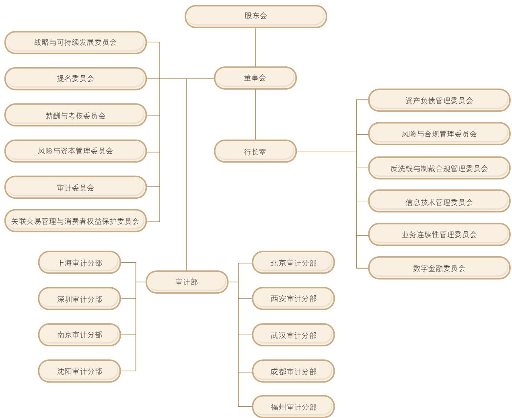
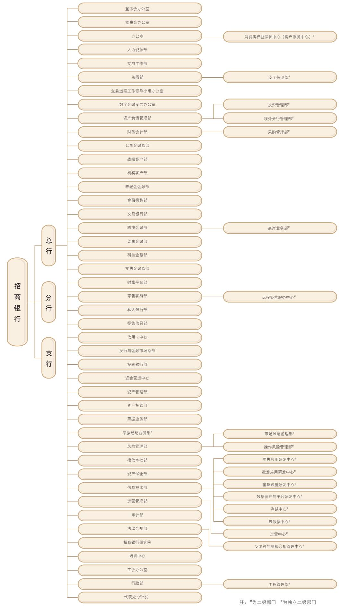
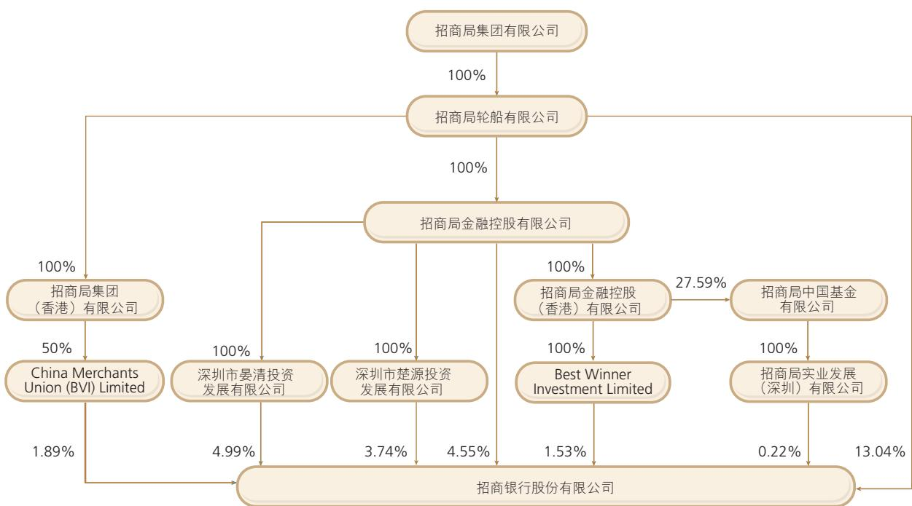

2025年度报告

## 目录

2 释义  
2 重大风险提示  
2 备查文件目录  
3 重要提示  
4 董事长致辞  
7 行长致辞  
10 第一章公司简介  
13 第二章会计数据和财务指标摘要  
18 第三章管理层讨论与分析  
18 3.1总体经营情况分析  
18 3.2利润表分析  
25 3.3资产负债表分析  
30 3.4贷款质量分析  
37 3.5资本充足情况分析  
40 3.6分部经营业绩  
40 3.7 根据监管要求披露的其他财务信息  
41 3.8 发展战略实施情况  
45 3.9 经营中关注的重点问题  
50 3.10 业务运作  
62 3.11风险管理  
67 3.12“提质增效重回报"行动方案执行情况  
67 3.13前景展望与应对措施  
70 第四章 环境、社会与治理(ESG)  
81 第五章 公司治理  
107 第六章重要事项  
113 第七章股份变动及股东情况  
118 第八章 财务报告

## 释义

本公司、本行、招行、招商银行：招商银行股份有限公司

招商信诺资管：招商信诺资产管理有限公司

本集团：招商银行及其子公司

招银欧洲：招商银行(欧洲)有限公司

中国证监会：中国证券监督管理委员会

招银投资：招银金融资产投资有限公司

香港联交所：香港联合交易所有限公司

招商信诺：招商信诺人寿保险有限公司

香港上市规则：香港联交所证券上市规则

招联消金： 招联消费金融股份有限公司

招商永隆银行：招商永隆银行有限公司

招商永隆集团：招商永隆银行及其子公司

招银云创：招银云创信息技术有限公司本公司间接持有其100%股权

招银金租：招银金融租赁有限公司

招银网络科技：招银网络科技(深圳)有限公司本公司间接持有其100%股权

招银国际：招银国际金融控股有限公司

安永华明会计师事务所：安永华明会计师事务所(特殊普通合伙)

招银理财：招银理财有限责任公司

公司章程：招商银行股份有限公司章程

招商基金：招商基金管理有限公司

企业管治守则：香港上市规则附录C1企业管治守则

## 重大风险提示

本公司已在本报告中详细描述存在的主要风险及采取的应对措施，详情请参阅第三章有关风险管理的内容。

## 备查文件目录

载有法定代表人、行长、财务负责人、会计机构负责人签名并盖章的财务报表。

载有会计师事务所盖章、注册会计师签名并盖章的审计报告原件。

报告期内公开披露过的所有本公司文件的正本及公告的原稿。

在香港交易及结算所有限公司网站披露的定期报告。

## 重要提示

1. 本公司董事会、董事和高级管理人员保证本报告内容的真实、准确、完整，不存在虚假记载、误导性陈述或重大遗漏，并承担个别和连带的法律责任。

2. 本公司于2026年3月27日召开董事会会议，审议通过了本报告。本公司14名董事出席了会议，邓仁杰非执行董事因公务未出席，委托江朝阳非执行董事代为出席会议。

3. 本公司审计师安永华明会计师事务所和安永会计师事务所已分别对本公司按照中国会计准则和国际财务报告会计准则编制的2025年度财务报告进行了审计，并分别出具了标准无保留意见的审计报告。

4. 本报告除特别说明外，货币币种为人民币。

5. 本公司董事长缪建民，行长兼首席执行官王良，副行长、财务负责人和董事会秘书彭家文及会计机构负责人孙智华保证本报告中财务报告的真实、准确、完整。

6. 本公司董事会建议向普通股股东派发2025年度现金股息，全年每股现金分红2.016元（含税)，扣除已派发的2025年度中期现金股息后，本次每股现金分红1.003元（含税)。2025年度，本公司不实施资本公积金转增股本。2025年度利润分配方案尚需2025年度股东会审议批准后方可实施。

7. 本报告包含若干对本集团财务状况、经营业绩及业务发展的展望性陈述。报告中使用诸如“将”“可能”“有望”“力争”“努力”“计划”“预计”“目标”及类似字眼以表达展望性陈述。这些陈述是基于现行计划、估计及预测而作出，虽然本集团相信这些展望性陈述中所反映的期望是合理的，但本集团不能保证这些期望被实现或将会证实为正确，故不构成本集团的实质承诺，投资者不应对其过分依赖并应注意投资风险。务请注意，这些展望性陈述与日后事件或本集团日后财务、业务或其他表现有关，并受若干可能会导致实际结果出现重大差异的不确定因素的影响。

## 董事长致辞

2025年是很不平凡的一年。面对外部环境变化、国内供强需弱、重点领域风险隐患较多等多重挑战，招商银行迎难而上、奋力拼搏，经营业绩稳中向好，营收、利润重回“双增长”，净利息收益率、非息收入占比、净资产收益率(ROAE)、不良贷款率、拨备覆盖率等主要核心指标保持领先；深化转型持续推进，在港机构、海外机构经营效益明显改善，招银投资(AIC)开业补齐关键牌照，整体展现出较强的发展韧性和经营活力。

回顾“十四五”，招商银行坚持守正创新、担当作为，以“守正”坚守商业银行的经营规律，以“创新”保持经营特色，以“担当”推动高质量发展，以“作为”赢得市场竞争优势；坚持质量、效益、规模协调发展，持续提升服务实体经济质效，高质量发展实现新突破、新成效。

以战略转型推动高质量发展，核心竞争力持续提升。坚定落实“两个一以贯之”，坚持不懈打造转型发展的“马利克曲线”，科学把握“重为轻根”原则，做强重资本业务、做大轻资本业务，加强财富管理、数智科技、风险管理“三个能力”建设，以科技创新引领模式创新，战略更清晰、转型更坚定、发展更可持续。有效应对低利率挑战，营收、归母净利润稳中有进，近5年复合增速分别达到3.05%、9.06%；管理零售客户总资产(AUM)突破17万亿元，近5年复合增速超13%；非息收入占比保持在行业较高水平，成本收入比明显改善。数智化转型卓有成效，率先实现系统、数据全面上云，构建“云+AI+中台”新基建；扎实推进“AI+金融”，累计落地AI场景应用超800个，场景智能化覆盖率提升至50%。风险管控守住底线，坚持稳健审慎，资产质量保持优异，不良贷款率从1.07%下降至0.94%；有效防范化解房地产等重点领域风险；强化全面管理、穿透管理，全面风险合规管理系统进一步巩固。

牢记职责使命、回归初心本源，金融核心功能不断增强。积极服务国家发展大局，科技、绿色、普惠领域贷款规模、占比稳步提升，个人养老金账户累计开户数超千万户。客户、员工、股东、合作伙伴、社会多维综合价值创造能力不断提升，客户经营迈上新台阶，期末零售客户数达2.2亿户，公司客户数达362万户；人才队伍焕发活力，连续十五年获“中国年度最佳雇主”称号；为股东创造持续稳定回报，保持资本内生能力，一级资本排名从全球第17位上升到第8位，现金分红率提升至35%；服务生态不断丰富，成功打造“招财号”“招赢通”开放平台；践行ESG理念，持续完善公司治理，明晟ESG评级跃升至AAA级。

2026年是“十五五”开局之年，外部环境变化影响加深，不确定、不稳定因素增多，我国加快构建新发展格局，不断巩固拓展经济稳中向好势头。面对战略机遇和风险挑战，招商银行将以“耕”立身，遵循银行业发展规律，精准抢抓发展机遇，抵御周期波动。深耕实体经济，胸怀“国之大者”，大力发展科技金融、绿色金融、普惠金融、养老金融和数字金融；躬耕高质量发展，以创新驱动战略转型，构筑差异化竞争“护城河”；细耕客户需求，坚持价值创造导向，完善专业化服务体系；精耕管理提升，筑牢发展根基，全面提升资产负债管理、风险管理能力。

聚焦重点、穿越周期，锻造高质量发展“四大核心动能”。保持净息差领先优势，平衡好量的合理增长和质的有效提升，围绕“零售再出发、对公再超越”，着力优化资产配置、强化资产组织，提升风险定价能力；重视金融市场业务，提升跨区域、跨品种、跨策略的投资能力。提升大财富管理竞争能力，畅通“财富管理、资产配置、特色资产管理、资产托管”价值循环链，加强多元产品创设和全市场优质产品遴选，打造具有长期竞争力的大财富管理生态。筑牢资产质量风险底线，巩固堡垒式风险合规管理体系，提升全面风险管理水平，有力有序有效推进房地产、零售信贷等重点领域风险防范化解，加强不良资产清收和处置。抢占智能化转型高地，保持创新的锐气与活力，聚焦形成AI体系化竞争优势，夯实科技底座、构建能力框架、参与生态共建，全面推动AI从工具向服务内核升级，加快打造智能银行。

## 缪建民

董事长

坚定使命、服务大局，增强高质量发展新优势。立足禀赋、发挥优势，围绕现代化产业体系、高水平科技自立自强、强大国内市场、高水平对外开放等重点领域，持续完善覆盖客户全生命周期的专业化、差异化、综合化金融服务，真正实现与客户共同成长。持续提升金融服务质效，保持战略定力，立足长远、系统谋划、全局推进，提供专业化精细化金融服务。把做强子公司放在突出位置，优化机制、加大投入、强化赋能，增强子公司资产组织、投研管理、产品创设、客户服务等核心能力，努力提升子公司经营贡献。全力打造跨境金融服务标杆品牌，在守牢安全底线基础上，因地制宜加快境外机构高质量发展；围绕“走出去”战略和居民跨境资产配置，加快构建全球一体化服务能力体系。

风劲潮涌，自当扬帆破浪；任重道远，更需策马扬鞭。站在“十五五”新征程的历史起点，招商银行将牢牢把握高质量发展首要任务，凝聚奋进共识、激发实干力量，守正创新、接续奋斗，加快构建具有差异化竞争优势的“护城河”，在新征程上续写招商银行高质量发展新篇章。

招商银行股份有限公司

董事长

2026年3月27日

## 行长致辞

2025年是极不平凡的一年。面对国际国内复杂经营环境，全行认真贯彻落实国家宏观经济金融政策、金融监管部门工作要求以及董事会确立的目标任务，纵深推进价值银行战略，加快国际化、综合化、差异化、数智化转型，着力提升软实力、硬实力，高质量发展呈现崭新局面。

坚持高质量发展，整体经营稳中有进、进中向好。我们坚持“质量第一、效益优先、规模适度、结构合理”的经营理念，不断巩固堡垒式资产负债表。业务规模站上新台阶，期末总资产突破13万亿元、客户存款总额近10万亿元；资产质量保持良好，期末不良贷款率0.94%，拨备覆盖率391.79%，风险抵补能力强健；经营效益稳中向好，报告期实现营业收入3,375.32亿元，归属于本行股东的净利润1,501.81亿元，均实现同比正增长；业务结构均衡合理，非息收入占比36.13%，零售金融业务对营收和利润的贡献占比保持50%以上；资本实力不断增强，期末核心一级资本充足率达14.16%，总资本充足率18.24%。

践行价值银行战略，与各利益相关方同生共荣。我们统筹兼顾各相关方利益，为客户、员工、股东、合作伙伴、社会创造更大的综合价值。积极践行“以客户为中心，为客户创造价值”的核心价值观，不断提升客户服务质效，成为广大客户的合作伙伴，更多客户选择招行，服务零售客户数超过2.2亿户、公司客户数超过360万户，较上年末分别增长6.67%、14.40%；坚持企业与员工共同成长、相互成就，员工总数突破12万人，连续15年入围中国年度最佳雇主10强，并连续2年位居榜首；坚持为股东创造价值、回报投资者，报告期ROAA达1.19%、ROAE达13.44%，保持较高盈利能力，年内首次实施中期分红，现金分红比例自2023年度以来保持35%以上的较高水平；与合作伙伴合作共赢，朋友圈不断做强做大，大财富管理、科技金融、投行等业务生态圈影响力、吸引力不断增强；积极履行社会责任，服务实体经济和民生福祉，科技、绿色、普惠小微、制造业贷款增速均高于贷款平均增速；大力支持乡村振兴，践行ESG理念，积极参与公益慈善，明晟ESG评级保持最高等级“AAA”。

深化业务板块均衡协同发展，增强经营稳定性和发展持续性。我们坚持零售金融战略主体地位，持续推动零售金融、公司金融、投行与金融市场、财富管理与资产管理四大业务板块均衡协同发展。截至报告期末，管理零售客户总资产(AUM)突破17万亿元，当年新增超2万亿元，创历史新高；公司客户融资总量(FPA)总规模达6.73万亿元，较年初增长11.08%；债券承销、并购贷款、金融市场业务、票据业务等细分业务位居市场前列；“招商银行TREE资产配置服务体系”服务零售客户数较上年末增长13.31%，资管业务总规模达4.71万亿元1，资产托管规模突破26万亿元。实现零售金融与公司金融相促进、表内业务与表外业务相协调、重资本业务与轻资本业务相平衡。

加快“四化”转型，提升综合经营能力成效明显。我们加快推进国际化、综合化、差异化、数智化转型，不断提升穿越周期的能力。国际化发展蹄疾步稳，期末境外机构2总资产较上年末增长12.88%，报告期营收同比增长33.80%；跨境理财通、跨境支付通、对公涉外收支、金融市场对客业务、境外托管等业务均位居市场前列。综合化经营提质增效，深化协同机制建设，强化对附属公司的并表管理和赋能支持，招银投资顺利开业，各附属公司市场竞争力不断提升。期末主要子公司3总资产达9,528.39亿元，较上年末增长11.43%，报告期营业收入占比达12.26%，同比提升1.97个百分点。差异化发展不断深化，深入实施重点区域发展战略，在区域打造招行特色，在招行打造区域特色；打造细分业务竞争新优势，在科技金融、绿色金融、普惠金融、数字金融、养老金融、智造金融、汽车金融等细分领域不断创新特色发展，深化“全行服务一家”“境内+境外”“投商行一体化”等客户服务模式，加大产品创新，率先推出首张人民币结算的万事达国际借记卡，落地国内首批科技创新债，迭代招企贷、科创贷等新型融资产品。数智化转型纵深推进，践行“AIFirst”理念，持续夯实“云+Al+中台”数智化底座，日均Tokens吞吐较2024年增长10.1倍，落地183个领域专精模型和856个场景应用，升级智能客服“小招”，打造一系列智能助手“小助”，加快探索“人+数智化”运营与服务模式，不断提升服务效率和客户体验。

坚守风险为本，不断巩固堡垒式风险合规管理体系。我们加强全面风险管理，完善境内外分支机构与子公司风险管理，确保各类风险平稳可控，不断拓展风险管理的广度、深度、精细度；积极应对房地产、地方政府隐性债务、零售贷款等领域风险挑战，加强风险前瞻排查，动态调整风控策略，有效防范化解重点领域风险；加强数智化风控系统建设，稳步推进AI应用；加大不良资产清收力度，减少风险损失。强化内控合规管理，扎实开展“合规履职年”活动，合规文化深入人心。

## 王良

行长兼首席执行官

强化管理致胜，为健康可持续发展提供有力保障。我们持续深化“规范、精细、赋能、系统、科学”的管理体系，不断固本强基。持续加强资产负债管理，巩固低成本负债优势，净息差保持行业领先水平；持续深化全成本管理，坚持有保有压，不断降本增效；持续强化运营管理，升级数智驱动的智慧运营模式；持续强化服务管理，优化分层分类服务体系，加强消费者权益保护，客户体验持续提升；持续优化组织阵型，成立总行科技金融部，深化分行经营体制改革；持续打造“专业化、多元化、市场化、国际化”人才队伍体系，加强分层分类培训培养，强化各类资格认证：将中国特色金融文化与招银文化体系有机融合，弘扬正确的价值观、经营理念和企业文化，广大干部员工更加热爱招行、珍惜招行、维护招行、奉献招行。

2025年是“十四五”收官之年。回首过去五年，是招行发展历程中极不寻常、极不平凡的五年。我们经历了世纪疫情、房地产风险爆发、全球地缘政治冲突与贸易摩擦、低利率环境、有效信贷需求不足等一系列前所未有的考验和挑战。在各级政府、监管部门、广大客户、投资者、合作伙伴及社会各界的大力支持下，我行管理层积极贯彻董事会工作部署，以价值银行战略目标引领高质量发展，坚持稳中求进、以进促稳，保持进中向好的发展态势。五年间，我行总资产规模接连站上10万亿元、11万亿元、12万亿元、13万亿元台阶；零售客户、公司客户分别增长41.77%、62.21%；AUM增长近1倍，FPA增长约60%；资产质量保持优良，不良贷款率保持在1%以下且稳中有降，风险抵补能力保持强健；营收、归母净利润年复合增速分别为3.05%、9.06%，ROAA、ROAE保持行业前列；资本保持内生增长，高级法、权重法下核心一级资本充足率和总资本充足率均明显提升，按一级资本排名在全球1000家大银行中由第17位上升至第8位；五年间累计现金分红超2千亿元，累计纳税超3千亿元。五年来，我行在高质量发展道路上稳步前行，堡垒式资产负债表更加巩固，价值创造能力不断增强，综合实力、竞争能力、市场影响力不断提升。在此，向关心支持招行发展的各界人士、广大客户，向12万名招行奋斗者及其亲属，表示衷心的感谢！

2026年是“十五五”规划的开局之年，银行业战略机遇与风险挑战并存、机遇大于挑战。中国式现代化进入夯实基础、全面发力的关键时期，经济高质量发展和金融强国建设，为银行业发展带来广阔空间；新一轮科技革命和产业变革加快演进，经济结构、产业结构、融资结构持续调整，倒逼银行加快转型升级；中资企业加速出海，对中资银行国际化金融服务能力提出更高要求；低利率成为银行业发展最大的“灰犀牛”，风险形势复杂严峻，直接考验银行生存发展能力。

2026年是我行成立39周年，也是我行走向不惑之年。走向不惑，我们将坚守初心，以自身的确定性应对外部环境的不确定性。我们将始终坚持质量、效益、规模协调发展，坚持“以客户为中心、为客户创造价值”的核心价值观，坚持创新驱动、差异化发展，坚持科技兴行、人才强行，坚持市场化专业化道路，坚持稳健审慎的风险理念，坚持长期主义，在点点滴滴中造就非凡，在“早一点、快一点、好一点、久一点”中从优秀走向卓越。

走向不惑，我们将加快转型，走好高质量发展之路。对标学习世界一流商业银行，加快国际化、综合化、差异化、数智化转型，打造多元化、可持续的业务结构，巩固堡垒式的风险合规管理体系，不断提升综合实力、竞争能力、发展能力，拓宽拓深发展护城河，努力成为一家业绩卓著、产品领先、服务一流、品牌卓越的商业银行。

走向不惑，我们将笃行不辍，打造新时代的招银模式。招商银行应改革而生、因时代而兴，是改革创新的产物，成立之初就以一系列创新被誉为“招银模式”。站在新的历史节点，必须与时俱进、持续创新，才能生生不息、保持活力。我们将深化现代企业制度改革，完善现代公司治理机制和市场化激励约束机制，打造“严格管理、守正创新”的高质量发展模式、四大业务板块均衡协同发展的业务模式、“人+数智化”的运营与服务模式，以模式创新驱动高质量发展。

知其所来、思其所往、方明所去。不惑，是更加清醒的从容，是更加坚定的前行。我们将踔厉奋发、乘势而上，一个行动接着一个行动，一个进步接着一个进步，汇聚基业长青、生生不息的磅礴力量，助力中国式现代化和金融强国建设，续写招商银行高质量发展的崭新篇章。

招商银行股份有限公司

行长兼首席执行官

2026年3月27日

## 公司简介

## 1.1 公司基本情况

1.1.1法定中文名称：招商银行股份有限公司（简称：招商银行）

法定英文名称：China Merchants Bank Co., Ltd.

1.1.2法定代表人：缪建民

授权代表：王良、彭家文

董事会秘书：彭家文

联席公司秘书：彭家文、何咏紫

证券事务代表：夏样芳

1.1.3注册及办公地址：中国广东省深圳市福田区深南大道7088号

1.1.4联系方式：

地址：中国广东省深圳市福田区深南大道7088号

邮政编码：518040

联系电话：+8675583198888

传真：+86 755 8319 5555

电子信箱：cmb@cmbchina.com

互联网网址：www.cmbchina.com

客户投诉电话：95555-7

信用卡投诉电话：+86400820 5555-7

1.1.5香港主要营业地址：中国香港中环康乐广场8号交易广场三期31楼

1.1.6股票上市证券交易所：

A股：上海证券交易所；股票简称：招商银行；股票代码：600036

H股：香港联交所；股票简称：招商银行；股票代码：03968

境内优先股：上海证券交易所；股票简称：招银优1；股票代码：360028

1.1.7国内会计师事务所：安永华明会计师事务所

办公地址：中国北京市东城区东长安街1号东方广场安永大楼17层01-12室签字注册会计师：冯所腾、范勋

国际会计师事务所：安永会计师事务所

办公地址：中国香港鱼涌英皇道979号太古坊一座27楼

1.1.8 中国内地法律顾问：北京市君合(深圳)律师事务所

香港法律顾问：史密夫斐尔律师事务所

## 1.1.9A股股票登记处：

中国证券登记结算有限责任公司上海分公司

地址：中国上海市浦东新区杨高南路188号

电话：+86 4008 058 058

H股股票登记及过户处：

香港中央证券登记有限公司

地址：中国香港湾仔皇后大道东183号合和中心17楼1712-1716号铺

电话：+852 2862 8555

境内优先股股票登记处：中国证券登记结算有限责任公司上海分公司

## 1.1.10指定的信息披露媒体和网站：

内地：《中国证券报》www.cs.com.cn）、《证券时报Xwww.stcn.com)、《上海证券报》www.cnstock.com)上海证券交易所网站(www.sse.com.cn)、本公司网站(www.cmbchina.com)

香港：香港交易及结算所有限公司网站(www.hkex.com.hk)

本公司网站(www.cmbchina.com)

定期报告备置地点：本公司董事会办公室及本公司主要营业场所

## 1.2 公司业务概要

本公司成立于1987年，总部位于中国深圳。本公司分支机构主要分布于中国境内中心城市，以及中国香港、纽约、伦敦、新加坡、卢森堡、悉尼等国际金融中心。2002年4月，本公司在上海证券交易所上市。2006年9月，本公司在香港联交所上市。

本公司向客户提供批发及零售银行产品和服务，以及自营及代客开展资金业务。本公司推出的许多创新产品和服务广为市场接受，零售银行服务包括：基于“一卡通"多功能借记卡、信用卡的账户及支付结算服务，“金葵花理财”、私人银行等分层分类的财富管理服务，零售信贷服务，以及招商银行App和掌上生活App、“一网通"综合网上银行等线上服务；批发银行服务包括：支付结算、财富管理、投融资和数字化服务，现金管理、科技金融、绿色金融、普惠金融、养老金融、数字金融、供应链金融和跨境金融服务，资产管理、资产托管和投资银行等服务。本公司持续深耕客户生活圈和经营圈，为客户供应链、投资链提供定制化、智能化、综合化的解决方案。

本公司基于内外部形势和自身发展状况，提出成为“创新驱动、模式领先、特色鲜明的最佳价值创造银行”的战略愿景。本公司顺应中国式现代化、经济全球化、新一轮科技革命和产业升级的趋势，不断提升服务实体经济和社会民生的质效，加快“国际化、综合化、差异化、数智化”转型，努力为客户、员工、股东、合作伙伴、社会创造更大价值，为中国式现代化和金融强国建设作出更大贡献。

## 1.3 发展战略

战略愿景： 成为创新驱动、模式领先、特色鲜明的最佳价值创造银行。

战略目标： 打造价值银行。招商银行秉持商业共赢、商业向善理念，追求客户、员工、股东、合作伙伴、社会综合价值的最大化，努力成长为世界一流商业银行。

核心价值观： 以客户为中心，为客户创造价值。

战略重点：

立足于国家所需、客户所愿、招行所能，坚持质量、效益、规模协调发展。深入推进国际化、综合化、差异化、数智化转型，打造“严格管理、守正创新"的高质量发展模式。坚持零售金融的主体地位，零售金融、公司金融、投行与金融市场、财富管理与资产管理四大业务板块均衡协同发展。聚焦“财富管理、数智科技、风险管理"三大核心能力建设，推动组织文化不断进化。

做大财富管理，推进业务模式转型，持续推动管理零售客户总资产(AUM)和公司客户融资总量(FPA)的增长。

做好数智科技，坚持科技兴行。围绕线上化、数据化、智能化、平台化、生态化的目标，全面推动金融基础设施与能力体系、客户与渠道、业务与产品、管理与决策的数字化重塑。积极探索“AI+金融”新模式，秉持“AI First"理念，深入实施“AI+"行动，打造智能银行。

做强风险管理，持续打造堡垒式风险合规管理体系。坚持稳健审慎的风险管理理念，通过构建健全有效的组织架构、稳健审慎的评价体系、独立制衡的流程制度体系和智能高效的管理信息系统，筑牢堡垒式风险合规管理体系四大支柱。

践行核心价值观，打造价值银行的文化与组织基石。一是传承弘扬招商银行的创业文化、服务文化、创新文化、风险文化、合规文化、管理文化、人本文化、清风文化，构建有生命力、持续进化的文化体系。二是建设“服务战略、共创价值"的组织队伍，构筑价值银行的组织保障和人才基础。三是在服务实体经济的实践中积极贯彻可持续发展理念，积极履行环境责任、社会责任，提高治理水平。

## 1.4 荣誉与奖项

2025年，本公司在国内外机构组织的评选活动中获得诸多荣誉与奖项，其中：

2025年3月，品牌价值评估与咨询机构Brand Finance发布“2025年全球银行品牌价值500强"榜单，本公司名列全球第10位。

. 2025年6月，国际金融评选机构Extel（原英国《机构投资者》杂志)公布“2025年亚洲地区公司最佳管理团队”评选结果，本公司获评“亚洲最受尊敬公司”“最佳董事会”“最佳CEO”“最佳CFO”“最佳投资者关系管理团队”“最佳ESG公司”“最佳投资者关系管理公司”等奖项，是亚洲地区综合排名最高、获奖最多的银行。

2025年6月，《亚洲银行家》杂志公布系列奖项评选结果，本公司荣获“中国最佳零售银行”“中国最佳财富管理银行”“中国最佳托管银行”“中国最佳股份制交易银行"等十二个奖项。

2025年7月，英国《银行家》杂志发布“2025年全球银行1000强”榜单，本公司按一级资本规模排名位列全球第8位，较上年晋升两位。

2025年7月，英国《欧洲货币》杂志公布“2025年度卓越大奖”评选结果，本公司荣获“亚洲最佳消费者银行”“中国最佳数字银行"等大奖。

2025年7月，《财富》世界500强榜单正式发布，本公司位列榜单第193名，连续十四年登榜。

2025年10月，美国《环球金融》杂志公布“2025年中国之星"评选结果，本公司荣获“最佳并购银行"等奖项。

2025年12月，《亚洲银行家》杂志公布系列奖项评选结果，本公司在2025年度领导力成就奖项计划中荣获“中国最佳管理银行”；在财富与社会奖项中荣获“中国最佳私人银行"等大奖。

2025年12月，在由智联招聘和北京大学社会调查研究中心等联合开展的“2025中国年度最佳雇主”评选活动中，本公司获评“中国年度最佳雇主”第1名，同时荣获“最受女性关注雇主”“最具社会责任雇主”等奖项，成为参评企业中唯一获得三项大奖的机构。本公司连续十五年入围中国年度最佳雇主10强。

## 会计数据和财务指标摘要

## 2.1 本集团主要会计数据和财务指标

<table><tr><td colspan="4"></td></tr><tr><td>(人民币百万元，特别注明除外)</td><td>2025年</td><td>2024年</td><td>增减(%) 2023年</td></tr><tr><td>经营业绩</td><td></td><td></td><td></td></tr><tr><td>营业收入</td><td>337,532</td><td>337,488</td><td>0.01 339,123</td></tr><tr><td>营业利润</td><td>179,252</td><td>179,019</td><td>0.13 176,663</td></tr><tr><td>利润总额</td><td>178,993</td><td>178,652</td><td>0.19 176,618</td></tr><tr><td>净利润</td><td>151,126</td><td>149,559</td><td>1.05 148,006</td></tr><tr><td>归属于本行股东的净利润</td><td>150,181</td><td>148,391</td><td>1.21 146,602</td></tr><tr><td>扣除非经常性损益后归属于本行股东的净利润</td><td>150,007</td><td>148,011</td><td>1.35 146,047</td></tr><tr><td>经营活动产生的现金流量净额</td><td>451,457</td><td>447,023</td><td>0.99 357,753</td></tr><tr><td>每股计(人民币元）</td><td></td><td></td><td></td></tr><tr><td>归属于本行普通股股东的基本每股收益()</td><td>5.70</td><td>5.66</td><td>0.71 5.63</td></tr><tr><td>归属于本行普通股股东的稀释每股收益</td><td>5.70</td><td>5.66</td><td>0.71 5.63</td></tr><tr><td>扣除非经常性损益后归属于本行普通股股东的</td><td></td><td></td><td></td></tr><tr><td>基本每股收益</td><td>5.70</td><td>5.65</td><td>0.88 5.61</td></tr><tr><td>每股经营活动产生的现金流量净额</td><td>17.90</td><td>17.72</td><td>1.02 14.19</td></tr><tr><td>财务比率(%)</td><td></td><td></td><td></td></tr><tr><td>归属于本行股东的平均总资产收益率</td><td>1.19</td><td>1.28 下降0.09个百分点</td><td>1.39</td></tr><tr><td>归属于本行普通股股东的平均净资产收益率(1)</td><td>13.44</td><td>14.49 下降1.05个百分点</td><td>16.22</td></tr><tr><td>归属于本行普通股股东的加权平均净资产收益率</td><td>13.44</td><td>14.49 下降1.05个百分点</td><td>16.22</td></tr><tr><td>扣除非经常性损益后归属于本行普通股股东的</td><td></td><td></td><td></td></tr><tr><td>加权平均净资产收益率</td><td>13.42</td><td>14.45 下降1.03个百分点</td><td>16.16</td></tr></table>

<table><tr><td rowspan="2"></td><td colspan="4">本年末比</td></tr><tr><td>2025年</td><td>2024年</td><td>上年末</td><td>2023年</td></tr><tr><td>(人民币百万元，特别注明除外）</td><td>12月31日</td><td>12月31日</td><td>增减(%)</td><td>12月31日</td></tr><tr><td>规模指标</td><td></td><td></td><td></td><td></td></tr><tr><td>总资产</td><td>13,070,523</td><td>12,152,036</td><td>7.56</td><td>11,028,483</td></tr><tr><td>贷款和垫款总额(2)</td><td>7,258,058</td><td>6,888,315</td><td>5.37</td><td>6,508,865</td></tr><tr><td>正常贷款</td><td>7,189,852</td><td>6,822,705</td><td>5.38</td><td>6,447,286</td></tr><tr><td>不良贷款</td><td>68,206</td><td>65,610</td><td>3.96</td><td>61,579</td></tr><tr><td>贷款损失准备(3)</td><td>267,222</td><td>270,301</td><td>-1.14</td><td>269,534</td></tr><tr><td>总负债</td><td>11,789,624</td><td>10,918,561</td><td>7.98</td><td>9,942,754</td></tr><tr><td>客户存款总额(2)</td><td>9,836,130</td><td>9,096,587</td><td>8.13</td><td>8,155,438</td></tr><tr><td>公司活期存款</td><td>2,761,092</td><td>2,772,365</td><td>-0.41</td><td>2,644,685</td></tr><tr><td>公司定期存款</td><td>2,579,124</td><td>2,291,188</td><td>12.57</td><td>2,015,837</td></tr><tr><td>零售活期存款</td><td>2,234,851</td><td>1,980,251</td><td>12.86</td><td>1,829,612</td></tr><tr><td>零售定期存款</td><td>2,261,063</td><td>2,052,783</td><td>10.15</td><td>1,665,304</td></tr><tr><td>归属于本行股东权益</td><td>1,272,875</td><td>1,226,014</td><td>3.82</td><td>1,076,370</td></tr><tr><td>归属于本行普通股股东的每股净资产（人民币元)(1)</td><td>43.43</td><td>41.46</td><td>4.75</td><td>36.71</td></tr><tr><td>资本净额(高级法)</td><td>1,375,031</td><td>1,311,742</td><td>4.82</td><td>1,181,487</td></tr><tr><td>其中：一级资本净额</td><td>1,245,017</td><td>1,203,494</td><td>3.45</td><td>1,057,754</td></tr><tr><td>核心一级资本净额</td><td>1,067,560</td><td>1,023,048</td><td>4.35</td><td>907,308</td></tr><tr><td>二级资本净额</td><td>130,014</td><td>108,248</td><td>20.11</td><td>123,733</td></tr><tr><td>风险加权资产(高级法下考虑资本底线要求)</td><td>7,540,202</td><td>6,885,783</td><td>9.50</td><td>6,608,021</td></tr><tr><td>资本净额(权重法）</td><td>1,343,023</td><td>1,293,801</td><td>3.80</td><td>1,144,901</td></tr><tr><td>其中：一级资本净额</td><td>1,245,017</td><td>1,203,494</td><td>3.45</td><td>1,057,754</td></tr><tr><td>核心一级资本净额</td><td>1,067,560</td><td>1,023,048</td><td>4.35</td><td>907,308</td></tr><tr><td>二级资本净额</td><td>98,006</td><td>90,307</td><td>8.53</td><td>87,147</td></tr><tr><td>风险加权资产(权重法）</td><td>8,954,305</td><td>8,227,390</td><td>8.84</td><td>7,652,723</td></tr><tr><td></td><td></td><td></td><td></td><td></td></tr><tr><td></td><td>2025年</td><td>2025年</td><td>2025年</td><td>2025年</td></tr><tr><td>（人民币百万元）</td><td>第一季度</td><td>第二季度</td><td>第三季度</td><td>第四季度</td></tr><tr><td>按季度披露的经营业绩指标</td><td></td><td></td><td></td><td></td></tr><tr><td>营业收入</td><td>83,751</td><td>86,218</td><td>81,451</td><td>86,112</td></tr><tr><td>归属于本行股东的净利润</td><td>37,286</td><td>37,644</td><td>38,842</td><td>36,409</td></tr><tr><td>扣除非经常性损益后归属于本行股东的净利润</td><td>37,136</td><td>37,683</td><td>38,871</td><td>36,317</td></tr><tr><td>经营活动产生的现金流量净额</td><td>95,026</td><td>39,435</td><td>41,673</td><td>275,323</td></tr></table>

注：

(1) 有关指标根据《公开发行证券的公司信息披露编报规则第9号——净资产收益率和每股收益的计算及披露》规定计算。计算归属于普通股股东的基本每股收益、平均净资产收益率、每股净资产等指标时，“归属于本行股东的净利润"扣除优先股股息和永续债利息，“平均净资产"和“净资产"扣除优先股和永续债。

(2) 除特别说明，此处及下文相关金融工具项目的余额未包含应计利息。

(3) 含以公允价值计量且其变动计入其他综合收益的贷款和垫款的损失准备。

(4) 根据《公开发行证券的公司信息披露解释性公告第1号—一非经常性损益》的规定，报告期内本集团非经常性损益列示如下：

<table><tr><td>（人民币百万元）</td><td>2025年</td><td>2024年</td></tr><tr><td>非经常性损益项目</td><td></td><td></td></tr><tr><td>处置固定资产净损益</td><td>28</td><td>249</td></tr><tr><td>其他净损益</td><td>190</td><td>266</td></tr><tr><td>所得税影响</td><td>(39)</td><td>(123)</td></tr><tr><td>合计</td><td>179</td><td>392</td></tr><tr><td>其中：影响本行股东净利润的非经常性损益</td><td>174</td><td>380</td></tr><tr><td>影响少数股东净利润的非经常性损益</td><td>5</td><td>12</td></tr></table>

## 2.2 本集团补充财务比率

<table><tr><td>财务比率(%)</td><td>2025年</td><td>2024年</td><td>本年比上年增减</td><td>2023年</td></tr><tr><td>盈利能力指标</td><td></td><td></td><td></td><td></td></tr><tr><td>净利差(1)</td><td>1.78</td><td>1.86</td><td>下降0.08个百分点</td><td>2.03</td></tr><tr><td>净利息收益率(2)</td><td>1.87</td><td>1.98</td><td>下降0.11个百分点</td><td>2.15</td></tr><tr><td>占营业收入百分比</td><td></td><td></td><td></td><td></td></tr><tr><td>－净利息收入</td><td>63.87</td><td>62.60</td><td>上升1.27个百分点</td><td>63.30</td></tr><tr><td>－非利息净收入</td><td>36.13</td><td>37.40</td><td>下降1.27个百分点</td><td>36.70</td></tr><tr><td>成本收入比(3)</td><td>31.98</td><td>31.89</td><td>上升0.09个百分点</td><td>32.96</td></tr></table>

注：

(1) 净利差=总生息资产平均收益率一总计息负债平均成本率。

(2) 净利息收益率=净利息收入／总生息资产平均余额。

(3) 成本收入比=业务及管理费／营业收入。

<table><tr><td>资产质量指标(%)</td><td>2025年 12月31日</td><td>2024年 12月31日</td><td>本年末比 上年末增减</td><td>2023年 12月31日</td></tr><tr><td>不良贷款率</td><td>0.94</td><td>0.95</td><td>下降0.01个百分点</td><td>0.95</td></tr><tr><td>拨备覆盖率(1)</td><td>391.79</td><td>411.98</td><td>下降20.19个百分点</td><td>437.70</td></tr><tr><td>贷款拨备率(2)</td><td>3.68</td><td>3.92</td><td>下降0.24个百分点</td><td>4.14</td></tr><tr><td></td><td>2025年</td><td>2024年</td><td>本年比上年增减</td><td>2023年</td></tr><tr><td>信用成本(3)</td><td>0.60</td><td>0.65</td><td>下降0.05个百分点</td><td>0.74</td></tr></table>

注：

(1) 拨备覆盖率=贷款损失准备／不良贷款余额。

(2) 贷款拨备率=贷款损失准备／贷款和垫款总额。

(3) 信用成本=贷款和垫款信用减值损失／贷款和垫款总额平均值，贷款和垫款总额平均值=（期初贷款和垫款总额+期末贷款和垫款总额）/2。

<table><tr><td>资本充足率指标(%)(高级法)</td><td>2025年 12月31日</td><td>2024年 12月31日</td><td>本年末比 上年末增减</td><td>2023年 12月31日</td></tr><tr><td>核心一级资本充足率</td><td>14.16</td><td>14.86</td><td>下降0.70个百分点</td><td>13.73</td></tr><tr><td>一级资本充足率</td><td>16.51</td><td>17.48</td><td>下降0.97个百分点</td><td>16.01</td></tr><tr><td>资本充足率</td><td>18.24</td><td>19.05</td><td>下降0.81个百分点</td><td>17.88</td></tr></table>

注：截至报告期末，本集团权重法下核心一级资本充足率11.92%，一级资本充足率13.90%，资本充足率15.00%。

## 2.3 补充财务指标

<table><tr><td></td><td></td><td>2025年 12月31日</td><td>2024年</td><td>2023年</td></tr><tr><td rowspan="2">主要指标(%) 流动性比例</td><td>标准值 ≥25</td><td>60.62</td><td>12月31日</td><td>12月31日</td></tr><tr><td>人民币</td><td></td><td>59.66</td><td>56.24</td></tr><tr><td></td><td>外币 ≥25</td><td>125.78</td><td>124.47</td><td>95.90</td></tr><tr><td>流动性覆盖率</td><td>≥100</td><td>220.30</td><td>227.29</td><td>198.01</td></tr><tr><td>单一最大客户贷款和垫款比例</td><td>≤10</td><td>2.24 14.19</td><td>2.06</td><td>2.10</td></tr><tr><td>前十大客户贷款和垫款比例</td><td>/</td><td></td><td>12.16</td><td>12.33</td></tr></table>

注：

(1) 以上数据均为本公司口径，根据金融监督管理机构监管口径计算。

(2) 单一最大客户贷款和垫款比例=单一最大客户贷款和垫款／高级法下资本净额。

(3) 前十大客户贷款和垫款比例=前十大客户贷款和垫款／高级法下资本净额。

<table><tr><td>迁徙率指标(%)</td><td>2025年</td><td>2024年</td><td>2023年</td></tr><tr><td>正常类贷款迁徙率</td><td>1.35</td><td>1.39</td><td>1.21</td></tr><tr><td>关注类贷款迁徙率</td><td>28.66</td><td>35.06</td><td>34.95</td></tr><tr><td>次级类贷款迁徙率</td><td>72.51</td><td>79.04</td><td>74.09</td></tr><tr><td>可疑类贷款迁徙率</td><td>75.21</td><td>60.93</td><td>55.33</td></tr></table>

注： 以上数据均为本公司口径，根据金融监督管理机构监管口径计算。

## 2.4 境内外会计准则差异

本集团分别根据境内外会计准则计算的2025年度归属于本行股东的净利润和截至2025年末归属于本行股东的净资产无差异。

建设价值银行创造多元价值

## 管理层讨论与分析

## 3.1总体经营情况分析

## 3.1.1外部经济形势与行业发展情况

2025年，我国经济直面复杂变局，实现“十四五"圆满收官，GDP首次突破140万亿元，增速达5.0%。供给端加速修复，外需保持较快增长，新旧动能加速转换，价格温和修复。

2025年，中国银行业致力于提升金融服务的适配性，积极融入现代化产业体系建设，全力滋养新质生产力发展的沃土。面对息差进一步收窄、内需不足、房地产对投资和消费的拖累持续等压力，银行业坚持稳健经营，资产规模保持平稳增长，风险、效益、资本等各类监管指标均总体保持平稳。

## 3.1.2 经营概要

2025年，本集团坚持质量、效益、规模协调发展，以“打造价值银行”为战略目标，稳健开展各项业务，资产负债规模稳步增长，经营效益稳中向好，资产质量保持稳定。

报告期内，本集团实现营业收入3,375.32亿元，同比增长0.01%，其中，净利息收入2,155.93亿元，同比增长2.04%，非利息净收入1,219.39亿元，同比下降3.38%；实现归属于本行股东的净利润1,501.81亿元，同比增长1.21%；归属于本行股东的平均总资产收益率(ROAA)和归属于本行普通股股东的平均净资产收益率(ROAE)分别为1.19%和13.44%，同比分别下降0.09和1.05个百分点。

截至报告期末，本集团资产总额130,705.23亿元，较上年末增长7.56%；贷款和垫款总额72,580.58亿元，较上 年末增长5.37%；负债总额117,896.24亿元，较上年末增长7.98%；客户存款总额98,361.30亿元，较上年末增 长8.13%。

截至报告期末，本集团不良贷款余额682.06亿元，较上年末增加25.96亿元；不良贷款率0.94%，较上年末下降 0.01个百分点；拨备覆盖率391.79%，较上年末下降20.19个百分点；贷款拨备率3.68%，较上年末下降0.24个 百分点。

## 3.2 利润表分析

## 3.2.1 财务业绩摘要

报告期内，本集团实现利润总额1,789.93亿元，同比增长0.19%，实际所得税税率15.57%，同比下降0.71个百分点。下表列出所示期间本集团主要损益项目。

<table><tr><td>（人民币百万元）</td><td>2025年</td><td>2024年</td></tr><tr><td>净利息收入</td><td>215,593</td><td>211,277</td></tr><tr><td>净手续费及佣金收入</td><td>75,258</td><td>72,094</td></tr><tr><td>其他净收入</td><td>46,681</td><td>54,117</td></tr><tr><td>业务及管理费</td><td>(107,952)</td><td>(107,616)</td></tr><tr><td>税金及附加</td><td>(3,097)</td><td>(2,950)</td></tr><tr><td>信用减值损失</td><td>(39,586)</td><td>(39,976)</td></tr><tr><td>其他资产减值损失 其他业务成本</td><td>(189)</td><td>(843)</td></tr><tr><td>营业外收支净额</td><td>(7,456)</td><td>(7,084)</td></tr><tr><td>利润总额</td><td>(259)</td><td>(367)</td></tr><tr><td></td><td>178,993</td><td>178,652</td></tr><tr><td>所得税费用 净利润</td><td>(27,867)</td><td>(29,093)</td></tr><tr><td>归属于本行股东的净利润</td><td>151,126</td><td>149,559</td></tr><tr><td></td><td>150,181</td><td>148,391</td></tr></table>

## 3.2.2 营业收入

报告期内，本集团实现营业收入3,375.32亿元，同比增长0.01%，其中净利息收入占比63.87%，非利息净收入占比36.13%。

下表列出本集团近三年营业收入构成的占比情况。

<table><tr><td>(%)</td><td>2025年</td><td>2024年</td><td>2023年</td></tr><tr><td>净利息收入</td><td>63.87</td><td>62.60</td><td>63.30</td></tr><tr><td>净手续费及佣金收入</td><td>22.30</td><td>21.36</td><td>24.80</td></tr><tr><td>其他净收入</td><td>13.83</td><td>16.04</td><td>11.90</td></tr><tr><td>合计</td><td>100.00</td><td>100.00</td><td>100.00</td></tr></table>

## 3.2.3 利息收入

报告期内，本集团实现利息收入3,513.51亿元，同比下降6.12%，主要是因为生息资产收益率下降。贷款和垫款利息收入仍然是本集团利息收入的最大组成部分。

## 贷款和垫款利息收入

报告期内，本集团贷款和垫款利息收入2,335.47亿元，同比下降10.37%，主要是受贷款收益率下降影响。

下表列出所示期间本集团贷款和垫款各组成部分的平均余额（日均余额，下同)、利息收入及平均收益率情况。

<table><tr><td rowspan="2"></td><td colspan="3">2025年</td><td colspan="3">2024年</td></tr><tr><td></td><td></td><td>平均</td><td></td><td></td><td>平均</td></tr><tr><td>（人民币百万元，百分比除外）</td><td>平均余额</td><td>利息收入</td><td>收益率%</td><td>平均余额</td><td>利息收入</td><td>收益率%</td></tr><tr><td>公司贷款</td><td>3,044,925</td><td>85,688</td><td>2.81</td><td>2,746,039</td><td>93,282</td><td>3.40</td></tr><tr><td>零售贷款</td><td>3,660,919</td><td>144,315</td><td>3.94</td><td>3,533,131</td><td>161,740</td><td>4.58</td></tr><tr><td>票据贴现</td><td>289,117</td><td>3,544</td><td>1.23</td><td>387,017</td><td>5,551</td><td>1.43</td></tr><tr><td>贷款和垫款</td><td>6,994,961</td><td>233,547</td><td>3.34</td><td>6,666,187</td><td>260,573</td><td>3.91</td></tr></table>

报告期内，本集团贷款和垫款从期限结构来看，短期贷款平均余额26,662.66亿元，利息收入1,025.28亿元，平均收益率3.85%；中长期贷款平均余额43,286.95亿元，利息收入1,310.19亿元，平均收益率3.03%。短期贷款平均收益率高于中长期贷款平均收益率主要是因为短期贷款中的信用卡贷款及消费贷款收益率相对较高且占比较高。

## 投资利息收入

报告期内，本集团投资利息收入914.77亿元，同比增长7.72%，主要是受规模因素影响；投资平均收益率2.82%，同比下降26个基点，主要是受市场利率下行的影响。

## 存拆放同业和其他金融机构款项利息收入

报告期内，本集团存拆放同业和其他金融机构款项利息收入174.63亿元，同比下降8.46%，主要是受市场利率下行的影响；存拆放同业和其他金融机构款项平均收益率2.24%，同比下降56个基点。

## 3.2.4 利息支出

报告期内，本集团利息支出1,357.58亿元，同比下降16.71%，主要是因为计息负债成本率下降。

## 客户存款利息支出

报告期内，本集团客户存款利息支出1,078.69亿元，同比下降17.55%，主要是因为客户存款成本率下降。

下表列出所示期间本集团公司客户存款及零售客户存款的平均余额、利息支出和平均成本率。

<table><tr><td colspan="4"></td><td colspan="3">2024年</td></tr><tr><td></td><td></td><td></td><td>平均</td><td></td><td></td><td>平均</td></tr><tr><td>（人民币百万元，百分比除外）</td><td>平均余额</td><td>利息支出</td><td>成本率%</td><td>平均余额</td><td>利息支出</td><td>成本率%</td></tr><tr><td>公司客户存款</td><td></td><td></td><td></td><td></td><td></td><td></td></tr><tr><td>活期</td><td>2,552,842</td><td>13,323</td><td>0.52</td><td>2,488,102</td><td>20,762</td><td>0.83</td></tr><tr><td>定期</td><td>2,492,472</td><td>48,692</td><td>1.95</td><td>2,305,745</td><td>56,547</td><td>2.45</td></tr><tr><td>小计</td><td>5,045,314</td><td>62,015</td><td>1.23</td><td>4,793,847</td><td>77,309</td><td>1.61</td></tr><tr><td>零售客户存款</td><td></td><td></td><td></td><td></td><td></td><td></td></tr><tr><td>活期</td><td>1,993,112</td><td>1,394</td><td>0.07</td><td>1,798,328</td><td>3,903</td><td>0.22</td></tr><tr><td>定期</td><td>2,164,074</td><td>44,460</td><td>2.05</td><td>1,923,491</td><td>49,612</td><td>2.58</td></tr><tr><td>小计</td><td>4,157,186</td><td>45,854</td><td>1.10</td><td>3,721,819</td><td>53,515</td><td>1.44</td></tr><tr><td>合计</td><td>9,202,500</td><td>107,869</td><td>1.17</td><td>8,515,666</td><td>130,824</td><td>1.54</td></tr></table>

## 同业存拆放及其他利息支出

报告期内，本集团同业存拆放及其他4利息支出200.01亿元，同比下降0.42%，主要是因为同业和其他金融机构存拆放款项成本率同比下降。

## 应付债券利息支出

报告期内，本集团应付债券利息支出53.83亿元，同比下降29.69%，主要是因为应付债券规模同比下降。

## 3.2.5 净利息收入

报告期内，本集团净利息收入2,155.93亿元，同比增长2.04%。

下表列出所示期间本集团资产负债项目平均余额、利息收入／利息支出及平均收益／成本率情况。

<table><tr><td rowspan="3"></td><td colspan="3">2025年</td><td colspan="3">2024年</td></tr><tr><td>平均余额</td><td></td><td>平均</td><td></td><td></td><td>平均</td></tr><tr><td></td><td>利息收入</td><td>收益率%</td><td>平均余额</td><td>利息收入</td><td>收益率%</td></tr><tr><td>生息资产</td><td></td><td></td><td></td><td></td><td></td><td></td></tr><tr><td>贷款和垫款</td><td>6,994,961</td><td>233,547</td><td>3.34</td><td>6,666,187</td><td>260,573</td><td>3.91</td></tr><tr><td>投资</td><td>3,244,024</td><td>91,477</td><td>2.82</td><td>2,757,151</td><td>84,924</td><td>3.08</td></tr><tr><td>存放中央银行款项</td><td>541,000</td><td>8,864</td><td>1.64</td><td>580,940</td><td>9,698</td><td>1.67</td></tr><tr><td>存拆放同业和其他金融机构款项</td><td>778,083</td><td>17,463</td><td>2.24</td><td>681,863</td><td>19,076</td><td>2.80</td></tr><tr><td>合计</td><td>11,558,068</td><td>351,351</td><td>3.04</td><td>10,686,141</td><td>374,271</td><td>3.50</td></tr><tr><td></td><td></td><td></td><td>平均</td><td></td><td></td><td>平均</td></tr><tr><td>（人民币百万元，百分比除外）</td><td>平均余额</td><td>利息支出</td><td>成本率%</td><td>平均余额</td><td>利息支出</td><td>成本率%</td></tr><tr><td>计息负债</td><td></td><td></td><td></td><td></td><td></td><td></td></tr><tr><td>客户存款</td><td>9,202,500</td><td>107,869</td><td>1.17</td><td>8,515,666</td><td>130,824</td><td>1.54</td></tr><tr><td>同业存拆放及其他</td><td>1,265,266</td><td>20,001</td><td>1.58</td><td>959,111</td><td>20,086</td><td>2.09</td></tr><tr><td>应付债券</td><td>168,539</td><td>5,383</td><td>3.19</td><td>252,448</td><td>7,656</td><td>3.03</td></tr><tr><td>向中央银行借款</td><td>140,140</td><td>2,505</td><td>1.79</td><td>207,453</td><td>4,428</td><td>2.13</td></tr><tr><td>合计</td><td>10,776,445</td><td>135,758</td><td>1.26</td><td>9,934,678</td><td>162,994</td><td>1.64</td></tr><tr><td>净利息收入</td><td></td><td>215,593</td><td></td><td></td><td>211,277</td><td>√</td></tr><tr><td>净利差</td><td>/</td><td></td><td>1.78</td><td></td><td>/</td><td>1.86</td></tr><tr><td>净利息收益率</td><td></td><td></td><td>1.87</td><td></td><td></td><td>1.98</td></tr></table>

报告期内，本集团生息资产平均收益率3.04%，同比下降46个基点；计息负债平均成本率1.26%，同比下降38个基点；净利差1.78%，同比下降8个基点；净利息收益率1.87%，同比下降11个基点。有关净利息收益率下降的原因分析，请参阅本章3.9.1“关于净利息收益率”。

下表列出所示期间本集团由于规模变化和利率变化导致利息收入和利息支出变化的分布情况。规模变化以平均余额变化来衡量，利率变化以平均利率变化来衡量，由规模变化和利率变化共同引起的利息收支变化，计入规模变化对利息收支变化的影响金额。

<table><tr><td></td><td colspan="3">增(减)因素</td></tr><tr><td>（人民币百万元）</td><td>规模</td><td>利率</td><td>增(减)净值</td></tr><tr><td>生息资产</td><td></td><td></td><td></td></tr><tr><td>贷款和垫款</td><td>10,971</td><td>(37,997)</td><td>(27,026)</td></tr><tr><td>投资</td><td>13,722</td><td>(7,169)</td><td>6,553</td></tr><tr><td>存放中央银行款项</td><td>(660)</td><td>(174)</td><td>(834)</td></tr><tr><td>存拆放同业和其他金融机构款项</td><td>2,205</td><td>(3,818)</td><td>(1,613)</td></tr><tr><td>利息收入变动</td><td>26,238</td><td>(49,158)</td><td>(22,920)</td></tr><tr><td>计息负债</td><td></td><td></td><td></td></tr><tr><td>客户存款</td><td>8,553</td><td>(31,508)</td><td>(22,955)</td></tr><tr><td>同业存拆放及其他</td><td>4,782</td><td>(4,867)</td><td>(85)</td></tr><tr><td>应付债券</td><td>(2,677)</td><td>404</td><td>(2,273)</td></tr><tr><td>向中央银行借款</td><td>(1,218)</td><td>(705)</td><td>(1,923)</td></tr><tr><td>利息支出变动</td><td>9,440</td><td>(36,676)</td><td>(27,236)</td></tr><tr><td>净利息收入变动</td><td>16,798</td><td>(12,482)</td><td>4,316</td></tr></table>

下表列出所示期间本集团资产负债项目平均余额、利息收入／利息支出及年化平均收益／成本率情况。

<table><tr><td rowspan="3">（人民币百万元，百分比除外）</td><td colspan="3">2025年10-12月</td><td colspan="3">2025年7-9月</td></tr><tr><td></td><td></td><td>年化平均</td><td></td><td></td><td>年化平均</td></tr><tr><td>平均余额</td><td>利息收入</td><td>收益率%</td><td>平均余额</td><td>利息收入</td><td>收益率%</td></tr><tr><td>生息资产</td><td></td><td></td><td></td><td></td><td></td><td></td></tr><tr><td>贷款和垫款</td><td>7,063,820</td><td>57,138</td><td>3.21</td><td>7,004,000</td><td>57,329</td><td>3.25</td></tr><tr><td>投资</td><td>3,408,323</td><td>23,445</td><td>2.73</td><td>3,294,990</td><td>23,099</td><td>2.78</td></tr><tr><td>存放中央银行款项</td><td>541,270</td><td>2,184</td><td>1.60</td><td>514,265</td><td>2,093</td><td>1.61</td></tr><tr><td>存拆放同业和其他金融机构款项</td><td>822,452</td><td>4,277</td><td>2.06</td><td>859,427</td><td>4,772</td><td>2.20</td></tr><tr><td>合计</td><td>11,835,865</td><td>87,044</td><td>2.92</td><td>11,672,682</td><td>87,293</td><td>2.97</td></tr><tr><td></td><td></td><td></td><td>年化平均</td><td></td><td></td><td>年化平均</td></tr><tr><td>（人民币百万元，百分比除外）</td><td>平均余额</td><td>利息支出</td><td>成本率%</td><td>平均余额</td><td>利息支出</td><td>成本率%</td></tr><tr><td>计息负债</td><td></td><td></td><td></td><td></td><td></td><td></td></tr><tr><td>客户存款</td><td>9,494,649</td><td>25,014</td><td>1.05</td><td>9,229,562</td><td>26,336</td><td>1.13</td></tr><tr><td>同业存拆放及其他</td><td>1,362,230</td><td>5,000</td><td>1.46</td><td>1,356,730</td><td>5,222</td><td>1.53</td></tr><tr><td>应付债券</td><td>142,445</td><td>1,178</td><td>3.28</td><td>156,437</td><td>1,282</td><td>3.25</td></tr><tr><td>向中央银行借款</td><td>69,562</td><td>301</td><td>1.72</td><td>111,760</td><td>496</td><td>1.76</td></tr><tr><td>合计</td><td>11,068,886</td><td>31,493</td><td>1.13</td><td>10,854,489</td><td>33,336</td><td>1.22</td></tr><tr><td>净利息收入</td><td></td><td>55,551</td><td>/</td><td></td><td>53,957</td><td>1</td></tr><tr><td>净利差</td><td></td><td>/</td><td>1.79</td><td></td><td>/</td><td>1.75</td></tr><tr><td>净利息收益率</td><td></td><td></td><td>1.86</td><td></td><td>一</td><td>1.83</td></tr></table>

2025年第四季度本集团净利息收益率1.86%，环比上升3个基点；净利差1.79%，环比上升4个基点。

## 3.2.6 非利息净收入

报告期，本集团实现非利息净收入1,219.39亿元，同比下降3.38%，构成如下。

净手续费及佣金收入752.58亿元，同比增长4.39%。手续费及佣金收入中，财富管理手续费及佣金收入267.11亿元，同比增长21.39%；资产管理手续费及佣金收入119.27亿元，同比增长10.94%；银行卡手续费收入136.43亿元，同比下降18.60%；结算与清算手续费收入154.65亿元，同比下降0.26%；信贷承诺及贷款业务佣金收入39.61亿元，同比下降6.12%；托管业务佣金收入53.75亿元，同比增长9.90%；其他收入71.83亿元，同比增长3.98%。有关手续费及佣金收入变动的主要原因分析，请参阅本章3.9.2“关于非利息净收入"。

其他净收入466.81亿元，同比下降13.74%。其中，投资收益368.37亿元，同比增长23.28%，主要是债券投资收益及非货币基金投资收益增加；公允价值变动收益-81.60亿元，同比减少142.45亿元，主要是债券投资和非货币基金投资公允价值减少；汇兑净收益32.28亿元，同比下降19.82%，主要是美元和港币兑人民币汇率下降，外币货币性项目汇兑损益同比减少；其他业务收入147.76亿元，同比增长4.60%，主要是招银金租经营租赁业务收入同比增长5.46%，达129.15亿元。

从业务分部看，零售金融业务非利息净收入506.24亿元，同比增长4.21%，占本集团非利息净收入的41.52%；批发金融业务非利息净收入541.20亿元，同比下降14.75%，占本集团非利息净收入的44.38%；其他业务5非利息净收入171.95亿元，同比增长21.54%，占本集团非利息净收入的14.10%。

本年比上年

<table><tr><td>(人民币百万元，百分比除外)</td><td>2025年</td><td>2024年</td><td>增减(%)</td></tr><tr><td>手续费及佣金收入(注)</td><td>84,265</td><td>81,040</td><td>3.98</td></tr><tr><td>财富管理手续费及佣金</td><td>26,711</td><td>22,005</td><td>21.39</td></tr><tr><td>资产管理手续费及佣金</td><td>11,927</td><td>10,751</td><td>10.94</td></tr><tr><td>银行卡手续费</td><td>13,643</td><td>16,761</td><td>-18.60</td></tr><tr><td>结算与清算手续费</td><td>15,465</td><td>15,505</td><td>-0.26</td></tr><tr><td>信贷承诺及贷款业务佣金</td><td>3,961</td><td>4,219</td><td>-6.12</td></tr><tr><td>托管业务佣金</td><td>5,375</td><td>4,891</td><td>9.90</td></tr><tr><td>其他</td><td>7,183</td><td>6,908</td><td>3.98</td></tr><tr><td>手续费及佣金支出</td><td>(9,007)</td><td>(8,946)</td><td>0.68</td></tr><tr><td>净手续费及佣金收入</td><td>75,258</td><td>72,094</td><td>4.39</td></tr><tr><td>其他净收入</td><td>46,681</td><td>54,117</td><td>-13.74</td></tr><tr><td>投资收益</td><td>36,837</td><td>29,880</td><td>23.28</td></tr><tr><td>公允价值变动收益</td><td>(8,160)</td><td>6,085</td><td>不适用</td></tr><tr><td>汇兑净收益</td><td>3,228</td><td>4,026</td><td>-19.82</td></tr><tr><td>其他业务收入</td><td>14,776</td><td>14,126</td><td>4.60</td></tr><tr><td>非利息净收入总额</td><td>121,939</td><td>126,211</td><td>-3.38</td></tr></table>

注： 财富管理手续费及佣金包括代理基金收入、代理保险收入、代理信托计划收入、代销理财收入、代理证券交易收入和代理贵金属收入等：资产管理手续费及佣金主要包括子公司招商基金、招银国际、招银理财和招商信诺资管发行和管理基金、理财、资管计划等各类资管产品所获取的收入；托管业务佣金包括提供托管资产基本服务与增值服务所获得的收入；其他主要包括债券及股权承销收入、信贷资产证券化服务费收入、咨询顾问收入和其他中间业务收入。

## 3.2.7业务及管理费

报告期，本集团业务及管理费1,079.52亿元，同比增长0.31%，其中，员工费用686.89亿元，同比增长0.88%，业务费用392.63亿元，同比下降0.67%。本集团成本收入比31.98%，同比上升0.09个百分点。本集团坚持精益管理，保障重点战略领域投入，同时加强重点项目成本管控和投入产出评价，提升成本效能。

下表列出所示期间本集团业务及管理费的主要构成。

<table><tr><td>（人民币百万元）</td><td>2025年</td><td>2024年</td></tr><tr><td>员工费用</td><td>68,689</td><td>68,088</td></tr><tr><td>业务费用</td><td>39,263</td><td>39,528</td></tr><tr><td>其中：折旧、摊销和租赁费用</td><td>8,465</td><td>8,955</td></tr><tr><td>其他一般及行政费用</td><td>30,798</td><td>30,573</td></tr><tr><td>业务及管理费合计</td><td>107,952</td><td>107,616</td></tr></table>

## 3.2.8信用减值损失

报告期，本集团信用减值损失395.86亿元，同比下降0.98%。

下表列出所示期间本集团信用减值损失的主要构成。

<table><tr><td>（人民币百万元）</td><td>2025年</td><td>2024年</td></tr><tr><td>贷款和垫款</td><td>42,582</td><td>43,608</td></tr><tr><td>金融投资</td><td>(2,889)</td><td>(2,400)</td></tr><tr><td>应收同业和其他金融机构款项</td><td>(377)</td><td>1,371</td></tr><tr><td>表外预期信用减值损失</td><td>299</td><td>(2,703)</td></tr><tr><td>其他</td><td>(29)</td><td>100</td></tr><tr><td>信用减值损失合计</td><td>39,586</td><td>39,976</td></tr></table>

本集团按照金融工具准则，以预期信用损失模型为基础，基于客户违约概率、违约损失率等风险量化参数，结合宏观前瞻性调整，审慎计提信用风险损失准备。报告期内，本集团贷款和垫款信用减值损失425.82亿元，同比减少10.26亿元，金融投资信用减值损失-28.89亿元，同比减少4.89亿元，主要是本集团持续优化资产结构和客户结构，贷款和投资类资产质量保持相对稳定；应收同业和其他金融机构款项信用减值损失-3.77亿元，同比减少17.48亿元，主要是同业资产规模变动导致；表外预期信用减值损失2.99亿元，主要是根据表外业务规模及实际风险情况计提信用风险损失准备。

## 3.3 资产负债表分析

## 3.3.1资产

截至报告期末，本集团资产总额130,705.23亿元，较上年末增长7.56%，主要是由于本集团贷款和垫款、债券投资等增长。

下表列出截至所示日期本集团资产总额的构成情况。

<table><tr><td rowspan="2"></td><td colspan="2">2025年12月31日</td><td colspan="2">2024年12月31日</td></tr><tr><td></td><td>占总额</td><td></td><td>占总额</td></tr><tr><td>(人民币百万元，百分比除外）</td><td>金额</td><td>百分比%</td><td>金额</td><td>百分比%</td></tr><tr><td>贷款和垫款总额</td><td>7,258,058</td><td>55.53</td><td>6,888,315</td><td>56.68</td></tr><tr><td>贷款损失准备(1)</td><td>(262,973)</td><td>(2.01)</td><td>(265,365)</td><td>(2.18)</td></tr><tr><td>贷款和垫款净额</td><td>6,995,085</td><td>53.52</td><td>6,622,950</td><td>54.50</td></tr><tr><td>投资证券及其他金融资产</td><td>4,152,347</td><td>31.77</td><td>3,705,919</td><td>30.50</td></tr><tr><td>现金、贵金属及存放中央银行款项</td><td>613,444</td><td>4.69</td><td>583,202</td><td>4.80</td></tr><tr><td>同业往来</td><td>961,921</td><td>7.36</td><td>896,707</td><td>7.38</td></tr><tr><td>商誉</td><td>9,954</td><td>0.08</td><td>9,954</td><td>0.08</td></tr><tr><td>其他(2)</td><td>337,772</td><td>2.58</td><td>333,304</td><td>2.74</td></tr><tr><td>资产总额</td><td>13,070,523</td><td>100.00</td><td>12,152,036</td><td>100.00</td></tr></table>

注：  
(1) 此处的贷款损失准备是以摊余成本计量的贷款和垫款的损失准备。  
(2) “其他”包括固定资产、在建工程、使用权资产、无形资产、投资性房地产、递延所得税资产、应计利息和其他资产。

## 3.3.1.1贷款和垫款

截至报告期末，本集团贷款和垫款总额72,580.58亿元，较上年末增长5.37%；贷款和垫款总额占资产总额的比例为55.53%，较上年末下降1.15个百分点。有关本集团贷款和垫款的详情，请参阅本章3.4“贷款质量分析”。

## 3.3.1.2投资证券及其他金融资产

本集团投资证券及其他金融资产包括以人民币和外币计价的上市和非上市金融工具。

下表按报表项目列出截至所示日期本集团投资证券及其他金融资产的构成情况。

<table><tr><td rowspan="2"></td><td colspan="2">2025年12月31日</td><td colspan="2">2024年12月31日</td></tr><tr><td></td><td>占总额</td><td></td><td>占总额</td></tr><tr><td>(人民币百万元，百分比除外)</td><td>金额</td><td>百分比%</td><td>金额</td><td>百分比%</td></tr><tr><td>衍生金融资产</td><td>18,823</td><td>0.45</td><td>32,533</td><td>0.88</td></tr><tr><td>以公允价值计量且其变动计入当期损益的</td><td></td><td></td><td></td><td></td></tr><tr><td>金融投资</td><td>647,796</td><td>15.60</td><td>617,018</td><td>16.65</td></tr><tr><td>－债券投资</td><td>356,271</td><td>8.58</td><td>265,717</td><td>7.17</td></tr><tr><td>－非标资产投资</td><td>9,146</td><td>0.22</td><td>596</td><td>0.02</td></tr><tr><td>一其他(注)</td><td>282,379</td><td>6.80</td><td>350,705</td><td>9.46</td></tr><tr><td>以摊余成本计量的债务工具投资</td><td>2,103,090</td><td>50.65</td><td>1,920,461</td><td>51.82</td></tr><tr><td>－债券投资</td><td>2,036,223</td><td>49.04</td><td>1,848,162</td><td>49.87</td></tr><tr><td>－非标资产投资</td><td>100,141</td><td>2.41</td><td>107,105</td><td>2.89</td></tr><tr><td>－其他</td><td>336</td><td>0.01</td><td>653</td><td>0.02</td></tr><tr><td>－减：损失准备</td><td>(33,610)</td><td>(0.81)</td><td>(35,459)</td><td>(0.96)</td></tr><tr><td>以公允价值计量且其变动计入</td><td></td><td></td><td></td><td></td></tr><tr><td>其他综合收益的债务工具投资</td><td>1,325,300</td><td>31.92</td><td>1,082,577</td><td>29.21</td></tr><tr><td>－债券投资</td><td>1,325,100</td><td>31.91</td><td>1,082,577</td><td>29.21</td></tr><tr><td>一其他</td><td>200</td><td>0.01</td><td>1</td><td>1</td></tr><tr><td>指定为以公允价值计量且其变动计入</td><td></td><td></td><td></td><td></td></tr><tr><td>其他综合收益的权益工具投资</td><td>24,424</td><td>0.59</td><td>22,315</td><td>0.60</td></tr><tr><td>长期股权投资</td><td>32,914</td><td>0.79</td><td>31,015</td><td>0.84</td></tr><tr><td>投资证券及其他金融资产总额</td><td>4,152,347</td><td>100.00</td><td>3,705,919</td><td>100.00</td></tr></table>

注： 包括股权投资、基金投资、理财产品、贵金属合同等。

## 衍生金融工具

截至报告期末，本集团所持衍生金融工具主要类别和金额情况如下表所示。有关详情请参阅财务报告附注58(f)。

2025年12月31日  
2024年12月31日
<table><tr><td></td><td colspan="4">公允价值</td><td colspan="2">公允价值</td></tr><tr><td>（人民币百万元）</td><td>名义金额</td><td>资产</td><td>负债</td><td>名义金额</td><td>资产</td><td>负债</td></tr><tr><td>利率衍生金融工具</td><td>3,313,300</td><td>6,827</td><td>(6,959)</td><td>2,099,152</td><td>11,269</td><td>(11,526)</td></tr><tr><td>货币衍生金融工具</td><td>2,191,499</td><td>11,742</td><td>(11,432)</td><td>1,987,795</td><td>21,002</td><td>(19,934)</td></tr><tr><td>其他衍生金融工具</td><td>10,501</td><td>254</td><td>(261)</td><td>11,124</td><td>262</td><td>(123)</td></tr><tr><td>合计</td><td>5,515,300</td><td>18,823</td><td>(18,652)</td><td>4,098,071</td><td>32,533</td><td>(31,583)</td></tr></table>

上述列示的是在各资产负债表日，本集团衍生金融工具按剩余到期日分析的名义金额及公允价值，名义金额仅指在资产负债表日尚未到期交割的交易量，并不代表风险数额。

报告期内，本集团作为银行间人民币外汇市场综合做市商及本币市场衍生品报价机构，积极参与做市交易，助力市场稳健运行。同时，依托在金融市场衍生交易领域的专业能力，积极宣导“汇率风险中性"理念，协助客户开展套期保值交易，提升其在汇率和利率方面的风险管理水平，为实体经济的高质量发展提供支持。

## 以公允价值计量且其变动计入当期损益的金融投资

截至报告期末，本集团以公允价值计量且其变动计入当期损益的金融投资余额为6,477.96亿元，主要类别包括债券和基金投资等。该类投资主要是本集团基于对宏观经济形势、货币和财政政策、产业政策及市场供求状况等因素的综合分析，通过把握市场交易机会实现投资收益。报告期内，本集团通过多种方式积极挖掘结构性交易机会，强化对冲策略实施，平抑市场波动影响。有关详情请参阅财务报告附注10。

## 以摊余成本计量的债务工具投资

截至报告期末，本集团以摊余成本计量的债务工具投资余额为21,030.90亿元，其中，债券投资以政府债券和政策性银行债券为主。该类投资是基于银行账簿利率风险管理及流动性管理的需要，兼顾收益与风险，作为本集团资产负债的战略性配置而长期持有。有关详情请参阅财务报告附注11。

## 以公允价值计量且其变动计入其他综合收益的债务工具投资

截至报告期末，本集团以公允价值计量且其变动计入其他综合收益的债务工具投资余额为13,253.00亿元，主要类别包括政府债券、政策性银行债券等利率债，以及中高等级优质信用债。该类投资主要是本集团在深入研究债券市场的基础上，把握投资配置窗口，持续优化资产结构，以实现稳健的投资收益。有关详情请参阅财务报告附注12。

## 指定为以公允价值计量且其变动计入其他综合收益的权益工具投资

截至报告期末，本集团指定为以公允价值计量且其变动计入其他综合收益的权益工具投资余额为244.24亿元。该类投资主要是本集团持有的对被投资方无控制、无共同控制、无重大影响的非交易性股权投资。有关详情请参阅财务报告附注13。

按发行主体分类列示的本集团债券投资总额构成
<table><tr><td rowspan=2 colspan=1>（人民币百万元）</td><td rowspan=1 colspan=1>2025年</td><td rowspan=1 colspan=1>2024年</td></tr><tr><td rowspan=1 colspan=1>12月31日</td><td rowspan=1 colspan=1>12月31日</td></tr><tr><td rowspan=4 colspan=1>官方机构(注)政策性银行商业银行及其他金融机构其他(注)</td><td rowspan=1 colspan=1>2,514,687</td><td rowspan=1 colspan=1>2,026,230</td></tr><tr><td rowspan=1 colspan=1>600,996</td><td rowspan=1 colspan=1>572,863</td></tr><tr><td rowspan=1 colspan=1>430,353</td><td rowspan=1 colspan=1>394,704</td></tr><tr><td rowspan=1 colspan=1>171,558</td><td rowspan=1 colspan=1>202,659</td></tr><tr><td rowspan=1 colspan=1>债券投资合计</td><td rowspan=1 colspan=1>3,717,594</td><td rowspan=1 colspan=1>3,196,456</td></tr></table>

注： “官方机构"包括中国财政部、地方政府、央行等：“其他"主要是企业。

报告期末本公司所持前十大面值金融债券
<table><tr><td></td><td>面值</td><td>票面利率</td><td>到期日</td><td>损失准备(注)</td></tr><tr><td>债券名称</td><td>（人民币百万元）</td><td>(%)</td><td></td><td>（人民币百万元）</td></tr><tr><td>2022年政策性银行债券</td><td>21,000</td><td>2.50</td><td>2027/8/24</td><td></td></tr><tr><td>2019年政策性银行债券 2019年政策性银行债券</td><td>16,540</td><td>3.65 3.74</td><td>2029/5/21</td><td></td></tr><tr><td>2019年政策性银行债券</td><td>15,440</td><td>3.45</td><td>2029/7/12 2029/9/20</td><td></td></tr><tr><td>2024年政策性银行债券</td><td>14,530 13,000</td><td>2.64</td><td>2031/1/8</td><td></td></tr><tr><td>2024年政策性银行债券</td><td></td><td>2.00</td><td>2027/4/12</td><td></td></tr><tr><td>2022年政策性银行债券</td><td>12,960 12,500</td><td>2.90</td><td>2032/8/19</td><td></td></tr><tr><td>2023年政策性银行债券</td><td>11,820</td><td>2.87</td><td>2028/2/6</td><td></td></tr><tr><td>2016年政策性银行债券</td><td>10,953</td><td>3.05</td><td>2026/8/25</td><td></td></tr><tr><td>2022年政策性银行债券</td><td>10,880</td><td>2.82</td><td>2027/6/17</td><td></td></tr><tr><td></td><td></td><td></td><td></td><td></td></tr></table>

注： 未包含按预期信用损失模型要求计提的第一阶段损失准备。

## 长期股权投资

截至报告期末，本集团长期股权投资净额329.14亿元，较上年末增长6.12%。截至报告期末，本集团长期股权投资减值准备余额为零。有关详情请参阅财务报告附注14。

## 3.3.1.3商誉

依据中国企业会计准则的规定，报告期末，本集团对收购招商永隆银行、招商基金等所形成的商誉进行了减值测试，确定报告期不需计提减值准备。截至报告期末，本集团商誉减值准备余额5.79亿元，商誉账面价值99.54亿元。

## 3.3.2负债

截至报告期末，本集团负债总额117,896.24亿元，较上年末增长7.98%，主要是由于客户存款稳步增长。

下表列出截至所示日期本集团负债总额的构成情况。

<table><tr><td></td><td colspan="2">2025年12月31日</td><td colspan="2">2024年12月31日</td></tr><tr><td></td><td></td><td>占总额</td><td></td><td>占总额</td></tr><tr><td>(人民币百万元，百分比除外）</td><td>金额</td><td>百分比%</td><td>金额</td><td>百分比%</td></tr><tr><td>客户存款</td><td>9,836,130</td><td>83.43</td><td>9,096,587</td><td>83.31</td></tr><tr><td>同业往来</td><td>1,255,385</td><td>10.65</td><td>1,017,506</td><td>9.32</td></tr><tr><td>向中央银行借款</td><td>110,679</td><td>0.94</td><td>189,511</td><td>1.74</td></tr><tr><td>以公允价值计量且其变动计入当期损益的</td><td></td><td></td><td></td><td></td></tr><tr><td>金融负债及衍生金融负债</td><td>139,151</td><td>1.18</td><td>99,044</td><td>0.91</td></tr><tr><td>应付债券</td><td>142,403</td><td>1.21</td><td>221,583</td><td>2.03</td></tr><tr><td>其他(注)</td><td>305,876</td><td>2.59</td><td>294,330</td><td>2.69</td></tr><tr><td>负债总额</td><td>11,789,624</td><td>100.00</td><td>10,918,561</td><td>100.00</td></tr></table>

注：“其他"包括应付职工薪酬、应交税费、合同负债、租赁负债、预计负债、递延所得税负债、应计利息和其他负债。

## 客户存款

截至报告期末，本集团客户存款总额98,361.30亿元，较上年末增长8.13%，占本集团负债总额的83.43%，为本集团的主要资金来源。

下表列出截至所示日期，本集团按产品类型和客户类型划分的客户存款情况。

<table><tr><td rowspan=3 colspan=6>2025年12月31日占总额（人民币百万元，1百分比除外)                                 金额        百分比%</td><td rowspan=1 colspan=2>2024年12月31日</td></tr><tr><td rowspan=1 colspan=2>占总额</td></tr><tr><td rowspan=1 colspan=1>金额</td><td rowspan=1 colspan=1>百分比%</td></tr><tr><td rowspan=3 colspan=1>公司客户存款活期存款定期存款</td><td rowspan=2 colspan=5>2,761,092           28.07</td><td rowspan=1 colspan=1></td><td rowspan=1 colspan=1></td></tr><tr><td rowspan=1 colspan=2></td><td rowspan=1 colspan=2></td><td rowspan=1 colspan=2>28.07</td><td rowspan=1 colspan=1>2,772,365</td><td rowspan=1 colspan=1>30.47</td></tr><tr><td rowspan=1 colspan=5>2,579,124           26.22</td><td rowspan=1 colspan=1>2,291,188</td><td rowspan=1 colspan=1>25.19</td></tr><tr><td rowspan=1 colspan=1>小计</td><td rowspan=1 colspan=1>5,340,216</td><td rowspan=1 colspan=4>54.29</td><td rowspan=1 colspan=1>5,063,553</td><td rowspan=1 colspan=1>55.66</td></tr><tr><td rowspan=3 colspan=1>零售客户存款活期存款定期存款</td><td rowspan=2 colspan=5>2,234,851           22.72</td><td rowspan=1 colspan=1></td><td rowspan=1 colspan=1></td></tr><tr><td rowspan=1 colspan=1>1,980,251</td><td rowspan=1 colspan=1>21.77</td></tr><tr><td rowspan=1 colspan=5>2,261,063           22.99</td><td rowspan=1 colspan=1>2,052,783</td><td rowspan=1 colspan=1>22.57</td></tr><tr><td rowspan=1 colspan=1>小计</td><td rowspan=1 colspan=5>4,495,914           45.71</td><td rowspan=1 colspan=1>4,033,034</td><td rowspan=1 colspan=1>44.34</td></tr><tr><td rowspan=1 colspan=1>客户存款总额</td><td rowspan=1 colspan=5>9,836,130          100.00</td><td rowspan=1 colspan=1>9,096,587</td><td rowspan=1 colspan=1>100.00</td></tr></table>

截至报告期末，本集团活期存款占比为50.79%，较上年末下降1.45个百分点。报告期，本集团活期存款日均余额占客户存款日均余额的比例为49.40%，同比下降0.94个百分点。其中，公司客户活期存款日均余额占公司客户存款日均余额的比例为50.60%，同比下降1.30个百分点；零售客户活期存款日均余额占零售客户存款日均余额的比例为47.94%，同比下降0.38个百分点。由于市场预期尚未完全修复，全年企业资金活化仍显不足，客户对定期存款的投资需求依然较高，活期占比同比有所下降，然而2025年第四季度本集团活期存款日均余额占比环比有所提升。

## 3.3.3 股东权益

截至报告期末，本集团归属于本行股东权益12,728.75亿元，较上年末增长3.82%。其中，未分配利润6,798.08亿元，较上年末增长7.21%；其他综合收益252.30亿元，较上年末下降41.67%，主要是分类为以公允价值计量且其变动计入其他综合收益的金融资产估值较上年末减少。

## 3.4贷款质量分析

## 3.4.1按五级分类划分的贷款分布情况

下表列出截至所示日期，本集团贷款五级分类情况。

<table><tr><td rowspan="3"></td><td colspan="2">2025年12月31日</td><td colspan="2">2024年12月31日</td></tr><tr><td></td><td>占总额</td><td></td><td>占总额</td></tr><tr><td>金额</td><td>百分比%</td><td>金额</td><td>百分比%</td></tr><tr><td>（人民币百万元，百分比除外） 正常类贷款</td><td>7,085,992</td><td>97.63</td><td>6,733,625</td><td>97.76</td></tr><tr><td>关注类贷款</td><td>103,860</td><td>1.43</td><td>89,080</td><td>1.29</td></tr><tr><td>次级类贷款</td><td>16,252</td><td>0.23</td><td>16,872</td><td>0.25</td></tr><tr><td>可疑类贷款</td><td>19,689</td><td>0.27</td><td>23,054</td><td>0.33</td></tr><tr><td>损失类贷款</td><td>32,265</td><td>0.44</td><td>25,684</td><td>0.37</td></tr><tr><td>贷款和垫款总额</td><td>7,258,058</td><td>100.00</td><td>6,888,315</td><td>100.00</td></tr><tr><td>不良贷款(注)</td><td>68,206</td><td>0.94</td><td>65,610</td><td>0.95</td></tr><tr><td></td><td></td><td></td><td></td><td></td></tr></table>

注： 在贷款监管五级分类制度下，本集团的不良贷款包括分类为次级、可疑和损失类的贷款。

报告期内，本集团坚持从严认定资产风险分类，真实反映资产质量。截至报告期末，本集团不良贷款余额682.06亿元，较上年末增加25.96亿元；不良贷款率0.94%，较上年末下降0.01个百分点。

## 3.4.2按产品类型划分的贷款及不良贷款分布情况

本集团

<table><tr><td rowspan="2"></td><td colspan="4">2025年12月31日</td><td colspan="4">2024年12月31日</td></tr><tr><td>贷款和</td><td>占总额</td><td>不良</td><td>不良</td><td>贷款和</td><td>占总额</td><td>不良</td><td>不良</td></tr><tr><td>(人民币百万元，百分比除外）</td><td>垫款金额</td><td>百分比%</td><td>贷款金额</td><td>贷款率%(1)</td><td>垫款金额</td><td>百分比%</td><td>贷款金额</td><td>贷款率%(1)</td></tr><tr><td>公司贷款</td><td>3,215,750</td><td>44.31</td><td>28,622</td><td>0.89</td><td>2,863,740</td><td>41.57</td><td>30,475</td><td>1.06</td></tr><tr><td>流动资金贷款</td><td>1,380,707</td><td>19.02</td><td>7,522</td><td>0.54</td><td>1,178,412</td><td>17.11</td><td>9,900</td><td>0.84</td></tr><tr><td>固定资产贷款</td><td>888,193</td><td>12.24</td><td>13,820</td><td>1.56</td><td>852,115</td><td>12.37</td><td>13,820</td><td>1.62</td></tr><tr><td>贸易融资</td><td>499,761</td><td>6.89</td><td>188</td><td>0.04</td><td>430,268</td><td>6.25</td><td>167</td><td>0.04</td></tr><tr><td>其他(2)</td><td>447,089</td><td>6.16</td><td>7,092</td><td>1.59</td><td>402,945</td><td>5.84</td><td>6,588</td><td>1.63</td></tr><tr><td>票据贴现(3)</td><td>322,117</td><td>4.43</td><td>1</td><td>一</td><td>379,950</td><td>5.52</td><td>1</td><td>1</td></tr><tr><td>零售贷款</td><td>3,720,191</td><td>51.26</td><td>39,584</td><td>1.06</td><td>3,644,625</td><td>52.91</td><td>35,135</td><td>0.96</td></tr><tr><td>小微贷款</td><td>875,696</td><td>12.07</td><td>10,663</td><td>1.22</td><td>825,443</td><td>11.98</td><td>6,538</td><td>0.79</td></tr><tr><td>个人住房贷款</td><td>1,425,236</td><td>19.64</td><td>7,231</td><td>0.51</td><td>1,417,450</td><td>20.58</td><td>6,840</td><td>0.48</td></tr><tr><td>信用卡贷款</td><td>939,115</td><td>12.94</td><td>16,373</td><td>1.74</td><td>947,843</td><td>13.76</td><td>16,560</td><td>1.75</td></tr><tr><td>消费贷款</td><td>426,653</td><td>5.88</td><td>4,349</td><td>1.02</td><td>396,161</td><td>5.75</td><td>4,116</td><td>1.04</td></tr><tr><td>其他（4)</td><td>53,491</td><td>0.73</td><td>968</td><td>1.81</td><td>57,728</td><td>0.84</td><td>1,081</td><td>1.87</td></tr><tr><td>贷款和垫款总额</td><td>7,258,058</td><td>100.00</td><td>68,206</td><td>0.94</td><td>6,888,315</td><td>100.00</td><td>65,610</td><td>0.95</td></tr></table>

注：  
(1) 代表某一类不良贷款占该类贷款总额的比例。  
(2) 主要包括融资租赁、并购贷款及对公按揭等其他公司贷款。  
(3) 票据贴现逾期后转入公司贷款核算。  
(4) 主要包括商用房贷款、汽车贷款及其他个人贷款。

公司贷款方面，本集团紧密围绕国家战略和政策，稳步开展信贷投放，主动调优资产结构，推动业务高质量发展，积极化解重点领域风险，保持资产质量稳定。截至报告期末，本集团公司贷款余额32,157.50亿元，较上年末增长12.29%，公司贷款占比44.31%。截至报告期末，本集团公司贷款不良额286.22亿元，较上年末减少18.53亿元；公司贷款不良率0.89%，较上年末下降0.17个百分点。

零售贷款方面，本集团持续支持居民刚性和改善性住房需求；加大小微贷款投放，支持实体经济发展；推动消费贷款投放，满足居民的真实消费场景需求；同时，坚持“平稳、低波动”的经营策略，持续调优客群结构及资产结构，稳健发展信用卡业务。截至报告期末，本集团零售贷款余额37,201.91亿元，较上年末增长2.07%，零售贷款占比51.26%。截至报告期末，本集团零售不良贷款余额395.84亿元，较上年末增加44.49亿元；不良贷款率1.06%，较上年末上升0.10个百分点。

## 3.4.3按行业划分的贷款及不良贷款分布情况

本集团

<table><tr><td rowspan="2"></td><td colspan="4">2025年12月31日</td><td colspan="4">2024年12月31日</td></tr><tr><td>贷款和</td><td>占总额</td><td>不良</td><td>不良</td><td>贷款和</td><td>占总额</td><td>不良</td><td>不良</td></tr><tr><td>(人民币百万元，百分比除外)</td><td>垫款金额</td><td>百分比%</td><td>贷款金额</td><td>贷款率%(1)</td><td>垫款金额</td><td>百分比%</td><td>贷款金额</td><td>贷款率%(1)</td></tr><tr><td>公司贷款</td><td>3,215,750</td><td>44.31</td><td>28,622</td><td>0.89</td><td>2,863,740</td><td>41.57</td><td>30,475</td><td>1.06</td></tr><tr><td>制造业</td><td>753,412</td><td>10.38</td><td>3,260</td><td>0.43</td><td>669,630</td><td>9.72</td><td>3,250</td><td>0.49</td></tr><tr><td>交通运输、仓储和邮政业</td><td>569,528</td><td>7.85</td><td>1,063</td><td>0.19</td><td>542,095</td><td>7.87</td><td>1,191</td><td>0.22</td></tr><tr><td>电力、热力、燃气及</td><td></td><td></td><td></td><td></td><td></td><td></td><td></td><td></td></tr><tr><td>水生产和供应业 房地产业</td><td>408,029</td><td>5.62 4.32</td><td>851</td><td>0.21</td><td>343,256</td><td>4.98</td><td>405</td><td>0.12</td></tr><tr><td>批发和零售业</td><td>313,651</td><td></td><td>14,993</td><td>4.78</td><td>318,551</td><td>4.62</td><td>15,728</td><td>4.94</td></tr><tr><td></td><td>279,496</td><td>3.85</td><td>1,819</td><td>0.65</td><td>227,711</td><td>3.31</td><td>2,436</td><td>1.07</td></tr><tr><td>租赁和商务服务业 信息传输、软件和</td><td>247,962</td><td>3.42</td><td>333</td><td>0.13</td><td>194,492</td><td>2.82</td><td>788</td><td>0.41</td></tr><tr><td>信息技术服务业</td><td>178,208</td><td>2.46</td><td>447</td><td>0.25</td><td></td><td></td><td></td><td></td></tr><tr><td>金融业</td><td></td><td>2.01</td><td></td><td>0.48</td><td>135,017</td><td>1.96</td><td>542</td><td>0.40</td></tr><tr><td>建筑业</td><td>146,117</td><td>1.52</td><td>695</td><td></td><td>140,264</td><td>2.04</td><td>369</td><td>0.26</td></tr><tr><td></td><td>110,616</td><td></td><td>1,394</td><td>1.26</td><td>107,966</td><td>1.57</td><td>1,371</td><td>1.27</td></tr><tr><td>采矿业</td><td>69,017</td><td>0.95</td><td>94</td><td>0.14</td><td>51,967</td><td>0.75</td><td>550</td><td>1.06</td></tr><tr><td>水利、环境和</td><td></td><td></td><td></td><td></td><td></td><td></td><td></td><td></td></tr><tr><td>公共设施管理业</td><td>36,147</td><td>0.50</td><td>119</td><td>0.33</td><td>37,779</td><td>0.55</td><td>152</td><td>0.40</td></tr><tr><td>其他(（2)</td><td>103,567</td><td>1.43</td><td>3,554</td><td>3.43</td><td>95,012</td><td>1.38</td><td>3,693</td><td>3.89</td></tr><tr><td>票据贴现</td><td>322,117</td><td>4.43</td><td>1</td><td>1</td><td>379,950</td><td>5.52</td><td>1</td><td>1</td></tr><tr><td>零售贷款</td><td>3,720,191</td><td>51.26</td><td>39,584</td><td>1.06</td><td>3,644,625</td><td>52.91</td><td>35,135</td><td>0.96</td></tr><tr><td>贷款和垫款总额</td><td>7,258,058</td><td>100.00</td><td>68,206</td><td>0.94</td><td>6,888,315</td><td>100.00</td><td>65,610</td><td>0.95</td></tr></table>

注：  
(1) 代表某一类不良贷款占该类贷款总额的比例。  
(2) 主要包括农、林、牧、渔，住宿和餐饮，卫生和社会工作等行业。

本集团着力支持产业结构优化，推进传统制造业转型升级，在坚守风控底线的前提下，提升制造业信贷占比。截至报告期末，本集团制造业贷款余额7,534.12亿元，较上年末增长12.51%，占贷款和垫款总额10.38%，占比较上年末上升0.66个百分点。

本公司

<table><tr><td rowspan="2"></td><td colspan="4">2025年12月31日</td><td colspan="4">2024年12月31日</td></tr><tr><td>贷款和</td><td>占总额</td><td>不良</td><td>不良</td><td>贷款和</td><td>占总额</td><td>不良</td><td>不良</td></tr><tr><td>(人民币百万元，百分比除外）</td><td>垫款金额</td><td>百分比%</td><td>贷款金额</td><td>贷款率%(1)</td><td>垫款金额</td><td>百分比%</td><td>贷款金额</td><td>贷款率%(1)</td></tr><tr><td>公司贷款</td><td>2,929,737</td><td>42.42</td><td>24,523</td><td>0.84</td><td>2,590,409</td><td>39.56</td><td>26,132</td><td>1.01</td></tr><tr><td>制造业</td><td>733,612</td><td>10.62</td><td>3,260</td><td>0.44</td><td>641,476</td><td>9.80</td><td>3,194</td><td>0.50</td></tr><tr><td>交通运输、仓储和邮政业</td><td>495,178</td><td>7.17</td><td>1,063</td><td>0.21</td><td>465,129</td><td>7.10</td><td>1,071</td><td>0.23</td></tr><tr><td>电力、热力、燃气及</td><td></td><td></td><td></td><td></td><td></td><td></td><td></td><td></td></tr><tr><td>水生产和供应业</td><td>323,723</td><td>4.69</td><td>158</td><td>0.05</td><td>280,675</td><td>4.29</td><td>388</td><td>0.14</td></tr><tr><td>房地产业</td><td>283,114</td><td>4.10</td><td>13,126</td><td>4.64</td><td>286,365</td><td>4.37</td><td>13,587</td><td>4.74</td></tr><tr><td>批发和零售业</td><td>277,000</td><td>4.01</td><td>1,815</td><td>0.66</td><td>223,739</td><td>3.42</td><td>2,431</td><td>1.09</td></tr><tr><td>租赁和商务服务业</td><td>236,936</td><td>3.43</td><td>173</td><td>0.07</td><td>181,427</td><td>2.77</td><td>731</td><td>0.40</td></tr><tr><td>信息传输、软件和</td><td></td><td></td><td></td><td></td><td></td><td></td><td></td><td></td></tr><tr><td>信息技术服务业</td><td>162,886</td><td>2.36</td><td>447</td><td>0.27</td><td>122,375</td><td>1.87</td><td>374</td><td>0.31</td></tr><tr><td>金融业</td><td>110,648</td><td>1.60</td><td>674</td><td>0.61</td><td>112,367</td><td>1.72</td><td>87</td><td>0.08</td></tr><tr><td>建筑业</td><td>108,775</td><td>1.57</td><td>1,363</td><td>1.25</td><td>106,744</td><td>1.63</td><td>1,340</td><td>1.26</td></tr><tr><td>采矿业</td><td>66,897</td><td>0.97</td><td>94</td><td>0.14</td><td>50,494</td><td>0.77</td><td>550</td><td>1.09</td></tr><tr><td>水利、环境和</td><td></td><td></td><td></td><td></td><td></td><td></td><td></td><td></td></tr><tr><td>公共设施管理业</td><td>34,536</td><td>0.50</td><td>87</td><td>0.25</td><td>32,658</td><td>0.50</td><td>52</td><td>0.16</td></tr><tr><td>其他(2)</td><td>96,432</td><td>1.40</td><td>2,263</td><td>2.35</td><td>86,960</td><td>1.32</td><td>2,327</td><td>2.68</td></tr><tr><td>票据贴现</td><td>322,117</td><td>4.66</td><td>-</td><td>-</td><td>379,392</td><td>5.80</td><td>1</td><td>1</td></tr><tr><td>零售贷款</td><td>3,654,670</td><td>52.92</td><td>39,457</td><td>1.08</td><td>3,577,919</td><td>54.64</td><td>34,985</td><td>0.98</td></tr><tr><td>贷款和垫款总额</td><td>6,906,524</td><td>100.00</td><td>63,980</td><td>0.93</td><td>6,547,720</td><td>100.00</td><td>61,117</td><td>0.93</td></tr></table>

(1) 代表某一类不良贷款占该类贷款总额的比例。  
注：  
(2) 主要包括农、林、牧、渔，住宿和餐饮，卫生和社会工作等行业。

## 3.4.4按地区划分的贷款及不良贷款分布情况

本集团

<table><tr><td rowspan="2"></td><td colspan="4">2025年12月31日</td><td colspan="4">2024年12月31日</td></tr><tr><td>贷款和 垫款金额</td><td>占总额 百分比%</td><td>不良 贷款金额</td><td>不良 贷款率%(1)</td><td>贷款和</td><td>占总额</td><td>不良</td><td>不良</td></tr><tr><td>(人民币百万元，百分比除外)</td><td></td><td></td><td></td><td></td><td>垫款金额</td><td>百分比%</td><td>贷款金额</td><td>贷款率%(1)</td></tr><tr><td>总行（2）</td><td>969,599</td><td>13.36</td><td>18,085</td><td>1.87</td><td>982,386</td><td>14.26</td><td>18,137</td><td>1.85</td></tr><tr><td>长江三角洲地区</td><td>1,650,475</td><td>22.74</td><td>14,337</td><td>0.87</td><td>1,544,721</td><td>22.42</td><td>13,717</td><td>0.89</td></tr><tr><td>环渤海地区</td><td>1,095,207</td><td>15.09</td><td>5,260</td><td>0.48</td><td>998,754</td><td>14.50</td><td>5,918</td><td>0.59</td></tr><tr><td>珠江三角洲及海西地区</td><td>1,360,047</td><td>18.74</td><td>12,994</td><td>0.96</td><td>1,256,355</td><td>18.24</td><td>9,413</td><td>0.75</td></tr><tr><td>东北地区</td><td>173,442</td><td>2.39</td><td>1,907</td><td>1.10 0.74</td><td>173,569</td><td>2.52</td><td>3,002</td><td>1.73</td></tr><tr><td>中部地区</td><td>759,153</td><td>10.46 10.87</td><td>5,645</td><td>0.61</td><td>740,872</td><td>10.76</td><td>5,606</td><td>0.76</td></tr><tr><td>西部地区</td><td>788,784</td><td>1.33</td><td>4,829 923</td><td>0.95</td><td>753,564 81,575</td><td>10.94</td><td>4,972</td><td>0.66</td></tr><tr><td>境外</td><td>96,836 364,515</td><td>5.02</td><td>4,226</td><td>1.16</td><td>356,519</td><td>1.18 5.18</td><td>352</td><td>0.43</td></tr><tr><td>附属机构 贷款和垫款总额</td><td>7,258,058</td><td>100.00</td><td>68,206</td><td>0.94</td><td>6,888,315</td><td>100.00</td><td>4,493 65,610</td><td>1.26 0.95</td></tr></table>

注：  
(1) 代表某一类不良贷款占该类贷款总额的比例。  
(2) 总行包括信用卡中心。

本集团为响应国家区域协调发展战略和助力重点经济圈建设，积极开展区域信贷政策研究，结合产业集群发展趋势，实施差异化的区域经营策略，推动重点区域分行加快发展，持续优化本集团的区域布局。

## 3.4.5 按担保方式划分的贷款及不良贷款分布情况

本集团

<table><tr><td></td><td colspan="4">2025年12月31日</td><td colspan="4">2024年12月31日</td></tr><tr><td>（人民币百万元，百分比除外）</td><td>贷款和 垫款金额</td><td>占总额 百分比%</td><td>不良 贷款金额</td><td>不良 贷款率%(注）</td><td>贷款和 垫款金额</td><td>占总额 百分比%</td><td>不良 贷款金额</td><td>不良 贷款率%(注)</td></tr><tr><td>信用贷款</td><td>2,980,421</td><td>41.06</td><td>30,029</td><td>1.01</td><td>2,800,227</td><td>40.64</td><td>26,942</td><td>0.96</td></tr><tr><td>保证贷款</td><td>1,007,233</td><td>13.88</td><td>14,665</td><td>1.46</td><td>872,494</td><td>12.67</td><td>17,154</td><td>1.97</td></tr><tr><td>抵押贷款</td><td>2,462,399</td><td>33.93</td><td>20,264</td><td>0.82</td><td>2,381,108</td><td>34.57</td><td>17,987</td><td>0.76</td></tr><tr><td>质押贷款</td><td>485,888</td><td>6.70</td><td>3,248</td><td>0.67</td><td>454,536</td><td>6.60</td><td>3,527</td><td>0.78</td></tr><tr><td>票据贴现</td><td>322,117</td><td>4.43</td><td>1</td><td>-</td><td>379,950</td><td>5.52</td><td>1</td><td></td></tr><tr><td>贷款和垫款总额</td><td>7,258,058</td><td>100.00</td><td>68,206</td><td>0.94</td><td>6,888,315</td><td>100.00</td><td>65,610</td><td>1 0.95</td></tr></table>

注： 代表某一类不良贷款占该类贷款总额的比例。

截至报告期末，本集团信用贷款较上年末增长6.43%，保证贷款较上年末增长15.44%，抵押贷款较上年末增长 3.41%，质押贷款较上年末增长6.90%。

## 3.4.6 前十大单一借款人的贷款情况

本集团

<table><tr><td colspan="2">(人民币百万元，百分比除外）</td><td>2025年 12月31日</td><td>占资本净额 （高级法）</td><td>占贷款总额</td></tr><tr><td>十大借款人行业</td><td></td><td>贷款金额</td><td>百分比%</td><td>百分比%</td></tr><tr><td>A</td><td>租赁和商务服务业</td><td>27,399</td><td>1.99</td><td>0.38</td></tr><tr><td>B</td><td>信息传输、软件和信息技术服务业</td><td>24,999</td><td>1.82</td><td>0.34</td></tr><tr><td>C</td><td>交通运输、仓储和邮政业</td><td>24,727</td><td>1.80</td><td>0.34</td></tr><tr><td>D</td><td>租赁和商务服务业</td><td>20,000</td><td>1.45</td><td>0.28</td></tr><tr><td>E</td><td>交通运输、仓储和邮政业</td><td>19,063</td><td>1.39</td><td>0.26</td></tr><tr><td>F</td><td>交通运输、仓储和邮政业</td><td>12,312</td><td>0.90</td><td>0.17</td></tr><tr><td>G</td><td>信息传输、软件和信息技术服务业</td><td>12,148</td><td>0.88</td><td>0.17</td></tr><tr><td>H</td><td>交通运输、仓储和邮政业</td><td>11,406</td><td>0.83</td><td>0.16</td></tr><tr><td>一</td><td>信息传输、软件和信息技术服务业</td><td>10,915</td><td>0.79</td><td>0.15</td></tr><tr><td>J</td><td>电力、热力、燃气及水生产和供应业</td><td>10,262</td><td>0.75</td><td>0.14</td></tr><tr><td>合计</td><td></td><td>173,231</td><td>12.60</td><td>2.39</td></tr></table>

截至报告期末，本集团最大单一借款人贷款总额273.99亿元，占本集团高级法下资本净额的1.99%。前十大单一借款人贷款总额1,732.31亿元，占本集团高级法下资本净额的12.60%，占本集团权重法下资本净额的12.90%，占本集团贷款总额的2.39%。

## 3.4.7按逾期期限划分的贷款分布情况

本集团

<table><tr><td rowspan="2"></td><td colspan="2">2025年12月31日</td><td colspan="2">2024年12月31日</td></tr><tr><td>贷款和垫款</td><td>占总额</td><td>贷款和垫款</td><td>占总额</td></tr><tr><td>(人民币百万元，百分比除外）</td><td>金额</td><td>百分比%</td><td>金额</td><td>百分比%</td></tr><tr><td>逾期3个月以内</td><td>38,551</td><td>0.53</td><td>42,228</td><td>0.61</td></tr><tr><td>逾期3个月至1年</td><td>26,666</td><td>0.37</td><td>25,201</td><td>0.37</td></tr><tr><td>逾期1年以上至3年以内</td><td>17,405</td><td>0.24</td><td>17,517</td><td>0.25</td></tr><tr><td>逾期3年以上</td><td>8,024</td><td>0.11</td><td>6,929</td><td>0.10</td></tr><tr><td>逾期贷款合计</td><td>90,646</td><td>1.25</td><td>91,875</td><td>1.33</td></tr><tr><td>贷款和垫款总额</td><td>7,258,058</td><td>100.00</td><td>6,888,315</td><td>100.00</td></tr></table>

截至报告期末，本集团逾期贷款906.46亿元，较上年末减少12.29亿元，逾期贷款占比1.25%，较上年末下降0.08个百分点。逾期贷款中，抵质押贷款占比34.78%，保证贷款占比14.89%，信用贷款占比50.33%（主要为信用卡逾期贷款)。本集团采取审慎的资产分类标准，截至报告期末，本集团不良贷款与逾期90天以上贷款的比值为1.31，本公司不良贷款与逾期60天以上贷款的比值为1.18。

## 3.4.8重组贷款情况

本集团

<table><tr><td rowspan="2"></td><td colspan="2">2025年12月31日</td><td colspan="2">2024年12月31日</td></tr><tr><td></td><td>占贷款和垫款 总额百分比%</td><td>贷款金额</td><td>占贷款和垫款</td></tr><tr><td>(人民币百万元，百分比除外)</td><td>贷款金额</td><td></td><td></td><td>总额百分比%</td></tr><tr><td>已重组贷款</td><td>28,307</td><td>0.39</td><td>24,826</td><td>0.36</td></tr><tr><td>其中：逾期超过90天的已重组贷款</td><td>8,165</td><td>0.11</td><td>8,084</td><td>0.12</td></tr></table>

本集团对贷款重组实施严格审慎的管控。截至报告期末，本集团重组贷款占比为0.39%，较上年末上升0.03个百分点。

## 3.4.9抵债资产及减值准备计提情况

截至报告期末，本集团抵债资产(非金融工具)余额4.58亿元，扣除已计提减值准备1.02亿元，账面净值3.56亿元；抵债金融工具余额50.79亿元。

## 3.4.10 贷款损失准备的变化

下表列出本集团贷款损失准备的变化情况。

<table><tr><td>（人民币百万元）</td><td>2025年</td><td>2024年</td></tr><tr><td>上年末余额</td><td>270,301</td><td>269,534</td></tr><tr><td>本期计提</td><td>42,582</td><td>43,608</td></tr><tr><td>收回已核销的贷款</td><td>10,851</td><td>10,274</td></tr><tr><td>期内核销／处置</td><td>(56,067)</td><td>(53,154)</td></tr><tr><td>汇率及其他变动</td><td>(445)</td><td>39</td></tr><tr><td>期末余额</td><td>267,222</td><td>270,301</td></tr></table>

本集团坚持稳健、审慎的拨备计提政策。截至报告期末，本集团贷款损失准备余额2.672.22亿元，较上年末减少30.79亿元；拨备覆盖率391.79%，较上年末下降20.19个百分点；贷款拨备率3.68%，较上年末下降0.24个百分点。有关贷款损失准备的变化详情请参阅财务报告附注9(c)。

## 3.5 资本充足情况分析

## 3.5.1 资本充足率

截至报告期末，本集团高级法下核心一级资本充足率、一级资本充足率和资本充足率分别为14.16%、16.51%和18.24%，较上年末分别下降0.70、0.97和0.81个百分点。在风险加权资产平稳增长的情况下，受2025年度中期分红和其他综合收益减少影响，各级资本充足率有所下降。

本集团

<table><tr><td></td><td>2025年</td><td>2024年</td><td>本年末比</td></tr><tr><td>(人民币百万元，百分比除外)</td><td>12月31日</td><td>12月31日</td><td>上年末增减(%)</td></tr><tr><td>高级法(1)下资本充足率情况</td><td></td><td></td><td></td></tr><tr><td>核心一级资本净额</td><td>1,067,560</td><td>1,023,048</td><td>4.35</td></tr><tr><td>一级资本净额</td><td>1,245,017</td><td>1,203,494</td><td>3.45</td></tr><tr><td>资本净额</td><td>1,375,031</td><td>1,311,742</td><td>4.82</td></tr><tr><td>风险加权资产(不考虑资本底线要求)</td><td>7,540,202</td><td>6,885,783</td><td>9.50</td></tr><tr><td>其中：信用风险加权资产</td><td>6,524,376</td><td>5,973,261</td><td>9.23</td></tr><tr><td>市场风险加权资产</td><td>317,856</td><td>196,760</td><td>61.55</td></tr><tr><td>操作风险加权资产</td><td>697,970</td><td>715,762</td><td>-2.49</td></tr><tr><td>风险加权资产(考虑资本底线要求）</td><td>7,540,202</td><td>6,885,783</td><td>9.50</td></tr><tr><td>核心一级资本充足率</td><td>14.16%</td><td>14.86%</td><td>下降0.70个百分点</td></tr><tr><td>一级资本充足率</td><td>16.51%</td><td>17.48%</td><td>下降0.97个百分点</td></tr><tr><td>资本充足率</td><td>18.24%</td><td>19.05%</td><td>下降0.81个百分点</td></tr><tr><td>杠杆率情况(2)</td><td></td><td></td><td></td></tr><tr><td>调整后的表内外资产余额</td><td>15,555,866</td><td>14,218,773</td><td>9.40</td></tr><tr><td>杠杆率</td><td>8.00%</td><td>8.46%</td><td>下降0.46个百分点</td></tr></table>

注：  
(1) “高级法"指2023年11月1日国家金融监督管理总局发布的《商业银行资本管理办法》（简称资本管理办法)中的信用风险内部评级法、市场风险标准法及操作风险标准法，下同。商业银行应当按照资本计量高级方法和其他方法平行计量资本充足率，并遵守资本底线要求。

截至报告期末，本公司高级法下核心一级资本充足率、一级资本充足率和资本充足率分别为13.74%、16.15%和17.95%，较上年末分别下降1.10、1.38和1.22个百分点。

## 本公司

<table><tr><td></td><td>2025年</td><td>2024年</td><td>本年末比</td></tr><tr><td>(人民币百万元，百分比除外)</td><td>12月31日</td><td>12月31日</td><td>上年末增减(%)</td></tr><tr><td>高级法下资本充足率情况</td><td></td><td></td><td></td></tr><tr><td>核心一级资本净额</td><td>934,780</td><td>914,275</td><td>2.24</td></tr><tr><td>一级资本净额</td><td>1,098,660</td><td>1,080,144</td><td>1.71</td></tr><tr><td>资本净额</td><td>1,220,932</td><td>1,180,786</td><td>3.40</td></tr><tr><td>风险加权资产(不考虑资本底线要求）</td><td>6,801,840</td><td>6,160,977</td><td>10.40</td></tr><tr><td>其中：信用风险加权资产</td><td>5,894,854</td><td>5,321,453</td><td>10.78</td></tr><tr><td>市场风险加权资产</td><td>262,932</td><td>179,157</td><td>46.76</td></tr><tr><td>操作风险加权资产</td><td>644,054</td><td>660,367</td><td>-2.47</td></tr><tr><td>风险加权资产(考虑资本底线要求)</td><td>6,801,840</td><td>6,160,977</td><td>10.40</td></tr><tr><td>核心一级资本充足率</td><td>13.74%</td><td>14.84%</td><td>下降1.10个百分点</td></tr><tr><td>一级资本充足率</td><td>16.15%</td><td>17.53%</td><td>下降1.38个百分点</td></tr><tr><td>资本充足率</td><td>17.95%</td><td>19.17%</td><td>下降1.22个百分点</td></tr></table>

截至报告期末，本集团权重法下核心一级资本充足率、一级资本充足率和资本充足率分别为11.92%、13.90%和15.00%，较上年末分别下降0.51、0.73和0.73个百分点。

## 本集团

<table><tr><td></td><td>2025年</td><td>2024年 12月31日</td><td>本年末比 上年末增减(%)</td></tr><tr><td>（人民币百万元，百分比除外） 权重法(注)下资本充足率情况</td><td>12月31日</td><td></td><td></td></tr><tr><td>核心一级资本净额</td><td>1,067,560</td><td>1,023,048</td><td>4.35</td></tr><tr><td>一级资本净额</td><td>1,245,017</td><td>1,203,494</td><td>3.45</td></tr><tr><td>资本净额</td><td>1,343,023</td><td>1,293,801</td><td>3.80</td></tr><tr><td>风险加权资产</td><td>8,954,305</td><td>8,227,390</td><td>8.84</td></tr><tr><td>核心一级资本充足率</td><td>11.92%</td><td>12.43%</td><td>下降0.51个百分点</td></tr><tr><td>一级资本充足率</td><td>13.90%</td><td>14.63%</td><td>下降0.73个百分点</td></tr><tr><td>资本充足率</td><td>15.00%</td><td>15.73%</td><td>下降0.73个百分点</td></tr><tr><td></td><td></td><td></td><td></td></tr></table>

注： “权重法"指按照资本管理办法的规定，信用风险使用权重法，市场风险使用标准法，操作风险使用标准法，下同。

截至报告期末，本公司权重法下核心一级资本充足率、一级资本充足率和资本充足率分别为11.38%、13.37%和14.47%，较上年末分别下降0.81、1.03和1.02个百分点。

## 本公司

<table><tr><td></td><td>2025年</td><td>2024年</td><td>本年末比</td></tr><tr><td>(人民币百万元，百分比除外)</td><td>12月31日</td><td>12月31日</td><td>上年末增减(%)</td></tr><tr><td>权重法下资本充足率情况</td><td></td><td></td><td></td></tr><tr><td>核心一级资本净额</td><td>934,780</td><td>914,275</td><td>2.24</td></tr><tr><td>一级资本净额</td><td>1,098,660</td><td>1,080,144</td><td>1.71</td></tr><tr><td>资本净额</td><td>1,188,894</td><td>1,162,413</td><td>2.28</td></tr><tr><td>风险加权资产</td><td>8,215,906</td><td>7,503,260</td><td>9.50</td></tr><tr><td>核心一级资本充足率</td><td>11.38%</td><td>12.19%</td><td>下降0.81个百分点</td></tr><tr><td>一级资本充足率</td><td>13.37%</td><td>14.40%</td><td>下降1.03个百分点</td></tr><tr><td>资本充足率</td><td>14.47%</td><td>15.49%</td><td>下降1.02个百分点</td></tr></table>

## 3.5.2信用风险暴露余额

报告期内，在内部评级法下，本公司信用风险共划分为主权、金融机构、公司、零售、股权、其他等六类风险暴露。截至报告期末，各类风险暴露余额如下表所示。

<table><tr><td rowspan="2">（人民币百万元）</td><td rowspan="2">风险暴露类型</td><td colspan="2">2025年12月31日</td></tr><tr><td>本公司</td><td>本集团</td></tr><tr><td>内部评级法覆盖部分</td><td>金融机构</td><td>1,402,273</td><td>1,400,786</td></tr><tr><td></td><td>公司</td><td>2,930,570</td><td>2,930,570</td></tr><tr><td></td><td>零售</td><td>4,901,922</td><td>4,901,922</td></tr><tr><td></td><td>其中：个人住房抵押贷款</td><td>1,403,930</td><td>1,403,930</td></tr><tr><td></td><td>合格循环零售</td><td>2,681,780</td><td>2,681,780</td></tr><tr><td></td><td>其他零售</td><td>816,212</td><td>816,212</td></tr><tr><td rowspan="2">内部评级法未覆盖部分</td><td>表内</td><td>6,208,028</td><td>7,024,289</td></tr><tr><td>表外</td><td>302,946</td><td>320,539</td></tr><tr><td></td><td>交易对手</td><td>35,875</td><td>39,488</td></tr></table>

## 3.5.3 市场风险资本计量

本集团采用标准法计算市场风险资本要求。截至报告期末，本集团市场风险加权资产为3,178.56亿元，市场风险资本要求为254.29亿元。

## 3.6分部经营业绩

本集团主要业务分部包括零售金融业务和批发金融业务。下表列出所示期间本集团各业务分部的概要经营业绩。

<table><tr><td rowspan="2">项目 （人民币百万元）</td><td colspan="2">2025年</td><td colspan="2">2024年</td></tr><tr><td>分部税前利润</td><td>营业收入</td><td>分部税前利润</td><td>营业收入</td></tr><tr><td>零售金融业务</td><td>90,676</td><td>191,017</td><td>90,644</td><td>196,835</td></tr><tr><td>批发金融业务</td><td>85,412</td><td>138,073</td><td>87,556</td><td>135,511</td></tr><tr><td>其他业务</td><td>2,905</td><td>8,442</td><td>452</td><td>5,142</td></tr><tr><td>合计</td><td>178,993</td><td>337,532</td><td>178,652</td><td>337,488</td></tr></table>

报告期内，本集团零售金融业务税前利润906.76亿元，同比上升0.04%，占本集团税前利润的50.66%，同比下降0.08个百分点；营业收入1,910.17亿元，同比下降2.96%，占本集团营业收入的56.59%，同比下降1.73个百分点。报告期内，本集团零售金融业务成本收入比33.39%，同比上升0.87个百分点。

关于本集团业务分部和地区分部的详细数据请见财务报告附注54。

## 3.7 根据监管要求披露的其他财务信息

## 3.7.1可能对财务状况与经营成果造成重大影响的表外项目余额及其情况

本集团资产负债表表外项目包括衍生金融工具、承诺及或有负债。承诺及或有负债具体包括信贷承诺、租赁承诺、资本承担、证券承销承诺、债券承兑承诺、未决诉讼和纠纷及其他或有负债，其中信贷承诺是最主要的组成部分。截至报告期末，本集团信贷承诺余额33,897.92亿元。有关或有负债及承担详见财务报告附注56。

## 3.7.2 应收利息情况

本集团已根据中国财政部要求将基于实际利率法计提的金融工具的利息包含在相应金融工具的账面余额中，并反映在财务报告相关报表项目中。列示于财务报告“其他资产”的“应收未收利息”，仅为相关金融工具已到期可收取但于资产负债表日尚未收到的利息。截至报告期末，本集团应收未收利息请参阅财务报告附注22。

## 3.7.3现金流量情况

报告期，本集团经营活动产生的现金流量净额为4,514.57亿元，净流入额同比增加44.34亿元，主要由于拆入资金及卖出回购金融资产款净增加额增加；投资活动产生的现金流量净额为-3,249.20亿元，净流出额同比增加320.61亿元，主要是投资支付的现金增加所致；筹资活动产生的现金流量净额为-1,699.38亿元，净流出额同比增加1,720.87亿元，主要由于发行同业存单收到的现金减少。

## 3.8发展战略实施情况

报告期内，本集团纵深推进价值银行战略，坚持质量、效益、规模协调发展，加快推进“国际化、综合化、差异化、数智化"转型，全力打造“严格管理、守正创新"的高质量发展模式，保持了经营业绩稳中向好，发展势头更加稳健。

## 3.8.1价值创造能力不断增强

围绕“增量－增收－增效－增值”的“四增”价值创造链，为客户、员工、股东、合作伙伴、社会创造更大的综合价值。持续打造最佳客户服务银行，不断提升服务质效，积极助力客户资金安全、财务健康和财富保值增值，赢得了更多客户的认可、信任和选择，截至报告期末，零售客户总数2.24亿户，较上年末增长6.67%，公司客户总数362.25万户，较上年末增长14.40%；持续打造最佳员工成长银行，加快建设“专业化、多元化、市场化、国际化”人才体系，搭建员工成长成才平台，与员工共享发展成果，员工总数超12万人，连续15年荣获“中国年度最佳雇主"十强，近两年蝉联榜首；持续打造最佳股东回报银行，报告期ROAA和ROAE分别为1.19%和13.44%，保持行业领先水平，分红率保持业内较高水平；持续打造最受合作伙伴信赖银行，财富开放平台引入具有行业代表性的资管机构172家，大财富管理、投行、同业、科技金融等朋友圈生态圈不断扩大；持续打造最具社会责任银行，积极践行服务实体经济宗旨，大力支持乡村振兴，连续26年定点帮扶云南省武定县、永仁县，践行ESG理念，明晟ESG评级连续2年获评最高等级“AAA"级。

## 3.8.2 国际化发展成效明显

本集团积极服务中资企业“走出去”和居民财富全球配置需求，进一步完善境外机构布局，发挥离岸金融牌照和四类非居民账户的服务优势，升级跨境金融服务体系，加强国际化人才培养，做大做强境外业务、跨境业务、外汇业务，全球竞争力影响力持续提升。境外机构贡献稳步增长，截至报告期末，本公司在境外设有6家分行和3家全资子公司，境外机构6期末总资产较上年末增长12.88%，报告期营业收入同比增长33.80%。本集团在港机构7把握机遇，发展提速，在港机构期末总资产较上年末增长13.84%，报告期营业收入同比增长36.40%。跨境业务快速增长，强化跨境客群经营与产品数智化升级，提升全球化服务能力，报告期本公司对公涉外收支客户数突破10万户，对公涉外收支业务量同比增长12.96%。外汇业务加快发展，捕捉市场机遇，丰富产品与策略，报告期内金融市场对客业务批发客户数同比增长15.18%，金融市场批发对客业务交易量同比增长20.20%。

## 3.8.3 综合化经营不断深化

本集团践行“一个招行"理念，充分发挥商业银行、基金、保险、理财、金融租赁、消费金融、境外投行等多金融牌照优势，为客户提供综合金融服务。完善综合化布局体系，报告期内，本集团积极筹建金融资产投资公司并顺利开业，进一步提升了投商行一体化服务能力。推进各经营机构高质量发展，对各公司全面加强管理，推动各公司夯实基础，提升市场竞争力和品牌影响力。截至报告期末，招银理财理财产品余额2.64万亿元，招银金租报告期租赁业务投放额1,083.89亿元，招商基金期末非货币公募基金管理规模5,891.03亿元，招联消金期末贷款余额1,716.08亿元，招商信诺资管期末受托管理保险资金规模2,333.13亿元；招商信诺持续推动大健康业务转型，高端医疗团险市场份额位居行业前列；招银国际报告期港股IPO承销项目数、保荐项目数分别位列香港市场第二、第四8；招商永隆银行期末管理零售客户总资产(AUM)余额6,537.93亿港元，较上年末增长22.14%。加强协同联动，本集团坚持以客户为中心，完善总分行、母子公司、分行间协同机制，为客户提供综合化、全周期服务。截至报告期末，主要子公司9总资产达9,528.39亿元，较上年末增长11.43%，报告期营业收入占本集团的比重达12.26%，同比上升1.97个百分点。

## 3.8.4 差异化优势持续强化

报告期内，本集团坚持差异化的发展定位，持续巩固零售金融主体地位，推进“零售金融、公司金融、投行与金融市场、财富管理与资产管理"四大业务板块均衡协同发展，相互支撑、相互促进，做强做好重资本业务，做优做大轻资本业务，打造细分领域优势，推动区域特色发展，高质量发展迈上新台阶。

零售金融板块体系化优势不断巩固。本公司围绕客户的“存贷汇”需求，丰富产品供应，升级服务模式，深化客户经营，持续推进客户服务向数字化、智能化转型。截至报告期末，本公司管理零售客户总资产(AUM)余额17.08万亿元，较上年末增长14.44%；零售客户存款余额达42,655.28亿元，较上年末增长11.49%；零售贷款余额36,546.70亿元，较上年末增长2.15%。零售金融业务对本公司营收和利润的贡献占比均在50%以上，报告期零售财富管理手续费及佣金收入同比增长17.85%。借记卡和信用卡融合获客及经营效率不断提升，截至报告期末，同时持有借记卡和信用卡的“双卡"客户在信用卡客户中占比68.37%，较上年末上升1.12个百分点。

公司金融板块竞争能力不断增强。本公司聚焦科技金融、绿色金融、普惠金融、养老金融、数字金融、跨境金融、智造金融、政务金融等重点领域，构建体系化、特色化、专业化、数智化、品牌化竞争优势。截至报告期末，公司客户存款余额51,953.62亿元，较上年末增长4.90%；公司贷款余额29,297.37亿元，较上年末增长13.10%。其中，科技、绿色、普惠、制造业等重点领域贷款增速均显著高于本公司的贷款平均增速。截至报告期末，本公司科技贷款余额10,368.54亿元10，较年初增长8.06%；绿色贷款余额6,094.13亿元11，较年初增长21.01%；普惠型小微企业贷款余额9,621.39亿元，较上年末增长8.39%；制造业贷款余额7,336.12亿元，较上年末增长14.36%。

投行与金融市场板块专业化优势不断强化。本公司投行业务加快转型升级、完善全方位服务体系，截至报告期末，投行业务贡献的公司客户融资总量(FPA)余额较年初增长10.38%，并购金融业务发生额同比增长22.58%，其中人民币并购贷款投放金额同比增长111.41%。金融市场业务持续提升全球投资交易能力和客户服务能力，报告期内，本公司金融市场对客业务批发客户数为88,823家，同比增长15.18%。票据业务加速提升一体化经营能力，截至报告期末直贴业务规模市场排名第二(中国银行业协会数据)。

财富管理与资产管理不断做大做强。本公司围绕居民、企业的财富保值增值需求深化协同融合，一体推进财富管理、资产管理、资产托管加快发展、相互促进、良性循环。截至报告期末，本公司零售财富产品持仓客户数达6,412.25万户，较上年末增长10.15%；“招商银行TREE资产配置服务体系”下进行资产配置的客户达1,175.68万户，较上年末增长13.31%；报告期企业财富管理产品日均余额5,249.40亿元，同比增长31.28%；期末资管业务总规模达4.71万亿元12，较上年末增长5.13%；期末托管规模达26.09万亿元，较上年末增长14.13%，托管总规模居行业前列。

重点区域分行发展纵深推进。报告期内，本公司积极响应国家区域协调发展战略、顺应产业集群发展趋势，持续优化资源配置，加强赋能支持，加快推动长三角、珠三角、成渝和海西等重点区域分行发展。截至报告期末，重点区域分行客群、管理零售客户总资产(AUM)、核心存款、公司贷款等主要指标较上年末增速均高于境内分行平均水平。截至报告期末，本公司16家重点区域分行管理零售客户总资产(AUM)占境内分行的比重较上年末上升0.79个百分点；报告期核心存款13日均余额占境内分行的比重同比上升0.38个百分点；公司贷款余额占境内分行的比重较上年末上升0.12个百分点。

## 3.8.5践行AIFirst，数智化转型全面提速

本公司锚定守正创新，坚定实施科技兴行战略，通过科技赋能，以“线上化、数据化、智能化、平台化、生态化”为演进方向，加速“数智招行”建设；落实“人工智能+"行动，提出“AIFirst”理念，坚定执行AI"优先”“领先”“率先”，全面拥抱以大模型为代表的新一代人工智能革命，做好数字金融大文章。报告期内，本公司信息科技投入129.01亿元，达到本公司营业收入的4.31%。注重数智化人才储备，截至报告期末，本集团研发人员达11,051人，占本集团员工总数的9.09%。金融科技创新项目基金聚焦战略导向、AI建设、前沿科技，全面推进本公司数智化能力建设。报告期内新立项金融科技创新项目684个，新增上线项目545个；截至报告期末，全行累计立项金融科技创新项目5,094个，累计上线项目4,338个。

零售业务方面，全面推动零售数智化建设和应用，提升客户智能化服务体验，构建数智化驱动的零售新范式。渠道建设上，截至报告期末，招商银行App和掌上生活App的月活跃用户(MAU)达1.29亿户；丰富招商银行App功能，持续优化账务场景建设，提供基金检视等一系列TREE资产配置工具，强化对客个性化服务能力。客户服务上，升级“小招”智能服务，提升智能交互体验，从财富场景拓展至“存贷汇”全场景服务，推出“小招语控"功能，支持语音完成信息查询、业务办理等操作；强化资产配置可视化服务能力，持续提升客户服务质效。产品优化上，推进零售信贷数智化转型，丰富外部数据对接，扩展风险识别维度，持续完善风险模型与智能审批流程，为用户提供更便捷信贷产品使用体验。

批发业务方面，加快提升公司金融的数智化能力，推动业务模式数智化升级，持续深化对公客户服务体系建设。渠道建设上，截至报告期末，批发线上渠道月活跃客户220.85万户，同比增长13.29%。客户服务上，构建同业客户智能财富管家“招赢通AI小招”，支持客户在自然语言交互中完成各类高频业务操作，用户一次性交易成功率达到99.40%，AI智能开户辅助“招赢通”平台开户效率提升35个百分点。产品优化上，通过产品数智化提升业务线上办理效率，融资业务线上化率达97.72%，外汇业务线上化率达86.62%，较上年末分别提升3.91和9.21个百分点；赋能产业数字化升级，通过财资管理云服务企业财资管理升级需求，助力各类企业客户提升财资配置效率，截至报告期末，财资管理云服务客户达79.93万户，较上年末增长29.93%。

风险管理方面，聚焦“高频、关键、优势”场景，加速推进风险管理数智化转型，夯实“堡垒式”风险管理体系。全面升级集团风险管理系统GRS，以领先性、便利性和有效性为目标，建成客户管理、风险信息、评估计量、风险流程、风险管控、风险预警、信贷作业、分析监测八大中心，为构建数智化驱动的风险管理新模式提供坚实的系统平台支撑。报告期内，在线风控平台新发放公司贷款5,797.90亿元，同比增长44.03%。

经营管理方面，深化AI与大模型技术在前中后台的应用，提升自动化处理与智能决策水平。零售条线持续打造零售系列“小助”，覆盖关键岗位和核心业务场景，持续优化智能应用与内部用户的交互方式，在客户经营、经营分析和财富投研等场景为客户经理和中台队伍持续赋能。批发条线打造“CRM小助”，助力对公客户经理提升客户服务质效。风险条线打造“风险小助”，嵌入作业流程，实现智能化驱动风险管理。运营条线打造“营小助”，实现数字助理、运营知识问答、业务智能审核、智能服务对练、风险事件智能分析等场景应用。截至报告期末，对公客户经理、信贷人员、运营人员使用相应小助的用户覆盖率分别达到80.13%、80.32%和100%。资产负债管理领域打造“智本GPT"智能体，交互范式由“知识问答"向“智能助理”进阶，提升资本数据治理与精细化管理效能。“智价”赋能定价管理场景，实现定价执行效率与决策支撑能力全面提升。财会领域借助大模型技术提升财务报销质效，报告期内处理无纸化报销单140.85万笔，同比增长23.76%，财务报销无纸化占比提升至89.62%，较上年末提高7.73个百分点。

科技基础设施方面，完善“云+AI+中台”数智化底座，建设领先的大模型技术能力，全面推动大模型应用落地。云平台持续升级，招行云资源利用率、可用性不断提高，报告期内，云的总体可用性超过99.999%。中台建设成果显著，技术中台持续提升组件规模、质量和复用水平，沉淀企业级科技能力。截至报告期末，累计发布组件6,445个。数据中台持续提升数据资产管理水平，积极参与数据要素市场建设和公共数据的开发应用，全面释放数据价值，截至报告期末，大数据服务已覆盖全行超76%的业务人员。AI建设与应用全面推进，从技术体系、场景应用、生态建设三方面协同发力。技术体系层面，构建业界领先的智算基础设施，报告期内，日均Tokens吞吐较2024年增长10.1倍，落地领域专精模型183个。场景应用层面，截至报告期末，在零售金融、批发金融、风控、运营、办公等多个领域落地856个场景应用，有效提升业务处理效率和服务水平。报告期内，人工效能提升方面节约人工1,556万小时。在研发领域，深化应用大模型辅助编程产品“编码小助”，从Copilot模式向Agent模式14演进，实现研发人员覆盖率超过97%，有效提升编码效率。生态建设层面，对内面向各岗位员工开展AI能力认证，全员培训AI思维和技能；对外积极参与大模型技术生态共建，2025年正式成为两大主流开源项目的维护者(Maintainer)，是国内唯一获此资格的银行机构。

## 3.8.6 巩固堡垒式的全面风险与合规管理体系

报告期内，本公司坚持风险为本、合规优先，统筹发展与安全，持续巩固堡垒式的风险合规管理体系。持续防范化解重点领域风险，积极应对房地产、地方政府隐性债务、零售贷款、表外业务等领域的风险挑战，加强风险前瞻排查，动态调整风控策略。持续提升全面风险管理水平，完善境内外分支机构与子公司风险管理，健全统一授信管理，加强产品风险管理，确保各类风险平稳可控。优化调整授信投资政策、授权政策及审批流程，促进资产组织提质增效。提升数智化风控能力，持续优化迭代评级模型、数据集市、信贷系统。加强不良资产清收，实现高质量风险化解处置。截至报告期末，本公司不良贷款率为0.93%，与上年末持平。全面加强合规管理，深入开展“合规履职年”活动，加强反洗钱、制裁风险管理，强化合规文化建设。

## 3.8.7 持续提升管理能力

报告期内，本公司着力打造规范、精细、赋能、系统、科学的管理体系，不断夯实管理基础，以管理提升保障高质量发展。强化资产负债管理，提升大类资产配置能力，推进资产业务量、价、质平衡，巩固低负债成本优势，实现净利息收益率行业领先；强化成本费用管理，坚持费用有保有压，深入推进降本增效长效机制，提高投入产出效能；强化队伍管理，紧跟战略方向优化组织阵型，积极拥抱AI技术革新，加强分层分类培训培养，升级人才交流机制，持续深化“专业化、多元化、市场化、国际化”人才体系建设；强化运营管理，升级数智驱动的智慧运营模式，持续提升运营服务质效和客户体验；强化消费者权益保护，以组织架构、制度建设、考核机制的协同优化为抓手，推进消保体系系统化升级，将其深度融入经营管理，本公司对产品和服务的消保审查覆盖率为100%。

## 3.9 经营中关注的重点问题

## 3.9.1 关于净利息收益率

报告期内，本集团和本公司净利息收益率分别为1.87%和1.92%，同比分别下降11和12个基点；第四季度，本集团和本公司净利息收益率分别为1.86%和1.91%，较第三季度分别上升3和2个基点。净利息收益率同比下降的主要原因如下。资产端，一是受上年存量房贷利率下调、LPR(贷款市场报价利率)下降及有效信贷需求不足影响，新发放贷款定价持续下行，贷款平均收益率继续走低；二是市场利率中枢持续下行，带动债券投资、同业和票据贴现等市场化资产收益率继续下降。负债端，低成本活期存款增长承压，存款定期化趋势未见明显拐点，一定程度上削弱存款利率市场化下调的效果，负债成本率维持相对刚性。为了保持净利息收益率的相对稳定，本集团进一步加强了资产负债组合管理，推动第四季度净利息收益率环比企稳回升。资产端，持之以恒加大有效资产组织力度，强化大类资产的组合管理，保持严格的定价管理，推动资产收益率季度环比降幅收窄；负债端，着力推动低成本核心存款的增长，适度压降高成本负债，第四季度活期存款占比环比有所回升，灵活安排市场化资金的吸收，持续优化大类负债的组合配置，进一步推进负债成本率稳步下降。

当前各类资产利率处于低位，有效融资需求恢复仍待时间，银行业仍面临净利息收益率下行的压力。展望2026年，本集团净利息收益率预计仍将一定程度承压，与此同时也存在一些积极因素。压力方面，资产端，存量的政策性因素如LPR下调的影响仍需消化，2026年将继续实施适度宽松的货币政策，降息降准仍有空间，有效资产投放继续面临压力，预计资产收益率将延续下降趋势；负债端，存款成本率进一步下行空间有限，负债成本管控压力仍存。积极因素方面，一是财政政策更加积极有为，国内经济回升向好态势持续巩固，将为银行业创造稳定的经营环境；二是在监管“反无序竞争”要求下，贷款定价“内卷”等现象逐步得以整治，资产定价降幅有望收敛。

本集团将加强资产负债组合管理，推动净利息收入的持续增长和净利息收益率的稳健运行。资产端，一是聚焦重点业务发展，强化优质资产组织能力，持续优化信贷结构，加强信用证、票据融资、同业借款、债券投资等大类资产统筹安排；二是加强定价精细化管理，严格落实好监管“反无序竞争”要求，推动提升风险定价能力。负债端，一是强化负债统筹管理，不断夯实客群基础，加强低成本资金获取，优化存款结构；二是加强负债多元化管理，加大低成本同业存款推动力度，灵活、前瞻安排各类主动负债吸收，做好负债组合管理。

## 3.9.2 关于非利息净收入

报告期内，在有效需求不足、债券市场波动加大等挑战下，本集团贯彻落实高质量发展要求，聚焦客户需求，升级客户服务，不断提升中间业务服务质效。面对短期不利因素影响，积极打造差异化竞争能力，努力探索细分领域增长点。报告期内，本集团实现非利息净收入1,219.39亿元，同比下降3.38%，在营业收入中占比36.13%，同比下降1.27个百分点。本集团非利息净收入中，净手续费及佣金收入752.58亿元，同比增长4.39%，在非利息净收入中占比61.72%；其他净收入466.81亿元，同比下降13.74%。报告期内，本集团大财富管理收入440.13亿元15，同比增长16.91%。

报告期本集团净手续费及佣金收入中的重点项目分析如下。财富管理手续费及佣金收入267.11亿元，同比增长21.39%。其中，代销理财收入93.47亿元，同比增长18.98%，主要是代销规模增长及产品结构优化双重因素拉动；代理基金收入58.46亿元，同比增长40.36%，主要受权益类基金保有规模及销量同比提升影响；代理保险收入58.23亿元，同比下降9.37%，主要受业务结构变化等影响；代理信托计划收入35.18亿元，同比增长65.55%，主要由于代理信托规模增长；代理证券交易收入18.01亿元，同比增长62.55%，主要受香港资本市场客户证券交易需求提升影响。资产管理手续费及佣金收入119.27亿元，同比增长10.94%，主要由于子公司资产管理业务规模增长。托管业务佣金收入53.75亿元，同比增长9.90%，主要由于托管规模增长及质效提升。银行卡手续费收入136.43亿元，同比下降18.60%，结算与清算手续费收入154.65亿元，同比下降0.26%，均主要受消费需求不足、信用卡收入下降影响。

展望2026年，本集团将继续推动非利息净收入保持高质量发展。一是继续发挥零售金融体系化优势，把握居民财富配置需求变化和资本市场向好机遇，优化财富产品结构，深化资产配置服务，紧抓消费修复的结构性机会，强化支付结算场景经营与线上化经营；二是持续推进公司金融业务特色化发展，夯实壮大批发客群基础，依托科技优势深化融资、结算、跨境等场景经营，提升客户服务能力，着力打造非利息净收入新增长极；三是进一步挖掘投行与金融市场板块市场潜力，加强市场研判、提升投资能力，挖掘承销、并购、财务顾问的结构性机会，提升企业财富管理市场份额，做大做优托管业务，完善综合化服务体系；四是加快资管业务转型升级，加强资管产品创新与体系建设，提升对全球资产的投研能力，提高资管业务收入贡献占比。

## 3.9.3关于房地产领域风险管控

报告期内，本公司紧密围绕国家政策导向和监管要求，在风险可控的前提下，结合房地产市场分化特征，挖掘区域结构性业务机会，加大对优质城市群的信贷资源倾斜力度，优选项目开展业务。同时，本公司持续推动城市房地产融资协调机制“白名单"扩围增效，贯彻“以项目为中心”的政策导向，满足房地产项目合理融资需求，积极支持构建房地产发展新模式，助力房地产高质量发展。

截至报告期末，本集团房地产相关的实有及或有信贷、自营债券投资、自营非标投资等承担信用风险的业务余额合计3,539.70亿元，较上年末下降5.38%；本集团理财资金出资、委托贷款、合作机构主动管理的代销信托、主承销债务融资工具等不承担信用风险的业务余额合计1,783.12亿元，较上年末下降20.01%。截至报告期末，本公司房地产业贷款余额2,831.14亿元，较上年末减少32.51亿元，占本公司贷款和垫款总额的4.10%，较上年末下降0.27个百分点，其中85%以上的房地产开发贷款余额分布在一、二线城市城区，区域结构保持良好。截至报告期末，本公司房地产业不良贷款率4.64%，较上年末下降0.10个百分点。

后续本公司将继续紧跟国家政策导向及市场形势变化，聚焦区域、优选项目，持续落实城市房地产融资协调机制及配套措施，按照市场化、法治化原则，加大“白名单”项目支持力度，助力稳定房地产市场和促进房地产高质量发展。同时，继续合理区分项目子公司风险与集团控股公司风险，回归项目本源，持续强化风险扎口管理和投贷后管理，严格执行房地产贷款封闭管理要求，切实做好项目风险防控。对于出现阶段性风险暴露的公司，本公司会积极采取风险化解手段，确保房地产贷款资产质量总体处于可控范围。

## 3.9.4关于客户存款

截至报告期末，本集团客户存款余额98,361.30亿元，较上年末增长8.13%。客户存款增长的主要原因一是经济回升向好，企业预期逐渐修复，企业经营生产稳步改善，形成资金沉淀；二是受资本市场波动影响，部分居民投资风险偏好依然较为审慎，储蓄需求依然较高，储蓄存款稳定增长；三是面对复杂的外部环境，本集团持续通过加强客群拓展和经营、提升综合化服务水平、强化存款分类管理等措施推动存款有效增长。报告期内，本公司核心存款16日均余额77,442.68亿元，同比增长9.69%，占本公司客户存款日均余额的87.41%，同比上升1.17个百分点；本公司活期存款日均余额44,214.09亿元，同比增长5.82%，占本公司客户存款日均余额的49.90%，同比下降1.13个百分点，主要是受全市场存款定期化趋势影响，活期存款增长承压。

展望2026年，客户存款业务机遇与挑战并存。机遇方面，更加积极的财政政策和适度宽松的货币政策将持续发力，推动经济稳中向好，预计商业银行存款增长的外部环境或将继续边际改善，存款定期化趋势或有一定企稳迹象。挑战方面，由于市场竞争加剧，本集团预计将持续面临规模增长与成本管控两方面的压力。为保持存款高质量增长，本集团将采取以下措施：一是回归客户本源，加强客户分层分类经营，通过客群扩面夯实存款增长基础；二是持续推动存款增长结构优化，强化高成本负债管理，保持活期存款占比和存款成本率优势；三是持续优化客户服务体系，强化产品组合配置，深化支付结算、财富管理场景经营，引流稳定的低成本存款。

## 3.9.5关于资产配置

本集团持续提升大类资产配置能力，强化多目标平衡，不断提升服务实体经济质效，加大信贷类资产投放力度，结合配置需要与市场形势动态调整债券与同业资产配置力度，推动各类资产稳健运行。截至报告期末，本集团贷款和垫款总额72,580.58亿元，较上年末增长5.37%；贷款和垫款总额占资产总额的比例为55.53%，较上年末下降1.15个百分点。其中，零售贷款37,201.91亿元，较上年末增长2.07%，占本集团贷款和垫款的51.26%，较上年末下降1.65个百分点，本集团持续提升零售客户服务水平，保持零售贷款组织力度，个人住房、小微、消费贷款平稳增长，信用卡贷款受市场形势影响小幅下降；公司贷款32,157.50亿元，较上年末增长12.29%，占本集团贷款和垫款的44.31%，较上年末上升2.74个百分点，本集团持续强化资产组织能力，积极满足实体经济融资需求，公司贷款实现稳健增长。截至报告期末，本集团金融投资41,006.10亿元，较上年末增长12.58%，占本集团总资产的31.37%，较上年末上升1.40个百分点。

展望2026年，本集团将进一步提升客户综合服务水平，推动信贷类资产量增质优。零售贷款方面，积极落实“促消费”各项政策，在风险审慎的前提下保持消费类贷款的投放力度，密切跟踪市场形势，推动个人住房、小微贷款平稳增长。公司贷款方面，本集团将持续提升优质资产组织能力，不断优化信贷客群结构，强化对服务实体经济重点领域贷款的投放力度，顺应市场融资主体结构变化，推动公司贷款加快增长。债券投资与同业资产配置方面，本集团将密切跟踪市场形势变化，优化全行大类资产配置结构，提升资金运用综合回报。

## 3.9.6 关于不良资产的生成和处置

报告期内，本公司新生成不良贷款691.64亿元，同比增加24.60亿元；不良贷款生成率1.03%，同比下降0.02个百分点。其中，公司贷款不良生成额72.34亿元，同比减少39.88亿元；零售贷款(不含信用卡)不良生成额226.29亿元，同比增加65.22亿元；信用卡新生成不良贷款393.01亿元，同比减少0.74亿元。

本公司持续夯实预期信用损失法的实施基础，始终坚持价值客户选择，优化资产组合配置，确保重点领域风险抵补充足。截至报告期末，本公司贷款损失准备余额2,556.70亿元，较上年末减少42.15亿元；拨备覆盖率399.61%，较上年末下降25.62个百分点；贷款拨备率3.70%，较上年末下降0.27个百分点；报告期信用成本0.58%，同比下降0.05个百分点。

报告期内，本公司积极处置不良资产，运用多种途径化解风险资产，报告期内共处置不良贷款661.88亿元，其中，常规核销226.13亿元，不良资产证券化342.32亿元，现金清收75.03亿元，通过抵债、转让、重组上迁、减免等其他方式处置18.40亿元。

2026年，本公司将持续密切跟踪宏观形势变化，优化业务发展和风险管控策略，加强防范化解重点领域风险，从严资产分类，充足计提拨备，加强对关注和逾期贷款的管理，积极运用多种途径加大不良资产处置力度，保持资产质量总体稳定。

## 3.9.7关于重点领域资产质量

报告期内，本公司继续加强对个人住房贷款、消费信贷类业务、小微贷款等重点领域的风险管控，资产质量总体在可控范围内。2026年，本公司将积极应对外部宏观经济形势变化，有效做好重点领域风险防控和化解。有关房地产领域资产质量的详情，请参阅本章3.9.3“关于房地产领域风险管控”。

下表列出截至所示日期，本公司按产品类型划分的贷款和垫款资产质量情况。

2025年12月31日
<table><tr><td></td><td>贷款和 垫款余额</td><td>不良 贷款余额</td><td>不良 贷款率%</td><td>关注 贷款余额</td><td>关注 贷款率%</td><td>逾期 贷款余额</td><td>逾期 贷款率%</td></tr><tr><td>(人民币百万元，百分比除外）</td><td></td><td></td><td>0.84</td><td>20,090</td><td>0.69</td><td>22,584</td><td>0.77</td></tr><tr><td>公司贷款 票据贴现</td><td>2,929,737 322,117</td><td>24,523</td><td></td><td>2</td><td>0.00</td><td>一</td><td>-</td></tr><tr><td>零售贷款</td><td>3,654,670</td><td>一 39,457</td><td>1 1.08</td><td>75,145</td><td>2.06</td><td>62,408</td><td>1.71</td></tr><tr><td>小微贷款</td><td>873,559</td><td>10,663</td><td>1.22</td><td>5,268</td><td>0.60</td><td>12,449</td><td>1.43</td></tr><tr><td>个人住房贷款</td><td>1,411,093</td><td>7,160</td><td>0.51</td><td>22,096</td><td>1.57</td><td>12,323</td><td>0.87</td></tr><tr><td>消费信贷类业务</td><td>1,365,644</td><td>20,719</td><td>1.52</td><td>47,757</td><td>3.50</td><td>36,718</td><td>2.69</td></tr><tr><td>信用卡贷款</td><td>938,991</td><td>16,370</td><td>1.74</td><td>45,139</td><td>4.81</td><td>31,075</td><td>3.31</td></tr><tr><td>消费贷款</td><td>426,653</td><td>4,349</td><td>1.02</td><td>2,618</td><td>0.61</td><td>5,643</td><td>1.32</td></tr><tr><td>其他(注)</td><td>4,374</td><td>915</td><td>20.92</td><td>24</td><td>0.55</td><td>918</td><td>20.99</td></tr><tr><td>贷款和垫款总额</td><td>6,906,524</td><td>63,980</td><td>0.93</td><td>95,237</td><td>1.38</td><td>84,992</td><td>1.23</td></tr></table>

2024年12月31日
<table><tr><td rowspan="2">（人民币百万元，百分比除外）</td><td rowspan="2">贷款和 垫款余额</td><td rowspan="2">不良 贷款余额</td><td rowspan="2">不良</td><td rowspan="2">关注 贷款余额</td><td rowspan="2">关注 贷款率%</td><td rowspan="2">逾期 贷款余额</td><td rowspan="2">逾期 贷款率%</td></tr><tr><td>贷款率%</td></tr><tr><td>公司贷款</td><td>2,590,409</td><td>26,132</td><td>1.01</td><td>18,562</td><td>0.72</td><td>24,375</td><td>0.94</td></tr><tr><td>票据贴现</td><td>379,392</td><td></td><td></td><td>42</td><td>0.01</td><td>1</td><td></td></tr><tr><td>零售贷款</td><td>3,577,919</td><td>1 34,985</td><td>1 0.98</td><td>63,891</td><td>1.79</td><td>62,291</td><td>1 1.74</td></tr><tr><td>小微贷款</td><td>823,893</td><td>6,538</td><td>0.79</td><td>4,038</td><td>0.49</td><td>8,016</td><td>0.97</td></tr><tr><td>个人住房贷款</td><td>1,403,755</td><td>6,761</td><td>0.48</td><td>17,933</td><td>1.28</td><td>11,383</td><td>0.81</td></tr><tr><td>消费信贷类业务</td><td>1,343,870</td><td>20,673</td><td>1.54</td><td>41,875</td><td>3.12</td><td>41,855</td><td>3.11</td></tr><tr><td>信用卡贷款</td><td>947,709</td><td>16,557</td><td>1.75</td><td>39,564</td><td>4.17</td><td>36,663</td><td>3.87</td></tr><tr><td>消费贷款</td><td>396,161</td><td>4,116</td><td>1.04</td><td>2,311</td><td>0.58</td><td>5,192</td><td>1.31</td></tr><tr><td>其他（注）</td><td>6,401</td><td>1,013</td><td>15.83</td><td>45</td><td>0.70</td><td>1,037</td><td>16.20</td></tr><tr><td>贷款和垫款总额</td><td>6,547,720</td><td>61,117</td><td>0.93</td><td>82,495</td><td>1.26</td><td>86,666</td><td>1.32</td></tr></table>

注： 主要包括商用房贷款、汽车贷款及其他个人贷款。

## 个人住房贷款风险管控

本公司积极落实国家及各地区的政策要求，坚持因城施策，积极适应房地产市场供求关系发生重大变化的新形势，支持居民刚性和改善性住房需求，稳健开展个人住房贷款业务。报告期内，在一、二线城市新发放的个人住房贷款额占本公司个人住房贷款新发放总额的91.14%；在一、二线城市的个人住房贷款期末余额占本公司个人住房贷款期末余额的88.02%。

截至报告期末，本公司个人住房贷款不良率0.51%，较上年末上升0.03个百分点；关注贷款率1.57%，较上年末上升0.29个百分点；逾期贷款率0.87%，较上年末上升0.06个百分点。本公司一直以来坚持对存量抵押物押品价值进行常态化监测和重估，及时调整抵押资产价值。截至报告期末，个人住房贷款加权平均抵押率40.59%，较上年末上升3.44个百分点，抵押物保持充足稳定，个人住房贷款业务整体风险可控。

本公司在个人住房贷款业务上坚持优选客群，优先支持刚需型及改善型客户的合理购房需求，继续加快发展二手房贷业务，从源头上确保房贷业务的健康发展。具体执行上通过“人防"+“机控”的协同防线，强化风险集中度监测，加快构建主动防御的风险管理体系。后续，在政府支持房地产市场平稳发展的方针政策背景下，本公司将努力保持个人住房贷款资产质量处于较优水平。

## 消费信贷类业务风险管控

本公司围绕国家政策鼓励的升级型消费场景及个人或家庭综合消费场景开展消费信贷类业务，坚持聚焦优质客户，加强客户和区域的差异化经营，构建风险收益比更优的资产结构，稳健发展消费贷款业务，满足客户合理的消费金融需求。得益于本公司风险管理策略的运用，消费信贷类业务规模平稳增长，风险总体可控。

截至报告期末，本公司消费信贷类业务（含信用卡贷款和消费贷款)不良贷款额207.19亿元，较上年末增加0.46亿元，不良贷款率1.52%，较上年末下降0.02个百分点；关注贷款率3.50%，较上年末上升0.38个百分点；逾期贷款率2.69%，较上年末下降0.42个百分点。

后续，本公司将持续完善消费信贷类业务的精细化风险管控策略。一方面，贷前坚持分类择优，聚焦具有长期稳定收入的优质客群，同时持续加大数据源接入力度，敏捷迭代升级准入风险策略。另一方面，贷后强化监测，持续丰富监测维度，升级迭代模型，提升风险识别的精准度，同时依托大数据量化风控技术，密切监测客群风险变化；对于数据监测暴露出具有潜在风险的客户，加强预警信号排查，提前化解风险；对于风险客户，主动识别并管控风险，同时积极处置不良资产，努力保持消费信贷类业务资产质量处于行业较优水平。

## 小微贷款业务风险管控

本公司坚决贯彻执行国家大力扶持小微企业发展的战略，持续构建差异化、多层次的产品结构和服务体系，依托金融科技深化产品创新与流程优化，进一步提升小微客户融资服务体验，切实扩大小微企业信贷覆盖面。

截至报告期末，本公司零售小微贷款不良率1.22%，较上年末上升0.43个百分点；关注率0.60%，较上年末上升0.11个百分点；逾期率1.43%，较上年末上升0.46个百分点。

后续，本公司将继续坚持严守风险底线，密切关注市场形势变化，提高对风险形势的研判能力。一方面，贷前坚持分类择优，继续加大对重点行业和区域的支持力度；另一方面，持续丰富风险监测数据维度、持续迭代量化风控模型，对高风险业务早识别、早预警、早化解，努力保持零售小微贷款业务资产质量处于行业较优水平。

## 3.9.8关于资本管理

报告期内，本集团根据《商业银行资本管理办法》政策导向，稳步推进业务结构与经营策略优化调整，持续强化资本精细化管理，优化资本结构，各级资本充足率、杠杆率等关键经营指标均维持在较优水平，符合金融监督管理机构的各项资本要求和附加监管要求，资本缓冲较为充足。截至报告期末，本集团高级法下风险加权资产与总资产的比值为57.69%。报告期本集团和本公司高级法下风险调整后的资本收益率(RAROC，税前)分别为23.63%和23.64%。

本集团持续推进资产证券化业务。报告期内，本公司通过银行间市场共发行12单资产证券化项目，规模合计35.22亿元。

未来，本集团将持续优化资本配置策略，强化资产负债管理，完善资本回报管理体系，加强客户综合经营，提高资本使用效率，促进本集团质量、效益、规模协调发展。同时，本集团将做好资本内源与外源补充，运用各类资本工具，多渠道、多方式筹措资本来源，夯实资本基础，保持资本充足率平稳运行。

## 3.10 业务运作

## 3.10.1零售金融业务

## 业务概述

报告期内，本公司零售金融业务税前利润874.17亿元，同比下降0.65%；零售金融业务营业收入1,852.93亿元，同比下降3.74%，占本公司营业收入的61.89%。其中，零售净利息收入1,369.78亿元，同比下降5.74%，占零售营业收入的73.93%；零售非利息净收入483.15亿元，同比增长2.41%，占零售营业收入的26.07%，占本公司非利息净收入的53.36%。报告期内，本公司实现零售财富管理手续费及佣金收入237.94亿元，同比增长17.85%，占零售净手续费及佣金收入的51.27%；实现零售银行卡手续费收入135.16亿元，同比下降18.74%。

报告期内，本公司始终坚持“以客户为中心，为客户创造价值”的核心价值观，围绕客户的“存贷汇”需求，丰富产品供应，升级服务模式，深化客户经营，持续巩固零售金融体系化优势，为客户提供综合化零售金融服务。报告期内，本公司零售业务整体保持了良好的发展态势。

## 零售客户及管理零售客户总资产

报告期内，本公司始终从客户需求出发，聚焦价值创造，持续提升客户服务质效。一方面，强化客户拓展。深入推进重点区域策略部署，持续增强团体金融获客能力，挖掘高质量客群增长潜力。另一方面，深化客户服务。回归客户需求本源，完善客户服务体系，增强专业服务能力，持续推进客户服务向数字化、智能化转型。报告期内，本公司零售客户和管理零售客户总资产(AUM)余额保持稳定增长。

截至报告期末，本公司零售客户2.24亿户（含借记卡和信用卡客户)，较上年末增长6.67%，其中，金葵花及以上客户（指在本公司月日均总资产在50万元及以上的零售客户)593.15万户，较上年末增长13.29%。

截至报告期末，本公司管理零售客户总资产(AUM)余额170,825.19亿元，较上年末增长14.44%。截至报告期末，本公司零售客户存款余额42,655.28亿元，较上年末增长11.49%。报告期本公司零售客户存款日均余额中活期占比49.01%。

## 财富管理业务

截至报告期末，本公司零售理财产品余额44,127.83亿元，较上年末增长12.20%，主要是本公司围绕客户多元财富配置需求，以稳健类产品供应为主线，推动多元含权策略布局，理财规模持续增长；报告期内实现代理非货币公募基金销售额7,064.66亿元，同比增长18.13%，主要是本公司紧抓资本市场配置机会，围绕客户需求，含权类产品配置提升；报告期内实现代理信托类产品销售额2,247.70亿元，同比增长155.65%，主要由于权益市场回暖，客户风险偏好边际改善，含权类产品配置意愿提升；报告期内实现代理保险保费1,476.55亿元，同比增长25.96%，主要源于本公司积极拓展和丰富保障险、商业养老金等产品，通过专业的保障规划服务，有效满足客户多元化的保障需求。

报告期内，本公司实现零售财富管理手续费及佣金收入237.94亿元，其中，代销理财收入88.63亿元，代理基金收入61.02亿元，代理保险收入49.51亿元，代理信托计划收入35.02亿元，其他收入3.76亿元。有关财富管理手续费及佣金收入变化的原因详见本章3.9.2“关于非利息净收入”。

报告期内，本公司以客户需求为导向，聚焦价值创造，紧抓市场机遇，不断提升管理水平，持续升级全渠道服务体系，为客户提供优质的财富管理服务。

一是完善财富管理经营体系，提升全旅程专业服务水平。紧密围绕客户在新趋势下的投资类、功能类核心需求，积极应对利率下行和客户风险偏好变化，以投研能力为驱动，坚持多元化产品配置，提升差异化陪伴服务能力，促进财富产品持仓客户规模增长。截至报告期末，本公司财富产品持仓客户达6,412.25万户，较上年末增长10.15%。

二是顺应客户财富管理需求，为客户提供更多元的产品供给。理财方面，围绕客户配置需求，以稳健类产品配置为基础，持续推进产品配置结构转型。基金方面，进一步加强对市场趋势和政策的研判，把握市场机会，提升产品持有体验。保险方面，运用不同类型的产品和服务，适配客户在健康、养老、传承等方面的差异化需求。同时，本公司持续深化客户服务，通过分层分类的精细化经营促进业务规模增长，提升客户覆盖面。

三是持续深化“招商银行TREE资产配置服务体系”。推动多资产、多策略配置落地，深化客户陪伴服务，持续推广“TREE长盈计划”，为客户提供一站式资产配置解决方案。截至报告期末，在该体系下进行资产配置的客户达1,175.68万户，较上年末增长13.31%。

四是与合作伙伴共建财富生态圈，提升财富管理综合服务能力。本公司强化全渠道融合运营，深化与合作伙伴的共建共创模式，围绕客户需求不断创新优质服务，依托数智化能力建设提升合作效能。截至报告期末，172家具有行业代表性的机构入驻招商银行App财富开放平台“招财号”，通过共建服务场景，为客户、合作伙伴创造价值。

## 私人银行业务

截至报告期末，本公司私人银行客户（指在本公司月日均全折人民币总资产在1,000万元及以上的零售客户）199,326户，较上年末增长17.87%。

报告期内，本公司强化专业引领与公私协同，通过加强投资研究与资产配置能力，搭建高效的一体化服务阵型，为客户提供私人银行专属综合服务。

一是顺应市场变化，强化资产配置。在满足客户稳健安全核心诉求的同时，结合风险偏好变化，积极把握资本市场机会，强化对权益类产品的运用，提供差异化的资产配置策略；围绕客户财富传承、养老规划等需求，持续深化保障险配置。在多变的市场环境中，以专业的投资研究为支撑，持续开展资产检视与客户陪伴，不断提升客户投资体验。

二是深化科技赋能，优化客户体验。升级客户线上服务旅程，提供更为友好的客户线上服务体验。通过数智化技术升级专业服务能力，为客户提供一站式、可视化的资产配置服务方案。构建家族信托经营和保障配置的数字化支撑能力，打造客户经理的个性化AI助理，持续提升客户服务质效。

三是践行社会责任，推动财富向善。秉承服务实体经济的使命，公私协同整合资源，全方位满足企业家客户财富管理、企业融资、社会慈善等综合需求。持续丰富家族信托业务品种，拓展慈善信托等创新服务模式，倡导财富向善，助力客户创造社会价值。

四是夯实合规基础，提升风险管理能力。落实消费者权益保护的相关要求，通过搭建数字化监控模型、规范营销行为、完善检查机制，强化合规销售的全流程建设，完善客户与产品的匹配度，有效防范风险，保障业务稳健经营。

## 信用卡业务

截至报告期末，本公司信用卡流通卡9,745.10万张，流通户7,010.65万户。报告期内，本公司实现信用卡交易额40,820.47亿元，同比下降7.62%；实现信用卡利息收入596.60亿元，同比下降7.30%；实现信用卡非利息收入203.53亿元，同比下降15.73%。有关本公司信用卡贷款规模和质量的详细信息，请参阅本章3.9.7"关于重点领域资产质量"。

本公司持续深化“平稳、低波动”经营策略，推进客群及资产结构调优，推动服务和产品升级，同时，不断强化数智化运营能力，助力运营质效提升。一是聚焦高质量获客，提升用卡体验。把握科技和产业发展趋势，推出“工程师卡”；深化电商合作，上市“天猫超市联名卡”；针对旅行场景，焕新“美国运通百夫长卡”；在同业中首批上线银联-Visa双标芯片卡，不断优化客户支付体验。二是积极响应促消费政策，多措并举助力消费提振。聚焦国补、旅游、电商等消费场景，持续投入资源，围绕节假日、电商大促、年末等时点，开展营销活动，助力居民消费潜力释放。三是强化优质资产组织能力，提升数智化运营水平，推动分期资产业务发展。深化汽车分期经营，加强线上线下营销协同，完善多品牌经营建设，提升综合服务能力。四是深化科技赋能，加强AI能力建设，推动AI技术与业务场景深度融合，以科技驱动客户体验与经营效率提升。此外，本公司进一步深化掌上生活App平台经营，有关掌上生活App的详情，请参阅本章3.10.3“分销渠道”。

## 零售贷款

截至报告期末，本公司零售贷款余额36,546.70亿元，较上年末增长2.15%，占本公司贷款和垫款总额的52.92%，较上年末下降1.72个百分点。其中，本公司零售贷款(不含信用卡)余额27,156.79亿元，较上年末增长3.25%，占本公司贷款和垫款总额的39.32%，较上年末下降0.85个百分点。

报告期内，本公司积极落实国家有关房地产的各项政策，坚持因城施策，继续聚焦于满足居民刚性住房需求和多样化改善性住房需求，加快二手房业务推进，实现个人住房贷款业务的稳健发展。同时，本公司在做好风控管理的前提下，不断优化业务结构，保持对小微贷款、消费贷款的合理投放力度。针对小微贷款业务，本公司严格遵循各项监管要求，不断优化产品政策，健全服务体系，积极推进产品创新与流程改进，实施科学合理的定价机制，全面提升对小微客户的服务质量和效率。针对消费贷款业务，本公司持续聚焦优质客户的拓展与经营，依托零售客群资源与金融科技双重优势，通过数智化技术，拓展批量获客渠道，创新客户经营模式，实现业务稳定增长与资产质量动态平衡，同时持续优化风险定价能力，做好收益和风险的平衡。截至报告期末，本公司个人住房贷款余额14,110.93亿元，较上年末增长0.52%；零售小微贷款余额8,735.59亿元，较上年末增长6.03%；消费贷款余额4,266.53亿元，较上年末增长7.70%。

## 3.10.2 批发金融业务

## 业务概况

报告期内，本公司实现批发金融业务税前利润803.78亿元，同比下降4.21%；批发金融业务营业收入1,201.95亿元，同比增长0.81%，占本公司营业收入的40.15%。其中，批发金融业务净利息收入809.85亿元，同比增长16.06%，占批发金融业务营业收入的67.38%；批发金融业务非利息净收入392.10亿元，同比下降20.72%，占批发金融业务营业收入的32.62%，占本公司非利息净收入的43.30%。

报告期内，本公司积极融入国家现代化产业体系建设，加快打造特色金融优势，持续推进批发金融体系化建设，不断提升服务实体经济的质效。

本公司紧密围绕客户需求，通过直接融资和间接融资等多种市场资金，发挥与集团子公司、境内外联动优势，满足客户表内外各项融资需求。截至报告期末，本公司公司客户融资总量(FPA)余额67,303.73亿元17，较年初增加6,713.50亿元。其中，传统融资18余额39,923.55亿元，较年初增加4,084.76亿元；非传统融资19余额27,380.18亿元，较年初增加2,628.74亿元。非传统融资余额占FPA余额的比例为40.68%，较年初下降0.17个百分点，主要是因为对公贷款增长带动传统融资在FPA中的占比提升。

## 批发客户

本公司建立了战略客户、机构客户、同业客户、跨境客户、基础客户等分层分类对公客户服务体系。报告期内，本公司持续优化分层客户经营，深化分类客户经营，锚定现代化产业体系重点领域，强化高质量获客能力，批发客群量质齐升。截至报告期末，本公司公司客户总数362.25万户，较上年末增长14.40%。报告期内公司客户新开户65.72万户。

战略客户方面，本公司持续提升行业认知，创新产品及服务模式，围绕战略客户及其产业链、投资链深化经营，提高综合化差异化服务水平，迭代战略客户行业专业化经营体系，加快推进行业金融体系建设。截至报告期末，本公司总行级战略客户328户20；存款日均余额10,901.32亿元，同口径较上年增长3.24%；贷款余额11,989.56亿元，较年初增长11.92%。截至报告期末，本公司分行级战略客户7,073户21；存款日均余额8,671.85亿元，同口径较上年增长6.95%；贷款余额4,229.89亿元，较年初增长6.14%。

机构客群方面，本公司在持续巩固财政、住建、烟草、政府性基金等重点客群服务经营基础的同时，积极拓展潜力客群，持续打造特色化数智产品服务体系，扎实推进细分客群的专业化服务。服务国家级政府机构方面，本公司顺应政策导向，围绕资格获取、平台接入和数据合作，致力于打造专业化、特色化、数字化和差异化的服务新标杆。报告期内，本公司以优异成绩再次中标中央财政非税收入收缴代理资格，并成为住建部住房公积金个人住房贷款购房“一件事”服务首批合作银行，也是首批实现与民政部资金监管系统对接合作的银行之一。服务地方政府机构方面，本公司以助力高质量发展为核心导向，聚焦“融智+融资+融项目+融科技”需求，打造政府产融服务体系，持续迭代解决方案，凭借综合服务能力赢得市场认可。截至报告期末，本公司机构客户7.57万户，较上年末增长18.28%；机构客户人民币存款日均余额10,589.26亿元，同比增长15.51%。

同业客群方面，本公司以客户为中心，完善同业客户分层分类经营体系，加强对头部同业客户的全周期全方位经营，深化客户认知，做深做透行业客户的专业化综合化经营。同时，本公司继续与政策性银行协同合作，加大试点地区转贷款资金对普惠小微企业贷款的覆盖面，更好地服务小微企业。

跨境客群方面，本公司深入贯彻落实高水平对外开放方针，积极践行金融服务实体经济，以客户为中心，完善跨境金融产品服务体系，将跨境金融作为对公优质客户获取与经营的重要抓手，加强跨境头部、腰部、基础客群分层分类经营，夯实跨境客群基础。报告期内，本公司对公涉外收支客户10.31万户，同比增长17.23%。

基础客户方面，本公司以数智化重塑服务旅程，借助各类线上服务渠道优化基础客群的服务阵型，提升基础客群服务的效能，形成了基础客户向上输送、梯次成长的良性循环，客群结构持续优化。报告期内，本公司通过线上线下渠道有效触达服务对公客户315.18万户，同比增长28.92%。报告期内，本公司对公代扣代缴交易客户数152.94万户，同比增长13.41%；交易金额2.50万亿元，同比增长9.65%。

## 公司客户存款

报告期内，本公司持续关注市场资金增量与结构变化，结合外部形势与内部政策，不断提升高质量负债的体系化经营能力，以积极应对内外部形势变化，同时抓好以财政资金为代表的“增量”市场，巩固以企业存款为代表的“存量”市场，并以“量价平衡”的逻辑持续优化经营管理措施。截至报告期末，公司客户存款余额51,953.62亿元，较上年末增长4.90%；公司客户存款日均余额49,296.71亿元，同比增长5.64%；公司客户存款日均余额中，活期占比50.62%，同比下降1.51个百分点。报告期内，公司客户存款平均成本率1.21%，同比下降37个基点。

## 公司贷款

截至报告期末，本公司的公司贷款总额29,297.37亿元，较上年末增长13.10%，占本公司贷款和垫款总额的42.42%，较上年末上升2.86个百分点。其中，境内公司中长期贷款余额16,497.09亿元，较上年末上升8.36%，占境内公司贷款总额的58.43%，较上年末下降2.47个百分点。截至报告期末，公司贷款不良率0.84%，较上年末下降0.17个百分点。

截至报告期末，本公司境内国标大型企业贷款余额11,642.81亿元，较上年末增长4.96%，占境内公司贷款的41.24%，较上年末下降3.12个百分点；境内国标中型企业贷款余额5,852.52亿元，较上年末上升2.00%，占境内公司贷款的20.73%，较上年末下降2.22个百分点；境内国标小型、微型企业贷款余额8,421.57亿元，较上年末增长35.19%，占境内公司贷款的29.83%，较上年末上升4.91个百分点；境内其他贷款22余额2,316.99亿元，较上年末增长19.35%，占境内公司贷款的8.20%，较上年末上升0.43个百分点。

报告期内，本公司紧密围绕国家宏观经济政策，以科技金融、绿色金融、普惠金融等领域为重点发展方向推动贷款投放，同时，平稳有序推进房地产业务开展。截至报告期末，本公司制造业贷款余额7,336.12亿元，较上年末增长14.36%，占公司贷款总额的25.04%，较上年末上升0.28个百分点；对公绿色贷款余额4,434.34亿元，较年初增长20.72%，占公司贷款总额的15.14%，较年初上升0.96个百分点。有关房地产领域贷款情况，请参阅3.9.3章节。有关绿色金融业务详情，请参阅4.2.3章节。

## 科技金融业务

报告期内，本公司将科技金融列为服务实体经济的主线方向，通过深化“生态化、专业化、体系化”建设，推动金融服务科技创新的高质量发展。

生态化方面，围绕科技创新生态、资本生态、产业生态加强渠道合作，提升对科技企业的批量化、综合化服务质效；作为银行类支持单位，携手第十四届中国创新创业大赛，为参赛企业提供金融服务；依托国家进一步扩大金融资产投资公司股权投资试点的相关政策，设立招银金融资产投资有限公司，赋能科技创新。

专业化方面，升级“资质分”评价模型，提升对企业科创属性的识别能力；紧跟监管政策，推动科技企业并购贷款、科技创新债券承销、科技创新和技术改造再贷款等业务快速落地；发行50亿元大湾区主题科技创新债券，募集资金专项用于支持科技创新，以综合金融服务赋能科技企业成长发展；面向科技企业高频场景，以专属融资产品“科创贷”为基础推出“科创人才贷”“科创技改贷”等子产品，为初创、成长期科技企业提供场景化融资支持。

体系化方面，加强“1+20+100"的科技金融机构阵型23建设，设立总行科技金融部，持续深化专门政策、专门产品、专门流程、专门机构、专门队伍、专门考评的“六个专门"机制建设，加大对科技金融的政策支持及资源投入；沿着创新人才、创新技术、创新产品、创新产业的科技创新四个周期进行服务布局，通过精选服务场景、搭建服务生态、创新服务内容，升级打造科技金融“4×3"矩阵式综合服务方案。

截至报告期末，本公司服务科技类企业客户35.01万户，其中科技榜单企业达20.85万户24；科技贷款余额10,368.54亿元，较年初增长8.06%。

## 普惠金融业务

报告期内，本公司持续提升普惠金融数智化产品竞争力、风险合规管控及营销组织能力，打造差异化、智能化普惠金融业务竞争优势，提升服务实体经济质效。截至报告期末，本公司普惠型小微企业贷款余额9,621.39亿元，较上年末增加744.60亿元，增幅8.39%，高于整体贷款增速2.91个百分点；普惠型小微企业有贷款余额户数122.47万户，较上年末增加14.74万户。报告期内，本公司新发放普惠型小微企业贷款6,469.29亿元，平均利率3.65%，同比下降57个基点。

在供应链及场景金融方面，本公司积极响应国家“更好服务中小企业融资”号召，全面优化信用输出类25产品的系统功能和信贷流程，用户体验不断提升；同时坚持探索“脱核模式"26，持续打造标杆项目，产品与客群规模均稳步增长，场景化数据风控能力、数据治理能力及行业专业服务能力进一步提升。报告期内，本公司供应链融资业务量11,049.85亿元，同比增长8.90%；服务核心企业10,110户，同比增长17.38%；服务上下游客户60,007户，同比增长17.80%。

## 养老金融业务

报告期内，本公司以打造国内最佳养老金融专业服务机构为目标，持续深化养老金金融、养老服务金融和养老产业金融三大领域业务布局，构筑“产品+服务+渠道+科技”四位一体创新优势。养老服务金融方面，充分运用本公司在财富管理和金融科技方面的优势，打磨客户体验、提升服务能力，构建覆盖客户全生命周期的养老金融服务体系。养老产业金融方面，为各类重点养老产业客群提供适配的公司贷款产品和服务，推动养老产业贷款快速增长。养老金金融方面，发挥多牌照经营优势，全力推进各细分领域业务体系化建设，打造特色化、差异化优势，做深做广三大支柱养老保险的金融服务。

第一支柱方面，本公司参与全国社会保障信息化建设，积极配合人力资源和社会保障部门推广全国电子社保卡的签发和应用，完善基本养老保险的数字化服务。报告期内，本公司为2,121.86万参保人提供线上社保查询和业务办理等便民服务，并支持社保“就近办”“掌上办"。截至报告期末，本公司累计签发电子社保卡9,413.37万张，较上年末增长22.15%。

第二支柱方面，本公司发挥受托、托管、账管多牌照优势，为职业年金代理人和企业年金委托人提供优质服务，按照“管好收益”“控好风险”“做好服务”三好受托人要求持续打造年金服务体系。截至报告期末，本公司年金受托规模超3,000亿元，再创新高；企业年金账管服务个人客户近240万户。

第三支柱方面，本公司紧抓个人养老金制度全面实施机遇，积极推广个人养老金账户。截至报告期末，个人养老金账户累计开户数超1,500万户，缴存额居市场前列。

与此同时，本公司通过托管业务深度服务养老保险三大支柱体系，持续提升专业化运营服务水平，助力养老金资产的保值增值。截至报告期末，养老金托管规模达1.55万亿元。

## 票据业务

报告期内，本公司坚持以客户为中心，不断提升客户服务能力，以创新驱动票据产品服务体系升级，提供更为“全、智、快、专”的客户体验。坚持服务实体经济，推动资产组织稳步增长，资产经营能力不断优化，应对外部市场变化的能力不断增强。报告期内，本公司票据客户数22.43万户，同比增长13.99%，其中，中小微客户数18.81万户，占比83.86%。报告期内，本公司票据直贴业务量29,054.31亿元，同比增长12.89%，市场排名第二(中国银行业协会数据)，其中，商业承兑汇票贴现业务量3,525.05亿元，市场排名第一（商业银行票据业务联席会数据)。截至报告期末，本公司票据贴现余额3,221.17亿元，较上年末下降15.10%，主要由于票据市场利率下行情况下，本公司主动调整和优化了大类资产配置。

## 交易银行业务

报告期内，本公司持续深耕“企业数智金融”特色品牌建设，围绕企业生产经营场景，从普惠数智化、场景金融、财资管理三大核心维度全面升级数智金融服务，通过提供“收付管融联”一体化产品服务体系27，积极融入企业数字化转型，以“AI+金融"重塑企业服务生态，赋能企业经营和资金运转的双向循环，持续为企业客户创造价值，打造公司金融差异化竞争优势。

依托金融科技加快推进对公业务的数智化转型，提升“普惠数智化”服务的便利性及高效性。报告期内，本公司融资业务线上化程度进一步提高，基于数字化风控技术，本公司持续升级国内贸易融资“闪电系列”产品，提升企业短期融资办理效率，升级“保函闪电开”服务，打造保函管家，高效满足客户需求。同时，持续拓展人工智能技术应用深度，上线“AI小招"企业智能助手，提供产品操作引导、财资数据分析等智能化服务。截至报告期末，“AI小招”累计服务企业客户达26.71万户，累计服务147.92万人次。报告期内，本公司函证类业务交易金额6,900.90亿元，同比增长18.14%；国内贸易融资业务量16,422.55亿元，同比增长9.56%。

加快探索企业“业财一体化”场景下的企业数字化综合服务。采购场景围绕企业采购全流程，聚焦“付款中心”实现采购支付“一站式"办理，为企业提供“安心、高效、实惠、智能”全周期数字化、场景化综合支付服务。销售场景基于“企业收银台”完成收款组件化和场景化服务能力升级，根据不同规模企业客群的需求，分别打造标准化企业收款服务与定制化行业收银台服务，实现收款服务从功能好用进化为场景好用，助力客户销售管理的数字化升级。报告期内，本公司企业收银台服务企业客户7.65万户，同比增长23.19%；交易金额3.55万亿元，同比增长14.74%。

围绕企业财资管理升级需求，本公司以财资管理云为企业数字化服务平台，助力不同类型企业提升财务资源配置效率。围绕客户价值型司库建设需求，强化资金运营、资源管理、智慧票据、全球司库、风险防控、战略决策六大板块能力，发布新一代数智司库产品体系。同时，本公司积极响应大型集团客户加快司库体系建设的需求，以“咨询+科技+金融"顾问式服务方式，为央企、省市国企、上市公司、跨境客群提供专业全面的财资管理解决方案。报告期内，本公司落地多家头部企业的司库管理项目，在高端制造、生物医药、新经济与消费等行业形成品牌口碑。截至报告期末，财资管理云服务客户达79.93万户，较上年末增长29.93%。

持续创新“直联”模式，拓展本公司财资管理云等数字化平台与政府机构、互联网平台、企业数字化系统连接，面对分层分类使用SaaS数字化系统的客户，提供便捷联接本公司金融服务的方案，助力客户实现多场景、多系统的全流程数字化打通。截至报告期末，云直联服务客户28.86万户，较上年末增长30.65%。

## 跨境金融业务

报告期内，本公司大力提升服务实体经济的能力，服务高水平对外开放，支持稳外贸、稳外资。持续夯实跨境客群基础，升级跨境金融产品体系，提升客户办理跨境业务体验。提升跨境业务数字化水平，持续推动跨境汇款智能审核，服务跨境电商等外贸新业态，优化资本项目数字化服务，完善出口数据融资产品“出口闪贷”。服务高水平对外开放，发挥本公司包含离岸账户在内的四类非居民账户“全覆盖”及自由贸易账户体系“全覆盖”优势，为客户提供跨境结算、外汇交易、全球资金管理、贸易融资、跨境融资等综合服务。推动境外分行数字化服务能力建设，提升对全球化经营企业的服务能力。以促进市场主体跨境人民币贸易投资便利化为导向，持续优化跨境人民币服务，升级跨境人民币结算服务，服务企业汇率风险管理，积极参与本外币一体化资金池试点，全方位开展政策宣导，助力人民币国际化。稳健推进外汇展业改革，构建数字化驱动、体系化保障的外汇展业体系，以风险为本、科技赋能为核心，重塑外汇业务流程，进一步提高优质企业外汇业务办理效率，提升跨境贸易和投融资便利化水平。报告期内，本公司实现对公涉外收支业务量4,807.84亿美元，同比增长12.96%。

## 投资银行业务

报告期内，本公司聚焦服务实体经济，持续巩固投行细分领域优势，通过产品体系、服务模式与专业能力的全面升级，不断提升价值创造水平。

债券承销业务方面，本公司持续优化针对发行人及投资人的全流程服务，通过债券市场助力我国现代化产业体系建设。报告期内，本公司主承销债务融资工具5,791.38亿元，其中永续债承销规模排名市场第一，科技创新债券（含科创票据)承销规模排名市场第二（中国银行间市场交易商协会数据)。本公司积极响应监管号召，持续深耕品种创新，落地首批科技创新债券、首批并购票据、全国首笔隧道资产类REITs等创新项目，助力战略性新兴产业及优势产业中的优质企业的高质量发展。同时，本公司在中国银行间市场交易商协会2024年度主承销业务执业情况市场评价中获评非金融企业债务融资工具一般主承销商最高等级A档，且为全市场唯一在价值发现能力、普惠能力、开创能力和服务对外开放能力全部四个方面均获评特色主承销商的机构。

并购金融业务方面，本公司重点发力科技金融、绿色金融等业务主线，围绕资本市场、战略性新兴产业及关键行业领域的产业升级、产业转型提供综合化并购金融服务，助力客户产业链延伸与价值提升，全面服务实体经济高质量发展。报告期内，本公司并购金融业务发生额2,532.83亿元，同比增长22.58%，其中人民币并购贷款投放金额同比增长111.41%。本公司落地了多笔具有市场影响力的重大项目，包括年内汽车行业最大单港股私有化项目、国内最大单创新药企并购项目、年内最大单高速公路收购项目、年内最大单破产重整项目等。

企业财富管理业务方面，本公司进一步深化合作机构拓展，持续优化产品体系建设，不断提升客户服务体验。报告期内，本公司企业财富管理产品日均余额5,249.40亿元，同比增长31.28%，主要得益于本公司企业财富管理业务紧密围绕客户需求，坚持“低波稳健”基本导向的同时探索特色产品及服务，产品矩阵逐步完善，服务体系逐步优化，市场竞争力不断增强。

市场交易（撮合）业务方面，本公司围绕企业客户多样化、复杂化、个性化的投融资需求，搭建生态化服务平台，促进金融资源优化配置，服务实体经济。报告期内，本公司市场交易（撮合）发生额4,194.68亿元，同比增长14.27%，主要为聚焦服务实体经济，有效推动客群拓面所致。

本公司子公司招银国际积极与母行进行业务协同，加强投商行联动。报告期内，根据彭博、万得统计的数据，招银国际共完成54单港股IPO承销项目、13单港股IPO保荐项目，分别位列香港市场第二、第四，保持了在港股IPO承销业务方面的领先地位。

## 同业业务

同业负债方面，报告期内，同业存款日均余额8,357.40亿元，其中同业活期存款占比93.77%。报告期内，本公司积极拓展低成本负债来源，通过强化业务协同机制，优化成本管控，同业存款平均成本率有效压降，同比下降29个基点。

存管业务方面，本公司证券期货保证金存管业务平稳运行，已与107家券商开展第三方存管业务合作，期末客户数2,052.63万户，较上年末增长11.08%；与146家期货公司开展银期转账业务合作，期末客户数58.73万户，较上年末增长16.60%。

## 资产管理业务

截至报告期末，本公司子公司招银理财、招商基金、招商信诺资管和招银国际的资管业务总规模合计为4.71万亿元，较上年末增长5.13%。其中，招银理财理财产品余额2.64万亿元，较上年末增长6.88%；招商基金的资管业务规模1.59万亿元，较上年末增长1.27%；招商信诺资管的资管业务规模3,184.26亿元，较上年末增长4.17%；招银国际的资管业务规模1,642.41亿元，较上年末增长26.02%。

招银理财坚持稳中求进的投资与管理理念，不断夯实发展基础。产品规模方面，截至报告期末，招银理财管理的理财产品余额较上年末增加1,735.65亿元，产品规模保持行业首位。产品布局方面，构建并完善以绝对收益目标为主、相对收益目标为辅，梯度清晰、策略完善的全品类理财产品线。加强中长期和多资产、多策略产品布局，打造“短债三宝”“固盈家”等品牌，并深化经营“全+福"多资产多策略品牌矩阵。丰富理财定投、目标盈、自选到账日、随心领等产品功能，提升投资体验。投研能力建设方面，深化投研融合，加强多资产多策略能力建设。持续增强策略研究，偏债混合型、偏股混合型、股票类产品当年年化收益率均位居同业前列，含权理财产品市占率持续提升。风险管理方面，坚持审慎稳健的风险管理理念。报告期内持续完善信用投资风险策略和信用风险预警系统，提升市场风险管理、流动性风险管理的专业性和有效性，持续完善内控合规管理。科技赋能方面，持续推动AI在投研、风控等核心业务场景的应用，在投研交易领域，AI交易机器人实现利率债全链路自动化，成交效率提升3倍。

招商基金聚焦“以最佳客户体验为引领，打造世界一流资产管理公司”战略愿景，坚持“主动管理业务”和“被动指数业务"双轮驱动，各项工作取得阶段性进展。截至报告期末，招商基金的资管业务规模1.59万亿元，其中，公募基金管理规模9,614.69亿元，较上年末增长9.29%。产品布局方面，基本形成全产品线矩阵，持续完善主被动产品布局，丰富绝对收益产品线，积极开拓国际化业务，成功落地行业首批基于业绩基准的浮动费率产品（招商价值严选混合）、行业首批科创债ETF、行业首批科创综指ETF等创新项目。投研能力建设方面，巩固深化“本分、专注、开放"投研文化，重新梳理投研架构及投研关系，持续提升主动管理能力，强化多元资产配置核心逻辑，推动投研体系建设更专业、更扎实、更体系化。风险管理方面，持续完善全面风险管理体系，进一步强化货币基金投资风险管控、完善ETF投资运作流程，优化提升内控合规管理水平，较好地控制了业务风险，报告期内未发生重大风险事件。客户经营方面，积极推动营销体系架构改革，将客户盈利列入营销体系考核指标，着力推动渠道和客群开拓，稳步推进投顾业务开展，充分把握养老金业务发展机遇，深耕客户陪伴和投资者教育，推动客户服务更深入、细致、有黏性。

招商信诺资管定位于专业稳健的长期资金管理机构，发挥长期资金管理能力和差异化产品创设优势，主动融入价值银行战略大局。保险资金受托业务方面，加强资产配置的动态调整，体系化提升投研能力，抢抓市场机会助力提升投资收益。截至报告期末，受托管理保险资金规模2,33.13亿元，较上年末增长23.02%。产品创设方面，加快推进另类资管产品业务转型，实现多项行业首单突破；持续优化组合类资管产品结构，管理规模稳步增长。运营及风险管理方面，提升风险合规管理精细化水平，持续优化完善制度流程，加快推进战略文化建设，持续强化科技赋能，全面加强队伍建设，实现平稳、规范、健康发展。

招银国际坚持发挥差异化优势，以私募股权投资为特色保持行业第一梯队位置，经营效能不断提升。报告期内共7个投资项目成功实现IPO。创新首单中企De-SPAC项目，入围香港创新科技署科创基金ITVF，与阿曼投资局深化新动量科技基金一期合作，参与的韩国风投基金KVIC基金计划成功获选为2025年度大中华区唯一一家基金经理。同时，招银国际着力布局公募基金业务，报告期内新发行招银国际港元货币市场基金、招银国际环球投资级精选债券基金。截至报告期末，招银国际有3只发行的公募基金已披露业绩，其累计收益率均在同期彭博亚太区同类产品中保持领先。

## 资产托管业务

截至报告期末，本公司托管资产余额26.09万亿元，较上年末增长14.13%，托管总规模位居行业前列。

报告期内，本公司持续夯实专业履职能力，发挥差异化、特色化优势，持续打造“专业+科技+服务"新模式，助力客户价值持续增长。

一是量质并举推动托管业务结构优化。截至报告期末，本公司托管规模增量中资管类产品28占比99.03%，高于行业平均占比，托管业务结构持续优化。

二是本公司通过全球托管服务网络，覆盖全球主要金融市场，2025年全球托管新加坡中心正式展业，满足中资机构“走出去”和跨境资本“引进来”需求，提供一站式综合解决方案。2025年“招商银行托管+”品牌获评《21世纪经济报道》“卓越影响力品牌"，品牌影响力持续提升。

## 金融市场业务

报告期内，本公司持续提升多元资产交易能力，优化全球金融市场对客交易服务模式，提升境内外一体化经营能力，推动金融市场业务进一步高质量发展。

投资交易方面，本公司继续秉承稳健投资交易理念，丰富投资交易策略，积极把握市场机遇，充分利用衍生工具，平抑市场波动，增厚投资收益。同时，本公司持续增加资源投入，加快科技赋能，强化客群拓展，提升做市能力。报告期内，受做市业务规模大幅增长拉动，人民币债券投资交易量8.85万亿元29，同比增长195.99%。

对客交易业务方面，本公司持续向企业客户宣导汇率风险中性理念，发布《中国企业汇率风险管理实践》蓝皮书，助力企业提升汇率风险管理水平；深化“产品+客群"场景化经营模式，紧密围绕客户需求与市况变化，为企业提供涵盖汇率、利率等产品的金融市场风险管理方案。报告期内，本公司金融市场对客业务批发客户88,823家，同比增长15.18%；金融市场批发对客业务交易量3,400.24亿美元，同比增长20.20%。

数字化转型方面，本公司积极把握人工智能技术的最新进展，深化AI大模型技术在金融市场业务中的应用。一是探索构建数字化多因子交易体系，辅助开展债券、外汇及贵金属投资交易。二是运用大模型技术，强化风险信号识别和监测，不断提升风险合规管理水平。

国际化方面，本公司优化全球服务模式，加速构建境内外一体化对客服务体系。通过建设境外分行金融市场对客交易平台，搭建境外衍生产品差异化体系，更好地服务企业全球化发展与风险管理需求。同时，本公司继续积极参与“债券通”和“互换通”交易，连续七年获得债券通公司颁发的“北向通优秀做市商”奖项，为人民币国际化和中国资本市场对外开放贡献力量。

## 3.10.3分销渠道

本公司通过线下和线上各种不同的分销渠道来提供产品和服务。

## 线下渠道

本公司业务以中国市场为主，分销网络主要分布于中国境内主要中心城市，以及中国香港、纽约、伦敦、新加坡、卢森堡、悉尼等国际金融中心。截至报告期末，本公司在中国境内设有143家分行及1,801家支行，2家分行级专营机构（信用卡中心和资金营运中心)，2,157家自助银行，5,162台自助设备，4,789台可视设备；在中国香港设有香港分行；在中国台北设有代表处；在英国设有伦敦分行；在美国设有纽约分行；在新加坡设有新加坡分行；在卢森堡设有卢森堡分行；在澳大利亚设有悉尼分行，并下设二级分行墨尔本分行。

## 线上渠道

## 零售主要线上渠道

## 招商银行App

报告期内，本公司顺应国家经济发展需要、人工智能技术进步趋势和客户需求变化，持续升级招商银行App。一是升级财富管理服务，推出基金“五星策略”，助力客户把握市场机会，并构建“配置一选品一检视”全流程陪伴的保险配置服务，为客户提供更专业、便捷的财富管理服务；二是优化零售信贷服务，上线多项贷后变更功能，并实现信用卡“管用合一”，提供一站式融资服务；三是完善支付结算服务，支持智能识图转账，推出“五险一金”一站式查询功能，全面升级收支结余管理服务，帮助客户轻松管理账户。报告期内，招商银行App月活跃用户8,874.83万户。

## 信用卡掌上生活App

报告期内，本公司持续提升掌上生活App客户服务与动员能力。深耕高频消费场景，连接优质合作伙伴，不断丰富线上服务生态；面向多样的用户需求和业务场景，升级交互形式，提升服务能力，优化用户体验；结合节假日、年末等消费节点，开展系列营销活动，提升规模化、节奏化的线上线下客户动员能力。报告期内，信用卡掌上生活App月活跃用户4,072.09万户，用户活跃度居同业信用卡类App前列。

## 远程经营服务

本公司通过电话、网络和视频等多媒体服务方式，为客户提供实时、全面、快速的一体化服务，尤其是对关键业务场景进行服务流程的优化升级，持续优化客户服务体验。采用“人机协同”模式，动态识别客户实时需求，为不同业务场景灵活提供适配服务，更精准地满足客户个性化服务需求。报告期内，远程线上全渠道人工接通率99.09%，远程线上全渠道人工20秒响应率94.73%，远程线上全渠道客户满意度99.82%。

## 智能服务体系

在借记卡智能服务体系方面，报告期内，本公司持续焕新“小招”智能服务。一是拓展“小招”服务能力范围，从聚焦财富管理场景拓展到“存贷汇”全场景服务；二是推动“小招”向"专家”“管家”角色升级，逐步从被动的“你问我答"转向“主动发现”，主动帮助客户关注、整理有关账户、产品与市场的信息；三是升级智能交互体验，焕新推出“小招语控"功能，通过语音交互帮助用户高效完成信息查询、业务办理等操作。

在信用卡智能服务体系方面，报告期内，本公司持续推进信用卡客户服务的数字化、智能化转型，优化智能交互体验，着力提升客户服务质效。拓展智能服务渠道部署，积极完善业务场景智能体建设，进一步优化掌上生活App信用卡“小招"的人机协作模式，增强面向客户解决问题的能力；依托数据挖掘等技术，构建覆盖信用卡服务流程的智能体产品应用，实现客户需求高效响应，推动服务效率与客户体验提升。

## 批发主要线上渠道

本公司聚焦企业财资管理数字化转型需求，持续优化网上企业银行和企业App两大服务渠道。报告期内，本公司网上企业银行全面强化财资、采购、销售等关键场景服务能力，围绕平台智能化和客户自服务升级数智化能力，打造效率更高、体验更佳的对客服务智能平台；招商银行企业App作为企业数智金融移动端服务的核心应用，为法人、高管等企业关键人提供智能化移动财资服务。截至报告期末，本公司批发线上渠道客户352.79万户，较上年末增长15.06%；批发线上渠道客户覆盖率97.39%，较上年末上升0.56个百分点。报告期内，本公司批发线上渠道月活跃客户220.85万户，同比增长13.29%；批发线上渠道交易笔数5.51亿笔，同比增长14.32%，交易金额246.69万亿元，同比增长10.50%。

## 3.10.4 境外分行

## 香港分行

本公司香港分行成立于2002年，是本公司在境外正式成立的首家分行，可经营全面的商业银行业务，包括公司及零售银行业务。对公业务方面，可提供存款、结算、贸易融资、双边贷款、银团贷款、跨境并购综合服务方案、资产托管等多元化的公司银行业务产品和服务，可参与同业资金、债券及外汇市场交易，并与同业客户开展资金清算及资产转让业务等。零售业务方面，可为客户提供个人银行服务和私人财富管理服务，特色产品为“香港一卡通”和“香港银证通”等。

报告期内，香港分行重点拓展高价值业务领域，深化资产组织能力建设，优化生息资产配置结构，同步推进资产规模扩张与质量提升，持续完善财富管理产品体系，全面提升资产管理规模与客户服务能力。报告期内，香港分行实现营业收入32.32亿港元。

## 纽约分行

本公司纽约分行成立于2008年，是美国自1991年实施《加强外国银行监管法》以来批准设立的首家中资银行分行。纽约分行地处全球金融中心，致力于打造以中美双向联动为特征的跨境金融平台，为中美两国企业提供多样化、全方位的银行服务，主要服务及产品包括：存款、结算、外汇交易、国际单证、贸易融资、双边贷款、银团贷款、流动资金融资、并购融资、私有化融资、基金融资等。同时，积极搭建私行客户全球化服务网络，为高净值私行客户提供优质的非金融增值服务。

报告期内，纽约分行积极践行可持续的高质量发展策略，在客群拓展、负债结构优化、产品创新、风险合规建设等方面取得进展，持续提升综合金融服务能力。报告期内，纽约分行实现营业收入9,371.03万美元。

## 新加坡分行

本公司新加坡分行成立于2013年，定位为东南亚地区重要的跨境金融平台，立足新加坡，辐射东南亚，以跨境金融和财富管理为核心业务。跨境金融方面，新加坡分行依托区位优势和跨境服务经验，面向“走出去”的中国企业以及新加坡本地和其他东南亚地区企业，提供一站式综合服务方案。主要服务内容包括：公司存款与账户服务、结算、外汇交易、贸易融资、现金管理、银团贷款，以及资产托管等相关服务，持续支持客户跨境经营与资金运作的稳健开展。财富管理方面，私人银行(新加坡)中心为高净值客户提供全球资产配置、境内外投融资、财富保障传承、非金融服务及数字化服务等在内的全方位一站式服务。

报告期内，新加坡分行紧抓市场机遇，重点聚焦优质中资企业、新加坡本地头部企业、东南亚地区优质金融机构等核心客群，持续提升客户综合服务能力和本地市场影响力。报告期内，新加坡分行实现营业收入4,676.18万美元。

## 卢森堡分行

本公司卢森堡分行成立于2015年，定位于欧洲大陆重要的跨境金融平台，为“走出去”的中国企业和“引进来”的欧洲企业提供全方位的跨境金融一站式解决方案，主要服务及产品包括：存款、贷款、项目融资、贸易融资、并购融资、并购咨询和债券承销等，并致力于结合母行优势业务和欧洲特色，打造本公司在欧洲的经营平台。同时，积极搭建私行客户全球化服务网络，为高净值私行客户提供优质的非金融增值服务。

报告期内，卢森堡分行持续加强企业客户和金融机构客户的拓展经营，强化资产组织，积极开展外汇代客交易，债券业务、同业业务等特色业务，价值创造能力稳步提升。报告期内，卢森堡分行实现营业收入2,743.38万欧元。

## 伦敦分行

本公司伦敦分行成立于2016年，是中国股份制商业银行在英国获准成立的首家分行，为“走出去”的中国企业和“引进来”的英国头部企业提供全方位的跨境金融一站式解决方案，主要服务及产品包括：存款、结算、外汇交易、贸易融资、双边贷款、银团贷款、并购融资等。同时，积极搭建私行客户全球化服务网络，为高净值私行客户提供优质的非金融增值服务。

报告期内，伦敦分行坚定贯彻“量质并举、质效为先”发展理念，着力加强盈利韧性、打造经营特色并夯实发展基础，推动经营质效持续提升。报告期内，伦敦分行实现营业收入4,467.97万美元。

## 悉尼分行

本公司悉尼分行成立于2017年，是中国股份制商业银行在澳大利亚获准成立的首家分行，其下设的首家境外二级分行墨尔本分行成立于2025年。悉尼分行立足中澳经贸与投资往来，聚焦“走出去”的战略客户和澳新地区头部客户需求，通过提供双向跨境金融服务为客户创造价值，主要服务及产品包括：存款、结算、外汇交易、贸易融资、并购融资及承诺、项目融资、银团贷款、基金融资等。同时，积极搭建私行客户全球化服务网络，为高净值私行客户提供优质的非金融增值服务。

报告期内，悉尼分行深耕中澳两国经贸重点领域，强化本地客群拓展，聚焦当地特色产业资产组织，推动数字化转型，通过贸易融资项目引流存款增长，综合经营能力稳步提升。报告期内，悉尼分行实现营业收入6,781.67万澳元。

## 3.10.5主要子公司

本公司依法合规行使股东权利，持续加强对子公司在公司治理、资本管理、风险管理、财务管理等方面的全面管理，充分发挥综合经营的协同效应，在实现自身高质量发展的同时提升本集团对客户的综合金融服务能力。

## 招商永隆银行

招商永隆银行成立于1933年，注册资本11.61亿港元，是本公司在香港的全资子公司。招商永隆银行为客户提供零售和私人银行、企业银行等多元化的银行产品和服务，并通过子公司提供信托、资产管理和保险经纪等服务。

截至报告期末，招商永隆集团总资产5,265.42亿港元，归属于股东的权益541.31亿港元；报告期内实现归属于股东的净利润42.92亿港元。

## 招银金租

招银金租成立于2008年，注册资本180亿元，是本公司的全资子公司。招银金租建立了航空、航运、设备三大业务板块，打造以新能源、新基建、新科技、新出行、新智造和新材料“六新”产业为主导的金融租赁服务体系，以满足承租人购置设备、促进销售、盘活资产、均衡税负和改善财务结构等需求。

截至报告期末，招银金租总资产3,252.98亿元，净资产410.82亿元；报告期内实现净利润44.07亿元。

## 招银国际

招银国际成立于1993年，注册资本41.29亿港元，是本公司在香港的全资子公司。招银国际及其子公司全面布局了大投行、大财富、大资管三大板块，囊括企业融资、环球市场、结构融资、财富管理、资产管理等业务。

截至报告期末，招银国际总资产1,020.36亿港元，净资产234.73亿港元；报告期内实现净利润40.35亿港元。

## 招银理财

招银理财成立于2019年，注册资本约55.56亿元。截至报告期末，本公司和摩根资产管理(JPMorgan AssetManagement (Asia Pacific)Limited)分别持有招银理财90%和10%的股权。招银理财的经营范围包括发行理财产品、开展理财顾问和咨询服务，以及监管机构批准的其他业务。

截至报告期末，招银理财总资产267.38亿元，净资产256.68亿元；报告期内实现净利润27.26亿元。

## 招商基金

招商基金成立于2002年，注册资本13.1亿元。截至报告期末，本公司和招商证券股份有限公司分别持有招商基金55%和45%的股权。招商基金的经营范围包括发起设立基金、基金管理业务和中国证监会批准的其他业务。

截至报告期末，招商基金总资产154.02亿元，净资产111.55亿元；报告期内实现净利润14.38亿元。

## 招商信诺资管

招商信诺资管成立于2020年，注册资本5亿元，是本公司间接控股的子公司，由本公司合营公司招商信诺和子公司招银国际分别持股87.3458%和12.6542%。招商信诺资管的经营范围包括受托管理委托人资金、发行保险资产管理产品及与资产管理相关的咨询业务等。

截至报告期末，招商信诺资管总资产12.66亿元，净资产9.64亿元；报告期内实现净利润1.25亿元。

## 招银欧洲

招银欧洲成立于2021年，注册资本1亿欧元，是本公司在欧洲的全资子公司，也是本公司在欧盟与欧洲经济区的区域总部。招银欧洲为客户提供跨境融资、并购金融、私人银行、投资管理、金融市场、债券承销、贸易融资等多样化的金融产品和服务，围绕企业和个人的全球资产进行经营和配置。

截至报告期末，招银欧洲总资产5.70亿欧元，净资产0.91亿欧元；报告期内实现净利润76.34万欧元。

## 招银投资

招银投资于2025年11月获批开业，注册资本150亿元，是本公司的全资子公司，主要开展市场化债转股业务及监管机构批准的其他业务。

截至报告期末，招银投资总资产150.47亿元，净资产150.14亿元。

## 3.10.6主要合营公司30

## 招商信诺

招商信诺成立于2003年，注册资本28亿元，是本公司的合营公司。截至报告期末，本公司和信诺健康人寿保险公司分别持有招商信诺50%的股权。招商信诺的主要业务是人寿保险、健康保险和意外伤害保险等保险业务及上述业务的再保险业务。

截至报告期末，招商信诺总资产2,592.89亿元，净资产143.43亿元；报告期内实现净利润33.51亿元。

## 招联消金

招联消金成立于2015年，注册资本100亿元，是本公司的合营公司。截至报告期末，本公司和中国联合网络通信有限公司分别持有招联消金50%的股权。招联消金的主要业务是发放个人消费贷款。

截至报告期末，招联消金总资产1,672.38亿元，净资产251.17亿元；报告期内实现净利润30.54亿元。

## 3.11风险管理

本公司紧紧围绕价值银行战略，坚守稳健审慎的风险文化，强化风险偏好管理和传导，持续巩固堡垒式风险合规管理体系，牢牢守住不发生系统性风险底线。总行风险与合规管理委员会在董事会批准的战略、政策、风险管理偏好及权限框架内，审议并决策全行重大风险管理事项。

报告期内，本公司坚持“稳质量就是稳根本”，加强能力建设，全面提升风险管理水平，加大对实体经济支持力度，防范化解重点领域风险，加快风险管理数智化转型，保持各项风险指标基本稳定。

## 3.11.1信用风险管理

信用风险是指因银行的借款人或交易对手未按照约定履行其义务而形成的风险。本公司在经营中紧扣国家政策导向和监管精神，始终坚持稳健审慎的风险文化，动态完善相关风险管理政策，不断提升信用风险量化能力，强化关键人履职，提高信用风险的前瞻性管理，防范和降低信用风险损失。

报告期内，本公司积极应对风险形势变化，切实提升风险管理质效、保持资产质量总体稳定。公司贷款方面，本公司主要采取以下措施加强信用风险管理。一是及时优化信贷政策和授信策略。以大类资产配置为牵引，加强对行业发展趋势的前瞻评估，加大重点区域分行资产组织力度，挖掘中等授信客户“扩面增量”潜力，完善中长期资产组织策略，持续推进资产业务“一行一策”客户名单制工作，优化行业、区域、客群等维度的资产配置。二是突出抓好重点领域风险防范化解。围绕加快构建房地产发展新模式、积极有序化解地方债务风险、前瞻防范新旧动能转换及涉及“反内卷”影响的相关领域风险，严格落实国家和监管最新政策，加强预警排查监测，动态评估风险变化，主动应对和化解风险。三是持续优化信贷流程。深化集团统一授信，完善调查、审查、审批各环节工作范式，规范流程节点及角色的履职标准和要求，强化尽调审查质量监测和履职评价，提升授信规范性和方案适配性管理水平，完善监测、预警、分类、处置等全流程管控。四是进一步推动存量不良资产清收提效。聚焦重点领域，完善全行资产保全分工协作机制，综合运用多种有效方式，全力提升现金清收水平，实现高质量风险化解处置。五是稳步推进风险管理数智化转型。聚焦风险管理工作中“高频、关键、优势”的场景，加快建设客户经理、风险经理、审贷官等岗位智能体，持续完善“风险小助”“合规小助"智能助手和AI工具集，持续丰富集团风险管理系统(GRS)生态。零售贷款方面的信用风险管理详情，请参阅3.9.7章节。

有关本公司信用风险管理的更多内容请参阅财务报告附注58(a)。

## 3.11.2大额风险暴露管理

根据《商业银行大额风险暴露管理办法》规定，大额风险暴露是指商业银行对单一客户或一组关联客户超过其一级资本净额2.5%的风险暴露（包括银行账簿和交易账簿内风险暴露)。报告期内，本公司将大额风险暴露管理纳入全面风险管理体系，不断完善客户授信管理要求，持续优化风险暴露计量规则，并增加对大额风险暴露统计的金融科技支持，定期向监管机构报告大额风险暴露指标及相关管理情况，有效管控客户集中度风险。截至报告期末，除监管豁免客户外，本公司达到大额风险暴露标准的非同业单一客户、非同业集团客户、同业单一客户、同业集团客户均符合监管要求。

## 3.11.3国别风险管理

国别风险是指由于某一国家或地区政治、经济、社会变化及事件，导致该国家或地区债务人没有能力或者拒绝偿付银行债务，或使本公司在该国家或地区的业务存在遭受损失，或使本公司遭受其他损失的风险。

本公司严格执行监管相关要求，遵循稳健、审慎的原则，建立与战略目标、风险状况和复杂程度相适应的国别风险管理体系，将国别风险管理纳入全面风险管理体系，及时对国别风险进行识别、计量、评估、监测、报告、控制和缓释，定期评估国别风险并进行限额管理，引导业务向风险较低的国家或地区倾斜。

报告期内，面对复杂多变的国际政治经济形势，本公司持续关注全球重点国家或地区局势变化，根据风险变化情况，评估和更新国别风险评级，并加强国别风险限额管控，严格限制高风险国家或地区业务增长。报告期末，本公司国别风险口主要集中在风险较低的国家或地区，国别风险不会对本公司业务经营产生重大影响。

## 3.11.4市场风险管理

本公司的市场风险来自交易账簿和银行账簿，利率风险和汇率风险是本公司所面临的主要市场风险。

## 利率风险管理

## 交易账簿

本公司采用规模指标、市场风险价值指标(VaR，覆盖交易账簿业务涉及的各币种和期限的利率风险因子）、利率情景压力测试损失指标、利率敏感性指标、累计损失指标等风险指标对交易账簿利率风险进行计量、监控管理。风险计量方面，所用利率风险因子覆盖交易账簿全部业务，由约200条利率或债券收益率曲线构成。市场风险价值使用历史模拟法计算，置信度为99%，观察期长度为250天，持有期为10天；利率压力测试情景包括不同程度的利率平行上移、陡峭上移、扭曲变化情景及根据投资组合特征设计的多个不利市场情景，其中极端利率情景上移幅度达到300个基点，可覆盖极端市场不利情况；主要利率敏感性指标为债券久期、债券及利率衍生品PV01(在利率不利变动1个基点时的市值变动)。日常管理方面，年初根据董事会风险偏好、经营规划、风险预测，设定年度交易账簿利率风险相关业务授权和市场风险限额，由市场风险管理部执行日常监控和持续报告。

报告期内，我国经济保持稳中有进的良好态势，总量持续增长，质量稳步提升，人民币债券利率总体呈现上行趋势，10年期国债收益率由1.68%上升至1.85%。全球经济延续温和增长态势，但各国央行货币政策分化明显，贸易保护主义倾向有所增强，外部环境复杂多变。本公司交易账簿投资范围以人民币债券为主，总体采取了谨慎的交易策略和审慎的风险管控措施，确保了交易账簿各项利率风险指标均在目标范围内。

## 银行账簿

本公司根据外部监管要求及内部银行账簿利率风险管理政策，建设并不断完善银行账簿利率风险管理体系，明确利率风险治理架构，建立利率风险识别、计量、监测、控制和报告的管理流程。本公司主要采用重定价缺口分析、久期分析、利率基准关联分析、情景模拟等方法定期计量并分析银行账簿利率风险。重定价缺口分析主要监测资产负债的重定价期限分布及错配情况；久期分析监测主要产品类型的久期及全行资产负债的久期缺口变动；基准关联分析通过内部模型得出的基准关联系数，评估不同定价基准利率曲线之间和曲线上不同期限点之间存在的基准风险；情景模拟是本公司进行利率风险分析和计量的主要手段，涵盖了多个常规场景和压力场景，包括利率标准冲击、收益率曲线平移和形状变化、历史极端利率变动，以及经专家判断的未来最可能利率变动等场景。通过对利率变动场景的模拟计算出净利息收入(NII)及权益经济价值(EVE)的变动，部分场景的NII变动和EVE变动被纳入全行利率风险限额指标体系。此外，内部限额指标体系纳入了《商业银行银行账簿利率风险管理指引（修订)》中所提出的标准化计量指标。

报告期内，本公司秉承稳健、审慎的利率风险偏好，密切关注外部环境和内部利率风险口结构的变化，持续监测分析各类利率风险，尤其是资产负债重定价错配导致的缺口风险、产品定价基准变动不一致形成的基准风险、以及外部利率变化触发的客户贷款提前还款等行为的期权性风险。本公司基于宏观量化模型及专家研判对利率走势进行预测分析，结合风险口变化趋势，前瞻布局利率风险主动管理策略并灵活调整，运用表内资产负债结构调整和表外利率衍生品对冲手段开展风险管理。截至报告期末，本公司各项表内外管理措施均按计划推进，利率风险水平控制在年度利率风险管控目标范围内，包括压力测试结果在内的各项指标均保持在限额和预警值内，银行账簿利率风险整体稳定。

## 汇率风险管理

## 交易账簿

本公司采用敞口指标、市场风险价值指标(VaR，覆盖交易账簿业务涉及的各币种汇率风险因子）、汇率情景压力测试损失指标、期权敏感性指标、累计损失指标等风险指标进行风险计量、监控管理。风险计量方面，所用汇率风险因子覆盖交易账簿全部交易币种的即期、远期价格和波动率。市场风险价值使用历史模拟法计算，置信度为99%，观察期长度为250天，持有期为10天；汇率压力测试情景包括各交易币种对人民币汇率向不利方向变动5%、10%、15%或更大幅度，外汇期权波动率变动等；主要期权敏感性指标包括Delta、Gamma、Vega等。日常管理方面，年初根据董事会风险偏好、经营规划、风险预测，设定年度交易账簿汇率风险相关业务授权和市场风险限额，由市场风险管理部执行日常监控和持续报告。

报告期内，人民币资产吸引力稳步回升，外汇储备保持在合理充裕水平，截至2025年末，人民币对美元汇率由7.19回落至7.03。受美国降息政策及关税调整等因素影响，美元对多数主要货币呈现贬值态势，美元指数由108.48回落至98.27。本公司交易账簿主要通过代客外汇业务获取价差收入，并通过成熟、高效的管理体系执行严密的内部控制和管理，密切监测敏感性指标、止损等限额指标的变化，截至报告期末，交易账簿各项汇率风险指标均在目标范围内。

## 银行账簿

本公司银行账簿汇率风险计量、分析方法主要采用外汇敞口分析、情景模拟分析和压力测试等。外汇敞口采用短边法、相关性法、合计法计量；情景模拟和压力测试分析是本公司管理汇率风险的重要方法之一，涵盖了标准情景、历史情景、远期情景、压力情景等内容，包括各币种的即期、远期汇率波动和历史极端汇率波动等情景。每个情景均能模拟出对本公司损益的影响，部分情景模拟的损益影响占资本净额比重作为限额指标，纳入日常管理。本公司定期对相关模型参数进行回测和评估，以验证计量模型的有效性。

本公司定期计量和分析银行账簿外汇口和情景模拟结果，在限额框架中按月监测和报告当期汇率风险，并根据汇率变动趋势对外汇敞口进行相应的调整，以规避有关的银行账簿汇率风险。

报告期内，本公司密切关注汇率走势，结合国内外宏观经济形势，研究分析汇率变化影响，提出资产负债优化方案，为管理决策提供了科学的参照标准。报告期内，本公司加强了对外汇口的监测分析，严格控制外汇口规模。本公司汇率风险偏好审慎，截至报告期末，本公司银行账簿外汇敞口规模处于相对较低水平，汇率风险水平总体稳定，各项核心限额指标、一般情景和压力测试结果均满足限额要求。

有关本公司市场风险管理的更多内容请参阅财务报告附注58(b)。

## 3.11.5 操作风险管理

操作风险是指由于内部程序、员工、信息科技系统存在问题以及外部事件造成损失的风险，包括法律风险，但不包括战略风险和声誉风险。针对操作风险点多面广的特点，本公司操作风险管理遵循审慎性、全面性、匹配性和有效性管理原则，加强操作风险管理体系建设，落实内部控制制度，持续稳健开展各项业务，降低或避免操作风险损失。在操作风险管理过程中，本公司在董事会设定的风险限额内，通过完善风险管理机制、加强重点领域风险防控、深入开展风险监测预警、健全考核评价机制、培育防控操作风险文化等措施，进一步提升操作风险管理能力和有效性，防范和降低操作风险损失。

报告期内，本公司以防范系统性操作风险和重大操作风险损失为目标，持续完善操作风险管理体系。一是对标监管要求，进一步深化操作风险事件及损失管理机制，建立操作风险事件预计损失的处理规则，强化集团层面操作风险管理体系建设。二是聚焦重点业务领域风险管控，开展操作风险管理要点梳理，并抽选机构开展操作风险监测与评估。三是聚焦网络安全和数据安全，强化应急管理和风险应对，提高系统运营韧性。四是加强外包风险管理，组织总分行开展外包项目后评估。五是进一步完善业务连续性管理，加强业务连续性演练。六是丰富系统功能，升级用户服务体验，提升数字化管理能力。

## 3.11.6流动性风险管理

流动性风险是指本公司无法以合理成本及时获得充足资金，以应对资产增长、偿付到期债务或其他支付义务的风险。本公司流动性风险管理遵循审慎性、前瞻性、全面性等原则，较好地适应了本公司当前发展阶段。目前的流动性风险管理政策及制度符合监管要求和本公司自身管理需要。

本公司根据流动性风险管理的政策制定、策略执行和监督职能相分离原则，建立流动性风险管理治理架构，明确董事会、高级管理层、专门委员会及相关部门在流动性风险管理中的职责和报告路线，以提高流动性风险管理的有效性。

报告期内，本公司结合宏观经济及市场趋势分析，动态量化预测未来风险状况，前瞻布局资产负债管理策略，实现风险与收益的平衡。一是持续优化资产负债结构，促进客户存款稳定增长，加强资产组织与支持力度，实现资产负债平稳运行。二是加强流动性风险的前瞻预判，基于主要业务及指标运行情况，结合市场走势，灵活开展司库主动负债管理，拓展多样化融资渠道，通过发债等手段稳定长期负债来源。三是加强对业务条线及境外分行、附属机构的流动性风险监测和管理，合理管控期限错配。四是持续开展流动性压力测试及应急演练，落实流动性应急管理工作，切实提高流动性风险事件的应对能力。

截至报告期末，本公司各项流动性指标均满足监管要求，且有充足的资金来源满足业务持续健康发展的需要；按照中国人民银行规定，本公司人民币法定存款准备金率按照5.5%执行，外汇法定存款准备金率按照4%执行。本公司流动性指标运行良好，存款保持稳定增长，流动性储备充足，整体流动性安全。

有关本公司流动性风险管理的更多内容请参阅财务报告附注58(c)。

## 3.11.7声誉风险管理

声誉风险是指由本公司行为、员工行为或外部事件等，导致利益相关方、社会公众、媒体等对本公司形成负面评价，从而损害本公司品牌价值，不利于本公司正常经营，甚至影响到市场稳定和社会稳定的风险。声誉风险管理作为公司治理及全面风险管理体系的重要组成部分，覆盖本公司及附属机构的所有行为、经营活动和业务领域，本公司通过建立和制定声誉风险管理相关规章制度，主动、有效地防范声誉风险和应对声誉事件，最大程度地减少损失和降低负面影响。

报告期内，本公司严格落实《银行保险机构声誉风险管理办法（试行)》有关要求，修订完善声誉风险管理制度，秉持前瞻性、匹配性、全覆盖、有效性、主体性的声誉风险管理原则，持续优化声誉风险管理机制，深入推进声誉风险全流程管理，建立预评估机制，开展常态化排查，强化源头防控治理；上线舆情管理系统，优化舆情监测识别机制，并妥善应对声誉风险事件；强化标本兼治，在妥善处置舆情的基础上，查找舆情成因，推动经营管理和服务的改进；加强舆情应急处置演练和培训，培育稳健审慎的声誉风险文化；开展正面宣传活动，有效维护品牌声誉。

## 3.11.8合规风险管理

合规风险是指因金融机构经营管理行为或者员工履职行为违反合规规范，造成金融机构或者其员工承担刑事、行政、民事法律责任，财产损失、声誉损失以及其他负面影响的可能性。本公司通过搭建由董事会风险与资本管理委员会、总分行风险与合规管理委员会、合规负责人、合规官、合规督导官组成的管理组织架构，建立业务条线、合规管理部门、审计部门的合规管理三道防线，形成了组织健全、权责清晰、分工合理、相互协调配合的合规管理组织体系。同时通过制度管理、法律合规审查、合规风险评估监测、合规文化建设、员工行为管理、系统建设等不断提升合规风险管理技术和完善管理程序，建立了完整、有效的合规风险管理体系，实现了对合规风险的有效管控。

报告期内，面对严峻复杂的国内外环境及风险挑战，本公司积极应对，多措并举持续巩固内控合规管理体系。一是完善外规内化机制，加强监管新规的解读传导，推动《金融机构合规管理办法》等监管新规在本公司的落地实施；二是落实法律合规审查硬约束要求，有效识别、评估和防范新产品、新业务和重大项目的法律合规风险；三是组织开展“2025合规履职年”“法律合规大讲堂”“零售说法"等形式多样的合规文化宣传活动，持续加强员工行为管理；四是强化监督检查及问题整改管理，提升检查及整改工作质效；五是积极深化内控合规数智化建设，为本公司高质量发展保驾护航。

## 3.11.9 洗钱风险管理

洗钱风险指本公司在开展业务和经营管理过程中可能被“洗钱活动”“恐怖融资”“扩散融资”三类活动利用而面临的风险。本公司已建立了较为完善的洗钱风险管理机制，包括董事会及其审计委员会、高级管理层、职能部门、分支机构和附属机构职责明确的洗钱风险管理架构，覆盖全面的反洗钱制度体系，运行有效的风险评估与动态监测机制，科学合理的反洗钱数据治理机制，针对高风险客户与业务的管理策略，先进高效的IT系统支持，独立的检查与审计机制，以及持续的反洗钱培训与宣传机制等，为本公司稳健运营提供合规保障。

报告期内，本公司积极履行反洗钱义务并不断提升洗钱风险管理质效。强化新《反洗钱法》宣导培训与高标准贯彻落实，通过多种方式组织开展覆盖董事会、高级管理层、业务部门、新员工等各层级的新法培训，组织对照新法开展差距分析，有序推动新法要求的执行落实。持续优化可疑交易监测规则，探索大语言模型等新技术应用，不断提升可疑交易监测分析工作质效和社会价值。健全完善反洗钱客户尽职调查体系，推动重点业务的事中持续尽职调查机制建设，优化尽职调查工作流程，多举措强化反洗钱KYC平台（客户尽职调查平台）支撑。加快反洗钱系统建设的数智化转型，持续推动集团内各成员单位反洗钱系统的开发集约化、产品服务规范化、数据口径标准化、数据应用智能化。

## 3.12“提质增效重回报”行动方案执行情况

报告期内，本公司认真落实中国证监会《上市公司监管指引第10号——市值管理》要求，积极响应上海证券交易所《关于开展沪市公司“提质增效重回报”专项行动的倡议》，制定了《招商银行市值管理制度》和《"提质增效重回报"行动方案》。具体执行情况如下：

一是整体经营稳中向好，高质量发展迈上新台阶。以“打造价值银行"为战略目标，坚持质量、效益、规模协调发展，稳健开展各项业务，资产负债规模稳步增长，经营效益稳中向好，资产质量保持稳定，“国际化、综合化、差异化、数智化"转型取得积极成效，核心竞争力进一步增强，平均净资产收益率(ROAE)继续保持行业较高水平。有关详情，请参阅本报告“董事长致辞”“行长致辞”和第三章“管理层讨论与分析”。

二是持续完善公司治理机制，提升ESG治理水平。不断推进董事会和专门委员会的高效运作，充分发挥独立董事作用，持续强化董事会运行规范性和有效性；落实《中华人民共和国公司法》等法律法规及最新监管政策要求，高效推进监事会改革，及时修订公司章程及配套制度，持续夯实公司治理制度基础。同时，积极践行ESG理念，切实履行社会责任，不断提升可持续发展能力，明晟ESG评级连续两年获评最高等级“AAA”级。有关本公司坚持现代公司治理机制，践行可持续发展理念的详情，请参阅第四章“环境、社会与治理(ESG)"和第五章“公司治理”的内容。

三是不断提升信息披露和投资者关系管理水平，持续增强市场认可度。报告期内，本公司不断健全完善信息披露制度，严格履行法定信息披露义务，充分保障投资者的知情权；同时，以投资者需求为导向，持续提升信息披露的主动性和透明度，积极回应投资者关切。本公司主动开展多层次、多渠道的投资者沟通，积极宣讲发展战略和经营成效。报告期内，通过现场+网络直播方式共举办3次定期业绩说明会，开展多轮境内外路演，参加48家投资策略会，接待69批次投资者调研，累计沟通的机构投资者超过10,000人次；接听数百通投资者电话，及时回复投资者邮件和留言。有关详情，请参阅5.9“与股东的沟通”章节。

四是现金分红水平保持行业领先，为股东创造长期可持续的价值回报。本公司始终重视股东回报，注重保持现金分红政策的稳定性和连续性，并多次提升现金分红率。自2013年以来，本公司现金分红率始终保持在30%以上。2024年度现金分红额504.40亿元(含税)，多年持续提升；现金分红率保持35%左右，领先同业。为进一步增强广大投资者获得感，2025年首次推出中期分红，现金分红比例为35.02%。有关详情，请参阅5.11“利润分配"章节。

## 3.13 前景展望与应对措施

展望2026年，海外方面，百年未有之大变局加速演进，全球经贸环境仍具较强不确定性。海外经济有望在AI驱动下延续较强增长，通胀存在上行风险。主要央行货币政策或延续分化，但分化或边际收敛。国际地缘政治摩擦、人工智能泡沫、部分经济体财政可持续性或构成三大潜在风险。

国内方面，在“十五五”规划的开局之年，我国经济增长目标将继续保持稳定增长，持续推进内需主导、消费拉动、内生增长的经济发展模式。一是经济政策保持力度，提升效能，中央财政更多发力，货币政策适度宽松。二是经济金融总量平稳增长，现代化产业体系加快建设，重大项目集中开工，服务消费扩容，房地产投资拖累减弱。三是供给端产能治理加快推进，物价有望随供需再平衡温和修复。

根据宏观经济形势与内部发展目标，2026年本公司客户存款、贷款和垫款均计划新增6%-7%左右。

2026年，本公司将深入贯彻落实价值银行战略，坚持稳中求进、积极作为，为客户、员工、股东、合作伙伴、社会创造更多更大价值，为金融强国建设和践行中国特色金融发展之路贡献招行力量。

一是积极作为，提升服务实体经济质效。把握政策和市场机遇，聚焦“两新”“两重"31、服务业扩能提质、重点产业链高质量发展、“双碳”、稳楼市、促进资本市场健康发展等重点领域政策和市场机会，加大贷款投放力度，保持信贷量的合理增长和质的有效提升。持续做好科技金融、绿色金融、普惠金融、养老金融、数字金融、智造金融、跨境金融、政务金融、消费金融，以高质量金融供给助力经济社会高质量发展。

二是轻重结合，加快推进四大业务板块均衡协同发展。不断巩固零售金融体系化优势，加快成为“创新驱动、引领市场、品牌卓越的中国最佳零售银行”；持续打造公司金融特色化优势，做大优质客群，做实做细分层分类服务体系，做强核心能力；推动投行与金融市场板块进一步做大做优，强化专业化、体系化、生态化建设，巩固提升细分领域的竞争优势；推动财富管理与资产管理板块加快发展、相互促进、良性循环，提升为客户创造价值的能力。

三是把握机遇，坚定实施“四化”转型。加快国际化发展，推动境外机构因地制宜高质量发展，提升全球服务能力和全球影响力，提升管理和人才的国际化水平。深入推进综合化经营，充分发挥金融牌照和业务布局优势，提升子公司整体竞争力，加强母行与子公司双向赋能。打造差异化竞争优势，巩固强化零售金融主体地位，促进四大业务板块均衡协同发展，巩固扩大细分客群经营优势，打造更多细分业务新优势，加快形成重点区域新增长极，增强错位发展能力。加快数智化转型，坚持“AI First"理念，加快打造智能银行；扩大AI应用广度深度，加大智能体应用探索；提升数据治理和知识管理能力；加快打造AI型组织，构建数智化能力管理体系，切实推动“人+数智化"向纵深发展。

四是守牢底线，持续巩固堡垒式风险合规管理体系。强化重点领域风险防控，持续推动房地产风险防范化解，加快构建零售贷款主动防御的风险管理体系，加强市场风险防控。强化体系和能力建设，持续巩固完善风险合规管理组织架构、制度流程体系、评价考核体系，加快AI赋能与数智化转型，增强风险合规管理体系的有效性。强化内控合规管理，深入开展“合规管理深化年"活动，强化风险合规警示教育，严密防范洗钱风险、制裁合规风险、国别风险。

五是筑基固本，不断提升精益管理水平。加强资产负债管理，促进资产、负债总量增长、结构调优、定价合理，优化资本分配和管理，提升资本使用效率，保持本公司净利息收益率优势。加强全成本管理，兼顾短、中、长期价值创造，分类施策、有保有压，更好实现降本增效。加强队伍管理，加强“专业化、多元化、市场化、国际化”人才队伍建设，加大重点领域人力资源配置，建设高素质专业化队伍。加强消保管理，分层分类推进投诉治理，持续推进服务提升专项工作，提升全行服务能力。升级运营管理，持续提升运营数智化、平台化、集约化水平，提高业务支持保障能力和客户服务能力。

## 拥抱开放浪潮加速国际化发展

## 环境、社会与治理(ESG)

## 4.1 环境、社会与治理情况综述

本公司积极践行ESG理念，切实履行社会责任，持续为客户、员工、股东、合作伙伴、社会创造综合价值，为经济与社会可持续发展作出贡献。

2025年，本公司明晟(MSCI)ESG评级保持AAA级。

2025年，本公司实现集团口径每股社会贡献值15.69元32。

有关本公司ESG方面的更多信息，请参阅本公司刊登在上海证券交易所、香港交易及结算所有限公司及本公司网站的《招商银行股份有限公司2025年度可持续发展报告》。

## 4.2 环境信息

本公司积极响应国家碳达峰、碳中和战略目标，加快发展绿色金融，健全绿色运营管理体系，推动绿色发展转型，促进人与自然和谐共生。报告期内，本公司未发生突发重大环境事件，未发生因环境事件受到生态环境等有关部门重大行政处罚或追究刑事责任的情况。

## 4.2.1 环境(气候)相关治理架构

报告期内，本公司董事会发挥其在环境(气候)管理及绿色金融方面的战略引领职能，与监事会定期审议可持续发展报告、战略执行报告和全面风险报告等，切实承担在环境治理、气候风险管理、绿色金融等方面的主体责任，推动本公司ESG管理水平和管理绩效提升。同时，董事会下设相关专门委员会加强对环境(气候)管理及绿色金融、绿色运营的关注度，为董事会提供专业意见和建议。

绿色金融方面，本公司绿色金融业务发展委员会负责统筹和推进全行绿色金融工作，包括制定绿色金融战略规划、发展目标、重点客群和业务经营策略，推动绿色金融产品服务体系和绿色风险管理体系建设，研究资源配置及绿色金融考核配套政策，推动信息披露能力建设，打造绿色金融品牌，提升本公司ESG治理成效等。同时，专门委员会下设相关项目小组，各小组间有效协作、紧密配合。报告期内，绿色金融业务发展委员会组织召开5次工作会议，制定并审议通过《2025年绿色金融行动方案》，明确年度绿色金融发展目标，推动全行绿色金融业务发展。绿色运营方面，本公司绿色运营管理委员会主要负责绿色运营相关的规划、议案审议、落实及督导等工作，保障绿色运营相关决策措施有效执行，统筹总行13个成员部门和7家主要子公司协同推动自身运营碳管理体系建设。报告期内，绿色运营管理委员会组织召开4次工作会议，制定《2025年绿色运营工作计划》《2026年绿色运营行动方案》，推动本集团绿色运营工作扎实开展。

## 4.2.2 业务端环境(气候)风险应对

报告期内，本公司制定适用于全部投融资业务的《招商银行2026年授信与投资政策》，在政策中配套绿色金融专章，明确绿色金融的总体目标和具体策略，要求持续完善政策制度体系，切实加强ESG风险的全流程管理。

风险偏好方面，在风险偏好中明确绿色金融相关的要求，明确分类标准、优化风险评审标准，严格管控存在重大ESG风险的客户和项目，稳步提高绿色金融资产占比，促进投融资结构的绿色转型，推动绿色金融高质量发展。同时，设置绿色贷款占比相关风险偏好指标，持续监测并定期向董事会汇报风险偏好执行情况。

客户准入方面，坚持ESG评价“一票否决”机制，明确要求项目及客户需在企业选址、生产工艺、资源消耗、污染物排放等方面符合国家环保标准，不介入高耗能、高排放、低水平的“两高一低”项目，从严审查高污染、高排放等环境敏感型行业企业，对不符合ESG和相关产业政策规定的项目和企业，不得发放授信，并收回已发放的融资。

客户分类方面，制定《招商银行对公客户ESG风险分类管理办法》，按照企业及其项目的环境（气候)与社会影响程度及其面临的能耗、碳排放、环境污染、生态保护、气候变化、征地拆迁、职业健康、性别平等、安全生产、移民安置等ESG风险高低程度，将对公客户分为绿色(ESG友好类）、蓝色(ESG合格一类、合格二类）、黄色(ESG关注类)和红色(ESG缺失一类、缺失二类)等“四色六类”。

风险监测和预警方面，综合采集国家发展和改革委员会、生态环境部等政府及监管机构官方信息，媒体、社会公众反馈信息以及业务人员实地调查信息，动态监测评估投融资客户或项目的ESG风险，并建立“ESG风险识别、风险排查、风险预警、管控整改”流程闭环。2025年，持续丰富客户ESG风险数据，形成ESG风险信号，提高风险监测的全面性和准确性。

检查监督方面，制定《关于2025年风险检查监督工作的指导意见》，明确将绿色金融、客户ESG风险纳入风险日常检查监督范围，并设置相关的检查监督要点。在对分支机构的检查中，将绿色金融发展作为检查内容之一，及时发现问题并督促分支机构做好整改工作。

审计检查方面，每年定期组织开展绿色金融相关审计。2025年，将绿色金融纳入常规审计，重点关注分行对绿色金融政策的执行情况、流程管理、数据质量、资产质量和整改情况，提升经营管理成效。

## 4.2.3 绿色金融

绿色信贷方面，报告期内，本公司围绕监管机构绿色金融指引工作要求，不断完善绿色信贷各项管理制度和激励约束机制。截至报告期末，本公司绿色贷款余额6,094.13亿元，较年初增长21.01%，高于本公司贷款增速15.53个百分点，主要投向节能降碳、环境保护、资源循环利用、能源绿色低碳转型、生态保护修复和利用、基础设施绿色升级、绿色服务、绿色贸易、绿色消费等领域。截至报告期末，本公司累计发放可持续发展挂钩贷款19.10亿元；本公司子公司招银金租绿色租赁业务投放额643.02亿元，占其总投放额的59.33%，绿色租赁期末业务余额1,148.08亿元33，较年初增长23.89%。

绿色存款34方面，本公司在满足企业客户存款需求的同时，帮助客户将环境保护责任和自身发展实践紧密结合。报告期内，本公司实现通过网上企业银行线上办理绿色存款业务，并深入开展绿色存款宣导与培训，推动绿色存款业务落地。截至报告期末，本公司累计办理绿色存款147.97亿元。报告期内，本公司子公司招商永隆银行发行规模上限等值17亿港元的对公绿色存款。

绿色债券方面，截至报告期末，本公司存续期内的人民币绿色金融债券募集资金余额50亿元，存续期内的境外美元绿色债券、社会责任债券、可持续发展及蓝色境外美元债券募集资金余额14亿美元。本公司境内外ESG金融债券募集资金重点支持节能环保、清洁生产、清洁交通、海洋资源保护、清洁能源及基础设施绿色升级等产业。报告期内，本公司助力企业发行56笔绿色债券，其中，本公司主承销规模220.59亿元，募集资金主要投向可再生能源设施建设与运营、清洁能源汽车配套设施、先进环保装备制造、工业节能改造、新能源汽车和绿色船舶、城镇环境基础设施等领域。2025年，本公司子公司招银国际协助36家企业发行43笔绿色债券，融资规模144.10亿美元，较上年末增长30.71%。

绿色投资方面，本公司及子公司持续践行ESG投资理念。截至报告期末，本公司持有绿色债券规模303.58亿元。本公司子公司招银理财优先支持绿色债券投资，截至报告期末，投资的绿色债券余额245.63亿元。子公司招商基金积极推广ESG产品，发行成立多只中证A系列指数产品，截至报告期末，共存续19只ESG相关产品，存续规模215.80亿元。子公司招商永隆银行积极参与境内外绿色债券的投资和交易，截至报告期末，持有绿色债券余额193.37亿港元。子公司招银国际积极推进绿色产业转型升级和可持续发展，截至报告期末，绿色投资余额116.10亿元。

绿色理财方面，截至报告期末，本公司代销的ESG主题理财产品合计存续24只，存续规模85.89亿元，代销的ESG、绿色环保、新能源、碳中和、光伏主题基金合计存续136只，合计余额85.97亿元。本公司子公司招银理财积极创设具有ESG理念的理财产品，截至报告期末，招银理财存续17只绿色金融相关理财产品，存续规模140.33亿元。

## 4.2.4 绿色运营

绿色运营方面，本公司按照绿色运营工作规划，持续健全绿色运营管理体系，深化全场景碳减排举措，加强绿色发展理念内部宣导；同步提升能源、纸张、水资源及废弃物等资源的精细化管理水平，纵深推进绿色运营体系化建设。

运营碳管理方面，本公司进一步完善组织机制、管理系统、考核评价等，健全运营碳管理体系。本公司以绿色运营管理委员会为核心，系统推进全集团绿色运营管理体系建设，于2025年召开四次专项会议，保障绿色运营相关决策及措施高效落地；完善制度体系，制定《招商银行可持续议题财务重要性分析指引》，规范可持续议题披露工作方法与流程，出台《招商银行境内分行绿色运营工作评价办法》，建立分行绿色运营评价体系；升级数智化管理工具，迭代碳管理系统，优化碳排放源数据采集、处理、分析全流程，为绿色运营工作提供数智化支撑；强化专业能力建设，推动碳管理知识储备与能力培养，充实碳管理专业人才队伍；健全考核评价机制，在总分行及子公司设置“绿色运营”绩效考核指标，将运营碳核算工作纳入数据质量考核体系，以考核牵引绿色运营工作落地。

运营碳核算方面，本公司组织全集团完成年度自身运营层面温室气体排放盘查；持续开展运营碳数据质量提升工作，通过回检运营碳核算历史数据、梳理数据质量问题、明确运营碳排放数据标准及采集要求、发布运营碳核算线上培训课程等方式，夯实运营碳核算数据基础，保障碳排放数据真实、准确、完整，相关数据管理举措及成果同步完成披露。

运营碳减排方面，本公司深化运营碳减排举措，发布《招商银行绿色低碳运营碳减排工具箱》，提供场景化、可落地的减排实施建议；设立节能改造专项资金，支持空调、电梯、照明等基础设施的节能改造与技术升级，建立节能项目闭环管理机制，定期评估各机构节能项目进展与成效；持续推进业务用车新能源化更新工作，顺利达成2025年全行新购业务用车中新能源车占比85%的既定目标。

能源管理方面，本公司多维度推进节能减碳工作，落地系列举措并取得显著成效，发布《招商银行2025年办公物业绿色运营行动方案》，推动高质量降耗工作；建立全行办公物业绿色运营荣誉体系，设置涵盖用电、用水、可再生能源利用等维度的评价指标，驱动全行绿色运营工作再上新台阶；全面收集分析总、分行办公楼宇及营业网点用电数据，编制《全行电力能耗情况分析报告》，为能源管理科学决策提供有力支撑。报告期内，总行和分行办公场所通过更换LED灯、安装智能感应灯具和定时断电插座，试点空调AI调试、更换老旧电子设备等设施升级改造，以及楼层能源巡查、宣传绿色运营理念等管理举措，折合减少碳排放3,755.77吨二氧化碳当量；淘汰高油耗燃油车、倡导公务车“停车熄火”，公务车耗油量同比减少49.89万升，折合减少碳排放1,084.36吨二氧化碳当量。同时持续推进自有数据中心节能减排，深圳平湖、上海张江数据中心通过优化机房气流、环境参数及冷冻水系统等，实现节能运行，2025年本公司自有数据中心平均能源使用效率(PUE)降至1.42，折合减少碳排放3,657.69吨二氧化碳当量。

纸张管理方面，积极推广无纸化办公，减少纸质文件使用。印章电子化方面，报告期内，电子印章使用1.45亿次，替代纸质凭证4.32亿张。档案无纸化方面，通过建设企业集团数字档案馆(室)，报告期内，归档电子档案3,439.04万件，替代纸质凭证3.44亿张。业务运营无纸化方面，通过业务协议电子化、业务运营审批及交接无纸化、对公客户电子回单线上化等举措，报告期内实现无纸化业务8.71亿笔，替代纸质凭证11.62亿张。信用卡无纸化方面，全部个人信用卡产品均支持无纸化申请，鼓励信用卡客户使用电子账单，报告期内节约纸质账单用纸19.72亿张。采购无纸化方面，提升集中采购和分散采购全流程电子化占比，报告期内减少用纸2,380万张。

水资源管理方面，本公司积极倡导废水回收，减少水资源消耗。通过加大内部宣传力度，普及节水常识，提高全体员工节水意识和责任感。总行大厦通过高压水枪清洗、滴灌技术等节水作业方式，提升外围清洁与绿化灌溉效率，实现水资源集约化利用，并将空调冷凝水处理后用于景观水体补给。

废弃物管理方面，制定《废弃物管理工作流程》，实现部分废弃物循环利用，实现源头减量和经济效益提升。制定《招商银行总行员工餐厅食品安全管理实施细则》，加强食品安全管理并推动反食品浪费工作，激励员工养成光盘习惯。报告期内，总行深圳地区厨余垃圾产生量同比减少22.78%。

绿色宣传方面，对内，利用“员工服务平台”“能源管理助手"等平台持续开展绿色运营宣传，报告期内，在“绿色生活”专栏宣传环保节日，绿色科普资讯浏览量10.12万次；推出“员工碳账户"功能，截至报告期末，员工累计完成低碳减排行为348.44万次。对外，在官方自媒体开展低碳环保、生物多样性保护、可持续生活方式倡导等主题宣传，引导公众关注环境生态保护，参与物品循环利用，官方自媒体报告期内发布的相关内容总曝光量超过1,496万次。

绿色网点方面，持续推进网点装配式装修工作，编制网点装配式装修《设计标准化手册》《管理流程指导手册》；开展网点装配式装修专项培训工作，提高建设的专业能力。报告期内，实施82家网点的装配式装修建设，其中50家已建成。

## 4.3 社会责任信息

## 4.3.1服务实体经济

本公司紧跟国民经济转型发展趋势，坚决贯彻落实国家政策要求，加大对绿色经济、制造业、科技创新、普惠小微等重点领域的贷款投放，服务实体经济质效不断提升。截至报告期末，本公司制造业贷款余额7,336.12亿元，较上年末增长14.36%；科技贷款余额10,368.54亿元，较年初增长8.06%。报告期内，本公司向普惠型小微企业发放贷款6,469.29亿元，期末普惠型小微企业贷款余额9,621.39亿元，较上年末增长8.39%。截至报告期末，本公司涉农贷款余额2,751.19亿元，较上年末增长14.14%，其中，普惠型涉农贷款余额254.39亿元，较上年末增长10.60%。

本公司子公司招银理财持续引导理财资金流向实体经济，尤其是支持符合经济转型升级的科技创新、基建能源等企业融资。截至报告期末，招银理财的理财投资资产支持实体经济的业务余额2.02万亿元。

本公司子公司招商基金围绕服务国家战略和实体经济，主动布局国家重点鼓励的领域和赛道，引导资金流向战略性新兴产业和“专精特新"中小企业。截至报告期末，招商基金直接投资战略性新兴产业1,196.62亿元，投资中小型企业1,439.23亿元。

本公司子公司招银金租全面聚焦新质生产力，报告期内新质生产力租赁业务投放725.99亿元。报告期内在航天金融领域实现突破，将卫星资产作为租赁物，落地招银金租首单卫星租赁项目。积极支持中国船舶制造，深化产融结合，截至报告期末，招银金租持有国内三大央企造船集团旗下多家船厂及地方造船企业建造船舶137艘，资产余额284.86亿元。同时，招银金租紧跟中资企业海外投资布局和对外承包工程的脚步，服务中资企业“走出去”，率先以经营租赁产品开展跨境租赁项目，成功为中资企业解决海外融资难题，助力“中国制造”的设备厂商拓展市场。

本公司子公司招银国际充分发挥差异化专业优势，为企业客户提供香港上市保荐与承销、上市公司配售及供股、债券发行、资产管理、财务顾问等综合化金融服务。报告期内，招银国际助力半导体及先进制造、新一代信息技术等领域的多家科技型企业登陆资本市场，参与20个科技企业IPO及新股配售项目，融资规模超过280亿港元。

本公司子公司招商信诺资管发挥保险资金“耐心资本”优势助力实体经济高质量发展。截至报告期末，招商信诺资管受托寿险资金服务实体经济规模2,040.17亿元，占整体投资规模的82.92%。

## 4.3.2 支持民生改善

教育领域，自2022年起，本公司持续为国家开发银行生源地助学贷款学生提供代理结算服务，服务内容包括线上账户开立、贷款发放、续贷申请身份核实、贷款还款等，同时为国家开发银行生源地助学贷款学生提供“筑梦奖学金”、就业实习支持、出行保险等增值服务。截至报告期末，本公司与全国192家各级教育主管部门开展合作，协助保障学生家长预付费购课的合法权益，累计保障家长购课资金安全1.57亿人次；通过金融科技赋能超过2,400家K12学校，为204.51万名学生家长提供便捷的校园数字化金融服务，助力推进学校数字化转型。

住房领域，本公司围绕灵活就业人员参与住房公积金制度，在政策制定、缴存推广、宣传触达、金融服务等方面推动住房公积金制度惠及更多群体。截至报告期末，本公司已与40家住房公积金管理中心开展灵活就业人员缴存公积金业务合作。

本公司作为住房和城乡建设部全国住房公积金公共服务平台合作银行之一，持续为缴存人提供账户查询、异地转移接续、信息查询授权等服务，配合推广住房公积金个人证明事项“亮码可办”。报告期内，本公司住房公积金场景线上服务人数达1,305.94万人。

医疗保障领域，本公司协助推广医保码激活和应用，并为参保人提供医保码激活、支付和查询等线上化服务，推出长按招商银行App一键展码功能，不断优化操作便利性。参与医保扩面推广，支持多省参保人通过App、网点渠道缴纳医保费。本公司通过引入大语言模型、人工智能技术帮助医保机构提升管理效能，并支持医保“就近办”“掌上办”，让医保服务更有温度和精度。截至报告期末，累计激活医保码3,714.11万张，报告期内服务2,390.14万参保人。

本公司积极配合劳动监察部门开展劳动保障工作，持续深化农民工、环卫工人等劳动者工资监管综合金融服务。截至报告期末，累计开立农民工工资专用账户37,505户，保障农民工工资支付4,088.43亿元，服务农民工人数1,890.20万人。

有关养老金融业务详情，请参阅3.10.2“养老金融业务"章节。

## 4.3.3金融服务可及性

本公司持续迭代升级“人+数智化”的服务能力及体验，通过优化网点服务效能，完善主要App及客户服务热线功能等方式，着力满足线下物理网点无法覆盖地区人群、年长人群、残障群体等的金融和非金融需求。

线下渠道方面，本公司持续推进境内分支机构建设和布局优化工作。报告期内，净增营业网点7家，迁址优化存量营业网点123家，进一步扩展网点服务的有效覆盖范围。截至报告期末，本公司设立133家县域网点，较上年末增加2家，切实提升县域金融服务覆盖度。

线上渠道方面，针对年长客户，本公司持续推进服务渠道的适老化改造，为年长客户提供专业有温度的服务。在95555客服热线中，通过简化语音导航与设置直连通道，优化适老专属服务菜单，支持一键接入人工服务，提升客户体验；组建专业适配的适老化服务团队，围绕余额查询、交易流水打印、生活缴费咨询等高频需求场景，提供专属服务。报告期内，为年长客户提供了50.12万次电话快捷接入服务，电话专线接通率99.15%，客户满意度99.94%；在招商银行App"长辈版”界面，突出重点消息提醒，优化常用功能访问路径、操作流程，并迭代语音同屏连线功能，支持一键接入语音客服进行咨询与沟通。截至报告期末，招商银行App"长辈版"客户达288.83万户。针对残障客户，招商银行App推出“小招语控”无障碍助手，提供语音指令执行、页面内容总结与图片描述等服务功能，便利客户顺畅、安全办理业务。

报告期内，本公司持续开展优化支付服务专项工作，聚焦适老化改造、现金服务、外币兑换等重点领域，为年长群体、外籍来华人员等提供优质、高效、便捷的支付服务。全面提供零钞兑换服务，设置便捷办理通道；提供招商银行App英文版服务，聚焦用户核心场景，提升外籍来华人员支付便利性。同时，优化跨境支付服务，作为境内首批试点银行，上线跨境支付通产品，为内地与香港居民开辟了更高效便捷的跨境支付服务新通道。

## 4.3.4网络、信息与数据安全

本公司董事会始终将网络、信息与数据安全相关工作置于重要地位。董事会及其专门委员会在战略引领和风险管理两大方面加强履职，并将相关职责写入公司章程。报告期内，董事会审议通过《2024年数据安全工作总结及2025年工作计划》《2024年度网络安全分析报告》。

本公司设立信息安全管理委员会，由行长担任主任委员，首席信息官担任执行副主任委员。信息安全管理委员会每年召开2次会议，听取网络安全和数据安全重大事项的进展情况汇报，审议网络安全和数据安全工作相关的战略、规划、组织和资源保障等重大事项。信息安全管理委员会下设数据安全工作组，由总行信息技术部牵头，统筹推进全行数据安全管理工作。

本公司建立全面的网络安全管理框架，覆盖互联网服务安全、内网安全、办公安全、第三方安全四大领域，并持续开展研发安全管理、应急响应与处置；建立全方位的网络安全防御体系，监测、响应和处置各类网络安全威胁和攻击行为，针对网络安全典型场景制定了应急预案，并开展应急演练。

本公司持续完善数据安全统筹管理机制，构建覆盖数据收集、存储、使用、加工、传输、提供、删除、销毁等数据生命周期各环节的管理体系。完善数据安全制度体系，持续推动教育培训、数据分级、重点数据活动管控、技术保护措施、评估和检查、境外分支机构及附属机构安全水平提升等各项工作，严守规则，防范风险。

报告期内，本公司未发生重大网络安全、信息与数据安全事件。

## 4.3.5 客户隐私保护

本公司董事会风险与资本管理委员会切实履行包括隐私保护在内的信息科技安全风险管理职能。零售客户方面，在总行设立个人信息保护融合型团队，由零售金融总部、信息技术部、法律合规部组成，与总行数据安全工作组衔接，负责统筹、指导、协调全行个人信息保护管理工作。公司客户方面，总行公司金融总部牵头负责公司客户信息的数据安全与隐私保护工作，公司条线各业务管理部门承担其主管领域内公司客户信息保护的职责。公司业务条线涉及关联自然人信息的，按照公司个人信息保护相关要求执行。

本公司高度重视客户隐私保护。零售客户方面，本公司严格遵守《中华人民共和国个人信息保护法》等国家法律法规，持续加强客户个人信息保护，保障个人客户查阅、更正、删除其个人信息的合法权益，各业务管理部门建立便捷的个人客户行使权利的申请受理和处理机制。个人客户可通过95555热线、招商银行App"小招”、营业网点等线上线下渠道行使个人信息的查阅权、更正权、删除权。本公司将在15日内处理客户关于信息查阅、更新和删除请求。

公司客户方面，保障客户对于其信息获取、更正、删除、限制处理、撤销授权、拒绝处理等权利。客户有权通过柜面、招商银行企业App等渠道访问、更正、更新信息，法律法规、监管政策另有规定的除外。在本公司产品服务页面中，客户可以直接清除或删除绑定的企业账号、消息记录、缓存记录等信息，同时，可根据特定情况向本公司提出删除个人信息的请求。用户可以通过删除信息、关闭设备功能、App隐私设置等方式，改变部分授权本公司继续收集个人信息的范围或撤回授权，也可以通过注销用户的方式，撤回本公司继续收集个人信息的全部授权。

本公司采用符合业界标准的安全防护措施保护零售客户和公司客户信息，采取加密、去标识化等安全技术措施，确保客户信息处理活动合法合规，防止未经授权的访问及客户信息的泄露、篡改、丢失。

专项审计方面，本公司定期开展个人信息保护相关审计检查。报告期内开展个人信息保护专项审计，聚焦客户数据授权管理、个人信息存储防护、个人客户敏感信息传输与查询等关键领域，切实防范违规风险。

报告期内，本公司未发生重大客户隐私泄露事件。

## 4.3.6 消费者权益保护

## 消费者权益保护治理架构

本公司高度重视消费者权益保护，严格落实各项法律法规、监管政策要求，构建起以董事会为最高决策机构，目标清晰、架构合理、保障充分、执行有效的消费者权益保护管理体系。董事会下设董事会关联交易管理与消费者权益保护委员会，督促高级管理层切实落实相关工作要求。

高级管理层统筹规划消费者权益保护工作，在总行和各一级分支机构均明确一名高级别管理人员牵头负责消费者权益保护工作，并设立专门的消费者权益保护部门，负责统筹、组织、推动、实施消费者权益保护相关政策和措施，建立健全横向信息共享与工作协调机制，切实维护消费者合法权益，实现可持续健康发展。

## 消费者权益保护管理举措

本公司以“投诉治理攻坚”为主题，认真落实消费者权益保护各项工作要求，将消费者权益保护全面嵌入经营管理和业务全流程，秉持公平、公正、诚信原则，多措并举推动消费者权益保护工作高质量发展，积极营造健康有序的金融市场环境。

报告期内，本公司董事会、监事会、高管层持续加强对消保管理的规划指导。董事会及董事会关联交易管理与消费者权益保护委员会组织召开会议，专题研究消保工作规划、投诉分析报告等消保议题；监事会持续加强对董事会、高管层消费者权益保护工作履职情况的监督，推动提升消保管理能力；高管层在年度工作会、经营分析会等重要会议中专题部署消保工作，按月听取消保工作汇报，审阅投诉分析报告，充分发挥统筹协调作用，研究解决消保重点问题。

报告期内，本公司根据监管机构最新要求和工作实践，修订适当性管理、金融服务适老化、金融教育等6项制度，进一步健全“全面覆盖、层级清晰、衔接顺畅”的消费者权益保护制度体系，实现总行制度“自上而下"有效传导、分行细则“自下而上”有机衔接，确保消费者权益保护要求在各层级、各条线、各环节规范落地。

报告期内，本公司秉持“了解产品”与“了解客户”的原则，加强适当性管理，确保产品与客户风险承受能力相适配。事前，落实风险评估要求，并针对未成年、老龄等特殊群体实施审慎评估策略，强化风险提示。事中，严格落实风险匹配要求，以通俗易懂的方式清晰告知消费者产品基本信息、风险等级、相关费用及适配建议；依托系统自动拦截违规交易，强化销售人员资质管理与专业培训，规范全渠道销售流程。事后，加强客户售后管理，切实保障金融消费者的合法权益。

报告期内，本公司持续优化消保审查系统，深化人工智能技术运用，在基金代销、营销活动等重点业务场景部署智能审查模型，快速识别潜在风险、缩短审查周期，提高审查质效；进一步将消费者权益保护审查嵌入合作机构和代销产品准入环节，通过系统强控实现风险源头防控。全年完成消保审查超21万笔，产品和服务覆盖率100%，有效发挥风险预防作用。

报告期内，本公司以“招行消保，守护权益”为消费者权益保护子品牌理念，强化“以客户为中心”的价值引领。通过持续开展客户金融素养调研，构建“集中式+常态化”全渠道矩阵式宣传模式，针对性开展分层分类、丰富多彩的活动；打造多元化消保科普生态，推出“秒懂金融”系列动画、大字版风险提示海报等通俗易懂的传播内容，原创主题宣传片在人民日报平台累计曝光量超过1,600万次；发布年度消保行动报告，系统梳理并集中展示全年消保工作成果。此外，各分行立足地域特色，因地制宜开展差异化宣传活动，切实提升金融教育的精准性与实效性。2025年，金融教育累计覆盖消费者超10亿人次。

报告期内，本公司根据《招商银行消费者权益保护审计指引》，组织开展消费者权益保护专项审计，覆盖与消费者权益保护工作有关的各条线及44家一级分行，重点检查消保制度体系完备性、制度执行保障性、消保工作开展有效性、内部考核管理适当性及消费者八项权益落实情况，切实防范侵害消费者合法权益的风险。

报告期内，本公司高度重视客户投诉治理工作，积极运用人工智能、大数据、低代码平台及机器人流程自动化等技术，迭代优化投诉管理系统，实现投诉处理全流程自动化监控；组建专项工作小组推进重点投诉治理，完善分级处理和提级处置机制，确保客户问题得到及时、妥善处置。报告期内，本公司收到监管渠道消费者投诉、95555渠道消费者投诉、信用卡中心渠道消费者投诉及其他渠道消费者投诉合计209,359笔35。其中，借记卡相关业务投诉占比41.52%；信用卡业务投诉占比24.92%；贷款业务投诉占比15.19%；银行代理业务投诉占比5.80%；支付结算、外汇、个人金融信息等其他业务投诉占比12.57%。

各地区分布情况如下表所示。

<table><tr><td></td><td></td><td>投诉量</td><td></td><td></td><td>投诉量</td><td></td><td></td><td>投诉量</td><td></td><td></td><td>投诉量</td></tr><tr><td>序号</td><td>地区名</td><td>（笔）</td><td>序号</td><td>地区名</td><td>（笔）</td><td>序号</td><td>地区名</td><td>(笔）</td><td>序号</td><td>地区名</td><td>(笔）</td></tr><tr><td>1</td><td>上海36</td><td>63,523</td><td>12</td><td>重庆</td><td>3,552</td><td>23</td><td>东莞</td><td>2,035</td><td>34</td><td>呼和浩特</td><td>1,204</td></tr><tr><td>2</td><td>深圳37</td><td>28,120</td><td>13</td><td>青岛</td><td>3,550</td><td>24</td><td>福州</td><td>1,939</td><td>35</td><td>无锡</td><td>1,165</td></tr><tr><td>3</td><td>北京</td><td>15,346</td><td>14</td><td>成都</td><td>3,535</td><td>25</td><td>佛山</td><td>1,884</td><td>36</td><td>南宁</td><td>888</td></tr><tr><td>4</td><td>南京</td><td>7,305</td><td>15</td><td>合肥</td><td>3,212</td><td>26</td><td>厦门</td><td>1,713</td><td>37</td><td>贵阳</td><td>774</td></tr><tr><td>5</td><td>广州</td><td>7,132</td><td>16</td><td>长沙</td><td>3,038</td><td>27</td><td>宁波</td><td>1,576</td><td>38</td><td>南通</td><td>740</td></tr><tr><td>6</td><td>武汉</td><td>6,967</td><td>17</td><td>苏州</td><td>2,981</td><td>28</td><td>烟台</td><td>1,507</td><td>39</td><td>海口</td><td>715</td></tr><tr><td>7</td><td>配</td><td>5,695</td><td>18</td><td>哈尔滨</td><td>2,753</td><td>29</td><td>乌鲁木齐</td><td>1,461</td><td>40</td><td>泉州</td><td>703</td></tr><tr><td>8</td><td>杭州</td><td>5,667</td><td>19</td><td>南昌</td><td>2,704</td><td>30</td><td>太原</td><td>1,460</td><td>41</td><td>银川</td><td>666</td></tr><tr><td>9</td><td>济南</td><td>4,274</td><td>20</td><td>郑州</td><td>2,569</td><td>31</td><td>长春</td><td>1,412</td><td>42</td><td>温州</td><td>507</td></tr><tr><td>10</td><td>沈阳</td><td>3,747</td><td>21</td><td>大连</td><td>2,370</td><td>32</td><td>石家庄</td><td>1,312</td><td>43</td><td>唐山</td><td>440</td></tr><tr><td>11</td><td>天津</td><td>3,566</td><td>22</td><td>昆明</td><td>2,055</td><td>33</td><td>兰州</td><td>1,291</td><td>44</td><td>西宁</td><td>306</td></tr></table>

## 4.3.7 乡村振兴

本公司坚决贯彻落实国家乡村振兴战略部署，紧扣“五大振兴"要求，按照“教育铺路、医疗保障、产业支撑、人居打造”的思路，以增强脱贫地区和群众内生发展动力为核心，继续推进各项工作。报告期内，制定2025年乡村振兴帮扶工作计划、定点帮扶项目规划，明确帮扶工作的年度指导思想、主要工作目标和具体帮扶举措，为云南省楚雄彝族自治州武定县和永仁县56个帮扶项目投入帮扶资金5,822.67万元，引进帮扶资金1,129.34万元。

## 4.3.8 公益慈善

报告期内，本公司持续参与公益慈善，对外捐赠总额1.14亿元，为促进社会公平、增进民生福祉贡献招行力量。本公司“小积分·微公益”平台自2012年搭建以来，积极响应国家号召，聚焦社会热点，上线“儿童免费午餐"“扬帆公益图书”等多个公益项目。截至报告期末，平台已累计捐赠6.39亿分，实现捐赠292.08万份儿童免费午餐、35.49万本公益图书等。

## 4.3.9人力资本发展

## 人才发展战略

本公司始终坚持“人才强行”战略，致力于打造“最佳员工成长银行”，着力建设“专业化、多元化、市场化、国际化"的人才体系。加强人才规划布局，持续完善组织架构，推动人力资源投放向一线倾斜，加强对重点领域、重点机构、重点岗位人员配置力度。加强干部队伍建设，严格落实“一岗双责”，重视干部能力培养，强化干部多岗位历练，加强干部后备队伍建设，锻造忠诚干净担当的高素质专业化金融干部人才队伍。拓展员工能力边界，提升员工复合能力；加强专业能力培养，强化岗位专业认证机制，推行持证上岗；打通总分支、境内外员工的职业发展通道，促进人才循环，推动人才交流，建立多层次、全方位、立体式培训培养体系。加强“六能机制38”应用，营造“能者上、庸者下、劣者汰”的干事创业环境，激发队伍活力，增强凝聚力、战斗力。加强文化感召，将中国特色金融文化和企业文化有机结合，持续营造风清气正、干事创业的环境，锻造热爱招行、珍惜招行、维护招行、奉献招行的干部员工队伍。

本公司按年度编制由董事会审议的《招商银行人力资源管理情况和人才战略实施情况报告》，全面、系统总结年度人力资源管理工作及人才战略实施进展，确保人才战略与公司整体发展战略深度融合、协同共进。

本公司积极拥抱技术变革机遇，做好人才布局规划。全面结合AI升级数字金融训练营，积极探索人工智能在金融领域的应用，研究“AI+金融”领域人才定位，构建线上+线下的人才选拔模式，加强对AI技术人才的前置培养和招聘规划。

本公司关注国际化人才培养，对于有外语特长和复合专业类背景的人才，实施境外人才专项交流计划和外派计划，提升员工复合能力和语言应用能力，加快培养和储备一批具有国际化视野的优秀人才。

## 平等雇佣

本公司不以应聘者性别、年龄、民族、国籍、宗教、家庭情况等与个人素质和工作能力无关的因素作为评价依据，规定对外招聘公告中严禁出现形象、性别、籍贯、婚育情况等歧视性描述。

## 薪酬管理与非薪酬福利

本公司的薪酬政策与文化理念、经营目标、企业价值观相一致，以“完善市场化薪酬激励约束机制，服务战略和业务发展，充分调动队伍积极性”为目标，遵循“价值引领、工效挂钩、风险约束”的薪酬管理原则，坚持“能高能低，多劳多得”的薪酬支付理念。同时，为缓释各类经营和管理风险，本公司根据监管要求及经营管理需要，建立了薪酬延期支付和绩效薪酬追索扣回相关机制，报告期内，本公司按照相关办法，对出现违法违规违纪行为或职责范围内风险超常暴露等情形的，根据情节轻重对相关人员绩效薪酬执行了扣减、止付或追索扣回。

本公司非薪酬福利体系包括法定福利和补充福利，法定福利包括依法为全体员工缴纳“五险一金”，全行严格执行各地区规定的产假、育儿假、子女护理假等政策要求，补充福利包括为员工购买补充商业医疗保险等。

本公司坚持男女平等的薪酬福利原则，性别不是影响薪酬福利待遇的因素。报告期内，未发现不同性别薪酬福利待遇的异常情况。

## 人才培养

本公司建立了专业序列体系，畅通员工纵向发展通道。同时，建立了后备人才库、岗位资格认证、人才交流、职业培训等体系作为人才储备和人才培养的重要方式。本公司建立后备人才库，为员工内部转岗、学习实践和多岗位历练等横向发展提供助力，通过对全行岗位资格认证进行梳理，大力推行持证上岗，持续提升队伍专业能力，并依托短期派出交流、境内外人才交流等计划建立全方位、多层次的人才交流体系，支持员工复合历练成长。

本公司支持鼓励全体员工自主报名参加外部专业资质认证考试，制定《关于开展2025年行外专业资质认证工作的通知》，秉持“价值度、权威性、业务相关度”原则，优化调整94项行外专业资质认证清单，支持员工个性化赋能，提升队伍专业能力。

本公司持续打造规范化、多层次的人才培养培训体系，持续开展覆盖各岗位层级的多元化职业培训项目，覆盖领导力培养、专业能力提升、文化价值观等方面。报告期内，本公司全面升级“逐光计划”，组织全行优秀新员工开展集中研学，首次采用“送教上门”的教学方式，探索“训战共创"培训模式，并坚定不移推进培训数字化转型，以数字化平台建设和运营服务赋能培训高质量发展，将AI、金融和培训融为一体，持续提升员工专业能力，致力于将员工的自我成长、价值实现与招行价值有机结合。

## 4.4 治理信息

## 4.4.1 公司治理

本公司持续推动完善公司治理机制，坚持“两个一以贯之”，不断提升公司治理水平，坚持稳健和审慎的风险管理理念，以自身高质量发展服务于国民经济转型升级和人民对美好生活的向往。本公司公司治理机制的关键是坚持董事会领导下的行长负责制，坚持市场化专业化原则。报告期内，本公司股权结构合理、股东行为规范，股东会、董事会、监事会39、高级管理层之间构建了职责清晰、边界明确的决策层级和流程机制，为本公司不断强化公司治理能力、护航高质量发展提供了坚实保障。其中，股东会是本公司的权力机构，由全体股东组成，负责行使包括决议本公司注册资本增减、债券发行、利润分配等相关重大事项在内的职权；董事会对股东会负责，并对本公司经营和管理承担最终责任；监事会是本公司的监督机构，对股东会负责，以保护本公司、股东、职工、债权人和其他利益相关者的合法权益为目标行使相关职权；高级管理层对董事会负责，根据公司章程及董事会的授权开展经营活动，同时接受监事会监督。

报告期内，本公司董事会积极履行在普惠金融、绿色金融、数据治理、人力资本、消费者权益保护、社会责任等方面的职责，董事会及其相关专门委员会审议了《2024年度可持续发展报告》《2024年度战略执行情况报告》《2024年度普惠金融发展情况及2025年工作计划报告》《2024年度人力资源管理情况和人才战略实施情况报告》《2024年度数据治理工作总结及2025年工作计划》《2024年数据安全工作总结及2025年工作计划》《2024年度网络安全分析报告》《2024年度员工行为评估报告》《2024年度互联网贷款发展情况及2025年工作计划报告》《2024年度消费者权益保护工作及战略落实情况的报告》《2025年消费者权益保护工作规划的报告》《2024年度高级管理层消保工作履职情况的报告》《金融监管总局金融消保局2024年前三季度银行业消费投诉情况通报的报告》《2024年消费者权益保护监管评价情况的报告》、2024年度报告全文及摘要、2025年半年度报告全文及摘要等相关议案，扎实推进本公司持续服务于国家加快经济社会发展全面绿色转型的战略目标，切实保障全行发展战略、普惠金融、绿色金融、数据治理、人力资本、消费者权益保护、社会责任等工作的落地执行，与各利益相关方携手共创高质量发展新格局。

报告期内，本公司监事会研究审议了《2024年度可持续发展报告》《2024年度战略执行情况报告》《2024年度普惠金融发展情况及2025年工作计划报告》《2024年度数据治理工作总结及2025年工作计划》《2024年度员工行为评估报告》《2024年度互联网贷款发展情况及2025年工作计划报告》《2024年度消费者权益保护工作及战略落实情况的报告》《2025年消费者权益保护工作规划的报告》《2024年度高级管理层消保工作履职情况的报告》《金融监管总局金融消保局2024年前三季度银行业消费投诉情况通报的报告》《2024年消费者权益保护监管评价情况的报告》、2024年度报告全文及摘要、2025年半年度报告全文及摘要等议案，对战略执行情况、普惠金融、绿色金融、数据治理、消费者权益保护、社会责任等重点事项进行监督，同时关注董事会和高级管理层在上述工作中的履职情况，切实履行了监督职责。

关于公司治理的详情，请参阅第五章。

## 4.4.2 企业文化

本公司高度重视企业文化建设，始终将企业文化视作实现可持续发展的重要无形资产和战略性资源。自成立以来，本公司持续探索企业文化建设长效机制，于2004年成立专职机构“企业文化中心”统筹推进企业文化建设工作，构建了“管理层重视、体系化推进、与经营实践融合、全行齐抓共管”的企业文化建设模式，开创、丰富和发展了充满活力、富有特色的招银文化体系，形成了“拼搏奉献”的创业文化、“因您而变”的服务文化、“敢为天下先”的创新文化、“稳健审慎”的风险文化、“遵纪守法”的合规文化、“严格规范”的管理文化、“尊重关爱分享”的人本文化和“开放融合平视包容”的清风文化。

报告期内，本公司持续强化各级机构负责人的企业文化引领作用，总分支三级机构负责人前往营业厅堂“当值大堂经理”，弘扬优秀传统，践行服务文化；44家一级分行负责人开展了文化、战略、风险、合规等主题授课，深入宣讲招银文化内涵。持续发挥文化宣传阵地作用，通过招银e报、招行微刊、行史陈列馆、文化墙等平台，实现企业文化宣导的全方位覆盖和立体化发声。持续开展形式多样的文化活动，连续21年开展企业文化节，举办“行长站大堂”、共植“百年招银林”、家属开放日等员工喜闻乐见的文化活动。持续树立优秀标杆，从经营实践中挖掘、宣传典型人物事迹，“招银e报”《我的故事》栏目总阅读量超70万次；举办荣誉体系表彰，凝聚全员的文化认同。持续开展文化培训，将企业文化纳入全行培训体系，组织文化“送教上门"等赋能活动。

## 4.4.3 公司行为

本公司建立健全分层分类、覆盖全员的商业道德培训体系。统筹安排董事会成员、高级管理层成员参与中央纪委国家监委、金融监管部门、行业自律组织等机构开展的各类专项培训，确保其及时掌握最新监管政策与法律要求，持续提升履职水平。面向全体正式员工、劳务派遣制员工和兼职员工，通过警示教育专题会、观看警示教育片、学习典型案例等形式，开展常态化反贪腐制度培训及警示教育等商业道德相关培训活动；针对重点业务领域和关键岗位人员，编制合规教育读本，开展有针对性的警示教育活动。报告期内，开展反腐倡廉培训2,729次，培训覆盖38.03万人次，全体董事均参加反商业贿赂及反贪污培训。

本公司高度重视商业道德相关事项的监督与管理，制定《招商银行员工异常行为管理办法》等制度规范，通过实施异常行为排查、离行前尽职调查等举措，持续强化对员工异常行为的监测力度，并提出相关追责问责处理建议；健全反腐败反贿赂监督约束机制，对贿赂和腐败行为“零容忍”；完善信访举报机制，设置覆盖线上线下匿名信访举报渠道，保障举报人合法权益。

聚合特色优势深化综合化经营

## 公司治理

## 5.1公司治理架构图

## 5.2 公司治理情况综述

报告期内，本公司股东会、董事会、监事会及董事会、监事会各专门委员会各司其职、高效运作，充分保障本公司的合规稳健经营和持续健康发展。

报告期内，本公司召开股东会1次，审议议案13项，听取汇报6项，详见5.3“股东会召开情况”章节。

报告期内，本公司召开董事会会议18次，审议议案106项，听取汇报22项；召开董事会专门委员会会议41次，审议议案132项，听取汇报29项；召开董事长和独立董事会议1次，听取汇报1项；召开独立董事专门会议2次，审议议案3项。报告期内，本公司董事会重点审议和审阅了本公司年度财务报告、利润分配方案、战略执行报告、全面风险报告、风险偏好执行情况报告、第三支柱报告、人力资源管理情况和人才战略实施情况报告、董事会工作报告、董事会及其成员履职情况评价报告、行长工作报告、普惠金融发展情况及工作计划、数据治理工作总结及工作计划、关联交易情况报告、消费者权益保护工作及战略落实情况报告、可持续发展报告等相关议案。

报告期内，本公司召开监事会会议11次，审议议案41项，听取汇报28项；召开监事会专门委员会会议4次，审议议案8项。报告期内，监事会按照《中华人民共和国公司法》、公司章程和监管部门赋予的各项职责，积极开展监督工作，对本公司财务活动、内部控制、风险管理、合法经营、董事会和高级管理层的履职尽责等情况进行了有效监督，没有发现本公司董事、高级管理层履行职责时有违反法律法规、公司章程或损害本公司及股东利益的行为。

报告期内，本公司召开的2024年度股东大会审议通过了《关于修订<招商银行股份有限公司章程>的议案》和《关于不再设置监事会的议案》，《招商银行股份有限公司章程(2025年修订）》已获得国家金融监督管理总局核准并生效，自2025年12月18日起，根据公司章程规定，本公司不再设置监事会，由董事会审计委员会承接法律法规规定的原监事会职权。

本公司通过认真自查，未发现报告期内公司治理实际情况与法律、行政法规和中国证监会关于上市公司治理的规定存在重大差异。

有关董事会和监事会会议审议议案的情况，请参阅本公司刊登在上海证券交易所、香港交易及结算所有限公司和本公司网站的决议公告等披露文件。

## 5.3股东会召开情况

报告期内，本公司共召开1次股东会，即2025年6月25日在深圳召开的2024年度股东大会，会议的通知、召集、召开和表决程序均符合《中华人民共和国公司法》《招商银行股份有限公司章程》及香港上市规则等有关规定。会议审议通过了2024年度董事会工作报告、2024年度监事会工作报告、2024年度报告（含经审计之财务报告）、2024年度财务决算报告、2024年度利润分配方案（包括宣派末期股息）、2025年度中期利润分配计划、2025-2029年资本管理规划、聘请2025年度会计师事务所、选举第十三届董事会董事、不再设置监事会、修订公司章程、2024年度关联交易情况报告等13项议案。会议审议议案等相关详情请参阅本公司刊登在上海证券交易所、香港交易及结算所有限公司和本公司网站的2024年度股东大会文件、股东大会通函及股东大会决议公告等披露文件。

## 5.4 董事、监事和高级管理人员等

注：  
(1) 田宏启先生因任职期满，已向本公司董事会提请辞去独立非执行董事职务。根据相关法律法规和公司章程的有关规定，其辞任将自国家金融监督管理总局核准新任独立非执行董事任职资格以填补其空缺后生效。  
(2) 根据《上市公司独立董事管理办法》，独立董事连任时间不得超过六年，故独立董事李朝鲜先生、史永东先生的实际任期到期时间将早于本公司第十三届董事会到期时间。  
(3) 新任或离任人员报告期内从本公司获得的薪酬按照其报告期内任本公司董事或高级管理人员的时间折算。  
(4) 全体董事、高级管理人员报告期内从本公司获得的税前薪酬合计为2,833.79万元。本公司全薪履职的执行董事和高级管理人员的税前薪酬总额仍在确认过程中，其余部分待确认发放之后再另行披露。  
(5) 截至报告期末，杨盛先生配偶持有本公司143,300股A股；蔡进女士持有本公司169,550股股票，其中A股165,000股，H股4,550股；本表其余人员所持股份均为本公司A股。本表人员报告期内股份变动原因为非任期内的减持。
<table><tr><td colspan="10">报告期内</td></tr><tr><td></td><td></td><td></td><td></td><td></td><td>期初</td><td>期末</td><td>从本公司 获得的</td><td>报告期内 是否在</td></tr><tr><td></td><td></td><td>出生年月</td><td></td><td></td><td>持股</td><td>持股</td><td>税前薪酬 总额</td><td>本公司 关联方</td></tr><tr><td>姓名</td><td>性别</td><td></td><td>职务</td><td>任期</td><td>（股）</td><td>（股）</td><td>（万元）</td><td>获取报酬</td></tr><tr><td>缪建民</td><td>男</td><td>1965.1</td><td>董事长</td><td>2020.9-2028.6</td><td>1</td><td>1</td><td>二</td><td>是</td></tr><tr><td></td><td></td><td></td><td>非执行董事</td><td>2020.9-2028.6</td><td></td><td></td><td></td><td></td></tr><tr><td></td><td>石岱女</td><td>1967.9</td><td>非执行董事</td><td>2024.8-2028.6</td><td>1</td><td>1</td><td>1</td><td>是</td></tr><tr><td>王良</td><td>男</td><td>1965.12</td><td>执行董事</td><td>2019.8-2028.6</td><td>300,000</td><td>300,000</td><td>297.05</td><td>否</td></tr><tr><td></td><td></td><td></td><td>行长兼首席执行官</td><td>2022.6-2028.6</td><td></td><td></td><td></td><td></td></tr><tr><td>邓仁杰</td><td>男</td><td>1970.2</td><td>非执行董事</td><td>2025.10-2028.6</td><td></td><td>1</td><td></td><td>是</td></tr><tr><td>江朝阳</td><td>男</td><td>1967.12</td><td>非执行董事</td><td>2025.10-2028.6</td><td>192,400</td><td>144,300</td><td>1</td><td>是</td></tr><tr><td>朱立伟</td><td>男</td><td>1971.8</td><td>非执行董事</td><td>2025.1-2028.6</td><td></td><td></td><td></td><td>是</td></tr><tr><td>黄坚</td><td>男</td><td>1969.8</td><td>非执行董事</td><td>2025.3-2028.6</td><td></td><td></td><td>1</td><td>是</td></tr><tr><td>马向辉</td><td>男</td><td>1974.10</td><td>非执行董事</td><td>2025.12-2028.6</td><td>1</td><td>1</td><td>1</td><td>是</td></tr><tr><td>钟德胜</td><td>男</td><td>1967.7</td><td>执行董事</td><td>2024.12-2028.6</td><td>177,300</td><td>177,300</td><td>282.60</td><td>否</td></tr><tr><td></td><td></td><td></td><td>原首席风险官</td><td>2024.12-2025.10</td><td></td><td></td><td></td><td></td></tr><tr><td>田宏启</td><td>男</td><td>1957.5</td><td>独立非执行董事</td><td>2019.8-(注1)</td><td></td><td></td><td>48.50</td><td>否否否否否</td></tr><tr><td>李朝鲜</td><td>男</td><td>1958.9</td><td>独立非执行董事</td><td>2021.8-(注2)</td><td></td><td></td><td>48.50</td><td></td></tr><tr><td>史永东</td><td>男</td><td>1968.11</td><td>独立非执行董事</td><td>2021.8-(注2)</td><td>1</td><td>二</td><td>48.50</td><td></td></tr><tr><td>李健</td><td>女</td><td>1953.9</td><td>独立非执行董事</td><td>2024.11-2028.6</td><td>一</td><td>1</td><td>48.50</td><td></td></tr><tr><td>黄玉山</td><td>男</td><td>1949.12</td><td>独立非执行董事</td><td>2025.12-2028.6</td><td>一</td><td>1</td><td>0.25</td><td></td></tr><tr><td>卢力平</td><td>男</td><td>1955.10</td><td>独立非执行董事</td><td>2025.12-2028.6</td><td>1</td><td>1</td><td>0.13</td><td>否</td></tr><tr><td>赵卫朋</td><td>男</td><td>1972.3</td><td>纪委书记</td><td>2023.8-至今</td><td>56,800</td><td>56,800</td><td>281.41</td><td>否</td></tr><tr><td colspan="7"></td><td colspan="2">报告期内 从本公司</td><td>报告期内</td></tr><tr><td></td><td></td><td></td><td></td><td></td><td>期初</td><td>期末</td><td>获得的</td><td>是否在</td></tr><tr><td></td><td></td><td>出生年月</td><td></td><td></td><td>持股</td><td>持股</td><td>税前薪酬 总额</td><td>本公司 关联方</td></tr><tr><td>姓名</td><td>性别</td><td></td><td>职务</td><td>任期</td><td>（股）</td><td>（股）</td><td>（万元）</td><td>获取报酬</td></tr><tr><td>王颖</td><td>女</td><td>1972.11</td><td>副行长</td><td>2023.11-2028.6</td><td>230,000</td><td>230,000</td><td>282.60</td><td>否</td></tr><tr><td>彭家文</td><td>男</td><td>1969.5</td><td>副行长</td><td>2023.11-2028.6</td><td>221,900</td><td>221,900</td><td>282.60</td><td>否</td></tr><tr><td></td><td></td><td></td><td>财务负责人</td><td>2023.2-2028.6</td><td></td><td></td><td></td><td></td></tr><tr><td></td><td></td><td></td><td>董事会秘书</td><td>2023.6-2028.6</td><td></td><td></td><td></td><td></td></tr><tr><td>雷财华</td><td>男</td><td>1974.9</td><td>副行长</td><td>2025.5-2028.6</td><td>264,400</td><td>264,400</td><td>284.69</td><td>否</td></tr><tr><td>徐明杰</td><td>男</td><td>1968.9</td><td>副行长</td><td>2025.6-2028.6</td><td>200,000</td><td>200,000</td><td>281.20</td><td>否</td></tr><tr><td></td><td></td><td></td><td>首席风险官</td><td>2026.1-2028.6</td><td></td><td></td><td></td><td></td></tr><tr><td>崔家鲲</td><td>男</td><td>1974.12</td><td>行长助理</td><td>2025.12－至今</td><td>196,800</td><td>1</td><td>4.39</td><td>否</td></tr><tr><td>王兴海</td><td>男</td><td>1976.11</td><td>行长助理</td><td>2025.12-至今</td><td>187,700</td><td>175,000</td><td>4.32</td><td>否</td></tr><tr><td>周天虹</td><td>男</td><td>1967.12</td><td>首席信息官</td><td>2024.12-2028.6</td><td>204,300</td><td>204,300</td><td>251.00</td><td>否</td></tr><tr><td>孙云飞</td><td>男</td><td>1965.8</td><td>原非执行董事</td><td>2022.10-2025.12</td><td>1</td><td>1</td><td>一</td><td>是</td></tr><tr><td>张健</td><td>男</td><td>1964.10</td><td>原非执行董事</td><td>2016.11-2025.2</td><td>1</td><td>1</td><td>1</td><td>是</td></tr><tr><td>陈冬</td><td>男</td><td>1974.12</td><td>原非执行董事</td><td>2022.10-2025.3</td><td>1</td><td>1</td><td>1</td><td>是</td></tr><tr><td>朱江涛</td><td>男</td><td>1972.12</td><td>原执行董事</td><td>2023.8-2025.5</td><td>198,800</td><td>149,100</td><td>116.71</td><td>否</td></tr><tr><td></td><td></td><td></td><td>原副行长</td><td>2021.9-2025.5</td><td></td><td></td><td></td><td></td></tr><tr><td>李孟刚</td><td>男</td><td>1967.4</td><td>原独立非执行董事</td><td>2018.11-2025.12</td><td></td><td></td><td>48.25</td><td>否</td></tr><tr><td>刘俏</td><td>男</td><td>1970.5</td><td>原独立非执行董事</td><td>2018.11-2025.12</td><td></td><td></td><td>48.37</td><td>否</td></tr><tr><td>罗胜</td><td>男</td><td>1970.9</td><td>原股东监事</td><td>2022.6-2025.3</td><td></td><td>1</td><td>1</td><td>是</td></tr><tr><td>李金明</td><td>男</td><td>1968.2</td><td>原股东监事</td><td>2024.6-2025.12</td><td>1</td><td>一</td><td>1</td><td>是</td></tr><tr><td>吴珩</td><td>男</td><td>1976.8</td><td>原股东监事</td><td>2016.6-2025.12</td><td>1</td><td>一</td><td>1</td><td>是</td></tr><tr><td>徐政军</td><td>男</td><td>1955.9</td><td>原外部监事</td><td>2019.6-2025.6</td><td>1</td><td>一</td><td>19.44</td><td>否</td></tr><tr><td>蔡洪平</td><td>男</td><td>1954.12</td><td>原外部监事</td><td>2022.6-2025.12</td><td>一</td><td>1</td><td>38.49</td><td>否</td></tr><tr><td>张翔</td><td>男</td><td>1963.12</td><td>原外部监事</td><td>2022.6-2025.12</td><td>1</td><td>1</td><td>38.49</td><td>否</td></tr><tr><td>蔡 进</td><td>女</td><td>1970.7</td><td>原职工监事</td><td>2021.12-2025.6</td><td>169,550</td><td>169,550</td><td>75.65</td><td>否</td></tr><tr><td>曹 建</td><td>男</td><td>1970.10</td><td>原职工监事</td><td>2023.3-2025.12</td><td>158,400</td><td>158,400</td><td>180.79</td><td>否</td></tr><tr><td>杨盛</td><td>男</td><td>1972.8</td><td>原职工监事</td><td>2023.6-2025.12</td><td>197,700</td><td>197,700</td><td>181.34</td><td>否</td></tr><tr><td>王小青</td><td>男</td><td>1971.10</td><td>原副行长</td><td>2023.7-2025.8</td><td>62,000</td><td>62,000</td><td>174.22</td><td>否</td></tr></table>

(6) 本表所述人员近三年没有受到证券监管机构处罚。  
(7) 本表所述人员未持有本公司股票期权或被授予限制性股票。  
(8) 非执行董事为股东董事。

## 5.4.1新任及离任人员情况

## 董事

2025年1月，朱立伟先生的董事任职资格获国家金融监督管理总局核准。

2025年2月，张健先生因工作变动原因不再担任本公司非执行董事。

2025年3月，黄坚先生的董事任职资格获国家金融监督管理总局核准，陈冬先生因工作变动原因不再担任本公司非执行董事。

2025年5月，朱江涛先生因工作原因不再担任本公司执行董事。

2025年6月，根据本公司2024年度股东大会决议，邓仁杰先生、江朝阳先生和马向辉先生当选为本公司非执行董事，其董事任职资格已分别于2025年10月、2025年10月和2025年12月获国家金融监督管理总局核准；黄玉山先生和卢力平先生当选为本公司独立非执行董事，其独立董事任职资格均已于2025年12月获国家金融监督管理总局核准。

2025年12月，孙云飞先生因年龄原因不再担任本公司非执行董事；李孟刚先生、刘俏先生均因任职期满不再担任本公司独立非执行董事。

## 监事

2025年3月，罗胜先生因个人工作原因不再担任本公司股东监事。

2025年6月，徐政军先生因任职期满不再担任本公司外部监事，蔡进女士因年龄原因不再担任本公司职工监事。

2025年12月，《招商银行股份有限公司章程(2025年修订)》已获得国家金融监督管理总局核准并生效，根据公司章程规定，本公司不再设置监事会，李金明先生、吴珩先生、蔡洪平先生、张翔先生、曹建先生和杨盛先生不再担任本公司监事。

## 高级管理人员

2025年5月，朱江涛先生因工作原因不再担任本公司副行长；雷财华先生的副行长任职资格获国家金融监督管理总局核准。

2025年6月，徐明杰先生的副行长任职资格获国家金融监督管理总局核准。

2025年8月，王小青先生因工作原因不再担任本公司副行长。

2025年10月，钟德胜先生因工作原因不再担任本公司首席风险官；本公司第十三届董事会第七次会议同意聘任徐明杰先生为本公司首席风险官，其任职资格已于2026年1月获国家金融监督管理总局核准。

2025年12月，崔家鲲先生、王兴海先生的行长助理任职资格均获国家金融监督管理总局核准。

有关董事、监事和高级管理人员新任及离任详情，请参阅本公司刊登在上海证券交易所、香港交易及结算所有限公司和本公司网站的相关公告。

## 5.4.2 董事资料变更情况

1. 缪建民先生不再兼任招商局仁和人寿保险股份有限公司董事长。

2. 石岱女士兼任招商局金融控股有限公司副董事长。

3. 江朝阳先生兼任招商局资本投资有限责任公司副董事长。

4. 朱立伟先生不再兼任招商证券股份有限公司(上海证券交易所和香港联交所上市公司)监事。

5. 钟德胜先生不再兼任本公司首席风险官、招银金租董事长。

## 5.4.3股东单位派驻的董事在股东单位的任职情况

<table><tr><td>姓名</td><td>任职单位名称</td><td>主要职务</td><td>任期</td></tr><tr><td>缪建民</td><td>招商局集团有限公司</td><td>董事长</td><td>2020年7月至今</td></tr><tr><td>石岱</td><td>招商局集团有限公司</td><td>董事、总经理</td><td>2023年10月至今</td></tr><tr><td>邓仁杰</td><td>招商局集团有限公司</td><td>副总经理</td><td>2015年3月至今</td></tr><tr><td>江朝阳</td><td>招商局金融控股有限公司</td><td>副总经理</td><td>2025年7月至今</td></tr><tr><td>朱立伟</td><td>招商局金融控股有限公司</td><td>副总经理</td><td>2022年9月至今</td></tr><tr><td>黄坚</td><td>中国远洋海运集团有限公司</td><td>资本运营本部总经理</td><td>2016年9月至今</td></tr><tr><td>马向辉</td><td>中国远洋海运集团有限公司</td><td>财务管理本部总经理</td><td>2024年5月至今</td></tr></table>

## 5.4.4董事和高级管理人员等的履历及任职兼职情况

## 董事

缪建民先生，本公司董事长、非执行董事。中央财经大学经济学博士、中国人民银行金融研究所硕士，高级经济师。中国共产党第十九届、二十届中央委员会候补委员。现任招商局集团有限公司董事长。兼任招商局金融控股有限公司董事长。曾任香港中国保险(集团)有限公司常务董事、副总经理，中国人寿保险(集团)公司副董事长、总裁，中国人民保险集团股份有限公司（香港联交所上市公司)董事长，中国人民财产保险股份有限公司（香港联交所上市公司)董事长、招商局仁和人寿保险股份有限公司董事长。

石岱女士，本公司非执行董事。中欧国际工商学院工商管理专业硕士，高级经济师。现任招商局集团有限公司董事、总经理。兼任招商局金融控股有限公司副董事长。曾任中国中化集团公司副总经理，中华全国总工会副主席，中华全国妇女联合会副主席(兼)，宁夏回族自治区党委常委、组织部部长，自治区党校(宁夏行政学院）校（院）长。

王良先生，本公司执行董事、行长兼首席执行官。中国人民大学经济学硕士，高级经济师。1995年6月加入本公司，历任本公司北京分行行长助理、副行长、行长，2012年6月起历任本公司行长助理、副行长、常务副行长，2022年4月18日起全面主持本公司工作，2022年6月15日起任本公司行长。兼任本公司香港上市相关事宜之授权代表、招银国际金融控股有限公司董事长、招银国际金融有限公司董事长、招商永隆银行董事长、招联消费金融有限公司副董事长、招商局金融控股有限公司董事、中国银行业协会常务理事会副会长（常务理事）、中国银行业协会中间业务专业委员会第四届主任、中国金融会计学会第六届常务理事、广东省第十四届人大代表。曾任本公司财务负责人、董事会秘书、公司秘书。

邓仁杰先生，本公司非执行董事。大连海事大学国际法学专业硕士。现任招商局集团有限公司副总经理。兼任招商局创新科技(集团)有限公司董事长，招商局检测技术控股有限公司董事长，招商局创新投资管理有限责任公司董事长、招商局金融控股有限公司董事等。曾任招商局集团有限公司总经理助理兼办公厅主任，曾兼任招商局公路网络科技控股股份有限公司（深圳证券交易所上市公司)董事长、招商局港口集团股份有限公司（深圳证券交易所上市公司)董事长、招商局港口控股有限公司(香港联交所上市公司)董事会主席、辽宁港口集团有限公司董事长、招商局工业集团有限公司董事长、招商平安资产管理有限责任公司董事长。

江朝阳先生，本公司非执行董事。上海交通大学管理科学硕士研究生，高级经济师。现任招商局金融控股有限公司副总经理。兼任招商局资本投资有限责任公司副董事长。曾任招商银行总行战略客户部总经理、总行零售网络银行部总经理、总行财富管理部总经理、总行金融科技办公室主任、首席信息官，招商局集团有限公司数字化中心主任。

朱立伟先生，本公司非执行董事。加拿大约克大学舒力克商学院国际工商管理硕士。现任招商局金融控股有限公司副总经理。兼任招商永隆保险有限公司董事局主席、招商海达保险顾问有限公司董事长、深圳市银通智汇信息服务有限公司董事长。曾任联想集团有限公司财务部助理总监，普华永道会计师事务所绩效变革部高级经理，招商局金融集团有限公司总经理助理、副总经理，招商局金融事业群/平台执行委员会执行委员（常务)，招商证券股份有限公司（上海证券交易所和香港联交所上市公司)董事、监事。

黄坚先生，本公司非执行董事。北京理工大学工商管理专业硕士，高级会计师。现任中国远洋海运集团有限公司资本运营本部总经理。兼任中远海运财产保险自保有限公司董事、招商证券股份有限公司（上海证券交易所和香港联交所上市公司)非执行董事、上海汽车集团股份有限公司（上海证券交易所上市公司)非执行董事、览海医疗产业投资股份有限公司董事等职务。曾任中远美洲公司财务总监、中国远洋运输(集团)总公司财务部副总经理、中国远洋海运集团有限公司资本运营本部副总经理等职务。

马向辉先生，本公司非执行董事。中国金融学院投资经济专业本科毕业，对外经济贸易大学国际贸易专业硕士，正高级会计师，资深特许公认会计师(FCCA)。现任中国远洋海运集团有限公司财务管理本部总经理、中远海运集团财务有限责任公司董事长。兼任中远海运特种运输股份有限公司（上海证券交易所上市公司)董事、中远海运港口有限公司(香港联交所上市公司)董事、中远海运国际(香港)有限公司(香港联交所上市公司)董事、中国国有企业混合所有制改革基金有限公司董事。曾任中国远洋海运集团有限公司资本运营本部副总经理、中远海运(香港）有限公司副总经理、中远海运国际（香港)有限公司（香港联交所上市公司)副总经理、齐鲁高速公路股份有限公司(香港联交所上市公司)董事等职务。

钟德胜先生，本公司执行董事。华中理工大学外国经济思想史硕士研究生学历，高级经济师。1993年7月加入本公司，历任武汉分行行长助理、武汉分行副行长、总行国际业务部总经理、总行贸易金融部总经理、总行离岸金融中心总经理、广州分行行长、总行公司金融总部总裁兼战略客户部总经理、本公司行长助理、本公司副行长。曾兼任本公司首席风险官、招银金租董事长。

田宏启先生，本公司独立非执行董事。上海海运学院水运财务会计专业学士，高级会计师。曾任中远海运散货运输有限公司首席财务官、首席信息官，中远集装箱运输有限公司财务部总经理，中远日本株式会社董事财务部部长，中远控股（新加坡)有限公司首席财务官，中远集装箱运输经营总部财务部总经理，中远总公司财务处副处长。曾兼任招商局南京油运股份有限公司(上海证券交易所上市公司)独立董事。

李朝鲜先生，本公司独立非执行董事。中国人民大学产业经济学专业博士，中国人民大学统计学专业硕士。现任北京工商大学教授、博士生导师。兼任中国国际贸易中心股份有限公司（上海证券交易所上市公司)独立董事。曾任北京商学院财政金融系副主任、主任，北京工商大学经济学院副院长、院长，北京工商大学教务处处长，北京工商大学副校长，北京华达建业工程管理股份有限公司(全国中小企业股份转让系统挂牌企业)独立董事。

史永东先生，本公司独立非执行董事。东北财经大学国民经济学专业博士，吉林大学应用数学专业硕士，国家高层次特殊支持计划领军人才，全国文化名家暨“四个一批”人才，国家社会科学基金重大项目首席专家。现任东北财经大学金融科技学院院长、教授、博士生导师。兼任中国金融学会理事，中国金融学年会常务理事，中国金融工程学年会常务理事，金融系统工程与风险管理国际年会常务理事。曾任东北财经大学金融学院副院长、应用金融研究中心主任、科研处处长、应用金融与行为科学学院院长，大连华锐重工集团股份有限公司（深圳证券交易所上市公司)独立董事，鞍山银行股份有限公司独立董事。

李健女士，本公司独立非执行董事。经济学博士。现任中央财经大学金融学院教授，博士生导师。兼任中国金融学会理事，施罗德交银理财有限公司独立董事。曾兼任教育部高职高专经济类教学指导委员会主任、教育部本科金融学专业教学指导委员会副主任、中信证券股份有限公司（上海证券交易所和香港联交所上市公司)独立董事、北京银行股份有限公司独立董事、交通银行股份有限公司（上海证券交易所和香港联交所上市公司）独立董事、中国人民人寿保险股份有限公司独立董事等。

黄玉山先生，本公司独立非执行董事。加拿大麦基尔大学生物化学博士。现任香港都会大学荣休校长、全国人民代表大会常务委员会香港基本法委员会副主任、香港中华职教社主席、团结香港基金理事、香港特区政府公务员培训咨询委员会主席。曾任香港科技大学副校长、香港城市大学副校长、香港公开大学(现为香港都会大学)校长、香港特别行政区第十一至十三届全国人大代表，曾担任香港环境咨询委员会副主席、兽医管理局主席、消费者委员会主席、研究资助局主席，香港学者协会主席和福建社团联会副主席。

卢力平先生，本公司独立非执行董事。北京大学经济学博士。现任北京国家会计学院经济学教授。兼任北京华方投资有限公司外部董事、北京金融街投资（集团)有限公司外部董事、江西特种电机股份有限公司（深圳证券交易所上市公司)独立董事。曾任北京国家会计学院学术委员会委员、金融系主任、资本运营研究所所长，中国对外经济贸易信托有限公司独立董事兼审计委员会主席，天津泰达集团有限公司外部董事兼审计委员会主席，天津中环电子信息集团有限公司外部董事，天津津智国有资本投资运营有限公司外部董事。

## 高级管理人员等

王良先生，请参阅上文“董事"中王良先生的简历。

钟德胜先生，请参阅上文“董事"中钟德胜先生的简历。

赵卫朋先生，本公司纪委书记。管理学硕士，高级会计师，中国注册会计师协会非执业会员。历任招商局船务企业有限公司财务部经理，香港明华船务有限公司计划财务部经理，招商局漳州开发区有限公司财务总监、副总经理、纪委书记、党委副书记，漳州招商局经济技术开发区纪委书记、党委副书记、管委会常务副主任，招商局太平湾开发投资有限公司党委书记、总经理，招商局集团有限公司财务部(产权部)副部长(部长级)，招商局集团财务有限公司党委书记、总经理。2023年8月起任本公司纪委书记。

王颖女士，本公司副行长。南京大学政治经济学专业硕士，经济师。1997年1月加入本公司，历任北京分行行长助理、副行长，天津分行行长，深圳分行行长，本公司行长助理，2023年11月起任本公司副行长，兼任招商基金董事长、招商信诺董事长、招商信诺资管董事长。

彭家文先生，本公司副行长兼财务负责人、董事会秘书。中南财经大学国民经济计划专业本科学历，正高级经济师。2001年9月加入本公司，历任总行计划财务部总经理助理、副总经理，总行零售综合管理部副总经理、总经理，总行零售金融总部副总经理、副总裁、副总裁兼总行零售信贷部总经理，郑州分行行长，总行资产负债管理部总经理，本公司行长助理，2023年11月起任本公司副行长，兼任本公司财务负责人、董事会秘书。

雷财华先生，本公司副行长。华中科技大学投资经济专业学士，中南财经政法大学国民经济学专业硕士，经济师。1995年7月加入本公司，历任总行公司银行部副总经理兼中小企业金融部总经理、总行公司金融产品部总经理、总行战略客户部总经理、总行小企业金融部总经理、重庆分行行长、拓扑银行筹备组组长、上海分行行长、本公司行长助理，2025年5月起任本公司副行长，兼任招银投资董事长、招银金租董事长。

徐明杰先生，本公司副行长兼首席风险官。西安交通大学工学学士，上海对外经贸大学经济学学士，特许公认会计师。1995年9月加入本公司，历任总行公司金融产品部总经理助理、总行投资银行部总经理助理、总行投资银行部副总经理、总行授信执行部总经理、总行风险管理部总经理、本公司行长助理，曾兼任本公司北京分行行长，2025年6月起任本公司副行长，兼任本公司首席风险官。

崔家鲲先生，本公司行长助理。南京农业大学经济学学士，中欧国际工商学院工商管理硕士，经济师。2000年6月加入本公司，历任上海分行副行长、苏州分行行长、广州分行行长，2025年12月起任本公司行长助理，兼任本公司北京分行行长。

王兴海先生，本公司行长助理。首都经济贸易大学国际企业管理专业经济学学士。1999年7月加入本公司，历任北京分行副行长，总行机构客户部兼养老金金融部总经理，深圳分行副行长、行长，2025年12月起任本公司行长助理，兼任本公司深圳分行行长。

周天虹先生，本公司首席信息官。南京大学计算机软件专业硕士研究生学历，工程师。1994年9月加入本公司，历任总行信息技术管理办公室副总经理（主持工作）、总经理，总行信息技术部总经理，2024年12月起任本公司首席信息官，曾兼任总行数字金融发展办公室主任。

## 5.4.5董事、监事及高级管理人员薪酬政策及考评激励机制

报告期内，本公司分别根据2016年第一次临时股东大会审议通过的《关于调整独立董事报酬的议案》和《关于调整外部监事报酬的议案》为独立董事和外部监事提供报酬，独立董事税前报酬为每人每年50万元，外部监事税前报酬为每人每年40万元；根据《招商银行股份有限公司高级管理人员薪酬管理办法》为执行董事和其他高级管理人员提供报酬，其薪酬由基本年薪、绩效年薪和任期激励收入三部分构成，并按监管要求执行延期支付，同时，建立了绩效薪酬追索扣回制度，报告期内未发生对相关人员绩效薪酬止付追索的情况；相关董事在讨论本人薪酬事项时已作回避；根据本公司员工薪酬管理办法为职工监事提供报酬；本公司股东董事和股东监事不在本公司领取任何报酬。

报告期内，本公司董事会根据《招商银行股份有限公司高级管理人员薪酬管理办法》对高级管理人员进行考核，高级管理人员薪酬中的绩效年薪和任期激励收入为可变薪酬，与本公司和高管个人考核结果挂钩；监事会根据《招商银行董事监事履职评价办法》，通过对董事、监事履行职务情况进行日常监督，开展履职访谈，查阅董事、监事年度履职记录（包括但不限于出席会议、参加调研和发表意见建议、在本公司履职工作时间等情况），以及董事、监事个人填报的《履职情况自我评价问卷》等信息，对董事、监事年度履行职务情况进行评价，并向股东大会和监管部门报告；监事会根据《招商银行高级管理人员履职评价办法》，通过对高级管理人员履行职务情况进行日常监督，调阅高级管理人员履职资料(包括但不限于重要讲话、重要会议记录等资料)和述职报告等信息，对高级管理人员年度履行职务情况进行评价，并向股东大会和监管部门报告。

## 5.5董事会

董事会是本公司的决策机构，具有独立性，负责执行股东会的决议，制定本公司的发展战略、风险偏好、内控和内审制度、薪酬管理制度等重大方针和政策，决定本公司的经营计划及投融资方案，制订年度财务预算、决算及利润分配方案，聘任、考核高级管理人员等。本公司实行董事会领导下的行长负责制，高级管理层具有经营自主权，在董事会的授权范围内进行日常经营管理决策，董事会不干预本公司日常经营管理的具体事务。

本公司董事会通过建立多元化的董事结构，使董事会的决策更为科学、合理；通过推动专门委员会的有效运作，持续提高董事会的决策水平和运作效率。董事会坚持抓大事、抓方向、抓战略，不断强化均衡、健康、持续的发展理念，通过对本公司战略、风险、资本、薪酬、内控、关联交易、消费者权益保护等方面的有效管理，保障本公司质量、效益、规模协调发展，为本公司提升经营管理水平提供了坚实保障。

## 5.5.1董事会成员及多元化政策

截至报告期末，本公司董事会共有15名董事，其中非执行董事7名，执行董事2名，独立非执行董事6名。7名非执行董事均由大型国有企业董事长、总经理、副总经理、资本与财务管理等资深管理人士担任，具有丰富的企业管理、金融、财务、金融科技等方面的经验；2名执行董事长期从事金融管理工作，具有丰富的专业经验；6名独立非执行董事有财会金融方面的专家、大学教授，以及具有国际视野的财经专家、法律专家，对国内外银行业的发展具有深刻认识。

本公司十分注重保持董事会成员的多元化特征，并将多元化政策写入公司章程，由董事会提名委员会履行“推进董事会成员的多元化，包括但不限于性别、年龄、文化、教育背景和专业经验的多元化，定期回顾检视多元化实施情况"等职责。本公司多元化的董事结构为董事会带来了广阔的视野和高水准的专业经验，也保持了董事会内应有的独立元素，确保本公司董事会在研究和审议重大事项时能够有效地作出独立判断和科学决策。

截至报告期末，本公司已有2名女性董事，符合香港上市规则有关董事会成员多元化的相关要求，已达到本公司董事会成员性别多元化目标。2025年，本公司共有5位非执行董事和2位独立董事任职资格获国家金融监督管理总局核准，上述董事在金融、财务、会计及法律等领域具备丰富的专业经验。本公司董事常住地分布广泛，包括北京、上海、深圳、香港、大连等地，广泛的地域分布为董事会带来了多元的文化和教育背景。本公司董事会确认多元化的董事结构能为董事会及其专门委员会带来广阔的思路与独到的见解，有助于提升董事会及其专门委员会的决策质量，并为本公司高质量发展提供有力保障。本公司将持续推进董事会成员多元化。

本公司根据经营活动情况、资产规模和股权结构，由董事会提名委员会每年至少一次评估董事会的架构、人数、组成及多元化实施情况和有效性(包括从性别、技能、知识和经验等多个方面)，并就任何为配合本公司的策略而拟对董事会作出的变动提出建议。为确保董事会长期保持性别多元化，本公司会根据自身经营管理情况和董事会架构留意物色技能、知识、经验等方面符合相应要求的女性董事潜在人选，建立维护与潜在董事人选的联系渠道，以便在需要时可以及时遴选。

本公司董事名单载于本报告“董事、监事和高级管理人员等”章节，所有载有董事姓名的本公司通讯文件中均明确说明独立非执行董事的身份，符合香港上市规则的规定。

## 5.5.2董事的委任、重选及罢免

根据公司章程，非职工董事由股东会选举产生或更换，并可在任期届满前由股东会解除其职务。职工董事经由职工代表大会、职工大会或者其他形式民主选举产生和罢免。董事每届任期三年，任期自本行收到国务院银行业监督管理机构任职资格批复之日起计算，任期届满，可连选连任。董事任期届满未及时改选，在改选出的董事就任前，原董事仍应当依照法律、行政法规、部门规章和公司章程的规定，履行董事职务。

股东会在遵守相关法律和行政法规规定的前提下，可以以普通决议的方式罢免任期未届满的董事（独立董事、职工董事除外，但依据任何合同可提出的索偿要求不受此影响)。

本公司有关委任、重选及罢免董事的程序和候选人资格等已载列于公司章程及董事会提名委员会的实施细则。本公司董事会提名委员会对每位董事候选人的任职资格及经验作审慎考虑，并向董事会推荐合适的候选人。董事会通过有关候选人的提名议案后，会向股东会建议选举有关候选人，并提交股东会审议批准。

## 5.5.3董事责任

截至报告期末，本公司全体在任董事均审慎、认真、勤勉地行使公司章程及境内外监管规则赋予的权利，付出足够的时间和精力处理本公司事务，确保本公司商业行为符合国家的法律、行政法规及国家各项经济政策的要求，并公平对待所有股东，及时了解本公司业务经营管理状况，切实履行法律、行政法规、部门规章及公司章程规定的其他勤勉义务。所有董事均知悉其对股东所负的共同及个别责任。报告期，董事参加董事会及其专门委员会现场会议的平均出席率为95.88%。

本公司独立非执行董事对董事会审议的议案均发表了专业意见，对利润分配方案、提名和选聘董事及高管、聘请会计师事务所、关联交易等重大事项均发表了书面独立意见。此外，本公司独立非执行董事还在董事会相关专门委员会中充分发挥各自的专业优势，对本公司的公司治理和经营管理活动提出专业和独立意见，为董事会的科学决策提供了有力保障。

本公司董事会对报告期内的工作情况进行了回顾，认为其有效履行了职责，维护了本公司及股东的权益。本公司认为所有董事已付出充足的时间履行职责。

本公司非常注重董事的持续培训，以确保他们对本公司的运作及业务有适当的理解，确保他们了解法律、行政法规、部门规章、监管机构及公司章程等所赋予的职责。本公司还为全体董事续买了“董事、监事及高级管理人员责任险”。

报告期内，本公司开展了监事会对董事年度履行职务情况的评价，独立非执行董事的年度述职等工作，并将评价结果报告股东大会。

## 5.5.4 董事长及行长

本公司董事长、行长的职位由不同人士担任，各自职责界定清晰，符合香港上市规则的规定。缪建民先生为本公司董事长，负责领导董事会，确保董事会会议上所有董事均知悉当前事项，管理董事会的运作及确定董事会能适时及有建设性地讨论所有重大事项。为协助董事会能适时地讨论所有重要事项，董事长会与高级管理人员合作以确保董事及时收到适当、完备及可靠的信息供他们参考及审议。报告期内，王良先生任行长，负责本公司业务运作，推行本公司的策略及业务计划。

## 5.5.5 董事出席会议情况

报告期内，各董事出席董事会、董事会专门委员会、股东大会、独立董事专门会议的情况如下表所示。全体董事勤勉尽责，把握机遇、应对挑战，利用专业特长和丰富经验为本公司经营发展贡献了智慧和力量。本公司采纳了各位董事在战略引领、财富管理、金融科技、风险管控、内控合规、反洗钱工作、绿色金融发展、普惠金融发展、ESG发展、关联交易管理、消费者权益保护、激励约束机制完善等方面提出的建设性意见和建议，全体董事未曾就审议事项提出异议。

董事会下设专门委员会
<table><tr><td rowspan="3">董事</td><td colspan="2">战略与 可持续发展 董事会</td><td rowspan="3">提名</td><td colspan="5">薪酬与 风险与</td><td rowspan="2"></td><td rowspan="2">股东独立董事 大会专门会议</td></tr><tr><td>委员会</td><td>委员会</td><td>委员会</td><td>考核资本管理 委员会</td><td>委员会</td><td>消费者 审计权益保护 委员会</td></tr><tr><td></td><td></td><td></td><td></td><td>实际出席次数／应出席次数</td><td></td><td></td><td></td><td></td></tr><tr><td>非执行董事</td><td colspan="10"></td></tr><tr><td>缪建民</td><td>18/18</td><td>5/5</td><td>6/6</td><td>/</td><td>/</td><td>/</td><td></td><td></td><td>0/1</td><td>/</td></tr><tr><td>石岱</td><td>17/18</td><td>5/5</td><td>/</td><td>/</td><td>/</td><td>/ /</td><td>/</td><td>0/1</td><td></td><td>/</td></tr><tr><td>邓仁杰</td><td>3/3</td><td>0/0</td><td>/</td><td>/</td><td>/</td><td></td><td></td><td>/</td><td>/</td><td>/</td></tr><tr><td>江朝阳</td><td>5/5</td><td>/</td><td>/</td><td>1/1</td><td>4/4</td><td></td><td>/</td><td>/</td><td>/</td><td>/</td></tr><tr><td>朱立伟</td><td>18/18</td><td>/</td><td>/</td><td>/</td><td>14/14</td><td>5/5</td><td></td><td>5/5</td><td>1/1</td><td>/</td></tr><tr><td>黄坚</td><td>16/16</td><td>/</td><td>/</td><td>4/4</td><td>13/13</td><td>3/3</td><td></td><td>/</td><td>1/1</td><td>/</td></tr><tr><td>马向辉</td><td>0/0</td><td>/</td><td>/</td><td>/</td><td>/</td><td></td><td>0/0</td><td>/</td><td>1</td><td>/</td></tr><tr><td>孙云飞(已离任)</td><td>18/18</td><td>5/5</td><td>/</td><td>/</td><td>/</td><td></td><td>/</td><td>/</td><td>1/1</td><td>/</td></tr><tr><td>张健(已离任)</td><td>1/1</td><td>/</td><td>/</td><td>/</td><td>/</td><td></td><td>/</td><td>/ /</td><td>/</td><td>/</td></tr><tr><td>陈冬(已离任)</td><td>2/2</td><td>/</td><td>/</td><td>1/1</td><td>0/1</td><td>/</td><td></td><td></td><td>/</td><td>/</td></tr><tr><td>执行董事</td><td></td><td></td><td></td><td></td><td></td><td></td><td></td><td></td><td></td><td></td></tr><tr><td>王良</td><td>18/18</td><td>5/5</td><td>6/6</td><td>/</td><td></td><td>/</td><td>/</td><td>/</td><td>1/1</td><td>/</td></tr><tr><td>钟德胜</td><td>17/18</td><td>/</td><td>/</td><td>/</td><td>12/14</td><td></td><td>/</td><td>/</td><td>1/1</td><td>/</td></tr><tr><td>朱江涛(已离任)</td><td>6/6</td><td>/</td><td>/</td><td>/</td><td>/</td><td></td><td>/</td><td>1/2</td><td>/</td><td>/</td></tr><tr><td>独立非执行董事</td><td></td><td></td><td></td><td></td><td></td><td></td><td></td><td></td><td></td><td></td></tr><tr><td>田宏启</td><td>18/18</td><td>/</td><td>/</td><td>/</td><td>/</td><td></td><td>6/6</td><td>5/5</td><td>1/1</td><td>2/2</td></tr><tr><td>李朝鲜</td><td>18/18</td><td>5/5</td><td>/</td><td>5/5</td><td>/</td><td></td><td>/</td><td>5/5</td><td>1/1</td><td>2/2</td></tr><tr><td>史永东</td><td>18/18</td><td>/</td><td>/</td><td>/</td><td>14/14</td><td></td><td>4/4</td><td>2/2</td><td>1/1</td><td>2/2</td></tr><tr><td>李健</td><td>17/18</td><td>/</td><td>6/6</td><td>/</td><td>9/9</td><td></td><td>6/6</td><td>3/3</td><td>1/1</td><td>2/2</td></tr><tr><td>黄玉山</td><td>0/0</td><td>/</td><td>0/0</td><td>0/0</td><td>1</td><td></td><td>0/0</td><td>/</td><td>/</td><td>/</td></tr><tr><td>卢力平</td><td>0/0</td><td>/</td><td>0/0</td><td>0/0</td><td>/</td><td></td><td>0/0</td><td>/</td><td>/</td><td>/</td></tr><tr><td>李孟刚(已离任)</td><td>18/18</td><td>/</td><td>6/6</td><td>5/5</td><td>/</td><td></td><td>6/6</td><td>/</td><td>1/1</td><td>2/2</td></tr><tr><td>刘俏(已离任)</td><td>18/18</td><td>/</td><td>6/6</td><td>5/5</td><td>5/5</td><td>2/2</td><td></td><td>/</td><td>1/1</td><td>2/2</td></tr></table>

注：  
(1) 报告期内，本公司董事会共召开18次会议，其中现场会议7次，书面传签会议11次；董事会专门委员会共召开41次会议，其中现场会议15次，书面传签会议26次。  
(2) 董事长因其他公务未出席2024年度股东大会，王良董事主持了会议并担任会议主席，与股东进行了有效沟通。  
(3) 石岱董事因其他公务未出席第十二届董事会第五十一次会议，委托朱立伟董事代为出席；钟德胜执行董事和李健独立非执行董事因其他公务未出席第十三届董事会第七次会议，分别委托王良执行董事和李朝鲜独立非执行董事代为出席。  
(4) 陈冬委员因其他公务未出席第十二届董事会风险与资本管理委员会第二十八次会议，委托朱立伟委员代为出席。

## 5.5.6 独立非执行董事履行职责情况

本公司董事会现有独立非执行董事6名，满足独立董事至少占本公司董事会人数三分之一的规定。独立非执行董事资格、人数和比例符合中国银行业监督管理机构、中国证监会、上海证券交易所和香港联交所等有关规定。本公司6名独立非执行董事均不涉及香港上市规则第3.13条中所述会令独立性受质疑的因素。本公司已收到独立非执行董事就其独立性发出的年度确认书，因此，本公司认为所有独立非执行董事均符合独立性规定。本公司董事会提名委员会、薪酬与考核委员会、审计委员会、关联交易管理与消费者权益保护委员会中独立非执行董事占多数并担任主任委员。报告期内，6名独立非执行董事通过出席会议、专题调研、座谈等多种方式保持与本公司的沟通，认真参加董事会及各专门委员会会议，积极发表意见和建议，并注重中小股东的利益诉求，充分发挥了独立非执行董事作用。独立非执行董事出席董事会及其专门委员会会议情况详见本报告“董事出席会议情况”章节。

报告期内，本公司独立非执行董事对本公司利润分配方案、实施中期利润分配、提名和选聘董事及高管、聘请会计师事务所、关联交易等重大事项发表了独立意见，未对本公司董事会议案及其他非董事会议案事项提出反对意见。

根据企业管治守则，本公司已于管治框架内建立机制，以确保董事会可获得独立的观点和意见，董事会每年检讨该机制的实施和有效性；根据本公司《独立董事年报工作制度》，本公司独立非执行董事听取了关于本公司2025年度经营情况的汇报，认为相关汇报全面客观地反映了本公司2025年经营情况，对2025年的工作和取得的业绩表示肯定和满意；审阅了本公司未经审计的公司财务报表，与年审注册会计师就审计中的重要事项进行了沟通，并形成了书面意见；审查了全年董事会会议召开程序、审议事项的决策程序及会议资料信息的充分性；审核了本公司的持续关连交易，并作出香港上市规则所要求的确认。

## 5.5.7 企业管治职能

报告期内，董事会履行了以下企业管治责任：

1. 制定及评估本公司企业管治政策及常规，并作出其认为必要的改动，以确保该等政策及常规的有效性；

2. 评估及监督董事及高级管理层的培训和专业能力的提升；

3. 评估及监督本公司在遵守法律及监管规定方面的政策及常规；

4. 制定、评估及监督适用于董事及雇员的操守准则及合规手册；

5. 评估本公司遵守《企业管治守则》的情况及《企业管治报告》的披露；

6. 对本公司风险进行管理、控制、监督和评估，对本公司内部控制状况进行评价。董事会认为本公司的风险管理及内部控制系统有效。

## 5.5.8对财务报告的责任声明

本公司的高级管理层会向董事会提供充分的解释及足够的资料，使董事会可以就提交给其批准的财务及其他资料，作出有根据的评审。本公司董事确认其有责任编制本公司截至2025年12月31日年度能真实反映本公司经营成果的财务报告书。就董事所知，并无任何可能会严重影响本公司持续经营能力的重大不明朗事件或情况。

## 5.5.9 董事会专门委员会

本公司董事会下设战略与可持续发展委员会、提名委员会、薪酬与考核委员会、风险与资本管理委员会、审计委员会、关联交易管理与消费者权益保护委员会等六个专门委员会。

2025年，本公司董事会专门委员会充分发挥专业优势，切实履行各项职责，在战略引领、金融科技、风险管控、内控合规、普惠金融、绿色金融、关联交易管理、消费者权益保护、激励约束机制和董事会建设等方面为董事会积极建言献策，全年共召开41次会议，共研究审议和审阅161项重大事项，并通过会议纪要呈阅和现场会议汇报等方式向董事会报告审议意见和建议，充分发挥了协助董事会科学决策的作用。

本公司董事会六个专门委员会的成员、职权范围及2025年度工作如下。

## 战略与可持续发展委员会

截至报告期末，战略与可持续发展委员会成员包括非执行董事缪建民（主任委员）、石岱、邓仁杰，执行董事王良和独立非执行董事李朝鲜。

主要职权范围：

1. 拟定经营目标和中长期发展战略，全面评估战略风险；

2. 审议重大投融资方案并向董事会提出建议；

3. 监督、检查年度经营计划、投资方案的执行情况；

4. 检查监督贯彻董事会决议情况；

5. 提出需经董事会讨论决定的重大问题的建议和方案；

6. 拟定数据治理战略及数据治理相关重大事项；

7. 审议ESG发展战略与基本管理制度，审议ESG相关工作报告，监督ESG发展战略实施和达标并定期评估其执行情况，推动落实监管要求的其他ESG相关工作；

8. 董事会授权的其他事宜；

9. 法律、行政法规、部门规章及监管机构所赋予的其他职权。

2025年，本公司董事会战略与可持续发展委员会召开了5次会议，即第十二届董事会战略与可持续发展委员会第十五次会议(3月10日）、第十六次会议(3月11日)和第十七次会议(5月7日)，第十三届董事会战略与可持续发展委员会第一次会议(8月21日)和第二次会议(9月24日)，先后审议了本公司年度财务预决算报告、年度利润分配方案、中期利润分配计划、经营计划执行情况、可持续发展报告、普惠金融发展情况和年度工作计划报告、人力资源管理情况和人才战略实施情况报告、金融科技创新项目基金使用情况、数据治理工作总结及工作计划等议案，并重点审议了招商银行市值管理制度、关于参与金融资产投资公司试点、资本债券发行框架额度、金融债券和存款证发行一般性授权等重大经营管理事项，全面推进服务实体经济，保障本公司经营管理和业务发展符合“十四五”战略规划。

## 提名委员会

提名委员会由独立非执行董事占多数并担任主任委员，截至报告期末，成员包括独立非执行董事李健（主任委员）、黄玉山、卢力平，非执行董事缪建民和执行董事王良。

主要职权范围：

1. 研究和拟定董事、高级管理人员的选择标准和程序；

2. 推进董事会成员的多元化，包括但不限于性别、年龄、文化、教育背景和专业经验的多元化，定期回顾检视多元化实施情况；

3. 根据本公司经营活动情况、资产规模和股权结构，定期检讨董事会的架构、人数和组成（包括从技能、知识和经验等方面)，并就任何为配合本公司的策略而拟对董事会作出的变动提出建议；

4. 广泛搜寻合格的董事和高级管理人员的人选；

5. 对董事候选人和高级管理人员人选进行初步审查；

6. 董事会授权的其他事宜；

7. 法律、行政法规、部门规章及监管机构所赋予的其他职权。

2025年，本公司董事会提名委员会召开了6次会议，即第十二届董事会提名委员会第十五次会议（1月20日）、第十六次会议(4月16日）、第十七次会议(5月9日)和第十八次会议(5月21日)，第十三届董事会提名委员会第一次会议(10月28日)和第二次会议（12月24日)，先后审议了关于提名董事的议案、关于聘任首席风险官的议案、第十三届董事会换届方案、第十三届董事会董事候选人名单的议案。此外，董事会提名委员会还定期回顾检视董事会及其专门委员会成员、架构及多元化实施情况，确保董事会成员结构符合相关监管要求。

本公司董事提名和选举具体流程为：符合资格的提名主体向本公司推荐董事候选人，董事会提名委员会对董事候选人的任职资格和条件进行初步审核，合格人选提交董事会审议；经董事会审议通过后，以书面提案的方式向股东会提出董事候选人（详情请参阅公司章程“董事会”章节)。在董事候选人的遴选过程中，董事会提名委员会充分考虑董事候选人符合法律法规及其他有关规定情况，独立性情况，文化及教育背景或专业经验，以及董事会结构、人数、组成和多元化情况等因素，并就任何为配合本公司的策略而拟对董事会作出的变动提出建议。

## 薪酬与考核委员会

薪酬与考核委员会由独立非执行董事占多数并担任主任委员，截至报告期末，成员包括独立非执行董事黄玉山（主任委员）、李朝鲜、卢力平和非执行董事江朝阳、黄坚。薪酬与考核委员会主要负责审议本公司薪酬管理制度和政策，拟订董事及高级管理人员的薪酬方案，向董事会提出建议并监督方案实施。

## 主要职权范围：

1. 研究、制定董事和高级管理人员的考核标准，视本公司实际情况进行考核；

2. 研究、制定和审查董事、高级管理人员的薪酬政策与方案；制定、审查董事、高级管理人员的薪酬决定机制、决策流程、支付与止付追索安排等薪酬政策与方案；

3. 制定或者变更股权激励计划、员工持股计划，激励对象获授权益、行使权益条件成就，董事、高级管理人员在拟分拆所属子公司安排持股计划；

4. 审议本公司薪酬管理制度和政策；

5. 评估执行董事的表现、批准执行董事的服务协议条款；

6. 董事会授权的其他事宜；

7. 法律、行政法规、部门规章及监管机构所赋予的其他职权。

2025年，本公司董事会薪酬与考核委员会召开了5次会议，即第十二届董事会薪酬与考核委员会第十四次会议（1月17日）、第十五次会议(5月20日）和第十六次会议(6月25日)，第十三届董事会薪酬与考核委员会第一次会议（10月27日）和第二次会议(12月24日）。董事会薪酬与考核委员会贯彻董事会制定的中长期战略目标，引导广大干部员工“立足长远、把握当下”，不断完善激励约束机制内涵，审定年度经营业绩考核结果并制定年度经营业绩考核及三年任期经营战略考核事项，保障本公司激励约束机制平稳持续运行。

## 风险与资本管理委员会

截至报告期末，风险与资本管理委员会的成员包括非执行董事江朝阳（主任委员）、朱立伟、黄坚，执行董事钟德胜和独立非执行董事史永东、李健。

## 主要职权范围：

1. 监督高级管理层在信用风险、市场风险、操作风险、流动性风险、战略风险、合规风险、声誉风险、国别风险等方面的风险管理情况；

2. 定期评估风险政策、管理状况、风险承受能力和资本状况；

3. 根据董事会的授权，履行资本计量高级方法实施的相关职责；

4. 提出完善风险管理和资本管理的意见和建议；

5. 根据董事会的授权，组织指导案件防范工作；

6. 指导推进法治建设和合规管理工作；

7. 根据境外监管要求，对包括本公司在美机构内的相关境外机构的风险管理政策及实践进行评估、监督和治理；

8. 董事会授权的其他事宜；

9. 法律、行政法规、部门规章及监管机构所赋予的其他职权。

2025年，本公司董事会风险与资本管理委员会召开了14次会议，即第十二届董事会风险与资本管理委员会第二十八次会议(3月18日）、第二十九次会议(3月19日）、第三十次会议(4月25日）、第三十一次会议（5月30日）和第三十二次会议（6月23日)，第十三届董事会风险与资本管理委员会第一次会议(8月20日）、第二次会议（8月22日）、第三次会议（9月25日）、第四次会议（9月30日）、第五次会议（10月24日）、第六次会议（11月12日）、第七次会议(12月3日）、第八次会议(12月18日)和第九次会议（12月24日）。风险与资本管理委员会坚持审慎稳健的风险管理理念，以季度例会为抓手，积极应对复杂经济金融环境，进一步提升风险管理的主动性和前瞻性，深化全面风险管理体系化建设，有效履行风险管理职责。风险与资本管理委员会对房地产、地方政府平台等领域风险进行重点关注，针对性地提出风险管理要求；定期审议反洗钱及各类合规工作报告等，高度关注国际局势和地缘政治变化，确保本公司经营管理合规安全；专项听取零售业务风险排查汇报，加大对零售信贷风险和利率风险的关注力度；坚持长期合理资本规划，定期审议内部资本充足评估、资本管理规划、第三支柱报告等，持续强化资本内生能力。

## 审计委员会

审计委员会由独立非执行董事占多数并担任主任委员，截至报告期末，成员包括独立非执行董事田宏启（主任委员）、李健、黄玉山、卢力平，非执行董事朱立伟、马向辉。上述人员均未担任过本公司现任审计师合伙人。鉴于《招商银行股份有限公司章程（2025年修订）》已获得国家金融监督管理总局核准并生效，自2025年12月18日起，根据公司章程规定，本公司不再设置监事会，由董事会审计委员会承接法律法规规定的原监事会职权。

主要职权范围：

1. 就聘任或者解聘本公司财务负责人向董事会提出建议；

2. 负责年度审计工作，就披露财务报告及定期报告中的财务信息向董事会提出建议，就审计后的财务报告真实性、准确性、完整性和及时性发表意见；有疑问的，可以本公司名义委托注册会计师、执业会计师帮助复审；

3. 审核利润分配方案，并对利润分配方案的合规性、合理性发表意见；

4. 检查会计政策、财务报告程序；就因会计准则变更以外的原因作出的会计政策、会计估计变更或者重大会计差错更正向董事会提出建议；

5. 根据董事会授权制定选聘会计师事务所的政策、流程及相关内部控制制度；提议启动选聘会计师事务所相关工作：审议选聘文件，确定评价要素和具体评分标准，监督选聘过程：提出聘用或者解聘承办本公司审计业务的会计师事务所及其审计费用建议，提交决策机构决定；监督及评估会计师事务所审计工作；定期(至少每年)向董事会提交对受聘会计师事务所的履职情况评估报告及董事会审计委员会履行监督职责情况报告；

6. 对内部审计工作进行指导和监督，有权要求董事会和高级管理层提供审计相关信息，对内部审计部门的工作程序和工作效果进行评价；负责内部审计与外部审计之间的沟通；

7. 审查内控制度，提出完善内部控制的建议，就披露内部控制评价报告向董事会提出建议；

8. 审查监督员工举报财务报告、内部控制或其他不正当行为的机制，确保本公司公平且独立地处理举报事宜，并采取适当行动；

9. 监督董事会确立稳健的经营理念、价值准则和制定符合本公司实际的发展战略，对本公司发展战略的科学性、合理性和稳健性进行评估，形成评估报告；对本公司的经营决策、内部控制、风险管理等进行重点监督；

10．对本公司薪酬管理制度及其实施情况、高级管理人员薪酬方案的科学性和合理性进行监督；

11．对董事的选聘程序进行监督；

12. 对董事、高级管理人员履职行为进行监督，并对其履职情况进行监督和综合评价，向国务院银行业监督管理机构报告评价结果并通报股东会；董事、高级管理人员的履职行为有违反法律、行政法规、部门规章、公司章程及股东会决议，或损害本公司利益的，要求其限期整改，并向董事会提出追究有关人员责任的建议或解任的建议，必要时可以向监管机构报告；

13．代表本公司与董事、高级管理人员进行交涉，根据需要可以书面或口头方式提出建议、进行提示、约谈、质询并要求回复；依照《中华人民共和国公司法》的规定，对董事、高级管理人员提起诉讼；

14． 根据需要，对董事、高级管理人员进行离任审计；

15． 向股东会会议提出提案；提议召开临时股东会会议，在董事会不履行法律、行政法规、公司章程规定的召集和主持股东会会议职责时召集和主持股东会会议；

16. 本公司重大决策事项应当事前告知董事会审计委员会，并根据董事会审计委员会要求提供经营状况、财务状况、重要合同、重大事件及案件、审计事项、重大人事变动事项等信息；如董事会审计委员会发现本公司经营情况异常，可以进行调查；

17． 定期与国务院银行业监督管理机构或其派出机构沟通本公司情况；

18．法律、行政法规、部门规章及监管机构和公司章程规定的其他事项，以及董事会授权的其他事项。

2025年，本公司董事会审计委员会召开了6次会议，即第十二届董事会审计委员会第二十一次会议暨独立董事年报工作会议(3月12日）、第二十二次会议(3月19日）、第二十三次会议(4月25日)和第二十四次会议(5月22日)，第十三届董事会审计委员会第一次会议(8月22日)和第二次会议(10月24日)。审计委员会坚持以季度例会制度为基础，以定期报告和内外部审计工作报告为抓手，监督并核查财务报告信息的真实性、准确性、完整性和及时性；审议了年度、半年度和季度内部审计计划及工作情况汇报等议案，就内审工作重点及数字化能力建设提出指导意见，为进一步提升本公司内部审计水平、提升审计工作质效发挥积极作用；审议了修订招商银行内部控制评价办法、2025年度内部控制评价工作方案等议案，持续推动并监督本公司内部控制体系的建设与完善；审议了聘请2025年度会计师事务所的议案，听取了外部审计师审计方案、审计结果、管理建议等多项汇报，与年审注册会计师就审计中的重要事项进行沟通，充分发挥外部审计监督作用；继续保持与董事会风险与资本管理委员会的沟通机制，合力清除风险管理盲区死角，充分发挥了监督经营管理、揭示风险和问题、提升管理水平的重要作用，有效履行了相关职责。

根据本公司《董事会审计委员会年报工作规程》，本公司董事会审计委员会在2025年度报告编制、审议过程中，履行了如下职责：

1. 研究审议了会计师事务所关于2025年度审计工作计划及未经审计的公司财务报表；

2. 在审计过程中和年审会计师事务所出具初步审计意见后，审计委员会听取了关于本公司2025年度经营情况的汇报，与年审会计师事务所就审计中的重大问题及审计进度进行了沟通，审阅了本公司财务会计报表，并对上述事项形成了书面意见；

3. 在年度董事会召开前，审计委员会对本公司2025年度报告进行了审议，并同意提交董事会审核。同时，审计委员会审阅并向董事会提交了年审会计师事务所对本公司2025年度审计工作的总结报告。

## 关联交易管理与消费者权益保护委员会

关联交易管理与消费者权益保护委员会由独立非执行董事占多数并担任主任委员，截至报告期末，成员包括独立非执行董事李朝鲜（主任委员）、田宏启、史永东和非执行董事朱立伟。

主要职权范围：

1. 确认关联方；

2. 检查、监督、审核重大关联交易和持续关联交易，控制关联交易风险；

3. 审核关联交易管理办法，监督关联交易管理体系的建立和完善；

4. 审核关联交易公告；

5. 审议消费者权益保护工作的战略、政策和目标；

6. 审议消费者权益保护工作报告及相关提案；

7. 监督、评价消费者权益保护工作的全面性、及时性、有效性，高级管理层在消费者权益保护方面相关履职情况；

8. 指导和督促消费者权益保护工作管理制度体系的建立和完善；

9. 董事会授权的其他事宜；

10．法律、行政法规、部门规章及监管机构所赋予的其他职权。

2025年，本公司董事会关联交易管理与消费者权益保护委员会召开了5次会议，即第十二届董事会关联交易管理与消费者权益保护委员会第十三次会议（3月12日）、第十四次会议（5月20日)和第十五次会议（6月19日），第十三届董事会关联交易管理与消费者权益保护委员会第一次会议（8月15日）和第二次会议（12月11日）。关联交易管理与消费者权益保护委员会重点审查了关联交易的公允性，协助董事会确保关联交易管理工作的合法合规，并根据监管要求落实消费者权益保护工作的相关职责，审议了2024年度关联交易情况报告、2025年度关联方名单等议案，审议了本公司与招联消金、招商基金、招商局集团有限公司等关联方的关联交易，审议了2024年度消费者权益保护工作及战略落实情况报告、2024年监管转办投诉相关情况等议案，审阅了关于消费者权益保护的监管通报文件和本公司主要消费者权益保护制度。

## 5.6 报告期内董事调研培训情况

报告期内，本公司董事会组织董事调研考察活动2次，走访了部分一级分行和二级分行，深入了解分支机构的经营管理情况，听取分行关于经营管理、风险管控、内控管理、成本管理、消费者权益保护等事项的汇报，并有针对性地提出意见建议。

报告期内，本公司全体董事根据履职需要，参加了反洗钱与反恐怖融资培训，对反洗钱外部形势、洗钱风险趋势、2025年反洗钱重点新规及风险提示、反洗钱科技运用等进行了系统学习，持续提升董事会在反洗钱与反恐怖融资方面的履职能力。本公司董事长、全体独立董事听取了《招商银行养老金融经营情况汇报》，全面了解招商银行养老金融业务经营情况，深入听取养老金融业务发展规划。本公司面向全体董事开展了反腐败和包括绿色金融在内的ESG等专题培训，强化董事在日常工作中的合规意识，落实反商业贿赂及反贪污要求。田宏启先生、李健女士参加了上海证券交易所组织的《上市公司独立董事后续培训》，就近期上市公司监管政策及监管要点、新形势下独立董事法律责任变化、上市公司独立董事反舞弊履职要点及建议等专题进行了系统学习。石岱女士、朱立伟先生、钟德胜先生参加了上海证券交易所组织的《2025年第1期上市公司董事、监事和高管初任培训》，李孟刚先生、李健女士参加了上海证券交易所组织的《2025年上市公司董事、监事和高管合规履职培训》，深入学习了上市公司关键少数履职与持股变动管理要点、信息披露监管政策及形势分析、董监高纪律处分典型案例、行政违法典型案例、公司治理和董监高履职等内容。朱立伟先生、黄坚先生均已于2024年6月20日，以及邓仁杰先生、江朝阳先生、马向辉先生、黄玉山先生、卢力平先生均已于2025年6月12日获得香港上市规则第3.09D条所述的法律咨询，均已确认理解其作为本公司董事的职责和义务。田宏启先生、李朝鲜先生参加了中国上市公司协会组织的《独立董事能力建设培训(第五期)》，学习了审计委员会工作指引、审计委召集人及委员履职经验分享等内容。

上述调研及培训有助于促进本公司董事履职水平的提高，确保董事全面掌握履职所需信息并持续为本公司董事会作出贡献。

## 5.7 香港上市规则的公司秘书

彭家文先生及卓佳专业商务有限公司(外聘服务机构)的何咏紫女士为本公司香港上市规则下的联席公司秘书，本公司的内部主要联络人为彭家文先生。

彭家文先生，请参阅5.4.4"董事和高级管理人员等的履历及任职兼职情况"中彭家文先生的简历。

何咏紫女士，本公司联席公司秘书。香港理工大学工商管理硕士，特许秘书，特许企业管治专业人员，香港公司治理公会资深会士及英国特许公司治理公会资深会士，持有由香港公司治理公会发出的执业者认可证明。何咏紫女士曾连续六年(2020年至2025年)担任香港公司治理公会(HKCGI)理事会成员，并在2023年至2025年连续三年担任HKCGI专业发展委员会主席，现为HKCGI专业发展委员会副主席。现任卓佳专业商务有限公司企业服务部执行董事，专业业务范畴涵盖商业咨询，私人公司、离岸公司及上市公司的企业服务，在公司秘书及合规服务领域拥有逾25年经验，现为数家香港联交所上市公司的公司秘书或联席公司秘书。

报告期内，彭家文先生及何咏紫女士均已遵守香港上市规则第3.29条之要求参加不少于15小时的相关专业培训。

## 5.8公司章程的主要修订

为进一步完善公司治理制度，本公司根据《中华人民共和国公司法》《中华人民共和国证券法》等法律法规和境内外监管机构的最新监管要求，对公司章程进行了全面梳理修订。修订后的公司章程已于报告期内经国家金融监督管理总局核准，有关详情，请参阅本公司在上海证券交易所、香港交易及结算所有限公司和本公司网站发布的2024年度股东大会文件、日期为2025年5月28日和12月19日的相关公告。

## 5.9 与股东的沟通

本公司高度重视与股东的沟通，已与投资者建立有效沟通机制。董事会始终坚持严格按照监管要求，依法合规履行法定信息披露义务，不断提升本公司信息披露的质量，并通过本公司官网、投资者信箱、咨询电话和“上证e互动”平台等方式，采取股东会、投资者说明会、业绩路演、投资者调研、证券分析师调研等形式为投资者提供沟通交流的渠道，充分满足境内外投资者、分析师与本公司的交流需求。

本公司董事会已回顾并检视本公司报告期内投资者关系管理及信息披露等股东通讯政策的开展情况，认为本公司上述工作的开展是积极有效的。截至报告期末，本公司A股和H股的市净率继续位居国内银行业前列。本公司在上海证券交易所上市公司年度信息披露工作评价中连续第十二年获得最高等级A的评价。

## 投资者关系

报告期内，本公司现场举办一次年度股东大会，通过现场和线上相结合的方式举办一次年度业绩发布会、一次中期业绩交流会和一次季度业绩交流会，累计参会人数超过9,000人次，并通过全网直播、文字实录、视频回放等方式深度向市场传播。在发布会上，董事长和高级管理层对本公司坚持价值银行战略，打造“严格管理、守正创新"的高质量发展模式，加快提升“财富管理、数智科技和风险管理"三大能力，实现质量、效益、规模协调发展等方面取得的成果进行了深入介绍，并详细解答市场和媒体关注的宏观环境展望、如何保持ROE优势、如何加快“四化”转型、信贷需求和净利息收益率展望、非利息净收入展望、房地产和零售贷款资产质量展望、分红政策等问题。报告期内，本公司坚持由高级管理层带队开展境内外路演，先后前往美国、欧洲、新加坡、马来西亚、泰国、澳大利亚、中国香港和境内主要城市，通过96场“一对一"和“一对多”小组会议，累计拜访了超过600家境内外知名投资机构，全面、坦诚、专业地与各类投资者交流，回应市场关切。

报告期内，本公司参加了48家投行券商的投资策略会，包括125场“一对一”和“一对多”小组会议，接待69批次券商分析师和投资者调研，累计会见机构投资者超过1,000人次；接听数百通投资者电话，处理投资者在本公司官方网页、投资者信箱和“上证e互动”平台等留言数百则。

本公司已根据相关监管要求对上述投资者接待和交流活动进行记录，并对相关文档进行妥善保存。

## 信息披露

为加强信息披露事务管理，规范信息披露工作程序，保护投资者的合法权益，本公司已根据境内外监管规则建立了比较健全的信息披露管理制度体系，为统筹本集团的信息披露工作提供了制度保障和依据。在《招商银行股份有限公司信息披露事务管理制度》和《招商银行股份有限公司内幕信息及知情人管理制度》中，本公司详细规定了包括内幕信息在内的相关重大信息披露的内控程序和管理措施，同时本公司还根据具体工作需要建立了一系列有针对性的工作机制和工作流程，以确保内外部信息高效、有序、保密地传递，最大程度地保障了信息披露的合规运作。报告期内，本公司密切关注监管规则变化，积极推动外规内化，完成了《招商银行信息披露暂缓与豁免管理办法》的修订工作。

报告期内，本公司严格履行了法定信息披露义务，真实、准确、完整、及时、公平地披露了所有重大事项。在法定信息披露的基础上，本公司以投资者需求为导向，持续提升信息披露的主动性和透明度，切实保障投资者的知情权。报告期内，本公司主动披露年度业绩快报，帮助投资者及时掌握本公司核心财务表现；在定期报告中跟随战略转型步伐不断优化披露架构，全方位、多维度呈现本公司深入推进“价值银行”战略的阶段性成效；坚持重要数据披露的连续性和可比性，便于投资者进行长期跟踪和对比分析；积极回应投资者和市场关切，针对银行业经营特点充分提示可能面临的风险与挑战，助力投资者全面评估本公司的发展前景与投资价值。

报告期内，本公司根据相关监管规则和内部规章制度，对内幕信息及知情人进行了有效管理，并及时组织完成内幕信息知情人档案登记等相关工作。

## 投资者查询

招商银行董事会办公室

地址：中国广东省深圳市福田区深南大道7088号

电话：+8675583198888（转董事会办公室投资者关系管理）

传真：+86 755 8319 5109

登录本公司官网(www.cmbchina.com)在“今日招行－投资者关系－与我们联系"栏目下点击“电子邮件"与我们联系。

## 5.10股东权利

## 召开临时股东会

单独或者合计持有在该拟举行的会议上有表决权的股份10%以上的股东，有权以书面方式向董事会提请召开临时股东会。董事会应当根据法律、行政法规和公司章程的规定，在收到请求后10日内提出同意或不同意召开临时股东会的书面反馈意见。董事会同意召开临时股东会的，应当在董事会决议后的5日内发出会议通知。

董事会不同意召开临时股东会，或在收到请求后10日内未作出反馈的，提议股东有权以书面方式向董事会审计委员会提议召开临时股东会。董事会审计委员会同意召开临时股东会的，应在收到请求后5日内发出会议通知。董事会审计委员会未在规定期限内发出通知的，连续90日以上单独或者合计持有本公司有表决权股份总数10%以上股份的股东可以自行召集和主持临时股东会。

## 向股东会提出临时提案

本公司召开股东会，单独或合计持有本公司发行在外的有表决权的股份总数1%以上的股东有权以书面形式向本公司提出除提名执行董事或非执行董事事项以外的临时提案并提交召集人。召集人应当在收到提案后2日内发出股东会补充通知，公告临时提案的内容。

有关向股东会提出临时提案的相关联系方式详见第一章“公司基本情况"1.1.4节。

## 召开临时董事会会议

经代表10%以上表决权的股东提议，可以召开临时董事会会议。董事长应自接到代表10%以上表决权的股东提议后10日内召集临时董事会会议。

## 向董事会提出查询和建议

股东在向本公司提供证明其持有本公司股份的种类及持股数量的书面文件并经本公司核实股东身份后，有权依据公司章程的规定查阅本公司有关信息。股东如需查阅本公司有关信息，或对所持本公司股份有任何查询，相关联系方式详见第一章“公司基本情况”中的1.1.4和1.1.9节。

股东有权对本公司的经营行为进行监督，提出建议或者质询，相关联系方式详见第五章“投资者查询”。

## 优先股股东权利特别规定

出现以下情况之一的，本公司召开股东会会议应通知优先股股东，并遵循公司章程通知普通股股东的规定程序。本公司优先股股东有权出席股东会，就以下事项与普通股股东分类表决：(1)修改公司章程中与优先股相关的内容；(2)一次或累计减少本公司注册资本超过10%；(3)本公司合并、分立、解散或变更公司形式；(4)发行优先股； (5)法律、行政法规或公司章程规定的其他情形。

本公司累计3个会计年度或连续2个会计年度未按约定支付优先股股息的，自股东会批准当年不按约定支付优先股股息之次日起，优先股股东表决权恢复并有权出席股东会与普通股股东共同表决。前述优先股股东表决权恢复持续有效直至本公司全额支付当年股息时终止。

## 其他权利

本公司普通股股东有权依照其所持有的股份份额领取可分配利润和其他形式的利益分配；本公司优先股股东享有优先分配利润权。

法律、行政法规及公司章程所赋予的其他权利。

## 5.11利润分配

## 5.11.12025年度利润分配方案

按照经审计的本公司2025年度净利润1,361.84亿元的10%提取法定盈余公积，计136.18亿元；按照本公司承担风险和损失的资产期末余额1.5%差额计提一般准备76.88亿元；按照本公司2025年度公募基金托管费收入的2.5%计提公募基金托管业务风险准备金0.62亿元。本公司拟以届时实施利润分配股权登记日A股和H股总股本为基数，向登记在册的全体股东派发现金股息，全年每股现金分红2.016元（含税），扣除已派发的2025年度中期现金股息后，本次每股现金分红1.003元(含税)，以人民币计值和宣布，以人民币向A股股东支付，以港币或人民币向H股股东支付。港币实际派发金额按照股东会召开日前一周(包括股东会当日)中国人民银行公布的人民币兑换港币平均基准汇率计算。其余未分配利润结转下年。2025年度，本公司不实施资本公积金转增股本。上述利润分配方案尚需2025年度股东会审议批准后方可实施。

## 5.11.2本公司近三年利润分配情况

<table><tr><td colspan="6">分红年度</td></tr><tr><td colspan="6"></td></tr><tr><td></td><td>每股 每股派息数</td><td>每股</td><td>现金分红的</td><td>合并报表中归属</td><td>归属于本行</td></tr><tr><td>送红股数</td><td>（含税）</td><td>转增数</td><td>数额(含税)</td><td>于本行普通股</td><td>普通股股东的</td></tr><tr><td>（股）</td><td></td><td></td><td></td><td>股东的净利润</td><td>净利润的比率</td></tr><tr><td>年度</td><td>（人民币元）</td><td>（股）</td><td>（人民币百万元）</td><td>（人民币百万元）</td><td>(%)</td></tr><tr><td>2023</td><td>一</td><td>1.972</td><td>49,734 1 1</td><td>142,044</td><td>35.01</td></tr><tr><td>2024</td><td>1</td><td>2.000</td><td>50,440</td><td>142,810</td><td>35.32</td></tr><tr><td>2025(注）</td><td></td><td>2.016 一</td><td>50,843</td><td>143,874</td><td>35.34</td></tr></table>

注： 2025年度现金分红包含已派发的2025年度中期现金分红。2025年度利润分配方案尚需2025年度股东会审议批准后方可实施。

## 5.11.3 本公司现金分红政策的制定及执行情况

## 普通股利润分配政策

公司章程规定本公司普通股利润分配政策为：

1. 本公司的利润分配应重视对股东的合理投资回报，利润分配政策应保持连续性和稳定性；

2. 本公司可以采取现金、股票或现金与股票相结合的方式分配利润，本公司应主要采取现金分红方式；本公司现金股利政策目标为力图保持稳定增长股利；在符合届时法律法规和监管机构对资本充足率规定以及满足本公司正常经营资金要求、业务发展和重大投资并购需求的前提下，本公司每年给普通股股东现金分红原则上将不低于当年按中国会计准则审计后归属于普通股股东的税后净利润的30%；当本公司最近一年审计报告为非无保留意见或带与持续经营相关的重大不确定性段落的无保留意见或出现法律、法规、本公司上市地监管部门等规定的其他情形时，可以不进行利润分配；

3. 本公司可以进行中期现金分红，但股东会审议的某一年中期分红上限不应超过相应期间归属于本公司普通股股东的净利润；

4. 本公司在上一个会计年度实现盈利，但董事会在上一会计年度结束后未提出现金分红方案的，应当在定期报告中详细说明未分红的原因、未用于分红的资金留存本公司的用途，独立董事还应当对此发表独立意见；

5. 在董事会认为本公司股票价格与本公司股本规模不相匹配或董事会认为必要时，董事会可以在满足上述现金利润分配的基础上，提出股票方式利润分配预案并在股东会审议批准后实施；

6. 本公司向境内上市内资股股东支付现金利润和其他款项，以人民币计价、宣布和支付。本公司向H股股东支付现金利润和其他款项，以人民币计价和宣布，以港币支付。本公司向境外上市外资股股东支付现金利润和其他款项所需的外币，按国家有关外汇管理的规定办理；

7. 存在股东违规占用本公司资金情况的，本公司应当扣减该股东所分配的现金红利，以偿还其占用的资金；

8. 本公司应当按照相关规定在定期报告中披露现金分红政策的执行情况及其他相关情况。

## 普通股利润分配政策的执行情况

本公司根据第十二届董事会第四十八次会议和2024年度股东大会审议通过的2024年度利润分配方案具体实施了2024年度利润分配；根据第十二届董事会第四十八次会议和2024年度股东大会审议通过的《关于2025年度中期利润分配计划的议案》，以及第十三届董事会第十次会议审议通过的《关于实施2025年度中期利润分配的议案》具体实施了2025年半年度利润分配。本公司2024年度利润分配方案和2025年半年度利润分配方案的实施严格按照公司章程的相关规定执行，中小股东拥有充分表达意见和诉求的机会，分红标准和比例明确、清晰，本公司权益分派方案及实施过程充分保护了中小投资者的合法权益。

本公司2025年度利润分配方案也将严格按照公司章程的相关规定执行，该议案已经本公司第十三届董事会第十三次会议审议通过，并将提交本公司2025年度股东会审议。

## 5.12税项和税项减免

本公司股东依据以下规定及不时更新的税务法规缴纳相关税项，并根据实际情况享受可能的税项减免，并应就具体缴纳事宜咨询其专业税务和法律顾问意见。下列引用的法律法规和规定均为截至2025年12月31日发布的有关规定。

## A股股东

对于持有本公司A股的自然人股东和证券投资基金股东，根据《关于实施上市公司股息红利差别化个人所得税政策有关问题的通知》（财税[2012]85号)和《关于上市公司股息红利差别化个人所得税政策有关问题的通知》（财税[2015]101号）的有关规定，持股期限在1个月以内（含1个月)的，其股息红利所得全额计入应纳税所得额，实际税负为20%；持股期限在1个月以上至1年（含1年)的，其股息红利所得暂减按50%计入应纳税所得额，实际税负为10%；持股期限超过1年的，其股息红利所得暂免征收个人所得税。

对于持有本公司A股的合格境外机构投资者(QFII)股东，本公司将根据《关于中国居民企业向QFII支付股息、红利、利息代扣代缴企业所得税有关问题的通知》（国税函[2009]47号)的规定，由本公司按照10%的税率代扣代缴企业所得税。如合格境外机构投资者(QFII)股东涉及享受税收协定(安排)待遇的，按照《国家税务总局关于发布<非居民纳税人享受协定待遇管理办法>的公告》（国家税务总局公告2019年第35号）、《关于中国居民企业向QFI支付股息、红利、利息代扣代缴企业所得税有关问题的通知》（国税函[2009]47号）的规定执行。

对于香港联交所投资者(包括企业和个人)投资上海证券交易所本公司A股股票(简称沪股通)，根据《关于沪港股票市场交易互联互通机制试点有关税收政策的通知》（财税〔2014]81号）的相关规定，其股息红利将由本公司通过中国证券登记结算有限责任公司上海分公司按A股股票名义持有人账户以人民币派发。本公司按照10%的税率代扣所得税，并向主管税务机关办理扣缴申报。对于沪股通投资者中属于其他国家或地区税收居民且其所在国家或地区与中国签订的税收协定规定股息红利所得税率低于10%的，按照《国家税务总局关于发布<非居民纳税人享受协定待遇管理办法>的公告》（国家税务总局公告2019年第35号）、《关于沪港股票市场交易互联互通机制试点有关税收政策的通知》（财税[2014]81号）的规定执行。

对于属于《中华人民共和国企业所得税法》项下居民企业含义的其他A股股东(含机构投资者)，其所得税自行申报缴纳。

## H股股东

根据国家税务总局《关于国税发〔1993]045号文件废止后有关个人所得税征管问题的通知》（国税函[2011]348号）和《关于中国居民企业向境外H股非居民企业股东派发股息代扣代缴企业所得税有关问题的通知》（国税函[2008]897号）的相关规定，对于本公司H股个人及企业股东，本公司按10%税率代扣代缴股息所得税。但是，倘相关税务法规及税收协议另有规定，本公司将按照税务机关的征管要求具体办理。

对于本公司港股通H股股票投资者，根据《关于沪港股票市场交易互联互通机制试点有关税收政策的通知》（财税[2014]81号）和《关于深港股票市场交易互联互通机制试点有关税收政策的通知》（财税[2016]127号)的相关规定，对中国内地个人投资者通过港股通投资本公司H股股票取得的股息红利，本公司按照20%的税率代扣个人所得税；对中国内地证券投资基金通过港股通投资本公司H股股票取得的股息红利所得，比照个人投资者征税；本公司对中国内地企业投资者不代扣股息红利所得税，应纳税款由相关企业自行申报缴纳。

## 境内优先股股东

个人取得的非公开发行的境内优先股股息涉及的个人所得税缴纳事宜，根据中国相关税务法规规定执行。

根据《中华人民共和国企业所得税法》和《企业所得税法实施条例》的规定，符合条件的居民企业之间的境内优先股股息收益为免税收入，非居民企业取得的境内优先股股息所得，减按10%的税率征收企业所得税。

## 5.13员工情况

截至报告期末，本集团共有员工121,585人40（含派遣人员）。

本集团员工的性别构成为：男性51,950人，女性69,635人，性别比例较为均衡。

本集团员工的专业构成为：公司金融21,150人，零售金融54,176人，风险管理7,319人，运营操作及管理17,737人，研发人员11,051人，行政后勤1,126人，综合管理9,026人。

本集团员工的学历构成为：硕士及以上33,742人，大学本科77,101人，大专及以下10,742人。

本集团员工的区域分布情况为：长江三角洲地区28,751人，环渤海地区15,719人，珠江三角洲及海西地区37,076人，东北地区5,416人，中部地区13,727人，西部地区17,169人，境外3,727人。

本集团研发人员的学历构成为：硕士及以上5,455人，大学本科5,494人，大专及以下102人；年龄结构为：30岁及以下4,195人，30-40岁（不含30岁，含40岁)5,479人，40-50岁（不含40岁，含50岁)1,152人，50-60岁（不含50岁，含60岁)225人。

本公司在招聘中致力于消除性别歧视，在薪酬管理方面坚持男女平等的薪酬福利原则，并向员工提供平等的培训及职业发展机会。有关详情，请参阅本报告4.3.9“人力资本发展”章节。本公司将继续采取措施，以促进各级员工的多元化。

## 员工薪酬政策及培训

本公司的薪酬政策与文化理念、经营目标、企业价值观相一致，以“完善市场化薪酬激励约束机制，服务战略和业务发展，充分调动队伍积极性”为目标，遵循“价值引领、工效挂钩、六能机制、风险约束”的薪酬管理原则，坚持“能高能低，多劳多得”的薪酬支付理念。同时，为缓释各类经营和管理风险，本公司根据监管要求及经营管理需要，建立了高级管理人员和对风险有重要影响岗位员工的薪酬延期支付和绩效薪酬追索扣回相关机制。报告期内，本公司按照相关办法，对出现违法违规违纪行为或职责范围内风险超常暴露等情形的，根据情节轻重对相关人员绩效薪酬执行了扣减、止付或追索扣回。报告期内，本公司根据外部相关规定及内部经营管理实际制定年度薪酬方案，年度工资总额执行情况按要求向主管部门备案。本公司薪酬方案纳入了经济、风险和社会责任等考核指标，薪酬分配综合反映长期经营与风险状况。

本公司建立了专业化、阶梯化、国际化、范式化、场景化、数智化的人才培养体系，采用数智学习、线下培训、参观交流等多种培训方式，组织开展新员工培训、管理干部培训、兼职教师培训、培训管理员培训、骨干员工培训、送教上门培训、跨境机构交流培训等多元化培训，培训内容主要包括文化价值观、职业素养、职业操守与安全、业务和产品知识、领导力、员工合规意识教育等方面，持续提升员工专业能力，致力于将员工的自我成长、价值实现与招行价值有机结合。

有关本公司人力资本发展的详情，请参阅本报告4.3.9“人力资本发展”章节。

## 5.14截至报告期末的公司组织架构图

## 5.15截至报告期末的总分支机构

<table><tr><td colspan="2">机构名称</td><td>营业地址</td><td>机构数量 （个）</td><td>资产规模 （百万元）</td></tr><tr><td>区域划分 总行</td><td>总行</td><td>深圳市福田区深南大道7088号</td><td>1</td><td>3,975,018</td></tr><tr><td></td><td>信用卡中心</td><td>上海市浦东新区来安路686号</td><td>1</td><td>891,075</td></tr><tr><td rowspan="9">长江三角洲地区</td><td>资金营运中心</td><td>上海市浦东新区陆家嘴环路1088号</td><td>1</td><td>1,314,141</td></tr><tr><td>上海分行</td><td>上海市浦东新区陆家嘴环路1088号</td><td>103</td><td>543,635</td></tr><tr><td>上海自贸试验区分行</td><td>上海市浦东新区博航路56号</td><td>5</td><td>16,937</td></tr><tr><td>南京分行</td><td>南京市建邺区庐山路199号</td><td>87</td><td>310,909</td></tr><tr><td>杭州分行</td><td>杭州市上城区富春路300号</td><td>81</td><td>302,058</td></tr><tr><td>宁波分行</td><td>宁波市鄞州区民安东路342号</td><td>34</td><td>120,599</td></tr><tr><td>苏州分行</td><td>苏州市工业园区万盛街36号</td><td>35</td><td>167,699</td></tr><tr><td>无锡分行</td><td>无锡市滨湖区金融一街6-107、6-108</td><td>21</td><td>81,616</td></tr><tr><td>温州分行</td><td>温州市鹿城区府东路464号</td><td>16</td><td>39,836</td></tr><tr><td>环渤海地区</td><td>南通分行</td><td>南通市崇川区科融路88号</td><td>19</td><td>47,476</td></tr><tr><td rowspan="6"></td><td>北京分行</td><td>北京市西城区复兴门内大街156号</td><td>134</td><td>612,616</td></tr><tr><td>青岛分行</td><td>青岛市崂山区海尔路65号</td><td>53</td><td>88,722</td></tr><tr><td>天津分行</td><td>天津市河西区广东路255号、前进道9号</td><td>46</td><td>116,026</td></tr><tr><td>济南分行</td><td>济南市高新区经十路7000号</td><td>63</td><td>166,144</td></tr><tr><td>烟台分行</td><td>烟台市经济技术开发区长江路117号</td><td>19</td><td>32,540</td></tr><tr><td>石家庄分行</td><td>石家庄市桥西区中华南大街172号</td><td>23</td><td>48,912</td></tr><tr><td>珠江三角洲及海西地区</td><td>唐山分行</td><td>唐山市路北区翔云道406号</td><td>13</td><td>20,480</td></tr><tr><td rowspan="7"></td><td>广州分行</td><td>广州市天河区华穗路5号</td><td>79</td><td>330,317</td></tr><tr><td>深圳分行</td><td>深圳市福田区深南大道2016号</td><td>117</td><td>602,267</td></tr><tr><td>福州分行</td><td>福州市台江区江滨中大道316号</td><td>40</td><td>93,723</td></tr><tr><td>厦门分行</td><td>厦门市思明区领事馆路18号</td><td>33</td><td>91,451</td></tr><tr><td>泉州分行</td><td>泉州市丰泽区宝洲路东段南侧中骏·国金中心</td><td>17</td><td>36,986</td></tr><tr><td>东莞分行</td><td>东莞市南城区鸿福路200号</td><td>31</td><td>89,311</td></tr><tr><td>佛山分行</td><td>佛山市南海区灯湖东路12号</td><td>36</td><td>96,131</td></tr><tr><td rowspan="4">东北地区</td><td>沈阳分行</td><td>沈阳市沈河区青年大街79号</td><td>51</td><td>53,545</td></tr><tr><td>大连分行 哈尔滨分行</td><td>大连市中山区人民路17号</td><td>34</td><td>45,184</td></tr><tr><td>长春分行</td><td>哈尔滨市道里区中央大街3号</td><td>42</td><td>45,393</td></tr><tr><td></td><td>长春市南关区人民大街9999号</td><td>23</td><td>29,146</td></tr><tr><td rowspan="7">中部地区</td><td>武汉分行 南昌分行</td><td>武汉市江汉区云霞路188号</td><td>98</td><td>210,032</td></tr><tr><td>长沙分行</td><td>南昌市红谷滩新区会展路1111号</td><td>47</td><td>107,860</td></tr><tr><td>合肥分行</td><td>长沙市岳麓区茶子山东路39号</td><td>49</td><td>112,195</td></tr><tr><td>郑州分行</td><td>合肥市阜南路169号</td><td>43</td><td>119,362</td></tr><tr><td>太原分行</td><td>郑州市农业东路96号</td><td>54</td><td>109,256</td></tr><tr><td>海口分行</td><td>太原市小店区南中环街265号</td><td>23</td><td>52,748</td></tr><tr><td></td><td>海口市世贸北路1号</td><td>13</td><td>41,855</td></tr><tr><td rowspan="8">西部地区</td><td>成都分行 兰州分行</td><td>成都市高新区天府四街488号</td><td>59</td><td>154,284</td></tr><tr><td>西安分行</td><td>兰州市城关区庆阳路9号 西安市高新区高新二路1号</td><td>24</td><td>43,318 167,869</td></tr><tr><td>重庆分行</td><td>重庆市北部新区星光大道88号</td><td>72 49</td><td>147,008</td></tr><tr><td>乌鲁木齐分行</td><td>乌鲁木齐市黄河路2号</td><td>18</td><td>37,349</td></tr><tr><td>昆明分行</td><td>昆明市五华区崇仁街1号</td><td></td><td>81,327</td></tr><tr><td></td><td></td><td>54</td><td></td></tr><tr><td>呼和浩特分行</td><td>呼和浩特市赛罕区敕勒川大街9号</td><td>23</td><td>45,365</td></tr><tr><td>南宁分行 贵阳分行</td><td>南宁市青秀区民族大道136-5号 贵阳市观山湖区国际金融中心西二塔</td><td>19 19</td><td>40,989 35,783</td></tr><tr><td></td><td></td><td></td><td>机构数量 （个）</td><td>资产规模 （百万元）</td></tr><tr><td>区域划分</td><td>机构名称</td><td>营业地址 银川市金凤区北京中路138号</td><td>14</td><td>18,902</td></tr><tr><td></td><td>银川分行 西宁分行</td><td>西宁市城西区海晏路79号</td><td>11</td><td>12,961</td></tr><tr><td>境外</td><td>香港分行</td><td>香港中环康乐广场8号交易广场三期31楼</td><td>1</td><td>141,580</td></tr><tr><td></td><td>纽约分行</td><td>18/F,535 Madison Avenue,New York,U.S.A</td><td>1</td><td>49,779</td></tr><tr><td></td><td>新加坡分行</td><td>1 Raffles Place,Tower2,#32-61,Singapore</td><td>1</td><td>27,531</td></tr><tr><td></td><td>台北代表处</td><td>台北市信义区基隆路一段333号</td><td>1</td><td>1</td></tr><tr><td></td><td>卢森堡分行</td><td>20 Boulevard Royal,L-2449,Luxembourg</td><td>1</td><td>17,432</td></tr><tr><td></td><td>伦敦分行</td><td>18/F,20 Fenchurch Street,London,UK</td><td>1</td><td>26,236</td></tr><tr><td></td><td>悉尼分行</td><td>L39,GPT,1 Farrer Place,Sydney,NSW</td><td>2</td><td>18,183</td></tr><tr><td>合计</td><td>/</td><td>√</td><td>1,955</td><td>12,229,097</td></tr></table>

## 5.16内部控制

报告期内，本公司开展了“2025合规履职年活动”，业务部门、风险合规部门、审计与监察部门三道防线有序协同，总行、分行、支行、子公司高效联动，通过搭建宣传平台、组织专项活动、发布合规海报、开展视频比赛、编制学习手册等，持续对员工进行合规履职教育、案例警示教育和行为规范教育，大力宣导合规理念，强化合规文化建设，筑牢内控管理基石。

报告期内，本公司进一步完善内部控制制度体系，对《招商银行内部控制评价办法》进行了修订，进一步规范内部控制评价程序和评价报告。本公司进一步强化内部监督检查工作，强力推动各分行检查团队开展各类常规或专项检查，充分揭示经营管理存在的问题、风险和缺失，不断提升本公司内控管理水平。同时，对内外部检查发现的问题实施根源性整改，以切实保障本公司各项业务的合规经营和稳健发展。此外，本公司持续督导子公司通过完善合规机制、规范制度、健全合规考核、加强检查整改及培训等多项措施改进和提升内控合规管理体系。

本公司已组织全行对2025年内部控制状况进行了评价，经本公司董事会审查，未发现内部控制在完整性、合理性与有效性方面存在重大缺陷和重要缺陷。有关详情，请参阅《招商银行股份有限公司2025年度内部控制评价报告》，以及会计师事务所出具的标准无保留意见的《招商银行股份有限公司2025年度内部控制审计报告》。

## 5.17内部审计

本公司实行独立垂直的内部审计体系。董事会对内部审计的独立性和有效性承担最终职责，审议批准内部审计章程、审计组织体系设置、中长期审计规划和年度审计计划，聘任审计部负责人，为独立、客观开展内部审计工作提供必要保障，并对内部审计工作的独立性和有效性进行考核。总行设立审计部，具体承担内部审计职责，向董事会及其审计委员会负责并报告工作。总行审计部下设9个审计分部，以加强对区域分行和机构的审计检查和整改跟进工作。总行审计部本部设立9个团队，加大对审计分部的支持与指导；设立4个相应的审计团队，强化对总行部门、境外机构及反洗钱工作、信用卡业务等审计力度。

报告期内，本公司内部审计聚焦国家经济金融政策落实，紧扣战略、风险和监管关注重点，围绕服务实体经济、重点领域风险防控等方面开展审计检查，深化审计监督职责，完善审计整改机制，全面推动数智化审计建设，有效促进全行经营管理稳健发展。

实施错位发展 打造差异化竞争优势

## 重要事项

## 6.1 主要业务

本公司从事银行业及相关金融服务。

## 6.2 财务资料概要

详见第二章会计数据和财务指标摘要。

## 6.3 股东权益

本公司股东权益变动情况详见财务报告股东权益变动表。

## 6.4 固定资产

本公司固定资产变动情况详见财务报告附注16。

## 6.5 买卖或回购本公司上市证券

报告期内，本公司及子公司均未购买、出售或回购本公司任何上市证券(包括库存股份)。

截至报告期末，本公司无库存股份。

## 6.6 优先认股权安排

公司章程未就优先认股权作出规定，本公司股东并无优先认股权。

## 6.7 退休与福利

本公司提供给员工的退休福利详见财务报告附注29。

## 6.8 主要客户

报告期本公司前五家最大客户所贡献的营业收入占本公司营业收入总额的比例不超过30%。

## 6.9 遵守法律及法规

报告期内，本公司在重大方面均遵守对本公司运营具有重大影响的相关法律法规。

## 6.10董事在与本公司构成竞争的业务中的权益

报告期内，本公司无任何董事在与本公司直接或间接构成或可能构成竞争的业务中有任何权益。

## 6.11董事、监事、高级管理人员之间的财务、业务、亲属关系

除本报告披露外，报告期内，本公司未知本公司董事、监事和高级管理人员之间存在其他任何财务、业务、亲属或其他重大或相关的关系。

## 6.12董事及监事的合约权益及服务合约

除本报告披露外，报告期内，本公司董事和监事或与该等董事或监事有关连的实体在本公司或其附属公司所订立的重大合约中，无任何重大权益。报告期内，本公司董事和监事没有与本公司签订任何一年内若由本公司终止合约则须作出赔偿的服务合约(法定赔偿除外)。

## 6.13本公司、董事、监事、高级管理人员受处罚情况

报告期内，本公司没有涉嫌犯罪被依法立案调查；本公司、本公司董事、监事及高级管理人员没有受到刑事处罚，没有涉嫌违法违规被中国证监会立案调查或者受到中国证监会行政监管措施或行政处罚，没有被证券交易所采取纪律处分，也没有受到其他有权机关对本公司经营有重大影响的行政处罚；本公司董事、监事及高级管理人员没有涉嫌犯罪被依法采取强制措施，没有涉嫌严重违纪违法或者职务犯罪被纪检监察机关采取留置措施且影响其履行职责，没有因涉嫌违法违规被其他有权机关采取强制措施且影响其履行职责。

## 6.14本公司诚信状况的说明

报告期内，本公司不存在未履行法院生效法律文书确定的义务，无所负数额较大的债务到期未清偿的情形。

## 6.15承诺事项

在本公司2013年度A十H股配股过程中，招商局集团有限公司、招商局轮船股份有限公司（现已更名为招商局轮船有限公司)和中国远洋运输(集团)总公司(现已更名为中国远洋运输有限公司)曾分别承诺：不谋求优于其他股东的关联交易；对本公司向其提供的贷款按时还本付息；不干预本公司的日常经营事务；获配股份锁定期届满后，如转让股份将就转让行为及受让方的股东资格提前取得监管部门的同意；在本公司董事会及股东会批准的情况下，持续补充本公司合理的资本需求；不向本公司施加不当的指标压力。有关详情，请参阅上海证券交易所、香港交易及结算所有限公司和本公司网站的日期为2013年8月22日的A股配股说明书。就本公司所知，截至报告期末，前述股东不存在违反前述承诺的情形。

根据中国证监会相关规定，本公司2016年度股东大会审议通过了《关于非公开发行优先股摊薄即期回报的影响分析及填补措施的议案》，就本次非公开发行优先股可能导致的普通股股东即期回报被摊薄制定了填补措施，同时，本公司董事、高级管理人员也就切实履行填补回报的措施作出了承诺。有关详情，请参阅本公司刊登在上海证券交易所、香港交易及结算所有限公司和本公司网站的2016年度股东大会文件。就本公司所知，截至报告期末，本公司和本公司董事、高级管理人员不存在违反前述承诺的情形。

## 6.16重大关联交易事项

## 6.16.1关联交易综述

报告期内，本公司依据境内外监管机构相关规定并按照一般商业原则开展关联交易业务，交易条款公平合理，符合本公司和股东的整体利益。根据《银行保险机构关联交易管理办法》的有关规定，本公司对2025年度关联交易管理制度的执行情况及关联交易情况进行了总结，并形成了《2025年度关联交易情况报告》，该报告经本公司董事会审议通过后将提交2025年度股东会审议。

报告期内，本公司经董事会审议通过的重大关联交易项目有3项。一是本公司第十三届董事会第二次会议审议通过了《关于与招联消费金融股份有限公司关联交易项目的议案》，同意给予招联消金同业授信额度270亿元、期限2年。二是本公司第十三届董事会第九次会议审议通过了《关于与招商局集团有限公司关联交易项目的议案》，同意给予招商局集团有限公司的集团综合授信额度1,650亿元（含2024年6月给予招商局集团有限公司综合授信额度1,300亿元）、期限3年；审议通过了《关于与招商基金管理有限公司2026年－2028年持续关连交易41额度的议案》，同意与招商基金及其控股子公司和联系人2026年－2028年年度持续关连交易额度分别为17亿元、21亿元、27亿元。具体情况请参阅本公司日期为2025年6月27日和12月22日的相关公告。

存贷款等金融服务属本公司日常业务。报告期内，本公司向存在关联关系的关联方包括财务公司提供存贷款等金融服务时，存贷款利率严格按照中国人民银行公布的存贷款利率管理规定执行，所有关联交易业务定价公允且程序合规。

## 6.16.2授信类关联交易

本公司作为上市商业银行，经营范围包括贷款和资金业务等。本公司向主要股东及关联方发放的贷款严格依据中国人民银行、国家金融监督管理总局、中国证监会等监管机构及上海证券交易所的有关规定开展。

截至报告期末，本公司向关联方发放的贷款（含票据贴现、进口代付等）余额为1,224.95亿元，占本公司贷款和垫款总额的1.77%。本公司关联贷款资产质量良好。从关联交易的数量、结构、质量及面临的潜在风险角度分析，现有的关联贷款对本公司的正常经营不会产生重大影响。

## 6.16.3 非授信类关联交易

根据香港上市规则第14A章，本公司非授信类关联交易中符合最低豁免水平的交易占绝大多数，未获豁免的非授信类关联交易均履行了香港上市规则要求的有关申报及公告等程序。

截至报告期末，本公司和招商证券股份有限公司分别持有招商基金55%和45%的股权，根据香港上市规则，招商基金及其联系人(简称招商基金集团)为本公司的关连方，本公司向招商基金集团提供的基金代理销售服务为本公司香港上市规则下非豁免的持续关连交易。

2022年12月28日，本公司与招商基金订立了业务合作协议，协议有效期为2023年1月1日至2025年12月31日。该协议按公平基准磋商及一般商业原则订立，招商基金集团按照基金发售文件及／或发售章程列明的费率计价，并根据协议向本公司支付代理服务费。同时，本公司公告了经董事会批准的与招商基金集团2023年、2024年及2025年年度持续关连交易上限分别为15亿元、18亿元及22亿元。该服务费用年度上限不超过根据香港上市规则第14.07条计算的有关百分比率的5%，因此该等交易仅需符合香港上市规则的申报、公告及年度审核的规定，并豁免遵守独立股东批准的规定。有关详情，请参阅本公司日期为2022年12月28日的相关公告。

报告期内，本公司与招商基金集团的持续关连交易金额为11.85亿元。

## 6.16.4独立非执行董事及审计师的确认

本公司独立非执行董事已审阅上述本公司与招商基金集团的非豁免的持续关连交易并确认：

1. 交易由本公司在日常业务过程中订立；

2. 交易条款公平合理，且符合本公司股东的整体利益；

3. 以一般商业条款或更佳条款进行，基金代理销售等服务费率由本公司确立标准且不逊于本公司在日常及一般业务过程中向独立第三方收取的服务费率；

4. 根据该等交易的相关协议条款进行。

此外，根据香港上市规则第14A.56条，本公司委任安永会计师事务所按照香港会计师公会颁布的香港鉴证业务准则第3000号（修订版）下的“非审核或审阅过往财务资料之鉴证工作"规定，并参照实务说明第740号（修订版）“关于香港上市规则所述持续关连交易的核数师函件”对本集团的持续关连交易进行了鉴证。董事会确认，审计师已向董事会汇报其执行程序后所得出的结果。

关于披露的持续关连交易，审计师未发现该等交易存在香港上市规则第14A.56条下所述之情形。安永会计师事务所已就上述持续关连交易的审查结果发出鉴证函件。

## 6.16.5与关联方的交易

本公司与关联方的交易载于财务报告附注61内。该等交易是本公司按一般商业条款和公允原则在日常业务中与关联方进行的交易，包括贷款、票据承兑和贴现、债券投资、拆借等授信类业务，以及存款、代理服务、托管及其他受托业务等交易。其中，按国家金融监督管理总局和中国证监会监管规则、上海证券交易所股票上市规则构成的关联交易，均符合国家金融监督管理总局和中国证监会监管规则、上海证券交易所股票上市规则的适用规定。

## 6.17重大诉讼、仲裁事项

本公司在日常经营过程中涉及若干法律诉讼，其中大部分是为收回不良贷款而主动提起的。截至报告期末，本公司未取得终审判决的被诉案件(含诉讼、仲裁)326件，诉讼标的折合人民币14.64亿元。本公司认为上述诉讼及仲裁不会对本公司财务或经营结果构成重大不利影响。

## 6.18重大合同及其履行情况

## 重大托管、承包、租赁事项

报告期内，本公司签署的重大合同中没有在银行正常业务范围之外的托管、承包、租赁其他公司资产或其他公司托管、承包、租赁本公司资产事项。

## 重大担保事项

担保业务属本公司日常业务。报告期内，本公司除中国银行业监督管理机构批准的经营范围内的金融担保业务外，没有其他需要披露的重大担保事项，也不存在违反法律、行政法规和中国证监会规定的对外担保决议程序订立担保合同的情形。

## 6.19重大投资的说明

报告期内，本公司董事会审议批准了投资设立金融资产投资公司的相关议案。经国家金融监督管理总局批复同意，招银投资已正式开业。有关详情，请参阅本公司日期为2025年5月8日、7月3日和11月23日的相关公告。有关招银投资的介绍请参阅3.10.5“主要子公司”章节。

## 6.20 重大资产收购、出售及吸收合并事项

报告期内，本公司未发生重大资产收购、出售及吸收合并事项。

## 6.21关联方占用资金情况

报告期内，本公司不存在关联方非经营性占用本公司资金的情况，也不存在通过不公允关联交易等方式变相占用本公司资金等问题，且本公司审计师安永华明会计师事务所已对此出具专项审核意见。

## 6.22聘请会计师事务所的情况

在执行完本公司2023年度审计工作后，德勤华永会计师事务所（特殊普通合伙)和德勤·关黄陈方会计师行已连续8年为本公司提供审计服务，达到财政部规定的最长连续聘用会计师事务所年限。2024年度，本公司须变更会计师事务所。经本公司2023年度股东大会审议通过，本公司聘请安永华明会计师事务所为本公司及境内附属子公司2024年度国内会计师事务所，聘请安永会计师事务所等为本公司及境外附属子公司2024年度国际会计师事务所，聘期为一年。本公司已就变更会计师事务所事宜与前后任会计师事务所分别进行了充分沟通，其对变更事宜均无异议，并确认无任何有关变更会计师事务所的事宜需提请本公司股东或债权人注意。除上述披露外，本公司过去三个财政年度未变更会计师事务所。

经本公司2024年度股东大会审议通过，本公司聘请安永华明会计师事务所为本公司及境内附属子公司2025年度国内会计师事务所，聘请安永会计师事务所等为本公司及境外附属子公司2025年度国际会计师事务所，聘期为一年。自2024年开始，本公司聘请上述会计师事务所为本公司审计师。张秉贤为项目合伙人及国际准则审计报告的签字注册会计师，冯所腾为项目合伙人及国内准则审计报告的签字注册会计师，范勋为国内准则审计报告的另一签字注册会计师，上述人士均自2024年度开始为本公司提供审计服务。

本公司按中国会计准则编制的2025年度财务报表及2025年度基准日的内部控制由安永华明会计师事务所审计，按国际财务报告会计准则编制的2025年度财务报表由安永会计师事务所审计，本集团审计费用合计约为2,817万元，其中内部控制审计费用约为104万元，上述审计服务收费是以会计师事务所合伙人及其他各级别员工在本次审计工作中所耗费的时间成本为基础，并考虑专业服务所承担的责任及所需专业知识和经验等因素而确定。2025年度，本集团合计向安永华明会计师事务所、安永会计师事务所及安永其他成员机构支付与发债、税务等专业服务相关的非审计服务费用约1,003万元。安永华明会计师事务所及安永会计师事务所确认此类非审计业务不会损害其审计独立性。

## 6.23会计政策和会计估计变更的说明

报告期内，本公司没有变更会计政策和会计估计。有关本公司报告期内重要会计政策和会计估计的详情，请参阅财务报告附注3“重要会计政策和会计估计"。

## 6.24审阅年度业绩

本公司外部审计师安永华明会计师事务所和安永会计师事务所已分别对本公司按照中国会计准则和国际财务报告会计准则编制的财务报告进行审计，并分别出具了标准无保留意见的审计报告。本公司董事会审计委员会已审阅本公司2025年度报告。

## 6.25年度股东会

关于召开2025年度股东会的相关事项，本公司将另行公告。

## 6.26管理合约

报告期内，本公司并无订立或存续任何涉及本公司全部或大部分业务的管理及行政合约。

## 6.27允许弥偿条款

本公司已就董事、监事及高级管理层因进行本公司经营活动而发生的法律诉讼所涉及的董事、监事及高级管理人员责任投购适当的保险。

## 6.28发布年度报告

本公司按照国际财务报告会计准则和香港上市规则编制的中英文两种语言版本的年度报告，可在香港交易及结算所有限公司和本公司网站查阅。在对本年度报告的中英文版本理解上发生歧义时，以中文为准。

本公司按照中国会计准则和年报编制规则编制的中文版本的年度报告，可在上海证券交易所和本公司网站查阅。

坚持 “AlFirst" 理念 打造智能银行

## 股份变动及股东情况

## 7.1 报告期内本公司普通股股份变动情况

<table><tr><td colspan="2"></td><td colspan="2">2024年12月31日</td><td colspan="3">报告期内</td></tr><tr><td colspan="2"></td><td colspan="2">数量（股）</td><td>变动数量 （股）</td><td colspan="2">2025年12月31日 数量（股）</td></tr><tr><td>1.</td><td>有限售条件股份</td><td></td><td>比例(%) 1</td><td></td><td></td><td>比例(%)</td></tr><tr><td>2.</td><td>无限售条件股份</td><td>25,219,845,601</td><td>100.00</td><td></td><td>25,219,845,601</td><td>100.00</td></tr><tr><td></td><td>(1）人民币普通股(A股)</td><td>20,628,944,429</td><td>81.80</td><td></td><td>20,628,944,429</td><td>81.80</td></tr><tr><td></td><td>(2）境内上市外资股</td><td>1</td><td>1</td><td></td><td></td><td>一</td></tr><tr><td></td><td>(3）境外上市外资股(H股)</td><td>4,590,901,172</td><td>18.20</td><td></td><td>4,590,901,172</td><td>18.20</td></tr><tr><td></td><td>(4）其他</td><td></td><td>1</td><td></td><td></td><td></td></tr><tr><td>3. 股份总数</td><td></td><td>25,219,845,601</td><td>100.00</td><td></td><td>25,219,845,601</td><td>100.00</td></tr></table>

截至报告期末，本公司普通股股东总数479,538户，全部为无限售条件股东，其中，A股股东总数453,281户，H股股东总数26,257户。

截至本报告披露日前上一月末（即2026年2月28日)，本公司普通股股东总数624,961户，全部为无限售条件股东，其中，A股股东总数598,877户，H股股东总数26,084户。

基于公开资料并就董事所知，本公司一直维持香港上市规则所要求的公众持股量。

## 7.2 前十名普通股股东和前十名无限售条件普通股股东

<table><tr><td colspan="4">期末</td><td colspan="3">占总 股本</td><td colspan="2">持有 有限售条件</td></tr><tr><td></td><td>股东名称</td><td>股东性质</td><td>持股数</td><td>比例</td><td></td><td>报告期内</td><td>股份数量</td><td>标记或冻结 的股份数量</td></tr><tr><td>序号</td><td></td><td></td><td>（股）</td><td>(%)</td><td>股份类别</td><td>增减(股)</td><td>（股）</td><td>（股）</td></tr><tr><td>1</td><td>香港中央结算(代理人)有限公司境外法人</td><td></td><td>4,555,932,579</td><td>18.06</td><td>无限售条件H股</td><td>1,264,081</td><td>1</td><td>未知</td></tr><tr><td>2</td><td>招商局轮船有限公司</td><td>国有法人</td><td>3,289,470,337</td><td>13.04</td><td>无限售条件A股</td><td></td><td></td><td>一</td></tr><tr><td>3</td><td>中国远洋运输有限公司</td><td>国有法人</td><td>1,574,729,111</td><td>6.24</td><td>无限售条件A股</td><td></td><td>1</td><td></td></tr><tr><td>4</td><td>深圳市晏清投资发展有限公司</td><td>国有法人</td><td>1,258,542,349</td><td>4.99</td><td>无限售条件A股</td><td>1</td><td>1</td><td></td></tr><tr><td>5</td><td>香港中央结算有限公司</td><td>境外法人</td><td>1,221,284,589</td><td>4.84</td><td>无限售条件A股</td><td>-49,834,760</td><td></td><td></td></tr><tr><td>6</td><td>招商局金融控股有限公司</td><td>国有法人</td><td>1,147,377,415</td><td>4.55</td><td>无限售条件A股 无限售条件A股</td><td></td><td></td><td></td></tr><tr><td>7</td><td>和谐健康保险股份有限公司</td><td>境内法人</td><td>1,130,991,537</td><td>4.48</td><td></td><td></td><td></td><td></td></tr><tr><td></td><td>－传统－普通保险产品 深圳市楚源投资发展有限公司</td><td>国有法人</td><td>944,013,171</td><td>3.74</td><td>无限售条件A股</td><td></td><td></td><td></td></tr><tr><td>8</td><td></td><td>国有法人</td><td></td><td>2.76</td><td>无限售条件A股</td><td></td><td></td><td></td></tr><tr><td>9 10</td><td>中远海运(广州)有限公司 中国证券金融股份有限公司</td><td>境内法人</td><td>696,450,214 524,229,972</td><td>2.08</td><td>无限售条件A股</td><td></td><td></td><td></td></tr></table>

注：

(1) 香港中央结算(代理人)有限公司所持股份为其代理的在香港中央结算（代理人)有限公司交易平台上交易的招商银行H股股东账户的股份总和。香港中央结算有限公司是以名义持有人身份，受他人指定并代表他人持有股份的机构，其所持股份为投资者持有的招商银行沪股通股份。

(2) 截至报告期末，上述前10名股东中，香港中央结算(代理人)有限公司是香港中央结算有限公司的子公司；招商局轮船有限公司、深圳市晏清投资发展有限公司、招商局金融控股有限公司和深圳市楚源投资发展有限公司同为招商局集团有限公司的子公司；中国远洋运输有限公司和中远海运（广州)有限公司同为中国远洋海运集团有限公司的子公司。其余股东之间本公司未知其关联关系或一致行动关系。

(3) 上述A股股东不存在委托、受托或放弃表决权的情况。

(4) 报告期内，上述A股股东没有参与融资融券业务的情况。上述A股股东期初和期末转融通出借且尚未归还的本公司A股股份数量均为0股。

## 7.3 主要普通股股东情况

## 7.3.1 本公司第一大股东情况

截至报告期末，招商局集团有限公司通过下属的招商局轮船有限公司、招商局金融控股有限公司、深圳市晏清投资发展有限公司、深圳市楚源投资发展有限公司、China Merchants Union（BVI) Limited、Best WinnerInvestment Limited和招商局实业发展（深圳)有限公司合并间接持有本公司29.97%的股份，不存在出质本公司股份的情况。其中，招商局轮船有限公司直接持有本公司13.04%的股份，是本公司第一大股东，截至报告期末，注册资本170亿元，法定代表人缪建民。招商局轮船有限公司主要从事水上客货运输、码头、仓库及车辆运输、拖船和驳船运输业务的投资和管理；船舶和海上石油钻探设备的修理、建造和买卖业务；各类交通运输设备、零配件、物料的销售、采购及供应；船舶、客货代理业务；水上及陆上建筑工程的建造业务；金融、保险、信托、证券、期货行业的投资和管理等业务。

截至报告期末，招商局集团有限公司直接持有招商局轮船有限公司100%的股权，是本公司第一大股东的控股股东，注册资本169亿元，法定代表人缪建民。招商局集团有限公司是国务院国有资产监督管理委员会监管的中央企业，该公司的前身是轮船招商局，创立于1872年中国晚清洋务运动时期，曾是对中国近代民族工商业现代化进程起到过重要推动作用的企业之一。该公司是一家业务多元的综合央企，主要业务集中于交通物流、综合金融、地产园区、科创产业四大板块。当前，该公司正锚定成为创新驱动的国际化综合型世界一流企业目标，坚定履行“实业强国、金融报国、科技兴国"使命，积极探索构建“科技一产业一金融”融合发展模式。

本公司没有控股股东，也不存在实际控制人。本公司不存在持股超过50%的控股股东，也不存在可以实际支配本公司股份表决权超过30%的股东。就本公司所知，本公司股东之间不存在因达成一致行动协议或者其他约定，从而可实际支配本公司行动的情形。截至报告期末，本公司在职董事共15名(其中含6名独立董事)，不存在任一股东提名或推荐的董事人数超过本公司董事总数二分之一的情况，不存在任一股东具备单方决定本公司董事会表决结果的能力。

截至报告期末，本公司与第一大股东及其控股股东之间的产权关系如下（本报告中，部分合计数与各加总数直接相加之和在尾数上可能略有差异，是四舍五入所致）：

## 7.3.2 其他持股5%以上股东情况

截至报告期末，中国远洋海运集团有限公司通过其控股子公司中国远洋运输有限公司、中远海运（广州)有限公司、广州中远海运海宁科技有限公司、中远海运（上海)有限公司、中远海运投资控股有限公司和广州市三鼎油品运输有限公司合并间接持有本公司9.97%的股份，不存在出质本公司股份的情况。其中，中国远洋运输有限公司持有本公司6.24%的股份。中国远洋运输有限公司的前身中国远洋运输（集团)总公司成立于1983年10月22日。截至报告期末，中国远洋运输有限公司注册资本161.91亿元，法定代表人万敏，营业范围包括：国际船舶运输；国际海运辅助业务；接受国内外货主订舱、程租、期租船舶业务；承办租赁、建造、买卖船舶、集装箱及其维修和备件制造业务；船舶代管业务；国内外与海运业务有关的船舶物资、备件、通信服务；对经营船、货代理业务及海员外派业务企业的管理。

中国远洋海运集团有限公司持有中国远洋运输有限公司100%的股权，是其控股股东。中国远洋海运集团有限公司成立于2016年2月5日，其实际控制人为国务院国有资产监督管理委员会。截至报告期末，中国远洋海运集团有限公司注册资本110亿元，法定代表人万敏，营业范围包括：国际船舶运输、国际海运辅助业务；从事货物及技术的进出口业务；海上、陆路、航空国际货运代理业务；自有船舶租赁；船舶、集装箱、钢材销售；海洋工程装备设计；码头和港口投资；通讯设备销售，信息与技术服务；仓储（除危险化学品）；从事船舶、备件相关领域内的技术开发、技术转让、技术咨询、技术服务，股权投资基金。

## 7.4证券发行与上市情况

报告期内，本公司未发行新的普通股。本公司无内部职工股。除本章“优先股”相关披露外，本公司于报告期内未订立或于报告期末未存续任何股票挂钩协议。

有关本公司及其子公司债券发行情况，请参阅财务报告附注33。

报告期内，本公司募集资金使用与本公司募集说明书承诺的用途一致。

## 7.5优先股

## 7.5.1优先股的发行与上市情况

经监管机构核准，本公司于2017年12月22日非公开发行了2.75亿股境内优先股，发行价格每股100元，票面年股息率为4.81%（含税)。本次发行的境内优先股于2018年1月12日起在上海证券交易所综合业务平台挂牌转让，股票简称“招银优1”，股票代码360028，挂牌数量2.75亿股。本次境内优先股发行募集资金总额为275亿元，扣除发行费用后已全部用于补充本公司其他一级资本。2022年12月18日，本公司在本次境内优先股发行满五年之际按照市场规则进行股息调整，票面年股息率调整为3.62%(含税)。有关详情，请参阅本公司刊登在上海证券交易所、香港交易及结算所有限公司和本公司网站的相关公告。

## 7.5.2优先股股东数量及持股情况

截至报告期末，本公司优先股股东总数为24户，全部为境内优先股股东。截至本报告披露日前上一月末（即2026年2月28日），本公司优先股股东总数为24户，全部为境内优先股股东。

截至报告期末，本公司前10名境内优先股股东持股情况如下：

<table><tr><td colspan="7"></td></tr><tr><td></td><td></td><td></td><td></td><td>期末持股 持股比例</td><td>较上年末</td><td>持有 有限售条件 股份数量</td><td>标记或 冻结的 股份数量</td></tr><tr><td>序号</td><td>股东名称</td><td>股东性质</td><td>股份类别</td><td>数量（股）</td><td>(%)</td><td>增减(股)</td><td>（股） （股）</td></tr><tr><td>1</td><td>中国移动通信集团有限公司</td><td>国有法人</td><td>境内优先股</td><td>106,000,000</td><td>38.55</td><td></td><td></td></tr><tr><td>2</td><td>苏银理财有限责任公司 －苏银理财恒源融达1号</td><td>其他</td><td>境内优先股</td><td>23,000,000</td><td>8.36</td><td></td><td></td></tr><tr><td rowspan="3">3</td><td>中国烟草总公司河南省公司</td><td>国有法人</td><td>境内优先股</td><td>20,000,000</td><td>7.27</td><td></td><td></td></tr><tr><td>中国平安财产保险股份有限公司</td><td>其他</td><td>境内优先股</td><td>20,000,000</td><td>7.27</td><td></td><td></td></tr><tr><td>－传统－普通保险产品</td><td></td><td></td><td></td><td></td><td></td><td></td></tr><tr><td>5</td><td>中国烟草总公司安徽省公司</td><td>国有法人</td><td>境内优先股</td><td>15,000,000</td><td>5.45</td><td></td><td></td></tr><tr><td></td><td>中国烟草总公司四川省公司</td><td>国有法人</td><td>境内优先股</td><td>15,000,000</td><td>5.45</td><td></td><td></td></tr><tr><td>7</td><td>光大证券资管－光大银行－光证资管</td><td>其他</td><td>境内优先股</td><td>9,000,000</td><td>3.27</td><td></td><td></td></tr><tr><td></td><td>鑫优2号集合资产管理计划</td><td></td><td></td><td></td><td></td><td></td><td></td></tr><tr><td>8</td><td>中信建投基金－中国银行－中信建投基 金－中银优享33号集合资产管理计划</td><td>其他</td><td>境内优先股</td><td>8,700,000</td><td>3.16</td><td>6,000,000</td><td></td></tr><tr><td>9</td><td>中诚信托有限责任公司－中诚信托</td><td>其他</td><td>境内优先股</td><td>8,100,000</td><td>2.95</td><td>8,000,000</td><td></td></tr><tr><td>10</td><td>－汇赢128号集合资金信托计划 光大证券资管－中国银行－光证资管</td><td>其他</td><td>境内优先股</td><td>7,500,000</td><td>2.73</td><td></td><td></td></tr></table>

注：  
(1) 境内优先股股东持股情况根据本公司优先股股东名册按单一账户列示。  
(3) “持股比例”指优先股股东持有境内优先股的股份数量占境内优先股的股份总数的比例。

## 7.5.3优先股股息分配情况

## 境内优先股股息的分配

根据本公司2016年度股东大会、2017年第一次A股类别股东会议和2017年第一次H股类别股东会议审议通过的《关于本公司非公开发行境内优先股方案的议案》的相关规定，本公司于2025年12月18日全额派发境内优先股股息，符合相关分配条件和分配程序。

本公司境内优先股每年派息一次，以现金形式支付。境内优先股采取非累积股息支付方式，境内优先股股东按照约定的股息率分配股息后，不再与普通股股东一起参与剩余利润分配。根据境内优先股有关股息支付的条款，按照境内优先股票面股息率3.62%计算，每股优先股派发现金股息3.62元（含税)，以境内优先股发行量2.75亿股为基数，本次股息金额共计9.955亿元(含税）。

有关境内优先股的具体派息情况，请参阅本公司刊登在上海证券交易所、香港交易及结算所有限公司和本公司网站的日期为2025年12月5日的相关公告。

## 7.5.4优先股赎回或转换情况

报告期内，本公司未发生优先股赎回或转换。

经本公司股东大会授权董事会及董事会转授权的两位董事批准，并经国家金融监督管理总局答复无异议，本公司拟于2026年4月15日赎回全部境内优先股。有关详情，请参阅本公司在上海证券交易所、香港交易及结算所有限公司和本公司网站发布的日期为2026年3月13日和3月20日的相关公告。

## 7.5.5优先股表决权恢复情况

报告期内，本公司已发行优先股的表决权未恢复。

## 7.5.6对优先股采取的会计政策及理由

本公司依据《企业会计准则第22号——金融工具确认和计量》《企业会计准则第37号——金融工具列报》等会计准则相关要求对本公司所发行且存续的优先股进行会计判断。本公司已发行且存续的优先股不包括交付现金及现金等价物的义务，且不包括交付可变数量的自身权益工具进行结算的合同义务，因此作为权益工具核算。

## 财务报告

8.1 审计报告 119  
8.2 财务报表及附注 126  
8.3 未经审计财务报表补充资料 333

# 审计报告

安永华明（2026）审字第70023674_H01号招商银行股份有限公司

招商银行股份有限公司全体股东：

## 一、审计意见

我们审计了招商银行股份有限公司（以下简称“贵行"）及其子公司（以下统称“贵集团"）的财务报表，包括2025年12月31日的合并及公司资产负债表，2025年度的合并及公司利润表、合并及公司现金流量表、合并及公司股东权益变动表以及相关财务报表附注。

我们认为，后附的贵集团的财务报表在所有重大方面按照企业会计准则的规定编制，公允反映了贵集团2025年12月31日的合并及公司财务状况以及2025年度的合并及公司经营成果和现金流量。

## 二、形成审计意见的基础

我们按照中国注册会计师审计准则的规定执行了审计工作。审计报告的“注册会计师对财务报表审计的责任”部分进一步阐述了我们在这些准则下的责任。按照《中国注册会计师独立性准则第1号一财务报表审计和审阅业务对独立性的要求》和中国注册会计师职业道德守则，我们独立于贵集团，并履行了职业道德方面的其他责任。我们在审计中遵循了对公众利益实体审计的独立性要求。我们相信，我们获取的审计证据是充分、适当的，为发表审计意见提供了基础。

## 三、关键审计事项

关键审计事项是我们根据职业判断，认为对本期财务报表审计最为重要的事项。这些事项的应对以对财务报表整体进行审计并形成审计意见为背景，我们不对这些事项单独发表意见。我们对下述每一事项在审计中是如何应对的描述也以此为背景。

我们已经履行了本报告“注册会计师对财务报表审计的责任”部分阐述的责任，包括与这些关键审计事项相关的责任。相应地，我们的审计工作包括执行为应对评估的财务报表重大错报风险而设计的审计程序。我们执行审计程序的结果，包括应对下述关键审计事项所执行的程序，为财务报表整体发表审计意见提供了基础。

## 三、关键审计事项(续)

<table><tr><td>关键审计事项： 该事项在审计中是如何应对：</td></tr></table>

## （一）贷款和垫款的预期信用损失

贵集团在以摊余成本计量及以公允价值计量且其变动计入其他综合收益的贷款和垫款的预期信用损失计量中使用了多个模型，涉及较多重大判断和假设，例如：

. 信用风险显著增加一信用风险是否显著增加的认定标准高度依赖判断，并可能对存续期较长的贷款和垫款的预期信用损失有重大影响；

. 模型和参数一预期信用损失计量使用了复杂的模型、大量的参数和数据，包括违约概率、违约损失率、违约风险敞口、风险分组等，涉及较多的管理层判断和假设；

. 前瞻性信息一预期信用损失计量需要考虑前瞻性信息，对未来宏观经济进行预测并考虑不同经济情景权重下对预期信用损失的影响，涉及作出重大判断和假设；

. 是否已发生信用减值一认定是否已发生信用减值需要考虑多项因素，且其预期信用损失的计量依赖于未来预计现金流量的估计。

我们测试并评价了与贷款和垫款的预期信用损失计量相关的关键控制的设计和执行的有效性，包括：

. 在信息科技审计专家的协助下，测试并评价预期信用损失计量相关的数据和系统功能，包括数据运算、数据传输、系统接口等；

. 测试并评价预期信用损失法管理、实施及监督相关的关键控制，包括模型表现的持续监测、模型验证、模型优化、重要模型及关键参数的审批等。

我们采用风险导向的抽样方法，选取样本执行了信贷审阅程序，重点关注受宏观经济形势变化影响较大的行业等重点领域的资产质量，基于贷后调查报告、债务人的财务信息、抵质押品价值评估报告以及其他可获取信息，分析债务人的还款能力，评价贵集团对贷款评级的判断结果。

在内部模型专家的协助下，我们对预期信用损失模型、重要参数、管理层重大判断及其相关假设的应用执行了以下审计程序：

. 复核预期信用损失模型的方法论文档，结合模型验证和优化情况，评估预期信用损失模型方法论以及相关参数的合理性，包括违约概率、违约损失率、违约风险敞口、风险分组、前瞻性信息及信用风险是否显著增加等；

. 查阅预期信用损失模型的验证报告，复核过程文档，评估验证方法的合理性、验证范围的完整性以及验证结论的恰当性；

## 三、关键审计事项(续)

## 关键审计事项：

## （一）贷款和垫款的预期信用损失（续）

截至2025年12月31日，贵集团以摊余成本计量及以公允价值计量且其变动计入其他综合收益的贷款和垫款总额为人民币7,159,767百万元，占总资产的54.78%，相关损失准备余额为人民币267,222百万元。

考虑到预期信用损失的计量涉及较多重大判断和假设，我们将其作为一项关键审计事项。

相关披露参见财务报表附注3(7)(a)、3(28)(d)、附注9和附注58(a)。

## 该事项在审计中是如何应对：

. 针对预期信用损失模型使用的信用风险内部评级参数，了解信用风险内部评级体系和方法论，查阅内部评级模型验证报告，抽样检查贷款内部评级结果的合理性；

. 对于前瞻性信息，我们评估管理层选取经济指标、设定多宏观情景及权重以及前瞻性调整方法的合理性，并对比外部权威机构预测数据，评价关键经济指标预测的合理性；

. 选取样本，检查预期信用损失模型的计算逻辑、计算结果是否与模型方法论文档一致，并检查预期信用损失模型基础数据录入的准确性；

. 评估管理层对是否已发生信用减值的认定的合理性；对已发生信用减值的贷款和垫款，抽样评价管理层对未来现金流量的金额、时间以及发生概率的估计的合理性，包括抵质押品的可回收金额。

我们根据适用的会计准则，检查并评价了财务报表披露中与预期信用损失的计量相关的披露的适当性。

## 三、关键审计事项(续)

## 关键审计事项：

## （二）结构化主体的合并

贵集团在开展金融投资、资产管理、资产证券化等业务过程中，享有多个结构化主体的权益，这些结构化主体主要包括理财产品、资产管理计划、信托受益权、资产支持证券以及基金等。贵集团需要综合考虑拥有的权力、享有的可变回报及两者的联系等，判断对每个结构化主体是否存在控制，从而是否应将其纳入合并报表范围。

贵集团在判断是否对结构化主体存在控制时需要考虑诸多因素，包括结构化主体的设立目的、贵集团主导其相关活动的能力、直接或间接持有的权益及回报、获取的管理业绩报酬、提供信用增级或流动性支持等而获得的报酬或承担的损失等。对这些因素进行综合分析并形成控制与否的结论，涉及重大的管理层判断和估计。

考虑到该事项的重要性以及管理层判断的复杂程度，我们将其作为一项关键审计事项。

相关披露参见财务报表附注3(3)(b)、附注3(28)(a)及附注63。

## 该事项在审计中是如何应对：

我们测试并评价了与结构化主体合并评估相关的关键控制的设计和执行的有效性。

我们复核了贵集团在综合考虑所有相关事实和情况的基础上作出的分析，包括对结构化主体拥有的权力、从结构化主体获得的可变回报的量级和可变动性以及两者的联系等方面，以评价贵集团是否控制结构化主体的判断和结论。

我们了解了结构化主体设立的目的，抽样检查了相关的合同文件，结合贵集团对发起设立的理财产品等结构化主体提供的流动性支持、信用增级等情况，分析贵集团是否有法定或推定义务需最终承担结构化主体的损失，以评价管理层对结构化主体是否纳入合并报表范围的判断的适当性。

我们根据适用的会计准则，检查并评价了财务报表披露中与结构化主体的合并相关的披露的适当性。

安永华明（2026）审字第70023674_H01号

招商银行股份有限公司

## 四、其他信息

贵集团管理层对其他信息负责。其他信息包括年度报告中涵盖的信息，但不包括财务报表和我们的审计报告。

我们对财务报表发表的审计意见不涵盖其他信息，我们也不对其他信息发表任何形式的鉴证结论。

结合我们对财务报表的审计，我们的责任是阅读其他信息，在此过程中，考虑其他信息是否与财务报表或我们在审计过程中了解到的情况存在重大不一致或者似乎存在重大错报。

基于我们已执行的工作，如果我们确定其他信息存在重大错报，我们应当报告该事实。在这方面，我们无任何事项需要报告。

## 五、管理层和治理层对财务报表的责任

管理层负责按照企业会计准则的规定编制财务报表，使其实现公允反映，并设计、执行和维护必要的内部控制，以使财务报表不存在由于舞弊或错误导致的重大错报。

在编制财务报表时，管理层负责评估贵集团的持续经营能力，披露与持续经营相关的事项（如适用)，并运用持续经营假设，除非计划进行清算、终止运营或别无其他现实的选择。

治理层负责监督贵集团的财务报告过程。

招商银行股份有限公司

## 六、注册会计师对财务报表审计的责任

我们的目标是对财务报表整体是否不存在由于舞弊或错误导致的重大错报获取合理保证，并出具包含审计意见的审计报告。合理保证是高水平的保证，但并不能保证按照审计准则执行的审计在某一重大错报存在时总能发现。错报可能由于舞弊或错误导致，如果合理预期错报单独或汇总起来可能影响财务报表使用者依据财务报表作出的经济决策，则通常认为错报是重大的。

在按照审计准则执行审计工作的过程中，我们运用职业判断，并保持职业怀疑。同时，我们也执行以下工作：

(1) 识别和评估由于舞弊或错误导致的财务报表重大错报风险，设计和实施审计程序以应对这些风险，并获取充分、适当的审计证据，作为发表审计意见的基础。由于舞弊可能涉及串通、伪造、故意遗漏、虚假陈述或凌驾于内部控制之上，未能发现由于舞弊导致的重大错报的风险高于未能发现由于错误导致的重大错报的风险。

(2) 了解与审计相关的内部控制，以设计恰当的审计程序。

(3) 评价管理层选用会计政策的恰当性和作出会计估计及相关披露的合理性。

(4) 对管理层使用持续经营假设的恰当性得出结论。同时，根据获取的审计证据，就可能导致对贵集团持续经营能力产生重大疑虑的事项或情况是否存在重大不确定性得出结论。如果我们得出结论认为存在重大不确定性，审计准则要求我们在审计报告中提请报表使用者注意财务报表中的相关披露；如果披露不充分，我们应当发表非无保留意见。我们的结论基于截至审计报告日可获得的信息。然而，未来的事项或情况可能导致贵集团不能持续经营。

(5) 评价财务报表的总体列报（包括披露）、结构和内容，并评价财务报表是否公允反映相关交易和事项。

(6) 就贵集团中实体或业务活动的财务信息获取充分、适当的审计证据，以对财务报表发表审计意见。我们负责指导、监督和执行集团审计，并对审计意见承担全部责任。

我们与治理层就计划的审计范围、时间安排和重大审计发现等事项进行沟通，包括沟通我们在审计中识别出的值得关注的内部控制缺陷。

我们还就已遵守与独立性相关的职业道德要求向治理层提供声明，并与治理层沟通可能被合理认为影响我们独立性的所有关系和其他事项，以及相关的防范措施（如适用）。

从与治理层沟通过的事项中，我们确定哪些事项对本期财务报表审计最为重要，因而构成关键审计事项。我们在审计报告中描述这些事项，除非法律法规禁止公开披露这些事项，或在极少数情形下，如果合理预期在审计报告中沟通某事项造成的负面后果超过在公众利益方面产生的益处，我们确定不应在审计报告中沟通该事项。

招商银行股份有限公司2025年度报告(A股)

安永华明（2026）审字第70023674_H01号

招商银行股份有限公司

（本页无正文）

安永华明会计师事务所(特殊普通合伙)

中国注册会计师：冯所腾(项目合伙人）

中国注册会计师：范勋

中国北京

2026年3月27日

## 合并资产负债表

2025年12月31日

(除特别注明外，货币单位均以人民币百万元列示）

<table><tr><td rowspan=2 colspan=4>项目                                                                               附注</td><td rowspan=1 colspan=2>2025年         2024年</td></tr><tr><td rowspan=1 colspan=1>附注</td><td rowspan=1 colspan=2>12月31日       12月31日</td></tr><tr><td rowspan=1 colspan=3>资产</td><td rowspan=1 colspan=1></td><td rowspan=1 colspan=1></td><td rowspan=1 colspan=1></td></tr><tr><td rowspan=1 colspan=3>现金</td><td rowspan=1 colspan=1></td><td rowspan=1 colspan=1>14,808</td><td rowspan=1 colspan=1>16,622</td></tr><tr><td rowspan=1 colspan=3>贵金属</td><td rowspan=1 colspan=1></td><td rowspan=1 colspan=1>38,669</td><td rowspan=1 colspan=1>9,415</td></tr><tr><td rowspan=4 colspan=3>存放中央银行款项存放同业和其他金融机构款项拆出资金买入返售金融资产</td><td rowspan=1 colspan=1>5</td><td rowspan=1 colspan=1>560,207</td><td rowspan=1 colspan=1>557,443</td></tr><tr><td rowspan=1 colspan=1>6</td><td rowspan=1 colspan=1>200,399</td><td rowspan=1 colspan=1>220,231</td></tr><tr><td rowspan=1 colspan=1>7</td><td rowspan=1 colspan=1>507,439</td><td rowspan=1 colspan=1>408,955</td></tr><tr><td rowspan=1 colspan=1>8</td><td rowspan=1 colspan=1>258,708</td><td rowspan=1 colspan=1>271,329</td></tr><tr><td rowspan=1 colspan=3>贷款和垫款</td><td rowspan=1 colspan=1>9</td><td rowspan=1 colspan=1>7,004,238</td><td rowspan=1 colspan=1>6,632,548</td></tr><tr><td rowspan=1 colspan=3>衍生金融资产</td><td rowspan=1 colspan=1>58（f)</td><td rowspan=1 colspan=1>18,823</td><td rowspan=1 colspan=1>32,533</td></tr><tr><td rowspan=1 colspan=3>金融投资：</td><td rowspan=1 colspan=1></td><td rowspan=1 colspan=1>4,135,121</td><td rowspan=1 colspan=1>3,673,040</td></tr><tr><td rowspan=4 colspan=3>以公允价值计量且其变动计入当期损益的金融投资以摊余成本计量的债务工具投资以公允价值计量且其变动计入其他综合收益的债务工具投资指定为以公允价值计量且其变动计入其他综合收益的权益工具投资</td><td rowspan=1 colspan=1>10</td><td rowspan=1 colspan=1>647,796</td><td rowspan=1 colspan=1>617,018</td></tr><tr><td rowspan=1 colspan=1>11</td><td rowspan=1 colspan=1>2,124,951</td><td rowspan=1 colspan=1>1,941,580</td></tr><tr><td rowspan=1 colspan=1>12</td><td rowspan=1 colspan=1>1,337,950</td><td rowspan=1 colspan=1>1,092,127</td></tr><tr><td rowspan=1 colspan=1>13</td><td rowspan=1 colspan=1>24,424</td><td rowspan=1 colspan=1>22,315</td></tr><tr><td rowspan=1 colspan=3>长期股权投资</td><td rowspan=1 colspan=1>14</td><td rowspan=1 colspan=1>32,914</td><td rowspan=1 colspan=1>31,015</td></tr><tr><td rowspan=1 colspan=3>投资性房地产</td><td rowspan=1 colspan=1>15</td><td rowspan=1 colspan=1>997</td><td rowspan=1 colspan=1>1,117</td></tr><tr><td rowspan=4 colspan=3>固定资产在建工程使用权资产无形资产</td><td rowspan=1 colspan=1>16</td><td rowspan=1 colspan=1>130,642</td><td rowspan=1 colspan=1>123,991</td></tr><tr><td rowspan=1 colspan=1>17</td><td rowspan=1 colspan=1>59</td><td rowspan=1 colspan=1>3,825</td></tr><tr><td rowspan=1 colspan=1>18(a)</td><td rowspan=1 colspan=1>11,212</td><td rowspan=1 colspan=1>12,680</td></tr><tr><td rowspan=1 colspan=1>19</td><td rowspan=1 colspan=1>6,000</td><td rowspan=1 colspan=1>6,406</td></tr><tr><td rowspan=1 colspan=3>商誉</td><td rowspan=1 colspan=1>20</td><td rowspan=1 colspan=1>9,954</td><td rowspan=1 colspan=1>9,954</td></tr><tr><td rowspan=1 colspan=3>递延所得税资产</td><td rowspan=1 colspan=1>21</td><td rowspan=1 colspan=1>89,856</td><td rowspan=1 colspan=1>83,674</td></tr><tr><td rowspan=1 colspan=3>其他资产</td><td rowspan=1 colspan=1>22</td><td rowspan=1 colspan=1>50,477</td><td rowspan=1 colspan=1>57,258</td></tr><tr><td rowspan=1 colspan=3>资产合计</td><td rowspan=1 colspan=1></td><td rowspan=1 colspan=1>13,070,523</td><td rowspan=1 colspan=1>12,152,036</td></tr><tr><td rowspan=1 colspan=3>负债</td><td rowspan=1 colspan=1></td><td rowspan=1 colspan=1></td><td rowspan=1 colspan=1></td></tr><tr><td rowspan=3 colspan=3>向中央银行借款同业和其他金融机构存放款项拆入资金</td><td rowspan=1 colspan=3>向中央银行借款</td></tr><tr><td rowspan=1 colspan=1>24</td><td rowspan=1 colspan=1>911,699</td><td rowspan=1 colspan=1>699,975</td></tr><tr><td rowspan=1 colspan=2>拆入资金</td><td rowspan=1 colspan=1>25</td><td rowspan=1 colspan=1>250,701</td><td rowspan=1 colspan=1>235,376</td></tr><tr><td></td><td></td><td rowspan=1 colspan=2>以公允价值计量且其变动计入当期损益的金融负债</td><td rowspan=1 colspan=1>26</td><td rowspan=1 colspan=1>120,499</td></tr><tr><td rowspan=1 colspan=3>衍生金融负债</td><td rowspan=1 colspan=1>58（f)</td><td rowspan=1 colspan=1>18,652</td><td rowspan=1 colspan=1>31,583</td></tr><tr><td rowspan=1 colspan=3>卖出回购金融资产款</td><td rowspan=1 colspan=1>27</td><td rowspan=1 colspan=1>95,410</td><td rowspan=1 colspan=1>84,042</td></tr><tr><td rowspan=1 colspan=3>客户存款</td><td rowspan=1 colspan=1>28</td><td rowspan=1 colspan=1>9,924,558</td><td rowspan=1 colspan=1>9,195,329</td></tr><tr><td rowspan=1 colspan=3>应付职工薪酬</td><td rowspan=1 colspan=1>29(a)</td><td rowspan=1 colspan=1>35,959</td><td rowspan=1 colspan=1>34,512</td></tr><tr><td rowspan=1 colspan=3>应交税费</td><td rowspan=1 colspan=1>30</td><td rowspan=1 colspan=1>14,713</td><td rowspan=1 colspan=1>11,713</td></tr><tr><td rowspan=1 colspan=3>合同负债</td><td rowspan=1 colspan=1>31</td><td rowspan=1 colspan=1>3,548</td><td rowspan=1 colspan=1>4,193</td></tr><tr><td rowspan=1 colspan=3>租赁负债</td><td rowspan=1 colspan=1>18(b)</td><td rowspan=1 colspan=1>11,253</td><td rowspan=1 colspan=1>12,778</td></tr><tr><td rowspan=1 colspan=3>预计负债</td><td rowspan=1 colspan=1>32</td><td rowspan=1 colspan=1>16,919</td><td rowspan=1 colspan=1>16,762</td></tr><tr><td rowspan=1 colspan=3>应付债券</td><td rowspan=1 colspan=1>33</td><td rowspan=1 colspan=1>143,487</td><td rowspan=1 colspan=1>222,921</td></tr><tr><td rowspan=1 colspan=3>递延所得税负债</td><td rowspan=1 colspan=1>21</td><td rowspan=1 colspan=1>1,115</td><td rowspan=1 colspan=1>1,592</td></tr><tr><td rowspan=1 colspan=3>其他负债</td><td rowspan=1 colspan=1>34</td><td rowspan=1 colspan=1>130,034</td><td rowspan=1 colspan=1>110,390</td></tr><tr><td rowspan=1 colspan=3>负债合计</td><td rowspan=1 colspan=1></td><td rowspan=1 colspan=2>11,789,624     10,918,561</td></tr></table>

附注为财务报表的组成部分

招商银行股份有限公司2025年度报告(A股）

<table><tr><td></td><td></td><td>2025年</td><td>2024年</td></tr><tr><td>项目</td><td>附注</td><td>12月31日</td><td>12月31日</td></tr><tr><td>股东权益</td><td></td><td></td><td></td></tr><tr><td>股本</td><td>35</td><td>25,220</td><td>25,220</td></tr><tr><td>其他权益工具</td><td></td><td>177,457</td><td>180,446</td></tr><tr><td>其中：优先股</td><td>36(a)</td><td>27,468</td><td>27,468</td></tr><tr><td>永续债</td><td>36(b)</td><td>149,989</td><td>152,978</td></tr><tr><td>资本公积</td><td>37</td><td>65,409</td><td>65,429</td></tr><tr><td>其他综合收益</td><td>38</td><td>25,230</td><td>43,257</td></tr><tr><td>盈余公积</td><td>39</td><td>136,270</td><td>122,652</td></tr><tr><td>一般风险准备</td><td>40</td><td>163,481</td><td>154,932</td></tr><tr><td>未分配利润</td><td>41(c)</td><td>679,808</td><td>634,078</td></tr><tr><td>其中：建议分配利润</td><td>41(b)</td><td>25,296</td><td>50,440</td></tr><tr><td>归属于本行股东权益合计</td><td></td><td>1,272,875</td><td>1,226,014</td></tr><tr><td>少数股东权益</td><td></td><td>8,024</td><td>7,461</td></tr><tr><td>其中：普通股少数股东权益</td><td></td><td>8,024</td><td>7,461</td></tr><tr><td>股东权益合计</td><td></td><td>1,280,899</td><td>1,233,475</td></tr><tr><td>负债及股东权益总计</td><td></td><td>13,070,523</td><td>12,152,036</td></tr></table>

附注为财务报表的组成部分

财务报表由下列负责人签署：

缪建民

法定代表人

王良

行长兼首席执行官

彭家文

副行长

财务负责人

孙智华

财务会计部负责人

董事会秘书

## 公司资产负债表

2025年12月31日

(除特别注明外，货币单位均以人民币百万元列示）

<table><tr><td colspan="3">2025年</td><td>2024年</td></tr><tr><td>项目</td><td>附注</td><td>12月31日</td><td>12月31日</td></tr><tr><td>资产</td><td></td><td></td><td></td></tr><tr><td>现金</td><td></td><td>14,433</td><td>16,119</td></tr><tr><td>贵金属</td><td></td><td>38,517</td><td>9,307</td></tr><tr><td>存放中央银行款项</td><td>5</td><td>553,779</td><td>555,154</td></tr><tr><td>存放同业和其他金融机构款项</td><td>6</td><td>138,171</td><td>173,859</td></tr><tr><td>拆出资金</td><td>7</td><td>486,065</td><td>376,530</td></tr><tr><td>买入返售金融资产</td><td>8</td><td>254,506</td><td>269,987</td></tr><tr><td>贷款和垫款</td><td>9</td><td>6,662,680</td><td>6,300,684</td></tr><tr><td>衍生金融资产</td><td>58(f)</td><td>18,208</td><td>31,815</td></tr><tr><td>金融投资：</td><td></td><td>3,795,562</td><td>3,389,906</td></tr><tr><td>以公允价值计量且其变动计入当期损益的金融投资</td><td>10</td><td>575,922</td><td>546,965</td></tr><tr><td>以摊余成本计量的债务工具投资</td><td>11</td><td>2,051,231</td><td>1,908,600</td></tr><tr><td>以公允价值计量且其变动计入其他综合收益的债务工具投资</td><td>12</td><td>1,156,344</td><td>922,824</td></tr><tr><td>指定为以公允价值计量且其变动计入其他综合收益的权益工具投资</td><td>13</td><td>12,065</td><td>11,517</td></tr><tr><td>长期股权投资</td><td>14</td><td>103,283</td><td>88,411</td></tr><tr><td>投资性房地产</td><td>15</td><td>1,062</td><td>841</td></tr><tr><td>固定资产</td><td>16</td><td>28,379</td><td>22,954</td></tr><tr><td>在建工程</td><td>17</td><td>58</td><td>3,824</td></tr><tr><td>使用权资产</td><td>18(a)</td><td>10,782</td><td>12,237</td></tr><tr><td>无形资产</td><td>19</td><td>5,043</td><td>5,379</td></tr><tr><td>递延所得税资产</td><td>21</td><td>86,376</td><td>80,031</td></tr><tr><td>其他资产</td><td>22</td><td>32,193</td><td>41,576</td></tr><tr><td>资产合计</td><td></td><td>12,229,097</td><td>11,378,614</td></tr><tr><td>负债</td><td></td><td></td><td></td></tr><tr><td>向中央银行借款</td><td></td><td>111,077</td><td>189,934</td></tr><tr><td>同业和其他金融机构存放款项</td><td>24</td><td>903,310</td><td>692,390</td></tr><tr><td>拆入资金</td><td>25</td><td>61,817</td><td>46,741</td></tr><tr><td>以公允价值计量且其变动计入当期损益的金融负债</td><td>26</td><td>88,317</td><td>34,469</td></tr><tr><td>衍生金融负债</td><td>58（f)</td><td>17,647</td><td>31,089</td></tr><tr><td>卖出回购金融资产款</td><td>27</td><td>71,947</td><td>53,887</td></tr><tr><td>客户存款</td><td>28</td><td>9,547,148</td><td>8,874,817</td></tr><tr><td>应付职工薪酬</td><td>29(a)</td><td>30,386</td><td>29,751</td></tr><tr><td>应交税费</td><td>30</td><td>12,447</td><td>9,668</td></tr><tr><td>合同负债</td><td>31</td><td>3,535</td><td>4,159</td></tr><tr><td>租赁负债</td><td>18(b)</td><td>10,787</td><td>12,294</td></tr><tr><td>预计负债</td><td>32</td><td>16,829</td><td>16,638</td></tr><tr><td>应付债券</td><td>33</td><td>76,397</td><td>156,146</td></tr><tr><td>其他负债</td><td>34</td><td>102,041</td><td>83,546</td></tr><tr><td colspan="4">负债合计 11,053,685</td></tr></table>

附注为财务报表的组成部分

招商银行股份有限公司2025年度报告(A股）

<table><tr><td rowspan=2 colspan=2>项目                                                                               附注</td><td rowspan=1 colspan=1></td><td rowspan=1 colspan=1>2025年</td></tr><tr><td rowspan=1 colspan=1>附注</td><td rowspan=1 colspan=1>12月31日</td><td rowspan=1 colspan=1>12月31日</td></tr><tr><td rowspan=1 colspan=1>股东权益</td><td rowspan=1 colspan=1></td><td rowspan=1 colspan=1></td><td rowspan=1 colspan=1></td></tr><tr><td rowspan=1 colspan=1>股本</td><td rowspan=1 colspan=1>35</td><td rowspan=1 colspan=1>25,220</td><td rowspan=1 colspan=1>25,220</td></tr><tr><td rowspan=1 colspan=1>其他权益工具</td><td rowspan=1 colspan=1></td><td rowspan=1 colspan=1>177,457</td><td rowspan=1 colspan=1>180,446</td></tr><tr><td rowspan=1 colspan=1>其中：优先股</td><td rowspan=1 colspan=1>36(a)</td><td rowspan=1 colspan=1>27,468</td><td rowspan=1 colspan=1>27,468</td></tr><tr><td rowspan=1 colspan=1>永续债</td><td rowspan=1 colspan=1>36(b)</td><td rowspan=1 colspan=1>149,989</td><td rowspan=1 colspan=1>152,978</td></tr><tr><td rowspan=1 colspan=1>资本公积</td><td rowspan=1 colspan=1>37</td><td rowspan=1 colspan=1>76,056</td><td rowspan=1 colspan=1>76,076</td></tr><tr><td rowspan=1 colspan=1>其他综合收益</td><td rowspan=1 colspan=1>38</td><td rowspan=1 colspan=1>18,254</td><td rowspan=1 colspan=1>36,808</td></tr><tr><td rowspan=1 colspan=1>盈余公积</td><td rowspan=1 colspan=1>39</td><td rowspan=1 colspan=1>136,270</td><td rowspan=1 colspan=1>122,652</td></tr><tr><td rowspan=1 colspan=1>一般风险准备</td><td rowspan=1 colspan=1>40</td><td rowspan=1 colspan=1>150,236</td><td rowspan=1 colspan=1>142,486</td></tr><tr><td rowspan=1 colspan=1>未分配利润</td><td rowspan=1 colspan=1>41(c)</td><td rowspan=1 colspan=1>591,919</td><td rowspan=1 colspan=1>559,397</td></tr><tr><td rowspan=1 colspan=1>其中：建议分配利润</td><td rowspan=1 colspan=1>41(b)</td><td rowspan=1 colspan=1>25,296</td><td rowspan=1 colspan=1>50,440</td></tr><tr><td rowspan=1 colspan=4>股东权益合计                                                                                    1,175,412      1,143,085负债及股东权益总计                                                                           12,229,097     11,378,614</td></tr></table>

附注为财务报表的组成部分

财务报表由下列负责人签署：

缪建民

法定代表人

王良

行长兼首席执行官

彭家文

副行长

财务负责人

孙智华

董事会秘书

财务会计部负责人

## 合并利润表

2025年12月31日止年度

(除特别注明外，货币单位均以人民币百万元列示）

<table><tr><td>项目</td><td>附注</td><td>2025年</td><td>2024年</td></tr><tr><td colspan="4">营业收入</td></tr><tr><td>利息收入</td><td>42</td><td>351,351</td><td>374,271</td></tr><tr><td>利息支出</td><td>43</td><td>(135,758)</td><td>(162,994)</td></tr><tr><td colspan="4">净利息收入</td></tr><tr><td>手续费及佣金收入</td><td>44</td><td>84,265</td><td>81,040</td></tr><tr><td>手续费及佣金支出</td><td></td><td>(9,007)</td><td>(8,946)</td></tr><tr><td>净手续费及佣金收入</td><td></td><td>75,258</td><td>72,094</td></tr><tr><td>投资收益</td><td>45</td><td>36,837</td><td>29,880</td></tr><tr><td>其中：对合营企业的投资收益</td><td></td><td>3,984</td><td>1,713</td></tr><tr><td>对联营企业的投资收益</td><td></td><td>1,489</td><td>919</td></tr><tr><td>以摊余成本计量的金融资产终止确认产生的损益</td><td></td><td>1,607</td><td>4,045</td></tr><tr><td>公允价值变动收益</td><td>46</td><td>(8,160)</td><td>6,085</td></tr><tr><td>汇兑净收益</td><td></td><td>3,228</td><td>4,026</td></tr><tr><td>其他业务收入</td><td>47</td><td>14,776</td><td>14,126</td></tr><tr><td colspan="4">其他净收入小计</td></tr><tr><td>营业收入合计</td><td></td><td>337,532</td><td>337,488</td></tr><tr><td colspan="4">营业支出</td></tr><tr><td>税金及附加</td><td>48</td><td>(3,097)</td><td>(2,950)</td></tr><tr><td>业务及管理费</td><td>49</td><td>(107,952)</td><td>(107,616)</td></tr><tr><td>信用减值损失</td><td>50</td><td>(39,586)</td><td>(39,976)</td></tr><tr><td>其他资产减值损失</td><td></td><td>(189)</td><td>(843)</td></tr><tr><td>其他业务成本</td><td>51</td><td>(7,456)</td><td>(7,084)</td></tr><tr><td colspan="4">营业支出合计</td></tr><tr><td>营业利润</td><td></td><td>179,252</td><td>179,019</td></tr><tr><td>加：营业外收入</td><td></td><td>105</td><td>63</td></tr><tr><td>减：营业外支出</td><td></td><td>(364)</td><td>(430)</td></tr><tr><td>利润总额</td><td></td><td>178,993</td><td>178,652</td></tr><tr><td>减：所得税费用</td><td>52</td><td>(27,867)</td><td>(29,093)</td></tr><tr><td colspan="4">净利润</td></tr><tr><td>归属于：</td><td></td><td></td><td></td></tr><tr><td>本行股东的净利润</td><td></td><td>150,181 945</td><td>148,391 1,168</td></tr><tr><td colspan="4">少数股东的净利润</td></tr><tr><td>每股收益 基本及稀释每股收益(人民币元)</td><td>53</td><td>5.70</td><td>5.66</td></tr></table>

附注为财务报表的组成部分

<table><tr><td>项目</td><td>附注 2025年</td><td></td><td>2024年</td></tr><tr><td>净利润</td><td></td><td>151,126</td><td>149,559</td></tr><tr><td>其他综合收益的税后净额</td><td></td><td></td><td></td></tr><tr><td>以后将重分类进损益的项目： 一权益法下在被投资单位的其他综合收益中享有的份额</td><td></td><td>(20,683) (3,144)</td><td>23,770 2,452</td></tr><tr><td>一分类为以公允价值计量且其变动计入其他综合收益的</td><td></td><td></td><td></td></tr><tr><td>金融资产公允价值变动</td><td></td><td>(13,251)</td><td>16,423</td></tr><tr><td>一分类为以公允价值计量且其变动计入其他综合收益的</td><td></td><td></td><td></td></tr><tr><td>金融资产信用损失准备</td><td></td><td>(1,072)</td><td>3,000</td></tr><tr><td>一现金流量套期损益的有效部分</td><td></td><td>(41)</td><td>(36)</td></tr><tr><td>－外币财务报表折算差额</td><td></td><td>(3,175)</td><td>1,931</td></tr><tr><td>以后不能重分类进损益的项目：</td><td></td><td>2,612</td><td>2,923</td></tr><tr><td>一指定为以公允价值计量且其变动计入其他综合收益的</td><td></td><td></td><td></td></tr><tr><td>权益工具投资公允价值变动</td><td></td><td>2,603</td><td>2,903</td></tr><tr><td>一重新计量设定受益计划净负债或净资产的变动</td><td></td><td>9</td><td>20</td></tr><tr><td>本年其他综合收益的税后净额</td><td>38</td><td>(18,071)</td><td>26,693</td></tr><tr><td>归属于：</td><td></td><td></td><td></td></tr><tr><td>本行股东的其他综合收益的税后净额</td><td></td><td>(18,016)</td><td>26,571</td></tr><tr><td>少数股东的其他综合收益的税后净额</td><td></td><td></td><td></td></tr><tr><td>综合收益总额</td><td></td><td>(55)</td><td>122</td></tr><tr><td>归属于：</td><td></td><td>133,055</td><td>176,252</td></tr><tr><td></td><td></td><td></td><td></td></tr><tr><td>本行股东的综合收益总额</td><td></td><td>132,165</td><td>174,962</td></tr><tr><td>少数股东的综合收益总额</td><td></td><td>890</td><td>1,290</td></tr></table>

附注为财务报表的组成部分

财务报表由下列负责人签署：

缪建民

法定代表人

王良

行长兼首席执行官

彭家文

副行长

财务负责人

董事会秘书

孙智华

财务会计部负责人

## 公司利润表

2025年12月31日止年度

(除特别注明外，货币单位均以人民币百万元列示）

<table><tr><td>项目</td><td>附注</td><td>2025年</td><td>2024年</td></tr><tr><td colspan="4">营业收入</td></tr><tr><td>利息收入</td><td>42</td><td>326,849</td><td>347,786</td></tr><tr><td>利息支出</td><td>43</td><td>(118,005)</td><td>(142,293)</td></tr><tr><td colspan="2">净利息收入</td><td>208,844</td><td>205,493</td></tr><tr><td>手续费及佣金收入</td><td>44</td><td>69,091</td><td>67,938</td></tr><tr><td>手续费及佣金支出</td><td></td><td>(7,269)</td><td>(7,580)</td></tr><tr><td colspan="2">净手续费及佣金收入</td><td>61,822</td><td>60,358</td></tr><tr><td colspan="2">投资收益 45</td><td>33,163</td><td>26,468</td></tr><tr><td>其中：对合营企业的投资收益</td><td></td><td>3,739</td><td>1,787</td></tr><tr><td>对联营企业的投资收益</td><td></td><td>815</td><td>1,096</td></tr><tr><td>以摊余成本计量的金融资产终止确认产生的损益</td><td></td><td>1,579</td><td>4,033</td></tr><tr><td>公允价值变动收益</td><td>46</td><td>(7,334)</td><td>8,490</td></tr><tr><td>汇兑净收益</td><td></td><td>2,136</td><td>3,888</td></tr><tr><td>其他业务收入</td><td>47</td><td>761</td><td>688</td></tr><tr><td colspan="2">其他净收入小计</td><td>28,726</td><td>39,534</td></tr><tr><td colspan="2">营业收入合计</td><td>299,392</td><td>305,385</td></tr><tr><td colspan="2">营业支出</td><td></td><td></td></tr><tr><td>税金及附加</td><td>48</td><td>(2,861)</td><td>(2,735)</td></tr><tr><td>业务及管理费 信用减值损失</td><td>49</td><td>(99,135)</td><td>(100,573)</td></tr><tr><td>其他资产减值损失</td><td>50</td><td>(36,201)</td><td>(36,466)</td></tr><tr><td>其他业务成本</td><td></td><td>(10)</td><td>3</td></tr><tr><td>营业支出合计</td><td>51</td><td>(81)</td><td>(67)</td></tr><tr><td colspan="2"></td><td>(138,288) 161,104</td><td>(139,838)</td></tr><tr><td colspan="2">营业利润 加：营业外收入</td><td>83</td><td>165,547 40</td></tr><tr><td colspan="2">减：营业外支出</td><td>(314)</td><td>(414)</td></tr><tr><td colspan="2"></td><td>160,873</td><td></td></tr><tr><td colspan="2">利润总额</td><td>(24,689)</td><td>165,173</td></tr><tr><td colspan="2">减：所得税费用 52</td><td></td><td>(26,025)</td></tr><tr><td colspan="2">净利润</td><td>136,184</td><td>139,148</td></tr></table>

附注为财务报表的组成部分

<table><tr><td>项目</td><td>附注 2025年</td><td>2024年</td></tr><tr><td>其他综合收益的税后净额</td><td></td><td></td></tr><tr><td>以后将重分类进损益的项目：</td><td>(18,976)</td><td>21,587</td></tr><tr><td>一权益法下在被投资单位的其他综合收益中享有的份额</td><td>(3,159)</td><td>2,440</td></tr><tr><td>一分类为以公允价值计量且其变动计入其他综合收益的</td><td></td><td></td></tr><tr><td>金融资产公允价值变动</td><td>(14,709)</td><td>16,046</td></tr><tr><td>一分类为以公允价值计量且其变动计入其他综合收益的 金融资产信用损失准备</td><td></td><td></td></tr><tr><td></td><td>(1,082)</td><td>3,030</td></tr><tr><td>一现金流量套期损益的有效部分</td><td>23</td><td>（7)</td></tr><tr><td>一外币财务报表折算差额</td><td>(49)</td><td>78</td></tr><tr><td>以后不能重分类进损益的项目：</td><td>423</td><td>474</td></tr><tr><td>一指定为以公允价值计量且其变动计入其他综合收益的</td><td></td><td></td></tr><tr><td>权益工具投资公允价值变动</td><td>423</td><td>474</td></tr><tr><td>其他综合收益</td><td>38 (18,553)</td><td>22,061</td></tr><tr><td>综合收益总额</td><td>117,631</td><td>161,209</td></tr></table>

附注为财务报表的组成部分

财务报表由下列负责人签署：

缪建民

法定代表人

王良

行长兼首席执行官

彭家文

副行长

财务负责人

孙智华

董事会秘书

财务会计部负责人

## 合并现金流量表

2025年12月31日止年度

(除特别注明外，货币单位均以人民币百万元列示）

<table><tr><td>项目 附注</td><td>2025年</td><td>2024年</td></tr><tr><td>一、经营活动产生的现金流量</td><td></td><td></td></tr><tr><td>存放中央银行款项净减少额</td><td>16,647</td><td>14,860</td></tr><tr><td>为交易目的而持有的金融资产净减少额</td><td>1</td><td>24,380</td></tr><tr><td>存放同业和其他金融机构款项净减少额</td><td>7,383</td><td></td></tr><tr><td>拆入资金及卖出回购金融资产款净增加额</td><td>26,697</td><td></td></tr><tr><td>同业和其他金融机构存放款项净增加额</td><td>211,182</td><td>191,846</td></tr><tr><td>客户存款净增加额</td><td>739,543</td><td>941,149</td></tr><tr><td>收取利息、手续费及佣金的现金</td><td>343,377</td><td>368,373</td></tr><tr><td>收到其他与经营活动有关的现金</td><td>95,590</td><td>46,353</td></tr><tr><td>经营活动现金流入小计</td><td>1,440,419</td><td>1,586,961</td></tr><tr><td>存放同业和其他金融机构款项净增加额</td><td>1</td><td>(45,739)</td></tr><tr><td>拆出资金及买入返售金融资产净增加额</td><td>(75,793)</td><td>(114,406)</td></tr><tr><td>贷款和垫款净增加额</td><td>(414,137)</td><td>(432,133)</td></tr><tr><td>为交易目的而持有的金融资产净增加额</td><td>(125,996)</td><td>1</td></tr><tr><td>向中央银行借款净减少额</td><td>(78,832)</td><td>(187,678)</td></tr><tr><td>拆入资金及卖出回购金融资产款净减少额</td><td>1</td><td>(62,748)</td></tr><tr><td>支付利息、手续费及佣金的现金</td><td>(148,791)</td><td>(151,582)</td></tr><tr><td>支付给职工以及为职工支付的现金</td><td>(67,242)</td><td>(62,251)</td></tr><tr><td>支付的各项税费</td><td>(47,366)</td><td>(52,648)</td></tr><tr><td>支付其他与经营活动有关的现金</td><td>(30,805)</td><td>(30,753)</td></tr><tr><td>经营活动现金流出小计</td><td>(988,962)</td><td>(1,139,938)</td></tr><tr><td>经营活动产生的现金流量净额 59(a)</td><td>451,457</td><td>447,023</td></tr><tr><td>投资活动产生的现金流量</td><td></td><td></td></tr><tr><td>收回投资收到的现金</td><td>2,270,020</td><td>2,045,080</td></tr><tr><td>取得投资收益收到的现金</td><td>125,561</td><td>113,717</td></tr><tr><td>处置子公司、合营企业或联营企业收取的现金</td><td>638</td><td>416</td></tr><tr><td>出售固定资产和其他资产收到的现金</td><td>13,074</td><td>10,757</td></tr><tr><td>投资活动现金流入小计</td><td>2,409,293</td><td>2,169,970</td></tr><tr><td>投资支付的现金</td><td>(2,705,121)</td><td>(2,427,328)</td></tr><tr><td>取得子公司、合营企业或联营企业支付的现金</td><td>(951)</td><td>(571)</td></tr><tr><td>购建固定资产和其他资产所支付的现金</td><td>(28,141)</td><td>(34,930)</td></tr><tr><td>投资活动现金流出小计</td><td>(2,734,213)</td><td>(2,462,829)</td></tr><tr><td>投资活动产生的现金流量净额</td><td>(324,920)</td><td>(292,859)</td></tr></table>

附注为财务报表的组成部分

<table><tr><td>项目</td><td>附注</td><td>2025年</td><td>2024年</td></tr><tr><td colspan="4">三、筹资活动产生的现金流量</td></tr><tr><td>发行存款证及其他收到的现金</td><td>59(e)</td><td>81,221</td><td>61,462</td></tr><tr><td>发行同业存单收到的现金</td><td>59(e)</td><td>27,230</td><td>155,569</td></tr><tr><td>发行债券收到的现金</td><td>59(e)</td><td>27,237</td><td>24,995</td></tr><tr><td>发行永续债筹集的资金</td><td></td><td>46,991</td><td>29,997</td></tr><tr><td>收到其他与筹资活动有关的现金</td><td>59(e)</td><td>19,529</td><td>9,947</td></tr><tr><td colspan="4">筹资活动现金流入小计 202,208</td></tr><tr><td>偿还存款证及其他支付的现金</td><td>59(e)</td><td>(77,173)</td><td>(49,187)</td></tr><tr><td>偿还同业存单支付的现金</td><td>59(e)</td><td>(105,950)</td><td>(90,160)</td></tr><tr><td>偿还债券支付的现金</td><td>59(e)</td><td>(35,801)</td><td>(59,989)</td></tr><tr><td>赎回永续债支付的现金</td><td></td><td>(50,000)</td><td>1</td></tr><tr><td>支付租赁负债的现金</td><td>59(e)</td><td>(4,534)</td><td>(4,793)</td></tr><tr><td>赎回永久债务资本支付的现金</td><td></td><td>1</td><td>(2,886)</td></tr><tr><td>派发永久债务资本利息支付的现金</td><td>59(e)</td><td>1</td><td>(93)</td></tr><tr><td>派发普通股股利支付的现金</td><td>59(e)</td><td>(50,767)</td><td>(50,018)</td></tr><tr><td>派发优先股股息支付的现金</td><td>59(e)</td><td>(996)</td><td>(996)</td></tr><tr><td>派发永续债利息支付的现金</td><td>59(e)</td><td>(5,311)</td><td>(4,585)</td></tr><tr><td>支付筹资活动的利息</td><td>59(e)</td><td>(4,678)</td><td>(5,339)</td></tr><tr><td>支付其他与筹资活动有关的现金</td><td>59(e)</td><td>(36,936)</td><td>(11,775)</td></tr><tr><td colspan="4">筹资活动现金流出小计 (372,146)</td></tr><tr><td>筹资活动产生的现金流量净额</td><td></td><td>(169,938)</td><td>(279,821) 2,149</td></tr><tr><td>四、汇率变动对现金及现金等价物的影响额</td><td></td><td>(3,304)</td><td>1,195</td></tr><tr><td>五、现金及现金等价物净(减少)/增加额</td><td>59(c)</td><td>(46,705)</td><td>157,508</td></tr><tr><td>加：年初现金及现金等价物余额</td><td></td><td>756,527</td><td>599,019</td></tr><tr><td colspan="4">六、年末现金及现金等价物余额 59(b) 709,822</td></tr></table>

附注为财务报表的组成部分

财务报表由下列负责人签署：

缪建民

法定代表人

王良

行长兼首席执行官

彭家文

副行长

财务负责人

孙智华

财务会计部负责人

董事会秘书

## 公司现金流量表

2025年12月31日止年度

(除特别注明外，货币单位均以人民币百万元列示）

<table><tr><td>项目</td><td>附注</td><td>2025年</td><td>2024年</td></tr><tr><td>一、经营活动产生的现金流量</td><td></td><td></td><td></td></tr><tr><td>存放中央银行款项净减少额</td><td></td><td>16,481</td><td>14,821</td></tr><tr><td>为交易目的而持有的金融资产净减少额</td><td></td><td>1</td><td>41,578</td></tr><tr><td>存放同业和其他金融机构款项净减少额</td><td></td><td>25,913</td><td>1</td></tr><tr><td>拆入资金及卖出回购金融资产款净增加额</td><td></td><td>33,176</td><td>1</td></tr><tr><td>同业和其他金融机构存放款项净增加额</td><td></td><td>210,366</td><td>208,014</td></tr><tr><td>客户存款净增加额</td><td></td><td>682,640</td><td>906,689</td></tr><tr><td>收取利息、手续费及佣金的现金</td><td></td><td>313,039</td><td>336,781</td></tr><tr><td>收到其他与经营活动有关的现金</td><td></td><td>83,643</td><td>26,469</td></tr><tr><td>经营活动现金流入小计</td><td></td><td>1,365,258</td><td>1,534,352</td></tr><tr><td>拆出资金和买入返售金融资产净增加额</td><td></td><td>(117,183)</td><td>(107,302)</td></tr><tr><td>存放同业和其他金融机构款项净增加额</td><td></td><td>1</td><td>(43,331)</td></tr><tr><td>贷款和垫款净增加额</td><td></td><td>(400,915)</td><td>(435,637)</td></tr><tr><td>为交易目的而持有的金融资产净增加额</td><td></td><td>(95,444)</td><td>1</td></tr><tr><td>向中央银行借款净减少额</td><td></td><td>(78,832)</td><td>(187,561)</td></tr><tr><td>拆入资金及卖出回购金融资产款净减少额</td><td></td><td>1</td><td>(84,221)</td></tr><tr><td>支付利息、手续费及佣金的现金</td><td></td><td>(131,908)</td><td>(131,670)</td></tr><tr><td>支付给职工以及为职工支付的现金</td><td></td><td>(58,712)</td><td>(54,830)</td></tr><tr><td>支付的各项税费</td><td></td><td>(41,996)</td><td>(47,188)</td></tr><tr><td>支付其他与经营活动有关的现金</td><td></td><td>(31,783)</td><td>(31,776)</td></tr><tr><td>经营活动现金流出小计</td><td></td><td>(956,773)</td><td>(1,123,516)</td></tr><tr><td>经营活动产生的现金流量净额</td><td>59(a)</td><td>408,485</td><td>410,836</td></tr><tr><td>投资活动产生的现金流量</td><td></td><td></td><td></td></tr><tr><td>收回投资收到的现金</td><td></td><td>2,155,594</td><td>1,891,832</td></tr><tr><td>取得投资收益收到的现金</td><td></td><td>114,118</td><td>104,108</td></tr><tr><td>出售固定资产和其他资产所收到的现金</td><td></td><td>36</td><td>18</td></tr><tr><td>投资活动现金流入小计</td><td></td><td>2,269,748</td><td>1,995,958</td></tr><tr><td>投资支付的现金</td><td></td><td>(2,583,962)</td><td></td></tr><tr><td>购建固定资产和其他资产所支付的现金</td><td></td><td>(6,023)</td><td>(2,258,304) (6,024)</td></tr><tr><td>取得子公司所支付的现金</td><td></td><td>(15,000)</td><td></td></tr><tr><td>投资活动现金流出小计</td><td></td><td>(2,604,985)</td><td>(2,264,328)</td></tr><tr><td>投资活动产生的现金流量净额</td><td></td><td>(335,237)</td><td>(268,370)</td></tr></table>

附注为财务报表的组成部分

<table><tr><td>项目</td><td>附注</td><td>2025年</td><td>2024年</td></tr><tr><td colspan="4">三、筹资活动产生的现金流量</td></tr><tr><td>发行存款证及其他收到的现金</td><td>59(e)</td><td>60,497</td><td>42,758</td></tr><tr><td>发行同业存单收到的现金</td><td>59(e)</td><td>27,230</td><td>155,569</td></tr><tr><td>发行债券收到的现金</td><td>59(e)</td><td>15,000</td><td>9,990</td></tr><tr><td>发行永续债收到的现金</td><td></td><td>46,991</td><td>29,997</td></tr><tr><td colspan="4">筹资活动现金流入小计 149,718 238,314</td></tr><tr><td>偿还存款证及其他支付的现金</td><td>59(e)</td><td>(58,318)</td><td>(32,490)</td></tr><tr><td>偿还同业存单支付的现金</td><td>59(e)</td><td>(105,950)</td><td>(90,160)</td></tr><tr><td>偿还债券支付的现金</td><td>59(e)</td><td>(23,598)</td><td>(40,000)</td></tr><tr><td>赎回永续债支付的现金</td><td></td><td>(50,000)</td><td>1</td></tr><tr><td>支付租赁负债的现金</td><td>59(e)</td><td>(4,209)</td><td>(4,416)</td></tr><tr><td>派发普通股股利支付的现金</td><td>59(e)</td><td>(50,440)</td><td>(49,734)</td></tr><tr><td>派发优先股股息支付的现金</td><td>59(e)</td><td>(996)</td><td>(996)</td></tr><tr><td>派发永续债利息支付的现金</td><td>59(e)</td><td>(5,311)</td><td>(4,585)</td></tr><tr><td>支付筹资活动的利息</td><td>59(e)</td><td>(2,020)</td><td>(2,884)</td></tr><tr><td colspan="4">筹资活动现金流出小计 (300,842) (225,265)</td></tr><tr><td colspan="4">筹资活动产生的现金流量净额 (151,124) 13,049</td></tr><tr><td colspan="2">四、汇率变动对现金及现金等价物的影响额</td><td>(3,819)</td><td>2,029</td></tr><tr><td colspan="2">五、现金及现金等价物净(减少)/增加额 59(c)</td><td>(81,695)</td><td>157,544</td></tr><tr><td colspan="2">加：年初现金及现金等价物余额</td><td>715,995</td><td>558,451</td></tr><tr><td colspan="2">六、年末现金及现金等价物余额 59(b)</td><td>634,300</td><td>715,995</td></tr></table>

附注为财务报表的组成部分

财务报表由下列负责人签署：

缪建民

法定代表人

王良

行长兼首席执行官

彭家文

副行长

财务负责人

孙智华

财务会计部负责人

董事会秘书

## 合并股东权益变动表

2025年12月31日止年度

(除特别注明外，货币单位均以人民币百万元列示）

<table><tr><td></td><td></td><td colspan="9">归属于母公司股东权益</td><td colspan="3">少数股东权益</td></tr><tr><td></td><td></td><td rowspan="2"></td><td colspan="3">其他权益工具</td><td>其他</td><td></td><td></td><td>一般未分配建议分派</td><td>其中：</td><td></td><td></td><td></td></tr><tr><td></td><td>附注</td><td>优先股</td><td></td><td>永续债资本公积综合收益</td><td></td><td></td><td>盈余公积风险准备</td><td></td><td></td><td></td><td>小计少数股东权益</td><td>普通股股东权益 合计</td></tr><tr><td>项目 于2025年1月1日</td><td></td><td>25,220</td><td>27,468</td><td>152,978</td><td>65,429</td><td>43,257</td><td>122,652</td><td>154,932</td><td>利润 634,078</td><td>股利 50,440</td><td>）1,226,014</td><td>7,461</td><td>1,233,475</td></tr><tr><td>本年增减变动金额</td><td></td><td></td><td></td><td>(2,989)</td><td></td><td>(20） (18,027)</td><td>13,618</td><td>8,549</td><td>45,730</td><td></td><td></td><td></td><td>47,424</td></tr><tr><td>（一）净利润</td><td></td><td></td><td></td><td></td><td></td><td></td><td></td><td></td><td></td><td>(25,144)</td><td>46,861</td><td>563</td><td></td></tr><tr><td>(二)其他综合收益</td><td>38</td><td></td><td></td><td></td><td></td><td>(18,016)</td><td></td><td></td><td>150,181</td><td></td><td>150,181</td><td>945</td><td>151,126 (18,071)</td></tr><tr><td>本年综合收益总额</td><td></td><td></td><td></td><td></td><td></td><td>(18,016)</td><td></td><td></td><td>150,181</td><td></td><td>(18,016) 132,165</td><td>(55) 890</td><td>133,055</td></tr><tr><td>(三)所有者投入和减少的资本</td><td></td><td></td><td></td><td>(2,989)</td><td>(20)</td><td></td><td></td><td></td><td></td><td></td><td>(3,009)</td><td></td><td>(3,009)</td></tr><tr><td>1.发行永续债</td><td>36(b)</td><td></td><td></td><td>47,000</td><td>（9)</td><td></td><td></td><td></td><td></td><td></td><td>46,991</td><td></td><td>46,991</td></tr><tr><td>2.赎回永续债</td><td>36(b)</td><td></td><td></td><td>(49,989)</td><td>(11)</td><td></td><td></td><td></td><td></td><td></td><td>-(50,000)</td><td>1</td><td>（50,000)</td></tr><tr><td>(四)利润分配</td><td></td><td></td><td></td><td></td><td>1</td><td></td><td>13,618</td><td></td><td></td><td></td><td>8,549(104,462）(25,144）(895)</td><td>(327)</td><td>(82,622)</td></tr><tr><td>1.提取法定盈余公积</td><td>39</td><td>=</td><td></td><td></td><td>=</td><td></td><td>13,618</td><td>1</td><td>(13,618)</td><td></td><td></td><td>=</td><td></td></tr><tr><td>2.提取一般风险准备</td><td>40</td><td>=</td><td></td><td></td><td></td><td></td><td></td><td>8,549</td><td>(8,549)</td><td></td><td>1</td><td>=</td><td>-</td></tr><tr><td>3.分配普通股股利</td><td>41(a)</td><td></td><td></td><td></td><td></td><td></td><td></td><td></td><td>(75,988)</td><td></td><td>(50,440) (75,988)</td><td></td><td>(327）(76,315)</td></tr><tr><td>4.建议分派2025年末期普通股股利</td><td>41(b)</td><td></td><td></td><td></td><td></td><td></td><td></td><td></td><td>1</td><td>25,296</td><td>-</td><td></td><td>1</td></tr><tr><td>5.分配优先股股息</td><td>41(c)</td><td></td><td></td><td></td><td></td><td></td><td></td><td></td><td>（(996)</td><td>1</td><td>(996)</td><td></td><td>(996)</td></tr><tr><td>6.分派永续债利息</td><td>41(c)</td><td></td><td></td><td></td><td></td><td>-</td><td>1</td><td>=</td><td>(5,311)</td><td>1</td><td>(5,311)</td><td></td><td>(5,311)</td></tr><tr><td>(五)所有者权益内部结转</td><td></td><td></td><td></td><td></td><td></td><td>(11)</td><td></td><td></td><td>11</td><td></td><td></td><td></td><td>1</td></tr><tr><td>其他综合收益结转留存收益</td><td></td><td></td><td></td><td></td><td></td><td>(11)</td><td></td><td></td><td>11</td><td></td><td></td><td></td><td>1</td></tr><tr><td>于2025年12月31日</td><td></td><td></td><td></td><td>25,22027,468149,98965,40925,230136,270163,481679,808</td><td></td><td></td><td></td><td></td><td></td><td></td><td>25,2961,272,875</td><td></td><td>8,0241,280,899</td></tr></table>

附注为财务报表的组成部分

<table><tr><td colspan="9"></td><td colspan="2"></td><td colspan="2">少数股东权益</td><td></td></tr><tr><td></td><td></td><td colspan="3">其他权益工具</td><td rowspan="2">其他综合</td><td rowspan="2"></td><td rowspan="2"></td><td rowspan="2">一般</td><td rowspan="2"></td><td colspan="2">其中： 建议分派</td><td rowspan="2">普通股</td><td rowspan="2"></td><td rowspan="2">少数股东永久债务股东权益</td></tr><tr><td>项目</td><td>附注股本</td><td>优先股</td><td>永续债</td><td>收益 盈余公积</td><td>风险准备未分配利润</td><td>小计</td></tr><tr><td colspan="9">于2024年1月1日</td><td></td><td>股利 49,7341,076,370</td><td></td><td>权益</td><td></td><td>资本合计 2,838 1,085,729</td></tr><tr><td>本年增减变动金额</td><td></td><td>25,220</td><td>27,468</td><td>122,978 30,000</td><td>65,432 (3)</td><td>16,682 26,575</td><td>108,737 13,915</td><td>141,481 13,451</td><td>568,372 65,706</td><td></td><td></td><td>6,521 940</td><td>(2,838)</td><td></td></tr><tr><td colspan="9">（一）净利润</td><td></td><td>706149,644</td><td></td><td></td><td>93</td><td>147,746</td></tr><tr><td>(二)其他综合收益</td><td></td><td></td><td></td><td></td><td></td><td></td><td></td><td></td><td>148,391</td><td></td><td>148,391</td><td>1,075</td><td></td><td>149,559</td></tr><tr><td></td><td>38</td><td></td><td></td><td></td><td></td><td>26,571 26,571</td><td></td><td></td><td></td><td></td><td>26,571</td><td>74</td><td>48</td><td>26,693</td></tr><tr><td colspan="9">本年综合收益总额</td><td>148,391</td><td></td><td>174,962</td><td>1,149</td><td>141</td><td>176,252</td></tr><tr><td>(三)所有者投入和减少的资本 1.少数股东权益增加</td><td></td><td></td><td></td><td>30,000</td><td>(3)</td><td></td><td></td><td></td><td></td><td></td><td>29,997</td><td>75</td><td>(2,886)</td><td>27,186</td></tr><tr><td>2.发行永续债</td><td>36(b)</td><td></td><td></td><td></td><td></td><td></td><td></td><td></td><td></td><td></td><td></td><td>75</td><td></td><td>75 29,997</td></tr><tr><td>3.赎回永久债务资本</td><td></td><td></td><td></td><td>30,000</td><td>(3)</td><td></td><td></td><td></td><td></td><td></td><td>29,997</td><td></td><td></td><td>(2,886)</td></tr><tr><td>（四）利润分配</td><td></td><td></td><td></td><td></td><td></td><td></td><td>13,915</td><td>13,451</td><td>= (82,681)</td><td>706</td><td>1 (55,315)</td><td>(284)</td><td>(2,886) (93)</td><td>(55,692)</td></tr><tr><td>1.提取法定盈余公积</td><td>39</td><td></td><td></td><td></td><td></td><td></td><td>13,915</td><td>1</td><td>(13,915)</td><td></td><td></td><td>=</td><td></td><td></td></tr><tr><td>2.提取一般风险准备</td><td>40</td><td></td><td></td><td></td><td></td><td></td><td></td><td>13,451</td><td>(13,451)</td><td></td><td></td><td></td><td></td><td></td></tr><tr><td>3.分配2023年度普通股股利</td><td>41（a)</td><td></td><td></td><td></td><td></td><td></td><td></td><td></td><td>(49,734)</td><td>(49,734)</td><td>(49,734)</td><td>(284)</td><td>1</td><td>(50,018)</td></tr><tr><td>4.子公司永久债务资本分配</td><td></td><td></td><td></td><td></td><td></td><td></td><td></td><td></td><td></td><td></td><td></td><td></td><td>(93)</td><td>(93)</td></tr><tr><td>5.建议分派2024年度普通股股利</td><td>41(b)</td><td></td><td></td><td></td><td></td><td></td><td></td><td></td><td></td><td>50,440</td><td>1</td><td>=</td><td>=</td><td>1</td></tr><tr><td>6.分配优先股股息</td><td>41（c)</td><td></td><td></td><td></td><td></td><td></td><td></td><td></td><td>(996)</td><td></td><td>(996)</td><td></td><td></td><td>(996)</td></tr><tr><td>7.分派永续债利息</td><td>41(c)</td><td></td><td></td><td></td><td></td><td></td><td></td><td></td><td>(4,585)</td><td></td><td>(4,585)</td><td>=</td><td></td><td>(4,585)</td></tr><tr><td>(五)所有者权益内部结转</td><td></td><td></td><td></td><td></td><td></td><td>4</td><td></td><td></td><td>(4)</td><td></td><td></td><td></td><td></td><td></td></tr><tr><td>其他综合收益结转留存收益</td><td></td><td></td><td></td><td></td><td></td><td>4</td><td></td><td></td><td>(4)</td><td></td><td></td><td></td><td></td><td></td></tr><tr><td>于2024年12月31日 25,22027,468152,97865,42943,257122,652154,932634,078</td><td></td><td></td><td></td><td></td><td></td><td></td><td></td><td></td><td></td><td></td><td>50,4401,226,014</td><td>7,461</td><td></td><td>-1,233,475</td></tr></table>

附注为财务报表的组成部分

财务报表由下列负责人签署：

缪建民

法定代表人

王良

行长兼首席执行官

彭家文

副行长

财务负责人

董事会秘书

孙智华

财务会计部负责人

## 公司股东权益变动表

2025年12月31日止年度

(除特别注明外，货币单位均以人民币百万元列示）

<table><tr><td rowspan="2"></td><td rowspan="2"></td><td rowspan="2"></td><td colspan="2"></td><td rowspan="2"></td><td colspan="7"></td></tr><tr><td colspan="2">其他权益工具</td><td colspan="3">其他</td><td>一般</td><td>未分配</td><td>其中： 建议</td><td>股东权益</td></tr><tr><td>项目</td><td>附注</td><td>股本</td><td>优先股</td><td>永续债</td><td>资本公积</td><td>综合收益</td><td>盈余公积</td><td>风险准备</td><td>利润</td><td>分派股利</td><td>合计</td></tr><tr><td>于2025年1月1日</td><td></td><td>25,220</td><td>27,468</td><td>152,978</td><td>76,076</td><td>36,808</td><td>122,652</td><td>142,486</td><td>559,397</td><td>50,440</td><td>1,143,085</td></tr><tr><td>本年增减变动金额 (一)净利润</td><td></td><td></td><td></td><td>(2,989)</td><td>(20)</td><td>(18,554)</td><td>13,618</td><td>7,750</td><td>32,522</td><td>(25,144)</td><td>32,327</td></tr><tr><td>(二)其他综合收益</td><td>38</td><td></td><td></td><td></td><td></td><td>= (18,553)</td><td></td><td></td><td>136,184</td><td></td><td>136,184 (18,553)</td></tr><tr><td>本年综合收益总额</td><td></td><td></td><td></td><td></td><td></td><td>(18,553)</td><td></td><td></td><td>136,184</td><td></td><td>117,631</td></tr><tr><td>(三)所有者投入和减少的资本</td><td></td><td></td><td></td><td>(2,989)</td><td>(20)</td><td></td><td></td><td></td><td></td><td></td><td>(3,009)</td></tr><tr><td>1.发行永续债</td><td>36(b)</td><td></td><td></td><td>47,000</td><td>(9)</td><td></td><td></td><td></td><td></td><td></td><td>46,991</td></tr><tr><td>2.赎回永续债</td><td>36(b)</td><td></td><td></td><td>(49,989)</td><td>(11)</td><td></td><td>=</td><td>=</td><td></td><td></td><td>(50,000)</td></tr><tr><td>(四)利润分配</td><td></td><td></td><td></td><td></td><td>1</td><td></td><td>13,618</td><td>7,750</td><td>(103,663)</td><td>(25,144)</td><td>(82,295)</td></tr><tr><td>1.提取法定盈余公积</td><td>39</td><td></td><td></td><td></td><td></td><td></td><td>13,618</td><td>1</td><td>(13,618)</td><td></td><td></td></tr><tr><td>2.提取一般风险准备</td><td>40</td><td></td><td></td><td></td><td></td><td></td><td>1</td><td>7,750</td><td>(7,750)</td><td>=</td><td>-</td></tr><tr><td>3.分配普通股股利(注)</td><td>41（a)</td><td></td><td></td><td></td><td></td><td></td><td>1</td><td>1</td><td>(75,988)</td><td>(50,440)</td><td>(75,988)</td></tr><tr><td>4.建议分派2025年末期普通股股利</td><td>41(b)</td><td></td><td></td><td></td><td></td><td></td><td></td><td></td><td>1</td><td>25,296</td><td>-</td></tr><tr><td>5.分配优先股股息</td><td>41(c)</td><td></td><td></td><td></td><td></td><td>=</td><td>=</td><td>=</td><td>(996)</td><td>1</td><td>(996)</td></tr><tr><td>6.分派永续债利息</td><td>41(c)</td><td></td><td>=</td><td></td><td></td><td>1</td><td></td><td>1</td><td>(5,311)</td><td>1</td><td>(5,311)</td></tr><tr><td>(五)所有者权益内部结转</td><td></td><td></td><td></td><td></td><td></td><td>(1)</td><td></td><td>=</td><td>1</td><td></td><td>1</td></tr><tr><td>其他综合收益结转留存收益</td><td></td><td></td><td></td><td></td><td></td><td>(1)</td><td>=</td><td>1</td><td>1</td><td></td><td>1</td></tr><tr><td>于2025年12月31日</td><td></td><td>25,220</td><td>27,468</td><td>149,989</td><td>76,056</td><td>18,254</td><td>136,270</td><td>150,236</td><td>591,919</td><td>25,296</td><td>1,175,412</td></tr></table>

注： 含2025年中期普通股股利人民币25,548百万元及2024年度普通股股利人民币50,440百万元。

附注为财务报表的组成部分

2024年
<table><tr><td colspan="11"></td></tr><tr><td></td><td></td><td></td><td colspan="2">其他权益工具</td><td colspan="3">其他</td><td>一般 未分配</td><td>其中：</td><td>建议 股东权益</td></tr><tr><td>项目</td><td>附注</td><td>股本</td><td>优先股</td><td>永续债</td><td>资本公积 综合收益</td><td>盈余公积</td><td>风险准备</td><td>利润</td><td>分派股利</td><td>合计</td></tr><tr><td>于2024年1月1日</td><td></td><td>25,220</td><td>27,468</td><td>122,978 76,079</td><td>14,725</td><td>108,737</td><td>129,085</td><td>502,902</td><td>49,734</td><td>1,007,194</td></tr><tr><td>本年增减变动金额</td><td></td><td></td><td></td><td>30,000</td><td>(3) 22,083</td><td>13,915</td><td>13,401</td><td>56,495</td><td>706</td><td>135,891</td></tr><tr><td>(一)净利润 (二)其他综合收益</td><td></td><td></td><td></td><td></td><td></td><td></td><td>=</td><td>139,148</td><td></td><td>139,148</td></tr><tr><td>本年综合收益总额</td><td>38</td><td></td><td></td><td></td><td></td><td>22,061 22,061</td><td></td><td>139,148</td><td></td><td>22,061</td></tr><tr><td colspan="9"></td><td>161,209</td></tr><tr><td>(三)所有者投入和减少的资本</td><td></td><td></td><td>30,000</td><td></td><td>(3)</td><td></td><td></td><td></td><td></td><td>29,997</td></tr><tr><td>发行永续债 (四)利润分配</td><td>36(b)</td><td></td><td></td><td>30,000</td><td>(3)</td><td></td><td></td><td></td><td></td><td>29,997</td></tr><tr><td>1.提取法定盈余公积</td><td>39</td><td></td><td></td><td></td><td></td><td></td><td>13,915 13,915</td><td>13,401 (82,631)</td><td>706</td><td>(55,315)</td></tr><tr><td>2.提取一般风险准备</td><td>40</td><td></td><td></td><td></td><td></td><td></td><td>13,401</td><td>(13,915)</td><td></td><td></td></tr><tr><td>3.分配2023年度普通股股利</td><td>41(a)</td><td></td><td></td><td></td><td></td><td></td><td>1</td><td>(13,401)</td><td></td><td></td></tr><tr><td>4.建议分派2024年度普通股股利41(b)</td><td></td><td></td><td></td><td></td><td></td><td></td><td>=</td><td>(49,734) = 1</td><td>(49,734)</td><td>(49,734)</td></tr><tr><td>5.分配优先股股息</td><td>41(c)</td><td></td><td></td><td></td><td></td><td>=</td><td></td><td>(996)</td><td>50,440</td><td>1 (996)</td></tr><tr><td>6.分派永续债利息</td><td>41(c)</td><td></td><td></td><td></td><td></td><td>1</td><td></td><td>(4,585)</td><td></td><td>(4,585)</td></tr><tr><td>(五)所有者权益内部结转</td><td></td><td></td><td></td><td></td><td></td><td>22</td><td></td><td>(22)</td><td></td><td></td></tr><tr><td>其他综合收益结转留存收益</td><td></td><td></td><td></td><td></td><td></td><td>22</td><td></td><td></td><td></td><td></td></tr><tr><td>于2024年12月31日</td><td></td><td>25,220</td><td>27,468</td><td>152,978</td><td>76,076</td><td>36,808 122,652</td><td>142,486</td><td>(22) 559,397</td><td>50,440</td><td>1,143,085</td></tr></table>

附注为财务报表的组成部分

财务报表由下列负责人签署：

缪建民

法定代表人

王良

行长兼首席执行官

彭家文

副行长

财务负责人

孙智华

财务会计部负责人

董事会秘书

# 财务报表附注

2025年12月31日止年度

(除特别注明外，货币单位均以人民币百万元列示）

## 集团简介

招商银行股份有限公司("本行")是于中国深圳注册成立的商业银行。经中国证券监督管理委员会(“证监会")批准，本行A股于2002年4月9日在上海证券交易所上市。本行H股已于2006年9月22日在香港联合交易所有限公司(“香港联交所”)的主板上市。

截至2025年12月31日止，本行除总行外在中国境内及香港、纽约、新加坡、卢森堡、伦敦、悉尼共设有51家分行。另外，本行还在台北设有代表处。

本行及其子公司(“本集团")的主要业务为提供公司及个人银行服务、从事资金业务，并提供资产管理及其他金融服务。

## 2．财务报表编制基础

本集团执行中华人民共和国财政部(以下简称“财政部")颁布并生效的企业会计准则及相关规定（以下简称“企业会计准则”）。

此外，本集团还按照《公开发行证券的公司信息披露编报规则第15号－财务报告的一般规定（2023年修订）》和中国证监会发布的相关规定披露有关财务信息。

本集团以持续经营为基础编制财务报表。

## 3．重要会计政策和会计估计

本集团根据业务经营特点确定具体会计政策及会计估计，具体参见相关附注。

本集团根据自身所处的具体环境，从财务报表项目的性质和金额两方面判断财务信息的重要性。在判断项目性质的重要性时，本集团主要考虑该项目在性质上是否属于日常活动、是否显著影响本集团的财务状况、经营成果和现金流量等因素；在判断项目金额大小的重要性时，本集团考虑该项目金额占总资产、总负债、股东权益、营业收入、营业成本、净利润等相关项目金额的比重。

## (1）遵循企业会计准则的声明

本财务报表符合财政部颁布并生效的企业会计准则要求，真实、完整地反映了本行2025年12月31日的合并财务状况和公司财务状况、2025年度的合并经营成果和公司经营成果及合并现金流量和公司现金流量。

## (2）会计期间

会计年度自公历1月1日起至12月31日止。

## (3）企业合并及合并财务报表

## (a) 企业合并

## 同一控制下的企业合并

参与合并的企业在合并前后均受同一方或相同的多方最终控制，且该控制并非暂时性的，为同一控制下的企业合并。在企业合并中取得的资产和负债，按合并日其在最终控制方合并财务报告中的账面价值计量。合并方取得的净资产账面价值与支付的合并对价的账面价值或者发行股份面值总额的差额，调整资本公积中的股本溢价，股本溢价不足冲减的则调整留存收益。

与发行权益性工具作为合并对价直接相关的交易费用，冲减资本公积（资本溢价或股本溢价)，资本公积（资本溢价或股本溢价）不足冲减的，依次冲减盈余公积和未分配利润。与发行债务性工具作为合并对价直接相关的交易费用，应当计入债务性工具的初始确认金额。为进行企业合并发生的各项其他直接费用，于发生时计入当期损益。

## 3．重要会计政策和会计估计(续)

## (3）企业合并及合并财务报表(续)

## (a）企业合并(续)

## 非同一控制下的企业合并

参与合并的各方在合并前后不受同一方或相同的多方最终控制的，为非同一控制下的企业合并。本集团作为购买方，为取得被购买方控制权而付出的资产（包括购买日之前所持有的被购买方的股权)、发生或承担的负债以及发行的权益性证券在购买日的公允价值之和，减去合并中取得的被购买方可辨认净资产于购买日公允价值份额的差额，如为正数则确认为商誉（参见附注3(15))；如为负数，对取得的被购买方各项可辨认资产、负债及或有负债的公允价值以及合并成本的计量进行复核，复核后合并成本仍小于合并中取得的被购买方可辨认净资产公允价值份额的，其差额计入当期损益。本集团将作为合并对价发行的权益性证券或债务性证券的交易费用，计入权益性证券或债务性证券的初始确认金额。本集团为进行企业合并发生的其他各项直接费用计入当期损益。付出资产的公允价值与其账面价值的差额，计入当期损益。本集团在购买日按公允价值确认所取得的被购买方符合确认条件的各项可辨认资产、负债及或有负债。购买日是指购买方实际取得对被购买方控制权的日期。

通过多次交易分步实现非同一控制企业合并时，对于购买日之前持有的被购买方的股权，本集团会按照该股权在购买日的公允价值进行重新计量，公允价值与其账面价值的差额计入当期投资收益。购买日之前持有的被购买方的股权涉及的以后可重分类进损益的其他综合收益及权益法下核算的其他所有者权益变动于购买日转入当期投资收益。

本集团在企业合并中取得的被购买方的可抵扣暂时性差异，在购买日不符合递延所得税资产确认条件的，不予以确认。购买日后12个月内，如取得新的或进一步的信息表明购买日的相关情况已经存在，预期被购买方在购买日可抵扣暂时性差异带来的经济利益能够实现的，确认相关的递延所得税资产，同时减少商誉，商誉不足冲减的，差额部分确认为当期损益；除上述情况以外，确认与企业合并相关的递延所得税资产，计入当期损益。

## (b） 合并财务报表的编制方法

合并财务报表的合并范围以控制为基础予以确定，包括本行及本行全部子公司。控制，是指本集团拥有对被投资方的权力，通过参与被投资方的相关活动而享有可变回报，并且有能力运用对被投资方的权力影响其回报金额。在判断本集团是否拥有对被投资方的权力时，本集团仅考虑与被投资方相关的实质性权利（包括本集团自身所享有的及其他方所享有的实质性权利)。子公司的财务状况、经营成果和现金流量由控制开始日起至控制结束日止包含于合并财务报表中。

子公司少数股东应占的权益、损益和综合收益总额分别在合并资产负债表的股东权益中和合并利润表的净利润及综合收益总额项目后单独列示。

如果子公司少数股东分担的当期亏损超过了少数股东在该子公司期初所有者权益中所享有的份额的，其余额仍冲减少数股东权益。

当子公司所采用的会计期间或会计政策与本行不一致时，合并时已按照本行的会计期间或会计政策对子公司财务报表进行必要的调整。合并时所有集团内部交易及余额，包括未实现的内部交易损益均已抵销。集团内部交易表明相关资产发生减值损失的，则全额确认该损失。

本集团通过非同一控制下企业合并取得的子公司，在编制合并当期财务报表时，以购买日确定的被购买子公司各项可辨认资产、负债的公允价值为基础自购买日起将被购买子公司纳入本集团合并范围。

本集团丧失对原有子公司控制权时，终止确认与该子公司相关的资产、负债、少数股东权益以及权益中的其他相关项目。对于处置后的剩余股权投资，本集团按照其在丧失控制权日的公允价值进行重新计量，由此产生的任何收益或损失，计入丧失控制权当期的投资收益。

本行因购买少数股权新取得的长期股权投资成本与按照新增持股比例计算应享有子公司自购买日或合并日开始持续计算的净资产份额之间的差额，以及在不丧失控制权的情况下因部分处置对子公司的股权投资而取得的处置价款与处置长期股权投资相对应享有子公司自购买日或合并日开始持续计算的净资产的差额，均调整合并资产负债表中的资本公积(股本溢价)，资本公积(股本溢价）不足冲减的，调整留存收益。

## 3．重要会计政策和会计估计(续)

## (4）记账基础和计量原则

本集团会计核算以权责发生制为记账基础。编制本财务报表时一般采用历史成本为计量原则，但以下资产和负债项目除外：

以公允价值计量且其变动计入当期损益的金融工具(包括衍生金融资产和衍生金融负债)(参见附注3(7))

分类为以公允价值计量且其变动计入其他综合收益的金融资产 (参见附注3(7))

指定为以公允价值计量且其变动计入其他综合收益的金融资产 (参见附注3(7))

## (5）记账本位币

本财务报表以人民币列示，除特别注明外，均四舍五入取整到百万元。本集团中国境内机构的记账本位币为人民币。境外分行及子公司的记账本位币按其经营所处的主要经济环境合理确定，在编制财务报表时按附注3(6)所述原则折算为人民币。

## (6）外币业务和外币报表折算

本集团外币交易在初始确认时，采用交易发生日的即期汇率或即期汇率的近似汇率将外币金额折算为记账本位币金额。

于资产负债表日，外币货币性项目采用该日的即期汇率折算，汇兑差额计入当期损益。以历史成本计量的外币非货币性项目，仍采用交易发生日的即期汇率折算。以公允价值计量的外币非货币性项目，采用公允价值确定日的即期汇率折算，由此产生的汇兑差额，属于指定为以公允价值计量且其变动计入其他综合收益的金融资产外币非货币性项目的差额，计入其他综合收益，其他差额计入当期损益。本集团收到投资者以外币投入资本时按当日即期汇率算，外币投入资本与相应的货币性项目的记账本位币金额之间不产生外币资本折算差额。

对境外经营的财务报表进行折算时，资产负债表中的资产和负债项目，采用资产负债表日的即期汇率折算，所有者权益项目除“未分配利润”项目外，其他项目采用发生时的即期汇率折算。利润表中的收入和费用项目，采用交易发生日的即期汇率折算或即期汇率的近似汇率折算。按照上述折算产生的外币财务报表折算差额，在其他综合收益中列示。处置境外经营时，相关的外币财务报表折算差额自其他综合收益转入当期损益。

## (7）金融工具

金融工具，是指形成一方的金融资产并形成其他方的金融负债或权益工具的合同。

## (a) 金融工具的确认和计量

在本集团成为金融工具合同的一方时确认一项金融资产或金融负债。

对于以常规方式购买或出售金融资产的，在交易日确认将收到的资产和为此将承担的负债，或者在交易日终止确认已出售的资产。

金融资产和金融负债在初始确认时以公允价值计量。对于以公允价值计量且其变动计入当期损益的金融资产和金融负债，相关的交易费用直接计入当期损益；对于其他类别的金融资产和金融负债，相关交易费用计入初始确认金额。当本集团按照《企业会计准则第14号－收入》(以下简称“收入准则")确认未包含重大融资成分或按照收入准则规定不考虑不超过一年的合同中的融资成分的应收账款，初始确认时则按照该准则定义的交易价格进行初始计量。

实际利率法是指计算金融资产或金融负债的摊余成本以及将利息收入或利息支出分摊计入各会计期间的方法。

## 3．重要会计政策和会计估计(续)

## (7） 金融工具(续)

## (a) 金融工具的确认和计量(续)

实际利率，是指将金融资产或金融负债在预计存续期的估计未来现金流量，折现为该金融资产账面余额或该金融负债摊余成本所使用的利率。在确定实际利率时，在考虑金融资产或金融负债所有合同条款（如提前还款、展期、看涨期权或其他类似期权等）的基础上估计预期现金流量，但不考虑预期信用损失。

金融资产或金融负债的摊余成本等于该金融资产或金融负债的初始确认金额扣除已偿还的本金，加上或减去采用实际利率法将该初始确认金额与到期日金额之间的差额进行摊销形成的累计摊销额，扣除累计计提的损失准备（仅适用于金融资产）。

## 金融资产的分类及后续计量

金融资产在初始确认时划分为以下三类：以摊余成本计量的金融资产、以公允价值计量且其变动计入其他综合收益的金融资产以及以公允价值计量且其变动计入当期损益的金融资产。

满足下列要求的债务工具将以摊余成本进行后续计量：

本集团管理该金融资产的业务模式是以收取合同现金流量为目标；且

金融资产的合同条款规定在特定日期产生的现金流量，仅为对本金和以未偿付本金金额为基础的利息的支付。

满足下列要求的债务工具将以公允价值计量且其变动计入其他综合收益进行后续计量：

本集团管理该金融资产的业务模式既以收取合同现金流量为目标又以出售该金融资产为目标；且

金融资产的合同条款规定在特定日期产生的现金流量，仅为对本金和以未偿付本金金额为基础的利息的支付。

除上述金融资产及本集团在首次执行日或者初始确认时将非交易性的权益工具不可撤销地指定为以公允价值计量且其变动计入其他综合收益的金融资产外，其他金融资产均以公允价值计量且其变动计入当期损益进行后续计量。以公允价值计量且其变动计入当期损益的金融资产包括分类为以公允价值计量且其变动计入当期损益的金融资产和指定为以公允价值计量且其变动计入当期损益的金融资产：

不符合分类为以摊余成本计量的金融资产或分类为以公允价值计量且其变动计入其他综合收益的金融资产条件的金融资产均分类为以公允价值计量且其变动计入当期损益的金融资产；

在初始确认时，为消除或显著减少会计错配，以及符合条件的包含嵌入衍生工具的混合合同，本集团可将金融资产不可撤销地指定为以公允价值计量且其变动计入当期损益的金融资产。

满足下列条件之一的，表明本集团持有该金融资产的目的是交易性的：

取得相关金融资产的目的，主要是为了近期出售；或

相关金融资产在初始确认时属于集中管理的可辨认金融工具组合的一部分，且有客观证据表明近期实际存在短期获利模式；或

相关金融资产属于衍生工具。但符合财务担保合同定义的衍生工具以及被指定为有效套期工具的衍生工具除外。

## 3．重要会计政策和会计估计(续)

## (7） 金融工具(续)

## (a) 金融工具的确认和计量(续)

金融资产的分类及后续计量（续）

以摊余成本计量的金融资产

以摊余成本进行计量的金融资产，采用实际利率法进行后续计量，其摊销或减值产生的利得或损失，均计入当期损益。本集团按金融资产的账面余额乘以实际利率计算利息收入。对于购入或源生的已发生信用减值的金融资产，本集团自初始确认起，按照该金融资产的摊余成本和经信用调整的实际利率计算确定其利息收入。对于购入或源生的未发生信用减值、但在后续期间成为已发生信用减值的金融资产，本集团在后续期间，按照该金融资产的摊余成本和实际利率计算确定其利息收入。若该金融资产在后续期间因其信用风险有所改善而不再存在信用减值，并且这一改善在客观上可与应用前述规定之后发生的某一事件相联系(如债务人的信用评级被上调)，本集团转按实际利率乘以该金融资产账面余额来计算确定利息收入。

## 分类为以公允价值计量且其变动计入其他综合收益的金融资产

分类为以公允价值计量且其变动计入其他综合收益的金融资产相关的减值损失或利得、采用实际利率法计算的利息收入及汇兑损益计入当期损益，除此以外该金融资产所产生的所有利得或损失均计入其他综合收益，直至该金融资产终止确认或被重分类。该金融资产计入各期损益的金额与视同其一直按摊余成本计量而计入各期损益的金额相等。该金融资产终止确认时，之前计入其他综合收益的累计利得或损失从其他综合收益中转出，计入当期损益。

## 指定为以公允价值计量且其变动计入其他综合收益的金融资产

本集团在首次执行日或者初始确认时可能做出不可撤销的选择，将非交易性权益工具公允价值的后续变动在其他综合收益中列报。该类金融资产以公允价值加上相应交易费用作为初始入账价值，后续以公允价值计量并将公允价值变动计入其他综合收益，且该类金融资产不适用减值测试规定。本集团持有该非交易性权益工具期间，在本集团收取股利的权利已经确立，与股利相关的经济利益很可能流入本集团，且股利的金额能够可靠计量时，确认股利收入并计入当期损益。当该金融资产终止确认时，之前计入其他综合收益的累计利得或损失从其他综合收益中转出，计入留存收益。

## 以公允价值计量且其变动计入当期损益的金融资产

以公允价值计量且其变动计入当期损益的金融资产以公允价值进行后续计量，变动计入当期损益。对于该类金融资产产生的股利或利息收入，列报于利润表的“投资收益”项目中。

## 预期信用损失模型

本集团对适用《企业会计准则22号－金融工具确认和计量》(以下简称“金融工具准则")减值相关规定的金融资产（包括以摊余成本计量的金融资产、分类为以公允价值计量且其变动计入其他综合收益的金融资产）、租赁应收款、贷款承诺和财务担保合同等按预期信用损失模型评估减值。本集团会在每个报告日更新预期信用损失的金额，以反映金融工具自初始确认后的信用风险变化。

## 3．重要会计政策和会计估计(续)

## (7） 金融工具(续)

## (a) 金融工具的确认和计量(续)

## 预期信用损失模型（续）

本集团结合前瞻性信息评估金融工具的预期信用损失。12个月预期信用损失代表金融工具因报告日后12个月内可能发生的金融工具拖欠事件而导致的预期信用损失。整个存续期内的预期信用损失是指因金融工具整个预计存续期内所有可能发生的拖欠事件而导致的预期信用损失。预期信用损失的评估是根据债务人特有的因素、一般经济状况、对报告日期当前状况的评估以及对未来状况的预测进行的。

对于以上适用金融工具准则减值相关规定的金融工具，除购买或源生的已减值的金融资产，本集团按照这些金融工具自初始确认后信用风险是否显著增加来判断是否确认整个存续期预期信用损失。当这些金融工具在初始确认后信用风险未显著增加时，本集团按照相当于12个月预期信用损失来计提预期信用损失准备（以下简称“信用损失准备”或“损失准备")；当信用风险显著增加时，本集团按照整个存续期预期信用损失来计提损失准备。本集团对由收入准则规范的交易形成的全部应收账款按照相当于整个存续期内预期信用损失的金额计量损失准备。

## 信用风险显著增加

在评估自初始确认后信用风险是否显著增加时，本集团将比较金融工具在报告日的违约风险与金融工具初始确认时的违约风险。在进行此评估时，本集团会考虑合理且可支持的定量和定性信息，包括历史经验和无需过多的成本或努力即可获得的前瞻性信息。信用风险显著增加的判断标准详见附注58(a)。

## 已发生信用减值的金融资产

本集团基于内部针对相关金融工具的信用风险管理体系的评估结果，界定是否发生信用减值：当金融资产逾期90天以上，或依据行内资产质量分类管理规定被分类为次级、可疑或损失，则认定金融资产已发生信用减值。

## 预期信用损失的计量和确认

预期信用损失，是指以发生违约的风险为权重的金融工具信用损失的加权平均值。预期信用损失的计量基于违约概率、违约损失率和违约风险暴露，有关预期信用损失的计量和确认详见附注58(a)。

一般而言，信用损失为本集团根据合约应收的所有合约现金流量与本集团预期将收取的所有现金流量之间的差额，并按初始确认时厘定的实际利率折现，即全部现金短缺的现值。

就租赁应收款而言，用以确定信用损失之现金流量与根据《企业会计准则第21号－租赁》计量租赁应收款所用之现金流量一致。

就财务担保合同而言，信用损失为本集团就该合同持有人发生的信用损失向其赔付的预计付款额，减去本集团预期向该合同持有人、债务人或任何其他方收取的金额之间差额的现值。

对于未使用的贷款承诺，信用损失应为下列两者之间差额的现值：

如果贷款承诺的持有人提取相应贷款，本集团应收的合同现金流量；以及

如果提取相应贷款，本集团预期收取的现金流量。

除贷款承诺和财务担保合同的损失准备(以下简称“表外预期信用损失准备")列报在预计负债中，以及分类为以公允价值计量且其变动计入其他综合收益的金融资产的损失准备不减少其账面金额外，其他适用金融工具准则减值规定的资产通过调整其账面金额确认其损失准备。

## 3．重要会计政策和会计估计(续)

## (7） 金融工具(续)

## (a） 金融工具的确认和计量(续）

金融负债的分类和后续计量

以公允价值计量且其变动计入当期损益的金融负债

以公允价值计量且其变动计入当期损益的金融负债，包括交易性金融负债（含属于金融负债的衍生工具）和初始确认时指定为以公允价值计量且其变动计入当期损益的金融负债。

满足下列条件之一的，表明本集团承担该金融负债的目的是交易性的：

. 承担相关金融负债的目的主要是为了在近期内回购；或

属于集中管理的可辨认金融工具组合的一部分，且有客观证据表明企业近期采用短期获利模式；或

属于衍生工具。但符合财务担保合同定义的衍生工具以及被指定为有效套期工具的衍生工具除外。

交易性金融负债（含属于金融负债的衍生工具)，按照公允价值进行后续计量，除与套期会计有关外，所有公允价值变动均计入当期损益。

符合以下一项或一项以上标准的金融工具(不包括为交易目的而持有的金融工具)，在初始确认时，本集团将其指定为以公允价值计量且其变动计入当期损益的金融负债：

本集团的该项指定能够消除或明显减少会计错配；或

根据本集团正式书面文件载明的企业风险管理或投资策略，以公允价值为基础对金融负债组合或金融资产和金融负债组合进行管理和业绩评价，并在本集团内部以此为基础向关键管理人员报告；或

符合条件的包含嵌入衍生工具的混合合同。

## 其他金融负债

除以公允价值计量且其变动计入当期损益的金融负债、金融资产转移不符合终止确认条件或继续涉入被转移金融资产所形成的金融负债、财务担保合同与贷款承诺外，其他金融负债分类为以摊余成本计量的金融负债，按摊余成本进行后续计量，终止确认或摊销产生的利得或损失计入当期损益。

## 权益工具

权益工具是指能证明拥有本集团在扣除所有负债后的资产中的剩余权益的合同。本集团发行（含再融资）、回购、出售或注销权益工具作为权益的变动处理。本集团不确认权益工具的公允价值变动。与权益性交易相关的交易费用从权益中扣减。

本集团对权益工具持有方的分配作为利润分配处理，发放的股票股利不影响股东权益总额。

## 套期会计

在套期关系开始时，本集团对套期关系进行指定，并备妥关于套期关系、风险管理目标和风险管理策略的书面文件。该文件载明了套期工具、被套期项目，被套期风险的性质，以及本集团对套期有效性的评估方法。套期有效性，是指套期工具的公允价值或现金流量变动能够抵销被套期风险引起的被套期项目公允价值或现金流量的程度。本集团在初始指定日及以后期间持续评估套期关系是否符合套期有效性要求。

## 3．重要会计政策和会计估计(续)

## (7） 金融工具(续)

## (a) 金融工具的确认和计量(续）

套期会计（续）

公允价值套期

本集团将套期工具产生的利得或损失计入当期损益。如果套期工具是对选择以公允价值计量且其变动计入其他综合收益的非交易性权益工具投资进行套期的，套期工具产生的利得或损失则计入其他综合收益。

本集团将被套期项目因被套期风险口形成的利得或损失计入当期损益，同时调整未以公允价值计量的被套期项目的账面价值。被套期项目为以摊余成本计量的金融工具的，本集团对被套期项目账面价值所作的调整按照开始摊销日重新计算的实际利率进行摊销，并计入当期损益。该摊销自调整日开始，但不晚于对被套期项目终止进行套期利得和损失调整的时点。被套期项目为以公允价值计量且其变动计入其他综合收益的债务工具，本集团按照上述相同的方式对累计已确认的套期利得或损失进行摊销，并计入当期损益，但不调整被套期项目账面金额。

## 现金流量套期

被指定及符合条件的现金流量套期衍生工具，其公允价值变动中的有效套期部分，作为现金流量套期储备计入其他综合收益，无效部分则计入当期损益。

当被套期项目的现金流量影响损益时，其他综合收益中累计的套期储备金额将随之转出并计入当期损益。当套期工具到期或售出时，或套期工具不再符合采用套期会计的条件时，但未来现金流量预期仍然会发生，其他综合收益中的累计套期储备仍将继续保留。如未来现金流量预计不再发生，累计现金流量套期储备的金额从其他综合收益转出计入当期损益。

## 套期有效性测试

对于套期有效性而言，本集团考虑套期工具是否有效抵销被套期项目所对应的公允价值或现金流量变动，即套期关系满足下列所有套期有效性要求：

被套期项目与套期工具之间存在经济关系；

被套期项目和套期工具经济关系产生的价值变动中，信用风险的影响不占主导地位；

套期关系的套期比率应当等于本集团被套期项目的实际数量与对其进行套期的套期工具实际数量之比。

如果套期关系由于套期比率的原因而不再符合套期有效性要求，但指定该套期关系的风险管理目标保持不变，则本集团通过调整套期关系的套期比率（即套期关系再平衡)，使其重新满足套期有效性要求。

如果套期工具已到期、被出售、合同终止或已行使（但作为套期策略组成部分的展期或替换不作为已到期或合同终止处理)，或因风险管理目标发生变化，导致套期关系不再满足风险管理目标，或者该套期不再满足套期会计方法的其他条件时，本集团终止运用套期会计。

## (b）金融资产及金融负债的列报

金融资产和金融负债在资产负债表内分别列示，不相互抵销。但是，同时满足下列条件的，以相互抵销后的净额在资产负债表内列示：

本集团具有抵销已确认金额的法定权利，且该种法定权利当前是可执行的；

. 本集团计划以净额结算，或同时变现该金融资产和清偿该金融负债。

## 3．重要会计政策和会计估计(续)

## (7） 金融工具(续)

## (c) 金融工具的终止确认

金融资产

当满足下列条件时，某项金融资产（或某项金融资产的一部分或某组相类似的金融资产的一部分）将被终止确认：

收取该金融资产现金流量的合同权利终止；或

转移了收取金融资产现金流量的权利；或

保留了收取金融资产现金流量的权利，但在“过手”协议下承担了将收取的现金流量无重大延误地全额支付给第三方的义务；且本集团已转移几乎所有与该金融资产有关的风险和报酬，或虽然没有转移也没有保留该金融资产所有权上几乎所有的风险和报酬，不过已转移对该金融资产的控制。

当本集团转移了收取金融资产现金流量的权利，或保留了收取金融资产现金流量的权利，但承担了上述“过手"协议的相关义务，且既没有转移也没有保留金融资产所有权上几乎所有的风险和报酬，也没有放弃对该金融资产的控制，则本集团会根据继续涉入所转移金融资产的程度确认有关金融资产，并相应确认相关负债。

如果本集团采用为所转移金融资产提供担保的形式继续涉入，则本集团将在转移日按照金融资产的账面价值和担保金额（即本集团所收到的对价中，可能被要求偿还的最大金额）两者的较低者，继续确认被转移金融资产，同时按照担保金额和担保合同的公允价值（通常是提供担保收到的对价）之和确认相关负债。

当本集团已经进行了所有必要的法律或其他程序后，以摊余成本计量的金融资产仍然不可收回时，本集团将决定核销以摊余成本计量的金融资产及冲销相应的损失准备。核销构成以摊余成本计量的金融资产的终止确认，如在期后本集团收回已核销的以摊余成本计量的金融资产，则收回金额冲减减值损失，计入当期损益。

## 资产证券化

作为经营活动的一部分，本集团将部分信贷资产证券化，一般是将这些资产出售给结构化主体，然后再由其向投资者发行证券。证券化金融资产的权益以优先级资产支持证券或次级资产支持证券，或其他剩余权益(“保留权益")的形式体现。

在运用证券化金融资产的会计政策时，本集团已考虑转移至其他实体的资产的风险和报酬转移程度，以及本集团对该实体行使控制权的程度：

当本集团已转移该金融资产所有权上几乎全部风险和报酬时，本集团将终止确认该金融资产；

当本集团保留该金融资产所有权上几乎全部风险和报酬时，本集团将继续确认该金融资产；及

如本集团并未转移或保留该金融资产所有权上几乎全部风险和报酬，本集团将考虑对该金融资产是否存在控制。如果本集团并未保留控制权，本集团将终止确认该金融资产，并把在转移中产生或保留的权利及义务分别确认为资产或负债。如本集团保留控制权，则根据对金融资产的继续涉入程度确认金融资产。

对于未能符合终止确认条件的信贷资产证券化，相关金融资产不终止确认并维持原来的分类，并将收到的对价确认为一项金融负债。

当证券化导致金融资产终止确认或部分终止确认时，本集团将已转让金融资产的账面价值按照终止确认的金融资产与保留权益的金融资产各自的公允价值进行分配。证券化的收益或亏损，即收到的对价与终止确认的金融资产的分配账面金额之间的差额，计入“投资收益"。保留的权益的计量方式与证券化之前一致。

## 3．重要会计政策和会计估计(续)

## (7） 金融工具(续)

## (c) 金融工具的终止确认(续)

金融资产(续)

附回购条件的资产转让

对于附回购条件的金融资产转让，本集团根据交易的经济实质确定是否终止确认。当将予回购的资产与转让的金融资产相同或实质上相同、回购价格固定或是原转让价格加上合理回报时，本集团不终止确认所转让的金融资产。对于在金融资产转让后只保留了优先按照回购日公允价值回购该金融资产权利的（在转入方出售该金融资产的情况下)，本集团终止确认所转让的金融资产。

## 金融负债

如果金融负债的责任已履行、撤销或届满导致金融负债的现时义务全部或部分已经解除的，本集团终止确认该金融负债或其一部分。

## (d）主要金融工具项目

## 存放同业和其他金融机构款项及拆出资金

同业是指经中国人民银行等监管部门批准的银行同业。其他金融机构是指已于国家金融监督管理总局（以下简称“金融监管总局”)注册及受金融监管总局监督的财务公司、投资信托公司、租赁公司、保险公司及已于其他监管机构注册、受其他监管机构监督的证券公司和投资基金公司等。

## 金融投资

本集团的权益工具投资分类为以公允价值计量且其变动计入当期损益的金融投资和指定为以公允价值计量且其变动计入其他综合收益的权益工具投资。债务工具投资在购入时按业务模式和现金流量特征并考虑公允价值选择权，分类为以摊余成本计量的债务工具投资、以公允价值计量且其变动计入其他综合收益的债务工具投资和以公允价值计量且其变动计入当期损益的金融投资。

## 买入返售金融资产与卖出回购金融资产款

根据返售协议而买入金融资产所支付的金额以“买入返售金融资产”列账。相反，出售的金融资产如附有卖出回 购的承诺，就所取得的金额以“卖出回购金融资产款”列账。

购入与再售价的差额、售价与回购价的差额在交易期间以实际利率法计提或摊销，并分别计入利息收入或利息支出项内 (如适用)。

## 贷款和垫款

本集团直接向客户发放的贷款和垫款及应收融资租赁款均按贷款和垫款核算。

本集团在贷款和垫款业务初始确认时按业务模式和现金流量特征并考虑公允价值选择权，分类为以摊余成本计量的贷款和垫款、以公允价值计量且其变动计入其他综合收益的贷款和垫款及以公允价值计量且其变动计入当期损益的贷款和垫款。

## 3．重要会计政策和会计估计(续)

## (7） 金融工具(续)

## (d）主要金融工具项目(续)

## 衍生工具

本集团进行的衍生工具交易主要是因本集团风险管理需要或应客户要求而产生，当中包括远期合约、外汇掉期合约、利率掉期合约和期权等。本集团和其他可以进行此类业务的银行同业和金融机构达成了衍生工具合同以抵销与客户进行衍生工具交易的潜在风险。

衍生工具均以公允价值记账，除现金流量套期的衍生工具的有效套期部分的利得或损失或对选择以公允价值计量且其变动计入其他综合收益的非交易性权益工具投资进行套期的衍生工具的利得或损失计入其他综合收益外，其他利得或损失均在利润表中确认。

## 嵌入衍生工具

对包含嵌入衍生工具的混合工具，如其主合同属于金融工具准则规范的金融资产的，本集团将整个混合工具作为一个整体适用金融工具准则关于金融资产分类的相关规定；如其主合同不属于金融工具准则规范的金融资产，且混合工具未指定为以公允价值计量且其变动计入当期损益的金融资产或金融负债，嵌入衍生工具与该主合同在经济特征及风险方面不存在紧密关系，与嵌入衍生工具具有相同条款的单独工具符合衍生工具的定义，嵌入衍生工具从混合工具中分拆，作为单独的衍生金融工具处理。如果无法在取得时或后续的资产负债表日对嵌入衍生工具进行单独计量，则将混合工具整体指定为以公允价值计量且其变动计入当期损益的金融资产或金融负债。

## 永续债及永久债务资本

本集团根据所发行的永续债及永久债务资本的合同条款及其所反映的经济实质，结合金融负债和权益工具的定义，在初始确认时将这些金融工具或其组成部分分类为金融负债或权益工具。

当且仅当同时满足下列条件的，应当将发行的金融工具分类为权益工具：

(i) 该金融工具不包括交付现金或其他金融资产给其他方、或在潜在不利条件下与其他方交换金融资产或金融负债的合同义务；

(ii) 将来须用或可用自身权益工具结算该金融工具的，如该金融工具为非衍生工具，不包括交付可变数量的自身权益工具进行结算的合同义务；如为衍生工具，只能通过以固定数量的自身权益工具交换固定金额的现金或其他金融资产结算该金融工具。

归类为权益工具的永续债及永久债务资本，其利息支出作为本集团的利润分配，其回购、注销等作为权益的变动处理，相关交易费用从权益中扣减。

## 优先股

本集团根据所发行的优先股的合同条款及其所反映的经济实质，结合金融负债和权益工具的定义，在初始确认时将这些金融工具或其组成部分分类为金融负债或权益工具。本集团将发行的优先股分类为权益工具，发行优先股发生的手续费、佣金等交易费用从权益中扣除。优先股股息在宣告时，作为利润分配处理。

## 3．重要会计政策和会计估计(续)

## (8）现金和现金等价物

现金和现金等价物包括现金、可以随时用于支付的存拆放同业款项、买入返售款项、存放中央银行款项，以及本集团持有的期限短、流动性强、易于转换为已知金额现金、价值变动风险小的投资。

## (9）长期股权投资

## (a) 长期股权投资投资成本确定

## 通过企业合并形成的长期股权投资

对于同一控制下的企业合并形成的对子公司的长期股权投资，本行按照合并日取得的被合并方所有者权益在最终控制方合并财务报表中的账面价值的份额作为长期股权投资的初始投资成本。长期股权投资初始投资成本与支付对价账面价值之间的差额，调整资本公积中的股本溢价；资本公积中的股本溢价不足冲减时，调整留存收益。通过非一揽子的多次交易分步实现的同一控制下企业合并形成的对子公司的长期股权投资，本行按上述原则确认的长期股权投资的初始投资成本与达到合并前的长期股权投资账面价值加上合并日进一步取得股份新支付对价的账面价值之和的差额，调整资本公积中的股本溢价，资本公积中的股本溢价不足冲减时，调整留存收益。

对于非同一控制下企业合并形成的对子公司的长期股权投资，本行按照购买日取得对被购买方的控制权而付出的资产、发生或承担的负债以及发行的权益性证券的公允价值，作为该投资的初始投资成本。通过非一揽子的多次交易分步实现的非同一控制下企业合并形成的对子公司的长期股权投资，其初始投资成本为本行购买日之前所持被购买方的股权投资的账面价值与购买日新增投资成本之和。

## 其他方式取得的长期股权投资

对于通过企业合并以外的其他方式取得的长期股权投资，在初始确认时，对于以支付现金取得的长期股权投资，本集团按照实际支付的购买价款作为初始投资成本；对于发行权益性证券取得的长期股权投资，本集团按照发行权益性证券的公允价值作为初始投资成本。

## (b) 长期股权投资后续计量及损益确认方法

## 对子公司的投资

在本行财务报表中，采用成本法对子公司的长期股权投资进行后续计量，对被投资单位宣告分派的现金股利或利润由本行享有的部分确认为当期投资收益，但取得投资时实际支付的价款或对价中包含的已宣告但尚未发放的现金股利或利润除外。

对子公司的投资按照成本减去减值准备后在资产负债表内列示。

对子公司投资的减值测试方法及减值准备计提方法参见附注3(16)。

在合并财务报表中，对子公司的长期股权投资按附注3(3)(b)进行处理。

## 3．重要会计政策和会计估计(续)

## (9）长期股权投资(续)

## (b) 长期股权投资后续计量及损益确认方法（续）

对合营企业和联营企业的投资

合营企业指本集团与其他合营方共同控制(参见附注3(9)(c)）且仅对其净资产享有权利的一项安排。

联营企业指本集团能够对其施加重大影响(参见附注3(9)(c)）的企业。

后续计量时，对合营企业和联营企业的长期股权投资采用权益法核算。

本集团在采用权益法核算时的具体会计处理包括：

对于长期股权投资的初始投资成本大于投资时应享有被投资单位可辨认净资产公允价值份额的，以前者作为长期股权投资的成本；对于长期股权投资的初始投资成本小于投资时应享有被投资单位可辨认净资产公允价值份额的，以后者作为长期股权投资的成本，长期股权投资的成本与初始投资成本的差额计入当期损益。

取得对合营企业和联营企业投资后，本集团按照应享有或应分担的被投资单位实现的净损益和其他综合收益的份额，分别确认投资损益和其他综合收益并调整长期股权投资的账面价值；按照被投资单位宣告分派的利润或现金股利计算应分得的部分，相应减少长期股权投资的账面价值。对合营企业或联营企业除净损益、其他综合收益和利润分配以外所有者权益的其他变动，本集团按照应享有或应分担的份额计入股东权益，并同时调整长期股权投资的账面价值。

在计算应享有或应分担的被投资单位实现的净损益、其他综合收益及其他所有者权益变动的份额时，本集团以取得投资时被投资单位可辨认净资产公允价值为基础，按照本集团的会计政策或会计期间进行必要调整后确认投资收益和其他综合收益等。本集团与联营企业及合营企业之间内部交易产生的未实现损益按照应享有的比例计算归属于本集团的部分，在权益法核算时予以抵销。内部交易产生的未实现损失，有证据表明该损失是相关资产减值损失的，则全额确认该损失。

本集团对合营企业或联营企业发生的净亏损，除本集团负有承担额外损失义务外，以长期股权投资的账面价值以及其他实质上构成对合营企业或联营企业净投资的长期权益减记至零为限。合营企业或联营企业以后实现净利润的，本集团在收益分享额弥补未确认的亏损分担额后，恢复确认收益分享额。

本集团对合营企业和联营企业投资的减值测试方法及减值准备计提方法参见附注3(16)。

## (c) 确定对被投资单位具有共同控制、重大影响的判断标准

共同控制指按照相关约定对某项安排所共有的控制，并且该安排的相关活动（即对安排的回报产生重大影响的活动）必须经过分享控制权的参与方一致同意后才能决策。

本集团在判断对被投资单位是否存在共同控制时，通常考虑下述事项：

是否任何一个参与方均不能单独控制被投资单位的相关活动；

涉及被投资单位相关活动的决策是否需要分享控制权参与方一致同意。

重大影响指本集团对被投资单位的财务和经营政策有参与决策的权力，但并不能够控制或者与其他方一起共同控制这些政策的制定。

## 3．重要会计政策和会计估计(续)

## (10）固定资产及在建工程

固定资产在取得时，按取得时的成本入账。与购买或建造固定资产有关的所有直接或间接成本，在所购建资产达到预定可使用状态前所发生的，全部资本化为固定资产的成本。

固定资产折旧采用直线法计算，并按固定资产的原值扣除残值和其预计使用年限制定折旧率。已计提减值准备的固定资产，在计提折旧时会扣除已计提的固定资产减值准备累计金额。主要固定资产类别的折旧年限和年折旧率如下：

<table><tr><td>资产类别</td><td>折旧年限</td><td>预计净残值率</td><td>年折旧率</td></tr><tr><td>房屋及建筑物</td><td>20年</td><td>3%</td><td>4.85%</td></tr><tr><td>电子设备</td><td>3年</td><td>0%</td><td>33%</td></tr><tr><td>装修费（自有房产）</td><td>预计使用年限</td><td>0%</td><td>5%-20%</td></tr><tr><td>飞机、船舶及专业设备</td><td>不超过25年</td><td>0%-20%</td><td>3.4%-25%</td></tr><tr><td>其他</td><td>3-5年</td><td>0%-3%</td><td>20%-33%</td></tr></table>

在建工程是指正在建造的物业，以成本减去减值准备(参见附注3(16))后的价值列示。在有关工程达到预定使用状态之前发生的与购建固定资产有关的所有直接或间接成本予以资本化。在建工程于达到预定可使用状态时转入固定资产。在建工程并不计提折旧。

与固定资产有关的后续支出，如果与该固定资产有关的经济利益很可能流入且其成本能可靠地计量，则计入固定资产的成本，并终止确认被替换部分的账面价值。除此之外的其他后续支出，在发生时按照受益对象计入当期损益或相关资产成本。

报废或处置固定资产所产生的损益以出售所得净值与其账面净值之间的差额计算，并于清理时在利润表内确认为当期损益。

## (11）投资性房地产

本集团将持有的为赚取租金或资本增值，或两者兼有的房地产划分为投资性房地产。本集团采用成本模式计量投资性房地产，即以成本减累计折旧及减值准备(参见附注3(16))进行后续计量。本集团对投资性房地产在使用寿命内扣除预计净残值后按年限平均法计提折旧。与投资性房地产有关的后续支出，如果与该资产有关的经济利益很可能流入且其成本能够可靠地计量，则计入投资性房地产成本。否则，于发生时计入当期损益。

投资性房地产以成本入账，按照预计使用年限(20年)按直线法计提折旧。预计净残值率为3%，年折旧率为4.85%。

## (12）租赁

租赁，是指在一定期间内，出租人将资产的使用权让与承租人以获取对价的合同。

在合同开始日，本集团评估该合同是否为租赁或者包含租赁。除非合同条款和条件发生变化，本集团不重新评估合同是否为租赁或者包含租赁。

## (a) 作为承租人

租赁的分拆

合同中同时包含一项或多项租赁和非租赁部分的，本集团将各项单独租赁和非租赁部分进行分拆，按照各租赁部分单独价格及非租赁部分的单独价格之和的相对比例分摊合同对价。

## 3．重要会计政策和会计估计(续)

## (12）租赁(续)

## (a) 作为承租人（续）

## 短期租赁和低价值资产租赁

本集团对短期租赁（租赁期开始日后租赁期不超过12个月且不包含购买选择权的租赁）和低价值资产租赁（资产价值低于等值人民币35,000元)，选择不确认使用权资产和租赁负债。

短期租赁和低价值资产租赁的租赁付款额在租赁期内按直线法确认为费用。

## 使用权资产

使用权资产在资产负债表中单独列示。

除短期租赁和低价值资产租赁外，本集团在租赁期开始日对租赁确认使用权资产。租赁期开始日，是指出租人提供租赁资产使其可供本集团使用的起始日期。使用权资产按照成本进行初始计量。该成本包括：

租赁负债的初始计量金额；

在租赁期开始日或之前支付的租赁付款额，存在租赁激励的，扣除已享受的租赁激励相关金额；

+ 本集团作为承租人发生的初始直接费用；

本集团作为承租人为拆卸及移除租赁资产、复原租赁资产所在场地或将租赁资产恢复至租赁条款约定状态根据《企业会计准则第13号一或有事项》预计将发生的成本，但不包括属于为生产存货而发生的成本。

于租赁期开始日后，使用权资产按照成本减去累计折旧和减值准备进行后续计量，并根据租赁负债的重新计量进行调整。本集团以直线法计提折旧并将其计入当期损益中。本集团能够合理确定租赁期届满时取得租赁资产所有权的，则在租赁资产剩余使用寿命内计提折旧。无法合理确定租赁期届满时能够取得租赁资产所有权的，本集团在租赁期与租赁资产剩余使用寿命两者孰短的期间内计提折旧。

本集团按照按附注3(16)所述的会计政策，确定使用权资产是否发生减值及计量核算已识别的减值准备。

## 租赁负债

租赁负债在资产负债表中单独列示。

除短期租赁和低价值资产租赁外，租赁负债按照租赁期开始日尚未支付的租赁付款额的现值进行初始计量。在计算租赁付款额的现值时，本集团采用承租人增量借款利率作为折现率。

租赁付款额，是指承租人向出租人支付的与在租赁期内使用租赁资产的权利相关的款项，包括：

固定付款额及实质固定付款额，存在租赁激励的，扣除租赁激励相关金额；

取决于指数或比率的可变租赁付款额，该款项在初始计量时根据租赁期开始日的指数或比率确定；

购买选择权的行权价格，前提是承租人合理确定将行使该选择权；

行使终止租赁选择权需支付的款项，前提是租赁期反映出承租人将行使终止租赁选择权；

根据承租人提供的担保余值预计应支付的款项。

## 3．重要会计政策和会计估计(续)

## (12）租赁(续)

## (a) 作为承租人(续）

租赁负债(续）

租赁期开始日后，本集团按照固定的周期性利率计算租赁负债在租赁期内各期间的利息费用，并计入当期损益或相关资产成本。

在租赁期开始日后，发生下列情形的，本集团重新确定租赁付款额，并按变动后租赁付款额和修订后的折现率计算的现值重新计量租赁负债，并相应调整相关使用权资产的金额：

租赁期限发生变化或对行使购买选择权的评估发生变化，在这种情况下，通过使用修订后的折现率对变动后的租赁付款进行折现，重新计量租赁负债；

租赁期开始日后，根据担保余值预计的应付金额发生变动，或者因用于确定租赁付款额的指数或比率变动而导致未来租赁付款额发生变动的，本集团按照变动后租赁付款额的现值重新计量租赁负债。在这些情形下，本集团采用的折现率不变；但是，租赁付款额的变动源自浮动利率变动的，使用修订后的折现率。

## (b） 作为出租人

本集团作为出租人在租赁开始日将租赁分为融资租赁和经营租赁。融资租赁，是指实质上转移了与租赁资产所有权有关的几乎全部风险和报酬的租赁。其所有权最终可能转移，也可能不转移。经营租赁，是指除融资租赁以外的其他租赁。

当本集团作为融资租赁的出租人时，于租赁期开始日，本集团以租赁投资净额作为应收融资租赁款的入账价值，并终止确认融资租赁资产。租赁投资净额为未担保余值和租赁期开始日尚未收到的租赁收款额按照租赁内含利率折现的现值之和。应收融资租赁款的损失准备计提方法参见附注3(7)(a)。

当本集团作为经营租赁的出租人时，经营租赁租出资产所产生的租金收入在租赁期内按直线法确认为收入。经营租赁租出资产发生的初始直接费用，在整个租赁期内按照与确认租金收入相同的基础分期计入当期损益。或有租金收入在实际发生时计入当期损益。经营租赁租出的除投资性房地产(参见附注3(11))以外的固定资产按附注3(10)所述的折旧政策计提折旧，按附注3(16)所述的会计政策计提减值准备。

当合同包括租赁和非租赁组成部分时，本集团采用收入准则将合同项下的对价分配给每个组成部分。分摊的基础为租赁部分和非租赁部分各自的单独价格。

## 作为买方兼出租人的售后租回交易

售后租回交易中的资产转让不属于销售的，本集团不确认被转让资产，但确认一项与转让收入等额的金融资产，并按照金融工具准则对该金融资产进行会计处理。该资产转让属于销售的，本集团根据其他适用的企业会计准则对资产购买进行会计处理，并对资产出租进行会计处理。

## (13）抵债资产

抵债资产（非金融工具）按放弃债权的公允价值进行初始确认，列报于“其他资产”项目。资产负债表日，抵债资产（非金融工具)按照账面价值与可收回金额孰低计量，当可收回金额低于账面价值时，对抵债资产（非金融工具）计提减值准备，计入利润表的“其他资产减值损失”。

抵债资产 (金融工具）的相关会计政策见附注3(7)。

## 3．重要会计政策和会计估计(续)

## (14）无形资产

无形资产以成本或评估值减累计摊销（仅限于使用寿命有限的无形资产）及减值准备(参见附注3(16)）列示。对于使用寿命有限的无形资产，本集团将无形资产的成本或评估值扣除减值准备按直线法在预计使用寿命期内摊销。

土地使用权是以成本入账，并按授权使用期以直线法摊销。

无形资产的摊销年限如下：

<table><tr><td>土地使用权</td><td>软件及其他</td><td>核心存款</td></tr><tr><td>30~50年</td><td>2~20年</td><td>28年</td></tr></table>

本集团将无法预见未来经济利益期限的无形资产视为使用寿命不确定的无形资产。截至资产负债表日，本集团没有使用寿命不确定的无形资产。

## (15）商誉

因非同一控制下企业合并形成的商誉，其初始成本是合并成本大于合并中取得的被购买方可辨认净资产公允价值份额的差额。

本集团的商誉年末以成本扣除减值准备(参见附注3(16)）计入资产负债表内。企业合并产生的商誉会分配至预期可通过合并的协同效益获利的每个资产组或资产组组合，并且每年进行减值测试。

处置资产组或资产组组合时，处置利得或损失会将购入商誉的账面价值（扣除减值准备后净额，如有）考虑在内。

## (16）除适用预期信用减值损失模型外的其他资产减值准备

本集团在资产负债表日根据内部及外部信息以确定下列资产是否存在减值的迹象，包括：

长期股权投资

固定资产

在建工程

使用权资产

商誉

无形资产

采用成本模式计量的投资性房地产

其他长期资产

本集团对存在减值迹象的资产进行减值测试，估计资产的可收回金额。此外，对于商誉和使用寿命不确定的无形资产，无论是否存在减值迹象，本集团至少于每年年末估计其可收回金额。商誉的测试是结合与其相关的资产组或者资产组组合进行的。

## 3．重要会计政策和会计估计(续)

## (16）除适用预期信用减值损失模型外的其他资产减值准备(续)

资产组由创造现金流入相关的资产组成，是本集团可以认定的最小资产组合，其产生的现金流入基本上独立于其他资产或者资产组。

可收回金额是指资产（或资产组、资产组组合，下同）的公允价值减去处置费用后的净额与资产预计未来现金流量的现值两者之间较高者。有迹象表明单项资产可能发生减值的，本集团以单项资产为基础估计其可收回金额；如难以对单项资产的可收回金额进行估计，本集团以该资产所属的资产组为基础确定资产组的可收回金额。

资产预计未来现金流量的现值，按照资产在持续使用过程中和最终处置时所产生的预计未来现金流量，综合考虑资产的预计未来现金流量、使用寿命和折现率等因素选择恰当的折现率对其进行折现后的金额加以确定。

可收回金额的估计结果表明，资产的可收回金额低于其账面价值的，资产的账面价值会减记至可收回金额，减记的金额确认为资产减值损失，计入当期损益，同时计提相应的资产减值准备。与资产组或者资产组组合相关的减值损失，先抵减分摊至该资产组或者资产组组合中商誉的账面价值，再根据资产组或者资产组组合中除商誉之外的其他各项资产的账面价值所占比重，按比例抵减其他各项资产的账面价值，但抵减后的各资产的账面价值不得低于该资产的公允价值减去处置费用后的净额（如可确定的）、该资产预计未来现金流量的现值（如可确定的）和零三者之中最高者。

在对包含商誉的相关资产组或者资产组组合进行减值测试时，如与商誉相关的资产组或者资产组合存在减值迹象的，首先对不包含商誉的资产组或资产组组合进行减值测试，计算可收回金额，并与相关账面价值相比较，确认相应的减值损失。再对包含商誉的资产组或资产组组合进行减值测试，比较其账面价值可收回金额，如可收回金额低于其账面价值的，确认商誉的减值损失。

上述资产减值损失一经确认，在以后会计期间不再转回。

## (17）公允价值的计量

本集团按下述原则计量公允价值：

公允价值是市场参与者在计量日发生的有序交易中，出售一项资产所能收到或者转移一项负债所需支付的价格。无论公允价值是可观察到的还是采用估值技术估计的，在本财务报表中计量披露的公允价值均在此基础上予以确定。本集团估计公允价值时，考虑市场参与者在计量日对相关资产或负债进行定价时考虑的特征（包括资产状况及所在位置、对资产出售或者使用限制等)，并采用在当前情况下适用并且有足够可利用数据和其他信息支持的估值技术。使用的估值技术主要包括市场法、收益法和成本法。

公允价值计量基于公允价值的输入值的可观察程度以及该等输入值对公允价值计量整体的重要性，被划分为三个层次：

第一层次输入值是在计量日能够取得的相同资产或负债在活跃市场上未经调整的报价。

第二层次输入值是除第一层次输入值外相关资产或负债直接或间接可观察的输入值。

第三层次输入值是相关资产或负债的不可观察输入值。

每个资产负债表日，本集团对在财务报表中确认的持续以公允价值计量的资产和负债进行重新评估，以确定是否在公允价值计量层次之间发生转换。

## 3．重要会计政策和会计估计(续)

## (18）预计负债及或有负债

## (a) 已作出的财务担保

财务担保合同是指发行人(“担保人")根据债务工具的条款支付指定款项，以补偿担保的受益人(“持有人")因某一特定债务人不能偿付到期债务而产生的损失的合同。已作出的财务担保准备金根据附注3(7)在资产负债表内确认。

## (b) 预计负债及或有负债

除了非同一控制下企业合并中的或有对价及承担的或有负债之外，如果本集团须就已发生的事情承担现时义务，且该义务的履行很可能会导致经济利益流出本集团，以及相关金额能够可靠估计，本集团便会将该义务确认为预计负债。预计负债按照履行相关现时义务所需支出的最佳估计数进行初始计量，并综合考虑与或有事项有关的风险、不确定性和货币时间价值等因素。本集团于资产负债表日对预计负债的账面价值进行复核并进行适当调整，以反映当前最佳估计数。

如果上述义务的履行导致经济利益流出企业的可能性较低，或是无法对有关金额作出可靠地估计，该义务将被披露为或有负债，除非经济利益流出的可能性极小。

## (19）收入确认

收入是本集团在日常活动中形成的、会导致股东权益增加且与股东投入资本无关的经济利益的总流入。

## (a) 利息净收入

除以公允价值计量且其变动计入当期损益的金融工具外，所有金融工具的利息收入和支出均采用实际利率法并计入“利息收入”和“利息支出”项目。以公允价值计量且其变动计入当期损益的金融工具的利息收入在“投资收益”中确认。

## （b） 股利收入

投资的股利在被投资单位宣告并批准发放股利时确认。

## (c) 出租收入

本集团在租赁合同约定的租赁期内按直线法确认收入。

## (d）手续费及佣金收入

本集团在履行每一单项履约义务时确认收入，即当一项履约义务项下的一项商品或服务的“控制权”已经转移给客户时确认收入。

履约义务，是指合同中本集团向客户转让一项或一组可明确区分的商品或服务，或者一系列实质上相同且转让模式相同的、可明确区分商品或服务的承诺。合同中包含两项或多项履约义务的，本集团在合同开始日，按照各单项履约义务所承诺商品或服务的单独售价的相对比例，将交易价格分摊至各单项履约义务（分配折扣和可变对价除外)，按照分摊至各单项履约义务的交易价格计量收入。

## 3．重要会计政策和会计估计(续)

## (19)收入确认(续)

## (d） 手续费及佣金收入(续）

基于各项履约义务的可区分商品或服务的单独售价在合同开始日确定。本集团在类似环境下向类似客户单独销售商品或服务的价格，是确定该商品或服务单独售价的最佳证据。单独售价无法直接观察的，本集团使用适当技术估计其最终分配至任何履约义务的交易价格，以反映本集团预期向客户转让商品或服务而有权获取的对价。

对于包含可变对价的合同，本集团使用期望值法或最可能发生金额估计其将获得的对价金额，该选择取决于哪种方法能够更好地预测本集团将有权收取的对价金额。包含可变对价的交易价格，应当不超过在相关不确定性消除时累计已确认收入极可能不会发生重大转回的金额。本集团于报告期末重新估计应计入交易价格的可变对价金额，以反映报告期末的情况以及报告期间的变化情况。

本集团在合同开始日对合同进行评估，识别该合同所包含的各单项履约义务，并确定各单项履约义务是在某一时段内履行，还是在某一时点履行。满足下列条件之一的，属于在某一时段内的履约义务，相关收入在该履约义务履行的期间内确认：

客户在本集团履约的同时即取得并消耗本集团履约所带来的经济利益；

客户能够控制本集团履约过程中在建的商品；

本集团履约过程中产出的商品或服务具有不可替代用途，且本集团在整个合同期间内有权就累计至今已完成的履约部分收取款项。

否则，属于在某一时点履行履约义务。

对于在某一时段内履行的履约义务，本集团在该段时间内按照履约进度确认收入，本集团完成履约义务的进度按照产出法进行计量，该法是根据直接计量已向客户转让的服务的价值相对于合同项下剩余服务的价值确定履约进度，这最能说明本集团在转移对服务的控制方面的表现。

对于在某一时点履行的履约义务，本集团在客户取得相关商品或服务控制权时点确认收入。在判断客户是否已取得商品或服务控制权时，本集团会考虑包括但不限于下列控制权转移的迹象：

本集团就该商品或服务享有现时收款权利；

本集团已将该商品的实物转移给客户；

本集团已将该商品的法定所有权或所有权上的主要风险和报酬转移给客户；

. 客户已接受该商品或服务等。

当另一方参与向客户提供服务时，本集团会厘定其承诺的性质是否为提供指定服务本身（即本集团为主要责任人）的履约义务或安排该等服务由另一方提供服务（即本集团为代理人）。

本集团在向客户转让服务前能够控制该服务的，本集团为主要责任人。如果履约义务是安排另一方提供指定服务，则本集团为代理人。在这种情况下，本集团在该服务转移给客户之前不会控制另一方提供的指定服务。当本集团作为代理人身份时，本集团按照预期有权收取的佣金或手续费的金额确认收入，作为安排由另一方提供的指定服务的回报。

合同资产，是指本集团已向客户转让商品或服务而有权收取对价的权利，且该权利取决于时间流逝之外的其他因素。相反地，应收款项是指本集团拥有无条件的向客户收取对价的权利，即该权利仅取决于时间流逝的因素。

合同负债，是指本集团已收或应收客户对价而应向客户转让商品或服务的义务。

同一合同下的合同资产和合同负债以净额列示。

## 3．重要会计政策和会计估计(续)

## (20）税项

## (a) 所得税

本集团除了将与直接计入股东权益的交易或者事项有关的所得税影响计入股东权益外，当期所得税和递延所得税费用（或收益）计入当期损益。

当期所得税包括根据当期应纳税所得额及税法规定税率计算的预期应交所得税和对以前年度应交所得税的调整。

递延所得税资产与递延所得税负债分别根据可抵扣暂时性差异和应纳税暂时性差异确定。暂时性差异是指资产或负债的账面价值与其计税基础之间的差额。对于能够结转以后年度的可抵扣亏损和税款抵减，视同可抵扣暂时性差异。递延所得税资产的确认以很可能取得用来抵扣可抵扣暂时性差异的应纳所得税为限。

本集团对与子公司、联营企业及合营企业投资相关的应纳税暂时性差异，确认相应的递延所得税负债。但是，同时满足下列条件的除外：投资企业能够控制暂时性差异转回的时间；且该暂时性差异在可预见的未来很可能不会转回。

本集团对与子公司、联营企业及合营企业投资相关的可抵扣暂时性差异，同时满足下列条件的，确认相应的递延所得税资产：该暂时性差异在可预见的未来很可能转回并且未来很可能获得用来抵扣该暂时性差异的应纳税所得额。

如果不属于企业合并交易、交易发生时既不影响会计利润也不影响应纳税所得额或可抵扣亏损、且初始确认的资产和负债未导致产生等额应纳税暂时性差异和可抵扣暂时性差异的单项交易，则该项交易中产生的暂时性差异不会确认递延所得税。商誉的初始确认导致的暂时性差异也不确认相关的递延所得税。

资产负债表日，本集团根据递延所得税资产和负债的预期实现或结算方式，根据已颁布的税法规定，按照预期收回该资产或清偿该负债期间的适用税率计量该递延所得税资产和负债的账面金额。

资产负债表日，本集团对递延所得税资产的账面价值进行复核。如果未来期间很可能无法获得足够的应纳税所得额用以抵扣递延所得税资产的利益，则减记递延所得税资产的账面价值。在很可能获得足够的应纳税所得额时，减记的金额予以转回。

资产负债表日，递延所得税资产及递延所得税负债在同时满足以下条件时以抵销后的净额列示：

纳税主体拥有以净额结算当期所得税资产及当期所得税负债的法定权利；

递延所得税资产及递延所得税负债是与同一税收征管部门对同一纳税主体征收的所得税相关或者是对不同的纳税主体相关，但在未来每一具有重要性的递延所得税资产及负债转回的期间内，涉及的纳税主体意图以净额结算当期所得税资产和负债或是同时取得资产、清偿负债。

## (b) 其他税项

其他税项如城市维护建设税、教育费附加以及房产税等均按照法定税率和税基计提，并计入税金及附加。增值税的处理见附注4(1)。

## (21）职工薪酬

## (a) 短期薪酬

本集团在职工提供服务的会计期间，将实际发生或按规定的基准和比例计提的职工工资、奖金、医疗保险费、工伤保险费和生育保险费等社会保险费和住房公积金，确认为负债，并计入当期损益或相关资产成本。

## (b） 离职后福利－设定提存计划

本集团所参与的设定提存计划是按照中国有关法规要求，本集团职工参加的由政府机构设立管理的社会保障体系中的基本养老保险和失业保险，以及企业年金缴费。基本养老保险和失业保险的缴费金额按国家规定的基准和比例计算。本集团根据国家企业年金制度的相关政策为员工建立补充设定提存退休金计划，即企业年金。本集团在职工提供服务的会计期间，将应缴存的金额确认为负债，并计入当期损益或相关资产成本。

## 3．重要会计政策和会计估计(续)

## (21）职工薪酬(续)

## (c) 离职后福利－设定受益计划

本集团根据预期累计福利单位法，采用无偏且相互一致的精算假设对有关人口统计变量和财务变量等做出估计，计量设定受益计划所产生的义务，然后将其予以折现后的现值减去设定受益计划资产（如有）公允价值所形成的赤字或盈余确认为一项设定受益计划净负债或净资产。

本集团将设定受益计划产生的福利义务归属于职工提供服务的期间，对属于服务成本和设定受益计划净负债或净资产的利息净额计入当期损益或相关资产成本，对属于重新计量设定受益计划净负债或净资产所产生的变动计入其他综合收益。

## (d) 辞退福利

本集团在职工劳动合同到期之前解除与职工的劳动关系，或者为鼓励职工自愿接受裁减而提出给予补偿的建议，在下列两者敦早日，确认辞退福利产生的负债，同时计入当期损益：

本集团不能单方面撤回因解除劳动关系计划或裁减建议所提供的辞退福利时；

. 企业确认与涉及支付辞退福利的重组相关的成本或费用时。

## (22）一般风险准备

一般风险准备是股东权益的组成部分。本行根据相关监管规定，在提取资产减值准备的基础上，设立一般风险准备用于弥补尚未识别的可能性损失，包括按照本行承担风险和损失的资产期末余额1.5%计提的一般准备，针对中等、较高、高风险国别评级的国别风险暴露计提的国别风险准备，以及按公募基金托管费收入的2.5%计提的公募基金托管业务风险准备金。本集团的一般风险准备还包括本集团的子公司根据其所属行业或所属地区适用法规提取的一般风险准备。

## (23）股利分配

现金股利于宣告发放时计入应付股利。资产负债表日后至财务报表批准报出日之间建议或批准的现金股利在资产负债表股东权益中单独列示为建议分派股利。

## (24)关联方

一方控制、共同控制另一方或对另一方施加重大影响，以及两方或两方以上同受一方控制、共同控制或重大影响的（但本集团与另一方均受制于一方重大影响之下的除外)，构成关联方。关联方可为个人或企业。仅仅同受国家控制而不存在其他关联方关系的企业，不构成关联方。此外，本集团同时根据证监会颁布的《上市公司信息披露管理办法》确定本集团或本行的关联方。

## 3．重要会计政策和会计估计(续)

## (25）分部报告

本集团以内部组织结构、管理要求、内部报告制度为依据确定经营分部。如果两个或多个经营分部存在相似经济特征且同时在各单项产品或劳务的性质、生产过程的性质、产品或劳务的客户类型、销售产品或提供劳务的方式、生产产品及提供劳务受法律及行政法规的影响等方面具有相同或相似性的，可以合并为一个经营分部。本集团以经营分部为基础考虑重要性原则后确定报告分部。本集团在编制分部报告时，分部间交易收入按实际交易价格为基础计量。编制分部报告所采用的会计政策与编制本集团财务报表所采用的会计政策一致。

## (26)委托业务

本集团承办委托业务，包括委托贷款、委托投资及理财。

委托贷款由委托人提供资金，并按照委托人确定的贷款对象、用途、期限、利率，而代理发放、监督使用和协助收回的贷款。委托投资及理财由委托人提供资金，本集团于资金受托期间为委托人进行投资理财。本集团的资产负债表不包括本集团因受托业务而持有的资产以及有关向客户交回该等资产的承诺，因为该等资产的风险及收益由客户承担，本集团只收取相关手续费。

## (27）贵金属

与本集团交易活动无关的贵金属按照取得时的成本进行初始计量，以成本与可变现净值两者的较低者进行后续计量。与本集团交易活动有关的贵金属按照公允价值进行初始计量和后续计量，重新计量所产生的公允价值变动直接计入当期损益。

## (28)重要会计估计及判断

编制财务报表时，本集团管理层需要对会计政策的应用和不确定的未来事项在资产负债表日对财务报表的影响进行判断、估计和假设。未来的实际情况可能与这些判断、估计和假设不同。本集团管理层对前述判断、估计和假设进行持续评估，会计估计变更仅影响变更当期的，其影响数在变更当期予以确认；既影响变更当期又影响未来期间的，其影响数在变更当期和未来期间予以确认。

## (a) 对结构化主体的合并

本集团作为结构化主体中的资产管理人或做为投资人时，本集团需要就是否控制该结构化主体并将其纳入合并范围做出重大判断。本集团评估了交易结构下的合同权利和义务以及对结构化主体的权力，分析和测试了结构化主体的可变回报以及评估了是否有能力运用权力影响其可变回报。本集团作为结构化主体管理人时，对本集团是主要责任人还是代理人进行评估，以判断是否对该等结构化主体具有控制。本集团基于作为管理人的决策范围、其他方持有的权力、提供管理服务而获得的报酬和面临的可变动收益风险口等因素来判断本集团是主要责任人还是代理人，并确定是否应合并结构化主体。

## (b）金融资产的分类

本集团进行金融资产的分类和计量时，涉及业务模式的重大判断。本集团确定业务模式的类别，应当反映如何对金融资产组进行管理，以达到特定业务目标。具体考虑因素包括评估和计量资产绩效的方式、影响资产绩效的风险、以及如何管理资产及相关资产管理人员获得报酬的方式。

## 3．重要会计政策和会计估计(续)

## (28）重要会计估计及判断(续)

## (c) 金融资产转移的终止确认

本集团在正常经营活动中通过常规方式交易、资产证券化、卖出回购协议等多种方式转移金融资产。在确定转移的金融资产是否能够全部终止确认的过程中，本集团需要作出重大的判断和估计。

若本集团通过结构化交易转移金融资产至结构化主体，本集团分析评估与结构化主体之间的关系是否实质表明本集团对结构化主体拥有控制权从而需进行合并。合并的判断将决定终止确认分析应在合并主体层面，还是在转出金融资产的单体机构层面进行。

本集团需要分析与金融资产转移相关的合同权利和义务，从而依据以下判断确定其是否满足终止确认条件。

是否转移获取合同现金流的权力；或现金流是否已满足“过手”的要求转移给独立第三方；

评估金融资产所有权上的风险和报酬转移程度。本集团在估计转移前后现金流以及其他影响风险和报酬转移程度的因素时，运用了重要会计估计及判断。

## (d) 信用减值损失的计量

信用风险的显著增加：预期信用损失模型中损失准备的确认为，第一阶段(以下简称“阶段一")资产采用12个月内的预期信用损失，第二阶段(以下简称“阶段二")或第三阶段（以下简称“阶段三")资产采用整个存续期内的预期信用损失。当初始确认后信用风险显著增加时，资产进入阶段二。在评估资产的信用风险是否显著增加时，本集团会考虑定性和定量的合理且有依据的前瞻性信息。详见附注58(a)(i)。

建立具有相似信用风险特征的资产组：当预期信用损失在组合的基础上计量时，金融工具是基于相似的风险特征而组合在一起的，详见附注58(a)(v)。本集团持续评估这些金融工具是否继续保持具有相似的信用风险特征，用以确保一旦信用风险特征发生变化，金融工具将被适当地重新组合。这可能会导致新建资产组合或将资产重新划分至某个现存资产组合，从而更好地反映这类资产的类似信用风险特征。

模型和假设的使用：本集团采用不同的模型和假设来评估金融资产的预期信用损失。本集团通过判断来确定每类金融资产的最适用模型，以及确定这些模型所使用的假设，包括信用风险的关键驱动因素相关的假设。详见附注58(a)(ii)。

前瞻性信息：在评估预期信用损失时，本集团使用了合理且有依据的前瞻性信息，这些信息基于对不同经济驱动因素的未来走势的假设，以及这些经济驱动因素如何相互影响的假设。详见附注58(a)(iv)。

违约率：违约率是预期信用风险的重要输入值。违约率是对未来一定时期内发生违约的可能性的估计，其计算涉及历史数据、假设和对未来情况的预期。详见附注58(a)(ii)。

违约损失率：违约损失率是对违约产生的损失的估计。它基于合同现金流与借款人预期收到的现金流之 间的差异，且考虑了抵押品产生的现金流和整体信用增级。详见附注58(a)(ii)。

## 3．重要会计政策和会计估计(续)

## (28）重要会计估计及判断（续)

## (e) 金融工具的公允价值

金融工具不存在活跃市场的，本集团采用估值技术确定其公允价值。估值技术包括参考熟悉情况并自愿交易的各方最近进行的市场交易适用的价格、参照实质上相同的其他金融工具的当前公允价值、现金流量折现法和期权定价模型等。本集团建立的工作流程确保由符合专业资格的员工开发估值技术，并由独立于开发的员工负责估值技术的验证和审阅工作。估值技术在使用前需经过验证和调整，以确保估值结果反映实际市场状况。本集团制定的估值模型尽可能多地采用市场信息并尽可能少地采用本集团特有信息。估值模型使用的部分信息需要进行管理层估计（例如信用和交易对手风险、风险相关系数等)。本集团定期审阅上述估计和假设，必要时进行调整。如果使用第三方信息（如经纪报价或定价服务）来计量公允价值，估值组会评估从第三方得到的证据，以支持有关估值符合企业会计准则的要求，包括有关估值分类为公允价值层次中的应属层次。

## (f) 所得税

确定所得税涉及对某些交易未来税务处理的判断。本集团慎重评估各项交易的税务影响，并计提相应的所得税。本集团定期根据税收法规重新评估这些交易的税务影响。递延所得税资产按可抵扣税务亏损及可抵扣暂时性差异确认。递延所得税资产只会在未来期间很可能取得足够的应纳税所得额用于抵扣暂时性差异时确认，所以需要管理层判断获得未来应纳税所得的可能性。本集团持续审阅对递延所得税的判断，如果预计未来很可能获得能利用的未来应纳税所得额，将确认相应的递延所得税资产。

## (g） 商誉减值

本集团至少每年测试商誉是否发生减值，并且当商誉存在可能发生减值的迹象时，亦需进行减值测试。在进行减值测试时，需要将商誉分配到相应的资产组组合，并预计资产组或者资产组组合未来产生的现金流量，同时选择恰当的折现率确定未来现金流量的现值。若实际的未来现金流量低于预期，或者由于事实和情况发生变化，导致向下修正未来现金流量或者向上修正折现率，可能产生重大减值损失或者减值损失进一步增加。

## 4. 税项

本集团适用的税项及税率如下：

## (1）增值税

增值税一般纳税人发生增值税应税销售行为或进口货物，税率为13%或9%。销项税金方面，贷款利息收入、手续费及佣金收入、投资收益等主要业务应税收入按6%税率计缴，部分其他业务根据政策分别适用13%、9%等相应档次税率。进项税金方面，视购进货物、服务、不动产等具体种类适用相应档次税率。

## (2) 城市维护建设税

按增值税的1%\~7%计缴。

## (3）教育费附加

按增值税的3%\~5%计缴。

## (4）所得税

(a）本行于中华人民共和国境内的业务在2025年的所得税税率为25%(2024年：25%)。

(b) 香港及海外业务按所在地区适用的税率计提税费。

## 5．存放中央银行款项

<table><tr><td rowspan="3"></td><td colspan="2">本集团</td><td colspan="2">本行</td></tr><tr><td>2025年</td><td>2024年</td><td>2025年</td><td>2024年</td></tr><tr><td>12月31日</td><td>12月31日</td><td>12月31日</td><td>12月31日</td></tr><tr><td>法定存款准备金(注1)</td><td>502,368</td><td>507,018</td><td>502,006</td><td>506,490</td></tr><tr><td>超额存款准备金(注2)</td><td>49,783</td><td>30,335</td><td>43,717</td><td>28,574</td></tr><tr><td>缴存中央银行的其他款项(注3)</td><td>7,816</td><td>19,813</td><td>7,816</td><td>19,813</td></tr><tr><td>应计利息</td><td>240</td><td>277</td><td>240</td><td>277</td></tr><tr><td>合计</td><td>560,207</td><td>557,443</td><td>553,779</td><td>555,154</td></tr></table>

注1： 法定存款准备金为按规定向中国人民银行以及海外监管机构缴存的存款准备金，此存款不可用于日常业务运作。于2025年12月31日，本行境内机构按照中国人民银行规定的人民币存款及外币存款的缴存比率分别为5.5%及4%（2024年12月31日：人民币存款6%及外币存款4%)。存款范围包括机关团体存款、零售存款、企业存款及委托业务负债项目轧减资产项目后的贷方余额以及境外金融机构存放于本行的境外人民币存款。本集团境外机构的缴存按当地监管机构的规定执行。

注2：超额存款准备金为存放于中国人民银行以及境外中央银行用于资金清算的款项。

注3：缴存中央银行的其他款项系存放于中国人民银行的财政性存款以及外汇风险准备金。

## 6．存放同业和其他金融机构款项

<table><tr><td rowspan="2"></td><td colspan="2">本集团</td><td colspan="2">本行</td></tr><tr><td>2025年</td><td>2024年</td><td>2025年</td><td>2024年</td></tr><tr><td></td><td>12月31日</td><td>12月31日</td><td>12月31日</td><td>12月31日</td></tr><tr><td>本金(a)</td><td>199,955</td><td>220,549</td><td>138,484</td><td>174,664</td></tr><tr><td>本金损失准备(a)(b)</td><td>(447)</td><td>(830)</td><td>(429)</td><td>(823)</td></tr><tr><td>小计</td><td>199,508</td><td>219,719</td><td>138,055</td><td>173,841</td></tr><tr><td>应计利息</td><td>891</td><td>512</td><td>116</td><td>18</td></tr><tr><td>合计</td><td>200,399</td><td>220,231</td><td>138,171</td><td>173,859</td></tr></table>

## (a）按交易对手性质分析

<table><tr><td colspan="3">本集团</td><td colspan="2">本行</td></tr><tr><td></td><td>2025年</td><td>2024年</td><td>2025年</td><td>2024年</td></tr><tr><td></td><td>12月31日</td><td>12月31日</td><td>12月31日</td><td>12月31日</td></tr><tr><td>境内</td><td>165,368</td><td>176,929</td><td>129,000</td><td>160,149</td></tr><tr><td>一同业</td><td>152,454</td><td>166,974</td><td>116,310</td><td>150,326</td></tr><tr><td>一 其他金融机构</td><td>12,914</td><td>9,955</td><td>12,690</td><td>9,823</td></tr><tr><td>境外</td><td>34,587</td><td>43,620</td><td>9,484</td><td>14,515</td></tr><tr><td>一同业</td><td>34,171</td><td>43,042</td><td>9,170</td><td>14,256</td></tr><tr><td>一其他金融机构</td><td>416</td><td>578</td><td>314</td><td>259</td></tr><tr><td>合计</td><td>199,955</td><td>220,549</td><td>138,484</td><td>174,664</td></tr><tr><td>减：损失准备</td><td>(447)</td><td>(830)</td><td>(429)</td><td>(823)</td></tr><tr><td>一同业</td><td>(378)</td><td>(776)</td><td>(361)</td><td>(769)</td></tr><tr><td>一其他金融机构</td><td>(69)</td><td>(54)</td><td>(68)</td><td>(54)</td></tr><tr><td>净额</td><td>199,508</td><td>219,719</td><td>138,055</td><td>173,841</td></tr></table>

## (b）损失准备变动情况

<table><tr><td rowspan="2"></td><td colspan="2">本集团</td><td colspan="2">本行</td></tr><tr><td>2025年</td><td>2024年</td><td>2025年</td><td>2024年</td></tr><tr><td>年初余额</td><td>830</td><td>223</td><td>823</td><td>204</td></tr><tr><td>本年(转回)/计提(附注23)</td><td>(373)</td><td>607</td><td>(384)</td><td>619</td></tr><tr><td>汇率变动</td><td>(10)</td><td>一</td><td>(10)</td><td>二</td></tr><tr><td>年末余额</td><td>447</td><td>830</td><td>429</td><td>823</td></tr></table>

## 7．拆出资金

<table><tr><td rowspan="2"></td><td colspan="2">本集团</td><td colspan="2">本行</td></tr><tr><td>2025年</td><td>2024年</td><td>2025年</td><td>2024年</td></tr><tr><td></td><td>12月31日</td><td>12月31日</td><td>12月31日</td><td>12月31日</td></tr><tr><td>本金(a)</td><td>504,938</td><td>406,817</td><td>483,834</td><td>375,205</td></tr><tr><td>本金损失准备(a)(c)</td><td>(1,197)</td><td>(1,126)</td><td>(1,242)</td><td>(1,168)</td></tr><tr><td>小计</td><td>503,741</td><td>405,691</td><td>482,592</td><td>374,037</td></tr><tr><td>应计利息</td><td>3,698</td><td>3,264</td><td>3,473</td><td>2,493</td></tr><tr><td>合计</td><td>507,439</td><td>408,955</td><td>486,065</td><td>376,530</td></tr></table>

## (a）按交易对手性质分析

<table><tr><td colspan="3">本集团</td><td colspan="2">本行</td></tr><tr><td></td><td>2025年</td><td>2024年</td><td>2025年</td><td>2024年</td></tr><tr><td></td><td>12月31日</td><td>12月31日</td><td>12月31日</td><td>12月31日</td></tr><tr><td>境内</td><td>392,648</td><td>292,720</td><td>398,920</td><td>290,595</td></tr><tr><td>一同业</td><td>33,454</td><td>39,380</td><td>27,383</td><td>28,981</td></tr><tr><td>－其他金融机构</td><td>359,194</td><td>253,340</td><td>371,537</td><td>261,614</td></tr><tr><td>境外</td><td>112,290</td><td>114,097</td><td>84,914</td><td>84,610</td></tr><tr><td>一同业</td><td>112,290</td><td>114,097</td><td>84,914</td><td>84,610</td></tr><tr><td>合计</td><td>504,938</td><td>406,817</td><td>483,834</td><td>375,205</td></tr><tr><td>减：损失准备</td><td>(1,197)</td><td>(1,126)</td><td>(1,242)</td><td>(1,168)</td></tr><tr><td>一同业</td><td>(222)</td><td>(216)</td><td>(216)</td><td>(216)</td></tr><tr><td>－其他金融机构</td><td>(975)</td><td>(910)</td><td>(1,026)</td><td>(952)</td></tr><tr><td>净额</td><td>503,741</td><td>405,691</td><td>482,592</td><td>374,037</td></tr></table>

## (b） 按剩余到期日分析

<table><tr><td rowspan="2"></td><td colspan="2">本集团</td><td colspan="2">本行</td></tr><tr><td>2025年</td><td>2024年</td><td>2025年</td><td>2024年</td></tr><tr><td></td><td>12月31日</td><td>12月31日</td><td>12月31日</td><td>12月31日</td></tr><tr><td>结余于</td><td></td><td></td><td></td><td></td></tr><tr><td>－1个月内到期(含)</td><td>131,410</td><td>125,756</td><td>114,305</td><td>121,207</td></tr><tr><td>－超过1个月但在1年内到期(含)</td><td>361,292</td><td>264,359</td><td>348,481</td><td>237,566</td></tr><tr><td>－超过1年到期</td><td>11,039</td><td>15,576</td><td>19,806</td><td>15,264</td></tr><tr><td>合计</td><td>503,741</td><td>405,691</td><td>482,592</td><td>374,037</td></tr></table>

## 7．拆出资金(续)

## (c) 损失准备变动情况

<table><tr><td rowspan="2"></td><td colspan="2">本集团</td><td colspan="2">本行</td></tr><tr><td>2025年</td><td>2024年</td><td>2025年</td><td>2024年</td></tr><tr><td>年初余额</td><td>1,126</td><td>519</td><td>1,168</td><td>528</td></tr><tr><td>本年计提(附注23)</td><td>76</td><td>607</td><td>80</td><td>639</td></tr><tr><td>汇率变动</td><td>(5)</td><td>一</td><td>(6)</td><td>1</td></tr><tr><td>年末余额</td><td>1,197</td><td>1,126</td><td>1,242</td><td>1,168</td></tr></table>

## 8．买入返售金融资产

<table><tr><td rowspan="2"></td><td colspan="2">本集团</td><td colspan="2">本行</td></tr><tr><td>2025年</td><td>2024年</td><td>2025年</td><td>2024年</td></tr><tr><td></td><td>12月31日</td><td>12月31日</td><td>12月31日</td><td>12月31日</td></tr><tr><td>本金(a)</td><td>259,338</td><td>272,043</td><td>255,139</td><td>270,701</td></tr><tr><td>本金损失准备(a)(d)</td><td>(666)</td><td>(746)</td><td>(664)</td><td>(745)</td></tr><tr><td>小计</td><td>258,672</td><td>271,297</td><td>254,475</td><td>269,956</td></tr><tr><td>应计利息</td><td>36</td><td>32</td><td>31</td><td>31</td></tr><tr><td>合计</td><td>258,708</td><td>271,329</td><td>254,506</td><td>269,987</td></tr></table>

## (a）按交易对手性质分析

<table><tr><td rowspan="2"></td><td colspan="2">本集团</td><td colspan="2">本行</td></tr><tr><td>2025年</td><td>2024年</td><td>2025年</td><td>2024年</td></tr><tr><td></td><td>12月31日</td><td>12月31日</td><td>12月31日</td><td>12月31日</td></tr><tr><td>境内</td><td>258,581</td><td>271,387</td><td>255,139</td><td>270,701</td></tr><tr><td>一同业</td><td>30,999</td><td>53,048</td><td>30,999</td><td>52,391</td></tr><tr><td>－其他金融机构</td><td>227,582</td><td>218,339</td><td>224,140</td><td>218,310</td></tr><tr><td>境外</td><td>757</td><td>656</td><td>1</td><td>1</td></tr><tr><td>一同业</td><td>1</td><td>72</td><td>1</td><td>1</td></tr><tr><td>一其他金融机构</td><td>757</td><td>584</td><td>二</td><td>二</td></tr><tr><td>合计</td><td>259,338</td><td>272,043</td><td>255,139</td><td>270,701</td></tr><tr><td>减：损失准备</td><td>(666)</td><td>(746)</td><td>(664)</td><td>(745)</td></tr><tr><td>一同业</td><td>(162)</td><td>(176)</td><td>(162)</td><td>(176)</td></tr><tr><td>－其他金融机构</td><td>(504)</td><td>(570)</td><td>(502)</td><td>(569)</td></tr><tr><td>净额</td><td>258,672</td><td>271,297</td><td>254,475</td><td>269,956</td></tr></table>

## 8．买入返售金融资产 (续)

## (b) 按剩余到期日分析

<table><tr><td rowspan="2"></td><td colspan="2">本集团</td><td colspan="2">本行</td></tr><tr><td>2025年</td><td>2024年</td><td>2025年</td><td>2024年</td></tr><tr><td></td><td>12月31日</td><td>12月31日</td><td>12月31日</td><td>12月31日</td></tr><tr><td>结余于</td><td></td><td></td><td></td><td></td></tr><tr><td>－1个月内到期(含)</td><td>258,672</td><td>271,297</td><td>254,475</td><td>269,956</td></tr><tr><td>合计</td><td>258,672</td><td>271,297</td><td>254,475</td><td>269,956</td></tr></table>

## (c) 按资产类型分析

<table><tr><td rowspan="3"></td><td colspan="2">本集团</td><td colspan="2">本行</td></tr><tr><td>2025年</td><td>2024年</td><td>2025年</td><td>2024年</td></tr><tr><td>12月31日</td><td>12月31日</td><td>12月31日</td><td>12月31日</td></tr><tr><td>债券</td><td>248,696</td><td>257,549</td><td>244,499</td><td>256,208</td></tr><tr><td>票据</td><td>9,976</td><td>13,748</td><td>9,976</td><td>13,748</td></tr><tr><td>合计</td><td>258,672</td><td>271,297</td><td>254,475</td><td>269,956</td></tr></table>

## (d）损失准备变动情况

<table><tr><td rowspan="2"></td><td colspan="2">本集团</td><td colspan="2">本行</td></tr><tr><td>2025年</td><td>2024年</td><td>2025年</td><td>2024年</td></tr><tr><td>年初余额</td><td>746</td><td>589</td><td>745</td><td>589</td></tr><tr><td>本年(转回)／计提(附注23)</td><td>(80)</td><td>157</td><td>(81)</td><td>156</td></tr><tr><td>年末余额</td><td>666</td><td>746</td><td>664</td><td>745</td></tr></table>

## 贷款和垫款

## (a）贷款和垫款分类

<table><tr><td rowspan="2"></td><td colspan="2">本集团</td><td colspan="2">本行</td></tr><tr><td>2025年</td><td>2024年</td><td>2025年</td><td>2024年</td></tr><tr><td></td><td>12月31日</td><td>12月31日</td><td>12月31日</td><td>12月31日</td></tr><tr><td>以摊余成本计量的贷款和垫款总额(i)</td><td>6,640,193</td><td>6,300,863</td><td>6,289,242</td><td>5,960,891</td></tr><tr><td>以摊余成本计量的贷款和垫款应计利息</td><td>10,133</td><td>10,565</td><td>8,430</td><td>8,738</td></tr><tr><td>小计</td><td>6,650,326</td><td>6,311,428</td><td>6,297,672</td><td>5,969,629</td></tr><tr><td>以摊余成本计量的贷款和垫款损失准备(i) 以摊余成本计量的贷款和垫款</td><td>(262,973)</td><td>(265,365)</td><td>(251,429)</td><td>(254,949)</td></tr><tr><td>应计利息损失准备</td><td>(997)</td><td>(982)</td><td>(860)</td><td>(840)</td></tr><tr><td>小计</td><td>(263,970)</td><td>(266,347)</td><td>(252,289)</td><td>(255,789)</td></tr><tr><td>以摊余成本计量的贷款和垫款 以公允价值计量且其变动计入</td><td>6,386,356</td><td>6,045,081</td><td>6,045,383</td><td>5,713,840</td></tr><tr><td>其他综合收益的贷款和垫款(ii)</td><td>519,574</td><td>551,692</td><td>519,054</td><td>551,134</td></tr><tr><td>以公允价值计量且其变动计入</td><td></td><td></td><td></td><td></td></tr><tr><td>其他综合收益的贷款和垫款应计利息</td><td>2</td><td></td><td></td><td></td></tr><tr><td>小计</td><td>519,576</td><td>551,692</td><td>519,054</td><td>551,134</td></tr><tr><td>以公允价值计量且其变动计入</td><td></td><td></td><td></td><td></td></tr><tr><td>当期损益的贷款和垫款(iii)</td><td>98,306</td><td>35,775</td><td>98,243</td><td>35,710</td></tr><tr><td>合计</td><td>7,004,238</td><td>6,632,548</td><td>6,662,680</td><td>6,300,684</td></tr></table>

## (i) 以摊余成本计量的贷款和垫款

<table><tr><td rowspan="2"></td><td colspan="2">本集团</td><td colspan="2">本行</td></tr><tr><td>2025年</td><td>2024年</td><td>2025年</td><td>2024年</td></tr><tr><td></td><td>12月31日</td><td>12月31日</td><td>12月31日</td><td>12月31日</td></tr><tr><td>公司贷款和垫款</td><td>2,919,909</td><td>2,656,238</td><td>2,634,479</td><td>2,382,972</td></tr><tr><td>零售贷款和垫款</td><td>3,720,191</td><td>3,644,625</td><td>3,654,670</td><td>3,577,919</td></tr><tr><td>票据贴现</td><td>93</td><td></td><td>93</td><td></td></tr><tr><td>－商业承兑汇票</td><td>93</td><td>1</td><td>93</td><td>1</td></tr><tr><td>以摊余成本计量的贷款和垫款总额</td><td>6,640,193</td><td>6,300,863</td><td>6,289,242</td><td>5,960,891</td></tr><tr><td>减：损失准备</td><td>(262,973)</td><td>(265,365)</td><td>(251,429)</td><td>(254,949)</td></tr><tr><td>－阶段一(12个月预期信用损失) －阶段二(整个存续期预期信用损失</td><td>(134,817)</td><td>(152,598)</td><td>(131,246)</td><td>(149,313)</td></tr><tr><td>－未减值) 一阶段三（整个存续期预期信用损失</td><td>(68,720)</td><td>(56,926)</td><td>(63,650)</td><td>(52,965)</td></tr><tr><td>－已减值)</td><td>(59,436)</td><td>(55,841)</td><td>(56,533)</td><td>(52,671)</td></tr><tr><td>以摊余成本计量的贷款和垫款净额</td><td>6,377,220</td><td>6,035,498</td><td>6,037,813</td><td>5,705,942</td></tr></table>

## 9. 贷款和垫款 (续)

## (a）贷款和垫款分类(续)

## (ii) 以公允价值计量且其变动计入其他综合收益的贷款和垫款

<table><tr><td rowspan="3"></td><td colspan="2">本集团</td><td colspan="2">本行</td></tr><tr><td>2025年</td><td>2024年</td><td>2025年</td><td>2024年</td></tr><tr><td>公司贷款和垫款</td><td>12月31日 294,820</td><td>12月31日</td><td>12月31日 294,300</td><td>12月31日</td></tr><tr><td>票据贴现</td><td>224,754</td><td>206,343 345,349</td><td>224,754</td><td>206,343 344,791</td></tr><tr><td>一银行承兑汇票</td><td>130,291</td><td></td><td>130,291</td><td>280,472</td></tr><tr><td>一商业承兑汇票</td><td>94,463</td><td>280,588 64,761</td><td>94,463</td><td>64,319</td></tr><tr><td colspan="5">以公允价值计量且其变动计入</td></tr><tr><td>其他综合收益的贷款和垫款</td><td>519,574</td><td>551,692</td><td>519,054</td><td>551,134</td></tr><tr><td>损失准备</td><td>(4,249)</td><td>(4,936)</td><td>(4,241)</td><td>(4,936)</td></tr><tr><td>－阶段一(12个月预期信用损失)</td><td>(4,033)</td><td>(4,515)</td><td>(4,025)</td><td>(4,515)</td></tr><tr><td>一阶段二(整个存续期预期信用损失 －未减值)</td><td>(216)</td><td>(421)</td><td>(216)</td><td></td></tr><tr><td>一阶段三（整个存续期预期信用损失</td><td></td><td></td><td></td><td>(421)</td></tr></table>

以公允价值计量且其变动计入其他综合收益的贷款和垫款，其账面金额以公允价值计量，不扣除损失准备。

## (iii）以公允价值计量且其变动计入当期损益的贷款和垫款

<table><tr><td rowspan="2"></td><td colspan="2">本集团</td><td colspan="2">本行</td></tr><tr><td>2025年</td><td>2024年</td><td>2025年</td><td>2024年</td></tr><tr><td></td><td>12月31日</td><td>12月31日</td><td>12月31日</td><td>12月31日</td></tr><tr><td>公司贷款和垫款</td><td>1,021</td><td>1,159</td><td>958</td><td>1,094</td></tr><tr><td>票据贴现</td><td>97,270</td><td>34,601</td><td>97,270</td><td>34,601</td></tr><tr><td>－银行承兑汇票</td><td>80,676</td><td>15,446</td><td>80,676</td><td>15,446</td></tr><tr><td>一商业承兑汇票</td><td>16,594</td><td>19,155</td><td>16,594</td><td>19,155</td></tr><tr><td>应计利息</td><td>15</td><td>15</td><td>15</td><td>15</td></tr><tr><td>合计</td><td>98,306</td><td>35,775</td><td>98,243</td><td>35,710</td></tr></table>

## 9. 贷款和垫款 (续)

## (b）贷款和垫款分析

(i) 按行业和品种

<table><tr><td rowspan="4"></td><td colspan="3">本集团</td></tr><tr><td>2025年12月31日</td><td>2024年12月31日</td><td></td></tr><tr><td>金额</td><td>%</td><td>金额 %</td></tr><tr><td></td><td>23</td><td></td></tr><tr><td>制造业 交通运输、仓储和邮政业</td><td>753,412</td><td>669,630 542,095</td><td>23</td></tr><tr><td>电力、热力、燃气及水生产和供应业</td><td>569,528</td><td>18 343,256</td><td>19 12</td></tr><tr><td></td><td>408,029</td><td>13</td><td></td></tr><tr><td>房地产业 批发和零售业</td><td>313,651</td><td>10 318,551 227,711</td><td>11</td></tr><tr><td>租赁和商务服务业</td><td>279,496</td><td>9</td><td>8 7</td></tr><tr><td>信息传输、软件和信息技术服务业</td><td>247,962</td><td>8</td><td>194,492 135,017</td></tr><tr><td>金融业</td><td>178,208</td><td>6</td><td>5</td></tr><tr><td>建筑业</td><td>146,117</td><td>5 140,264</td><td>5</td></tr><tr><td>采矿业</td><td>110,616</td><td>3 107,966</td><td>4</td></tr><tr><td>水利、环境和公共设施管理业</td><td>69,017</td><td>2</td><td>51,967 2</td></tr><tr><td>其他</td><td>36,147</td><td>1</td><td>37,779 1</td></tr><tr><td>公司贷款和垫款小计</td><td>103,567</td><td>2</td><td>95,012 3</td></tr><tr><td></td><td>3,215,750</td><td>100 2,863,740</td><td>100</td></tr><tr><td>票据贴现</td><td>322,117</td><td>100 379,950</td><td>100</td></tr><tr><td>个人住房贷款 信用卡贷款</td><td>1,425,236</td><td>38 1,417,450</td><td>39</td></tr><tr><td>小微贷款</td><td>939,115</td><td>25</td><td>947,843 26</td></tr><tr><td>消费贷款</td><td>875,696</td><td>24 825,443</td><td>23</td></tr><tr><td>其他</td><td>426,653</td><td>11 396,161</td><td>10</td></tr><tr><td>零售贷款和垫款小计</td><td>53,491</td><td>2</td><td>57,728 2</td></tr><tr><td>贷款和垫款总额 7,258,058</td><td>3,720,191</td><td>100 100</td><td>3,644,625 100 6,888,315 100</td></tr></table>

## 9. 贷款和垫款 (续)

## (b）贷款和垫款分析(续)

(i) 按行业和品种(续）

<table><tr><td rowspan="3"></td><td colspan="4">本行</td></tr><tr><td>2025年12月31日</td><td></td><td>2024年12月31日</td><td></td></tr><tr><td>金额</td><td>%</td><td>金额</td><td>%</td></tr><tr><td>制造业</td><td>733,612</td><td>25</td><td>641,476</td><td>25</td></tr><tr><td>交通运输、仓储和邮政业</td><td>495,178</td><td>17</td><td>465,129</td><td>18</td></tr><tr><td>电力、热力、燃气及水生产和供应业</td><td>323,723</td><td>11</td><td>280,675</td><td>11</td></tr><tr><td>房地产业</td><td>283,114</td><td>10</td><td>286,365</td><td>11</td></tr><tr><td>批发和零售业</td><td>277,000</td><td>9</td><td>223,739</td><td>9</td></tr><tr><td>租赁和商务服务业</td><td>236,936</td><td>8</td><td>181,427</td><td>7</td></tr><tr><td>信息传输、软件和信息技术服务业</td><td>162,886</td><td>6</td><td>122,375</td><td>5</td></tr><tr><td>金融业</td><td>110,648</td><td>4</td><td>112,367</td><td>4</td></tr><tr><td>建筑业</td><td>108,775</td><td>4</td><td>106,744</td><td>4</td></tr><tr><td>采矿业</td><td>66,897</td><td>2</td><td>50,494</td><td>2</td></tr><tr><td>水利、环境和公共设施管理业</td><td>34,536</td><td>1</td><td>32,658</td><td>1</td></tr><tr><td>其他</td><td>96,432</td><td>3</td><td>86,960</td><td>3</td></tr><tr><td>公司贷款和垫款小计</td><td>2,929,737</td><td>100</td><td>2,590,409</td><td>100</td></tr><tr><td>票据贴现</td><td>322,117</td><td>100</td><td>379,392</td><td>100</td></tr><tr><td>个人住房贷款</td><td>1,411,093</td><td>39</td><td>1,403,755</td><td>39</td></tr><tr><td>信用卡贷款</td><td>938,991</td><td>25</td><td>947,709</td><td>26</td></tr><tr><td>小微贷款</td><td>873,559</td><td>24</td><td>823,893</td><td>23</td></tr><tr><td>消费贷款</td><td>426,653</td><td>12</td><td>396,161</td><td>11</td></tr><tr><td>其他</td><td>4,374</td><td>二</td><td>6,401</td><td>1</td></tr><tr><td>零售贷款和垫款小计</td><td>3,654,670</td><td>100</td><td>3,577,919</td><td>100</td></tr><tr><td>贷款和垫款总额</td><td>6,906,524</td><td>100</td><td>6,547,720</td><td>100</td></tr></table>

## 9. 贷款和垫款 (续)

## (b） 贷款和垫款分析(续)

(ii） 按地区

<table><tr><td rowspan="3"></td><td colspan="2">2025年12月31日</td></tr><tr><td></td><td>2024年12月31日</td></tr><tr><td>金额 %</td><td>金额 %</td></tr><tr><td>总行</td><td>969,599 13</td><td>982,386</td><td>14</td></tr><tr><td>长江三角洲地区</td><td>1,650,475</td><td>23 1,544,721</td><td>22</td></tr><tr><td>环渤海地区</td><td>1,095,207</td><td>15 998,754</td><td>15</td></tr><tr><td>珠江三角洲及海西地区</td><td>1,360,047</td><td>19 1,256,355</td><td>18</td></tr><tr><td>东北地区</td><td>173,442</td><td>2 173,569</td><td>3</td></tr><tr><td>中部地区</td><td>759,153</td><td>10 740,872</td><td>11</td></tr><tr><td>西部地区</td><td>788,784</td><td>11 753,564</td><td>11</td></tr><tr><td>境外</td><td>96,836</td><td>1 81,575</td><td>1</td></tr><tr><td>附属机构</td><td>364,515</td><td>6 356,519</td><td>5</td></tr><tr><td>贷款和垫款总额</td><td>7,258,058</td><td>100 6,888,315</td><td>100</td></tr></table>

<table><tr><td rowspan="2"></td><td colspan="3">冲节 2025年12月31日 2024年12月31日</td></tr><tr><td>金额</td><td>% 金额</td><td>%</td></tr><tr><td>总行</td><td>969,599</td><td>14</td><td>982,386 15</td></tr><tr><td>长江三角洲地区</td><td>1,653,110</td><td>24 1,550,581</td><td>24</td></tr><tr><td>环渤海地区</td><td>1,095,207</td><td>16 998,754</td><td>15</td></tr><tr><td>珠江三角洲及海西地区</td><td>1,360,047</td><td>20 1,256,355</td><td>19</td></tr><tr><td>东北地区</td><td>173,442</td><td>3 173,569</td><td>3</td></tr><tr><td>中部地区</td><td>759,153</td><td>11 740,872</td><td>11</td></tr><tr><td>西部地区</td><td>788,784</td><td>11 753,564</td><td>12</td></tr><tr><td>境外</td><td>107,182</td><td>1 91,639</td><td>1</td></tr><tr><td>贷款和垫款总额</td><td>6,906,524</td><td>100 6,547,720</td><td>100</td></tr></table>

## 9. 贷款和垫款 (续)

## (b）贷款和垫款分析(续)

(iii）按担保方式

<table><tr><td rowspan="2"></td><td colspan="2">本集团</td><td colspan="2">本行</td></tr><tr><td>2025年</td><td>2024年</td><td>2025年</td><td>2024年</td></tr><tr><td></td><td>12月31日</td><td>12月31日</td><td>12月31日</td><td>12月31日</td></tr><tr><td>信用贷款</td><td>2,980,421</td><td>2,800,227</td><td>2,859,857</td><td>2,680,612</td></tr><tr><td>保证贷款</td><td>1,007,233</td><td>872,494</td><td>949,263</td><td>808,861</td></tr><tr><td>抵押贷款</td><td>2,462,399</td><td>2,381,108</td><td>2,428,995</td><td>2,346,976</td></tr><tr><td>质押贷款</td><td>485,888</td><td>454,536</td><td>346,292</td><td>331,879</td></tr><tr><td>小计</td><td>6,935,941</td><td>6,508,365</td><td>6,584,407</td><td>6,168,328</td></tr><tr><td>票据贴现</td><td>322,117</td><td>379,950</td><td>322,117</td><td>379,392</td></tr><tr><td>贷款和垫款总额</td><td>7,258,058</td><td>6,888,315</td><td>6,906,524</td><td>6,547,720</td></tr></table>

## (iv）按逾期期限

本集团
<table><tr><td rowspan="3"></td><td colspan="5">2025年12月31日</td></tr><tr><td>逾期</td><td>逾期</td><td>逾期1年</td><td></td><td></td></tr><tr><td>3个月以内</td><td>3个月以上</td><td>以上至</td><td>逾期</td><td></td></tr><tr><td></td><td>（含）</td><td>至1年(含)</td><td>3年以内 (含)</td><td>3年以上</td><td>合计</td></tr><tr><td>信用贷款</td><td>24,191</td><td>14,523</td><td>4,267</td><td>2,636</td><td>45,617</td></tr><tr><td>保证贷款</td><td>2,452</td><td>2,084</td><td>5,719</td><td>3,242</td><td>13,497</td></tr><tr><td>抵押贷款</td><td>10,140</td><td>7,794</td><td>7,112</td><td>1,736</td><td>26,782</td></tr><tr><td>质押贷款</td><td>1,768</td><td>2,265</td><td>307</td><td>410</td><td>4,750</td></tr><tr><td>贷款和垫款总额</td><td>38,551</td><td>26,666</td><td>17,405</td><td>8,024</td><td>90,646</td></tr></table>

本集团
<table><tr><td rowspan="2"></td><td colspan="5">2024年12月31日</td></tr><tr><td>逾期 3个月以内</td><td>逾期 3个月以上</td><td>逾期1年 以上至</td><td></td><td></td></tr><tr><td></td><td>（含）</td><td>至1年(含）</td><td>3年以内(含)</td><td>逾期 3年以上</td><td>合计</td></tr><tr><td>信用贷款</td><td>29,777</td><td>15,187</td><td>2,741</td><td>1,421</td><td>49,126</td></tr><tr><td>保证贷款</td><td>1,079</td><td>2,575</td><td>7,418</td><td>2,966</td><td>14,038</td></tr><tr><td>抵押贷款</td><td>8,562</td><td>7,190</td><td>6,857</td><td>1,331</td><td>23,940</td></tr><tr><td>质押贷款</td><td>2,810</td><td>249</td><td>501</td><td>1,211</td><td>4,771</td></tr><tr><td>贷款和垫款总额</td><td>42,228</td><td>25,201</td><td>17,517</td><td>6,929</td><td>91,875</td></tr></table>

## 9. 贷款和垫款 (续)

## (b）贷款和垫款分析(续)

(iv）按逾期期限(续)

<table><tr><td rowspan="5"></td><td colspan="5">本行</td></tr><tr><td colspan="5">2025年12月31日</td></tr><tr><td>逾期</td><td>逾期</td><td>逾期1年</td><td></td><td></td></tr><tr><td>3个月以内</td><td>3个月以上</td><td>以上至</td><td>逾期</td><td></td></tr><tr><td>（含）</td><td>至1年(含)</td><td>3年以内 (含)</td><td>3年以上</td><td>合计</td></tr><tr><td>信用贷款</td><td>24,178</td><td>13,852</td><td>4,267</td><td>2,613</td><td>44,910</td></tr><tr><td>保证贷款</td><td>2,452</td><td>2,007</td><td>5,057</td><td>3,241</td><td>12,757</td></tr><tr><td>抵押贷款</td><td>9,789</td><td>6,726</td><td>6,800</td><td>1,736</td><td>25,051</td></tr><tr><td>质押贷款</td><td>271</td><td>1,345</td><td>265</td><td>393</td><td>2,274</td></tr><tr><td>贷款和垫款总额</td><td>36,690</td><td>23,930</td><td>16,389</td><td>7,983</td><td>84,992</td></tr></table>

<table><tr><td rowspan="4"></td><td colspan="4">2024年12月31日</td></tr><tr><td>逾期</td><td>逾期</td><td>逾期1年</td><td></td></tr><tr><td>3个月以内</td><td>3个月以上</td><td>以上至</td><td>逾期</td></tr><tr><td>（含）</td><td>至1年(含)</td><td>3年以内(含)</td><td>3年以上 合计</td></tr><tr><td>信用贷款</td><td>29,446</td><td>15,181</td><td>2,670</td><td>1,331 48,628</td></tr><tr><td>保证贷款</td><td>1,078</td><td>2,573</td><td>6,403</td><td>2,964 13,018</td></tr><tr><td>抵押贷款</td><td>8,219</td><td>6,307</td><td>6,579</td><td>1,330 22,435</td></tr><tr><td>质押贷款</td><td>1,295</td><td>136</td><td>125</td><td>1,029 2,585</td></tr><tr><td>贷款和垫款总额</td><td>40,038</td><td>24,197</td><td>15,777</td><td>6,654 86,666</td></tr></table>

注： 贷款本金或利息逾期超过1天即为逾期。

上述逾期贷款和垫款中，于资产负债表日已逾期未减值贷款和垫款中抵／质押贷款和垫款为：

<table><tr><td rowspan="3"></td><td colspan="2">本集团</td><td colspan="2">本行</td></tr><tr><td>2025年</td><td>2024年</td><td>2025年</td><td>2024年</td></tr><tr><td>12月31日</td><td>12月31日</td><td>12月31日</td><td>12月31日</td></tr><tr><td>已逾期未减值抵押贷款</td><td>7,969</td><td>7,170</td><td>7,620</td><td>6,834</td></tr><tr><td>已逾期未减值质押贷款</td><td>1,424</td><td>1,542</td><td>48</td><td>27</td></tr><tr><td>合计</td><td>9,393</td><td>8,712</td><td>7,668</td><td>6,861</td></tr></table>

## 9. 贷款和垫款 (续)

## (b）贷款和垫款分析(续)

(v) 按预期信用损失的评估方式

<table><tr><td rowspan="3"></td><td colspan="4">本集团</td></tr><tr><td colspan="4">2025年12月31日</td></tr><tr><td>阶段一 （12个月预期 信用损失）</td><td>阶段二 (整个存续期 预期信用损失 －未减值)</td><td>阶段三 (整个存续期 预期信用损失 －已减值)</td><td>合计</td></tr><tr><td>以摊余成本计量的贷款和垫款总额</td><td>6,318,340</td><td>253,647</td><td>68,206</td><td>6,640,193</td></tr><tr><td>减：以摊余成本计量的贷款和垫款损失准备</td><td>(134,817)</td><td>(68,720)</td><td>(59,436)</td><td>(262,973)</td></tr><tr><td>以摊余成本计量的贷款和垫款净额 以公允价值计量且其变动计入</td><td>6,183,523</td><td>184,927</td><td>8,770</td><td>6,377,220</td></tr><tr><td>其他综合收益的贷款和垫款 以公允价值计量且其变动计入</td><td>517,728</td><td>1,846</td><td></td><td>519,574</td></tr><tr><td>其他综合收益的贷款和垫款损失准备</td><td>(4,033)</td><td>(216)</td><td>1</td><td>(4,249)</td></tr><tr><td></td><td></td><td>本集团</td><td></td><td></td></tr><tr><td></td><td></td><td>2024年12月31日</td><td></td><td></td></tr><tr><td></td><td>阶段一</td><td>阶段二</td><td>阶段三</td><td></td></tr><tr><td></td><td>（12个月预期</td><td>(整个存续期</td><td>（整个存续期</td><td></td></tr><tr><td></td><td></td><td>预期信用损失</td><td>预期信用损失</td><td></td></tr><tr><td></td><td>信用损失）</td><td>－未减值)</td><td>－已减值）</td><td>合计</td></tr><tr><td>以摊余成本计量的贷款和垫款总额</td><td>6,030,395</td><td>204,858</td><td>65,610</td><td>6,300,863</td></tr><tr><td>减：以摊余成本计量的贷款和垫款损失准备</td><td>(152,598)</td><td>(56,926)</td><td>(55,841)</td><td>(265,365)</td></tr><tr><td>以摊余成本计量的贷款和垫款净额</td><td>5,877,797</td><td></td><td></td><td></td></tr><tr><td></td><td></td><td>147,932</td><td>9,769</td><td>6,035,498</td></tr><tr><td>以公允价值计量且其变动计入</td><td></td><td></td><td></td><td></td></tr><tr><td>其他综合收益的贷款和垫款</td><td>550,089</td><td>1,603</td><td></td><td>551,692</td></tr><tr><td>以公允价值计量且其变动计入</td><td></td><td></td><td></td><td></td></tr><tr><td>其他综合收益的贷款和垫款损失准备</td><td>(4,515)</td><td>(421)</td><td></td><td>(4,936)</td></tr></table>

## 9. 贷款和垫款 (续)

## (b）贷款和垫款分析(续)

(v) 按预期信用损失的评估方式(续）

<table><tr><td rowspan="3"></td><td colspan="4">本行</td></tr><tr><td colspan="4">2025年12月31日</td></tr><tr><td>阶段一 （12个月预期 信用损失）</td><td>阶段二 (整个存续期 预期信用损失 －未减值)</td><td>阶段三 (整个存续期 预期信用损失 －已减值）</td><td>合计</td></tr><tr><td>以摊余成本计量的贷款和垫款总额</td><td>5,986,890</td><td>238,372</td><td>63,980</td><td>6,289,242</td></tr><tr><td>减：以摊余成本计量的贷款和垫款损失准备</td><td>(131,246)</td><td>(63,650)</td><td>(56,533)</td><td>(251,429)</td></tr><tr><td>以摊余成本计量的贷款和垫款净额 以公允价值计量且其变动计入</td><td>5,855,644</td><td>174,722</td><td>7,447</td><td>6,037,813</td></tr><tr><td>其他综合收益的贷款和垫款 以公允价值计量且其变动计入</td><td>517,208</td><td>1,846</td><td></td><td>519,054</td></tr><tr><td>其他综合收益的贷款和垫款损失准备</td><td>(4,025)</td><td>(216)</td><td>1</td><td>(4,241)</td></tr><tr><td></td><td></td><td>本行</td><td></td><td></td></tr><tr><td></td><td></td><td>2024年12月31日 阶段二</td><td></td><td></td></tr><tr><td></td><td>阶段一</td><td>(整个存续期</td><td>阶段三 (整个存续期</td><td></td></tr><tr><td></td><td>（12个月预期</td><td>预期信用损失</td><td>预期信用损失</td><td></td></tr><tr><td></td><td>信用损失）</td><td>－未减值)</td><td>－已减值)</td><td></td></tr><tr><td>以摊余成本计量的贷款和垫款总额</td><td></td><td></td><td></td><td>合计</td></tr><tr><td></td><td>5,707,700</td><td>192,074</td><td>61,117</td><td>5,960,891</td></tr><tr><td>减：以摊余成本计量的贷款和垫款损失准备</td><td>(149,313)</td><td>(52,965)</td><td>(52,671)</td><td>(254,949)</td></tr><tr><td>以摊余成本计量的贷款和垫款净额</td><td>5,558,387</td><td>139,109</td><td>8,446</td><td>5,705,942</td></tr><tr><td>以公允价值计量且其变动计入</td><td></td><td></td><td></td><td></td></tr><tr><td>其他综合收益的贷款和垫款</td><td>549,531</td><td>1,603</td><td></td><td>551,134</td></tr><tr><td>以公允价值计量且其变动计入</td><td></td><td></td><td></td><td></td></tr><tr><td></td><td></td><td></td><td></td><td></td></tr><tr><td>其他综合收益的贷款和垫款损失准备</td><td>(4,515)</td><td>(421)</td><td></td><td>(4,936)</td></tr></table>

## 9. 贷款和垫款 (续)

## (c）贷款和垫款损失准备变动表

以摊余成本计量的贷款和垫款损失准备变动情况列示如下：

<table><tr><td rowspan="3"></td><td colspan="4">本集团</td></tr><tr><td colspan="4">2025年</td></tr><tr><td>阶段一 (12个月预期</td><td>阶段二 (整个存续期 预期信用损失</td><td>阶段三 (整个存续期 预期信用损失</td><td></td></tr><tr><td></td><td>信用损失）</td><td>－未减值)</td><td>－已减值)</td><td>合计</td></tr><tr><td>年初余额 转移：</td><td>152,598</td><td>56,926</td><td>55,841</td><td>265,365</td></tr><tr><td>－至阶段一</td><td>5,304</td><td>(5,236)</td><td>(68)</td><td></td></tr><tr><td>－至阶段二</td><td>(8,659)</td><td>9,171</td><td>(512)</td><td></td></tr><tr><td>一至阶段三</td><td>(3,650)</td><td>(13,959)</td><td>17,609</td><td>1 1</td></tr><tr><td>本年计提/(转回)(附注50)</td><td>(10,606)</td><td>21,896</td><td>31,978</td><td>43,268</td></tr><tr><td>本年核销／处置</td><td></td><td>1</td><td>(56,067)</td><td>(56,067)</td></tr><tr><td>收回已核销的贷款和垫款</td><td>1 1</td><td>1</td><td>10,851</td><td>10,851</td></tr><tr><td>汇率及其他变动</td><td>(170)</td><td>(78)</td><td>(196)</td><td>(444)</td></tr><tr><td>年末余额</td><td></td><td></td><td></td><td></td></tr><tr><td></td><td>134,817</td><td>68,720</td><td>59,436</td><td>262,973</td></tr></table>

<table><tr><td rowspan="3"></td><td colspan="4">2024年</td></tr><tr><td>阶段一</td><td>阶段二 (整个存续期</td><td>阶段三 （整个存续期</td><td></td></tr><tr><td>(12个月预期</td><td>预期信用损失</td><td>预期信用损失</td><td></td></tr><tr><td></td><td>信用损失）</td><td>－未减值)</td><td>－已减值)</td><td>合计</td></tr><tr><td>年初余额</td><td>165,866</td><td>47,729</td><td>53,210</td><td>266,805</td></tr><tr><td>转移：</td><td></td><td></td><td></td><td></td></tr><tr><td>－至阶段一</td><td>8,028</td><td>(7,877)</td><td>(151)</td><td></td></tr><tr><td>一至阶段二</td><td>(6,417)</td><td>6,817</td><td>(400)</td><td>1</td></tr><tr><td>－至阶段三</td><td>(1,688)</td><td>(9,413)</td><td>11,101</td><td>1</td></tr><tr><td>本年计提/(转回)(附注50)</td><td>(13,314)</td><td>19,624</td><td>35,090</td><td>41,400</td></tr><tr><td>本年核销／处置</td><td>1</td><td>1</td><td>(53,154)</td><td>(53,154)</td></tr><tr><td>收回已核销的贷款和垫款</td><td>1</td><td>1</td><td>10,274</td><td>10,274</td></tr><tr><td>汇率及其他变动</td><td>123</td><td>46</td><td>(129)</td><td>40</td></tr><tr><td>年末余额</td><td>152,598</td><td>56,926</td><td>55,841</td><td>265,365</td></tr></table>

## 9. 贷款和垫款 (续)

## (c）贷款和垫款损失准备变动表(续)

<table><tr><td rowspan="4"></td><td colspan="4">本行</td></tr><tr><td colspan="4">2025年</td></tr><tr><td></td><td>阶段二 (整个存续期 预期信用损失</td><td>阶段三 (整个存续期</td><td></td></tr><tr><td>阶段一 （12个月预期 信用损失）</td><td>－未减值)</td><td>预期信用损失 －已减值)</td><td>合计</td></tr><tr><td>年初余额</td><td>149,313</td><td>52,965</td><td>52,671</td><td>254,949</td></tr><tr><td>转移：</td><td></td><td></td><td></td><td></td></tr><tr><td>－至阶段一</td><td>4,971</td><td>(4,903)</td><td>(68)</td><td>1</td></tr><tr><td>一至阶段二 一至阶段三</td><td>(8,511)</td><td>8,922 (12,412)</td><td>(411)</td><td>1</td></tr><tr><td>本年计提/(转回)(附注50)</td><td>(3,645)</td><td>19,113</td><td>16,057</td><td>1 39,719</td></tr><tr><td>本年核销／处置</td><td>(10,743)</td><td></td><td>31,349 (53,491)</td><td>(53,491)</td></tr><tr><td>收回已核销的贷款和垫款</td><td>1</td><td>1 1</td><td>10,558</td><td>10,558</td></tr><tr><td>汇率及其他变动</td><td>1 (139)</td><td>(35)</td><td></td><td></td></tr><tr><td></td><td></td><td></td><td>(132)</td><td>(306)</td></tr><tr><td>年末余额</td><td>131,246</td><td>63,650</td><td>56,533</td><td>251,429</td></tr></table>

<table><tr><td rowspan="2"></td><td colspan="4">2024年</td></tr><tr><td></td><td>阶段二</td><td>阶段三</td><td></td></tr><tr><td rowspan="3"></td><td>阶段一</td><td>(整个存续期</td><td>（整个存续期</td><td></td></tr><tr><td>（12个月预期</td><td>预期信用损失</td><td>预期信用损失</td><td></td></tr><tr><td>信用损失）</td><td>－未减值)</td><td>－已减值)</td><td>合计</td></tr><tr><td>年初余额</td><td>162,658</td><td>45,473</td><td>50,542</td><td>258,673</td></tr><tr><td>转移：</td><td></td><td></td><td></td><td></td></tr><tr><td>－至阶段一</td><td>7,748</td><td>(7,597)</td><td>(151)</td><td></td></tr><tr><td>－至阶段二</td><td>(6,264)</td><td>6,664</td><td>(400)</td><td>1</td></tr><tr><td>一至阶段三</td><td>(1,688)</td><td>(9,363)</td><td>11,051</td><td>1</td></tr><tr><td>本年计提/(转回)(附注50)</td><td>(13,248)</td><td>17,766</td><td>33,351</td><td>37,869</td></tr><tr><td>本年核销／处置</td><td>1</td><td>1</td><td>(51,770)</td><td>(51,770)</td></tr><tr><td>收回已核销的贷款和垫款</td><td>1</td><td>1</td><td>10,261</td><td>10,261</td></tr><tr><td>汇率及其他变动</td><td>107</td><td>22</td><td>(213)</td><td>(84)</td></tr><tr><td>年末余额</td><td>149,313</td><td>52,965</td><td>52,671</td><td>254,949</td></tr></table>

## 9. 贷款和垫款 (续)

## (c）贷款和垫款损失准备变动表(续)

以公允价值计量且其变动计入其他综合收益的贷款和垫款损失准备情况列示如下：

<table><tr><td colspan="3">本集团</td><td colspan="2">本行</td></tr><tr><td></td><td>2025年</td><td>2024年</td><td>2025年</td><td>2024年</td></tr><tr><td>年初余额</td><td>4,936</td><td>2,729</td><td>4,936</td><td>2,729</td></tr><tr><td>本年(转回)／计提(附注50)</td><td>(686)</td><td>2,208</td><td>(695)</td><td>2,207</td></tr><tr><td>汇率及其他变动</td><td>(1)</td><td>(1)</td><td>一</td><td>二</td></tr><tr><td>年末余额</td><td>4,249</td><td>4,936</td><td>4,241</td><td>4,936</td></tr></table>

## (d）应收融资租赁款项

下表提供了贷款和垫款中有关本集团作为出租人因资产出租所产生的应收融资租赁款项的分析：

<table><tr><td rowspan=2 colspan=1></td><td rowspan=1 colspan=1>2025年</td><td rowspan=1 colspan=1>2024年</td></tr><tr><td rowspan=1 colspan=1>12月31日</td><td rowspan=1 colspan=1>12月31日</td></tr><tr><td rowspan=7 colspan=1>最低租赁应收款总额1年以内(含1年)1年以上至2年(含2年)2年以上至3年(含3年)3年以上至4年(含4年)4年以上至5年(含5年)5年以上</td><td rowspan=1 colspan=1></td><td rowspan=1 colspan=1></td></tr><tr><td rowspan=1 colspan=1>13,083</td><td rowspan=1 colspan=1>16,148</td></tr><tr><td rowspan=1 colspan=1>9,073</td><td rowspan=1 colspan=1>9,230</td></tr><tr><td rowspan=1 colspan=1>6,929</td><td rowspan=1 colspan=1>5,495</td></tr><tr><td rowspan=1 colspan=1>6,126</td><td rowspan=1 colspan=1>4,598</td></tr><tr><td rowspan=1 colspan=1>5,734</td><td rowspan=1 colspan=1>4,058</td></tr><tr><td rowspan=1 colspan=1>25,040</td><td rowspan=1 colspan=1>18,506</td></tr><tr><td rowspan=1 colspan=1>小计</td><td rowspan=1 colspan=1>65,985</td><td rowspan=1 colspan=1>58,035</td></tr><tr><td rowspan=1 colspan=1>未确认融资收益</td><td rowspan=1 colspan=1>(11,600)</td><td rowspan=1 colspan=1>(8,991)</td></tr><tr><td rowspan=1 colspan=1>最低租赁应收款现值</td><td rowspan=1 colspan=1>54,385</td><td rowspan=1 colspan=1>49,044</td></tr><tr><td rowspan=3 colspan=3>减：损失准备                                                                                (3,272)          (2,738)－阶段一(12个月预期信用损失）                                                      (1,437)            (642)一阶段二 (整个存续期预期信用损失－未减值)                                         (909)          (1,763)－阶段三(整个存续期预期信用损失－已减值)                                         (926)            (333)</td></tr><tr><td rowspan=1 colspan=2>(1,437)            (642)</td></tr><tr><td rowspan=1 colspan=2>(909)          (1,763)</td></tr><tr><td rowspan=1 colspan=3>应收融资租赁款项净额                                                                      51,113          46,306</td></tr></table>

## 10．以公允价值计量且其变动计入当期损益的金融投资

<table><tr><td rowspan="2"></td><td rowspan="2"></td><td colspan="2">本集团</td><td colspan="2">本行</td></tr><tr><td>2025年</td><td>2024年</td><td>2025年</td><td>2024年</td></tr><tr><td>分类为以公允价值计量</td><td>注</td><td>12月31日</td><td>12月31日</td><td>12月31日</td><td>12月31日</td></tr><tr><td>且其变动计入当期损益的</td><td></td><td></td><td></td><td></td><td></td></tr><tr><td>金融投资 指定为以公允价值计量</td><td>(a)</td><td>636,328</td><td>603,353</td><td>575,922</td><td>546,874</td></tr><tr><td>且其变动计入当期损益的</td><td></td><td></td><td></td><td></td><td></td></tr><tr><td>金融投资</td><td>(b)</td><td>11,468</td><td>13,665</td><td></td><td>91</td></tr><tr><td></td><td></td><td></td><td></td><td></td><td></td></tr><tr><td>合计</td><td></td><td>647,796</td><td>617,018</td><td>575,922</td><td>546,965</td></tr></table>

## (a）分类为以公允价值计量且其变动计入当期损益的金融投资

<table><tr><td rowspan="2"></td><td colspan="2">本集团</td><td colspan="2">本行</td></tr><tr><td>2025年</td><td>2024年</td><td>2025年</td><td>2024年</td></tr><tr><td></td><td>12月31日</td><td>12月31日</td><td>12月31日</td><td>12月31日</td></tr><tr><td>为交易目的而持有的金融投资 债券投资：</td><td></td><td></td><td></td><td></td></tr><tr><td>按发行人分类</td><td>337,044</td><td>243,906</td><td>220,789</td><td>140,440</td></tr><tr><td>政府债券</td><td>189,740</td><td>96,730</td><td>184,171</td><td>93,071</td></tr><tr><td>政策性银行债券</td><td>41,970</td><td>45,491</td><td>3,494</td><td>11,293</td></tr><tr><td>商业银行及其他金融机构债券</td><td>67,211</td><td>58,420</td><td>22,717</td><td>21,135</td></tr><tr><td>其他债券</td><td>38,123</td><td>43,265</td><td>10,407</td><td>14,941</td></tr><tr><td>按上市情况分类</td><td>337,044</td><td>243,906</td><td>220,789</td><td></td></tr><tr><td>境内上市</td><td>319,617</td><td>222,192</td><td>211,713</td><td>140,440</td></tr><tr><td>境外上市</td><td>12,156</td><td>13,079</td><td>7,720</td><td>126,124</td></tr><tr><td>非上市</td><td></td><td></td><td></td><td>8,452</td></tr><tr><td></td><td>5,271</td><td>8,635</td><td>1,356</td><td>5,864</td></tr><tr><td>其他投资：</td><td></td><td></td><td></td><td></td></tr><tr><td>按投资标的分类</td><td>10,162</td><td>2,379</td><td>5,817</td><td>134</td></tr><tr><td>股权投资</td><td>1,972</td><td>310</td><td>1</td><td>1</td></tr><tr><td>基金投资</td><td>1,140</td><td>1,026</td><td>一</td><td>1</td></tr><tr><td>理财产品</td><td>1,233</td><td>909</td><td>1</td><td>1</td></tr><tr><td>贵金属合同</td><td>5,817</td><td>134</td><td>5,817</td><td>134</td></tr><tr><td>按上市情况分类</td><td>10,162</td><td>2,379</td><td>5,817</td><td>134</td></tr><tr><td>境内上市</td><td>930</td><td>310</td><td>1</td><td>1</td></tr><tr><td>境外上市</td><td>7,030</td><td>134</td><td>5,817</td><td>134</td></tr><tr><td>非上市</td><td>2,202</td><td>1,935</td><td>1</td><td>二</td></tr><tr><td>为交易目的而持有的金融投资合计</td><td>347,206</td><td>246,285</td><td>226,606</td><td>140,574</td></tr></table>

## 10．以公允价值计量且其变动计入当期损益的金融投资 (续)

## (a） 分类为以公允价值计量且其变动计入当期损益的金融投资(续)

<table><tr><td rowspan="2"></td><td colspan="2">本集团</td><td colspan="2">本行</td></tr><tr><td>2025年 12月31日</td><td>2024年 12月31日</td><td>2025年 12月31日</td><td>2024年 12月31日</td></tr><tr><td>其他分类为以公允价值计量且其变动计入</td><td></td><td></td><td></td><td></td></tr><tr><td>当期损益的金融投资 债券投资：</td><td></td><td></td><td></td><td></td></tr><tr><td>按发行人分类</td><td></td><td></td><td></td><td></td></tr><tr><td>商业银行及其他金融机构债券</td><td>7,759</td><td>8,146</td><td>7,320</td><td>8,019</td></tr><tr><td>其他债券</td><td>2,216</td><td>1,443</td><td>1,875</td><td>1,125</td></tr><tr><td></td><td>5,543</td><td>6,703</td><td>5,445</td><td>6,894</td></tr><tr><td>按上市情况分类</td><td>7,759</td><td>8,146</td><td>7,320</td><td>8,019</td></tr><tr><td>境内上市</td><td>7,320</td><td>6,528</td><td>7,320</td><td>6,528</td></tr><tr><td>境外上市</td><td>439</td><td>551</td><td>一</td><td>108</td></tr><tr><td>非上市</td><td></td><td>1,067</td><td>1</td><td>1,383</td></tr><tr><td>其他投资：</td><td></td><td></td><td></td><td></td></tr><tr><td>按投资标的分类</td><td>281,363</td><td>348,922</td><td>341,996</td><td>398,281</td></tr><tr><td>股权投资</td><td>4,748</td><td>2,952</td><td>1,875</td><td>1,562</td></tr><tr><td>基金投资</td><td>264,082</td><td>342,925</td><td>330,091</td><td>394,657</td></tr><tr><td>理财产品</td><td>3,183</td><td>2,225</td><td>703</td><td>1,303</td></tr><tr><td>非标投资</td><td>9,146</td><td>596</td><td>9,146</td><td>596</td></tr><tr><td>其他</td><td>204</td><td>224</td><td>181</td><td>163</td></tr><tr><td>按上市情况分类</td><td>281,363</td><td>348,922</td><td>341,996</td><td>398,281</td></tr><tr><td>境内上市</td><td>1,196</td><td>835</td><td>609</td><td>799</td></tr><tr><td>境外上市</td><td>324</td><td>216</td><td>1</td><td>1</td></tr><tr><td>非上市</td><td>279,843</td><td>347,871</td><td>341,387</td><td>397,482</td></tr><tr><td>其他分类为以公允价值计量且其变动计入</td><td></td><td></td><td></td><td></td></tr><tr><td>当期损益的金融投资合计</td><td>289,122</td><td>357,068</td><td>349,316</td><td>406,300</td></tr><tr><td></td><td></td><td></td><td></td><td></td></tr><tr><td>分类为以公允价值计量且其变动计入当期</td><td></td><td></td><td></td><td></td></tr><tr><td>损益的金融投资合计</td><td>636,328</td><td>603,353</td><td>575,922</td><td>546,874</td></tr></table>

## 10．以公允价值计量且其变动计入当期损益的金融投资 (续)

## (b)指定为以公允价值计量且其变动计入当期损益的金融投资

<table><tr><td rowspan="2"></td><td colspan="2">本集团</td><td colspan="2">本行</td></tr><tr><td>2025年 12月31日</td><td>2024年</td><td>2025年 12月31日</td><td>2024年</td></tr><tr><td></td><td></td><td>12月31日</td><td></td><td>12月31日</td></tr><tr><td>债券投资：</td><td></td><td></td><td></td><td></td></tr><tr><td>按发行人分类 政府债券</td><td>11,468 30</td><td>13,665</td><td></td><td>91</td></tr><tr><td>政策性银行债券</td><td></td><td>43</td><td></td><td>1</td></tr><tr><td>商业银行及其他金融机构债券</td><td>5,733 5,705</td><td>8,820 4,802</td><td>1</td><td>1</td></tr><tr><td>按上市情况分类</td><td></td><td></td><td>1</td><td>91</td></tr><tr><td>境内上市</td><td>11,468 11,300</td><td>13,665 11,928</td><td>1</td><td>91</td></tr><tr><td>境外上市</td><td>168</td><td>1,646</td><td>1</td><td>1</td></tr><tr><td>非上市</td><td></td><td>91</td><td></td><td>1</td></tr><tr><td></td><td>1</td><td></td><td></td><td>91</td></tr><tr><td>指定为以公允价值计量且其变动计入当期</td><td></td><td></td><td></td><td></td></tr><tr><td>损益的金融投资合计</td><td>11,468</td><td>13,665</td><td></td><td>91</td></tr></table>

## 11．以摊余成本计量的债务工具投资

<table><tr><td rowspan="2"></td><td colspan="2">本集团</td><td colspan="2">本行</td></tr><tr><td>2025年</td><td>2024年</td><td>2025年</td><td>2024年</td></tr><tr><td></td><td>12月31日</td><td>12月31日</td><td>12月31日</td><td>12月31日</td></tr><tr><td>以摊余成本计量的债务工具投资(a)(b) 应计利息</td><td>2,136,700 22,089</td><td>1,955,920 21,328</td><td>2,063,560 21,358</td><td>1,922,886 21,056</td></tr><tr><td>小计</td><td>2,158,789</td><td>1,977,248</td><td>2,084,918</td><td>1,943,942</td></tr><tr><td>以摊余成本计量的债务工具投资</td><td></td><td></td><td></td><td></td></tr><tr><td>损失准备(a)(b)(c)</td><td>(33,610)</td><td>(35,459)</td><td>(33,459)</td><td>(35,136)</td></tr><tr><td>应计利息损失准备</td><td>(228)</td><td>(209)</td><td>(228)</td><td>(206)</td></tr><tr><td>小计</td><td>(33,838)</td><td>(35,668)</td><td>(33,687)</td><td>(35,342)</td></tr><tr><td>合计</td><td>2,124,951</td><td>1,941,580</td><td>2,051,231</td><td>1,908,600</td></tr></table>

## 11．以摊余成本计量的债务工具投资 (续)

## (a）以摊余成本计量的债务工具投资：

<table><tr><td rowspan="2"></td><td colspan="2">本集团</td><td colspan="2">本行</td></tr><tr><td>2025年</td><td>2024年</td><td>2025年</td><td>2024年</td></tr><tr><td></td><td>12月31日</td><td>12月31日</td><td>12月31日</td><td>12月31日</td></tr><tr><td>债券投资：</td><td></td><td></td><td></td><td></td></tr><tr><td>按发行人分类</td><td>2,036,223</td><td>1,848,162</td><td>1,963,150</td><td>1,815,263</td></tr><tr><td>政府债券</td><td>1,427,462</td><td>1,240,885</td><td>1,410,500</td><td>1,232,230</td></tr><tr><td>政策性银行债券</td><td>476,846</td><td>494,867</td><td>470,777</td><td>494,545</td></tr><tr><td>商业银行及其他金融机构债券</td><td>116,778</td><td>99,345</td><td>78,280</td><td>83,484</td></tr><tr><td>其他债券</td><td>15,137</td><td>13,065</td><td>3,593</td><td>5,004</td></tr><tr><td>按上市情况分类</td><td>2,036,223</td><td>1,848,162</td><td>1,963,150</td><td>1,815,263</td></tr><tr><td>境内上市</td><td>1,876,853</td><td>1,743,427</td><td>1,870,473</td><td>1,739,820</td></tr><tr><td>境外上市</td><td>93,846</td><td>68,301</td><td>68,915</td><td>57,550</td></tr><tr><td>非上市</td><td>65,524</td><td>36,434</td><td>23,762</td><td>17,893</td></tr><tr><td>上市债券投资的公允价值</td><td>2,057,151</td><td>1,960,310</td><td>2,036,810</td><td>1,934,176</td></tr><tr><td>其他投资： 按投资标的分类</td><td></td><td></td><td></td><td></td></tr><tr><td>非标资产－贷款</td><td>100,477</td><td>107,758</td><td>100,410</td><td>107,623</td></tr><tr><td>非标资产－同业债权资产收益权</td><td>39,610</td><td>49,046</td><td>39,610</td><td>49,046</td></tr><tr><td></td><td>52,810</td><td>49,403</td><td>52,810</td><td>49,403</td></tr><tr><td>非标资产－其他 其他</td><td>7,721</td><td>8,656</td><td>7,654</td><td>8,521</td></tr><tr><td>按上市情况分类</td><td>336</td><td>653</td><td>336</td><td>653</td></tr><tr><td>非上市</td><td>100,477</td><td>107,758</td><td>100,410</td><td>107,623</td></tr><tr><td>合计</td><td>100,477</td><td>107,758</td><td>100,410</td><td>107,623</td></tr><tr><td></td><td>2,136,700</td><td>1,955,920</td><td>2,063,560</td><td>1,922,886</td></tr><tr><td>减：损失准备 －阶段一(12个月预期信用损失)</td><td>(33,610) (8,421)</td><td>(35,459)</td><td>(33,459)</td><td>(35,136)</td></tr><tr><td>一阶段二(整个存续期预期信用损失 －未减值)</td><td></td><td>(8,949)</td><td>(8,374)</td><td>(8,907)</td></tr><tr><td>一阶段三(整个存续期预期信用损失</td><td>(1,057)</td><td>(354)</td><td>(1,057)</td><td>(181)</td></tr><tr><td>－已减值)</td><td>(24,132)</td><td>(26,156)</td><td>(24,028)</td><td>(26,048)</td></tr><tr><td>以摊余成本计量的债务工具投资净额</td><td>2,103,090</td><td>1,920,461</td><td>2,030,101</td><td>1,887,750</td></tr><tr><td></td><td></td><td></td><td></td><td></td></tr><tr><td></td><td></td><td></td><td></td><td></td></tr></table>

## 11.以摊余成本计量的债务工具投资 (续)

## (b）以摊余成本计量的债务工具投资按预期信用损失的评估方式：

本集团
<table><tr><td rowspan="3"></td><td colspan="4">2025年12月31日</td></tr><tr><td>阶段一</td><td>阶段二 (整个存续期</td><td>阶段三 (整个存续期 预期信用损失</td><td></td></tr><tr><td>(12个月预期 信用损失）</td><td>预期信用损失 －未减值)</td><td>－已减值）</td><td>合计</td></tr><tr><td>以摊余成本计量的债务工具投资总额</td><td>2,107,678</td><td>4,586</td><td>24,436</td><td>2,136,700</td></tr><tr><td>减：损失准备</td><td>(8,421)</td><td>(1,057)</td><td>(24,132)</td><td>(33,610)</td></tr><tr><td>以摊余成本计量的债务工具投资净额</td><td>2,099,257</td><td>3,529</td><td>304</td><td>2,103,090</td></tr></table>

本集团
<table><tr><td rowspan="4"></td><td colspan="4">2024年12月31日</td></tr><tr><td></td><td>阶段二</td><td>阶段三</td><td></td></tr><tr><td>阶段一</td><td>(整个存续期</td><td>(整个存续期</td><td></td></tr><tr><td>（12个月预期 信用损失）</td><td>预期信用损失 －未减值)</td><td>预期信用损失</td><td></td></tr><tr><td>以摊余成本计量的债务工具投资总额</td><td>1,927,893</td><td>1,790</td><td>－已减值) 26,237</td><td>合计</td></tr><tr><td>减：损失准备</td><td>(8,949)</td><td>(354)</td><td>(26,156)</td><td>1,955,920 (35,459)</td></tr><tr><td>以摊余成本计量的债务工具投资净额</td><td>1,918,944</td><td>1,436</td><td>81</td><td></td></tr><tr><td></td><td></td><td></td><td></td><td>1,920,461</td></tr><tr><td></td><td></td><td></td><td></td><td></td></tr><tr><td></td><td></td><td></td><td></td><td></td></tr></table>

本行
<table><tr><td rowspan="3"></td><td colspan="4">2025年12月31日</td></tr><tr><td></td><td>阶段二 (整个存续期</td><td>阶段三 (整个存续期</td><td></td></tr><tr><td>阶段一 (12个月预期</td><td>预期信用损失</td><td>预期信用损失</td><td></td></tr><tr><td>以摊余成本计量的债务工具投资总额</td><td>信用损失） 2,034,646</td><td>－未减值) 4,586</td><td>－已减值) 24,328</td><td>合计 2,063,560</td></tr><tr><td>减：损失准备</td><td>(8,374)</td><td>(1,057)</td><td>(24,028)</td><td>(33,459)</td></tr><tr><td>以摊余成本计量的债务工具投资净额</td><td>2,026,272</td><td>3,529</td><td>300</td><td>2,030,101</td></tr><tr><td></td><td></td><td></td><td></td><td></td></tr></table>

本行
<table><tr><td rowspan="3"></td><td colspan="4">2024年12月31日</td></tr><tr><td></td><td>阶段二</td><td>阶段三</td><td></td></tr><tr><td>阶段一</td><td>(整个存续期</td><td>（整个存续期</td><td></td></tr><tr><td></td><td>（12个月预期</td><td>预期信用损失</td><td>预期信用损失</td><td></td></tr><tr><td></td><td>信用损失）</td><td>－未减值）</td><td>-已减值)</td><td>合计</td></tr><tr><td>以摊余成本计量的债务工具投资总额</td><td>1,895,405</td><td>1,357</td><td>26,124</td><td>1,922,886</td></tr><tr><td>减：损失准备</td><td>(8,907)</td><td>(181)</td><td>(26,048)</td><td>(35,136)</td></tr><tr><td>以摊余成本计量的债务工具投资净额</td><td>1,886,498</td><td>1,176</td><td>76</td><td>1,887,750</td></tr></table>

## 11．以摊余成本计量的债务工具投资 (续)

## (c) 以摊余成本计量的债务工具投资损失准备变动情况列示如下：

<table><tr><td rowspan="5"></td><td colspan="4">本集团</td></tr><tr><td colspan="4">2025年</td></tr><tr><td colspan="3">阶段二 (整个存续期</td><td></td></tr><tr><td colspan="3">阶段一 预期信用损失</td><td>阶段三</td></tr><tr><td colspan="3">(12个月预期 信用损失） 8,949</td><td>(整个存续期 预期信用损失</td></tr><tr><td colspan="3"></td><td>－未减值) －已减值)</td><td>合计</td></tr><tr><td colspan="3">年初余额</td><td>354</td><td>26,156 35,459</td></tr><tr><td colspan="3">转移：</td><td></td><td></td></tr><tr><td>－至阶段一</td><td>1</td><td>1</td><td>1</td><td></td></tr><tr><td>－至阶段二 一至阶段三</td><td>(93) 1</td><td>99 1</td><td>(6) 1</td><td>1</td></tr><tr><td colspan="3">本年计提/(转回)(附注50)</td><td>611</td><td>1 (2,362)</td></tr><tr><td>本年核销／处置</td><td>(430)</td><td></td><td>(232)</td><td>(2,181)</td></tr><tr><td>收回已核销的债权</td><td>1 1</td><td>1 1</td><td>593</td><td>(232)</td></tr><tr><td>汇率变动</td><td>(5)</td><td>(7)</td><td>(17)</td><td>593</td></tr><tr><td></td><td></td><td></td><td></td><td>(29)</td></tr><tr><td>年末余额</td><td>8,421</td><td>1,057</td><td>24,132</td><td>33,610</td></tr></table>

本集团
<table><tr><td rowspan="3"></td><td colspan="4">2024年</td></tr><tr><td></td><td>阶段二</td><td>阶段三</td><td></td></tr><tr><td>阶段一</td><td>(整个存续期</td><td>(整个存续期</td><td></td></tr><tr><td></td><td>(12个月预期</td><td>预期信用损失</td><td>预期信用损失</td><td></td></tr><tr><td></td><td>信用损失）</td><td>－未减值)</td><td>－已减值)</td><td>合计</td></tr><tr><td>年初余额 转移：</td><td>13,193</td><td>486</td><td>25,711</td><td>39,390</td></tr><tr><td>－至阶段一</td><td>1</td><td></td><td></td><td></td></tr><tr><td>－至阶段二</td><td>(40)</td><td>1 40</td><td>1</td><td>1</td></tr><tr><td>－至阶段三</td><td>1</td><td>1</td><td>1 1</td><td>1</td></tr><tr><td>本年计提/(转回)(附注50)</td><td>(4,209)</td><td>(174)</td><td>253</td><td>(4,130)</td></tr><tr><td>收回已核销的债权</td><td>1</td><td>1</td><td>175</td><td>175</td></tr><tr><td>汇率变动</td><td>5</td><td>2</td><td>17</td><td>24</td></tr><tr><td>年末余额</td><td>8,949</td><td>354</td><td>26,156</td><td>35,459</td></tr></table>

## 11．以摊余成本计量的债务工具投资 (续)

## (c）²以摊余成本计量的债务工具投资损失准备变动情况列示如下：（续)

<table><tr><td rowspan="4"></td><td colspan="4">本行</td></tr><tr><td colspan="4">2025年</td></tr><tr><td>阶段一</td><td>阶段二 (整个存续期</td><td>阶段三 (整个存续期</td><td></td></tr><tr><td>（12个月预期 信用损失）</td><td>预期信用损失 －未减值)</td><td>预期信用损失 －已减值)</td><td>合计</td></tr><tr><td>年初余额</td><td>8,907</td><td>181</td><td>26,048</td><td>35,136</td></tr><tr><td>转移：</td><td></td><td></td><td></td><td></td></tr><tr><td>－至阶段一</td><td>1</td><td>1</td><td>1</td><td></td></tr><tr><td>－至阶段二</td><td>(93)</td><td>99</td><td>(6)</td><td>1</td></tr><tr><td>－至阶段三 本年计提/(转回)(附注50)</td><td>1</td><td>1 777</td><td>1</td><td>1</td></tr><tr><td>本年核销／处置</td><td>(436)</td><td></td><td>(2,362)</td><td>(2,021)</td></tr><tr><td>收回已核销的债权</td><td>1</td><td>1</td><td>(232) 593</td><td>(232)</td></tr><tr><td>汇率变动</td><td>1 (4)</td><td>1 1</td><td>(13)</td><td>593</td></tr><tr><td></td><td></td><td></td><td></td><td>(17)</td></tr><tr><td>年末余额</td><td>8,374</td><td>1,057</td><td>24,028</td><td>33,459</td></tr></table>

<table><tr><td rowspan="2"></td><td colspan="4">2024年</td></tr><tr><td></td><td>阶段二</td><td>阶段三</td><td></td></tr><tr><td></td><td>阶段一 （12个月预期</td><td>(整个存续期 预期信用损失</td><td>(整个存续期 预期信用损失</td><td></td></tr><tr><td></td><td>信用损失）</td><td>－未减值)</td><td>－已减值)</td><td>合计</td></tr><tr><td>年初余额</td><td>13,173</td><td>486</td><td></td><td></td></tr><tr><td>转移：</td><td></td><td></td><td>25,578</td><td>39,237</td></tr><tr><td>－至阶段一</td><td>1</td><td>1</td><td></td><td></td></tr><tr><td>－至阶段二</td><td>(39)</td><td>39</td><td>1 1</td><td>一</td></tr><tr><td>－至阶段三</td><td>1</td><td>1</td><td>1</td><td>1</td></tr><tr><td>本年计提/(转回)(附注50)</td><td>(4,233)</td><td>(344)</td><td>283</td><td>(4,294)</td></tr><tr><td>收回已核销的债权</td><td>1</td><td>1</td><td>175</td><td>175</td></tr><tr><td>汇率变动</td><td>6</td><td>1</td><td>12</td><td>18</td></tr><tr><td>年末余额</td><td>8,907</td><td>181</td><td>26,048</td><td>35,136</td></tr></table>

## 12．以公允价值计量且其变动计入其他综合收益的债务工具投资

<table><tr><td rowspan="2"></td><td colspan="2">本集团</td><td colspan="2">本行</td></tr><tr><td>2025年</td><td>2024年</td><td>2025年</td><td>2024年</td></tr><tr><td></td><td>12月31日</td><td>12月31日</td><td>12月31日</td><td>12月31日</td></tr><tr><td>以公允价值计量且其变动计入</td><td></td><td></td><td></td><td></td></tr><tr><td>其他综合收益的债务工具投资(a)</td><td>1,325,300</td><td>1,082,577</td><td>1,145,943</td><td>915,071</td></tr><tr><td>应计利息</td><td>12,650</td><td>9,550</td><td>10,401</td><td>7,753</td></tr><tr><td>合计</td><td>1,337,950</td><td>1,092,127</td><td>1,156,344</td><td>922,824</td></tr><tr><td>以公允价值计量且其变动计入</td><td></td><td></td><td></td><td></td></tr><tr><td>其他综合收益的债务工具损失准备(b)</td><td>(7,787)</td><td>(8,620)</td><td>(7,690)</td><td>(8,519)</td></tr><tr><td>应计利息损失准备</td><td>(188)</td><td>(227)</td><td>(188)</td><td>(227)</td></tr><tr><td>合计</td><td>(7,975)</td><td>(8,847)</td><td>(7,878)</td><td>(8,746)</td></tr></table>

以公允价值计量且其变动计入其他综合收益的债务工具投资，其账面金额以公允价值计量，不扣除损失准备。

## (a）以公允价值计量且其变动计入其他综合收益的债务工具投资：

<table><tr><td rowspan="3"></td><td colspan="2">本集团</td><td colspan="2">本行</td></tr><tr><td>2025年</td><td>2024年</td><td>2025年</td><td>2024年</td></tr><tr><td>12月31日</td><td>12月31日</td><td>12月31日</td><td>12月31日</td></tr><tr><td>债券投资：</td><td></td><td></td><td></td><td></td></tr><tr><td>按发行人分类</td><td>1,325,100</td><td>1,082,577</td><td>1,145,743</td><td>915,071</td></tr><tr><td>政府债券</td><td>897,455</td><td>688,572</td><td>854,506</td><td>630,436</td></tr><tr><td>政策性银行债券</td><td>76,447</td><td>23,685</td><td>50,927</td><td>18,201</td></tr><tr><td>商业银行及其他金融机构债券</td><td>238,443</td><td>230,694</td><td>153,090</td><td>150,143</td></tr><tr><td>其他债券</td><td>112,755</td><td>139,626</td><td>87,220</td><td>116,291</td></tr><tr><td>按上市情况分类</td><td>1,325,100</td><td>1,082,577</td><td>1,145,743</td><td>915,071</td></tr><tr><td>境内上市</td><td>952,189</td><td>781,480</td><td>921,434</td><td>770,35</td></tr><tr><td>境外上市</td><td>144,334</td><td>127,562</td><td>75,056</td><td>51,794</td></tr><tr><td>非上市</td><td>228,577</td><td>173,535</td><td>149,253</td><td>92,942</td></tr><tr><td>其他投资：</td><td></td><td></td><td></td><td></td></tr><tr><td>按投资标的分类</td><td>200</td><td></td><td>200</td><td></td></tr><tr><td>券商收益凭证</td><td>200</td><td></td><td>200</td><td></td></tr><tr><td>按上市情况分类</td><td>200</td><td></td><td>200</td><td></td></tr><tr><td>非上市</td><td>200</td><td>二</td><td>200</td><td>1</td></tr><tr><td>合计</td><td>1,325,300</td><td>1,082,577</td><td>1,145,943</td><td>915,071</td></tr></table>

## 12．以公允价值计量且其变动计入其他综合收益的债务工具投资 (续)

## (b）以公允价值计量且其变动计入其他综合收益的债务工具投资损失准备变动情况：

<table><tr><td rowspan="2"></td><td colspan="2">本集团</td><td colspan="2">本行</td></tr><tr><td>2025年</td><td>2024年</td><td>2025年</td><td>2024年</td></tr><tr><td>年初余额</td><td>8,620</td><td>6,812</td><td>8,519</td><td>6,688</td></tr><tr><td>本年(转回)/计提(附注50)</td><td>(708)</td><td>1,730</td><td>(710)</td><td>1,758</td></tr><tr><td>汇率变动</td><td>(125)</td><td>78</td><td>(119)</td><td>73</td></tr><tr><td>年末余额</td><td>7,787</td><td>8,620</td><td>7,690</td><td>8,519</td></tr></table>

## 13．指定为以公允价值计量且其变动计入其他综合收益的权益工具投资

<table><tr><td rowspan="2"></td><td colspan="2">本集团</td><td colspan="2">本行</td></tr><tr><td>2025年</td><td>2024年</td><td>2025年</td><td>2024年</td></tr><tr><td></td><td>12月31日</td><td>12月31日</td><td>12月31日</td><td>12月31日</td></tr><tr><td>抵债股权</td><td>2,651</td><td>2,596</td><td>2,651</td><td>2,596</td></tr><tr><td>其他</td><td>21,773</td><td>19,719</td><td>9,414</td><td>8,921</td></tr><tr><td>合计</td><td>24,424</td><td>22,315</td><td>12,065</td><td>11,517</td></tr><tr><td>按上市情况分类</td><td></td><td></td><td></td><td></td></tr><tr><td>境内上市</td><td>306</td><td>322</td><td>306</td><td>308</td></tr><tr><td>境外上市</td><td>14,399</td><td>12,565</td><td>3,201</td><td>2,812</td></tr><tr><td>非上市</td><td>9,719</td><td>9,428</td><td>8,558</td><td>8,397</td></tr><tr><td>合计</td><td>24,424</td><td>22,315</td><td>12,065</td><td>11,517</td></tr></table>

2025年，本集团处置部分指定为以公允价值计量且其变动计入其他综合收益的权益工具，其于处置日的公允价值为人民币128百万元(2024年：人民币1,429百万元)，处置的累计收益及由此从其他综合收益转入留存收益的税后收益金额为人民币11百万元（2024年：税后损失金额人民币4百万元）。2025年，本行处置部分指定为以公允价值计量且其变动计入其他综合收益的权益工具，其于处置日的公允价值为人民币11百万元（2024年：人民币75百万元)，处置的累计收益及由此从其他综合收益转入留存收益的税后收益金额为人民币1百万元（2024年：税后损失金额人民币22百万元）。

## 14．长期股权投资

<table><tr><td rowspan="2"></td><td colspan="2">本集团</td><td colspan="2">本行</td></tr><tr><td>2025年</td><td>2024年</td><td>2025年</td><td>2024年</td></tr><tr><td>附注</td><td>12月31日</td><td>12月31日</td><td>12月31日</td><td>12月31日</td></tr><tr><td>对子公司的投资 (a)</td><td>1</td><td>一</td><td>77,413</td><td>63,413</td></tr><tr><td>对合营企业的投资</td><td>(b) 20,126 (c）</td><td>19,310</td><td>19,230</td><td>18,724</td></tr><tr><td>对联营企业的投资</td><td>12,788</td><td>11,705</td><td>8,408</td><td>8,042</td></tr><tr><td>小计</td><td>32,914</td><td>31,015</td><td>105,051</td><td>90,179</td></tr><tr><td>减：减值准备</td><td></td><td></td><td>(1,768)</td><td>(1,768)</td></tr><tr><td>合计</td><td>32,914</td><td>31,015</td><td>103,283</td><td>88,411</td></tr></table>

## (a）对子公司的投资

<table><tr><td rowspan="2"></td><td colspan="2">本行</td></tr><tr><td>2025年</td><td>2024年</td></tr><tr><td>主要子公司：</td><td>12月31日</td><td>12月31日</td></tr><tr><td></td><td></td><td></td></tr><tr><td>招商永隆银行有限公司</td><td>32,082</td><td>32,082</td></tr><tr><td>招银金融租赁有限公司</td><td>6,000</td><td>6,000</td></tr><tr><td>招商基金管理有限公司</td><td>1,487</td><td>1,487</td></tr><tr><td>招银国际金融控股有限公司 招银理财有限责任公司</td><td>3,488</td><td>3,488</td></tr><tr><td>招商银行(欧洲)有限公司</td><td>5,000</td><td>5,000</td></tr><tr><td>招银金融资产投资有限公司</td><td>780</td><td>780</td></tr><tr><td></td><td>15,000</td><td>1</td></tr><tr><td>永久债务资本投资（注）</td><td>13,576</td><td>14,576</td></tr><tr><td>小计</td><td>77,413</td><td>63,413</td></tr><tr><td>减：减值准备</td><td>(1,768)</td><td>(1,768)</td></tr><tr><td>合计</td><td>75,645</td><td>61,645</td></tr></table>

注： 招商永隆银行有限公司于2020年2月27日、2022年3月18日、2023年12月27日、2024年1月29日和2024年12月20日分别向本行定向发行永久债务资本人民币1000百万元、美元200百万元、美元500百万元、美元200百万元和美元1,000百万元，并于本年赎回了于2020年2月27日向本行定向发行的永久债务资本人民币1,000百万元。

各子公司的业绩及财务状况已纳入本集团的合并财务报表内。

## 14．长期股权投资 (续)

## (a）对子公司的投资 (续)

于2025年12月31日，纳入本集团合并财务报表范围的主要子公司信息如下：

<table><tr><td colspan="6">已发行及</td></tr><tr><td>公司名称</td><td>注册成立及 经营地点</td><td>缴足注册资本 （百万元）</td><td>本行持有 所有权百分比</td><td>主要业务</td><td>经济性质或类型</td></tr><tr><td>招银国际金融控股有限公司(注(i))</td><td>香港</td><td>港币4,129</td><td>100%</td><td>投行及投资管理</td><td>有限责任公司</td></tr><tr><td>招银金融租赁有限公司(注(ii))</td><td>上海</td><td>人民币18,000</td><td>100%</td><td>融资租赁</td><td>有限责任公司</td></tr><tr><td>招商永隆银行有限公司(注(ii)</td><td>香港</td><td>港币1,161</td><td>100%</td><td>银行业务</td><td>有限责任公司</td></tr><tr><td>招商基金管理有限公司(注(iv))</td><td>深圳</td><td>人民币1,310</td><td>55%</td><td>基金管理</td><td>有限责任公司</td></tr><tr><td>招银理财有限责任公司(注(v))</td><td>深圳</td><td>人民币5,556</td><td>90%</td><td>资产管理</td><td>有限责任公司</td></tr><tr><td>招商银行(欧洲)有限公司(注(vi))</td><td>卢森堡</td><td>欧元100</td><td>100%</td><td>银行业务</td><td>有限责任公司</td></tr><tr><td>招商信诺资产管理有限公司(注(vii))</td><td>北京</td><td>人民币500</td><td>（注(vii）</td><td>资产管理</td><td>有限责任公司</td></tr><tr><td>招银金融资产投资有限公司(注(vii))</td><td>深圳</td><td>人民币15,000</td><td>100%</td><td>金融资产投资业务</td><td>有限责任公司</td></tr></table>

(i) 招银国际金融控股有限公司("招银国际")，原名为“江南财务有限公司”、“招银国际金融有限公司”，为本行经中国人民银行银复[1998]405号文批准设立的全资子公司。于2014年，本行对招银国际增资港币750百万元，增资后招银国际实收资本为港币1,000百万元，本行持有股权百分比不变。2015年7月28日，本行第九届董事会第三十五次会议决议通过《关于招银国际金融控股有限公司增资重组的议案》，本行同意对招银国际增资400百万美元(等值)。于2016年1月20日，本行完成对招银国际的增资。

(ii) 招银金融租赁有限公司（"招银金租")为本行经原中国银行保险监督管理委员会（"原银保监会")银监复[2008]110号文批准设立的全资子公司，于2008年4月正式开业。于2014年，本行对招银金租增资人民币2,000百万元，增资后招银金租实收资本为人民币6,000百万元，本行持有股权百分比不变。于2021年8月，招银金租将未分配利润人民币6,000百万元转增实收资本，转增后招银金租实收资本为人民币12,000百万元，本行持股比例不变。于2024年9月，招银金租将未分配利润人民币6,000百万元转增实收资本，转增后招银金租实收资本为人民币18,000百万元，本行持股比例不变。

(ii) 招商永隆银行有限公司("招商永隆银行")，原名为“永隆银行有限公司"。于2008年9月30日，本行取得招商永隆银行53.12%的股权，于2009年1月15日，招商永隆银行成为本行的全资子公司。于2009年1月16日，招商永隆银行撤回其于香港联交所的上市地位。

(iv) 招商基金管理有限公司("招商基金")原为本行的联营企业，本行于2012年通过以63,567,567.57欧元的价格受让ING Asset ManagementB.V.所转让的招商基金21.60%的股权。本行于2013年以现金支付对价后，占招商基金的股权由33.40%增加到55.00%，取得对招商基金的控制。招商基金于2013年11月28日成为本行子公司。于2017年12月，本行对招商基金增资人民币605百万元，其他股东同比例增资人民币495百万元，增资后招商基金实收资本为人民币1,310百万元，本行持有股权百分比不变。

(v) 招银理财有限责任公司("招银理财")，为本行经原银保监会银保监复〔2019]981号文批准设立的全资子公司，于2019年11月1日登记设立。经原银保监会银保监复〔2021]920号批准，JPMorgan Aset Management (Asia Pacic)Limited（摩根资产管理")于2022年出资人民币2,667百万元认购招银理财10%的股权。本次增资完成后，招银理财的注册资本由人民币5,000百万元增加至人民币5,556百万元，本行和摩根资产管理对招银理财的持股比例分别为90%和10%。

(vi) 招商银行(欧洲）有限公司("招银欧洲")，为本行经原银保监会银保监复〔2016]460号文批准的全资子公司。于2021年5月，本行收到欧洲中央银行(ECB)批准本行在卢森堡设立招银欧洲的批复。于2023年6月，本行对招银欧洲增资欧元50百万元，增资后招银欧洲实收资本为欧元100百万元，本行持有股权比例不变。

(vii) 招商信诺资产管理有限公司("招商信诺资管"），经原银保监会银保监复〔2020]708号文批准，于2020年10月18日登记设立。招商信诺资管为本行间接控股的子公司，由本行合营公司招商信诺人寿保险有限公司和子公司招银国际分别持股87.3458%和12.6542%。

(vi) 招银金融资产投资有限公司("招银投资")，为本行经金融监管总局金复〔2025]667号文批准，于2025年11月登记设立的全资子公司，注册资本人民币15,000百万元。

## 14．长期股权投资 (续)

## (b）对合营企业的投资

本集团的主要合营企业：

<table><tr><td colspan="2">招商信诺人寿</td><td rowspan="2">招联消费金融</td><td colspan="3"></td></tr><tr><td></td><td>保险有限公司</td><td>股份有限公司</td><td>其他</td><td>合计</td></tr><tr><td>本集团的投资成本</td><td></td><td>1,103</td><td>2,600</td><td>1,129</td><td>4,832</td></tr><tr><td>投资余额变动</td><td></td><td></td><td></td><td></td><td></td></tr><tr><td>年初余额</td><td></td><td>7,023</td><td>11,332</td><td>955</td><td>19,310</td></tr><tr><td>加：新增投资</td><td></td><td>1</td><td>1</td><td>107</td><td>107</td></tr><tr><td>按权益法核算的调整数</td><td></td><td>(776)</td><td>1,527</td><td>299</td><td>1,050</td></tr><tr><td>收到／应收股利</td><td></td><td>1</td><td>(300)</td><td>(14)</td><td>(314)</td></tr><tr><td>本年处置</td><td></td><td>一</td><td>一</td><td>(5)</td><td>(5)</td></tr><tr><td>汇率变动</td><td></td><td>二</td><td>1</td><td>(22)</td><td>(22)</td></tr><tr><td>年末余额</td><td></td><td>6,247</td><td>12,559</td><td>1,320</td><td>20,126</td></tr></table>

<table><tr><td rowspan="2"></td><td colspan="4">2024年</td></tr><tr><td>招商信诺人寿</td><td>招联消费金融</td><td></td><td></td></tr><tr><td></td><td>保险有限公司</td><td>股份有限公司</td><td>其他</td><td>合计</td></tr><tr><td>本集团的投资成本</td><td>1,103</td><td>2,600</td><td>1,027</td><td>4,730</td></tr><tr><td>投资余额变动</td><td></td><td></td><td></td><td></td></tr><tr><td>年初余额</td><td>4,616</td><td>10,184</td><td>907</td><td>15,707</td></tr><tr><td>加：新增投资</td><td>1</td><td>1</td><td>117</td><td>117</td></tr><tr><td>按权益法核算的调整数</td><td>2,407</td><td>1,508</td><td>(17)</td><td>3,898</td></tr><tr><td>收到／应收股利</td><td>1</td><td>(360)</td><td>(70)</td><td>(430)</td></tr><tr><td>本年转入</td><td>1</td><td>1</td><td>7</td><td>7</td></tr><tr><td>汇率变动</td><td>1</td><td>1</td><td>11</td><td>11</td></tr><tr><td>年末余额</td><td>7,023</td><td>11,332</td><td>955</td><td>19,310</td></tr></table>

## 14．长期股权投资 (续)

## (b）对合营企业的投资(续)

本集团的主要合营企业信息列示如下：

<table><tr><td colspan="7">本集团持有所有权百分比</td></tr><tr><td rowspan="2">公司名称</td><td rowspan="2">商业模式</td><td rowspan="2">注册地及 经营地点</td><td rowspan="2">已发行及 缴足的注册资本</td><td>本集团所占</td><td>本行持有</td><td rowspan="2">主要业务</td></tr><tr><td>有效利益</td><td>所有权百分比</td></tr><tr><td>招商信诺人寿保险有限公司(注(i))</td><td>有限责任公司</td><td>深圳</td><td>（百万元） 人民币2,800</td><td></td><td></td><td></td></tr><tr><td></td><td></td><td></td><td></td><td>50.00%</td><td>50.00%</td><td>人寿保险业务</td></tr><tr><td>招联消费金融股份有限公司（注(i)）股份有限公司</td><td></td><td>深圳</td><td>人民币10,000</td><td>50.00%</td><td></td><td>50.00%消费金融服务</td></tr></table>

注：

(i) 本行与信诺健康人寿保险公司各持有招商信诺人寿保险有限公司50.00%股权，双方按持股比例分享利润，承担风险和亏损。本行对该投资作为合营企业投资核算。

(i) 招联消费金融股份有限公司（"招联消费")，原名为“招联消费金融有限公司”，由本行子公司招商永隆银行与中国联通股份有限公司旗下中国联合网络通信有限公司共同出资设立，于2015年3月3日获得原银保监会批准开业。出资双方各出资50%，按持股比例分享利润，承担风险和亏损。于2017年12月，本行与中国联合网络通信有限公司分别增资人民币600百万元，增资后招联消费实收资本为人民币2,859百万元，本行持有股权比例15%，招商永隆银行持有股权比例35%，本集团持股比例50%。于2018年12月，本行与中国联合网络通信有限公司分别增资人民币1,000百万元，增资后招联消费实收资本为人民币3,869百万元，本行持有股权比例24.15%，招商永隆银行持有股权比例25.85%，本集团持股比例50%。

于2021年7月，招商永隆银行将所持股份全部转让至本行，转让后本行与中国联合网络通信有限公司持有股权比例各50%，本集团持股比例不变。于2021年10月，招联消费将资本公积人民币1,331百万元和未分配利润人民币4,800百万元转增为实收资本，转增后招联消费实收资本为人民币10,000百万元。

于2023年7月，招联消费完成了名称变更登记，公司名称由“招联消费金融有限公司"变更为“招联消费金融股份有限公司”。

对本集团财务报表有重要影响的合营企业为招商信诺人寿保险有限公司与招联消费金融股份有限公司，其财务信息列示如下：

## (i) 招商信诺人寿保险有限公司

<table><tr><td></td><td></td><td></td><td></td><td></td><td></td><td>其他</td><td>综合</td><td>现金及</td><td>折旧和</td><td>所得税</td></tr><tr><td></td><td>资产</td><td>负债</td><td>权益</td><td>收入</td><td>净利润</td><td>综合收益</td><td>收益总额</td><td>现金等价物</td><td>摊销</td><td>费用</td></tr><tr><td>2025年</td><td></td><td></td><td></td><td></td><td></td><td></td><td></td><td></td><td></td><td></td></tr><tr><td>招商信诺人寿保险有限公司</td><td>259,289</td><td>244,946</td><td>14,343</td><td>19,376</td><td>3,351</td><td>(3,337)</td><td>14</td><td>3,152</td><td>128</td><td>1,489</td></tr><tr><td>本集团的有效权益</td><td>129,449</td><td>122,473</td><td>6,976</td><td>9,688</td><td>1,622</td><td>(1,669)</td><td>(47)</td><td>1,576</td><td>64</td><td>745</td></tr><tr><td></td><td></td><td></td><td></td><td></td><td></td><td>其他</td><td>综合</td><td>现金及</td><td>折旧和</td><td>所得税</td></tr><tr><td></td><td>资产</td><td>负债</td><td>权益</td><td>收入</td><td>净利润</td><td>综合收益</td><td>收益总额</td><td>现金等价物</td><td>摊销</td><td>费用</td></tr><tr><td>2024年</td><td></td><td></td><td></td><td></td><td></td><td></td><td></td><td></td><td></td><td></td></tr><tr><td>招商信诺人寿保险有限公司</td><td>214,689</td><td>199,905</td><td>14,784</td><td>49,553</td><td>558</td><td>4,371</td><td>4,929</td><td>1,596</td><td>141</td><td>(61)</td></tr><tr><td>本集团的有效权益</td><td>106,976</td><td>99,953</td><td>7,023</td><td>24，,777</td><td>222</td><td>2,185</td><td>2,407</td><td>798</td><td>71</td><td>(31)</td></tr></table>

## 14．长期股权投资 (续)

## (b）对合营企业的投资(续)

## (ii) 招联消费金融股份有限公司

<table><tr><td></td><td></td><td></td><td></td><td></td><td></td><td>综合</td><td>现金及</td><td>折旧和</td><td>所得税</td></tr><tr><td></td><td>资产</td><td>负债</td><td>权益</td><td>收入</td><td>净利润</td><td>收益总额</td><td>现金等价物</td><td>摊销</td><td>费用</td></tr><tr><td>2025年</td><td></td><td></td><td></td><td></td><td></td><td></td><td></td><td></td><td></td></tr><tr><td>招联消费金融股份有限公司</td><td>167,238</td><td>142,121</td><td>25,117</td><td>16,144</td><td>3,054</td><td>3,054</td><td>6,386</td><td>104</td><td>467</td></tr><tr><td>本集团的有效权益</td><td>83,620</td><td>71,061</td><td>12,559</td><td>8,072</td><td>1,527</td><td>1,527</td><td>3,193</td><td>52</td><td>234</td></tr><tr><td></td><td></td><td></td><td></td><td></td><td></td><td>综合</td><td>现金及</td><td>折旧和</td><td>所得税</td></tr><tr><td></td><td>资产</td><td>负债</td><td>权益</td><td>收入</td><td>净利润</td><td>收益总额</td><td>现金等价物</td><td>摊销</td><td>费用</td></tr><tr><td>2024年</td><td></td><td></td><td></td><td></td><td></td><td></td><td></td><td></td><td></td></tr><tr><td>招联消费金融股份有限公司</td><td>163,751</td><td>141,088</td><td>22,663</td><td>17,318</td><td>3,016</td><td>3,016</td><td>4,170</td><td>50</td><td>440</td></tr><tr><td>本集团的有效权益</td><td>81,876</td><td>70,544</td><td>11,332</td><td>8,659</td><td>1,508</td><td>1,508</td><td>2,085</td><td>25</td><td>220</td></tr></table>

## (iii）单项而言不重要的合营企业的财务信息如下：

<table><tr><td></td><td>净利润</td><td>其他综合收益</td><td>综合收益总额</td></tr><tr><td>2025年</td><td></td><td></td><td></td></tr><tr><td>其他不重要的合营企业</td><td>1,542</td><td></td><td>1,542</td></tr><tr><td>本集团的有效权益</td><td>299</td><td>一</td><td>299</td></tr><tr><td></td><td>净亏损</td><td>其他综合收益</td><td>综合收益总额</td></tr><tr><td>2024年</td><td></td><td></td><td></td></tr><tr><td>其他不重要的合营企业</td><td>(626)</td><td></td><td>(626)</td></tr><tr><td>本集团的有效权益</td><td>(17)</td><td></td><td>(17)</td></tr></table>

## 14．长期股权投资 (续)

## (c）对联营企业的投资

<table><tr><td rowspan="2"></td><td colspan="3">20251</td></tr><tr><td>台州银行股份 有限公司</td><td>其他</td><td>合计</td></tr><tr><td>本集团的初始投资成本</td><td></td><td></td><td></td></tr><tr><td></td><td>5,322</td><td>3,730</td><td>9,052</td></tr><tr><td>投资余额变动</td><td></td><td></td><td></td></tr><tr><td>年初余额</td><td>8,039</td><td>3,666</td><td>11,705</td></tr><tr><td>加：新增投资 按权益法核算的调整数</td><td>1</td><td>844</td><td>844</td></tr><tr><td>收到／应收股利</td><td>590</td><td>689</td><td>1,279</td></tr><tr><td>本年处置／收回</td><td>(224)</td><td>(202)</td><td>(426)</td></tr><tr><td>汇率变动</td><td>1</td><td>(501)</td><td>(501)</td></tr><tr><td></td><td>1</td><td>(113)</td><td>(113)</td></tr><tr><td>年末余额</td><td>8,405</td><td>4,383</td><td>12,788</td></tr></table>

<table><tr><td rowspan="2"></td><td colspan="3">2024年</td></tr><tr><td>台州银行股份</td><td></td><td></td></tr><tr><td></td><td>有限公司</td><td>其他</td><td>合计</td></tr><tr><td>本集团的初始投资成本</td><td>5,322</td><td>3,387</td><td>8,709</td></tr><tr><td>投资余额变动</td><td></td><td></td><td></td></tr><tr><td>年初余额</td><td>6,988</td><td>3,895</td><td>10,883</td></tr><tr><td>加：新增投资</td><td>1</td><td>454</td><td>454</td></tr><tr><td>本年转出</td><td>1</td><td>(7)</td><td>(7)</td></tr><tr><td>按权益法核算的调整数</td><td>1,351</td><td>(165)</td><td>1,186</td></tr><tr><td>收到／应收股利</td><td>(300)</td><td>(242)</td><td>(542)</td></tr><tr><td>本年处置／收回</td><td>1</td><td>(338)</td><td>(338)</td></tr><tr><td>汇率变动</td><td>1</td><td>69</td><td>69</td></tr><tr><td>年末余额</td><td>8,039</td><td>3,666</td><td>11,705</td></tr></table>

## 14．长期股权投资 (续)

## (c）对联营企业的投资 (续)

本集团的主要联营企业信息列示如下：

<table><tr><td>公司名称</td><td>商业模式</td><td>注册成立及 经营地点</td><td>已发行及 缴足股本 （百万元）</td><td>本集团所占 有效利益</td><td>本行持有 所有权百分比</td><td>主要业务</td></tr><tr><td>台州银行股份有限公司（注）</td><td>股份有限公司</td><td>台州</td><td>人民币1,800</td><td>24.8559%</td><td>24.8559%银行业务</td><td></td></tr></table>

注： 本行原持有台州银行股份有限公司10%的股权，于2021年5月31日以人民币3,121百万元收购平安信托有限责任公司和中国平安人寿保险股份有限公司合计持有的台州银行股份有限公司14.8559%的股权。增持后，本行合计持有台州银行股份有限公司24.8559%的股权，能够对其实施重大影响，因此将其由指定为以公允价值计量且其变动计入其他综合收益的权益工具投资转为联营企业核算。

对本集团财务报表有重要影响的联营企业的财务信息列示如下：

<table><tr><td colspan="7"></td><td rowspan="2">其他 综合 收益总额</td><td rowspan="2">现金及 现金等价物</td><td rowspan="2">折旧 和摊销</td><td rowspan="2">所得税 费用</td></tr><tr><td></td><td>资产</td><td>负债</td><td>权益</td><td>收入</td><td>净利润</td><td>综合收益</td></tr><tr><td>2025年</td><td></td><td></td><td></td><td></td><td></td><td></td><td></td><td></td><td></td><td></td></tr><tr><td>台州银行股份有限公司</td><td>420,33</td><td>381,710</td><td>38,622</td><td>11,221</td><td>3,529</td><td>（907)</td><td>2,622</td><td>17,285</td><td>537</td><td>659</td></tr><tr><td>本集团的有效权益</td><td>103,283</td><td>94,878</td><td>8,405</td><td>2,789</td><td>815</td><td>(225)</td><td>590</td><td>4,296</td><td>133</td><td>164</td></tr><tr><td></td><td></td><td></td><td></td><td></td><td></td><td>其他</td><td>综合</td><td>现金及</td><td>折旧</td><td>所得税</td></tr><tr><td></td><td>资产</td><td>负债</td><td>权益</td><td>收入</td><td>净利润</td><td>综合收益</td><td>收益总额</td><td>现金等价物</td><td>和摊销</td><td>费用</td></tr><tr><td>2024年</td><td></td><td></td><td></td><td></td><td></td><td></td><td></td><td></td><td></td><td></td></tr><tr><td>台州银行股份有限公司</td><td>412,899</td><td>375,527</td><td>37,372</td><td>12,714</td><td>4,781</td><td>982</td><td>5,763</td><td>15,429</td><td>521</td><td>1,009</td></tr><tr><td>本集团的有效权益</td><td>101,380</td><td>93,341</td><td>8,039</td><td>3,160</td><td>1,096</td><td>255</td><td>1,351</td><td>3,835</td><td>129</td><td>251</td></tr></table>

单项而言不重要的联营企业的财务信息如下：

<table><tr><td></td><td>净利润</td><td>其他综合收益</td><td>综合收益总额</td></tr><tr><td>2025年</td><td></td><td></td><td></td></tr><tr><td>其他不重要的联营企业</td><td>7,131</td><td>39</td><td>7,170</td></tr><tr><td>本集团的有效权益</td><td>674</td><td>15</td><td>689</td></tr><tr><td></td><td>净亏损</td><td>其他综合收益</td><td>综合收益总额</td></tr><tr><td>2024年</td><td></td><td></td><td></td></tr><tr><td>其他不重要的联营企业</td><td>(726)</td><td>33</td><td>(693)</td></tr><tr><td>本集团的有效权益</td><td>(177)</td><td>12</td><td>(165)</td></tr></table>

## 15．投资性房地产

<table><tr><td rowspan="2"></td><td colspan="2">本集团</td><td colspan="2">本行</td></tr><tr><td>2025年</td><td>2024年</td><td>2025年</td><td>2024年</td></tr><tr><td>成本：</td><td></td><td></td><td></td><td></td></tr><tr><td>年初余额</td><td>3,479</td><td>3,097</td><td>1,805</td><td>1,481</td></tr><tr><td>本年转入/(转出)</td><td>94</td><td>318</td><td>331</td><td>324</td></tr><tr><td>汇率变动</td><td>(84)</td><td>64</td><td>1</td><td>1</td></tr><tr><td>年末余额</td><td>3,489</td><td>3,479</td><td>2,136</td><td>1,805</td></tr><tr><td colspan="5">累计折旧：</td></tr><tr><td>年初余额</td><td>2,362</td><td>1,937</td><td>964</td><td>645</td></tr><tr><td>本年计提(附注51)</td><td>169</td><td>129</td><td>81</td><td>67</td></tr><tr><td>本年转入/(转出)</td><td>31</td><td>245</td><td>29</td><td>252</td></tr><tr><td>汇率变动</td><td>(70)</td><td>51</td><td>1</td><td>1</td></tr><tr><td>年末余额</td><td>2,492</td><td>2,362</td><td>1,074</td><td>964</td></tr><tr><td colspan="5">账面净值：</td></tr><tr><td>年末余额</td><td>997</td><td>1,117</td><td>1,062</td><td>841</td></tr><tr><td>年初余额</td><td>1,117</td><td>1,160</td><td>841</td><td>836</td></tr></table>

(a) 于2025年12月31日，本集团认为投资性房地产不需要计提减值准备（2024年12月31日：无）。  
(b) 本集团在不可撤销经营租赁期内，未来最低应收租赁款项总额如下：

<table><tr><td rowspan="2"></td><td colspan="2">本集团</td><td colspan="2">本行</td></tr><tr><td>2025年</td><td>2024年</td><td>2025年</td><td>2024年</td></tr><tr><td></td><td>12月31日</td><td>12月31日</td><td>12月31日</td><td>12月31日</td></tr><tr><td>1年或以下(含1年)</td><td>232</td><td>199</td><td>151</td><td>157</td></tr><tr><td>1年以上至2年（含2年）</td><td>162</td><td>187</td><td>115</td><td>154</td></tr><tr><td>2年以上至3年(含3年)</td><td>76</td><td>165</td><td>71</td><td>143</td></tr><tr><td>3年以上至4年(含4年）</td><td>59</td><td>104</td><td>59</td><td>104</td></tr><tr><td>4年以上至5年(含5年)</td><td>45</td><td>106</td><td>45</td><td>106</td></tr><tr><td>5年以上</td><td>238</td><td>169</td><td>238</td><td>169</td></tr><tr><td>合计</td><td>812</td><td>930</td><td>679</td><td>833</td></tr></table>

## 16.固定资产

本集团
<table><tr><td rowspan="3"></td><td colspan="6">本集团 飞机、</td></tr><tr><td colspan="6"></td></tr><tr><td>土地及 建筑物</td><td>电子设备</td><td>装修费</td><td>船舶及 专业设备</td><td>其他</td><td>合计</td></tr><tr><td colspan="7">成本：</td></tr><tr><td>2025年1月1日</td><td>34,324</td><td>19,137</td><td>5,245</td><td>119,633</td><td>4,943</td><td>183,282</td></tr><tr><td>购置</td><td>8</td><td>2,177</td><td>57</td><td>22,639</td><td>341</td><td>25,222</td></tr><tr><td>重分类及转入/(转出)</td><td>5,311</td><td>23</td><td>1,196</td><td>1</td><td>158</td><td>6,688</td></tr><tr><td>出售／报废</td><td>(6)</td><td>(584)</td><td>(4)</td><td>(19,160)</td><td>(543)</td><td>(20,297)</td></tr><tr><td>汇率变动</td><td>(148)</td><td>(82)</td><td>(25)</td><td></td><td></td><td>(2,505)</td></tr><tr><td>2025年12月31日</td><td>39,489</td><td>20,671</td><td>6,469</td><td>(2,239) 120,873</td><td>(11) 4,888</td><td>192,390</td></tr><tr><td colspan="7"></td></tr><tr><td>累计折旧： 2025年1月1日</td><td>17,121</td><td>15,646</td><td>2,335</td><td>18,134</td><td>4,165</td><td>57,401</td></tr><tr><td>本年计提</td><td>1,510</td><td>1,765</td><td>267</td><td>6,937</td><td>375</td><td>10,854</td></tr><tr><td>重分类及转入/(转出)</td><td>(34)</td><td>1</td><td>5</td><td>1</td><td>(2)</td><td>(31)</td></tr><tr><td>出售／报废</td><td>(4)</td><td>(584)</td><td>(4)</td><td>(5,624)</td><td>(530)</td><td>(6,746)</td></tr><tr><td>汇率变动</td><td>(126)</td><td>(71)</td><td>(21)</td><td>(336)</td><td>(7)</td><td>(561)</td></tr><tr><td>2025年12月31日</td><td>18,467</td><td>16,756</td><td>2,582</td><td>19,111</td><td>4,001</td><td>60,917</td></tr><tr><td colspan="7">减值准备：</td></tr><tr><td>2025年1月1日</td><td></td><td></td><td></td><td>1,890</td><td></td><td>1,890</td></tr><tr><td>本年计提</td><td></td><td></td><td></td><td>177</td><td></td><td>177</td></tr><tr><td>出售／报废</td><td></td><td></td><td></td><td>(1,219)</td><td></td><td>(1,219)</td></tr><tr><td>汇率变动</td><td></td><td></td><td></td><td>(17)</td><td>1</td><td>(17)</td></tr><tr><td>2025年12月31日</td><td></td><td></td><td></td><td>831</td><td></td><td>831</td></tr><tr><td colspan="7"></td></tr><tr><td>账面净值： 2025年12月31日</td><td>21,022</td><td>3,915</td><td>3,887</td><td>100,931</td><td>887</td><td>130,642</td></tr><tr><td>2025年1月1日</td><td>17,203</td><td>3,491</td><td>2,910</td><td>99,609</td><td>778</td><td>123,991</td></tr></table>

## 16.固定资产 (续)

<table><tr><td rowspan="3"></td><td colspan="6">本集团 飞机、</td></tr><tr><td colspan="6"></td></tr><tr><td>土地及 建筑物</td><td></td><td>装修费</td><td>船舶及 专业设备</td><td>其他</td><td>合计</td></tr><tr><td>成本：</td><td></td><td>电子设备</td><td></td><td></td><td></td><td></td></tr><tr><td>2024年1月1日</td><td>33,026</td><td>17,338</td><td>4,842</td><td>104,803</td><td>5,210</td><td>165,219</td></tr><tr><td>购置</td><td>9</td><td>2,529</td><td>20</td><td>29,732</td><td>285</td><td>32,575</td></tr><tr><td>重分类及转入/(转出)</td><td>1,413</td><td>46</td><td>402</td><td>/</td><td>(29)</td><td>1,832</td></tr><tr><td>出售／报废</td><td>(237)</td><td>(839)</td><td>(37)</td><td>(16,074)</td><td>(530)</td><td>(17,717)</td></tr><tr><td>汇率变动</td><td>113</td><td>63</td><td>18</td><td>1,172</td><td>7</td><td>1,37</td></tr><tr><td>2024年12月31日</td><td>34,324</td><td>19,137</td><td>5,245</td><td>119,633</td><td>4,943</td><td>183,282</td></tr><tr><td>累计折旧：</td><td></td><td></td><td></td><td></td><td></td><td></td></tr><tr><td>2024年1月1日</td><td>15,984</td><td>14,582</td><td>2,112</td><td>16,815</td><td>4,270</td><td>53,763</td></tr><tr><td>本年计提</td><td>1,480</td><td>1,812</td><td>240</td><td>6,689</td><td>453</td><td>10,674</td></tr><tr><td>重分类及转入/(转出)</td><td>(245)</td><td>46</td><td>1</td><td>1</td><td>(46)</td><td>(245)</td></tr><tr><td>出售／报废</td><td>(186)</td><td>(838)</td><td>(32)</td><td>(5,501)</td><td>(523)</td><td>(7,080)</td></tr><tr><td>汇率变动</td><td>88</td><td>44</td><td>15</td><td>131</td><td>11</td><td>289</td></tr><tr><td>2024年12月31日</td><td>17,121</td><td>15,646</td><td>2,335</td><td>18,134</td><td>4,165</td><td>57,401</td></tr><tr><td colspan="7">减值准备：</td></tr><tr><td>2024年1月1日</td><td>20</td><td></td><td></td><td>1,159</td><td></td><td>1,179</td></tr><tr><td>本年计提</td><td>1</td><td></td><td></td><td>791</td><td></td><td>791</td></tr><tr><td>出售／报废</td><td>(20)</td><td></td><td></td><td>(74)</td><td></td><td>(94)</td></tr><tr><td>汇率变动</td><td></td><td></td><td></td><td>14</td><td></td><td>14</td></tr><tr><td>2024年12月31日</td><td></td><td></td><td></td><td>1,890</td><td></td><td>1,890</td></tr><tr><td colspan="7"></td></tr><tr><td>账面净值： 2024年12月31日</td><td></td><td></td><td>2,910</td><td>99,609</td><td>778</td><td>123,991</td></tr><tr><td>2024年1月1日</td><td>17,203 17,022</td><td>3,491 2,756</td><td>2,730</td><td>86,829</td><td>940</td><td>110,277</td></tr></table>

## 16.固定资产 (续)

<table><tr><td></td><td colspan="5">本行</td></tr><tr><td></td><td>土地及 建筑物</td><td>电子设备</td><td>装修费</td><td>其他</td><td>合计</td></tr><tr><td>成本：</td><td></td><td></td><td></td><td></td><td></td></tr><tr><td>2025年1月1日</td><td>31,029</td><td>16,899</td><td>4,849</td><td>4,789</td><td>57,566</td></tr><tr><td>购置</td><td>8</td><td>2,072</td><td>1</td><td>331</td><td>2,411</td></tr><tr><td>重分类及转入/(转出)</td><td>5,075</td><td>23</td><td>1,196</td><td>157</td><td>6,451</td></tr><tr><td>出售／报废</td><td>(6)</td><td>(562)</td><td>(3)</td><td>(526)</td><td>(1,097)</td></tr><tr><td>汇率变动</td><td>(1)</td><td>(1)</td><td>1</td><td>(1)</td><td>(3)</td></tr><tr><td>2025年12月31日</td><td>36,105</td><td>18,431</td><td>6,042</td><td>4,750</td><td>65,328</td></tr><tr><td colspan="6">累计折旧：</td></tr><tr><td>2025年1月1日</td><td>14,572</td><td>13,957</td><td>2,038</td><td>4,045</td><td>34,612</td></tr><tr><td>本年计提</td><td>1,331</td><td>1,515</td><td>240</td><td>366</td><td>3,452</td></tr><tr><td>重分类及转入/(转出)</td><td>(32)</td><td>1</td><td>1</td><td>3</td><td>(29)</td></tr><tr><td>出售／报废</td><td>(4)</td><td>(562)</td><td>(3)</td><td>(517)</td><td>(1,086)</td></tr><tr><td>2025年12月31日</td><td>15,867</td><td>14,910</td><td>2,275</td><td>3,897</td><td>36,949</td></tr><tr><td colspan="6">账面净值：</td></tr><tr><td>2025年12月31日</td><td>20,238</td><td>3,521</td><td>3,767</td><td>853</td><td>28,379</td></tr><tr><td>2025年1月1日</td><td>16,457</td><td>2,942</td><td>2,811</td><td>744</td><td>22,954</td></tr></table>

<table><tr><td rowspan="2"></td><td>土地及</td><td></td><td></td><td></td><td></td></tr><tr><td>建筑物</td><td>电子设备</td><td>装修费</td><td>其他</td><td>合计</td></tr><tr><td>成本：</td><td></td><td></td><td></td><td></td><td></td></tr><tr><td>2024年1月1日</td><td>29,609</td><td>15,254</td><td>4,475</td><td>5,021</td><td>54,359</td></tr><tr><td>购置</td><td>9</td><td>2,424</td><td>2</td><td>276</td><td>2,711</td></tr><tr><td>重分类及转入/(转出)</td><td>1,410</td><td>45</td><td>403</td><td>(32)</td><td>1,826</td></tr><tr><td>出售／报废</td><td>1</td><td>(825)</td><td>(31)</td><td>(476)</td><td>(1,332)</td></tr><tr><td>汇率变动</td><td>1</td><td>1</td><td>1</td><td>1</td><td>2</td></tr><tr><td>2024年12月31日</td><td>31,029</td><td>16,899</td><td>4,849</td><td>4,789</td><td>57,566</td></tr><tr><td>累计折旧：</td><td></td><td></td><td></td><td></td><td></td></tr><tr><td>2024年1月1日</td><td>13,518</td><td>13,210</td><td>1,845</td><td>4,125</td><td>32,698</td></tr><tr><td>本年计提</td><td>1,306</td><td>1,525</td><td>222</td><td>439</td><td>3,492</td></tr><tr><td>重分类及转入/(转出)</td><td>(252)</td><td>46</td><td>1</td><td>(46)</td><td>(252)</td></tr><tr><td>出售／报废</td><td>1</td><td>(824)</td><td>(29)</td><td>(473)</td><td>(1,326)</td></tr><tr><td>2024年12月31日</td><td>14,572</td><td>13,957</td><td>2,038</td><td>4,045</td><td>34,612</td></tr><tr><td>账面净值：</td><td></td><td></td><td></td><td></td><td></td></tr><tr><td>2024年12月31日</td><td>16,457</td><td>2,942</td><td>2,811</td><td>744</td><td></td></tr><tr><td>2024年1月1日</td><td>16,091</td><td>2,044</td><td>2,630</td><td>896</td><td>22,954 21,661</td></tr></table>

## 16.固定资产(续)

(a) 于2025年12月31日，本集团及本行有账面净值约人民币5,908百万元（2024年12月31日：人民币2,394百万元）的建筑物的产权手续尚在办理中，管理层预期相关手续不会影响本集团承继这些资产的权利或对本集团的经营运作造成严重影响。

(b）于2025年12月31日，本集团及本行无重大暂时闲置的固定资产（2024年12月31日：无)。

(c) 于2025年12月31日，本集团子公司招银金租之附属公司为拆入资金而抵押的飞机及船舶账面价值为人民币21,806百万元（2024年12月31日：人民币24,026百万元）。

(d）本集团将部分固定资产用于经营出租，与固定资产相关的在不可撤销经营租赁期内的未来最低应收租赁款项如下：

<table><tr><td></td><td>2025年12月31日</td><td>2024年12月31日</td></tr><tr><td>1年或以下(含1年)</td><td>11,983</td><td>11,988</td></tr><tr><td>1年以上至2年(含2年）</td><td>10,297</td><td>10,327</td></tr><tr><td>2年以上至3年(含3年)</td><td>9,571</td><td>8,677</td></tr><tr><td>3年以上至4年(含4年)</td><td>8,137</td><td>8,178</td></tr><tr><td>4年以上至5年(含5年)</td><td>7,384</td><td>7,634</td></tr><tr><td>5年以上</td><td>27,760</td><td>29,074</td></tr><tr><td>合计</td><td>75,132</td><td>75,878</td></tr></table>

## 17．在建工程

<table><tr><td rowspan="2"></td><td colspan="2">本集团</td><td colspan="2">本行</td></tr><tr><td>2025年</td><td>2024年</td><td>2025年</td><td>2024年</td></tr><tr><td>年初余额</td><td>3,825</td><td>3,980</td><td>3,824</td><td>3,980</td></tr><tr><td>本年新增</td><td>3,016</td><td>1,995</td><td>3,016</td><td>1,994</td></tr><tr><td>本年转出</td><td>(6,782)</td><td>(2,150)</td><td>(6,782)</td><td>(2,150)</td></tr><tr><td>年末余额</td><td>59</td><td>3,825</td><td>58</td><td>3,824</td></tr></table>

## 18.租赁合同

## (a）使用权资产

本集团
<table><tr><td></td><td colspan="3">运输设备</td></tr><tr><td></td><td>房屋及建筑物 电子设备</td><td>及其他</td><td>合计</td></tr><tr><td>成本：</td><td></td><td></td><td></td></tr><tr><td>2025年1月1日</td><td>25,269</td><td>13</td><td>11 25,293</td></tr><tr><td>本年新增</td><td>2,911</td><td>1</td><td>1 2,912</td></tr><tr><td>本年减少</td><td>(3,937)</td><td>1</td><td>(1) (3,938)</td></tr><tr><td>汇率变动</td><td>(31)</td><td>二</td><td>二 (31)</td></tr><tr><td>2025年12月31日</td><td>24,212</td><td>14 10</td><td>24,236</td></tr><tr><td colspan="4">累计折旧：</td></tr><tr><td>2025年1月1日</td><td>12,600</td><td>5</td><td>12,613</td></tr><tr><td>本年计提(附注49)</td><td>3,739</td><td>8 4 2</td><td>3,745</td></tr><tr><td>本年减少</td><td>(3,330)</td><td>1</td><td>(1) (3,331)</td></tr><tr><td>汇率变动</td><td>(3)</td><td>二</td><td>(3)</td></tr><tr><td>2025年12月31日</td><td>13,006</td><td>12</td><td>二 6 13,024</td></tr><tr><td colspan="4"></td></tr><tr><td>账面净值： 2025年12月31日</td><td></td><td></td><td></td></tr><tr><td>2025年1月1日</td><td>11,206 12,669</td><td>2 5</td><td>4 11,212 6 12,680</td></tr></table>

本集团
<table><tr><td rowspan=2 colspan=3>运输设备房屋及建筑物        电子设备          及其他</td><td rowspan=1 colspan=1></td></tr><tr><td rowspan=1 colspan=1>电子设备</td><td rowspan=1 colspan=1>及其他</td><td rowspan=1 colspan=1>合计</td></tr><tr><td rowspan=1 colspan=1>成本：</td><td rowspan=1 colspan=1></td><td rowspan=1 colspan=1></td><td rowspan=1 colspan=1></td><td rowspan=1 colspan=1></td></tr><tr><td rowspan=1 colspan=1>2024年1月1日</td><td rowspan=1 colspan=1>25,044</td><td rowspan=1 colspan=1>10</td><td rowspan=1 colspan=1>11</td><td rowspan=1 colspan=1>25,065</td></tr><tr><td rowspan=1 colspan=1>本年新增</td><td rowspan=1 colspan=1>4,423</td><td rowspan=1 colspan=1>7</td><td rowspan=1 colspan=1>1</td><td rowspan=1 colspan=1>4,430</td></tr><tr><td rowspan=1 colspan=1>本年减少</td><td rowspan=1 colspan=1>(4,222)</td><td rowspan=1 colspan=1>(4)</td><td rowspan=1 colspan=1>1</td><td rowspan=1 colspan=1>(4,226)</td></tr><tr><td rowspan=1 colspan=1>汇率变动</td><td rowspan=1 colspan=1>24</td><td rowspan=1 colspan=1>二</td><td rowspan=1 colspan=1>1</td><td rowspan=1 colspan=1>24</td></tr><tr><td rowspan=1 colspan=1>2024年12月31日</td><td rowspan=1 colspan=1>25,269</td><td rowspan=1 colspan=1>13</td><td rowspan=1 colspan=1>11</td><td rowspan=1 colspan=1>25,293</td></tr><tr><td rowspan=1 colspan=1>累计折旧：</td><td rowspan=1 colspan=1></td><td rowspan=1 colspan=1></td><td rowspan=1 colspan=1></td><td rowspan=1 colspan=1></td></tr><tr><td rowspan=1 colspan=1>2024年1月1日</td><td rowspan=1 colspan=1>12,399</td><td rowspan=1 colspan=1>8</td><td rowspan=1 colspan=1>3</td><td rowspan=1 colspan=1>12,410</td></tr><tr><td rowspan=1 colspan=1>本年计提(附注49)</td><td rowspan=1 colspan=1>3,919</td><td rowspan=1 colspan=1>4</td><td rowspan=1 colspan=1>2</td><td rowspan=1 colspan=1>3,925</td></tr><tr><td rowspan=1 colspan=1>本年减少</td><td rowspan=1 colspan=1>(3,759)</td><td rowspan=1 colspan=1>(4)</td><td rowspan=1 colspan=1>1</td><td rowspan=1 colspan=1>(3,763)</td></tr><tr><td rowspan=1 colspan=1>汇率变动</td><td rowspan=1 colspan=1>41</td><td rowspan=1 colspan=2>二                 1</td><td rowspan=1 colspan=1>41</td></tr><tr><td rowspan=1 colspan=2>2024年12月31日                                    12,600</td><td rowspan=1 colspan=2>8                5</td><td rowspan=1 colspan=1>12,613</td></tr><tr><td rowspan=1 colspan=4>账面净值：</td><td rowspan=1 colspan=1></td></tr><tr><td rowspan=1 colspan=4>2024年12月31日                                    12,669                 5                 6</td><td rowspan=1 colspan=1>12,680</td></tr><tr><td rowspan=1 colspan=4>2024年1月1日                                       12,645                2                8</td><td rowspan=1 colspan=1>12,655</td></tr></table>

## 18.租赁合同(续)

## (a）使用权资产 (续)

<table><tr><td></td><td colspan="3">运输设备</td></tr><tr><td></td><td>房屋及建筑物 电子设备</td><td>及其他</td><td>合计</td></tr><tr><td>成本：</td><td></td><td></td><td></td></tr><tr><td>2025年1月1日</td><td>23,816</td><td>6</td><td>4 23,826</td></tr><tr><td>本年新增</td><td>2,626</td><td>1</td><td>1 2,627</td></tr><tr><td>本年减少</td><td>(3,587)</td><td>1</td><td>(1) (3,588)</td></tr><tr><td>2025年12月31日</td><td>22,855</td><td>7 3</td><td>22,865</td></tr><tr><td colspan="4">累计折旧：</td></tr><tr><td>2025年1月1日</td><td>11,584</td><td>2 3</td><td>11,589</td></tr><tr><td>本年计提(附注49)</td><td>3,552</td><td>2</td><td>1 3,555</td></tr><tr><td>本年减少</td><td>(3,060)</td><td>1</td><td>(1) (3,061)</td></tr><tr><td>2025年12月31日</td><td>12,076</td><td>4 3</td><td>12,083</td></tr><tr><td colspan="4">账面净值：</td></tr><tr><td>2025年12月31日</td><td>10,779</td><td></td><td>10,782</td></tr><tr><td>2025年1月1日</td><td>12,232</td><td>3 4 1</td><td>12,237</td></tr></table>

<table><tr><td></td><td colspan="4">运输设备</td></tr><tr><td></td><td>房屋及建筑物</td><td>电子设备</td><td>及其他</td><td>合计</td></tr><tr><td>成本：</td><td></td><td></td><td></td><td></td></tr><tr><td>2024年1月1日</td><td>23,643</td><td>4</td><td>4</td><td>23,651</td></tr><tr><td>本年新增</td><td>4,329</td><td>5</td><td></td><td>4,334</td></tr><tr><td>本年减少</td><td>(4,156)</td><td>(3)</td><td>1</td><td>(4,159)</td></tr><tr><td>2024年12月31日</td><td>23,816</td><td>6</td><td>4</td><td>23,826</td></tr><tr><td colspan="4">累计折旧：</td><td></td></tr><tr><td>2024年1月1日</td><td>11,589</td><td>4</td><td>2</td><td>11,595</td></tr><tr><td>本年计提(附注49)</td><td>3,708</td><td>2</td><td>1</td><td>3,711</td></tr><tr><td>本年减少</td><td>(3,713)</td><td>(4)</td><td>1</td><td>(3,717)</td></tr><tr><td>2024年12月31日</td><td>11,584</td><td>2</td><td>3</td><td>11,589</td></tr><tr><td colspan="4">账面净值：</td><td></td></tr><tr><td>2024年12月31日</td><td>12,232</td><td>4</td><td>1</td><td>12,237</td></tr><tr><td>2024年1月1日</td><td>12,054</td><td></td><td>2</td><td>12,056</td></tr></table>

本集团主要租赁房屋及建筑物。租赁条款根据个别基础进行拟定，其包含不同的条款和期限。在确定租赁期和评估不可撤销期期间时，在承租人控制范围内的重大事件或情况发生重大变化时，本集团将重新评估是否合理确定行使延期选择权或不行使终止选择权。

## 18.租赁合同(续)

## (b）租赁负债

租赁负债按照剩余到期日的分析如下：

<table><tr><td rowspan="3"></td><td colspan="2">本集团</td><td colspan="2">本行</td></tr><tr><td>2025年</td><td>2024年</td><td>2025年</td><td>2024年</td></tr><tr><td>12月31日</td><td>12月31日</td><td>12月31日</td><td>12月31日</td></tr><tr><td>1个月内到期(含1个月)</td><td>417</td><td>448</td><td>383</td><td>408</td></tr><tr><td>1个月至3个月（含3个月）</td><td>594</td><td>607</td><td>549</td><td>552</td></tr><tr><td>3个月至1年(含1年)</td><td>2,694</td><td>2,855</td><td>2,505</td><td>2,642</td></tr><tr><td>1年至2年（含2年）</td><td>2,879</td><td>3,145</td><td>2,734</td><td>2,942</td></tr><tr><td>2年至5年（含5年）</td><td>3,817</td><td>4,560</td><td>3,783</td><td>4,615</td></tr><tr><td>5年以上</td><td>852</td><td>1,163</td><td>833</td><td>1,135</td></tr><tr><td>合计</td><td>11,253</td><td>12,778</td><td>10,787</td><td>12,294</td></tr></table>

## (c）短期租赁及低价值资产租赁

短期租赁及低价值资产租赁费用详见附注49。本集团签订的短期租赁合同包括房屋及建筑物、电子设备、运输设备及其他。

(d) 2025年度，本集团租赁现金总流出量为人民币4,542百万元(2024年度：人民币4,793百万元)，本行租赁现金总流出量为人民币4,209百万元(2024年度：人民币4,416百万元）。

(e) 截至2025年12月31日，已签订但租赁期尚未开始的租赁合同金额并不重大(2024年12月31日：不重大)。

## 19.无形资产

<table><tr><td></td><td>土地使用权 软件及其他</td><td>核心存款</td><td>合计</td></tr><tr><td>成本／评估值：</td><td></td><td></td><td></td></tr><tr><td>2025年1月1日</td><td>5,947</td><td>10,753</td><td>1,246 17,946</td></tr><tr><td>本年购入</td><td>56</td><td>191</td><td>247</td></tr><tr><td>出售／报废</td><td>1</td><td>(44)</td><td>(44) 1</td></tr><tr><td>汇率变动</td><td>(11)</td><td>(8)</td><td>(56) (75)</td></tr><tr><td>2025年12月31日</td><td>5,992</td><td>10,892</td><td>1,190 18,074</td></tr><tr><td>累计摊销：</td><td></td><td></td><td></td></tr><tr><td>2025年1月1日</td><td>1,737</td><td>9,041</td><td>720 11,498</td></tr><tr><td>本年摊销(附注49)</td><td>183</td><td>399</td><td>42 624</td></tr><tr><td>出售／报废</td><td>1</td><td>(44)</td><td>1 (44)</td></tr><tr><td>汇率变动</td><td>(6)</td><td>(8)</td><td>(32) (46)</td></tr><tr><td>2025年12月31日</td><td>1,914</td><td>9,388</td><td>730 12,032</td></tr><tr><td>减值准备：</td><td></td><td></td><td></td></tr><tr><td>2025年1月1日</td><td></td><td>42</td><td></td></tr><tr><td>2025年12月31日</td><td></td><td>42</td><td>42 42</td></tr><tr><td>账面净值：</td><td></td><td></td><td></td></tr><tr><td>2025年12月31日</td><td>4,078</td><td>1,462</td><td>460 6,000</td></tr><tr><td>2025年1月1日</td><td>4,210</td><td>1,670</td><td>526 6,406</td></tr></table>

<table><tr><td rowspan="2"></td><td colspan="4">本集团</td></tr><tr><td>土地使用权</td><td>软件及其他</td><td>核心存款</td><td>合计</td></tr><tr><td>成本／评估值：</td><td></td><td></td><td></td><td></td></tr><tr><td>2024年1月1日</td><td>6,002</td><td>10,577</td><td>1,203</td><td>17,782</td></tr><tr><td>本年购入</td><td>1</td><td>194</td><td>1</td><td>194</td></tr><tr><td>出售／报废</td><td>(61)</td><td>(22)</td><td>1</td><td>(83)</td></tr><tr><td>汇率变动</td><td>6</td><td>4</td><td>43</td><td>53</td></tr><tr><td>2024年12月31日</td><td>5,947</td><td>10,753</td><td>1,246</td><td>17,946</td></tr><tr><td>累计摊销：</td><td></td><td></td><td></td><td></td></tr><tr><td>2024年1月1日</td><td>1,557</td><td>8,418</td><td>653</td><td>10,628</td></tr><tr><td>本年摊销(附注49)</td><td>182</td><td>636</td><td>44</td><td>862</td></tr><tr><td>出售／报废</td><td>(2)</td><td>(20)</td><td>1</td><td>(22)</td></tr><tr><td>汇率变动</td><td>1</td><td>7</td><td>23</td><td>30</td></tr><tr><td>2024年12月31日</td><td>1,737</td><td>9,041</td><td>720</td><td></td></tr><tr><td></td><td></td><td></td><td></td><td>11,498</td></tr><tr><td>减值准备： 2024年1月1日</td><td>59</td><td></td><td></td><td></td></tr><tr><td>本年计提</td><td></td><td>42</td><td></td><td>59</td></tr><tr><td>出售／报废</td><td>1 (59)</td><td>1</td><td></td><td>42</td></tr><tr><td>2024年12月31日</td><td></td><td>42</td><td></td><td>(59)</td></tr><tr><td>账面净值：</td><td>1</td><td></td><td></td><td>42</td></tr><tr><td>2024年12月31日</td><td>4,210</td><td>1,670</td><td>526</td><td></td></tr><tr><td>2024年1月1日</td><td>4,386</td><td>2,159</td><td>550</td><td>6,406 7,095</td></tr></table>

## 19.无形资产 (续)

<table><tr><td rowspan="2"></td><td colspan="2">本行</td></tr><tr><td>土地使用权</td><td>软件及其他 合计</td></tr><tr><td>成本：</td><td></td><td></td></tr><tr><td>2025年1月1日</td><td>5,763</td><td>9,816 15,579</td></tr><tr><td>本年购入</td><td>56</td><td>61 117</td></tr><tr><td>出售／报废</td><td>1</td><td>(39) (39)</td></tr><tr><td>汇率变动</td><td>1</td><td>(4) （4)</td></tr><tr><td>2025年12月31日</td><td>5,819</td><td>9,834 15,653</td></tr><tr><td>累计摊销：</td><td></td><td></td></tr><tr><td>2025年1月1日</td><td>1,676</td><td>8,524 10,200</td></tr><tr><td>本年摊销(附注49)</td><td>179</td><td>274 453</td></tr><tr><td>出售／报废</td><td></td><td>(39) (39)</td></tr><tr><td>汇率变动</td><td>1 1</td><td>(4) （4)</td></tr><tr><td>2025年12月31日</td><td>1,855</td><td>8,755 10,610</td></tr><tr><td>账面净值：</td><td></td><td></td></tr><tr><td>2025年12月31日</td><td></td><td></td></tr><tr><td>2025年1月1日</td><td>3,964 4,087</td><td>1,079 5,043 1,292 5,379</td></tr></table>

<table><tr><td></td><td>土地使用权</td><td>软件及其他</td><td>合计</td></tr><tr><td>成本：</td><td></td><td></td><td></td></tr><tr><td>2024年1月1日</td><td>5,763</td><td>9,751</td><td>15,514</td></tr><tr><td>本年购入</td><td></td><td>77</td><td>77</td></tr><tr><td>出售／报废</td><td></td><td>(14)</td><td>(14)</td></tr><tr><td>汇率变动</td><td>1</td><td>2</td><td>2</td></tr><tr><td>2024年12月31日</td><td>5,763</td><td>9,816</td><td>15,579</td></tr><tr><td>累计摊销：</td><td></td><td></td><td></td></tr><tr><td>2024年1月1日</td><td>1,498</td><td>8,031</td><td>9,529</td></tr><tr><td>本年摊销(附注49)</td><td>178</td><td>504</td><td>682</td></tr><tr><td>出售／报废</td><td></td><td>(14)</td><td>(14)</td></tr><tr><td>汇率变动</td><td>1</td><td>3</td><td>3</td></tr><tr><td>2024年12月31日</td><td>1,676</td><td>8,524</td><td>10,200</td></tr><tr><td></td><td></td><td></td><td></td></tr><tr><td>账面净值：</td><td></td><td></td><td></td></tr><tr><td>2024年12月31日 2024年1月1日</td><td>4,087 4,265</td><td>1,292 1,720</td><td>5,379 5,985</td></tr></table>

## 20.商誉

<table><tr><td></td><td>2024年</td><td></td><td>2025年</td></tr><tr><td></td><td>12月31日</td><td>本年增加 本年减少</td><td>12月31日</td></tr><tr><td>招商永隆银行(注(i))</td><td>10,177</td><td></td><td>10,177</td></tr><tr><td>招商基金(注(ii) 招银网络科技(注(ii)</td><td>355</td><td></td><td>355</td></tr><tr><td></td><td>1</td><td></td><td>1</td></tr><tr><td>合计</td><td>10,533</td><td></td><td>10,533</td></tr><tr><td>减：减值准备－招商永隆银行</td><td>(579)</td><td></td><td>(579)</td></tr><tr><td>净额</td><td>9,954</td><td></td><td>9,954</td></tr></table>

注：

(i) 于2008年9月30日本行取得招商永隆银行53.12%的股权。于购买日，招商永隆银行可辨认净资产的公允价值为人民币12,898百万元，其中本行占人民币6,851百万元，其低于合并成本的差额人民币10,177百万元确认为商誉。招商永隆银行详细信息参见附注14(a)。

(i) 于2013年11月28日本行取得招商基金55.00%的股权。于购买日，招商基金可辩认净资产的公允价值为人民币752百万元，其中本行占人民币414百万元，其低于合并成本人民币769百万元的差额人民币355百万元确认为商誉。招商基金详细信息参见附注14(a)。

(ii) 招银国际于2015年4月1日取得招银网络科技（深圳)有限公司("招银网络科技")100%的股权。于购买日，招银网络科技的可辨认净资产为人民币3百万元，其低于合并成本的差额人民币1百万元确认为商誉。

## 包含商誉的资产组的减值测试

本集团计算资产组的可收回金额中的使用价值时，采用了经管理层批准以五年财务预测为基础编制的预计未来现金流量预测。五年后的现金流量是按平稳的增长率制定，该增长率与权威机构发布的预测长期经济增长率相当，即不会超过资产组所在行业的长期平均增长率。

本集团对现金流折现时采用反映相关资产组特定风险的税前折现率。本集团采用的招商永隆银行和招商基金的税前折现率分别为9%和9%(2024年12月31日：10%和11%)。本集团认为可收回金额所依据的关键假设在未来可能出现的任何合理变动均不会导致资产组的账面金额超过其可收回金额。

## 21.递延所得税资产、递延所得税负债

<table><tr><td rowspan="2"></td><td colspan="2">本集团</td><td colspan="2">本行</td></tr><tr><td>2025年</td><td>2024年</td><td>2025年</td><td>2024年</td></tr><tr><td></td><td>12月31日</td><td>12月31日</td><td>12月31日</td><td>12月31日</td></tr><tr><td>递延所得税资产 递延所得税负债</td><td>89,856</td><td>83,674</td><td>86,376</td><td>80,031</td></tr><tr><td></td><td>(1,115)</td><td>(1,592)</td><td>二</td><td>1</td></tr><tr><td>净额</td><td>88,741</td><td>82,082</td><td>86,376</td><td>80,031</td></tr></table>

## (a）递延所得税资产和负债及对应的暂时性差异列示如下 ：

<table><tr><td rowspan="2"></td><td colspan="2">2025年12月31日</td><td colspan="2">2024年12月31日</td></tr><tr><td>可抵扣／ （应纳税） 暂时性差异</td><td>递延所得税</td><td>可抵扣） （应纳税） 暂时性差异</td><td></td></tr><tr><td>未抵销前递延所得税资产</td><td></td><td></td><td></td><td>递延所得税</td></tr><tr><td>以摊余成本计量的贷款和垫款及 其他资产损失／减值准备</td><td>293,989</td><td>73,194</td><td>294,876</td><td>73,469</td></tr><tr><td>以公允价值计量且其变动计入 其他综合收益的金融资产</td><td>24</td><td>6</td><td>1,389</td><td>233</td></tr><tr><td>以公允价值计量且其变动计入 当期损益的金融工具</td><td></td><td></td><td></td><td></td></tr><tr><td>租赁负债</td><td>705 11,108</td><td>176</td><td>845</td><td>209</td></tr><tr><td>应付工资及其他</td><td>93,066</td><td>2,770</td><td>12,656</td><td>3,163</td></tr><tr><td>合计</td><td></td><td>22,005</td><td>92,695</td><td>22,081</td></tr><tr><td>未抵销前递延所得税负债</td><td>398,892</td><td>98,151</td><td>402,461</td><td>99,155</td></tr><tr><td>以公允价值计量且其变动计入</td><td></td><td></td><td></td><td></td></tr><tr><td>其他综合收益的金融资产 以公允价值计量且其变动计入</td><td>(13,992)</td><td>(3,432)</td><td>(32,611)</td><td>(8,153)</td></tr><tr><td>当期损益的金融工具</td><td>(554)</td><td>(137)</td><td>(9,597)</td><td>(2,399)</td></tr><tr><td>使用权资产</td><td>(11,089)</td><td>(2,764)</td><td>(12,575)</td><td>(3,142)</td></tr><tr><td>其他</td><td>(20,135)</td><td>(3,077)</td><td>(22,188)</td><td>(3,379)</td></tr><tr><td>合计</td><td>(45,770)</td><td>(9,410)</td><td>(76,971)</td><td>(17,073)</td></tr><tr><td></td><td></td><td></td><td></td><td></td></tr><tr><td></td><td></td><td></td><td>本集团</td><td></td></tr><tr><td>未抵销前递延所得税资产</td><td></td><td></td><td>2025年12月31日</td><td>2024年12月31日</td></tr><tr><td>抵销金额</td><td></td><td></td><td>98,151</td><td>99,155</td></tr><tr><td>抵销后递延所得税资产</td><td></td><td></td><td>(8,295)</td><td>(15,481)</td></tr><tr><td>未抵销前递延所得税负债</td><td></td><td></td><td>89,856</td><td>83,674</td></tr><tr><td></td><td></td><td></td><td>(9,410)</td><td>(17,073)</td></tr><tr><td>抵销金额</td><td></td><td></td><td>8,295</td><td>15,481</td></tr><tr><td>抵销后递延所得税负债</td><td></td><td></td><td>(1,115)</td><td>(1,592)</td></tr></table>

## 21.递延所得税资产、递延所得税负债(续)

(a）递延所得税资产和负债及对应的暂时性差异列示如下：（续）

<table><tr><td rowspan="4"></td><td colspan="4">本行</td></tr><tr><td colspan="2">2025年12月31日</td><td colspan="2">2024年12月31日</td></tr><tr><td>可抵扣／ （应纳税）</td><td></td><td>可抵扣/ （应纳税）</td><td></td></tr><tr><td>暂时性差异</td><td>递延所得税</td><td>暂时性差异</td><td>递延所得税</td></tr><tr><td>未抵销前递延所得税资产 以摊余成本计量的贷款和垫款及</td><td></td><td></td><td></td><td></td></tr><tr><td>其他资产损失／减值准备</td><td>283,276</td><td>70,819</td><td>286,168</td><td>71,542</td></tr><tr><td>以公允价值计量且其变动计入</td><td></td><td></td><td></td><td></td></tr><tr><td>当期损益的金融工具</td><td>536</td><td>134</td><td>1</td><td>1</td></tr><tr><td>租赁负债</td><td>10,787</td><td>2,697</td><td>12,294</td><td>3,074</td></tr><tr><td>应付工资及其他</td><td>77,489</td><td>19,373</td><td>77,329</td><td>19,332</td></tr><tr><td>合计</td><td>372,088</td><td>93,023</td><td>375,791</td><td>93,948</td></tr><tr><td>未抵销前递延所得税负债</td><td></td><td></td><td></td><td></td></tr><tr><td>以公允价值计量且其变动计入 其他综合收益的金融资产</td><td></td><td></td><td></td><td></td></tr><tr><td>以公允价值计量且其变动计入</td><td>(12,944)</td><td>(3,235)</td><td>(31,979)</td><td>(7,994)</td></tr><tr><td>当期损益的金融工具</td><td>1</td><td>1</td><td>(8,735)</td><td>(2,184)</td></tr><tr><td>使用权资产</td><td>(10,782)</td><td>(2,696)</td><td>(12,237)</td><td>(3,059)</td></tr><tr><td>其他</td><td>(2,865)</td><td>(716)</td><td>(2,720)</td><td>（680）</td></tr><tr><td>合计</td><td></td><td></td><td></td><td></td></tr><tr><td></td><td>(26,591)</td><td>(6,647)</td><td>(55,671)</td><td>(13,917)</td></tr><tr><td></td><td></td><td></td><td>本行</td><td></td></tr><tr><td></td><td></td><td></td><td>2025年12月31日</td><td>2024年12月31日</td></tr><tr><td>未抵销前递延所得税资产</td><td></td><td></td><td></td><td></td></tr><tr><td>抵销金额</td><td></td><td></td><td>93,023</td><td>93,948</td></tr><tr><td>抵销后递延所得税资产</td><td></td><td></td><td>(6,647)</td><td>(13,917)</td></tr><tr><td></td><td></td><td></td><td>86,376</td><td>80,031</td></tr><tr><td>未抵销前递延所得税负债</td><td></td><td></td><td>(6,647)</td><td>(13,917)</td></tr><tr><td>抵销金额</td><td></td><td></td><td>6,647</td><td>13,917</td></tr><tr><td>抵销后递延所得税负债</td><td></td><td></td><td>1</td><td>1</td></tr></table>

## 21.递延所得税资产、递延所得税负债(续)

## (b）递延所得税的变动

本集团
<table><tr><td rowspan="2"></td><td rowspan="2">以摊余成本 计量的贷款和 垫款及其他</td><td colspan="4"></td></tr><tr><td>以公允价值 计量且其变动</td><td>以公允价值 计量且其变动</td><td></td><td></td></tr><tr><td></td><td>资产损失／ 减值准备</td><td>计入其他综合 收益的金融资产</td><td>计入当期损益 的金融工具</td><td>其他</td><td>合计</td></tr><tr><td>2025年1月1日</td><td>73,469</td><td>(7,920)</td><td>(2,190)</td><td>18,723</td><td>82,082</td></tr><tr><td>于损益中确认</td><td>(198)</td><td>(361)</td><td>2,217</td><td>115</td><td>1,773</td></tr><tr><td>于其他综合收益确认</td><td>1</td><td>4,862</td><td>1</td><td>(2)</td><td>4,860</td></tr><tr><td>汇率变动影响</td><td>(77)</td><td>(7)</td><td>12</td><td>98</td><td>26</td></tr><tr><td>2025年12月31日</td><td>73,194</td><td>(3,426)</td><td>39</td><td>18,934</td><td>88,741</td></tr></table>

<table><tr><td colspan="5">以摊余成本</td><td rowspan="2"></td></tr><tr><td></td><td>计量的贷款和</td><td>以公允价值</td><td>以公允价值</td></tr><tr><td></td><td>垫款及其他</td><td>计量且其变动</td><td>计量且其变动</td><td></td><td></td></tr><tr><td></td><td>资产损失/</td><td>计入其他综合</td><td>计入当期损益</td><td></td><td></td></tr><tr><td></td><td>减值准备</td><td>收益的金融资产</td><td>的金融工具</td><td>其他</td><td>合计</td></tr><tr><td>2024年1月1日</td><td>74,251</td><td>(2,232)</td><td>(363)</td><td>17,294</td><td>88,950</td></tr><tr><td>于损益中确认</td><td>(808)</td><td>1,004</td><td>(1,828)</td><td>1,468</td><td>(164)</td></tr><tr><td>于其他综合收益确认</td><td>1</td><td>(6,704)</td><td>1</td><td>4</td><td>(6,700)</td></tr><tr><td>汇率变动影响</td><td>26</td><td>12</td><td>1</td><td>(43)</td><td>(4)</td></tr><tr><td>2024年12月31日</td><td>73,469</td><td>(7,920)</td><td>(2,190)</td><td>18,723</td><td>82,082</td></tr></table>

本行
<table><tr><td></td><td colspan="4">以摊余成本</td></tr><tr><td></td><td>计量的贷款和 以公允价值 垫款及其他 计量且其变动</td><td>以公允价值 计量且其变动</td><td></td><td></td></tr><tr><td></td><td>资产损失/ 计入其他综合</td><td>计入当期损益</td><td></td><td></td></tr><tr><td></td><td>减值准备 收益的金融资产</td><td>的金融工具</td><td>其他</td><td>合计</td></tr><tr><td>2025年1月1日</td><td>71,542</td><td>(7,994)</td><td>(2,184)</td><td>18,667 80,031</td></tr><tr><td>于损益中确认</td><td>(723)</td><td>(361)</td><td>2,318</td><td>(1) 1,233</td></tr><tr><td>于其他综合收益确认</td><td>1</td><td>5,120</td><td>二 (8)</td><td>5,112</td></tr><tr><td>2025年12月31日</td><td>70,819</td><td>(3,235)</td><td>134</td><td>18,658 86,376</td></tr></table>

## 21.递延所得税资产、递延所得税负债(续)

## (b） 递延所得税的变动 (续)

<table><tr><td rowspan="8"></td><td colspan="5">本行</td></tr><tr><td>以摊余成本</td><td></td><td></td><td></td><td></td></tr><tr><td>计量的贷款和</td><td>以公允价值</td><td>以公允价值</td><td></td><td></td></tr><tr><td>垫款及其他</td><td>计量且其变动</td><td>计量且其变动</td><td></td><td></td></tr><tr><td>资产损失/</td><td>计入其他综合</td><td>计入当期损益</td><td></td><td></td></tr><tr><td>减值准备</td><td>收益的金融资产</td><td>的金融工具</td><td>其他</td><td>合计</td></tr><tr><td>72,607</td><td>(2,475)</td><td>(308)</td><td>17,353</td><td>87,177</td></tr><tr><td>2024年1月1日 于损益中确认</td><td>(1,065)</td><td>1,010</td><td>(1,876) 1,311</td><td>(620)</td></tr><tr><td>于其他综合收益确认</td><td>1</td><td>(6,529)</td><td>1</td><td>3</td><td>(6,526)</td></tr><tr><td>2024年12月31日</td><td>71,542</td><td>(7,994)</td><td>(2,184)</td><td>18,667</td><td>80,031</td></tr></table>

注1：本行适用的所得税率为25%(2024年：25%)。  
注2： 本集团可以控制与子公司投资相关的应纳税暂时性差异转回的时间，该暂时性差异在可预见的未来很可能不会转回，故本集团未对该部分应纳税暂时性差异确认相应的递延所得税负债。

## 22.其他资产

<table><tr><td rowspan="2"></td><td colspan="2">本集团</td><td colspan="2">本行</td></tr><tr><td>2025年</td><td>2024年</td><td>2025年</td><td>2024年</td></tr><tr><td></td><td>12月31日</td><td>12月31日</td><td>12月31日</td><td>12月31日</td></tr><tr><td>待清算款项</td><td>4,622</td><td>14,206</td><td>2,333</td><td>12,397</td></tr><tr><td>继续涉入资产</td><td>5,274</td><td>5,274</td><td>5,274</td><td>5,274</td></tr><tr><td>应收未收利息</td><td>4,084</td><td>4,662</td><td>4,057</td><td>4,611</td></tr><tr><td>预付租赁费</td><td>392</td><td>482</td><td>392</td><td>482</td></tr><tr><td>抵债资产(附注22(a))</td><td>356</td><td>383</td><td>281</td><td>305</td></tr><tr><td>押金及保证金</td><td>749</td><td>629</td><td>419</td><td>404</td></tr><tr><td>长期待摊费用(附注22(b))</td><td>1,146</td><td>1,317</td><td>1,092</td><td>1,284</td></tr><tr><td>装修、工程及资产购置预付款</td><td>5,490</td><td>6,617</td><td>1,129</td><td>1,372</td></tr><tr><td>设定受益计划(附注29(b))</td><td>74</td><td>71</td><td>1</td><td>1</td></tr><tr><td>其他</td><td>28,290</td><td>23,617</td><td>17,216</td><td>15,447</td></tr><tr><td>合计</td><td>50,477</td><td>57,258</td><td>32,193</td><td>41,576</td></tr></table>

## (a）抵债资产

<table><tr><td rowspan="2"></td><td colspan="2">本集团</td><td colspan="2">本行</td></tr><tr><td>2025年</td><td>2024年</td><td>2025年</td><td>2024年</td></tr><tr><td></td><td>12月31日</td><td>12月31日</td><td>12月31日</td><td>12月31日</td></tr><tr><td>土地、房屋及建筑物</td><td>449</td><td>506</td><td>327</td><td>383</td></tr><tr><td>其他</td><td>9</td><td>5</td><td>9</td><td>5</td></tr><tr><td>小计</td><td>458</td><td>511</td><td>336</td><td>388</td></tr><tr><td>减：减值准备</td><td>(102)</td><td>(128)</td><td>(55)</td><td>(83)</td></tr><tr><td>待处理抵债资产净额</td><td>356</td><td>383</td><td>281</td><td>305</td></tr></table>

注： 本集团于2025年内共处置抵债资产原值为人民币86百万元(2024年：人民币52百万元)。

## 22.其他资产 (续)

## (b） 长期待摊费用

本集团
<table><tr><td rowspan="2"></td><td colspan="5">2025年</td></tr><tr><td>年初余额</td><td>本年增加额</td><td>本年摊销额</td><td>其他变动</td><td>年末余额</td></tr><tr><td>经营租入固定资产改良支出</td><td>945</td><td>470</td><td>(590)</td><td>(2)</td><td>823</td></tr><tr><td>其他</td><td>372</td><td>388</td><td>(438)</td><td>1</td><td>323</td></tr><tr><td>合计</td><td>1,317</td><td>858</td><td>(1,028)</td><td>(1)</td><td>1,146</td></tr></table>

本集团

2024年
<table><tr><td></td><td>年初余额</td><td>本年增加额</td><td>本年摊销额</td><td>其他变动</td><td>年末余额</td></tr><tr><td>经营租入固定资产改良支出</td><td>1,091</td><td>511</td><td>(651)</td><td>(6)</td><td>945</td></tr><tr><td>其他</td><td>409</td><td>210</td><td>(245)</td><td>(2)</td><td>372</td></tr><tr><td>合计</td><td>1,500</td><td>721</td><td>(896)</td><td>(8)</td><td>1,317</td></tr></table>

本行

2025年
<table><tr><td></td><td>年初余额</td><td>本年增加额</td><td>本年摊销额</td><td>其他变动</td><td>年末余额</td></tr><tr><td>经营租入固定资产改良支出</td><td>916</td><td>432</td><td>(568)</td><td>(1)</td><td>779</td></tr><tr><td>其他</td><td>368</td><td>380</td><td>(435)</td><td>二</td><td>313</td></tr><tr><td>合计</td><td>1,284</td><td>812</td><td>(1,003)</td><td>(1)</td><td>1,092</td></tr></table>

本行
<table><tr><td></td><td colspan="5">2024年</td></tr><tr><td></td><td>年初余额</td><td>本年增加额</td><td>本年摊销额</td><td>其他变动</td><td>年末余额</td></tr><tr><td>经营租入固定资产改良支出</td><td>1,049</td><td>506</td><td>(637)</td><td>(2)</td><td>916</td></tr><tr><td>其他</td><td>389</td><td>196</td><td>(217)</td><td>二</td><td>368</td></tr><tr><td>合计</td><td>1,438</td><td>702</td><td>(854)</td><td>(2)</td><td>1,284</td></tr></table>

## 23.资产损失人 减值准备表

本集团

<table><tr><td colspan="3"></td><td rowspan="2">本年计提</td><td rowspan="2">本年收回 已核销</td><td colspan="3">本年核销／</td><td rowspan="2">汇率及 年末余额</td></tr><tr><td></td><td>附注</td><td>年初余额</td><td>(转回)</td><td>处置</td><td>其他变动</td></tr><tr><td>应收同业和其他金融机构</td><td></td><td></td><td></td><td></td><td></td><td></td><td></td><td></td></tr><tr><td>款项损失准备</td><td>6(b),7(c),8(d)</td><td>2,702</td><td>(377)</td><td></td><td></td><td>1</td><td>(15)</td><td>2,310</td></tr><tr><td>贷款和垫款损失准备</td><td>9(c)</td><td>270,301</td><td>42,582</td><td>10,851</td><td></td><td>(56,067)</td><td>(445)</td><td>267,222</td></tr><tr><td>以摊余成本计量的债务工具</td><td></td><td>35,459</td><td>(2,181)</td><td></td><td>593</td><td>(232)</td><td></td><td></td></tr><tr><td>投资损失准备 以公允价值计量且其变动计入</td><td>11(c)</td><td></td><td></td><td></td><td></td><td></td><td>(29)</td><td>33,610</td></tr><tr><td>其他综合收益的债务工具</td><td></td><td></td><td></td><td></td><td></td><td></td><td></td><td></td></tr><tr><td>投资损失准备</td><td>12(b)</td><td>8,620</td><td>(708)</td><td></td><td></td><td>1</td><td>(125)</td><td>7,787</td></tr><tr><td>固定资产减值准备</td><td>16</td><td>1,890</td><td>177</td><td></td><td>一</td><td>(1,219)</td><td>(17)</td><td>831</td></tr><tr><td>无形资产减值准备</td><td>19</td><td>42</td><td>1</td><td></td><td>一</td><td>一</td><td>1</td><td>42</td></tr><tr><td>商誉减值准备</td><td>20</td><td>579</td><td>1</td><td></td><td>一</td><td>1</td><td>一</td><td>579</td></tr><tr><td>待处理抵债资产减值准备</td><td>22(a)</td><td>128</td><td>12</td><td></td><td>1</td><td>(38)</td><td></td><td>102</td></tr><tr><td>其他资产信用损失准备</td><td></td><td>7,402</td><td>(29)</td><td></td><td>81</td><td>(255)</td><td>一</td><td>7,199</td></tr><tr><td>合计</td><td></td><td>327,1</td><td>39,476</td><td>11,525</td><td></td><td>(57,811)</td><td>(631)</td><td>319,682</td></tr></table>

<table><tr><td rowspan="2"></td><td rowspan="2"></td><td colspan="6">2024年</td></tr><tr><td></td><td>本年计提</td><td>本年收回</td><td>本年核销／</td><td>汇率及</td><td></td></tr><tr><td></td><td>附注</td><td>年初余额</td><td>(转回）</td><td>已核销</td><td>处置</td><td>其他变动</td><td>年末余额</td></tr><tr><td>应收同业和其他金融机构</td><td></td><td></td><td></td><td></td><td></td><td></td><td></td></tr><tr><td>款项损失准备 贷款和垫款损失准备</td><td>6(b),7(c),8(d)</td><td>1,331</td><td>1,371</td><td>1</td><td>1</td><td>1</td><td>2,702</td></tr><tr><td>以摊余成本计量的债务工具</td><td>9(c)</td><td>269,534</td><td>43,608</td><td>10,274</td><td>(53,154)</td><td>39</td><td>270,301</td></tr><tr><td>投资损失准备</td><td>11(c)</td><td>39,390</td><td>(4,130)</td><td>175</td><td></td><td>24</td><td>35,459</td></tr><tr><td>以公允价值计量且其变动计入</td><td></td><td></td><td></td><td></td><td></td><td></td><td></td></tr><tr><td>其他综合收益的债务工具 投资损失准备</td><td></td><td></td><td></td><td></td><td></td><td></td><td></td></tr><tr><td>固定资产减值准备</td><td>12(b)</td><td>6,812</td><td>1,730</td><td></td><td>1</td><td>78</td><td>8,620</td></tr><tr><td></td><td>16</td><td>1,179</td><td>791</td><td></td><td>(94)</td><td>14</td><td>1,890</td></tr><tr><td>无形资产减值准备</td><td>19</td><td>59</td><td>42</td><td>1</td><td>(59)</td><td>一</td><td>42</td></tr><tr><td>商誉减值准备</td><td>20</td><td>579</td><td>-</td><td>-</td><td>一</td><td>1</td><td>579</td></tr><tr><td>待处理抵债资产减值准备</td><td>22(a)</td><td>139</td><td>10</td><td>1</td><td>(19)</td><td>(2)</td><td>128</td></tr><tr><td>其他资产信用损失准备 合计</td><td></td><td>7,296 326,319</td><td>441 43,863</td><td>19 10,468</td><td>(351) (53,677)</td><td>(3)</td><td>7,402 327,123</td></tr></table>

## 23.资产损失人 减值准备表 (续)

本行

<table><tr><td rowspan="2"></td><td rowspan="2"></td><td colspan="5">20251</td><td rowspan="2"></td></tr><tr><td>年初余额</td><td>本年计提 (转回）</td><td>本年收回 已核销</td><td>本年核销／ 处置</td><td>汇率及 其他变动</td></tr><tr><td></td><td>附注</td><td></td><td></td><td></td><td></td><td></td><td>年末余额</td></tr><tr><td>应收同业和其他金融机构 款项损失准备</td><td></td><td>2,736</td><td>(385)</td><td></td><td></td><td>(16)</td><td>2,335</td></tr><tr><td>贷款和垫款损失准备</td><td>6(b),7(c),8(d) 9(c)</td><td>259,885</td><td>39,024</td><td>1 10,558</td><td>(53,491)</td><td>(306)</td><td>255,670</td></tr><tr><td>以摊余成本计量的债务工具</td><td></td><td></td><td></td><td></td><td></td><td></td><td></td></tr><tr><td>投资损失准备</td><td>11(c)</td><td>35,136</td><td>(2,021)</td><td>593</td><td>(232)</td><td>(17)</td><td>33,459</td></tr><tr><td>以公允价值计量且其变动计入</td><td></td><td></td><td></td><td></td><td></td><td></td><td></td></tr><tr><td>其他综合收益的债务工具</td><td></td><td></td><td></td><td></td><td></td><td></td><td></td></tr><tr><td>投资损失准备</td><td>12(b)</td><td>8,519</td><td>(710)</td><td>-</td><td></td><td>(119)</td><td>7,690</td></tr><tr><td>长期股权投资减值准备</td><td>14</td><td>1,768</td><td>1</td><td>一</td><td>1</td><td>一</td><td>1,768</td></tr><tr><td>待处理抵债资产减值准备</td><td>22(a)</td><td>83</td><td>10</td><td>1</td><td>(38)</td><td></td><td>55</td></tr><tr><td>其他资产信用损失准备</td><td></td><td>6,699</td><td>(42)</td><td>81</td><td>(111)</td><td>1</td><td>6,627</td></tr><tr><td>合计</td><td></td><td>314,826</td><td>35,876</td><td>11,232</td><td>(53,872)</td><td>(458)</td><td>307,604</td></tr></table>

<table><tr><td rowspan="2"></td><td rowspan="2">本年计提</td><td colspan="6">本年收回 本年核销/</td></tr><tr><td>附注 年初余额</td><td>(转回）</td><td>已核销</td><td>处置</td><td>汇率及 其他变动</td><td>年末余额</td></tr><tr><td>应收同业和其他金融机构</td><td></td><td></td><td></td><td></td><td></td><td></td><td></td></tr><tr><td>款项损失准备</td><td>6(b),7(c),8(d)</td><td>1,321</td><td>1,414</td><td>1</td><td>1</td><td>1</td><td>2,736</td></tr><tr><td>贷款和垫款损失准备</td><td>9（c)</td><td>261,402</td><td>40,076</td><td>10,261</td><td>(51,770)</td><td>(84)</td><td>259,885</td></tr><tr><td>以摊余成本计量的债务工具</td><td></td><td></td><td></td><td></td><td></td><td></td><td></td></tr><tr><td>投资损失准备</td><td>11(c)</td><td>39,237</td><td>(4,294)</td><td>175</td><td></td><td>18</td><td>35,136</td></tr><tr><td>以公允价值计量且其变动计入</td><td></td><td></td><td></td><td></td><td></td><td></td><td></td></tr><tr><td>其他综合收益的债务工具 投资损失准备</td><td>12(b)</td><td>6,688</td><td>1,758</td><td></td><td></td><td></td><td></td></tr><tr><td>长期股权投资减值准备</td><td>14</td><td>1,768</td><td></td><td>1</td><td>1</td><td>73</td><td>8,519</td></tr><tr><td>待处理抵债资产减值准备</td><td>22(a)</td><td>109</td><td>1 (3)</td><td>一</td><td>(19)</td><td>1</td><td>1,768</td></tr><tr><td>其他资产信用损失准备</td><td></td><td>6,555</td><td>543</td><td>1 19</td><td>(418)</td><td>(4)</td><td>83 6,699</td></tr><tr><td>合计</td><td></td><td>317,080</td><td>39,494</td><td>10,455</td><td>(52,207)</td><td>- 4</td><td>314,826</td></tr></table>

注： 各项金融工具应计利息的损失准备余额及其变动包含于“其他资产信用损失准备"中。

## 24.同业和其他金融机构存放款项

<table><tr><td rowspan="2"></td><td colspan="2">本集团</td><td colspan="2">本行</td></tr><tr><td>2025年</td><td>2024年</td><td>2025年</td><td>2024年</td></tr><tr><td></td><td>12月31日</td><td>12月31日</td><td>12月31日</td><td>12月31日</td></tr><tr><td>本金(a)</td><td>910,488</td><td>699,306</td><td>902,198</td><td>691,832</td></tr><tr><td>应计利息</td><td>1,211</td><td>669</td><td>1,112</td><td>558</td></tr><tr><td>合计</td><td>911,699</td><td>699,975</td><td>903,310</td><td>692,390</td></tr></table>

## (a）按交易对手性质分析：

<table><tr><td rowspan="2"></td><td colspan="2">本集团</td><td colspan="2">本行</td></tr><tr><td>2025年</td><td>2024年</td><td>2025年</td><td>2024年</td></tr><tr><td></td><td>12月31日</td><td>12月31日</td><td>12月31日</td><td>12月31日</td></tr><tr><td>境内</td><td>908,760</td><td>697,014</td><td>900,080</td><td>689,699</td></tr><tr><td>一同业</td><td>32,203</td><td>37,744</td><td>30,132</td><td>34,470</td></tr><tr><td>－其他金融机构</td><td>876,557</td><td>659,270</td><td>869,948</td><td>655,229</td></tr><tr><td>境外</td><td>1,728</td><td>2,292</td><td>2,118</td><td>2,133</td></tr><tr><td>一同业</td><td>1,056</td><td>1,157</td><td>1,446</td><td>984</td></tr><tr><td>－其他金融机构</td><td>672</td><td>1,135</td><td>672</td><td>1,149</td></tr><tr><td>合计</td><td>910,488</td><td>699,306</td><td>902,198</td><td>691,832</td></tr></table>

## 25.拆入资金

<table><tr><td rowspan="2"></td><td colspan="2">本集团</td><td colspan="2">本行</td></tr><tr><td>2025年</td><td>2024年</td><td>2025年</td><td>2024年</td></tr><tr><td></td><td>12月31日</td><td>12月31日</td><td>12月31日</td><td>12月31日</td></tr><tr><td>本金(a)</td><td>249,635</td><td>234,453</td><td>61,497</td><td>46,466</td></tr><tr><td>应计利息</td><td>1,066</td><td>923</td><td>320</td><td>275</td></tr><tr><td>合计</td><td>250,701</td><td>235,376</td><td>61,817</td><td>46,741</td></tr></table>

## (a）按交易对手性质分析：

<table><tr><td rowspan="2"></td><td colspan="2">本集团</td><td colspan="2">本行</td></tr><tr><td>2025年</td><td>2024年</td><td>2025年</td><td>2024年</td></tr><tr><td></td><td>12月31日</td><td>12月31日</td><td>12月31日</td><td>12月31日</td></tr><tr><td>境内</td><td>174,442</td><td>153,837</td><td>35,336</td><td>28,558</td></tr><tr><td>一同业</td><td>173,961</td><td>150,562</td><td>35,336</td><td>28,558</td></tr><tr><td>－其他金融机构</td><td>481</td><td>3,275</td><td>一</td><td>二</td></tr><tr><td>境外</td><td>75,193</td><td>80,616</td><td>26,161</td><td>17,908</td></tr><tr><td>一同业</td><td>74,983</td><td>80,397</td><td>25,951</td><td>17,689</td></tr><tr><td>－其他金融机构</td><td>210</td><td>219</td><td>210</td><td>219</td></tr><tr><td>合计</td><td>249,635</td><td>234,453</td><td>61,497</td><td>46,466</td></tr></table>

## 26．以公允价值计量且其变动计入当期损益的金融负债

<table><tr><td rowspan="2"></td><td rowspan="2"></td><td colspan="2">本集团</td><td colspan="2">本行</td></tr><tr><td>2025年</td><td>2024年</td><td>2025年</td><td>2024年</td></tr><tr><td></td><td>附注</td><td>12月31日</td><td>12月31日</td><td>12月31日</td><td>12月31日</td></tr><tr><td>交易性金融负债</td><td>(a)</td><td>88,605</td><td>29,146</td><td>88,317</td><td>28,757</td></tr><tr><td>指定为以公允价值计量 且其变动计入当期损益的</td><td></td><td></td><td></td><td></td><td></td></tr><tr><td>金融负债</td><td>(b)</td><td>31,894</td><td>38,315</td><td>二</td><td>5,712</td></tr><tr><td>合计</td><td></td><td>120,499</td><td>67,461</td><td>88,317</td><td>34,469</td></tr></table>

## (a） 交易性金融负债

<table><tr><td rowspan="3"></td><td colspan="2">本集团</td><td colspan="2">本行</td></tr><tr><td>2025年</td><td>2024年</td><td>2025年</td><td>2024年</td></tr><tr><td>12月31日</td><td>12月31日</td><td>12月31日</td><td>12月31日</td></tr><tr><td>与贵金属相关的金融负债</td><td>88,317</td><td>28,757</td><td>88,317</td><td>28,757</td></tr><tr><td>债券卖空</td><td>288</td><td>389</td><td>二</td><td>1</td></tr><tr><td>合计</td><td>88,605</td><td>29,146</td><td>88,317</td><td>28,757</td></tr></table>

## (b） 指定为以公允价值计量且其变动计入当期损益的金融负债

<table><tr><td rowspan="2"></td><td colspan="2">本集团</td><td colspan="2">本行</td></tr><tr><td>2025年</td><td>2024年</td><td>2025年</td><td>2024年</td></tr><tr><td></td><td>12月31日</td><td>12月31日</td><td>12月31日</td><td>12月31日</td></tr><tr><td>境内</td><td>31,085</td><td>32,489</td><td>一</td><td>1</td></tr><tr><td>一其他</td><td>31,085</td><td>32,489</td><td>一</td><td>1</td></tr><tr><td>境外</td><td>809</td><td>5,826</td><td>1</td><td>5,712</td></tr><tr><td>一发行债券</td><td>1</td><td>5,567</td><td>一</td><td>5,712</td></tr><tr><td>一其他</td><td>809</td><td>259</td><td>二</td><td>1</td></tr><tr><td>合计</td><td>31,894</td><td>38,315</td><td>1</td><td>5,712</td></tr></table>

于资产负债表日，本集团及本行的指定为以公允价值计量且其变动计入当期损益的金融负债的公允价值与按合同到期日应支付持有人的金额的差异并不重大。截至2025年12月31日和2024年12月31日止年度及该日，由于本集团及本行信用风险变化导致上述金融负债公允价值变化的金额并不重大。

## 27.卖出回购金融资产款

<table><tr><td rowspan="3"></td><td colspan="2">本集团</td><td colspan="2">本行</td></tr><tr><td>2025年</td><td>2024年</td><td>2025年</td><td>2024年</td></tr><tr><td>12月31日</td><td>12月31日</td><td>12月31日</td><td>12月31日</td></tr><tr><td>本金(a)(b)</td><td>95,262</td><td>83,747</td><td>71,932</td><td>53,787</td></tr><tr><td>应计利息</td><td>148</td><td>295</td><td>15</td><td>100</td></tr><tr><td>合计</td><td>95,410</td><td>84,042</td><td>71,947</td><td>53,887</td></tr></table>

## (a）按交易对手性质分析

<table><tr><td rowspan="2"></td><td colspan="2">本集团</td><td colspan="2">本行</td></tr><tr><td>2025年</td><td>2024年</td><td>2025年</td><td>2024年</td></tr><tr><td></td><td>12月31日</td><td>12月31日</td><td>12月31日</td><td>12月31日</td></tr><tr><td>境内</td><td>81,106</td><td>60,182</td><td>71,000</td><td>50,657</td></tr><tr><td>一同业</td><td>77,482</td><td>56,941</td><td>71,000</td><td>50,657</td></tr><tr><td>－其他金融机构</td><td>3,624</td><td>3,241</td><td>二</td><td>二</td></tr><tr><td>境外</td><td>14,156</td><td>23,565</td><td>932</td><td>3,130</td></tr><tr><td>一同业</td><td>9,873</td><td>11,759</td><td>932</td><td>1,837</td></tr><tr><td>－其他金融机构</td><td>4,283</td><td>11,806</td><td>二</td><td>1,293</td></tr><tr><td>合计</td><td>95,262</td><td>83,747</td><td>71,932</td><td>53,787</td></tr></table>

## (b）按资产类型分析

<table><tr><td rowspan="2"></td><td colspan="2">本集团</td><td colspan="2">本行</td></tr><tr><td>2025年</td><td>2024年</td><td>2025年</td><td>2024年</td></tr><tr><td></td><td>12月31日</td><td>12月31日</td><td>12月31日</td><td>12月31日</td></tr><tr><td>债券</td><td>95,262</td><td>83,747</td><td>71,932</td><td>53,787</td></tr><tr><td>－政府债券</td><td>71,743</td><td>57,326</td><td>71,439</td><td>46,787</td></tr><tr><td>－政策性银行债券</td><td>5,007</td><td>8,530</td><td>493</td><td>4,000</td></tr><tr><td>一商业银行及其他金融机构债券</td><td>17,564</td><td>11,128</td><td>1</td><td>1</td></tr><tr><td>－其他债券</td><td>948</td><td>6,763</td><td>二</td><td>3,000</td></tr><tr><td>合计</td><td>95,262</td><td>83,747</td><td>71,932</td><td>53,787</td></tr></table>

## 28.客户存款

<table><tr><td rowspan="2"></td><td colspan="2">本集团</td><td colspan="2">本行</td></tr><tr><td>2025年</td><td>2024年</td><td>2025年</td><td>2024年</td></tr><tr><td></td><td>12月31日</td><td>12月31日</td><td>12月31日</td><td>12月31日</td></tr><tr><td>本金(a)</td><td>9,836,130</td><td>9,096,587</td><td>9,460,890</td><td>8,778,250</td></tr><tr><td>应计利息</td><td>88,428</td><td>98,742</td><td>86,258</td><td>96,567</td></tr><tr><td>合计</td><td>9,924,558</td><td>9,195,29</td><td>9,547,148</td><td>8,874,817</td></tr></table>

## (a）按类型分类如下：

<table><tr><td rowspan="3"></td><td colspan="2">本集团</td><td colspan="2">本行</td></tr><tr><td>2025年</td><td>2024年</td><td>2025年</td><td>2024年</td></tr><tr><td>12月31日</td><td>12月31日</td><td>12月31日</td><td>12月31日</td></tr><tr><td>公司存款</td><td>5,340,216</td><td>5,063,553</td><td>5,195,362</td><td>4,952,448</td></tr><tr><td>一活期</td><td>2,761,092</td><td>2,772,365</td><td>2,691,300</td><td>2,709,727</td></tr><tr><td>一定期</td><td>2,579,124</td><td>2,291,188</td><td>2,504,062</td><td>2,242,721</td></tr><tr><td>零售存款</td><td>4,495,914</td><td>4,033,034</td><td>4,265,528</td><td>3,825,802</td></tr><tr><td>一活期</td><td>2,234,851</td><td>1,980,251</td><td>2,162,313</td><td>1,919,259</td></tr><tr><td>一定期</td><td>2,261,063</td><td>2,052,783</td><td>2,103,215</td><td>1,906,543</td></tr><tr><td>合计</td><td>9,836,130</td><td>9,096,587</td><td>9,460,890</td><td>8,778,250</td></tr></table>

## (b）于客户存款内含存入保证金，存入保证金情况如下：

<table><tr><td rowspan="2"></td><td colspan="2">本集团</td><td colspan="2">本行</td></tr><tr><td>2025年</td><td>2024年</td><td>2025年</td><td>2024年</td></tr><tr><td></td><td>12月31日</td><td>12月31日</td><td>12月31日</td><td>12月31日</td></tr><tr><td>承兑汇票保证金</td><td>295,228</td><td>283,883</td><td>294,140</td><td>283,707</td></tr><tr><td>贷款保证金</td><td>10,769</td><td>12,086</td><td>10,769</td><td>12,086</td></tr><tr><td>信用证开证保证金</td><td>30,556</td><td>27,385</td><td>30,550</td><td>25,966</td></tr><tr><td>保函保证金</td><td>58,235</td><td>53,126</td><td>57,285</td><td>52,528</td></tr><tr><td>其他</td><td>18,222</td><td>21,087</td><td>16,228</td><td>18,400</td></tr><tr><td>合计</td><td>413,010</td><td>397,567</td><td>408,972</td><td>392,687</td></tr></table>

## 29．员工福利计划

## (a）应付职工薪酬

<table><tr><td rowspan="3"></td><td colspan="4">本集团</td></tr><tr><td colspan="4">2025年</td></tr><tr><td></td><td>本年增加额／</td><td>本年支付额／</td><td></td></tr><tr><td></td><td>年初账面余额</td><td>（减少额）</td><td>转出额</td><td>年末账面余额</td></tr><tr><td>短期薪酬(i)</td><td>34,364</td><td>60,898</td><td>(59,491)</td><td>35,771</td></tr><tr><td>离职后福利</td><td></td><td></td><td></td><td></td></tr><tr><td>－设定提存计划(ii)</td><td>148</td><td>7,791</td><td>(7,751)</td><td>188</td></tr><tr><td>合计</td><td>34,512</td><td>68,689</td><td>(67,242)</td><td>35,959</td></tr><tr><td rowspan="3"></td><td></td><td>本集团</td><td></td><td></td></tr><tr><td></td><td>2024年</td><td></td><td></td></tr><tr><td>年初账面余额</td><td>本年增加额/ （减少额）</td><td>本年支付额／ 转出额</td><td>年末账面余额</td></tr><tr><td>短期薪酬(i)</td><td>28,314</td><td>62,029</td><td>(55,979)</td><td></td></tr><tr><td></td><td></td><td></td><td></td><td>34,364</td></tr><tr><td>离职后福利</td><td></td><td></td><td></td><td></td></tr><tr><td>一设定提存计划(ii)</td><td>361</td><td>6,059</td><td>(6,272)</td><td>148</td></tr><tr><td>其他长期职工福利</td><td></td><td></td><td></td><td></td></tr><tr><td>－以现金结算的股份支付</td><td>4</td><td></td><td>（4）</td><td>1</td></tr><tr><td>合计</td><td>28,679</td><td>68,088</td><td>(62,255)</td><td>34,512</td></tr></table>

## 29．员工福利计划(续)

## (a) 应付职工薪酬(续)

<table><tr><td rowspan="3"></td><td colspan="4">本行</td></tr><tr><td colspan="4">2025年</td></tr><tr><td>年初账面余额</td><td>本年增加额/</td><td>本年支付额／</td><td></td></tr><tr><td></td><td></td><td>（减少额）</td><td>转出额</td><td>年末账面余额</td></tr><tr><td>短期薪酬(i)</td><td>29,616</td><td>52,122</td><td>(51,532)</td><td>30,206</td></tr><tr><td>离职后福利</td><td></td><td></td><td></td><td></td></tr><tr><td>一设定提存计划(ii) 合计</td><td>135</td><td>7,225</td><td>(7,180)</td><td>180</td></tr><tr><td></td><td>29,751</td><td>59,347</td><td>(58,712)</td><td>30,386</td></tr><tr><td rowspan="3"></td><td></td><td colspan="3">本行</td></tr><tr><td></td><td>2024年</td><td></td><td></td></tr><tr><td>年初账面余额</td><td>本年增加额/ （减少额）</td><td>本年支付额／ 转出额</td><td>年末账面余额</td></tr><tr><td>短期薪酬(i)</td><td>23,616</td><td>55,052</td><td>(49,052)</td><td>29,616</td></tr><tr><td>离职后福利</td><td></td><td></td><td></td><td></td></tr><tr><td>一设定提存计划(ii)</td><td>291</td><td>5,622</td><td>(5,778)</td><td></td></tr><tr><td>其他长期职工福利</td><td></td><td></td><td></td><td>135</td></tr><tr><td>一以现金结算的股份支付</td><td></td><td></td><td></td><td></td></tr><tr><td>合计</td><td>4 23,911</td><td>60,674</td><td>（4) (54,834)</td><td>1 29,751</td></tr></table>

## 29．员工福利计划(续)

## (a） 应付职工薪酬(续)

(i) 短期薪酬

<table><tr><td rowspan="4"></td><td colspan="4">本集团</td></tr><tr><td colspan="4">2025年</td></tr><tr><td colspan="4">本年支付额／</td></tr><tr><td>年初账面余额</td><td>本年增加额</td><td>转出额</td><td>年末账面余额</td></tr><tr><td>工资及奖金</td><td>28,838</td><td>52,680</td><td>(50,992)</td><td>30,526</td></tr><tr><td>职工福利费</td><td>54</td><td>1,531</td><td>(1,558)</td><td>27</td></tr><tr><td>社会保险费</td><td>342</td><td>2,347</td><td>(2,354)</td><td>335</td></tr><tr><td>－医疗保险费</td><td>327</td><td>2,196</td><td>(2,203)</td><td>320</td></tr><tr><td>－工伤保险费</td><td>5</td><td>63</td><td>(63)</td><td>5</td></tr><tr><td>一生育保险费</td><td>10</td><td>88</td><td>(88)</td><td>10</td></tr><tr><td>住房公积金</td><td>51</td><td>3,306</td><td>(3,333)</td><td>24</td></tr><tr><td>工会经费和职工教育经费</td><td>5,079</td><td>1,034</td><td>(1,254)</td><td>4,859</td></tr><tr><td>合计</td><td>34,364</td><td>60,898</td><td>(59,491)</td><td>35,771</td></tr></table>

<table><tr><td rowspan="2"></td><td colspan="4">2024年</td></tr><tr><td></td><td colspan="3">本年支付额／</td></tr><tr><td></td><td>年初账面余额</td><td>本年增加额</td><td>转出额</td><td>年末账面余额</td></tr><tr><td>工资及奖金</td><td>23,592</td><td>52,627</td><td>(47,381)</td><td>28,838</td></tr><tr><td>职工福利费</td><td>15</td><td>2,389</td><td>(2,350)</td><td>54</td></tr><tr><td>社会保险费</td><td>362</td><td>1,954</td><td>(1,974)</td><td>342</td></tr><tr><td>一医疗保险费</td><td>345</td><td>1,812</td><td>(1,830)</td><td>327</td></tr><tr><td>－工伤保险费</td><td>6</td><td>50</td><td>(51)</td><td>5</td></tr><tr><td>一生育保险费</td><td>11</td><td>92</td><td>(93)</td><td>10</td></tr><tr><td>住房公积金</td><td>141</td><td>2,940</td><td>(3,030)</td><td>51</td></tr><tr><td>工会经费和职工教育经费</td><td>4,204</td><td>2,119</td><td>(1,244)</td><td>5,079</td></tr><tr><td>合计</td><td>28,314</td><td>62,029</td><td>(55,979)</td><td>34,364</td></tr></table>

## 29．员工福利计划(续)

## (a) 应付职工薪酬(续)

(i) 短期薪酬(续)

<table><tr><td rowspan="2"></td><td colspan="4">2025年</td></tr><tr><td></td><td></td><td>本年支付额／</td><td></td></tr><tr><td></td><td>年初账面余额</td><td>本年增加额</td><td>转出额</td><td>年末账面余额</td></tr><tr><td>工资及奖金</td><td>24,260</td><td>44,942</td><td>(44,088)</td><td>25,114</td></tr><tr><td>职工福利费</td><td>12</td><td>1,074</td><td>(1,075)</td><td>11</td></tr><tr><td>社会保险费</td><td>338</td><td>2,096</td><td>(2,103)</td><td>331</td></tr><tr><td>一医疗保险费</td><td>321</td><td>1,959</td><td>(1,967)</td><td>313</td></tr><tr><td>－工伤保险费</td><td>5</td><td>55</td><td>(55)</td><td>5</td></tr><tr><td>一生育保险费</td><td>12</td><td>82</td><td>(81)</td><td>13</td></tr><tr><td>住房公积金</td><td>52</td><td>3,072</td><td>(3,099)</td><td>25</td></tr><tr><td>工会经费和职工教育经费</td><td>4,954</td><td>938</td><td>(1,167)</td><td>4,725</td></tr><tr><td>合计</td><td>29,616</td><td>52,122</td><td>(51,532)</td><td>30,206</td></tr></table>

<table><tr><td rowspan="2"></td><td colspan="4">2024年</td></tr><tr><td></td><td colspan="3">本年支付额／</td></tr><tr><td></td><td>年初账面余额</td><td>本年增加额</td><td>转出额</td><td>年末账面余额</td></tr><tr><td>工资及奖金</td><td>19,033</td><td>46,427</td><td>(41,200)</td><td>24,260</td></tr><tr><td>职工福利费</td><td>12</td><td>2,146</td><td>(2,146)</td><td>12</td></tr><tr><td>社会保险费</td><td>353</td><td>1,705</td><td>(1,720)</td><td>338</td></tr><tr><td>一医疗保险费</td><td>336</td><td>1,575</td><td>(1,590)</td><td>321</td></tr><tr><td>－工伤保险费</td><td>5</td><td>43</td><td>(43)</td><td>5</td></tr><tr><td>一生育保险费</td><td>12</td><td>87</td><td>(87)</td><td>12</td></tr><tr><td>住房公积金</td><td>140</td><td>2,722</td><td>(2,810)</td><td>52</td></tr><tr><td>工会经费和职工教育经费</td><td>4,078</td><td>2,052</td><td>(1,176)</td><td>4,954</td></tr><tr><td>合计</td><td>23,616</td><td>55,052</td><td>(49,052)</td><td>29,616</td></tr></table>

## 29．员工福利计划(续)

## (a） 应付职工薪酬(续)

(ii) 离职后福利－设定提存计划

<table><tr><td rowspan="4"></td><td colspan="4">本集团</td></tr><tr><td colspan="4">2025年</td></tr><tr><td colspan="4">本年支付额／</td></tr><tr><td>年初账面余额</td><td>本年增加额</td><td>转出额</td><td>年末账面余额</td></tr><tr><td>基本养老保险费</td><td>69</td><td>3,980</td><td>(3,996)</td><td>53</td></tr><tr><td>企业年金缴费</td><td>66</td><td>3,672</td><td>(3,615)</td><td>123</td></tr><tr><td>失业保险费</td><td>13</td><td>139</td><td>(140)</td><td>12</td></tr><tr><td>合计</td><td>148</td><td>7,791</td><td>(7,751)</td><td>188</td></tr><tr><td rowspan="4"></td><td colspan="4">本集团</td></tr><tr><td colspan="4">2024年</td></tr><tr><td colspan="4">本年支付额／</td></tr><tr><td>年初账面余额</td><td>本年增加额</td><td>转出额</td><td>年末账面余额</td></tr><tr><td>基本养老保险费</td><td>179</td><td>3,519</td><td>(3,629)</td><td>69</td></tr><tr><td>企业年金缴费</td><td>161</td><td>2,430</td><td>(2,525)</td><td>66</td></tr><tr><td>失业保险费</td><td>21</td><td>110</td><td>(118)</td><td>13</td></tr><tr><td rowspan="2">合计</td><td rowspan="2">361</td><td rowspan="2">6,059</td><td rowspan="2">(6,272)</td><td rowspan="2">148</td></tr><tr><td></td></tr></table>

## 29．员工福利计划(续)

## (a) 应付职工薪酬(续)

(ii) 离职后福利－设定提存计划(续)

<table><tr><td rowspan="4"></td><td colspan="4">本行</td></tr><tr><td colspan="4">2025年</td></tr><tr><td colspan="4">本年支付额／</td></tr><tr><td>年初账面余额</td><td>本年增加额</td><td>转出额</td><td>年末账面余额</td></tr><tr><td>基本养老保险费</td><td>63</td><td>3,558</td><td>(3,575)</td><td>46</td></tr><tr><td>企业年金缴费</td><td>60</td><td>3,544</td><td>(3,482)</td><td>122</td></tr><tr><td>失业保险费</td><td>12</td><td>123</td><td>(123)</td><td>12</td></tr><tr><td>合计</td><td>135</td><td>7,225</td><td>(7,180)</td><td>180</td></tr><tr><td rowspan="4"></td><td colspan="4">本行</td></tr><tr><td colspan="4">2024年</td></tr><tr><td colspan="4">本年支付额／</td></tr><tr><td>年初账面余额</td><td>本年增加额</td><td>转出额</td><td>年末账面余额</td></tr><tr><td>基本养老保险费</td><td>169</td><td>3,134</td><td>(3,240)</td><td>63</td></tr><tr><td>企业年金缴费</td><td>102</td><td>2,400</td><td>(2,442)</td><td>60</td></tr><tr><td>失业保险费</td><td>20</td><td>88</td><td>(96)</td><td>12</td></tr><tr><td>合计</td><td>291</td><td>5,622</td><td>(5,778)</td><td>135</td></tr></table>

## 设定提存退休金计划

根据中国法规，本集团为全体员工参加了由当地政府组织的法定设定提存退休金计划(基本养老保险)。于2025年，本集团需按员工工资及奖金的14%至17%(2024年：14%至16%)不等的比率，向退休金计划供款。

除上述法定退休金计划外，本集团根据国家企业年金制度的相关政策为员工建立补充设定提存退休金计划（企业年金）。于2025年，本集团年供款按员工工资及奖金的8%计算(2024年：不超过8%)。

对于本集团于中国境外的员工，本集团按照当地法规规定的供款比率制定了设定提存退休金计划。

## 29．员工福利计划(续)

## (b）离职后福利－设定受益计划

本集团子公司招商永隆银行为其员工设有设定受益计划，包括设定受益计划和设定受益退休计划部分。设定受益计划的供款是由精算师定期评估该计划的资产负债而确定。设定受益计划根据成员的最后薪金作为计算福利的基准，由招商永隆银行承担所有成本。

设定受益计划最近一次精算估值由专业精算师Towers Watson Hong Kong Limited根据企业会计准则的相关要求于2025年12月31日评估。设定受益计划的设定受益义务现值及服务成本均以预期累计福利单位法计算。于估值日，该等计划之注资水平达132%(2024年：133%)。

于2025年12月31日止之年度合并资产负债表内确认之金额分析如下：

本集团
<table><tr><td></td><td>2025年12月31日</td><td>2024年12月31日</td></tr><tr><td>设定受益计划资产公允价值</td><td>306</td><td>283</td></tr><tr><td>已累积设定受益义务现值</td><td>(232)</td><td>(212)</td></tr><tr><td>于合并资产负债表内确认的资产净额</td><td>74</td><td>71</td></tr></table>

以上部分之资产预期在一年后才收回。此项金额不能与未来十二个月内应收款项金额分隔开，原因是未来的供款涉及未来提供的服务以及未来的精算估计和市场变化。预计于2026年不会为设定受益计划作出供款。

截至2025年及2024年12月31日止之年度，退休计划并无受调整、削减或结算之影响。

于合并利润表内确认的金额如下：

<table><tr><td rowspan="2"></td><td colspan="2">本集团</td></tr><tr><td>2025年</td><td>2024年</td></tr><tr><td>服务成本</td><td>(6)</td><td>(7)</td></tr><tr><td>净利息收入</td><td>3</td><td>1</td></tr><tr><td>包括在退休福利成本的支出净额</td><td>(3)</td><td>(6)</td></tr></table>

截至2025年12月31日止，设定受益计划资产的实际收益为人民币51百万元（2024年：实际收益为人民币24百万元）。

## 29．员工福利计划(续)

## (b） 离职后福利 － 设定受益计划(续)

设定受益义务变动如下：

<table><tr><td rowspan="2"></td><td colspan="2">本集团</td></tr><tr><td>2025年</td><td>2024年</td></tr><tr><td>年初设定受益义务现值</td><td>212</td><td>217</td></tr><tr><td>服务成本</td><td>6</td><td>7</td></tr><tr><td>利息成本</td><td>6</td><td>7</td></tr><tr><td>实际福利支出</td><td>(14)</td><td>(18)</td></tr><tr><td>负债经验所致的精算损益</td><td>13</td><td>12</td></tr><tr><td>财务假设变动所致的精算损益</td><td>18</td><td>(20)</td></tr><tr><td>人口假设变动所致的精算损益</td><td>1</td><td>1</td></tr><tr><td>汇率变动</td><td>(9)</td><td>7</td></tr><tr><td>年末实际设定受益义务</td><td>232</td><td>212</td></tr></table>

设定受益计划资产公允价值变动如下：

<table><tr><td rowspan="2"></td><td colspan="2">本集团</td></tr><tr><td>2025年</td><td>2024年</td></tr><tr><td>年初设定受益计划资产公允价值</td><td>283</td><td>267</td></tr><tr><td>利息收入</td><td>9</td><td>8</td></tr><tr><td>预期设定受益计划资产利息收入以外的损益</td><td>42</td><td>16</td></tr><tr><td>实际福利支出</td><td>(14)</td><td>(18)</td></tr><tr><td>汇率变动</td><td>(14)</td><td>10</td></tr><tr><td>年末设定受益计划资产公允价值</td><td>306</td><td>283</td></tr></table>

设定受益计划资产主要分类如下：

<table><tr><td rowspan="2"></td><td colspan="4">本集团</td></tr><tr><td>2025年12月31日</td><td></td><td>2024年12月31日</td><td></td></tr><tr><td></td><td>金额</td><td>比例(%)</td><td>金额</td><td>比例(%)</td></tr><tr><td>股权证券</td><td>179</td><td>58.5</td><td>155</td><td>54.8</td></tr><tr><td>债权证券</td><td>53</td><td>17.3</td><td>56</td><td>19.8</td></tr><tr><td>现金</td><td>74</td><td>24.2</td><td>72</td><td>25.4</td></tr><tr><td>总额</td><td>306</td><td>100.0</td><td>283</td><td>100.0</td></tr></table>

截至2025年12月31日止，设定受益计划的资产中存放在本行的存款总值为人民币65百万元（2024年12月31日：人民币63百万元）。

## 29．员工福利计划(续)

## (b） 离职后福利 －设定受益计划 (续)

在评估时采用的主要精算假设如下：

<table><tr><td rowspan="3"></td><td colspan="2">本集团</td></tr><tr><td>2025年12月31日</td><td>2024年12月31日</td></tr><tr><td>%</td><td>%</td></tr><tr><td>折算率</td><td></td><td></td></tr><tr><td>－设定受益计划部分</td><td>2.7</td><td>3.1</td></tr><tr><td>－设定受益退休计划部分</td><td>2.5</td><td>3.7</td></tr><tr><td>设定受益计划部分的长期平均薪酬升幅</td><td>4.0</td><td>3.0</td></tr><tr><td>设定受益退休计划部分的退休金增长幅度</td><td>1</td><td>1</td></tr></table>

于2025年及2024年，因上述精算假设变动引起的退休福利计划负债变动金额均不重大。

## 30．应交税费

<table><tr><td rowspan="2"></td><td colspan="2">本集团</td><td colspan="2">本行</td></tr><tr><td>2025年</td><td>2024年</td><td>2025年</td><td>2024年</td></tr><tr><td></td><td>12月31日</td><td>12月31日</td><td>12月31日</td><td>12月31日</td></tr><tr><td>企业所得税</td><td>9,051</td><td>5,680</td><td>7,367</td><td>4,153</td></tr><tr><td>增值税</td><td>3,711</td><td>3,963</td><td>3,292</td><td>3,650</td></tr><tr><td>其他</td><td>1,951</td><td>2,070</td><td>1,788</td><td>1,865</td></tr><tr><td>合计</td><td>14,713</td><td>11,713</td><td>12,447</td><td>9,668</td></tr></table>

## 31.合同负债

<table><tr><td rowspan="3"></td><td colspan="2">本集团</td><td colspan="2">本行</td></tr><tr><td>2025年</td><td>2024年</td><td>2025年</td><td>2024年</td></tr><tr><td>12月31日</td><td>12月31日</td><td>12月31日</td><td>12月31日</td></tr><tr><td>信用卡积分递延收益</td><td>2,090</td><td>2,838</td><td>2,090</td><td>2,838</td></tr><tr><td>其他递延手续费及佣金收入</td><td>1,458</td><td>1,355</td><td>1,445</td><td>1,321</td></tr><tr><td>合计</td><td>3,548</td><td>4,193</td><td>3,535</td><td>4,159</td></tr></table>

## 32.预计负债

<table><tr><td rowspan="3"></td><td colspan="2">本集团</td><td colspan="2">本行</td></tr><tr><td>2025年</td><td>2024年</td><td>2025年</td><td>2024年</td></tr><tr><td>12月31日</td><td>12月31日</td><td>12月31日</td><td>12月31日</td></tr><tr><td>表外预期信用损失准备</td><td>14,963</td><td>14,712</td><td>14,936</td><td>14,640</td></tr><tr><td>其他预计负债</td><td>1,956</td><td>2,050</td><td>1,893</td><td>1,998</td></tr><tr><td>合计</td><td>16,919</td><td>16,762</td><td>16,829</td><td>16,638</td></tr></table>

表外预期信用损失按照三阶段划分：

<table><tr><td rowspan="2"></td><td colspan="2">本集团</td><td colspan="2">本行</td></tr><tr><td>2025年</td><td>2024年</td><td>2025年</td><td>2024年</td></tr><tr><td></td><td>12月31日</td><td>12月31日</td><td>12月31日</td><td>12月31日</td></tr><tr><td>阶段一 (12个月预期信用损失) 阶段二（整个存续期预期信用损失</td><td>13,611</td><td>12,560</td><td>13,589</td><td>12,492</td></tr><tr><td>－未减值) 阶段三(整个存续期预期信用损失</td><td>1,036</td><td>1,338</td><td>1,032</td><td>1,335</td></tr><tr><td>－已减值)</td><td>316</td><td>814</td><td>315</td><td>813</td></tr><tr><td>合计</td><td>14,963</td><td>14,712</td><td>14,936</td><td>14,640</td></tr></table>

## 33．应付债券

<table><tr><td rowspan="2"></td><td rowspan="2"></td><td colspan="2">本集团</td><td colspan="2">本行</td></tr><tr><td>2025年</td><td>2024年</td><td>2025年</td><td>2024年</td></tr><tr><td></td><td>附注</td><td>12月31日</td><td>12月31日</td><td>12月31日</td><td>12月31日</td></tr><tr><td>已发行债券</td><td>(a)</td><td>80,963</td><td>85,003</td><td>34,839</td><td>38,224</td></tr><tr><td>已发行同业存单</td><td></td><td>11,259</td><td>89,186</td><td>11,259</td><td>89,186</td></tr><tr><td>已发行存款证及其他(注)</td><td></td><td>50,181</td><td>47,394</td><td>29,933</td><td>28,230</td></tr><tr><td>应计利息</td><td></td><td>1,084</td><td>1,338</td><td>366</td><td>506</td></tr><tr><td>合计</td><td></td><td>143,487</td><td>222,921</td><td>76,397</td><td>156,146</td></tr></table>

注： 其他应付债券为本集团境外子公司发行的票据。

## 33．应付债券 (续)

## (a）已发行债券

于资产负债表日本行发行债券如下：

<table><tr><td>债券种类</td><td>期限</td><td>发行日期</td><td>年利率</td><td>面值总额</td><td>年初余额 （人民币</td><td>（人民币</td><td>本年发行折溢价摊销 （人民币</td><td>汇率变动 （人民币</td><td>本年偿还 （人民币</td><td>年末余额 （人民币</td></tr><tr><td></td><td></td><td></td><td>(%)</td><td>（百万元）</td><td>百万元）</td><td>百万元）</td><td>百万元）</td><td>百万元）</td><td>百万元）</td><td>百万元）</td></tr><tr><td>中期票据</td><td>60个月</td><td>2021年9月1日</td><td>1.25</td><td>美元300</td><td>2,195</td><td></td><td>(1)</td><td>(90)</td><td>1</td><td>2,104</td></tr><tr><td>中期票据</td><td>36个月</td><td>2022年3月2日</td><td>2.00</td><td>美元400</td><td>2,938</td><td></td><td></td><td>(68)</td><td>(2,870)</td><td></td></tr><tr><td>固定利率债券</td><td>36个月</td><td>2022年5月11日</td><td>2.65</td><td>人民币5,000</td><td>5,000</td><td></td><td>1</td><td>1</td><td>(5,000)</td><td>1</td></tr><tr><td>固定利率债券</td><td>36个月</td><td>2022年9月1日</td><td>2.40</td><td>人民币10,000</td><td>9,999</td><td></td><td>1</td><td></td><td>(10,000)</td><td>1</td></tr><tr><td>固定利率债券</td><td>36个月</td><td>2023年3月27日</td><td>2.77</td><td>人民币5,000</td><td>4,999</td><td></td><td>1</td><td></td><td>1</td><td>4,999</td></tr><tr><td>中期票据</td><td>36个月</td><td>2023年6月13日</td><td>SOFR+65基点</td><td>美元400</td><td>2,927</td><td></td><td></td><td>(125)</td><td></td><td>2,802</td></tr><tr><td>固定利率债券</td><td>36个月</td><td>2024年3月22日</td><td>2.35</td><td>人民币5,000</td><td>4,999</td><td></td><td>1</td><td>1</td><td></td><td>4,999</td></tr><tr><td>中期票据</td><td>36个月</td><td>2024年7月10日</td><td>5.22</td><td>美元400</td><td>2,955</td><td></td><td>1</td><td>(134)</td><td></td><td>2,821</td></tr><tr><td>中期票据</td><td>36个月</td><td>2024年7月15日</td><td>5.78</td><td>美元300</td><td>2,212</td><td>1</td><td>(1)</td><td>(95)</td><td></td><td>2,116</td></tr><tr><td>固定利率债券</td><td>36个月</td><td>2025年2月25日</td><td>1.90</td><td>人民币5,000</td><td>1</td><td>5,000</td><td>(1)</td><td>1</td><td></td><td>4,999</td></tr><tr><td>固定利率债券</td><td>36个月</td><td>2025年6月5日</td><td>1.66</td><td>人民币5,000</td><td></td><td>5,000</td><td>(1)</td><td></td><td></td><td>4,999</td></tr><tr><td>浮动利率债券</td><td>36个月</td><td>2025年12月3日</td><td>DR+34基点</td><td>人民币3,500</td><td></td><td>3,500</td><td>1</td><td></td><td></td><td>3,500</td></tr><tr><td>固定利率债券</td><td>60个月</td><td>2025年12月3日</td><td>1.85</td><td>人民币1,500</td><td>1</td><td>1,500</td><td>1</td><td>1</td><td>=</td><td>1,500</td></tr><tr><td>合计</td><td></td><td></td><td></td><td></td><td>38,224</td><td>15,000</td><td>(3)</td><td>(512)</td><td>(17,870)</td><td>34,839</td></tr></table>

SOFR为有担保隔夜融资利率，DR为中国外汇中心存款类机构间质押利率。  
注： 于2025年12月31日，招商永隆银行持有本行发行的金融债券余额折合人民币314百万元(2024年12月31日：折合人民币364百万元)。

## 33.应付债券(续)

## (a）已发行债券(续)

于资产负债表日招银金租及其子公司发行债券如下：

<table><tr><td>债券种类</td><td>期限</td><td>发行日期</td><td>年利率</td><td>面值总额</td><td>年初余额</td><td>本年发行</td><td>折溢价摊销</td><td>汇率变动</td><td>本年偿还</td><td>年末余额</td></tr><tr><td></td><td></td><td></td><td></td><td></td><td>（人民币</td><td>（人民币</td><td>（人民币</td><td>（人民币</td><td>（人民币</td><td>（人民币</td></tr><tr><td>固定利率债券</td><td>120个月</td><td>2019年7月3日</td><td>(%) 3.63</td><td>（百万元） 美元100</td><td>百万元） 716</td><td>百万元）</td><td>百万元） 1</td><td>百万元） (16)</td><td>百万元） 1</td><td>百万元） 701</td></tr><tr><td>固定利率债券</td><td>120个月</td><td>2020年7月14日</td><td>4.25</td><td>人民币2,000</td><td>1,995</td><td>-</td><td></td><td></td><td>(2,000)</td><td></td></tr><tr><td>固定利率债券</td><td>60个月</td><td>2020年8月12日</td><td>1.88</td><td>美元800</td><td>5,748</td><td></td><td>5</td><td>1 (38)</td><td>(5,713)</td><td>1</td></tr><tr><td>固定利率债券</td><td>120个月</td><td>2020年8月12日</td><td>2.75</td><td>美元400</td><td>2,860</td><td></td><td>3 3</td><td>(61)</td><td>1</td><td>2,802</td></tr><tr><td>固定利率债券</td><td>60个月</td><td>2021年2月4日</td><td>2.00</td><td>美元400</td><td>2,873</td><td></td><td>2</td><td>(61)</td><td></td><td>2,814</td></tr><tr><td>固定利率债券</td><td>120个月</td><td>2021年2月4日</td><td>2.88</td><td>美元400</td><td>2,855</td><td></td><td>3</td><td></td><td></td><td></td></tr><tr><td>固定利率债券</td><td>60个月</td><td>2021年3月24日</td><td>2.00</td><td>美元20</td><td>143</td><td></td><td></td><td>(61) (2)</td><td></td><td>2,797 141</td></tr><tr><td>固定利率债券</td><td>60个月</td><td>2021年9月16日</td><td>1.75</td><td>美元300</td><td>2,151</td><td></td><td>1</td><td></td><td></td><td>2,108</td></tr><tr><td>浮动利率债券</td><td>60个月</td><td>2022年12月16日</td><td>SOFR+140基点</td><td>美元100</td><td>719</td><td></td><td>3</td><td>(46)</td><td></td><td></td></tr><tr><td>固定利率债券</td><td>24个月</td><td>2023年2月17日</td><td>3.50</td><td>人民币500</td><td>500</td><td></td><td>1</td><td>(16)</td><td>1</td><td>703</td></tr><tr><td>浮动利率债券</td><td>24个月</td><td>2023年5月31日</td><td>SOFR+100基点</td><td>美元75</td><td>539</td><td></td><td>1</td><td>1</td><td>(500)</td><td>1</td></tr><tr><td>浮动利率债券</td><td>36个月</td><td>2023年6月13日</td><td>SOFR+105基点</td><td>美元103</td><td>739</td><td></td><td>1 1</td><td>1</td><td>(539)</td><td>1</td></tr><tr><td>固定利率债券</td><td>18个月</td><td>2023年7月10日</td><td>3.05</td><td>人民币700</td><td>700</td><td></td><td></td><td>(16)</td><td>1</td><td>724</td></tr><tr><td>浮动利率债券</td><td>24个月</td><td>2023年8月16日</td><td>SOFR+95基点</td><td>美元100</td><td>719</td><td></td><td>1</td><td>1</td><td>(700)</td><td>1</td></tr><tr><td>浮动利率债券</td><td>60个月</td><td>2023年8月18日</td><td>SOFR+130基点</td><td>美元50</td><td>358</td><td></td><td>1</td><td>(5)</td><td>（714)</td><td>1</td></tr><tr><td>浮动利率债券</td><td>36个月</td><td>2023年8月23日</td><td>SOFR+100基点</td><td>美元300</td><td>2,152</td><td></td><td>1</td><td>(7)</td><td>1</td><td>351</td></tr><tr><td>浮动利率债券</td><td>24个月</td><td>2023年8月25日</td><td>SOFR+95基点</td><td>美元100</td><td>718</td><td></td><td>3</td><td>(46)</td><td>1</td><td>2,109</td></tr><tr><td>固定利率债券</td><td>36个月</td><td>2023年11月16日</td><td>2.80</td><td>人民币2,500</td><td>2,496</td><td></td><td>1 2</td><td>(4)</td><td>(714)</td><td>1</td></tr><tr><td>固定利率债券</td><td>36个月</td><td>2023年11月27日</td><td>3.35</td><td>人民币350</td><td>349</td><td></td><td></td><td>1</td><td></td><td>2,498</td></tr><tr><td>浮动利率债券</td><td>36个月</td><td>2023年11月30日</td><td>SOFR+110基点</td><td>美元50</td><td>359</td><td></td><td>1</td><td>1</td><td></td><td>349 352</td></tr><tr><td>固定利率债券</td><td>36个月</td><td>2023年12月5日</td><td>2.90</td><td>人民币4,000</td><td>3,994</td><td></td><td>1</td><td>(7)</td><td></td><td></td></tr><tr><td>固定利率债券</td><td>36个月</td><td>2024年3月5日</td><td>2.45</td><td>人民币3,000</td><td>2,995</td><td></td><td>4</td><td>1</td><td></td><td>3,998</td></tr><tr><td>浮动利率债券</td><td>36个月</td><td>2024年3月12日</td><td>SOFR+105基点</td><td>美元40</td><td>288</td><td></td><td>2</td><td>1</td><td></td><td>2,997</td></tr><tr><td>浮动利率债券</td><td>36个月</td><td>2024年3月27日</td><td>SOFR+100基点</td><td>美元67</td><td></td><td></td><td>1</td><td>（7)</td><td></td><td>281</td></tr><tr><td>浮动利率债券</td><td>12个月</td><td>2024年4月16日</td><td>SOFR+64基点</td><td>美元20</td><td>481 144</td><td></td><td></td><td>(10)</td><td></td><td>471</td></tr><tr><td>浮动利率债券</td><td>12个月</td><td>2024年4月22日</td><td>SOFR+65基点</td><td>美元30</td><td>216</td><td></td><td></td><td>1</td><td>(144)</td><td>1</td></tr><tr><td>固定利率债券</td><td>36个月</td><td>2024年5月23日</td><td>2.20</td><td>人民币2,500</td><td>2,495</td><td></td><td>2</td><td>1 1</td><td>(216)</td><td>1</td></tr><tr><td>浮动利率债券</td><td>36个月</td><td>2024年6月4日</td><td>SOFR+76基点</td><td>美元500</td><td>3,588</td><td></td><td>3</td><td>(77)</td><td></td><td>2,497 3,514</td></tr><tr><td>浮动利率债券</td><td>36个月</td><td>2024年8月7日</td><td>SOFR+76基点</td><td>美元257</td><td>1,849</td><td></td><td>(1)</td><td>(39)</td><td></td><td>1,809</td></tr><tr><td>浮动利率债券</td><td>36个月</td><td>2024年10月8日</td><td>SOFR+76基点</td><td>美元30</td><td>216</td><td></td><td></td><td>(5)</td><td></td><td>211</td></tr><tr><td>浮动利率债券</td><td>48个月</td><td>2024年10月25日</td><td>SOFR+63.9基点</td><td>美元30</td><td>216</td><td></td><td>=</td><td>（5)</td><td>1</td><td>211</td></tr><tr><td>浮动利率债券</td><td>12个月</td><td>2024年11月20日</td><td>SOFR+45基点</td><td>美元50</td><td>359</td><td></td><td></td><td>(5)</td><td>(354)</td><td>1</td></tr><tr><td>浮动利率债券</td><td>12个月</td><td>2024年11月27日</td><td>SOFR+49基点</td><td>美元100</td><td>719</td><td>1</td><td></td><td>(11)</td><td>（708)</td><td>1</td></tr><tr><td>浮动利率债券</td><td>12个月</td><td>2024年12月17日</td><td>SOFR+49基点</td><td>美元30</td><td>216</td><td>1</td><td></td><td></td><td>(212)</td><td></td></tr><tr><td>固定利率债券</td><td>36个月</td><td>2025年5月22日</td><td>1.75</td><td>人民币2,000</td><td>1</td><td>2,000</td><td>1 (3)</td><td>(4) 1</td><td></td><td>- 1,997</td></tr><tr><td>浮动利率债券</td><td>60个月</td><td>2025年6月5日</td><td>SOFR+80基点</td><td>美元400</td><td></td><td>2,875</td><td>1</td><td>(65)</td><td>1</td><td>2,810</td></tr><tr><td>浮动利率债券</td><td>36个月</td><td>2025年6月5日</td></table>

注： 于2025年12月31日，本行持有招银金租发行的金融债券余额折合人民币150百万元(2024年12月31日：零），本行及招商永隆银行分别持有招银金租之全资子公司招银国际租赁管理有限公司发行的金融债券余额折合人民币1,884百万元及折合人民币212百万元（2024年12月31日：折合人民币1,533百万元、折合人民币236百万元)。

## 33.应付债券(续)

## (a）已发行债券(续)

于资产负债表日招银国际的子公司发行债券如下：

<table><tr><td>债券种类</td><td>期限</td><td>发行日期</td><td>年利率</td><td>面值总额</td><td>年初余额 （人民币</td><td>（人民币</td><td>本年发行折溢价摊销 （人民币</td><td>汇率变动 （人民币</td><td>本年偿还 （人民币</td><td>年末余额 （人民币</td></tr><tr><td></td><td></td><td></td><td>(%)</td><td>（百万元）</td><td>百万元）</td><td>百万元）</td><td>百万元）</td><td>百万元）</td><td>百万元）</td><td>百万元）</td></tr><tr><td>固定利率债券</td><td>24个月</td><td>2024年4月29日</td><td>3.15</td><td>人民币720</td><td>719</td><td>1</td><td>1</td><td>1</td><td>1</td><td>720</td></tr><tr><td>浮动利率债券</td><td>36个月</td><td>2024年6月26日</td><td>SOFR+65基点</td><td>美元100</td><td>728</td><td>1</td><td>1</td><td>(31)</td><td></td><td>698</td></tr><tr><td>浮动利率债券</td><td>36个月</td><td>2025年8月26日</td><td>SOFR+60基点</td><td>美元300</td><td>1</td><td>2,136</td><td>(1)</td><td>(40)</td><td></td><td>2,095</td></tr><tr><td>浮动利率债券</td><td>60个月</td><td>2025年8月26日</td><td>SOFR+68基点</td><td>美元300</td><td>1</td><td>2,136</td><td>(1)</td><td>（40）</td><td></td><td>2,095</td></tr><tr><td>合计</td><td></td><td></td><td></td><td></td><td>1447</td><td>4,272</td><td>1</td><td>(111)</td><td></td><td>5,608</td></tr></table>

注： 于2025年12月31日，招商永隆银行持有招银国际之全资子公司Legend Fortune Limited发行的金融债券余额折合人民币161百万元(2024年12月31日：零）。

## 34.其他负债

<table><tr><td rowspan="3"></td><td colspan="2">本集团</td><td colspan="2">本行</td></tr><tr><td>2025年</td><td>2024年</td><td>2025年</td><td>2024年</td></tr><tr><td>12月31日</td><td>12月31日</td><td>12月31日</td><td>12月31日</td></tr><tr><td>结算及清算账户</td><td>8,348</td><td>15,151</td><td>6,076</td><td>13,554</td></tr><tr><td>薪酬风险准备金(注)</td><td>48,950</td><td>48,950</td><td>48,950</td><td>48,950</td></tr><tr><td>应付股利</td><td>25,574</td><td>26</td><td>25,574</td><td>26</td></tr><tr><td>继续涉入负债</td><td>5,274</td><td>5,274</td><td>5,274</td><td>5,274</td></tr><tr><td>代收代付</td><td>602</td><td>885</td><td>305</td><td>665</td></tr><tr><td>退票及退汇</td><td>8</td><td>7</td><td>8</td><td>7</td></tr><tr><td>其他应付款</td><td>41,278</td><td>40,097</td><td>15,854</td><td>15,070</td></tr><tr><td>合计</td><td>130,034</td><td>110,390</td><td>102,041</td><td>83,546</td></tr></table>

注： 薪酬风险准备金是指从应分配给本行员工的年度薪酬中进行预留，未来根据风险管理情况延迟发放而形成的专项资金。该准备金的分配兼顾长短期利益，以业绩与风险管理情况为依据，通过考核进行分配。如出现资产质量大幅下降、风险状况和盈利状况明显恶化、较大案件发生、监管部门查出严重违规问题等情况，其相关人员的薪酬风险准备金将被限制分配。

## 35.股本

本行股本结构分析如下：

<table><tr><td>年末及年初 股数(百万股）</td></tr><tr><td>-A股</td></tr><tr><td>20,629</td></tr><tr><td>-H股 4,591 合计 25,220</td></tr></table>

本行所有发行的A股和H股均为普通股，享有同等权益。上述股份均无限售条件。

<table><tr><td rowspan="2"></td><td colspan="2">股本</td></tr><tr><td>股数(百万股）</td><td>金额</td></tr><tr><td>于2024年12月31日及2025年12月31日</td><td>25,220</td><td>25,220</td></tr></table>

## 36．其他权益工具

## (a）优先股

<table><tr><td colspan="8"></td><td rowspan="2">转股 条件</td><td rowspan="2">转换 情况</td></tr><tr><td></td><td>发行时间</td><td>会计分类</td><td>股息率 (%)</td><td>发行价格</td><td>数量</td><td>金额到期日</td><td></td></tr><tr><td>境内优先股(注())</td><td>2017年12月22日</td><td>权益工具</td><td>3.62</td><td>（元/股） 人民币100</td><td>（百万股） 275</td><td>（人民币百万元） 27,468</td><td>永久存续</td><td>注(i)</td><td></td></tr><tr><td>合计</td><td></td><td></td><td></td><td></td><td>275</td><td>27,468</td><td></td><td></td><td>无</td></tr></table>

发行在外的优先股变动情况如下：

<table><tr><td rowspan="2"></td><td rowspan="2"></td><td colspan="2">2025年1月1日</td><td colspan="2">本年增减变动</td><td colspan="2">2025年12月31日</td></tr><tr><td>数量</td><td>金额</td><td>数量</td><td>金额</td><td>数量</td><td>金额</td></tr><tr><td></td><td>发行时间</td><td>（百万股）</td><td>（人民币百万元）</td><td>（百万股）</td><td>（人民币百万元）</td><td>（百万股）</td><td>（人民币百万元）</td></tr><tr><td>境内优先股(注())</td><td>2017年12月22日</td><td>275</td><td>27,468</td><td></td><td></td><td>275</td><td>27,468</td></tr><tr><td>合计</td><td></td><td>275</td><td>27,468</td><td></td><td></td><td>275</td><td>27,468</td></tr></table>

注：

(i) 经中国相关监管机构的批准，本行于2017年12月22日在境内发行了非累积优先股，面值总额为人民币27,500百万元，每股面值为人民币100元，发行数量为275,000,000股，初始股息率为4.81%，在存续期内按约定重置，且最高不得超过16.68%。2022年12月18日，本行在本次境内优先股发行满五年之际按照市场规则进行股息调整，票面年股息率调整为3.62%。

(ii) 本行发行的境内优先股具有以下强制转股触发条件：

(1) 当其他一级资本工具触发事件发生时，即核心一级资本充足率降至5.125%(或以下)时，本行有权在无需获得优先股股东同意的情况下将届时已发行且存续的本次优先股按照票面总金额将境内优先股全部或部分转为A股普通股，并使本行的核心一级资本充足率恢复到5.125%以上。在部分转股情形下，本次优先股按同等比例、以同等条件转股。

(2) 当二级资本工具触发事件发生时，本行有权在无需获得优先股股东同意的情况下将届时已发行且存续的本次优先股按照票面总金额将境内优先股全部或部分转为A股普通股。其中，二级资本工具触发事件是指以下两种情形的较早发生者：①金融监管总局认定若不进行转股或减记，本行将无法生存：②相关部门认定若不进行公共部门注资或提供同等效力的支持，本行将无法生存。

当本行发生上述强制转股情形时，应当报金融监管总局审查并决定，并按照《证券法》及证监会和香港法规的相关规定，履行临时报告、公告等信息披露义务。

本行以现金形式支付境内优先股股息。上述优先股股东按照约定的股息率分配后，不再同普通股股东一起参加剩余利润分配。上述优先股采取非累积股息支付方式，本行有权取消上述优先股的股息，且不构成违约事件。如本行全部或部分取消上述优先股的派息，自股东会决议通过次日起，直至决定重新开始向优先股股东派发全额股息前，本行将不会向普通股股东分配利润。由于上述优先股采取非累积股息支付方式，因此本行不会派发以前年度已经被取消的股息。

上述境内优先股无到期日，但是自发行结束之日起满5年或以后，经金融监管总局批准并符合相关要求，本行有权赎回全部或部份上述优先股。  
但是本行不负有必须赎回优先股的义务，优先股股东无权要求本行赎回优先股，且不应形成优先股将被赎回的预期。

上述发行的境内优先股募集资金已计入本行其他一级资本。

## 36.其他权益工具 (续)

## (b)永续债

<table><tr><td></td><td>发行时间</td><td>会计分类</td><td>初始利息率 (%)</td><td>发行价格 （元/份）</td><td>数量 （百万份）</td><td>（人民币百万元）</td><td>金额到期日</td><td>转股条件</td><td>转换情况</td></tr><tr><td>境内永续债(注(i))</td><td>2021年12月7日</td><td>权益工具</td><td>3.69</td><td>人民币100</td><td>430</td><td>42,989</td><td>永久存续</td><td>无</td><td>无</td></tr><tr><td>境内永续债(注i)）)</td><td>2023年12月1日</td><td>权益工具</td><td>3.41</td><td>人民币100</td><td>300</td><td>30,000</td><td>永久存续</td><td>无</td><td>无</td></tr><tr><td>境内永续债(注(iv))</td><td>2024年11月5日</td><td>权益工具</td><td>2.42</td><td>人民币100</td><td>300</td><td>30,000</td><td>永久存续</td><td>无</td><td>无</td></tr><tr><td>境内永续债(注(v))</td><td>2025年4月29日</td><td>权益工具</td><td>2.13</td><td>人民币100</td><td>200</td><td>20,000</td><td>永久存续</td><td>无</td><td>无</td></tr><tr><td>境内永续债(注(vi))</td><td>2025年5月29日</td><td>权益工具</td><td>2.05</td><td>人民币100</td><td>270</td><td>27,000</td><td>永久存续</td><td>无</td><td>无</td></tr><tr><td>合计</td><td></td><td></td><td></td><td></td><td>1,500</td><td>149,989</td><td></td><td></td><td></td></tr></table>

发行在外的永续债变动情况如下：

<table><tr><td></td><td></td><td colspan="2">2025年1月1日</td><td colspan="2">本年增减变动</td><td colspan="2">2025年12月31日</td></tr><tr><td></td><td></td><td>数量</td><td>金额</td><td>数量</td><td>金额</td><td>数量</td><td>金额</td></tr><tr><td></td><td>发行时间</td><td>（百万份）</td><td>（人民币百万元）</td><td>（百万份）</td><td>（人民币百万元）</td><td>（百万份）</td><td>（人民币百万元）</td></tr><tr><td>境内永续债(注(i))</td><td>2020年7月9日</td><td>500</td><td>49,989</td><td>(500)</td><td>(49,989)</td><td>1</td><td></td></tr><tr><td>境内永续债(注(i))</td><td>2021年12月7日</td><td>430</td><td>42,989</td><td>-</td><td>-</td><td>430</td><td>42,989</td></tr><tr><td>境内永续债(注(i)</td><td>2023年12月1日</td><td>300</td><td>30,000</td><td>一</td><td>1</td><td>300</td><td>30,000</td></tr><tr><td>境内永续债(注(iv))</td><td>2024年11月5日</td><td>300</td><td>30,000</td><td>-</td><td>一</td><td>300</td><td>30,000</td></tr><tr><td>境内永续债(注(v))</td><td>2025年4月29日</td><td>一</td><td></td><td>200</td><td>20,000</td><td>200</td><td>20,000</td></tr><tr><td>境内永续债(注(vi))</td><td>2025年5月29日</td><td>一</td><td>1</td><td>270</td><td>27,000</td><td>270</td><td>27,000</td></tr><tr><td>合计</td><td></td><td>1,530</td><td>152,978</td><td>(30)</td><td>(2,989)</td><td>1,500</td><td>149,989</td></tr></table>

(i) 经中国相关监管机构批准，本行于2020年7月9日在全国银行间债券市场发行“2020年招商银行股份有限公司第一期无固定期限资本债券”人民币50,00百万元。单位票面金额为人民币100元。自发行缴款截止日起每5年为一个票面利率调整期，在一个票面利率调整期内以约定的相同票面利率支付利息。该债券的存续期与本行持续经营存续期一致。经金融监管总局批准，本行已于2025年7月9日全额赎回了该债券。

(ii) 经中国相关监管机构批准，本行于2021年12月7日在全国银行间债券市场发行“2021年招商银行股份有限公司无固定期限资本债券”人民币43,000百万元。单位票面金额为人民币100元。自发行缴款截止日起每5年为一个票面利率调整期，在一个票面利率调整期内以约定的相同票面利率支付利息。该债券的存续期与本行持续经营存续期一致。

(ii) 经中国相关监管机构批准，本行于2023年12月1日在全国银行间债券市场发行“2023年招商银行股份有限公司无固定期限资本债券”人民币30,000百万元。单位票面金额为人民币100元。自发行缴款截止日起每5年为一个票面利率调整期，在一个票面利率调整期内以约定的相同票面利率支付利息。该债券的存续期与本行持续经营存续期一致。

(iv) 经中国相关监管机构批准，本行于2024年11月5日在全国银行间债券市场发行“2024年招商银行股份有限公司无固定期限资本债券（债券通）”人民币30,000百万元。单位票面金额为人民币100元。自发行缴款截止日起每5年为一个票面利率调整期，在一个票面利率调整期内以约定的相同票面利率支付利息。该债券的存续期与本行持续经营存续期一致。

(v) 经中国相关监管机构批准，本行于2025年4月29日在全国银行间债券市场发行“2025年招商银行股份有限公司无固定期限资本债券（第一期）（债券通）”人民币20,000百万元。单位票面金额为人民币100元。自发行缴款截止日起每5年为一个票面利率调整期，在一个票面利率调整期内以约定的相同票面利率支付利息。该债券的存续期与本行持续经营存续期一致。

(vi) 经中国相关监管机构批准，本行于2025年5月29日在全国银行间债券市场发行“2025年招商银行股份有限公司无固定期限资本债券（第二期）（债券通）”人民币27,000百万元。单位票面金额为人民币100元。自发行缴款截止日起每5年为一个票面利率调整期，在一个票面利率调整期内以约定的相同票面利率支付利息。该债券的存续期与本行持续经营存续期一致。

本行自上述债券各自发行之日起5年后，在得到金融监管总局批准并满足赎回条件的前提下，有权于每年付息日（含发行之日后第5年付息日）全部或部分赎回债券。在上述债券发行后，如发生不可预计的监管规则变化导致上述债券不再计入其他一级资本，本行有权全部而非部分地赎回上述债券。投资者不得回售上述债券。

上述债券的受偿顺序在存款人、一般债权人和处于高于上述债券顺位的次级债务之后，本行股东持有的所有类别股份之前；上述债券与本行其他偿还顺序相同的其他一级资本工具同顺位受偿。

票面利率将在每个基准利率重置日(即自发行之日起每五年的日期)重置。调整后的票面利率将根据重置日的基准利率加上发行时确定的固定息差确定。上述债券不包含利率上调机制或任何其他赎回激励措施。本行有权取消全部或部分上述债券派息，且不构成违约事件。上述债券采取非累积利息支付方式，即未向债券持有人足额派息的差额部分，不累积到下一计息年度。本行在行使该项权利时将充分考虑债券持有人的利益。本行可以自由支配取消的上述债券利息用于偿付其他到期债务。取消全部或部分上述债券派息除构成对普通股的股息分配限制以外，不构成对本行的其他限制。

当无法生存触发事件发生时，本行有权在无需获得债券持有人同意的情况下，将债券的本金进行部分或全部减记。无法生存触发事件是指以下两种情形的较早发生者：(1)金融监管总局认定若不进行减记，本行将无法生存：(2)相关部门认定若不进行公共部门注资或提供同等效力的支持，本行将无法生存。减记部分不可恢复。

上述债券募集资金已依据适用法律和主管部门的批准用于补充本行其他一级资本。

## 36.其他权益工具 (续)

## (c）归属于权益工具持有者的相关信息

<table><tr><td></td><td>2025年</td><td>2024年</td></tr><tr><td>归属于本行股东的权益</td><td>1,272,875</td><td>1,226,014</td></tr><tr><td>一归属于本行普通股持有者的权益</td><td>1,095,418</td><td>1,045,568</td></tr><tr><td>一 归属于本行其他权益持有者的权益</td><td>177,457</td><td>180,446</td></tr><tr><td>其中：净利润</td><td>6,307</td><td>5,581</td></tr><tr><td>综合收益总额</td><td>6,307</td><td>5,581</td></tr><tr><td>当期已分配股息／分派利息</td><td>(6,307)</td><td>(5,581)</td></tr><tr><td>累积未分配股利</td><td>1</td><td>1</td></tr><tr><td>归属于少数股东的权益</td><td>8,024</td><td>7,461</td></tr><tr><td>一归属于普通股少数股东的权益</td><td>8,024</td><td>7,461</td></tr></table>

## 37.资本公积

资本公积由发行股本的溢价等组成。

<table><tr><td rowspan="2"></td><td colspan="2">本集团</td><td colspan="2">本行</td></tr><tr><td>2025年</td><td>2024年</td><td>2025年</td><td>2024年</td></tr><tr><td>年初余额</td><td>65,429</td><td>65,432</td><td>76,076</td><td>76,079</td></tr><tr><td>本年变动</td><td>(20)</td><td>(3)</td><td>(20)</td><td>(3)</td></tr><tr><td>年末余额</td><td>65,409</td><td>65,429</td><td>76,056</td><td>76,076</td></tr></table>

## 38．其他综合收益

<table><tr><td rowspan="2">归属于母公司</td><td colspan="9">本集团</td></tr><tr><td colspan="8">2025年</td></tr><tr><td>项目</td><td rowspan="2">股东的其他</td><td colspan="2">前期计入</td><td rowspan="2"></td><td colspan="2">其中：</td><td rowspan="2">所有者权益</td><td rowspan="2">归属于母公司 股东的其他 综合收益</td></tr><tr><td>综合收益 年初余额</td><td>本年所得税 其他综合收益 前发生额 当期转入损益</td><td>本年所得税后 所得税</td><td>税后归属于 母公司</td><td>税后归属于 少数股东</td></tr><tr><td>以后不能重分类进损益的 其他综合收益</td><td>6,018</td><td>2,766</td><td></td><td>(154)</td><td>发生额 2,612</td><td>2,612</td><td></td><td>内部结转 (11)</td><td>年末余额 8,619</td></tr><tr><td>一指定为以公允价值计量 且其变动计入其他综 合收益的权益工具投 资公允价值变动</td><td>5,916</td><td>2,755</td><td></td><td></td><td></td><td></td><td></td><td></td><td></td></tr><tr><td>－重新计算设定受益计划 负债的变动</td><td>102</td><td>11</td><td></td><td>(152) (2)</td><td>2,603 9</td><td>2,603</td><td></td><td>(11)</td><td>8.508</td></tr><tr><td>以后将重分类进损益的 其他综合收益</td><td>37,239</td><td>(16,426)</td><td>(9,269)</td><td></td><td></td><td>9</td><td></td><td></td><td>111</td></tr><tr><td>一分类为以公允价值计量 且其变动计入其他综 合收益的金融资产公</td><td></td><td></td><td></td><td>5,012</td><td>(20,683)</td><td>(20,628)</td><td>(55)</td><td></td><td>16,611</td></tr><tr><td>允价值变动 一分类为以公允价值计量 且其变动计入其他综 合收益的金融资产信</td><td>19,097</td><td>(8,631)</td><td>(9,271)</td><td>4,651</td><td>(13,251)</td><td>(13,196)</td><td>(55)</td><td></td><td>5,901</td></tr><tr><td>用损失准备 -现金流量套期的有效</td><td>10,849</td><td>(1,433)</td><td></td><td>361</td><td>(1,072)</td><td>(1,072)</td><td></td><td></td><td>9,777</td></tr><tr><td>部分 一外币财务报表折算差额</td><td>56 4,816</td><td>(43) (3,175)</td><td>2</td><td></td><td>(41)</td><td>(41)</td><td></td><td></td><td>15</td></tr><tr><td>－权益法下在被投资单位</td><td></td><td></td><td></td><td></td><td>(3,175)</td><td>(3,175)</td><td></td><td></td><td>1,641</td></tr><tr><td>的其他综合收益中享</td><td></td><td></td><td></td><td></td><td></td><td></td><td></td><td></td><td></td></tr><tr><td>有的份额</td><td>2,421</td><td>(3,144)</td><td></td><td></td><td>(3,144)</td><td>(3,144)</td><td></td><td></td><td>(723)</td></tr><tr><td></td><td></td><td></td><td></td><td></td><td></td><td></td><td></td><td></td><td></td></tr><tr><td>合计</td><td>43,257</td><td>(13,660)</td><td>(9,269)</td><td>4,858</td><td>(18,071)</td><td>(18,016)</td><td>(55)</td><td>(11)</td><td>25,230</td></tr></table>

## 38.其他综合收益(续)

<table><tr><td rowspan="3"></td><td colspan="9">本集团</td></tr><tr><td colspan="9">2024年 其中：</td></tr><tr><td colspan="9">归属于母公司 股东的其他</td></tr><tr><td colspan="9">综合收益</td></tr><tr><td>项目</td><td>年初余额</td><td>本年所得税</td><td>其他综合收益</td><td></td><td>本年所得税后</td><td>税后归属于</td><td>税后归属于</td><td>所有者权益</td><td>股东的其他 综合收益</td></tr><tr><td>以后不能重分类进损益的</td><td></td><td>前发生额</td><td>当期转入损益</td><td>所得税</td><td>发生额</td><td>母公司</td><td>少数股东</td><td>内部结转</td><td>年末余额</td></tr><tr><td>其他综合收益 一指定为以公允价值计量</td><td>3,091</td><td>3,125</td><td></td><td>(202)</td><td>2,923</td><td>2,923</td><td></td><td>4</td><td>6,018</td></tr><tr><td>合收益的权益工具投 资公允价值变动 －重新计算设定受益计划</td><td>3,009</td><td>3,101</td><td></td><td>(198)</td><td>2,903</td><td>2,903</td><td></td><td>4</td><td>5,916</td></tr><tr><td>负债的变动 以后将重分类进损益的</td><td>82</td><td>24</td><td></td><td>(4)</td><td>20</td><td>20</td><td></td><td></td><td>102</td></tr><tr><td>其他综合收益 一分类为以公允价值计量</td><td>13,591</td><td>37,554</td><td>(7,298)</td><td>(6,486)</td><td>23,770</td><td>23,648</td><td>122</td><td></td><td>37,239</td></tr><tr><td>合收益的金融资产公 允价值变动 一分类为以公允价值计量</td><td>2,747</td><td>29,208</td><td>(7,295)</td><td>(5,490)</td><td>16,423</td><td>16,350</td><td>73</td><td></td><td>19,097</td></tr><tr><td>且其变动计入其他综 合收益的金融资产信 用损失准备</td><td>7,849</td><td>4,004</td><td></td><td></td><td></td><td></td><td></td><td></td><td></td></tr><tr><td>-现金流量套期的有效</td><td></td><td></td><td></td><td>(1,004)</td><td>3,000</td><td>3,000</td><td></td><td></td><td>10,849</td></tr><tr><td>部分 一外币财务报表折算差额</td><td>92 2,934</td><td>(41)</td><td>(3)</td><td>8</td><td>(36)</td><td>(36)</td><td></td><td></td><td>56</td></tr><tr><td>－权益法下在被投资单位</td><td></td><td>1.,931</td><td></td><td></td><td>1,931</td><td>1.,882</td><td>49</td><td></td><td>4,816</td></tr><tr><td></td><td></td><td></td><td></td><td></td><td></td><td></td><td></td><td></td><td></td></tr><tr><td></td><td></td><td></td><td></td><td></td><td></td><td></td><td></td><td></td><td></td></tr><tr><td>的其他综合收益中享</td><td></td><td></td><td></td><td></td><td></td><td></td><td></td><td></td><td></td></tr><tr><td></td><td></td><td></td><td></td><td></td><td></td><td></td><td></td><td></td><td></td></tr><tr><td></td><td></td><td></td><td></td><td></td><td></td><td></td><td></td><td></td><td></td></tr><tr><td></td><td></td><td></td><td></td><td></td><td></td><td></td><td></td><td></td><td></td></tr><tr><td></td><td></td><td></td><td></td><td></td><td></td><td></td><td></td><td></td><td></td></tr><tr><td></td><td></td><td></td><td></td><td></td><td></td><td></td><td></td><td></td><td></td></tr><tr><td></td><td></td><td></td><td></td><td></td><td></td><td></td><td></td><td></td><td></td></tr><tr><td></td><td></td><td></td><td></td><td></td><td></td><td></td><td></td><td></td><td></td></tr><tr><td></td><td></td><td></td><td></td><td></td><td>2,452</td><td></td><td></td><td></td><td></td></tr><tr><td></td><td></td><td></td><td></td><td></td><td></td><td>2,452</td><td></td><td></td><td></td></tr><tr><td></td><td></td><td></td><td></td><td></td><td></td><td></td><td></td><td></td><td></td></tr><tr><td></td><td></td><td></td><td></td><td></td><td></td><td></td><td></td><td></td><td>2,421</td></tr><tr><td></td><td></td><td></td><td></td><td></td><td></td><td></td><td></td><td></td><td></td></tr><tr><td></td><td></td><td></td><td></td><td></td><td></td><td></td><td></td><td></td><td></td></tr><tr><td></td><td></td><td></td><td></td><td></td><td></td><td></td><td></td><td></td><td></td></tr><tr><td></td><td></td><td></td><td></td><td></td><td></td><td></td><td></td><td></td><td></td></tr><tr><td></td><td></td><td></td><td></td><td></td><td></td><td></td><td></td><td></td><td></td></tr><tr><td></td><td></td><td></td><td></td><td></td><td></td><td></td><td></td><td></td><td></td></tr><tr><td></td><td></td><td></td><td></td><td></td><td></td><td></td><td></td><td></td><td></td></tr><tr><td></td><td>(31)</td><td></td><td></td><td></td><td></td><td></td><td></td><td></td><td></td></tr><tr><td></td><td></td><td>2,452</td><td></td><td></td><td></td><td></td><td></td><td></td><td></td></tr><tr><td></td><td></td><td></td><td></td><td></td><td></td><td></td><td></td><td></td><td></td></tr><tr><td></td><td></td><td></td><td></td><td></td><td></td><td></td><td></td><td></td><td></td></tr><tr><td></td><td></td><td></td><td></td><td></td><td></td><td></td><td></td><td></td><td></td></tr><tr><td>有的份额</td><td></td><td></td><td></td><td></td><td></td><td></td><td></td><td></td><td></td></tr><tr><td></td><td></td><td></td><td></td><td></td><td></td><td></td><td></td><td></td><td></td></tr><tr><td></td></table>

## 38.其他综合收益 (续)

<table><tr><td></td><td></td><td colspan="5">2025年</td><td></td></tr><tr><td></td><td>其他综合收益 年初余额</td><td>本年所得税前 发生额</td><td>前期计入 其他综合收益</td><td></td><td>税后其他</td><td>所有者权益</td><td>其他综合收益</td></tr><tr><td>以后不能重分类进损益的其他综合收益</td><td>3,362</td><td>564</td><td></td><td>(141)</td><td>423</td><td>内部结转 (1)</td><td>年末余额 3,784</td></tr><tr><td>一指定为以公允价值计量且其变动计入其他 综合收益的权益工具投资公允价值变动</td><td>3,362</td><td>564</td><td>1</td><td>(141)</td><td>423</td><td>(1)</td><td>3,784</td></tr><tr><td>以后将重分类进损益的其他综合收益</td><td>33,446</td><td>(15,149)</td><td>(9,080)</td><td>5,253</td><td>(18,976)</td><td></td><td>14,470</td></tr><tr><td>一分类为以公允价值计量且其变动计入其他 综合收益的金融资产公允价值变动</td><td>20,608</td><td>(10,525)</td><td>(9,084)</td><td>4,900</td><td>(14,709)</td><td></td><td>5,899</td></tr><tr><td>一分类为以公允价值计量且其变动计入其他</td><td></td><td></td><td></td><td></td><td></td><td></td><td></td></tr><tr><td>综合收益的金融资产信用损失准备 －现金流量套期的有效部分</td><td>10,034 4</td><td>(1,443) 27</td><td>1 4</td><td>361 (8)</td><td>(1,082) 23</td><td></td><td>8,952 27</td></tr><tr><td>一外币财务报表折算差额</td><td>438</td><td>(49)</td><td>-</td><td>-</td><td>(49)</td><td></td><td>389</td></tr><tr><td>－权益法下在被投资单位的其他综合收益中</td><td></td><td></td><td></td><td></td><td></td><td></td><td></td></tr><tr><td>享有的份额 合计</td><td>2,362 36,808</td><td>(3,159) (14,585)</td><td>1</td><td>1</td><td>(3,159)</td><td>二</td><td>(797)</td></tr></table>

<table><tr><td></td><td colspan="7">本行</td></tr><tr><td></td><td></td><td colspan="5">2024年</td><td></td></tr><tr><td></td><td></td><td></td><td>前期计入</td><td></td><td></td><td></td><td></td></tr><tr><td></td><td>其他综合收益 年初余额</td><td>本年所得税前 发生额</td><td>其他综合收益</td><td></td><td>税后其他</td><td>所有者权益</td><td>其他综合收益</td></tr><tr><td>项目</td><td></td><td></td><td>当期转入损益</td><td>所得税</td><td>综合收益发生额</td><td>内部结转</td><td>年末余额</td></tr><tr><td>以后不能重分类进损益的其他综合收益 一指定为以公允价值计量且其变动计入其他</td><td>2,866</td><td>631</td><td></td><td>(157)</td><td>474</td><td>22</td><td>3,362</td></tr><tr><td>综合收益的权益工具投资公允价值变动</td><td>2,866</td><td>631</td><td>1</td><td>(157)</td><td>474</td><td>22</td><td>3,362</td></tr><tr><td>以后将重分类进损益的其他综合收益</td><td>11,859</td><td>35,113</td><td>(7,170)</td><td>(6,356)</td><td>21,587</td><td></td><td></td></tr><tr><td>一分类为以公允价值计量且其变动计入其他</td><td></td><td></td><td></td><td></td><td></td><td></td><td>33,446</td></tr><tr><td>综合收益的金融资产公允价值变动</td><td>4,562</td><td>28,562</td><td>(7,167)</td><td>(5,349)</td><td>16,046</td><td></td><td>20,608</td></tr><tr><td>一分类为以公允价值计量且其变动计入其他</td><td></td><td></td><td></td><td></td><td></td><td></td><td></td></tr><tr><td>综合收益的金融资产信用损失准备</td><td>7,004</td><td>4,040</td><td>1</td><td>(1,010)</td><td>3,030</td><td></td><td>10,034</td></tr><tr><td>－现金流量套期的有效部分</td><td>11</td><td>(7)</td><td>(3)</td><td>3</td><td>(7)</td><td></td><td>4</td></tr><tr><td>－外币财务报表折算差额</td><td>360</td><td>78</td><td>1</td><td>1</td><td>78</td><td></td><td>438</td></tr><tr><td>－权益法下在被投资单位的其他综合收益中</td><td></td><td></td><td></td><td></td><td></td><td></td><td></td></tr><tr><td>享有的份额</td><td>（78)</td><td></td><td></td><td></td><td></td><td></td><td></td></tr><tr><td></td><td></td><td>2,440</td><td>1</td><td>1</td><td>2,440</td><td>1</td><td>2,362</td></tr><tr><td>合计</td><td>14,725</td><td>35,744</td><td>(7,170)</td><td>(6,513)</td><td>22,061</td><td>22</td><td>36,808</td></tr></table>

## 39．盈余公积

法定盈余公积金是按照财政部所颁布的企业会计准则及其他有关补充规定计算的经审计后本行净利润的10%来计提。

<table><tr><td rowspan="2"></td><td colspan="2">本集团及本行</td></tr><tr><td>2025年</td><td>2024年</td></tr><tr><td>年初余额</td><td>122,652</td><td>108,737</td></tr><tr><td>提取法定盈余公积金</td><td>13,618</td><td>13,915</td></tr><tr><td>年末余额</td><td>136,270</td><td>122,652</td></tr></table>

## 40．一般风险准备

一般风险准备是股东权益的组成部分。本行根据相关监管规定，在提取资产减值准备的基础上，设立一般风险准备用于弥补尚未识别的可能性损失，包括按照本行承担风险和损失的资产期末余额1.5%计提的一般准备，针对中等、较高、高风险国别评级的国别风险暴露计提的国别风险准备，以及按公募基金托管费收入的2.5%计提的公募基金托管业务风险准备金。本集团的一般风险准备还包括本集团的子公司根据其所属行业或所属地区适用法规提取的一般风险准备。

<table><tr><td rowspan="2"></td><td colspan="2">本集团</td><td colspan="2">本行</td></tr><tr><td>2025年</td><td>2024年</td><td>2025年</td><td>2024年</td></tr><tr><td>年初余额</td><td>154,932</td><td>141,481</td><td>142,486</td><td>129,085</td></tr><tr><td>提取一般风险准备</td><td>8,549</td><td>13,451</td><td>7,750</td><td>13,401</td></tr><tr><td>年末余额</td><td>163,481</td><td>154,932</td><td>150,236</td><td>142,486</td></tr></table>

## 41.利润分配

## (a）宣告及分派股利

<table><tr><td></td><td>2025年</td><td>2024年</td></tr><tr><td>年内批准、宣告2025年中期普通股现金股利每股人民币1.013元</td><td>25,548</td><td>1</td></tr><tr><td>年内批准、宣告及分派2024年度普通股现金股利每股人民币2.000元</td><td>50,440</td><td>1</td></tr><tr><td>年内批准、宣告及分派2023年度普通股现金股利每股人民币1.972元</td><td>二</td><td>49,734</td></tr><tr><td>合计</td><td>75,988</td><td>49,734</td></tr></table>

## (b）建议分配利润

<table><tr><td></td><td>附注</td><td>2025年</td><td>2024年</td></tr><tr><td>提取法定盈余公积</td><td>39</td><td>13,618</td><td>13,915</td></tr><tr><td>提取一般风险准备</td><td>40</td><td>8,549</td><td>13,451</td></tr><tr><td>分派2025年末期普通股现金股利：每股人民币1.003元 (2024年：全年每股人民币2.000元）</td><td></td><td>25,296</td><td>50,440</td></tr><tr><td>合计</td><td></td><td>47,463</td><td>77,806</td></tr></table>

2025年度利润分配方案已经本行2026年3月27日董事会审议通过，尚需提交2025年度股东会审议。

## (c）未分配利润

<table><tr><td rowspan="2"></td><td colspan="2">本集团</td><td colspan="2">本行</td></tr><tr><td>2025年</td><td>2024年</td><td>2025年</td><td>2024年</td></tr><tr><td>年初未分配利润</td><td>634,078</td><td>568,372</td><td>559,397</td><td>502,902</td></tr><tr><td>加：本年归属于母公司股东的净利润</td><td>150,181</td><td>148,391</td><td>136,184</td><td>139,148</td></tr><tr><td>减：提取法定盈余公积金(附注39)</td><td>(13,618)</td><td>(13,915)</td><td>(13,618)</td><td>(13,915)</td></tr><tr><td>提取一般风险准备(附注40)</td><td>(8,549)</td><td>(13,451)</td><td>(7,750)</td><td>(13,401)</td></tr><tr><td>分派普通股股利(附注41(a))</td><td>(75,988)</td><td>(49,734)</td><td>(75,988)</td><td>(49,734)</td></tr><tr><td>分派优先股股息</td><td>(996)</td><td>(996)</td><td>(996)</td><td>(996)</td></tr><tr><td>分派永续债利息</td><td>(5,311)</td><td>(4,585)</td><td>(5,311)</td><td>(4,585)</td></tr><tr><td>其他综合收益结转留存收益(附注13)</td><td>11</td><td>（4)</td><td>1</td><td>(22)</td></tr><tr><td>年末未分配利润</td><td>679,808</td><td>634,078</td><td>591,919</td><td>559,397</td></tr></table>

2025年12月31日，本集团归属于本行股东的未分配利润中包含了本行的子公司提取的盈余公积人民币4,125百万元（2024年12月31日：人民币3,691百万元）。

## 42.利息收入

<table><tr><td rowspan="2"></td><td colspan="2">本集团</td><td colspan="2">本行</td></tr><tr><td>2025年</td><td>2024年</td><td>2025年</td><td>2024年</td></tr><tr><td>贷款和垫款</td><td>233,547</td><td>260,573</td><td>220,254</td><td>244,433</td></tr><tr><td>一公司贷款和垫款</td><td>85,688</td><td>93,282</td><td>74,290</td><td>79,471</td></tr><tr><td>－零售贷款和垫款</td><td>144,315</td><td>161,740</td><td>142,442</td><td>159,468</td></tr><tr><td>－票据贴现</td><td>3,544</td><td>5,551</td><td>3,522</td><td>5,494</td></tr><tr><td>存放中央银行款项</td><td>8,864</td><td>9,698</td><td>8,804</td><td>9,652</td></tr><tr><td>存放同业和其他金融机构款项</td><td>2,648</td><td>2,768</td><td>1,269</td><td>1,286</td></tr><tr><td>拆出资金</td><td>12,184</td><td>12,433</td><td>11,049</td><td>10,466</td></tr><tr><td>买入返售金融资产</td><td>2,631</td><td>3,875</td><td>2,539</td><td>3,810</td></tr><tr><td>金融投资</td><td>91,477</td><td>84,924</td><td>82,934</td><td>78,139</td></tr><tr><td>－以公允价值计量且其变动计入</td><td></td><td></td><td></td><td></td></tr><tr><td>其他综合收益的债务工具投资</td><td>33,178</td><td>28,699</td><td>26,414</td><td>23,536</td></tr><tr><td>一以摊余成本计量的债务工具投资</td><td>58,299</td><td>56,225</td><td>56,520</td><td>54,603</td></tr><tr><td>合计</td><td>351,351</td><td>374,271</td><td>326,849</td><td>347,786</td></tr></table>

注： 截至2025年12月31日止年度，本集团以公允价值计量且其变动计入其他综合收益的贷款和垫款的利息收入为人民币7,719百万元(2024年：人民币8,868百万元）。

## 43.利息支出

<table><tr><td rowspan="2"></td><td colspan="2">本集团</td><td colspan="2">本行</td></tr><tr><td>2025年</td><td>2024年</td><td>2025年</td><td>2024年</td></tr><tr><td>客户存款</td><td>107,869</td><td>130,824</td><td>99,954</td><td>121,025</td></tr><tr><td>向中央银行借款</td><td>2,505</td><td>4,428</td><td>2,502</td><td>4,422</td></tr><tr><td>同业和其他金融机构存放款项</td><td>9,102</td><td>8,277</td><td>8,721</td><td>7,757</td></tr><tr><td>拆入资金及其他</td><td>8,378</td><td>9,251</td><td>2,334</td><td>2,178</td></tr><tr><td>卖出回购金融资产款</td><td>2,521</td><td>2,558</td><td>1,684</td><td>1,848</td></tr><tr><td>应付债券</td><td>5,383</td><td>7,656</td><td>2,810</td><td>5,063</td></tr><tr><td>合计</td><td>135,758</td><td>162,994</td><td>118,005</td><td>142,293</td></tr></table>

## 44．手续费及佣金收入

<table><tr><td rowspan="2"></td><td colspan="2">本集团</td><td colspan="2">本行</td></tr><tr><td>2025年</td><td>2024年</td><td>2025年</td><td>2024年</td></tr><tr><td>财富管理手续费及佣金</td><td>26,711</td><td>22,005</td><td>24,707</td><td>20,889</td></tr><tr><td>资产管理手续费及佣金</td><td>11,927</td><td>10,751</td><td>12</td><td>34</td></tr><tr><td>银行卡手续费</td><td>13,643</td><td>16,761</td><td>13,569</td><td>16,691</td></tr><tr><td>结算与清算手续费</td><td>15,465</td><td>15,505</td><td>15,392</td><td>15,444</td></tr><tr><td>信贷承诺及贷款业务佣金</td><td>3,961</td><td>4,219</td><td>3,472</td><td>3,680</td></tr><tr><td>托管业务佣金</td><td>5,375</td><td>4,891</td><td>5,275</td><td>4,800</td></tr><tr><td>其他</td><td>7,183</td><td>6,908</td><td>6,664</td><td>6,400</td></tr><tr><td>合计</td><td>84,265</td><td>81,040</td><td>69,091</td><td>67,938</td></tr></table>

## 45.投资收益

<table><tr><td rowspan="2"></td><td colspan="2">本集团</td><td colspan="2">本行</td></tr><tr><td>2025年</td><td>2024年</td><td>2025年</td><td>2024年</td></tr><tr><td>以公允价值计量且其变动计入</td><td></td><td></td><td></td><td></td></tr><tr><td>当期损益的金融工具</td><td>19,146</td><td>14,723</td><td>16,438</td><td>11,146</td></tr><tr><td>以摊余成本计量的金融资产终止 确认产生的损益</td><td>1,607</td><td>4,045</td><td>1,579</td><td>4,033</td></tr><tr><td>处置以公允价值计量且其变动计入</td><td></td><td></td><td></td><td></td></tr><tr><td>其他综合收益的债务工具</td><td>9,271</td><td>7,295</td><td>9,084</td><td>7,167</td></tr><tr><td>其中：票据价差收益 指定为以公允价值计量且其变动计入</td><td>711</td><td>1,224</td><td>711</td><td>1,224</td></tr><tr><td>其他综合收益的权益工具投资的</td><td></td><td></td><td></td><td></td></tr><tr><td>股利收入</td><td>1,100</td><td>947</td><td>274</td><td></td></tr><tr><td>长期股权投资收益</td><td>5,630</td><td>2,772</td><td></td><td>245</td></tr><tr><td>其他</td><td></td><td></td><td>5,705</td><td>3,779</td></tr><tr><td></td><td>83</td><td>98</td><td>83</td><td>98</td></tr><tr><td>合计</td><td>36,837</td><td>29,880</td><td>33,163</td><td>26,468</td></tr></table>

## 46．公允价值变动收益

<table><tr><td rowspan="2"></td><td colspan="2">本集团</td><td colspan="2">本行</td></tr><tr><td>2025年</td><td>2024年</td><td>2025年</td><td>2024年</td></tr><tr><td>以公允价值计量且其变动计入</td><td></td><td></td><td></td><td></td></tr><tr><td>当期损益的金融工具</td><td>(9,561)</td><td>6,498</td><td>(8,780)</td><td>8,948</td></tr><tr><td>衍生金融工具</td><td>139</td><td>(357)</td><td>184</td><td>(408)</td></tr><tr><td>贵金属</td><td>1,262</td><td>(56)</td><td>1,262</td><td>(50)</td></tr><tr><td>合计</td><td>(8,160)</td><td>6,085</td><td>(7,334)</td><td>8,490</td></tr></table>

## 47.其他业务收入

<table><tr><td rowspan="2"></td><td colspan="2">本集团</td><td colspan="2">本行</td></tr><tr><td>2025年</td><td>2024年</td><td>2025年</td><td>2024年</td></tr><tr><td>资产处置收益</td><td>742</td><td>249</td><td>25</td><td>12</td></tr><tr><td>经营性政府补助</td><td>316</td><td>629</td><td>59</td><td>83</td></tr><tr><td>经营租赁收入</td><td>13,320</td><td>12,709</td><td>397</td><td>451</td></tr><tr><td>其他</td><td>398</td><td>539</td><td>280</td><td>142</td></tr><tr><td>合计</td><td>14,776</td><td>14,126</td><td>761</td><td>688</td></tr></table>

## 48．税金及附加

<table><tr><td colspan="3">本集团</td><td colspan="2">本行</td></tr><tr><td></td><td>2025年</td><td>2024年</td><td>2025年</td><td>2024年</td></tr><tr><td>城建税</td><td>1,209</td><td>1,259</td><td>1,121</td><td>1,179</td></tr><tr><td>教育费附加</td><td>864</td><td>904</td><td>802</td><td>845</td></tr><tr><td>其他</td><td>1,024</td><td>787</td><td>938</td><td>711</td></tr><tr><td>合计</td><td>3,097</td><td>2,950</td><td>2,861</td><td>2,735</td></tr></table>

## 49．业务及管理费

<table><tr><td rowspan="2"></td><td colspan="2">本集团</td><td colspan="2">本行</td></tr><tr><td>2025年</td><td>2024年</td><td>2025年</td><td>2024年</td></tr><tr><td>员工费用</td><td>68,689</td><td>68,088</td><td>59,347</td><td>60,674</td></tr><tr><td>－工资及奖金</td><td>52,680</td><td>52,627</td><td>44,942</td><td>46,427</td></tr><tr><td>一社会保险及企业补充保险</td><td>10,138</td><td>8,013</td><td>9,321</td><td>7,327</td></tr><tr><td>一其他</td><td>5,871</td><td>7,448</td><td>5,084</td><td>6,920</td></tr><tr><td>固定资产折旧费</td><td>3,917</td><td>3,985</td><td>3,452</td><td>3,492</td></tr><tr><td>无形资产摊销费</td><td>624</td><td>862</td><td>453</td><td>682</td></tr><tr><td>使用权资产折旧费</td><td>3,745</td><td>3,925</td><td>3,555</td><td>3,711</td></tr><tr><td>短期租赁费和低价值资产租赁费</td><td>179</td><td>183</td><td>130</td><td>170</td></tr><tr><td>其他一般及行政费用</td><td>30,798</td><td>30,573</td><td>32,198</td><td>31,844</td></tr><tr><td>合计</td><td>107,952</td><td>107,616</td><td>99,135</td><td>100,573</td></tr></table>

## 50.信用减值损失

<table><tr><td rowspan="2"></td><td colspan="2">本集团</td><td colspan="2">本行</td></tr><tr><td>2025年</td><td>2024年</td><td>2025年</td><td>2024年</td></tr><tr><td>贷款及垫款</td><td>42,582</td><td>43,608</td><td>39,024</td><td>40,076</td></tr><tr><td>－以摊余成本计量的贷款和垫款 （附注9(c)）</td><td>43,268</td><td>41,400</td><td>39,719</td><td>37,869</td></tr><tr><td>一以公允价值计量且其变动计入其他</td><td></td><td></td><td></td><td></td></tr><tr><td>综合收益的贷款和垫款(附注9(c))</td><td>(686)</td><td>2,208</td><td>(695)</td><td>2,207</td></tr><tr><td>应收同业和其他金融机构款项</td><td>(377)</td><td>1,371</td><td>(385)</td><td>1,414</td></tr><tr><td>金融投资 －以摊余成本计量的债务工具投资</td><td>(2,889)</td><td>(2,400)</td><td>(2,731)</td><td>(2,536)</td></tr><tr><td>（附注11(c)） 一以公允价值计量且其变动计入</td><td>(2,181)</td><td>(4,130)</td><td>(2,021)</td><td>(4,294)</td></tr><tr><td>其他综合收益的债务工具投资</td><td></td><td></td><td></td><td></td></tr><tr><td>（附注12(b)）</td><td>(708)</td><td>1,730</td><td>(710)</td><td>1,758</td></tr><tr><td>表外预期信用减值损失</td><td>299</td><td>(2,703)</td><td>335</td><td></td></tr><tr><td>其他</td><td>(29)</td><td>100</td><td>(42)</td><td>(2,690)</td></tr><tr><td>合计</td><td>39,586</td><td>39,976</td><td>36,201</td><td>202 36,466</td></tr></table>

## 51．其他业务成本

<table><tr><td rowspan="2"></td><td colspan="2">本集团</td><td colspan="2">本行</td></tr><tr><td>2025年</td><td>2024年</td><td>2025年</td><td>2024年</td></tr><tr><td>投资性房地产折旧</td><td>169</td><td>129</td><td>81</td><td>67</td></tr><tr><td>经营租出资产折旧</td><td>6,937</td><td>6,689</td><td>一</td><td>一</td></tr><tr><td>其他</td><td>350</td><td>266</td><td>一</td><td>一</td></tr><tr><td>合计</td><td>7,456</td><td>7,084</td><td>81</td><td>67</td></tr></table>

## 52．所得税费用

## (a）利润表所列的所得税费用含：

<table><tr><td rowspan="2"></td><td colspan="2">本集团</td><td colspan="2">本行</td></tr><tr><td>2025年</td><td>2024年</td><td>2025年</td><td>2024年</td></tr><tr><td>当期所得税</td><td>29,640</td><td>28,929</td><td>25,922</td><td>25,405</td></tr><tr><td>－中国内地</td><td>27,480</td><td>27,174</td><td>25,028</td><td>24,506</td></tr><tr><td>－中国香港</td><td>1,825</td><td>1,511</td><td>655</td><td>687</td></tr><tr><td>-海外</td><td>335</td><td>244</td><td>239</td><td>212</td></tr><tr><td>递延所得税</td><td>(1,773)</td><td>164</td><td>(1,233)</td><td>620</td></tr><tr><td>合计</td><td>27,867</td><td>29,093</td><td>24,689</td><td>26,025</td></tr></table>

## (b）²利润表中列示的所得税费用与按法定税率计算得出的金额之间的差异如下 ：

<table><tr><td rowspan="2"></td><td colspan="2">本集团</td><td colspan="2">本行</td></tr><tr><td>2025年</td><td>2024年</td><td>2025年</td><td>2024年</td></tr><tr><td>税前利润</td><td>178,993</td><td>178,652</td><td>160,873</td><td>165,173</td></tr><tr><td>按法定税率25%(2024年：25%)</td><td></td><td></td><td></td><td></td></tr><tr><td>计算的所得税</td><td>44,748</td><td>44,663</td><td>40,218</td><td>41,293</td></tr><tr><td>以下项目的税务影响：</td><td>(16,881)</td><td>(15,570)</td><td>(15,529)</td><td>(15,268)</td></tr><tr><td>一减免税项目的影响</td><td>(22,085)</td><td>(18,505)</td><td>(19,709)</td><td>(16,201)</td></tr><tr><td>一不得扣除的成本、费用和损失的</td><td></td><td></td><td></td><td></td></tr><tr><td>纳税影响</td><td>7,116</td><td>4,283</td><td>5,508</td><td>2,079</td></tr><tr><td>一不同地区税率的影响</td><td>(696)</td><td>(300)</td><td>1</td><td>1</td></tr><tr><td>－永续债／永久债务资本利息支出</td><td></td><td></td><td></td><td></td></tr><tr><td>抵扣的影响</td><td>(1,328)</td><td>(1,170)</td><td>(1,328)</td><td>(1,146)</td></tr><tr><td>－其他</td><td>112</td><td>122</td><td>1</td><td>1</td></tr><tr><td>所得税费用</td><td>27,867</td><td>29,093</td><td>24,689</td><td>26,025</td></tr></table>

注：  
(i) 本行于中华人民共和国境内的业务在2025年的所得税税率为25%(2024年：25%)。  
(ii) 中国香港及海外业务按所在地区适用的税率计提税费。  
(ii) 本集团属于支柱二规则的适用范围。截至2025年12月31日，支柱二立法已在本集团设有经营主体的部分国家／地区生效。本集团根据《国际会计准则第12号－所得税》（修订），豁免确认及披露与支柱二所得税相关的递延所得税资产与负债。截至2025年12月31日，补足税对本集团财务报表整体影响不重大。

## 53．每股收益及净资产收益率

本集团按照证监会的《公开发行证券的公司信息披露编报规则第9号——净资产收益率和每股收益的计算及披露》(2010年修订）计算的每股收益及净资产收益率如下：

<table><tr><td></td><td>附注</td><td>2025年</td><td>2024年</td></tr><tr><td>归属于本行股东的净利润</td><td colspan="3">150,181</td></tr><tr><td>减：归属于本行优先股股东的净利润</td><td colspan="3">(996)</td></tr><tr><td>归属于本行永续债投资者的净利润</td><td colspan="3">(5,311)</td></tr><tr><td>归属于本行普通股股东的净利润</td><td>143,874</td><td></td><td>(4,585) 142,810</td></tr><tr><td colspan="2">减：影响本行普通股股东净利润的非经常性损益 64</td><td>(174)</td><td>(380)</td></tr><tr><td colspan="3">扣除非经常性损益后归属于本行普通股股东的净利润</td><td>143,700 142,430</td></tr><tr><td colspan="3">每股收益：</td><td></td></tr><tr><td colspan="3">加权平均普通股股本数(百万股）</td><td>25,220</td></tr><tr><td colspan="3">归属于本行普通股股东的基本和稀释每股收益(人民币元) 扣除非经常性损益后归属于本行普通股股东的</td><td>5.66</td></tr><tr><td colspan="3">基本和稀释每股收益(人民币元）</td><td></td></tr><tr><td colspan="3">净资产收益率：</td><td>5.65</td></tr><tr><td colspan="3">归属于本行普通股股东的加权平均净资产</td><td></td></tr><tr><td colspan="3"></td><td>985,746</td></tr><tr><td colspan="3">归属于本行普通股股东的加权平均净资产收益率(%)</td><td>14.49</td></tr><tr><td colspan="3">扣除非经常性损益后归属于本行普通股股东的</td><td></td></tr><tr><td colspan="3">加权平均净资产收益率(%)</td><td>14.45</td></tr></table>

本行于2017年发行了非累积型优先股，于2020年、2021年、2023年、2024年及2025年分别发行了非累积型的永续债。计算普通股每股收益、净资产收益率时，归属于本行股东的净利润中已扣除当期宣告发放的优先股股利及永续债利息。

优先股的转股特征使得本行存在或有可能发行普通股。截至2025年12月31日及2024年12月31日止年度，转股的触发事件并未发生，优先股的转股特征对2025年度及2024年度基本及稀释每股收益的计算没有影响。

本行发行的非累积型永续债不存在转股条款。

## 54.经营分部

本集团的主要业务是向零售及批发客户提供存贷款业务、资金业务、资产管理及其他金融服务。

本集团按业务条线和经营地区将业务划分为不同的营运组别，从而进行业务管理。本集团的主要业务报告分部如下：

## (1）批发金融业务

向公司类客户、政府机构类客户、同业机构类客户提供的金融服务包括：贷款及存款服务、结算与现金管理服务、贸易金融与离岸业务、投资银行业务、拆借、回购等同业机构往来业务、资产托管业务、金融市场业务及其他服务。

## (2） 零售金融业务

向个人客户提供的金融服务包括：贷款及存款服务、银行卡服务、财富管理、私人银行及其他服务。

## (3）其他业务

该分部业务包括：除上述业务以外的其他业务，包括投资性房地产及除招商永隆银行和招银金租外的子公司、联营及合营企业的相关业务。这些分部尚不符合任何用来厘定报告分部的量化门槛。

就分部分析而言，外部净利息收入／支出是指报告分部通过对外部提供银行业务而获得的净利息收入／支出。内部净利息收入／支出是指报告分部通过内部资金转移定价机制所承担的损益。内部资金转移定价机制已考虑资产及负债组合的结构及市场回报。成本分配是依据各报告分部的直接占用成本及相关动因分摊而定。

经营分部的会计政策与本集团的会计政策相同。上述分部收入代表外部客户产生的收入，分部间的内部交易已被抵销。没有客户为本集团在2025年和2024年贡献了10%或更多的收入。分部之间的内部交易是按照公允价格达成。

## 54.经营分部(续)

## (a）分部业绩、资产及负债

<table><tr><td rowspan="2"></td><td colspan="2">批发金融业务</td><td colspan="2">零售金融业务</td><td colspan="2">其他业务</td><td colspan="2">合计</td></tr><tr><td>2025年</td><td>2024年</td><td>2025年</td><td>2024年</td><td>2025年</td><td>2024年</td><td>2025年</td><td>2024年</td></tr><tr><td>外部净利息收入</td><td>42,077</td><td>30,010</td><td>109,422</td><td>120,186</td><td>64,094</td><td>61,081</td><td>215,593</td><td>211,277</td></tr><tr><td>内部净利息收入/(支出)</td><td>41,876</td><td>42,015</td><td>30,971</td><td>28,072</td><td>(72,847)</td><td>(70,087)</td><td></td><td>=</td></tr><tr><td>净利息收入</td><td>83,953</td><td>72,025</td><td>140,393</td><td>148,258</td><td>(8,753)</td><td>(9,006)</td><td>215,593</td><td>211,277</td></tr><tr><td>净手续费及佣金收入</td><td>15,731</td><td>14,705</td><td>48,487</td><td>47,141</td><td>11,040</td><td>10,248</td><td>75,258</td><td>72,094</td></tr><tr><td>其他净收入</td><td>38,389</td><td>48,781</td><td>2,137</td><td>1,436</td><td>6,155</td><td>3,900</td><td>46,681</td><td>54,117</td></tr><tr><td>其中：对联营及合营企业的投资收益</td><td>1</td><td></td><td>1</td><td>1</td><td>5,473</td><td>2,632</td><td>5,473</td><td>2,632</td></tr><tr><td>营业收入</td><td>138,073</td><td>135,511</td><td>191,017</td><td>196,835</td><td>8,442</td><td>5,142</td><td>337,532</td><td>337,488</td></tr><tr><td>营业支出</td><td></td><td></td><td></td><td></td><td></td><td></td><td></td><td></td></tr><tr><td>－固定资产及投资性房地产</td><td></td><td></td><td></td><td></td><td></td><td></td><td></td><td></td></tr><tr><td>折旧费用 －使用权资产折旧费用</td><td>(8,309)</td><td>(8,090)</td><td>(2,314)</td><td>(2,311)</td><td>(400)</td><td>(402)</td><td>(11,023)</td><td>(10,803)</td></tr><tr><td>－信用减值损失及其他资产</td><td>(1,338)</td><td>(1,422)</td><td>(2,206)</td><td>(2,276)</td><td>(201)</td><td>(227)</td><td>(3,745)</td><td>(3,925)</td></tr><tr><td></td><td></td><td></td><td></td><td></td><td></td><td></td><td></td><td></td></tr><tr><td>减值损失 -其他</td><td>(5,063)</td><td>301</td><td>(34,952)</td><td>(41,006)</td><td>240</td><td>(114)</td><td>(39,775)</td><td>(40,819)</td></tr><tr><td>营业支出</td><td>(37,817)</td><td>(38,626)</td><td>(60,840)</td><td>(60,547)</td><td>(5,080)</td><td>(3,749)</td><td>(103,737)</td><td>(102,922)</td></tr><tr><td></td><td>(52,527)</td><td>(47,837)</td><td>(100,312)</td><td>(106,140)</td><td>(5,441)</td><td>(4,492)</td><td>(158,280)</td><td>(158,469)</td></tr><tr><td>营业外收支净额</td><td>(134)</td><td>(118)</td><td>(29)</td><td>(51)</td><td>(96)</td><td>(198)</td><td>(259)</td><td>(367)</td></tr><tr><td>报告分部税前利润</td><td>85,412</td><td>87,556</td><td>90,676</td><td>90,644</td><td>2,905</td><td>452</td><td>178,993</td><td>178,652</td></tr><tr><td>资本性支出(注)</td><td>24,911</td><td>31,771</td><td>3,759</td><td>3,298</td><td>285</td><td>207</td><td>28,955</td><td>35,276</td></tr></table>

<table><tr><td rowspan="2"></td><td colspan="2">批发金融业务</td><td colspan="2">零售金融业务</td><td colspan="2">其他业务</td><td colspan="2">合计</td></tr><tr><td>2025年 12月31日</td><td>2024年 12月31日</td><td>2025年 12月31日</td><td>2024年 12月31日</td><td>2025年</td><td>2024年</td><td>2025年</td><td>2024年</td></tr><tr><td>报告分部资产</td><td>7,888,999</td><td>7,103,051</td><td>3,688,125</td><td>3,564,804</td><td>12月31日 1,386,692</td><td>12月31日 1,383,480</td><td>12月31日</td><td>12月31日</td></tr><tr><td>其中：联营及合营企业投资</td><td></td><td></td><td></td><td></td><td>32,914</td><td>31,015</td><td>12,963,816 32,914</td><td>12,051,335 31,015</td></tr><tr><td>报告分部负债</td><td>6,756,216</td><td>6,268,091</td><td>4,640,157</td><td>4,118,838</td><td>287,581</td><td>452,085</td><td>11,683,954</td><td>10,839,014</td></tr><tr><td></td><td></td><td></td><td></td><td></td><td></td><td></td><td></td><td></td></tr></table>

注： 资本性支出是指在各期间内购入预期使用一年以上的分部资产的金额。

## 54.经营分部(续)

(b）报告分部的收入、利润或亏损、资产和负债以及其他重要项目的调节
<table><tr><td>2025年 2024年</td></tr><tr><td></td></tr><tr><td>收入 报告分部的营业收入 337,532 337,488</td></tr><tr><td>其他收入 1</td></tr><tr><td>1 合并收入 337,532 337,488</td></tr><tr><td></td></tr><tr><td>利润</td></tr><tr><td>报告分部的总利润 178,993 178,652</td></tr><tr><td>其他利润 二 1</td></tr><tr><td>合并税前利润 178,993 178,652</td></tr><tr><td>资产</td></tr><tr><td>各报告分部的总资产 12,963,816 12,051,335</td></tr><tr><td>商誉 9,954 9,954</td></tr><tr><td>无形资产 460 526 递延所得税资产</td></tr><tr><td>89,856 83,674 其他未分配资产 6,547</td></tr><tr><td>6,437</td></tr><tr><td>合并资产合计 13,070,523 12,152,036</td></tr><tr><td>负债</td></tr><tr><td>报告分部的总负债 11,683,954 10,839,014</td></tr><tr><td>应交税费 14,713 11,713</td></tr><tr><td>递延所得税负债 1,115 1,592</td></tr><tr><td>其他未分配负债 89,842 66,242</td></tr><tr><td>合并负债合计 11,789,624 10,918,561</td></tr></table>

## (c）地区分部

本集团主要是于中国境内地区经营，分行遍布全国主要省份、自治区和中央政府直辖市。本集团亦在香港、纽约、新加坡、卢森堡、伦敦、悉尼设立分行，在香港、深圳、上海、北京和卢森堡设立子公司及在台北设立代表处。

按地区分部列报信息时，经营收入是以产生收入的分行、子公司的所在地为基准划分。分部资产和非流动资产则按相关资产的所在地划分。

## 54.经营分部(续)

## (c）　地区分部(续)

作为配合银行运营及管理层对于绩效管理的用途，地区分部的定义为：

“总行”指本集团总行本部、信用卡中心与资金运营中心；

“长江三角洲地区”指本集团下列地区服务的分行：上海直辖市、浙江省和江苏省；

“环渤海地区”指本集团下列地区服务的分行：北京直辖市、天津直辖市、山东省和河北省；

“珠江三角洲及海西地区”指本集团下列地区服务的分行：广东省和福建省；

“东北地区”指本集团下列地区服务的分行：辽宁省、黑龙江省和吉林省；

“中部地区”指本集团下列地区服务的分行：河南省、安徽省、湖南省、湖北省、江西省、山西省和海南省；

“西部地区”指本集团下列地区服务的分行：四川省、重庆直辖市、贵州省、云南省、陕西省、甘肃省、宁夏回族自治区、新疆维吾尔族自治区、广西壮族自治区、内蒙古自治区、青海省和西藏自治区；

“境外”指本集团处于境外的分行及代表处，包括香港分行、纽约分行、新加坡分行、卢森堡分行、伦敦分行、悉尼分行和台北代表处；

“附属机构”指本集团的全资及控股附属机构，包括招商永隆银行、招银国际、招银金租、招商基金、招银理财、招银欧洲、招商信诺资管和招银投资等。

<table><tr><td rowspan="3"></td><td colspan="2">总资产</td><td colspan="2">总负债</td><td colspan="2">非流动性资产</td><td colspan="2">营业收入</td><td colspan="2">税前利润</td></tr><tr><td>2025年</td><td>2024年</td><td>2025年</td><td>2024年</td><td>2025年</td><td>2024年</td><td></td><td></td><td></td><td></td></tr><tr><td>12月31日</td><td>12月31日</td><td>12月31日</td><td>12月31日</td><td>12月31日</td><td>12月31日</td><td>2025年</td><td>2024年</td><td>2025年</td><td>2024年</td></tr><tr><td>总行</td><td>6,080,367</td><td>5,620,792</td><td>5,064,774</td><td>4,616,716</td><td>64,410</td><td>61,287</td><td>124,416</td><td>138,130</td><td>79,917</td><td>81,021</td></tr><tr><td>长江三角洲地区</td><td>1,628,335</td><td>1,521,903</td><td>1,608,321</td><td>1,503,109</td><td>5,180</td><td>5,469</td><td>46,777</td><td>44,272</td><td>23,496</td><td>23,957</td></tr><tr><td>环渤海地区</td><td>1,085,440</td><td>1,002,690</td><td>1,070,350</td><td>988,780</td><td>3,446</td><td>3,845</td><td>35,799</td><td>33,810</td><td>18,810</td><td>18,547</td></tr><tr><td>珠江三角洲及海西地区</td><td>1,339,581</td><td>1,234,991</td><td>1,312,24</td><td>1,225,218</td><td>3,330</td><td>3,957</td><td>37,141</td><td>35,491</td><td>12,991</td><td>15,054</td></tr><tr><td>东北地区</td><td>173,268</td><td>173,447</td><td>171,332</td><td>171,967</td><td>854</td><td>1,357</td><td>6,713</td><td>6,402</td><td>2,666</td><td>2,109</td></tr><tr><td>中部地区</td><td>753,308</td><td>733,700</td><td>745,557</td><td>725,410</td><td>2,881</td><td>3,195</td><td>20,347</td><td>19,671</td><td>9,168</td><td>9,750</td></tr><tr><td>西部地区</td><td>785,155</td><td>751,874</td><td>778,045</td><td>744,561</td><td>2,522</td><td>2,734</td><td>20,593</td><td>20,154</td><td>9,069</td><td>9,275</td></tr><tr><td>境外</td><td>267,759</td><td>236,567</td><td>276,733</td><td>244,455</td><td>588</td><td>746</td><td>4,554</td><td>4,288</td><td>2,100</td><td>2,635</td></tr><tr><td>附属机构</td><td>957,310</td><td>876,072</td><td>762,238</td><td>698,345</td><td>109,390</td><td>107,343</td><td>41,192</td><td>35,270</td><td>20,776</td><td>16,304</td></tr><tr><td>合计</td><td>13,070,523</td><td>12,152,06</td><td>11,789,624</td><td>10,918,561</td><td>192,601</td><td>189,933</td><td>337,532</td><td>337,488</td><td>178,993</td><td>178,652</td></tr></table>

注： 非流动资产包括合营企业投资、联营企业投资、固定资产、在建工程、投资性房地产、使用权资产、无形资产和商誉等。

## 55．用作质押的资产

本集团下列资产作为附有卖出回购协议、拆入资金协议或向中央银行借款协议的负债的质押物：

<table><tr><td rowspan="2"></td><td colspan="2">本集团</td><td colspan="2">本行</td></tr><tr><td>2025年</td><td>2024年</td><td>2025年</td><td>2024年</td></tr><tr><td></td><td>12月31日</td><td>12月31日</td><td>12月31日</td><td>12月31日</td></tr><tr><td>向中央银行借款</td><td>110,679</td><td>189,511</td><td>110,679</td><td>189,511</td></tr><tr><td>拆入资金</td><td>13,353</td><td>6,802</td><td>1</td><td>1</td></tr><tr><td>卖出回购金融资产款</td><td>95,262</td><td>83,747</td><td>71,932</td><td>53,787</td></tr><tr><td>合计</td><td>219,294</td><td>280,060</td><td>182,611</td><td>243,298</td></tr><tr><td>质押物 一以公允价值计量且其变动计入</td><td></td><td></td><td></td><td></td></tr><tr><td>当期损益的金融投资</td><td>18,300</td><td>6,921</td><td>3,563</td><td>1</td></tr><tr><td>一以摊余成本计量的债务工具投资 一以公允价值计量且其变动计入</td><td>167,971</td><td>165,583</td><td>158,999</td><td>159,199</td></tr><tr><td>其他综合收益的债务工具投资</td><td>22,975</td><td>30,491</td><td>16,085</td><td>12,182</td></tr><tr><td>－贷款和垫款</td><td>24,160</td><td>90,320</td><td>12,094</td><td>80,174</td></tr><tr><td>合计</td><td>233,406</td><td>293,315</td><td>190,741</td><td>251,555</td></tr></table>

以上卖出回购交易及拆入资金是按标准借款及拆借的一般惯常条款进行。

## 56．或有负债和承担

## (a)信贷承诺

本集团在任何特定期间均须提供贷款额度的承担，形式包括批出贷款额度及信用卡透支额度。

本集团提供财务担保及信用证服务，以保证客户向第三方履行合同。承兑汇票是指本集团对客户签发的汇票作出的兑付承诺。本集团预期大部分的承兑汇票均会同时与客户偿付款项结清。

信贷承诺的合同金额分类载于下表。下表所反映承担的金额是指贷款额度全部支用时的金额。下表所反映担保及信用证的金额是指假如交易另一方未能完全履行合同时，于资产负债表日确认的最大可能损失额。

本集团
<table><tr><td rowspan="3"></td><td colspan="4">2025年12月31日</td></tr><tr><td>阶段一</td><td>阶段二 (整个存续期</td><td>阶段三 (整个存续期</td><td></td></tr><tr><td>(12个月预期</td><td>预期信用损失</td><td>预期信用损失</td><td></td></tr><tr><td></td><td>信用损失）</td><td>－未减值）</td><td>－已减值)</td><td>合计</td></tr><tr><td>不可撤销的保函</td><td>335,235</td><td>1,113</td><td>276</td><td>336,624</td></tr><tr><td>一融资保函</td><td>24,024</td><td>4</td><td>3</td><td>24,031</td></tr><tr><td>－非融资保函</td><td>311,211</td><td>1,109</td><td>273</td><td>312,593</td></tr><tr><td>不可撤销的信用证</td><td>387,271</td><td>1,179</td><td>1</td><td>388,450</td></tr><tr><td>承兑汇票</td><td>608,062</td><td>4,802</td><td>21</td><td>612,885</td></tr><tr><td>不可撤销的贷款承诺</td><td>206,732</td><td>1,655</td><td>12</td><td>208,399</td></tr><tr><td>－原到期日为1年以内（含）</td><td>82,628</td><td>1</td><td>2</td><td>82,630</td></tr><tr><td>－原到期日为1年以上</td><td>124,104</td><td>1,655</td><td>10</td><td>125,769</td></tr><tr><td>信用卡未使用额度</td><td>1,718,694</td><td>15,381</td><td>1</td><td>1,734,075</td></tr><tr><td>其他</td><td>108,861</td><td>478</td><td>20</td><td>109,359</td></tr><tr><td>合计</td><td>3,364,855</td><td>24,608</td><td>329</td><td>3,389,792</td></tr></table>

本集团
<table><tr><td rowspan="3"></td><td colspan="4">2024年12月31日</td></tr><tr><td></td><td>阶段二</td><td>阶段三</td><td></td></tr><tr><td>阶段一 （12个月预期</td><td>(整个存续期</td><td>(整个存续期</td><td></td></tr><tr><td></td><td>信用损失）</td><td>预期信用损失 －未减值)</td><td>预期信用损失 －已减值)</td><td>合计</td></tr><tr><td>不可撤销的保函</td><td></td><td>1,983</td><td></td><td></td></tr><tr><td>－融资保函</td><td>326,654</td><td></td><td>582</td><td>329,219</td></tr><tr><td></td><td>33,109</td><td>754</td><td>293</td><td>34,156</td></tr><tr><td>－非融资保函</td><td>293,545</td><td>1,229</td><td>289</td><td>295,063</td></tr><tr><td>不可撤销的信用证 承兑汇票</td><td>304,725</td><td>1,249 3,054</td><td>1 360</td><td>305,974 584,590</td></tr><tr><td>不可撤销的贷款承诺</td><td>581,176 162,159</td><td>415</td><td>96</td><td>162,670</td></tr><tr><td>－原到期日为1年以内(含）</td><td>45,039</td><td>3</td><td>1</td><td>45,043</td></tr><tr><td>－原到期日为1年以上</td><td>117,120</td><td>412</td><td>95</td><td>117,627</td></tr><tr><td>信用卡未使用额度</td><td>1,588,137</td><td>32,399</td><td>5</td><td>1,620,541</td></tr><tr><td>其他</td><td>96,525</td><td>708</td><td>20</td><td>97,253</td></tr><tr><td></td><td></td><td></td><td></td><td></td></tr><tr><td>合计</td><td>3,059,376</td><td>39,808</td><td>1,063</td><td>3,100,247</td></tr></table>

## 56.或有负债和承担(续)

## (a）信贷承诺 (续)

截至2025年12月31日，本集团不可撤销的信用证中，开出即期信用证金额为人民币20,231百万元（2024年12月31日：人民币20,139百万元)，开出远期信用证金额为人民币18,087百万元（2024年12月31日：人民币18,230百万元)，其他付款承诺金额为人民币350,132百万元（2024年12月31日：人民币267,605百万元)。

本行
<table><tr><td rowspan="3"></td><td colspan="4">2025年12月31日</td></tr><tr><td>阶段一</td><td>阶段二 (整个存续期</td><td>阶段三 (整个存续期</td><td></td></tr><tr><td>(12个月预期</td><td>预期信用损失</td><td>预期信用损失</td><td></td></tr><tr><td></td><td>信用损失）</td><td>－未减值)</td><td>－已减值)</td><td>合计</td></tr><tr><td>不可撤销的保函</td><td>334,864</td><td>1,113</td><td>276</td><td>336,253</td></tr><tr><td>－融资保函</td><td>23,766</td><td>4</td><td>3</td><td>23,773</td></tr><tr><td>－非融资保函</td><td>311,098</td><td>1,109</td><td>273</td><td>312,480</td></tr><tr><td>不可撤销的信用证</td><td>385,821</td><td>1,179</td><td>1</td><td>387,000</td></tr><tr><td>承兑汇票 不可撤销的贷款承诺</td><td>606,297</td><td>4,802 1,582</td><td>21 11</td><td>611,120</td></tr><tr><td>－原到期日为1年以内(含）</td><td>182,007 71,937</td><td></td><td>1</td><td>183,600</td></tr><tr><td>－原到期日为1年以上</td><td>110,070</td><td>1 1,582</td><td>10</td><td>71,938 111,662</td></tr><tr><td></td><td>1,718,189</td><td>15,371</td><td>1</td><td></td></tr><tr><td>信用卡未使用额度 其他</td><td>108,413</td><td>478</td><td>20</td><td>1,733,560</td></tr><tr><td></td><td></td><td></td><td></td><td>108,911</td></tr><tr><td>合计</td><td>3,335,591</td><td>24,525</td><td>328</td><td>3,360,444</td></tr></table>

本行
<table><tr><td rowspan="5"></td><td colspan="4">本行</td></tr><tr><td colspan="4">2024年12月31日</td></tr><tr><td></td><td>阶段二</td><td>阶段三</td><td></td></tr><tr><td>阶段一</td><td>(整个存续期</td><td>（整个存续期</td><td></td></tr><tr><td>（12个月预期 信用损失）</td><td>预期信用损失</td><td>预期信用损失</td><td></td></tr><tr><td></td><td></td><td>－未减值)</td><td>－已减值)</td><td>合计</td></tr><tr><td>不可撤销的保函</td><td>324,028</td><td>1,243</td><td>582</td><td>325,853</td></tr><tr><td>－融资保函</td><td>32,213</td><td>14</td><td>293</td><td>32,520</td></tr><tr><td>－非融资保函</td><td>291,815</td><td>1,229</td><td>289</td><td>293,333</td></tr><tr><td>不可撤销的信用证</td><td>303,372</td><td>1,250</td><td>1</td><td>304,622</td></tr><tr><td>承兑汇票</td><td>581,008</td><td>3,054</td><td>360</td><td>584,422</td></tr><tr><td>不可撤销的贷款承诺</td><td>141,586</td><td>410</td><td>95</td><td>142,091</td></tr><tr><td>－原到期日为1年以内(含)</td><td>35,425</td><td>1</td><td>1</td><td>35,425</td></tr><tr><td>－原到期日为1年以上</td><td>106,161</td><td>410</td><td>95</td><td>106,666</td></tr><tr><td>信用卡未使用额度</td><td>1,587,970</td><td>32,389</td><td>4</td><td>1,620,363</td></tr><tr><td>其他</td><td>96,523</td><td>708</td><td>20</td><td>97,251</td></tr><tr><td>合计</td><td>3,034,487</td><td>39,054</td><td>1,061</td><td>3,074,602</td></tr></table>

## 56.或有负债和承担(续)

## (a）信贷承诺 (续)

截至2025年12月31日，本行不可撤销的信用证中，开出即期信用证金额为人民币18,781百万元（2024年12月31日：人民币18,787百万元），开出远期信用证金额为人民币18,087百万元（2024年12月31日：人民币18,230百万元），其他付款承诺金额为人民币350,132百万元（2024年12月31日：人民币267,605百万元）。

不可撤销的贷款承诺包含对境外及境内的银团贷款及境外机构对境外客户提供的贷款授信额度等。

除上述不可撤销的贷款承诺外，本集团于2025年12月31日有金额为人民币5,708,716百万元（2024年12月31日：人民币5,385,015百万元）的可撤销贷款承诺。这些贷款承诺是本集团可于任何时间无条件地取消的，或按相关的贷款合同约定因借款人的信贷能力变坏而自动取消的。由于本集团并不承担这些客户未使用的授信额度风险，因此该数额并未包含在信贷承诺内。

<table><tr><td rowspan="3"></td><td colspan="2">本集团</td><td colspan="2">本行</td></tr><tr><td>2025年</td><td>2024年</td><td>2025年</td><td>2024年</td></tr><tr><td>12月31日</td><td>12月31日</td><td>12月31日</td><td>12月31日</td></tr><tr><td>或有负债和承担的信用风险加权金额</td><td>1,024,984</td><td>846,851</td><td>1,010,421</td><td>808,801</td></tr></table>

自2024年1月1日起，对于或有负债和承担的信用风险加权资产金额，本集团依据国家金融监管总局发布的《商业银行资本管理办法》，并根据原银保监会2014年4月核准的范围采用内部评级法计算，内部评级法未覆盖部分采用权重法计算。

## (b) 资本承担

本集团已授权资本承担如下：

<table><tr><td rowspan="2"></td><td colspan="2">本集团</td><td colspan="2">本行</td></tr><tr><td>2025年</td><td>2024年</td><td>2025年</td><td>2024年</td></tr><tr><td></td><td>12月31日</td><td>12月31日</td><td>12月31日</td><td>12月31日</td></tr><tr><td>已订约</td><td>200</td><td>177</td><td>148</td><td>124</td></tr><tr><td>已授权但未订约</td><td>201</td><td>216</td><td>194</td><td>209</td></tr><tr><td>合计</td><td>401</td><td>393</td><td>342</td><td>333</td></tr></table>

本集团作为出租人的租赁承诺详见附注56(e)。

## (c)）未决诉讼

于2025年12月31日，本行及本集团内子公司尚有作为被起诉方的若干未决诉讼案件，涉及起诉金额约人民币1,476百万元（2024年12月31日：人民币2,024百万元)。本集团认为，本集团不会因该等未决诉讼而遭受重大损失。

## 56.或有负债和承担(续)

## (d)承兑责任

作为中国国债承销商，若债券持有人于债券到期日前兑付国债，本集团有责任为债券持有人兑付这些债券。该等国债于到期日前的承兑价是按票面价值加上兑付日应计提的未付利息。债券持有人的应计提利息按照财政部和中国人民银行有关规则计算。承兑价可能与于承兑日市场上交易的相近似债券的公允价值不同。

本集团于资产负债表日按票面值对已承销、出售，但未到期的国债承兑责任如下：

<table><tr><td rowspan="3"></td><td colspan="2">本集团</td><td colspan="2">本行</td></tr><tr><td>2025年</td><td>2024年</td><td>2025年</td><td>2024年</td></tr><tr><td>12月31日</td><td>12月31日</td><td>12月31日</td><td>12月31日</td></tr><tr><td>承兑责任</td><td>36,693</td><td>30,807</td><td>36,693</td><td>30,807</td></tr></table>

本集团预计于国债到期日前通过本集团提前承兑的国债金额不重大。

## (e)租赁承诺

本集团于资产负债表日作为出租人的经营租赁承诺和融资租赁承诺如下：

<table><tr><td rowspan="3"></td><td colspan="2">本集团</td><td colspan="2">本行</td></tr><tr><td>2025年</td><td>2024年</td><td>2025年</td><td>2024年</td></tr><tr><td>12月31日</td><td>12月31日</td><td>12月31日</td><td>12月31日</td></tr><tr><td>经营租赁承诺</td><td>19,779</td><td>14,321</td><td>1</td><td></td></tr><tr><td>融资租赁承诺</td><td>40,910</td><td>37,503</td><td>1</td><td>1</td></tr><tr><td>合计</td><td>60,689</td><td>51,824</td><td>1</td><td></td></tr></table>

## 57.代客交易

## (a）委托贷款业务

本集团的委托贷款业务是指政府部门、企事业单位及个人等委托人提供资金，本集团根据委托人确定的贷款对象和贷款条件等代为发放、监督使用并协助收回的贷款。本集团的委托贷款业务均不需本集团承担任何信用风险，本集团只以代理人的身份，根据委托方的指示持有和管理这些资产及负债，并就所提供的服务收取手续费。

由于委托贷款并不属于本集团的资产，故未在资产负债表内确认。提供有关服务的已收和应收收入在利润表的手续费及佣金收入中确认。

于资产负债表日的委托资产及负债如下：

<table><tr><td rowspan="2"></td><td colspan="2">本集团</td><td colspan="2">本行</td></tr><tr><td>2025年</td><td>2024年</td><td>2025年</td><td>2024年</td></tr><tr><td>委托贷款</td><td>265,483</td><td>245,897</td><td>265,389</td><td>245,804</td></tr><tr><td>委托贷款资金</td><td>(265,483)</td><td>(245,897)</td><td>(265,389)</td><td>(245,804)</td></tr></table>

## (b）理财业务

本集团的理财业务主要是指本行及招银理财将理财产品销售给企业或个人，募集资金投资于国家债券、政策性银行债券、企业短期融资券等投资品种。本集团作为发起人成立理财产品，与理财产品相关的投资风险由投资者承担。理财产品未纳入本集团合并财务报表范围。本集团从该业务中获取的收入主要包括理财产品的托管、销售、投资管理等手续费收入。

理财产品投资及募集的资金不是本集团的资产和负债，因此未在资产负债表内确认。从理财业务客户募集的资金于投资前记录为其他负债。

本行根据《关于规范金融机构资产管理业务的指导意见》等相关政策要求，理财产品逐步迁移至招银理财，新产品主要通过招银理财发行。于报告期末，本集团未纳入合并报表的理财业务客户募集的资金为人民币2,453,150百万元（2024年12月31日：人民币2，298,278百万元）。

## (c) 受托管理保险资产业务

本集团的受托管理保险资产业务主要是指本集团受保险公司委托，在监管政策范围内及保险公司投资指引约束下，对委托投资的保险资产行使投资管理权并据此收取手续费收入的业务。

于资产负债表日的受托管理保险资产余额如下：

<table><tr><td rowspan="2"></td><td colspan="2">本集团</td><td colspan="2">本行</td></tr><tr><td>2025年</td><td>2024年</td><td>2025年</td><td>2024年</td></tr><tr><td>受托管理保险资产</td><td>233,313</td><td>189,647</td><td>二</td><td></td></tr></table>

## 58.风险管理

## (a）信用风险

信用风险是交易对手或债务人违约，使本集团可能蒙受损失的风险。当所有交易对手集中在单一行业或地区时，银行可能面临较大的信用风险。这主要是由于不同的交易对手会因处于同一地区或行业而受到同样的经济发展影响，可能影响到其还款能力。

本集团专为有效识别、评估和管理信用风险而设计了系统架构、信用政策和程序。董事会委任的风险与资本管理委员会，负责监督和评估风险管理各职能部门的设置、组织架构、工作程序和效果。

日常操作方面，董事会风险与资本管理委员会所督导的风险管理部门负责参与、协调配合并监控各业务部门和法律合规部等部门实施风险管理工作。本集团信用风险管理覆盖授信与投资业务的贷（投）前调查、贷（投）中审查、贷（投）后管理等各流程环节。

本集团按照《商业银行预期信用损失法实施管理办法》的规定，运用预期信用损失模型，对以摊余成本计量的或以公允价值计量且其变动计入其他综合收益的表内承担信用风险的金融资产，以及贷款承诺和财务担保合同等表外承担信用风险的项目计提信用风险损失准备。

在批发金融业务信用风险管理方面，本集团优化了授信与投资政策，持续完善公司、同业及机构类客户准入标准，强化对重点风险领域管控，促进信贷结构优化。

在零售金融业务信用风险管理方面，本集团主要依靠对申请人的信用评估作为发放个人信贷的基础，对信贷申请人收入、信用历史和贷款偿还能力等进行评估。本集团重视对个人贷款的贷后监控，重点关注借款人的偿款能力和抵质押品状况及其价值变化情况。一旦贷款逾期，本集团将根据一套个人贷款标准化催收作业流程体系开展催收工作。

在适当的情况下，本集团将要求客户提供抵质押品或其他担保。本集团已为担保人或抵质押物的准入、担保额度的核定、担保的设定与后续管理制定制度或指引。对担保人或担保物的担保能力、担保意愿均会定期审核，确保其符合相关法律法规的要求，并能有效地缓释风险。

资产质量分类方面，本集团基于《商业银行金融资产风险分类办法》，结合实际情况完善分类制度，细化分类方法。其中，本集团在监管五级分类的基础上，实行十级分类管理（正常一至五级、关注一级、关注二级、次级、可疑及损失)。

或有负债和承担产生的风险在实质上与贷款和垫款的风险一致。因此，这些交易需要经过与贷款业务相同的申请、贷后管理以及抵质押担保要求。

信用风险的集中程度：当一定数量的客户进行相同的经营活动、处于相同的地理位置或其行业具有相似的经济特性时，其履行合约的能力会受到同一经济变化的影响。信用风险的集中程度反映了本集团业绩对某一特定行业或地理位置的敏感程度。为防范集中度风险，本集团制定了必要的限额管理政策，定期进行组合监测、分析。

有关贷款和垫款按行业、贷款组合的分析已于附注9列示。

## 58.风险管理(续)

## (a）信用风险(续)

## (i) 内部信用风险评级

本集团根据违约概率将信用风险进行分级。内部信用风险评级基于模型预测的违约风险水平评定，主要考虑了借款人的财务情况、债务压力、行业特征等定性及定量因素。

## (ii) 信用风险显著增加

如附注3所述，如果信用风险显著增加，本集团按照整个存续期预期信用损失计提损失准备。

在评估金融工具自初始确认后信用风险是否显著增加时，本集团对比金融工具及其他工具在初始确认日和报告日的违约风险情况。在实际操作中，本集团在评估信用风险是否显著增加时考虑金融工具的内部信用风险评级（附注58(a)(i))实际或预期显著恶化情况、内部预警信号、债项五级分类结果、逾期天数等。本集团定期回顾评价标准是否适用当前情况。

满足下列任意条件的批发业务，本集团认为其信用风险显著增加：债项五级分类为关注类；债项逾期天数超过30天（含）；该客户内部信用风险评级下迁达到一定标准；该客户预警信号达到一定级别；该客户出现本集团认定的其他重大风险信号等。

满足下列任意条件的零售业务和信用卡业务，本集团认为其信用风险显著增加：债项五级分类为关注类；债项逾期天数超过30天（含）；该客户或者债项出现信用风险预警信号；该客户出现本集团认定的其他重大风险信号等。

如果：i)违约风险较低，i)借款人在近期内具有很强的履行合同现金流量义务的能力，以及ii)经济和商业条件的不利变化从长远来看不一定会降低借款人履行合同现金流量义务的能力，债务工具被确定为具有较低的信用风险。

对于贷款承诺和财务担保合同，本集团成为不可撤销承诺一方的日期被视为评估金融工具减值的初始确认日。

本集团认为，如果债务工具逾期90天（含）及以上或者债项五级分类为次级类、可疑类、损失类（此三类也包括债务工具逾期90天（含）及以上)，则进入阶段三。

## (iii）预期信用损失的计量

本集团计量预期信用损失的关键输入值包括：

违约概率(PD)：是指债务人在未来12个月或者在整个剩余存续期发生违约的可能性；

违约损失率(LGD)：是指某一债项违约导致的损失金额占该违约债项风险暴露的比例；

违约风险暴露(EAD)：是指某一债项的风险暴露口。

以上输入值来自于本集团研发的统计模型、历史数据，并考虑前瞻性信息。

## 58.风险管理(续)

## (a）信用风险(续)

## (iv）考虑前瞻性信息

本集团根据资产不同的风险特征，将资产划分为不同的资产组，并根据资产组的风险特征，在合理的成本和时间范围内，收集外部权威数据、内部风险相关数据进行建模，除国内生产总值、消费者物价指数、生产者物价指数、广义货币供应量等常见经济指标外，同时也纳入了行业类、利率汇率类、调查指数类等多类别指标。经量化统计建模并结合专家判断，本集团设置多种前瞻场景，对宏观经济指标、风险参数进行预测。基准情景下，本集团综合外部权威机构发布的预测值、行内专业团队及相关模型预测结果进行设置，其余情景参考历史实际数据进行分析预测。以国内生产总值（年度同比）和消费者物价指数（当月同比）为例，2025年12月31日基准情景下，本集团对未来一年的预测值分别为5%左右和0.5%左右。

本集团多场景权重采取基准场景为主、其余场景为辅的原则，结合量化计量和专家判断进行设置，2025年12月31日基准情景权重占比最高。经敏感性测算，当乐观场景权重上升10%，基准场景权重下降10%时，本集团于2025年12月31日的预期信用损失金额较当前结果减少约2.9%(2024年12月31日：减少约2.6%)。当悲观场景权重上升10%，基准场景权重下降10%时，预期信用损失金额较当前结果增加约4.2%（2024年12月31日：增加约4.6%)。

本集团定期对宏观经济指标池的各项指标进行预测，以加权的12个月预期信用损失（阶段一）或加权的整个存续期预期信用损失（阶段二及阶段三）计量相关的损失准备。

## (v) 按照相同的风险特征进行分类

本集团将主要业务分为批发业务、零售业务和信用卡业务。根据相似风险特征对模型进行分组，目前主要分组参考指标包括债项五级分类、业务类型、抵质押方式等。

## (vi）最大风险口

在不考虑抵质押品或其他信用增级的情况下，本集团所承受的信用风险最大口金额即为合并资产负债表中相关金融工具的账面金额以及附注56(a)中信贷承诺的合同金额合计。截至2025年12月31日，本集团所承受的最大信用风险敞口金额为人民币16,093,396百万元（2024年12月31日：人民币14,922,470百万元)，本行为人民币15,286,649百万元（2024年12月31日：人民币14,199,153百万元）。

## (vii）重组贷款和垫款

重组贷款标准执行《商业银行金融资产风险分类办法》（中国银行保险监督管理委员会中国人民银行令[2023]第1号）。

截至2025年12月31日，本集团的已重组贷款金额为人民币28,307百万元（2024年12月31日：人民币24,826百万元）。

## 58.风险管理(续)

## (a）信用风险(续)

## (viii）不良贷款

在贷款监管五级分类制度下，本集团的不良贷款包括分类为次级、可疑和损失类的贷款。截至2025年12月31日，本集团不良贷款余额为人民币68,206百万元（2024年12月31日：人民币65,610百万元）；本行不良贷款余额为人民币63,980百万元（2024年12月31日：人民币61，117百万元）。

## (ix）债券投资的信用质量

于资产负债表日，债券投资的信用质量根据外部信用评估机构的评级结果分析如下：

<table><tr><td rowspan="3"></td><td colspan="2">本集团</td><td colspan="2">本行</td></tr><tr><td>2025年</td><td>2024年</td><td>2025年</td><td>2024年</td></tr><tr><td>12月31日</td><td>12月31日</td><td>12月31日</td><td>12月31日</td></tr><tr><td>已减值的债券投资总额</td><td>556</td><td>693</td><td>448</td><td>580</td></tr><tr><td>损失准备</td><td>(499)</td><td>(505)</td><td>(397)</td><td>(398)</td></tr><tr><td>账面价值小计</td><td>57</td><td>188</td><td>51</td><td>182</td></tr><tr><td colspan="5">未逾期未减值</td></tr><tr><td>AAA</td><td>3,281,531</td><td>2,846,729</td><td>3,117,905</td><td>2,713,871</td></tr><tr><td>AA+至AA-</td><td>113,964</td><td>89,538</td><td>35,692</td><td>11,536</td></tr><tr><td>A+至A-</td><td>238,754</td><td>177,286</td><td>122,211</td><td>94,165</td></tr><tr><td>低于A-</td><td>31,857</td><td>25,609</td><td>12,212</td><td>7,357</td></tr><tr><td>无评级</td><td>50,932</td><td>56,601</td><td>48,534</td><td>51,375</td></tr><tr><td>损失准备</td><td>(7,850)</td><td>(7,985)</td><td>(7,701)</td><td>(7,661)</td></tr><tr><td>账面价值小计</td><td>3,709,188</td><td>3,187,778</td><td>3,328,853</td><td>2,870,643</td></tr><tr><td>合计</td><td>3,709,245</td><td>3,187,966</td><td>3,328,904</td><td>2,870,825</td></tr></table>

注1： 2025年12月31日，本集团持有的由政府及政策性银行发行的债券总额为人民币3,115,683百万元（2024年12月31日：人民币2,599,093百万元)。  
注2： 上述损失准备为以摊余成本计量的债券投资的损失准备。

## (x) 抵质押物

已逾期未减值金融资产的抵质押物的公允价值估值如下：

<table><tr><td rowspan="2"></td><td colspan="2">本集团</td><td colspan="2">本行</td></tr><tr><td>2025年</td><td>2024年</td><td>2025年</td><td>2024年</td></tr><tr><td></td><td>12月31日</td><td>12月31日</td><td>12月31日</td><td>12月31日</td></tr><tr><td>下列金融资产的抵质押物的公允价值估值</td><td></td><td></td><td></td><td></td></tr><tr><td>－贷款和垫款</td><td>16,125</td><td>17,545</td><td>14,154</td><td>14,581</td></tr></table>

## 58.风险管理(续)

## (a）信用风险(续)

(xi）以摊余成本计量的贷款和垫款及以摊余成本计量的债务工具投资本金变动表

以摊余成本计量的贷款和垫款本金变动情况列示如下：

<table><tr><td rowspan="5"></td><td rowspan="2">T米1</td><td colspan="3">2025年</td></tr><tr><td>阶段二</td><td>阶段三</td><td></td></tr><tr><td>阶段一</td><td>(整个存续期</td><td>(整个存续期</td><td></td></tr><tr><td>(12个月预期</td><td>预期信用损失</td><td>预期信用损失</td><td></td></tr><tr><td>信用损失）</td><td>－未减值)</td><td>－已减值)</td><td>合计</td></tr><tr><td>年初余额</td><td>6,030,395</td><td>204,858</td><td>65,610</td><td>6,300,863</td></tr><tr><td>本年净增加/(减少)</td><td>433,820</td><td>(33,422)</td><td>(5,001)</td><td>395,397</td></tr><tr><td>转移：</td><td></td><td></td><td></td><td></td></tr><tr><td>－至阶段一</td><td>32,719</td><td></td><td></td><td></td></tr><tr><td>－至阶段二</td><td>(145,667)</td><td>(32,616) 146,425</td><td>(103)</td><td>1</td></tr><tr><td>一至阶段三</td><td>(32,927)</td><td></td><td>(758)</td><td>1</td></tr><tr><td>本年核销／处置</td><td>1</td><td>(31,598)</td><td>64,525</td><td>1 (56,067)</td></tr><tr><td>年末余额</td><td></td><td>1</td><td>(56,067)</td><td></td></tr><tr><td></td><td>6,318,340</td><td>253,647</td><td>68,206</td><td>6,640,193</td></tr></table>

2024年
<table><tr><td rowspan="2"></td><td colspan="2">阶段二</td><td colspan="2">阶段三</td></tr><tr><td>阶段一 （12个月预期</td><td>(整个存续期</td><td>(整个存续期</td><td></td></tr><tr><td></td><td>信用损失）</td><td>预期信用损失 －未减值)</td><td>预期信用损失 －已减值)</td><td>合计</td></tr><tr><td>年初余额</td><td>5,686,659</td><td>165,105</td><td>61,560</td><td>5,913,324</td></tr><tr><td>本年净增加/(减少)</td><td>461,401</td><td>(25,764)</td><td>5,056</td><td>440,693</td></tr><tr><td>转移：</td><td></td><td></td><td></td><td></td></tr><tr><td>－至阶段一</td><td>45,122</td><td>(44,949)</td><td>(173)</td><td></td></tr><tr><td>－至阶段二</td><td>(132,857)</td><td>133,368</td><td>(511)</td><td></td></tr><tr><td>－至阶段三</td><td>(29,930)</td><td>(22,902)</td><td>52,832</td><td>1</td></tr><tr><td>本年核销／处置</td><td>1</td><td>1</td><td>(53,154)</td><td>(53,154)</td></tr><tr><td>年末余额</td><td>6,030,395</td><td>204,858</td><td>65,610</td><td>6,300,863</td></tr></table>

## 58.风险管理(续)

## (a）信用风险(续)

(xi）以摊余成本计量的贷款和垫款及以摊余成本计量的债务工具投资本金变动表（续)

以摊余成本计量的贷款和垫款本金变动情况列示如下：(续）

本行
<table><tr><td rowspan="5"></td><td colspan="4">2025年</td></tr><tr><td></td><td>阶段二</td><td>阶段三</td><td></td></tr><tr><td>阶段一</td><td>(整个存续期</td><td>(整个存续期</td><td></td></tr><tr><td>(12个月预期</td><td>预期信用损失</td><td>预期信用损失</td><td></td></tr><tr><td>信用损失）</td><td>－未减值)</td><td>－已减值)</td><td>合计</td></tr><tr><td>年初余额</td><td>5,707,700</td><td>192,074</td><td>61,117</td><td>5,960,891</td></tr><tr><td>本年净增加/(减少)</td><td>418,478</td><td>(32,623)</td><td>(4,013)</td><td>381,842</td></tr><tr><td>转移：</td><td></td><td></td><td></td><td></td></tr><tr><td>－至阶段一</td><td>29,734</td><td>(29,644)</td><td>(90)</td><td></td></tr><tr><td>－至阶段二</td><td>(136,866)</td><td>137,453</td><td>(587)</td><td></td></tr><tr><td>一至阶段三</td><td>(32,156)</td><td>(28,888)</td><td>61,044</td><td>1 1</td></tr><tr><td>本年核销／处置</td><td>二</td><td>1</td><td>(53,491)</td><td>(53,491)</td></tr><tr><td>年末余额</td><td>5,986,890</td><td>238,372</td><td>63,980</td><td>6,289,242</td></tr></table>

2024年
<table><tr><td rowspan="2"></td><td colspan="2">阶段二</td><td colspan="2">阶段三</td></tr><tr><td>阶段一 （12个月预期</td><td>（整个存续期</td><td>(整个存续期</td><td></td></tr><tr><td></td><td>信用损失）</td><td>预期信用损失 －未减值)</td><td>预期信用损失 －已减值)</td><td>合计</td></tr><tr><td>年初余额</td><td>5,377,083</td><td>136,570</td><td>57,233</td><td>5,570,886</td></tr><tr><td>本年净增加/(减少)</td><td></td><td></td><td></td><td>441,775</td></tr><tr><td>转移：</td><td>457,767</td><td>(20,972)</td><td>4,980</td><td></td></tr><tr><td>－至阶段一</td><td>28,930</td><td>(28,757)</td><td>(173)</td><td></td></tr><tr><td>－至阶段二</td><td>(126,365)</td><td>126,870</td><td>(505)</td><td></td></tr><tr><td>－至阶段三</td><td>(29,715)</td><td>(21,637)</td><td>51,352</td><td>1</td></tr><tr><td>本年核销／处置</td><td>1</td><td>1</td><td>(51,770)</td><td>(51,770)</td></tr><tr><td>年末余额</td><td>5,707,700</td><td>192,074</td><td>61,117</td><td>5,960,891</td></tr></table>

## 58.风险管理(续)

## (a）信用风险(续)

(xi）以摊余成本计量的贷款和垫款及以摊余成本计量的债务工具投资本金变动表（续)

以摊余成本计量的债务工具投资本金变动情况列示如下：

本集团
<table><tr><td rowspan="3"></td><td colspan="4">2025年</td></tr><tr><td>阶段一</td><td>阶段二 (整个存续期</td><td>阶段三 (整个存续期</td><td></td></tr><tr><td>(12个月预期</td><td>预期信用损失</td><td>预期信用损失</td><td></td></tr><tr><td></td><td>信用损失）</td><td>－未减值)</td><td>－已减值)</td><td>合计</td></tr><tr><td>年初余额</td><td>1,927,893</td><td>1,790</td><td>26,237 (1,564)</td><td>1,955,920</td></tr><tr><td>本年净增加/(减少)</td><td>182,101</td><td>475</td><td></td><td>181,012</td></tr><tr><td>转移：</td><td>1</td><td>(1)</td><td></td><td></td></tr><tr><td>－至阶段一 －至阶段二</td><td>(2,317)</td><td>2,323</td><td>1 (6)</td><td>1</td></tr><tr><td>－至阶段三</td><td></td><td>(1)</td><td>1</td><td>1 1</td></tr><tr><td>本年核销／处置</td><td>1 二</td><td>二</td><td>(232)</td><td>(232)</td></tr><tr><td>年末余额</td><td>2,107,678</td><td>4,586</td><td>24,436</td><td>2,136,700</td></tr><tr><td></td><td></td><td></td><td></td><td></td></tr></table>

2024年
<table><tr><td rowspan="2"></td><td colspan="2">阶段二</td><td colspan="2">阶段三</td></tr><tr><td>阶段一</td><td>(整个存续期</td><td>(整个存续期</td><td></td></tr><tr><td></td><td>（12个月预期 信用损失）</td><td>预期信用损失 －未减值)</td><td>预期信用损失 －已减值)</td><td>合计</td></tr><tr><td>年初余额</td><td>1,738,945</td><td>1,517</td><td>27,548</td><td>1,768,010</td></tr><tr><td></td><td></td><td></td><td></td><td></td></tr><tr><td>本年净增加/(减少) 转移：</td><td>189,931</td><td>(708)</td><td>(1,313)</td><td>187,910</td></tr><tr><td>－至阶段一</td><td>1</td><td></td><td></td><td></td></tr><tr><td>一至阶段二</td><td>(984)</td><td>(1) 984</td><td></td><td></td></tr><tr><td>－至阶段三</td><td></td><td></td><td>1</td><td></td></tr><tr><td>本年核销／处置</td><td>1</td><td>(2)</td><td>2</td><td>1</td></tr><tr><td>年末余额</td><td>1 1,927,893</td><td>1 1,790</td><td>1 26,237</td><td>1,955,920</td></tr></table>

## 58.风险管理(续)

## (a）信用风险(续)

(xi）以摊余成本计量的贷款和垫款及以摊余成本计量的债务工具投资本金变动表（续)

以摊余成本计量的债务工具投资本金变动情况列示如下：(续)

本行
<table><tr><td rowspan="3"></td><td colspan="4">2025年</td></tr><tr><td></td><td>阶段二</td><td>阶段三</td><td></td></tr><tr><td>阶段一 (12个月预期</td><td>(整个存续期 预期信用损失</td><td>(整个存续期 预期信用损失</td><td></td></tr><tr><td></td><td>信用损失）</td><td>－未减值)</td><td>－已减值)</td><td>合计</td></tr><tr><td>年初余额</td><td>1,895,405</td><td>1,357</td><td>26,124</td><td>1,922,886</td></tr><tr><td>本年净增加/(减少)</td><td>141,131</td><td>1,334</td><td>(1,559)</td><td>140,906</td></tr><tr><td>转移：</td><td></td><td></td><td></td><td></td></tr><tr><td>－至阶段一</td><td>1</td><td>(1)</td><td>1</td><td>1</td></tr><tr><td>－至阶段二</td><td>(1,891)</td><td>1,897</td><td>(6)</td><td>一</td></tr><tr><td>一至阶段三</td><td>1</td><td>(1)</td><td>1</td><td>1</td></tr><tr><td>本年核销／处置</td><td>1</td><td>二</td><td>(232)</td><td>(232)</td></tr><tr><td>年末余额</td><td>2,034,646</td><td>4,586</td><td>24,328</td><td>2,063,560</td></tr></table>

2024年
<table><tr><td rowspan="2"></td><td colspan="2">阶段二</td><td colspan="2">阶段三</td></tr><tr><td>阶段一 （12个月预期</td><td>（整个存续期</td><td>(整个存续期</td><td></td></tr><tr><td></td><td>信用损失）</td><td>预期信用损失 －未减值)</td><td>预期信用损失 －已减值)</td><td>合计</td></tr><tr><td>年初余额</td><td>1,697,169</td><td>1,517</td><td>27,388</td><td>1,726,074</td></tr><tr><td>本年净增加/(减少)</td><td>198,793</td><td>(715)</td><td>(1,266)</td><td>196,812</td></tr><tr><td>转移：</td><td></td><td></td><td></td><td></td></tr><tr><td>－至阶段一</td><td>1</td><td>(1)</td><td>-</td><td></td></tr><tr><td>－至阶段二</td><td>(558)</td><td>558</td><td>1</td><td></td></tr><tr><td>－至阶段三</td><td>1</td><td>(2)</td><td>2</td><td></td></tr><tr><td>本年核销／处置</td><td>1</td><td>1</td><td>1</td><td>1</td></tr><tr><td>年末余额</td><td>1,895,405</td><td>1,357</td><td>26,124</td><td>1,922,886</td></tr></table>

## 58.风险管理(续)

## (a）信用风险(续)

## (xii）金融工具信用质量分析

于资产负债表日，本集团的贷款和垫款及以摊余成本计量的债务工具投资的风险阶段划分详见附注9、附注11和附注58(a)(xi)，信贷承诺及表外预期信用损失准备的风险阶段划分详见附注56(a)和附注32，其他金融工具风险阶段划分如下：

2025年12月31日
<table><tr><td colspan="4"></td><td></td><td colspan="4">预期信用损失准备</td></tr><tr><td></td><td></td><td>阶段二</td><td>阶段三</td><td></td><td></td><td>阶段二</td><td>阶段三</td><td></td></tr><tr><td></td><td>阶段一 (12个月预期</td><td>(整个存续期 预期信用损失</td><td>（整个存续期 预期信用损失</td><td></td><td>阶段一 (12个月预期</td><td>(整个存续期 预期信用损失</td><td>（整个存续期 预期信用损失</td><td></td></tr><tr><td></td><td>信用损失）</td><td>－未减值)</td><td>-已减值）</td><td>合计</td><td>信用损失）</td><td>－未减值)</td><td>-已减值)</td><td>合计</td></tr><tr><td>存放中央银行款项</td><td>559,967</td><td></td><td>-</td><td>559,967</td><td>=</td><td>-</td><td>1</td><td>-</td></tr><tr><td>存放同业和其他金融机构款项</td><td>199,951</td><td>3</td><td>1</td><td>199,955</td><td>(445)</td><td>(1)</td><td>(1)</td><td>(447)</td></tr><tr><td>拆出资金</td><td>504,938</td><td></td><td>1</td><td>504,938</td><td>(1,197)</td><td></td><td></td><td>(1,197)</td></tr><tr><td>买入返售金融资产</td><td>259,198</td><td>1</td><td>140</td><td>259,338</td><td>(526)</td><td>-</td><td>1</td><td>(666)</td></tr><tr><td></td><td></td><td>1</td><td></td><td></td><td></td><td>-</td><td>(140)</td><td></td></tr><tr><td>以公允价值计量且其变动计入 其他综合收益的债务工具投资</td><td>1,325,003</td><td>245</td><td>52</td><td>1,325,300</td><td>(6,027)</td><td>(515)</td><td>(1,245)</td><td>(7,787)</td></tr></table>

2024年12月31日
<table><tr><td></td><td colspan="4">账面余额</td><td colspan="4">预期信用损失准备</td></tr><tr><td></td><td>阶段一</td><td>阶段二 （整个存续期</td><td>阶段三 （整个存续期</td><td></td><td>阶段一</td><td>阶段二 （整个存续期</td><td>阶段三</td><td></td></tr><tr><td></td><td>(12个月预期</td><td>预期信用损失</td><td>预期信用损失</td><td></td><td>(12个月预期</td><td>预期信用损失</td><td>（整个存续期</td><td></td></tr><tr><td></td><td>信用损失）</td><td>－未减值)</td><td></td><td></td><td></td><td></td><td>预期信用损失</td><td></td></tr><tr><td></td><td></td><td></td><td>-已减值)</td><td>合计</td><td>信用损失）</td><td>－未减值）</td><td>一已减值)</td><td>合计</td></tr><tr><td>存放中央银行款项</td><td>557,166</td><td>1</td><td>一</td><td>557,166</td><td>1</td><td>1</td><td>1</td><td>-</td></tr><tr><td>存放同业和其他金融机构款项</td><td>220,537</td><td>1</td><td>11</td><td>220,549</td><td>(818)</td><td>(1)</td><td>(11)</td><td>(830)</td></tr><tr><td>拆出资金</td><td>406,817</td><td>1</td><td>-</td><td>406,817</td><td>(1,126)</td><td>一</td><td>1</td><td>(1,126)</td></tr><tr><td>买入返售金融资产</td><td>271,903</td><td>1</td><td>140</td><td>272,043</td><td>(606)</td><td>1</td><td>(140)</td><td>(746)</td></tr><tr><td>以公允价值计量且其变动计入</td><td></td><td></td><td></td><td></td><td></td><td></td><td></td><td></td></tr><tr><td>其他综合收益的债务工具投资</td><td>1,082,186</td><td>209</td><td>182</td><td>1,082,577</td><td>(7,339)</td><td>(21)</td><td>(1,260)</td><td>(8,620)</td></tr></table>

## 58.风险管理(续)

## (a）信用风险(续)

## (xii）金融工具信用质量分析(续)

于资产负债表日，本行的贷款和垫款及以摊余成本计量的债务工具投资的风险阶段划分详见附注9、附注11和附注58(a)(xi)，信贷承诺及表外预期信用损失准备的风险阶段划分详见附注56(a)和附注32，其他金融工具风险阶段划分如下：

2025年12月31日
<table><tr><td colspan="4"></td><td></td><td colspan="4">预期信用损失准备</td></tr><tr><td></td><td></td><td>阶段二</td><td>阶段三</td><td></td><td></td><td>阶段二</td><td>阶段三</td><td></td></tr><tr><td></td><td>阶段一 (12个月预期</td><td>(整个存续期 预期信用损失</td><td>（整个存续期 预期信用损失</td><td></td><td>阶段一 (12个月预期</td><td>(整个存续期 预期信用损失</td><td>（整个存续期 预期信用损失</td><td></td></tr><tr><td></td><td>信用损失）</td><td>－未减值)</td><td>-已减值）</td><td>合计</td><td>信用损失）</td><td>－未减值)</td><td>-已减值)</td><td>合计</td></tr><tr><td>存放中央银行款项</td><td>553,539</td><td></td><td></td><td>553,539</td><td>1</td><td>-</td><td>1</td><td>-</td></tr><tr><td>存放同业和其他金融机构款项</td><td>138,480</td><td>3</td><td>1</td><td>138,484</td><td>(427)</td><td>(1)</td><td>(1)</td><td>(429)</td></tr><tr><td>拆出资金</td><td>483,834</td><td></td><td>1</td><td>483,834</td><td>(1,242)</td><td></td><td></td><td>(1,242)</td></tr><tr><td>买入返售金融资产</td><td>254,999</td><td>1</td><td>140</td><td>255,139</td><td>(524)</td><td>-</td><td>1</td><td>(664)</td></tr><tr><td>以公允价值计量且其变动计入</td><td></td><td>1</td><td></td><td></td><td></td><td>-</td><td>(140)</td><td></td></tr><tr><td>其他综合收益的债务工具投资</td><td>1,145,667</td><td>224</td><td>52</td><td>1,145,943</td><td>(5,930)</td><td>(515)</td><td>(1,245)</td><td>(7,690)</td></tr></table>

2024年12月31日
<table><tr><td></td><td colspan="4">账面余额</td><td colspan="4">预期信用损失准备</td></tr><tr><td></td><td colspan="4">阶段二</td><td colspan="4">阶段二</td></tr><tr><td></td><td>阶段一</td><td>（整个存续期</td><td>阶段三 （整个存续期</td><td></td><td>阶段一</td><td>（整个存续期</td><td>阶段三 （整个存续期</td><td></td></tr><tr><td></td><td>(12个月预期</td><td>预期信用损失</td><td>预期信用损失</td><td></td><td>(12个月预期</td><td>预期信用损失</td><td>预期信用损失</td><td></td></tr><tr><td></td><td>信用损失）</td><td>－未减值)</td><td>-已减值)</td><td>合计</td><td>信用损失）</td><td>－未减值)</td><td>-已减值)</td><td>合计</td></tr><tr><td>存放中央银行款项</td><td>554,877</td><td></td><td>一</td><td>554,877</td><td>-</td><td>一</td><td>-</td><td>一</td></tr><tr><td>存放同业和其他金融机构款项</td><td>174,652</td><td>1</td><td>11</td><td>174,664</td><td>(811)</td><td>(1)</td><td>(11)</td><td>(823)</td></tr><tr><td>拆出资金</td><td>375,205</td><td>-</td><td>一</td><td>375,205</td><td>(1,168)</td><td>-</td><td>1</td><td>(1,168)</td></tr><tr><td>买入返售金融资产</td><td>270,561</td><td>1</td><td>140</td><td>270,701</td><td>(605)</td><td>-</td><td>(140)</td><td>(745)</td></tr><tr><td>以公允价值计量且其变动计入</td><td></td><td></td><td></td><td></td><td></td><td></td><td></td><td></td></tr><tr><td>其他综合收益的债务工具投资</td><td>914,812</td><td>77</td><td>182</td><td>915,071</td><td>(7,248)</td><td>(11)</td><td>(1,260)</td><td>(8,519)</td></tr></table>

注： 上表中的各项金融工具账面余额未包含应计利息。

## 58.风险管理(续)

## (b）市场风险

市场风险是指因汇率、利率、商品价格和其他价格等可观察市场因子的变动，引起本集团金融工具的公允价值或未来现金流量变动，从而可能蒙受损失的风险。利率风险和汇率风险是本集团所面临的主要市场风险。本集团的市场风险来自交易账簿和银行账簿两方面。交易账簿包括以交易目的或对冲交易账簿其他项目的风险而持有的金融工具、外汇和商品头寸及经国家金融监督管理总局认定的其他工具。除交易账簿工具外，其他工具划入银行账簿。

## (i) 汇率风险

汇率风险是指以外币形式存在的资产负债及权益项目、外汇及外汇衍生工具头寸，由于汇率发生不利变化导致本集团整体收益遭受损失的风险。本集团的金融资产及负债均以人民币为主，其余主要为美元和港币。本集团根据汇率风险管理政策制定、执行和监督职能相分离的原则，建立了汇率风险管理治理结构，明确董事会、高级管理层、专门委员会及本行相关部门在汇率风险管理中的作用、职责及报告路线。本集团汇率风险偏好审慎，原则上不主动承担风险，较好地适应了本集团当前发展阶段。目前的汇率风险管理政策及制度符合监管要求和本集团自身管理需要。

## (1）交易账簿

本集团建立了包括汇率风险在内的交易账簿市场风险管理体系，以量化指标对交易账簿汇率风险进行统一管理。交易账簿汇率风险管理的架构、流程、方法与交易账簿利率风险相一致。

本集团采用口指标、市场风险价值指标(VaR，包含利率、汇率、商品风险因子）、汇率情景压力测试损失指标、汇率敏感性指标、累计损失指标等量化指标进行管理，管理方式包括下达业务授权和限额指标、每日监控、持续报告等。

## (2) 银行账簿

本集团银行账簿汇率风险由总行统筹管理，总行资产负债管理部作为全行的司库负责具体银行账簿汇率风险管理工作。审计部负责对此进行审计。司库负责按监管要求和审慎原则管理银行账簿汇率风险，通过限额管理、计划调控等方式对银行账簿汇率风险实行统一管理。

本集团的银行账簿汇率风险主要来自本集团持有的非人民币金融资产、金融负债币种的错配。本集团通过严格管控风险敞口，将银行账簿汇率风险控制在本集团可承受范围之内。

本集团主要采用外汇敞口分析、情景模拟分析、压力测试等方法计量、分析银行账簿汇率风险。本集团定期计量和分析银行账簿外汇敞口的变化，在限额框架中按月监测、报告汇率风险，并根据汇率变动趋势对外汇敞口进行相应的调整，以规避有关的银行账簿汇率风险。

本集团继续加大银行账簿汇率风险监测以及限额授权管理的力度，确保风险控制在合理范围内。

## 58.风险管理(续)

(b）市场风险(续)

(i) 汇率风险(续）

(3) 有关资产和负债按原币种列示如下：

<table><tr><td rowspan="5"></td><td colspan="7">本集团</td></tr><tr><td colspan="6">2025年12月31日</td></tr><tr><td colspan="6"></td></tr><tr><td>人民币</td><td>美元</td><td>折合人民币 港币</td><td>其他</td><td>合计</td><td>主要原币余额 美元</td></tr><tr><td></td><td></td><td></td><td></td><td></td><td></td><td>港币</td></tr><tr><td>资产 现金及存放中央银行款项</td><td>537,480</td><td>29,542</td><td>2,022</td><td>5,731</td><td>574,775</td><td>4,227</td></tr><tr><td>应收同业和其他金融机构款项</td><td>804,487</td><td>116,591</td><td>29,618</td><td>11225</td><td>961,921</td><td>2,252 16,682 32,986</td></tr><tr><td>贷款和垫款</td><td>6,718,620</td><td>120,400</td><td>135,616</td><td>20,449</td><td>6,995,085 17,227</td><td>151,033</td></tr><tr><td>金融投资及衍生金融资产</td><td>3,569,334</td><td>441,253</td><td>73,574</td><td>35,272</td><td>4,119,433 63,136</td><td>81,938</td></tr><tr><td>其他资产(注(i))</td><td>292,968</td><td>120,533</td><td>3,300</td><td>2,508</td><td>419,309 17,246</td><td>3,675</td></tr><tr><td>资产合计</td><td>11,922,889</td><td>828,319</td><td>244,130</td><td>75,185</td><td></td><td>271,884</td></tr><tr><td>负债</td><td></td><td></td><td></td><td></td><td>13,070,523</td><td>118,518</td></tr><tr><td>向中央银行借款及应付同业和</td><td></td><td></td><td></td><td></td><td></td><td></td></tr><tr><td>其他金融机构款项</td><td>1,225,028</td><td>120,910</td><td>12,927</td><td>7,199</td><td>1,366,064</td><td>17,300 14,397</td></tr><tr><td>客户存款 以公允价值计量且其变动计入</td><td>9,061,882</td><td>521,440</td><td>189,375</td><td>63,433</td><td>9,836,130</td><td>74,609 210,904</td></tr><tr><td>当期损益的金融负债及</td><td></td><td></td><td></td><td></td><td></td><td></td></tr><tr><td>衍生金融负债</td><td>134,278</td><td>4,212</td><td>620</td><td>41</td><td>139,151</td><td>602 690</td></tr><tr><td>应付债券</td><td>66,570</td><td>68,123</td><td>3,752</td><td>3,958</td><td>142,403</td><td>9,747 4,179</td></tr><tr><td>其他负债(注(i))</td><td>247,091</td><td>58,936</td><td>8,158</td><td>(8,309)</td><td>305,876</td><td>8,434 9,085</td></tr><tr><td>负债合计</td><td>10,734,849</td><td>773,621</td><td>214,832</td><td>66,322</td><td>11,789,624</td><td>239,255</td></tr><tr><td>资产负债净头寸</td><td></td><td></td><td>29,298</td><td>8,863</td><td></td><td>110,692</td></tr><tr><td>资产负债表外头寸：</td><td>1,188,040</td><td>54,698</td><td></td><td></td><td>1,280,899</td><td>7,826 32,629</td></tr><tr><td>信贷承诺（(注(i)）)</td><td>3,229,204</td><td>117,920</td><td>22,968</td><td>19,700</td><td>3,389,792</td><td>16,872 25,579</td></tr><tr><td>衍生工具(名义本金):</td><td></td><td></td><td></td><td></td><td></td><td></td></tr><tr><td>一远期购入</td><td>709,400</td><td>716,934</td><td>54,308</td><td>39,855</td><td>1,520,497</td><td>102,580 60,482</td></tr><tr><td>一远期出售</td><td>(627,659)</td><td>(726,163)</td><td>(49,904)</td><td>(39,851)</td><td>(1,443,577) (103,901)</td><td>(55,577)</td></tr><tr><td>－货币期权净头寸</td><td>(60,542)</td><td>22,487</td><td>9,685</td><td>16,210</td><td>(12,160)</td><td>3,217 10,786</td></tr><tr><td></td><td></td><td></td><td></td><td></td><td></td><td></td></tr><tr><td>衍生工具合计</td><td>21,199</td><td>13,258</td><td>14,089</td><td>16,214</td><td>64,760</td><td>1,896 15,691</td></tr></table>

## 58.风险管理(续)

(b）市场风险(续)

(i) 汇率风险(续）

(3) 有关资产和负债按原币种列示如下：（续）

<table><tr><td rowspan="5"></td><td colspan="7">本集团</td></tr><tr><td colspan="6">2024年12月31日</td></tr><tr><td colspan="6"></td></tr><tr><td>人民币</td><td>折合人民币 美元</td><td>港币</td><td>其他</td><td>合计</td><td>主要原币余额 美元</td><td>港币</td></tr><tr><td>资产</td><td></td><td></td><td></td><td></td><td></td><td></td></tr><tr><td>现金及存放中央银行款项</td><td>535,838</td><td>27,834</td><td>2,068</td><td>8,048</td><td>573,788</td><td>3,813</td><td>2,200</td></tr><tr><td>应收同业和其他金融机构款项</td><td>721,600</td><td>139,379</td><td>25,582</td><td>10,146</td><td>896,707</td><td>19,096</td><td>27,215</td></tr><tr><td>贷款和垫款</td><td>6,342,999</td><td>123,464</td><td>135,150</td><td>21,37</td><td>6,622,950</td><td>16,916</td><td>143,780</td></tr><tr><td>金融投资及衍生金融资产</td><td>3,264,823</td><td>334,397</td><td>51,019</td><td>24,665</td><td>3,674,904</td><td>45,816</td><td>54,277</td></tr><tr><td>其他资产(注(i))</td><td>261,120</td><td>103,735</td><td>13,681</td><td>5,151</td><td>383,687</td><td>14,213</td><td>14,553</td></tr><tr><td>资产合计</td><td>11,126,380</td><td>728,809</td><td>227,500</td><td>69,347</td><td>12,152,036</td><td>99,854</td><td>242,025</td></tr><tr><td colspan="8">负债</td></tr><tr><td>向中央银行借款及应付同业和</td><td></td><td></td><td></td><td></td><td></td><td></td><td></td></tr><tr><td>其他金融机构款项 客户存款</td><td>1,061,944 8,427,705</td><td>123,045 445,503</td><td>15,668 161,032</td><td>6,360 62,347</td><td>1,207,017 9,096,587</td><td>16,858 61,038</td><td>16,668 171,314</td></tr><tr><td>以公允价值计量且其变动计入</td><td></td><td></td><td></td><td></td><td></td><td></td><td></td></tr><tr><td colspan="8">当期损益的金融负债及</td></tr><tr><td>衍生金融负债</td><td>90,565</td><td>8,258</td><td>168</td><td>53</td><td>99,044</td><td>1,132</td><td>179</td></tr><tr><td>应付债券</td><td>141,431</td><td>69,991</td><td>7,610</td><td>2,551</td><td>221,583</td><td>9,589</td><td>8,096</td></tr><tr><td>其他负债(注(i))</td><td>263,383</td><td>19,854</td><td>9,253</td><td>1,840</td><td>294,330</td><td>2,720</td><td>9.845</td></tr><tr><td>负债合计</td><td>9,985,028</td><td>666,651</td><td>193,731</td><td>73,151</td><td>10,918,561</td><td>91,337</td><td>206,102</td></tr><tr><td colspan="8">资产负债净头寸 1,141,52</td></tr><tr><td>资产负债表外头寸：</td><td></td><td>62,158</td><td>33,769</td><td>(3,804)</td><td>1,233,475</td><td>8,517</td><td>35,923</td></tr><tr><td>信贷承诺(注(i))</td><td>2,949,528</td><td>111,092</td><td>21,15</td><td>18,474</td><td>3,100,247</td><td>15,221</td><td>22,504</td></tr><tr><td>衍生工具(名义本金):</td><td></td><td></td><td></td><td></td><td></td><td></td><td></td></tr><tr><td colspan="8">一远期购入</td></tr><tr><td></td><td>734,725</td><td>730,591</td><td>30,788</td><td>46,870</td><td>1,542,974</td><td>100,097</td><td>32,754</td></tr><tr><td>一远期出售</td><td>(670,870)</td><td>(778,692)</td><td>(13,120)</td><td>(41,155)</td><td>(1,503,837)</td><td>(106,688)</td><td>(13,958)</td></tr><tr><td>－货币期权净头寸</td><td>(80,894)</td><td>68,451</td><td>(12)</td><td>882</td><td>(11,573)</td><td>9,378</td><td>（13）)</td></tr><tr><td>衍生工具合计</td><td>(17,039)</td><td>20,350</td><td>17,656</td><td>6,597</td><td>27,564</td><td>2,787</td><td>18,783</td></tr></table>

注：  
(i) 上表中的各项金融资产及金融负债的应计利息分别包含于“其他资产”及“其他负债"中。  
(ii) 信贷承诺有可能在承诺期限到期而未被使用，故以上列示的净头寸并不代表未来现金流之需求。

## 58.风险管理(续)

(b）市场风险(续)

(i) 汇率风险(续）

(3) 有关资产和负债按原币种列示如下：（续）

<table><tr><td rowspan="5"></td><td colspan="6">本行</td></tr><tr><td colspan="6">2025年12月31日</td></tr><tr><td colspan="6"></td></tr><tr><td>人民币</td><td>美元</td><td>折合人民币 港币</td><td>其他</td><td>合计</td><td>主要原币余额 美元</td></tr><tr><td>资产</td><td></td><td></td><td></td><td></td><td></td><td>港币</td></tr><tr><td>现金及存放中央银行款项</td><td>537,044</td><td>23,994</td><td>1,305</td><td>5,629</td><td>567,972</td><td>3,433</td></tr><tr><td>应收同业和其他金融机构款项</td><td>782,082</td><td>74,142</td><td>9,462</td><td>9,436</td><td>875,122 10,608</td><td>1,454 10,538</td></tr><tr><td>贷款和垫款</td><td>6,536,161</td><td>67,499</td><td>37,156</td><td>14,279</td><td>6,655,095 9,658</td><td>41,381</td></tr><tr><td>金融投资及衍生金融资产</td><td>3,450,555</td><td>310,382</td><td>7,732</td><td>13,570</td><td>3,782,239 44,410</td><td>8,613</td></tr><tr><td>其他资产(注(i))</td><td>291,907</td><td>20,063</td><td>35,226</td><td>1,473</td><td>348,669 2,870</td><td>39,230</td></tr><tr><td>资产合计</td><td>11,597,749</td><td>496,080</td><td>90,881</td><td>44,387 12,229,097</td><td>70,979</td><td>101,216</td></tr><tr><td colspan="7">负债</td></tr><tr><td>向中央银行借款及应付同业和</td><td></td><td></td><td></td><td></td><td></td><td></td><td></td></tr><tr><td>其他金融机构款项</td><td>1,098,764</td><td>41,234</td><td>1,911</td><td>4,397</td><td>1,146,306</td><td>5,900</td><td>2,128</td></tr><tr><td>客户存款 以公允价值计量且其变动计入</td><td>9,029,322</td><td>355,406</td><td>33,298</td><td>42,864</td><td>9,460,890</td><td>50,852</td><td>37,084</td></tr><tr><td colspan="8">当期损益的金融负债及</td></tr><tr><td>衍生金融负债</td><td>103,181</td><td>2,645</td><td>111</td><td>27</td><td>105,964</td><td>378</td><td>123</td></tr><tr><td>应付债券</td><td>48,453</td><td>21,178</td><td>2,596</td><td>3,804</td><td>76,031</td><td>3,030</td><td>2,891</td></tr><tr><td>其他负债(注(i))</td><td>229,082</td><td>43,507</td><td>58</td><td>(8,153)</td><td>264,494</td><td>6,225</td><td>66</td></tr><tr><td>负债合计</td><td>10,508,802</td><td>463,970</td><td>37,974</td><td>42,939</td><td>11,053,685</td><td>66,385</td><td>42,292</td></tr><tr><td>资产负债净头寸</td><td>1,088,947</td><td>32,110</td><td>52,907</td><td>1,448</td><td>1,175,412</td><td>4,594</td><td>58,924</td></tr><tr><td>资产负债表外头寸：</td><td></td><td></td><td></td><td></td><td></td><td></td><td></td></tr><tr><td>信贷承诺(注(i))</td><td>3,225,421</td><td>111,665</td><td>4,551</td><td>18,807</td><td>3,360,444</td><td>15,977</td><td>5,068</td></tr><tr><td>衍生工具(名义本金):</td><td></td><td></td><td></td><td></td><td></td><td></td><td></td></tr><tr><td>一远期购入</td><td>687,280</td><td>644,956</td><td>23,532</td><td>30,611</td><td>1,386,379</td><td>92,282</td><td>26,207</td></tr><tr><td>一远期出售</td><td>(578,307)</td><td>(688,908)</td><td>(40,836)</td><td>(29,394)</td><td>(1,337,445)</td><td>(98,570)</td><td>(45,478)</td></tr><tr><td>一货币期权净头寸</td><td>(60,448)</td><td>21,750</td><td>9,978</td><td>16,541</td><td>(12,179)</td><td>3,112</td><td>11,112</td></tr><tr><td></td><td></td><td></td><td></td><td></td><td></td><td></td><td></td></tr><tr><td>衍生工具合计</td><td>48,525</td><td>(22,202)</td><td>(7,326)</td><td>17,758</td><td>36,755</td><td>(3,176)</td><td>(8,159)</td></tr></table>

## 58.风险管理(续)

(b）市场风险(续)

(i) 汇率风险(续）

(3) 有关资产和负债按原币种列示如下：（续）

<table><tr><td rowspan=4 colspan=8>本行2024年12月31日折合人民币                                主要原币余额人民币       美元       港币       其他       合计       美元       港币</td></tr><tr><td rowspan=1 colspan=7>2024年12月31日</td></tr><tr><td rowspan=1 colspan=7>折合人民币                                主要原币余额</td></tr><tr><td rowspan=1 colspan=7>人民币       美元       港币       其他       合计       美元       港币</td></tr><tr><td rowspan=1 colspan=1>资产</td><td></td><td></td><td></td><td></td><td></td><td></td><td></td></tr><tr><td rowspan=1 colspan=1>现金及存放中央银行款项</td><td rowspan=1 colspan=3>535,253     27,570      1,271</td><td rowspan=1 colspan=2>6,902    570,996</td><td rowspan=1 colspan=2>3,777      1,352</td></tr><tr><td rowspan=1 colspan=1>应收同业和其他金融机构款项</td><td rowspan=1 colspan=3>720,919     83,494      4,754</td><td rowspan=1 colspan=2>8,667    817,834</td><td rowspan=1 colspan=2>11,440     5,057</td></tr><tr><td rowspan=1 colspan=1>贷款和垫款</td><td rowspan=1 colspan=3>6,177,143     66,011     32,283</td><td rowspan=1 colspan=2>17,334  6,292,771</td><td rowspan=1 colspan=2>9,044    34,345</td></tr><tr><td rowspan=1 colspan=1>金融投资及衍生金融资产</td><td rowspan=1 colspan=1>3,159,409</td><td rowspan=1 colspan=1>216,804</td><td rowspan=1 colspan=1>4,714</td><td rowspan=1 colspan=1>12,191</td><td rowspan=1 colspan=1>3,393,118</td><td rowspan=1 colspan=2>29,704     5,015</td></tr><tr><td rowspan=1 colspan=1>其他资产(注(i))</td><td rowspan=1 colspan=1>250,456</td><td rowspan=1 colspan=2>3,703     45,240</td><td rowspan=1 colspan=2>4,496    303,895</td><td rowspan=1 colspan=2>507     48,129</td></tr><tr><td rowspan=1 colspan=1>资产合计</td><td rowspan=1 colspan=5>10,843,180    397,582     88,262     49,590 11,378,614</td><td rowspan=1 colspan=2>54,472     93,898</td></tr><tr><td rowspan=1 colspan=1>负债向中央银行借款及应付同业和</td><td rowspan=6 colspan=7>945,570     30,540      1,053      4,433    981,596     4,184     1,1208,396,602    311,723     26,672     43,253   8,778,250     42,709     28,37557,903      7,545        80        30     65,558      1,034        85</td></tr><tr><td rowspan=1 colspan=1>其他金融机构款项</td><td rowspan=1 colspan=1>945,570</td><td rowspan=1 colspan=1>30,540</td></tr><tr><td rowspan=1 colspan=1>客户存款</td><td rowspan=1 colspan=1>8,396,602</td><td rowspan=1 colspan=1>311,723</td><td rowspan=1 colspan=1>26,672</td><td rowspan=1 colspan=1>43,253</td><td rowspan=1 colspan=1>8,778,250</td></tr><tr><td rowspan=1 colspan=1>以公允价值计量且其变动计入</td><td rowspan=1 colspan=1></td><td rowspan=2 colspan=1></td><td rowspan=2 colspan=1></td><td rowspan=2 colspan=1></td><td rowspan=2 colspan=1></td></tr><tr><td rowspan=1 colspan=1>当期损益的金融负债及</td><td rowspan=1 colspan=1></td></tr><tr><td rowspan=1 colspan=1>衍生金融负债</td><td rowspan=1 colspan=1>57,903</td><td rowspan=1 colspan=1>7,545</td><td rowspan=1 colspan=1>80</td><td rowspan=1 colspan=1>30</td><td rowspan=1 colspan=1>65,558</td></tr><tr><td rowspan=1 colspan=1>应付债券</td><td rowspan=1 colspan=1>124,308</td><td rowspan=1 colspan=1>23,956</td><td rowspan=1 colspan=1>4,923</td><td rowspan=1 colspan=1>2,453</td><td rowspan=1 colspan=1>155,640</td><td rowspan=1 colspan=2>3,282     5,238</td></tr><tr><td rowspan=1 colspan=1>其他负债(注(i))</td><td rowspan=1 colspan=1>247,966</td><td rowspan=1 colspan=1>4,136</td><td rowspan=1 colspan=1>1,742</td><td rowspan=1 colspan=1>641</td><td rowspan=1 colspan=1>254,485</td><td rowspan=1 colspan=2>567      1,854</td></tr><tr><td rowspan=1 colspan=1>负债合计</td><td rowspan=1 colspan=1>9,772,349</td><td rowspan=1 colspan=1>377,900</td><td rowspan=1 colspan=1>34,470</td><td rowspan=1 colspan=1>50,810</td><td rowspan=1 colspan=3>10,235,529     51,776     36,672</td></tr><tr><td rowspan=1 colspan=1>资产负债净头寸</td><td rowspan=1 colspan=1>1,070,831</td><td rowspan=1 colspan=1>19,682</td><td rowspan=1 colspan=1>53,792</td><td rowspan=1 colspan=1>(1,220)</td><td rowspan=1 colspan=1>1,143,085</td><td rowspan=1 colspan=2>2,696     57,226</td></tr><tr><td rowspan=1 colspan=1>资产负债表外头寸：</td><td rowspan=1 colspan=1></td><td rowspan=1 colspan=1></td><td rowspan=1 colspan=1></td><td rowspan=1 colspan=1></td><td rowspan=2 colspan=3>3,074,602     14,627      3,614</td></tr><tr><td rowspan=1 colspan=1>信贷承诺(注(i))</td><td rowspan=1 colspan=2>2,946,264    106,763</td><td rowspan=1 colspan=1>3,397</td><td rowspan=1 colspan=1>18,178</td></tr><tr><td rowspan=1 colspan=1>衍生工具(名义本金):</td><td rowspan=1 colspan=2></td><td rowspan=1 colspan=1></td><td rowspan=1 colspan=1></td><td rowspan=2 colspan=3>1,494,703     97,703     21,531</td></tr><tr><td rowspan=1 colspan=1>一远期购入</td><td rowspan=1 colspan=1>723,015</td><td rowspan=1 colspan=1>713,118</td><td rowspan=1 colspan=1>20,239</td><td rowspan=1 colspan=1>38,331</td><td rowspan=1 colspan=1>1,494,703</td><td rowspan=1 colspan=1>97,703</td></tr><tr><td rowspan=1 colspan=1>一远期出售</td><td rowspan=1 colspan=1>(657,406)</td><td rowspan=1 colspan=1>(760,047)</td><td rowspan=1 colspan=1>(12,645)</td><td rowspan=1 colspan=1>(35,484)</td><td rowspan=1 colspan=1>(1,465,582)</td><td rowspan=1 colspan=1>(104,133)</td><td rowspan=1 colspan=1>(13,452)</td></tr><tr><td rowspan=1 colspan=1>一货币期权净头寸</td><td rowspan=1 colspan=2>(80,897)    68,452</td><td rowspan=1 colspan=1>2</td><td rowspan=1 colspan=1>872</td><td rowspan=1 colspan=1>(11,571)</td><td rowspan=1 colspan=2>9,379         2</td></tr><tr><td rowspan=1 colspan=1>衍生工具合计</td><td rowspan=1 colspan=1>(15,288)</td><td rowspan=1 colspan=1>21,523</td><td rowspan=1 colspan=1>7,596</td><td rowspan=1 colspan=1>3,719</td><td rowspan=1 colspan=1>17,550</td><td rowspan=1 colspan=1>2,949</td><td rowspan=1 colspan=1>8,081</td></tr></table>

注：  
(i) 上表中的各项金融资产及金融负债的应计利息分别包含于“其他资产”及“其他负债"中。  
(ii) 信贷承诺有可能在承诺期限到期而未被使用，故以上列示的净头寸并不代表未来现金流之需求。

## 58.风险管理(续)

## (b）市场风险(续)

## (i) 汇率风险(续）

## (4）敏感性分析

在现行管理的浮动汇率制度下，本集团采用敏感性分析衡量汇率变化对本集团净利润以及权益的可能影响。下表列出本集团于2025年12月31日和2024年12月31日按当日资产和负债进行所有涉及的外币币种汇率敏感性分析的结果。

<table><tr><td rowspan="2">汇率变动</td><td colspan="2">2025年12月31日</td><td colspan="2">2024年12月31日</td></tr><tr><td>下降1%</td><td>上升1%</td><td>下降1%</td><td>上升1%</td></tr><tr><td>净利润的(减少)／增加</td><td>(213)</td><td>213</td><td>(112)</td><td>112</td></tr><tr><td>权益的(减少)／增加</td><td>(541)</td><td>541</td><td>(378)</td><td>378</td></tr></table>

汇率变化导致本集团净利润及权益出现的实际变化可能与此敏感性分析的结果不同。

## (ii) 利率风险

利率风险是指利率水平、期限结构等要素发生不利变动导致金融工具和头寸整体收益和市值遭受损失的风险。

## (1）交易账簿

本集团根据风险治理基本原则建设并不断完善市场风险管理体系，建立市场风险识别、计量、监测、控制和报告的管理流程，覆盖交易账簿业务涉及的利率、汇率、商品等风险。在董事会制定的市场风险偏好下，开展交易账簿相关业务管理，清晰识别、准确计量和有效管理交易账簿市场风险，以确保全行交易账簿风险口在可接受范围内，达到风险收益的合理平衡，并不断提升经风险调整后回报水平，努力实现股东价值最大化。

本集团交易账簿市场风险治理组织架构明确了董事会、董事会风险与资本管理委员会、高级管理层及银行相关部门的职责、分工和报告路线，以保障交易账簿市场风险管理目标的实现。市场风险管理部是本集团交易账簿市场风险主管部门，承担风险政策制定及管理职能。

本集团根据业务实际和市场风险治理组织架构建立交易账簿市场风险限额管理体系，由董事会制定的风险偏好定量指标为最高层级限额，通过限额层级自上而下、逐级传导。各层级管理机构在其授权范围内，根据风险特征、产品类型和交易策略等，分配和设置限额。业务前台根据授权和限额要求开展业务，各级监控职责部门根据限额管理规定持续监控和报告。

交易账簿市场风险管理采用规模指标、止损指标、敏感性指标、风险价值指标、压力测试损失指标等风险计量指标作为限额指标，综合考虑风险偏好、风险承受能力、业务经营策略、风险收益、管理条件等因素设置限额值。

本集团采用估值、敏感性分析、风险价值分析、压力测试等计量手段对利率市场风险因子进行甄别和量化分析，并将市场风险计量模型融入日常风险管理，把市场风险计量作为业务规划、资源分配、金融市场业务经营和风险管理的基础。

## 58.风险管理(续)

## (b）市场风险(续)

## (ii） 利率风险(续）

## (2） 银行账簿

本集团根据外部监管要求以及内部银行账簿利率风险管理政策，建设并不断完善银行账簿利率风险管理体系，建立利率风险识别、计量、监测、控制和报告的管理流程，覆盖银行账簿表内外各项业务。本集团在董事会制定的银行账簿利率风险偏好下，清晰识别、准确计量和有效管理银行账簿利率风险，以保证在可承受的银行账簿风险范围内，保持净利息收入(NII)和股东权益经济价值(EVE)稳定。

本集团利率风险管理治理架构明确了董事会、高级管理层、专门委员会及银行相关部门在银行账簿利率风险管理中的职责、分工及报告路线，保证利率风险管理的有效性。总行资产负债管理部是银行账簿利率风险的主管部门。总行审计部负责独立审计。

本集团银行账簿利率风险偏好稳健审慎。本集团根据业务实际和银行账簿利率风险治理架构建立银行账簿利率风险限额管理体系，由董事会制定的风险偏好定量指标为最高层级限额，通过限额层级自上而下、逐级传导。各层级在其授权范围内，根据风险承受能力、业务经营策略和风险管理目标等，设置限额并持续监测与报告。本集团根据风险计量和监测结果，结合宏观经济和利率环境，制定利率风险管理策略并定期跟踪回检。本集团风险管理的主要措施包括表内资产负债结构调整和表外利率衍生品对冲。

本集团主要采用情景模拟分析、重定价缺口分析、久期分析等方法，定期计量、分析银行账簿利率风险。压力测试作为情景模拟的一种形式，用于评估极端利率波动情况下净利息收入和经济价值指标的变动。本集团通过资产负债管理系统进行银行账簿利率风险的计量和监测，计量过程中所使用的主要模型和参数假设在投产前经过独立验证，并在投产后定期进行回顾和验证。报告期内，各项利率风险指标反映银行账簿利率风险水平整体稳定，均维持在设定的限额和预警值内。

(3) 下表列出于资产负债表日资产与负债于相关年度预计下一个重新定价日期（或到期日，以较早者为准）的分析

<table><tr><td rowspan="2"></td><td colspan="6">本集团</td></tr><tr><td colspan="6">2025年12月31日</td></tr><tr><td rowspan="4"></td><td></td><td>3个月或</td><td>3个月</td><td></td><td></td><td></td></tr><tr><td></td><td>以下(包括</td><td></td><td>1年</td><td></td><td></td></tr><tr><td>合计</td><td>已逾期）</td><td>至1年</td><td>至5年</td><td>5年以上</td><td>不计息</td></tr><tr><td></td><td></td><td></td><td></td><td></td><td></td></tr><tr><td>资产 现金及存放中央银行款项</td><td>574,775</td><td>549,425</td><td>1</td><td>1</td><td>1</td><td>25,350</td></tr><tr><td>应收同业和其他金融机构款项</td><td>961,921</td><td>653,640</td><td>280,113</td><td>27,551</td><td>617</td><td>1</td></tr><tr><td>贷款和垫款(注(i))</td><td>6,995,085</td><td>3,659,517</td><td>2,701,575</td><td>573,084</td><td>60,909</td><td>1</td></tr><tr><td>金融投资及衍生金融资产</td><td>4,119,433</td><td>527,990</td><td>504,303</td><td>1,463,072</td><td>1,546,313</td><td>77,755</td></tr><tr><td>其他资产(注(ii))</td><td>419,309</td><td>1</td><td>1</td><td>1</td><td>1</td><td>419,309</td></tr><tr><td>资产总计</td><td>13,070,523</td><td>5,390,572</td><td>3,485,991</td><td>2,063,707</td><td>1,607,839</td><td>522,414</td></tr><tr><td>负债</td><td></td><td></td><td></td><td></td><td></td><td></td></tr><tr><td>向中央银行借款及应付同业和</td><td></td><td></td><td></td><td></td><td></td><td></td></tr><tr><td>其他金融机构款项</td><td>1,366,064</td><td>1,123,446</td><td>215,203</td><td>27,109</td><td>306</td><td>1</td></tr><tr><td>客户存款</td><td>9,836,130</td><td>6,737,206</td><td>1,716,946</td><td>1,338,552</td><td>41,544</td><td>1,882</td></tr><tr><td>以公允价值计量且其变动计入</td><td></td><td></td><td></td><td></td><td></td><td></td></tr><tr><td>当期损益的金融负债及衍生金融负债</td><td>139,151</td><td>1</td><td>1</td><td>1</td><td>1</td><td>139,151</td></tr><tr><td>租赁负债</td><td>11,253</td><td>1,011</td><td>2,694</td><td>6,696</td><td>852</td><td>1</td></tr><tr><td>应付债券</td><td>142,403</td><td>46,997</td><td>41,156</td><td>51,571</td><td>2,679</td><td>1</td></tr><tr><td>其他负债(注(ii))</td><td>294,623</td><td>1</td><td>1</td><td>3,185</td><td>1</td><td>291,438</td></tr><tr><td>负债总计</td><td>11,789,624</td><td>7,908,660</td><td>1,975,999</td><td>1,427,113</td><td>45,381</td><td>432,471</td></tr><tr><td>资产负债缺口</td><td>1,280,899</td><td>(2,518,088)</td><td>1,509,992</td><td>636,594</td><td>1,562,458</td><td>89,943</td></tr></table>

## 58.风险管理(续)

## (b）市场风险(续)

(ii） 利率风险(续）

(3) 下表列出于资产负债表日资产与负债于相关年度预计下一个重新定价日期（或到期日，以较早者为准）的分析(续)

<table><tr><td rowspan="2"></td><td colspan="6">本集团</td></tr><tr><td colspan="6">2024年12月31日</td></tr><tr><td></td><td colspan="6">3个月或</td></tr><tr><td></td><td></td><td>以下(包括</td><td>3个月</td><td>1年</td><td></td><td></td></tr><tr><td></td><td>合计</td><td>已逾期)</td><td>至1年</td><td>至5年</td><td>5年以上</td><td>不计息</td></tr><tr><td>资产</td><td></td><td></td><td></td><td></td><td></td><td></td></tr><tr><td>现金及存放中央银行款项</td><td>573,788</td><td>547,644</td><td>1</td><td>1</td><td>1</td><td>26,144</td></tr><tr><td>应收同业和其他金融机构款项</td><td>896,707</td><td>678,771</td><td>193,834</td><td>24,089</td><td>13</td><td>1</td></tr><tr><td>贷款和垫款(注(i))</td><td>6,622,950</td><td>2,921,730</td><td>3,085,793</td><td>553,747</td><td>61,680</td><td>1</td></tr><tr><td>金融投资及衍生金融资产</td><td>3,674,904</td><td>487,488</td><td>510,412</td><td>1,287,820</td><td>1,309,218</td><td>79,966</td></tr><tr><td>其他资产(注(i))</td><td>383,687</td><td></td><td>1</td><td></td><td>1</td><td>383,687</td></tr><tr><td>资产总计</td><td>12,152,036</td><td>4,635,633</td><td>3,790,039</td><td>1,865,656</td><td>1,370,911</td><td>489,797</td></tr><tr><td>负债</td><td></td><td></td><td></td><td></td><td></td><td></td></tr><tr><td>向中央银行借款及应付同业和</td><td></td><td></td><td></td><td></td><td></td><td></td></tr><tr><td>其他金融机构款项</td><td>1,207,017</td><td>1,008,346</td><td>187,090</td><td>11,192</td><td>389</td><td>1</td></tr><tr><td>客户存款</td><td>9,096,587</td><td>6,367,726</td><td>1,418,427</td><td>1,285,129</td><td>22,696</td><td>2,609</td></tr><tr><td>以公允价值计量且其变动计入</td><td></td><td></td><td></td><td></td><td></td><td></td></tr><tr><td>当期损益的金融负债及衍生金融负债</td><td>99,044</td><td></td><td>5,691</td><td></td><td></td><td>93,353</td></tr><tr><td>租赁负债</td><td>12,778</td><td>1,055</td><td>2,855</td><td>7,705</td><td>1,163</td><td>1</td></tr><tr><td>应付债券</td><td>221,583</td><td>115,232</td><td>54,627</td><td>44,330</td><td>7,394</td><td>1</td></tr><tr><td>其他负债(注(ii))</td><td>281,552</td><td>4</td><td></td><td>3,033</td><td>1</td><td>278,515</td></tr><tr><td>负债总计</td><td>10,918,561</td><td>7,492,363</td><td>1,668,690</td><td>1,351,389</td><td>31,642</td><td>374,477</td></tr><tr><td>资产负债缺口</td><td>1,233,475</td><td>(2,856,730)</td><td>2,121,349</td><td>514,267</td><td>1,339,269</td><td>115,320</td></tr></table>

## 58.风险管理(续)

## (b）市场风险(续)

(ii) 利率风险(续）

(3) 下表列出于资产负债表日资产与负债于相关年度预计下一个重新定价日期（或到期日，以较早者为准）的分析(续)

<table><tr><td rowspan="5"></td><td colspan="6">本行</td></tr><tr><td colspan="6">2025年12月31日</td></tr><tr><td colspan="3">3个月或</td><td colspan="3"></td></tr><tr><td></td><td>以下(包括</td><td>3个月</td><td>1年</td><td></td><td></td></tr><tr><td>合计</td><td>已逾期）</td><td>至1年</td><td>至5年</td><td>5年以上</td><td>不计息</td></tr><tr><td>资产</td><td></td><td></td><td></td><td></td><td></td><td></td></tr><tr><td>现金及存放中央银行款项</td><td>567,972</td><td>543,040</td><td>1</td><td>1</td><td></td><td>24,932</td></tr><tr><td>应收同业和其他金融机构款项</td><td>875,122</td><td>582,142</td><td>270,930</td><td>22,050</td><td>1</td><td>1</td></tr><tr><td>贷款和垫款(注(i))</td><td>6,655,095</td><td>3,456,312</td><td>2,591,385</td><td>557,969</td><td>49,429</td><td>1</td></tr><tr><td>金融投资及衍生金融资产</td><td>3,782,239</td><td>531,367</td><td>419,237</td><td>1,322,559</td><td>1,470,719</td><td>38,357</td></tr><tr><td>其他资产(注(i))</td><td>348,669</td><td></td><td></td><td></td><td>1</td><td>348,669</td></tr><tr><td>资产总计</td><td>12,229,097</td><td>5,112,861</td><td>3,281,552</td><td>1,902,578</td><td>1,520,148</td><td>411,958</td></tr><tr><td>负债</td><td></td><td></td><td></td><td></td><td></td><td></td></tr><tr><td>向中央银行借款及应付同业和</td><td></td><td></td><td></td><td></td><td></td><td></td></tr><tr><td>其他金融机构款项</td><td>1,146,306</td><td>983,141</td><td>163,165</td><td></td><td></td><td></td></tr><tr><td>客户存款</td><td>9,460,890</td><td>6,448,849</td><td>1,641,833</td><td>1,328,666</td><td>41,542</td><td></td></tr><tr><td>以公允价值计量且其变动计入</td><td></td><td></td><td></td><td></td><td></td><td></td></tr><tr><td>当期损益的金融负债及衍生金融负债</td><td>105,964</td><td></td><td></td><td></td><td></td><td>105,964</td></tr><tr><td>租赁负债</td><td>10,787</td><td>932</td><td>2,505</td><td>6,517</td><td>833</td><td>1</td></tr><tr><td>应付债券</td><td>76,031</td><td>24,457</td><td>17,378</td><td>34,196</td><td>1</td><td>1</td></tr><tr><td>其他负债(注(ii))</td><td>253,707</td><td>1</td><td>1</td><td></td><td>1</td><td>253,707</td></tr><tr><td>负债总计</td><td>11,053,685</td><td>7,457,379</td><td>1,824,881</td><td>1,369,379</td><td>42,375</td><td>359,671</td></tr><tr><td>资产负债缺口</td><td>1,175,412</td><td>(2,344,518)</td><td>1,456,671</td><td>533,199</td><td>1,477,773</td><td>52,287</td></tr></table>

## 58.风险管理(续)

## (b）市场风险(续)

## (ii） 利率风险(续）

(3) 下表列出于资产负债表日资产与负债于相关年度预计下一个重新定价日期（或到期日，以较早者为准）的分析(续)

<table><tr><td rowspan="2"></td><td colspan="6">本行</td></tr><tr><td colspan="6">2024年12月31日</td></tr><tr><td></td><td colspan="6">3个月或</td></tr><tr><td></td><td></td><td>以下(包括</td><td>3个月</td><td>1年</td><td></td><td></td></tr><tr><td></td><td>合计</td><td>已逾期）</td><td>至1年</td><td>至5年</td><td>5年以上</td><td>不计息</td></tr><tr><td>资产</td><td></td><td></td><td></td><td></td><td></td><td></td></tr><tr><td>现金及存放中央银行款项</td><td>570,996</td><td>545,397</td><td>1</td><td>1</td><td></td><td>25,599</td></tr><tr><td>应收同业和其他金融机构款项</td><td>817,834</td><td>631,407</td><td>170,055</td><td>16,372</td><td>1</td><td>1</td></tr><tr><td>贷款和垫款(注(i))</td><td>6,292,771</td><td>2,709,121</td><td>2,994,337</td><td>539,053</td><td>50,260</td><td>1</td></tr><tr><td>金融投资及衍生金融资产</td><td>3,393,118</td><td>462,578</td><td>451,681</td><td>1,173,519</td><td>1,260,623</td><td>44,717</td></tr><tr><td>其他资产(注(ii))</td><td>303,895</td><td>1</td><td>一</td><td></td><td></td><td>303,895</td></tr><tr><td>资产总计</td><td>11,378,614</td><td>4,348,503</td><td>3,616,073</td><td>1,728,944</td><td>1,310,883</td><td>374,211</td></tr><tr><td>负债</td><td></td><td></td><td></td><td></td><td></td><td></td></tr><tr><td>向中央银行借款及应付同业和</td><td></td><td></td><td></td><td></td><td></td><td></td></tr><tr><td>其他金融机构款项</td><td>981,596</td><td>855,289</td><td>124,769</td><td>1,538</td><td></td><td></td></tr><tr><td>客户存款</td><td>8,778,250</td><td>6,119,767</td><td>1,359,674</td><td>1,276,113</td><td>22,696</td><td></td></tr><tr><td>以公允价值计量且其变动计入</td><td></td><td></td><td></td><td></td><td></td><td></td></tr><tr><td>当期损益的金融负债及衍生金融负债</td><td>65,558</td><td>1</td><td>5,691</td><td>1</td><td>1</td><td>59,867</td></tr><tr><td>租赁负债</td><td>12,294</td><td>960</td><td>2,642</td><td>7,557</td><td>1,135</td><td>1</td></tr><tr><td>应付债券</td><td>155,640</td><td>94,851</td><td>36,125</td><td>24,664</td><td></td><td></td></tr><tr><td>其他负债(注(i))</td><td>242,191</td><td>1</td><td></td><td></td><td></td><td>242,191</td></tr><tr><td>负债总计</td><td>10,235,529</td><td>7,070,867</td><td>1,528,901</td><td>1,309,872</td><td>23,831</td><td>302,058</td></tr><tr><td>资产负债缺口</td><td>1,143,085</td><td>(2,722,364)</td><td>2,087,172</td><td>419,072</td><td>1,287,052</td><td>72,153</td></tr></table>

注：

(i) 以上列报为“3个月或以下"到期的贷款和垫款包括于2025年12月31日和2024年12月31日的逾期金额（扣除损失准备）。逾期金额是指该等所有或部分本金或利息已逾期的贷款和垫款。

(ii) 本表中的各项金融资产及金融负债的应计利息分别包含于“其他资产”及“其他负债"中。

## 58.风险管理(续)

## (b）市场风险(续)

## (ii) 利率风险(续）

## (4）敏感性分析

本集团采用敏感性分析衡量利率变化对本集团净利息收入以及权益的可能影响。下表列出本集团于2025年12月31日和2024年12月31日按当日资产和负债进行利率敏感性分析的结果。

<table><tr><td rowspan="2">利率变更 (基点)</td><td colspan="2">2025年12月31日</td><td colspan="2">2024年12月31日</td></tr><tr><td>上升25</td><td>下降25</td><td>上升25</td><td>下降25</td></tr><tr><td>净利息收入的(减少)／增加</td><td>(4,648)</td><td>4,648</td><td>(4,713)</td><td>4,713</td></tr><tr><td>权益的(减少)／增加</td><td>(13,337)</td><td>13,648</td><td>(10,793)</td><td>10,931</td></tr></table>

上述利率敏感性分析显示未来12个月内，在上表假设利率变更情形下，净利息收入和权益的变动情况。由于实际情况与假设可能存在不一致，利率增减导致本集团净利息收入及权益出现的实际变化可能与此敏感性分析的结果不同。

## (c) 流动性风险

流动性风险是指本集团无法以合理成本及时获得充足资金，以应对资产增长、偿付到期债务或其他支付义务的风险。

本集团根据流动性风险管理政策制定、执行和监督职能相分离的原则，建立了流动性风险管理治理结构，明确董事会、高级管理层、专门委员会及本行相关部门在流动性风险管理中的作用、职责及报告路线，以提高流动性风险管理的有效性。董事会承担对流动性风险管理的最终责任，确保本集团有效地识别、计量、监测和控制流动性风险，负责确定本集团可以承受的流动性风险水平。董事会风险与资本管理委员会按照董事会要求履行流动性风险管理方面的职责。董事会审计委员会负责对董事会及高级管理层在流动性风险管理中的履职情况进行监督评价，并向股东会报告。高级管理层（总行行长室）负责流动性风险的具体管理工作，及时了解流动性风险变化，并向董事会报告。资产负债管理委员会按照高级管理层要求行使具体的流动性风险管理职能。总行资产负债管理部是资产负债管理委员会的日常办事机构，负责拟定流动性风险管理政策和程序、对流动性风险进行定性和定量分析等具体管理工作。总行审计部履行对流动性风险管理工作的审计职责，负责对本集团流动性风险管理情况进行全面审计。

本集团流动性风险偏好审慎，较好地适应了本集团当前发展阶段。目前的流动性风险管理政策及制度符合监管要求和本集团自身管理需要。

本集团流动性风险采取总行统筹、分支机构配合的模式开展管理。资产负债管理部作为全行的司库，负责具体日常流动性风险管理工作。司库根据监管要求和审慎原则，通过限额管理、计划调控、主动负债以及内部资金转移定价等方式对流动性实行统一管理。

本集团从短期备付和中长期结构两个层面，计量、监测并识别流动性风险，按照固定频度密切监测各项限额指标。

本集团定期开展压力测试，评估压力情况下流动性风险抵御能力，除监管机构要求开展的年度压力测试外，还按月开展本币及外币流动性压力测试。此外，本集团制定了流动性应急计划，定期开展流动性应急演练，持续提升对流动性风险事件的应对能力。

## 58.风险管理(续)

## (c） 流动性风险 (续)

本集团的资产及负债项目按其剩余到期日情况分析如下：

<table><tr><td rowspan="3"></td><td colspan="9">2025年12月31日</td></tr><tr><td></td><td>1个月内</td><td>1个月至</td><td>3个月</td><td>1年</td><td></td><td></td><td></td><td></td></tr><tr><td>实时偿还</td><td>到期</td><td>3个月</td><td>至1年</td><td>至5年</td><td>5年以上</td><td>无期限</td><td>已逾期</td><td>合计</td></tr><tr><td>资产</td><td></td><td></td><td></td><td></td><td></td><td></td><td></td><td></td><td></td></tr><tr><td>现金及存放中央银行款项(注())</td><td>64,591</td><td>172</td><td>699</td><td>870</td><td></td><td></td><td>508,443</td><td></td><td>574,775</td></tr><tr><td>应收同业和其他金融机构款项</td><td>65,846</td><td>472,977</td><td>114,148</td><td>280,149</td><td>28,184</td><td>617</td><td></td><td></td><td>961,921</td></tr><tr><td>贷款和垫款</td><td>35,811</td><td>493,615</td><td>487,310</td><td>1,999,735</td><td>2,065,357</td><td>1,884,138</td><td>1</td><td>29,119</td><td>6,995,085</td></tr><tr><td>金融投资及衍生金融资产(注(i))</td><td>6,988</td><td>250,973</td><td>175,595</td><td>495,397</td><td>1,581,991</td><td>1,578,091</td><td>30,104</td><td>294</td><td>4,119,433</td></tr><tr><td>一以公允价值计量且其变动计入当期</td><td></td><td></td><td></td><td></td><td></td><td></td><td></td><td></td><td></td></tr><tr><td>损益的金融投资及衍生金融资产</td><td>6,988</td><td>192,914</td><td>66,453</td><td>134,002</td><td>167,739</td><td>92,843</td><td>5,680</td><td></td><td>666,619</td></tr><tr><td>－以摊余成本计量的债务工具投资</td><td>1</td><td>32,316</td><td>39,374</td><td>193,537</td><td>846,817</td><td>990,752</td><td>1</td><td>294</td><td>2,103,090</td></tr><tr><td>－以公允价值计量且其变动计入</td><td></td><td></td><td></td><td></td><td></td><td></td><td></td><td></td><td></td></tr><tr><td>其他综合收益的债务工具投资</td><td></td><td>25,743</td><td>69,768</td><td>167,858</td><td>567,435</td><td>494,496</td><td></td><td></td><td>1,325,300</td></tr><tr><td>一指定为以公允价值计量且其变动计入</td><td></td><td></td><td></td><td></td><td></td><td></td><td></td><td></td><td></td></tr><tr><td>其他综合收益的权益工具投资</td><td>1</td><td>1</td><td>=</td><td>二</td><td>=</td><td>-</td><td>24,424</td><td>-</td><td>24,424</td></tr><tr><td>其他资产(注i))</td><td>28,275</td><td>13,735</td><td>16,337</td><td>22,958</td><td>18,214</td><td>5,609</td><td>310,097</td><td>4,084</td><td>419,309</td></tr><tr><td>资产总计</td><td>201,511</td><td>1,231,472</td><td>794,089</td><td>2,799,109</td><td>3,693,746</td><td>3,468,455</td><td>848,644</td><td>33,497</td><td>13,070,523</td></tr><tr><td>负债</td><td></td><td></td><td></td><td></td><td></td><td></td><td></td><td></td><td></td></tr><tr><td>向中央银行借款及应付同业和</td><td></td><td></td><td></td><td></td><td></td><td></td><td></td><td></td><td></td></tr><tr><td>其他金融机构款项</td><td>805,452</td><td>130,180</td><td>125,317</td><td>237,987</td><td>59,467</td><td>7,661</td><td></td><td></td><td>1,366,064</td></tr><tr><td>客户存款</td><td>4,995,943</td><td>767,078</td><td>961,815</td><td>1,718,792</td><td>1,345,525</td><td>46,977</td><td></td><td></td><td>9,836,130</td></tr><tr><td>以公允价值计量且其变动计入当期</td><td></td><td></td><td></td><td></td><td></td><td></td><td></td><td></td><td></td></tr><tr><td>损益的金融负债及衍生金融负债</td><td>68,370</td><td>15,258</td><td>5,839</td><td>8,087</td><td>12,030</td><td>29,567</td><td></td><td>=</td><td>139,151</td></tr><tr><td>租赁负债</td><td>1</td><td>417</td><td>594</td><td>2,694</td><td>6,695</td><td>853</td><td></td><td>1</td><td>11,253</td></tr><tr><td>应付债券</td><td>-</td><td>9,237</td><td>20,378</td><td>47,264</td><td>62,844</td><td>2,680</td><td>=</td><td>=</td><td>142,403</td></tr><tr><td>其他负债(注(i))</td><td>143,971</td><td>55,693</td><td>19,504</td><td>44,555</td><td>30,659</td><td>241</td><td>=</td><td>1</td><td>294,623</td></tr><tr><td>负债总计</td><td>6,013,736</td><td>977,863</td><td>1,133,447</td><td>2,059,379</td><td>1,517,220</td><td>87,979</td><td></td><td></td><td>11,789,624</td></tr><tr><td>（短）/长头寸</td><td>(5,812,225)</td><td>253,609</td><td>(339,358)</td><td>739,730</td><td>2,176,526</td><td>3,380,476</td><td>848,644</td><td>33,497</td><td>1,280,899</td></tr></table>

## 58.风险管理(续)

## (c） 流动性风险 (续)

本集团的资产及负债项目按其剩余到期日情况分析如下： (续)

<table><tr><td rowspan="3"></td><td colspan="9">2024年12月31日</td></tr><tr><td></td><td>1个月内</td><td>1个至</td><td>3个月</td><td>1年</td><td></td><td></td><td></td><td></td></tr><tr><td>实时偿还</td><td>到期</td><td>3个月</td><td>至1年</td><td>至5年</td><td>5年以上</td><td>无期限</td><td>已逾期</td><td>合计</td></tr><tr><td>资产</td><td></td><td></td><td></td><td></td><td></td><td></td><td></td><td></td><td></td></tr><tr><td>现金及存放中央银行款项(注(i))</td><td>46,957</td><td>38</td><td>136</td><td>1,925</td><td></td><td>1</td><td>524,732</td><td></td><td>573,788</td></tr><tr><td>应收同业和其他金融机构款项</td><td>47,422</td><td>479,313</td><td>151,267</td><td>194,478</td><td>24,214</td><td>13</td><td>1</td><td></td><td>896,707</td></tr><tr><td>贷款和垫款</td><td>37,161</td><td>567,322</td><td>521,001</td><td>1,785,295</td><td>1,888,461</td><td>1,793,147</td><td>1</td><td>30,563</td><td>6,622,950</td></tr><tr><td>金融投资及衍生金融资产(注(i))</td><td>4,936</td><td>269,334</td><td>155,234</td><td>506,409</td><td>1,381773</td><td>1,330,26</td><td>26,820</td><td>72</td><td>3,674,904</td></tr><tr><td>一以公允价值计量且其变动计入当期</td><td></td><td></td><td></td><td></td><td></td><td></td><td></td><td></td><td></td></tr><tr><td>损益的金融投资及衍生金融资产</td><td>4,936</td><td>229,529</td><td>51,315</td><td>131,726</td><td>162,250</td><td>65,290</td><td>4,505</td><td>1</td><td>649,551</td></tr><tr><td>－以摊余成本计量的债务工具投资</td><td>1</td><td>20,519</td><td>58,800</td><td>181,330</td><td>740,026</td><td>919,716</td><td>1</td><td>70</td><td>1,920,461</td></tr><tr><td>一以公允价值计量且其变动计入</td><td></td><td></td><td></td><td></td><td></td><td></td><td></td><td></td><td></td></tr><tr><td>其他综合收益的债务工具投资</td><td></td><td>19,286</td><td>45,119</td><td>193,353</td><td>479,497</td><td>345,320</td><td></td><td>2</td><td>1,082,577</td></tr><tr><td>一指定为以公允价值计量且其变动计入</td><td></td><td></td><td></td><td></td><td></td><td></td><td></td><td></td><td></td></tr><tr><td>其他综合收益的权益工具投资</td><td>1</td><td>1</td><td>1</td><td>1</td><td>1</td><td>1</td><td>22,315</td><td>1</td><td>22,315</td></tr><tr><td>其他资产(注(i)</td><td>36,930</td><td>12,493</td><td>14,400</td><td>21,479</td><td>18,287</td><td>4,669</td><td>270,768</td><td>4,661</td><td>383,687</td></tr><tr><td>资产总计</td><td>173,406</td><td>1,328,500</td><td>842,038</td><td>2,509,586</td><td>3,312,735</td><td>3,128,155</td><td>822,320</td><td>35,296</td><td>12,152,036</td></tr><tr><td>负债</td><td></td><td></td><td></td><td></td><td></td><td></td><td></td><td></td><td></td></tr><tr><td>向中央银行借款及应付同业和</td><td></td><td></td><td></td><td></td><td></td><td></td><td></td><td></td><td></td></tr><tr><td>其他金融机构款项</td><td>656,081</td><td>149,972</td><td>150,656</td><td>201,897</td><td>41,794</td><td>6,617</td><td></td><td></td><td>1,207,017</td></tr><tr><td>客户存款</td><td>4,752,616</td><td>673,445</td><td>936,315</td><td>1,420,661</td><td>1,288,740</td><td>24,810</td><td></td><td></td><td>9,096,587</td></tr><tr><td>以公允价值计量且其变动计入当期</td><td></td><td></td><td></td><td></td><td></td><td></td><td></td><td></td><td></td></tr><tr><td>损益的金融负债及衍生金融负债</td><td>16,928</td><td>10,044</td><td>6,266</td><td>18,668</td><td>16,519</td><td>30,619</td><td></td><td></td><td>99,044</td></tr><tr><td>租赁负债</td><td>1</td><td>448</td><td>607</td><td>2,855</td><td>7,705</td><td>1,163</td><td></td><td></td><td>12,778</td></tr><tr><td>应付债券</td><td></td><td>26,710</td><td>72,254</td><td>61,455</td><td>53,770</td><td>7,394</td><td></td><td></td><td>221,583</td></tr><tr><td>其他负债(注(i))</td><td>141,006</td><td>34,895</td><td>22,135</td><td>49,859</td><td>33,352</td><td>305</td><td></td><td></td><td>281,52</td></tr><tr><td>负债总计</td><td>5,566,631</td><td>895,514</td><td>1,188,233</td><td>1,755,395</td><td>1,441,880</td><td>70,908</td><td>1</td><td></td><td>10,918,561</td></tr><tr><td>（短）/长头寸</td><td>(5,393,225)</td><td>432,986</td><td>(346,195)</td><td>754,191</td><td>1,870,855</td><td>3,057,247</td><td>822,320</td><td>35,296</td><td>1,233,475</td></tr></table>

## 58.风险管理(续)

## (c） 流动性风险 (续)

本行的资产及负债项目按其剩余到期日情况分析如下：

<table><tr><td rowspan="3"></td><td colspan="9">2025年12月31日</td></tr><tr><td></td><td>1个月内</td><td>1个月至</td><td>3个月</td><td>1年</td><td></td><td></td><td></td><td></td></tr><tr><td>实时偿还</td><td>到期</td><td>3个月</td><td>至1年</td><td>至5年</td><td>5年以上</td><td>无期限</td><td>已逾期</td><td>合计</td></tr><tr><td>资产</td><td></td><td></td><td></td><td></td><td></td><td></td><td></td><td></td><td></td></tr><tr><td>现金及存放中央银行款项(注())</td><td>58,150</td><td>172</td><td>699</td><td>870</td><td></td><td></td><td>508,081</td><td></td><td>567,972</td></tr><tr><td>应收同业和其他金融机构款项</td><td>39,542</td><td>448,390</td><td>94,213</td><td>270,985</td><td>21,992</td><td></td><td></td><td></td><td>875,122</td></tr><tr><td>贷款和垫款</td><td>1</td><td>480,281</td><td>468,111</td><td>1,925,580</td><td>1,941,783</td><td>1,811,631</td><td>1</td><td>27,709</td><td>6,655,095</td></tr><tr><td>金融投资及衍生金融资产(注(i))</td><td>138</td><td>304,846</td><td>146,736</td><td>399,495</td><td>1,410,399</td><td>1,506,391</td><td>13,940</td><td>294</td><td>3,782,239</td></tr><tr><td>一以公允价值计量且其变动计入当期</td><td></td><td></td><td></td><td></td><td></td><td></td><td></td><td></td><td></td></tr><tr><td>损益的金融投资及衍生金融资产</td><td>138</td><td>251,780</td><td>57,344</td><td>111,051</td><td>107,674</td><td>64,268</td><td>1,875</td><td></td><td>594,130</td></tr><tr><td>－以摊余成本计量的债务工具投资</td><td>1</td><td>31,696</td><td>37,003</td><td>162,516</td><td>816,888</td><td>981,704</td><td>1</td><td>294</td><td>2,030,101</td></tr><tr><td>－以公允价值计量且其变动计入</td><td></td><td></td><td></td><td></td><td></td><td></td><td></td><td></td><td></td></tr><tr><td>其他综合收益的债务工具投资</td><td></td><td>21,370</td><td>52,389</td><td>125,928</td><td>485,837</td><td>460,419</td><td></td><td></td><td>1,145,943</td></tr><tr><td>一指定为以公允价值计量且其变动计入</td><td></td><td></td><td></td><td></td><td></td><td></td><td></td><td></td><td></td></tr><tr><td>其他综合收益的权益工具投资</td><td>1</td><td></td><td></td><td>=</td><td>=</td><td>-</td><td>12,065</td><td>1</td><td>12,065</td></tr><tr><td>其他资产(注i))</td><td>27,156</td><td>8,945</td><td>13,411</td><td>20,384</td><td>6,511</td><td>4,588</td><td>263,617</td><td>4,057</td><td>348,669</td></tr><tr><td>资产总计</td><td>124,986</td><td>1,242,634</td><td>723,170</td><td>2,617,314</td><td>3,380,685</td><td>3,322,610</td><td>785,638</td><td>32,060</td><td>12,229,097</td></tr><tr><td>负债</td><td></td><td></td><td></td><td></td><td></td><td></td><td></td><td></td><td></td></tr><tr><td>向中央银行借款及应付同业和</td><td></td><td></td><td></td><td></td><td></td><td></td><td></td><td></td><td></td></tr><tr><td>其他金融机构款项</td><td>811,708</td><td>98,713</td><td>72,720</td><td>163,165</td><td></td><td></td><td></td><td></td><td>1,146,306</td></tr><tr><td>客户存款</td><td>4,853,613</td><td>703,053</td><td>879,523</td><td>1,643,358</td><td>1,334,820</td><td>46,523</td><td></td><td></td><td>9,460,890</td></tr><tr><td>以公允价值计量且其变动计入当期</td><td></td><td></td><td></td><td></td><td></td><td></td><td></td><td></td><td></td></tr><tr><td>损益的金融负债及衍生金融负债</td><td>66,870</td><td>14,671</td><td>5,596</td><td>7,713</td><td>11,045</td><td>69</td><td></td><td></td><td>105,964</td></tr><tr><td>租赁负债</td><td>1</td><td>383</td><td>549</td><td>2,505</td><td>6,517</td><td>833</td><td>=</td><td>=</td><td>10,787</td></tr><tr><td>应付债券</td><td>1</td><td>6,411</td><td>15,244</td><td>20,180</td><td>34,196</td><td>1</td><td>=</td><td>=</td><td>76,031</td></tr><tr><td>其他负债(注(i)</td><td>127,985</td><td>48,944</td><td>15,566</td><td>38,573</td><td>22,639</td><td>1</td><td>=</td><td>1</td><td>253,707</td></tr><tr><td>负债总计</td><td>5,860,176</td><td>872,175</td><td>989,198</td><td>1,875,494</td><td>1,409,217</td><td>47,425</td><td></td><td></td><td>11,053,685</td></tr><tr><td>（短）/长头寸</td><td>(5,735,190)</td><td>370,459</td><td>(266,028)</td><td>741.820</td><td>1,971,468</td><td>3,275,185</td><td>785,638</td><td>32,060</td><td>1,175,412</td></tr></table>

## 58.风险管理(续)

## (c） 流动性风险 (续)

本行的资产及负债项目按其剩余到期日情况分析如下：(续)

<table><tr><td></td><td colspan="9">2024年12月31日</td></tr><tr><td></td><td></td><td>1个月内</td><td>1个月至</td><td>3个月</td><td>1年</td><td></td><td></td><td></td><td></td></tr><tr><td></td><td>实时偿还</td><td>到期</td><td>3个月</td><td>至1年</td><td>至5年</td><td>5年以上</td><td>无期限</td><td>已逾期</td><td>合计</td></tr><tr><td>资产</td><td></td><td></td><td></td><td></td><td></td><td></td><td></td><td></td><td></td></tr><tr><td>现金及存放中央银行款项(注(i))</td><td>44,693</td><td>38</td><td>136</td><td>1,925</td><td></td><td></td><td>524,204</td><td></td><td>570,996</td></tr><tr><td>应收同业和其他金融机构款项</td><td>25,133</td><td>468,251</td><td>138,021</td><td>170,069</td><td>16,360</td><td>1</td><td>1</td><td>1</td><td>817,834</td></tr><tr><td>贷款和垫款</td><td>1</td><td>553,607</td><td>503,867</td><td>1,713,183</td><td>1,755,641</td><td>1,737,459</td><td>1</td><td>29,014</td><td>6,292,771</td></tr><tr><td>金融投资及衍生金融资产(注(i))</td><td>1</td><td>263,561</td><td>146,405</td><td>444,232</td><td>1,246,488</td><td>1,279,280</td><td>13,079</td><td>72</td><td>3,393,118</td></tr><tr><td>一以公允价值计量且其变动计入当期</td><td></td><td></td><td></td><td></td><td></td><td></td><td></td><td></td><td></td></tr><tr><td>损益的金融投资及衍生金融资产</td><td>1</td><td>229,282</td><td>64,787</td><td>122,190</td><td>120,726</td><td>40,232</td><td>1,562</td><td>1</td><td>578,780</td></tr><tr><td>－以摊余成本计量的债务工具投资</td><td></td><td>20,166</td><td>56,380</td><td>171,149</td><td>725,533</td><td>914,452</td><td>1</td><td>70</td><td>1,887,750</td></tr><tr><td>－以公允价值计量且其变动计入</td><td></td><td></td><td></td><td></td><td></td><td></td><td></td><td></td><td></td></tr><tr><td>其他综合收益的债务工具投资</td><td></td><td>14,113</td><td>25,238</td><td>150,893</td><td>400,229</td><td>324,596</td><td></td><td>2</td><td>915,071</td></tr><tr><td>一指定为以公允价值计量且其变动计入</td><td></td><td></td><td></td><td></td><td></td><td></td><td></td><td></td><td></td></tr><tr><td>其他综合收益的权益工具投资</td><td></td><td></td><td></td><td></td><td></td><td></td><td>11,517</td><td></td><td>11,517</td></tr><tr><td>其他资产(注i))</td><td>35,719</td><td>8,304</td><td>11,829</td><td>19,155</td><td>8,076</td><td>4,189</td><td>212,012</td><td>4,611</td><td>303,895</td></tr><tr><td>资产总计</td><td>105,546</td><td>1,293,761</td><td>800,258</td><td>2,348,564</td><td>3,026,565</td><td>3,020,928</td><td>749,295</td><td>33,697</td><td>11,378,614</td></tr><tr><td>负债</td><td></td><td></td><td></td><td></td><td></td><td></td><td></td><td></td><td></td></tr><tr><td>向中央银行借款及应付同业和</td><td></td><td></td><td></td><td></td><td></td><td></td><td></td><td></td><td></td></tr><tr><td>其他金融机构款项</td><td>651,965</td><td>107,495</td><td>95,830</td><td>124,768</td><td>1,538</td><td></td><td></td><td></td><td>981,596</td></tr><tr><td>客户存款</td><td>4,628,986</td><td>617,507</td><td>868,915</td><td>1,360,54</td><td>1,278,432</td><td>24,056</td><td></td><td></td><td>8,778,250</td></tr><tr><td>以公允价值计量且其变动计入</td><td></td><td></td><td></td><td></td><td></td><td></td><td></td><td></td><td></td></tr><tr><td>当期损益的金融负债及衍生金融负债</td><td>15,562</td><td>9,955</td><td>6,122</td><td>18,608</td><td>15,264</td><td>47</td><td></td><td></td><td>65,558</td></tr><tr><td>租赁负债</td><td>1</td><td>408</td><td>552</td><td>2,642</td><td>7,557</td><td>1,135</td><td></td><td></td><td>12,294</td></tr><tr><td>应付债券</td><td>1</td><td>23,008</td><td>68,916</td><td>39,052</td><td>24,664</td><td>1</td><td>=</td><td></td><td>155,640</td></tr><tr><td>其他负债(注(i))</td><td>130,653</td><td>27,539</td><td>18,277</td><td>40,282</td><td>25,440</td><td>1</td><td></td><td></td><td>242,191</td></tr><tr><td>负债总计</td><td>5,427,166</td><td>785,912</td><td>1,058,612</td><td>1,585,706</td><td>1,352,895</td><td>25,238</td><td></td><td></td><td>10,235,529</td></tr><tr><td>（短）/长头寸</td><td>(5,321,620)</td><td>507,849</td><td>(258,354)</td><td>762,858</td><td>1,673,670</td><td>2,995,690</td><td>749,295</td><td>33,697</td><td>1,143,085</td></tr></table>

注：  
(i) 现金及存放中央银行款项中的“无期限”款项是指存放中央银行款项中的法定存款准备金及缴存中央银行的财政性存款。  
(ii) 金融投资中的以公允价值计量且其变动计入当期损益的金融投资，剩余到期日不代表本集团打算持有至最后到期日。  
(ii) 各项金融资产及金融负债的应计利息分别包含于“其他资产"及“其他负债"中。

## 58.风险管理(续)

## (c) 流动性风险 (续)

下表列示于报告期末，本集团的非衍生金融资产、非衍生金融负债及贷款承诺的未折现合同现金流量分析。这些金融工具的实际现金流量可能与本分析有显著差异。

<table><tr><td rowspan="2"></td><td colspan="9">2025年12月31日</td></tr><tr><td></td><td></td><td></td><td></td><td>1个月</td><td>3个月</td><td>1年</td><td></td><td></td><td></td></tr><tr><td></td><td>账面值</td><td>合计</td><td>实时偿还</td><td>1个月内</td><td>至3个月</td><td>至1年</td><td>至5年</td><td>5年以上</td><td>无期限</td><td>已逾期</td></tr><tr><td>非衍生金融资产</td><td></td><td></td><td></td><td></td><td></td><td></td><td></td><td></td><td></td><td></td></tr><tr><td>现金及存放中央银行款项</td><td>574,775</td><td>574,775</td><td>64,591</td><td>172</td><td>699</td><td>870</td><td></td><td></td><td>508,443</td><td></td></tr><tr><td>应收同业和其他金融机构款项</td><td>961,921</td><td>966,522</td><td>65,857</td><td>473,271</td><td>114,477</td><td>282,807</td><td>29,492</td><td>618</td><td></td><td>1</td></tr><tr><td>贷款和垫款</td><td>6,995,085</td><td>8,012,967</td><td>35,811</td><td>509,294</td><td>519,642</td><td>2,178,429</td><td>2,412,294</td><td>2,328,378</td><td>-</td><td>29,119</td></tr><tr><td>金融投资</td><td>4,100,610</td><td>4,804,457</td><td>6,850</td><td>256,626</td><td>188,821</td><td>555,065</td><td>1,833,835</td><td>1,931,812</td><td>31,154</td><td>294</td></tr><tr><td>－以公允价值计量且其变动计入 当期损益的金融投资</td><td>647,796</td><td>677,565</td><td>6,850</td><td>190,654</td><td>63,731</td><td>132,310</td><td>171,268</td><td>106,022</td><td>6,730</td><td></td></tr><tr><td>－以摊余成本计量的债务工具</td><td></td><td></td><td></td><td></td><td></td><td></td><td></td><td></td><td></td><td>1</td></tr><tr><td>投资</td><td>2,103,090</td><td>2,506,830</td><td></td><td>36,969</td><td>48,681</td><td>230,452</td><td>1,008,537</td><td>1,181,897</td><td></td><td>294</td></tr><tr><td>－以公允价值计量且其变动计入 其他综合收益的债务工具</td><td></td><td></td><td></td><td></td><td></td><td></td><td></td><td></td><td></td><td></td></tr><tr><td>投资</td><td>1,325,300</td><td>1,595,638</td><td></td><td>29,003</td><td>76,409</td><td></td><td></td><td></td><td></td><td></td></tr><tr><td>一指定为以公允价值计量且其</td><td></td><td></td><td></td><td></td><td></td><td>192,303</td><td>654,030</td><td>643,893</td><td></td><td></td></tr><tr><td>变动计入其他综合收益的</td><td></td><td></td><td></td><td></td><td></td><td></td><td></td><td></td><td></td><td></td></tr><tr><td>权益工具投资</td><td>24,424</td><td>24,424</td><td></td><td></td><td></td><td></td><td></td><td></td><td></td><td></td></tr><tr><td>其他资产</td><td>137,675</td><td>137,675</td><td></td><td>=</td><td>=</td><td>1</td><td>1</td><td></td><td>24,424</td><td>-</td></tr><tr><td></td><td></td><td></td><td>28,275</td><td>13,711</td><td>16,290</td><td>22,710</td><td>11752</td><td>1,178</td><td>39,677</td><td>4,082</td></tr><tr><td>合计</td><td>12,770,066</td><td>14,496,396</td><td>201,384</td><td>1,253,074</td><td>839,929</td><td>3,039,881</td><td>4,287,373</td><td>4,261,986</td><td>579,274</td><td>33,495</td></tr><tr><td>非衍生金融负债及租赁负债</td><td></td><td></td><td></td><td></td><td></td><td></td><td></td><td></td><td></td><td></td></tr><tr><td>向中央银行借款及应付同业和</td><td></td><td></td><td></td><td></td><td></td><td></td><td></td><td></td><td></td><td></td></tr><tr><td>其他金融机构款项</td><td>1,366,064</td><td>1,380,412</td><td>805,667</td><td>130,782</td><td>127,438</td><td>243,100</td><td>64,961</td><td>8,464</td><td></td><td></td></tr><tr><td>客户存款</td><td>9,836,130</td><td>10,011,785</td><td>5,003,628</td><td>776,068</td><td>983,694</td><td>1,774,568</td><td>1,425,829</td><td>47,998</td><td></td><td></td></tr><tr><td>以公允价值计量且其变动计入</td><td></td><td></td><td></td><td></td><td></td><td></td><td></td><td></td><td></td><td></td></tr><tr><td>当期损益的金融负债</td><td>120,499</td><td>120,607</td><td>68,325</td><td>12,280</td><td>2,916</td><td>2,153</td><td>5,435</td><td>29,498</td><td></td><td></td></tr><tr><td>租赁负债</td><td>11,253</td><td>12,000</td><td>1</td><td>417</td><td>595</td><td>2,733</td><td>7,143</td><td>1,112</td><td></td><td></td></tr><tr><td>应付债券</td><td>142,403</td><td>148,583</td><td>1</td><td>9,376</td><td>21,062</td><td>49,441</td><td>65,984</td><td>2,720</td><td></td><td></td></tr><tr><td>其他负债</td><td>239,288</td><td>190,556</td><td>39,686</td><td>55,693</td><td>19,504</td><td>44,555</td><td>30,877</td><td>241</td><td></td><td></td></tr><tr><td>合计</td><td>11,715,637</td><td>11,863,943</td><td>5,917,306</td><td>984,616</td><td>1,155,209</td><td>2,116,550</td><td>1,600,229</td><td>90,033</td><td></td><td></td></tr><tr><td>贷款承诺</td><td>1</td><td>1,942,474</td><td>1,942,474</td><td>1</td><td>1</td><td>1</td><td>1</td><td>1</td><td></td><td></td></tr></table>

## 58.风险管理(续)

## (c） 流动性风险 (续)

<table><tr><td rowspan="3"></td><td colspan="10">2024年12月31日</td></tr><tr><td></td><td></td><td></td><td></td><td>1个月</td><td>3个月</td><td>1年</td><td></td><td></td><td></td></tr><tr><td>账面值</td><td>合计</td><td>实时偿还</td><td>1个月内</td><td>至3个月</td><td>至1年</td><td>至5年</td><td>5年以上</td><td>无期限</td><td>已逾期</td></tr><tr><td>非衍生金融资产</td><td></td><td></td><td></td><td></td><td></td><td></td><td></td><td></td><td></td><td></td></tr><tr><td>现金及存放中央银行款项</td><td>573,788</td><td>573,788</td><td>46,957</td><td>38</td><td>136</td><td>1,925</td><td>=</td><td></td><td>524,732</td><td></td></tr><tr><td>应收同业和其他金融机构款项</td><td>896,707</td><td>904,328</td><td>47,430</td><td>479,793</td><td>152,137</td><td>197,581</td><td>27,374</td><td>13</td><td>1</td><td>1</td></tr><tr><td>贷款和垫款</td><td>6,622,950</td><td>7,670,661</td><td>37,161</td><td>583,775</td><td>555,313</td><td>1,963,041</td><td>2,235,195</td><td>2,265,613</td><td>1</td><td>30,563</td></tr><tr><td>金融投资 一以公允价值计量且其变动计入</td><td>3,642,371</td><td>4,273,759</td><td>4,956</td><td>272,560</td><td>163,542</td><td>555,653</td><td>1,597,127</td><td>1,653,029</td><td>26,820</td><td>72</td></tr><tr><td>当期损益的金融投资 －以摊余成本计量的债务工具</td><td>617,018</td><td>638,145</td><td>4,956</td><td>225,776</td><td>45,894</td><td>124,509</td><td>156,719</td><td>75,786</td><td>4,505</td><td></td></tr><tr><td>投资 一以公允价值计量且其变动计入</td><td>1,920,461</td><td>2,324,329</td><td></td><td>25,001</td><td>67,717</td><td>219,327</td><td>895,238</td><td>1,116,976</td><td></td><td>70</td></tr><tr><td>其他综合收益的债务工具 投资 一指定为以公允价值计量且其</td><td>1,082,577</td><td>1,288,970</td><td></td><td>21,783</td><td>49,931</td><td>211,817</td><td>545,170</td><td>460,267</td><td></td><td>2</td></tr><tr><td>变动计入其他综合收益的 权益工具投资</td><td>22,315</td><td></td><td></td><td></td><td></td><td></td><td></td><td></td><td></td><td></td></tr><tr><td>其他资产</td><td>102,337</td><td>22.315 102,337</td><td>= 33,461</td><td></td><td>1</td><td></td><td></td><td></td><td>22,315</td><td>1</td></tr><tr><td>合计</td><td>11,838,153</td><td></td><td></td><td>12,442</td><td>14,328</td><td>21,190</td><td>5,063</td><td>511</td><td>10,681</td><td>4,661</td></tr><tr><td>非衍生金融负债及租赁负债</td><td></td><td>13,524,873</td><td>169,965</td><td>1,348,608</td><td>885,456</td><td>2,739,390</td><td>3,864,759</td><td>3,919,166</td><td>562,233</td><td>35,296</td></tr><tr><td>向中央银行借款及应付同业和</td><td></td><td></td><td></td><td></td><td></td><td></td><td></td><td></td><td></td><td></td></tr><tr><td>其他金融机构款项</td><td>1,207,017</td><td>1,220,980</td><td>656,335</td><td>150,888</td><td>152,614</td><td>206,029</td><td>47,556</td><td>7,558</td><td></td><td></td></tr><tr><td>客户存款</td><td>9,096,587</td><td>9,321,148</td><td>4,793,218</td><td>686,784</td><td>958,060</td><td>1,470,346</td><td>1,387,318</td><td>25,422</td><td></td><td></td></tr><tr><td>以公允价值计量且其变动计入</td><td></td><td></td><td></td><td></td><td></td><td></td><td></td><td></td><td></td><td></td></tr><tr><td>当期损益的金融负债</td><td>67,461</td><td>67,510</td><td>16,886</td><td>6,247</td><td>1,342</td><td>7,526</td><td>4,998</td><td>30,511</td><td></td><td></td></tr><tr><td>租赁负债</td><td>12,778</td><td>13,793</td><td></td><td>451</td><td>614</td><td>2,908</td><td>8,299</td><td>1,521</td><td></td><td></td></tr><tr><td>应付债券</td><td>221,583</td><td>228,531</td><td>1</td><td></td><td></td><td></td><td></td><td></td><td></td><td></td></tr><tr><td>其他负债</td><td>181,168</td><td></td><td></td><td>26,990</td><td>73,018</td><td>63,674</td><td>57,135</td><td>7,714</td><td></td><td></td></tr><tr><td></td><td></td><td>181,168</td><td>43,755</td><td>33,783</td><td>21,974</td><td>48,334</td><td>33,017</td><td>305</td><td></td><td></td></tr><tr><td>合计</td><td>10,786,594</td><td>11,033,130</td><td>5,510,194</td><td>905,143</td><td>1,207,622</td><td>1,798,817</td><td>1,538,32</td><td>73,031</td><td></td><td></td></tr><tr><td>贷款承诺</td><td>1</td><td>1,783,211</td><td>1,783,211</td><td>1</td><td>1</td><td>1</td><td>1</td><td>1</td><td></td><td></td></tr></table>

## 58.风险管理(续)

## (c) 流动性风险 (续)

下表列示于报告期末，本行的非衍生金融资产、非衍生金融负债及贷款承诺的未折现合同现金流量分析。这些金融工具的实际现金流量可能与本分析有显著差异。

<table><tr><td></td><td colspan="10">2025年12月31日</td></tr><tr><td></td><td></td><td></td><td></td><td></td><td>1个月</td><td>3个月</td><td>1年</td><td></td><td></td><td></td></tr><tr><td></td><td>账面值</td><td>合计</td><td>实时偿还</td><td>1个月内</td><td>至3个月</td><td>至1年</td><td>至5年</td><td>5年以上</td><td>无期限</td><td>已逾期</td></tr><tr><td>非衍生金融资产</td><td></td><td></td><td></td><td></td><td></td><td></td><td></td><td></td><td></td><td></td></tr><tr><td>现金及存放中央银行款项</td><td>567,972</td><td>567,972</td><td>58,150</td><td>172</td><td>699</td><td>870</td><td></td><td></td><td>508,081</td><td></td></tr><tr><td>应收同业和其他金融机构款项</td><td>875,122</td><td>878,712</td><td>39,551</td><td>448,588</td><td>94,541</td><td>273,371</td><td>22,661</td><td>=</td><td>1</td><td>1</td></tr><tr><td>贷款和垫款</td><td>6,655,095</td><td>7,633,900</td><td>1</td><td>494,472</td><td>499,402</td><td>2,099,350</td><td>2,270,188</td><td>2,242,779</td><td>1</td><td>27,709</td></tr><tr><td>金融投资</td><td>3,764,031</td><td>4,461,796</td><td></td><td>309,969</td><td>158,575</td><td>459,880</td><td>1,658,614</td><td>1,860,524</td><td>13,940</td><td>294</td></tr><tr><td>一以公允价值计量且其变动计入 当期损益的金融投资</td><td>575,922</td><td>605,570</td><td></td><td>249,543</td><td>54,651</td><td>109,590</td><td>112,445</td><td>77,466</td><td>1,875</td><td></td></tr><tr><td>－以摊余成本计量的债务工具 投资</td><td>2,030,101</td><td>2,433,535</td><td></td><td>36,290</td><td>46,096</td><td>201,523</td><td>976,534</td><td>1,172,798</td><td></td><td>294</td></tr><tr><td>一以公允价值计量且其变动计入 其他综合收益的债务工具</td><td></td><td></td><td></td><td></td><td></td><td></td><td></td><td></td><td></td><td></td></tr><tr><td>投资 一指定为以公允价值计量且其</td><td>1,145,943</td><td>1,410,626</td><td></td><td>24,136</td><td>57,828</td><td>148,767</td><td>569,635</td><td>610,260</td><td></td><td></td></tr><tr><td>变动计入其他综合收益的</td><td></td><td></td><td></td><td></td><td></td><td></td><td></td><td></td><td></td><td></td></tr><tr><td>权益工具投资</td><td>12,065</td><td>12,065</td><td>1</td><td>1</td><td>1</td><td>1</td><td>1</td><td>1</td><td>12,065</td><td>1</td></tr><tr><td>其他资产</td><td>113,686</td><td>113,686</td><td>27,156</td><td>8,939</td><td>13,399</td><td>20,278</td><td>270</td><td>171</td><td>39,416</td><td>4,057</td></tr><tr><td>合计</td><td>11,975,906</td><td>13,656,066</td><td>124,857</td><td>1,262,140</td><td>766,616</td><td>2,853,749</td><td>3,951,733</td><td>4,103,474</td><td>561,437</td><td>32,060</td></tr><tr><td>非衍生金融负债及租赁负债</td><td></td><td></td><td></td><td></td><td></td><td></td><td></td><td></td><td></td><td></td></tr><tr><td>向中央银行借款及应付同业和</td><td></td><td></td><td></td><td></td><td></td><td></td><td></td><td></td><td></td><td></td></tr><tr><td>其他金融机构款项</td><td>1,146,306</td><td>1,148,253</td><td>811,924</td><td>98,901</td><td>73,194</td><td>164,234</td><td></td><td>=</td><td></td><td></td></tr><tr><td>客户存款</td><td>9,460,890</td><td>9,642,474</td><td>4,875,188</td><td>711,504</td><td>896,599</td><td>1,697,227</td><td>1,414,412</td><td>47,544</td><td></td><td></td></tr><tr><td>以公允价值计量且其变动计入</td><td></td><td></td><td></td><td></td><td></td><td></td><td></td><td></td><td></td><td></td></tr><tr><td>当期损益的金融负债</td><td>88,317</td><td>88,366</td><td>66,816</td><td>11,869</td><td>2,916</td><td>2,153</td><td>4,612</td><td></td><td></td><td></td></tr><tr><td>租赁负债</td><td>10,787</td><td>11,525</td><td>1</td><td>384</td><td>551</td><td>2,545</td><td>6,959</td><td>1,086</td><td></td><td></td></tr><tr><td>应付债券</td><td>76,031</td><td>78,058</td><td>1</td><td>6,551</td><td>15,491</td><td>20,893</td><td>35,123</td><td>1</td><td></td><td></td></tr><tr><td>其他负债</td><td>207,339</td><td>158,389</td><td>32,667</td><td>48,944</td><td>15,566</td><td>38,573</td><td>22,639</td><td>1</td><td></td><td></td></tr><tr><td>合计</td><td>10,989,670</td><td>11,127,065</td><td>5,786,595</td><td>878,153</td><td>1,004,317</td><td>1,925,625</td><td>1,483,745</td><td>48,630</td><td></td><td></td></tr><tr><td>贷款承诺</td><td>1</td><td>1,917,160</td><td>1,917,160</td><td>-</td><td>1</td><td>1</td><td>1</td><td>1</td><td></td><td></td></tr></table>

## 58.风险管理(续)

## (c) 流动性风险 (续)

<table><tr><td rowspan="3"></td><td colspan="10">2024年12月31日</td></tr><tr><td></td><td></td><td></td><td></td><td>1个月</td><td>3个月</td><td>1年</td><td></td><td></td><td></td></tr><tr><td>账面值</td><td>合计</td><td>实时偿还</td><td>1个月内</td><td>至3个月</td><td>至1年</td><td>至5年</td><td>5年以上</td><td>无期限</td><td>已逾期</td></tr><tr><td>非衍生金融资产</td><td></td><td></td><td></td><td></td><td></td><td></td><td></td><td></td><td></td><td></td></tr><tr><td>现金及存放中央银行款项</td><td>570,996</td><td>570,996</td><td>44,693</td><td>38</td><td>136</td><td>1,925</td><td></td><td></td><td>524,204</td><td></td></tr><tr><td>应收同业和其他金融机构款项</td><td>817,834</td><td>821,606</td><td>25,140</td><td>468,432</td><td>138,501</td><td>172,451</td><td>17,082</td><td>1</td><td></td><td>1</td></tr><tr><td>贷款和垫款</td><td>6,292,771</td><td>7,303,084</td><td></td><td>568,695</td><td>536,288</td><td>1,884,826</td><td>2,084,623</td><td>2,199,638</td><td>1</td><td>29,014</td></tr><tr><td>金融投资 一以公允价值计量且其变动计入</td><td>3,361,303</td><td>3,987,667</td><td></td><td>266,545</td><td>154,140</td><td>490,850</td><td>1,461,036</td><td>1,601,945</td><td>13,079</td><td>72</td></tr><tr><td>当期损益的金融投资 －以摊余成本计量的债务工具</td><td>546,965</td><td>567,192</td><td></td><td>225,688</td><td>59,508</td><td>113,289</td><td>116,355</td><td>50,790</td><td>1,562</td><td>=</td></tr><tr><td>投资 －以公允价值计量且其变动计入</td><td>1,887,750</td><td>2,290,618</td><td></td><td>24,604</td><td>65,150</td><td>208,729</td><td>880,419</td><td>1,111,646</td><td></td><td>70</td></tr><tr><td>其他综合收益的债务工具 投资</td><td>915,071</td><td></td><td></td><td></td><td>29,482</td><td></td><td></td><td></td><td></td><td></td></tr><tr><td>一指定为以公允价值计量且其 变动计入其他综合收益的</td><td></td><td></td><td></td><td></td><td></td><td>168,832</td><td>464,262</td><td>439,509</td><td></td><td></td></tr><tr><td>权益工具投资</td><td>11,517</td><td>11,517</td><td></td><td></td><td></td><td></td><td></td><td></td><td>11,517</td><td>1</td></tr><tr><td>其他资产</td><td>86,775</td><td>86,775</td><td>32,276</td><td>8,297</td><td>11,800</td><td>18,874</td><td>314</td><td>31</td><td>10,572</td><td>4,611</td></tr><tr><td>合计</td><td>11,129,679</td><td>12,770,128</td><td>102,109</td><td>1,312,007</td><td>840,865</td><td>2,568,926</td><td>3,563,055</td><td>3,801,614</td><td>547,855</td><td>33,697</td></tr><tr><td>非衍生金融负债及租赁负债</td><td></td><td></td><td></td><td></td><td></td><td></td><td></td><td></td><td></td><td></td></tr><tr><td>向中央银行借款及应付同业和</td><td>981,596</td><td></td><td></td><td></td><td></td><td></td><td></td><td></td><td></td><td></td></tr><tr><td>其他金融机构款项 客户存款</td><td>8,778,250</td><td>983,223 8,998,590</td><td>652,221</td><td>107,928</td><td>96,163</td><td>125,373</td><td>1,538</td><td></td><td></td><td></td></tr><tr><td>以公允价值计量且其变动计入</td><td></td><td></td><td>4,669,023</td><td>630,719</td><td>889,650</td><td>1,408,127</td><td>1,376,40</td><td>24,668</td><td></td><td></td></tr><tr><td>当期损益的金融负债</td><td>34,469</td><td>34,518</td><td>15,562</td><td>6,198</td><td>1,342</td><td>7,526</td><td>3,890</td><td>1</td><td></td><td></td></tr><tr><td>租赁负债</td><td>12,294</td><td>13,275</td><td></td><td>410</td><td>557</td><td>2,687</td><td>8,138</td><td>1,483</td><td></td><td></td></tr><tr><td>应付债券</td><td>155,640</td><td>157,860</td><td></td><td></td><td></td><td></td><td></td><td></td><td></td><td></td></tr><tr><td>其他负债</td><td>149,663</td><td>149,663</td><td>1</td><td>23,183</td><td>69,219</td><td>39,874</td><td>25.584</td><td>1</td><td></td><td></td></tr><tr><td></td><td></td><td></td><td>38,125</td><td>27,539</td><td>18,277</td><td>40,282</td><td>25,440</td><td>1</td><td></td><td>=</td></tr><tr><td>合计</td><td>10,111,912</td><td>10,337,129</td><td>5,374,931</td><td>795,977</td><td>1,075,208</td><td>1,623,869</td><td>1,440,993</td><td>26,151</td><td></td><td></td></tr><tr><td>贷款承诺</td><td></td><td>1,762,454</td><td>1,762,454</td><td>1</td><td>1</td><td>1</td><td>1</td><td>1</td><td></td><td></td></tr></table>

注： 各项金融资产及金融负债的应计利息分别包含于“其他资产”及“其他负债"中。

## 58.风险管理(续)

## (d) 操作风险

操作风险是指由于内部程序、员工、信息科技系统存在问题以及外部事件造成损失的风险，包括法律风险，但不包括战略风险和声誉风险。

报告期内，本集团通过加强对重点领域操作风险的识别、评估和监测，从流程、制度、人员、系统入手，针对关键控制环节存在的问题，进一步完善操作风险管理方法，健全操作风险考核评价机制，强化操作风险管理经济资本分配机制，进一步提升本集团操作风险管理的针对性和有效性，各项主要风险指标均符合本集团风险偏好要求。

面对内外部经营管理方面的挑战，本集团将继续以风险偏好为引领，进一步提升风险管理能力，加强操作风险监测和管控，努力防范和降低操作风险事件及损失。

## (e)资本管理

本集团资本管理的目标为：

保持合理的资本充足率水平，持续满足资本监管法规和政策要求。保持稳固的资本基础，支持本集团业务增长和战略规划的实施，充分履行社会责任，实现全面、协调和可持续发展；

遵守资本监管法规，开展内部资本充足评估程序，公开披露资本管理相关信息，全面覆盖各类风险，确保集团安全运营；

充分运用各类风险量化成果，推行以经济资本为核心的银行价值管理体系，动态完善政策流程和管理应用体系，强化资本约束和资本激励机制，提升客户定价和决策支持能力，提高资本配置效率；

合理运用各类资本工具，不断增强资本实力，优化资本结构，提高资本质量，降低资本成本，为股东创造最佳回报。

本集团对资本结构进行管理，并根据经济环境和集团经营活动的风险特性进行资本结构调整。为保持或调整资本结构，本集团可能调整利润分配政策，发行或回购股票、其他一级资本工具、合格二级资本工具、可转换公司债券等。本集团管理层根据监管规定的方法定期监控资本充足率。本集团及本行于每季度向金融监管总局提交所需信息。

本集团资本充足率计算范围包括本行及其子公司。本行资本充足率计算范围包括本行境内外所有分支机构。截至2025年12月31日，本集团资本充足率并表的子公司包括：招商永隆银行、招银国际、招银金租、招商基金、招银理财、招商信诺资管、招银欧洲和招银投资。

自2024年1月1日起，本集团按照金融监管总局《商业银行资本管理办法》及其他相关规定的要求计算资本充足率。根据原银保监会2014年4月18日核准本行实施资本计量高级方法的批复要求以及《国家金融监督管理总局关于实施<商业银行资本管理办法>相关事项的通知》(金规[2023]9号)，本集团符合监管要求的公司风险暴露和金融机构风险暴露使用初级内部评级法，零售风险暴露使用高级内部评级法，市场风险、操作风险均采用标准法。采用资本计量高级方法的商业银行应当按照资本计量高级方法和其他方法平行计量资本充足率，并遵守资本底线要求。同时，金融监管总局或其派出机构对采用资本计量高级方法的商业银行设立并行期，并行期内商业银行应遵循《商业银行资本管理办法》中并行期相关规定开展资本计量。

## 58.风险管理(续)

## (e)资本管理(续)

资本充足率管理是本集团资本管理的核心。资本充足率反映了本集团稳健经营和抵御风险的能力。本集团在满足法定监管要求的基础上，根据实际面临的风险状况，参考国际先进同业的资本充足率水准及本集团经营状况，审慎确定资本充足率目标。

本集团根据战略发展规划、业务扩张情况、风险变动趋势等因素采用情景模拟、压力测试等方法预测、规划和管理资本充足率。

本集团根据《商业银行资本管理办法》等有关法规计量高级方法资本充足率结果如下：

<table><tr><td></td><td>2025年12月31日</td><td>2024年12月31日</td></tr><tr><td>核心一级资本充足率</td><td>14.16%</td><td>14.86%</td></tr><tr><td>一级资本充足率</td><td>16.51%</td><td>17.48%</td></tr><tr><td>资本充足率</td><td>18.24%</td><td>19.05%</td></tr><tr><td>核心一级资本</td><td>1,080,721</td><td>1,036,392</td></tr><tr><td>核心一级资本监管扣除项目</td><td>13,161</td><td>13,344</td></tr><tr><td>核心一级资本净额</td><td>1,067,560</td><td>1,023,048</td></tr><tr><td>其他一级资本</td><td>177,457</td><td>180,446</td></tr><tr><td>一级资本净额</td><td>1,245,017</td><td>1,203,494</td></tr><tr><td>二级资本</td><td>130,014</td><td>108,248</td></tr><tr><td>资本净额</td><td>1,375,031</td><td>1,311,742</td></tr><tr><td>风险加权资产(考虑资本底线要求)</td><td>7,540,202</td><td>6,885,783</td></tr></table>

## (f) 运用衍生工具

衍生工具包括本集团在外汇和利率市场进行的远期、掉期和期权交易。

本集团为资金业务及对资产和负债的管理而进行利率、货币及其他衍生工具交易。根据持有目的不同分类为公允价值套期金融工具、现金流量套期金融工具和以公允价值计量且其变动计入当期损益的金融工具。

本集团会根据银行资产负债的利率、汇率风险状况，基于对未来利率、汇率走势的分析判断，选择合适的套期策略和套期工具。

当本集团的资产或负债的原币为外币时，面临的汇率风险可以通过外汇远期合约或外汇期权合约进行套期。

本集团使用利率掉期工具对浮息贷款、浮息债券投资和同业资产或负债的现金流量变动风险进行现金流量套期；  
对以公允价值计量且当期损益计入其他综合收益的债券投资的公允价值变动风险进行公允价值套期。

## 58.风险管理(续)

## (f)　运用衍生工具(续)

以下列示的是各资产负债表日本集团衍生工具按剩余到期日分析的名义金额及公允价值，名义金额仅指在资产负债表日尚未到期交割的交易量，并不代表风险数额。

本集团
<table><tr><td rowspan="2"></td><td colspan="7">2025年12月31日</td></tr><tr><td colspan="6">按剩余到期日分析的名义金额</td><td colspan="2">公允价值</td></tr><tr><td></td><td>3个月或以下</td><td>3个月至1年</td><td>1年至5年</td><td>5年以上</td><td>合计</td><td>资产</td><td>负债</td></tr><tr><td>以公允价值计量且其变动计入 当期损益的衍生工具</td><td></td><td></td><td></td><td></td><td></td><td></td><td></td></tr><tr><td>利率衍生工具</td><td>720,088</td><td>1,201,348</td><td>1,333,727</td><td>2,854</td><td>3,258,017</td><td>6,758</td><td>(6,837)</td></tr><tr><td>利率掉期</td><td>719,717</td><td>1,201,277</td><td>1,333,727</td><td>2,854</td><td>3,257,575</td><td>6,757</td><td>(6,837)</td></tr><tr><td>债券期货</td><td>371</td><td>61</td><td>1</td><td>1</td><td>432</td><td>1</td><td>1</td></tr><tr><td>利率期权</td><td>1</td><td>10</td><td>1</td><td>1</td><td>10</td><td>1</td><td>1</td></tr><tr><td>货币衍生工具</td><td>1,140,645</td><td>972,108</td><td>55,994</td><td>6,019</td><td>2,174,766</td><td>11,521</td><td>(11,341)</td></tr><tr><td>远期</td><td>82,150</td><td>41,970</td><td>1,915</td><td>1,897</td><td>127,932</td><td>362</td><td>(831)</td></tr><tr><td>外汇掉期</td><td>798,244</td><td>552,630</td><td>40,564</td><td>4,122</td><td>1,395,560</td><td>9,262</td><td>(8,158)</td></tr><tr><td>期货</td><td>1</td><td>8,391</td><td>1</td><td>1</td><td>8,391</td><td>1</td><td>1</td></tr><tr><td>期权</td><td>260,251</td><td>369,117</td><td>13,515</td><td>1</td><td>642,883</td><td>1,897</td><td>(2,352)</td></tr><tr><td>其他衍生工具</td><td>3,310</td><td>6,788</td><td>403</td><td>1</td><td>10,501</td><td>254</td><td>(261)</td></tr><tr><td>权益期权购入</td><td>570</td><td>3,247</td><td>35</td><td>1</td><td>3,852</td><td>47</td><td>1</td></tr><tr><td>权益期权出售</td><td>580</td><td>3,247</td><td>1</td><td>1</td><td>3,827</td><td>1</td><td>(20)</td></tr><tr><td>大宗商品交易</td><td>1,895</td><td>294</td><td>68</td><td>1</td><td>2,257</td><td>207</td><td>(238)</td></tr><tr><td>信用违约掉期</td><td>265</td><td>1</td><td>300</td><td>1</td><td>565</td><td>1</td><td>(3）</td></tr><tr><td>公允价值套期金融工具</td><td></td><td></td><td></td><td></td><td></td><td></td><td></td></tr><tr><td>利率衍生工具</td><td></td><td>1,500</td><td>9,922</td><td>949</td><td>12,371</td><td></td><td>(27)</td></tr><tr><td>利率掉期</td><td>1</td><td>1,500</td><td>9,922</td><td>949</td><td>12,371</td><td>-</td><td>(27)</td></tr><tr><td>货币衍生工具</td><td>1,036</td><td>830</td><td>1,222</td><td>1</td><td>3,088</td><td>84</td><td>(12)</td></tr><tr><td>外汇掉期</td><td>1,036</td><td>830</td><td>1,222</td><td>1</td><td>3,088</td><td>84</td><td>(12)</td></tr><tr><td>现金流量套期金融工具</td><td></td><td></td><td></td><td></td><td></td><td></td><td></td></tr><tr><td>利率衍生工具</td><td>5,148</td><td>11,844</td><td>25,466</td><td>279</td><td>42,737</td><td>68</td><td>(95)</td></tr><tr><td>利率掉期</td><td>5,148</td><td>11,844</td><td>25,466</td><td>279</td><td>42,737</td><td>68</td><td>（95)</td></tr><tr><td>货币衍生工具</td><td>3,412</td><td>7,662</td><td>2,571</td><td></td><td>13,645</td><td>137</td><td>（79)</td></tr><tr><td>外汇掉期</td><td>3,412</td><td>7,662</td><td>2,571</td><td></td><td>13,645</td><td>137</td><td>（79)</td></tr><tr><td>与指定为以公允价值计量 且其变动计入当期损益的 金融工具一并管理的</td><td></td><td></td><td></td><td></td><td></td><td></td><td></td></tr><tr><td>衍生工具 利率衍生工具</td><td></td><td>175</td><td></td><td></td><td></td><td></td><td></td></tr><tr><td>利率掉期</td><td></td><td>175</td><td></td><td></td><td>175 175</td><td>1 1</td><td></td></tr><tr><td></td><td></td><td></td><td></td><td></td><td></td><td></td><td>1</td></tr><tr><td>合计</td><td>1,873,639</td><td>2,202,255</td><td>1,429,305</td><td>10,101</td><td>5,515,300</td><td>18,823</td><td>(18,652)</td></tr></table>

## 58.风险管理(续)

## (f)　运用衍生工具(续)

本集团
<table><tr><td></td><td colspan="7">2024年12月31日</td></tr><tr><td></td><td colspan="6">按剩余到期日分析的名义金额</td></tr><tr><td></td><td>3个月或以下</td><td>3个月至1年</td><td>1年至5年</td><td>5年以上</td><td>合计</td><td>资产</td><td>负债</td></tr><tr><td colspan="8">以公允价值计量且其变动计入</td></tr><tr><td>当期损益的衍生工具</td><td></td><td></td><td></td><td></td><td></td><td></td><td></td></tr><tr><td>利率衍生工具</td><td>295,444</td><td>931,606</td><td>847,772</td><td>1,290</td><td>2,076,112</td><td>11,136</td><td>(11,478)</td></tr><tr><td>利率掉期</td><td>290,990</td><td>931,524</td><td>847,772</td><td>1,290</td><td>2,071,576</td><td>11,035</td><td>(11,478)</td></tr><tr><td>债券期货</td><td>4,454</td><td>82</td><td>1</td><td>1</td><td>4,536</td><td>101</td><td>1</td></tr><tr><td>货币衍生工具</td><td>944,726</td><td>947,917</td><td>83,676</td><td>1,722</td><td>1,978,041</td><td>20,926</td><td>(19,773)</td></tr><tr><td>远期</td><td>44,479</td><td>21,093</td><td>1,372</td><td>280</td><td>67,224</td><td>588</td><td>(579)</td></tr><tr><td>外汇掉期</td><td>664,671</td><td>740,38</td><td>67,377</td><td>1,442</td><td>1,473,828</td><td>17,734</td><td>(16,958)</td></tr><tr><td>期货</td><td>18</td><td>387</td><td></td><td>1</td><td>405</td><td>1</td><td>1</td></tr><tr><td>期权</td><td>235,558</td><td>186,099</td><td>14,927</td><td>1</td><td>436,584</td><td>2,604</td><td>(2,236)</td></tr><tr><td>其他衍生工具</td><td>4,767</td><td>6,090</td><td>230</td><td>37</td><td>11,124</td><td>262</td><td>(123)</td></tr><tr><td>权益期权购入</td><td>805</td><td>2,769</td><td>一</td><td>37</td><td>3,611</td><td>131</td><td>1</td></tr><tr><td>权益期权出售</td><td>805</td><td>2,769</td><td>1</td><td>1</td><td>3,574</td><td>1</td><td>(21)</td></tr><tr><td>大宗商品交易</td><td>3,157</td><td>351</td><td>1</td><td>1</td><td>3,508</td><td>131</td><td>(100)</td></tr><tr><td>信用违约掉期</td><td></td><td>201</td><td>230</td><td></td><td>431</td><td></td><td>(2)</td></tr><tr><td colspan="8">公允价值套期金融工具</td></tr><tr><td>利率衍生工具</td><td></td><td></td><td>500</td><td></td><td>500</td><td></td><td>(15)</td></tr><tr><td>利率掉期</td><td></td><td></td><td>500</td><td></td><td>500</td><td>1</td><td>(15)</td></tr><tr><td>货币衍生工具</td><td>1,200</td><td>1,940</td><td>6,614</td><td></td><td>9,754</td><td>76</td><td>(161)</td></tr><tr><td>外汇掉期</td><td>1,200</td><td>1,940</td><td>6,614</td><td></td><td>9,754</td><td>76</td><td>(161)</td></tr><tr><td>现金流量套期金融工具</td><td></td><td></td><td></td><td></td><td></td><td></td><td></td></tr><tr><td>利率衍生工具</td><td>2,110</td><td>10,384</td><td>9,533</td><td>330</td><td>22,357</td><td>128</td><td>(33)</td></tr><tr><td>利率掉期 与指定为以公允价值计量</td><td>2,110</td><td>10,384</td><td>9,533</td><td>330</td><td>22,357</td><td>128</td><td>(33)</td></tr><tr><td>且其变动计入当期损益的 金融工具一并管理的 衍生工具</td><td></td><td></td><td></td><td></td><td></td><td></td><td></td></tr><tr><td>利率衍生工具</td><td></td><td></td><td>183</td><td></td><td>183</td><td>5</td><td></td></tr><tr><td>利率掉期</td><td>1</td><td>1</td><td>183</td><td>1</td><td>183</td><td>5</td><td>1</td></tr><tr><td>合计</td><td>1,248,247</td><td>1,897,937</td><td>948,508</td><td>3,379</td><td>4,098,071</td><td>32,533</td><td>(31,583)</td></tr></table>

本集团本年度因无效的现金流量套期导致的对当期损益的影响为零(2024年度：零)。

## 58.风险管理(续)

## (f)　运用衍生工具(续)

本行
<table><tr><td rowspan="5"></td><td colspan="7">本行</td></tr><tr><td colspan="6">2025年12月31日</td></tr><tr><td colspan="6">按剩余到期日分析的名义金额</td></tr><tr><td>3个月或以下</td><td>3个月至1年</td><td>1年至5年</td><td>5年以上</td><td>合计</td><td>公允价值 资产</td><td>负债</td></tr><tr><td>以公允价值计量且其变动计入</td><td></td><td></td><td></td><td></td><td></td><td></td></tr><tr><td>当期损益的衍生工具</td><td></td><td></td><td></td><td></td><td></td><td></td></tr><tr><td>利率衍生工具</td><td>718,580</td><td>1,201,287</td><td>1,333,200</td><td>2,854</td><td>3,255,921</td><td>6,747 (6,829)</td></tr><tr><td>利率掉期</td><td>718,327</td><td>1,201,277</td><td>1,333,200</td><td>2,854</td><td>3,255,658 6,747</td><td>(6,829)</td></tr><tr><td>债券期货</td><td>253</td><td>1</td><td>1</td><td>1</td><td>253 一</td><td>1</td></tr><tr><td>利率期权</td><td>1</td><td>10</td><td>1</td><td>1</td><td>10 1</td><td>1</td></tr><tr><td>货币衍生工具</td><td>1,043,338</td><td>924,158</td><td>49,940</td><td>6,019</td><td>2,023,455</td><td>11,168 (10,530)</td></tr><tr><td>远期</td><td>70,335</td><td>36,732</td><td>776</td><td>1,897</td><td>109,740</td><td>366 (782)</td></tr><tr><td>外汇掉期</td><td>716,106</td><td>514,529</td><td>35,649</td><td>4,122 1,270,406</td><td>8,926</td><td>(7,413)</td></tr><tr><td>期货</td><td>1</td><td>8,391</td><td>1</td><td>1</td><td>8,391 1</td><td>1</td></tr><tr><td>期权</td><td>256,897</td><td>364,506</td><td>13,515</td><td>1</td><td>634,918 1,876</td><td>(2,335)</td></tr><tr><td>其他衍生工具</td><td>3,264</td><td>6,788</td><td>368</td><td>1</td><td>10,420</td><td>254 (261)</td></tr><tr><td>权益期权购入</td><td>552</td><td>3,247</td><td>一</td><td></td><td>3,799</td><td>47</td></tr><tr><td>权益期权出售</td><td>552</td><td>3,247</td><td>1</td><td>二</td><td>3,799 1</td><td>1 (20)</td></tr><tr><td>大宗商品交易</td><td>1,895</td><td>294</td><td>68</td><td></td><td>2,257 207</td><td>(238)</td></tr><tr><td>信用违约掉期</td><td>265</td><td>1</td><td>300</td><td></td><td>565</td><td>(3)</td></tr><tr><td>公允价值套期金融工具</td><td></td><td></td><td></td><td></td><td></td><td>1</td></tr><tr><td>利率衍生工具</td><td></td><td>1,500</td><td>9,922</td><td>949</td><td>12,371</td><td></td><td>(27)</td></tr><tr><td>利率掉期</td><td></td><td>1,500</td><td>9,922</td><td>949</td><td>12,371</td><td></td><td>(27)</td></tr><tr><td>现金流量套期金融工具</td><td></td><td></td><td></td><td></td><td></td><td></td><td></td></tr><tr><td>利率衍生工具</td><td>2,577</td><td>4,120</td><td>7,797</td><td></td><td>14,494</td><td>38</td><td></td></tr><tr><td>利率掉期</td><td>2,577</td><td>4,120</td><td>7,797</td><td></td><td>14,494</td><td>38</td><td></td></tr><tr><td>与指定为以公允价值计量且 其变动计入当期损益的</td><td></td><td></td><td></td><td></td><td></td><td></td><td></td></tr><tr><td>金融工具一并管理的 衍生工具</td><td></td><td></td><td></td><td></td><td></td><td></td><td></td></tr><tr><td>利率衍生工具</td><td></td><td>175</td><td></td><td></td><td>175</td><td>1</td><td></td></tr><tr><td>利率掉期</td><td></td><td>175</td><td></td><td></td><td>175</td><td>1</td><td></td></tr><tr><td></td><td></td><td></td><td></td><td>1</td><td></td><td></td><td>1</td></tr><tr><td>合计</td><td>1,767,759</td><td>2,138,028</td><td>1,401,227</td><td>9,822</td><td>5,316,836</td><td>18,208</td><td>(17,647)</td></tr></table>

## 58.风险管理(续)

## (f)　运用衍生工具(续)

<table><tr><td></td><td colspan="7">本行</td></tr><tr><td></td><td colspan="6">2024年12月31日</td></tr><tr><td></td><td></td><td>按剩余到期日分析的名义金额</td><td></td><td></td><td></td><td>公允价值</td><td></td></tr><tr><td>以公允价值计量且其变动计入</td><td>3个月或以下</td><td>3个月至1年</td><td>1年至5年</td><td>5年以上</td><td>合计</td><td>资产</td><td>负债</td></tr><tr><td colspan="8">当期损益的衍生工具</td></tr><tr><td>利率衍生工具</td><td>295,068</td><td>931,606</td><td>845,839</td><td>1,290</td><td>2,073,803</td><td>11,128</td><td></td></tr><tr><td>利率掉期</td><td></td><td></td><td></td><td></td><td></td><td></td><td>(11,462)</td></tr><tr><td>债券期货</td><td>290,990</td><td>931,524</td><td>845,839</td><td>1,290</td><td>2,069,643</td><td>11,031</td><td>(11,462)</td></tr><tr><td></td><td>4,078</td><td>82</td><td>1</td><td>1</td><td>4,160</td><td>97</td><td>1</td></tr><tr><td>货币衍生工具</td><td>911,557</td><td>941,218</td><td>75,782</td><td>1,722</td><td>1,930,279</td><td>20,518</td><td>(19,505)</td></tr><tr><td>远期</td><td>42,672</td><td>19,658</td><td>1,372</td><td>280</td><td>63,982</td><td>524</td><td>(527)</td></tr><tr><td>外汇掉期</td><td>634,582</td><td>735,176</td><td>59,483</td><td>1,442</td><td>1,430,683</td><td>17,401</td><td>(16,753)</td></tr><tr><td>期货</td><td>18</td><td>387</td><td>1</td><td>1</td><td>405</td><td>1</td><td>1</td></tr><tr><td>期权</td><td>234,285</td><td>185,997</td><td>14,927</td><td>1</td><td>435,209</td><td>2,593</td><td>(2,225)</td></tr><tr><td>其他衍生工具</td><td>4,019</td><td>6,084</td><td>230</td><td>1</td><td>10,3</td><td>155</td><td>(107)</td></tr><tr><td>权益期权购入</td><td>431</td><td>2,766</td><td>一</td><td>-</td><td>3,197</td><td>24</td><td>1</td></tr><tr><td>权益期权出售</td><td>431</td><td>2,766</td><td>一</td><td></td><td>3,197</td><td>1</td><td>(5)</td></tr><tr><td>大宗商品交易</td><td>3,157</td><td>351</td><td>1</td><td></td><td>3,508</td><td>131</td><td>(100)</td></tr><tr><td>信用违约掉期</td><td>1</td><td>201</td><td>230</td><td></td><td>431</td><td>一</td><td>(2)</td></tr><tr><td colspan="8">公允价值套期金融工具</td></tr><tr><td>利率衍生工具</td><td></td><td></td><td>500</td><td></td><td>500</td><td></td><td>(15)</td></tr><tr><td>利率掉期</td><td></td><td></td><td>500</td><td></td><td>500</td><td></td><td>(15)</td></tr><tr><td>现金流量套期金融工具</td><td></td><td></td><td></td><td></td><td></td><td></td><td></td></tr><tr><td>利率衍生工具</td><td>1,966</td><td>5,712</td><td>281</td><td></td><td>7,959</td><td>9</td><td></td></tr><tr><td>利率掉期</td><td>1,966</td><td>5,712</td><td>281</td><td></td><td>7,959</td><td>9</td><td></td></tr><tr><td>与指定为以公允价值计量且 其变动计入当期损益的 金融工具一并管理的</td><td></td><td></td><td></td><td></td><td></td><td></td><td></td></tr><tr><td>衍生工具 利率衍生工具</td><td></td><td></td><td>183</td><td></td><td>183</td><td>5</td><td></td></tr><tr><td>利率掉期</td><td>二</td><td>1</td><td>183</td><td>1</td><td>183</td><td>5</td><td>1</td></tr><tr><td>合计</td><td>1,212,610</td><td>1,884,620</td><td>922,815</td><td>3,012</td><td>4,023,057</td><td>31,815</td><td>(31,089)</td></tr></table>

本行本年度因无效的现金流量套期导致的对当期损益的影响为零(2024年度：零)。

## 58.风险管理(续)

## (f)运用衍生工具(续)

本集团有关衍生工具的信用风险加权资产情况如下：

<table><tr><td></td><td>2025年12月31日</td><td>2024年12月31日</td></tr><tr><td>交易对手违约风险加权资产</td><td>6,640</td><td>4,254</td></tr><tr><td>信用估值调整风险加权资产</td><td>1,581</td><td>2,353</td></tr><tr><td>合计</td><td>8,221</td><td>6,607</td></tr></table>

自2024年1月1日起，本集团根据《商业银行资本管理办法》计算衍生工具的风险加权资产，对符合原银保监会2014年4月核准的内评覆盖范围的业务采用内部评级法计算风险加权资产，内部评级法未覆盖部分仍采用权重法计算。

## (g）公允价值

## (i) 确定公允价值的方法

本集团设有多项会计政策和披露规定，要求计量金融和非金融资产和负债的公允价值。

本集团就计量公允价值制定了一个控制架构，包括设立估值团队，全面监控所有重大的公允价值计量，包括三层次的公允价值计量。

估值团队会定期审阅重大和不可观察的输入值和估值调整。如果使用第三方信息（如经纪报价或定价服务）来计量公允价值，估值团队会评核从第三方得到的证据，以支持有关估值符合《企业会计准则》规定的结论，包括有关估值结果已分类为公允价值层次中的应属层次。

在计量资产或负债的公允价值时，本集团会尽可能使用市场上可观察的数据。公允价值会根据估值技术所采用的输入值来分类为不同的层次。

公允价值计量结果所属层次取决于对公允价值计量整体而言具有重要意义的最低层次的输入值。三个层次输入值的定义如下：

第一层次输入值是指主体在计量日能获得的相同资产或负债在活跃市场中未经调整的报价；

第二层次输入值是指除了第一层次输入值所包含的报价以外的，资产或负债的其他直接或间接可观察的输入值；

. 第三层次输入值是指资产或负债的不可观察输入值。

本集团会在出现变动的报告期末确认在公允价值层次之间的转换。

本集团以公允价值计量的资产和负债均持续以公允价值计量，不存在非持续以公允价值计量的资产和负债。

## 58.风险管理(续)

## (g） 公允价值(续)

## (ii) 持续以公允价值计量的金融资产和金融负债

下表列示了本集团在每个资产负债表日持续以公允价值计量的资产和负债于本报告期末的公允价值信息及其公允价值计量的层次：

2025年
<table><tr><td rowspan="2"></td><td colspan="4">本集团</td><td colspan="4">本行</td></tr><tr><td>第一层次</td><td>第二层次</td><td>第三层次</td><td>总额</td><td>第一层次</td><td>第二层次</td><td>第三层次</td><td>总额</td></tr><tr><td>资产</td><td></td><td></td><td></td><td></td><td></td><td></td><td></td><td></td></tr><tr><td>分类为以公允价值计量且其变动计入</td><td></td><td></td><td></td><td></td><td></td><td></td><td></td><td></td></tr><tr><td>当期损益的金融投资</td><td>21,396</td><td>610,143</td><td>4,789</td><td>636,328</td><td>15,671</td><td>558,805</td><td>1,446</td><td>575,922</td></tr><tr><td>－债券投资</td><td>14,087</td><td>330,563</td><td>153</td><td>344,803</td><td>9,244</td><td>218,865</td><td>1</td><td>228,109</td></tr><tr><td>一贵金属合同</td><td>5,817</td><td>1</td><td>1</td><td>5,817</td><td>5,817</td><td>1</td><td>1</td><td>5,817</td></tr><tr><td>－股权投资</td><td>1,442</td><td>1,432</td><td>3,846</td><td>6,720</td><td>610</td><td>1</td><td>1,265</td><td>1,875</td></tr><tr><td>-基金投资</td><td>50</td><td>264,586</td><td>586</td><td>265,222</td><td>1</td><td>330,091</td><td>1</td><td>330,091</td></tr><tr><td>－理财产品</td><td>1</td><td>4,416</td><td>1</td><td>4,416</td><td></td><td>703</td><td>1</td><td>703</td></tr><tr><td>-其他</td><td>1</td><td>9,146</td><td>204</td><td>9,350</td><td>=</td><td>9,146</td><td>181</td><td>9,327</td></tr><tr><td>指定为以公允价值计量且其变动计入</td><td></td><td></td><td></td><td></td><td></td><td></td><td></td><td></td></tr><tr><td>当期损益的金融投资</td><td>168</td><td>11,300</td><td></td><td>11,468</td><td></td><td></td><td></td><td></td></tr><tr><td>－债券投资</td><td>168</td><td>11,300</td><td></td><td>11,468</td><td></td><td>1</td><td>1</td><td>1</td></tr><tr><td>衍生金融资产</td><td>1</td><td>18,823</td><td></td><td>18,823</td><td></td><td>18,208</td><td>1</td><td>18,208</td></tr><tr><td>以公允价值计量且其变动计入</td><td></td><td></td><td></td><td></td><td></td><td></td><td></td><td></td></tr><tr><td>当期损益的贷款和垫款</td><td></td><td>97,270</td><td>1,036</td><td>98,306</td><td></td><td>97,270</td><td>973</td><td>98,243</td></tr><tr><td>以公允价值计量且其变动计入</td><td></td><td></td><td></td><td></td><td></td><td></td><td></td><td></td></tr><tr><td>其他综合收益的债务工具投资</td><td>304,014</td><td>1,033,936</td><td></td><td>1,337,950</td><td>187,548</td><td>968,796</td><td></td><td>1,156,344</td></tr><tr><td>以公允价值计量且其变动计入</td><td></td><td></td><td></td><td></td><td></td><td></td><td></td><td></td></tr><tr><td>其他综合收益的贷款和垫款</td><td></td><td>519,054</td><td>522</td><td>519,576</td><td></td><td>519,054</td><td></td><td>519,054</td></tr><tr><td>指定为以公允价值计量且其变动计入</td><td></td><td></td><td></td><td></td><td></td><td></td><td></td><td></td></tr><tr><td>其他综合收益的权益工具投资</td><td>14,705</td><td>1,901</td><td>7,818</td><td>24,424</td><td>3,507</td><td>1,870</td><td>6,688</td><td>12,065</td></tr><tr><td>合计</td><td>340,283</td><td>2,292,427</td><td>14,165</td><td>2,646,875</td><td>206,726</td><td>2,164,003</td><td>9,107</td><td>2,379,836</td></tr><tr><td>负债</td><td></td><td></td><td></td><td></td><td></td><td></td><td></td><td></td></tr><tr><td>交易性金融负债</td><td>88,317</td><td>288</td><td></td><td>88,605</td><td>88,317</td><td></td><td></td><td>88,317</td></tr><tr><td>－与贵金属相关的金融负债</td><td>88,317</td><td>1</td><td></td><td>88,317</td><td>88,317</td><td></td><td></td><td>88,317</td></tr><tr><td>一债券卖空</td><td>1</td><td>288</td><td></td><td>288</td><td>1</td><td></td><td></td><td>1</td></tr><tr><td>指定为以公允价值计量且其变动计入</td><td></td><td></td><td></td><td></td><td></td><td></td><td></td><td></td></tr><tr><td>当期损益的金融负债</td><td></td><td>30,325</td><td>1,569</td><td>31,894</td><td></td><td></td><td></td><td></td></tr><tr><td>-其他</td><td></td><td>30,325</td><td>1,569</td><td>31,894</td><td></td><td>1</td><td></td><td>1</td></tr><tr><td>衍生金融负债</td><td>1</td><td>18,652</td><td>1</td><td>18,652</td><td>1</td><td>17,647</td><td>1</td><td>17,647</td></tr><tr><td>合计</td><td>88,317</td><td>49,265</td><td>1,569</td><td>139,151</td><td>88,317</td><td>17,647</td><td>1</td><td>105,964</td></tr></table>

## 58.风险管理(续)

(g） 公允价值(续)

(ii) 持续以公允价值计量的金融资产和金融负债(续）

<table><tr><td rowspan="2"></td><td colspan="4">本集团</td><td colspan="4">本行</td></tr><tr><td>第一层次</td><td>第二层次</td><td>第三层次</td><td>总额</td><td>第一层次</td><td>第二层次</td><td>第三层次</td><td>总额</td></tr><tr><td colspan="9">资产</td></tr><tr><td colspan="9">分类为以公允价值计量且其变动计入</td></tr><tr><td>当期损益的金融投资</td><td>15,699</td><td>584,337</td><td>3,317</td><td>603,353</td><td>12,137</td><td>533,154</td><td>1,583</td><td>546,874</td></tr><tr><td>－债券投资</td><td>14,204</td><td>237,508</td><td>340</td><td>252,052</td><td>11,204</td><td>136,598</td><td>657</td><td>148,459</td></tr><tr><td>一贵金属合同</td><td>134</td><td></td><td>1</td><td>134</td><td>134</td><td>1</td><td>1</td><td>134</td></tr><tr><td>－股权投资</td><td>1,360</td><td>3</td><td>1,899</td><td>3,262</td><td>799</td><td>1</td><td>763</td><td>1,562</td></tr><tr><td>一基金投资</td><td>1</td><td>343,079</td><td>871</td><td>343,951</td><td>1</td><td>394,657</td><td>1</td><td>394,657</td></tr><tr><td>一理财产品</td><td>1</td><td>3,134</td><td>1</td><td>3,134</td><td></td><td>1,303</td><td>1</td><td>1,303</td></tr><tr><td>-其他</td><td>1</td><td>613</td><td>207</td><td>820</td><td></td><td>596</td><td>163</td><td>759</td></tr><tr><td colspan="9">指定为以公允价值计量且其变动计入</td></tr><tr><td>当期损益的金融投资</td><td>1,646</td><td>12,019</td><td></td><td>13,665</td><td></td><td>91</td><td></td><td>91</td></tr><tr><td>－债券投资</td><td>1,646</td><td>12,019</td><td></td><td>13,665</td><td></td><td>91</td><td></td><td>91</td></tr><tr><td>衍生金融资产</td><td></td><td>32,533</td><td></td><td>32,533</td><td></td><td>31,815</td><td></td><td>31,815</td></tr><tr><td colspan="9">以公允价值计量且其变动计入</td></tr><tr><td>当期损益的贷款和垫款</td><td></td><td>34,601</td><td>1,174</td><td>35,775</td><td></td><td>34,601</td><td>1,109</td><td>35,710</td></tr><tr><td colspan="9">以公允价值计量且其变动计入</td></tr><tr><td>其他综合收益的债务工具投资</td><td>230,469</td><td>861,658</td><td>1</td><td>1,092,127</td><td>131,367</td><td>791,457</td><td></td><td>922,824</td></tr><tr><td>以公允价值计量且其变动计入</td><td></td><td></td><td></td><td></td><td></td><td></td><td></td><td></td></tr><tr><td>其他综合收益的贷款和垫款</td><td></td><td>345,349</td><td>206,343</td><td>551,692</td><td></td><td>344,791</td><td>206,343</td><td>551,134</td></tr><tr><td colspan="9">指定为以公允价值计量且其变动计入</td></tr><tr><td>其他综合收益的权益工具投资</td><td>12,873</td><td>1,903</td><td>7,539</td><td>22,315</td><td>3,121</td><td>1,870</td><td>6,526</td><td>11,517</td></tr><tr><td>合计</td><td>260,687</td><td>1,872,400</td><td>218,373</td><td>2,351,460</td><td>146,625</td><td>1,737,779</td><td>215,561</td><td>2,099,965</td></tr><tr><td colspan="9">负债</td></tr><tr><td>交易性金融负债</td><td>28,757</td><td>389</td><td></td><td>29,146</td><td>28,757</td><td></td><td></td><td>28,757</td></tr><tr><td>－与贵金属相关的金融负债</td><td>28,757</td><td>1</td><td></td><td>28,757</td><td>28,757</td><td></td><td></td><td>28,757</td></tr><tr><td>一债券卖空</td><td></td><td>389</td><td></td><td>389</td><td>1</td><td></td><td></td><td>1</td></tr><tr><td colspan="9">指定为以公允价值计量且其变动计入</td></tr><tr><td>当期损益的金融负债</td><td>5,567</td><td>31,592</td><td>1,156</td><td>38,315</td><td>5,712</td><td></td><td></td><td>5,712</td></tr><tr><td>一发行债券</td><td>5,567</td><td></td><td>1</td><td>5,567</td><td>5,712</td><td></td><td></td><td>5,712</td></tr><tr><td>-其他</td><td>1</td><td>31,592</td><td>1,156</td><td>32,748</td><td>1</td><td></td><td></td><td>1</td></tr><tr><td>衍生金融负债</td><td>1</td><td>31,583</td><td>1</td><td>31,583</td><td>1</td><td>31,089</td><td></td><td>31,089</td></tr><tr><td>合计</td><td>34,324</td><td>63,564</td><td>1,156</td><td>99,044</td><td>34,469</td><td>31,089</td><td></td><td>65,558</td></tr></table>

于2025年度及2024年度，金融工具并无在公允价值层次的第一和第二层次之间作出重大转移。

## 58.风险管理(续)

## (g）公允价值(续)

## (ii) 持续以公允价值计量的金融资产和金融负债(续）

## 1) 持续第一层次公允价值计量项目市价的确定依据

对于有活跃市场报价的金融工具采用彭博等发布的活跃市场报价。

## 2) 持续第二层次公允价值计量项目，采用的估值技术和重要参数的信息

估值日当日中国债券信息网存在估值的人民币债券，采用中国债券信息网最新发布的估值结果确定其公允价值。

对于没有活跃市场报价的外币债券采用彭博等发布的综合估值。

衍生金融工具中的远期外汇合约的公允价值是采用对远期外汇合约约定价格与市场远期价格之差折现的方法来确定。所使用的折现率为报告期末相关的人民币掉期收益率曲线。

外汇期权合约、大宗商品期权合约、权益期权合约等期权合约的公允价值是基于柏力克一舒尔斯(Black-Scholes)模型，采用无风险利率、外汇、大宗商品、权益类合约标的市场价格及价格波动率等市场数据计算确定。所使用的市场数据源为彭博、路孚特、万得等供应商提供的活跃市场报价。

衍生金融工具中的利率掉期合约、外汇掉期合约、非期权类的大宗商品合约的公允价值为假设于报告期末终止该掉期合约预计所应收或应付金额折现。所使用的折现率为报告期末相关币种和掉期品种收益率曲线。

以公允价值计量且其变动计入当期损益的金融投资项下的股权投资、基金投资及理财产品的估值根据在市场的可观察报价或采用在当前情况下适用的估值技术得出。

以公允价值计量且其变动计入其他综合收益及以公允价值计量且其变动计入当期损益的票据贴现主要采用上海票据交易所公布的票据转贴现成交价格，以10日均线为基准对票据价值进行评估。以公允价值计量且其变动计入其他综合收益的其他贷款及垫款，基于可观察市场报价对现金流进行折现确定其公允价值。

指定为以公允价值计量且其变动计入其他综合收益的权益工具投资，采用彭博提供的估值结果或采用报告期末中国债券信息网的相关收益率曲线对现金流进行折现确定其公允价值。

发行的存款证，估值取自彭博提供的估值结果。

以公允价值计量且其变动计入当期损益的金融投资项下的“其他”投资估值采用投资的资产净值。

指定为以公允价值计量且其变动计入当期损益的金融负债项下的“其他”采用投资目标的市价组合法，其公允价值根据投资的资产净值，即产品投资组合的可观察市值及相关费用决定。

## 58.风险管理(续)

(g） 公允价值(续)

(ii) 持续以公允价值计量的金融资产和金融负债(续）

3） 持续第三层次公允价值计量项目，采用的估值技术和重要参数的定性信息如下：

<table><tr><td colspan="4">2025年12月31日</td></tr><tr><td></td><td>的公允价值</td><td>直估值技术</td><td>不可观察输入值</td></tr><tr><td>指定为以公允价值计量且其变动计入</td><td></td><td></td><td></td></tr><tr><td>其他综合收益的权益工具投资 指定为以公允价值计量且其变动计入</td><td>1,141市场法</td><td></td><td>流动性折价</td></tr><tr><td>其他综合收益的权益工具投资</td><td></td><td>57现金流量折现法</td><td>风险调整折现率、现金流量</td></tr><tr><td>指定为以公允价值计量且其变动计入 其他综合收益的权益工具投资</td><td>6,620</td><td>资产净值法</td><td>净资产、流动性折价</td></tr><tr><td>以公允价值计量且其变动计入</td><td></td><td></td><td></td></tr><tr><td>当期损益的贷款和垫款 以公允价值计量且其变动计入</td><td></td><td>1,036现金流量折现法</td><td>风险调整折现率</td></tr><tr><td>其他综合收益的贷款和垫款</td><td></td><td>522现金流量折现法</td><td>风险调整折现率</td></tr><tr><td>分类为以公允价值计量且其变动</td><td></td><td></td><td></td></tr><tr><td>计入当期损益的金融投资</td><td></td><td></td><td></td></tr><tr><td>一股权投资</td><td>2,511</td><td>市场法</td><td>流动性折价</td></tr><tr><td>－股权投资</td><td>567</td><td>现金流量折现法</td><td>风险调整折现率、现金流量</td></tr><tr><td>一股权投资</td><td>768</td><td>资产净值法</td><td>净资产、流动性折价</td></tr><tr><td>一债券投资</td><td>153</td><td>现金流量折现法</td><td>风险调整折现率</td></tr><tr><td>一基金投资</td><td></td><td></td><td></td></tr><tr><td></td><td>481</td><td>基金净值法</td><td>净资产</td></tr><tr><td>一基金投资</td><td>105</td><td>市场法</td><td>流动性折价</td></tr><tr><td>一其他</td><td>181</td><td>现金流量折现法</td><td>风险调整折现率、现金流量</td></tr><tr><td>一其他</td><td>23</td><td>基金净值法</td><td>净资产</td></tr><tr><td>指定为以公允价值计量且其变动</td><td></td><td></td><td></td></tr><tr><td>计入当期损益的金融负债</td><td>1,569</td><td>基金净值法</td><td>净资产、流动性折价</td></tr></table>

## 58.风险管理(续)

(g）公允价值(续)

(ii) 持续以公允价值计量的金融资产和金融负债(续）

3）持续第三层次公允价值计量项目，采用的估值技术和重要参数的定性信息如下：（续）

<table><tr><td colspan="4">2024年12月31日</td></tr><tr><td></td><td>的公允价值</td><td>估值技术</td><td>不可观察输入值</td></tr><tr><td>指定为以公允价值计量且其变动计入</td><td></td><td></td><td></td></tr><tr><td>其他综合收益的权益工具投资 指定为以公允价值计量且其变动计入</td><td>1,022市场法</td><td></td><td>流动性折价</td></tr><tr><td>其他综合收益的权益工具投资</td><td></td><td>67现金流量折现法</td><td>风险调整折现率、现金流量</td></tr><tr><td>指定为以公允价值计量且其变动计入 其他综合收益的权益工具投资</td><td></td><td>6,450资产净值法</td><td>净资产、流动性折价</td></tr><tr><td>以公允价值计量且其变动计入 当期损益的贷款和垫款</td><td></td><td>1,174现金流量折现法</td><td>风险调整折现率</td></tr><tr><td>以公允价值计量且其变动计入</td><td></td><td></td><td></td></tr><tr><td>其他综合收益的贷款和垫款 分类为以公允价值计量且其变动</td><td></td><td>206,343现金流量折现法</td><td>风险调整折现率</td></tr><tr><td>计入当期损益的金融投资</td><td></td><td></td><td></td></tr><tr><td>－股权投资</td><td>1,119</td><td>市场法</td><td>流动性折价</td></tr><tr><td>一股权投资</td><td>516</td><td>现金流量折现法</td><td>风险调整折现率、现金流量</td></tr><tr><td>一股权投资</td><td>264</td><td></td><td></td></tr><tr><td>一债券投资</td><td></td><td>资产净值法</td><td>净资产、流动性折价</td></tr><tr><td>－基金投资</td><td>340</td><td>现金流量折现法</td><td>风险调整折现率</td></tr><tr><td></td><td>807</td><td>基金净值法</td><td>净资产</td></tr><tr><td>-基金投资</td><td>64</td><td>市场法</td><td>流动性折价</td></tr><tr><td>一其他</td><td>163</td><td>现金流量折现法</td><td>风险调整折现率、现金流量</td></tr><tr><td>一其他</td><td>44</td><td>基金净值法</td><td>净资产</td></tr><tr><td>指定为以公允价值计量且其变动</td><td></td><td></td><td></td></tr><tr><td>计入当期损益的金融负债</td><td>1,156</td><td>基金净值法</td><td>净资产、流动性折价</td></tr></table>

## 58.风险管理(续)

(g） 公允价值(续)

(ii) 持续以公允价值计量的金融资产和金融负债(续）

3） 持续第三层次公允价值计量项目，采用的估值技术和重要参数的定性信息如下：（续）

以重要的不可观察输入变量估值的金融工具

下表列示在公允价值层次第三层次所计量公允价值的年初结余与年末结余之间的变动：

<table><tr><td colspan="5">指定为以公允</td><td rowspan="2"></td></tr><tr><td></td><td>以公允价值计量 且其变动计入</td><td>以公允价值计量 且其变动计入</td><td>以公允价值计量 且其变动计入其</td><td>价值计量且</td></tr><tr><td></td><td>当期损益的</td><td>当期损益的</td><td>他综合收益的</td><td>其变动计入</td><td></td></tr><tr><td>资产</td><td>金融投资</td><td>贷款和垫款</td><td>贷款和垫款</td><td>其他综合收益的 权益工具投资</td><td>总额</td></tr><tr><td>于2025年1月1日</td><td>3,317</td><td>1,174</td><td>206,343</td><td>7,539</td><td>218,373</td></tr><tr><td>收益或(损失)</td><td></td><td></td><td></td><td></td><td></td></tr><tr><td>－于损益中确认</td><td>533</td><td>(7)</td><td></td><td>1</td><td>526</td></tr><tr><td>－于其他综合收益中确认</td><td>46</td><td>1</td><td>(154)</td><td>352</td><td>244</td></tr><tr><td>购买／发放</td><td>1,284</td><td>(15)</td><td>588,594</td><td>1</td><td>589,863</td></tr><tr><td>出售和结算</td><td>(330)</td><td>(114)</td><td>(499,954)</td><td>(3)</td><td>(500,401)</td></tr><tr><td>从第三层次转出</td><td>1</td><td>1</td><td>(294,300)</td><td>1</td><td>(294,300)</td></tr><tr><td>汇率变动</td><td>(61)</td><td>(2)</td><td>(7)</td><td>（70)</td><td>(140)</td></tr><tr><td>于2025年12月31日</td><td>4,789</td><td>1,036</td><td>522</td><td>7,818</td><td>14,165</td></tr><tr><td>于报告日持有的以上资产项目于</td><td></td><td></td><td></td><td></td><td></td></tr><tr><td>损益中确认的未实现收益或(损失)</td><td>427</td><td>(22)</td><td></td><td></td><td>405</td></tr></table>

<table><tr><td rowspan="4"></td><td colspan="5">本集团</td></tr><tr><td></td><td colspan="3">指定为以公允</td><td></td></tr><tr><td>以公允价值计量</td><td>以公允价值计量</td><td>以公允价值计量</td><td>价值计量且</td><td></td></tr><tr><td>且其变动计入</td><td>且其变动计入</td><td>且其变动计入其</td><td>其变动计入</td><td></td></tr><tr><td></td><td>当期损益的</td><td>当期损益的</td><td>他综合收益的</td><td>其他综合收益的</td><td></td></tr><tr><td>资产</td><td>金融投资</td><td>贷款和垫款</td><td>贷款和垫款</td><td>权益工具投资</td><td>总额</td></tr><tr><td>于2024年1月1日</td><td>4,160</td><td>3,729</td><td>120,762</td><td>7,338</td><td>135,989</td></tr><tr><td>收益或(损失)</td><td></td><td></td><td></td><td></td><td></td></tr><tr><td>－于损益中确认</td><td>(531)</td><td>(84)</td><td>1</td><td>1</td><td>(615)</td></tr><tr><td>－于其他综合收益中确认</td><td>1</td><td>-</td><td>252</td><td>297</td><td>549</td></tr><tr><td>购买／发放</td><td>72</td><td>1</td><td>485,550</td><td>1</td><td>485,622</td></tr><tr><td>出售和结算</td><td>(179)</td><td>(2,472)</td><td>(400,221)</td><td>(104)</td><td>(402,976)</td></tr><tr><td>从第三层次转出</td><td>(214)</td><td>1</td><td>一</td><td>1</td><td>(214)</td></tr><tr><td>汇率变动</td><td>9</td><td>1</td><td>1</td><td>8</td><td>18</td></tr><tr><td>于2024年12月31日</td><td>3,317</td><td>1,174</td><td>206,343</td><td>7,539</td><td>218,373</td></tr><tr><td>于报告日持有的以上资产项目于</td><td></td><td></td><td></td><td></td><td></td></tr><tr><td>损益中确认的未实现收益或(损失)</td><td>(434)</td><td>(104)</td><td></td><td></td><td>(538)</td></tr></table>

## 58.风险管理(续)

(g） 公允价值(续)

(ii) 持续以公允价值计量的金融资产和金融负债(续）

3）持续第三层次公允价值计量项目，采用的估值技术和重要参数的定性信息如下：（续）

以重要的不可观察输入变量估值的金融工具(续）

下表列示在公允价值层次第三层次所计量公允价值的年初结余与年末结余之间的变动：（续）

<table><tr><td colspan="3">本集团</td></tr><tr><td>以公允价值计量且其变动计入当期损益的金融负债</td><td>2025年</td><td>2024年</td></tr><tr><td>于年初余额</td><td>1,156</td><td>1,825</td></tr><tr><td>于损益中确认的收益或(损失)</td><td>263</td><td>(235)</td></tr><tr><td>发行</td><td>382</td><td>6</td></tr><tr><td>出售和结算</td><td>(206)</td><td>(455)</td></tr><tr><td>汇率变动</td><td>(26)</td><td>15</td></tr><tr><td>于年末余额</td><td>1,569</td><td>1,156</td></tr><tr><td>于报告日持有的以上负债项目于损益中确认的</td><td></td><td></td></tr><tr><td>未实现收益或(损失)</td><td>263</td><td>(235)</td></tr></table>

<table><tr><td colspan="5">本行</td></tr><tr><td></td><td colspan="4">指定为以公允</td></tr><tr><td></td><td>以公允价值计量 且其变动计入</td><td>以公允价值计量</td><td>以公允价值计量 价值计量且</td><td></td></tr><tr><td></td><td>且其变动计入</td><td>且其变动计入其</td><td>其变动计入</td><td></td></tr><tr><td></td><td>当期损益的</td><td>当期损益的 他综合收益的</td><td>其他综合收益的</td><td>总额</td></tr><tr><td>资产</td><td>金融投资</td><td>贷款和垫款</td><td>贷款和垫款</td><td>权益工具投资 215,561</td></tr><tr><td>于2025年1月1日</td><td>1,583</td><td>1,109</td><td>206,343</td><td>6,526</td></tr><tr><td>收益或(损失)</td><td></td><td></td><td></td><td></td></tr><tr><td>－于损益中确认</td><td>105</td><td>(21)</td><td>1</td><td>84 1</td></tr><tr><td>－于其他综合收益中确认</td><td>1</td><td>1</td><td>(174)</td><td>165 (9)</td></tr><tr><td>购买／发放</td><td>1</td><td>(15)</td><td>587,848</td><td>1 587,833</td></tr><tr><td>出售和结算</td><td>(242)</td><td>(100)</td><td>(499,717)</td><td>(3) (500,062)</td></tr><tr><td>从第三层次转出</td><td>二</td><td>一</td><td>(294,300)</td><td>二 (294,300)</td></tr><tr><td>于2025年12月31日</td><td>1,446</td><td>973</td><td>1</td><td>6,688 9,107</td></tr><tr><td>于报告日持有的以上资产项目于</td><td></td><td></td><td></td><td></td></tr><tr><td>损益中确认的未实现收益或(损失)</td><td>45</td><td>(35)</td><td></td><td>10</td></tr></table>

## 58.风险管理(续)

(g） 公允价值(续)

(ii) 持续以公允价值计量的金融资产和金融负债(续）

## 3）持续第三层次公允价值计量项目，采用的估值技术和重要参数的定性信息如下：（续）

以重要的不可观察输入变量估值的金融工具（续）

下表列示在公允价值层次第三层次所计量公允价值的年初结余与年末结余之间的变动：（续）

<table><tr><td rowspan="2"></td><td colspan="5">本行</td></tr><tr><td></td><td></td><td></td><td>指定为以公允</td><td></td></tr><tr><td></td><td>以公允价值计量 且其变动计入</td><td>以公允价值计量</td><td>以公允价值计量</td><td>价值计量且</td><td></td></tr><tr><td></td><td></td><td>且其变动计入</td><td>且其变动计入其</td><td>其变动计入</td><td></td></tr><tr><td>资产</td><td>当期损益的</td><td>当期损益的</td><td>他综合收益的</td><td>其他综合收益的</td><td></td></tr><tr><td></td><td>金融投资</td><td>贷款和垫款</td><td>贷款和垫款</td><td>权益工具投资</td><td>总额</td></tr><tr><td>于2024年1月1日</td><td>1,209</td><td>3,647</td><td>120,762</td><td>6,521</td><td>132,139</td></tr><tr><td>收益或(损失)</td><td>1</td><td>1</td><td></td><td>一</td><td>1</td></tr><tr><td>－于损益中确认</td><td>114</td><td>(70)</td><td>1</td><td>1</td><td>44</td></tr><tr><td>－于其他综合收益中确认</td><td>一</td><td>1</td><td>252</td><td>109</td><td>361</td></tr><tr><td>购买／发放 出售和结算</td><td>264</td><td>1</td><td>485,550</td><td>1</td><td>485,814</td></tr><tr><td></td><td>(4)</td><td>(2,468)</td><td>(400,221)</td><td>(104)</td><td>(402,797)</td></tr><tr><td>于2024年12月31日</td><td>1,583</td><td>1,109</td><td>206,343</td><td>6,526</td><td>215,561</td></tr><tr><td>于报告日持有的以上资产项目于</td><td></td><td></td><td></td><td></td><td></td></tr><tr><td>损益中确认的未实现收益或(损失)</td><td>175</td><td>(85)</td><td></td><td></td><td>90</td></tr></table>

2025年度，由于对部分金融资产的估值参数由不可观察输入值调整为可观察输入值，本集团及本行将这些金融资产从以公允价值计量的第三层次金融资产转入第二层次。(2024年度：没有发生重大转换）。  
2025年度及2024年度，本集团上述持续以公允价值计量所使用的估值技术并未发生变更。

## (iii）未以公允价值计量的金融资产和金融负债

## 1) 金融资产

本集团未以公允价值计量的金融资产主要包括存放中央银行款项、存放同业和其他金融机构款项、拆出资金、买入返售金融资产、以摊余成本计量的债务工具投资以及以摊余成本计量的贷款和垫款。

除以摊余成本计量的贷款和垫款及以摊余成本计量的债务工具投资外，未以公允价值计量的金融资产大部分于一年之内到期，其账面值接近公允价值。

以摊余成本计量的贷款和垫款以摊余成本扣除损失／减值准备列账(附注9)。由于大部分以摊余成本计量的贷款和垫款按贷款基准利率定价，至少每年按市场利率重定价一次，减值贷款已扣除损失准备以反映其可回收金额，因此以摊余成本计量的贷款和垫款的公允价值与账面值接近。

以摊余成本计量的债务工具投资以摊余成本扣除减值准备列账，其中涉及的上市债券投资的公允价值已披露于附注11。

## 58.风险管理(续)

## (g） 公允价值(续)

## (iii）未以公允价值计量的金融资产和金融负债（续)

## 1) 金融资产(续）

下表列示了未以公允价值计量的以摊余成本计量的债务工具投资的账面价值、公允价值以及公允价值层次的披露：

其中，第一层次公允价值计量依据为采用彭博等发布的活跃市场报价的债券；第二层次公允价值计量项目中，人民币债券采用中国债券信息网最新发布的估值结果确定其公允价值，对于没有活跃市场报价的外币债券采用彭博发布的综合估值；第三层次公允价值为采用预期现金流回收的估值方法。

本集团

2025年12月31日
<table><tr><td></td><td>账面价值</td><td>公允价值</td><td>第一层次</td><td>第二层次</td><td>第三层次</td></tr><tr><td>以摊余成本计量的债务工具投资</td><td>2,103,090</td><td>2,205,577</td><td>117,481</td><td>2,012,821</td><td>75,275</td></tr><tr><td rowspan="2"></td><td></td><td></td><td>2024年12月31日</td><td></td><td></td></tr><tr><td>账面价值</td><td>公允价值</td><td>第一层次</td><td>第二层次</td><td>第三层次</td></tr><tr><td>以摊余成本计量的债务工具投资</td><td>1,920,461</td><td>2,066,244</td><td>71,429</td><td>1,913,893</td><td>80,922</td></tr></table>

注： 以上金融资产不包含应计利息。

## 2) 金融负债

本集团未以公允价值计量的金融负债主要包括客户存款、同业和其他金融机构存放及拆入款项、卖出回购金融资产款和本集团发行的债券。除以下的金融负债外，其他金融负债于各资产负债表日的账面值接近公允价值。

2025年12月31日
<table><tr><td></td><td>账面价值</td><td>公允价值</td><td>第一层次</td><td>第二层次</td><td>第三层次</td></tr><tr><td>已发行债券</td><td>80,963</td><td>80,793</td><td>1</td><td>80,793</td><td>1</td></tr><tr><td>合计</td><td>80,963</td><td>80,793</td><td>1</td><td>80,793</td><td>一</td></tr></table>

2024年12月31日
<table><tr><td></td><td>账面价值</td><td>公允价值</td><td>第一层次</td><td>第二层次</td><td>第三层次</td></tr><tr><td>已发行债券</td><td>85,003</td><td>89,325</td><td></td><td>89,325</td><td></td></tr><tr><td>合计</td><td>85,003</td><td>89,325</td><td>1</td><td>89,325</td><td></td></tr></table>

注： 以上金融负债不包含应计利息。

## 59．现金流量表补充说明

## (a）将净利润调整为经营活动的现金流量：

<table><tr><td rowspan="2"></td><td colspan="2">本集团</td><td colspan="2">本行</td></tr><tr><td>2025年</td><td>2024年</td><td>2025年</td><td>2024年</td></tr><tr><td>净利润</td><td>151,126</td><td>149,559</td><td>136,184</td><td>139,148</td></tr><tr><td>调整：</td><td></td><td></td><td></td><td></td></tr><tr><td>计提贷款和垫款减值准备</td><td>42,582</td><td>43,608</td><td>39,024</td><td>40,076</td></tr><tr><td>计提金融投资及其他资产减值准备</td><td>(2,807)</td><td>(2,789)</td><td>(2,813)</td><td>(3,613)</td></tr><tr><td>固定资产及投资性房地产折旧</td><td>11,023</td><td>10,803</td><td>3,533</td><td>3,559</td></tr><tr><td>使用权资产折旧</td><td>3,745</td><td>3,925</td><td>3,555</td><td>3,711</td></tr><tr><td>无形资产摊销</td><td>624</td><td>862</td><td>453</td><td>682</td></tr><tr><td>长期待摊费用摊销</td><td>1,028</td><td>896</td><td>1,003</td><td>854</td></tr><tr><td>固定资产及其他资产处置净收益</td><td>(742)</td><td>(249)</td><td>(25)</td><td>(12)</td></tr><tr><td>公允价值变动和未实现汇兑损益</td><td>8,236</td><td>(11,306)</td><td>9,017</td><td>(14,406)</td></tr><tr><td>投资收益</td><td>(36,126)</td><td>(28,656)</td><td>(32,452)</td><td>(25,244)</td></tr><tr><td>投资利息收入</td><td>(91,477)</td><td>(84,924)</td><td>(82,934)</td><td>(78,139)</td></tr><tr><td>债券利息支出</td><td>5,383</td><td>7,656</td><td>2,810</td><td>5,063</td></tr><tr><td>租赁负债利息支出</td><td>391</td><td>457</td><td>371</td><td>427</td></tr><tr><td>已减值贷款和垫款折现回拨</td><td>(118)</td><td>(223)</td><td>(106)</td><td>(240)</td></tr><tr><td>递延所得税变动</td><td>(1,773)</td><td>164</td><td>(1,233)</td><td>620</td></tr><tr><td>经营性应收项目的增加</td><td>(586,869)</td><td>(551,049)</td><td>(563,547)</td><td>(525,961)</td></tr><tr><td>经营性应付项目的增加</td><td>947,231</td><td>908,289</td><td>895,645</td><td>864,311</td></tr><tr><td>经营活动产生的现金流量净额</td><td>451,457</td><td>447,023</td><td>408,485</td><td>410,836</td></tr></table>

## (b）²现金及现金等价物包括以下项目（原到期日均在3个月以内）：

<table><tr><td rowspan="2"></td><td colspan="2">本集团</td><td colspan="2">本行</td></tr><tr><td>2025年</td><td>2024年</td><td>2025年</td><td>2024年</td></tr><tr><td>现金及存放中央银行款项</td><td>64,591</td><td>46,957</td><td>58,150</td><td>44,693</td></tr><tr><td>存放同业及其他金融机构款项</td><td>145,435</td><td>158,646</td><td>117,459</td><td>127,726</td></tr><tr><td>拆出资金</td><td>133,750</td><td>111,547</td><td>99,041</td><td>107,594</td></tr><tr><td>买入返售金融资产</td><td>258,867</td><td>271,447</td><td>255,001</td><td>270,564</td></tr><tr><td>债券投资及票据贴现</td><td>107,179</td><td>167,930</td><td>104,649</td><td>165,418</td></tr><tr><td>现金及现金等价物合计</td><td>709,822</td><td>756,527</td><td>634,300</td><td>715,995</td></tr></table>

## 59.现金流量表补充说明 (续)

## (c）现金及现金等价物净增加情况：

<table><tr><td rowspan="2"></td><td colspan="2">本集团</td><td colspan="2">本行</td></tr><tr><td>2025年</td><td>2024年</td><td>2025年</td><td>2024年</td></tr><tr><td>现金的年末余额</td><td>14,808</td><td>16,622</td><td>14,433</td><td>16,119</td></tr><tr><td>减：现金的年初余额</td><td>(16,622)</td><td>(14,931)</td><td>(16,119)</td><td>(14,499)</td></tr><tr><td>现金等价物的年末余额</td><td>695,014</td><td>739,905</td><td>619,867</td><td>699,876</td></tr><tr><td>减：现金等价物的年初余额</td><td>(739,905)</td><td>(584,088)</td><td>(699,876)</td><td>(543,952)</td></tr><tr><td>现金及现金等价物净(减少)/增加额</td><td>(46,705)</td><td>157,508</td><td>(81,695)</td><td>157,544</td></tr></table>

## (d） 重大非现金交易

2025年度及2024年度，本集团无重大非现金交易。

## (e）筹资活动引起的负债变动

下表列示了筹资活动引起的负债变动，包括现金变动和非现金变动。筹资活动引起的负债是在集团现金流量表中分类为筹资活动的负债。

本集团
<table><tr><td rowspan="2"></td><td colspan="3">存款证及</td><td rowspan="2"></td><td colspan="3"></td><td rowspan="2">合计</td></tr><tr><td>同业存单</td><td>其他</td><td>债券(注)</td><td>债券应计利息</td><td>应付股利 其他金融负债</td><td>租赁负债</td></tr><tr><td>2025年1月1日余额</td><td>89,186</td><td>47,394</td><td>90,570</td><td>1,338</td><td>26</td><td>35,782</td><td>12,778</td><td>277,074</td></tr><tr><td>现金变动：</td><td></td><td></td><td></td><td></td><td></td><td></td><td></td><td></td></tr><tr><td>本年发行</td><td>27,230</td><td>81,221</td><td>27,237</td><td></td><td></td><td>19,529</td><td>1</td><td>155,217</td></tr><tr><td>本年偿还</td><td>(105,950)</td><td>(77,173)</td><td>(35,801)</td><td>1</td><td>1</td><td>(36,936)</td><td>(4,534)</td><td>(260,394)</td></tr><tr><td>本年支付利息／股利</td><td>一</td><td>一</td><td>一</td><td>(4,678)</td><td>(57,074)</td><td>一</td><td>一</td><td>(61,752)</td></tr><tr><td>非现金变动：</td><td></td><td></td><td></td><td></td><td></td><td></td><td></td><td></td></tr><tr><td>本年租赁负债新增</td><td></td><td>■</td><td></td><td>-</td><td>-</td><td></td><td>2,618</td><td>2,618</td></tr><tr><td>本年计提利息</td><td>-</td><td>一</td><td>1</td><td>4,424</td><td>1</td><td>一</td><td>391</td><td>4,815</td></tr><tr><td>宣告股利</td><td>1</td><td>1</td><td>1</td><td>1</td><td>82,622</td><td>1</td><td>一</td><td>82,622</td></tr><tr><td>折溢价摊销</td><td>793</td><td>140</td><td>26</td><td>一</td><td>-</td><td>1</td><td>一</td><td>959</td></tr><tr><td>公允价值变动</td><td>一</td><td>一</td><td>99</td><td></td><td>一</td><td>(950)</td><td>一</td><td>(851)</td></tr><tr><td>其他</td><td>1</td><td>一</td><td>1</td><td>1</td><td></td><td>17,661</td><td></td><td>17,661</td></tr><tr><td>汇率变动</td><td>1</td><td>(1,401)</td><td>(1,168)</td><td>二</td><td>二</td><td>(26)</td><td>I 1</td><td>(2,595)</td></tr><tr><td>2025年12月31日余额</td><td>11,259</td><td>50,181</td><td>80,963</td><td>1,084</td><td>25,574</td><td>35,060</td><td>11,253</td><td>215,374</td></tr></table>

## 59.现金流量表补充说明 (续)

## (e）筹资活动引起的负债变动 (续)

本集团
<table><tr><td rowspan="2"></td><td colspan="3">存款证及</td><td rowspan="2"></td><td colspan="4"></td></tr><tr><td>同业存单</td><td>其他(注)</td><td>债券(注)</td><td>债券应计利息</td><td>应付股利</td><td>其他金融负债</td><td>租赁负债</td><td>合计</td></tr><tr><td>2024年1月1日余额</td><td>21,443</td><td>34,340</td><td>124,372</td><td>1,814</td><td>26</td><td>32,616</td><td>12,675</td><td>227,286</td></tr><tr><td>现金变动：</td><td></td><td></td><td></td><td></td><td></td><td></td><td></td><td></td></tr><tr><td>本年发行</td><td>155,569</td><td>61,462</td><td>24,995</td><td></td><td></td><td>9,947</td><td>二</td><td>251,973</td></tr><tr><td>本年偿还</td><td>(90,160)</td><td>(49,187)</td><td>(59,989)</td><td>1</td><td>二</td><td>(11,775)</td><td>(4,793)</td><td>(215,904)</td></tr><tr><td>本年支付利息／股利</td><td>1</td><td>1</td><td>1</td><td>(5,339)</td><td>(55,692)</td><td>1</td><td>1</td><td>(61,031)</td></tr><tr><td>非现金变动：</td><td></td><td></td><td></td><td></td><td></td><td></td><td></td><td></td></tr><tr><td>本年租赁负债新增</td><td></td><td></td><td></td><td></td><td></td><td></td><td>4,439</td><td>4,439</td></tr><tr><td>本年计提利息</td><td>1</td><td>1</td><td>-</td><td>4,863</td><td>1</td><td>-</td><td>457</td><td>5,320</td></tr><tr><td>宣告股利</td><td>一</td><td>1</td><td>1</td><td>一</td><td>55,692</td><td>一</td><td>一</td><td>55,692</td></tr><tr><td>折溢价摊销</td><td>2,334</td><td>430</td><td>29</td><td>一</td><td>一</td><td>1</td><td>一</td><td>2,793</td></tr><tr><td>公允价值变动</td><td>1</td><td>1</td><td>229</td><td>-</td><td></td><td>690</td><td>1</td><td>920</td></tr><tr><td>其他</td><td>-</td><td>1</td><td>一</td><td>一</td><td></td><td>4,289</td><td></td><td>4,289</td></tr><tr><td>汇率变动</td><td>一</td><td>348</td><td>934</td><td>一</td><td>1</td><td>15</td><td>1</td><td>1,297</td></tr><tr><td>2024年12月31日余额</td><td>89,186</td><td>47,394</td><td>90,570</td><td>1,338</td><td>26</td><td>35,782</td><td>12,778</td><td>277,074</td></tr></table>

本行
<table><tr><td colspan="5"></td></tr><tr><td></td><td>存款证及 同业存单</td><td>其他</td><td>债券(注)</td><td>债券应计利息</td><td>应付股利</td><td>租赁负债</td><td>合计</td></tr><tr><td>2025年1月1日余额</td><td>89,186</td><td>28,230</td><td>43,936</td><td>506</td><td>26</td><td>12,294</td><td>174,178</td></tr><tr><td>现金变动：</td><td></td><td></td><td></td><td></td><td></td><td></td><td></td></tr><tr><td>本年发行</td><td>27,230</td><td>60,497</td><td>15,000</td><td>1</td><td></td><td>1</td><td>102,727</td></tr><tr><td>本年偿还</td><td>(105,950)</td><td>(58,318)</td><td>(23,598)</td><td>1</td><td>1 1</td><td>(4,209)</td><td>(192,075)</td></tr><tr><td>本年支付利息／股利</td><td></td><td>1</td><td>1</td><td>(2,020)</td><td>(56,747)</td><td>1</td><td>(58,767)</td></tr><tr><td>非现金变动：</td><td>1</td><td></td><td></td><td></td><td></td><td></td><td></td></tr><tr><td>本年租赁负债新增</td><td></td><td></td><td></td><td>1</td><td></td><td>2,331</td><td>2,331</td></tr><tr><td>本年计提利息</td><td></td><td>1</td><td></td><td>1,880</td><td></td><td>371</td><td>2,251</td></tr><tr><td>宣告股利</td><td>- 1</td><td>1</td><td>- 1</td><td></td><td>1 82,295</td><td></td><td>82,295</td></tr><tr><td>折溢价摊销</td><td>793</td><td>140</td><td>(3)</td><td>1 1</td><td></td><td>- 1</td><td>930</td></tr><tr><td>公允价值变动</td><td></td><td>1</td><td>103</td><td>1</td><td>一 1</td><td></td><td></td></tr><tr><td>汇率变动</td><td>1 1</td><td>(616)</td><td>(599)</td><td>1</td><td>1</td><td>1</td><td>103</td></tr><tr><td>2025年12月31日余额</td><td>11,259</td><td>29,933</td><td>34,839</td><td>366</td><td>25,574</td><td>10,787</td><td>(1,215) 112,758</td></tr></table>

## 59.现金流量表补充说明 (续)

## (e）筹资活动引起的负债变动 (续)

本行
<table><tr><td></td><td colspan="7">存款证及</td></tr><tr><td></td><td>同业存单</td><td>其他(注)</td><td>债券(注)</td><td>债券应计利息</td><td>应付股利</td><td>租赁负债</td><td>合计</td></tr><tr><td>2024年1月1日余额</td><td>21,443</td><td>17,721</td><td>73,134</td><td>1,093</td><td>26</td><td>12,039</td><td>125,456</td></tr><tr><td>现金变动：</td><td></td><td></td><td></td><td></td><td></td><td></td><td></td></tr><tr><td>本年发行</td><td>155,569</td><td>42,758</td><td>9,990</td><td></td><td></td><td>1</td><td>208,317</td></tr><tr><td>本年偿还</td><td>(90,160)</td><td>(32,490)</td><td>(40,000)</td><td></td><td>1</td><td>(4,416)</td><td>(167,066)</td></tr><tr><td>本年支付利息／股利</td><td>1</td><td>1</td><td>1</td><td>(2,884)</td><td>(55,315)</td><td>1</td><td>(58,199)</td></tr><tr><td>非现金变动：</td><td></td><td></td><td></td><td></td><td></td><td></td><td></td></tr><tr><td>本年租赁负债新增</td><td></td><td></td><td></td><td>1</td><td></td><td>4,244</td><td>4,244</td></tr><tr><td>本年计提利息</td><td>-</td><td>一</td><td></td><td>2,297</td><td>1</td><td>427</td><td>2,724</td></tr><tr><td>宣告股利</td><td>1</td><td>一</td><td></td><td>一</td><td>55,315</td><td>一</td><td>55,315</td></tr><tr><td>折溢价摊销</td><td>2,334</td><td>432</td><td>一</td><td></td><td>一</td><td>一</td><td>2,766</td></tr><tr><td>公允价值变动</td><td>一</td><td>1</td><td>234</td><td>1</td><td></td><td></td><td>235</td></tr><tr><td>汇率变动</td><td>二</td><td>(192)</td><td>578</td><td>二</td><td></td><td>一</td><td>386</td></tr><tr><td>2024年12月31日余额</td><td>89,186</td><td>28,230</td><td>43,936</td><td>506</td><td>26</td><td>12,294</td><td>174,178</td></tr></table>

注： 该列金额包括指定为以公允价值计量且其变动计入当期损益的金融负债。

## 60．金融资产转移

在日常业务中，本集团进行的某些交易会将已确认的金融资产转让给第三方或结构化实体。这些金融资产转让若全部或部分符合终止确认条件，相关金融资产全部或部分终止确认。当本集团保留了已转让资产的几乎所有的风险与报酬时，相关金融资产转让不符合终止确认的条件，本集团继续在资产负债表中确认上述资产。

## 信贷资产证券化

本集团开展了将信贷资产出售给特殊目的信托，再由特殊目的信托向投资者发行资产支持证券的资产证券化业务。本集团在该等信贷资产转让业务中可能会持有部分次级档投资，从而对所转让信贷资产保留了部分风险和报酬。本集团会按照风险和报酬的保留程度，分析判断是否终止确认相关信贷资产。

## 60.金融资产转移(续)

## 信贷资产证券化(续)

本集团根据附注3(7(c)中列示的标准进行了评估，对于符合终止确认条件的信贷资产证券化，本集团全部终止确认已转移的信贷资产。2025年度本集团通过该等信贷资产证券化交易转让的贷款价值为人民币34,232百万元(2024年：人民币22,569百万元)，从而转移了贷款所有权的绝大部分风险及回报，本集团已终止确认该等证券化贷款的全部金额。

对于既没有转移也没有保留与所转让信贷资产所有权有关的几乎所有风险和报酬，且保留了对该信贷资产的控制，本集团合并资产负债表上会按照本集团的继续涉入程度确认该项资产，其余部分终止确认。继续涉入所转让金融资产的程度，是指本集团承担的被转移金融资产价值变动风险或报酬的程度。2025年度本集团无新增继续涉入的证券化信贷资产（2024年：无)。截至2025年12月31日，本集团继续涉入的资产和负债均为人民币5,274百万元（2024年12月31日：人民币5,274百万元)，分别列示于本集团的其他资产和其他负债中。

## 信贷资产的转让

2025年，本集团无直接向第三方转让信贷资产（不含资产证券化)(2024年：人民币8百万元)。本集团根据附注3(7)(c)中列示的标准进行了评估，认为已转让该等贷款所有权的绝大部分风险及报酬，本集团已终止确认该等贷款的全部金额。

## 卖出回购交易及证券借出交易

全部未终止确认的已转让金融资产主要为卖出回购交易中作为抵质押物交付给交易对手的证券或票据及证券借出交易中借出的证券，此种交易下交易对手在本集团无任何违约的情况下，可以将上述证券出售或再次用于担保，但同时需承担在协议规定的到期日将上述证券归还于本集团的义务。对于上述交易，本集团认为本集团保留了相关证券的几乎所有的风险和报酬，故未对相关证券进行终止确认。同时，本集团将收到的作为抵押品的现金确认为一项金融负债。

## 61.关联方关系及交易

## (a）主要关联方概况

(i) 本行主要股东及其母公司和本行控股子公司

各公司主要情况

<table><tr><td rowspan=1 colspan=21>对本行       对本行   本行                              经济性质    法定企业名称             注册地址 注册资本        持有股数    的持股比例持股比例 主营业务          与本行关系或类型     代表人</td></tr><tr><td rowspan=1 colspan=21>招商局集团有限公司     北京    人民币      7,559,427,37529.97%(注()          运输、代理、仓储服务、大股东之  有限公司   缪建民</td></tr><tr><td rowspan=3 colspan=6>16,900百万元其中：招商局轮船有限公司北京    人民币      3,289,470,337</td><td rowspan=1 colspan=15>租赁、制造、修理、    母公司</td></tr><tr><td rowspan=1 colspan=15>承包施工、销售、组织管理</td></tr><tr><td rowspan=1 colspan=1>人民币</td><td rowspan=1 colspan=1>3,289,470,337</td><td rowspan=1 colspan=15>13.04%(注(i))          运输、修理、建造、销售大股东    有限公司    缪建民</td></tr><tr><td rowspan=1 colspan=4></td><td rowspan=1 colspan=1>17,000百万元</td><td rowspan=1 colspan=1></td><td rowspan=2 colspan=15>采购供应、代理4.99%          投资兴办实业、国内   股东     有限公司    孙献商业、物资供销业</td></tr><tr><td rowspan=1 colspan=4>深圳市晏清投资发展深圳</td><td rowspan=1 colspan=1>人民币</td><td rowspan=1 colspan=1>1,258,542,349</td></tr><tr><td rowspan=1 colspan=4>有限公司</td><td rowspan=1 colspan=1>600百万元</td><td rowspan=1 colspan=1></td><td rowspan=1 colspan=2></td><td rowspan=1 colspan=9>商业、物资供销业</td><td rowspan=1 colspan=2></td><td rowspan=1 colspan=2></td></tr><tr><td rowspan=1 colspan=4>深圳市楚源投资发展深圳</td><td rowspan=1 colspan=1>人民币</td><td rowspan=1 colspan=1>944,013,171</td><td rowspan=1 colspan=10>3.74%          投资兴办实业、国内</td><td rowspan=1 colspan=1>股东</td><td rowspan=1 colspan=3>有限公司</td><td rowspan=1 colspan=1>孙献</td></tr><tr><td rowspan=1 colspan=2>有限公司</td><td rowspan=1 colspan=2></td><td rowspan=1 colspan=1>600百万元</td><td rowspan=1 colspan=1></td><td rowspan=1 colspan=2></td><td rowspan=1 colspan=8>商业、物资供销业</td><td rowspan=1 colspan=1></td><td rowspan=1 colspan=3></td><td rowspan=1 colspan=1></td></tr><tr><td rowspan=1 colspan=2>招商局金融控股</td><td rowspan=1 colspan=2>深圳</td><td rowspan=1 colspan=1>人民币</td><td rowspan=1 colspan=1>1,147,377,15</td><td rowspan=1 colspan=2>4.55%</td><td rowspan=1 colspan=8>投资兴办实业、国内</td><td rowspan=1 colspan=1>股东</td><td rowspan=1 colspan=4>有限公司    缪建民</td></tr><tr><td rowspan=1 colspan=4>有限公司</td><td rowspan=1 colspan=1>8,824百万元</td><td rowspan=1 colspan=1></td><td rowspan=1 colspan=2></td><td rowspan=1 colspan=8>商业、物资供销业</td><td rowspan=1 colspan=1></td><td rowspan=1 colspan=4></td></tr><tr><td rowspan=1 colspan=4>Best Winner      英属维尔京美元1元</td><td rowspan=1 colspan=1></td><td rowspan=1 colspan=1>386,924,063</td><td rowspan=1 colspan=2>1.53%</td><td rowspan=1 colspan=8></td><td rowspan=1 colspan=1>股东</td><td rowspan=5 colspan=4>股份有限公司有限公司    =</td></tr><tr><td rowspan=2 colspan=4> Investment Ltd.    群岛</td><td rowspan=2 colspan=1></td><td rowspan=2 colspan=1></td><td rowspan=2 colspan=2></td><td rowspan=2 colspan=4></td><td></td><td></td><td></td><td></td><td></td></tr><tr><td rowspan=3 colspan=5></td><td rowspan=3 colspan=1>股东</td></tr><tr><td rowspan=2 colspan=3>China Merchants</td><td rowspan=2 colspan=1>京</td><td rowspan=2 colspan=1></td><td rowspan=2 colspan=1>477,903,500</td><td rowspan=2 colspan=2>1.89%</td><td rowspan=2 colspan=3></td><td rowspan=3 colspan=5></td></tr><tr><td rowspan=1 colspan=1></td></tr><tr><td rowspan=1 colspan=3>Union (BVI) Limited群岛</td><td rowspan=1 colspan=1></td><td rowspan=1 colspan=1>0.06百万元</td><td rowspan=1 colspan=1></td><td rowspan=1 colspan=2></td><td></td><td></td><td></td><td></td><td></td><td></td><td></td><td></td></tr><tr><td rowspan=2 colspan=3>招商局实业发展   深圳</td><td rowspan=2 colspan=1></td><td rowspan=2 colspan=1>美元</td><td rowspan=2 colspan=1>55,196,540</td><td rowspan=2 colspan=2>0.22%</td><td rowspan=2 colspan=2></td><td></td><td></td><td></td><td></td><td></td><td></td><td></td><td></td><td></td><td></td><td></td></tr><tr><td rowspan=1 colspan=6>投资兴办工业和其它</td><td rowspan=1 colspan=1>股东</td><td rowspan=1 colspan=3>有限公司</td><td rowspan=1 colspan=1>王效钉</td></tr><tr><td rowspan=3 colspan=2>（深圳）有限公司中国远洋海运集团有限公司上海</td><td rowspan=3 colspan=2></td><td rowspan=1 colspan=1></td><td rowspan=1 colspan=1>10百万元</td><td rowspan=1 colspan=2></td><td rowspan=1 colspan=5></td><td rowspan=1 colspan=2></td><td rowspan=1 colspan=3>实业、企业管理及投资</td><td rowspan=1 colspan=2></td><td rowspan=1 colspan=1></td></tr><tr><td rowspan=1 colspan=2></td><td rowspan=1 colspan=2></td><td rowspan=1 colspan=2></td><td rowspan=1 colspan=6>咨询</td><td rowspan=1 colspan=1></td><td rowspan=1 colspan=3></td><td rowspan=1 colspan=1></td></tr><tr><td rowspan=1 colspan=1>人民币</td><td rowspan=1 colspan=1>2,515,193,034</td><td rowspan=1 colspan=2>9.97% (注（(i))</td><td rowspan=1 colspan=2></td><td rowspan=1 colspan=6>国际船舶运输、国际海运股东之</td><td rowspan=1 colspan=1></td><td rowspan=1 colspan=3>有限公司</td><td rowspan=1 colspan=1>万敏</td></tr><tr><td rowspan=4 colspan=4>其中：中国远洋运输有限公司北京</td><td rowspan=1 colspan=1>11,000百万元</td><td rowspan=1 colspan=1></td><td rowspan=1 colspan=2></td><td rowspan=1 colspan=2></td><td rowspan=1 colspan=6>辅助业务、从事货物</td><td rowspan=1 colspan=1>母公司</td><td rowspan=1 colspan=3></td><td rowspan=1 colspan=1></td></tr><tr><td rowspan=1 colspan=1></td><td rowspan=1 colspan=1></td><td rowspan=1 colspan=2></td><td rowspan=1 colspan=2></td><td rowspan=1 colspan=6>及技术的进出口业务、</td><td rowspan=1 colspan=1></td><td rowspan=1 colspan=3></td><td rowspan=1 colspan=1></td></tr><tr><td rowspan=1 colspan=1></td><td rowspan=1 colspan=1></td><td rowspan=1 colspan=2></td><td rowspan=1 colspan=2></td><td rowspan=1 colspan=6>国际货运代理业务</td><td rowspan=1 colspan=1></td><td rowspan=1 colspan=3></td><td rowspan=1 colspan=1></td></tr><tr><td rowspan=1 colspan=1>人民币</td><td rowspan=1 colspan=1>1,574,729,111</td><td rowspan=1 colspan=1></td><td rowspan=1 colspan=1>6.24%</td><td rowspan=1 colspan=2></td><td rowspan=1 colspan=6>运输业务、租赁业务、</td><td rowspan=1 colspan=1>股东</td><td rowspan=1 colspan=3>有限公司</td><td rowspan=1 colspan=1>万敏</td></tr><tr><td rowspan=3 colspan=3>中远海运（广州）   广州</td><td rowspan=1 colspan=2>16,191百万元</td><td rowspan=1 colspan=1></td><td rowspan=1 colspan=1></td><td rowspan=1 colspan=1></td><td rowspan=1 colspan=2></td><td rowspan=1 colspan=6>船舶购销业务、</td><td rowspan=1 colspan=1></td><td rowspan=1 colspan=3></td><td rowspan=1 colspan=1></td></tr><tr><td rowspan=1 colspan=2></td><td rowspan=1 colspan=1></td><td rowspan=1 colspan=1></td><td rowspan=1 colspan=1></td><td rowspan=1 colspan=2></td><td rowspan=1 colspan=6>仓储业务</td><td rowspan=1 colspan=1></td><td rowspan=1 colspan=3></td><td rowspan=1 colspan=1></td></tr><tr><td rowspan=1 colspan=2>中远海运（广州）   广州</td><td rowspan=1 colspan=2>人民币</td><td rowspan=1 colspan=1>696,450,214</td><td rowspan=1 colspan=1></td><td rowspan=1 colspan=1>2.76%</td><td rowspan=2 colspan=8>水上运输业</td><td rowspan=2 colspan=1>股东</td><td rowspan=2 colspan=3>有限公司</td><td rowspan=2 colspan=1>张安铭</td></tr><tr><td rowspan=2 colspan=3>有限公司</td><td rowspan=2 colspan=2>3,191百万元</td><td rowspan=2 colspan=1></td><td rowspan=2 colspan=1></td><td rowspan=2 colspan=1></td><td rowspan=2 colspan=7></td></tr><tr><td rowspan=2 colspan=6>商务服务业</td><td rowspan=2 colspan=1>股东</td><td rowspan=5 colspan=4>有限公司    陈建尧有限公司   赵邦涛</td></tr><tr><td rowspan=1 colspan=3>广州中远海运海宁  广州</td><td rowspan=1 colspan=2>人民币</td><td rowspan=1 colspan=1>103,552,616</td><td rowspan=1 colspan=1></td><td rowspan=1 colspan=1>0.41%</td><td rowspan=1 colspan=2></td></tr><tr><td rowspan=1 colspan=3>科技有限公司</td><td rowspan=1 colspan=2>52百万元</td><td rowspan=1 colspan=1></td><td rowspan=1 colspan=1></td><td rowspan=1 colspan=1></td><td rowspan=1 colspan=2></td><td rowspan=1 colspan=3></td><td></td><td></td><td></td><td></td></tr><tr><td rowspan=2 colspan=3>中远海运(上海）    上海</td><td rowspan=2 colspan=2>人民币</td><td rowspan=2 colspan=2>75,617,340</td><td rowspan=2 colspan=1>0.30%</td><td></td><td></td><td></td><td></td><td></td><td></td><td></td><td></td><td></td></tr><tr><td rowspan=1 colspan=8>运输业务、租赁业务、</td><td rowspan=1 colspan=1>股东</td><td rowspan=1 colspan=3>有限公司</td></tr><tr><td rowspan=1 colspan=3>有限公司</td><td rowspan=1 colspan=2>1,399百万元</td><td rowspan=1 colspan=2></td><td rowspan=1 colspan=1></td><td rowspan=1 colspan=2></td><td rowspan=1 colspan=6>船舶修造业务</td><td rowspan=1 colspan=1></td><td rowspan=1 colspan=4></td></tr><tr><td rowspan=1 colspan=3>中远海运投资控股  香港</td><td rowspan=1 colspan=2>港币</td><td rowspan=1 colspan=2>54,721,930</td><td rowspan=1 colspan=1>0.22%</td><td rowspan=1 colspan=2></td><td rowspan=1 colspan=6>租赁业务、金融业务、</td><td rowspan=1 colspan=1>股东</td><td rowspan=2 colspan=4>有限公司   张铭文</td></tr><tr><td rowspan=1 colspan=3>有限公司</td><td rowspan=1 colspan=2>500百万元</td><td rowspan=1 colspan=2></td><td rowspan=1 colspan=1></td><td rowspan=1 colspan=8>保险业务</td><td rowspan=1 colspan=1></td></tr><tr><td rowspan=1 colspan=3>广州市三鼎油品运输广州</td><td rowspan=1 colspan=1></td><td rowspan=1 colspan=1>人民币</td><td rowspan=1 colspan=2>10,121,823</td><td rowspan=1 colspan=1>0.04%</td><td rowspan=1 colspan=8>购销业务、货运代理</td><td rowspan=1 colspan=1>股东</td><td rowspan=1 colspan=4>有限公司   刘文保</td></tr><tr><td rowspan=1 colspan=17>有限公司                299百万元                                         业务、船舶租赁业务、运输业务</td><td rowspan=1 colspan=4>业务、船舶租赁业务、</td></tr></table>

## 61.关联方关系及交易 (续）

## (a）主要关联方概况 (续)

## (i) 本行主要股东及其母公司和本行控股子公司（续）

## 各公司主要情况（续）

<table><tr><td colspan="4"></td><td rowspan="2">对本行 的持股比例</td><td rowspan="2">本行 持股比例</td><td rowspan="2">主营业务</td><td rowspan="2">与本行关系</td><td rowspan="2">经济性质 或类型</td><td rowspan="2">法定 代表人</td></tr><tr><td>企业名称</td><td>注册地址</td><td>注册资本</td><td>持有股数</td></tr><tr><td>招银国际金融控股有限公司香港</td><td></td><td>港币 4,129百万元</td><td></td><td></td><td>100%</td><td>投行及投资管理</td><td>子公司</td><td>有限公司</td><td>王良</td></tr><tr><td>招银金融租赁有限公司</td><td>上海</td><td>人民币 18,000百万元</td><td></td><td></td><td>100%</td><td>融资租赁</td><td>子公司</td><td>有限公司</td><td>钟德胜</td></tr><tr><td>招商永隆银行有限公司</td><td>香港</td><td>港币 1,161百万元</td><td></td><td></td><td>100%</td><td>银行业务</td><td>子公司</td><td>有限公司</td><td>王良</td></tr><tr><td>招商基金管理有限公司</td><td>深圳</td><td>人民币 1,310百万元</td><td></td><td></td><td>55%</td><td>基金管理</td><td>子公司</td><td>有限公司</td><td>王颖</td></tr><tr><td>招银理财有限责任公司</td><td>深圳</td><td>人民币 5,556百万元</td><td></td><td></td><td>90%</td><td>资产管理</td><td>子公司</td><td>有限公司</td><td>吴涧兵</td></tr><tr><td>招商银行(欧洲)有限公司卢森堡</td><td></td><td>欧元 100百万元</td><td></td><td></td><td>100%</td><td>银行业务</td><td>子公司</td><td>有限公司</td><td>薛斐</td></tr><tr><td>招商信诺资产管理有限公司北京</td><td></td><td>人民币</td><td></td><td></td><td>详见附注</td><td>资产管理</td><td>子公司</td><td>有限公司</td><td>王小青</td></tr><tr><td>招银金融资产投资有限公司深圳</td><td></td><td>500百万元 人民币</td><td></td><td></td><td>14注(vi)</td><td>金融资产投资业务</td><td></td><td></td><td></td></tr><tr><td></td><td></td><td>15,000百万元</td><td></td><td></td><td>100%</td><td></td><td>子公司</td><td>有限公司</td><td>雷财华</td></tr></table>

注：  
(i) 招商局集团有限公司("招商局集团")于2025年12月31日通过其子公司间接持有本行29.97%(2024年12月31日：29.97%)的股份。  
(ii) 招商局轮船有限公司("招商局轮船")是招商局集团的子公司，于2025年12月31日其持有本行13.04%的股权(2024年12月31日：13.04%)，为本行第一大股东。  
(ii) 中国远洋海运集团有限公司("中国远洋海运集团")于2025年12月31日通过其子公司间接持有本行9.97%(2024年12月31日：9.97%)的股份。  
(iv) 招商局集团对本行的持股比例与以上部分相关数直接相加之和在尾数上可能略有差异，系四舍五入所致。  
(v) 自2025年12月18日起，根据本行章程规定，本行不再设置监事会，原派驻监事的中国交通建设集团有限公司、上海汽车工业(集团)有限公司、中国保险保障基金有限责任公司属本行过去12个月内的主要股东。

## 61.关联方关系及交易 (续）

## (a）主要关联方概况 (续)

(i) 本行主要股东及其母公司和本行控股子公司（续）

各公司的注册资本及其变化

单位：元

<table><tr><td>关联方名称</td><td colspan="2">2025年12月31日</td><td colspan="2">2024年12月31日</td></tr><tr><td>招商局集团</td><td>人民币</td><td>16,900,000,000</td><td>人民币</td><td>16,900,000,000</td></tr><tr><td>招商局轮船</td><td>人民币</td><td>17,000,000,000</td><td>人民币</td><td>17,000,000,000</td></tr><tr><td>深圳市晏清投资发展有限公司</td><td>人民币</td><td>600,000,000</td><td>人民币</td><td>600,000,000</td></tr><tr><td>深圳市楚源投资发展有限公司</td><td>人民币</td><td>600,000,000</td><td>人民币</td><td>600,000,000</td></tr><tr><td>招商局金融控股有限公司</td><td>人民币</td><td>8,824,000,000</td><td>人民币</td><td>7,778,000,000</td></tr><tr><td>Best Winner Investment Ltd.</td><td>美元</td><td>1</td><td>美元</td><td>1</td></tr><tr><td>China Merchants Union (BVI) Limited</td><td>美元</td><td>60,000</td><td>美元</td><td>60,000</td></tr><tr><td>招商局实业发展(深圳)有限公司</td><td>美元</td><td>10,000,000</td><td>美元</td><td>10,000,000</td></tr><tr><td>中国远洋海运集团</td><td>人民币</td><td>11,000,000,000</td><td>人民币</td><td>11,000,000,000</td></tr><tr><td>中国远洋运输有限公司</td><td>人民币</td><td>16,191,351,300</td><td>人民币</td><td>16,191,351,300</td></tr><tr><td>中远海运(广州)有限公司</td><td>人民币</td><td>3,191,200,000</td><td>人民币</td><td>3,191,200,000</td></tr><tr><td>广州中远海运海宁科技有限公司</td><td>人民币</td><td>52,000,000</td><td>人民币</td><td>52,000,000</td></tr><tr><td>中远海运(上海)有限公司</td><td>人民币</td><td>1,398,941,000</td><td>人民币</td><td>1,398,941,000</td></tr><tr><td>中远海运投资控股有限公司</td><td>港币</td><td>500,000,000</td><td>港币</td><td>500,000,000</td></tr><tr><td>广州市三鼎油品运输有限公司</td><td>人民币</td><td>299,020,000</td><td>人民币</td><td>299,020,000</td></tr><tr><td>招银国际金融控股有限公司</td><td>港币</td><td>4,129,000,000</td><td>港币</td><td>4,129,000,000</td></tr><tr><td>招银金融租赁有限公司</td><td>人民币</td><td>18,000,000,000</td><td>人民币</td><td>18,000,000,000</td></tr><tr><td>招商永隆银行有限公司</td><td>港币</td><td>1,160,950,575</td><td>港币</td><td>1,160,950,575</td></tr><tr><td>招商基金管理有限公司</td><td>人民币</td><td>1,310,000,000</td><td>人民币</td><td>1,310,000,000</td></tr><tr><td>招银理财有限责任公司</td><td>人民币</td><td>5,555,555,555</td><td>人民币</td><td>5,555,555,555</td></tr><tr><td>招商银行(欧洲)有限公司</td><td>欧元</td><td>100,000,000</td><td>欧元</td><td>100,000,000</td></tr><tr><td>招商信诺资产管理有限公司</td><td>人民币</td><td>500,000,000</td><td>人民币</td><td>500,000,000</td></tr><tr><td>招银金融资产投资有限公司</td><td>人民币</td><td>15,000,000,000</td><td>不适用</td><td>不适用</td></tr></table>

## 61.关联方关系及交易 (续）

## (a）主要关联方概况 (续)

(i) 本行主要股东及其母公司和本行控股子公司（续）

大股东对本行所持股份及本行对子公司所持股份比例

<table><tr><td></td><td>大股东对本行</td><td colspan="19">本行对主要子公司</td> rowspan="5"></td><td></td></tr><tr><td>招商局轮船</td><td colspan="2">招银国际</td><td colspan="2">招商永隆银行</td><td colspan="2">招商基金</td><td colspan="2">招银理财 招银欧洲</td><td colspan="2">招商信诺资管</td><td colspan="2">招银投资</td><td colspan="2"></td></tr><tr><td>对本行 持有股数 比例</td><td rowspan="2">注册资本</td><td></td><td>注册资本</td><td></td><td>注册资本</td><td>注册资本</td><td></td><td>注册资本</td><td>注册资本</td><td></td><td>注册资本</td><td>注册资本</td><td></td><td></td></tr><tr><td rowspan="2">（元）</td><td>比例 %</td><td>（元）</td><td>比例</td><td>（元）比例</td><td></td><td>（元）比例</td><td>（元）比例</td><td></td><td>（元） 比例</td><td>（元）比例</td><td></td><td>（元）比例</td><td>% 于2025年</td></tr><tr><td colspan="2">港</td><td>人民币</td><td>%</td><td>港币</td><td>%</td><td>人民币 %</td><td>人民币</td><td>%</td><td>欧元</td><td>%</td><td>人民币 %</td><td>人民币</td><td>%</td><td>1月1日 3,289,470,33713.04 于2025年</td></tr><tr><td colspan="2">4190000000055 100,000,0 0000</td><td colspan="10">12月31日3,289,470,33713.04</td></tr><tr><td colspan="2">4,19,0000005</td><td colspan="7">100,000.0 0000</td><td colspan="2">500,0000 注</td><td colspan="2">15.00000</td><td>大股东对本行</td></tr><tr><td colspan="2"></td><td colspan="7"></td><td colspan="2"></td><td></td><td></td><td>招商局轮船 招银国际 招银金租 招商永隆银行 招商基金</td></tr><tr><td colspan="2">本行对主要子公司</td><td colspan="7">招银理财</td><td colspan="2"></td><td></td><td>招商信诺资管</td><td>对本行 注册资本 注册资本 持有股数比例</td></tr><tr><td colspan="2">注册资本 注册资本 （元）比例</td><td colspan="7">注册资本 注册资本</td><td colspan="2">招银欧洲</td><td>注册资本</td><td></td><td></td></tr><tr><td colspan="2">（元）比例 （元）比例</td><td colspan="7">（元）比例</td><td colspan="2">（元）比例</td><td>（元）比例</td><td></td><td>（元）比例</td><td>于2024年</td></tr><tr><td colspan="2">% 港币 % 人民币 %</td><td colspan="7">人民币 %</td><td>人民币</td><td>%</td><td>欧元 %</td><td>人民币</td><td>%</td><td>1月1日</td></tr><tr><td colspan="2">3</td><td colspan="7"></td><td colspan="2"></td><td colspan="2"></td><td></td><td>注</td><td></td></tr><tr><td colspan="10"></td><td colspan="3"></td><td></td><td></td><td></td><td>于2024年</td></tr><tr><td></td><td colspan="10"></td><td></td><td></td><td></td><td>注</td><td></td></tr></table>

注： 详见附注14(a)对子公司的投资注(vii)

(ii) 于2025年12月31日，本行董事监事、高管及其近亲属控制、任职和可施加重大影响的公司除上述关联方外共计87家(2024年12月31日：85家）。

## 61.关联方关系及交易 (续）

## (b) 重大关联方交易款项余额

本集团与关联公司交易的条件及利率均按本集团业务的一般规定执行。

## (i) 与本集团关联公司的交易余额

## （1） 拆出资金

<table><tr><td rowspan="2">关联方名称</td><td colspan="2">2025年12月31日</td><td colspan="2">2024年12月31日</td></tr><tr><td>交易余额</td><td>占有关 同类交易 余额比例</td><td>交易余额</td><td>占有关 同类交易 余额比例</td></tr><tr><td></td><td>400</td><td>(%) 0.08</td><td></td><td>(%)</td></tr><tr><td>上海汽车工业集团及其关联公司小计 联营企业及合营企业小计</td><td>13,300</td><td>2.63</td><td>1 12,800</td><td>1 3.15</td></tr><tr><td>合计</td><td>13,700</td><td>2.71</td><td>12,800</td><td>3.15</td></tr><tr><td></td><td></td><td></td><td></td><td></td></tr></table>

## (2）贷款和垫款

<table><tr><td rowspan=5 colspan=1>关联方名称</td><td rowspan=1 colspan=2>2025年12月31日</td><td rowspan=1 colspan=2>2024年12月31日</td></tr><tr><td rowspan=1 colspan=2>占有关</td><td rowspan=1 colspan=2>占有关</td></tr><tr><td rowspan=1 colspan=1></td><td rowspan=1 colspan=1>同类交易</td><td rowspan=1 colspan=1></td><td rowspan=1 colspan=1>同类交易</td></tr><tr><td rowspan=2 colspan=1>交易余额</td><td rowspan=1 colspan=1>余额比例</td><td rowspan=1 colspan=1>交易余额</td><td rowspan=1 colspan=1>余额比例</td></tr><tr><td rowspan=1 colspan=2>(%)</td><td rowspan=1 colspan=1>(%)</td></tr><tr><td rowspan=7 colspan=1>招商局集团及其关联公司小计中国远洋海运集团及其关联公司小计中国交通建设集团及其关联公司小计上海汽车工业集团及其关联公司小计董监事、高管及近亲属控制、任职和可施加重大影响的公司小计(不含以上公司)联营企业及合营企业小计</td><td rowspan=1 colspan=1>67,903</td><td rowspan=1 colspan=1>0.94</td><td rowspan=1 colspan=1>58,843</td><td rowspan=1 colspan=1>0.85</td></tr><tr><td rowspan=1 colspan=1>4,346</td><td rowspan=1 colspan=1>0.06</td><td rowspan=1 colspan=1>3,043</td><td rowspan=1 colspan=1>0.04</td></tr><tr><td rowspan=1 colspan=1>40,102</td><td rowspan=1 colspan=1>0.55</td><td rowspan=1 colspan=1>37,795</td><td rowspan=1 colspan=1>0.55</td></tr><tr><td rowspan=1 colspan=1>2,308</td><td rowspan=1 colspan=1>0.03</td><td rowspan=1 colspan=1>6,091</td><td rowspan=1 colspan=1>0.09</td></tr><tr><td rowspan=1 colspan=1></td><td rowspan=1 colspan=1></td><td rowspan=2 colspan=1>8,805</td><td rowspan=2 colspan=1>0.13</td></tr><tr><td rowspan=1 colspan=1>1</td><td rowspan=1 colspan=1></td></tr><tr><td rowspan=1 colspan=1>1</td><td rowspan=1 colspan=1>1</td><td rowspan=1 colspan=1>6,459</td><td rowspan=1 colspan=1>0.09</td></tr><tr><td rowspan=1 colspan=1>合计</td><td rowspan=1 colspan=1>114,659</td><td rowspan=1 colspan=2>1.58       121,036</td><td rowspan=1 colspan=1>1.75</td></tr></table>

于2025年12月31日，持有本行5%及5%以上股份股东在本集团贷款余额为零（2024年12月31日：零）。

## 61.关联方关系及交易 (续）

## (b) 重大关联方交易款项余额 (续)

(i) 与本集团关联公司的交易余额(续）

## (3） 金融投资

<table><tr><td rowspan="2"></td><td colspan="2">2025年12月31日</td><td colspan="2">2024年12月31日</td></tr><tr><td>交易余额</td><td>占有关 同类交易 余额比例</td><td>交易余额</td><td>占有关 同类交易 余额比例</td></tr><tr><td>招商局集团及其关联公司小计</td><td>3,790</td><td>(%) 0.09</td><td></td><td>(%)</td></tr><tr><td>中国交通建设集团及其关联公司小计</td><td>310</td><td>0.01</td><td>7,580 250</td><td>0.21 0.01</td></tr><tr><td>上海汽车工业集团及其关联公司小计</td><td>50</td><td>1</td><td>1</td><td>1</td></tr><tr><td>合计</td><td>4,150</td><td>0.10</td><td>7,830</td><td>0.22</td></tr><tr><td></td><td></td><td></td><td></td><td></td></tr></table>

## (4) 同业和其他金融机构存放款项

<table><tr><td rowspan="2"></td><td colspan="2">2025年12月31日</td><td colspan="2">2024年12月31日</td></tr><tr><td>交易余额</td><td>占有关 同类交易 余额比例</td><td>交易余额</td><td>占有关 同类交易 余额比例</td></tr><tr><td>招商局集团及其关联公司小计</td><td>38,788</td><td>(%) 4.26</td><td>36,109</td><td>(%)</td></tr><tr><td>中国远洋海运集团及其关联公司小计</td><td>1,485</td><td>0.16</td><td>1,836</td><td>5.16 0.26</td></tr><tr><td>中国交通建设集团及其关联公司小计</td><td>75</td><td>0.01</td><td>4</td><td></td></tr><tr><td>上海汽车工业集团及其关联公司小计</td><td>723</td><td>0.08</td><td>458</td><td>1 0.07</td></tr><tr><td>中国保险保障基金及其关联公司小计</td><td>225</td><td>0.02</td><td>2,141</td><td>0.31</td></tr><tr><td>董监事、高管及近亲属控制、任职和可施加</td><td></td><td></td><td></td><td></td></tr><tr><td>重大影响的公司小计(不含以上公司)</td><td>1</td><td>1</td><td>1</td><td></td></tr><tr><td>联营企业及合营企业小计</td><td>1,845</td><td>0.20</td><td>1,055</td><td>1</td></tr><tr><td>合计</td><td>43,142</td><td>4.73</td><td>41,604</td><td>0.15 5.95</td></tr></table>

## 61.关联方关系及交易 (续）

## (b) 重大关联方交易款项余额 (续)

(i) 与本集团关联公司的交易余额(续）

(5）客户存款

<table><tr><td rowspan="2"></td><td colspan="2">2025年12月31日</td><td colspan="2">2024年12月31日</td></tr><tr><td>交易余额</td><td>占有关 同类交易 余额比例</td><td>交易余额</td><td>占有关 同类交易 余额比例</td></tr><tr><td>招商局集团及其关联公司小计</td><td>62,316</td><td>(%) 0.63</td><td>75,028</td><td>(%) 0.82</td></tr><tr><td>中国远洋海运集团及其关联公司小计</td><td>13,118</td><td>0.13</td><td>5,559</td><td>0.06</td></tr><tr><td>中国交通建设集团及其关联公司小计</td><td>7,230</td><td>0.07</td><td>6,374</td><td>0.07</td></tr><tr><td>上海汽车工业集团及其关联公司小计</td><td>6,318</td><td>0.06</td><td>9,138</td><td>0.10</td></tr><tr><td>中国保险保障基金及其关联公司小计</td><td>2,353</td><td>0.02</td><td>3,647</td><td>0.04</td></tr><tr><td>董监事、高管及近亲属控制、任职和可施加</td><td></td><td></td><td></td><td></td></tr><tr><td>重大影响的公司小计(不含以上公司)</td><td>11,444</td><td>0.12</td><td>14,362</td><td>0.16</td></tr><tr><td>联营企业及合营企业小计</td><td>553</td><td>0.01</td><td>658</td><td>0.01</td></tr><tr><td>合计</td><td>103,332</td><td>1.04</td><td>114,766</td><td>1.26</td></tr></table>

## (6）租赁负债

<table><tr><td rowspan=4 colspan=1>关联方名称</td><td rowspan=1 colspan=4>2025年12月31日               2024年12月31日</td></tr><tr><td rowspan=3 colspan=4>占有关                          占有关同类交易                       同类交易交易余额      余额比例      交易余额      余额比例(%)                             (%)</td></tr><tr><td rowspan=1 colspan=1>同类交易</td><td rowspan=1 colspan=1></td><td rowspan=1 colspan=1>同类交易</td></tr><tr><td rowspan=1 colspan=1>余额比例</td><td rowspan=1 colspan=1>交易余额</td><td rowspan=1 colspan=1>余额比例</td></tr><tr><td rowspan=4 colspan=1>招商局集团及其关联公司小计中国远洋海运集团及其关联公司小计中国交通建设集团及其关联公司小计联营公司及合营公司小计</td><td rowspan=1 colspan=1>150</td><td rowspan=1 colspan=2>1.33           186</td><td rowspan=1 colspan=1>1.46</td></tr><tr><td rowspan=1 colspan=1>15</td><td rowspan=1 colspan=1>0.13</td><td rowspan=1 colspan=1>8</td><td rowspan=1 colspan=1>0.06</td></tr><tr><td rowspan=1 colspan=1>1</td><td rowspan=1 colspan=1>1</td><td rowspan=1 colspan=1>5</td><td rowspan=1 colspan=1>0.04</td></tr><tr><td rowspan=1 colspan=1>6</td><td rowspan=1 colspan=2>0.05              1</td><td rowspan=1 colspan=1>二</td></tr><tr><td rowspan=1 colspan=1>合计</td><td rowspan=1 colspan=1>171</td><td rowspan=1 colspan=2>1.51            199</td><td rowspan=1 colspan=1>1.56</td></tr></table>

## 61.关联方关系及交易 (续）

## (b) 重大关联方交易款项余额 (续)

(i) 与本集团关联公司的交易余额(续）

(7) 本集团的关键管理人员是指有权力及责任直接或间接地计划、指令和控制本集团的活动的人士，包括董事、监事和高级管理人员。

<table><tr><td></td><td>2025年 人民币千元</td><td>2024年 人民币千元</td></tr><tr><td>薪金及其他酬金</td><td>33,679</td><td>35,001</td></tr><tr><td>酌定花红</td><td>一</td><td></td></tr><tr><td>设定提存退休金计划供款</td><td>二</td><td>1</td></tr><tr><td>合计</td><td>33,679</td><td>35,001</td></tr></table>

注： 本行董事会截至2025年12月31日尚未审核同意本行董事、监事和高级管理人员的2025年度酌定花红、设定提存退休金计划供款。

(8) 于2025年12月31日，本集团在日常业务过程中，按一般商业条款同董事、监事和高级管理人员等关联自然人进行业务往来。具体业务包括发放贷款、吸收存款以及租赁负债，相应利率及租金等同于本集团向第三方提供的利率及租金市价。本集团向上述关联自然人发放贷款余额折合人民币5,367百万元（2024年12月31日：人民币5,064百万元)。本集团向上述关联自然人吸收存款余额折合人民币2,548百万元（2024年12月31日：人民币2,508百万元）。

(9) 于2025年12月31日，本集团为关联方开出信用证、保函、承兑汇票、不可撤销的贷款承诺余额分别为人民币4,580百万元、人民币20,174百万元、人民币3,444百万元、人民币8,736百万元（2024年12月31日：人民币5,353百万元、人民币21,735百万元、人民币6,000百万元、人民币8,489百万元）。

## 61.关联方关系及交易 (续）

## (b) 重大关联方交易款项余额 (续)

(ii）与本行关联公司的交易余额(不含子公司)

## （1） 拆出资金

<table><tr><td rowspan="2"></td><td colspan="2">2025年12月31日</td><td colspan="2">2024年12月31日</td></tr><tr><td>交易余额</td><td>占有关 同类交易 余额比例</td><td>交易余额</td><td>占有关 同类交易 余额比例</td></tr><tr><td>关联方名称</td><td></td><td>(%)</td><td></td><td>(%)</td></tr><tr><td>联营企业及合营企业小计</td><td>12,000</td><td>2.48</td><td>12,000</td><td>3.20</td></tr><tr><td>合计</td><td>12,000</td><td>2.48</td><td>12,000</td><td>3.20</td></tr></table>

## (2）贷款和垫款

<table><tr><td rowspan="2"></td><td colspan="2">2025年12月31日</td><td colspan="2">2024年12月31日</td></tr><tr><td>交易余额</td><td>占有关 同类交易 余额比例</td><td>交易余额</td><td>占有关 同类交易 余额比例</td></tr><tr><td>招商局集团及其关联公司小计</td><td></td><td>(%)</td><td></td><td>(%)</td></tr><tr><td>中国远洋海运集团及其关联公司小计</td><td>60,450 1,965</td><td>0.88 0.03</td><td>52,393 1,490</td><td>0.80 0.02</td></tr><tr><td>中国交通建设集团及其关联公司小计</td><td>39,721</td><td>0.58</td><td>36,670</td><td>0.56</td></tr><tr><td>上海汽车工业集团及其关联公司小计</td><td>2,068</td><td>0.03</td><td>5,667</td><td>0.09</td></tr><tr><td>董监事、高管及近亲属控制、任职和可施加</td><td></td><td></td><td></td><td></td></tr><tr><td>重大影响的公司小计(不含以上公司)</td><td></td><td></td><td>8,605</td><td>0.13</td></tr><tr><td>联营企业及合营企业小计</td><td>1</td><td>1</td><td>6,459</td><td>0.10</td></tr><tr><td>合计</td><td></td><td>1.52</td><td>111,284</td><td></td></tr><tr><td></td><td>104,204</td><td></td><td></td><td>1.70</td></tr></table>

于2025年12月31日，持有本行5%及5%以上股份股东在本行贷款余额为零（2024年12月31日：零）。

## 61.关联方关系及交易 (续）

## (b) 重大关联方交易款项余额 (续)

(ii） 与本行关联公司的交易余额(不含子公司）(续）

(3） 金融投资

<table><tr><td rowspan="2">关联方名称</td><td colspan="2">2025年12月31日</td><td colspan="2">2024年12月31日</td></tr><tr><td>交易余额</td><td>占有关 同类交易 余额比例</td><td>交易余额</td><td>占有关 同类交易 余额比例</td></tr><tr><td>招商局集团及其关联公司小计</td><td>3,790</td><td>(%) 0.11</td><td>7,397</td><td>(%) 0.22</td></tr><tr><td>中国交通建设集团及其关联公司小计</td><td>310</td><td>0.01</td><td>250</td><td>0.01</td></tr><tr><td>上海汽车工业集团及其关联公司小计</td><td>50</td><td>1</td><td>1</td><td>1</td></tr><tr><td>合计</td><td>4,150</td><td>0.12</td><td>7,647</td><td>0.23</td></tr></table>

## (4) 同业和其他金融机构存放款项

<table><tr><td rowspan="2"></td><td colspan="2">2025年12月31日</td><td colspan="2">2024年12月31日</td></tr><tr><td>交易余额</td><td>占有关 同类交易 余额比例</td><td>交易余额</td><td>占有关 同类交易 余额比例</td></tr><tr><td>招商局集团及其关联公司小计</td><td>38,788</td><td>(%) 4.30</td><td>36,109</td><td>(%)</td></tr><tr><td>中国远洋海运集团及其关联公司小计</td><td>1,485</td><td>0.16</td><td>1,836</td><td>5.22 0.27</td></tr><tr><td>中国交通建设集团及其关联公司小计</td><td>75</td><td>0.01</td><td>4</td><td>1</td></tr><tr><td>上海汽车工业集团及其关联公司小计</td><td>723</td><td>0.08</td><td>458</td><td>0.07</td></tr><tr><td>中国保险保障基金及其关联公司小计</td><td>225</td><td>0.02</td><td>2,141</td><td>0.31</td></tr><tr><td>董监事、高管及近亲属控制、任职和可施加</td><td></td><td></td><td></td><td></td></tr><tr><td>重大影响的公司小计(不含以上公司)</td><td>1</td><td>1</td><td>1</td><td></td></tr><tr><td>联营企业及合营企业小计</td><td>1,845</td><td>0.20</td><td>1,055</td><td>1 0.15</td></tr><tr><td>合计</td><td>43,142</td><td>4.77</td><td>41,604</td><td>6.02</td></tr></table>

## 61.关联方关系及交易 (续）

(b) 重大关联方交易款项余额 (续)

(ii） 与本行关联公司的交易余额(不含子公司)(续）

(5）客户存款

<table><tr><td rowspan="2"></td><td colspan="2">2025年12月31日</td><td colspan="2">2024年12月31日</td></tr><tr><td>交易余额</td><td>占有关 同类交易 余额比例</td><td>交易余额</td><td>占有关 同类交易 余额比例</td></tr><tr><td>招商局集团及其关联公司小计</td><td>59,413</td><td>(%) 0.63</td><td>72,013</td><td>(%)</td></tr><tr><td>中国远洋海运集团及其关联公司小计</td><td>5,312</td><td>0.06</td><td>5,271</td><td>0.82 0.06</td></tr><tr><td>中国交通建设集团及其关联公司小计</td><td>7,011</td><td>0.07</td><td>6,357</td><td>0.07</td></tr><tr><td>上海汽车工业集团及其关联公司小计</td><td>6,317</td><td>0.07</td><td>9,137</td><td>0.10</td></tr><tr><td>中国保险保障基金及其关联公司小计</td><td>2,353</td><td>0.02</td><td>3,647</td><td>0.04</td></tr><tr><td>董监事、高管及近亲属控制、任职和可施加</td><td></td><td></td><td></td><td></td></tr><tr><td>重大影响的公司小计(不含以上公司)</td><td>11,444</td><td>0.12</td><td>14,362</td><td>0.16</td></tr><tr><td>联营企业及合营企业小计</td><td>353</td><td>1</td><td>489</td><td>0.01</td></tr><tr><td>合计</td><td>92,203</td><td>0.97</td><td>111,276</td><td>1.26</td></tr></table>

## (6）租赁负债

<table><tr><td rowspan=5 colspan=1>关联方名称</td><td rowspan=1 colspan=2>2025年12月31日</td><td rowspan=1 colspan=2>2024年12月31日</td></tr><tr><td rowspan=1 colspan=1></td><td rowspan=1 colspan=1>占有关</td><td rowspan=1 colspan=2>占有关</td></tr><tr><td rowspan=1 colspan=1></td><td rowspan=1 colspan=1>同类交易</td><td rowspan=1 colspan=1></td><td rowspan=1 colspan=1>同类交易</td></tr><tr><td rowspan=2 colspan=1>交易余额</td><td rowspan=1 colspan=1>余额比例</td><td rowspan=1 colspan=1>交易余额</td><td rowspan=1 colspan=1>余额比例</td></tr><tr><td rowspan=1 colspan=1>(%)</td><td rowspan=1 colspan=1></td><td rowspan=1 colspan=1>(%)</td></tr><tr><td rowspan=4 colspan=1>招商局集团及其关联公司小计中国远洋海运集团及其关联公司小计中国交通建设集团及其关联公司小计联营公司及合营公司小计</td><td rowspan=1 colspan=1>150</td><td rowspan=1 colspan=1>1.39</td><td rowspan=1 colspan=1>186</td><td rowspan=1 colspan=1>1.51</td></tr><tr><td rowspan=1 colspan=1>15</td><td rowspan=1 colspan=1>0.14</td><td rowspan=1 colspan=1>8</td><td rowspan=1 colspan=1>0.07</td></tr><tr><td rowspan=1 colspan=1>1</td><td rowspan=1 colspan=1>1</td><td rowspan=1 colspan=1>5</td><td rowspan=1 colspan=1>0.04</td></tr><tr><td rowspan=1 colspan=1>6</td><td rowspan=1 colspan=1>0.06</td><td rowspan=1 colspan=1>1</td><td rowspan=1 colspan=1>1</td></tr><tr><td rowspan=1 colspan=1>合计</td><td rowspan=1 colspan=1>171</td><td rowspan=1 colspan=1>1.59</td><td rowspan=1 colspan=1>199</td><td rowspan=1 colspan=1>1.62</td></tr></table>

(7) 于2025年12月31日，本行在日常业务过程中，按一般商业条款同董事、监事和高级管理人员等关联自然人进行业务往来。具体业务包括发放贷款和吸收存款，相应利率等同于本集团向第三方提供的利率。本行向上述关联自然人发放贷款余额折合人民币5,334百万元（2024年12月31日：人民币5,033百万元）。本行向上述关联自然人吸收存款余额折合人民币2,483百万元(2024年12月31日：人民币2,376百万元)。

(8) 于2025年12月31日，本行为关联方开出信用证、保函、承兑汇票、不可撤销的贷款承诺分别为人民币4,580百万元、人民币20,174百万元、人民币3,444百万元、人民币8,736百万元（2024年12月31日：人民币5,353百万元、人民币21,735百万元、人民币6,000百万元、人民币8,489百万元）。

## 61.关联方关系及交易 (续）

## (b) 重大关联方交易款项余额 (续)

(ii）与本行子公司的交易余额

本行与子公司之间的重大往来余额及交易均已在合并财务报表中抵销。

## (1） 存放同业和其他金融机构款项

<table><tr><td rowspan="2"></td><td colspan="2">2025年12月31日</td><td colspan="2">2024年12月31日</td></tr><tr><td></td><td>占有关 同类交易</td><td></td><td>占有关 同类交易</td></tr><tr><td>关联方名称</td><td>交易余额</td><td>余额比例 (%)</td><td>交易余额</td><td>余额比例 (%)</td></tr><tr><td>招商永隆银行有限公司及其附属子公司</td><td>435</td><td>0.31</td><td>5,585</td><td>3.20</td></tr><tr><td>招商银行(欧洲)有限公司</td><td>1,052</td><td>0.76</td><td>1</td><td>1</td></tr><tr><td>合计</td><td>1,487</td><td>1.07</td><td>5,585</td><td>3.20</td></tr><tr><td></td><td></td><td></td><td></td><td></td></tr></table>

## (2） 拆出资金

<table><tr><td rowspan="2"></td><td colspan="2">2025年12月31日</td><td colspan="2">2024年12月31日</td></tr><tr><td>交易余额</td><td>占有关 同类交易 余额比例</td><td>交易余额</td><td>占有关 同类交易</td></tr><tr><td>关联方名称</td><td></td><td>(%)</td><td></td><td>余额比例 (%)</td></tr><tr><td>招银金融租赁有限公司及其附属子公司 招商永隆银行有限公司及其附属子公司</td><td>31,300 650</td><td>6.47 0.13</td><td>23,500 1,820</td><td>6.26</td></tr><tr><td>招商银行(欧洲)有限公司</td><td>1,107</td><td>0.23</td><td>1,528</td><td>0.49</td></tr><tr><td></td><td>33,057</td><td>6.83</td><td>26,848</td><td>0.41</td></tr><tr><td>合计</td><td></td><td></td><td></td><td>7.16</td></tr></table>

## 61.关联方关系及交易 (续）

## (b) 重大关联方交易款项余额 (续)

(iii）与本行子公司的交易余额(续)

## (3）贷款和垫款

<table><tr><td rowspan="2">关联方名称</td><td colspan="2">2025年12月31日</td><td colspan="2">2024年12月31日</td></tr><tr><td>交易余额</td><td>占有关 同类交易 余额比例</td><td>交易余额</td><td>占有关 同类交易 余额比例</td></tr><tr><td>招银国际金融控股有限公司及其附属子公司</td><td>5,836</td><td>(%) 0.08</td><td>6,110</td><td>(%) 0.09</td></tr><tr><td>招银金融租赁有限公司及其附属子公司</td><td>7,121</td><td>0.10</td><td>9,874</td><td>0.15</td></tr><tr><td>合计</td><td>12,957</td><td>0.18</td><td>15,984</td><td>0.24</td></tr></table>

## （4） 金融投资

<table><tr><td rowspan="2">关联方名称</td><td colspan="2">2025年12月31日</td><td colspan="2">2024年12月31日</td></tr><tr><td>交易余额</td><td>占有关 同类交易 余额比例</td><td>交易余额</td><td>占有关 同类交易 余额比例</td></tr><tr><td>招银金融租赁有限公司及其附属子公司</td><td>2,048</td><td>(%) 0.06</td><td>1,526</td><td>(%) 0.04</td></tr><tr><td>合计</td><td>2,048</td><td>0.06</td><td>1,526</td><td>0.04</td></tr></table>

## 61.关联方关系及交易 (续）

(b) 重大关联方交易款项余额 (续)

(iii）与本行子公司的交易余额(续)

(5） 同业和其他金融机构存放款项

<table><tr><td rowspan="2"></td><td colspan="2">2025年12月31日</td><td colspan="2">2024年12月31日</td></tr><tr><td>交易余额</td><td>占有关 同类交易 余额比例</td><td>交易余额</td><td>占有关 同类交易 余额比例</td></tr><tr><td>招商永隆银行有限公司及其附属子公司</td><td>358</td><td>(%) 0.04</td><td>133</td><td>(%) 0.02</td></tr><tr><td>招银金融租赁有限公司及其附属子公司</td><td>3,255</td><td>0.36</td><td>5,377</td><td>0.78</td></tr><tr><td>招银理财有限责任公司</td><td>470</td><td>0.05</td><td>448</td><td>0.06</td></tr><tr><td>招商基金管理有限公司及其附属子公司</td><td>464</td><td>0.05</td><td>588</td><td>0.08</td></tr><tr><td>招商银行(欧洲)有限公司</td><td>26</td><td>1</td><td>6</td><td>1</td></tr><tr><td>招银金融资产投资有限公司</td><td>11,720</td><td>1.30</td><td>1</td><td>1</td></tr><tr><td>合计</td><td>16,293</td><td>1.80</td><td>6,552</td><td>0.94</td></tr></table>

## （6） 客户存款

<table><tr><td rowspan="2">关联方名称</td><td colspan="2">2025年12月31日</td><td colspan="2">2024年12月31日</td></tr><tr><td>交易余额</td><td>占有关 同类交易 余额比例</td><td>交易余额</td><td>占有关 同类交易 余额比例</td></tr><tr><td>招银国际金融控股有限公司及其附属子公司</td><td>8,548</td><td>(%) 0.09</td><td>6,973</td><td>（%) 0.08</td></tr><tr><td>招银金融租赁有限公司及其附属子公司</td><td>661</td><td>0.01</td><td>648</td><td>0.01</td></tr><tr><td>其他子公司</td><td>79</td><td>1</td><td>479</td><td>0.01</td></tr><tr><td>合计</td><td>9,288</td><td>0.10</td><td>8,100</td><td>0.10</td></tr><tr><td></td><td></td><td></td><td></td><td></td></tr></table>

(7) 于2025年12月31日，本行出具的以招商永隆银行有限公司及其附属子公司为受益人的保函余额为人民币49百万元（2024年12月31日：人民币2，190百万元）。

## 61.关联方关系及交易 (续）

## (c）关联方交易发生额

(i) 与本集团关联公司的交易发生额

（1） 利息收入

<table><tr><td rowspan="2"></td><td colspan="2">2025年</td><td colspan="2">2024年</td></tr><tr><td>交易发生额</td><td>占有关 同类交易</td><td>交易发生额</td><td>占有关 同类交易</td></tr><tr><td>关联方名称</td><td></td><td>发生额比例 (%)</td><td></td><td>发生额比例 (%)</td></tr><tr><td>招商局集团及其关联公司小计 中国远洋海运集团及其关联公司小计</td><td>2,012 170</td><td>0.57 0.05</td><td>1,979 85</td><td>0.53</td></tr><tr><td>中国交通建设集团及其关联公司小计</td><td>1,231</td><td>0.35</td><td>1,225</td><td>0.02</td></tr><tr><td>上海汽车工业集团及其关联公司小计</td><td>124</td><td>0.04</td><td>145</td><td>0.33 0.04</td></tr><tr><td>董监事、高管及近亲属控制、任职和可施加</td><td></td><td></td><td></td><td></td></tr><tr><td>重大影响的公司小计(不含以上公司)</td><td>1</td><td>1</td><td>412</td><td>0.11</td></tr><tr><td>联营企业及合营企业小计</td><td>271</td><td>0.08</td><td>775</td><td>0.21</td></tr><tr><td>合计</td><td>3,808</td><td>1.09</td><td>4,621</td><td>1.24</td></tr></table>

## (2）利息支出

<table><tr><td rowspan=4 colspan=5>2025年                        2024年占有关                          占有关同类交易                       同类交易关联方名称                                       交易发生额    发生额比例    交易发生额   发生额比例(%)                             (%)</td></tr><tr><td rowspan=1 colspan=2>同类交易</td><td rowspan=1 colspan=1>同类交易</td></tr><tr><td rowspan=1 colspan=1>发生额比例</td><td rowspan=1 colspan=1>交易发生额</td><td rowspan=2 colspan=1>发生额比例(%)</td></tr><tr><td rowspan=1 colspan=2>(%)</td></tr><tr><td rowspan=8 colspan=1>招商局集团及其关联公司小计中国远洋海运集团及其关联公司小计中国交通建设集团及其关联公司小计上海汽车工业集团及其关联公司小计中国保险保障基金及其关联公司小计董监事、高管及近亲属控制、任职和可施加重大影响的公司小计(不含以上公司)联营企业及合营企业小计</td><td rowspan=1 colspan=1>1,319</td><td rowspan=1 colspan=1>0.97</td><td rowspan=1 colspan=1>1,366</td><td rowspan=1 colspan=1>0.84</td></tr><tr><td rowspan=1 colspan=1>287</td><td rowspan=1 colspan=1>0.21</td><td rowspan=1 colspan=1>177</td><td rowspan=1 colspan=1>0.11</td></tr><tr><td rowspan=1 colspan=1>42</td><td rowspan=1 colspan=1>0.03</td><td rowspan=1 colspan=1>47</td><td rowspan=1 colspan=1>0.03</td></tr><tr><td rowspan=1 colspan=1>71</td><td rowspan=1 colspan=1>0.05</td><td rowspan=1 colspan=1>111</td><td rowspan=1 colspan=1>0.07</td></tr><tr><td rowspan=1 colspan=1>153</td><td rowspan=1 colspan=1>0.11</td><td rowspan=1 colspan=1>70</td><td rowspan=1 colspan=1>0.04</td></tr><tr><td rowspan=1 colspan=1></td><td rowspan=2 colspan=2>0.31           200</td><td rowspan=1 colspan=1></td><td rowspan=2 colspan=1>0.12</td></tr><tr><td rowspan=1 colspan=1>424</td></tr><tr><td rowspan=1 colspan=1>31</td><td rowspan=1 colspan=2>0.02             35</td><td rowspan=1 colspan=1>0.02</td></tr><tr><td rowspan=1 colspan=1>合计</td><td rowspan=1 colspan=1>2,327</td><td rowspan=1 colspan=2>1.70         2,006</td><td rowspan=1 colspan=1>1.23</td></tr></table>

## 61.关联方关系及交易 (续)

(c) 关联方交易发生额 (续)

(i) 与本集团关联公司的交易发生额（续）

(3）净手续费及佣金收入

<table><tr><td rowspan="2">关联方名称</td><td colspan="2">2025年</td><td colspan="2">2024年</td></tr><tr><td>交易发生额</td><td>占有关 同类交易 发生额比例</td><td>交易发生额</td><td>占有关 同类交易 发生额比例</td></tr><tr><td>招商局集团及其关联公司小计</td><td>610</td><td>(%) 0.81</td><td>425</td><td>(%)</td></tr><tr><td>中国远洋海运集团及其关联公司小计</td><td>34</td><td>0.05</td><td>13</td><td>0.59 0.02</td></tr><tr><td>中国交通建设集团及其关联公司小计</td><td>12</td><td>0.02</td><td>16</td><td>0.02</td></tr><tr><td>上海汽车工业集团及其关联公司小计</td><td>4</td><td>0.01</td><td>7</td><td>0.01</td></tr><tr><td>中国保险保障基金及其关联公司小计</td><td>94</td><td>0.12</td><td>141</td><td>0.20</td></tr><tr><td>董监事、高管及近亲属控制、任职和可施加</td><td></td><td></td><td></td><td></td></tr><tr><td>重大影响的公司小计(不含以上公司)</td><td>7</td><td>0.01</td><td>66</td><td>0.09</td></tr><tr><td>联营企业及合营企业小计</td><td>1,383</td><td>1.84</td><td>1,722</td><td>2.39</td></tr><tr><td>合计</td><td>2,144</td><td>2.86</td><td>2,390</td><td>3.32</td></tr></table>

## (4）其他净收入

<table><tr><td rowspan="2"></td><td colspan="2">2025年</td><td colspan="2">2024年</td></tr><tr><td></td><td>占有关 同类交易</td><td></td><td>占有关 同类交易</td></tr><tr><td>关联方名称</td><td>交易发生额</td><td>发生额比例 (%)</td><td>交易发生额</td><td>发生额比例 (%)</td></tr><tr><td>招商局集团及其关联公司小计 中国远洋海运集团及其关联公司小计</td><td>127 739</td><td>0.27 1.58</td><td>238 550</td><td>0.44</td></tr><tr><td>中国交通建设集团及其关联公司小计</td><td>19</td><td>0.04</td><td>3</td><td>1.02</td></tr><tr><td>上海汽车工业集团及其关联公司小计</td><td>4</td><td>0.01</td><td></td><td>0.01</td></tr><tr><td>董监事、高管及近亲属控制、任职和可施加</td><td></td><td></td><td>1</td><td>1</td></tr><tr><td>重大影响的公司小计(不含以上公司)</td><td>12</td><td>0.03</td><td>1</td><td></td></tr><tr><td>联营企业及合营企业小计</td><td>49</td><td>0.10</td><td>16</td><td>二 0.03</td></tr><tr><td>合计</td><td>950</td><td>2.03</td><td>807</td><td></td></tr><tr><td></td><td></td><td></td><td></td><td>1.50</td></tr></table>

## 61.关联方关系及交易 (续）

(c）关联方交易发生额(续)

(i) 与本集团关联公司的交易发生额（续）

(5）业务及管理费

<table><tr><td rowspan="2"></td><td colspan="2">2025年</td><td colspan="2">2024年</td></tr><tr><td></td><td>占有关 同类交易</td><td></td><td>占有关 同类交易</td></tr><tr><td>关联方名称</td><td>交易发生额</td><td>发生额比例 (%)</td><td>交易发生额</td><td>发生额比例 (%)</td></tr><tr><td>招商局集团及其关联公司小计 中国远洋海运集团及其关联公司小计</td><td>944 8</td><td>0.87 0.01</td><td>1,012 2</td><td>0.94</td></tr><tr><td>董监事、高管及近亲属控制、任职和可施加</td><td></td><td></td><td></td><td>1</td></tr><tr><td>重大影响的公司小计(不含以上公司)</td><td>3,550</td><td>3.29</td><td>3,330</td><td>3.09</td></tr><tr><td>联营企业及合营企业小计</td><td>46</td><td>0.04</td><td>197</td><td>0.18</td></tr><tr><td>合计</td><td>4,548</td><td>4.21</td><td>4,541</td><td>4.21</td></tr></table>

## (ii) 与本行关联公司的交易发生额(不含子公司）

(1）利息收入

<table><tr><td colspan="3">2025年</td><td colspan="2">2024年</td></tr><tr><td>关联方名称</td><td></td><td>占有关 同类交易</td><td></td><td>占有关 同类交易</td></tr><tr><td></td><td>交易发生额</td><td>发生额比例 (%)</td><td>交易发生额</td><td>发生额比例 (%)</td></tr><tr><td>招商局集团及其关联公司小计</td><td>1,585</td><td>0.48</td><td>1,955</td><td>0.56</td></tr><tr><td>中国远洋海运集团及其关联公司小计</td><td>39</td><td>0.01</td><td>33</td><td>0.01</td></tr><tr><td>中国交通建设集团及其关联公司小计</td><td>1,182</td><td>0.36</td><td>1,182</td><td>0.34</td></tr><tr><td>上海汽车工业集团及其关联公司小计 董监事、高管及近亲属控制、任职和可施加</td><td>117</td><td>0.04</td><td>129</td><td>0.04</td></tr><tr><td>重大影响的公司小计(不含以上公司)</td><td>1</td><td>1</td><td>412</td><td></td></tr><tr><td></td><td>246</td><td>0.08</td><td>747</td><td>0.12</td></tr><tr><td>联营企业及合营企业小计</td><td></td><td></td><td></td><td>0.21</td></tr><tr><td>合计</td><td>3,169</td><td>0.97</td><td>4,458</td><td>1.28</td></tr></table>

## 61.关联方关系及交易 (续）

(c) 关联方交易发生额 (续)

(ii） 与本行关联公司的交易发生额（不含子公司）（续）

(2）利息支出

<table><tr><td rowspan="2"></td><td colspan="2">2025年</td><td colspan="2">2024年</td></tr><tr><td></td><td>占有关 同类交易</td><td>交易发生额</td><td>占有关 同类交易</td></tr><tr><td>关联方名称</td><td>交易发生额</td><td>发生额比例 (%)</td><td></td><td>发生额比例 (%)</td></tr><tr><td>招商局集团及其关联公司小计 中国远洋海运集团及其关联公司小计</td><td>1,229 57</td><td>1.04 0.05</td><td>1,283 139</td><td>0.90</td></tr><tr><td>中国交通建设集团及其关联公司小计</td><td>41</td><td>0.03</td><td>40</td><td>0.10</td></tr><tr><td>上海汽车工业集团及其关联公司小计</td><td>71</td><td>0.06</td><td>111</td><td>0.03</td></tr><tr><td>中国保险保障基金及其关联公司小计</td><td>153</td><td>0.13</td><td>70</td><td>0.08</td></tr><tr><td>董监事、高管及近亲属控制、任职和可施加</td><td></td><td></td><td></td><td>0.05</td></tr><tr><td>重大影响的公司小计(不含以上公司)</td><td>424</td><td>0.36</td><td>200</td><td></td></tr><tr><td>联营企业及合营企业小计</td><td>28</td><td>0.02</td><td>32</td><td>0.14 0.02</td></tr><tr><td>合计</td><td>2,003</td><td>1.69</td><td>1,875</td><td>1.32</td></tr></table>

## (3）净手续费及佣金收入

<table><tr><td rowspan="2"></td><td colspan="2">2025年</td><td colspan="2">2024年</td></tr><tr><td>交易发生额</td><td>占有关 同类交易 发生额比例</td><td>交易发生额</td><td>占有关 同类交易 发生额比例</td></tr><tr><td>招商局集团及其关联公司小计</td><td>585</td><td>(%) 0.95</td><td>430</td><td>(%) 0.71</td></tr><tr><td>中国交通建设集团及其关联公司小计</td><td>11</td><td>0.02</td><td>15</td><td>0.02</td></tr><tr><td>中国远洋海运集团及其关联公司小计</td><td>33</td><td>0.05</td><td>13</td><td>0.02</td></tr><tr><td>上海汽车工业集团及其关联公司小计</td><td>4</td><td>0.01</td><td>7</td><td>0.01</td></tr><tr><td>中国保险保障基金及其关联公司小计</td><td>94</td><td>0.15</td><td>141</td><td>0.23</td></tr><tr><td>董监事、高管及近亲属控制、任职和可施加</td><td></td><td></td><td></td><td></td></tr><tr><td>重大影响的公司小计(不含以上公司)</td><td>3</td><td>1</td><td>74</td><td>0.12</td></tr><tr><td>联营企业及合营企业小计</td><td>1,045</td><td>1.69</td><td>1,475</td><td>2.44</td></tr><tr><td>合计</td><td>1,775</td><td>2.87</td><td>2,155</td><td>3.55</td></tr></table>

## 61.关联方关系及交易 (续）

## (c）关联方交易发生额(续)

(ii） 与本行关联公司的交易发生额(不含子公司）(续）

## (4）其他净收入

<table><tr><td rowspan="2">关联方名称</td><td colspan="2">2025年</td><td colspan="2">2024年</td></tr><tr><td>交易发生额</td><td>占有关 同类交易 发生额比例</td><td>交易发生额</td><td>占有关 同类交易 发生额比例</td></tr><tr><td>招商局集团及其关联公司小计</td><td>55</td><td>(%) 0.19</td><td>110</td><td>(%) 0.28</td></tr><tr><td>董监事、高管及近亲属控制、任职和可施加</td><td></td><td></td><td></td><td></td></tr><tr><td>重大影响的公司小计(不含以上公司)</td><td>12</td><td>0.04</td><td>1</td><td>1</td></tr><tr><td>联营企业及合营企业小计</td><td>24</td><td>0.08</td><td>16</td><td>0.04</td></tr><tr><td>合计</td><td>91</td><td>0.31</td><td>126</td><td>0.32</td></tr></table>

## (5) 业务及管理费

<table><tr><td rowspan="2">关联方名称</td><td colspan="2">2025年</td><td colspan="2">2024年</td></tr><tr><td>交易发生额</td><td>占有关 同类交易 发生额比例</td><td>交易发生额</td><td>占有关 同类交易 发生额比例</td></tr><tr><td>招商局集团及其关联公司小计</td><td>888</td><td>(%) 0.90</td><td>962</td><td>(%) 0.96</td></tr><tr><td>中国远洋海运集团及其关联公司小计</td><td>2</td><td>1</td><td>2</td><td>1</td></tr><tr><td>董监事、高管及近亲属控制、任职和可施加</td><td></td><td></td><td></td><td></td></tr><tr><td>重大影响的公司小计(不含以上公司) 联营企业及合营企业小计</td><td>3,492 35</td><td>3.52 0.04</td><td>3,305 196</td><td>3.29</td></tr><tr><td></td><td>4,417</td><td>4.46</td><td>4,465</td><td>0.19</td></tr><tr><td>合计</td><td></td><td></td><td></td><td>4.44</td></tr></table>

## 61.关联方关系及交易 (续）

(c) 关联方交易发生额 (续)

(iii）与本行子公司的交易发生额

(1）利息收入

<table><tr><td rowspan="2">关联方名称</td><td colspan="2">2025年</td><td colspan="2">2024年</td></tr><tr><td>交易发生额</td><td>占有关 同类交易 发生额比例</td><td>交易发生额</td><td>占有关 同类交易 发生额比例</td></tr><tr><td>招商永隆银行有限公司及其附属子公司</td><td>28</td><td>(%) 0.01</td><td>45</td><td>(%)</td></tr><tr><td>招银金融租赁有限公司及其附属子公司</td><td>967</td><td>0.30</td><td>1,019</td><td>0.01 0.29</td></tr><tr><td>招银国际金融控股有限公司及其附属子公司</td><td>262</td><td>0.08</td><td>357</td><td>0.10</td></tr><tr><td>其他子公司</td><td>15</td><td>一</td><td>13</td><td>二</td></tr><tr><td>合计</td><td>1,272</td><td>0.39</td><td>1,434</td><td>0.40</td></tr></table>

## (2）利息支出

<table><tr><td rowspan="2">关联方名称</td><td colspan="2">2025年</td><td colspan="2">2024年</td></tr><tr><td>交易发生额</td><td>占有关 同类交易 发生额比例</td><td>交易发生额</td><td>占有关 同类交易 发生额比例</td></tr><tr><td>招商永隆银行有限公司及其附属子公司</td><td>1</td><td>(%)</td><td></td><td>(%)</td></tr><tr><td>招银金融租赁有限公司及其附属子公司</td><td>39</td><td>1 0.03</td><td>4 31</td><td>1</td></tr><tr><td>招银国际金融控股有限公司及其附属子公司</td><td>55</td><td>0.05</td><td>69</td><td>0.02</td></tr><tr><td>招银理财有限责任公司</td><td>9</td><td>0.01</td><td>6</td><td>0.05</td></tr><tr><td>招商基金管理有限公司及其附属子公司</td><td>6</td><td>0.01</td><td>6</td><td>1</td></tr><tr><td>招银金融资产投资有限公司</td><td>21</td><td>0.02</td><td>1</td><td>1</td></tr><tr><td>其他子公司</td><td>二</td><td>二</td><td>4</td><td>1</td></tr><tr><td>合计</td><td>131</td><td>0.12</td><td>120</td><td>1 0.07</td></tr></table>

## 61.关联方关系及交易 (续）

## (c）关联方交易发生额(续)

(iii）与本行子公司的交易发生额(续)

(3）净手续费及佣金收入

<table><tr><td rowspan="2">关联方名称</td><td colspan="2">2025年</td><td colspan="2">2024年</td></tr><tr><td>交易发生额</td><td>占有关 同类交易 发生额比例</td><td>交易发生额</td><td>占有关 同类交易 发生额比例</td></tr><tr><td>招银金融租赁有限公司及其附属子公司</td><td>1</td><td>(%)</td><td>1</td><td>(%)</td></tr><tr><td>招银国际金融控股有限公司及其附属子公司</td><td>14</td><td>1 0.02</td><td>20</td><td>1 0.03</td></tr><tr><td>招银理财有限责任公司</td><td>131</td><td>0.21</td><td>138</td><td>0.23</td></tr><tr><td>招商基金管理有限公司及其附属子公司</td><td>445</td><td>0.72</td><td>419</td><td>0.69</td></tr><tr><td>其他子公司</td><td>6</td><td>0.01</td><td>13</td><td>0.02</td></tr><tr><td>合计</td><td>597</td><td>0.96</td><td>591</td><td>0.97</td></tr></table>

## (4）其他净收入

<table><tr><td rowspan="2">关联方名称</td><td colspan="2">2025年</td><td colspan="2">2024年</td></tr><tr><td>交易发生额</td><td>占有关 同类交易 发生额比例</td><td>交易发生额</td><td>占有关 同类交易 发生额比例</td></tr><tr><td>招商永隆银行有限公司及其附属子公司</td><td>813</td><td>(%) 2.83</td><td>489</td><td>(%) 1.24</td></tr><tr><td>招银金融租赁有限公司及其附属子公司</td><td>30</td><td>0.10</td><td>53</td><td>0.13</td></tr><tr><td>招商基金管理有限公司及其附属子公司</td><td>42</td><td>0.15</td><td>44</td><td>0.11</td></tr><tr><td>招银国际金融控股有限公司及其附属子公司</td><td>2</td><td>0.01</td><td>2</td><td>0.01</td></tr><tr><td>招商银行(欧洲)有限公司</td><td>20</td><td>0.07</td><td>22</td><td>0.06</td></tr><tr><td>合计</td><td>907</td><td>3.16</td><td>610</td><td>1.55</td></tr></table>

## (5) 业务及管理费

<table><tr><td rowspan="2">关联方名称</td><td colspan="2">2025年</td><td colspan="2">2024年</td></tr><tr><td>交易发生额</td><td>占有关 同类交易 发生额比例</td><td>交易发生额</td><td>占有关 同类交易 发生额比例</td></tr><tr><td>招银国际金融控股有限公司及其附属子公司</td><td>6,322</td><td>(%) 6.38</td><td>6,594</td><td>（%) 6.56</td></tr><tr><td>招商银行(欧洲)有限公司</td><td>30</td><td>0.03</td><td>20</td><td>0.02</td></tr><tr><td>合计</td><td>6,352</td><td>6.41</td><td>6,614</td><td>6.58</td></tr></table>

## (iv）与本行企业年金基金的交易金额

本集团与本行设立的企业年金基金除正常的供款和普通银行业务外，2025年度和2024年度均未发生其他关联交易。

## 62.少数股东权益

少数股东权益是指本集团子公司权益中不由本集团占有的部分。本集团在报告期内没有拥有重要少数股东权益的子公司。

## 63．在未纳入合并财务报表范围的结构化主体中的权益

本集团合并财务报表的合并范围以控制为基础予以确定。控制，是指投资方拥有对被投资方的权力，通过参与被投资方的相关活动而享有可变回报，并且有能力运用对被投资方的权力影响其回报金额。

本集团对结构化主体拥有权力而其他投资者没有实质性权利，同时承担并有权获取可变回报，并且有能力运用上述权力影响其回报金额的结构化主体将纳入合并报表范围。

除上述已纳入本集团合并财务报表范围的结构化主体外，本集团在未纳入合并财务报表范围的结构化主体的权益信息如下：

## (a）在第三方机构发起设立的结构化主体中享有的权益

本集团通过直接持有投资而在第三方机构发起设立的结构化主体中享有权益。这些结构化主体未纳入本集团的合并财务报表范围，主要包括理财产品、资产管理计划、信托受益权、资产支持证券以及基金。本集团持有这些结构化主体的目的是获取投资收益、资本增值或两者兼具。

截至2025年12月31日及2024年12月31日，本集团通过直接持有投资而在第三方机构发起设立的结构化主体中享有的权益的账面余额及其在本集团的资产负债表的相关资产负债列示如下：

2025年12月31日
<table><tr><td colspan="5">账面余额</td><td rowspan="5">损失口</td></tr><tr><td colspan="5"></td></tr><tr><td rowspan="3">的金融投资</td><td rowspan="3">以公允价值 计量且其变动 计入当期损益</td><td>以公允价值</td><td>计量且其变动</td></tr><tr><td>以摊余</td><td>计入其他综合</td><td></td></tr><tr><td>成本计量的</td><td>收益的债务 工具投资</td><td>最大 合计</td></tr><tr><td>资产管理计划</td><td>9,073</td><td>67,642</td><td>200</td><td>76,915</td><td>76,915</td></tr><tr><td>信托受益权</td><td>181</td><td>7,311</td><td>1</td><td>7,492</td><td>7,492</td></tr><tr><td>资产支持证券</td><td>850</td><td>464</td><td>46,903</td><td>48,217</td><td>48,217</td></tr><tr><td>基金</td><td>255,474</td><td>1</td><td>1</td><td>255,474</td><td>255,474</td></tr><tr><td>理财产品</td><td>880</td><td>二</td><td>二</td><td>880</td><td>880</td></tr><tr><td>合计</td><td>266,458</td><td>75,417</td><td>47,103</td><td>388,978</td><td>388,978</td></tr></table>

## 63．在未纳入合并财务报表范围的结构化主体中的权益 (续)

## (a）在第三方机构发起设立的结构化主体中享有的权益(续)

2024年12月31日
<table><tr><td rowspan="2"></td><td colspan="4">账面余额</td><td rowspan="2"></td></tr><tr><td colspan="4">以公允价值 以公允价值</td></tr><tr><td></td><td>计量且其变动</td><td>以摊余</td><td>计量且其变动 计入其他综合</td><td></td><td></td></tr><tr><td></td><td>计入当期损益</td><td>成本计量的</td><td>收益的债务</td><td></td><td>最大</td></tr><tr><td></td><td>的金融投资</td><td>债务工具投资</td><td>工具投资</td><td>合计</td><td>损失口</td></tr><tr><td>资产管理计划</td><td>596</td><td>69,168</td><td></td><td>69,764</td><td>69,764</td></tr><tr><td>信托受益权</td><td>163</td><td>12,942</td><td>1</td><td>13,105</td><td>13,105</td></tr><tr><td>资产支持证券</td><td>1,755</td><td>1,818</td><td>43,911</td><td>47,484</td><td>47,484</td></tr><tr><td>基金</td><td>334,929</td><td>一</td><td></td><td>334,929</td><td>334,929</td></tr><tr><td>理财产品</td><td>432</td><td>1</td><td>1</td><td>432</td><td>432</td></tr><tr><td>合计</td><td>337,875</td><td>83,928</td><td>43,911</td><td>465,714</td><td>465,714</td></tr></table>

基金、信托受益权、资产管理计划、理财产品及资产支持证券的最大损失口为其在资产负债表中的账面余额。

## (b）在本集团作为发起人但未纳入合并财务报表范围的结构化主体中享有的权益

本集团发起设立的未纳入合并财务报表范围的结构化主体，主要包括本集团发行的非保本理财产品、基金以及资产管理计划。这些结构化主体的性质和目的主要是管理投资者的资产并收取管理费，其融资方式是向投资者发行投资产品。本集团在这些未纳入合并财务报表范围的结构化主体中享有的权益主要指通过管理这些结构化主体赚取手续费及佣金或管理费收入。

于2025年12月31日，本集团发起设立但未纳入本集团合并财务报表范围的非保本理财产品余额为人民币2,643,750百万元（2024年12月31日：人民币2,470,334百万元）。

于2025年12月31日，本集团发起设立但未纳入本集团合并财务报表范围的基金为人民币1,413,031百万元（2024年12月31日：人民币1,320,359百万元）。

于2025年12月31日，本集团发起设立但未纳入本集团合并财务报表范围的资产管理计划为人民币245,943百万元（2024年12月31日：人民币299,261百万元）。

于2025年12月31日，本集团与本集团作为发起人设立的非保本理财产品之间的买入返售交易余额为零（2024年12月31日：人民币18,397百万元)。这些交易是根据正常的商业交易条款和条件进行的。

于2025年12月31日，本集团持有的本集团作为发起人设立的非保本理财产品余额为人民币3,557百万元（2024年12月31日：人民币2,703百万元）。

于2025年12月31日，本集团持有的本集团作为发起人设立的基金产品余额为人民币9,748百万元（2024年12月31日：人民币9,022百万元）。

于2025年度，本集团在本集团作为发起人但未纳入合并范围的非保本理财产品确认的手续费及佣金收入为人民币9,785百万元（2024年：人民币9,088百万元）。

于2025年度，本集团在本集团作为发起人但未纳入合并范围的基金的管理费收入为人民币7,060百万元（2024年：人民币6,288百万元）。

于2025年度，本集团在本集团作为发起人但未纳入合并范围的资产管理计划的管理费收入为人民币770百万元（2024年：人民币637百万元）。

本集团于2025年1月1日之后发行，并于2025年12月31日之前已到期的非保本理财产品发行总量共计人民币213,494百万元（2024年：人民币366,222百万元）。

## 64．非经常性损益

根据《公开发行证券的公司信息披露解释性公告第1号一非经常性损益（2023年修订)》的规定，本集团非经常性损益列示如下：

<table><tr><td>2025年</td><td>2024年</td></tr><tr><td>处置固定资产净损益</td><td>28 249</td></tr><tr><td>其他净损益</td><td>190 266</td></tr><tr><td>小计</td><td>218 515</td></tr><tr><td>减：以上各项对税务的影响</td><td>(39) (123)</td></tr><tr><td>合计</td><td>179 392</td></tr><tr><td>其中：影响本行股东净利润的非经常性损益</td><td>174 380</td></tr><tr><td>影响少数股东净利润的非经常性损益</td><td>5 12</td></tr></table>

## 65.资产负债表日后事项

本行于2026年3月13日发布《招商银行股份有限公司关于拟赎回优先股的公告》，经本行股东大会授权董事会及董事会转授权的两位董事批准，并经国家金融监督管理总局答复无异议，本行拟于2026年4月15日赎回于2017年12月非公开发行的2.75亿股境内优先股，每股面值人民币100元，总金额人民币275亿元。

## 66．同期比较数字

为符合本财务报表的列报方式，本集团对附注个别比较数字进行了重新列报。

# 未经审计财务报表补充资料

2025年12月31日止年度

（除特别注明外，货币单位均以人民币百万元列示）

## 资本构成信息披露

以下监管资本项目与资产负债表对应关系附表依据《商业银行资本管理办法》（国家金融监督管理总局令第4号）进行披露。

## 附表一：资本构成披露

核心一级资本：  
1 实收资本和资本公积可计入部分 90,624  
2 留存收益 969,084  
2a 盈余公积 136,233  
2b 一般风险准备 163,481  
2c 未分配利润 669,370  
3 累计其他综合收益 21,013  
4 少数股东资本可计入部分 1  
5 扣除前的核心一级资本 1,080,721  
核心一级资本：扣除项  
6 审慎估值调整 1  
7 商誉（扣除递延税负债） 9,953  
8 其他无形资产(土地使用权除外)(扣除递延税负债) 1,849  
9 依赖未来盈利的由经营亏损引起的净递延税资产 1,282  
10 对未按公允价值计量的项目进行套期形成的现金流储备 15  
11 损失准备缺口 1  
12 资产证券化销售利得 一  
13 自身信用风险变化导致其负债公允价值变化带来的未实现损益 1  
14 确定受益类的养老金资产净额(扣除递延税项负债） 62  
15 直接或间接持有本银行的股票 一  
16 银行间或银行与其他金融机构间通过协议相互持有的核心一级资本 1  
17 对未并表金融机构小额少数资本投资中的核心一级资本中应扣除金额 1  
18 对未并表金融机构大额少数资本投资中的核心一级资本中应扣除金额  
19 其他依赖于银行未来盈利的净递延税资产中应扣除金额

## 资本构成信息披露 (续)

## 附表一：资本构成披露(续)

20 对未并表金融机构大额少数资本投资中的核心一级资本和其他依赖于银行未来盈利的净递  
延税资产的未扣除部分超过核心一级资本15%的应扣除金额  
21 其中：应在对金融机构大额少数资本投资中扣除的金额 一  
22 其中：应在其他依赖于银行未来盈利的净递延税资产中扣除的金额 1  
23 其他应在核心一级资本中扣除的项目合计 一  
24 应从其他一级资本和二级资本中扣除的未扣缺口 1  
25 核心一级资本扣除项总和 13,161  
26 核心一级资本净额 1,067,560  
其他一级资本：  
27 其他一级资本工具及其溢价 177,457  
28 其中：权益部分 177,457  
29 其中：负债部分 1  
30 少数股东资本可计入部分 1  
31 扣除前的其他一级资本 177,457  
其他一级资本：扣除项  
32 直接或间接持有的本银行其他一级资本 一  
33 银行间或银行与其他金融机构间通过协议相互持有的其他一级资本 1  
34 对未并表金融机构小额少数资本投资中的其他一级资本中应扣除金额 一  
35 对未并表金融机构大额少数资本投资中的其他一级资本 一  
36 其他应在其他一级资本中扣除的项目合计 一  
37 应从二级资本中扣除的未扣缺口 1  
38 其他一级资本扣除项总和 1  
39 其他一级资本净额 177,457  
40 一级资本净额 1,245,017

## 资本构成信息披露 (续)

## 附表一：资本构成披露(续)

二级资本：  
41 二级资本工具及其溢价  
42 少数股东资本可计入部分  
43 超额损失准备可计入部分 130,014  
44 扣除前的二级资本 130,014  
二级资本：扣除项  
45 直接或间接持有的本银行的二级资本  
46 银行间或银行与其他金融机构间通过协议相互持有的二级资本投资及TLAC非资本债务工  
具投资  
47 对未并表金融机构小额少数资本投资中的二级资本应扣除金额  
47a 对未并表金融机构的小额投资中的TLAC非资本债务工具中应扣除金额（仅适用全球系统重  
要性银行）  
48 对未并表金融机构大额少数资本投资中的二级资本应扣除金额  
48a 对未并表金融机构大额投资中的TLAC非资本债务工具中应扣除金额(仅适用全球系统重要  
性银行）  
49 其他应在二级资本中扣除的项目合计  
50 二级资本扣除项总和  
51 二级资本净额 130,014  
52 总资本净额 1,375,031  
53 风险加权资产 7,540,202  
资本充足率和其他各级资本要求  
54 核心一级资本充足率 14.16%  
55 一级资本充足率 16.51%  
56 资本充足率 18.24%  
57 其他各级资本要求 3.25%  
58 其中：储备资本要求 2.50%  
59 其中：逆周期资本要求 0.00%  
60 其中：全球系统重要性银行或国内系统重要性银行附加资本要求 0.75%  
61 满足最低资本要求后的可用核心一级资本净额占风险加权资产的比例 9.16%  
我国最低监管资本要求  
62 核心一级资本充足率 5.00%  
63 一级资本充足率 6.00%  
64 资本充足率 8.00%  
门槛扣除项中未扣除部分  
65 对未并表金融机构的小额少数资本投资中的未扣除部分 54,898  
65a 对未并表金融机构的小额投资中的TLAC非资本债务工具未扣除部分（仅适用全球系统重要  
性银行） 不适用  
66 对未并表金融机构的大额少数资本投资未扣除部分 28,545  
67 其他依赖于银行未来盈利的净递延税资产(扣除递延税负债） 87,622

## 资本构成信息披露(续)

## 附表一：资本构成披露(续)

<table><tr><td>可计入二级资本的超额损失准备的限额</td></tr><tr><td>权重法下，实际计提的超额损失准备金额 64,453</td></tr><tr><td>68 69 权重法下，可计入二级资本超额损失准备的数额 37,560</td></tr><tr><td>内部评级法下，实际计提的超额损失准备金额</td></tr><tr><td>70 92,454</td></tr><tr><td>71 内部评级法下，可计入二级资本超额损失准备的数额 92,454</td></tr></table>

2025年，本行按照原银保监会于2014年4月核准的资本管理高级方法计算的核心一级资本充足率为13.74%、一级资本充足率为16.15%、资本充足率为17.95%、资本净额为人民币1,220,932百万元、风险加权资产总额为人民币6,801,840百万元（考虑资本底线要求）。

2025年，本集团信用风险采用权重法、市场风险采用标准法、操作风险采用标准法计算的核心一级资本充足率为11.92%、一级资本充足率为13.90%、资本充足率为15.00%、资本净额为人民币1,343,023百万元、风险加权资产总额为人民币8,954,305百万元。

2025年，本行信用风险采用权重法、市场风险采用标准法、操作风险采用标准法计算的核心一级资本充足率为11.38%、一级资本充足率13.37%、资本充足率为14.47%、资本净额为人民币1,188.894百万元、风险加权资产总额为人民币8,215,906百万元。

## 资本构成信息披露 (续)

## 附表二：集团口径的资产负债表(财务并表和监管并表）

<table><tr><td></td><td>财务并表口径下的 资产负债表</td><td>监管并表口径下的 资产负债表</td></tr><tr><td>资产</td><td></td><td></td></tr><tr><td>现金</td><td>14,808</td><td>14,808</td></tr><tr><td>贵金属</td><td>38,669</td><td>38,669</td></tr><tr><td>存放中央银行款项</td><td>560,207</td><td>560,207</td></tr><tr><td>存放同业和其他金融机构款项</td><td>200,399</td><td>182,595</td></tr><tr><td>拆出资金</td><td>507,439</td><td>507,439</td></tr><tr><td>买入返售金融资产</td><td>258,708</td><td>256,452</td></tr><tr><td>贷款和垫款</td><td>7,004,238</td><td>7,009,000</td></tr><tr><td>衍生金融资产</td><td>18,823</td><td>18,822</td></tr><tr><td>金融投资</td><td>4,135,121</td><td>4,055,646</td></tr><tr><td>以公允价值计量且其变动计入当期损益的金融投资</td><td>647,796</td><td>604,016</td></tr><tr><td>以摊余成本计量的债务工具投资</td><td>2,124,951</td><td>2,106,513</td></tr><tr><td>以公允价值计量且其变动计入其他综合收益的债务工具投资</td><td>1,337,950</td><td>1,337,406</td></tr><tr><td>指定为以公允价值计量且其变动计入其他综合收益的权益工具投资</td><td>24,424</td><td>7,711</td></tr><tr><td>长期股权投资</td><td>32,914</td><td>29,509</td></tr><tr><td>投资性房地产</td><td>997</td><td>1,106</td></tr><tr><td>固定资产</td><td>130,642</td><td>131,194</td></tr><tr><td>在建工程</td><td>59</td><td>59</td></tr><tr><td>使用权资产</td><td>11,212</td><td>11,108</td></tr><tr><td>无形资产</td><td>6,000</td><td>5,958</td></tr><tr><td>其中：土地使用权</td><td>4,078</td><td>4,039</td></tr><tr><td>商誉</td><td>9,954</td><td>9,953</td></tr><tr><td>递延所得税资产</td><td>89,856</td><td>89,775</td></tr><tr><td>其他资产</td><td>50,477</td><td>49,926</td></tr><tr><td>资产总计</td><td>13,070,523</td><td>12,972,226</td></tr></table>

## 资本构成信息披露 (续)

附表二：集团口径的资产负债表(财务并表和监管并表）(续)

<table><tr><td></td><td>财务并表口径下的 资产负债表</td><td>监管并表口径下的 资产负债表</td></tr><tr><td>负债</td><td></td><td></td></tr><tr><td>向中央银行借款</td><td>111,077</td><td>111,077</td></tr><tr><td>同业和其他金融机构存放款项</td><td>911,699</td><td>911,699</td></tr><tr><td>拆入资金</td><td>250,701</td><td>249,674</td></tr><tr><td>以公允价值计量且其变动计入当期损益的金融负债</td><td>120,499</td><td>69,159</td></tr><tr><td>衍生金融负债</td><td>18,652</td><td>18,595</td></tr><tr><td>卖出回购金融资产款</td><td>95,410</td><td>72,179</td></tr><tr><td>客户存款</td><td>9,924,558</td><td>9,924,886</td></tr><tr><td>应付职工薪酬</td><td>35,959</td><td>34,591</td></tr><tr><td>应交税费</td><td>14,713</td><td>13,909</td></tr><tr><td>合同负债</td><td>3,548</td><td>2,797</td></tr><tr><td>租赁负债</td><td>11,253</td><td>11,082</td></tr><tr><td>预计负债</td><td>16,919</td><td>16,919</td></tr><tr><td>应付债券</td><td></td><td>137,879</td></tr><tr><td>递延所得税负债</td><td>143,487</td><td></td></tr><tr><td>其中：与商誉相关的递延所得税负债</td><td>1,115 1</td><td>953 1</td></tr><tr><td>与无形资产相关的递延所得税负债</td><td>70</td><td>70</td></tr><tr><td>其他负债</td><td>130,034</td><td>130,646</td></tr><tr><td>负债总计</td><td>11,789,624</td><td>11,706,045</td></tr><tr><td>股东权益</td><td></td><td></td></tr><tr><td>股本</td><td>25,220</td><td>25,220</td></tr><tr><td>其他权益工具</td><td>177,457</td><td>177,457</td></tr><tr><td>其中：优先股</td><td>27,468</td><td></td></tr><tr><td>其中：永续债</td><td>149,989</td><td>27,468 149,989</td></tr><tr><td>资本公积</td><td>65,409</td><td></td></tr><tr><td>其他综合收益</td><td></td><td>65,404</td></tr><tr><td>盈余公积</td><td>25,230</td><td>21,013</td></tr><tr><td>一般风险准备</td><td>136,270</td><td>136,233</td></tr><tr><td>未分配利润</td><td>163,481 679,808</td><td>163,481 669,370</td></tr><tr><td>其中：建议分配利润</td><td>25,296</td><td>25,296</td></tr><tr><td>归属于本行股东权益合计</td><td>1,272,875</td><td>1,258,178</td></tr><tr><td>少数股东权益</td><td>8,024</td><td>8,003</td></tr><tr><td>其中：普通股少数股东权益</td><td>8,024</td><td>8,003</td></tr><tr><td>永久债务资本</td><td>1</td><td></td></tr><tr><td>股东权益合计</td><td>1,280,899</td><td>1 1,266,181</td></tr><tr><td>负债及股东权益合计</td><td>13,070,523</td><td>12,972,226</td></tr></table>

## 资本构成信息披露 (续)

## 附表三：资本工具主要特征

资本工具和合格外部总损失吸收能力非资本债务工具的主要特征
<table><tr><td>1</td><td>发行机构</td><td>招商银行</td><td>招商银行</td><td>招商银行</td><td>招商银行</td><td>招商银行</td><td>招商银行</td><td>招商银行</td><td>招商银行</td></tr><tr><td>2</td><td>标识码</td><td>600036</td><td>3968</td><td>360028</td><td>2128047</td><td>242380033</td><td>242480070</td><td>242580008</td><td>242580015</td></tr><tr><td>3</td><td>适用法律</td><td>中国大陆</td><td>中国香港</td><td>中国大陆</td><td>中国大陆</td><td>中国大陆</td><td>中国大陆</td><td>中国大陆</td><td>中国大陆</td></tr><tr><td>3a</td><td>对受外国法律(处不适用 置实体母国之外 的法律)管辖的 其他合格TLAC</td><td></td><td>不适用</td><td>不适用</td><td>不适用</td><td>不适用</td><td>不适用</td><td>不适用</td><td>不适用</td></tr><tr><td>4</td><td>方式 资本层级</td><td>核心一级资本</td><td>核心一级资本其他一级资本</td><td></td><td>其他一级资本</td><td>其他一级资本</td><td></td><td>其他一级资本其他一级资本其他一级资本</td><td></td></tr><tr><td>5</td><td>适用法人／集团法人和集团</td><td></td><td>法人和集团</td><td>法人和集团</td><td>法人和集团</td><td>法人和集团</td><td>法人和集团</td><td>法人和集团</td><td>法人和集团</td></tr><tr><td>6</td><td>层面</td><td></td><td></td><td></td><td></td><td></td><td></td><td></td><td></td></tr><tr><td>7</td><td>工具类型 可计入监管资本的人民币70,228</td><td>普通股</td><td>普通股 人民币31,673</td><td>人民币27,468人民币42,989人民币30,000人民币30,000人民币20,000人民币27,000</td><td></td><td>其他一级资本工具 其他一级资本工具 其他一级资本工具 其他一级资本工具  其他一级资本工具 其他一级资本工具</td><td></td><td></td><td></td></tr><tr><td></td><td>数额(最近一期 报告日数额，单 位：百万元人民</td><td></td><td></td><td></td><td></td><td></td><td></td><td></td><td></td></tr><tr><td>8</td><td>百万元人民币）</td><td>工具面值（单位：人民币20,629</td><td>人民币4,591</td><td>人民币27,500</td><td>人民币43,000</td><td>人民币30,000</td><td>人民币30,000</td><td>人民币20,000</td><td>人民币27,000</td></tr><tr><td>9</td><td>会计处理</td><td>权益</td><td>权益</td><td>权益</td><td>权益</td><td>权益</td><td>权益</td><td>权益</td><td>权益</td></tr><tr><td>10</td><td>初始发行日</td><td>2002年3月27日2</td><td></td><td>2006年9月22日2017年12月13日2021年12月7日</td><td></td><td>2023年12月1日</td><td>2024年11月1日</td><td>2025年4月29日</td><td>2025年5月29日</td></tr><tr><td>11</td><td>是否存在固定期限无固定期限</td><td></td><td>无固定期限</td><td>无固定期限</td><td>无固定期限</td><td>无固定期限</td><td>无固定期限</td><td>无固定期限</td><td>无固定期限</td></tr><tr><td>12</td><td>其中：原始到期日无到期日</td><td></td><td>无到期日</td><td>无到期日</td><td>无到期日</td><td>无到期日</td><td>无到期日</td><td>无到期日</td><td>无到期日</td></tr><tr><td>13</td><td>发行人赎回(需经否</td><td></td><td>否</td><td>是</td><td>是</td><td>是</td><td>是</td><td>是</td><td>是</td></tr><tr><td>14</td><td>监管认可） 其中：赎回日期及不适用</td><td></td><td>不适用</td><td>自发行结束之日起自发行之日起5年自发行之日起5年自发行之日起5年自发行之日起5年自发行之日起5年</td><td></td><td></td><td></td><td></td><td></td></tr><tr><td></td><td>额度</td><td></td><td></td><td>满5年或以后，经后，经金融监管</td><td></td><td></td><td>后，经金融监管</td><td>管后，经金融监管后，经金融监管</td><td></td></tr><tr><td></td><td></td><td></td><td></td><td>金融监管总局批</td><td></td><td>后，经金融监管</td><td></td><td>总局批准并符合</td><td>总局批准并符合</td></tr><tr><td></td><td></td><td></td><td></td><td></td><td>总局批准并符合</td><td>总局批准并符合</td><td>总局批准并符合</td><td></td><td></td></tr><tr><td></td><td></td><td></td><td></td><td>准并符合相关要</td><td>相关要求，本公</td><td>相关要求，本公</td><td>相关要求，本公</td><td>相关要求，本公</td><td>相关要求，本公</td></tr><tr><td></td><td></td><td></td><td></td><td>求，本公司有权</td><td>司有权于每年付</td><td>司有权于每年付</td><td>司有权于每年付</td><td>司有权于每年付</td><td>司有权于每年付</td></tr><tr><td></td><td></td><td></td><td></td><td>赎回全部或部分</td><td>息日(含发行之日</td><td></td><td></td><td>息日(含发行之日</td><td></td></tr><tr><td></td><td></td><td></td><td></td><td></td><td></td><td>息日(含发行之日</td><td>息日(含发行之日</td><td></td><td>息日（含发行之日</td></tr><tr><td></td><td></td><td></td><td></td><td>本次优先股。</td><td>后第5年付息日）</td><td>后第5年付息日）</td><td>后第5年付息日）</td><td>后第5年付息日）</td><td>后第5年付息日）</td></tr><tr><td></td><td></td><td></td><td></td><td></td><td>全部或部分赎回</td><td>全部或部分赎回</td><td>全部或部分赎回</td><td>全部或部分赎回</td><td></td></tr><tr><td></td><td></td><td></td><td></td><td></td><td>本期债券。</td><td>本期债券。</td><td>本期债券。</td><td>本期债券。</td><td>全部或部分赎回 本期债券。</td></tr></table>

## 资本构成信息披露 (续)

## 附表三：资本工具主要特征(续)

资本工具和合格外部总损失吸收能力非资本债务工具的主要特征(续)

<table><tr><td>15</td><td>发行机构 招商银行 标识码 600036 其中：后续赎回日不适用 期(如有）</td><td>招商银行 3968 不适用</td><td>招商银行 360028</td><td></td><td>招商银行 2128047</td><td>招商银行 242380033</td><td>招商银行 242480070</td><td>招商银行 242580008</td><td>招商银行 242580015</td></tr><tr><td></td><td></td><td></td><td></td><td>自发行结束之日起 自发行之日起5年自发行之日起5年自发行之日起5年自发行之日起5年自发行之日起5年 满5年或以后，经后，经金融监管 金融监管总局批总局批准并符合</td><td>后，经金融监管 总局批准并符合</td><td>后，经金融监管 总局批准并符合</td><td>后，经金融监管 总局批准并符合</td><td>后，经金融监管 总局批准并符合</td></tr><tr><td></td><td></td><td></td><td>准并符合相关要 求，本公司有权 赎回全部或部分</td><td>相关要求，本公 司有权于每年付</td><td>相关要求，本公 司有权于每年付</td><td>相关要求，本公 司有权于每年付</td><td>相关要求，本公 司有权于每年付</td><td>相关要求，本公 司有权于每年付</td></tr><tr><td></td><td></td><td>本次优先股</td><td></td><td>息日(含发行之日</td><td>息日(含发行之日</td><td>息日(含发行之日</td><td>息日(含发行之日</td><td>息日(含发行之日</td></tr><tr><td></td><td></td><td></td><td></td><td>后第5年付息日）</td><td>后第5年付息日）</td><td>后第5年付息日）</td><td>后第5年付息日）</td><td>后第5年付息日）</td></tr><tr><td>分红或派息</td><td></td><td></td><td></td><td>全部或部分赎回</td><td>全部或部分赎回</td><td>全部或部分赎回</td><td>全部或部分赎回</td><td>全部或部分赎回</td></tr><tr><td>16</td><td>其中：固定或浮动浮动</td><td></td><td></td><td>本期债券。</td><td>本期债券。</td><td>本期债券。</td><td>本期债券。</td><td>本期债券。</td></tr><tr><td>分红/派息</td><td></td><td>票面股息率为基</td><td></td><td></td><td></td><td></td><td></td><td></td></tr><tr><td></td><td></td><td></td><td></td><td>票面股息率为基</td><td>票面股息率为基</td><td>票面股息率为基</td><td>票面股息率为基</td><td>票面股息率为基</td></tr><tr><td></td><td></td><td></td><td>差，采用分阶段差，采用分阶段差，采用分阶段差，采用分阶段差，采用分阶段</td><td></td><td></td><td></td><td></td><td>准利率加固定利准利率加固定利准利率加固定利准利率加固定利准利率加固定利准利率加固定利</td></tr><tr><td></td><td></td><td>调整，每5年为</td><td></td><td></td><td></td><td></td><td>调整，每5年为</td><td>差，采用分阶段</td></tr><tr><td></td><td></td><td>一个股息率调整</td><td>一个股息率调整</td><td>调整，每5年为调整，每5年为调整，每5年为</td><td>一个股息率调整</td><td>一个股息率调整</td><td>一个股息率调整</td><td>调整，每5年为</td></tr><tr><td></td><td></td><td></td><td>期，每个股息率</td><td>期，每个股息率</td><td>期，每个股息率</td><td>期，每个股息率</td><td>期，每个股息率</td><td>一个股息率调整 期，每个股息率</td></tr><tr><td></td><td></td><td></td><td>调整期内以约定</td><td>调整期内以约定</td><td>调整期内以约定</td><td>调整期内以约定</td><td>调整期内以约定</td><td>调整期内以约定</td></tr><tr><td></td><td></td><td></td><td>的相同股息率支</td><td>的相同股息率支</td><td></td><td>的相同股息率支的相同股息率支</td><td>的相同股息率支</td><td>的相同股息率支</td></tr><tr><td>17</td><td>其中：票面利率及不适用</td><td></td><td>付股息</td><td>付股息</td><td>付股息</td><td>付股息</td><td>付股息</td><td>付股息</td></tr><tr><td></td><td>相关指标。如采</td><td>不适用</td><td></td><td></td><td></td><td></td><td></td><td>发行满五年调息后首个票面利率调整首个票面利率调整首个票面利率调整首个票面利率调整首个票面利率调整</td></tr><tr><td></td><td>用的基准利率等</td><td></td><td></td><td>为3.69%</td><td></td><td>股息率为3.62%周期的票面利率周期的票面利率周期的票面利率 为2.42%</td><td>周期的票面利率 为2.13%</td><td>周期的票面利率</td></tr><tr><td>18</td><td>其中：是否存在股不适用 息制动机制</td><td>不适用</td><td>是</td><td>是</td><td>为3.41% 是</td><td>是</td><td>是</td><td>为2.05% 是</td></tr><tr><td>19</td><td>其中：是否可自主完全自由裁量</td><td>完全自由裁量</td><td>完全自由裁量</td><td></td><td></td><td></td><td></td><td></td></tr><tr><td></td><td>取消分红或派息</td><td></td><td></td><td>完全自由裁量</td><td>完全自由裁量</td><td>完全自由裁量</td><td>完全自由裁量</td><td>完全自由裁量</td></tr><tr><td>20</td><td>其中：是否有赎回否 激励机制</td><td>否</td><td>否</td><td>否</td><td>否</td><td>否</td><td>否</td><td>否</td></tr><tr><td>21</td><td>其中：累计或非累非累计</td><td>非累计</td><td>非累计</td><td>非累计</td><td>非累计</td><td>非累计</td><td>非累计</td><td>非累计</td></tr><tr><td>22</td><td>计 是否可转股 不适用</td><td>不适用</td><td>是</td><td>否</td><td>否</td><td>否</td><td>否</td><td>否</td></tr></table>

## 资本构成信息披露 (续)

## 附表三：资本工具主要特征(续)

资本工具和合格外部总损失吸收能力非资本债务工具的主要特征(续)
<table><tr><td rowspan=1 colspan=3>标识码</td><td rowspan=1 colspan=3>600036      3968</td><td></td><td></td><td></td><td></td><td></td><td></td><td></td><td></td><td></td><td></td><td></td><td></td></tr><tr><td rowspan=1 colspan=3>23 其中：若可转股，不适用</td><td></td><td></td><td></td><td></td><td></td><td></td><td></td><td></td><td></td><td></td><td></td><td></td><td></td><td></td><td></td></tr><tr><td rowspan=1 colspan=3>则说明转股的触</td><td rowspan=1 colspan=5>触发事件或二级</td><td></td><td></td><td></td><td></td><td></td><td></td><td></td><td></td><td></td><td></td></tr><tr><td rowspan=2 colspan=3>发条件</td><td></td><td></td><td></td><td></td><td></td><td></td><td></td><td></td><td></td><td></td><td></td><td></td><td></td><td></td><td></td></tr><tr><td rowspan=1 colspan=8>件</td><td rowspan=1 colspan=5></td><td></td><td></td></tr><tr><td rowspan=1 colspan=3>24其中：若可转股，不适用</td><td rowspan=1 colspan=2>不适用</td><td rowspan=1 colspan=4>可全部转股也可部不适用</td><td rowspan=1 colspan=4>不适用       不适用</td><td></td><td></td><td></td><td></td><td></td></tr><tr><td rowspan=1 colspan=3>则说明是全部转</td><td rowspan=1 colspan=2></td><td rowspan=1 colspan=4>分转股</td><td rowspan=2 colspan=4></td><td></td><td></td><td></td><td></td><td></td></tr><tr><td rowspan=1 colspan=3>股还是部分转股</td><td rowspan=1 colspan=1></td><td rowspan=1 colspan=1></td><td rowspan=1 colspan=4></td><td></td><td></td><td></td><td></td><td></td></tr><tr><td rowspan=1 colspan=3>25其中：若可转股，不适用</td><td rowspan=1 colspan=1></td><td rowspan=1 colspan=1>不适用</td><td rowspan=1 colspan=3>以审议通过本次境不适用</td><td rowspan=1 colspan=1></td><td rowspan=1 colspan=2>不适用</td><td rowspan=1 colspan=2>不适用</td><td rowspan=1 colspan=2>不适用</td><td></td><td></td><td></td></tr><tr><td rowspan=1 colspan=3>则说明转股价格</td><td rowspan=1 colspan=1></td><td rowspan=1 colspan=1></td><td rowspan=1 colspan=4>内优先股发行方</td><td rowspan=1 colspan=2></td><td rowspan=1 colspan=2></td><td rowspan=1 colspan=2></td><td></td><td></td><td></td></tr><tr><td rowspan=1 colspan=3>的确定方式</td><td rowspan=1 colspan=1></td><td rowspan=1 colspan=1></td><td rowspan=1 colspan=4>案的董事会决议</td><td rowspan=1 colspan=2></td><td rowspan=1 colspan=2></td><td rowspan=1 colspan=2></td><td></td><td></td><td></td></tr><tr><td rowspan=1 colspan=1></td><td rowspan=1 colspan=2></td><td rowspan=1 colspan=1></td><td rowspan=1 colspan=1></td><td rowspan=1 colspan=3>公告日（2017年</td><td rowspan=1 colspan=1></td><td rowspan=1 colspan=2></td><td rowspan=1 colspan=2></td><td rowspan=1 colspan=2></td><td></td><td></td><td></td></tr><tr><td rowspan=1 colspan=1></td><td rowspan=1 colspan=2></td><td rowspan=1 colspan=1></td><td rowspan=1 colspan=1></td><td rowspan=1 colspan=3>3月24日)前二十</td><td rowspan=1 colspan=1></td><td rowspan=1 colspan=2></td><td rowspan=1 colspan=2></td><td rowspan=1 colspan=2></td><td></td><td></td><td></td></tr><tr><td rowspan=1 colspan=1></td><td rowspan=1 colspan=2></td><td rowspan=1 colspan=1></td><td rowspan=1 colspan=1></td><td rowspan=1 colspan=3>个交易日本公司A</td><td rowspan=1 colspan=1></td><td rowspan=1 colspan=2></td><td rowspan=1 colspan=2></td><td rowspan=1 colspan=2></td><td></td><td></td><td></td></tr><tr><td rowspan=1 colspan=1></td><td rowspan=1 colspan=2></td><td rowspan=1 colspan=1></td><td rowspan=1 colspan=1></td><td rowspan=1 colspan=3>股普通股股票交</td><td rowspan=1 colspan=1></td><td rowspan=1 colspan=2></td><td rowspan=1 colspan=2></td><td rowspan=1 colspan=2></td><td></td><td></td><td></td></tr><tr><td rowspan=1 colspan=3></td><td rowspan=1 colspan=1></td><td rowspan=1 colspan=1></td><td rowspan=1 colspan=4>易均价作为初始</td><td rowspan=1 colspan=2></td><td rowspan=1 colspan=2></td><td rowspan=1 colspan=2></td><td></td><td></td><td></td></tr><tr><td rowspan=1 colspan=3></td><td rowspan=1 colspan=1></td><td rowspan=1 colspan=1></td><td rowspan=1 colspan=4>转股价格</td><td rowspan=1 colspan=2></td><td rowspan=1 colspan=2></td><td rowspan=1 colspan=2></td><td></td><td></td><td></td></tr><tr><td rowspan=1 colspan=1>26</td><td rowspan=1 colspan=2>26其中：若可转股，不适用</td><td rowspan=1 colspan=1></td><td rowspan=1 colspan=1>不适用</td><td rowspan=1 colspan=4>强制的       不适用</td><td rowspan=1 colspan=2>不适用</td><td rowspan=1 colspan=2>不适用</td><td rowspan=1 colspan=2>不适用</td><td></td><td></td><td></td></tr><tr><td rowspan=1 colspan=1></td><td rowspan=1 colspan=2>则说明是否为强</td><td rowspan=1 colspan=1></td><td rowspan=1 colspan=1></td><td rowspan=1 colspan=4></td><td rowspan=2 colspan=2></td><td rowspan=2 colspan=2></td><td rowspan=2 colspan=2></td><td></td><td></td><td></td></tr><tr><td rowspan=1 colspan=1></td><td rowspan=1 colspan=2>制性转换</td><td rowspan=1 colspan=1></td><td rowspan=1 colspan=1></td><td rowspan=1 colspan=4></td><td></td><td></td><td></td></tr><tr><td rowspan=1 colspan=1></td><td rowspan=1 colspan=2>27其中：若可转股，不适用</td><td rowspan=1 colspan=1></td><td rowspan=1 colspan=1>不适用</td><td rowspan=1 colspan=4>核心一级资本  不适用</td><td rowspan=1 colspan=2>不适用</td><td rowspan=1 colspan=2>不适用</td><td rowspan=1 colspan=2>不适用</td><td></td><td></td><td></td></tr><tr><td rowspan=1 colspan=1></td><td rowspan=1 colspan=2>则说明转换后工</td><td rowspan=1 colspan=1></td><td rowspan=1 colspan=1></td><td rowspan=1 colspan=3></td><td rowspan=1 colspan=1></td><td rowspan=2 colspan=4></td><td></td><td></td><td></td><td></td><td></td></tr><tr><td rowspan=1 colspan=1></td><td rowspan=1 colspan=2>具类型</td><td rowspan=1 colspan=1></td><td rowspan=1 colspan=1></td><td rowspan=1 colspan=3></td><td rowspan=1 colspan=1></td><td></td><td></td><td></td><td></td><td></td></tr><tr><td rowspan=1 colspan=3>283其中：若可转股，不适用</td><td rowspan=1 colspan=1></td><td rowspan=1 colspan=1>不适用</td><td rowspan=1 colspan=3>招商银行</td><td></td><td></td><td></td><td></td><td></td><td></td><td></td><td></td><td></td><td></td></tr><tr><td rowspan=1 colspan=3>则说明转换后工</td><td rowspan=1 colspan=1></td><td rowspan=1 colspan=1></td><td></td><td></td><td></td><td></td><td></td><td></td><td></td><td></td><td></td><td></td><td></td><td></td><td></td></tr><tr><td rowspan=1 colspan=3>具的发行人</td><td rowspan=1 colspan=1></td><td rowspan=1 colspan=1></td><td rowspan=1 colspan=5></td><td></td><td></td><td></td><td></td><td></td><td></td><td></td><td></td></tr><tr><td rowspan=1 colspan=3>29 是否减记</td><td rowspan=1 colspan=1>不适用</td><td rowspan=1 colspan=1>不适用</td><td rowspan=1 colspan=2>否</td><td rowspan=1 colspan=3>是</td><td rowspan=1 colspan=2>是</td><td rowspan=1 colspan=2>是</td><td rowspan=1 colspan=3>是</td><td rowspan=1 colspan=1>是</td></tr><tr><td rowspan=1 colspan=3>30 其中：若减记，则不适用</td><td rowspan=1 colspan=1></td><td rowspan=1 colspan=1>不适用</td><td rowspan=1 colspan=2>不适用</td><td rowspan=1 colspan=3>以下两种情形中的</td><td rowspan=1 colspan=2>以下两种情形中的</td><td rowspan=1 colspan=2>以下两种情形中的</td><td rowspan=1 colspan=3>以下两种情形中的</td><td rowspan=1 colspan=1>以下两种情形中的</td></tr><tr><td rowspan=1 colspan=3>说明减记触发条</td><td rowspan=1 colspan=1></td><td rowspan=1 colspan=1></td><td rowspan=1 colspan=2></td><td rowspan=1 colspan=3>较早者：(1)金</td><td rowspan=1 colspan=2>较早者：(1)金</td><td rowspan=1 colspan=2>较早者：(1)金</td><td rowspan=1 colspan=3>较早者：(1)金</td><td rowspan=1 colspan=1>较早者：（1）金</td></tr><tr><td rowspan=1 colspan=3>件</td><td rowspan=1 colspan=1></td><td rowspan=1 colspan=1></td><td rowspan=1 colspan=2></td><td rowspan=1 colspan=3>融监管总局认定</td><td rowspan=1 colspan=2>融监管总局认定</td><td rowspan=1 colspan=2>融监管总局认定</td><td rowspan=1 colspan=3>融监管总局认定</td><td rowspan=1 colspan=1>融监管总局认定</td></tr><tr><td rowspan=1 colspan=3></td><td rowspan=1 colspan=1></td><td rowspan=1 colspan=1></td><td rowspan=1 colspan=2></td><td rowspan=1 colspan=3>若不进行减记，</td><td rowspan=1 colspan=2>若不进行减记，</td><td rowspan=1 colspan=2>若不进行减记，</td><td rowspan=1 colspan=3>若不进行减记，</td><td rowspan=1 colspan=1>若不进行减记，</td></tr><tr><td rowspan=1 colspan=3></td><td rowspan=1 colspan=1></td><td rowspan=1 colspan=1></td><td rowspan=1 colspan=2></td><td rowspan=1 colspan=3>发行人将无法生</td><td rowspan=1 colspan=2>发行人将无法生</td><td rowspan=1 colspan=2>发行人将无法生</td><td rowspan=1 colspan=3>发行人将无法生</td><td rowspan=1 colspan=1>发行人将无法生</td></tr><tr><td rowspan=1 colspan=2></td><td rowspan=1 colspan=1></td><td rowspan=1 colspan=1></td><td rowspan=1 colspan=1></td><td rowspan=1 colspan=2></td><td rowspan=1 colspan=3>存；(2)相关部门</td><td rowspan=1 colspan=2>存：(2)相关部门</td><td rowspan=1 colspan=2>存：(2)相关部门</td><td rowspan=1 colspan=3>存：(2)相关部门</td><td rowspan=1 colspan=1>存；(2)相关部门</td></tr><tr><td rowspan=1 colspan=2></td><td rowspan=1 colspan=1></td><td rowspan=1 colspan=1></td><td rowspan=1 colspan=1></td><td rowspan=1 colspan=2></td><td rowspan=1 colspan=3>认定若不进行公</td><td rowspan=1 colspan=2>认定若不进行公</td><td rowspan=1 colspan=2>认定若不进行公</td><td rowspan=1 colspan=3>认定若不进行公</td><td rowspan=1 colspan=1>认定若不进行公</td></tr><tr><td rowspan=1 colspan=2></td><td rowspan=1 colspan=1></td><td rowspan=1 colspan=1></td><td rowspan=1 colspan=1></td><td rowspan=1 colspan=2></td><td rowspan=1 colspan=3>共部门注资或提</td><td rowspan=1 colspan=2>共部门注资或提</td><td rowspan=1 colspan=2>共部门注资或提</td><td rowspan=1 colspan=3>共部门注资或提</td><td rowspan=1 colspan=1>共部门注资或提</td></tr><tr><td rowspan=1 colspan=3></td><td rowspan=1 colspan=1></td><td rowspan=1 colspan=1></td><td rowspan=1 colspan=2></td><td rowspan=1 colspan=3>供同等效力的支</td><td rowspan=1 colspan=2>供同等效力的支</td><td rowspan=1 colspan=2>供同等效力的支</td><td rowspan=1 colspan=3>供同等效力的支</td><td rowspan=1 colspan=1>供同等效力的支</td></tr><tr><td rowspan=1 colspan=3></td><td rowspan=1 colspan=4></td><td rowspan=1 colspan=3>持发行人将无法</td><td rowspan=1 colspan=2>持发行人将无法</td><td rowspan=1 colspan=2>持发行人将无法</td><td rowspan=1 colspan=3>持发行人将无法</td><td rowspan=1 colspan=1>持发行人将无法</td></tr><tr><td rowspan=1 colspan=3></td><td rowspan=1 colspan=7>生存。</td><td rowspan=1 colspan=2>生存。</td><td rowspan=1 colspan=2>生存。</td><td rowspan=1 colspan=4>生存。       生存。</td></tr></table>

## 资本构成信息披露 (续)

## 附表三：资本工具主要特征(续)

资本工具和合格外部总损失吸收能力非资本债务工具的主要特征(续)
<table><tr><td></td><td>发行机构 标识码</td><td>招商银行</td><td>招商银行</td><td>招商银行</td><td>招商银行</td><td>招商银行</td><td>招商银行</td><td>招商银行</td><td>招商银行</td></tr><tr><td>31</td><td>其中：若减记，则不适用</td><td>600036</td><td>3968 不适用</td><td>360028 不适用</td><td>2128047 全部或部分减记</td><td>242380033 全部或部分减记</td><td>242480070 全部或部分减记</td><td>242580008 全部或部分减记</td><td>242580015 全部或部分减记</td></tr><tr><td></td><td>说明是部分减记 还是全部减记</td><td></td><td></td><td></td><td></td><td></td><td></td><td></td><td></td></tr><tr><td>32</td><td>其中：若减记，则不适用 说明是永久减记 还是临时减记</td><td></td><td>不适用</td><td>不适用</td><td>永久减记</td><td>永久减记</td><td>永久减记</td><td>永久减记</td><td>永久减记</td></tr><tr><td>33</td><td>其中：若临时减不适用 记，则说明账面 价值恢复机制</td><td></td><td>不适用</td><td>不适用</td><td>不适用</td><td>不适用</td><td>不适用</td><td>不适用</td><td>不适用</td></tr><tr><td>33a 34</td><td>次级类型 清算时清偿顺序</td><td>不适用 人、一般债权人人、一般债权人人、一般债权人人、一般债权人人、一般债权人人、一般债权人人、一般债权人人、一般债权人</td><td>不适用</td><td>不适用</td><td>不适用</td><td>不适用</td><td>不适用 受偿顺序在存款受偿顺序在存款受偿顺序在存款受偿顺序在存款受偿顺序在存款受偿顺序在存款受偿顺序在存款受偿顺序在存款</td><td>不适用</td><td>不适用</td></tr><tr><td></td><td>（说明清偿顺序 更高级的工具类</td><td></td><td></td><td>及次级债、二级及次级债、二级及次级债之后，</td><td></td><td>和处于高于本期和处于高于本期和处于高于本期</td><td></td><td>和处于高于本期</td><td>和处于高于本期</td></tr><tr><td></td><td>型）</td><td>资本债和其他一</td><td>资本债和其他一</td><td>与具有同等清偿</td><td>债券顺位的次级</td><td>债券顺位的次级债券顺位的次级</td><td></td><td>债券顺位的次级</td><td>债券顺位的次级</td></tr><tr><td></td><td></td><td></td><td>级资本工具持有</td><td></td><td></td><td></td><td></td><td></td><td></td></tr><tr><td></td><td></td><td>级资本工具持有</td><td></td><td>顺序的资本工具</td><td>债务之后，发行</td><td>债务之后，发行</td><td>债务之后，发行</td><td>债务之后，发行</td><td>债务之后，发行</td></tr><tr><td></td><td></td><td>人之后</td><td>人之后</td><td>同顺位受偿</td><td></td><td></td><td></td><td></td><td></td></tr><tr><td></td><td></td><td></td><td></td><td></td><td>人股东持有的所</td><td>人股东持有的所</td><td>人股东持有的所</td><td>人股东持有的所</td><td>人股东持有的所</td></tr><tr><td></td><td></td><td></td><td></td><td></td><td>有类别股份之</td><td>有类别股份之</td><td>有类别股份之</td><td>有类别股份之</td><td>有类别股份之</td></tr><tr><td></td><td></td><td></td><td></td><td></td><td></td><td>前；本期债券与</td><td>前；本期债券与</td><td></td><td></td></tr><tr><td></td><td></td><td></td><td></td><td></td><td>前；本期债券与</td><td></td><td></td><td>前；本期债券与</td><td>前；本期债券与</td></tr><tr><td></td><td></td><td></td><td></td><td></td><td>发行人其他偿还</td><td>发行人其他偿还</td><td>发行人其他偿还</td><td>发行人其他偿还</td><td>发行人其他偿还</td></tr><tr><td></td><td></td><td></td><td></td><td></td><td>顺序相同的其他</td><td>顺序相同的其他</td><td>顺序相同的其他</td><td>顺序相同的其他</td><td>顺序相同的其他</td></tr><tr><td></td><td></td><td></td><td></td><td></td><td>一级资本工具同</td><td>一级资本工具同</td><td>一级资本工具同</td><td>一级资本工具同</td><td>一级资本工具同</td></tr><tr><td></td><td></td><td></td><td></td><td></td><td>顺位受偿。</td><td>顺位受偿。</td><td>顺位受偿。</td><td>顺位受偿。</td><td>顺位受偿。</td></tr></table>

注： 以上附表一至附表三按照《商业银行资本管理办法》（国家金融监督管理总局令第4号）口径计算及披露，为未经审计数据，与财务报表披露的口径存在差异。

## 2．杠杆率

本集团依据《商业银行资本管理办法》（国家金融监督管理总局令第4号）指引编制的杠杆率如下。

与杠杆率监管项目对应的相关会计项目以及监管项目与会计项目的差异：

<table><tr><td></td><td>2025年12月31日</td><td>2025年9月30日</td></tr><tr><td>1 并表总资产</td><td>13,070,523</td><td>12,644,075</td></tr><tr><td>2 并表调整项</td><td>(98,297)</td><td>(90,696)</td></tr><tr><td>3 客户资产调整项</td><td>1</td><td>1</td></tr><tr><td>4 衍生工具调整项</td><td>37,203</td><td>38,085</td></tr><tr><td>5 证券融资交易调整项</td><td>98</td><td>1</td></tr><tr><td>6 表外项目调整项</td><td>2,559,519</td><td>2,517,096</td></tr><tr><td>7 资产证券化交易调整项</td><td>1</td><td>1</td></tr><tr><td>8 未结算金融资产调整项</td><td>(19)</td><td>(96)</td></tr><tr><td>9 现金池调整项</td><td>1</td><td>1</td></tr><tr><td>10 存款准备金调整项(如有)</td><td>1</td><td>1</td></tr><tr><td>11 审慎估值和减值准备调整项</td><td></td><td>1</td></tr><tr><td>12 其他调整项</td><td></td><td>1 (13,161) (13,194)</td></tr><tr><td>13</td><td>调整后表内外资产余额 15,555,866</td><td>15,095,270</td></tr></table>

杠杆率水平、一级资本净额、调整后的表内外资产及相关明细项目信息：

<table><tr><td></td><td></td><td></td><td></td><td></td><td></td><td rowspan=1 colspan=1>2025年12月31日</td><td rowspan=1 colspan=1>2025年9月30日</td></tr><tr><td rowspan=5 colspan=6>表内资产余额1     表内资产(除衍生工具和证券融资交易外)2     减：减值准备3     减：一级资本扣减项4     调整后的表内资产余额(衍生工具和证券融资交易除外)</td><td rowspan=2 colspan=1>13,003,558</td><td rowspan=1 colspan=1></td></tr><tr><td rowspan=1 colspan=1>12,767,589</td></tr><tr><td rowspan=1 colspan=1>(306,625)</td><td rowspan=1 colspan=1>(315,836)</td></tr><tr><td rowspan=1 colspan=1>(13,161)</td><td rowspan=1 colspan=1>(13,194)</td></tr><tr><td rowspan=1 colspan=1>12,683,772</td><td rowspan=1 colspan=1>12,438,559</td></tr><tr><td rowspan=4 colspan=6>衍生工具资产余额5     各类衍生工具的重置成本（扣除合格保证金，考虑双边净额结算协议的影响）6     各类衍生工具的潜在风险暴露</td><td rowspan=2 colspan=1></td><td rowspan=2 colspan=1></td></tr><tr><td rowspan=1 colspan=1>金，考虑双</td></tr><tr><td rowspan=1 colspan=1>6,873</td><td rowspan=1 colspan=1>9,478</td></tr><tr><td rowspan=5 colspan=6>6     各类衍生工具的潜在风险暴露7     已从资产负债表中扣除的抵质押品总和8     减：因提供合格保证金形成的应收资产9     减：为客户提供清算服务时与中央交易对手交易形成的衍生工具资产余额10    卖出信用衍生工具的名义本金11    减：可扣除的卖出信用衍生工具资产余额</td><td rowspan=1 colspan=1>48,247</td><td rowspan=1 colspan=1>46,543</td></tr><tr><td rowspan=1 colspan=1>1</td><td rowspan=2 colspan=1>11</td></tr><tr><td rowspan=1 colspan=1>11</td></tr><tr><td rowspan=1 colspan=3></td><td rowspan=1 colspan=1>906</td><td rowspan=1 colspan=1>1,151</td></tr><tr><td rowspan=1 colspan=1>(1)</td><td rowspan=1 colspan=1>(1)</td></tr><tr><td rowspan=1 colspan=6>12    衍生工具资产余额</td><td rowspan=1 colspan=1>56,025</td><td rowspan=1 colspan=1>57,171</td></tr><tr><td rowspan=2 colspan=6>证券融资交易资产余额13    证券融资交易的会计资产余额</td><td rowspan=1 colspan=1></td><td rowspan=1 colspan=1></td></tr><tr><td rowspan=1 colspan=1>256,452</td><td rowspan=1 colspan=1>82,444</td></tr><tr><td rowspan=1 colspan=2>14</td><td rowspan=1 colspan=4>减：可以扣除的证券融资交易资产余额</td><td rowspan=1 colspan=1>1</td><td rowspan=1 colspan=1>1</td></tr><tr><td rowspan=1 colspan=6>15    证券融资交易的交易对手信用风险暴露</td><td rowspan=1 colspan=1>98</td><td rowspan=1 colspan=1>1</td></tr><tr><td rowspan=2 colspan=6>16    代理证券融资交易形成的证券融资交易资产余额17    证券融资交易资产余额</td><td rowspan=1 colspan=1>1</td><td rowspan=1 colspan=1>1</td></tr><tr><td rowspan=1 colspan=1>256,550</td><td rowspan=1 colspan=1>82,444</td></tr></table>

## 2． 杠杆率 (续)

<table><tr><td></td><td>2025年12月31日</td><td>2025年9月30日</td></tr><tr><td colspan="3">表外项目余额</td></tr><tr><td>18 表外项目余额</td><td>10,765,965</td><td>10,667,042</td></tr><tr><td>19 减：因信用转换调整的表外项目余额</td><td>(8,190,828)</td><td>(8,133,622)</td></tr><tr><td>20 减：减值准备</td><td>(15,618)</td><td>(16,324)</td></tr><tr><td>21 调整后的表外项目余额</td><td>2,559,519</td><td>2,517,096</td></tr><tr><td colspan="3">一级资本净额和调整后表内外资产余额</td></tr><tr><td>22 一级资本净额</td><td>1,245,017</td><td>1,241,293</td></tr><tr><td>23 调整后表内外资产余额</td><td>15,555,866</td><td>15,095,270</td></tr><tr><td colspan="3">杠杆率</td></tr><tr><td>24 杠杆率</td><td>8.00%</td><td>8.22%</td></tr><tr><td>24a 杠杆率a</td><td>8.00%</td><td>8.22%</td></tr><tr><td>25 最低杠杆率要求</td><td>4.00%</td><td>4.00%</td></tr><tr><td>26 附加杠杆率要求</td><td>0.375%</td><td>0.375%</td></tr><tr><td colspan="3">各类平均值的披露</td></tr><tr><td>27</td><td>证券融资交易的季日均余额 148,893</td><td>167,250</td></tr><tr><td>27a 证券融资交易的季末余额</td><td>256,452</td><td>82,444</td></tr><tr><td>28 调整后表内外资产余额a</td><td>15,448,307</td><td>15,180,076</td></tr><tr><td>28a 杠杆率b</td><td>调整后表内外资产余额b 15,448,307</td><td>15,180,076</td></tr><tr><td>29</td><td></td><td>8.06% 8.18%</td></tr><tr><td>29a 杠杆率c</td><td>8.06%</td><td>8.18%</td></tr></table>

## 3．商业银行全球系统重要性评估指标披露

本集团根据《商业银行资本管理办法》（国家金融监督管理总局令第4号）信息披露有关要求和巴塞尔银行监管委员会2025年度《全球系统重要性银行评估填报说明》的最新规定，编制的2025年商业银行全球系统重要性评估指标如下：

单位：人民币亿元

<table><tr><td>序号 指标</td><td>指标值</td></tr><tr><td>1</td><td>调整后的表内外资产余额 155,855</td></tr><tr><td>2 金融机构间资产</td><td>14,837</td></tr><tr><td>3</td><td>金融机构间负债 11,966</td></tr><tr><td>4</td><td>发行证券和其他融资工具 21,433</td></tr><tr><td>5</td><td>通过支付系统或代理行结算的支付额(年初至报告期末数) 2,460,199</td></tr><tr><td>6 托管资产</td><td>260,855</td></tr><tr><td>7</td><td>有价证券承销额(年初至报告期末数） 17,036</td></tr><tr><td>8</td><td>固定收益类证券交易量 98,650</td></tr><tr><td>9</td><td>上市股票和其他证券交易量 44,303</td></tr><tr><td>10</td><td>场外衍生产品名义本金 58,271</td></tr><tr><td>11</td><td>交易类和可供出售类证券 2,048</td></tr><tr><td>12 第三层次资产</td><td>121</td></tr><tr><td>13 跨境债权 14</td><td>7,220</td></tr><tr><td>跨境负债</td><td>6,224</td></tr></table>

注： 以上评估指标按照《商业银行资本管理办法》（国家金融监督管理总局令第4号)及巴塞尔委员会2025年度《全球系统重要性银行评估填报说明》的口径计算及披露，为未经审计数据，与财务报表披露的口径存在差异。

## 流动性覆盖率

本集团根据《商业银行流动性覆盖率信息披露办法》的相关规定编制和披露流动性覆盖率信息。本集团2025年第四季度流动性覆盖率均值为175.51%，较上季度提升13.93个百分点，主要受合格优质流动性资产增加的影响。本集团2025年第四季度末流动性覆盖率时点值为200.03%，符合监管要求。本集团流动性覆盖率各明细项目的2025年第四季度平均值如下表所示：

<table><tr><td>序号</td><td>折算前数值</td><td>折算后数值</td></tr><tr><td colspan="3">合格优质流动性资产</td></tr><tr><td>1 合格优质流动性资产</td><td></td><td>2,777,244</td></tr><tr><td colspan="3">现金流出</td></tr><tr><td>2</td><td>零售存款、小企业客户存款，其中：</td><td>4,591,920</td><td>406,956</td></tr><tr><td>3</td><td>稳定存款</td><td>1,044,708</td><td>52,235</td></tr><tr><td>4</td><td>欠稳定存款</td><td>3,547,212</td><td>354,721</td></tr><tr><td>5</td><td>无抵(质)押批发融资，其中：</td><td>5,028,918</td><td>1,758,074</td></tr><tr><td>6</td><td>业务关系存款(不包括代理行业务）</td><td>2,751,970</td><td>679,436</td></tr><tr><td>7</td><td>非业务关系存款（所有交易对手）</td><td>2,270,199</td><td>1,071,889</td></tr><tr><td>8</td><td>无抵(质)押债务</td><td>6,749</td><td>6,749</td></tr><tr><td>9</td><td>抵(质)押融资</td><td></td><td>37</td></tr><tr><td>10</td><td>其他项目，其中：</td><td>2,565,883</td><td>716,395</td></tr><tr><td>11</td><td>与衍生产品及其他抵(质)押品要求相关的现金流出</td><td>595,795</td><td>595,795</td></tr><tr><td>12</td><td>与抵(质)押债务工具融资流失相关的现金流出</td><td>1</td><td>1</td></tr><tr><td>13</td><td>信用便利和流动性便利</td><td>1,970,088</td><td>120,600</td></tr><tr><td>14</td><td>其他契约性融资义务</td><td>118,723</td><td>118,723</td></tr><tr><td>15</td><td>或有融资义务</td><td>4,194,346</td><td>131,379</td></tr><tr><td>16</td><td>预期现金流出总量</td><td></td><td></td></tr><tr><td colspan="3"></td><td>3,131,564</td></tr><tr><td>现金流入 17</td><td>抵(质)押借贷(包括逆回购和借入证券)</td><td>149,312</td><td></td></tr><tr><td>18</td><td>完全正常履约付款带来的现金流入</td><td>1,186,913</td><td>147,471</td></tr><tr><td>19</td><td>其他现金流入</td><td>595,412</td><td>804,503</td></tr><tr><td>20</td><td>预期现金流入总量</td><td></td><td>595,012</td></tr><tr><td></td><td></td><td>1,931,637</td><td>1,546,986</td></tr><tr><td colspan="3"></td><td></td></tr><tr><td>21</td><td>合格优质流动性资产</td><td></td><td>调整后数值</td></tr><tr><td>22</td><td>现金净流出量</td><td></td><td>2,777,244</td></tr><tr><td>23</td><td>流动性覆盖率(%)</td><td></td><td>1,584,578 175.51%</td></tr><tr><td></td><td></td><td></td><td></td></tr></table>

(1) 上表中各项数据为最近一个季度内92天数值的简单算术平均值。  
(2) 上表中的“合格优质流动性资产”由现金、压力条件下可动用的央行准备金，以及符合《商业银行流动性风险管理办法》规定的一级资产和二级资产定义的债券构成。

## 5．净稳定资金比例

本集团根据《商业银行净稳定资金比例信息披露办法》的相关规定编制和披露净稳定资金比例信息。本集团2025年第四季度净稳定资金比例季末时点值为142.02%，较上季度提高6.04个百分点，基本保持平稳。本集团最近两个季度的净稳定资金比例各明细项目如下表所示：

2025年12月31日

<table><tr><td rowspan="2" colspan="2">序号</td><td colspan="4">折算前数值</td><td rowspan="2">折算后数值</td></tr><tr><td>无期限</td><td>&lt;6个月</td><td>6-12个月</td><td>≥1年</td></tr><tr><td colspan="2">可用的稳定资金</td><td></td><td></td><td></td><td></td><td></td></tr><tr><td>1 资本</td><td></td><td>1,258,177</td><td></td><td></td><td>1</td><td>1,258,177</td></tr><tr><td>2</td><td>监管资本</td><td>1,258,177</td><td></td><td></td><td></td><td>1,258,177</td></tr><tr><td>3</td><td>其他资本工具</td><td></td><td>一</td><td>1</td><td></td><td></td></tr><tr><td>4</td><td>来自零售和小企业客户的存款</td><td>2,771,731</td><td>2,264,568</td><td>35,640</td><td>8,278</td><td>4,630,164</td></tr><tr><td>5</td><td>稳定存款</td><td>1,132,172</td><td>9,667</td><td>992</td><td>335</td><td>1,086,024</td></tr><tr><td>6</td><td>欠稳定存款</td><td>1,639,559</td><td>2,254,901</td><td>34,648</td><td>7,943</td><td>3,544,140</td></tr><tr><td>7</td><td>批发融资</td><td>3,006,770</td><td>2,673,836</td><td>198,600</td><td>314,356</td><td>3,040,205</td></tr><tr><td>8</td><td>业务关系存款</td><td>2,749,530</td><td></td><td>1</td><td></td><td>1,374,765</td></tr><tr><td>9</td><td>其他批发融资</td><td>257,240</td><td>2,673,836</td><td>198,600</td><td>314,356</td><td>1,665,440</td></tr><tr><td>10</td><td>相互依存的负债</td><td>1</td><td>1</td><td>1</td><td>1</td><td>1</td></tr><tr><td>11</td><td>其他负债</td><td>22,344</td><td>225,133</td><td>76,407</td><td>177,500</td><td>190,495</td></tr><tr><td>12</td><td>净稳定资金比例衍生产品负债</td><td></td><td></td><td></td><td>25,209</td><td></td></tr><tr><td>13</td><td>以上未包括的所有其它负债和权益</td><td>22,344</td><td>225,133</td><td>76,407</td><td>152,291</td><td>190,495</td></tr><tr><td>14</td><td>可用的稳定资金合计</td><td></td><td></td><td></td><td></td><td>9,119,041</td></tr><tr><td colspan="2">所需的稳定资金</td><td></td><td></td><td></td><td></td><td></td></tr><tr><td></td><td>15净稳定资金比例合格优质流动性资产</td><td></td><td></td><td></td><td></td><td>443,300</td></tr><tr><td>16</td><td>存放在金融机构的业务关系存款</td><td>36,133</td><td>21,802</td><td>1</td><td>5</td><td>29,794</td></tr><tr><td>17</td><td>贷款和证券</td><td>165,022</td><td>2,806,438</td><td>1,600,470</td><td>4,333,418</td><td>5,384,705</td></tr><tr><td>18</td><td>由一级资产担保的向金融机构</td><td></td><td></td><td></td><td></td><td></td></tr><tr><td></td><td>发放的贷款</td><td></td><td>245,019</td><td></td><td></td><td>36,753</td></tr><tr><td>19</td><td>由非一级资产担保或无担保的</td><td></td><td></td><td></td><td></td><td></td></tr><tr><td></td><td>向金融机构发放的贷款</td><td>207</td><td>754,297</td><td>155,428</td><td>58,875</td><td>249,825</td></tr><tr><td>20</td><td>向零售和小企业客户、非金融机构、</td><td></td><td></td><td></td><td></td><td></td></tr><tr><td></td><td>主权、中央银行和公共部门实体等</td><td></td><td></td><td></td><td></td><td></td></tr><tr><td></td><td>发放的贷款</td><td></td><td>1,549,469</td><td>1,352,427</td><td>2,625,168</td><td>3,650,654</td></tr><tr><td>21</td><td>其中：风险权重不高于35%</td><td></td><td>69,490</td><td>31,171</td><td>158,435</td><td>153,313</td></tr><tr><td>22</td><td>住房抵押贷款</td><td>1</td><td>30,473</td><td>30,569</td><td>1,356,693</td><td>971,495</td></tr><tr><td>23</td><td>其中：风险权重不高于35%</td><td></td><td>25,480</td><td>25,529</td><td>1,061,077</td><td>715,204</td></tr><tr><td>24</td><td>不符合合格优质流动性资产标准的</td><td></td><td></td><td></td><td></td><td></td></tr><tr><td></td><td>非违约证券，包括交易所交易的</td><td></td><td></td><td></td><td></td><td></td></tr><tr><td></td><td>权益类证券</td><td>164,815</td><td>227,180</td><td>62,046</td><td>292,682</td><td>475,978</td></tr><tr><td>25</td><td>相互依存的资产</td><td>1</td><td>1</td><td>1</td><td>1</td><td>1</td></tr><tr><td>26</td><td>其他资产</td><td>94,043</td><td>124,155</td><td>37,579</td><td>83,238</td><td>313,284</td></tr></table>

## 5．净稳定资金比例 (续)

2025年12月31日（续）

<table><tr><td colspan="2"></td><td colspan="4">折算前数值</td><td rowspan="2">折算后数值</td></tr><tr><td colspan="2">序号</td><td>无期限</td><td>&lt;6个月</td><td>6-12个月</td><td>≥1年</td></tr><tr><td>所需的稳定资金(续）</td><td></td><td></td><td></td><td></td><td></td><td></td></tr><tr><td>27</td><td>实物交易的大宗商品(包括黄金）</td><td>38,673</td><td></td><td></td><td></td><td>32,872</td></tr><tr><td>28</td><td>提供的衍生产品初始保证金及提供给 中央交易对手的违约基金</td><td></td><td></td><td></td><td>525</td><td>446</td></tr><tr><td>29</td><td>净稳定资金比例衍生产品资产</td><td></td><td></td><td></td><td>26,936</td><td>1,727</td></tr><tr><td>30</td><td>衍生产品附加要求</td><td></td><td></td><td></td><td>5,360</td><td>5,360</td></tr><tr><td>31</td><td>以上未包括的所有其它资产</td><td>55,370</td><td>124,155</td><td>37,579</td><td>55,777</td><td>272,879</td></tr><tr><td>32</td><td>表外项目</td><td></td><td></td><td></td><td>6,610,172</td><td>249,682</td></tr><tr><td>33</td><td></td><td></td><td></td><td></td><td></td><td>6,420,765</td></tr><tr><td>34</td><td>所需的稳定资金合计 净稳定资金比例(%)</td><td></td><td></td><td></td><td></td><td>142.02%</td></tr></table>

2025年9月30日
<table><tr><td rowspan="2">序号</td><td rowspan="2"></td><td colspan="4">折算前数值</td><td rowspan="2">折算后数值</td></tr><tr><td>无期限</td><td>&lt;6个月</td><td>6-12个月</td><td>≥1年</td></tr><tr><td colspan="2">可用的稳定资金</td><td></td><td></td><td></td><td></td><td></td></tr><tr><td>1</td><td>资本</td><td>1,254,484</td><td></td><td></td><td></td><td>1,254,484</td></tr><tr><td>2</td><td>监管资本</td><td>1,254,484</td><td></td><td></td><td></td><td>1,254,484</td></tr><tr><td>3</td><td>其他资本工具</td><td>1</td><td>1</td><td>1</td><td>1</td><td>1</td></tr><tr><td>4</td><td>来自零售和小企业客户的存款</td><td>2,573,047</td><td>2,214,898</td><td>41,562</td><td>9,337</td><td>4,409,673</td></tr><tr><td>5</td><td>稳定存款</td><td>1,064,643</td><td>9,699</td><td>1,263</td><td>905</td><td>1,022,729</td></tr><tr><td>6</td><td>欠稳定存款</td><td>1,508,404</td><td>2,205,199</td><td>40,299</td><td>8,432</td><td>3,386,944</td></tr><tr><td>7</td><td>批发融资</td><td>2,807,652</td><td>2,754,352</td><td>199,374</td><td>295,420</td><td>2,963,955</td></tr><tr><td>8</td><td>业务关系存款</td><td>2,734,302</td><td>1</td><td>1</td><td>1</td><td>1,367,151</td></tr><tr><td>9</td><td>其他批发融资</td><td>73,350</td><td>2,754,352</td><td>199,374</td><td>295,420</td><td>1,596,804</td></tr><tr><td>10</td><td>相互依存的负债</td><td>1</td><td>1</td><td>1</td><td>1</td><td>1</td></tr><tr><td>11</td><td>其他负债</td><td>3,787</td><td>226,882</td><td>73,672</td><td>153,559</td><td>168,736</td></tr><tr><td>12</td><td>净稳定资金比例衍生产品负债</td><td></td><td></td><td></td><td>21,659</td><td></td></tr><tr><td>13</td><td>以上未包括的所有其它负债和权益</td><td>3,787</td><td>226,882</td><td>73,672</td><td>131,900</td><td>168,736</td></tr><tr><td>14</td><td>可用的稳定资金合计</td><td></td><td></td><td></td><td></td><td>8,796,848</td></tr><tr><td colspan="2">所需的稳定资金</td><td></td><td></td><td></td><td></td><td></td></tr><tr><td>15</td><td>净稳定资金比例合格优质流动性资产</td><td></td><td></td><td></td><td></td><td>423,725</td></tr><tr><td>16</td><td>存放在金融机构的业务关系存款</td><td>65,417</td><td>11,504</td><td>2</td><td></td><td>38,670</td></tr><tr><td>17</td><td>贷款和证券</td><td>167,621</td><td>2,524,993</td><td>1,647,024</td><td>4,237,255</td><td>5,477,685</td></tr><tr><td>18</td><td>由一级资产担保的向金融机构</td><td></td><td></td><td></td><td></td><td></td></tr><tr><td rowspan="2">19</td><td>发放的贷款</td><td></td><td>78,117</td><td></td><td></td><td>11,718</td></tr><tr><td>由非一级资产担保或无担保的向</td><td></td><td></td><td></td><td></td><td></td></tr><tr><td></td><td>金融机构发放的贷款</td><td>136</td><td>685,034</td><td>238,215</td><td>45,719</td><td>268,875</td></tr><tr><td rowspan="3">20</td><td>向零售和小企业客户、非金融机构、</td><td></td><td></td><td></td><td></td><td></td></tr><tr><td>主权、中央银行和公共部门实体等</td><td></td><td></td><td></td><td></td><td></td></tr><tr><td>发放的贷款</td><td></td><td>1,541,570</td><td>1,267,353</td><td>2,551,680</td><td>3,540,637</td></tr><tr><td>21</td><td>其中：风险权重不高于35%</td><td></td><td>69,726</td><td>49,887</td><td>163,766</td><td>166,254</td></tr></table>

## 5．净稳定资金比例 (续)

2025年9月30日(续）

<table><tr><td rowspan="2">序号</td><td rowspan="2"></td><td colspan="4">折算前数值</td><td rowspan="2">折算后数值</td></tr><tr><td>无期限</td><td>&lt;6个月</td><td>6-12个月</td><td>≥1年</td></tr><tr><td colspan="2">所需的稳定资金(续）</td><td></td><td></td><td></td><td></td><td></td></tr><tr><td>22</td><td>住房抵押贷款</td><td></td><td>30,367</td><td>30,478</td><td>1,365,625</td><td>1,188,802</td></tr><tr><td>23</td><td>其中：风险权重不高于35%</td><td></td><td>1</td><td></td><td></td><td></td></tr><tr><td>24</td><td>不符合合格优质流动性资产标准的</td><td></td><td></td><td></td><td></td><td></td></tr><tr><td></td><td>非违约证券，包括交易所交易的</td><td></td><td></td><td></td><td></td><td></td></tr><tr><td>25</td><td>权益类证券 相互依存的资产</td><td>167,485</td><td>189,905</td><td>110,978</td><td>274,231</td><td>467,653</td></tr><tr><td>26 其他资产</td><td></td><td>1 51,868</td><td>1 104,381</td><td>1</td><td>1</td><td>1</td></tr><tr><td>27</td><td>实物交易的大宗商品(包括黄金）</td><td>20,740</td><td></td><td>37,613</td><td>111,106</td><td>283,721</td></tr><tr><td>28</td><td></td><td></td><td></td><td></td><td></td><td>17,629</td></tr><tr><td></td><td>提供的衍生产品初始保证金及提供给 中央交易对手的违约基金</td><td></td><td></td><td></td><td>716</td><td></td></tr><tr><td>29</td><td>净稳定资金比例衍生产品资产</td><td></td><td></td><td></td><td>26,723</td><td>608 5,064</td></tr><tr><td>30</td><td>衍生产品附加要求</td><td></td><td></td><td></td><td>4,882</td><td>4,882</td></tr><tr><td>31</td><td>以上未包括的所有其它资产</td><td>31,128</td><td>104,381</td><td>37,613</td><td>83,667</td><td></td></tr><tr><td>32</td><td></td><td></td><td></td><td></td><td></td><td>255,538</td></tr><tr><td></td><td>表外项目</td><td></td><td></td><td></td><td>6,396,433</td><td>245,644</td></tr><tr><td>33</td><td>所需的稳定资金合计</td><td></td><td></td><td></td><td></td><td>6,469,445</td></tr><tr><td>34</td><td>净稳定资金比例(%)</td><td></td><td></td><td></td><td></td><td>135.98%</td></tr></table>

注：  
(1) 本集团根据《商业银行流动性风险管理办法》及相关统计制度规定计算净稳定资金比例。

(2) 上表所称“无期限"项目包括但不限于拥有永久期限的资本、无确定到期日(活期)存款、空头头寸、无到期日头寸、不符合合格优质流动性资产标准的权益、实物交易的大宗商品等。

(3) 上表第30项“衍生产品附加要求"填写衍生产品负债金额，即扣减变动保证金之前的净稳定资金比例衍生产品负债金额，不区分期限，且折算前金额不纳入第26项“其他资产"合计。

# M 招商银行CHINAMERCHANTSBANK招商银行股份有限公司

因您而变