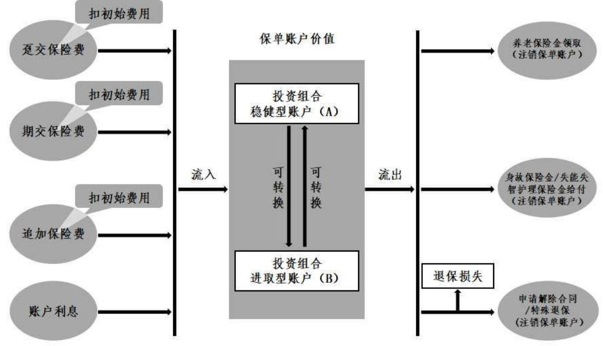

# 平安智盈金生专属商业养老保险

# 阅读指引

请扫描以查询验证条款

## 平安智盈金生专属商业养老保险产品提供养老、身故及失能失智护理保障

为了帮助您更好地了解产品，我们先介绍几个保险条款中常用的术语

 被保险人就是受保险合同保障的人。

 投保人就是购买保险并交纳保险费的人。

 受益人就是发生保险事故后享有保险金请求权的人。

 保险人就是保险公司。

 保单账户价值等于您所持有的各投资组合账户价值之和。

 投资组合账户价值随着扣除初始费用后的保险费、投资组合账户利息计入投资组合账户、投资组合账户转换而变化。

 趸交保险费指投保时您一次性支付的保险费。

 期交保险费指投保人每一期支付的保险费。

 追加保险费指养老保险金开始领取日前您随时支付的保险费。

 初始费用就是保险公司从保险费中扣除的用于支付公司各项运营成本的费用。

## 与您有重大利害关系的条款事关您的切身利益，请您务必仔细、认真阅读

 本保险条款中背景突出的内容属于免除保险人责任的条款。

 本保险条款中加了下划直线的标题及该标题下的所有内容属于其他与您有重大利害关系的条款。

## 您拥有的重要权益

 本保险条款中加了下划波浪线的内容为其他我们认为需要特别提示您注意的内容。

## 您应当特别注意的事项

 重大疾病的释义请您留意，其中一些疾病释义中包含免责条款，请您注意…… …8

下面我们用图示说明本产品保单账户的基本运作原理，具体内容以本产品条款约定为准。

## 条款目录

6.如何退保6.1 犹豫期6.2 您解除合同的手续及风险6.3 特殊退保

险种简称：智盈金生

险种代码：2647

# 中国平安人寿保险股份有限公司

# 平安智盈金生专属商业养老保险条款

在本条款中，“您”指投保人，“我们”、“本公司”均指中国平安人寿保险股份有限公司。

##  我们保什么、保多久

这部分讲的是我们提供的保障以及我们提供保障的期间。

1.1 保险责任 在本合同保险期间内，我们承担如下保险责任：

1.1.1 养老保险金开始领 在符合约定条件的情况下，您可在投保时与我们约定以被保险人到达开始领取年龄 取年龄后的首个保单周年日1作为养老保险金开始领取日。养老保险金开始领取日由您在投保时与我们约定，并在保险单上载明。被保险人开始领取年龄需要满足如下条件之一：（1）不小于国家法律、行政法规或其他相关规定、政策规定的被保险人退休年龄；（2）不小于 60周岁2。

1.1.2 养老保险金领取方 本合同养老保险金领取方式分为终身领取（年领）、终身领取（月领）、固式 定期限领取（年领）、固定期限领取（月领）四种，您可以选择其中一种领取方式。本合同提供的养老保险金领取固定期限分为 10 年、15 年、20 年、25 年四种，您可以选择其中一种。养老保险金领取方式由您在投保时与我们约定，并在保险单上载明。

1.1.3 养老保险金开始领 在本合同养老保险金开始领取日前，经与我们协商一致，您可以申请变更养取年龄及领取方式 老保险金开始领取年龄和养老保险金领取方式，且须符合申请变更当时我们的变更 的规定。在本合同养老保险金开始领取日及之后，您不得再变更养老保险金开始领取年龄和养老保险金领取方式。

## 1.1.4 养老保险金领取标准

本合同的养老保险金领取标准依据养老保险金开始领取日当时我们公布且有效的养老保险金领取转换表（以下简称领取转换表）计算所得。领取转换表是不确定的，我们可根据生命表、预定利率等变化对领取转换表适时调整，并在本公司官方网站指定路径3公布调整后的领取转换表。

当到达本合同约定的养老保险金开始领取日时，我们按该日期当时公布且有效的领取转换表计算以后各期我们应当给付的养老保险金。

被保险人开始领取养老保险金的同时，我们注销保单账户，已确定的养老保险金领取标准不再调整。

## 1.1.5 养老保险金

如果被保险人生存至本合同约定的养老保险金开始领取日，我们根据养老保险金领取方式和当时确定的领取转换表，按照养老保险金开始领取日的保单账户价值，确定每月（或每年）的养老保险金领取金额。

## 1. 如果您选择的养老保险金领取方式为终身领取（月领或年领）

若被保险人在本合同养老保险金开始领取日及之后每月（选择月领）或每年（选择年领）的对应日4仍生存，我们按确定的领取金额给付养老保险金，直至被保险人身故，本合同终止。

## 2. 如果您选择的养老保险金领取方式为固定期限领取（月领或年领）

若被保险人在本合同养老保险金开始领取日及之后每月（选择月领）或每年（选择年领）的对应日仍生存，我们按确定的领取金额给付养老保险金，直至固定领取期限届满，本合同终止。

## 1.1.6 身故保险金

（一）若被保险人在本合同约定的养老保险金开始领取日之前身故，我们按被保险人身故当时本合同的保单账户价值一次性给付身故保险金，并注销保单账户，本合同终止。

（二）若被保险人在本合同约定的养老保险金开始领取日及之后身故，我们按以下约定给付身故保险金，本合同终止。

1. 若被保险人已产生的养老保险金之和小于养老保险金开始领取日的保单账户价值，我们按养老保险金开始领取日的保单账户价值减去累计已产生的养老保险金的差额给付身故保险金；

2. 若被保险人已产生的养老保险金之和大于或等于养老保险金开始领取日的保单账户价值，身故保险金为零。

## 1.1.7 失能失智护理保险金

在本合同约定的养老保险金开始领取日之前，被保险人经医院 5的专科医生6确诊或司法鉴定机构鉴定达到本合同约定的失能失智护理状态，我们按被保险人达到失能失智护理状态时的保单账户价值一次性给付失能失智护理保险金，并注销保单账户，本合同终止。

特别提醒您，我们承担失能失智护理保险金责任的条件是被保险人在本合同约定的养老保险金开始领取日之前满足以上保险金给付条件，如果被保险人在约定的养老保险金开始领取日及之后满足以上条件，仍然不符合本项保险金给付条件。

本合同约定的失能失智护理状态应至少符合下列两种情形中的一种：

## （一）失能护理状态

失能护理状态指被保险人自主生活能力完全丧失，在无他人扶助情况下，即使使用特殊辅助工具（如轮椅、各种拐杖、助行器等等）也无法独立完成以下所列六项基本日常生活活动的三项或三项以上，日常生活持续依赖他人监护和照顾。

六项基本日常生活活动是指：

（1）穿衣：自己能够穿衣及脱衣；

（2）移动：自己从一个房间到另一个房间；

（3）行动：自己上下床或上下轮椅；

（4）如厕：自己控制进行大小便；

（5）进食：自己从已准备好的碗或碟中取食物放入口中；

（6）洗澡：自己进行淋浴或盆浴。

六项基本日常生活活动能力的鉴定不适用于 0-3周岁幼儿。

## （二）失智（严重认知障碍）护理状态

失智（严重认知障碍）护理状态是指被保险人具有严重的认知功能障碍，达到中度或中度以上痴呆状态。失智（严重认知障碍）护理状态必须同时满足以下所有条件：

1. 严重智能减退，达到以下程度之一：

（1）CDR 临床痴呆评定量表7检测高于 2分（含）；

（2）简易精神状态评价量表（MMSE）8检测低于 20 分（含）；

（3）其他医疗界公认的和普遍使用的智能检测方法确定的重度智能减退。

2. 在意识清醒的情形下存在以下三项分辨障碍中的二项或二项以上；

三项分辨障碍是指：

（1）时间的分辨障碍：经常无法分辨季节、月份、早晚时间等；

（2）场所的分辨障碍：经常无法分辨自己的住所或现在所在的场所；

（3）人物的分辨障碍：经常无法分辨日常亲近的家人或平常在一起的人。

3. 日常生活必须持续受到他人监护的。

本合同所约定的失能失智护理状态，均须经医院的专科医生确诊或司法鉴定机构鉴定并出具证明。若我们或相关权利人9对医生诊断结果或鉴定结果有异议，则由双方认可的有资质的鉴定机构进行再次鉴定。

本合同的身故保险金、失能失智护理保险金，我们仅给付其中的一项且以一次为限。

## 1.2 保险期间

1.若您选择的领取方式为终身领取（月领或年领），本合同的保险期间为被保险人终身，自本合同生效时起至被保险人身故时止。

2.若您选择的领取方式为固定期限领取（月领或年领），本合同的保险期间自本合同生效时起至您与我们约定的领取固定期限届满日零时止。

本合同保险期间在保险单上载明。

##  我们不保什么

这部分讲的是我们不承担保险责任的情况。

## 2.1 责任免除

（一）因下列情形之一导致被保险人身故的，我们不承担给付身故保险金的责任：

1.投保人对被保险人的故意杀害、故意伤害；

2.被保险人故意犯罪或者抗拒依法采取的刑事强制措施；

3.被保险人自本合同成立或者本合同效力恢复之日起 2 年内自杀，但被保险人自杀时为无民事行为能力人的除外；

4.被保险人服用、吸食或注射毒品10；

5.被保险人酒后驾驶11机动车12；

6.战争13、军事冲突14、暴乱15或武装叛乱；

7.核爆炸、核辐射或核污染。

发生上述第 1 项情形导致被保险人身故的，本合同终止，我们向被保险人的继承人（除投保人本人外）退还本合同的现金价值。

发生上述其他情形导致被保险人身故的，本合同终止，我们向您退还本合同的现金价值。

（二）因下列情形之一导致被保险人达到本合同约定的失能失智护理保险金给付条件的，我们不承担给付失能失智护理保险金的责任：

1.投保人对被保险人的故意杀害、故意伤害；

2.被保险人故意自伤、故意犯罪或者抗拒依法采取的刑事强制措施；

3.被保险人服用、吸食或注射毒品；

4.被保险人酒后驾驶机动车；

5.被保险人感染艾滋病病毒或患艾滋病16；

6.战争、军事冲突、暴乱或武装叛乱；

7.核爆炸、核辐射或核污染；

## 8.遗传性疾病17，先天性畸形、变形或染色体异常18。

发生上述第 1 项情形导致被保险人达到本合同失能失智护理保险金给付条件的，本合同终止，我们向被保险人退还本合同的现金价值；

发生上述其他情形导致被保险人达到本合同失能失智护理保险金给付条件的，本合同终止，我们向您退还本合同的现金价值。

## 2.2 其他免责条款

除本条款“2.1责任免除”外，本合同中还有一些免除我们责任的条款，详见以下条款中背景突出显示的内容：“1.1 保险责任”、“5.2保险事故通知” “6.1 犹豫期”、“8.重大疾病释义”、“脚注 5 医院”、“脚注 20医疗机构”、“脚注 25 组织病理学检查”、“脚注 35六项基本日常生活活动”。

##  保单账户与投资组合账户的运作

这部分讲的是保单账户与投资组合账户是如何运作的。

## 3.1 保单账户

我们于本合同生效日为您设立保单账户，用于记录本合同的保单账户价值。  
您的保单账户价值等于您所持有的各投资组合账户价值之和。

自本合同生效日起至保单账户注销之前，我们每年会向您寄送保单年度报告，告知您保单账户价值的具体状况。

## 3.2 投资组合账户

我们设立了投资组合稳健型账户（A）和投资组合进取型账户（B），并根据各投资组合账户的投资策略确定相应的资产配置。您可以根据自身需求，在投保时选择一个或两个投资组合账户。具体如下：

## 一、投资组合稳健型账户（A）

本投资组合账户在全面评估市场的系统性风险和大类资产预期收益率基础上，主要配置固定收益类资产、少量配置具有投资价值的权益类资产，追求长期稳健的投资收益。

## 二、投资组合进取型账户（B）

本投资组合账户在全面评估市场的系统性风险和大类资产预期收益率基础上，灵活配置固定收益类资产和具有投资价值的权益类资产，在有效控制风险的同时追求长期较高的投资收益。

您交纳的保险费将按照您确定的各投资组合账户之间的分配比例分配至各投资组合账户，保险费分配至各投资组合账户前我们需扣除相应的初始费用。

本合同趸交保险费、期交保险费在各投资组合账户之间的分配比例由您在投保时与我们协商确定并在保险单上载明。本合同追加保险费在各投资组合账户之间的分配由您在申请追加时与我们约定。

在开始领取养老保险金前，经我们审核同意，您可以变更期交保险费在各投资组合账户之间的分配比例，但须符合申请当时我们的规定。

## 3.3 投资组合账户转换

自本合同生效日起至保单账户注销之前，您可申请将本合同项下其中一个投资组合账户的部分或全部金额转移至本合同项下另一个投资组合账户。您每年可申请一次投资组合账户转换，且须符合账户转换当时我们的规定，我们不收取投资组合账户转换费用。

您在申请投资组合账户转换时，应填写申请书，并提供下列证明和资料：

1. 保险合同；

2. 您的有效身份证件；

3. 办理投资组合账户转换时需要的其他相关材料。

## 3.4 投资组合账户结算

自本合同生效日起至保单账户注销之前，各投资组合账户价值每年结算一次。

## （一）结算日

本合同各投资组合账户价值的结算日为每年 1 月 1 日，结算期间自 1 月 1日零时起至 12 月 31日 24时止，每年结算一次。

## （二）结算利率

本合同各投资组合账户的结算利率为年利率,我们在每年 1月前 6 个工作日内确定并公布上一年度各投资组合账户的实际结算利率。每次公布的各投资组合账户结算利率根据我们的实际投资情况确定，但不低于各投资组合账户对应的保证利率。

## （三）投资组合账户利息

在结算日结算的，我们根据公布的各投资组合账户的结算利率对应的日利率结算上一结算期间该投资组合收益，并将结算收益等额计入该投资组合账户价值。

在相邻两个结算日之间，保单账户注销需结算的，我们根据本合同各投资组合账户的最低保证利率对应的日利率结算该投资组合收益，并将结算收益等额计入该投资组合账户价值。

## （四）投资组合账户的保证利率

1.投资组合稳健型账户（A）的保证利率为年利率 1.5%，对应的日利率为0.00411%；

2.投资组合进取型账户（B）的保证利率为年利率 0.0%，对应的日利率为 0%。  
本合同投资组合账户的保证利率之上的投资收益是不确定的。

## 3.5 投资组合账户价值

投资组合账户价值按下列方法计算：

1.您每次交纳的保险费在扣除初始费用后，按约定的分配比例进入对应的投资组合账户，投资组合账户价值按进入该投资组合账户的金额等额增加；

2.我们结算投资组合收益后，投资组合账户价值按该投资组合收益等额增加；

3.投资组合账户转换时，投资组合账户价值按该投资组合账户转入（或转出）的金额等额增加（或减少）；

4.若出现本合同约定的其他影响投资组合账户价值的情形，投资组合账户价值按约定增加或减少。

## 3.6 初始费用

您每次支付保险费后，我们将收取保险费的一定比例作为初始费用，具体比例由您与我们在投保时约定并在保险单中载明。

初始费用收取比例不超过本合同所交保险费的 5%。

##  如何支付保险费

<table><tr><td>4.1</td><td>本合同的保险费分为泵交保险费、期交保险费和追加保险费。您在投保时可 选择磊交保险费或期交保险费，但不可同时选择。 您可以在投保时一次性支付保险费，交费金额由您在投保时与我们约定并在</td></tr><tr><td>足交保险费 期交保险费</td><td>保险单上载明，但须符合投保当时我们的规定。 在您与我们约定的养老保险金开始领取日前，您可以按年或按月交纳保险 费，交费金额、交费频次和交费期限由您在投保时与我们约定并在保险单上 载明，但须符合投保当时我们的规定。</td></tr><tr><td></td><td>在您与我们约定的养老保险金开始领取日前，您可以申请变更期交保险费的 交费金额、交费频次或交费期限，但须符合申请当时我们的规定且经我们审 核同意。</td></tr><tr><td>追加保险费</td><td>在您与我们约定的养老保险金开始领取日前，您可以向我们申请追加保险 费，但须符合申请当时我们的规定及我们公示的追加保险费条件，且经我们 审核同意。 追加保险费条件您可以通过我们的官方网站（https:/life.pingan.com/）、95511</td></tr></table>

##  如何领取保险金

## 5.1 受益人

5.2 保险事故通知 您、被保险人或受益人知道保险事故发生后应当在 10日内通知我们。如果您、被保险人或受益人故意或者因重大过失未及时通知，致使保险事故的性质、原因、损失程度等难以确定的，我们对无法确定的部分不承担保险责任，但我们通过其他途径已经及时知道或者应当及时知道保险事故发生或者虽未及时通知但不影响我们确定保险事故的性质、原因、损失程度的除外。

## 失能失智护理保险金申请所需的证明和资料

以上证明和资料不完整的，我们将一次性通知受益人补充提供有关证明和资料。

5.4 保险金给付 我们在收到保险金给付申请书及保险金申请所需证明和资料后，将在 5 日内作出核定；情形复杂的，在 30 日内作出核定。若我们要求投保人、被保险人或者受益人补充提供有关证明和资料的，则上述的 30 日不包括补充提供有关证明和资料的期间。经我们核定属于保险责任的，我们在与受益人达成有关给付保险金数额的协议后 10 日内，履行给付保险金义务。我们未及时履行前款规定义务的，将赔偿受益人因此受到的损失。前述“损失”指根据我们公示的利率（不低于中国人民银行公布的同期金融机构人民币活期存款基准利率）计算的利息损失。对不属于保险责任的，我们自作出核定之日起 3 日内向受益人发出拒绝给付保险金通知书，并说明理由。

5.5 宣告死亡处理 在本合同保险期间内，被保险人下落不明且经人民法院宣告被保险人死亡的，我们根据人民法院宣告死亡判决依法确定被保险人死亡日期，并按本条款与身故有关的约定处理。若被保险人在宣告死亡后重新出现，身故保险金受益人或继承人应于知道或应该知道被保险人重新出现后 30 日内将领取的身故保险金退还给我们。

##  如何退保

这部分讲的是您可随时申请退保，在犹豫期内退保没有损失，犹豫期后退保可能会有损失。

6.1 犹豫期 自您签收本合同之日起，有 20日的犹豫期。在此期间请您认真审视本合同，如果您认为本合同与您的需求不相符，您可以在此期间提出解除本合同，我们将退还您所支付的全部保险费。解除本合同时，您需要填写解除合同通知书，并提供您的保险合同及有效身份证件。自我们收到您解除合同的通知书时，本合同即被解除，合同解除前发生的保险事故我们不承担保险责任。

6.2 您解除合同的手续及 本合同成立后，您可以解除本合同，请填写解除合同通知书并向我们提供下风险 列证明和资料：1.保险合同；2.您的有效身份证件。自我们收到解除合同通知书时起，本合同终止。您在犹豫期后解除本合同的，我们自收到解除合同通知书之日起 30 日内向您退还本合同的现金价值。本合同的现金价值在养老保险金开始领取日及之后为零。您在犹豫期后解除合同可能会遭受一定损失。

6.3 特殊退保 在本合同保险期间内，被保险人经医院确诊初次发生本合同“8.重大疾病释义”所定义的“重大疾病”21，或因遭受意外伤害并自该意外伤害发生之日起 180日内因该意外伤害造成《人身保险伤残评定及代码》22所列伤残条

目中的 1-3级伤残的，您可以申请特殊退保。

（一）对于符合上述特殊退保情形的，若您在养老保险金开始领取日前申请特殊退保，我们将退还您申请特殊退保时的保单账户价值，并注销保单账户，本合同终止。

（二）对于符合上述特殊退保情形的，若您在养老保险金开始领取日及以后申请特殊退保，我们按以下约定退还：

1.若您申请特殊退保时被保险人已产生的养老保险金之和小于养老保险金开始领取日的保单账户价值，我们按养老保险金开始领取日的保单账户价值减去累计已产生的养老保险金的差额退还；

2.若您申请特殊退保时被保险人已产生养老保险金之和大于或等于养老保险金开始领取日的保单账户价值，退还金额为零。

（三）您申请特殊退保时，应填写解除合同通知书，并提供下列证明和资料：1.保险合同；

2.您和被保险人的有效身份证件；

3.医院出具的附有病理显微镜检查、血液检验及其他科学方法检验报告的疾病诊断证明书；

4.由二级以上（含二级）医院或鉴定机构出具的被保险人伤残程度的资料或身体伤残程度鉴定书；

5.所能提供的与确认保险事故的性质、原因、伤害程度等有关的其他证明和资料。

除本合同约定的上述情形外，您不得申请特殊退保。

您在犹豫期后申请特殊退保可能会遭受一定损失。

## 本合同约定的重大疾病

本合同约定的重大疾病共有 28 种，名称如下，具体释义见“8.重大疾病释义”。

<table><tr><td colspan="1" rowspan="1">第1类：恶性肿瘤及相关的疾病</td></tr><tr><td colspan="1" rowspan="1">1、恶性肿瘤—一重度</td></tr><tr><td colspan="1" rowspan="1">第2类：心脏或心血管相关的疾病</td></tr><tr><td colspan="1" rowspan="1">2、较重急性心肌梗死                     4、心脏瓣膜手术3、冠状动脉搭桥术（或称冠状动脉5、严重特发性肺动脉高压旁路移植术)                            6、主动脉手术</td></tr><tr><td colspan="1" rowspan="1">第3类：脑中风、神经系统相关的疾病</td></tr><tr><td colspan="1" rowspan="1">7、严重脑中风后遗症                     11、瘫痪8、严重非恶性颅内肿瘤                  12、严重阿尔茨海默病9、严重脑炎后遗症或严重脑膜炎后 13、严重脑损伤遗症                                      14、严重原发性帕金森病10、深度昏迷                               15、严重运动神经元病</td></tr><tr><td colspan="1" rowspan="1">第4类：器官功能严重受损相关的疾病</td></tr><tr><td colspan="1" rowspan="1">16、重大器官移植术或造血干细胞移21、双目失明植术                                    22、语言能力丧失17、严重慢性肾衰竭                       23、重型再生障碍性贫血18、急性重症肝炎或亚急性重症肝炎 24、严重克罗恩病19、严重慢性肝衰竭                      25、严重溃疡性结肠炎</td></tr><tr><td colspan="1" rowspan="1">20、双耳失聪</td></tr><tr><td colspan="1" rowspan="1">第5类：呼吸系统相关的疾病</td></tr><tr><td colspan="1" rowspan="1">26、严重慢性呼吸衰竭</td></tr><tr><td colspan="1" rowspan="1">第6类：其他重大疾病</td></tr><tr><td colspan="1" rowspan="1">27、多个肢体缺失                         28、严重I度烧伤</td></tr></table>

##  其他权益

这部分讲的是您所拥有的其他相关权益。

## 7.1 现金价值

（一）本合同约定的养老保险金开始领取日前，本合同的现金价值按以下方法计算：

1.您在本合同第 1 个保单年度23至第 5 个保单年度根据本合同 6.2条约定解除本合同，本合同的现金价值等于本合同累计所交保险费乘以如下比例，具体比例如下表所示：

<table><tr><td rowspan=1 colspan=1>保单年度</td><td rowspan=1 colspan=1>第1个保单年度</td><td rowspan=1 colspan=1>第2个保单年度</td><td rowspan=1 colspan=1>第3个保单年度</td><td rowspan=1 colspan=1>第4个保单年度</td><td rowspan=1 colspan=1>第5个保单年度</td></tr><tr><td rowspan=1 colspan=1>比例</td><td rowspan=1 colspan=1>95%</td><td rowspan=1 colspan=1>97%</td><td rowspan=1 colspan=1>99%</td><td rowspan=1 colspan=1>100%</td><td rowspan=1 colspan=1>100%</td></tr></table>

2.您在本合同第 6 个保单年度至第 10个保单年度根据本合同 6.2条约定解除本合同，本合同的现金价值等于以下两项金额之和：

（1）本合同累计所交保险费；

（2）保单账户累计收益24的 75%。

3.您在本合同第 11 个保单年度及以后根据本合同 6.2条约定解除本合同，本合同的现金价值等于以下两项金额之和：

（1）本合同累计所交保险费；

（2）保单账户累计收益的 90%。

（二）在本合同约定的养老保险金开始领取日及之后，本合同的现金价值为零。

## 重大疾病释义

这部分讲的是我们提供保障的 28 种重大疾病的定义，其中包含一些免责条款，请您特别留意。本合同中所称“疾病”是指发生符合以下定义所述条件的疾病、疾病状态或手术，须由专科医生明确诊断。

以下 28 种重大疾病名称仅为方便您阅读本合同而使用，名称本身不是认定我们保障范围的依据，保障范围以每项疾病的具体释义为准，即当被保险人发生完全满足下文释义的疾病时，您可以根据本合同约定申请特殊退保。

下列疾病为中国保险行业协会颁布的《重大疾病保险的疾病定义使用规范（2020 年修订版）》（以下简称“规范”）规定的 28 种重大疾病。

第 1 类：

## 1 恶性肿瘤——重度

指恶性细胞不受控制的进行性增长和扩散，浸润和破坏周围正常组织，可以经血管、淋巴管和体腔扩散转移到身体其他部位，病灶经组织病理学检查25（涵盖骨髓病理学检查）结果明确诊断，临床诊断属于世界卫生组织（WHO，World Health Organization）《疾病和有关健康问题的国际统计分类》第十次修订版（ICD-10 26）的恶性肿瘤类别及《国际疾病分类肿瘤学专辑》第三版（ICD-O-327）的肿瘤形态学编码属于 3、6、9（恶性肿瘤）范畴的疾病。下列疾病不属于“恶性肿瘤——重度”，不在保障范围内：

（1）ICD-O-3 肿瘤形态学编码属于 0（良性肿瘤）、1（动态未定性肿瘤）、

2（原位癌和非侵袭性癌）范畴的疾病，如：

a.原位癌，癌前病变，非浸润性癌，非侵袭性癌，肿瘤细胞未侵犯基底层， 上皮内瘤变，细胞不典型性增生等；

b.交界性肿瘤，交界恶性肿瘤，肿瘤低度恶性潜能，潜在低度恶性肿瘤等；

（2）TNM 分期28为Ⅰ期或更轻分期的甲状腺癌；

（3）TNM 分期为 T1N0M0期或更轻分期的前列腺癌；

（4）黑色素瘤以外的未发生淋巴结和远处转移的皮肤恶性肿瘤；

（5）相当于 Binet 分期方案 A 期程度的慢性淋巴细胞白血病；

（6）相当于 Ann Arbor 分期方案Ⅰ期程度的何杰金氏病；

（7）未发生淋巴结和远处转移且 WHO 分级为 G1 级别（核分裂像<10/50 HPF和 ki-67≤2%）或更轻分级的神经内分泌肿瘤。

## 第 2 类：

## 心脏或心血管相关的疾病

## 2 较重急性心肌梗死

急性心肌梗死指由于冠状动脉闭塞或梗阻引起部分心肌严重的持久性缺血造成急性心肌坏死。急性心肌梗死的诊断必须依据国际国内诊断标准，符合

（1）检测到肌酸激酶同工酶（CK-MB）或肌钙蛋白（cTn）升高和/或降低的动态变化，至少一次达到或超过心肌梗死的临床诊断标准；（2）同时存在下列之一的证据，包括：缺血性胸痛症状、新发生的缺血性心电图改变、新生成的病理性 Q 波、影像学证据显示有新出现的心肌活性丧失或新出现局部室壁运动异常、冠脉造影证实存在冠状动脉血栓。

较重急性心肌梗死指依照上述标准被明确诊断为急性心肌梗死，并且必须同时满足下列至少一项条件：

（1）心肌损伤标志物肌钙蛋白（cTn）升高，至少一次检测结果达到该检验正常参考值上限的 15 倍（含）以上；

（2）肌酸激酶同工酶（CK-MB）升高，至少一次检测结果达到该检验正常参考值上限的 2 倍（含）以上；

（3）出现左心室收缩功能下降，在确诊 6 周以后，检测左室射血分数（LVEF）低于 50%（不含）；

（4）影像学检查证实存在新发的乳头肌功能失调或断裂引起的中度（含）以上的二尖瓣反流；

（5）影像学检查证实存在新出现的室壁瘤；

（6）出现室性心动过速、心室颤动或心源性休克。

其他非冠状动脉阻塞性疾病所引起的肌钙蛋白（cTn）升高不在保障范围内。

3 冠 状 动 脉 搭 桥 术 指为治疗严重的冠心病，已经实施了切开心包进行的冠状动脉血管旁路移植（或称冠状动脉旁 的手术。路移植术） 所有未切开心包的冠状动脉介入治疗不在保障范围内。

## 4 心脏瓣膜手术

## 5 严重特发性肺动脉 高压

6 主动脉手术 指为治疗主动脉疾病或主动脉创伤，已经实施了开胸（含胸腔镜下）或开腹（含腹腔镜下）进行的切除、置换、修补病损主动脉血管、主动脉创伤后修复的手术。主动脉指升主动脉、主动脉弓和降主动脉（含胸主动脉和腹主动脉），不包括升主动脉、主动脉弓和降主动脉的分支血管。所有未实施开胸或开腹的动脉内介入治疗不在保障范围内。

7 严重脑中风后遗症 指因脑血管的突发病变引起脑血管出血、栓塞或梗塞，须由头颅断层扫描（CT）、核磁共振检查（MRI）等影像学检查证实，并导致神经系统永久性的功能障碍。神经系统永久性的功能障碍，指疾病确诊 180天后，仍遗留下列至少一种障碍：

（1）一肢（含）以上肢体31肌力322级（含）以下；

## （2）语言能力完全丧失33，或严重咀嚼吞咽功能障碍34；

（3）自主生活能力完全丧失，无法独立完成六项基本日常生活活动35中的三项或三项以上。

## 严重非恶性颅内肿 瘤

指起源于脑、脑神经、脑被膜的非恶性肿瘤，ICD-O-3 肿瘤形态学编码属于0（良性肿瘤）、1（动态未定性肿瘤）范畴，并已经引起颅内压升高或神经系统功能损害，出现视乳头水肿或视觉受损、听觉受损、面部或肢体瘫痪、癫痫等，须由头颅断层扫描（CT）、核磁共振检查（MRI）或正电子发射断层扫描（PET）等影像学检查证实，且须满足下列至少一项条件：

（1）已经实施了开颅进行的颅内肿瘤完全或部分切除手术；

（2）已经实施了针对颅内肿瘤的放射治疗，如γ刀、质子重离子治疗等。下列疾病不在本项保障范围内：

（1）脑垂体瘤；

（2）脑囊肿；

（3）颅内血管性疾病（如脑动脉瘤、脑动静脉畸形、海绵状血管瘤、毛细血管扩张症等）。

9 严重脑炎后遗症或 指因患脑炎或脑膜炎导致的神经系统永久性的功能障碍。神经系统永久性的严重脑膜炎后遗症 功能障碍，指经相关专科医生确诊疾病 180 天后，仍遗留下列至少一种障碍：

（1）一肢（含）以上肢体肌力 2 级（含）以下；

（2）语言能力完全丧失，或严重咀嚼吞咽功能障碍；

（3）由具有评估资格的专科医生根据临床痴呆评定量表（CDR，ClinicalDementia Rating）评估结果为 3 分；

（4）自主生活能力完全丧失，无法独立完成六项基本日常生活活动中的三项或三项以上。

## 10 深度昏迷

指因疾病或意外伤害导致意识丧失，对外界刺激和体内需求均无反应，昏迷程度按照格拉斯哥昏迷分级（GCS，Glasgow Coma Scale）结果为 5 分或 5分以下，且已经持续使用呼吸机及其他生命维持系统 96 小时以上。因酗酒或药物滥用导致的深度昏迷不在保障范围内。

## 11 瘫痪

指因疾病或意外伤害导致两肢或两肢以上肢体随意运动功能永久完全丧失。肢体随意运动功能永久完全丧失，指疾病确诊 180 天后或意外伤害发生 180

## 严重阿尔茨海默病

天后，每肢三大关节中的两大关节仍然完全僵硬，或肢体肌力在 2级（含）以下。

指因大脑进行性、不可逆性改变导致智能严重衰退或丧失，临床表现为严重的认知功能障碍、精神行为异常和社交能力减退等，其日常生活必须持续受到他人监护。须由头颅断层扫描（CT）、核磁共振检查（MRI）或正电子发射断层扫描（PET）等影像学检查证实，并经相关专科医生确诊，且须满足下列至少一项条件：

（1）由具有评估资格的专科医生根据临床痴呆评定量表（CDR，ClinicalDementia Rating）评估结果为 3 分；

（2）自主生活能力完全丧失，无法独立完成六项基本日常生活活动中的三项或三项以上。

阿尔茨海默病之外的其他类型痴呆不在保障范围内。

## 严重脑损伤

指因头部遭受机械性外力，引起脑重要部位损伤，导致神经系统永久性的功能障碍。须由头颅断层扫描（CT）、核磁共振检查（MRI）或正电子发射断层扫描（PET）等影像学检查证实。神经系统永久性的功能障碍，指脑损伤180天后，仍遗留下列至少一种障碍：

（1）一肢（含）以上肢体肌力 2 级（含）以下；

（2）语言能力完全丧失，或严重咀嚼吞咽功能障碍；

（3）自主生活能力完全丧失，无法独立完成六项基本日常生活活动中的三项或三项以上。

## 严重原发性帕金森病

是一种中枢神经系统的退行性疾病，临床表现为运动迟缓、静止性震颤或肌强直等，经相关专科医生确诊，且须满足自主生活能力完全丧失，无法独立完成六项基本日常生活活动中的三项或三项以上。继发性帕金森综合征、帕金森叠加综合征不在保障范围内。

## 15 严重运动神经元病

是一组中枢神经系统运动神经元的进行性变性疾病，包括进行性脊肌萎缩症、进行性延髓麻痹症、原发性侧索硬化症、肌萎缩性侧索硬化症，经相关专科医生确诊，且须满足下列至少一项条件：

（1）严重咀嚼吞咽功能障碍；

（2）呼吸肌麻痹导致严重呼吸困难，且已经持续使用呼吸机 7 天（含）以上；

（3）自主生活能力完全丧失，无法独立完成六项基本日常生活活动中的三项或三项以上。

## 第 4 类：

## 重大器官移植术或造血干细胞移植术

## 器官功能严重受损相关的疾病

重大器官移植术，指因相应器官功能衰竭，已经实施了肾脏、肝脏、心脏、肺脏或小肠的异体移植手术。  
造血干细胞移植术，指因造血功能损害或造血系统恶性肿瘤，已经实施了造血干细胞（包括骨髓造血干细胞、外周血造血干细胞和脐血造血干细胞）的移植手术。

17 严重慢性肾衰竭 指双肾功能慢性不可逆性衰竭，依据肾脏病预后质量倡议（K/DOQI）制定的  
指南，分期达到慢性肾脏病 5 期，且经诊断后已经进行了至少 90 天的规律  
性透析治疗。规律性透析是指每周进行血液透析或每天进行腹膜透析。  
18 急性重症肝炎或亚 指因肝炎病毒感染引起肝脏组织弥漫性坏死，导致急性肝功能衰竭，且经血  
急性重症肝炎 清学或病毒学检查证实，并须满足下列全部条件：  
（1）重度黄疸或黄疸迅速加重；  
（2）肝性脑病；  
（3）B 超或其他影像学检查显示肝脏体积急速萎缩；  
（4）肝功能指标进行性恶化。  
19 严重慢性肝衰竭 指因慢性肝脏疾病导致的肝衰竭，且须满足下列全部条件：  
（1）持续性黄疸；  
（2）腹水；  
（3）肝性脑病；  
（4）充血性脾肿大伴脾功能亢进或食管胃底静脉曲张。  
因酗酒或药物滥用导致的肝衰竭不在保障范围内。  
20 双耳失聪 指因疾病或意外伤害导致双耳听力永久不可逆性丧失，在 500 赫兹、1000  
赫兹和 2000 赫兹语音频率下，平均听阈大于等于 91 分贝，且经纯音听力测  
试、声导抗检测或听觉诱发电位检测等证实。  
若被保险人在 0至 3周岁保单周年日期间双耳失聪，在保险期间内我们对双  
耳失聪不承担保险责任。  
21 双目失明 指因疾病或意外伤害导致双眼视力永久不可逆性丧失，双眼中较好眼须满足  
下列至少一项条件：  
（1）眼球缺失或摘除；  
（2）矫正视力低于 0.02（采用国际标准视力表，如果使用其他视力表应进  
行换算）；  
（3）视野半径小于 5 度。  
22 语言能力丧失 指因疾病或意外伤害导致语言能力完全丧失，经过积极治疗至少 12个月（声  
带完全切除不受此时间限制），仍无法通过现有医疗手段恢复。  
精神心理因素所致的语言能力丧失不在保障范围内。  
若被保险人在 0 至 3 周岁保单周年日期间语言能力丧失，在保险期间内我们  
对语言能力丧失不承担保险责任。  
23 重型再生障碍性贫 指因骨髓造血功能慢性持续性衰竭导致的贫血、中性粒细胞减少及血小板减  
血 少，且须满足下列全部条件：  
（1）骨髓穿刺检查或骨髓活检结果支持诊断：骨髓细胞增生程度<正常的  
25%；如≥正常的 25%但<50%，则残存的造血细胞应<30%；  
（2）外周血象须具备以下三项条件中的两项：  
① 中性粒细胞绝对值<0.5×109/L；  
② 网织红细胞计数<20×109/L；  
③ 血小板绝对值<20×109/L。  
24 严重克罗恩病 指一种慢性肉芽肿性肠炎，具有特征性的克罗恩病（Crohn病）病理组织学  
变化，须根据组织病理学特点诊断，且已经造成瘘管形成并伴有肠梗阻或肠  
穿孔。  
25 严重溃疡性结肠炎 指伴有致命性电解质紊乱的急性暴发性溃疡性结肠炎，病变已经累及全结  
肠，表现为严重的血便和系统性症状体征，须根据组织病理学特点诊断，且  
已经实施了结肠切除或回肠造瘘术。  
第 5 类： 呼吸系统相关的疾病  
26 严重慢性呼吸衰竭 指因慢性呼吸系统疾病导致永久不可逆性的呼吸衰竭，经过积极治疗 180  
天后满足以下所有条件：  
（1）静息时出现呼吸困难；  
（2）肺功能第一秒用力呼气容积（FEV1）占预计值的百分比＜30%；  
（3）在静息状态、呼吸空气条件下，动脉血氧分压（PaO2）＜50mmHg。  
第 6 类： 其他重大疾病  
27 多个肢体缺失 指因疾病或意外伤害导致两个或两个以上肢体自腕关节或踝关节近端（靠近  
躯干端）以上完全性断离。  
28 严重Ⅲ度烧伤 指烧伤程度为Ⅲ度，且Ⅲ度烧伤的面积达到全身体表面积的 20％或 20％以  
上。体表面积根据《中国新九分法》36计算。  
 需关注的其他内容  
这部分讲的是您应当注意的其他事项。  
9.1 合同构成 平安智盈金生专属商业养老保险合同（简称本合同）由本保险条款、保险单  
或其他保险凭证、投保单、与本合同有关的投保文件、声明、批注、批单以  
及与本合同有关的其他书面材料共同构成。  
9.2 合同成立与生效 您提出保险申请且我们同意承保，本合同成立。本合同成立日期在保险单上  
载明。  
除另有约定外，本合同自我们同意承保、首次收到本合同的保险费并签发保  
险单开始生效。本合同生效日期在保险单上载明。保单周年日、保单年度、  
交费期间均以该生效日期计算。  
除另有约定外，我们自本合同生效时起开始承担保险责任。  
9.3 投保范围 本合同接受的被保险人的投保年龄范围为 0 周岁（须出生满 28 日）至 85  
周岁，且须符合投保当时我们的规定。  
9.4 年龄错误的处理 您在申请投保时，应将与有效身份证件相符的被保险人的出生日期在投保单  
上填明，如果发生错误按照下列方式办理：

<table><tr><td>9.5</td><td></td><td>1.您申报的被保险人年龄不真实，并且其真实年龄不符合本合同约定投保年 龄限制的，我们有权解除本合同，并向您退还本合同的现金价值。对于本 合同解除前发生的保险事故，我们不承担保险责任： 2.您申报的被保险人年龄不真实，致使受益人实领的保险金多于应领金额 的，我们有权更正并要求其向我们退还多给付的金额； 3.您申报的被保险人年龄不真实，致使受益人实领的保险金少于应领金额 的，我们会将应领金额与实领金额的差额无息给付给受益人。</td></tr><tr><td>9.6</td><td>限制 明确说明与如实告知</td><td>未成年人身故保险金为未成年人投保的人身保险，在被保险人成年之前，因被保险人身故给付的 保险金总和不得超过国务院保险监督管理机构规定的限额，身故给付的保险 金额总和约定也不得超过前述限额。 订立本合同时，我们应当向您说明本合同的内容。对保险条款中免除我们责 任的条款，我们在订立合同时应当在投保单、保险单或者其他保险凭证上作 出足以引起您注意的提示，并对该条款的内容以书面或者口头形式向您作出</td></tr><tr><td></td><td></td><td>明确说明，未作提示或者明确说明的，该条款不成为合同的内容。 订立本合同时，我们就您和被保险人的有关情况提出询问，您应当如实告知。 如果您故意或者因重大过失未履行前款规定的如实告知义务，足以影响我们 决定是否同意承保或者提高保险费率的，我们有权解除本合同。 如果您故意不履行如实告知义务，对于本合同解除前发生的保险事故，我们 不承担保险责任，并不退还保险费。 如果您因重大过失未履行如实告知义务，对保险事故的发生有严重影响的， 对于本合同解除前发生的保险事故，我们不承担保险责任，但会向您退还保 险费。 本公司合同解除权的本条款“9.4年龄错误的处理”、“9.6明确说明与如实告知”规定的合同</td></tr><tr><td></td><td>限制</td><td>解除权，自我们知道有解除事由之日起，超过30日不行使而消灭。自本合 同成立之日起超过2年的，我们不得解除合同；发生保险事故的，我们承担 保险责任。 我们在合同订立时已经知道您未如实告知的情况的，我们不得解除合同；发 生保险事故的，我们应当承担保险责任。</td></tr><tr><td>9.8未还款项 9.9</td><td>合同内容变更</td><td>我们在给付各项保险金、退还现金价值或者退还保险费时，如果您有欠交的 保险费或者其他欠款，我们先扣除上述各项欠款及应付利息。 经您与我们协商一致，可以变更本合同的有关内容。变更本合同的，应当由</td></tr><tr><td></td><td>9.10联系方式变更</td><td>我们在保险合同上批注或者附贴批单，或者由您与我们订立书面的变更协 议。 为了保障您的合法权益，您的住所、通讯地址、电话或电子邮件等联系方式</td></tr><tr><td></td><td></td><td>变更时，请及时以书面形式或双方认可的其他形式通知我们。若您未以书面 形式或双方认可的其他形式通知我们，我们按本合同载明的最后联系方式所 发送的有关通知，均视为已送达给您。</td></tr><tr><td>9.11合同终止</td><td></td><td>当发生下列情形之一时，本合同终止： 1.在保险期间内解除本合同的;</td></tr></table>

2.我们已经履行完毕保险责任的；

3.被保险人身故的；

4.本合同保险期间届满的；

5.本合同约定的其他终止事项。

## 9.12 争议处理

本合同争议的解决方式，由当事人在保险合同中约定从下列两种方式中选择一种：

1.因履行本合同发生的争议，由当事人协商解决，协商不成的，提交 xxx仲裁委员会仲裁；

2.因履行本合同发生的争议，由当事人协商解决，协商不成的，依法向人民法院提起诉讼。

（完）