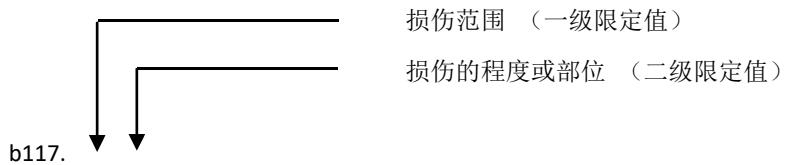
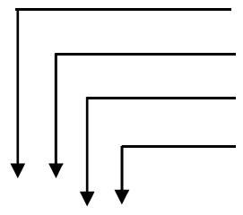

# 众安在线财产保险股份有限公司营运交通工具团体意外伤害保险条款（互联网版 2025A 款）注册号：C00017932312026010516883

## 第一部分 总则

## 第一条 合同构成

本保险合同（以下简称“本合同”）由保险条款、投保单、保险单、批单以及其他保险凭证等组成。凡涉及本合同的约定，均应采用书面形式。

## 第二条 合同的成立

投保人提出保险申请，经保险人（释义一）同意承保，本合同成立。

## 第三条 投保人

本合同的投保人应为对被保险人有保险利益的自然人、法人或非法人组织。在本合同签发时被保险人不得少于 3 人。

## 第四条 被保险人

符合本合同约定的团体成员可作为本合同的被保险人；经保险人书面同意，团体成员的配偶、子女、父母也可作为本合同的被保险人。除另有约定外，投保时年龄为出生满 30 天至 105 周岁（释义二）（含 105 周岁）的自然人，可作为本合同的被保险人。

无民事行为能力人和限制行为能力人不能作为本保险的被保险人，但父母同意为未成年子女投保本保险的不受此限。对未成年人死亡给付的保险金总和不得超过国务院保险监督管理机构规定的限额。

## 第五条 受益人

## （一）身故保险金受益人

订立本合同时，被保险人或投保人可为每一个被保险人指定一人或数人为身故保险金受益人。身故保险金受益人为数人时，应确定其受益顺序和受益份额；未确定受益份额的，各身故保险金受益人按照相等份额享有受益权。投保人指定受益人时须经被保险人同意。

被保险人死亡后，有下列情形之一的，保险金作为被保险人的遗产，由保险人依照《中华人民共和国民法典》的规定履行给付保险金的义务：

（1）没有指定受益人，或者受益人指定不明无法确定的；

（2）受益人先于被保险人死亡，没有其他受益人的；

（3）受益人依法丧失受益权或者放弃受益权，没有其他受益人的。

受益人与被保险人在同一事件中死亡，且不能确定死亡先后顺序的，推定受益人死亡在先。

投保人为与其有劳动关系的劳动者投保人身保险，不得指定被保险人及其近亲属以外的人为受益人。

被保险人或投保人可以变更身故保险金受益人，但需书面通知保险人，由保险人在本合

同上批注后生效。对因身故保险金受益人变更发生的法律纠纷，保险人不承担任何责任。

投保人指定或变更意外身故保险金受益人的，应经被保险人书面同意。被保险人为无民事行为能力人或限制民事行为能力人的，应由其监护人指定或变更意外身故保险金受益人。

## （二）伤残保险金受益人

除另有约定外，本合同的伤残保险金的受益人为被保险人本人。

## 第二部分 保障内容

## 第六条 保险责任

在保险期间内，被保险人持有效客票（包括依法免票）乘坐合法从事客运的营运交通工具（释义三），在交通工具内遭受意外伤害（释义四）导致身故或伤残（释义五）的，保险人依照下列约定给付保险金：

## （一）意外身故保险责任

在保险期间内，被保险人遭受意外伤害事故，并自该事故发生之日起 180 日内（含第180 日）因该事故身故的，保险人按保险合同上所载的相应交通工具所对应的保险金额给付身故保险金，对该被保险人的保险责任终止。

被保险人因遭受意外伤害事故且自该事故发生日起下落不明，后经人民法院宣告死亡的，保险人按保险金额给付身故保险金。但若被保险人被宣告死亡后生还的，保险金受领人应于知道或应当知道被保险人生还后 30 日内退还保险人给付的身故保险金。

若在被保险人意外身故前保险人已给付下述第（二）项约定的意外伤残保险金的，则保险人在给付意外身故保险金时应扣除已累计给付的意外伤残保险金。

## （二）意外伤残保险责任

在保险期间内，被保险人遭受意外伤害事故，并自该事故发生之日起 180 日内（含第180 日）因该意外事故造成被保险人伤残并达到《人身保险伤残评定及代码》（标准编号为GB/T 44893-2024，以下简称《伤残评定代码》）所列伤残程度之一的，保险人按《伤残评定代码》所对应伤残等级的给付比例乘以本合同载明的营运交通工具所对应的意外伤残保险金额，承担向被保险人给付意外伤残保险金的责任。如被保险人自该意外伤害发生之日起180 日后治疗仍未结束，则保险人按该意外伤害发生之日起第 180 日的身体情况进行伤残评定，并据此承担向被保险人给付意外伤残保险金的责任。

（1）被保险人因同一意外伤害造成两处或两处以上伤残时，保险人根据《伤残评定标代码》规定的多处伤残评定原则给付意外伤残保险金，但给付总额不超过该类营运交通工具所对应的意外伤残保险金额。

（2）被保险人如在本次意外伤害之前已有伤残，保险人按合并后的伤残程度在《伤残评定代码》中所对应伤残等级的给付比例扣除原有伤残程度在《伤残评定代码》中所对应伤残等级的给付比例后,乘以该类营运交通工具所对应的意外伤残保险金额，承担向被保险人给付意外伤残保险金的责任。

若保险人累计给付的某一类营运交通工具的意外伤残保险金的总额达到本合同载明的该类营运交通工具所对应的意外伤残保险金额时，保险人对被保险人该类营运交通工具的意外伤残保险责任终止。

被保险人所乘坐的营运交通工具种类由投保人、保险人约定，并在本合同中载明。保险人仅对被保险人乘坐在本合同中载明的营运交通工具时发生的保险事故承担保险责任。

## 第七条 责任免除

发生下列情形之一导致保险事故发生的，保险人不承担保险金给付责任：

（一）投保人对被保险人的故意伤害、故意杀害；

（二）被保险人故意自致伤害或自杀；

（三）因被保险人挑衅或故意行为而导致的打斗、被袭击或被谋杀；

（四）被保险人因妊娠、流产、分娩、疾病、药物过敏、中暑、猝死（释义六）导致的伤害；

（五）被保险人违反交通管理部门安全乘坐相关规定；

（六）被保险人因药物过敏或未遵医嘱，私自服用、涂用、注射药物造成的伤害；

（七）任何生物、化学、原子能武器，原子能或核能装置所造成的爆炸、灼伤、污染或辐射；

（八）战争、军事行动、武装叛乱或暴乱、恐怖袭击；

（九）被保险人因从事违法、犯罪活动或在逃期间、被依法拘留、服刑期间；

（十）被保险人醉酒或受毒品、管制药物的影响期间；

（十一）被保险人存在精神和行为障碍（以世界卫生组织颁布的《疾病和有关健康问题的国际统计分类（ICD-10）》为准）期间；

（十二）被保险人以非乘客身份乘坐营运交通工具从事职务工作期间。

## 第八条 保险金额

保险金额是保险人承担给付保险金责任的最高限额。各类营运交通工具的保险金额由保险人、投保人双方约定，并在保险合同中载明。

本合同的意外身故保险责任及其保险金额，应由被保险人同意并认可。

## 第九条 保险期间

除另有约定外，本保险合同的保险期间自保险合同生效之日起一年，具体期间以保险单载明的起讫时间为准。

## 第三部分 保险人的义务

## 第十条 提示和说明

订立本合同时，保险人会向投保人说明本合同的内容。对本合同中免除保险人责任的条款，保险人在订立合同时应当在投保单、保险单或其他保险凭证上作出足以引起投保人注意的提示，并对该条款的内容以书面或口头形式向投保人作出明确说明；未作提示或者明确说明的，该条款不产生效力。

## 第十一条 保险单和保险凭证

本合同成立后，保险人将向投保人签发保险单或其他保险凭证。

## 第十二条 保险金的给付

保险人收到被保险人或受益人的给付保险金的请求后，应当及时作出核定；情形复杂的，应当在三十日内作出核定，但本合同另有约定的除外。

保险人将核定结果通知保险金申请人；对属于保险责任的，在与保险金申请人达成给付保险金的协议后十日内，履行给付保险金义务。保险合同对给付保险金的期限有约定的，保险人应当按照约定履行给付保险金的义务。保险人依照前款约定作出核定后，对不属于保险责任的，应当自作出核定之日起三日内向保险金申请人发出拒绝给付保险金通知书，并说明理由。

保险人自收到给付保险金的请求和有关证明、资料之日起六十日内，对其给付的数额不能确定的，应当根据已有证明和资料可以确定的数额先予支付；保险人最终确定给付的数额后，支付相应的差额。

## 第十三条 索赔资料不完整通知

保险人认为保险金申请人提供的有关索赔的证明和资料不完整的，应当及时一次性通知投保人、被保险人或者受益人补充提供。

## 第四部分 投保人、被保险人义务

## 第十四条 交费义务

除另有约定外，投保人应当在本合同成立时交清保险费。保险费交清前，本合同不生效。对合同生效前发生的保险事故，保险人不承担保险责任。

## 第十五条 如实告知

投保人应如实填写投保单并回答保险人提出的询问，履行如实告知义务。

投保人故意或者因重大过失未履行前款规定的义务，足以影响保险人决定是否同意承保或者提高保险费率的，保险人有权解除本合同。

前款规定的合同解除权，自保险人知道有解除事由之日起，超过三十日不行使而消灭。

投保人故意不履行如实告知义务的，保险人对于本合同解除前发生的保险事故，不承担给付保险金责任，并不退还保险费。

投保人因重大过失未履行如实告知义务，对保险事故的发生有严重影响的，保险人对于本合同解除前发生的保险事故，不承担给付保险金责任，但应当退还保险费。

保险人在本合同订立时已经知道投保人未如实告知的情况的，保险人不得解除合同；发生保险事故的，保险人应当承担给付保险金责任。

## 第十六条 住址、通讯地址或数据电文联系方式变更告知义务

投保人住址、通讯地址或数据电文联系方式变更时，应及时以书面形式或双方认可的其他形式通知保险人。投保人未通知的，保险人按本合同所载的最后住址、通讯地址或数据电文联系方式发送的有关通知，均视为已发送给投保人。

## 第十七条 被保险人变动

（一）在保险期间内，投保人因其人员变动，需增加、减少被保险人时，应以书面形式向保险人提出申请。保险人同意后出具批单，并在本合同中批注。

（二）被保险人人数增加时，保险人在审核同意后，于收到申请之日的次日零时开始承担保险责任，并按约定增收保险费。

（三）被保险人人数减少时，保险人在审核同意后，于收到申请之日的次日零时起，对减少的被保险人终止保险责任，并按约定退还未满期保险费（释义七），除另有约定外，减少的被保险人本人或其保险金申请人（释义八）已领取过任何保险金的，保险人不退还未满期保险费。

## 第十八条 变更批注

在保险期间内，投保人需变更保险合同内容的，应以书面形式或双方认可的其他形式向保险人提出申请。保险人同意后出具批单，并在本合同中批注。

投保人通过保险人同意或认可的网站等互联网渠道提出变更本合同的申请，视为投保人的书面申请。

## 第十九条 保险事故通知义务

投保人、被保险人或者保险金受益人知道保险事故发生后，应当及时通知保险人，并书面说明事故发生的原因、经过和损失情况。故意或者因重大过失未及时通知，致使保险事故的性质、原因、损失程度等难以确定的，保险人对无法确定的部分，不承担给付保险金责任，但保险人通过其他途径已经及时知道或者应当及时知道保险事故发生的除外。

上述约定，不包括因不可抗力（释义九）而导致的迟延。

## 第五部分 保险金的申请

## 第二十条 保险金的申请

保险金申请人向保险人申请给付保险金时，应提交以下材料。保险金申请人因特殊原因不能提供以下材料的，应提供其他合法有效的材料。保险金申请人未能提供有关材料，导致保险人无法核实该申请的真实性的，保险人对无法核实部分不承担给付保险金的责任。

## （一）意外身故保险金申请

（1）索赔申请书；

（2）保险合同凭据；

（3）保险金申请人的身份证明；

（4）公安部门出具的被保险人户籍注销证明、医院出具的被保险人身故证明书。若被保险人为宣告死亡，保险金申请人应提供人民法院出具的宣告死亡证明文件；

（5）被保险人的户籍注销证明；

（6）营运交通工具承运人出具的意外事故证明；

（7）保险金申请人所能提供的与确认保险事故的性质、原因、损失程度等有关的其他证明和资料；

（8）若保险金申请人委托他人申请的，还应提供授权委托书原件、委托人和受托人的身份证明等相关证明文件。

（二）意外伤残保险金申请

（1）索赔申请书；

（2）保险合同凭据；

（3）被保险人身份证明；

（4）医院或司法鉴定机构出具的伤残鉴定书；

（5）营运交通工具承运人出具的意外事故证明；

（6）保险金申请人所能提供的其他与本项申请相关的材料；

（7）若保险金申请人委托他人申请的，还应提供授权委托书原件、委托人和受托人的身份证明等相关证明文件。

在保险人的理赔审核过程中，保险人有权在合理的范围内对索赔的被保险人进行医疗检查。

## 第六部分 保险合同的解除、终止和争议处理

## 第二十一条 合同的解除

在本合同成立后，投保人可以书面形式或双方认可的其他形式通知保险人解除合同，但保险人已根据本合同的约定给付保险金的除外。

投保人解除本合同时，应提供下列证明文件和资料：

（一）保险合同解除申请书；

（二）保险单或其他保险凭据；

（三）保险费交付凭证；

（四）投保人身份证明。

投保人要求解除本合同，自保险人接到保险合同解除申请书之日次日零时起，本合同的效力终止。保险人收到上述证明文件和资料之日起30日内退还本合同的未满期保险费。

投保人通过保险人同意或认可的网站等互联网渠道提出对本合同的解除申请，视为投保

人的书面申请。

## 第二十二条 合同的争议处理

因履行本合同发生的争议，由当事人协商解决。协商不成的，提交保险合同载明的仲裁机构仲裁；保险合同未载明仲裁机构且争议发生后未达成仲裁协议的，依法向人民法院起诉。

与本合同有关的以及履行本合同产生的一切争议处理适用中华人民共和国法律（不包括港澳台地区法律）。

## 第二十三条 诉讼时效期间

保险金申请人向保险人请求给付保险金的诉讼时效期间为二年，自其知道或者应当知道保险事故发生之日起计算。

## 第二十四条 效力终止

发生以下情况之一时，本合同效力即时终止：

（一）保险期间届满；

（二）被保险人身故；

（三）因本合同其他条款所约定的情况而终止效力。

## 第七部分 释义

## 一、保险人

指与投保人签订本合同的众安在线财产保险股份有限公司。

## 二、周岁

以法定身份证明文件中记载的出生日期为基础计算的实足年龄。

## 三、营运交通工具

指经相关政府部门登记许可的以客运为目的的民航客机、火车（包括客运火车、动车、高铁、地铁、轻轨列车、磁悬浮列车等）、轮船（包括客运轮船、游船等）、汽车（包括客运汽车、公共汽车、电车、出租车、网约车等）。

## 四、意外伤害

指以外来的、突发的、非本意的和非疾病的客观事件为直接且单独的原因致使身体受到的伤害。自然死亡、疾病身故、猝死、自杀以及自伤均不属于意外伤害。

## 五、伤残

因意外伤害损伤所致的人体残疾。

## 六、猝死

猝死是指表面健康的人因身体潜在疾病、机能障碍或其他原因在出现症状后24小时内发生的非暴力性突然死亡。以下情形不属于猝死：自然死亡、自杀、自伤、意外伤害、因慢性疾病、冠心病、心力衰竭持续治疗、终末期疾病等长期病症导致的急性死亡。

## 七、未满期保险费

除另有约定外，按下述公式计算未满期保险费：

未满期保险费=保险费\*[1-(保险合同已经过天数/保险期间天数)]×（1-退保手续费率）。经过天数不足一天的按一天计算。

退保手续费率由投保人和保险人在投保时约定，并在保险单上载明。

若本保险合同已发生保险金给付，未满期保险费为零。

## 八、保险金申请人

指受益人或被保险人的继承人或依法享有保险金请求权的其他自然人。

## 九、不可抗力

指不能预见、不能避免并不能克服的客观情况。

第二部分 ICS 03.060 A11

# 中 华 人 民 共 和 国 金 融 行 业标 准

JR/T 0083—2013

# 人身保险伤残评定代码及代码

# China insurance disability standard and code

2014 - 1 发布 2014 - 1 实施

中国保险监督管理委员会 发 布

## 第二部分 目 次

前言...  
引言...  
人身保险伤残评定代码及代码..  
1 范围...  
2 术语与定义...  
3 伤残的评定...  
3.1 确定伤残类别.....  
3.2 确定伤残等级...  
3.3 确定保险金给付比例.  
3.4 多处伤残的评定原则.. 2  
4 伤残内容、等级及代码..... . 2  
4.1 神经系统的结构和精神功能.. . 2  
4.2 眼，耳和有关的结构和功能.. 3  
4.3 发声和言语的结构和功能.. . 5  
4.4 心血管，免疫和呼吸系统的结构和功能. . 5  
4.6 泌尿和生殖系统有关的结构和功能. . 7  
4.7 神经肌肉骨骼和运动有关的结构和功能. .. 8  
4.8 皮肤和有关的结构和功能.. . 13  
附 录 A... . 15  
1. 概述..... .... 15  
2. 字母和数字的含义.. .... 15  
3. 分类级别的含义.. .. 15  
4. 编码和限定值的含义... .... 17  
5. 相关关系.. .... 22  
附 录 B..... . 23  
参考文献.. .. 26

## 第三部分 前 言

本标准按照GB/T 1.1-2009给出的规则起草。

本标准由全国金融标准化技术委员会保险分技术委员会提出。

本标准由全国金融标准化技术委员会保险分技术委员会归口。

本标准负责起草单位：中国保险行业协会。

本标准主要起草人：单鹏、方力、王勤、艾乐、卢志军、孙朋强、刘乃佳、李屹兰、李恒、李思明、张琳、杨新文、苗景龙、倪长江、胡婷华、胡琴丽、殷瑾、黄春芳、黄荫善、章瑛、董向兵、韩鸥。

本标准参与起草单位：中国法医学会。

## 第四部分 引 言

根据保险行业业务发展要求，制订本标准。

本标准制定过程中参照世界卫生组织《国际功能、残疾和健康分类》（以下简称“ICF”）的理论与方法，建立新的残疾标准的理论架构、术语体系和分类方法。

本标准制定过程中参考了国内重要的伤残评定代码，如《劳动能力鉴定，职工工伤与职业病致残等级》、《道路交通事故受伤人员伤残评定》等，符合国内相关的残疾政策，同时参考了国际上其他国家地区的伤残分级原则和标准。

本标准建立了保险行业人身保险伤残评定和保险金给付比例的基础，各保险公司应根据自身的业务特点，根据本标准的方法、内容和结构，开发保险产品，提供保险服务。

## 第五部分 人身保险伤残评定代码及代码

## 1 范围

本标准规定了意外险产品或包括意外责任的保险产品中伤残程度的评定等级以及保险金给付比例的原则和方法，用于评定由于意外伤害因素引起的伤残程度。本标准规定了功能和残疾的分类和分级， 将人身保险伤残程度划分为一至十级，最重为第一级，最轻为第十级，与人身保险伤残程度等级相对应的保险金给付比例分为十档，伤残程度第一级对应的保险金给付比例为100%，伤残程度第十级对应的保险金给付比例为10%，每级相差10%。

本标准参照ICF有关功能和残疾的分类理论与方法，建立“神经系统的结构和精神功能”、“眼，耳和有关的结构和功能”、“发声和言语的结构和功能”、“心血管，免疫和呼吸系统的结构和功能”、“消化、代谢和内分泌系统有关的结构和功能”、“泌尿和生殖系统有关的结构和功能”、“神经肌肉骨骼和运动有关的结构和功能”和“皮肤和有关的结构和功能” 8大类，共281项人身保险伤残条目。

附录A详细说明了本标准的编码规则，附录B对本标准中涉及的结构、功能代码进行了罗列。

## 2 术语与定义

下列术语和定义适用于本文件。

2.1

## 伤残 disability

因意外伤害损伤所致的人体残疾。

## 2.2

## 身体结构 body structure

身体的解剖部位，如器官、肢体及其组成部分。

## 2.3

## 身体功能 body function

身体各系统的生理功能。

## 3 伤残的评定

## 3.1 确定伤残类别

评定伤残时，应根据人体的身体结构与功能损伤情况确定所涉及的伤残类别。

## 3.2 确定伤残等级

应根据伤残情况，在同类别伤残下，确定伤残等级。

## 3.3确定保险金给付比例

应根据伤残等级对应的百分比，确定保险金给付比例。

## 3.4多处伤残的评定原则

当同一保险事故造成两处或两处以上伤残时，应首先对各处伤残程度分别进行评定，如果几处伤残等级不同，以最重的伤残等级作为最终的评定结论；如果两处或两处以上伤残等级相同，伤残等级在原评定基础上最多晋升一级，最高晋升至第一级。同一部位和性质的伤残，不应采用本标准条文两条以上或者同一条文两次以上进行评定。

注：本标准中“以上”均包括本数值或本部位，下同。

## 4 伤残内容、等级及代码

## 4.1神经系统的结构和精神功能

## 4.1.1 脑膜的结构损伤

表1
<table><tr><td rowspan=1 colspan=1>伤残条目</td><td rowspan=1 colspan=1>等级</td><td rowspan=1 colspan=1>伤残代码</td></tr><tr><td rowspan=1 colspan=1>外伤性脑脊液鼻漏或耳漏</td><td rowspan=1 colspan=1>10级</td><td rowspan=1 colspan=1>s130.188</td></tr></table>

## 4.1.2 脑的结构损伤，智力功能障碍

表2
<table><tr><td rowspan=1 colspan=1>伤残条目</td><td rowspan=1 colspan=1>等级</td><td rowspan=1 colspan=1>伤残代码</td></tr><tr><td rowspan=1 colspan=1>颅脑损伤导致极度智力缺损（智商小于等于 20），日常生活完全不能自理，处于完全护理依赖状态</td><td rowspan=1 colspan=1>1级</td><td rowspan=1 colspan=1>s110.488;b117.4, b198.4</td></tr><tr><td rowspan=1 colspan=1>颅脑损伤导致重度智力缺损（智商小于等于34），日常生活需随时有人帮助才能完成，处于完全护理依赖状态</td><td rowspan=1 colspan=1>2级</td><td rowspan=1 colspan=1>s110.388;b117.3,b198.3Z</td></tr><tr><td rowspan=1 colspan=1>颅脑损伤导致重度智力缺损（智商小于等于34），不能完全独立生活，需经常有人监护，处于大部分护理依赖状态</td><td rowspan=1 colspan=1>3级</td><td rowspan=1 colspan=1>s110.388;b117.3, b198.3</td></tr><tr><td rowspan=1 colspan=1>颅脑损伤导致中度智力缺损（智商小于等于49），日常生活能力严重受限，间或需要帮助，处于大部分护理依赖状态</td><td rowspan=1 colspan=1>4级</td><td rowspan=1 colspan=1>s110.288;b117.2, b198.2</td></tr></table>

表注：①护理依赖：应用“基本日常生活活动能力”的丧失程度来判断护理依赖程度。

②基本日常生活活动是指：（1）穿衣：自己能够穿衣及脱衣；（2）移动：自己从一个房间到另一个房间；（3）行动：自己上下床或上下轮椅；（4）如厕：自己控制进行大小便；（5）进食：自己从已准备好的碗或碟中取食物放入口中；（6）洗澡：自己进行淋浴或盆浴。

③护理依赖的程度分三级：（1）完全护理依赖指生活完全不能自理，上述六项基本日常生活活动均需护理者；（2）大部分护理依赖指生活大部不能自理，上述六项基本日常生活活动中三项或三项以上需要护理者；（3）部分护理依赖 指部分生活不能自理，上述六项基本日常生活活动中一项或一项以上需要护理者。

## 4.1.3 意识功能障碍

意识功能是指意识和警觉状态下的一般精神功能，包括清醒和持续的觉醒状态。本标准中的意识功能障碍是指颅脑损伤导致植物状态。

表 3
<table><tr><td rowspan=1 colspan=1>伤残条目</td><td rowspan=1 colspan=1>等级</td><td rowspan=1 colspan=1>伤残代码</td></tr><tr><td rowspan=1 colspan=1>颅脑损伤导致植物状态</td><td rowspan=1 colspan=1>1级</td><td rowspan=1 colspan=1>b110.4</td></tr></table>

表注：植物状态指由于严重颅脑损伤造成认知功能丧失，无意识活动，不能执行命令，保持自主呼吸和血压，有睡眠- 醒觉周期，不能理解和表达语言，能自动睁眼或刺激下睁眼，可有无目的性眼球跟踪运动，丘脑下部及脑干功能基本保存。

## 4.2 眼，耳和有关的结构和功能

## 4.2.1 眼球损伤或视功能障碍

视功能是指与感受存在的光线和感受视觉刺激的形式、大小、形状和颜色等有关的感觉功能。本标准中的视功能障碍是指眼盲目或低视力。

表 4
<table><tr><td rowspan=1 colspan=1>伤残条目</td><td rowspan=1 colspan=1>等级</td><td rowspan=1 colspan=1>伤残代码</td></tr><tr><td rowspan=1 colspan=1>双侧眼球缺失</td><td rowspan=1 colspan=1>1级</td><td rowspan=1 colspan=1>s220.413</td></tr><tr><td rowspan=1 colspan=1>侧眼球缺失</td><td rowspan=1 colspan=1>7级</td><td rowspan=1 colspan=1>s220.411/2</td></tr><tr><td rowspan=1 colspan=1>侧眼球缺失，且另一一侧眼盲目5级</td><td rowspan=1 colspan=1>1级</td><td rowspan=1 colspan=1>s220.411/2,b210.4Z2/1</td></tr><tr><td rowspan=1 colspan=1>侧眼球缺失，且另 侧眼盲目4级</td><td rowspan=1 colspan=1>2级</td><td rowspan=1 colspan=1>s220.411/2,b210.42/1</td></tr><tr><td rowspan=1 colspan=1>侧眼球缺失，且另 侧眼盲目3级</td><td rowspan=1 colspan=1>3级</td><td rowspan=1 colspan=1>s220.411/2, b210.32/1</td></tr><tr><td rowspan=1 colspan=1>侧眼球缺失，且另一-侧眼低视力2级</td><td rowspan=1 colspan=1>4级</td><td rowspan=1 colspan=1>s220.411/2,b210.22/1</td></tr><tr><td rowspan=1 colspan=1>侧眼球缺失，且另一侧眼低视力1级</td><td rowspan=1 colspan=1>5级</td><td rowspan=1 colspan=1>s220.411/2,b210.1X2/1</td></tr></table>

表注：①视力和视野

表 5
<table><tr><td rowspan=3 colspan=2>级别</td><td rowspan=1 colspan=2>低视力及盲目分级标准</td></tr><tr><td rowspan=1 colspan=2>最好矫正视力</td></tr><tr><td rowspan=1 colspan=1>最好矫正视力低于</td><td rowspan=1 colspan=1>最低矫正视力等于或优于</td></tr><tr><td rowspan=2 colspan=1>低视力</td><td rowspan=1 colspan=1>1</td><td rowspan=1 colspan=1>0.3</td><td rowspan=1 colspan=1>0.1</td></tr><tr><td rowspan=1 colspan=1>2</td><td rowspan=1 colspan=1>0.1</td><td rowspan=1 colspan=1>0.05（三米指数）</td></tr><tr><td rowspan=3 colspan=1>盲目</td><td rowspan=1 colspan=1>3</td><td rowspan=1 colspan=1>0.05</td><td rowspan=1 colspan=1>0.02（一米指数）</td></tr><tr><td rowspan=1 colspan=1>4</td><td rowspan=1 colspan=1>0.02</td><td rowspan=1 colspan=1>光感</td></tr><tr><td rowspan=1 colspan=1>5</td><td rowspan=1 colspan=2>无光感</td></tr></table>

如果中心视力好而视野缩小，以中央注视点为中心，视野直径小于 20°而大于10°者为盲目 3 级；如直径小于 10°者为盲目4 级。  
本标准视力以矫正视力为准，经治疗而无法恢复者。

②视野缺损指因损伤导致眼球注视前方而不转动所能看到的空间范围缩窄，以致难以从事正常工作、学习或其他活动。

下同。

## 4.2.2 视功能障碍

除眼盲目和低视力外，本标准中的视功能障碍还包括视野缺损。

表 6
<table><tr><td rowspan=1 colspan=1>伤残条目</td><td rowspan=1 colspan=1>等级</td><td rowspan=1 colspan=1>伤残代码</td></tr><tr><td rowspan=1 colspan=1>双眼盲目5级</td><td rowspan=1 colspan=1>2级</td><td rowspan=1 colspan=1>b210.4Z3</td></tr><tr><td rowspan=1 colspan=1>双眼视野缺损，直径小于 5°</td><td rowspan=1 colspan=1>2级</td><td rowspan=1 colspan=1>b2101.4Z3</td></tr><tr><td rowspan=1 colspan=1>双眼盲目大于等于4级</td><td rowspan=1 colspan=1>3级</td><td rowspan=1 colspan=1>b210.43</td></tr><tr><td rowspan=1 colspan=1>双眼视野缺损，直径小于10°</td><td rowspan=1 colspan=1>3级</td><td rowspan=1 colspan=1>b2101.43</td></tr><tr><td rowspan=1 colspan=1>双眼盲目大于等于3级</td><td rowspan=1 colspan=1>4级</td><td rowspan=1 colspan=1>b210.33</td></tr><tr><td rowspan=1 colspan=1>双眼视野缺损，直径小于 20°</td><td rowspan=1 colspan=1>4级</td><td rowspan=1 colspan=1>b2101.33</td></tr><tr><td rowspan=1 colspan=1>双眼低视力大于等于2级</td><td rowspan=1 colspan=1>5级</td><td rowspan=1 colspan=1>b210.23</td></tr><tr><td rowspan=1 colspan=1>双眼低视力大于等于1级</td><td rowspan=1 colspan=1>6级</td><td rowspan=1 colspan=1>b210.1X3</td></tr><tr><td rowspan=1 colspan=1>双眼视野缺损，直径小于60°</td><td rowspan=1 colspan=1>6级</td><td rowspan=1 colspan=1>b2101.23</td></tr></table>

续表 6
<table><tr><td rowspan=1 colspan=1>伤残条目</td><td rowspan=1 colspan=1>等级</td><td rowspan=1 colspan=1>伤残代码</td></tr><tr><td rowspan=1 colspan=1>一眼盲目5级</td><td rowspan=1 colspan=1>7级</td><td rowspan=1 colspan=1>b210.4Z1/2</td></tr><tr><td rowspan=1 colspan=1>-眼视野缺损，直径小于 5°</td><td rowspan=1 colspan=1>7级</td><td rowspan=1 colspan=1>b2101.4Z1/2</td></tr><tr><td rowspan=1 colspan=1>眼盲目大于等于4级</td><td rowspan=1 colspan=1>8级</td><td rowspan=1 colspan=1>b210.41/2</td></tr><tr><td rowspan=1 colspan=1>眼视野缺损，直径小于10°</td><td rowspan=1 colspan=1>8级</td><td rowspan=1 colspan=1>b2101.41/2</td></tr><tr><td rowspan=1 colspan=1>一眼盲目大于等于3级</td><td rowspan=1 colspan=1>9级</td><td rowspan=1 colspan=1>b210.31/2</td></tr><tr><td rowspan=1 colspan=1>眼视野缺损，直径小于20°</td><td rowspan=1 colspan=1>9级</td><td rowspan=1 colspan=1>b2101.31/2</td></tr><tr><td rowspan=1 colspan=1>-眼低视力大于等于1级</td><td rowspan=1 colspan=1>10级</td><td rowspan=1 colspan=1>b210.1X1/2</td></tr><tr><td rowspan=1 colspan=1>-眼视野缺损，直径小于60°</td><td rowspan=1 colspan=1>10级</td><td rowspan=1 colspan=1>b2101.21/2</td></tr></table>

## 4.2.3 眼球的晶状体结构损伤

表7
<table><tr><td rowspan=1 colspan=1>伤残条目</td><td rowspan=1 colspan=1>等级</td><td rowspan=1 colspan=1>伤残代码</td></tr><tr><td rowspan=1 colspan=1>外伤性白内障</td><td rowspan=1 colspan=1>10级</td><td rowspan=1 colspan=1>s2204.188;b210.1</td></tr></table>

表注：外伤性白内障：凡未做手术者，均适用本条；外伤性白内障术后遗留相关视功能障碍，参照有关条款评定伤残等级。

## 4.2.4 眼睑结构损伤

表8
<table><tr><td rowspan=1 colspan=1>伤残条目</td><td rowspan=1 colspan=1>等级</td><td rowspan=1 colspan=1>伤残代码</td></tr><tr><td rowspan=1 colspan=1>双侧眼睑外翻</td><td rowspan=1 colspan=1>8级</td><td rowspan=1 colspan=1>s2301.863</td></tr><tr><td rowspan=1 colspan=1>双侧眼睑闭合不全</td><td rowspan=1 colspan=1>8级</td><td rowspan=1 colspan=1>s2301.853</td></tr><tr><td rowspan=1 colspan=1>双侧眼睑显著缺损</td><td rowspan=1 colspan=1>8级</td><td rowspan=1 colspan=1>s2301.323</td></tr><tr><td rowspan=1 colspan=1>侧眼睑显著缺损</td><td rowspan=1 colspan=1>9级</td><td rowspan=1 colspan=1>s2301.321/2</td></tr><tr><td rowspan=1 colspan=1>侧眼睑外翻</td><td rowspan=1 colspan=1>9级</td><td rowspan=1 colspan=1>s2301.861/2</td></tr><tr><td rowspan=1 colspan=1>-侧眼睑闭合不全</td><td rowspan=1 colspan=1>9级</td><td rowspan=1 colspan=1>s2301.851/2</td></tr></table>

表注：眼睑显著缺损指闭眼时眼睑不能完全覆盖角膜。

## 4.2.5 耳廓结构损伤或听功能障碍

听功能是指与感受存在的声音和辨别方位、音调、音量和音质有关的感觉功能。

表 9
<table><tr><td rowspan=1 colspan=1>伤残条目</td><td rowspan=1 colspan=1>等级</td><td rowspan=1 colspan=1>伤残代码</td></tr><tr><td rowspan=1 colspan=1>双耳听力损失大于等于91dB，且双侧耳廓缺失</td><td rowspan=1 colspan=1>2级</td><td rowspan=1 colspan=1>b230.43,s240.413</td></tr><tr><td rowspan=1 colspan=1>双耳听力损失大于等于71dB，且双侧耳廓缺失</td><td rowspan=1 colspan=1>3级</td><td rowspan=1 colspan=1>b230.33, s240.413</td></tr><tr><td rowspan=1 colspan=1>双耳听力损失大于等于91dB，且一侧耳廓缺失</td><td rowspan=1 colspan=1>3级</td><td rowspan=1 colspan=1>b230.43, s240.411/2</td></tr><tr><td rowspan=1 colspan=1>一耳听力损失大于等于91dB，另一耳听力损失大于等于 71dB，且一侧耳廓缺失，另一侧耳廓缺失大于等于 50%</td><td rowspan=1 colspan=1>3级</td><td rowspan=1 colspan=1>b230.41/2,b230.32/1,s240.411/2, s240.321/2</td></tr><tr><td rowspan=1 colspan=1>双耳听力损失大于等于 56dB，且双侧耳廓缺失</td><td rowspan=1 colspan=1>4级</td><td rowspan=1 colspan=1>b230.2Z3, s240.413</td></tr><tr><td rowspan=1 colspan=1>双耳听力损失大于等于71dB，且一侧耳廓缺失</td><td rowspan=1 colspan=1>4级</td><td rowspan=1 colspan=1>b230.33,s240.411/2</td></tr><tr><td rowspan=1 colspan=1>一耳听力损失大于等于91dB，另一耳听力损失大于等于 71dB，且一侧耳廓缺失大于等于 50%</td><td rowspan=1 colspan=1>4级</td><td rowspan=1 colspan=1>b230.41/2,b230.32/1,s240.321/2</td></tr><tr><td rowspan=1 colspan=1>双耳听力损失大于等于71dB，且一侧耳廓缺失大于等于50%</td><td rowspan=1 colspan=1>5级</td><td rowspan=1 colspan=1>b230.33, s240.321/2</td></tr><tr><td rowspan=1 colspan=1>双耳听力损失大于等于56dB，且一侧耳廓缺失</td><td rowspan=1 colspan=1>5级</td><td rowspan=1 colspan=1>b230.2Z3, s240.411/2</td></tr><tr><td rowspan=1 colspan=1>双侧耳廓缺失</td><td rowspan=1 colspan=1>5级</td><td rowspan=1 colspan=1>s240.413</td></tr><tr><td rowspan=1 colspan=1>一侧耳廓缺失，且另一侧耳廓缺失大于等于 50%</td><td rowspan=1 colspan=1>6级</td><td rowspan=1 colspan=1>s240.411/2, s240.322/1</td></tr><tr><td rowspan=1 colspan=1>-侧耳廓缺失</td><td rowspan=1 colspan=1>8级</td><td rowspan=1 colspan=1>s240.411/2</td></tr><tr><td rowspan=1 colspan=1>侧耳廓缺失大于等于50%</td><td rowspan=1 colspan=1>9级</td><td rowspan=1 colspan=1>s240.321/2</td></tr></table>

## 4.2.6听功能障

表10
<table><tr><td rowspan=1 colspan=1>伤残条目</td><td rowspan=1 colspan=1>等级</td><td rowspan=1 colspan=1>伤残代码</td></tr><tr><td rowspan=1 colspan=1>双耳听力损失大于等于91dB</td><td rowspan=1 colspan=1>4级</td><td rowspan=1 colspan=1>b230.43</td></tr><tr><td rowspan=1 colspan=1>双耳听力损失大于等于81dB</td><td rowspan=1 colspan=1>5级</td><td rowspan=1 colspan=1>b230.3Z3</td></tr><tr><td rowspan=1 colspan=1>一耳听力损失大于等于91dB，且另一耳听力损失大于等于71dB</td><td rowspan=1 colspan=1>5级</td><td rowspan=1 colspan=1>b230.41/2,b230.32/1</td></tr><tr><td rowspan=1 colspan=1>双耳听力损失大于等于71dB</td><td rowspan=1 colspan=1>6级</td><td rowspan=1 colspan=1>b230.33</td></tr><tr><td rowspan=1 colspan=1>一耳听力损失大于等于91dB，且另一耳听力损失大于等于56dB</td><td rowspan=1 colspan=1>6级</td><td rowspan=1 colspan=1>b230.41/2,b230.2Z2/1</td></tr><tr><td rowspan=1 colspan=1>一耳听力损失大于等于91dB，且另一耳听力损失大于等于41dB</td><td rowspan=1 colspan=1>7级</td><td rowspan=1 colspan=1>b230.41/2,b230.22/1</td></tr><tr><td rowspan=1 colspan=1>一耳听力损失大于等于71dB，且另-一-耳听力损失大于等于56dB</td><td rowspan=1 colspan=1>7级</td><td rowspan=1 colspan=1>b230.31/2,b230.2Z2/1</td></tr><tr><td rowspan=1 colspan=1>耳听力损失大于等于71dB，且另一耳听力损失大于等于41dB</td><td rowspan=1 colspan=1>8级</td><td rowspan=1 colspan=1>b230.31/2,b230.22/1</td></tr><tr><td rowspan=1 colspan=1>一耳听力损失大于等于91dB</td><td rowspan=1 colspan=1>8级</td><td rowspan=1 colspan=1>b230.41/2</td></tr><tr><td rowspan=1 colspan=1>一耳听力损失大于等于56dB，且另一耳听力损失大于等于41dB</td><td rowspan=1 colspan=1>9级</td><td rowspan=1 colspan=1>b230.2Z1/2,b230.22/1</td></tr><tr><td rowspan=1 colspan=1>一耳听力损失大于等于71dB</td><td rowspan=1 colspan=1>9级</td><td rowspan=1 colspan=1>b230.31/2</td></tr><tr><td rowspan=1 colspan=1>双耳听力损失大于等于26dB</td><td rowspan=1 colspan=1>10级</td><td rowspan=1 colspan=1>b230.13</td></tr><tr><td rowspan=1 colspan=1>一耳听力损失大于等于56dB</td><td rowspan=1 colspan=1>10级</td><td rowspan=1 colspan=1>b230.2Z1/2</td></tr></table>

## 4.3 发声和言语的结构和功能

## 4.3.1 鼻的结构损伤

表11
<table><tr><td rowspan=1 colspan=1>伤残条目</td><td rowspan=1 colspan=1>等级</td><td rowspan=1 colspan=1>伤残代码</td></tr><tr><td rowspan=1 colspan=1>外鼻部完全缺失</td><td rowspan=1 colspan=1>5级</td><td rowspan=1 colspan=1>s3100.419</td></tr><tr><td rowspan=1 colspan=1>外鼻部大部分缺失</td><td rowspan=1 colspan=1>7级</td><td rowspan=1 colspan=1>s3100.328</td></tr><tr><td rowspan=1 colspan=1>双侧鼻腔或鼻咽部闭锁</td><td rowspan=1 colspan=1>8级</td><td rowspan=1 colspan=1>s3108B.253/ s3300.259</td></tr><tr><td rowspan=1 colspan=1>鼻尖及一侧鼻翼缺失</td><td rowspan=1 colspan=1>8级</td><td rowspan=1 colspan=1>s3100.224,s3100A.221/2</td></tr><tr><td rowspan=1 colspan=1>-侧鼻翼缺损</td><td rowspan=1 colspan=1>9级</td><td rowspan=1 colspan=1>s3100A.221/2</td></tr><tr><td rowspan=1 colspan=1>单侧鼻腔或鼻孔闭锁</td><td rowspan=1 colspan=1>10级</td><td rowspan=1 colspan=1>s3108A.251/2/s3108B.251/2</td></tr></table>

## 4.3.2 口腔的结构损伤

表12
<table><tr><td rowspan=1 colspan=1>伤残条目</td><td rowspan=1 colspan=1>等级</td><td rowspan=1 colspan=1>伤残代码</td></tr><tr><td rowspan=1 colspan=1>舌缺损大于全舌的 2/3</td><td rowspan=1 colspan=1>3级</td><td rowspan=1 colspan=1>s3203.328Z</td></tr><tr><td rowspan=1 colspan=1>舌缺损大于全舌的 1/3</td><td rowspan=1 colspan=1>6级</td><td rowspan=1 colspan=1>s3203.228</td></tr><tr><td rowspan=1 colspan=1>口腔损伤导致牙齿脱落大于等于16枚</td><td rowspan=1 colspan=1>9级</td><td rowspan=1 colspan=1>s3200.320</td></tr><tr><td rowspan=1 colspan=1>口腔损伤导致牙齿脱落大于等于8枚</td><td rowspan=1 colspan=1>10级</td><td rowspan=1 colspan=1>s3200.220</td></tr></table>

## 4.3.3 发声和言语的功能障碍

本标准中的发声和言语的功能障碍是指语言功能丧失。

表 13
<table><tr><td rowspan=1 colspan=1>伤残条目</td><td rowspan=1 colspan=1>等级</td><td rowspan=1 colspan=1>伤残代码</td></tr><tr><td rowspan=1 colspan=1>语言功能完全丧失</td><td rowspan=1 colspan=1>8级</td><td rowspan=1 colspan=1>b167.4,b399.4</td></tr></table>

表注：语言功能完全丧失指构成语言的口唇音、齿舌音、口盖音和喉头音的四种语言功能中，有三种以上不能构声、或声带全部切除，或因大脑语言中枢受伤害而患失语症，并须有资格的耳鼻喉科医师出具医疗诊断证明，但不包括任何心理障碍引致的失语。

## 4.4 心血管，免疫和呼吸系统的结构和功能

## 4.4.1 心脏的结构损伤或功能障碍

表14
<table><tr><td rowspan=1 colspan=1>伤残条目</td><td rowspan=1 colspan=1>等级</td><td rowspan=1 colspan=1>伤残代码</td></tr><tr><td rowspan=1 colspan=1>胸部损伤导致心肺联合移植</td><td rowspan=1 colspan=1>1级</td><td rowspan=1 colspan=1>s4100.418S, s4301.413S</td></tr><tr><td rowspan=1 colspan=1>胸部损伤导致心脏贯通伤修补术后，心电图有明显改变</td><td rowspan=1 colspan=1>3级</td><td rowspan=1 colspan=1>s4100.350S:b410.2</td></tr><tr><td rowspan=1 colspan=1>胸部损伤导致心肌破裂修补</td><td rowspan=1 colspan=1>8级</td><td rowspan=1 colspan=1>s41008.148</td></tr></table>

## 4.4.1 脾结构损伤

表15
<table><tr><td rowspan=1 colspan=1>伤残条目</td><td rowspan=1 colspan=1>等级</td><td rowspan=1 colspan=1>伤残代码</td></tr><tr><td rowspan=1 colspan=1>腹部损伤导致脾切除</td><td rowspan=1 colspan=1>8级</td><td rowspan=1 colspan=1>s4203.419</td></tr><tr><td rowspan=1 colspan=1>腹部损伤导致脾部分切除</td><td rowspan=1 colspan=1>9级</td><td rowspan=1 colspan=1>s4203.228</td></tr><tr><td rowspan=1 colspan=1>腹部损伤导致脾破裂修补</td><td rowspan=1 colspan=1>10级</td><td rowspan=1 colspan=1>s4203.148</td></tr></table>

## 4.4.2 肺的结构损伤

表16
<table><tr><td rowspan=1 colspan=1>伤残条目</td><td rowspan=1 colspan=1>等级</td><td rowspan=1 colspan=1>伤残代码</td></tr><tr><td rowspan=1 colspan=1>胸部损伤导致一侧全肺切除</td><td rowspan=1 colspan=1>4级</td><td rowspan=1 colspan=1>s4301.411/2</td></tr><tr><td rowspan=1 colspan=1>胸部损伤导致双侧肺叶切除</td><td rowspan=1 colspan=1>4级</td><td rowspan=1 colspan=1>s43018A.823</td></tr><tr><td rowspan=1 colspan=1>胸部损伤导致同侧双肺叶切除</td><td rowspan=1 colspan=1>5级</td><td rowspan=1 colspan=1>s43018A.321</td></tr><tr><td rowspan=1 colspan=1>胸部损伤导致肺叶切除</td><td rowspan=1 colspan=1>7级</td><td rowspan=1 colspan=1>s43018A.828</td></tr></table>

4.4.3 胸廓的结构损伤

本标准中的胸廓的结构损伤是指肋骨骨折或缺失。

表 17
<table><tr><td rowspan=1 colspan=1>伤残条目</td><td rowspan=1 colspan=1>等级</td><td rowspan=1 colspan=1>伤残代码</td></tr><tr><td rowspan=1 colspan=1>胸部损伤导致大于等于12根肋骨骨折</td><td rowspan=1 colspan=1>8级</td><td rowspan=1 colspan=1>s4302A.350</td></tr><tr><td rowspan=1 colspan=1>胸部损伤导致大于等于8根肋骨骨折</td><td rowspan=1 colspan=1>9级</td><td rowspan=1 colspan=1>s4302A.250</td></tr><tr><td rowspan=1 colspan=1>胸部损伤导致大于等于4 根肋骨缺失</td><td rowspan=1 colspan=1>9级</td><td rowspan=1 colspan=1>s4302A.120Z</td></tr><tr><td rowspan=1 colspan=1>胸部损伤导致大于等于4 根肋骨骨折</td><td rowspan=1 colspan=1>10级</td><td rowspan=1 colspan=1>s4302A.150</td></tr><tr><td rowspan=1 colspan=1>胸部损伤导致大于等于2根肋骨缺失</td><td rowspan=1 colspan=1>10级</td><td rowspan=1 colspan=1>s4302A.120</td></tr></table>

4.5 消化、代谢和内分泌系统有关的结构和功能

## 4.5.1咀嚼和吞咽功能障碍

咀嚼是指用后牙（如磨牙）碾、磨或咀嚼食物的功能。吞咽是指通过口腔、咽和食道把食物和饮料以适宜的频率和速度送入胃中的功能。

表 18
<table><tr><td rowspan=1 colspan=1>伤残条目</td><td rowspan=1 colspan=1>等级</td><td rowspan=1 colspan=1>伤残代码</td></tr><tr><td rowspan=1 colspan=1>咀嚼、吞咽功能完全丧失</td><td rowspan=1 colspan=1>1级</td><td rowspan=1 colspan=1>b5102.4，b5105.4</td></tr></table>

表注：咀嚼、吞咽功能丧失指由于牙齿以外的原因引起器质障碍或机能障碍，以致不能作咀嚼、吞咽运动，除流质食物外不能摄取或吞咽的状态。

## 4.5.2肠的结构损伤

表19

<table><tr><td rowspan=1 colspan=1>伤残条目</td><td rowspan=1 colspan=1>等级</td><td rowspan=1 colspan=1>伤残代码</td></tr><tr><td rowspan=1 colspan=1>腹部损伤导致小肠切除大于等于90%</td><td rowspan=1 colspan=1>1级</td><td rowspan=1 colspan=1>s5400.328Z</td></tr><tr><td rowspan=1 colspan=1>腹部损伤导致小肠切除大于等于 75%,合并短肠综合症</td><td rowspan=1 colspan=1>2级</td><td rowspan=1 colspan=1>s5400.328;b5152.3</td></tr><tr><td rowspan=1 colspan=1>腹部损伤导致小肠切除大于等于 75%</td><td rowspan=1 colspan=1>4级</td><td rowspan=1 colspan=1>s5400.328</td></tr></table>

续表23
<table><tr><td rowspan=1 colspan=1>伤残条目</td><td rowspan=1 colspan=1>等级</td><td rowspan=1 colspan=1>伤残代码</td></tr><tr><td rowspan=1 colspan=1>腹部或骨盆部损伤导致全结肠、直肠、肛门结构切除，回肠造瘘</td><td rowspan=1 colspan=1>4级</td><td rowspan=1 colspan=1>s5401.419, s8105.158</td></tr><tr><td rowspan=1 colspan=1>腹部或骨盆部损伤导致直肠、肛门切除，且结肠部分切除，结肠造瘘</td><td rowspan=1 colspan=1>5级</td><td rowspan=1 colspan=1>s5401B.419, s598A.419,s5401A.228, s8105.158</td></tr><tr><td rowspan=1 colspan=1>腹部损伤导致小肠切除大于等于50%,且包括回盲部切除</td><td rowspan=1 colspan=1>6级</td><td rowspan=1 colspan=1>s5400.327, s5400C.419,s5408A.419</td></tr><tr><td rowspan=1 colspan=1>腹部损伤导致小肠切除大于等于 50%</td><td rowspan=1 colspan=1>7级</td><td rowspan=1 colspan=1>s5400.326</td></tr><tr><td rowspan=1 colspan=1>腹部损伤导致结肠切除大于等于 50%</td><td rowspan=1 colspan=1>7级</td><td rowspan=1 colspan=1>s5401A.328</td></tr><tr><td rowspan=1 colspan=1>腹部损伤导致结肠部分切除</td><td rowspan=1 colspan=1>8级</td><td rowspan=1 colspan=1>s5401A.228</td></tr><tr><td rowspan=1 colspan=1>骨盆部损伤导致直肠、肛门损伤，且遗留永久性乙状结肠造口</td><td rowspan=1 colspan=1>9级</td><td rowspan=1 colspan=1>s5401B.189, s598A.189,s8105.158</td></tr><tr><td rowspan=1 colspan=1>骨盆部损伤导致直肠、肛门损伤，且瘢痕形成</td><td rowspan=1 colspan=1>10级</td><td rowspan=1 colspan=1>s5401B.189, s598A.189;b820.1</td></tr></table>

## 4.5.3 胃结构损伤

表20
<table><tr><td rowspan=1 colspan=1>伤残条目</td><td rowspan=1 colspan=1>等级</td><td rowspan=1 colspan=1>伤残代码</td></tr><tr><td rowspan=1 colspan=1>腹部损伤导致全胃切除</td><td rowspan=1 colspan=1>4级</td><td rowspan=1 colspan=1>s530.419</td></tr><tr><td rowspan=1 colspan=1>腹部损伤导致胃切除大于等于50%</td><td rowspan=1 colspan=1>7级</td><td rowspan=1 colspan=1>s530.328</td></tr></table>

## 4.5.4 胰结构损伤或代谢功能障碍

本标准中的代谢功能障碍是指胰岛素依赖。

表 21
<table><tr><td rowspan=1 colspan=1>伤残条目</td><td rowspan=1 colspan=1>等级</td><td rowspan=1 colspan=1>伤残代码</td></tr><tr><td rowspan=1 colspan=1>腹部损伤导致胰完全切除</td><td rowspan=1 colspan=1>1级</td><td rowspan=1 colspan=1>s550.419</td></tr><tr><td rowspan=1 colspan=1>腹部损伤导致胰切除大于等于50%，且伴有胰岛素依赖</td><td rowspan=1 colspan=1>3级</td><td rowspan=1 colspan=1>s550.328;b5408.4</td></tr><tr><td rowspan=1 colspan=1>腹部损伤导致胰头、十二指肠切除</td><td rowspan=1 colspan=1>4级</td><td rowspan=1 colspan=1>s550.226, s5400A.419</td></tr><tr><td rowspan=1 colspan=1>腹部损伤导致胰切除大于等于 50%</td><td rowspan=1 colspan=1>6级</td><td rowspan=1 colspan=1>s550.328</td></tr><tr><td rowspan=1 colspan=1>腹部损伤导致胰部分切除</td><td rowspan=1 colspan=1>8级</td><td rowspan=1 colspan=1>s550.128</td></tr></table>

## 4.5.5 肝结构损伤

表22
<table><tr><td rowspan=1 colspan=1>伤残条目</td><td rowspan=1 colspan=1>等级</td><td rowspan=1 colspan=1>伤残代码</td></tr><tr><td rowspan=1 colspan=1>腹部损伤导致肝切除大于等于 75%</td><td rowspan=1 colspan=1>2级</td><td rowspan=1 colspan=1>s560.328Y</td></tr><tr><td rowspan=1 colspan=1>腹部损伤导致肝切除大于等于50%</td><td rowspan=1 colspan=1>5级</td><td rowspan=1 colspan=1>s560.328</td></tr><tr><td rowspan=1 colspan=1>腹部损伤导致肝部分切除</td><td rowspan=1 colspan=1>8级</td><td rowspan=1 colspan=1>s560.128</td></tr></table>

## 4.6 泌尿和生殖系统有关的结构和功能

## 4.6.1泌尿系统的结构损伤

表23
<table><tr><td rowspan=1 colspan=1>伤残条目</td><td rowspan=1 colspan=1>等级</td><td rowspan=1 colspan=1>伤残代码</td></tr><tr><td rowspan=1 colspan=1>腹部损伤导致双侧肾切除</td><td rowspan=1 colspan=1>1级</td><td rowspan=1 colspan=1>s6100.413</td></tr><tr><td rowspan=1 colspan=1>腹部损伤导致孤肾切除</td><td rowspan=1 colspan=1>1级</td><td rowspan=1 colspan=1>s6100A.411/2</td></tr><tr><td rowspan=1 colspan=1>骨盆部损伤导致双侧输尿管缺失</td><td rowspan=1 colspan=1>5级</td><td rowspan=1 colspan=1>s6101.413</td></tr><tr><td rowspan=1 colspan=1>骨盆部损伤导致双侧输尿管闭锁</td><td rowspan=1 colspan=1>5级</td><td rowspan=1 colspan=1>s6101.453</td></tr><tr><td rowspan=1 colspan=1>骨盆部损伤导致一侧输尿管缺失，另一侧输尿管闭锁</td><td rowspan=1 colspan=1>5级</td><td rowspan=1 colspan=1>s6101.411/2, s6101.452/1</td></tr><tr><td rowspan=1 colspan=1>骨盆部损伤导致膀胱切除</td><td rowspan=1 colspan=1>5级</td><td rowspan=1 colspan=1>s6102.419</td></tr><tr><td rowspan=1 colspan=1>骨盆部损伤导致尿道闭锁</td><td rowspan=1 colspan=1>5级</td><td rowspan=1 colspan=1>s6103.459</td></tr><tr><td rowspan=1 colspan=1>骨盆部损伤一侧输尿管缺失，另一侧输尿管严重狭窄</td><td rowspan=1 colspan=1>7级</td><td rowspan=1 colspan=1>s6101.411/2,s6101.342/1</td></tr></table>

续表23
<table><tr><td rowspan=1 colspan=1>伤残条目</td><td rowspan=1 colspan=1>等级</td><td rowspan=1 colspan=1>伤残代码</td></tr><tr><td rowspan=1 colspan=1>骨盆部损伤一侧输尿管闭锁，另一侧输尿管严重狭窄</td><td rowspan=1 colspan=1>7级</td><td rowspan=1 colspan=1>s6101.451/2, s6101.342/1</td></tr><tr><td rowspan=1 colspan=1>腹部损伤导致一侧肾切除</td><td rowspan=1 colspan=1>8级</td><td rowspan=1 colspan=1>s6100.411/2</td></tr><tr><td rowspan=1 colspan=1>骨盆部损伤双侧输尿管严重狭窄</td><td rowspan=1 colspan=1>8级</td><td rowspan=1 colspan=1>s6101.343</td></tr><tr><td rowspan=1 colspan=1>骨盆部损伤一侧输尿管缺失，另一侧输尿管狭窄</td><td rowspan=1 colspan=1>8级</td><td rowspan=1 colspan=1>s6101.411/2, s6101.242/1</td></tr><tr><td rowspan=1 colspan=1>骨盆部损伤一侧输尿管闭锁，另一侧输尿管狭窄</td><td rowspan=1 colspan=1>8级</td><td rowspan=1 colspan=1>s6101.451/2, s6101.242/1</td></tr><tr><td rowspan=1 colspan=1>腹部损伤导致一侧肾部分切除</td><td rowspan=1 colspan=1>9级</td><td rowspan=1 colspan=1>s6100.121/2</td></tr><tr><td rowspan=1 colspan=1>骨盆部损伤一侧输尿管缺失</td><td rowspan=1 colspan=1>9级</td><td rowspan=1 colspan=1>s6101.411/2</td></tr><tr><td rowspan=1 colspan=1>骨盆部损伤一侧输尿管闭锁</td><td rowspan=1 colspan=1>9级</td><td rowspan=1 colspan=1>s6101.451/2</td></tr><tr><td rowspan=1 colspan=1>骨盆部损伤导致尿道狭窄</td><td rowspan=1 colspan=1>9级</td><td rowspan=1 colspan=1>s6103.248</td></tr><tr><td rowspan=1 colspan=1>骨盆部损伤导致膀胱部分切除</td><td rowspan=1 colspan=1>9级</td><td rowspan=1 colspan=1>s6102.128</td></tr><tr><td rowspan=1 colspan=1>腹部损伤导致肾破裂修补</td><td rowspan=1 colspan=1>10级</td><td rowspan=1 colspan=1>s6100.148</td></tr><tr><td rowspan=1 colspan=1>骨盆部损伤一侧输尿管严重狭窄</td><td rowspan=1 colspan=1>10级</td><td rowspan=1 colspan=1>s6101.341/2</td></tr><tr><td rowspan=1 colspan=1>骨盆部损伤膀胱破裂修补</td><td rowspan=1 colspan=1>10级</td><td rowspan=1 colspan=1>s6102.148</td></tr></table>

## 4.6.2 生殖系统的结构损伤

表24
<table><tr><td rowspan=1 colspan=1>伤残条目</td><td rowspan=1 colspan=1>等级</td><td rowspan=1 colspan=1>伤残代码</td></tr><tr><td rowspan=1 colspan=1>会阴部损伤导致双侧睾丸缺失</td><td rowspan=1 colspan=1>3级</td><td rowspan=1 colspan=1>s6304.413</td></tr><tr><td rowspan=1 colspan=1>会阴部损伤导致双侧睾丸完全萎缩</td><td rowspan=1 colspan=1>3级</td><td rowspan=1 colspan=1>s6304.443</td></tr><tr><td rowspan=1 colspan=1>会阴部损伤导致一侧睾丸缺失，另一侧睾丸完全萎缩</td><td rowspan=1 colspan=1>3级</td><td rowspan=1 colspan=1>s6304.411/2, s6304.442/1</td></tr><tr><td rowspan=1 colspan=1>会阴部损伤导致阴茎体完全缺失</td><td rowspan=1 colspan=1>4级</td><td rowspan=1 colspan=1>s63051.419</td></tr><tr><td rowspan=1 colspan=1>会阴部损伤导致阴道闭锁</td><td rowspan=1 colspan=1>5级</td><td rowspan=1 colspan=1>s63033.257</td></tr><tr><td rowspan=1 colspan=1>会阴部损伤导致阴茎体缺失大于 50%</td><td rowspan=1 colspan=1>5级</td><td rowspan=1 colspan=1>s63051.324</td></tr><tr><td rowspan=1 colspan=1>会阴部损伤导致双侧输精管缺失</td><td rowspan=1 colspan=1>6级</td><td rowspan=1 colspan=1>s6308.413</td></tr><tr><td rowspan=1 colspan=1>会阴部损伤导致双侧输精管闭锁</td><td rowspan=1 colspan=1>6级</td><td rowspan=1 colspan=1>s6308.453</td></tr><tr><td rowspan=1 colspan=1>会阴部损伤导致一侧输精管缺失，另一侧输精管闭锁</td><td rowspan=1 colspan=1>6级</td><td rowspan=1 colspan=1>s6308.411/2, s6308.452/1</td></tr><tr><td rowspan=1 colspan=1>骨盆部损伤导致子宫切除</td><td rowspan=1 colspan=1>7级</td><td rowspan=1 colspan=1>s6301.419</td></tr><tr><td rowspan=1 colspan=1>胸部损伤导致女性双侧乳房缺失</td><td rowspan=1 colspan=1>7级</td><td rowspan=1 colspan=1>s6302.413</td></tr><tr><td rowspan=1 colspan=1>胸部损伤导致女性一侧乳房缺失，另一侧乳房部分缺失</td><td rowspan=1 colspan=1>8级</td><td rowspan=1 colspan=1>s6302.411/2,s6302.221/2</td></tr><tr><td rowspan=1 colspan=1>骨盆部损伤导致子宫部分切除</td><td rowspan=1 colspan=1>9级</td><td rowspan=1 colspan=1>s6301.228</td></tr><tr><td rowspan=1 colspan=1>胸部损伤导致女性一侧乳房缺失</td><td rowspan=1 colspan=1>9级</td><td rowspan=1 colspan=1>s6302.411/2</td></tr><tr><td rowspan=1 colspan=1>骨盆部损伤导致子宫破裂修补</td><td rowspan=1 colspan=1>10级</td><td rowspan=1 colspan=1>s6301.148</td></tr><tr><td rowspan=1 colspan=1>会阴部损伤导致一侧睾丸缺失</td><td rowspan=1 colspan=1>10级</td><td rowspan=1 colspan=1>s6304.411/2</td></tr><tr><td rowspan=1 colspan=1>会阴部损伤导致一侧睾丸完全萎缩</td><td rowspan=1 colspan=1>10级</td><td rowspan=1 colspan=1>s6304.441/2</td></tr><tr><td rowspan=1 colspan=1>会阴部损伤导致一侧输精管缺失</td><td rowspan=1 colspan=1>10级</td><td rowspan=1 colspan=1>s6308.411/2</td></tr><tr><td rowspan=1 colspan=1>会阴部损伤导致一侧输精管闭锁</td><td rowspan=1 colspan=1>10级</td><td rowspan=1 colspan=1>s6308.451/2</td></tr></table>

## 4.7神经肌肉骨骼和运动有关的结构和功能

## 4.7.1 头颈部的结构损伤

表25
<table><tr><td rowspan=1 colspan=1>伤残条目</td><td rowspan=1 colspan=1>等级</td><td rowspan=1 colspan=1>伤残代码</td></tr><tr><td rowspan=1 colspan=1>双侧上颌骨完全缺失</td><td rowspan=1 colspan=1>2级</td><td rowspan=1 colspan=1>s7101A.413</td></tr><tr><td rowspan=1 colspan=1>一侧上颌骨及对侧下颌骨完全缺失</td><td rowspan=1 colspan=1>2级</td><td rowspan=1 colspan=1>s7101A.411/2,s7101B.412/1</td></tr><tr><td rowspan=1 colspan=1>双侧下颌骨完全缺失</td><td rowspan=1 colspan=1>2级</td><td rowspan=1 colspan=1>s7101B.413</td></tr><tr><td rowspan=1 colspan=1>一侧上颌骨完全缺失</td><td rowspan=1 colspan=1>3级</td><td rowspan=1 colspan=1>s7101A.411/2</td></tr><tr><td rowspan=1 colspan=1>同侧上、下颌骨完全缺失</td><td rowspan=1 colspan=1>3级</td><td rowspan=1 colspan=1>s7101A.411/2, s7101B.411/2</td></tr><tr><td rowspan=1 colspan=1>侧下颌骨完全缺失</td><td rowspan=1 colspan=1>3级</td><td rowspan=1 colspan=1>s7101B.411/2</td></tr><tr><td rowspan=1 colspan=1>上颌骨、下颌骨缺损，且牙齿脱落大于等于 24 枚</td><td rowspan=1 colspan=1>3级</td><td rowspan=1 colspan=1>s7101A.323,s7101B.323,s3200.320Y</td></tr></table>

续表25
<table><tr><td rowspan=1 colspan=1>伤残条目</td><td rowspan=1 colspan=1>等级</td><td rowspan=1 colspan=1>伤残代码</td></tr><tr><td rowspan=1 colspan=1>-侧上颌骨缺损大于等于50%，且口腔、颜面部软组织缺损大于20cm²</td><td rowspan=1 colspan=1>4级</td><td rowspan=1 colspan=1>s7101A.321/2, s7108.328</td></tr><tr><td rowspan=1 colspan=1>-侧下颌骨缺损大于等于6cm，且口腔、颜面部软组织缺损大于20cm2</td><td rowspan=1 colspan=1>4级</td><td rowspan=1 colspan=1>s7101B.321/2, s7108.328</td></tr><tr><td rowspan=1 colspan=1>面颊部洞穿性缺损大于20cm²</td><td rowspan=1 colspan=1>4级</td><td rowspan=1 colspan=1>s7108.328, s8100B.358</td></tr><tr><td rowspan=1 colspan=1>-侧上颌骨缺损大于25%，小于50%，且口腔、颜面部软组织缺损大于10cm²</td><td rowspan=1 colspan=1>5级</td><td rowspan=1 colspan=1>s7101A.221/2Z,s7108.228</td></tr><tr><td rowspan=1 colspan=1>一侧下颌骨缺损大于等于4cm，且口腔、颜面部软组织缺损大于10cm²</td><td rowspan=1 colspan=1>5级</td><td rowspan=1 colspan=1>s7101B.221/2, s7108.228</td></tr><tr><td rowspan=1 colspan=1>上颌骨、下颌骨缺损，且牙齿脱落大于等于 20 枚</td><td rowspan=1 colspan=1>5级</td><td rowspan=1 colspan=1>s7101A.323, s7101B.323,s3200.320Z</td></tr><tr><td rowspan=1 colspan=1>-侧上颌骨缺损等于25%，且口腔、颜面部软组织缺损大于10cm²</td><td rowspan=1 colspan=1>6级</td><td rowspan=1 colspan=1>s7101A.221/2, s7108.228</td></tr><tr><td rowspan=1 colspan=1>面部软组织缺损大于 20cm²，且伴发涎瘘</td><td rowspan=1 colspan=1>6级</td><td rowspan=1 colspan=1>s7108.328, s8100B.258</td></tr><tr><td rowspan=1 colspan=1>上颌骨、下颌骨缺损，且牙齿脱落大于等于16 枚</td><td rowspan=1 colspan=1>7级</td><td rowspan=1 colspan=1>s7101A.323,s7101B.323,s3200.320</td></tr><tr><td rowspan=1 colspan=1>上颌骨、下颌骨缺损，且牙齿脱落大于等于12 枚</td><td rowspan=1 colspan=1>8级</td><td rowspan=1 colspan=1>s7101A.223,s7101B.223,s3200.220Y</td></tr><tr><td rowspan=1 colspan=1>上颌骨、下颌骨缺损，且牙齿脱落大于等于8枚</td><td rowspan=1 colspan=1>9级</td><td rowspan=1 colspan=1>s7101A.223, s7101B.223,s3200.220</td></tr><tr><td rowspan=1 colspan=1>颅骨缺损大于等于6cm²</td><td rowspan=1 colspan=1>10级</td><td rowspan=1 colspan=1>s7100.228</td></tr><tr><td rowspan=1 colspan=1>上颌骨、下颌骨缺损，且牙齿脱落大于等于4 枚</td><td rowspan=1 colspan=1>10级</td><td rowspan=1 colspan=1>s7101A.123，s7101B.123,s3200.120</td></tr></table>

## 4.7.2头颈部关节功能障碍

表26
<table><tr><td rowspan=1 colspan=1>伤残条目</td><td rowspan=1 colspan=1>等级</td><td rowspan=1 colspan=1>伤残代码</td></tr><tr><td rowspan=1 colspan=1>单侧颞下颌关节强直，张口困难III度</td><td rowspan=1 colspan=1>6级</td><td rowspan=1 colspan=1>s7103A.881/2;b710.3</td></tr><tr><td rowspan=1 colspan=1>双侧颞下颌关节强直，张口困难IⅢI度</td><td rowspan=1 colspan=1>6级</td><td rowspan=1 colspan=1>s7103A.883:b710.3</td></tr><tr><td rowspan=1 colspan=1>双侧颞下颌关节强直，张口困难Ⅱ度</td><td rowspan=1 colspan=1>8级</td><td rowspan=1 colspan=1>s7103A.883;b710.2</td></tr><tr><td rowspan=1 colspan=1>单侧颞下颌关节强直，张口困难I度</td><td rowspan=1 colspan=1>10级</td><td rowspan=1 colspan=1>s7103A.881/2;b710.1</td></tr></table>

表注：张口困难判定及测量方法是以患者自身的食指、中指、无名指并列垂直置入上、下中切牙切缘间测量。正常张口度指张口时上述三指可垂直置入上、下切牙切缘间（相当于 4.5cm 左右）；张口困难 I 度指大张口时，只能垂直置入食指和中指（相当于 3cm 左右）；张口困难 II 度指大张口时，只能垂直置入食指（相当于 1.7cm 左右）；张口困难 III 度指大张口时，上、下切牙间距小于食指之横径。

## 4.7.3上肢的结构损伤，手功能或关节功能障碍

表27
<table><tr><td rowspan=1 colspan=1>伤残条目</td><td rowspan=1 colspan=1>等级</td><td rowspan=1 colspan=1>伤残代码</td></tr><tr><td rowspan=1 colspan=1>双手完全缺失</td><td rowspan=1 colspan=1>4级</td><td rowspan=1 colspan=1>s7302.413</td></tr><tr><td rowspan=1 colspan=1>双手完全丧失功能</td><td rowspan=1 colspan=1>4级</td><td rowspan=1 colspan=1>s7302.883;b710.4</td></tr><tr><td rowspan=1 colspan=1>一手完全缺失，另一手完全丧失功能</td><td rowspan=1 colspan=1>4级</td><td rowspan=1 colspan=1>s7302.411/2,s7302.882/1;b710.4</td></tr><tr><td rowspan=1 colspan=1>双手缺失（或丧失功能）大于等于90%</td><td rowspan=1 colspan=1>5级</td><td rowspan=1 colspan=1>s7302.323Y/s7302.883;b710.3Y</td></tr><tr><td rowspan=1 colspan=1>双手缺失（或丧失功能）大于等于 70%</td><td rowspan=1 colspan=1>6级</td><td rowspan=1 colspan=1>s7302.323Z/ s7302.883;b710.3Z</td></tr><tr><td rowspan=1 colspan=1>双手缺失（或丧失功能）大于等于50%</td><td rowspan=1 colspan=1>7级</td><td rowspan=1 colspan=1>s7302.323/ s7302.883;b710.3</td></tr><tr><td rowspan=1 colspan=1>一上肢三大关节中，有两个关节完全丧失功能</td><td rowspan=1 colspan=1>7级</td><td rowspan=1 colspan=1>s7201.881/2, s73001.881/2,s73011.881/2;b7100.4,b7101.3</td></tr><tr><td rowspan=1 colspan=1>双手缺失（或丧失功能）大于等于30%</td><td rowspan=1 colspan=1>8级</td><td rowspan=1 colspan=1>s7302.223/ s7302.883:b710.2</td></tr><tr><td rowspan=1 colspan=1>一上肢三大关节中，有一个关节完全丧失功能</td><td rowspan=1 colspan=1>8级</td><td rowspan=1 colspan=1>s7201.881/2, s73001.881/2,s73011.881/2;b7100.4</td></tr><tr><td rowspan=1 colspan=1>双上肢长度相差大于等于10cm</td><td rowspan=1 colspan=1>9级</td><td rowspan=1 colspan=1>s730.363</td></tr><tr><td rowspan=1 colspan=1>双手缺失（或丧失功能）大于等于10%</td><td rowspan=1 colspan=1>9级</td><td rowspan=1 colspan=1>s7302.123Z/ s7302.883;b710.1Z</td></tr><tr><td rowspan=1 colspan=1>双上肢长度相差大于等于4cm</td><td rowspan=1 colspan=1>10级</td><td rowspan=1 colspan=1>s730.263</td></tr></table>

续表27
<table><tr><td rowspan=1 colspan=1>伤残条目</td><td rowspan=1 colspan=1>等级</td><td rowspan=1 colspan=1>伤残代码</td></tr><tr><td rowspan=1 colspan=1>一上肢三大关节中，因骨折累及关节面导致一个关节部分丧失功能</td><td rowspan=1 colspan=1>10级</td><td rowspan=1 colspan=1>s7201.851/2, s73001.851/2,s73011.851/2;b7100.2</td></tr></table>

表注：手缺失和丧失功能的计算：一手拇指占一手功能的 36%，其中末节和近节指节各占 18%；食指、中指各占一手功能的 18%，其中末节指节占 8%，中节指节占 7%，近节指节占 3%；无名指和小指各占一手功能的 9%，其中末节指节占4%，中节指节占 3%，近节指节占 2%。一手掌占一手功能的 10%，其中第一掌骨占 4%，第二、第三掌骨各占 2%，第四、第五掌骨各占 1%。本标准中，双手缺失或丧失功能的程度是按前面方式累加计算的结果。

## 4.7.4 骨盆部的结构损伤

表28
<table><tr><td rowspan=1 colspan=1>伤残条目</td><td rowspan=1 colspan=1>等级</td><td rowspan=1 colspan=1>伤残代码</td></tr><tr><td rowspan=1 colspan=1>骨盆环骨折，且两下肢相对长度相差大于等于8cm</td><td rowspan=1 colspan=1>7级</td><td rowspan=1 colspan=1>s7400.259, s750.363</td></tr><tr><td rowspan=1 colspan=1>髋白骨折，且两下肢相对长度相差大于等于8cm</td><td rowspan=1 colspan=1>7级</td><td rowspan=1 colspan=1>s7701A.259, s750.363</td></tr><tr><td rowspan=1 colspan=1>骨盆环骨折，且两下肢相对长度相差大于等于6cm</td><td rowspan=1 colspan=1>8级</td><td rowspan=1 colspan=1>s7400.259, s750.263Z</td></tr><tr><td rowspan=1 colspan=1>髋臼骨折，且两下肢相对长度相差大于等于6cm</td><td rowspan=1 colspan=1>8级</td><td rowspan=1 colspan=1>s7701A.259, s750.263Z</td></tr><tr><td rowspan=1 colspan=1>骨盆环骨折，且两下肢相对长度相差大于等于4cm</td><td rowspan=1 colspan=1>9级</td><td rowspan=1 colspan=1>s7400.259,s750.263</td></tr><tr><td rowspan=1 colspan=1>髋臼骨折，且两下肢相对长度相差大于等于4cm</td><td rowspan=1 colspan=1>9级</td><td rowspan=1 colspan=1>s7701A.259,s750.263</td></tr><tr><td rowspan=1 colspan=1>骨盆环骨折，且两下肢相对长度相差大于等于 2cm</td><td rowspan=1 colspan=1>10级</td><td rowspan=1 colspan=1>s7400.259, s750.163</td></tr><tr><td rowspan=1 colspan=1>髋臼骨折，且两下肢相对长度相差大于等于 2cm</td><td rowspan=1 colspan=1>10级</td><td rowspan=1 colspan=1>s7701A.259,s750.163</td></tr></table>

## 4.7.5 下肢的结构损伤，足功能或关节功能障碍

表29
<table><tr><td rowspan=1 colspan=1>伤残条目</td><td rowspan=1 colspan=1>等级</td><td rowspan=1 colspan=1>伤残代码</td></tr><tr><td rowspan=1 colspan=1>双足跗跖关节以上缺失</td><td rowspan=1 colspan=1>6级</td><td rowspan=1 colspan=1>s75021A.4136</td></tr><tr><td rowspan=1 colspan=1>双下肢长度相差大于等于8cm</td><td rowspan=1 colspan=1>7级</td><td rowspan=1 colspan=1>s750.363</td></tr><tr><td rowspan=1 colspan=1>双足足弓结构完全破坏</td><td rowspan=1 colspan=1>7级</td><td rowspan=1 colspan=1>s75028A.443</td></tr><tr><td rowspan=1 colspan=1>一足跗跖关节以上缺失</td><td rowspan=1 colspan=1>7级</td><td rowspan=1 colspan=1>s75021A.411/26</td></tr><tr><td rowspan=1 colspan=1>一下肢三大关节中，有两个关节完全丧失功能</td><td rowspan=1 colspan=1>7级</td><td rowspan=1 colspan=1>s75001.881/2, s75011.881/2,s75021.881/2;b7100.4,b7101.3</td></tr><tr><td rowspan=1 colspan=1>双下肢长度相差大于等于6cm</td><td rowspan=1 colspan=1>8级</td><td rowspan=1 colspan=1>s750.263Z</td></tr><tr><td rowspan=1 colspan=1>-足足弓结构完全破坏，另一足足弓结构破坏大于等于1/3</td><td rowspan=1 colspan=1>8级</td><td rowspan=1 colspan=1>s75028A.441/2, s75028A.242/1</td></tr><tr><td rowspan=1 colspan=1>双足十趾完全缺失</td><td rowspan=1 colspan=1>8级</td><td rowspan=1 colspan=1>s75020A.413</td></tr><tr><td rowspan=1 colspan=1>一下肢三大关节中，有一个关节完全丧失功能</td><td rowspan=1 colspan=1>8级</td><td rowspan=1 colspan=1>s75001.881/2, s75011.881/2,s75021.881/2;b7100.4</td></tr><tr><td rowspan=1 colspan=1>双足十趾完全丧失功能</td><td rowspan=1 colspan=1>8级</td><td rowspan=1 colspan=1>s75020A.883;b710.4</td></tr><tr><td rowspan=1 colspan=1>双下肢长度相差大于等于4cm</td><td rowspan=1 colspan=1>9级</td><td rowspan=1 colspan=1>s750.263</td></tr><tr><td rowspan=1 colspan=1>一足足弓结构完全破坏</td><td rowspan=1 colspan=1>9级</td><td rowspan=1 colspan=1>s75028A.441/2</td></tr><tr><td rowspan=1 colspan=1>双足十趾中，大于等于五趾完全缺失</td><td rowspan=1 colspan=1>9级</td><td rowspan=1 colspan=1>s75020A.323</td></tr><tr><td rowspan=1 colspan=1>一足五趾完全丧失功能</td><td rowspan=1 colspan=1>9级</td><td rowspan=1 colspan=1>s75020A.481/2;b710.4</td></tr><tr><td rowspan=1 colspan=1>双下肢长度相差大于等于2cm</td><td rowspan=1 colspan=1>10级</td><td rowspan=1 colspan=1>s750.163</td></tr><tr><td rowspan=1 colspan=1>一足足弓结构破坏大于等于 1/3</td><td rowspan=1 colspan=1>10级</td><td rowspan=1 colspan=1>s75028A.241/2</td></tr><tr><td rowspan=1 colspan=1>双足十趾中，大于等于两趾完全缺失</td><td rowspan=1 colspan=1>10级</td><td rowspan=1 colspan=1>s75020A.223</td></tr><tr><td rowspan=1 colspan=1>一下肢三大关节中，因骨折累及关节面导致一个关节部分丧失功能</td><td rowspan=1 colspan=1>10级</td><td rowspan=1 colspan=1>s75001.851/2, s75011.851/2,s75021.851/2;b7100.2</td></tr></table>

表注： ① 足弓结构破坏：指意外损伤导致的足弓缺失或丧失功能。  
② 足弓结构完全破坏指足的内、外侧纵弓和横弓结构完全破坏，包括缺失和丧失功能；足弓 1/3 结构破坏指足三弓的任一弓的结构破坏。

③ 足趾缺失：指自趾关节以上完全切断。

## 4.7.6四肢的结构损伤，肢体功能或关节功能障碍

表30
<table><tr><td rowspan=1 colspan=1>伤残条目</td><td rowspan=1 colspan=1>等级</td><td rowspan=1 colspan=1>伤残代码</td></tr><tr><td rowspan=1 colspan=1>三肢以上缺失（上肢在腕关节以上,下肢在踝关节以上)</td><td rowspan=1 colspan=1>1级</td><td rowspan=1 colspan=1>s73011.4136, s75021.411/26/s73011.411/26, s75021.4136</td></tr><tr><td rowspan=1 colspan=1>二肢缺失（上肢在腕关节以上，下肢在踝关节以上），且第三肢完全丧失功能</td><td rowspan=1 colspan=1>1级</td><td rowspan=1 colspan=1>s73011.4136, s750.881/2;b760.4/s75021.4136, s730.881/2;b760.4/s73011.411/26/ s75021.411/26,s750.881/2/ s730.881/2;b760.4</td></tr><tr><td rowspan=1 colspan=1>一肢缺失（上肢在腕关节以上，下肢在踝关节以上），且另二肢完全丧失功能</td><td rowspan=1 colspan=1>1级</td><td rowspan=1 colspan=1>s73011.411/26/s75021.411/26,s750.881/2/ s730.881/2,s730.882/1/s750.883/1;b760.4</td></tr><tr><td rowspan=1 colspan=1>三肢以上完全丧失功能</td><td rowspan=1 colspan=1>1级</td><td rowspan=1 colspan=1>s730.883,s750.881/2/ s730.881/2,s750.883;b760.4</td></tr><tr><td rowspan=1 colspan=1>二肢缺失（上肢在肘关节以上，下肢在膝关节以上)</td><td rowspan=1 colspan=1>2级</td><td rowspan=1 colspan=1>s73001.4136/s75011.4136/s73001.411/26/s75011.411/26</td></tr><tr><td rowspan=1 colspan=1>一肢缺失（上肢在肘关节以上，下肢在膝关节以上），且另一肢完全丧失功能</td><td rowspan=1 colspan=1>2级</td><td rowspan=1 colspan=1>s73001.411/26/ s75011.411/26,s750.882/1/ s730.882/1;b760.4</td></tr><tr><td rowspan=1 colspan=1>二肢完全丧失功能</td><td rowspan=1 colspan=1>2级</td><td rowspan=1 colspan=1>s730.883/s750.883/s730.881/2/s750.881/2:b760.4</td></tr><tr><td rowspan=1 colspan=1>二肢缺失（上肢在腕关节以上，下肢在踝关节以上)</td><td rowspan=1 colspan=1>3级</td><td rowspan=1 colspan=1>s73011.4136/ s75021.4136/s73011.411/26/ s75021.411/26</td></tr><tr><td rowspan=1 colspan=1>一肢缺失（上肢在腕关节以上，下肢在踝关节以上），且另一肢完全丧失功能</td><td rowspan=1 colspan=1>3级</td><td rowspan=1 colspan=1>s73011.411/26/ s75021.411/26,s750.882/1/ s730.882/1;b760.4</td></tr><tr><td rowspan=1 colspan=1>两上肢、或两下肢、或一上肢及一下肢，各有三大关节中的两个关节完全丧失功能</td><td rowspan=1 colspan=1>4级</td><td rowspan=1 colspan=1>s7201.881/2, s73001.881/2,s73011.881/2;b7100.4, b7101.3/s75001.881/2, s75011.881/2,s75021.881/2;b7100.4, b7101.3</td></tr><tr><td rowspan=1 colspan=1>肢缺失（上肢在肘关节以上，下肢在膝关节以上）</td><td rowspan=1 colspan=1>5级</td><td rowspan=1 colspan=1>s73001.411/26/ s75011.411/26</td></tr><tr><td rowspan=1 colspan=1>一肢完全丧失功能</td><td rowspan=1 colspan=1>5级</td><td rowspan=1 colspan=1>s730.881/2/s750.881/2;b760.4</td></tr><tr><td rowspan=1 colspan=1>一肢缺失（上肢在腕关节以上，下肢在踝关节以上)</td><td rowspan=1 colspan=1>6级</td><td rowspan=1 colspan=1>s73011.411/26/s75021.411/26</td></tr><tr><td rowspan=1 colspan=1>四肢长骨一板以上粉碎性骨折</td><td rowspan=1 colspan=1>9级</td><td rowspan=1 colspan=1>s73008A.451/2/s73008B.451/2/s73008C.451/2/ s75008A.451/2/s75008B.451/2/ s75008C.451/2</td></tr></table>

表注：① 骺板：骺板的定义只适用于儿童，四肢长骨骺板骨折可能影响肢体发育，如果存在肢体发育障碍的，应当另行评定伤残等级。  
② 肢体丧失功能指意外损伤导致肢体三大关节（上肢腕关节、肘关节、肩关节或下肢踝关节、膝关节、髋关节）功能的丧失。  
③ 关节功能的丧失指关节永久完全僵硬、或麻痹、或关节不能随意识活动。

## 4.7.7脊柱结构损伤和关节活动功能障碍

本标准中的脊柱结构损伤是指颈椎或腰椎的骨折脱位，本标准中的关节活动功能障碍是指颈部或腰部活动度丧失。

表 31
<table><tr><td>伤残条目</td><td>等级</td><td>伤残代码</td></tr><tr><td>脊柱骨折脱位导致颈椎或腰椎畸形愈合，且颈部或腰部活动度丧失大于 等于75%</td><td>7级</td><td>s76000.250/ s76002.250, s76000.240/ s76002.240; b710.3Z</td></tr></table>

续表31
<table><tr><td rowspan=1 colspan=1>伤残条目</td><td rowspan=1 colspan=1>等级</td><td rowspan=1 colspan=1>伤残代码</td></tr><tr><td rowspan=1 colspan=1>脊柱骨折脱位导致颈椎或腰椎畸形愈合，且颈部或腰部活动度丧失大于等于50%</td><td rowspan=1 colspan=1>8级</td><td rowspan=1 colspan=1>s76000.250/     s76002.250,s76000.240/     s76002.240;b710.3</td></tr><tr><td rowspan=1 colspan=1>脊柱骨折脱位导致颈椎或腰椎畸形愈合，且颈部或腰部活动度丧失大于等于25%</td><td rowspan=1 colspan=1>9级</td><td rowspan=1 colspan=1>s76000.250/     s76002.250,s76000.240/     s76002.240;b710.2</td></tr></table>

## 4.7.8 肌肉力量功能障碍

肌肉力量功能是指与肌肉或肌群收缩产生力量有关的功能。本标准中的肌肉力量功能障碍是指四肢瘫、偏瘫、截瘫或单瘫。

表 32
<table><tr><td rowspan=1 colspan=1>伤残条目</td><td rowspan=1 colspan=1>等级</td><td rowspan=1 colspan=1>伤残代码</td></tr><tr><td rowspan=1 colspan=1>四肢瘫 (三肢以上肌力小于等于 3 级)</td><td rowspan=1 colspan=1>1级</td><td rowspan=1 colspan=1>s730.883, s750.883;b7304.1,s730.881/2/ s750.881/2/s730.882/1/s750.882/1;b7301.2</td></tr><tr><td rowspan=1 colspan=1>四肢瘫（二肢以上肌力小于等于 2 级)</td><td rowspan=1 colspan=1>2级</td><td rowspan=1 colspan=1>s730.883，s750.883;b7304.1,s730.881/2/ s750.881/2;b7301.3</td></tr><tr><td rowspan=1 colspan=1>四肢瘫（二肢以上肌力小于等于 3 级)</td><td rowspan=1 colspan=1>3级</td><td rowspan=1 colspan=1>s730.883，s750.883;b7304.1,s730.881/2/ s750.881/2;b7301.2</td></tr><tr><td rowspan=1 colspan=1>四肢瘫（二肢以上肌力小于等于 4 级)</td><td rowspan=1 colspan=1>4级</td><td rowspan=1 colspan=1>s730.883，s750.883;b7304.1,s730.881/2/ s750.881/2:b7301.1</td></tr><tr><td rowspan=1 colspan=1>偏瘫（肌力小于等于 2级）</td><td rowspan=1 colspan=1>2级</td><td rowspan=1 colspan=1>s730.881/2, s750.881/2,s760.881/2:b7302.3</td></tr><tr><td rowspan=1 colspan=1>偏瘫（肌力小于等于3级)</td><td rowspan=1 colspan=1>3级</td><td rowspan=1 colspan=1>s730.881/2, s750.881/2,s760.881/2;b7302.2</td></tr><tr><td rowspan=1 colspan=1>偏瘫（一肢肌力小于等于 2 级)</td><td rowspan=1 colspan=1>5级</td><td rowspan=1 colspan=1>s730.881/2, s750.881/2,s760.881/2:b7302.1， b7301.3</td></tr><tr><td rowspan=1 colspan=1>偏瘫（一肢肌力小于等于 3级)</td><td rowspan=1 colspan=1>6级</td><td rowspan=1 colspan=1>s730.881/2, s750.881/2,s760.881/2;b7302.1，b7301.2</td></tr><tr><td rowspan=1 colspan=1>偏瘫（一肢肌力小于等于 4 级)</td><td rowspan=1 colspan=1>7级</td><td rowspan=1 colspan=1>s730.881/2, s750.881/2,s760.881/2;b7302.1,b7301.1</td></tr><tr><td rowspan=1 colspan=1>截瘫 (肌力小于等于 2 级)</td><td rowspan=1 colspan=1>2级</td><td rowspan=1 colspan=1>s760.887, s750.883;b7303.3</td></tr><tr><td rowspan=1 colspan=1>截瘫（肌力小于等于 3 级）</td><td rowspan=1 colspan=1>3级</td><td rowspan=1 colspan=1>s760.887, s750.883;b7303.2</td></tr><tr><td rowspan=1 colspan=1>截瘫(一肢肌力小于等于 2 级)</td><td rowspan=1 colspan=1>5级</td><td rowspan=1 colspan=1>s760.887, s750.883;b7303.1,s750.881/2;b7301.3</td></tr><tr><td rowspan=1 colspan=1>截瘫（一肢肌力小于等于 3 级)</td><td rowspan=1 colspan=1>6级</td><td rowspan=1 colspan=1>s760.887, s750.883;b7303.1,s750.881/2;b7301.2</td></tr><tr><td rowspan=1 colspan=1>截瘫（一肢肌力小于等于 4 级)</td><td rowspan=1 colspan=1>7级</td><td rowspan=1 colspan=1>s760.887, s750.883;b7303.1,s750.881/2:b7301.1</td></tr><tr><td rowspan=1 colspan=1>单瘫（肌力小于等于2级）</td><td rowspan=1 colspan=1>5级</td><td rowspan=1 colspan=1>s730.881/2/ s750.881/2;b7301.3</td></tr><tr><td rowspan=1 colspan=1>单瘫（肌力小于等于3级）</td><td rowspan=1 colspan=1>6级</td><td rowspan=1 colspan=1>s730.881/2/ s750.881/2;b7301.2</td></tr><tr><td rowspan=1 colspan=1>单瘫（肌力小于等于4级）</td><td rowspan=1 colspan=1>8级</td><td rowspan=1 colspan=1>s730.881/2/ s750.881/2;b7301.1</td></tr><tr><td rowspan=1 colspan=1>截瘫（肌力小于等于2 级）且大便和小便失禁</td><td rowspan=1 colspan=1>1级</td><td rowspan=1 colspan=1>s760.887, s750.883:b7303.3,b525.4, b620.4</td></tr></table>

表注：① 偏瘫指一侧上下肢的瘫痪。  
② 截瘫指脊髓损伤后，受伤平面以下双侧肢体感觉、运动、反射等消失和膀胱、肛门括约肌功能丧失的病症。  
③ 单瘫指一个肢体或肢体的某一部分瘫痪。  
④ 肌力：为判断肢体瘫痪程度，将肌力分级划分为 0-5 级。  
0 级：肌肉完全瘫痪，毫无收缩。

1级：可看到或触及肌肉轻微收缩，但不能产生动作。

2级：肌肉在不受重力影响下，可进行运动，即肢体能在床面上移动，但不能抬高。

3级：在和地心引力相反的方向中尚能完成其动作，但不能对抗外加的阻力。

4级：能对抗一定的阻力，但较正常人为低。

5级：正常肌力。

## 4.8 皮肤和有关的结构和功能

## 4.8.1头颈部皮肤结构损伤和修复功能障碍

皮肤的修复功能是指修复皮肤破损和其他损伤的功能。本标准中的皮肤修复功能障碍是指瘢痕形成。

表 33
<table><tr><td rowspan=1 colspan=1>伤残条目</td><td rowspan=1 colspan=1>等级</td><td rowspan=1 colspan=1>伤残代码</td></tr><tr><td rowspan=1 colspan=1>头颈部 III度烧伤，面积大于等于全身体表面积的 8%</td><td rowspan=1 colspan=1>2级</td><td rowspan=1 colspan=1>s8100.178Z</td></tr><tr><td rowspan=1 colspan=1>面部皮肤损伤导致瘢痕形成，且瘢痕面积大于等于面部皮肤面积的 90%</td><td rowspan=1 colspan=1>2级</td><td rowspan=1 colspan=1>s8100B.848;b820.3U</td></tr><tr><td rowspan=1 colspan=1>颈部皮肤损伤导致瘢痕形成，颈部活动度完全丧失</td><td rowspan=1 colspan=1>3级</td><td rowspan=1 colspan=1>s8100.848;b820.3,b7653.4</td></tr><tr><td rowspan=1 colspan=1>面部皮肤损伤导致瘢痕形成，且瘢痕面积大于等于面部皮肤面积的 80%</td><td rowspan=1 colspan=1>3级</td><td rowspan=1 colspan=1>s8100B.848;b820.3V</td></tr><tr><td rowspan=1 colspan=1>颈部皮肤损伤导致瘢痕形成，颈部活动度丧失大于等于 75%</td><td rowspan=1 colspan=1>4级</td><td rowspan=1 colspan=1>s8100.848;b820.3, b7653.3</td></tr><tr><td rowspan=1 colspan=1>面部皮肤损伤导致瘢痕形成，且瘢痕面积大于等于面部皮肤面积的 60%</td><td rowspan=1 colspan=1>4级</td><td rowspan=1 colspan=1>s8100B.848;b820.3Y</td></tr><tr><td rowspan=1 colspan=1>头颈部Ⅲ度烧伤，面积大于等于全身体表面积的 5%，且小于8%</td><td rowspan=1 colspan=1>5级</td><td rowspan=1 colspan=1>s8100.178</td></tr><tr><td rowspan=1 colspan=1>颈部皮肤损伤导致瘢痕形成，颈部活动度丧失大于等于 50%</td><td rowspan=1 colspan=1>5级</td><td rowspan=1 colspan=1>s8100.848;b820.2, b7653.3</td></tr><tr><td rowspan=1 colspan=1>面部皮肤损伤导致瘢痕形成，且瘢痕面积大于等于面部皮肤面积的40%</td><td rowspan=1 colspan=1>5级</td><td rowspan=1 colspan=1>s8100B.848;b820.2X</td></tr><tr><td rowspan=1 colspan=1>头部撕脱伤后导致头皮缺失，面积大于等于头皮面积的 20%</td><td rowspan=1 colspan=1>6级</td><td rowspan=1 colspan=1>s8100A.128</td></tr><tr><td rowspan=1 colspan=1>面部皮肤损伤导致瘢痕形成，且瘢痕面积大于等于面部皮肤面积的 20%</td><td rowspan=1 colspan=1>6级</td><td rowspan=1 colspan=1>s8100B.848;b820.2</td></tr><tr><td rowspan=1 colspan=1>颈部皮肤损伤导致颈前三角区瘢痕形成，且瘢痕面积大于等于颈前三角区面积的 75%</td><td rowspan=1 colspan=1>7级</td><td rowspan=1 colspan=1>s8100.344Z;b820.3</td></tr><tr><td rowspan=1 colspan=1>面部皮肤损伤导致瘢痕形成，且瘢痕面积大于等于24cm2</td><td rowspan=1 colspan=1>7级</td><td rowspan=1 colspan=1>s8100B.848;b820.1Z</td></tr><tr><td rowspan=1 colspan=1>头颈部 III度烧伤，面积大于等于全身体表面积的2%，且小于5%</td><td rowspan=1 colspan=1>8级</td><td rowspan=1 colspan=1>s8100.078</td></tr><tr><td rowspan=1 colspan=1>颈部皮肤损伤导致颈前三角区瘢痕形成，且瘢痕面积大于等于颈前三角区面积的 50%</td><td rowspan=1 colspan=1>8级</td><td rowspan=1 colspan=1>s8100.344;b820.3</td></tr><tr><td rowspan=1 colspan=1>面部皮肤损伤导致瘢痕形成，且瘢痕面积大于等于18cm²</td><td rowspan=1 colspan=1>8级</td><td rowspan=1 colspan=1>s8100B.848;b820.0V</td></tr><tr><td rowspan=1 colspan=1>面部皮肤损伤导致瘢痕形成，且瘢痕面积大于等于12cm²或面部线条状瘢痕大于等于20cm</td><td rowspan=1 colspan=1>9级</td><td rowspan=1 colspan=1>s8100B.848;b820.0X/s8100B.858;b820.0X</td></tr><tr><td rowspan=1 colspan=1>面部皮肤损伤导致瘢痕形成，且痕面积大于等于6cm²或面部线条状痕大于等于10cm</td><td rowspan=1 colspan=1>10级</td><td rowspan=1 colspan=1>s8100B.848;b820.0Z/s8100B.858;b820.0Z</td></tr></table>

表注：① 瘢痕：指创面愈合后的增生性瘢痕，不包括皮肤平整、无明显质地改变的萎缩性瘢痕或疤痕。下同。

② 面部的范围和瘢痕面积的计算：面部的范围指上至发际、下至下颌下缘、两侧至下颌支后缘之间的区域，包括额部、眼部、眶部、鼻部、口唇部、颏部、颧部、颊部和腮腺咬肌部。面部瘢痕面积的计算采用全面部和 5 等分面部以及实测瘢痕面积的方法，分别计算瘢痕面积。面部多处瘢痕，其面积可以累加计算。

③ 颈前三角区：两边为胸锁乳突肌前缘，底为舌骨体上缘及下颌骨下缘。

## 4.8.2各部位皮肤结构损伤和修复功能障碍

表34
<table><tr><td rowspan=1 colspan=1>伤残条目</td><td rowspan=1 colspan=1>等级</td><td rowspan=1 colspan=1>伤残代码</td></tr><tr><td rowspan=1 colspan=1>躯干及四肢III度烧伤，面积大于等于全身皮肤面积的60%</td><td rowspan=1 colspan=1>1级</td><td rowspan=1 colspan=1>s8105.370，s8102.370,s8104.370</td></tr><tr><td rowspan=1 colspan=1>皮肤损伤导致瘢痕形成，且瘢痕面积大于等于全身体表面积的 90%</td><td rowspan=1 colspan=1>1级</td><td rowspan=1 colspan=1>s810.840;b820.3T</td></tr><tr><td rowspan=1 colspan=1>皮肤损伤导致瘢痕形成，且瘢痕面积大于等于全身体表面积的80%</td><td rowspan=1 colspan=1>2级</td><td rowspan=1 colspan=1>s810.840;b820.3U</td></tr></table>

续表34
<table><tr><td rowspan=1 colspan=1>伤残条目</td><td rowspan=1 colspan=1>等级</td><td rowspan=1 colspan=1>伤残代码</td></tr><tr><td rowspan=1 colspan=1>躯干及四肢 III 度烧伤，面积大于等于全身皮肤面积的 40%</td><td rowspan=1 colspan=1>3级</td><td rowspan=1 colspan=1>s8105.270，s8102.270,s8104.270</td></tr><tr><td rowspan=1 colspan=1>皮肤损伤导致瘢痕形成，且瘢痕面积大于等于全身体表面积的70%</td><td rowspan=1 colspan=1>3级</td><td rowspan=1 colspan=1>s810.840;b820.3w</td></tr><tr><td rowspan=1 colspan=1>皮肤损伤导致瘢痕形成，且瘢痕面积大于等于全身体表面积的 60%</td><td rowspan=1 colspan=1>4级</td><td rowspan=1 colspan=1>s810.840;b820.3Y</td></tr><tr><td rowspan=1 colspan=1>躯干及四肢 III 度烧伤，面积大于等于全身皮肤面积的 20%</td><td rowspan=1 colspan=1>5级</td><td rowspan=1 colspan=1>s8105.170Z,s8102.170Z,s8104.170Z</td></tr><tr><td rowspan=1 colspan=1>皮肤损伤导致瘢痕形成，且瘢痕面积大于等于全身体表面积的 50%</td><td rowspan=1 colspan=1>5级</td><td rowspan=1 colspan=1>s810.840;b820.3</td></tr><tr><td rowspan=1 colspan=1>皮肤损伤导致瘢痕形成，且瘢痕面积大于等于全身体表面积的 40%</td><td rowspan=1 colspan=1>6级</td><td rowspan=1 colspan=1>s810.848;b820.2X</td></tr><tr><td rowspan=1 colspan=1>腹部损伤导致腹壁缺损面积大于等于腹壁面积的 25%</td><td rowspan=1 colspan=1>6级</td><td rowspan=1 colspan=1>s8105.228</td></tr><tr><td rowspan=1 colspan=1>躯干及四肢 III 度烧伤，面积大于等于全身皮肤面积的 10%</td><td rowspan=1 colspan=1>7级</td><td rowspan=1 colspan=1>s8105.170，s8102.170,s8104. 170</td></tr><tr><td rowspan=1 colspan=1>皮肤损伤导致瘢痕形成，且瘢痕面积大于等于全身体表面积的 30%</td><td rowspan=1 colspan=1>7级</td><td rowspan=1 colspan=1>s810.848;b820.2Z</td></tr><tr><td rowspan=1 colspan=1>皮肤损伤导致瘢痕形成，且瘢痕面积大于等于全身体表面积的 20%</td><td rowspan=1 colspan=1>8级</td><td rowspan=1 colspan=1>s810.848;b820.1Y</td></tr><tr><td rowspan=1 colspan=1>皮肤损伤导致瘢痕形成，且瘢痕面积大于等于全身体表面积的5%</td><td rowspan=1 colspan=1>9级</td><td rowspan=1 colspan=1>s810.848;b820.1</td></tr></table>

表注：①全身皮肤瘢痕面积的计算：按皮肤瘢痕面积占全身体表面积的百分数来计算，即中国新九分法：在 100%的体表总面积中：头颈部占 9%（9×1）（头部、面部、颈部各占 3%）；双上肢占 18%（9×2）（双上臂 7%，双前臂 6%，双手5%）；躯干前后包括会阴占 27%（9×3）（前躯13%，后躯 13%，会阴 1%）；双下肢（含臀部）占46%（双臀5%，双大腿21%，双小腿 13%，双足7%）（9×5+1）（女性双足和臀各占 6%）。

② 烧伤面积和烧伤深度：烧伤面积的计算按中国新九分法，烧伤深度按三度四分法。III 度烧伤指烧伤深达皮肤全层甚至达到皮下、肌肉和骨骼。烧伤事故不包括冻伤、吸入性损伤（又称呼吸道烧伤）和电击伤。烧伤后按烧伤面积、深度评定伤残等级，待医疗终结后，可以依据造成的功能障碍程度、皮肤瘢痕面积大小评定伤残等级，最终的伤 残等级以严重者为准。

## 附 录 A

## （规范性附录）人身保险伤残评定代码编码规则

## 6. 概述

人身保险伤残评定代码采用世界卫生组织《国际功能、残疾和健康分类》（以下简称“ICF”）的有关功能和残疾的分类理论与方法，建立编码原则，对“神经系统的结构和精神功能”、“眼，耳和有关的结构和功能”、“发声和言语的结构和功能”、“心血管，免疫和呼吸系统的结构和功能”、“消化、代谢和内分泌系统有关的结构和功能”、“泌尿和生殖系统有关的结构和功能”、 神经肌肉骨骼和运动有关的结构和功能”和“皮肤和有关的结构和功能”8 大类281 项人身保险伤残条目进行编码。

## 7. 字母和数字的含义

人身保险伤残评定代码主要包括两个成份：身体功能和身体结构，在每种成份的编码前均指定一个首字母。

1. b 用于身体功能

2. s 用于身体结构

紧跟字母 b 和 s 是编码数字，开始是章数（1 位数字），接着是二级水平（2 位数字）、第三和四级水平（各为 1 位数字）。如下例所示：

s7 与运动相关的结构 （1级水平类目）s730 上肢的结构 （2级水平类目）s7302 手的结构 （3级水平类目）s73001 上臂的关节 （4级水平类目）

根据人身保险伤残评定代码中伤残条目的需要，可以应用任何级别的编码数字。任何个体在每一水平上可以有不止一种编码，它们可以是相互独立的或是彼此间相互联系的。

## 8. 分类级别的含义

人身保险伤残评定代码按照 ICF 分为 8 个大类，每个大类分为身体结构一级分类和身体功能一级分类，在身体结构或身体功能的一级分类下又分为二级或三级或四级小类。人身保险伤残评定代码中涉及ICF 的具体内容如表A1。

表 A1

<table><tr><td colspan="1" rowspan="1"></td><td colspan="2" rowspan="1">身体结构</td><td colspan="2" rowspan="1">身体功能</td></tr><tr><td colspan="1" rowspan="1">大类</td><td colspan="1" rowspan="1">一级分类</td><td colspan="1" rowspan="1">二级或三级或四级分类</td><td colspan="1" rowspan="1">一级分类</td><td colspan="1" rowspan="1">二级或三级或四级分类</td></tr><tr><td colspan="1" rowspan="1">神经系统的结构和精神功能</td><td colspan="1" rowspan="1">s1 神经系统的结构</td><td colspan="1" rowspan="1">sl10 脑的结构</td><td colspan="1" rowspan="1">b1 精神功能</td><td colspan="1" rowspan="1">b110 意识功能b117 智力功能b167 语言精神功能b198 其他特指的精神功能</td></tr><tr><td colspan="1" rowspan="1">眼、耳和有关的结构和功能</td><td colspan="1" rowspan="1">s2 眼、耳和有关的结构</td><td colspan="1" rowspan="1">s220 眼球的结构s2204 眼球的晶状体s2301眼睑s240 外耳的结构</td><td colspan="1" rowspan="1">b2感觉功能和痛觉</td><td colspan="1" rowspan="1">b210 视功能b2101 视野功能b230 听功能</td></tr><tr><td colspan="1" rowspan="1">发声和言语的结构和功能</td><td colspan="1" rowspan="1">s3 涉及发声和言语的结构</td><td colspan="1" rowspan="1">s3100外鼻s3100A鼻翼s3108A鼻孔s3108B鼻腔s3200 牙齿s3203舌s3300鼻咽s3400声带</td><td colspan="1" rowspan="1">b3发声和言语功能</td><td colspan="1" rowspan="1">b399 未特指的语言和发声功能</td></tr><tr><td colspan="1" rowspan="1">心血管，免疫和呼吸系统的结构和功能</td><td colspan="1" rowspan="1">s4 心血管、免疫和呼吸系统的结构</td><td colspan="1" rowspan="1">s4100心脏s41008 特指心肌s4203脾s4301肺s43018A 特指肺叶s4302A肋骨</td><td colspan="1" rowspan="1">b4 心血管、血液、免疫和呼吸系统功能</td><td colspan="1" rowspan="1">b410心脏功能</td></tr><tr><td colspan="1" rowspan="1">消化、代谢和内分泌系统有关的结构和功能</td><td colspan="1" rowspan="1">s5与消化、代谢和内分泌系统有关的结构</td><td colspan="1" rowspan="1">s530胃的结构s5400 小肠s5400A 十二指肠s5400C 回肠s5401 大肠s5401A 结肠s5401B 直肠s5408A 特指盲肠s550 胰的结构s560 肝的结构s598A 特指肛门</td><td colspan="1" rowspan="1">b5 消化、代谢和内分泌系统功能</td><td colspan="1" rowspan="1">b5102咀嚼b5105吞咽b5152 吸收养分b525 排便功能b5408 其他特指的一般代谢功能</td></tr><tr><td colspan="1" rowspan="1">泌尿和生殖系统有关的结构和功能</td><td colspan="1" rowspan="1">s6 与泌尿和生殖系统有关的结构</td><td colspan="1" rowspan="1">s6100肾s6101 输尿管s6102 膀胱s6103尿道s6301 子宫的结构s6302 乳房和乳头s63033 阴道s6304睾丸s63051 阴茎体s6308 特指输精管</td><td colspan="1" rowspan="1">b6 泌尿生殖和生育功能</td><td colspan="1" rowspan="1">b620 排尿功能</td></tr></table>

<table><tr><td rowspan=1 colspan=1></td><td rowspan=1 colspan=2>身体结构</td><td rowspan=1 colspan=4>身体功能</td></tr><tr><td rowspan=1 colspan=1>大类</td><td rowspan=1 colspan=1>一级分类</td><td rowspan=1 colspan=1>二级或三级或四级分类</td><td rowspan=1 colspan=3>一级分类</td><td rowspan=1 colspan=1>二级或三级或四级分类</td></tr><tr><td rowspan=10 colspan=1>神经肌肉骨骼和运动有关的结构和功能</td><td rowspan=10 colspan=1>s7与运动有关的结构</td><td rowspan=2 colspan=1>s7100 颅骨s7101A 上颌骨s7101B 下颌骨s7103A 颞下颌关节s7108 特指面部软组织s7201 肩部关节s730 上肢的结构s73001 上臂关节s73008A 肱骨板s73008B 尺骨板s73008C 桡骨板</td><td rowspan=2 colspan=3>b7 神经肌肉骨骼和运动有关的</td><td rowspan=10 colspan=1>b710 关节活动功能b7100 单关节的活动b7101 多关节的活动b7301单肢体肌肉的力量b7302 单侧身体肌肉的力量b7303下半身肌肉的力量b7304 四肢肌肉的力量b760 随意运动控制功能b7653 刻板运动和运动持续</td></tr><tr><td rowspan=1 colspan=2></td></tr><tr><td rowspan=1 colspan=1>s73011 前臂关节</td><td rowspan=1 colspan=3></td></tr><tr><td rowspan=1 colspan=1>s7302 手的结构</td><td rowspan=1 colspan=3></td></tr><tr><td rowspan=1 colspan=1>s7400 骨盆部骨</td><td rowspan=1 colspan=3></td></tr><tr><td rowspan=2 colspan=1>s750 下肢的结构s75001 大腿关节</td><td rowspan=2 colspan=3></td></tr><tr><td rowspan=1 colspan=1></td></tr><tr><td rowspan=1 colspan=1>s75008A 股骨板</td><td rowspan=1 colspan=3></td></tr><tr><td rowspan=1 colspan=1>s75008B 胫骨板</td><td rowspan=1 colspan=3></td></tr><tr><td rowspan=1 colspan=1>s75008C 腓骨板s75011 小腿关节s75020A 全部足趾s75021 踝关节s75021A 跗跖关节s75028A 足弓s760 躯干的结构s76000 颈椎s76002腰椎s7701A镜臼</td><td rowspan=1 colspan=3></td></tr><tr><td rowspan=1 colspan=1>皮肤和有关的结构和功能</td><td rowspan=1 colspan=1>s8 皮肤和有关结构</td><td rowspan=1 colspan=1>s810 各部位皮肤的结构s8100 头颈部的皮肤s8100A 头皮s8100B 面部皮肤s8102 上肢皮肤s8104下肢皮肤s8105躯干和背部皮肤</td><td rowspan=1 colspan=3>b8 皮肤和有关结构的功能</td><td rowspan=1 colspan=1>b820 皮肤的修复功能</td></tr></table>

## 9. 编码和限定值的含义

## A.4.1 身体功能的编码

身体功能是身体各系统的生理功能。

## A.4.1.1 身体功能的限定值

身体功能编码部分用两位限定值显示身体功能损伤的范围或幅度。一级限定值说明损伤的范围，一种损伤可以描述为丧失或缺乏、降低、附加、超过或者偏差。在一级限定值说明不充分的情况下，使用二级限定值细化说明损伤的程度或者部位。身体功能的限定值并不是两位全部使用，编码形式有且只有下列两种：

身体结构的类目编码+一级限定值

身体结构的类目编码+一级限定值+二级限定值

例如某人的智力缺损可以编码为 b117“智力功能”。

图 A1  

身体功能限定值的具体说明如表 A2。

表 A2
<table><tr><td>一级限定值 损伤的范围</td><td>二级限定值 损伤的程度或部位</td></tr><tr><td>0 没有损伤（0-4%）</td><td>损伤的程度</td></tr><tr><td>1 轻度损伤 (5-24 %)</td><td>空位</td></tr><tr><td>2 中度损伤（25-49%)</td><td></td></tr><tr><td>3 重度损伤 (50-95 %)</td><td></td></tr><tr><td>4 完全损伤（96-100 %)</td><td>ＺYX</td></tr><tr><td>8 未特指</td><td>W</td></tr><tr><td>9 不适用</td><td>注：损伤的程度针对同一损伤的范围，按照英文字母倒序，程度</td></tr><tr><td rowspan="5"></td><td>逐渐加重。</td></tr><tr><td>损伤的部位</td></tr><tr><td>1 右侧</td></tr><tr><td>2左侧</td></tr><tr><td>3 双侧</td></tr></table>

表注：使用二级限定值，如果同时存在损伤的程度和损伤的部位，先编码损伤的程度，再编码损伤的部位。例如：b210.1X3 双眼低视力大于等于 1 级 （1X- 程度；3- 双侧）。

## A.4.1.2 身体功能一级限定值的使用

一旦出现损伤，身体功能损伤或障碍的范围或程度，就可以使用通用的限定值进行量化。例如：s76000.250/ s76002.250, s76000.240/ s76002.240;b710.2脊柱骨折脱位导致颈椎或腰椎畸形愈合，且颈部或腰部活动度丧失大于等于 25% （达到中度障碍“2”：5-24 %）s76000.250/ s76002.250, s76000.240/ s76002.240;b710.3脊柱骨折脱位导致颈椎或腰椎畸形愈合，且颈部或腰部活动度丧失大于等于 50% （达到 重度障碍“3”：50-95 %）

## A.4.1.3 身体功能二级限定值的使用

身体功能二级限定值是在 ICF 身体功能一级限定值的基础上，人身保险伤残评定代码自定义扩展的内容。在身体功能一级限定值说明不充分的情况下，用二级限定值进一步细化说明损伤的程度或部位。具体规则和方法如下：

说明损伤的程度（损伤的程度针对同一损伤的范围，按照英文字母倒序，程度逐渐加重。没带字母的为最轻级，带 Z为程度加重，Y, X, W........... ,程度越来越重），例如：

b710.2 关节活动功能中度障碍（颈部或腰部活动度丧失大于等于 25%）伤残等级为 9

b710.3 关节活动功能重度障碍（颈部或腰部活动度丧失大于等于 50%）伤残等级为 8

b710.3Z 关节活动功能重度障碍（颈部或腰部活动度丧失大于等于75%）伤残等级为7

又例如: s4302A.120 胸部损伤导致大于等于2根肋骨缺失

s4302A.120Z 胸部损伤导致大于等于 4 根肋骨缺失

说明损伤的部位，1（右侧），2（左侧），3（双侧），1/2（特指一侧，右侧或左侧 2/1）， 特指另一侧（右侧或左侧）。

例如： b210.43 双眼盲目大于等于4 级 （3 代表双侧）

使用二级限定值，如果同时存在损伤的程度和损伤的部位，先编码损伤的程度，再编码损伤的部位。例如：b210.1X3双眼低视力大于等于 1 级 （1X- 程度；3- 双侧）。

表A3 说明视力及视野限定值的具体应用，表 A4 说明 听力限定值的具体应用，表 A5 说明 肌肉力量限定值的具体应用。

表 A3
<table><tr><td rowspan=1 colspan=1>视力</td><td rowspan=1 colspan=1>视野</td></tr><tr><td rowspan=1 colspan=1>正常－功能限定值为0</td><td rowspan=1 colspan=1></td></tr><tr><td rowspan=1 colspan=1>视力》0.8-功能限定值为 0Z</td><td rowspan=1 colspan=1></td></tr><tr><td rowspan=1 colspan=1>0.6《视力&lt;0.8-功能限定值为1</td><td rowspan=1 colspan=1>80°《直径《100-1</td></tr><tr><td rowspan=1 colspan=1>0.4《视力〈0.6-功能限定值为1Z</td><td rowspan=1 colspan=1>60°《直径&lt;80°-1Z</td></tr><tr><td rowspan=1 colspan=1>0.3《视力&lt;0.4-功能限定值为1Y</td><td rowspan=1 colspan=1>50°《直径&lt;60°-2</td></tr><tr><td rowspan=1 colspan=1>盲目1级一功能限定值为 1X</td><td rowspan=1 colspan=1>40°《直径&lt;50°- 2Z</td></tr><tr><td rowspan=1 colspan=1>盲目2级一功能限定值为2</td><td rowspan=1 colspan=1>30°《直径&lt;&lt;40°- 2Y</td></tr><tr><td rowspan=1 colspan=1>盲目3级一功能限定值为3</td><td rowspan=1 colspan=1>20°《直径&lt;30°- 2X</td></tr><tr><td rowspan=1 colspan=1>盲目4级一功能限定值为 4</td><td rowspan=1 colspan=1>10°《直径&lt;20°-3（盲目3级）</td></tr><tr><td rowspan=1 colspan=1>盲目5级一功能限定值为 4Z</td><td rowspan=1 colspan=1>5°《直径《10°4（盲目4级）</td></tr><tr><td rowspan=1 colspan=1></td><td rowspan=1 colspan=1>直径〈5功能限定值为 4Z</td></tr></table>

表 A4
<table><tr><td rowspan=1 colspan=1>听力</td></tr><tr><td rowspan=1 colspan=1>&gt;91db:功能限定值为 4</td></tr><tr><td rowspan=1 colspan=1>81-91db:功能限定值为 3Z</td></tr><tr><td rowspan=1 colspan=1>71-81db:功能限定值为3</td></tr><tr><td rowspan=1 colspan=1>56-71db:功能限定值为 2Z</td></tr><tr><td rowspan=1 colspan=1>41-56db:功能限定值为2</td></tr><tr><td rowspan=1 colspan=1>31-41db:功能限定值为 1Z</td></tr><tr><td rowspan=1 colspan=1>26-31db:功能限定值为1</td></tr><tr><td rowspan=1 colspan=1>&lt;26db:功能限定值为0</td></tr></table>

表 A5
<table><tr><td>肌力</td></tr><tr><td>肌力2级一功能限定值为3</td></tr><tr><td>肌力3级一功能限定值为 2</td></tr><tr><td>肌力4级一功能限定值为1</td></tr></table>

## 1. 身体结构的编码

身体结构是身体解剖部位，如器官、肢体及其组成成份。

1. 身体结构的扩展规则

根据人身保险伤残评定代码中的具体情况，对涉及的身体结构编码进行了扩展。

s3100A- 鼻翼 s3108A- 鼻孔 s3108B- 鼻腔

s41008- 特指心肌 s43018A- 肺叶 s4302A- 肋骨

s5400A- 十二指肠 s5400C- 回肠 s5401A- 结肠

s5401B- 直肠 s5408A- 盲肠 s598A- 肛门

s6100A- 孤肾 s6308- 特指输精管 s7101A-上颌骨

s7101B-下颌骨 s7103A- 颞下颌关节 s7108- 特指面部软组织

s73008A-肱骨骺板 s73008B-尺骨骺板 s73008C-桡骨骺板

s75008A-股骨骺板 s75008B-胫骨骺板 s75008C-腓骨骺板

s75020A- 全部足趾 s75021A- 跗跖关节 s75028A－足弓

s7701A- 髋臼 s8100A- 头皮 s8100B- 面部皮肤

2. 身体结构的限定值

身体结构使用四级限定值进行编码。一级限定值描述损伤的范围和程度，二级限定值用于显示改变的性质，三级限定值说明损伤的部位，自定义的四级限定值细化说明损伤的程度或其他说明。身体结构的限定值并不全是四位全部使用，编码形式有且只有下列四种：

身体结构的类目编码+一级限定值

身体结构的类目编码+一级限定值+二级限定值

身体结构的类目编码+一级限定值+二级限定值+三级限定值

身体结构的类目编码+一级限定值+二级限定值+三级限定值+四级限定值

图 A2  

损伤范围（一级限定值）

损伤性质（二级限定值）

损伤部位（三级限定值）

损伤程度或其他（自定义四级限定值）

身体结构的各级限定值的具体说明如表A6。

表 A6
<table><tr><td rowspan=1 colspan=6>一级限定值损伤的范围</td><td rowspan=1 colspan=1>二级限定值损伤的性质</td><td rowspan=1 colspan=1>三级限定值损伤的部位</td><td rowspan=1 colspan=1>四级限定值损伤的程度或其他</td></tr><tr><td rowspan=1 colspan=6>0  没有损伤</td><td rowspan=1 colspan=1>2.  结构无变化</td><td rowspan=1 colspan=1>0   不止一个区域</td><td rowspan=10 colspan=1>损伤的程度空位ZYXW注：损伤的程度针对同一损伤的范围，按照英文字母倒序，程度逐渐加重。干预手段S手术其他6 指身体结构的近端，这里是指关节以上</td></tr><tr><td rowspan=1 colspan=2>1</td><td rowspan=1 colspan=4>轻度损伤（5-24%)</td><td rowspan=1 colspan=1>3.  完全缺失</td><td rowspan=1 colspan=1>1   右侧</td></tr><tr><td rowspan=2 colspan=3>２3  中度损伤</td><td rowspan=1 colspan=3>(25-49 %)</td><td rowspan=1 colspan=1>4.  部分缺失</td><td rowspan=8 colspan=1>2   左侧3   双侧4   前端5   后端6   近端7   远端8   未特指9   不适用</td></tr><tr><td rowspan=5 colspan=6>２3  重度损伤（50-95%）4  完全损伤（96-100%)8  未特指9   不适用</td><td rowspan=1 colspan=1>5.  附加部分</td></tr><tr><td rowspan=1 colspan=1>6.  异常维度（下垂、畸形)</td></tr><tr><td rowspan=1 colspan=1>7.  不连贯（闭合不全、闭锁、穿</td></tr><tr><td rowspan=1 colspan=1>孔）</td></tr><tr><td rowspan=3 colspan=6>9   不适用</td><td rowspan=1 colspan=1>8.  差异位置（外翻）</td></tr><tr><td rowspan=1 colspan=1></td><td rowspan=1 colspan=1></td><td rowspan=1 colspan=1>9.  结构定性改变（麻痹)</td></tr><tr><td rowspan=1 colspan=1>10．未特指11．不适用</td></tr></table>

表注：使用四级限定值，如果同时存在损伤的程度和干预手段，先编码损伤的程度，再编码干预的手段；如果同时存在损伤的程度和其他，先编码损伤的程度，再编码其他。

## 1. 身体结构四级限定值的使用

四级限定值是在ICF 身体结构前三级限定值的基础上，人身保险伤残评定代码自定义扩展的内容。

四级限定值在一级限定值的基础上细化说明损伤的范围。例如 s7302.323 表示双手缺失（或丧失功能）大于等于 50%-90%，在前三级限定值相同的情况下，为了细化说明损伤的程度，在四级限定值规定了空格、Z、Y、X…的损伤程度越来越高，直到一级限定值更高等级）。 例如：

s750.163 双下肢长度相差大于等于 2cm

s750.263 双下肢长度相差大于等于 4cm

s750.263Z 双下肢长度相差大于等于 6cm

s750.363 双下肢长度相差大于等于 8cm

s7302.323 表示双手缺失（或丧失功能）大于等于 50%

s7302.323Z 表示双手缺失（或丧失功能）大于等于 70%

s7302.323Y 表示双手缺失（或丧失功能）大于等于 90%

此外，四级限定值还可以说明其他内容，例如：

s75021.4136 双足跗跖关节以上缺失

其中四级限定值“6”指身体结构的近端，这里是指关节以上。

再有，四级限定值还可以特指某些干预手段，比如“S”指“手术”，例如：

s4100.418S, s4301.413S 表示胸部损伤导致心肺联合移植

## A.5 相关关系

## A.5.1 身体功能和身体结构的相关关系

身体功能和身体结构是平行的。当使用身体功能编码时，应该检查是否需要运用相应的身体结构编码。例如b210-b229 表示视功能及相关功能，它和s210-s230 表示的眼及其相关结构存在相关关系。

## A.5.2 编码的相关关系

身体结构和身体功能的编码存在三种形式：只有身体结构编码、只有身体功能变化以及身体结构和身体功能编码并存。

## A.5.2.1 只有身体结构编码

例如：s3100.328（外鼻部大部分缺失）

不同的身体结构编码之间用“, ”联系。如：s3100.224, s3100A.221/2（鼻尖及一侧鼻翼缺失）

## A.5.2.2 只有身体功能编码

例如：b110.4（颅脑损伤导致植物状态，b110 指意识功能）

不同的身体功能编码之间用“, ”联系。如：b230.41/2, b230.32/1（一耳听力损失大于等于 91dB，且另一耳听力损失大于等于 71dB）

## A．5.2.3 身体结构和身体功能编码并存

身体结构和身体功能编码之间用分号“;”联系，形成一个组合。如：

s5400.328;b5152.3 （腹部损伤导致小肠切除大于等于 75%，合并短肠综合症）

身体结构和不同部位身体功能编码之间用逗号“,”联系。如：

s220.411/2, b210.4Z2/1 （一侧眼球缺失，且另一侧眼盲目 5 级）

## A．5.2.4 身体结构及身体功能编码的并列选择

身体结构编码或功能结构编码之间是 “/ ”（“或”）的选择关系。例如：

s73011.411/26/ s75021.411/26 一肢缺失（上肢在腕关节以上，下肢在踝关节以上）: 左上肢或右上肢或左下肢或右下肢缺失

附 录 B

（资料性目录）

人身保险伤残评定代码结构、功能代码列表

表B1
<table><tr><td rowspan=1 colspan=1>ICF 结构代码</td><td rowspan=1 colspan=1>代表身体结构</td><td rowspan=1 colspan=1>ICF 功能代码</td><td rowspan=1 colspan=1>代表身体功能</td></tr><tr><td rowspan=1 colspan=1>s110</td><td rowspan=1 colspan=1>脑的结构</td><td rowspan=1 colspan=1>b110</td><td rowspan=1 colspan=1>意识功能</td></tr><tr><td rowspan=1 colspan=1></td><td rowspan=1 colspan=1></td><td rowspan=1 colspan=1>b117</td><td rowspan=1 colspan=1>智力功能</td></tr><tr><td rowspan=1 colspan=1></td><td rowspan=1 colspan=1></td><td rowspan=1 colspan=1>b167</td><td rowspan=1 colspan=1>语言精神功能</td></tr><tr><td rowspan=1 colspan=1></td><td rowspan=1 colspan=1></td><td rowspan=1 colspan=1>b198</td><td rowspan=1 colspan=1>其他特指的精神功能</td></tr><tr><td rowspan=1 colspan=1>s220</td><td rowspan=1 colspan=1>眼球的结构</td><td rowspan=1 colspan=1>b210</td><td rowspan=1 colspan=1>视功能</td></tr><tr><td rowspan=1 colspan=1>s2204</td><td rowspan=1 colspan=1>眼球的晶状体</td><td rowspan=1 colspan=1>b2101</td><td rowspan=1 colspan=1>视野功能</td></tr><tr><td rowspan=1 colspan=1>s2301</td><td rowspan=1 colspan=1>眼睑</td><td rowspan=1 colspan=1></td><td rowspan=1 colspan=1></td></tr><tr><td rowspan=1 colspan=1>s240</td><td rowspan=1 colspan=1>外耳的结构</td><td rowspan=1 colspan=1>b230</td><td rowspan=1 colspan=1>听功能</td></tr><tr><td rowspan=1 colspan=1>s3100</td><td rowspan=1 colspan=1>外鼻</td><td rowspan=1 colspan=1></td><td rowspan=1 colspan=1></td></tr><tr><td rowspan=1 colspan=1>s3100A</td><td rowspan=1 colspan=1>鼻翼</td><td rowspan=1 colspan=1></td><td rowspan=1 colspan=1></td></tr><tr><td rowspan=1 colspan=1>s3108A</td><td rowspan=1 colspan=1>鼻孔</td><td rowspan=1 colspan=1></td><td rowspan=1 colspan=1></td></tr><tr><td rowspan=1 colspan=1>s3108B</td><td rowspan=1 colspan=1>鼻腔</td><td rowspan=1 colspan=1></td><td rowspan=1 colspan=1></td></tr><tr><td rowspan=1 colspan=1>s3200</td><td rowspan=1 colspan=1>牙齿</td><td rowspan=1 colspan=1></td><td rowspan=1 colspan=1></td></tr><tr><td rowspan=1 colspan=1>s3203</td><td rowspan=1 colspan=1>舌</td><td rowspan=1 colspan=1></td><td rowspan=1 colspan=1></td></tr><tr><td rowspan=1 colspan=1>s3300</td><td rowspan=1 colspan=1>鼻咽</td><td rowspan=1 colspan=1></td><td rowspan=1 colspan=1></td></tr><tr><td rowspan=1 colspan=1>s3400</td><td rowspan=1 colspan=1>声带</td><td rowspan=1 colspan=1>b399</td><td rowspan=1 colspan=1>发声和言语功能，未特指</td></tr><tr><td rowspan=1 colspan=1>s4100</td><td rowspan=1 colspan=1>心脏</td><td rowspan=1 colspan=1>b410</td><td rowspan=1 colspan=1>心脏功能</td></tr><tr><td rowspan=1 colspan=1>s41008</td><td rowspan=1 colspan=1>特指心肌</td><td rowspan=1 colspan=1></td><td rowspan=1 colspan=1></td></tr><tr><td rowspan=1 colspan=1>s4203</td><td rowspan=1 colspan=1>脾</td><td rowspan=1 colspan=1></td><td rowspan=1 colspan=1></td></tr><tr><td rowspan=1 colspan=1>s4301</td><td rowspan=1 colspan=1>肺</td><td rowspan=1 colspan=1></td><td rowspan=1 colspan=1></td></tr><tr><td rowspan=1 colspan=1>s43018A</td><td rowspan=1 colspan=1>肺叶</td><td rowspan=1 colspan=1></td><td rowspan=1 colspan=1></td></tr><tr><td rowspan=1 colspan=1>s4302A</td><td rowspan=1 colspan=1>肋骨</td><td rowspan=1 colspan=1></td><td rowspan=1 colspan=1></td></tr><tr><td rowspan=1 colspan=1>s530</td><td rowspan=1 colspan=1>胃的结构</td><td rowspan=1 colspan=1>b5102</td><td rowspan=1 colspan=1>咀嚼</td></tr><tr><td rowspan=1 colspan=1>s5400</td><td rowspan=1 colspan=1>小肠</td><td rowspan=1 colspan=1>b5105</td><td rowspan=1 colspan=1>吞咽</td></tr><tr><td rowspan=1 colspan=1>s5400A</td><td rowspan=1 colspan=1>十二指肠</td><td rowspan=1 colspan=1>b5152</td><td rowspan=1 colspan=1>吸收养分</td></tr><tr><td rowspan=1 colspan=1>s5400C</td><td rowspan=1 colspan=1>回肠</td><td rowspan=1 colspan=1>b525</td><td rowspan=1 colspan=1>排便功能</td></tr><tr><td rowspan=1 colspan=1>s5401</td><td rowspan=1 colspan=1>大肠</td><td rowspan=1 colspan=1>b5408</td><td rowspan=1 colspan=1>其他特指的一般代谢功能</td></tr><tr><td rowspan=1 colspan=1>S5401A</td><td rowspan=1 colspan=1>结肠</td><td rowspan=1 colspan=1></td><td rowspan=1 colspan=1></td></tr><tr><td rowspan=1 colspan=1>s5401B</td><td rowspan=1 colspan=1>直肠</td><td rowspan=1 colspan=1></td><td rowspan=1 colspan=1></td></tr><tr><td rowspan=1 colspan=1>s5408A</td><td rowspan=1 colspan=1>盲肠</td><td rowspan=1 colspan=1></td><td rowspan=1 colspan=1></td></tr><tr><td rowspan=1 colspan=1>s550</td><td rowspan=1 colspan=1>胰的结构</td><td rowspan=1 colspan=1></td><td rowspan=1 colspan=1></td></tr><tr><td rowspan=1 colspan=1>ICF 结构代码</td><td rowspan=1 colspan=1>代表身体结构</td><td rowspan=1 colspan=1>ICF 功能代码</td><td rowspan=1 colspan=1>代表身体功能</td></tr><tr><td rowspan=1 colspan=1>s560</td><td rowspan=1 colspan=1>肝的结构</td><td rowspan=1 colspan=1></td><td rowspan=1 colspan=1></td></tr><tr><td rowspan=1 colspan=1>s598A</td><td rowspan=1 colspan=1>肛门</td><td rowspan=1 colspan=1></td><td rowspan=1 colspan=1></td></tr><tr><td rowspan=1 colspan=1>s6100</td><td rowspan=1 colspan=1>肾</td><td rowspan=1 colspan=1>b620</td><td rowspan=1 colspan=1>排尿功能</td></tr></table>

续表B1
<table><tr><td rowspan=1 colspan=1>ICF 结构代码</td><td rowspan=1 colspan=1>代表身体结构</td><td rowspan=1 colspan=1>ICF功能代码</td><td rowspan=1 colspan=1>代表身体功能</td></tr><tr><td rowspan=1 colspan=1>s6100A</td><td rowspan=1 colspan=1>孤肾</td><td rowspan=1 colspan=1></td><td rowspan=1 colspan=1></td></tr><tr><td rowspan=1 colspan=1>s6101</td><td rowspan=1 colspan=1>输尿管</td><td rowspan=1 colspan=1></td><td rowspan=1 colspan=1></td></tr><tr><td rowspan=1 colspan=1>s6102</td><td rowspan=1 colspan=1>膀胱</td><td rowspan=1 colspan=1></td><td rowspan=1 colspan=1></td></tr><tr><td rowspan=1 colspan=1>s6103</td><td rowspan=1 colspan=1>尿道</td><td rowspan=1 colspan=1></td><td rowspan=1 colspan=1></td></tr><tr><td rowspan=1 colspan=1>s6301</td><td rowspan=1 colspan=1>子宫的结构</td><td rowspan=1 colspan=1></td><td rowspan=1 colspan=1></td></tr><tr><td rowspan=1 colspan=1>s6302</td><td rowspan=1 colspan=1>乳房和乳头</td><td rowspan=1 colspan=1></td><td rowspan=1 colspan=1></td></tr><tr><td rowspan=1 colspan=1>s63033</td><td rowspan=1 colspan=1>阴道</td><td rowspan=1 colspan=1></td><td rowspan=1 colspan=1></td></tr><tr><td rowspan=1 colspan=1>s6304</td><td rowspan=1 colspan=1>睾丸</td><td rowspan=1 colspan=1></td><td rowspan=1 colspan=1></td></tr><tr><td rowspan=1 colspan=1>s63051</td><td rowspan=1 colspan=1>阴茎体</td><td rowspan=1 colspan=1></td><td rowspan=1 colspan=1></td></tr><tr><td rowspan=1 colspan=1>s6308</td><td rowspan=1 colspan=1>特指输精管</td><td rowspan=1 colspan=1></td><td rowspan=1 colspan=1></td></tr><tr><td rowspan=1 colspan=1>s7100</td><td rowspan=1 colspan=1>颅骨</td><td rowspan=1 colspan=1>b710</td><td rowspan=1 colspan=1>关节活动功能</td></tr><tr><td rowspan=1 colspan=1>s7101A</td><td rowspan=1 colspan=1>上颌骨</td><td rowspan=1 colspan=1>b7100</td><td rowspan=1 colspan=1>单关节的活动</td></tr><tr><td rowspan=1 colspan=1>s7101B</td><td rowspan=1 colspan=1>下颌骨</td><td rowspan=1 colspan=1>b7101</td><td rowspan=1 colspan=1>多关节的活动</td></tr><tr><td rowspan=1 colspan=1>s7103A</td><td rowspan=1 colspan=1>颞下颌关节</td><td rowspan=1 colspan=1>b7301</td><td rowspan=1 colspan=1>单肢体肌肉的力量</td></tr><tr><td rowspan=1 colspan=1>s7108</td><td rowspan=1 colspan=1>特指面部软组织</td><td rowspan=1 colspan=1>b7302</td><td rowspan=1 colspan=1>单侧身体肌肉的力量</td></tr><tr><td rowspan=1 colspan=1>s7201</td><td rowspan=1 colspan=1>肩关节</td><td rowspan=1 colspan=1>b7303</td><td rowspan=1 colspan=1>下半身肌肉的力量</td></tr><tr><td rowspan=1 colspan=1>s730</td><td rowspan=1 colspan=1>上肢的结构</td><td rowspan=1 colspan=1>b7304</td><td rowspan=1 colspan=1>四肢肌肉的力量</td></tr><tr><td rowspan=1 colspan=1>s73001</td><td rowspan=1 colspan=1>肘关节</td><td rowspan=1 colspan=1>b760</td><td rowspan=1 colspan=1>随意运动控制功能</td></tr><tr><td rowspan=1 colspan=1>s73008A</td><td rowspan=1 colspan=1>肱骨板</td><td rowspan=1 colspan=1>b7653</td><td rowspan=1 colspan=1>刻板运动和运动持续</td></tr><tr><td rowspan=1 colspan=1>s73008B</td><td rowspan=1 colspan=1>尺骨板</td><td rowspan=1 colspan=1></td><td rowspan=1 colspan=1></td></tr><tr><td rowspan=1 colspan=1>s73008C</td><td rowspan=1 colspan=1>桡骨板</td><td rowspan=1 colspan=1></td><td rowspan=1 colspan=1></td></tr><tr><td rowspan=1 colspan=1>s73011</td><td rowspan=1 colspan=1>腕关节</td><td rowspan=1 colspan=1></td><td rowspan=1 colspan=1></td></tr><tr><td rowspan=1 colspan=1>s7302</td><td rowspan=1 colspan=1>手的结构</td><td rowspan=1 colspan=1></td><td rowspan=1 colspan=1></td></tr><tr><td rowspan=1 colspan=1>s7400</td><td rowspan=1 colspan=1>骨盆部骨</td><td rowspan=1 colspan=1></td><td rowspan=1 colspan=1></td></tr><tr><td rowspan=1 colspan=1>s750</td><td rowspan=1 colspan=1>下肢的结构</td><td rowspan=1 colspan=1></td><td rowspan=1 colspan=1></td></tr><tr><td rowspan=1 colspan=1>s75001</td><td rowspan=1 colspan=1>髋关节</td><td rowspan=1 colspan=1></td><td rowspan=1 colspan=1></td></tr><tr><td rowspan=1 colspan=1>s75008A</td><td rowspan=1 colspan=1>股骨板</td><td rowspan=1 colspan=1></td><td rowspan=1 colspan=1></td></tr><tr><td rowspan=1 colspan=1>s75008B</td><td rowspan=1 colspan=1>胫骨板</td><td rowspan=1 colspan=1></td><td rowspan=1 colspan=1></td></tr><tr><td rowspan=1 colspan=1>s75008C</td><td rowspan=1 colspan=1>腓骨板</td><td rowspan=1 colspan=1></td><td rowspan=1 colspan=1></td></tr><tr><td rowspan=1 colspan=1>s75011</td><td rowspan=1 colspan=1>膝关节</td><td rowspan=1 colspan=1></td><td rowspan=1 colspan=1></td></tr><tr><td rowspan=1 colspan=1>S75020A</td><td rowspan=1 colspan=1>全部足趾</td><td rowspan=1 colspan=1></td><td rowspan=1 colspan=1></td></tr><tr><td rowspan=1 colspan=1>ICF 结构代码</td><td rowspan=1 colspan=1>代表身体结构</td><td rowspan=1 colspan=1>ICF 功能代码</td><td rowspan=1 colspan=1>代表身体功能</td></tr><tr><td rowspan=1 colspan=1>s75021</td><td rowspan=1 colspan=1>踝关节</td><td rowspan=1 colspan=1></td><td rowspan=1 colspan=1></td></tr><tr><td rowspan=1 colspan=1>s75021A</td><td rowspan=1 colspan=1>跗跖关节</td><td rowspan=1 colspan=1></td><td rowspan=1 colspan=1></td></tr><tr><td rowspan=1 colspan=1>s75028A</td><td rowspan=1 colspan=1>足弓</td><td rowspan=1 colspan=1></td><td rowspan=1 colspan=1></td></tr><tr><td rowspan=1 colspan=1>s760</td><td rowspan=1 colspan=1>躯干的结构</td><td rowspan=1 colspan=1></td><td rowspan=1 colspan=1></td></tr><tr><td rowspan=1 colspan=1>s76000</td><td rowspan=1 colspan=1>颈椎</td><td rowspan=1 colspan=1></td><td rowspan=1 colspan=1></td></tr><tr><td rowspan=1 colspan=1>s76002</td><td rowspan=1 colspan=1>腰椎</td><td rowspan=1 colspan=1></td><td rowspan=1 colspan=1></td></tr><tr><td rowspan=1 colspan=1>s7701A</td><td rowspan=1 colspan=1>髋白</td><td rowspan=1 colspan=1></td><td rowspan=1 colspan=1></td></tr></table>

续表B1
<table><tr><td rowspan=1 colspan=1>ICF 结构代码</td><td rowspan=1 colspan=1>代表身体结构</td><td rowspan=1 colspan=1>ICF 功能代码</td><td rowspan=1 colspan=1>代表身体功能</td></tr><tr><td rowspan=1 colspan=1>s810</td><td rowspan=1 colspan=1>各部位皮肤的结构</td><td rowspan=1 colspan=1>b820</td><td rowspan=1 colspan=1>皮肤的修复功能</td></tr><tr><td rowspan=1 colspan=1>s8100</td><td rowspan=1 colspan=1>头颈部皮肤</td><td rowspan=1 colspan=1></td><td rowspan=1 colspan=1></td></tr><tr><td rowspan=1 colspan=1>s8100A</td><td rowspan=1 colspan=1>头皮</td><td rowspan=1 colspan=1></td><td rowspan=1 colspan=1></td></tr><tr><td rowspan=1 colspan=1>s8100B</td><td rowspan=1 colspan=1>面部皮肤</td><td rowspan=1 colspan=1></td><td rowspan=1 colspan=1></td></tr><tr><td rowspan=1 colspan=1>s8102</td><td rowspan=1 colspan=1>上肢皮肤</td><td rowspan=1 colspan=1></td><td rowspan=1 colspan=1></td></tr><tr><td rowspan=1 colspan=1>s8104</td><td rowspan=1 colspan=1>下肢皮肤</td><td rowspan=1 colspan=1></td><td rowspan=1 colspan=1></td></tr><tr><td rowspan=1 colspan=1>s8105</td><td rowspan=1 colspan=1>躯干和背部皮肤</td><td rowspan=1 colspan=1></td><td rowspan=1 colspan=1></td></tr></table>

## 参考文献

[1] 国际功能、残疾和健康分类

[2] GB/T 16180-2006 劳动能力鉴定，职工工伤与职业病致残等级

[3] GB 18667-2002 道路交通事故受伤人员伤残评定代码

[4] GB/T 26341-2010 残疾人残疾分类和分级

[5] 军人残疾等级评定标准（试行）

[7] 运动创伤与运动致病事故程度分级标准

[6] 国家队运动员伤残保险事故程度分级标准

[8] 人体轻微伤的鉴定

[9] 人体重伤鉴定标准

[10] 北京市《人体损伤致残疾程度鉴定标准》

[11]人身保险意外伤害残疾给付标准

[12]欧盟残疾评定量表

[13]台湾新版《残疾程度与保险金给付表》