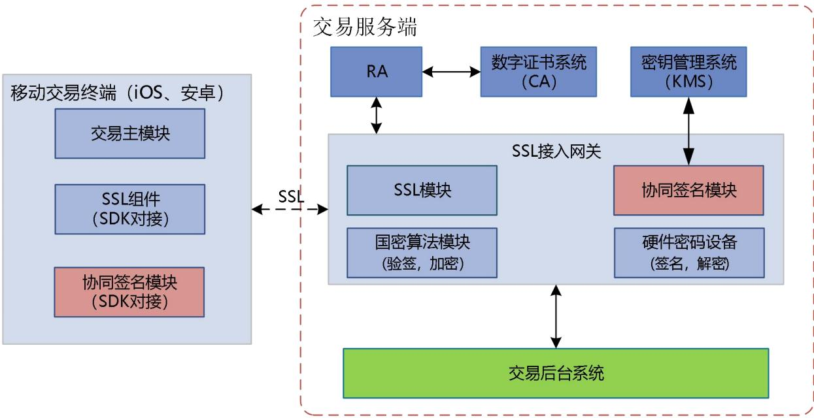
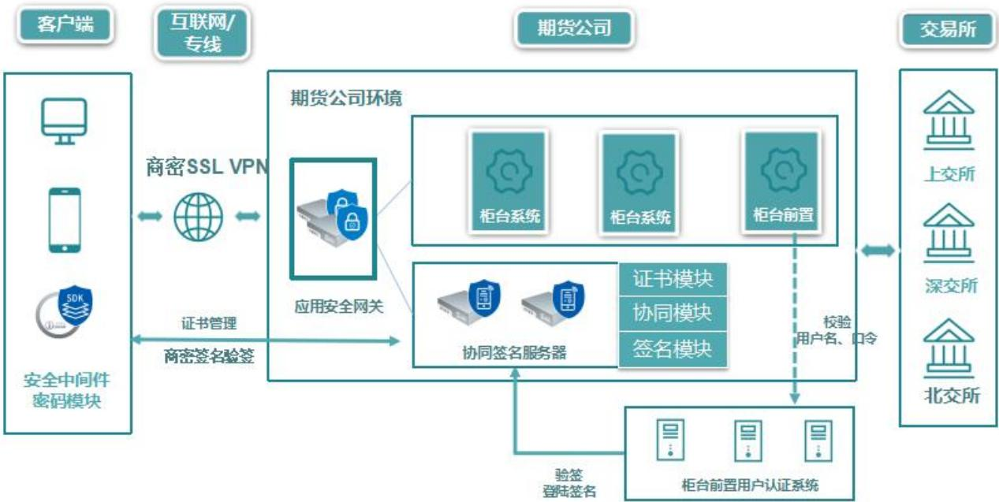
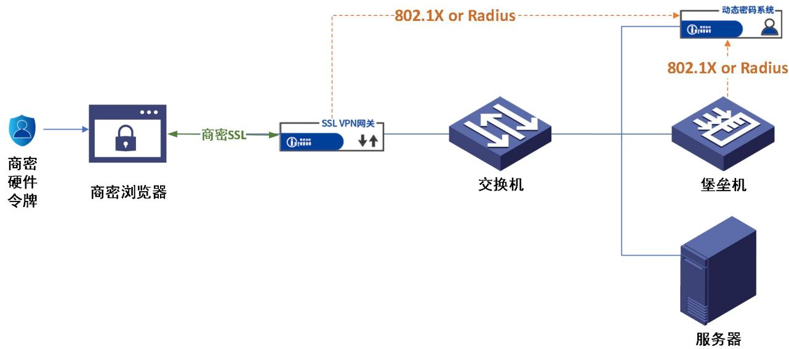
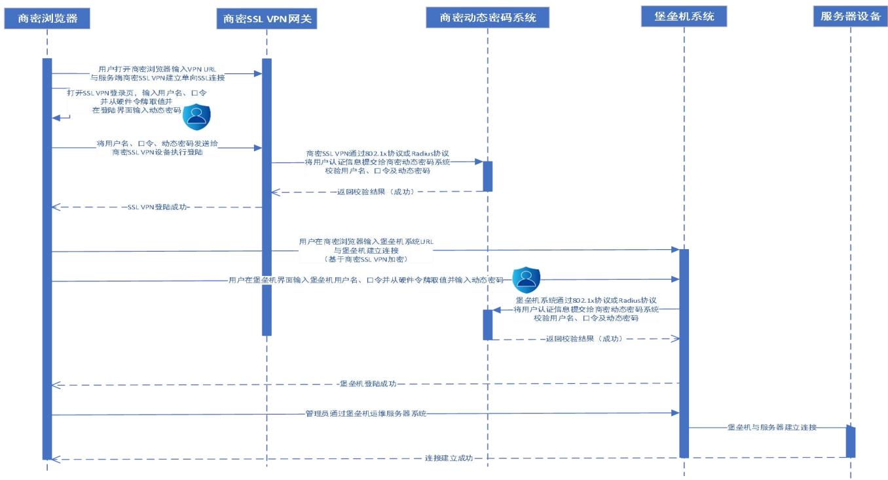

# 中 华 人 民 共 和 国 金 融 行 业 标 准

JR/T 0347—2026

# 证券期货业信息系统密码技术应用指引

# Guidelines for the application of cryptography technology in information systems of securities and futures industry

2026-01-09 发布 2026-01-09 实施

## 目 次

前言  
引言 .  
1 范围 .  
2 规范性引用文件 .  
3 术语和定义 .  
4 总则 3  
5 密码技术、产品与服务 . 3  
5.1 密码技术 . 3  
5.2 密码产品 . 3  
5.3 密码服务 .. 3  
6 密码安全功能和密码技术的关系 .. 3  
7 密码产品指引 .. 4  
7.1 通则 ... 4  
7.2 物理和环境安全 . 5  
7.3 网络和通信安全 . 5  
7.4 设备和计算安全 . 5  
7.5 应用和数据安全 .. 6  
8 适用的证券期货业数据安全要求 7  
附录 A（资料性） “网络和通信安全”层面行业商密应用案例 . 9  
附录 B（资料性） 堡垒机系统商密应用方案示例 .  
B.1 技术方案 .  
B.2 商密应用的设备部署 . 11  
B.3 商密应用工作流程 .. 11  
附录 C（资料性） 身份鉴别参考实现 . 13  
C.1 背景和问题 .. 13  
C.2 基于对称密码算法的数据存储参考实现 . 13  
C.3 基于公钥密码算法的数据存储参考实现 . 13  
C.4 基于客户端签名和数字信封的鉴别信息传输参考实现 . 14  
C.5 基于客户端签名和服务端公钥加密的鉴别信息传输参考实现 . 14  
参考文献 ... 15

## 前 言

本文件按照 GB/T 1.1—2020《标准化工作导则 第 1 部分：标准化文件的结构和起草规则》的规定起草。

本文件的某些内容可能涉及专利。本文件的发布机构不承担识别专利的责任。

本文件由全国金融标准化技术委员会证券分技术委员会（SAC/TC 180/SC4）提出。

本文件由全国金融标准化技术委员会（SAC/TC 180）归口。

本文件起草单位：上交所技术有限责任公司、深圳证券交易所、中证机构间报价系统股份有限公司、上海期货信息技术有限公司、中国银河证券股份有限公司、广发证券股份有限公司、东吴证券股份有限公司、中国信息通信研究院、公安部第三研究所、北京国家金融科技认证中心有限公司、深圳市纽创信安科技开发有限公司、信雅达科技股份有限公司、北京信安世纪科技股份有限公司、北京江南天安科技有限公司、三未信安科技股份有限公司。

本文件主要起草人：朱立、居红伟、王亚军、郭小明、梅养真、杜瑞罡、庄颉、徐秀、黎水林、高强裔、刘硕、钟才斌、戴凌峰、吴锦超、刘晓东。

## 引 言

随着GB/T39786《信息安全技术 信息系统密码应用基本要求》的正式实施，以及各类数据日益成为机构的重要资产，证券期货业在信息系统中加强密码技术应用、力求满足合规性要求并更好保护自身数据资产的需求日益迫切。因此，行业亟需一份易于对标GB/T39786要求开展信息系统密码应用改造工作的指引。

为帮助证券期货业各类会管机构、行业经营机构开展信息系统密码应用工作，便于监管机构对证券期货业各类机构的密码应用工作进行评判，特编制本文件。

# 证券期货业信息系统密码技术应用指引

## 1 范围

本文件提供了证券期货业信息系统在密码技术、密码产品及密码服务的使用、密码安全功能与密码技术的对应关系、宜选用的密码产品、适用的证券期货业数据安全要求等方面的指引。

本文件可作为证券期货业各类机构在开展信息系统密码技术应用时的指引，也适用于监管机构对证券期货业各类机构密码技术应用方案进行评估时的参考。

## 2 规范性引用文件

下列文件中的内容通过文中的规范性引用而构成本文件必不可少的条款。其中，注日期的引用文件，仅该日期对应的版本适用于本文件；不注日期的引用文件，其最新版本（包括所有的修改单）适用于本文件。

GB/T 15843（所有部分） 信息技术 安全技术 实体鉴别

GB/T 15852（所有部分） 信息技术 安全技术 消息鉴别码

GB/T 17964—2021 信息安全技术 分组密码算法的工作模式

GB/T 19714—2005 信息技术 安全技术 公钥基础设施 证书管理协议

GB/T 32905 信息安全技术 SM3密码杂凑算法

GB/T 32907 信息安全技术 SM4分组密码算法

GB/T 32918（所有部分） 信息安全技术 SM2椭圆曲线公钥密码算法

GB/T 32922 信息安全技术 IPSec VPN安全接入基本要求与实施指南

GB/T 35275 信息安全技术 SM2密码算法加密签名消息语法规范

GB/T 35276 信息安全技术 SM2密码算法使用规范

GB/T 37092 信息安全技术 密码模块安全要求

GB/T 38636 信息安全技术 传输层密码协议（TLCP）

GB/T 39786 信息安全技术 信息系统密码应用基本要求

GB/T 43697 数据安全技术 数据分类分级规则

GM/T 0024 SSL VPN技术规范

GM/T 0062 密码产品随机数检测要求

## 3 术语和定义

下列术语和定义适用于本文件。

## 3.1

机密性 confidentiality

保证信息不被泄露给非授权实体的性质。

[来源：GB/T 39786—2021，3.1]

## 3.2

## 数据完整性 data integrity

数据没有遭受以非授权方式所作的改变的性质。

[来源：GB/T 39786—2021，3.2]

## 3.3

## 真实性 authenticity

一个实体是其所声称实体的这种特性。真实性适用于用户、进程、系统和信息之类的实体。

[来源：GB/T 39786—2021，3.3]

## 3.4

不可否认性 non-repudiation

证明一个已经发生的操作行为无法否认的性质。

[来源：GB/T 39786—2021，3.4]

## 3.5

## 消息鉴别码 message authentication code；MAC

利用对称密码技术或密码杂凑技术，在秘密密钥参与下，由消息所导出的数据项。任何持有这一秘密密钥的实体，可利用消息鉴别码检查消息的完整性和始发者身份。

[来源：GB/T 39786—2021，3.9，有修改]

## 3.6

## 动态口令 one-time password

基于时间、事件等方式动态生成的一次性口令。

[来源：GB/T 39786—2021，3.10]

## 3.7

## 分组密码算法工作模式 block cipher operation mode

分组密码算法的使用方式，主要包括电码本工作模式、密文分组链接工作模式、密文反馈工作模式、输出反馈工作模式、计数器工作模式、带密文挪用的XEX可调分组密码工作模式、带泛杂凑函数的计数器工作模式、分组链接工作模式、带非线性函数的输出反馈工作模式等。

[来源：GB/T 17964—2021，3.1]

## 3.8

公钥证书 public key certificate

用户的公钥连同其他信息，并由发布该证书的证书认证机构的私钥进行加密使其不可伪造。

[来源：GB/T 19714—2005，3.2]

## 3.9

## 重要数据 key data

特定领域、特定群体、特定区域或达到一定精度和规模的，一旦被泄露或篡改、损毁，可能直接危害国家安全、经济运行、社会稳定、公共健康和安全的数据。

注：仅影响组织自身或公民个体的数据一般不作为重要数据。

[来源：GB/T 43697—2024，3.2]

## 3.10

## 核心数据 core data

对领域、群体、区域具有较高覆盖度或达到较高精度、较大规模、一定深度的，一旦被非法使用或共享，可能直接影响政治安全的重要数据。

注：核心数据主要包括关系国家安全重点领域的数据，关系国民经济命脉、重要民生、重大公共利益的数据，经国

家有关部门评估确定的其他数据。

[来源：GB/T 43697—2024，3.3]

## 3.11

一般数据 general data

核心数据、重要数据之外的其他数据。

[来源：GB/T 43697—2024，3.4]

## 4 总则

GB/T39786的密码应用技术要求的各个层面相互关联，各个层面的技术安全措施具有特定功能且不可相互替代。密码应用管理要求和密码应用技术要求通过优势互补实现协同防护，共同构建多层次的风险防控体系。

证券期货业各类机构宜在综合评估本单位信息系统的风险程度、风险概率、业务需求的基础上形成安全风险应对策略，再基于安全风险应对策略形成具体的密码应用方案。

## 5 密码技术、产品与服务

## 5.1 密码技术

证券期货业各类机构在开展密码技术应用时：

—宜采用GB/T 32918规定的SM2密码算法和GB/T 35276规定的SM2密码算法使用规范；

宜采用GB/T 32905规定的SM3密码算法；

宜采用GB/T 32907规定的SM4密码算法。

在具体的应用场景中，宜采用已经颁布的算法标准，比如GB/T 35275规定的SM2加密签名消息语法、GB/T 20518规定的SM2算法数字证书、GB/T 15843规定的实体鉴别技术、GB/T 15852规定的消息鉴别码技术、GB/T38636规定的传输层密码协议（TLCP）、GB/T32922规定的因特网安全协议虚拟专用网络（IPSecVPN）安全接入基本要求和实施指引、GM/T 0024规定的安全套接层虚拟专用网络（SSL VPN）技术规范等。

## 5.2 密码产品

证券期货业信息系统在实施时选用的密码产品，宜符合GB/T37092规定的密码模块安全要求，且其安全等级宜符合GB/T 39786针对各等级信息系统的要求。

证券期货业各类机构在使用密码产品时，宜对随机数来源、初始化向量、分组密码算法工作模式、密钥管理、密钥保护等方面予以特别关注。

在证券期货业信息系统密码应用中，常用密码产品包括：软件密码模块（包括协同签名客户端、协同签名服务端、SSL客户端模块等）、智能密码钥匙、外围组件互连高速总线/外围组件互连（PCI-E/PCI）密码卡、IPSec VPN安全网关/IPSec VPN、SSL VPN安全网关/SSL VPN、安全认证网关、服务器密码机、签名验签服务器、门禁卡/安全门禁系统、动态令牌/动态令牌认证系统、证书认证系统/证书认证密钥管理系统、对称密钥管理产品、安全芯片等。

## 5.3 密码服务

证券期货业各类机构使用的密码服务宜符合GB/T 39786对密码服务的要求。

## 6 密码安全功能和密码技术的关系

机密性、完整性、真实性、不可否认性四个密码安全功能维度可以分别通过不同的密码技术来实现，彼此存在内在对应关系。证券期货业各类机构在选择密码应用方案以及密码产品时，宜按表1给出的密码安全功能和密码技术间对应关系进行。

表 1 密码安全功能、密码技术的关系
<table><tr><td rowspan=1 colspan=1>密码安全功能</td><td rowspan=1 colspan=1>密码技术</td><td rowspan=1 colspan=1>备注</td></tr><tr><td rowspan=1 colspan=1>机密性</td><td rowspan=1 colspan=1>对称密码算法、公钥密码算法</td><td rowspan=1 colspan=1>应用和数据层面宜采用SM4算法实现数据传输和存储的机密性。在同时还需要解决完整性或真实性时，宜在GCM或CCM分组密码算法工作模式下使用 SM4算法。当只需要实现机密性时，宜在CBC 分组密码算法工作模式下使用 SM4算法。鉴于算法的性能考虑，公钥密码算法加密主要用于少量数据机密性保护，例如数字信封中对称密钥的机密性保护。</td></tr><tr><td rowspan=1 colspan=1>完整性</td><td rowspan=1 colspan=1>公钥密码算法数字签名、消息鉴别码、对称密码算法</td><td rowspan=1 colspan=1>应用和数据层面宜采用SM2算法做数字签名以实现数据传输的完整性（此方法性能较低），宜在GCM或CCM分组密码算法工作模式下使用 SM4 算法（能够同时实现机密性、完整性和真实性）、使用基于SM3密码杂凑算法的消息鉴别码、使用基于SM4算法的分组密码消息鉴别码等手段实现数据传输或存储时的数据完整性。</td></tr><tr><td rowspan=1 colspan=1>真实性</td><td rowspan=1 colspan=1>公钥密码算法数字签名、消息鉴别码、动态口令、对称密码算法</td><td rowspan=1 colspan=1>为实现应用和数据层面的真实性，宜采用基于数字证书的 SM2 数字签名、在GCM 或CCM模式下使用SM4算法（能够额外实现机密性和数据完整性）、采用基于SM3密码杂凑算法的消息鉴别码、采用基于SM4算法的分组密码消息鉴别码或动态口令。</td></tr><tr><td rowspan=1 colspan=1>不可否认性</td><td rowspan=1 colspan=1>公钥密码算法数字签名</td><td rowspan=1 colspan=1>针对交易不可否认性，宜考虑在应用和数据层面采用数字签名技术对交易数据做 SM2 算法签名来实现不可否认性。</td></tr></table>

## 7 密码产品指引

## 7.1 通则

针对GB/T39786密码技术应用要求的四个层面，7.2至7.5节将分别给出相应的密码产品指引，指导证券期货业各类机构选用合适的密码产品。为便于对接商用密码应用安全性评估工作，关于各层面评测对象的界定、高风险项的识别、是否存在风险缓解措施等详细信息，宜参考中国密码学会密评联委会《信息系统密码应用高风险判定指引》的最新版本。

在所给的密码产品指引中，默认已包含证书认证系统/证书认证密钥管理系统、对称密钥管理产品等具有基础支撑作用的密码产品，故不在每一处重复提及。软件密码模块因其具有最大的灵活性，除少数特例如协同签名客户端/服务器、签名控件等，不在每一处重复提及。不同等保定级的证券期货业信息系统采用的密码产品，其达到的GB/T 37092安全要求等级宜符合GB/T 39786中对相应等保定级信息系统所作要求。

GB/T39786中，针对不同级别的信息系统在密码技术应用要求中附带了不同的约束词（可、宜、应等），针对不同级别的信息系统规定了密码技术应用的最低要求。本章旨在回答如下问题：当证券期货业各类机构决定采取措施以满足此项密码技术应用要求时，宜选择的密码产品列表有哪些。为此，本文件将忽略密码技术应用要求文本中的约束词，直接给出宜选择的密码产品类别列表。

## 7.2 物理和环境安全

为满足物理和环境安全层面的各项系统密码应用要求，宜选择表2列出的密码产品。

表 2 物理和环境安全：密码产品列表
<table><tr><td rowspan=1 colspan=1>要求编号</td><td rowspan=1 colspan=1>系统密码应用要求</td><td rowspan=1 colspan=1>指标要求</td><td rowspan=1 colspan=1>优先考虑的密码产品列表</td></tr><tr><td rowspan=1 colspan=1>(1)</td><td rowspan=1 colspan=1>采用密码技术进行物理访问身份鉴别，保证重要区域进入人员身份的真实性</td><td rowspan=1 colspan=1>真实性</td><td rowspan=1 colspan=1>门禁卡/安全门禁系统等。</td></tr><tr><td rowspan=1 colspan=1>(2）</td><td rowspan=1 colspan=1>采用密码技术保证电子门禁系统进出记录数据的存储完整性</td><td rowspan=1 colspan=1>完整性</td><td rowspan=1 colspan=1>门禁卡/安全门禁系统等。</td></tr><tr><td rowspan=1 colspan=1>(3）</td><td rowspan=1 colspan=1>采用密码技术保证视频监控音像记录数据的存储完整性</td><td rowspan=1 colspan=1>完整性</td><td rowspan=1 colspan=1>智能密码钥匙、PCI-E/PCI密码卡、服务器密码机、云服务器密码机、签名验签服务器等。</td></tr></table>

## 7.3 网络和通信安全

为满足网络和通信安全层面的各项系统密码应用要求，宜选择表3列出的密码产品。附录A给出了一个在证券期货业网上交易系统中满足网络和通信安全层面要求的密码应用案例。

表 3 网络和通信安全：密码产品列表
<table><tr><td rowspan=1 colspan=1>要求编号</td><td rowspan=1 colspan=1>系统密码应用要求</td><td rowspan=1 colspan=1>指标要求</td><td rowspan=1 colspan=1>优先考虑的密码产品列表</td></tr><tr><td rowspan=1 colspan=1>(1)</td><td rowspan=1 colspan=1>采用密码技术对通信实体进行身份鉴别，保证通信实体身份的真实性</td><td rowspan=1 colspan=1>真实性</td><td rowspan=1 colspan=1>协同签名客户端/服务器、IPSec VPN 安全网关/IPSec VPN、SSL VPN 安全网关/SSL VPN、安全认证网关、智能密码钥匙等。</td></tr><tr><td rowspan=1 colspan=1>(2)</td><td rowspan=1 colspan=1>采用密码技术保证通信过程中数据的完整性</td><td rowspan=1 colspan=1>完整性</td><td rowspan=1 colspan=1>IPSec VPN 安全网关/IPSec VPN、SSL VPN 安全网关/SSL VPN、安全认证网关等。</td></tr><tr><td rowspan=1 colspan=1>(3）</td><td rowspan=1 colspan=1>采用密码技术保证通信过程中重要数据的机密性</td><td rowspan=1 colspan=1>机密性</td><td rowspan=1 colspan=1>IPSec VPN 安全网关/IPSec VPN、SSL VPN 安全网关/SSL VPN、安全认证网关等。</td></tr><tr><td rowspan=1 colspan=1>(4)</td><td rowspan=1 colspan=1>采用密码技术保证网络边界访问控制信息的完整性</td><td rowspan=1 colspan=1>完整性</td><td rowspan=1 colspan=1>安全认证网关等。</td></tr><tr><td rowspan=1 colspan=1>(5）</td><td rowspan=1 colspan=1>采用密码技术对从外部连接到内部网络的设备进行接入认证，确保接入的设备身份真实性</td><td rowspan=1 colspan=1>真实性</td><td rowspan=1 colspan=1>IPSec VPN 安全网关/IPSec VPN、SSL VPN 安全网关/SSL VPN、安全认证网关等。</td></tr></table>

## 7.4 设备和计算安全

为满足设备和计算安全层面的各项系统密码应用要求，宜选择表4列出的密码产品。附录B给出了一个为现有堡垒机设备增加信息传输通道机密性、完整性及设备登录用户身份鉴别机制的参考实现。

表 4 设备和计算安全：密码产品列表
<table><tr><td rowspan=1 colspan=1>要求编号</td><td rowspan=1 colspan=1>系统密码应用要求</td><td rowspan=1 colspan=1>指标要求</td><td rowspan=1 colspan=1>优先考虑的密码产品列表</td></tr><tr><td rowspan=1 colspan=1>(1)</td><td rowspan=1 colspan=1>采用密码技术对登录设备的用户进行身份鉴别，保证用户身份的真实性</td><td rowspan=1 colspan=1>真实性</td><td rowspan=1 colspan=1>协同签名客户端/服务器、智能密码钥匙、动态令牌/动态令牌认证系统等。</td></tr><tr><td rowspan=1 colspan=1>(2)</td><td rowspan=1 colspan=1>远程管理设备时，采用密码技术建立安全的信息传输通道</td><td rowspan=1 colspan=1>机密性完整性</td><td rowspan=1 colspan=1>IPSec VPN安全网关/IPSecVPN、SSLVPN安全网关/SSL VPN、安全认证网关等。</td></tr><tr><td rowspan=1 colspan=1>(3）</td><td rowspan=1 colspan=1>采用密码技术保证系统资源访问控制信息的完整性</td><td rowspan=1 colspan=1>完整性</td><td rowspan=1 colspan=1>通过开发，与能提供公钥密码算法数字签名或消息鉴别码的密码产品进行对接，如对接智能密码钥匙、PCI-E/PCI密码卡、服务器密码机、云服务器密码机、签名验签服务器等。</td></tr><tr><td rowspan=1 colspan=1>(4）</td><td rowspan=1 colspan=1>采用密码技术保证设备中的重要信息资源安全标记的完整性</td><td rowspan=1 colspan=1>完整性</td><td rowspan=1 colspan=1>通过开发，与能提供公钥密码算法数字签名或消息鉴别码的密码产品进行对接，如对接智能密码钥匙、PCI-E/PCI密码卡、服务器密码机、云服务器密码机、签名验签服务器等。</td></tr><tr><td rowspan=1 colspan=1>(5）</td><td rowspan=1 colspan=1>采用密码技术保证日志记录的完整性</td><td rowspan=1 colspan=1>完整性</td><td rowspan=1 colspan=1>通过开发，与能提供公钥密码算法数字签名或消息鉴别码的密码产品进行对接，如对接智能密码钥匙、PCI-E/PCI密码卡、服务器密码机、云服务器密码机、签名验签服务器等。</td></tr><tr><td rowspan=1 colspan=1>（(6)</td><td rowspan=1 colspan=1>采用密码技术对重要可执行程序进行完整性保护，并对其来源进行真实性验证</td><td rowspan=1 colspan=1>完整性真实性</td><td rowspan=1 colspan=1>通过开发，与能提供公钥密码算法数字签名的密码产品进行对接，如对接智能密码钥匙、PCI-E/PCI密码卡、服务器密码机、云服务器密码机、签名验签服务器等。</td></tr></table>

## 7.5 应用和数据安全

为满足应用和数据安全层面的各项系统密码应用要求，宜选择表5列出的密码产品。附录C针对应用和数据安全层面的身份鉴别信息传输和存储给出了一个参考实现。

表 5 应用和数据安全：密码产品列表
<table><tr><td colspan="1" rowspan="1">要求编号</td><td colspan="1" rowspan="1">系统密码应用要求</td><td colspan="1" rowspan="1">指标要求</td><td colspan="1" rowspan="1">优先考虑的密码产品列表</td></tr><tr><td colspan="1" rowspan="1">(1）</td><td colspan="1" rowspan="1">采用密码技术对登录用户进行身份鉴别保证应用系统用户身份的真实性</td><td colspan="1" rowspan="1">真实性</td><td colspan="1" rowspan="1">协同签名客户端/服务器、签名控件、智能密码钥匙、动态令牌/动态令牌认证系统、安全芯片等。</td></tr><tr><td colspan="1" rowspan="1">(2）</td><td colspan="1" rowspan="1">采用密码技术保证信息系统应用的访问控制信息的完整性</td><td colspan="1" rowspan="1">完整性</td><td colspan="1" rowspan="1">通过开发和能提供公钥密码算法数字签名或消息鉴别码的密码产品进行对接，如对接协同签名客户端/服务器、签名控件、智能密码钥匙、PCI-E/PCI密码卡、服务器密码机、云服务器密码机、签名验签服务器、安全芯片等。</td></tr><tr><td colspan="1" rowspan="1">(3）</td><td colspan="1" rowspan="1">采用密码技术保证信息系统应用的重要信息资源安全标记的完整性</td><td colspan="1" rowspan="1">完整性</td><td colspan="1" rowspan="1">通过开发和能提供公钥密码算法数字签名或消息鉴别码的密码产品进行对接，如对接协同签名客户端/服务器、签名控件、智能密码钥匙、PCI-E/PCI密码卡、服务器密码机、云服务器密码机、签名验签服务器、安全芯片等。</td></tr><tr><td colspan="1" rowspan="1">(4)</td><td colspan="1" rowspan="1">采用密码技术保证信息系统应用的重要数据在传输过程中的机密性</td><td colspan="1" rowspan="1">机密性</td><td colspan="1" rowspan="1">通过开发对接能提供公钥密码算法数字信封技术、对称密码算法的密码产品，如对接智能密码钥匙、PCI-E/PCI密码卡、服务器密码机、云服务器密码机、签名验签服务器、安全芯片等。</td></tr><tr><td colspan="1" rowspan="1">(5)</td><td colspan="1" rowspan="1">采用密码技术保证信息系统应用的重要数据在存储过程中的机密性</td><td colspan="1" rowspan="1">机密性</td><td colspan="1" rowspan="1">通过开发对接能提供公钥密码算法数字信封技术、对称密码算法的密码产品，如对接PCI-E/PCI密码卡、服务器密码机、云服务器密码机、签名验签服务器、安全芯片等。</td></tr><tr><td colspan="1" rowspan="1">(6)</td><td colspan="1" rowspan="1">采用密码技术保证信息系统应用的重要数据在传输过程中的完整性</td><td colspan="1" rowspan="1">完整性</td><td colspan="1" rowspan="1">通过开发和能提供公钥密码算法数字签名或消息鉴别码的密码产品进行对接，如对接协同签名客户端/服务器、签名控件、智能密码钥匙、PCI-E/PCI密码卡、服务器密码机、云服务器密码机、签名验签服务器、安全芯片等。</td></tr><tr><td colspan="1" rowspan="1">（7)</td><td colspan="1" rowspan="1">采用密码技术保证信息系统应用的重要数据在存储过程中的完整性</td><td colspan="1" rowspan="1">完整性</td><td colspan="1" rowspan="1">通过开发和能提供公钥密码算法数字签名或消息鉴别码的密码产品进行对接，如对接PCI-E/PCI密码卡、服务器密码机、云服务器密码机、签名验签服务器、安全芯片等。</td></tr><tr><td colspan="1" rowspan="1">(8）</td><td colspan="1" rowspan="1">在可能涉及法律责任认定的应用中宜采用密码技术提供数据原发证据和数据接收证据，实现数据原发行为的不可否认性和数据接收行为的不可否认性</td><td colspan="1" rowspan="1">不可否认性</td><td colspan="1" rowspan="1">通过开发和能提供公钥密码算法数字签名的密码产品进行对接，如对接协同签名客户端/服务器、签名控件、智能密码钥匙、PCI-E/PCI密码卡、服务器密码机、云服务器密码机、签名验签服务器、安全芯片等。</td></tr></table>

## 8 适用的证券期货业数据安全要求

在GB/T39786规定的各项密码技术应用要求中，除了提及“电子门禁系统进出记录数据”等具体数据类型之外，还一般性地多处提及“重要数据”。GB/T 39786本身并不针对不同行业开展数据安全分类分级识别认定，也不针对不同行业的数据在传输、存储等环节中的数据安全规范作出规定。

根据数据在经济社会发展中的重要程度，以及一旦遭到泄露、篡改、损毁或者非法获取、非法使用、非法共享，对国家安全、经济运行、社会秩序、公共利益、组织权益、个人权益造成的危害程度，GB/T43697将数据从高到低分为核心数据、重要数据、一般数据三个级别。核心数据是一旦被非法使用或共享，可能直接影响政治安全的重要数据。

证券期货业管理部门按照国家建立的数据分类分级保护制度确定证券期货业的重要数据具体目录。证券期货业各类机构在开展信息系统密码应用工作时，对于列入证券期货业重要数据具体目录的重要数据（含核心数据），宜参照GB/T 39786中的重要数据相关技术要求，运用密码技术开展数据安全保护。

## 附 录 A

（资料性）

“网络和通信安全”层面行业商密应用案例

本案例中的资料摘自行业经营机构的实际技术方案。

该券商网上交易系统（APP端）主要由移动交易终端和交易服务端组成，是一个等保三级系统。“网络和通信安全”层面主要是针对跨网络访问的通信信道，且此处说的“跨网络访问”主要是指从不受保护的网络区域访问被测系统。因此，本案例中“网络和通信安全”层面主要针对网上交易系统（APP端）从移动交易终端访问交易服务端的通信信道。商用密码应用改造方案的边界主要集中在移动交易终端和交易服务端的接入层区域，目的是加强互联网接入层区域的安全级别。

本案例中，交易服务端由SSL接入网关、协同签名服务端模块、硬件密码设备、密钥管理系统（KMS）和第三方数字证书系统组成，客户端由SSL组件和协同签名客户端模块组成。改造后的网上交易系统部署示意图如图A.1所示：

  
图A.1 网上交易系统部署示意图

在图A.1中，绿色节点为现有生产环境，其余节点均涉及商密相关的新增或升级改造。本方案中，商用密码改造相关的各类系统或模块及其功能具体介绍如下。

移动交易终端，部署在券商用户的个人移动设备上，位于不受券商保护的网络区域。其包括三个模块，名称和功能如下：交易主模块，实现交易业务功能；SSL组件（客户端），实现符合GM/T0024标准的SSL客户端协议；协同签名模块（客户端），实现协同签名的客户端密钥分量生成；和协同签名的服务端交互完成协同签名，并通过直接或间接地加密存储必要信息，提供协同签名客户端密钥分量的保存和提取。

交易服务端，部署在券商管控的数据中心，位于受券商保护的网络区域。其核心是SSL接入网关，选用某型号SSLVPN网关实现，其包括的模块名称和功能如下：SSL模块（服务端），实现符合GM/T0024标准的SSL服务端协议；密码算法模块，提供SM2、SM3与SM4密码算法接口，完成基于SM2公钥的密码算法运算；硬件密码设备，提供基于SM2算法私钥的运算（签名和解密），提供SSL服务端证书对应私钥的安全存储，提供符合GM/T 0062要求的随机数生成，在本案例中以密码卡形式存在；协同签名模块（服务端），实现协同签名的服务端密钥分量生成，配合客户端生成协同签名。

除此之外，交易服务端还有配套的密钥管理系统（KMS）、证书注册审批系统（RA）、数字证书系统（CA）等密码相关系统，以及原有用以实现业务功能的交易后台。

本案例中，通过使用协同签名客户端/服务端，在实现客户端密钥安全管控的同时，基于双向SSL通信满足了“网络和通信安全”层面的如下系统密码应用要求：“采用密码技术对通信实体进行身份鉴别，保证通信实体身份的真实性”。

本案例中，通过使用SSLVPN安全网关，基于双向SSL通信内置的MAC机制满足了“网络和通信安全”层面的如下系统密码应用要求：“采用密码技术保证通信过程中数据的完整性”。

本案例中，通过使用SSLVPN安全网关，基于双向SSL通信内置的对称加密机制满足了“网络和通信安全”层面的如下系统密码应用要求：“采用密码技术保证通信过程中重要数据的机密性”。

在上述实际案例中，协同签名模块（服务端）被集成在SSL接入网关中。一般而言也可部署独立的协同签名服务器。作为参考，图A.2展示了在期货公司柜台系统通过互联网/专线对客户端提供服务的场景下，某期货公司如何通过应用安全网关（SSL VPN安全网关）和协同签名服务器满足“网络和通信安全”层面要求的示例。

  
图A.2 期货公司柜台系统部署示意图

# 附 录 B

# （资料性）堡垒机系统商密应用方案示例

## B.1 技术方案

## B.1.1 采用认证的VPN网关

在数据中心运维管理区域中，部署VPN网关产品，用于建立运维终端与服务端VPN之间的安全信息传输通道。

## B.1.2 采用认证的动态口令认证系统

在数据中心运维管理区域中，部署动态口令认证系统，同时为系统管理员配发动态令牌，管理员用户在登录堡垒机系统和VPN系统时，采用用户名、口令及基于商密算法的动态口令认证。动态口令系统采用802.1x协议或Radius协议，为VPN系统和堡垒机系统提供认证功能。

## B.1.3 采用认证的商密浏览器

在管理终端部署符合商密标准的浏览器，用于建立运维终端与服务端VPN之间的安全信息传输通道。

## B.2 商密应用的设备部署

商密应用的设备部署方式如图B.1：

  
图B.1 部署方式

## B.3 商密应用工作流程

改造后密码工作流程如图B.2：

  
图B.2 改造后密码工作流程

步骤一，运维用户通过商密浏览器登录SSL VPN网关：

a) 运维用户通过商密浏览器打开 SSL VPN 登录页，输入 SSL VPN 网关的用户名、口令及动态密码（从硬件令牌获取）；

b) SSL VPN 网关通过 802.1x 协议或 Radius 协议，将 SSL VPN 网关用户认证信息提交给商密动态密码系统，校验用户名、口令及动态密码，并将结果返回 SSL VPN 网关；

c) 运维用户登录 SSL VPN 网关成功，建立起商密浏览器与 SSL VPN网关的安全连接。

a) 运维用户通过商密浏览器打开堡垒机登录页（连接建立于 SSL VPN 加密通道之上），输入堡垒机的用户名、口令及动态密码（从硬件令牌获取）；

b) 堡垒机通过 802.1x 协议或 Radius 协议，将堡垒机用户认证信息提交给商密动态密码系统，校验用户名、口令及动态密码，并将结果返回堡垒机；

c) 运维用户登录堡垒机成功，建立起商密浏览器与堡垒机的安全连接。  
步骤三，堡垒机与服务器建立连接，运维用户通过堡垒机运维服务器系统。

# 附 录 C

# （资料性）

# 身份鉴别参考实现

## C.1 背景和问题

GB/T39786针对第三级信息系统在应用和数据安全层面作出了若干规定，其中包括信息系统应用的重要数据在存储过程中的机密性和完整性。对于证券期货业的各类机构，第三级信息系统应用的身份鉴别信息属于重要数据，宜符合上述两项要求。

为令证券期货业机构在利用密码技术解决上述问题的过程中有所借鉴，针对一个假想的第三级信息系统，本资料性附录给出了两种符合GB/T 39786重要数据存储过程要求的身份鉴别信息存储参考实现，也给出了两种符合GB/T 39786重要数据传输过程要求的身份鉴别消息参考实现。

作为参考实现，本附录并不限制证券期货业各类机构采用其他技术手段满足同样的要求。

本附录假想的第三级信息系统隶属于某会管机构，该信息系统包括两部分：部署在经营机构侧通过专线访问系统的客户端，及部署在会管机构侧的服务端。经营机构客户端在登录时需提供应用层的用户名/口令信息，同时需要提供利用会管机构预先分发给经营机构且与用户名绑定的智能密码钥匙进行的签名，会管机构服务端对客户端进行单向身份鉴别。该智能密码钥匙使用SM2公钥签名算法和SM3密码杂凑算法。服务端在数据库中保存的单条身份鉴别信息至少包括用户名、口令、用户签名证书三者，本附录中分别记作user、pwd、sigCert。为简化起见，在本附录假设的场景下，客户端和服务端都有符合GM/T0062要求的随机数生成设备。

为符合GB/T39786的相关要求，服务端保持的身份鉴别信息宜在数据存储过程中满足机密性和完整性。本附录的C.2给出了一种基于对称密码算法的参考实现，C.3给出了一种基于公钥密码算法的参考实现。

为符合GB/T39786的相关要求，身份鉴别信息宜在数据传输过程中满足机密性和完整性。本附录的C.4给出了一种基于签名及数字信封的参考实现，C.5给出了一种纯粹基于公钥密码算法的参考实现。

## C.2 基于对称密码算法的数据存储参考实现

在本参考实现中，为了提供身份鉴别信息在数据存储过程中的机密性和完整性，服务端拥有两个独立的对称密钥Ke和Km，且Ke和Km被保存在服务器密码机（或加密卡等其他满足GB/T 37092二级以上安全要求的设备）中，且服务端所需的随机数由服务器密码机（或上述其他设备）以符合GM/T 0062要求的方式提供。

Ke是供SM4算法使用的对称密钥，且服务端在使用SM4算法时使用CBC分组密码算法工作模式，算法所需的初始化向量值IV每次都使用独立采集的随机数。Km是供基于密码杂凑算法的消息鉴别码（HMAC）使用的对称密钥，且消息鉴别码使用的密码杂凑算法是SM3。

服务端保存身份鉴别信息时，首先采集IV，并生成口令的密文 $\mathrm { c y p h e r : = \ S M 4 ( K e , \mathrm { I V } , \mathrm { p w d } ) }$

最后保存在数据库的身份鉴别信息记录是：

(user, sigCert, IV, cypher, HMAC(Km, user||sigCert||IV||cypher))。

## C.3 基于公钥密码算法的数据存储参考实现

在本参考实现中，为了提供身份鉴别信息在数据存储过程中的机密性和完整性，服务端拥有两个独立的SM2私钥Ke和Ks，且Ke和Ks被保存在签名验签服务器（或加密卡等其他满足GB/T 37092二级以上安全要求的设备中）中，且服务端所需的随机数由签名验签服务器（或上述其他设备）以符合GM/T 0062要求的方式提供。

Ke供SM2解密算法使用，Ks供SM2签名算法使用。Ke和Ks对应的公钥证书记作Ce和Cs。

服务端保存身份鉴别信息时，首先生成口令的密文cypher := SM2_Enc(Ce,pwd)。

最后保存在数据库的身份鉴别信息记录是：

$$
\mathrm { ( u s e r , ~ s i g C e r t , ~ c y p h e r , ~ S M 2 ~ S i g ( K s , ~ u s e r | \mid s i g C e r t | ~ | c y p h e r ) ~ ) } \mathrm { _ { \circ } }
$$

## C.4 基于客户端签名和数字信封的鉴别信息传输参考实现

在本参考实现中，为了对应用系统客户端实现单向身份鉴别，遵循GB/T15843.3-2023中5.2.2节的规定，基于一次传递单向鉴别来准备原始的身份鉴别信息。

$$
\mathrm { r a w I n f o \ : = \ c e r t A | | \texttt { N a } | | \texttt { B } | | \texttt { u s e r } | | \texttt { p w d | | s S a ( N a | | B | | u s e r } | | \texttt { p w d } ) }
$$

其中，certA是客户端签名证书，Na是客户端维护的作为时变参数的序号（用以防止重放攻击），B是服务端标识。sSa()函数表示使用客户端签名证书对应的私钥进行SM2签名。

为确保身份鉴别信息在信息传输过程中的机密性和完整性，本参考实现进一步基于SM2/SM3/SM4算法，遵循GB/T 35275-2017中第10节的规定，使用签名及数字信封技术对上述rawInfo进行处理后得到signedEnvelope，再发送处理signedEnvelope。

## C.5 基于客户端签名和服务端公钥加密的鉴别信息传输参考实现

在本参考实现中，为了对应用系统客户端实现单向身份鉴别，遵循GB/T15843.3-2023中5.2.2节的规定，基于一次传递单向鉴别来准备原始的身份鉴别信息。

$$
\mathrm { r a w I n f o \ : = \ c e r t A | | { \mathbb ~ N a } ~ | | ~ { \mathbb ~ B } ~ | | ~ \ u s e r ~ | | ~ \ u s e r ~ | | ~ \ s s a \left( \mathbb { N } a ~ | | ~ { \mathbb ~ B } ~ | | ~ \ u s e r ~ | | ~ \ p w d ~ \right)}  
$$

其中，certA是客户端签名证书，Na是客户端维护的作为时变参数的序号（用以防止重放攻击），B是服务端标识。sSa()函数表示使用客户端签名证书对应的私钥进行SM2签名。

为确保身份鉴别信息在信息传输过程中的机密性和完整性，本参考实现中，客户端使用服务器加密公钥对rawInfo进行SM2加密后得到encRawInfo，然后在网络上发送encRawInfo。由于SM2加密算法内部会使用SM3密码杂凑算法，故能结合rawInfo中的Na防止篡改和重放。

## 参 考 文 献

[1] 商用密码产品认证目录，市场监管总局、国家密码管理局

[2] 信息系统密码应用高风险判定指引，中国密码学会密评联委会