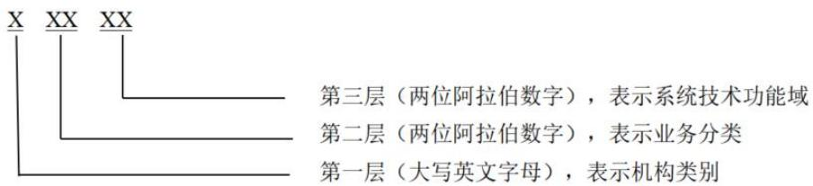

JR/T 0348—2026

# 证券期货业信息系统分类与代码

# Classification and code of information systems for securities and futures industry

2026-01-09 发布 2026-01-09 实施

## 目 次

前言 .  
引言 ..  
1 范围 ..  
2 规范性引用文件 .  
3 术语和定义 .  
4 分类方法 ..  
5 编码方法 .  
6 代码表 ... 2  
6.1 通用信息系统分类代码表 .. 2  
6.2 证券经营机构信息系统分类代码表 . 8  
6.3 基金经营机构信息系统分类代码表 . 14  
6.4 期货经营机构信息系统分类代码表 .. 18  
6.5 全国性证券交易场所信息系统分类代码表 . 21  
6.6 期货交易所信息系统分类代码表 .. 25  
6.7 登记结算机构信息系统分类代码表 27  
6.8 协会组织信息系统分类代码表 .. 32  
6.9 其他会管单位信息系统分类代码表 . 33  
参考文献 .. 38

## 前 言

本文件按照GB/T 1.1—2020《标准化工作导则 第1部分：标准化文件的结构和起草规则》的规定起草。

请注意本文件的某些内容可能涉及专利。本文件的发布机构不承担识别专利的责任。

本文件由全国金融标准化技术委员会证券分技术委员会（SAC/TC 180/SC4）提出。

本文件由全国金融标准化技术委员会（SAC/TC 180）归口。

本文件起草单位：招商证券股份有限公司、中国证券监督管理委员会科技监管司、上海证券交易所、深圳证券交易所、大连商品交易所、中信证券股份有限公司、国联基金管理有限公司、证通股份有限公司、银河期货有限公司、中证信息技术服务有限责任公司。

本文件主要起草人：黎杰松、陈炜、李克坚、刘政言、林林、隋文东、毛崇岗、李军、黎峰、盛庆、沈科峰、高红洁。

## 引 言

在我国资本市场中，信息技术起着举足轻重的作用，证券期货业的业务运转更是深度依靠高效且稳定的信息系统支撑。然而，当前我国证券期货业尚未建立统一的信息系统分类规范，且因不同机构业务各具特点，差异明显，导致信息系统呈现出类别复杂多样、分类维度混乱的局面，对证券期货业数字化转型向纵深推进形成了阻力。

本文件紧密结合当前证券期货业业务发展态势，从行业机构的维度出发，把机构归纳为“证券经营机构”“基金经营机构”“期货经营机构”“全国性证券交易场所”“期货交易所”“登记结算机构”“协会组织”和“其他会管单位”共 8 大类。与此同时，将各类机构存在共性的信息系统定义为“通用”类别，由此构建成“8+1”信息系统分类体系。在“8+1”信息系统分类体系框架下，依据行业机构业务特性，对各信息系统类型子项进行精细划分，并在每个子项下涵盖若干信息系统功能域，进而搭建起多维度的分类架构，为行业机构信息系统分类治理，以及跨机构协同作业方面提供了统一的技术标尺。

本文件旨在建立一套科学、规范的证券期货业信息系统分类与代码体系，以满足行业监管、企业管理和市场交易等方面的需求，有利于推动证券期货行业信息化建设向更高水平发展，提升行业的监管效能和市场风险监控能力，为资本市场数字化转型提供标准化支撑。

# 证券期货业信息系统分类与代码

## 1 范围

本文件规定了证券期货业信息系统的分类方法、编码方法及代码表。

本文件适用于证券期货业各机构对信息系统进行标准化的科学分类。

## 2 规范性引用文件

下列文件中的内容通过文中的规范性引用而构成本文件必不可少的条款。其中，注日期的引用文件，仅该日期对应的版本适用于本文件；不注日期的引用文件，其最新版本（包括所有的修改单）适用于本文件。

GB/T 40692—2021 政务信息系统定义和范围

## 3 术语和定义

GB/T 40692—2021界定的以及下列术语与定义适用于本文件。

## 3.1

## 信息系统 information system

具有相关组织资源（如人力资源、技术资源和金融资源）的一种信息处理系统，提供并分配信息。

[来源：GB/T 40692—2021，3.2，有修改]

注：在证券期货业中，证券期货业信息处理的基础设施、数据系统、业务系统、服务系统均属于信息系统范畴，其范围参考 GB/T 40692—2021 定义 05.01 的信息系统。

## 4 分类方法

证券期货业信息系统分类采用层次划分法，分为“机构类别”“业务分类”“系统技术功能域”三层：

a） 机构类别：以行业机构分类为依据，划分“证券经营机构”“基金经营机构”“期货经营机构”“全国性证券交易场所”“期货交易所”“登记结算机构”“协会组织”以及“其他会管单位”8个分类，并将8类机构中存在共性的信息系统提炼为第9个分类，即“通用”，形成信息系统分类结构；

b） 业务分类：在机构类别下，分别根据业务条线细化，形成业务分类。如“证券公司”中含经纪业务、业务管理、合规风控等具有证券行业特色的业务信息系统分类；

c） 系统技术功能域：以业务信息系统分类为基础，根据系统技术功能对业务信息系统进行细化。如“安全防护”中细分为安全分析、终端安全、安全运营等各信息系统技术功能域。

注：其他会管单位指除全国性证券交易场所、期货交易所、登记结算机构和协会组织外的会管单位。具体会管单位清单可参见中国证券监督管理委员会官网相关公示信息。

## 5 编码方法

证券期货业信息系统代码共 5 位，由大写英文字母和阿拉伯数字组成：

a） 第一位为机构类别代码，用 1位大写英文字母表示，从 A 开始编码，即通用、证券经营机构、基金经营机构、期货经营机构、全国性证券交易场所、期货交易所、登记结算机构、协会组织以及其他会管单位分别用 A、B、C、D、E、F、G、H、I 表示；

b） 第二、三位为业务分类代码，用 2 位阿拉伯数字表示，从 01 开始编码，数字为“99”表示收容类目；

c） 最后两位为系统技术功能域顺序码，用 2 位阿拉伯数字表示，数字为“99”表示收容类目。

信息系统的分类代码结构如图 1所示。

  
图 1 证券期货业信息系统分类代码的构成

示例：

B0101=证券经营机构（机构类别）—经纪业务（业务分类）—交易账户管理（系统技术功能域）

## 6 代码表

## 6.1 通用信息系统分类代码表

通用信息系统分类代码表见表 1。

表 1 通用信息系统分类代码表
<table><tr><td colspan="1" rowspan="1">代码</td><td colspan="1" rowspan="1">类别名称</td><td colspan="1" rowspan="1">说明</td></tr><tr><td colspan="1" rowspan="1">A01</td><td colspan="1" rowspan="1">安全防护</td><td colspan="1" rowspan="1">指保障信息系统安全运行的管理与技术支撑的各类系统，包括安全分析、终端安全、安全运营、检测拦截、安全审计等</td></tr><tr><td colspan="1" rowspan="1">A0101</td><td colspan="1" rowspan="1">安全分析</td><td colspan="1" rowspan="1">指对信息系统进行安全检测分析的各类系统，包括各类网络入侵流量分析、安全设备及主机日志采集与分析、程序代码安全漏洞分析、威胁情报、态势感知等功能或系统</td></tr><tr><td colspan="1" rowspan="1">A0102</td><td colspan="1" rowspan="1">终端安全</td><td colspan="1" rowspan="1">指各类网络准入和保障终端安全的各类系统，包括终端管理、终端准入、安全沙箱、零信任等功能或系统</td></tr><tr><td colspan="1" rowspan="1">A0103</td><td colspan="1" rowspan="1">安全运营</td><td colspan="1" rowspan="1">指安全资产管理、自动化运营安全管理、业务流量安全管控、供应链安全管理等安全系统</td></tr><tr><td colspan="1" rowspan="1">A0104</td><td colspan="1" rowspan="1">检测拦截</td><td colspan="1" rowspan="1">指防御网络攻击与恶意行为的各类系统，包括防火墙、入侵防御系统（IPS）、入侵检测系统（IDS）、Web 应用防火墙（WAF）、蜜罐系统、邮件网关、防分布式拒绝服务攻击（DDOS）、网页防篡改等功能或系统</td></tr><tr><td colspan="1" rowspan="1">A0105</td><td colspan="1" rowspan="1">安全审计</td><td colspan="1" rowspan="1">指对系统操作及访问行为进行合规审计的各类系统，包括堡垒机审计、上网行为管理、数据库审计等功能或系统</td></tr><tr><td colspan="1" rowspan="1">A0106</td><td colspan="1" rowspan="1">数据安全</td><td colspan="1" rowspan="1">指保障数据机密性与完整性的服务及设备配套的各类系统，包括数据加密、通讯加密、密钥管理、签名验签服务器、国密网关等功能或系统</td></tr><tr><td colspan="1" rowspan="1">A0107</td><td colspan="1" rowspan="1">主机安全</td><td colspan="1" rowspan="1">指对服务器等主机设备进行安全防护的各类系统，包括主机入侵检测系统（HIDS）、漏洞扫描等功能或系统</td></tr><tr><td colspan="1" rowspan="1">A0108</td><td colspan="1" rowspan="1">应用安全</td><td colspan="1" rowspan="1">指为应用安全开发提供管理、测试等服务的各类系统，包括软件安全开发生命周期（SDLC）、软件成分分析（SCA）、静态应用安全测试（SAST）、动态应用安全测试（DAST）等功能或系统</td></tr><tr><td colspan="1" rowspan="1">A02</td><td colspan="1" rowspan="1">数据中心基础设施</td><td colspan="1" rowspan="1">指支撑数据中心运行的基础环境与设备管理的各类系统，包括动环管理、设备管理等</td></tr><tr><td colspan="1" rowspan="1">A0201</td><td colspan="1" rowspan="1">动环管理</td><td colspan="1" rowspan="1">指监控和管理数据中心各种动力设备和环境变量的各类系统，包括供电管理、冷却环境管理、漏水检测管理、门禁管理、防盗管理等功能或系统</td></tr><tr><td colspan="1" rowspan="1">A0202</td><td colspan="1" rowspan="1">设备管理</td><td colspan="1" rowspan="1">指管理数据中心机柜空间和硬件设备的各类系统，包括机柜空间分配、硬件设备状态监控、资产台账管理等功能或系统</td></tr><tr><td colspan="1" rowspan="1">A03</td><td colspan="1" rowspan="1">数据基础设施</td><td colspan="1" rowspan="1">指数据相关的各类技术支撑系统，包括数据储存、数据库、数据备份、数据同步、数据脱敏等</td></tr><tr><td colspan="1" rowspan="1">A0301</td><td colspan="1" rowspan="1">数据存储</td><td colspan="1" rowspan="1">指各种专业化集中式或分布式的数据存储平台，包括块存储、文件存储、对象存储等功能或系统</td></tr><tr><td colspan="1" rowspan="1">A0302</td><td colspan="1" rowspan="1">数据库</td><td colspan="1" rowspan="1">指各种数据库软件，包括关系型数据库、分析数据库、图数据库、时序数据库、键值数据库等</td></tr><tr><td colspan="1" rowspan="1">A0303</td><td colspan="1" rowspan="1">数据备份</td><td colspan="1" rowspan="1">指各种提供数据备份服务的系统</td></tr><tr><td colspan="1" rowspan="1">A0304</td><td colspan="1" rowspan="1">数据同步</td><td colspan="1" rowspan="1">指实现数据库同步、备库接管和增量回切等服务的系统</td></tr><tr><td colspan="1" rowspan="1">A0305</td><td colspan="1" rowspan="1">数据脱敏</td><td colspan="1" rowspan="1">指通过特定算法对敏感数据进行变形转换，以降低敏感程度，扩大数据可共享和被使用范围的系统</td></tr><tr><td colspan="1" rowspan="1">A0306</td><td colspan="1" rowspan="1">数据交换</td><td colspan="1" rowspan="1">指实现应用间、网络安全域间数据交换共享的各类系统</td></tr><tr><td colspan="1" rowspan="1">A0307</td><td colspan="1" rowspan="1">数据中台</td><td colspan="1" rowspan="1">指通过各类实时或离线分析技术，对结构化和非结构化数据进行采集、加工、整合并提供统一数据服务、数据分析的系统</td></tr><tr><td colspan="1" rowspan="1">A0308</td><td colspan="1" rowspan="1">数据治理</td><td colspan="1" rowspan="1">指对数据质量进行规范化管理的各类系统，包括元数据、数据标准、数据分级分类、数据模型、数据质量、数据资产、主数据、体系规范、数据服务等功能或系统</td></tr><tr><td colspan="1" rowspan="1">A0309</td><td colspan="1" rowspan="1">隐私计算</td><td colspan="1" rowspan="1">指在充分保护数据和隐私安全的前提下，实现数据分析计算的各类系统，包括多方安全计算、联邦学习等功能或系统</td></tr><tr><td colspan="1" rowspan="1">A0310</td><td colspan="1" rowspan="1">区块链</td><td colspan="1" rowspan="1">指支撑区块链应用的各类系统，包括区块链数据存储、共识机制等功能或系统</td></tr><tr><td colspan="1" rowspan="1">A04</td><td colspan="1" rowspan="1">通信基础设施</td><td colspan="1" rowspan="1">指提供网络通信服务的各类基础设施，包括办公网、开发测试网、运维管理网、生产业务网、托管业务网等</td></tr><tr><td colspan="1" rowspan="1">A0401</td><td colspan="1" rowspan="1">办公网</td><td colspan="1" rowspan="1">指承载办公管理类系统的网络基础设施</td></tr><tr><td colspan="1" rowspan="1">A0402</td><td colspan="1" rowspan="1">开发测试网</td><td colspan="1" rowspan="1">指承载开发测试系统的网络基础设施</td></tr><tr><td colspan="1" rowspan="1">A0403</td><td colspan="1" rowspan="1">运维管理网</td><td colspan="1" rowspan="1">指承载运维管理的网络基础设施</td></tr><tr><td colspan="1" rowspan="1">A0404</td><td colspan="1" rowspan="1">生产业务网</td><td colspan="1" rowspan="1">指承载生产业务类系统的网络基础设施</td></tr><tr><td colspan="1" rowspan="1">A0405</td><td colspan="1" rowspan="1">托管业务区</td><td colspan="1" rowspan="1">指承载托管业务类系统的网络基础设施</td></tr><tr><td colspan="1" rowspan="1">A0406</td><td colspan="1" rowspan="1">互联网隔离区</td><td colspan="1" rowspan="1">指承载互联网用户直接访问服务的网络基础设施</td></tr><tr><td colspan="1" rowspan="1">A0407</td><td colspan="1" rowspan="1">专线接入</td><td colspan="1" rowspan="1">指为外部提供物理专线、虚拟专用网络（VPN）等接入的网络基础设施</td></tr><tr><td colspan="1" rowspan="1">A0408</td><td colspan="1" rowspan="1">中心互联</td><td colspan="1" rowspan="1">指为多个数据中心之间高速互联提供的网络基础设施</td></tr><tr><td colspan="1" rowspan="1">A0409</td><td colspan="1" rowspan="1">证联网</td><td colspan="1" rowspan="1">指中证信息技术服务有限责任公司牵头建设的证联网</td></tr><tr><td colspan="1" rowspan="1">A0410</td><td colspan="1" rowspan="1">涉密网</td><td colspan="1" rowspan="1">指用于传输涉密内容通信的网络基础设施</td></tr><tr><td colspan="1" rowspan="1">A05</td><td colspan="1" rowspan="1">虚拟化及云基础设施</td><td colspan="1" rowspan="1">指提供虚拟化或云服务的各类基础设施，包括私有云、行业云、公有云、桌面云、容器云等</td></tr><tr><td colspan="1" rowspan="1">A0501</td><td colspan="1" rowspan="1">私有云</td><td colspan="1" rowspan="1">指内部自有的基础通用云平台</td></tr><tr><td colspan="1" rowspan="1">A0502</td><td colspan="1" rowspan="1">行业云</td><td colspan="1" rowspan="1">指面向行业提供服务的云平台，提供各类基础设施服务（IaaS）、平台服务（PaaS)资源一键部署服务的外包和托管服务</td></tr><tr><td colspan="1" rowspan="1">A0503</td><td colspan="1" rowspan="1">公有云</td><td colspan="1" rowspan="1">指外部互联网云服务</td></tr><tr><td colspan="1" rowspan="1">A0504</td><td colspan="1" rowspan="1">桌面云</td><td colspan="1" rowspan="1">指提供统一桌面办公服务的云平台</td></tr><tr><td colspan="1" rowspan="1">A0505</td><td colspan="1" rowspan="1">容器云</td><td colspan="1" rowspan="1">指基于容器技术构建的各类云平台</td></tr><tr><td colspan="1" rowspan="1">A0506</td><td colspan="1" rowspan="1">虚拟化</td><td colspan="1" rowspan="1">指构建IaaS 底座的各类虚拟化技术或系统</td></tr><tr><td colspan="1" rowspan="1">A06</td><td colspan="1" rowspan="1">办公系统</td><td colspan="1" rowspan="1">指为员工提供日常自动化处理和管理办公服务的各类系统，包括电子公文、电子邮件、办公门户、移动应用程序（APP）等</td></tr><tr><td colspan="1" rowspan="1">A0601</td><td colspan="1" rowspan="1">电子公文</td><td colspan="1" rowspan="1">指承载内部发文、流程审批等管理功能的各类系统，包括发文起草、流程审批、公文归档等功能或系统</td></tr><tr><td colspan="1" rowspan="1">A0602</td><td colspan="1" rowspan="1">电子邮件</td><td colspan="1" rowspan="1">指收发内、外部邮件的系统</td></tr><tr><td colspan="1" rowspan="1">A0603</td><td colspan="1" rowspan="1">办公门户</td><td colspan="1" rowspan="1">指面向员工提供办公服务的门户网站</td></tr><tr><td colspan="1" rowspan="1">A0604</td><td colspan="1" rowspan="1">移动APP</td><td colspan="1" rowspan="1">指面向员工提供服务的移动应用程序</td></tr><tr><td colspan="1" rowspan="1">A07</td><td colspan="1" rowspan="1">内部管理</td><td colspan="1" rowspan="1">指由机构内部管理部门使用的各类内管系统，包括财务管理、采购管理、差旅管理、档案管理、党务管理等</td></tr><tr><td colspan="1" rowspan="1">A0701</td><td colspan="1" rowspan="1">财务管理</td><td colspan="1" rowspan="1">指处理财务事务的各类系统，包括综合财务记账管理、费用报销、资金运营管理等功能或系统</td></tr><tr><td colspan="1" rowspan="1">A0702</td><td colspan="1" rowspan="1">采购管理</td><td colspan="1" rowspan="1">指管理各类物资采购工作的各类系统，包括采购申请、采购订货、进料检验、仓库收料、采购退货、购货发票处理、供应商管理、价格及供货信息管理、订单管理等功能或系统</td></tr><tr><td colspan="1" rowspan="1">A0703</td><td colspan="1" rowspan="1">差旅管理</td><td colspan="1" rowspan="1">指处理员工差旅的各类系统，包括出差申请、票务预订、差旅费用报销、差旅政策管控等功能或系统</td></tr><tr><td colspan="1" rowspan="1">A0704</td><td colspan="1" rowspan="1">档案管理</td><td colspan="1" rowspan="1">指各类档案电子化管理的系统</td></tr><tr><td colspan="1" rowspan="1">A0705</td><td colspan="1" rowspan="1">党务管理</td><td colspan="1" rowspan="1">指管理党务工作的各类系统，包括对党组织管理、党员管理、工作程序管理、党员教育管理、党建数据统计等功能或系统</td></tr><tr><td colspan="1" rowspan="1">A0706</td><td colspan="1" rowspan="1">用章管理</td><td colspan="1" rowspan="1">指统一管理印章使用的各类系统，包括内部物理、数字印章服务管理、线上双签、用印相关事务认证、存证、用印件验真等功能或系统</td></tr><tr><td colspan="1" rowspan="1">A0707</td><td colspan="1" rowspan="1">工会管理</td><td colspan="1" rowspan="1">指工会事务的沟通、管理的系统</td></tr><tr><td colspan="1" rowspan="1">A0708</td><td colspan="1" rowspan="1">行政管理</td><td colspan="1" rowspan="1">指支撑行政事务管理的各类系统，包括印刷管理、邮寄管理、公务用车管理、用餐申请、餐厅管理、办公用品申请、门禁卡申请、物业管理等功能或系统</td></tr><tr><td colspan="1" rowspan="1">A0709</td><td colspan="1" rowspan="1">合同管理</td><td colspan="1" rowspan="1">指支撑合同全生命周期管理的各类系统，包括合同审查审批、合同签订管理、合同履行跟踪、合同归档等功能或系统</td></tr><tr><td colspan="1" rowspan="1">A0710</td><td colspan="1" rowspan="1">会议管理</td><td colspan="1" rowspan="1">指支撑会议室预定与查询的系统</td></tr><tr><td colspan="1" rowspan="1">A0711</td><td colspan="1" rowspan="1">即时通信</td><td colspan="1" rowspan="1">指面向内部用户的企业级即时通信系统，如企业微信、钉钉等</td></tr><tr><td colspan="1" rowspan="1">A0712</td><td colspan="1" rowspan="1">纪检监察</td><td colspan="1" rowspan="1">指支撑纪检监察工作的系统</td></tr><tr><td colspan="1" rowspan="1">A0713</td><td colspan="1" rowspan="1">稽核审计</td><td colspan="1" rowspan="1">指支撑内审部门履行职责的系统</td></tr><tr><td colspan="1" rowspan="1">A0714</td><td colspan="1" rowspan="1">综合服务平台</td><td colspan="1" rowspan="1">指对内部管理系统进行集中管理的系统</td></tr><tr><td colspan="1" rowspan="1">A0715</td><td colspan="1" rowspan="1">人事管理</td><td colspan="1" rowspan="1">指为员工人力资源管理提供服务的系统，包括人员考勤、员工档案管理、绩效管理、招聘面试、薪酬福利管理等功能或系统</td></tr><tr><td colspan="1" rowspan="1">A0716</td><td colspan="1" rowspan="1">外包管理</td><td colspan="1" rowspan="1">指管理外包人员的系统，包括外包人员的需求计划、人员面试、人员入场等流程及在岗人员考核评分等功能或系统</td></tr><tr><td colspan="1" rowspan="1">A0717</td><td colspan="1" rowspan="1">项目管理</td><td colspan="1" rowspan="1">指支撑各类项目全生命周期管理的系统</td></tr><tr><td colspan="1" rowspan="1">A0718</td><td colspan="1" rowspan="1">流程中心</td><td colspan="1" rowspan="1">指提供流程引擎接入服务的系统</td></tr><tr><td colspan="1" rowspan="1">A0719</td><td colspan="1" rowspan="1">资产管理</td><td colspan="1" rowspan="1">指对固定资产进行全生命周期管理的各类系统，包括资产登记、资产领用、资产移交、资产调拨、资产报废等功能或系统</td></tr><tr><td colspan="1" rowspan="1">A0720</td><td colspan="1" rowspan="1">培训管理</td><td colspan="1" rowspan="1">指为公司员工提供各种知识和技能培训的系统</td></tr><tr><td colspan="1" rowspan="1">A0721</td><td colspan="1" rowspan="1">分支机构管理</td><td colspan="1" rowspan="1">指对营业部、分支中心、全资子公司等分支机构进行管理的系统</td></tr><tr><td colspan="1" rowspan="1">A0722</td><td colspan="1" rowspan="1">综合管理</td><td colspan="1" rowspan="1">指其他公司内部管理的各类系统，包括查问卷系统、制度管理系统、慈善基金会系统等功能或系统</td></tr><tr><td colspan="1" rowspan="1">A08</td><td colspan="1" rowspan="1">技术支撑</td><td colspan="1" rowspan="1">指服务于研发、运维、运营的各类工具和系统，包括制品库/代码库、监控工具、巡检平台、运维流程平台等</td></tr><tr><td colspan="1" rowspan="1">A0801</td><td colspan="1" rowspan="1">研发流程管理（Dev0ps）</td><td colspan="1" rowspan="1">指实现研运自动化的各类系统，包括需求管理、自动构建、测试管理、自动部署、研运自动化流水线、度量指标考核等功能或系统</td></tr><tr><td colspan="1" rowspan="1">A0802</td><td colspan="1" rowspan="1">IT服务管理(ITSM)</td><td colspan="1" rowspan="1">指管理IT 服务全流程的各类系统，包括机房管理、巡检管理、事件与问题管理、应急管理、变更管理、权限管理等功能或系统</td></tr><tr><td colspan="1" rowspan="1">A0803</td><td colspan="1" rowspan="1">配置管理（CMDB）</td><td colspan="1" rowspan="1">指存储与管理企业IT架构中各种配置信息的系统</td></tr><tr><td colspan="1" rowspan="1">A0804</td><td colspan="1" rowspan="1">版本管理</td><td colspan="1" rowspan="1">指支撑软硬件版本管理的各类系统，包括基础软硬件的补丁管理和软件配置管理（集中式版本控制（SVN）/分布式版本控制（GIT））等功能或系统</td></tr><tr><td colspan="1" rowspan="1">A0805</td><td colspan="1" rowspan="1">测试管理</td><td colspan="1" rowspan="1">指支撑测试过程的各类系统，包括自动化测试、精准测试、性能测试等功能或系统</td></tr><tr><td colspan="1" rowspan="1">A0806</td><td colspan="1" rowspan="1">架构管理</td><td colspan="1" rowspan="1">指对业务架构、技术组件、应用系统等架构进行管理的各类系统，包括架构管理、开源管理等功能或系统</td></tr><tr><td colspan="1" rowspan="1">A0807</td><td colspan="1" rowspan="1">监控工具</td><td colspan="1" rowspan="1">指支撑各种技术栈监控的系统，包括主机监控、存储监控、网络监控、应用监控等功能或系统</td></tr><tr><td colspan="1" rowspan="1">A0808</td><td colspan="1" rowspan="1">开发平台</td><td colspan="1" rowspan="1">指支撑各类开发工作的系统，包括低代码开发、分布式开发、智能体（Agent）开发等功能或系统</td></tr><tr><td colspan="1" rowspan="1">A0809</td><td colspan="1" rowspan="1">自动化操作</td><td colspan="1" rowspan="1">指支撑自动化运维与操作的各类系统，包括自动化运维、机器人流程自动化（RPA）、自动化任务调度等功能或系统</td></tr><tr><td colspan="1" rowspan="1">A0810</td><td colspan="1" rowspan="1">日志管理</td><td colspan="1" rowspan="1">指对信息系统日志收集、聚合、解析、存储、分析、搜索、归档和处置的各类系统</td></tr><tr><td colspan="1" rowspan="1">A0811</td><td colspan="1" rowspan="1">运维管理</td><td colspan="1" rowspan="1">指支撑统一运维与专业化技术运维的系统，包括统一运维平台、网络管理、存储管理、数据库管理等功能或系统</td></tr><tr><td colspan="1" rowspan="1">A0812</td><td colspan="1" rowspan="1">流量采集</td><td colspan="1" rowspan="1">指提供网络流量采集与分析功能的系统</td></tr><tr><td colspan="1" rowspan="1">A0813</td><td colspan="1" rowspan="1">负载均衡</td><td colspan="1" rowspan="1">指提供四层至七层流量负载功能的系统</td></tr><tr><td colspan="1" rowspan="1">A0814</td><td colspan="1" rowspan="1">时钟同步</td><td colspan="1" rowspan="1">指提供统一授时服务的系统</td></tr><tr><td colspan="1" rowspan="1">A0815</td><td colspan="1" rowspan="1">域名解析</td><td colspan="1" rowspan="1">指提供基础与智能域名解析功能的系统</td></tr><tr><td colspan="1" rowspan="1">A0816</td><td colspan="1" rowspan="1">可视化</td><td colspan="1" rowspan="1">指提供各类数据集中展示功能的系统，包括集中图例展示、数据看板、大屏等功能或系统</td></tr><tr><td colspan="1" rowspan="1">A0817</td><td colspan="1" rowspan="1">多云管理</td><td colspan="1" rowspan="1">指支撑云服务统一申请和管理的系统</td></tr><tr><td colspan="1" rowspan="1">A09</td><td colspan="1" rowspan="1">应用支撑</td><td colspan="1" rowspan="1">指构建于基础设施服务类系统之上，为其他系统提供可复用公共服务（业务功能或技术功能）的各类系统，包括AI平台、电子认证（CA）中心、数据集市、消息推送、文档服务等</td></tr><tr><td colspan="1" rowspan="1">A0901</td><td colspan="1" rowspan="1">AI平台</td><td colspan="1" rowspan="1">指为应用提供智能服务支撑的各类系统，包括大模型、证件识别、人脸识别、OCR、语音识别（ASR）、语音合成（TTS）、自动报表、自动分类等功能或系统</td></tr><tr><td colspan="1" rowspan="1">A0902</td><td colspan="1" rowspan="1">电子认证（CA）中心</td><td colspan="1" rowspan="1">指为应用提供电子认证（CA）服务的系统</td></tr><tr><td colspan="1" rowspan="1">A0903</td><td colspan="1" rowspan="1">数据集市</td><td colspan="1" rowspan="1">指从企业级数据仓库或大数据平台提取数据，满足特定用户群体在数据的分析、内容、表现以及易用方面需求的各类系统</td></tr><tr><td colspan="1" rowspan="1">A0904</td><td colspan="1" rowspan="1">消息推送</td><td colspan="1" rowspan="1">指提供消息服务接口，以短信、文字、图片等消息方式推送到手机、APP、微信各种终端的各类系统</td></tr><tr><td colspan="1" rowspan="1">A0905</td><td colspan="1" rowspan="1">文档服务</td><td colspan="1" rowspan="1">指提供文档全流程管理功能的各类系统，包括文档在线编辑预览、协同办公、部门或虚拟团队级文件共享、自动定时备份、文档版本、历史资料归档等功能或系统</td></tr><tr><td colspan="1" rowspan="1">A0906</td><td colspan="1" rowspan="1">微服务治理</td><td colspan="1" rowspan="1">指统一治理微服务的各类系统，包括注册中心、配置中心等功能或系统</td></tr><tr><td colspan="1" rowspan="1">A0907</td><td colspan="1" rowspan="1">中间件服务</td><td colspan="1" rowspan="1">指提供组织级中间件服务的各类系统，包括分布式缓存、消息中间件等功能或系统</td></tr><tr><td colspan="1" rowspan="1">A0908</td><td colspan="1" rowspan="1">知识库</td><td colspan="1" rowspan="1">指支撑知识图谱全生命周期管理的各类系统，包括可视化的知识图谱构建、多维度全方位的图谱分析、知识查询、资讯/合规风控/营销等知识智能化服务等功能或系统</td></tr><tr><td colspan="1" rowspan="1">A0909</td><td colspan="1" rowspan="1">视频服务</td><td colspan="1" rowspan="1">指提供对接多平台视频服务的各类系统，包括直播接入、直播管理、数据统计、视频会议等功能或系统</td></tr><tr><td colspan="1" rowspan="1">A0910</td><td colspan="1" rowspan="1">业务中台</td><td colspan="1" rowspan="1">指提炼各业务线的共性需求，沉淀相对稳定的可共享的业务服务能力，支持快速多变的前台业务需求的各类系统</td></tr><tr><td colspan="1" rowspan="1">A0911</td><td colspan="1" rowspan="1">身份管理</td><td colspan="1" rowspan="1">指提供内部用户身份管理与访问控制的各类系统</td></tr><tr><td colspan="1" rowspan="1">A10</td><td colspan="1" rowspan="1">客户服务</td><td colspan="1" rowspan="1">指以网站、电话等形式提供信息服务的各类系统，包括官网网站、互联网服务平台、网站内容管理、呼叫中心、投资者教育等</td></tr><tr><td colspan="1" rowspan="1">A1001</td><td colspan="1" rowspan="1">官方网站</td><td colspan="1" rowspan="1">指对外部用户提供信息和交易服务的各类官方网站</td></tr><tr><td colspan="1" rowspan="1">A1002</td><td colspan="1" rowspan="1">互联网服务平台</td><td colspan="1" rowspan="1">指依托社交生态为企业业务运营提供数字化支撑的各类系统，包括微信公众号、小程序、服务号、企业号等功能或系统</td></tr><tr><td colspan="1" rowspan="1">A1003</td><td colspan="1" rowspan="1">网站内容管理</td><td colspan="1" rowspan="1">指用于网站内容管理与发布管理的各类系统</td></tr><tr><td colspan="1" rowspan="1">A1004</td><td colspan="1" rowspan="1">呼叫中心</td><td colspan="1" rowspan="1">指为客户提供电话语音服务的各类系统，包括人工客服接入、智能客服应答、通话录音、工单管理、客户反馈跟踪等功能或系统</td></tr><tr><td colspan="1" rowspan="1">A1005</td><td colspan="1" rowspan="1">投资者教育</td><td colspan="1" rowspan="1">指为公众呈现丰富的金融知识，加强与公众的互动沟通，帮助公众树立理性投资理念的各类系统，包括投教系统、模拟交易系统、仿真交易等功能或系统</td></tr></table>

## 6.2 证券经营机构信息系统分类代码表

证券经营机构信息系统分类代码表见表 2。

表 2 证券经营机构信息系统分类代码表
<table><tr><td colspan="1" rowspan="1">代码</td><td colspan="1" rowspan="1">类别名称</td><td colspan="1" rowspan="1">说明</td></tr><tr><td colspan="1" rowspan="1">B01</td><td colspan="1" rowspan="1">经纪业务</td><td colspan="1" rowspan="1">指承载经纪业务，涵盖通过设立的营业网点、分支机构或交易平台，接受证券公司投资者客户委托，代理买卖证券（股票、债券、基金、期权、保险、信托、股转、存托凭证及理财产品）、办理清算交收及提供相关服务所涉及的各类系统，包括交易账户管理、适当性管理、产品管理、风险管理、互联网业务管理等</td></tr><tr><td colspan="1" rowspan="1">B0101</td><td colspan="1" rowspan="1">交易账户管理</td><td colspan="1" rowspan="1">指经纪业务投资者各类证券交易账户管理的各类系统，包括账户开销、账户信息维护、账户资产维护等功能或系统</td></tr><tr><td colspan="1" rowspan="1">B0102</td><td colspan="1" rowspan="1">适当性管理</td><td colspan="1" rowspan="1">指经纪业务投资者客户投资适当性管理的系统</td></tr><tr><td colspan="1" rowspan="1">B0103</td><td colspan="1" rowspan="1">产品管理</td><td colspan="1" rowspan="1">指经纪业务产品全生命周期管理的系统</td></tr><tr><td colspan="1" rowspan="1">B0104</td><td colspan="1" rowspan="1">风险管理</td><td colspan="1" rowspan="1">指经纪业务投资风险管理的各类系统，包括各类经纪业务的风险监测、控制、处置管理等功能或系统</td></tr><tr><td colspan="1" rowspan="1">B0105</td><td colspan="1" rowspan="1">互联网业务管理</td><td colspan="1" rowspan="1">指对通过互联网开展的经纪业务进行专业管理的系统</td></tr><tr><td colspan="1" rowspan="1">B0106</td><td colspan="1" rowspan="1">财富业务管理</td><td colspan="1" rowspan="1">指经纪业务财富服务相关专业管理的系统</td></tr><tr><td colspan="1" rowspan="1">B0107</td><td colspan="1" rowspan="1">业务营销与管理</td><td colspan="1" rowspan="1">指支撑基金、债券、保险、理财产品等代销、直销，并进行经纪业务营销管理、投顾服务管理的系统</td></tr><tr><td colspan="1" rowspan="1">B0108</td><td colspan="1" rowspan="1">机构经纪业务</td><td colspan="1" rowspan="1">指支撑机构投资者客户进行经纪业务的管理系统</td></tr><tr><td colspan="1" rowspan="1">B0109</td><td colspan="1" rowspan="1">登记过户管理（中登TA）</td><td colspan="1" rowspan="1">指处理在中国证券登记结算有限责任公司登记、存管与结算服务的基金的登记过户全流程管理的各类系统，包括账户业务处理、日常交易业务处理、特殊业务处理、分红业务处理等功能或系统</td></tr><tr><td colspan="1" rowspan="1">B0110</td><td colspan="1" rowspan="1">结算交收管理</td><td colspan="1" rowspan="1">指支撑经纪业务各类交易品种日终清算交收并提供相关服务功能的系统</td></tr><tr><td colspan="1" rowspan="1">B0111</td><td colspan="1" rowspan="1">集中交易</td><td colspan="1" rowspan="1">指提供证券经纪类业务的委托、报盘、成交处理、资金处理、订单查询等业务功能的系统，处理各交易所及中国证券登记结算有限责任公司的所有交易及非交易业务品种，业务品种包括在交易所上市的全部A股、B股股票，在全国股转公司挂牌的股票和两网及退市公司股票，在交易所及全国股转公司挂牌的国债、地方政府债、企业债、公司债、中小债、可转债等债券，上市型开放式基金（LOF）、交易型开放式指数基金（ETF）等交易型基金</td></tr><tr><td colspan="1" rowspan="1">B0112</td><td colspan="1" rowspan="1">极速交易</td><td colspan="1" rowspan="1">指对低时延要求的证券交易订单执行进行单独部署服务的各类系统，包括 FPGA硬件固化、内存及网络优化等功能或系统</td></tr><tr><td colspan="1" rowspan="1">B0113</td><td colspan="1" rowspan="1">策略交易</td><td colspan="1" rowspan="1">指为经纪业务投资者提供客户投资策略管理和执行的各类系统，包括行情展示、策略投研、回测、实盘交易、风险控制等功能或系统，满足股票、期货、期权、债券、基金等全品种交易</td></tr><tr><td colspan="1" rowspan="1">B0114</td><td colspan="1" rowspan="1">算法量化</td><td colspan="1" rowspan="1">指为经纪业务投资者客户提供择时择股以及最优执行交易目标，实现被动算法、主动算法类等量化及程序化交易执行的各类系统，包括T0算法、时间加权平均价格算法（TWAP）、成交量加权平均价格算法（VWAP）等功能或系统</td></tr><tr><td colspan="1" rowspan="1">B0115</td><td colspan="1" rowspan="1">交易接入</td><td colspan="1" rowspan="1">指证券经纪类业务交易执行环节中连接内外的各类系统，包括身份鉴别、交易管控、交易通道、交易总线、柜台前置软件开发工具包（SDK）等功能或系统</td></tr><tr><td colspan="1" rowspan="1">B0116</td><td colspan="1" rowspan="1">交易终端</td><td colspan="1" rowspan="1">指证券经营机构的投资者进行投资理财交易的各类终端系统，包括PC交易（运行在台式机、笔记本、无盘站等）、移动交易（运行在手机、平板（PAD）等）、Web 交易（通过各种浏览器、小程序启动运行）、电话委托（通过电话语音、按键方式进行）等功能或系统</td></tr><tr><td colspan="1" rowspan="1">B0117</td><td colspan="1" rowspan="1">行情服务</td><td colspan="1" rowspan="1">指经营机构开展业务所涉及的证券、基金、期货等各类行情的收取、存放、处理、分析、转发、展示的系统</td></tr><tr><td colspan="1" rowspan="1">B0118</td><td colspan="1" rowspan="1">资讯服务</td><td colspan="1" rowspan="1">指经营机构开展业务所涉及的各类资讯数据的获取、加工、存放、分发、展示的系统</td></tr><tr><td colspan="1" rowspan="1">B02</td><td colspan="1" rowspan="1">信用业务</td><td colspan="1" rowspan="1">指支撑融资融券、转融通、约定购回、质押回购等信用业务及配套管理的各类系统，包括信用业务管理、信用业务交易服务等</td></tr><tr><td colspan="1" rowspan="1">B0201</td><td colspan="1" rowspan="1">信用业务管理</td><td colspan="1" rowspan="1">指提供信用业务投资者客户适当性及账户管理、征信与授信、风险控制、资券管理、转融通业务管理以及相关客户服务的系统</td></tr><tr><td colspan="1" rowspan="1">B0202</td><td colspan="1" rowspan="1">信用业务交易服务</td><td colspan="1" rowspan="1">指提供信用业务投资者交易、结算、息费收取及相关交易服务的系统</td></tr><tr><td colspan="1" rowspan="1">B03</td><td colspan="1" rowspan="1">资产管理业务</td><td colspan="1" rowspan="1">指支撑资产管理业务的各类系统，包括资管产品管理、资管产品运营、资管产品投资管理、资管产品信息披露、资管业务销售等</td></tr><tr><td colspan="1" rowspan="1">B0301</td><td colspan="1" rowspan="1">资管产品管理</td><td colspan="1" rowspan="1">指资管产品全生命周期管理的各类系统，包括资管产品的创设、募集、清算等功能或系统</td></tr><tr><td colspan="1" rowspan="1">B0302</td><td colspan="1" rowspan="1">资管产品运营</td><td colspan="1" rowspan="1">指资管产品运作活动的各类后台管理系统，包括产品估值与会计核算、登记过户（TA）、利润分配与税收等功能或系统</td></tr><tr><td colspan="1" rowspan="1">B0303</td><td colspan="1" rowspan="1">资管产品投资管理</td><td colspan="1" rowspan="1">指资管产品投资管理的各类系统，包括投资管理、头寸管理、指令管理、交易管理、清算结算、事中风险管控等功能或系统</td></tr><tr><td colspan="1" rowspan="1">B0304</td><td colspan="1" rowspan="1">资管业务信息披露</td><td colspan="1" rowspan="1">指资管业务信息披露的各类系统，包括向投资者提供资产管理合同、计划说明书和风险揭示书、资产管理计划净值、资产管理计划参与、退出价格，定期报告、临时报告、清算报告等信息披露文件等功能或系统</td></tr><tr><td colspan="1" rowspan="1">B0305</td><td colspan="1" rowspan="1">资管业务销售</td><td colspan="1" rowspan="1">指资管产品直销业务的各类系统，包括直销客户开户、交易、查询等功能或系统</td></tr><tr><td colspan="1" rowspan="1">B0306</td><td colspan="1" rowspan="1">资管客户管理</td><td colspan="1" rowspan="1">指资管业务客户关系管理的系统</td></tr><tr><td colspan="1" rowspan="1">B0307</td><td colspan="1" rowspan="1">资管业务风控</td><td colspan="1" rowspan="1">指资管业务风险管理的系统</td></tr><tr><td colspan="1" rowspan="1">B04</td><td colspan="1" rowspan="1">证券投资咨询业务</td><td colspan="1" rowspan="1">指证券投资顾问业务及证券投资研究业务等各类系统，包括投顾业务管理、投研业务管理、研报发布管理、投研工具、投研服务等</td></tr><tr><td colspan="1" rowspan="1">B0401</td><td colspan="1" rowspan="1">投顾业务管理</td><td colspan="1" rowspan="1">指投顾业务管理的各类系统，包括投顾服务签约、投顾服务关系变更、投顾服务解除、投顾服务过程管理、投顾服务跟踪等功能或系统</td></tr><tr><td colspan="1" rowspan="1">B0402</td><td colspan="1" rowspan="1">投研业务管理</td><td colspan="1" rowspan="1">指投研业务综合管理的各类系统，包括研究人员管理、研究产品管理、研究服务管理等功能或系统</td></tr><tr><td colspan="1" rowspan="1">B0403</td><td colspan="1" rowspan="1">研报发布管理</td><td colspan="1" rowspan="1">指研报发布全流程管理控制的各类系统，包括研究覆盖、调研管理、报告撰写、质量控制、合规审核、报告发布等功能或系统</td></tr><tr><td colspan="1" rowspan="1">B0404</td><td colspan="1" rowspan="1">投研工具</td><td colspan="1" rowspan="1">指投研所需的各类系统，包括基金评价、上市公司质量评价、金融工程研究、资产配置研究、产业链图谱、研究数据、智能投研工具平台等功能或系统</td></tr><tr><td colspan="1" rowspan="1">B0405</td><td colspan="1" rowspan="1">投研服务</td><td colspan="1" rowspan="1">指向客户提供投资分析服务的各类系统，包括投研服务客户管理、投研在线服务系统、投研服务终端、小程序等功能或系统</td></tr><tr><td colspan="1" rowspan="1">B05</td><td colspan="1" rowspan="1">场外产品代销业务</td><td colspan="1" rowspan="1">指支撑场外产品（为不在交易所挂牌交易的金融产品）代销业务的各类系统，包括代销产品管理和代销产品销售服务等</td></tr><tr><td colspan="1" rowspan="1">B0501</td><td colspan="1" rowspan="1">代销产品管理</td><td colspan="1" rowspan="1">指场外产品代销业务产品引入、管理、评价等全生命周期管理的各类系统，包括私募证券和股权投资基金、私募资产管理计划、公开募集投资基金、信托计划、收益凭证等功能或系统</td></tr><tr><td colspan="1" rowspan="1">B0502</td><td colspan="1" rowspan="1">代销产品销售服务</td><td colspan="1" rowspan="1">指代销的场外产品对客销售、代销考评及相关服务业务的系统</td></tr><tr><td colspan="1" rowspan="1">B06</td><td colspan="1" rowspan="1">衍生品业务</td><td colspan="1" rowspan="1">指衍生品业务的各类系统，包括交易所期权、收益互换、场外期权、收益凭证、其他衍生品业务等</td></tr><tr><td colspan="1" rowspan="1">B0601</td><td colspan="1" rowspan="1">交易所期权</td><td colspan="1" rowspan="1">指支撑交易所期权业务的交易及管理系统</td></tr><tr><td colspan="1" rowspan="1">B0602</td><td colspan="1" rowspan="1">收益互换</td><td colspan="1" rowspan="1">指支撑收益互换业务的交易及管理系统</td></tr><tr><td colspan="1" rowspan="1">B0603</td><td colspan="1" rowspan="1">场外期权</td><td colspan="1" rowspan="1">指支撑场外期权业务的交易及管理系统</td></tr><tr><td colspan="1" rowspan="1">B0604</td><td colspan="1" rowspan="1">收益凭证</td><td colspan="1" rowspan="1">指支撑收益凭证业务的交易及管理系统</td></tr><tr><td colspan="1" rowspan="1">B0605</td><td colspan="1" rowspan="1">其它衍生品业务</td><td colspan="1" rowspan="1">指支撑信用违约互换（CDS）等其它衍生品业务的系统，包括交易账户管理、适当性管理、交易及非交易服务、行权、结算交收、风险管理等</td></tr><tr><td colspan="1" rowspan="1">B07</td><td colspan="1" rowspan="1">证券做市交易业务</td><td colspan="1" rowspan="1">指支撑做市商履行做市义务的各类系统，包括基金做市、股票做市、股权及衍生品做市、期货做市、其他品种做市等</td></tr><tr><td colspan="1" rowspan="1">B0701</td><td colspan="1" rowspan="1">基金做市</td><td colspan="1" rowspan="1">指公募基金和公募REITs做市业务的各类系统，包括策略研发、投资决策、合规风控、交易、清算/结算、估值、会计核算等功能或系统</td></tr><tr><td colspan="1" rowspan="1">B0702</td><td colspan="1" rowspan="1">股票做市</td><td colspan="1" rowspan="1">指特定证券交易市场约定种类股票（包括但不限于深A、沪A、股转、科创板、创业板等）做市业务的各类系统，包括策略研发、投资决策、合规风控、交易、清算/结算、估值、会计核算等功能或系统</td></tr><tr><td colspan="1" rowspan="1">B0703</td><td colspan="1" rowspan="1">期权及衍生品做市</td><td colspan="1" rowspan="1">指约定种类股票期权及其它衍生品做市业务的各类系统，包括策略研发、投资决策、合规风控、交易、清算/结算、估值、会计核算等功能或系统</td></tr><tr><td colspan="1" rowspan="1">B0704</td><td colspan="1" rowspan="1">期货做市</td><td colspan="1" rowspan="1">指约定种类商品期货、股指期货等做市业务的各类系统，包括策略研发、投资决策、合规风控、交易、清算/结算、估值、会计核算等功能或系统</td></tr><tr><td colspan="1" rowspan="1">B0705</td><td colspan="1" rowspan="1">其它品种做市</td><td colspan="1" rowspan="1">指其它约定种类做市业务的各类系统，包括策略研发、投资决策、合规风控、交易、清算/结算、估值、会计核算等功能或系统</td></tr><tr><td colspan="1" rowspan="1">B08</td><td colspan="1" rowspan="1">自营业务</td><td colspan="1" rowspan="1">指支撑自营业务的各类系统，包括自营投研、自营投资交易、自营风险管理、自营运营管理等</td></tr><tr><td colspan="1" rowspan="1">B0801</td><td colspan="1" rowspan="1">自营投研</td><td colspan="1" rowspan="1">指支撑买方权益类和固收类等投资研究的各类系统，包括股票基金研究管理、信用投资研究、固收量化研究等功能或系统</td></tr><tr><td colspan="1" rowspan="1">B0802</td><td colspan="1" rowspan="1">自营投资交易</td><td colspan="1" rowspan="1">指公司自营专门用于权益类和固收类等交易所涉及的各类系统，包括支撑权益品种投资、固定收益品种投资、质押式报价回购、算法量化交易程序、策略交易等功能或系统</td></tr><tr><td colspan="1" rowspan="1">B0803</td><td colspan="1" rowspan="1">自营风险管理</td><td colspan="1" rowspan="1">指自营业务各类投资全流程风险管理的各类系统，包括事前的风险试算分析、事中风险町市预警控制、事后风险报表分析等功能或系统</td></tr><tr><td colspan="1" rowspan="1">B0804</td><td colspan="1" rowspan="1">自营运营管理</td><td colspan="1" rowspan="1">指自营业务中后台业务流程管理的各类系统，包括合规风控、资金头寸管理、清算/结算、估值核算、数据报送、对手方服务、投后分析、策略绩效归因分析等</td></tr><tr><td colspan="1" rowspan="1">B09</td><td colspan="1" rowspan="1">托管业务</td><td colspan="1" rowspan="1">指支撑托管业务的各类系统，包括托管运营、托管估值、托管注册登记、托管投资监督、托管数据服务等</td></tr><tr><td colspan="1" rowspan="1">B0901</td><td colspan="1" rowspan="1">托管运营</td><td colspan="1" rowspan="1">指支撑托管业务综合运营管理的系统</td></tr><tr><td colspan="1" rowspan="1">B0902</td><td colspan="1" rowspan="1">托管估值</td><td colspan="1" rowspan="1">指支撑托管产品的估值核算业务处理的系统</td></tr><tr><td colspan="1" rowspan="1">B0903</td><td colspan="1" rowspan="1">托管注册登记</td><td colspan="1" rowspan="1">指支撑托管产品的申购、赎回、分红等权益变动业务处理的系统</td></tr><tr><td colspan="1" rowspan="1">B0904</td><td colspan="1" rowspan="1">托管投资监督</td><td colspan="1" rowspan="1">指支撑托管产品风险监控条目设置，实现托管产品的事后风险试算业务的系统</td></tr><tr><td colspan="1" rowspan="1">B0905</td><td colspan="1" rowspan="1">托管数据服务</td><td colspan="1" rowspan="1">指支撑托管产品的信息披露、监管报表、报表发送等功能的系统</td></tr><tr><td colspan="1" rowspan="1">B0906</td><td colspan="1" rowspan="1">托管客户服务</td><td colspan="1" rowspan="1">指支撑托管基金管理人或投资人提供线上业务查询、办理的交互平台的系统</td></tr><tr><td colspan="1" rowspan="1">B0907</td><td colspan="1" rowspan="1">托管基金直销管理</td><td colspan="1" rowspan="1">指提供基金直接销售交易数据的录入、加工、分发等业务处理的系统</td></tr><tr><td colspan="1" rowspan="1">B0908</td><td colspan="1" rowspan="1">托管清算</td><td colspan="1" rowspan="1">指支撑托管业务清算结算交收业务的系统</td></tr><tr><td colspan="1" rowspan="1">B0909</td><td colspan="1" rowspan="1">托管风控合规</td><td colspan="1" rowspan="1">指支撑托管业务风险合规管理的系统，包括托管反洗钱、托管风控等</td></tr><tr><td colspan="1" rowspan="1">B10</td><td colspan="1" rowspan="1">私募投资基金业务</td><td colspan="1" rowspan="1">指支撑私募投资基金子公司募集资金和投资业务的系统</td></tr><tr><td colspan="1" rowspan="1">B1001</td><td colspan="1" rowspan="1">私募基金投资管理</td><td colspan="1" rowspan="1">指支撑私募投资基金全业务流程管理的各类系统，包括项目立项流程管理、尽职调查流程管理、投资决策流程管理、基金募集管理、基金运行管理、投后管理、项目退出流程管理、风险合规管理等功能或系统</td></tr><tr><td colspan="1" rowspan="1">B11</td><td colspan="1" rowspan="1">另类投资业务</td><td colspan="1" rowspan="1">指支撑另类投资子公司一级市场投资项目从筛选、对接、初判、内评、尽调、决策、执行、投出以及投后管理等全投资周期各个流程节点管理的系统</td></tr><tr><td colspan="1" rowspan="1">B1101</td><td colspan="1" rowspan="1">另类投资管理</td><td colspan="1" rowspan="1">指另类投资子公司全业务流程管理的各类系统，包括项目立项流程管理、尽职调查流程管理、投资决策流程管理、投资实施管理、投后管理、投资退出流程管理、风险合规管理等功能或系统</td></tr><tr><td colspan="1" rowspan="1">B12</td><td colspan="1" rowspan="1">投资银行业务</td><td colspan="1" rowspan="1">指支撑投资银行业务的各类系统，包括投行业务运营、投行业务管理、投行客户服务等</td></tr><tr><td colspan="1" rowspan="1">B1201</td><td colspan="1" rowspan="1">投行业务运营</td><td colspan="1" rowspan="1">指支撑投行展业全业务流程相关的各类系统，实现包括承揽、尽职调查、立项、辅导、质控、内核、申报、监管机构审核、注册、发行与上市、备案、信息披露、持续督导、存续管理等功能或系统</td></tr><tr><td colspan="1" rowspan="1">B1202</td><td colspan="1" rowspan="1">投行业务管理</td><td colspan="1" rowspan="1">指支撑投行综合管理的各类系统，包括投行团队管理、投行项目管理、投行质量评价与信息报送等功能或系统</td></tr><tr><td colspan="1" rowspan="1">B1203</td><td colspan="1" rowspan="1">投行客户服务</td><td colspan="1" rowspan="1">指支撑投行客户服务的各类系统，包括投行在线服务、路演服务管理、企业客户服务、网下投资者发行服务等功能或系统</td></tr><tr><td colspan="1" rowspan="1">B13</td><td colspan="1" rowspan="1">跨境业务</td><td colspan="1" rowspan="1">指支撑境外投资者进行境内证券品种交易或支持境内投资者进行境外证券品种交易的系统</td></tr><tr><td colspan="1" rowspan="1">B1301</td><td colspan="1" rowspan="1">国际业务交易</td><td colspan="1" rowspan="1">指支撑境外投资者进行境内证券品种交易或支持境内投资者进行境外证券品种交易的各类系统</td></tr><tr><td colspan="1" rowspan="1">B1302</td><td colspan="1" rowspan="1">国际业务管理</td><td colspan="1" rowspan="1">指管理境外投资者进行境内各类证券品种交易业务或境内投资者进行境外各类证券品种交易业务的系统</td></tr><tr><td colspan="1" rowspan="1">B14</td><td colspan="1" rowspan="1">其他业务</td><td colspan="1" rowspan="1">指证券公司获准开展的其它业务服务所需的各类系统，包括介绍经纪（IB）业务、柜台业务、股权激励等</td></tr><tr><td colspan="1" rowspan="1">B1401</td><td colspan="1" rowspan="1">其他业务管理</td><td colspan="1" rowspan="1">指证券公司获准开展的其它业务服务所需的各类系统，包括IB业务、柜台业务、股权激励等功能或系统</td></tr><tr><td colspan="1" rowspan="1">B15</td><td colspan="1" rowspan="1">业务管理</td><td colspan="1" rowspan="1">指多种业务共用、通常由机构业务部门使用的各类管理系统，包括支付管理、客户关系管理、画像服务、综合营运管理、营销服务管理等</td></tr><tr><td colspan="1" rowspan="1">B1501</td><td colspan="1" rowspan="1">支付管理</td><td colspan="1" rowspan="1">指支撑资金划付通道管理，与银行及中登等完成直连划付的系统</td></tr><tr><td colspan="1" rowspan="1">B1502</td><td colspan="1" rowspan="1">客户关系管理</td><td colspan="1" rowspan="1">指收集、管理、分析和利用客户信息的各类系统，系统以客户数据的管理为核心，记录企业在市场营销和销售过程中和客户发生的各种交互行为,以及各类有关活动的状态，提供各类数据模型，为后期的分析和决策提供支持</td></tr><tr><td colspan="1" rowspan="1">B1503</td><td colspan="1" rowspan="1">画像服务</td><td colspan="1" rowspan="1">指对客户数据进行标签管理、标签数据生产、标签数据消费、客户分群管理的系统</td></tr><tr><td colspan="1" rowspan="1">B1504</td><td colspan="1" rowspan="1">综合营运管理</td><td colspan="1" rowspan="1">指提供运营过程中各项服务的各类系统，包括运营流程自动化、与外部系统数据及流程对接、报表、对账、特殊估值、风险监控等功能或系统</td></tr><tr><td colspan="1" rowspan="1">B1505</td><td colspan="1" rowspan="1">营销服务管理</td><td colspan="1" rowspan="1">指支撑营销人员营销服务的各类系统，包括信息发送能力、记录客户跟进日志等功能或系统</td></tr><tr><td colspan="1" rowspan="1">B1506</td><td colspan="1" rowspan="1">移动业务管理平台</td><td colspan="1" rowspan="1">指支撑员工进行产品销售、任务处理、客户信息查询、客户拜访、工作创建等行为的移动化办公工具</td></tr><tr><td colspan="1" rowspan="1">B16</td><td colspan="1" rowspan="1">清算结算</td><td colspan="1" rowspan="1">指多种业务共用的各类清算结算类系统，包括法人清算、资金清算、TA资金清算等</td></tr><tr><td colspan="1" rowspan="1">B1601</td><td colspan="1" rowspan="1">法人清算</td><td colspan="1" rowspan="1">指支撑证券登记结算机构开立资金账户做清算交收的系统</td></tr><tr><td colspan="1" rowspan="1">B1602</td><td colspan="1" rowspan="1">资金清算</td><td colspan="1" rowspan="1">指支撑经纪业务客户资金账户做清算交收的各类系统，包括集中清算、公募银保、场外交易清算（OTC）等功能或系统</td></tr><tr><td colspan="1" rowspan="1">B1603</td><td colspan="1" rowspan="1">TA资金清算</td><td colspan="1" rowspan="1">指对开放式基金登记结算系统中客户进行资金清算的系统</td></tr><tr><td colspan="1" rowspan="1">B17</td><td colspan="1" rowspan="1">账户管理</td><td colspan="1" rowspan="1">指多种业务共用的为客户提供账户业务服务的各类系统，包括非现场开户、综合理财账户、双因素客户身份认证、统一账户、统一认证等</td></tr><tr><td colspan="1" rowspan="1">B1701</td><td colspan="1" rowspan="1">非现场开户</td><td colspan="1" rowspan="1">指支撑经营机构进行线上、线下非营业场所、客户自助等开立证券、基金、理财等账户的系统</td></tr><tr><td colspan="1" rowspan="1">B1702</td><td colspan="1" rowspan="1">综合理财账户</td><td colspan="1" rowspan="1">指用于管理客户名下各种理财产品、基金、债券等资产的系统</td></tr><tr><td colspan="1" rowspan="1">B1703</td><td colspan="1" rowspan="1">双因素客户身份认证</td><td colspan="1" rowspan="1">指支撑对客户进行密码验证、短信验证、人脸验证、指纹验证、录音、录像等安全身份验证数据管理的系统</td></tr><tr><td colspan="1" rowspan="1">B1704</td><td colspan="1" rowspan="1">统一账户</td><td colspan="1" rowspan="1">指支撑经营机构对客户或用户的各类证券基金理财账户（内外部）进行统一管理，提供统一登录识别、权限管理、资金与资产管理的系统</td></tr><tr><td colspan="1" rowspan="1">B1705</td><td colspan="1" rowspan="1">统一认证</td><td colspan="1" rowspan="1">指支撑经营机构客户或用户进行身份识别和权限管理的系统</td></tr><tr><td colspan="1" rowspan="1">B18</td><td colspan="1" rowspan="1">合规风控</td><td colspan="1" rowspan="1">指公司多种业务共用的风险管理以及合规相关的各类系统，包括风险管理、集团并表、审计信息管理、审计分析、智能双录等</td></tr><tr><td colspan="1" rowspan="1">B1801</td><td colspan="1" rowspan="1">风险管理</td><td colspan="1" rowspan="1">指对市场风险、信用风险、操作风险、流动性风险、系统性风险等进行量度、评估及风险控制的系统</td></tr><tr><td colspan="1" rowspan="1">B1802</td><td colspan="1" rowspan="1">集团并表</td><td colspan="1" rowspan="1">指支撑母子公司合并及抵销后的六大监管报表(净资本计算表、风险资本准备计算表、表内外资产总额计算表、流动性覆盖率计算表、净稳定资金覆盖率、风险控制指标计算表），以及生成这些报表需要的全面支持报表底稿、基础数据、数据底稿的管理系统</td></tr><tr><td colspan="1" rowspan="1">B1803</td><td colspan="1" rowspan="1">审计信息管理</td><td colspan="1" rowspan="1">指支撑审计工作信息统筹与管控的各类系统，包括风险管理、方案管理、项目管理、跟踪考核管理、资源知识管理等功能或系统</td></tr><tr><td colspan="1" rowspan="1">B1804</td><td colspan="1" rowspan="1">审计分析</td><td colspan="1" rowspan="1">指提供对各类业务数据、日志进行统一审计，并能根据多种分析模型对数据进行审计分析的系统</td></tr><tr><td colspan="1" rowspan="1">B1805</td><td colspan="1" rowspan="1">智能双录</td><td colspan="1" rowspan="1">指支撑业务中客户视听记录与合规管理的各类智能化系统，包括通过客户信息自动录入实现AI辅助录制、运用人脸识别与语音识别等技术完成多维度身份核验、结合TTS语音播报等简化合规交互流程、借助录制前预审及实时质检反馈实现AI智能质检等功能或系统</td></tr><tr><td colspan="1" rowspan="1">B1806</td><td colspan="1" rowspan="1">合规管理</td><td colspan="1" rowspan="1">指支撑合规工作标准化管控的各类系统，包括合规知识库、合规审查、合规检查、合规投诉与举报、合规报告、合规考核、合规问责等功能或系统</td></tr><tr><td colspan="1" rowspan="1">B1807</td><td colspan="1" rowspan="1">非现场监控</td><td colspan="1" rowspan="1">指对分支机构及分、子公司的财务数据、报表、报告等非现场数据进行监控及分析，以发现其在风险管理中存在的问题的系统</td></tr><tr><td colspan="1" rowspan="1">B1808</td><td colspan="1" rowspan="1">监管报送</td><td colspan="1" rowspan="1">指提供覆盖金融监管机构及相关监管单位报送相关的各类系统，包括数据采集、加工、生成、报送文件生成等功能或系统</td></tr><tr><td colspan="1" rowspan="1">B1809</td><td colspan="1" rowspan="1">信息披露</td><td colspan="1" rowspan="1">指提供公司对外进行信息披露所需合规管理功能的各类系统，包括报告生成、信息补充、校验、审核等功能或系统</td></tr><tr><td colspan="1" rowspan="1">B1810</td><td colspan="1" rowspan="1">反洗钱</td><td colspan="1" rowspan="1">指通过采集客户的资产、交易、盈亏等数据，基于同一客户识别，通过模型和规则计算进行反洗钱监控，通过反洗钱审核之后，进行反洗钱评级和反洗钱报送的系统</td></tr><tr><td colspan="1" rowspan="1">B1811</td><td colspan="1" rowspan="1">异常交易监控</td><td colspan="1" rowspan="1">指通过接入实时的交易数据或者批量的历史数据，根据规则或者模型识别异常交易，以及异常交易预警的系统</td></tr></table>

## 6.3 基金经营机构信息系统分类代码表

基金经营机构信息系统分类代码表见表 3。

表 3 基金经营机构信息系统分类代码表
<table><tr><td colspan="1" rowspan="1">代码</td><td colspan="1" rowspan="1">类别名称</td><td colspan="1" rowspan="1">说明</td></tr><tr><td colspan="1" rowspan="1">C01</td><td colspan="1" rowspan="1">业务管理</td><td colspan="1" rowspan="1">指支撑基金全生命周期业务管理的各类系统，包括产品管理、基金运营、业务监测、咨讯系统、资讯及行情数据等</td></tr><tr><td colspan="1" rowspan="1">C0101</td><td colspan="1" rowspan="1">产品管理</td><td colspan="1" rowspan="1">指对基金产品的创设、募集、投资、管理、终止退出等全生命周期过程进行管理的系统</td></tr><tr><td colspan="1" rowspan="1">C0102</td><td colspan="1" rowspan="1">基金运营</td><td colspan="1" rowspan="1">指支撑基金数字化运营管理各类系统，包括运营管控系统、TA统一参数管理系统、TA 数据稽查、大额申赎计算等功能或系统</td></tr><tr><td colspan="1" rowspan="1">C0103</td><td colspan="1" rowspan="1">业务监测</td><td colspan="1" rowspan="1">指专用于对投资交易业务、运营业务等进行监测预警的系统</td></tr><tr><td colspan="1" rowspan="1">C0104</td><td colspan="1" rowspan="1">资讯系统</td><td colspan="1" rowspan="1">指供员工查看证券基金行情和资讯数据的系统</td></tr><tr><td colspan="1" rowspan="1">C0105</td><td colspan="1" rowspan="1">资讯及行情数据</td><td colspan="1" rowspan="1">指支撑投资、研究、交易、风控、估值核算等业务的各类系统，包括行情管理系统、资讯数据等功能或系统</td></tr><tr><td colspan="1" rowspan="1">C0106</td><td colspan="1" rowspan="1">业务数据支持及服务</td><td colspan="1" rowspan="1">指为各业务提供数据支持的业务数据中心、数据中台、数据报表服务的系统</td></tr><tr><td colspan="1" rowspan="1">C0107</td><td colspan="1" rowspan="1">业务工具</td><td colspan="1" rowspan="1">指辅助业务所使用的各类业务工具软件或服务</td></tr><tr><td colspan="1" rowspan="1">C02</td><td colspan="1" rowspan="1">市场销售</td><td colspan="1" rowspan="1">指支撑市场销售业务的各类系统，包括营销综合管理、客户关系管理、在线客服、用户行为分析、适当性管理等</td></tr><tr><td colspan="1" rowspan="1">C0201</td><td colspan="1" rowspan="1">营销综合管理</td><td colspan="1" rowspan="1">指对市场营销业务进行综合管理的系统</td></tr><tr><td colspan="1" rowspan="1">C0202</td><td colspan="1" rowspan="1">客户关系管理</td><td colspan="1" rowspan="1">指支撑客户关系管理、销售数据查询、营销服务的系统</td></tr><tr><td colspan="1" rowspan="1">C0203</td><td colspan="1" rowspan="1">在线客服</td><td colspan="1" rowspan="1">指支撑线上客户服务业务的各类系统，包括电话语音客服、互联网在线客服等功能或系统</td></tr><tr><td colspan="1" rowspan="1">C0204</td><td colspan="1" rowspan="1">用户行为分析</td><td colspan="1" rowspan="1">指对投资者购买基金行为进行分析的系统</td></tr><tr><td colspan="1" rowspan="1">C0205</td><td colspan="1" rowspan="1">适当性管理</td><td colspan="1" rowspan="1">指对投资者购买适合其风险级别的基金产品等适当性管理的系统</td></tr><tr><td colspan="1" rowspan="1">C0206</td><td colspan="1" rowspan="1">销售机构管理及客户服务</td><td colspan="1" rowspan="1">指对销售机构全生命周期管理、对机构客户专项服务管理的系统</td></tr><tr><td colspan="1" rowspan="1">C0207</td><td colspan="1" rowspan="1">营销材料管理</td><td colspan="1" rowspan="1">指对营销材料制作、审核、提供、服务等系统</td></tr><tr><td colspan="1" rowspan="1">C0208</td><td colspan="1" rowspan="1">互联网运营管理</td><td colspan="1" rowspan="1">指支撑对互联网平台运营业务的各类管理系统，包括积分管理等功能或系统</td></tr><tr><td colspan="1" rowspan="1">C0209</td><td colspan="1" rowspan="1">直播服务管理</td><td colspan="1" rowspan="1">指支撑互联网直播服务管理的系统</td></tr><tr><td colspan="1" rowspan="1">C03</td><td colspan="1" rowspan="1">合规风控</td><td colspan="1" rowspan="1">指支撑承载公司合规及风险管理的各类系统，包括投资风控、绩效评估、反洗钱、共同申报准则管理、信息披露等</td></tr><tr><td colspan="1" rowspan="1">C0301</td><td colspan="1" rowspan="1">投资风控</td><td colspan="1" rowspan="1">指独立用于风控指标的全生命周期管理及基金账户投资时的事前、事中、事后全流程合规风险控制的系统</td></tr><tr><td colspan="1" rowspan="1">C0302</td><td colspan="1" rowspan="1">绩效评估</td><td colspan="1" rowspan="1">指对投资交易进行绩效评估服务管理的系统</td></tr><tr><td colspan="1" rowspan="1">C0303</td><td colspan="1" rowspan="1">反洗钱</td><td colspan="1" rowspan="1">指根据监管要求对投资者反洗钱指标进行管理、计算，筛选可疑客户和交易行的系统</td></tr><tr><td colspan="1" rowspan="1">C0304</td><td colspan="1" rowspan="1">共同申报准则管理（CRS）</td><td colspan="1" rowspan="1">指对非居民税收相关情况进行检查、管理相关的系统</td></tr><tr><td colspan="1" rowspan="1">C0305</td><td colspan="1" rowspan="1">信息披露</td><td colspan="1" rowspan="1">指基金公司公开募集证券投资基金、年金、养老金等各类基金产品多场景信息下的披露业务处理，支持法律文件、定期报告、临时公告、产品资料概要、净值公告在内的各项报告制作和信息披露工作的系统</td></tr><tr><td colspan="1" rowspan="1">C0306</td><td colspan="1" rowspan="1">舆情监测</td><td colspan="1" rowspan="1">指对舆情进行监测、预警与管理的系统</td></tr><tr><td colspan="1" rowspan="1">C0307</td><td colspan="1" rowspan="1">稽查合规管理</td><td colspan="1" rowspan="1">指稽查、审计相关合规管理的各类系统，包括员工入司合规信息申报、移民信息申报、证券投资情况申报、员工基金持有统计、新基金认购情况统计等功能或系统</td></tr><tr><td colspan="1" rowspan="1">C0308</td><td colspan="1" rowspan="1">员工行为管控</td><td colspan="1" rowspan="1">指对公司内部员工行为进行合规监测管理的各类系统，包括对投资交易人员的视频、电话进行监控、对员工上网行为进行管控等功能或系统</td></tr><tr><td colspan="1" rowspan="1">C0309</td><td colspan="1" rowspan="1">监管数据报送</td><td colspan="1" rowspan="1">指按照监管机构要求报送各类监管数据的系统</td></tr><tr><td colspan="1" rowspan="1">C04</td><td colspan="1" rowspan="1">基金销售</td><td colspan="1" rowspan="1">指基金销售机构提供的，实现产品销售，受理投资者账户、资金及基金产品认购、申购赎回、信息查询、资料修改等业务的各类系统，包括网页、移动交易端、直销系统、其他销售交易、销售后台等</td></tr><tr><td colspan="1" rowspan="1">C0401</td><td colspan="1" rowspan="1">网页交易</td><td colspan="1" rowspan="1">指网页版交易的系统</td></tr><tr><td colspan="1" rowspan="1">C0402</td><td colspan="1" rowspan="1">移动端交易</td><td colspan="1" rowspan="1">指移动端 APP、微信公众号等移动端基金销售程序</td></tr><tr><td colspan="1" rowspan="1">C0403</td><td colspan="1" rowspan="1">直销系统</td><td colspan="1" rowspan="1">指基金公司直接面向投资者现场柜台业务办理、实时订单处理的系统</td></tr><tr><td colspan="1" rowspan="1">C0404</td><td colspan="1" rowspan="1">其他销售交易</td><td colspan="1" rowspan="1">指未包含在网页、移动端、现场方式内的各类销售交易系统，包括与互联网合作机构采用接口接入基金销售后台等功能或系统</td></tr><tr><td colspan="1" rowspan="1">C0405</td><td colspan="1" rowspan="1">销售后台</td><td colspan="1" rowspan="1">指支撑销售后台清算、交收服务的相关系统</td></tr><tr><td colspan="1" rowspan="1">C05</td><td colspan="1" rowspan="1">注册登记</td><td colspan="1" rowspan="1">指基金注册登记机构通过设立和管理投资者开放式基金账户，实现记录份额、份额计算、份额过户、权益分配等业务的各类系统，包括自建过户代理TA、LOF过户代理、ETF过户代理、实时 TA、其他TA等</td></tr><tr><td colspan="1" rowspan="1">C0501</td><td colspan="1" rowspan="1">自建过户代理（TA）</td><td colspan="1" rowspan="1">指基金注册机构自行建设、运营，负责基金公司自有产品的登记结算业务的系统</td></tr><tr><td colspan="1" rowspan="1">C0502</td><td colspan="1" rowspan="1">LOF 过户代理（LOF TA）</td><td colspan="1" rowspan="1">指通过登记结算机构进行登记结算，配合进行LOF基金产品进行份额登记结算的系统</td></tr><tr><td colspan="1" rowspan="1">C0503</td><td colspan="1" rowspan="1">ETF 过户代理（ETF TA）</td><td colspan="1" rowspan="1">指通过登记结算机构进行登记结算，配合进行ETF 相关基金产品进行份额登记结算的系统</td></tr><tr><td colspan="1" rowspan="1">C0504</td><td colspan="1" rowspan="1">实时TA</td><td colspan="1" rowspan="1">指根据实际业务与市场行情等情况，实时接收客户账户、交易申请并进行实时账户交易确认、份额登记等结算业务的系统</td></tr><tr><td colspan="1" rowspan="1">C0505</td><td colspan="1" rowspan="1">其他TA</td><td colspan="1" rowspan="1">指用于特殊基金产品进行份额登记结算业务的各类系统，包括黄金ETF TA、QDII 产品专用TA、房地产信托投资基金（REITs）-TA等功能或系统</td></tr><tr><td colspan="1" rowspan="1">C06</td><td colspan="1" rowspan="1">资金清算</td><td colspan="1" rowspan="1">指处理投资者基金产品认购、申购、赎回业务中涉及的款项与费用的统计计算、资金清算、资金交收、资金划付、账务管理等事宜的系统</td></tr><tr><td colspan="1" rowspan="1">C0601</td><td colspan="1" rowspan="1">资金清算</td><td colspan="1" rowspan="1">指支撑产品资金清算、资金交收、资金划付、资金账务管理的系统</td></tr><tr><td colspan="1" rowspan="1">C07</td><td colspan="1" rowspan="1">投研管理</td><td colspan="1" rowspan="1">指承载投资支持业务的各类系统，包括投资研究、算法信用评估、量化与算法辅助等投资、研究、交易服务等</td></tr><tr><td colspan="1" rowspan="1">C0701</td><td colspan="1" rowspan="1">投资研究</td><td colspan="1" rowspan="1">指用于辅助基金公司的权益投资研究、固定收益研究，宏观、策略、行业研究等投资研究的系统</td></tr><tr><td colspan="1" rowspan="1">C0702</td><td colspan="1" rowspan="1">信用评估</td><td colspan="1" rowspan="1">指固定收益业务专用的投资研究及管理的各类系统，包括信用评级、信用研究、定价分析、评级模型管理、舆情信息等功能或系统</td></tr><tr><td colspan="1" rowspan="1">C0703</td><td colspan="1" rowspan="1">量化与算法辅助</td><td colspan="1" rowspan="1">指量化交易、算法交易等程序化交易辅助服务的系统</td></tr><tr><td colspan="1" rowspan="1">C0704</td><td colspan="1" rowspan="1">线下新股申购</td><td colspan="1" rowspan="1">指专用于交易所主板、创业板、科创板、中小企业板等的线下新股申购业务的系统</td></tr><tr><td colspan="1" rowspan="1">C0705</td><td colspan="1" rowspan="1">结算辅助及场外投资管理</td><td colspan="1" rowspan="1">指交易结算辅助、场外投资交易结算辅助管理的系统</td></tr><tr><td colspan="1" rowspan="1">C0706</td><td colspan="1" rowspan="1">债券询价</td><td colspan="1" rowspan="1">指专用于债券询价业务的系统</td></tr><tr><td colspan="1" rowspan="1">C0707</td><td colspan="1" rowspan="1">ETF 辅助</td><td colspan="1" rowspan="1">指专用于ETF 基金清单生成、核对、上传发布的相关管理辅助的系统</td></tr><tr><td colspan="1" rowspan="1">C0708</td><td colspan="1" rowspan="1">其他投研辅助管理</td><td colspan="1" rowspan="1">指其他未包含在投研、信用、量化、算法、结算、场外投资、债券、ETF 内容的辅助管理的各类系统，包括合格境内机构投资者（QDII）相关投研辅助管理等功能或系统</td></tr><tr><td colspan="1" rowspan="1">C08</td><td colspan="1" rowspan="1">投资交易</td><td colspan="1" rowspan="1">指用于投资流程管理、现金头寸管理和风险控制管理，实现权益实时交易、固收交易、交易通讯、极速交易、量化交易，交易风险计算等一体化，或为实时交易提供支持的系统</td></tr><tr><td colspan="1" rowspan="1">C0801</td><td colspan="1" rowspan="1">投资交易</td><td colspan="1" rowspan="1">指支撑证券、债券、期货衍生品、货币、海外等各市场业务品种交易的各类系统，包括极速交易、量化交易等的组合管理、指令管理、交易管理、头寸管理、风险管理、日终清算等功能或系统</td></tr><tr><td colspan="1" rowspan="1">C09</td><td colspan="1" rowspan="1">估值核算</td><td colspan="1" rowspan="1">指处理基金管理人管理的所有产品资产的估值核算、账簿记录等工作，为后续信息披露等工作提供数据支撑且支持产品运营的系统</td></tr><tr><td colspan="1" rowspan="1">C0901</td><td colspan="1" rowspan="1">估值核算</td><td colspan="1" rowspan="1">指支撑多品种、多资产、多币种的产品会计核算统计，可处理ETF 基金、QDII基金、分级基金、基金中的基金（FOF）在内的各类基金产品的日常账务，并产生和提供估算净值、财务报表等各类数据系统，包括资产清算、估值核算、财务管理、信息披露数据处理等业务功能或系统</td></tr><tr><td colspan="1" rowspan="1">C10</td><td colspan="1" rowspan="1">智能投顾</td><td colspan="1" rowspan="1">指为投资者提供智能化的投资建议、代其投资交易的系统</td></tr><tr><td colspan="1" rowspan="1">C1001</td><td colspan="1" rowspan="1">智能投顾</td><td colspan="1" rowspan="1">指负责基金产品智能投顾业务的各类系统，包括客户画像构建、资产配置、投资组合选择、交易执行、投资组合再平衡等投顾相关的账户管理、登记结算、业务风险监测、客户风险等级测评、投资组合风险等级管理等功能或系统</td></tr></table>

## 6.4 期货经营机构信息系统分类代码表

期货经营机构信息系统分类代码表见表 4。

表 4 期货经营机构信息系统分类代码表
<table><tr><td colspan="1" rowspan="1">代码</td><td colspan="1" rowspan="1">类别名称</td><td colspan="1" rowspan="1">说明</td></tr><tr><td colspan="1" rowspan="1">D01</td><td colspan="1" rowspan="1">业务管理</td><td colspan="1" rowspan="1">指直接支持机构自身业务（除核心业务）开展的各类系统，包括资金管理、客户关系管理、投研平台、营销管理、仓单管理等</td></tr><tr><td colspan="1" rowspan="1">D0101</td><td colspan="1" rowspan="1">资金管理</td><td colspan="1" rowspan="1">指对接银行、交易所、登记结算柜台、财务系统等、为公司提供资金管理的各类系统，包括资金管理系统、银企直连等功能或系统</td></tr><tr><td colspan="1" rowspan="1">D0102</td><td colspan="1" rowspan="1">客户关系管理</td><td colspan="1" rowspan="1">指支撑客户信息收集、管理、分析和利用的系统</td></tr><tr><td colspan="1" rowspan="1">D0103</td><td colspan="1" rowspan="1">投研平台</td><td colspan="1" rowspan="1">指提供线上研究服务的各类系统，包括资讯、研报、研究员预约等功能或系统</td></tr><tr><td colspan="1" rowspan="1">D0104</td><td colspan="1" rowspan="1">营销管理</td><td colspan="1" rowspan="1">指支撑规划组织营销活动、整合营销渠道，辅助营销决策的系统</td></tr><tr><td colspan="1" rowspan="1">D0105</td><td colspan="1" rowspan="1">仓单管理</td><td colspan="1" rowspan="1">指支撑仓单业务办理的系统</td></tr><tr><td colspan="1" rowspan="1">D0106</td><td colspan="1" rowspan="1">机构客户服务</td><td colspan="1" rowspan="1">指为机构产业客户提供服务及业务办理的各类系统，包括套期保值、机构账单等功能或系统</td></tr><tr><td colspan="1" rowspan="1">D02</td><td colspan="1" rowspan="1">合规风控</td><td colspan="1" rowspan="1">指公司合规风控业务的各类系统，包括反洗钱、异常交易监控、全面风险管理等</td></tr><tr><td colspan="1" rowspan="1">D0201</td><td colspan="1" rowspan="1">反洗钱</td><td colspan="1" rowspan="1">指通过采集各类资产和交易数据，分析、发现和管理各类交易行为，以符合金融行业反洗钱各项规定的各类系统，包括客户分类、监控预警、报表等功能或系统</td></tr><tr><td colspan="1" rowspan="1">D0202</td><td colspan="1" rowspan="1">异常交易监控</td><td colspan="1" rowspan="1">指接入实时的交易数据或者批量的历史数据，根据规则或者模型识别异常交易，以及异常交易的预警的系统</td></tr><tr><td colspan="1" rowspan="1">D0203</td><td colspan="1" rowspan="1">全面风险管理</td><td colspan="1" rowspan="1">指对市场风险、信用风险、流动性风险及操作风险进行全面监控预警的系统</td></tr><tr><td colspan="1" rowspan="1">D03</td><td colspan="1" rowspan="1">业务办理</td><td colspan="1" rowspan="1">指支撑客户自助办理网上开户及其他业务的系统</td></tr><tr><td colspan="1" rowspan="1">D0301</td><td colspan="1" rowspan="1">客户业务办理</td><td colspan="1" rowspan="1">指支撑客户自助办理网上开户及其他业务的系统</td></tr><tr><td colspan="1" rowspan="1">D04</td><td colspan="1" rowspan="1">账户管理</td><td colspan="1" rowspan="1">指为客户提供账户业务服务的各类系统，包括影像管理、账户管理、适当性管理、非现场开户等</td></tr><tr><td colspan="1" rowspan="1">D0401</td><td colspan="1" rowspan="1">影像管理系统</td><td colspan="1" rowspan="1">指客户影像档案管理的系统</td></tr><tr><td colspan="1" rowspan="1">D0402</td><td colspan="1" rowspan="1">账户管理</td><td colspan="1" rowspan="1">指支撑开户与账户管理的各类系统，包括网上开户及相关合同、资料保存等功能或系统</td></tr><tr><td colspan="1" rowspan="1">D0403</td><td colspan="1" rowspan="1">适当性管理</td><td colspan="1" rowspan="1">指开展开户适当性评估、客户适当性管理的系统</td></tr><tr><td colspan="1" rowspan="1">D0404</td><td colspan="1" rowspan="1">非现场开户</td><td colspan="1" rowspan="1">指支撑经营机构进行线上、线下非营业场所、客户自助等开立基金、交易的账户系统</td></tr><tr><td colspan="1" rowspan="1">D05</td><td colspan="1" rowspan="1">交易风控</td><td colspan="1" rowspan="1">指公司交易业务风险监控的系统</td></tr><tr><td colspan="1" rowspan="1">D0501</td><td colspan="1" rowspan="1">统一风控</td><td colspan="1" rowspan="1">指支撑期货、期权业务风控的各类系统，包括期货交易风控、期货股票期权统一等功能或系统</td></tr><tr><td colspan="1" rowspan="1">D06</td><td colspan="1" rowspan="1">产品销售</td><td colspan="1" rowspan="1">指为公司基金销售业务提供支持的各类业务系统，包括基金销售（营销）、基金交易、基金结算等</td></tr><tr><td colspan="1" rowspan="1">D0601</td><td colspan="1" rowspan="1">基金销售（营销）</td><td colspan="1" rowspan="1">指为期货公司提供基金销售或营销业务服务的系统</td></tr><tr><td colspan="1" rowspan="1">D0602</td><td colspan="1" rowspan="1">基金交易</td><td colspan="1" rowspan="1">指为期货公司提供基金销售交易相关业务服务的系统</td></tr><tr><td colspan="1" rowspan="1">D0603</td><td colspan="1" rowspan="1">基金结算</td><td colspan="1" rowspan="1">指为期货公司提供基金结算相关业务服务的系统</td></tr><tr><td colspan="1" rowspan="1">D07</td><td colspan="1" rowspan="1">核心交易</td><td colspan="1" rowspan="1">指为客户提供交易服务，处理实时交易，并为实时交易提供支持的各类核心交易系统，包括期货主交易柜台、银期系统、股票期权主交易柜台、银证系统、银衍系统等</td></tr><tr><td colspan="1" rowspan="1">D0701</td><td colspan="1" rowspan="1">期货主交易柜台</td><td colspan="1" rowspan="1">指支撑所有期货经纪业务客户完成期货经纪业务的委托、成交处理的系统</td></tr><tr><td colspan="1" rowspan="1">D0702</td><td colspan="1" rowspan="1">银期系统</td><td colspan="1" rowspan="1">指支撑客户期货转账的系统</td></tr><tr><td colspan="1" rowspan="1">D0703</td><td colspan="1" rowspan="1">股票期权主交易柜台</td><td colspan="1" rowspan="1">指支撑所有股票期权经纪业务客户，完成股票期权经纪业务的委托、成交处理等业务功能的系统</td></tr><tr><td colspan="1" rowspan="1">D0704</td><td colspan="1" rowspan="1">银证系统</td><td colspan="1" rowspan="1">指支撑客户股票转账的系统</td></tr><tr><td colspan="1" rowspan="1">D0705</td><td colspan="1" rowspan="1">银衍系统</td><td colspan="1" rowspan="1">指支撑客户股票期权转账的系统</td></tr><tr><td colspan="1" rowspan="1">D08</td><td colspan="1" rowspan="1">次席系统</td><td colspan="1" rowspan="1">指为部分客户提供交易服务，处理实时交易，并为实时交易提供支持的各类次席核心交易系统，包括期货次席交易柜台、股票期权次席交易柜台等</td></tr><tr><td colspan="1" rowspan="1">D0801</td><td colspan="1" rowspan="1">期货次席交易柜台</td><td colspan="1" rowspan="1">指期货交易次席柜台</td></tr><tr><td colspan="1" rowspan="1">D0802</td><td colspan="1" rowspan="1">股票期权次席交易柜台</td><td colspan="1" rowspan="1">指股票期权次席交易柜台</td></tr><tr><td colspan="1" rowspan="1">D09</td><td colspan="1" rowspan="1">清算结算</td><td colspan="1" rowspan="1">指为客户提供结算服务的系统，包括期货结算柜台、股票期权结算柜台、全面结算柜台等</td></tr><tr><td colspan="1" rowspan="1">D0901</td><td colspan="1" rowspan="1">期货结算柜台</td><td colspan="1" rowspan="1">指支撑期货结算的系统</td></tr><tr><td colspan="1" rowspan="1">D0902</td><td colspan="1" rowspan="1">股票期权结算柜台</td><td colspan="1" rowspan="1">指支撑股票期权结算的系统</td></tr><tr><td colspan="1" rowspan="1">D0903</td><td colspan="1" rowspan="1">全面结算柜台</td><td colspan="1" rowspan="1">指全面结算会员为交易会员提供结算服务的系统</td></tr><tr><td colspan="1" rowspan="1">D10</td><td colspan="1" rowspan="1">客户交易</td><td colspan="1" rowspan="1">指为客户提供服务的交易终端的系统，包括PC交易终端、移动交易终端、web 交易终端等功能或系统</td></tr><tr><td colspan="1" rowspan="1">D1001</td><td colspan="1" rowspan="1">PC交易终端</td><td colspan="1" rowspan="1">指运行在PC（台式机、笔记本、无盘站等），供期货经纪业务的客户进行交易的各类终端系统</td></tr><tr><td colspan="1" rowspan="1">D1002</td><td colspan="1" rowspan="1">移动交易终端</td><td colspan="1" rowspan="1">指运行在移动设备（手机、PAD等），供期货经纪业务的客户进行交易的各类终端系统</td></tr><tr><td colspan="1" rowspan="1">D1003</td><td colspan="1" rowspan="1">Web 交易终端</td><td colspan="1" rowspan="1">指供期货经纪业务的客户通过各种浏览器启动运行，进行交易的各类终端系统</td></tr><tr><td colspan="1" rowspan="1">D11</td><td colspan="1" rowspan="1">国际业务</td><td colspan="1" rowspan="1">指支撑境外投资者进行境内各类期货品种交易，或支持境内投资者进行境外各类期货品种交易的各类系统</td></tr><tr><td colspan="1" rowspan="1">D1101</td><td colspan="1" rowspan="1">国际业务交易</td><td colspan="1" rowspan="1">指支撑境外投资者进行境内各类期货品种交易，或支持境内投资者进行境外各类期货品种交易的系统</td></tr><tr><td colspan="1" rowspan="1">D12</td><td colspan="1" rowspan="1">行情服务</td><td colspan="1" rowspan="1">指进行资讯和行情数据的获取、加工、存放、分发和展示，为客户提供行情和资讯服务的各类系统</td></tr><tr><td colspan="1" rowspan="1">D1201</td><td colspan="1" rowspan="1">交易行情</td><td colspan="1" rowspan="1">指由厂商开发、期货公司封装或期货公司自研的各类电脑端和移动端期货行情系统</td></tr><tr><td colspan="1" rowspan="1">D13</td><td colspan="1" rowspan="1">资管业务</td><td colspan="1" rowspan="1">指承载资产管理业务，涵盖产品创设、基金募集、基金托管、投资管理、基金销售等业务的各类系统，包括资管登记过户、资管直销、资管估值、资管综合业务、资管投资交易等</td></tr><tr><td colspan="1" rowspan="1">D1301</td><td colspan="1" rowspan="1">资管登记过户</td><td colspan="1" rowspan="1">指登记管理资管产品持有人份额的系统</td></tr><tr><td colspan="1" rowspan="1">D1302</td><td colspan="1" rowspan="1">资管直销</td><td colspan="1" rowspan="1">指资管产品直销的系统</td></tr><tr><td colspan="1" rowspan="1">D1303</td><td colspan="1" rowspan="1">资管估值</td><td colspan="1" rowspan="1">指资管资产估值与会计核算的系统</td></tr><tr><td colspan="1" rowspan="1">D1304</td><td colspan="1" rowspan="1">资管综合业务平台</td><td colspan="1" rowspan="1">指资管业务流程办理、数据统计的系统</td></tr><tr><td colspan="1" rowspan="1">D1305</td><td colspan="1" rowspan="1">资管投资交易</td><td colspan="1" rowspan="1">指资管投资交易管理的系统</td></tr><tr><td colspan="1" rowspan="1">D14</td><td colspan="1" rowspan="1">交易咨询</td><td colspan="1" rowspan="1">指为客户提供风险管理顾问、研究分析报告、资讯信息研究分析、拟定期货交易策略、套期保值和套利等投资方案的各类系统</td></tr><tr><td colspan="1" rowspan="1">D1401</td><td colspan="1" rowspan="1">投资顾问管理系统</td><td colspan="1" rowspan="1">指投资顾问管理的系统</td></tr></table>

## 6.5 全国性证券交易场所信息系统分类代码表

全国性证券交易场所信息系统分类代码表见表 5。

表 5 全国性证券交易场所信息系统分类代码表
<table><tr><td colspan="1" rowspan="1">代码</td><td colspan="1" rowspan="1">类别名称</td><td colspan="1" rowspan="1">说明</td></tr><tr><td colspan="1" rowspan="1">E01</td><td colspan="1" rowspan="1">信息门户</td><td colspan="1" rowspan="1">指交易（场）所依托互联网，以网站、APP等形式提供信息服务的各类门户系统，包括证券公开信息数据服务、拟上市公司信息服务、拟挂牌公司信息服务、上市公司信息服务、挂牌公司信息服务等</td></tr><tr><td colspan="1" rowspan="1">E0101</td><td colspan="1" rowspan="1">证券公开信息数据服务</td><td colspan="1" rowspan="1">指交易（场）所对证券市场发行主体公开信息进行加工、处理、整合的系统，包括股票、债券、基金基本信息展示、分析、检索等多重金融数据服务的系统</td></tr><tr><td colspan="1" rowspan="1">E0102</td><td colspan="1" rowspan="1">拟上市公司信息服务</td><td colspan="1" rowspan="1">指交易（场）所以助力拟上市企业发展上市为出发点，为这些企业提供上市信息服务的系统，包括评价指引、上市辅助、信息查询、培训服务、活动路演等功能或系统</td></tr><tr><td colspan="1" rowspan="1">E0103</td><td colspan="1" rowspan="1">拟挂牌公司信息服务</td><td colspan="1" rowspan="1">指交易（场）所以助力拟挂牌企业发展上市为出发点，为这些企业提供挂牌信息服务的系统，包括评价指引、挂牌辅助、信息查询、培训服务、活动路演等功能或系统</td></tr><tr><td colspan="1" rowspan="1">E0104</td><td colspan="1" rowspan="1">上市公司信息服务</td><td colspan="1" rowspan="1">指交易（场）所辅助上市公司开展证券事务的系统，包括信披辅助、投资者关系、网投统计、培训路演、公开数据等功能或系统</td></tr><tr><td colspan="1" rowspan="1">E0105</td><td colspan="1" rowspan="1">挂牌公司信息服务</td><td colspan="1" rowspan="1">指交易（场）所辅助挂牌公司开展证券事务的系统，包括信披辅助、投资者关系、网投统计、培训路演、公开数据等功能或系统</td></tr><tr><td colspan="1" rowspan="1">E0106</td><td colspan="1" rowspan="1">投资者信息服务</td><td colspan="1" rowspan="1">指交易（场）所面向投资者提供的各类信息服务的系统，包括为投资者提供的上市公司股东大会投票服务等功能或系统</td></tr><tr><td colspan="1" rowspan="1">E0107</td><td colspan="1" rowspan="1">会员信息服务</td><td colspan="1" rowspan="1">指交易（场）所为会员公司日常运营提供信息服务的系统</td></tr><tr><td colspan="1" rowspan="1">E0108</td><td colspan="1" rowspan="1">信息科技门户</td><td colspan="1" rowspan="1">指交易（场）所为信息科技人员提供信息服务的系统</td></tr><tr><td colspan="1" rowspan="1">E02</td><td colspan="1" rowspan="1">业务管理</td><td colspan="1" rowspan="1">指直接支持交易（场）所自身业务（除核心业务）开展的各类业务管理系统，包括交易参与人管理、交易（场）所风险管理、会员业务管理、债券业务管理、债券招标发行等</td></tr><tr><td colspan="1" rowspan="1">E0201</td><td colspan="1" rowspan="1">交易参与人管理</td><td colspan="1" rowspan="1">指交易（场）所交易参与人管理职责相关功能的系统</td></tr><tr><td colspan="1" rowspan="1">E0202</td><td colspan="1" rowspan="1">交易（场）所风险管理</td><td colspan="1" rowspan="1">指交易（场）所自身的风险矩阵管理、风险责任清单（区分年度、季度）填报及管理、风险台账填报及管理的系统</td></tr><tr><td colspan="1" rowspan="1">E0203</td><td colspan="1" rowspan="1">会员业务管理</td><td colspan="1" rowspan="1">指交易（场）所会员管理职责相关的系统</td></tr><tr><td colspan="1" rowspan="1">E0204</td><td colspan="1" rowspan="1">债券业务管理</td><td colspan="1" rowspan="1">指交易（场）所债券业务管理职责相关的系统</td></tr><tr><td colspan="1" rowspan="1">E0205</td><td colspan="1" rowspan="1">债券招标发行</td><td colspan="1" rowspan="1">指交易（场）所开展债券（地方债、国开债等）招标发行业务的系统</td></tr><tr><td colspan="1" rowspan="1">E0206</td><td colspan="1" rowspan="1">公司业务管理</td><td colspan="1" rowspan="1">指交易（场）所为上市公司提供信息披露、信息监管和其他日常管理功能的系统</td></tr><tr><td colspan="1" rowspan="1">E0207</td><td colspan="1" rowspan="1">公司处分及公告</td><td colspan="1" rowspan="1">指交易（场）所对监管对象进行处分及公告发布的系统</td></tr><tr><td colspan="1" rowspan="1">E0208</td><td colspan="1" rowspan="1">发行上市审核</td><td colspan="1" rowspan="1">指对拟上市公司开展发行上市审核的系统</td></tr><tr><td colspan="1" rowspan="1">E0209</td><td colspan="1" rowspan="1">财务业务管理</td><td colspan="1" rowspan="1">指交易（场）所自身的财务管理部门相关业务的系统</td></tr><tr><td colspan="1" rowspan="1">E0210</td><td colspan="1" rowspan="1">法律业务管理</td><td colspan="1" rowspan="1">指交易（场）所自身的法务管理部门相关业务的系统</td></tr><tr><td colspan="1" rowspan="1">E0211</td><td colspan="1" rowspan="1">数据业务管理</td><td colspan="1" rowspan="1">指交易（场）所自身的数据管理部门相关业务的系统</td></tr><tr><td colspan="1" rowspan="1">E0212</td><td colspan="1" rowspan="1">基金业务管理</td><td colspan="1" rowspan="1">指交易（场）所基金业务管理职责相关的系统</td></tr><tr><td colspan="1" rowspan="1">E0213</td><td colspan="1" rowspan="1">市场资讯终端</td><td colspan="1" rowspan="1">指交易（场）所为机构员工提供市场资讯浏览、查询的系统</td></tr><tr><td colspan="1" rowspan="1">E0214</td><td colspan="1" rowspan="1">数据中心租户服务</td><td colspan="1" rowspan="1">指交易（场）所向数据中心租户提供数据中心产品相关服务的系统</td></tr><tr><td colspan="1" rowspan="1">E0215</td><td colspan="1" rowspan="1">文件交换服务（向市场提供的）</td><td colspan="1" rowspan="1">指交易（场）所为市场机构提供彼此间文件交换服务的系统</td></tr><tr><td colspan="1" rowspan="1">E0216</td><td colspan="1" rowspan="1">监管业务交流</td><td colspan="1" rowspan="1">指支撑交易（场）所的监管信息、监管动态、函件、公司公告、分道制评价、法律法规、研究与数据交流沟通的系统</td></tr><tr><td colspan="1" rowspan="1">E0217</td><td colspan="1" rowspan="1">移动业务 APP平台</td><td colspan="1" rowspan="1">指在交易（场）所移动APP之外的，针对业务特定人群提供特定业务办理APP 的系统</td></tr><tr><td colspan="1" rowspan="1">E0218</td><td colspan="1" rowspan="1">网下发行（IPO）</td><td colspan="1" rowspan="1">指支撑交易（场）所的IPO网下发行的网下询价、申购等业务系统</td></tr><tr><td colspan="1" rowspan="1">E0219</td><td colspan="1" rowspan="1">股票发行承销业务</td><td colspan="1" rowspan="1">指支撑交易（场）所的股票发行上市承销阶段流程审批公告通知单处理等业务的管理系统</td></tr><tr><td colspan="1" rowspan="1">E0220</td><td colspan="1" rowspan="1">融资融券标的管理</td><td colspan="1" rowspan="1">指交易（场）所的管理融资融券标的物的系统</td></tr><tr><td colspan="1" rowspan="1">E0221</td><td colspan="1" rowspan="1">衍生品合约管理</td><td colspan="1" rowspan="1">指交易（场）所的衍生品合约相关业务管理的系统</td></tr><tr><td colspan="1" rowspan="1">E0222</td><td colspan="1" rowspan="1">资管份额转让管理</td><td colspan="1" rowspan="1">指交易（场）所资管转让产品挂牌、资管转让产品摘牌、意向报价信息查询、业务统计、基础资料填报、用户管理、业务通知查询的系统</td></tr><tr><td colspan="1" rowspan="1">E0223</td><td colspan="1" rowspan="1">跨境交易业务管理</td><td colspan="1" rowspan="1">指交易（场）所针对跨境交易业务（如沪港通等）实时监测额度使用情况、交易标的管理、限制或恢复整体及部分交易权限、及时披露沪港通有关信息的系统</td></tr><tr><td colspan="1" rowspan="1">E0224</td><td colspan="1" rowspan="1">路演服务</td><td colspan="1" rowspan="1">指交易（场）所为各类市场主体提供多类路演服务的各类系统，包括就业绩发布、再融资、重大事项、IPO 发行、产品发行、投资者服务等事项举办路演活动的功能或系统</td></tr><tr><td colspan="1" rowspan="1">E0225</td><td colspan="1" rowspan="1">风险监测</td><td colspan="1" rowspan="1">指交易（场）所市场运行风险分析和监测、市场运行风险定期评估业务支撑、具体市场指标整理、研究、监测和展现的系统</td></tr><tr><td colspan="1" rowspan="1">E0226</td><td colspan="1" rowspan="1">决策支持</td><td colspan="1" rowspan="1">指交易（场）所为机构领导或中层提供决策支持及数字驾驶舱的系统</td></tr><tr><td colspan="1" rowspan="1">E0227</td><td colspan="1" rowspan="1">交易业务运维管理</td><td colspan="1" rowspan="1">指交易（场）所面向业务操作部门，提供盘中指令签收、交易指令稽核查询等服务的系统</td></tr><tr><td colspan="1" rowspan="1">E0228</td><td colspan="1" rowspan="1">外部人员培训</td><td colspan="1" rowspan="1">指交易（场）所面向外部人员开展培训的各类系统，包括上市公司董监高培训等功能或系统</td></tr><tr><td colspan="1" rowspan="1">E0229</td><td colspan="1" rowspan="1">特殊转让处理</td><td colspan="1" rowspan="1">指交易（场）所摘牌的证券非公开电子化转让，特定事项协议转让的系统</td></tr><tr><td colspan="1" rowspan="1">E0230</td><td colspan="1" rowspan="1">会计监管业务管理</td><td colspan="1" rowspan="1">指交易（场）所会计师事务所管理与服务相关的系统</td></tr><tr><td colspan="1" rowspan="1">E03</td><td colspan="1" rowspan="1">交易监管</td><td colspan="1" rowspan="1">指为交易（场）所提供针对各类交易的实时预警、市场异常波动分析等监管能力的各类系统，包括交易异常实时预警、市场波动分析、实时交易统计分析、历史交易线索分析、交易异常调查跟踪等</td></tr><tr><td colspan="1" rowspan="1">E0301</td><td colspan="1" rowspan="1">交易异常实时预警</td><td colspan="1" rowspan="1">指交易（场）所建立实时监管预警指标体系，并通过预警驱动发现市场异常交易行为的系统</td></tr><tr><td colspan="1" rowspan="1">E0302</td><td colspan="1" rowspan="1">市场波动分析</td><td colspan="1" rowspan="1">指交易（场）所分析整体市场可视化信息，显示境内外市场主要指数及商品市场走势的系统</td></tr><tr><td colspan="1" rowspan="1">E0303</td><td colspan="1" rowspan="1">实时交易统计分析</td><td colspan="1" rowspan="1">指交易（场）所及时发现、核查交易违规违法交易行为，并进行实时分析的系统</td></tr><tr><td colspan="1" rowspan="1">E0304</td><td colspan="1" rowspan="1">历史交易线索分析</td><td colspan="1" rowspan="1">指交易（场）所对上报案件线索、协助案件调查，并通过大数据技术将不同类型数据进行关联与通过可视化工具动态展示的系统</td></tr><tr><td colspan="1" rowspan="1">E0305</td><td colspan="1" rowspan="1">交易异常调查跟踪</td><td colspan="1" rowspan="1">指交易（场）所采取自律监管措施制止市场违规行为，对异常交易行为进行调查的系统</td></tr><tr><td colspan="1" rowspan="1">E0306</td><td colspan="1" rowspan="1">交易监管业务审计</td><td colspan="1" rowspan="1">指交易（场）所对系统用户访问进行全面审计，对于异常访问进行提示的系统</td></tr><tr><td colspan="1" rowspan="1">E0307</td><td colspan="1" rowspan="1">交易监管业务管理</td><td colspan="1" rowspan="1">指交易（场）所交易监管相关流程类业务的系统</td></tr><tr><td colspan="1" rowspan="1">E0308</td><td colspan="1" rowspan="1">监管能力对外共享</td><td colspan="1" rowspan="1">指交易（场）所对外共享交易监管数据、线索等信息的系统</td></tr><tr><td colspan="1" rowspan="1">E04</td><td colspan="1" rowspan="1">分析监管</td><td colspan="1" rowspan="1">指交易（场）所提供围绕市场参与主体、各类监管对象的信息产品库及智能分析服务的各类系统，包括舆情资讯、监管公司画像、财报审核、公司风险预警、金融文本处理等</td></tr><tr><td colspan="1" rowspan="1">E0401</td><td colspan="1" rowspan="1">舆情资讯</td><td colspan="1" rowspan="1">指交易（场）所获取舆情资讯，并利用大数据、人工智能等方式对舆情进行处理的系统</td></tr><tr><td colspan="1" rowspan="1">E0402</td><td colspan="1" rowspan="1">监管公司画像</td><td colspan="1" rowspan="1">指交易（场）所汇集监管公司全方位信息，并对监管公司关键特征进行标签化处理，开展监管公司画像的系统</td></tr><tr><td colspan="1" rowspan="1">E0403</td><td colspan="1" rowspan="1">财报审核</td><td colspan="1" rowspan="1">指交易（场）所提供财务报表辅助审核的系统</td></tr><tr><td colspan="1" rowspan="1">E0404</td><td colspan="1" rowspan="1">公司风险预警</td><td colspan="1" rowspan="1">指交易（场）所分析各类资讯，识别并及时对公司潜在风险提出预警的系统</td></tr><tr><td colspan="1" rowspan="1">E0405</td><td colspan="1" rowspan="1">金融文本处理</td><td colspan="1" rowspan="1">指交易（场）所通过自动化工具对上市公司年报等金融文本进行解析，提取关键要素的系统</td></tr><tr><td colspan="1" rowspan="1">E05</td><td colspan="1" rowspan="1">核心交易</td><td colspan="1" rowspan="1">指交易（场）所提供交易、行情等交易（场）所核心业务的各类系统，包括股票竞价交易、股票做市交易、债券竞价交易、债券做市交易、基金竞价交易等</td></tr><tr><td colspan="1" rowspan="1">E0501</td><td colspan="1" rowspan="1">股票竞价交易</td><td colspan="1" rowspan="1">指交易（场）所为市场提供股票的竞价交易撮合服务的系统</td></tr><tr><td colspan="1" rowspan="1">E0502</td><td colspan="1" rowspan="1">股票做市交易</td><td colspan="1" rowspan="1">指交易（场）所为市场提供股票的做市交易撮合服务的系统</td></tr><tr><td colspan="1" rowspan="1">E0503</td><td colspan="1" rowspan="1">债券竞价交易</td><td colspan="1" rowspan="1">指交易（场）所为市场提供债券的竞价交易撮合服务的系统</td></tr><tr><td colspan="1" rowspan="1">E0504</td><td colspan="1" rowspan="1">债券做市交易</td><td colspan="1" rowspan="1">指交易（场）所为市场提供债券的做市交易撮合服务的系统</td></tr><tr><td colspan="1" rowspan="1">E0505</td><td colspan="1" rowspan="1">基金竞价交易</td><td colspan="1" rowspan="1">指交易（场）所为市场提供基金的竞价交易撮合服务的系统</td></tr><tr><td colspan="1" rowspan="1">E0506</td><td colspan="1" rowspan="1">期权竞价交易</td><td colspan="1" rowspan="1">指交易（场）所为市场提供期权的竞价交易撮合服务的系统</td></tr><tr><td colspan="1" rowspan="1">E0507</td><td colspan="1" rowspan="1">期权做市交易</td><td colspan="1" rowspan="1">指交易（场）所为市场提供期权的做市交易撮合服务的系统</td></tr><tr><td colspan="1" rowspan="1">E0508</td><td colspan="1" rowspan="1">非竞价交易</td><td colspan="1" rowspan="1">指交易（场）所为市场提供竞价撮合之外的各类交易业务（大宗交易、盘后固定价格、跨境 ETF、黄金ETF、报价回购、约定购回等）的系统</td></tr><tr><td colspan="1" rowspan="1">E0509</td><td colspan="1" rowspan="1">非交易</td><td colspan="1" rowspan="1">指交易（场）所为市场提供非交易类业务（债券质押式回购出入库、债券（含可转债）回售、可转债转股、可交换债换股和 ETF 申赎等）的系统</td></tr><tr><td colspan="1" rowspan="1">E0510</td><td colspan="1" rowspan="1">跨境互通</td><td colspan="1" rowspan="1">指交易（场）所向境内外投资者提供跨境证券市场证券买卖功能的系统</td></tr><tr><td colspan="1" rowspan="1">E0511</td><td colspan="1" rowspan="1">基金通</td><td colspan="1" rowspan="1">指交易（场）所提供开放式基金销售的各类系统，包括开放式基金的认购、申购、赎回等功能或系统</td></tr><tr><td colspan="1" rowspan="1">E0512</td><td colspan="1" rowspan="1">指数计算</td><td colspan="1" rowspan="1">指交易（场）所根据交易数据计算指数以及相关 ETF参考单位净值（IOPV）的系统</td></tr><tr><td colspan="1" rowspan="1">E0513</td><td colspan="1" rowspan="1">批处理中心</td><td colspan="1" rowspan="1">指交易（场）所支持交易系统各类批处理业务的各类系统，包括成交汇总、对账文件生成等功能或系统</td></tr><tr><td colspan="1" rowspan="1">E0514</td><td colspan="1" rowspan="1">文件传输</td><td colspan="1" rowspan="1">指在交易（场）所和市场机构之间提供交易相关文件交换服务的系统</td></tr><tr><td colspan="1" rowspan="1">E0515</td><td colspan="1" rowspan="1">法定行情生成</td><td colspan="1" rowspan="1">指为交易（场）所计算和生成法定实时行情数据（基础（Level-1）行情）及行情相关文件的系统</td></tr><tr><td colspan="1" rowspan="1">E0516</td><td colspan="1" rowspan="1">商业行情生成</td><td colspan="1" rowspan="1">指为交易（场）所计算和生成商用行情数据（深度（Level-2）行情）及行情相关文件的系统</td></tr><tr><td colspan="1" rowspan="1">E0517</td><td colspan="1" rowspan="1">交易网关</td><td colspan="1" rowspan="1">指交易（场）所为会员等市场参与者提供基于消息流模式的交易报盘服务的系统</td></tr><tr><td colspan="1" rowspan="1">E0518</td><td colspan="1" rowspan="1">法定行情网关</td><td colspan="1" rowspan="1">指为交易（场）所对市场参与者分发法定实时行情（Level-1行情）数据及行情相关文件的系统</td></tr><tr><td colspan="1" rowspan="1">E0519</td><td colspan="1" rowspan="1">商业行情网关</td><td colspan="1" rowspan="1">指为交易（场）所对市场参与者分发商用行情（Level-2行情）数据及行情相关文件的系统</td></tr><tr><td colspan="1" rowspan="1">E0520</td><td colspan="1" rowspan="1">文件网关</td><td colspan="1" rowspan="1">指为交易（场）所向市场提供市场文件交换服务的系统</td></tr><tr><td colspan="1" rowspan="1">E0521</td><td colspan="1" rowspan="1">市场通信接入服务</td><td colspan="1" rowspan="1">指为交易（场）所汇聚市场机构报盘网关、行情网关等接入，同时阻隔市场机构直接连入后台核心的系统</td></tr><tr><td colspan="1" rowspan="1">E0522</td><td colspan="1" rowspan="1">对等机构通信接入服务</td><td colspan="1" rowspan="1">指为交易（场）所为对等机构提供核心交易平台的汇聚接入、消息转发服务的系统</td></tr><tr><td colspan="1" rowspan="1">E0523</td><td colspan="1" rowspan="1">交易业务管理</td><td colspan="1" rowspan="1">指为交易（场）所（手工）停复牌操作等交易业务管理的系统</td></tr><tr><td colspan="1" rowspan="1">E0524</td><td colspan="1" rowspan="1">交易终端</td><td colspan="1" rowspan="1">指为交易（场）所向会员机构提供的用于手工报盘等操作终端</td></tr></table>

## 6.6 期货交易所信息系统分类代码表

期货交易所信息系统分类代码表见表 6。

表 6 期货交易所信息系统分类代码表
<table><tr><td colspan="1" rowspan="1">代码</td><td colspan="1" rowspan="1">类别名称</td><td colspan="1" rowspan="1">说明</td></tr><tr><td colspan="1" rowspan="1">F01</td><td colspan="1" rowspan="1">业务管理</td><td colspan="1" rowspan="1">指直接支持交易所自身业务开展的各类业务营运支持的各类系统，包括交易参数管理、会服管理、行业接口、会员市场活动管理、账户管理等</td></tr><tr><td colspan="1" rowspan="1">F0101</td><td colspan="1" rowspan="1">交易参数管理</td><td colspan="1" rowspan="1">指管理交易、结算、仓单、交割等业务参数配置和其他信息的系统</td></tr><tr><td colspan="1" rowspan="1">F0102</td><td colspan="1" rowspan="1">会服管理</td><td colspan="1" rowspan="1">指为交易所会员提供服务的系统</td></tr><tr><td colspan="1" rowspan="1">F0103</td><td colspan="1" rowspan="1">行业接口</td><td colspan="1" rowspan="1">指面向会员开放数据查询、业务办理等接口的系统</td></tr><tr><td colspan="1" rowspan="1">F0104</td><td colspan="1" rowspan="1">会员市场活动管理</td><td colspan="1" rowspan="1">指面向交易所内部使用的期货交易所会员市场活动的活动申请管理、活动总结管理、会议管理的系统</td></tr><tr><td colspan="1" rowspan="1">F0105</td><td colspan="1" rowspan="1">账户管理</td><td colspan="1" rowspan="1">指与交易所账户管理相关的系统</td></tr><tr><td colspan="1" rowspan="1">F0106</td><td colspan="1" rowspan="1">指数行情</td><td colspan="1" rowspan="1">指交易所为对外发布指数行情进行辅助处理的系统</td></tr><tr><td colspan="1" rowspan="1">F0107</td><td colspan="1" rowspan="1">资金管理</td><td colspan="1" rowspan="1">指为交易所资金业务提供直接管理或辅助管理的系统</td></tr><tr><td colspan="1" rowspan="1">F0108</td><td colspan="1" rowspan="1">交割管理</td><td colspan="1" rowspan="1">指为交易所交割业务提供服务的系统</td></tr><tr><td colspan="1" rowspan="1">F0109</td><td colspan="1" rowspan="1">仓单管理</td><td colspan="1" rowspan="1">指仓单管理的系统</td></tr><tr><td colspan="1" rowspan="1">F0110</td><td colspan="1" rowspan="1">做市商业务</td><td colspan="1" rowspan="1">指做市商业务管理的系统</td></tr><tr><td colspan="1" rowspan="1">F0111</td><td colspan="1" rowspan="1">平仓业务系统</td><td colspan="1" rowspan="1">指为交易所平仓业务提供服务的系统</td></tr><tr><td colspan="1" rowspan="1">F0112</td><td colspan="1" rowspan="1">网络管理服务</td><td colspan="1" rowspan="1">指提供网络相关业务的系统</td></tr><tr><td colspan="1" rowspan="1">F0113</td><td colspan="1" rowspan="1">中介管理</td><td colspan="1" rowspan="1">指管理中介机构的业务的系统</td></tr><tr><td colspan="1" rowspan="1">F0114</td><td colspan="1" rowspan="1">场外综合业务</td><td colspan="1" rowspan="1">指为仓单业务、期现结合业务、衍生品业务提供交易、结算、交收等服务的系统</td></tr><tr><td colspan="1" rowspan="1">F0115</td><td colspan="1" rowspan="1">品种交割</td><td colspan="1" rowspan="1">指面向客户提供品种交割服务的系统</td></tr><tr><td colspan="1" rowspan="1">F0116</td><td colspan="1" rowspan="1">债券报价获取</td><td colspan="1" rowspan="1">指对接中央国债登记结算有限责任公司获取债券报价的系统</td></tr><tr><td colspan="1" rowspan="1">F0117</td><td colspan="1" rowspan="1">银行利率报价获取</td><td colspan="1" rowspan="1">指对接各银行获取银行利率报价的系统</td></tr><tr><td colspan="1" rowspan="1">F0118</td><td colspan="1" rowspan="1">统一账户</td><td colspan="1" rowspan="1">指客户档案管理、影像管理、开户和账户管理的各类系统，包括网上开户及相关合同、资料保存，开户适当性评估、客户适当性管理等功能或系统</td></tr><tr><td colspan="1" rowspan="1">F0119</td><td colspan="1" rowspan="1">业务运营</td><td colspan="1" rowspan="1">指提供任务编排和调度功能，将闭市后任务编排为运营计划，提供任务执行状态跟踪、统一状态分发的系统</td></tr><tr><td colspan="1" rowspan="1">F02</td><td colspan="1" rowspan="1">风险监察</td><td colspan="1" rowspan="1">指交易所用于内外部风险管理、合规监管的辅助的各类系统，包括监察识别、数据分析、智慧监管、风险监控测算等</td></tr><tr><td colspan="1" rowspan="1">F0201</td><td colspan="1" rowspan="1">监察识别</td><td colspan="1" rowspan="1">指交易所内部使用，对会员客户异常交易行为进行识别的系统</td></tr><tr><td colspan="1" rowspan="1">F0202</td><td colspan="1" rowspan="1">数据分析</td><td colspan="1" rowspan="1">指提供数据资产的存储、管理、查询、报表生成等的系统</td></tr><tr><td colspan="1" rowspan="1">F0203</td><td colspan="1" rowspan="1">智慧监管</td><td colspan="1" rowspan="1">指为交割部门、大宗平台提供对仓库、交易商等外部机构系统的风险监控服务的系统</td></tr><tr><td colspan="1" rowspan="1">F0204</td><td colspan="1" rowspan="1">风险监控测算</td><td colspan="1" rowspan="1">指为交易所指定专项业务提供风险监控测算，但并不属于核心监察的系统</td></tr><tr><td colspan="1" rowspan="1">F03</td><td colspan="1" rowspan="1">会员产品</td><td colspan="1" rowspan="1">指由会员自行部署使用的系统</td></tr><tr><td colspan="1" rowspan="1">F0301</td><td colspan="1" rowspan="1">期货柜台</td><td colspan="1" rowspan="1">指提供业务报单、期货交易、盘后结算、行情通道的系统</td></tr><tr><td colspan="1" rowspan="1">F04</td><td colspan="1" rowspan="1">核心交易</td><td colspan="1" rowspan="1">交易所核心交易系统，为客户提供交易服务</td></tr><tr><td colspan="1" rowspan="1">F0401</td><td colspan="1" rowspan="1">交易所核心交易</td><td colspan="1" rowspan="1">指交易所对外提供实时交易的核心系统</td></tr><tr><td colspan="1" rowspan="1">F05</td><td colspan="1" rowspan="1">清算结算</td><td colspan="1" rowspan="1">指为客户提供结算服务的期货交易所核心结算系统，包括交易所核心清算、数据报送、出入金等</td></tr><tr><td colspan="1" rowspan="1">F0501</td><td colspan="1" rowspan="1">交易所核心清算</td><td colspan="1" rowspan="1">指用于保证金计算、手续费计算、抵押品管理、资金结算的系统</td></tr><tr><td colspan="1" rowspan="1">F0502</td><td colspan="1" rowspan="1">数据报送</td><td colspan="1" rowspan="1">指提供盘中和盘后向会员和监控中心报送数据的系统</td></tr><tr><td colspan="1" rowspan="1">F0503</td><td colspan="1" rowspan="1">出入金</td><td colspan="1" rowspan="1">指对接各保证金存管行，为会员提供出入金服务的系统</td></tr></table>

## 6.7 登记结算机构信息系统分类代码表

登记结算机构信息系统分类代码表见表 7。

表 7 登记结算机构信息系统分类代码表
<table><tr><td colspan="1" rowspan="1">代码</td><td colspan="1" rowspan="1">类别名称</td><td colspan="1" rowspan="1">说明</td></tr><tr><td colspan="1" rowspan="1">G01</td><td colspan="1" rowspan="1">业务管理</td><td colspan="1" rowspan="1">指直接支持机构自身业务开展的各类系统，包括投资者信息服务、发行人信息服务、结算参与机构管理、开户代理机构管理、退市公司管理等</td></tr><tr><td colspan="1" rowspan="1">G0101</td><td colspan="1" rowspan="1">投资者信息服务</td><td colspan="1" rowspan="1">指支撑投资者信息查询等服务的系统</td></tr><tr><td colspan="1" rowspan="1">G0102</td><td colspan="1" rowspan="1">发行人信息服务</td><td colspan="1" rowspan="1">指支撑发行人网络投票、股东名册等服务的系统</td></tr><tr><td colspan="1" rowspan="1">G0103</td><td colspan="1" rowspan="1">结算参与机构管理</td><td colspan="1" rowspan="1">指支撑结算参与机构的信息管理、资格申报、材料报送等业务的系统</td></tr><tr><td colspan="1" rowspan="1">G0104</td><td colspan="1" rowspan="1">开户代理机构管理</td><td colspan="1" rowspan="1">指支撑开户代理机构网点管理、机构管理等业务的系统</td></tr><tr><td colspan="1" rowspan="1">G0105</td><td colspan="1" rowspan="1">退市公司管理</td><td colspan="1" rowspan="1">指支撑退市公司信息维护、待确权数据交换等业务的系统</td></tr><tr><td colspan="1" rowspan="1">G0106</td><td colspan="1" rowspan="1">证券账户管理</td><td colspan="1" rowspan="1">指支撑柜台业务人员提供特殊类型投资者账户业务服务，以及闭市后向开户代理机构提供账户资料查询服务的系统</td></tr><tr><td colspan="1" rowspan="1">G0107</td><td colspan="1" rowspan="1">身份信息核查</td><td colspan="1" rowspan="1">指为开户代理机构提供统一高效的投资者身份信息核查服务的系统</td></tr><tr><td colspan="1" rowspan="1">G0108</td><td colspan="1" rowspan="1">协助执法</td><td colspan="1" rowspan="1">指协助执法业务的系统</td></tr><tr><td colspan="1" rowspan="1">G0109</td><td colspan="1" rowspan="1">财务业务管理</td><td colspan="1" rowspan="1">指提供与税务局增值税相关税控的系统</td></tr><tr><td colspan="1" rowspan="1">G0110</td><td colspan="1" rowspan="1">在线业务管理</td><td colspan="1" rowspan="1">指对在线业务提供跟踪监控、人员分工、数据稽核、前台维护、查询统计等全生命周期管理的系统</td></tr><tr><td colspan="1" rowspan="1">G0111</td><td colspan="1" rowspan="1">柜台业务管理</td><td colspan="1" rowspan="1">指支撑柜台取号、预填单等业务管理的系统</td></tr><tr><td colspan="1" rowspan="1">G0112</td><td colspan="1" rowspan="1">内部流程管理</td><td colspan="1" rowspan="1">指支撑公司内部业务办理流程的系统</td></tr><tr><td colspan="1" rowspan="1">G0113</td><td colspan="1" rowspan="1">市场培训</td><td colspan="1" rowspan="1">指支撑直播或录播方式进行线上培训的系统</td></tr><tr><td colspan="1" rowspan="1">G0114</td><td colspan="1" rowspan="1">内部评级</td><td colspan="1" rowspan="1">指支撑债券、债券发行人等内部评级的系统</td></tr><tr><td colspan="1" rowspan="1">G0115</td><td colspan="1" rowspan="1">在线支付管理</td><td colspan="1" rowspan="1">指为结算机构提供在京、沪、深三地使用支付宝、银联、微信支付等在线支付服务的系统</td></tr><tr><td colspan="1" rowspan="1">G0116</td><td colspan="1" rowspan="1">凭证电子化</td><td colspan="1" rowspan="1">指凭证扫描质检、归档存储、查询检索的系统</td></tr><tr><td colspan="1" rowspan="1">G0117</td><td colspan="1" rowspan="1">电子凭证管理</td><td colspan="1" rowspan="1">指支撑公司电子凭证开具、验真等业务的系统</td></tr><tr><td colspan="1" rowspan="1">G0118</td><td colspan="1" rowspan="1">决策支持</td><td colspan="1" rowspan="1">指支撑收集业务系统相关报表的系统</td></tr><tr><td colspan="1" rowspan="1">G0119</td><td colspan="1" rowspan="1">业务数据维护</td><td colspan="1" rowspan="1">指提供业务数据的新增、修改、删除和查询功能，实现对录入和复核人员的配置、信息比对等机制的系统</td></tr><tr><td colspan="1" rowspan="1">G0120</td><td colspan="1" rowspan="1">在线公共服务管理</td><td colspan="1" rowspan="1">指提供文件服务、微信服务、调度服务等在线公共服务的系统</td></tr><tr><td colspan="1" rowspan="1">G0121</td><td colspan="1" rowspan="1">数据稽核管理</td><td colspan="1" rowspan="1">指支撑稽核校验数据信息内部勾稽关系的系统</td></tr><tr><td colspan="1" rowspan="1">G0122</td><td colspan="1" rowspan="1">移动业务 APP</td><td colspan="1" rowspan="1">指公司针对投资者、发行人提供的移动端服务入口，可办理查询等业务的系统</td></tr><tr><td colspan="1" rowspan="1">G02</td><td colspan="1" rowspan="1">登记结算</td><td colspan="1" rowspan="1">指为证券市场提供证券发行、登记、存管、清算、交收和处理投资者账户开户、变更、查询、适当性信息管理等核心服务的各类系统（实时+批处理），包括证券账户业务、A股登记结算、B股登记结算、债券登记结算、港股通登记结算等</td></tr><tr><td colspan="1" rowspan="1">G0201</td><td colspan="1" rowspan="1">证券账户业务</td><td colspan="1" rowspan="1">指处理开户代理机构报送的投资者账户业务的系统，包括开户、变更、查询、适当性信息管理等功能或系统</td></tr><tr><td colspan="1" rowspan="1">G0202</td><td colspan="1" rowspan="1">A股登记结算</td><td colspan="1" rowspan="1">指为A股证券市场提供证券发行、登记、存管、清算、交收等核心服务的系统</td></tr><tr><td colspan="1" rowspan="1">G0203</td><td colspan="1" rowspan="1">B股登记结算</td><td colspan="1" rowspan="1">指向各类市场参与人提供B股证券登记、存管、清算和交收功能，接收证券市场各方业务数据，进行登记结算处理，将处理结果发送给市场各方的系统</td></tr><tr><td colspan="1" rowspan="1">G0204</td><td colspan="1" rowspan="1">债券登记结算</td><td colspan="1" rowspan="1">指为债券市场提供债券发行、登记、存管、清算、交收等核心服务，并将登记结算数据发送给市场参与人的系统</td></tr><tr><td colspan="1" rowspan="1">G0205</td><td colspan="1" rowspan="1">港股通登记结算</td><td colspan="1" rowspan="1">指向各类市场参与人提供港股通标的证券的登记存管、清算交收、公司行为、风险控制等功能，接收证券市场各方业务数据，进行登记结算处理，将处理结果发送给市场各方的系统</td></tr><tr><td colspan="1" rowspan="1">G0206</td><td colspan="1" rowspan="1">期权登记结算</td><td colspan="1" rowspan="1">指为交易所市场期权提供登记存管和清算交收及相关风控服务，为参与人提供期权结算服务的系统</td></tr><tr><td colspan="1" rowspan="1">G0207</td><td colspan="1" rowspan="1">实时清算</td><td colspan="1" rowspan="1">指提供证券、资金的清算功能的系统</td></tr><tr><td colspan="1" rowspan="1">G0208</td><td colspan="1" rowspan="1">实时交收</td><td colspan="1" rowspan="1">指提供实时逐笔全额结算服务，应用于现券交易、协议回购、三方回购、全现金ETF 申购等业务的系统</td></tr><tr><td colspan="1" rowspan="1">G0209</td><td colspan="1" rowspan="1">B转H</td><td colspan="1" rowspan="1">指提供B转H业务的登记存管、清算交收、公司行为等功能的系统</td></tr><tr><td colspan="1" rowspan="1">G0210</td><td colspan="1" rowspan="1">H股全流通</td><td colspan="1" rowspan="1">指提供H股全流通业务的登记存管、清算交收、公司行为的系统</td></tr><tr><td colspan="1" rowspan="1">G0211</td><td colspan="1" rowspan="1">跨市场债券互联互通</td><td colspan="1" rowspan="1">指为银行间债券提供登记、存管、清算和交收功能，接收上清所结算指令完成互联互通交易结算，作为名义持有人为投资者提供兑付、兑息、回售等服务，并将处理结果发送结算参与人和上清所的系统</td></tr><tr><td colspan="1" rowspan="1">G0212</td><td colspan="1" rowspan="1">资金实时划拨</td><td colspan="1" rowspan="1">指支撑资金实时流转与管理，兼顾内部业务处理与对外服务交付，保障资金划转高效合规的系统，包括内部业务功能（资金账户、资金簿记、资金存管）、对外业务功能（资金划拨、资金交收）等功能或系统</td></tr><tr><td colspan="1" rowspan="1">G0213</td><td colspan="1" rowspan="1">电子联行</td><td colspan="1" rowspan="1">指通过结算银行，为结算参与机构、上市公司和发行人提供资金划付服务的系统</td></tr><tr><td colspan="1" rowspan="1">G0214</td><td colspan="1" rowspan="1">期权资金存管</td><td colspan="1" rowspan="1">指承担期权结算资金的往来、记账、存管的各类系统，包括内部业务（期权资金账户管理、期权资金簿记记录、期权资金存管管控）、对外业务（期权资金划付处理、期权资金交收执行）等功能或系统</td></tr><tr><td colspan="1" rowspan="1">G0215</td><td colspan="1" rowspan="1">现货资金存管</td><td colspan="1" rowspan="1">指提供资金账户管理、资金记账、资金划拨、资金代收付、利息管理和维护管理的系统</td></tr><tr><td colspan="1" rowspan="1">G0216</td><td colspan="1" rowspan="1">批处理服务</td><td colspan="1" rowspan="1">指为证券市场提供证券登记、存管、清算、交收等集中批量处理服务，接收证券市场交易所和各类参与人的业务数据，进行登记结算集中批量处理，将处理结果发送给市场各方的系统</td></tr><tr><td colspan="1" rowspan="1">G0217</td><td colspan="1" rowspan="1">基金账户业务</td><td colspan="1" rowspan="1">指负责开放式基金账户类业务处理的各类系统，包括开户、销户、账户资料修改、增开交易账户等功能或系统</td></tr><tr><td colspan="1" rowspan="1">G0218</td><td colspan="1" rowspan="1">基金权益业务</td><td colspan="1" rowspan="1">指负责开放式基金权益类业务处理的各类系统，包括认购、申购、赎回、基金转换等功能或系统</td></tr><tr><td colspan="1" rowspan="1">G0219</td><td colspan="1" rowspan="1">基金盘后业务</td><td colspan="1" rowspan="1">指负责跨市场 ETF业务的报单与处理的各类系统，包括 ETF 申购、赎回、业务查询等功能或系统</td></tr><tr><td colspan="1" rowspan="1">G0220</td><td colspan="1" rowspan="1">基金数据报送</td><td colspan="1" rowspan="1">指负责将TA系统的数据报送至数据仓库系统与中央数据交换平台的系统</td></tr><tr><td colspan="1" rowspan="1">G0221</td><td colspan="1" rowspan="1">基金日终处理</td><td colspan="1" rowspan="1">指为 TA 系统的批处理提供作业调度、任务编排、异常处理、运行监控服务的系统</td></tr><tr><td colspan="1" rowspan="1">G03</td><td colspan="1" rowspan="1">数据通信</td><td colspan="1" rowspan="1">指与交易所、分公司、各类参与人和内部技术系统间的数据交换的系统</td></tr><tr><td colspan="1" rowspan="1">G0301</td><td colspan="1" rowspan="1">内部通信</td><td colspan="1" rowspan="1">指主要完成内部各技术系统之间，以及与公司三地之间的数据交换的系统</td></tr><tr><td colspan="1" rowspan="1">G0302</td><td colspan="1" rowspan="1">交易所通信</td><td colspan="1" rowspan="1">指主要完成与交易所之间的数据交换的系统</td></tr><tr><td colspan="1" rowspan="1">G0303</td><td colspan="1" rowspan="1">参与人通信</td><td colspan="1" rowspan="1">指主要完成与证券公司、资金结算银行、托管银行、基金管理公司等市场参与人之间的数据交换的各类系统，包括清算管理、交收管理、资金存管、发行人服务、证券登记、港股通、结算文件传输等功能或系统</td></tr><tr><td colspan="1" rowspan="1">G0304</td><td colspan="1" rowspan="1">通信基础服务</td><td colspan="1" rowspan="1">指为证券登记结算系统提供参与人文件拆分、合并、压缩等相关服务的系统</td></tr><tr><td colspan="1" rowspan="1">G04</td><td colspan="1" rowspan="1">在线业务</td><td colspan="1" rowspan="1">指公司在线业务办理服务的各类系统，包括在线业务办理、发行人在线业务、投资者在线业务、参与人在线业务、在线业务处理等</td></tr><tr><td colspan="1" rowspan="1">G0401</td><td colspan="1" rowspan="1">在线业务受理</td><td colspan="1" rowspan="1">指负责通过公司网站、移动APP 和微信、交易所会员专属交易系统（PROP）、企业应用集成平台（EAI）等渠道，为外部客户和内部用户提供实时响应式业务交互服务的系统</td></tr><tr><td colspan="1" rowspan="1">G0402</td><td colspan="1" rowspan="1">发行人在线业务</td><td colspan="1" rowspan="1">指发行人在线业务办理流程的系统</td></tr><tr><td colspan="1" rowspan="1">G0403</td><td colspan="1" rowspan="1">投资者在线业务</td><td colspan="1" rowspan="1">指支撑投资者在线业务办理流程的系统</td></tr><tr><td colspan="1" rowspan="1">G0404</td><td colspan="1" rowspan="1">参与人在线业务</td><td colspan="1" rowspan="1">指支撑结算参与人在线业务办理流程的系统</td></tr><tr><td colspan="1" rowspan="1">G0405</td><td colspan="1" rowspan="1">在线业务处理</td><td colspan="1" rowspan="1">指支撑在线业务的各类技术处理平台</td></tr><tr><td colspan="1" rowspan="1">G05</td><td colspan="1" rowspan="1">资产管理</td><td colspan="1" rowspan="1">指资产管理相关的各类系统，包括担保品管理、金融机构服务平台、投资管理人在线服务、资产托管核算、资产托管清算等</td></tr><tr><td colspan="1" rowspan="1">G0501</td><td colspan="1" rowspan="1">担保品管理</td><td colspan="1" rowspan="1">指为证券交易或其他业务中的债务人和债权人提供担保品存管、账户处理、交存、提取、买卖、替换、町市、追缴、返还、有偿使用、权益处理、违约处置和查询统计等一系列业务的系统</td></tr><tr><td colspan="1" rowspan="1">G0502</td><td colspan="1" rowspan="1">金融机构服务平台</td><td colspan="1" rowspan="1">指向投管人、托管人、销售机构提供基金账户、交易类业务的电子化流转方式的系统</td></tr><tr><td colspan="1" rowspan="1">G0503</td><td colspan="1" rowspan="1">投资管理人在线服务</td><td colspan="1" rowspan="1">指向投管人提供网页版的下单及查询服务的系统</td></tr><tr><td colspan="1" rowspan="1">G0504</td><td colspan="1" rowspan="1">资产托管核算</td><td colspan="1" rowspan="1">指为管理人发行的产品进行会计复核和估值的系统</td></tr><tr><td colspan="1" rowspan="1">G0505</td><td colspan="1" rowspan="1">资产托管清算</td><td colspan="1" rowspan="1">指管理托管产品的资金、账户，并提供产品指令划转和场内清算功能的系统</td></tr><tr><td colspan="1" rowspan="1">G0506</td><td colspan="1" rowspan="1">资产托管运营</td><td colspan="1" rowspan="1">指支撑资产托管业务指令流转、资金查询的系统</td></tr><tr><td colspan="1" rowspan="1">G0507</td><td colspan="1" rowspan="1">资产托管服务</td><td colspan="1" rowspan="1">指管理人提交指令、资金查询的系统</td></tr><tr><td colspan="1" rowspan="1">G0508</td><td colspan="1" rowspan="1">投资监督</td><td colspan="1" rowspan="1">指帮助基金托管人按职责和监管要求监督资产管理人投资运作和投资组合的系统</td></tr><tr><td colspan="1" rowspan="1">G0509</td><td colspan="1" rowspan="1">基金监管数据报送</td><td colspan="1" rowspan="1">指生成、导出并报送符合监管机构要求的监管报表的系统</td></tr><tr><td colspan="1" rowspan="1">G0510</td><td colspan="1" rowspan="1">资产托管信披</td><td colspan="1" rowspan="1">指支撑托管人根据有关规定对管理人信息披露的内容进行复核、审查管理人披露的内容是否完整准确的系统</td></tr><tr><td colspan="1" rowspan="1">G0511</td><td colspan="1" rowspan="1">基金资料服务</td><td colspan="1" rowspan="1">指向公募基金管理人和销售机构提供公募基金产品资料概要文件转发服务的系统</td></tr><tr><td colspan="1" rowspan="1">G0512</td><td colspan="1" rowspan="1">基金参数管理</td><td colspan="1" rowspan="1">指向基金公司提供TA 参数维护服务的系统</td></tr><tr><td colspan="1" rowspan="1">G0513</td><td colspan="1" rowspan="1">统一基金账户查询</td><td colspan="1" rowspan="1">指向个人投资者提供其全量基金账户及持仓查询服务的系统</td></tr><tr><td colspan="1" rowspan="1">G0514</td><td colspan="1" rowspan="1">基金E账户APP</td><td colspan="1" rowspan="1">指为个人投资者提供“一站式”基金账户及份额查询服务的系统</td></tr><tr><td colspan="1" rowspan="1">G0515</td><td colspan="1" rowspan="1">基金电子合同</td><td colspan="1" rowspan="1">指为资产管理产品提供电子合同的流转、保管及查询服务的系统</td></tr><tr><td colspan="1" rowspan="1">G0516</td><td colspan="1" rowspan="1">基金中央数据交换</td><td colspan="1" rowspan="1">指对接全国各基金登记机构、销售机构、监督银行等机构，通过基金数据交换处理平台（FDEP）、证联网一线通集中进行数据交换、统一行业数据标准、实现行业数据集中监管和集中备份工作，并依托全行业数据，实现对独立销售机构实现资金监督的系统</td></tr><tr><td colspan="1" rowspan="1">G06</td><td colspan="1" rowspan="1">数据分析</td><td colspan="1" rowspan="1">指承载数据集中存储、计算、服务、管理的基础设施，并为相关统计、分析、查询提供数据服务的各类系统，包括账户异常监测、部委数据传输、数据查询统计、统一风险监测、数据专题分析等</td></tr><tr><td colspan="1" rowspan="1">G0601</td><td colspan="1" rowspan="1">账户异常监测</td><td colspan="1" rowspan="1">指利用业务特征指标筛选、数据挖掘、人工智能等技术提供异常账户监测服务的系统</td></tr><tr><td colspan="1" rowspan="1">G0602</td><td colspan="1" rowspan="1">部委数据传输</td><td colspan="1" rowspan="1">指与有关机关单位进行数据文件交互，落实公司、监管机构的数据传输规范，保障传输数据的机密性、完整性，并对传输数据的数据量、时点、文件数量等进行检查及监控的系统</td></tr><tr><td colspan="1" rowspan="1">G0603</td><td colspan="1" rowspan="1">数据查询统计</td><td colspan="1" rowspan="1">指为公司业务部门提供查询统计及报表服务，辅助业务人员向监管机构和公司领导汇报股票、债券、基金等市场运行情况以及账户、权益分派、税收等其它业务运行情况的系统</td></tr><tr><td colspan="1" rowspan="1">G0604</td><td colspan="1" rowspan="1">统一风险监测</td><td colspan="1" rowspan="1">指提供市场总体风险概览及各项风险维度指标的日常监测、债券估值核验及发送、融资主体日常监测及预警信息发送、股债联动风险监测的系统</td></tr><tr><td colspan="1" rowspan="1">G0605</td><td colspan="1" rowspan="1">数据专题分析</td><td colspan="1" rowspan="1">指依托行业数据开展数据专题分析研究，做好股票质押风险监测分析、沪深港通投资者监测分析、盈亏数据集市等数据分析和研究工作的系统</td></tr></table>

## 6.8 协会组织信息系统分类代码表

协会组织信息系统分类代码表见表 8。

表 8 协会组织信息系统分类代码表
<table><tr><td colspan="1" rowspan="1">代码</td><td colspan="1" rowspan="1">类别名称</td><td colspan="1" rowspan="1">说明</td></tr><tr><td colspan="1" rowspan="1">H01</td><td colspan="1" rowspan="1">行业服务</td><td colspan="1" rowspan="1">指教育和组织会员遵守相关法律和行政法规、维护投资人合法权益、制定行业执业标准和业务规范、组织证券期货基金从业人员的水平评价测试/从业考试、资质管理和业务培训的各类系统，包括会员管理、培训管理、评价测试/考试管理、人员管理研究管理等</td></tr><tr><td colspan="1" rowspan="1">H0101</td><td colspan="1" rowspan="1">会员管理</td><td colspan="1" rowspan="1">指用于对已注册的会员进行会员管理的系统</td></tr><tr><td colspan="1" rowspan="1">H0102</td><td colspan="1" rowspan="1">培训管理</td><td colspan="1" rowspan="1">指为面授及在线培训提供支撑的系统</td></tr><tr><td colspan="1" rowspan="1">H0103</td><td colspan="1" rowspan="1">评价测试/考试管理</td><td colspan="1" rowspan="1">指组织人员报名、打印准考证、发布水平评价测试/考试成绩的系统</td></tr><tr><td colspan="1" rowspan="1">H0104</td><td colspan="1" rowspan="1">人员管理</td><td colspan="1" rowspan="1">指为会员提供从业人员管理等服务的系统</td></tr><tr><td colspan="1" rowspan="1">H0105</td><td colspan="1" rowspan="1">研究管理</td><td colspan="1" rowspan="1">指用于协会研究课题管理和课题评审的系统</td></tr><tr><td colspan="1" rowspan="1">H02</td><td colspan="1" rowspan="1">行业自律</td><td colspan="1" rowspan="1">指依据相关自律规则，监督、检查会员及其从业人员的执业行为，对违反协会章程和自律规则的，按照规定给予纪律处分的各类系统，包括机构登记、产品备案、业务备案、数据报送、风险检测等</td></tr><tr><td colspan="1" rowspan="1">H0201</td><td colspan="1" rowspan="1">机构登记</td><td colspan="1" rowspan="1">指对从事不同业务领域机构进行登记的系统</td></tr><tr><td colspan="1" rowspan="1">H0202</td><td colspan="1" rowspan="1">产品备案</td><td colspan="1" rowspan="1">指对已登记行业机构开展产品和业务备案的系统</td></tr><tr><td colspan="1" rowspan="1">H0203</td><td colspan="1" rowspan="1">业务备案</td><td colspan="1" rowspan="1">指对已登记的行业机构开展相关业务的登记备案的系统</td></tr><tr><td colspan="1" rowspan="1">H0204</td><td colspan="1" rowspan="1">数据报送</td><td colspan="1" rowspan="1">指根据协会业务开展需要，配置数据报送任务，收集公司报送的数据并进行汇总的系统</td></tr><tr><td colspan="1" rowspan="1">H0205</td><td colspan="1" rowspan="1">风险监测</td><td colspan="1" rowspan="1">指市场运行风险分析和监测，具体监测指标整理，研究、监测和展现，风险信息查询、风险图谱、风险指标的系统</td></tr><tr><td colspan="1" rowspan="1">H0206</td><td colspan="1" rowspan="1">纪律处分</td><td colspan="1" rowspan="1">指对违反协会章程和自律规则的会员以及从业人员，按照规定给予纪律处分的系统</td></tr><tr><td colspan="1" rowspan="1">H0207</td><td colspan="1" rowspan="1">投行自律监管</td><td colspan="1" rowspan="1">指根据协会投行自律监管工作需求，提供电子底稿目录报送、投行项目常规信息报送、专项评价数据报送、专项评价工作智能化支持的系统</td></tr></table>

## 6.9 其他会管单位信息系统分类代码表

其它会管单位信息系统分类代码表见表 9。

表 9 其他会管单位信息系统分类代码表
<table><tr><td colspan="1" rowspan="1">代码</td><td colspan="1" rowspan="1">类别名称</td><td colspan="1" rowspan="1">说明</td></tr><tr><td colspan="1" rowspan="1">101</td><td colspan="1" rowspan="1">业务管理</td><td colspan="1" rowspan="1">指直接支持机构自身业务、学院教培业务开展的各类系统，包括调查及样本管理信息、上市公司投资者保护状况评价、市场资讯终端、业务数据报送、银行询报价等</td></tr><tr><td colspan="1" rowspan="1">I0101</td><td colspan="1" rowspan="1">调查及样本管理信息</td><td colspan="1" rowspan="1">指用于问卷编制、问卷投递、数据回收和数据统计的系统</td></tr><tr><td colspan="1" rowspan="1">I0102</td><td colspan="1" rowspan="1">上市公司投资者保护状况评价</td><td colspan="1" rowspan="1">指用于储存、查询、分析历年上市公司评价产生的数据和结果，并作为向监管部门提供评价数据和结果的系统</td></tr><tr><td colspan="1" rowspan="1">I0103</td><td colspan="1" rowspan="1">市场资讯终端</td><td colspan="1" rowspan="1">指为公司员工提供市场资讯浏览、查询的系统</td></tr><tr><td colspan="1" rowspan="1">I0104</td><td colspan="1" rowspan="1">业务数据报送</td><td colspan="1" rowspan="1">指为证券公司提供融资融券、股票质押式回购等业务提供数据报送服务及发布通知公告的系统</td></tr><tr><td colspan="1" rowspan="1">I0105</td><td colspan="1" rowspan="1">银行询报价</td><td colspan="1" rowspan="1">指支撑在线进行询价函发送及报价单接收、处理等工作事项，实现银行资金在线询价报价的系统</td></tr><tr><td colspan="1" rowspan="1">I0106</td><td colspan="1" rowspan="1">资金管理系统</td><td colspan="1" rowspan="1">指支撑公司银行资金划拨、管理的系统</td></tr><tr><td colspan="1" rowspan="1">I0107</td><td colspan="1" rowspan="1">在线调解</td><td colspan="1" rowspan="1">指投服中心为适应证券期货市场纠纷调解的需要而成立的便捷、程序简化、专业权威、效力保证的新型纠纷调解系统</td></tr><tr><td colspan="1" rowspan="1">I0108</td><td colspan="1" rowspan="1">特别代表人诉讼</td><td colspan="1" rowspan="1">指支撑投服中心受五十名以上投资者委托，作为代表人参加的证券民事诉讼的系统</td></tr><tr><td colspan="1" rowspan="1">10109</td><td colspan="1" rowspan="1">培训管理</td><td colspan="1" rowspan="1">指支持线下培训业务管理的各类系统，包括培训班管理、学员报名、缴费等功能；线上培训业务管理系统，包括线上直播、点播等功能或系统</td></tr><tr><td colspan="1" rowspan="1">10110</td><td colspan="1" rowspan="1">证联网业务管理</td><td colspan="1" rowspan="1">指支撑证联网相关业务办理的系统</td></tr><tr><td colspan="1" rowspan="1">I0111</td><td colspan="1" rowspan="1">监管业务管理</td><td colspan="1" rowspan="1">指支撑监管业务管理的系统</td></tr><tr><td colspan="1" rowspan="1">10112</td><td colspan="1" rowspan="1">行情转发平台</td><td colspan="1" rowspan="1">指存储各交易所行情明细数据，支撑指数明细回溯及行情转发至其他环境，供开发、测试、研究等各项工作使用的系统</td></tr><tr><td colspan="1" rowspan="1">102</td><td colspan="1" rowspan="1">分析监控</td><td colspan="1" rowspan="1">指对市场进行监测监控、数据汇总、统计分析、辅助监管研判的各类系统，包括期货保证金监控、市场运行监测分析、证券交易结算资金监控分析、证券公司风险分析与流动性支持、期货公司监测监控等</td></tr><tr><td colspan="1" rowspan="1">10201</td><td colspan="1" rowspan="1">期货保证金监控</td><td colspan="1" rowspan="1">指对期货市场资金及交易结算数据进行核对,监控期货经营机构挪用客户保证金等违规行为的系统</td></tr><tr><td colspan="1" rowspan="1">10202</td><td colspan="1" rowspan="1">市场运行监测分析</td><td colspan="1" rowspan="1">指对证券、期货市场数据进行分析，提供统计分析结果的系统</td></tr><tr><td colspan="1" rowspan="1">10203</td><td colspan="1" rowspan="1">证券交易结算资金监控分析</td><td colspan="1" rowspan="1">指对证券公司、存管银行、登记结算机构报送的全市场投资者资金账户数据进行统计、查询、分析和监测，及时发现并报告投资者资金安全风险问题的系统</td></tr><tr><td colspan="1" rowspan="1">10204</td><td colspan="1" rowspan="1">证券公司风险分析与流动性支持</td><td colspan="1" rowspan="1">指初步实现证券公司风险分析的信息化与科技化的各类系统，包括风险驾驶舱、综合查询、风险分析报告生成、风险监测指标、机构风险画像、重点业务风险监测、风险舆情关注等功能或系统</td></tr><tr><td colspan="1" rowspan="1">I0205</td><td colspan="1" rowspan="1">期货公司监测监控</td><td colspan="1" rowspan="1">指采集和处理期货公司及其分公司、子公司、营业部数据信息，为五位一体监管提供支持的系统</td></tr><tr><td colspan="1" rowspan="1">10206</td><td colspan="1" rowspan="1">交易终端监控</td><td colspan="1" rowspan="1">指收集客户终端交易数据并向交易所共享，做数据关联分析的系统</td></tr><tr><td colspan="1" rowspan="1">10207</td><td colspan="1" rowspan="1">场外衍生品监测</td><td colspan="1" rowspan="1">指收集场外交易数据并通过数据分析计算，实现主体画像、期权动态估值、风险量化分析的系统</td></tr><tr><td colspan="1" rowspan="1">10208</td><td colspan="1" rowspan="1">融资融券监测监控</td><td colspan="1" rowspan="1">指收集证券公司融资融券数据，提供接收、校验、处理、报表等服务的系统</td></tr><tr><td colspan="1" rowspan="1">10209</td><td colspan="1" rowspan="1">股票质押式回购监测监控</td><td colspan="1" rowspan="1">指收集证券公司股票质押式回购数据，提供接收、校验、处理、报表等服务的系统</td></tr><tr><td colspan="1" rowspan="1">10210</td><td colspan="1" rowspan="1">场外证券及衍生品业务监测</td><td colspan="1" rowspan="1">指收集场外衍生品、收益凭证及其他场外证券等业务数据，提供相应业务的统计分析、指标预警、风险监测、监测主体的画像、风险量化分析及相关压力测试等功能的系统</td></tr><tr><td colspan="1" rowspan="1">10211</td><td colspan="1" rowspan="1">跨境业务监测</td><td colspan="1" rowspan="1">指负责跨境业务的业务记载和风险监测的系统</td></tr><tr><td colspan="1" rowspan="1">10212</td><td colspan="1" rowspan="1">场外债券投资交易业务监测</td><td colspan="1" rowspan="1">指报告系统和分析监测系统，负责证券基金经营机构场外债券投资交易数据的采集、统计和服务的系统</td></tr><tr><td colspan="1" rowspan="1">I0213</td><td colspan="1" rowspan="1">债券市场风险监测</td><td colspan="1" rowspan="1">指覆盖全种类产品、汇聚全市场信息，提供多维度功能模块用于提升债券市场监测预警效能的各类系统，包括企业画像、发行管理、市场监测、统计分析、REITs 等功能或系统</td></tr><tr><td colspan="1" rowspan="1">103</td><td colspan="1" rowspan="1">交易服务</td><td colspan="1" rowspan="1">指提供市场开户、交易、自营交易及公司核心业务、基础设施等各类核心业务的系统，包括期货开户、转融资交易、转融券交易、转融券展期、转融券提前了结等</td></tr><tr><td colspan="1" rowspan="1">I0301</td><td colspan="1" rowspan="1">期货开户</td><td colspan="1" rowspan="1">指为期货公司和投资者提供开户、信息修改等服务的系统</td></tr><tr><td colspan="1" rowspan="1">10302</td><td colspan="1" rowspan="1">转融资交易</td><td colspan="1" rowspan="1">指为市场提供转融资交易服务的系统</td></tr><tr><td colspan="1" rowspan="1">10303</td><td colspan="1" rowspan="1">转融券交易</td><td colspan="1" rowspan="1">指为市场提供非实时转融券、实时转融券交易服务的系统</td></tr><tr><td colspan="1" rowspan="1">I0304</td><td colspan="1" rowspan="1">转融券展期</td><td colspan="1" rowspan="1">指为市场提供非实时转融券、实时转融券展期服务的系统</td></tr><tr><td colspan="1" rowspan="1">10305</td><td colspan="1" rowspan="1">转融券提前了结</td><td colspan="1" rowspan="1">指为市场提供实时转融券提前了结服务的系统</td></tr><tr><td colspan="1" rowspan="1">10306</td><td colspan="1" rowspan="1">担保品管理</td><td colspan="1" rowspan="1">指为市场提供担保资金/证券的交存、提取、替换、交易、逐日町市、有偿使用等服务的系统</td></tr><tr><td colspan="1" rowspan="1">10307</td><td colspan="1" rowspan="1">投资交易</td><td colspan="1" rowspan="1">指为市场专项自营、逆回购等交易的系统</td></tr><tr><td colspan="1" rowspan="1">10308</td><td colspan="1" rowspan="1">行情指数计算</td><td colspan="1" rowspan="1">指提供指数实时计算及指数行情发布的系统</td></tr><tr><td colspan="1" rowspan="1">10309</td><td colspan="1" rowspan="1">投资者信息服务</td><td colspan="1" rowspan="1">指向互联网投资者提供信息披露展示、期货交易结算报告、期权资金查询等服务的系统</td></tr><tr><td colspan="1" rowspan="1">I0310</td><td colspan="1" rowspan="1">收益凭证发行转让</td><td colspan="1" rowspan="1">指处理报价系统参与人的准入与退出、为参与人提供报价系统账户的开、销、变服务、为参与人提供收益凭证的发行、转让交易服务、为证券公司提供收益凭证备案与业务数据的报送服务的系统</td></tr><tr><td colspan="1" rowspan="1">104</td><td colspan="1" rowspan="1">行业服务</td><td colspan="1" rowspan="1">指为行业内提供各相关服务类的系统，包括行业即时通讯、行业标准、行业采购服务管理、行业标准模型、行业安全服务管理等</td></tr><tr><td colspan="1" rowspan="1">I0401</td><td colspan="1" rowspan="1">行业即时通讯</td><td colspan="1" rowspan="1">指为公司、行业机构提供即时通讯服务的系统</td></tr><tr><td colspan="1" rowspan="1">10402</td><td colspan="1" rowspan="1">行业标准</td><td colspan="1" rowspan="1">指开展标准制修订相关业务及编码、标准业务信息展示等服务的系统</td></tr><tr><td colspan="1" rowspan="1">10403</td><td colspan="1" rowspan="1">行业采购服务管理</td><td colspan="1" rowspan="1">指服务于会管单位，用于对会管单位进行信息技术采购制度进行公示、采购摘要信息报送和采购监理服务申请与受理的系统</td></tr><tr><td colspan="1" rowspan="1">I0404</td><td colspan="1" rowspan="1">行业标准模型</td><td colspan="1" rowspan="1">指为企业提供个性化数据模型云服务，支持平台基于行业数据模型完成个性化数据模型定制私有化数据空间，并基于历史知识库自动化预审行业标准，降低人工劳动成本，提升效率和准确率的系统</td></tr><tr><td colspan="1" rowspan="1">10405</td><td colspan="1" rowspan="1">行业安全服务管理</td><td colspan="1" rowspan="1">指支撑行业安全、监测服务的系统</td></tr><tr><td colspan="1" rowspan="1">10406</td><td colspan="1" rowspan="1">场外数据服务</td><td colspan="1" rowspan="1">指为场外衍生品合约提供估值基准服务、为固定收益凭证提供第三方估值服务的系统</td></tr><tr><td colspan="1" rowspan="1">10407</td><td colspan="1" rowspan="1">场外证券及衍生品数据标准体系建设业务和统一编码管理</td><td colspan="1" rowspan="1">指为行业提供基于主体、标的、产品等不同维度的标准化服务，不断建设和完善各层次标准，支持场外业务高效发展，并根据监管要求，建设并提供交易对手、挂钩标的、跨境业务等不同场景下的编码服务的系统</td></tr><tr><td colspan="1" rowspan="1">I05</td><td colspan="1" rowspan="1">清算结算</td><td colspan="1" rowspan="1">指提供市场清算、自营清算结算等核心业务的各类系统，包括转融通清算、担保品清算、投资清算、投资估值核算、收益凭证清算</td></tr><tr><td colspan="1" rowspan="1">I0501</td><td colspan="1" rowspan="1">转融通清算</td><td colspan="1" rowspan="1">指为市场提供转融通清算服务的系统</td></tr><tr><td colspan="1" rowspan="1">10502</td><td colspan="1" rowspan="1">担保品清算</td><td colspan="1" rowspan="1">指为市场提供担保品清算服务的系统</td></tr><tr><td colspan="1" rowspan="1">10503</td><td colspan="1" rowspan="1">投资清算</td><td colspan="1" rowspan="1">指专项自营、逆回购等清算的系统</td></tr><tr><td colspan="1" rowspan="1">I0504</td><td colspan="1" rowspan="1">投资估值核算</td><td colspan="1" rowspan="1">指专项自营、逆回购等财务估值核算的系统</td></tr><tr><td colspan="1" rowspan="1">I0505</td><td colspan="1" rowspan="1">收益凭证清算</td><td colspan="1" rowspan="1">指为在报价系统开展的收益凭证发行、认购、转让及兑付等业务提供资金结算服务的系统</td></tr><tr><td colspan="1" rowspan="1">I0506</td><td colspan="1" rowspan="1">收益凭证登记</td><td colspan="1" rowspan="1">指为在报价系统发行的收益凭证提供登记服务的系统</td></tr><tr><td colspan="1" rowspan="1">106</td><td colspan="1" rowspan="1">交易报告库及场外业务备案</td><td colspan="1" rowspan="1">指实现各类场外业务的交易信息集中收集和相关业务信息备案管理的各类系统，包括衍生品业务交易报告库、收益凭证备案、非公债报备等</td></tr><tr><td colspan="1" rowspan="1">I0601</td><td colspan="1" rowspan="1">衍生品业务交易报告库</td><td colspan="1" rowspan="1">指采集证券公司交易商开展的场外期权、收益互换等场外衍生品业务交易的系统</td></tr><tr><td colspan="1" rowspan="1">I0602</td><td colspan="1" rowspan="1">收益凭证备案</td><td colspan="1" rowspan="1">指为证券公司收益凭证发行提供备案报送、确认、补正及公示等备案管理与服务的系统</td></tr><tr><td colspan="1" rowspan="1">10603</td><td colspan="1" rowspan="1">非公债报备</td><td colspan="1" rowspan="1">指承担非公开发行公司债券发行报备管理及服务的系统</td></tr><tr><td colspan="1" rowspan="1">107</td><td colspan="1" rowspan="1">交易后服务</td><td colspan="1" rowspan="1">指提供场外业务交易确认、交易更新、对账、组合压缩、行权等交易后处理相关基础服务的各类系统，包括交易确认服务、其他交易后服务等</td></tr><tr><td colspan="1" rowspan="1">I0701</td><td colspan="1" rowspan="1">交易确认服务</td><td colspan="1" rowspan="1">指提供交易达成后交易条款内容确认服务的系统</td></tr><tr><td colspan="1" rowspan="1">10702</td><td colspan="1" rowspan="1">其他交易后服务</td><td colspan="1" rowspan="1">指提供交易确认后交易更新、对账、组合压缩、行权等交易后服务的系统</td></tr><tr><td colspan="1" rowspan="1">108</td><td colspan="1" rowspan="1">行业互联互通基础服务</td><td colspan="1" rowspan="1">指提供身份认证和颁发、数字证书管理、数字签名、业务数据共享、业务文件流转、业务存证等行业互联互通相关基础服务的各类系统，包括身份认证、颁发、业务文件流转、业务存证、其他互联互通基础服务等</td></tr><tr><td colspan="1" rowspan="1">I0801</td><td colspan="1" rowspan="1">身份认证、颁发</td><td colspan="1" rowspan="1">指提供法人、非法人组织、自然人等各类主体身份认证、颁发服务的系统</td></tr><tr><td colspan="1" rowspan="1">10802</td><td colspan="1" rowspan="1">业务文件流转</td><td colspan="1" rowspan="1">指提供各类业务文件在不同主体之间的传输、共享的系统</td></tr><tr><td colspan="1" rowspan="1">10803</td><td colspan="1" rowspan="1">业务存证</td><td colspan="1" rowspan="1">指提供各类数据、文件的区块链存证、出证的系统</td></tr><tr><td colspan="1" rowspan="1">I0804</td><td colspan="1" rowspan="1">其他互联互通基础服务</td><td colspan="1" rowspan="1">指提供数字证书管理、数字签名、业务数据共享等其他服务的系统</td></tr></table>

## 参考文献

[1] GB/T 29264—2012 信息技术服务 分类与代码

[2] GB/T 30283—2022 信息安全技术 信息安全服务 分类与代码

[3] GB/T 37685—2019 物联网 应用信息服务分类