JR/T 0176.5—2024

# 证券期货业数据模型第5 部分：期货公司逻辑模型

# Securities and futures industry data model— Part5:Logical data model of futures company

2024-12-24 发布

2024-12-24 实施

## 目 次

前言 ... II  
引言 ..  
1 范围 .  
2 规范性引用文件 .  
3 术语和定义 ...  
4 逻辑模型梳理 .. 2  
4.1 逻辑模型梳理方式 . 2  
4.2 逻辑模型梳理步骤 . 2  
5 数据域划分 .... 3  
5.1 主体数据域 .. 3  
5.2 账户数据域 . 3  
5.3 品种数据域 .. 4  
5.4 交易数据域 .. 4  
5.5 资产数据域 .. 5  
5.6 合同数据域 . 5  
5.7 渠道数据域 . 6  
5.8 营销数据域 .. 6  
6 数据域间关联关系 .. 7  
7 实体关系图 ... 7  
8 数据表和数据项 . 8  
9 行业英文词根库及编制规则 . . 9  
10 期货业务分类标签 . 11  
11 数据敏感性标签 . 12  
12 数据应用标签 .. 13  
13 代码映射关系 .. 14  
14 产出物说明 ... 14  
参考文献 ... 15

## 前 言

本文件按照GB/T 1.1—2020《标准化工作导则 第1部分：标准化文件的结构和起草规则》的规定起草。

本文件是 JR/T 0176《证券期货业数据模型》的第 5部分。JR/T 0176 已经发布了以下部分：

第1部分：抽象模型设计方法；

第3部分：证券公司逻辑模型；

第4部分：基金公司逻辑模型；

第5部分：期货公司逻辑模型。

请注意本文件的某些内容可能涉及专利。本文件的发布机构不承担识别专利的责任。

本文件由全国金融标准化技术委员会证券分技术委员会（SAC/TC 180/SC4）提出。

本文件由全国金融标准化技术委员会（SAC/TC 180）归口。

本文件起草单位：华泰期货有限公司、中国期货市场监控中心有限责任公司、国泰君安期货有限公司、永安期货股份有限公司、中证信息技术服务有限责任公司、上海期货信息技术有限公司、海通期货股份有限公司、大连飞创信息技术有限公司、浙商期货有限公司、南华期货股份有限公司、中泰期货股份有限公司、恒生电子股份有限公司、上海金融期货信息技术有限公司、郑州易盛信息技术有限公司、上海金仕达软件科技有限公司。

本文件主要起草人：胡卫宁、罗庄艮、黄璐、万晓鹰、周伟明、沈立强、桂勇、仇肇青、卢颖、杨胜利、黄俊峰、康明涛、汤长风、潘俊材、郭晓刚、俞侠。

## 引 言

证券期货业数据化程度相对较高，机构多、类型广、交易方式多样，机构内及机构间数据交换频繁、业务发展迅速，为提高数据交换效率、规范行业机构数据应用系统建设、推进行业数据标准化水平，证券期货行业组织开展了行业数据模型建设工作，旨在清晰描述整个市场的数据流向、数据名称、数据定义、结构类型、代码取值和关联关系等，为行业机构内部系统建设和机构间数据交换提供指导。

证券期货业数据模型包括抽象模型和逻辑模型两大部分，其中逻辑模型部分，按照行业数据模型公共部分和证券交易所、期货交易所、证券、期货、基金公司、监管机构的不同视角，以“1+6”的方式，依托抽象模型，设计一系列实用性比较强的数据表，最终形成逻辑模型。

为固化数据模型工作成果，开展了《证券期货业数据模型》行业标准的编制工作，《证券期货业数据模型》共分为8个部分：

第1部分：抽象模型设计方法；

第2部分：逻辑模型公共部分 行业资讯模型；

第3部分：证券公司逻辑模型；

第4部分：基金公司逻辑模型；

第5部分：期货公司逻辑模型；

第6部分：证券交易所逻辑模型；

第7部分：期货交易所逻辑模型；

第8部分：监管机构逻辑模型。

本文件为《证券期货业数据模型》的第5部分，主要阐述了期货公司逻辑模型梳理方法并形成相关产出物。

期货公司逻辑模型梳理遵循以下三个步骤进行：

a) 依托抽象数据模型成果，归纳各类业务交易行为、过程中的数据共性，合并、提炼数据特征，形成数据分类；

b) 通过找出散乱归类中的核心数据特性，归纳、划分逻辑模型数据域；然后根据“主体-行为-关系”（Identity-Behavior-Relevance）的方法，建立数据域之间的关系，形成从核心到外延的逻辑模型架构；

c) 以逻辑模型架构为基础，采用通用的逻辑模型设计步骤，进行系统级分析、表级分析、字段级分析、代码整合，构建各数据域中实体及实体间关系，完善实体属性，最终形成逻辑模型。

## 证券期货业数据模型 第 5 部分：期货公司逻辑模型

## 1 范围

本文件规定了期货公司逻辑模型的数据域划分、数据域间关联关系、实体关系图、数据表和数据项、行业英文词根库及模型的英文翻译、期货公司业务分类标签、数据敏感性标签、数据应用标签、代码映射关系及产出物说明

本文件适用于期货公司开展数据中心、数据仓库、大数据平台等数据归集建设中的逻辑模型梳理，支持应用系统建设，以及企业数据标准、主数据管理等数据治理相关工作。

## 2 规范性引用文件

下列文件中的内容通过文中的规范性引用而构成本文件必不可少的条款。其中，注日期的引用文件，仅该日期对应的版本适用于本文件；不注日期的引用文件，其最新版本（包括所有的修改单）适用于本文件。

JR/T 0158 证券期货业数据分类分级指引

JR/T 0176.1 证券期货业数据模型 第1部分：抽象模型设计方法

## 3 术语和定义

下列术语和定义适用于本文件。

## 3.1

## 主体 identity

期货公司开展业务过程中的相关各方。

## 3.2

账户 account

记录主体（3.1）关于产品、资金持有及其变动情况的载体。

## 3.3

## 品种 product

期货公司在运营及执行业务过程中可以被主体（3.1）发行、交易、交割的能够满足特定金融需求的各种金融工具或金融服务。

## 3.4

交易 trading

期货公司与客户等主体的交互活动，客户在期货公司参与证券期货市场的所有行为，以及该行为触发的其他参与者的所有行为。

JR/T 0176.5—2024

## 3.5

## 资产 asset

主体（3.1）在证券期货市场上投资、交易（3.4）形成的给主体带来经济利益的资源。

## 3.6

## 合同 agreement

期货公司在经营过程中各主体对象之间签订的各项服务协议、契约。

## 3.7

## 渠道 channel

期货公司与客户、合作伙伴及内部机构等在开户、交易、资金存取、通知、产品营销推荐等业务场景下进行交互的通道。

## 3.8

## 营销 marketing

期货公司为了获取、维护、增强与客户的关系而开展的系列促销活动。

## 4 逻辑模型梳理

## 4.1 逻辑模型梳理方式

期货公司逻辑模型，采用上下结合的方式进行梳理。上是以行业抽象模型为基础（具体设计方法应符合JR/T 0176.1），采用自顶向下的方法进行梳理；下是从自底向上的角度，采用证券期货业逻辑模型通用的建设方法进行设计，通过系统级分析、表级分析、字段级分析、代码整合，构建各数据域中实体及实体间关系，并补充完善实体属性，最终形成逻辑模型。

## 4.2 逻辑模型梳理步骤

期货公司逻辑模型的梳理步骤如下：

a) 根据 JR/T 0176.1的抽象模型设计方法，归纳业务交易行为、数据共性，合并、提炼数据特征，形成数据分类；

b) 在数据分类中，根据核心数据特性归纳并划分逻辑模型数据域（见第 5 章）；

c) 以品种全生命周期为主线，按照“主体-行为-关系”（Identity-Behavior-Relevance，以下简称 IBR）方法，建立数据域间关联关系（见第 6 章），形成从核心到外延的逻辑模型架构；

d) 在逻辑模型架构的基础上，采用通用的逻辑模型设计步骤，形成逻辑模型成果，具体如下：

1) 数据域划分；

2) 数据域间关联关系；

3) 实体关系图；

4) 数据表和数据项；

5) 行业英文词根库及模型的英文翻译；

6) 期货公司业务分类标签；

7) 数据敏感性标签；

8) 数据应用标签；

9) 代码映射关系。

## 5 数据域划分

## 5.1 主体数据域

主体是对期货公司运作过程中的相关参与方的概括，根据期货公司实际业务过程特征、数据分布、完整性、一致性等方面考虑，对主体进行归纳、抽象，将主体分为用户、客户、内部组织与外部组织四大类：

a) 用户：在正式注册登记为客户前的客户存在形式；

b) 客户：在期货公司开展交易业务或者被提供服务的对象，包括个人客户、机构客户、做市商、特殊法人客户四个分类；

c) 内部组织：期货公司的内部组成对象，包括内部机构、内部员工两个分类；

d) 外部组织：与期货公司合作的外部对象，包括证券IB营业部、交易所和居间人三个分类。居间人是指受期货公司委托，为期货公司提供订立期货经纪合同的中介服务，独立承担基于中介服务所产生的民事责任，期货公司按照约定向其支付报酬的机构或自然人。

主体数据域的分类如图 1 所示。

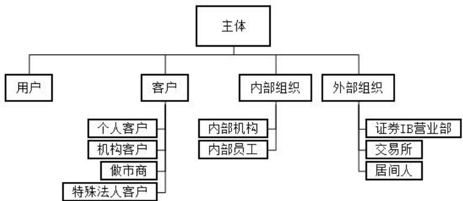  
图 1 主体数据域分类图

## 5.2 账户数据域

账户数据域是描述主体因业务需求在相关机构登记的各类账户信息，包含账户从申请、开立到销户过程中需要的完整信息，与主体、合同、交易、资产数据域有密切联系。账户数据域按照账户类型划分为交易账户、资金账户、银行账户三大类：

a) 交易账户：指投资者作为主体在期货公司开户用于投资交易的账户，用于准确记载投资者所持的交易品种、名称、数量及相应权益与变动情况的账册。按照交易的类型可分为期货交易账户、基金账户、基金交易账户、资管账户、资管交易账户、一码通账户；

b) 资金账户：指期货公司为客户开立的专门用于期货和期权、证券、基金、资管等交易用途的账户，通过该账户对客户的各类交易进行前端控制，进行每日无负债结算、清算交收和计付利息等，资金账户可按币种维度进行扩展；

c) 银行账户：指银行为客户开立的，用于记录主体转账结算和现金收付的账簿。  
账户数据域的分类如图 2 所示。

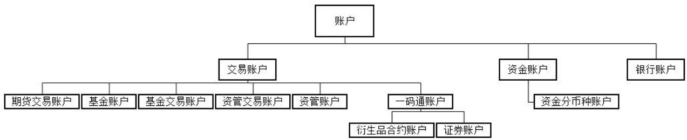  
图 2 账户数据域分类图

## 5.3 品种数据域

品种的范围包括期货公司本身对外提供的金融工具和金融服务，还包括在期货公司业务流程中涉及的其他方提供的金融工具和金融服务，品种分类如下：

a) 期货公司在业务流程中所涉及的金融工具：

1) 一级分类包括期货、现货证券、资产管理、基金、场内期权、仓单。其中期货、现货证券、基金、场内期权是交易所上市的标准品种，资产管理品种指期货公司自己发行和管理的产品；

2) 二级分类代表每个品种类别下的细分品种，更细的分类为结合国内品种现状的自定义分类。

## b) 金融服务包括交易咨询服务。

品种数据域的分类如图3所示。

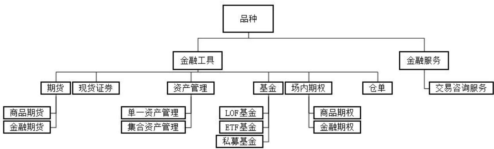  
图 3 品种数据域分类图

## 5.4 交易数据域

交易数据域描述期货公司在运营和执行业务时发生的交互活动，包括交易事件和非交易事件。

交易事件又细分为委托、成交、资金变动、股份变动、其他交易事件：

a) 委托是描述投资者的交易行为，包括期货委托、场内期权行权申请、场内期权委托、基金申请、风控强平委托及现货证券委托；

b) 成交是投资者的委托经交易清算场所撮合后形成的匹配确认，包括期货成交、场内期权成交、基金成交确认、风控强平成交、行权配对明细及现货证券成交；

c) 资金变动主要包括基金资金流水、现货证券资金流水、场内期货期权资金流水，场内期货期权资金流水主要包括银期转账、银期换汇及手工出入金；

d) 股份变动主要包括基金份额流水、期货持仓流水、场内期权持仓流水及现货证券持仓流水；

e) 其他交易事件主要包括积分变动流水。

非交易事件主要是指围绕上述业务活动产生的各类日志以及系统后台运行日志，主要包括业务管理日志、用户事件日志及后台运行日志。

交易数据域的分类如图 4 所示。

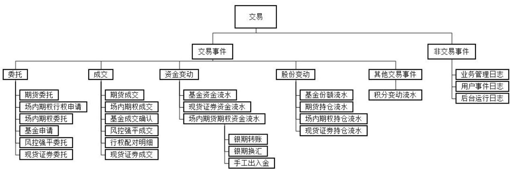  
图 4 交易数据域分类图

## 5.5 资产数据域

资产数据域记录主体拥有的资产，包括交易账户持有、资金账户持有及客户积分：

a) 交易账户持有从投资交易的角度，体现客户主体在投资交易过程中所形成的资源，包括期货合约持仓、期权合约持仓、资管产品份额、代销基金产品份额及证券现货持仓；

b) 资金账户持有体现客户主体的资金状态，包含资金账户明细、资金账户汇总及客户质押；

c) 客户积分是客户主体在参与期货公司的营销活动中积累的虚拟资产，包含客户积分明细及客户积分汇总。

资产数据域既反映了客户资产的历史状态，也代表了未来的经济价值，同时又与其他数据域密切相关。

资产数据域分类如图 5 所示。

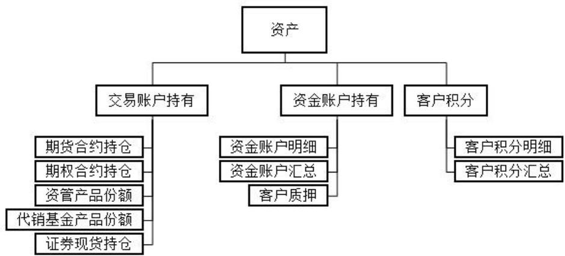  
图 5 资产数据域分类图

## 5.6 合同数据域

合同是期货公司在经营过程中，各主体之间根据相关法律法规或规章制度签订的协议，包括经纪业

务合同、资管业务合同、基金代销业务合同以及交易咨询业务合同，其中：

a) 经纪业务合同主要包括期货经纪业务合同、股票期权经纪业务合同；

b) 资管业务合同主要包括资产管理合同、资管份额转让协议、投资顾问协议、资管产品代销合同；

c) 基金代销业务合同主要包括基金产品销售合同、基金开户合同；

d) 交易咨询业务合同主要是期货公司跟投资者签订的交易咨询服务的协议。

合同数据域分类如图 6 所示。

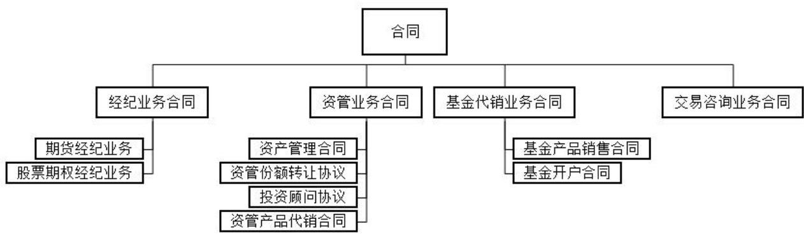  
图 6 合同数据域分类图

## 5.7 渠道数据域

渠道用于表述业务发生的地点、通道或路径，通常与业务事件关联。渠道数据域主要包括柜台、IB渠道、电话、呼叫中心、银行、合作方渠道、互联网渠道及其他渠道。

渠道数据域分类如图 7 所示。

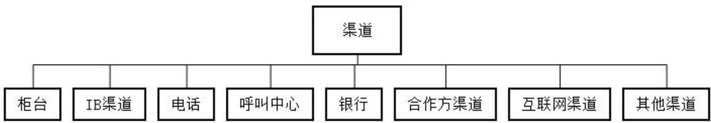  
图 7 渠道数据域分类图

## 5.8 营销数据域

营销数据域涵盖了期货公司开展营销活动的行为方式所涉及的数据，主要包括营销活动、营销任务：

a） 营销活动主要包括投教活动、市场推广、拉新活动、新品种上市及持营；

b） 营销任务主要包括日常拜访、会议承办、路演销售、问卷调查及渠道维护。  
营销数据域分类如图 8 所示。

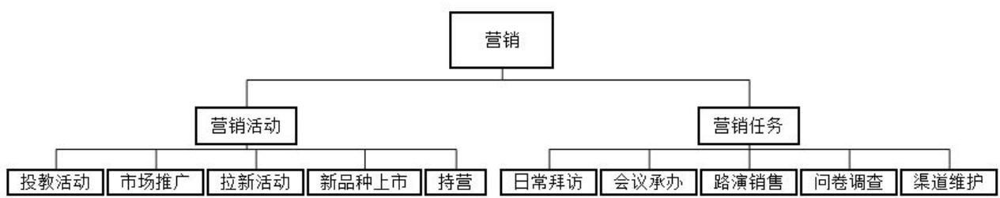  
图 8 营销数据域

## 6 数据域间关联关系

数据域清晰划分和界定之后，基于 IBR方法构建各个数据域之间的关联关系，根据数据域和数据域之间关联关系的分析结果，确定特定主体的核心地位。期货公司逻辑模型中各数据域之间的关联关系如图 9 所示。

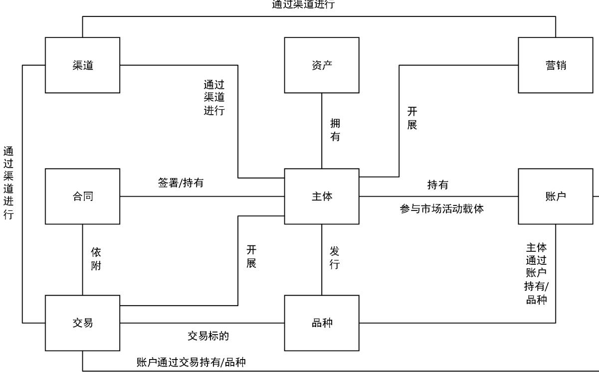  
图 9 数据域之间关联关系

## 7 实体关系图

实体关系图是期货公司逻辑模型成果之一，是对每个数据域中的数据表、数据项进行关联表达所形成的实体-关系图谱（简称实体关系图），可清晰地体现各数据域中所涉及的数据内容。

通过IBR的方法，找出数据域中核心数据的特征和关系，构建数据域之间的核心关系。在期货公司逻辑模型中划分为主体、账户、品种、交易、资产、合同、渠道、营销八大数据域（见第5章），在每个数据域中形成各自的实体关系图，期货公司逻辑模型设计过程中主体数据域的实体关系图示例如图10所示。

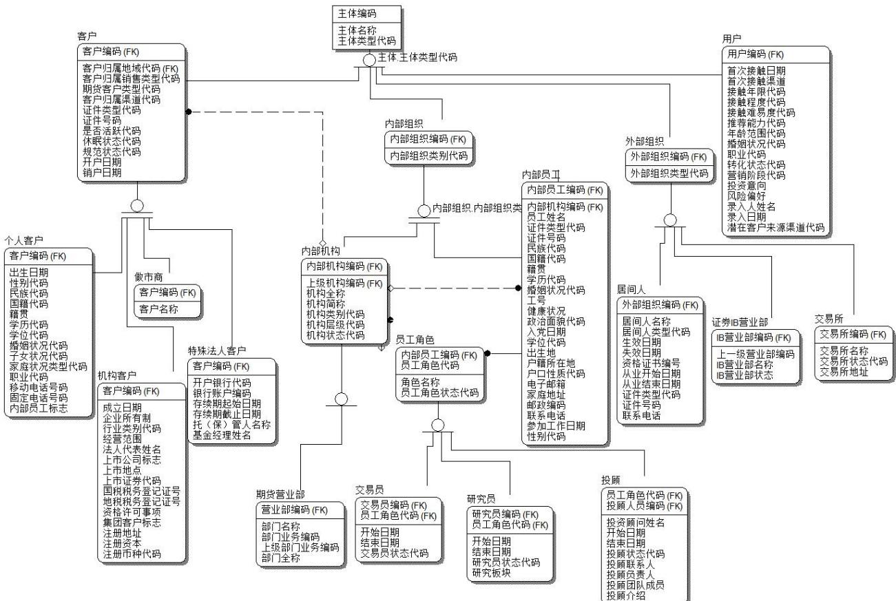  
图 10 主体数据域实体关系图示例

根据IBR的总体方法论，本文件在主体数据域的设计过程中遵循了以下原则：

a） 高内聚低耦合：从业务数据特性进行分析，业务特性相似的进行抽象，在保证实体定义清晰、数据覆盖定位准确的情况下，减少逻辑模型实体数量；

b） 实体水平拆分：对于属性不相容的实体进行水平拆分，保证模型范式化要求，例如：用户实体与客户实体由于业务特性产生的阶段与属性有较大差别，所以进行水平拆分为两个实体；

c） 公用属性合并：对子实体之间的公用属性合并至父实体，形成共享属性；

d） 识别变化属性：针对关心历史变化的属性以历史表方式记录。

## 8 数据表和数据项

期货公司逻辑模型在明确了数据域及数据域之间关系后，在每个数据域中，需对各业务系统进行分析整合，筛选出符合该数据域定义范围的数据表，完成数据表及其描述的补充，完善期货公司逻辑模型框架，使其完整、稳定，并具备行业通用性。在筛选、补充数据表过程中，以各数据域定义为基础，甄别该数据域中数据表是否需要新增或删除，并建立各数据表之间的关系。

经上述过程确定每个数据域的数据表后，再对每个数据表进行细化设计，确定其具有的数据项及其定义，从而形成一套完整且适用于期货公司的实用性比较强的数据表。

图 11 所示为期货公司逻辑模型中主体数据域关键表及其属性的示例。

<table><tr><td rowspan=1 colspan=1>数据域</td><td rowspan=1 colspan=1>数据域*数据表名称</td><td rowspan=1 colspan=1>*数据项名称</td><td rowspan=1 colspan=1>数据类型</td><td rowspan=1 colspan=1>属性详细定义</td><td rowspan=1 colspan=1>代码取值</td><td rowspan=1 colspan=1>主键标志外键标志</td><td rowspan=1 colspan=1>主键标志外键标志</td></tr><tr><td rowspan=1 colspan=1>主体</td><td rowspan=1 colspan=1>主体</td><td rowspan=1 colspan=1>主体名称</td><td rowspan=1 colspan=1>C</td><td rowspan=1 colspan=1>主体全称</td><td rowspan=1 colspan=1></td><td rowspan=1 colspan=1>No</td><td rowspan=1 colspan=1>No</td></tr><tr><td rowspan=1 colspan=1>主体</td><td rowspan=1 colspan=1>主体</td><td rowspan=1 colspan=1>主体类型代码</td><td rowspan=1 colspan=1>C</td><td rowspan=1 colspan=1>主体类型代码</td><td rowspan=1 colspan=1></td><td rowspan=1 colspan=1>No</td><td rowspan=1 colspan=1>No</td></tr><tr><td rowspan=1 colspan=1>主体</td><td rowspan=1 colspan=1>主体</td><td rowspan=1 colspan=1>主体编码</td><td rowspan=1 colspan=1>C</td><td rowspan=1 colspan=1>唯一区分主体的标识。</td><td rowspan=1 colspan=1></td><td rowspan=1 colspan=1>Yes</td><td rowspan=1 colspan=1>No</td></tr><tr><td rowspan=1 colspan=1>主体</td><td rowspan=1 colspan=1>主体联系人</td><td rowspan=1 colspan=1>性别代码</td><td rowspan=1 colspan=1>C</td><td rowspan=1 colspan=1>性别代码</td><td rowspan=1 colspan=1>DIMLS203</td><td rowspan=1 colspan=1>No</td><td rowspan=1 colspan=1>No</td></tr><tr><td rowspan=1 colspan=1>主体</td><td rowspan=1 colspan=1>主体联系人</td><td rowspan=1 colspan=1>职务代码</td><td rowspan=1 colspan=1>C</td><td rowspan=1 colspan=1>职务代码</td><td rowspan=1 colspan=1>DIMLS247</td><td rowspan=1 colspan=1>No</td><td rowspan=1 colspan=1>No</td></tr><tr><td rowspan=1 colspan=1>主体</td><td rowspan=1 colspan=1>主体联系人</td><td rowspan=1 colspan=1>职业代码</td><td rowspan=1 colspan=1>C</td><td rowspan=1 colspan=1>职业代码</td><td rowspan=1 colspan=1>DIMLS250</td><td rowspan=1 colspan=1>No</td><td rowspan=1 colspan=1>No</td></tr><tr><td rowspan=1 colspan=1>主体</td><td rowspan=1 colspan=1>主体联系人</td><td rowspan=1 colspan=1>学历代码</td><td rowspan=1 colspan=1>C</td><td rowspan=1 colspan=1>学历代码</td><td rowspan=1 colspan=1>DIMLS206</td><td rowspan=1 colspan=1>No</td><td rowspan=1 colspan=1>No</td></tr><tr><td rowspan=1 colspan=1>主体</td><td rowspan=1 colspan=1>主体联系人</td><td rowspan=1 colspan=1>年收入</td><td rowspan=1 colspan=1>N</td><td rowspan=1 colspan=1>年收入</td><td rowspan=1 colspan=1></td><td rowspan=1 colspan=1>No</td><td rowspan=1 colspan=1>No</td></tr><tr><td rowspan=1 colspan=1>主体</td><td rowspan=1 colspan=1>主体联系人</td><td rowspan=1 colspan=1>联系人类型代码</td><td rowspan=1 colspan=1>C</td><td rowspan=1 colspan=1>和主体标识共同用于唯一区分主体联系人。</td><td rowspan=1 colspan=1>DIMLS131</td><td rowspan=1 colspan=1>Yes</td><td rowspan=1 colspan=1>No</td></tr><tr><td rowspan=1 colspan=1>主体</td><td rowspan=1 colspan=1>主体联系人</td><td rowspan=1 colspan=1>姓名</td><td rowspan=1 colspan=1>C</td><td rowspan=1 colspan=1>姓名</td><td rowspan=1 colspan=1></td><td rowspan=1 colspan=1>No</td><td rowspan=1 colspan=1>No</td></tr><tr><td rowspan=1 colspan=1>主体</td><td rowspan=1 colspan=1>主体联系人</td><td rowspan=1 colspan=1>主体编码</td><td rowspan=1 colspan=1>C</td><td rowspan=1 colspan=1>唯一区分主体的标识。</td><td rowspan=1 colspan=1></td><td rowspan=1 colspan=1>Yes</td><td rowspan=1 colspan=1>Yes</td></tr><tr><td rowspan=1 colspan=1>主体</td><td rowspan=1 colspan=1>主体证件</td><td rowspan=1 colspan=1>证件类型代码</td><td rowspan=1 colspan=1>C</td><td rowspan=1 colspan=1>和主体标识共同用于唯一区分主体证件。</td><td rowspan=1 colspan=1>DIMLS483</td><td rowspan=1 colspan=1>Yes</td><td rowspan=1 colspan=1>No</td></tr><tr><td rowspan=1 colspan=1>主体</td><td rowspan=1 colspan=1>主体证件</td><td rowspan=1 colspan=1>主体编码</td><td rowspan=1 colspan=1>C</td><td rowspan=1 colspan=1>唯一区分主体的标识。</td><td rowspan=1 colspan=1></td><td rowspan=1 colspan=1>Yes</td><td rowspan=1 colspan=1>Yes</td></tr><tr><td rowspan=1 colspan=1>主体</td><td rowspan=1 colspan=1>主体证件</td><td rowspan=1 colspan=1>证件号码</td><td rowspan=1 colspan=1>C</td><td rowspan=1 colspan=1>证件号码</td><td rowspan=1 colspan=1></td><td rowspan=1 colspan=1>No</td><td rowspan=1 colspan=1>No</td></tr><tr><td rowspan=1 colspan=1>主体</td><td rowspan=1 colspan=1>主体证件</td><td rowspan=1 colspan=1>证件年检日期</td><td rowspan=1 colspan=1>D</td><td rowspan=1 colspan=1>证件年检日期</td><td rowspan=1 colspan=1></td><td rowspan=1 colspan=1>No</td><td rowspan=1 colspan=1>No</td></tr><tr><td rowspan=1 colspan=1>主体</td><td rowspan=1 colspan=1>主体证件</td><td rowspan=1 colspan=1>证件发放机构编码</td><td rowspan=1 colspan=1>C</td><td rowspan=1 colspan=1>证件发放机构编码</td><td rowspan=1 colspan=1></td><td rowspan=1 colspan=1>No</td><td rowspan=1 colspan=1>No</td></tr><tr><td rowspan=1 colspan=1>主体</td><td rowspan=1 colspan=1>主体证件</td><td rowspan=1 colspan=1>证件有效截止日期</td><td rowspan=1 colspan=1>D</td><td rowspan=1 colspan=1>证件有效截止日期</td><td rowspan=1 colspan=1></td><td rowspan=1 colspan=1>No</td><td rowspan=1 colspan=1>No</td></tr><tr><td rowspan=1 colspan=1>主体</td><td rowspan=1 colspan=1>主体证件</td><td rowspan=1 colspan=1>证件有效起始日期</td><td rowspan=1 colspan=1>D</td><td rowspan=1 colspan=1>证件有效起始日期</td><td rowspan=1 colspan=1></td><td rowspan=1 colspan=1>No</td><td rowspan=1 colspan=1>No</td></tr><tr><td rowspan=1 colspan=1>主体</td><td rowspan=1 colspan=1>主体证件</td><td rowspan=1 colspan=1>证件地址</td><td rowspan=1 colspan=1>C</td><td rowspan=1 colspan=1>证件地址</td><td rowspan=1 colspan=1></td><td rowspan=1 colspan=1>No</td><td rowspan=1 colspan=1>No</td></tr><tr><td rowspan=1 colspan=1>主体</td><td rowspan=1 colspan=1>主体证件</td><td rowspan=1 colspan=1>证件发放机构名称</td><td rowspan=1 colspan=1>C</td><td rowspan=1 colspan=1>证件发放机构名称</td><td rowspan=1 colspan=1></td><td rowspan=1 colspan=1>No</td><td rowspan=1 colspan=1>No</td></tr><tr><td rowspan=1 colspan=1>主体</td><td rowspan=1 colspan=1>主体地址</td><td rowspan=1 colspan=1>主体编码</td><td rowspan=1 colspan=1>C</td><td rowspan=1 colspan=1>唯一区分主体的标识。</td><td rowspan=1 colspan=1></td><td rowspan=1 colspan=1>Yes</td><td rowspan=1 colspan=1>Yes</td></tr><tr><td rowspan=1 colspan=1>主体</td><td rowspan=1 colspan=1>主体地址</td><td rowspan=1 colspan=1>城市代码</td><td rowspan=1 colspan=1>C</td><td rowspan=1 colspan=1>用于区分资管产品投资房地产的区域的标识。</td><td rowspan=1 colspan=1>DIMLS456</td><td rowspan=1 colspan=1>No</td><td rowspan=1 colspan=1>No</td></tr><tr><td rowspan=1 colspan=1>主体</td><td rowspan=1 colspan=1>主体地址</td><td rowspan=1 colspan=1>省份代码</td><td rowspan=1 colspan=1>C</td><td rowspan=1 colspan=1>省份</td><td rowspan=1 colspan=1>DIMLS485</td><td rowspan=1 colspan=1>No</td><td rowspan=1 colspan=1>No</td></tr><tr><td rowspan=1 colspan=1>主体</td><td rowspan=1 colspan=1>主体地址</td><td rowspan=1 colspan=1>国家及地区代码</td><td rowspan=1 colspan=1>C</td><td rowspan=1 colspan=1>用于区分国家及地区划分的标识。</td><td rowspan=1 colspan=1>DIMLS484</td><td rowspan=1 colspan=1>No</td><td rowspan=1 colspan=1>No</td></tr><tr><td rowspan=1 colspan=1>主体</td><td rowspan=1 colspan=1>主体地址</td><td rowspan=1 colspan=1>详细地址描述</td><td rowspan=1 colspan=1>C</td><td rowspan=1 colspan=1>详细地址描述</td><td rowspan=1 colspan=1></td><td rowspan=1 colspan=1>No</td><td rowspan=1 colspan=1>No</td></tr><tr><td rowspan=1 colspan=1>主体</td><td rowspan=1 colspan=1>主体地址</td><td rowspan=1 colspan=1>联系方式代码</td><td rowspan=1 colspan=1>C</td><td rowspan=1 colspan=1>用于区分联系方式的标识。</td><td rowspan=1 colspan=1>DIMLS034</td><td rowspan=1 colspan=1>Yes</td><td rowspan=1 colspan=1>No</td></tr><tr><td rowspan=1 colspan=1>主体</td><td rowspan=1 colspan=1>主体地址</td><td rowspan=1 colspan=1>邮政编码</td><td rowspan=1 colspan=1>C</td><td rowspan=1 colspan=1>唯一区分邮政编码的标识。</td><td rowspan=1 colspan=1></td><td rowspan=1 colspan=1>No</td><td rowspan=1 colspan=1>No</td></tr></table>

图 11 主体数据域关键表及其属性的示例

## 9 行业英文词根库及模型的英文翻译

期货公司逻辑模型英文翻译使用英文词根命名原则，具体规则应符合表1。

英文词根库示例见图12，模型的英文名称定义示例见图13。  
表 1 英文名称及词根的命名规则
<table><tr><td colspan="1" rowspan="1">序号</td><td colspan="1" rowspan="1">规则</td><td colspan="1" rowspan="1">规则描述</td></tr><tr><td colspan="1" rowspan="1">1</td><td colspan="1" rowspan="1">大小写规则</td><td colspan="1" rowspan="1">采用小写字母</td></tr><tr><td colspan="1" rowspan="1">2</td><td colspan="1" rowspan="1">连接符</td><td colspan="1" rowspan="1">只能用下划线“_”作为连接符</td></tr><tr><td colspan="1" rowspan="1">3</td><td colspan="1" rowspan="1">表英文名命名规则</td><td colspan="1" rowspan="1">1、需加前缀，前缀为数据域名2、表名长度：25位以内</td></tr><tr><td colspan="1" rowspan="1">4</td><td colspan="1" rowspan="1">字段英文名命名规则</td><td colspan="1" rowspan="1">1、用的词汇不超过5个，连接符不超过4个2、长度：25位以内，如果超长，需要重新切词</td></tr><tr><td colspan="1" rowspan="1">5</td><td colspan="1" rowspan="1">切词原则</td><td colspan="1" rowspan="1">1、按中文字段名中的词汇进行切词2、如遇中文名称过长，抽取主要部分进行翻译，重新切词</td></tr><tr><td colspan="1" rowspan="1">6</td><td colspan="1" rowspan="1">词根</td><td colspan="1" rowspan="1">长度不超过4位：原则上3位辅音+1位元音，特殊情况可例外</td></tr><tr><td colspan="1" rowspan="1">7</td><td colspan="1" rowspan="1">英文翻译时词根选择</td><td colspan="1" rowspan="1">1、词汇不超长：取易理解业务含义的词根2、词汇超长：词根选取从长原则</td></tr><tr><td colspan="1" rowspan="1">8</td><td colspan="1" rowspan="1">各数据域英文词根命名</td><td colspan="1" rowspan="1">主体pty、品种var、账户acc、交易evt、资产ast、营销mkt、渠道chn、合同agt、跨数据域pub</td></tr></table>

<table><tr><td rowspan=1 colspan=1>序号</td><td rowspan=1 colspan=1>中文全称</td><td rowspan=1 colspan=1>英文全称</td><td rowspan=1 colspan=1>英文缩写</td><td rowspan=1 colspan=1>增加标志</td><td rowspan=1 colspan=1>字段长度（增加标志）</td><td rowspan=1 colspan=1>属性长度（中文全称）</td><td rowspan=1 colspan=1>备注-其他参考</td></tr><tr><td rowspan=1 colspan=1>1</td><td rowspan=1 colspan=1>甲方</td><td rowspan=1 colspan=1>A</td><td rowspan=1 colspan=1>a</td><td rowspan=1 colspan=1>_a</td><td rowspan=1 colspan=1>2</td><td rowspan=1 colspan=1>4</td><td rowspan=1 colspan=1></td></tr><tr><td rowspan=1 colspan=1>2</td><td rowspan=1 colspan=1>简称</td><td rowspan=1 colspan=1>Abbreviate</td><td rowspan=1 colspan=1>abbr</td><td rowspan=1 colspan=1>_abbr</td><td rowspan=1 colspan=1>5</td><td rowspan=1 colspan=1>4</td><td rowspan=1 colspan=1></td></tr><tr><td rowspan=1 colspan=1>3</td><td rowspan=1 colspan=1>摘要</td><td rowspan=1 colspan=1>Abstract</td><td rowspan=1 colspan=1>abs</td><td rowspan=1 colspan=1>_abs</td><td rowspan=1 colspan=1>4</td><td rowspan=1 colspan=1>4</td><td rowspan=1 colspan=1></td></tr><tr><td rowspan=1 colspan=1>4</td><td rowspan=1 colspan=1>出金</td><td rowspan=1 colspan=1>Amount OfContribution</td><td rowspan=1 colspan=1>ac</td><td rowspan=1 colspan=1>_ac</td><td rowspan=1 colspan=1>3</td><td rowspan=1 colspan=1>4</td><td rowspan=1 colspan=1></td></tr><tr><td rowspan=1 colspan=1>5</td><td rowspan=1 colspan=1>出入金</td><td rowspan=1 colspan=1>Amount OfContributionandentry</td><td rowspan=1 colspan=1>acae</td><td rowspan=1 colspan=1>_acae</td><td rowspan=1 colspan=1>5</td><td rowspan=1 colspan=1>6</td><td rowspan=1 colspan=1></td></tr><tr><td rowspan=1 colspan=1>6</td><td rowspan=1 colspan=1>账户</td><td rowspan=1 colspan=1>Account</td><td rowspan=1 colspan=1>acc</td><td rowspan=1 colspan=1>_acc</td><td rowspan=1 colspan=1>4</td><td rowspan=1 colspan=1>4</td><td rowspan=1 colspan=1></td></tr><tr><td rowspan=1 colspan=1>7</td><td rowspan=1 colspan=1>计提</td><td rowspan=1 colspan=1>accrual</td><td rowspan=1 colspan=1>accl</td><td rowspan=1 colspan=1>_accl</td><td rowspan=1 colspan=1>5</td><td rowspan=1 colspan=1>4</td><td rowspan=1 colspan=1></td></tr><tr><td rowspan=1 colspan=1>8</td><td rowspan=1 colspan=1>年检</td><td rowspan=1 colspan=1>Annual Check</td><td rowspan=1 colspan=1>achk</td><td rowspan=1 colspan=1>_achk</td><td rowspan=1 colspan=1>5</td><td rowspan=1 colspan=1>4</td><td rowspan=1 colspan=1></td></tr><tr><td rowspan=1 colspan=1>9</td><td rowspan=1 colspan=1>受理</td><td rowspan=1 colspan=1>Accept</td><td rowspan=1 colspan=1>acpt</td><td rowspan=1 colspan=1>_acpt</td><td rowspan=1 colspan=1>5</td><td rowspan=1 colspan=1>4</td><td rowspan=1 colspan=1></td></tr><tr><td rowspan=1 colspan=1>10</td><td rowspan=1 colspan=1>活动</td><td rowspan=1 colspan=1>Action</td><td rowspan=1 colspan=1>act</td><td rowspan=1 colspan=1>_act</td><td rowspan=1 colspan=1>4</td><td rowspan=1 colspan=1>4</td><td rowspan=1 colspan=1></td></tr><tr><td rowspan=1 colspan=1>11</td><td rowspan=1 colspan=1>实际</td><td rowspan=1 colspan=1>Actual</td><td rowspan=1 colspan=1>actl</td><td rowspan=1 colspan=1>_actl</td><td rowspan=1 colspan=1>5</td><td rowspan=1 colspan=1>4</td><td rowspan=1 colspan=1></td></tr><tr><td rowspan=1 colspan=1>12</td><td rowspan=1 colspan=1>现货</td><td rowspan=1 colspan=1>Actuals</td><td rowspan=1 colspan=1>actl</td><td rowspan=1 colspan=1>_actl</td><td rowspan=1 colspan=1>5</td><td rowspan=1 colspan=1>4</td><td rowspan=1 colspan=1></td></tr><tr><td rowspan=1 colspan=1>13</td><td rowspan=1 colspan=1>增加</td><td rowspan=1 colspan=1>add</td><td rowspan=1 colspan=1>add</td><td rowspan=1 colspan=1>_add</td><td rowspan=1 colspan=1>4</td><td rowspan=1 colspan=1>4</td><td rowspan=1 colspan=1></td></tr><tr><td rowspan=1 colspan=1>14</td><td rowspan=1 colspan=1>地址</td><td rowspan=1 colspan=1>Address</td><td rowspan=1 colspan=1>addr</td><td rowspan=1 colspan=1>_addr</td><td rowspan=1 colspan=1>5</td><td rowspan=1 colspan=1>4</td><td rowspan=1 colspan=1></td></tr><tr><td rowspan=1 colspan=1>15</td><td rowspan=1 colspan=1>学位</td><td rowspan=1 colspan=1>academicdegree</td><td rowspan=1 colspan=1>adgr</td><td rowspan=1 colspan=1>_adgr</td><td rowspan=1 colspan=1>5</td><td rowspan=1 colspan=1>4</td><td rowspan=1 colspan=1></td></tr><tr><td rowspan=1 colspan=1>16</td><td rowspan=1 colspan=1>调整</td><td rowspan=1 colspan=1>Adjust</td><td rowspan=1 colspan=1>adj</td><td rowspan=1 colspan=1>_adj</td><td rowspan=1 colspan=1>4</td><td rowspan=1 colspan=1>4</td><td rowspan=1 colspan=1></td></tr><tr><td rowspan=1 colspan=1>17</td><td rowspan=1 colspan=1>入金</td><td rowspan=1 colspan=1>Amount Of Entry</td><td rowspan=1 colspan=1>ae</td><td rowspan=1 colspan=1>_ae</td><td rowspan=1 colspan=1>3</td><td rowspan=1 colspan=1>4</td><td rowspan=1 colspan=1></td></tr><tr><td rowspan=1 colspan=1>18</td><td rowspan=1 colspan=1>管理费</td><td rowspan=1 colspan=1>Administrativeexpenses</td><td rowspan=1 colspan=1>aep</td><td rowspan=1 colspan=1>_aep</td><td rowspan=1 colspan=1>4</td><td rowspan=1 colspan=1>6</td><td rowspan=1 colspan=1></td></tr><tr><td rowspan=1 colspan=1>19</td><td rowspan=1 colspan=1>公告</td><td rowspan=1 colspan=1>Affiche</td><td rowspan=1 colspan=1>affi</td><td rowspan=1 colspan=1>_affi</td><td rowspan=1 colspan=1>5</td><td rowspan=1 colspan=1>4</td><td rowspan=1 colspan=1></td></tr><tr><td rowspan=1 colspan=1>20</td><td rowspan=1 colspan=1>后</td><td rowspan=1 colspan=1>After</td><td rowspan=1 colspan=1>aft</td><td rowspan=1 colspan=1>_aft</td><td rowspan=1 colspan=1>4</td><td rowspan=1 colspan=1>2</td><td rowspan=1 colspan=1></td></tr><tr><td rowspan=1 colspan=1>21</td><td rowspan=1 colspan=1>年龄</td><td rowspan=1 colspan=1>Age</td><td rowspan=1 colspan=1>age</td><td rowspan=1 colspan=1>_age</td><td rowspan=1 colspan=1>4</td><td rowspan=1 colspan=1>4</td><td rowspan=1 colspan=1></td></tr><tr><td rowspan=1 colspan=1>22</td><td rowspan=1 colspan=1>累计</td><td rowspan=1 colspan=1>Aggregate</td><td rowspan=1 colspan=1>aggr</td><td rowspan=1 colspan=1>aggr</td><td rowspan=1 colspan=1>5</td><td rowspan=1 colspan=1>4</td><td rowspan=1 colspan=1></td></tr><tr><td rowspan=1 colspan=1>23</td><td rowspan=1 colspan=1>合同</td><td rowspan=1 colspan=1>Agreement</td><td rowspan=1 colspan=1>agmt</td><td rowspan=1 colspan=1>_agmt</td><td rowspan=1 colspan=1>5</td><td rowspan=1 colspan=1>4</td><td rowspan=1 colspan=1></td></tr><tr><td rowspan=1 colspan=1>24</td><td rowspan=1 colspan=1>代销</td><td rowspan=1 colspan=1>AgentSell</td><td rowspan=1 colspan=1>agns</td><td rowspan=1 colspan=1>_agns</td><td rowspan=1 colspan=1>5</td><td rowspan=1 colspan=1>4</td><td rowspan=1 colspan=1></td></tr><tr><td rowspan=1 colspan=1>25</td><td rowspan=1 colspan=1>25代理</td><td rowspan=1 colspan=1>Agent</td><td rowspan=1 colspan=1>agt</td><td rowspan=1 colspan=1>_agt</td><td rowspan=1 colspan=1>4</td><td rowspan=1 colspan=1>4</td><td rowspan=1 colspan=1>4agts</td></tr></table>

图 12 英文词根库示例

<table><tr><td rowspan=1 colspan=1>*编码</td><td rowspan=1 colspan=1>*中文名称</td><td rowspan=1 colspan=1>*英文名称</td><td rowspan=1 colspan=1>*详细定义</td></tr><tr><td rowspan=1 colspan=1>TLS0000001</td><td rowspan=1 colspan=1>主体</td><td rowspan=1 colspan=1>pty</td><td rowspan=1 colspan=1>期货公司作为期货市场中介机构，服务、感兴趣或关注的对象，可以是客户、合作伙伴、内部机构和外部组织等。具体包括：客户、内部组织、渠道商、合作伙伴、以及资产管理公司、托管银行、交易所，还包括资管产品和其他（税务，监管，同业等）。</td></tr><tr><td rowspan=1 colspan=1>TLS0000002</td><td rowspan=1 colspan=1>主体联系人</td><td rowspan=1 colspan=1>pty_conp</td><td rowspan=1 colspan=1>记录与主体相关的联系人信息。</td></tr><tr><td rowspan=1 colspan=1>TLS0000003</td><td rowspan=1 colspan=1>主体证件</td><td rowspan=1 colspan=1>pty_cert</td><td rowspan=1 colspan=1>记录主体的证件信息。</td></tr><tr><td rowspan=1 colspan=1>TLS0000004</td><td rowspan=1 colspan=1>主体地址</td><td rowspan=1 colspan=1>pty_addr</td><td rowspan=1 colspan=1>记录了主体的地址详情，如个人当事人的住址，联系电话，传真，家庭电话等属性信息。</td></tr><tr><td rowspan=1 colspan=1>TLS0000005</td><td rowspan=1 colspan=1>主体终端设备</td><td rowspan=1 colspan=1>pty_term_equp</td><td rowspan=1 colspan=1>记录主体的终端信息。如客户交易设备IP、MAC、硬盘信息；员工电脑IP、MAC信息等。</td></tr><tr><td rowspan=1 colspan=1>TLS0000006</td><td rowspan=1 colspan=1>主体关系</td><td rowspan=1 colspan=1>pty_rela</td><td rowspan=1 colspan=1>记录了主体与主体之间的关系，如个人与个人、个人与组织、组织与组织等。</td></tr><tr><td rowspan=1 colspan=1>TLS0000007</td><td rowspan=1 colspan=1>用户</td><td rowspan=1 colspan=1>user</td><td rowspan=1 colspan=1>主体的子实体之一。和期货公司提供的业务相关的对象。</td></tr><tr><td rowspan=1 colspan=1>TLS0000008</td><td rowspan=1 colspan=1>客户</td><td rowspan=1 colspan=1>cust</td><td rowspan=1 colspan=1>在期货公司开展交易业务或者被提供服务的对象。</td></tr><tr><td rowspan=1 colspan=1>TLS0000009</td><td rowspan=1 colspan=1>个人客户</td><td rowspan=1 colspan=1>indv_cust</td><td rowspan=1 colspan=1>客户的子实体之一。记录以自然人身份从事交易的投资者，与机构投资者相对应。</td></tr><tr><td rowspan=1 colspan=1>TLS0000010</td><td rowspan=1 colspan=1>机构客户</td><td rowspan=1 colspan=1>org_cust</td><td rowspan=1 colspan=1>客户的子实体之一。指一般法人身份的相关客户。</td></tr><tr><td rowspan=1 colspan=1>TLS0000011</td><td rowspan=1 colspan=1>特殊法人客户</td><td rowspan=1 colspan=1>espe_legp_cust</td><td rowspan=1 colspan=1>客户的子实体之一。指特殊法人身份的客户。</td></tr><tr><td rowspan=1 colspan=1>TLS0000012</td><td rowspan=1 colspan=1>客户评级</td><td rowspan=1 colspan=1>cust_rat</td><td rowspan=1 colspan=1>记录客户的风险承受能力评级、信用评级、服务等级等。</td></tr><tr><td rowspan=1 colspan=1>TLS0000013</td><td rowspan=1 colspan=1>客户适当性偏好</td><td rowspan=1 colspan=1>cust_appr_pref</td><td rowspan=1 colspan=1>根据统一适当性管理要求，记录客户的相关适当性信息。</td></tr><tr><td rowspan=1 colspan=1>TLS0000014</td><td rowspan=1 colspan=1>客户授信额度</td><td rowspan=1 colspan=1>cust_crdt_Imt</td><td rowspan=1 colspan=1>记录了客户可用的授信资金的额度信息。</td></tr><tr><td rowspan=1 colspan=1>TLS0000015</td><td rowspan=1 colspan=1>客户影像信息</td><td rowspan=1 colspan=1>cust_blip_info</td><td rowspan=1 colspan=1>记录客户的各类影像信息。如个人照片、证件扫描件等。</td></tr><tr><td rowspan=1 colspan=1>TLS0000016</td><td rowspan=1 colspan=1>客户分类</td><td rowspan=1 colspan=1>cust_clas</td><td rowspan=1 colspan=1>记录了客户对应的分类。</td></tr><tr><td rowspan=1 colspan=1>TLS0000017</td><td rowspan=1 colspan=1>客户分类类型</td><td rowspan=1 colspan=1>cust_clas_type</td><td rowspan=1 colspan=1>记录了客户分类类型的属性信息。</td></tr></table>

图 13 模型英文名称翻译示例

## 10 期货公司业务分类标签

图 14 给出了期货公司经核准或备案可开展业务分类。

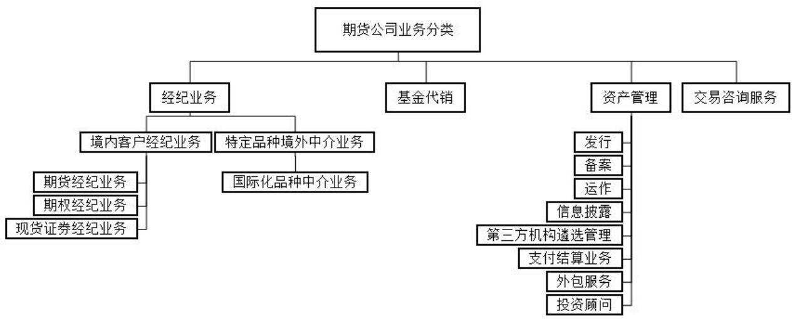  
图 14 期货公司业务分类

按照上述分类，对期货公司逻辑模型筛选出的实体进行归类整理，形成了每个实体与期货公司业务线的对应关系，对期货公司逻辑模型数据表进行分类标识是模型梳理成果之一，示例如表 2 所示。

表 2 期货公司逻辑模型涉及业务线示例
<table><tr><td rowspan=1 colspan=1>表中文名称</td><td rowspan=1 colspan=1>表编码</td><td rowspan=1 colspan=1>业务线/数据目录中文名称</td></tr><tr><td rowspan=1 colspan=1>资产管理产品净值</td><td rowspan=1 colspan=1>TLS0000122</td><td rowspan=1 colspan=1>资产管理</td></tr><tr><td rowspan=1 colspan=1>期货委托</td><td rowspan=1 colspan=1>TLS0000123</td><td rowspan=1 colspan=1>期货经纪</td></tr><tr><td rowspan=1 colspan=1>场内期权行权申请</td><td rowspan=1 colspan=1>TLS0000124</td><td rowspan=1 colspan=1>期货经纪</td></tr><tr><td rowspan=1 colspan=1>场内期权委托</td><td rowspan=1 colspan=1>TLS0000125</td><td rowspan=1 colspan=1>期货经纪</td></tr><tr><td rowspan=1 colspan=1>基金申请</td><td rowspan=1 colspan=1>TLS0000126</td><td rowspan=1 colspan=1>基金代销</td></tr><tr><td rowspan=1 colspan=1>风控强平委托</td><td rowspan=1 colspan=1>TLS0000129</td><td rowspan=1 colspan=1>期货经纪</td></tr><tr><td rowspan=1 colspan=1>期货成交</td><td rowspan=1 colspan=1>TLS0000130</td><td rowspan=1 colspan=1>期货经纪</td></tr><tr><td rowspan=1 colspan=1>场内期权成交</td><td rowspan=1 colspan=1>TLS0000131</td><td rowspan=1 colspan=1>期货经纪</td></tr><tr><td rowspan=1 colspan=1>基金成交确认</td><td rowspan=1 colspan=1>TLS0000132</td><td rowspan=1 colspan=1>基金代销</td></tr><tr><td rowspan=1 colspan=1>风控强平成交</td><td rowspan=1 colspan=1>TLS0000134</td><td rowspan=1 colspan=1>期货经纪</td></tr><tr><td rowspan=1 colspan=1>行权配对明细</td><td rowspan=1 colspan=1>TLS0000136</td><td rowspan=1 colspan=1>期货经纪</td></tr><tr><td rowspan=1 colspan=1>基金资金流水</td><td rowspan=1 colspan=1>TLS0000138</td><td rowspan=1 colspan=1>基金代销</td></tr><tr><td rowspan=1 colspan=1>银期转账</td><td rowspan=1 colspan=1>TLS0000139</td><td rowspan=1 colspan=1>期货经纪</td></tr><tr><td rowspan=1 colspan=1>银期换汇</td><td rowspan=1 colspan=1>TLS0000140</td><td rowspan=1 colspan=1>期货经纪</td></tr><tr><td rowspan=1 colspan=1>手工出入金</td><td rowspan=1 colspan=1>TLS0000141</td><td rowspan=1 colspan=1>期货经纪</td></tr><tr><td rowspan=1 colspan=1>基金份额流水</td><td rowspan=1 colspan=1>TLS0000142</td><td rowspan=1 colspan=1>基金代销</td></tr><tr><td rowspan=1 colspan=1>期货持仓流水</td><td rowspan=1 colspan=1>TLS0000143</td><td rowspan=1 colspan=1>期货经纪</td></tr><tr><td rowspan=1 colspan=1>场内期权持仓流水</td><td rowspan=1 colspan=1>TLS0000144</td><td rowspan=1 colspan=1>期货经纪</td></tr><tr><td rowspan=1 colspan=1>积分变动流水</td><td rowspan=1 colspan=1>TLS0000146</td><td rowspan=1 colspan=1>期货经纪</td></tr><tr><td rowspan=1 colspan=1>系统基础管理日志</td><td rowspan=1 colspan=1>TLS0000147</td><td rowspan=1 colspan=1>期货经纪</td></tr><tr><td rowspan=1 colspan=1>客户基础信息管理日志</td><td rowspan=1 colspan=1>TLS0000148</td><td rowspan=1 colspan=1>期货经纪</td></tr></table>

## 11 数据敏感性标签

期货公司逻辑模型数据敏感性标识表示实体的敏感度，在逻辑模型的梳理过程中，数据敏感性标识应符合 JR/T 0158规定（表 3），使实体增加对应的数据敏感性标识，形成实体与数据敏感性标识对应关系，相关示例如图 15 所示。

表 3 期货数据级别标识表
<table><tr><td colspan="1" rowspan="1">数据级别标识</td><td colspan="1" rowspan="1">数据重要程度标识</td><td colspan="1" rowspan="1">数据特征</td></tr><tr><td colspan="1" rowspan="1">4</td><td colspan="1" rowspan="1">极高</td><td colspan="1" rowspan="1">1、数据的安全属性（完整性、保密性、可用性）遭到破坏，数据损失后，影响范围大（跨行业或跨机构），影响程度一般是“严重”；2、一般特征：数据主要用于行业内大型或特大型机构中的重要业务使用，一般针对特定人员公开，且仅为必须知悉的对象访问或使用。</td></tr><tr><td colspan="1" rowspan="1">3</td><td colspan="1" rowspan="1">高</td><td colspan="1" rowspan="1">1、数据的安全属性（完整性、保密性、可用性）遭到破坏，数据损失后，影响范围中等（一般局限在本机构），影响程度一般是“严重”。2、一般特征：数据用于重要业务使用，一般针对特定人员公开，且仅为必须知悉的对象访问或使用。</td></tr><tr><td colspan="1" rowspan="1">2</td><td colspan="1" rowspan="1">中</td><td colspan="1" rowspan="1">1、数据的安全属性（完整性、保密性、可用性）遭到破坏，数据损失后，影响范围较小（一般局限在本机构），影响程度一般是“中等”或“轻微”。2、一般特征：数据用于一般业务使用，一般针对受限对象公开；一般指内部管理且不宜广泛公开的数据。</td></tr><tr><td colspan="1" rowspan="1">1</td><td colspan="1" rowspan="1">低</td><td colspan="1" rowspan="1">1、数据的安全属性（完整性、保密性、可用性）遭到破坏，数据损失后，影响范围较小（一般局限在本机构），影响程度一般是“轻微”或“无”。2、一般特征：数据可被公开或可被公众获知、使用。</td></tr></table>

<table><tr><td rowspan=1 colspan=1>*编码</td><td rowspan=1 colspan=1>*中文名称</td><td rowspan=1 colspan=1>*英文名称</td><td rowspan=1 colspan=1>*详细定义</td><td rowspan=1 colspan=1>最低参考数据</td><td rowspan=1 colspan=1>《证券期货业数据分类分级指引》</td></tr><tr><td rowspan=1 colspan=1>TLS0000109</td><td rowspan=1 colspan=1>商品期权</td><td rowspan=1 colspan=1>merc_opt</td><td rowspan=1 colspan=1>以商品期货合约为标的物的期权品种。</td><td rowspan=1 colspan=1>1</td><td rowspan=1 colspan=1>产品信息</td></tr><tr><td rowspan=1 colspan=1>TLS0000110</td><td rowspan=1 colspan=1>私募基金</td><td rowspan=1 colspan=1>pte_fnd</td><td rowspan=1 colspan=1>记录私募基金的基本要素信息，是私下或直接向特定群体募集的基金。</td><td rowspan=1 colspan=1>1</td><td rowspan=1 colspan=1>产品信息</td></tr><tr><td rowspan=1 colspan=1>TLS0000005</td><td rowspan=1 colspan=1>主体终端设备</td><td rowspan=1 colspan=1>pty_term_equp</td><td rowspan=1 colspan=1>记录主体的终端信息。如客户交易设备IP、MAC、硬盘信息；员工电脑IP、MAC信息等。</td><td rowspan=1 colspan=1>2</td><td rowspan=1 colspan=1>客户服务信息</td></tr><tr><td rowspan=1 colspan=1>TLS0000010</td><td rowspan=1 colspan=1>机构客户</td><td rowspan=1 colspan=1>org_cust</td><td rowspan=1 colspan=1>客户的子实体之一。指一般法人身份的相关客户。</td><td rowspan=1 colspan=1>2</td><td rowspan=1 colspan=1>机构投资者基本信息</td></tr><tr><td rowspan=1 colspan=1>TLS0000011</td><td rowspan=1 colspan=1>特殊法人客户</td><td rowspan=1 colspan=1>espe_legp_cust</td><td rowspan=1 colspan=1>客户的子实体之一。指特殊法人身份的客户。</td><td rowspan=1 colspan=1>2</td><td rowspan=1 colspan=1>机构投资者基本信息</td></tr><tr><td rowspan=1 colspan=1>TLS0000012</td><td rowspan=1 colspan=1>客户评级</td><td rowspan=1 colspan=1>cust_rat</td><td rowspan=1 colspan=1>记录客户的风险承受能力评级、信用评级、服务等级等。</td><td rowspan=1 colspan=1>2</td><td rowspan=1 colspan=1>客户经营分析</td></tr><tr><td rowspan=1 colspan=1>TLS0000013</td><td rowspan=1 colspan=1>客户适当性偏好</td><td rowspan=1 colspan=1>cust_appr_pref</td><td rowspan=1 colspan=1>根据统一适当性管理要求，记录客户的相关适当性信息。</td><td rowspan=1 colspan=1>2</td><td rowspan=1 colspan=1>客户服务信息</td></tr><tr><td rowspan=1 colspan=1>TLS0000028</td><td rowspan=1 colspan=1>员工考试成绩</td><td rowspan=1 colspan=1>emp_exam_scor</td><td rowspan=1 colspan=1>记录内部员工的考试成绩信息。</td><td rowspan=1 colspan=1>2</td><td rowspan=1 colspan=1>从业人员考试数据信息</td></tr><tr><td rowspan=1 colspan=1>TLS0000029</td><td rowspan=1 colspan=1>员工资格</td><td rowspan=1 colspan=1>emp_qlfy</td><td rowspan=1 colspan=1>记录内部员工取得的各种从业资格。</td><td rowspan=1 colspan=1>2</td><td rowspan=1 colspan=1>从业人员诚信信息</td></tr><tr><td rowspan=1 colspan=1>TLS0000034</td><td rowspan=1 colspan=1>客户与员工关系</td><td rowspan=1 colspan=1>cust_emp_rela</td><td rowspan=1 colspan=1>记录客户与员工的关系及其关系类型。</td><td rowspan=1 colspan=1>2</td><td rowspan=1 colspan=1>客户关系信息</td></tr><tr><td rowspan=1 colspan=1>TLS0000035</td><td rowspan=1 colspan=1>内部员工与资金账户关系</td><td rowspan=1 colspan=1>inr_emp_cptl_acc_rela</td><td rowspan=1 colspan=1>记录内部员工与账户的关系及其关系类型。</td><td rowspan=1 colspan=1>2</td><td rowspan=1 colspan=1>客户关系信息</td></tr><tr><td rowspan=1 colspan=1>TLS0000009</td><td rowspan=1 colspan=1>个人客户</td><td rowspan=1 colspan=1>indv_cust</td><td rowspan=1 colspan=1>客户的子实体之一。记录以自然人身份从事交易的投资者，与机构投资者相对应。</td><td rowspan=1 colspan=1>3</td><td rowspan=1 colspan=1>个人投资者基本信息</td></tr><tr><td rowspan=1 colspan=1>TLS0000019</td><td rowspan=1 colspan=1>账户</td><td rowspan=1 colspan=1>acc</td><td rowspan=1 colspan=1>记录主体关于产品、资金持有及其变动情况的载体。</td><td rowspan=1 colspan=1>3</td><td rowspan=1 colspan=1>投资者开户/账户信息</td></tr><tr><td rowspan=1 colspan=1>TLS0000027</td><td rowspan=1 colspan=1>员工从岗</td><td rowspan=1 colspan=1>emp_post</td><td rowspan=1 colspan=1>记录内部员工对应的岗位，用以区分内部员工角色。通过标识区别区别前台营销、中台运营、后台支撑，范围包括：投研人员、研究员、交易员等。</td><td rowspan=1 colspan=1>3</td><td rowspan=1 colspan=1>从业人员基本信息</td></tr><tr><td rowspan=1 colspan=1>TLS0000030</td><td rowspan=1 colspan=1>员工角色</td><td rowspan=1 colspan=1>emp_role</td><td rowspan=1 colspan=1>记录内部员工的角色与状态。</td><td rowspan=1 colspan=1>3</td><td rowspan=1 colspan=1>从业人员基本信息</td></tr><tr><td rowspan=1 colspan=1>TLS0000042</td><td rowspan=1 colspan=1>账户</td><td rowspan=1 colspan=1>acc</td><td rowspan=1 colspan=1>通用账户实体。</td><td rowspan=1 colspan=1>3</td><td rowspan=1 colspan=1>投资者开户/账户信息</td></tr><tr><td rowspan=1 colspan=1>TLS0000044</td><td rowspan=1 colspan=1>交易账户</td><td rowspan=1 colspan=1>trd_acc</td><td rowspan=1 colspan=1>用于记录交易的账户。</td><td rowspan=1 colspan=1>3</td><td rowspan=1 colspan=1>投资者开户/账户信息</td></tr><tr><td rowspan=1 colspan=1>TLS0000045</td><td rowspan=1 colspan=1>资金账户</td><td rowspan=1 colspan=1>cptl_acc</td><td rowspan=1 colspan=1>用于记录资金的账户。</td><td rowspan=1 colspan=1>3</td><td rowspan=1 colspan=1>投资者开户/账户信息</td></tr><tr><td rowspan=1 colspan=1>TLS0000046</td><td rowspan=1 colspan=1>资金分币种账户</td><td rowspan=1 colspan=1>cptl_clas_crrc_acc</td><td rowspan=1 colspan=1>分币种的资金账户。</td><td rowspan=1 colspan=1>3</td><td rowspan=1 colspan=1>投资者开户/账户信息</td></tr><tr><td rowspan=1 colspan=1>TLS0000047</td><td rowspan=1 colspan=1>银行账户</td><td rowspan=1 colspan=1>bnk_acc</td><td rowspan=1 colspan=1>由银行开立，记录转账结算和现金收付的账簿。</td><td rowspan=1 colspan=1>3</td><td rowspan=1 colspan=1>投资者开户/账户信息</td></tr></table>

图 15 数据敏感性标识示例

## 12 数据应用标签

期货公司逻辑模型在建设过程中，依据各数据域对实体的定义，结合期货公司的实际情况，对实体的应用场景进行分类标识，如监管报送、风险管理、行政许可、合规管理、经营类、权益类等相关应用标签，最终形成逻辑模型实体与应用标识的对应关系，相关示例如图16所示。

<table><tr><td rowspan=1 colspan=1>*编码</td><td rowspan=1 colspan=1>*中文名称</td><td rowspan=1 colspan=1>*英文名称</td><td rowspan=1 colspan=1>*详细定义</td><td rowspan=1 colspan=1>*实体应用标签</td></tr><tr><td rowspan=1 colspan=1>TLS0000038</td><td rowspan=1 colspan=1>外部组织</td><td rowspan=1 colspan=1>ext_org</td><td rowspan=1 colspan=1>记录与期货公司合作的外部组织，包含登记、发行、托管、代理、市场数据提供、结算、销售机构等。</td><td rowspan=1 colspan=1>全标签</td></tr><tr><td rowspan=1 colspan=1>TLS0000039</td><td rowspan=1 colspan=1>证券IB营业部</td><td rowspan=1 colspan=1>scr_IB_dept</td><td rowspan=1 colspan=1>记录了营业部的信息。</td><td rowspan=1 colspan=1>全标签</td></tr><tr><td rowspan=1 colspan=1>TLS0000040</td><td rowspan=1 colspan=1>交易所</td><td rowspan=1 colspan=1>exch</td><td rowspan=1 colspan=1>指期货交易所。</td><td rowspan=1 colspan=1>全标签</td></tr><tr><td rowspan=1 colspan=1>TLS0000041</td><td rowspan=1 colspan=1>交易席位</td><td rowspan=1 colspan=1>trd_seat</td><td rowspan=1 colspan=1>指期货公司在交易所取得的交易渠道，拥有席位代表获得交易资格。</td><td rowspan=1 colspan=1>全标签</td></tr><tr><td rowspan=1 colspan=1>TLS0000042</td><td rowspan=1 colspan=1>账户</td><td rowspan=1 colspan=1>acc</td><td rowspan=1 colspan=1>通用账户实体。</td><td rowspan=1 colspan=1>监管报送、行政许可、风险管理、合规管理、经营类</td></tr><tr><td rowspan=1 colspan=1>TLS0000043</td><td rowspan=1 colspan=1>账户关系</td><td rowspan=1 colspan=1>acc_rela</td><td rowspan=1 colspan=1>账号之间的关系。</td><td rowspan=1 colspan=1>监管报送、行政许可、风险管理、合规管理、经营类</td></tr><tr><td rowspan=1 colspan=1>TLS0000044</td><td rowspan=1 colspan=1>交易账户</td><td rowspan=1 colspan=1>trd_acc</td><td rowspan=1 colspan=1>用于记录交易的账户。</td><td rowspan=1 colspan=1>监管报送、行政许可、风险管理、合规管理、经营类</td></tr><tr><td rowspan=1 colspan=1>TLS0000045</td><td rowspan=1 colspan=1>资金账户</td><td rowspan=1 colspan=1>cptl_acc</td><td rowspan=1 colspan=1>用于记录资金的账户。</td><td rowspan=1 colspan=1>监管报送、行政许可、风险管理、合规管理、经营类</td></tr><tr><td rowspan=1 colspan=1>TLS0000046</td><td rowspan=1 colspan=1>资金分币种账户</td><td rowspan=1 colspan=1>cptl_clas_crrc_acc</td><td rowspan=1 colspan=1>分币种的资金账户。</td><td rowspan=1 colspan=1>监管报送、行政许可、风险管理、合规管理、经营类</td></tr><tr><td rowspan=1 colspan=1>TLS0000047</td><td rowspan=1 colspan=1>银行账户</td><td rowspan=1 colspan=1>bnk_acc</td><td rowspan=1 colspan=1>由银行开立，记录转账结算和现金收付的账簿。</td><td rowspan=1 colspan=1>监管报送、行政许可、风险管理、合规管理、经营类</td></tr><tr><td rowspan=1 colspan=1>TLS0000048</td><td rowspan=1 colspan=1>资金账户与银行账户关系</td><td rowspan=1 colspan=1>cptl_acc_bnk_acc_rel</td><td rowspan=1 colspan=1>资金账户与银行账户关系。</td><td rowspan=1 colspan=1>监管报送、行政许可、风险管理、合规管理、经营类</td></tr><tr><td rowspan=1 colspan=1>TLS0000049</td><td rowspan=1 colspan=1>交易账户与资金账户关系</td><td rowspan=1 colspan=1>trd_acc_cptl_acc_rel</td><td rowspan=1 colspan=1>交易账户与资金账户关系。</td><td rowspan=1 colspan=1>监管报送、行政许可、风险管理、合规管理、经营类</td></tr><tr><td rowspan=1 colspan=1>TLS0000050</td><td rowspan=1 colspan=1>基金交易账户</td><td rowspan=1 colspan=1>fnd_trd_acc</td><td rowspan=1 colspan=1>是指期货公司作为基金销售机构(包括直销和代销)为投资人开立的，用于管理和记录投资人在该销售机构交易的基金种类、数量变化情况的账户。</td><td rowspan=1 colspan=1>监管报送、行政许可、风险管理、合规管理、经营类</td></tr><tr><td rowspan=1 colspan=1>TLS0000051</td><td rowspan=1 colspan=1>基金账户</td><td rowspan=1 colspan=1>fnd_acc</td><td rowspan=1 colspan=1>用于交易及记录沪深基金的账户。</td><td rowspan=1 colspan=1>监管报送、行政许可、风险管理、合规管理、经营类</td></tr><tr><td rowspan=1 colspan=1>TLS0000052</td><td rowspan=1 colspan=1>期货交易账户</td><td rowspan=1 colspan=1>futr_trd_acc</td><td rowspan=1 colspan=1>客户开立的用于期货交易的账户。</td><td rowspan=1 colspan=1>监管报送、行政许可、风险管理、合规管理、经营类</td></tr><tr><td rowspan=1 colspan=1>TLS0000053</td><td rowspan=1 colspan=1>资管交易账户</td><td rowspan=1 colspan=1>Assm_trd_acc</td><td rowspan=1 colspan=1>用于记录资管产品交易的账户。</td><td rowspan=1 colspan=1>监管报送、行政许可、风险管理、合规管理、经营类</td></tr><tr><td rowspan=1 colspan=1>TLS0000054</td><td rowspan=1 colspan=1>资管账户</td><td rowspan=1 colspan=1>Assm_acc</td><td rowspan=1 colspan=1>用于记录资管产品的账户。</td><td rowspan=1 colspan=1>监管报送、行政许可、风险管理、合规管理、经营类</td></tr><tr><td rowspan=1 colspan=1>TLS0000055</td><td rowspan=1 colspan=1>一码通账户</td><td rowspan=1 colspan=1>unif_acc</td><td rowspan=1 colspan=1>客户在证券市场的唯一标识，由登记公司开立。</td><td rowspan=1 colspan=1>监管报送、行政许可、风险管理、合规管理、经营类</td></tr><tr><td rowspan=1 colspan=1>TLS0000056</td><td rowspan=1 colspan=1>证券账户</td><td rowspan=1 colspan=1>scr_acc</td><td rowspan=1 colspan=1>用于交易及记录沪深股票期权标的的证券账户。</td><td rowspan=1 colspan=1>监管报送、行政许可、风险管理、合规管理、经营类</td></tr></table>

图 16 数据应用标签示例

## 13 代码映射关系

期货公司逻辑模型中代码类属性可与期货市场上主流系统软件提供商在不同交易系统、不同交易版本中的代码取值定义建立映射关系，实现系统间的对接，关系映射表示例如图 17 所示。

<table><tr><td rowspan=1 colspan=1>代码表编码</td><td rowspan=1 colspan=1>代码表名称</td><td rowspan=1 colspan=1>代码编码</td><td rowspan=1 colspan=1>代码名称</td><td rowspan=1 colspan=1>厂商</td><td rowspan=1 colspan=1>版本</td><td rowspan=1 colspan=1>厂商代码表编码</td><td rowspan=1 colspan=1>厂商代码表名称</td><td rowspan=1 colspan=1>厂商代码编码</td><td rowspan=1 colspan=1>厂商代码名称</td></tr><tr><td rowspan=1 colspan=1>DIMLS404</td><td rowspan=1 colspan=1>强平原因代码</td><td rowspan=1 colspan=1>00</td><td rowspan=1 colspan=1>非强平</td><td rowspan=1 colspan=1>厂商1</td><td rowspan=1 colspan=1>版本1</td><td rowspan=1 colspan=1>ForceCloseReason</td><td rowspan=1 colspan=1>强平原因</td><td rowspan=1 colspan=1>。</td><td rowspan=1 colspan=1>非强平</td></tr><tr><td rowspan=1 colspan=1>DIMLS404</td><td rowspan=1 colspan=1>强平原因代码</td><td rowspan=1 colspan=1>01</td><td rowspan=1 colspan=1>资金不足</td><td rowspan=1 colspan=1>厂商1</td><td rowspan=1 colspan=1>版本1</td><td rowspan=1 colspan=1>ForceCloseReason</td><td rowspan=1 colspan=1>强平原因</td><td rowspan=1 colspan=1>1</td><td rowspan=1 colspan=1>资金不足</td></tr><tr><td rowspan=1 colspan=1>DIMLS404</td><td rowspan=1 colspan=1>强平原因代码</td><td rowspan=1 colspan=1>02</td><td rowspan=1 colspan=1>客户超仓</td><td rowspan=1 colspan=1>厂商1</td><td rowspan=1 colspan=1>版本1</td><td rowspan=1 colspan=1>ForceCloseReason</td><td rowspan=1 colspan=1>强平原因</td><td rowspan=1 colspan=1>2</td><td rowspan=1 colspan=1>客户超仓</td></tr><tr><td rowspan=1 colspan=1>DIMLS404</td><td rowspan=1 colspan=1>强平原因代码</td><td rowspan=1 colspan=1>03</td><td rowspan=1 colspan=1>会员超仓</td><td rowspan=1 colspan=1>厂商1</td><td rowspan=1 colspan=1>版本1</td><td rowspan=1 colspan=1>ForceCloseReason</td><td rowspan=1 colspan=1>强平原因</td><td rowspan=1 colspan=1>3</td><td rowspan=1 colspan=1>会员超仓</td></tr><tr><td rowspan=1 colspan=1>DIMLS404</td><td rowspan=1 colspan=1>强平原因代码</td><td rowspan=1 colspan=1>04</td><td rowspan=1 colspan=1>持仓非整数倍</td><td rowspan=1 colspan=1>厂商1</td><td rowspan=1 colspan=1>版本1</td><td rowspan=1 colspan=1>ForceCloseReason</td><td rowspan=1 colspan=1>强平原因</td><td rowspan=1 colspan=1>4</td><td rowspan=1 colspan=1>持仓非整数倍</td></tr><tr><td rowspan=1 colspan=1>DIMLS404</td><td rowspan=1 colspan=1>强平原因代码</td><td rowspan=1 colspan=1>05</td><td rowspan=1 colspan=1>违规</td><td rowspan=1 colspan=1>厂商1</td><td rowspan=1 colspan=1>版本1</td><td rowspan=1 colspan=1>ForceCloseReason</td><td rowspan=1 colspan=1>强平原因</td><td rowspan=1 colspan=1>5</td><td rowspan=1 colspan=1>违规</td></tr><tr><td rowspan=1 colspan=1>DIMLS404</td><td rowspan=1 colspan=1>强平原因代码</td><td rowspan=1 colspan=1>06</td><td rowspan=1 colspan=1>其他</td><td rowspan=1 colspan=1>厂商1</td><td rowspan=1 colspan=1>版本1</td><td rowspan=1 colspan=1>ForceCloseReason</td><td rowspan=1 colspan=1>强平原因</td><td rowspan=1 colspan=1>6</td><td rowspan=1 colspan=1>其他</td></tr><tr><td rowspan=1 colspan=1>DIMLS404</td><td rowspan=1 colspan=1>强平原因代码</td><td rowspan=1 colspan=1>07</td><td rowspan=1 colspan=1>自然人临近交割</td><td rowspan=1 colspan=1>厂商1</td><td rowspan=1 colspan=1>版本1</td><td rowspan=1 colspan=1>ForceCloseReason</td><td rowspan=1 colspan=1>强平原因</td><td rowspan=1 colspan=1>7</td><td rowspan=1 colspan=1>自然人临近交割</td></tr></table>

图 17 期货公司逻辑模型代码映射关系示例

## 14 产出物说明

根据上述期货公司逻辑模型的设计方法，目前已梳理形成了包括主体、账户、产品、交易、合同、营销、资产、渠道八个数据域的模型成果，涉及数据表200余张、数据项1000余个，补充行业英文词根1000余个，行业属性代码及映射关系4000余个。这些模型产出成果通过专门的数据模型管理平台进行存储及管理，并提供了浏览、查询、修改、删除、评审等功能，以便模型建设人员、评审人员、管理人员、普通用户等按权限对数据模型产出物进行查找使用和科学管理。证券期货业数据模型管理平台的访问地址为http://sdom.csisc.cn。

## 参考文献

[1] GB/T 35964—2023 证券及相关金融工具 金融工具分类（CFI编码）