# 中 华 人 民 共 和 国 金 融 行 业 标 准

JR/T 0325—2024

# 区域性股权市场分布式数字身份技术规范

# Technical specification for decentralized identity of regional equity markets

2024-12-24 发布 2024-12-24 实施

## 目 次

前言 .. III  
引言 ... IV  
1 范围 ...  
2 规范性引用文件 ..  
3 术语和定义 ..  
4 缩略语 . 3  
5 区域性股权市场分布式数字身份系统架构 . 4  
5.1 分布式数字身份中的基本组件及其关系 . 4  
5.2 区域性股权市场相关主体的 DID 编码规则 5  
5.3 区域性股权市场 DID存储及解析架构 . 7  
5.4 区域性股权市场 DID解析接口 .. 8  
6 区域性股权市场 DID文档及其属性 . 10  
6.1 DID 文档 .. .10  
6.2 DID 文档中的属性 .. .10  
7 区域性股权市场可验证凭证及其属性 13  
7.1 可验证凭证 VC .. .13  
7.2 可验证凭证中的属性 . 13  
8 区域性股权市场可验证表述及其属性 . 16  
8.1 可验证表述 VP ... .16  
8.2 可验证表述中的属性 .. 16  
9 区域性股权市场分布式数字身份的关键业务流程 17  
9.1 DID 的创建 .. 17  
9.2 DID 的撤销 . .18  
9.3 DID 的验证 .. .19  
9.4 VC 的颁发 . .19  
9.5 VC 的验证 . ..20  
9.6 VP 的验证 . ..21  
9.7 VC 的撤销 .. ..22  
10 区域性股权市场基于 DID 和 VC 的数据流通机制 23  
10.1 以数据主体为中心的数据流通 .. 23  
10.2 机构代理模式的数据流通 . 24  
10.3 以机构为中心的数据流通 . 25  
附录 A（资料性）区域性股权市场 DID系统部署示例 27  
附录 B（资料性）区域性股权市场 DID解析结果示例 . .28  
附录 C（资料性）区域性股权市场 DID文档示例 .. .29  
附录 D（规范性）SM2 密码算法的验证方法 .. 30  
附录 E（资料性）区域性股权市场可验证凭证示例 . 31  
E.1 场景一：合格投资者认证 .. 31  
E.2 场景二：投资者学历认证 ... 32  
E.3 场景三：征信数据查询授权证明 32  
E.4 场景四：征信数据真实性证明 .. 33  
附录 F（规范性）SM2 密码算法的证明方法 . 35  
参考文献 ... 36

## 前 言

本文件按照GB/T 1.1—2020《标准化工作导则 第1部分：标准化文件的结构和起草规则》的规定起草。

请注意本文件的某些内容可能涉及专利。本文件的发布机构不承担识别专利的责任。

本文件由全国金融标准化技术委员会证券分技术委员会（SAC/TC 180/SC4）提出。

本文件由全国金融标准化技术委员会（SAC/TC 180）归口。

本文件起草单位：中证信息技术服务有限责任公司、北京交通大学、深圳证券通信有限公司、上海股权托管交易中心股份有限公司、同济大学、山东省计算中心（国家超级计算济南中心）、南京大学、上海边界智能科技有限公司、梧桐链数字科技研究院（苏州）有限公司、深圳市金证科技股份有限公司。

本文件主要起草人：张大伟、彭枫、马小峰、张业龙、李宇、王凤冬、陈明忠、陈小泉、周耀亮、李智、龚生智、马宾、陈莹、陈强、王伟、张海龙。

## 引 言

区域性股权市场是服务所在省级行政区域内中小微企业的私募股权市场，是多层次资本市场体系重要组成部分，是地方扶持中小微企业政策措施的综合运用平台，也是一类地方金融组织。分散自治的区域性股权市场具有市场主体多样、信息多源异构的特点，因此需要相应的数字身份管理标准作为支撑以实现市场主体间的跨域身份认证和可信数据流通。

本文件在万维网联盟（W3C）分布式数字身份和可验证凭证规范的基础上，结合区域性股权市场的特点，规定了区域性股权市场分布式数字身份的双层系统架构、市场主体分布式数字身份的编码规则、身份凭证的基本属性及管理流程，给出了分布式数字身份和可验证凭证在身份管理和数据流通中的应用示例。本文件通过对分布式数字身份数据结构的规范定义来促进身份的互认互信和互联互通，通过引入可信凭证来解决数据流通中的认证授权和可信验证问题，从而规范了区域性股权市场分布式数字身份的系统建设和实施。

# 区域性股权市场分布式数字身份技术规范

## 1 范围

本文件规定了区域性股权市场分布式数字身份系统架构、区域性股权市场分布式数字身份标识符文档及其属性、区域性股权市场可验证凭证及其属性、区域性股权市场可验证表述及其属性、区域性股权市场分布式数字身份的关键业务流程、区域性股权市场基于分布式数字身份标识符和可验证凭证的数据流通机制。

本文件适用于区域性股权市场及其服务的企业和投资者、数据提供方、监管部门等在区域性股权市场进行分布式数字身份系统建设或应用。

## 2 规范性引用文件

下列文件中的内容通过文中的规范性引用而构成本文件必不可少的条款。其中，注日期的引用文件，仅该日期对应的版本适用于本文件；不注日期的引用文件，其最新版本（包括所有的修改单）适用于本文件。

GB 32100 法人和其他组织统一社会信用代码编码规则

GB/T 25069 信息安全技术 术语

GB/T 32905 信息安全技术 SM3密码杂凑算法

GB/T 32918 信息安全技术 SM2椭圆曲线公钥密码算法

JR/T 0184 金融分布式账本技术安全规范

## 3 术语和定义

GB/T 25069界定的以及下列术语和定义适用于本文件。

## 3.1

分布式数字身份标识符 decentralized identifiers;DID

一种基于分布式架构构建的数字标识符。

注：DID由三部分组成的统一资源标识符来表示，包括DID方案标识符（固定取值为‘did’）、DID方法标识符和由DID方法指定的唯一特定标识符。DID可解析为DID文档。

## 3.2

DID统一资源定位符 DID uniform resource locator

通过扩展基本DID语法以包含其他标准统一资源标识符组件，用以定位特定资源的统一定位符。

注：其他标准统一资源标识符组件可包括：path、query和fragment；特定资源可包括：DID文档内的加密公钥或DID文档的外部资源。

## 3.3

## DID主体 DID subject

由DID标识的实体。

注：DID主体可包括：人、团体、组织、事物或概念。DID主体也可能是DID控制者。

## 3.4

## DID控制者 DID controller

是一个具有对DID文档进行更改能力的实体。

注：DID控制者可包括：个人、组织或自主软件。通常控制者通过对一组密钥的控制来表明更改DID文档的能力。一个DID可拥有多个控制者，DID主体可以是DID控制者。

## 3.5

## DID文档 DID document

描述DID验证方法及主体交互服务信息的文档。

## 3.6

## 可验证数据注册表 verifiable data registry

支持记录DID并返回生成DID文档所需数据的系统。

## 3.7

DID方法 DID method

创建、解析、更新和停用特定类型的DID及其关联的DID文档的机制。

## 3.8

## DID解析器 DID resolver

接收一个DID作为输入并输出一个DID文档的组件。

## 3.9

## DID解析 DID resolution

接收一个DID作为输入并输出一个DID文档的过程。

## 3.10

将DID统一资源定位符作为输入并输出DID文档中资源的组件。

## 3.11

DID 统一资源定位符提取 DID uniform resource locator dereferencing 将DID统一资源定位符作为输入并输出DID文档中资源的过程。

## 3.12

服务端点 service endpoint

实体展示的服务地址。

## 3.13

## 实体 entity

DID文档或可验证凭证描述的主体。

## 3.14

可验证凭证 verifiable credential

带有密码算法验证机制的一组用来描述实体属性的数据集合。

## 3.15

可验证表述 verifiable presentation

由持有者基于可验证凭证衍生颁发的带有证明机制的数据集合。

## 3.16

声明 claim

凭证中用于描述实体属性信息的字段。

## 3.17

## 持有者 holder

拥有一个或多个可验证凭证并可从它们生成可验证表述的实体。

## 3.18

颁发者 issuer

为若干主体的声明做背书并依据这些声明来为主体创建和颁发可验证凭证的实体。

## 3.19

证明 proof

用来验证可验证凭证中的信息没有被篡改的密码机制。

## 3.20

元数据 metadata

用来描述DID文档、可验证凭证和可验证表述的基本属性。

## 4 缩略语

下列缩略语适用于本文件。

CA：认证机构（Certificate Authority）

JSON：Javascript对象标记（JavaScript Object Notation）

JSON-LD：互联数据的Javascript对象标记（JavaScript Object Notation for Linked Data）

JWK：JSON Web密钥（JSON Web Key）

URI：统一资源标识符（Uniform Resource Identifier）

URL：统一资源定位符（Uniform Resource Locator）

UTF-8：8比特位的Unicode转换格式（8-bit Unicode Transformation Format）

VC：可验证凭证（Verifiable Credential）

VDR：可验证数据注册表（Verifiable Data Registry）

VP：可验证表述（Verifiable Presentation）

## 5 区域性股权市场分布式数字身份系统架构

## 5.1 分布式数字身份中的基本组件及其关系

区域性股权市场分布式数字身份系统应包括如下组件：

DID；

— DID文档；

——DID URLs；

DID控制者；

——DID主体；

可验证数据注册表；

注：在区域性股权市场中，可验证数据注册表应为地方业务链和监管链。为了确保系统的安全可信，用于可验证数据注册表的区块链系统应符合 JR/T 0184中的安全要求。

可验证凭证；

可验证表述。

DID基本组件关系应符合图1要求。

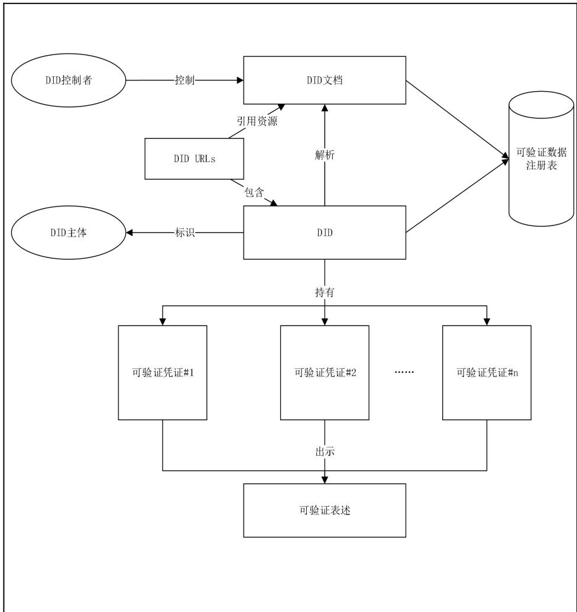  
图 1 DID基本组件关系

## 5.2 区域性股权市场相关主体的 DID编码规则

区域性股权市场中的相关主体主要包括市场服务企业、投资者、区域性股权市场、地方政府机构和区域性股权市场监督管理机构，区域性股权市场相关主体组织结构见图2。

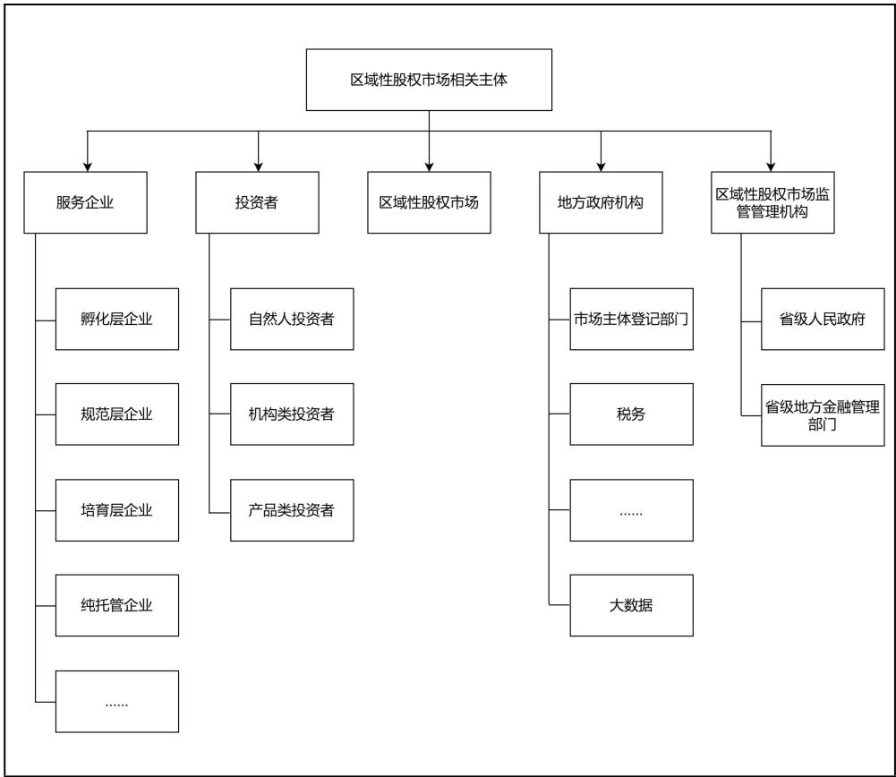  
图 2 区域性股权市场相关主体组织结构

区域性股权市场DID编码规则应符合表1要求。本文件涉及的字符编码规范应符合通用字符编码方法UTF-8。

表 1 区域性股权市场 DID编码规则
<table><tr><td rowspan=1 colspan=1>Scheme</td><td rowspan=1 colspan=1>DID Method</td><td rowspan=1 colspan=1>DID Method Specific Identifier</td></tr><tr><td rowspan=1 colspan=1>did</td><td rowspan=1 colspan=1>rem</td><td rowspan=1 colspan=1>地方业务链标识+&quot;:&quot;+相关主体编码</td></tr></table>

注：表1中rem的英文全称为regional equity markets，表示区域性股权市场。  
其中，区域性股权市场地方业务链标识编码见应符合表2要求。

区域性股权市场相关主体编码应符合表3要求。  
表 2 区域性股权市场地方业务链标识编码
<table><tr><td colspan="1" rowspan="1">序号</td><td colspan="1" rowspan="1">地区</td><td colspan="1" rowspan="1">区域性股权市场名称</td><td colspan="1" rowspan="1">地方业务链标识</td></tr><tr><td colspan="1" rowspan="1">1</td><td colspan="1" rowspan="1">北京</td><td colspan="1" rowspan="1">北京股权交易中心有限公司</td><td colspan="1" rowspan="1">beijing</td></tr><tr><td colspan="1" rowspan="1">2</td><td colspan="1" rowspan="1">天津</td><td colspan="1" rowspan="1">天津滨海柜台交易市场股份公司</td><td colspan="1" rowspan="1">tianjin</td></tr><tr><td colspan="1" rowspan="1">3</td><td colspan="1" rowspan="1">河北</td><td colspan="1" rowspan="1">雄安股权交易所股份有限公司</td><td colspan="1" rowspan="1">hebei</td></tr><tr><td colspan="1" rowspan="1">4</td><td colspan="1" rowspan="1">山西</td><td colspan="1" rowspan="1">山西股权交易中心有限公司</td><td colspan="1" rowspan="1">shanxi</td></tr><tr><td colspan="1" rowspan="1">5</td><td colspan="1" rowspan="1">内蒙古</td><td colspan="1" rowspan="1">内蒙古股权交易中心股份有限公司</td><td colspan="1" rowspan="1">neimenggu</td></tr><tr><td colspan="1" rowspan="1">6</td><td colspan="1" rowspan="1">辽宁</td><td colspan="1" rowspan="1">辽宁股权交易中心股份有限公司</td><td colspan="1" rowspan="1">liaoning</td></tr><tr><td colspan="1" rowspan="1">7</td><td colspan="1" rowspan="1">吉林</td><td colspan="1" rowspan="1">吉林股权交易所股份有限公司</td><td colspan="1" rowspan="1">jilin</td></tr><tr><td colspan="1" rowspan="1">8</td><td colspan="1" rowspan="1">黑龙江</td><td colspan="1" rowspan="1">黑龙江股权交易中心有限责任公司</td><td colspan="1" rowspan="1">heilongjiang</td></tr><tr><td colspan="1" rowspan="1">9</td><td colspan="1" rowspan="1">上海</td><td colspan="1" rowspan="1">上海股权托管交易中心股份有限公司</td><td colspan="1" rowspan="1">shanghai</td></tr><tr><td colspan="1" rowspan="1">10</td><td colspan="1" rowspan="1">江苏</td><td colspan="1" rowspan="1">江苏股权交易中心有限责任公司</td><td colspan="1" rowspan="1"> jiangsu</td></tr><tr><td colspan="1" rowspan="1">11</td><td colspan="1" rowspan="1">浙江</td><td colspan="1" rowspan="1">浙江股权服务集团有限公司</td><td colspan="1" rowspan="1">zhejiang</td></tr><tr><td colspan="1" rowspan="1">12</td><td colspan="1" rowspan="1">安徽</td><td colspan="1" rowspan="1">安徽省股权托管交易中心有限责任公司</td><td colspan="1" rowspan="1">anhui</td></tr><tr><td colspan="1" rowspan="1">13</td><td colspan="1" rowspan="1">福建</td><td colspan="1" rowspan="1">海峡股权交易中心（福建）有限公司</td><td colspan="1" rowspan="1">fujian</td></tr><tr><td colspan="1" rowspan="1">14</td><td colspan="1" rowspan="1">江西</td><td colspan="1" rowspan="1">江西联合股权交易中心股份有限公司</td><td colspan="1" rowspan="1">jiangxi</td></tr><tr><td colspan="1" rowspan="1">15</td><td colspan="1" rowspan="1">山东</td><td colspan="1" rowspan="1">齐鲁股权交易中心有限公司</td><td colspan="1" rowspan="1">shandong</td></tr><tr><td colspan="1" rowspan="1">16</td><td colspan="1" rowspan="1">河南</td><td colspan="1" rowspan="1">中原股权交易中心股份有限公司</td><td colspan="1" rowspan="1">henan</td></tr><tr><td colspan="1" rowspan="1">17</td><td colspan="1" rowspan="1">湖北</td><td colspan="1" rowspan="1">武汉股权托管交易中心有限公司</td><td colspan="1" rowspan="1">hubei</td></tr><tr><td colspan="1" rowspan="1">18</td><td colspan="1" rowspan="1">湖南</td><td colspan="1" rowspan="1">湖南股权交易所有限公司</td><td colspan="1" rowspan="1">hunan</td></tr><tr><td colspan="1" rowspan="1">19</td><td colspan="1" rowspan="1">广东</td><td colspan="1" rowspan="1">广东股权交易中心股份有限公司</td><td colspan="1" rowspan="1">guangdong</td></tr><tr><td colspan="1" rowspan="1">20</td><td colspan="1" rowspan="1">广西</td><td colspan="1" rowspan="1">广西北部湾股权交易所股份有限公司</td><td colspan="1" rowspan="1">guangxi</td></tr><tr><td colspan="1" rowspan="1">21</td><td colspan="1" rowspan="1">海南</td><td colspan="1" rowspan="1">海南股权交易中心有限责任公司</td><td colspan="1" rowspan="1">hainan</td></tr><tr><td colspan="1" rowspan="1">22</td><td colspan="1" rowspan="1">重庆</td><td colspan="1" rowspan="1">重庆股份转让中心有限责任公司</td><td colspan="1" rowspan="1">chongqing</td></tr><tr><td colspan="1" rowspan="1">23</td><td colspan="1" rowspan="1">四川</td><td colspan="1" rowspan="1">天府（四川）联合股权交易中心股份有限公司</td><td colspan="1" rowspan="1">sichuan</td></tr><tr><td colspan="1" rowspan="1">24</td><td colspan="1" rowspan="1">贵州</td><td colspan="1" rowspan="1">贵州股权交易中心有限公司</td><td colspan="1" rowspan="1">guizhou</td></tr><tr><td colspan="1" rowspan="1">25</td><td colspan="1" rowspan="1">云南</td><td colspan="1" rowspan="1">云南省股权交易中心有限公司</td><td colspan="1" rowspan="1">yunnan</td></tr><tr><td colspan="1" rowspan="1">26</td><td colspan="1" rowspan="1">陕西</td><td colspan="1" rowspan="1">陕西股权交易中心股份有限公司</td><td colspan="1" rowspan="1">shaanxi</td></tr><tr><td colspan="1" rowspan="1">27</td><td colspan="1" rowspan="1">甘肃</td><td colspan="1" rowspan="1">甘肃股权交易中心股份有限公司</td><td colspan="1" rowspan="1">gansu</td></tr><tr><td colspan="1" rowspan="1">28</td><td colspan="1" rowspan="1">青海</td><td colspan="1" rowspan="1">青海股权交易中心有限公司</td><td colspan="1" rowspan="1">qinghai</td></tr><tr><td colspan="1" rowspan="1">29</td><td colspan="1" rowspan="1">宁夏</td><td colspan="1" rowspan="1">宁夏股权托管交易中心（有限公司）</td><td colspan="1" rowspan="1">ningxia</td></tr><tr><td colspan="1" rowspan="1">30</td><td colspan="1" rowspan="1">新疆</td><td colspan="1" rowspan="1">新疆股权交易中心有限公司</td><td colspan="1" rowspan="1">xinjiang</td></tr><tr><td colspan="1" rowspan="1">31</td><td colspan="1" rowspan="1">大连</td><td colspan="1" rowspan="1">大连股权交易中心股份有限公司</td><td colspan="1" rowspan="1">dalian</td></tr><tr><td colspan="1" rowspan="1">32</td><td colspan="1" rowspan="1">宁波</td><td colspan="1" rowspan="1">宁波股权交易中心有限公司</td><td colspan="1" rowspan="1">ningbo</td></tr><tr><td colspan="1" rowspan="1">33</td><td colspan="1" rowspan="1">厦门</td><td colspan="1" rowspan="1">厦门两岸股权交易中心有限公司</td><td colspan="1" rowspan="1">xiamen</td></tr><tr><td colspan="1" rowspan="1">34</td><td colspan="1" rowspan="1">青岛</td><td colspan="1" rowspan="1">青岛蓝海股权交易中心有限责任公司</td><td colspan="1" rowspan="1">qingdao</td></tr><tr><td colspan="1" rowspan="1">35</td><td colspan="1" rowspan="1">深圳</td><td colspan="1" rowspan="1">深圳前海股权交易中心有限公司</td><td colspan="1" rowspan="1">shenzhen</td></tr></table>

示例：  
表 3 区域性股权市场相关主体编码  
上海股权托管交易中心股份有限公司服务企业的DID编码：did:rem:shanghai:SH000001F.S2101
<table><tr><td colspan="1" rowspan="1">主体类型</td><td colspan="1" rowspan="1">编码规则</td><td colspan="1" rowspan="1">编码配发</td><td colspan="1" rowspan="1">说明</td></tr><tr><td colspan="1" rowspan="1">服务企业</td><td colspan="1" rowspan="1">辖区编码+企业数字编码+企业分层（类）编码（或有）</td><td colspan="1" rowspan="1">由区域性股权市场自主配发并跨链同步至监管链</td><td colspan="1" rowspan="1"></td></tr><tr><td colspan="1" rowspan="1">投资者</td><td colspan="1" rowspan="1">投资者类别编码+投资者数字编码</td><td colspan="1" rowspan="1">由区域性股权市场向监管链发送请求，由监管链统一配发以确保唯一性</td><td colspan="1" rowspan="1"></td></tr><tr><td colspan="1" rowspan="1">区域性股权市场</td><td colspan="1" rowspan="1">统一社会信用代码</td><td colspan="1" rowspan="1"></td><td colspan="1" rowspan="1">应符合GB 32100</td></tr><tr><td colspan="1" rowspan="1">地方政府机构</td><td colspan="1" rowspan="1">统一社会信用代码</td><td colspan="1" rowspan="1"></td><td colspan="1" rowspan="1">应符合GB 32100</td></tr><tr><td colspan="1" rowspan="1">区域性股权市场监督管理机构</td><td colspan="1" rowspan="1">统一社会信用代码</td><td colspan="1" rowspan="1"></td><td colspan="1" rowspan="1">应符合GB 32100</td></tr></table>

江苏股权交易中心有限责任公司自然人投资者的DID编码：did:rem:jiangsu:Q123456789

## 5.3 区域性股权市场 DID 存储及解析架构

区域性股权市场分布式数字身份系统中的可验证数据注册表采用区块链技术来实现，其存储解析应满足：

—依托于现有的监管链-业务链双层链架构，区域性股权市场注册的DID及其相应的DID文档应存储在地方业务链上；

对于本地的DID访问请求，地方业务链上的DID解析器应可解决；

—对于跨链（跨区域）的DID解析请求，监管链应通过部署全局DID解析器来解决跨域解析问题。双层链架构下的DID存储及解析应符合图3要求。

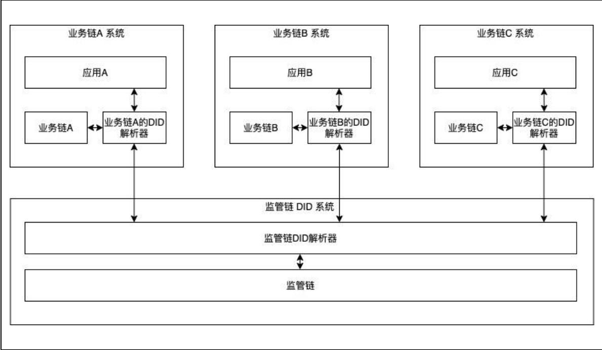  
图 3 双层链架构下的 DID 存储及解析

DID解析流程应符合图 4 要求。

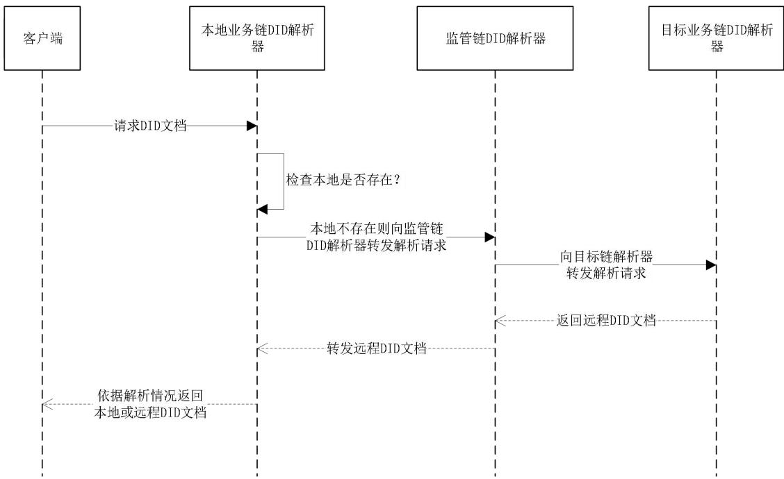  
图 4 DID解析流程

附录A给出了区域性股权市场DID系统部署示例。

## 5.4 区域性股权市场 DID 解析接口

## 5.4.1 解析请求方式

应通过执行包含以下元素的HTTPGET来读取DID文档。即要查询DID文档，应向解析器提交如下所示的解析请求：

```batch
GET /did:rem:shanghai:SH000001F.S2101 HTTP/1.1 Content-Type:application/did+ld+json
resolutionOptions:application/did+ld+json
```

解析器接收到解析请求后应按照图4所示的解析流程完成DID解析并返回解析结果。解析结果应符合5.4.2的要求，附录B给出了具体示例。

## 5.4.2 解析返回结果

DID解析器在接收到解析请求后会返回解析结果，DID解析结果为JSON结构，由3部分组成：DID解析元数据didResolutionMetadata、DID文档元数据didDocumentMetadata和DID文档流didDocumentStream。附录B给出了区域性股权市场DID解析结果示例。

其中 ，解 析元数 据didResolutionMetadata的属 性定 义应符 合5.4.3的要 求， DID文档 元数 据didDocumentMetadata的属性定义应符合5.4.4的要求，DID文档流didDocumentStream为DID文档，结构和属性定义应符合第6章的要求。

## 5.4.3 DID 解析元数据属性

## 5.4.3.1 内容类型

```hcl
contentType
{
"contentType":"application/did+ld+json"
}
```

内容类型属性描述了didDocumentStream 的数据结构。

## 5.4.3.2 错误

```hcl
error
{
"error":"notFound"
}
```

错误属性表示解析错误信息，无错误时不展示。解析元数据中的错误编码应符合表4要求。

表4 解析元数据中的错误编码
<table><tr><td rowspan=1 colspan=1>编号</td><td rowspan=1 colspan=1>错误值</td><td rowspan=1 colspan=1>含义</td></tr><tr><td rowspan=1 colspan=1>1</td><td rowspan=1 colspan=1>InvalidDid</td><td rowspan=1 colspan=1>输入到DID解析器的DID不合法</td></tr><tr><td rowspan=1 colspan=1>2</td><td rowspan=1 colspan=1>notFound</td><td rowspan=1 colspan=1>DID解析器找不到对应的DID文档</td></tr><tr><td rowspan=1 colspan=1>3</td><td rowspan=1 colspan=1>representationNotSupported</td><td rowspan=1 colspan=1>输入到DID解释器的表示方式不支持</td></tr><tr><td rowspan=1 colspan=1>4</td><td rowspan=1 colspan=1>internalError</td><td rowspan=1 colspan=1>DID解释器内部错误</td></tr></table>

## 5.4.4 DID 文档元数据属性

## 5.4.4.1 创建时间

created  
{  
"created":"2019-03-23T06:35:22Z"  
}  
创建时间属性表示DID文档的创建时间，属性值应为dateTime字符串。

## 5.4.4.2 更新时间

updated  
{  
"updated":"2023-08-10T13:40:06Z"  
}  
更新时间属性表示DID文档的最后更新时间，属性值应为dateTime字符串。

## 5.4.4.3 是否停用

deactivated   
{   
"deactivated":true   
}

是否停用属性为Boolean值，表示返回的DID文档是否为停用状态。如果当前DID文档已停用则该属性的值为true，否则为false。

## 5.4.4.4 版本号

versionId   
{

版本号属性为字符串类型，用来表示DID文档的版本号。

## 6 区域性股权市场 DID文档及其属性

## 6.1 DID 文档

## 6.1.1 DID 文档构成

DID文档包含与DID相关联的信息，应包括验证方法以及与DID主体交互相关的服务。DID文档中的属性应符合6.2中的要求。

## 6.1.2 DID 文档序列化

DID文档可以序列化为字节流。区域性股权市场分布式数字身份系统中DID文档序列化后的结果应为JSON-LD结构，该结构可作为DID解析器的输出结果。附录C给出了区域性股权市场DID文档示例。

## 6.2 DID 文档中的属性

## 6.2.1 标识

```jsonl
id
{
"id":"did:rem:shanghai:SH000001F.S2101"
}
```

标识属性用于表明DID文档的主体，本文件中应为DID编码，编码规则应符合5.2中的规定。标识属性为必选项。

## 6.2.2 别名

alsoKnownAs   
{   
"alsoKnownAs":["https://remExample.com/","did:rem:shanghai:SH000001F.S2101"]   
}

别名属性为可选项。

注：一个DID主体可以有多个标识符，例如：可以使用 alsoKnownAs 属性表明两个或多个DID引用同一个DID主体；可将主体的官方网站设定为alsoKnownAs属性值；也可将主体已有的数字证书标识作为alsoKnownAs属性值。

## 6.2.3 控制者

controller   
{   
"controller":"did:rem:shanghai:SH000001F.S2101"   
}

控制者属性为必选项。

注：DIDcontroller是被授权能够对DID文档进行更改的实体，该字段的值为被授权实体的DID。授权DIDcontroller的过程是由DID方法定义的。

## 6.2.4 验证方法

verificationMethod   
{   
"verificationMethod":[{   
"id":"did:rem:shanghai:SH000001F.S2101#keys-1",   
"type":"SM2VerificationKey2022",   
"controller":"did:rem:shanghai:SH000001F.S2101",   
"publicKeyJwk":...   
},{   
"id":.. .,   
"type" :..   
"controller":..   
"publicKeyJwk":...   
}]   
}   
验证方法属性为必选项。验证方法可包括如下参数：   
—id   
验证方法的标识符，应定义为DID标识符连接片段（fragment）的方式。   
type

type

type属性的值为引用一个验证方法类型的字符串。本文件中宜使用"SM2VerificationKey2022"，相关定义应符合附录D的要求。

controller

控制者属性的值为一个DID标识符，表明当前验证方法的控制者。

publicKeyJwk

该值为一个JWK结构。本文件中宜使用"SM2VerificationKey2022"的JWK结构，相关定义应符合附录D的要求。

注：一个DID文档可以表明验证方法，它可以用来验证或授权与DID主体或关联方的交互。例如，可将公钥用作数字签名的验证。

## 6.2.5 认证

```jsonl
authentication
{
"authentication":[
"did:rem:shanghai:SH000001F.S2101#keys-1",//通过id直接引用
{
"id":"did:rem:shanghai:SH000001F.S2101#keys-2",
"type":"SM2VerificationKey2022",
"controller":"did:rem:shanghai:SH000001F.S2101",
"publicKeyJwk":...
} //内嵌式定义
]
}
```

认证属性为可选项。

注：authentication验证关系用于指定如何对DID主体进行身份验证，用于登录网站或参与任何类型的挑战-响应协议等目的。验证关系的属性值为一组验证方法，验证方法可内嵌在验证关系中定义或通过id直接引用verificationMethod。

## 6.2.6 声明方法

```javascript
assertionMethod
{
"assertionMethod":[
"did:rem:shanghai:SH000001F.S2101#keys-1",//通过id直接引用
{
"id":"did:rem:shanghai:SH000001F.S2101#keys-2",
"type":"SM2VerificationKey2022",
"controller":"did:rem:shanghai:SH000001F.S2101",
"publicKeyJwk":{
"kty":"EC",
"crv":"SM2",
"x":"dWCvM4fTdeM0KmloF57zxtBPXTOythHPMm1HCLrdd3A",
"y":"36uMVGM7hnw-N6GnjFcihWE3SkrhMLzzLCdPMXPEXlA"
}
} //内嵌式定义
]
}
声明方法属性为可选项。
注：assertionMethod验证关系用于指定DID主体期望如何表达声明，例如用于发布一个可验证凭证。声明关系的属
性值为一组验证方法，验证方法可内嵌在验证关系中定义或通过id直接引用verificationMethod。
```

## 6.2.7 服务

service  
{  
"service":{  
"id":"did:rem:shanghai:SH000001F.S2101#linked-domain",  
"type":"LinkedDomains",  
"serviceEndpoint":"https://bar.rem.com"}  
}  
服务属性为可选项。服务可包括如下参数：  
——id  
id 属性的值应为 URI。  
—type  
type 属性的值应为一个或一组字符串，可由应用自定义。  
serviceEndpoint  
serviceEndpoint 属性的值应为一个有效的 URI。  
注：服务在DID文档中用于表示与DID主体或关联实体通信的方式。服务可以是DID主体想要发布的任何类型的服务，

包括用于进一步发现、身份验证、授权或交互的分布式身份管理服务。

## 7 区域性股权市场可验证凭证及其属性

## 7.1 可验证凭证 VC

可验证凭证的使用过程中涉及凭证的颁发者、凭证的持有者和凭证的验证者三方角色。可验证凭证的流转应符合图 5 要求。

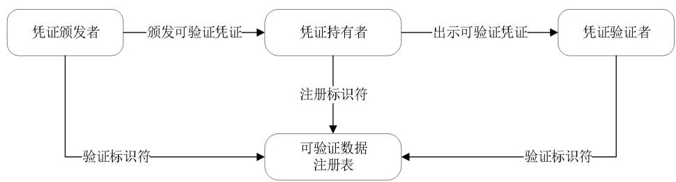  
图 5 可验证凭证的流转

可验证凭证的结构应符合图 6 要求。

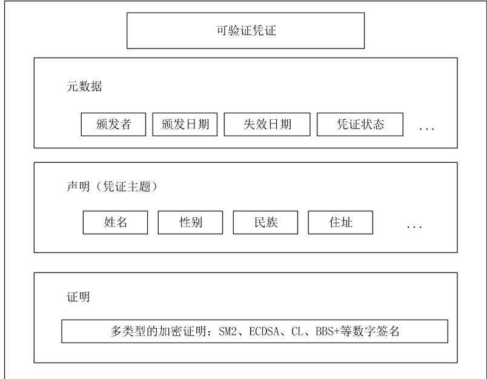  
图 6 可验证凭证的结构

## 7.2 可验证凭证中的属性

## 7.2.1 标识

```jsonl
id
{
"id":"did:rem:shanghai:VC000001"
}
```

标识属性用于表明凭证的唯一标号，类型为URI。标识属性为必选项。

## 7.2.2 类型

```jsonl
type
{
"type":[
"VerifiableCredential",
"DegreeCredential"
]
}
```

类型属性用于表明可验证凭证的类型的集合，本文件中应为"VerifiableCredential"及可选的子类型。子类型可由应用自定义。类型属性为必选项。

## 7.2.3 颁发者

issuer   
{   
"issuer":"did:rem:shanghai:SH000001F.S2101"   
}

颁发者属性用于表明凭证的发行主体，本属性值应为一个DID，以标识该主体。颁发者属性为必选项。

## 7.2.4 颁发日期

颁发日期属性用于表明凭证的颁发时间，本属性值应为dateTime字符串。颁发日期属性为必选项。

## 7.2.5 失效日期

expirationDate   
{   
"expirationDate":"2010-01-01T19:23:24Z"   
}

失效日期属性用于表明凭证的失效时间，本属性值应为dateTime字符串。失效日期属性为必选项。

## 7.2.6 凭证状态

```jsonl
credentialStatus
"credentialStatus":{
"id":"https://rem.edu/vcstatus/24",
"type": "VCStatus2022"
}
```

凭证状态属性用于表明凭证的目前状态，其中id属性应为URI，type属性表明凭证状态的验证方式，本文件中type属性值应为字符串“VCStatus2022”。凭证状态属性为必选项。

type属性“VCStatus2022”定义的凭证状态判断方法为：

当验证者访问id属性的URI时，返回的JSON数据结构应为当前可验证凭证状态，其结构定义如下：

"id":"did:rem:shanghai:VC000001",   
"credentialStatus":"valid"   
}

返回结构应包括如下参数：

id

id 属性为凭证标识，格式见7.2.1。此属性的值应同当前凭证的id字段相同。

credentialStatus

credentialStatus属性表示可验证凭证当前状态。其类型为字符串，可选值为"valid"、"revoked"和"notExist"，分别表示凭证状态的“有效”、“已撤销”和“不存在”。

## 7.2.7 凭证主题

```jsonl
credentialSubject
"credentialSubject":{
"id":"did:rem:shanghai:SH000001F.S2101",
"classification":"accredited investor"
}
```

凭证主题属性为可选项。其中主体由id字段来指定，应为DID标识符。

注：一个可验证凭证中包括多个关于主体的声明，用来描述主体的属性。凭证主题即表示这些关于主体的声明。一个凭证主题可包括对多个主体的声明。

示例：

```jsonl
"credentialSubject":[{
"id":"did:rem:jiangsu:Q123456789",
"name":"Zhang San",
"spouse":"did:rem:jiangsu:Q123456780"},{
"id":"did:rem:jiangsu:Q123456780",
"name":"Li Si",
"spouse":"did:rem:jiangsu:Q123456789" }]
```

## 7.2.8 证明

proof   
"proof":{   
"type":"SM2Signature2022",   
"created":"2021-11-13T18:19:39Z",   
"verificationMethod":"did:rem:shanghai:SH000001F.S2101#keys-1",   
"proofPurpose":"assertionMethod",   
"proofValue":"z58DAdFfa9SkqZMVPxAQpic7ndSayn1PzZs6ZjWp1CktyGesjuTSwRdo   
WhAfGFCF5bppETSTojQCrfFPP2oumHKtz"

证明属性为必选项，一个可验证凭证至少应包括一个证明以用来验证凭证的完整性。本文件宜使用SM2Signature2022的证明方法，SM2Signature2022的结构应符合附录F的要求。

## 8 区域性股权市场可验证表述及其属性

## 8.1 可验证表述 VP

可验证表述包括一或多个可验证凭证及其持有证明。凭证持有者通过可验证表述向凭证验证者出示其凭证数据并证明其正确的持有关系。

可验证表述的结构应符合图 7 要求。

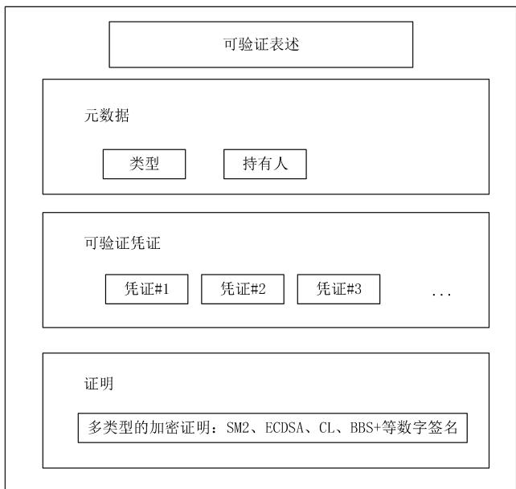  
图 7 可验证表述的结构

## 8.2 可验证表述中的属性

## 8.2.1 类型

type   
{   
"type":[   
"VerifiablePresentation" ,   
"DegreePresentation"   
]   
}

类型属性用于表明可验证表述的类型，本文件中应为"VerifiablePresentation"及可选的子类型。子类型可由应用自定义。类型属性为必选项。

## 8.2.2 持有者

holder   
{   
"holder":"did:rem:shanghai:SH000001F.S2101"   
}

持有者属性用于表明表述的持有者，本属性值应为一个DID，以标识该主体。

## 8.2.3 可验证凭证

verifiableCredential  
{  
"verifiableCredential":[...]  
}  
可验证凭证为集合属性，包括一或多个持有者出示的可验证凭证。

## 8.2.4 证明

proof   
"proof":{   
"type":"SM2Signature2022",   
"created":"2021-11-13T18:19:39Z",   
"verificationMethod":"did:rem:shanghai:SH000001F.S2101#keys-1",   
"proofPurpose":"assertionMethod",   
"nonce":"_HqG_B-H4ps=",   
"proofValue":"z58DAdFfa9SkqZMVPxAQpic7ndSayn1PzZs6ZjWp1CktyGesjuTSwRdo   
WhAfGFCF5bppETSTojQCrfFPP2oumHKtz"

VP中的证明结构同VC中的证明结构基本相同，但增加了用于存储随机数字符串的nonce属性，以防止重放攻击。nonce字段为随机数的Base64URL编码值。

证明用来验证持有者对表述的正确持有关系。其中verificationMethod中的DID前缀应同holder中的相同。如果持有者出示的为自身凭证，holder字段应同凭证中凭证主题的id字段相同。本文件宜使用SM2Signature2022的证明方法，附录B给出了具体示例。

## 9 区域性股权市场分布式数字身份的关键业务流程

## 9.1 DID 的创建

系统中的实体可向DID管理机构提交DID创建申请，DID管理机构通过DID创建流程在区域性股权市场分布式数字身份系统中完成DID的注册和创建。DID创建过程应符合如下要求：

a) 个人和机构实体DID创建过程应确保身份的真实可信，其中身份注册和身份核实环节应符合JR/T 0184中13.3和13.4的要求；

b) 实体DID编码应符合5.2的编码规则；

c) 创建的DID文档应包括6.2中规定的必选项属性。

DID创建流程应符合图8要求。

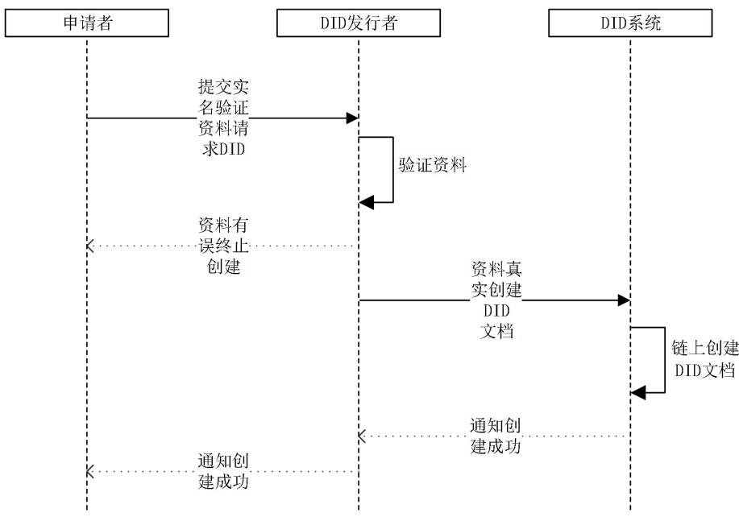  
图 8 DID创建流程

## 9.2 DID 的撤销

DID的撤销应满足：

a) 系统中的已注册实体可向DID管理机构提交DID撤销申请，DID管理机构通过DID撤销流程在区域性股权市场分布式数字身份系统中完成DID的撤销；

b) 被撤销的DID不能被使用，实体可向DID管理机构提交新的DID创建申请，具体创建流程见9.1；

c) DID撤销过程应确保个人和机构实体的身份真实可信，其中身份核实环节应符合JR/T 0184中13.4的要求。

DID撤销流程应符合图9要求。

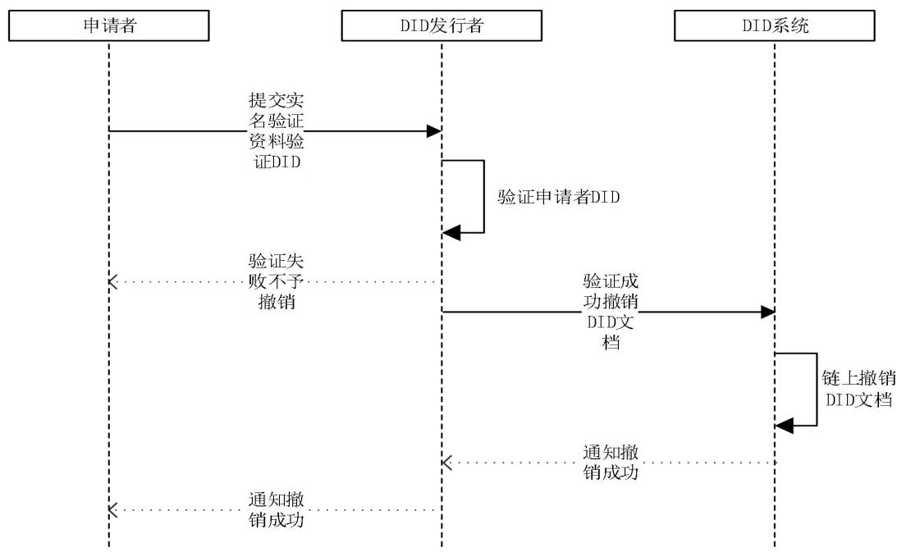  
图 9 DID撤销流程

## 9.3 DID 的验证

系统中的 DID持有者可向验证者证明其为 DID的真正持有者。DID持有验证流程应符合图 10 要求。

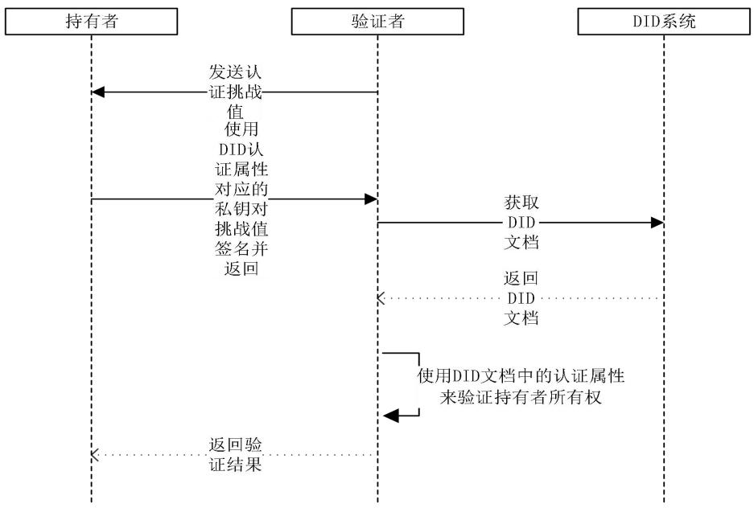  
图 10 DID持有验证流程

## 9.4 VC 的颁发

具有实体证书颁发资质的机构在系统中完成注册后可进行可验证凭证的颁发。颁发过程应符合如下要求：

a) 实体DID编码应符合5.2的编码规则；

b) 申请应通过9.3中规定的DID持有验证；

c) 颁发的可验证凭证属性应符合7.2中的规定。

VC颁发流程应符合图11要求。

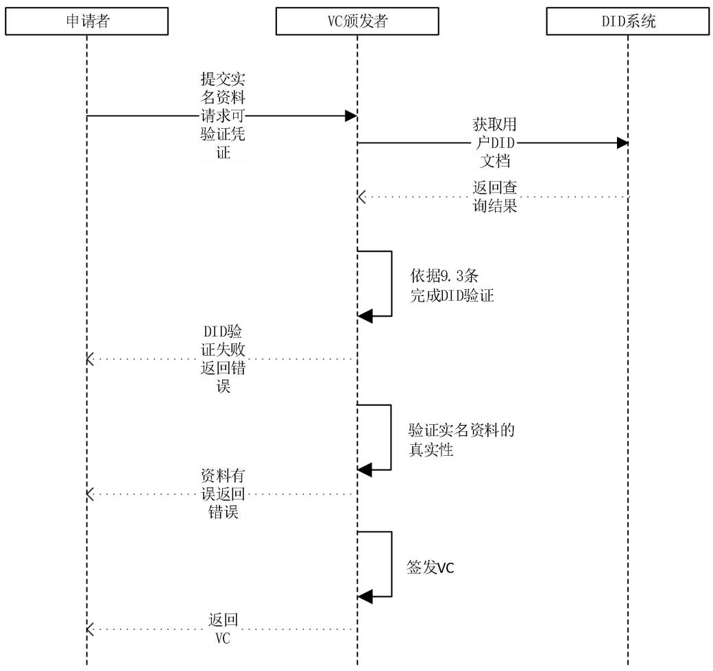  
图 11 VC颁发流程

## 9.5 VC 的验证

凭证验证者应验证VC的正确性。验证过程应确保：

a) 实体DID编码应符合5.2的编码规则；

b) 待验证的VC属性应符合7.2中的规定；

c) 应验证VC的有效期是否有效；

d) 应验证VC的状态是否有效；

e) 应验证VC中证明属性的正确性。

VC验证流程应符合图12要求。

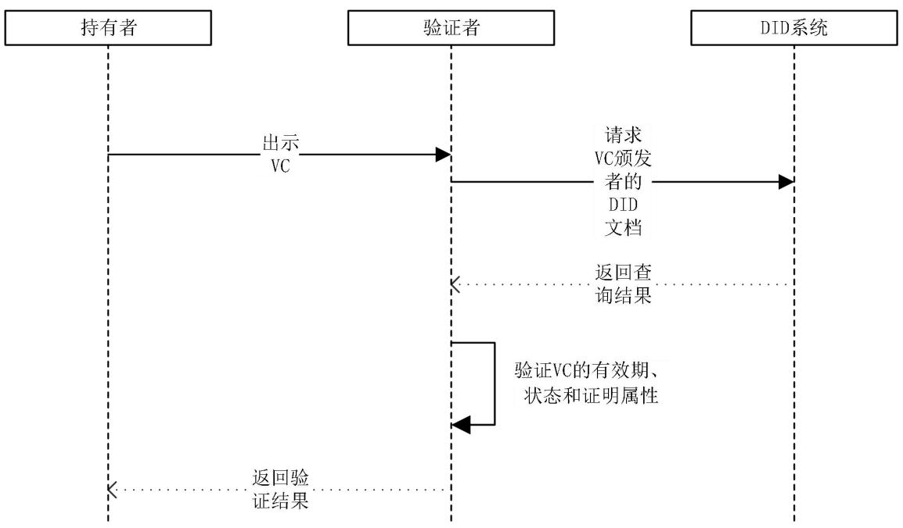  
图 12 VC验证流程

## 9.6 VP 的验证

凭证的持有者可向验证者出示VP，验证者通过VP的验证流程确保VC凭证内容的真实性和VP的正确持有关系。验证过程应确保：

a) VP中证明属性的正确性；

b) 依据9.5的规则验证VP中包含的每一个VC的正确性；

c) 如果VP出示者同VC持有者为同一主体，VP中的holder属性应同VC中凭证主题的id属性相同。  
VP验证流程应符合图13要求。

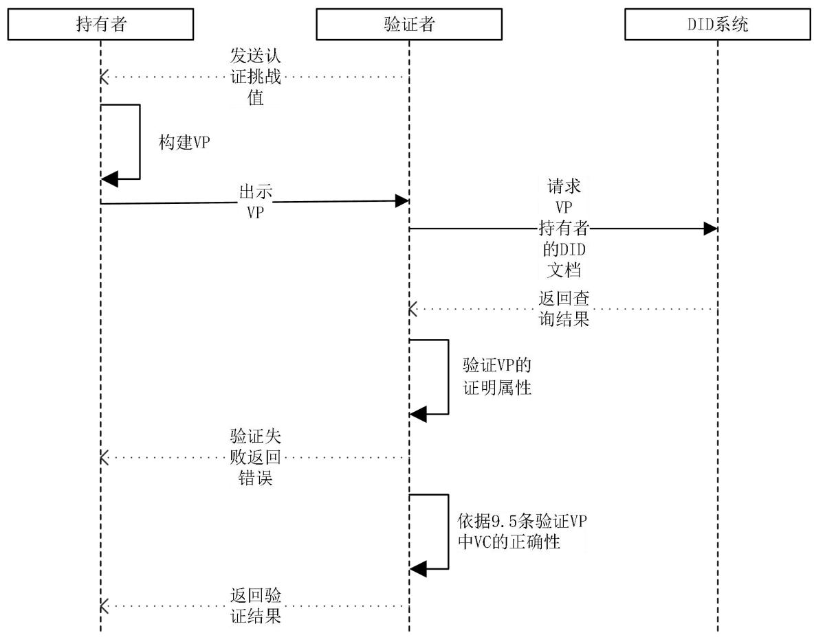  
图 13 VP验证流程

## 9.7 VC 的撤销

不再使用的凭证可通过撤销流程完成VC的撤销。撤销过程应确保在凭证撤销后验证者可通过凭证中的凭证状态属性正确获得该凭证的撤销信息。

VC撤销流程应符合图14要求。

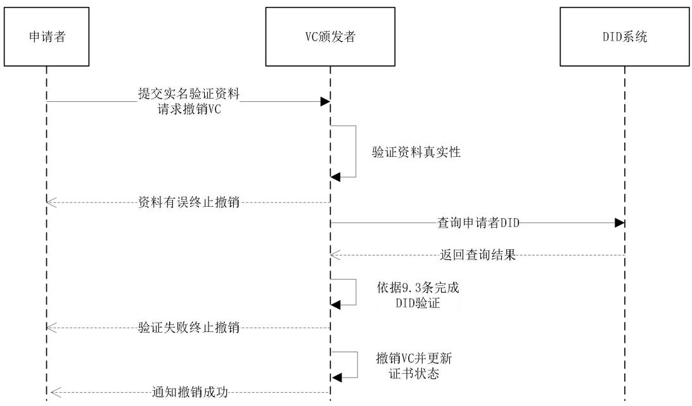  
图 14 VC撤销流程

## 10 区域性股权市场基于 DID 和 VC 的数据流通机制

## 10.1 以数据主体为中心的数据流通

在以数据主体为中心的数据流通中，数据主体持有关于主体属性的VC。数据主体基于VC中的数据向数据使用方提供关于主体的属性信息。为了确保数据主体提供数据的真实性和完整性，数据主体（如：市场主体）和数据使用方（如：专精特新企业画像服务）应完成如下操作：

a) 数据主体应采用VP的方式向数据使用方提供数据；

b) 数据使用方应按照9.6中的要求验证VP的正确性。

以数据主体为中心的数据流通流程应符合图15要求。

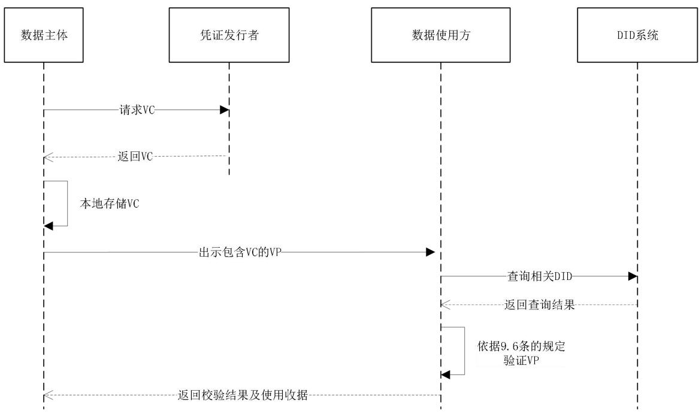  
图 15 以数据主体为中心的数据流通流程

## 10.2 机构代理模式的数据流通

在机构代理模式的数据流通中，机构代理存储数据主体的VC。数据主体基于机构代理存储VC中的数据向数据使用方提供关于主体的属性信息。为了确保数据主体提供数据的真实性和完整性，数据主体、机构和数据使用方应完成如下操作：

a) 代理机构在向数据使用方提供VC前，应获得数据主体的明示同意；明示同意宜使用授权VC的方式；

b) 代理机构应采用VP的方式向数据使用方提供数据；当采用授权VC的方式时，代理机构还应向数据使用方出示授权VC；

c) 代理机构应采用VP的方式向数据使用方提供数据；

d) 数据使用方应按照9.6中的要求验证VP的正确性，当采用授权VC的方式时，数据使用方应按照9.5中的要求验证授权VC的正确性。

机构代理模式的数据流通流程应符合图16要求。

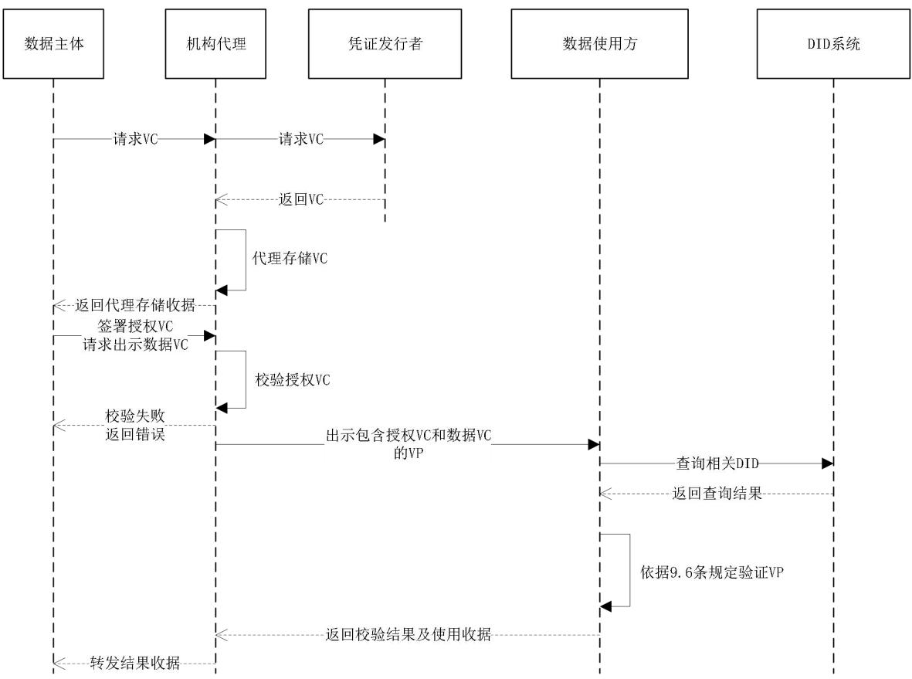  
图 16 机构代理模式的数据流通流程

## 10.3 以机构为中心的数据流通

在以机构为中心的数据流通中，数据主体的数据存储在数据提供方。例如：地方大数据局、区域性股权市场等可以作为中心的机构，并在该场景中担任数据提供方的角色。数据使用方在获得数据主体的授权后向数据提供方查询数据。数据使用方通过数据提供方获得关于主体属性信息的VC。为了确保主体数据的真实性和完整性，数据主体、数据提供方和数据使用方应完成如下操作：

a) 数据使用方在向数据提供方查询数据前应获得数据主体对代理查询行为的明示同意；明示同意宜使用授权VC的方式；

b) 当采用授权VC的方式时，数据使用方应采用VP的方式向数据提供方出示授权VC；

c) 数据使用方应按照 9.6中的要求验证 VP 的正确性。当采用授权 VC的方式时，数据使用方应按照 9.5中的要求验证授权 VC的正确性；

d) 数据提供方应采用VC的方式向数据使用方提供数据；

e) 数据使用方应按照9.5中的要求验证VC的正确性。

以机构为中心的数据流通流程应符合图17要求。

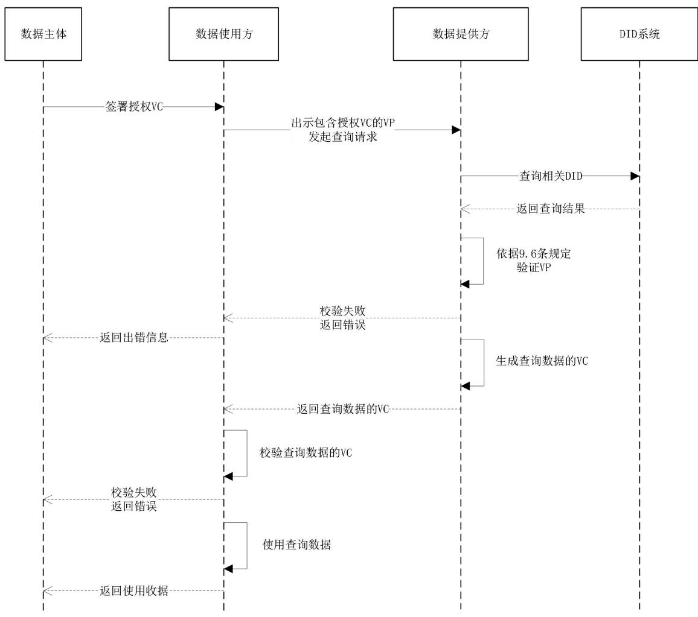  
图 17 以机构为中心的数据流通流程

附 录 A

（资料性）

区域性股权市场 DID系统部署示例

图A.1是区域性股权市场DID系统部署示例。  
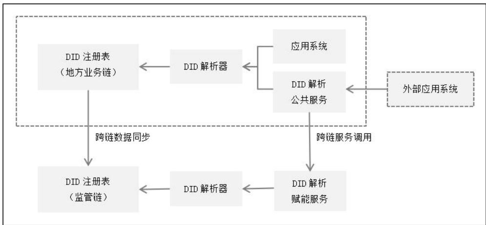  
图 A.1 区域性股权市场 DID 系统部署示例

## 附 录 B（资料性）区域性股权市场 DID解析结果示例

以上海区域性股权市场某机构投资者主体为例的DID解析结果如下：

```jsonl
{
"didResolutionMetadata":{
"contentType":"application/did+ld+json"},
"didDocumentMetadata":{
"created":"2019-03-23T06:35:22Z",
"updated":"2022-08-10T13:40:06Z",
"deactivated":false,
"versionId":"bafyreifederejlobaec6kwpl2mc3tw7qk3j3ey4uytkbiw2qw7dzylud6i"
},
"didDocument":{
"@context":"https://www.w3.org/ns/did/v1",
"id":"did:rem:shanghai:SH000001F.S2101",
"alsoKnownAs":"https://www.agency.sh.com.cn",
"controller":"did:rem:shanghai:SH000001F.S2101",
"verificationMethod":
{
"id":"did:rem:shanghai:SH000001F.S2101#keys-1",
"type":"SM2VerificationKey2022",
"controller":"did:rem:shanghai:SH000001F.S2101",
"publicKeyJwk":{
"kty":"EC",
"crv":"SM2",
"x":"dWCvM4fTdeM0KmloF57zxtBPXTOythHPMm1HCLrdd3A",
"y":"36uMVGM7hnw-N6GnjFcihWE3SkrhMLzzLCdPMXPEXlA"}
},
"assertionMethod":
{
"id":"did:rem:shanghai:SH000001F.S2101#keys-1"
},
"service":
{
"id":"did:rem:shanghai:SH000001F.S2101#linkedDomains",
"type":"LinkedDomains",
"serviceEndpoint":"https://www.agency.sh.com.cn/linkedDomain"
}
}
```

## 附 录 C（资料性）区域性股权市场 DID文档示例

以上海区域性股权市场某机构投资者主体为例的DID文档结构如下：

```jsonl
{
"@context":"https://www.w3.org/ns/did/v1",
"id":"did:rem:shanghai:SH000001F.S2101",
"alsoKnownAs":"https://www.agency.sh.com.cn ",
"controller":"did:rem:shanghai:SH000001F.S2101",
"verificationMethod":
{
"id":"did:rem:shanghai:SH000001F.S2101#keys-1",
"type":"SM2VerificationKey2022",
"controller":"did:rem:shanghai:SH000001F.S2101",
"publicKeyJwk":{
"kty":"EC",
"crv":"SM2",
"x":"dWCvM4fTdeM0KmloF57zxtBPXTOythHPMm1HCLrdd3A",
"y":"36uMVGM7hnw-N6GnjFcihWE3SkrhMLzzLCdPMXPEXlA"}
},
"assertionMethod":
{
"id":"did:rem:shanghai:SH000001F.S2101#keys-1"
},
"service":
{
"id":"did:rem:shanghai:SH000001F.S2101#linkedDomains",
"type":"LinkedDomains",
"serviceEndpoint":"https://www.agency.sh.com.cn//linkedDomain"
}
1
```

## 附 录 D（规范性）SM2密码算法的验证方法

基于SM2密码算法定义的验证方法命名为SM2VerificationKey2022，其具体格式定义如下：  
id：验证方法的标识符，应定义为 DID 标识符连接片段（fragment）的方式；  
type：定义为 SM2VerificationKey2022；  
controller：表示验证方法的控制者，值为控制者的 DID；  
publicKeyJwk：为 SM2 算法公钥的 JWK 结构表示。  
SM2VerificationKey2022验证方法示例如下：  
"verificationMethod":  
{  
"id":"did:rem:shanghai:SH000001F.S2101#keys-1",  
"type":"SM2VerificationKey2022",  
"controller":"did:rem:shanghai:SH000001F.S2101",  
"publicKeyJwk":{  
"kty":"EC",  
"crv":"SM2",  
"x":"dWCvM4fTdeM0KmloF57zxtBPXTOythHPMm1HCLrdd3A",  
"y":"36uMVGM7hnw-N6GnjFcihWE3SkrhMLzzLCdPMXPEXlA"}  
}  
其中，坐标（x,y）的值为大端（big-endian）模式的Base64URL编码。

## 附 录 E（资料性）区域性股权市场可验证凭证示例

## E.1 场景一：合格投资者认证

投资者已完成DID注册，此时投资者需要证明自己具有投资资质，则需要向认证机构申请合格投资者认证。

"@context":[   
"https://www.w3.org/2018/credentials/v1",   
"https://www.rem.com/2022/credentials/rems/v1"   
],   
"id":"https://www.china-see.com/credentials/3562",   
"type":["VerifiableCredential","QualifiedInvestorCredential"],   
"issuer":"did:rem:shanghai:91310000564759688N",   
"issuanceDate":"2010-01-01T19:23:24Z",   
"expirationDate":"2020-01-01T19:23:24Z",   
"credentialSubject":{   
"id":"did:rem:shanghai:SH000001F.S2101",   
"riskTolerance":{   
"type":"qualified",   
"description":"a qualified investor",   
"investorType":"institution",   
"accountOpeningDate":"2020-01-01T19:23:24Z"   
},   
"credentialStatus":{   
"id":"https://www.china-see.com/vcstatus/24",   
"type":"VCStatus2022"   
},   
"proof":{   
"type":"SM2Signature2022",   
"created":"2021-11-13T18:19:39Z",   
"verificationMethod":"did:rem:shanghai:91310000564759688N#keys-1",   
"proofPurpose":"assertionMethod",   
"proofValue":"z58DAdFfa9SkqZMVPxAQpic7ndSayn1PzZs6ZjWp1CktyGesjuTSwRdoWhAfGFC   
F5bppETSTojQCrfFPP2oumHKtz"

JR/T 0325—2024

## E.2 场景二：投资者学历认证

场景说明投资者已完成DID注册，此时投资者需要证明自己的学历资质，则需要向相关机构（毕业院校、学信网等）申请学历认证获得学历证明的VC。

```jsonl
"@context":[
"https://www.w3.org/2018/credentials/v1",
"https://www.w3.org/2018/credentials/rems/v1"
],
"id":"http://rem.edu/credentials/3732",
"type":["VerifiableCredential","UniversityDegreeCredential"],
"issuer":"did:rem:beijing:1210000040088209X1",
"issuanceDate":"2010-01-01T19:23:24Z",
"expirationDate":"2020-01-01T19:23:24Z",
"credentialSubject":{
"id":"did:rem:jiangsu:Q123456789",
"degree":{
"type":"BachelorDegree",
"name":"BachelorofEngineering"}
},
"credentialStatus":{
"id":"https://rem.edu/vcstatus/24",
"type":"VCStatus2022"
}，
"proof":{
"type":"SM2Signature2022",
"created":"2021-11-13T18:19:39Z",
"verificationMethod":"did:rem:beijing:1210000040088209X1#key-1",
"proofPurpose":"assertionMethod",
"proofValue":"z58DAdFfa9SkqZMVPxAQpic7ndSayn1PzZs6ZjWp1CktyGesjuTSwRdo
WhAfGFCF5bppETSTojQCrfFPP2oumHKtz"
}
}
```

## E.3 场景三：征信数据查询授权证明

市场主体已完成 DID注册。市场主体为了办理新的业务（如：专精特新企业申请），则需要授权给区域性股权市场从征信机构获取企业相关的数据，以便可以更好地评估企业状况。

```jsonl
"@context":["https://www.w3.org/2018/credentials/v1"],
"id":"did:rem:shanghai:VC000003",
"type":["VerifiableCredential","CreditDataAuthorization","LegalEntity"],
"issuer":"did:rem:shanghai:SH000001F.S2101",
"issuanceDate":"2022-10-01T19:33:24Z",
```

```jsonl
"expirationDate":"2023-10-01T19:33:24Z",
"credentialSubject":{
"version":"v1.0",// 授权数据协议版本
//市场企业主体 DID
"id":"did:rem:shanghai:SH000001F.S2101",
"authorization":{
// 被授权人 DID 列表，如：区域性股权市场
"lisensee":["did:rem:shanghai:91310000564759688N"],
// 授权有效时间范围
"startDate":"2022-10-01T19:33:24Z",
"endDate":"2022-11-01T19:33:24Z",
"dataItems":["工商信息","社保缴纳"],//授权数据细项
//主体信息
"entityInfo":{
"enterpriseName":"企业名称",
"enterpriseUSCI":"企业统一社会信用代码"
},
"attachment":"授权协议电子文档格式(可选)"
}
},
"proof":{ /
"type":"SM2Signature2022",
"created":"2022-10-01T19:35:10Z",
"verificationMethod":"did:rem:shanghai:SH000001F.S2101#keys-2",
"proofPurpose":"assertionMethod",
"proofValue":
"eyJhbGciOiJSUzI1NiIsImI2NCI6ZmFsc2UsImNyaXQiOlsiYjY0Il19..TCYt5X
sITJX1CxPCT8yAV-TVkIEq_PbChOMqsLfRoPsnsgw5WEuts01mq-pQy7UJiN5mgRxD-WUc
X16dUEMGlv50aqzpqh4Qktb3rk-BuQy72IFLOqV0G_zS245-kronKb78cPN25DGlcTwLtj
PAYuNzVBAh4vGHSrQyHUdBBPM"
}
}
```

## E.4 场景四：征信数据真实性证明

为了保证征信数据来源的真实性，征信机构返回企业征信数据或征信报告的同时，附带由征信机构签署的数据真实性证明。

```jsonl
"@context":["https://www.w3.org/2018/credentials/v1"],
"id":"qwertyuiwuiwertyuertyuertyuertyu",
"type":["VerifiableCredential","CreditData","LegalEntity"],
// 征信机构 DID
"issuer":"did:rem:shanghai:91310104MA1FRNWW80",
"issuanceDate":"2022-10-02T19:33:24Z",
```

"expirationDate":"2022-11-02T19:33:24Z",   
"credentialSubject":{   
"version":"v1.0",   
//市场企业主体 DID   
"id":"did:rem:shanghai:SH000001F.S2101",   
"creditData":{   
//数据所属主体 DID   
"owner":"did:rem:shanghai:SH000001F.S2101",   
//授权 VC ID 标识   
"authorization":"did:rem:shanghai:VC000003",   
//代理人 DID，区域性股权市场   
"agent":"did:rem:shanghai:91310000564759688N",   
//返回数据项   
"dataItems":["工商信息","社保缴纳"],   
//返回数据格式类型:File - 信用报告,Rawdata - 源数据   
"type":"Rawdata",   
//摘要值算法   
"digestAlgo":"SM3",   
//源数据或信用报告摘要值   
"digestValue":"NjZjN2YwZjQ2MmVlZWRkOWQxZjJkNDZiZGMxMGU0ZTI0MTY3YzQ4NzVjZj   
JmN2EyMjk3ZGEwMmIgOGY0YmE4ZTA="   
}   
},   
"proof":{   
"type":"SM2Signature2022",   
"created":"2022-10-02T19:35:10Z",   
"proofPurpose":"assertionMethod",   
"verificationMethod":"did:rem:shanghai:91310104MA1FRNWW80#keys-1",   
"proofValue":   
"eyJhbGciOiJSUzI1NiIsImI2NCI6ZmFsc2UsImNyaXQiOlsiYjY0Il19..TCYt5X   
sITJX1CxPCT8yAV-TVkIEq_PbChOMqsLfRoPsnsgw5WEuts01mq-pQy7UJiN5mgRxD-WUc   
X16dUEMGlv50aqzpqh4Qktb3rk-BuQy72IFLOqV0G_zS245-kronKb78cPN25DGlcTwLtj   
PAYuNzVBAh4vGHSrQyHUdBBPM"

# 附 录 F

（规范性）

SM2密码算法的证明方法

基于 SM2密码算法定义的证明方法命名为 SM2Signature2022，本附录定义的密码套件用于生成和验证适用于 SM2Signature2022 的证明。本密码套件使用 RDF Dataset Canonicalization 算法将输入文档转换为标准格式数据，可参考 RFC 7797操作模式组织签名数据，并使用 SM3哈希算法计算哈希值，通过 SM2签名算法来生成证明数据（签名）。密码套件定义见表 F.1。

表 F.1 密码套件定义表
<table><tr><td rowspan=1 colspan=1>算法参数</td><td rowspan=1 colspan=1>算法选型</td><td rowspan=1 colspan=1>参考标准</td></tr><tr><td rowspan=1 colspan=1>数据标准化算法</td><td rowspan=1 colspan=1>RDF Dataset Canonicalization</td><td rowspan=1 colspan=1>RDF Dataset Canonicalization</td></tr><tr><td rowspan=1 colspan=1>哈希算法</td><td rowspan=1 colspan=1>SM3</td><td rowspan=1 colspan=1>GB/T 32905</td></tr><tr><td rowspan=1 colspan=1>签名算法</td><td rowspan=1 colspan=1>SM2</td><td rowspan=1 colspan=1>GB/T 32918</td></tr><tr><td rowspan=1 colspan=1>签名操作</td><td rowspan=1 colspan=1>JWS Uncoded Payload OptionHeader:{&quot;b64&quot;:false,&quot;crit&quot;:[&quot;b64&quot;],&quot;alg&quot;:&quot;SM2&quot;}</td><td rowspan=1 colspan=1>RFC 7797</td></tr><tr><td rowspan=1 colspan=1>proofValue字段编码</td><td rowspan=1 colspan=1>大端（big-endian）模式签名值（r,s）连接后的Base64URL编码</td><td rowspan=1 colspan=1>RFC 4648</td></tr></table>

SM2Signature2022证明方法示例如下：  
"type":"SM2Signature2022",  
"created":”2022-07-11T03:50:55Z",  
"proofPurpose":"assertionMethod",

## 参 考 文 献

[1] GB/T 36633-2018 信息安全技术 网络用户身份鉴别技术指南

[2] GB/T 40651-2021 信息安全技术 实体鉴别保障框架

[3] JR/T 0171-2020 个人金融信息保护技术规范

[4] ISO/IEC 9798-1:2010 Information technology-Security echniques-Entity authentication-Part 1:General

[5] NIST SP 800-63 Electronic Authentication Guideline

[6] 万维网联盟 分布式数字身份标识符标准v1.0（W3C Decentralized Identifiers (DIDs) v1.0）

[7] 万维网联盟 可验证凭证数据模型v1.1（W3C Verifiable Credentials Data Model v1.1）

[8] 万维网联盟 互联数据的JSON 1.1（W3C JSON-LD 1.1）

[9] 万维网联盟 XML模式定义语言1.1 第2部分：数据类型（W3C XML Schema Definition Language(XSD) 1.1 Part 2：Datatypes）

[10] 万维网联盟 RDF 数据归一化（RDF Dataset Canonicalization）

[11] RFC 3986 统一资源标识符：通用语法（Uniform Resource Identifier: Generic Syntax）

[12] RFC 4648 Base16、Base32和Base64数据编码（The Base16, Base32, and Base64 DataEncodings）

[13] RFC 7517 JSON Web密钥（JSON Web Key）

[14] RFC 7797 JSON Web签名未编码选项（JSON Web Signature Unencoded Payload Option）