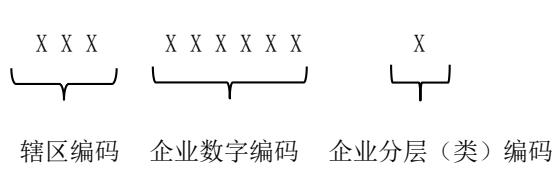
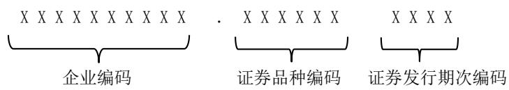
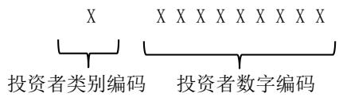

JR/T 0326—2024

# 区域性股权市场企业、产品和投资者编码规范

# Specification for unified code of companies,products and investors in regional equity market

2024-12-24 发布 2024-12-24 实施

## 目 次

前言 .  
引言 ..  
1 范围 ...  
2 规范性引用文件 .  
3 术语和定义 ..  
4 企业编码要求 .. 2  
4.1 企业编码结构 .. 2  
4.2 企业编码规则 .. 3  
4.3 企业编码分配要求 . 4  
5 产品编码要求 .. 4  
5.1 产品编码结构 .. 4  
5.2 产品编码规则 .. 5  
5.3 产品编码分配要求 . 5  
6 投资者编码要求 .. 5  
6.1 投资者编码结构 . 5  
6.2 投资者编码规则 .. 5  
6.3 投资者编码分配要求 . 6  
附录 A（资料性）企业编码参考示例 . .7  
附录 B（资料性）产品编码参考示例 . .8  
附录 C（资料性）投资者编码参考示例 .. 9

## 前 言

本文件按照GB/T 1.1—2020《标准化工作导则 第1部分：标准化文件的结构和起草规则》的规定起草。

请注意本文件的某些内容可能涉及专利。本文件的发布机构不承担识别专利的责任。

本文件由全国金融标准化技术委员会证券分技术委员会（SAC/TC 180/SC4）提出。

本文件由全国金融标准化技术委员会（SAC/TC 180）归口。

本文件起草单位：中证信息技术服务有限责任公司、中国证券监督管理委员会市场监管二司、深圳证券通信有限公司、上海边界智能科技有限公司。

本文件主要起草人：王凤冬、彭枫、谷新萍、陈柏峰、李宇、杨博、蒲军、陈明忠、陈小泉。

## 引 言

区域性股权市场是服务所在省级行政区域内中小微企业的私募股权市场，是多层次资本市场体系重要组成部分，是地方扶持中小微企业政策措施的综合运用平台，也是一类地方金融组织。同时要看到，区域性股权市场也存在功能发挥不畅、地方监管制度体系不完善、业务系统多样异构、数据规范性差、业务规则不完备等问题。区块链具有数据透明、不易篡改、可追溯等技术优势，在促进数据共享、优化业务流程、降低运营成本、提升协同效率、建设可信体系等方面具有积极作用。基于监管链和地方业务链的双层架构，可以更好支持区域性股权市场企业赋能服务、业务创新并逐步实现穿透式监管。为建成物理分散、逻辑统一的区域性股权市场新型金融基础设施，有必要定义区域性股权市场企业、产品和投资者的统一编码规范。

本规范对区域性股权市场服务的企业、产品和投资者的编码进行了统一规范，明确了编码结构、编码规则和编码分配要求。

# 区域性股权市场企业、产品和投资者编码规范

## 1 范围

本文件规定了区域性股权市场服务的企业、产品和投资者的编码要求和分配规则。

本文件适用于为区域性股权市场服务的企业、产品和投资者统一编码和分配。

## 2 规范性引用文件

下列文件中的内容通过文中的规范性引用而构成本文件必不可少的条款。其中，注日期的引用文件，仅该日期对应的版本适用于本文件；不注日期的引用文件，其最新版本（包括所有的修改单）适用于本文件。

GB/T 2260 中华人民共和国行政区划代码

GB 18030 信息技术 中文编码字符集

GB/T 35964 证券及相关金融工具 金融工具分类（CFI）编码

## 3 术语和定义

下列术语和定义适用于本文件。

## 3.1

监管链 global regulation blockchain

以区域性股权市场全局服务和监管为目的构建的区块链系统。

## 3.2

企业编码 company code

由区域性股权市场分配的标识区域性股权市场企业信息的全局唯一代码。

## 3.3

辖区编码 region code

标识区域性股权市场所在行政区域信息的代码。

注：辖区编码是企业编码的组成部分。

## 3.4

企业数字编码 company number code

由区域性股权市场分配的标识企业主体的数字编码。

注：企业数字编码是企业编码的组成部分。

## 3.5

## 企业分层（类）编码 company classification code

标识企业所在服务层次、分类信息的代码。

注：企业分层（类）编码是企业编码的组成部分。

## 3.6

产品编码 product code

由区域性股权市场分配的标识企业非公开发行、转让或登记托管的证券产品信息的唯一代码。

## 3.7

证券品种编码 securities classification code

标识证券产品品种信息的代码。

注：证券品种编码是产品编码的组成部分。

## 3.8

证券发行期次编码 securities issuance batch code

由区域性股权市场分配的标识证券产品发行期次信息的代码。

注：证券发行期次编码是产品编码的组成部分。

## 3.9

投资者编码 investor code

由监管链分配的标识投资者信息的全局唯一代码。

## 3.10

投资者类别编码 investor classification code

标识投资者类别信息的代码。

注：投资者类别编码是投资者编码的组成部分。

## 3.11

投资者数字编码 investor number code

由监管链分配的投资者的数字编码。

注：投资者数字编码是投资者编码的组成部分。

## 4 企业编码要求

## 4.1 企业编码结构

企业编码结构应与图1相符合，由辖区编码、企业数字编码和企业分层（类）编码（如存在）组成。附录A给出了企业编码参考示例。

注：辖区编码预留三位，企业编码分配方可根据所属辖区的实际情况填写两位或三位辖区编码。

  
图 1 企业编码结构图

## 4.2 企业编码规则

企业编码规则如下：

a） 辖区编码应符合 GB/T 2260 规定的字母码，见表 1；

b） 企业数字编码应按照 GB 18030，采用 6 位无意义数字 0～9 进行编码；

c） 企业分层（类）编码应符合表 2 的规则，根据企业分层或分类信息采用固定的单个字母。

表 1 辖区编码表
<table><tr><td colspan="1" rowspan="1">序号</td><td colspan="1" rowspan="1">行政区域</td><td colspan="1" rowspan="1">区域性股权市场名称</td><td colspan="1" rowspan="1">辖区编码</td></tr><tr><td colspan="1" rowspan="1">01</td><td colspan="1" rowspan="1">北京</td><td colspan="1" rowspan="1">北京股权交易中心有限公司</td><td colspan="1" rowspan="1">BJ</td></tr><tr><td colspan="1" rowspan="1">02</td><td colspan="1" rowspan="1">天津</td><td colspan="1" rowspan="1">天津滨海柜台交易市场股份公司</td><td colspan="1" rowspan="1">TJ</td></tr><tr><td colspan="1" rowspan="1">03</td><td colspan="1" rowspan="1">河北</td><td colspan="1" rowspan="1">雄安股权交易所股份有限公司</td><td colspan="1" rowspan="1">HE</td></tr><tr><td colspan="1" rowspan="1">04</td><td colspan="1" rowspan="1">山西</td><td colspan="1" rowspan="1">山西股权交易中心有限公司</td><td colspan="1" rowspan="1">SX</td></tr><tr><td colspan="1" rowspan="1">05</td><td colspan="1" rowspan="1">内蒙古</td><td colspan="1" rowspan="1">内蒙古股权交易中心股份有限公司</td><td colspan="1" rowspan="1">NM</td></tr><tr><td colspan="1" rowspan="1">06</td><td colspan="1" rowspan="1">辽宁</td><td colspan="1" rowspan="1">辽宁股权交易中心股份有限公司</td><td colspan="1" rowspan="1">LN</td></tr><tr><td colspan="1" rowspan="1">07</td><td colspan="1" rowspan="1">吉林</td><td colspan="1" rowspan="1">吉林股权交易所股份有限公司</td><td colspan="1" rowspan="1">JL</td></tr><tr><td colspan="1" rowspan="1">08</td><td colspan="1" rowspan="1">黑龙江</td><td colspan="1" rowspan="1">黑龙江股权交易中心有限责任公司</td><td colspan="1" rowspan="1">HL</td></tr><tr><td colspan="1" rowspan="1">09</td><td colspan="1" rowspan="1">上海</td><td colspan="1" rowspan="1">上海股权托管交易中心股份有限公司</td><td colspan="1" rowspan="1">SH</td></tr><tr><td colspan="1" rowspan="1">10</td><td colspan="1" rowspan="1">江苏</td><td colspan="1" rowspan="1">江苏股权交易中心有限责任公司</td><td colspan="1" rowspan="1">JS</td></tr><tr><td colspan="1" rowspan="1">11</td><td colspan="1" rowspan="1">浙江</td><td colspan="1" rowspan="1">浙江股权服务集团有限公司</td><td colspan="1" rowspan="1">ZJ</td></tr><tr><td colspan="1" rowspan="1">12</td><td colspan="1" rowspan="1">安徽</td><td colspan="1" rowspan="1">安徽省股权托管交易中心有限责任公司</td><td colspan="1" rowspan="1">AH</td></tr><tr><td colspan="1" rowspan="1">13</td><td colspan="1" rowspan="1">福建</td><td colspan="1" rowspan="1">海峡股权交易中心（福建）有限公司</td><td colspan="1" rowspan="1">FJ</td></tr><tr><td colspan="1" rowspan="1">14</td><td colspan="1" rowspan="1">江西</td><td colspan="1" rowspan="1">江西联合股权交易中心股份有限公司</td><td colspan="1" rowspan="1">JX</td></tr><tr><td colspan="1" rowspan="1">15</td><td colspan="1" rowspan="1">山东</td><td colspan="1" rowspan="1">齐鲁股权交易中心有限公司</td><td colspan="1" rowspan="1">SD</td></tr><tr><td colspan="1" rowspan="1">16</td><td colspan="1" rowspan="1">河南</td><td colspan="1" rowspan="1">中原股权交易中心股份有限公司</td><td colspan="1" rowspan="1">HA</td></tr><tr><td colspan="1" rowspan="1">17</td><td colspan="1" rowspan="1">湖北</td><td colspan="1" rowspan="1">武汉股权托管交易中心有限公司</td><td colspan="1" rowspan="1">HB</td></tr><tr><td colspan="1" rowspan="1">18</td><td colspan="1" rowspan="1">湖南</td><td colspan="1" rowspan="1">湖南股权交易所有限公司</td><td colspan="1" rowspan="1">HN</td></tr><tr><td colspan="1" rowspan="1">19</td><td colspan="1" rowspan="1">广东</td><td colspan="1" rowspan="1">广东股权交易中心股份有限公司</td><td colspan="1" rowspan="1">GD</td></tr><tr><td colspan="1" rowspan="1">20</td><td colspan="1" rowspan="1">广西</td><td colspan="1" rowspan="1">广西北部湾股权交易所股份有限公司</td><td colspan="1" rowspan="1">GX</td></tr><tr><td colspan="1" rowspan="1">21</td><td colspan="1" rowspan="1">海南</td><td colspan="1" rowspan="1">海南股权交易中心有限责任公司</td><td colspan="1" rowspan="1">HI</td></tr><tr><td colspan="1" rowspan="1">22</td><td colspan="1" rowspan="1">重庆</td><td colspan="1" rowspan="1">重庆股份转让中心有限责任公司</td><td colspan="1" rowspan="1">CQ</td></tr><tr><td colspan="1" rowspan="1">23</td><td colspan="1" rowspan="1">四川</td><td colspan="1" rowspan="1">天府（四川）联合股权交易中心股份有限公司</td><td colspan="1" rowspan="1">SC</td></tr><tr><td colspan="1" rowspan="1">24</td><td colspan="1" rowspan="1">贵州</td><td colspan="1" rowspan="1">贵州股权交易中心有限公司</td><td colspan="1" rowspan="1">GZ</td></tr><tr><td colspan="1" rowspan="1">25</td><td colspan="1" rowspan="1">云南</td><td colspan="1" rowspan="1">云南省股权交易中心有限公司</td><td colspan="1" rowspan="1">YN</td></tr><tr><td colspan="1" rowspan="1">26</td><td colspan="1" rowspan="1">陕西</td><td colspan="1" rowspan="1">陕西股权交易中心股份有限公司</td><td colspan="1" rowspan="1">SN</td></tr><tr><td colspan="1" rowspan="1">27</td><td colspan="1" rowspan="1">甘肃</td><td colspan="1" rowspan="1">甘肃股权交易中心股份有限公司</td><td colspan="1" rowspan="1">GS</td></tr><tr><td colspan="1" rowspan="1">28</td><td colspan="1" rowspan="1">青海</td><td colspan="1" rowspan="1">青海股权交易中心有限公司</td><td colspan="1" rowspan="1">QH</td></tr><tr><td colspan="1" rowspan="1">29</td><td colspan="1" rowspan="1">宁夏</td><td colspan="1" rowspan="1">宁夏股权托管交易中心（有限公司）</td><td colspan="1" rowspan="1">NX</td></tr><tr><td colspan="1" rowspan="1">30</td><td colspan="1" rowspan="1">新疆</td><td colspan="1" rowspan="1">新疆股权交易中心有限公司</td><td colspan="1" rowspan="1">XJ</td></tr><tr><td colspan="1" rowspan="1">31</td><td colspan="1" rowspan="1">深圳</td><td colspan="1" rowspan="1">深圳前海股权交易中心有限公司</td><td colspan="1" rowspan="1">SZX</td></tr><tr><td colspan="1" rowspan="1">32</td><td colspan="1" rowspan="1">大连</td><td colspan="1" rowspan="1">大连股权交易中心股份有限公司</td><td colspan="1" rowspan="1">DLC</td></tr><tr><td colspan="1" rowspan="1">33</td><td colspan="1" rowspan="1">宁波</td><td colspan="1" rowspan="1">宁波股权交易中心有限公司</td><td colspan="1" rowspan="1">NGB</td></tr><tr><td colspan="1" rowspan="1">34</td><td colspan="1" rowspan="1">厦门</td><td colspan="1" rowspan="1">厦门两岸股权交易中心有限公司</td><td colspan="1" rowspan="1">XMN</td></tr><tr><td colspan="1" rowspan="1">35</td><td colspan="1" rowspan="1">青岛</td><td colspan="1" rowspan="1">青岛蓝海股权交易中心有限责任公司</td><td colspan="1" rowspan="1">TAO</td></tr></table>

表 2 企业分层（类）编码表
<table><tr><td rowspan=1 colspan=1>序号</td><td rowspan=1 colspan=1>企业分层（类）编码</td><td rowspan=1 colspan=1>企业分层（类）编码描述</td></tr><tr><td rowspan=1 colspan=1>01</td><td rowspan=1 colspan=1>F</td><td rowspan=1 colspan=1>孵化层</td></tr><tr><td rowspan=1 colspan=1>02</td><td rowspan=1 colspan=1>G</td><td rowspan=1 colspan=1>规范层</td></tr><tr><td rowspan=1 colspan=1>03</td><td rowspan=1 colspan=1>P</td><td rowspan=1 colspan=1>培育层</td></tr><tr><td rowspan=1 colspan=1>04</td><td rowspan=1 colspan=1>T</td><td rowspan=1 colspan=1>纯托管企业</td></tr></table>

## 4.3 企业编码分配要求

企业编码分配要求如下：

a） 应保证企业编码在不同区域性股权市场的全局唯一性；

b） 应根据企业所属区域性股权市场所在地信息来分配辖区编码；

c） 对于新增企业，区域性股权市场应根据企业数字编码规则和服务情况自行分配企业数字编码；

d） 对于存量企业，区域性股权市场已分配的6位企业代码保持不变，将现有企业代码作为企业数字编码；如果存量企业代码不为6位数字，区域性股权市场应按照本文件要求规范企业代码；

e） 若区域性股权市场对企业进行分层管理，应根据企业分层（类）信息及表2的规则自行分配企业分层（类）编码；

f） 若企业所属层级产生变化，应根据表2的规则进行相应变更，企业编码中其余部分编码保持不变；

g） 区域性股权市场为本区域内企业编码分配方。

## 5 产品编码要求

## 5.1 产品编码结构

产品编码结构应与图2相符合，由企业编码、证券品种编码、证券发行期次编码三部分组成。证券品种编码与企业编码之间由半角圆点（.）分隔。附录B给出了产品编码参考示例。

  
图 2 产品编码结构图

## 5.2 产品编码规则

产品编码规则如下：

a） 企业编码规则应符合 4.2要求；

b） 证券品种编码是在参考 GB/T 35964 规定的编码规则基础上，结合区域性股权市场实际产品类型，定义的编码；

c） 证券发行期次编码应按照 GB 18030，采用不超过 4 位数字 0～9 进行编码。其中，前两位数字表示发行年份，后两位数字为发行期次编号。

## 5.3 产品编码分配要求

产品编码分配要求如下：

a) 企业的每个证券产品应拥有一个相对应的产品编码；

b) 现有存量产品保留原有编码不变，直至兑付完成；

c) 新增产品应按照本文件进行编码；

d) 区域性股权市场为本区域内产品编码分配方。

## 6 投资者编码要求

## 6.1 投资者编码结构

投资者编码结构应与图3相符合，由投资者类别编码、投资者数字编码组成。附录C给出了投资者编码参考示例。

  
图 3 投资者编码结构图

## 6.2 投资者编码规则

投资者编码规则如下：

a） 投资者类别编码应符合表 3 的规则，根据投资者类别信息采用固定的单个字母；

注：目前全国性证券交易场所的投资者证券账户是以 A、B、C、D、E、F 等字母开头，为避免混淆，区域性股权市场投资者类别编码以字母 Q、R、S开头。

b） 投资者数字编码应按照 GB 18030，采用 9 位无意义数字 0～9进行编码。

表 3 投资者类别编码表
<table><tr><td colspan="1" rowspan="1">序号</td><td colspan="1" rowspan="1">投资者类别编码</td><td colspan="1" rowspan="1">投资者类别说明</td></tr><tr><td colspan="1" rowspan="1">01</td><td colspan="1" rowspan="1">Q</td><td colspan="1" rowspan="1">自然人投资者</td></tr><tr><td>02</td><td>R</td><td>机构类投资者</td></tr><tr><td>03</td><td>S</td><td>产品类投资者</td></tr><tr><td colspan="3">注1：自然人投资者包括合格投资者、豁免投资者及其他投资者，涵盖已登记的持有区域性股权市场企业股份的、未来 新增的符合要求的以自然人名义开立账户的投资者。 注2：机构类投资者指依法设立的公司法人、机关法人、社会团体法人、事业单位法人、基金会法人等法人机构，合伙 企业等，以及证券公司及其资管子公司、基金管理公司及其子公司、保险公司、信托公司、银行及商业银行理财 子公司等市场参与主体。 注3：产品类投资者指证券公司单一资产管理计划及集合资产管理计划、基金管理公司单一资产管理计划及集合资产管</td></tr></table>

## 6.3 投资者编码分配要求

投资者编码分配要求如下：

a) 每一名投资者的投资者编码全局唯一，在全国区域性股权市场通用；

b) 投资者编码应通过中国证监会监管链系统分配。附录 C给出了投资者编码参考示例。

# 附 录 A

# 企业编码参考示例

以下是企业编码的参考示例。

BJ000001F

BJ

解释：辖区编码字段，由表 1 可知 BJ代表北京股权交易中心。

000001

解释：企业数字编码字段，为 6位数字。

F

解释：企业分层（类）编码字段，由表 2 可知 F 代表该企业处于孵化层。

# 附 录 B

# （资料性）

# 产品编码参考示例

以下是产品编码的参考示例。

BJ000001F.DCFGFR2110

——BJ

解释：辖区编码字段，由表 1 可知 BJ 代表北京股权交易中心。

000001

解释：企业数字编码字段，为 6位数字。

F

解释：企业分层（类）编码字段，由表 2 可知 F 代表该企业处于孵化层。

DCFGFR

解释：证券品种编码字段，表示可转换公司债券。

2110

解释：证券发行期次编码字段，4 位数字 2101的前两位 21代表发行年份 2021年，后两位 01代表第一期次。

以下是投资者编码的参考示例。

Q000000001

解释：投资者类别编码字段，由表 4可知 Q 代表该投资者为自然人投资者。000000001

解释：投资者数字编码字段，为 9 位数字 000000001。