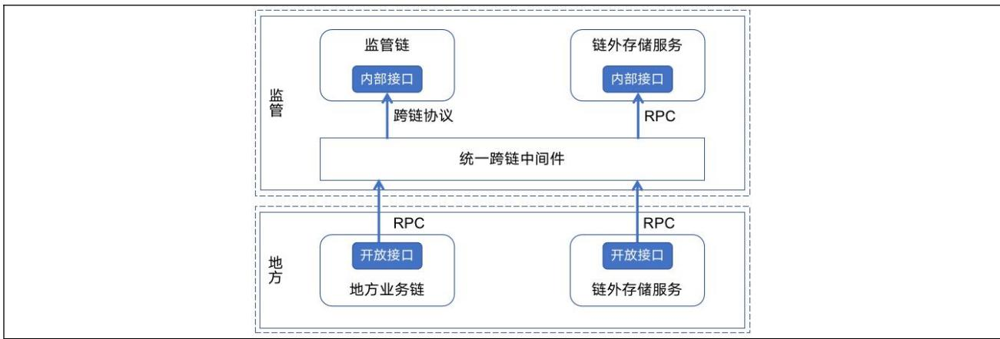
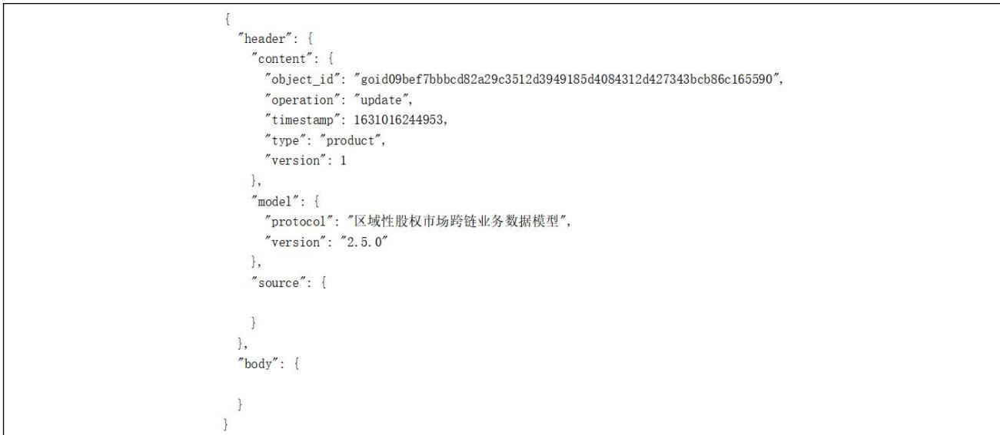
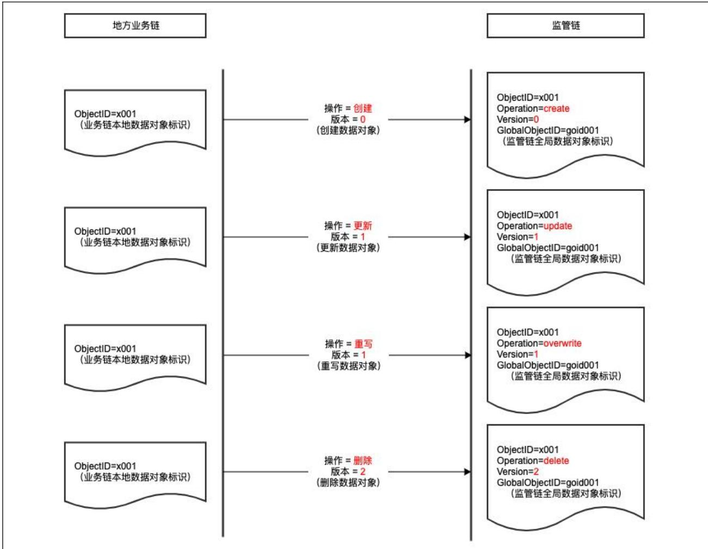
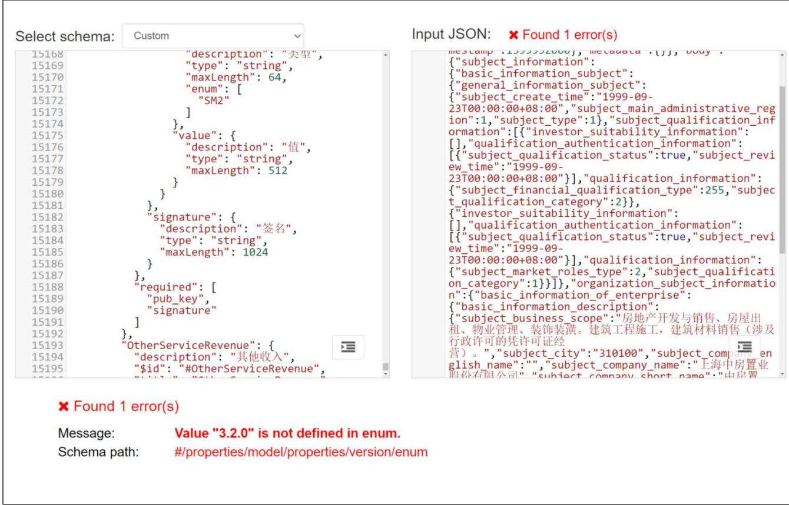
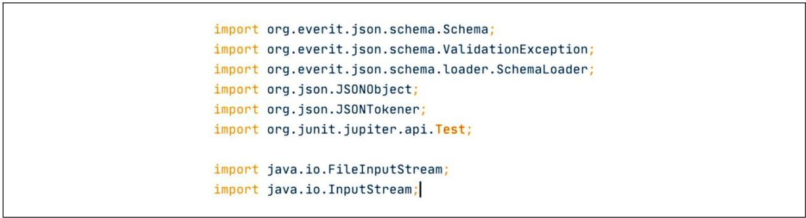
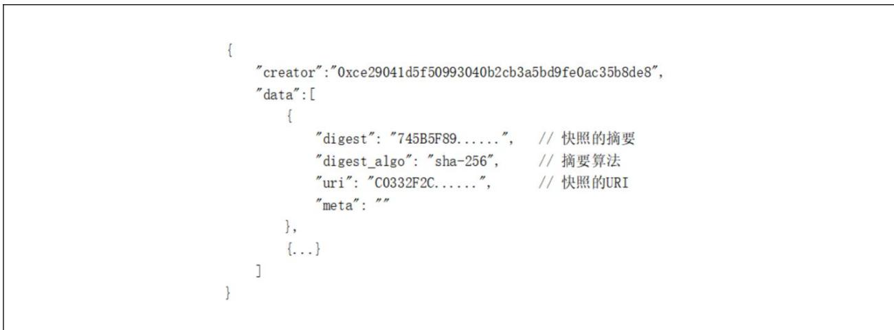

# 中 华 人 民 共 和 国 金 融 行 业 标 准

JR/T 0314—2024

# 区域性股权市场跨链技术规范

# Specification for regional equity markets cross-chain technology

2024-11-20 发布 2024-11-20 实施

## 目 次

前言 ..  
引言 ...  
1 范围 ...  
2 规范性引用文件 .  
3 术语和定义 .  
4 缩略语 .. 2  
5 应用环境 . 2  
6 业务数据存储 . 2  
6.1 基本要求 . 3  
6.2 业务数据对象编码 . 3  
6.3 数据头 .. 3  
6.4 数据体 .. 3  
6.5 数据对象生命周期管理 . 4  
6.6 数据对象存储 .. 4  
7 地方业务链的节点接口要求 . 5  
7.1 基本要求 .. . 5  
7.2 获取区块链网络信息的接口 5  
7.3 获取区块信息的接口 . . 5  
7.4 获取共识状态信息的接口 . 6  
7.5 获取业务数据对象或业务数据对象引用的接口 . 6  
附录 A（资料性）应用环境参考示例 . 7  
附录 B（资料性）数据对象数据头参考示例 .. .8  
附录 C（资料性）数据对象生命周期管理参考示例 . ..9  
附录 D（资料性）数据对象 JSON模式参考示例 . ..10  
D.1 数据对象 JSON 模式基本使用流程 .. . 10  
D.2 代码生成工具 .. . 10  
D.3 代码检验工具 .. 10  
附录 E（资料性）数据对象快照存证参考示例 . ..13  
参考文献 .. 14

## 前 言

本文件按照GB/T 1.1—2020《标准化工作导则 第1部分：标准化文件的结构和起草规则》的规定起草。

请注意本文件的某些内容可能涉及专利。本文件的发布机构不承担识别专利的责任。

本文件由全国金融标准化技术委员会证券分技术委员会（SAC/TC 180/SC4）提出。

本文件由全国金融标准化技术委员会（SAC/TC 180）归口。

本文件起草单位：中国证券监督管理委员会科技监管司、中国证券监督管理委员会市场监管二司、中证信息技术服务有限责任公司、深圳证券通信有限公司、同济大学、南京大学、北京股权交易中心有限公司、上海股权托管交易中心股份有限公司、江苏股权交易中心有限责任公司、浙江省股权交易中心有限公司、深圳前海股权交易中心有限公司、上海边界智能科技有限公司、中诚区块链研究院（南京）有限公司、南京数字金融产业研究院有限公司、梧桐链数字科技研究院（苏州）有限公司、中钞信用卡产业发展有限公司杭州区块链技术研究院。

本文件主要起草人：奚海峰、彭枫、王凤冬、李宇、陈柏峰、王继伟、杨博、马堃、蒲军、赵滨、马小峰、陈莹、陈小泉、王强、朱培、周耀亮、林智辰、葛浩、陶祖国、邵洪峰、孙北北、胡爽峰、肖东、邵俊杰、万强、叶蔚、张一锋、王加楠。

## 引 言

区域性股权市场是服务所在省级行政区域内中小微企业的私募股权市场，是多层次资本市场体系重要组成部分，是地方扶持中小微企业政策措施的综合运用平台，也是一类地方金融组织。同时要看到，区域性股权市场也存在功能发挥不畅、地方监管制度体系不完善、业务系统多样异构、数据规范性差、业务规则不完备等问题。区块链具有数据透明、不易篡改、可追溯等技术优势，在促进数据共享、优化业务流程、降低运营成本、提升协同效率、建设可信体系等方面具有积极作用。基于监管链和地方业务链的双层架构，可以更好支持区域性股权市场企业赋能服务、业务创新并逐步实现穿透式监管。为建成物理分散、逻辑统一的区域性股权市场新型金融基础设施，有必要定义监管链与各地方业务链的跨链对接技术规范。

# 区域性股权市场跨链技术规范

## 1 范围

本文件规定了区域性股权市场地方业务链与监管链跨链对接的技术规范与系统实现要求，包括对应用环境、业务数据存储及地方业务链的节点接口要求。

本文件适用于在区域性股权市场中进行地方业务链建设或服务运营的机构。

## 2 规范性引用文件

下列文件中的内容通过文中的规范性引用而构成本文件必不可少的条款。其中，注日期的引用文件，仅该日期对应的版本适用于本文件；不注日期的引用文件，其最新版本（包括所有的修改单）适用于本文件。

GB/T 20518 信息安全技术 公钥基础设施 数字证书格式

GB/T 25069 信息安全技术 术语

GB/T 32905 信息安全技术 SM3密码杂凑算法

GB/T 32918 信息安全技术 SM2椭圆曲线公钥密码算法

JR/T 0184 金融分布式账本技术安全规范

## 3 术语和定义

GB/T 25069界定的以及下列术语和定义适用于本文件。

3.1

共识节点 consensus node

负责账本数据一致性的节点。

注：在有些区块链系统中也被称为验证节点。

3.2

跨链 cross chain

实现在区块链之间的信息交互、信息验证与服务调用的技术。

3.3

交易 transaction

区块链上的一次原子性账本数据状态变更及其过程和结果记录，由交易标识符唯一标识。

## 3.4

共识状态 consensus state

共识协议在每个共识节点维护的特定区块的全局状态，是跨链协议所依赖的一个关键数据结构。  
注：共识状态一般会包括最新的世界状态的哈希值、共识签名、共识节点公钥等元数据。

## 3.5

默克尔证明 merkle proof

利用默克尔树来快速证明一段数据是否存在于某数据集合中的方法。

## 3.6

监管链 global regulation blockchain

以全局服务和监管为目的构建的区块链系统。

## 3.7

地方业务链 regional business blockchain

各地方以服务区域性股权市场业务和生态为目的构建的区块链系统。

## 3.8

数据模型 data model

对业务数据的标准化建模，一组标准的数据类型的定义。

## 3.9

数据对象 data object

地方业务链为每个数据类型生成的一个或多个以对象方式组织的实例。

## 3.10

数据对象引用 data object reference

为获取数据对象，存储在地方业务链上的标识信息。

注：一般采用统一资源标识符的形式。

## 3.11

JSON 模式 JSON schema

一种用于描述和验证JSON数据结构的模式。

## 4 缩略语

下列缩略语适用于本文件。

AWS S3：亚马逊云服务提供的对象存储服务（Amazon Web Service Simple Storage Service）

JSON：JavaScript对象标记（JavaScript Object Notation）

RPC：远程过程调用（Remote Procedure Call）

TLS：传输层安全协议（Transport Layer Security）

## 5 应用环境

附录A给出了区域性股权市场跨链技术规范的应用环境参考示例。

## 6 业务数据存储

## 6.1 基本要求

业务数据在地方业务链存储，并可跨链至监管链。

每个业务数据在地方业务链生成一个或多个实例（即：业务数据对象）；而每个数据对象可以有一个或多个版本（即：业务数据对象快照或简称快照），代表对该数据对象执行创建，或更新，或删除，或重写操作的结果。

## 6.2 业务数据对象编码

业务数据对象由数据头、数据体两部分组成，以JSON格式表示，采用UTF-8方式编码。

## 6.3 数据头

数据头格式应符合表1的要求，数据头应包含数据模型名称、数据对象版本、数据对象类型、数据所有者签名、数据对象元数据等字段。签名者公钥、签名摘要算法采用的密码算法应符合GB/T 32905、GB/T 32918和GB/T 20518等相关国家标准以及JR/T 0184等相关行业标准。

表 1 数据头格式
<table><tr><td rowspan=1 colspan=1>字段定义</td><td rowspan=1 colspan=1>字段路径</td><td rowspan=1 colspan=1>字段类型</td><td rowspan=1 colspan=1>字段长度</td></tr><tr><td rowspan=1 colspan=1>数据模型名称</td><td rowspan=1 colspan=1>header.model. protocol</td><td rowspan=1 colspan=1>字符串</td><td rowspan=1 colspan=1>64</td></tr><tr><td rowspan=1 colspan=1>数据模型版本</td><td rowspan=1 colspan=1>header.model.version</td><td rowspan=1 colspan=1>字符串</td><td rowspan=1 colspan=1>32</td></tr><tr><td rowspan=1 colspan=1>数据对象类型</td><td rowspan=1 colspan=1>header.content.type</td><td rowspan=1 colspan=1>字符串</td><td rowspan=1 colspan=1>32</td></tr><tr><td rowspan=1 colspan=1>数据对象标识</td><td rowspan=1 colspan=1>header.content.object_id</td><td rowspan=1 colspan=1>字符串</td><td rowspan=1 colspan=1>128</td></tr><tr><td rowspan=1 colspan=1>数据对象版本</td><td rowspan=1 colspan=1>header.content.version</td><td rowspan=1 colspan=1>整数型（初始版本号为0,版本号依次递增)</td><td rowspan=1 colspan=1></td></tr><tr><td rowspan=1 colspan=1>对应操作</td><td rowspan=1 colspan=1>header.content.operation</td><td rowspan=1 colspan=1>字符串（“create”：创建、“update”：更新、“ overwrite”：重写、“delete”：删除）</td><td rowspan=1 colspan=1>16</td></tr><tr><td rowspan=1 colspan=1>时间戳（UNIX 时间）</td><td rowspan=1 colspan=1>header.content.timestamp</td><td rowspan=1 colspan=1>整数型</td><td rowspan=1 colspan=1></td></tr><tr><td rowspan=1 colspan=1>备注</td><td rowspan=1 colspan=1>header.remark</td><td rowspan=1 colspan=1>字符串</td><td rowspan=1 colspan=1>2048</td></tr><tr><td rowspan=1 colspan=1>数据所有者签名</td><td rowspan=1 colspan=1>header.seal</td><td rowspan=1 colspan=1>JSON 对象集合</td><td rowspan=1 colspan=1>二</td></tr><tr><td rowspan=1 colspan=1>签名者公钥类型</td><td rowspan=1 colspan=1>header.seal.pub_key.type</td><td rowspan=1 colspan=1>字符串（“SM2”）</td><td rowspan=1 colspan=1>64</td></tr><tr><td rowspan=1 colspan=1>签名者公钥值</td><td rowspan=1 colspan=1>header.seal.pub_key.value</td><td rowspan=1 colspan=1>字符串</td><td rowspan=1 colspan=1>512</td></tr><tr><td rowspan=1 colspan=1>签名摘要算法</td><td rowspan=1 colspan=1>header.seal.digest_algo</td><td rowspan=1 colspan=1>字符串（“SM3”）</td><td rowspan=1 colspan=1>32</td></tr><tr><td rowspan=1 colspan=1>签名</td><td rowspan=1 colspan=1>header.seal. signature</td><td rowspan=1 colspan=1>字符串</td><td rowspan=1 colspan=1>1024</td></tr><tr><td rowspan=1 colspan=1>数据对象元数据</td><td rowspan=1 colspan=1>header.metadata</td><td rowspan=1 colspan=1>JSON 对象</td><td rowspan=1 colspan=1>一</td></tr></table>

附录B给出了数据对象数据头参考示例。

## 6.4 数据体

数据体格式应符合表2的要求。

表 2 数据体格式
<table><tr><td rowspan=1 colspan=1>字段定义</td><td rowspan=1 colspan=1>字段路径</td><td rowspan=1 colspan=1>字段类型</td></tr><tr><td rowspan=1 colspan=1>数据体内容</td><td rowspan=1 colspan=1>body</td><td rowspan=1 colspan=1>JSON 对象</td></tr></table>

## 6.5 数据对象生命周期管理

在关键业务流程执行的每个关键环节，所有被影响的业务数据需要同步体现在对应的链上数据对象中。数据对象的生命周期管理应满足：

a) 数据对象标识是数据对象全生命周期中的唯一标识，不随数据对象版本和内容的更新而变更；

b) 创建数据对象：

1) 地方业务链应生成其系统唯一的对象标识；

2) 以版本号 0 在链上存储完整快照，或链上存证并在链外存储完整快照。

c) 更新数据对象：

1) 应在链上或链外存储数据体为全量或增量内容、数据头版本号加 1 的新快照；

2) 若采用增量方式更新数据对象的内容且要将上一版本中的某属性值更新为空值，应设置为计算机里表示空值的 null；

3) 增量更新需要满足：将增量内容合并至由所有历史版本组成的全量快照而得到的最新版本的全量快照，仍然可以通过 JSON 模式的合法性校验。

d) 重写数据对象：

1) 应在链上或链外存储数据体为全量或增量内容、数据头版本号与被重写快照一致的新快照；

2) 若被重写的快照版本不是该对象的最新版本，则从该版本到最新版本之间所有的快照，都应重写；

3) 若采用增量方式重写数据对象的内容且要将上一版本中的某属性值更新为空值，应设置为计算机里表示空值的 null；

4) 增量重写应满足：将增量内容合并至上一版本的全量快照而得到的最新版本的全量快照，仍然可以通过 JSON 模式的合法性校验。

e) 删除数据对象：

1) 应在链上或链外存储数据体为空、数据头版本号加 1 的新快照，历史快照不应删除；

2) 删除操作是一个数据对象生命周期的终止操作，被执行过删除的数据对象，不应再有任何新的操作。

f) 无论创建、更新、重写还是删除操作，生成的对应快照都由“数据头”+“数据体”组成；

g) 数据对象引用：

1) 若不同数据对象之间有引用关系，应按照业务发生时序，引用业务发生时对应的快照；“数据对象引用”属性的取值为：被引用数据对象 id、对应的快照版本；

2) 当被引用的数据对象发生版本更新时，无需更新引用值。

附录C给出了数据对象生命周期管理参考示例。

业务数据应通过JSON模式的合法性校验方能完成跨链处理，未能通过校验时将被作为异常记入跨链日志，地方业务链可通过监管链提供的跨链服务查询校验结果反馈作为更正参考。

## 6.6 数据对象存储

地方业务链可根据隐私保护的需求，将快照的部分内容记录在链上，同时将其全部内容通过链外存储服务在链外予以保存。链上记录应包含链外对应快照的哈希值。链外存储工具为兼容AWSS3协议的对象存储工具。

地方业务链应对行业监管机构监管链开放查询接口，该接口应满足以下要求：

查询接口应通过 TLS和鉴权加以保护；

以数据对象标识和版本号为参数，在地方业务链上或链外可以获取到指定版本号的快照；

查询返回的快照以统一的 JSON格式编码（在快照上链之前，应使用数据对象 JSON 模式进行合法性校验）。

附录D给出了数据对象JSON模式参考示例。

如果地方业务链暂时无法将所有业务数据实时记录在链上，作为临时过渡方案，可将快照在链上存证，附录E给出了数据对象快照存证参考示例。

## 7 地方业务链的节点接口要求

## 7.1 基本要求

地方业务链应按照监管链的要求提供节点接口，每个地方业务链有自定义的区块链网络标识。

地方业务链应采用拜占庭容错等支持容错的共识协议。

地方业务链应向监管链暴露至少两个不同全节点的RPC接口。监管链将通过这些RPC接口获取地方业务链的链上数据。

地方业务链的节点RPC接口应支持监管链实现获取网络信息、区块信息、共识状态、业务数据等能力。

## 7.2 获取区块链网络信息的接口

获取区块链网络信息的接口用于获取可用网络或子网的列表、网络的当前状态（最新的终局性区块）以及监管链要求提供的其他有用信息。接口应符合表3的要求。

表 3 获取地方业务链网络信息的接口要求
<table><tr><td>接口功能</td><td>请求内容</td><td>响应内容</td></tr><tr><td>获取可用网络列表</td><td>无</td><td>可用网络列表，内容包括：区块链网络标识、 区块链网络信息及其子网列表</td></tr><tr><td>获取网络配置选项</td><td>区块链网络标识</td><td>节点版本、允许的操作类型及其结果状态</td></tr><tr><td>获取当前网络状态</td><td>区块链网络标识</td><td>当前区块高度、区块哈希、区块时间戳、连接 的节点等</td></tr></table>

## 7.3 获取区块信息的接口

获取区块信息的接口用于访问保存在区块里的所有数据。该接口应符合表4的要求，返回一个区块里所有改变链上世界状态的操作。

注：世界状态是区块链上所有数据在某一时刻所表征的当前状态集合。

表 4 获取地方业务链区块信息的接口要求
<table><tr><td colspan="1" rowspan="1">接口功能</td><td colspan="1" rowspan="1">请求内容</td><td colspan="1" rowspan="1">响应内容</td></tr><tr><td colspan="1" rowspan="1">获取区块信息</td><td colspan="1" rowspan="1">区块链网络标识、区块高度</td><td colspan="1" rowspan="1">区块高度及其哈希、前一个区块的高度及其哈希、区块时间戳、包含的交易标识符、区块头等每个区块的大小应不超过16MB</td></tr><tr><td colspan="1" rowspan="1">获取交易信息</td><td colspan="1" rowspan="1">区块链网络标识、区块高度、交易标识符</td><td colspan="1" rowspan="1">交易包含的一系列操作，其操作类型及结果</td></tr></table>

## 7.4 获取共识状态信息的接口

该接口应符合表5的要求，以获取某个区块高度的共识状态。

表 5 获取地方业务链共识状态信息的接口要求
<table><tr><td>接口功能</td><td>请求内容</td><td>响应内容</td></tr><tr><td>获取某个区块高度的共识状态</td><td>区块链网络标识、区块高度</td><td>状态根、交易根以及其他信任信息，如：共识 节点的公钥集、共识过程中的投票信息；其中 共识过程中的投票信息包括：参与投票的共识 节点列表、本区块的共识节点签名列表、签名 数据（一般为区块哈希）等</td></tr></table>

## 7.5 获取业务数据对象或业务数据对象引用的接口

该接口应符合表6的要求，以获取业务数据对象或业务数据对象引用。如该接口返回的是业务数据对象引用，监管链应能通过该业务数据对象引用访问并获取到业务数据对象。如地方业务链因底层技术原因无法提供默克尔证明，应提供可快速证明数据是否存在于某数据集合中的方法，且该方法应满足监管链的验证要求。

表 6 获取地方业务链业务数据对象或业务数据对象引用的接口要求
<table><tr><td rowspan=1 colspan=1>接口功能</td><td rowspan=1 colspan=1>请求内容</td><td rowspan=1 colspan=1>响应内容</td></tr><tr><td rowspan=1 colspan=1>获取某一个区块包含的数据对象标识</td><td rowspan=1 colspan=1>区块链网络标识、区块高度</td><td rowspan=1 colspan=1>指定区块所包含的数据对象标识</td></tr><tr><td rowspan=1 colspan=1>获取数据对象或数据对象引用</td><td rowspan=1 colspan=1>区块链网络标识、区块高度、数据对象标识</td><td rowspan=1 colspan=1>数据对象在链上的实际编码内容及其默克尔证明，或数据对象引用（一般为数据对象的统一资源标识）</td></tr></table>

附 录 A

（资料性）

应用环境参考示例

图 A.1是区域性股权市场跨链技术规范应用环境的参考示例。在该参考示例中，区域性股权市场跨链技术规范用于地方业务链与监管链之间数据对象的跨链处理。

  
图A.1 应用环境参考

## 附 录 B

（资料性）

## 数据对象数据头参考示例

图 B.1 是区域性股权市场跨链技术规范业务数据对象数据头的参考示例。在该参考示例中，数据对象数据头主要字段含义如下：

—header.content.object_id

解释：地方业务链业务数据对象唯一标识。

—header.content.operation

解释：标识当前对业务数据对象所做的操作行为。

header.content.timestamp

解释：标识当前业务数据对象操作发生时刻的 Unix时间戳。

header.content.type

解释：标识当前业务数据对象类型。

—header.content.version

解释：标识业务数据对象版本号。

——header.model.protocol

解释：标识数据模型协议名称，固定为“区域性股权市场跨链业务数据模型”。

header.model.version

解释：标识当前所使用的数据模型版本号。

header.source

解释：标识当前业务数据对象来源。

—header.body

解释：标识当前业务数据对象内容。

  
图 B.1 数据对象数据头参考

附 录 C

（资料性）

数据对象生命周期管理参考示例

图 C.1是区域性股权市场跨链技术规范数据对象生命周期管理的示例参考。  

在该参考示例中，对数据对象操作的说明如下：

创建：业务数据第一次生成，则需要创建数据对象；

更新：业务执行过程导致数据对象内容变更，则需要更新业务数据对象；

重写：因业务操作原因导致业务数据对象内容错误，则需要重写业务数据对象；

删除：因业务变化导致业务数据过期或无用，则需要删除业务数据对象。

图C.1 数据对象生命周期管理参考

## 附 录 D

## 数据对象 JSON模式参考示例

## D.1 数据对象JSON模式基本使用流程

区域性股权市场跨链技术规范对数据对象JSON模式的参考示例仅用于演示JSON模式的基本使用流程，不对 JSON 模式工具的选择构成建议和要求，可根据技术特点和需求进行评估。更多工具请参考：https://json-schema.org/tools。

在区域性股权市场区块链试点场景中，数据对象 JSON 模式的基本使用流程为：

a) 使用 JSON 模式生成代码；

b) 基于 JSON 模式生成的代码构造业务数据对象；

c) 将业务数据对象序列化为 JSON结构体（快照）；

d) 使用 JSON 模式校验序列化后的 JSON结构体。

## D.2 代码生成工具

使用工具生成业务数据对象代码的示例如下：

工具网址：https://app.quicktype.io/#l=schema。

通过以上网址在浏览器中打开在线代码生成工具，在网页左侧“Name”输入根对象名称“InterChainObject”，“Source type”选择“JSON Schema”，然后在文本域中输入完整的数据对象Schema 内容；

在网页右侧悬浮框中，选择对应的开发语言等属性，即能够自动生成对应语言的代码。注意生成Java 代码时：

—可能出现非必填日期/时间格式字段没有正确添加 JsonFormat 注解的情况，此系工具本身对Java语言代码生成支持存在缺陷导致，日期/时间格式字段需要手动在代码中添加；

—右侧选项框“Date time provider type”选择“Legacy”，则生成的代码中，日期会使用“java.utils.Date”类。

## D.3 代码检验工具

## D.3.1 在线格式校验

使用工具校验JSON结构及各属性值合法性的示例如下：

工具网址：https://www.jsonschemavalidator.net。

使用示例如图D.1：

  
图D.1 在线格式校验参考

## D.3.2 本地代码验证

使用代码校验 JSON 结构及各属性值合法性的示例如下：

GitHub: https://github.com/everit-org/json-schema。

使用方法：

Maven 依赖可见上述 GitHub 链接。

代码示例如图 D.2：

  
图 D.2 本地格式校验参考

@Test   
void testTool(）{   
InputStream schemaInputStream=new FileInputStream(name:"demo.json")；   
InputStream jsonInputStream=new FileInputStream(name:"product.json")   
JSONObject rawSchema = new JsoNobject(new JsoNTokener(schemaInputStream)）;   
JSONObject rawJson = new JSoNobject(new JsoNTokener(jsonInputStream));   
Scheha schema=SchemaLoader.Load(rawSchema);   
}catch （ValidationExceptione）{   
System.out.println(e.getErrorMessage()）；   
for(String s:e.getALlMessages()）   
System.out.println(s);   
}catch （Exceptione）{   
e.printstackTrace(）；   
System.out.println("valid");  
图 D.2 本地格式校验参考（续）

当 JSON 格式或其属性值不符合 JSON模式中定义的规范时，会得到如图 D.3 的报错信息，通过报错信息可以轻松定位到错误原因并进行修复：

10schema violations found   
#/header/content:required key [version] not found   
#/header/content/operation:add is not a valid enum value   
#/body:required key [product]not found   
#/body:requiredkey [transaction]not found   
#/body:required key [settlement] not found   
#/body:required key [registration]not found   
#/body/subject/basic_information_subject/general_information_subject:requiredkey[subject_type]notfound   
#/bsubectsifaectaafoaiotifaioect  
图 D.3 校验报错信息参考

## 附 录 E（资料性）数据对象快照存证参考示例

以下是区域性股权市场跨链技术规范对数据对象快照存证的参考示例。在该参考示例中，地方业务链暂时无法将所有业务数据实时记录在链上，按以下步骤采用链上存证的临时过渡方案：

a) 在关键业务流程执行完毕时，按照业务逻辑触达的先后顺序生成所有被影响的快照，并将它们存储于链外（如：OSS）；

b) 每个链外存储成功的快照都要在链上存证；

c) 存证记录应该至少包含图E.1 所示的属性（以 JSON格式为例）。

  
图 E.1 存证记录包含属性参考

每个存证记录可包含多个数据项，每个数据项对应一个快照的链上存证。

## 参 考 文 献

[1] GB/T 5271.18 信息技术 词汇

[2] GB/T 11457 信息技术 软件工程术语