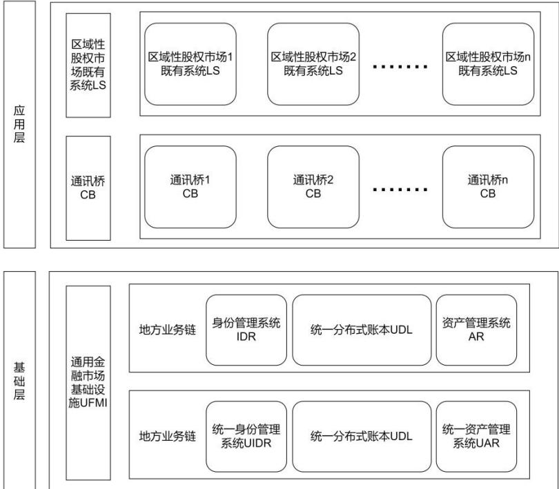
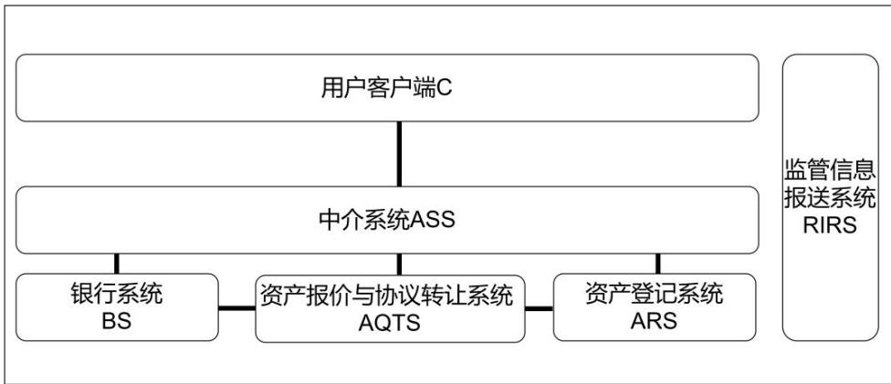
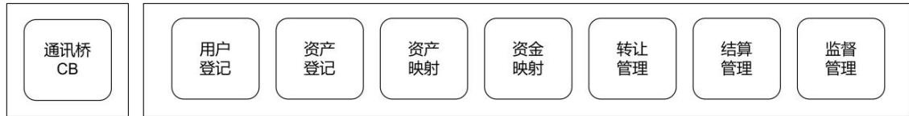
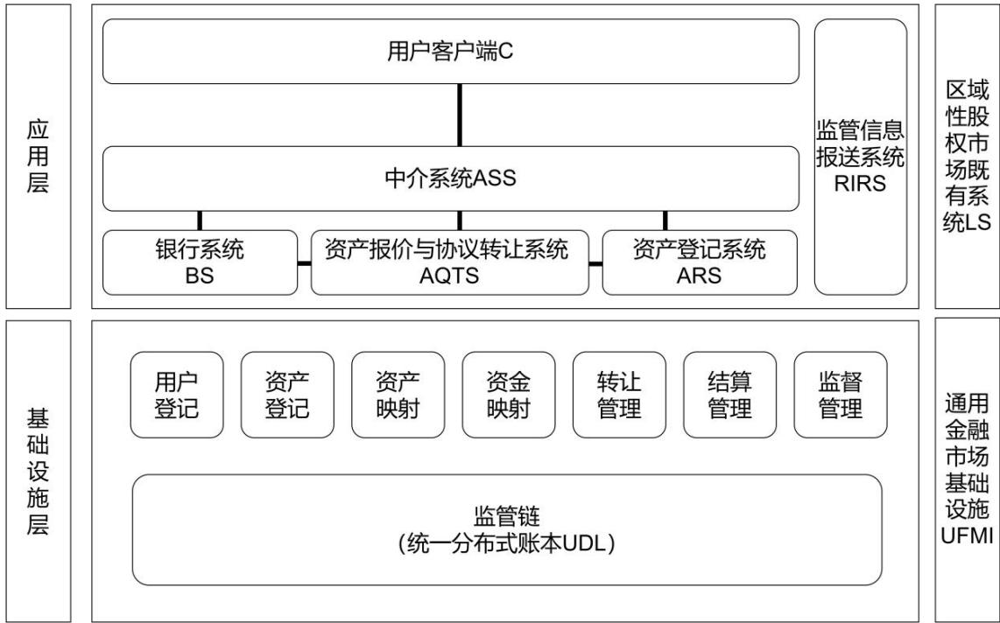
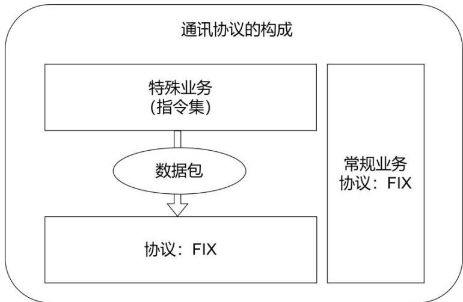

JR/T 0317—2024

# 区域性股权市场区块链通用基础设施通讯指南

# Communication guidance for general blockchain infrastructure of regional equity markets

2024-11-20 发布 2024-11-20 实施

## 目 次

前言 ..  
引言 .. IV  
1 范围 ..  
2 规范性引用文件 .  
3 术语和定义 .  
4 缩略语 .. 2  
5 建设指南 ... 2  
5.1 通用架构 .. 2  
5.2 双层架构的业务目标 . 3  
5.3 双层架构的技术特点 . 3  
5.4 通用金融市场基础设施 . 3  
5.5 区域性股权市场既有系统 . 4  
5.6 通讯桥 ... 5  
5.7 双层架构合成图 . 5  
6 通讯协议 .. 6  
6.1 通讯协议的构成 .. 6  
6.2 通讯协议的技术目标 . 6  
6.3 通讯协议的两个组成部分 .. 6  
6.4 通讯协议和 FIX标准协议嫁接过程 7  
7 用户登记协议 .. 7  
7.1 协议所涉系统 .. 7  
7.2 协议所涉主要数据对象 7  
7.3 统一账户标识 . 7  
7.4 业务场景 . . 8  
7.5 操作指令集 .. . 8  
8 资产登记协议 .. 10  
8.1 协议所涉系统 . 10  
8.2 协议所涉主要数据对象 . 10  
8.3 统一资产编码标志 . 11  
8.4 业务场景 .. 11  
8.5 操作指令集 .. 11  
9 资金映射协议 .. 13  
9.1 协议所涉系统 ... 13  
9.2 协议所涉主要数据对象 . 13  
9.3 业务场景 ... 13  
9.4 操作指令集 .. 14  
10 资产映射协议 .. 16  
10.1 协议所涉系统 . 16  
10.2 协议所涉主要数据对象 . 17  
10.3 业务场景 ... 17  
10.4 操作指令集 .. 17  
11 转让管理协议 ... 19  
11.1 协议所涉系统 .. 19  
11.2 协议所涉主要数据对象 . 19  
11.3 转让规范 .. 19  
11.4 业务场景 ... 19  
11.5 操作指令集 . 20  
12 结算管理协议 .. 21  
12.1 协议所涉系统 .. 21  
12.2 协议所涉主要数据对象 . 21  
12.3 业务场景 ... . 21  
12.4 操作指令集 .. 22  
附录 A（规范性）特殊业务协议格式说明 . .23  
A.1 协议所涉系统 ... . 23  
A.2 协议所涉主要数据对象 . 23  
A.3 统一账户标识 ... . 23  
A.4 业务场景 .. 23  
A.5 操作指令集 .... . 23  
附录 B（资料性）通讯协议和 FIX标准协议嫁接过程参考示例 . .25  
参考文献 .. 26

## 前 言

本文件按照GB/T 1.1—2020《标准化工作导则 第1部分：标准化文件的结构和起草规则》的规定起草。

请注意本文件的某些内容可能涉及专利。本文件的发布机构不承担识别专利的责任。

本文件由全国金融标准化技术委员会证券分技术委员会（SAC/TC 180/SC4）提出。

本文件由全国金融标准化技术委员会（SAC/TC 180）归口。

本文件起草单位：中国证券监督管理委员会科技监管司、中证信息技术服务有限责任公司、上海交通大学高级金融研究院、南京数字金融产业研究院有限公司、深圳证券通信有限公司、上海边界智能科技有限公司、同济大学、南京大学。

本文件主要起草人：胡捷、彭枫、王凤冬、李宇、奚海峰、马小峰、陈莹、陈小泉。

## 引 言

区域性股权市场是服务所在省级行政区域内中小微企业的私募股权市场，是多层次资本市场体系重要组成部分，是地方扶持中小微企业政策措施的综合运用平台，也是一类地方金融组织。同时要看到，区域性股权市场也存在功能发挥不畅、地方监管制度体系不完善、业务系统多样异构、数据规范性差、业务规则不完备等问题。区块链具有数据透明、不易篡改、可追溯等技术优势，在促进数据共享、优化业务流程、降低运营成本、提升协同效率、建设可信体系等方面具有积极作用。基于监管链和地方业务链的双层架构，可以更好支持区域性股权市场企业赋能服务、业务创新并逐步实现穿透式监管。同时，区域性股权市场作为多层次资本市场的组成部分，面临升级换代的需求。

从建立逻辑统一、互联互通的区块链通用金融基础设施（UFMI）出发，充分发挥通用金融基础设施对既有系统的支撑作用，推动既有系统改造并与通用金融基础设施连接，有必要定义一套通用通讯指南。

本文件及与之配套的双层技术架构旨在保障升级改造后的各地区域性股权市场满足规范监管、统一基建、差异发展、互联互通、共享资源等业务目标：

a) 规范监管：各地的区域性股权市场遵循统一规范，及时报送监管信息；

b) 统一基建：通用金融市场基础设施（UFMI）能够为全国各地的区域性股权市场统一提供如下服务：资产非公开发行、转让、清结算；

c) 差异发展：能够允许各地按本地特色保有、开发中介系统，开展挂牌和转让业务，按本地特点管理市场；

d) 互联互通：地方业务链与地方资源互联互通，服务地方市场，探索地方业务创新；监管链与地方业务链对接，并实现跨市场互联互通，以监管链治理地方业务链，同时为地方业务链赋能，支持业务创新和监管创新；

e) 共享资源：各地的区域性股权市场共享投资人、共享中介机构、共享金融机构。

# 区域性股权市场区块链通用基础设施通讯指南

## 1 范围

本文件提供了基于区域性股权市场中监管链与地方业务链双层架构的通用金融基础设施（UFMI）与既有系统之间的通讯指南。

本文件适用于在区域性股权市场中进行地方业务链及与地方业务链对接的地方业务系统建设或服务运营的机构。

## 2 规范性引用文件

下列文件中的内容通过文中的规范性引用而构成本文件必不可少的条款。其中，注日期的引用文件，仅该日期对应的版本适用于本文件；不注日期的引用文件，其最新版本（包括所有的修改单）适用于本文件。

GB/T 23696-2017 证券及相关金融工具 交易所和市场识别码（ISO 10383:2012,MOD）

ISO 9362:2014 银行 银行电信消息 业务标识码（BIC）（Banking-Banking telecommunicationmessages-Business identifier code (BIC)）

FIX标准协议 金融信息交换协议（Financial Information exchange protocol）

## 3 术语和定义

下列术语和定义适用于本文件。

## 3.1

## 智能合约 smart contract

以信息化方式传播、验证或执行合同的计算机协议。

注：在分布式账本上体现为可自动执行的计算机程序。

## 3.2

## 数字账本 digital ledger

通用金融市场基础设施（UFMI）记录的标的所采用的数字化表达形式。

## 3.3

上链 on-chain

将数据存储到区块链上的操作行为。

## 3.4

资产报价与协议转让系统 asset quotation and agreement transfer system;AQTS

区域性股权市场为客户提供资产转让相关的信息披露、行情发布、协议转让、单向竞价等转让服务的基础设施，该系统不支持集中竞价、连续竞价、做市商等集中交易方式。

## 4 缩略语

下列缩略语适用于本文件。

API：应用程序编程接口（Application Programming Interface）

AR：资产管理系统（Asset Registry）

ARS：资产登记系统（Asset Registration System）

ASS：中介系统（Agent Service System）

BS：银行系统（Banking System）

C：用户客户端，内含分布式账本钱包（Client）

CB：通讯桥（Communication Bridge）

FIX：金融信息交换协议，简称 FIX 标准协议（Financial Information eXchange Protocol）

IDR：身份管理系统（ID Registry）

LS：既有系统（Legacy System）

RIRS：监管信息报送系统（Regulation Information Reporting System）

UAR：统一资产管理系统（Unified Asset Registry）

UDL：统一分布式账本（Unified Distributed Ledger）

UFMI：通用金融市场基础设施（Universal Financial Market Infrastructure）

UIDR：统一身份管理系统（Unified ID Registry）

## 5 建设指南

## 5.1 通用架构

区域性股权市场的既有系统（LS）通过通讯桥（CB）与通用金融市场基础设施（UFMI）共同构成双层架构：应用层与基础层，见图1。

  
图 1 区域性股权市场的双层架构

## 5.2 双层架构的业务目标

应用层与基础层的双层架构的业务目标为：

规范监管信息报送：UFMI 在双层建立统一用户登记、统一资产池的基础上，规范各地监管信息报送系统（RIRS）报送相关信息的通讯标准；

统一用户登记：UFMI内设统一身份管理系统（UIDR），汇集各区域性股权市场的用户信息；统一资产登记：UFMI内设的统一资产管理系统（UAR），从本地和全局实现：

任何一地的区域性股权市场的资产报价与协议转让系统（AQTS）能够访问地方业务链的资产管理系统（AR），亦称分级资产池；

在任何一地的区域性股权市场完成资产转让或交割的转让信息都在相应分级资产池完成清结算。

UFMI 提供区域性股权市场之间在规则范围内共享挂牌企业、投资人、中介机构、金融机构，以达成资源共享的目标；

虽然 UFMI提供了统一的市场基础设施，但每一个区域性股权市场仍然能够保有或开发个性化的 IT服务系统，保持自身市场的个性化特点，形成各自的服务特色。

## 5.3 双层架构的技术特点

双层架构的技术特点为：

全国各地的区域性股权市场的 LS，在 CB 的协助下，以参考 FIX 的标准通讯协议与 UFMI 通讯，协调双层的功能；

接入 UFMI的区域性股权市场的转让信息自然集中沉淀在基础层，便于监管方集中提取和分析。

## 5.4 通用金融市场基础设施

## 5.4.1 通用金融市场基础设施的技术设计

UFMI为双层架构、物理分散、逻辑统一的新型金融基础设施，包含监管链、各地的地方业务链及配套的UIDR和UAR。设计原则如下：

监管链采用跨链技术与地方业务链对接，并实现跨市场互联互通，以监管链治理地方业务链，同时为地方业务链赋能，支持业务创新和监管创新；

地方业务链由各地采用异构的区块链技术建设，与地方资源互联互通，服务地方市场，探索地方业务创新；

基于监管链和地方业务链的双层架构，提供了统一分布式账本（UDL），可以登记来自各个区域性股权市场的资产和资金，支持来自各个区域性股权市场的转让信息的清结算，可以更好地支持区域性股权市场开展登记、存管等业务以及实施监管创新；

与 IDR 配套，有一个 UIDR，为全市场提供统一的用户管理；

与 AR配套，有一个 UAR，为全市场提供统一的资产编码管理。

## 5.4.2 通用金融市场基础设施应用特点

UFMI具备如下应用特点：

—通用化：为全国所有的区域性股权市场提供高效、规范的转让服务，其上可以挂接各地区域性股权市场的各种资产；

服务化：其内核是各地区域性股权市场业务流程的服务化，支持智能合约与数字账本转换。对外通讯遵循 FIX标准协议，通讯接口包装为相应的应用程序编程接口（API），支持众多区域性股权市场的 LS 调用；

—可拓展：当市场基础设施通用化、服务化之后，附带也就达成了如下目标：

为未来调整转让方式提供了统一的技术便利；

为未来增加转让品种提供了统一的技术便利。

## 5.5 区域性股权市场既有系统

众多的区域性股权市场，各自拥有自己的IT系统，统称LS。

任何一个LS，不论其具体设计细节如何，LS的逻辑结构，见图2。

  
图 2 既有系统的逻辑结构

各系统的功能解释如下：

用户客户端（C）：支持用户访问 ASS；

中介系统（ASS）：支持经纪商为用户提供服务；

资产登记系统（ARS）：支持资产登记；

银行系统（BS）：为用户提供资金存管、交割服务；

监管信息报送系统（RIRS）：向 UFMI提供监管相关信息。

## 5.6 通讯桥

CB包含若干通讯模块，对应于LS需要与基础层交互的各类业务流程，用于桥接区域性股权市场的LS与UDL。

CB包含如下模块，见图3。

  
图 3 通讯桥的逻辑结构

各模块功能解释如下：

用户登记：是 LS 与基础层之间用户信息的同步通道；

资产登记：是 LS 与基础层之间资产登记信息的同步通道；

资产映射：是 LS 与基础层之间资产转账信息的同步通道；

资金映射：是 LS 与基础层之间资金信息的同步通道；

转让管理：在 LS 与基础层之间转让信息的同步通道；

结算管理：在 LS 与基础层之间结算信息的同步通道；

监督管理：是 LS 与基础层之间监管信息的同步通道。

## 5.7 双层架构合成图

任何一个区域性股权市场的LS接入UFMI示意，见图4。

  
图 4 既有系统接入通用金融市场基础设施

## 6 通讯协议

## 6.1 通讯协议的构成

对于某个区域性股权市场，其 CB 的七个模块在桥接 UFMI 时，将遵循一组标准化协议。这组协议基于 FIX来实现，包括两个部分：

——第一部分：适用于 LS 的首期改造，目标是规范监管信息的报送，包括如下协议：

监督管理协议。

第二部分：适用于 LS 的后续改造，目标是整合分散的区域性股权市场，包括如下协议：

用户登记协议；

资产登记协议；

资产映射协议；

资金映射协议；

转让管理协议；

结算管理协议。

## 6.2 通讯协议的技术目标

这组协议有双重目的：规范监管信息报送和分布式统一登记模式。

分布式统一登记模式指：一个来自某个特定区域性股权市场的资产登记，将被发送到 UFMI，完成在 UDL的登记。

## 6.3 通讯协议的两个组成部分

通讯协议主要分为两个部分，即常规业务与特殊业务。具体构成，见图5。

  
图 5 通讯协议的构成

——第一部分：常规业务是指常规的各种金融业务操作，直接应用 FIX标准协议通讯。

—第二部分：特殊业务是指区域性股权市场涉及但常规金融业务未涵盖的部分。具体解释如下：

这部分业务逻辑表达为一组指令和配套的参数字段；

一个指令执行一个特定业务操作；

一个指令和配套参数形成一个数据包后，依据 FIX标准协议传输；

此时的 FIX退化为简单的文本传输协议；

6.1中的七个协议约束涉及特殊业务的通讯。

附录 A 给出了特殊业务协议格式说明。

## 6.4 通讯协议和 FIX 标准协议嫁接过程

附录 B 以资金映射协议为例给出了通讯协议和 FIX标准协议嫁接过程参考示例。

## 7 用户登记协议

## 7.1 协议所涉系统

所涉系统分为直接所涉系统和间接所涉系统，具体内容如下：

—直接所涉系统（在各业务场景中，基于用户登记协议进行通讯的系统）：

ASS；

 BS；

ARS；

UFMI。

—间接所涉系统（在各业务场景中，无需基于用户登记协议进行通讯的系统）：C。

## 7.2 协议所涉主要数据对象

所涉主要数据对象为主体对象、账户对象。

## 7.3 统一账户标识

## 7.3.1 目标

统一账户标识的目标如下：

UFMI 为所有用户，包括市场、机构、用户，提供 UIDR；

UIDR集成全市场的用户分散在各个 LS的账户信息；

UIDR同时记录用户拥有的公钥地址。

## 7.3.2 账户

统一账户标识中涉及账户的解释如下：

用户：包括市场、机构、投资人。

每个用户的账户拥有如下关键字段：

字段 1：字母 M 代表市场、N 代表机构、L代表投资人；

字段 2：独特身份标志（见 7.3.3）。

## 7.3.3 独特身份标志

独特身份标志主要包含以下内容：

——市场：

MIC：字母 X+另外 3 位字母，如 NASDAQ 的代码为 XNAS；

 推荐：条件成熟时，依照 GB/T 23696-2017/向 SWIFT 申请 Market Identifier Code（MIC）。

机构：

BIC/EIC：8 位字母+3 位字母或数字；

推荐：条件成熟时，依照 ISO 9362/向 SWIFT 申请 BIC/EIC（Bank Identity Code/EnterpriseIdentity Code）。

投资人：BIC/EIC：由 9 位数字构成。

## 7.3.4 各账户关联信息

每个账号关联信息主要包含以下内容：

该用户在 UFMI所拥有的公钥地址；

LS 账户信息。

注：ASS、BS、ARS 三个子系统都有用户的信息。账户信息以可解析文本方式录入，从而支持全文检索；账户信息以格式化方式转换录入，从而支持格式化查询。

## 7.4 业务场景

## 7.4.1 业务场景 1：注册账户

## 7.4.1.1 业务目标

“注册账户”的业务目标包含以下内容：

在 UFMI 的 UIDR内为用户生成统一身份；

导入 LS 中 ASS、BS、ARS三个子系统的该用户账户信息。

## 7.4.1.2 场景描述

中介为自己的用户在 UFMI 中设立统一的账户，并将散落各处的用户信息集中导入其中。

## 7.4.2 业务场景 2：更新账户

## 7.4.2.1 业务目标

完善和更新用户的账户信息。

## 7.4.2.2 场景描述

“更新账户”的具体场景如下：

—用户更新 LS 中 ASS、BS、ARS 三个子系统内的账户信息后，在 UFMI 的 UIDR内更新用户信息；  
—增、删用户的公钥地址。

## 7.4.3 业务场景 3：查询账户

## 7.4.3.1 业务目标

查询用户的统一身份和相关信息。

## 7.4.3.2 场景描述

ASS向 UFMI调取用户在统一账户中的信息。

## 7.5 操作指令集

7.5.1 操作指令 1：注册账户

7.5.1.1 指令：X1。

7.5.1.2 发起方：ASS。  
7.5.1.3 接收方：  
开户银行的 BS；  
ARS；  
UFMI。  
7.5.1.4 指令所含字段：  
转让 ID；  
中介 ID；  
用户在 ASS 内的 ID；  
用户在开户银行中的 ID；  
用户在 ARS 中的 ID。  
7.5.1.5 对指令的后续响应：  
7.5.1.5.1 开户银行的 BS：  
通知 ASS：  
 用户在开户银行的 ID；  
 和其他账户字段。  
7.5.1.5.2 ARS：  
通知 ASS：  
 用户在 ARS 的 ID；  
 其他账户字段。  
7.5.1.5.3 UFMI：  
生成用户账户；  
写入用户在 ASS 的账户信息；  
写入用户在 BS 的账户信息；  
写入用户在 ARS 的账户信息；  
通知 ASS：  
 账户信息；  
 转让成功与否。  
7.5.1.5.4 向监管链报送主体对象、账 7.5.1.5.4向监管链报送主体对象、账户对象。

## 7.5.2 操作指令 2：更新账户

7.5.2.1 指令：X2。

7.5.2.2 发起方：ASS。

7.5.2.3 接收方：

开户银行的 BS；

ARS；

UFMI。

## 7.5.2.4 指令所含字段：

转让 ID；

—中介 ID；

用户的统一 ID；

用户需要删除的公钥地址；

用户需要增加的公钥地址。

7.5.2.5 对指令的后续响应：

7.5.2.5.1 开户银行的 BS：

通知 ASS，用户在开户银行的账户信息。

7.5.2.5.2 ARS：

通知 ASS，用户在 ARS的账户信息。

7.5.2.5.3 ASS：

a) 收到 BS 和 ARS 的信息；

b) 发送以下系统中用户最新账户信息到 UFMI：

1) ASS；

2) BS；

3) ARS。

7.5.2.5.4 UFMI：

a) 根据 ASS 提供的信息更新用户的统一账户信息；

b) 更新用户的公钥地址；

c) 通知 ASS：

1) 账户信息；

2) 转让成功与否。

7.5.2.5.5 向监管链报送 01 主体、02 账户数据对象。

## 7.5.3 操作指令 3：查询账户

7.5.3.1 指令：X3。

7.5.3.2 发起方：ASS。

7.5.3.3 接收方：UFMI。

7.5.3.4 指令所含字段：

转让 ID；

—中介 ID；

—用户在 UFMI 中的统一 ID，或用户在 ASS内的 ID。

## 7.5.3.5 对指令的后续响应：

a) UFMI；

b) 通知 ASS；

c) 用户统一账户的相关信息。

## 8 资产登记协议

## 8.1 协议所涉系统

所涉系统分为直接所涉系统和间接所涉系统，具体内容如下：

—直接所涉系统（在各业务场景中，基于资产登记协议进行通讯的系统）：

 ASS；

ARS；

UFMI。

—间接所涉系统（在各业务场景中，无需基于资产登记协议进行通讯的系统）：C。

## 8.2 协议所涉主要数据对象

所涉主要数据对象为主体对象、产品对象。

## 8.3 统一资产编码标志

## 8.3.1 目标

统一资产编码标志的目标包含以下内容：

在 UFMI 中的 UAR 为所有的金融资产提供统一的数字账本 ID；

在 UFMI 中的 UAR 为各银行的法币提供数字账本 ID。

## 8.3.2 编码

将资产数字账本 ID 作为统一资产编码。

## 8.4 业务场景

## 8.4.1 业务场景 1：注册资产

## 8.4.1.1 业务目标

UFMI为资产生成统一的数字账本 ID。

## 8.4.1.2 场景描述

“注册资产”的具体场景如下：

为所有的金融资产提供统一的数字账本 ID；

为各银行的法币提供统一的数字账本 ID（各银行的法币数字账本带有自己的标志）；

UFMI集成 ARS内同一资产的信息。

注：资产信息以可解析文本方式录入，从而支持全文检索；建议以格式化方式转换录入，从而支持格式化查询。

## 8.4.2 业务场景 2：更新资产信息

## 8.4.2.1 业务目标

UFMI更新资产信息。

## 8.4.2.2 场景描述

中介将某一资产的新信息传递给金融市场基础设施 UFMI，并更新其记录。

## 8.4.3 业务场景 3：查询资产信息

## 8.4.3.1 业务目标

向 UFMI 查询资产信息。

## 8.4.3.2 场景描述

中介向 UFMI 发出请求，查询某一资产的信息。

## 8.5 操作指令集

## 8.5.1 操作指令 1：注册资产

8.5.1.1 指令：P1。

8.5.1.2 发起方：ASS。

8.5.1.3 接收方：ARS；UFMI。

8.5.1.4 指令所含字段：转让 ID；中介 ID；资产在 ARS 中的 ID；银行的 ID。

8.5.1.5 对指令的后续响应：

8.5.1.5.1 ARS：a) 提取资产的相关信息；b) 通知 ASS：1) 资产在 ARS 的 ID；2) 其他账户字段。

8.5.1.5.2 UFMI：

a) 生成相关资产的 ID；

b) 生成各银行法币的 ID；

c) 写入该资产在 ARS的信息；

d) 通知 ASS：

1) 统一的资产 ID；

2) 转让成功与否。

8.5.1.5.3 向监管链报送主体对象、产品对象。

## 8.5.2 操作指令 2：更新资产信息

8.5.2.1 指令：P2。

8.5.2.2 发起方：ASS。

8.5.2.3 接收方：开户银行的 BS；ARS；UFMI。

8.5.2.4 指令所含字段：转让 ID；中介 ID；ARS中金融资产的 ID。

8.5.2.5 对指令的后续响应：

8.5.2.5.1 ARS：a) 通知 ASS；b) 资产在 ARS的最新信息。

8.5.2.5.2 ASS：a) 收到 ARS的信息；b) 发送最新资产信息到 UFMI。

8.5.2.5.3 UFMI：

a) 根据 ASS 提供的信息更新资产信息；

b) 通知 ASS：

1）资产最新信息；

2）转让成功与否。

8.5.2.5.4 向监管链报送主体对象、产品对象。

## 8.5.3 操作指令 3：查询资产信息

8.5.3.1 指令：P3。

8.5.3.2 发起方：ASS。

8.5.3.3 接收方：UFMI。

8.5.3.4 目的：查询 UFMI中用户的统一资产信息。

8.5.3.5 指令所含字段：

转让 ID；

—中介 ID；

资产在 UFMI 中的统一 ID；

银行 ID。

8.5.3.6 对指令的后续响应：

a) UFMI；

b) 通知 ASS；

c) 资产的相关信息。

## 9 资金映射协议

## 9.1 协议所涉系统

所涉系统分为直接所涉系统和间接所涉系统，具体内容如下：

—直接所涉系统（在各业务场景中，基于资金映射协议进行通讯的系统）：

 ASS；

BS；

 UFMI。

——间接所涉系统（在各业务场景中，无需基于资金映射协议进行通讯的系统）：C。

## 9.2 协议所涉主要数据对象

所涉主要数据对象为主体对象、账户对象、资金结算对象。

## 9.3 业务场景

## 9.3.1 业务场景 1：充值

## 9.3.1.1 业务目标

现金转换为数字账本。

## 9.3.1.2 场景描述

“充值”的具体场景如下：

——用户向中介请求：将其开户银行账户里的现金数字账本化，并将数字账本发送到指定的公钥地址；

中介向用户开户银行发送请求：锁定用户的现金并转换现金数字账本；

—开户银行发送指令给 UFMI，按 1:1 比例转换对应的现金数字账本到指定的公钥地址；现金数字账本带有开户银行的标志。

## 9.3.2 业务场景 2：提现

## 9.3.2.1 业务目标

数字账本转换为现金。

## 9.3.2.2 场景描述

“提现”的具体场景如下：

—用户向中介请求：将其现金数字账本（可含多个银行的标志）转账到开户银行的特定公钥地址上；该公钥地址专门用于接收申请提现的数字账本；

—开户银行将各种标志的现金数字账本转账给对应银行的特定公钥地址；该公钥地址专门用于接收申请提现的数字账本；

收到本银行现金数字账本后，银行将其销毁，并将对应的现金转账到用户的开户银行；每个银行设立特定账户接收此类转账；

用户的开户银行将现金转账到用户账户。

## 9.4 操作指令集

## 9.4.1 操作指令 1：充值

9.4.1.1 前置行动：

a) C 向 ASS 发起充值指令；

b) 接下来 ASS基于协议与其他系统通讯，完成充值。

9.4.1.2 指令代号：Y1。

9.4.1.3 发起方：ASS。

9.4.1.4 接收方：

开户银行的 BS；

UFMI。

9.4.1.5 指令所含字段：

转让 ID；

（用户所在）中介的 ID；

（用户所在）开户银行的 ID；

用户在全局的统一身份 ID；

用户在 ASS 内的 ID；

用户在 BS 内的 ID；

币种；

—货币单位；

—用户指定的现金数字账本目标公钥地址。

9.4.1.6 对指令的后续响应：

9.4.1.6.1 开户银行的 BS：

a) 检验是否有足够现金；

b) 锁定现金；

c) 通知 ASS锁定结果：

1) 转让 ID；

2) 现金是否锁定成功。

d) 通知 UFMI锁定结果：

1) 转让 ID；

2) 现金是否锁定成功。

## 9.4.1.6.2 UFMI：

a) 在用户的现金目标公钥地址上生成现金数字账本（带有开户银行的标志）；

b) 通知 ASS：

1) 转让 ID；

2) 转让是否成功；

3) 生成的数字账本：数字账本代码，即带有开户银行的标志；数字账本数量；对应的现金金额。

c) 通知 BS：

1) 转让 ID；

2) 转让是否成功；

3) 生成的数字账本：数字账本代码，即带有开户银行的标志；数字账本数量；对应的现金金额。

9.4.1.6.3 向监管链报送主体对象、账户对象、资金结算对象。

## 9.4.2 操作指令 2：提现

## 9.4.2.1 前置行动：

a) C 向 ASS 发起提现指令；

b) 接下来 ASS基于协议与其他系统通讯，完成提现。

9.4.2.2 指令：Y2。

9.4.2.3 发起方：ASS。

9.4.2.4 接收方：

—开户银行的 BS；

UFMI。

9.4.2.5 指令所含字段：

转让 ID；

（用户所在）中介的 ID；

（用户所在）开户银行的 ID；

—用户在全局的统一身份 ID；

用户在 ASS 内的 ID；

—用户在开户银行的 BS 内的 ID；

币种；

—金额；

货币单位；

用户的现金数字账本公钥地址。

## 9.4.2.6 对指令的后续响应：

9.4.2.6.1 UFMI：

a) 检验用户现金数字账本公钥地址是否有足够现金数字账本；

b) 将对应的现金数字账本（带有一种或多种标志）转账到各银行各自的接收公钥地址；

c) 通知 ASS：

1) 转让 ID；

2) 检验是否通过。

d）通知各相关 BS：

1) 转让 ID；

2) 待提现的数字账本已转账到各银行特定公钥地址：数字账本代码；数字账本数量；对应的现金金额。

## 9.4.2.6.2 各 BS：

a) 通知 UFMI 销毁银行公钥地址上的数字账本；

b) 将对应的现金转到开户银行的特定收款账户；

c) 通知 ASS：

1) 转让 ID；

2) 现金转移是否成功。

d) 通知 UFMI：

1) 转让 ID；

2) 现金是否转移成功。

## 9.4.2.6.3 开户银行：

a) 确认收到各银行转来的现金；

b) 将现金转到用户账户；

c) 通知 ASS：

1) 转让 ID；

2) 收到现金：转款银行；金额。

d) 通知 UFMI：

1) 转让 ID；

2) 收到现金：转款银行；金额。

## 9.4.2.6.4 UFMI：

a) 销毁各银行特定公钥地址上的数字账本；

b) 通知 ASS。

9.4.2.6.5 向监管链报送主体对象、账户对象、资金结算对象。

## 10 资产映射协议

## 10.1 协议所涉系统

所涉系统为直接所涉系统，即在各业务场景中，基于资产映射协议进行通讯的系统。主要包含以下系统：

C；

—ASS；

ARS；

UFMI。

## 10.2 协议所涉主要数据对象

所涉主要数据对象为主体对象、产品对象、信披对象。

注：信披对象是向投资者或社会公众，定向或公开披露的公司及与公司相关的信息。

## 10.3 业务场景

## 10.3.1 通用假定

资产已经存在于 LS的 ARS。

## 10.3.2 业务场景 1：资产上链

## 10.3.2.1 业务目标

将资产数字账本化。

## 10.3.2.2 场景描述

“资产上链”的具体场景如下：

—C 向 ASS请求将其资产数字账本化，并指定接收数字账本的公钥地址；

ASS请求 ARS：将特定资产数字账本化，并发送到用户指定的公钥地址；

ARS将指令传递给 UFMI，后者按 1：1 比例转换对应的资产数字账本到指定的公钥地址上。

## 10.3.3 业务场景 2：资产行踪订阅

## 10.3.3.1 业务目标

ARS跟踪 UFMI内资产转账。

## 10.3.3.2 场景描述

“资产行踪订阅”的具体场景如下：

特定资产证券化之后，ARS 不再接收关于该资产清结算的请求，转而跟踪该资产在 UFMI 内的转移；

为此，ARS向 UFMI订阅资产转移的消息。

## 10.3.4 业务场景 3：资产行踪广播

## 10.3.4.1 业务目标

UFMI广播内其账本上资产数字账本的转移消息。

## 10.3.4.2 场景描述

“资产行踪广播”的具体场景如下：

ARS获取 UFMI广播的消息；

—从而，ARS依据所得消息映射资产转移情况。

## 10.4 操作指令集

## 10.4.1 操作指令 1：资产上链

10.4.1.1 指令：Z1。

10.4.1.2 发起方：C。

10.4.1.3 接收方：ARS；UFMI。

10.4.1.4 指令所含字段：

转让 ID；

—中介 ID；

用户在 ASS 内的 ID；

用户在全局的统一身份 ID；

用户的资产接收公钥地址；

待上链资产：

ID；

 数量。

10.4.1.5 对指令的后续响应：

10.4.1.5.1 ARS：

a) 验证用户拥有足够资产；

b) 锁定资产；

c) 通知 ASS：

1) 转让 ID；

2) 资产是否锁定成功。

d) 通知 UFMI：

1) 转让 ID；

2) 资产是否锁定成功。

10.4.1.5.2 UFMI：

a) 在用户的资产接收公钥地址上生成数字账本；

b) 通知 ASS：

1) 转让 ID；

2) 转让是否成功；

3) 生成和转账的数字账本：代码；数量；接收公钥地址。

c) 通知 ARS：

1) 转让 ID；

2) 转让是否成功；

3) 生成和转账的数字账本：代码；数量；接收公钥地址。

10.4.1.5.3 向监管链报送主体对象、产品对象、信披对象。

## 10.4.2 操作指令 2：资产行踪订阅

10.4.2.1 指令：Z2。

10.4.2.2 发起方：ARS。

10.4.2.3 接收方：UFMI。

10.4.2.4 指令所含字段：

转让 ID；

ARS 的管理人 ID；

被订阅的资产：数字账本代码。

10.4.2.5 对指令的后续响应：

a) UFMI；

b) 允许或拒绝 ARS（管理人 ID）订阅。

## 10.4.3 操作指令 3：资产行踪广播

10.4.3.1 指令：Z3。

10.4.3.2 发起方：UFMI。

10.4.3.3 接收方：ARS。

10.4.3.4 指令所含字段：

转让 ID；

转账行为：

资产数字账本 ID；

数量；

转出公钥地址；

转入公钥地址。

10.4.3.5 对指令的后续响应：

a) ARS；

b) 在自身系统内记录资产的转移。

## 11 转让管理协议

## 11.1 协议所涉系统

所涉系统分为直接所涉系统和间接所涉系统，具体内容如下：

—直接所涉系统（在以下业务场景中，基于转让管理协议进行通讯的系统）：

ASS；

AQTS；

 UFMI。

间接所涉系统（在以下业务场景中，无需基于转让管理协议进行通讯的系统）：C。

## 11.2 协议所涉主要数据对象

所涉主要数据对象为主体对象、账户对象、产品对象、转让报告对象、信披对象。

## 11.3 转让规范

转让规范具体内容如下：

资产类别：参照现有规范。

转让信息属性：

资产数字账本 ID；

转让类别：如协议转让等；

其他属性。

## 11.4 业务场景

## 11.4.1 业务场景 1：发布转让信息

## 11.4.1.1 业务目标

用户向本区域性股权市场提交转让信息，区域性股权市场基于 AQTS 为客户提供信息披露、行情发布、协议转让、单向竞价等现行法律法规部门规章所允许的各类转让服务。

## 11.4.1.2 场景描述

“发布转让信息”的具体场景如下：

用户可通过 ASS 或直接向某一 AQTS 提交转让信息；

收到指令的 AQTS 向 UFMI 询问该用户的资产/现金状况；

UFMI向 AQTS返回用户的资产/现金状况；

—AQTS发布该转让信息。

## 11.4.2 业务场景 2：撤销转让信息

## 11.4.2.1 业务目标

应用户请求，撤回转让信息。

## 11.4.2.2 场景描述

“撤销转让信息”的具体场景如下：

用户可通过 ASS 或直接向 AQTS 请求撤销已发布的转让信息；

AQTS撤销已发布的转让信息；

UFMI向 AQTS发送撤销的消息；

AQTS收到消息，并撤下转让信息。

## 11.5 操作指令集

## 11.5.1 操作指令 1：发布转让信息

11.5.1.1 指令：S1。

11.5.1.2 发起方：AQTS。

11.5.1.3 接收方：UFMI。

11.5.1.4 指令所含字段：

转让 ID；

转让信息：

编号；

资产类别；

资产数字账本 ID；

转让类别；

其他属性。

## 11.5.1.5 对指令的后续响应

## 11.5.1.5.1 UFMI：

验证是否有足够资产/现金支持其转让行为；

锁定相关资产/现金；

通知 AQTS：转让信息是否合法。

11.5.1.5.2 向监管链报送主体对象、账户对象、产品对象、转让报告对象、信披对象。

## 11.5.2 操作指令 2：撤销转让信息

11.5.2.1 指令：S2。

11.5.2.2 发起方：AQTS。

11.5.2.3 接收方：UFMI。

11.5.2.4 指令所含字段：

转让 ID；

转让信息：

编号；

资产类别；

资产数字账本 ID；

转让类别；

其他属性。

11.5.2.5 对指令的后续响应：

11.5.2.5.1 UFMI：

解除与转让信息相关的资产锁定；

—此后，拒绝与该转让信息相关的清结算请求。

11.5.2.5.2 AQTS：

收到消息；

撤下转让信息；

回复 UFMI：已撤下转让信息。

11.5.2.5.3 向监管链报送主体对象、账户对象、产品对象、转让报告对象、信披对象。

## 12 结算管理协议

## 12.1 协议所涉系统

所涉系统分为直接所涉系统和间接所涉系统，具体内容如下。

—直接所涉系统（在各业务场景中，基于结算管理协议进行通讯的系统）：

ASS；

AQTS；

 UFMI。

—间接所涉系统（在各业务场景中，无需基于结算管理协议进行通讯的系统）：C。

## 12.2 协议所涉主要数据对象

所涉主要数据对象为主体对象、账户对象、资金结算。

## 12.3 业务场景

主要应用于“清结算”这一业务场景，具体内容如下：

目标：依据成交信息在 UFMI完成清结算。

场景描述：

AQTS成交后，向 UFMI提交清结算请求；

 UFMI按照接收到的成交时间顺序清结算（时间顺序记录在含有 API的前置系统中）；

若资产/现金状况许可，UFMI 启动智能合约，完成清结算；

若资产/现金状况不许可，UFMI驳回清结算请求。

## 12.4 操作指令集

12.4.1 指令含义：清结算。

12.4.2 指令代码：T1。

12.4.3 发起方：AQTS。

12.4.4 接收方：UFMI。

12.4.5 指令所含字段：

转让 ID；

转让信息（两个以上）：

编号；

资产类别；

资产数字账本 ID；

转让类别；

其他属性。

一 成交细节：

数量；

价格；

成交时间。

## 12.4.6 对指令的后续响应：

UFMI：

将成交信息在前置系统排队；

依据先到原则依次处理；

启动智能合约完成清结算；

广播清结算结果。

# 附 录 A

# （规范性）特殊业务协议格式说明

## A.1 协议所涉系统

协议所涉系统：

直接所涉系统

注：在以下描述的业务场景中出现的、基于协议进行通讯的系统。

间接所涉系统

注：在以下描述的业务场景中出现的、但无需基于协议进行通讯的系统。

## A.2 协议所涉主要数据对象

协议所涉主要数据对象。

注：在以下描述的业务场景中出现的数据对象。

## A.3 统一账户标识

X1：注册账户。

注：定义关于用户的统一账户标准。适用于用户登记协议。

## A.4 业务场景

X1：注册账户。

注：所涉业务场景的目标和描述。

## A.5 操作指令集

X1：注册账户。

注：这是操作指令的含义。

—指令

注：这是操作指令的代号。

发起方

注：指令的初始发起方，可为一个。

接收方

注：指令的接收方，可为一个或多个。

指令所含字段

注：指令需要携带的参数。

—对指令的后续响应

注：接收方对于指令的响应，以及后续发生的系列通讯和操作。

缩进格式

注：逻辑上表示承接前一句文字的内容。

## 附 录 B

# 通讯协议和 FIX标准协议嫁接过程参考示例

以资金映射协议为例：

场景：用户需要将自己的资金转换为数字账本。

具体嫁接过程如下：

—当一个用户需要将自己在银行的资金转换为数字账本时，他向自己的中介提出请求，由 ASS依据资金映射协议，将这个请求转化为充值指令 Y1（见第 9章），并携带如下参数：

C1：本次转让的转让 ID；

C2：用户所在中介的 ID；

C3：用户所在开户银行的 ID；

C4：用户在全局的统一身份 ID；

C5：用户在 ASS 内的 ID；

C6：用户在 BS内的 ID；

C7：币种；

C8：金额；

C9：货币单位；

C10：用户指定的现金数字账本目标公钥地址。

然后将这个请求 Y1（C1, C2, …, C10）作为一个文本，用 FIX标准协议传输给 UFMI。对方接到数据包后，解开得到 Y1（C1, C2, …, C10），依据其业务内涵，执行相应操作，并将结果反馈到相关方。

## 参 考 文 献

[1] CPMI-BIS 2017 Distributed Ledger Technology in Payment,Clearing and Settlement:An Analytical Framework

[2] BIS&IOSCO 2012 Principles for Financial Market Infrastructures