# 动储产销两旺，量利双升， 继续强推-- 电动车行业策略

电新首席证券分析师 ：曾朵红

执业证书编号：S0600516080001

联系邮箱：zengdh@dwzq.com.cn

电动车首席证券分析师 ：阮巧燕

执业证书编号：S0600517120002

联系邮箱：ruanqy@dwzq.com.cn

联系电话：021-60199793

2026年4月16日

## 摘要

◆ 电动车：中国、欧洲、其他地区销量预期上修。国内销量：26年1-3月国内累计销量296万辆，同比-3.6%，其中出口及电动重卡维持高景气度，1-3月新能源车出口95.5万辆，同增118%，电动重卡1-3月销4.3万辆，同增42%，我们预计全年销量1788万辆左右，同比增8%，其中本土销量预计1395万辆，同增0.6%，出口预计392万辆，增长50%。此外1-2月国内单车带电量63.7kwh，同比增31%，其中乘用车单车带电量提升24%，可对冲车销量增速下滑。欧洲销量：欧洲1-2月累计销43万辆，同比+25%，符合市场预期。我们预计欧洲全年销量至510万辆+，同比增30%。美国销量：25年10月补贴退出，销量承压，26年1-2月电动车累计销15.5万辆，同减33%，我们预计全年125万辆，同比下滑。总体26年全球电动车销量上修至2330万辆，同比+10%，考虑单车带电量提升，我们预计动力电池需求1700GWh+，同比维持20%+增长。

◆ 储能：国内储能需求超预期，海外持续强劲，国内外共振。储能持续满产、碳酸锂涨价已消化。考虑大电芯系统降本10%，叠加项目金融贷款年限延长，国内中等收益储能项目对碳酸锂价格接受度提升至18万/吨，1-2月国内储能招标同比增55%，且各地容量电价陆续出台，有望提速，维持26年全球储能需求1000+gwh，增长60%的预期。总体锂电需求26年上修至34%增长，超2750GWh，供需格局大幅好转。

◆ 排产&价格：排产新高，4-5月排产环比进一步提升。3月排产新高，4月环比0-5%进一步提升。电池端，龙头议价强+顺价快，Q1盈利水平维持稳定，增长确定性高；隔膜Q1盈利环比进一步改善，26-27年产能利用率持续提升，叠加PE涨价，已开启新一轮议价，我们预计Q2涨价有望落地，头部公司后续单平利润有望提升至0.2元/平+，且5u加速替代，佛塑明显受益；铁锂正极Q1加工费上周+库存收益，业绩亮眼，且5代产品开始渗透，龙头裕能、富临弹性大；6f Q1价格高位调整结束，3月底库存消化完毕，Q2价格有望反弹；碳酸锂价格15万上下震荡，5月或进一步提升，上限20万/吨。此外，铝箔盈利已恢复，铜箔Q1业绩拐点确定，加工费仍有提升空间。总体看，板块量价齐升可期 。

◆ 投资建议：锂电新一轮大周期，全面看好！继续强推格局和盈利稳定龙头电池（推荐宁德时代、亿纬锂能、比亚迪、中创新航、欣旺达）、以及具备涨价弹性和优质锂电材料龙头，推荐隔膜、六氟、结构件、铝箔等环节（推荐佛塑科技、富临精工、恩捷股份、湖南裕能、天赐材料、科达利、璞泰来、鼎胜新材、尚太科技、星源材质、华友钴业等，关注天际股份、多氟多、万润新能、龙蟠科技、华盛锂电、海科新源、石大胜华等）；同时看好碳酸锂龙头（推荐赣锋锂业、永兴材料、中矿资源、盛新锂能、天齐锂业、雅化集团、藏格矿业，关注国城矿业、大中矿业等）。

风险提示：价格竞争超市场预期、原材料价格不稳定影响利润空间、投资增速下滑

电动车：Q1销量淡季，国内出口及电动重卡超预期  
储能：欧洲户储超预期，全球维持60%增长  
供需：供需格局大幅好转，具备涨价弹性  
新技术：产业化进展持续加快，钠电池迎来商业化元年  
投资建议和风险提示

电动车：Q1销量淡季，国内出口及电动重卡超预期

## 国内：26年3月销125.2万辆，同增1.2%，渗透率43.2%

◆ 26年3月销量125.2万辆，同环比+1.2%/+63.7%，26年1-3月新能源车销296万辆，同减3.7%。根据中汽协数据 ， 26 年 3 月 新 能 源 车 销 量 125.2 万 辆 ， 同环比 +1.2%/+63.7% ， 渗透率 43.2% ， 同环比+0.8pct/+0.8pct；1-3月新能源车销量296万辆，同减3.7%，渗透率42%，同增0.8pct。

◆ 26年1-3月新能源乘用车销273.3万辆，同减4.3%。根据乘联会口径，26年3月国内电动乘用车批发销量114.4万辆，同环比+1.1%/+58.3%，渗透率48.1%，同环比+1.3pct/+0.5pct，零售84.8万辆，同环比-14.4%/+82.6%，渗透率51.5%，同环比+0.4pct/+6.5pct 。1-3月批发销量273.3万辆，同减4.3%，零售190.8万辆，同减21.1%。

图：国内电动车总销量（万辆，中汽协口径）  
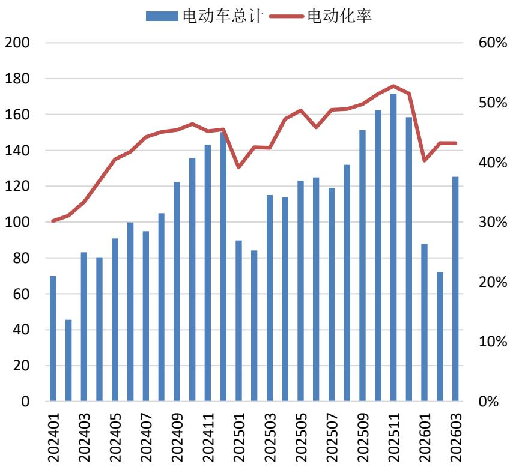

图：国内电动乘用车月度批发销量（万辆，乘联会口径）  
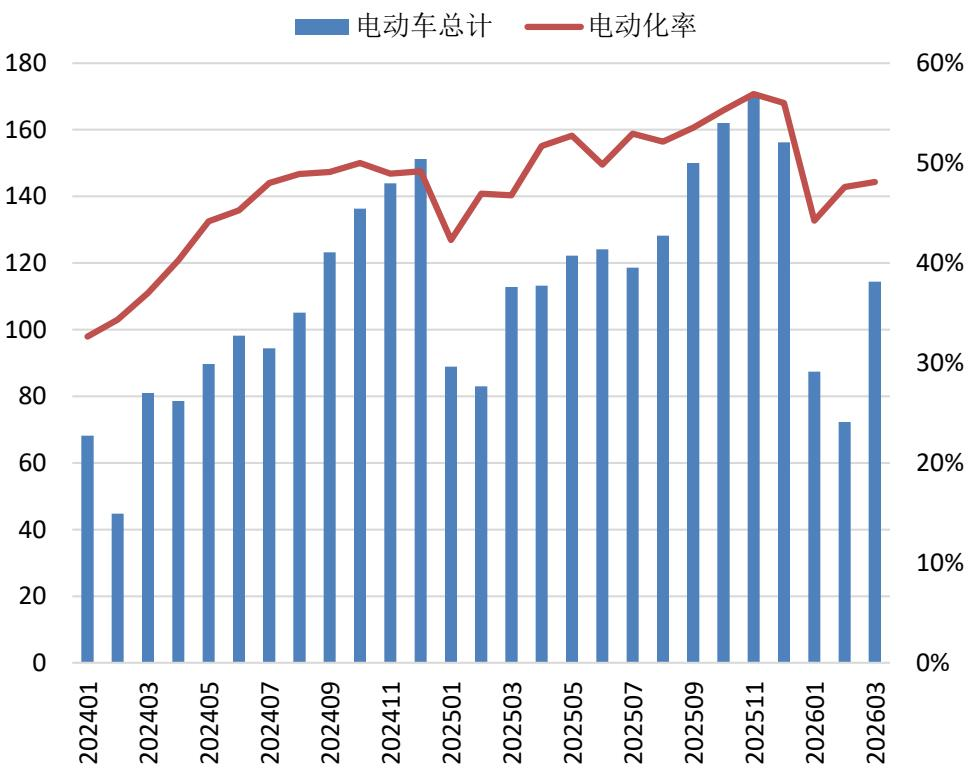

数据来源：中汽协，乘联会，东吴证券研究所

## 国内：26年3月插电同增6.1%，纯电占比60.8%

◆ 26年3月纯电占比60.8%，同比小幅下降。26年3月国内纯电销69.5万辆，同环比-2.0%/+65.0%，占比60.8%，同减2.0pct；插电式混动汽车销35.2万辆，同环比+6.1%/+43.1%，占比30.8%，同增1.5pct；增程式混动汽车销9.6万辆，同环比+7.7%/+74.8%，占比8.4%，同增0.5pct。1-3月纯电销162.4万辆，同增8.8%，占比59.4%，同减2.3pct；插电式混动汽车销87.6万辆，同增22.5%，增程式混动汽车销23.2万辆，同增8.9%。

图：乘联会分车型销量（单位：万辆）  
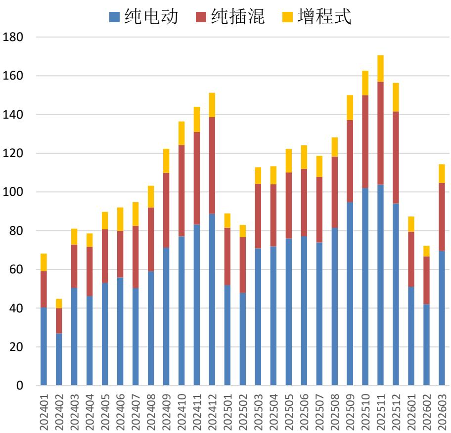

图：乘联会纯电分车型销量（单位：万辆）  
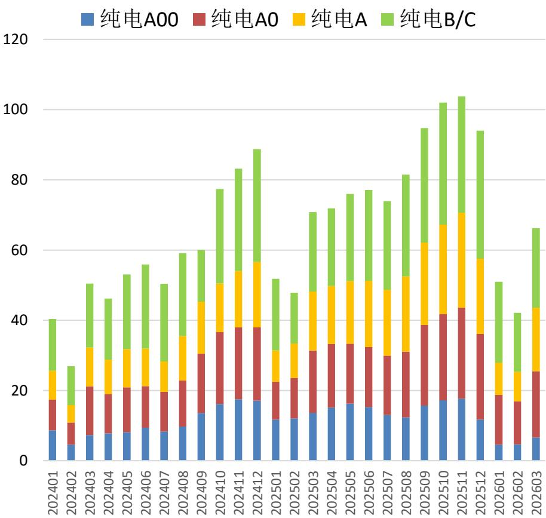

## 国内：低价带销量承压，高端市场表现亮眼结构改善

◆ 分价格带看，15万元以下低价区间销量承压，高端车表现亮眼，渗透率提升。26年1-3月5万元以下销量4.6万辆，同减64%，渗透率84%；5-10万元销量35.2万辆，同减32%，渗透率54%；10-15万元销量55.3万辆，同减28%，渗透率44% ；15-20万元销量23.3万辆，同减24%，渗透率28% ；20-30万元销量46.8万辆，同增0.2%，渗透率57% ；30-40万元销量15.2万辆，同减7%，渗透率45% ；40万元以上销量10.6万辆，同增77%，渗透率42% 。

图：26年1-3月新能源乘用车各价格区间销量、渗透率及同比（万辆）  
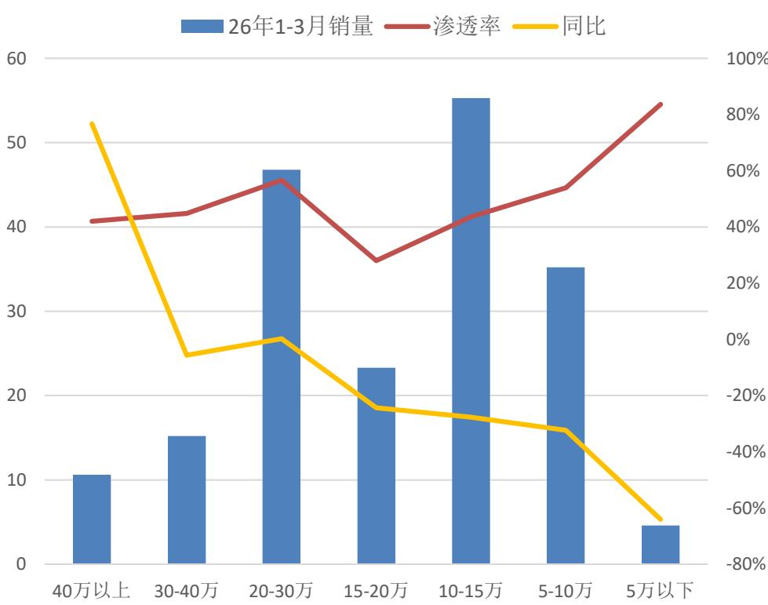

图：26年3月乘用车零售价格分布
<table><tr><td rowspan=2 colspan=1>乘联数据</td><td rowspan=1 colspan=3>2026年分动力的零售价格分布</td><td rowspan=1 colspan=1>零售价</td><td rowspan=1 colspan=2>洛分布</td><td rowspan=1 colspan=6>较25年变化</td></tr><tr><td rowspan=1 colspan=1>常规</td><td rowspan=1 colspan=1>混合动力</td><td rowspan=1 colspan=1>狭义插混</td><td rowspan=1 colspan=1>增程式</td><td rowspan=1 colspan=1>纯电动</td><td rowspan=1 colspan=1>2026汇总</td><td rowspan=1 colspan=1>常规</td><td rowspan=1 colspan=1>混合动力</td><td rowspan=1 colspan=1>狭义插混</td><td rowspan=1 colspan=1>增程式</td><td rowspan=1 colspan=1>纯电动</td><td rowspan=1 colspan=1>总体变化</td></tr><tr><td rowspan=1 colspan=1>40万以上</td><td rowspan=1 colspan=1>7.4%</td><td rowspan=1 colspan=1>2.3%</td><td rowspan=1 colspan=1>8.3%</td><td rowspan=1 colspan=1>6.6%</td><td rowspan=1 colspan=1>3.4%</td><td rowspan=1 colspan=1>5.8%</td><td rowspan=1 colspan=1>-0.8%</td><td rowspan=1 colspan=1>-0.1%</td><td rowspan=1 colspan=1>7.8%</td><td rowspan=1 colspan=1>-5.2%</td><td rowspan=1 colspan=1>2.1%</td><td rowspan=1 colspan=1>1.1%</td></tr><tr><td rowspan=1 colspan=1>30-40万</td><td rowspan=1 colspan=1>7.4%</td><td rowspan=1 colspan=1>15.9%</td><td rowspan=1 colspan=1>9.6%</td><td rowspan=1 colspan=1>17.0%</td><td rowspan=1 colspan=1>3.2%</td><td rowspan=1 colspan=1>7.1%</td><td rowspan=1 colspan=1>-1.0%</td><td rowspan=1 colspan=1>-2.6%</td><td rowspan=1 colspan=1>-1.2%</td><td rowspan=1 colspan=1>-1.7%</td><td rowspan=1 colspan=1>0.2%</td><td rowspan=1 colspan=1>-0.7%</td></tr><tr><td rowspan=1 colspan=1>20-30万</td><td rowspan=1 colspan=1>14.7%</td><td rowspan=1 colspan=1>28.0%</td><td rowspan=1 colspan=1>9.4%</td><td rowspan=1 colspan=1>31.8%</td><td rowspan=1 colspan=1>26.0%</td><td rowspan=1 colspan=1>19.4%</td><td rowspan=1 colspan=1>3.2%</td><td rowspan=1 colspan=1>-4.9%</td><td rowspan=1 colspan=1>-0.4%</td><td rowspan=1 colspan=1>-12.3%</td><td rowspan=1 colspan=1>3.8%</td><td rowspan=1 colspan=1>2.3%</td></tr><tr><td rowspan=1 colspan=1>15万-20万</td><td rowspan=1 colspan=1>23.5%</td><td rowspan=1 colspan=1>39.4%</td><td rowspan=1 colspan=1>20.3%</td><td rowspan=1 colspan=1>23.4%</td><td rowspan=1 colspan=1>5.6%</td><td rowspan=1 colspan=1>17.7%</td><td rowspan=1 colspan=1>-2.5%</td><td rowspan=1 colspan=1>14.6%</td><td rowspan=1 colspan=1>6.5%</td><td rowspan=1 colspan=1>7.9%</td><td rowspan=1 colspan=1>-5.9%</td><td rowspan=1 colspan=1>-1.4%</td></tr><tr><td rowspan=1 colspan=1>10-15万</td><td rowspan=1 colspan=1>31.7%</td><td rowspan=1 colspan=1>14.4%</td><td rowspan=1 colspan=1>40.8%</td><td rowspan=1 colspan=1>20.0%</td><td rowspan=1 colspan=1>32.3%</td><td rowspan=1 colspan=1>31.7%</td><td rowspan=1 colspan=1>0.2%</td><td rowspan=1 colspan=1>-7.0%</td><td rowspan=1 colspan=1>-9.5%</td><td rowspan=1 colspan=1>10.7%</td><td rowspan=1 colspan=1>6.1%</td><td rowspan=1 colspan=1>0.7%</td></tr><tr><td rowspan=1 colspan=1>5-10万</td><td rowspan=1 colspan=1>14.7%</td><td rowspan=1 colspan=1>0.0%</td><td rowspan=1 colspan=1>11.3%</td><td rowspan=1 colspan=1>1.1%6</td><td rowspan=1 colspan=1>25.1%</td><td rowspan=1 colspan=1>16.6%</td><td rowspan=1 colspan=1>1.3%</td><td rowspan=1 colspan=1>0.0%</td><td rowspan=1 colspan=1>-3.4%</td><td rowspan=1 colspan=1>0.6%</td><td rowspan=1 colspan=1>-2.0%</td><td rowspan=1 colspan=1>-0.5%</td></tr><tr><td rowspan=1 colspan=1>5万以下</td><td rowspan=1 colspan=1>0.6%</td><td rowspan=1 colspan=1>0.0%</td><td rowspan=1 colspan=1>0.2%</td><td rowspan=1 colspan=1>0.0%</td><td rowspan=1 colspan=1>4.5%</td><td rowspan=1 colspan=1>1.8%</td><td rowspan=1 colspan=1>-0.4%</td><td rowspan=1 colspan=1>0.0%</td><td rowspan=1 colspan=1>0.2%</td><td rowspan=1 colspan=1>0.0%</td><td rowspan=1 colspan=1>-4.2%</td><td rowspan=1 colspan=1>-1.5%</td></tr><tr><td rowspan=1 colspan=1>总计</td><td rowspan=1 colspan=1>100%</td><td rowspan=1 colspan=1>100%</td><td rowspan=1 colspan=1>100%</td><td rowspan=1 colspan=1>100%</td><td rowspan=1 colspan=1>100%</td><td rowspan=1 colspan=1>100%</td><td rowspan=1 colspan=1>0.0%</td><td rowspan=1 colspan=1>0.0%</td><td rowspan=1 colspan=1>0.0%</td><td rowspan=1 colspan=1>0.0%</td><td rowspan=1 colspan=1>0.0%</td><td rowspan=1 colspan=1>0.0%</td></tr><tr><td rowspan=2 colspan=1>乘联数据</td><td rowspan=1 colspan=1></td><td rowspan=1 colspan=1>026年3</td><td rowspan=1 colspan=1>月零售价</td><td rowspan=1 colspan=1>格段内的</td><td rowspan=1 colspan=1>动力分布</td><td rowspan=1 colspan=1></td><td rowspan=1 colspan=1></td><td rowspan=1 colspan=1></td><td rowspan=1 colspan=1>较25年</td><td rowspan=1 colspan=1>3月变化</td><td rowspan=1 colspan=1></td><td rowspan=1 colspan=1></td></tr><tr><td rowspan=1 colspan=1>常规</td><td rowspan=1 colspan=1>力</td><td rowspan=1 colspan=1>混</td><td rowspan=1 colspan=1>增程式</td><td rowspan=1 colspan=1>纯电动</td><td rowspan=1 colspan=1></td><td rowspan=1 colspan=1>常规</td><td rowspan=1 colspan=1>混合动力</td><td rowspan=1 colspan=1>狭义插混</td><td rowspan=1 colspan=1>增程式</td><td rowspan=1 colspan=1>纯电动</td><td rowspan=1 colspan=1></td></tr><tr><td rowspan=1 colspan=1>40万以上</td><td rowspan=1 colspan=1>55.5%</td><td rowspan=1 colspan=1>1.8%</td><td rowspan=1 colspan=1>17.6%</td><td rowspan=1 colspan=1>5.2%</td><td rowspan=1 colspan=1>19.9%</td><td rowspan=1 colspan=1></td><td rowspan=1 colspan=1>-21.5%</td><td rowspan=1 colspan=1>-0.3%</td><td rowspan=1 colspan=1>16.0%</td><td rowspan=1 colspan=1>-5.1%</td><td rowspan=1 colspan=1>10.8%</td><td rowspan=1 colspan=1></td></tr><tr><td rowspan=1 colspan=1>30-40万</td><td rowspan=1 colspan=1>45.8%</td><td rowspan=1 colspan=1>10.5%</td><td rowspan=1 colspan=1>16.9%</td><td rowspan=1 colspan=1>11.0%</td><td rowspan=1 colspan=1>15.7%</td><td rowspan=1 colspan=1></td><td rowspan=1 colspan=1>-2.3%</td><td rowspan=1 colspan=1>0.6%</td><td rowspan=1 colspan=1>-2.2%</td><td rowspan=1 colspan=1>1.1%</td><td rowspan=1 colspan=1>2.8%</td><td rowspan=1 colspan=1></td></tr><tr><td rowspan=1 colspan=1>20-30万</td><td rowspan=1 colspan=1>33.3%</td><td rowspan=1 colspan=1>6.8%</td><td rowspan=1 colspan=1>6.0%</td><td rowspan=1 colspan=1>7.5%</td><td rowspan=1 colspan=1>46.3%</td><td rowspan=1 colspan=1></td><td rowspan=1 colspan=1>3.2%</td><td rowspan=1 colspan=1>-1.3%</td><td rowspan=1 colspan=1>-1.9%</td><td rowspan=1 colspan=1>-3.2%</td><td rowspan=1 colspan=1>3.1%</td><td rowspan=1 colspan=1></td></tr><tr><td rowspan=1 colspan=1>15万-20万</td><td rowspan=1 colspan=1>58.4%</td><td rowspan=1 colspan=1>10.5%</td><td rowspan=1 colspan=1>14.2%</td><td rowspan=1 colspan=1>6.1%6</td><td rowspan=1 colspan=1>10.9%</td><td rowspan=1 colspan=1></td><td rowspan=1 colspan=1>-2.7%</td><td rowspan=1 colspan=1>5.0%</td><td rowspan=1 colspan=1>4.2%</td><td rowspan=1 colspan=1>2.7%</td><td rowspan=1 colspan=1>-9.2%</td><td rowspan=1 colspan=1></td></tr><tr><td rowspan=1 colspan=1>10-15万</td><td rowspan=1 colspan=1>43.8%</td><td rowspan=1 colspan=1>2.1%</td><td rowspan=1 colspan=1>16.0%</td><td rowspan=1 colspan=1>2.9%</td><td rowspan=1 colspan=1>35.2%</td><td rowspan=1 colspan=1></td><td rowspan=1 colspan=1>-1.5%</td><td rowspan=1 colspan=1>-0.8%</td><td rowspan=1 colspan=1>-6.4%</td><td rowspan=1 colspan=1>1.6%</td><td rowspan=1 colspan=1>7.1%</td><td rowspan=1 colspan=1></td></tr><tr><td rowspan=1 colspan=1>5-10万</td><td rowspan=1 colspan=1>39.0%</td><td rowspan=1 colspan=1>0.0%</td><td rowspan=1 colspan=1>8.5%</td><td rowspan=1 colspan=1>0.3%</td><td rowspan=1 colspan=1>52.3%</td><td rowspan=1 colspan=1></td><td rowspan=1 colspan=1>3.8%</td><td rowspan=1 colspan=1>0.0%</td><td rowspan=1 colspan=1>-3.4%</td><td rowspan=1 colspan=1>0.2%</td><td rowspan=1 colspan=1>0.6%</td><td rowspan=1 colspan=1></td></tr><tr><td rowspan=1 colspan=1>5万以下</td><td rowspan=1 colspan=1>13.7%</td><td rowspan=1 colspan=1>0.0%</td><td rowspan=1 colspan=1>1.5%</td><td rowspan=1 colspan=1>0.0%</td><td rowspan=1 colspan=1>84.8%</td><td rowspan=1 colspan=1></td><td rowspan=1 colspan=1>1.1%</td><td rowspan=1 colspan=1>0.0%</td><td rowspan=1 colspan=1>1.5%</td><td rowspan=1 colspan=1>0.0%</td><td rowspan=1 colspan=1>2.6%</td><td rowspan=1 colspan=1>东树</td></tr><tr><td rowspan=1 colspan=1>总计</td><td rowspan=1 colspan=1>43.8%</td><td rowspan=1 colspan=1>4.7%</td><td rowspan=1 colspan=1>12.4%</td><td rowspan=1 colspan=1>4.6%</td><td rowspan=1 colspan=1>34.5%</td><td rowspan=1 colspan=1></td><td rowspan=1 colspan=1>-0.8%</td><td rowspan=1 colspan=1>0.5%</td><td rowspan=1 colspan=1>-1.4%</td><td rowspan=1 colspan=1>0.4%</td><td rowspan=1 colspan=1>1.3%</td><td rowspan=1 colspan=1></td></tr></table>

## 分车企：结构分化，吉利、特斯拉、零跑等实现正增长

◆ 2026年1-3月比亚迪销量位居第一，市占率25%同比下滑，吉利、特斯拉市占率明显提升。受春节假期工作日调整、车企产品周期切换影响，大部分车企1-3月累计销量同比下滑，自主品牌中，比亚迪3月销量30万辆，环增60%，1-3月销售69.3万辆，同比-30%，吉利3月销量13万辆，环增11%，1-3月销售37.2万辆，同增10%，新势力及外资品牌中，特斯拉、零跑等同比正增长，表现亮眼。

表：主流车企新能源车月度销量（万辆）
<table><tr><td rowspan=1 colspan=1>车企</td><td rowspan=1 colspan=1>202603</td><td rowspan=1 colspan=1>同比</td><td rowspan=1 colspan=1>环比</td><td rowspan=1 colspan=1>累计</td><td rowspan=1 colspan=1>累计同比</td><td rowspan=1 colspan=1>累计市占率</td><td rowspan=1 colspan=1>同比 (pct)</td></tr><tr><td rowspan=1 colspan=1>比亚迪</td><td rowspan=1 colspan=1>30.0</td><td rowspan=1 colspan=1>-27%</td><td rowspan=1 colspan=1>60%</td><td rowspan=1 colspan=1>69.3</td><td rowspan=1 colspan=1>-30%</td><td rowspan=1 colspan=1>25%</td><td rowspan=1 colspan=1>-1.8</td></tr><tr><td rowspan=1 colspan=1>吉利汽车</td><td rowspan=1 colspan=1>13.0</td><td rowspan=1 colspan=1>-21%</td><td rowspan=1 colspan=1>11%</td><td rowspan=1 colspan=1>37.2</td><td rowspan=1 colspan=1>10%</td><td rowspan=1 colspan=1>14%</td><td rowspan=1 colspan=1>2.8</td></tr><tr><td rowspan=1 colspan=1>特斯拉中国</td><td rowspan=1 colspan=1>9.0</td><td rowspan=1 colspan=1>-46%</td><td rowspan=1 colspan=1>54%</td><td rowspan=1 colspan=1>21.8</td><td rowspan=1 colspan=1>26%</td><td rowspan=1 colspan=1>8%</td><td rowspan=1 colspan=1>2.9</td></tr><tr><td rowspan=1 colspan=1>长安汽车</td><td rowspan=1 colspan=1>6.0</td><td rowspan=1 colspan=1>-22%</td><td rowspan=1 colspan=1>47%</td><td rowspan=1 colspan=1>12.8</td><td rowspan=1 colspan=1>-25%</td><td rowspan=1 colspan=1>5%</td><td rowspan=1 colspan=1>-1.5</td></tr><tr><td rowspan=1 colspan=1>奇瑞汽车</td><td rowspan=1 colspan=1>6.0</td><td rowspan=1 colspan=1>1%</td><td rowspan=1 colspan=1>66%</td><td rowspan=1 colspan=1>14.3</td><td rowspan=1 colspan=1>-5%</td><td rowspan=1 colspan=1>5%</td><td rowspan=1 colspan=1>-0.7</td></tr><tr><td rowspan=1 colspan=1>零跑汽车</td><td rowspan=1 colspan=1>5.0</td><td rowspan=1 colspan=1>30%</td><td rowspan=1 colspan=1>78%</td><td rowspan=1 colspan=1>11.0</td><td rowspan=1 colspan=1>26%</td><td rowspan=1 colspan=1>4%</td><td rowspan=1 colspan=1>0.5</td></tr><tr><td rowspan=1 colspan=1>上汽通用五菱</td><td rowspan=1 colspan=1>4.0</td><td rowspan=1 colspan=1>-44%</td><td rowspan=1 colspan=1>49%</td><td rowspan=1 colspan=1>9.4</td><td rowspan=1 colspan=1>-42%</td><td rowspan=1 colspan=1>3%</td><td rowspan=1 colspan=1>-1.7</td></tr><tr><td rowspan=1 colspan=1>理想汽车</td><td rowspan=1 colspan=1>4.0</td><td rowspan=1 colspan=1>9%</td><td rowspan=1 colspan=1>51%</td><td rowspan=1 colspan=1>9.4</td><td rowspan=1 colspan=1>1%</td><td rowspan=1 colspan=1>3%</td><td rowspan=1 colspan=1>1.0</td></tr><tr><td rowspan=1 colspan=1>东风汽车</td><td rowspan=1 colspan=1>3.6</td><td rowspan=1 colspan=1>45%</td><td rowspan=1 colspan=1>65%</td><td rowspan=1 colspan=1>8.5</td><td rowspan=1 colspan=1>46%</td><td rowspan=1 colspan=1>3%</td><td rowspan=1 colspan=1>0.9</td></tr><tr><td rowspan=1 colspan=1>上汽乘用车</td><td rowspan=1 colspan=1>3.0</td><td rowspan=1 colspan=1>96%</td><td rowspan=1 colspan=1>37%</td><td rowspan=1 colspan=1>8.0</td><td rowspan=1 colspan=1>198%</td><td rowspan=1 colspan=1>3%</td><td rowspan=1 colspan=1>1.0</td></tr></table>

数据来源：乘联会、各公司官网，东吴证券研究所

## 分车型：车市表现分化显著，高增长单品贡献结构性亮点

◆ 纯电车型中，Model Y、吉利星愿、蔚来ES8等车型表现亮眼，市占率较去年大幅提升。26年3月ModelY销量位居纯电车型首位，单月销售4.0万辆，同比减少19%；蔚来ES8单月销量1.6万辆，同比增长3062%，名爵4系单月销量1.4万辆，同比增长406%。ModelY、海鸥、元UP、五菱缤果等车型同比下滑。

◆ 插电车型中，星舰7、UNIZ、探索06、领克08、领克01等同比增长表现亮眼。26年3月比亚迪宋销量位居插电车型首位，单月销售5.2万辆，同环比-37%/+54%，比亚迪秦单月销售1.6万辆，同环比-16%/33%；秦L、理想L6等车型同比下滑。

表：新能源纯电主流车型月度销量（万辆）
<table><tr><td rowspan=1 colspan=1>车企</td><td rowspan=1 colspan=1>202603</td><td rowspan=1 colspan=1>同比</td><td rowspan=1 colspan=1>环比</td><td rowspan=1 colspan=1>累计</td><td rowspan=1 colspan=1>累计同比</td><td rowspan=1 colspan=1>累计市占率同比 （pct)</td><td rowspan=1 colspan=1>累计市占率同比 （pct)</td></tr><tr><td rowspan=1 colspan=1>ModelY</td><td rowspan=1 colspan=1>4.0</td><td rowspan=1 colspan=1>-19%</td><td rowspan=1 colspan=1>-4%</td><td rowspan=1 colspan=1>12.0</td><td rowspan=1 colspan=1>35%</td><td rowspan=1 colspan=1>7%</td><td rowspan=1 colspan=1>1.2</td></tr><tr><td rowspan=1 colspan=1>海鸥</td><td rowspan=1 colspan=1>3.4</td><td rowspan=1 colspan=1>-4%</td><td rowspan=1 colspan=1>68%</td><td rowspan=1 colspan=1>7.4</td><td rowspan=1 colspan=1>-37%</td><td rowspan=1 colspan=1>5%</td><td rowspan=1 colspan=1>-1.5</td></tr><tr><td rowspan=1 colspan=1>吉利星愿</td><td rowspan=1 colspan=1>3.2</td><td rowspan=1 colspan=1>0%</td><td rowspan=1 colspan=1>-14%</td><td rowspan=1 colspan=1>11.2</td><td rowspan=1 colspan=1>26%</td><td rowspan=1 colspan=1>7%</td><td rowspan=1 colspan=1>1.4</td></tr><tr><td rowspan=1 colspan=1>Model3</td><td rowspan=1 colspan=1>2.7</td><td rowspan=1 colspan=1>4%</td><td rowspan=1 colspan=1>56%</td><td rowspan=1 colspan=1>7.4</td><td rowspan=1 colspan=1>-11%</td><td rowspan=1 colspan=1>5%</td><td rowspan=1 colspan=1>1.0</td></tr><tr><td rowspan=1 colspan=1>元UP</td><td rowspan=1 colspan=1>2.2</td><td rowspan=1 colspan=1>-14%</td><td rowspan=1 colspan=1>95%</td><td rowspan=1 colspan=1>4.3</td><td rowspan=1 colspan=1>-23%</td><td rowspan=1 colspan=1>3%</td><td rowspan=1 colspan=1>-0.4</td></tr><tr><td rowspan=1 colspan=1>比亚迪海豚</td><td rowspan=1 colspan=1>1.7</td><td rowspan=1 colspan=1>9%</td><td rowspan=1 colspan=1>71%</td><td rowspan=1 colspan=1>3.9</td><td rowspan=1 colspan=1>15%</td><td rowspan=1 colspan=1>2%</td><td rowspan=1 colspan=1>-0.3</td></tr><tr><td rowspan=1 colspan=1>蔚来ES8</td><td rowspan=1 colspan=1>1.6</td><td rowspan=1 colspan=1>3062%</td><td rowspan=1 colspan=1>44%</td><td rowspan=1 colspan=1>4.5</td><td rowspan=1 colspan=1>3040%</td><td rowspan=1 colspan=1>3%</td><td rowspan=1 colspan=1>2.2</td></tr><tr><td rowspan=1 colspan=1>名爵4系</td><td rowspan=1 colspan=1>1.4</td><td rowspan=1 colspan=1>406%</td><td rowspan=1 colspan=1>35%</td><td rowspan=1 colspan=1>3.9</td><td rowspan=1 colspan=1>712%</td><td rowspan=1 colspan=1>2%</td><td rowspan=1 colspan=1>1.4</td></tr><tr><td rowspan=1 colspan=1>五菱缤果</td><td rowspan=1 colspan=1>1.1</td><td rowspan=1 colspan=1>-35%</td><td rowspan=1 colspan=1>31%</td><td rowspan=1 colspan=1>2.8</td><td rowspan=1 colspan=1>8%</td><td rowspan=1 colspan=1>2%</td><td rowspan=1 colspan=1>-0.5</td></tr><tr><td rowspan=1 colspan=1>极氪7X</td><td rowspan=1 colspan=1>0.6</td><td rowspan=1 colspan=1>16%</td><td rowspan=1 colspan=1>-35%</td><td rowspan=1 colspan=1>2.7</td><td rowspan=1 colspan=1>82%</td><td rowspan=1 colspan=1>2%</td><td rowspan=1 colspan=1>0.8</td></tr></table>

表：新能源插混主流车型月度销量（万辆）
<table><tr><td rowspan=1 colspan=1>车企</td><td rowspan=1 colspan=1>202603</td><td rowspan=1 colspan=1>同比</td><td rowspan=1 colspan=1>环比</td><td rowspan=1 colspan=1>累计</td><td rowspan=1 colspan=1>累计同比</td><td rowspan=1 colspan=1>累计市占率</td><td rowspan=1 colspan=1>同比 (pct)</td></tr><tr><td rowspan=1 colspan=1>比亚迪宋</td><td rowspan=1 colspan=1>5.2</td><td rowspan=1 colspan=1>-37%</td><td rowspan=1 colspan=1>54%</td><td rowspan=1 colspan=1>12.7</td><td rowspan=1 colspan=1>56%</td><td rowspan=1 colspan=1>15%</td><td rowspan=1 colspan=1>0.0</td></tr><tr><td rowspan=1 colspan=1>比亚迪秦</td><td rowspan=1 colspan=1>1.6</td><td rowspan=1 colspan=1>-16%</td><td rowspan=1 colspan=1>33%</td><td rowspan=1 colspan=1>4.0</td><td rowspan=1 colspan=1>83%</td><td rowspan=1 colspan=1>5%</td><td rowspan=1 colspan=1>-1.0</td></tr><tr><td rowspan=1 colspan=1>星舰7</td><td rowspan=1 colspan=1>1.4</td><td rowspan=1 colspan=1>20%</td><td rowspan=1 colspan=1>30%</td><td rowspan=1 colspan=1>3.7</td><td rowspan=1 colspan=1>88%</td><td rowspan=1 colspan=1>4%</td><td rowspan=1 colspan=1>1.4</td></tr><tr><td rowspan=1 colspan=1>秦L</td><td rowspan=1 colspan=1>1.4</td><td rowspan=1 colspan=1>-6%</td><td rowspan=1 colspan=1>27%</td><td rowspan=1 colspan=1>3.5</td><td rowspan=1 colspan=1>69%</td><td rowspan=1 colspan=1>4%</td><td rowspan=1 colspan=1>0.4</td></tr><tr><td rowspan=1 colspan=1>海豹06</td><td rowspan=1 colspan=1>1.2</td><td rowspan=1 colspan=1>-33%</td><td rowspan=1 colspan=1>26%</td><td rowspan=1 colspan=1>3.1</td><td rowspan=1 colspan=1>65%</td><td rowspan=1 colspan=1>4%</td><td rowspan=1 colspan=1>-0.4</td></tr><tr><td rowspan=1 colspan=1>UNIZ</td><td rowspan=1 colspan=1>1.1</td><td rowspan=1 colspan=1>173%</td><td rowspan=1 colspan=1>22%</td><td rowspan=1 colspan=1>2.1</td><td rowspan=1 colspan=1>146%</td><td rowspan=1 colspan=1>2%</td><td rowspan=1 colspan=1>1.1</td></tr><tr><td rowspan=1 colspan=1>探索06</td><td rowspan=1 colspan=1>1.1</td><td rowspan=1 colspan=1>43%</td><td rowspan=1 colspan=1>17%</td><td rowspan=1 colspan=1>3.2</td><td rowspan=1 colspan=1>192%</td><td rowspan=1 colspan=1>4%</td><td rowspan=1 colspan=1>1.1</td></tr><tr><td rowspan=1 colspan=1>领克08</td><td rowspan=1 colspan=1>0.8</td><td rowspan=1 colspan=1>131%</td><td rowspan=1 colspan=1>20%</td><td rowspan=1 colspan=1>1.9</td><td rowspan=1 colspan=1>195%</td><td rowspan=1 colspan=1>2%</td><td rowspan=1 colspan=1>1.1</td></tr><tr><td rowspan=1 colspan=1>理想L6</td><td rowspan=1 colspan=1>0.6</td><td rowspan=1 colspan=1>-64%</td><td rowspan=1 colspan=1>25%</td><td rowspan=1 colspan=1>1.6</td><td rowspan=1 colspan=1>36%</td><td rowspan=1 colspan=1>2%</td><td rowspan=1 colspan=1>-1.6</td></tr><tr><td rowspan=1 colspan=1>领克01</td><td rowspan=1 colspan=1>0.4</td><td rowspan=1 colspan=1>171%</td><td rowspan=1 colspan=1>-16%</td><td rowspan=1 colspan=1>1.1</td><td rowspan=1 colspan=1>286%</td><td rowspan=1 colspan=1>1%</td><td rowspan=1 colspan=1>0.9</td></tr></table>

## 国内：3月新能源车出口37.1万辆，同增135%，超预期

◆ 26年1-3月新能源车出口95.4万辆，同增120%，超市场预期。根据中汽协数据，26年3月新能源车出口37.1万辆，同增135%，1-3月出口95.4万辆，同增120%；根据乘联会数据，3月新能源乘用车出口34.9万辆，同环比+139.9%/+29.6%，1-3月出口90.8万辆，同增123.7%。3月特斯拉出口2万辆，同增421%；比亚迪出口9.9万辆，同增47%，奇瑞出口2.8万辆，同增155%，吉利出口4.1万辆，同增697%。

图：国内电动车出口情况（万辆）  
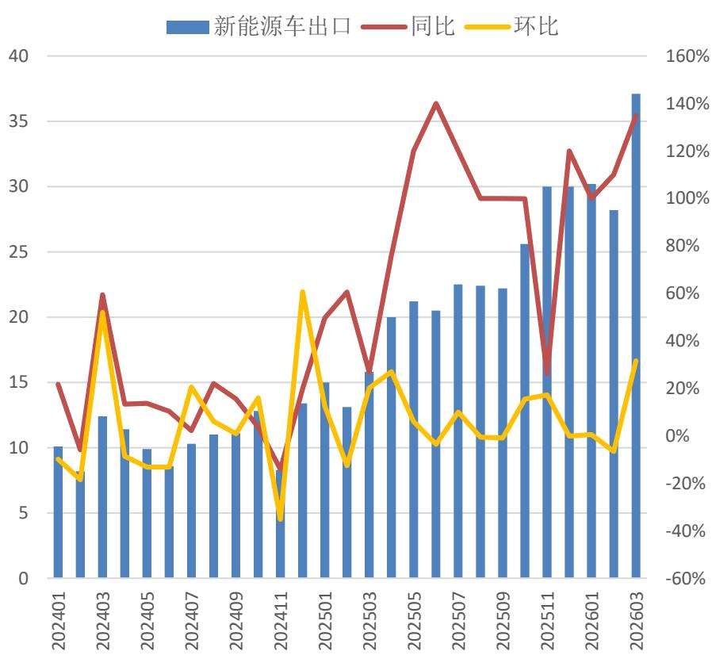

表：国内26年3月新能源车企出口量（万辆）
<table><tr><td rowspan=1 colspan=1>车企</td><td rowspan=1 colspan=1>202603</td><td rowspan=1 colspan=1>同比</td><td rowspan=1 colspan=1>环比</td><td rowspan=1 colspan=1>累计</td><td rowspan=1 colspan=1>累计同比</td><td rowspan=1 colspan=1>累计市占率同比 (pct)</td><td rowspan=1 colspan=1>累计市占率同比 (pct)</td></tr><tr><td rowspan=1 colspan=1>比亚迪</td><td rowspan=1 colspan=1>11.7</td><td rowspan=1 colspan=1>74%</td><td rowspan=1 colspan=1>19%</td><td rowspan=1 colspan=1>31.3</td><td rowspan=1 colspan=1>47%</td><td rowspan=1 colspan=1>34%</td><td rowspan=1 colspan=1>-7.3</td></tr><tr><td rowspan=1 colspan=1>吉利汽车</td><td rowspan=1 colspan=1>5.2</td><td rowspan=1 colspan=1>491%</td><td rowspan=1 colspan=1>27%</td><td rowspan=1 colspan=1>12.5</td><td rowspan=1 colspan=1>747%</td><td rowspan=1 colspan=1>14%</td><td rowspan=1 colspan=1>8.7</td></tr><tr><td rowspan=1 colspan=1>奇瑞汽车</td><td rowspan=1 colspan=1>4.1</td><td rowspan=1 colspan=1>150%</td><td rowspan=1 colspan=1>45%</td><td rowspan=1 colspan=1>9.6</td><td rowspan=1 colspan=1>180%</td><td rowspan=1 colspan=1>11%</td><td rowspan=1 colspan=1>-2.6</td></tr><tr><td rowspan=1 colspan=1>特斯拉中国</td><td rowspan=1 colspan=1>3.0</td><td rowspan=1 colspan=1>538%</td><td rowspan=1 colspan=1>47%</td><td rowspan=1 colspan=1>10.1</td><td rowspan=1 colspan=1>112%</td><td rowspan=1 colspan=1>11%</td><td rowspan=1 colspan=1>1.8</td></tr><tr><td rowspan=1 colspan=1>上汽乘用车</td><td rowspan=1 colspan=1>2.0</td><td rowspan=1 colspan=1>161%</td><td rowspan=1 colspan=1>41%</td><td rowspan=1 colspan=1>4.7</td><td rowspan=1 colspan=1>288%</td><td rowspan=1 colspan=1>5%</td><td rowspan=1 colspan=1>0.9</td></tr><tr><td rowspan=1 colspan=1>零跑汽车</td><td rowspan=1 colspan=1>1.7</td><td rowspan=1 colspan=1>352%</td><td rowspan=1 colspan=1>74%</td><td rowspan=1 colspan=1>4.1</td><td rowspan=1 colspan=1>542%</td><td rowspan=1 colspan=1>5%</td><td rowspan=1 colspan=1>1.8</td></tr><tr><td rowspan=1 colspan=1>长安汽车</td><td rowspan=1 colspan=1>1.3</td><td rowspan=1 colspan=1>490%</td><td rowspan=1 colspan=1>116%</td><td rowspan=1 colspan=1>2.4</td><td rowspan=1 colspan=1>27%</td><td rowspan=1 colspan=1>3%</td><td rowspan=1 colspan=1>-0.3</td></tr><tr><td rowspan=1 colspan=1>东风汽车</td><td rowspan=1 colspan=1>1.3</td><td rowspan=1 colspan=1>467%</td><td rowspan=1 colspan=1>46%</td><td rowspan=1 colspan=1>3.1</td><td rowspan=1 colspan=1>154%</td><td rowspan=1 colspan=1>3%</td><td rowspan=1 colspan=1>2.0</td></tr></table>

数据来源：中汽协，乘联会，东吴证券研究所

## 国内：各季度均有新车发布，价格覆盖全面叠加智能化升级

◆ 今年各季度主流车企均有新车型密集发布，价格带覆盖全面，将支撑全年新能源汽车销量稳步增长。新势力方面，26Q1小鹏G7增程版正式上市，售价17万起。26年小米YU9、极氪8X、乐道L80、蔚来ES9、智界R7、比亚迪海豹 07EV、尚界Z7等新车即将上市，车型以家庭向SUV为主，覆盖10-50万全价格区间，有望支撑26年销量增长。

表：主流车企新车型情况
<table><tr><td rowspan=1 colspan=1>车企名称</td><td rowspan=1 colspan=1>新车型</td><td rowspan=1 colspan=1>价格区间</td><td rowspan=1 colspan=1>上市时间</td><td rowspan=1 colspan=1>车型亮点</td></tr><tr><td rowspan=1 colspan=1>吉利汽车</td><td rowspan=1 colspan=1>EM-I远航家</td><td rowspan=1 colspan=1>14-16万元</td><td rowspan=1 colspan=1>第一季度</td><td rowspan=1 colspan=1>全系搭载28.3kWh新一代神盾金砖电池，CLTC纯电续航提升至225km，满油满电综合续航最高达1725km，馈电油耗低至3.32L/100km，支持15分钟快充补能30%-80%</td></tr><tr><td rowspan=1 colspan=1>长安汽车</td><td rowspan=1 colspan=1>启源Q06</td><td rowspan=1 colspan=1>10-14万元</td><td rowspan=1 colspan=1>第三季度</td><td rowspan=1 colspan=1>中型SUV，尺寸介于Q05和Q07之间，提供纯电/增程双动力；纯电版搭载800V高压平台，CLTC续航达600km；插混版WLTC油耗低至4L左右，填补启源中型SUV的市场空白</td></tr><tr><td rowspan=1 colspan=1>奥迪中国</td><td rowspan=1 colspan=1>奥迪A6L e-tron</td><td rowspan=1 colspan=1>预计35-45万元</td><td rowspan=1 colspan=1>第二季度</td><td rowspan=1 colspan=1>PPE平台，车长5.1m+、轴距3.1m；发光四环、AR-HUD、1.88m全景天幕；单/双电机可选，宁德时代电池</td></tr><tr><td rowspan=1 colspan=1>极氟汽车</td><td rowspan=1 colspan=1>极氮8×</td><td rowspan=1 colspan=1>约40万元</td><td rowspan=1 colspan=1>第二季度</td><td rowspan=1 colspan=1>超级电混高性能旗舰SUV，车身尺寸5108/2026/1780mm，轴距3069mm，采用5座布局，主打运动性能，与极氪9X形成产品互补</td></tr><tr><td rowspan=1 colspan=1>乐道汽车</td><td rowspan=1 colspan=1>乐道L80</td><td rowspan=1 colspan=1>预计25-35万元</td><td rowspan=1 colspan=1>上半年</td><td rowspan=1 colspan=1>家庭向中大型五座SUV，基于NT3.0平台，提供单电机340kW/双电机440kW版本，电池85kWh起，主打大空间家用市场</td></tr><tr><td rowspan=1 colspan=1>小鹏汽车</td><td rowspan=1 colspan=1>小鹏GX</td><td rowspan=1 colspan=1>预计30万起</td><td rowspan=1 colspan=1>第二季度</td><td rowspan=1 colspan=1>小鹏首款旗舰级大六座SUV，已完成工信部申报，官方已开启多轮预热，主打高端家庭市场，搭载高阶智能驾驶系统</td></tr><tr><td rowspan=1 colspan=1>小米汽车</td><td rowspan=1 colspan=1>YU9</td><td rowspan=1 colspan=1>预计35-55万元</td><td rowspan=1 colspan=1>上半年</td><td rowspan=1 colspan=1>大型旗舰增程SUV，车长超5.2米，提供6/7座布局；搭载1.5T增程器+双电机四驱，CLTC纯电续航超400km，满油满电综合续航超1500km，支持800V高压快充；配备3颗激光雷达+双Orin-X芯片，搭载 XiaomiPilotMax 2.0智驾系统，打通小米人车家全生态</td></tr><tr><td rowspan=1 colspan=1>蔚来汽车</td><td rowspan=1 colspan=1>ES9</td><td rowspan=1 colspan=1>约50万</td><td rowspan=1 colspan=1>上半年</td><td rowspan=1 colspan=1>纯电旗舰SUV；车长&gt;5.3m；轴距3.1m+；900V架构；3激光雷达；天行智能底盘；新旗舰车型</td></tr><tr><td rowspan=1 colspan=1>智界</td><td rowspan=1 colspan=1>R7</td><td rowspan=1 colspan=1>26万元起</td><td rowspan=1 colspan=1>第一季度</td><td rowspan=1 colspan=1>中型纯电轿跑SUV，风阻系数0.217Cd；全系标配896线激光雷达+华为乾崑ADS智驾系统；搭载800V高压平台，行业首发前排双零重力座椅，配备52L电吸前备箱，CLTC最高续航超700km</td></tr><tr><td rowspan=1 colspan=1>比亚迪汽车</td><td rowspan=1 colspan=1>海豹07EV</td><td rowspan=1 colspan=1>16.99-18.99万元</td><td rowspan=1 colspan=1>第一季度</td><td rowspan=1 colspan=1>中型纯电轿跑，搭载第二代刀片电池与兆瓦闪充技术，实现5分钟10%-70%、9分钟10%-97%极速补能；CLTC续航705km，全系标配车顶激光雷达与天神之眼5.0智驾系统，标配车载冷暖冰箱</td></tr><tr><td rowspan=1 colspan=1>尚界</td><td rowspan=1 colspan=1>Z7</td><td rowspan=1 colspan=1>23万元起</td><td rowspan=1 colspan=1>上半年</td><td rowspan=1 colspan=1>中大型纯电轿跑，全系标配896线双光路图像级激光雷达+华为乾崑ADS4.1智驾系统；搭载华为巨鲸800V高压平台，CLTC最高续航905km，零百加速最快3.44秒；标配副驾零重力座椅、鸿蒙座舱5.0</td></tr><tr><td rowspan=1 colspan=1>小鹏汽车</td><td rowspan=1 colspan=1>G7增程版</td><td rowspan=1 colspan=1>17万+起</td><td rowspan=1 colspan=1>第一季度</td><td rowspan=1 colspan=1>增程式中型SUV；1.5T增程系统；430km纯电续航；800V架构；10分钟补能200km；主打智能驾驶与续航能力</td></tr></table>

数据来源：乘联会、各公司官网，东吴证券研究所

## 国内动力：单车带电量提升超预期

◆ 2026年1-2月国内单车带电量平均63.7kwh，同比提升30.8%。

◆ 2026年1-2月乘用车带电量平均54.5kwh，同比提升24.3%，去年全年乘用车带电量为46kwh，我们原预期26年乘用车带电量是48kwh，1-2月乘用车带电量已超预期。

图：国内单车带电量提升
<table><tr><td rowspan=1 colspan=1>月份</td><td rowspan=1 colspan=1>纯电+插电乘用</td><td rowspan=1 colspan=1>纯电乘用</td><td rowspan=1 colspan=1>纯电客车</td><td rowspan=1 colspan=1>纯电专用</td><td rowspan=1 colspan=1>插电乘用</td><td rowspan=1 colspan=1>插电客车</td><td rowspan=1 colspan=1>插电专用</td><td rowspan=1 colspan=1>合计</td></tr><tr><td rowspan=1 colspan=1>2025-1</td><td rowspan=1 colspan=1>44.19</td><td rowspan=1 colspan=1>58.50</td><td rowspan=1 colspan=1>213.14</td><td rowspan=1 colspan=1>165.76</td><td rowspan=1 colspan=1>26.18</td><td rowspan=1 colspan=1>65.13</td><td rowspan=1 colspan=1>38.62</td><td rowspan=1 colspan=1>48.81</td></tr><tr><td rowspan=1 colspan=1>2025-2</td><td rowspan=1 colspan=1>43.51</td><td rowspan=1 colspan=1>53.36</td><td rowspan=1 colspan=1>174.56</td><td rowspan=1 colspan=1>147.64</td><td rowspan=1 colspan=1>25.26</td><td rowspan=1 colspan=1>120.57</td><td rowspan=1 colspan=1>42.99</td><td rowspan=1 colspan=1>48.59</td></tr><tr><td rowspan=1 colspan=1>2025-3</td><td rowspan=1 colspan=1>45.01</td><td rowspan=1 colspan=1>54.66</td><td rowspan=1 colspan=1>233.65</td><td rowspan=1 colspan=1>158.04</td><td rowspan=1 colspan=1>25.73</td><td rowspan=1 colspan=1>63.66</td><td rowspan=1 colspan=1>39.09</td><td rowspan=1 colspan=1>51.10</td></tr><tr><td rowspan=1 colspan=1>2025-4</td><td rowspan=1 colspan=1>45.24</td><td rowspan=1 colspan=1>55.52</td><td rowspan=1 colspan=1>195.83</td><td rowspan=1 colspan=1>163.85</td><td rowspan=1 colspan=1>27.12</td><td rowspan=1 colspan=1>1</td><td rowspan=1 colspan=1>42.11</td><td rowspan=1 colspan=1>52.37</td></tr><tr><td rowspan=1 colspan=1>2025-5</td><td rowspan=1 colspan=1>45.04</td><td rowspan=1 colspan=1>55.80</td><td rowspan=1 colspan=1>193.83</td><td rowspan=1 colspan=1>167.70</td><td rowspan=1 colspan=1>28.45</td><td rowspan=1 colspan=1>70.45</td><td rowspan=1 colspan=1>39.39</td><td rowspan=1 colspan=1>51.30</td></tr><tr><td rowspan=1 colspan=1>2025-6</td><td rowspan=1 colspan=1>44.65</td><td rowspan=1 colspan=1>55.39</td><td rowspan=1 colspan=1>211.34</td><td rowspan=1 colspan=1>179.99</td><td rowspan=1 colspan=1>27.50</td><td rowspan=1 colspan=1>64.18</td><td rowspan=1 colspan=1>36.89</td><td rowspan=1 colspan=1>51.31</td></tr><tr><td rowspan=1 colspan=1>2025-7</td><td rowspan=1 colspan=1>45.69</td><td rowspan=1 colspan=1>55.67</td><td rowspan=1 colspan=1>201.38</td><td rowspan=1 colspan=1>180.49</td><td rowspan=1 colspan=1>28.44</td><td rowspan=1 colspan=1>77.10</td><td rowspan=1 colspan=1>38.75</td><td rowspan=1 colspan=1>52.68</td></tr><tr><td rowspan=1 colspan=1>2025-8</td><td rowspan=1 colspan=1>45.94</td><td rowspan=1 colspan=1>55.76</td><td rowspan=1 colspan=1>196.16</td><td rowspan=1 colspan=1>182.49</td><td rowspan=1 colspan=1>27.78</td><td rowspan=1 colspan=1>1</td><td rowspan=1 colspan=1>38.21</td><td rowspan=1 colspan=1>52.77</td></tr><tr><td rowspan=1 colspan=1>2025-9</td><td rowspan=1 colspan=1>46.45</td><td rowspan=1 colspan=1>55.67</td><td rowspan=1 colspan=1>208.58</td><td rowspan=1 colspan=1>199.32</td><td rowspan=1 colspan=1>28.66</td><td rowspan=1 colspan=1>58.36</td><td rowspan=1 colspan=1>40.20</td><td rowspan=1 colspan=1>54.18</td></tr><tr><td rowspan=1 colspan=1>2025-10</td><td rowspan=1 colspan=1>46.15</td><td rowspan=1 colspan=1>55.20</td><td rowspan=1 colspan=1>203.83</td><td rowspan=1 colspan=1>199.07</td><td rowspan=1 colspan=1>29.45</td><td rowspan=1 colspan=1>50.68</td><td rowspan=1 colspan=1>35.39</td><td rowspan=1 colspan=1>53.37</td></tr><tr><td rowspan=1 colspan=1>2025-11</td><td rowspan=1 colspan=1>47.50</td><td rowspan=1 colspan=1>57.33</td><td rowspan=1 colspan=1>213.72</td><td rowspan=1 colspan=1>220.21</td><td rowspan=1 colspan=1>30.21</td><td rowspan=1 colspan=1>127.28</td><td rowspan=1 colspan=1>42.17</td><td rowspan=1 colspan=1>57.14</td></tr><tr><td rowspan=1 colspan=1>2025-12</td><td rowspan=1 colspan=1>49.77</td><td rowspan=1 colspan=1>62.86</td><td rowspan=1 colspan=1>207.01</td><td rowspan=1 colspan=1>224.04</td><td rowspan=1 colspan=1>30.78</td><td rowspan=1 colspan=1>60.99</td><td rowspan=1 colspan=1>41.55</td><td rowspan=1 colspan=1>63.21</td></tr><tr><td rowspan=1 colspan=1>2025年累计</td><td rowspan=1 colspan=1> 46.02</td><td rowspan=1 colspan=1>56.43</td><td rowspan=1 colspan=1>207.11</td><td rowspan=1 colspan=1>188.14</td><td rowspan=1 colspan=1>28.26</td><td rowspan=1 colspan=1>84.57</td><td rowspan=1 colspan=1>39.82</td><td rowspan=1 colspan=1>53.71</td></tr><tr><td rowspan=1 colspan=1>2026-01</td><td rowspan=1 colspan=1>55.21</td><td rowspan=1 colspan=1>68.62</td><td rowspan=1 colspan=1>230.72</td><td rowspan=1 colspan=1>218.74</td><td rowspan=1 colspan=1>33.58</td><td rowspan=1 colspan=1>45.94</td><td rowspan=1 colspan=1>43.85</td><td rowspan=1 colspan=1>66.20</td></tr><tr><td rowspan=1 colspan=1>2026-02</td><td rowspan=1 colspan=1>53.62</td><td rowspan=1 colspan=1>66.51</td><td rowspan=1 colspan=1>192.09</td><td rowspan=1 colspan=1>193.31</td><td rowspan=1 colspan=1>33.10</td><td rowspan=1 colspan=1>58.90</td><td rowspan=1 colspan=1>45.43</td><td rowspan=1 colspan=1>60.37</td></tr><tr><td rowspan=1 colspan=2>2月同比           23.2%</td><td rowspan=1 colspan=1>24.6%</td><td rowspan=1 colspan=2>10.0%        30.9%</td><td rowspan=1 colspan=1> 31.1%</td><td rowspan=1 colspan=2> -51.1%        5.7%</td><td rowspan=1 colspan=1>24.2%</td></tr><tr><td rowspan=1 colspan=2>2月环比            -2.9%</td><td rowspan=1 colspan=1>-3.1%</td><td rowspan=1 colspan=2> -16.7%       -11.6%</td><td rowspan=1 colspan=1> -1.4%</td><td rowspan=1 colspan=2>28.2%        3.6%</td><td rowspan=1 colspan=1>-8.8%</td></tr><tr><td rowspan=1 colspan=2>2026年累计         54.53</td><td rowspan=1 colspan=1>67.71</td><td rowspan=1 colspan=2>219.26      209.70</td><td rowspan=1 colspan=1>33.38</td><td rowspan=1 colspan=2>58.72        44.68</td><td rowspan=1 colspan=1>63.71</td></tr><tr><td rowspan=1 colspan=2>26年累计同比        24.3%</td><td rowspan=1 colspan=1>21.3%</td><td rowspan=1 colspan=2>8.4%        35.3%</td><td rowspan=1 colspan=1>29.4%</td><td rowspan=1 colspan=2>-36.8%        9.0%</td><td rowspan=1 colspan=1>30.8%</td></tr></table>

数据来源：中汽协，东吴证券研究所

## 国内动力：26年乘用车电池需求或上修20-25GWh

我们下修电动车销量增速预期至0%

◆ 纯电式电动车单车带电量提升，其单车带电量我们预计26年从56.9kwh上修到63.2kwh；插电式电动车单车带电量我们的26年预期维持不变。

◆ 我们预计26年总体电池需求从660gwh提升至679gwh，若考虑放大系数1.2，对应电池需求增长20-25gwh。

图：国内本土电动乘用车预测（原预测）
<table><tr><td></td><td>2025</td><td>2026E</td><td>2027E</td></tr><tr><td>国内：新能源乘用车销量 （万辆)</td><td>1300.4</td><td>1365.4</td><td>1459.4</td></tr><tr><td>YoY</td><td>18%</td><td>5.0%</td><td>6.9%</td></tr><tr><td>国内：电动乘用车电池装机需求 (Gwh)</td><td>596.0</td><td>660.2</td><td>711.5</td></tr><tr><td>YoY</td><td>26%</td><td>10.8%</td><td>7.8%</td></tr><tr><td>乘用车单车带电量 (kwh)</td><td>45.8</td><td>48.4</td><td>48.8</td></tr><tr><td>国内：纯电动销量 (万辆)</td><td>811.6</td><td>857.0</td><td>925.6</td></tr><tr><td>单车电池容量 (kwh)</td><td>56.4</td><td>56.9</td><td>57.1</td></tr><tr><td>纯电动需求量 (Gwh)</td><td>457.9</td><td>487.8</td><td>528.7</td></tr><tr><td>国内：插电式销量 (万辆)</td><td>488.8</td><td>508.4</td><td>533.8</td></tr><tr><td>-占比</td><td>38%</td><td>37%</td><td>37%</td></tr><tr><td>单车电池容量 (kwh)</td><td>28.3</td><td>33.9</td><td>34.3</td></tr><tr><td>插电式动力需求量(Gwh)</td><td>138.1</td><td>172.4</td><td>182.8</td></tr></table>

图：国内本土电动乘用车预测（新预测）
<table><tr><td></td><td>2025</td><td>2026E</td><td>2027E</td></tr><tr><td>国内：新能源乘用车销量 (万辆)</td><td>1300.4</td><td>1300.4</td><td>1389.8</td></tr><tr><td>YoY</td><td>18%</td><td>0.0%</td><td>6.9%</td></tr><tr><td>国内：电动乘用车电池装机需求 (Gwh)</td><td>596.0</td><td>678.6</td><td>738.4</td></tr><tr><td>YoY</td><td>26%</td><td>13.9%</td><td>8.8%</td></tr><tr><td>乘用车单车带电量 (kwh)</td><td>45.8</td><td>52.2</td><td>53.1</td></tr><tr><td>国内：纯电动销量 (万辆)</td><td>811.6</td><td>811.6</td><td>876.5</td></tr><tr><td>单车电池容量 (kwh)</td><td>56.4</td><td>63.2</td><td>64.2</td></tr><tr><td>纯电动需求量 (Gwh)</td><td>457.9</td><td>512.8</td><td>562.6</td></tr><tr><td>国内：插电式销量 (万辆)</td><td>488.8</td><td>488.8</td><td>513.2</td></tr><tr><td>-占比</td><td>38%</td><td>38%</td><td>37%</td></tr><tr><td>单车电池容量 (kwh)</td><td>28.3</td><td>33.9</td><td>34.3</td></tr><tr><td>插电式动力需求量 (Gwh)</td><td>138.1</td><td>165.8</td><td>175.8</td></tr></table>

## 国内电动重卡：维持50%增长预期，确定性加强

◆ 26年商用车1-3月销18.4万辆，同增23.6%，其中出口1.9万辆，同比-16.2%。中汽协口径，26年3月新能源商用车销量8.5万辆，同环比+21.7%/+120%，国内电动化率23.6%，其中出口0.7万辆，同比-19.6%，26年1-3月累计销18.4万辆，同比增23.6%，累计出口1.9万辆，同比下滑16.2%。

◆ 26年电动重卡1-3月销4.39万辆，同增45%，电动化率有望进一步提升。26年3月电动重卡销2.04万辆，同比+36%，渗透率23.31%，26年1-3月累计销量4.39万辆，同比+45%，渗透率26.71%。26全年我们预计电动重卡销量有望实现40%+增长至30万辆，电动化率超40%。

图：电动重卡销量（万辆）及渗透率  
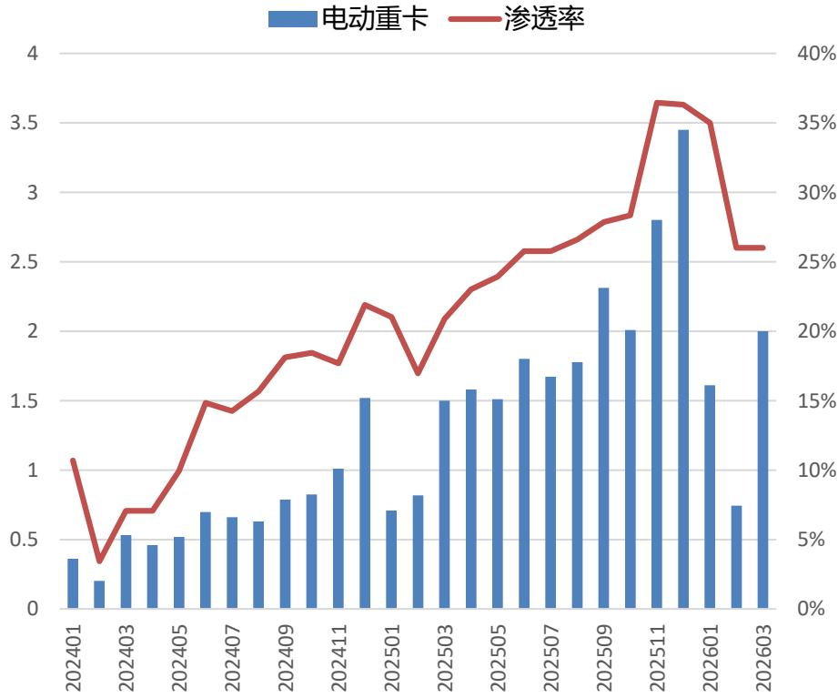

图：新能源商用车销量（万辆）及同环比增速  
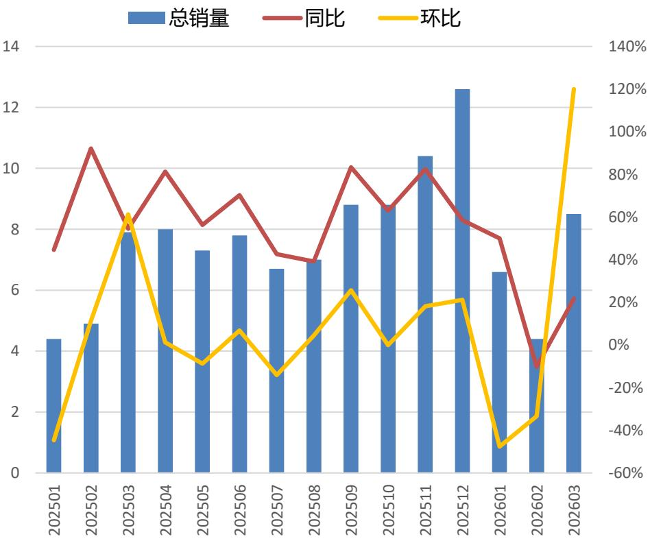

## 国内电动重卡：维持50%增长预期，确定性加强

◆ 油价上行，燃油重卡年运行成本增加6万，增加20-30%，26年全生命周期成本差距从60万，扩大至80万。

图：电动重卡销量经济性测算
<table><tr><td rowspan=1 colspan=1></td><td rowspan=1 colspan=1>传统重卡(2025)</td><td rowspan=1 colspan=1>传统重卡(2026E)</td><td rowspan=1 colspan=1>普通充电重卡(2025)</td><td rowspan=1 colspan=1>普通充电重卡(2026E)</td><td rowspan=1 colspan=1>天然气重卡</td></tr><tr><td rowspan=1 colspan=1>重卡购置成本 (万元)</td><td rowspan=1 colspan=1>34</td><td rowspan=1 colspan=1>34</td><td rowspan=1 colspan=1>35</td><td rowspan=1 colspan=1>35</td><td rowspan=1 colspan=1>40</td></tr><tr><td rowspan=1 colspan=1>电池成本 （万元）</td><td rowspan=1 colspan=1></td><td rowspan=1 colspan=1></td><td rowspan=1 colspan=1>19</td><td rowspan=1 colspan=1>24</td><td rowspan=1 colspan=1></td></tr><tr><td rowspan=1 colspan=1>电池单价（元/wh，不含税）</td><td rowspan=1 colspan=1></td><td rowspan=1 colspan=1></td><td rowspan=1 colspan=1>0.4</td><td rowspan=1 colspan=1>0.5</td><td rowspan=1 colspan=1></td></tr><tr><td rowspan=1 colspan=1>带电量（KWh）</td><td rowspan=1 colspan=1></td><td rowspan=1 colspan=1></td><td rowspan=1 colspan=1>423</td><td rowspan=1 colspan=1>423</td><td rowspan=1 colspan=1></td></tr><tr><td rowspan=1 colspan=1>购置税</td><td rowspan=1 colspan=1>3.0</td><td rowspan=1 colspan=1>3.0</td><td rowspan=1 colspan=1>0</td><td rowspan=1 colspan=1>1.5</td><td rowspan=1 colspan=1>3.5</td></tr><tr><td rowspan=1 colspan=1>补贴</td><td rowspan=1 colspan=1>0</td><td rowspan=1 colspan=1>0</td><td rowspan=1 colspan=1>13.5</td><td rowspan=1 colspan=1>13.5</td><td rowspan=1 colspan=1>0</td></tr><tr><td rowspan=1 colspan=1>重卡初始购置成本 （万元）</td><td rowspan=1 colspan=1>37</td><td rowspan=1 colspan=1>37</td><td rowspan=1 colspan=1>41</td><td rowspan=1 colspan=1>47</td><td rowspan=1 colspan=1>44</td></tr><tr><td rowspan=1 colspan=1>年行驶里程（万KM）</td><td rowspan=1 colspan=1>12</td><td rowspan=1 colspan=1>12</td><td rowspan=1 colspan=1>12</td><td rowspan=1 colspan=1>12</td><td rowspan=1 colspan=1>12</td></tr><tr><td rowspan=1 colspan=1>百公里能耗（KWH或L/100KM）</td><td rowspan=1 colspan=1>32</td><td rowspan=1 colspan=1>32</td><td rowspan=1 colspan=1>140</td><td rowspan=1 colspan=1>140</td><td rowspan=1 colspan=1>35</td></tr><tr><td rowspan=1 colspan=1>电价/油价/气价（元/KWH，元/）</td><td rowspan=1 colspan=1>7</td><td rowspan=1 colspan=1>8.5</td><td rowspan=1 colspan=1>0.8</td><td rowspan=1 colspan=1>0.8</td><td rowspan=1 colspan=1>5.5</td></tr><tr><td rowspan=1 colspan=1>年均能耗费（万元/年）</td><td rowspan=1 colspan=1>26.88</td><td rowspan=1 colspan=1>32.64</td><td rowspan=1 colspan=1>13.44</td><td rowspan=1 colspan=1>13.44</td><td rowspan=1 colspan=1>23.1</td></tr><tr><td rowspan=1 colspan=1>年均过路费（万元/年）</td><td rowspan=1 colspan=1>24</td><td rowspan=1 colspan=1>24</td><td rowspan=1 colspan=1>24</td><td rowspan=1 colspan=1>24</td><td rowspan=1 colspan=1>24</td></tr><tr><td rowspan=1 colspan=1>年均司机工资（万元/年）</td><td rowspan=1 colspan=1>12</td><td rowspan=1 colspan=1>12</td><td rowspan=1 colspan=1>12</td><td rowspan=1 colspan=1>12</td><td rowspan=1 colspan=1>12</td></tr><tr><td rowspan=1 colspan=1>年均保养维修费（万元/年）</td><td rowspan=1 colspan=1>2</td><td rowspan=1 colspan=1>2</td><td rowspan=1 colspan=1>0.5</td><td rowspan=1 colspan=1>0.5</td><td rowspan=1 colspan=1>1.7</td></tr><tr><td rowspan=1 colspan=1>年均轮胎费（万元/年）</td><td rowspan=1 colspan=1>3</td><td rowspan=1 colspan=1>3</td><td rowspan=1 colspan=1>3</td><td rowspan=1 colspan=1>3</td><td rowspan=1 colspan=1>3</td></tr><tr><td rowspan=1 colspan=1>年均保险费（万元/年）</td><td rowspan=1 colspan=1>2</td><td rowspan=1 colspan=1>2</td><td rowspan=1 colspan=1>2</td><td rowspan=1 colspan=1>2</td><td rowspan=1 colspan=1>2</td></tr><tr><td rowspan=1 colspan=1>年均自重损耗成本 (万元/年)</td><td rowspan=1 colspan=1>0</td><td rowspan=1 colspan=1>0</td><td rowspan=1 colspan=1>5.1</td><td rowspan=1 colspan=1>5.1</td><td rowspan=1 colspan=1>1.1</td></tr><tr><td rowspan=1 colspan=1>1公里自重损耗成本（元）</td><td rowspan=1 colspan=1>0</td><td rowspan=1 colspan=1>0</td><td rowspan=1 colspan=1>0.4</td><td rowspan=1 colspan=1>0.4</td><td rowspan=1 colspan=1>0.1</td></tr><tr><td rowspan=1 colspan=1>自重损耗 (吨)</td><td rowspan=1 colspan=1>0</td><td rowspan=1 colspan=1>0</td><td rowspan=1 colspan=1>2.8</td><td rowspan=1 colspan=1>2.8</td><td rowspan=1 colspan=1>0.6</td></tr><tr><td rowspan=1 colspan=1>使用年限</td><td rowspan=1 colspan=1>8</td><td rowspan=1 colspan=1>8</td><td rowspan=1 colspan=1>8</td><td rowspan=1 colspan=1>8</td><td rowspan=1 colspan=1>8</td></tr><tr><td rowspan=1 colspan=1>残值（万元）</td><td rowspan=1 colspan=1>8.0</td><td rowspan=1 colspan=1>8.0</td><td rowspan=1 colspan=1>5.0</td><td rowspan=1 colspan=1>5.0</td><td rowspan=1 colspan=1>5.0</td></tr><tr><td rowspan=1 colspan=1>残值率</td><td rowspan=1 colspan=1>22%</td><td rowspan=1 colspan=1>22%</td><td rowspan=1 colspan=1>12%</td><td rowspan=1 colspan=1>8%</td><td rowspan=1 colspan=1>11%</td></tr><tr><td rowspan=1 colspan=1>年折现率</td><td rowspan=1 colspan=1>4%</td><td rowspan=1 colspan=1>4%</td><td rowspan=1 colspan=1>4%</td><td rowspan=1 colspan=1>4%</td><td rowspan=1 colspan=1>4%</td></tr><tr><td rowspan=1 colspan=1>能耗费用现值（万元）</td><td rowspan=1 colspan=1>181</td><td rowspan=1 colspan=1>220</td><td rowspan=1 colspan=1>90</td><td rowspan=1 colspan=1>90</td><td rowspan=1 colspan=1>156</td></tr><tr><td rowspan=1 colspan=1>运营成本现值（万元）</td><td rowspan=1 colspan=1>242</td><td rowspan=1 colspan=1>242</td><td rowspan=1 colspan=1>242</td><td rowspan=1 colspan=1>242</td><td rowspan=1 colspan=1>242</td></tr><tr><td rowspan=1 colspan=1>其他成本现值 (万元)</td><td rowspan=1 colspan=1>47</td><td rowspan=1 colspan=1>47</td><td rowspan=1 colspan=1>71</td><td rowspan=1 colspan=1>71</td><td rowspan=1 colspan=1>52</td></tr><tr><td rowspan=1 colspan=1>残值现值 （万元）</td><td rowspan=1 colspan=1>6</td><td rowspan=1 colspan=1>6</td><td rowspan=1 colspan=1>4</td><td rowspan=1 colspan=1>4</td><td rowspan=1 colspan=1>4</td></tr><tr><td rowspan=1 colspan=1>全生命周期成本（万元）</td><td rowspan=1 colspan=1>502</td><td rowspan=1 colspan=1>540</td><td rowspan=1 colspan=1>441</td><td rowspan=1 colspan=1>461</td><td rowspan=1 colspan=1>490</td></tr></table>

## 国内电动重卡：维持50%增长预期，确定性加强

◆ 26年我们预计国内商用车销量同比增长9%至95万辆，其中电动重卡增长50%至35万辆，电池200GWh，同比增46%。

图：国内本土电动车销量及装机电力预测
<table><tr><td></td><td>2024</td><td>2025</td><td>2026E</td><td>2027E</td><td>2028E</td><td>2029E</td><td>2030E</td></tr><tr><td>国内：电动商用车销量（本土，万辆）</td><td>54.8 1</td><td>87.1</td><td>94.9</td><td>111.1</td><td>123.0</td><td>132.8</td><td>143.4</td></tr><tr><td>YoY</td><td>53%</td><td>59%</td><td>8.9%</td><td>17.1%</td><td>10.7%</td><td>7.9%</td><td>8.0%</td></tr><tr><td>-国内商用车电动化率</td><td>18.4%</td><td>26.9%</td><td> 28.7%</td><td>33.0%</td><td>36.2%</td><td>38.6%</td><td>41.3%</td></tr><tr><td>国内：商用车电池装机需求（Gwh)</td><td>62.1</td><td>136.7</td><td>199.7</td><td>241.3</td><td>268.2</td><td>295.3</td><td>325.3</td></tr><tr><td>YoY</td><td>96%</td><td>120%</td><td>46.1%</td><td>20.8%</td><td>11.1%</td><td>10.1%</td><td>10.1%</td></tr><tr><td>-占比</td><td>12%</td><td>19%</td><td>23%</td><td>25%</td><td>25%</td><td>25%</td><td>25%</td></tr><tr><td>国内：电动货车销量 (万辆)</td><td>49.7</td><td>68.9</td><td>89.6</td><td>105.8</td><td>117.7</td><td>127.4</td><td>137.9</td></tr><tr><td>-电动重卡 (销量)</td><td>8.2</td><td>23.1</td><td>34.6</td><td>39.8</td><td>41.8</td><td>43.9</td><td>46.1</td></tr><tr><td>-重卡电动化率</td><td>10%</td><td>29%</td><td> 43%</td><td> 49%</td><td>51%</td><td>53%</td><td>55%</td></tr><tr><td>-其他电动货车销量 (万辆)</td><td>41.5</td><td>45.8</td><td>55.0</td><td>66.0</td><td>75.9</td><td>83.4</td><td>91.8</td></tr><tr><td>-电动化率</td><td>24%</td><td>23%</td><td>27%</td><td>32%</td><td>36%</td><td>40%</td><td>43%</td></tr><tr><td>单车电池容量(kwh)</td><td>105.0</td><td>183.1</td><td>210.7</td><td>217.5</td><td>218.0</td><td>222.5</td><td>227.0</td></tr><tr><td>-重卡单车 (kwh)</td><td>380.0</td><td> 410.5</td><td> 431.0</td><td> 452.6</td><td>475.2</td><td>499.0</td><td>523.9</td></tr><tr><td>-其他电动货车单车 （kwh)</td><td>74.6</td><td>68.5</td><td>71.9</td><td>75.5</td><td>76.3</td><td>77.0</td><td>77.8</td></tr><tr><td>国内：货车电池需求量(Gwh)</td><td>52.2</td><td>126.2</td><td>188.8</td><td>230.1</td><td>256.6</td><td>283.4</td><td>313.0</td></tr><tr><td>YoY</td><td>104%</td><td>142%</td><td>49.7%</td><td>21.8%</td><td>11.5%</td><td>10.4%</td><td>10.4%</td></tr></table>

## 动力：国内动力电池我们预计可维持20%+增长

◆ 我们预计26年国内本土电动车销量持平为1395万辆，考虑单车带电量同比提升6%至63kwh，合计动力电池需求878gwh，同比增20%。

图：国内本土电动车销量及装机预测
<table><tr><td></td><td>2024</td><td>2025</td><td>2026E</td><td>2027E</td><td>2028E</td><td>2029E</td><td>2030E</td></tr><tr><td>国内：新能源车合计销量 (万辆，本土销量)</td><td>1,158</td><td>1,388</td><td>1,395</td><td>1,501</td><td>1,609</td><td>1,721</td><td>1,842</td></tr><tr><td>YoY</td><td>40%</td><td>20%</td><td>0.6%</td><td>7.6%</td><td>7.2%</td><td>7.0%</td><td>7.0%</td></tr><tr><td>国内汽车销量 (万辆，本土)</td><td>2.569</td><td>2,730</td><td>2.812</td><td>2,896</td><td>2,983</td><td>3,073</td><td>3,165</td></tr><tr><td>-国内电动化率</td><td>45.1%</td><td>50.8%</td><td>49.6%</td><td>51.8%</td><td>53.9%</td><td>56.0%</td><td>58.2%</td></tr><tr><td>国内新能源车出口销量 (万辆)</td><td>128</td><td>262</td><td>392</td><td>471</td><td>565</td><td>678</td><td>813</td></tr><tr><td>YoY</td><td>6.7%</td><td>103.7%</td><td>50.0%</td><td>20.0%</td><td>20.0%</td><td>20.0%</td><td>20.0%</td></tr><tr><td>国内新能源车销量合计 (含出口，万辆)</td><td>1,287</td><td>1,649</td><td>1,788</td><td>1.972</td><td>2,173</td><td>2.399</td><td>2.655</td></tr><tr><td>YoY</td><td>36%</td><td>28.17%</td><td>8%</td><td>10%</td><td>10%</td><td>10%</td><td>11%</td></tr><tr><td>国内汽车销量 (万辆，含出口)</td><td>3,070</td><td>3,440</td><td>3,474</td><td>3,509</td><td>3,544</td><td>3,580</td><td>3,615</td></tr><tr><td>-国内电动化率</td><td>41.9%</td><td>47.9%</td><td>51.4%</td><td>56.2%</td><td>61.3%</td><td>67.0%</td><td>73.4%</td></tr><tr><td>国内：动力电池装机需求（Gwh)</td><td>534</td><td>733</td><td>878</td><td>980</td><td>1,072</td><td>1,170</td><td>1,277</td></tr><tr><td>YoY</td><td>38%</td><td>37.12%</td><td>20%</td><td>12%</td><td>9%</td><td>9%</td><td>9%</td></tr><tr><td>-国内平均单车带电量(kwh)</td><td>46.1</td><td>52.8</td><td>63.0</td><td>65.3</td><td>66.6</td><td>68.0</td><td>69.3</td></tr></table>

数据来源：中汽协，东吴证券研究所

## 欧洲：3月主流9国销38万辆，同增34%，增速加快

◆ 欧洲主流9国26年3月销量38万辆，同增34%，增速加快。26年3月欧洲主流9国新能源注册量38万辆，同环比+24%/+73%，渗透率32%，环比+2.6pct。1-3月累计销81.34万辆，同比+29%。3月英国电动车销量 13.6 万 辆 ， 同环比 +32%/+321% ， 电 动 车 渗 透 率 35.7% ； 德国销量 10.1 万 辆 ， 同环比+46%/+43%，电动车渗透率34.2%；法国5.8万辆，同环比+53%/+47%，电动车渗透率33.1%。

图：欧洲主流九国电动车销量（万辆）&渗透率（右，%）  
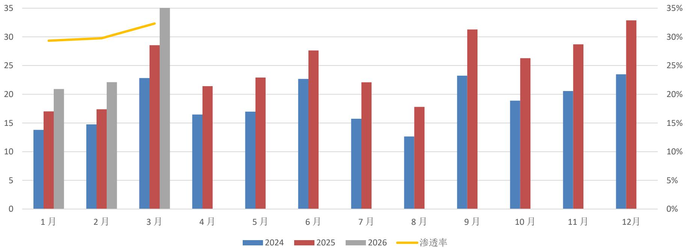

## 欧洲：分国家看，意大利、爱尔兰等销量同比高增

◆ 分国家看，德国、法国2月销量稳定20%+增长，意大利、爱尔兰等国电动车销量明显提速。2月德国销量6.9万辆，同环比+25%/10%，法国销4.3万辆，同环比+24%/+12%，意大利销2.6万辆，同环比+90%/+20%，爱尔兰销0.5万辆，同环比+81%/-58%。

图：欧洲分国家电动车销量（万辆）&渗透率
<table><tr><td rowspan=1 colspan=2></td><td rowspan=1 colspan=1>202602</td><td rowspan=1 colspan=1>环比</td><td rowspan=1 colspan=1>同比</td><td rowspan=1 colspan=1>2026.1-2</td><td rowspan=1 colspan=1>同比</td><td rowspan=1 colspan=1>2026.1-2渗透率</td><td rowspan=1 colspan=1>同比</td></tr><tr><td rowspan=1 colspan=1>德国</td><td rowspan=1 colspan=1></td><td rowspan=1 colspan=1>6.9</td><td rowspan=1 colspan=1>10%</td><td rowspan=1 colspan=1>25%</td><td rowspan=1 colspan=1>13.2</td><td rowspan=1 colspan=1>23%</td><td rowspan=1 colspan=1>33%</td><td rowspan=1 colspan=1>5pct</td></tr><tr><td rowspan=1 colspan=1>法国</td><td rowspan=1 colspan=1></td><td rowspan=1 colspan=1>4.3</td><td rowspan=1 colspan=1>12%</td><td rowspan=1 colspan=1>24%</td><td rowspan=1 colspan=1>8.1</td><td rowspan=1 colspan=1>32%</td><td rowspan=1 colspan=1>28%</td><td rowspan=1 colspan=1>8pct</td></tr><tr><td rowspan=1 colspan=2>英国</td><td rowspan=1 colspan=1>3.5</td><td rowspan=1 colspan=1>-31%</td><td rowspan=1 colspan=1>17%</td><td rowspan=1 colspan=1>8.6</td><td rowspan=1 colspan=1>17%</td><td rowspan=1 colspan=1>33%</td><td rowspan=1 colspan=1>3pct</td></tr><tr><td rowspan=1 colspan=2>意大利</td><td rowspan=1 colspan=1>2.6</td><td rowspan=1 colspan=1>20%</td><td rowspan=1 colspan=1>90%</td><td rowspan=1 colspan=1>4.7</td><td rowspan=1 colspan=1>85%</td><td rowspan=1 colspan=1>15%</td><td rowspan=1 colspan=1>6pct</td></tr><tr><td rowspan=1 colspan=2>西班牙</td><td rowspan=1 colspan=1>2.0</td><td rowspan=1 colspan=1>39%</td><td rowspan=1 colspan=1>58%</td><td rowspan=1 colspan=1>3.5</td><td rowspan=1 colspan=1>51%</td><td rowspan=1 colspan=1>20%</td><td rowspan=1 colspan=1>7pct</td></tr><tr><td rowspan=1 colspan=2>荷兰</td><td rowspan=1 colspan=1>1.3</td><td rowspan=1 colspan=1>-18%</td><td rowspan=1 colspan=1>-16%</td><td rowspan=1 colspan=1>2.9</td><td rowspan=1 colspan=1>-13%</td><td rowspan=1 colspan=1>55%</td><td rowspan=1 colspan=1>2pct</td></tr><tr><td rowspan=1 colspan=2>瑞典</td><td rowspan=1 colspan=1>1.3</td><td rowspan=1 colspan=1>26%</td><td rowspan=1 colspan=1>6%</td><td rowspan=1 colspan=1>2.3</td><td rowspan=1 colspan=1>3%</td><td rowspan=1 colspan=1>58%</td><td rowspan=1 colspan=1>3pct</td></tr><tr><td rowspan=1 colspan=2>比利时</td><td rowspan=1 colspan=1>1.2</td><td rowspan=1 colspan=1>0%</td><td rowspan=1 colspan=1>-3%</td><td rowspan=1 colspan=1>2.4</td><td rowspan=1 colspan=1>-7%</td><td rowspan=1 colspan=1>28%</td><td rowspan=1 colspan=1>1pct</td></tr><tr><td rowspan=1 colspan=2>丹麦</td><td rowspan=1 colspan=1>0.9</td><td rowspan=1 colspan=1>-5%</td><td rowspan=1 colspan=1>20%</td><td rowspan=1 colspan=1>1.9</td><td rowspan=1 colspan=1>33%</td><td rowspan=1 colspan=1>79%</td><td rowspan=1 colspan=1>11pct</td></tr><tr><td rowspan=1 colspan=2>奥地利</td><td rowspan=1 colspan=1>0.9</td><td rowspan=1 colspan=1>-10%</td><td rowspan=1 colspan=1>19%</td><td rowspan=1 colspan=1>1.8</td><td rowspan=1 colspan=1>27%</td><td rowspan=1 colspan=1>35%</td><td rowspan=1 colspan=1> 2pct</td></tr><tr><td rowspan=1 colspan=2>葡萄牙</td><td rowspan=1 colspan=1>0.8</td><td rowspan=1 colspan=1>5%</td><td rowspan=1 colspan=1>20%</td><td rowspan=1 colspan=1>1.5</td><td rowspan=1 colspan=1>25%</td><td rowspan=1 colspan=1>33%</td><td rowspan=1 colspan=1>5pct</td></tr><tr><td rowspan=1 colspan=2>挪威</td><td rowspan=1 colspan=1>0.7</td><td rowspan=1 colspan=1>241%</td><td rowspan=1 colspan=1>-17%</td><td rowspan=1 colspan=1>0.9</td><td rowspan=1 colspan=1>-47%</td><td rowspan=1 colspan=1>80%</td><td rowspan=1 colspan=1>2pct</td></tr><tr><td rowspan=1 colspan=2>爱尔兰</td><td rowspan=1 colspan=1>0.5</td><td rowspan=1 colspan=1>-58%</td><td rowspan=1 colspan=1>81%</td><td rowspan=1 colspan=1>1.8</td><td rowspan=1 colspan=1>105%</td><td rowspan=1 colspan=1>29%</td><td rowspan=1 colspan=1>12pct</td></tr><tr><td rowspan=1 colspan=2>瑞士</td><td rowspan=1 colspan=1>0.5</td><td rowspan=1 colspan=1>10%</td><td rowspan=1 colspan=1>5%</td><td rowspan=1 colspan=1>1.0</td><td rowspan=1 colspan=1>8%</td><td rowspan=1 colspan=1>29%</td><td rowspan=1 colspan=1>2pct</td></tr><tr><td rowspan=1 colspan=2>波</td><td rowspan=1 colspan=1>0.3</td><td rowspan=1 colspan=1>-13%</td><td rowspan=1 colspan=1>42%</td><td rowspan=1 colspan=1>0.7</td><td rowspan=1 colspan=1>62%</td><td rowspan=1 colspan=1>6%</td><td rowspan=1 colspan=1>2pct</td></tr><tr><td rowspan=1 colspan=2>芬兰</td><td rowspan=1 colspan=1>0.3</td><td rowspan=1 colspan=1>-9%</td><td rowspan=1 colspan=1>20%</td><td rowspan=1 colspan=1>0.6</td><td rowspan=1 colspan=1>15%</td><td rowspan=1 colspan=1>60%</td><td rowspan=1 colspan=1>8pct</td></tr><tr><td rowspan=1 colspan=2>捷克</td><td rowspan=1 colspan=1>0.2</td><td rowspan=1 colspan=1>9%</td><td rowspan=1 colspan=1>58%</td><td rowspan=1 colspan=1>0.4</td><td rowspan=1 colspan=1>29%</td><td rowspan=1 colspan=1>10%</td><td rowspan=1 colspan=1>3pct</td></tr><tr><td rowspan=1 colspan=2>罗马尼亚</td><td rowspan=1 colspan=1>0.2</td><td rowspan=1 colspan=1>-12%</td><td rowspan=1 colspan=1>24%</td><td rowspan=1 colspan=1>0.4</td><td rowspan=1 colspan=1>8%</td><td rowspan=1 colspan=1>18%</td><td rowspan=1 colspan=1>7pct</td></tr><tr><td rowspan=1 colspan=2>希腊</td><td rowspan=1 colspan=1>0.1</td><td rowspan=1 colspan=1>13%</td><td rowspan=1 colspan=1>12%</td><td rowspan=1 colspan=1>0.3</td><td rowspan=1 colspan=1>8%</td><td rowspan=1 colspan=1>14%</td><td rowspan=1 colspan=1>1pct</td></tr><tr><td rowspan=1 colspan=2>卢森堡</td><td rowspan=1 colspan=1>0.1</td><td rowspan=1 colspan=1>5%</td><td rowspan=1 colspan=1>-15%</td><td rowspan=1 colspan=1>0.2</td><td rowspan=1 colspan=1>-18%</td><td rowspan=1 colspan=1>25%</td><td rowspan=1 colspan=1>-7pct</td></tr><tr><td rowspan=1 colspan=2>俄罗斯</td><td rowspan=1 colspan=1>0.1</td><td rowspan=1 colspan=1>-7%</td><td rowspan=1 colspan=1>25%</td><td rowspan=1 colspan=1>0.2</td><td rowspan=1 colspan=1>26%</td><td rowspan=1 colspan=1>1%</td><td rowspan=1 colspan=1>Opct</td></tr><tr><td rowspan=1 colspan=2>斯洛文尼亚</td><td rowspan=1 colspan=1>0.1</td><td rowspan=1 colspan=1>-6%</td><td rowspan=1 colspan=1>40%</td><td rowspan=1 colspan=1>0.2</td><td rowspan=1 colspan=1>37%</td><td rowspan=1 colspan=1>16%</td><td rowspan=1 colspan=1>3pct</td></tr><tr><td rowspan=1 colspan=2>斯洛伐克</td><td rowspan=1 colspan=1>0.1</td><td rowspan=1 colspan=1>-22%</td><td rowspan=1 colspan=1>33%</td><td rowspan=1 colspan=1>0.1</td><td rowspan=1 colspan=1>60%</td><td rowspan=1 colspan=1>8%</td><td rowspan=1 colspan=1>2pct</td></tr></table>

## 欧洲：中国品牌销量高增长，特斯拉品牌销量同比下降

◆ 中国品牌销量高增长，贡献主要增量，特斯拉品牌销量同比下降。 26年2月中国品牌出口4.6万辆，同比+163%，1-2月出口8.8万辆，同比+145%；2月，欧洲本土品牌销量17.1万辆，同比+11%，1-2月销35.1万辆，同比+13%；特斯拉2月销1.8万辆，同比-4%，1-2月销2.7万辆，同比-6%。

图：欧洲新能源分品牌销量
<table><tr><td rowspan=1 colspan=1>欧洲新能源车销量</td><td rowspan=1 colspan=1>26M1-2销量（万辆）</td><td rowspan=1 colspan=1>同比</td><td rowspan=1 colspan=1>2026M2销量（万辆）</td><td rowspan=1 colspan=1>环比</td><td rowspan=1 colspan=1>同比</td></tr><tr><td rowspan=1 colspan=1>中国品牌出口</td><td rowspan=1 colspan=1>8.8</td><td rowspan=1 colspan=1>145%</td><td rowspan=1 colspan=1>4.6</td><td rowspan=1 colspan=1>8%</td><td rowspan=1 colspan=1>163%</td></tr><tr><td rowspan=1 colspan=1>欧洲本土品牌</td><td rowspan=1 colspan=1>35.1</td><td rowspan=1 colspan=1>13%</td><td rowspan=1 colspan=1>17.1</td><td rowspan=1 colspan=1>-5%</td><td rowspan=1 colspan=1>11%</td></tr><tr><td rowspan=1 colspan=1>特斯拉</td><td rowspan=1 colspan=1>2.7</td><td rowspan=1 colspan=1>-6%</td><td rowspan=1 colspan=1>1.8</td><td rowspan=1 colspan=1>114%</td><td rowspan=1 colspan=1>-4%</td></tr><tr><td rowspan=1 colspan=1>其他品牌</td><td rowspan=1 colspan=1>7.9</td><td rowspan=1 colspan=1>16%</td><td rowspan=1 colspan=1>3.8</td><td rowspan=1 colspan=1>-9%</td><td rowspan=1 colspan=1>16%</td></tr><tr><td rowspan=1 colspan=1>中国品牌分车企新能源车销量</td><td rowspan=1 colspan=1>26M1-2销量（万辆）</td><td rowspan=1 colspan=1>同比</td><td rowspan=1 colspan=1>2026M2销量（万辆）</td><td rowspan=1 colspan=1>环比</td><td rowspan=1 colspan=1>同比</td></tr><tr><td rowspan=1 colspan=1>吉利【沃尔沃部分在欧洲生产】</td><td rowspan=1 colspan=1>0.8</td><td rowspan=1 colspan=1>17%</td><td rowspan=1 colspan=1>0.4</td><td rowspan=1 colspan=1>-10%</td><td rowspan=1 colspan=1>21%</td></tr><tr><td rowspan=1 colspan=1>比亚迪汽车(BYD)</td><td rowspan=1 colspan=1>3.5</td><td rowspan=1 colspan=1>158%</td><td rowspan=1 colspan=1>1.8</td><td rowspan=1 colspan=1>-1%</td><td rowspan=1 colspan=1>3%</td></tr><tr><td rowspan=1 colspan=1>上海汽车工业（集团)总公司</td><td rowspan=1 colspan=1>1.1</td><td rowspan=1 colspan=1>12%</td><td rowspan=1 colspan=1>0.6</td><td rowspan=1 colspan=1>13%</td><td rowspan=1 colspan=1>159%</td></tr><tr><td rowspan=1 colspan=1>奇瑞集团(Chery)</td><td rowspan=1 colspan=1>1.6</td><td rowspan=1 colspan=1>1722%</td><td rowspan=1 colspan=1>0.7</td><td rowspan=1 colspan=1>-15%</td><td rowspan=1 colspan=1>34%</td></tr><tr><td rowspan=1 colspan=1>零跑汽车（Leapmotor）</td><td rowspan=1 colspan=1>1.3</td><td rowspan=1 colspan=1>630%</td><td rowspan=1 colspan=1>0.8</td><td rowspan=1 colspan=1>101%</td><td rowspan=1 colspan=1>1023%</td></tr><tr><td rowspan=1 colspan=1>小鹏汽车(XPeng)</td><td rowspan=1 colspan=1>0.4</td><td rowspan=1 colspan=1>104%</td><td rowspan=1 colspan=1>0.2</td><td rowspan=1 colspan=1>25%</td><td rowspan=1 colspan=1>843%</td></tr><tr><td rowspan=1 colspan=1>东风汽车公司</td><td rowspan=1 colspan=1>0.04</td><td rowspan=1 colspan=1>-29%</td><td rowspan=1 colspan=1>0.02</td><td rowspan=1 colspan=1>-14%</td><td rowspan=1 colspan=1>115%</td></tr><tr><td rowspan=1 colspan=1>长安汽车集团(Changan/Chana)</td><td rowspan=1 colspan=1>0.1</td><td rowspan=1 colspan=1>794%</td><td rowspan=1 colspan=1>0.1</td><td rowspan=1 colspan=1>30%</td><td rowspan=1 colspan=1>-37%</td></tr><tr><td rowspan=1 colspan=1>蔚来汽车(NIO)</td><td rowspan=1 colspan=1>0.01</td><td rowspan=1 colspan=1>-21%</td><td rowspan=1 colspan=1>0.01</td><td rowspan=1 colspan=1>20%</td><td rowspan=1 colspan=1>571%</td></tr><tr><td rowspan=1 colspan=1>赛力斯集团</td><td rowspan=1 colspan=1>0.03</td><td rowspan=1 colspan=1>78%</td><td rowspan=1 colspan=1>0.01</td><td rowspan=1 colspan=1>-22%</td><td rowspan=1 colspan=1>-18%</td></tr><tr><td rowspan=1 colspan=1>欧洲品牌分车企新能源车销量</td><td rowspan=1 colspan=1>26M1-2销量（万辆)</td><td rowspan=1 colspan=1>同比</td><td rowspan=1 colspan=1>2026M2销量(万辆)</td><td rowspan=1 colspan=1>环比</td><td rowspan=1 colspan=1>同比</td></tr><tr><td rowspan=1 colspan=1>大众集团</td><td rowspan=1 colspan=1>15.4</td><td rowspan=1 colspan=1>19%</td><td rowspan=1 colspan=1>7.5</td><td rowspan=1 colspan=1>-4%</td><td rowspan=1 colspan=1>16%</td></tr><tr><td rowspan=1 colspan=1>宝马集团</td><td rowspan=1 colspan=1>4.8</td><td rowspan=1 colspan=1>-4%</td><td rowspan=1 colspan=1>2.3</td><td rowspan=1 colspan=1>-2%</td><td rowspan=1 colspan=1>-5%</td></tr><tr><td rowspan=1 colspan=1>Stellantis</td><td rowspan=1 colspan=1>6.0</td><td rowspan=1 colspan=1>24%</td><td rowspan=1 colspan=1>2.9</td><td rowspan=1 colspan=1>-4%</td><td rowspan=1 colspan=1>16%</td></tr><tr><td rowspan=1 colspan=1>梅赛德斯-奔驰集团</td><td rowspan=1 colspan=1>3.5</td><td rowspan=1 colspan=1>0%</td><td rowspan=1 colspan=1>1.7</td><td rowspan=1 colspan=1>-4%</td><td rowspan=1 colspan=1>2%</td></tr><tr><td rowspan=1 colspan=1>雷诺</td><td rowspan=1 colspan=1>3.5</td><td rowspan=1 colspan=1>14%</td><td rowspan=1 colspan=1>1.6</td><td rowspan=1 colspan=1>-14%</td><td rowspan=1 colspan=1>11%</td></tr><tr><td rowspan=1 colspan=1>丰田集团</td><td rowspan=1 colspan=1>2.0</td><td rowspan=1 colspan=1>18%</td><td rowspan=1 colspan=1>1.0</td><td rowspan=1 colspan=1>-5%</td><td rowspan=1 colspan=1>19%</td></tr><tr><td rowspan=1 colspan=1>其他品牌分车企新能源车销量</td><td rowspan=1 colspan=1>26M1-2销量（万辆）</td><td rowspan=1 colspan=1>同比</td><td rowspan=1 colspan=1>2026M2销量（万辆)</td><td rowspan=1 colspan=1>环比</td><td rowspan=1 colspan=1>同比</td></tr><tr><td rowspan=1 colspan=1>现代-起亚汽车集团</td><td rowspan=1 colspan=1>4.0</td><td rowspan=1 colspan=1>8%</td><td rowspan=1 colspan=1>1.9</td><td rowspan=1 colspan=1>-14%</td><td rowspan=1 colspan=1>5%</td></tr><tr><td rowspan=1 colspan=1>福特集团</td><td rowspan=1 colspan=1>2.7</td><td rowspan=1 colspan=1>65%</td><td rowspan=1 colspan=1>1.3</td><td rowspan=1 colspan=1>-2%</td><td rowspan=1 colspan=1>57%</td></tr><tr><td rowspan=1 colspan=1>塔塔集团</td><td rowspan=1 colspan=1>0.5</td><td rowspan=1 colspan=1>-19%</td><td rowspan=1 colspan=1>0.2</td><td rowspan=1 colspan=1>-18%</td><td rowspan=1 colspan=1>-3%</td></tr><tr><td rowspan=1 colspan=1>马自达</td><td rowspan=1 colspan=1>0.4</td><td rowspan=1 colspan=1>46%</td><td rowspan=1 colspan=1>0.2</td><td rowspan=1 colspan=1>-6%</td><td rowspan=1 colspan=1>34%</td></tr><tr><td rowspan=1 colspan=1>日产</td><td rowspan=1 colspan=1>0.2</td><td rowspan=1 colspan=1>-50%</td><td rowspan=1 colspan=1>0.1</td><td rowspan=1 colspan=1>18%</td><td rowspan=1 colspan=1>-43%</td></tr></table>

## 欧洲：Stellatis、比亚迪表现亮眼，大众销量微增

◆ Stellatis、比亚迪表现亮眼，大众销量微增。大众26年2月欧洲销量7.5万辆，同环比16%/-4%，市占率26%，26年1-2月累计销15.4万辆，同增19%，市占率27%；宝马26年2月欧洲销量2.3万辆，同环比-5%/-2%，市占率8%， 26年1-2月累计销4.8万辆，同减4%，市占率8%；比亚迪26年2月欧洲销量1.8万辆，同环比+159%/-1%，市占率6%， 26年1-2月累计销3.5万辆，同增158%，市占率6%。

表：欧洲新能源车分车企销量（万辆）
<table><tr><td rowspan=1 colspan=1>欧洲分车企</td><td rowspan=1 colspan=4>2026年02月单月</td><td rowspan=1 colspan=3>2026年累计</td></tr><tr><td rowspan=1 colspan=1></td><td rowspan=1 colspan=1>销量</td><td rowspan=1 colspan=1>环比</td><td rowspan=1 colspan=1>同比</td><td rowspan=1 colspan=1>市占率</td><td rowspan=1 colspan=1>销量</td><td rowspan=1 colspan=1>同比</td><td rowspan=1 colspan=1>市占率</td></tr><tr><td rowspan=1 colspan=1>大众集团</td><td rowspan=1 colspan=1>7.5</td><td rowspan=1 colspan=1>-4%</td><td rowspan=1 colspan=1>16%</td><td rowspan=1 colspan=1>26%</td><td rowspan=1 colspan=1>15.4</td><td rowspan=1 colspan=1>19%</td><td rowspan=1 colspan=1>27%</td></tr><tr><td rowspan=1 colspan=1>Stellantis</td><td rowspan=1 colspan=1>2.9</td><td rowspan=1 colspan=1>-4%</td><td rowspan=1 colspan=1>16%</td><td rowspan=1 colspan=1>10%</td><td rowspan=1 colspan=1>6.0</td><td rowspan=1 colspan=1>24%</td><td rowspan=1 colspan=1>10%</td></tr><tr><td rowspan=1 colspan=1>宝马集团</td><td rowspan=1 colspan=1>2.3</td><td rowspan=1 colspan=1>-2%</td><td rowspan=1 colspan=1>-5%</td><td rowspan=1 colspan=1>8%</td><td rowspan=1 colspan=1>4.8</td><td rowspan=1 colspan=1>-4%</td><td rowspan=1 colspan=1>8%</td></tr><tr><td rowspan=1 colspan=1>现代-起亚汽车集团</td><td rowspan=1 colspan=1>1.9</td><td rowspan=1 colspan=1>-14%</td><td rowspan=1 colspan=1>5%</td><td rowspan=1 colspan=1>6%</td><td rowspan=1 colspan=1>4.0</td><td rowspan=1 colspan=1>8%</td><td rowspan=1 colspan=1>7%</td></tr><tr><td rowspan=1 colspan=1>Tesla</td><td rowspan=1 colspan=1>1.8</td><td rowspan=1 colspan=1>118%</td><td rowspan=1 colspan=1>12%</td><td rowspan=1 colspan=1>6%</td><td rowspan=1 colspan=1>2.6</td><td rowspan=1 colspan=1>1%</td><td rowspan=1 colspan=1>4%</td></tr><tr><td rowspan=1 colspan=1>比亚迪汽车（BYD)</td><td rowspan=1 colspan=1>1.8</td><td rowspan=1 colspan=1>-1%</td><td rowspan=1 colspan=1>159%</td><td rowspan=1 colspan=1>6%</td><td rowspan=1 colspan=1>3.5</td><td rowspan=1 colspan=1>158%</td><td rowspan=1 colspan=1>6%</td></tr><tr><td rowspan=1 colspan=1>吉利控股集团（Geely）</td><td rowspan=1 colspan=1>1.8</td><td rowspan=1 colspan=1>0%</td><td rowspan=1 colspan=1>3%</td><td rowspan=1 colspan=1>6%</td><td rowspan=1 colspan=1>3.5</td><td rowspan=1 colspan=1>-2%</td><td rowspan=1 colspan=1>6%</td></tr><tr><td rowspan=1 colspan=1>梅赛德斯-奔驰集团</td><td rowspan=1 colspan=1>1.7</td><td rowspan=1 colspan=1>-4%</td><td rowspan=1 colspan=1>2%</td><td rowspan=1 colspan=1>6%</td><td rowspan=1 colspan=1>3.5</td><td rowspan=1 colspan=1>0%</td><td rowspan=1 colspan=1>6%</td></tr><tr><td rowspan=1 colspan=1>雷诺</td><td rowspan=1 colspan=1>1.6</td><td rowspan=1 colspan=1>-14%</td><td rowspan=1 colspan=1>11%</td><td rowspan=1 colspan=1>6%</td><td rowspan=1 colspan=1>3.5</td><td rowspan=1 colspan=1>14%</td><td rowspan=1 colspan=1>6%</td></tr><tr><td rowspan=1 colspan=1>福特集团</td><td rowspan=1 colspan=1>1.3</td><td rowspan=1 colspan=1>-2%</td><td rowspan=1 colspan=1>57%</td><td rowspan=1 colspan=1>5%</td><td rowspan=1 colspan=1>2.7</td><td rowspan=1 colspan=1>65%</td><td rowspan=1 colspan=1>5%</td></tr></table>

欧洲前十车型销量（单位：万辆）
<table><tr><td rowspan=1 colspan=1>欧洲分车型</td><td rowspan=1 colspan=1>车企</td><td rowspan=1 colspan=1>2月</td><td rowspan=1 colspan=1>环比</td><td rowspan=1 colspan=1>同比</td><td rowspan=1 colspan=1>25年02月累计</td><td rowspan=1 colspan=1>26年02月累计</td><td rowspan=1 colspan=1>同比</td></tr><tr><td rowspan=1 colspan=1>Model Y</td><td rowspan=1 colspan=1>Tesla</td><td rowspan=1 colspan=1>1.1</td><td rowspan=1 colspan=1>57%</td><td rowspan=1 colspan=1>22%</td><td rowspan=1 colspan=1>1.5</td><td rowspan=1 colspan=1>1.7</td><td rowspan=1 colspan=1>20%</td></tr><tr><td rowspan=1 colspan=1>Elroq</td><td rowspan=1 colspan=1>大众集团</td><td rowspan=1 colspan=1>0.8</td><td rowspan=1 colspan=1> -1%</td><td rowspan=1 colspan=1>448%</td><td rowspan=1 colspan=1>0.2</td><td rowspan=1 colspan=1>1.7</td><td rowspan=1 colspan=1>679%</td></tr><tr><td rowspan=1 colspan=1>Model3</td><td rowspan=1 colspan=1>Tesla</td><td rowspan=1 colspan=1>0.7</td><td rowspan=1 colspan=1>508%</td><td rowspan=1 colspan=1>-2%</td><td rowspan=1 colspan=1>1.0</td><td rowspan=1 colspan=1>0.8</td><td rowspan=1 colspan=1>-26%</td></tr><tr><td rowspan=1 colspan=1>Enyaq iV</td><td rowspan=1 colspan=1>大众集团</td><td rowspan=1 colspan=1>0.6</td><td rowspan=1 colspan=1>14%</td><td rowspan=1 colspan=1>17%</td><td rowspan=1 colspan=1>1.2</td><td rowspan=1 colspan=1>1.2</td><td rowspan=1 colspan=1>-2%</td></tr><tr><td rowspan=1 colspan=1>T03</td><td rowspan=1 colspan=1>零跑汽车</td><td rowspan=1 colspan=1>0.6</td><td rowspan=1 colspan=1>213%</td><td rowspan=1 colspan=1>659%</td><td rowspan=1 colspan=1>0.2</td><td rowspan=1 colspan=1>0.8</td><td rowspan=1 colspan=1>430%</td></tr><tr><td rowspan=1 colspan=1>Seal U</td><td rowspan=1 colspan=1>比亚迪</td><td rowspan=1 colspan=1>0.6</td><td rowspan=1 colspan=1>-19%</td><td rowspan=1 colspan=1>101%</td><td rowspan=1 colspan=1>0.6</td><td rowspan=1 colspan=1>1.3</td><td rowspan=1 colspan=1>131%</td></tr><tr><td rowspan=1 colspan=1>Renault 5</td><td rowspan=1 colspan=1>雷诺</td><td rowspan=1 colspan=1>0.6</td><td rowspan=1 colspan=1>-25%</td><td rowspan=1 colspan=1>-3%</td><td rowspan=1 colspan=1>1.0</td><td rowspan=1 colspan=1>1.3</td><td rowspan=1 colspan=1>29%</td></tr><tr><td rowspan=1 colspan=1>ID.4</td><td rowspan=1 colspan=1>大众集团</td><td rowspan=1 colspan=1>0.5</td><td rowspan=1 colspan=1>5%</td><td rowspan=1 colspan=1> -14%</td><td rowspan=1 colspan=1>1.2</td><td rowspan=1 colspan=1>1.0</td><td rowspan=1 colspan=1>-22%</td></tr><tr><td rowspan=1 colspan=1>ID.3</td><td rowspan=1 colspan=1>大众集团</td><td rowspan=1 colspan=1>0.5</td><td rowspan=1 colspan=1>-12%</td><td rowspan=1 colspan=1> -11%</td><td rowspan=1 colspan=1>1.1</td><td rowspan=1 colspan=1>1.0</td><td rowspan=1 colspan=1>-5%</td></tr><tr><td rowspan=1 colspan=1>ID.7</td><td rowspan=1 colspan=1>大众集团</td><td rowspan=1 colspan=1>0.4</td><td rowspan=1 colspan=1>-10%</td><td rowspan=1 colspan=1> -23%</td><td rowspan=1 colspan=1>1.1</td><td rowspan=1 colspan=1>0.9</td><td rowspan=1 colspan=1>-22%</td></tr></table>

## 欧洲：26年销量同增30%至512万辆

◆ 2026年我们预计欧洲全年销量512万辆，同比增30%。24年消化补贴退坡影响，基数较低；25年部分国家，如英国、西班牙补贴政策加码；大众、雷诺等车企发力，比亚迪等出口欧洲销量大增。26年在政策延续、供给放量与旺季需求共振下，中性情景下实现 30% 同比增长。

图：欧洲25年销量月度预测（万辆）
<table><tr><td></td><td></td><td>1月</td><td>2月</td><td>3月</td><td>4月</td><td>5月</td><td>6月</td><td>7月</td><td>8月</td><td>9月</td><td>10月</td><td>11月</td><td>12月</td><td>合计</td></tr><tr><td rowspan="2">2025年</td><td>销量</td><td>23.7</td><td>23.6</td><td>36.6</td><td>28.4</td><td>30.1</td><td>36.0</td><td>29.8</td><td>24.2</td><td>40.9</td><td>35.7</td><td>38.8</td><td>45.6</td><td>393.5</td></tr><tr><td>同比</td><td>21%</td><td>17%</td><td>23%</td><td>30%</td><td>34%</td><td>20%</td><td> 40%</td><td>36%</td><td>38%</td><td> 41%</td><td> 43%</td><td>51%</td><td>33%</td></tr><tr><td>2026年</td><td>销量</td><td>29.3</td><td>28.9</td><td>49.1</td><td>39.3</td><td>41.3</td><td>53.6</td><td>42.9</td><td>45.1</td><td>58.6</td><td>50.5</td><td>53.9</td><td>64.0</td><td>556.4</td></tr><tr><td>(乐观)</td><td>同比</td><td>24%</td><td>23%</td><td>34%</td><td>39%</td><td>37%</td><td>49%</td><td> 44%</td><td>86%</td><td> 43%</td><td> 41%</td><td>39%</td><td> 40%</td><td> 41%</td></tr><tr><td>2026年</td><td>销量</td><td>29.3</td><td>28.9</td><td>44.6</td><td>35.7</td><td>37.5</td><td>48.8</td><td>39.0</td><td>38.6</td><td>54.2</td><td>45.9</td><td>49.0</td><td>59.9</td><td>511.6</td></tr><tr><td>(中性）</td><td>同比</td><td>24%</td><td>23%</td><td>22%</td><td>26%</td><td>24%</td><td>35%</td><td> 31%</td><td>60%</td><td>33%</td><td>29%</td><td>26%</td><td>31%</td><td>30%</td></tr><tr><td>2026年</td><td>销量</td><td>29.3</td><td>28.9</td><td>40.2</td><td>32.1</td><td>33.8</td><td>43.9</td><td>35.1</td><td>36.9</td><td>47.9</td><td>38.3</td><td>40.3</td><td>52.3</td><td>459.0</td></tr><tr><td>(悲观)</td><td>同比</td><td>24%</td><td>23%</td><td>10%</td><td>13%</td><td>12%</td><td>22%</td><td>18%</td><td>53%</td><td>17%</td><td>7%</td><td>4%</td><td>15%</td><td>17%</td></tr></table>

<table><tr><td></td><td></td><td>Q1</td><td>Q2</td><td>Q3</td><td>Q4</td><td>合计</td></tr><tr><td rowspan="2">2025年</td><td>销量</td><td>83.9</td><td>94.5</td><td>94.8</td><td>120.2</td><td>393.5</td></tr><tr><td>同比</td><td>21%</td><td>27%</td><td>38%</td><td>45%</td><td>33%</td></tr><tr><td>2026年</td><td>销量</td><td>107.4</td><td>134.2</td><td>146.5</td><td>168.3</td><td>556.4</td></tr><tr><td>(乐观)</td><td>同比</td><td>28%</td><td>42%</td><td>55%</td><td> 40%</td><td>41%</td></tr><tr><td>2026年</td><td>销量</td><td>102.9</td><td>122.0</td><td>131.8</td><td>154.8</td><td>511.6</td></tr><tr><td>(中性)</td><td>同比</td><td>23%</td><td>29%</td><td>39%</td><td>29%</td><td>30%</td></tr><tr><td>2026年</td><td>销量</td><td>98.5</td><td>109.8</td><td>119.9</td><td>130.9</td><td>459.0</td></tr><tr><td>(悲观)</td><td>同比</td><td>17%</td><td>16%</td><td>26%</td><td>9%</td><td>17%</td></tr></table>

## 美国：3月销量10.04万辆，同减36%，渗透率7.1%

◆ 美国26年3月新能源车销量10.04万辆，同减36%，1-3月累计同比下降33%。3月电动车注册10.04万辆，同比-36%，环比+29%，渗透率7.1%，同比+0.7pct。26年1-3月电动车累计销26.27万辆，同减33%，渗透率7.1%。

图：美国电动车销量（万辆）&渗透率（右，%）  
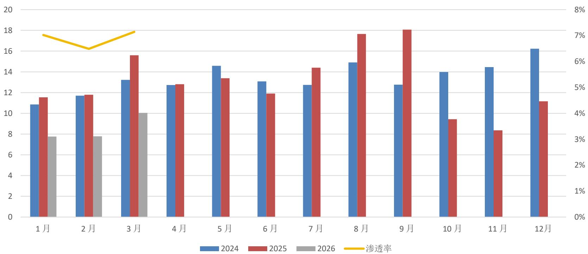

## 美国：多数车企销量较2月上升，特斯拉市占率达45%

◆ 多数车企销量较2月上升，特斯拉市占率达45%。26年3月特斯拉在美销4.3万辆，同环比-13%/+6%，1-3月市占率45%，较25年同期增加12pct；通用销1.2万辆，同环比-19%/+32%，1-3月市占率10%，同比+2pct；斯巴鲁销量0.2万辆，同环比+50%/+137%，1-3月市占率1% ；Stellantis销量0.2万辆，同环比-88%/-32%，1-3月市占率3%。

图：美国分车企销量（万辆）及市占率（%）
<table><tr><td rowspan=1 colspan=1></td><td rowspan=1 colspan=1>2026年3月</td><td rowspan=1 colspan=1>环比</td><td rowspan=1 colspan=1>同比</td><td rowspan=1 colspan=1>2026年1-3月</td><td rowspan=1 colspan=1>YOY</td><td rowspan=1 colspan=1>2026年1-3月市占率</td><td rowspan=1 colspan=1>市占率同比</td></tr><tr><td rowspan=1 colspan=1>Tesla</td><td rowspan=1 colspan=1>4.3</td><td rowspan=1 colspan=1>6%</td><td rowspan=1 colspan=1>-13%</td><td rowspan=1 colspan=1>11.7</td><td rowspan=1 colspan=1>-8%</td><td rowspan=1 colspan=1>45%</td><td rowspan=1 colspan=1>12%</td></tr><tr><td rowspan=1 colspan=1>通用集团</td><td rowspan=1 colspan=1>1.2</td><td rowspan=1 colspan=1>32%</td><td rowspan=1 colspan=1>-19%</td><td rowspan=1 colspan=1>2.6</td><td rowspan=1 colspan=1>-19%</td><td rowspan=1 colspan=1>10%</td><td rowspan=1 colspan=1>2%</td></tr><tr><td rowspan=1 colspan=1>丰田集团</td><td rowspan=1 colspan=1>0.9</td><td rowspan=1 colspan=1>15%</td><td rowspan=1 colspan=1>6%</td><td rowspan=1 colspan=1>2.4</td><td rowspan=1 colspan=1>10%</td><td rowspan=1 colspan=1>9%</td><td rowspan=1 colspan=1>4%</td></tr><tr><td rowspan=1 colspan=1>现代-起亚汽车集团</td><td rowspan=1 colspan=1>0.9</td><td rowspan=1 colspan=1>43%</td><td rowspan=1 colspan=1>-23%</td><td rowspan=1 colspan=1>2.1</td><td rowspan=1 colspan=1>-29%</td><td rowspan=1 colspan=1>8%</td><td rowspan=1 colspan=1>0%</td></tr><tr><td rowspan=1 colspan=1>宝马集团</td><td rowspan=1 colspan=1>0.5</td><td rowspan=1 colspan=1>26%</td><td rowspan=1 colspan=1>-44%</td><td rowspan=1 colspan=1>1.2</td><td rowspan=1 colspan=1>-42%</td><td rowspan=1 colspan=1>5%</td><td rowspan=1 colspan=1>-1%</td></tr><tr><td rowspan=1 colspan=1>其他中小整车集团</td><td rowspan=1 colspan=1>0.5</td><td rowspan=1 colspan=1>15%</td><td rowspan=1 colspan=1> -3%</td><td rowspan=1 colspan=1>1.3</td><td rowspan=1 colspan=1>4%</td><td rowspan=1 colspan=1>5%</td><td rowspan=1 colspan=1>2%</td></tr><tr><td rowspan=1 colspan=1>福特集团</td><td rowspan=1 colspan=1>0.4</td><td rowspan=1 colspan=1>34%</td><td rowspan=1 colspan=1>-66%</td><td rowspan=1 colspan=1>0.9</td><td rowspan=1 colspan=1>-65%</td><td rowspan=1 colspan=1>4%</td><td rowspan=1 colspan=1>-3%</td></tr><tr><td rowspan=1 colspan=1>吉利控股集团(Geely)</td><td rowspan=1 colspan=1>0.3</td><td rowspan=1 colspan=1>32%</td><td rowspan=1 colspan=1>-34%</td><td rowspan=1 colspan=1>0.7</td><td rowspan=1 colspan=1>-37%</td><td rowspan=1 colspan=1>3%</td><td rowspan=1 colspan=1>0%</td></tr><tr><td rowspan=1 colspan=1>梅赛德斯-奔驰集团</td><td rowspan=1 colspan=1>0.2</td><td rowspan=1 colspan=1>5%</td><td rowspan=1 colspan=1>-66%</td><td rowspan=1 colspan=1>0.6</td><td rowspan=1 colspan=1>-69%</td><td rowspan=1 colspan=1>2%</td><td rowspan=1 colspan=1>-3%</td></tr><tr><td rowspan=1 colspan=1>大众集团</td><td rowspan=1 colspan=1>0.2</td><td rowspan=1 colspan=1>16%</td><td rowspan=1 colspan=1>-78%</td><td rowspan=1 colspan=1>0.6</td><td rowspan=1 colspan=1>-76%</td><td rowspan=1 colspan=1>2%</td><td rowspan=1 colspan=1>-4%</td></tr><tr><td rowspan=1 colspan=1>斯巴鲁</td><td rowspan=1 colspan=1>0.2</td><td rowspan=1 colspan=1>137%</td><td rowspan=1 colspan=1>50%</td><td rowspan=1 colspan=1>0.3</td><td rowspan=1 colspan=1>-3%</td><td rowspan=1 colspan=1>1%</td><td rowspan=1 colspan=1>0%</td></tr><tr><td rowspan=1 colspan=1>Stellantis</td><td rowspan=1 colspan=1>0.2</td><td rowspan=1 colspan=1>-32%</td><td rowspan=1 colspan=1>-88%</td><td rowspan=1 colspan=1>0.7</td><td rowspan=1 colspan=1>-75%</td><td rowspan=1 colspan=1>3%</td><td rowspan=1 colspan=1>-4%</td></tr><tr><td rowspan=1 colspan=1>本田</td><td rowspan=1 colspan=1>0.2</td><td rowspan=1 colspan=1>44%</td><td rowspan=1 colspan=1>-67%</td><td rowspan=1 colspan=1>0.3</td><td rowspan=1 colspan=1>-76%</td><td rowspan=1 colspan=1>1%</td><td rowspan=1 colspan=1>-2%</td></tr><tr><td rowspan=1 colspan=1>塔塔集团</td><td rowspan=1 colspan=1>0.05</td><td rowspan=1 colspan=1>43%</td><td rowspan=1 colspan=1>0%</td><td rowspan=1 colspan=1>0.1</td><td rowspan=1 colspan=1>-32%</td><td rowspan=1 colspan=1>0%</td><td rowspan=1 colspan=1>0%</td></tr><tr><td rowspan=1 colspan=1>马自达</td><td rowspan=1 colspan=1>0.04</td><td rowspan=1 colspan=1>7%</td><td rowspan=1 colspan=1>-80%</td><td rowspan=1 colspan=1>0.1</td><td rowspan=1 colspan=1>-79%</td><td rowspan=1 colspan=1>0%</td><td rowspan=1 colspan=1>-1%</td></tr><tr><td rowspan=1 colspan=1>三菱</td><td rowspan=1 colspan=1>0.04</td><td rowspan=1 colspan=1>15%</td><td rowspan=1 colspan=1>-38%</td><td rowspan=1 colspan=1>0.1</td><td rowspan=1 colspan=1>-33%</td><td rowspan=1 colspan=1>0%</td><td rowspan=1 colspan=1>0%</td></tr><tr><td rowspan=1 colspan=1>回产</td><td rowspan=1 colspan=1>0.03</td><td rowspan=1 colspan=1>36%</td><td rowspan=1 colspan=1>-89%</td><td rowspan=1 colspan=1>0.1</td><td rowspan=1 colspan=1>-89%</td><td rowspan=1 colspan=1>0%</td><td rowspan=1 colspan=1>-1%</td></tr><tr><td rowspan=1 colspan=1>Ferrari</td><td rowspan=1 colspan=1>0.02</td><td rowspan=1 colspan=1>15%</td><td rowspan=1 colspan=1>-18%</td><td rowspan=1 colspan=1>0.04</td><td rowspan=1 colspan=1>-19%</td><td rowspan=1 colspan=1>0%</td><td rowspan=1 colspan=1>0%</td></tr><tr><td rowspan=1 colspan=1>VinFast</td><td rowspan=1 colspan=1>0.01</td><td rowspan=1 colspan=1>-40%</td><td rowspan=1 colspan=1>-79%</td><td rowspan=1 colspan=1>0.03</td><td rowspan=1 colspan=1>-78%</td><td rowspan=1 colspan=1>0%</td><td rowspan=1 colspan=1>0%</td></tr></table>

## 美国：26年销量中性预测125万辆

◆ 综合考虑美国短期需求放缓、新车型延期以及10月IRA补贴取消，我们中性预期2026年美国销量为125万辆，同比下滑20%。政策退潮导致市场从政策驱动转向价值驱动，购车成本上升叠加高利率环境，短期内将压制消费需求。

图：美国2026年销量月度预测（万辆）
<table><tr><td></td><td>1月</td><td>2月</td><td></td><td>3月</td><td>4月</td><td>5月</td><td>6月</td><td>7月</td><td>8月</td><td>9月</td><td>10月</td><td>11月</td><td>12月</td><td>合计</td></tr><tr><td rowspan="2">2025年</td><td>销量</td><td>11.6</td><td>11.8</td><td>15.6</td><td>13.5</td><td>14.1</td><td>12.8</td><td>15.7</td><td>18.7</td><td>18.1</td><td>9.4</td><td>8.4</td><td>11.2</td><td>160.8</td></tr><tr><td>同比</td><td> -41%</td><td> -42%</td><td> -47%</td><td> -38%</td><td> -37%</td><td> -57%</td><td> -26%</td><td>6%</td><td> -39%</td><td> -63%</td><td>-69%</td><td>-63%</td><td> -46%</td></tr><tr><td>2026年</td><td>销量</td><td>7.8</td><td>7.8</td><td>13.1</td><td>12.5</td><td>13.7</td><td>15.1</td><td>14.3</td><td>14.3</td><td>15.8</td><td>15.0</td><td>15.0</td><td>17.2</td><td>161.6</td></tr><tr><td>(乐观)</td><td>同比</td><td>-33%</td><td> -34%</td><td> -16%</td><td> -7%</td><td> -3%</td><td>18%</td><td>-9%</td><td> -24%</td><td> -13%</td><td>59%</td><td>79%</td><td>54%</td><td>0%</td></tr><tr><td>2026年</td><td>销量</td><td>7.8</td><td>7.8</td><td>13.1</td><td>10.0</td><td>10.0</td><td>9.6</td><td>11.0</td><td>11.1</td><td>11.0</td><td>9.7</td><td>12.3</td><td>12.0</td><td>125.4</td></tr><tr><td>(中性）</td><td>同比</td><td> -33%</td><td> -34%</td><td> -16%</td><td> -26%</td><td> -29%</td><td> -25%</td><td> -30%</td><td> -41%</td><td>-39%</td><td>3%</td><td>47%</td><td>7%</td><td> -22%</td></tr><tr><td>2026年</td><td>销量</td><td>7.8</td><td>7.8</td><td>13.1</td><td>9</td><td>9.9</td><td>8.6</td><td>9.9</td><td>10.0</td><td>9.9</td><td>8.7</td><td>11.1</td><td>10.8</td><td>116.6</td></tr><tr><td>(悲观)</td><td>同比</td><td>-33%</td><td> -34%</td><td>-16%</td><td>-33%</td><td>-30%</td><td> -33%</td><td> -37%</td><td> -47%</td><td> -45%</td><td>-7%</td><td>32%</td><td>-3%</td><td>-28%</td></tr></table>

<table><tr><td></td><td></td><td>Q1</td><td>Q2</td><td>Q3</td><td>Q4</td><td>合计</td></tr><tr><td rowspan="2">2025年</td><td>销量</td><td>39.0</td><td>40.4</td><td>52.5</td><td>29.0</td><td>160.8</td></tr><tr><td>同比</td><td>-44%</td><td>-46%</td><td> -23%</td><td>-65%</td><td> -46%</td></tr><tr><td>2026年</td><td>销量</td><td>28.7</td><td>41.3</td><td>44.4</td><td>47.2</td><td>161.6</td></tr><tr><td>(乐观)</td><td>同比</td><td> -26%</td><td>2%</td><td> -15%</td><td>63%</td><td>0%</td></tr><tr><td>2026年</td><td>销量</td><td>28.7</td><td>29.6</td><td>33.1</td><td>34.0</td><td>125.4</td></tr><tr><td>(中性)</td><td>同比</td><td> -26%</td><td>-27%</td><td> -37%</td><td>17%</td><td>-22%</td></tr><tr><td>2026年</td><td>销量</td><td>28.7</td><td>27.5</td><td>29.8</td><td>30.6</td><td>116.6</td></tr><tr><td>(悲观)</td><td>同比</td><td> -26%</td><td>-32%</td><td>-43%</td><td>6%</td><td> -28%</td></tr></table>

## 其他国家：26年2月销量同增71%，表现亮眼

◆ 其他国家26年2月销量同增71%，1-2月累计销售31.6万辆，同增85%。其他国家新能源汽车2月销15.2万辆，同环比+71%/-7.6%，渗透率7%。1-2月其他国家销量累计31.6万辆，同比增85%，渗透率7%。

图：其他国家电动车销量（万辆）&渗透率（右，%）  
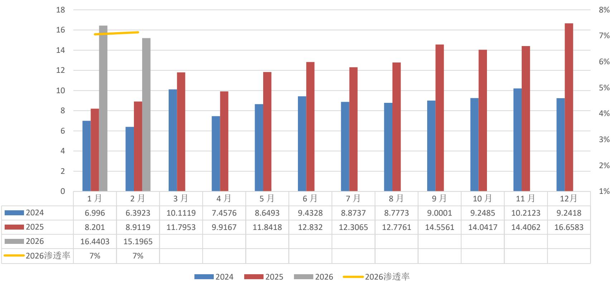

## 其他国家：新兴市场电动车表现亮眼，亚太、南美高增

◆ 新兴市场电动车表现亮眼，韩国、泰国销量高增，印尼、巴西、墨西哥等新兴市场保持强劲增长。2026年2月销量看，韩国销量3.7万辆，同环比+146%/+241%；泰国销量0.58万辆，同环比-5%/-87%；马来西亚销量0.4万辆，同环比+133%/-36%；印度尼西亚销量1.3万辆，同环比+148%/+20%；巴西销量1.3万辆，同环比+71%/+7%；墨西哥销量0.2万辆，同环比+128%/+3%。

表：主流国家及地区电动车月度销量（万辆）
<table><tr><td rowspan=1 colspan=1></td><td rowspan=1 colspan=1>202602</td><td rowspan=1 colspan=1>环比</td><td rowspan=1 colspan=1>同比</td><td rowspan=1 colspan=1>2026.1-2</td><td rowspan=1 colspan=1>同比</td><td rowspan=1 colspan=1>2026.1-2渗透率</td><td rowspan=1 colspan=1>同比</td></tr><tr><td rowspan=1 colspan=1>韩国</td><td rowspan=1 colspan=1>3.7</td><td rowspan=1 colspan=1>241%</td><td rowspan=1 colspan=1>146%</td><td rowspan=1 colspan=1>4.8</td><td rowspan=1 colspan=1>171%</td><td rowspan=1 colspan=1>21%</td><td rowspan=1 colspan=1>14pct</td></tr><tr><td rowspan=1 colspan=1>印度</td><td rowspan=1 colspan=1>1.6</td><td rowspan=1 colspan=1>-19%</td><td rowspan=1 colspan=1>58%</td><td rowspan=1 colspan=1>3.6</td><td rowspan=1 colspan=1>59%</td><td rowspan=1 colspan=1>4%</td><td rowspan=1 colspan=1>1pct</td></tr><tr><td rowspan=1 colspan=1>印度尼西亚</td><td rowspan=1 colspan=1>1.3</td><td rowspan=1 colspan=1>20%</td><td rowspan=1 colspan=1>148%</td><td rowspan=1 colspan=1>2.4</td><td rowspan=1 colspan=1>203%</td><td rowspan=1 colspan=1>18%</td><td rowspan=1 colspan=1>13pct</td></tr><tr><td rowspan=1 colspan=1>澳大利亚</td><td rowspan=1 colspan=1>1.3</td><td rowspan=1 colspan=1>43%</td><td rowspan=1 colspan=1>76%</td><td rowspan=1 colspan=1>2.2</td><td rowspan=1 colspan=1>103%</td><td rowspan=1 colspan=1>11%</td><td rowspan=1 colspan=1>6pct</td></tr><tr><td rowspan=1 colspan=1>巴西</td><td rowspan=1 colspan=1>1.3</td><td rowspan=1 colspan=1>7%</td><td rowspan=1 colspan=1>71%</td><td rowspan=1 colspan=1>2.5</td><td rowspan=1 colspan=1>69%</td><td rowspan=1 colspan=1>7%</td><td rowspan=1 colspan=1>3pct</td></tr><tr><td rowspan=1 colspan=1>日本</td><td rowspan=1 colspan=1>1.2</td><td rowspan=1 colspan=1>11%</td><td rowspan=1 colspan=1>53%</td><td rowspan=1 colspan=1>2.3</td><td rowspan=1 colspan=1>30%</td><td rowspan=1 colspan=1>3%</td><td rowspan=1 colspan=1>1pct</td></tr><tr><td rowspan=1 colspan=1>泰国</td><td rowspan=1 colspan=1>0.6</td><td rowspan=1 colspan=1>-87%</td><td rowspan=1 colspan=1>-5%</td><td rowspan=1 colspan=1>5.0</td><td rowspan=1 colspan=1>156%</td><td rowspan=1 colspan=1>26%</td><td rowspan=1 colspan=1>12pct</td></tr><tr><td rowspan=1 colspan=1>马来西亚</td><td rowspan=1 colspan=1>0.4</td><td rowspan=1 colspan=1>-36%</td><td rowspan=1 colspan=1>133%</td><td rowspan=1 colspan=1>1.0</td><td rowspan=1 colspan=1>308%</td><td rowspan=1 colspan=1>8%</td><td rowspan=1 colspan=1>6pct</td></tr><tr><td rowspan=1 colspan=1>墨西哥</td><td rowspan=1 colspan=1>0.2</td><td rowspan=1 colspan=1>3%</td><td rowspan=1 colspan=1>128%</td><td rowspan=1 colspan=1>0.5</td><td rowspan=1 colspan=1>134%</td><td rowspan=1 colspan=1>2%</td><td rowspan=1 colspan=1>1pct</td></tr><tr><td rowspan=1 colspan=1>中国台湾</td><td rowspan=1 colspan=1>0.1</td><td rowspan=1 colspan=1>17%</td><td rowspan=1 colspan=1>-42%</td><td rowspan=1 colspan=1>0.2</td><td rowspan=1 colspan=1>-46%</td><td rowspan=1 colspan=1>7%</td><td rowspan=1 colspan=1>Opct</td></tr><tr><td rowspan=1 colspan=1>以色列</td><td rowspan=1 colspan=1>0.1</td><td rowspan=1 colspan=1>44%</td><td rowspan=1 colspan=1>-67%</td><td rowspan=1 colspan=1>0.1</td><td rowspan=1 colspan=1>-80%</td><td rowspan=1 colspan=1>2%</td><td rowspan=1 colspan=1>-7pct</td></tr><tr><td rowspan=1 colspan=1>俄罗斯</td><td rowspan=1 colspan=1>0.1</td><td rowspan=1 colspan=1>-7%</td><td rowspan=1 colspan=1>25%</td><td rowspan=1 colspan=1>0.2</td><td rowspan=1 colspan=1>26%</td><td rowspan=1 colspan=1>1%</td><td rowspan=1 colspan=1>Opct</td></tr><tr><td rowspan=1 colspan=1>新加坡</td><td rowspan=1 colspan=1>0.1</td><td rowspan=1 colspan=1>16%</td><td rowspan=1 colspan=1>76%</td><td rowspan=1 colspan=1>0.1</td><td rowspan=1 colspan=1>195%</td><td rowspan=1 colspan=1>10%</td><td rowspan=1 colspan=1>6pct</td></tr><tr><td rowspan=1 colspan=1>南</td><td rowspan=1 colspan=1>0.05</td><td rowspan=1 colspan=1>15%</td><td rowspan=1 colspan=1>146%</td><td rowspan=1 colspan=1>0.1</td><td rowspan=1 colspan=1>130%</td><td rowspan=1 colspan=1>1%</td><td rowspan=1 colspan=1>Opct</td></tr><tr><td rowspan=1 colspan=1>新西兰</td><td rowspan=1 colspan=1>0.01</td><td rowspan=1 colspan=1>195%</td><td rowspan=1 colspan=1>-30%</td><td rowspan=1 colspan=1>0.01</td><td rowspan=1 colspan=1>-32%</td><td rowspan=1 colspan=1>0%</td><td rowspan=1 colspan=1>Opct</td></tr></table>

数据来源：Marklines，东吴证券研究所

## 其他国家：我们预计26年销量284万辆，同增77%

◆ 我们预计26年销量284万辆，同增77%。其他国家电动化率低、国内车企出口优势明显，印尼、泰国等渗透率已加速提升。

图：其他国家26年销量月度预测（万辆）
<table><tr><td></td><td></td><td>1月</td><td>2月</td><td>3月</td><td>4月</td><td>5月</td><td>6月</td><td>7月</td><td>8月</td><td>9月</td><td>10月</td><td>11月</td><td>12月</td><td>合计</td></tr><tr><td rowspan="2">2025年</td><td>销量</td><td>8.3</td><td>9.5</td><td>12.3</td><td>11.7</td><td>12.8</td><td>14.4</td><td>14.1</td><td>13.9</td><td>15.6</td><td>15.0</td><td>15.4</td><td>16.7</td><td>160</td></tr><tr><td>同比</td><td>21%</td><td>17%</td><td>23%</td><td>30%</td><td>34%</td><td>20%</td><td>40%</td><td>36%</td><td>78%</td><td>71%</td><td> 54%</td><td>61%</td><td>56%</td></tr><tr><td>2026年</td><td>销量</td><td>15.6</td><td>15.2</td><td>20.8</td><td>16.6</td><td>17.5</td><td>28.3</td><td>28.4</td><td>25.7</td><td>33.7</td><td>32.8</td><td>33.9</td><td>40.4</td><td>309</td></tr><tr><td>(乐观）</td><td>同比</td><td>88%</td><td>60%</td><td>69%</td><td>42%</td><td>37%</td><td>97%</td><td>101%</td><td>85%</td><td>116%</td><td>119%</td><td>120%</td><td>142%</td><td>94%</td></tr><tr><td>2026年</td><td>销量</td><td>15.6</td><td>15.2</td><td>18.9</td><td>15.1</td><td>15.9</td><td>25.7</td><td>25.8</td><td>23.4</td><td>30.6</td><td>29.8</td><td>30.8</td><td>36.7</td><td>284</td></tr><tr><td>（中性）</td><td>同比</td><td>88%</td><td>60%</td><td>54%</td><td>29%</td><td>24%</td><td>79%</td><td>83%</td><td>68%</td><td>96%</td><td>99%</td><td>100%</td><td>120%</td><td>77%</td></tr><tr><td>2026年</td><td>销量</td><td>15.6</td><td>15.2</td><td>17.0</td><td>13.6</td><td>14.3</td><td>23.1</td><td>23.2</td><td>16.6</td><td>27.5</td><td>26.8</td><td>27.7</td><td>33.0</td><td>254</td></tr><tr><td>(悲观)</td><td>同比</td><td>88%</td><td>60%</td><td>39%</td><td>16%</td><td>12%</td><td>61%</td><td>65%</td><td>19%</td><td>77%</td><td>79%</td><td>80%</td><td>98%</td><td>59%</td></tr></table>

<table><tr><td></td><td></td><td>Q1</td><td>Q2</td><td>Q3</td><td>Q4</td><td>合计</td></tr><tr><td rowspan="2">2025年</td><td>销量</td><td>30.1</td><td>38.8</td><td>43.6</td><td>47.1</td><td>160</td></tr><tr><td>同比</td><td>31%</td><td>54%</td><td>69%</td><td>62%</td><td>56%</td></tr><tr><td>2026年</td><td>销量</td><td>51.6</td><td>62.4</td><td>87.8</td><td>107.0</td><td>309</td></tr><tr><td>(乐观)</td><td>同比</td><td>72%</td><td>61%</td><td>101%</td><td>127%</td><td>94%</td></tr><tr><td>2026年</td><td>销量</td><td>49.7</td><td>56.7</td><td>79.8</td><td>97.3</td><td>284</td></tr><tr><td>(中性)</td><td>同比</td><td>65%</td><td> 46%</td><td>83%</td><td>107%</td><td>77%</td></tr><tr><td>2026年</td><td>销量</td><td>47.9</td><td>51.0</td><td>67.3</td><td>87.6</td><td>254</td></tr><tr><td>(悲观)</td><td>同比</td><td>59%</td><td>31%</td><td>54%</td><td>86%</td><td>59%</td></tr></table>

## 动力：我们预计海外26年电池需求同比增长28%

◆ 我们预计26年欧洲销量同比+30%、美国同比-20%、新兴市场电动车同比+77%，合计销量921万辆，同比增长30%。

◆ 我们预计26年海外动力电池装机需求552GWh，同比+28%。

表：海外动力需求增速预期

<table><tr><td></td><td>2024</td><td>2025</td><td>2026E</td><td>2027E</td><td>2028E</td><td>2029E</td><td>2030E</td></tr><tr><td>海外：新能源乘用车销量（万辆）</td><td>559</td><td>710</td><td>921</td><td>1,156</td><td>1,412</td><td>1,725</td><td>2,107</td></tr><tr><td>YoY</td><td>10%</td><td>27%</td><td>30%</td><td>26%</td><td>22%</td><td>22%</td><td>22%</td></tr><tr><td>-海外电动化率</td><td>10.1%</td><td>12.6%</td><td>16.1%</td><td>19.9%</td><td>23.9%</td><td>28.7%</td><td>34.5%</td></tr><tr><td>-欧洲新能源车销量（万辆）</td><td>295</td><td> 394</td><td> 512</td><td> 615</td><td>738</td><td>885</td><td>1,062</td></tr><tr><td>-YoY</td><td>2%</td><td>33%</td><td>30%</td><td>20%</td><td>20%</td><td>20%</td><td>20%</td></tr><tr><td>-欧洲电动化率</td><td>19%</td><td>25%</td><td>33%</td><td>39%</td><td>46%</td><td>55%</td><td>65%</td></tr><tr><td>-美国</td><td>161</td><td>156</td><td>125</td><td> 144</td><td> 173</td><td> 207</td><td> 248</td></tr><tr><td>-YoY</td><td>10%</td><td>-3%</td><td>-20%</td><td>15%</td><td>20%</td><td>20%</td><td>20%</td></tr><tr><td>-美国电动化率</td><td>10%</td><td>10%</td><td>8%</td><td>9%</td><td>11%</td><td>13%</td><td>16%</td></tr><tr><td>-其他国家</td><td>103</td><td>160</td><td>284</td><td>398</td><td> 502</td><td> 633</td><td>796</td></tr><tr><td>-YoY</td><td>38%</td><td>56%</td><td>77.3%</td><td>40.1%</td><td>26.2%</td><td>26.0%</td><td>25.9%</td></tr><tr><td>-其他国家电动化率</td><td>4.3%</td><td>6.5%</td><td>11.1%</td><td>15.1%</td><td>18.5%</td><td>22.7%</td><td>27.7%</td></tr><tr><td>海外：乘用车动力电池装机需求（Gwh)</td><td>325.8</td><td>409.8</td><td>521.0</td><td>652.2</td><td>800.2</td><td>981.8</td><td>1204.6</td></tr><tr><td>-海外平均单车带电量（kwh）</td><td>58.3</td><td>57.7</td><td>56.5</td><td>56.4</td><td>56.7</td><td>56.9</td><td>57.2</td></tr><tr><td>海外：电动商用车销量（万辆)</td><td>6.0</td><td>11.0</td><td>13.2</td><td>14.5</td><td>17.4</td><td>20.9</td><td>25.1</td></tr><tr><td>-海外商用车销量 (万辆)</td><td>534.7</td><td>588.2</td><td>600.0</td><td>612.0</td><td>618.1</td><td>624.3</td><td>630.5</td></tr><tr><td>-电动化率</td><td> 1.1%</td><td> 1.9%</td><td> 2.2%</td><td> 2.4%</td><td> 2.8%</td><td>3.3%</td><td> 4.0%</td></tr><tr><td>动力电池装机需求（Gwh)</td><td>9.9</td><td>20.0</td><td> 31.1</td><td>36.0</td><td>45.3</td><td>57.1</td><td>72.0</td></tr><tr><td>单车电池容量(kwh)</td><td>165.0</td><td>181.5</td><td>236.0</td><td>247.7</td><td>260.1</td><td>273.1</td><td>286.8</td></tr><tr><td>合计海外动力装机（GWh)</td><td>335.7</td><td>429.7</td><td>552.1</td><td>688.1</td><td>845.5</td><td>1038.9</td><td>1276.6</td></tr><tr><td>-YoY -占比</td><td>3% 39%</td><td>28% 37%</td><td>28% 39%</td><td>25% 41%</td><td>23% 44%</td><td>23% 47%</td><td>23% 50%</td></tr></table>

## 动力：我们预计全球动力电池26年需求+23%

◆ 我们预计26年全球新能源车销量2330万辆，同增10%，动力电池需求1745gwh，同增23%。

表：全球动力电池需求测算
<table><tr><td></td><td>2024</td><td>2025</td><td>2026E</td><td>2027E</td><td>2028E</td><td>2029E</td><td>2030E</td></tr><tr><td>全球新能源车销量 (万辆)</td><td>1,723</td><td>2,109</td><td>2,330</td><td>2,672</td><td>3,038</td><td>3,466</td><td>3,973</td></tr><tr><td>YoY</td><td>29%</td><td>22%</td><td>10%</td><td>15%</td><td>14%</td><td>14%</td><td>15%</td></tr><tr><td>全球汽车销量 (万辆)</td><td>8,113</td><td>8,362</td><td>8,534</td><td>8,711</td><td>8,893</td><td>9,079</td><td>9,272</td></tr><tr><td>-全球电动化率</td><td>21.2%</td><td>25.2%</td><td>27.3%</td><td>30.7%</td><td>34.2%</td><td>38.2%</td><td>42.9%</td></tr><tr><td>全球动力电池装机需求 (gwh)</td><td>870</td><td>1,163</td><td>1,430</td><td>1,668</td><td>1,917</td><td>2,209</td><td>2,553</td></tr><tr><td>YoY</td><td>22%</td><td>34%</td><td>23.0%</td><td>16.6%</td><td>14.9%</td><td>15.2%</td><td>15.6%</td></tr><tr><td>-全球平均单车带电量(kwh)</td><td>50.5</td><td>55.1</td><td>61.4</td><td>62.4</td><td>63.1</td><td>63.7</td><td>64.3</td></tr><tr><td>国内动力类电池（gwh)</td><td>534</td><td>733</td><td>878</td><td>980</td><td>1,072</td><td>1,170</td><td>1,277</td></tr><tr><td>海外动力类类电池（gwh)</td><td>326</td><td>410</td><td>521</td><td>652</td><td>800</td><td>982</td><td>1,205</td></tr><tr><td>全球动力电池实际需求（gwh)</td><td>1,062</td><td>1,418</td><td>1,745</td><td>2.035</td><td>2,339</td><td>2,694</td><td>3,115</td></tr><tr><td>YoY</td><td>22%</td><td>34%</td><td>23.0%</td><td>16.6%</td><td>14.9%</td><td>15.2%</td><td>15.6%</td></tr></table>

## 储能：欧洲户储超预期，全球维持60%增长

## 储能：维持26年1000gwh以上的预期

◆ 月度数据：储能电芯依然满产，鑫椤1-2月累计全球储能电池出货量128gwh，同比+135%。

国内招标1-2月国内大储招标55gwh，同比+55%；中标53gwh，同比281%。

表：全球储能电池月度出货量GWh（鑫椤）
<table><tr><td></td><td>24年同期累计</td><td>25年累计</td><td></td><td>26年1月26年2月</td><td>累计同比 </td></tr><tr><td>宁德时代</td><td>110.5</td><td>152.0</td><td>16.0</td><td>14.0</td><td>58%</td></tr><tr><td>亿纬锂能</td><td>42.8</td><td>70.0</td><td>7.2</td><td>6.0</td><td>132%</td></tr><tr><td>瑞浦能源</td><td>25.2</td><td> 46.0</td><td>4.2</td><td>3.9</td><td>119%</td></tr><tr><td>中创新航</td><td>23.6</td><td>51.1</td><td>4.7</td><td>4.5</td><td>124%</td></tr><tr><td>比亚迪</td><td>25.6</td><td>62.0</td><td>4.9</td><td>3.5</td><td>31%</td></tr><tr><td>海辰储能</td><td>25.7</td><td>72.0</td><td>7.5</td><td>6.3</td><td>229%</td></tr><tr><td>国轩高科</td><td>17.0</td><td>32.0</td><td>2.6</td><td>2.3</td><td>63%</td></tr><tr><td>远景能源</td><td>11.0</td><td>31.5</td><td>3.3</td><td>2.6</td><td>228%</td></tr><tr><td>鹏辉能源</td><td>7.3</td><td>19.4</td><td>2.1</td><td>2.0</td><td>242%</td></tr><tr><td>赣锋锂电</td><td>4.5</td><td>19.0</td><td>1.8</td><td>1.6</td><td>325%</td></tr><tr><td> LGES</td><td>4.5</td><td>13.0</td><td>1.8</td><td>1.7</td><td>307%</td></tr><tr><td>三星SDI</td><td>3.7</td><td>5.2</td><td>0.5</td><td>0.4</td><td>29%</td></tr><tr><td>南都电源</td><td>1.5</td><td>2.9</td><td>1.0</td><td>0.5</td><td>400%</td></tr><tr><td>力神电池</td><td>2.8</td><td>7.0</td><td>0.7</td><td>0.6</td><td>333%</td></tr><tr><td>派能科技</td><td>1.6</td><td>3.0</td><td>0.2</td><td>0.2</td><td>300%</td></tr><tr><td>松下</td><td>0.7</td><td>0.2</td><td>0.0</td><td>0.0</td><td>-20%</td></tr><tr><td>双登富郎特</td><td>0.8</td><td>0.2</td><td>0.1</td><td>0.1</td><td>800%</td></tr><tr><td>SKI</td><td>0.1</td><td>0.2</td><td>0.0</td><td>0.0</td><td>0%</td></tr><tr><td>中天储能</td><td>0.1</td><td>0.3</td><td>0.1</td><td>0.1</td><td>150%</td></tr><tr><td>其他 合计</td><td>19.1 328.1</td><td>7.9 598.0</td><td>10.4 69.1</td><td>8.2 58.4</td><td>825% 135%</td></tr></table>

图：全球储能电池月度出货量GWh（鑫椤）及同比（右轴）

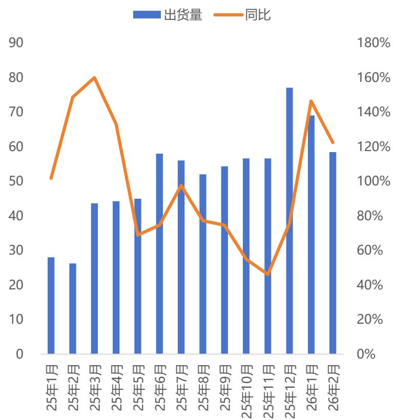

## 储能：维持26年1000gwh以上的预期

考虑大电芯降本10%，对应4分/wh，碳酸锂接受度提升至18万/吨

图：碳酸锂价格对应铁锂电芯售价（元/wh）弹性测算
<table><tr><td rowspan=1 colspan=1></td><td rowspan=1 colspan=5>电芯企业毛利率</td></tr><tr><td rowspan=1 colspan=1></td><td rowspan=1 colspan=1>0.384</td><td rowspan=1 colspan=1>8%</td><td rowspan=1 colspan=1>10%</td><td rowspan=1 colspan=1>12%</td><td rowspan=1 colspan=1>15%</td></tr><tr><td rowspan=18 colspan=1>碳酸锂价格万元吨</td><td rowspan=1 colspan=1>6</td><td rowspan=1 colspan=1>0.32</td><td rowspan=1 colspan=1>0.32</td><td rowspan=1 colspan=1>0.33</td><td rowspan=1 colspan=1>0.34</td></tr><tr><td rowspan=1 colspan=1>7</td><td rowspan=1 colspan=1>0.32</td><td rowspan=1 colspan=1>0.33</td><td rowspan=1 colspan=1>0.34</td><td rowspan=1 colspan=1>0.34</td></tr><tr><td rowspan=1 colspan=1>8</td><td rowspan=1 colspan=1>0.33</td><td rowspan=1 colspan=1>0.34</td><td rowspan=1 colspan=1>0.34</td><td rowspan=1 colspan=1>0.35</td></tr><tr><td rowspan=1 colspan=1>9</td><td rowspan=1 colspan=1>0.34</td><td rowspan=1 colspan=1>0.34</td><td rowspan=1 colspan=1>0.35</td><td rowspan=1 colspan=1>0.36</td></tr><tr><td rowspan=1 colspan=1>10</td><td rowspan=1 colspan=1>0.34</td><td rowspan=1 colspan=1>0.35</td><td rowspan=1 colspan=1>0.35</td><td rowspan=1 colspan=1>0.36</td></tr><tr><td rowspan=1 colspan=1>11</td><td rowspan=1 colspan=1>0.35</td><td rowspan=1 colspan=1>0.35</td><td rowspan=1 colspan=1>0.36</td><td rowspan=1 colspan=1>0.37</td></tr><tr><td rowspan=1 colspan=1>12</td><td rowspan=1 colspan=1>0.35</td><td rowspan=1 colspan=1>0.36</td><td rowspan=1 colspan=1>0.37</td><td rowspan=1 colspan=1>0.38</td></tr><tr><td rowspan=1 colspan=1>13</td><td rowspan=1 colspan=1>0.36</td><td rowspan=1 colspan=1>0.37</td><td rowspan=1 colspan=1>0.37</td><td rowspan=1 colspan=1>0.38</td></tr><tr><td rowspan=1 colspan=1>14</td><td rowspan=1 colspan=1>0.36</td><td rowspan=1 colspan=1>0.37</td><td rowspan=1 colspan=1>0.38</td><td rowspan=1 colspan=1>0.39</td></tr><tr><td rowspan=1 colspan=1>15</td><td rowspan=1 colspan=1>0.37</td><td rowspan=1 colspan=1>0.38</td><td rowspan=1 colspan=1>0.38</td><td rowspan=1 colspan=1>0.39</td></tr><tr><td rowspan=1 colspan=1>16</td><td rowspan=1 colspan=1>0.38</td><td rowspan=1 colspan=1>0.38</td><td rowspan=1 colspan=1>0.39</td><td rowspan=1 colspan=1>0.40</td></tr><tr><td rowspan=1 colspan=1>17</td><td rowspan=1 colspan=1>0.38</td><td rowspan=1 colspan=1>0.39</td><td rowspan=1 colspan=1>0.40</td><td rowspan=1 colspan=1>0.41</td></tr><tr><td rowspan=1 colspan=1>18</td><td rowspan=1 colspan=1>0.39</td><td rowspan=1 colspan=1>0.39</td><td rowspan=1 colspan=1>0.40</td><td rowspan=1 colspan=1>0.41</td></tr><tr><td rowspan=1 colspan=1>19</td><td rowspan=1 colspan=1>0.39</td><td rowspan=1 colspan=1>0.40</td><td rowspan=1 colspan=1>0.41</td><td rowspan=1 colspan=1>0.42</td></tr><tr><td rowspan=1 colspan=1>20</td><td rowspan=1 colspan=1>0.40</td><td rowspan=1 colspan=1>0.41</td><td rowspan=1 colspan=1>0.41</td><td rowspan=1 colspan=1>0.42</td></tr><tr><td rowspan=1 colspan=1>21</td><td rowspan=1 colspan=1>0.40</td><td rowspan=1 colspan=1>0.41</td><td rowspan=1 colspan=2>0.42        0.43</td></tr><tr><td rowspan=1 colspan=1>22</td><td rowspan=1 colspan=1>0.41</td><td rowspan=1 colspan=1>0.42</td><td rowspan=1 colspan=2>0.43        0.44</td></tr><tr><td rowspan=1 colspan=1>23</td><td rowspan=1 colspan=1>0.42</td><td rowspan=1 colspan=3>0.42        0.43        0.44</td></tr></table>

图：碳酸锂价格对于储能irr弹性测算（甘肃为例）
<table><tr><td rowspan=1 colspan=2>储能电站irr</td><td rowspan=1 colspan=7>储能电站年运行天数</td></tr><tr><td rowspan=1 colspan=1></td><td rowspan=1 colspan=1>8.60%</td><td rowspan=1 colspan=1>270</td><td rowspan=1 colspan=1>280</td><td rowspan=1 colspan=1>290</td><td rowspan=1 colspan=1>300</td><td rowspan=1 colspan=1>310</td><td rowspan=1 colspan=1>320</td><td rowspan=1 colspan=1>330</td></tr><tr><td rowspan=19 colspan=1>电芯价格（元/wh)</td><td rowspan=1 colspan=1>0.26</td><td rowspan=1 colspan=1>9.4%</td><td rowspan=1 colspan=1>10.3%</td><td rowspan=1 colspan=1>11.2%</td><td rowspan=1 colspan=1>12.1%</td><td rowspan=1 colspan=1>13.0%</td><td rowspan=1 colspan=1>13.8%</td><td rowspan=1 colspan=1>14.7%</td></tr><tr><td rowspan=1 colspan=1>0.27</td><td rowspan=1 colspan=1>8.7%</td><td rowspan=1 colspan=1>9.6%</td><td rowspan=1 colspan=1>10.5%</td><td rowspan=1 colspan=1>11.4%</td><td rowspan=1 colspan=1>12.2%</td><td rowspan=1 colspan=1>13.1%</td><td rowspan=1 colspan=1>13.9%</td></tr><tr><td rowspan=1 colspan=1>0.28</td><td rowspan=1 colspan=1>8.1%</td><td rowspan=1 colspan=1>8.9%</td><td rowspan=1 colspan=1>9.8%</td><td rowspan=1 colspan=1>10.6%</td><td rowspan=1 colspan=1>11.5%</td><td rowspan=1 colspan=1>12.3%</td><td rowspan=1 colspan=1>13.2%</td></tr><tr><td rowspan=1 colspan=1>0.29</td><td rowspan=1 colspan=1>7.4%</td><td rowspan=1 colspan=1>8.3%</td><td rowspan=1 colspan=1>9.1%</td><td rowspan=1 colspan=1>10.0%</td><td rowspan=1 colspan=1>10.8%</td><td rowspan=1 colspan=1>11.6%</td><td rowspan=1 colspan=1>12.4%</td></tr><tr><td rowspan=1 colspan=1>0.3</td><td rowspan=1 colspan=1>6.8%</td><td rowspan=1 colspan=1>7.7%</td><td rowspan=1 colspan=1>8.5%</td><td rowspan=1 colspan=1>9.3%</td><td rowspan=1 colspan=1>10.1%</td><td rowspan=1 colspan=1>10.9%</td><td rowspan=1 colspan=1>11.7%</td></tr><tr><td rowspan=1 colspan=1>0.31</td><td rowspan=1 colspan=1>6.2%</td><td rowspan=1 colspan=1>7.0%</td><td rowspan=1 colspan=1>7.9%</td><td rowspan=1 colspan=1>8.7%</td><td rowspan=1 colspan=1>9.5%</td><td rowspan=1 colspan=1>10.3%</td><td rowspan=1 colspan=1>11.0%</td></tr><tr><td rowspan=1 colspan=1>0.32</td><td rowspan=1 colspan=1>5.7%</td><td rowspan=1 colspan=1>6.5%</td><td rowspan=1 colspan=1>7.3%</td><td rowspan=1 colspan=1>8.1%</td><td rowspan=1 colspan=1>8.8%</td><td rowspan=1 colspan=1>9.6%</td><td rowspan=1 colspan=1>10.4%</td></tr><tr><td rowspan=1 colspan=1>0.33</td><td rowspan=1 colspan=1>5.1%</td><td rowspan=1 colspan=1>5.9%</td><td rowspan=1 colspan=1>6.7%</td><td rowspan=1 colspan=1>7.5%</td><td rowspan=1 colspan=1>8.2%</td><td rowspan=1 colspan=1>9.0%</td><td rowspan=1 colspan=1>9.8%</td></tr><tr><td rowspan=1 colspan=1>0.34</td><td rowspan=1 colspan=1>4.6%</td><td rowspan=1 colspan=1>5.4%</td><td rowspan=1 colspan=1>6.1%</td><td rowspan=1 colspan=1>6.9%</td><td rowspan=1 colspan=1>7.7%</td><td rowspan=1 colspan=1>8.4%</td><td rowspan=1 colspan=1>9.2%</td></tr><tr><td rowspan=1 colspan=1>0.35</td><td rowspan=1 colspan=1>4.1%</td><td rowspan=1 colspan=1>4.8%</td><td rowspan=1 colspan=1>5.6%</td><td rowspan=1 colspan=1>6.4%</td><td rowspan=1 colspan=1>7.1%</td><td rowspan=1 colspan=1>7.9%</td><td rowspan=1 colspan=1>8.6%</td></tr><tr><td rowspan=1 colspan=1>0.36</td><td rowspan=1 colspan=1>3.6%</td><td rowspan=1 colspan=1>4.3%</td><td rowspan=1 colspan=1>5.1%</td><td rowspan=1 colspan=1>5.8%</td><td rowspan=1 colspan=1>6.6%</td><td rowspan=1 colspan=1>7.3%</td><td rowspan=1 colspan=1>8.0%</td></tr><tr><td rowspan=1 colspan=1>0.37</td><td rowspan=1 colspan=1>3.1%</td><td rowspan=1 colspan=1>3.9%</td><td rowspan=1 colspan=1>4.6%</td><td rowspan=1 colspan=1>5.3%</td><td rowspan=1 colspan=1>6.1%</td><td rowspan=1 colspan=1>6.8%</td><td rowspan=1 colspan=1>7.5%</td></tr><tr><td rowspan=1 colspan=1>0.38</td><td rowspan=1 colspan=1>2.6%</td><td rowspan=1 colspan=1>3.4%</td><td rowspan=1 colspan=1>4.1%</td><td rowspan=1 colspan=1>4.9%</td><td rowspan=1 colspan=1>5.6%</td><td rowspan=1 colspan=1>6.3%</td><td rowspan=1 colspan=1>7.0%</td></tr><tr><td rowspan=1 colspan=1>0.39</td><td rowspan=1 colspan=1>2.2%</td><td rowspan=1 colspan=1>2.9%</td><td rowspan=1 colspan=1>3.7%</td><td rowspan=1 colspan=1>4.4%</td><td rowspan=1 colspan=1>5.1%</td><td rowspan=1 colspan=1>5.8%</td><td rowspan=1 colspan=1>6.5%</td></tr><tr><td rowspan=1 colspan=1>0.4</td><td rowspan=1 colspan=1>1.8%</td><td rowspan=1 colspan=1>2.5%</td><td rowspan=1 colspan=1>3.2%</td><td rowspan=1 colspan=1>3.9%</td><td rowspan=1 colspan=1>4.6%</td><td rowspan=1 colspan=1>5.3%</td><td rowspan=1 colspan=1>6.0%</td></tr><tr><td rowspan=1 colspan=1>0.41</td><td rowspan=1 colspan=1>0.3%</td><td rowspan=1 colspan=1>1.0%</td><td rowspan=1 colspan=1>1.7%</td><td rowspan=1 colspan=1>2.3%</td><td rowspan=1 colspan=1>3.0%</td><td rowspan=1 colspan=1>3.7%</td><td rowspan=1 colspan=1>4.3%</td></tr><tr><td rowspan=1 colspan=1>0.42</td><td rowspan=1 colspan=1>0.3%</td><td rowspan=1 colspan=1>1.0%</td><td rowspan=1 colspan=1>1.7%</td><td rowspan=1 colspan=1>2.3%</td><td rowspan=1 colspan=1>3.0%</td><td rowspan=1 colspan=1>3.7%</td><td rowspan=1 colspan=1>4.3%</td></tr><tr><td rowspan=1 colspan=1>0.43</td><td rowspan=1 colspan=1>0.3%</td><td rowspan=1 colspan=1>1.0%</td><td rowspan=1 colspan=1>1.7%</td><td rowspan=1 colspan=1>2.3%</td><td rowspan=1 colspan=1>3.0%</td><td rowspan=1 colspan=1>3.7%</td><td rowspan=1 colspan=1>4.3%</td></tr><tr><td rowspan=1 colspan=1>0.44</td><td rowspan=1 colspan=1>0.3%</td><td rowspan=1 colspan=1>1.0%</td><td rowspan=1 colspan=1>1.7%</td><td rowspan=1 colspan=1>2.3%</td><td rowspan=1 colspan=1>3.0%</td><td rowspan=1 colspan=1>3.7%</td><td rowspan=1 colspan=1>4.3%</td></tr></table>

数据来源：CPIA、中关村储能联盟、储能与电力市场、CNESA、CESA，东吴证券研究所

## 储能：欧洲户储超预期，但对需求绝对值影响小

26年欧洲天然气价格上涨+各国刺激政策陆续出台，销量增速恢复至40-50%

◆ 26年装机需求从13gwh，上调至14gwh，但考虑经销商补库，实际需求或达到20-25gwh，总体上修5gwh。

图：欧洲天然气价格  
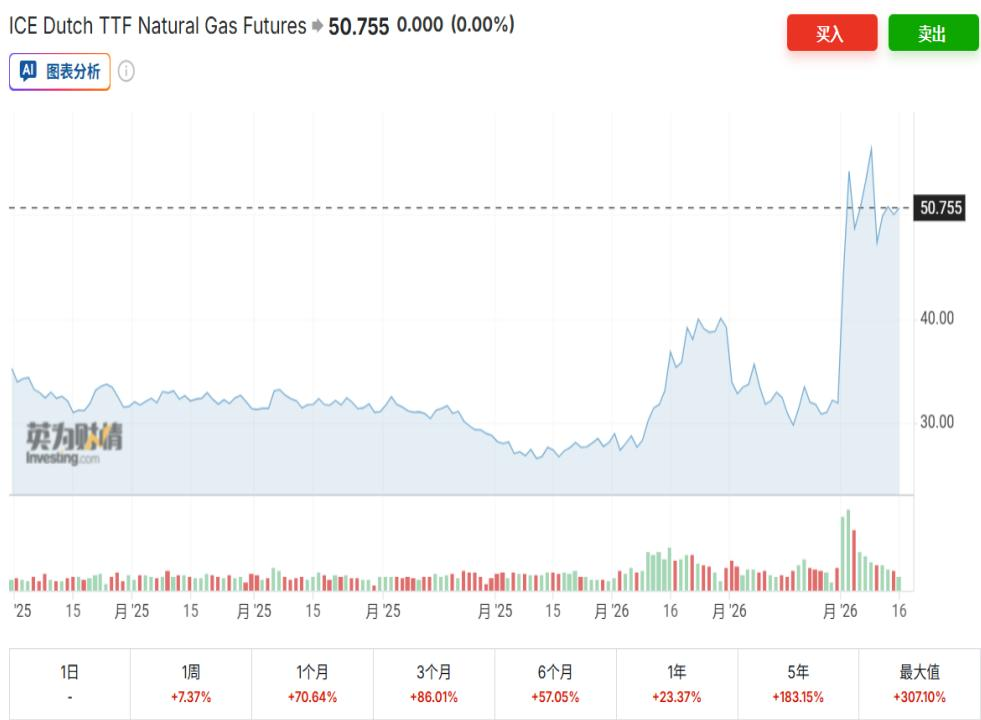

表：欧洲新增储能容量及增速
<table><tr><td>欧洲</td><td>2025</td><td>2026E</td><td>2027E</td></tr><tr><td>合计当年新增储能 (Gwh)</td><td>10.29</td><td>14.08</td><td>17.71</td></tr><tr><td>-容量增速</td><td>-5%</td><td>37%</td><td>26%</td></tr><tr><td>德国</td><td>4.4</td><td>4.6</td><td>5.1</td></tr><tr><td>-增速</td><td>-12%</td><td>5%</td><td>10%</td></tr><tr><td>意大利</td><td>1.9</td><td>2.0</td><td>2.2</td></tr><tr><td>-增速</td><td>-30%</td><td>5%</td><td>10%</td></tr><tr><td>英国</td><td>0.8</td><td>2.5</td><td>3.8</td></tr><tr><td>-增速</td><td>14%</td><td>213%</td><td>52%</td></tr><tr><td>乌克兰</td><td>1.3</td><td>2.3</td><td>3.0</td></tr><tr><td>-增速</td><td></td><td>77%</td><td>30%</td></tr><tr><td>其他</td><td>1.9</td><td>2.7</td><td>3.6</td></tr><tr><td>-增速</td><td>17%</td><td>42%</td><td>37%</td></tr></table>

## 储能：26年全球储能需求1024GWh，增长60%

◆ 我们预计25年全球储能电池需求641gwh，同增95%，26年我们预计全球储能需求上修至60%增长至1024GWh。考虑当前储能渗透率较低，远期空间庞大，我们预计2027年全球储能仍可维持30%+增长，至1357GWh；2030年需求超2300GWh，占锂电需求40%+。

◆ 总体看，2026年国内和美国仍有超预期空间。

表：全球储能电池需求测算
<table><tr><td>全球市场</td><td>2024</td><td>2025</td><td>2026E</td><td>2027E</td><td>2028E</td><td>2029E</td><td>2030E</td></tr><tr><td>全球储能装机需求 (Gwh)</td><td>211.9</td><td>361.2</td><td>582.7</td><td>812.1</td><td>1036.8</td><td>1261.7</td><td>1529.2</td></tr><tr><td>-储能装机增速</td><td>67%</td><td>70%</td><td> 61%</td><td>39%</td><td>28%</td><td> 22%</td><td>21%</td></tr><tr><td>-放大比例</td><td>155%</td><td> 177%</td><td>176%</td><td>167%</td><td>157%</td><td>155%</td><td>154%</td></tr><tr><td>全球储能出货量(Gwh)</td><td>329</td><td>641</td><td>1,024</td><td>1,357</td><td>1,630</td><td>1,959</td><td>2,351</td></tr><tr><td>-储能出货增速</td><td> 61%</td><td>95%</td><td>60%</td><td>33%</td><td>20%</td><td>20%</td><td>20%</td></tr><tr><td>其中储能出货量：分区域</td><td></td><td></td><td></td><td></td><td></td><td></td><td></td></tr><tr><td>美国 (Gwh) -增速</td><td>88 49%</td><td>128 46%</td><td>174 36%</td><td>213 22%</td><td>257 21%</td><td>327 27%</td><td>435</td></tr><tr><td>-占比</td><td> 27%</td><td>20%</td><td>17%</td><td> 16%</td><td> 16%</td><td>17%</td><td>33%</td></tr><tr><td>中国 （Gwh)</td><td>144</td><td>286</td><td>432</td><td>536</td><td>590</td><td>656</td><td>18%</td></tr><tr><td>-增速</td><td>86%</td><td>98%</td><td> 51%</td><td> 24%</td><td>10%</td><td>11%</td><td>734</td></tr><tr><td>-占比</td><td> 44%</td><td> 45%</td><td> 42%</td><td> 40%</td><td>36%</td><td>33%</td><td>12%</td></tr><tr><td>欧洲 (Gwh)</td><td>44</td><td>92</td><td>157</td><td>222</td><td>276</td><td>331</td><td>31% 391</td></tr><tr><td>-增速</td><td>39%</td><td> 111%</td><td>70%</td><td>41%</td><td> 24%</td><td>20%</td><td></td></tr><tr><td>-占比</td><td>13%</td><td> 14%</td><td>15%</td><td> 16%</td><td>17%</td><td> 17%</td><td>18%</td></tr><tr><td>其他地区(Gwh)</td><td>53</td><td>134</td><td>261</td><td>386</td><td>507</td><td>646</td><td> 17%</td></tr><tr><td>-增速</td><td> 46%</td><td>153%</td><td> 94%</td><td> 48%</td><td> 31%</td><td></td><td>792</td></tr><tr><td>-占比</td><td>16%</td><td>21%</td><td>25%</td><td>28%</td><td>31%</td><td>27% 33%</td><td>22% 34%</td></tr></table>

## 需求合计：26年动储上修至34%增长，27年23%+

◆ 电池需求：26年我们预计全球动力储能需求2769GWh，同增34%，消费170GWh，合计2939GWh，同比增长32%；27年动储需求3392GWh，同增23%，总体3579GWh，同比增长22%。

图：动力及储能电池需求增速预期
<table><tr><td></td><td>2024</td><td>2025</td><td>2026E</td><td>2027E</td><td>2028E</td><td>2029E</td><td>2030E</td></tr><tr><td>全球动力电池实际需求 （gwh)</td><td>1,062</td><td>1,418</td><td>1,745</td><td>2,035</td><td>2,339</td><td>2,694</td><td>3,115</td></tr><tr><td>YoY</td><td>22%</td><td>34%</td><td>23.0%</td><td>16.6%</td><td>14.9%</td><td>15.2%</td><td>15.6%</td></tr><tr><td>全球消费类电池合计 （gwh)</td><td>144</td><td>162</td><td>170</td><td>187</td><td>206</td><td>227</td><td>249</td></tr><tr><td>国内消费类电池 (gwh)</td><td>78</td><td>90</td><td>95</td><td>104</td><td>115</td><td>126</td><td>139</td></tr><tr><td>海外消费类电池 (gwh)</td><td>65</td><td>72</td><td>76</td><td>83</td><td>91</td><td>101</td><td>111</td></tr><tr><td>全球储能电池合计 (gwh)</td><td>329</td><td>641</td><td>1,024</td><td>1,357</td><td>1,630</td><td>1,959</td><td>2,351</td></tr><tr><td>YoY</td><td> 61%</td><td>83%</td><td> 60%</td><td>33%</td><td>20%</td><td> 20%</td><td>20%</td></tr><tr><td>国内储能电池 (gwh)</td><td>144</td><td>286</td><td>432</td><td>536</td><td>590</td><td>656</td><td>734</td></tr><tr><td>海外储能电池 (gwh)</td><td>185</td><td>355</td><td>592</td><td>821</td><td>1,040</td><td>1,303</td><td>1,617</td></tr><tr><td>全球动力+储能电池实际需求合计 （gwh)</td><td>1,390</td><td>2,059</td><td>2,769</td><td>3,392</td><td>3,969</td><td>4,654</td><td>5,466</td></tr><tr><td>YoY</td><td>29%</td><td>48%</td><td>34%</td><td>23%</td><td>17%</td><td>17%</td><td>17%</td></tr><tr><td>全球锂电池合计 (gwh)</td><td>1,534</td><td>2,221</td><td>2,939</td><td>3,579</td><td>4,176</td><td>4,880</td><td>5,715</td></tr><tr><td>YoY</td><td>27%</td><td>45%</td><td>32.3%</td><td>21.8%</td><td>16.7%</td><td>16.9%</td><td>17.1%</td></tr></table>

## 供需：供需格局大幅好转，具备涨价弹性

## 供需：需求超预期，26-27年产能利用率明显改善

◆ 动储需求两旺，24年起电池龙头率先开始有序扩产，但材料厂商扩产相对谨慎，26年行业拐点明确，27年产能利用率将进一步提升。

图：主流环节产能利用率情况
<table><tr><td>铁锂正极</td><td>2022年</td><td>2023年</td><td>2024年</td><td>2025年</td><td>2026年E</td><td>2027年E</td></tr><tr><td>供给 (万吨)</td><td>114.6</td><td> 225.7</td><td>401.1</td><td>526.9</td><td>736.9</td><td>937.7</td></tr><tr><td>-同比</td><td>166%</td><td>97%</td><td>78%</td><td>31%</td><td> 40%</td><td>27%</td></tr><tr><td>需求 (万吨)</td><td>100.9</td><td>163.4</td><td>250.8</td><td>433.7</td><td>620.0</td><td>767.7</td></tr><tr><td>-同比</td><td>157%</td><td>62%</td><td>53%</td><td>73%</td><td>43%</td><td>24%</td></tr><tr><td>产能利用率</td><td>88%</td><td>72%</td><td>63%</td><td>82%</td><td>84%</td><td>82%</td></tr><tr><td>负极</td><td>2022年</td><td>2023年</td><td>2024年</td><td>2025年</td><td>2026年E</td><td>2027年E</td></tr><tr><td>全行业有效供给 (万吨)</td><td>137</td><td>233</td><td>331</td><td>451</td><td>521</td><td>597</td></tr><tr><td>同比</td><td> 43%</td><td>70%</td><td> 42%</td><td>36%</td><td>16%</td><td>14%</td></tr><tr><td>需求 (万吨）</td><td>125</td><td>171</td><td>220</td><td>321</td><td>427</td><td>522</td></tr><tr><td>同比</td><td>54%</td><td> 37%</td><td>29%</td><td> 46%</td><td>33%</td><td>22%</td></tr><tr><td>产能利用率</td><td>91%</td><td>73%</td><td>66%</td><td>71%</td><td>82%</td><td>87%</td></tr><tr><td>隔膜</td><td>2022年</td><td>2023年</td><td>2024年</td><td>2025年</td><td>2026年E</td><td>2027年E</td></tr><tr><td>全行业有效供给 (亿平)</td><td>188.7</td><td>282.3</td><td> 411.8</td><td>564.8</td><td>655.4</td><td>716.9</td></tr><tr><td>-同比</td><td>70%</td><td>50%</td><td> 46%</td><td> 37%</td><td>16%</td><td>9%</td></tr><tr><td>需求（亿平)</td><td>160.3</td><td>209.6</td><td>276.5</td><td>404.3</td><td>533.1</td><td>642.0</td></tr><tr><td>-同比</td><td>56%</td><td> 31%</td><td> 32%</td><td> 46%</td><td></td><td></td></tr><tr><td>产能利用率</td><td>85%</td><td>74%</td><td>67%</td><td>72%</td><td>32% 81%</td><td>20% 90%</td></tr><tr><td>6F</td><td>2022年</td><td>2023年</td><td>2024年</td><td>2025年</td><td>2026年E</td><td>2027年E</td></tr><tr><td>全行业有效供给 (万吨)</td><td>13.7</td><td>25.3</td><td>34.1</td><td>37.1</td><td>43.4</td><td>54.3</td></tr><tr><td>-同比</td><td>73%</td><td>84%</td><td>35%</td><td>9%</td><td>17%</td><td>25%</td></tr><tr><td>需求 (万吨)</td><td>12.5</td><td>16.5</td><td>20.8</td><td>30.7</td><td>40.6</td><td>48.5</td></tr><tr><td></td><td>54%</td><td>33%</td><td>26%</td><td> 47%</td><td>32%</td><td>20%</td></tr><tr><td></td><td>12,927</td><td>87,275</td><td>132,227</td><td>63,495</td><td>28,075</td><td>57,665</td></tr><tr><td>产能利用率</td><td>91%</td><td>65%</td><td>61%</td><td>83%</td><td>94%</td><td>89%</td></tr><tr><td>铜箔</td><td>2022年</td><td>2023年</td><td>2024年</td><td>2025年</td><td>2026年E</td><td>2027年E</td></tr><tr><td>全行业有效供给 (万吨)</td><td>110</td><td>154</td><td>175</td><td>200</td><td>228</td><td>253</td></tr><tr><td>-同比</td><td>119%</td><td>40%</td><td>14%</td><td>14%</td><td>14%</td><td>11%</td></tr><tr><td>需求 (万吨)</td><td>64</td><td>84</td><td>104</td><td>143</td><td>184</td><td>215</td></tr><tr><td>-同比</td><td>63%</td><td>32%</td><td>25%</td><td>37%</td><td>28%</td><td>17%</td></tr><tr><td>过剩</td><td>46</td><td>70</td><td>70</td><td>56</td><td>44</td><td>38</td></tr><tr><td>产能利用率</td><td>58%</td><td>55%</td><td>60%</td><td>72%</td><td>81%</td><td>85%</td></tr></table>

## 盈利：当前价格下回收周期长，合理投资回报下盈利弹性大

◆ 隔膜、铜箔、铝箔龙头盈利水平均低于合理水平，二线厂商基本全面亏损，且价格磨底3年，厂商扩产意愿较弱，涨价诉求较强，二线电池厂涨价已落地，我们预计大客户Q2涨价落地。

图 主流环节资本开支和盈利水平
<table><tr><td>环节</td><td>单位投资额</td><td>历史盈利中枢</td><td colspan="2">当前单位盈利</td><td>合理6年回收期下单位利润</td></tr><tr><td>电池</td><td>2亿/gwh</td><td>0.8亿/gwh</td><td>宁德 1.2亿/gwh</td><td>亿纬 0.2亿/gwh</td><td>0.4亿/gwh</td></tr><tr><td>磷酸铁锂 (含前驱体)</td><td>2亿/万吨</td><td>0.4万/吨</td><td>裕能 0.3万/吨</td><td>德方 富临 0.1万/吨 0.2万/吨</td><td>0.3万/吨</td></tr><tr><td>三元正极</td><td>2-3亿/万吨</td><td>1万/吨</td><td>容百 0.3万/吨</td><td>当升 0.8万/吨</td><td>0.5万/吨</td></tr><tr><td>三元前驱体</td><td>2亿/万吨</td><td>0.5万/吨</td><td>中伟 0.7万/吨</td><td>华友 0万/吨</td><td>0.3万/吨</td></tr><tr><td>负极+石墨化</td><td>2-3亿/万吨</td><td>0.6万/吨</td><td>璞泰来 0.05万/吨</td><td>尚太 中科 0.25万/吨 0.1万/吨</td><td>0.4万/吨</td></tr><tr><td>隔膜</td><td>1.5亿/亿平</td><td>0.8元/平</td><td>恩捷 0.1元/平</td><td>星源 中锂 0.03元/平 0元/平</td><td>0.3元/平</td></tr><tr><td>电解液</td><td>0.3亿/万吨</td><td>0.2万元/吨</td><td>天赐 (含六氟) 0.6万/吨</td><td>新宙邦 (含六氟) 0.4万/吨</td><td>0.05万元/吨 (不含自供）</td></tr><tr><td>六氟</td><td>3亿/万吨</td><td>1万/吨</td><td>多氟多 3万/吨</td><td>天际 天赐 2万/吨 5万吨</td><td>0.5万/吨</td></tr><tr><td>铜箔</td><td>5亿/万吨</td><td>1万元/吨</td><td>诺德 0.2万/吨</td><td>嘉元 德福 0.3万/吨 0.5万/吨</td><td>0.7万元/吨</td></tr><tr><td>铝箔</td><td>1.5亿/万吨</td><td>0.3万/吨</td><td>鼎胜新材 0.25万/吨</td><td>万顺 0万/吨</td><td>0.3万/吨</td></tr><tr><td>电池壳</td><td>0.5亿/亿元</td><td>0.1亿/亿元</td><td>科达利 0.12亿/亿元</td><td></td><td>0.1亿/亿元</td></tr></table>

数据来源：公司公告，东吴证券研究所

## 考虑涨价弹性，27年估值10x左右，目标估值20x

图 锂电材料利润弹性和估值
<table><tr><td rowspan=2 colspan=3>市值（亿元）</td><td rowspan=2 colspan=1>26年出货(万吨、亿平）（万吨、亿平)</td><td rowspan=1 colspan=5>27年出货                      26E (涨价）</td><td rowspan=1 colspan=4>27E</td></tr><tr><td rowspan=1 colspan=1>(万吨、亿平)</td><td rowspan=1 colspan=1>涨价预期</td><td rowspan=1 colspan=1>单位盈利</td><td rowspan=1 colspan=1>业绩</td><td rowspan=1 colspan=1>估值</td><td rowspan=1 colspan=1>涨价预期</td><td rowspan=1 colspan=1>单位盈利</td><td rowspan=1 colspan=1>业绩</td><td rowspan=1 colspan=1>估值</td></tr><tr><td rowspan=5 colspan=1>铁锂</td><td rowspan=1 colspan=1>湖南裕能</td><td rowspan=1 colspan=1>682</td><td rowspan=1 colspan=1>150</td><td rowspan=1 colspan=1>200</td><td rowspan=1 colspan=1>0.15</td><td rowspan=1 colspan=1>0.30</td><td rowspan=1 colspan=1>45</td><td rowspan=1 colspan=1>15</td><td rowspan=1 colspan=1>0</td><td rowspan=1 colspan=1>0.30</td><td rowspan=1 colspan=1>61</td><td rowspan=1 colspan=1>11</td></tr><tr><td rowspan=1 colspan=1>富临精工</td><td rowspan=1 colspan=1>433</td><td rowspan=1 colspan=1>80</td><td rowspan=1 colspan=1>150</td><td rowspan=1 colspan=1>0.15</td><td rowspan=1 colspan=1>0.31</td><td rowspan=1 colspan=1>21</td><td rowspan=1 colspan=1>21</td><td rowspan=1 colspan=1>0</td><td rowspan=1 colspan=1>0.31</td><td rowspan=1 colspan=1>43</td><td rowspan=1 colspan=1>10</td></tr><tr><td rowspan=1 colspan=1>德方纳米</td><td rowspan=1 colspan=1>129</td><td rowspan=1 colspan=1>40</td><td rowspan=1 colspan=1>50</td><td rowspan=1 colspan=1>0.15</td><td rowspan=1 colspan=1>0.11</td><td rowspan=1 colspan=1>5</td><td rowspan=1 colspan=1>29</td><td rowspan=1 colspan=1>0</td><td rowspan=1 colspan=1>0.11</td><td rowspan=1 colspan=1>6</td><td rowspan=1 colspan=1>23</td></tr><tr><td rowspan=1 colspan=1>龙蟠科技</td><td rowspan=1 colspan=1>143</td><td rowspan=1 colspan=1>40</td><td rowspan=1 colspan=1>50</td><td rowspan=1 colspan=1>0.15</td><td rowspan=1 colspan=1>0.16</td><td rowspan=1 colspan=1>8</td><td rowspan=1 colspan=1>17</td><td rowspan=1 colspan=1>0</td><td rowspan=1 colspan=1>0.16</td><td rowspan=1 colspan=1>10</td><td rowspan=1 colspan=1>14</td></tr><tr><td rowspan=1 colspan=1>万润新能</td><td rowspan=1 colspan=1>161</td><td rowspan=1 colspan=1>60</td><td rowspan=1 colspan=1>75</td><td rowspan=1 colspan=1>0.15</td><td rowspan=1 colspan=1>0.14</td><td rowspan=1 colspan=1>13</td><td rowspan=1 colspan=1>13</td><td rowspan=1 colspan=1>0</td><td rowspan=1 colspan=1>0.14</td><td rowspan=1 colspan=1>11</td><td rowspan=1 colspan=1>15</td></tr><tr><td rowspan=2 colspan=1>三元</td><td rowspan=1 colspan=1>当升科技</td><td rowspan=1 colspan=1>306</td><td rowspan=1 colspan=1>8</td><td rowspan=1 colspan=1>10</td><td rowspan=1 colspan=1>0</td><td rowspan=1 colspan=1>1.00</td><td rowspan=1 colspan=1>11</td><td rowspan=1 colspan=1>28</td><td rowspan=1 colspan=1>0</td><td rowspan=1 colspan=1>1.00</td><td rowspan=1 colspan=1>10</td><td rowspan=1 colspan=1>31</td></tr><tr><td rowspan=1 colspan=1>容百科技</td><td rowspan=1 colspan=1>220</td><td rowspan=1 colspan=1>14</td><td rowspan=1 colspan=1>18</td><td rowspan=1 colspan=1>0</td><td rowspan=1 colspan=1>0.50</td><td rowspan=1 colspan=1>7</td><td rowspan=1 colspan=1>31</td><td rowspan=1 colspan=1>0</td><td rowspan=1 colspan=1>0.50</td><td rowspan=1 colspan=1>9</td><td rowspan=1 colspan=1>24</td></tr><tr><td rowspan=4 colspan=1>负极</td><td rowspan=1 colspan=1>尚太科技</td><td rowspan=1 colspan=1>194</td><td rowspan=1 colspan=1>45</td><td rowspan=1 colspan=1>60</td><td rowspan=1 colspan=1>0</td><td rowspan=1 colspan=1>0.25</td><td rowspan=1 colspan=1>11</td><td rowspan=1 colspan=1>17</td><td rowspan=1 colspan=1>0</td><td rowspan=1 colspan=1>0.25</td><td rowspan=1 colspan=1>15</td><td rowspan=1 colspan=1>13</td></tr><tr><td rowspan=1 colspan=1>中科电气</td><td rowspan=1 colspan=1>156</td><td rowspan=1 colspan=1>45</td><td rowspan=1 colspan=1>55</td><td rowspan=1 colspan=1>0</td><td rowspan=1 colspan=1>0.15</td><td rowspan=1 colspan=1>7</td><td rowspan=1 colspan=1>23</td><td rowspan=1 colspan=1>0</td><td rowspan=1 colspan=1>0.15</td><td rowspan=1 colspan=1>8</td><td rowspan=1 colspan=1>19</td></tr><tr><td rowspan=1 colspan=1>贝特瑞</td><td rowspan=1 colspan=1>338</td><td rowspan=1 colspan=1>80</td><td rowspan=1 colspan=1>90</td><td rowspan=1 colspan=1>0</td><td rowspan=1 colspan=1>0.15</td><td rowspan=1 colspan=1>12</td><td rowspan=1 colspan=1>28</td><td rowspan=1 colspan=1>0</td><td rowspan=1 colspan=1>0.15</td><td rowspan=1 colspan=1>14</td><td rowspan=1 colspan=1>25</td></tr><tr><td rowspan=1 colspan=1>璞泰来</td><td rowspan=1 colspan=1>745</td><td rowspan=1 colspan=1>25</td><td rowspan=1 colspan=1>35</td><td rowspan=1 colspan=1>0</td><td rowspan=1 colspan=1>0.15</td><td rowspan=1 colspan=1>34</td><td rowspan=1 colspan=1>22</td><td rowspan=1 colspan=1>0</td><td rowspan=1 colspan=1>0.15</td><td rowspan=1 colspan=1>45</td><td rowspan=1 colspan=1>16</td></tr><tr><td rowspan=3 colspan=1>隔膜</td><td rowspan=1 colspan=1>恩捷股份</td><td rowspan=1 colspan=1>695</td><td rowspan=1 colspan=1>150</td><td rowspan=1 colspan=1>180</td><td rowspan=1 colspan=1>0.1</td><td rowspan=1 colspan=1>0.16</td><td rowspan=1 colspan=1>23</td><td rowspan=1 colspan=1>30</td><td rowspan=1 colspan=1>0.1</td><td rowspan=1 colspan=1>0.23</td><td rowspan=1 colspan=1>41</td><td rowspan=1 colspan=1>17</td></tr><tr><td rowspan=1 colspan=1>星源材质</td><td rowspan=1 colspan=1>210</td><td rowspan=1 colspan=1>58</td><td rowspan=1 colspan=1>75</td><td rowspan=1 colspan=1>0.1</td><td rowspan=1 colspan=1>0.16</td><td rowspan=1 colspan=1>7</td><td rowspan=1 colspan=1>28</td><td rowspan=1 colspan=1>0.1</td><td rowspan=1 colspan=1>0.23</td><td rowspan=1 colspan=1>15</td><td rowspan=1 colspan=1>14</td></tr><tr><td rowspan=1 colspan=1>佛塑科技</td><td rowspan=1 colspan=1>445</td><td rowspan=1 colspan=1>70</td><td rowspan=1 colspan=1>100</td><td rowspan=1 colspan=1>0.1</td><td rowspan=1 colspan=1>0.23</td><td rowspan=1 colspan=1>16</td><td rowspan=1 colspan=1>28</td><td rowspan=1 colspan=1>0.1</td><td rowspan=1 colspan=1>0.30</td><td rowspan=1 colspan=1>30</td><td rowspan=1 colspan=1>15</td></tr><tr><td rowspan=7 colspan=1>电解液（假设六氟13W，碳酸锂16w）</td><td rowspan=1 colspan=1>天赐材料</td><td rowspan=1 colspan=1>979</td><td rowspan=1 colspan=1>100</td><td rowspan=1 colspan=1>130</td><td rowspan=1 colspan=1>0.80</td><td rowspan=1 colspan=1>0.68</td><td rowspan=1 colspan=1>73</td><td rowspan=1 colspan=1>13</td><td rowspan=1 colspan=1>0.00</td><td rowspan=1 colspan=1>0.68</td><td rowspan=1 colspan=1>94</td><td rowspan=1 colspan=1>10</td></tr><tr><td rowspan=1 colspan=1>新宙邦</td><td rowspan=1 colspan=1>474</td><td rowspan=1 colspan=1>45</td><td rowspan=1 colspan=1>60</td><td rowspan=1 colspan=1>0.80</td><td rowspan=1 colspan=1>0.60</td><td rowspan=1 colspan=1>25</td><td rowspan=1 colspan=1>19</td><td rowspan=1 colspan=1>0.00</td><td rowspan=1 colspan=1>0.60</td><td rowspan=1 colspan=1>29</td><td rowspan=1 colspan=1>16</td></tr><tr><td rowspan=1 colspan=1>天际股份</td><td rowspan=1 colspan=1>182</td><td rowspan=1 colspan=1>4.2</td><td rowspan=1 colspan=1>5.5</td><td rowspan=1 colspan=1>4.0</td><td rowspan=1 colspan=1>3.01</td><td rowspan=1 colspan=1>13</td><td rowspan=1 colspan=1>14</td><td rowspan=1 colspan=1>0.00</td><td rowspan=1 colspan=1>3.01</td><td rowspan=1 colspan=1>17</td><td rowspan=1 colspan=1>11</td></tr><tr><td rowspan=1 colspan=1>多氟多</td><td rowspan=1 colspan=1>358</td><td rowspan=1 colspan=1>6</td><td rowspan=1 colspan=1>7.5</td><td rowspan=1 colspan=1>4.0</td><td rowspan=1 colspan=1>3.51</td><td rowspan=1 colspan=1>22</td><td rowspan=1 colspan=1>16</td><td rowspan=1 colspan=1>0.00</td><td rowspan=1 colspan=1>3.51</td><td rowspan=1 colspan=1>27</td><td rowspan=1 colspan=1>13</td></tr><tr><td rowspan=1 colspan=1>石大胜华</td><td rowspan=1 colspan=1>230</td><td rowspan=1 colspan=1>2.5</td><td rowspan=1 colspan=1>3.5</td><td rowspan=1 colspan=1>4.0</td><td rowspan=1 colspan=1>3.01</td><td rowspan=1 colspan=1>11</td><td rowspan=1 colspan=1>21</td><td rowspan=1 colspan=1>0.00</td><td rowspan=1 colspan=1>3.01</td><td rowspan=1 colspan=1>13</td><td rowspan=1 colspan=1>18</td></tr><tr><td rowspan=1 colspan=1>海科新源</td><td rowspan=1 colspan=1>208</td><td rowspan=1 colspan=1>1.1</td><td rowspan=1 colspan=1>1.5</td><td rowspan=1 colspan=1>6.0</td><td rowspan=1 colspan=1>4.51</td><td rowspan=1 colspan=1>16</td><td rowspan=1 colspan=1>13</td><td rowspan=1 colspan=1>0.00</td><td rowspan=1 colspan=1>4.51</td><td rowspan=1 colspan=1>18</td><td rowspan=1 colspan=1>12</td></tr><tr><td rowspan=1 colspan=1>华盛锂电</td><td rowspan=1 colspan=1>196</td><td rowspan=1 colspan=1>3</td><td rowspan=1 colspan=1>4.5</td><td rowspan=1 colspan=1>6.0</td><td rowspan=1 colspan=1>4.51</td><td rowspan=1 colspan=1>14</td><td rowspan=1 colspan=1>14</td><td rowspan=1 colspan=1>0.00</td><td rowspan=1 colspan=1>4.51</td><td rowspan=1 colspan=1>20</td><td rowspan=1 colspan=1>10</td></tr><tr><td rowspan=3 colspan=1>铜铝箔</td><td rowspan=1 colspan=1>鼎胜新材</td><td rowspan=1 colspan=1>230</td><td rowspan=1 colspan=1>28</td><td rowspan=1 colspan=1>40</td><td rowspan=1 colspan=1>0.1</td><td rowspan=1 colspan=1>0.33</td><td rowspan=1 colspan=1>11</td><td rowspan=1 colspan=1>22</td><td rowspan=1 colspan=1>0.0</td><td rowspan=1 colspan=1>0.33</td><td rowspan=1 colspan=1>15</td><td rowspan=1 colspan=1>16</td></tr><tr><td rowspan=1 colspan=1>嘉元科技</td><td rowspan=1 colspan=1>221</td><td rowspan=1 colspan=1>15</td><td rowspan=1 colspan=1>20</td><td rowspan=1 colspan=1>0.3</td><td rowspan=1 colspan=1>0.53</td><td rowspan=1 colspan=1>9</td><td rowspan=1 colspan=1>25</td><td rowspan=1 colspan=1>0.3</td><td rowspan=1 colspan=1>0.75</td><td rowspan=1 colspan=1>15</td><td rowspan=1 colspan=1>15</td></tr><tr><td rowspan=1 colspan=1>诺德股份</td><td rowspan=1 colspan=1>178</td><td rowspan=1 colspan=1>13</td><td rowspan=1 colspan=1>15</td><td rowspan=1 colspan=1>0.3</td><td rowspan=1 colspan=1>0.43</td><td rowspan=1 colspan=1>6</td><td rowspan=1 colspan=1>32</td><td rowspan=1 colspan=1>0.3</td><td rowspan=1 colspan=1>0.65</td><td rowspan=1 colspan=1>10</td><td rowspan=1 colspan=1>18</td></tr><tr><td rowspan=2 colspan=1>电池</td><td rowspan=1 colspan=1>宁德时代</td><td rowspan=1 colspan=1>19,894</td><td rowspan=1 colspan=1>950</td><td rowspan=1 colspan=1>1150</td><td rowspan=1 colspan=1>0.0</td><td rowspan=1 colspan=1>0.10</td><td rowspan=1 colspan=1>950</td><td rowspan=1 colspan=1>21</td><td rowspan=1 colspan=1>0.0</td><td rowspan=1 colspan=1>0.10</td><td rowspan=1 colspan=1>1150</td><td rowspan=1 colspan=1>17</td></tr><tr><td rowspan=1 colspan=1>亿纬锂能</td><td rowspan=1 colspan=1>1,495</td><td rowspan=1 colspan=1>200</td><td rowspan=1 colspan=1>300</td><td rowspan=1 colspan=1>0.0</td><td rowspan=1 colspan=1>0.02</td><td rowspan=1 colspan=1>70</td><td rowspan=1 colspan=1>21</td><td rowspan=1 colspan=1>0.0</td><td rowspan=1 colspan=1>0.02</td><td rowspan=1 colspan=1>90</td><td rowspan=1 colspan=1>17</td></tr></table>

电池：单车带电量提升，储能满产满销，需求好于预期

## 电池：26年1月全球动力装机同增12%，2月国内动力装机同减25%

◆ 1月全球动力电池装机量71.9GWh，同增12%，环减49%。25年全球动力电池装机量1187GWh，同增32%。26年1月全球动力电池装机量71.9GWh，同环比+12%/-49%。

◆ 2月国内动力电池装机量26.3GWh，同减25%，环减37%。26年2月国内动力电池装机量26.3GWh，同环比-25%/-37% ，其中三元装机5.7GWh，同环比-11%/-39%，占比21.7%；铁锂装机20.6GWh，同环比-27.5%/-36.9%，占比78.3%。26 年1-2月国内动力电池装机量68.3GWh，同减7.2%，其中三元15.1GWh，同增0.6%，铁锂53.3GWh，同降9%。

◆ 2月国内动力电池产量186.3GWh，同增39%，环减15%。26年2月国内动力电池产量186.3GWh，同环比+39%/-15%，其中三元43.1GWh，同环比+5%/-15%，占比23%；铁锂143.2GWh，同环比+54%/-14%，占比77%。26年1-2月国内动力电池产量404.3GWh，同增%，其中三元93.9GWh，铁锂310.4GWh。

图：国内电动车月度电池装机量（GWh）  
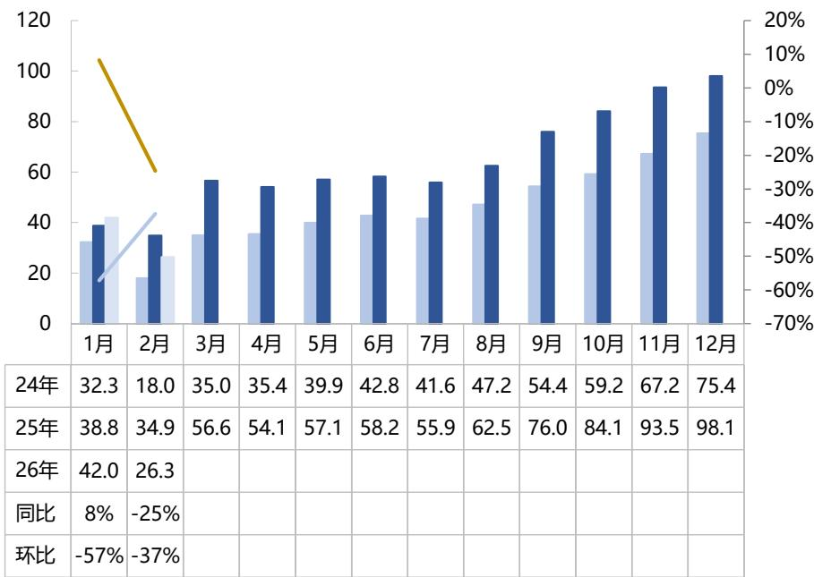  
图：国内动力电池铁锂占比

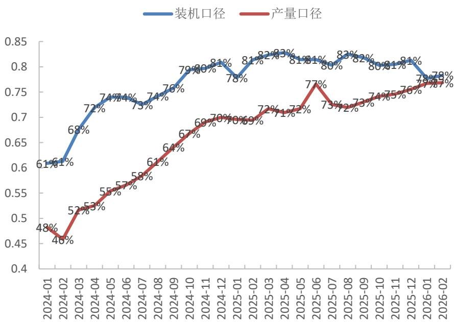

## 电池：国内1-2月单车带电量63.7kwh，同增31%

◆ 2月国内纯电+插电乘用车平均带电量53.6kwh，同比+23.2%，环比-2.9%。26年2月纯电乘用车平均带电量66.5kwh，同增25%，环降3%；插电乘用车平均带电量为33.1kwh，同增31%，环降1%。1-2月国内纯电+插电乘用车平均带电量54.5kwh，同增24.3%。

◆ 2月纯电专用车带电量193.3kwh，同比+30.9%，环比-11.6%。26年2月纯电专用车装机4.07gwh，同比-14.4%，在国内装机中占比同比提升0.8pct至14.6%，单车带电量193kwh，同增30.9%，环减11.6%。

◆ 2月国内平均单车带电量60.37kwh，同比+24%，环比-9%，同比增加明显。1-2月国内新能源车单车带电量63.7kwh，同增31%。

图：国内乘用车平均带电量（kwh）  
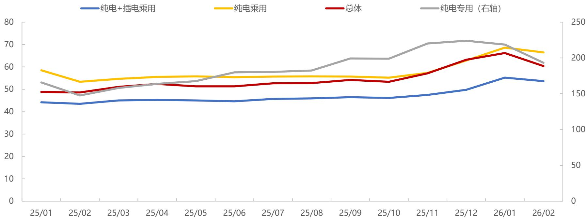

## 电池：国内1-2月商用车装机增长39%，占比持续提升

◆ 26年2月商用车装机4.4gwh，同环比-13.7%/-52.2%，占比提升明显。GGII口径，25年商用车装机136.7gwh，占国内装机19%，26年1-2月为13.5gwh，同比增38.8%，占总装机20%（70%为重卡），单车装机201kwh，我们预计全年装机需求超200gwh。其中，2月商用车装机4.4gwh，同环比-13.7%/-52.2%。而乘用车2月装机23.4gwh，同环比-20%/-26.2%，1-2月累计55.1gwh，同比-9%。

◆ 26 年 2 月 商 用 车 宁 德 时 代 份 额 56.1% ， 同 环 比 -8.1pct/+3.0pct ； 亿 纬 锂 能 12.1% ， 同 环 比+4.0pct/+1.4pct；比亚迪3.8%，同环比-2.5pct/-0.8pct；中创新航5.2%，国轩高科7.7%，瑞浦兰钧4.0%。

图：国内动力电池装机（分商用车和乘用车）  
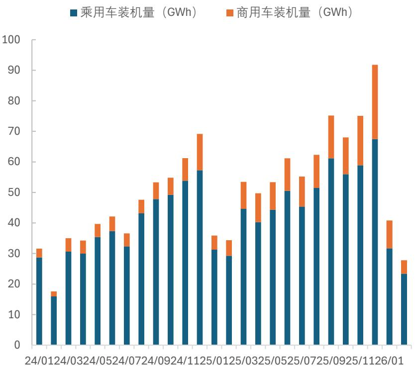  
图：26年2月国内商用车动力电池供应结构（GGII上险装机口径）

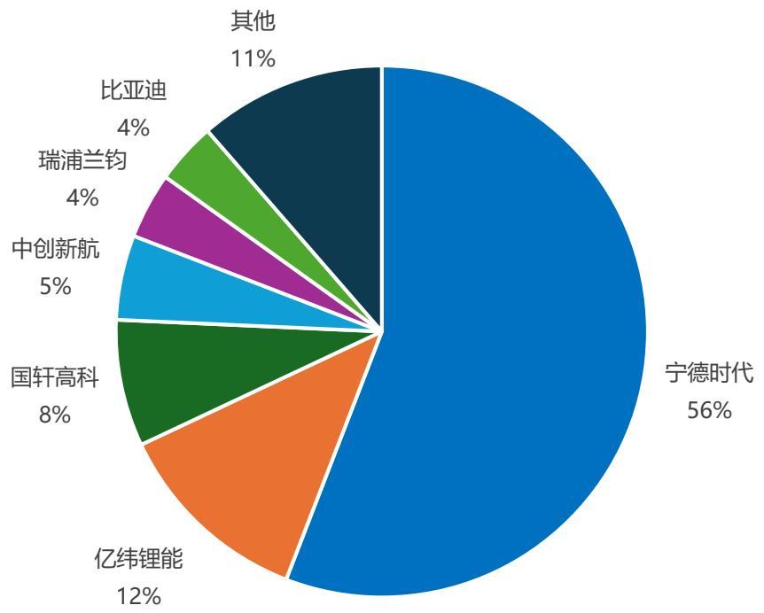

## 电池：宁德时代1月全球份额45%，市占率再创历史新高

◆ 全球格局看，宁德时代1月全球份额45%，市占率再创历史新高，日韩厂商份额持续下降。26年1月，全球动力电池装机总量71.9GWh，其中宁德时代份额45.2%，同增5.7pct，环降0.7pct，比亚迪份额13.8%，环降0.1pct，LG新能源6.5%，环降1.9pct，中创新航5.3%，环降3.2pct。松下、SK on、三星SDI、亿纬锂能、蜂巢能源份额均略有提升，国轩高科份额3.9%，环降2.2pct。

表：动力电池厂商全球装机量 (GWh，SNE口径)
<table><tr><td rowspan=1 colspan=1>Top10</td><td rowspan=1 colspan=1>简写</td><td rowspan=1 colspan=1>26年1月</td><td rowspan=1 colspan=1>占比</td><td rowspan=1 colspan=1>环比(pct)</td><td rowspan=1 colspan=1>26年累计</td><td rowspan=1 colspan=1>占比</td><td rowspan=1 colspan=1>同比(pct)</td></tr><tr><td rowspan=1 colspan=1>1</td><td rowspan=1 colspan=1>宁德时代</td><td rowspan=1 colspan=1>32.5</td><td rowspan=1 colspan=1>45.2%</td><td rowspan=1 colspan=1>-0.7</td><td rowspan=1 colspan=1>32.5</td><td rowspan=1 colspan=1>45.2%</td><td rowspan=1 colspan=1>5.7</td></tr><tr><td rowspan=1 colspan=1>2</td><td rowspan=1 colspan=1>比亚迪</td><td rowspan=1 colspan=1>9.9</td><td rowspan=1 colspan=1>13.8%</td><td rowspan=1 colspan=1>-0.1</td><td rowspan=1 colspan=1>9.9</td><td rowspan=1 colspan=1>13.8%</td><td rowspan=1 colspan=1>-2.6</td></tr><tr><td rowspan=1 colspan=1>3</td><td rowspan=1 colspan=1>LG新能源</td><td rowspan=1 colspan=1>4.7</td><td rowspan=1 colspan=1>6.5%</td><td rowspan=1 colspan=1>-1.9</td><td rowspan=1 colspan=1>4.7</td><td rowspan=1 colspan=1>6.5%</td><td rowspan=1 colspan=1>-3.9</td></tr><tr><td rowspan=1 colspan=1>4</td><td rowspan=1 colspan=1>中创新航</td><td rowspan=1 colspan=1>3.8</td><td rowspan=1 colspan=1>5.3%</td><td rowspan=1 colspan=1>-3.2</td><td rowspan=1 colspan=1>3.8</td><td rowspan=1 colspan=1>5.3%</td><td rowspan=1 colspan=1>1.5</td></tr><tr><td rowspan=1 colspan=1>5</td><td rowspan=1 colspan=1>松下</td><td rowspan=1 colspan=1>3.1</td><td rowspan=1 colspan=1>4.3%</td><td rowspan=1 colspan=1>0.3</td><td rowspan=1 colspan=1>3.1</td><td rowspan=1 colspan=1>4.3%</td><td rowspan=1 colspan=1>-0.3</td></tr><tr><td rowspan=1 colspan=1>6</td><td rowspan=1 colspan=1>国轩高科</td><td rowspan=1 colspan=1>2.8</td><td rowspan=1 colspan=1>3.9%</td><td rowspan=1 colspan=1>-2.2</td><td rowspan=1 colspan=1>2.8</td><td rowspan=1 colspan=1>3.9%</td><td rowspan=1 colspan=1>0.1</td></tr><tr><td rowspan=1 colspan=1>7</td><td rowspan=1 colspan=1>SK on</td><td rowspan=1 colspan=1>2.3</td><td rowspan=1 colspan=1>3.2%</td><td rowspan=1 colspan=1>0.4</td><td rowspan=1 colspan=1>2.3</td><td rowspan=1 colspan=1>3.2%</td><td rowspan=1 colspan=1>-5.3</td></tr><tr><td rowspan=1 colspan=1>8</td><td rowspan=1 colspan=1>蜂巢能源</td><td rowspan=1 colspan=1>1.9</td><td rowspan=1 colspan=1>2.6%</td><td rowspan=1 colspan=1>1.9</td><td rowspan=1 colspan=1>1.9</td><td rowspan=1 colspan=1>2.6%</td><td rowspan=1 colspan=1>0.1</td></tr><tr><td rowspan=1 colspan=1>9</td><td rowspan=1 colspan=1>亿纬锂能</td><td rowspan=1 colspan=1>1.8</td><td rowspan=1 colspan=1>2.5%</td><td rowspan=1 colspan=1>0.4</td><td rowspan=1 colspan=1>1.8</td><td rowspan=1 colspan=1>2.5%</td><td rowspan=1 colspan=1>-0.3</td></tr><tr><td rowspan=1 colspan=1>10</td><td rowspan=1 colspan=1>三星SDI</td><td rowspan=1 colspan=1>1.6</td><td rowspan=1 colspan=1>2.2%</td><td rowspan=1 colspan=1>0.9</td><td rowspan=1 colspan=1>1.6</td><td rowspan=1 colspan=1>2.2%</td><td rowspan=1 colspan=1>-1.7</td></tr><tr><td rowspan=1 colspan=2>前十总量</td><td rowspan=1 colspan=1>64.4</td><td rowspan=1 colspan=1>89.6%</td><td rowspan=1 colspan=1>-4.0</td><td rowspan=1 colspan=1>64.4</td><td rowspan=1 colspan=1>89.6%</td><td rowspan=1 colspan=1>-6.7</td></tr><tr><td rowspan=1 colspan=2>其他</td><td rowspan=1 colspan=1>7.5</td><td rowspan=1 colspan=1>10.4%</td><td rowspan=1 colspan=1>4.0</td><td rowspan=1 colspan=1>7.5</td><td rowspan=1 colspan=1>10.4%</td><td rowspan=1 colspan=1>6.7</td></tr><tr><td rowspan=1 colspan=2>全球总量</td><td rowspan=1 colspan=1>71.9</td><td rowspan=1 colspan=1>100.0%</td><td rowspan=1 colspan=1></td><td rowspan=1 colspan=1>71.9</td><td rowspan=1 colspan=1>100.0%</td><td rowspan=1 colspan=1></td></tr></table>

图：动力电池厂商全球市占率 (SNE口径)

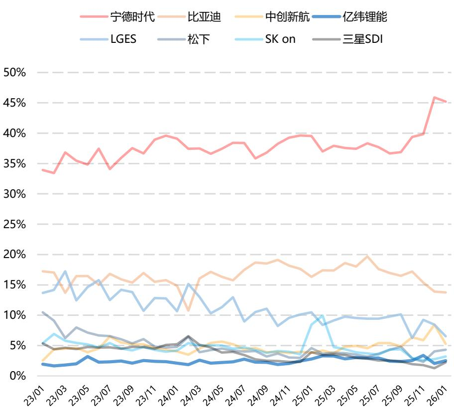

## 电池：宁德时代2月国内份额49%，环比维持稳定

◆ 国内格局看，宁德时代2月装机份额49%，同增3.8pct，环降0.7pct。26年2月，国内装机26.3GWh，宁德时代份额49%，环比-0.7pct；比亚迪份额13.5%，环比-3.9pct；中创新航份额6%，环比+0.7pct；国轩高科份额5.3%，环比+0.8pct。26年1-2月，国内动力累计装机68.3GWh，其中宁德时代份额49.5%，同比+3.8pct，比亚迪份额15.9%，同比-7.25pct，国轩高科、亿纬锂能、欣旺达、正力新能、瑞浦兰钧、吉曜通行等二线厂商份额提升明显。

表：动力电池厂商国内装机量 (GWh，不含出口)
<table><tr><td rowspan=1 colspan=1>Top10</td><td rowspan=1 colspan=1>简写</td><td rowspan=1 colspan=1>26年2月</td><td rowspan=1 colspan=1>占比</td><td rowspan=1 colspan=1>环比(pct)</td><td rowspan=1 colspan=1>26年累计</td><td rowspan=1 colspan=1>占比</td><td rowspan=1 colspan=1>同比(pct)</td></tr><tr><td rowspan=1 colspan=1>1</td><td rowspan=1 colspan=1>宁德时代</td><td rowspan=1 colspan=1>12.90</td><td rowspan=1 colspan=1>49.05%</td><td rowspan=1 colspan=1>-0.74</td><td rowspan=1 colspan=1>33.81</td><td rowspan=1 colspan=1>49.50%</td><td rowspan=1 colspan=1>3.80</td></tr><tr><td rowspan=1 colspan=1>2</td><td rowspan=1 colspan=1>比亚迪</td><td rowspan=1 colspan=1>3.56</td><td rowspan=1 colspan=1>13.54%</td><td rowspan=1 colspan=1>-3.89</td><td rowspan=1 colspan=1>10.88</td><td rowspan=1 colspan=1>15.93%</td><td rowspan=1 colspan=1>-7.25</td></tr><tr><td rowspan=1 colspan=1>3</td><td rowspan=1 colspan=1>中创新航</td><td rowspan=1 colspan=1>1.58</td><td rowspan=1 colspan=1>6.01%</td><td rowspan=1 colspan=1>0.72</td><td rowspan=1 colspan=1>3.8</td><td rowspan=1 colspan=1>5.56%</td><td rowspan=1 colspan=1>0.00</td></tr><tr><td rowspan=1 colspan=1>4</td><td rowspan=1 colspan=1>LG新能源</td><td rowspan=1 colspan=1>1.42</td><td rowspan=1 colspan=1>5.40%</td><td rowspan=1 colspan=1>4.68</td><td rowspan=1 colspan=1>1.72</td><td rowspan=1 colspan=1>2.52%</td><td rowspan=1 colspan=1>1.87</td></tr><tr><td rowspan=1 colspan=1>5</td><td rowspan=1 colspan=1>国轩高科</td><td rowspan=1 colspan=1>1.39</td><td rowspan=1 colspan=1>5.29%</td><td rowspan=1 colspan=1>-0.79</td><td rowspan=1 colspan=1>3.94</td><td rowspan=1 colspan=1>5.77%</td><td rowspan=1 colspan=1>0.73</td></tr><tr><td rowspan=1 colspan=1>6</td><td rowspan=1 colspan=1>亿纬锂能</td><td rowspan=1 colspan=1>1.2</td><td rowspan=1 colspan=1>4.56%</td><td rowspan=1 colspan=1>-0.37</td><td rowspan=1 colspan=1>3.27</td><td rowspan=1 colspan=1>4.79%</td><td rowspan=1 colspan=1>0.36</td></tr><tr><td rowspan=1 colspan=1>7</td><td rowspan=1 colspan=1>瑞浦能源</td><td rowspan=1 colspan=1>0.82</td><td rowspan=1 colspan=1>3.12%</td><td rowspan=1 colspan=1>0.07</td><td rowspan=1 colspan=1>2.1</td><td rowspan=1 colspan=1>3.07%</td><td rowspan=1 colspan=1>1.08</td></tr><tr><td rowspan=1 colspan=1>8</td><td rowspan=1 colspan=1>欣旺达</td><td rowspan=1 colspan=1>0.75</td><td rowspan=1 colspan=1>2.85%</td><td rowspan=1 colspan=1>0.04</td><td rowspan=1 colspan=1>1.93</td><td rowspan=1 colspan=1>2.83%</td><td rowspan=1 colspan=1>1.01</td></tr><tr><td rowspan=1 colspan=1>9</td><td rowspan=1 colspan=1>吉曜通行</td><td rowspan=1 colspan=1>0.66</td><td rowspan=1 colspan=1>2.51%</td><td rowspan=1 colspan=1>0.68</td><td rowspan=1 colspan=1>1.43</td><td rowspan=1 colspan=1>2.09%</td><td rowspan=1 colspan=1>0.91</td></tr><tr><td rowspan=1 colspan=1>10</td><td rowspan=1 colspan=1>正力新能</td><td rowspan=1 colspan=1>0.54</td><td rowspan=1 colspan=1>2.05%</td><td rowspan=1 colspan=1>-0.02</td><td rowspan=1 colspan=1>1.41</td><td rowspan=1 colspan=1>2.06%</td><td rowspan=1 colspan=1>1.10</td></tr><tr><td rowspan=1 colspan=2>前十总量</td><td rowspan=1 colspan=1>24.82</td><td rowspan=1 colspan=1>94.37%</td><td rowspan=1 colspan=1>-1.39</td><td rowspan=1 colspan=1>64.27</td><td rowspan=1 colspan=1>94.10%</td><td rowspan=1 colspan=1>0.54</td></tr><tr><td rowspan=1 colspan=2>其他</td><td rowspan=1 colspan=1>1.48</td><td rowspan=1 colspan=1>5.63%</td><td rowspan=1 colspan=1>1.39</td><td rowspan=1 colspan=1>4.03</td><td rowspan=1 colspan=1>5.90%</td><td rowspan=1 colspan=1>-0.54</td></tr><tr><td rowspan=1 colspan=2>国内总量</td><td rowspan=1 colspan=1>26.30</td><td rowspan=1 colspan=1>100.00%</td><td rowspan=1 colspan=1></td><td rowspan=1 colspan=1>68.30</td><td rowspan=1 colspan=1>100.00%</td><td rowspan=1 colspan=1></td></tr></table>

图：动力电池厂商国内市占率 (%，不含出口)

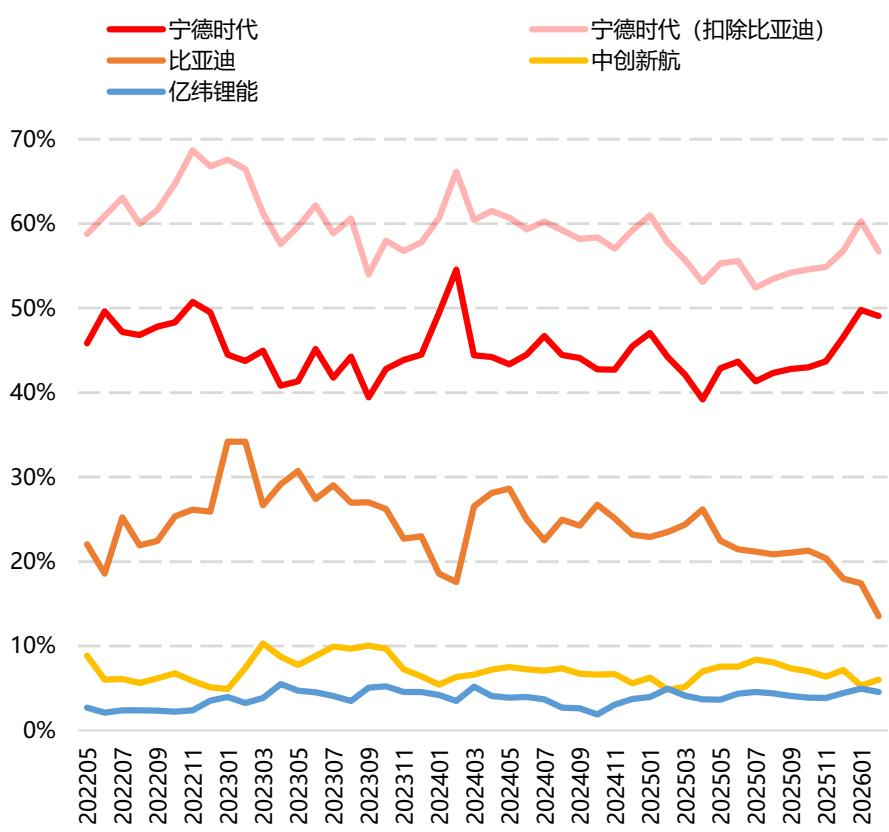

## 储能：大储延续高景气，龙头扩产带动份额回升

◆ 25-26年全球储能电池产能利用率90%+，一线和二线公司满产，26年底二线新产能释放后，紧缺有望缓解。2025年全球储能产能约670GWh+，产能利用率高达91%，26年新增产能释放，行业总体产能利用率我们预计仍在90%，头部公司可达到100%，储能电池电芯产能受限，紧缺持续至26H2。

◆ 宁德时代份额有所回升，二三线加速出海和大电芯布局。格局上看，26年1月宁德时代市占率回升至25%，环比+0.7pct，亿纬锂能市占率为8.8%，环比-0.2pct；海辰储能市占率9.5%，环比-0.3pct，比亚迪市占率7.7%，环比-0.2pct。后续看，宁德时代25年底山东济宁一二期120GWh产能率先投产，且加大国内储能市场布局，我们预计份额将明显回升，二线企业，亿纬、海晨、远景等均加速拓展欧美市场，且电芯大小从314ah逐步升级至600ah。

图：国内月度总体储能产量（GWh）和环比  
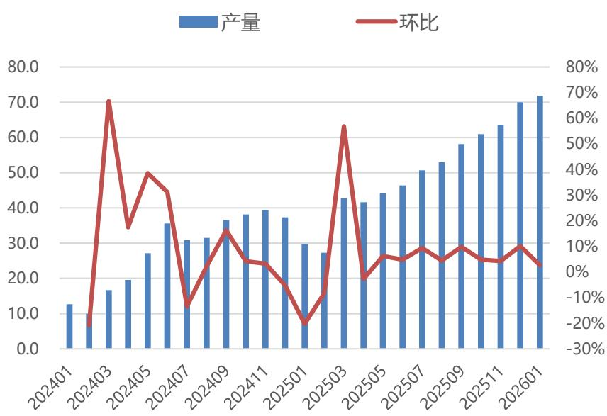

图：国内储能电池厂产量（GWh）及份额变化
<table><tr><td></td><td>26年1月</td><td></td><td>单月占比环比（pct）25年累计</td><td></td><td>累计占比</td></tr><tr><td>宁德时代</td><td>18.0</td><td>25.0%</td><td>0.7</td><td>151</td><td>25.7%</td></tr><tr><td>亿纬锂能</td><td>6.3</td><td>8.8%</td><td>-0.2</td><td>64.1</td><td>10.9%</td></tr><tr><td>瑞浦兰钧</td><td>5.0</td><td>7.0%</td><td>-0.2</td><td>43.2</td><td>7.3%</td></tr><tr><td>中创新航</td><td>5.0</td><td>7.0%</td><td>-0.2</td><td>48.6</td><td>8.3%</td></tr><tr><td>海辰储能</td><td>6.8</td><td>9.5%</td><td>-0.3</td><td>65.7</td><td>11.2%</td></tr><tr><td>比亚迪</td><td>5.5</td><td>7.7%</td><td>-0.2</td><td>57.3</td><td>9.7%</td></tr><tr><td>国轩高科</td><td>3.0</td><td>4.2%</td><td>-0.1</td><td>29.6</td><td>5.0%</td></tr><tr><td>远景能源</td><td>4.0</td><td>5.6%</td><td>0.8</td><td>30</td><td>5.1%</td></tr><tr><td>鹏辉能源</td><td>2.8</td><td>3.9%</td><td>-0.4</td><td>18</td><td>3.1%</td></tr><tr><td>赣锋锂电</td><td>2.1</td><td>2.9%</td><td>-0.1</td><td>17.3</td><td>2.9%</td></tr><tr><td>力神电池</td><td>1.0</td><td>1.4%</td><td>0.0</td><td>6.8</td><td>1.2%</td></tr><tr><td>派能科技</td><td>0.3</td><td>0.4%</td><td>0.0</td><td>2.56</td><td>0.4%</td></tr><tr><td>南都电源</td><td>1.2</td><td>1.7%</td><td>0.0</td><td>2.85</td><td>0.5%</td></tr><tr><td>双登富郎特</td><td>0.1</td><td>0.1%</td><td>0.0</td><td>0.2</td><td>0.0%</td></tr><tr><td>中天储能</td><td>0.1</td><td>0.1%</td><td>0.0</td><td>0.27</td><td>0.0%</td></tr><tr><td>其他</td><td>2.2</td><td>3.1%</td><td>-0.1</td><td>35.5</td><td>6.0%</td></tr><tr><td>合计</td><td>71.9</td><td>1.0</td><td>1.0</td><td>588.2</td><td>1.0</td></tr></table>

<table><tr><td>全球市场</td><td>2023</td><td>2024</td><td>2025E</td><td>2026E</td></tr><tr><td>全球储能出货量 (Gwh)</td><td>204</td><td>329</td><td>611</td><td>1,002</td></tr><tr><td>-储能出货增速(%)</td><td>61%</td><td> 59%</td><td>86%</td><td>64%</td></tr><tr><td>全球储能产能(Gwh)</td><td>300</td><td>420</td><td>670</td><td>1,112</td></tr><tr><td>全球储能产能利用率（%）</td><td>68%</td><td>78%</td><td>91%</td><td>90%</td></tr></table>

## 电池供需：龙头率先有序扩大资本开支，市占率我们预计提升

◆ 24Q4起龙头开始扩大资本开支，二线紧随其后，总体扩张稳健，并加大欧洲及东南亚布局。24Q4行业去库完成，排产恢复，龙头产能利用率提升至90%+，开始加大扩产，其中宁德、比亚迪计划25年分别扩建100gwh+产能，同时二线电池企业跟进，新建产能部分为大容量储能电芯，并且新建产能多集中欧洲和东南亚。从产能利用率看，25年我们预计达75%，同比提升7pct，26年总体产能利用率平稳。

◆ 26年龙头量增长确定性更高，通过储能+商用车提升份额。出货方面，26年主流厂商我们预计出货超2.7TWh，同增38%，其中宁德时代出货950GWh，同增43%，增长相比二线确定性更高，主要通过储能+商用车提升份额。

图：主流电池企业产能、出货量及产能利用率
<table><tr><td rowspan="2"></td><td colspan="3">产能（GWh)</td><td colspan="3">出货量（GWh)</td><td colspan="3">产能利用率</td></tr><tr><td>2024有效</td><td>2025有效</td><td>2026E有效</td><td>2024</td><td>2025</td><td>2026E</td><td>2024</td><td>2025</td><td>2026E</td></tr><tr><td>宁德时代</td><td>576</td><td>745</td><td>1,195</td><td>485</td><td>661</td><td>950</td><td>84%</td><td>89%</td><td>80%</td></tr><tr><td>LG新能源</td><td>225</td><td>267</td><td>289</td><td>140</td><td>150</td><td>150</td><td>62%</td><td>56%</td><td>52%</td></tr><tr><td>比亚迪</td><td>308</td><td>362</td><td>467</td><td>220</td><td>270</td><td>330</td><td>72%</td><td>75%</td><td>71%</td></tr><tr><td>中创新航</td><td>110</td><td>140</td><td>194</td><td>70</td><td>115</td><td>180</td><td> 64%</td><td>82%</td><td>93%</td></tr><tr><td>松下</td><td>67</td><td>85</td><td>97</td><td>50</td><td>55</td><td>60</td><td>75%</td><td>64%</td><td>62%</td></tr><tr><td>三星SDI</td><td>51</td><td>70</td><td>84</td><td>40</td><td>50</td><td>60</td><td>78%</td><td>72%</td><td>72%</td></tr><tr><td>亿纬锂能</td><td>100</td><td>140</td><td>219</td><td>80</td><td>121</td><td>200</td><td>80%</td><td>86%</td><td>91%</td></tr><tr><td>国轩高科</td><td>139</td><td>164</td><td>196</td><td>64</td><td>100</td><td>150</td><td> 46%</td><td>61%</td><td>77%</td></tr><tr><td>SKI</td><td>81</td><td>112</td><td>126</td><td>45</td><td>50</td><td>55</td><td>56%</td><td>45%</td><td>44%</td></tr><tr><td>欣旺达</td><td>60</td><td>60</td><td>101</td><td>24</td><td>40</td><td>70</td><td> 40%</td><td>67%</td><td>69%</td></tr><tr><td>蜂巢能源</td><td>50</td><td>60</td><td>80</td><td>27</td><td>45</td><td>60</td><td>54%</td><td>75%</td><td>75%</td></tr><tr><td>瑞浦兰钧</td><td>60</td><td>87</td><td>120</td><td>44</td><td>80</td><td>100</td><td>73%</td><td>92%</td><td>83%</td></tr><tr><td>孚能科技</td><td>19</td><td>32</td><td>54</td><td>15</td><td>20</td><td>30</td><td>79%</td><td>63%</td><td>56%</td></tr><tr><td>鹏辉能源</td><td>35</td><td>45</td><td>60</td><td>10</td><td>30</td><td>40</td><td>30%</td><td>67%</td><td>67%</td></tr><tr><td>合计</td><td>2056</td><td>2665</td><td>3695</td><td>1399</td><td>2000</td><td>2755</td><td>68%</td><td>75%</td><td>75%</td></tr></table>

图：电池全行业供需平衡表
<table><tr><td>电池</td><td>2020年</td><td>2021年</td><td>2022年</td><td>2023年</td><td>2024年</td><td>2025年</td><td>2026年E</td></tr><tr><td>供给（gwh）</td><td>373</td><td>563</td><td>947</td><td>1544</td><td>2120</td><td>2725</td><td>3745</td></tr><tr><td>-同比</td><td>61%</td><td>51%</td><td>68%</td><td>63%</td><td>37%</td><td>29%</td><td>37%</td></tr><tr><td>需求 (动力+储能，gwh)</td><td>208</td><td>462</td><td>823</td><td>1076</td><td>1,390</td><td>2,059</td><td>2,769</td></tr><tr><td>-同比</td><td>39%</td><td>123%</td><td>78%</td><td>31%</td><td>29%</td><td> 48%</td><td>34%</td></tr><tr><td>过剩（gwh）</td><td>165</td><td>101</td><td>124</td><td>468</td><td>730</td><td>666</td><td>976</td></tr><tr><td>产能利用率</td><td>56%</td><td>82%</td><td>87%</td><td>70%</td><td>66%</td><td>76%</td><td>74%</td></tr></table>

## 电池价格：下游需求旺盛，原材料价格上涨，动储均价持续提升

◆ 动力电池价格持续上涨：受原材料价格上涨影响，动力电池价格持续上涨，截至26Q1末，三元方形约为0.59元/wh，铁锂方形约为0.40元/wh，动力电池厂商通过原材料资源端布局，以及价格联动机制传导，盈利水平相对稳健。

◆ 储能电池价格稳中有升：储能电池供需偏紧，满产满销，价格由24年底部0.28元/wh提升至26Q1末的0.40元/wh，储能新项目开始观望，碳酸锂涨价下需求有所反噬，后续价格上涨空间我们预计有限。

图：动力储能电池价格变化（元/wh）  
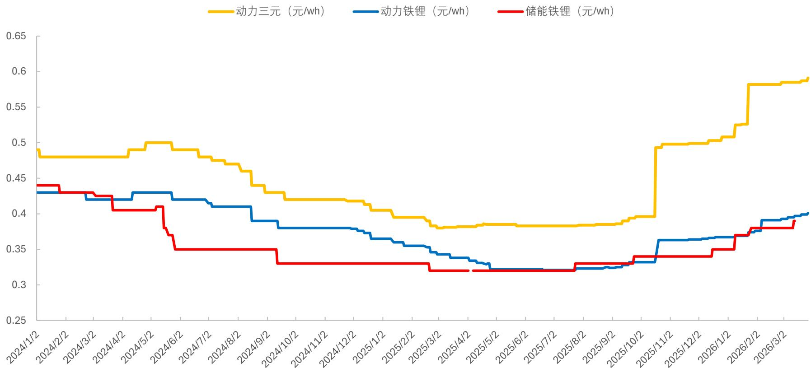

## 原材料涨价，宁德理论成本上涨7分/wh，成本压力更小

◆ 25年中价格低点时，铁锂电芯成本0.23元/wh（不含税），其中BOM成本0.19元/wh；26年对于宁德实质性涨价影响比较大的是碳酸锂、电解液、铜，按照碳酸锂15万（成本上涨5分），六氟12万（成本上涨1分），铜箔11.7万/吨（成本上涨1分），测算对应电芯成本0.3元/wh，其中BOM成本0.26元/wh，上涨7分（不含税），而二线电池企业成本上涨更高。

图：材料涨价对成本影响测算
<table><tr><td rowspan=2 colspan=11>2025:铁锂                                             2026:铁锂 (中性涨价)磷酸铁锂               单位用量       单位       单位价格     单位成本     单位价格       上涨       单位成本       上涨电芯原材料成本                                                 （万）        (元/wh)        （万）        (万/吨)     (元/wh)       (元/wh)</td></tr><tr><td rowspan=1 colspan=1>(元/wh)</td><td rowspan=1 colspan=1>（万）</td><td rowspan=1 colspan=2>(万/吨)</td><td rowspan=1 colspan=1>(元/wh)</td><td rowspan=1 colspan=1>(元/wh)</td></tr><tr><td rowspan=1 colspan=1>正极材料</td><td rowspan=1 colspan=1>2200</td><td rowspan=1 colspan=1>t</td><td rowspan=1 colspan=2>2.9</td><td rowspan=1 colspan=1>0.06</td><td rowspan=1 colspan=1>5.3</td><td rowspan=1 colspan=2> 2.31</td><td rowspan=1 colspan=1>0.1</td><td rowspan=1 colspan=1>0.04</td></tr><tr><td rowspan=1 colspan=1>-正极加工费</td><td rowspan=1 colspan=1>2200</td><td rowspan=1 colspan=1>t</td><td rowspan=1 colspan=2>1.5</td><td rowspan=1 colspan=1>0.03</td><td rowspan=1 colspan=1>1.65</td><td rowspan=1 colspan=2>0.15</td><td rowspan=1 colspan=1>0.03</td><td rowspan=1 colspan=1>0</td></tr><tr><td rowspan=1 colspan=1>-碳酸锂 (正极+电解液含量)</td><td rowspan=1 colspan=1>566</td><td rowspan=1 colspan=1>t</td><td rowspan=1 colspan=2>6</td><td rowspan=1 colspan=1>0.03</td><td rowspan=1 colspan=1>15</td><td rowspan=1 colspan=2>9</td><td rowspan=1 colspan=1>0.08</td><td rowspan=1 colspan=1>0.05</td></tr><tr><td rowspan=1 colspan=1>铝箔</td><td rowspan=1 colspan=1>350</td><td rowspan=1 colspan=1>t</td><td rowspan=1 colspan=2>3.3</td><td rowspan=1 colspan=1>0.01</td><td rowspan=1 colspan=1>3.55</td><td rowspan=1 colspan=2>0.25</td><td rowspan=1 colspan=1>0.01</td><td rowspan=1 colspan=1>0</td></tr><tr><td rowspan=1 colspan=1>-铝箔加工费</td><td rowspan=1 colspan=1>350</td><td rowspan=1 colspan=1>t</td><td rowspan=1 colspan=2>1.5</td><td rowspan=1 colspan=1>0</td><td rowspan=1 colspan=1>1.6</td><td rowspan=1 colspan=2>0.1</td><td rowspan=1 colspan=1>0</td><td rowspan=1 colspan=1>0</td></tr><tr><td rowspan=1 colspan=1>-铝价</td><td rowspan=1 colspan=1>350</td><td rowspan=1 colspan=1>t</td><td rowspan=1 colspan=2>1.8</td><td rowspan=1 colspan=1>0.01</td><td rowspan=1 colspan=1>2</td><td rowspan=1 colspan=2>0.2</td><td rowspan=1 colspan=1>0.01</td><td rowspan=1 colspan=1>0</td></tr><tr><td rowspan=1 colspan=1>铜箔</td><td rowspan=1 colspan=1>550</td><td rowspan=1 colspan=1>t</td><td rowspan=1 colspan=2>9.5</td><td rowspan=1 colspan=1>0.05</td><td rowspan=1 colspan=1>11.7</td><td rowspan=1 colspan=2>2.2</td><td rowspan=1 colspan=1>0.06</td><td rowspan=1 colspan=1>0.01</td></tr><tr><td rowspan=1 colspan=1>-铜箔加工费</td><td rowspan=1 colspan=1>550</td><td rowspan=1 colspan=1>t</td><td rowspan=1 colspan=2>1.5</td><td rowspan=1 colspan=1>0.01</td><td rowspan=1 colspan=1>1.7</td><td rowspan=1 colspan=2>0.2</td><td rowspan=1 colspan=1>0.01</td><td rowspan=1 colspan=1>0</td></tr><tr><td rowspan=1 colspan=1>-铜价</td><td rowspan=1 colspan=1>550</td><td rowspan=1 colspan=1>t</td><td rowspan=1 colspan=2>8</td><td rowspan=1 colspan=1>0.04</td><td rowspan=1 colspan=1>10</td><td rowspan=1 colspan=2>2</td><td rowspan=1 colspan=1>0.05</td><td rowspan=1 colspan=1>0.01</td></tr><tr><td rowspan=1 colspan=1>电解液</td><td rowspan=1 colspan=1>1274</td><td rowspan=1 colspan=1>t</td><td rowspan=1 colspan=2>1.8</td><td rowspan=1 colspan=1>0.02</td><td rowspan=1 colspan=1>2.72</td><td rowspan=1 colspan=2>0.92</td><td rowspan=1 colspan=1>0.03</td><td rowspan=1 colspan=1>0.01</td></tr><tr><td rowspan=1 colspan=1>-六氟磷酸锂</td><td rowspan=1 colspan=1>153</td><td rowspan=1 colspan=1>t</td><td rowspan=1 colspan=2>6</td><td rowspan=1 colspan=1>0.01</td><td rowspan=1 colspan=1>12</td><td rowspan=1 colspan=2>6</td><td rowspan=1 colspan=1>0.02</td><td rowspan=1 colspan=1>0.01</td></tr><tr><td rowspan=1 colspan=1>主要材料合计成本 (元/wh)</td><td rowspan=1 colspan=3>0.13</td><td rowspan=1 colspan=4>0.2</td><td rowspan=1 colspan=3>0.07</td></tr></table>

## 成本：宁德时代全方位领先二三线竞争对手

◆ 同等铁锂电芯，宁德生产的Bom成本低2分/wh，制造成本低1分/wh（不考虑折旧差异）。宁德能量密度高，对应材料单耗低2-5%，采购价格低5-10%，25年底材料企业对二线电池涨价落地，宁德尚未落地，涨价有难度，反映出其强大的供应链议价能力。宁德良率基本97-98%，比二线企业高2-3pct，且同等产品宁德定价高5-10%。因此，宁德时代在原材料上涨周期中能够有效缓冲成本压力，当原材料价格上涨时，宁德时代可以比竞争对手涨得更少甚至不涨。

图：宁德与二线厂商成本对比
<table><tr><td rowspan="2">磷酸铁锂</td><td colspan="5">2026:铁锂 (宁德) 单位价</td><td colspan="5">2026:铁锂(二线)</td></tr><tr><td>单位用量</td><td>单位</td><td>格</td><td>单位成本</td><td>单位成 本</td><td>单位用 量</td><td>单位</td><td>单位价 格</td><td>单位成本</td><td>单位成本</td></tr><tr><td>电芯原材料成本</td><td>2178</td><td>t</td><td>(万) 4.77</td><td>(元/wh) 0.09</td><td>占比 37%</td><td>2243</td><td>t</td><td>(万) 4.94</td><td>(元/wh) 0.1</td><td>占比 38%</td></tr><tr><td>正极材料 -正极加工费</td><td>2178</td><td>t</td><td>0.55</td><td>0.01</td><td>4%</td><td>2243</td><td>t</td><td>0.6</td><td>0.01</td><td>5%</td></tr><tr><td>-磷酸铁</td><td>2178</td><td>t</td><td>1.1</td><td>0.02</td><td>9%</td><td>2243</td><td>t</td><td>1.1</td><td>0.02</td><td>8%</td></tr><tr><td>正极集体流 (铝箔)</td><td>343</td><td>t</td><td>3.55</td><td>0.01</td><td>4%</td><td>353</td><td>t</td><td>3.65</td><td>0.01</td><td>4%</td></tr><tr><td>-铝箔加工费</td><td>347</td><td>t</td><td>1.6</td><td>0</td><td>2%</td><td>357</td><td>t</td><td>1.7</td><td>0.01</td><td>2%</td></tr><tr><td>-铝价</td><td>347</td><td>t</td><td>2</td><td>0.01</td><td>2%</td><td>357</td><td>t</td><td>2</td><td>0.01</td><td>2%</td></tr><tr><td>负极活性物质 (石墨)</td><td>931</td><td>t</td><td>1.65</td><td>0.01</td><td>6%</td><td>959</td><td>t</td><td>1.7</td><td>0.01</td><td>6%</td></tr><tr><td>负极集流体 (铜箔)</td><td>539</td><td>t</td><td>11.7</td><td>0.06</td><td>23%</td><td>555</td><td>t</td><td>11.8</td><td>0.06</td><td>22%</td></tr><tr><td>-铜箔加工费</td><td>545</td><td>t</td><td>1.7</td><td>0.01</td><td>3%</td><td>561</td><td>t</td><td>1.8</td><td>0.01</td><td>3%</td></tr><tr><td>-铜价</td><td>545</td><td>t</td><td>10</td><td>0.05</td><td>19%</td><td>561</td><td>t</td><td>10</td><td>0.05</td><td>19%</td></tr><tr><td>电解液</td><td>1268</td><td>t</td><td>2.72</td><td>0.03</td><td>12%</td><td>1306</td><td>t</td><td>2.84</td><td>0.03</td><td>13%</td></tr><tr><td>-六氟磷酸铁锂</td><td>152 1735</td><td>t 万m2</td><td>12</td><td>0.02</td><td>7%</td><td>157</td><td>t</td><td>13</td><td>0.02</td><td>7%</td></tr><tr><td>隔膜 (湿法涂覆)</td><td>1</td><td>套</td><td>0.95 0</td><td>0.01</td><td>6% 8%</td><td>1787</td><td>万m2</td><td>1</td><td>0.02</td><td>6%</td></tr><tr><td>壳体&amp;辊压膜及其他 电芯材料成本合计(元/wh)</td><td></td><td>0.25</td><td></td><td>0.02</td><td>100%</td><td>1</td><td>套</td><td>0 0.26</td><td>0.02</td><td>8%</td></tr><tr><td>碳酸锂 (正极+电解液含量)</td><td>561</td><td>t</td><td>13</td><td>0.07</td><td>29%</td><td>578</td><td>t</td><td>13.5</td><td>0.08</td><td>100% 30%</td></tr><tr><td>电费</td><td>3,000</td><td>万kwh</td><td>0.4</td><td>0.01</td><td></td><td>3,500</td><td>万kwh</td><td>0.4</td><td>0.01</td><td></td></tr><tr><td></td><td></td><td></td><td>10</td><td>0.01</td><td></td><td></td><td></td><td></td><td></td><td></td></tr><tr><td>人工</td><td>60 1</td><td>人亿</td><td></td><td>0.02</td><td></td><td>75 1</td><td>人亿</td><td>10</td><td>0.01</td><td></td></tr><tr><td>折旧(元/wh) 其他</td><td></td><td></td><td></td><td>0.01</td><td></td><td></td><td></td><td></td><td>0.01 0.01</td><td></td></tr><tr><td></td><td></td><td>0.05</td><td>98.00%</td><td></td><td></td><td></td><td></td><td>0.04</td><td></td><td></td></tr><tr><td>电芯材料制造成本合计(元/wh)</td><td colspan="6"></td><td colspan="3"></td></tr><tr><td>合格率</td><td colspan="6"></td><td colspan="3">95.00%</td></tr><tr><td>产能利用率</td><td colspan="6">100.00%</td><td colspan="3">100.00%</td></tr><tr><td>电芯成本合计（元/wh），不含税）</td><td colspan="6"></td><td colspan="3">0.318</td></tr><tr><td></td><td colspan="6">0.301</td><td colspan="3">12%</td></tr><tr><td>电芯毛利率 电芯售价（含税，元/wh)</td><td colspan="6">20% 0.408</td><td colspan="3">0.403</td></tr></table>

数据来源：公司公告，东吴证券研究所

## 电池：宁德α明显，量超越行业增速，盈利稳定

◆ 我们预计26年宁德电池盈利基本维持8-9分/wh，二线头部盈利2分/wh，且宁德质保金足额计提3.5%、折旧加速计，实际领先幅度更明显。此轮原材料涨价，宁德采购价涨幅小和慢，并且向下游顺价，宁德议价能力强，实际涨幅高于二线企业，盈利差距可能扩大。

图：宁德与二线厂商盈利对比
<table><tr><td>代表公司</td><td>单位</td><td>2023Q1</td><td>2023Q2</td><td>2023Q3</td><td>2023Q4</td><td>2024Q1</td><td>2024Q2</td><td>2024Q3</td><td>2024Q4</td><td>2025Q1</td><td>2025Q2</td><td>2025Q3</td><td>2025Q4</td></tr><tr><td rowspan="3">宁德时代</td><td>出货 (GWh)</td><td>76</td><td>94</td><td>100</td><td>120</td><td>95</td><td>110</td><td>123</td><td>146</td><td>122</td><td>148</td><td>167</td><td>225</td></tr><tr><td>单价 (元/Wh)</td><td>1.16</td><td>1.07</td><td>1.04</td><td>0.83</td><td>0.79</td><td>0.77</td><td>0.74</td><td>0.69</td><td>0.67</td><td>0.65</td><td>0.64</td><td>0.64</td></tr><tr><td>单位净利 (元/Wh)</td><td>0.09</td><td>0.1</td><td>0.09</td><td>0.12</td><td>0.09</td><td>0.1</td><td>0.12</td><td>0.08</td><td>0.09</td><td>0.09</td><td>0.09</td><td>0.08</td></tr><tr><td rowspan="3">亿纬锂能</td><td>出货 (GWh)</td><td>9.3</td><td> 12.4</td><td>14.6</td><td>18.2</td><td>13.5</td><td>21</td><td>21.9</td><td>24.3</td><td> 22.8</td><td>27.3</td><td>34.59</td><td>36.51</td></tr><tr><td>单价 (元/Wh)</td><td>1.15</td><td>0.89</td><td>0.8</td><td>0.67</td><td>0.6</td><td>0.52</td><td>0.5</td><td>0.54</td><td>0.52</td><td>0.52</td><td>0.47</td><td>0.4</td></tr><tr><td>单位净利 (元/Wh)</td><td>0.03</td><td>0.03</td><td>0.04</td><td>0.03</td><td>0.02</td><td>0.01</td><td>0.02</td><td>0.02</td><td>0.02</td><td>0.02</td><td>0.02</td><td>0.03</td></tr><tr><td rowspan="3">国轩高科</td><td>出货 (GWh)</td><td>9</td><td>11</td><td>11</td><td>14</td><td>12</td><td>15</td><td>16</td><td>18</td><td>18</td><td>22</td><td>23</td><td></td></tr><tr><td>单价 （元/Wh)</td><td>0.89</td><td>0.79</td><td>0.67</td><td>0.77</td><td>0.71</td><td>0.7</td><td>0.59</td><td>0.64</td><td>0.57</td><td>0.52</td><td>0.48</td><td></td></tr><tr><td>单位净利 (元/Wh)</td><td>0</td><td>0</td><td>0</td><td>0</td><td>0.01</td><td>0.01</td><td>0.01</td><td>0.02</td><td>0</td><td>0.01</td><td>0</td><td></td></tr><tr><td rowspan="3">欣旺达 （动储）</td><td>出货 （GWh)</td><td>2.2</td><td>2.8</td><td>3</td><td>3.8</td><td>3.9</td><td>4.4</td><td>6.8</td><td>10.2</td><td>6.8</td><td>9.3</td><td>11</td><td></td></tr><tr><td>单价 (元/Wh)</td><td>1.19</td><td>1.16</td><td>1.04</td><td>0.85</td><td>0.78</td><td>0.89</td><td>0.66</td><td>0.55</td><td>0.55</td><td>0.6</td><td>0.6</td><td></td></tr><tr><td>单位净利 (元/Wh)</td><td>-0.16</td><td>-0.08</td><td>-0.08</td><td>-0.2</td><td>-0.11</td><td>-0.1</td><td>-0.07</td><td>-0.02</td><td>-0.08</td><td>-0.06</td><td>-0.04</td><td></td></tr><tr><td rowspan="3">欣旺达 (锂威)</td><td>收入 (亿元)</td><td>10.5</td><td>13</td><td>15</td><td>10</td><td>15</td><td>16.6</td><td>16</td><td>13.5</td><td>17</td><td>20</td><td>24</td><td></td></tr><tr><td>净利率</td><td>8%</td><td>11%</td><td>15%</td><td>15%</td><td>14%</td><td>20%</td><td>17%</td><td>15%</td><td>13%</td><td>12%</td><td>12%</td><td></td></tr><tr><td>净利润 (亿元)</td><td>0.84</td><td>1.4</td><td>2.25</td><td>1.5</td><td>2.1</td><td>3.32</td><td>2.72</td><td>2</td><td>2.21</td><td>2.4</td><td>2.8</td><td></td></tr></table>

数据来源：公司公告，东吴证券研究所

## 宁德时代：技术迭代引领行业，盈利与规模共振向上

◆ 成本传导顺畅、盈利韧性强。与25年中相比，碳酸锂涨价9万/吨带来铁锂电芯成本上涨5分/wh、铜铝1分/wh、电解液1分/wh，合计成本上涨7分/wh，最新电池报价已调整至接近0.4元/wh，完全反应成本上涨。除了国内储能老订单调整相对滞后（按5%出货占比，考虑影响5分/wh，实际仅影响20亿利润），其余客户基本1-2个月联动，传导较为顺畅，因此电池盈利水平可维持8分/wh左右。

◆ 锂价上涨反噬中低端需求、宁德受冲击较小。国内中等储能项目，电芯价格上涨2-3分/wh，IRR下降1pct，当前电芯价格对应IRR下降4pct，低收益率项目开始延期，而宁德电池更多应用高收益率项目和海外市场。动力端，宁德在高端车型中占比更高，成本敏感性低，因此需求冲击有限，我们仍预期公司今年排产1.1TWh，同比增50%，出货量900-1000GWh。

◆ 产业链布局完善、投资收益贡献明显利润。宁德时代持股洛阳钼业24.68%，我们预计26年贡献86亿投资收益；枧下窝有望26Q2复产，当年贡献5万吨产量，按照碳酸锂价格15万/吨，对应可贡献30亿利润。此外，公司持有13.54%天华新能，合计26年资源端有望新增70亿+利润。

◆ 原材料涨价情况下、宁德将进一步强化竞争优势。宁德相对于小电池企业，价格传导更顺畅，同时采购端议价能力更强，而小电池企业原本微利或亏损，26年盈利压力加大。并且宁德26年产能加速释放，在储能、商用车领域，份额将明显回升。

◆ 投资建议：我们预计公司26-28年归母净利润962/1215/1469亿元，同增33%/26%/21%，对应PE为20/16/13x，考虑到公司为全球动力电池龙头，技术、成本客户行业领先，26年市占率有望进一步提升，给予26年30x PE，对应目标价632元，维持“买入”评级。

图：宁德时代分业务营收及利润拆分
<table><tr><td>老精小中</td><td>2024A</td><td>2025A</td><td>2026E</td><td>2027E</td><td>2028E</td></tr><tr><td></td><td>美</td><td>美</td><td>美</td><td></td><td></td></tr><tr><td></td><td></td><td></td><td></td><td></td><td></td></tr><tr><td></td><td></td><td></td><td></td><td></td><td></td></tr><tr><td></td><td></td><td></td><td></td><td></td><td></td></tr><tr><td></td><td></td><td></td><td></td><td></td><td></td></tr><tr><td></td><td></td><td></td><td></td><td></td><td>童</td></tr><tr><td></td><td></td><td>金</td><td>警</td><td>金</td><td></td></tr><tr><td></td><td></td><td></td><td></td><td></td><td></td></tr><tr><td></td><td></td><td></td><td></td><td></td><td></td></tr><tr><td></td><td></td><td></td><td></td><td></td><td></td></tr><tr><td></td><td></td><td></td><td></td><td></td><td>文</td></tr><tr><td></td><td></td><td></td><td></td><td></td><td></td></tr><tr><td></td><td></td><td></td><td></td><td></td><td></td></tr><tr><td></td><td></td><td></td><td></td><td></td><td></td></tr><tr><td></td><td></td><td></td><td></td><td></td><td></td></tr><tr><td></td><td></td><td></td><td></td><td></td><td></td></tr><tr><td></td><td>管</td><td></td><td>堂</td><td>堂</td><td>费</td></tr><tr><td></td><td></td><td></td><td></td><td></td><td></td></tr><tr><td></td><td></td><td>童</td><td></td><td></td><td></td></tr><tr><td></td><td></td><td></td><td></td><td></td><td></td></tr><tr><td></td><td></td><td></td><td></td><td></td><td></td></tr><tr><td></td><td></td><td></td><td></td><td>金</td><td></td></tr><tr><td></td><td></td><td></td><td></td><td></td><td></td></tr><tr><td></td><td></td><td></td><td></td><td></td><td></td></tr><tr><td></td><td>茶</td><td></td><td></td><td></td><td></td></tr><tr><td></td><td>178</td><td></td><td></td><td></td><td>量</td></tr><tr><td></td><td></td><td>1</td><td>1</td><td>206</td><td>216</td></tr></table>

## 亿纬锂能：储能竞争力持续强化，盈利水平表现亮眼

◆ Q4业绩略好于预期。公司25年营收615亿元，同增26%，归母净利润41亿元，同增1%，扣非净利润31亿元，同降2%，毛利率16.2%，同降1.2pct；其中25年Q4营收165亿元，同环比+13％/-2％，归母净利润13.2亿元，同环比+49%/+9％，扣非净利润11.6亿元，同环比+75%/+48％，毛利率16.8%，同环比-0.7/+3.1pct。

◆ 储能+大圆柱+商用车贡献增量、26年我们预计超200GWh。公司25年出货121GWh，同增50%，其中动力出货50GWh，同增66%储能出货71GWh，同增41%；公司Q4出货38.2GWh，同环比+57%/+16%，其中动力出货15.6GWh，同环比+62%/+19%，储能出货22.6GWh，同环比+54%/+15%。我们预计公司26年出货200GWh+，同增65%，其中动力80GWh，同增69%，含大圆柱15-20GWh，开启放量，商用车40GWh，翻倍增长，储能120GWh+，同增近70%。

◆ 涨价落地、布局上游、盈利水平可维持0.025元/wh。25年动力收入259亿元，同比+35%，单wh价格0.58元，同比-19%，毛利率15.5%，同比-1.3pct，其中25H2单wh价格0.52元，环比-23%，毛利率13.5%，环比-4pct，受返利计提以及国内乘用车电芯放量，均价下降，但Q4单wh利润已修复至0.03元/wh。储能端，25年收入244亿元，同比+28%，单wh价格0.39元，同比-9%，毛利率12.3%，同比-2.4pct，其中H2单wh价格0.38元，环比-7%，毛利率12.5%，环比+0.4pct，Q4单wh利润提升至0.02元。展望26年，公司成本传导相对顺畅，且公司25年末已形成3.7亿套期工具收益，同时公司中游材料合资公司25H2盈利已明显改善，有效对冲，我们预计26年电池单wh利润可维持0.025元。

◆ 投资建议：我们预计26-28年归母净利72.3/95.2/124.2亿元的预期，同比+75%/+32%/+30%，对应PE为18x/13x/10x，考虑到公司出货高速增长，给予26年30x估值，对应目标价103元/股，维持“买入”评级。

表：亿纬锂能盈利预测
<table><tr><td>盈利预测与估值</td><td>2024A</td><td>2025A</td><td>2026E</td><td>2027E</td><td>2028E</td></tr><tr><td>营业总收入(百万元)</td><td>48,614.56</td><td>61,469.63</td><td>97,034.97</td><td>123,877.44</td><td>151,302.65</td></tr><tr><td>同比(%)</td><td>-0.35</td><td>26.44</td><td>57.86</td><td>27.66</td><td>22.14</td></tr><tr><td>归母净利润(百万元)</td><td>4,075.59</td><td>4,134.30</td><td>7,234.66</td><td>9,520.74</td><td>12,418.73</td></tr><tr><td>同比(%)</td><td>0.63</td><td>1.44</td><td>74.99</td><td>31.60</td><td>30.44</td></tr><tr><td>EPS-最新摊薄(元/股)</td><td>1.94</td><td>1.97</td><td>3.45</td><td>4.54</td><td>5.92</td></tr><tr><td>P/E（现价&amp;最新摊薄）</td><td>31.23</td><td>30.78</td><td>17.59</td><td>13.37</td><td>10.25</td></tr></table>

## 隔膜：一轮涨价已落地，26-27年供给紧缺有望持续上涨

## 供给：行业新增产能明显放缓，26年扩产主要集中海外

◆ 行业扩产明显谨慎，26年新增产能主要来自投产项目爬坡+海外项目投产。恩捷、星源26Q1产能满产满销，26年新增产能主要来自25年投产基地爬坡+海外产能投产，龙三中材产能利用率不高，没有大规模扩产计划，其余二三线厂商扩产速度明显放缓。

表：全球隔膜市场供给（亿平）
<table><tr><td rowspan=1 colspan=1>企业名称</td><td rowspan=1 colspan=1>技术路线</td><td rowspan=1 colspan=1>2023有效产能（基膜成品）</td><td rowspan=1 colspan=1>2024有效产能（基膜成品）</td><td rowspan=1 colspan=1>2025有效产能（基膜成品）</td><td rowspan=1 colspan=1>2026E有效产能(基膜成品)</td><td rowspan=1 colspan=1>2027E有效产能（基膜成品）</td><td rowspan=1 colspan=1>2028E有效产能（基膜成品）</td></tr><tr><td rowspan=1 colspan=1>上海恩捷</td><td rowspan=1 colspan=1>湿法+干法</td><td rowspan=1 colspan=1>72.3</td><td rowspan=1 colspan=1>86.8</td><td rowspan=1 colspan=1>124.8</td><td rowspan=1 colspan=1>140.8</td><td rowspan=1 colspan=1>150.8</td><td rowspan=1 colspan=1>165.8</td></tr><tr><td rowspan=1 colspan=1>星源材质</td><td rowspan=1 colspan=1>湿法+干法</td><td rowspan=1 colspan=1>27.8</td><td rowspan=1 colspan=1>40.8</td><td rowspan=1 colspan=1>50.8</td><td rowspan=1 colspan=1>61.8</td><td rowspan=1 colspan=1>68.3</td><td rowspan=1 colspan=1>76.7</td></tr><tr><td rowspan=1 colspan=1>中材科技</td><td rowspan=1 colspan=1>湿法</td><td rowspan=1 colspan=1>20.8</td><td rowspan=1 colspan=1>44.8</td><td rowspan=1 colspan=1>60.0</td><td rowspan=1 colspan=1>70.0</td><td rowspan=1 colspan=1>80.0</td><td rowspan=1 colspan=1>100.0</td></tr><tr><td rowspan=1 colspan=1>沧州明珠</td><td rowspan=1 colspan=1>湿法+干法</td><td rowspan=1 colspan=1>3.3</td><td rowspan=1 colspan=1>4.9</td><td rowspan=1 colspan=1>9.9</td><td rowspan=1 colspan=1>12.4</td><td rowspan=1 colspan=1>12.4</td><td rowspan=1 colspan=1>12.4</td></tr><tr><td rowspan=1 colspan=1>璞泰来</td><td rowspan=1 colspan=1>湿法</td><td rowspan=1 colspan=1>3.0</td><td rowspan=1 colspan=1>10.0</td><td rowspan=1 colspan=1>20.0</td><td rowspan=1 colspan=1>40.0</td><td rowspan=1 colspan=1>60.0</td><td rowspan=1 colspan=1>70.0</td></tr><tr><td rowspan=1 colspan=1>比亚迪</td><td rowspan=1 colspan=1>湿法</td><td rowspan=1 colspan=1>2.1</td><td rowspan=1 colspan=1>2.1</td><td rowspan=1 colspan=1>2.1</td><td rowspan=1 colspan=1>2.1</td><td rowspan=1 colspan=1>2.1</td><td rowspan=1 colspan=1>2.1</td></tr><tr><td rowspan=1 colspan=1>北大先行</td><td rowspan=1 colspan=1>湿法</td><td rowspan=1 colspan=1>4.0</td><td rowspan=1 colspan=1>12.0</td><td rowspan=1 colspan=1>12.0</td><td rowspan=1 colspan=1>12.0</td><td rowspan=1 colspan=1>12.0</td><td rowspan=1 colspan=1>12.0</td></tr><tr><td rowspan=1 colspan=1>天津东皋</td><td rowspan=1 colspan=1>湿法</td><td rowspan=1 colspan=1>1.1</td><td rowspan=1 colspan=1>1.1</td><td rowspan=1 colspan=1>1.1</td><td rowspan=1 colspan=1>1.1</td><td rowspan=1 colspan=1>1.1</td><td rowspan=1 colspan=1>1.1</td></tr><tr><td rowspan=1 colspan=1>鸿图隔膜</td><td rowspan=1 colspan=1>湿法</td><td rowspan=1 colspan=1>2.5</td><td rowspan=1 colspan=1>3.5</td><td rowspan=1 colspan=1>5.5</td><td rowspan=1 colspan=1>6.5</td><td rowspan=1 colspan=1>6.5</td><td rowspan=1 colspan=1>6.5</td></tr><tr><td rowspan=1 colspan=1>中科科技</td><td rowspan=1 colspan=1>湿法+干法</td><td rowspan=1 colspan=1>1.3</td><td rowspan=1 colspan=1>1.3</td><td rowspan=1 colspan=1>1.3</td><td rowspan=1 colspan=1>1.3</td><td rowspan=1 colspan=1>1.3</td><td rowspan=1 colspan=1>1.3</td></tr><tr><td rowspan=1 colspan=1>金辉高科</td><td rowspan=1 colspan=1>湿法</td><td rowspan=1 colspan=1>0.8</td><td rowspan=1 colspan=1>0.8</td><td rowspan=1 colspan=1>0.8</td><td rowspan=1 colspan=1>0.8</td><td rowspan=1 colspan=1>0.8</td><td rowspan=1 colspan=1>0.8</td></tr><tr><td rowspan=1 colspan=1>河南义腾</td><td rowspan=1 colspan=1>湿法+干法</td><td rowspan=1 colspan=1>1.8</td><td rowspan=1 colspan=1>1.8</td><td rowspan=1 colspan=1>1.8</td><td rowspan=1 colspan=1>1.8</td><td rowspan=1 colspan=1>1.8</td><td rowspan=1 colspan=1>1.8</td></tr><tr><td rowspan=1 colspan=1>恒力石化</td><td rowspan=1 colspan=1>湿法</td><td rowspan=1 colspan=1></td><td rowspan=1 colspan=1>4.4</td><td rowspan=1 colspan=1>10.0</td><td rowspan=1 colspan=1>19.0</td><td rowspan=1 colspan=1>19.0</td><td rowspan=1 colspan=1>19.0</td></tr><tr><td rowspan=1 colspan=1>河北金力</td><td rowspan=1 colspan=1>湿法</td><td rowspan=1 colspan=1>28.0</td><td rowspan=1 colspan=1>32.0</td><td rowspan=1 colspan=1>60.0</td><td rowspan=1 colspan=1>70.0</td><td rowspan=1 colspan=1>80.0</td><td rowspan=1 colspan=1>100.0</td></tr><tr><td rowspan=1 colspan=1>东航光科</td><td rowspan=1 colspan=1>干法</td><td rowspan=1 colspan=1>0.4</td><td rowspan=1 colspan=1>0.4</td><td rowspan=1 colspan=1>0.4</td><td rowspan=1 colspan=1>0.4</td><td rowspan=1 colspan=1>0.4</td><td rowspan=1 colspan=1>0.4</td></tr><tr><td rowspan=1 colspan=1>中兴新材</td><td rowspan=1 colspan=1>干法</td><td rowspan=1 colspan=1>20.0</td><td rowspan=1 colspan=1>25.0</td><td rowspan=1 colspan=1>30.0</td><td rowspan=1 colspan=1>30.0</td><td rowspan=1 colspan=1>30.0</td><td rowspan=1 colspan=1>30.0</td></tr><tr><td rowspan=1 colspan=1>南通天丰</td><td rowspan=1 colspan=1>干法</td><td rowspan=1 colspan=1>0.6</td><td rowspan=1 colspan=1>0.6</td><td rowspan=1 colspan=1>0.6</td><td rowspan=1 colspan=1>0.6</td><td rowspan=1 colspan=1>0.6</td><td rowspan=1 colspan=1>0.6</td></tr><tr><td rowspan=1 colspan=1>美联新材</td><td rowspan=1 colspan=1>湿法</td><td rowspan=1 colspan=1>1.0</td><td rowspan=1 colspan=1>3.5</td><td rowspan=1 colspan=1>3.5</td><td rowspan=1 colspan=1>3.5</td><td rowspan=1 colspan=1>3.5</td><td rowspan=1 colspan=1>3.5</td></tr><tr><td rowspan=1 colspan=1>中科华联</td><td rowspan=1 colspan=1>湿法</td><td rowspan=1 colspan=1>3.0</td><td rowspan=1 colspan=1>8.0</td><td rowspan=1 colspan=1>10.0</td><td rowspan=1 colspan=1>15.0</td><td rowspan=1 colspan=1>20.0</td><td rowspan=1 colspan=1>30.0</td></tr><tr><td rowspan=1 colspan=1>厚生新能源</td><td rowspan=1 colspan=1>湿法</td><td rowspan=1 colspan=1>10.0</td><td rowspan=1 colspan=1>20.0</td><td rowspan=1 colspan=1>20.0</td><td rowspan=1 colspan=1>26.0</td><td rowspan=1 colspan=1>20.0</td><td rowspan=1 colspan=1>20.0</td></tr><tr><td rowspan=1 colspan=1>博盛新材</td><td rowspan=1 colspan=1>干法</td><td rowspan=1 colspan=1>6.0</td><td rowspan=1 colspan=1>9.4</td><td rowspan=1 colspan=1>12.4</td><td rowspan=1 colspan=1>15.4</td><td rowspan=1 colspan=1>15.4</td><td rowspan=1 colspan=1>15.4</td></tr><tr><td rowspan=1 colspan=1>盈博莱</td><td rowspan=1 colspan=1>干法</td><td rowspan=1 colspan=1>1.2</td><td rowspan=1 colspan=1>7.0</td><td rowspan=1 colspan=1>10.0</td><td rowspan=1 colspan=1>10.0</td><td rowspan=1 colspan=1>10.0</td><td rowspan=1 colspan=1>10.0</td></tr><tr><td rowspan=1 colspan=1>长阳科技</td><td rowspan=1 colspan=1>干法</td><td rowspan=1 colspan=1>4.0</td><td rowspan=1 colspan=1>8.0</td><td rowspan=1 colspan=1>9.6</td><td rowspan=1 colspan=1>9.6</td><td rowspan=1 colspan=1>9.6</td><td rowspan=1 colspan=1>9.6</td></tr><tr><td rowspan=1 colspan=1>武汉惠强</td><td rowspan=1 colspan=1>干法</td><td rowspan=1 colspan=1>10.0</td><td rowspan=1 colspan=1>15.0</td><td rowspan=1 colspan=1>20.0</td><td rowspan=1 colspan=1>23.0</td><td rowspan=1 colspan=1>23.0</td><td rowspan=1 colspan=1>23.0</td></tr><tr><td rowspan=1 colspan=1>其他产能</td><td rowspan=1 colspan=1></td><td rowspan=1 colspan=1>5.0</td><td rowspan=1 colspan=1>8.0</td><td rowspan=1 colspan=1>12.0</td><td rowspan=1 colspan=1>12.0</td><td rowspan=1 colspan=1>12.0</td><td rowspan=1 colspan=1>12.0</td></tr><tr><td rowspan=1 colspan=1></td><td rowspan=1 colspan=1>干法</td><td rowspan=1 colspan=1>63.8</td><td rowspan=1 colspan=1>93.0</td><td rowspan=1 colspan=1>118.6</td><td rowspan=1 colspan=1>129.6</td><td rowspan=1 colspan=1>129.6</td><td rowspan=1 colspan=1>129.6</td></tr><tr><td rowspan=2 colspan=1>产能合计</td><td rowspan=1 colspan=1>湿法</td><td rowspan=1 colspan=1>184.0</td><td rowspan=1 colspan=1>223.5</td><td rowspan=1 colspan=1>306.1</td><td rowspan=1 colspan=1>348.2</td><td rowspan=1 colspan=1>369.7</td><td rowspan=1 colspan=1>408.1</td></tr><tr><td rowspan=1 colspan=1>合计</td><td rowspan=1 colspan=1>230.0</td><td rowspan=1 colspan=1>351.1</td><td rowspan=1 colspan=1>488.5</td><td rowspan=1 colspan=1>579.1</td><td rowspan=1 colspan=1>640.6</td><td rowspan=1 colspan=1>724.0</td></tr></table>

## 隔膜：25年产能利用率企稳，26年拐点，27年紧张

◆ 隔膜行业25年产能利用率底部企稳，龙头厂商满产满销，26年我们预计实现供需拐点，27年产能利用率提升至90%。我们测算产能利用率从2025年的72%提升至2027年的90%。当前头部厂商湿法产能已满产，中材25年产能利用率提升至60%+，新进入者产能已基本投产，暂无新增产能大幅投产，干法产能联合挺价，26年供需拐点明确。

图：隔膜行业供需测算
<table><tr><td>隔膜</td><td>2022年</td><td>2023年</td><td>2024年</td><td>2025年</td><td>2026年E</td><td>2027年E</td></tr><tr><td>全行业有效供给 (亿平)</td><td>188.7</td><td>282.3</td><td>411.8</td><td>564.8</td><td>655.4</td><td>716.9</td></tr><tr><td>-同比</td><td>70%</td><td>50%</td><td>46%</td><td>37%</td><td> 16%</td><td>9%</td></tr><tr><td>需求 (亿平)</td><td>160.3</td><td>209.6</td><td>276.5</td><td>404.3</td><td>533.1</td><td>642.0</td></tr><tr><td>-同比</td><td>56%</td><td>31%</td><td>32%</td><td>46%</td><td>32%</td><td>20%</td></tr><tr><td>产能利用率</td><td>85%</td><td>74%</td><td>67%</td><td>72%</td><td>81%</td><td>90%</td></tr></table>

图：主流厂商出货量（亿平）
<table><tr><td rowspan=1 colspan=1></td><td rowspan=1 colspan=1>25年产能</td><td rowspan=1 colspan=1>25年出货</td><td rowspan=1 colspan=1>产能利用率</td><td rowspan=1 colspan=1>26年E产能</td><td rowspan=1 colspan=1>26年E出货</td><td rowspan=1 colspan=1>产能利用率</td></tr><tr><td rowspan=1 colspan=1>恩捷股份</td><td rowspan=1 colspan=1>125</td><td rowspan=1 colspan=1>110</td><td rowspan=1 colspan=1>88%</td><td rowspan=1 colspan=1>135</td><td rowspan=1 colspan=1>150</td><td rowspan=1 colspan=1>110%</td></tr><tr><td rowspan=1 colspan=1>星源材质</td><td rowspan=1 colspan=1>60</td><td rowspan=1 colspan=1>50</td><td rowspan=1 colspan=1>83%</td><td rowspan=1 colspan=1>75</td><td rowspan=1 colspan=1>60</td><td rowspan=1 colspan=1>80%</td></tr><tr><td rowspan=1 colspan=1>中材科技</td><td rowspan=1 colspan=1>60</td><td rowspan=1 colspan=1>40</td><td rowspan=1 colspan=1>67%</td><td rowspan=1 colspan=1>60</td><td rowspan=1 colspan=1>60</td><td rowspan=1 colspan=1>100%</td></tr><tr><td rowspan=1 colspan=1>璞泰来</td><td rowspan=1 colspan=1>20</td><td rowspan=1 colspan=1>15</td><td rowspan=1 colspan=1>75%</td><td rowspan=1 colspan=1>20</td><td rowspan=1 colspan=1>20</td><td rowspan=1 colspan=1>100%</td></tr></table>

## 价格：价格一轮上涨已落地，26年拐点已现

◆ 湿法26Q1已上涨10%，4月大客户有望涨价15-20%，其余客户有望二次涨价。25年龙头公司均微利，其余厂商亏损，头部厂商挺价意愿显著，26Q1除大客户外已涨价落地10%，部分客户涨价20-30%，Q2大客户涨价有望落地15-20%，其余客户二轮谈价顺利，价格弹性明显。

## 表 主流厂商隔膜厂商单平盈利对比（元/平）

<table><tr><td rowspan=1 colspan=1>代表公司</td><td rowspan=1 colspan=1>单位</td><td rowspan=1 colspan=1>2021A</td><td rowspan=1 colspan=1>2022A</td><td rowspan=1 colspan=1>2023Q1</td><td rowspan=1 colspan=1>2023Q2</td><td rowspan=1 colspan=1>2023Q3</td><td rowspan=1 colspan=1>2023Q4</td><td rowspan=1 colspan=1>2024Q1</td><td rowspan=1 colspan=1>2024Q2</td><td rowspan=1 colspan=1>2024Q3</td><td rowspan=1 colspan=1>2024Q4</td><td rowspan=1 colspan=1>2025Q1</td><td rowspan=1 colspan=1>2025Q2</td><td rowspan=1 colspan=1>2025Q3</td><td rowspan=1 colspan=1>2025Q4</td></tr><tr><td rowspan=3 colspan=1>恩捷股份</td><td rowspan=1 colspan=1>出货</td><td rowspan=1 colspan=1>30.1</td><td rowspan=1 colspan=1>46.5</td><td rowspan=1 colspan=1>10</td><td rowspan=1 colspan=1>12</td><td rowspan=1 colspan=1>15</td><td rowspan=1 colspan=1>12.5</td><td rowspan=1 colspan=1>12.2</td><td rowspan=1 colspan=1>15.3</td><td rowspan=1 colspan=1>20</td><td rowspan=1 colspan=1>20.5</td><td rowspan=1 colspan=1>21</td><td rowspan=1 colspan=1>25.2</td><td rowspan=1 colspan=1>32</td><td rowspan=1 colspan=1>35</td></tr><tr><td rowspan=1 colspan=1>单价</td><td rowspan=1 colspan=1>2.38</td><td rowspan=1 colspan=1>2.33</td><td rowspan=1 colspan=1>2.9</td><td rowspan=1 colspan=1>2.83</td><td rowspan=1 colspan=1>2.66</td><td rowspan=1 colspan=1>2.67</td><td rowspan=1 colspan=1>2.16</td><td rowspan=1 colspan=1>1.82</td><td rowspan=1 colspan=1>1.52</td><td rowspan=1 colspan=1>1.48</td><td rowspan=1 colspan=1>1.47</td><td rowspan=1 colspan=1>1.36</td><td rowspan=1 colspan=1>1.33</td><td rowspan=1 colspan=1>1.34</td></tr><tr><td rowspan=1 colspan=1>单位净利</td><td rowspan=1 colspan=1>0.85</td><td rowspan=1 colspan=1>0.84</td><td rowspan=1 colspan=1>0.6</td><td rowspan=1 colspan=1>0.6</td><td rowspan=1 colspan=1>0.5</td><td rowspan=1 colspan=1>0.3</td><td rowspan=1 colspan=1>0.13</td><td rowspan=1 colspan=1>0.09</td><td rowspan=1 colspan=1>0.08</td><td rowspan=1 colspan=1>-0.25</td><td rowspan=1 colspan=1>0.01</td><td rowspan=1 colspan=1>0.04</td><td rowspan=1 colspan=1>0.04</td><td rowspan=1 colspan=1>0.08</td></tr><tr><td rowspan=3 colspan=1>星源材质</td><td rowspan=1 colspan=1>出货</td><td rowspan=1 colspan=1>11.3</td><td rowspan=1 colspan=1>17</td><td rowspan=1 colspan=1>4.2</td><td rowspan=1 colspan=1>6</td><td rowspan=1 colspan=1>7.8</td><td rowspan=1 colspan=1>7.3</td><td rowspan=1 colspan=1>6.4</td><td rowspan=1 colspan=1>10</td><td rowspan=1 colspan=1>11.5</td><td rowspan=1 colspan=1>12.6</td><td rowspan=1 colspan=1>11</td><td rowspan=1 colspan=1>11.5</td><td rowspan=1 colspan=1>12</td><td rowspan=1 colspan=1>13.2</td></tr><tr><td rowspan=1 colspan=1>单价</td><td rowspan=1 colspan=1>1.71</td><td rowspan=1 colspan=1>1.9</td><td rowspan=1 colspan=1>1.79</td><td rowspan=1 colspan=1>1.3</td><td rowspan=1 colspan=1>1.24</td><td rowspan=1 colspan=1>1.25</td><td rowspan=1 colspan=1>1.27</td><td rowspan=1 colspan=1>1.06</td><td rowspan=1 colspan=1>0.94</td><td rowspan=1 colspan=1>0.88</td><td rowspan=1 colspan=1>0.91</td><td rowspan=1 colspan=1>0.99</td><td rowspan=1 colspan=1>1.00</td><td rowspan=1 colspan=1>1</td></tr><tr><td rowspan=1 colspan=1>单位净利</td><td rowspan=1 colspan=1>0.25</td><td rowspan=1 colspan=1>0.45</td><td rowspan=1 colspan=1>0.4</td><td rowspan=1 colspan=1>0.33</td><td rowspan=1 colspan=1>0.33</td><td rowspan=1 colspan=1>0.05</td><td rowspan=1 colspan=1>0.15</td><td rowspan=1 colspan=1>0.08</td><td rowspan=1 colspan=1>0.08</td><td rowspan=1 colspan=1>0.08</td><td rowspan=1 colspan=1>0.03</td><td rowspan=1 colspan=1>0.01</td><td rowspan=1 colspan=1>-0.02</td><td rowspan=1 colspan=1>0</td></tr></table>

## 盈利：部分客户涨价已落地，行业盈利我们预计明显改善

◆ 部分客户涨价落地10-20%，大客户有望跟进，行业盈利有望明显改善：26年头部厂商海外产能落地，单平净利可达0.5元+，恩捷、星源均有海外产能落地，我们预计盈利明显修复。且考虑国内隔膜价格呈触底回升趋势，其中小客户已落地10-20%，大客户谈价中，我们预计恩捷26年23亿净利润，27年40亿+净利润，佛塑净利润26年16亿，27年30亿，龙头盈利弹性明显。

表：主流厂商利润空间测算（净利润为考虑涨价后的弹性测算；单位：亿平，亿元）
<table><tr><td rowspan=2 colspan=8>市值     26年出货  27年出货                      26E （涨价）（万吨、亿 （万吨、亿                单位盈利    净利润      估值（亿元)                                  涨价预期平         平</td><td rowspan=1 colspan=4>27E</td></tr><tr><td rowspan=1 colspan=2>（万吨、亿 （万吨、亿平         平</td><td rowspan=1 colspan=1>涨价预期</td><td rowspan=1 colspan=1>单位盈利</td><td rowspan=1 colspan=1>净利润</td><td rowspan=1 colspan=1>估值</td><td rowspan=1 colspan=1>涨价预期</td><td rowspan=1 colspan=1>单位盈利</td><td rowspan=1 colspan=1>净利润</td><td rowspan=1 colspan=1>估值</td></tr><tr><td rowspan=1 colspan=1>恩捷股份</td><td rowspan=1 colspan=1>695</td><td rowspan=1 colspan=1>150</td><td rowspan=1 colspan=1>180</td><td rowspan=1 colspan=1>0.1</td><td rowspan=1 colspan=1>0.16</td><td rowspan=1 colspan=1>23</td><td rowspan=1 colspan=1>30</td><td rowspan=1 colspan=1>0.1</td><td rowspan=1 colspan=1>0.23</td><td rowspan=1 colspan=1>41</td><td rowspan=1 colspan=1>17</td></tr><tr><td rowspan=1 colspan=1>星源材质</td><td rowspan=1 colspan=1>210</td><td rowspan=1 colspan=1>58</td><td rowspan=1 colspan=1>75</td><td rowspan=1 colspan=1>0.1</td><td rowspan=1 colspan=1>0.16</td><td rowspan=1 colspan=1>7</td><td rowspan=1 colspan=1>28</td><td rowspan=1 colspan=1>0.1</td><td rowspan=1 colspan=1>0.23</td><td rowspan=1 colspan=1>15</td><td rowspan=1 colspan=1>14</td></tr><tr><td rowspan=1 colspan=1>佛塑科技</td><td rowspan=1 colspan=1>445</td><td rowspan=1 colspan=1>70</td><td rowspan=1 colspan=1>100</td><td rowspan=1 colspan=1>0.1</td><td rowspan=1 colspan=1>0.23</td><td rowspan=1 colspan=1>16</td><td rowspan=1 colspan=1>28</td><td rowspan=1 colspan=1>0.1</td><td rowspan=1 colspan=1>0.30</td><td rowspan=1 colspan=1>30</td><td rowspan=1 colspan=1>15</td></tr></table>

## 佛塑科技：收购金力进军湿法隔膜，5μm放量盈利弹性显著

◆ 佛塑科技收购河北金力，布局湿法隔膜，金力5μm产品行业领先。 2026年1月公司以交易对价50.8亿收购河北金力布局锂电湿法隔膜领域，金力为国内湿法隔膜龙二，25年国内市占率18%，同增5pct，市占率快速提升。随电池能量密度要求提升对隔膜超薄化提出更高要求，隔膜行业5μm产品逐步起量。当前金力在超薄高强隔膜占据绝对主导地位，2024年金力高穿刺强度5μm湿法隔膜市占率高达63%，当前仅宁德时代等少数公司大规模应用5μm产品，且满足头部电池企业要求的仅有金力和蓝科途，金力为宁德时代5μm隔膜主供，我们预计25年金力出货47亿平，26年出货70亿平，其中5μm分别出货20/50亿平，连续翻倍以上增长。

◆ 金力5μm新产品放量+全系涨价盈利弹性显著。价格端，5μm基膜均价0.8元/平+，高于普通产品60%，技术溢价明显，单位盈利我们预计高于普通产品0.1-0.2元/平。盈利端，公司25H1单平净利0.05元/平，7-10月单位净利已提升至0.09元/平，环比明显提升，且已明显领先同行，产品优势明显，公司25年5μm出货占比达35-40%左右，26-27年持续提升至80%，考虑公司5μm产品放量+普通产品陆续涨价，我们预计公司26年单位净利逐步提升至0.2元/平，27年我们预计提升至0.25元/平，盈利弹性显著。

◆ 盈利预测：我们预计25-27年归母净利润1.2/15.0/25.0亿元，同比+4%/+1106%/+67%，对应PE为324x/27x/16x，给予26年30xPE，目标价18.3元。

表 佛塑科技盈利预测
<table><tr><td>盈利预测与估值</td><td>2023A</td><td>2024A</td><td>2025E</td><td>2026E</td><td>2027E</td></tr><tr><td>营业总收入(百万元)</td><td>2,214.60</td><td>2,228.00</td><td>2,272.56</td><td>8,398.01</td><td>10,994.37</td></tr><tr><td>同比(%)</td><td>-15.96</td><td>0.61</td><td>2.00</td><td>269.54</td><td>30.92</td></tr><tr><td>归母净利润(百万元)</td><td>213.97</td><td>119.64</td><td>124.50</td><td>1,501.80</td><td>2,504.76</td></tr><tr><td>同比(%)</td><td>56.86</td><td>-44.08</td><td>4.07</td><td>1,106.22</td><td>66.78</td></tr><tr><td>EPS-最新摊薄(元/股)</td><td>0.09</td><td>0.05</td><td>0.05</td><td>0.61</td><td>1.02</td></tr><tr><td>P/E（现价&amp;最新摊薄）</td><td>188.42</td><td>336.97</td><td>323.80</td><td>26.84</td><td>16.10</td></tr></table>

## 恩捷股份：隔膜盈利拐点已至，固态贡献第二曲线

◆ 隔膜价格拐点已至、Q4盈利明显恢复。我们预计公司25Q4隔膜出货35亿平+，环增10%+，同增70%+，公司25全年湿法我们预计出货110亿平+，同增65%+，考虑公司产能释放节奏，26年湿法我们预计出货140亿平同增20-25%。价格端，25Q4已有部分客户涨价落地，目前大客户谈价进行中，部分客户计划二次提价。盈利端，25Q4干法已扭亏，铝塑膜减亏，考虑存货减值、海外工厂爬坡亏损及铝塑膜业务影响，公司公告Q4补税影响0.4+亿元计入25年当期损益，公司预计影响25年归母净利0.4亿元，我们测算25Q4单平净利0.1元/平+较Q3的0.04元/平环比大幅度提升；公司涨价陆续落地，且考虑公司海外产能逐步投产，匈牙利一期4亿平投产，美国7亿平涂覆开始打样，并规划匈牙利二期8亿平和马来西亚10亿平产能，我们预计26年海外客户占比进一步提升，26年盈利弹性明显。

◆ 布局硫化锂、固态电解质及膜产品，产品性能领先，贡献第二成长曲线。子公司湖南恩捷开发布局硫化锂、硫化物固态电解质及电解质膜产品，在电导率、粒径控制等核心指标上处于行业领先水平，当前已实现硫化锂百吨级产线，硫化物固态电解质十吨及产线，并已对接头部客户。

◆ 盈利预测：我们预计25-27年归母净利润1.4/25.4/31.5亿元，同比增长125%/1748%/24%，对应PE为472x/26x/21x，维持“买入”评级。

表 恩捷股份盈利预测

<table><tr><td>盈利预测与估值</td><td>2023A</td><td>2024A</td><td>2025E</td><td>2026E</td><td>2027E</td></tr><tr><td>营业总收入(百万元)</td><td>12,042.23</td><td>10,163.66</td><td>13,601.96</td><td>17,854.09</td><td>21,125.31</td></tr><tr><td>同比(%)</td><td>-4.36</td><td>-15.60</td><td>33.83</td><td>31.26</td><td>18.32</td></tr><tr><td>归母净利润(百万元)</td><td>2,526.69</td><td>-556.32</td><td>137.22</td><td>2,536.42</td><td>3,149.25</td></tr><tr><td>同比(%)</td><td>-36.84</td><td>-122.02</td><td>124.67</td><td>1,748.45</td><td>24.16</td></tr><tr><td>EPS-最新摊薄(元/股)</td><td>2.57</td><td>-0.57</td><td>0.14</td><td>2.58</td><td>3.21</td></tr><tr><td>P/E（现价&amp;最新摊薄）</td><td>25.66</td><td>-116.53</td><td>472.43</td><td>25.56</td><td>20.58</td></tr></table>

电解液：六氟库存见底有望反转，溶剂价格已上涨

## 电解液：25年头部玩家扩产明显放缓，行业供需拐点明确

◆ 头部玩家挺价意愿强烈，25-26年除天际、石磊外，均无新增产能投产，行业供需拐点明确。天赐产能25、26年我们预计产能保持稳定，有3万吨产能我们预计紧张时投产，多氟多25、26年无新增产能，天际当前满产，26年有扩产计划，我们预计新增1万吨，石磊我们预计26年由2万吨扩产至4.6万吨，其余厂商暂无扩产计算，且小厂由于成本较高陆续退出，头部市占率将继续提升。

表：全球六氟产能集中于头部3家公司，小厂产能已陆续关停（单位：吨）
<table><tr><td></td><td>2020有效</td><td>2021有效</td><td>2022有效</td><td>2023有效</td><td>2024有效</td><td>2025有效</td><td>2026E有效</td></tr><tr><td>天赐材料</td><td>10,000</td><td>22.000</td><td>44,100</td><td>90,000</td><td>110,000</td><td>110,000</td><td>125,000</td></tr><tr><td>多氟多</td><td>9,000</td><td>14,000</td><td> 37,000</td><td>58,000</td><td>65,000</td><td>65,000</td><td>65,000</td></tr><tr><td>江苏新泰</td><td>8,240</td><td>8,240</td><td>10,870</td><td>16,050</td><td>30,000</td><td>40,000</td><td>50,000</td></tr><tr><td>赣州石磊</td><td>0</td><td>3,000</td><td>4,000</td><td>5,800</td><td>10,000</td><td>20,000</td><td> 46,000</td></tr><tr><td>韩国厚成</td><td>1,900</td><td>4,500</td><td>5,500</td><td>6,000</td><td>6,000</td><td>6,000</td><td>6,000</td></tr><tr><td>森田张家港</td><td> 4,000</td><td>4,500</td><td>6,000</td><td>7,000</td><td>7,000</td><td>7,000</td><td>7,000</td></tr><tr><td>金牛化工</td><td>1,500</td><td>1,500</td><td>1,500</td><td>1,500</td><td>1,500</td><td>1,500</td><td>1,500</td></tr><tr><td>九九久</td><td>5,000</td><td>5,500</td><td>6,000</td><td>10,000</td><td>10,000</td><td>10,000</td><td>10,000</td></tr><tr><td>石大胜华</td><td>2,000</td><td>2,000</td><td>2.000</td><td>11,000</td><td>35,000</td><td>35,000</td><td>35,000</td></tr><tr><td>永太科技</td><td>2.000</td><td>5,350</td><td>8,000</td><td>8,000</td><td>18,000</td><td>18,000</td><td>18,000</td></tr><tr><td>湖北宏源</td><td>5,000</td><td>5,000</td><td>6.500</td><td>9,200</td><td>10,000</td><td>10,000</td><td>12,000</td></tr><tr><td>东莞杉杉</td><td>2,000</td><td>2,000</td><td>2,000</td><td>2.000</td><td>2.000</td><td>2,000</td><td>2,000</td></tr><tr><td>贵州磷化</td><td></td><td></td><td></td><td></td><td>5.000</td><td>10,000</td><td>10,000</td></tr><tr><td>湖北犇星</td><td></td><td></td><td></td><td></td><td>3,100</td><td>3,100</td><td>3,100</td></tr><tr><td>福建龙德</td><td></td><td></td><td></td><td>13,000</td><td>13,000</td><td>13,000</td><td>13,000</td></tr><tr><td>山东立中</td><td></td><td></td><td></td><td></td><td></td><td>5,000</td><td>10,000</td></tr><tr><td>其他厂商</td><td>2,000</td><td>2,000</td><td>4,000</td><td>15,000</td><td>15,000</td><td>15,000</td><td>20,000</td></tr><tr><td>有效产能合计</td><td>52,640</td><td>79,590</td><td>137,470</td><td>252,550</td><td>340,600</td><td>370,600</td><td>433,600</td></tr></table>

数据来源：鑫椤咨询，东吴证券研究所测算

## 电解液：6F主流厂商公司满产，行业供给实现紧平衡

◆ 我们测算26年六氟行业供需改善显著，头部厂商扩产明显放缓，26年有望实现紧平衡。供给端，26年供给43万吨，增长17%，26年需求40.6万吨，增长32%。25年产能利用率83%，26年产能利用率提升至94%。头部三家产量占比80%，其中天际已满产，多氟多除老产能外满产满销，天赐产能利用率我们预计26年打满，26年行业供给我们预计实现紧平衡。

表：供需格局预测
<table><tr><td>6F</td><td>2020年</td><td>2021年</td><td>2022年</td><td>2023年</td><td>2024年</td><td>2025年</td><td>2026年E</td></tr><tr><td>全行业有效供给 (万吨)</td><td>5.3</td><td>8.0</td><td>13.7</td><td>25.3</td><td>34.1</td><td>37.1</td><td>43.4</td></tr><tr><td>-同比</td><td></td><td>51%</td><td>73%</td><td>84%</td><td>35%</td><td>9%</td><td>17%</td></tr><tr><td>需求 (万吨)</td><td>4.7</td><td>8.1</td><td>12.5</td><td>16.5</td><td>20.8</td><td>30.7</td><td>40.6</td></tr><tr><td>-同比</td><td></td><td>74%</td><td>54%</td><td>33%</td><td>26%</td><td>47%</td><td>32%</td></tr><tr><td>产能利用率</td><td>89%</td><td>102%</td><td>91%</td><td>65%</td><td>61%</td><td>83%</td><td>94%</td></tr></table>

表： 主流厂商产能利用率
<table><tr><td rowspan=1 colspan=1></td><td rowspan=1 colspan=1>25年产能（万吨）</td><td rowspan=1 colspan=1>25年出货（万吨）</td><td rowspan=1 colspan=1>产能利用率</td><td rowspan=1 colspan=1>26年E产能（万吨）</td><td rowspan=1 colspan=1>26年E出货（万吨）</td><td rowspan=1 colspan=1>产能利用率</td></tr><tr><td rowspan=1 colspan=1>多氟多</td><td rowspan=1 colspan=1>6.5</td><td rowspan=1 colspan=1>5</td><td rowspan=1 colspan=1>77%</td><td rowspan=1 colspan=1>6.5</td><td rowspan=1 colspan=1>6.5</td><td rowspan=1 colspan=1>100%</td></tr><tr><td rowspan=1 colspan=1>天赐材料</td><td rowspan=1 colspan=1>11</td><td rowspan=1 colspan=1>8.8</td><td rowspan=1 colspan=1>80%</td><td rowspan=1 colspan=1>12.5</td><td rowspan=1 colspan=1>12.5</td><td rowspan=1 colspan=1>100%</td></tr><tr><td rowspan=1 colspan=1>江苏新泰</td><td rowspan=1 colspan=1>4</td><td rowspan=1 colspan=1>4</td><td rowspan=1 colspan=1>100%</td><td rowspan=1 colspan=1>5</td><td rowspan=1 colspan=1>5</td><td rowspan=1 colspan=1>100%</td></tr><tr><td rowspan=1 colspan=1>石大胜华</td><td rowspan=1 colspan=1>3.5</td><td rowspan=1 colspan=1>1</td><td rowspan=1 colspan=1>29%</td><td rowspan=1 colspan=1>3.5</td><td rowspan=1 colspan=1>2.5</td><td rowspan=1 colspan=1>60%</td></tr><tr><td rowspan=1 colspan=1>赣州石磊</td><td rowspan=1 colspan=1>2</td><td rowspan=1 colspan=1>2</td><td rowspan=1 colspan=1>100%</td><td rowspan=1 colspan=1>3.6</td><td rowspan=1 colspan=1>3.6</td><td rowspan=1 colspan=1>100%</td></tr></table>

## 盈利：Q1末行业库存见底，Q2六氟价格我们预计反弹

◆ 行业散单价格回落至10万以内，随着头部厂商停产去库，当前库存仅1-2周，我们预计Q2价格反弹。天赐3月停产，行业去库明显，26Q1行业库存6000吨左右，近1-2周，我们预计4月库存见底，我们预计Q2价格反弹，随着头部厂商满产满销，我们预计散单价格反弹，26年六氟平均价格有望上涨至12万+，且有望进一步超我们预期。

表：电解液及六氟环节单位盈利（万吨，万元/吨）
<table><tr><td rowspan=1 colspan=1>代表公司</td><td rowspan=1 colspan=1>单位</td><td rowspan=1 colspan=1>2022A</td><td rowspan=1 colspan=1>2023Q1</td><td rowspan=1 colspan=1>2023Q2</td><td rowspan=1 colspan=1>2023Q3</td><td rowspan=1 colspan=1>2023Q4 2024Q1</td><td rowspan=1 colspan=1>2023Q4 2024Q1</td><td rowspan=1 colspan=1>2024Q2</td><td rowspan=1 colspan=1>2024Q3</td><td rowspan=1 colspan=1>2024Q4</td><td rowspan=1 colspan=1>2025Q1</td><td rowspan=1 colspan=1>2025Q2</td><td rowspan=1 colspan=1>2025Q3</td><td rowspan=1 colspan=1>2025Q4</td></tr><tr><td rowspan=3 colspan=1>天赐</td><td rowspan=1 colspan=1>出货</td><td rowspan=1 colspan=1>31.5</td><td rowspan=1 colspan=1>7.9</td><td rowspan=1 colspan=1>8.8</td><td rowspan=1 colspan=1>11.7</td><td rowspan=1 colspan=1>11.2</td><td rowspan=1 colspan=1>9</td><td rowspan=1 colspan=1>11.1</td><td rowspan=1 colspan=1>13.6</td><td rowspan=1 colspan=1>16.1</td><td rowspan=1 colspan=1>14.8</td><td rowspan=1 colspan=1>16.4</td><td rowspan=1 colspan=1>18.8</td><td rowspan=1 colspan=1>21.8</td></tr><tr><td rowspan=1 colspan=1>单价</td><td rowspan=1 colspan=1>7.08</td><td rowspan=1 colspan=1>1</td><td rowspan=1 colspan=1>-</td><td rowspan=1 colspan=1>1</td><td rowspan=1 colspan=1>1</td><td rowspan=1 colspan=1>-</td><td rowspan=1 colspan=1>·</td><td rowspan=1 colspan=1>1</td><td rowspan=1 colspan=1>·</td><td rowspan=1 colspan=1>·</td><td rowspan=1 colspan=1>：</td><td rowspan=1 colspan=1>1</td><td rowspan=1 colspan=1>1</td></tr><tr><td rowspan=1 colspan=1>单位净利</td><td rowspan=1 colspan=1>1.55</td><td rowspan=1 colspan=1>0.75</td><td rowspan=1 colspan=1>0.6</td><td rowspan=1 colspan=1>0.38</td><td rowspan=1 colspan=1>0.3</td><td rowspan=1 colspan=1>0.11</td><td rowspan=1 colspan=1>0.08</td><td rowspan=1 colspan=1>0.08</td><td rowspan=1 colspan=1>0.08</td><td rowspan=1 colspan=1>0.08</td><td rowspan=1 colspan=1>0.08</td><td rowspan=1 colspan=1>0.08</td><td rowspan=1 colspan=1>0.4</td></tr><tr><td rowspan=3 colspan=1>新宙邦</td><td rowspan=1 colspan=1>出货</td><td rowspan=1 colspan=1>10.5</td><td rowspan=1 colspan=1>2.2</td><td rowspan=1 colspan=1>3</td><td rowspan=1 colspan=1>4.3</td><td rowspan=1 colspan=1>3.9</td><td rowspan=1 colspan=1>3.3</td><td rowspan=1 colspan=1>4.6</td><td rowspan=1 colspan=1>5.6</td><td rowspan=1 colspan=1>6.1</td><td rowspan=1 colspan=1>5.8</td><td rowspan=1 colspan=1>6.7</td><td rowspan=1 colspan=1>7.6</td><td rowspan=1 colspan=1>8.4</td></tr><tr><td rowspan=1 colspan=1>单价</td><td rowspan=1 colspan=1>7.33</td><td rowspan=1 colspan=1>5.58</td><td rowspan=1 colspan=1>4.14</td><td rowspan=1 colspan=1>3.77</td><td rowspan=1 colspan=1>4.14</td><td rowspan=1 colspan=1>3.93</td><td rowspan=1 colspan=1>2.82</td><td rowspan=1 colspan=1>：</td><td rowspan=1 colspan=1>：</td><td rowspan=1 colspan=1>：</td><td rowspan=1 colspan=1>1</td><td rowspan=1 colspan=1>：</td><td rowspan=1 colspan=1>：</td></tr><tr><td rowspan=1 colspan=1>单位净利</td><td rowspan=1 colspan=1>0.83</td><td rowspan=1 colspan=1>0.2</td><td rowspan=1 colspan=1>0.12</td><td rowspan=1 colspan=1>0.12</td><td rowspan=1 colspan=1>0.08</td><td rowspan=1 colspan=1>0</td><td rowspan=1 colspan=1>0.04</td><td rowspan=1 colspan=1>0.04</td><td rowspan=1 colspan=1>0.05</td><td rowspan=1 colspan=1>0</td><td rowspan=1 colspan=1>-0.01</td><td rowspan=1 colspan=1>-0.01</td><td rowspan=1 colspan=1>0.12</td></tr><tr><td rowspan=3 colspan=1>多氟多</td><td rowspan=1 colspan=1>出货</td><td rowspan=1 colspan=1>3</td><td rowspan=1 colspan=1>0.8</td><td rowspan=1 colspan=1>0.9</td><td rowspan=1 colspan=1>1.2</td><td rowspan=1 colspan=1>1.2</td><td rowspan=1 colspan=1>0.9</td><td rowspan=1 colspan=1>1</td><td rowspan=1 colspan=1>1</td><td rowspan=1 colspan=1>1.1</td><td rowspan=1 colspan=1>1.2</td><td rowspan=1 colspan=1>1.2</td><td rowspan=1 colspan=1>1.2</td><td rowspan=1 colspan=1>1.2</td></tr><tr><td rowspan=1 colspan=1>单价</td><td rowspan=1 colspan=1>1</td><td rowspan=1 colspan=1>1</td><td rowspan=1 colspan=1>-</td><td rowspan=1 colspan=1>-</td><td rowspan=1 colspan=1>-</td><td rowspan=1 colspan=1>1</td><td rowspan=1 colspan=1>1</td><td rowspan=1 colspan=1>1</td><td rowspan=1 colspan=1>1</td><td rowspan=1 colspan=1>·</td><td rowspan=1 colspan=1>1</td><td rowspan=1 colspan=1>：</td><td rowspan=1 colspan=1>·</td></tr><tr><td rowspan=1 colspan=1>单位净利</td><td rowspan=1 colspan=1></td><td rowspan=1 colspan=1></td><td rowspan=1 colspan=1></td><td rowspan=1 colspan=1></td><td rowspan=1 colspan=1></td><td rowspan=1 colspan=1>0.2</td><td rowspan=1 colspan=1>0.05</td><td rowspan=1 colspan=1>0.2</td><td rowspan=1 colspan=1>0.2</td><td rowspan=1 colspan=1>0.2</td><td rowspan=1 colspan=1>0.2</td><td rowspan=1 colspan=1>0.01</td><td rowspan=1 colspan=1>2.5</td></tr><tr><td rowspan=3 colspan=1>天际</td><td rowspan=1 colspan=1>出货</td><td rowspan=1 colspan=1>1.2</td><td rowspan=1 colspan=1>0.3</td><td rowspan=1 colspan=1>0.4</td><td rowspan=1 colspan=1>0.4</td><td rowspan=1 colspan=1>0.4</td><td rowspan=1 colspan=1>0.6</td><td rowspan=1 colspan=1>0.6</td><td rowspan=1 colspan=1>0.7</td><td rowspan=1 colspan=1>0.7</td><td rowspan=1 colspan=1>0.7</td><td rowspan=1 colspan=1>0.7</td><td rowspan=1 colspan=1>1.2</td><td rowspan=1 colspan=1>1</td></tr><tr><td rowspan=1 colspan=1>单价</td><td rowspan=1 colspan=1>27.75</td><td rowspan=1 colspan=1>16.08</td><td rowspan=1 colspan=1>12.37</td><td rowspan=1 colspan=1>10.54</td><td rowspan=1 colspan=1>10.54</td><td rowspan=1 colspan=1>5.56</td><td rowspan=1 colspan=1>5.56</td><td rowspan=1 colspan=1>6.13</td><td rowspan=1 colspan=1>6.79</td><td rowspan=1 colspan=1>1</td><td rowspan=1 colspan=1>1</td><td rowspan=1 colspan=1>·</td><td rowspan=1 colspan=1>：</td></tr><tr><td rowspan=1 colspan=1>单位净利</td><td rowspan=1 colspan=1>5.36</td><td rowspan=1 colspan=1>0.7</td><td rowspan=1 colspan=1>0.4</td><td rowspan=1 colspan=1>0.6</td><td rowspan=1 colspan=1>0.4</td><td rowspan=1 colspan=1>0</td><td rowspan=1 colspan=1>-0.15</td><td rowspan=1 colspan=1>-0.5</td><td rowspan=1 colspan=1>-0.1</td><td rowspan=1 colspan=1>-0.15</td><td rowspan=1 colspan=1>-0.16</td><td rowspan=1 colspan=1>-0.41</td><td rowspan=1 colspan=1>2.5</td></tr></table>

## 盈利：六氟涨价，盈利弹性明显

◆ 六氟涨价，行业盈利弹性显著：按照碳酸锂15万假设，若按六氟12万元/吨计算，我们预计天赐26年净利润59亿，天际26年9亿净利润；若按六氟15万元/吨计算，我们预计天赐26年净利润89亿，天际26年19亿净利润，盈利弹性可观。

表：主流厂商利润空间测算（万吨，亿元）
<table><tr><td rowspan=2 colspan=1>六氟单位盈利（万元/吨）</td><td rowspan=2 colspan=1></td><td rowspan=1 colspan=5>2026E六氟价格（万元/吨）</td><td rowspan=1 colspan=1></td><td rowspan=1 colspan=2></td></tr><tr><td rowspan=1 colspan=1>11</td><td rowspan=1 colspan=1>12</td><td rowspan=1 colspan=1>14</td><td rowspan=1 colspan=1>15</td><td rowspan=1 colspan=1>16</td><td rowspan=1 colspan=1>18</td><td rowspan=1 colspan=1>20</td><td rowspan=1 colspan=1>25</td></tr><tr><td rowspan=10 colspan=1>2026E碳酸锂价格(万元/吨)</td><td rowspan=1 colspan=1>12</td><td rowspan=1 colspan=1>2.6</td><td rowspan=1 colspan=1>3.4</td><td rowspan=1 colspan=1>4.9</td><td rowspan=1 colspan=1>5.6</td><td rowspan=1 colspan=1>6.4</td><td rowspan=1 colspan=1>7.9</td><td rowspan=1 colspan=1>9.4</td><td rowspan=1 colspan=1>13.2</td></tr><tr><td rowspan=1 colspan=1>13</td><td rowspan=1 colspan=1>2.4</td><td rowspan=1 colspan=1>3.2</td><td rowspan=1 colspan=1>4.7</td><td rowspan=1 colspan=1>5.5</td><td rowspan=1 colspan=1>6.2</td><td rowspan=1 colspan=1>7.7</td><td rowspan=1 colspan=1>9.2</td><td rowspan=1 colspan=1>13.0</td></tr><tr><td rowspan=1 colspan=1>14</td><td rowspan=1 colspan=1>2.3</td><td rowspan=1 colspan=1>3.0</td><td rowspan=1 colspan=1>4.5</td><td rowspan=1 colspan=1>5.3</td><td rowspan=1 colspan=1>6.0</td><td rowspan=1 colspan=1>7.5</td><td rowspan=1 colspan=1>9.0</td><td rowspan=1 colspan=1>12.8</td></tr><tr><td rowspan=1 colspan=1>15</td><td rowspan=1 colspan=1>2.1</td><td rowspan=1 colspan=1>2.8</td><td rowspan=1 colspan=1>4.3</td><td rowspan=1 colspan=1>5.1</td><td rowspan=1 colspan=1>5.8</td><td rowspan=1 colspan=1>7.3</td><td rowspan=1 colspan=1>8.8</td><td rowspan=1 colspan=1>12.6</td></tr><tr><td rowspan=1 colspan=1>16</td><td rowspan=1 colspan=1>1.9</td><td rowspan=1 colspan=1>2.6</td><td rowspan=1 colspan=1>4.1</td><td rowspan=1 colspan=1>4.9</td><td rowspan=1 colspan=1>5.6</td><td rowspan=1 colspan=1>7.1</td><td rowspan=1 colspan=1>8.7</td><td rowspan=1 colspan=1>12.4</td></tr><tr><td rowspan=1 colspan=1>17</td><td rowspan=1 colspan=1>1.7</td><td rowspan=1 colspan=1>2.4</td><td rowspan=1 colspan=1>3.9</td><td rowspan=1 colspan=1>4.7</td><td rowspan=1 colspan=1>5.5</td><td rowspan=1 colspan=1>7.0</td><td rowspan=1 colspan=1>8.5</td><td rowspan=1 colspan=1>12.2</td></tr><tr><td rowspan=1 colspan=1>18</td><td rowspan=1 colspan=1>1.5</td><td rowspan=1 colspan=1>2.3</td><td rowspan=1 colspan=1>3.8</td><td rowspan=1 colspan=1>4.5</td><td rowspan=1 colspan=1>5.3</td><td rowspan=1 colspan=1>6.8</td><td rowspan=1 colspan=1>8.3</td><td rowspan=1 colspan=1>12.0</td></tr><tr><td rowspan=1 colspan=1>19</td><td rowspan=1 colspan=1>1.3</td><td rowspan=1 colspan=1>2.1</td><td rowspan=1 colspan=1>3.6</td><td rowspan=1 colspan=1>4.3</td><td rowspan=1 colspan=1>5.1</td><td rowspan=1 colspan=1>6.6</td><td rowspan=1 colspan=1>8.1</td><td rowspan=1 colspan=1>11.8</td></tr><tr><td rowspan=1 colspan=1>20</td><td rowspan=1 colspan=1>1.1</td><td rowspan=1 colspan=1>1.9</td><td rowspan=1 colspan=1>3.4</td><td rowspan=1 colspan=1>4.1</td><td rowspan=1 colspan=1>4.9</td><td rowspan=1 colspan=1>6.4</td><td rowspan=1 colspan=1>7.9</td><td rowspan=1 colspan=1>11.7</td></tr><tr><td rowspan=1 colspan=1>25</td><td rowspan=1 colspan=1>0.2</td><td rowspan=1 colspan=1>0.9</td><td rowspan=1 colspan=1>2.4</td><td rowspan=1 colspan=1>3.2</td><td rowspan=1 colspan=1>3.9</td><td rowspan=1 colspan=1>5.5</td><td rowspan=1 colspan=1>7.0</td><td rowspan=1 colspan=1>10.7</td></tr></table>

<table><tr><td rowspan=2 colspan=2>六氟弹性测算（假设碳酸锂价格15万元/吨）</td><td rowspan=1 colspan=2></td><td rowspan=1 colspan=5>2026E六氟价格（万元/吨）</td></tr><tr><td rowspan=1 colspan=1>9</td><td rowspan=1 colspan=1>11</td><td rowspan=1 colspan=1>12</td><td rowspan=1 colspan=1>15</td><td rowspan=1 colspan=1>17</td><td rowspan=1 colspan=1>20</td><td rowspan=1 colspan=1>25</td></tr><tr><td rowspan=3 colspan=1>出货量（万吨）</td><td rowspan=1 colspan=1>天赐材料</td><td rowspan=1 colspan=1>13</td><td rowspan=1 colspan=1>13</td><td rowspan=1 colspan=1>13</td><td rowspan=1 colspan=1>13</td><td rowspan=1 colspan=1>13</td><td rowspan=1 colspan=1>13</td><td rowspan=1 colspan=1>13</td></tr><tr><td rowspan=1 colspan=1>多氟多</td><td rowspan=1 colspan=1>6.5</td><td rowspan=1 colspan=1>6.5</td><td rowspan=1 colspan=1>6.5</td><td rowspan=1 colspan=1>6.5</td><td rowspan=1 colspan=1>6.5</td><td rowspan=1 colspan=1>6.5</td><td rowspan=1 colspan=1>6.5</td></tr><tr><td rowspan=1 colspan=1>天际股份</td><td rowspan=1 colspan=1>4.2</td><td rowspan=1 colspan=1>4.2</td><td rowspan=1 colspan=1>4.2</td><td rowspan=1 colspan=1>4.2</td><td rowspan=1 colspan=1>4.2</td><td rowspan=1 colspan=1>4.2</td><td rowspan=1 colspan=1>4.2</td></tr><tr><td rowspan=3 colspan=1>单位盈利(万元/吨)</td><td rowspan=1 colspan=1>天赐材料</td><td rowspan=1 colspan=1>2.0</td><td rowspan=1 colspan=1>3.5</td><td rowspan=1 colspan=1>4.3</td><td rowspan=1 colspan=1>6.5</td><td rowspan=1 colspan=1>8.0</td><td rowspan=1 colspan=1>10.3</td><td rowspan=1 colspan=1>14.0</td></tr><tr><td rowspan=1 colspan=1>多氟多</td><td rowspan=1 colspan=1>0.5</td><td rowspan=1 colspan=1>2.0</td><td rowspan=1 colspan=1>2.8</td><td rowspan=1 colspan=1>5.0</td><td rowspan=1 colspan=1>6.5</td><td rowspan=1 colspan=1>8.8</td><td rowspan=1 colspan=1>12.5</td></tr><tr><td rowspan=1 colspan=1>天际股份</td><td rowspan=1 colspan=1>0.0</td><td rowspan=1 colspan=1>1.5</td><td rowspan=1 colspan=1>2.3</td><td rowspan=1 colspan=1>4.5</td><td rowspan=1 colspan=1>6.0</td><td rowspan=1 colspan=1>8.3</td><td rowspan=1 colspan=1>12.0</td></tr><tr><td rowspan=3 colspan=1>归母净利润1（亿元）</td><td rowspan=1 colspan=1>天赐材料</td><td rowspan=1 colspan=1>30</td><td rowspan=1 colspan=1>50</td><td rowspan=1 colspan=1>59</td><td rowspan=1 colspan=1>89</td><td rowspan=1 colspan=1>108</td><td rowspan=1 colspan=1>138</td><td rowspan=1 colspan=1>186</td></tr><tr><td rowspan=1 colspan=1>多氟多</td><td rowspan=1 colspan=1>5</td><td rowspan=1 colspan=1>15</td><td rowspan=1 colspan=1>20</td><td rowspan=1 colspan=1>35</td><td rowspan=1 colspan=1>44</td><td rowspan=1 colspan=1>59</td><td rowspan=1 colspan=1>83</td></tr><tr><td rowspan=1 colspan=1>天际股份</td><td rowspan=1 colspan=1>0</td><td rowspan=1 colspan=1>6</td><td rowspan=1 colspan=1>9</td><td rowspan=1 colspan=1>19</td><td rowspan=1 colspan=1>25</td><td rowspan=1 colspan=1>35</td><td rowspan=1 colspan=1>51</td></tr><tr><td rowspan=3 colspan=1>PE</td><td rowspan=1 colspan=1>天赐材料</td><td rowspan=1 colspan=1>33</td><td rowspan=1 colspan=1>20</td><td rowspan=1 colspan=1>16</td><td rowspan=1 colspan=1>11</td><td rowspan=1 colspan=1>9</td><td rowspan=1 colspan=1>7</td><td rowspan=1 colspan=1>5</td></tr><tr><td rowspan=1 colspan=1>多氟多</td><td rowspan=1 colspan=1>68</td><td rowspan=1 colspan=1>24</td><td rowspan=1 colspan=1>18</td><td rowspan=1 colspan=1>10</td><td rowspan=1 colspan=1>8</td><td rowspan=1 colspan=1>6</td><td rowspan=1 colspan=1>4</td></tr><tr><td rowspan=1 colspan=1>天际股份</td><td rowspan=1 colspan=1>1</td><td rowspan=1 colspan=1>29</td><td rowspan=1 colspan=1>19</td><td rowspan=1 colspan=1>10</td><td rowspan=1 colspan=1>7</td><td rowspan=1 colspan=1>5</td><td rowspan=1 colspan=1>4</td></tr></table>

## 盈利：丙二醇价格上涨，溶剂厂商享受价格弹性

◆ 溶剂副产品为丙二醇，3月起价格上涨弹性显著，溶剂企业盈利弹性明显：丙二醇为溶剂副产品，此前不赚钱，受油价上涨影响，丙二醇由5000元上涨至1万元+，对溶剂企业盈利贡献显著。

◆ VC价格Q1维持15万，主流厂商停产检修，价格有望开始反弹。华一科技宣布全线停产检修15天，当前行业满产满销，停产有望带动行业供需好转，价格有望开始反弹。

表：丙二醇（左）及VC（右）价格图（万元/吨）

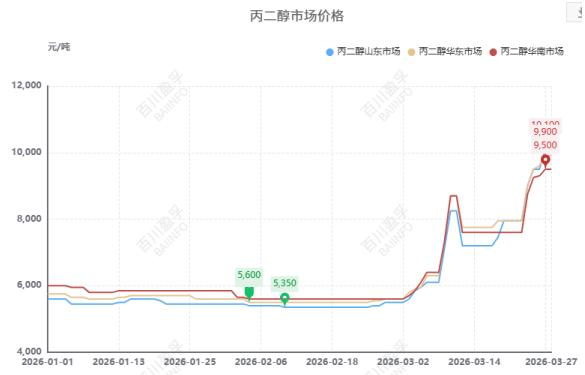

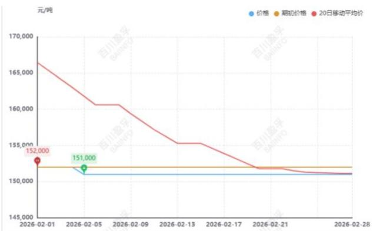

<table><tr><td></td><td></td><td></td><td rowspan=1 colspan=3>假设1</td><td rowspan=1 colspan=3>假设2</td></tr><tr><td rowspan=1 colspan=1>石大胜华</td><td rowspan=1 colspan=1>出货量（万吨)</td><td rowspan=1 colspan=1>单位盈利（万元/吨）</td><td rowspan=1 colspan=1>涨价(万元/吨)</td><td rowspan=1 colspan=1>单位盈利（万元/吨）</td><td rowspan=1 colspan=1>利润（亿元）</td><td rowspan=1 colspan=1>涨价(万元/吨）</td><td rowspan=1 colspan=1>单位盈利（万元/吨）</td><td rowspan=1 colspan=1>利润（亿元）</td></tr><tr><td rowspan=1 colspan=1>EC</td><td rowspan=1 colspan=1>15</td><td rowspan=1 colspan=1>0.15</td><td rowspan=1 colspan=1>0.1</td><td rowspan=1 colspan=1>0.2</td><td rowspan=1 colspan=1>3.4</td><td rowspan=1 colspan=1>0.2</td><td rowspan=1 colspan=1>0.3</td><td rowspan=1 colspan=1>4.5</td></tr><tr><td rowspan=1 colspan=1>DMC</td><td rowspan=1 colspan=1>15</td><td rowspan=1 colspan=1>-0.2</td><td rowspan=1 colspan=1>0</td><td rowspan=1 colspan=1>-0.2</td><td rowspan=1 colspan=1>-3.0</td><td rowspan=1 colspan=1>0</td><td rowspan=1 colspan=1>-0.2</td><td rowspan=1 colspan=1>-3.0</td></tr><tr><td rowspan=1 colspan=1>EMC</td><td rowspan=1 colspan=1>10</td><td rowspan=1 colspan=1>0.03</td><td rowspan=1 colspan=1>0</td><td rowspan=1 colspan=1>00</td><td rowspan=1 colspan=1>0.3</td><td rowspan=1 colspan=1>0</td><td rowspan=1 colspan=1>0.0</td><td rowspan=1 colspan=1>0.3</td></tr><tr><td rowspan=1 colspan=1>丙二醇</td><td rowspan=1 colspan=1>12</td><td rowspan=1 colspan=1>0</td><td rowspan=1 colspan=1>0.5</td><td rowspan=1 colspan=1>0.4</td><td rowspan=1 colspan=1>4.5</td><td rowspan=1 colspan=1>1</td><td rowspan=1 colspan=1>0.8</td><td rowspan=1 colspan=1>9.0</td></tr><tr><td rowspan=1 colspan=1>六氟</td><td rowspan=1 colspan=1>2.5</td><td rowspan=1 colspan=1>2.6</td><td rowspan=1 colspan=1>3</td><td rowspan=1 colspan=1>4.9</td><td rowspan=1 colspan=1>6.1</td><td rowspan=1 colspan=1>5</td><td rowspan=1 colspan=1>6.4</td><td rowspan=1 colspan=1>8.0</td></tr><tr><td rowspan=1 colspan=1>合计</td><td rowspan=1 colspan=1></td><td rowspan=1 colspan=1></td><td rowspan=1 colspan=1></td><td rowspan=1 colspan=1></td><td rowspan=1 colspan=1>11.3</td><td rowspan=1 colspan=1></td><td rowspan=1 colspan=1></td><td rowspan=1 colspan=1>18.8</td></tr><tr><td rowspan=1 colspan=1></td><td rowspan=1 colspan=1></td><td rowspan=1 colspan=1></td><td rowspan=1 colspan=1></td><td rowspan=1 colspan=1>假设1</td><td rowspan=1 colspan=1></td><td rowspan=1 colspan=1></td><td rowspan=1 colspan=1>假设2</td><td rowspan=1 colspan=1></td></tr><tr><td rowspan=1 colspan=1>海科新源</td><td rowspan=1 colspan=1>出货量(万吨)</td><td rowspan=1 colspan=1>单位盈利(万元/吨)</td><td rowspan=1 colspan=1>涨价(万元/吨）</td><td rowspan=1 colspan=1>单位盈利（万元/吨）</td><td rowspan=1 colspan=1>利润（亿元)</td><td rowspan=1 colspan=1>涨价(万元/吨）</td><td rowspan=1 colspan=1>单位盈利（万元/吨）</td><td rowspan=1 colspan=1>利润(亿元)</td></tr><tr><td rowspan=1 colspan=1>EC</td><td rowspan=1 colspan=1>30</td><td rowspan=1 colspan=1>0.15</td><td rowspan=1 colspan=1>0.1</td><td rowspan=1 colspan=1>0.2</td><td rowspan=1 colspan=1>6.8</td><td rowspan=1 colspan=1>0.2</td><td rowspan=1 colspan=1>0.3</td><td rowspan=1 colspan=1>9.0</td></tr><tr><td rowspan=1 colspan=1>DMC</td><td rowspan=1 colspan=1>20</td><td rowspan=1 colspan=1>-0.2</td><td rowspan=1 colspan=1>0</td><td rowspan=1 colspan=1>-0.2</td><td rowspan=1 colspan=1>-4.0</td><td rowspan=1 colspan=1>0</td><td rowspan=1 colspan=1>-0.2</td><td rowspan=1 colspan=1>-4.0</td></tr><tr><td rowspan=1 colspan=1>EMC</td><td rowspan=1 colspan=1>10</td><td rowspan=1 colspan=1>0.03</td><td rowspan=1 colspan=1>0</td><td rowspan=1 colspan=1>0.0</td><td rowspan=1 colspan=1>0.3</td><td rowspan=1 colspan=1>0</td><td rowspan=1 colspan=1>0.0</td><td rowspan=1 colspan=1>0.3</td></tr><tr><td rowspan=1 colspan=1>丙二醇</td><td rowspan=1 colspan=1>15</td><td rowspan=1 colspan=1>0</td><td rowspan=1 colspan=1>0.5</td><td rowspan=1 colspan=1>0.4</td><td rowspan=1 colspan=1>5.6</td><td rowspan=1 colspan=1>1</td><td rowspan=1 colspan=1>0.8</td><td rowspan=1 colspan=1>11.3</td></tr><tr><td rowspan=1 colspan=1>VC</td><td rowspan=1 colspan=1>1.1</td><td rowspan=1 colspan=1>6.8</td><td rowspan=1 colspan=1>2</td><td rowspan=1 colspan=1>8.3</td><td rowspan=1 colspan=1>9.1</td><td rowspan=1 colspan=1>5</td><td rowspan=1 colspan=1>10.5</td><td rowspan=1 colspan=1>11.6</td></tr><tr><td rowspan=1 colspan=1>合计</td><td rowspan=1 colspan=1></td><td rowspan=1 colspan=1></td><td rowspan=1 colspan=1></td><td rowspan=1 colspan=1></td><td rowspan=1 colspan=1>17.8</td><td rowspan=1 colspan=1></td><td rowspan=1 colspan=1></td><td rowspan=1 colspan=1>28.2</td></tr></table>

## 天赐材料：6F散单价格已上涨，盈利弹性显著

◆ 六氟供需紧平衡、我们预计26年供给进一步紧张。25年六氟行业供给30万吨+，其中小厂因成本较高部分产能关停，实际有效产能26万吨左右，天赐单月六氟排产0.8万吨，产能利用率85%，多氟多0.45万吨+，新线已满产，天际0.4万吨、宙邦0.2万吨均已满产，行业需求2万吨+已基本供给紧平衡，头部三家市占率达80%左右；26年，行业内仅石磊新增1.6万吨，天际新增1.5万吨产能26H2投产，行业有效供给我们预计43万吨，需求我们预计40万吨，供给紧平衡。

◆ 26年我们预计电解液出货100万吨+、六氟涨价盈利弹性明显。公司25年电解液出货超72万吨，同增40%+，我们预计25Q4出货22万吨，同环比+35%/+15%，我们预计26年Q1公司满产满销，出货略降，全年出货我们预计100万吨+，同增40%。我们预计25Q4外售锂盐折固约0.28万吨，环增40%，LIFSI外售0.29万吨，环比大幅增长400%，LIFSI添加比例明显提升，同比翻倍增长，26年我们预计出货4万吨，翻倍增长。盈利端，我们测算25Q4电解液单吨净利0.4万元+，较此前0.08万元大幅增长，对应六氟价格9-10万左右。26Q1六氟长单价格12万元/吨左右，按15万元/吨碳酸锂价格计算成本，对应公司单位净利我们预计可达0.6万元/吨左右，单位盈利进一步提升，弹性明显。

◆ 盈利预测：我们预计26-28年归母净利润70.3/83.0/97.8亿元，同比+416%/+18%/+18%，对应PE为13/11/9倍，给予26年20xPE，目标价69.2元，维持“买入”评级。

表 天赐材料盈利预测
<table><tr><td>盈利预测与估值</td><td>2024A</td><td>2025A</td><td>2026E</td><td>2027E</td><td>2028E</td></tr><tr><td>营业总收入(百万元)</td><td>12,518.30</td><td>16,649.89</td><td>32,667.77</td><td>38,078.51</td><td>46,525.09</td></tr><tr><td>同比(%)</td><td>-18.74</td><td>33.00</td><td>96.20</td><td>16.56</td><td>22.18</td></tr><tr><td>归母净利润(百万元)</td><td>483.93</td><td>1,361.92</td><td>7,029.95</td><td>8,304.57</td><td>9,775.79</td></tr><tr><td>同比(%)</td><td>-74.40</td><td>181.43</td><td>416.18</td><td>18.13</td><td>17.72</td></tr><tr><td>EPS-最新摊薄(元/股)</td><td>0.24</td><td>0.67</td><td>3.46</td><td>4.08</td><td>4.81</td></tr><tr><td>P/E（现价&amp;最新摊薄）</td><td>181.94</td><td>64.65</td><td>12.52</td><td>10.60</td><td>9.01</td></tr></table>

## 磷酸铁锂：碳酸锂库存收益显著，五代产品开始起量

## 供需格局：头部扩产加速，边际产能利用率维持

◆ 行业扩产较快，头部厂商仍有新增产能释放。铁锂行业22-24年规划项目均已投产，新建项目暂停，26年行业内裕能稳步扩产，我们预计26年新增35万吨，此外仅富临扩产较激进，年底产能达120万吨，邦普规划45万吨，26年我们预计贡献30万吨增量，其余扩产均谨慎，行业新增产能显著放缓。

表 龙头厂商的产能及扩产计划（万吨）
<table><tr><td rowspan=1 colspan=1></td><td rowspan=1 colspan=1>2022有效</td><td rowspan=1 colspan=1>2023有效</td><td rowspan=1 colspan=1>2024有效</td><td rowspan=1 colspan=1>2025有效</td><td rowspan=1 colspan=1>2026E有效</td><td rowspan=1 colspan=1>2027E有效</td></tr><tr><td rowspan=1 colspan=1>德方纳米</td><td rowspan=1 colspan=1>20.4</td><td rowspan=1 colspan=1>26.5</td><td rowspan=1 colspan=1>26.5</td><td rowspan=1 colspan=1>37.5</td><td rowspan=1 colspan=1>42.5</td><td rowspan=1 colspan=1>47.0</td></tr><tr><td rowspan=1 colspan=1>龙蟠科技</td><td rowspan=1 colspan=1>9.2</td><td rowspan=1 colspan=1>17.2</td><td rowspan=1 colspan=1>24.0</td><td rowspan=1 colspan=1>27.0</td><td rowspan=1 colspan=1>45.0</td><td rowspan=1 colspan=1>67.0</td></tr><tr><td rowspan=1 colspan=1>泰丰先行</td><td rowspan=1 colspan=1>2.0</td><td rowspan=1 colspan=1>6.0</td><td rowspan=1 colspan=1>8.0</td><td rowspan=1 colspan=1>12.0</td><td rowspan=1 colspan=1>14.0</td><td rowspan=1 colspan=1>14.0</td></tr><tr><td rowspan=1 colspan=1>比亚迪</td><td rowspan=1 colspan=1>2.0</td><td rowspan=1 colspan=1>4.0</td><td rowspan=1 colspan=1>4.0</td><td rowspan=1 colspan=1>4.0</td><td rowspan=1 colspan=1>4.0</td><td rowspan=1 colspan=1>2.0</td></tr><tr><td rowspan=1 colspan=1>国轩高科</td><td rowspan=1 colspan=1>7.0</td><td rowspan=1 colspan=1>10.0</td><td rowspan=1 colspan=1>15.0</td><td rowspan=1 colspan=1>20.0</td><td rowspan=1 colspan=1>20.0</td><td rowspan=1 colspan=1>20.0</td></tr><tr><td rowspan=1 colspan=1>万润新能</td><td rowspan=1 colspan=1>12.0</td><td rowspan=1 colspan=1>18.7</td><td rowspan=1 colspan=1>34.0</td><td rowspan=1 colspan=1>42.0</td><td rowspan=1 colspan=1>60.0</td><td rowspan=1 colspan=1>70.0</td></tr><tr><td rowspan=1 colspan=1>湖南裕能</td><td rowspan=1 colspan=1>34.8</td><td rowspan=1 colspan=1>55.3</td><td rowspan=1 colspan=1>75.3</td><td rowspan=1 colspan=1>105.0</td><td rowspan=1 colspan=1>140.0</td><td rowspan=1 colspan=1>180.0</td></tr><tr><td rowspan=1 colspan=1>贵州安达</td><td rowspan=1 colspan=1>9.0</td><td rowspan=1 colspan=1>14.0</td><td rowspan=1 colspan=1>15.0</td><td rowspan=1 colspan=1>15.0</td><td rowspan=1 colspan=1>25.0</td><td rowspan=1 colspan=1>35.0</td></tr><tr><td rowspan=1 colspan=1>斯特兰</td><td rowspan=1 colspan=1>1.0</td><td rowspan=1 colspan=1>1.0</td><td rowspan=1 colspan=1>1.0</td><td rowspan=1 colspan=1>1.0</td><td rowspan=1 colspan=1>1.0</td><td rowspan=1 colspan=1>1.0</td></tr><tr><td rowspan=1 colspan=1>富临精工</td><td rowspan=1 colspan=1>6.0</td><td rowspan=1 colspan=1>20.5</td><td rowspan=1 colspan=1>14.5</td><td rowspan=1 colspan=1>25.0</td><td rowspan=1 colspan=1>80.0</td><td rowspan=1 colspan=1>120.0</td></tr><tr><td rowspan=1 colspan=1>重庆特瑞</td><td rowspan=1 colspan=1>7.0</td><td rowspan=1 colspan=1>10.0</td><td rowspan=1 colspan=1>10.0</td><td rowspan=1 colspan=1>10.0</td><td rowspan=1 colspan=1>10.0</td><td rowspan=1 colspan=1>10.0</td></tr><tr><td rowspan=1 colspan=1>厦钨新能</td><td rowspan=1 colspan=1></td><td rowspan=1 colspan=1>0.1</td><td rowspan=1 colspan=1>1.6</td><td rowspan=1 colspan=1>2.0</td><td rowspan=1 colspan=1>4.0</td><td rowspan=1 colspan=1>4.0</td></tr><tr><td rowspan=1 colspan=1>中伟与当升</td><td rowspan=1 colspan=1></td><td rowspan=1 colspan=1>0.2</td><td rowspan=1 colspan=1>4.0</td><td rowspan=1 colspan=1>6.0</td><td rowspan=1 colspan=1>12.0</td><td rowspan=1 colspan=1>20.0</td></tr><tr><td rowspan=1 colspan=1>长远锂科</td><td rowspan=1 colspan=1></td><td rowspan=1 colspan=1>0.5</td><td rowspan=1 colspan=1>4.8</td><td rowspan=1 colspan=1>6.0</td><td rowspan=1 colspan=1>6.0</td><td rowspan=1 colspan=1>6.0</td></tr><tr><td rowspan=1 colspan=1>天原股份</td><td rowspan=1 colspan=1></td><td rowspan=1 colspan=1></td><td rowspan=1 colspan=1></td><td rowspan=1 colspan=1>5.0</td><td rowspan=1 colspan=1>5.0</td><td rowspan=1 colspan=1>5.0</td></tr><tr><td rowspan=1 colspan=1>泰和科技</td><td rowspan=1 colspan=1></td><td rowspan=1 colspan=1>0.3</td><td rowspan=1 colspan=1>1.0</td><td rowspan=1 colspan=1>1.0</td><td rowspan=1 colspan=1>0.0</td><td rowspan=1 colspan=1>0.3</td></tr><tr><td rowspan=1 colspan=1>川发龙蟒</td><td rowspan=1 colspan=1></td><td rowspan=1 colspan=1></td><td rowspan=1 colspan=1>2.0</td><td rowspan=1 colspan=1>2.0</td><td rowspan=1 colspan=1>2.0</td><td rowspan=1 colspan=1>2.0</td></tr><tr><td rowspan=1 colspan=1>光华科技</td><td rowspan=1 colspan=1>1.4</td><td rowspan=1 colspan=1>1.4</td><td rowspan=1 colspan=1>1.4</td><td rowspan=1 colspan=1>1.4</td><td rowspan=1 colspan=1>1.4</td><td rowspan=1 colspan=1>1.4</td></tr><tr><td rowspan=1 colspan=1>丰元股份</td><td rowspan=1 colspan=1>1.0</td><td rowspan=1 colspan=1>3.5</td><td rowspan=1 colspan=1>10.0</td><td rowspan=1 colspan=1>10.0</td><td rowspan=1 colspan=1>10.0</td><td rowspan=1 colspan=1>10.0</td></tr><tr><td rowspan=1 colspan=1>司尔特</td><td rowspan=1 colspan=1></td><td rowspan=1 colspan=1>1.0</td><td rowspan=1 colspan=1>2.0</td><td rowspan=1 colspan=1>2.0</td><td rowspan=1 colspan=1>2.0</td><td rowspan=1 colspan=1>0.0</td></tr><tr><td rowspan=1 colspan=1>圣钒科技</td><td rowspan=1 colspan=1>5.0</td><td rowspan=1 colspan=1>7.5</td><td rowspan=1 colspan=1>10.0</td><td rowspan=1 colspan=1>30.0</td><td rowspan=1 colspan=1>50.0</td><td rowspan=1 colspan=1>80.0</td></tr><tr><td rowspan=1 colspan=1>融通高科</td><td rowspan=1 colspan=1>9.5</td><td rowspan=1 colspan=1>18.0</td><td rowspan=1 colspan=1>35.0</td><td rowspan=1 colspan=1>43.0</td><td rowspan=1 colspan=1>43.0</td><td rowspan=1 colspan=1>43.0</td></tr><tr><td rowspan=1 colspan=1>万华化学</td><td rowspan=1 colspan=1></td><td rowspan=1 colspan=1></td><td rowspan=1 colspan=1>5.0</td><td rowspan=1 colspan=1>10.0</td><td rowspan=1 colspan=1>15.0</td><td rowspan=1 colspan=1>30.0</td></tr><tr><td rowspan=1 colspan=1>金堂时代</td><td rowspan=1 colspan=1></td><td rowspan=1 colspan=1>10.0</td><td rowspan=1 colspan=1>15.0</td><td rowspan=1 colspan=1>20.0</td><td rowspan=1 colspan=1>20.0</td><td rowspan=1 colspan=1>20.0</td></tr><tr><td rowspan=1 colspan=1>湖南鹏博</td><td rowspan=1 colspan=1></td><td rowspan=1 colspan=1></td><td rowspan=1 colspan=1>3.0</td><td rowspan=1 colspan=1>5.0</td><td rowspan=1 colspan=1>5.0</td><td rowspan=1 colspan=1>5.0</td></tr><tr><td rowspan=1 colspan=1>协鑫锂能</td><td rowspan=1 colspan=1></td><td rowspan=1 colspan=1></td><td rowspan=1 colspan=1>9.0</td><td rowspan=1 colspan=1>15.0</td><td rowspan=1 colspan=1>20.0</td><td rowspan=1 colspan=1>30.0</td></tr><tr><td rowspan=1 colspan=1>其他</td><td rowspan=1 colspan=1></td><td rowspan=1 colspan=1></td><td rowspan=1 colspan=1>70.0</td><td rowspan=1 colspan=1>70.0</td><td rowspan=1 colspan=1>70.0</td><td rowspan=1 colspan=1>70.0</td></tr><tr><td rowspan=1 colspan=1>湖南邦普</td><td rowspan=1 colspan=1></td><td rowspan=1 colspan=1></td><td rowspan=1 colspan=1></td><td rowspan=1 colspan=1></td><td rowspan=1 colspan=1>30.0</td><td rowspan=1 colspan=1>45.0</td></tr><tr><td rowspan=1 colspan=2>合计                 127.3</td><td rowspan=1 colspan=1>225.7</td><td rowspan=1 colspan=1>401.1</td><td rowspan=1 colspan=1>526.9</td><td rowspan=1 colspan=1>736.9</td><td rowspan=1 colspan=1>937.7</td></tr></table>

## 铁锂：25年产能利用率改善，26年稳中有升

◆ 我们预计26年行业供需达84%，头部厂商维持满产状态。25年产能利用率82%，需求下半年超预期，25H2产能利用率80%+，头部满产满销，我们预计26年行业产能利用率84%，考虑产品结构、工艺结构、客户配套，实际产能利用率高于测算利用率，且旺季产能利用率有望达到90%+，拐点已至。27年产能利用率我们预计小幅下降。26H2行业新增产能释放，我们预计27年产能利用率下降至82%。

表 磷酸铁锂正极供需测算
<table><tr><td>铁锂正极</td><td>2022年</td><td>2023年</td><td>2024年</td><td>2025年</td><td>2026年</td><td>2027年</td></tr><tr><td>供给 (万吨)</td><td>114.6</td><td>225.7</td><td>401.1</td><td>526.9</td><td>736.9</td><td>937.7</td></tr><tr><td>-同比</td><td>166%</td><td>97%</td><td>78%</td><td>31%</td><td>40%</td><td>27%</td></tr><tr><td>需求 (万吨)</td><td>100.9</td><td>163.4</td><td>250.8</td><td>433.7</td><td>620.0</td><td>767.7</td></tr><tr><td>-同比</td><td>157%</td><td>62%</td><td>53%</td><td>73%</td><td>43%</td><td>24%</td></tr><tr><td>产能利用率</td><td>88%</td><td>72%</td><td>63%</td><td>82%</td><td>84%</td><td>82%</td></tr></table>

<table><tr><td>单位：万吨</td><td>2023年</td><td>同比</td><td>2024年</td><td>同比</td><td>2025年</td><td>同比</td><td>2026年</td><td>同比</td></tr><tr><td>德方</td><td>21.4</td><td>19%</td><td>24.0</td><td>12%</td><td>28.0</td><td>17%</td><td>40.0</td><td>43%</td></tr><tr><td>裕能</td><td>50.0</td><td>53%</td><td>72.0</td><td> 44%</td><td>107.0</td><td> 49%</td><td>150.0</td><td> 40%</td></tr><tr><td>安达</td><td>6.2</td><td>-6%</td><td>5.0</td><td>-19%</td><td>8.0</td><td>60%</td><td>20.0</td><td>150%</td></tr><tr><td>比亚迪</td><td>3.5</td><td>0%</td><td>3.5</td><td>0%</td><td>3.5</td><td>0%</td><td>3.5</td><td>0%</td></tr><tr><td>国轩</td><td>7.6</td><td>17%</td><td>12.0</td><td>58%</td><td>15.0</td><td>25%</td><td>17.0</td><td>13%</td></tr><tr><td>富临精工</td><td>4.8</td><td>0%</td><td>12.0</td><td>150%</td><td>25.0</td><td>108%</td><td>80.0</td><td>220%</td></tr><tr><td>龙蟠科技</td><td>11.1</td><td>11%</td><td>18.0</td><td>62%</td><td>20.0</td><td>11%</td><td>42.0</td><td>110%</td></tr><tr><td>金堂时代</td><td>6.3</td><td></td><td>8.0</td><td>27%</td><td>10.0</td><td>25%</td><td>12.0</td><td>20%</td></tr><tr><td>华友控股</td><td>9.6</td><td>170%</td><td>10.0</td><td>4%</td><td>30.0</td><td>200%</td><td>50.0</td><td>67%</td></tr><tr><td>山东丰元</td><td>3.7</td><td>164%</td><td>4.5</td><td>22%</td><td>15.0</td><td>233%</td><td>30.0</td><td>100%</td></tr><tr><td>融通高科</td><td>12.0</td><td>20%</td><td>6.0</td><td>-50%</td><td>6.0</td><td>0%</td><td>6.0</td><td>0%</td></tr><tr><td>万润</td><td>22.0</td><td>139%</td><td>20.0</td><td>-9%</td><td>35.0</td><td>75%</td><td>45.0</td><td>29%</td></tr><tr><td>主流厂商合计</td><td>158.2</td><td>49%</td><td>195.0</td><td>23%</td><td>302.5</td><td>55%</td><td>495.5</td><td>64%</td></tr></table>

## 盈利：行业挺价意愿强，Q1受益于碳酸锂涨价

◆ 25H2铁锂厂商盈利好转，26Q1盈利我们预计将环比大幅度提升，行业拐点明确。25年Q4裕能单吨利润0.13万元，较25Q1大幅提升，富临高压实产品赚取技术溢价，Q4单吨盈利0.12万元，表现亮眼。德方、万润、龙蟠单吨亏损25H2均有所收窄。26Q1盈利我们预计行业将受益于碳酸锂涨价，单位盈利环比大幅度提升。

表：铁锂正极主流厂商季度盈利情况
<table><tr><td rowspan=1 colspan=1>代表公司</td><td rowspan=1 colspan=1>单位</td><td rowspan=1 colspan=1>2019A</td><td rowspan=1 colspan=1>2020A</td><td rowspan=1 colspan=1>2021A</td><td rowspan=1 colspan=1>2022A</td><td rowspan=1 colspan=1>2023Q1 2023Q22</td><td rowspan=1 colspan=1>2023Q1 2023Q22</td><td rowspan=1 colspan=1>2023Q3</td><td rowspan=1 colspan=1>2023Q4</td><td rowspan=1 colspan=1>2024Q1</td><td rowspan=1 colspan=1>2024Q2</td><td rowspan=1 colspan=1>2024Q3</td><td rowspan=1 colspan=1>2024Q4</td><td rowspan=1 colspan=1>2025Q1</td><td rowspan=1 colspan=1>2025Q22025Q32</td><td rowspan=1 colspan=1>2025Q22025Q32</td><td rowspan=1 colspan=1>2025Q4</td></tr><tr><td rowspan=3 colspan=1>裕能</td><td rowspan=1 colspan=1>出货（万吨）</td><td rowspan=1 colspan=1>1.3</td><td rowspan=1 colspan=1>3.1</td><td rowspan=1 colspan=1>12.1</td><td rowspan=1 colspan=1>32.4</td><td rowspan=1 colspan=1>10.3</td><td rowspan=1 colspan=1>11.6</td><td rowspan=1 colspan=1>15.1</td><td rowspan=1 colspan=1>13.7</td><td rowspan=1 colspan=1>13.6</td><td rowspan=1 colspan=1>17.3</td><td rowspan=1 colspan=1>16.7</td><td rowspan=1 colspan=1>23.5</td><td rowspan=1 colspan=1>22.3</td><td rowspan=1 colspan=1>25.8</td><td rowspan=1 colspan=1>30.4</td><td rowspan=1 colspan=1>31.0</td></tr><tr><td rowspan=1 colspan=1>单价（万元/吨）</td><td rowspan=1 colspan=1>5.02</td><td rowspan=1 colspan=1>3.35</td><td rowspan=1 colspan=1>6.46</td><td rowspan=1 colspan=1>14.89</td><td rowspan=1 colspan=1>14.52</td><td rowspan=1 colspan=1>9.74</td><td rowspan=1 colspan=1>8.34</td><td rowspan=1 colspan=1>5.79</td><td rowspan=1 colspan=1>3.76</td><td rowspan=1 colspan=1>4.09</td><td rowspan=1 colspan=1>3.45</td><td rowspan=1 colspan=1>3.24</td><td rowspan=1 colspan=1>3.43</td><td rowspan=1 colspan=1>3.33</td><td rowspan=1 colspan=1>3.30</td><td rowspan=1 colspan=1>3.30</td></tr><tr><td rowspan=1 colspan=1>单位净利（万元/吨）</td><td rowspan=1 colspan=1>0.44</td><td rowspan=1 colspan=1>0.12</td><td rowspan=1 colspan=1>0.98</td><td rowspan=1 colspan=1>0.93</td><td rowspan=1 colspan=1>0.27</td><td rowspan=1 colspan=1>0.83</td><td rowspan=1 colspan=1>0.2</td><td rowspan=1 colspan=1>0.03</td><td rowspan=1 colspan=1>0.1</td><td rowspan=1 colspan=1>0.13</td><td rowspan=1 colspan=1>0.06</td><td rowspan=1 colspan=1>0.04</td><td rowspan=1 colspan=1>0.04</td><td rowspan=1 colspan=1>0.11</td><td rowspan=1 colspan=1>0.11</td><td rowspan=1 colspan=1>0.13</td></tr><tr><td rowspan=3 colspan=1>德方</td><td rowspan=1 colspan=1>出货（万吨）</td><td rowspan=1 colspan=1>1.8</td><td rowspan=1 colspan=1>2.7</td><td rowspan=1 colspan=1>9.1</td><td rowspan=1 colspan=1>17.2</td><td rowspan=1 colspan=1>4</td><td rowspan=1 colspan=1>5</td><td rowspan=1 colspan=1>6.9</td><td rowspan=1 colspan=1>5.5</td><td rowspan=1 colspan=1>4.5</td><td rowspan=1 colspan=1>6.1</td><td rowspan=1 colspan=1>6.2</td><td rowspan=1 colspan=1>5.8</td><td rowspan=1 colspan=1>6.1</td><td rowspan=1 colspan=1>6.1</td><td rowspan=1 colspan=1>7.2</td><td rowspan=1 colspan=1>8.0</td></tr><tr><td rowspan=1 colspan=1>单价（万元/吨）</td><td rowspan=1 colspan=1>4.99</td><td rowspan=1 colspan=1>3.34</td><td rowspan=1 colspan=1>5.96</td><td rowspan=1 colspan=1>14.78</td><td rowspan=1 colspan=1>13.97</td><td rowspan=1 colspan=1>8.92</td><td rowspan=1 colspan=1>8.87</td><td rowspan=1 colspan=1>5.49</td><td rowspan=1 colspan=1>4.75</td><td rowspan=1 colspan=1>4.54</td><td rowspan=1 colspan=1>3.99</td><td rowspan=1 colspan=1>2.12</td><td rowspan=1 colspan=1>3.71</td><td rowspan=1 colspan=1>3.48</td><td rowspan=1 colspan=1>3.37</td><td rowspan=1 colspan=1>4.20</td></tr><tr><td rowspan=1 colspan=1>单位净利（万元/吨）</td><td rowspan=1 colspan=1>0.21</td><td rowspan=1 colspan=1>-0.07</td><td rowspan=1 colspan=1>0.91</td><td rowspan=1 colspan=1>1.56</td><td rowspan=1 colspan=1> -2.11</td><td rowspan=1 colspan=1>-0.76</td><td rowspan=1 colspan=1>0.07</td><td rowspan=1 colspan=1> -1.29</td><td rowspan=1 colspan=1>-0.55</td><td rowspan=1 colspan=1>-0.69</td><td rowspan=1 colspan=1>-0.64</td><td rowspan=1 colspan=1>-1.12</td><td rowspan=1 colspan=1>-0.37</td><td rowspan=1 colspan=1>-0.5</td><td rowspan=1 colspan=1>-0.17</td><td rowspan=1 colspan=1>-0.2</td></tr><tr><td rowspan=3 colspan=1>万润</td><td rowspan=1 colspan=1>出货（万吨）</td><td rowspan=1 colspan=1>1.5</td><td rowspan=1 colspan=1>1.9</td><td rowspan=1 colspan=1>4</td><td rowspan=1 colspan=1>9.2</td><td rowspan=1 colspan=1>2.2</td><td rowspan=1 colspan=1>4</td><td rowspan=1 colspan=1>5.6</td><td rowspan=1 colspan=1>4.6</td><td rowspan=1 colspan=1>3.1</td><td rowspan=1 colspan=1>4.7</td><td rowspan=1 colspan=1>5.6</td><td rowspan=1 colspan=1>9</td><td rowspan=1 colspan=1>7.4</td><td rowspan=1 colspan=1>7.5</td><td rowspan=1 colspan=1>9.9</td><td rowspan=1 colspan=1>11.4</td></tr><tr><td rowspan=1 colspan=1>单价（万元/吨）</td><td rowspan=1 colspan=1>5.35</td><td rowspan=1 colspan=1>3.72</td><td rowspan=1 colspan=1>6.12</td><td rowspan=1 colspan=1>14.91</td><td rowspan=1 colspan=1>15.91</td><td rowspan=1 colspan=1>7.57</td><td rowspan=1 colspan=1>8.52</td><td rowspan=1 colspan=1>5.32</td><td rowspan=1 colspan=1>4.21</td><td rowspan=1 colspan=1>4.31</td><td rowspan=1 colspan=1>3.59</td><td rowspan=1 colspan=1>3.35</td><td rowspan=1 colspan=1>3.49</td><td rowspan=1 colspan=1>3.27</td><td rowspan=1 colspan=1>3.31</td><td rowspan=1 colspan=1>3.40</td></tr><tr><td rowspan=1 colspan=1>单位净利（万元/吨）</td><td rowspan=1 colspan=1>-0.54</td><td rowspan=1 colspan=1>-0.27</td><td rowspan=1 colspan=1>0.85</td><td rowspan=1 colspan=1>1.04</td><td rowspan=1 colspan=1>-0.15</td><td rowspan=1 colspan=1> -2.01</td><td rowspan=1 colspan=1>-0.2</td><td rowspan=1 colspan=1>-1.2</td><td rowspan=1 colspan=1>-0.42</td><td rowspan=1 colspan=1>-0.58</td><td rowspan=1 colspan=1>-0.3</td><td rowspan=1 colspan=1>-0.3</td><td rowspan=1 colspan=1>-0.22</td><td rowspan=1 colspan=1>-0.26</td><td rowspan=1 colspan=1>-0.09</td><td rowspan=1 colspan=1>0.0</td></tr><tr><td rowspan=3 colspan=1>龙蟠</td><td rowspan=1 colspan=1>出货（万吨）</td><td rowspan=1 colspan=1>1</td><td rowspan=1 colspan=1>-</td><td rowspan=1 colspan=1>3.1</td><td rowspan=1 colspan=1>9.5</td><td rowspan=1 colspan=1>1.2</td><td rowspan=1 colspan=1>2.5</td><td rowspan=1 colspan=1>3.3</td><td rowspan=1 colspan=1>3.8</td><td rowspan=1 colspan=1>2.7</td><td rowspan=1 colspan=1>5.2</td><td rowspan=1 colspan=1>5.6</td><td rowspan=1 colspan=1>4.3</td><td rowspan=1 colspan=1>3.5</td><td rowspan=1 colspan=1>4.3</td><td rowspan=1 colspan=1>5.4</td><td rowspan=1 colspan=1>5.4</td></tr><tr><td rowspan=1 colspan=1>单价（万元/吨）</td><td rowspan=1 colspan=1>-</td><td rowspan=1 colspan=1>1</td><td rowspan=1 colspan=1>6.95</td><td rowspan=1 colspan=1>14.54</td><td rowspan=1 colspan=1>14.96</td><td rowspan=1 colspan=1>9.74</td><td rowspan=1 colspan=1>4.31</td><td rowspan=1 colspan=1>5.14</td><td rowspan=1 colspan=1>3.69</td><td rowspan=1 colspan=1>3.47</td><td rowspan=1 colspan=1>3.37</td><td rowspan=1 colspan=1>2.91</td><td rowspan=1 colspan=1>-</td><td rowspan=1 colspan=1>-</td><td rowspan=1 colspan=1>-</td><td rowspan=1 colspan=1>-</td></tr><tr><td rowspan=1 colspan=1>单位净利（万元/吨）</td><td rowspan=1 colspan=1>:</td><td rowspan=1 colspan=1>：</td><td rowspan=1 colspan=1>0.74</td><td rowspan=1 colspan=1>1.05</td><td rowspan=1 colspan=1>-0.43</td><td rowspan=1 colspan=1>-1.9</td><td rowspan=1 colspan=1>-0.15</td><td rowspan=1 colspan=1>-0.67</td><td rowspan=1 colspan=1>-0.68</td><td rowspan=1 colspan=1>-0.3</td><td rowspan=1 colspan=1>-0.26</td><td rowspan=1 colspan=1>-0.44</td><td rowspan=1 colspan=1>-0.28</td><td rowspan=1 colspan=1>-0.28</td><td rowspan=1 colspan=1>-0.13</td><td rowspan=1 colspan=1>-0.2</td></tr><tr><td rowspan=3 colspan=1>富临</td><td rowspan=1 colspan=1>出货（万吨）</td><td rowspan=1 colspan=1>0.1</td><td rowspan=1 colspan=1>0.2</td><td rowspan=1 colspan=1>1</td><td rowspan=1 colspan=1>4.4</td><td rowspan=1 colspan=1>0.3</td><td rowspan=1 colspan=1>1.2</td><td rowspan=1 colspan=1>1.6</td><td rowspan=1 colspan=1>1.5</td><td rowspan=1 colspan=1>1.7</td><td rowspan=1 colspan=1>3</td><td rowspan=1 colspan=1>3.5</td><td rowspan=1 colspan=1>4.4</td><td rowspan=1 colspan=1>4.5</td><td rowspan=1 colspan=1>6</td><td rowspan=1 colspan=1>6.5</td><td rowspan=1 colspan=1>7</td></tr><tr><td rowspan=1 colspan=1>单价（万元/吨）</td><td rowspan=1 colspan=1>1.47</td><td rowspan=1 colspan=1>2.55</td><td rowspan=1 colspan=1>6.48</td><td rowspan=1 colspan=1>10.99</td><td rowspan=1 colspan=1>-</td><td rowspan=1 colspan=1>1</td><td rowspan=1 colspan=1>1</td><td rowspan=1 colspan=1>-</td><td rowspan=1 colspan=1>-</td><td rowspan=1 colspan=1>1</td><td rowspan=1 colspan=1>·</td><td rowspan=1 colspan=1>-</td><td rowspan=1 colspan=1>：</td><td rowspan=1 colspan=1>·</td><td rowspan=1 colspan=1>1</td><td rowspan=1 colspan=1>-</td></tr><tr><td rowspan=1 colspan=1>单位净利（万元/吨）</td><td rowspan=1 colspan=1>-9.62</td><td rowspan=1 colspan=1>：</td><td rowspan=1 colspan=1>0.21</td><td rowspan=1 colspan=1>0.65</td><td rowspan=1 colspan=1>-9.33</td><td rowspan=1 colspan=1> -2.33</td><td rowspan=1 colspan=1>-1.56</td><td rowspan=1 colspan=1> -1.7</td><td rowspan=1 colspan=1>-0.35</td><td rowspan=1 colspan=1>-0.1</td><td rowspan=1 colspan=1>0.08</td><td rowspan=1 colspan=1>0</td><td rowspan=1 colspan=1>0.07</td><td rowspan=1 colspan=1>0.1</td><td rowspan=1 colspan=1>0.1</td><td rowspan=1 colspan=1>0.12</td></tr></table>

数据来源：百川，SMM, 东吴证券研究所

## 盈利：加工费反弹+新产品放量，盈利弹性可观

◆ 26Q1龙头已成功涨价，传导原材料价格上涨。Q1末B客户铁锂正极涨价2000元/吨左右对冲原材料磷、铁成本上涨，C客户高端产品小幅提价，总体经营性盈利小幅提升。宁德时代支付预付款支持富临精工扩产，加快江西及四川合计36万吨产能建设，且计划对富临增资，进一步加速扩产计划，此外与万润新能签订2025-2030年供132万吨的铁锂供货协议，宁德通过合作协议锁定部分需求，充分说明行业高景气。

◆ 五代高端产品开始起量，可赚取技术溢价。25年头部电池厂2.6压实铁锂渗透率快速提升，26年2.7压实五代产品开始起量，当前仅富临可供应，我们预计公司Q1单吨利润提升至2000元+，5代产品占比提升至25%，年内五代产品占比有望进一步提升至50%，是C五代产品的主供。产品升级+降本，公司全年单吨利润有望提升至2500-3000元。

图：主流铁锂公司盈利预测
<table><tr><td rowspan=2 colspan=8>市值    26年出货 27年出货                      26E (涨价）(亿元)    （万吨、亿 （万吨、亿涨价预期 单位盈利    业绩       估值平        平）</td><td rowspan=1 colspan=4>27E</td></tr><tr><td rowspan=1 colspan=1>单位盈利</td><td rowspan=1 colspan=1>业绩</td><td rowspan=1 colspan=1>估值</td><td rowspan=1 colspan=1>涨价预期</td><td rowspan=1 colspan=1>单位盈利</td><td rowspan=1 colspan=1>业绩</td><td rowspan=1 colspan=1>估值</td></tr><tr><td rowspan=1 colspan=1>湖南裕能</td><td rowspan=1 colspan=1>682</td><td rowspan=1 colspan=1>150</td><td rowspan=1 colspan=1>200</td><td rowspan=1 colspan=1>0.15</td><td rowspan=1 colspan=1>0.30</td><td rowspan=1 colspan=1>45</td><td rowspan=1 colspan=1>15</td><td rowspan=1 colspan=1>0</td><td rowspan=1 colspan=1>0.30</td><td rowspan=1 colspan=1>61</td><td rowspan=1 colspan=1>11</td></tr><tr><td rowspan=1 colspan=1>富临精工</td><td rowspan=1 colspan=1>433</td><td rowspan=1 colspan=1>80</td><td rowspan=1 colspan=1>150</td><td rowspan=1 colspan=1>0.15</td><td rowspan=1 colspan=1>0.31</td><td rowspan=1 colspan=1>21</td><td rowspan=1 colspan=1>21</td><td rowspan=1 colspan=1>0</td><td rowspan=1 colspan=1>0.31</td><td rowspan=1 colspan=1>43</td><td rowspan=1 colspan=1>10</td></tr><tr><td rowspan=1 colspan=1>德方纳米</td><td rowspan=1 colspan=1>129</td><td rowspan=1 colspan=1>40</td><td rowspan=1 colspan=1>50</td><td rowspan=1 colspan=1>0.15</td><td rowspan=1 colspan=1>0.11</td><td rowspan=1 colspan=1>5</td><td rowspan=1 colspan=1>29</td><td rowspan=1 colspan=1>0</td><td rowspan=1 colspan=1>0.11</td><td rowspan=1 colspan=1>6</td><td rowspan=1 colspan=1>23</td></tr><tr><td rowspan=1 colspan=1>龙蟠科技</td><td rowspan=1 colspan=1>143</td><td rowspan=1 colspan=1>40</td><td rowspan=1 colspan=1>50</td><td rowspan=1 colspan=1>0.15</td><td rowspan=1 colspan=1>0.16</td><td rowspan=1 colspan=1>8</td><td rowspan=1 colspan=1>17</td><td rowspan=1 colspan=1>0</td><td rowspan=1 colspan=1>0.16</td><td rowspan=1 colspan=1>10</td><td rowspan=1 colspan=1>14</td></tr><tr><td rowspan=1 colspan=1>万润新能</td><td rowspan=1 colspan=1>161</td><td rowspan=1 colspan=1>60</td><td rowspan=1 colspan=1>75</td><td rowspan=1 colspan=1>0.15</td><td rowspan=1 colspan=1>0.14</td><td rowspan=1 colspan=1>13</td><td rowspan=1 colspan=1>13</td><td rowspan=1 colspan=1>0</td><td rowspan=1 colspan=1>0.14</td><td rowspan=1 colspan=1>11</td><td rowspan=1 colspan=1>15</td></tr></table>

## 湖南裕能：挺价意愿显著，盈利弹性明显

◆ 公司出货满产满销、龙头地位稳固。我们预计公司25Q4铁锂出货33万吨，同增35%+，环比微增，份额进一步提升，我们预计全年出货超110万吨，同增50%+，我们预计26年出货150万吨+，同增35%+，储能需求超预期公司充分受益。此外公司高端产品出货占比已达50%+，YN-13产品逐步起量，26年高端产品出货占比我们预计提升至70%，远期有望提升至80%，龙头地位稳固。

◆ 供不应求公司涨价落地、盈利弹性可观。我们测算公司25Q4单吨盈利近0.2万元，环比大幅提升，主要系Q4部分客户涨价落地，叠加产品结构优化、碳酸锂涨价带来一定库存收益，当前公司供不应求，26年大客户跟进，整体盈利水平有望提升0.1万/吨。另外，公司120万吨磷矿2026年投产爬坡，我们预计将增厚公司利润。

◆ 盈利预测：我们预计25-27年归母净利12.8/35.0/47.3亿元，同比分别+116%/+174%/+35%，对应PE46/17/12X，给予26年20x PE，目标价92元，维持“买入”评级。

表 湖南裕能盈利预测
<table><tr><td>盈利预测与估值</td><td>2023A</td><td>2024A</td><td>2025E</td><td>2026E</td><td>2027E</td></tr><tr><td>营业总收入(百万元)</td><td>41,357.67</td><td>22,598.53</td><td>36,766.14</td><td>62,792.12</td><td>81,574.52</td></tr><tr><td>同比(%)</td><td>-3.35</td><td>-45.36</td><td>62.69</td><td>70.79</td><td>29.91</td></tr><tr><td>归母净利润(百万元)</td><td>1,580.63</td><td>593.55</td><td>1,279.72</td><td>3,500.95</td><td>4,730.96</td></tr><tr><td>同比(%)</td><td>-47.44</td><td>-62.45</td><td>115.60</td><td>173.57</td><td>35.13</td></tr><tr><td>EPS-最新摊薄(元/股)</td><td>2.08</td><td>0.78</td><td>1.68</td><td>4.60</td><td>6.22</td></tr><tr><td>P/E（现价&amp;最新摊薄）</td><td>37.33</td><td>99.40</td><td>46.10</td><td>16.85</td><td>12.47</td></tr></table>

## 富临精工：高端铁锂供不应求，宁德控股加速扩产

◆ 高端铁锂产能紧缺、宁德加大布局，公司扩产加速。储能需求超预期、动力铁锂份额提升，一二线铁锂正极公司已满产，当前价格底部，厂商扩产意愿较弱，后续供需格局大幅好转，且高端产能已供不应求。此前富临公告宁德将对其支付15亿预付款，用于原料采购和产能建设，此番进一步控股，我们预计后续将加大产能建设。按照宁德26年铁锂正极排产550gwh，对应135万吨铁锂正极需求，我们预计升华26年可满足50万吨，邦普可满足30万吨，仍需对外采购55万吨。升华扩产加速，我们预计26年产能50万吨，27年100万吨，连续翻倍增长。

◆ 铁锂正极加工费有望小幅上调、盈利改善可期。铁锂正极二线厂商已连续亏损3年，扩产意愿较弱，当前产能利用率大幅提升，涨价诉求强烈，我们预计散单价格率先小幅提升，26年长协价格有望跟涨，盈利将改善。

◆ 盈利预测：我们预计25-27年归母净利预期至5.4/20/28亿元，同增37%/273%/36%，对应PE为70/19/14倍，维持“买入”评级。

表 富临精工盈利预测
<table><tr><td>盈利预测与估值</td><td>2023A</td><td>2024A</td><td>2025E</td><td>2026E</td><td>2027E</td></tr><tr><td>营业总收入 (百万元)</td><td>5,761.27</td><td>8,470.24</td><td>12,646.98</td><td>40,795.10</td><td>57,074.39</td></tr><tr><td>同比(%)</td><td>-21.58</td><td>47.02</td><td>49.31</td><td>222.57</td><td>39.90</td></tr><tr><td>归母净利润(百万元)</td><td>-542.73</td><td>396.78</td><td>543.29</td><td>2,027.95</td><td>2,761.42</td></tr><tr><td>同比(%)</td><td>-184.12</td><td>173.11</td><td>36.92</td><td>273.27</td><td>36.17</td></tr><tr><td>EPS-最新摊薄(元/股)</td><td>-0.32</td><td>0.23</td><td>0.32</td><td>1.19</td><td>1.62</td></tr><tr><td>P/E（现价&amp;最新摊薄）</td><td>-70.13</td><td>95.92</td><td>70.05</td><td>18.77</td><td>13.78</td></tr></table>

## 负极：价格见底，盈利有梯度差异，龙头较高

## 供给：头部厂商扩产放缓，产能倾向于海外

◆ 行业扩产集中头部，且头部厂商扩产倾向海外。尚太、中科、璞泰来26年稳步扩产，26年分别新增产能10万吨左右，杉杉受公司管理影响扩产放缓，行业扩产基本集中于头部，国内扩产基本放缓，后续贝特瑞、尚太扩产主要集中于海外，26年海外新增产能落地。

表：全球负极产能集中于国内，海外产能近20万吨，后续国内厂商扩产倾向于海外（单位：万吨）
<table><tr><td rowspan=1 colspan=1>企业名称</td><td rowspan=1 colspan=1>2023有效产能</td><td rowspan=1 colspan=1>2024有效产能</td><td rowspan=1 colspan=1>2025有效产能</td><td rowspan=1 colspan=1>2026E有效产能</td><td rowspan=1 colspan=1>2027E有效产能</td></tr><tr><td rowspan=1 colspan=1>璞泰来</td><td rowspan=1 colspan=1>18</td><td rowspan=1 colspan=1>20</td><td rowspan=1 colspan=1>25</td><td rowspan=1 colspan=1>25</td><td rowspan=1 colspan=1>35</td></tr><tr><td rowspan=1 colspan=1>杉杉股份</td><td rowspan=1 colspan=1>27.0</td><td rowspan=1 colspan=1>35.0</td><td rowspan=1 colspan=1>45.0</td><td rowspan=1 colspan=1>50.0</td><td rowspan=1 colspan=1>50.0</td></tr><tr><td rowspan=1 colspan=1>贝特瑞</td><td rowspan=1 colspan=1>39.0</td><td rowspan=1 colspan=1>49.5</td><td rowspan=1 colspan=1>58.0</td><td rowspan=1 colspan=1>70.0</td><td rowspan=1 colspan=1>82.0</td></tr><tr><td rowspan=1 colspan=1>东莞凯金</td><td rowspan=1 colspan=1>15.5</td><td rowspan=1 colspan=1>21.5</td><td rowspan=1 colspan=1>25.0</td><td rowspan=1 colspan=1>30.0</td><td rowspan=1 colspan=1>40.0</td></tr><tr><td rowspan=1 colspan=1>中科电气</td><td rowspan=1 colspan=1>17.4</td><td rowspan=1 colspan=1>25.7</td><td rowspan=1 colspan=1>35.0</td><td rowspan=1 colspan=1>45.0</td><td rowspan=1 colspan=1>55.0</td></tr><tr><td rowspan=1 colspan=1>翔丰华</td><td rowspan=1 colspan=1>6.0</td><td rowspan=1 colspan=1>8.0</td><td rowspan=1 colspan=1>9.0</td><td rowspan=1 colspan=1>15.0</td><td rowspan=1 colspan=1>15.0</td></tr><tr><td rowspan=1 colspan=1>江西正拓</td><td rowspan=1 colspan=1>2.4</td><td rowspan=1 colspan=1>2.4</td><td rowspan=1 colspan=1>2.4</td><td rowspan=1 colspan=1>2.4</td><td rowspan=1 colspan=1>2.4</td></tr><tr><td rowspan=1 colspan=1>深圳斯诺</td><td rowspan=1 colspan=1>3.0</td><td rowspan=1 colspan=1>5.0</td><td rowspan=1 colspan=1>10.0</td><td rowspan=1 colspan=1>10.0</td><td rowspan=1 colspan=1>10.0</td></tr><tr><td rowspan=1 colspan=1>尚太科技</td><td rowspan=1 colspan=1>20.0</td><td rowspan=1 colspan=1>20.0</td><td rowspan=1 colspan=1>30.0</td><td rowspan=1 colspan=1>40.0</td><td rowspan=1 colspan=1>55.0</td></tr><tr><td rowspan=1 colspan=1>四川金泰</td><td rowspan=1 colspan=1>1.0</td><td rowspan=1 colspan=1>1.0</td><td rowspan=1 colspan=1>1.0</td><td rowspan=1 colspan=1>1.0</td><td rowspan=1 colspan=1>1.0</td></tr><tr><td rowspan=1 colspan=1>安徽美锦碳材</td><td rowspan=1 colspan=1>0.5</td><td rowspan=1 colspan=1>0.5</td><td rowspan=1 colspan=1>0.5</td><td rowspan=1 colspan=1>0.5</td><td rowspan=1 colspan=1>0.5</td></tr><tr><td rowspan=1 colspan=1>坤天新能源</td><td rowspan=1 colspan=1>5.0</td><td rowspan=1 colspan=1>12.0</td><td rowspan=1 colspan=1>15.0</td><td rowspan=1 colspan=1>20.0</td><td rowspan=1 colspan=1>25.0</td></tr><tr><td rowspan=1 colspan=1>国轩高科</td><td rowspan=1 colspan=1>5.0</td><td rowspan=1 colspan=1>5.0</td><td rowspan=1 colspan=1>5.0</td><td rowspan=1 colspan=1>5.0</td><td rowspan=1 colspan=1>5.0</td></tr><tr><td rowspan=1 colspan=1>中晟新材</td><td rowspan=1 colspan=1>1.0</td><td rowspan=1 colspan=1>10.0</td><td rowspan=1 colspan=1>13.0</td><td rowspan=1 colspan=1>13.0</td><td rowspan=1 colspan=1>13.0</td></tr><tr><td rowspan=1 colspan=1>碳一新能源</td><td rowspan=1 colspan=1></td><td rowspan=1 colspan=1></td><td rowspan=1 colspan=1>15.0</td><td rowspan=1 colspan=1>30.0</td><td rowspan=1 colspan=1>30.0</td></tr><tr><td rowspan=1 colspan=1>索通发展</td><td rowspan=1 colspan=1>1.5</td><td rowspan=1 colspan=1>5.0</td><td rowspan=1 colspan=1>7.5</td><td rowspan=1 colspan=1>7.5</td><td rowspan=1 colspan=1>7.5</td></tr><tr><td rowspan=1 colspan=1>金汇能</td><td rowspan=1 colspan=1>5.0</td><td rowspan=1 colspan=1>10.0</td><td rowspan=1 colspan=1>20.0</td><td rowspan=1 colspan=1>20.0</td><td rowspan=1 colspan=1>20.0</td></tr><tr><td rowspan=1 colspan=1>广东东岛</td><td rowspan=1 colspan=1>10.0</td><td rowspan=1 colspan=1>15.0</td><td rowspan=1 colspan=1>15.0</td><td rowspan=1 colspan=1>15.0</td><td rowspan=1 colspan=1>20.0</td></tr><tr><td rowspan=1 colspan=1>杰瑞股份</td><td rowspan=1 colspan=1>3.0</td><td rowspan=1 colspan=1>6.5</td><td rowspan=1 colspan=1>6.5</td><td rowspan=1 colspan=1>10.0</td><td rowspan=1 colspan=1>10.0</td></tr><tr><td rowspan=1 colspan=1>广东宏宇</td><td rowspan=1 colspan=1>1.0</td><td rowspan=1 colspan=1>2.0</td><td rowspan=1 colspan=1>2.0</td><td rowspan=1 colspan=1>2.0</td><td rowspan=1 colspan=1>2.0</td></tr><tr><td rowspan=1 colspan=1>海螺创业</td><td rowspan=1 colspan=1>0.5</td><td rowspan=1 colspan=1>2.0</td><td rowspan=1 colspan=1>2.0</td><td rowspan=1 colspan=1>2.0</td><td rowspan=1 colspan=1>2.0</td></tr><tr><td rowspan=1 colspan=1>贵州辉阳</td><td rowspan=1 colspan=1></td><td rowspan=1 colspan=1>5.0</td><td rowspan=1 colspan=1>10.0</td><td rowspan=1 colspan=1>10.0</td><td rowspan=1 colspan=1>10.0</td></tr><tr><td rowspan=1 colspan=1>内蒙古欣源</td><td rowspan=1 colspan=1>6.0</td><td rowspan=1 colspan=1>10.0</td><td rowspan=1 colspan=1>12.0</td><td rowspan=1 colspan=1>12.0</td><td rowspan=1 colspan=1>12.0</td></tr><tr><td rowspan=1 colspan=1>科达新材</td><td rowspan=1 colspan=1>2.0</td><td rowspan=1 colspan=1>7.0</td><td rowspan=1 colspan=1>12.0</td><td rowspan=1 colspan=1>12.0</td><td rowspan=1 colspan=1>12.0</td></tr><tr><td rowspan=1 colspan=1>青岛新泰和</td><td rowspan=1 colspan=1></td><td rowspan=1 colspan=1>2.0</td><td rowspan=1 colspan=1>5.0</td><td rowspan=1 colspan=1>5.0</td><td rowspan=1 colspan=1>5.0</td></tr><tr><td rowspan=1 colspan=1>其他厂商</td><td rowspan=1 colspan=1>10.0</td><td rowspan=1 colspan=1>20.0</td><td rowspan=1 colspan=1>30.0</td><td rowspan=1 colspan=1>30.0</td><td rowspan=1 colspan=1>40.0</td></tr><tr><td rowspan=1 colspan=1>合计</td><td rowspan=1 colspan=1>219.8</td><td rowspan=1 colspan=1>318.6</td><td rowspan=1 colspan=1>438.9</td><td rowspan=1 colspan=1>510.4</td><td rowspan=1 colspan=1>587.4</td></tr></table>

## 负极：行业供需格局逐步改善，主流厂商公司满产

◆ 负极行业25年龙头厂商满产满销，26年我们预计实现供需拐点。我们测算产能利用率从25年的71%提升至26年的81%。当前头部厂商已满产，尚太订单供不应求寻找外协，26年尚太、中科、贝特瑞有效产能新增10万吨产能，其余主流厂商扩产稳健，我们预计龙头可维持满产状态，行业供需改善。

表：供需格局预测
<table><tr><td>负极</td><td>2022年</td><td>2023年</td><td>2024年</td><td>2025年</td><td>2026年</td><td>2027年</td></tr><tr><td>全行业有效供给 (万吨)</td><td>137</td><td>233</td><td>331</td><td>451</td><td>521</td><td>597</td></tr><tr><td>同比</td><td>43%</td><td>70%</td><td> 42%</td><td>36%</td><td>16%</td><td> 14%</td></tr><tr><td>需求 (万吨)</td><td>125</td><td>171</td><td>220</td><td>321</td><td>420</td><td>512</td></tr><tr><td>同比</td><td>54%</td><td>37%</td><td>29%</td><td>46%</td><td>31%</td><td>22%</td></tr><tr><td>产能利用率</td><td>91%</td><td>73%</td><td>66%</td><td>71%</td><td>81%</td><td>86%</td></tr></table>

表： 主流厂商产能利用率
<table><tr><td rowspan=1 colspan=1></td><td rowspan=1 colspan=1>25年产能 (万吨)</td><td rowspan=1 colspan=1>25年出货 (万吨)</td><td rowspan=1 colspan=1>产能利用率</td><td rowspan=1 colspan=1>26年产能（万吨）</td><td rowspan=1 colspan=1>26年出货 (万吨)</td><td rowspan=1 colspan=1>产能利用率</td></tr><tr><td rowspan=1 colspan=1>尚太科技</td><td rowspan=1 colspan=1>30</td><td rowspan=1 colspan=1>33</td><td rowspan=1 colspan=1>110%</td><td rowspan=1 colspan=1>40</td><td rowspan=1 colspan=1>45</td><td rowspan=1 colspan=1>113%</td></tr><tr><td rowspan=1 colspan=1>中科电气</td><td rowspan=1 colspan=1>35</td><td rowspan=1 colspan=1>36</td><td rowspan=1 colspan=1>103%</td><td rowspan=1 colspan=1>45</td><td rowspan=1 colspan=1>46</td><td rowspan=1 colspan=1>102%</td></tr><tr><td rowspan=1 colspan=1>贝特瑞</td><td rowspan=1 colspan=1>60</td><td rowspan=1 colspan=1>58</td><td rowspan=1 colspan=1>97%</td><td rowspan=1 colspan=1>70</td><td rowspan=1 colspan=1>65</td><td rowspan=1 colspan=1>93%</td></tr><tr><td rowspan=1 colspan=1>璞泰来</td><td rowspan=1 colspan=1>25</td><td rowspan=1 colspan=1>15</td><td rowspan=1 colspan=1>58%</td><td rowspan=1 colspan=1>30</td><td rowspan=1 colspan=1>25</td><td rowspan=1 colspan=1>83%</td></tr></table>

## 盈利：底部受原材料涨价压力，龙头具有成本优势

◆ 龙头盈利能力受降价+原材料涨价影响，叠加涨价较为困难，单位盈利底部震荡。25H2起负极行业以价换量，Q3-Q4尚太、贝特瑞、中科等主流负极公司单吨盈利下降，26Q1负极原材料涨价，我们预计行业盈利进一步承压。

图表：负极主流公司盈利拆分
<table><tr><td rowspan=1 colspan=1>代表公司</td><td rowspan=1 colspan=1>单位</td><td rowspan=1 colspan=1>2021A</td><td rowspan=1 colspan=1>2022A</td><td rowspan=1 colspan=1>2023Q1</td><td rowspan=1 colspan=1>2023Q2</td><td rowspan=1 colspan=1>2023Q3</td><td rowspan=1 colspan=1>2023Q4</td><td rowspan=1 colspan=1>2024Q1</td><td rowspan=1 colspan=1>2024Q2</td><td rowspan=1 colspan=1>2024Q3</td><td rowspan=1 colspan=1>2024Q4</td><td rowspan=1 colspan=1>2025Q1</td><td rowspan=1 colspan=1>2025Q2</td><td rowspan=1 colspan=1>2025Q3</td><td rowspan=1 colspan=1>2025Q4</td></tr><tr><td rowspan=3 colspan=1>尚太</td><td rowspan=1 colspan=1>出货（万吨）</td><td rowspan=1 colspan=1>6.5</td><td rowspan=1 colspan=1>10.7</td><td rowspan=1 colspan=1>2.4</td><td rowspan=1 colspan=1>2.9</td><td rowspan=1 colspan=1>4.3</td><td rowspan=1 colspan=1>4.6</td><td rowspan=1 colspan=1>3.3</td><td rowspan=1 colspan=1>5.1</td><td rowspan=1 colspan=1>6.4</td><td rowspan=1 colspan=1>6.9</td><td rowspan=1 colspan=1>7</td><td rowspan=1 colspan=1>7.2</td><td rowspan=1 colspan=1>9</td><td rowspan=1 colspan=1>10</td></tr><tr><td rowspan=1 colspan=1>单价（万元/吨）</td><td rowspan=1 colspan=1>3.29</td><td rowspan=1 colspan=1>4.43</td><td rowspan=1 colspan=1>4.58</td><td rowspan=1 colspan=1>3.98</td><td rowspan=1 colspan=1>3.16</td><td rowspan=1 colspan=1>3.02</td><td rowspan=1 colspan=1>2.95</td><td rowspan=1 colspan=1>2.74</td><td rowspan=1 colspan=1>2.7</td><td rowspan=1 colspan=1>2.65</td><td rowspan=1 colspan=1>2.64</td><td rowspan=1 colspan=1>2.77</td><td rowspan=1 colspan=1>2.66</td><td rowspan=1 colspan=1>2.66</td></tr><tr><td rowspan=1 colspan=1>单位净利（万元/吨）</td><td rowspan=1 colspan=1>0.81</td><td rowspan=1 colspan=1>1.18</td><td rowspan=1 colspan=1>0.95</td><td rowspan=1 colspan=1>0.6</td><td rowspan=1 colspan=1>0.38</td><td rowspan=1 colspan=1>0.35</td><td rowspan=1 colspan=1>0.38</td><td rowspan=1 colspan=1>0.37</td><td rowspan=1 colspan=1>0.33</td><td rowspan=1 colspan=1>0.35</td><td rowspan=1 colspan=1>0.35</td><td rowspan=1 colspan=1>0.34</td><td rowspan=1 colspan=1>0.27</td><td rowspan=1 colspan=1>0.25</td></tr><tr><td rowspan=3 colspan=1>贝特瑞</td><td rowspan=1 colspan=1>出货（万吨）</td><td rowspan=1 colspan=1>16</td><td rowspan=1 colspan=1>33</td><td rowspan=1 colspan=1>7.5</td><td rowspan=1 colspan=1>9.5</td><td rowspan=1 colspan=1>10.8</td><td rowspan=1 colspan=1>8.2</td><td rowspan=1 colspan=1>9</td><td rowspan=1 colspan=1>11</td><td rowspan=1 colspan=1>10.5</td><td rowspan=1 colspan=1>12.5</td><td rowspan=1 colspan=1>10.8</td><td rowspan=1 colspan=1>15.4</td><td rowspan=1 colspan=1>15.4</td><td rowspan=1 colspan=1>15.4</td></tr><tr><td rowspan=1 colspan=1>单价（万元/吨）</td><td rowspan=1 colspan=1>4.56</td><td rowspan=1 colspan=1>5</td><td rowspan=1 colspan=1>4.77</td><td rowspan=1 colspan=1>3.76</td><td rowspan=1 colspan=1>3.12</td><td rowspan=1 colspan=1>4.11</td><td rowspan=1 colspan=1>3.25</td><td rowspan=1 colspan=1>2.66</td><td rowspan=1 colspan=1>2.47</td><td rowspan=1 colspan=1>2.34</td><td rowspan=1 colspan=1>1</td><td rowspan=1 colspan=1>1</td><td rowspan=1 colspan=1>1</td><td rowspan=1 colspan=1>：</td></tr><tr><td rowspan=1 colspan=1>单位净利（万元/吨）</td><td rowspan=1 colspan=1>0.55</td><td rowspan=1 colspan=1>0.31</td><td rowspan=1 colspan=1>0.23</td><td rowspan=1 colspan=1>0.35</td><td rowspan=1 colspan=1>0.33</td><td rowspan=1 colspan=1>0.27</td><td rowspan=1 colspan=1>0.24</td><td rowspan=1 colspan=1>0.25</td><td rowspan=1 colspan=1>0.16</td><td rowspan=1 colspan=1>0.25</td><td rowspan=1 colspan=1>0.15</td><td rowspan=1 colspan=1>0.18</td><td rowspan=1 colspan=1>0.14</td><td rowspan=1 colspan=1>0.2</td></tr><tr><td rowspan=3 colspan=1>璞泰来</td><td rowspan=1 colspan=1>出货（万吨）</td><td rowspan=1 colspan=1>9.7</td><td rowspan=1 colspan=1>13.9</td><td rowspan=1 colspan=1>3</td><td rowspan=1 colspan=1>3.8</td><td rowspan=1 colspan=1>4.2</td><td rowspan=1 colspan=1>4.5</td><td rowspan=1 colspan=1>3.1</td><td rowspan=1 colspan=1>3.6</td><td rowspan=1 colspan=1>3.3</td><td rowspan=1 colspan=1>3.2</td><td rowspan=1 colspan=1>3.1</td><td rowspan=1 colspan=1>3.9</td><td rowspan=1 colspan=1>3.3</td><td rowspan=1 colspan=1>4</td></tr><tr><td rowspan=1 colspan=1>单价（万元/吨）</td><td rowspan=1 colspan=1>5.96</td><td rowspan=1 colspan=1>6.2</td><td rowspan=1 colspan=1>5.59</td><td rowspan=1 colspan=1>4.39</td><td rowspan=1 colspan=1>3.99</td><td rowspan=1 colspan=1>3.72</td><td rowspan=1 colspan=1>·</td><td rowspan=1 colspan=1>1</td><td rowspan=1 colspan=1>：</td><td rowspan=1 colspan=1>1</td><td rowspan=1 colspan=1>1</td><td rowspan=1 colspan=1>1</td><td rowspan=1 colspan=1>1</td><td rowspan=1 colspan=1>1</td></tr><tr><td rowspan=1 colspan=1>单位净利（万元/吨）</td><td rowspan=1 colspan=1>1.14</td><td rowspan=1 colspan=1>1.19</td><td rowspan=1 colspan=1>0.9</td><td rowspan=1 colspan=1>0.35</td><td rowspan=1 colspan=1>-0.55</td><td rowspan=1 colspan=1>-0.62</td><td rowspan=1 colspan=1>-0.05</td><td rowspan=1 colspan=1>-0.3</td><td rowspan=1 colspan=1>-0.3</td><td rowspan=1 colspan=1>-1.1</td><td rowspan=1 colspan=1>-0.1</td><td rowspan=1 colspan=1>0</td><td rowspan=1 colspan=1>0.06</td><td rowspan=1 colspan=1>0.06</td></tr><tr><td rowspan=2 colspan=1>中科</td><td rowspan=1 colspan=1>出货（万吨）</td><td rowspan=1 colspan=1>5.9</td><td rowspan=1 colspan=1>11.4</td><td rowspan=1 colspan=1>2.5</td><td rowspan=1 colspan=1>3.4</td><td rowspan=1 colspan=1>4</td><td rowspan=1 colspan=1>4.2</td><td rowspan=1 colspan=1>3.8</td><td rowspan=1 colspan=1>5</td><td rowspan=1 colspan=1>6.5</td><td rowspan=1 colspan=1>7</td><td rowspan=1 colspan=1>7</td><td rowspan=1 colspan=1>8.7</td><td rowspan=1 colspan=1>10</td><td rowspan=1 colspan=1>11</td></tr><tr><td rowspan=1 colspan=1>单价（万元/吨）</td><td rowspan=1 colspan=1>3.69</td><td rowspan=1 colspan=1>3.95</td><td rowspan=1 colspan=1>4.71</td><td rowspan=1 colspan=1>3.97</td><td rowspan=1 colspan=1>3.64</td><td rowspan=1 colspan=1>3.72</td><td rowspan=1 colspan=1>3.17</td><td rowspan=1 colspan=1>2.69</td><td rowspan=1 colspan=1>2.82</td><td rowspan=1 colspan=1>2.73</td><td rowspan=1 colspan=1>2.58</td><td rowspan=1 colspan=1>2.62</td><td rowspan=1 colspan=1>2.59</td><td rowspan=1 colspan=1>1</td></tr><tr><td rowspan=1 colspan=1></td><td rowspan=1 colspan=1>单位净利（万元/吨）</td><td rowspan=1 colspan=1>0.53</td><td rowspan=1 colspan=1>0.4</td><td rowspan=1 colspan=1>-0.54</td><td rowspan=1 colspan=1>0.07</td><td rowspan=1 colspan=1>0.21</td><td rowspan=1 colspan=1>0.29</td><td rowspan=1 colspan=1>0.09</td><td rowspan=1 colspan=1>0.11</td><td rowspan=1 colspan=1>0.17</td><td rowspan=1 colspan=1>0.2</td><td rowspan=1 colspan=1>0.19</td><td rowspan=1 colspan=1>0.18</td><td rowspan=1 colspan=1>0.13</td><td rowspan=1 colspan=1>0.08</td></tr></table>

<table><tr><td rowspan=2 colspan=8>市值      26年出货       27年出货                          26E （涨价）（亿元）   （万吨、亿平)   （万吨、亿平)  涨价预期  单位盈利       业绩         估值</td><td rowspan=1 colspan=4>27E</td></tr><tr><td rowspan=1 colspan=1>单位盈利</td><td rowspan=1 colspan=1>业绩</td><td rowspan=1 colspan=1>估值</td><td rowspan=1 colspan=1>涨价预期</td><td rowspan=1 colspan=1>单位盈利</td><td rowspan=1 colspan=1>业绩</td><td rowspan=1 colspan=1>估值</td></tr><tr><td rowspan=1 colspan=1>尚太科技</td><td rowspan=1 colspan=1>194</td><td rowspan=1 colspan=1>45</td><td rowspan=1 colspan=1>60</td><td rowspan=1 colspan=1>0</td><td rowspan=1 colspan=1>0.25</td><td rowspan=1 colspan=1>11</td><td rowspan=1 colspan=1>17</td><td rowspan=1 colspan=1>0</td><td rowspan=1 colspan=1>0.25</td><td rowspan=1 colspan=1>15</td><td rowspan=1 colspan=1>13</td></tr><tr><td rowspan=1 colspan=1>中科电气</td><td rowspan=1 colspan=1>156</td><td rowspan=1 colspan=1>45</td><td rowspan=1 colspan=1>55</td><td rowspan=1 colspan=1>0</td><td rowspan=1 colspan=1>0.15</td><td rowspan=1 colspan=1>7</td><td rowspan=1 colspan=1>23</td><td rowspan=1 colspan=1>0</td><td rowspan=1 colspan=1>0.15</td><td rowspan=1 colspan=1>8</td><td rowspan=1 colspan=1>19</td></tr><tr><td rowspan=1 colspan=1>贝特瑞</td><td rowspan=1 colspan=1>338</td><td rowspan=1 colspan=1>80</td><td rowspan=1 colspan=1>90</td><td rowspan=1 colspan=1>0</td><td rowspan=1 colspan=1>0.15</td><td rowspan=1 colspan=1>12</td><td rowspan=1 colspan=1>28</td><td rowspan=1 colspan=1>0</td><td rowspan=1 colspan=1>0.15</td><td rowspan=1 colspan=1>14</td><td rowspan=1 colspan=1>25</td></tr><tr><td rowspan=1 colspan=1>璞泰来</td><td rowspan=1 colspan=1>745</td><td rowspan=1 colspan=1>25</td><td rowspan=1 colspan=1>35</td><td rowspan=1 colspan=1>0</td><td rowspan=1 colspan=1>0.15</td><td rowspan=1 colspan=1>34</td><td rowspan=1 colspan=1>22</td><td rowspan=1 colspan=1>0</td><td rowspan=1 colspan=1>0.15</td><td rowspan=1 colspan=1>45</td><td rowspan=1 colspan=1>16</td></tr></table>

## 尚太科技：快充放量市占率不断提升，盈利稳定超预期

◆ 以价换量，25年销量上修至32万吨，26年我们预计40万吨。公司25H1负极出货14.12万吨，同增65%+，河北10万吨产能已满产，Q3起快充需求快速放量，占比提升至50%，且加大委外力度，Q4公司依然满产满销，25年有望出货32万吨，同增45%+。我们预计公司马来西亚5万吨、山西四期20万吨一体化产能26H2落地，支撑后续高增长。

◆ 马来产能落地，且山西四期进一步降本，盈利弹性显著。盈利端，Q2单吨净利我们预计0.34万元，环比微降，公司年中对快充负极产品降价，我们预计下半年盈利仍可维持0.3万元/吨左右，26年公司马来产能定价更高，盈利我们预计5k+，且山西四期可降本1-2k，新产能新客户盈利弹性显著，26年公司盈利有望维持0.35万+。

◆ 盈利预测：我们预计25-27年归母净利润10.1/13.1/16.4亿元，同比+20%/+30%/+25%，对应20/15/12倍PE，维持“买入”评级。

表 尚太科技盈利预测
<table><tr><td>盈利预测与估值</td><td>2023A</td><td>2024A</td><td>2025E</td><td>2026E</td><td>2027E</td></tr><tr><td>营业总收入 (百万元)</td><td>4,390.76</td><td>5,229.25</td><td>8,437.98</td><td>10,503.87</td><td>12,624.87</td></tr><tr><td>同比(%)</td><td>-8.18</td><td>19.10</td><td>61.36</td><td>24.48</td><td>20.19</td></tr><tr><td>归母净利润(百万元)</td><td>722.90</td><td>838.33</td><td>1,008.41</td><td>1,314.55</td><td>1,642.97</td></tr><tr><td>同比(%)</td><td>-43.94</td><td>15.97</td><td>20.29</td><td>30.36</td><td>24.98</td></tr><tr><td>EPS-最新摊薄(元/股)</td><td>2.77</td><td>3.21</td><td>3.87</td><td>5.04</td><td>6.30</td></tr><tr><td>P/E（现价&amp;最新摊薄）</td><td>27.43</td><td>23.65</td><td>19.66</td><td>15.08</td><td>12.07</td></tr></table>

## • 三元正极及铜铝箔

## 三元正极：加工费维持稳定，部分厂商具备钴库存收益

◆ 25H2至今三元加工费较为稳定。根据SMM数据，25年9月至26年2月6系多晶材料加工费从1.4万元/吨降至1.2万元/吨，截至26年2月底，6系多晶加工费1.2万元/吨，8系多晶加工费维持2.1万元/吨。

◆ 25H2受益于欧洲电动化加速，部分厂商具备钴库存收益。25年当升三元正极受益于欧洲电动化加速，单吨利润我们预计恢复至1.2万/吨，钴酸锂受益于金属钴涨价，盈利大幅提升至近1万/吨。25年厦钨钴酸锂单吨盈利提升至1万+，三元单吨盈利维持0.2-0.3万。

图 三元正极加工费（元/吨）  
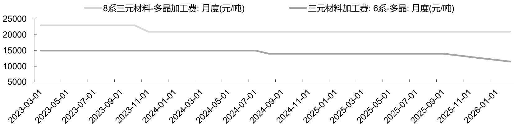  
图 三元正极行业主流厂商利润拆分情况

<table><tr><td rowspan=1 colspan=1>代表公司</td><td rowspan=1 colspan=1>单位</td><td rowspan=1 colspan=1>2021A</td><td rowspan=1 colspan=1>2022A</td><td rowspan=1 colspan=1>2023Q1</td><td rowspan=1 colspan=1>2023Q2</td><td rowspan=1 colspan=1>2023Q3</td><td rowspan=1 colspan=1>2023Q4</td><td rowspan=1 colspan=1>2024Q1</td><td rowspan=1 colspan=1>2024Q2</td><td rowspan=1 colspan=1>2024Q3</td><td rowspan=1 colspan=1>2024Q4</td><td rowspan=1 colspan=1>2025Q1</td><td rowspan=1 colspan=1>2025Q2</td><td rowspan=1 colspan=1>2025Q3</td><td rowspan=1 colspan=1>2025Q4</td></tr><tr><td rowspan=2 colspan=1>当并</td><td rowspan=1 colspan=1>出货</td><td rowspan=1 colspan=1>4.4</td><td rowspan=1 colspan=1>6.2</td><td rowspan=1 colspan=1>1.4</td><td rowspan=1 colspan=1>1.6</td><td rowspan=1 colspan=1>1.8</td><td rowspan=1 colspan=1>1.2</td><td rowspan=1 colspan=1>1</td><td rowspan=1 colspan=1>1.2</td><td rowspan=1 colspan=1>1</td><td rowspan=1 colspan=1>1</td><td rowspan=1 colspan=1>1</td><td rowspan=1 colspan=1>1.4</td><td rowspan=1 colspan=1>1.5</td><td rowspan=1 colspan=1>1.9</td></tr><tr><td rowspan=1 colspan=1>单位净利</td><td rowspan=1 colspan=1>1.55</td><td rowspan=1 colspan=1>4.1</td><td rowspan=1 colspan=1>2.98</td><td rowspan=1 colspan=1>3.95</td><td rowspan=1 colspan=1>3</td><td rowspan=1 colspan=1>2.8</td><td rowspan=1 colspan=1>1.1</td><td rowspan=1 colspan=1>0.96</td><td rowspan=1 colspan=1>1</td><td rowspan=1 colspan=1>-0.5</td><td rowspan=1 colspan=1>0.6</td><td rowspan=1 colspan=1>1.2</td><td rowspan=1 colspan=1>1</td><td rowspan=1 colspan=1>1.1</td></tr><tr><td rowspan=2 colspan=1>容百</td><td rowspan=1 colspan=1>出货</td><td rowspan=1 colspan=1>5.2</td><td rowspan=1 colspan=1>8.9</td><td rowspan=1 colspan=1>2.6</td><td rowspan=1 colspan=1>1.9</td><td rowspan=1 colspan=1>2.7</td><td rowspan=1 colspan=1>2.7</td><td rowspan=1 colspan=1>2.6</td><td rowspan=1 colspan=1>2.7</td><td rowspan=1 colspan=1>3.5</td><td rowspan=1 colspan=1>3.1</td><td rowspan=1 colspan=1>2.5</td><td rowspan=1 colspan=1>2.5</td><td rowspan=1 colspan=1>2.1</td><td rowspan=1 colspan=1>3.6</td></tr><tr><td rowspan=1 colspan=1>单位净利</td><td rowspan=1 colspan=1>1.48</td><td rowspan=1 colspan=1>1.37</td><td rowspan=1 colspan=1>1.2</td><td rowspan=1 colspan=1>0.36</td><td rowspan=1 colspan=1>0.88</td><td rowspan=1 colspan=1>-0.12</td><td rowspan=1 colspan=1>-0.12</td><td rowspan=1 colspan=1>0.2</td><td rowspan=1 colspan=1>0.41</td><td rowspan=1 colspan=1>0.6</td><td rowspan=1 colspan=1>0.27</td><td rowspan=1 colspan=1>0.28</td><td rowspan=1 colspan=1>-0.6</td><td rowspan=1 colspan=1>0.5</td></tr><tr><td rowspan=2 colspan=1>厦钨（含钴酸锂</td><td rowspan=1 colspan=1>出货</td><td rowspan=1 colspan=1>7.2</td><td rowspan=1 colspan=1>8</td><td rowspan=1 colspan=1>1.1</td><td rowspan=1 colspan=1>1.7</td><td rowspan=1 colspan=1>2</td><td rowspan=1 colspan=1>2.4</td><td rowspan=1 colspan=1>2.4</td><td rowspan=1 colspan=1>2.1</td><td rowspan=1 colspan=1>2.6</td><td rowspan=1 colspan=1>2.8</td><td rowspan=1 colspan=1>2.5</td><td rowspan=1 colspan=1>3</td><td rowspan=1 colspan=1>3.3</td><td rowspan=1 colspan=1>3.3</td></tr><tr><td rowspan=1 colspan=1>单位净利</td><td rowspan=1 colspan=1>0.71</td><td rowspan=1 colspan=1>1.22</td><td rowspan=1 colspan=1>0.92</td><td rowspan=1 colspan=1>0.75</td><td rowspan=1 colspan=1>0.7</td><td rowspan=1 colspan=1>0.42</td><td rowspan=1 colspan=1>0.42</td><td rowspan=1 colspan=1>0.57</td><td rowspan=1 colspan=1>0.55</td><td rowspan=1 colspan=1>0.4</td><td rowspan=1 colspan=1>0.4</td><td rowspan=1 colspan=1>0.7</td><td rowspan=1 colspan=1>0.7</td><td rowspan=1 colspan=1>0.7</td></tr></table>

## 铝箔：加工费上涨且涂炭比例提升，龙头盈利将提升

◆ 25Q4龙头盈利水平拐点出现，已经提至0.25-0.3万/吨。鼎胜新材电池箔25Q3单吨扣非利润提升至0.15万元+，主要系涂炭箔比例提升。产能供不应求，大客户涨价落地，我们预计26年加工费平均涨1000元，26年公司单吨利润有望提升。

◆ 25年起扩产放缓，26年产能利用率进一步回升。我们测算26年新增供给21万吨，25年产能利用率提升至72%，26年进一步提升至84%。

图：电池铝箔厂商产能规划（万吨）及供需平衡测算
<table><tr><td rowspan=1 colspan=1></td><td rowspan=1 colspan=1>21年有效产能22年有效产能</td><td rowspan=1 colspan=1>21年有效产能22年有效产能</td><td rowspan=1 colspan=1>23年有效产能</td><td rowspan=1 colspan=1>24年有效产能</td><td rowspan=1 colspan=1>25年有效产能</td><td rowspan=1 colspan=1>26年E有效产能</td><td rowspan=1 colspan=1>27年E有效产能</td></tr><tr><td rowspan=1 colspan=1>鼎胜新材</td><td rowspan=1 colspan=1>5.5</td><td rowspan=1 colspan=1>12</td><td rowspan=1 colspan=1>18</td><td rowspan=1 colspan=1>20</td><td rowspan=1 colspan=1>22</td><td rowspan=1 colspan=1>30</td><td rowspan=1 colspan=1>35</td></tr><tr><td rowspan=1 colspan=1>华北铝业</td><td rowspan=1 colspan=1>3</td><td rowspan=1 colspan=1>3.5</td><td rowspan=1 colspan=1>5</td><td rowspan=1 colspan=1>5</td><td rowspan=1 colspan=1>6</td><td rowspan=1 colspan=1>6</td><td rowspan=1 colspan=1>6</td></tr><tr><td rowspan=1 colspan=1>南山铝业</td><td rowspan=1 colspan=1></td><td rowspan=1 colspan=1>2.1</td><td rowspan=1 colspan=1>2.1</td><td rowspan=1 colspan=1>2.1</td><td rowspan=1 colspan=1>2.1</td><td rowspan=1 colspan=1>2.1</td><td rowspan=1 colspan=1>2.1</td></tr><tr><td rowspan=1 colspan=1>万顺新材</td><td rowspan=1 colspan=1></td><td rowspan=1 colspan=1>1.5</td><td rowspan=1 colspan=1>3</td><td rowspan=1 colspan=1>7.2</td><td rowspan=1 colspan=1>7.2</td><td rowspan=1 colspan=1>12.2</td><td rowspan=1 colspan=1>17</td></tr><tr><td rowspan=1 colspan=1>天山铝业</td><td rowspan=1 colspan=1></td><td rowspan=1 colspan=1></td><td rowspan=1 colspan=1>2</td><td rowspan=1 colspan=1>2</td><td rowspan=1 colspan=1>9</td><td rowspan=1 colspan=1>9</td><td rowspan=1 colspan=1>9</td></tr><tr><td rowspan=1 colspan=1>神火股份</td><td rowspan=1 colspan=1></td><td rowspan=1 colspan=1>5.5</td><td rowspan=1 colspan=1>5.5</td><td rowspan=1 colspan=1>10</td><td rowspan=1 colspan=1>11.5</td><td rowspan=1 colspan=1>11.5</td><td rowspan=1 colspan=1>11.5</td></tr><tr><td rowspan=1 colspan=1>永杰新材</td><td rowspan=1 colspan=1>1</td><td rowspan=1 colspan=1>1</td><td rowspan=1 colspan=1>1</td><td rowspan=1 colspan=1>2</td><td rowspan=1 colspan=1>3.5</td><td rowspan=1 colspan=1>4.5</td><td rowspan=1 colspan=1>4.5</td></tr><tr><td rowspan=1 colspan=1>厦门厦顺</td><td rowspan=1 colspan=1>1</td><td rowspan=1 colspan=1>2</td><td rowspan=1 colspan=1>4</td><td rowspan=1 colspan=1>4</td><td rowspan=1 colspan=1>4</td><td rowspan=1 colspan=1>4</td><td rowspan=1 colspan=1>4</td></tr><tr><td rowspan=1 colspan=1>东阳光</td><td rowspan=1 colspan=1></td><td rowspan=1 colspan=1>1.2</td><td rowspan=1 colspan=1>5</td><td rowspan=1 colspan=1>9</td><td rowspan=1 colspan=1>13.2</td><td rowspan=1 colspan=1>13.2</td><td rowspan=1 colspan=1>13.2</td></tr><tr><td rowspan=1 colspan=1>常铝股份</td><td rowspan=1 colspan=1></td><td rowspan=1 colspan=1></td><td rowspan=1 colspan=1></td><td rowspan=1 colspan=1></td><td rowspan=1 colspan=1>1</td><td rowspan=1 colspan=1>3</td><td rowspan=1 colspan=1>3</td></tr><tr><td rowspan=1 colspan=1>华峰铝业</td><td rowspan=1 colspan=1></td><td rowspan=1 colspan=1>1</td><td rowspan=1 colspan=1>2.5</td><td rowspan=1 colspan=1>2.5</td><td rowspan=1 colspan=1>2.5</td><td rowspan=1 colspan=1>2.5</td><td rowspan=1 colspan=1>2.5</td></tr><tr><td rowspan=1 colspan=1>安徽金誉</td><td rowspan=1 colspan=1></td><td rowspan=1 colspan=1></td><td rowspan=1 colspan=1></td><td rowspan=1 colspan=1></td><td rowspan=1 colspan=1>5.5</td><td rowspan=1 colspan=1>8.5</td><td rowspan=1 colspan=1>8.5</td></tr><tr><td rowspan=1 colspan=1>国内其他</td><td rowspan=1 colspan=1>2</td><td rowspan=1 colspan=1>4</td><td rowspan=1 colspan=1>6</td><td rowspan=1 colspan=1>7.2</td><td rowspan=1 colspan=1>8.6</td><td rowspan=1 colspan=1>9.9</td><td rowspan=1 colspan=1>11.4</td></tr><tr><td rowspan=1 colspan=1>海外其他</td><td rowspan=1 colspan=1>5.16</td><td rowspan=1 colspan=1>5.39</td><td rowspan=1 colspan=1>5.70</td><td rowspan=1 colspan=1>5.02</td><td rowspan=1 colspan=1>6.0</td><td rowspan=1 colspan=1>6.9</td><td rowspan=1 colspan=1>10.0</td></tr><tr><td rowspan=1 colspan=1>合计</td><td rowspan=1 colspan=1>18</td><td rowspan=1 colspan=1>39</td><td rowspan=1 colspan=1>60</td><td rowspan=1 colspan=1>76</td><td rowspan=1 colspan=1>102</td><td rowspan=1 colspan=1>123</td><td rowspan=1 colspan=1>138</td></tr></table>

<table><tr><td></td><td>2022年</td><td>2023年</td><td>2024年</td><td>2025年</td><td>2026年E</td><td>2027年E</td></tr><tr><td>全球供给 (万吨)</td><td>39.2</td><td>59.8</td><td>76.0</td><td>102.1</td><td>123.3</td><td>137.7</td></tr><tr><td>全球需求 (万吨)</td><td>28.8</td><td>37.5</td><td>50.2</td><td>73.9</td><td>103.3</td><td>128.7</td></tr><tr><td>过剩 (万吨)</td><td>10.4</td><td>22.3</td><td>25.8</td><td>28.2</td><td>20.0</td><td>9.1</td></tr><tr><td>产能利用率</td><td>73%</td><td>63%</td><td>66%</td><td>72%</td><td>84%</td><td>93%</td></tr></table>

图：鼎胜新材电池箔盈利
<table><tr><td>鼎胜新材</td><td>1Q24</td><td>2Q24</td><td>3Q24</td><td>4Q24</td><td>1Q25</td><td>2Q25</td><td>3Q25</td><td>4Q25</td></tr><tr><td>电池箔单吨利润 (万/吨)</td><td></td><td></td><td></td><td>3</td><td>3</td><td></td><td></td><td>0.26</td></tr></table>

## 铜箔：25–26年产能利用率回升，行业供需逐步改善

◆ 25-26年产能利用率逐步恢复，我们预计27年进一步提升。铜箔行业格局分散，在需求拉动与供给放缓背景下，仍处于产能过剩状态，我们预计2025/2026年全球供给新增25/28万吨，产能利用率我们预计分别为72%/81%，产能利用率逐步回升，龙头厂商有望率先受益。

图：电池铜箔厂商产能规划（万吨）及供需平衡测算
<table><tr><td>锂电铜箔</td><td>23年有效产能</td><td>24年有效产能</td><td>25年有效产能</td><td>26年E有效产能</td></tr><tr><td>诺德股份</td><td>7.0</td><td>12.0</td><td>12.0</td><td>14.5</td></tr><tr><td>龙电华鑫</td><td>12.5</td><td>13.0</td><td>17.0</td><td></td></tr><tr><td>铜陵有色</td><td>2.0</td><td>4.5</td><td>4.5</td><td>7</td></tr><tr><td>长春化工</td><td>4.0</td><td>4.5</td><td> 5.0</td><td> 5.5</td></tr><tr><td>嘉元科技</td><td>8.0</td><td>9.0</td><td>12.0</td><td>12.0</td></tr><tr><td>赣州逸豪</td><td> 1.0</td><td> 1.0</td><td> 1.0</td><td>1.5</td></tr><tr><td>湖北中</td><td>5.5</td><td>5.5</td><td>5.5</td><td>5.5</td></tr><tr><td>超华科技</td><td>4.3</td><td>5.0</td><td>5.0</td><td>5.0</td></tr><tr><td>华威铜箔</td><td>3.0</td><td>3.0</td><td>4.0</td><td>4.0</td></tr><tr><td>德福科技</td><td>12.5</td><td>12.5</td><td> 12.5</td><td> 12.5</td></tr><tr><td>海亮股份</td><td>2.5</td><td>5.0</td><td>7.0</td><td>7.0</td></tr><tr><td>江西铜业</td><td>1.5</td><td>1.5</td><td>1.5</td><td>3.5</td></tr><tr><td>华创新材</td><td></td><td>0.5</td><td>2.0</td><td>3.0</td></tr><tr><td>正威国际</td><td></td><td></td><td>5.0</td><td></td></tr><tr><td>杭电股份</td><td></td><td>1.5</td><td>2.0</td><td>502050</td></tr><tr><td>白银有色</td><td>2.0</td><td>5.0</td><td>5.0</td><td></td></tr><tr><td>其他</td><td>60.0</td><td>60.0</td><td>60.0</td><td>60.0</td></tr><tr><td>国内总产能</td><td>125.8</td><td>143.5</td><td>161.0</td><td>167.5</td></tr></table>

<table><tr><td>铜箔</td><td>2022年</td><td>2023年</td><td>2024年</td><td>2025年</td><td>2026年E</td><td>2027年E</td></tr><tr><td>全行业有效供给 (万吨)</td><td>110</td><td>154</td><td>175</td><td>200</td><td>228</td><td>253</td></tr><tr><td>-同比</td><td>119%</td><td>40%</td><td>14%</td><td> 14%</td><td>14%</td><td> 11%</td></tr><tr><td>需求 (万吨)</td><td>64</td><td>84</td><td>104</td><td>143</td><td>184</td><td>215</td></tr><tr><td>-同比</td><td>63%</td><td>32%</td><td>25%</td><td>37%</td><td>28%</td><td>17%</td></tr><tr><td>过剩</td><td>46</td><td>70</td><td>70</td><td>56</td><td>44</td><td>38</td></tr><tr><td>产能利用率</td><td>58%</td><td>55%</td><td>60%</td><td>72%</td><td>81%</td><td>85%</td></tr></table>

数据来源：SMM，东吴证券研究所

## 铜箔：26Q2加工费有望进一步上涨，盈利端迎来改善

◆ 25H2以来铜箔加工费进一步回升，主流厂商亏损状态有所改善，盈利有望修复至5k/吨。24-25年现货与期货铜价震荡上行，24年铜箔加工费下行，主流厂商基本处于亏损状态，25H1加工费见底回升，25H2以来低价订单加工费回升至1.9-2.0万/吨，但仍处于低位水平，主流厂商盈利有所恢复，26年行业供需明显改善，Q1电子电路铜箔开始涨价，Q2起锂电箔有望涨价落地，行业单位盈利我们预计明显修复。

表：主流铜箔厂商季度价格和单吨利润
<table><tr><td>嘉元科技</td><td>3Q22</td><td>4Q22</td><td>1Q23</td><td>2Q23</td><td>3Q23</td><td>4Q23</td><td>1Q24</td><td>2Q24</td><td>3Q24</td><td>4Q24</td><td>1Q25</td><td>2Q25</td><td>3Q25</td><td>4Q25</td></tr><tr><td>铜箔利润 (百万元)</td><td>150</td><td>84</td><td>36</td><td>-30</td><td>3</td><td>-37</td><td>-51</td><td>-71</td><td>-11</td><td>-48</td><td>8</td><td>2</td><td>3</td><td>30</td></tr><tr><td>-出货量 （万吨）</td><td>1.45</td><td>1.54</td><td>1.2</td><td>1.5</td><td>1.8</td><td>1.25</td><td>0.87</td><td>1.6</td><td>1.96</td><td>2.2</td><td>2.07</td><td>2</td><td>2.7</td><td>3</td></tr><tr><td>-单吨利润 (万元/吨)</td><td>1.04</td><td>0.55</td><td>0.3</td><td>-0.2</td><td>0.02</td><td>-0.3</td><td>-0.59</td><td>-0.45</td><td>-0.06</td><td>-0.22</td><td>0.04</td><td>0.01</td><td>0.01</td><td>0.1</td></tr><tr><td>诺德股份</td><td>3Q22</td><td>4Q22</td><td>1Q23</td><td>2Q23</td><td>3Q23</td><td>4Q23</td><td>1Q24</td><td>2Q24</td><td>3Q24</td><td>4Q24</td><td>1Q25</td><td>2Q25</td><td>3Q25</td><td>4Q25</td></tr><tr><td>铜箔利润 (百万元)</td><td>40</td><td>111</td><td>9</td><td> -27</td><td>-60</td><td>-56</td><td> -102</td><td>-93</td><td>-70</td><td>-87</td><td>-44</td><td>-41</td><td>-24</td><td>-18</td></tr><tr><td>-出货量 （万吨）</td><td>1.1</td><td>1.7</td><td>1.05</td><td>1</td><td>1.3</td><td>1.19</td><td>0.9</td><td>1.4</td><td>1.5</td><td>1.53</td><td>1.5</td><td>1.55</td><td>1.8</td><td> 1.84</td></tr><tr><td>-单吨利润 (万元/吨)</td><td> 0.37</td><td>0.66</td><td>0.08</td><td>-0.27</td><td> -0.46</td><td> -0.47</td><td> -1.13</td><td> -0.67</td><td> -0.47</td><td>-0.57</td><td>-0.29</td><td>-0.26</td><td>-0.13</td><td>-0.1</td></tr></table>

<table><tr><td rowspan=2 colspan=1></td><td rowspan=2 colspan=1></td><td rowspan=2 colspan=1>26年E出货27年E出货（万吨）</td><td rowspan=1 colspan=1>27年E出货</td><td rowspan=1 colspan=2>26E (原预期)</td><td rowspan=1 colspan=1>26</td><td rowspan=1 colspan=2>26E（涨价预期）</td><td rowspan=1 colspan=1>27</td><td rowspan=1 colspan=2>27E（涨价预期）</td><td rowspan=2 colspan=1>26PE</td><td rowspan=2 colspan=1>27PE</td></tr><tr><td rowspan=1 colspan=1>（万吨）</td><td rowspan=1 colspan=1>单位净利（万元/吨）</td><td rowspan=1 colspan=1>利润（亿元）</td><td rowspan=1 colspan=1>涨价幅度</td><td rowspan=1 colspan=1>单位净利（万元/吨）</td><td rowspan=1 colspan=1>利润（亿元)</td><td rowspan=1 colspan=1>涨价幅度</td><td rowspan=1 colspan=1>单位净利（万元/吨）</td><td rowspan=1 colspan=1>利润（亿元)</td></tr><tr><td rowspan=6 colspan=1>嘉元科技</td><td rowspan=1 colspan=1>锂电铜箔-国内</td><td rowspan=1 colspan=1>14</td><td rowspan=1 colspan=1>18</td><td rowspan=1 colspan=1>0.3</td><td rowspan=1 colspan=1>4.2</td><td rowspan=1 colspan=1>0.3</td><td rowspan=1 colspan=1>0.5</td><td rowspan=1 colspan=1>7.4</td><td rowspan=1 colspan=1>0.3</td><td rowspan=1 colspan=1>0.8</td><td rowspan=1 colspan=1>13.5</td><td rowspan=6 colspan=1>23.3</td><td rowspan=6 colspan=1>12.5</td></tr><tr><td rowspan=1 colspan=1>锂电铜箔-海外</td><td rowspan=1 colspan=1>1</td><td rowspan=1 colspan=1>2</td><td rowspan=1 colspan=1>1</td><td rowspan=1 colspan=1>1</td><td rowspan=1 colspan=1>0</td><td rowspan=1 colspan=1>1.0</td><td rowspan=1 colspan=1>1</td><td rowspan=1 colspan=1>0</td><td rowspan=1 colspan=1>1.0</td><td rowspan=1 colspan=1>2.0</td></tr><tr><td rowspan=1 colspan=1>HVLP1-2代</td><td rowspan=1 colspan=1>0.2</td><td rowspan=1 colspan=1>0.5</td><td rowspan=1 colspan=1>1</td><td rowspan=1 colspan=1>0.2</td><td rowspan=1 colspan=1>0</td><td rowspan=1 colspan=1>1.0</td><td rowspan=1 colspan=1>0.2</td><td rowspan=1 colspan=1>0.5</td><td rowspan=1 colspan=1>1.4</td><td rowspan=1 colspan=1>0.7</td></tr><tr><td rowspan=1 colspan=1>RTF</td><td rowspan=1 colspan=1>0</td><td rowspan=1 colspan=1>0.1</td><td rowspan=1 colspan=1>0.5</td><td rowspan=1 colspan=1>0</td><td rowspan=1 colspan=1>0</td><td rowspan=1 colspan=1>0.5</td><td rowspan=1 colspan=1>0</td><td rowspan=1 colspan=1>0</td><td rowspan=1 colspan=1>0.5</td><td rowspan=1 colspan=1>0.1</td></tr><tr><td rowspan=1 colspan=1>HTE</td><td rowspan=1 colspan=1>0.8</td><td rowspan=1 colspan=1>1</td><td rowspan=1 colspan=1>0</td><td rowspan=1 colspan=1>0</td><td rowspan=1 colspan=1>0.2</td><td rowspan=1 colspan=1>0.2</td><td rowspan=1 colspan=1>0.1</td><td rowspan=1 colspan=1>0.2</td><td rowspan=1 colspan=1>0.3</td><td rowspan=1 colspan=1>0.3</td></tr><tr><td rowspan=1 colspan=1>合计</td><td rowspan=1 colspan=1>16</td><td rowspan=1 colspan=1>22</td><td rowspan=1 colspan=1>0.3</td><td rowspan=1 colspan=1>5.4</td><td rowspan=1 colspan=1>-</td><td rowspan=1 colspan=1>0.6</td><td rowspan=1 colspan=1>9.5</td><td rowspan=1 colspan=1>-</td><td rowspan=1 colspan=1>0.8</td><td rowspan=1 colspan=1>17.7</td></tr><tr><td rowspan=5 colspan=1>诺德股份</td><td rowspan=1 colspan=1>锂电铜箔</td><td rowspan=1 colspan=1>11.5</td><td rowspan=1 colspan=1>13</td><td rowspan=1 colspan=1>0</td><td rowspan=1 colspan=1>0</td><td rowspan=1 colspan=1>0.5</td><td rowspan=1 colspan=1>0.4</td><td rowspan=1 colspan=1>4.3</td><td rowspan=1 colspan=1>0.3</td><td rowspan=1 colspan=1>0.6</td><td rowspan=1 colspan=1>7.8</td><td rowspan=5 colspan=1>35.7</td><td rowspan=5 colspan=1>18.1</td></tr><tr><td rowspan=1 colspan=1>HVLP1-2代</td><td rowspan=1 colspan=1>0</td><td rowspan=1 colspan=1>0.5</td><td rowspan=1 colspan=1>1</td><td rowspan=1 colspan=1>0</td><td rowspan=1 colspan=1>0</td><td rowspan=1 colspan=1>1.0</td><td rowspan=1 colspan=1>0.0</td><td rowspan=1 colspan=1>0.5</td><td rowspan=1 colspan=1>1.4</td><td rowspan=1 colspan=1>0.7</td></tr><tr><td rowspan=1 colspan=1>RTF</td><td rowspan=1 colspan=1>0.5</td><td rowspan=1 colspan=1>1</td><td rowspan=1 colspan=1>1</td><td rowspan=1 colspan=1>0.5</td><td rowspan=1 colspan=1>0</td><td rowspan=1 colspan=1>1.0</td><td rowspan=1 colspan=1>0.5</td><td rowspan=1 colspan=1>0</td><td rowspan=1 colspan=1>1.0</td><td rowspan=1 colspan=1>1.0</td></tr><tr><td rowspan=1 colspan=1>HTE</td><td rowspan=1 colspan=1>1</td><td rowspan=1 colspan=1>1</td><td rowspan=1 colspan=1>0</td><td rowspan=1 colspan=1>0</td><td rowspan=1 colspan=1>0.2</td><td rowspan=1 colspan=1>0.2</td><td rowspan=1 colspan=1>0.2</td><td rowspan=1 colspan=1>0.2</td><td rowspan=1 colspan=1>0.3</td><td rowspan=1 colspan=1>0.3</td></tr><tr><td rowspan=1 colspan=1>合计</td><td rowspan=1 colspan=1>13</td><td rowspan=1 colspan=1>16</td><td rowspan=1 colspan=1>0.0</td><td rowspan=1 colspan=1>0.5</td><td rowspan=1 colspan=1>-</td><td rowspan=1 colspan=1>0.4</td><td rowspan=1 colspan=1>5.0</td><td rowspan=1 colspan=1>-</td><td rowspan=1 colspan=1>0.6</td><td rowspan=1 colspan=1>9.8</td></tr><tr><td rowspan=6 colspan=1>德福科技</td><td rowspan=1 colspan=1>锂电铜箔</td><td rowspan=1 colspan=1>14.5</td><td rowspan=1 colspan=1>14.5</td><td rowspan=1 colspan=1>0.3</td><td rowspan=1 colspan=1>4.35</td><td rowspan=1 colspan=1>0.3</td><td rowspan=1 colspan=1>0.5</td><td rowspan=1 colspan=1>7.6</td><td rowspan=1 colspan=1>0</td><td rowspan=1 colspan=1>0.5</td><td rowspan=1 colspan=1>7.6</td><td rowspan=6 colspan=1>21.8</td><td rowspan=6 colspan=1>17.2</td></tr><tr><td rowspan=1 colspan=1>HVLP1-2代</td><td rowspan=1 colspan=1>0.3</td><td rowspan=1 colspan=1>1</td><td rowspan=1 colspan=1>3</td><td rowspan=1 colspan=1>0.9</td><td rowspan=1 colspan=1>1</td><td rowspan=1 colspan=1>3.8</td><td rowspan=1 colspan=1>1.1</td><td rowspan=1 colspan=1>0.5</td><td rowspan=1 colspan=1>4.1</td><td rowspan=1 colspan=1>4.1</td></tr><tr><td rowspan=1 colspan=1>HVLP3-4代</td><td rowspan=1 colspan=1>0.1</td><td rowspan=1 colspan=1>0.2</td><td rowspan=1 colspan=1>8</td><td rowspan=1 colspan=1>0.8</td><td rowspan=1 colspan=1>1</td><td rowspan=1 colspan=1>8.8</td><td rowspan=1 colspan=1>0.9</td><td rowspan=1 colspan=1>1</td><td rowspan=1 colspan=1>9.5</td><td rowspan=1 colspan=1>1.9</td></tr><tr><td rowspan=1 colspan=1>RTF</td><td rowspan=1 colspan=1>1.2</td><td rowspan=1 colspan=1>1.2</td><td rowspan=1 colspan=1>2</td><td rowspan=1 colspan=1>2.4</td><td rowspan=1 colspan=1>0.5</td><td rowspan=1 colspan=1>2.4</td><td rowspan=1 colspan=1>2.9</td><td rowspan=1 colspan=1>0</td><td rowspan=1 colspan=1>2.4</td><td rowspan=1 colspan=1>2.9</td></tr><tr><td rowspan=1 colspan=1>HTE</td><td rowspan=1 colspan=1>2</td><td rowspan=1 colspan=1>1</td><td rowspan=1 colspan=1>0.25</td><td rowspan=1 colspan=1>0.5</td><td rowspan=1 colspan=1>0.4</td><td rowspan=1 colspan=1>0.6</td><td rowspan=1 colspan=1>1.1</td><td rowspan=1 colspan=1>0.2</td><td rowspan=1 colspan=1>0.7</td><td rowspan=1 colspan=1>0.7</td></tr><tr><td rowspan=1 colspan=1>合计</td><td rowspan=1 colspan=1>18</td><td rowspan=1 colspan=1>18</td><td rowspan=1 colspan=1>0.5</td><td rowspan=1 colspan=1>8.95</td><td rowspan=1 colspan=1>-</td><td rowspan=1 colspan=1>0.8</td><td rowspan=1 colspan=1>13.6</td><td rowspan=1 colspan=1>-</td><td rowspan=1 colspan=1>1.0</td><td rowspan=1 colspan=1>17.2</td></tr><tr><td rowspan=6 colspan=1>铜冠铜箔</td><td rowspan=1 colspan=1>锂电铜箔</td><td rowspan=1 colspan=1>2.5</td><td rowspan=1 colspan=1>3.5</td><td rowspan=1 colspan=1>0</td><td rowspan=1 colspan=1>0</td><td rowspan=1 colspan=1>0.3</td><td rowspan=1 colspan=1>0.2</td><td rowspan=1 colspan=1>0.6</td><td rowspan=1 colspan=1>0</td><td rowspan=1 colspan=1>0.2</td><td rowspan=1 colspan=1>0.8</td><td rowspan=6 colspan=1>52.6</td><td rowspan=6 colspan=1>28.5</td></tr><tr><td rowspan=1 colspan=1>HVLP1-2代</td><td rowspan=1 colspan=1>1</td><td rowspan=1 colspan=1>2</td><td rowspan=1 colspan=1>2</td><td rowspan=1 colspan=1>2</td><td rowspan=1 colspan=1>1</td><td rowspan=1 colspan=1>2.8</td><td rowspan=1 colspan=1>2.8</td><td rowspan=1 colspan=1>0.5</td><td rowspan=1 colspan=1>3.1</td><td rowspan=1 colspan=1>6.3</td></tr><tr><td rowspan=1 colspan=1>HVLP3-5代</td><td rowspan=1 colspan=1></td><td rowspan=1 colspan=1>0.2</td><td rowspan=1 colspan=1>8</td><td rowspan=1 colspan=1>0</td><td rowspan=1 colspan=1>1.5</td><td rowspan=1 colspan=1>9.1</td><td rowspan=1 colspan=1>0.0</td><td rowspan=1 colspan=1>1</td><td rowspan=1 colspan=1>9.9</td><td rowspan=1 colspan=1>2.0</td></tr><tr><td rowspan=1 colspan=1>RTF</td><td rowspan=1 colspan=1>2</td><td rowspan=1 colspan=1>2</td><td rowspan=1 colspan=1>1</td><td rowspan=1 colspan=1>2</td><td rowspan=1 colspan=1>1</td><td rowspan=1 colspan=1>1.8</td><td rowspan=1 colspan=1>3.5</td><td rowspan=1 colspan=1>0</td><td rowspan=1 colspan=1>1.8</td><td rowspan=1 colspan=1>3.5</td></tr><tr><td rowspan=1 colspan=1>HTE</td><td rowspan=1 colspan=1>2</td><td rowspan=1 colspan=1>2</td><td rowspan=1 colspan=1>0</td><td rowspan=1 colspan=1>0</td><td rowspan=1 colspan=1>0.2</td><td rowspan=1 colspan=1>0.2</td><td rowspan=1 colspan=1>0.3</td><td rowspan=1 colspan=1>0.2</td><td rowspan=1 colspan=1>0.3</td><td rowspan=1 colspan=1>0.6</td></tr><tr><td rowspan=1 colspan=1>合计</td><td rowspan=1 colspan=1>7.5</td><td rowspan=1 colspan=1>9.7</td><td rowspan=1 colspan=1>0.5</td><td rowspan=1 colspan=1>4</td><td rowspan=1 colspan=1>-</td><td rowspan=1 colspan=1>0.9</td><td rowspan=1 colspan=1>7.1</td><td rowspan=1 colspan=1>-</td><td rowspan=1 colspan=1>1.4</td><td rowspan=1 colspan=1>13.1</td></tr></table>

数据来源：Wind、SMM，东吴证券研究所

• 上游资源：碳酸锂我们预计反弹，金属钴仍有上行空间

## 供给总结：核心看新矿山达产进度，中国企业主导

◆ 中性情况下：26年全球锂矿供给214万吨，新增44万吨；27年262万吨，新增48万吨；28年303万吨，新增41万吨。但由于海外矿山政策不确定因素影响，实际供给或低于预期。

◆ 增量主要来自：国内盐湖（藏格的麻米措、盐湖的察尔汗、紫金的拉果措）、国内矿山（新疆红柳滩、国城的党坝、大中的加达和鸡脚山、盛新的木绒矿、紫金的湘源矿、永兴的化山瓷石扩产）、海外盐湖（紫金的3Q、赣锋的Mariana和CO）、澳矿（泰利森和皮尔巴拉扩产）、非矿（中矿、华友、雅化、盛新、赣锋产能打满，紫金的Manono、青山的Sandawana、海南矿业的Bougouni，以及尼日利亚天华等增量）。

表：2025-2030年碳酸锂供给测算（中性）
<table><tr><td>产量（万吨LCE)</td><td>2025E</td><td>2026E 2027E</td><td>2028E</td><td>2029E</td><td>2030E</td></tr><tr><td>国内盐湖 17.6</td><td>26.0</td><td>30.8</td><td>32.7</td><td>36.8</td><td>38.6</td></tr><tr><td>国内辉石矿 6.9</td><td>11.2</td><td>14.9</td><td>25.2</td><td>36.7</td><td>39.3</td></tr><tr><td>15.5 国内云母矿</td><td>17.8</td><td>26.0</td><td>30.6</td><td>36.1</td><td>38.1</td></tr><tr><td>国内供给合计 40.1</td><td>55.1</td><td>71.7</td><td>88.4</td><td>109.6</td><td>116.0</td></tr><tr><td>海外盐湖 43.6</td><td>50.5</td><td>54.4</td><td>62.2</td><td>71.2</td><td>75.2</td></tr><tr><td>澳洲辉石矿 47.6</td><td>55.4</td><td>62.9</td><td>65.6</td><td>67.3</td><td>70.0</td></tr><tr><td>非洲辉石矿 23.6</td><td>35.1</td><td>51.0</td><td>62.1</td><td>70.3</td><td>75.3</td></tr><tr><td>美洲辉石矿 5.8</td><td>6.2</td><td>7.6</td><td>7.7</td><td>9.5</td><td>12.2</td></tr><tr><td>海外供给合计 120.6</td><td>147.2</td><td>175.9</td><td>197.6</td><td>218.4</td><td>232.7</td></tr><tr><td>锂回收 9.0</td><td>11.7</td><td>14.0</td><td>16.8</td><td>20.2</td><td>24.3</td></tr><tr><td>合计 169.6</td><td>214.0</td><td>261.7</td><td>302.9</td><td>348.2</td><td>373.0</td></tr><tr><td>-新增 34.7</td><td> 44.3</td><td>47.7</td><td>41.2</td><td>45.3</td><td>24.9</td></tr></table>

## 碳酸锂：津巴出口恢复，观察枧下窝复产预期

◆ 不考虑津巴布韦影响，碳酸锂全年紧平衡：2026年碳酸锂仅过剩4万吨，过剩比例为2%；2027年过剩11万吨，过剩比例为4%，总体供给偏紧。且海外矿山、盐湖存在政策不确定性风险，或导致实际产量低于预期，加剧供给紧张。

◆ 津巴原预期产量20万吨+，占全球产量10%，当前出口配额4家中国企业20万吨精矿，出口我们预计逐步恢复

◆ 第二，津巴要求锂盐完全本土化，难度较大，capex增加，供应链不完善，且税费等提升抬高成本

第三，自主可控的锂矿股受益

图：碳酸锂供需测算（中性供给预测）
<table><tr><td>2022</td><td>2023</td><td>2024</td><td>2025E</td><td>2026E</td><td>2027E</td><td>2028E</td><td>2029E</td></tr><tr><td>全球锂有效供给 (万吨LCE)</td><td>80.1 110.4</td><td>134.9</td><td>169.6</td><td>214.0</td><td>261.7</td><td>302.9</td><td>348.2</td></tr><tr><td>有效供给-新增</td><td>21.8 30.3</td><td>24.6</td><td>34.7</td><td>44.3</td><td>47.7</td><td>41.2</td><td>45.3</td></tr><tr><td>全球锂需求 (万吨LCE)</td><td>76.8 93.2</td><td>119.1</td><td>165.3</td><td>209.6</td><td>250.4</td><td>285.3</td><td>326.1</td></tr><tr><td>需求-新增</td><td>20.6 16.4</td><td>26.0</td><td>46.1</td><td>44.4</td><td>40.8</td><td>34.9</td><td>40.8</td></tr><tr><td>过剩 (万吨LCE)</td><td>3.3 17.2</td><td>15.8</td><td>4.4</td><td>4.4</td><td>11.3</td><td>17.5</td><td>22.0</td></tr></table>

## 碳酸锂：价格在15-20万左右震荡，较难超过20万

◆ 若影响国内储能需求20%，则将压制碳酸锂价格。我们测算，若2026年国内储能需求减少10%，对应碳 酸锂需求减少2.5万，供给过剩7万吨，影响有限。若国内储能需求减少20%，碳酸锂需求减少5万吨，过 剩接近10万吨，则将影响碳酸锂价格。

◆ 碳酸锂合理价格中枢15万/吨，阶段性不排产涨至20万+/吨。因此我们对碳酸锂价格判断，12万产业链上中下游均可获得合理利润，储能业主和系统集成商均可接受；15万是分界点，国内中等偏下项目收益率开始受影响，若超过20万，较大比例项目将延期，我们预计碳酸锂价格中枢15万/吨，阶段性突破15-20万/吨。

◆ 季度上看，26年Q1和Q4是相对最紧缺的阶段。Q2开始小幅改善，需求Q2环比增长10-20%，供给端增量：南美盐湖3-4月到港量增加，国内盐湖3-4月产量恢复，并且新矿山爬坡，释放一定增量。Q3相对过剩，但Q4供给紧缺，因此碳酸锂价格Q1是阶段性高点，Q2震荡，Q4或再向上。

图：考虑国内储能项目延期比例，对应碳酸锂过剩程度测算
<table><tr><td rowspan=1 colspan=1>国内储能需求下修幅度</td><td rowspan=1 colspan=1>3%</td><td rowspan=1 colspan=1>5%</td><td rowspan=1 colspan=1>7%</td><td rowspan=1 colspan=1>10%</td><td rowspan=1 colspan=1>13%</td><td rowspan=1 colspan=1>15%</td><td rowspan=1 colspan=1>17%</td><td rowspan=1 colspan=1>20%</td></tr><tr><td rowspan=1 colspan=1>对应电池减少 (GWh)</td><td rowspan=1 colspan=1>12.09</td><td rowspan=1 colspan=1>20.15</td><td rowspan=1 colspan=1>28.21</td><td rowspan=1 colspan=1>40.3</td><td rowspan=1 colspan=1>52.39</td><td rowspan=1 colspan=1>60.45</td><td rowspan=1 colspan=1>68.51</td><td rowspan=1 colspan=1>80.6</td></tr><tr><td rowspan=1 colspan=1>碳酸锂需求减少(万吨)</td><td rowspan=1 colspan=1>0.7</td><td rowspan=1 colspan=1>1.2</td><td rowspan=1 colspan=1>1.7</td><td rowspan=1 colspan=1>2.5</td><td rowspan=1 colspan=1>3.2</td><td rowspan=1 colspan=1>3.7</td><td rowspan=1 colspan=1>4.2</td><td rowspan=1 colspan=1>4.9</td></tr><tr><td rowspan=1 colspan=1>中性供给预测碳酸锂过剩 (万吨)</td><td rowspan=1 colspan=1>5.7</td><td rowspan=1 colspan=1>6.2</td><td rowspan=1 colspan=1>6.7</td><td rowspan=1 colspan=1>7.5</td><td rowspan=1 colspan=1>8.2</td><td rowspan=1 colspan=1>8.7</td><td rowspan=1 colspan=1>9.2</td><td rowspan=1 colspan=1>9.9</td></tr></table>

## 总结：核心标的按照15万碳酸锂定价，碳酸锂估值10-15x

◆ 剔除其他业务，核心碳酸锂标的，在15万价格下，26年权益资源利润对应PE估值10-15x。若考虑后续新投产能，看28-29年，15万碳酸锂价格下，权益资源利润对应PE估值5-10x，增量资源大的厂商仍有空间。

图：碳酸锂核心标的估值汇总（截至2026年3月24日股价）
<table><tr><td></td><td>2025E</td><td>2026E</td><td>2027E</td><td>2028E</td><td>2029E</td><td>2030E</td></tr><tr><td rowspan="11">权益锂矿（万 吨,LCE)</td><td>赣锋锂业</td><td>9.0</td><td>13.7</td><td>14.0</td><td>15.1</td><td>17.6</td><td>18.3</td></tr><tr><td>天齐锂业</td><td> 11.7</td><td>13.1</td><td>14.2</td><td>14.7</td><td>16.1</td><td>17.5</td></tr><tr><td>中矿资源</td><td>4.8</td><td>6.7</td><td>7.6</td><td>7.6</td><td>8.4</td><td>9.7</td></tr><tr><td>盛新锂能</td><td>3.3</td><td>4.5</td><td>4.6 6.8</td><td>10.4</td><td></td><td>10.4</td></tr><tr><td>永兴材料</td><td>2.2</td><td>2.2</td><td>2.7</td><td>3.9</td><td>5.7</td><td>5.7</td></tr><tr><td>大中矿业</td><td>0.0</td><td>1.7</td><td>5.0</td><td>9.5</td><td>13.0</td><td>16.0</td></tr><tr><td>国城矿业</td><td>0.5</td><td>1.2</td><td>2.0</td><td>5.0</td><td>6.5</td><td>6.5</td></tr><tr><td>盐湖股份</td><td>2.6</td><td>7.2</td><td>7.2</td><td>7.2</td><td>7.2</td><td>7.2</td></tr><tr><td>藏格矿业</td><td>0.9</td><td>1.7</td><td>2.4</td><td>2.7</td><td>3.3</td><td>3.8</td></tr><tr><td>华友钻业 雅化集团</td><td>3.5</td><td>8.0</td><td>12.1</td><td>12.1</td><td>12.2</td><td>12.3</td></tr><tr><td>赣锋锂业</td><td>2.6</td><td>3.8</td><td>3.8</td><td>4.1</td><td>4.9</td><td>4.9</td></tr><tr><td rowspan="11">碳酸锂市值 （亿）</td><td></td><td>1,125</td><td>1,005</td><td>925</td><td>854</td><td>768</td><td>665</td></tr><tr><td>天齐锂业</td><td>739</td><td>739</td><td>739</td><td>739</td><td>739</td><td>739</td></tr><tr><td>中矿资源</td><td>313</td><td>261</td><td>115</td><td>59</td><td>-15</td><td>7</td></tr><tr><td>盛新锂能</td><td>329</td><td>329</td><td>329</td><td>329</td><td>329</td><td>329</td></tr><tr><td>永兴材料</td><td>327</td><td>318</td><td>315</td><td>312</td><td>309</td><td>306</td></tr><tr><td>大中矿业</td><td> 517</td><td> 517</td><td>517</td><td>517</td><td>517</td><td>517</td></tr><tr><td>国城矿业</td><td>425</td><td>360</td><td>355</td><td>305</td><td>305</td><td>305</td></tr><tr><td>盐湖股份</td><td>894</td><td>863</td><td>863</td><td>863</td><td>863</td><td>863</td></tr><tr><td>藏格矿业</td><td>574</td><td>186</td><td>54</td><td>176</td><td>254</td><td>191</td></tr><tr><td>华友业 雅化集团</td><td>401</td><td> -129</td><td>-281</td><td> -245</td><td> -282</td><td> -285</td></tr><tr><td></td><td>198</td><td>184</td><td>167</td><td>146</td><td>124</td><td>98</td></tr><tr><td rowspan="14">15万价格碳酸 锂估值x</td><td>赣锋锂业</td><td>19</td><td>11</td><td>10</td><td>9</td><td>7</td><td>5</td></tr><tr><td>天齐锂业</td><td>9</td><td>8</td><td>8</td><td>7</td><td>7</td><td>6</td></tr><tr><td>中矿资源</td><td>11</td><td>6</td><td>2</td><td>1</td><td>0</td><td>0</td></tr><tr><td>盛新锂能</td><td>16</td><td>12</td><td>12</td><td>7</td><td>5</td><td>5</td></tr><tr><td>永兴材料</td><td>20</td><td>20</td><td>15</td><td>11</td><td>7</td><td>7</td></tr><tr><td>大中矿业</td><td></td><td>39</td><td>12</td><td>7</td><td>5</td><td></td></tr><tr><td>国城矿业</td><td>121</td><td>43</td><td>25</td><td>9</td><td>7</td><td>4 7</td></tr><tr><td>盐湖股份</td><td>31</td><td>13</td><td>13</td><td>13</td><td>13</td><td>13</td></tr><tr><td>藏格矿业</td><td>91</td><td>14</td><td>3</td><td>8</td><td>10</td><td></td></tr><tr><td></td><td></td><td></td><td></td><td></td><td></td><td>6</td></tr><tr><td>华友钻业 雅化集团</td><td>19 13</td><td>-3 8</td><td>-3 7</td><td>-3 6</td><td>-3 4</td><td>-3 3</td></tr></table>

## 钴：刚果金出口禁令延期+配额，26-27年将持续去库

◆ 刚果金钴出口禁令延期至10月15日，而后实施年度出口配额。刚果金将9月21日到期的出口禁令继续延期到10月15日，将于10月16日解除钴出口禁令，并实施年度出口配额。矿企将在2025年剩余时间内被允许出口至多18,125吨钴（10月3625吨，11-12月各7250吨），2026年和2027年的年度上限则为96,600吨（8.7万吨基本配额+9600吨战略配额）。

◆ 26-27年中国钴市场将持续去库，钴价有望维持上涨行情。24年刚果金钴出货22万吨，25年出口禁令总计持续近8个月，共影响供给约15万吨。由于刚果金到国内船期约3个月，25年底前国内将难以从刚果金获得钴原料，且冶炼企业库存处于相对低位，钴价有望迎来第二波涨势。26-27年来看，我们预计全球供给分别22/24万吨，需求27/30万吨，其中国内对于刚果金钴原料进口维持10万吨以上需求，假设配额10万吨中80%量出口中国，中国钴资源仍有2万吨缺口，钴价有望维持高位。

图：钴价走势  
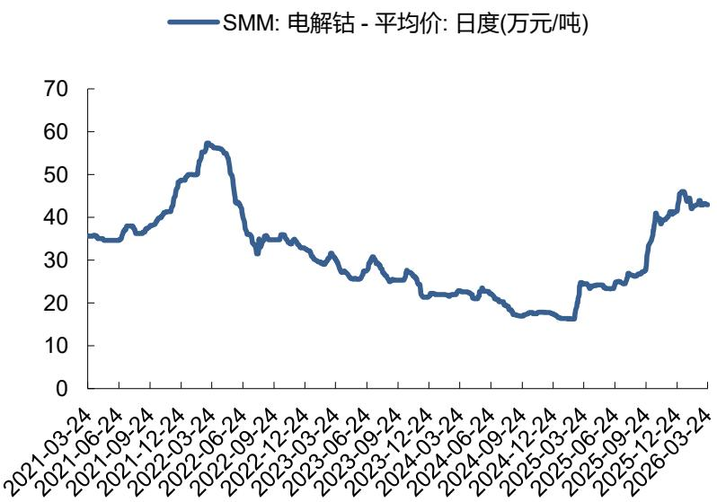

图：全球钴供需（万吨）
<table><tr><td rowspan=1 colspan=1></td><td rowspan=1 colspan=1>2023</td><td rowspan=1 colspan=1>2024</td><td rowspan=1 colspan=1>2025E</td><td rowspan=1 colspan=1>2026E</td><td rowspan=1 colspan=1>2027E</td></tr><tr><td rowspan=1 colspan=1>钴供给(万吨)</td><td rowspan=1 colspan=1>23</td><td rowspan=1 colspan=1>29</td><td rowspan=1 colspan=1>17</td><td rowspan=1 colspan=1>22</td><td rowspan=1 colspan=1>24</td></tr><tr><td rowspan=1 colspan=1>钴需求（(万吨)</td><td rowspan=1 colspan=1>22</td><td rowspan=1 colspan=1>23</td><td rowspan=1 colspan=1>25</td><td rowspan=1 colspan=1>27</td><td rowspan=1 colspan=1>30</td></tr><tr><td rowspan=1 colspan=1>供给过剩 (万吨)</td><td rowspan=1 colspan=1>1</td><td rowspan=1 colspan=1>6</td><td rowspan=1 colspan=1>-8</td><td rowspan=1 colspan=1>-5</td><td rowspan=1 colspan=1>-6</td></tr></table>

## 钴：印尼HPAL项目成为钴重要来源，华友最受益

◆ 印尼钴产量占比持续提升，且不受出口禁令影响。截至25年末主要MHP产能包括：华友钴业22万吨（钴2.2万吨）、格林美15万吨（钴1万吨）、力勤12万吨（钴1.5万吨）。

◆ 华友25年印尼钴产量最大，为最受益标的。公司刚果金钴自有矿3000吨左右，此外公司印尼湿法镍冶炼项目有2万吨钴副产品，对应权益1.2万吨，不受刚果金出口限制，若钴价上涨至30-40万，对应公司业绩具备20亿以上弹性。此外公司4.5万吨钴产品销售，其中2-3万吨左右买钴中间品精加工，计价为钴价\*计价系数，价格上涨情况下加工利润增厚，且可享受库存收益。

图：印尼钴产量（万吨）  
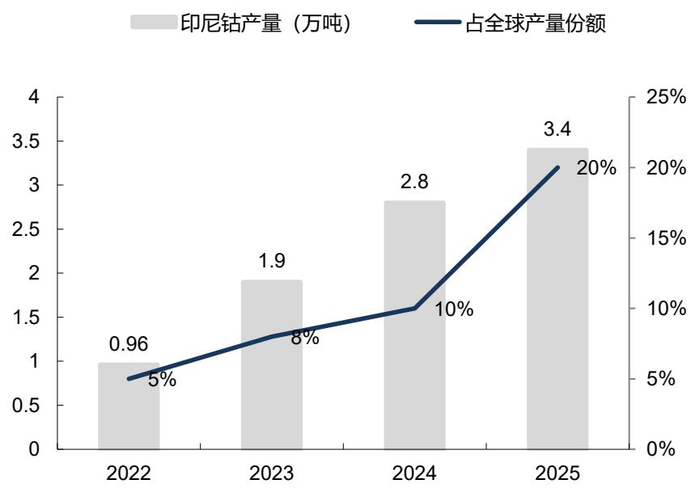

图：印尼HPAL镍钴产能
<table><tr><td rowspan=1 colspan=1>公司</td><td rowspan=1 colspan=1>项目</td><td rowspan=1 colspan=1>股权比例</td><td rowspan=1 colspan=1>MHP年产能（万金吨）</td><td rowspan=1 colspan=1>钴年产能（万金吨)</td><td rowspan=1 colspan=1>投产进度</td></tr><tr><td rowspan=4 colspan=1>华友钴业</td><td rowspan=1 colspan=1>华越</td><td rowspan=1 colspan=1>57%</td><td rowspan=1 colspan=1>8</td><td rowspan=1 colspan=1>0.8</td><td rowspan=1 colspan=1>满产</td></tr><tr><td rowspan=1 colspan=1>华飞</td><td rowspan=1 colspan=1>51%</td><td rowspan=1 colspan=1>14</td><td rowspan=1 colspan=1>1.4</td><td rowspan=1 colspan=1>满产</td></tr><tr><td rowspan=1 colspan=1>Pomalaa</td><td rowspan=1 colspan=1>61.5%</td><td rowspan=1 colspan=1>12</td><td rowspan=1 colspan=1>1.2</td><td rowspan=1 colspan=1>26年底投产</td></tr><tr><td rowspan=1 colspan=1>Sorowako</td><td rowspan=1 colspan=1>-</td><td rowspan=1 colspan=1>6</td><td rowspan=1 colspan=1>0.6</td><td rowspan=1 colspan=1>27年底投产</td></tr><tr><td rowspan=1 colspan=1></td><td rowspan=1 colspan=2>合计</td><td rowspan=1 colspan=1>40</td><td rowspan=1 colspan=1>4.0</td><td rowspan=1 colspan=1></td></tr><tr><td rowspan=5 colspan=1>格林美</td><td rowspan=1 colspan=1>QMB</td><td rowspan=1 colspan=1>55%</td><td rowspan=1 colspan=1>6.5</td><td rowspan=1 colspan=1>0.4</td><td rowspan=1 colspan=1>满产</td></tr><tr><td rowspan=1 colspan=1>MMN</td><td rowspan=1 colspan=1>55%</td><td rowspan=1 colspan=1>2.5</td><td rowspan=1 colspan=1>0.2</td><td rowspan=1 colspan=1>满产</td></tr><tr><td rowspan=1 colspan=1>GreenEco</td><td rowspan=1 colspan=1>58%</td><td rowspan=1 colspan=1>2</td><td rowspan=1 colspan=1>0.1</td><td rowspan=1 colspan=1>满产</td></tr><tr><td rowspan=1 colspan=1>ESG</td><td rowspan=1 colspan=1>45%</td><td rowspan=1 colspan=1>4</td><td rowspan=1 colspan=1>0.3</td><td rowspan=1 colspan=1>满产</td></tr><tr><td rowspan=1 colspan=1>IGIP</td><td rowspan=1 colspan=1>25%</td><td rowspan=1 colspan=1>6.6</td><td rowspan=1 colspan=1>0.4</td><td rowspan=1 colspan=1>26Q2开始投产</td></tr><tr><td rowspan=1 colspan=3>合计</td><td rowspan=1 colspan=1>21.6</td><td rowspan=1 colspan=1>1.4</td><td rowspan=1 colspan=1></td></tr><tr><td rowspan=3 colspan=1>力勤</td><td rowspan=1 colspan=1>HPL</td><td rowspan=1 colspan=1>55%</td><td rowspan=1 colspan=1>5.5</td><td rowspan=1 colspan=1>0.7</td><td rowspan=1 colspan=1>满产</td></tr><tr><td rowspan=1 colspan=1>ONC</td><td rowspan=1 colspan=1>60%</td><td rowspan=1 colspan=1>6.5</td><td rowspan=1 colspan=1>0.8</td><td rowspan=1 colspan=1>满产</td></tr><tr><td rowspan=1 colspan=1>POSCO合资项目</td><td rowspan=1 colspan=1>1</td><td rowspan=1 colspan=1>12</td><td rowspan=1 colspan=1>1.4</td><td rowspan=1 colspan=1>一期计划25年投产</td></tr><tr><td rowspan=1 colspan=3>合计</td><td rowspan=1 colspan=1>24</td><td rowspan=1 colspan=1>2.9</td><td rowspan=1 colspan=1></td></tr><tr><td rowspan=1 colspan=1>宁德</td><td rowspan=1 colspan=1>普勤产业链项目</td><td rowspan=1 colspan=1>30%</td><td rowspan=1 colspan=1>8</td><td rowspan=1 colspan=1>1.0</td><td rowspan=1 colspan=1>25年6月底开工</td></tr><tr><td rowspan=1 colspan=1>青山</td><td rowspan=1 colspan=1>印尼晨曦</td><td rowspan=1 colspan=1>二</td><td rowspan=1 colspan=1>6.7</td><td rowspan=1 colspan=1>0.67</td><td rowspan=1 colspan=1>计划25年投产</td></tr><tr><td rowspan=1 colspan=1>NickelIndustries</td><td rowspan=1 colspan=1>ENC</td><td rowspan=1 colspan=1>55%</td><td rowspan=1 colspan=1>7.2</td><td rowspan=1 colspan=1>0.72</td><td rowspan=1 colspan=1>计划25年底前投产</td></tr><tr><td rowspan=1 colspan=1>永青</td><td rowspan=1 colspan=1>蓝焰能源湿法项目</td><td rowspan=1 colspan=1>-</td><td rowspan=1 colspan=1>6</td><td rowspan=1 colspan=1>0.6</td><td rowspan=1 colspan=1>预计26Q1投产</td></tr></table>

新技术：产业化进展持续加快，钠电池迎来商业化元年

## 钠电池：产品技术迭代已成熟，26年为商业化元年

◆ 钠离子技术迭代已成熟，26年成为商业化元年。21-22年碳酸锂价格飙升，钠电池具备天然的成本优势，成为电池企业重点攻克的技术，23年成为钠电池产业化元年，但此后碳酸锂价格回落，钠离子电池关注度大幅降低，虽没有实现商业化放量，但在宁德时代等企业的引领下，钠电池的产品和技术在持续迭代。25年随着碳酸锂价格触底回升，钠离子电池凭借其成本优势以及低温性能重回视野，在能量密度、成本、快充等性能均大幅提升，26年成为商业化元年。

图 钠离子电池性能对比（23年 VS 25年）

## 2023年 钠离子电池

能量密度：160Wh/kg（动力）

倍率性能：4C（常温）

低温性能：-20℃保持率90%

循环寿命：3000-5000次（储能）

成本：0.6-0.7元/wh

应用领域：A00级乘用车、两轮电动车、1MWh级示范级储能

## 2025年 钠离子电池

能量密度：175Wh/kg（动力）

倍率性能：5C（常温）

低温性能：-40℃保持率90%

循环寿命：8000-10000次（储能）

成本：0.4-0.5元/wh

应用领域：A级乘用车、商用车、启停电源、100MWh级储能

## 成本：目前于铁锂经济性持平，未来有望降至0.2元/wh

◆ 钠电池目前于铁锂经济性持平，随着产业链的成熟，以及能量密度的提升，未来成本有望降至0.2元/wh。根据我们测算，目前层状氧化物体系成本在0.35元/wh，聚阴离子体系成本在0.3元/wh，层状氧化物正极含有铜铁锰等元素，此外需搭配高端硬碳，应用到动力领域，因此成本相对较高；而聚阴离子体系仅含铁元素，并可搭配中低端硬碳，应用于储能领域，因此成本优势更强。目前钠电池经济性并不显著，基本于磷酸铁锂持平，主要由于材料未放量、生产良率不足以及度电摊薄问题，但随着产业链配套成熟、电池能量密度的提升，钠电池成本有望降至0.2-0.3元/wh，有望具备较强的成本优势。

表 层状氧化物-钠电池BOOM成本（2026年）
<table><tr><td rowspan=1 colspan=1></td><td rowspan=1 colspan=5>钠离子电池</td></tr><tr><td rowspan=1 colspan=1>层状氧化物体系钠离子电池</td><td rowspan=1 colspan=1>单位用量</td><td rowspan=2 colspan=1>单位</td><td rowspan=2 colspan=1>单位价格（万)</td><td rowspan=1 colspan=1>单位成本</td><td rowspan=1 colspan=1>单位成本</td></tr><tr><td rowspan=1 colspan=1>电芯原材料成本</td><td rowspan=1 colspan=1>(/gwh)</td><td rowspan=1 colspan=1>(元/wh)</td><td rowspan=1 colspan=1>占比</td></tr><tr><td rowspan=1 colspan=1>正极材料</td><td rowspan=1 colspan=1>2500</td><td rowspan=1 colspan=1>t</td><td rowspan=1 colspan=1>5.00</td><td rowspan=1 colspan=1>0.11</td><td rowspan=1 colspan=1>43%</td></tr><tr><td rowspan=1 colspan=1>正极导电剂(AB)</td><td rowspan=1 colspan=1>30</td><td rowspan=1 colspan=1>t</td><td rowspan=1 colspan=1>5.00</td><td rowspan=1 colspan=1>0.00</td><td rowspan=1 colspan=1>1%</td></tr><tr><td rowspan=1 colspan=1>正极黏贴剂(PVDF)</td><td rowspan=1 colspan=1>100</td><td rowspan=1 colspan=1>t</td><td rowspan=1 colspan=1>6</td><td rowspan=1 colspan=1>0.01</td><td rowspan=1 colspan=1>2%</td></tr><tr><td rowspan=1 colspan=1>分散剂(NMP)</td><td rowspan=1 colspan=1>10</td><td rowspan=1 colspan=1>t</td><td rowspan=1 colspan=1>1.00</td><td rowspan=1 colspan=1>0.00</td><td rowspan=1 colspan=1>0%</td></tr><tr><td rowspan=1 colspan=1>正极集体流(铝箔)</td><td rowspan=1 colspan=1>400</td><td rowspan=1 colspan=1>t</td><td rowspan=1 colspan=1>4.45</td><td rowspan=1 colspan=1>0.02</td><td rowspan=1 colspan=1>6%</td></tr><tr><td rowspan=1 colspan=1>负极活性物质(硬碳)</td><td rowspan=1 colspan=1>960</td><td rowspan=1 colspan=1>t</td><td rowspan=1 colspan=1>5.00</td><td rowspan=1 colspan=1>0.04</td><td rowspan=1 colspan=1>17%</td></tr><tr><td rowspan=1 colspan=1>负极粘结剂1(SBR)</td><td rowspan=1 colspan=1>40</td><td rowspan=1 colspan=1>t</td><td rowspan=1 colspan=1>10.00</td><td rowspan=1 colspan=1>0.00</td><td rowspan=1 colspan=1>1%</td></tr><tr><td rowspan=1 colspan=1>负极粘结剂2(CMC)</td><td rowspan=1 colspan=1>40</td><td rowspan=1 colspan=1>t</td><td rowspan=1 colspan=1>5.00</td><td rowspan=1 colspan=1>0.00</td><td rowspan=1 colspan=1>1%</td></tr><tr><td rowspan=1 colspan=1>负极集流体(铝箔)</td><td rowspan=1 colspan=1>400</td><td rowspan=1 colspan=1>t</td><td rowspan=1 colspan=1>4.5</td><td rowspan=1 colspan=1>0.02</td><td rowspan=1 colspan=1>6%</td></tr><tr><td rowspan=1 colspan=1>电解液</td><td rowspan=1 colspan=1>900</td><td rowspan=1 colspan=1>t</td><td rowspan=1 colspan=1>3.76</td><td rowspan=1 colspan=1>0.03</td><td rowspan=1 colspan=1>12%</td></tr><tr><td rowspan=1 colspan=1>隔膜 (干法涂覆)</td><td rowspan=1 colspan=1>2000</td><td rowspan=1 colspan=1>万m2</td><td rowspan=1 colspan=1>0.5</td><td rowspan=1 colspan=1>0.01</td><td rowspan=1 colspan=1>3%</td></tr><tr><td rowspan=1 colspan=1>壳体&amp;辊压膜及其他</td><td rowspan=1 colspan=1>1</td><td rowspan=1 colspan=1>套</td><td rowspan=1 colspan=1>0.1</td><td rowspan=1 colspan=1>0.02</td><td rowspan=1 colspan=1>8%</td></tr><tr><td rowspan=1 colspan=1>电芯材料成本合计(元/wh)</td><td rowspan=1 colspan=4>0.26</td><td rowspan=1 colspan=1>100%</td></tr><tr><td rowspan=1 colspan=1>折旧(元/wh)</td><td rowspan=1 colspan=4>0.01</td><td rowspan=1 colspan=1>3%</td></tr><tr><td rowspan=1 colspan=1>电费、人工费、运费等（元/wh)</td><td rowspan=1 colspan=4>0.02</td><td rowspan=1 colspan=1>8%</td></tr><tr><td rowspan=1 colspan=1>成本合计(元/wh)</td><td rowspan=1 colspan=4>0.29</td><td rowspan=1 colspan=1></td></tr><tr><td rowspan=1 colspan=1>合格率</td><td rowspan=1 colspan=5>80.0%</td></tr><tr><td rowspan=1 colspan=1>成本合计（元/wh），不含税</td><td rowspan=1 colspan=5>0.36</td></tr></table>

表 聚阴离子-钠电池BOOM成本（2026年）
<table><tr><td rowspan=1 colspan=1></td><td rowspan=1 colspan=5>钠离子电池</td></tr><tr><td rowspan=1 colspan=1>聚阴离子体系钠离子电池</td><td rowspan=1 colspan=1>单位用量</td><td rowspan=2 colspan=1>单位</td><td rowspan=2 colspan=1>单位价格（万)</td><td rowspan=1 colspan=1>单位成本</td><td rowspan=1 colspan=1>单位成本</td></tr><tr><td rowspan=1 colspan=1>电芯原材料成本</td><td rowspan=1 colspan=1>(/gwh)</td><td rowspan=1 colspan=1>(元/wh)</td><td rowspan=1 colspan=1>占比</td></tr><tr><td rowspan=1 colspan=1>正极材料</td><td rowspan=1 colspan=1>3000</td><td rowspan=1 colspan=1>t</td><td rowspan=1 colspan=1>2.50</td><td rowspan=1 colspan=1>0.07</td><td rowspan=1 colspan=1>31%</td></tr><tr><td rowspan=1 colspan=1>正极导电剂(AB)</td><td rowspan=1 colspan=1>36</td><td rowspan=1 colspan=1>t</td><td rowspan=1 colspan=1>5.00</td><td rowspan=1 colspan=1>0.00</td><td rowspan=1 colspan=1>1%</td></tr><tr><td rowspan=1 colspan=1>正极黏贴剂(PVDF)</td><td rowspan=1 colspan=1>120</td><td rowspan=1 colspan=1>t</td><td rowspan=1 colspan=1>6</td><td rowspan=1 colspan=1>0.01</td><td rowspan=1 colspan=1>3%</td></tr><tr><td rowspan=1 colspan=1>分散剂（NMP)</td><td rowspan=1 colspan=1>12</td><td rowspan=1 colspan=1>t</td><td rowspan=1 colspan=1>1.00</td><td rowspan=1 colspan=1>0.00</td><td rowspan=1 colspan=1>0%</td></tr><tr><td rowspan=1 colspan=1>正极集体流(铝箔)</td><td rowspan=1 colspan=1>480</td><td rowspan=1 colspan=1>t</td><td rowspan=1 colspan=1>4.45</td><td rowspan=1 colspan=1>0.02</td><td rowspan=1 colspan=1>9%</td></tr><tr><td rowspan=1 colspan=1>负极活性物质(硬碳)</td><td rowspan=1 colspan=1>1152</td><td rowspan=1 colspan=1>t</td><td rowspan=1 colspan=1>3.00</td><td rowspan=1 colspan=1>0.03</td><td rowspan=1 colspan=1>14%</td></tr><tr><td rowspan=1 colspan=1>负极粘结剂1(SBR)</td><td rowspan=1 colspan=1>48</td><td rowspan=1 colspan=1>t</td><td rowspan=1 colspan=1>10.00</td><td rowspan=1 colspan=1>0.00</td><td rowspan=1 colspan=1>2%</td></tr><tr><td rowspan=1 colspan=1>负极粘结剂2(CMC)</td><td rowspan=1 colspan=1>48</td><td rowspan=1 colspan=1>t</td><td rowspan=1 colspan=1>5.00</td><td rowspan=1 colspan=1>0.00</td><td rowspan=1 colspan=1>1%</td></tr><tr><td rowspan=1 colspan=1>负极集流体(铝箔)</td><td rowspan=1 colspan=1>480</td><td rowspan=1 colspan=1>t</td><td rowspan=1 colspan=1>4.5</td><td rowspan=1 colspan=1>0.02</td><td rowspan=1 colspan=1>9%</td></tr><tr><td rowspan=1 colspan=1>电解液</td><td rowspan=1 colspan=1>1080</td><td rowspan=1 colspan=1>t</td><td rowspan=1 colspan=1>3.76</td><td rowspan=1 colspan=1>0.04</td><td rowspan=1 colspan=1>17%</td></tr><tr><td rowspan=1 colspan=1>隔膜 (干法涂覆)</td><td rowspan=1 colspan=1>2400</td><td rowspan=1 colspan=1>万m2</td><td rowspan=1 colspan=1>0.5</td><td rowspan=1 colspan=1>0.01</td><td rowspan=1 colspan=1>5%</td></tr><tr><td rowspan=1 colspan=1>壳体&amp;辊压膜及其他</td><td rowspan=1 colspan=1>1</td><td rowspan=1 colspan=1>套</td><td rowspan=1 colspan=1>0.1</td><td rowspan=1 colspan=1>0.02</td><td rowspan=1 colspan=1>9%</td></tr><tr><td rowspan=1 colspan=1>电芯材料成本合计(元/wh)</td><td rowspan=1 colspan=4>0.22</td><td rowspan=1 colspan=1>100%</td></tr><tr><td rowspan=1 colspan=1>折旧(元/wh)</td><td rowspan=1 colspan=4>0.01</td><td rowspan=1 colspan=1>4%</td></tr><tr><td rowspan=1 colspan=1>电费、人工费、运费等（元/wh)</td><td rowspan=1 colspan=4>0.02</td><td rowspan=1 colspan=1>9%</td></tr><tr><td rowspan=1 colspan=1>成本合计(元/wh)</td><td rowspan=1 colspan=4>0.25</td><td rowspan=1 colspan=1></td></tr><tr><td rowspan=1 colspan=1>合格率</td><td rowspan=1 colspan=5>80.0%</td></tr><tr><td rowspan=1 colspan=1>成本合计（元/wh），不含税</td><td rowspan=1 colspan=5>0.31</td></tr></table>

数据来源：公司公告，东吴证券研究所

## 经济性：锂价15万元/吨，铜价10万元/吨，是钠电经济性平衡点

◆ 钠电池已接近经济性平衡点，随着产业链规模持续放量，降本优势将进一步加强。我们预计26-27年钠电池单wh成本将降至0.3元/wh左右，根据我们测算，铜价10万元/吨，锂价15万元/吨，是钠电池（聚阴离子）和锂电池（磷酸铁锂）的经济性平衡点。若铜价降至8万元/吨，锂价在15-20万元/吨，也可达到经济性平衡点。随着产业链规模持续放量，降本优势将进一步加强，若钠电池未来成本降至0.2元/wh，即使铜价在6万元/吨，锂价在5万元/吨，钠电池仍具备较强的经济性，有望在储能、商用车、乘用车领域大规模放量。

表 钠离子电池经济性测算（元/wh）

<table><tr><td rowspan=2 colspan=2>单wh铁锂成本单wh钠电成本</td><td rowspan=1 colspan=11>锂价 (万元/吨)</td></tr><tr><td rowspan=1 colspan=1>5</td><td rowspan=1 colspan=1>7.5</td><td rowspan=1 colspan=1>10</td><td rowspan=1 colspan=1>12.5</td><td rowspan=1 colspan=1>15</td><td rowspan=1 colspan=1>17.5</td><td rowspan=1 colspan=1>20</td><td rowspan=1 colspan=1>22.5</td><td rowspan=1 colspan=1>25</td><td rowspan=1 colspan=1>27.5</td><td rowspan=1 colspan=1>30</td></tr><tr><td rowspan=14 colspan=1>铜价（万元/吨）</td><td rowspan=1 colspan=1>6</td><td rowspan=1 colspan=1>(0.07)</td><td rowspan=1 colspan=1>(0.05)</td><td rowspan=1 colspan=1>(0.04)</td><td rowspan=1 colspan=1>(0.03)</td><td rowspan=1 colspan=1>(0.02)</td><td rowspan=1 colspan=1>(0.01)</td><td rowspan=1 colspan=1>(0.00)</td><td rowspan=1 colspan=1>0.01</td><td rowspan=1 colspan=1>0.02</td><td rowspan=1 colspan=1>0.03</td><td rowspan=2 colspan=1>0.040.05</td></tr><tr><td rowspan=2 colspan=1>7</td><td rowspan=2 colspan=1>(0.06)</td><td rowspan=2 colspan=1>(0.05)</td><td rowspan=2 colspan=1>(0.04)</td><td rowspan=1 colspan=1>(0.03)</td><td rowspan=1 colspan=1>(0.02)</td><td rowspan=1 colspan=1>(0.01)</td><td rowspan=1 colspan=1>0.00</td><td rowspan=1 colspan=1>0.01</td><td rowspan=1 colspan=1>0.02</td><td rowspan=1 colspan=1>0.03</td></tr><tr><td rowspan=1 colspan=1></td><td rowspan=1 colspan=1></td><td rowspan=1 colspan=1></td><td rowspan=1 colspan=1></td><td rowspan=1 colspan=1></td><td rowspan=1 colspan=1></td><td rowspan=1 colspan=1></td><td rowspan=2 colspan=1>0.05</td></tr><tr><td rowspan=1 colspan=1>8</td><td rowspan=1 colspan=1>(0.05)</td><td rowspan=1 colspan=1>(0.04)</td><td rowspan=1 colspan=1>(0.03)</td><td rowspan=1 colspan=1>(0.02)</td><td rowspan=1 colspan=1>(0.01)</td><td rowspan=1 colspan=1>0.00</td><td rowspan=1 colspan=1>0.01</td><td rowspan=1 colspan=1>0.02</td><td rowspan=1 colspan=1>0.03</td><td rowspan=1 colspan=1>0.04</td></tr><tr><td rowspan=2 colspan=1>9</td><td rowspan=2 colspan=1>(0.04)</td><td rowspan=2 colspan=1>(0.03)</td><td rowspan=1 colspan=1>(0.02)</td><td rowspan=1 colspan=1>(0.01)</td><td rowspan=1 colspan=1>(0.00)</td><td rowspan=1 colspan=1>0.01</td><td rowspan=1 colspan=1>0.02</td><td rowspan=1 colspan=1>0.03</td><td rowspan=1 colspan=1>0.04</td><td rowspan=1 colspan=1>0.05</td><td rowspan=3 colspan=1>0.060.07</td></tr><tr><td rowspan=1 colspan=1></td><td rowspan=1 colspan=1></td><td rowspan=1 colspan=1></td><td rowspan=1 colspan=1></td><td rowspan=1 colspan=1></td><td rowspan=1 colspan=1></td><td rowspan=1 colspan=1></td><td rowspan=1 colspan=1></td></tr><tr><td rowspan=1 colspan=1>10</td><td rowspan=1 colspan=1>(0.04)</td><td rowspan=1 colspan=1>(0.03)</td><td rowspan=1 colspan=1>(0.02)</td><td rowspan=1 colspan=1>(0.01)</td><td rowspan=1 colspan=1>0.00</td><td rowspan=1 colspan=1>0.01</td><td rowspan=1 colspan=1>0.02</td><td rowspan=1 colspan=1>0.03</td><td rowspan=1 colspan=1>0.04</td><td rowspan=1 colspan=1>0.06</td></tr><tr><td rowspan=2 colspan=1>11</td><td rowspan=2 colspan=1>(0.03)</td><td rowspan=2 colspan=1>(0.02)</td><td rowspan=2 colspan=1>(0.01)</td><td rowspan=1 colspan=1>(0.00)</td><td rowspan=1 colspan=1>0.01</td><td rowspan=1 colspan=1>0.02</td><td rowspan=1 colspan=1>0.03</td><td rowspan=1 colspan=1>0.04</td><td rowspan=1 colspan=1>0.05</td><td rowspan=1 colspan=1>0.06</td><td rowspan=2 colspan=1>0.07</td></tr><tr><td rowspan=1 colspan=1></td><td rowspan=1 colspan=1></td><td rowspan=1 colspan=1></td><td rowspan=1 colspan=1></td><td rowspan=1 colspan=1></td><td rowspan=1 colspan=1></td><td rowspan=1 colspan=1></td></tr><tr><td rowspan=1 colspan=1>12</td><td rowspan=1 colspan=1>(0.02)</td><td rowspan=1 colspan=1>(0.01)</td><td rowspan=1 colspan=1>(0.00)</td><td rowspan=1 colspan=1>0.01</td><td rowspan=1 colspan=1>0.02</td><td rowspan=1 colspan=1>0.03</td><td rowspan=1 colspan=1>0.04</td><td rowspan=1 colspan=1>0.05</td><td rowspan=1 colspan=1>0.06</td><td rowspan=1 colspan=1>0.07</td><td rowspan=5 colspan=1>0.080.090.09</td></tr><tr><td rowspan=2 colspan=1>13</td><td rowspan=2 colspan=1>(0.02)</td><td rowspan=2 colspan=1>(0.01)</td><td rowspan=2 colspan=1>0.00</td><td rowspan=2 colspan=1>0.01</td><td rowspan=1 colspan=1>0.02</td><td rowspan=1 colspan=1>0.03</td><td rowspan=1 colspan=1>0.04</td><td rowspan=1 colspan=1>0.05</td><td rowspan=2 colspan=1>0.07</td><td rowspan=2 colspan=1>0.08</td></tr><tr><td rowspan=1 colspan=1></td><td rowspan=1 colspan=1></td><td rowspan=1 colspan=1></td><td rowspan=1 colspan=1></td><td rowspan=1 colspan=1></td></tr><tr><td rowspan=2 colspan=1>14</td><td rowspan=2 colspan=1>(0.01)</td><td rowspan=2 colspan=1>(0.00)</td><td rowspan=2 colspan=1>0.01</td><td rowspan=2 colspan=1>0.02</td><td rowspan=2 colspan=1>0.03</td><td rowspan=2 colspan=1>0.04</td><td rowspan=1 colspan=1>0.05</td><td rowspan=2 colspan=1>0.06</td><td rowspan=2 colspan=1>0.07</td><td rowspan=2 colspan=1>0.08</td></tr><tr><td rowspan=1 colspan=1></td></tr></table>

## 空间预测：26年开启商业化元年，未来渗透率有望突破30%

◆ 钠电池26年开启商业化元年，出货量我们预计突破20GWh，30年有望达500-1000GWh。根据起点研究院，25年钠电池出货量达8.8GWh，其中储能5.6GWh，两轮车1.7GWh，新能源汽车1GWh，启停电源0.5GWh。考虑到26-27年锂价处于高位，宁德、比亚迪等头部厂商技术引领，我们预计26年钠电池出货量突破20GWh，27-28年具备经济性优势，30年规模有望达500-1000GWh，远期渗透率有望突破30%。

表 钠离子电池出货量预测（GWh）

<table><tr><td></td><td>2025</td><td>2026E</td><td>2027E</td><td>2028E</td><td>2029E</td><td>2030E</td><td>2035E</td></tr><tr><td>启停电源</td><td>0.5</td><td>2</td><td>5</td><td>15</td><td>30</td><td>50</td><td>100</td></tr><tr><td>yoy</td><td></td><td>300%</td><td>150%</td><td>200%</td><td>100%</td><td>67%</td><td>100%</td></tr><tr><td>电动两轮车</td><td>1.7</td><td>3</td><td>5</td><td>15</td><td>30</td><td>50</td><td>100</td></tr><tr><td>yoy</td><td></td><td>76%</td><td>67%</td><td>200%</td><td>100%</td><td>67%</td><td>100%</td></tr><tr><td>新能源汽车</td><td>1</td><td>5</td><td>20</td><td>50</td><td>100</td><td>200</td><td>500</td></tr><tr><td>yoy</td><td></td><td>400%</td><td>300%</td><td>150%</td><td>100%</td><td>100%</td><td>150%</td></tr><tr><td>储能</td><td>5.6</td><td>10</td><td>30</td><td>75</td><td>200</td><td>500</td><td>2500</td></tr><tr><td>yoy</td><td></td><td>79%</td><td>200%</td><td>150%</td><td>167%</td><td>150%</td><td>400%</td></tr><tr><td>钠电池 (合计)</td><td>8.8</td><td>20</td><td>60</td><td>155</td><td>360</td><td>800</td><td>3200</td></tr><tr><td>yoy</td><td></td><td>127%</td><td>200%</td><td>158%</td><td>132%</td><td>122%</td><td>300%</td></tr><tr><td>锂电池 (合计)</td><td>2059</td><td>2716</td><td>3315</td><td>3870</td><td>4528</td><td>5309</td><td>8500</td></tr><tr><td>yoy</td><td></td><td>32%</td><td>22%</td><td>17%</td><td>17%</td><td>17%</td><td>60%</td></tr><tr><td>钠电渗透率</td><td>0%</td><td>1%</td><td>2%</td><td>4%</td><td>7%</td><td>13%</td><td>27%</td></tr></table>

数据来源：公司公告，东吴证券研究所

## 固态电池：26年的边际变化是Pack端突破+样车路试+GWh级量产线落地

◆ 26年固态进入关键期，H1车规级Pack下线，开启装车路试验证，H2我们预计量产线落地。固态电池26年进入关键期，年初电芯端开启中期审查，若顺利将步入pack端测试，并开展装车路试验证，下半年建成gwh级量产线。我们认为26年核心催化点在于GWh级量产线的招标+固态相关车型的路试，有望带来类比25年两轮大级别的行情。

图 全固态电池2025-2027年产业化节奏  
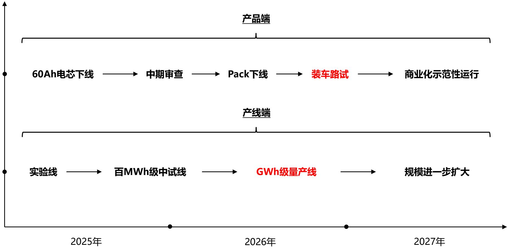

数据来源：工信部，wind，东吴证券研究所

## 产业端：26年进入路试阶段，重点关注固态新车型

◆ 固态电池26年进入路试阶段，重点关注新车型路试情况。2025年12月31日，红旗首台全固态电池包成功装载于天工06车型试制下线，正式迈入实车测试的全新阶段；2026年1月22日，吉利宣布全固态电池包我们预计今年完成下线，并开展装车验证。整体看，固态电池26年H1从电芯端步入Pack端，并开展密集的装车路试验证，后续有望看到广汽、上汽、阿维塔、奇瑞等车企的相关进展。此外，宁德时代通过双核架构设计，有望大幅提前固态电池的商业化节点，建议重点关注头部企业的固态电池新车型，有望后续亮相工信部申报名录。

图 红旗全固态电池包试制下线，进入实车测试阶段  
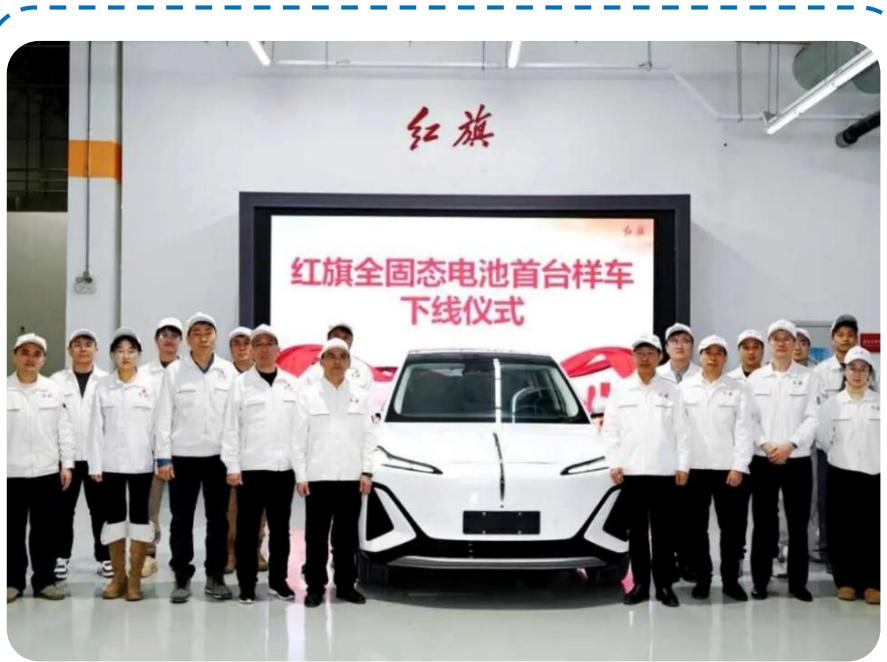

2025年12月31日，红旗研发总院自主研发的首台全固态电池包成功装载于红旗天工06车型试制下线，这表明红旗在全固态电池技术领域已进入实车测试阶段

图 宁德时代骁遥双核电池（加速固态电池商业化）  
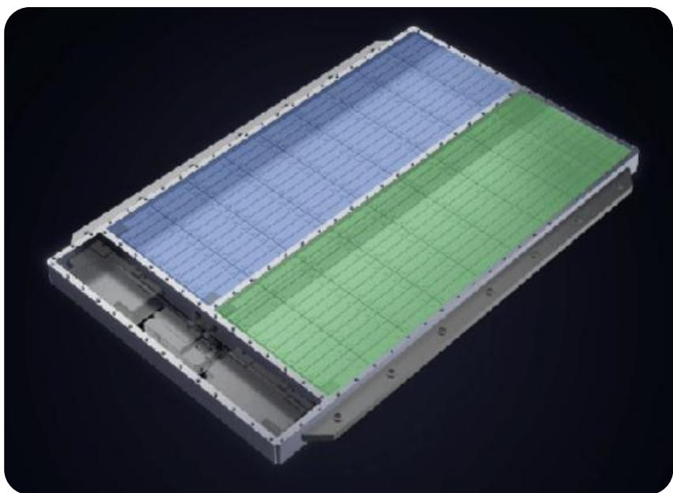

两大独立能量区智能协同，多元化学体系灵活搭配，主能量区可选择不同化学体系电池，满足日常用车场景，增程能量区使用固态电池（自生成负极），满足长途出行需求

## 产线端：固态GWh级线Q1完成招标，Q3完成建设

◆ 我们预计固态GWh级量产线Q1完成招标，Q3完成建设，头部厂商相关设备环节标的受益。前道的干法设备、后道的等静压设备交付周期较长，我们预计率先开启招标，中道的叠片机/绝缘设备后续开启招标，最后模组/Pack组装线完成招标，建议重点关注宁德时代、比亚迪产业链相关标的。

图：固态电池产线建设情况  
图：固态电池设备环节及相关标的  
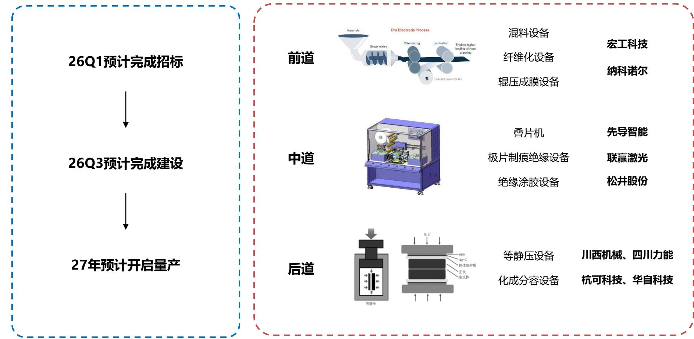

## 空间预测：27年小规模量产，30年大规模商业化，开启万亿级市场

◆ 27年小批量装车，30年大规模量产，固态电池应用空间广阔。固态电池在国家大力支持下，近半年产业链发展迅速，25年底前小试完毕+车规级电芯下线，26年中试线优化+样车路试，27年小规模量产+装车商业化示范性运营，并逐渐细分场景小规模应用，30年我们预计大规模商业化，此外固态电池适配太空航天领域，行业开启万亿级市场！

图：固态电池出货量预测
<table><tr><td></td><td>2027E</td><td>2028E</td><td>2029E</td><td>2030E</td><td>2035E</td></tr><tr><td>全固态电池出货量(GWh)</td><td>1.0</td><td>5.0</td><td>30.0</td><td>100.0</td><td>1000.0</td></tr><tr><td>全固态电池价格 (元/Wh)</td><td>5.0</td><td>3.0</td><td>1.8</td><td>1.5</td><td>0.8</td></tr><tr><td>市场空间 (亿元)</td><td>50.0</td><td>150.0</td><td>540.0</td><td>1500.0</td><td>8000.0</td></tr><tr><td>固态电解质 (万吨)</td><td>0.10</td><td>0.50</td><td>3.00</td><td>10.00</td><td>100.00</td></tr><tr><td>固态电解质价格 (万元/吨)</td><td>400</td><td>200</td><td>100</td><td>75</td><td>25</td></tr><tr><td>固态电解质市场空间 (亿元)</td><td>40.0</td><td>100.0</td><td>300.0</td><td>750.0</td><td>2500.0</td></tr><tr><td>硫化锂 (万吨)</td><td>0.04</td><td>0.22</td><td>1.29</td><td>4.30</td><td>43.00</td></tr><tr><td>硫化锂价格 (万元/吨)</td><td>260</td><td>200</td><td>180</td><td>120</td><td>50</td></tr><tr><td>硫化锂市场空间 (亿元)</td><td>11.2</td><td>43.0</td><td>232.2</td><td>516.0</td><td>2150.0</td></tr><tr><td>硅碳负极 (万吨)</td><td>0.07</td><td>0.34</td><td>1.80</td><td>5.25</td><td>22.50</td></tr><tr><td>硅碳渗透率</td><td>95%</td><td>90%</td><td>80%</td><td>70%</td><td>30%</td></tr><tr><td>硅碳负极价格 (万元/吨)</td><td>30</td><td>20</td><td>18</td><td>15</td><td>10</td></tr><tr><td>硅碳负极市场空间 (亿元)</td><td>2.1</td><td>6.8</td><td>31.5</td><td>78.8</td><td>225.0</td></tr><tr><td>锂金属负极 (万吨)</td><td>0.00</td><td>0.00</td><td>0.03</td><td>0.15</td><td>3.50</td></tr><tr><td>锂金属渗透率</td><td>5%</td><td>10%</td><td>20%</td><td>30%</td><td>70%</td></tr><tr><td>锂金属负极价格 (万元/吨)</td><td>800</td><td>500</td><td>400</td><td>300</td><td>100</td></tr><tr><td>锂金属负极市场空间 (亿元)</td><td>0.2</td><td>1.3</td><td>12.0</td><td>45.0</td><td>350.0</td></tr><tr><td>碳纳米管 (万吨)</td><td>0.00</td><td>0.02</td><td>0.09</td><td>0.30</td><td>3.00</td></tr><tr><td>碳纳米管价格 (万元/吨)</td><td>500</td><td>300</td><td>250</td><td>200</td><td>100</td></tr><tr><td>碳纳米管市场空间 (亿元)</td><td>1.5</td><td>4.5</td><td>22.5</td><td>60.0</td><td>300.0</td></tr><tr><td>设备端价格（亿元/GWh)</td><td>3.0</td><td>2.5</td><td>2.2</td><td>2.0</td><td>1.5</td></tr><tr><td>设备端市场空间 (亿元)</td><td>3.0</td><td>10.0</td><td>55.0</td><td>140.0</td><td>1275.0</td></tr></table>

## 投资建议和风险提示

## 投资建议

◆ 投资建议：锂电新一轮大周期，全面看好！继续强推格局和盈利稳定龙头电池（推荐宁德时代、亿纬锂能、比亚迪、中创新航、欣旺达）、以及具备涨价弹性和优质锂电材料龙头，推荐隔膜、六氟、结构件、铝箔等环节（推荐佛塑科技、富临精工、恩捷股份、湖南裕能、天赐材料、科达利、璞泰来、鼎胜新材、尚太科技、星源材质、华友钴业等，关注天际股份、多氟多、万润新能、龙蟠科技、华盛锂电、海科新源、石大胜华等）；同时看好碳酸锂龙头（推荐赣锋锂业、永兴材料、中矿资源、盛新锂能、天齐锂业、雅化集团、藏格矿业，关注国城矿业、大中矿业等） 。

表：重点公司估值表（数据截至2026年4月16日）
<table><tr><td rowspan=1 colspan=1></td><td rowspan=1 colspan=1>证券代码</td><td rowspan=1 colspan=1>名称</td><td rowspan=1 colspan=1>总市值</td><td rowspan=1 colspan=1>股价</td><td rowspan=1 colspan=2></td><td rowspan=1 colspan=2>归母净利润 (亿元）</td><td rowspan=1 colspan=1></td><td rowspan=1 colspan=1>PE</td><td rowspan=1 colspan=1></td><td rowspan=1 colspan=1>评级</td><td rowspan=2 colspan=1>来源</td></tr><tr><td rowspan=1 colspan=1></td><td rowspan=1 colspan=1></td><td rowspan=1 colspan=1></td><td rowspan=1 colspan=1>（亿元）</td><td rowspan=1 colspan=1>（元/股）</td><td rowspan=1 colspan=2>2025A/E</td><td rowspan=1 colspan=1>2026E</td><td rowspan=1 colspan=1>2027E</td><td rowspan=1 colspan=1>2025A/E</td><td rowspan=1 colspan=1>2026E</td><td rowspan=1 colspan=1>2027E</td><td rowspan=1 colspan=1></td></tr><tr><td rowspan=5 colspan=1>电池</td><td rowspan=1 colspan=1>300750.SZ</td><td rowspan=1 colspan=1>宁德时代</td><td rowspan=1 colspan=1>20,988</td><td rowspan=1 colspan=1>454</td><td rowspan=1 colspan=2>722</td><td rowspan=1 colspan=1>962</td><td rowspan=1 colspan=1>1.215</td><td rowspan=1 colspan=1>29</td><td rowspan=1 colspan=1>22</td><td rowspan=1 colspan=1>17</td><td rowspan=1 colspan=1>买入</td><td rowspan=1 colspan=1>东吴</td></tr><tr><td rowspan=1 colspan=1>002594.SZ</td><td rowspan=1 colspan=1>比亚迪</td><td rowspan=1 colspan=1>9,389</td><td rowspan=1 colspan=1>106</td><td rowspan=1 colspan=2>326</td><td rowspan=1 colspan=1>404</td><td rowspan=1 colspan=1>505</td><td rowspan=1 colspan=1>29</td><td rowspan=1 colspan=1>23</td><td rowspan=1 colspan=1>19</td><td rowspan=1 colspan=1>买入</td><td rowspan=1 colspan=1>东吴</td></tr><tr><td rowspan=1 colspan=1>300207.SZ</td><td rowspan=1 colspan=1>欣旺达</td><td rowspan=1 colspan=1>542</td><td rowspan=1 colspan=1>29</td><td rowspan=1 colspan=2>14</td><td rowspan=1 colspan=1>30</td><td rowspan=1 colspan=1>41</td><td rowspan=1 colspan=1>38</td><td rowspan=1 colspan=1>18</td><td rowspan=1 colspan=1>13</td><td rowspan=1 colspan=1>买入</td><td rowspan=1 colspan=1>东吴</td></tr><tr><td rowspan=1 colspan=1>002245.SZ</td><td rowspan=1 colspan=1>蔚蓝锂芯</td><td rowspan=1 colspan=1>229</td><td rowspan=1 colspan=1>20</td><td rowspan=1 colspan=2>7</td><td rowspan=1 colspan=1>10</td><td rowspan=1 colspan=1>14</td><td rowspan=1 colspan=1>32</td><td rowspan=1 colspan=1>23</td><td rowspan=1 colspan=1>16</td><td rowspan=1 colspan=1>买入</td><td rowspan=1 colspan=1>东吴</td></tr><tr><td rowspan=1 colspan=1>688063.SH</td><td rowspan=1 colspan=1>派能科技</td><td rowspan=1 colspan=1>185</td><td rowspan=1 colspan=1>75</td><td rowspan=1 colspan=2>1</td><td rowspan=1 colspan=1>4</td><td rowspan=1 colspan=1>5</td><td rowspan=1 colspan=1>218</td><td rowspan=1 colspan=1>45</td><td rowspan=1 colspan=1>35</td><td rowspan=1 colspan=1>买入</td><td rowspan=1 colspan=1>东吴</td></tr><tr><td rowspan=1 colspan=1>结构件</td><td rowspan=1 colspan=1>002850.SZ</td><td rowspan=1 colspan=1>科达利</td><td rowspan=1 colspan=1>567</td><td rowspan=1 colspan=1>206</td><td rowspan=1 colspan=2>18</td><td rowspan=1 colspan=1>24</td><td rowspan=1 colspan=1>31</td><td rowspan=1 colspan=1>32</td><td rowspan=1 colspan=1>24</td><td rowspan=1 colspan=1>18</td><td rowspan=1 colspan=1>买入</td><td rowspan=1 colspan=1>东吴</td></tr><tr><td rowspan=2 colspan=1>电解液</td><td rowspan=1 colspan=1>002709.SZ</td><td rowspan=1 colspan=1>天赐材料</td><td rowspan=1 colspan=1>1,002</td><td rowspan=1 colspan=1>49</td><td rowspan=1 colspan=2>14</td><td rowspan=1 colspan=1>70</td><td rowspan=1 colspan=1>83</td><td rowspan=1 colspan=1>74</td><td rowspan=1 colspan=1>14</td><td rowspan=1 colspan=1>12</td><td rowspan=1 colspan=1>买入</td><td rowspan=1 colspan=1>东吴</td></tr><tr><td rowspan=1 colspan=1>300037.SZ</td><td rowspan=1 colspan=1>新宙邦</td><td rowspan=1 colspan=1>477</td><td rowspan=1 colspan=1>64</td><td rowspan=1 colspan=2>11</td><td rowspan=1 colspan=1>24</td><td rowspan=1 colspan=1>27</td><td rowspan=1 colspan=1>44</td><td rowspan=1 colspan=1>20</td><td rowspan=1 colspan=1>18</td><td rowspan=1 colspan=1>买入</td><td rowspan=1 colspan=1>东吴</td></tr><tr><td rowspan=4 colspan=1>负极</td><td rowspan=1 colspan=1>603659.SH</td><td rowspan=1 colspan=1>璞泰来</td><td rowspan=1 colspan=1>766</td><td rowspan=1 colspan=1>36</td><td rowspan=1 colspan=2>24</td><td rowspan=1 colspan=1>33</td><td rowspan=1 colspan=1>44</td><td rowspan=1 colspan=1>32</td><td rowspan=1 colspan=1>23</td><td rowspan=1 colspan=1>17</td><td rowspan=1 colspan=1>买入</td><td rowspan=1 colspan=1>东吴</td></tr><tr><td rowspan=1 colspan=1>920185.BJ</td><td rowspan=1 colspan=1>贝特瑞</td><td rowspan=1 colspan=1>347</td><td rowspan=1 colspan=1>30</td><td rowspan=1 colspan=2>12</td><td rowspan=1 colspan=1>15</td><td rowspan=1 colspan=1>18</td><td rowspan=1 colspan=1>29</td><td rowspan=1 colspan=1>23</td><td rowspan=1 colspan=1>19</td><td rowspan=1 colspan=1>买入</td><td rowspan=1 colspan=1>东吴</td></tr><tr><td rowspan=1 colspan=1>001301.SZ</td><td rowspan=1 colspan=1>尚太科技</td><td rowspan=1 colspan=1>195</td><td rowspan=1 colspan=1>75</td><td rowspan=1 colspan=2>10</td><td rowspan=1 colspan=1>13</td><td rowspan=1 colspan=1>16</td><td rowspan=1 colspan=1>19</td><td rowspan=1 colspan=1>15</td><td rowspan=1 colspan=1>12</td><td rowspan=1 colspan=1>买入</td><td rowspan=1 colspan=1>东吴</td></tr><tr><td rowspan=1 colspan=1>301349.SZ</td><td rowspan=1 colspan=1>信德新材</td><td rowspan=1 colspan=1>63</td><td rowspan=1 colspan=1>62</td><td rowspan=1 colspan=2>0</td><td rowspan=1 colspan=1>1</td><td rowspan=1 colspan=1>2</td><td rowspan=1 colspan=1>163</td><td rowspan=1 colspan=1>52</td><td rowspan=1 colspan=1>42</td><td rowspan=1 colspan=1>买入</td><td rowspan=1 colspan=1>东吴</td></tr><tr><td rowspan=2 colspan=1>隔膜</td><td rowspan=1 colspan=1>002812.SZ</td><td rowspan=1 colspan=1>恩捷股份</td><td rowspan=1 colspan=1>701</td><td rowspan=1 colspan=1>71</td><td rowspan=1 colspan=2>1</td><td rowspan=1 colspan=1>25</td><td rowspan=1 colspan=1>31</td><td rowspan=1 colspan=1>511</td><td rowspan=1 colspan=1>28</td><td rowspan=1 colspan=1>22</td><td rowspan=1 colspan=1>买入</td><td rowspan=1 colspan=1>东吴</td></tr><tr><td rowspan=1 colspan=1>300568.SZ</td><td rowspan=1 colspan=1>星源材质</td><td rowspan=1 colspan=1>213</td><td rowspan=1 colspan=1>16</td><td rowspan=1 colspan=2>。</td><td rowspan=1 colspan=1>8</td><td rowspan=1 colspan=1>12</td><td rowspan=1 colspan=1>585</td><td rowspan=1 colspan=1>28</td><td rowspan=1 colspan=1>18</td><td rowspan=1 colspan=1>买入</td><td rowspan=1 colspan=1>东吴</td></tr><tr><td rowspan=7 colspan=1>正极</td><td rowspan=1 colspan=1>603799.SH</td><td rowspan=1 colspan=1>华友钻业</td><td rowspan=1 colspan=1>1,251</td><td rowspan=1 colspan=1>66</td><td rowspan=1 colspan=2>61</td><td rowspan=1 colspan=1>104</td><td rowspan=1 colspan=1>125</td><td rowspan=1 colspan=1>20</td><td rowspan=1 colspan=1>12</td><td rowspan=1 colspan=1>10</td><td rowspan=1 colspan=1>买入</td><td rowspan=1 colspan=1>东吴</td></tr><tr><td rowspan=1 colspan=1>300919.SZ</td><td rowspan=1 colspan=1>中伟股份</td><td rowspan=1 colspan=1>565</td><td rowspan=1 colspan=1>56</td><td rowspan=1 colspan=2>16</td><td rowspan=1 colspan=1>24</td><td rowspan=1 colspan=1>29</td><td rowspan=1 colspan=1>36</td><td rowspan=1 colspan=1>24</td><td rowspan=1 colspan=1>19</td><td rowspan=1 colspan=1></td><td rowspan=1 colspan=1>东吴</td></tr><tr><td rowspan=1 colspan=1>300769.SZ</td><td rowspan=1 colspan=1>德方纳米</td><td rowspan=1 colspan=1>134</td><td rowspan=1 colspan=1>48</td><td rowspan=1 colspan=2>-4</td><td rowspan=1 colspan=1>3</td><td rowspan=1 colspan=1>5</td><td rowspan=1 colspan=1>-33</td><td rowspan=1 colspan=1>50</td><td rowspan=1 colspan=1>26</td><td rowspan=1 colspan=1>增持</td><td rowspan=1 colspan=1>东吴</td></tr><tr><td rowspan=1 colspan=1>688005.SH</td><td rowspan=1 colspan=1>容百科技</td><td rowspan=1 colspan=1>223</td><td rowspan=1 colspan=1>31</td><td rowspan=1 colspan=2>-2</td><td rowspan=1 colspan=1>5</td><td rowspan=1 colspan=1>9</td><td rowspan=1 colspan=1>-119</td><td rowspan=1 colspan=1>49</td><td rowspan=1 colspan=1>26</td><td rowspan=1 colspan=1>买入</td><td rowspan=1 colspan=1>东吴</td></tr><tr><td rowspan=1 colspan=1>688778.SH</td><td rowspan=1 colspan=1>厦钨新能</td><td rowspan=1 colspan=1>387</td><td rowspan=1 colspan=1>77</td><td rowspan=1 colspan=1></td><td rowspan=1 colspan=1></td><td rowspan=1 colspan=1>11</td><td rowspan=1 colspan=1>13</td><td rowspan=1 colspan=1>46</td><td rowspan=1 colspan=1>37</td><td rowspan=1 colspan=1>30</td><td rowspan=1 colspan=1>买入</td><td rowspan=1 colspan=1>东吴</td></tr><tr><td rowspan=1 colspan=1>301358.SZ</td><td rowspan=1 colspan=1>湖南裕能</td><td rowspan=1 colspan=1>719</td><td rowspan=1 colspan=1>85</td><td rowspan=1 colspan=1></td><td rowspan=1 colspan=1></td><td rowspan=1 colspan=1>35</td><td rowspan=1 colspan=1>47</td><td rowspan=1 colspan=1>56</td><td rowspan=1 colspan=1>21</td><td rowspan=1 colspan=1>15</td><td rowspan=1 colspan=1>买入</td><td rowspan=1 colspan=1>东吴</td></tr><tr><td rowspan=1 colspan=1>300432.SZ</td><td rowspan=1 colspan=1>富临精工</td><td rowspan=1 colspan=1>444</td><td rowspan=1 colspan=1>26</td><td rowspan=1 colspan=1></td><td rowspan=1 colspan=1></td><td rowspan=1 colspan=1>20</td><td rowspan=1 colspan=1>28</td><td rowspan=1 colspan=1>82</td><td rowspan=1 colspan=1>22</td><td rowspan=1 colspan=1>16</td><td rowspan=1 colspan=1>买入</td><td rowspan=1 colspan=1>东吴</td></tr><tr><td rowspan=1 colspan=1>电</td><td rowspan=1 colspan=1>688116.SH</td><td rowspan=1 colspan=1>天奈科技</td><td rowspan=1 colspan=1></td><td rowspan=1 colspan=1></td><td rowspan=1 colspan=2>3</td><td rowspan=1 colspan=1>5</td><td rowspan=1 colspan=1>8</td><td rowspan=1 colspan=1>49</td><td rowspan=1 colspan=1>28</td><td rowspan=1 colspan=1>20</td><td rowspan=1 colspan=1>买入</td><td rowspan=1 colspan=1>东吴</td></tr><tr><td rowspan=2 colspan=1>设备</td><td rowspan=1 colspan=1>301325.SZ</td><td rowspan=1 colspan=1>曼恩斯特</td><td rowspan=1 colspan=1>65</td><td rowspan=1 colspan=1>45</td><td rowspan=1 colspan=2>0</td><td rowspan=1 colspan=1>1</td><td rowspan=1 colspan=1>2</td><td rowspan=1 colspan=1>466</td><td rowspan=1 colspan=1>53</td><td rowspan=1 colspan=1>33</td><td rowspan=1 colspan=1>买入</td><td rowspan=1 colspan=1>东吴</td></tr><tr><td rowspan=1 colspan=1>688392.SH</td><td rowspan=1 colspan=1>骄成超声</td><td rowspan=1 colspan=1>149</td><td rowspan=1 colspan=1>129</td><td rowspan=1 colspan=2>1</td><td rowspan=1 colspan=1>2</td><td rowspan=1 colspan=1>4</td><td rowspan=1 colspan=1>127</td><td rowspan=1 colspan=1>60</td><td rowspan=1 colspan=1>34</td><td rowspan=1 colspan=1>买入</td><td rowspan=1 colspan=1>东吴</td></tr><tr><td rowspan=5 colspan=1>锂</td><td rowspan=1 colspan=1>002466.SZ</td><td rowspan=1 colspan=1>天齐锂业</td><td rowspan=1 colspan=1>1079</td><td rowspan=1 colspan=1>65</td><td rowspan=1 colspan=2>5</td><td rowspan=1 colspan=1>71</td><td rowspan=1 colspan=1>74</td><td rowspan=1 colspan=1>233</td><td rowspan=1 colspan=1>15</td><td rowspan=1 colspan=1>14</td><td rowspan=1 colspan=1>买入</td><td rowspan=1 colspan=1>东吴</td></tr><tr><td rowspan=1 colspan=1>002460.SZ</td><td rowspan=1 colspan=1>赣锋锂业</td><td rowspan=1 colspan=1>1737</td><td rowspan=1 colspan=1>86</td><td rowspan=1 colspan=2>16</td><td rowspan=1 colspan=1>93</td><td rowspan=1 colspan=1>112</td><td rowspan=1 colspan=1>108</td><td rowspan=1 colspan=1>19</td><td rowspan=1 colspan=1>15</td><td rowspan=1 colspan=1>买入</td><td rowspan=1 colspan=1>东吴</td></tr><tr><td rowspan=1 colspan=1>000408.SZ</td><td rowspan=1 colspan=1>藏格矿业</td><td rowspan=1 colspan=1>1381</td><td rowspan=1 colspan=1>88</td><td rowspan=1 colspan=1></td><td rowspan=1 colspan=1></td><td rowspan=1 colspan=1>75</td><td rowspan=1 colspan=1>91</td><td rowspan=1 colspan=1>36</td><td rowspan=1 colspan=1>18</td><td rowspan=1 colspan=1>15</td><td rowspan=1 colspan=1>买入</td><td rowspan=1 colspan=1>东吴</td></tr><tr><td rowspan=1 colspan=1>002497.SZ</td><td rowspan=1 colspan=1>雅化集团</td><td rowspan=1 colspan=1>314</td><td rowspan=1 colspan=1>27</td><td rowspan=1 colspan=1></td><td rowspan=1 colspan=1></td><td rowspan=1 colspan=1>28</td><td rowspan=1 colspan=1></td><td rowspan=1 colspan=1>49</td><td rowspan=1 colspan=1>11</td><td rowspan=1 colspan=1>10</td><td rowspan=1 colspan=1>买入</td><td rowspan=1 colspan=1>东吴</td></tr><tr><td rowspan=1 colspan=1>002240.SZ</td><td rowspan=1 colspan=1>盛新锂能</td><td rowspan=1 colspan=1>456</td><td rowspan=1 colspan=1>50</td><td rowspan=1 colspan=1></td><td rowspan=1 colspan=1></td><td rowspan=1 colspan=1>21</td><td rowspan=1 colspan=1></td><td rowspan=1 colspan=1>-51</td><td rowspan=1 colspan=1>22</td><td rowspan=1 colspan=1>18</td><td rowspan=1 colspan=1>买入</td><td rowspan=1 colspan=1>东吴</td></tr><tr><td rowspan=5 colspan=1>机器人</td><td rowspan=1 colspan=1>002850.SZ</td><td rowspan=1 colspan=1>科达利</td><td rowspan=1 colspan=1>567</td><td rowspan=1 colspan=1>206</td><td rowspan=1 colspan=2>18</td><td rowspan=1 colspan=1>24</td><td rowspan=1 colspan=1>31</td><td rowspan=1 colspan=1>32</td><td rowspan=1 colspan=1>24</td><td rowspan=1 colspan=1>18</td><td rowspan=1 colspan=1>买入</td><td rowspan=1 colspan=1>东吴</td></tr><tr><td rowspan=1 colspan=1>300432.SZ</td><td rowspan=1 colspan=1>富临精工</td><td rowspan=1 colspan=1>444</td><td rowspan=1 colspan=1>26</td><td rowspan=1 colspan=2>5</td><td rowspan=1 colspan=1>20</td><td rowspan=1 colspan=1>28</td><td rowspan=1 colspan=1>82</td><td rowspan=1 colspan=1>22</td><td rowspan=1 colspan=1>16</td><td rowspan=1 colspan=1>买入</td><td rowspan=1 colspan=1>东吴</td></tr><tr><td rowspan=1 colspan=1>603119.SH</td><td rowspan=1 colspan=1>浙江荣泰</td><td rowspan=1 colspan=1>290</td><td rowspan=1 colspan=1>80</td><td rowspan=1 colspan=1></td><td rowspan=1 colspan=1></td><td rowspan=1 colspan=1>4</td><td rowspan=1 colspan=1>6</td><td rowspan=1 colspan=1>104</td><td rowspan=1 colspan=1>79</td><td rowspan=1 colspan=1>53</td><td rowspan=1 colspan=1>买入</td><td rowspan=1 colspan=1>东吴</td></tr><tr><td rowspan=1 colspan=1>300953.SZ</td><td rowspan=1 colspan=1>震裕科技</td><td rowspan=1 colspan=1>361</td><td rowspan=1 colspan=1>208</td><td rowspan=1 colspan=1></td><td rowspan=1 colspan=1></td><td rowspan=1 colspan=1>9</td><td rowspan=1 colspan=1>13</td><td rowspan=1 colspan=1>60</td><td rowspan=1 colspan=1>40</td><td rowspan=1 colspan=1>29</td><td rowspan=1 colspan=1>买入</td><td rowspan=1 colspan=1>东吴</td></tr><tr><td rowspan=1 colspan=1>301325.SZ</td><td rowspan=1 colspan=1>曼恩斯特</td><td rowspan=1 colspan=1>65</td><td rowspan=1 colspan=1>45</td><td rowspan=1 colspan=2>0</td><td rowspan=1 colspan=1>1</td><td rowspan=1 colspan=1>2</td><td rowspan=1 colspan=1>466</td><td rowspan=1 colspan=1>53</td><td rowspan=1 colspan=1>33</td><td rowspan=1 colspan=1>买入</td><td rowspan=1 colspan=1>东吴</td></tr><tr><td rowspan=6 colspan=1>固态</td><td rowspan=1 colspan=1>603200.SH</td><td rowspan=1 colspan=1>上海洗霸</td><td rowspan=1 colspan=1>115</td><td rowspan=1 colspan=1>66</td><td rowspan=1 colspan=2>1</td><td rowspan=1 colspan=1>2</td><td rowspan=1 colspan=1>6</td><td rowspan=1 colspan=1>81</td><td rowspan=1 colspan=1>57</td><td rowspan=1 colspan=1>18</td><td rowspan=1 colspan=1>买入</td><td rowspan=1 colspan=1>东吴</td></tr><tr><td rowspan=1 colspan=1>688778.SH</td><td rowspan=1 colspan=1>厦钨新能</td><td rowspan=1 colspan=1>387</td><td rowspan=1 colspan=1>77</td><td rowspan=1 colspan=2>8</td><td rowspan=1 colspan=1>11</td><td rowspan=1 colspan=1>13</td><td rowspan=1 colspan=1>46</td><td rowspan=1 colspan=1>37</td><td rowspan=1 colspan=1>30</td><td rowspan=1 colspan=1>买入</td><td rowspan=1 colspan=1>东吴</td></tr><tr><td rowspan=1 colspan=1>300073.SZ</td><td rowspan=1 colspan=1>当升科技</td><td rowspan=1 colspan=1>309</td><td rowspan=1 colspan=1>57</td><td rowspan=1 colspan=2>6</td><td rowspan=1 colspan=1>10</td><td rowspan=1 colspan=1>14</td><td rowspan=1 colspan=1>49</td><td rowspan=1 colspan=1>29</td><td rowspan=1 colspan=1>23</td><td rowspan=1 colspan=1>买入</td><td rowspan=1 colspan=1>东吴</td></tr><tr><td rowspan=1 colspan=1>920522.BJ</td><td rowspan=1 colspan=1>纳科诺尔</td><td rowspan=1 colspan=1>82</td><td rowspan=1 colspan=1>52</td><td rowspan=1 colspan=2>1</td><td rowspan=1 colspan=1>2</td><td rowspan=1 colspan=1>3</td><td rowspan=1 colspan=1>124</td><td rowspan=1 colspan=1>40</td><td rowspan=1 colspan=1>24</td><td rowspan=1 colspan=1>买入</td><td rowspan=1 colspan=1>东吴</td></tr><tr><td rowspan=1 colspan=1>920914.BJ</td><td rowspan=1 colspan=1>远航精密</td><td rowspan=1 colspan=1>24</td><td rowspan=1 colspan=1>25</td><td rowspan=1 colspan=2>1</td><td rowspan=1 colspan=1>1</td><td rowspan=1 colspan=1>1</td><td rowspan=1 colspan=1>44</td><td rowspan=1 colspan=1>31</td><td rowspan=1 colspan=1>22</td><td rowspan=1 colspan=1>买入</td><td rowspan=1 colspan=1>东吴</td></tr><tr><td rowspan=1 colspan=1>002460.SZ</td><td rowspan=1 colspan=1>赣锋锂业</td><td rowspan=1 colspan=1>1737</td><td rowspan=1 colspan=1>86</td><td rowspan=1 colspan=2>16</td><td rowspan=1 colspan=1>93</td><td rowspan=1 colspan=1>112</td><td rowspan=1 colspan=1>108</td><td rowspan=1 colspan=1>19</td><td rowspan=1 colspan=1>15</td><td rowspan=1 colspan=1>买入</td><td rowspan=1 colspan=1>东吴</td></tr></table>

数据来源：Wind，东吴证券研究所预测

## 风险提示

◆ 价格竞争超市场预期：新能源汽车市场迅速发展，市场竞争日趋激烈。动力电池作为新能源汽车核心部件之一，吸引众多投资者通过产业转型、收购兼并等方式参与市场竞争，各大厂商产能扩大迅速，市场竞争十分激烈，市场平均价格逐年走低，压缩了公司的盈利水平。

◆ 原材料价格不稳定影响利润空间：原材料成本在整体成本中占比较高，原材料价格波动将会直接影响各板块 的毛利水平。

◆ 投资增速下滑：各板块投资开始逐渐放缓，对行业发展和核心技术的突破有直接影响。

## 免责声明

东吴证券股份有限公司经中国证券监督管理委员会批准，已具备证券投资咨询业务资格。

本研究报告仅供东吴证券股份有限公司（以下简称“本公司”）的客户使用。本公司不会因接收人收到本报告而视其为客户。在任何情况下，本报告中的信息或所表述的意见并不构成对任何人的投资建议，本公司及作者不对任何人因使用本报告中的内容所导致的任何后果负任何责任。任何形式的分享证券投资收益或者分担证券投资损失的书面或口头承诺均为无效。

在法律许可的情况下，东吴证券及其所属关联机构可能会持有报告中提到的公司所发行的证券并进行交易，还可能为这些公司提供投资银行服务或其他服务。

市场有风险，投资需谨慎。本报告是基于本公司分析师认为可靠且已公开的信息，本公司力求但不保证这些信息的准确性和完整性，也不保证文中观点或陈述不会发生任何变更，在不同时期，本公司可发出与本报告所载资料、意见及推测不一致的报告。

本报告的版权归本公司所有，未经书面许可，任何机构和个人不得以任何形式翻版、复制和发布。经授权刊载、转发本报告或者摘要的，应当注明出处为东吴证券研究所，并注明本报告发布人和发布日期，提示使用本报告的风险，且不得对本报告进行有悖原意的引用、删节和修改。 未经授权或未按要求刊载、转发本报告的，应当承担相应的法律责任。本公司将保留向其追究法律责任的权利。

## 东吴证券投资评级标准

资评级基于分析师对报告发布日后6至12个月内行业或公司回报潜力相对基准表现的预期（A 股市场基准为沪深 300 指数，香港市场基准为恒生指数，美国市场基准为标普 500指数，新三板基准指数为三板成指（针对协议转让标的）或三板做市指数（针对做市转让标的），北交所基准指数为北证50指数），具体如下：

## 公司投资评级：

买入：预期未来6个月个股涨跌幅相对基准在15%以上；

增持：预期未来6个月个股涨跌幅相对基准介于5%与15%之间；

中性：预期未来6个月个股涨跌幅相对基准介于-5%与5%之间；

减持：预期未来6个月个股涨跌幅相对基准介于-15%与-5%之间；

卖出：预期未来6个月个股涨跌幅相对基准在-15%以下。

行业投资评级：

增持： 预期未来6个月内，行业指数相对强于基准5%以上；

中性： 预期未来6个月内，行业指数相对基准-5%与5%；

减持：预期未来6个月内，行业指数相对弱于基准5%以上。

我们在此提醒您，不同证券研究机构采用不同的评级术语及评级标准。我们采用的是相对评级体系，表示投资的相对比重建议。投资者买入或者卖出证券的决定应当充分考虑自身特定状况，如具体投资目的、财务状况以及特定需求等，并完整理解和使用本报告内容，不应视本报告为做出投资决策的唯一因素。

东吴证券研究所

苏州工业园区星阳街5号

邮政编码：215021

传真：（0512）62938527

公司网址： http://www.dwzq.com.cn

## 东吴证券 财富家园