证券研究报告

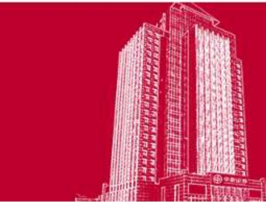

# 【中泰汽车·北京车展前瞻】自主&新势力高阶智驾与自研芯片并进合资中国方案主导智电转型

汽车行业首席分析师：何俊艺 汽车行业分析师：刘欣畅

S0740523020004

hjy@zts.com.cn

汽车行业分析师：汪越

S0740525010002

wangyue07@zts.com.cn

S0740522120003

liuxc03@zts.com.cn

汽车行业分析师：白臻哲

S0740524070006

baizz@zts.com.cn

汽车行业分析师：毛龚玄

S0740523020003

maoyx@zts.com.cn

汽车行业分析师：袁泽生

S0740525070006

yuanzs01@zts.com.cn

联系人：唐溯

tangsu@zts.com.cn

中泰证券研究所

专业|领先|深度|诚信

2026年4月18日

## ■北京车展：正值L3规模化商用元年，智能化技术集中落地

本届车展正值全球汽车行业迈入电动化定型、智能化落地的关键转折期，作为2026年L3级自动驾驶规模化商用与AI大模型上车的核心展示窗口，将集中呈现智能驾驶算法、中央计算平台、物理AI及具身智能等前沿技术。展会吸引全球主流车企、百强零部件供应商及跨界科技企业同台竞技，实现整车制造、核心零部件、新能源生态等全产业链集中展示，构建"车+万物"的未来出行生态，彰显中国汽车产业的创新实力与全球话语权。

## ■头部自主：核心技术密集兑现，华为智驾全面下沉主流

头部自主品牌进入技术收获期，比亚迪搭载第二代刀片电池与兆瓦闪充技术，实现"5分钟充好、9分钟充饱"的极致补能体验。吉利首发千里浩瀚G-ASD辅助驾驶系统与浩瀚-S超级电混架构，定位AI全地形越野市场。华为乾崑智驾方案深度赋能尚界、阿维塔、智界、享界四大品牌，全系标配ADS 4.1系统与896线激光雷达，推动高阶智驾向20-50万元主流市场全面渗透。

## ■新势力：自研芯片算力竞赛，增程纯电矩阵全价格带补齐

新势力竞逐自研芯片与全域智驾，理想L9搭载5nm马赫芯片与AD Max全场景智驾；蔚来ES9首发5nm智驾芯片及900V超快充换电架构。小米完成纯电+增程双线布局，YU7 UItra以三电机1548马力冲击高性能市场，YU9增程版主攻大家庭长途出行。小鹏GX搭载300TOPS算力平台与全域线控转向，预埋L4级智驾；零跑D19以800V/1000V双高压平台进攻25-30万级市场，华为系产品构建25-150万元豪华矩阵。

## ■合资：全面导入中国智驾方案，研发主导权实质性转移

合资品牌智电转型全面拥抱中国技术方案，大众ID.ERA 9X作为首款由中方主导定义的合资平台车型，搭载Momenta智驾与宁德时代65.2kWh骁遥电池。奥迪A6L（C9）成为首款搭载华为乾崑智驾的豪华燃油车，宝马新世代iX3、日产NX8等纯电旗舰标配800V高压平台，实现10分钟补能400km+。本届车展标志着合资研发主导权从外资向中方实质性转移，专为中国市场打造的车型开始反向输出技术标准。

## ■风险提示

乘用车销量不及预期、本土车企海外拓展进度不及预期、盈利不及预期、研究报告中使用的公开资料可能存在信息滞后或更新不及时的风险。

1举办时间及地点：第十九届北京国际汽车展览会将于2026年4月24日至5月3日在北京中国国际展览中心（顺义馆）和首都国际会展中心（新国展二期）举行

■时间节点：

①4月24日-4月25日是媒体日 （仅限海内外新闻机构和单位的记者参观）

②4月26日-4月27日是专业观众参观日 （仅限汽车业和相关业界的专业人士参观)

③4月28日-5月3日是公众参观日（将接待来自海内外社会各界的观众参观）

图表：国家会展中心示意图  
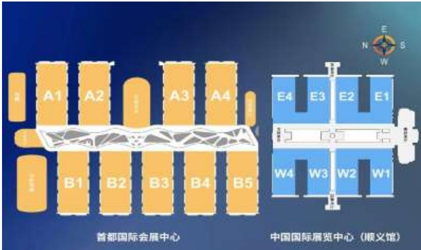  
来源：“修车帮”公众号，中泰证券研究所整理

图表：2026北京车展地址  
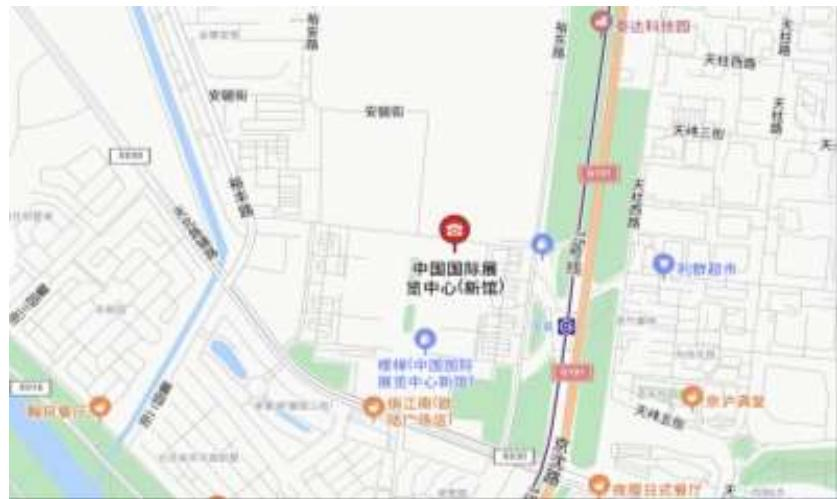  
来源：微软必应地图，中泰证券研究所整理

## 轨道交通

可乘坐地铁15号线到国展站，A出口或D出口出站，步行约500 米即可到达新国展东登录厅。

## 公交线路

可乘坐696、933路到国展新馆站，或乘坐空港3路、顺22路到新国展站。

## 公交专线

开通了2条连接市区和国展（顺义馆）的公交专线，分别从东直门枢纽站和四惠枢纽站发车，运营时间为8：30-11：30和14：00-17：00。同时，在17号线未来科学城站B口出口处开通了公交接驳专线，发车时间为9：00-14：00，国展（顺义馆）P6停车场11：00-17：00，票价3元。

## 自驾车

展馆周边有P5、P8、P9 等停车场。其中，P5 停车场距离展馆约800米，落客后可步行前往展馆；P8停车场距离场馆约3公里；P9 停车场距离场馆约9公里，P8、P9停车场均设置摆渡车直达展馆。

## 机场

首都机场—场馆：2号航站楼至场馆车程约6.8公里、3号航站楼至场馆车程约7.8公里；

大兴机场一场馆：机场至场馆车程约82公里。

图表：中国国际展览中心（顺义）周边交通  
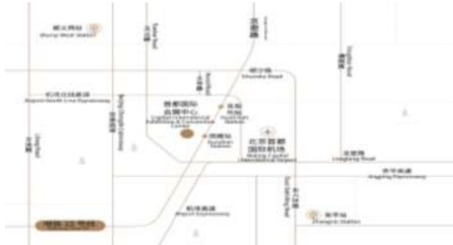  
来源：首都国际会展中心官网，中泰证券研究所整理

图表：自驾前往中国国际展览中心（顺义）停车方案  
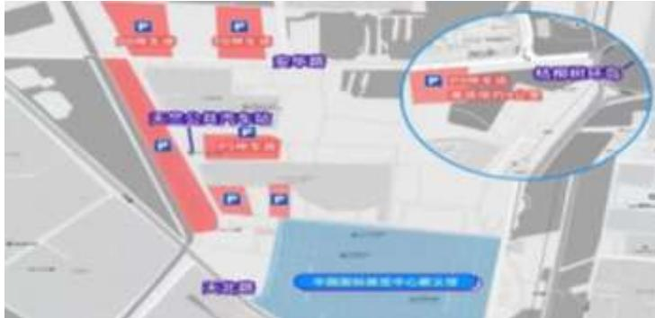  
来源：北京国际车展官网，中泰证券研究所整理  
中泰证券研究所专业|领先|深度|诚信

## 目录

市场分析：基于整车研究看点，前瞻性评估车展新车布局  
二、头部自主：补齐产品矩阵，智能化节奏进一步升级  
三、新势力/华为系：智驾科技驱动，产品合作矩阵拓展  
四、合资：智电转型加速，中国方案主导全球创新  
五、风险提示

汽车是消费品，会受到消费时代的影响；以日本为例，《第四消费时代》划分日本4个消费时代。

第一消费社会（1912-1941）：经济增长时期，大城市化，重视集体和国家。

第二消费社会（1945-1974）：私有主义，关注家庭，一家买一辆车。

第三消费社会（1975-2004）：经济增长乏力时期，体现私有化、重视个人，对产品的选择体现出个性化、多元化、差别化；一人一辆/多辆。

第四消费社会（2005-）：泡沫危机经济停滞，体现“去品牌化”，追求朴素、具有休闲倾向。

图表：日本的4个消费时代
<table><tr><td rowspan=1 colspan=1></td><td rowspan=1 colspan=1>第一消费社会</td><td rowspan=1 colspan=1>第二消费社会</td><td rowspan=1 colspan=1>第三消费社会</td><td rowspan=1 colspan=1>第四消费社会</td></tr><tr><td rowspan=1 colspan=1>时代划分</td><td rowspan=1 colspan=1>1912-1941</td><td rowspan=1 colspan=1>1945-1974</td><td rowspan=1 colspan=1>1975-2004</td><td rowspan=1 colspan=1>2005-2034</td></tr><tr><td rowspan=1 colspan=1>经济背景</td><td rowspan=1 colspan=1>1）1914-1919欧洲爆发一战，日本经济实际增长率7.3%2）1920年代末经济大萧条，实际增长率2.1%3）1932-1936经济高速发展，实际增长率6.1%4）1937年后战争时期</td><td rowspan=1 colspan=1>1）1945-1955战后恢复，实际增长率9.4%2）1955-1972石油危机前，实际增长率9.3%</td><td rowspan=1 colspan=1>1）1975-1990经济低谷，实际增长率4.5%2）1990-2004泡沫经济破灭，实际增长率1.2%</td><td rowspan=1 colspan=1>1）2005-至今“失去的20年”，实际增长率0.7%</td></tr><tr><td rowspan=1 colspan=1>人口趋势</td><td rowspan=1 colspan=1>增加</td><td rowspan=1 colspan=1>增加</td><td rowspan=1 colspan=1>微增</td><td rowspan=1 colspan=1>减少</td></tr><tr><td rowspan=1 colspan=1>出生率</td><td rowspan=1 colspan=1>5%</td><td rowspan=1 colspan=1>5%→2%</td><td rowspan=1 colspan=1>2% →1.3%</td><td rowspan=1 colspan=1>1.3%-1.4%</td></tr><tr><td rowspan=1 colspan=1>老年人比率</td><td rowspan=1 colspan=1>5%</td><td rowspan=1 colspan=1>5%-6%</td><td rowspan=1 colspan=1>6% - 20%</td><td rowspan=1 colspan=1>20%-30%</td></tr><tr><td rowspan=1 colspan=1>国民价值观</td><td rowspan=1 colspan=1>消费属私有主义；整体重视集体/国家</td><td rowspan=1 colspan=1>消费属私有主义；重视家庭/社会</td><td rowspan=1 colspan=1>私有主义；重视个人</td><td rowspan=1 colspan=1>趋向共享；重视社会</td></tr><tr><td rowspan=1 colspan=1>消费取向</td><td rowspan=1 colspan=1>西洋化大城市倾向</td><td rowspan=1 colspan=1>大量消费、大即正义大城市/美式倾向</td><td rowspan=1 colspan=1>个性化、多元化、差别化</td><td rowspan=1 colspan=1>无品牌、朴素、休闲本土/日本倾向</td></tr><tr><td rowspan=1 colspan=1>消费主题</td><td rowspan=1 colspan=1>文化时尚</td><td rowspan=1 colspan=1>每家一辆私家车;私人住宅；3C</td><td rowspan=1 colspan=1>量变→质变;每家数辆→每人一辆→每人数辆</td><td rowspan=1 colspan=1>几人一辆、汽车/住宅分享</td></tr><tr><td rowspan=1 colspan=1>消费承担者</td><td rowspan=1 colspan=1>中产阶级时尚男女</td><td rowspan=1 colspan=1>小家庭；家庭主妇</td><td rowspan=1 colspan=1>单身族/啃老族</td><td rowspan=1 colspan=1>所有年龄层</td></tr></table>

来源：《第四消费时代》三浦展著，中泰证券研究所整理

对比宏观指标：我们判断中国处于二、三消费时代转型期；其中第三消费时代特性增量最显著，消费特征个性、多元。

1从人均GDP指标看：我国2016年人均GDP约为日本1976-1978年左右水平，与日本第二、第三消费社会的转型期，即1974-1975年的吻合度非常高。

出生人口比例和老年人口比例两项指标看：2016年我国这两项指标水平与日本1980-1982年左右的水准相当，比较1975年消费社会的转折点，约有5年左右的延迟，也可以将2021年当作处在消费社会转型期中。

图表：人均GDP和城市化率指标判断  
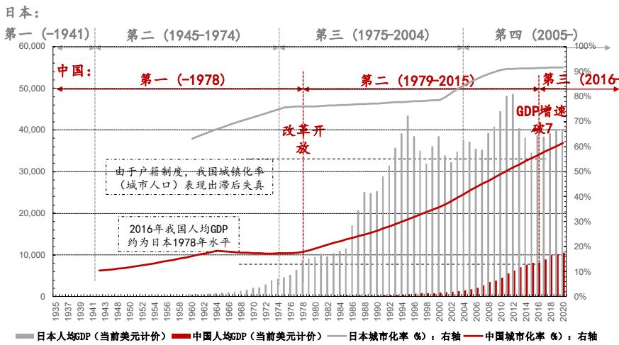  
来源：世界银行，中泰证券研究所

图表：出生率和65岁以上人口比例指标判断  
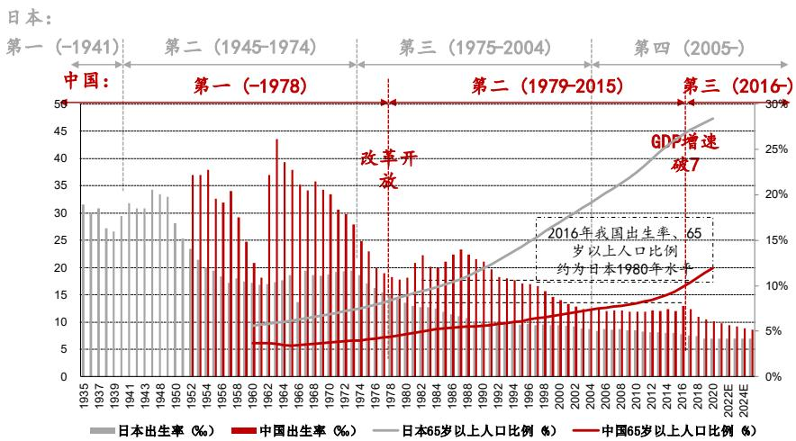  
来源：世界银行，中泰证券研究所

## 整车系列研究逻辑-长期视角：整车“六力”研究模型

1长期视角：基于我们提出的研究车企的核心能力（产品力与渠道力维度，产品力分为：需求把控能力、电动化节奏、制造能力、供应体系把控能力、智能化能力）以及各个车企的能力差异，对车企长期发展势态进行预判。

1当前我们认为车企快速提升市占率的核心影响要素是：市场需求把控能力与电动化节奏。长期看，我们认为市场需求把控能力与智能化能力具备差异化。

图表：整车“六力”研究模型  
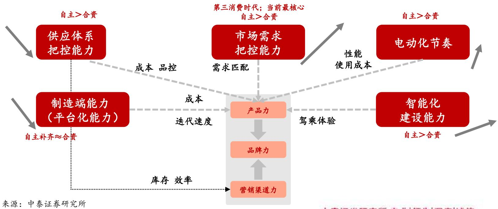

## 泰券动态演绎：智能化提速、需求把控维持、电动化边际递减

■整车厂核心能力在不同时间维度影响权重变化显著：进入第三消费时代后，目前车企核心能力的重要性排序为：智能化能力=市场需求把控能力>电动化节奏；长期来看智能化建设能力会成为差异性的核心影响因素。

■零部件层面，消费属性配置体现差异性，而智能差异性加速提升：电动化方面，差异性边际减弱（核心电动化技术集中在产业链，消费者体验差异性弱）；智能化方面，平价智驾落地+城市L3车型密集推出，消费者体验差异性提升加速。此外消费属性配置（座椅等消费者直接感知的）体现的差异性依旧重要。

图表：不同时期核心影响要素重要性不同  
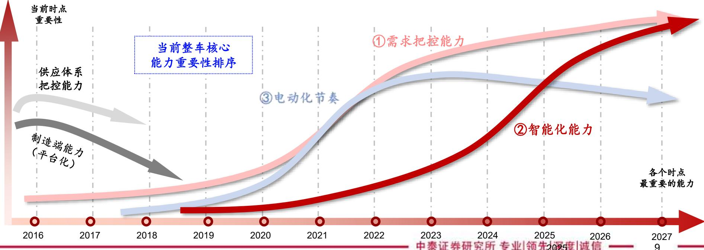  
资料来源：中泰证券研究所

## 复盘：自主两轮成长差异-SUV红利与性价比&需求把控及电动化

两轮自主崛起底层逻辑不同：21年后这轮自主崛起是依托市场需求把控能力和电动化节奏两个核心能力，17-20年在跟合资经过充分量价内卷后，份额加速提升（头部自主2021-2025年+20pct，上一轮2008-2017年+17pct）

■阶段一：08-17年自主崛起；基于SUV红利及性价比，17年起合资补齐SUV并切换本土供应体系后结束；

■阶段二：21年以后自主崛起；基于需求把控（存量油车红海市场-痛点）和电动化节奏（电车增量蓝海-产品有无问题）核心能力优势，强势自主品牌贡献主要增量，具备持续高成长性。

图表：自主品牌市占率变化情况 (2008-2025)

08-17年：自主崛起-基于SUV红利及性价比

17-20年：合资补齐SUV并切换本土供应体系

21年以后：自主崛起-基于需求把控和电动化节奏

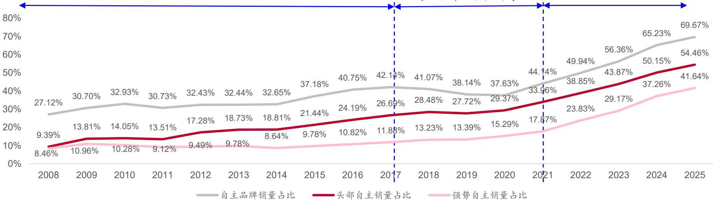  
来源：Marklines，Wind，中泰证券研究所

注：头部自主包括长安、长城、比亚迪、广汽、吉利、上汽、蔚来、理想、小鹏、零跑、赛力斯、小米，强势自主包括长安、吉利、比亚迪、蔚来、理想、

## 需求把控的实质是依托公司体制建立精准的用户刻度

方法论层面，研究用户的底层逻辑转变，引入刻度：当前市场需求把控能力最重要，因此方法论层面整车厂更需要重新研究用户和规整用户，从之前的“轴距-种类”分化出不同维度的用户研究刻度，引起用户共情。

■市场需求把控能力实质：底层归整用户能力 (哪种刻度引起共情）&保障体系产品落地能力 (什么体制支撑方法论)

图表：整车厂研究用户的不同刻度  
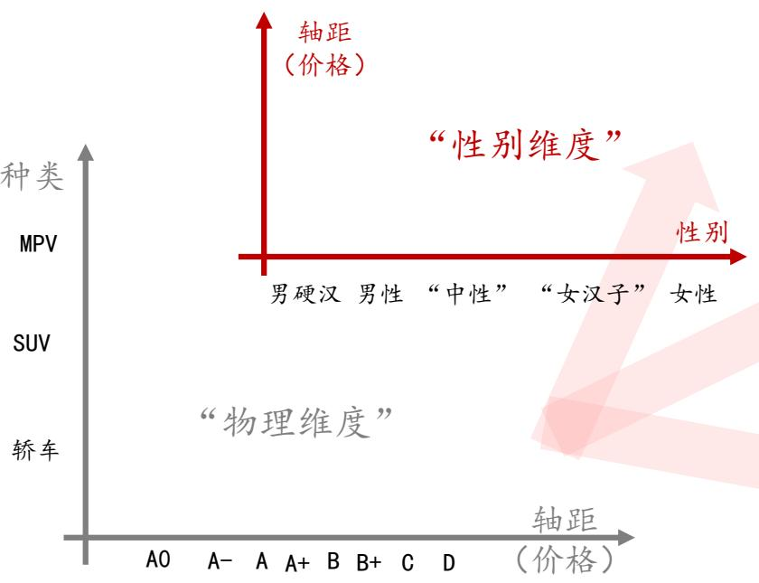  
资料来源：中泰证券研究所

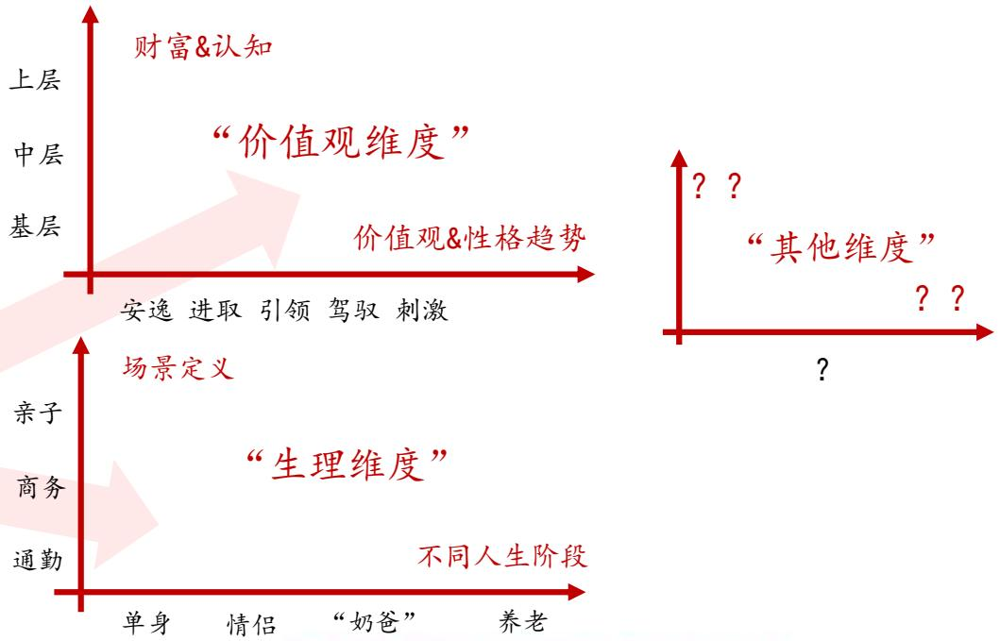

## ? 中泰券整车系列研究逻辑-中期视角：细分车格及产品布局分析

■中期视角：分析次年细分车格格局及车企产品投放领域与节奏，年度维度预判车企产品强势程度

■前瞻判断新车型销量可从行业外因（外部竞争环境）与车企内因（产品及主动定价策略）两个维度考量：

1）行业外因：基于级别、种类、动力形式分类的细分车格是外部竞争环境，此外也可以从价格带维度进行细分车格划分（β，均值）；

2）车企内因：产品的车格选择，车企自身可决定的定价策略及产品力决定产品在细分领域竞争力（α，波动值）；  
两者共同决定一款车型的稳态月销量水平。

图表：整车中期视角研究逻辑  
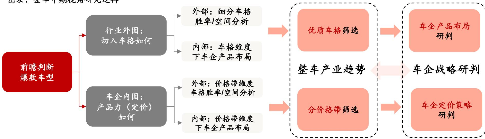  
资料来源：中泰证券研究所

## 布局情况：SUV(车种)和纯电(能源类型)类新车型发布多

图表：主流车企新车规划（含2025H2和2026年目前已知全新车型/年度改款车型，基于公开信息搜集）
<table><tr><td rowspan=7 colspan=1>SUV</td><td rowspan=1 colspan=1>价格带（万元）</td><td rowspan=1 colspan=1>燃油</td><td rowspan=1 colspan=1>纯电</td><td rowspan=1 colspan=1>插混</td></tr><tr><td rowspan=1 colspan=1>10-15</td><td rowspan=1 colspan=1>长安：CS75 PIus HEV</td><td rowspan=1 colspan=1></td><td rowspan=1 colspan=1></td></tr><tr><td rowspan=1 colspan=1>15-20</td><td rowspan=1 colspan=1></td><td rowspan=1 colspan=1>小鹏：G6、G7</td><td rowspan=1 colspan=1></td></tr><tr><td rowspan=1 colspan=1>20-25</td><td rowspan=1 colspan=1></td><td rowspan=1 colspan=1>蔚来：L90改款</td><td rowspan=1 colspan=1>比亚迪：海狮08吉利：战舰700日产：NX8</td></tr><tr><td rowspan=1 colspan=1>25-30</td><td rowspan=1 colspan=1></td><td rowspan=1 colspan=1>零跑：D19奥迪：E7X</td><td rowspan=1 colspan=1>比亚迪：大唐上汽：智己LS8吉利：极氪8X赛力斯：问界M6大众：ID．ERA 9X别克：至境E7</td></tr><tr><td rowspan=1 colspan=1>30-40</td><td rowspan=1 colspan=1></td><td rowspan=1 colspan=1>小鹏：GX宝马：新世代iX3</td><td rowspan=1 colspan=1>北汽：享界越野SUV江淮：尊界M900小米：昆仑 (YU9)赛力斯：2026款 M8</td></tr><tr><td rowspan=1 colspan=1>40以上</td><td rowspan=1 colspan=1></td><td rowspan=1 colspan=1>小米：YU7 UItra蔚来：ES9保时捷：纯电卡宴Turbo</td><td rowspan=1 colspan=1>长城：坦克700理想：L9L赛力斯：新款M9</td></tr><tr><td rowspan=6 colspan=1>CAR</td><td rowspan=1 colspan=1>0-10</td><td rowspan=1 colspan=1></td><td rowspan=1 colspan=1>长安：启源Lumin</td><td rowspan=1 colspan=1></td></tr><tr><td rowspan=1 colspan=1>10-20</td><td rowspan=1 colspan=1></td><td rowspan=1 colspan=1>零跑：Lafa5 Ultra蔚来：萤火虫改款</td><td rowspan=1 colspan=1>比亚迪：海豹08</td></tr><tr><td rowspan=1 colspan=1>20-25</td><td rowspan=1 colspan=1></td><td rowspan=1 colspan=1></td><td rowspan=1 colspan=1></td></tr><tr><td rowspan=1 colspan=1>25-30</td><td rowspan=1 colspan=1></td><td rowspan=1 colspan=1>上汽：尚界Z7/Z7T小米：2026款 SU7</td><td rowspan=1 colspan=1>长城：阿维塔06T比亚迪：大汉</td></tr><tr><td rowspan=1 colspan=1>30-40</td><td rowspan=1 colspan=1>奥迪：A6L（C9)</td><td rowspan=1 colspan=1></td><td rowspan=1 colspan=1></td></tr><tr><td rowspan=1 colspan=1>40以上</td><td rowspan=1 colspan=1></td><td rowspan=1 colspan=1></td><td rowspan=1 colspan=1>江淮：尊界S800 高定版</td></tr><tr><td rowspan=1 colspan=1>MPV</td><td rowspan=1 colspan=1>全价格带</td><td rowspan=1 colspan=1></td><td rowspan=1 colspan=1>奔驰：VLEEV</td><td rowspan=1 colspan=1>奇瑞：智界V9江淮：尊界L900</td></tr></table>

来源：懂车帝，中泰证券研究所

## 泰乘用车市场：因需求透支/春节/消费者观望，26年开年零售遇冷

零售遇冷：2026年1月和2月乘用车零售分别为154.5万辆、103.4万辆，同比降幅各为14.0%、25.3%；其中新能源汽车销量为59.6万辆、46.4万辆，同比分别下滑19.9%、32.2%，环比分别下降55.4%、22.1%，新能源渗透率由上年四季度的接近60%大幅回落至38.6%和4.9%。3月乘用车零售164.8万辆，同比下降-14.9%；其中新能源市场有所回暖，销量84.8万辆，同比-14.4%，环比82.8%，新能源渗透率回升至51.5%。

遇冷分析：①补贴退坡致需求透支；2026年新能源汽车补贴退坡，购置税由“全额免征”调整为“减半征收”，以旧换新政策调整适用对象，叠加车企因冲刺年度目标推出购置税兜底、现金让利和车贷优惠等政策，致使价格敏感性客户于2025年年底集中下单，透支2026年一季度消费需求。②春节假期致有效销售时间缩短；26年春节在2月中下旬，2月有效工作日仅16天（2024-2026年2月有效工作日分别为18/19/16天）。

图表：乘用车市场销量 (零售口径)
<table><tr><td rowspan=1 colspan=2>销量（万辆）</td><td rowspan=1 colspan=1>1月</td><td rowspan=1 colspan=1>2月</td><td rowspan=1 colspan=1>3月</td><td rowspan=1 colspan=1>4月</td><td rowspan=1 colspan=1>5月</td><td rowspan=1 colspan=1>6月</td><td rowspan=1 colspan=1>7月</td><td rowspan=1 colspan=1>8月</td><td rowspan=1 colspan=1>9月</td><td rowspan=1 colspan=1>10月</td><td rowspan=1 colspan=1>11月</td><td rowspan=1 colspan=1>12月</td></tr><tr><td rowspan=7 colspan=1>2026年</td><td rowspan=1 colspan=1>乘用车</td><td rowspan=1 colspan=1>154.5</td><td rowspan=1 colspan=1>103.4</td><td rowspan=1 colspan=1>164.8</td><td rowspan=1 colspan=1></td><td rowspan=1 colspan=1></td><td rowspan=1 colspan=1></td><td rowspan=1 colspan=1></td><td rowspan=1 colspan=1></td><td rowspan=1 colspan=1></td><td rowspan=1 colspan=1></td><td rowspan=1 colspan=1></td><td rowspan=1 colspan=1></td></tr><tr><td rowspan=1 colspan=1>同比</td><td rowspan=1 colspan=1>-14.0%</td><td rowspan=1 colspan=1>-25.3%</td><td rowspan=1 colspan=1>-14.9%</td><td rowspan=1 colspan=1></td><td rowspan=1 colspan=1></td><td rowspan=1 colspan=1></td><td rowspan=1 colspan=1></td><td rowspan=1 colspan=1></td><td rowspan=1 colspan=1></td><td rowspan=1 colspan=1></td><td rowspan=1 colspan=1></td><td rowspan=1 colspan=1></td></tr><tr><td rowspan=1 colspan=1>新能源</td><td rowspan=1 colspan=1>59.6</td><td rowspan=1 colspan=1>46.4</td><td rowspan=1 colspan=1>84.8</td><td rowspan=1 colspan=1></td><td rowspan=1 colspan=1></td><td rowspan=1 colspan=1></td><td rowspan=1 colspan=1></td><td rowspan=1 colspan=1></td><td rowspan=1 colspan=1></td><td rowspan=1 colspan=1></td><td rowspan=1 colspan=1></td><td rowspan=1 colspan=1></td></tr><tr><td rowspan=1 colspan=1>同比</td><td rowspan=1 colspan=1>-19.9%</td><td rowspan=1 colspan=1>-32.2%</td><td rowspan=1 colspan=1>-14.4%</td><td rowspan=1 colspan=1></td><td rowspan=1 colspan=1></td><td rowspan=1 colspan=1></td><td rowspan=1 colspan=1></td><td rowspan=1 colspan=1></td><td rowspan=1 colspan=1></td><td rowspan=1 colspan=1></td><td rowspan=1 colspan=1></td><td rowspan=1 colspan=1></td></tr><tr><td rowspan=1 colspan=1>环比</td><td rowspan=1 colspan=1>-55.4%</td><td rowspan=1 colspan=1>-22.1%</td><td rowspan=1 colspan=1>82.8%</td><td rowspan=1 colspan=1></td><td rowspan=1 colspan=1></td><td rowspan=1 colspan=1></td><td rowspan=1 colspan=1></td><td rowspan=1 colspan=1></td><td rowspan=1 colspan=1></td><td rowspan=1 colspan=1></td><td rowspan=1 colspan=1></td><td rowspan=1 colspan=1></td></tr><tr><td rowspan=1 colspan=1>燃油车</td><td rowspan=1 colspan=1>94.9</td><td rowspan=1 colspan=1>57.0</td><td rowspan=1 colspan=1>80.0</td><td rowspan=1 colspan=1></td><td rowspan=1 colspan=1></td><td rowspan=1 colspan=1></td><td rowspan=1 colspan=1></td><td rowspan=1 colspan=1></td><td rowspan=1 colspan=1></td><td rowspan=1 colspan=1></td><td rowspan=1 colspan=1></td><td rowspan=1 colspan=1></td></tr><tr><td rowspan=1 colspan=1>NEV渗透率</td><td rowspan=1 colspan=1>38.6%</td><td rowspan=1 colspan=1>44.9%</td><td rowspan=1 colspan=1>51.5%</td><td rowspan=1 colspan=1></td><td rowspan=1 colspan=1></td><td rowspan=1 colspan=1></td><td rowspan=1 colspan=1></td><td rowspan=1 colspan=1></td><td rowspan=1 colspan=1></td><td rowspan=1 colspan=1></td><td rowspan=1 colspan=1></td><td rowspan=1 colspan=1></td></tr><tr><td rowspan=7 colspan=1>2025年</td><td rowspan=1 colspan=1>乘用车</td><td rowspan=1 colspan=1>179.6</td><td rowspan=1 colspan=1>138.4</td><td rowspan=1 colspan=1>193.7</td><td rowspan=1 colspan=1>175.5</td><td rowspan=1 colspan=1>193.8</td><td rowspan=1 colspan=1>208.5</td><td rowspan=1 colspan=1>184.4</td><td rowspan=1 colspan=1>201.8</td><td rowspan=1 colspan=1>224.4</td><td rowspan=1 colspan=1>225.0</td><td rowspan=1 colspan=1>222.5</td><td rowspan=1 colspan=1>226.1</td></tr><tr><td rowspan=1 colspan=1>同比</td><td rowspan=1 colspan=1>-11.7%</td><td rowspan=1 colspan=1>25.5%</td><td rowspan=1 colspan=1>14.6%</td><td rowspan=1 colspan=1>14.3%</td><td rowspan=1 colspan=1>13.3%</td><td rowspan=1 colspan=1>18.1%</td><td rowspan=1 colspan=1>7.2%</td><td rowspan=1 colspan=1>5.8%</td><td rowspan=1 colspan=1>6.4%</td><td rowspan=1 colspan=1>-0.5%</td><td rowspan=1 colspan=1>-8.2%</td><td rowspan=1 colspan=1>-14.2%</td></tr><tr><td rowspan=1 colspan=1>新能源</td><td rowspan=1 colspan=1>74.4</td><td rowspan=1 colspan=1>68.4</td><td rowspan=1 colspan=1>99.1</td><td rowspan=1 colspan=1>91.1</td><td rowspan=1 colspan=1>102.7</td><td rowspan=1 colspan=1>111.1</td><td rowspan=1 colspan=1>98.7</td><td rowspan=1 colspan=1>111.5</td><td rowspan=1 colspan=1>129.9</td><td rowspan=1 colspan=1>128.2</td><td rowspan=1 colspan=1>132.1</td><td rowspan=1 colspan=1>133.7</td></tr><tr><td rowspan=1 colspan=1>同比</td><td rowspan=1 colspan=1>10.9%</td><td rowspan=1 colspan=1>76.3%</td><td rowspan=1 colspan=1>38.8%</td><td rowspan=1 colspan=1>34.6%</td><td rowspan=1 colspan=1>27.6%</td><td rowspan=1 colspan=1>30.1%</td><td rowspan=1 colspan=1>12.4%</td><td rowspan=1 colspan=1>8.8%</td><td rowspan=1 colspan=1>15.7%</td><td rowspan=1 colspan=1>7.1%</td><td rowspan=1 colspan=1>4.0%</td><td rowspan=1 colspan=1>2.6%</td></tr><tr><td rowspan=1 colspan=1>环比</td><td rowspan=1 colspan=1>-42.9%</td><td rowspan=1 colspan=1>-8.1%</td><td rowspan=1 colspan=1>44.9%</td><td rowspan=1 colspan=1>-8.1%</td><td rowspan=1 colspan=1>12.7%</td><td rowspan=1 colspan=1>8.2%</td><td rowspan=1 colspan=1>-11.2%</td><td rowspan=1 colspan=1>13.0%</td><td rowspan=1 colspan=1>16.5%</td><td rowspan=1 colspan=1>-1.3%</td><td rowspan=1 colspan=1>3.0%</td><td rowspan=1 colspan=1>1.2%</td></tr><tr><td rowspan=1 colspan=1>燃油车</td><td rowspan=1 colspan=1>105.2</td><td rowspan=1 colspan=1>70.0</td><td rowspan=1 colspan=1>94.6</td><td rowspan=1 colspan=1>84.4</td><td rowspan=1 colspan=1>91.1</td><td rowspan=1 colspan=1>97.4</td><td rowspan=1 colspan=1>85.7</td><td rowspan=1 colspan=1>90.3</td><td rowspan=1 colspan=1>94.5</td><td rowspan=1 colspan=1>96.8</td><td rowspan=1 colspan=1>90.4</td><td rowspan=1 colspan=1>92.4</td></tr><tr><td rowspan=1 colspan=1>NEV渗透率</td><td rowspan=1 colspan=1>41.4%</td><td rowspan=1 colspan=1>49.4%</td><td rowspan=1 colspan=1>51.2%</td><td rowspan=1 colspan=1>51.9%</td><td rowspan=1 colspan=1>53.0%</td><td rowspan=1 colspan=1>53.3%</td><td rowspan=1 colspan=1>53.5%</td><td rowspan=1 colspan=1>55.3%</td><td rowspan=1 colspan=1>57.9%</td><td rowspan=1 colspan=1>57.0%</td><td rowspan=1 colspan=1>59.4%</td><td rowspan=1 colspan=1>59.1%</td></tr></table>

来源：乘联会，崔东树，中泰证券研究所

## 泰乘用车市场：因需求透支/春节/消费者观望，26年开年零售遇冷

1遇冷分析：③价格战与新品节奏放缓助涨消费者“观望情绪”；一方面，过去两年，新能源汽车市场价格战愈演愈烈，内卷严重；车企频繁推出降价或促销方案，“背刺老车主”的现象反复出现，导致消费者普遍形成“晚买享折扣”的观望心理；另一方面，一季度各品牌明显放缓了新品宣发节奏，消费者抱着“买新不买旧”的心态，观望在智驾、续航等性能更具竞争力的新车型。

图表：乘用车市场价格战内卷白热化  
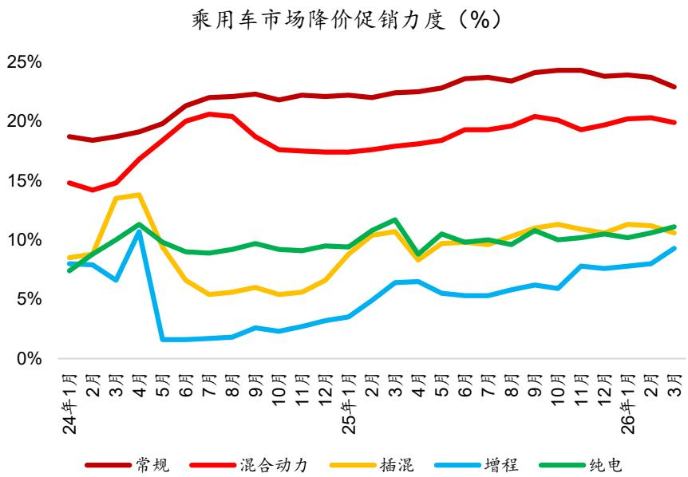  
来源：乘联会，崔东树，工信部，AutoLab，云+汽车大数据，中泰证券研究所

图表：企业放缓新品宣发节奏  
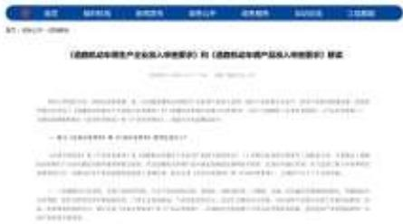  
工信部新规要求整车企业强化研发/合规能力，被解读为“促使车企放缓新品开发周期以确保产品安全保障性”

2025及2026年一季度乘用车市场上市车型数（款)
<table><tr><td rowspan=1 colspan=2>上市车型数(款)</td><td rowspan=1 colspan=1>1月</td><td rowspan=1 colspan=1>2月</td><td rowspan=1 colspan=1>3月</td><td rowspan=1 colspan=1>汇总</td></tr><tr><td rowspan=3 colspan=1>2025年</td><td rowspan=1 colspan=1>总数</td><td rowspan=1 colspan=1>38</td><td rowspan=1 colspan=1>69</td><td rowspan=1 colspan=1>73</td><td rowspan=1 colspan=1>180</td></tr><tr><td rowspan=1 colspan=1>新能源</td><td rowspan=1 colspan=1>21</td><td rowspan=1 colspan=1>60</td><td rowspan=1 colspan=1>42</td><td rowspan=1 colspan=1>123</td></tr><tr><td rowspan=1 colspan=1>国产品牌</td><td rowspan=1 colspan=1>27</td><td rowspan=1 colspan=1>52</td><td rowspan=1 colspan=1>47</td><td rowspan=1 colspan=1>126</td></tr><tr><td rowspan=3 colspan=1>2026年</td><td rowspan=1 colspan=1>总数</td><td rowspan=1 colspan=1>60</td><td rowspan=1 colspan=1>13</td><td rowspan=1 colspan=1>85</td><td rowspan=1 colspan=1>158</td></tr><tr><td rowspan=1 colspan=1>新能源</td><td rowspan=1 colspan=1>41</td><td rowspan=1 colspan=1>4</td><td rowspan=1 colspan=1>60</td><td rowspan=1 colspan=1>105</td></tr><tr><td rowspan=1 colspan=1>国产品牌</td><td rowspan=1 colspan=1>41</td><td rowspan=1 colspan=1>4</td><td rowspan=1 colspan=1>60</td><td rowspan=1 colspan=1>105</td></tr></table>

■乘用车市场销量结构变化：1)5万以下：新能源渗透率天花板，但市场需求饱和、产品更新放缓，叠加政策影响，该细分市场正加速边缘化，2月销量同比暴跌76%。；2)5-30万：新能源渗透率加速提升，插混车型受“电比油低”策略推动加速替代燃油车，其中20-30万是市场韧性最强的区间；3）30万以上：新能源渗透率刚过半或不足一半，增程与插混为主、纯电尚未突破，传统豪华燃油车仍占主导。

■新能源市场技术升级路线：纯电主导低端与中高端两极，插混在10-20万主力市场加速替代燃油车，增程式作为高端差异化补充，在30-40万区间占比最高，40万以上市场将成为新能源下一轮技术升级与品牌突破的主战场。

图表：2026年1-2月乘用车市场分价格段销量结构（万辆）
<table><tr><td rowspan=1 colspan=1></td><td rowspan=1 colspan=1></td><td rowspan=1 colspan=1>5万以下</td><td rowspan=1 colspan=1>5-10万</td><td rowspan=1 colspan=1>10-15万</td><td rowspan=1 colspan=1>15-20万</td><td rowspan=1 colspan=1>20-30万</td><td rowspan=1 colspan=1>30-40万</td><td rowspan=1 colspan=1>40万以上</td></tr><tr><td rowspan=5 colspan=1>1月</td><td rowspan=1 colspan=1>传统</td><td rowspan=1 colspan=1>0.5</td><td rowspan=1 colspan=1>11.4</td><td rowspan=1 colspan=1>29.8</td><td rowspan=1 colspan=1>25.2</td><td rowspan=1 colspan=1>14.8</td><td rowspan=1 colspan=1>7.6</td><td rowspan=1 colspan=1>5.4</td></tr><tr><td rowspan=1 colspan=1>新能源</td><td rowspan=1 colspan=1>0.9</td><td rowspan=1 colspan=1>10</td><td rowspan=1 colspan=1>15.2</td><td rowspan=1 colspan=1>8.3</td><td rowspan=1 colspan=1>15.1</td><td rowspan=1 colspan=1>6.1</td><td rowspan=1 colspan=1>4</td></tr><tr><td rowspan=1 colspan=1>总计</td><td rowspan=1 colspan=1>1.5</td><td rowspan=1 colspan=1>21.4</td><td rowspan=1 colspan=1>45</td><td rowspan=1 colspan=1>33.5</td><td rowspan=1 colspan=1>29.9</td><td rowspan=1 colspan=1>13.7</td><td rowspan=1 colspan=1>9.4</td></tr><tr><td rowspan=1 colspan=1>同比</td><td rowspan=1 colspan=1>-63%</td><td rowspan=1 colspan=1>-22%</td><td rowspan=1 colspan=1>-24%</td><td rowspan=1 colspan=1>-10%</td><td rowspan=1 colspan=1>11%</td><td rowspan=1 colspan=1>-2%</td><td rowspan=1 colspan=1>-9%</td></tr><tr><td rowspan=1 colspan=1>新能源份额</td><td rowspan=1 colspan=1>60%</td><td rowspan=1 colspan=1>47%</td><td rowspan=1 colspan=1>34%</td><td rowspan=1 colspan=1>25%</td><td rowspan=1 colspan=1>51%</td><td rowspan=1 colspan=1>45%</td><td rowspan=1 colspan=1>43%</td></tr><tr><td rowspan=5 colspan=1>2月</td><td rowspan=1 colspan=1>传统</td><td rowspan=1 colspan=1>0.3</td><td rowspan=1 colspan=1>8.7</td><td rowspan=1 colspan=1>17.8</td><td rowspan=1 colspan=1>14.7</td><td rowspan=1 colspan=1>8.1</td><td rowspan=1 colspan=1>4.1</td><td rowspan=1 colspan=1>3.3</td></tr><tr><td rowspan=1 colspan=1>新能源</td><td rowspan=1 colspan=1>0.7</td><td rowspan=1 colspan=1>8.2</td><td rowspan=1 colspan=1>12.1</td><td rowspan=1 colspan=1>6</td><td rowspan=1 colspan=1>12.7</td><td rowspan=1 colspan=1>4.1</td><td rowspan=1 colspan=1>2.6</td></tr><tr><td rowspan=1 colspan=1>总计</td><td rowspan=1 colspan=1>1</td><td rowspan=1 colspan=1>16.9</td><td rowspan=1 colspan=1>29.9</td><td rowspan=1 colspan=1>20.7</td><td rowspan=1 colspan=1>20.8</td><td rowspan=1 colspan=1>8.2</td><td rowspan=1 colspan=1>5.8</td></tr><tr><td rowspan=1 colspan=1>同比</td><td rowspan=1 colspan=1>-76%</td><td rowspan=1 colspan=1>-34%</td><td rowspan=1 colspan=1>-31%</td><td rowspan=1 colspan=1>-24%</td><td rowspan=1 colspan=1>-2%</td><td rowspan=1 colspan=1>-21%</td><td rowspan=1 colspan=1>-12%</td></tr><tr><td rowspan=1 colspan=1>新能源份额</td><td rowspan=1 colspan=1>70%</td><td rowspan=1 colspan=1>49%</td><td rowspan=1 colspan=1>40%</td><td rowspan=1 colspan=1>29%</td><td rowspan=1 colspan=1>61%</td><td rowspan=1 colspan=1>50%</td><td rowspan=1 colspan=1>45%</td></tr></table>

来源：乘联会，崔东树公众号，中泰证券研究所

图表：2026年1-2月新能源市场分价格段分内部动力的销量结构
<table><tr><td rowspan=1 colspan=1></td><td rowspan=1 colspan=1></td><td rowspan=1 colspan=1>5万以下</td><td rowspan=1 colspan=1>5-10万</td><td rowspan=1 colspan=1>10-15万</td><td rowspan=1 colspan=1>15-20万</td><td rowspan=1 colspan=1>20-30万</td><td rowspan=1 colspan=1>30-40万</td><td rowspan=1 colspan=1>40万以上</td></tr><tr><td rowspan=3 colspan=1>1月</td><td rowspan=1 colspan=1>插混</td><td rowspan=1 colspan=1>0%</td><td rowspan=1 colspan=1>8.90%</td><td rowspan=1 colspan=1>12.50%</td><td rowspan=1 colspan=1>14%</td><td rowspan=1 colspan=1>7.20%</td><td rowspan=1 colspan=1>12.20%</td><td rowspan=1 colspan=1>11.20%</td></tr><tr><td rowspan=1 colspan=1>增程式</td><td rowspan=1 colspan=1>0%</td><td rowspan=1 colspan=1>0.10%</td><td rowspan=1 colspan=1>2.90%</td><td rowspan=1 colspan=1>3.40%</td><td rowspan=1 colspan=1>9.10%</td><td rowspan=1 colspan=1>12.30%</td><td rowspan=1 colspan=1>7.80%</td></tr><tr><td rowspan=1 colspan=1>纯电动</td><td rowspan=1 colspan=1>64.30%</td><td rowspan=1 colspan=1>37.80%</td><td rowspan=1 colspan=1>18.20%</td><td rowspan=1 colspan=1>6.20%</td><td rowspan=1 colspan=1>37.20%</td><td rowspan=1 colspan=1>20.20%</td><td rowspan=1 colspan=1>18.70%</td></tr><tr><td rowspan=3 colspan=1>2月</td><td rowspan=1 colspan=1>插混</td><td rowspan=1 colspan=1>0%</td><td rowspan=1 colspan=1>7.80%</td><td rowspan=1 colspan=1>21.80%</td><td rowspan=1 colspan=1>20%</td><td rowspan=1 colspan=1>6.80%</td><td rowspan=1 colspan=1>17.80%</td><td rowspan=1 colspan=1>17.90%</td></tr><tr><td rowspan=1 colspan=1>增程式</td><td rowspan=1 colspan=1>0%</td><td rowspan=1 colspan=1>0.10%</td><td rowspan=1 colspan=1>2.10%</td><td rowspan=1 colspan=1>3.40%</td><td rowspan=1 colspan=1>8.20%</td><td rowspan=1 colspan=1>13.40%</td><td rowspan=1 colspan=1>8.50%</td></tr><tr><td rowspan=1 colspan=1>纯电动</td><td rowspan=1 colspan=1>77.70%</td><td rowspan=1 colspan=1>31.40%</td><td rowspan=1 colspan=1>19.10%</td><td rowspan=1 colspan=1>10.90%</td><td rowspan=1 colspan=1>49.80%</td><td rowspan=1 colspan=1>19.20%</td><td rowspan=1 colspan=1>23%</td></tr></table>

来源：乘联会，崔东树公众号，中泰证券研究所

## 目录

一、市场分析：基于整车研究看点，前瞻性评估车展新车布局  
二、头部自主：补齐产品矩阵，智能化节奏进一步升级  
三、新势力/华为系：智驾科技驱动，产品合作矩阵拓展  
四、合资：智电转型加速，中国方案主导全球创新  
五、风险提示

## 中泰证头部自主：补齐产品矩阵，智能化节奏进一步升级

■比亚迪：王朝系列D级双旗舰大唐、大汉；海洋系列C+级双旗舰海狮08、海豹08，预计搭载比亚迪第二代刀片电池

■长安：三方联合的力作阿维塔06T；糯玉米四门版；首搭蓝鲸超擎混动技术CS75 PIus HEV

■吉利：极氪8X挑战新公路之王；吉利首款AI全地形硬派越野SUV银河战舰700

■长城：动力系统一分为二的坦克700 (Hi4-T/Hi4-Z)

■上汽：全系标配华为黑科技的尚界Z7/Z7T；智己LS8

■奇瑞：鸿蒙智行首发MPV智界V9

■北汽：鸿蒙智行首款硬派豪华越野车型享界越野SUV

图表：头部自主北京车展预计亮相车型 (仅部分车型，实际以车型发布为准)
<table><tr><td rowspan=1 colspan=1>车企</td><td rowspan=1 colspan=1>品牌</td><td rowspan=1 colspan=1>车型</td><td rowspan=1 colspan=1>动力形式</td><td rowspan=1 colspan=1>车种</td><td rowspan=1 colspan=1>预计售价 （万元）</td><td rowspan=1 colspan=1>预计亮相/上市时间</td></tr><tr><td rowspan=4 colspan=1>比亚迪</td><td rowspan=2 colspan=1>王朝</td><td rowspan=1 colspan=1>大唐</td><td rowspan=1 colspan=1>纯电/插混</td><td rowspan=1 colspan=1>sUv</td><td rowspan=1 colspan=1>25-35</td><td rowspan=1 colspan=1>2026年4月预售，二季度上市</td></tr><tr><td rowspan=1 colspan=1>大汉</td><td rowspan=1 colspan=1>纯电/插混</td><td rowspan=1 colspan=1>轿车</td><td rowspan=1 colspan=1>25-35</td><td rowspan=1 colspan=1>2026年Q2</td></tr><tr><td rowspan=2 colspan=1>海洋</td><td rowspan=1 colspan=1>海狮08</td><td rowspan=1 colspan=1>纯电/插混</td><td rowspan=1 colspan=1>SUV</td><td rowspan=1 colspan=1>20-25</td><td rowspan=1 colspan=1>2026年4月亮相，Q3上市</td></tr><tr><td rowspan=1 colspan=1>海豹08</td><td rowspan=1 colspan=1>纯电/插混</td><td rowspan=1 colspan=1>轿车</td><td rowspan=1 colspan=1>18-20</td><td rowspan=1 colspan=1>2026年4-5月</td></tr><tr><td rowspan=3 colspan=1>长安</td><td rowspan=1 colspan=1>阿维塔</td><td rowspan=1 colspan=1>阿维塔06T</td><td rowspan=1 colspan=1>纯电/增程式</td><td rowspan=1 colspan=1>轿车</td><td rowspan=1 colspan=1>23-28</td><td rowspan=1 colspan=1>4月8日预售，五一前后上市</td></tr><tr><td rowspan=1 colspan=1>启源</td><td rowspan=1 colspan=1>糯玉米四门版</td><td rowspan=1 colspan=1>纯电</td><td rowspan=1 colspan=1>轿车</td><td rowspan=1 colspan=1>5-7</td><td rowspan=1 colspan=1>2026年Q2</td></tr><tr><td rowspan=1 colspan=1>长安</td><td rowspan=1 colspan=1>CS75 Plus HEV</td><td rowspan=1 colspan=1>油混</td><td rowspan=1 colspan=1>SUV</td><td rowspan=1 colspan=1>11-14</td><td rowspan=1 colspan=1>2026年4月</td></tr><tr><td rowspan=2 colspan=1>吉利</td><td rowspan=1 colspan=1>极氢</td><td rowspan=1 colspan=1>极氨8X</td><td rowspan=1 colspan=1>插混</td><td rowspan=1 colspan=1>SUv</td><td rowspan=1 colspan=1>37.68-51.68</td><td rowspan=1 colspan=1>2026年四月中旬</td></tr><tr><td rowspan=1 colspan=1>银河</td><td rowspan=1 colspan=1>战舰700</td><td rowspan=1 colspan=1>纯电/插混</td><td rowspan=1 colspan=1>SUV</td><td rowspan=1 colspan=1>20-35</td><td rowspan=1 colspan=1>2026年4月</td></tr><tr><td rowspan=1 colspan=1>长城</td><td rowspan=1 colspan=1>坦克</td><td rowspan=1 colspan=1>坦克700</td><td rowspan=1 colspan=1>插混</td><td rowspan=1 colspan=1>SUV</td><td rowspan=1 colspan=1>43.8-51.8</td><td rowspan=1 colspan=1>2026年4/5月</td></tr><tr><td rowspan=2 colspan=1>上汽</td><td rowspan=1 colspan=1>尚界</td><td rowspan=1 colspan=1>尚界Z7/Z7T</td><td rowspan=1 colspan=1>纯电</td><td rowspan=1 colspan=1>轿车</td><td rowspan=1 colspan=1>23.98-31.98</td><td rowspan=1 colspan=1>2026年3月预售，4月上市</td></tr><tr><td rowspan=1 colspan=1>智己</td><td rowspan=1 colspan=1>智己LS8</td><td rowspan=1 colspan=1>增程式</td><td rowspan=1 colspan=1>SUV</td><td rowspan=1 colspan=1>27.18-31.18</td><td rowspan=1 colspan=1>2026年4月16日</td></tr><tr><td rowspan=1 colspan=1>奇瑞</td><td rowspan=1 colspan=1>智界</td><td rowspan=1 colspan=1>智界V9</td><td rowspan=1 colspan=1>增程式</td><td rowspan=1 colspan=1>MPV</td><td rowspan=1 colspan=1>40-50</td><td rowspan=1 colspan=1>2026年4-5月</td></tr><tr><td rowspan=1 colspan=1>北汽</td><td rowspan=1 colspan=1>享界</td><td rowspan=1 colspan=1>享界越野SUV</td><td rowspan=1 colspan=1>预计纯电/增程</td><td rowspan=1 colspan=1>SUV</td><td rowspan=1 colspan=1>35-40</td><td rowspan=1 colspan=1>2026年Q2</td></tr></table>

来源：汽车之家，懂车帝，汽车经纬网，各车企官网/微信公众号，中泰证券研究所注：未亮相车型统计预计亮相时间；已亮相车型统计预计上市时间

## 中嗪芘亚迪大唐：王朝首款D级旗舰SUV，极致补能效率与超跑级性能

新款大唐集比亚迪技术之大成：①搭载第二代刀片电池与闪充技术，纯电版最高950 km续航，“5分钟充好，9分钟充饱，零下30℃只多3分钟”；②2+2+3座椅布局，前排双零重力座椅，二排双零压航空座椅；③王朝系列首搭云辇-A双腔空气悬挂（带道路预瞄），后轮5.2米转弯半径；④超跑级性能，最快百公里加速3.9秒。(大唐EV + 大唐 DM-i/p)

图表：比亚迪大唐外观及内饰  
外观及内饰  
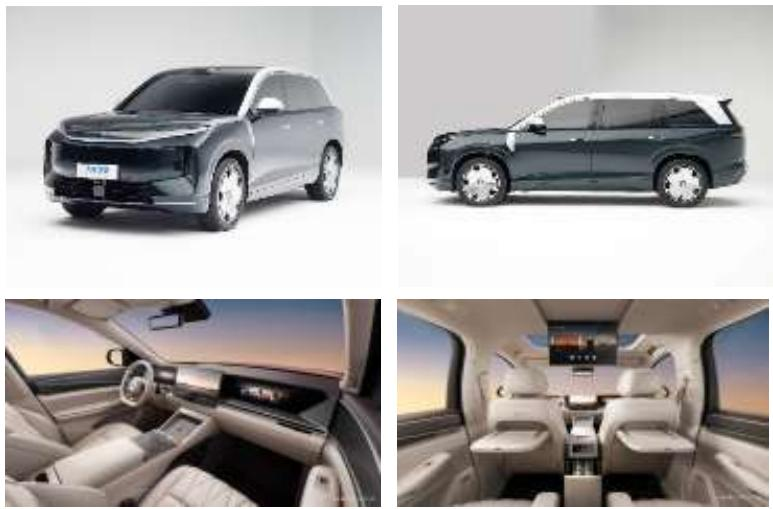  
来源：汽车之家，比亚迪汽车，中泰证券研究所

图表：比亚迪大唐部分信息
<table><tr><td rowspan=1 colspan=2>车型</td><td rowspan=1 colspan=1>比亚迪大唐</td></tr><tr><td rowspan=6 colspan=1>基础信息</td><td rowspan=1 colspan=1>上市时间</td><td rowspan=1 colspan=1>2026年4月预售，二季度上市</td></tr><tr><td rowspan=1 colspan=1>能源类型</td><td rowspan=1 colspan=1>纯电/插混</td></tr><tr><td rowspan=1 colspan=1>长度（mm)</td><td rowspan=1 colspan=1>5263/5302</td></tr><tr><td rowspan=1 colspan=1>宽度（mm)</td><td rowspan=1 colspan=1>1999</td></tr><tr><td rowspan=1 colspan=1>高度（mm）</td><td rowspan=1 colspan=1>纯电：1790/1800插混：1800/1810</td></tr><tr><td rowspan=1 colspan=1>轴距（mm）</td><td rowspan=1 colspan=1>3130</td></tr><tr><td rowspan=1 colspan=1>看点配置</td><td rowspan=1 colspan=2>1234 第二代刀片电池＋闪充技术2+2+37座位MPV式布局王朝系列首搭云辇-A+一体式后轮转向超跑级性能</td></tr></table>

来源：工信部，汽车之家，汽车经纬网，比亚迪汽车，中泰证券研究所

## 中比亚迪大汉：王朝首款D级旗舰轿车，比亚迪高端化的进一步尝试

车身外观：比亚迪大汉定位D级行政轿车，对标宝马7系、奔驰S级等传统旗舰。

配置预测：比亚迪大汉与比亚迪大唐组成双子星产品，预计配置条件与比亚迪大唐近似，搭载比亚迪核心旗舰技术；预计包含五代DM、易三方三电机系统、云辇-A双腔空气悬架、第二代刀片电池及兆瓦闪充以及天神之眼B高阶辅助驾驶系统等。

图表：比亚迪大汉部分信息
<table><tr><td rowspan=1 colspan=2>车型</td><td rowspan=1 colspan=1>比亚迪大汉</td></tr><tr><td rowspan=6 colspan=1>基础信息</td><td rowspan=1 colspan=1>上市时间</td><td rowspan=1 colspan=1>2026年Q2</td></tr><tr><td rowspan=1 colspan=1>能源类型</td><td rowspan=1 colspan=1>纯电/插混</td></tr><tr><td rowspan=1 colspan=1>长度（mm）</td><td rowspan=1 colspan=1>一</td></tr><tr><td rowspan=1 colspan=1>宽度(mm)</td><td rowspan=1 colspan=1>■</td></tr><tr><td rowspan=1 colspan=1>高度(mm)</td><td rowspan=1 colspan=1>■</td></tr><tr><td rowspan=1 colspan=1>轴距（mm）</td><td rowspan=1 colspan=1></td></tr><tr><td rowspan=1 colspan=1>看点配置</td><td rowspan=1 colspan=2>王朝首款D级旗舰轿车</td></tr></table>

图表：比亚迪大汉非官方渲染图  
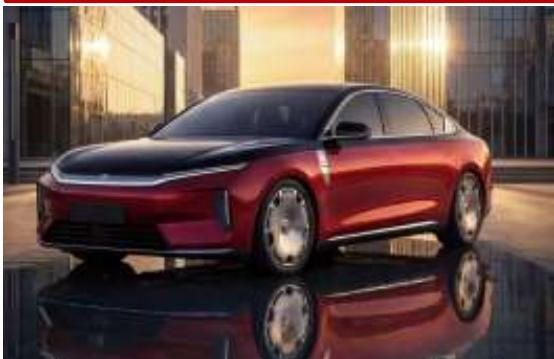  
来源：迪粉之家，中泰证券研究所

非官方渲染图  
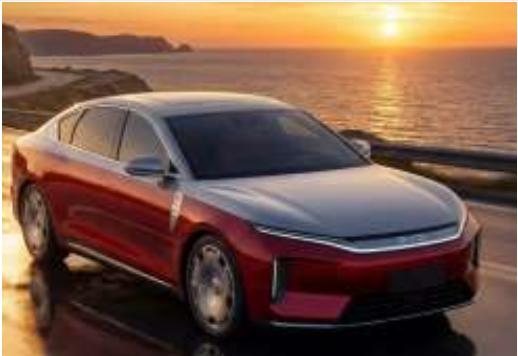  
来源：懂车帝，30秒懂车，中泰证券研究所

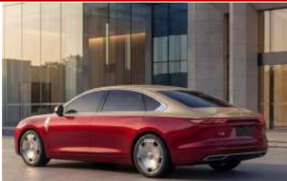

整车定位：比亚迪海洋系中大型七座SUV，主要对标竞品为理想L8、小鹏G9、问界M8等。

预计配置：预计提供纯电和插混两种动力版本，搭载DM-i超级混动系统+第二代刀片电池+800V高压闪充平台+比亚迪云辇-A+天神之眼-B智能辅助驾驶系统，提供城市导航辅助驾驶、高速领航辅助等。

图表：比亚迪海狮08部分信息
<table><tr><td rowspan=1 colspan=2>车型</td><td rowspan=1 colspan=1>海狮08</td></tr><tr><td rowspan=6 colspan=1>基础信息</td><td rowspan=1 colspan=1>上市时间</td><td rowspan=1 colspan=1>2026年4月亮相，Q3上市</td></tr><tr><td rowspan=1 colspan=1>能源类型</td><td rowspan=1 colspan=1>纯电/插混</td></tr><tr><td rowspan=1 colspan=1>长度（mm）</td><td rowspan=1 colspan=1></td></tr><tr><td rowspan=1 colspan=1>宽度(mm)</td><td rowspan=1 colspan=1></td></tr><tr><td rowspan=1 colspan=1>高度(mm)</td><td rowspan=1 colspan=1></td></tr><tr><td rowspan=1 colspan=1>轴距(mm)</td><td rowspan=1 colspan=1></td></tr><tr><td rowspan=1 colspan=1>看点配置</td><td rowspan=1 colspan=2>海洋8系双旗舰之一</td></tr></table>

来源：比亚迪汽车，汽车经纬网，中泰证券研究所

图表：比亚迪海狮08官方大图与谍照  
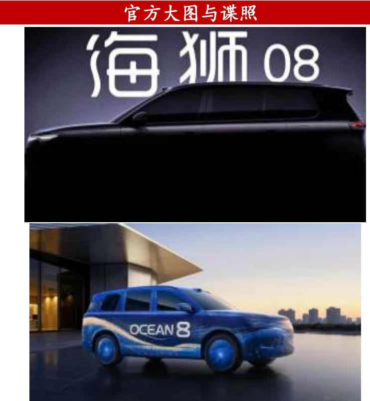  
来源：懂车帝，皆电，中泰证券研究所

## 中泰亚迪海豹08：海洋8系双旗舰之一，重塑新能源轿车价值标杆

整车定位：中大型C+级轿车，外观采用比亚迪0cean-S设计风格，溜背造型+封闭式栅格+波浪形侧大灯+星辉氛围灯等。座舱采用“环抱式海洋秘境”设计，座椅采用贝壳纹理压纹工艺，配备256色潮汐律动氛围灯等

配置预测：动力方面，预计提供纯电和插混两种动力版本，预计搭载第二代刀片电池+800V高压闪充平台，支持5分钟补能400km；插混版本预计搭载第五代DM混动系统，CLTC综合续航有望突破1200km；智驾方面，车顶配备激光雷达，预计搭载“天神之眼-B”三目版智能辅助驾驶系统，支持城区高速NOA。

图表：比亚迪海豹08外观  
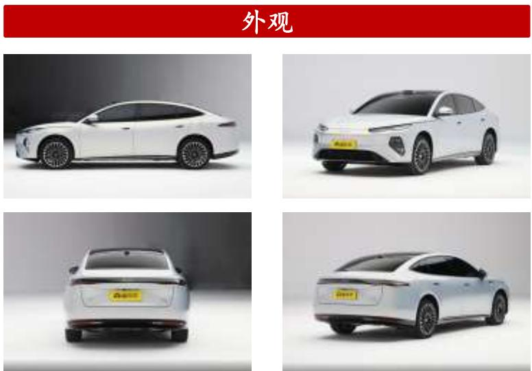  
来源：懂车帝，中泰证券研究所

图表：比亚迪海豹08部分信息
<table><tr><td rowspan=1 colspan=2>车型</td><td rowspan=1 colspan=1>比亚迪海豹08</td></tr><tr><td rowspan=6 colspan=1>基础信息</td><td rowspan=1 colspan=1>上市时间</td><td rowspan=1 colspan=1>2026年4-5月</td></tr><tr><td rowspan=1 colspan=1>能源类型</td><td rowspan=1 colspan=1>纯电/插混</td></tr><tr><td rowspan=1 colspan=1>长度（mm)</td><td rowspan=1 colspan=1>5150</td></tr><tr><td rowspan=1 colspan=1>宽度（mm）</td><td rowspan=1 colspan=1>1999</td></tr><tr><td rowspan=1 colspan=1>高度（mm）</td><td rowspan=1 colspan=1>1505</td></tr><tr><td rowspan=1 colspan=1>轴距（mm）</td><td rowspan=1 colspan=1>3030</td></tr><tr><td rowspan=1 colspan=1>看点配置</td><td rowspan=1 colspan=2>1. Ocean-S/环抱式海洋秘境设计风格2  第二代刀片电池+兆瓦闪充3. 比亚迪核心技术集成</td></tr></table>

来源：董车会，懂车帝，车主指南，同车时代，中泰证券研究所

## 安阿维塔06T：全场景运动轿车，华为乾崑与阿维塔战略合作2.0全新车型

智配层面：首批搭载华为全新一代量产最高896线激光雷达，标配鸿蒙座舱HarmonySpace 5及MOLA°混合大模型优化语音控制。

动力层面：全系标配太行智控2.0技术，分布式电驱+电磁避震，扭矩调整精度达0.1N·m，最快可实现2s级零百加速；全系标配宁德时代电池，增程式标配45.06kWh骁遥超级增·混电池（纯电CLTC续航里程超330 km）；纯电新增89.33kWh神行超充电池(CLTC续航里程超740 km）

图表：阿维塔06T外观及内饰  
图表：长安阿维塔06T部分参数
<table><tr><td rowspan=1 colspan=2>车型</td><td rowspan=1 colspan=1>阿维塔06T</td></tr><tr><td rowspan=6 colspan=1>基础信息</td><td rowspan=1 colspan=1>上市时间</td><td rowspan=1 colspan=1>2026年4月8日预售，五一前后上市</td></tr><tr><td rowspan=1 colspan=1>能源类型</td><td rowspan=1 colspan=1>纯电/插混</td></tr><tr><td rowspan=1 colspan=1>长度（mm)</td><td rowspan=1 colspan=1>4940</td></tr><tr><td rowspan=1 colspan=1>宽度(mm)</td><td rowspan=1 colspan=1>1960</td></tr><tr><td rowspan=1 colspan=1>高度(mm)</td><td rowspan=1 colspan=1>1495</td></tr><tr><td rowspan=1 colspan=1>轴距（mm）</td><td rowspan=1 colspan=1>2940</td></tr><tr><td rowspan=1 colspan=1>看点配置</td><td rowspan=1 colspan=2>1.首批搭载华为全新一代量产最高896线激光雷达2.全系标配太行智控2.0技术3.全系标配宁德时代电池</td></tr></table>

外观  
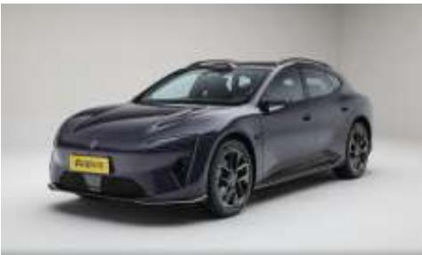

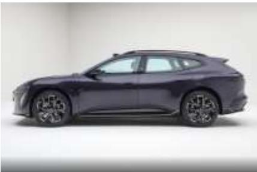  
来源：懂车帝，中泰证券研究所  
来源：懂车帝，阿维塔，中泰证券研究所

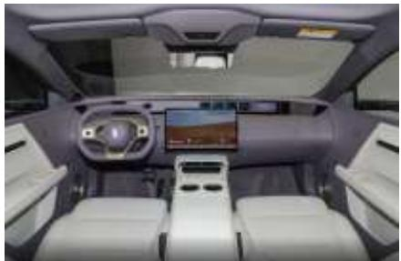

内饰  
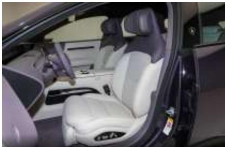

1车身尺寸：车辆长/宽/高/轴距分别为3515/1715/1545mm，目前2026款长安Lumin（两门版）的尺寸分别为3293/1700/1545/1980mm。

配置方面：预计配置与两门版类似，搭载纯电动力系统，电机最大功率为35kW，配备磷酸铁锂电池，CLTC纯电续航205km。

图表：长安启源Lumin四门版外观  
外观及内饰  
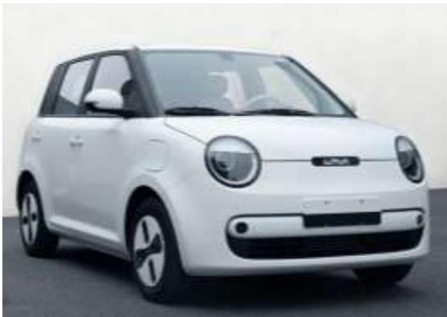  
来源：腾讯网，中泰证券研究所

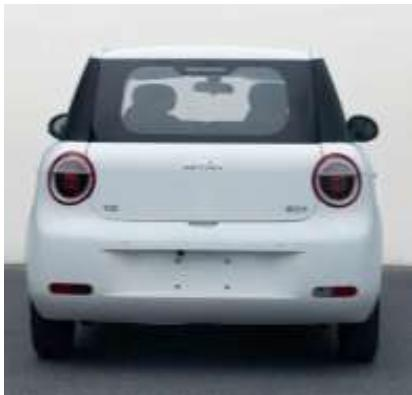

图表：长安启源Lumin四门版部分参数
<table><tr><td rowspan=1 colspan=2>车型</td><td rowspan=1 colspan=1>Lumin四门版</td></tr><tr><td rowspan=6 colspan=1>基础信息</td><td rowspan=1 colspan=1>上市时间</td><td rowspan=1 colspan=1>2026年Q2</td></tr><tr><td rowspan=1 colspan=1>能源类型</td><td rowspan=1 colspan=1>纯电</td></tr><tr><td rowspan=1 colspan=1>长度（(mm)</td><td rowspan=1 colspan=1>3515</td></tr><tr><td rowspan=1 colspan=1>宽度(mm)</td><td rowspan=1 colspan=1>1715</td></tr><tr><td rowspan=1 colspan=1>高度(mm)</td><td rowspan=1 colspan=1>1545</td></tr><tr><td rowspan=1 colspan=1>轴距（mm）</td><td rowspan=1 colspan=1>2200</td></tr><tr><td rowspan=1 colspan=1>看点配置</td><td rowspan=1 colspan=2>1.车身尺寸与轴距升级 (四座布局)</td></tr></table>

来源：懂车帝，中泰证券研究所

## 中泰长安CS75 PIus HEV：家用智慧节能油混SUV，首搭蓝鲸超擎混动技术 OIGT/

1长安CS75 Plus HEV：外观设计等均基于第四代CS75 PIus，动力上首搭蓝鲸超擎混动技术，采用1.5T涡轮增压四缸发动机与高磁通高功率混动电驱。

蓝鲸超擎混动技术：轿车城区百公里油耗2.98L，SUV城区百公里油耗3.98L；发动机最大功率110 kW，驱动电机最大功率180 kW，最高车速185km/h，0-60 km/h加速3.59秒，零百加速6.98秒，24小时电池云端监测预警；同时配备ANC主动降噪、PSC无感启停技术以及CDC魔毯悬架等，城区噪声较同级别燃油车降低约10分贝。

图表：长安CS75 PIus HEV外观及内饰  
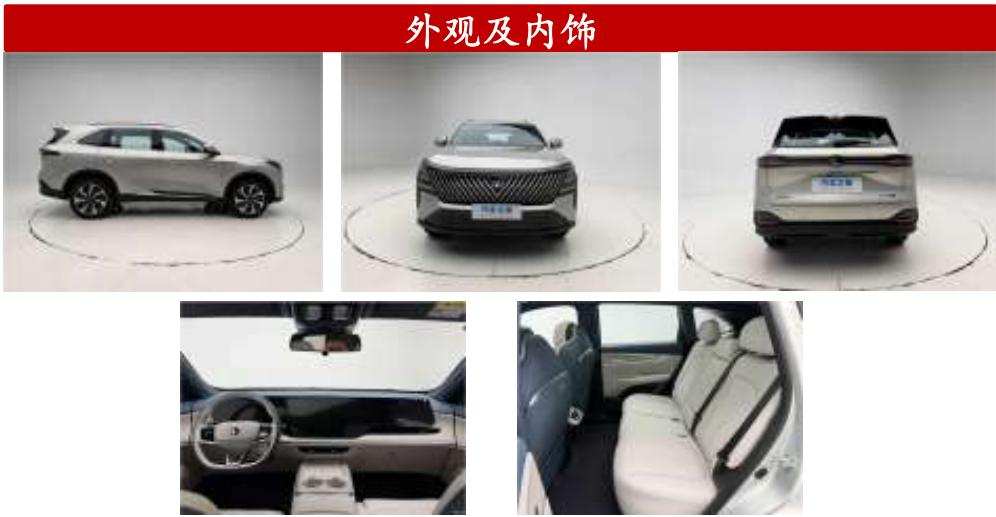  
来源：汽车之家，中泰证券研究所

图表：长安CS75 PIus HEV部分信息
<table><tr><td rowspan=1 colspan=2>车型</td><td rowspan=1 colspan=1>长安CS75 Plus HEV</td></tr><tr><td rowspan=6 colspan=1>基础信息</td><td rowspan=1 colspan=1>上市时间</td><td rowspan=1 colspan=1>2026年4月</td></tr><tr><td rowspan=1 colspan=1>能源类型</td><td rowspan=1 colspan=1>油混</td></tr><tr><td rowspan=1 colspan=1>长度（（mm)</td><td rowspan=1 colspan=1>4770</td></tr><tr><td rowspan=1 colspan=1>宽度(mm)</td><td rowspan=1 colspan=1>1910</td></tr><tr><td rowspan=1 colspan=1>高度(mm)</td><td rowspan=1 colspan=1>1698 (1705)</td></tr><tr><td rowspan=1 colspan=1>轴距（mm）</td><td rowspan=1 colspan=1>2800</td></tr><tr><td rowspan=1 colspan=1>看点配置</td><td rowspan=1 colspan=2>1.首搭蓝鲸超擎混动技术</td></tr></table>

来源：汽车之家，中泰证券研究所

■吉利超级智能体Eva：超级Eva采用端到端一体化大模型，是国内首个打通智能座舱、智能辅助驾驶、数字生态的超级智能体。

■千里浩瀚G-ASD辅助驾驶系统：千里浩瀚H9方案（5颗激光雷达+43个感知硬件+双Thor-U 140Tops算力），VLA车端视觉大模型。

浩瀚-S超级电混架构：全栈900V混动高压架构，电机峰值功率660 kW，增程发电机功率145 kW，超级电混专用2.0T发动机，零百加速3.7秒，零百加速馈电3.9秒；70度6C混动电池，CLTC纯电续航410 km，CLTC综合续航1416 km，充电SoC 20%-80%仅需9分钟；行业首发AI指挥能源管理，WLTC百公里馈电油耗6.43L，WLTC百公里综合油耗0.31L。

■浩瀚AI数字底盘：主动稳定杆+闭式双腔空气悬架+双腔CCD电磁减振器，AI融合控制多域执行+红外夜视系统，13种全地形驾驶模式。

■浩瀚安全盔甲：行业首发一体式双门环+“双金箍棒”穹甲车身+“985”电池安全立体防护，承袭G-AEB和G-AES功能。

图表：极氪8X外观及内饰  
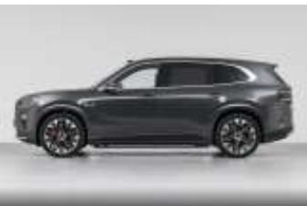

外观及内饰  
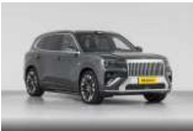

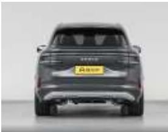

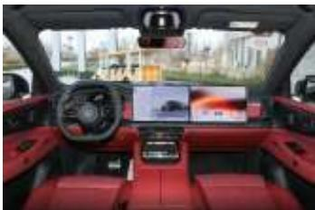  
来源：懂车帝，中泰证券研究所

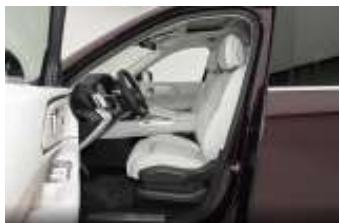

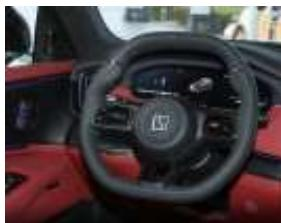

图表：极氪8X部分信息
<table><tr><td rowspan=1 colspan=2>车型</td><td rowspan=1 colspan=1>极氪8X</td></tr><tr><td rowspan=6 colspan=1>基础信息</td><td rowspan=1 colspan=1>上市时间</td><td rowspan=1 colspan=1>2026年4月中旬</td></tr><tr><td rowspan=1 colspan=1>能源类型</td><td rowspan=1 colspan=1>插混</td></tr><tr><td rowspan=1 colspan=1>长度（mm)</td><td rowspan=1 colspan=1>5100 (5108)</td></tr><tr><td rowspan=1 colspan=1>宽度(mm)</td><td rowspan=1 colspan=1>1998(2026)</td></tr><tr><td rowspan=1 colspan=1>高度（mm）</td><td rowspan=1 colspan=1>1780</td></tr><tr><td rowspan=1 colspan=1>轴距（mm）</td><td rowspan=1 colspan=1>3069</td></tr><tr><td rowspan=1 colspan=1>看点配置</td><td rowspan=1 colspan=2>1.首搭吉利超级智能体Eva2.新一代千里浩瀚G-ASD辅助驾驶系统3.SEP浩瀚超级电混、浩瀚AI数字底盘、浩瀚安全盔甲</td></tr></table>

来源：懂车帝，21世纪经济报道，中泰证券研究所

## 中银河战舰700：吉利首款AI全地形硬派越野SUV，冲击中高端硬派市场

！硬派越野SUV：采用“方盒子”造型与硬朗车身线条，配合一体式大梁强化底盘刚性，尾部外挂式备胎与竖向尾灯进一步凸显了硬派越野的视觉特征。

配置预测：动力与底盘方面，预计采用1.5T+三电机四驱系统，搭载AI智能四驱和GVMC动态控制系统，支持原地掉头、蟹行模式、爆胎稳行、卫星通讯等功能，具备全地形通过能力；同时吉利800V高压平台预计全面下放。智能驾驶方面，预计采用千里浩瀚H7智驾系统，支持高速和城区全场景领航辅助驾驶。

图表：银河战舰700外观概念图  
外观概念图  
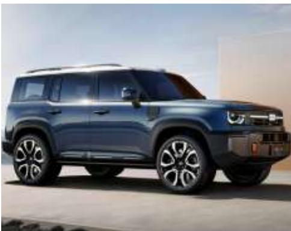  
来源：汽车之家，中泰证券研究所

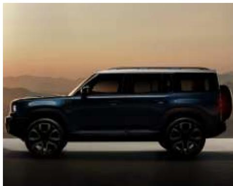

图表：银河战舰700部分信息
<table><tr><td rowspan=1 colspan=2>车型</td><td rowspan=1 colspan=1>银河战舰700</td></tr><tr><td rowspan=6 colspan=1>基础信息</td><td rowspan=1 colspan=1>上市时间</td><td rowspan=1 colspan=1>2026年4月</td></tr><tr><td rowspan=1 colspan=1>能源类型</td><td rowspan=1 colspan=1>纯电/插混</td></tr><tr><td rowspan=1 colspan=1>长度（mm)</td><td rowspan=1 colspan=1></td></tr><tr><td rowspan=1 colspan=1>宽度(mm)</td><td rowspan=1 colspan=1></td></tr><tr><td rowspan=1 colspan=1>高度（mm）</td><td rowspan=1 colspan=1></td></tr><tr><td rowspan=1 colspan=1>轴距（mm)</td><td rowspan=1 colspan=1></td></tr><tr><td rowspan=1 colspan=1>看点配置</td><td rowspan=1 colspan=2>1.吉利首款AI全地形硬派越野SUV2.800V高压平台、千里浩瀚H7智驾下放</td></tr></table>

来源：吉利汽车，同车时代，懂车帝，中泰证券研究所

智能化升级：搭载VLA大模型与全新一代Coffee Pilot 4.0智驾系统，配备含激光雷达在内的27颗高精传感器，可实现全场景N0A辅助驾驶、车位到车位智慧出行与一键泊车等；Coffee Night Vision 2.0行业首发Al智慧轮廓精绘，可实现300米远距离探测。

动力系统一分为二成就双旗舰：坦克700 Hi4-T版本主打极限越野，搭载3.0T V6双涡轮增压混动发动机和国内首款9HAT混动变速器，插混综合功率395kW，零百加速5秒级，配备非解耦机械四驱与三把锁，同时为自主品牌内首个搭载电子可断开式稳定杆车型。坦克700 Hi4-乙版本主打城市长途泛越野，采用2.0T米勒循环发动机、前后双电机、800V高压架构与59.05kWh轻量化三元锂电池，实现WLTC综合续航1191km、WLTC纯电续航190km、百公里综合油耗1.16L与5秒级零百加速等。

■环抱式座舱：中轴对称布局+Coffee Vision 7屏联动+高级鹿皮绒顶棚+Nappa纤云按摩座椅等，前排20向电动调节，后排141°无级电动调节。

图表：坦克700 26款外观及内饰  
外观及内饰  
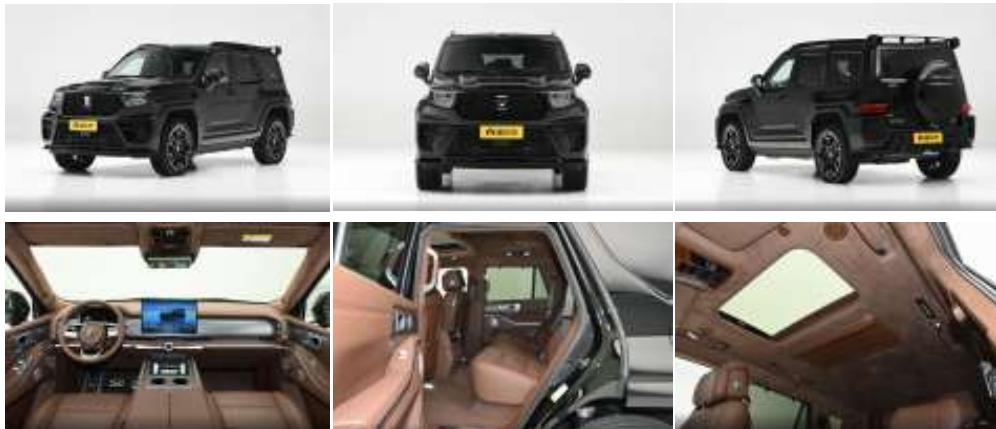  
来源：懂车帝，中泰证券研究所

图表：坦克700 26款部分信息
<table><tr><td rowspan=1 colspan=2>车型</td><td rowspan=1 colspan=1>坦克700 26款</td></tr><tr><td rowspan=6 colspan=1>基础信息</td><td rowspan=1 colspan=1>上市时间</td><td rowspan=1 colspan=1>2026年4/5月</td></tr><tr><td rowspan=1 colspan=1>能源类型</td><td rowspan=1 colspan=1>插混</td></tr><tr><td rowspan=1 colspan=1>长度（mm）</td><td rowspan=1 colspan=1>5105</td></tr><tr><td rowspan=1 colspan=1>宽度（mm)</td><td rowspan=1 colspan=1>2061</td></tr><tr><td rowspan=1 colspan=1>高度(mm)</td><td rowspan=1 colspan=1>1985</td></tr><tr><td rowspan=1 colspan=1>轴距（mm）</td><td rowspan=1 colspan=1>3000</td></tr><tr><td rowspan=1 colspan=1>看点配置</td><td rowspan=1 colspan=2>1.新一代Coffee Pilot 4.O+Coffee Night Vison 2.02.双旗舰矩阵动力升级3.环抱式座舱豪华配置</td></tr></table>

来源：21世纪经济报道，懂车帝，汽车评价研究院，上汽集团，中泰证券研究所

智能驾驶配置：搭载华为乾崑智驾ADS 4.1辅助驾驶系统，支持无图城区NCA和车位到车位领航辅助，全系标配华为896线双光路图像级激光雷达，较传统192线产品分辨率提高显著。

1动力性能配置：全系标配华为途灵平台和华为巨鲸800V高压电池平台，首创全域智能车身协同控制（HUAWEI XMC）和六合一中央集中控制，零百加速最快3.44秒，零百制动测试33.1米，CLTC续航最高可达905 km。

1车身座舱：首发鸿蒙ALPS健康座舱2.0，搭载“水离子空调”和“诺奖级MOFs材料”，起到保湿补水、杀菌抑敏和保持舱内空气清新的作用。尚界Z7T作为鸿蒙智行首款猎装车，最大拓展容积1694L，最大开口966mm。

图表：尚界Z7/Z7T外观及内饰  
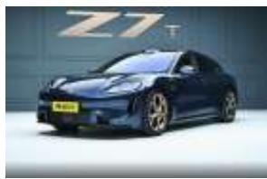

外观及内饰  
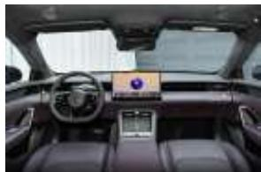

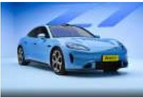

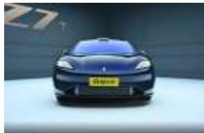

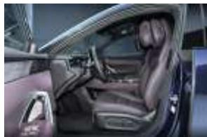  
来源：懂车帝，中泰证券研究所

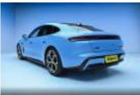

图表：尚界Z7/Z7T部分信息
<table><tr><td rowspan=1 colspan=2>车型</td><td rowspan=1 colspan=1>尚界Z7/Z7T</td></tr><tr><td rowspan=6 colspan=1>基础信息</td><td rowspan=1 colspan=1>上市时间</td><td rowspan=1 colspan=1>2026年3月预售，4月上市</td></tr><tr><td rowspan=1 colspan=1>能源类型</td><td rowspan=1 colspan=1>纯电</td></tr><tr><td rowspan=1 colspan=1>长度（mm）</td><td rowspan=1 colspan=1>5036</td></tr><tr><td rowspan=1 colspan=1>宽度(mm)</td><td rowspan=1 colspan=1>1976</td></tr><tr><td rowspan=1 colspan=1>高度（mm）</td><td rowspan=1 colspan=1>1465</td></tr><tr><td rowspan=1 colspan=1>轴距（mm）</td><td rowspan=1 colspan=1>3000</td></tr><tr><td rowspan=1 colspan=1>看点配置</td><td rowspan=1 colspan=2>1.全系搭载双光路图像级896线激光雷达2.全系搭载华为途灵平台+华为巨鲸800V高压电池平台3.首发鸿蒙ALPS健康座舱2.0</td></tr></table>

来源：懂车帝，一同选车，天极车讯，中泰证券研究所

动力性能配置：搭载1.5T恒星超级增程动力系统，CLTC综合续航1605km，CLTC增程纯电续航430km，百公里油电折算能耗低至2.54L，零百加速4秒级；800V超快充平台，12分钟可将电量从80%充至80%，零下20度电池能量保持率大于95%，低温充电起始功率170kW；全系配备灵蜥数字底盘3.0，双电机矢量四驱系统峰值功率390kW，零百加速4秒级，百公里最短刹停距离34.38米，双向24°智慧四轮转向。

智能配置：IM AD辅助驾驶系统硬件升级，配备英伟达Thor芯片，配备满血64GB高性能LPDDR5X内存和520线超视域激光雷达；同时搭载IM UItra Agent1.0智能体，首搭千问大模型，打通阿里全场景生活服务生态。

■车身座舱：UItra Wide超宽体座舱架构，行政MPV级二排空间，首搭智控地暖系统、丹麦B&0豪华音响系统和4D机械按摩等。

图表：智己LS8外观及内饰  
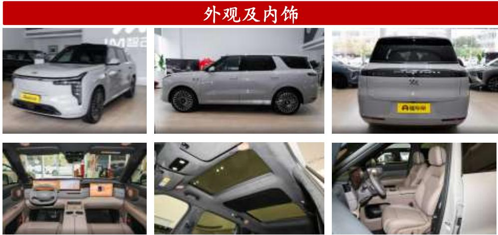  
来源：懂车帝，中泰证券研究所

图表：智己LS8部分信息
<table><tr><td rowspan=1 colspan=2>车型</td><td rowspan=1 colspan=1>智己LS8</td></tr><tr><td rowspan=6 colspan=1>基础信息</td><td rowspan=1 colspan=1>上市时间</td><td rowspan=1 colspan=1>2026年4月16日</td></tr><tr><td rowspan=1 colspan=1>能源类型</td><td rowspan=1 colspan=1>增程式</td></tr><tr><td rowspan=1 colspan=1>长度（mm）</td><td rowspan=1 colspan=1>5085</td></tr><tr><td rowspan=1 colspan=1>宽度（mm）</td><td rowspan=1 colspan=1>2000</td></tr><tr><td rowspan=1 colspan=1>高度（mm）</td><td rowspan=1 colspan=1>1807</td></tr><tr><td rowspan=1 colspan=1>轴距（mm）</td><td rowspan=1 colspan=1>3060</td></tr><tr><td rowspan=1 colspan=1>看点配置</td><td rowspan=1 colspan=2>1.恒星增程系统+800V超快充平台+灵蜥数字底盘3.02.IMAD辅助驾驶系统硬件升级+IMUItra Agent1.03.超宽体座舱</td></tr></table>

来源：懂车帝，中泰证券研究所

动力性能配置：搭载华为雪鸮智能增程系统，CLTC综合续航里程高达1250+km，纯电续航高达210+km；华为途灵平台，配备道路预瞄与后轮转向，转弯半径低至5.35米，可根据车速、路况、驾驶模式等自动调节悬架软硬和高度。

■智能配置：搭载最新华为乾崑智驾ADS 4.1系统，配合896线双光路图像级激光雷达，支持车位到车位的全场景驾驶辅助。

车身座舱：采用2+2+3布局，3250mm轴距使得乘坐空间与后备箱容积优于同级；二排座椅采用123度双零重力设计，可以实现45/90/180度旋转。座椅搭载太空舒适模式，拥有1.05米超长支撑。配置鸿蒙ALPS健康座舱，采用MOFs抗菌滤芯、可吸附降解材料、UVC紫外线除菌模块与负氧离子发生器，可持续净化舱内空间。此外，车内车内甄选实木饰板、NAPPA头层真皮和钻切水晶，保障奢华质感；采用除头套式全包裹气囊、预碰撞座椅回正和多层隔音与隐私玻璃等，保障行车安全与隐私。

图表：智界V9外观  
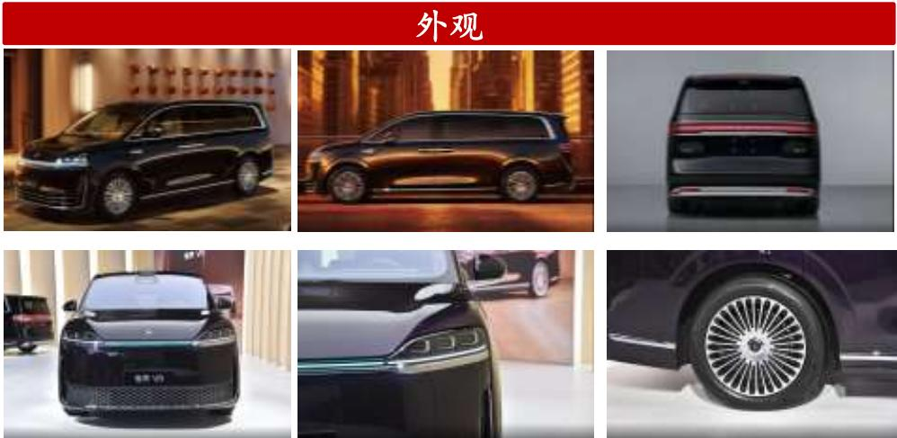  
来源：懂车帝，中泰证券研究所

图表：智界V9部分信息
<table><tr><td rowspan=1 colspan=2>车型</td><td rowspan=1 colspan=1>智界V9</td></tr><tr><td rowspan=6 colspan=1>基础信息</td><td rowspan=1 colspan=1>上市时间</td><td rowspan=1 colspan=1>2026年4-5月</td></tr><tr><td rowspan=1 colspan=1>能源类型</td><td rowspan=1 colspan=1>增程式</td></tr><tr><td rowspan=1 colspan=1>长度（mm）</td><td rowspan=1 colspan=1>5359</td></tr><tr><td rowspan=1 colspan=1>宽度（mm）</td><td rowspan=1 colspan=1>2009</td></tr><tr><td rowspan=1 colspan=1>高度（mm)</td><td rowspan=1 colspan=1>1879</td></tr><tr><td rowspan=1 colspan=1>轴距（mm）</td><td rowspan=1 colspan=1>3250</td></tr><tr><td rowspan=1 colspan=1>看点配置</td><td rowspan=1 colspan=2>1.华为雪鸮智能增程系统+华为途灵平台2.华为乾崑智驾ADS4.1系统+896线激光雷达3.超豪华空间体验+全新鸿蒙ALPS健康座舱</td></tr></table>

来源：懂车帝，中泰证券研究所

■车型：享界SUV预计采用“方盒子”造型，是鸿蒙智行体系内首款硬派豪华SUV，预计定位顾越野性能和城市通勤。

预计智能配置：华为乾崑智驾ADS4.1系统+多颗高精度激光雷达（896线）+鸿蒙5.0座舱。

预计动力配置：华为途灵平台+华为800V高压平台，前双叉臂+后多连杆悬架搭配空气悬架，特调动力系统以适用越野需求。

图表：享界越野SUV网络假想图  
网络假想图  
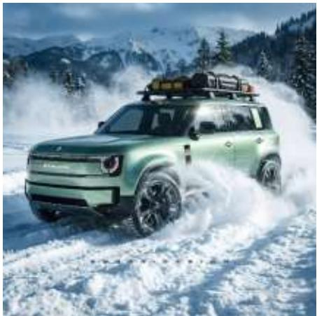  
来源：东电头条，中泰证券研究所

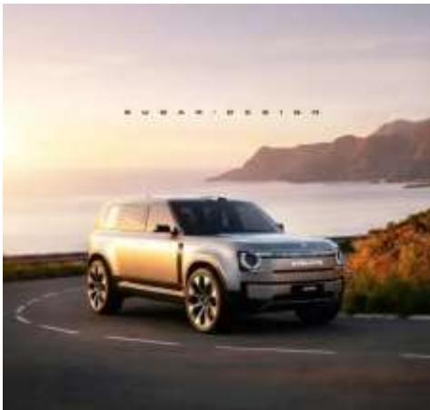

图表：享界越野SUV部分信息
<table><tr><td rowspan=1 colspan=2>车型</td><td rowspan=1 colspan=1>享界越野SUV</td></tr><tr><td rowspan=6 colspan=1>基础信息</td><td rowspan=1 colspan=1>上市时间</td><td rowspan=1 colspan=1>2026年Q2</td></tr><tr><td rowspan=1 colspan=1>能源类型</td><td rowspan=1 colspan=1>预计纯电/增程式</td></tr><tr><td rowspan=1 colspan=1>长度（mm）</td><td rowspan=1 colspan=1>1</td></tr><tr><td rowspan=1 colspan=1>宽度（mm）</td><td rowspan=1 colspan=1></td></tr><tr><td rowspan=1 colspan=1>高度（mm）</td><td rowspan=1 colspan=1></td></tr><tr><td rowspan=1 colspan=1>轴距（mm）</td><td rowspan=1 colspan=1></td></tr><tr><td rowspan=1 colspan=1>看点配置</td><td rowspan=1 colspan=2>1.鸿蒙智行体系内首款硬派豪华SUV</td></tr></table>

来源：天翼智库，东电头条，电车通，中泰证券研究所

## 目录

一、市场分析：基于整车研究看点，前瞻性评估车展新车布局  
二、头部自主：补齐产品矩阵，智能化节奏进一步升级  
三、新势力/华为系：智驾科技驱动，产品合作矩阵拓展  
四、合资：智电转型加速，中国方案主导全球创新  
五、风险提示

■理想：全新理想 L9 北京车展首发，定位家庭旗舰 SUV，二季度上市；

华为系：新款问界 M9、M6、改款 M8，江淮尊界 S800/MPV/SUV、北汽享界车型亮相；

1小米：2026 款 SU7、YU7 UItra、昆仑增程 SUV、Vision GT 概念超跑参展；

■零跑：旗舰 SUV D19、Lafa5 UItra 亮相北京车展；

■小鹏：GX 旗舰 SUV、2026 款 G6/G7 等车型亮相，GX 二季度上市；

■蔚来：全新 ES9 旗舰 SUV、乐道 L90 改款、萤火虫升级车型参展。

图表：新势力及华为系上海车展预计亮相车型(实际以车型发布为准)
<table><tr><td rowspan=1 colspan=1>车企</td><td rowspan=1 colspan=1>品牌</td><td rowspan=1 colspan=1>车型</td><td rowspan=1 colspan=1>动力形式</td><td rowspan=1 colspan=1>车种</td><td rowspan=1 colspan=1>预计售价 (万元)</td><td rowspan=1 colspan=1>预计亮相/上市时间</td></tr><tr><td rowspan=1 colspan=1>理想</td><td rowspan=1 colspan=1>理想</td><td rowspan=1 colspan=1>L9L</td><td rowspan=1 colspan=1>增程</td><td rowspan=1 colspan=1>SUV</td><td rowspan=1 colspan=1>40-55.98</td><td rowspan=1 colspan=1>2026年Q2正式上市</td></tr><tr><td rowspan=3 colspan=1>小米</td><td rowspan=3 colspan=1>小米</td><td rowspan=1 colspan=1>2026款SU7</td><td rowspan=1 colspan=1>纯电</td><td rowspan=1 colspan=1>轿车</td><td rowspan=1 colspan=1>22.99-30.99</td><td rowspan=1 colspan=1>2026年3月</td></tr><tr><td rowspan=1 colspan=1>YU7 UItra</td><td rowspan=1 colspan=1>纯电</td><td rowspan=1 colspan=1>SUV</td><td rowspan=1 colspan=1>50-60</td><td rowspan=1 colspan=1>2026年年内推出</td></tr><tr><td rowspan=1 colspan=1>昆仑（YU9）</td><td rowspan=1 colspan=1>增程</td><td rowspan=1 colspan=1>SUV</td><td rowspan=1 colspan=1>30-50</td><td rowspan=1 colspan=1>2026年年内推出</td></tr><tr><td rowspan=2 colspan=1>零跑</td><td rowspan=2 colspan=1>零跑</td><td rowspan=1 colspan=1>D19</td><td rowspan=1 colspan=1>增程/纯电</td><td rowspan=1 colspan=1>SUV</td><td rowspan=1 colspan=1>25-30</td><td rowspan=1 colspan=1>2026年4月</td></tr><tr><td rowspan=1 colspan=1>Lafa5UItra</td><td rowspan=1 colspan=1>纯电</td><td rowspan=1 colspan=1>轿车</td><td rowspan=1 colspan=1>15-20</td><td rowspan=1 colspan=1>2026年Q2上市</td></tr><tr><td rowspan=3 colspan=1>小鹏</td><td rowspan=3 colspan=1>小鹏</td><td rowspan=1 colspan=1>GX</td><td rowspan=1 colspan=1>增程/纯电</td><td rowspan=1 colspan=1>SUV</td><td rowspan=1 colspan=1>30-40</td><td rowspan=1 colspan=1>2026年Q2正式上市</td></tr><tr><td rowspan=1 colspan=1>2026款G6</td><td rowspan=1 colspan=1>增程/纯电</td><td rowspan=1 colspan=1>SUV</td><td rowspan=1 colspan=1>15-20</td><td rowspan=1 colspan=1>2026年1月</td></tr><tr><td rowspan=1 colspan=1>2026款G7</td><td rowspan=1 colspan=1>增程/纯电</td><td rowspan=1 colspan=1>SUV</td><td rowspan=1 colspan=1>19.58-20.58</td><td rowspan=1 colspan=1>2026年1月</td></tr><tr><td rowspan=3 colspan=1>蔚来</td><td rowspan=1 colspan=1>蔚来</td><td rowspan=1 colspan=1>ES9</td><td rowspan=1 colspan=1>纯电</td><td rowspan=1 colspan=1>SUV</td><td rowspan=1 colspan=1>40-55</td><td rowspan=1 colspan=1>2026年5月</td></tr><tr><td rowspan=1 colspan=1>乐道</td><td rowspan=1 colspan=1>L90改款</td><td rowspan=1 colspan=1>纯电</td><td rowspan=1 colspan=1>SUV</td><td rowspan=1 colspan=1>20-30</td><td rowspan=1 colspan=1>2026年4月</td></tr><tr><td rowspan=1 colspan=1>萤火虫</td><td rowspan=1 colspan=1>萤火虫改款</td><td rowspan=1 colspan=1>纯电</td><td rowspan=1 colspan=1>轿车</td><td rowspan=1 colspan=1>15-20</td><td rowspan=1 colspan=1>2026年4月</td></tr><tr><td rowspan=3 colspan=1>赛力斯</td><td rowspan=3 colspan=1>问界</td><td rowspan=1 colspan=1>新款M9</td><td rowspan=1 colspan=1>增程/纯电</td><td rowspan=1 colspan=1>SUV</td><td rowspan=1 colspan=1>47.98-60+</td><td rowspan=1 colspan=1>2026年5月</td></tr><tr><td rowspan=1 colspan=1>M6</td><td rowspan=1 colspan=1>增程/纯电</td><td rowspan=1 colspan=1>SUV</td><td rowspan=1 colspan=1>25-30</td><td rowspan=1 colspan=1>2026年4月</td></tr><tr><td rowspan=1 colspan=1>2026款M8</td><td rowspan=1 colspan=1>增程</td><td rowspan=1 colspan=1>SUV</td><td rowspan=1 colspan=1>35-45</td><td rowspan=1 colspan=1>2026年3月</td></tr><tr><td rowspan=3 colspan=1>江淮</td><td rowspan=3 colspan=1>尊界</td><td rowspan=1 colspan=1>S800高定版</td><td rowspan=1 colspan=1>增程／纯电</td><td rowspan=1 colspan=1>轿车</td><td rowspan=1 colspan=1>100-150</td><td rowspan=1 colspan=1>2026年7月</td></tr><tr><td rowspan=1 colspan=1>L900</td><td rowspan=1 colspan=1>增程/纯电</td><td rowspan=1 colspan=1>MPV</td><td rowspan=1 colspan=1>40-80</td><td rowspan=1 colspan=1>2026年4月</td></tr><tr><td rowspan=1 colspan=1>M900</td><td rowspan=1 colspan=1>增程／纯电</td><td rowspan=1 colspan=1>SUV</td><td rowspan=1 colspan=1>30-50</td><td rowspan=1 colspan=1>2026年9月</td></tr></table>

来源：汽车之家，易车，IT之家，懂车帝，凤凰网汽车，腾讯新闻，中泰证券研究所注：未亮相车型统计预计亮相时间；已亮相车型统计预计上市时间

外观：家族星环大灯＋贯穿尾灯，分体式 ADB 自适应远近光，车身5255×2000×1810mm，轴距3125mm，新增半隐藏式门把手与双色车身。

■智能化：两颗自研5nm马赫100芯片（2560TOPS算力），AD Max 全场景智驾，ABB 像素大灯 ＋ 三色星环灯.

内饰：六座独立布局，三联屏（15.7 英寸 OLED 中控＋副驾屏 ＋ 21.4 英寸 LCD 后舱屏），Nappa 真皮 ＋ 腿托，后排 4D 振动单元沉浸娱乐。

电动化：800V 高压平台，亏电油耗 6.3L/100km，全系标配空气悬架。

图表：理想L9部分信息
<table><tr><td rowspan=1 colspan=2>车型</td><td rowspan=1 colspan=1>L9</td></tr><tr><td rowspan=7 colspan=1>基础信息</td><td rowspan=1 colspan=1>上市时间</td><td rowspan=1 colspan=1>2026年Q2正式上市</td></tr><tr><td rowspan=1 colspan=1>售价 (万元）</td><td rowspan=1 colspan=1>预计40-55.98万元</td></tr><tr><td rowspan=1 colspan=1>能源类型</td><td rowspan=1 colspan=1>增程</td></tr><tr><td rowspan=1 colspan=1>长度（mm)</td><td rowspan=1 colspan=1>5230</td></tr><tr><td rowspan=1 colspan=1>宽度(mm)</td><td rowspan=1 colspan=1>1995</td></tr><tr><td rowspan=1 colspan=1>高度（mm)</td><td rowspan=1 colspan=1>1800</td></tr><tr><td rowspan=1 colspan=1>轴距（mm）</td><td rowspan=1 colspan=1>3105</td></tr><tr><td rowspan=1 colspan=1>看点配置</td><td rowspan=1 colspan=2>动力：800V增程，纯电420km，全线控底盘;智能：ADMaX高阶智驾，双自研芯片；舒适：空气悬架，六座零重力座椅</td></tr></table>

图表：理想L9外观及内饰

来源：汽车之家，新车杂志，网易汽车，中泰证券研究所  
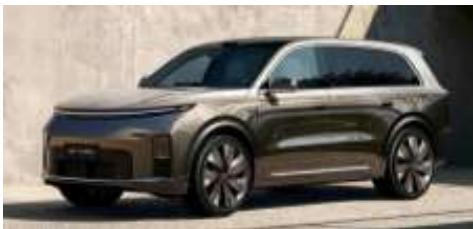  
外观

来源：理想汽车，中泰证券研究所

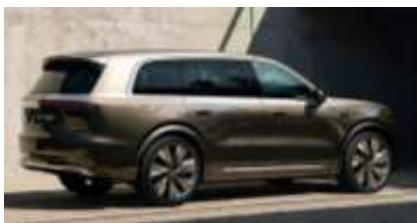

内饰  
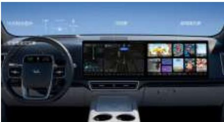

动力：00V 碳化硅平台，Max 版双电机 508kW/866N·m，零百 3.08 秒；Pro 版 96.3kWh 电池，CLTC 续航 902km;5C 超充 10 分钟补能 300km+。

智能化：全系标配激光雷达 ＋ 700TOPS 算力，XLA 认知大模型智驾，三屏联动（16.1 英寸 3K 中控＋7.1 英寸翻转仪表 + 56 英寸 AR-HUD)

内饰：母婴级软包，Nappa 真皮座椅，双 50W 无线快充，可调节香氛系统，无框车门

电动化：风阻0.195Cd，全系标配固定卡钳，支持 5C 超充，10 分钟补能 300km+

图表：2026款小米SU7外观及内饰
<table><tr><td rowspan=1 colspan=2>车型</td><td rowspan=1 colspan=1>2026款SU7</td></tr><tr><td rowspan=7 colspan=1>基础信息</td><td rowspan=1 colspan=1>上市时间</td><td rowspan=1 colspan=1>2026年3月</td></tr><tr><td rowspan=1 colspan=1>售价 (万元）</td><td rowspan=1 colspan=1>22.99-30.99</td></tr><tr><td rowspan=1 colspan=1>能源类型</td><td rowspan=1 colspan=1>纯电</td></tr><tr><td rowspan=1 colspan=1>长度（mm）</td><td rowspan=1 colspan=1>4997</td></tr><tr><td rowspan=1 colspan=1>宽度(mm)</td><td rowspan=1 colspan=1>1963</td></tr><tr><td rowspan=1 colspan=1>高度(mm)</td><td rowspan=1 colspan=1>1455</td></tr><tr><td rowspan=1 colspan=1>轴距（mm）</td><td rowspan=1 colspan=1>3000</td></tr><tr><td rowspan=1 colspan=1>看点配置</td><td rowspan=1 colspan=2>补能：800V+5C超充，10%-80%仅12分钟性能：Max版零百3.08秒，风阻0.195Cd续航：Pro版902km，标准版720km智能：激光雷达+HAD，全场景辅助驾驶</td></tr></table>

外观  
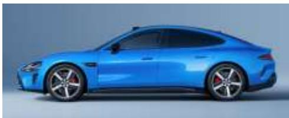  
图表：小米SU7部分信息

来源：小米汽车，中泰证券研究所

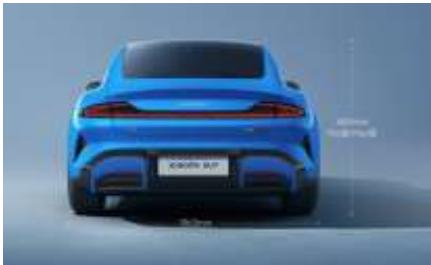  
来源：IT之家，懂车帝，腾讯新闻，新浪汽车，中泰证券研究所

内饰  
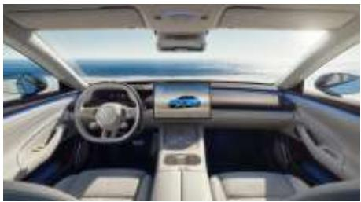

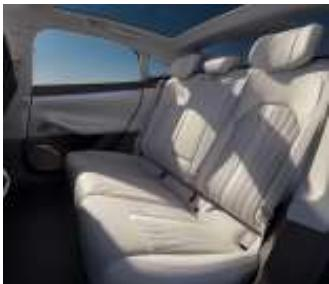

## 中泰证券小米YU7 UItra：首款性能SUV，扩充小米高端产品矩阵

动力：三电机四驱，综合功率 1020 马力，峰值扭矩 1380N·m，零百加速 2 秒级，800V 高压平台

智能化：45英寸全景天际屏，全系标配激光雷达，高阶智驾系统，高通 8295 芯片

内饰：17m母婴级软包，前排双零重力座椅，后排 135°电动座椅，36 处收纳空间

电动化：CLTC 续航最高 835km，5C 超充，风阻0.23Cd，性能与家用兼顾

图表：小米YU7UItra外观及内饰  
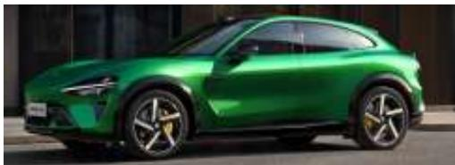  
来源：小米汽车，中泰证券研究所

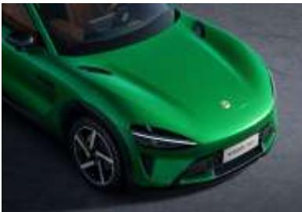

图表：小米YU7UItra部分信息
<table><tr><td rowspan=1 colspan=2>车型</td><td rowspan=1 colspan=1>YU7 UItra</td></tr><tr><td rowspan=7 colspan=1>基础信息</td><td rowspan=1 colspan=1>上市时间</td><td rowspan=1 colspan=1>2026年年内推出</td></tr><tr><td rowspan=1 colspan=1>售价 (万元）</td><td rowspan=1 colspan=1>50-60</td></tr><tr><td rowspan=1 colspan=1>能源类型</td><td rowspan=1 colspan=1>纯电</td></tr><tr><td rowspan=1 colspan=1>长度（mm）</td><td rowspan=1 colspan=1>4780</td></tr><tr><td rowspan=1 colspan=1>宽度(mm)</td><td rowspan=1 colspan=1>1960</td></tr><tr><td rowspan=1 colspan=1>高度(mm)</td><td rowspan=1 colspan=1>1590</td></tr><tr><td rowspan=1 colspan=1>轴距（mm）</td><td rowspan=1 colspan=1>2920</td></tr><tr><td rowspan=1 colspan=1>看点配置</td><td rowspan=1 colspan=2>动力：三电机四驱，1548马力，1.98秒零百智能：激光雷达+8295旗舰座舱，1000TOPS算力补能：800V高压快充，30%-80%仅15分钟操控：CDC可变阻尼+空气悬架，赛道级底盘</td></tr></table>

来源：今日头条，小米汽车，中泰证券研究所  
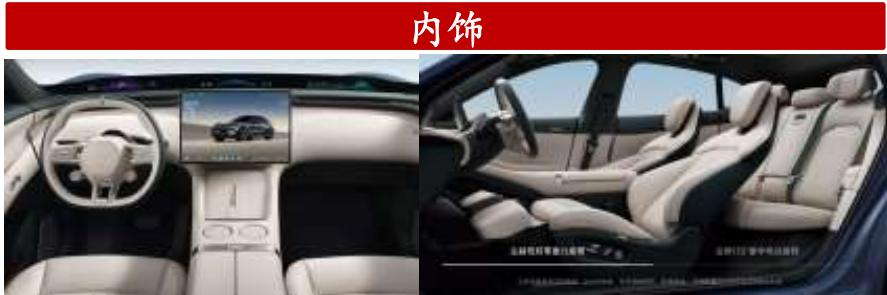

动力：1.5T 增程器 ＋ 80kWh 电池，CLTC 纯电续航 400km+，综合续航超1500km，双电机四驱

智能化：激光雷达＋高阶智驾，骁龙 8295 芯片，中控大屏，全系标配后轮转向

内饰：6/7 座布局，二排零重力座椅，大尺寸中控屏，全舱软包，后排娱乐屏

电动化：800V 高压平台，亏电油耗低，转弯半径 5.5米，空气悬架可选

图表：小米YU9外观  
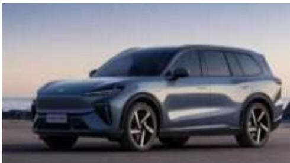  
来源：今日头条，中泰证券研究所

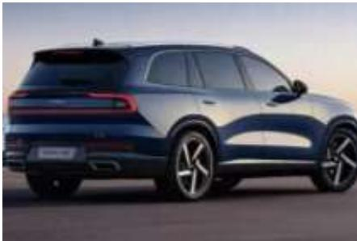

图表：小米YU9部分信息
<table><tr><td rowspan=1 colspan=2>车型</td><td rowspan=1 colspan=1>YU9</td></tr><tr><td rowspan=7 colspan=1>基础信息</td><td rowspan=1 colspan=1>上市时间</td><td rowspan=1 colspan=1>2026年年内推出</td></tr><tr><td rowspan=1 colspan=1>售价 （万元）</td><td rowspan=1 colspan=1>30-50</td></tr><tr><td rowspan=1 colspan=1>能源类型</td><td rowspan=1 colspan=1>增城</td></tr><tr><td rowspan=1 colspan=1>长度（mm)</td><td rowspan=1 colspan=1>5220</td></tr><tr><td rowspan=1 colspan=1>宽度（mm）</td><td rowspan=1 colspan=1>1999</td></tr><tr><td rowspan=1 colspan=1>高度（mm）</td><td rowspan=1 colspan=1>1800</td></tr><tr><td rowspan=1 colspan=1>轴距（mm）</td><td rowspan=1 colspan=1>3120</td></tr><tr><td rowspan=1 colspan=1>看点配置</td><td rowspan=1 colspan=2>动力：增程1500km+，纯电400km+，热效率44.3%底盘：后轮转向+空气悬架，操控提升30%空间：6/7座灵活布局，2.3米后排腿部空间智能：激光雷达+全场景智驾，转向半径减小1.2米</td></tr></table>

来源：凤凰网，有驾，懂车帝，今日头条，中泰证券研究所

动力：增程版（800V，80.3kWh 电池，纯电500km，综合1300km+）；纯电版（1000V，115kWh 电池，续航 720km，三电机 540kW，零百3 秒级）

智能化：高通双 8797 芯片，VLA 辅助驾驶，60英寸 AR-HUD，17.3 英寸中控屏

内饰：双层叠环绕座舱，1600 万色氛围灯，半苯胺真皮座椅，二排零重力座椅，21.4 英寸吸顶屏

电动化亮点：800V/1000V 双高压平台，15 分钟补能 350km+，全尺寸大空间

图表：零跑D19外观及内饰  
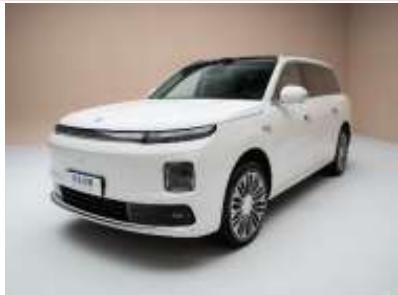  
外观

来源：汽车之家，中泰证券研究所来源：易车，腾讯新闻，中泰证券研究所动力：180kW后置后驱电机，磷酸铁锂电池，动力较普通版提升 12.5%

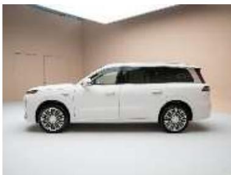

<table><tr><td rowspan=1 colspan=2>车型</td><td rowspan=1 colspan=1>D19</td></tr><tr><td rowspan=7 colspan=1>基础信息</td><td rowspan=1 colspan=1>上市时间</td><td rowspan=1 colspan=1>2026年4月</td></tr><tr><td rowspan=1 colspan=1>售价 (万元）</td><td rowspan=1 colspan=1>25-30</td></tr><tr><td rowspan=1 colspan=1>能源类型</td><td rowspan=1 colspan=1>增程/纯电</td></tr><tr><td rowspan=1 colspan=1>长度（mm）</td><td rowspan=1 colspan=1>5260</td></tr><tr><td rowspan=1 colspan=1>宽度（mm）</td><td rowspan=1 colspan=1>2000</td></tr><tr><td rowspan=1 colspan=1>高度(mm)</td><td rowspan=1 colspan=1>1810</td></tr><tr><td rowspan=1 colspan=1>轴距(mm）</td><td rowspan=1 colspan=1>3130</td></tr><tr><td rowspan=1 colspan=1>看点配置</td><td rowspan=1 colspan=2>平台：800V/1000V双高压，15分钟快充350km智能：双8797芯片，1200TOPS算力，30感知硬件空间：大六座，后排电动腿托，储物1000L+</td></tr></table>

图表：零跑D19部分信息

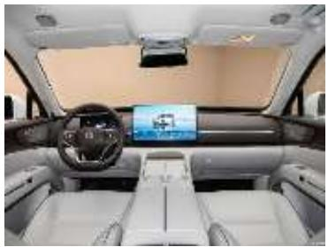

内饰  
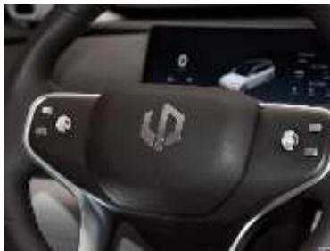

智能化：标配激光雷达，SA8295+SA8650芯片，高阶智驾，14.6 英寸 2.5K 中控屏

内饰：软性材质包覆，哑光镀铬装饰，8.8 英寸全液晶仪表，运动化座椅

电动化：无边框车门，运动化空气动力学套件，后驱驾趣，同价位稀缺激光雷达

图表：零跑Lafa5UItra部分信息
<table><tr><td rowspan=1 colspan=2>车型</td><td rowspan=1 colspan=1>Lafa5 UItra</td></tr><tr><td rowspan=7 colspan=1>基础信息</td><td rowspan=1 colspan=1>上市时间</td><td rowspan=1 colspan=1>2026年Q2上市</td></tr><tr><td rowspan=1 colspan=1>售价（万元）</td><td rowspan=1 colspan=1>15-20</td></tr><tr><td rowspan=1 colspan=1>能源类型</td><td rowspan=1 colspan=1>纯电</td></tr><tr><td rowspan=1 colspan=1>长度（mm）</td><td rowspan=1 colspan=1>4430</td></tr><tr><td rowspan=1 colspan=1>宽度(mm)</td><td rowspan=1 colspan=1>1880</td></tr><tr><td rowspan=1 colspan=1>高度(mm)</td><td rowspan=1 colspan=1>1520</td></tr><tr><td rowspan=1 colspan=1>轴距（mm）</td><td rowspan=1 colspan=1>2735</td></tr><tr><td rowspan=1 colspan=1>看点配置</td><td rowspan=1 colspan=2>动力：180kW后驱，零百6.37秒，续航520km智能：同级唯一标配激光雷达+8295，500TOPS 算力补能：800V快充，15分钟补能300km+性价比：15万级高智驾轿车，配置越级</td></tr></table>

图表：零跑Lafa5UItra外观  
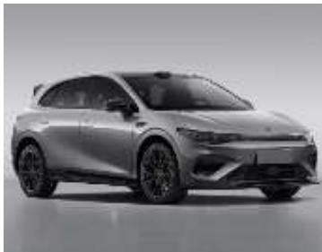  
来源：汽车之家，中泰证券研究所

外观  
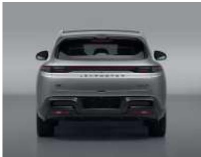

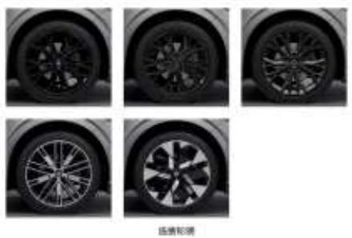  
来源：央视网，懂车帝，腾讯新闻，新浪汽车，中泰证券研究所

动力：增程版（1.5T增程器，42.5% 热效率，纯电320km，综合 1200km+）；纯电版（800V平台，CLTC 续航 750km，双电机四驱)

智能化：双激光雷达，3000T0PS 算力，L4 级智驾预埋， 全域线控转向，天玑 AI0S 6.0

内饰：星际几何座舱，大尺寸中控屏，二排零重力座椅，全舱软包，后排娱乐屏

电动化亮点：800V 高压平台，全系标配双电机四驱，全球量产线控转向

图表：小鹏GX外观  
  
来源：汽车之家，中泰证券研究所

图表：小鹏GX部分信息
<table><tr><td rowspan=1 colspan=2>车型</td><td rowspan=1 colspan=1>GX</td></tr><tr><td rowspan=7 colspan=1>基础信息</td><td rowspan=1 colspan=1>上市时间</td><td rowspan=1 colspan=1>2026年Q2正式上市</td></tr><tr><td rowspan=1 colspan=1>售价 （万元）</td><td rowspan=1 colspan=1>30-40</td></tr><tr><td rowspan=1 colspan=1>能源类型</td><td rowspan=1 colspan=1>增程/纯电</td></tr><tr><td rowspan=1 colspan=1>长度（mm)</td><td rowspan=1 colspan=1>5265</td></tr><tr><td rowspan=1 colspan=1>宽度（mm）</td><td rowspan=1 colspan=1>1999</td></tr><tr><td rowspan=1 colspan=1>高度（mm）</td><td rowspan=1 colspan=1>1800</td></tr><tr><td rowspan=1 colspan=1>轴距（mm）</td><td rowspan=1 colspan=1>3115</td></tr><tr><td rowspan=1 colspan=1>看点配置</td><td rowspan=1 colspan=2>底盘：量产全域线控转向，转向精准度提升50%动力：800V，纯电750km，零百4.9秒智能：双激光雷达+XNGP，全场景智驾舒适：零重力座椅，静谧座舱，21扬声器</td></tr></table>

来源：懂车帝，腾讯新闻，新浪汽车，汽车之家，中泰证券研究所

外观：流线低趴，低风阻（0.248Cd），尺寸4758×1920×1650mm，轴距 2890mm，简约耐看。

动力：800V+5C 超充，增程版 CLTC 综合续航1704km（纯电430km），纯电版续航700km+

智能化：最高 2250TOPS 算力，第二代 VLA，XNGP全场景智驾，ENC+RNC 双重主动降噪

内饰：天幕座舱，人体工学座椅，空间利用率达 70%，后排腿部空间 980mm，全景天窗。

电动化：全球续航最长 SUV，800V 高压平台，后备厢容积819L（可扩展至 2277L）

图表：小鹏2026款G6外观及内饰  
外观  
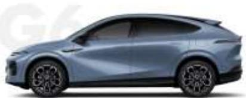

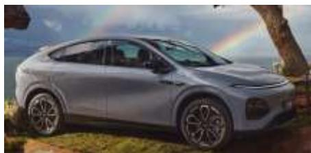  
来源：小鹏汽车，中泰证券研究所

图表：小鹏2026款G6部分信息
<table><tr><td rowspan=1 colspan=2>车型</td><td rowspan=1 colspan=1>2026款G6</td></tr><tr><td rowspan=7 colspan=1>基础信息</td><td rowspan=1 colspan=1>上市时间</td><td rowspan=1 colspan=1>2026年1月</td></tr><tr><td rowspan=1 colspan=1>售价 (万元）</td><td rowspan=1 colspan=1>15-20</td></tr><tr><td rowspan=1 colspan=1>能源类型</td><td rowspan=1 colspan=1>纯电/增程</td></tr><tr><td rowspan=1 colspan=1>长度（mm）</td><td rowspan=1 colspan=1>4758</td></tr><tr><td rowspan=1 colspan=1>宽度(mm)</td><td rowspan=1 colspan=1>1920</td></tr><tr><td rowspan=1 colspan=1>高度(mm)</td><td rowspan=1 colspan=1>1650</td></tr><tr><td rowspan=1 colspan=1>轴距（mm）</td><td rowspan=1 colspan=1>2890</td></tr><tr><td rowspan=1 colspan=1>看点配置</td><td rowspan=1 colspan=2>补能：800V超充，12分钟314km，充电效率提升60%智能：XNGP全场景智驾，28 感知硬件空间：后排980mm腿部空间，利用率70%能耗：百公里电耗13.8kWh，同级最低</td></tr></table>

来源：易车网，懂车帝，腾讯新闻，新浪汽车，中泰证券研究所

内饰  
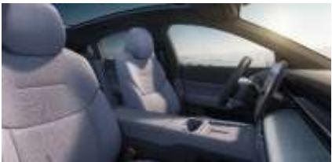

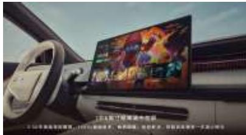

## ? 中泰证券小鹏2026款G7：舒适型SUV升级，主打家用与长途舒适性 ZHONGTAISECURIT

动力：V6sPIus超级电机，800V高压平台，CLTC续航最高 835km，零百加速最快2.78秒

智能化：全系标配激光雷达＋700TOPS 算力，XLA 认知大模型智驾，三屏联动（16.1英寸3K中控 + 7.1英寸翻转仪表+56英寸AR-HUD)

内饰：零重力副驾，多音区语音，主动降噪（噪音≤56dB），Nappa 真皮，后排电动调节，储物空间500L+。

电动化：风阻0.195Cd，全系标配固定卡钳，支持5C 超充，10 分钟补能 300km+

图表：小鹏2026款G7外观及内饰  
图表：小鹏2026款G7部分信息
<table><tr><td rowspan=1 colspan=2>车型</td><td rowspan=1 colspan=1>2026款G7</td></tr><tr><td rowspan=7 colspan=1>基础信息</td><td rowspan=1 colspan=1>上市时间</td><td rowspan=1 colspan=1>2026年1月</td></tr><tr><td rowspan=1 colspan=1>售价（万元）</td><td rowspan=1 colspan=1>19.58-25</td></tr><tr><td rowspan=1 colspan=1>能源类型</td><td rowspan=1 colspan=1>纯电/增程</td></tr><tr><td rowspan=1 colspan=1>长度（mm）</td><td rowspan=1 colspan=1>4758</td></tr><tr><td rowspan=1 colspan=1>宽度(mm)</td><td rowspan=1 colspan=1>1920</td></tr><tr><td rowspan=1 colspan=1>高度(mm)</td><td rowspan=1 colspan=1>1655</td></tr><tr><td rowspan=1 colspan=1>轴距（mm）</td><td rowspan=1 colspan=1>2890</td></tr><tr><td rowspan=1 colspan=1>看点配置</td><td rowspan=1 colspan=2>舒适：零重力座椅，主动降噪，静谧性提升30%补能：800V超充，15分钟补能350km智能：高阶智驾+全域语音，响应≤0.5秒空间：后排电动调节，储物500L+</td></tr></table>

来源：太平洋汽车，懂车帝，腾讯新闻，新浪汽车，中泰证券研究所

外观  
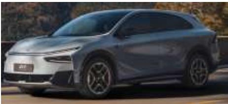  
来源：小鹏汽车，中泰证券研究所

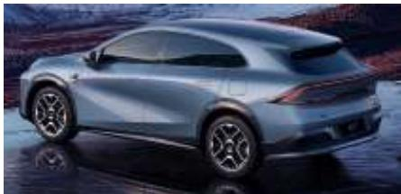

内饰  
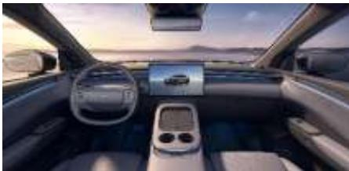

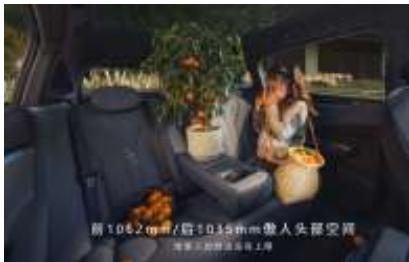

## 蔚来ES9：NT3.0全新旗舰，定义纯电顶级豪华

动力：双电机四驱，综合功率 520kW，CLTC 续航最高620km，5C 超快充，全域 900V 平台。

智能化：全球首款 5nm 车规级智驾芯片，Sky0S 天枢系统，三颗激光雷达，天行智能底盘（线控转向＋ 后轮转向＋全主动悬架）。

内饰：“天空岛”天窗，ET9 同款座椅靠背屏，6 座行政布局，Nappa 真皮全舱包覆。

1 电动化：蔚来 NT3.0平台，换电技术加持，5分钟换电，全主动空气悬架。

图表：蔚来ES9外观  
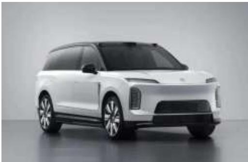  
来源：今日头条，中泰证券研究所

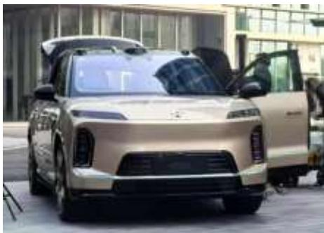

图表：蔚来ES9部分信息
<table><tr><td rowspan=1 colspan=2>车型</td><td rowspan=1 colspan=1>ES9</td></tr><tr><td rowspan=7 colspan=1>基础信息</td><td rowspan=1 colspan=1>上市时间</td><td rowspan=1 colspan=1>预计2026年5月</td></tr><tr><td rowspan=1 colspan=1>售价(万元）</td><td rowspan=1 colspan=1>40-55</td></tr><tr><td rowspan=1 colspan=1>能源类型</td><td rowspan=1 colspan=1>纯电</td></tr><tr><td rowspan=1 colspan=1>长度（mm）</td><td rowspan=1 colspan=1>5365</td></tr><tr><td rowspan=1 colspan=1>宽度(mm)</td><td rowspan=1 colspan=1>2029</td></tr><tr><td rowspan=1 colspan=1>高度(mm)</td><td rowspan=1 colspan=1>1870</td></tr><tr><td rowspan=1 colspan=1>轴距（mm）</td><td rowspan=1 colspan=1>3250</td></tr><tr><td rowspan=1 colspan=1>看点配置</td><td rowspan=1 colspan=2>补能：900V换电，5分钟满电，补能效率提升80%底盘：天行底盘+线控转向，操控提升40%智能：三颗激光雷达，1500TOPS算力，顶级智驾舒适：行政六座，后排按摩，23扬声器</td></tr></table>

来源：懂搜狐汽车，新浪汽车，太平洋汽车，中泰证券研究所

动力：增程／纯电双版本，增程版综合续航1300km+，纯电版续航 650km，800V 平台。

智能化：全系标配 896 线双光路激光雷达，华为ADS 4.0，Harmony0S 座舱，副驾灵感橱窗。

外观：智能灯语，大气庄重，尺寸5230×1999×1800mm，轴距3110mm，隐藏式门把手，科技感十足。

内饰：运动科技座舱，15.6 英寸中控屏，Nappa真皮座椅，HUAWEI SOUND 音响。

图表：问界M6外观及内饰  
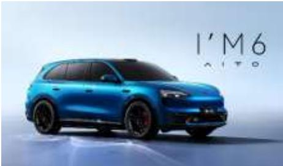  
外观

<table><tr><td rowspan=1 colspan=2>车型</td><td rowspan=1 colspan=1>M6</td></tr><tr><td rowspan=7 colspan=1>基础信息</td><td rowspan=1 colspan=1>上市时间</td><td rowspan=1 colspan=1>2026年4月</td></tr><tr><td rowspan=1 colspan=1>售价 (万元）</td><td rowspan=1 colspan=1>25-30</td></tr><tr><td rowspan=1 colspan=1>能源类型</td><td rowspan=1 colspan=1>增程/纯电</td></tr><tr><td rowspan=1 colspan=1>长度（mm)</td><td rowspan=1 colspan=1>4960</td></tr><tr><td rowspan=1 colspan=1>宽度（mm）</td><td rowspan=1 colspan=1>1985</td></tr><tr><td rowspan=1 colspan=1>高度(mm)</td><td rowspan=1 colspan=1>1680</td></tr><tr><td rowspan=1 colspan=1>轴距（mm）</td><td rowspan=1 colspan=1>2920</td></tr><tr><td rowspan=1 colspan=1>看点配置</td><td rowspan=1 colspan=2>智驾：ADS4.0，双光路激光雷达，2000TOPS算力底盘：途灵底盘+主动悬架，涉水深度500mm座舱：鸿蒙智能座舱，多屏互联，19扬声器动力：800V，综合1400km+，零百4.5秒</td></tr></table>

来源：汽车之家，中泰证券研究所

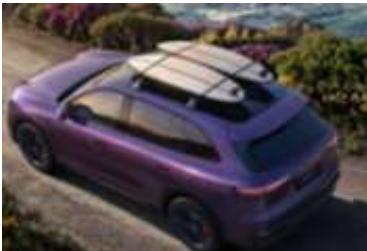  
图表：问界M6部分信息

来源：懂车帝，腾讯新闻，新浪汽车，太平洋汽车，中泰证券研究所

内饰  
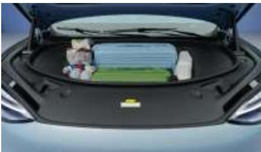

动力：华为雪鸮增程系统，纯电版 800V 平台，CLTC 续航 650km+，综合续航 1400km+

智能化：华为 ADS 4.1 智驾，HarmonyOS 座舱，后排娱乐系统，高通 8295 芯片

内饰：四座／六座行政布局，航空级座椅，全舱软包，星空顶，小桌板

电动化：华为三电技术，全主动悬架，高端商务MPV 标杆

图表：尊界L900外观  
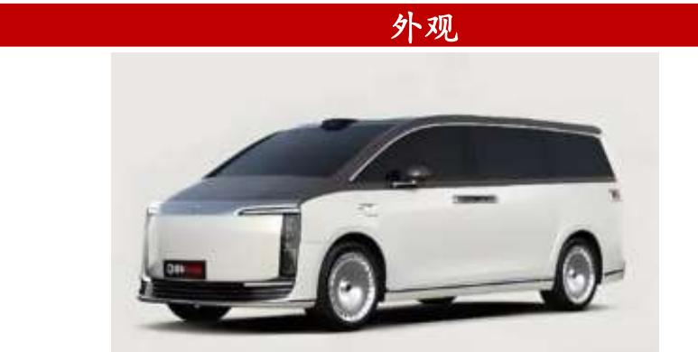  
来源：懂车帝，中泰证券研究所

图表：尊界L900部分信息
<table><tr><td rowspan=1 colspan=2>车型</td><td rowspan=1 colspan=1>L900</td></tr><tr><td rowspan=7 colspan=1>基础信息</td><td rowspan=1 colspan=1>上市时间</td><td rowspan=1 colspan=1>预计2026年4月</td></tr><tr><td rowspan=1 colspan=1>售价 (万元）</td><td rowspan=1 colspan=1>40-80</td></tr><tr><td rowspan=1 colspan=1>能源类型</td><td rowspan=1 colspan=1>增程/纯电</td></tr><tr><td rowspan=1 colspan=1>长度（mm)</td><td rowspan=1 colspan=1>5300</td></tr><tr><td rowspan=1 colspan=1>宽度（mm)</td><td rowspan=1 colspan=1>2020</td></tr><tr><td rowspan=1 colspan=1>高度（mm)</td><td rowspan=1 colspan=1>1850</td></tr><tr><td rowspan=1 colspan=1>轴距（mm)</td><td rowspan=1 colspan=1>3200</td></tr><tr><td rowspan=1 colspan=1>看点配置</td><td rowspan=1 colspan=2>智驾：华为ADS4.1，1500TOPS 算力舒适：航空座椅，星空顶，全舱软包定位：高端商务豪华MPV，双侧电滑门空间：轴距3200mm，后排腿部空间1.2米</td></tr></table>

来源：懂车帝，腾讯新闻，新浪汽车，有驾，中泰证券研究所

## 目录

一、市场分析：基于整车研究看点，前瞻性评估车展新车布局  
二、头部自主：补齐产品矩阵，智能化节奏进一步升级  
三、新势力/华为系：智驾科技驱动，产品合作矩阵拓展  
四、合资：智电转型加速，中国方案主导全球创新  
五、风险提示

## 合资：智电转型加速，中国方案主导全球创新

智驾本土化全面提速，中国方案主导合资转型。本届车展合资品牌集体"换芯"，大众、宝马、别克全面搭载Momenta智驾系统，奥迪A6L（C9）成为BBA里首款搭载华为乾崑智驾系统的燃油车，彻底告别外资自研的慢节奏。800V高压平台成为纯电旗舰标配，宝马iX3、日产NX8等车型实现10分钟补能400km+，电动化性能追平自主品牌。

本土研发主导全球，合资从“引进来”转向“走出去”。专为中国市场打造的轴距加长版密集亮相，宝马iX3轴距达3005mm并出口东南亚，奥迪E7X专为中国用户需求开发。更值得关注的是，大众ID.ERA 9X代表合资平台首次实现中方主导定义，标志着研发主导权从外资方向中方转移，中国开始反向输出技术标准。

图表：合资北京车展预计亮相车型 (部分；实际以车型发布为准)
<table><tr><td rowspan=1 colspan=1>品牌</td><td rowspan=1 colspan=1>车企</td><td rowspan=1 colspan=1>车型</td><td rowspan=1 colspan=1>动力形式</td><td rowspan=1 colspan=1>车种</td><td rowspan=1 colspan=1>预计亮相/上市时间</td></tr><tr><td rowspan=1 colspan=1>大众</td><td rowspan=1 colspan=1>上汽大众</td><td rowspan=1 colspan=1>ID. ERA 9X</td><td rowspan=1 colspan=1>增程</td><td rowspan=1 colspan=1>SUV</td><td rowspan=1 colspan=1>2026.04</td></tr><tr><td rowspan=1 colspan=1>别克</td><td rowspan=1 colspan=1>上汽通用</td><td rowspan=1 colspan=1>至境E7</td><td rowspan=1 colspan=1>插电混动</td><td rowspan=1 colspan=1>SUv</td><td rowspan=1 colspan=1>2026.04</td></tr><tr><td rowspan=1 colspan=1>日产</td><td rowspan=1 colspan=1>东风日产</td><td rowspan=1 colspan=1>NX8</td><td rowspan=1 colspan=1>增程/纯电</td><td rowspan=1 colspan=1>SUV</td><td rowspan=1 colspan=1>2026.04</td></tr><tr><td rowspan=1 colspan=1>宝马</td><td rowspan=1 colspan=1>华晨宝马</td><td rowspan=1 colspan=1>新世代iX3长轴距版</td><td rowspan=1 colspan=1>纯电</td><td rowspan=1 colspan=1>SUV</td><td rowspan=1 colspan=1>2026.04</td></tr><tr><td rowspan=1 colspan=1>奔驰</td><td rowspan=1 colspan=1>福建奔驰</td><td rowspan=1 colspan=1>VLE EV</td><td rowspan=1 colspan=1>纯电</td><td rowspan=1 colspan=1>MPV</td><td rowspan=1 colspan=1>2026.03</td></tr><tr><td rowspan=2 colspan=1>奥迪</td><td rowspan=1 colspan=1>一汽奥迪</td><td rowspan=1 colspan=1>A6L （C9)</td><td rowspan=1 colspan=1>燃油/纯电</td><td rowspan=1 colspan=1>轿车</td><td rowspan=1 colspan=1>2026.03</td></tr><tr><td rowspan=1 colspan=1>上汽奥迪</td><td rowspan=1 colspan=1>E7X</td><td rowspan=1 colspan=1>纯电</td><td rowspan=1 colspan=1>SUV</td><td rowspan=1 colspan=1>2026.04</td></tr><tr><td rowspan=1 colspan=1>保时捷</td><td rowspan=1 colspan=1>保时捷中国</td><td rowspan=1 colspan=1>纯电卡宴Turbo</td><td rowspan=1 colspan=1>纯电</td><td rowspan=1 colspan=1>SUv</td><td rowspan=1 colspan=1>2026.04</td></tr></table>

来源：易车，汽车之家，车家号，东风汽车集团有限公司官网，IT之家，有驾，新浪汽车，腾讯网，选车网，今日头条，中泰证券研究所注：未亮相车型统计预计亮相时间；已亮相车型统计预计上市时间

## 大众ID.ERA 9X：高端增程市场迎来"德系旗舰"

■外观方面：大众品牌全球最大车型，定位“9系”豪华六座SUV；车身线条方正魁梧，配合1997mm车宽和1810mm车高，营造出饱满的力量感和行政级气场。

■动力方面：采用增程式电动系统，搭载EA2111.5T增程器与前后双电机四驱组合；配备65.2kWh宁德时代骁遥电池，CLTC纯电续航406km、综合续航超1600km，并基于800V高压平台支持16.5分钟快充补能。

图表：大众ID.ERA9X外观及内饰  
外观及内饰  
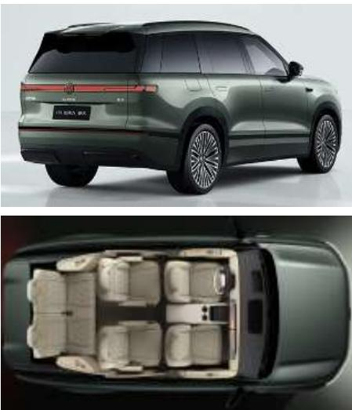

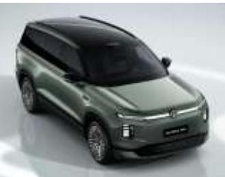  
来源：汽车之家，中泰证券研究所

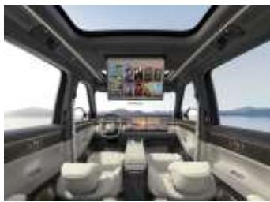

图表：大众ID.ERA 9X部分信息
<table><tr><td rowspan=1 colspan=2>车型</td><td rowspan=1 colspan=1>大众ID.ERA 9X</td></tr><tr><td rowspan=6 colspan=1>基础信息</td><td rowspan=1 colspan=1>上市时间</td><td rowspan=1 colspan=1>2026年4月</td></tr><tr><td rowspan=1 colspan=1>能源类型</td><td rowspan=1 colspan=1>增程</td></tr><tr><td rowspan=1 colspan=1>长度（mm)</td><td rowspan=1 colspan=1>5207</td></tr><tr><td rowspan=1 colspan=1>宽度（mm)</td><td rowspan=1 colspan=1>1997</td></tr><tr><td rowspan=1 colspan=1>高度（mm）</td><td rowspan=1 colspan=1>1810</td></tr><tr><td rowspan=1 colspan=1>轴距（mm）</td><td rowspan=1 colspan=1>3070</td></tr><tr><td rowspan=1 colspan=1>看点配置</td><td rowspan=1 colspan=2>动力属性：搭载宁德时代65.2kWh骁遥电池，CLTC纯电续航超400km，综合续航达到1651km。配合800V高压快充，充电10分钟可增加210km续航。</td></tr></table>

来源：汽车葫芦圈，中泰证券研究所

■外观方面：定位中型大五座家用SUV，4850mm车长营造宽适空间；配备零重力座椅与后排吸顶屏等家庭专属配置，精准切入20万元级高端新能源家用市场。

■动力方面：搭载"真龙插混Pro"系统，CLTC纯电235km、综合1630km；配备预瞄式RTD悬架，每秒500次扫描主动调节阻尼，兼顾续航与舒适。

图表：别克至境E7外观及内饰  
外观及内饰  
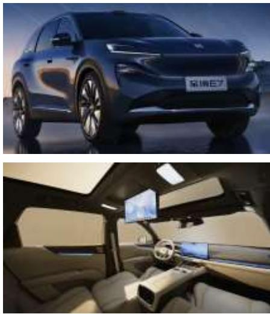  
来源：IT之家，易车，中泰证券研究所

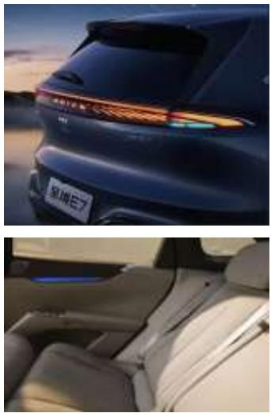

图表：别克至境E7部分信息
<table><tr><td rowspan=1 colspan=2>车型</td><td rowspan=1 colspan=1>别克至境E7</td></tr><tr><td rowspan=6 colspan=1>基础信息</td><td rowspan=1 colspan=1>上市时间</td><td rowspan=1 colspan=1>2026年4月</td></tr><tr><td rowspan=1 colspan=1>能源类型</td><td rowspan=1 colspan=1>插电混动</td></tr><tr><td rowspan=1 colspan=1>长度（mm)</td><td rowspan=1 colspan=1>4850</td></tr><tr><td rowspan=1 colspan=1>宽度（mm）</td><td rowspan=1 colspan=1>1910</td></tr><tr><td rowspan=1 colspan=1>高度（mm）</td><td rowspan=1 colspan=1>1676</td></tr><tr><td rowspan=1 colspan=1>轴距（mm）</td><td rowspan=1 colspan=1>2850</td></tr><tr><td rowspan=1 colspan=1>看点配置</td><td rowspan=1 colspan=2>动力属性：搭载真龙插混Pro动力系统，CLTC纯电续航235km、综合续航1630km。</td></tr></table>

来源：易车，中泰证券研究所

■外观方面：以"精准比例、克制线条"演绎家庭美学，83%超高得房率配合760mm同级最宽后排膝部空间，诠释"大大大五座"旗舰定位。

■动力方面，纯电与增程双动力布局搭载宁德时代顶级三电，增程版CLTC纯电310km、综合续航1450km；纯电版基于800V高压平台支持5C超快充，6分钟补能300km，配合AI能量管理实现"舒适不晕车"的驾乘体验。

图表：日产NX8外观及内饰  
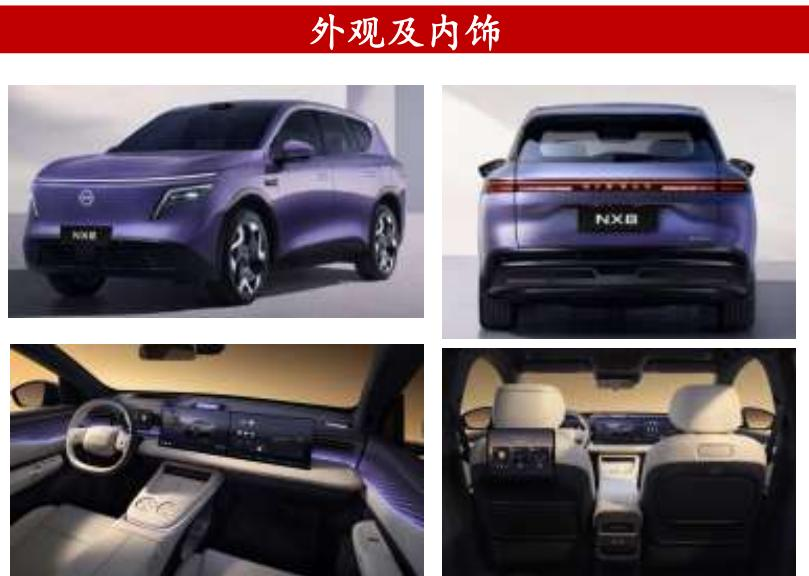  
来源：新浪汽车，东风日产官网，中泰证券研究所

图表：日产NX8部分信息
<table><tr><td rowspan=1 colspan=2>车型</td><td rowspan=1 colspan=1>日产NX8</td></tr><tr><td rowspan=6 colspan=1>基础信息</td><td rowspan=1 colspan=1>上市时间</td><td rowspan=1 colspan=1>2026年4月</td></tr><tr><td rowspan=1 colspan=1>能源类型</td><td rowspan=1 colspan=1>增程/纯电</td></tr><tr><td rowspan=1 colspan=1>长度（mm)</td><td rowspan=1 colspan=1>4870</td></tr><tr><td rowspan=1 colspan=1>宽度（mm）</td><td rowspan=1 colspan=1>1920</td></tr><tr><td rowspan=1 colspan=1>高度（mm)</td><td rowspan=1 colspan=1>1680</td></tr><tr><td rowspan=1 colspan=1>轴距（mm)</td><td rowspan=1 colspan=1>2917</td></tr><tr><td rowspan=1 colspan=1>看点配置</td><td rowspan=1 colspan=2>动力属性：提供纯电、增程双动力选择，纯电车型搭载800V高压碳化硅平台与5C超充技术，充电6分钟可续航300公里，增程车型CLTC纯电续航达310公里、综合续航达1450公里</td></tr></table>

来源：东风汽车集团有限公司官网，新浪汽车，有驾，中泰证券研究所

■外观方面：纵向延展发光双肾格栅搭配数字天使光翼日行灯，重塑新世代美学；轴距加长108mm至3005mm，配合中国专属霍氏弯角与半隐藏式门把手，空间与设计双重进阶。

■动力方面：第六代eDrive双电机四驱输出345kW/645N·m，零百加速4.9秒；800V高压架构配108kWh大圆柱电池，CLTC续航超900km，10分钟快充补能427km。

图表：宝马新世代iX3长轴距版外观及内饰  
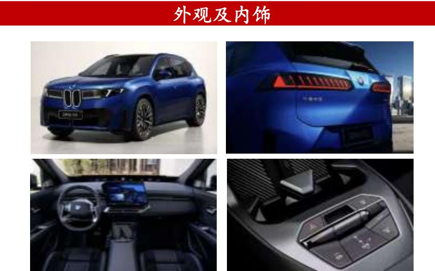  
来源：汽车之家，中泰证券研究所

图表：宝马新世代iX3长轴距版部分信息
<table><tr><td rowspan=1 colspan=2>车型</td><td rowspan=1 colspan=1>新世代iX3长轴距版</td></tr><tr><td rowspan=6 colspan=1>基础信息</td><td rowspan=1 colspan=1>上市时间</td><td rowspan=1 colspan=1>2026. 04</td></tr><tr><td rowspan=1 colspan=1>能源类型</td><td rowspan=1 colspan=1>纯电</td></tr><tr><td rowspan=1 colspan=1>长度（mm）</td><td rowspan=1 colspan=1>4885</td></tr><tr><td rowspan=1 colspan=1>宽度（mm）</td><td rowspan=1 colspan=1>1895</td></tr><tr><td rowspan=1 colspan=1>高度（mm）</td><td rowspan=1 colspan=1>1635</td></tr><tr><td rowspan=1 colspan=1>轴距（mm）</td><td rowspan=1 colspan=1>3005</td></tr><tr><td rowspan=1 colspan=1>看点配置</td><td rowspan=1 colspan=2>动力属性：搭载全新第六代BMWeDrive电驱技术，以宝马大圆柱电池、自研BMW能量智控系统和行业唯一全新电机组合为代表，搭载全域800V高压平台。</td></tr></table>

来源：汽车之家，易车，中泰证券研究所

■外观方面：以"豪华大型座驾"定位打造，提供标准版与加长版两种尺寸；前脸发光格栅搭配星辉灯组与三叉星立标，侧面流线造型实现0.25Cd超低风阻，可选AMG套件满足多元审美。

■动力方面：基于800V纯电架构，首发VLE 300搭载115kWh电池与203kW单电机，WLTP续航超700km；双电机四驱版最大功率305kW，配空气悬架与后轮主动转向（转弯半径仅5.45米），15分钟快充补能355km。

图表：奔驰VLEEV外观及内饰  
外观及内饰  
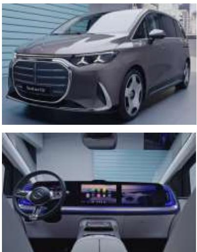  
来源：汽车之家，中泰证券研究所

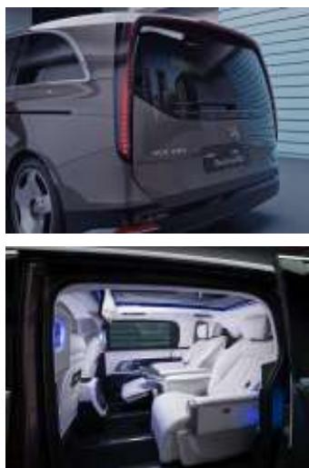

图表：奔驰VLEEV部分信息
<table><tr><td rowspan=1 colspan=2>车型</td><td rowspan=1 colspan=1>VLE EV</td></tr><tr><td rowspan=6 colspan=1>基础信息</td><td rowspan=1 colspan=1>上市时间</td><td rowspan=1 colspan=1>2026年3月</td></tr><tr><td rowspan=1 colspan=1>能源类型</td><td rowspan=1 colspan=1>纯电</td></tr><tr><td rowspan=1 colspan=1>长度（mm）</td><td rowspan=1 colspan=1>5309</td></tr><tr><td rowspan=1 colspan=1>宽度（mm）</td><td rowspan=1 colspan=1>1999</td></tr><tr><td rowspan=1 colspan=1>高度（mm）</td><td rowspan=1 colspan=1>1943</td></tr><tr><td rowspan=1 colspan=1>轴距（mm）</td><td rowspan=1 colspan=1>3342</td></tr><tr><td rowspan=1 colspan=1>看点配置</td><td rowspan=1 colspan=2>动力属性：首发版本VLE300搭载115kWh三元锂电池，前置单电机203kW（272马力），WLTP续航超700公里。</td></tr></table>

来源：懂车帝，汽车之家，中泰证券研究所

1内饰方面：采用半隐藏式门把手设计，车身长度达5.1米，轴距加长至3066mm，塑造优雅修长的行政级体量；内饰配备5屏联动数字座舱，搭配Nappa真皮座椅与全景天幕，营造数字化豪华氛围。

■动力方面：3.0TV6发动机最大功率270kW，峰值扭矩550N·m，零百加速4.6秒；标配HDI双电机全域智混系统与quattro智能四驱，配合自适应空气悬架和全轮转向，实现驾控与舒适的双重进阶。

图表：奥迪A6L（C9）外观及内饰  
外观及内饰  
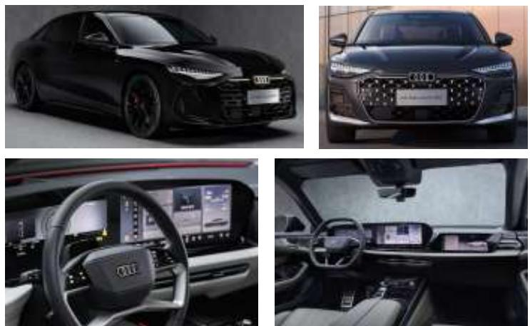  
来源：一汽奥迪官网，中泰证券研究所

图表：奥迪A6L（C9）部分信息
<table><tr><td rowspan=1 colspan=2>车型</td><td rowspan=1 colspan=1>A6L (C9)</td></tr><tr><td rowspan=6 colspan=1>基础信息</td><td rowspan=1 colspan=1>上市时间</td><td rowspan=1 colspan=1>2026年3月</td></tr><tr><td rowspan=1 colspan=1>能源类型</td><td rowspan=1 colspan=1>燃油/纯电</td></tr><tr><td rowspan=1 colspan=1>长度（mm）</td><td rowspan=1 colspan=1>5142</td></tr><tr><td rowspan=1 colspan=1>宽度（mm）</td><td rowspan=1 colspan=1>1887</td></tr><tr><td rowspan=1 colspan=1>高度（mm）</td><td rowspan=1 colspan=1>1464</td></tr><tr><td rowspan=1 colspan=1>轴距（mm）</td><td rowspan=1 colspan=1>3066</td></tr><tr><td rowspan=1 colspan=1>看点配置</td><td rowspan=1 colspan=2>动力属性：3.0T发动机最大功率270kW，峰值扭矩550N·m，零百加速4.6秒，标配HDI双电机全域智混系统和quattro智能四驱，搭载华为乾崑智驾系统</td></tr></table>

来源：车家号，易车，有驾，中泰证券研究所

1内饰方面：以"重构感官张力"为设计理念，车长5049mm、轴距3060mm打造大五座旗舰空间，座座C位；采用AUDI品牌最新设计语言，配备环绕式数字矩阵LED大灯与可发光标识，展现未来科技感。

■动力方面：传承奥迪百年驾控基因，零百加速3.97s，搭载quattro智能四驱与全铝底盘；行业首发109度宁德时代电池，CLTC续航751km，全系900V快充架构定义纯电效能新标杆。

图表：奥迪E7X外观  
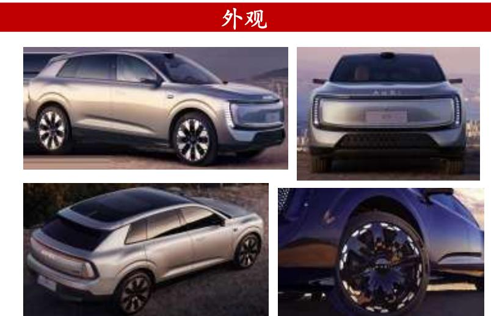  
来源：上汽奥迪官网，中泰证券研究所

图表：奥迪E7X部分信息
<table><tr><td rowspan=1 colspan=2>车型</td><td rowspan=1 colspan=1>E7X</td></tr><tr><td rowspan=6 colspan=1>基础信息</td><td rowspan=1 colspan=1>上市时间</td><td rowspan=1 colspan=1>2026年4月</td></tr><tr><td rowspan=1 colspan=1>能源类型</td><td rowspan=1 colspan=1>纯电</td></tr><tr><td rowspan=1 colspan=1>长度（mm）</td><td rowspan=1 colspan=1>5049</td></tr><tr><td rowspan=1 colspan=1>宽度（mm）</td><td rowspan=1 colspan=1>1997</td></tr><tr><td rowspan=1 colspan=1>高度（mm）</td><td rowspan=1 colspan=1>1710</td></tr><tr><td rowspan=1 colspan=1>轴距（mm）</td><td rowspan=1 colspan=1>3060</td></tr><tr><td rowspan=1 colspan=1>看点配置</td><td rowspan=1 colspan=2>动力属性：行业首发109度宁德时代电池，751公里超长续航全系900V快充架构</td></tr></table>

来源：上汽奥迪官网，中泰证券研究所

## 保时捷纯电卡宴Turbo：性能巅峰再造，纯电卡宴新纪元

■内饰方面：基于PPE平台轴距加长130mm至3023mm，后排空间显著提升；无框车门配合0.25Cd超低风阻，3D贯穿灯带与发光徽标诠释纯电科技美学。

1动力方面：品牌史上最强量产车，Turbo版弹射起步功率850kW/1139马力，0-97km/h加速仅2.4秒；113kWh电池配合800V架构，16分钟完成10-80%快充。

图表：保时捷纯电卡宴Turbo外观及内饰  
外观及内饰  
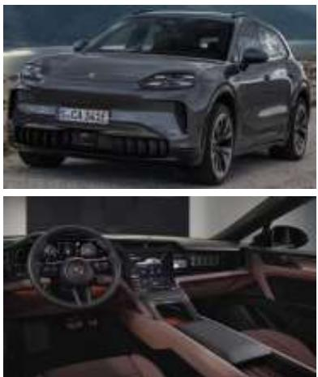  
来源：IT之家，中泰证券研究所

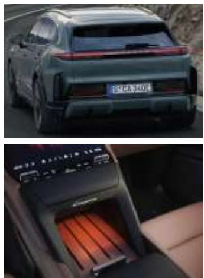

图表：保时捷纯电卡宴Turbo部分信息
<table><tr><td rowspan=1 colspan=2>车型</td><td rowspan=1 colspan=1>纯电卡宴Turbo</td></tr><tr><td rowspan=6 colspan=1>基础信息</td><td rowspan=1 colspan=1>上市时间</td><td rowspan=1 colspan=1>2026年4月</td></tr><tr><td rowspan=1 colspan=1>能源类型</td><td rowspan=1 colspan=1>纯电</td></tr><tr><td rowspan=1 colspan=1>长度（mm）</td><td rowspan=1 colspan=1>4985</td></tr><tr><td rowspan=1 colspan=1>宽度（mm）</td><td rowspan=1 colspan=1>1980</td></tr><tr><td rowspan=1 colspan=1>高度（mm）</td><td rowspan=1 colspan=1>1674</td></tr><tr><td rowspan=1 colspan=1>轴距（mm）</td><td rowspan=1 colspan=1>3023</td></tr><tr><td rowspan=1 colspan=1>看点配置</td><td rowspan=1 colspan=2>动力属性：配备前后双电机，标准综合功率为630千瓦在启动弹射模式后最大功率增至850千瓦,峰值扭矩可达1500牛·米，零百加速时间仅为2.5秒。</td></tr></table>

来源：太平洋汽车，腾讯网，IT之家，懂车帝，中泰证券研究所

## 目录

一、市场分析：基于整车研究看点，前瞻性评估车展新车布局  
二、头部自主：补齐产品矩阵，智能化节奏进一步升级  
三、新势力/华为系：智驾科技驱动，产品合作矩阵拓展  
四、合资：智电转型加速，中国方案主导全球创新  
五、风险提示

## 乘用车销量不及预期

主要系：1）新能源竞争加速，特斯拉等新势力价格策略大幅调整；2）经济复苏不及预期，居民消费信心处于低位，购车需求不足。

## 本土车企海外拓展进度不及预期

受到地缘因素以及海运费波动等影响，头部自主企业海外拓展存在不及预期的风险。

## 盈利不及预期

整车厂商新能源转型过程中具备盈利能力下行风险，后续若价格战持续发酵，盈利空间将进一步受压，因此存在盈利能力不及预期的风险。

研究报告中使用的公开资料可能存在信息滞后或更新不及时的风险。

## 重要声明

中泰证券股份有限公司（以下简称“本公司”）具有中国证券监督管理委员会许可的证券投资咨询业务资格。  
本报告仅供本公司的客户使用。本公司不会因接收人收到本报告而视其为客户。

本报告基于本公司及其研究人员认为可信的公开资料或实地调研资料，反映了作者的研究观点，力求独立、客观和公正，结论不受任何第三方的授意或影响。本公司力求但不保证这些信息的准确性和完整性，且本报告中的资料、意见、预测均反映报告初次公开发布时的判断，可能会随时调整。本公司对本报告所含信息可在不发出通知的情形下做出修改，投资者应当自行关注相应的更新或修改。本报告所载的资料、工具、意见、信息及推测只提供给客户作参考之用，不构成任何投资、法律、会计或税务的最终操作建议，本公司不就报告中的内容对最终操作建议做出任何担保。本报告中所指的投资及服务可能不适合个别客户，不构成客户私人咨询建议。

，市场有风险，投资需谨慎。在任何情况下，本公司不对任何人因使用本报告中的任何内容所引致的任何损失负任何责任。

投资者应注意，在法律允许的情况下，本公司及其本公司的关联机构可能会持有报告中涉及的公司所发行的证券并进行交易，并可能为这些公司正在提供或争取提供投资银行、财务顾问和金融产品等各种金融服务。本公司及其本公司的关联机构或个人可能在本报告公开发布之前已经使用或了解其中的信息。

本报告版权归“中泰证券股份有限公司”所有。事先未经本公司书面授权，任何机构和个人，不得对本报告进行任何形式的翻版、发布、复制、转载、刊登、篡改，且不得对本报告进行有悖原意的删节或修改。