芯原股份（688521）深度研究报告

# AI ASIC 领军者，迎接 ASIC 定制新纪元

❖ 自主 IP 驱动的平台化设计服务龙头，AI相关订单高增支撑中长期成长。芯原股份依托自主半导体 IP，为客户提供平台化、全方位、一站式芯片定制服务和半导体 IP 授权服务，主要客户包括芯片设计公司、IDM、系统厂商、大型互联网公司、云服务提供商等。截至 2025 年统计，2024 年芯原 IP 授权业务市场占有率位列中国大陆第一，全球第八；2024 年，芯原的知识产权授权使用费收入排名全球第六，IP 种类在全球排名前十的 IP 企业中排名前二。当前，半导体周期回暖，推理应用市场渗透，ASIC需求爆发，叠加公司在手订单连续九个季度保持高位、AI 相关订单高增，共同支撑中长期成长。

❖ 多轮驱动 IP 需求持续提升，设计服务与 IP 需求持续扩容。半导体 IP 作为集成电路产业链最上游的核心环节，通过提供预先验证、可重复使用的功能模块，已成为应对 SoC 设计复杂度飙升、降低昂贵研发成本及缩短产品上市周期的关键驱动力。当前，AI、5G 及高性能计算应用的爆发式增长，叠加先进制程向 7nm 及以下节点演进带来的晶体管集成度跃升、Chiplet 带来的复用 IP 新产业模式，显著强化了市场对高效能处理器与接口 IP 的复用需求，推动全球 IP市场规模向百亿美元大关迈进。此外，如今 AI 产业的发展重心逐渐转向“推理应用”，推理集群的数量预计会达到百万级别，高成本成为大模型应用核心痛点，导致 CSP超 6500 亿美元 Capex 涌入超大规模数据中心，其资金大部分流向定制芯片，解决高成本通电问题，博通 FY26Q1 定制 AI ASIC 收入翻倍，预测 FY27 AI 芯片将带来千亿收入，Marvell 持续上修数据中心市场空间，数据中心成为 IP 增长引擎，均发出 IP 产业的积极信号。

❖ IP 生态与平台能力构筑长期护城河，量产订单规模效应显现。作为中国半导体 IP 第一股与 AI ASIC 领军者，芯原凭借深厚的 IP 储备与独特的 SiPaaS 模式构筑了极高的行业壁垒，并通过战略布局 Chiplet 实现技术竞争力的代际升维。公司核心 IP 优势显著，VPU 市占率稳居全球第一， GPU 累计全球出货量超过 20 亿颗、NPU 累计全球出货量近 2 亿颗，在车载、消费电子及端侧 AI大模型领域实现大规模量产验证；公司依托 4nmFinFET 到传统 250nmCMOS工艺节点芯片的设计能力，并与几乎全球所有主流晶圆厂全面合作，在 2025年释放强劲增长动能，不仅单季新签订单屡创历史新高、在手订单连续九个季度高位运行，更凭借量产业务营收的爆发式增长与超 30 亿元的待执行订单，驱动规模效应进入快速显现期。

❖ 投资建议：作为中国半导体 IP 第一股与 AI ASIC 领军者，公司核心 IP 优势显著，拥有 4nmFinFET 到传统 250nm CMOS 工艺节点芯片的设计能力，且与全球几乎所有主流晶圆厂全面合作，在 2025 年释放强劲增长动能，单季新签订单创历史新高、在手订单连续九个季度高位运行。截至 25Q4，公司在手订单50.75 亿元（QoQ+54.45%，量产订单超 30 亿元），公司预计一年内转化的比例超 80%，有望迎来业绩拐点。我们预计公司 26-28 年实现归母净利润2.18/7.14/11.99 亿元，考虑公司后续业绩兑现、稀缺性以及国内 ASIC 需求增长带动的估值抬升，首次覆盖给予“强推”评级。

❖ 风险提示：业绩下滑或亏损、集成电路设计研发风险、技术升级迭代、晶圆厂合作供应风险

[ReportFinanc主要财务指标
<table><tr><td></td><td>2025A</td><td>2026E</td><td>2027E</td><td>2028E</td></tr><tr><td>营业总收入(百万)</td><td>3,152</td><td>5,990</td><td>9,351</td><td>13,857</td></tr><tr><td>同比增速(%)</td><td>35.8%</td><td>90.0%</td><td>56.1%</td><td>48.2%</td></tr><tr><td>归母净利润(百万)</td><td>-528</td><td>218</td><td>714</td><td>1,199</td></tr><tr><td>同比增速(%)</td><td>12.2%</td><td>141.3%</td><td>228.0%</td><td>67.8%</td></tr><tr><td>每股盈利(元)</td><td>-1.00</td><td>0.41</td><td>1.36</td><td>2.28</td></tr><tr><td>市盈率(倍)</td><td>-237</td><td>575</td><td>175</td><td>105</td></tr><tr><td>市净率(倍)</td><td>36.7</td><td>23.2</td><td>20.5</td><td>17.2</td></tr></table>

资料来源：公司公告，华创证券预测  
注：股价为2026年4月17日收盘价

强推（首次）

当前价：241.08 元

## 华创证券研究所

证券分析师：岳阳

邮箱：yueyang@hcyjs.com

执业编号：S0360521120002

证券分析师：吴鑫

邮箱：wuxin@hcyjs.com 执业编号：S0360523060001

联系人：卢依雯

邮箱：luyiwen@hcyjs.com

公司基本数据
<table><tr><td>总股本(万股)</td><td>52,591.53</td></tr><tr><td>已上市流通股(万股) 总市值(亿元)</td><td>52,591.53 1,267.88</td></tr><tr><td>流通市值(亿元)</td><td>1,267.88</td></tr><tr><td>资产负债率(%)</td><td>55.72</td></tr><tr><td>每股净资产(元)</td><td>6.50</td></tr><tr><td>12 个月内最高/最低价</td><td>277.66/82.36</td></tr></table>

## 市场表现对比图(近 12 个月)

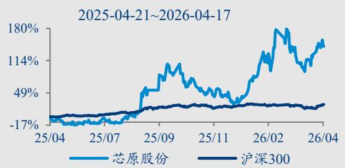

## 投资主题

## 报告亮点

本报告定位芯原股份为“自主 IP 驱动的平台化设计服务龙头”，系统论证其作为国内半导体 IP 第一梯队企业的核心地位。公司依托覆盖三星、亚马逊、谷歌等全球头部客户的优质资源，以及丰富且先进的 IP 组合，构建起深厚生态护城河。我们看好芯原的 IP 业务，该行业受先进制程演进、SoC 复杂度提升、IP 复用趋势强化及 Chiplet 新架构四个维度驱动，同时受 AI 推理需求驱动导致的 ASIC 需求提升影响，使得该行业进入一个新的放量周期 ；切入芯原晶圆厂合作链条看，公司与几乎全球所有主流晶圆厂全面合作，再从周期与成长性层面看，公司订单端显著改善，AI 相关订单快速增长，公司中长期成长曲线清晰。

## 投资逻辑

行业层面：（1）如今先进制程不断演进，使得芯片设计复杂度提升，推高整体设计成本，这将驱动企业复用 IP 需求增加。（2）新架构 Chiplet 不断成熟，开辟 IP 新型复用模式，增加新的 IP 种类，大量增加接口 IP 的需求。（3）AI 行业模型训练重心转向推理应用，驱动 ASIC 市场爆发，海外 ASIC 供应商指引乐观，且海外对于数据中心的 Capex 指引高增。

公司层面：（1）芯原作为中国半导体 IP 第一股，AI ASIC 的龙头企业，具有先进的 IP 组合。（2）从晶圆厂合作链条来看，芯原和全球所有主流的晶圆厂合作，与大多数晶圆厂拥有超过 10 年或 15 年的长期合作关系，，有丰富的量产资源。（3）芯原在 2025 年释放强劲增长动能，单季新签订单创历史新高、在手订单连续九个季度高位运行，为其中长期发展构筑稳定的增长曲线。

## 关键假设、估值与盈利预测

作为中国半导体 IP 第一股与 AI ASIC 领军者，公司核心 IP 优势显著，拥有4nmFinFET 到传统 250nm CMOS 工艺节点芯片的设计能力、且与全球几乎所有主流晶圆厂全面合作，在 2025 年释放强劲增长动能，单季新签订单创历史新高、在手订单连续九个季度高位运行。截至 25Q4，公司在手订单 50.75 亿元（QoQ+54.45%，量产订单超 30 亿元），公司预计一年内转化的比例超 80%，有望迎来业绩拐点。我们预计公司 26-28 年实现归母净利润 2.18/7.14/11.99 亿元，考虑公司后续业绩兑现、稀缺性以及国内 ASIC 需求增长带动的估值抬升，首次覆盖给予“强推”评级。

## 目 录

自主 IP驱动的平台化设计服务龙头，AI相关订单高增支撑中长期成长............. 6  
（一） 自主 IP 驱动的平台化设计服务龙头，全球头部客户资源彰显行业认可...... 6  
（二） 无控股股东无实际控制人，管理层产业经验丰富. .. 9  
（三） 半导体周期回暖驱动收入反转，AI相关订单高增支撑中长期成长 .. 10  
二、 多轮驱动 IP需求持续提升，设计服务与 IP需求持续扩容 .... 13  
（一） 半导体IP 提高芯片良率，简化芯片开发流程 . 13  
（二） AI市场增长与技术不断演进，多因素驱动IP 市场渗透. ... 15  
1、 先进制程演进与 SoC 复杂化提升设计复杂度，推动 IP 复用需求增长......... 15  
2、 Chiplet 与高速互连需求双轮驱动接口 IP 市场，2035 年有望达到百亿级 .... 17  
3、 推理应用驱动ASIC需求显著提升，自研 ASIC 成为CSP投资重心 . 20  
4、 数据中心 Capex 高增，海外 ASIC 供应商指引乐观. . 23  
（三） 全球 IP市场集中度较高，国产化率亟待提升. .. 25  
三、 IP 生态与平台能力构筑长期护城河，量产订单规模效应显现. .. 26  
（一） 芯原股份：中国半导体 IP第一股，AI ASIC龙头企业. .. 26  
（二） IP生态与平台能力构筑长期护城河，深耕存量市场开拓增量领域. .. 28  
（三） 单季度新签订单屡创新高，量产订单规模效应显现奠定盈利基础.. ... 30  
四、 盈利预测... .... 31  
五、 风险提示... ... 32  
1、 业绩下滑或亏损. ... 32  
2、 集成电路设计研发风险.. ... 32  
3、 技术升级迭代. ... 33  
4、 晶圆厂合作供应风险. ... 33

## 图表目录

图表 1 芯原股份业务发展里程碑. .. 7  
图表 2 芯原股份提供的主要服务. . 7  
图表 3 芯原股份主要 IP 组合及主要产品线. . 8  
图表 4 芯原股份服务的公司. .. 9  
图表 5 芯原股份股权结构. .. 9  
图表 6 芯原股份管理层情况.. ... 10  
图表 7 公司营收及增速. ... 11  
图表 8 公司归母净利润及增速. 11  
图表 9 公司分业务营收（亿元） . 11  
图表 10 公司分业务毛利率... .. 11  
图表 11 公司业务下游拆分情况（亿元） .. 12  
图表 12 公司毛利率及净利率. .. 13  
图表 13 公司费用率情况.. .. 13  
图表 14 芯片设计图：自主设计部分与 IP 核集成. .. 13  
图表 15 IP 重用类似于“拼图” . 13  
图表 16 集成电路产业链分类示意图. .14  
图表 17 按类型划分半导体 IP 市场份额.. ... 15  
图表 18 全球半导体 IP 市场（亿美元） .. 15  
图表 19 不同工艺节点下的芯片所集成的硬件 IP 平均数量. .. 16  
图表 20 单颗芯片裸片可容纳晶体管数量（亿） . 17  
图表 21 工艺节点处于各应用期的芯片设计成本（万美元） .. 17  
图表 22 SoC 与 Chiplet 架构 .. .. 17  
图表 23 Chiplet 设计带来的新功能/设计. .. 18  
图表 24 Chiplet与单芯片方法的性能和成本比较. .. 18  
图表 25 全球 Chiplet 市场规模（亿美元） . 19  
图表 26 全球接口 IP 市场规模（亿美元）. .. 20  
图表 27 Broadcom 对于 XPU 集群的扩建预期. .... 20  
图表 28 训练和推理对 AI 算力集群的需求差异. .... 20  
图表 29 训练和推理的指标对比. . 20  
图表 30 AI 加速芯片 TAM . .. 21  
图表 31 AI ASIC/GPU 单位出货量年增长率. ... 21  
图表 32 全球 AI ASIC 市场规模与份额. .. 21  
图表 33 Google TPU 发展历程以及部分关键指标. .... 22  
图表 34 人工智能加速器市场细分市场情况. . 23  
图表 35 2026 年超大规模数据中心资本支出对比 . . 24  
图表 36 Marvell 数据中心 TAM 预测. 25  
图表 37 全球半导体设计IP 厂商收入（亿美元）和市占率. . 25  
图表 38 芯原业务范围覆盖的应用领域. . 26  
图表 39 芯原所在市场地位. . 27  
图表 40 芯原丰富的IP组合. 27  
图表 41 芯原SiPaaS模式的竞争壁垒. . 28  
图表 42 公司对于 Chiplet 技术的布局 . 28  
图表 43 UCle 发起成员及部分贡献成员. 29  
图表 44 芯原设计服务能力及其应用的演进 . 30  
图表 45 芯原新签订单情况（亿元） . 30  
图表 46 芯原在手订单情况（亿元） . 30  
图表 47 芯原量产业务营收情况（亿元） . 31  
图表 48 芯原量产业务/芯片设计业务毛利率. .31  
图表 49 芯原股份业务拆分. .31

## 自主 IP驱动的平台化设计服务龙头，AI相关订单高增支撑中长期成长

## （一）自主 IP驱动的平台化设计服务龙头，全球头部客户资源彰显行业认可

自主 IP 驱动的平台化设计服务龙头，全球排名持续提升。芯原股份成立于 2001 年，是一家依托自主半导体 IP，为客户提供平台化、全方位、一站式芯片定制服务和半导体 IP授权服务的企业。基于独有的芯片设计平台即服务经营模式，公司目前主营业务的应用领域广泛包括消费电子、汽车电子、计算机及周边、工业、数据处理、物联网等，主要客户包括芯片设计公司、IDM、系统厂商、大型互联网公司、云服务提供商等。根据IPnest在2025 年的最新统计，2024年，芯原半导体 IP 授权业务市场占有率位列中国大陆第一，全球第八；2024年，芯原的知识产权授权使用费收入排名全球第六。根据 IPnest的 IP 分类和各企业公开信息，芯原 IP 种类在全球排名前十的 IP 企业中排名前二。2020 年，公司在科创板上市时，曾被誉为“中国半导体 IP 第一股”；随着公司业务在 AI 芯片定制领域获得快速增长，目前公司已被业界誉为“AIASIC龙头企业”。回顾公司及业务发展的里程碑，可以主要分为四个阶段：

1）初创起步期（2001—2003年）：2001年公司正式成立，成为首批入驻张江的芯片设计公司。公司依靠30人团队研发出了中国第一套180nm标准单元库，随后逐步壮大，助力中芯国际等晶圆厂顺利开展晶圆代工业务，为中国半导体产业起步奠定基石。

2）设计服务升级期（2004—2005 年）：公司于 2004 年收购国内专业的集成电路设计服务提供商上海众华，获得了系统级芯片的研发设计能力，从后端设计发展到前端设计，并结合已有的基础IP设计能力，开始推出从规格定义到芯片成品的一站式芯片定制服务。

3）国际并购与 IP 积累期（2006-2013 年）：2006 年，芯原收购了 LSI Logic 的 ZSP（数字信号处理器）部门，不仅稳定了华为、中兴通讯和大唐电信等ZSP在中国的原通讯基带客户，而且在接下来的两年中陆续开发出了语音和高清音频解决方案。这是芯原的第一个国际并购，也是芯原通过并购获取的第一个 IP。2010年谷歌为实现高质量视频格式开源并免费而收购On2，一年后 On2/谷歌将其相关客户协议转让给芯原。2010年 WebM公布的合作伙伴名单中，芯原是谷歌 WebM视频格式在亚洲首个硬件合作伙伴。

4）多媒体与图像能力强化期（2014-2017年）：在 2014年芯原新增了高清视频解决方案，在 2018 年拥有了 4K 和 8K 分辨率的视频编解码的能力，并增加了视频压缩处理模块。2014年芯原收购了ArcSoft软件开发团队，在 2017年研发出了图像信号处理器产品。通过 2016 年对图芯美国的收购，芯原获得了 GPU IP，并开发出了汽车电子的综合解决方案和高效的 NPU IP。

5）平台化与扩张期（2018-至今）：2018 年芯原开发出 BLE IP 和 NB-IoT 解决方案。在2020年，公司于科创板成功上市。2022年芯原推出人工智能增强AI-ISP、AI-GPU技术，颠覆性提升传统处理器性能，并且创新 FLEXA IP 互联技术，实现低功耗、低延迟和低DDR带宽。2023年，威视芯与芯原就智能超高清显示技术达成战略合作，深化在智能显示应用领域的技术和生态布局。2024年推出VC9800 系列视频处理器 IP，以增强视频处理性能。2025年芯原推出业界领先的车规级智慧驾驶SoC 设计平台，并在客户项目成功实施，并推出经市场验证的ZSP5000 视觉核心系列，扩展其面向边缘智能的数字信号处理器 IP组合。2026年3月11日，公司拟发行H股股票并在港交所上市，旨在满足业务发展需求、吸引优秀人才、推进国际化战略以及提升资本实力。

图表 1 芯原股份业务发展里程碑  
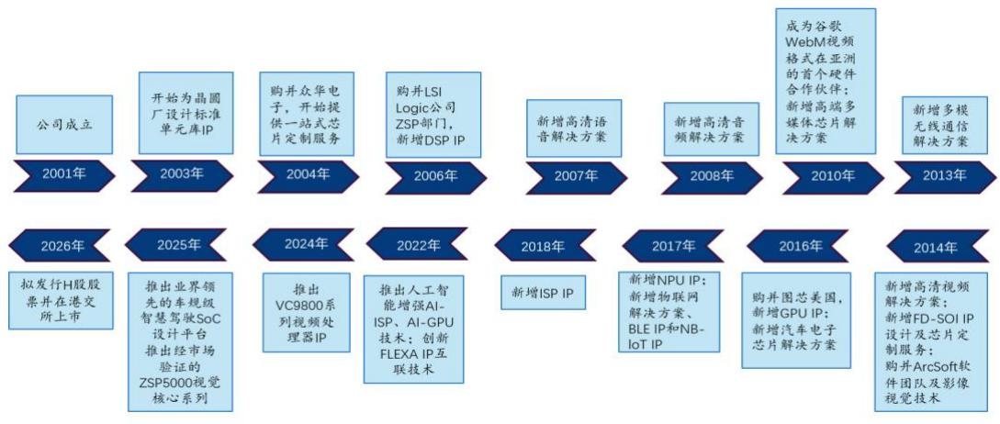  
资料来源：央广网，公司公众号、公司招股书，华创证券

一站式芯片定制，构建多元场景系统级解决方案能力。公司主要面向消费电子、汽车电子、计算机及周边、工业、数据处理、物联网等广泛应用市场，提供一站式芯片定制服务和半导体 IP授权服务。通过将公司的半导体 IP、芯片定制服务和软件支持服务等全面有机结合，芯原可为客户提供系统平台解决方案，包括高端应用处理器系统平台解决方案、高性能车规 ADAS系统平台解决方案、视频转码加速系统平台解决方案、AR/VR 系统平台解决方案等。

图表 2 芯原股份提供的主要服务  
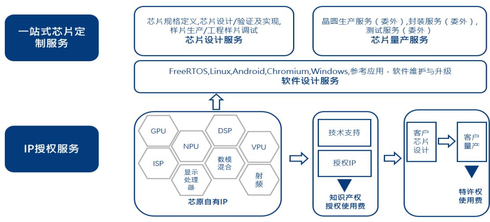  
资料来源：公司年报，华创证券

半导体 IP 平台授权服务，有机结合优化效率功耗。芯原的处理器 IP 主要包括图形处理器 IP、神经网络处理器 IP、视频处理器 IP、数字信号处理器 IP、图像信号处理器 IP 和显示处理器 IP。公司还拥有数模混合IP 和物联网连接IP（含射频）共计1,600多个。芯原针对物联网应用领域开发了多款低功耗高性能的射频 IP 和基带 IP，支持包括蓝牙、Wi-Fi、蜂窝物联网、多模卫星导航定位等在内的多种技术标准及应用，采用22nmFD-SOI等多种工艺，部分射频 IP 已在多款客户 SoC 芯片中集成并大规模量产。为降低客户开发成本、风险和缩短产品上市周期，芯原根据客户和市场需求，还推出了半导体 IP 平台授权服务。该授权平台通常含有公司的多个 IP 产品，IP 之间有机结合形成了子系统解决方案和平台解决方案，优化了 IP 之间协处理的效率、降低了系统功耗，简化了系统设计。

图表 3 芯原股份主要IP组合及主要产品线
<table><tr><td rowspan=1 colspan=1>IP组合</td><td rowspan=1 colspan=1>产品线</td><td rowspan=1 colspan=2>简介</td><td rowspan=1 colspan=1>应用场景</td></tr><tr><td rowspan=4 colspan=1>图形处理器IP</td><td rowspan=1 colspan=1>GC8000Nano 系列</td><td rowspan=1 colspan=2>具有大众市场消费级和嵌入式产品线中最新功能和同级领先的性能</td><td rowspan=1 colspan=1>移动、嵌入式及微控制器设备</td></tr><tr><td rowspan=1 colspan=1>GC8X00系列</td><td rowspan=1 colspan=2>能</td><td rowspan=1 colspan=1>Arcturus GC8000/配备了通过最新行业标准 API访问的前沿功丨移动设备、平板电脑、笔记本、电视、汽车应用和嵌入式设备</td></tr><tr><td rowspan=1 colspan=1>CC8000/CC8X00系列</td><td rowspan=1 colspan=2>高度可扩展的IP核心，实现卓越的加速</td><td rowspan=1 colspan=1>低功耗嵌入式设备、高性能服务器</td></tr><tr><td rowspan=1 colspan=1>Vivante 2.5DGPU系列</td><td rowspan=1 colspan=2>高分辨率图形能力</td><td rowspan=1 colspan=1>字体渲染引擎、人机界面、智能手表、智能手环、导航仪、汽车和嵌入式设备</td></tr><tr><td rowspan=3 colspan=1>神经网络处理器IP</td><td rowspan=1 colspan=1>VIP9000Pico</td><td rowspan=1 colspan=2>支持所有流行的深度学习框架（TensorFlow、TensorFlow Lite、PyTorch、Caffe、DarkNet、ONNX、Keras 等），并通过量化、剪枝和模型压缩等优化技术原生加速神经网络模型</td><td rowspan=1 colspan=1>可穿戴设备和物联网市场</td></tr><tr><td rowspan=1 colspan=1>Vivante VIP9000</td><td rowspan=1 colspan=2>为需要实时和低功耗AI设备的市场提供可编程、可扩展和可扩展的解决方案</td><td rowspan=1 colspan=1>可穿戴设备和物联网设备、IP摄像头、监控摄像头、智能家居与家电、手机和笔记本电脑，汽车（ADAS、自动驾驶）、边缘服务器</td></tr><tr><td rowspan=1 colspan=1>Vivante VIP9400</td><td rowspan=1 colspan=2>为需要实时且强大AI设备的市场提供可编程、可扩展和扩展的解决方案</td><td rowspan=1 colspan=1>数据中心和汽车应用的人工智能</td></tr><tr><td rowspan=4 colspan=1>视频处理器 IP</td><td rowspan=1 colspan=1>VC9000Nano</td><td rowspan=1 colspan=2>用于视频编解码器和视频处理的微处理器</td><td rowspan=1 colspan=1>可穿戴设备和物联网设备</td></tr><tr><td rowspan=1 colspan=1>VC9000L</td><td rowspan=1 colspan=2>IP，在主流视频格式支持、多核可扩展性、</td><td rowspan=1 colspan=1>可穿戴设备和物联网设备、IP摄像头</td></tr><tr><td rowspan=1 colspan=1>VC9000</td><td rowspan=1 colspan=2>帧压缩、编码质量和码率控制等方面的能力</td><td rowspan=1 colspan=1>车载摄像头、智能手机、机顶盒</td></tr><tr><td rowspan=1 colspan=1>VC9800</td><td rowspan=1 colspan=2>突出</td><td rowspan=1 colspan=1>监控摄像头、数据中心</td></tr><tr><td rowspan=3 colspan=1>数字信号处理器IP</td><td rowspan=1 colspan=1> ZSPNano</td><td rowspan=1 colspan=2>通过一系列的处理器内核，对算法层层优</td><td rowspan=1 colspan=1>音频、语音、图像、视觉、无线连接、电力线通信</td></tr><tr><td rowspan=1 colspan=1>ZSPNano+</td><td rowspan=2 colspan=2>化，实现数据流的不断加速</td><td rowspan=1 colspan=1></td><td rowspan=1 colspan=1>音频、语音</td></tr><tr><td rowspan=1 colspan=1>ZSP5000H</td><td rowspan=1 colspan=1>无线连接、成像、视觉</td></tr><tr><td rowspan=3 colspan=1>图像信号处理器IP</td><td rowspan=1 colspan=1>ISP8000Pico</td><td rowspan=1 colspan=2>具有高代码效率，可完成高性能实时图像处</td><td rowspan=1 colspan=1>可穿戴设备、AIoT 及任何电池供电设备</td></tr><tr><td rowspan=1 colspan=1>ISP8200L</td><td rowspan=1 colspan=2>理具有低面积，低功耗以及高吞吐量特点，</td><td rowspan=1 colspan=1>汽车、增强现实/虚拟现实和工业市场</td></tr><tr><td rowspan=1 colspan=1>ISP8000</td><td rowspan=1 colspan=2>同时对内存占用很低。</td><td rowspan=1 colspan=1>可穿戴设备、智能家居、视频监控和汽车应用</td></tr><tr><td rowspan=3 colspan=1>显示处理器IP</td><td rowspan=1 colspan=1>DCNano</td><td rowspan=1 colspan=2>小型体积、低成本且低功耗的显示控制器,提供多种前处理和后期处理功能，如旋转翻转、旋转、色彩空间转换、混合和抖动</td><td rowspan=1 colspan=1>智能手表和增强现实眼镜、MCU、AIoT和IP摄像头（IPC）在内的可穿戴设备</td></tr><tr><td rowspan=1 colspan=1>DC8200-FS</td><td rowspan=1 colspan=2>专为汽车和工业应用的安全显示和多层处理设计，以最大限度地减少因硬件相关问题引起的事故和伤害风险</td><td rowspan=1 colspan=1>汽车和工业应用</td></tr><tr><td rowspan=1 colspan=1>DC9x00</td><td rowspan=1 colspan=2>高性能、低功耗的显示处理IP，能够在不同应用场景下提供卓越的视觉效果</td><td rowspan=1 colspan=1>边缘服务器、主流手机和智能家居、汽车驾驶舱、数据中心、高端智能手机和高端智能电视</td></tr><tr><td rowspan=1 colspan=1></td><td></td><td></td><td></td><td></td></tr></table>

资料来源：公司官网，华创证券

技术平台与 IP积累构筑核心竞争力，全球头部客户资源彰显行业认可。芯原拥有先进的芯片定制技术、丰富的 IP储备，延伸至软件和系统平台的设计能力，以及长期服务各类客户的经验积累，成为了系统厂商、互联网公司、云服务提供商和车企首选的芯片设计服务合作伙伴之一，服务的公司包括 IDM厂商：三星；互联网企业：谷歌、亚马逊、腾讯、阿里巴巴、百度；云计算与软件科技公司：微软。2025 年，公司来自系统厂商、互联网企业、云服务提供商和车企客户的收入占总收入比重约四成。

图表 4 芯原股份服务的公司  
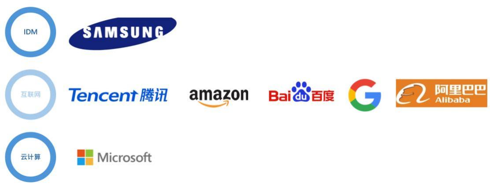  
资料来源：公司年报，华创证券

## （二）无控股股东无实际控制人，管理层产业经验丰富

公司股权结构相对分散，多元股东协同治理。截至2026年 2月 9日，VeriSilicon Limited作为第一大股东，持有 11.39%的股份，其余股东包括富策控股有限公司（持股 6.55%）、国家集成电路产业投资基金（持股 5.96%）、公募基金及私募股权基金等，股权结构相对分散，公司不存在控股股东，不存在实际控制人，呈现多元股东协同治理的特征。

图表 5 芯原股份股权结构  
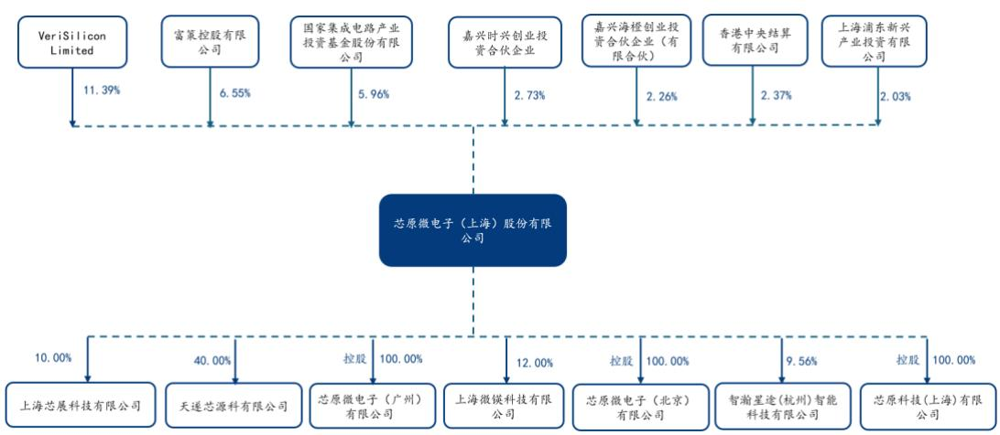  
资料来源：公司招股书，Wind，华创证券（注：数据截至2025年末）

管理层人员具备丰富产业经验，技术背景深厚。公司组建了具备丰富行业经验的专业务实、锐意进取的核心研发和运营管理团队。公司由在电子行业深耕超过三十年戴伟民先生创立并领导。公司积极营造创业创新文化，鼓励技术创新，并吸纳了来自全球知名半导体企业的人才。公司技术与研发团队由海内外具备丰富半导体行业经验的专家团队组成，如图芯、美博通等，在半导体研发方面具备深厚的技术背景和丰富的管理经验。

图表 6 芯原股份管理层情况
<table><tr><td rowspan=1 colspan=1>姓名</td><td rowspan=1 colspan=1>职务</td><td rowspan=1 colspan=1>年龄</td><td rowspan=1 colspan=1>履历</td></tr><tr><td rowspan=1 colspan=1>戴伟民</td><td rowspan=1 colspan=1>董事长，总裁</td><td rowspan=1 colspan=1>70</td><td rowspan=1 colspan=1>美国加州大学伯克利分校计算机科学学士、电子计算工程学博士。1988 年至 2005 年,历任美国加州大学圣克鲁兹分校计算机工程学助教、副教授、教授；1995年至2000 年，任美国Ultima 公司的创始人、董事长兼总裁；2000 年至2001年，任美国思略共同董事长兼首席技术长；2001年至2019年3月，历任芯原有限执行董事、董事长；2002年至今，任芯原开曼董事；2019年3月至今，任芯原微电子（上海）股份有限公司董事长、总裁。</td></tr><tr><td rowspan=1 colspan=1>戴伟进</td><td rowspan=1 colspan=1>副总裁，首席战略官</td><td rowspan=1 colspan=1>67</td><td rowspan=1 colspan=1>美国加州大学伯克利分校计算机科学学士、电子计算工程学硕士；1985年至1991年，任 Hewlett Packard 工程经理；1991 年至 1996 年，任 Quickturn Design Systems 工程总监；1996年至 2002年，联合创办 Silicon PerspectiveCorporation，担任研发副总裁；2002年至2007年，任 Cadence Design Systems 领先数字实现系统事业部 Encounter 产品线副总裁；2007年至2016年，任图芯美国总裁及首席执行官；2016年芯原并购图芯，Wei-JinDai（戴伟进）先生加入芯原微电子（上海）股份有限公司，现任芯原微电子（上海）股份有限公司董事、首席战略官、副总裁。</td></tr><tr><td rowspan=1 colspan=1>汪志伟</td><td rowspan=1 colspan=1>副总裁</td><td rowspan=1 colspan=1>52</td><td rowspan=1 colspan=1>四川大学计算机软件学士，浙江大学计算机科学与技术硕士。2000 年至2001年，任上海博达数据通信有限公司软件工程师；2002年至2003年，任智邦大陆科技有限公司软件开发课长；2003年至 2006年，任微开半导体研发（上海）有限公司软件开发经理;2006 年至2011年，任美博通通信技术（上海）有限公司软件开发高级经理；2011年至2017年，任美满电子科技（上海）有限公司多媒体芯片设计部资深总监；2017年至2019年，任Yuneec InternationalCo.,Ltd.研发副总裁；2019 年加入芯原微电子（上海）股份有限公司，现任芯原微电子（上海）股份有限公司副总裁。</td></tr><tr><td rowspan=1 colspan=1>汪洋</td><td rowspan=1 colspan=1>副总裁，首席运营官</td><td rowspan=1 colspan=1>49</td><td rowspan=1 colspan=1>天津大学电子工程学士，北京邮电大学工商管理硕士，天津大学工程学博士在读。1998年至 2000年，任北广电子集团有限责任公司工程师；2000 年至2003年，任北京方正连宇通信技术有限公司部门经理；2003年至2006年，任LSILogic北京办事处经理；2006年加入芯原股份，历任销售总监、高级总监，现任芯原微电子（上海）股份有限公司首席运营官、副总裁。</td></tr><tr><td rowspan=1 colspan=1>石雯丽</td><td rowspan=1 colspan=1>副总裁,董事会秘书</td><td rowspan=1 colspan=1>46</td><td rowspan=1 colspan=1>上海大学行政管理学学士，中欧国际工商学院工商管理硕士。2003年加入芯原股份，历任人事行政助理、主管、经理、总监、副总裁，现任芯原微电子（上海）股份有限公司人事行政高级副总裁、监事。</td></tr><tr><td rowspan=1 colspan=1>赵春蓉</td><td rowspan=1 colspan=1>首席财务官</td><td rowspan=1 colspan=1>43</td><td rowspan=1 colspan=1>上海财经大学国际会计学学士，英国特许公认会计师，高级会计师。2005年至2010年，任毕马威华振会计师事务所审计师；2010年加入芯原微电子（上海）股份有限公司，历任财务经理、高级经理、总监、高级总监，现任芯原微电子（上海）股份有限公司财务副总裁。</td></tr></table>

资料来源：ifind，华创证券

## （三）半导体周期回暖驱动收入反转，AI相关订单高增支撑中长期成长

半导体周期回暖驱动收入反转，订单高景气支撑业绩修复。受益于半导体产业的复苏，并得益于公司独特的商业模式，公司于 2024年营收情况止跌，实现营业收入23.22亿元（YoY-0.69%），降幅显著收窄，呈现筑底态势；2025年公司抓住行业复苏机会，扭转营收下降趋势，实现营收 31.52亿元（YoY+35.77%），创历史新高，收入端增速明显反转。利润方面，主要受公司保持高研发支出影响，2024 年研发费用为 12.47 亿元（占营收比53.72%）；2025年研发费用进一步提升至 13.13亿元（占营收比41.64%），整体来看，公司仍处于亏损状态，尚未实现归母净利润转正，但 2025年公司新签订单以及在手订单情况屡创新高，随着订单的不断转化，公司盈利能力逐步提升，业务规模效应持续显现，2025 年实现归母净利润亏损同比收窄 0.73 亿元（YoY+12.16%）。

图表 7 公司营收及增速  
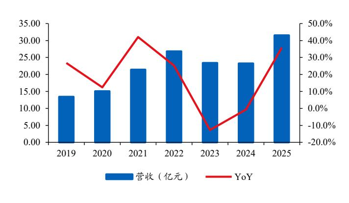  
资料来源：iFind，华创证券

图表 8 公司归母净利润及增速  
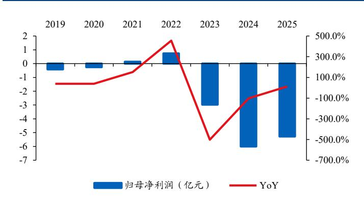  
资料来源：iFind，华创证券

IP 授权与量产业务双轮驱动，AI 相关订单高增支撑中长期成长。2025 年，公司核心业务整体呈现结构优化与订单高增并行的态势。IP 授权业务稳步增长，2025 年实现知识产权授权使用费 6.71亿元（YoY+6.07%）。公司GPU、NPU及视频处理器等核心处理器 IP在国内外头部客户中持续渗透，应用领域不断拓展。芯片设计业务方面，实现收入 8.77亿元（YoY+20.94%），增长动能明显。2025年，公司订单端表现亮眼，新签订单金额59.60亿元（YoY+103.41%），后续收入确认具备较强支撑。量产业务延续修复趋势，2025实现收入 14.89亿元（YoY+73.98%），随着下游库存自2023年末起明显改善，公司量产业务进入加速兑现阶段。

图表 9 公司分业务营收（亿元）  
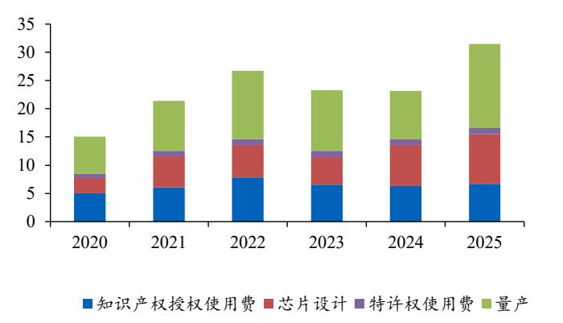  
资料来源：iFind，华创证券

图表 10 公司分业务毛利率  
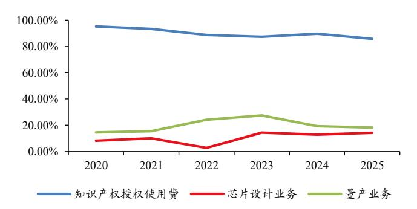  
资料来源：iFind，华创证券

AI算力需求与半导体周期复苏共振，业务结构进一步向高景气赛道集中。受益于半导体产业周期复苏以及AI算力需求爆发，下游消费电子及算力相关应用景气度持续提升，公司多项应用领域收入实现快速增长。2024 年，公司数据处理领域实现营收 5.52 亿元（YoY+75.46%）；计算机及周边领域实现收入3.24亿元（YoY+64.07%）；汽车电子领域实现营收 2.15亿元（YoY+37.32%），上述三大领域共占营收47%，较上年提升18.39pct。2025年，公司数据处理领域实现营收 10.79亿元（YoY+95.35%），占营业收入达34.32%，已成为公司最主要的收入来源之一。同时，公司物联网和消费电子领域分别实现收入6.59亿元和 6.76亿元，上述三大核心领域收入占比合计达到76.58%，整体来看，公司业务结构正持续向 AI算力、计算平台及智能终端等高成长赛道倾斜，增长动能显著增强。

图表 11 公司业务下游拆分情况（亿元）  
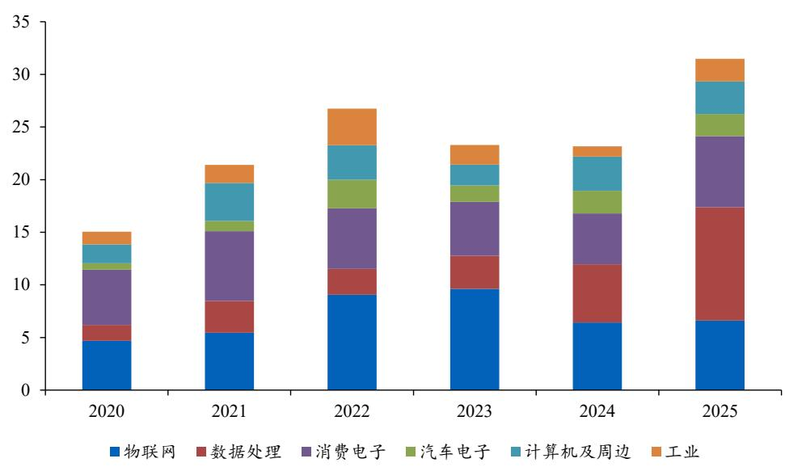  
资料来源：公司年报，华创证券

收入结构优化驱动毛利提升，研发高投入夯实长期成长基础。2025年，公司盈利质量持续改善，实现毛利 10.78 亿元（YoY+16.43%）；综合毛利率 34.19%，同比变化主要由于收入结构变化等因素所致。净利率为-16.74%，同比改善9.14pct，亏损幅度持续收窄，盈利能力边际修复明显。订单端维持高景气，新签及在手订单储备充足，随着项目逐步转化，公司研发资源更多投向客户定制项目，研发费用率呈合理下降趋势。2025年，公司研发投入 13.49 亿元，占收入比重 42.78%；得益于公司新签订单爆发式增长，研发资源随着订单转化逐步投入至客户项目中，研发投入占比同比合理下降 10.94pct。此外，管理费用率与销售费用率整体保持稳定。

图表 12 公司毛利率及净利率  
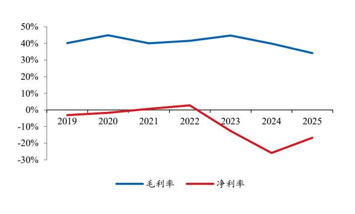  
资料来源：iFind，华创证券

图表 13 公司费用率情况  
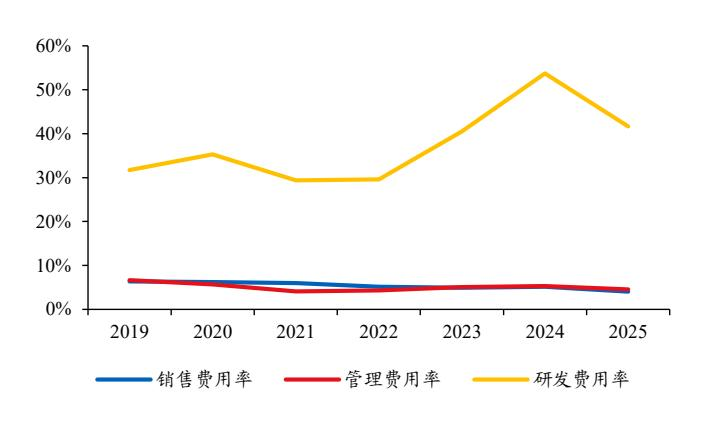  
资料来源：iFind，华创证券

## 二、多轮驱动 IP需求持续提升，设计服务与 IP需求持续扩容

## （一）半导体 IP提高芯片良率，简化芯片开发流程

半导体 IP（或 IP核）是指预先设计好的、可重复使用的、具有独立功能的电路模块，用于 IC设计。将集成电路设计比作拼图游戏，可以将芯片抽象地理解为拼图。芯片中不同功能的外购 IP 核用不同颜色的方块表示，而自主设计的电路部分则用绿色方块表示。因此，复杂芯片的设计过程就像是拼凑这幅拼图。同样，都是利用现有的方块（IP 核）来拼凑出美丽的图画（复杂的芯片）。不同之处在于，图画只需要考虑方块的形状，而芯片设计则需要考虑 IP 核的诸多参数和指标，并将每个 IP 核与自主设计的部分正确连接起来，以确保整个芯片的功能和性能正常。

IP核通过降低设计复杂性、缩短设计周期并提高芯片成功实现的可能性，简化了芯片开发流程。它们就像拼图一样，作为模块化的构建模块，将预先验证的 IP 核与其定制设计的电路组合起来，从而构建复杂的芯片。复杂的芯片可以将自主设计的电路（绿色模块）与外包的 IP核（不同颜色的模块）集成在一起，从而加快设计速度并增强功能。这种方法类似于系统板的组装，可以将预制组件连接起来构建完整的系统。

图表 14 芯片设计图：自主设计部分与 IP 核集成  
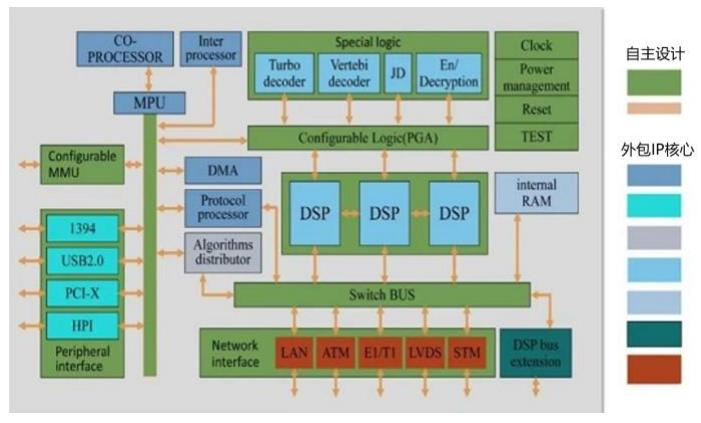  
资料来源：utmel，华创证券

图表 15 IP 重用类似于“拼图”  
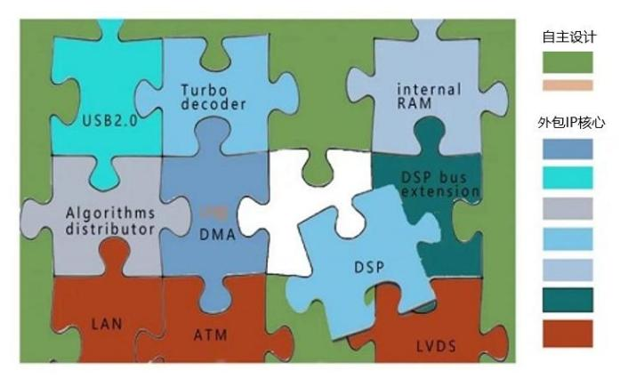  
资料来源：utmel，华创证券

半导体 IP设计环节属于集成电路产业链上游。集成电路产业链由上游的EDA工具、IP、设计服务、材料和设备，中游的集成电路设计、晶圆制造、封装测试以及下游的系统厂商组成。

图表 16 集成电路产业链分类示意图  
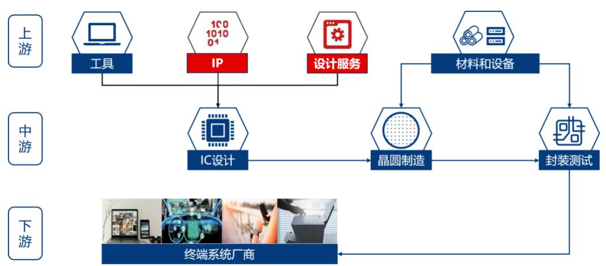

资料来源：公司招股书，华创证券

按类型划分，半导体 IP 市场细分为处理器 IP、接口 IP、内存 IP 及其他 IP，每种 IP 都支持集成电路中不同的功能需求。

⚫ 处理器 IP：处理器IP 以 42%的份额占据半导体IP市场份额，主要得益于其在系统单片架构中的基础性作用。处理器 IP 包括CPU 核心、GPU 核心和AI加速核心，用于管理计算、控制逻辑和数据处理。

⚫ 接口 IP：接口 IP 约占半导体 IP市场份额的28%，反映出其在实现芯片内外高速数据通信方面的重要性。接口 IP 包括内存访问、外设连接和芯片间通信的协议。

⚫ 内存 IP：内存 IP 约占半导体 IP市场份额的18%，支持集成电路中的数据存储和检索功能。该细分包括在速度、密度和能效方面优化的嵌入式内存块。内存 IP广泛应用于消费电子、工业控制器和汽车系统。

其他 IP：其他 IP约占半导体 IP市场份额的12%，包括模拟 IP、安全IP、电源管理IP 和混合信号 IP。半导体IP 市场研究报告的洞察显示，这些 IP 模块对于确保系统稳定性、安全性和高效功耗至关重要。

图表 17 按类型划分半导体 IP 市场份额  
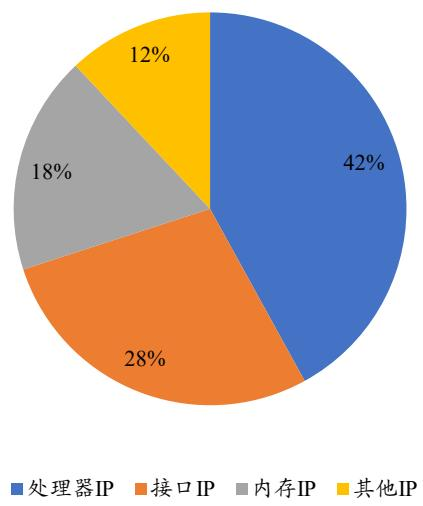  
资料来源：Industry Research，华创证券

## （二）AI 市场增长与技术不断演进，多因素驱动 IP 市场渗透

AI市场加速增长，多因素驱动 IP市场渗透。随着AI、5G等技术以及 IoT不断发展、先进制程演进与 SoC复杂化、半导体设计复杂度增加、Chiplet与高速互连需求爆发，这些设备需要高度专业化高性能的 IP核心，以满足更快的处理、更低的能耗以及增强功能等日益增长的要求。从而增加了对高效和可靠的IP 的需求，以加快发展周期并改进产品性能。IBS 数据显示，半导体 IP 市场将从 2018 年的 46 亿美元增长至 2027 年的 101 亿美元，年均复合增长率为 9.13％。

图表 18 全球半导体 IP 市场（亿美元）  
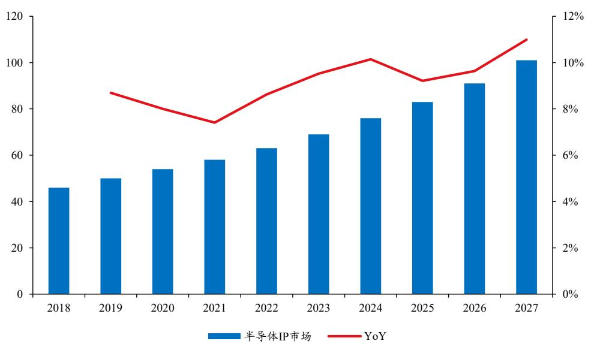  
资料来源：IBS 《Design Activitiesand Strategic Implications》、转引自公司招股书，华创证券

## 1、先进制程演进与 SoC 复杂化提升设计复杂度，推动 IP 复用需求增长

制程演进与 SoC 复杂化驱动 IP 需求持续提升。随着超大规模集成电路设计与制造技术的发展，芯片设计进入SoC 时代，系统复杂度显著提升。为缩短产品上市周期，基于IP复用、软硬件协同设计及先进制程的 SoC 已成为主流路径，当前主流SoC 产品普遍基于多种 IP组合开发，IP已成为集成电路设计中的核心要素。同时，先进制程持续演进，线宽缩小带来晶体管数量大幅提升，单颗芯片可集成 IP 数量显著增加。根据 IBS 数据，在28nm工艺下单芯片可集成约87个 IP；在 7nm节点下，该数量提升至 178个。IP 集成能力的提升增强了 IP 复用空间，为半导体 IP市场发展提供了重要支撑。

图表 19 不同工艺节点下的芯片所集成的硬件 IP平均数量  
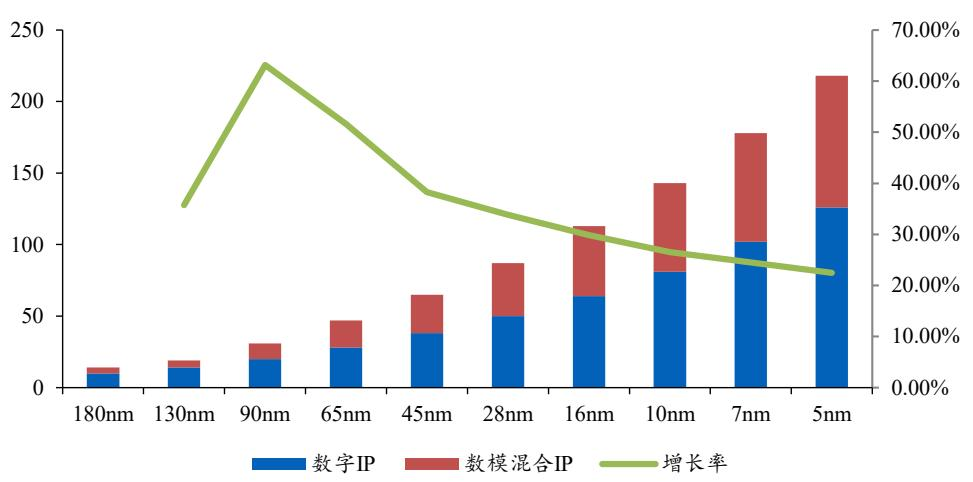  
资料来源：IBS 《Design Activitiesand Strategic Implications》、转引自公司招股书，华创证券

单颗芯片可容纳晶体管数量增加，晶体管单位成本快速下降。随着先进制程工艺不断演进，芯片线宽持续缩小，单颗芯片可容纳的晶体管数量显著提升，单位面积性能同步提高。根据 IBS 报告，以面积约 80mm²的芯片裸片为例，在 16nm 工艺节点下，单颗裸片可容纳约 21.12 亿个晶体管，而在 7nm 工艺节点下，该数量可提升至约 69.68 亿个。晶体管集成度的持续提升，使得单个晶体管的单位成本呈现下降趋势。

采用先进工艺节点的芯片设计成本逐渐提高，3nm 制程可升至 15 亿美元。先进工艺在降低晶体管单位成本的同时，也显著提高了芯片设计的复杂度，并推动整体设计成本快速上升。根据 IBS 报告，在先进工艺节点处于主流应用阶段时，28nm工艺节点的单颗芯片设计成本约为 0.41 亿美元，而 7nm 工艺节点的设计成本已提升至约 2.22 亿美元。即使在工艺节点进入成熟应用阶段、设计成本有所下降的情况下，相较于上一代工艺节点仍存在明显增长。据 semiengineering 援引 IBS 进一步指出，在 3nm 工艺节点下，集成电路设计成本已上升至约 5亿美元至 15亿美元，其中15 亿美元对应的是一款复杂 GPU 产品的设计成本。

图表 20 单颗芯片裸片可容纳晶体管数量（亿）  
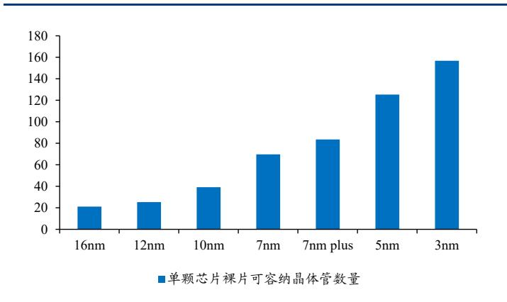  
资料来源: IBS 《Design Activitiesand Strategic Implications 》、转引自公司招股书，华创证券（注：以80mm²面积为例）

图表 21 工艺节点处于各应用期的芯片设计成本（万美元）  
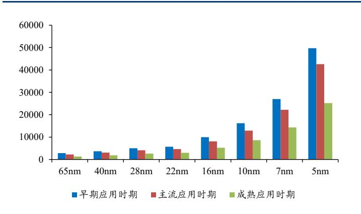  
资料来源: IBS 《Design Activities and Strategic Implications》、转引自公司招股书，华创证券

先进工艺演进提升设计复杂度，推动 IP复用需求增长。在设计复杂度和研发成本持续上升的背景下，芯片设计企业面临更高的研发投入与开发风险。通过采用成熟 IP 核并进行复用，企业能够有效降低芯片开发成本、缩短设计周期并提升产品开发效率。因此，以IP 复用为基础的SoC 设计模式逐渐成为集成电路行业的重要发展方向，同时也带动了半导体 IP需求的持续增长。

## 2、Chiplet与高速互连需求双轮驱动接口 IP市场，2035年有望达到百亿级

Chiplet是独立的模块化半导体组件，在集成到更大的系统之前，先进行协同设计和制造。摩尔定律的放缓使得在有限面积内增加晶体管数量变得越来越困难。因此，研发重点转向了提高功能密度，从而出现了 Chiplet 架构。Chiplet 是通过将原来集成于同一系统单晶片中的各个元件分拆，独立为多个具特定功能的 Chiplet，分开制造后再透过先进封装技术将彼此互联，最终集成封装为一系统晶片组。这种方法类似于模块化系统芯片（SoC），其中每个芯片组都设计为与其他芯片组协同工作，因此需要在设计中进行协同优化。芯片组的模块化特性符合半导体行业的关键发展趋势，例如 IP芯片组化、集成异构化和 I/O增量化。Chiplet 也与异构集成和先进封装技术密切相关。

图表 22 SoC 与 Chiplet 架构  
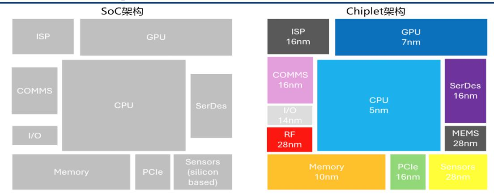  
资料来源：IDTechEx 《Chiplet Technology 2025-2035: Technology， Opportunities,Applications》，华创证

芯片组技术的普及得益于其能够解决传统单片芯片设计中固有的几个关键限制。其优势在于可以针对其特定功能和技术进行优化，降低延迟功耗，还可降低芯片的生产成本风险，再者调整 SoC的功能和性能，提高其灵活性：

⚫ 优化性能和功耗：Chiplet可以针对其特定功能和技术进行优化，从而提升SoC 的性能和能效。此外，Chiplet之间的间距也可以更小，从而降低互连延迟和功耗。

⚫ 降低制造成本：Chiplet可采用不同的工艺节点和代工厂进行制造，从而降低大型复杂芯片的生产成本和风险。此外，Chiplet还可在不同的SoC中重复使用，从而提高投资回报率并缩短产品上市时间。

⚫ 更高的灵活性和可扩展性：Chiplet可以轻松添加或移除，从而调整SoC 的功能和性能。Chiplet的更新或更换也不会影响 SoC 的其他部分，这有助于更快地进行创新并适应不断变化的市场需求。

图表 23 Chiplet 设计带来的新功能/设计  
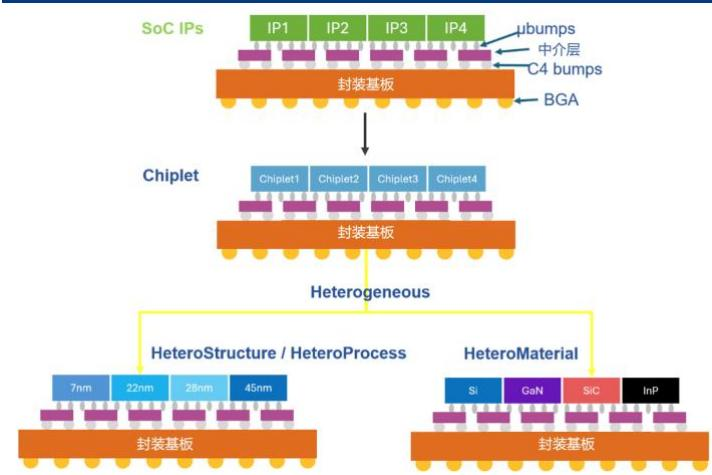  
资料来源：IDTechEx 《Chiplet Technology 2025-2035: Technology,

Opportunities, Applications》 ， 华创证券

图表 24 Chiplet 与单芯片方法的性能和成本比较  
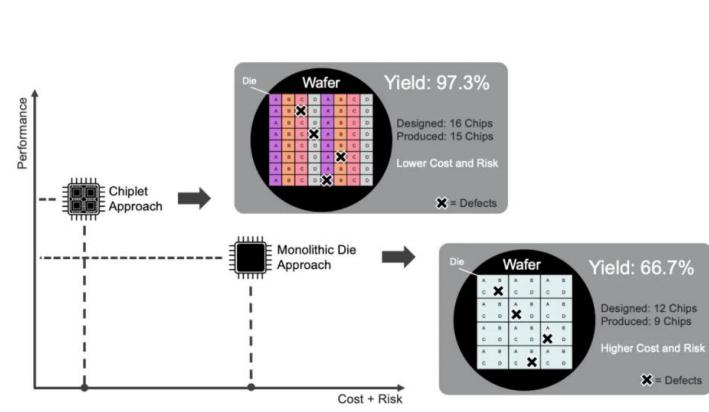  
资料来源: semiconductor engineering 《What Is A Chiplet, And Why Should You Care?》

对高性能计算解决方案的需求正在推动 Chiplet市场的大幅增长。随着技术进步，越来越需要更强大、更高效的计算系统来支持人工智能、大数据分析和高速网络等应用。Chiplet提供了灵活且可扩展的解决方案来满足这些需求。它们使系统设计人员能够通过混合和匹配不同的芯片功能来定制和优化计算解决方案。Chiplet 促进高度专业化和有针对性的系统的开发，为特定应用提供卓越的性能并刺激市场需求。2025年全球Chiplet市场规模为 544.9 亿美元，预计将从 2026 年的 666.1 亿美元增长到 2034 年的 3507.9 亿美元，预测期内复合年增长率为 23.1%。

图表 25 全球 Chiplet 市场规模（亿美元）  
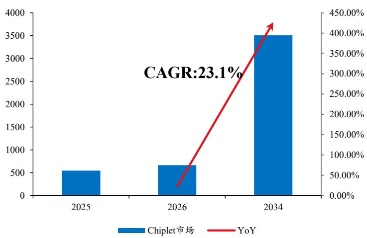  
资料来源：fortune business insights，华创证券

Chiplet在继承了SoC的 IP可复用特点的基础上，更进一步开启了IP的新型复用模式。即硅片级别的 IP复用，有不同功能的 IP，如CPU、存储器、模拟接口等，从而增加了IP需求。可灵活选择不同的生产工艺分别进行生产，从而可以灵活平衡计算性能与成本，实现功能模块的最优配置而不必受限于晶圆厂工艺。

Chiplet 虽然优势众多，但也带来了新的挑战。多个 Chiplet 的集成需要先进的互连技术和标准，以确保组件间的无缝通信。热管理是另一个关键领域，因为功能密度的增加若管理不当，会导致过热。Chiplet 设计中封装的不同区域需要不同的底部填充材料来满足特定需求，如保护芯片本身，提供机械支撑和热稳定性，保护连接Chiplet的脆弱导线和焊球，防止分层或分离等问题。这就催生了对能够提升可靠性和性能的创新材料的需求，也会催生企业外用 IP的需求。

Chiplet与高速互连需求双轮驱动，接口IP市场有望达到百亿级。因为 Chiplet把芯片切分成不同的小芯片并互联，所以相关接口 IP 市场也有新的需求。接口 IP 是半导体 IP 市场的重要组成部分。随着 SoC 复杂度持续提升以及高速接口标准不断升级，接口 IP 需求保持稳步增长。根据 Market Research Future 的分析，2024 年接口 IP 市场规模估计为 48.83亿美元。预计接口 IP 行业将从 2025 年的 52.67 亿美元增长到 2035 年的 112.4 亿美元，在 2025 年至 2035 年的预测期内，复合年增长率为 7.87%。接口 IP 广泛应用于 PCIe、DDR、Ethernet等高速互连模块，在 AI算力、数据中心及高性能计算需求推动下，未来仍具备较大的增长空间。

图表 26 全球接口IP市场规模（亿美元）  
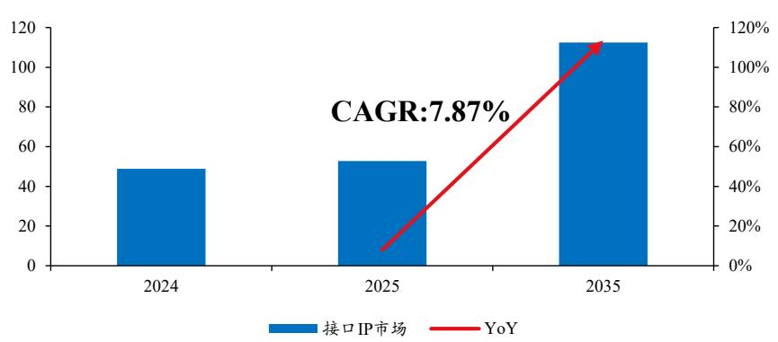  
资料来源：Market Research Future，华创证券

## 3、推理应用驱动ASIC需求显著提升，自研 ASIC成为 CSP投资重心

“模型训练”重心转向“推理应用”，推理集群数量预计达到百万级别。如今AI 行业加速增长，AI产业的发展重心，正从“模型训练”逐渐转向“推理应用”。在推理阶段，单个推理集群对加速计算芯片的需求低于训练集群，但推理集群的部署数量要远多于训练集群，推理集群的数量预计会达到百万级别。

图表 27 Broadcom 对于 XPU 集群的扩建预期  
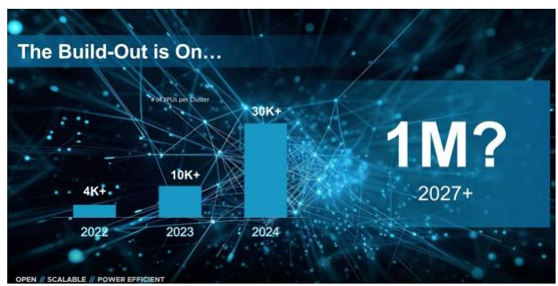  
资料来源：Broadcom 官网

图表 28 训练和推理对 AI 算力集群的需求差异  
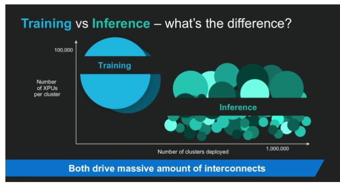  
资料来源：Marvell 官网

推理成为主要的计算工作负载，高成本成为大模型应用核心痛点。在训练驱动阶段，大模型厂商对模型性能升级速度的需求，反映到芯片层面则为算力性能需求。推理驱动阶段，算力性能需求开始减弱，训练一个前沿模型只需一次（或通过微调进行几次），而将该模型提供给数百万用户则需要每天持续进行数十亿次。根据 IT之家报道，在模型生命周期内，推理成本是训练成本的 15倍。以 OpenAI为例，2024 年其大模型训练支出仅为1.5 亿美元，而推理支出则达到 23 亿美元。因此高成本是大模型应用的核心痛点。

图表 29 训练和推理的指标对比
<table><tr><td colspan="1" rowspan="1">指标</td><td colspan="1" rowspan="1">训练</td><td colspan="1" rowspan="1">推理</td></tr><tr><td colspan="1" rowspan="1">占人工智能计算总量的份额（2026年）</td><td colspan="1" rowspan="1">33%</td><td colspan="1" rowspan="1">67%</td></tr><tr><td colspan="1" rowspan="1">成本敏感性</td><td colspan="1" rowspan="1">中等（一次性）</td><td colspan="1" rowspan="1">极端（持续边缘）</td></tr><tr><td colspan="1" rowspan="1">工作量可预测性</td><td colspan="1" rowspan="1">多变</td><td colspan="1" rowspan="1">高度可预测</td></tr><tr><td colspan="1" rowspan="1">所需架构灵活性</td><td colspan="1" rowspan="1">高</td><td colspan="1" rowspan="1">低</td></tr><tr><td colspan="1" rowspan="1">定制ASIC优势</td><td colspan="1" rowspan="1">缓和</td><td colspan="1" rowspan="1">重要</td></tr><tr><td colspan="1" rowspan="1">NVIDIA传统GPU优势</td><td colspan="1" rowspan="1">强大（CUDA，灵活性）</td><td colspan="1" rowspan="1">减弱（受成本压力影响）</td></tr><tr><td colspan="3" rowspan="1">资料来源: introl 《The Custom Silicon Inflection Point: Hyperscaler ASICs Challenge NVIDIA's GPUDominance in 2026》，华创证券</td></tr></table>

推理集群与成本性价比双轮驱动，AI ASIC增长速度为 GPU的两倍。随着AI推理集群规模不断扩大，成本与性能平衡成为 CSP 的核心关注点，传统计算芯片在特定 AI 场景下的能效比与算力成本优势逐渐减弱。AI ASIC 凭借专用架构、高计算密度及低功耗特性，能够在推理场景中实现更优的性价比与能效表现，从而成为 CSP 优化 AI 工作负载的重要技术路径。根据彭博行业研究数据，GPU 总收入预计仍将以约 14%的 CAGR 增长，主要受训练计算负载驱动，而 AI ASIC芯片总收入增长更为迅速，CAGR约为 27%，主要受益于推理计算需求的持续扩张。推理业务对首字时延、字间时延及吞吐量等性能指标要求较高，同时对算力规模、显存容量、通信带宽及生态兼容性具有较高依赖性。由于推理工作负载相对稳定且单位计算成本成为关键决策因素，推理计算约占整体AI计算周期的约三分之二，且随着大规模部署推进，该比例仍有进一步上升趋势。

图表 30 AI 加速芯片 TAM
<table><tr><td rowspan=1 colspan=1>市场划分</td><td rowspan=1 colspan=1>2024年收入</td><td rowspan=1 colspan=1>预计到2033年</td><td rowspan=1 colspan=1>25-33E CAGR</td><td rowspan=1 colspan=1>主要用例</td></tr><tr><td rowspan=1 colspan=1>GPU</td><td rowspan=1 colspan=1>约1067.2亿美元</td><td rowspan=1 colspan=1>约4892.4亿美元</td><td rowspan=1 colspan=1>14%</td><td rowspan=1 colspan=1>训练，灵活推理</td></tr><tr><td rowspan=1 colspan=1>AI ASIC</td><td rowspan=1 colspan=1>约92.8亿美元</td><td rowspan=1 colspan=1>约 1147.6亿美元</td><td rowspan=1 colspan=1>27%</td><td rowspan=1 colspan=1>优化推理，特定训练</td></tr><tr><td rowspan=1 colspan=1>AI加速器</td><td rowspan=1 colspan=1>约 1160亿美元</td><td rowspan=1 colspan=1>约 6040亿美元</td><td rowspan=1 colspan=1>16%</td><td rowspan=1 colspan=1>所有人工智能计算</td></tr></table>

资料来源：Bloomberg Intelligence 《AI Accelerator Chips 2026 Outlook》，华创证券

AI ASIC 正在优化超大规模计算，2033 年预计达到 750 亿美元规模。Google 的 TPU 和亚马逊的 Trainium 等定制 ASIC 正在推理工作负载扩展，根据彭博行业研究报告，预计到 2033 年，ASIC 单位出货量的复合年增长率将达到 21%，超过 GPU 的 11%。到 2033年，ASIC单元容量应该与GPU的单元容量匹配。根据 MRA预测，AI ASIC 芯片市场正经历爆炸式增长，该市场预计2025年规模为150亿美元，预计从 2025年到 2033年将实现25%的强劲复合年增长率（CAGR），预计到2033年将达到750亿美元。

图表 31 AI ASIC/GPU 单位出货量年增长率  
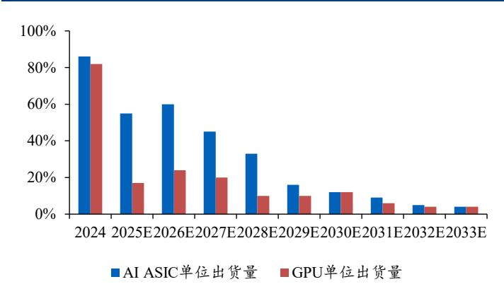  
资料来源：Bloomberg Intelligence 《AI Accelerator Chips 2026Outlook》 ， 华创证券

图表 32 全球 AI ASIC 市场规模与份额  
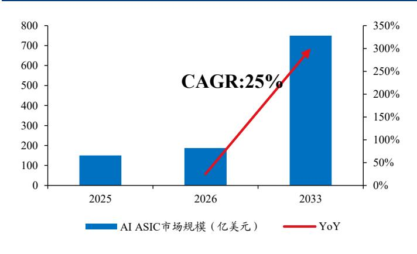  
资料来源：MRA，华创证券

谷歌、微软、亚马逊和 Meta 等公司的定制 ASIC 芯片，主要面向解决推理工作负载问题，当前推理工作负载占所有 AI 计算的三分之二。谷歌在 Cloud Next 2025 上发布Ironwood；Microsoft 的第二代定制 AI 加速器于 2026 年初问世；亚马逊网络服务在 re：Invent 2025发布了Trainium 3；Meta 运营着所有超大规模企业中最激进的定制硅片路线图，Meta 加速开发了四款芯片，这些新芯片要么已经部署，要么计划在 2026 年或 2027年部署。OpenAI 与博通合作设计了定制推理 ASIC，计划到 2029 年部署 10GW 容量，目标是解决ChatGPT 产生的推理工作负载问题。

⚫ 谷歌：Google 在 Cloud Next 2025 大会上发布了 Ironwood，这是自 2015 年启动的TPU 计划的第七代产品。Ironwood 采用台积电 N3E(3nm)工艺制造，单芯片峰值浮点运算能力为 4,614teraFLOPS(4.6 PFLOPS)。每颗芯片配备 192GB HBM3e 内存，带宽超过 7.2 TB/s。根据 introl 报道，Anthropic 公司披露，其已为 Claude 推理工作负载部署了超过一百万个 Ironwood 芯片。

谷歌与联发科联手准备第八代 TPU，并且分为两个版本：据 expreview 援引SemiAnalysis 报道，一个是专为 AI 推理设计，TPUv8x“Zebrafish”；另一个则是针对 AI 训练优化，TPUv8ax“Sunfish”，用于训练 Gemini 等 AI 模型。在 TPUv8x“Zebrafish”上，谷歌得到了联发科的帮助，前者采购晶圆和 DRAM，后者对芯片设计和封装提供支持。TPUv8ax“Sunfish”则是谷歌与博通合作的产物，后者负责端到端设计、内存、支持硬件和封装，为前者提供一个成品，并准备集成到其广泛的服务器基础设施中。

图表 33 Google TPU 发展历程以及部分关键指标
<table><tr><td rowspan=1 colspan=1>分类</td><td rowspan=1 colspan=1>项目</td><td rowspan=1 colspan=1>TPU v1</td><td rowspan=1 colspan=1>TPU v2</td><td rowspan=1 colspan=1>TPU v3</td><td rowspan=1 colspan=1>TPU v4</td><td rowspan=1 colspan=1>TPU v5e</td><td rowspan=1 colspan=1>TPU v5p</td><td rowspan=1 colspan=1>TPU v6e</td><td rowspan=1 colspan=1>TPU v7 (Ironwood)</td></tr><tr><td rowspan=1 colspan=2>发布</td><td rowspan=1 colspan=1>2015</td><td rowspan=1 colspan=1>2017</td><td rowspan=1 colspan=1>2018</td><td rowspan=1 colspan=1>2022</td><td rowspan=1 colspan=1>2023</td><td rowspan=1 colspan=1>2023</td><td rowspan=1 colspan=1>2024</td><td rowspan=1 colspan=1>2025</td></tr><tr><td rowspan=1 colspan=2>制程</td><td rowspan=1 colspan=1>28nm</td><td rowspan=1 colspan=1>16nm</td><td rowspan=1 colspan=1>16nm</td><td rowspan=1 colspan=1>7nm</td><td rowspan=1 colspan=1>5nm</td><td rowspan=1 colspan=1>5nm</td><td rowspan=1 colspan=1>4nm</td><td rowspan=1 colspan=1> 3nm N3P</td></tr><tr><td rowspan=3 colspan=1>内存</td><td rowspan=1 colspan=1>类型</td><td rowspan=1 colspan=1>1</td><td rowspan=1 colspan=1>1</td><td rowspan=1 colspan=1>HBM2</td><td rowspan=1 colspan=1>HBM2</td><td rowspan=1 colspan=1>HBM2e</td><td rowspan=1 colspan=1>HBM2e</td><td rowspan=1 colspan=1>HBM3</td><td rowspan=1 colspan=1>HBM3e</td></tr><tr><td rowspan=1 colspan=1>大小</td><td rowspan=1 colspan=1>8GB</td><td rowspan=1 colspan=1>16GB</td><td rowspan=1 colspan=1>32GB</td><td rowspan=1 colspan=1>32GB</td><td rowspan=1 colspan=1>16GB</td><td rowspan=1 colspan=1>95GB</td><td rowspan=1 colspan=1>32GB</td><td rowspan=1 colspan=1>192GB</td></tr><tr><td rowspan=1 colspan=1>带宽</td><td rowspan=1 colspan=1>34 GB/s</td><td rowspan=1 colspan=1>600 GB/s（估计值）</td><td rowspan=1 colspan=1>900 GB/s</td><td rowspan=1 colspan=1>1.2 TB/s</td><td rowspan=1 colspan=1>819 GB/s</td><td rowspan=1 colspan=1>2.8 TB/s</td><td rowspan=1 colspan=1>1640 GB/s</td><td rowspan=1 colspan=1>7.4 TB/s</td></tr><tr><td rowspan=2 colspan=1>算力</td><td rowspan=1 colspan=1>FP16Dense</td><td rowspan=1 colspan=1>X</td><td rowspan=1 colspan=1>45.9T</td><td rowspan=1 colspan=1>123.2T</td><td rowspan=1 colspan=1>275T</td><td rowspan=1 colspan=1>197T</td><td rowspan=1 colspan=1>459T</td><td rowspan=1 colspan=1>918T</td><td rowspan=1 colspan=1>2307T</td></tr><tr><td rowspan=1 colspan=1>FP8 Dense</td><td rowspan=1 colspan=1>-</td><td rowspan=1 colspan=1>=</td><td rowspan=1 colspan=1>1</td><td rowspan=1 colspan=1>1</td><td rowspan=1 colspan=1>1</td><td rowspan=1 colspan=1>1</td><td rowspan=1 colspan=1>1</td><td rowspan=1 colspan=1>4614T</td></tr><tr><td rowspan=1 colspan=1>Pod</td><td rowspan=1 colspan=1>芯片数</td><td rowspan=1 colspan=1>1</td><td rowspan=1 colspan=1>256</td><td rowspan=1 colspan=1>1024</td><td rowspan=1 colspan=1>4096</td><td rowspan=1 colspan=1>256</td><td rowspan=1 colspan=1>8960</td><td rowspan=1 colspan=1>256</td><td rowspan=1 colspan=1>9216</td></tr></table>

资料来源：51CTO《全面解析GoogleTPU 演进：从 TPUvl 到 TPUv7》，华创证券

⚫ 微软：微软第二代定制AI加速器，于 2026年初面世。Maia 200采用台积电3nm工艺制造，单封装集成超过1400亿个晶体管。该芯片的FP4计算能力超过10PFLOPS，这一数值是亚马逊 Trainium 3 FP4 吞吐量的三倍。内存采 216GB HBM3e，是 2026级定制加速器中容量最大的。Maia 200 峰值功耗为 750W，可安装在标准液冷机架配置中。

⚫ 亚马逊：introl数据显示，亚马逊网络服务（AWS）在 2025 年的re:Invent大会上发布了 Trainium 3，延续了其自 2019 年推出 Inferentia 以来积极的定制芯片路线图。

Trainium 3 采用台积电 3nm 工艺制造，单芯片可提供 2,520teraFLOPS（2.52 PFLOPS）的 FP8 计算能力，并配备 144GB HBM3e 内存。该芯片包含专用的 NeuronCore 单元，针对训练和推理进行了优化，并提供跨芯片边界的硬件级模型并行支持。

⚫ Meta：introl 数据显示，Meta 拥有所有超大规模数据中心运营商中最激进的定制芯片路线图，自推出 MTIA 100 和 200 以来，Meta已连续四代加速开发 MTIA系列：MTIA 300、400、450 和 500，这些新芯片要么已经部署，要么计划在 2026 年或2027 年部署。

MTIA v2：目前已大规模部署，用于在 Facebook 和 Instagram 上进行排名和推荐推理；

MTIA 300：目前已投入生产用于 R&R 训练。

MTIA 400:已在实验室完成 MTIA 400 的测试，目前正在数据中心进行部署。

MTIA 450：计划于 2027 年初大规模部署。设计目的是为了应对 GenAI 推理需求的增长，针对 GenAI 推理进行了专门优化。

MTIA 500：专注于 GenAI 推理，与 MTIA 450 相比，HBM 带宽提高了 50%，并在低精度数据类型方面引入了更多创新。MTIA 500 计划于 2027 年大规模部署。

⚫ OpenAI：据 TechWeb 援引 TrendForce 最新报道，OpenAI 正在加速推进其自研 AI芯片计划。据悉，OpenAI首款自研芯片代号为“Titan”，预计于 2026年底正式推出，并将采用台积电 3 纳米制程工艺进行生产。

与此同时，OpenAI已开始规划该芯片的下一代迭代版本，计划采用台积电更为先进的 2纳米A16 工艺。目前，OpenAI 的训练与推理工作仍主要依赖英伟达和AMD的通用 GPU。尽管 OpenAI 已与多家芯片设计公司建立了合作关系，但自研 ASIC 将能够为其大型语言模型提供更高度的定制化支持，优化特定任务的处理效率。

图表 34 人工智能加速器市场细分市场情况
<table><tr><td rowspan=1 colspan=1>规格</td><td rowspan=1 colspan=1>Google TPU v7 Ironwood</td><td rowspan=1 colspan=1>微软 Maia 200</td><td rowspan=1 colspan=1>亚马逊 Trainium 3</td><td rowspan=1 colspan=1>Meta MTIA-2</td></tr><tr><td rowspan=1 colspan=1>制造</td><td rowspan=1 colspan=1>台积电３纳米工艺</td><td rowspan=1 colspan=1>台积电3纳米工艺</td><td rowspan=1 colspan=1>台积电3纳米工艺</td><td rowspan=1 colspan=1>台积电5纳米工艺</td></tr><tr><td rowspan=1 colspan=1>峰值计算</td><td rowspan=1 colspan=1>4.6 PFLOPS（FP8）</td><td rowspan=1 colspan=1>约 5PFLOPS（估计值，FP8）</td><td rowspan=1 colspan=1>2.52 PFLOPS（FP8）</td><td rowspan=1 colspan=1> 177 TFLOPS/s(FP16/BF16)</td></tr><tr><td rowspan=1 colspan=1>Memory</td><td rowspan=1 colspan=1>192GB HBM3e</td><td rowspan=1 colspan=1>216GB HBM3e</td><td rowspan=1 colspan=1>144GB HBM3e</td><td rowspan=1 colspan=1>128 GB LPDDR5</td></tr><tr><td rowspan=1 colspan=1>内存带宽</td><td rowspan=1 colspan=1>7.2+ TB/s</td><td rowspan=1 colspan=1>7TB/秒</td><td rowspan=1 colspan=1>4.9 TB/秒</td><td rowspan=1 colspan=1>2.7 TB/s(On-chip)</td></tr><tr><td rowspan=1 colspan=1>进展</td><td rowspan=1 colspan=1>生产（2025 年及以后）</td><td rowspan=1 colspan=1>2026年初</td><td rowspan=1 colspan=1>2026年中期</td><td rowspan=1 colspan=1>已大量部署</td></tr><tr><td rowspan=1 colspan=5>资料来源：introl 《TheCustom Silicon InflectionPoint: Hyperscaler ASICs Challnge NVIDIA&#x27;sGPUDominance in 2026》、STH，华创证券</td></tr></table>

## 4、数据中心 Capex高增，海外ASIC供应商指引乐观

推动超大规模数据中心采用 ASIC 芯片的经济因素，即成本节约因素。根据 ainewshub援引 Midjourney 的报告显示，从 NVIDIA GPU 迁移到 Google TPU 后，每月计算成本从

210万美元降至70万美元，降幅高达 65%。规模化之后，即使每个芯片的成本优势不大，但数百万个加速器加起来也能带来数十亿美元的年度成本节约。所有大规模运行推理的超大规模数据中心都面临着同样的计算难题。

超大规模数据中心 Capex超 6500亿美元，资金大部分流向定制芯片。据Futurum报道，到2026 年，超大规模数据中心运营商的总资本支出将达到6600 亿至 6900亿美元，其中亚马逊计划投入 2000亿美元资本支出，Alphabet预计2026年资本支出将达到 1750亿至1850 亿美元，Meta 公司将 2026 年的资本支出预期设定为 1150 亿至 1350 亿美元，微软经 Futurum 预计全年达到 1200 亿美元，甲骨文公司将 2026 财年的资本支出预期上调至500亿美元。。

⚫ Amazon：2026 年 2 月 5 日，Amazon 宣布计划投入 2000 亿美元资本支出，创下企业单年投资额新高。这一数字远超此前 1460亿美元的普遍预期。Amazon的CEO在财报电话会议上说，将当前的AI投资周期与AWS云计算的早期阶段相提并论，大部分资金将用于数据中心建设，以支持 AWS 业务。AWS 年化营收达 1420 亿美元（YoY+ 24%），创13个季度以来最快增速。

⚫ Alphabet：Alphabet 预计 2026 年资本支出将达到 1750 亿至 1850 亿美元，几乎是2025 年 914 亿美元的两倍。Alphabet 的 CEO 确认其中约 60%分配给服务器（TPU、GPU、CPU），40% 分配给数据中心和网络。Google Cloud 的积压订单高达 2400 亿美元（QoQ+55%），这为上述支出提供了合理的市场需求信号。为了筹集建设资金，Alphabet 于 2 月 9 日发行了总额 200 亿美元的七部分债券，其中包括一笔 100 年期英镑债券，这是首家由数字原生科技巨头发行的百年期债券。

⚫ Meta：Meta 公司将 2026 年的资本支出预期设定为 1150 亿至1350 亿美元，几乎是2025 年预期 722 亿美元的两倍。CEO 扎克伯格将这笔支出视为一项代际必然要求，他表示 Meta 计划“在本十年内建设数十吉瓦的装机容量”，并将“继续大力投资基础设施，以训练领先的模型，并为全球数十亿人和企业提供个人超级智能”。对 Meta超级智能实验室投资的增加推动了这一增长。

⚫ Microsoft：微软仅在2026财年第二季度就投入了 375亿美元，根据Futurum预计，全年支出将达到 1200 亿美元或更多。该公司在 2025 年新增了约 2 吉瓦的数据中心容量，使其数据中心总数超过 400个。

⚫ Oracle：甲骨文公司将2026 财年的资本支出预期上调至 500亿美元，较此前预期增加 290亿美元，在FY2026Q2，公司大约交付400兆瓦的数据中心容量，并且其 GPU算力容量相比上一季度提升了 50%。

图表 35 2026 年超大规模数据中心资本支出对比
<table><tr><td rowspan=1 colspan=1>公司</td><td rowspan=1 colspan=1>2026年资本支出指引</td><td rowspan=1 colspan=1>2025年资本支出</td><td rowspan=1 colspan=1>YoY</td><td rowspan=1 colspan=1>主要关注点</td></tr><tr><td rowspan=1 colspan=1>Amazon</td><td rowspan=1 colspan=1>2000亿美元</td><td rowspan=1 colspan=1>约1320亿美元</td><td rowspan=1 colspan=1>约 52%</td><td rowspan=1 colspan=1>AWS 数据中心，定制芯片</td></tr><tr><td rowspan=1 colspan=1>Alphabet</td><td rowspan=1 colspan=1>1750亿至1850亿美元</td><td rowspan=1 colspan=1>914亿美元</td><td rowspan=1 colspan=1>约100%</td><td rowspan=1 colspan=1>TPU、数据中心、网络</td></tr><tr><td rowspan=1 colspan=1>Meta</td><td rowspan=1 colspan=1>1150 亿至1350亿美元</td><td rowspan=1 colspan=1>722亿美元</td><td rowspan=1 colspan=1>约 73%</td><td rowspan=1 colspan=1>超级智能实验室，计算</td></tr><tr><td rowspan=1 colspan=1>Microsoft</td><td rowspan=1 colspan=1>约1200亿美元（市场预期）</td><td rowspan=1 colspan=1>约 650亿美元</td><td rowspan=1 colspan=1>约 85%</td><td rowspan=1 colspan=1>Azure 容量，OpenAI合作伙伴关系</td></tr><tr><td rowspan=1 colspan=1>Oracle</td><td rowspan=1 colspan=1>500亿美元</td><td rowspan=1 colspan=1>约210亿美元</td><td rowspan=1 colspan=1>约 43%</td><td rowspan=1 colspan=1>云端人工智能、GPU 基础设施</td></tr><tr><td rowspan=1 colspan=1>合并</td><td rowspan=1 colspan=1>6600-6900亿美元</td><td rowspan=1 colspan=1>约3800亿美元</td><td rowspan=1 colspan=1>约 78%</td><td rowspan=1 colspan=1>人工智能基础设施</td></tr><tr><td rowspan=1 colspan=5>资料来源：introl 《HyperscalerCapEx Hits $690Bin2026:InsideMicrosoft&#x27;sS80B AzurePowerBotteneck》，Futurum，Amazon年报,华创证券</td></tr></table>

博通 FY26Q1定制 AI ASIC收入翻倍，预测 FY27 AI芯片带来千亿收入。博通 AI芯片业务增长强劲，FY26Q1 AI相关收入达 84亿美元，同比增长106%，显著超出市场预期；其中定制 AI ASIC 收入同比大增 140%，AI 网络芯片同步快速放量。公司预计 FY26Q2AI业务收入将达 107亿美元，同比增长约 140%；与此同时，博通表示，其五大定制AI芯片客户进展顺利，预计到 FY2027，仅 AI 芯片一项就能带来超过 1000 亿美元的收入。

Marvell 持续上修数据中心市场空间，数据中心成为 IP 增长引擎。Marvell 预计数据中心 TAM 将由 2023 年 210 亿美元增至 2028 年 940 亿美元，年复合增长率 35%，长期成长空间明确。据 Yole 预测，2030 年数据中心半导体加速市场规模将达 4930 亿美元，数据中心半导体占全球半导体市场比重将突破 50%，成为半导体 IP 重要增长引擎。

图表 36 Marvell 数据中心 TAM 预测  
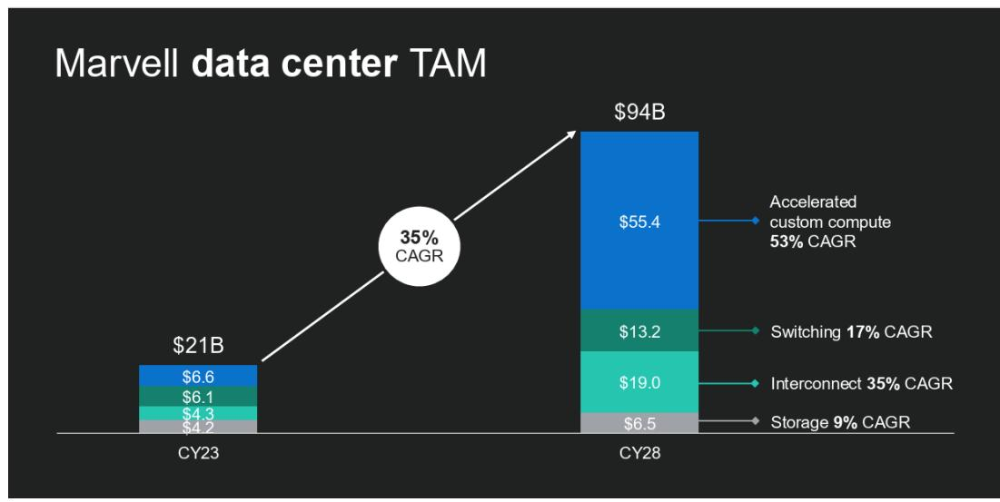  
资料来源：Marvell，华创证券

## （三）全球 IP 市场集中度较高，国产化率亟待提升

全球市场集中度较高，国内市场自给水平较低。据SemiWiki ，2024年设计知识产权收入达到 85亿美元，增长率创历史新高，达到20%。有线接口依然以 23.5%的增长推动设计知识产权增长，但处理器类别在 2024 年也将增长 22.4%。这与 ARM 组成的前四大知识产权公司以及领导有线接口类别的团队——Synopsys、Cadence 和 Alphawave——相符。前四大供应商的增长甚至超过了市场（增长率在 25%左右），2024 年总份额达到 75%，而2023 年为 72%。据公司年报，根据 IPnest 在 2025 年的最新统计，2024 年，芯原半导体 IP 授权业务市场占有率位列中国大陆第一。

资料来源：IPnest、转引自SemiWiki，华创证券  
图表 37 全球半导体设计 IP厂商收入（亿美元）和市占率
<table><tr><td colspan="1" rowspan="1">2024排名</td><td colspan="1" rowspan="1">公司</td><td colspan="1" rowspan="1">2023</td><td colspan="1" rowspan="1">2024</td><td colspan="1" rowspan="1">YoY</td><td colspan="1" rowspan="1">2024年市占率</td><td colspan="1" rowspan="1">累计市占率</td></tr><tr><td colspan="1" rowspan="1">1</td><td colspan="1" rowspan="1"> ARM</td><td colspan="1" rowspan="1">29.38</td><td colspan="1" rowspan="1">36.94</td><td colspan="1" rowspan="1">25.7%</td><td colspan="1" rowspan="1">43.6%</td><td colspan="1" rowspan="1">43.6%</td></tr><tr><td colspan="1" rowspan="1">2</td><td colspan="1" rowspan="1"> Synopsys</td><td colspan="1" rowspan="1">15.42</td><td colspan="1" rowspan="1">19.07</td><td colspan="1" rowspan="1">23.6%</td><td colspan="1" rowspan="1">22.5%</td><td colspan="1" rowspan="1">66.1%</td></tr><tr><td colspan="1" rowspan="1">3</td><td colspan="1" rowspan="1">Cadence</td><td colspan="1" rowspan="1">3.91</td><td colspan="1" rowspan="1">4.98</td><td colspan="1" rowspan="1">27.2%</td><td colspan="1" rowspan="1">5.9%</td><td colspan="1" rowspan="1">71.9%</td></tr><tr><td colspan="1" rowspan="1">4</td><td colspan="1" rowspan="1"> Alphawave</td><td colspan="1" rowspan="1">2.15</td><td colspan="1" rowspan="1">2.67</td><td colspan="1" rowspan="1">24.4%</td><td colspan="1" rowspan="1">3.2%</td><td colspan="1" rowspan="1">75.1%</td></tr><tr><td colspan="1" rowspan="1">5</td><td colspan="1" rowspan="1">Rambus</td><td colspan="1" rowspan="1">1.27</td><td colspan="1" rowspan="1">1.44</td><td colspan="1" rowspan="1">13.1%</td><td colspan="1" rowspan="1">1.7%</td><td colspan="1" rowspan="1">76.8%</td></tr><tr><td colspan="1" rowspan="1">6</td><td colspan="1" rowspan="1">ImaginationTechnologies</td><td colspan="1" rowspan="1">1.55</td><td colspan="1" rowspan="1">1.40</td><td colspan="1" rowspan="1">-10%</td><td colspan="1" rowspan="1">1.6%</td><td colspan="1" rowspan="1">78.4%</td></tr><tr><td colspan="1" rowspan="1">7</td><td colspan="1" rowspan="1">力旺电子</td><td colspan="1" rowspan="1">0.97</td><td colspan="1" rowspan="1">1.14</td><td colspan="1" rowspan="1">18.2%</td><td colspan="1" rowspan="1">1.3%</td><td colspan="1" rowspan="1">82.5%</td></tr><tr><td colspan="1" rowspan="1">8</td><td colspan="1" rowspan="1">Ceva</td><td colspan="1" rowspan="1">0.97</td><td colspan="1" rowspan="1">1.07</td><td colspan="1" rowspan="1">9.8%</td><td colspan="1" rowspan="1">1.3%</td><td colspan="1" rowspan="1">82.5%</td></tr><tr><td colspan="1" rowspan="1">9</td><td colspan="1" rowspan="1">芯原股份</td><td colspan="1" rowspan="1">1.09</td><td colspan="1" rowspan="1">1.04</td><td colspan="1" rowspan="1">-4.8%</td><td colspan="1" rowspan="1">1.5%</td><td colspan="1" rowspan="1">81.2%</td></tr><tr><td colspan="1" rowspan="1">10</td><td colspan="1" rowspan="1">SST</td><td colspan="1" rowspan="1">1.02</td><td colspan="1" rowspan="1">1.03</td><td colspan="1" rowspan="1">1.4%</td><td colspan="1" rowspan="1">1.2%</td><td colspan="1" rowspan="1">83.7%</td></tr><tr><td colspan="2" rowspan="1">Top 10供应商</td><td colspan="1" rowspan="1">57.74</td><td colspan="1" rowspan="1">70.78</td><td colspan="1" rowspan="1">22.6%</td><td colspan="1" rowspan="1">83.5%</td><td colspan="1" rowspan="1">83.5%</td></tr><tr><td colspan="2" rowspan="1">其他</td><td colspan="1" rowspan="1">12.89</td><td colspan="1" rowspan="1">14.03</td><td colspan="1" rowspan="1">8.8%</td><td colspan="1" rowspan="1">16.5%</td><td colspan="1" rowspan="1">16.5%</td></tr><tr><td colspan="2" rowspan="1">总计</td><td colspan="1" rowspan="1">70.63</td><td colspan="1" rowspan="1">84.81</td><td colspan="1" rowspan="1">20.1%</td><td colspan="1" rowspan="1">100%</td><td colspan="1" rowspan="1">100%</td></tr></table>

得益于国家政策支持和市场需求驱动，我国半导体 IP行业国产化率不断提升。随着我国半导体产业的快速发展和国家政策的支持，本土芯片设计企业数量快速增长，国产化率显著提高。我国半导体IP产业正从技术跟随向局部创新跨越，为实现自主可控和全球竞争力提升积蓄力量。虽然国内企业在高端处理器 IP、先进制程 IP 的性能优化和兼容性上仍有明显差距，多数产品集中在中低端场景，在高端芯片设计中的渗透率较低。随着国内对芯片自主可控需求的持续升级，下游芯片设计企业对本土 IP 的采购意愿不断增强，中高端市场的国产替代空间将逐步释放，为本土企业实现技术升级和市场突破创造条件。

## 三、IP生态与平台能力构筑长期护城河，量产订单规模效应显现

## （一）芯原股份：中国半导体 IP第一股，AI ASIC龙头企业

芯原是一家依托自主半导体IP，为客户提供芯片定制服务和半导体IP授权服务的企业。目前公司主营业务的应用领域广泛包括消费电子、汽车电子、计算机及周边、工业、数据处理、物联网等，主要客户包括芯片设计公司、IDM、系统厂商、大型互联网公司、云服务提供商等。

图表 38 芯原业务范围覆盖的应用领域  
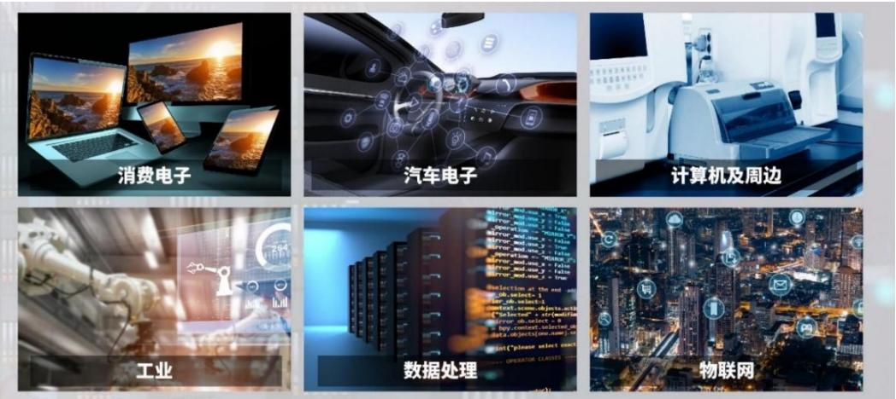  
资料来源：公司2024及2025年一季度业绩说明会展示材料

中国半导体 IP第一股，AI ASIC龙头企业。基于公司独有的芯片设计平台即服务（SiliconPlatform as a Service, SiPaaS）经营模式，公司在所处行业取得显著成就。根据 IPnest 在2025 年的最新统计，2024 年，芯原半导体 IP 授权业务市场占有率位列中国大陆第一，全球第八；2024年，芯原的知识产权授权使用费收入排名全球第六。根据 IPnest的 IP 分类和各企业公开信息，芯原 IP 种类在全球排名前十的 IP 企业中排名前二。2020 年，公司在科创板上市时，曾被誉为“中国半导体 IP 第一股”；随着公司业务在 AI 芯片定制领域获得快速增长，目前公司已被业界誉为“AIASIC龙头企业”。

图表 39 芯原所在市场地位  
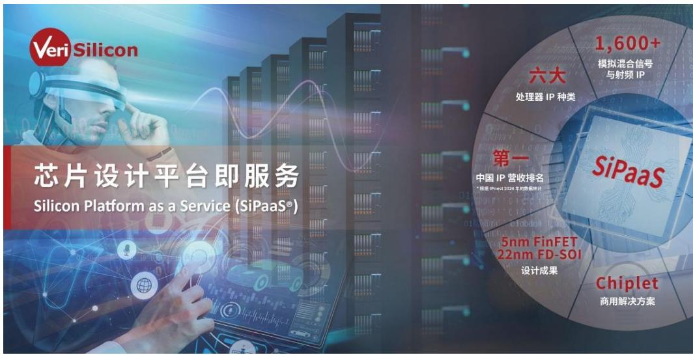  
资料来源：公司2024及2025年一季度业绩说明会展示材料

芯原具有先进、丰富的IP组合，构筑公司护城河。公司拥有自主可控的图形处理器 IP、神经网络处理器 IP、视频处理器 IP、数字信号处理器 IP、图像信号处理器 IP 和显示处理器 IP 这六类处理器 IP，以及 1,600 多个数模混合 IP 和射频 IP。基于自有的 IP，公司已拥有丰富的面向 AI应用的软硬件芯片定制平台解决方案，涵盖如智能手表、AR/VR眼镜等实时在线的轻量化空间计算设备，AI PC、AI 手机、智慧汽车、机器人等高效率端侧计算设备，以及数据中心/服务器等高性能云侧计算设备。在芯原的核心处理器IP 相关营业收入中，图形处理器 IP、神经网络处理器 IP 和视频处理器 IP 收入占比较高，这三类 IP 在 2025 年前三季度半导体 IP 授权业务收入中占比合计约 70%，上述 IP 已获得国内外众多知名企业的广泛采用，在各应用领域发挥了重要作用。

图表 40 芯原丰富的IP组合  
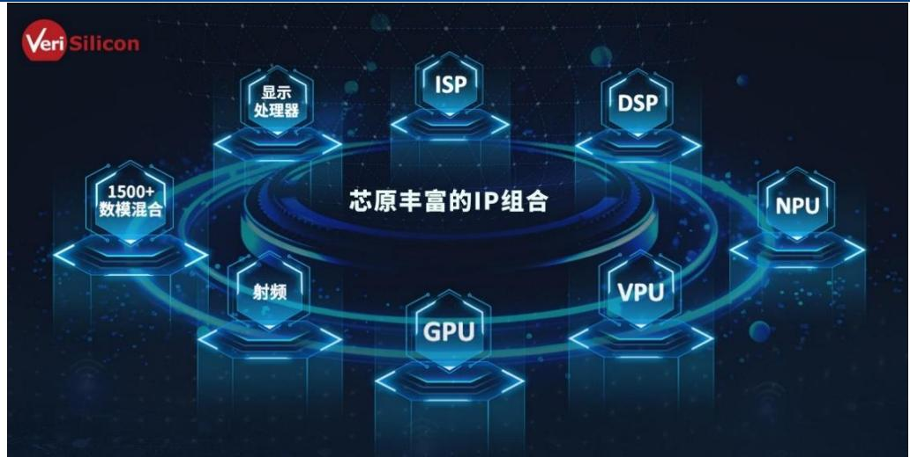  
资料来源：公司2024及2025年一季度业绩说明会展示材料

芯原主要经营模式为 SiPaaS，形成较高竞争壁垒。芯原的主要经营模式为芯片设计平台即服务（Silicon Platform as a Service，SiPaaS）模式。SiPaaS 模式具有平台化、全方位、一站式三个主要特点，这三个特点分别带来了可复用性、应用领域扩展性、可规模化的独特优势，这些优势共同形成了芯原较高的竞争壁垒。

缩短设计周期，降低设计风险。与传统芯片设计服务公司经营模式不同，芯原在 SiPaaS模式下，以自主拥有的 IP为核心，基于公司先进的芯片设计能力和量产服务经验，打造了多种经过硅验证的芯片设计平台，可大幅降低客户的芯片设计周期和设计风险，并为芯原的服务质量和效率提供了保证。

图表 41 芯原 SiPaaS 模式的竞争壁垒  
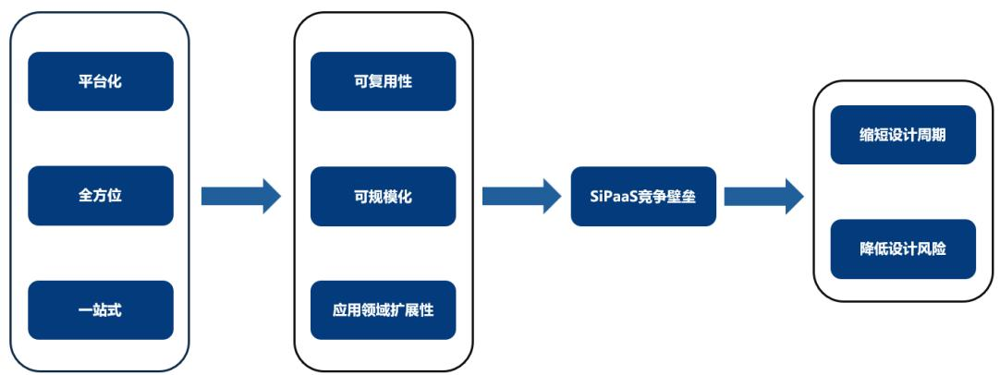  
资料来源：公司半年报，华创证券

## （二）IP生态与平台能力构筑长期护城河，深耕存量市场开拓增量领域

推进 Chiplet 技术及产业化，实现竞争力升维。为顺应大算力需求所推动的 SoC 向 SiP发展的趋势，芯原正在以“IP 芯片化”、“芯片平台化”和“平台生态化”理念为行动指导方针，从接口 IP、Chiplet 芯片架构、先进封装技术、面向 AIGC 和智慧出行的解决方案等方面入手，持续推进公司 Chiplet 技术、项目的研发和产业化，在基于 Chiplet 的云侧AI 和高端智驾两大赛道实现领跑，并持续推进面向智驾系统和 AIGC 高性能计算的Chiplet 芯片平台研发项目。

图表 42 公司对于Chiplet技术的布局  
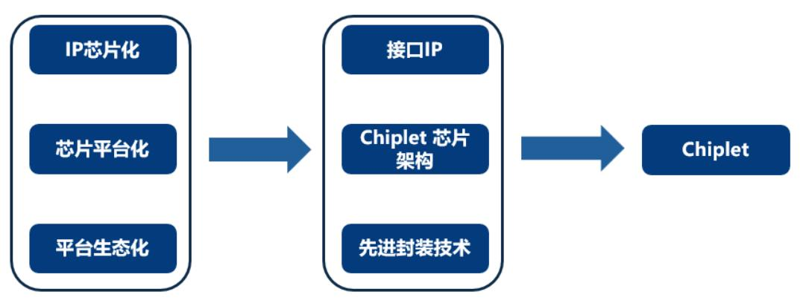  
资料来源：公司半年报，华创证券

多家 IC 领先厂商成立 Chiplet标准联盟，芯原成为大陆首批加入 UCIe联盟的企业之一。

以 AMD、英特尔、台积电等为代表的多家集成电路领导厂商已先后发布了相关 Chiplet解决方案、接口协议或封装技术。2022年 3月 2日，英特尔、AMD、ARM、高通、台积电、三星、日月光、Google云、Meta、微软这十家行业领导企业共同成立了Chiplet标准联盟，正式推出了通用 Chiplet 的高速互联标准，芯原已经成为大陆首批加入 UCIe 联盟的企业之一。

图表 43 UCle发起成员及部分贡献成员  
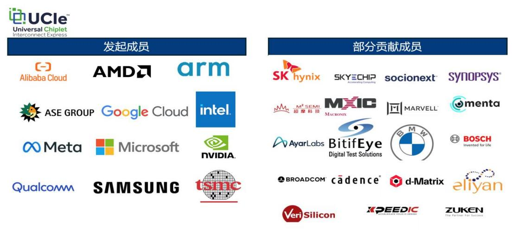  
资料来源：UCIe，华创证券

客户渗透率持续提升，GPU/NPU 规模化落地强化技术壁垒。截至 2025 年 H1，公司 VPU已位居全球第一，截至 2025年末，基于芯原VPU IP 的视频转码加速解决方案已获得中国前 5 名互联网企业中的 3 家，全球前 20 名云服务提供商中的 7 家，以及 2024 年中国造车新势力 Top8榜单中5家所采用。客户粘性较强。在AI计算领域，公司GPU累计全球出货量超过 20 亿颗、NPU 累计全球出货量近 2 亿颗，其中 GPU 已赋能千万辆汽车，NPU已被91 家客户用于140余款AI芯片设计，并为移动端大语言模型推理提供超过40TOPS 算力。目前，其 GPUIP 在30余款智能手表、10 余款AI眼镜中和 10余款国产电脑中量产上市。

随着 SoC复杂度持续提升，IP正不断影响芯片设计质量、上市时间及开发成本，逐渐成为产品竞争优势的重要组成部分。为此，公司持续保持高研发投入，打造完善且丰富的IP产品组合，主要包括：

⚫ 自主可控的图形处理器 IP、神经网络处理器 IP、显示处理器 IP、视频处理器IP、数字信号处理器 IP和图像信号处理器 IP

⚫ 丰富的模拟半导体 IP 产品涵盖了从 180 纳米到 4 纳米工艺的多种模拟 IP，同时提供先进的超低功耗模拟 IP解决方案

⚫ 从 250 纳米到 4 纳米工艺的多种数模混合接口 IP 核，包括 MIPI, USB, PCIE 等

⚫ 多款超低功耗的射频 IP，含低功耗蓝牙（BLE）IP和窄带物联网（NB-IoT）IP

⚫ 面向代工厂工艺的定制化的标准单元库

实现 4nm FinFET流片，与全球多家晶圆厂全面合作。随着工艺节点的演进，公司持续进行芯片定制技术的研发，不断提高基于 FinFET和FD-SOI先进工艺节点上的芯片设计能力。芯原在传统 CMOS、先进 FinFET 和 FD-SOI 等全球主流半导体工艺节点上都具有 优 秀 的 设 计 能 力 。 在 先 进 半 导 体 工 艺 节 点 方 面 ， 公 司 已 拥 有14nm/10nm/7nm/6nm/5nm/4nmFinFET 和 28nm/22nmFD-SOI 工艺节点芯片的成功流片经验，目前已实现多个 5nmSoC 项目一次流片成功并量产，4nmSoC项目已成功流片，多个5nm/4nm 一站式服务项目正在执行。2018 年，三星宣布 7nm EUV 芯片进入量产时，芯原是三星先进晶圆代工生态系统合作伙伴中，唯一被提及的芯片设计类合作伙伴，并且和全球所有主流的晶圆厂合作，与大多数晶圆厂拥有超过10年或15年的长期合作关系。并且成为与包括中芯国际、华虹宏力、台积电等在内的几乎全球所有主流晶圆厂全面合作的公司。

图表 44 芯原设计服务能力及其应用的演进  
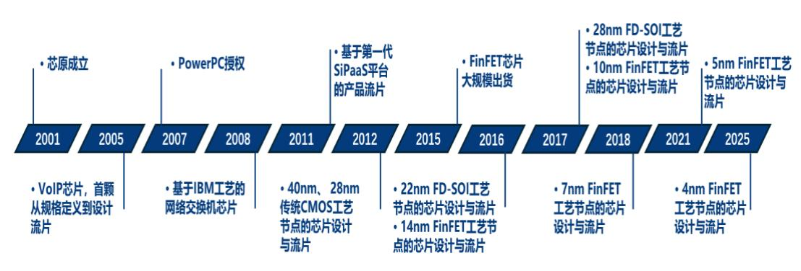  
资料来源：公司招股书、公司年报，华创证券

## （三）单季度新签订单屡创新高，量产订单规模效应显现奠定盈利基础

单季度新签订单屡创新高，在手订单连续九个季度保持高位。公司技术能力业界领先，持续获得全球优质客户的认可。2025年季度新签订单金额分别为 4.74亿元、11.82亿元、15.93 亿元、27.11 亿元，单季度新签订单金额三次突破历史新高（25Q4 QoQ+70.17%）。2025 年全年，公司新签订单金额 59.60 亿元（YoY+103.41%），其中 AI 算力相关订单占比超 73%，数据处理领域订单占比超50%。截至 2025年末，公司在手订单金额达到 50.75亿元（QoQ+54.45%，其中量产订单超 30亿元），且已连续九个季度保持高位，预计一年内转化的比例超 80%，且近60%为数据处理应用领域订单。

图表 45 芯原新签订单情况（亿元）  
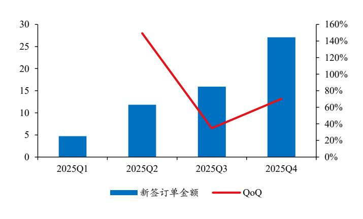  
资料来源：公司公告，华创证券

图表 46 芯原在手订单情况（亿元）  
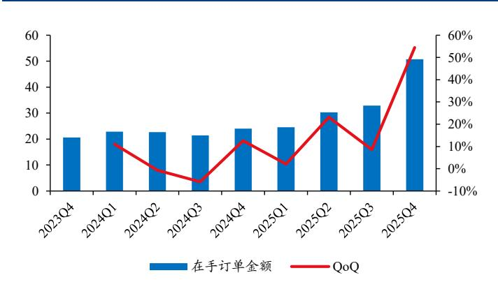  
资料来源：公司公告，华创证券

量产业务营收创新高，订单规模效应显现。2025年，公司量产业务营收创新高，实现营收14.89 亿元（YoY+73.98%），截至 2025年末，量产出货芯片项目达到114个，待量产芯片项目 48个。25年末在手订单中，量产业务订单超30亿元，量产业务的规模效应显著，订单的持续转化将为公司未来盈利能力逐步提升奠定坚实基础。此外，量产业务的毛利率高于纯设计服务，若公司从设计服务迈向量产，更有利于公司整体的营收规模和盈利能力。

图表 47 芯原量产业务营收情况（亿元）  
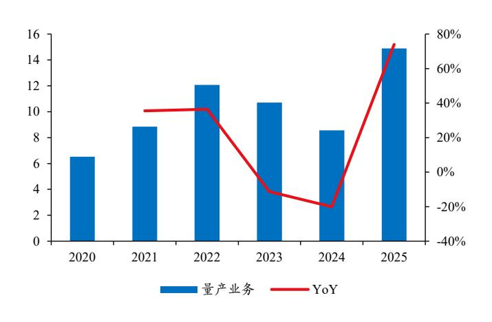  
资料来源：公司公告、iFind，华创证券

图表 48 芯原量产业务/芯片设计业务毛利率  
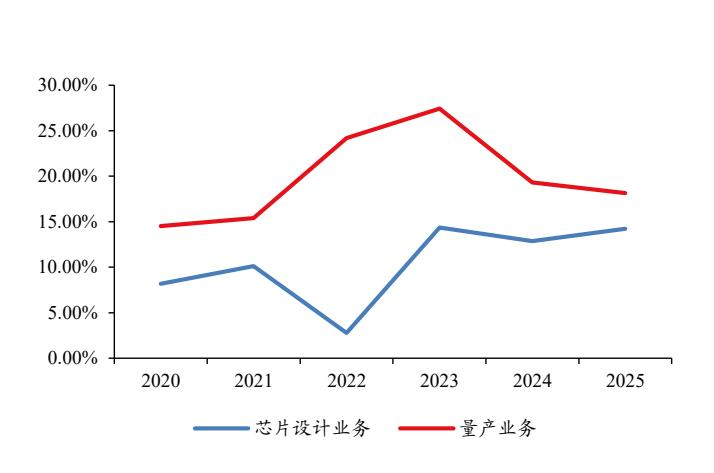  
资料来源：iFind，华创证券

## 四、盈利预测

我们进行盈利预测的关键假设为：1）IP授权业务：公司是中国大陆排名第一的半导体IP供应商，因此在公司长期深耕的主营IP 业务，凭借着龙头的效应，并随着后续客户产品的逐步量产，公司将进一步提升特许权使用费收入，公司 IP 授权业务的规模效应将进一步扩大。2）芯片设计：在一站式芯片定制服务方面，芯原拥有从先进 4nmFinFET、22nmFD-SOI 到传统 250nmCMOS 制程的设计能力，所掌握的工艺可涵盖全球主要晶圆厂的主流工艺、特殊工艺等，整体市场认可度不断提高，已开始占据有利地位，经营成果不断优化，众多在其各自领域具有较强的代表性和先进性的国内外知名企业成为芯原客户，公司竞争能力进一步增强，该业务有望持续扩大。3）量产业务：截至 2025 年末，公司量产出货芯片项目达到 114个，待量产芯片项目 48个。25年末在手订单中，量产业务订单超30亿元，量产业务的规模效应显著，订单的持续转化将为公司未来盈利能力逐步提升奠定坚实基础，该业务有望继续爆发。

图表 49 芯原股份业务拆分

资料来源：Wind，华创证券预测
<table><tr><td colspan="1" rowspan="1"></td><td colspan="1" rowspan="1">2023</td><td colspan="1" rowspan="1">2024</td><td colspan="1" rowspan="1">2025</td><td colspan="1" rowspan="1">2026E</td><td colspan="1" rowspan="1">2027E</td><td colspan="1" rowspan="1">2028E</td></tr><tr><td colspan="1" rowspan="1">芯片设计服务</td><td colspan="1" rowspan="1"></td><td colspan="1" rowspan="1"></td><td colspan="1" rowspan="1"></td><td colspan="1" rowspan="1"></td><td colspan="1" rowspan="1"></td><td colspan="1" rowspan="1"></td></tr><tr><td colspan="1" rowspan="1">营业收入（亿元）</td><td colspan="1" rowspan="1">4.92</td><td colspan="1" rowspan="1">7.25</td><td colspan="1" rowspan="1">8.77</td><td colspan="1" rowspan="1">14.58</td><td colspan="1" rowspan="1">20.57</td><td colspan="1" rowspan="1">27.64</td></tr><tr><td colspan="1" rowspan="1">YoY(%)</td><td colspan="1" rowspan="1">-14.1%</td><td colspan="1" rowspan="1">47.4%</td><td colspan="1" rowspan="1">20.97%</td><td colspan="1" rowspan="1">66.21%</td><td colspan="1" rowspan="1">41.13%</td><td colspan="1" rowspan="1">34.38%</td></tr><tr><td colspan="1" rowspan="1">毛利率</td><td colspan="1" rowspan="1">14.36%</td><td colspan="1" rowspan="1">12.87%</td><td colspan="1" rowspan="1">14.22%</td><td colspan="1" rowspan="1">17.00%</td><td colspan="1" rowspan="1">17.20%</td><td colspan="1" rowspan="1">17.50%</td></tr><tr><td colspan="1" rowspan="1">毛利（亿元）</td><td colspan="1" rowspan="1">0.71</td><td colspan="1" rowspan="1">0.93</td><td colspan="1" rowspan="1">1.25</td><td colspan="1" rowspan="1">2.48</td><td colspan="1" rowspan="1">3.54</td><td colspan="1" rowspan="1">4.84</td></tr><tr><td colspan="7" rowspan="1">芯片量产服务</td></tr><tr><td colspan="1" rowspan="1">营业收入（亿元）</td><td colspan="1" rowspan="1">10.71</td><td colspan="1" rowspan="1">8.56</td><td colspan="1" rowspan="1">14.90</td><td colspan="1" rowspan="1">35.76</td><td colspan="1" rowspan="1">61.69</td><td colspan="1" rowspan="1">98.11</td></tr><tr><td colspan="1" rowspan="1">YoY(%)</td><td colspan="1" rowspan="1">-11.3%</td><td colspan="1" rowspan="1">-20.1%</td><td colspan="1" rowspan="1">74.1%</td><td colspan="1" rowspan="1">140.0%</td><td colspan="1" rowspan="1">72.5%</td><td colspan="1" rowspan="1">59.0%</td></tr><tr><td colspan="1" rowspan="1">毛利率</td><td colspan="1" rowspan="1">27.43%</td><td colspan="1" rowspan="1">19.30%</td><td colspan="1" rowspan="1">18.14%</td><td colspan="1" rowspan="1">27.00%</td><td colspan="1" rowspan="1">27.50%</td><td colspan="1" rowspan="1">28.00%</td></tr><tr><td colspan="1" rowspan="1">毛利（亿元）</td><td colspan="1" rowspan="1">2.94</td><td colspan="1" rowspan="1">1.65</td><td colspan="1" rowspan="1">2.70</td><td colspan="1" rowspan="1">9.66</td><td colspan="1" rowspan="1">16.96</td><td colspan="1" rowspan="1">27.47</td></tr><tr><td colspan="2" rowspan="1">知识产权授权使用费</td><td colspan="1" rowspan="1"></td><td colspan="1" rowspan="1"></td><td colspan="1" rowspan="1"></td><td colspan="1" rowspan="1"></td><td colspan="1" rowspan="1"></td></tr><tr><td colspan="1" rowspan="1">营业收入（亿元）</td><td colspan="1" rowspan="1">6.55</td><td colspan="1" rowspan="1">6.33</td><td colspan="1" rowspan="1">6.71</td><td colspan="1" rowspan="1">8.31</td><td colspan="1" rowspan="1">9.87</td><td colspan="1" rowspan="1">11.35</td></tr><tr><td colspan="1" rowspan="1">YoY(%)</td><td colspan="1" rowspan="1">-16.6%</td><td colspan="1" rowspan="1">-3.4%</td><td colspan="1" rowspan="1">6.0%</td><td colspan="1" rowspan="1">23.8%</td><td colspan="1" rowspan="1">18.8%</td><td colspan="1" rowspan="1">15.0%</td></tr><tr><td colspan="1" rowspan="1">毛利率</td><td colspan="1" rowspan="1">87.42%</td><td colspan="1" rowspan="1">89.71%</td><td colspan="1" rowspan="1">85.77%</td><td colspan="1" rowspan="1">86.00%</td><td colspan="1" rowspan="1">86.00%</td><td colspan="1" rowspan="1">86.00%</td></tr><tr><td colspan="1" rowspan="1">毛利（亿元）</td><td colspan="1" rowspan="1">5.73</td><td colspan="1" rowspan="1">5.68</td><td colspan="1" rowspan="1">5.76</td><td colspan="1" rowspan="1">7.14</td><td colspan="1" rowspan="1">8.49</td><td colspan="1" rowspan="1">9.76</td></tr><tr><td colspan="1" rowspan="1">特许权使用费</td><td colspan="1" rowspan="1"></td><td colspan="1" rowspan="1"></td><td colspan="1" rowspan="1"></td><td colspan="1" rowspan="1"></td><td colspan="1" rowspan="1"></td><td colspan="1" rowspan="1"></td></tr><tr><td colspan="1" rowspan="1">营业收入（亿元）</td><td colspan="1" rowspan="1">1.1</td><td colspan="1" rowspan="1">1.03</td><td colspan="1" rowspan="1">1.11</td><td colspan="1" rowspan="1">1.22</td><td colspan="1" rowspan="1">1.34</td><td colspan="1" rowspan="1">1.43</td></tr><tr><td colspan="1" rowspan="1">YoY(%)</td><td colspan="1" rowspan="1">1.9%</td><td colspan="1" rowspan="1">-6.4%</td><td colspan="1" rowspan="1">7.8%</td><td colspan="1" rowspan="1">9.8%</td><td colspan="1" rowspan="1">10.0%</td><td colspan="1" rowspan="1">7.0%</td></tr><tr><td colspan="1" rowspan="1">毛利率</td><td colspan="1" rowspan="1">100%</td><td colspan="1" rowspan="1">100%</td><td colspan="1" rowspan="1">97%</td><td colspan="1" rowspan="1">100%</td><td colspan="1" rowspan="1">100%</td><td colspan="1" rowspan="1">100%</td></tr><tr><td colspan="1" rowspan="1">毛利（亿元）</td><td colspan="1" rowspan="1">1.10</td><td colspan="1" rowspan="1">1.03</td><td colspan="1" rowspan="1">1.07</td><td colspan="1" rowspan="1">1.22</td><td colspan="1" rowspan="1">1.34</td><td colspan="1" rowspan="1">1.43</td></tr><tr><td colspan="1" rowspan="1">合计</td><td colspan="1" rowspan="1"></td><td colspan="1" rowspan="1"></td><td colspan="1" rowspan="1"></td><td colspan="1" rowspan="1"></td><td colspan="1" rowspan="1"></td><td colspan="1" rowspan="1"></td></tr><tr><td colspan="1" rowspan="1">营业收入（亿元）</td><td colspan="1" rowspan="1">23.37</td><td colspan="1" rowspan="1">23.22</td><td colspan="1" rowspan="1">31.53</td><td colspan="1" rowspan="1">59.90</td><td colspan="1" rowspan="1">93.51</td><td colspan="1" rowspan="1">138.57</td></tr><tr><td colspan="1" rowspan="1">YoY(%)</td><td colspan="1" rowspan="1">-12.7%</td><td colspan="1" rowspan="1">-0.6%</td><td colspan="1" rowspan="1">35.8%</td><td colspan="1" rowspan="1">90.0%</td><td colspan="1" rowspan="1">56.1%</td><td colspan="1" rowspan="1">48.2%</td></tr><tr><td colspan="1" rowspan="1">毛利率</td><td colspan="1" rowspan="1">44.8%</td><td colspan="1" rowspan="1">39.9%</td><td colspan="1" rowspan="1">34.19%</td><td colspan="1" rowspan="1">34.2%</td><td colspan="1" rowspan="1">32.4%</td><td colspan="1" rowspan="1">31.4%</td></tr><tr><td colspan="1" rowspan="1">毛利（亿元）</td><td colspan="1" rowspan="1">10.46</td><td colspan="1" rowspan="1">9.26</td><td colspan="1" rowspan="1">10.78</td><td colspan="1" rowspan="1">20.50</td><td colspan="1" rowspan="1">30.33</td><td colspan="1" rowspan="1">43.50</td></tr></table>

芯原股份是一家依托自主半导体 IP，为客户提供平台化、全方位、一站式芯片定制服务和半导体 IP 授权服务的企业。作为中国半导体 IP 第一股与 AI ASIC 领军者，公司核心IP 优势显著，拥有 4nmFinFET 到传统 250nm CMOS 工艺节点芯片的设计能力、与全球多家晶圆厂全面合作，公司在2025年释放强劲增长动能，单季新签订单创历史新高、在手订单连续九个季度高位运行。截至 25Q4，公司在手订单50.75 亿元（QoQ+54.45%，其中量产订单超 30 亿元），公司预计一年内转化的比例超 80%，有望迎来业绩拐点。我们预计公司 26-28年实现归母净利润 2.18/7.14/11.99亿元，考虑公司后续业绩兑现、稀缺性以及国内ASIC 需求增长带动的估值抬升，首次覆盖给予“强推”评级。

## 五、风险提示

## 1、业绩下滑或亏损

若未来出现宏观经济下行、行业竞争加剧、上游原材料供应紧张或涨价、下游市场需求继续减少、重要客户或供应商与公司合作关系变动等对公司经营构成不利影响的变化，而公司未能采取有效应对措施，则可能存在经营业绩无法按计划增长或出现下滑的风险。

## 2、集成电路设计研发风险

公司的集成电路设计研发风险主要由于公司设计服务技术含量较高、持续时间较长，可能面临研究设计未能达到预期效果、流片失败、客户研究方向或市场需求改变等不确定

因素而导致公司签署的服务合同存在较预期提前终止或延期支付的风险，可能会对公司未来的收入和盈利能力产生一定程度的影响。

## 3、技术升级迭代

集成电路设计行业下游需求不断变化，产品及技术升级迭代速度较快，芯片制程不断向28nm、14nm、7nm、5nm、4nm 等先进制程演变。该行业仍在不断革新之中，且研发创新存在不确定性，公司在新技术的开发和应用上可能无法持续取得先进地位，或者某项新技术的应用导致公司现有技术被替代，将导致公司行业地位和市场竞争力下降，从而对公司的经营产生不利影响。

## 4、晶圆厂合作供应风险

公司芯片设计服务为客户提供委托晶圆厂根据版图生产工程晶圆服务，公司与几乎全球所有晶圆厂全面合作，若因国际政策等不确定性因素出现晶圆厂合作供应问题，将影响公司芯片设计服务业务，可能对公司未来的收入和盈利能力产生一定程度的影响。

附录：财务预测表  
[Table_Valuat资产负债表
<table><tr><td>单位：百万元</td><td>2025A</td><td>2026E</td><td>2027E</td><td>2028E</td></tr><tr><td>货币资金</td><td>2,008</td><td>2,796</td><td>3,814</td><td>3,957</td></tr><tr><td>应收票据</td><td>6</td><td>36</td><td>101</td><td>95</td></tr><tr><td>应收账款</td><td>1,203</td><td>2,614</td><td>1,777</td><td>2,661</td></tr><tr><td>预付账款</td><td>467</td><td>355</td><td>599</td><td>1,084</td></tr><tr><td>存货</td><td>498</td><td>1,359</td><td>1,827</td><td>2,771</td></tr><tr><td>合同资产</td><td>353</td><td>659</td><td>862</td><td>1,455</td></tr><tr><td>其他流动资产</td><td>1,152</td><td>1,111</td><td>1,424</td><td>1,632</td></tr><tr><td>流动资产合计</td><td>5,686</td><td>8,929</td><td>10,403</td><td>13,654</td></tr><tr><td>其他长期投资</td><td>0</td><td>0</td><td>0</td><td>0</td></tr><tr><td>长期股权投资</td><td>1</td><td>1</td><td>1</td><td>1</td></tr><tr><td>固定资产</td><td>712</td><td>710</td><td>709</td><td>707</td></tr><tr><td>在建工程</td><td>1</td><td>4</td><td>6</td><td>9</td></tr><tr><td>无形资产</td><td>562</td><td>700</td><td>833</td><td>972</td></tr><tr><td>其他非流动资产</td><td>756</td><td>776</td><td>791</td><td>806</td></tr><tr><td>非流动资产合计</td><td>2,031</td><td>2,190</td><td>2,341</td><td>2,496</td></tr><tr><td>资产合计</td><td>7,718</td><td>11,119</td><td>12,744</td><td>16,150</td></tr><tr><td>短期借款</td><td>0</td><td>0</td><td>0</td><td>0</td></tr><tr><td>应付票据</td><td>0</td><td>0</td><td>0</td><td>0</td></tr><tr><td>应付账款</td><td>326</td><td>867</td><td>1,040</td><td>1,717</td></tr><tr><td>预收款项</td><td>0</td><td>0</td><td>0</td><td>0</td></tr><tr><td>合同负债</td><td>1,259</td><td>1,917</td><td>2,338</td><td>3,464</td></tr><tr><td>其他应付款</td><td>75</td><td>75</td><td>75</td><td>75</td></tr><tr><td>一年内到期的非流动负债</td><td>553</td><td>553</td><td>553</td><td>553</td></tr><tr><td>其他流动负债</td><td>314</td><td>338</td><td>442</td><td>618</td></tr><tr><td>流动负债合计</td><td>2,527</td><td>3,749</td><td>4,448</td><td>6,427</td></tr><tr><td>长期借款</td><td>1,124</td><td>1,330</td><td>1,543</td><td>1,771</td></tr><tr><td>应付债券</td><td>0</td><td>0</td><td>0</td><td>0</td></tr><tr><td>其他非流动负债</td><td>649</td><td>649</td><td>649</td><td>649</td></tr><tr><td>非流动负债合计</td><td>1,773</td><td>1,979</td><td>2,192</td><td>2,420</td></tr><tr><td>负债合计</td><td>4,300</td><td>5,728</td><td>6,639</td><td>8,847</td></tr><tr><td>归属母公司所有者权益</td><td>3,418</td><td>5,391</td><td>6,105</td><td>7,304</td></tr><tr><td>少数股东权益</td><td>0</td><td>0</td><td>0</td><td>0</td></tr><tr><td>所有者权益合计</td><td>3,418</td><td>5,391</td><td>6,105</td><td>7,304</td></tr><tr><td>负债和股东权益</td><td>7,718</td><td>11,119</td><td>12,744</td><td>16,150</td></tr></table>

现金流量表
<table><tr><td>单位：百万元</td><td>2025A</td><td>2026E</td><td>2027E</td><td>2028E</td></tr><tr><td>经营活动现金流</td><td>-222</td><td>-910</td><td>1,082</td><td>220</td></tr><tr><td>现金收益</td><td>-248</td><td>364</td><td>882</td><td>1,390</td></tr><tr><td>存货影响</td><td>-102</td><td>-861</td><td>-468</td><td>-944</td></tr><tr><td>经营性应收影响</td><td>-896</td><td>-1,756</td><td>299</td><td>-2,181</td></tr><tr><td>经营性应付影响</td><td>861</td><td>1,223</td><td>698</td><td>1,979</td></tr><tr><td>其他影响</td><td>164</td><td>119</td><td>-328</td><td>-24</td></tr><tr><td>投资活动现金流</td><td>-1,023</td><td>-305</td><td>-315</td><td>-334</td></tr><tr><td>资本支出</td><td>-296</td><td>-286</td><td>-299</td><td>-319</td></tr><tr><td>股权投资</td><td>0</td><td>0</td><td>0</td><td>0</td></tr><tr><td>其他长期资产变化</td><td>-727</td><td>-19</td><td>-16</td><td>-15</td></tr><tr><td>融资活动现金流</td><td>2,611</td><td>2,004</td><td>251</td><td>257</td></tr><tr><td>借款增加</td><td>410</td><td>205</td><td>213</td><td>228</td></tr><tr><td>股利及利息支付</td><td>0</td><td>-19</td><td>-26</td><td>-29</td></tr><tr><td>股东融资</td><td>2,402</td><td>2,402</td><td>2,402</td><td>2,402</td></tr><tr><td>其他影响</td><td>-201</td><td>-584</td><td>-2,338</td><td>-2,343</td></tr></table>

资料来源：公司公告，华创证券预测

利润表
<table><tr><td>单位：百万元</td><td>2025A</td><td>2026E</td><td>2027E</td><td>2028E</td></tr><tr><td>营业总收入</td><td>3,152</td><td>5,990</td><td>9,351</td><td>13,857</td></tr><tr><td>营业成本</td><td>2,075</td><td>3,941</td><td>6,318</td><td>9,507</td></tr><tr><td>税金及附加</td><td>8</td><td>14</td><td>24</td><td>36</td></tr><tr><td>销售费用</td><td>127</td><td>186</td><td>281</td><td>416</td></tr><tr><td>管理费用</td><td>143</td><td>273</td><td>299</td><td>388</td></tr><tr><td>研发费用</td><td>1,313</td><td>1,438</td><td>1,777</td><td>2,356</td></tr><tr><td>财务费用</td><td>53</td><td>0</td><td>3</td><td>12</td></tr><tr><td>信用减值损失</td><td>-22</td><td>-2</td><td>-2</td><td>-2</td></tr><tr><td>资产减值损失</td><td>-8</td><td>-2</td><td>-1</td><td>-1</td></tr><tr><td>公允价值变动收益</td><td>33</td><td>33</td><td>33</td><td>33</td></tr><tr><td>投资收益</td><td>9</td><td>10</td><td>8</td><td>8</td></tr><tr><td>其他收益</td><td>49</td><td>49</td><td>49</td><td>49</td></tr><tr><td>营业利润</td><td>-507</td><td>227</td><td>736</td><td>1,230</td></tr><tr><td>营业外收入</td><td>1</td><td>1</td><td>1</td><td>1</td></tr><tr><td>营业外支出</td><td>8</td><td>8</td><td>8</td><td>8</td></tr><tr><td>利润总额</td><td>-513</td><td>220</td><td>729</td><td>1,223</td></tr><tr><td>所得税</td><td>15</td><td>2</td><td>15</td><td>24</td></tr><tr><td>净利润</td><td>-528</td><td>218</td><td>714</td><td>1,199</td></tr><tr><td>少数股东损益</td><td>0</td><td>0</td><td>0</td><td>0</td></tr><tr><td>归属母公司净利润</td><td>-528</td><td>218</td><td>714</td><td>1,199</td></tr><tr><td>NOPLAT</td><td>-473</td><td>218</td><td>717</td><td>1,210</td></tr><tr><td>EPS(摊薄)（元）</td><td>-1.00</td><td>0.41</td><td>1.36</td><td>2.28</td></tr></table>

主要财务比率
<table><tr><td></td><td>2025A</td><td>2026E</td><td>2027E</td><td>2028E</td></tr><tr><td>成长能力</td><td></td><td></td><td></td><td></td></tr><tr><td>营业收入增长率</td><td>35.8%</td><td>90.0%</td><td>56.1%</td><td>48.2%</td></tr><tr><td>EBIT 增长率</td><td>19.9%</td><td>147.8%</td><td>232.7%</td><td>68.7%</td></tr><tr><td>归母净利润增长率</td><td>12.2%</td><td>141.3%</td><td>228.0%</td><td>67.8%</td></tr><tr><td>获利能力</td><td></td><td></td><td></td><td></td></tr><tr><td>毛利率</td><td>34.2%</td><td>34.2%</td><td>32.4%</td><td>31.4%</td></tr><tr><td>净利率</td><td>-16.7%</td><td>3.6%</td><td>7.6%</td><td>8.6%</td></tr><tr><td>ROE</td><td>-15.4%</td><td>4.0%</td><td>11.7%</td><td>16.4%</td></tr><tr><td>ROIC</td><td>-11.1%</td><td>3.6%</td><td>10.3%</td><td>14.5%</td></tr><tr><td>偿债能力</td><td></td><td></td><td></td><td></td></tr><tr><td>资产负债率</td><td>55.7%</td><td>51.5%</td><td>52.1%</td><td>54.8%</td></tr><tr><td>债务权益比</td><td>68.1%</td><td>47.0%</td><td>45.0%</td><td>40.7%</td></tr><tr><td>流动比率</td><td>2.3</td><td>2.4</td><td>2.3</td><td>2.1</td></tr><tr><td>速动比率</td><td>2.1</td><td>2.0</td><td>1.9</td><td>1.7</td></tr><tr><td>营运能力</td><td></td><td></td><td></td><td></td></tr><tr><td>总资产周转率</td><td>0.4</td><td>0.5</td><td>0.7</td><td>0.9</td></tr><tr><td>应收账款周转天数</td><td>123</td><td>115</td><td>85</td><td>58</td></tr><tr><td>应付账款周转天数</td><td>42</td><td>54</td><td>54</td><td>52</td></tr><tr><td>存货周转天数</td><td>78</td><td>85</td><td>91</td><td>87</td></tr><tr><td>每股指标(元)</td><td></td><td></td><td></td><td></td></tr><tr><td>每股收益</td><td>-1.00</td><td>0.41</td><td>1.36</td><td>2.28</td></tr><tr><td>每股经营现金流</td><td>-0.42</td><td>-1.73</td><td>2.06</td><td>0.42</td></tr><tr><td>每股净资产</td><td>6.50</td><td>10.25</td><td>11.61</td><td>13.89</td></tr><tr><td>估值比率</td><td></td><td></td><td></td><td></td></tr><tr><td>P/E</td><td>-237</td><td>575</td><td>175</td><td>105</td></tr><tr><td>P/B</td><td>36.7</td><td>23.2</td><td>20.5</td><td>17.2</td></tr><tr><td>EV/EBITDA</td><td>-544</td><td>346</td><td>142</td><td>90</td></tr></table>

## 电子组团队介绍

副所长、前沿科技研究中心负责人：耿琛

美国新墨西哥大学计算机硕士。曾任新加坡国立大计算机学院研究员，中投证券、中泰证券研究所电子分析师。2019年带领团队获得新财富电子行业第五名，2016 年新财富电子行业第五名团队核心成员，2017 年加入华创证券研究所。

联席首席研究员：岳阳

上海交通大学硕士。2019年加入华创证券研究所。

## 资深分析师：熊翊宇

复旦大学金融学硕士，3年买方研究经验，曾任西南证券电子行业研究员，2020年加入华创证券研究所。

## 高级分析师：吴鑫

复旦大学资产评估硕士，1年买方研究经验。2022年加入华创证券研究所。

高级分析师：高远

西南财经大学硕士。2022年加入华创证券研究所。

## 高级分析师：姚德昌

同济大学硕士。2021 年加入华创证券研究所。

分析师：张文瑶

哈尔滨工业大学硕士。2023年加入华创证券研究所。

助理研究员：蔡坤

香港浸会大学硕士。2023年加入华创证券研究所。

助理研究员：卢依雯

北京大学金融硕士。2024年加入华创证券研究所。

## 助理研究员：张雅轩

美国康奈尔大学硕士。2024 年加入华创证券研究所。

## 研究员：董邦宜

北京交通大学计算机硕士，3年AI算法开发经验，曾任开源证券电子行业研究员。2024年加入华创证券研究所。

## 华创证券机构销售通讯录

<table><tr><td rowspan=1 colspan=1>地区</td><td rowspan=1 colspan=1>姓名</td><td rowspan=1 colspan=1>职务</td><td rowspan=1 colspan=1>办公电话</td><td rowspan=1 colspan=1>企业邮箱</td></tr><tr><td rowspan=10 colspan=1>北京机构销售部</td><td rowspan=1 colspan=1>张昱洁</td><td rowspan=1 colspan=1>副总经理、北京机构销售总监</td><td rowspan=1 colspan=1>010-63214682</td><td rowspan=1 colspan=1>zhangyujie@hcyjs.com</td></tr><tr><td rowspan=1 colspan=1>张菲菲</td><td rowspan=1 colspan=1>北京机构副总监</td><td rowspan=1 colspan=1>010-63214682</td><td rowspan=1 colspan=1>zhangfeifei@hcyjs.com</td></tr><tr><td rowspan=1 colspan=1>张婷</td><td rowspan=1 colspan=1>北京机构销售副总监</td><td rowspan=1 colspan=1></td><td rowspan=1 colspan=1>zhangting3@hcyjs.com</td></tr><tr><td rowspan=1 colspan=1>刘懿</td><td rowspan=1 colspan=1>副总监</td><td rowspan=1 colspan=1>010-63214682</td><td rowspan=1 colspan=1>liuyi@hcyjs.com</td></tr><tr><td rowspan=1 colspan=1>侯春钰</td><td rowspan=1 colspan=1>资深销售经理</td><td rowspan=1 colspan=1>010-63214682</td><td rowspan=1 colspan=1>houchunyu@hcyjs.com</td></tr><tr><td rowspan=1 colspan=1>顾翎蓝</td><td rowspan=1 colspan=1>资深销售经理</td><td rowspan=1 colspan=1>010-63214682</td><td rowspan=1 colspan=1>gulinglan@hcyjs.com</td></tr><tr><td rowspan=1 colspan=1>刘颖</td><td rowspan=1 colspan=1>资深销售经理</td><td rowspan=1 colspan=1>010-66500821</td><td rowspan=1 colspan=1>liuying5@hcyjs.com</td></tr><tr><td rowspan=1 colspan=1>阁星宇</td><td rowspan=1 colspan=1>销售经理</td><td rowspan=1 colspan=1></td><td rowspan=1 colspan=1>yanxingyu@hcyjs.com</td></tr><tr><td rowspan=1 colspan=1>车一哲</td><td rowspan=1 colspan=1>销售经理</td><td rowspan=1 colspan=1></td><td rowspan=1 colspan=1>cheyizhe@hcyjs.com</td></tr><tr><td rowspan=1 colspan=1>吴昱颖</td><td rowspan=1 colspan=1>销售经理</td><td rowspan=1 colspan=1></td><td rowspan=1 colspan=1>wuyuying@hcyjs.com</td></tr><tr><td rowspan=9 colspan=1>深圳机构销售部</td><td rowspan=1 colspan=1>张娟</td><td rowspan=1 colspan=1>副总经理、深圳机构销售总监</td><td rowspan=1 colspan=1>0755-82828570</td><td rowspan=1 colspan=1>zhangjuan@hcyjs.com</td></tr><tr><td rowspan=1 colspan=1>张嘉慧</td><td rowspan=1 colspan=1>资深销售经理</td><td rowspan=1 colspan=1>0755-82756804</td><td rowspan=1 colspan=1>zhangjiahuil @hcyjs.com</td></tr><tr><td rowspan=1 colspan=1>王春丽</td><td rowspan=1 colspan=1>资深销售经理</td><td rowspan=1 colspan=1>0755-82871425</td><td rowspan=1 colspan=1>wangchunli@hcyjs.com</td></tr><tr><td rowspan=1 colspan=1>王越</td><td rowspan=1 colspan=1>高级销售经理</td><td rowspan=1 colspan=1></td><td rowspan=1 colspan=1>wangyue5@hcyjs.com</td></tr><tr><td rowspan=1 colspan=1>汪丽燕</td><td rowspan=1 colspan=1>销售经理</td><td rowspan=1 colspan=1>0755-83715428</td><td rowspan=1 colspan=1>wangliyan@hcyjs.com</td></tr><tr><td rowspan=1 colspan=1>温雅迪</td><td rowspan=1 colspan=1>销售经理</td><td rowspan=1 colspan=1></td><td rowspan=1 colspan=1>wenyadi@hcyjs.com</td></tr><tr><td rowspan=1 colspan=1>胡丁琳</td><td rowspan=1 colspan=1>销售经理</td><td rowspan=1 colspan=1></td><td rowspan=1 colspan=1>hudinglin@hcyjs.com</td></tr><tr><td rowspan=1 colspan=1>付雅琦</td><td rowspan=1 colspan=1>销售经理</td><td rowspan=1 colspan=1></td><td rowspan=1 colspan=1>fuyaqi@hcyjs.com</td></tr><tr><td rowspan=1 colspan=1>许馨匀</td><td rowspan=1 colspan=1>销售助理</td><td rowspan=1 colspan=1></td><td rowspan=1 colspan=1> xuxinyun@hcyjs.com</td></tr><tr><td rowspan=13 colspan=1>上海机构销售部</td><td rowspan=1 colspan=1>许彩霞</td><td rowspan=1 colspan=1>总经理助理、上海机构销售总监021-20572536</td><td rowspan=1 colspan=1></td><td rowspan=1 colspan=1>xucaixia@hcyjs.com</td></tr><tr><td rowspan=1 colspan=1>祁继春</td><td rowspan=1 colspan=1>上海机构销售副总监</td><td rowspan=1 colspan=1></td><td rowspan=1 colspan=1>qijichun@hcyjs.com</td></tr><tr><td rowspan=1 colspan=1>黄畅</td><td rowspan=1 colspan=1>上海机构销售副总监</td><td rowspan=1 colspan=1>021-20572257-2552</td><td rowspan=1 colspan=1>huangchang@hcyjs.com</td></tr><tr><td rowspan=1 colspan=1>吴俊</td><td rowspan=1 colspan=1>资深销售经理</td><td rowspan=1 colspan=1>021-20572506</td><td rowspan=1 colspan=1>wujun1@hcyjs.com</td></tr><tr><td rowspan=1 colspan=1>张佳妮</td><td rowspan=1 colspan=1>资深销售经理</td><td rowspan=1 colspan=1>021-20572585</td><td rowspan=1 colspan=1>zhangjiani@hcyjs.com</td></tr><tr><td rowspan=1 colspan=1>郭静怡</td><td rowspan=1 colspan=1>高级销售经理</td><td rowspan=1 colspan=1></td><td rowspan=1 colspan=1>guojingyi@hcyjs.com</td></tr><tr><td rowspan=1 colspan=1>蒋瑜</td><td rowspan=1 colspan=1>高级销售经理</td><td rowspan=1 colspan=1>021-20572509</td><td rowspan=1 colspan=1>jiangyu@hcyjs.com</td></tr><tr><td rowspan=1 colspan=1>吴菲阳</td><td rowspan=1 colspan=1>资深销售经理</td><td rowspan=1 colspan=1></td><td rowspan=1 colspan=1>wufeiyang@hcyjs.com</td></tr><tr><td rowspan=1 colspan=1>朱涨雨</td><td rowspan=1 colspan=1>高级销售经理</td><td rowspan=1 colspan=1>021-20572573</td><td rowspan=1 colspan=1>zhuzhangyu@hcyjs.com</td></tr><tr><td rowspan=1 colspan=1>李凯月</td><td rowspan=1 colspan=1>高级销售经理</td><td rowspan=1 colspan=1></td><td rowspan=1 colspan=1>likaiyue@hcyjs.com</td></tr><tr><td rowspan=1 colspan=1>张豫蜀</td><td rowspan=1 colspan=1>销售经理</td><td rowspan=1 colspan=1>15301633144</td><td rowspan=1 colspan=1>zhangyushu@hcyjs.com</td></tr><tr><td rowspan=1 colspan=1>刘雯</td><td rowspan=1 colspan=1>销售经理</td><td rowspan=1 colspan=1></td><td rowspan=1 colspan=1>liuwen@hcyjs.com</td></tr><tr><td rowspan=1 colspan=1>章依若</td><td rowspan=1 colspan=1>销售经理</td><td rowspan=1 colspan=1></td><td rowspan=1 colspan=1>zhangyiruo@hcyjs.com</td></tr><tr><td rowspan=2 colspan=1>广州机构销售部</td><td rowspan=1 colspan=1>段佳音</td><td rowspan=1 colspan=1>广州机构销售总监</td><td rowspan=1 colspan=1>0755-82756805</td><td rowspan=1 colspan=1>duanjiayin@hcyjs.com</td></tr><tr><td rowspan=1 colspan=1>王世韬</td><td rowspan=1 colspan=1>高级销售经理</td><td rowspan=1 colspan=1></td><td rowspan=1 colspan=1>wangshitaol@hcyjs.com</td></tr><tr><td rowspan=6 colspan=1>私募销售组</td><td rowspan=1 colspan=1>潘亚琪</td><td rowspan=1 colspan=1>机构服务部总经理助理</td><td rowspan=1 colspan=1>021-20572559</td><td rowspan=1 colspan=1> panyaqi@hcyjs.com</td></tr><tr><td rowspan=1 colspan=1>汪子阳</td><td rowspan=1 colspan=1>副总监</td><td rowspan=1 colspan=1>021-20572559</td><td rowspan=1 colspan=1>wangziyang@hcyjs.com</td></tr><tr><td rowspan=1 colspan=1>江赛专</td><td rowspan=1 colspan=1>副总监</td><td rowspan=1 colspan=1>0755-82756805</td><td rowspan=1 colspan=1>jiangsaizhuan@hcyjs.com</td></tr><tr><td rowspan=1 colspan=1>汪戈</td><td rowspan=1 colspan=1>副总监</td><td rowspan=1 colspan=1>021-20572559</td><td rowspan=1 colspan=1>wangge@hcyjs.com</td></tr><tr><td rowspan=1 colspan=1>宋丹玛</td><td rowspan=1 colspan=1>高级销售经理</td><td rowspan=1 colspan=1>021-25072549</td><td rowspan=1 colspan=1>songdanyu@hcyjs.com</td></tr><tr><td rowspan=1 colspan=1>赵毅</td><td rowspan=1 colspan=1>销售经理</td><td rowspan=1 colspan=1></td><td rowspan=1 colspan=1>zhaoyi@hcyjs.com</td></tr></table>

## 华创行业公司投资评级体系

基准指数说明：

A 股市场基准为沪深 300 指数，香港市场基准为恒生指数，美国市场基准为标普 500/纳斯达克指数。

公司投资评级说明：

强推：预期未来 6 个月内超越基准指数 20%以上；

推荐：预期未来 6 个月内超越基准指数 10%－20%；

中性：预期未来 6 个月内相对基准指数变动幅度在-10%－10%之间；

回避：预期未来 6 个月内相对基准指数跌幅在 10%－20%之间。

## 行业投资评级说明：

推荐：预期未来 3-6 个月内该行业指数涨幅超过基准指数 5%以上；

中性：预期未来 3-6 个月内该行业指数变动幅度相对基准指数-5%－5%；

回避：预期未来 3-6 个月内该行业指数跌幅超过基准指数 5%以上。

## 分析师声明

每位负责撰写本研究报告全部或部分内容的分析师在此作以下声明：

分析师在本报告中对所提及的证券或发行人发表的任何建议和观点均准确地反映了其个人对该证券或发行人的看法和判断；分析师对任何其他券商发布的所有可能存在雷同的研究报告不负有任何直接或者间接的可能责任。

## 免责声明

本报告仅供华创证券有限责任公司（以下简称“本公司”）的客户使用。本公司不会因接收人收到本报告而视其为客户。

本报告所载资料的来源被认为是可靠的，但本公司不保证其准确性或完整性。本报告所载的资料、意见及推测仅反映本公司于发布本报告当日的判断。在不同时期，本公司可发出与本报告所载资料、意见及推测不一致的报告。本公司在知晓范围内履行披露义务。

报告中的内容和意见仅供参考，并不构成本公司对具体证券买卖的出价或询价。本报告所载信息不构成对所涉及证券的个人投资建议，也未考虑到个别客户特殊的投资目标、财务状况或需求。客户应考虑本报告中的任何意见或建议是否符合其特定状况，自主作出投资决策并自行承担投资风险，任何形式的分享证券投资收益或者分担证券投资损失的书面或口头承诺均为无效。本报告中提及的投资价格和价值以及这些投资带来的预期收入可能会波动。

本报告版权仅为本公司所有，本公司对本报告保留一切权利。未经本公司事先书面许可，任何机构和个人不得以任何形式翻版、复制、发表、转发或引用本报告的任何部分。如征得本公司许可进行引用、刊发的，需在允许的范围内使用，并注明出处为“华创证券研究”，且不得对本报告进行任何有悖原意的引用、删节和修改。

证券市场是一个风险无时不在的市场，请您务必对盈亏风险有清醒的认识，认真考虑是否进行证券交易。市场有风险，投资需谨慎。

## 华创证券研究所

<table><tr><td>北京总部</td><td>广深分部</td><td>上海分部</td></tr><tr><td>地址：北京市西城区锦什坊街 26 号 恒奥中心C 座 3A</td><td>地址：深圳市福田区香梅路 1061 号 中投国 际商务中心A 座19 楼</td><td>地址：上海市浦东新区花园石桥路33 号 花旗大厦 12 层</td></tr><tr><td>邮编：100033</td><td>邮编：518034</td><td>邮编：200120</td></tr><tr><td>传真：010-66500801</td><td>传真：0755-82027731</td><td>传真：021-20572500</td></tr><tr><td>会议室：010-66500900</td><td>会议室：0755-82828562</td><td>会议室：021-20572522</td></tr></table>