# ROE提升有道（一）—扩表：券商加杠杆路径探析

2026 年 04 月 21 日

## 【投资要点】

 杠杆已成为ROE提升的关键变量。2008年至 2025Q1-3 我国上市券商除客户资金杠杆从 1.56 倍稳步提升至 4.09 倍，而同期自有资产净利率由 4.3%降至 1.8%。在 ROA 受制于佣金率下行、费率承压的长期背景下，杠杆变动对 ROE 的解释力度已超越 ROA，成为边际上的决定性变量。

 加杠杆是服务实体、培育一流投行的战略要求。2024 年风控指标修订及后续监管表态标志着监管态度从“统一约束”向“分类引导”的实质性转折，“扶优限劣”导向明确。头部券商在风控能力、资本效率上具备显著优势，同时用表需求更为紧迫，应成为加杠杆的主力军。适度打开优质券商的杠杆空间，既是服务新质生产力、强化资本中介功能的现实需要，也是培育具备全球竞争力的一流投行必须跨越的门槛。

 对标海外，应锚定美国当前“稳杠杆+稳 ROA”的成熟范式。美国投行在危机后历经十余年重塑，形成了“低波动 ROA+客需驱动+高杠杆”的稳态均衡，高盛、摩根士丹利2016-2025 年杠杆分别从 9.9 倍、10.7 倍稳步提升至 14.5 倍、12.7 倍，同期 ROE 分别从 9%、8%提升至 14%、16%，其核心在于将资产负债表作为服务客户的工具，通过做市、衍生品等客需业务实现稳定的资产回报。反观日本，监管宽松下 1992-2024 年行业杠杆率从 5 倍飙升至 31 倍，而同期 ROE 大幅震荡，多次达到负值，均值仅为 3.0%，方向性扩张使杠杆更多只成为波动放大器。考虑到中美环境差异，中国券商不能简单复制美国的杠杆倍数，而是追求一种“美式均衡”的内核，即以客需驱动业务实现稳定的资产回报，在监管引导下实现有质量的、结构性的杠杆提升。

客需化转型是加杠杆的“正确打开方式”。券商传统自营以方向性业务为主，其收益与市场涨跌高度相关，导致业绩波动剧烈，因此推动自营业务向非方向性转型已成为行业大势所趋。我们认为主要路径如下：①通过资产类别扩容（固收向 FICC 全品种跨越、权益 OCI 配置显著提升）与策略升级（向相对价值、宏观对冲、量化策略等多策略演进）实现资产结构优化；②向客需驱动模式质变，聚焦 FICC 综合服务平台、深化衍生品业务、拓展跨境资本中介三大核心赛道，将资产负债表从“自营工具”转变为“客户服务载体”；③通过组织架构、业务协同与能力建设等多维度打造以客户为中心的经营生态，让杠杆真正“长在客户身上”。

## 【配置建议】

行业加杠杆窗口已至，服务客需能力决定杠杆质量。当前杠杆已成驱动券商ROE提升的核心变量，监管“扶优限劣”的差异化风控导向有望为优质券商释放广阔的资本空间。海外经验表明，杠杆的质量远比

挖掘价值投资成长

## 强于大市（维持）

东方财富证券研究所

证券分析师：王舫朝

证书编号：S1160524090005

联系人：汪筠婷

联系人：孙心睿

## 相对指数表现

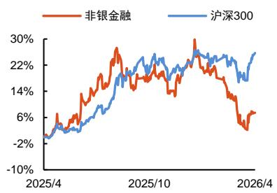

## 相关研究

《科技赋能券商国际化提速，代理人转型深化保险价值》

2026.04.19

《创业板改革方案落地，服务新质生产力再升级》

2026.04.13

《创业板新规落地，科技保险规范前行》

2026.04.12

《券商 2025业绩高增兑现，险企资负共振向好》

2026.04.06

《已发年报业绩喜人，非银板块价值可期》

2026.03.29

杠杆的倍数更为重要。对中国券商而言，加杠杆的“正确打开方式”并非简单扩表，而是通过资产扩容、策略升级、客需转型构建稳定的资产回报能力，让杠杆真正“长在客户身上”。那些率先完成客需化转型、构建起穿越周期经营韧性的头部券商，有望成为政策红利与估值修复的双重受益者。个股方面，建议关注：①受益于政策松绑的头部综合券商，如中信证券、国泰海通、华泰证券。②深耕客需赛道的特色券商，如中金公司、申万宏源。

## 【风险提示】

 经济修复不及预期

 政策与资本市场改革不及预期

 券商行业竞争加剧

 资本市场波动

## 正文目录

1. 券商扩表，正逢其时.. 5  
1.1. ROE是券商估值的重要锚定 . 5  
1.2. 杠杆是当前提升ROE 的主矛. . 6  
1.3. 国家战略驱动下的必然选择. .. 9  
2. 他山之石：海外投行杠杆变迁的镜鉴 . 14  
2.1. 美国：危机后重塑的客需驱动模式. . 14  
2.2. 日本：方向性扩表的结构性困境. . 19  
2.3. 锚定与抉择：中国应该对标谁？. . 23  
3. 加杠杆的“正确打开方式”：客需化转型与效率提升. . 25  
3.1. 现状审视：规模扩张与模式错位的核心矛盾 . 25  
3.2. 结构优化：资产扩容与策略升级的必经之路 . 26  
3.3. 质变跃迁：客需驱动的三大核心赛道 . 28  
3.4. 生态重塑：让杠杆“长在客户身上” . 29  
4. 投资建议 ..... . 31  
5. 风险提示 .. . 32

## 图表目录

图表 1： “三重底共振→成交放大→ROE 验证”传导链. .. 5  
图表 2： 券商PB 与ROE 走势基本同步.. .. 6  
图表 3： 券商板块历史PB-ROE 散点拟合图 . 6  
图表 4： 改良杜邦分析模型指标体系.. .. 6  
图表 5： 改良杜邦分析模型与传统杜邦模型对比 .. 7  
图表 6： 上市券商ROE驱动因子拆解.. .. 7  
图表 7： 上市券商自有资产净利率驱动因子拆解 .. 7  
图表 8： 券商ROE 驱动因素与结构特征对比.. ... 8  
图表 9： 券商发展三阶段核心特征对比. .. 8  
图表 10： 我国券商风险控制监管指标变化梳理. . 10  
图表 11： 近几年我国资本市场改革相关重要政策梳理. ..11  
图表 12： 中信证券与高盛杠杆水平对比... ...11  
图表 13： 中信证券与高盛净ROE（年化）对比. ...11  
图表 14： 上市券商杠杆率显著走高... ... 12  
图表 15： 截至2025H1末排名前十券商衍生金融工具名义本金规模（亿  
元） . .... .... 12  
图表 16： 2025Q3 末头部券商及行业核心风控指标情况（%） .......... 12  
图表 17： 券商扩表或将迎来历史性机遇. . 13  
图表 18： 美国五大投行杠杆倍数变化.. . 15  
图表 19： 高盛2005年以来ROE 及杠杆水平.. . 15  
图表 20： 摩根士丹利2005 年以来ROE 及杠杆水平.. . 15  
图表 21： 美国投行杠杆与 ROE四阶段演进特征. ... 15  
图表 22： 2018-2025年中美大型券商各杜邦分析指标均值及标准差..16  
图表 23： 高盛与摩根士丹利组织架构... . 17  
图表 24： 高盛营收结构及做市业务占比（亿美元） . 17  
图表 25： 摩根士丹利业务结构（亿美元） . 17  
图表 26： 高盛各业务板块 ROE... . 18  
图表 27： 摩根士丹利各业务板块ROE.. . 18  
图表 28： 高盛营收结构及做市业务占比（亿美元） . 18  
图表 29： 摩根士丹利机构业务收入构成（亿美元） . 18  
图表 30： 高盛负债结构... . 19  
图表 31： 中信证券负债结构.. . 19  
图表 32： 日本10 年期国债收益率走势.. . 20  
图表 33： 日本证券行业杠杆率与ROE 走势.. .. 20  
图表 34： 中美日证券行业杠杆与 ROE 对比（2020-2024 年平均）...21  
图表 35： 日本券商主要资产结构演变（2015-2024） ... 21  
图表 36： 日本证券行业收入结构... .. 22  
图表 37： 日本证券行业ROE与日经225走势对比. . 22  
图表 38： 野村证券杠杆率与ROE 走势... . 22  
图表 39： 野村证券重资产业务占比... . 23  
图表 40： 野村证券海外业务收入及利润占比 . 23  
图表 41： 中日美头部券商杠杆及ROE 走势对比 . 24  
图表 42： 中日美头部券商 ROA走势对比 . 24  
图表 43： 加杠杆的“正确打开方式” . 25  
图表 44： 上市券商自营业务收入占比.. . 26  
图表 45： 上市券商自营业务同比增速（分组） . 26  
图表 46： 中国前十券商与行业整体投资收益率及波动性对比. . 26  
图表 47： 上市券商自营业务结构... . 27  
图表 48： 中金公司各投资账户收益率.. . 28  
图表 49： 中金公司自营投资资产结构演变. . 28  
图表 50： 中信证券固定收益业务体系.. . 28  
图表 51： 中信证券衍生金融工具名义本金及增速（亿元） . 29  
图表 52： 申万宏源“衍生品+N”综合服务链.. . 29  
图表 53： 2025年多家大型券商围绕客户优化组织架构.. . 30  
图表 54： 行业重点关注公司一览表... . 31

## 1.券商扩表，正逢其时

在过往研究中，我们论证了 ROE 上行是券商估值修复向牛市演绎的必由之路。而改良杜邦拆解揭示，在 ROA 长期承压的背景下，杠杆已成ROE边际变化的核心变量。同时，监管政策的转向或将为优质券商打开资本空间，以承载服务实体经济与建设金融强国的时代使命。内外因素共振下，券商（尤其优质头部券商）或将迎来历史性扩表机遇。

## 1.1.ROE 是券商估值的重要锚定

在证券行业深度报告《以史为鉴，券商行情的新锚点在哪里？》中，我们将券商行情概括为一条由“底部共振”向“盈利兑现”演进的自下而上传导链条。在这一框架中，估值底对应 PB 处于历史低位分位，提供价格安全垫与反弹弹性；宏观底体现在低通胀、低利率和稳增长诉求，为货币宽松和无风险利率下行创造条件；政策底通过制度改革和活跃资本市场举措，明确增量资金流入资本市场的路径，并扩展券商业务边界与ROE上限。在三重底共振基础上，风险偏好修复与增量资金入市驱动日均成交额中枢上移，经纪、两融、自营和投行等高弹性业务随之放量，最终通过ROE的趋势性上行，在PB-ROE 定价框架下完成估值中枢的系统性重估。

图表 1：“三重底共振→成交放大→ROE验证”传导链  
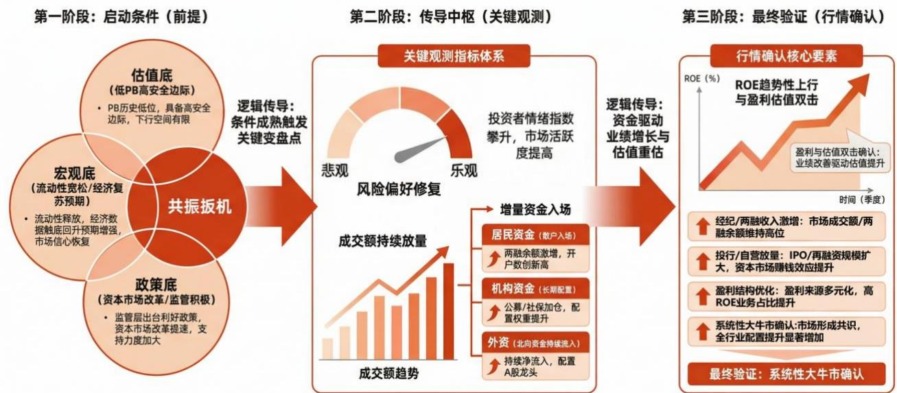  
资料来源：东方财富证券研究所绘制

ROE 是券商估值中枢的长期锚定变量，PB 与 ROE 之间存在显著正相关关系，脱离盈利支撑的估值抬升都难以持续。我们通过对上市券商2003Q4–2025Q3 季度数据散点图线性拟合发现，板块 PB与 ROE之间拟合优度 R² 高达 0.68，回归方程约为 PB=0.22×ROE+0.53，即 ROE 每提升1pct，PB中枢理论上上移约 0.22倍。这意味着，估值的趋势性抬升必须建立在ROE 趋势性上行基础之上，否则仅是情绪驱动的阶段性泡沫，难以在时间维度上得到巩固。

图表 2：券商PB与ROE走势基本同步  
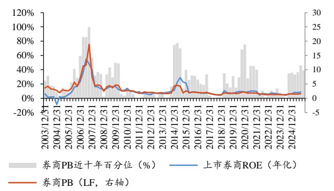  
资料来源：Choice指数专题，东方财富证券研究所

图表 3：券商板块历史PB-ROE散点拟合图  
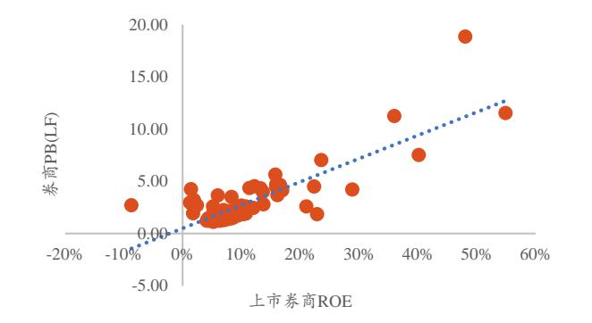  
资料来源：Choice指数专题，东方财富证券研究所拟合注：根据上市券商 2003Q4–2025Q3季度数据散点图线性拟合得出

## 1.2.杠杆是当前提升 ROE 的主矛

在明晰 ROE 作为估值核心锚定的基础上，需要进一步探究券商系统性提升 ROE的可行路径，这首先依赖于对ROE驱动因子的精准拆解。传统杜邦分析在券商行业应用时，因包含不承担风险的客户资金，其杠杆与效率指标存在显著失真，因此我们针对券商改良了杜邦分析模型，将分析口径从“总资产”替换为剔除客户资金后的“自有资产”，剥离了代理业务的规模干扰，从而聚焦于券商自身承担风险的真实资本与杠杆。这一调整使 ROE 驱动因素得以清晰解构为自有资产的盈利效率与除客户资金杠杆的乘积，为评估资本运用效能及业务转型成效提供了更精准的框架。

图表 4：改良杜邦分析模型指标体系
<table><tr><td>指标</td><td>传统杜邦公式</td><td>改良版杜邦公式</td><td>数据来源与说明</td><td>衡量维度</td></tr><tr><td>净资产收益 率 (ROE)</td><td>ROE=归母净利润/平均归 母净资产</td><td>ROE=归母净利润/平均归 母净资产</td><td>利润表、资产负债表 计算方式不变</td><td>股东权益的最 终回报率</td></tr><tr><td>自有资产净 利率</td><td>ROA=归母净利润/平均总 资产</td><td>自有资产净利率=净利润/ 平均自有资产</td><td>替代传统 ROA 分母剔除了客户资金存款（资产负 债表中的“客户资金存款”、“客 户备付金”科目）</td><td>运用自身承担 风险的自有资 产的获利能力</td></tr><tr><td>除客户资金 杠杆 自有资产周</td><td>均归母净资产</td><td>权益乘数=平均总资产/平除客户资金杠杆=平均自 有资产/平均归母净资产</td><td>替代传统权益乘数 分母剔除了客户资金存款(同上）</td><td>自身真实财务 风险口</td></tr><tr><td>转率</td><td>资产周转率=营业收入/平 均总资产</td><td>自有资产周转率=营业收 入/平均自有资产</td><td>替代传统总资产周转率 分母剔除了客户资金存款（同上）</td><td>自有风险资产 的创收效率</td></tr><tr><td>销售净利率</td><td>销售净利率=归母净利润/ 营业收入</td><td>销售净利率=归母净利润/ 营业收入</td><td>利润表 计算方式不变</td><td>盈利能力</td></tr><tr><td>恒等式</td><td colspan="6">ROE=ROAX权益乘数 ROE=自有资产净利率×除客户资金杠杆</td></tr></table>

资料来源：财务管理研究公众号，东方财富证券研究所

图表 5：改良杜邦分析模型与传统杜邦模型对比  
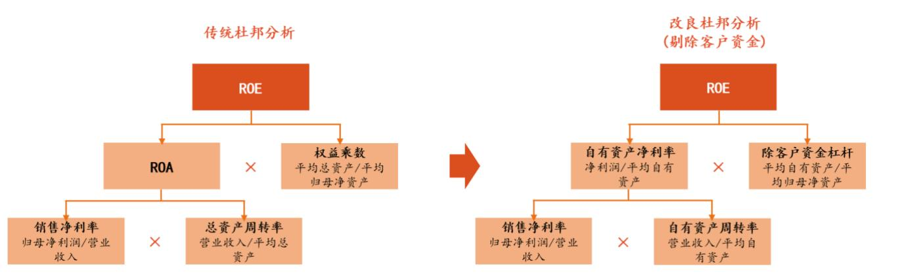  
资料来源：东方财富证券研究所绘制

基于改良杜邦模型对上市券商 ROE驱动因子的拆解，我们发现 2008年以来券商杠杆水平持续上行，而资产回报率整体承压。2008到 2025Q1-3 行业除客户资金杠杆从 1.56 倍稳步提升至4.09 倍，累计增幅达 162%，反映券商资产负债表扩张的持续性，而同期自有资产净利率则由 4.3%降低至1.8%，虽在牛市年份有所反弹，但长期趋势整体向下。进一步对自有资产净利率拆解显示，销售净利率波动较大，自有资产周转率低位徘徊，从11.7%降至4.6%，共同拖累了资产回报率。

图表 6：上市券商 ROE驱动因子拆解  
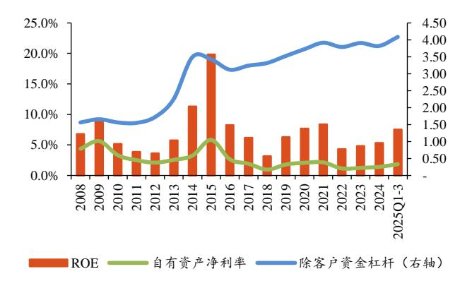  
资料来源：Choice股票专题，东方财富证券研究所注：2025Q1-3 为年化数据

图表 7：上市券商自有资产净利率驱动因子拆解  
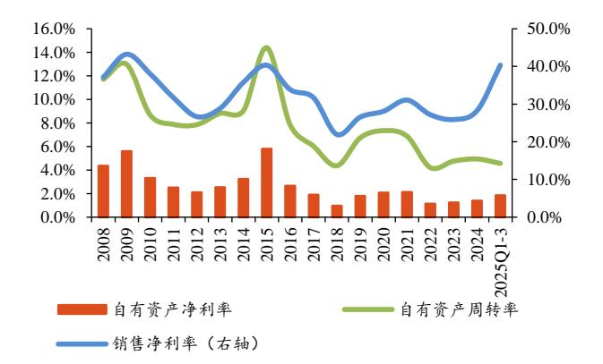  
资料来源：Choice股票专题，东方财富证券研究所拟合注：2025Q1-3 为年化数据

上述量化指标的演变并非偶然，其背后是资产和业务结构、市场走势、监管背景等深层因素的共同作用。

## （1）阶段一（2013 年前）——利润率驱动的轻资产时代

券商ROE 主要由服务收入高利润率（经纪、投行业务）带动，监管环境以牌照与资格管理为主，资本中介业务尚未真正起量，行业整体杠杆率偏低，ROE 对市场环境敏感，盈利波动较大。

## （2）阶段二（2013-2018）——加杠杆驱动的重资本扩张

行业进入资本中介业务提速阶段，通过杠杆扩表和资产负债表放大（权益乘数提升）带动ROE，但息差收窄与费率下行压力制约利润率改善，资产周转率贡献有限，ROE提升受限且风险敞口扩张，行业波动加大。

## （3）阶段三（2019 年以来）——多元化、效率化与非方向性业务引领行业高质量提 ROE

行业开启多层次资本市场建设，监管推进创新业务、强化差异化资本约束。头部券商通过提升资金使用效率、丰富非方向性资本中介业务（如做市、衍生品等）、合理加杠杆等实现 ROE多因子共振式提升。业务结构更具专业化和多样性，抗风险与盈利能力提升，行业分层加剧。

图表 8：券商ROE驱动因素与结构特征对比  
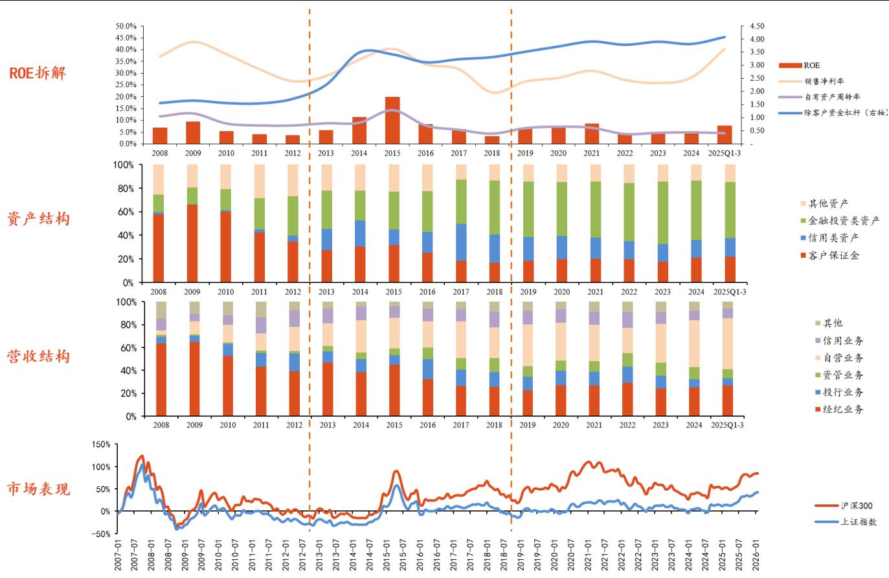  
资料来源：Choice 股票专题，Choice 指数专题，东方财富证券研究所

资料来源：中国经济网，中国证券报等，东方财富证券研究所  
图表 9：券商发展三阶段核心特征对比
<table><tr><td></td><td>第一阶段：通道红利期 (2013年以前）</td><td>2018年）</td><td>第二阶段：重资产扩张期（2013-第三阶段：转型与分化期(2019年以来）</td></tr><tr><td rowspan="2">ROE表现 与驱动（杜 邦拆解)</td><td>表现：高且波动剧烈。牛市 峰值极高，熊市迅速回落。</td><td>表现：中枢持续下移。虽有牛市，但表现：低位徘徊后寻求企稳。持续低于 趋势向下。</td><td>10%但波动下降，2024年受益于市场回 暖，行业ROE有所改善。</td></tr><tr><td>驱动：主要由 ROA驱动。市 场涨跌直接决定经纪、自营 收入，高利润率支撑高 ROE，杠杆作用微弱。</td><td>驱动：ROA与杠杆的“双击”失效。 ROA因佣金战和低收益重资产扩张 而趋势性下行；同时，初期加杠杆未 能有效提升ROA，反而增加了资本 成本和波动，未能有效提振ROE。</td><td>驱动：ROA短期受费率、利差与市场环 境约束提升有限，杠杆成为关键变量。</td></tr><tr><td rowspan="2">资产与业务 结构</td><td>资产：“轻资产”模式，资 产规模较小，主要为通道业 务相关。 业务：收入以通道业务（经</td><td>资产：开启“重资产”转型。信用类 业务和投资业务扩张，资产负债表快 速膨胀。</td><td>资产：结构优化，去方向化。增加对客需 业务、做市等资产配置，降低方向性自营 占比。衍生品等专业资产成为关键。</td></tr><tr><td>纪）为主，自营波动大，与 市场表现强相关。</td><td>业务：重资产业务崛起，自营+信用 收入占比整体提升。但业务同质化， 息差收窄。</td><td>业务：多元化与分化。经纪向财富管理转 型；自营向客需型资本中介和机构业务 转型；投行马太效应加剧。2024年以来 自营业务已成为行业核心收入来源。</td></tr><tr><td rowspan="2">市场走势与 监管背景</td><td>市场：高波动，强牛熊周期。 ROE与市场指数高度相关。</td><td>市场：牛熊转换，监管周期凸显。经 历 2015年大牛市和2016-2018年 严监管与市场调整。</td><td>市场：结构性行情主导，β属性减弱。市 场波动仍在，但券商整体业绩与指数涨 跌的相关性在减弱。</td></tr><tr><td>背景：牌照红利期，行业以 传统通道服务为主，佣金未 市场化。</td><td>背景：创新与监管交织。2012年“创 新大会”鼓励业务发展，驱动重资产 扩张；2015年后进入强监管周期（如 两融检查、资管新规），旨在防风险、 去杠杆。</td><td>背景：高质量发展与行业供给侧改革。以 注册制改革、新“国九条”、鼓励头部券 商做优做强等政策为代表，监管引导行 业服务实体经济，走向专业化、差异化和 头部化。</td></tr></table>

从上述三阶段演变中可以得出，在 ROA 受制于佣金率下行、费率承压的长期背景下，杠杆变动对 ROE的解释力度已逐步超越 ROA，成为边际上的决定性变量。这意味着，未来我国证券行业ROE的趋势性提升，需要依托于杠杆水平的合理运用与结构的系统性优化。

## 1.3.国家战略驱动下的必然选择

从经营视角审视，杠杆已成为当前驱动券商ROE 提升的核心变量；而从国家战略高度出发，当前推动券商（尤其是优质头部券商）杠杆空间的释放，其本质是服务实体经济的重要战略与路径。

我国证券公司风险控制指标体系历经多次重大修订，对券商杠杆的监管态度呈现出从“严格管控”逐步走向“科学引导”的清晰轨迹。2006 年，首版《证券公司风险控制指标管理办法》发布，确立了以净资本为核心的监管框架，通过设置净资产/负债、净资本/负债等五大核心指标对全行业实施统一管控。2016年第二次重大修订将监管目标升级为“以净资本和流动性为核心”，明确风险覆盖率、资本杠杆率、流动性覆盖率、净稳定资金率四大核心指标。2020 年第三次修订根据不同业务、产品的风险特征进行差异化调整，进一步提升对证券公司资本配置的导向作用。这一阶段的演进表明，监管层对杠杆的理解已从单纯的“压降”转向“精细化管理”，为后续的差异化施策奠定了制度基础。

2024 年 9 月的第四次修订及后续监管表态，标志着我国证券公司风险控制指标体系从“统一约束”向“分类引导”的实质性转折。2024 年9月，证监会修订发布《证券公司风险控制指标计算标准规定》，对连续三年分类评价 AA 级以上的优质券商，风险资本准备调整系数从 0.5 降至 0.4，表内外资产总额折算系数降至 0.7，剩余存续期 6 个月至 1 年负债按20%计入可用稳定资金。2025 年 12 月，证监会主席吴清在证券业协会第八次会员大会上进一步明确，将对优质机构适当“松绑”，进一步优化风控指标，适度打开资本空间和杠杆限制，提升资本利用效率，并提出着力强化分类监管、“扶优限劣”的监管导向。从“严格管控”到“适度松绑”，从“统一标准”到“分类引导”，监管思路的演进清晰可见——让资本使用效率高、风控能力强的主体获得更大的用表空间，通过做强头部带动行业整体竞争力提升。

图表 10：我国券商风险控制监管指标变化梳理
<table><tr><td>时间</td><td>政策</td><td>核心要点</td><td>政策意图</td></tr><tr><td>2006年 7月</td><td>首次发布（证监 会令第34号）</td><td>①确立“以净资本为核心”的风险控制体系； ②设置五大核心指标：净资本/各项风险准备≥100%、净资本/净资产 ≥40%、净资本/负债≥8%、净资产/负债≥20%、流动资产/流动负债≥100%</td><td>建立规范化、可量化 的券商风险监管体 系</td></tr><tr><td>2008年 6月</td><td>第一次（证监会 令第55号）</td><td>①将“风险准备”修改为“风险资本准备”； ②引入压力测试机制； ③明确自营权益类证券及衍生品≤净资本*100%，自营固收类≤净资本动态应对能力 *500%</td><td>细化风险计量，增强</td></tr><tr><td>2012年</td><td>两次计算标准 调整</td><td>①4月下调自营、资管、两融等风险资本准备金计算标准，并下调A、 B类公司计算倍数； ②11月调低净资本计算时多个项目的扣减比例</td><td>释放资本金空间，支 持创新发展</td></tr><tr><td>2016年 6月</td><td>第二次修订（证 监会令第125 号）</td><td>①监管目标从“以净资本为核心”升级为“以净资本和流动性为核心” ②净资本区分为核心净资本和附属净资本； ③明确四大核心指标：风险覆盖率≥100%、资本杠杆率≥8%、流动性覆 盖率≥100%、净稳定资金率≥100%</td><td>将流动性风险提升 至与资本风险同等 重要的监管地位</td></tr><tr><td>2020年 3月</td><td>第三次修订（证 监会令第166 号）</td><td>①对股票质押业务的信用风险计算标准设置了“新老划断”的安排; ②优化信用债券投资的计算标准，将AA级信用债券的市场风险计算比 例由50%降至15%，将BBB级信用债券的计算比例由80%降至50%， 并适当放宽上述信用债券的流动性指标计算标准</td><td>根据不同业务、产品 的风险特征进行差 异化调整</td></tr><tr><td>2024年 9月</td><td>第四次修订（证 监会公告 [2024]13号）</td><td>①差异化优待：连续三年分类评价AA级以上券商，风险资本准备调整 系数从0.5降至0.4，表内外资产总额折算系数降至0.7，剩余存续期6 个月至1年负债按20%计入可用稳定资金 ②做市账户中持有的金融资产按90%计算市场风险资本准备 ③主要指数成分股风险资本计提比例从10%调降至8%，一般上市股票 从30%降至25%</td><td>支持优质券商适度 拓展资本空间，引导 服务实体经济</td></tr></table>

资料来源：证监会，中国政府网等，东方财富证券研究所

为何当下国家重视给券商加杠杆？这植根于服务实体经济与国家战略的深层功能诉求。

（1）服务实体经济是加杠杆的根本目的。在提出“十五五”时期证券行业的使命责任时，证监会主席吴清将“服务实体经济和新质生产力发展”放在首位，要求“始终从实体企业和产业发展需要出发优化业务结构、创新产品工具”。当前我国经济正处于新旧动能转换的关键期，科技创新企业对直接融资的需求呈现研发投入大、成果转化周期长的特点，这要求券商具备更大的资产负债表规模和更强的资本中介能力，才能承担为科技创新提供全生命周期、全链条的金融服务的功能使命。在近几年我国资本市场地位提升、资本市场投融资端改革持续深化的背景下，资本中介业务将助力长期资金入市、优化资产配置，成为资本市场高质量发展的关键引擎。

（2）建设国际一流投行，提升全球竞争力。2023年中央金融工作会议中提出要“培育一流投资银行和投资机构”。2024 年 3 月，证监会发布的《关于加强证券公司和公募基金监管加快推进建设一流投资银行和投资机构的意见（试行）》明确提出，到 2035年，我国将形成2 家至 3家在全球范围内具有竞争力与市场引领力的投资银行和投资机构。2024 年 4 月，新“国九条”明确支持头部机构通过并购重组、组织创新等方式提升核心竞争力。“航母级”券商的崛起，不仅有助于促进行业高质量发展，更有望显著提升我国资本市场的国际地位，为金融强国的宏伟战略目标提供坚实的支撑。从国际对标来看，截至 2025Q3 末中信证券杠杆率约为 6.32 倍，远低于高盛 14.53 倍的水平，一定程度上制约 ROE 提升与抗周期能力构建。适度放开优质券商的杠杆率约束，有助于突破其资本中介业务的发展瓶颈，提升行业竞争力。因此，适度打开杠杆空间，是培育具备全球竞争力的一流投行必须跨越的门槛。

图表 11：近几年我国资本市场改革相关重要政策梳理
<table><tr><td>时间</td><td>政策/会议</td><td>核心内容</td></tr><tr><td>2023年7月 2024年4月</td><td>中央政治局会议 新“国九条”</td><td>首次明确提出“要活跃资本市场，提振投资者信心” 提出“以强监管、防风险、促高质量发展为主线，以完善资本市场基础制度</td></tr><tr><td></td><td></td><td>为重点，更好发挥资本市场功能作用，推进金融强国建设，服务中国式现代 化大局”。</td></tr><tr><td>2024年7月</td><td>党的二十届三中全会</td><td>提出要“健全投资和融资相协调的资本市场功能，防风险、强监管，促进资 本市场健康稳定发展”。</td></tr><tr><td>2024年9月</td><td>国新办新闻发布会</td><td>央行、金融监管总局、证监会推出一揽子增量政策，包括降息降准、降低存 量房贷利率、创设新的货币政策工具支持资本市场稳定发展等。</td></tr><tr><td>2024年12 月</td><td>中央经济工作会议</td><td>提出“深化资本市场投融资综合改革，打通中长期资金入市卡点堵点，增强 资本市场制度的包容性、适应性”</td></tr><tr><td>2025年1月</td><td>《中长期资金入市行动实施 方案》</td><td>明确稳步提高中长期资金投资A股规模和比例的具体安排，延长考核周 期。</td></tr><tr><td>2025年2月</td><td>《关于资本市场做好金融 “五篇大文章”的实施意 见》</td><td>聚焦支持新质生产力发展，突出深化资本市场投融资综合改革，增强制度包 容性、适应性。</td></tr><tr><td>2025年4月</td><td>中央政治局会议</td><td>强调“持续稳定和活跃资本市场”，与此前表述相比新增“活跃”二字，释 放明确积极信号。</td></tr><tr><td>2025年5月</td><td>国新办新闻发布会</td><td>央行、金融监管总局、证监会介绍“一揽子金融政策支持稳市场稳预期”有 关情况，推出多项政策，涉及股市、楼市、外贸等内容。</td></tr><tr><td>2025年7月</td><td>中央政治局会议</td><td>提出要“增强国内资本市场的吸引力和包容性，巩固资本市场回稳向好势 头”</td></tr></table>

资料来源：证监会，证券时报等，东方财富证券研究所

图表 12：中信证券与高盛杠杆水平对比  
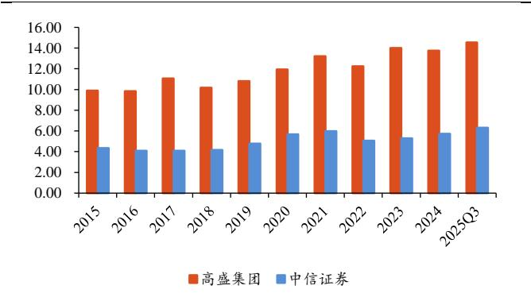  
资料来源：Choice股票数据浏览器，东方财富证券研究所注：计算口径为杠杆水平=期末总资产/期末净资产

图表 13：中信证券与高盛净 ROE（年化）对比  
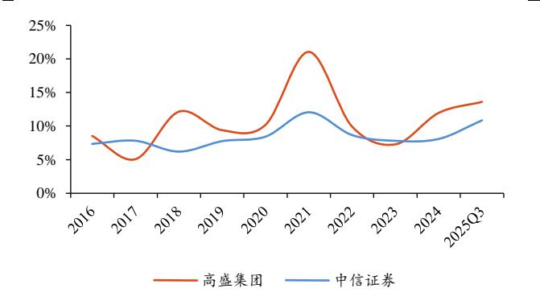  
资料来源：Choice 股票数据浏览器，东方财富证券研究所

如果说加杠杆是国家战略的需要，那么优先给优质头部券商松绑则是实现这一战略的最优路径。“扶优限劣”的差异化监管设计，旨在引导资源向效率更高、风控更严的机构集中，确保政策红利最大程度转化为服务实体经济的效能。

（1）“扶优限劣”政策激励导向明确。2025年 8月修订的《证券公司分类监管规定》明确，完善行业机构分类监管体系、健全服务实体经济的激励约束机制、突出“扶优限劣”。吴清主席进一步阐释：对优质机构适当“松绑”；对中小券商、外资券商探索实施差异化监管，促进特色化发展；对问题机构依法从严监管。分类监管的强化，本质是让资源向效率更高、风控更严、服务更优的机构集中，通过政策激励引导行业整体向高质量发展转型。

（2）更高资本使用效率与更强风控能力，确保政策红利转化为服务效能。2018-2025Q3头部券商杠杆率持续上行且快于行业平均，此后保持平稳，显示出“加杠杆—稳杠杆—稳ROA”的能力闭环。相比之下，部分中小券商在上一轮重资产扩张中暴露出风控短板，杠杆的边际收益显著低于头部。这意味着，同样释放一单位杠杆空间，头部券商能够转化为更高质量的资产投放和更稳定的盈利贡献，政策红利的“投入产出比”更高。

（3）更迫切的用表空间需求，保障国家战略主力军的服务能力。截至2025Q3 末，资产规模排名前十的头部券商四项核心风控指标的平均值均相比行业均值更接近监管红线，部分头部券商的净稳定资金率已逼近监管预警线（120%），其中中信证券为 123%、中金公司为139%、申万宏源为142%。这些承担着服务国家战略主力军角色的头部机构，其用表能力已接近上限，资本空间的有效释放具有现实紧迫性。从业务结构看，头部券商在场外衍生品、跨境业务等资本消耗型业务上的布局更深。若用表空间无法突破，不仅制约其自身发展，更有可能传导至其服务的实体企业和机构客户，形成“资本约束—业务收缩—服务降级”的负向循环。

图表 14：上市券商杠杆率显著走高  
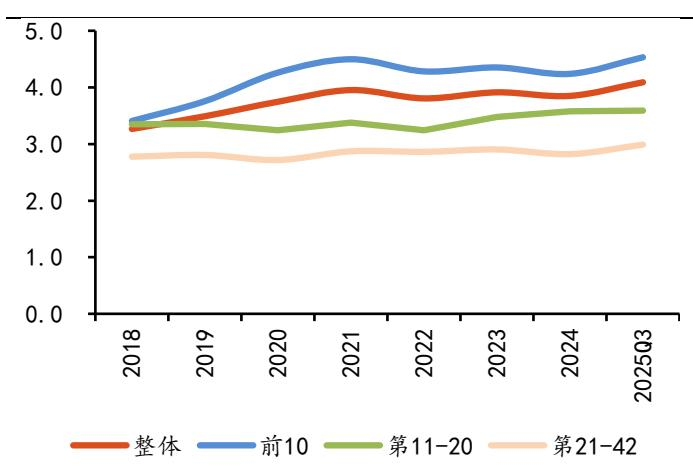  
资料来源：Choice股票数据浏览器，东方财富证券研究所注：分组方式为根据 2025Q3末资产规模从大到小排序

图表 15：截至 2025H1 末排名前十券商衍生金融工具名义本金规模（亿元）  
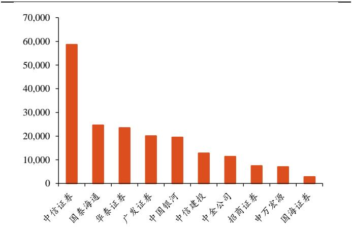  
资料来源：Choice股票数据浏览器，各公司公告，东方财富证券研究所

图表 16：2025Q3 末头部券商及行业核心风控指标情况（%）
<table><tr><td>证券名称</td><td>风险覆盖率</td><td>资本杠杆率</td><td>流动性覆盖率</td><td>净稳定资金率</td></tr><tr><td>中信证券</td><td>210</td><td>14</td><td>149</td><td>123</td></tr><tr><td>国泰海通</td><td>269</td><td>20</td><td>242</td><td>143</td></tr><tr><td>华泰证券</td><td>357</td><td>14</td><td>226</td><td>155</td></tr><tr><td>广发证券</td><td>227</td><td>11</td><td>142</td><td>148</td></tr><tr><td>中国银河</td><td>252</td><td>14</td><td>244</td><td>159</td></tr><tr><td>中金公司</td><td>196</td><td>12</td><td>237</td><td>139</td></tr><tr><td>招商证券</td><td>246</td><td>12</td><td>145</td><td>150</td></tr><tr><td>申万宏源</td><td>380</td><td>19</td><td>149</td><td>142</td></tr><tr><td>中信建投</td><td>238</td><td>15</td><td>307</td><td>201</td></tr><tr><td>国信证券</td><td>350</td><td>22</td><td>270</td><td>168</td></tr><tr><td>前10平均</td><td>273</td><td>15</td><td>211</td><td>153</td></tr><tr><td>行业平均</td><td>278</td><td>21</td><td>252</td><td>164</td></tr><tr><td>监管标准</td><td>100</td><td>8</td><td>100</td><td>100</td></tr><tr><td>预警标准</td><td>120</td><td>9.6</td><td>120</td><td>120</td></tr></table>

资料来源：Choice 股票专题，证监会，东方财富证券研究所（注：2025Q3 末资产规模从大到小排序）

综上，我国券商扩表或将迎来历史性机遇。内因（自身发展）层面，杠杆已成ROE 提升的关键变量，ROA 承压下唯有加杠杆方能突破盈利瓶颈；外因（国家战略）层面，服务新质生产力、培育一流投行、深化投资端改革，均亟需券商强化资本中介能力，国家战略呼唤优质券商扩表。证券行业（尤其优质头部券商）正迎来政策驱动的资本空间释放，这既是行业高质量发展的内在要求，更是金融强国战略的历史赋予。

图表 17：券商扩表或将迎来历史性机遇  
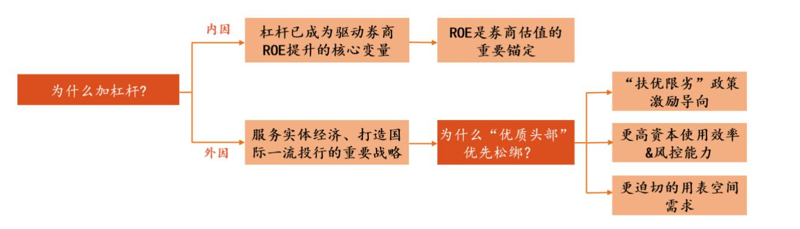  
资料来源：东方财富证券研究所绘制

## 2.他山之石：海外投行杠杆变迁的镜鉴

纵观海外投行发展历程，杠杆率的升降并非简单的数字游戏，而是与监管环境、业务模式、市场结构深度耦合的结果。美国投行从“狂奔”到“慢跑”的路径选择，日本证券业“高杠杆+低 ROA”的沉痛教训，均为中国券商提供了宝贵的镜鉴。历史经验表明，券商杠杆本身不是目的，决定 ROE 中枢的核心在于“杠杆能否建立在稳定的资产回报与可持续的业务结构之上”。在“扶优限劣”的政策窗口期，厘清海外经验背后的本质逻辑，有助于找到中国券商加杠杆的“参照系”与“避坑指南”。

## 2.1.美国：危机后重塑的客需驱动模式

美国投行数十年的杠杆变迁，是一部以资本中介业务为核心、在监管与创新之间动态平衡的演进史。其杠杆率走势清晰地勾勒出“加杠杆-去杠杆-稳杠杆”的演进轨迹，最终在危机后形成了“稳杠杆+稳 ROE”的成熟范式。

第一阶段（1975 年以前）：固定佣金制度下的通道红利期。该阶段美国投行以轻资产的经纪业务为主，通过牌照垄断获得高佣金收入，1975 年行业平均ROE 高达 30%。纽约证券交易所自1792年《梧桐树协议》签订以来实行固定佣金制度，所有经纪商对客户收取相同的预定交易费用，无论交易规模大小。这一制度为券商提供了稳定的收入流，但也导致小型投资者承担了更高的比例成本。1975 年美国《证券法修正案》彻底抛弃固定佣金制，折扣佣金制正式进入证券行业，大幅降低了投资者的交易成本，并促进了经纪公司的创新，成为行业发展的重要分水岭。

第二阶段（1975-2007年）：佣金自由化后的长周期扩表。1975年佣金自由化后，传统经纪业务利润空间被压缩，券商需要从通道中介转向更依赖资产负债表的业务模式。现金管理账户（CMA，Cash ManagementAccount）、高收益债券、衍生品交易等创新业务共同推动投行不断拓宽产业服务链，带动行业整体杠杆率快速上升，行业整体杠杆率从 1974-1975年的约 7.44 倍快速上升至 1979 年的 17.95，到 2007 年金融危机前摩根士丹利、美林等大型投行杠杆率已攀升至30倍以上。行业平均ROE经历一段时期的下滑后在杠杆助推下回升，1975-2007 年平均 ROE 水平维持在20%。这一时期的特征是“高杠杆—高ROE—高脆弱性”，盈利高度依赖方向性交易和结构化套利。

第三阶段（2008-2015年）：危机后的强制去杠杆与模式重塑。 2008年 9 月，美国出现全面性的投资银行危机，将次贷危机和金融危机推向了高潮。在贝尔斯登、美林被收购和雷曼兄弟破产后，高盛和摩根士丹利转型为银行控股公司，美国独立投行模式从此被全能银行模式所取代。为降低系统性风险，美国政府通过注资增加大型银行资本金的同时，于 2010年推行“巴塞尔协议Ⅲ”监管资本要求，出台《多德-弗兰克法案》，并通过《沃尔克规则》直接限制投资银行开展自营交易。强监管背景下美国投行被动降杠杆，行业杠杆率由 2007 年 38 倍降至 2016 年 16 倍，高盛、摩根士丹利ROE 分别降至 9%、8%。

第四阶段（2016 年至今）：监管宽松周期下的稳杠杆与稳 ROE 阶段。2016年特朗普当选后开启新一轮金融监管松绑进程，先后签署《促进经济增长、放松监管要求和保护消费者权益法案》、批准通过《沃尔克规则修正案》等，从立法层面为投行释放杠杆空间奠定制度基础。同时美国投行业务模式从方向性交易向客需型做市转型，以做市业务为核心驱动盈利的稳定性。上述因素共同驱动下，美国投行在完成强制去杠杆后逐步进入“稳杠杆+稳 ROE”的成熟范式：2016-2025 年高盛、摩根士丹利杠杆率分别从 9.9 倍、10.7 倍稳步提升至 14.5 倍、12.7 倍，盈利能力通过业务结构优化实现回升，同期ROE分别从 9%、8%提升至 14%、16%。

图表 18：美国五大投行杠杆倍数变化  
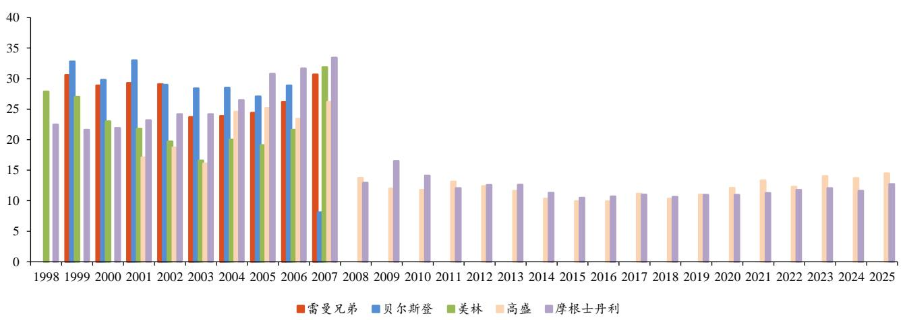  
资料来源：Choice股票专题，马红霞等《美国投资银行危机及其转型剖析》，东方财富证券研究所

图表 19：高盛2005年以来 ROE及杠杆水平  
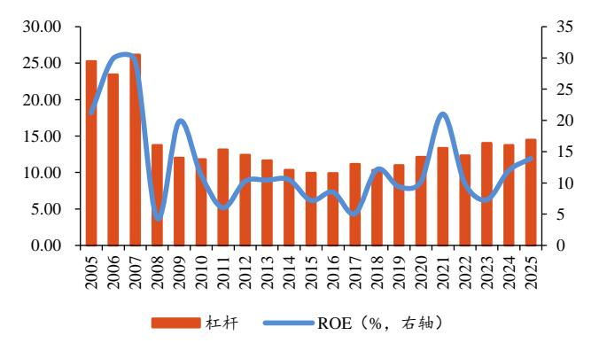  
资料来源：Choice股票专题，东方财富证券研究所

图表 20：摩根士丹利2005年以来ROE及杠杆水平  
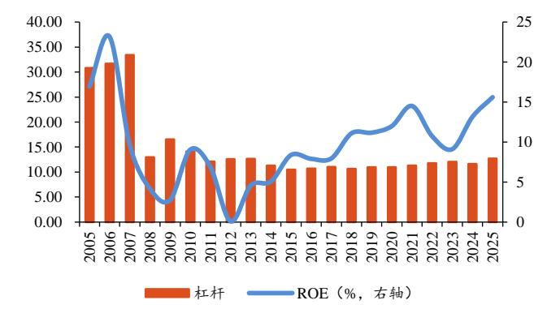  
资料来源：Choice股票专题，东方财富证券研究所

图表 21：美国投行杠杆与 ROE四阶段演进特征
<table><tr><td>阶段</td><td>主要时间</td><td>杠杆特征</td><td>ROE特征</td><td>核心驱动</td></tr><tr><td>通道红利期</td><td>1975年以前</td><td>轻资产运营</td><td>1975 年行业平均 ROE 高达30%</td><td>固定佣金制度、牌照垄断</td></tr><tr><td>长周期扩表期</td><td>1975-2007年</td><td>7.44倍（行业整体）→30倍以 上(摩根士丹利、美林等)</td><td>1975-2007年平均 ROE 水平维持在20%</td><td>佣金自由化、CMA账户、 高收益债券、衍生品交易 等创新业务</td></tr><tr><td>强制去杠杆期</td><td>2008-2015年</td><td>行业杠杆率由 2007年 38 倍高盛、摩根士丹利 ROE 降至2016年16倍</td><td>分别降至9%、8%</td><td>巴塞尔II、《多德-弗兰克 法案》、《沃尔克规则》、 转型银行控股公司</td></tr><tr><td>稳杠杆均衡期</td><td>2016年至今</td><td>稳中有升，高盛 9.9 倍→14.5 倍；摩根士丹利10.7倍→12.7 倍</td><td>高盛 9%→14%；摩根士 丹利 8%→16%</td><td>监管松绑（《经济增长法 案》《沃尔克规则修正案》 等）、客需型做市转型</td></tr></table>

资料来源：Choice股票专题，《中国银行业》，CGAA等，东方财富证券研究所

美国模式的本质：低 ROA、高杠杆，但 ROA足够稳定。进一步看杜邦结构，美国大型投行的优势并不在于利润率高。以 2018-2025年均值计算，高盛、摩根士丹利平均 ROE 为 12.1%，净利润率仅 24.4%，资产周转率 4.1%，杠杆率则高达 10.31 倍；我国前十券商同期平均 ROE8.8%，其中净利润率高达 33.7%，资产周转率达6.4%，但杠杆率仅 4.20 倍。可见美国投行ROE更高，主要不是靠更高的利润率或更快的周转，而是靠更高的杠杆率。

美国能承受高杠杆的前提在于其 ROA 更低但更稳。2018-2025 年高盛和摩根士丹利 ROA 标准差分别为 0.31%和 0.17%，显著低于国内前十券商的标准差均值 0.54%；两者销售净利率、资产周转率的标准差均值分别为3.87%、0.41%，均远低于国内前十券商同期水平（6.22%、1.55%）。因此美国模式值得中国借鉴的是：低收益率资产也能撑起高 ROE，前提是收益稳定、风险可控、负债低成本。

图表 22：2018-2025 年中美大型券商各杜邦分析指标均值及标准差
<table><tr><td rowspan="2"></td><td colspan="2">ROE</td><td colspan="2">杠杆</td><td colspan="2">ROA</td><td colspan="2">销售净利率 资产周转率</td></tr><tr><td>均值</td><td>标准差</td><td>均值 标准差</td><td>均值</td><td>标准差</td><td>均值 标准差</td><td>均值</td><td>标准差</td></tr><tr><td>中信证券</td><td>8.7%</td><td>1.9%</td><td>4.43</td><td>48.7%</td><td>2.0% 0.26%</td><td>32.1%</td><td>5.39% 6.2%</td><td>1.09%</td></tr><tr><td>国泰海通</td><td>8.1%</td><td>2.1%</td><td>3.91</td><td> 45.4%</td><td>2.1% 0.43%</td><td>30.3%</td><td>8.83% 7.0%</td><td>1.18%</td></tr><tr><td>华泰证券</td><td>8.3%</td><td>1.5%</td><td>3.91</td><td>52.6%</td><td>2.1% 0.34%</td><td>38.0%</td><td>5.92% 5.6%</td><td>0.25%</td></tr><tr><td>广发证券</td><td>8.3%</td><td>2.3%</td><td>3.47</td><td>70.6%</td><td>2.4% 0.64%</td><td>33.2% 4.38%</td><td>7.3%</td><td>1.84%</td></tr><tr><td>中国银河</td><td>8.7%</td><td>2.5%</td><td>4.57</td><td>32.0%</td><td>1.9% 0.61%</td><td>32.2%</td><td>9.09% 6.3%</td><td>2.31%</td></tr><tr><td>中金公司</td><td>9.5%</td><td>3.2%</td><td>5.76</td><td>56.1%</td><td>1.6% 0.39%</td><td>29.4%</td><td>2.91% 5.5%</td><td>0.96%</td></tr><tr><td>招商证券</td><td>8.9%</td><td>1.9%</td><td>4.16</td><td>51.1%</td><td>2.1% 0.43%</td><td> 39.4%</td><td>8.52% 5.8%</td><td>2.22%</td></tr><tr><td>申万宏源</td><td>6.9%</td><td>2.7%</td><td>4.32</td><td>31.4%</td><td>1.6% 0.59%</td><td>27.6%</td><td>6.10% 5.8%</td><td>1.90%</td></tr><tr><td>中信建投</td><td>11.2%</td><td>3.9%</td><td>4.22</td><td> 37.6%</td><td>2.6% 0.79%</td><td>35.2%</td><td>5.54% 7.5%</td><td>1.78%</td></tr><tr><td>国信证券</td><td>9.1%</td><td>2.5%</td><td>3.21</td><td>24.1%</td><td>2.9% 0.90%</td><td>39.3%</td><td>5.49% 7.3%</td><td>2.00%</td></tr><tr><td>国内平均</td><td>8.8%</td><td>2.4%</td><td>4.20</td><td>45.0%</td><td>2.1% 0.54%</td><td>33.7%</td><td>6.22% 6.4%</td><td>1.55%</td></tr><tr><td>高盛</td><td>12.0%</td><td>4.2%</td><td>9.90</td><td>128.3%</td><td>0.9% 0.31%</td><td>26.6%</td><td>5.32% 3.5%</td><td>0.50%</td></tr><tr><td>摩根士丹利</td><td>12.2%</td><td>2.1%</td><td>10.72</td><td>184.6%</td><td>1.1% 0.17%</td><td> 22.2%</td><td>2.43% 4.8%</td><td>0.31%</td></tr><tr><td>美国平均</td><td>12.1%</td><td>3.2%</td><td>10.31</td><td>156.4%</td><td>1.0% 0.24%</td><td>24.4%</td><td>3.87%</td><td>4.1% 0.41%</td></tr></table>

资料来源：Choice股票专题，东方财富证券研究所  
注：国内券商 2025年采用前三季度年化数据，杠杆、ROA及资产周转率计算采用改良后杜邦模型计算口径（如图表 4）

美国为何能做到“稳杠杆+稳ROE”？其核心在于将“以客户为中心”的战略贯穿于组织架构、业务模式与负债管理的全链条。这套体系并非一蹴而就，而是在危机后历经十余年重塑形成的成熟范式，其核心在于将资产负债表作为服务客户的工具，而非单纯追逐风险的交易载体。

从组织架构看，与国内券商多按业务划分部门的模式不同，高盛与摩根士丹利采用以客户为中心的架构设计。我国证券行业长期实行牌照限制，各券商总部也形成了按牌照划分业务部门的组织架构，各部门分别作为独立的考核单元，导致总部多个业务部门与分公司共同对接同一客户的现象频发，缺少业务协同。而美国投行更多以客户为中心，考虑业务相似性、服务机构客户便捷性及发挥协同效应等。高盛在 2022 年重组后将业务划分为三大板块：全球银行与市场（Global Banking & Markets）整合投行与做市业务，服务企业和机构客户的融资、交易与风险管理需求；资产与财富管理（Asset & Wealth Management）面向个人与机构投资者，提供资产配置与财富规划服务；平台解决方案（Platform Solutions）聚焦消费者与企业的交易银行及消费金融场景。摩根士丹利则长期维持机构证券（Institutional Securities）、财富管理（Wealth Management）、投资管理（Investment Management）的三大板块格局，分别服务机构客户、个人客户和资产管理客户。

图表 23：高盛与摩根士丹利组织架构
<table><tr><td>公司</td><td>业务板块</td><td>主要服务对象</td><td>核心业务构成</td></tr><tr><td rowspan="3">高盛</td><td>全球银行与市场（Global Banking&amp;Markets)</td><td>企业、金融机构、政府</td><td>投资银行（顾问、股债承销）、FICC（做市、融资）、 股票 (做市、融资)</td></tr><tr><td>资产与财富管理（Asset &amp; Wealth Management)</td><td>个人、机构投资者</td><td>资产管理、财富管理、消费者银行业务</td></tr><tr><td>平台解决方案（Platform Solutions)</td><td>消费者、企业</td><td>消费平台（信用卡、销售点融资）、交易银行</td></tr><tr><td rowspan="3">摩根士丹利</td><td>机构证券（Institutional Securities)</td><td>高净值客户</td><td>企业、政府、金融机构、超投资银行（股债承销、并购顾问）；市场（股票/固 定收益做市、融资、大宗经纪）；贷款（企业贷款、 商业地产贷款、证券融资）；研究</td></tr><tr><td>Management)</td><td>财富管理（Wealth个人投资者（含高净值）、 企业、机构</td><td>顾问经纪、投资咨询、托管、现金管理、自主经纪、 财富规划、工作场所服务（股票计划）、贷款（证 券/房地产）、银行、退休服务</td></tr><tr><td>Management)</td><td>投资管理（Investment机构客户（养老金、基金 会、主权基金等）、中介渠 道</td><td>资产管理（股票、固定收益、另类投资、解决方案、 流动性/对冲服务），通过多种投资工具（公募/私募） 覆盖全球地域和资产类别</td></tr></table>

资料来源：各公司公告，东方财富证券研究所

从业务贡献看，机构业务是两家投行的支柱板块，其收入和 ROE 贡献均占据主导地位。2020-2025年间，高盛全球银行与市场板块收入占比始终保持在 55%-69%区间，同期摩根士丹利机构业务收入占比维持在43%-54%之间。从 ROE 表现看，机构业务同样是价值创造的核心引擎，2020-2025 年高盛全球银行与市场平均 ROE 达 16%，摩根士丹利机构业务平均ROE达 15%，均显著高于公司整体水平（13%、14%）。机构业务的稳定性源自其客需化特征，通过服务客户的交易、融资、风险管理等需求获取收入，使得盈利具备更强的可持续性。

图表 24：高盛营收结构及做市业务占比（亿美元）  
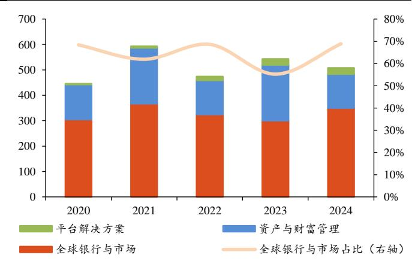  
资料来源：高盛公告，东方财富证券研究所

图表 25：摩根士丹利业务结构（亿美元）  
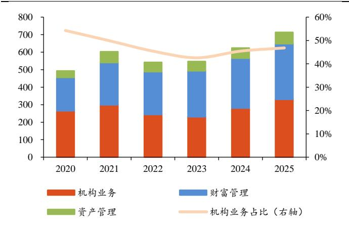  
资料来源：摩根士丹利公告，东方财富证券研究所

图表 26：高盛各业务板块ROE  
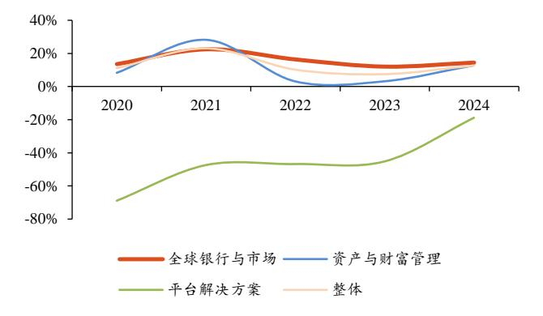  
资料来源：高盛公告，东方财富证券研究所

图表 27：摩根士丹利各业务板块 ROE  
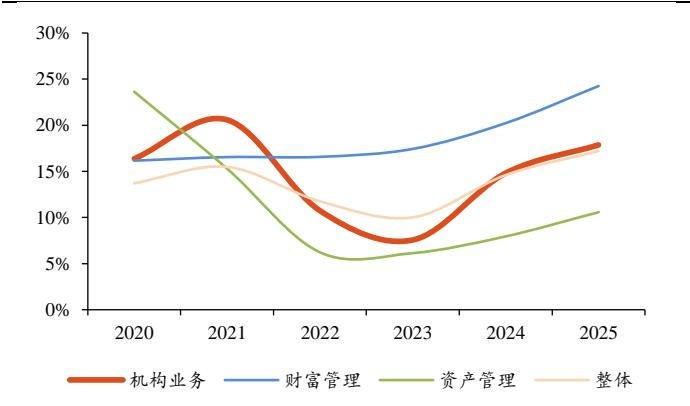  
资料来源：摩根士丹利公告，东方财富证券研究所

进一步拆解机构业务，做市业务是其盈利的核心支柱，亦是“客需驱动”模式的最集中体现。2020年以来，高盛做市业务收入占营业收入比重持续保持在25%-40%之间，摩根士丹利做市业务占整体营收比重长期维持在20%左右。做市业务的本质是为客户的买卖需求提供流动性，通过对冲管理风险以赚取稳定价差，其收益与市场方向的相关性较低，具备穿越周期的能力。正是这种以服务客户交易需求为核心的业务模式，赋予了机构业务收入端的内生稳定性。近年来我国资本市场做市制度正从新三板试点加速向多板块扩围，2022年科创板、2023年北交所、2026年创业板先后引入做市商机制。参考美国经验，做市业务的稳步扩围有望为我国券商从方向性自营向客需型做市转型开辟新的赛道，为加杠杆开辟新的用表场景。

图表 28：高盛营收结构及做市业务占比（亿美元）  
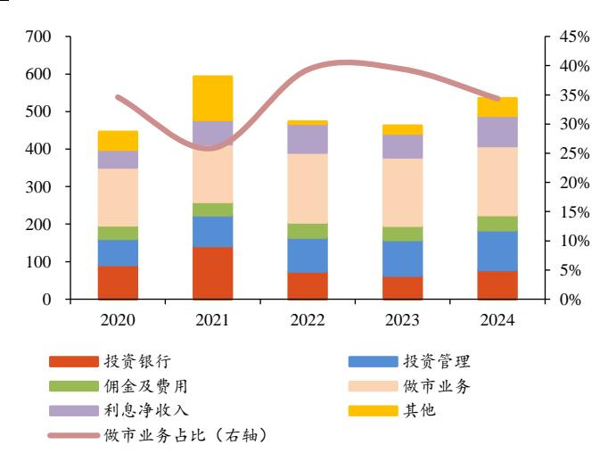  
资料来源：高盛公告，东方财富证券研究所

图表 29：摩根士丹利机构业务收入构成（亿美元）  
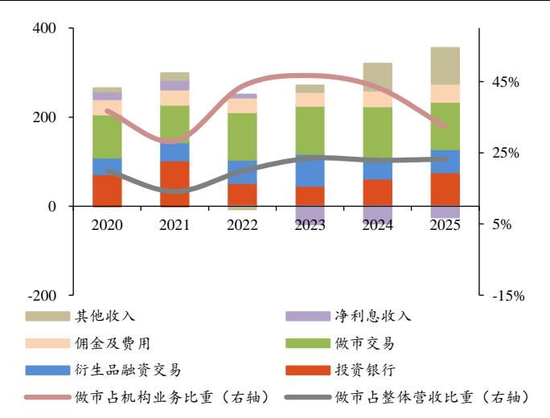  
资料来源：摩根士丹利公告，东方财富证券研究所

机构业务提供“重资本、低波动”盈利的同时，财富管理等轻资产业务贡献了“轻资本、稳定收费”的另一极，共同构成双轮驱动格局。财富管理的核心价值在于其基于管理费、咨询费的经常性收入模式，稳定性远超交易驱动的投行业务。摩根士丹利财富管理业务ROE自2020 年以来表现整体优于机构业务和资产管理业务，且更加稳健。高盛也将“扩大资产与财富管理特许经营权”定为核心战略目标，试图降低对波动性较大的交易与投行依赖。稳定的财富管理费收入能够有效缓冲市场下行期整体盈利的波动，与机构业务共同构成双轮驱动，使公司整体盈利具备穿越周期的

能力。

在负债端，美国投行已建立起以存款为核心、多元化的低成本融资体系，为较高杠杆水平下的稳健经营提供了坚实的财务基础。以高盛为例，2019-2024 年间存款占负债总额比重始终保持在 30%-45%的较高水平；抵押融资和无担保长期借款作为重要补充，形成了“存款为主、多元分散”的稳定负债结构。反观国内券商，2020年以来中信证券负债来源中代理买卖证券款占比虽维持在23%-30%，但根据第三方存管制度，这部分资金属于客户资产，证券公司无权挪用。真正可用的主动负债主要为卖出回购金融资产款和应付债券。可见，美国投行通过银行控股公司身份获得了稳定的存款资金来源和美联储贴现窗口支持，而国内券商受制于分业经营框架，客户保证金无法转化为可自由运用的低成本资金，融资结构仍以债券融资和回购融资为主，资金来源的稳定性与成本控制能力存在本质差距。

图表 30：高盛负债结构  
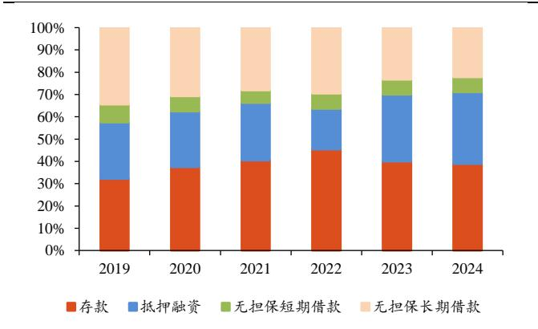  
资料来源：高盛公告，东方财富证券研究所

图表 31：中信证券负债结构  
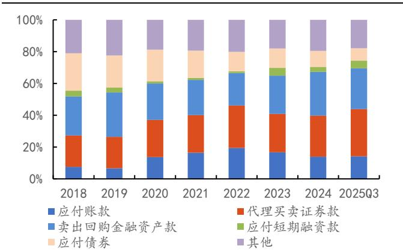  
资料来源：Choice 股票数据浏览器，东方财富证券研究所

综上，美国投行“稳杠杆+稳ROE”的成熟范式，其本质是以客户为中心的战略在不同维度的系统性落地：组织架构是这一战略的顶层设计，客需驱动的业务模式是其在收入端的体现，轻重协同的盈利格局是其在结构端的优化，而多元低成本的负债体系则是其在财务端的支撑。几者环环相扣，共同构筑了穿越周期的经营基石。对于正处在监管松绑与扩表窗口期的中国券商而言，这一范式的核心启示在于：加杠杆本身不是目的，构建与杠杆水平相匹配的客户服务能力、业务结构与负债基础，才是实现高质量扩表的根本路径。

## 2.2.日本：方向性扩表的结构性困境

与美国“稳杠杆+稳 ROA”的路径不同，日本证券业在长期低利率环境中走出了一条“高杠杆+低 ROA”的歧路。日本自 1990 年以来利率长期处于下行通道，2019年甚至进入负利率区间。面对传统息差业务收益空间收窄，日本券商并未如美国同行那样转向客需型做市业务，而是将资源更多投向方向性投资业务，试图通过扩表维持收入规模。以野村证券为代表的日本头部券商，在佣金自由化、监管放松和保证金交易兴起背景下，杠杆率快速抬升，却未能同步提升资产端的回报效率，最终陷入“规模增长—效率停滞—杠杆被动提升”的负向循环。

图表 32：日本 10年期国债收益率走势  
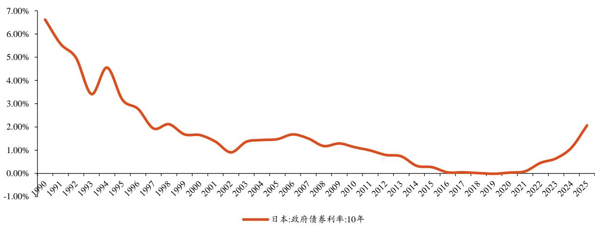  
资料来源：Choice 宏观专题，东方财富证券研究所

从行业整体看，日本证券业在监管放松推动下杠杆率快速抬升，但ROE 并未同步改善，反而波动加剧。1996 年，以桥本龙太郎为首的日本政府启动被业界称为“日本版金融大爆炸”（Japanese Version of FinancialBig Bang）的综合改革，对证券行业的监管限制予以多重放松，包括证券业由批准制改为注册制、允许银行证券保险等金融业务通过设立子公司相互参入、实现股票买卖委托手续费完全自由化、允许有价证券场外交易等，推动行业杠杆率从1992年的5 倍提升至2024年的 31倍 。然而杠杆的抬升并未带来高质量回报：同期 ROE 大幅震荡，多次达到负值，均值仅为3.0%。从近几年表现看，2015-2024 年行业杠杆由 18.1 倍大幅提升至 31.0倍（增长72%），而同期ROE仅由8.5%提升至9.9%，期间一度低至3.9%。

图表 33：日本证券行业杠杆率与 ROE 走势  
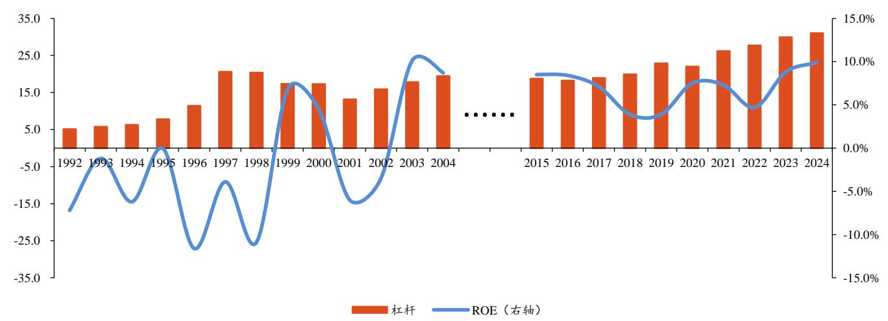  
资料来源：JSDA，东方财富证券研究所

横向对比来看，日本券商杠杆抬升的质量也远低于中美，未能形成“高杠杆—高质量ROE”的正循环。2020-2024 年的平均数据显示，美国头部券商以12.2倍杠杆实现 12%的ROE，展现“高杠杆、稳回报”的成熟范式；中国前十券商杠杆率 3.8 倍、ROE 6.1%，处于“低杠杆、中低回报”区间；而日本杠杆率高达 27.4 倍，远超美国，但 ROE仅 7.6%，杠杆

成为波动放大器而非效率提升器。

究其根源，日本券商的扩表具备显著的方向性特征，而非像美国投行那样聚焦客需型做市业务。

1）资产结构层面，日本券商资产负债表高度集中于交易性金融资产和股票质押贷款，方向性风险敞口集中。2015-2024年间，日本券商交易性金融资产占总资产比重维持在 24%-34%之间，股票质押贷款占比在 47%-56%之间，两者合计占比长期稳定在80%左右。交易性金融资产直接暴露于股价和利率波动风险，股票质押贷款则面临质押物价值缩水带来的坏账压力。这些资产均使券商承担了未被对冲的市场方向性敞口，与美国投行以客需做市为核心、衍生品资产占比较高的配置路径形成鲜明对比。

2）收入结构与盈利波动层面，重资本业务收入占比长期上行，ROE与股市高度同步。日本券商营业收入中，重资本业务（交易收入和金融收入）占比呈长期上行趋势，从 1994 年的 25%上升至 2024 年的 50%，成为盈利的重要驱动。这意味着券商的盈利越来越依赖市场涨跌和息差，而非稳定的服务收费。该结构主导下行业 ROE 与日经 225 指数年度涨跌幅的走势高度同步：在市场下行年份（如2008、2011年），行业均录得亏损。2020-2024年ROE 均值虽修复至 7%-10%，但伴随的波动幅度依然显著。

资产与收入的方向性特征，叠加高杠杆，使得日本券商未能完全摆脱“看天吃饭”的困境。在长期利率下行环境中，方向性业务面临双重压力：利差持续收窄侵蚀基础收益，市场波动时方向性敞口直接暴露于价格风险，高杠杆反而放大了业绩波动。

图表 34：中 美 日 证 券 行 业 杠 杆 与 ROE 对 比（2020-2024 年平均）  
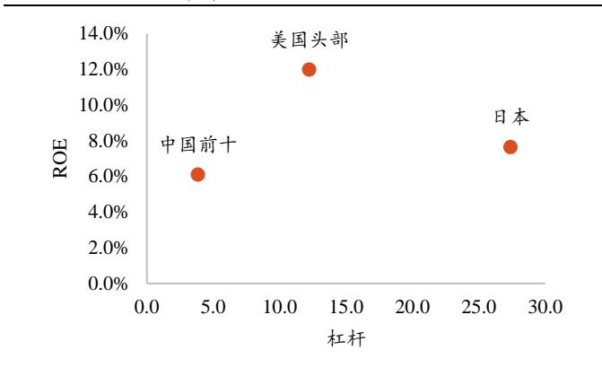  
资料来源：Choice股票专题，JSDA，东方财富证券研究所

图表 35：日本券商主要资产结构演变（2015-2024）  
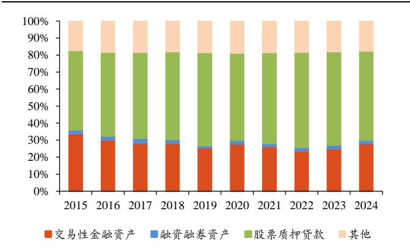  
资料来源：JSDA，东方财富证券研究所

图表 36：日本证券行业收入结构  
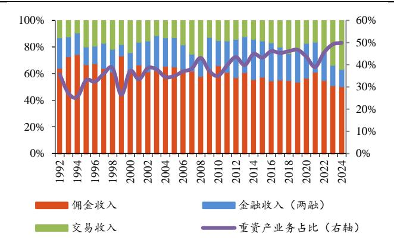  
资料来源：JSDA，东方财富证券研究所

图表 37：日本证券行业 ROE 与日经 225 走势对比  
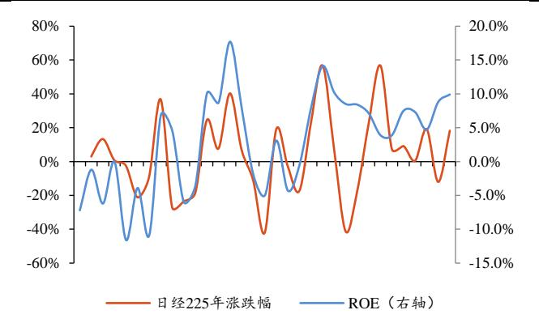  
资料来源：JSDA，东方财富证券研究所

野村证券实证：高杠杆并未换来高 ROE。2006 年以来野村杠杆率长期维持在 13-18 倍的高位，但 ROE 剧烈波动，2008 年、2018 年等多个年份录得亏损，2020-2024 年五年平均ROE 仅 5.8%，呈现典型的“高杠杆、低回报”特征。从收入结构看，重资产业务占比常年维持高位且持续提升，2024 年攀升至75%，意味着野村是在更高杠杆下，以更重的资产结构，却未能取得匹配的股东回报。同时，野村国际化扩张呈现典型的“增收不增利”特征，海外营收占比从 2019 年的 31%持续攀升至 2024 年的50%，但海外利润贡献却连续三年为负，直至2023年才首次实现正贡献。2021年，野村因向对冲基金 Archegos提供高杠杆融资而爆仓，当季确认损失 2457 亿日元，正是其方向性业务主导、高杠杆放大风险暴露的集中体现。

图表 38：野村证券杠杆率与 ROE走势

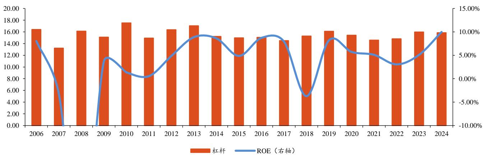  
资料来源：Choice股票专题，东方财富证券研究所

图表 39：野村证券重资产业务占比  
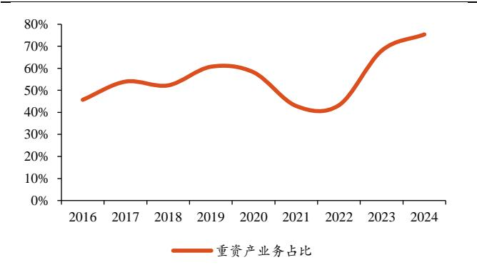  
资料来源：野村证券公告，东方财富证券研究所

图表 40：野村证券海外业务收入及利润占比  
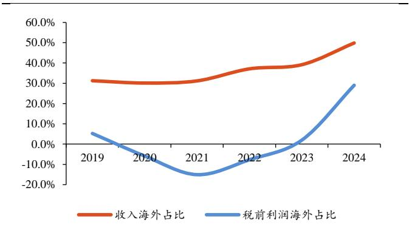  
资料来源：野村证券公告，东方财富证券研究所

日本证券行业对中国的警示是，不能把“杠杆高”误认为“资本效率高”。如果轻资产业务支撑不足、海外业务协同不够、低利率压缩利差，那么高杠杆只会让ROE更脆弱，而不是更稳健。对中国证券业而言，真正值得借鉴的经验不是简单提高杠杆，而是避免把“资产负债表做大”误判为“盈利能力做强”，在监管鼓励审慎开展高资本消耗型业务的背景下，更应将资源聚焦于客需型重资本业务与财富管理、资管、机构服务等轻资本能力建设，进而有望在加杠杆的同时实现ROE 的稳步提升。

## 2.3.锚定与抉择：中国应该对标谁？

综上，美日两国杠杆变迁的分野，绝非偶然的数字差异，而是业务模式、风险文化与负债结构深层耦合的结果。美国在危机后历经十余年重塑，形成了“低波动 ROA +客需驱动+高杠杆”的成熟均衡；日本则在长期低利率中陷入“高杠杆+方向性业务+低回报”的结构性困境。两者对比为中国券商的未来抉择提供了参考：锚定“美式均衡”，警惕“日式陷阱”。

首先，美日模式的本质分野，不在杠杆高低，而在 ROA 的质量与稳定性。美国投行能够在平均 ROA 仅 1.0%的水平上维持 12%的 ROE，前提是其ROA波动极小（标准差仅 0.2%左右），这源于其做市、财富管理等业务的客需驱动属性，将风险做“薄”。反观日本，野村 2020-2024 年在14-16 倍杠杆下平均 ROE 仅 5.8%，根本原因在于其 ROA 质量低下且波动大，重资产业务的方向性暴露使其利润随市场大起大落。因此，加杠杆本身不是目的，构建与杠杆水平相匹配的、稳定的资产回报能力，才是实现高质量扩表的根本前提。

其次，中国券商当前的基础，决定了我们不能走“日本式”的杠杆补偿路径。目前中国券商的问题是“ROA不低（2.1%），但波动较大（标准差0.54%），杠杆偏低（4.2 倍）”。这与美国“低波动 ROA、高杠杆”的现状存在结构性错位，而与日本“高杠杆、低质量ROA”的过去有本质不同。因此，中国不能为了短期提升ROE而简单复制日本的高杠杆模式，那很可能会放大现有的盈利波动。正确的路径应是先学美国，把 ROA做稳，再谈加杠杆，即先通过发展客需业务降低ROA的波动性，使其能够支撑更高的杠杆水平，再逐步释放资本空间，实现ROE 的趋势性抬升。

再次，对标美国之前，须认识到中美杠杆环境的深层差异，这意味着中国不能简单复制美国的杠杆倍数，而应走一条差异化的路径。 第一，负债结构错位。美国投行通过银行控股身份，建立了以存款为核心的多元低成本融资体系（存款占负债比超30%）；而国内券商受制于分业经营，客户保证金无法转化为可自由运用的资金，仍以债券和回购融资为主，负债成本更高、稳定性更低。第二，资产投向差异。美国投行的做市业务建立在高度成熟的机构客户市场基础之上；我国券商场外衍生品等业务虽快速追赶，但在业务深度、风险对冲工具和客户基础上仍有差距。

图表 41：中日美头部券商杠杆及 ROE走势对比  
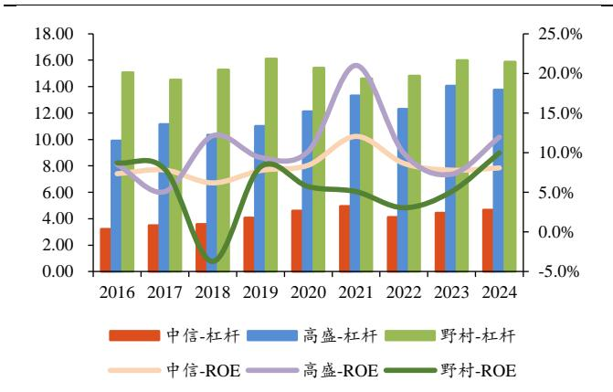  
资料来源：Choice股票专题，各公司公告，东方财富证券研究所

图表 42：中日美头部券商ROA走势对比  
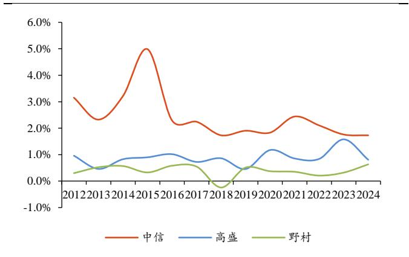  
资料来源：Choice股票专题，各公司公告，东方财富证券研究所

因此，中国券商的最优抉择，不是追求某个具体的杠杆倍数，而是追求一种“美式均衡”的内核，即以客需驱动业务实现稳定的资产回报，以此为基础，在监管引导下实现有质量的、结构性的杠杆提升。 具体而言，应把握三大方向：

1）资产端“去方向化”：持续提升做市、场外衍生品、FICC 等非方向性业务占比，将杠杆优先配置于客需业务，把风险敞口从“单边赌方向”转变为“赚取稳定价差”。

2）负债端“多元化”：在现有监管框架下，积极探索长期限、低成本、稳定性的融资来源，逐步优化负债结构，为扩表筑牢财务基础。

3）发展路径“头部化”：正如我们在第一章论证的，头部券商在风控能力、业务结构和资本效率上具备显著优势，应是此次加杠杆的主力军。通过“扶优限劣”的政策引导，让具备“稳 ROA”能力的优质券商率先获得资本空间，才能确保政策红利最大程度地转化为服务实体经济的效能，实现从“行业普加”到“头部优加”的转变，最终迈向一流投行的战略目标。

## 3.加杠杆的“正确打开方式”：客需化转型与效率提升

前文已揭示杠杆是当前驱动券商 ROE 提升的核心变量，而海外经验表明，杠杆的质量远比杠杆的倍数更为重要。对中国券商而言，加杠杆的“正确打开方式”并非简单扩表，而是一场从结构优化到质变跃迁、从业务转型到生态重塑的系统性变革。无论方向性业务的精进还是客需化转型的深化，最终都指向同一目标：让杠杆真正服务于稳定的资产回报，实现ROE有质量、可持续的趋势性提升。

图表 43：加杠杆的“正确打开方式”  
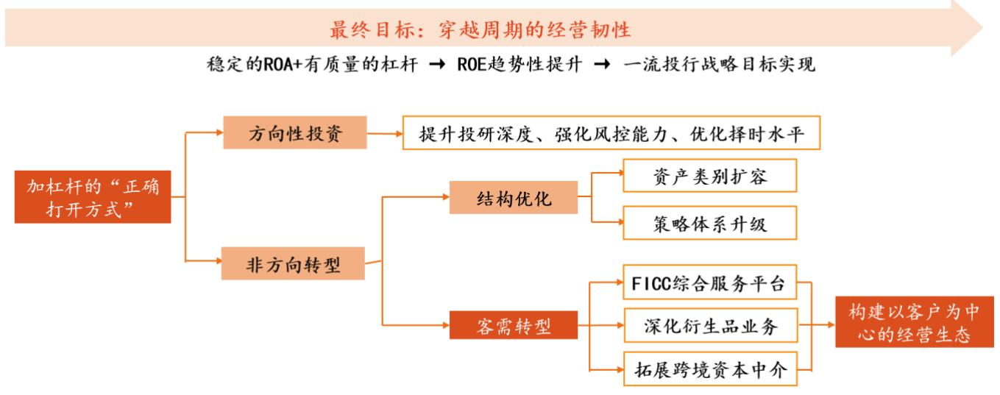  
资料来源：东方财富证券研究所绘制

## 3.1.现状审视：规模扩张与模式错位的核心矛盾

当前国内券商自营业务已逐渐成为业绩的“胜负手”，但其盈利模式仍高度依赖市场行情，波动性较大。2025Q1-3上市券商自营业务收入为1869亿元，同比+44%，占营收的比例为 45%，较2008 年的 4%提升了近十倍。规模方面，2025Q3 末上市券商自营投资规模 7.1 万亿元，较 2019 年末+124%，其中前十大券商规模增幅达 145%，领先优势显著。然而，与规模扩张相伴的是盈利模式的核心矛盾。券商传统自营以押注方向的股票投资等方向性业务为主，其收益与市场涨跌高度相关，本质上是在“赚市场波动的钱”导致业绩波动剧烈。结合第二章对海外经验的剖析，美国投行能够在高杠杆下维持稳定 ROE，其前提是ROA 足够稳定且由客需业务驱动；而若将更多杠杆投向方向性业务，只会放大盈利波动，陷入“规模增长—效率停滞—风险累积”的负向循环。因此，推动自营业务向非方向性转型，已成为行业大势所趋。

图表 44：上市券商自营业务收入占比  
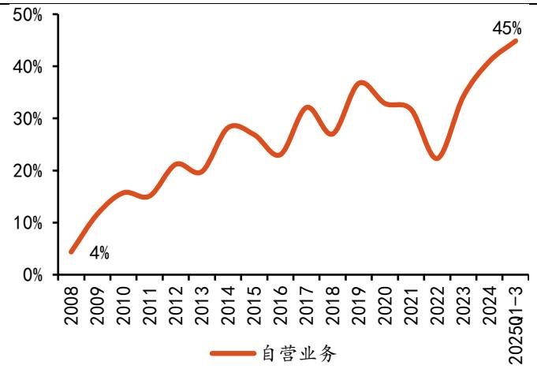

资料来源：Choice股票数据浏览器，东方财富证券研究所

图表 45：上市券商自营业务同比增速（分组）  
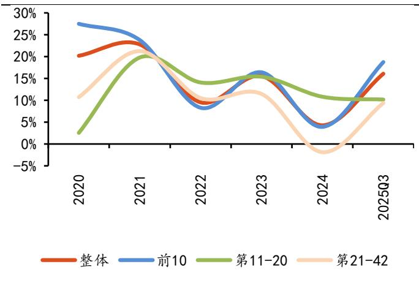  
资料来源：Choice股票数据浏览器，东方财富证券研究所

从盈利质量的角度看，头部券商已展现出领先行业的稳定性。对2018年以来上市券商投资收益率的统计分析显示，资产规模排名前十券商的投资收益率的平均标准差为 1.0%，远低于全行业 2.4%的平均水平，前十券商的盈利波动性显著更低。同时，前十券商的风险调整后收益（收益率均值/标准差）达到 3.20，显著高于全行业 2.14 的平均水平。这表明前十券商不仅盈利更稳定，其单位风险所获取的回报也更具“性价比”，部分印证了前文关于“头部券商风控能力更强、ROA 更稳定”的判断，也为“加杠杆的主力军应是头部券商”提供了量化支撑：同样释放一单位杠杆空间，头部券商能够转化为更高质量的资产投放和更稳定的盈利贡献。

图表 46：中国前十券商与行业整体投资收益率及波动性对比
<table><tr><td></td><td>2018</td><td>2019</td><td>2020</td><td>2021</td><td>2022</td><td>2023</td><td>2024</td><td>2025 Q1-3</td><td>均值 标准 差</td><td></td><td>风险调整后收益 （均值/标准差）</td></tr><tr><td>中信证券</td><td>3.3%</td><td>4.5%</td><td>3.9%</td><td>2.7%</td><td>1.9%</td><td>3.2%</td><td>3.2%</td><td>4.5%</td><td>3.4%</td><td>0.9% 3.86</td><td></td></tr><tr><td>国泰海通</td><td>3.0%</td><td>4.4%</td><td>3.7%</td><td>3.3%</td><td>0.7%</td><td>1.3%</td><td>2.1%</td><td>3.3%</td><td>2.7%</td><td>1.3% 2.18</td><td></td></tr><tr><td>华泰证券</td><td>2.8%</td><td>4.2%</td><td>3.2%</td><td>2.5%</td><td>1.1%</td><td>2.5%</td><td>3.3%</td><td>3.2%</td><td>2.9%</td><td>0.9% 3.16</td><td></td></tr><tr><td>广发证券</td><td>0.4%</td><td> 3.4%</td><td>3.5%</td><td>2.3%</td><td>0.0%</td><td>1.1%</td><td>2.1%</td><td>2.9%</td><td>1.9%</td><td>1.3% 1.47</td><td></td></tr><tr><td>中国银河</td><td>1.6%</td><td>4.6%</td><td>3.1%</td><td>2.2%</td><td>1.7%</td><td>2.2%</td><td>3.0%</td><td>4.0%</td><td>2.8%</td><td>1.1% 2.59</td><td></td></tr><tr><td>招商证券</td><td>3.5%</td><td>3.9%</td><td>5.3%</td><td>3.5%</td><td>2.0%</td><td>2.9%</td><td>2.7%</td><td>3.6%</td><td> 3.4%</td><td>1.0% 3.57</td><td></td></tr><tr><td>申万宏源</td><td>1.9%</td><td>3.6%</td><td> 3.2%</td><td> 2.7%</td><td>1.5%</td><td>2.0%</td><td>2.5%</td><td>2.6%</td><td> 2.5%</td><td>0.7% 3.57</td><td></td></tr><tr><td>中金公司</td><td>3.9%</td><td>3.4%</td><td>3.2%</td><td>2.6%</td><td>3.2%</td><td>2.8%</td><td>2.6%</td><td>3.9%</td><td>3.2%</td><td>0.5% 6.21</td><td></td></tr><tr><td>中信建投</td><td>3.9%</td><td>4.0%</td><td>5.5%</td><td>2.8%</td><td>1.8%</td><td>2.5%</td><td>2.6%</td><td>2.8%</td><td>3.2%</td><td>1.2% 2.79</td><td></td></tr><tr><td>国信证券</td><td>5.9%</td><td>6.0%</td><td>3.8%</td><td>3.8%</td><td>1.8%</td><td>2.4%</td><td>3.2%</td><td>4.6%</td><td>3.9%</td><td>1.5% 2.62</td><td></td></tr><tr><td>行业平均</td><td>6.4%</td><td> 5.5%</td><td>4.5%</td><td>3.0%</td><td>1.1%</td><td>2.7%</td><td>3.3%</td><td> 4.1%</td><td>3.8%</td><td>2.4% 2.14</td><td></td></tr><tr><td>前10平均</td><td>3.0%</td><td> 4.2%</td><td> 3.8%</td><td>2.8%</td><td>1.6%</td><td>2.3%</td><td> 2.7%</td><td> 3.5%</td><td> 3.0%</td><td>1.0% 3.20</td><td></td></tr><tr><td>第11-20平均</td><td>6.9%</td><td> 4.8%</td><td>3.8%</td><td>2.2%</td><td>0.5%</td><td>1.9%</td><td> 2.2%</td><td>4.1%</td><td>3.3%</td><td>3.0% 1.51</td><td></td></tr><tr><td>第21-42平均</td><td>7.8%</td><td>6.5%</td><td>5.0%</td><td> 3.4%</td><td>1.3%</td><td> 3.3%</td><td> 4.1%</td><td> 4.4%</td><td> 4.5%</td><td>2.7%</td><td>1.94</td></tr></table>

资料来源：Choice股票专题，东方财富证券研究所 注：按 2025Q3末资产规模排序；2025Q1-3为年化值

## 3.2.结构优化：资产扩容与策略升级的必经之路

从方向性向非方向性转型，首先需要实现投资结构与策略体系的优化升级。

1）资产类别扩容：从单一资产向多资产覆盖延伸。在固收领域，除传统债券外，可转债、信用衍生品（CDS）的投资机会日益受到关注。同时，国内券商正加速从传统的固定收益（Fixed Income, FI）向更广泛的FICC（固定收益、货币及商品）领域拓展。目前国内多数券商的自营业务仍停留在固定收益阶段，对于商品和外汇的配置与交易涉足有限，部分机构甚至尚未将黄金、商品指数基金等基础品种纳入投资范围。未来随着人民币国际化进程加快，汇率风险管理需求增长，人民币汇率期权、黄金 ETF、商品期货等工具将为自营业务提供新的交易与对冲标的。权益配置方面，通过FVOCI账户配置红利资产趋势显著，其优势在于将公允价值变动排除在利润表之外、股息分红直接计入当期利润，有助于平滑投资业绩波动。截至 2025Q3 末上市券商权益 OCI 规模达 6251 亿元，约为 2021 年末的八倍，占自营资产比重达到 9%（较 2021 年末+7pct）。

图表 47：上市券商自营业务结构  
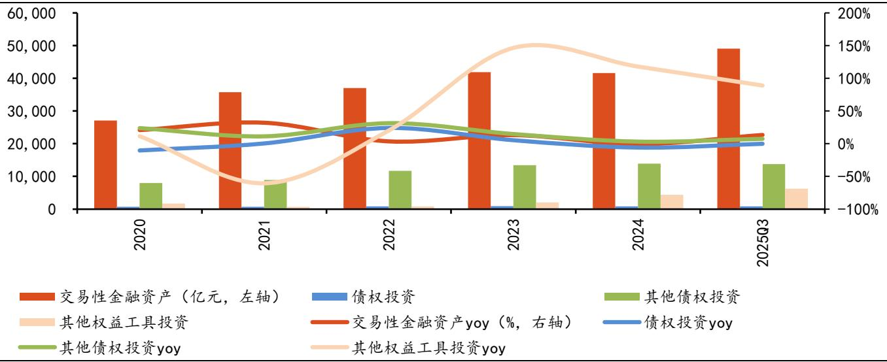  
资料来源：Choice 股票数据浏览器，东方财富证券研究所

2）策略升级：从方向性交易向复合策略演进。以往部分配置型账户主要依赖“持有至到期”策略，在市场波动加剧的情况下风险较高。参照日韩在利率长期下行周期中的经验，其固定收益部门曾出现过大规模的人员缩减，比例高达60%-80%，传统模式的局限性凸显。因此，投资策略需提升主动性与复杂性。一是运用相对价值策略，在不同资产之间进行性价比轮动，如在信用债与可转债之间动态调整配置。二是引入宏观对冲策略，根据全球经济形势、货币政策变化调整投资组合方向。三是借助量化手段开展做市交易和量化对冲，提升交易效率和风险控制能力。这种策略升级，使券商能够在不同市场环境下拥有更丰富的应对工具，将盈利来源从“赌方向”转向“赚价差”。

中金公司：去方向化转型成效已初步显现。以中金的自营资产结构为例， 权益 OCI 账户 2024 年首次配置即贡献 4.44%的稳定股息收益率，2025年提升至 5.59%，成为自营业务的“稳定底仓”；方向性权益敞口（权益 TPL）占比从 2021 年末的 37%降至 2025 年末的 29%，主动压降 8pct。固收类资产收益持续承压，固收 TPL 收益率从 3.12%降至 0.87%，债券OCI收益率从3.36%降至2.87%。同时其他TPL（基金、理财等）收益率在2023年后快速回升，2025年达8.93%，反映量化策略、做市业务等非方向性布局开始贡献收益。资产结构的“一增一减”与策略收益的修复，共同勾勒出头部券商从“方向性主导”向“结构优化+策略升级”的转型路径。

图表 48：中金公司各投资账户收益率  
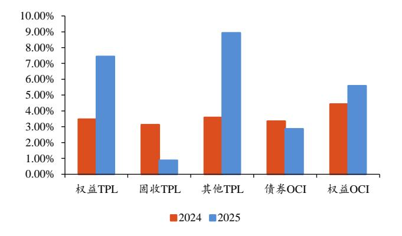  
资料来源：中金公司公告，东方财富证券研究所

图表 49：中金公司自营投资资产结构演变  
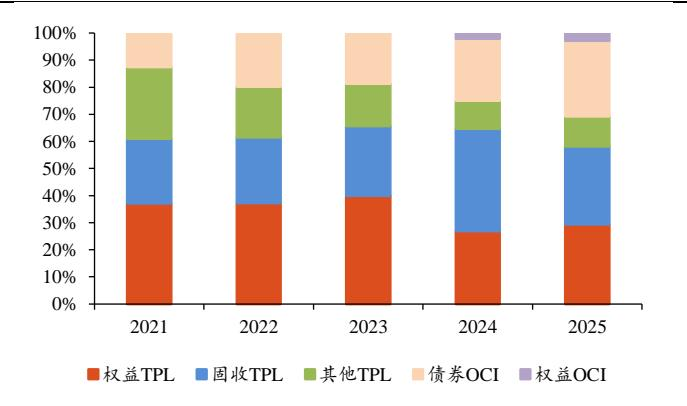  
资料来源：中金公司公告，东方财富证券研究所

## 3.3.质变跃迁：客需驱动的三大核心赛道

如果说结构优化是“量变”，那么向客需驱动模式的转型则是“质变”。其核心是将资产负债表从“自营交易账簿”转变为“客户服务工具”，通过深度嵌入客户的交易、融资、风险管理等需求，赚取稳定、低波动的服务性收入。

1）打造 FICC 综合服务平台。FICC 业务的客需化转型，不是简单的某一业务，而是构建涵盖销售、交易、做市、融资、咨询等功能的综合服务平台。这意味着券商需要从“关门做投资”转向“开门做交易”，优先做大做强以场内做市、场外对冲、销售交易与投资顾问等为代表的客盘交易业务。当前头部券商已有所布局：中信建投明确提出将固定收益业务定位为“为境内外客户提供全方位、多层次、一站式综合服务，服务范围涉及利率、信用、汇率、商品、结构化产品及相关衍生品等领域”。中信证券固定收益业务包括各类固定收益产品及衍生品的销售、交易和做市，开展产品设计与开发，向客户提供投资顾问等综合金融服务，满足客户的风险管理及财富管理等需求。

图表 50：中信证券固定收益业务体系
<table><tr><td></td><td>业务描述</td><td>主要分类 ）利率及金融债、主承销项</td></tr><tr><td>销售</td><td>·从客户需求出发，搭建紧密连接客户与市场的全产品业务平台，同时充分调动 公司各类资源，服务客户需求。 ·连续多年利率产品和信用产品销量排名同业领先。</td><td>目、市场项目、资产证券 化、衍生品</td></tr><tr><td>交易</td><td>·负责各类利率产品、信用产品、外币资产和另类固收资产的自营投资、做市， 积极开展ABS、利率互换等产品的做市业务。 ·结合衍生品等业务品种，逐步完善大宗商品等业务架构，打造全产品业务平台。</td><td>利率产品、信用产品、外币 资产、另类固收产品</td></tr><tr><td>投资顾问 产品</td><td>·为客户的投资账户或资管产品提供专业投资建议，以及风险监控、组合管理等 服务。 ·设计关联境内外各类资产的结构化产品，包括收益凭证、跨境收益互换等。</td><td>产品咨询、账户咨询、资产 咨询 场外期权及衍生品、收益凭</td></tr><tr><td></td><td>·向机构投资者提供挂钩利率、债券、期货、指数等标的的场外期权报价。 ·开展各类衍生品的模型定价、策略研究、系统开发、量化投资。</td><td>证、报价回购（天天利 财）、量化模型及策略</td></tr></table>

资料来源：中信证券官网，东方财富证券研究所

2）深化衍生品业务。衍生品是券商满足机构客户风险管理需求的核心工具，也是非方向性扩表的重要引擎。在头部券商实践中，中信证券凭借先发优势构建起显著的领先壁垒，2012年以来先后获得收益互换、场外期权、科创板做市等多项业务资格，截至 2025H1 末衍生金融工具名义本金规模达到5.86 万亿元，2018 年以来CAGR 达31.2%，衍生品业务也已经成为公司国际化布局的关键一环。申万宏源则将衍生品定位为“一流投行建设的核心抓手”，打造“衍生品+N”综合服务链。2025年1 月，证监会发布首部衍生品市场部门规章，明确衍生品管理风险、服务实体经济的功能定位，为行业规范发展奠定制度基础。政策鼓励+内生需求驱动下，衍生品业务有望成为券商将杠杆嵌入实体经济、服务国家战略的重要“接口”。

图表 51：中信证券衍生金融工具名义本金及增速（亿元）  
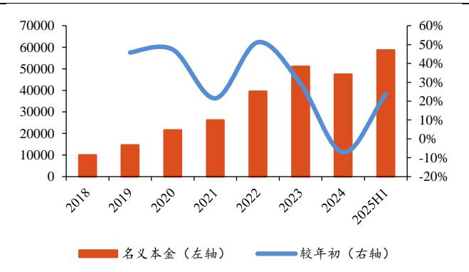  
资料来源：Choice 股票数据浏览器，东方财富证券研究所

图表 52：申万宏源“衍生品+N”综合服务链  
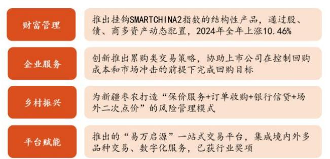  
资料来源：财联社，东方财富证券研究所

3）拓展跨境资本中介业务。跨境业务是券商改革转型、提升国际化水平的突破口，应强化全球资产配置的定价能力和风险对冲能力，构建涵盖交易执行、产品创新、客户服务、风险管控和技术支持的全方位能力体系。随着资本市场双向开放持续推进，“债券通”“互换通”等互联互通机制日益完善，近几年券商（尤其头部券商）跨境业务增长显著，2025H1中信证券国际（根据香港财务报告准则）实现营业收入/净利润 14.9/3.9 亿美元，同比增长+53%/+66%，创历史同期新高。中金公司境外业务收入同比+76%，占比提升到 31.4%（较上年同期+5.7pct），首次突破 30%。2025 年 12 月，证监会主席吴清在行业大会上强调，国际一流机构需具备全球资源配置能力，要求证券行业加快提升核心竞争力。跨境资本中介业务有望成为券商服务实体经济国际化布局、提升全球资源配置能力的关键支点。

## 3.4.生态重塑：让杠杆“长在客户身上”

从顶层逻辑来看，客需化转型的深入推进最终要求券商在战略层面进行系统性重塑。其核心目标是构建以客户为中心的经营生态，让杠杆真正“长在客户身上”，即在最大程度服务客户乃至国家战略的同时，降低自身风险，增强盈利稳定性。

以客户为中心的生态本质是将券商的资产负债表从“自营工具”转变为“客户服务载体”。当投行、投资等各项业务围绕同一客户群体形成协同，券商的资产负债表就不再是孤立的交易账簿，而是嵌入客户全生命周期的综合服务工具。参考美国投行，其本质是一条以战略为起点、层层传导至业务与财务的链条：战略层面，将“以客户为中心”确立为核心导向；组织层面，打破牌照分割的部门墙，按客户群体划分业务板块，让协同权重高于部门自身利润考核；业务层面，机构业务以做市、衍生品等客需服务为核心，将资产负债表从自营工具转变为客户服务载体，财富管理等轻资产业务则与之形成“双轮驱动”；财务层面，多元低成本的负债结构为高杠杆下的稳健经营提供基础。几者环环相扣，共同构筑了穿越周期的经营基石。

构建这一生态，要求券商在组织架构、业务协同与能力建设三大维度形成系统性合力。（1）在组织架构上，需要打破部门壁垒，建立以客户为中心的业务板块，2025年已有国泰海通、中信建投等国内头部券商率先从组织架构层面将“以客户为中心”落地为实体；（2）在业务协同上，实现轻重资本业务的深度融合，有效缓冲市场下行期整体盈利的波动；（3）在能力建设上，强化“三投联动”机制，让投研的认知优势、投资的资本优势、投行的产品优势深度融合，形成服务客户的全链条能力。这些系统性优化路径的最终落点，都是同一个目标：让杠杆不再是孤立的资金投放，而是沿着客户需求场景递进配置，实现从“方向性杠杆”到“客需中性杠杆”的根本转变。

综上，国内券商加杠杆的“正确打开方式”，是一场从结构优化到质变跃迁、从业务转型到生态重塑的系统性变革。通过资产扩容与策略升级降低对市场方向的依赖，通过客需驱动构建稳定的资产回报能力，通过以客户为中心的生态重塑让杠杆“长在客户身上”，券商才能真正构建起与杠杆水平相匹配的、穿越周期的经营韧性，最终实现迈向一流投行的战略目标。

图表 53：2025年多家大型券商围绕客户优化组织架构
<table><tr><td>券商</td><td>组织架构调整</td></tr><tr><td>国泰海通</td><td>合并后加快构建零售、机构、企业三大客户服务体系，形成“一个国泰海通”的客户经营新模式</td></tr><tr><td>中信建投</td><td>将“经纪业务管理委员会”更名为“财富管理委员会”，下设零售客群与高净值客群两大发展中心，分别 针对标准化服务与定制化综合服务，实现客户分层精细化管理</td></tr><tr><td>兴业证券</td><td>以客户需求为本，通过资源重构与机制优化，在财富管理、研究与机构服务、风险管理三大条线启动组织 架构优化改革。</td></tr></table>

资料来源：上海市国资委，证券日报，兴业证券发布公众号，东方财富证券研究所

## 4.投资建议

行业加杠杆窗口已至，服务客需能力决定杠杆质量。当前杠杆已成驱动券商ROE提升的核心变量，而监管“扶优限劣”的差异化风控导向，有望为优质券商释放广阔的资本空间。海外经验表明，杠杆的质量远比杠杆的倍数更为重要：美国投行以“稳 ROA+客需驱动”支撑高杠杆，日本则因方向性扩张陷入“高杠杆低回报”陷阱。对中国券商而言，加杠杆的“正确打开方式”并非简单扩表，而是通过资产扩容、策略升级、客需转型构建稳定的资产回报能力，让杠杆真正“长在客户身上”。券商加杠杆能够带动盈利能力有效提升，其核心在于“谁能在ROA 稳定前提下实现有质量的扩表”，那些率先完成客需化转型、构建起穿越周期经营韧性的头部券商，有望成为政策红利与估值修复的双重受益者。

个股方面，建议聚焦头部综合券商与客需特色券商，分享中国证券行业迈向一流投行的高质量发展红利：

1、受益于政策松绑的头部综合券商——资本空间率先释放，杠杆提升驱动 ROE 突破。 这类券商资本实力雄厚、风控体系完善，是监管“扶优限劣”政策的首要受益者。随着资本空间打开，其资产负债表扩张能力显著增强，FICC 综合服务平台、衍生品业务、跨境资本中介等客需赛道有望加速扩容，或将在保持 ROA 稳定的同时实现杠杆提升，驱动ROE趋势性上行。建议关注中信证券、国泰海通、华泰证券。

2、深耕客需赛道的特色券商——先发优势构筑壁垒，机构服务能力兑现 α收益。这类券商在 FICC 做市、衍生品交易、跨境资本中介等客需赛道上深耕多年，积累了深厚的机构客户基础与专业服务能力。随着资本市场机构化趋势深化、客户风险管理需求持续释放，其客需业务有望贡献稳定收入，或将在杠杆提升过程中展现出更强的盈利韧性。建议关注中金公司、申万宏源。

图表 54：行业重点关注公司一览表
<table><tr><td rowspan=2 colspan=1>代码</td><td rowspan=2 colspan=1>简称</td><td rowspan=2 colspan=1>总市值(亿元)</td><td rowspan=1 colspan=3>EPS (元/股）</td><td rowspan=1 colspan=3>PE(（倍)</td><td rowspan=1 colspan=1>股价</td><td rowspan=2 colspan=1>评级</td></tr><tr><td rowspan=1 colspan=1>2025A</td><td rowspan=1 colspan=1>2026E</td><td rowspan=1 colspan=1>2027E</td><td rowspan=1 colspan=1>2025A</td><td rowspan=1 colspan=1>2026E</td><td rowspan=1 colspan=1>2027E</td><td rowspan=1 colspan=1>（元)</td></tr><tr><td rowspan=1 colspan=1>600030.SH</td><td rowspan=1 colspan=1>中信证券</td><td rowspan=1 colspan=1>3897.80</td><td rowspan=1 colspan=1>2.03</td><td rowspan=1 colspan=1>2.27</td><td rowspan=1 colspan=1>2.49</td><td rowspan=1 colspan=1>14.14</td><td rowspan=1 colspan=1>11.59</td><td rowspan=1 colspan=1>10.56</td><td rowspan=1 colspan=1>26.30</td><td rowspan=1 colspan=1>增持</td></tr><tr><td rowspan=1 colspan=1>601688.SH</td><td rowspan=1 colspan=1>华泰证券</td><td rowspan=1 colspan=1>1712.40</td><td rowspan=1 colspan=1>1.81</td><td rowspan=1 colspan=1>2.16</td><td rowspan=1 colspan=1>2.39</td><td rowspan=1 colspan=1>13.03</td><td rowspan=1 colspan=1>8.78</td><td rowspan=1 colspan=1>7.94</td><td rowspan=1 colspan=1>18.97</td><td rowspan=1 colspan=1>增持</td></tr><tr><td rowspan=1 colspan=1>601995.SH</td><td rowspan=1 colspan=1>中金公司</td><td rowspan=1 colspan=1>1634.03</td><td rowspan=1 colspan=1>2.03</td><td rowspan=1 colspan=1>2.39</td><td rowspan=1 colspan=1>2.68</td><td rowspan=1 colspan=1>17.24</td><td rowspan=1 colspan=1>14.16</td><td rowspan=1 colspan=1>12.63</td><td rowspan=1 colspan=1>33.85</td><td rowspan=1 colspan=1>增持</td></tr><tr><td rowspan=1 colspan=1>601211.SH</td><td rowspan=1 colspan=1>国泰海通</td><td rowspan=1 colspan=1>2974.00</td><td rowspan=1 colspan=1>1.74</td><td rowspan=1 colspan=1>1.54</td><td rowspan=1 colspan=1>1.71</td><td rowspan=1 colspan=1>11.81</td><td rowspan=1 colspan=1>10.94</td><td rowspan=1 colspan=1>9.84</td><td rowspan=1 colspan=1>16.87</td><td rowspan=1 colspan=1>未评级</td></tr><tr><td rowspan=1 colspan=1>000166.SZ</td><td rowspan=1 colspan=1>申万宏源</td><td rowspan=1 colspan=1>1186.89</td><td rowspan=1 colspan=1>0.38</td><td rowspan=1 colspan=1>0.42</td><td rowspan=1 colspan=1>0.45</td><td rowspan=1 colspan=1>13.87</td><td rowspan=1 colspan=1>11.29</td><td rowspan=1 colspan=1>10.61</td><td rowspan=1 colspan=1>4.74</td><td rowspan=1 colspan=1>未评级</td></tr></table>

资料来源：Choice股票专题，东方财富证券研究所预测（股价截至2026年 4月 20日，未评级公司盈利预测来自 Choice一致预期）

## 5.风险提示

1）经济修复不及预期风险。宏观经济修复不及预期可能导致市场风险偏好回落、信用风险暴露，进而影响券商自营、信用等业务的资产质量与盈利表现。若ROA稳定性被破坏，将直接制约券商加杠杆的可行性。

2）政策与资本市场改革不及预期风险。监管风控指标松绑及“扶优限劣”政策的落地节奏、执行力度若不及预期，可能延缓优质券商资本空间释放的进程。同时，资本市场深化改革若推进缓慢，或影响券商客需业务（衍生品、跨境等）的制度环境与展业空间。

3）券商行业竞争加剧风险。随着头部券商加杠杆空间打开，行业资源有望进一步向优质机构集中，但同业及外资券商的竞争加剧也可能导致费率下行、客户流失，尤其在客需业务布局较晚、服务能力偏弱的券商可能面临更大压力。

4）资本市场波动风险。证券行业经营业绩与资本市场走势密切相关，若权益市场大幅回调或债市波动加剧，方向性自营业务仍可能面临较大回撤。若券商“去方向化”转型不及预期，盈利稳定性将受到冲击，杠杆的提升反而可能放大业绩波动。

## 分析师申明

作者具有中国证券业协会授予的证券投资咨询执业资格或相当的专业胜任能力，保证报告所采用的数据均来自合规渠道，分析逻辑基于作者的职业理解，报告清晰准确地反映了作者的研究观点，力求独立、客观和公正，结论不受任何第三方的授意或影响。

## 投资评级说明

报告中所涉及的评级分为股票评级和行业评级（另有说明的除外）。评级标准为以报告发布日后的 3-12个月内的公司股价（或行业指数）相对同期相关证券市场代表性指数的涨跌幅。其中：A 股市场以沪深 300 指数为基准；新三板市场以三板成指为基准；香港市场以恒生指数为基准；美国市场以标普 500 指数为基准。

## 股票评级

买入：相对同期相关证券市场代表性指数涨幅 15%以上；

增持：相对同期相关证券市场代表性指数涨幅介于 5%～15%之间；

中性：相对同期相关证券市场代表性指数涨跌幅介于-5%～5%之间；

减持：相对同期相关证券市场代表性指数跌幅介于 15%～5%之间；

卖出：相对同期相关证券市场代表性指数跌幅 15%以上。

## 行业评级

强于大市：相对同期相关证券市场代表性指数涨幅 10%以上；

中性：相对同期相关证券市场代表性指数涨跌幅介于-10%～10%之间；

弱于大市：相对同期相关证券市场代表性指数跌幅10%以上。

## 免责声明

东方财富证券股份有限公司（以下简称“本公司”）具有中国证监会核准的证券投资咨询业务资格。

本报告由本公司制作及在中华人民共和国（香港和澳门特别行政区、台湾省除外）发布。

本报告仅供本公司的客户使用。本公司不会因接收人收到本报告而视其为本公司的当然客户。

本报告信息均来源于公开资料或本公司认为可靠的资料，但本公司对该等信息的真实性、准确性和完整性不作任何保证。本报告所载的资料、意见及预测仅反映报告出具日的判断，且预测方法及结果存在一定程度局限性。在不同时期，本公司可发出与本报告所刊载的意见、预测不一致的报告，但本公司没有义务和责任及时更新本报告所涉及的内容并通知客户。

本报告所载的盈利预测、评级、估值等观点，均基于特定的假设和前提条件，不构成所述证券买卖的出价或征价，亦不构成对具体证券在具体价位、具体时点、具体市场表现的投资建议。

在任何情况下，本报告的内容不构成对任何人的投资建议，也没有考虑到个别客户特殊的投资目标、财务状况或需求。客户需充分考虑自身特定状况，不应单纯依靠本报告所载的内容而取代个人的独立判断。本公司不对任何人因使用本报告所载任何内容所引致的任何损失负任何责任，投资者需自行承担风险。

在法律允许的情况下，本公司或其关联机构可能会持有报告中提到的公司所发行的证券头寸并进行交易，也可能为这些公司提供或争取提供投资银行、财务顾问等服务。客户应充分考虑可能存在的利益冲突，勿将本报告作为投资决策的唯一参考依据。

本报告版权均归本公司所有，未经本公司事先书面授权，任何机构或个人不得以任何形式复制、发布、传播本报告的全部或部分内容。经授权刊载、转发本报告或者摘要的，应当注明本报告发布人和发布日期，并提示使用本报告的风险。未经授权或未按要求刊载、转发本报告的，应当承担相应的法律责任。本公司将保留向其追究法律责任的权利。