## 农林牧渔

# 宠物医院报告：从激进扩张走到稳健发展

宠物医疗需求升级，行业由激进扩张到内生重塑。1、宠物医疗：2025 年宠物医疗行业规模同比+9.25%；这一增长主要由以下几方面因素驱动，且持续推动我国宠物医疗市场发展：1）宠物犬猫数量及家庭饲养率的持续增加；2）单只宠物的平均消费水平稳步上升。3）宠物老龄化与宠物主人年轻化双轨驱动，其在慢性病管理、功能处方粮及专业康复护理领域形成持续消费需求。2、宠物医院：数量增长快，格局分散、连锁率低；我国宠物行业发展起步较晚，宠物医院数量的增长也反映了宠物医疗需求的升级，最新 2025 年我国宠物医院数量达到 2.46 万家，同比增长 10.3%，我国宠物医院还面临格局分散、连锁率低的情况，2025 年有 78%的机构月营业额在 20 万以下，有 53.4%的诊疗机构年营业额负增长，前五大企业集中度仅为 6.5%。

复盘 1：看国内，从激进扩张到稳健发展。与美国相比，不管是集中化程度还是盈利水平，我国的宠物诊疗机构还有着较大的差距，但近几年在行业快速发展下，我国已基本形成了大连锁与精品医院共存的格局，从新瑞鹏、瑞派宠物门店数量回落、瑞派宠物近几年盈利水平大幅改善（2025H1毛利率 25%、净利率为正）可以看出，头部连锁企业的发展思路也从门店数量的激进扩张逐步走到提升运营质量的稳健发展上：1）新瑞鹏：追求外延扩张，成长为我国第一大宠物医疗机构，公司依托资本优势创立多品牌“1+P+C”系统。2）瑞派宠物：追求稳健发展，我国第二大宠物医疗机构，在运营模式上，公司构建三级诊疗协同体系和首创了 VDP 兽医发展伙伴模式。

复盘 2：看全球，复盘玛氏医疗，从大连锁到专科连锁。美国是诊疗机构最多的国家，其宠物医疗体系也最为健全，医院普遍具备手术、影像、牙科、心血管、肿瘤与康复等专科能力，形成“全科＋专科＋急救”的三层体系，2024 年美国拥有约 3.4万家诊疗机构。主要模式有 1）VCA：树立全球宠物医疗连锁标杆模式“诊疗-诊断”，以综合性医院为主，2025 年VCA 拥有诊疗机构超 1000 家、年服务 400 万+宠物主。2）Banfield：以预防医学为主的连锁精品社区医院，与 PetSmart 深度绑定，在美国和波多黎各拥有超过 1000 家医院。3）BluePearl：深耕社区的转诊中心，专科化让医院成为“不可替代”，全美拥有超 100 家医院大型专科医院。

未来发展：大连锁打造稳健发展，精品专科医院谋增长。我国宠物医疗行业起步比美国晚 20年，目前正处于连锁化扩张的关键阶段。从 VCA 走全科大连锁、Banfield 以预防医学为主发展连锁社区医院、BluePearl 走专业化专科医院，其走过 40-80 年的发展历程，均找到适合自身理念的模式，在最佳规模下实现高利润增长。而看国内，新瑞鹏的极速扩张带来的是利润快速下滑，而瑞派宠物吸取后发优势，独创 VDP 兽医发展伙伴模式，初步解决扩张中“人”和“管理”的问题，谋求稳健发展。我们认为，看历史经验，未来我国可以走出一条大连锁稳健发展、专科精品医院谋增长的道路。

风险提示：宠物数量增长不及预期；市场竞争加剧导致医院效益不及预期；  
核心兽医人才短缺及流失。

## 增持（维持）

## 行业走势

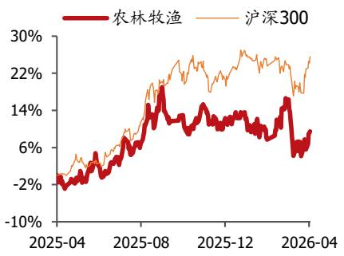

## 作者

分析师 张斌梅

执业证书编号：S0680523070007

邮箱：zhangbinmei@gszq.com

分析师 沈嘉妍

执业证书编号：S0680524040001

邮箱：shenjiayan@gszq.com

## 相关研究

1、《农林牧渔：生猪全面步入亏损，大宗原料成本稳步抬升》 2026-03-30

2、《农林牧渔：关注地缘政治对农业整体板块的影响，生猪亏损加深逻辑增强》 2026-03-02

3、《农林牧渔：关注原油波动对农产品带动效应，生猪旺季亏损静待催化》 2026-02-02

## 内容目录

一、宠物医疗需求升级，行业由疯狂扩张到内生重塑.... ............................................. .. 3  
1、宠物医疗：2025 年宠物医疗行业规模预计同比+7.92% ............................................................. .. 3  
2、宠物医院：数量增长快，格局分散、连锁率低. ................................................ .. 4  
二、经营模式：大连锁与精品医院共促行业发展 . .. 7  
1、看全球：复盘玛氏医疗，从大连锁到专科连锁 ...................................................................................... ... 7  
2、看国内：从激进扩张到稳健发展... ......................................................................... . 10  
三、大连锁追求稳健发展，精品专科医院谋增长 ...... ................................................................................ .... 16  
四、风险提示 ........ ... 19

## 图表目录

图表1: 2025年我国宠物医疗行业规模估计为395亿元，同比+7.92%， ..3  
图表2: 我国宠物猫数量CAGR（2025-2030）达8.2%.. ..4  
图表3: 2025年我国猫狗家庭养宠率仍相对较低... ....4  
图表4: 单只犬猫年均消费持续增.. ....  
图表5: 2024年我国宠物就诊率还相对较低... ……………………………………………………………………………… ...4  
图表6: 我国宠物诊疗机构数量.. …… ..5  
图表7: 宠物诊疗机构.营业额比（元）.  
图表8: 宠物诊疗机构不同区间年营业额同比增长率占比 ..  
图表9: 我国宠物医院连锁率仍较低（%） ..6  
图表10: 二线及以下城市比67%（%）6  
图表11: 宠物诊疗机构不同区间投资规模占比（%）： .6  
图表12: 2024年要家宠物诊疗机构数量及增速（家）  
图表13: 每万只宠物所匹配的宠物医院（家）及兽医数量（人） ....  
图表14: 2024年玛氏拥有美国51个宠物临床研究中心、欧洲28个宠物临床研究中心. ..  
图表15: VCA退市前营收、净利润及同比（USD/百万元）  
图表16: 公司退市前销售毛利率及净利率情况. ..9  
图表17: 公司医院网..… 9  
图表18: 全生命周期套  
图表19: 我国头部五家宠物医院情况.. …………………………………………………… ..11  
图表20: 新瑞鹏宠物医院数量（家）.. …… ....11  
图表21: 瑞派宠物院数量（家）11  
图表22: 新瑞鹏宠物医院毛利率及净利率.. ………………………………… ..1  
图表23: 瑞派宠物医院毛利率及净利率..  
图表24: 新瑞鹏集团品牌矩阵.. 21  
图表25: 新瑞鹏医院网络系统.. ...3  
图表26: 新瑞鹏单店收入下滑... …………………………………………… .13  
图表27: 截至2025年上年，公.宠物医院数量达548家（家）..4  
图表28: 公司企业使命-致力宠物健康，赢得宠主敬.  
图表29: 2025H1公司宠物诊疗服务收入占比91%（%） 15  
图表30: 2025H1公司区域中心医院收入占比44%（%） ……… ..15  
图表31: 公司三级诊疗协同体系 15  
图表32: 公司人效稳步提升（千元/人.  
图表33: 公司坪效稳步提升（千元/平方米） ...16  
图表34: 截至瑞派宠物招股说明书公告最后实际可行日期公司医疗人员占比74%.. ..16  
图表35: 截至瑞派宠物招股说明书公告最后实际可行日期公司兽医从业人员五年经验以上占比达49%. ..16  
图表36: 人才问题是宠物诊疗机构面临的最大问题.. .17  
图表37: 大于0人业医的诊疗机构只占%（%）… ..7  
图表38: 诊疗机构专科及以下人员占比60%（%） 17  
图表39: 专科诊疗占比未来营收增长点74%. ..18  
图表40: 专科化也是未来.… ..8

## 一、宠物医疗需求升级，行业由疯狂扩张到内生重塑

## 1、宠物医疗：2025年宠物医疗行业规模预计同比+7.92%

我国宠物市场进入高速发展期，宠物医疗市场规模连年增加。2025 年，我国宠物市场规模已达到 3126亿元，同比增长4.1%，预计2028年宠物市场规模达 4050亿元。其中，宠物医院及诊所为服务场所的宠物医疗赛道因其需求刚性、市场广阔、且具备深厚的护城河，同时消费结构的变化，均使得我国宠物市场医疗支出持续提高，根据灼识咨询报告2025年我国宠物医疗行业规模估计为 395亿元，同比+7.92%。

图表1：2025年我国宠物医疗行业规模估计为395亿元，同比+7.92%  
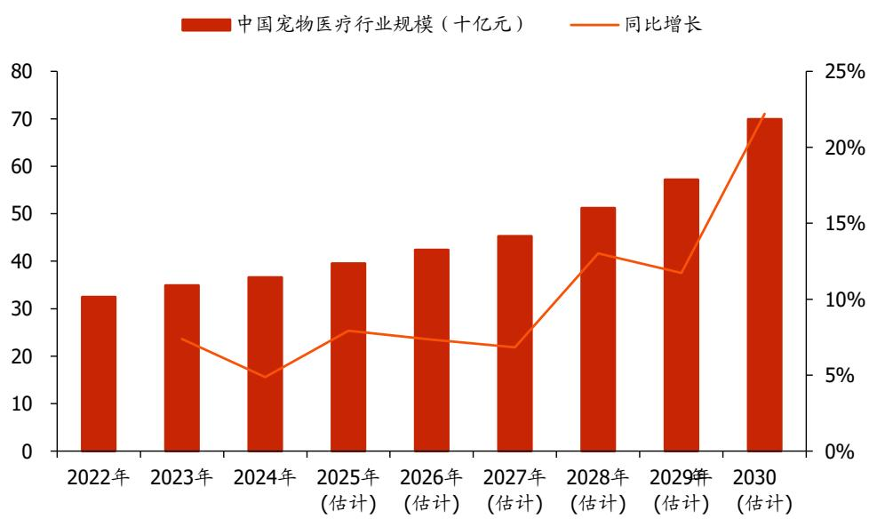  
资料来源：灼识咨询、瑞派宠物招股说明书、国盛证券研究所

## 这一增长主要由以下几方面因素驱动，且持续推动我国宠物医疗市场发展：

1）宠物犬猫数量及家庭饲养率的持续增加。根据《2025 中国宠物医疗行业研究报告》我国宠物数量增长较快，其中猫数量预计CAGR（（2025-2028）达8.2%；其次目前我国家庭养宠率较低，2025年犬猫家庭养宠率分别为14.2%/15.1%，较美国（43%/38.3%）、巴西（52%/24.9%）等国均有较大发展空间。

2）单只宠物的平均消费水平稳步上升。数量与单宠消费的双重推动，使宠物市场规模持续扩大，并为行业长期稳定发展奠定了坚实基础，2025年我国单只犬年均消费3006元，同比增长 1.5%，单只猫年均消费2085 元，同比增长较多为3.2%。

3）宠物老龄化与宠物主人年轻化双轨驱动。随着城镇中约32%的宠物猫和20%的宠物狗步入中老年阶段，其在慢性病管理、功能处方粮及专业康复护理领域形成持续消费需求；同时，宠物主人整体呈现年轻化，25 至 35 岁的年轻宠物主占比超过 60%，其中女性比例达 60.5%，这一群体秉持科学养宠理念，将推动医疗及服务类别的消费。

图表2：我国宠物猫数量CAGR（2025-2030）达8.2%  
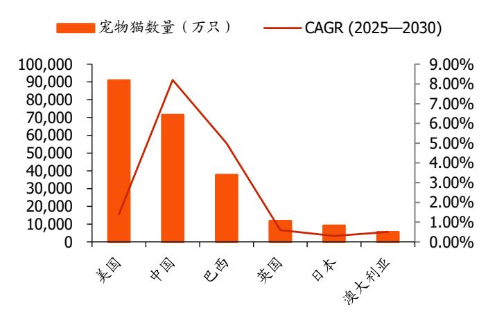  
资料来源：《2025中国宠物医疗行业研究报告》（欧睿数据统计口径包含流浪猫犬）国盛证券研究所

图表3：2025年我国猫狗家庭养宠率仍相对较低  
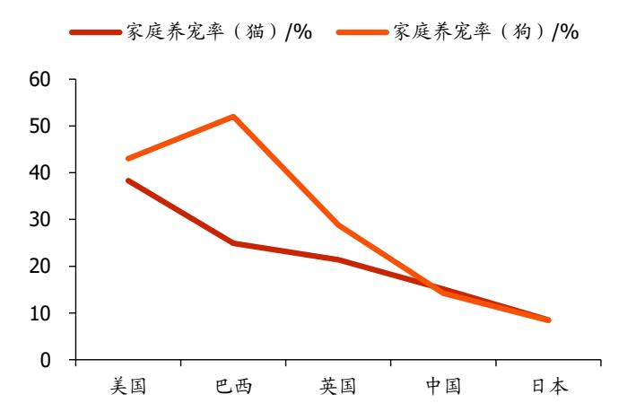  
资料来源：《2025中国宠物医疗行业研究报告》、国盛证券研究所

图表4:单只犬猫年均消费持续增长  
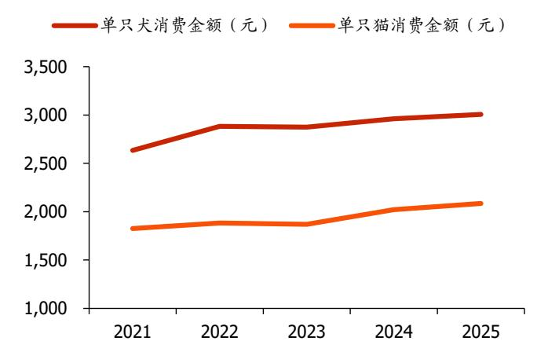  
资料来源：中国宠物行业白皮书、国盛证券研究所

图表5：2024年我国宠物就诊率还相对较低  
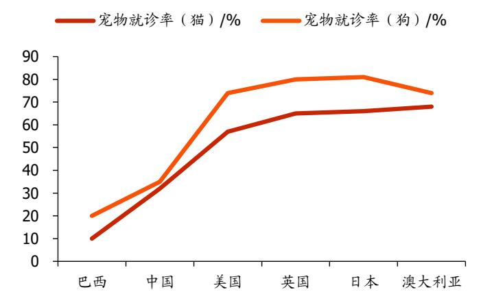  
资料来源：《2025中国宠物医疗行业研究报告》、国盛证券研究所

## 2、宠物医院：数量增长快，格局分散、连锁率低

我国宠物行业发展起步较晚，宠物医院数量也在近十年发展快速，1992年，中国小动物保护协会正式成立，标志着我国宠物行业开始萌芽。2004年中国畜牧兽医学会小动物医学分会成立，标志着行业开始走向规范化。2010-2016年宠物医院迎来爆发期，2014年资本大量投资宠物医疗行业，高瓴资本开始在国内投资及收购大量的宠物医院项目，我国宠物医院数量从 2010 年约 2000 家增至 2016 年近 1 万家，2023 年突破 2 万家，最新2025 年我国宠物医院数量达到2.46 万家，同比增长10.3%，市场规模急速扩张，宠物医院数量的增长也反映了宠物医疗需求的升级。

图表6：我国宠物诊疗机构数量  
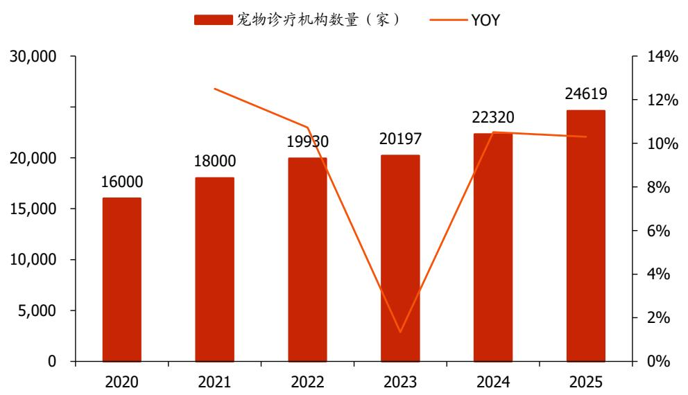  
资料来源：《2025中国宠物医疗行业研究报告》、国盛证券研究所

我国宠物医院面临格局分散、连锁率低的情况；资本快速涌入，行业参与者在短时间内实现快速扩容，造成行业监管短时缺位与市场供需阶段性失衡的局面，尽管机构数量较多，但市场由大量单体医院主导，呈现出（“小而散”的竞争态势，根据《2025中国宠物医疗行业研究报告》最新数据，2025年有78%的机构月营业额在 20万以下，有53.4%的诊疗机构年营业额负增长。

我国宠物医疗市场也仍处于连锁化初期，根据《2025 中国宠物医疗行业研究报告》，2025 年我国连锁宠物诊疗机构占比 21.3%，单体宠物诊疗机构占比 78.7%。从投资规模看，投资百万以下的机构占比达到 54%，200 万元以下的占比达到 84%，从执业兽医数量看，拥有 5人以下的机构占比达 78%，仅有 7%的机构拥有 10 人以上执业兽医。从城市分布看，宠物医院正在快速向二线、三线城市及五线城市渗透，二线及以下城市拥有的诊疗机构占比达 67%。

图表7：宠物诊疗机构不同区间月营业额占比（万元）  
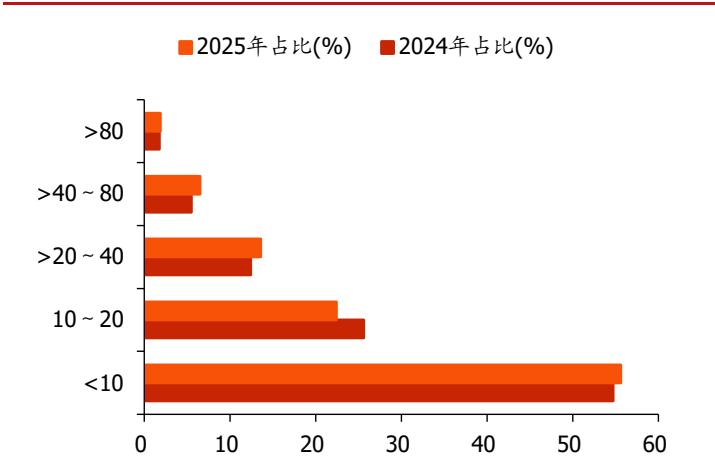  
资料来源：《2025中国宠物医疗行业研究报告》、国盛证券研究所

图表8：宠物诊疗机构不同区间年营业额同比增长率占比  
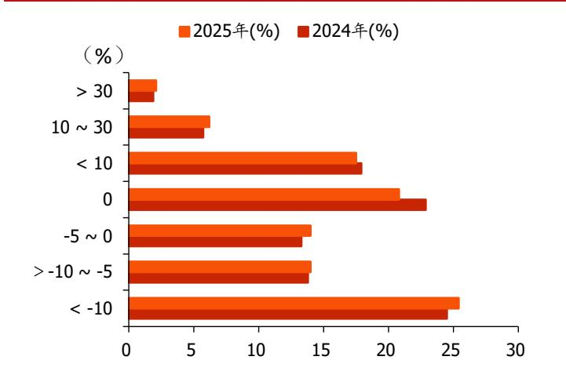  
资料来源：《2025中国宠物医疗行业研究报告》、国盛证券研究所

图表9：我国宠物医院连锁率仍较低（%）  
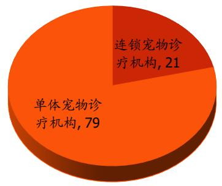  
资料来源：《2025中国宠物医疗行业研究报告》、国盛证券研究所

图表10：二线及以下城市占比67%（%）  
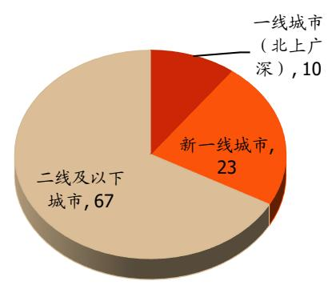  
资料来源：《2025中国宠物医疗行业研究报告》、国盛证券研究所

图表11：宠物诊疗机构不同区间投资规模占比（%）  
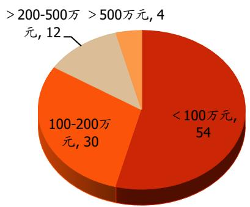  
资料来源：《2025中国宠物医疗行业研究报告》、国盛证券研究所

## 二、经营模式：大连锁与精品医院共促行业发展

## 1、看全球：复盘玛氏医疗，从大连锁到专科连锁

美国宠物医疗体系最为健全，2024 年，美国宠物行业总规模达人民币 9234亿元，其中宠物医疗市场规模为人民币 2786 亿元，占总体的 30.2%，这一结构性差异的背后，是美国市场已建立起一个覆盖预防医学、专科诊疗、慢性病管理到临终关怀的全生命周期健康管理体系，其高医疗占比不仅源于更成熟的消费意识，更依赖于含括健康保险、先进影像诊断和复杂外科手术在内的完整服务生态。2024年美国拥有约 3.4 万家宠物诊疗机构。

图表12：2024年主要国家宠物诊疗机构数量及增速（家）  
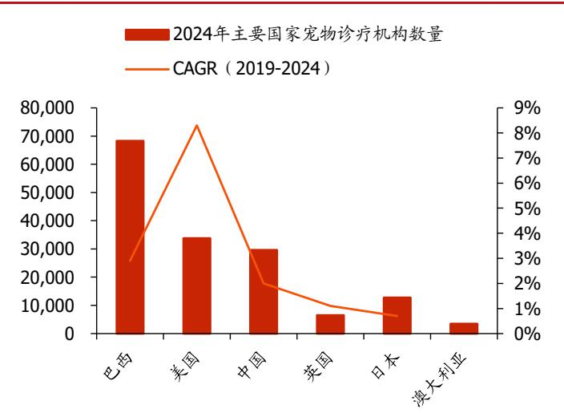  
资料来源：《2025中国宠物医疗行业研究报告》、国盛证券研究所

图表13：每万只宠物所匹配的宠物医院（家）及兽医数量（人）  
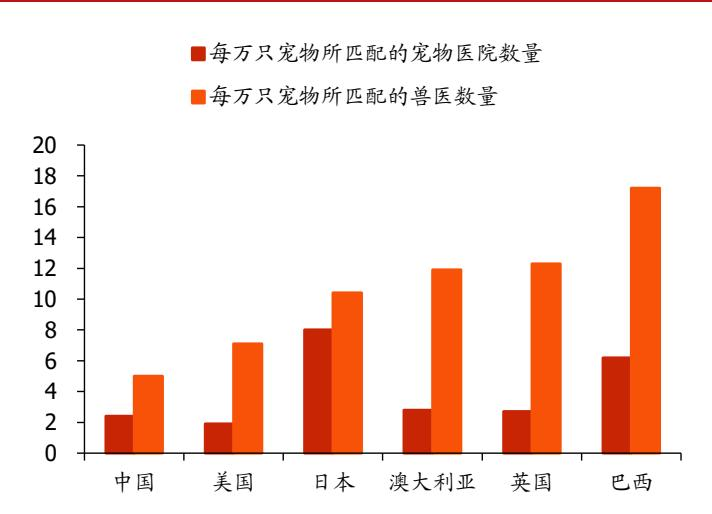  
资料来源：《2025中国宠物医疗行业研究报告》、国盛证券研究所

我们以全球宠物医疗龙头玛氏（Mars）发展史来看全球宠物医院发展模式，Mars 宠物重要医疗网络含括了 Banfield 宠物医院（1994 年入资、2007 年收购）、VCA 动物医院（2017 年收购）、和BluePearl（2015年收购），三家医院分别拥有不同的运行模式。

图表14:2024年玛氏拥有美国51个宠物临床研究中心、欧洲28个宠物临床研究中心  
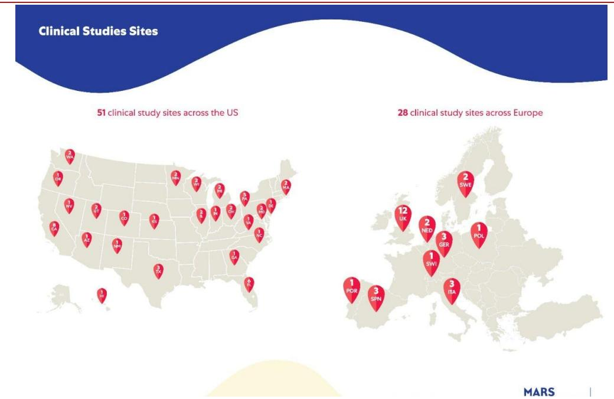  
资料来源：Mars、国盛证券研究所

## 1）VCA：树立全球宠物医疗连锁标杆模式（“诊疗-诊断”，以综合性医院为主，2025年VCA 拥有诊疗机构超 1000 家、年服务 400 万+宠物主。

VCA 树立了全球宠物医疗连锁的标杆模式。VCA成立于1986年，1987年VCA 率先推出“医院+诊断实验室”的组合模式，构建了“诊疗-诊断”内部协同体系，实验室配备超声检查、内镜研究等专业设备，可为旗下医院提供腹腔、胸腔无创评估、胃肠道可视化检查等精准诊断支持，让诊疗方案更具科学性，这种模式不仅提升了诊疗效率，更在零散的市场中建立了标准化服务优势，初步形成差异化壁垒。

1991 年，VCA 成功完成首次 IPO，开启了批量收购区域宠物医院，1996 年医院数量突破 50 家。

2001 年 VCA 再次登陆纳斯达克，走出美国本土，收购加拿大的连锁宠物医院，正式开启北美市场布局，并且进行全产业链延伸，通过收购医疗设备公司补充超声、内镜等先进设备，强化诊疗技术支撑；2014 年以战略性价格收购宠物日托品牌 Camp Bow Wow，为Camp Bow Wow 注入医疗资源，推出“日间照护+健康监测”增值服务，比如为寄养宠物提供免费基础体检，进一步提升客户黏性。2004年到2018年间，它先后并购了Pets Choice、Healthy Pet 等六家宠物医院连锁品牌，到 2016 年，已在美国 41 个州和加拿大3个省拥有 795家宠物医院和61家诊断实验室。

2017年，VCA以91亿美元的价格被玛氏集团收购，迎来新的里程碑式的发展，依托玛氏的资金实力和渠道优势，VCA 继续深化布局：2023-2024年新增多家加拿大专科诊所，重点强化肿瘤、心脏病、内科等高端诊疗能力，诊所配备董事会认证专科医生坐诊，提供化疗、靶向治疗、复杂手术等进阶服务；到 2024年，其全球网点已超 1000家，更深度融入玛氏构建的“诊断—治疗—营养”完整商业闭环——VCA 承接疑难转诊诊疗，诊疗后由玛氏旗下皇家、渴望等品牌提供定制化处方粮和营养方案，形成“诊疗+营养管理”全链路服务。

图表15：VCA退市前营收、净利润及同比（USD/百万元）  
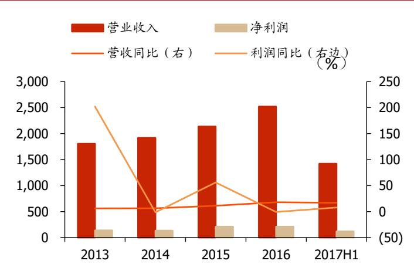  
资料来源：wind、国盛证券研究所

图表16：公司退市前销售毛利率及净利率情况  
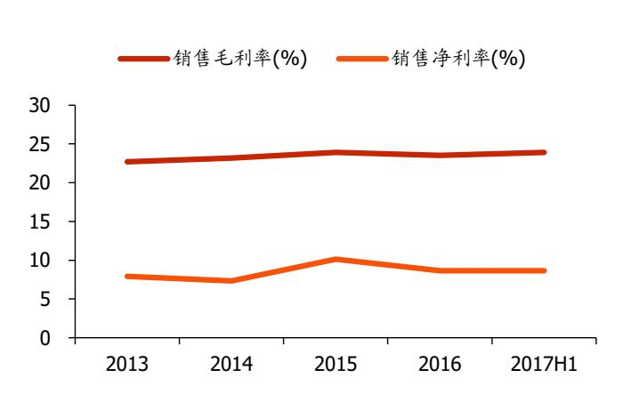  
资料来源：wind、国盛证券研究所

图表17：公司医院网络  
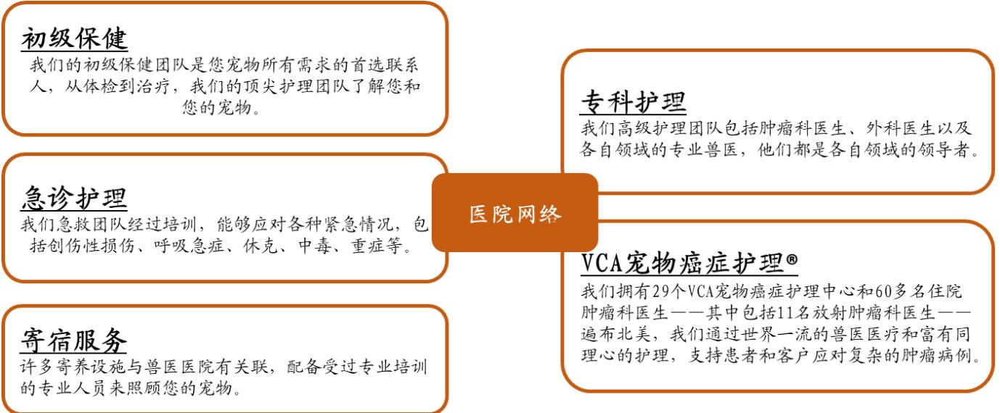  
资料来源：VCA公司官网、国盛证券研究所

2）Banfield：以预防医学为主的连锁精品社区医院，与 PetSmart深度绑定，在美国和波多黎各拥有超过 1000 家医院。

和 VCA 以大型综合性医院为主不同，Banfield 以社区精品诊所为主要模式。

Banfield 成立于 1955 年，1994 年 Mars 首次进入宠物医疗领域，便入资了成立于 1955年全美领先的宠物私人医疗机构 Banfield宠物医院，同时，Banfield 与PetSmart开启战略合作，PetSmart 是美国最大的宠物专营零售商，Banfield 积极在 PetSmart 开设店中店，使得能够迅速扩大其服务网络。2007年，玛氏加大了对Banfield 宠物医院的投资额，并获得了控股权，Banfield公司开始快速发展。2013年，PetSmart共有 1200余家门店，其中816 家门店中开设了宠物诊所，除了在加拿大的7家是与当地诊所合作外，809家都是以 Banfield品牌进行运营，这也占到 Banfield医院总数的 80%以上。

Banfield 将自身从诊疗机构变为在身边触手可及的健康预防管理平台，进行宠物全生命周期服务链，其 OWP 套餐含 疫苗 +体检+齿科+营养咨询，增强客户粘性，提高复购率。

图表18:全生命周期服务OWP套餐

资料来源：Banfield公司官网、国盛证券研究所

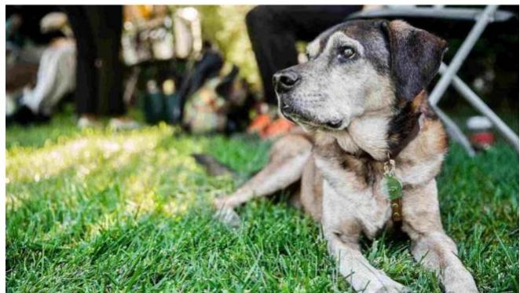

3）BluePearl：深耕社区的转诊中心，专科化让医院成为“不可替代”，遍布全美拥有超 100 家医院的大型专科医院。

BluePearl 为专科转诊中心，成立于 1996 年，是当今美国最大的专科和急诊动物医院之一。其凭借尖端设备与专科能力（如肿瘤、神经外科）抢占技术制高点，其核心优势在于：

1）尖端设备密度全美第一：标配高场强MRI、CT、数字血管造影机，可执行复杂手术；2）专科医生联盟：聚集全美 15%的兽医专科医师（如 ACVIM 认证内科、ECVS 认证外科专家），单院年均承接转诊病例超 5000例；

3）高附加值服务溢价，复杂病例客单价可达普通医院的8-10倍。

拥有全方位的医疗矩阵，教学型医院。BluePearl不仅是一家医院，更是一个多学科协作的医学中心，其专科矩阵涵盖了内科、神经外科、放射科、康复理疗、急诊等，甚至拥有每两周到诊一次的执业兽医牙科专家。在实验室诊断方面，他们与 Antech（（同 Mars旗下）及IDEXX保持紧密合作，同时，医院非常重视兽医技术员的专业化发展，通过VTS（兽医技术专家）认证体系，让技术员在外科或麻醉等领域达到专家级别。

## 2、看国内：从激进扩张到稳健发展

与美国相比，不管是集中化程度还是盈利水平，我国的宠物诊疗机构还有着较大的差距，但近几年在行业快速发展下，我们认为我国已基本形成了大连锁与精品医院共存的格局，从新瑞鹏、瑞派宠物门店数量回落、瑞派宠物近几年盈利水平大幅改善（（2025H1毛利率25%、净利率为正）可以看出，头部连锁企业的发展思路也从门店数量的激进扩张逐步走到提升运营质量的稳健发展上，具体我们从头部公司发展情况梳理：

图表19：我国头部五家宠物医院情况
<table><tr><td rowspan=1 colspan=1></td><td rowspan=1 colspan=1>公司类别</td><td rowspan=1 colspan=1>2024年宠物医院数量（家）</td><td rowspan=1 colspan=1>2024 年院均经营收入（百万元）</td></tr><tr><td rowspan=1 colspan=1>公司A</td><td rowspan=1 colspan=1>全国性大型连锁宠物医疗服务提供商</td><td rowspan=1 colspan=1>~1,500</td><td rowspan=1 colspan=1>~2.0</td></tr><tr><td rowspan=1 colspan=1>瑞派宠物</td><td rowspan=1 colspan=1>全国性大型连锁宠物医疗服务提供商</td><td rowspan=1 colspan=1>565</td><td rowspan=1 colspan=1>3.1</td></tr><tr><td rowspan=1 colspan=1>公司B</td><td rowspan=1 colspan=1>区域性中型连锁宠物医疗服务提供商</td><td rowspan=1 colspan=1>~210</td><td rowspan=1 colspan=1>~3.0</td></tr><tr><td rowspan=1 colspan=1>公司C</td><td rowspan=1 colspan=1>区域性小型连锁宠物医疗服务提供商</td><td rowspan=1 colspan=1>~60</td><td rowspan=1 colspan=1>~4.0</td></tr><tr><td rowspan=1 colspan=1>公司D</td><td rowspan=1 colspan=1>区域性小型连锁宠物医疗服务提供商</td><td rowspan=1 colspan=1>~60</td><td rowspan=1 colspan=1>~2.8</td></tr></table>

资料来源：瑞派宠物招股说明书、国盛证券研究所

图表20：新瑞鹏宠物医院数量（家）  
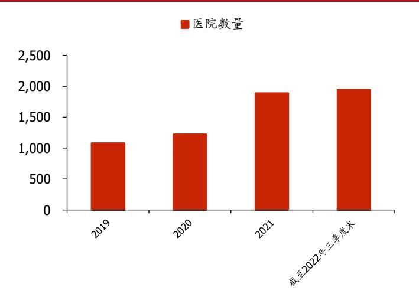  
资料来源：新瑞鹏招股说明书、国盛证券研究所

图表21：瑞派宠物医院数量（家）  
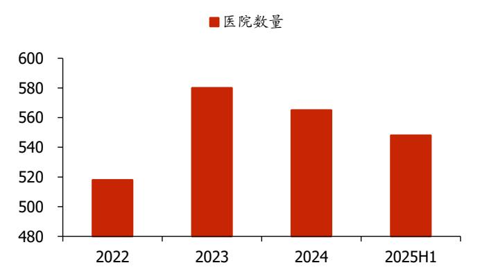  
资料来源：瑞派宠物招股说明书、国盛证券研究所

图表22：新瑞鹏宠物医院毛利率及净利率  
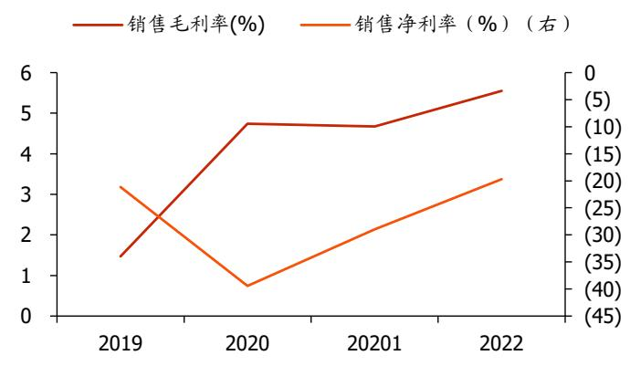  
资料来源：新瑞鹏招股说明书、国盛证券研究所

图表23：瑞派宠物医院毛利率及净利率  
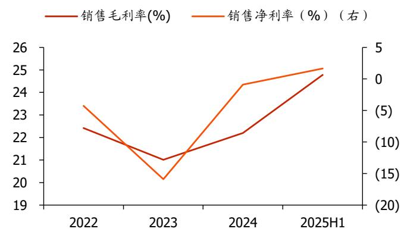  
资料来源：瑞派宠物招股说明书、国盛证券研究所

## 1）新瑞鹏：追求外延扩张，成长为我国第一大宠物医疗机构

1998年瑞鹏第一家医院深圳华南总院开业，1999年芭比堂创立；2009年瑞鹏的连锁宠物医院子品牌纳吉亚成立；2012-2013 年瑞鹏进驻广州以及湖南并同时一路北上不断扩张；2016 年瑞鹏挂牌新三板；2018 年从新三板摘牌开始与高瓴整合；2019年新瑞鹏集团成立，将Skyfield Group 运营的693家宠物医院整合到自身拥有 388家宠物医院的医院网络中，截至 2022年三季度末宠物医院数量达到1942家。

图表24:新瑞鹏集团品牌矩阵  
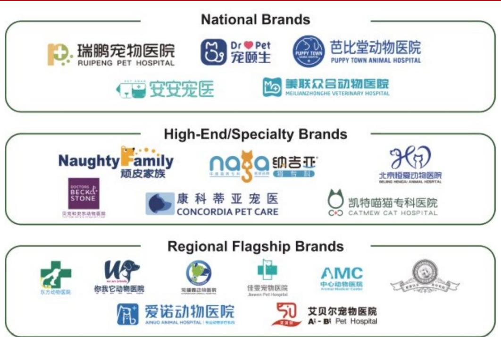  
资料来源：新瑞鹏招股说明书、国盛证券研究所

在实现全国一体化医院网络上，公司拥有多品牌“1+P+C”系统，这三种类型的医院各自拥有不同的能力水平，共同构成了一条层次分明、有机连接的运作链，能够高效且有效地满足中国各地宠物主人的各种需求。在“1+P+C”系统中，将医院、病例和兽医划分为不同的类别，借助诸如排班、指导、转介、咨询、远程治疗和智能治疗等工具，为每只宠物匹配最合适的服务水平。

-“1”（综合性宠物医院）。综合性宠物医院通常负责处理诊断、治疗和康复方面的疑难杂症。它们在采用多学科方法提供医疗服务方面具备强大能力，并具备进行先进且全面的检测、诊断和疗法的优势，这些服务超越了宠物主人为其宠物前来就诊时所面临的表面健康问题范畴，且会根据具体情况结合不同的治疗方法。

-（“P”(专业宠物医院)。专业宠物医院是指拥有一项或多项既定专业领域以及相应专业人才的医院。此类医院提供专业化的医疗服务，并能处理相对复杂的医疗案例，其中许多案例是由社区宠物医院转介而来的。

-（“C”(社区宠物医院)。社区宠物医院是基础宠物护理机构，提供一般宠物护理服务，方便宠物主人就近获取。它们具备标准化的诊断及操作流程，通常会成为需要帮助的宠物主人的第一选择，为他们提供基础护理服务，这些服务性质上 于必要、重复且高频率的范畴。

强大的综合型及专科型宠物医院建立了品牌认知市场，并吸引宠物主人们来到社区宠物医院，遍布中国各地的社区宠物医院为众多宠物主人提供了便利的就诊服务，这些医院通过转介方式引导宠物主人们前往综合性或专科医院就诊，从综合性和专科医院所获得的高质量医疗及其他服务，反过来有助于提升社区宠物医院的客户满意度。

图表25：新瑞鹏医院网络系统  
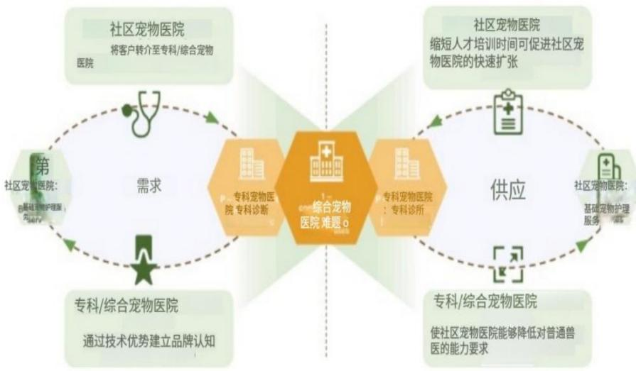  
资料来源：新瑞鹏招股说明书、国盛证券研究所

新瑞鹏提交IPO后追求规模化增长，公司依赖收购手段来整合行业内合适标的，以及实现“1PC”的规模化复制，但这种依靠收购短期进行门店疯狂扩张的模式也为后续发展埋下隐患，截至2022年 9月 30日公司单店收入下降至 118万元（2020年为 168万元）。

主要原因在于我国高质量医生不足及服务能力问题，据中国工程院院士张改平 2024 年介绍，截至 2023 年，我国官方兽医有 13.6 万人，执业兽医 16.5 万人，乡村兽医 17.7万人，按照发达国家每千人对兽医服务的需求比例，我国执业兽医缺径在 30万人左右。另一个问题便是管理问题，盲目扩张势必会带来管理半包问题，公司多品牌战略虽然保留了原有品牌的客户粘性，但也导致了管理割裂，统一芭比堂、瑞鹏等不同品牌的供应链、IT系统和医疗标准是个极大的问题。2024年新瑞鹏年中战略会议上，其主线已经变成“内外兼修，提质提效”。

图表26：新瑞鹏单店收入下滑  
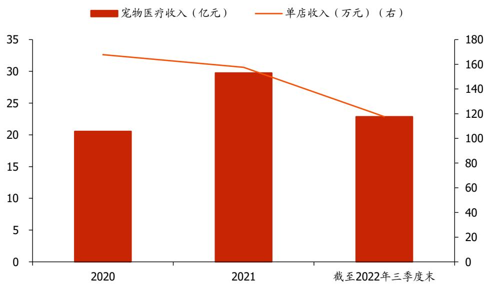  
资料来源：新瑞鹏招股说明书、国盛证券研究所

## 2）瑞派宠物：追求稳健发展，我国第二大宠物医疗机构

2012 年公司正式成立，2013 年以北京及环京区域作为战略起点，成立瑞派京华管理公司，2014 年深入宠物医疗业态成熟的华东区域，2016 年初步完成全国城市布局，实现近100家门店连锁规模，2017年5 月获得美国高盛集团A 轮融资，2017年底发展超过200家门店。

2018年企业开启高速发展模式，相继获华泰新兴产业基金、越秀资本、瑞济医药为公司注入B 轮系列融资，年底达299家门店。2019年12月，获得玛氏中国投资完成C 轮融资，所辖门店超 300 家，并在行业内推行“医院分级管理制度”和“学科分级体系”，2022年再次实现了营收、利润双增长，取得了行业连锁经营利润第一，规模扩张速度第一的空前成绩，医院遍布全国 70余座城市，D 轮融资先后获得基石资本及蒙牛创投基金投资。2025年底，公司递交招股书。

公司以健康管理业务为主，2025 年上半年 91.3%的收入源于宠物诊疗服务，从公司发展历程看，其核心发展思路为（“门店扩张+单店效率提升”的双驱动逻辑，可以看到从22年到 25 年上半年，新建医院数量每年在 31 家及以下，新收购医院数量在 64 家及以下，并且新收购数量每年递减，同时每年有关闭医院，门店数量保持稳定，既是可以留给投资部及自建医院的团队有充分的时间和空间去打磨单店模型，也可以让新并购医院留有稳定的时间去调整和融入。

图表27：截至2025年上半年，公司宠物医院数量达548家（家）  
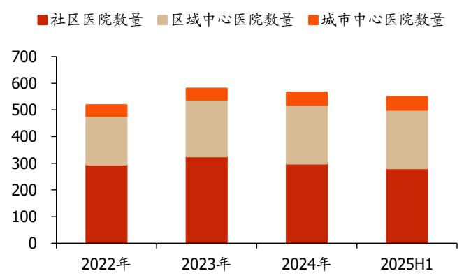  
资料来源：瑞派宠物招股说明书、国盛证券研究所

图表28：公司企业使命-致力宠物健康，赢得宠主敬重  
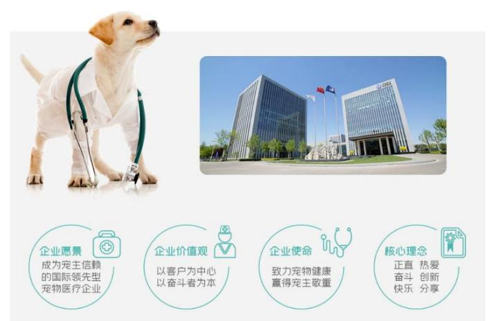  
资料来源：瑞派宠物公司官网、国盛证券研究所

图表29：2025H1公司宠物诊疗服务收入占比91%（%）  
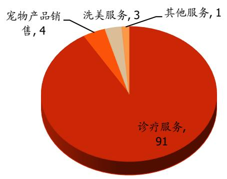  
资料来源：瑞派宠物招股说明书、国盛证券研究所

图表30：2025H1公司区域中心医院收入占比44%（%）  
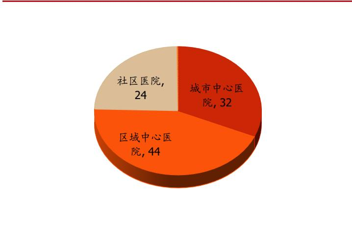  
资料来源：瑞派宠物招股说明书、国盛证券研究所

在运营模式上，公司构建了两大核心竞争力：

1）三级诊疗协同体系：打造“城市中心医院、区域中心医院、社区医院”分级网络，城市中心医院聚焦疑难杂症与专科特色，区域中心医院提供全科与特色专科服务，社区医院侧重基础医疗与预防医学，通过转诊机制实现资源协同，2025年上半年区域中心医院营收占比 44%，为营收贡献主力。

2）首创了 VDP兽医发展伙伴模式，独特的扩张模式是公司稳健发展的关键，VDP通过共同持股、保持特色、瞄准未来的方式经营，与小股东形成事业共同体，呈现事业共有、分工协作、各具特色的特点。公司收购其60%的股权，原团队依然保留 40%的股权，这样可以和医院小股东形成利益共同体，能够有效地减少人才流失，绝大部分宠物医院，院长或者所有人就是医院诊疗技术核心人物，保留其利益和动力，是保障收购后依然稳健发展的关键。

图表31：公司三级诊疗协同体系  
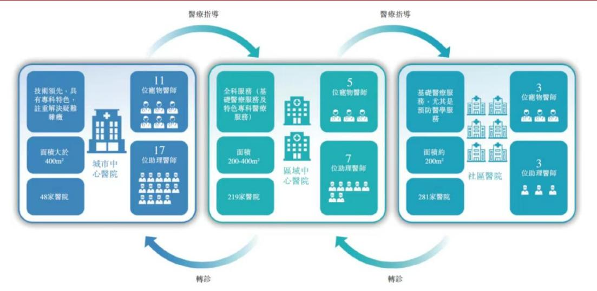  
资料来源：瑞派宠物招股说明书、国盛证券研究所

图表32：公司人效稳步提升（千元/人）  
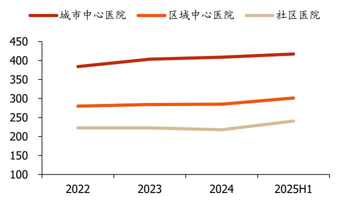  
资料来源：瑞派宠物招股说明书、国盛证券研究所

图表33：公司坪效稳步提升（千元/平方米）  
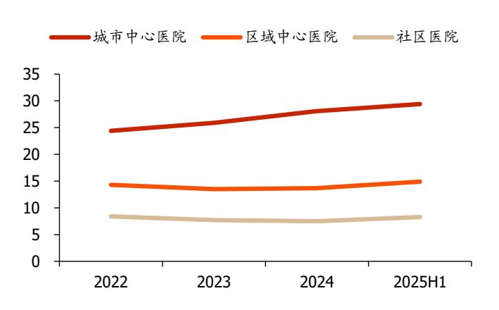  
资料来源：瑞派宠物招股说明书、国盛证券研究所

除此之外，公司成功关键因素在于拥有领先的专科技术水平、标准化的运营体系、完善的全生命周期健康管理服务。领先的专科技术水平，不仅驱动收入稳定增长，更决定了医院盈利能力的跨越，公司在基础医疗、专科医疗领域提供服务，涵盖影像科、检验科、麻醉科、内科、外科、异宠科等核心科室。截至瑞派招股说明书公告最后实际可行日期，公司已拥有 2,137名持有执业兽医师资格证书的宠物医师，其中含括 143位经内部认证的专科医师，22家医院已获得中国兽医协会的五星级认证。

图表34：截至瑞派宠物招股说明书公告最后实际可行日期公司医疗人员占比74%  
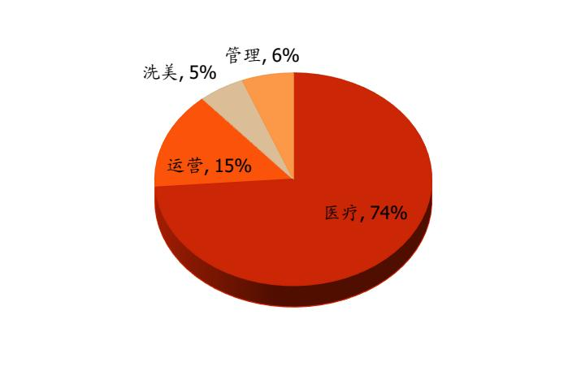  
资料来源：瑞派宠物招股说明书、国盛证券研究所

图表35：截至瑞派宠物招股说明书公告最后实际可行日期公司兽医从业人员五年经验以上占比达49%  
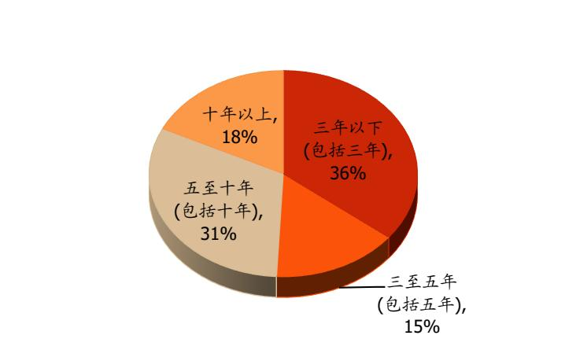  
资料来源：瑞派宠物招股说明书、国盛证券研究所

## 三、大连锁追求稳健发展，精品专科医院谋增长

我国宠物医疗行业起步比美国晚 20年，目前正处于连锁化扩张的关键阶段。从 VCA走全科大连锁、Banfield以预防医学为主发展连锁社区医院、BluePearl走专业化专科医院，其走过 40-80年的发展历程，均找到适合自身理念的模式，在最佳规模下实现高利润增长。而看国内，新瑞鹏的极速扩张带来的是利润快速下滑，而瑞派宠物吸取后发优势，独创 VDP兽医发展伙伴模式，初步解决扩张中“人”和“管理”的问题，谋求稳健发展。我们认为，看历史经验，未来我国可以走出一条大连锁稳健发展、专科精品医院谋增长的道路，主要有：

1）连锁化是趋势但需“并购+整合”并重。目前中国宠物医疗行业的连锁化率较美国而言仍然较低，连锁化是必然趋势。但连锁化不是“盲目并购”，而是“并购+整合”并重。从新瑞鹏及瑞派宠物看，国内企业在并购后，必须重视服务标准化、管理规范化等，否则很容易陷入“规模越大、问题越多”的困境。

2）全产业链布局提升抗风险能力。我国很多宠物医院还依赖单一诊疗收入，抗风险能力弱。VCA的“诊疗+服务+营养”全链布局值得借鉴，国内企业可以拓展专科治疗、宠物护理、用品零售等业务，形成全链路服务，打破单一业务依赖，提升盈利能力和抗风险能力。

3）专业人才是宠物医疗行业的核心壁垒，专科化也是未来发展趋势。可以看到，根据《我国宠物医疗行业报告研究》数据，人才问题是宠物诊疗机构面临的最大问题，占比达到 70%，大于 10 人执业兽医的诊疗机构只占 7%，专科及以下人员占比 60%，目前我国专科兽医缺径较大，制约了行业升级。企业要提前布局专科人才培养，通过完善的激励机制留住核心人才；同时引入新技术提升诊疗效率，才能在未来的竞争中占据优势。此外，随着宠物主健康意识的提升，宠物保险市场也在萌发，布局“医疗+保险”的组合，也能提升用户粘性。

图表36：人才问题是宠物诊疗机构面临的最大问题
<table><tr><td rowspan=1 colspan=2>宠物诊疗机构面临的经营挑战占比</td></tr><tr><td rowspan=1 colspan=1>经营挑战</td><td rowspan=1 colspan=1>占比/%</td></tr><tr><td rowspan=1 colspan=1>人才问题</td><td rowspan=1 colspan=1>70</td></tr><tr><td rowspan=1 colspan=1>市场竞争问题</td><td rowspan=1 colspan=1>62</td></tr><tr><td rowspan=1 colspan=1>管理问题</td><td rowspan=1 colspan=1>57</td></tr><tr><td rowspan=1 colspan=1>资金问题</td><td rowspan=1 colspan=1>30</td></tr><tr><td rowspan=1 colspan=1>其他，请注明</td><td rowspan=1 colspan=1>5</td></tr></table>

资料来源：《2025中国宠物医疗行业研究报告》、国盛证券研究所

图表37：大于10人执业兽医的诊疗机构只占7%（%）  
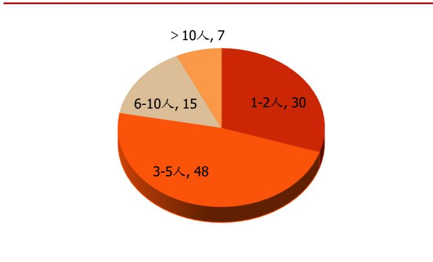  
资料来源：《2025中国宠物医疗行业研究报告》、国盛证券研究所

图表38:诊疗机构专科及以下人员占比60%（%）  
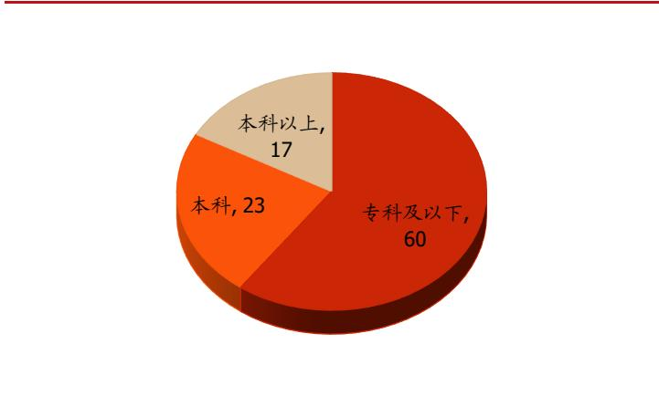  
资料来源：《2025中国宠物医疗行业研究报告》、国盛证券研究所

图表39：专科诊疗占比未来营收增长点74%  
宠物诊疗机构未来营收增长点占比
<table><tr><td rowspan=1 colspan=1>类别</td><td rowspan=1 colspan=1>占比/%</td></tr><tr><td rowspan=1 colspan=1>体检、绝育、疫苗及驱虫等</td><td rowspan=1 colspan=1>76</td></tr><tr><td rowspan=1 colspan=1>专科诊疗</td><td rowspan=1 colspan=1>74</td></tr><tr><td rowspan=1 colspan=1>设备升级</td><td rowspan=1 colspan=1>40</td></tr><tr><td rowspan=1 colspan=1>宠物营养、健康咨询</td><td rowspan=1 colspan=1>28</td></tr><tr><td rowspan=1 colspan=1>线上诊疗</td><td rowspan=1 colspan=1>15</td></tr><tr><td rowspan=1 colspan=1>流动医疗(到家服务等)</td><td rowspan=1 colspan=1>5</td></tr></table>

资料来源：《2025中国宠物医疗行业研究报告》、国盛证券研究所

图表40：专科化也是未来趋势
<table><tr><td rowspan=1 colspan=2>宠物诊疗机构专科特色开设比例</td></tr><tr><td rowspan=1 colspan=1>专科名称</td><td rowspan=1 colspan=1>开设比例/%</td></tr><tr><td rowspan=1 colspan=1>内科</td><td rowspan=1 colspan=1>70</td></tr><tr><td rowspan=1 colspan=1>皮肤科</td><td rowspan=1 colspan=1>60</td></tr><tr><td rowspan=1 colspan=1>猫科</td><td rowspan=1 colspan=1>59</td></tr><tr><td rowspan=1 colspan=1>外科</td><td rowspan=1 colspan=1>49</td></tr><tr><td rowspan=1 colspan=1>影像科</td><td rowspan=1 colspan=1>35</td></tr><tr><td rowspan=1 colspan=1>牙科</td><td rowspan=1 colspan=1>35</td></tr><tr><td rowspan=1 colspan=1>心脏科</td><td rowspan=1 colspan=1>32</td></tr><tr><td rowspan=1 colspan=1>老年病</td><td rowspan=1 colspan=1>30</td></tr><tr><td rowspan=1 colspan=1>无</td><td rowspan=1 colspan=1>28</td></tr><tr><td rowspan=1 colspan=1>眼科</td><td rowspan=1 colspan=1>11</td></tr><tr><td rowspan=1 colspan=1>肿瘤</td><td rowspan=1 colspan=1>10.5</td></tr><tr><td rowspan=1 colspan=1>中兽医</td><td rowspan=1 colspan=1>7.5</td></tr><tr><td rowspan=1 colspan=1>异宠</td><td rowspan=1 colspan=1>2.5</td></tr></table>

资料来源：《2025中国宠物医疗行业研究报告》、国盛证券研究所

## 四、风险提示

1、宠物数量增长不及预期。目前我国宠物数量仍保持较好增速，但若因社会经济等因素导致宠物数量增长不及预期，那么也会导致宠物医院业务增长疲软。

2、市场竞争加剧导致医院效益不及预期。目前我国宠物医院竞争较为激烈，连锁化扩张快速，专科医院发展强劲，头部企业或因跨区域管理能力不足，可能出现客流量分流、门店盈利不及预期等。

3、核心兽医人才短缺及流失风险。目前行业存在兽医人才短缺，核心兽医人才供给不足，若出现因职业发展通道有限、待遇不足等问题导致骨干医生大规模流失，宠物医院可能面临人手不足、诊疗效率下降等困境，进而影响医院运营。

## 免责声明

国盛证券股份有限公司（以下简称“本公司”）具有中国证监会许可的证券投资咨询业务资格。本报告仅供本公司的客户使用。本公司不会因接收人收到本报告而视其为客户。在任何情况下，本公司不对任何人因使用本报告中的任何内容所引致的任何损失负任何责任。

本报告的信息均来源于本公司认为可信的公开资料，但本公司及其研究人员对该等信息的准确性及完整性不作任何保证。本报告中的资料、意见及预测仅反映本公司于发布本报告当日的判断，可能会随时调整。在不同时期，本公司可发出与本报告所载资料、意见及推测不一致的报告。本公司不保证本报告所 信息及资料保持在最新状态，对本报告所 信息可在不发出通知的情形下做出修改，投资者应当自行关注相应的更新或修改。

本公司力求报告内容客观、公正，但本报告所载的资料、工具、意见、信息及推测只提供给客户作参考之用，不构成任何投资、法律、会计或税务的最终操作建议，本公司不就报告中的内容对最终操作建议做出任何担保。本报告中所指的投资及服务可能不适合个别客户，不构成客户私人咨询建议。投资者应当充分考虑自身特定状况，并完整理解和使用本报告内容，不应视本报告为做出投资决策的唯一因素。

投资者应注意，在法律许可的情况下，本公司及其本公司的关联机构可能会持有本报告中涉及的公司所发行的证券并进行交易，也可能为这些公司正在提供或争取提供投资银行、财务顾问和金融产品等各种金融服务。

本报告版权归“国盛证券股份有限公司”所有。未经事先本公司书面授权，任何机构或个人不得对本报告进行任何形式的发布、复制。任何机构或个人如引用、刊发本报告，需注明出处为“国盛证券研究所”，且不得对本报告进行有悖原意的删节或修改。

## 分析师声明

本报告署名分析师在此声明：我们具有中国证券业协会授予的证券投资咨询执业资格或相当的专业胜任能力，本报告所表述的任何观点均精准地反映了我们对标的证券和发行人的个人看法，结论不受任何第三方的授意或影响。我们所得报酬的任何部分无论是在过去、现在及将来均不会与本报告中的具体投资建议或观点有直接或间接联系。

投资评级说明
<table><tr><td rowspan=1 colspan=1>投资建议的评级标准</td><td rowspan=1 colspan=1></td><td rowspan=1 colspan=1>评级</td><td rowspan=1 colspan=1>说明</td></tr><tr><td rowspan=7 colspan=1>评级标准为报告发布日后的6个月内公司股价（或行业指数）相对同期基准指数的相对市场表现。其中A股市场以沪深300 指数为基准；新三板市场以三板成指（针对协议转让标的)或三板做市指数(针对做市转让标的）为基准；香港市场以摩根士丹利中国指数为基准，美股市场以标普 500 指数或纳斯达克综合指数为基准。</td><td rowspan=4 colspan=1>股票评级</td><td rowspan=1 colspan=1>买入</td><td rowspan=1 colspan=1>相对同期基准指数涨幅在15%以上</td></tr><tr><td rowspan=1 colspan=1>增持</td><td rowspan=1 colspan=1>相对同期基准指数涨幅在5%~15%之间</td></tr><tr><td rowspan=1 colspan=1>持有</td><td rowspan=1 colspan=1>相对同期基准指数涨幅在-5%~+5%之间</td></tr><tr><td rowspan=1 colspan=1>减持</td><td rowspan=1 colspan=1>相对同期基准指数跌幅在5%以上</td></tr><tr><td rowspan=3 colspan=1>行业评级</td><td rowspan=1 colspan=1>增持</td><td rowspan=1 colspan=1>相对同期基准指数涨幅在10%以上</td></tr><tr><td rowspan=1 colspan=1>中性</td><td rowspan=1 colspan=1>相对同期基准指数涨幅在-10%~+10%之间</td></tr><tr><td rowspan=1 colspan=1>减持</td><td rowspan=1 colspan=1>相对同期基准指数跌幅在10%以上</td></tr></table>

## 国盛证券研究所

北京

地址：北京市东城区永定门西滨河路 8号院 7 楼中海地产广

上海

地址：上海市浦东新区南洋泾路 555 号陆家嘴金融街区 22

场东塔 7 层

栋

邮编：100077

邮编：200120

邮箱：gsresearch@gszq.com

电话：021-38124100

邮箱：gsresearch@gszq.com

南昌

深圳

地址：南昌市红谷滩新区凤凰中大道 1115 号北京银行大厦

地址：深圳市福田区福华三路 100 号鼎和大厦 24楼

邮编：330038

邮编：518033

传真：0791-86281485

邮箱：gsresearch@gszq.com

邮箱：gsresearch@gszq.com