证券研究报告 2026年4月18日2026年04月17日

# “资产荒”的新叙事2025年财报里的金融机构配置线索

行业研究 · 深度报告

金融投资评级：无评级

证券分析师：王剑

证券分析师：孔祥

证券分析师：陈俊良

证券分析师：田维韦

证券分析师：王德坤

证券分析师：王京灵

021-60875165

021-60375452

021-60875161

021-60875161

021-61761035

wangjian@guosen.co m.cn

kongxiang@guosen.c om.cn

chenjunliang@guose n.com.cn

0755-22941150

tianweiwei@guosen. com.cn

wangdekun@guosen.com .cn

S0980518070002

S0980523060004

S0980519010001

wangjingling@guose n.com.cn

S0980520030002

S0980524070008

S0980525070007

请务必阅读正文之后的免责声明及其项下所有内容

## 摘要

• 银行金市：2025年央行通过大幅增加“对其他存款性公司债权”向银行体系注入流动性，但商业银行仍面临显著“资产荒”压力。一方面，信贷需求疲弱导致贷款增速回落；另一方面，居民和企业存款持续高增，使得存贷增速差不断扩大。应对此困局，银行在资产端加大债券投资力度，特别是增配政府债券，并普遍提高FVOCI账户占比以平滑利润波动；在负债端则主动加强存款成本管控，使得存款定期化趋势放缓，整体负债成本明显回落。

• 理财产品：银行理财规模在2025年显著回升，但其资产配置行为在“多资产”道路上正经历新考验。理财资金大幅增加了对公募基金和存款的配置，相应减少了对信用债与非标资产的持仓；同时其基金配置呈现出鲜明工具化特征，以债基和货基为主，对权益类基金配置很少。这表明，理财资金在寻求多元收益来源的同时，其负债端对波动的低容忍度，决定了其“多资产”策略仍以稳健为首要目标，如何平衡收益与波动成为新挑战。

• 保险配置：保险公司的资产配置策略由其负债特性驱动，在2025年达到了权益配置的历史高位：在负债端，行业通过大力发展分红险、建立预定利率动态调整机制，有效降低刚性负债成本；在投资端，为寻求超额收益以匹配负债要求，险资大幅增配股票及权益基金，带动总投资收益率显著提升。但高比例权益资产也消耗了大量资本，导致行业偿付能力充足率普遍承压，凸显满足负债要求与高波动资产之间的平衡难题，保持高分红（OCI账户）和高成长(TPL账户)的哑铃型结构，继续择机增配OCI账户的高分红资产将是破题路径。

• 券商经营：证券公司业绩表现日益取决于自营投资能力，投资业务已成为其最大收入来源。2025年券商自营规模持续扩张，且资产结构发生显著变化，股票投资占比大幅提升至24%以上。这反映出头部券商自营业务正从传统的方向性投资，向兼容多资产、多策略的多元化模式演进，通过提升对波动性的管理能力，力图使自营业务成为业绩稳定“压舱石”，而不仅仅是“靠天吃饭”的波动来源，随着各种对冲套利、中性策略使用，大FICC模式运作凸显。

• 基金转型：公募基金行业正沿着“工具化”与“解决方案化”两条路径并行发展。在工具化方面，产品结构持续向工具型产品演进，不仅股票型基金占比提升，以FOF和“固收+”为代表的解决方案型产品也实现爆发式增长；从资产配置看，公募基金作为重要市场工具，当下权益持仓高度集中于TMT、医药等成长行业，并显著低配金融、周期板块，这既是追随市场趋势和景气赛道，也通过行业配置和赛道选择强化了特定市场风格。

01 银行金市：负债宽裕，资产荒再现

02 理财产品：多资产，新考验

03 保险配置：负债驱动，权益高位

04 券商经营：自营成胜负手，策略兼容增强

基金转型：工具化和解决方案化并举➢ 2025年末，人行总资产48.16万亿元，新增约4.11万亿元；总资产结构上，央行对其他存款性公司债权新增约4.86万亿元，外汇资产减少0.75万亿元，对政府债权减少约6718亿元。

➢ 央行对其他存款性公司债权，即央行“借给”商业银行等金融机构的钱，这是央行向银行体系注入流动性的主要方式，同时也是央行货币政策操作的直接体现。它的增减变化，直接反映了央行是在向市场投放货币还是在回收货币，成为观察货币政策松紧的关键风向标。

图：央行总资产规模保持扩张  
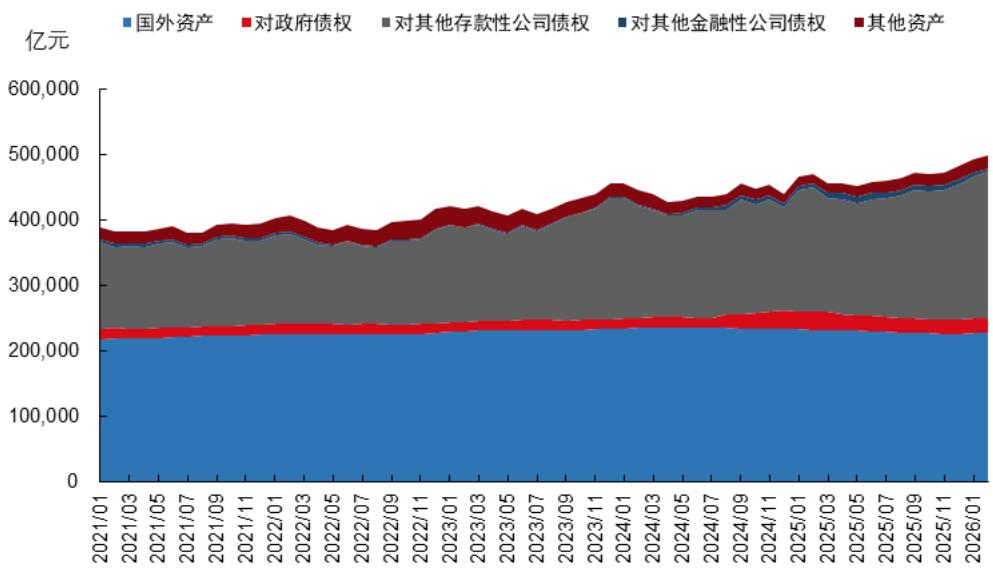  
资料来源：WIND，国信证券经济研究所整理

图：2025年央行资产增量主要体现在面向商业银行融资  
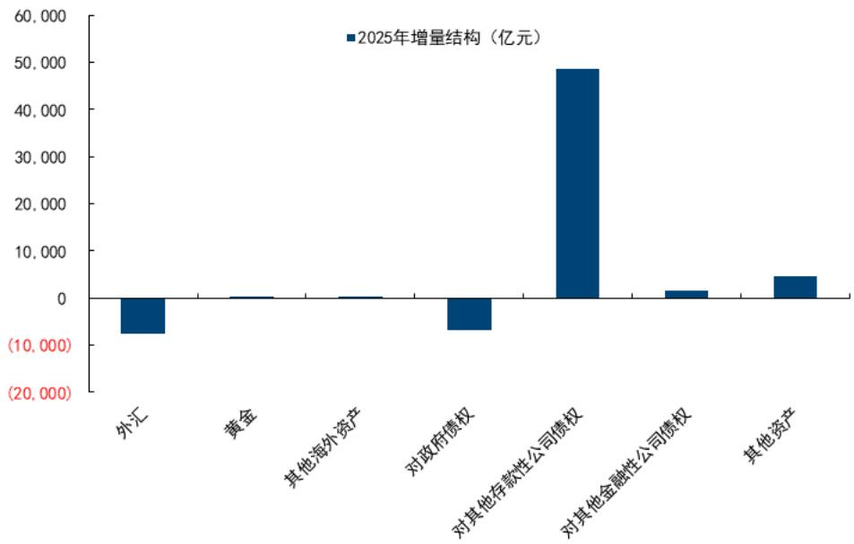  
资料来源：WIND，国信证券经济研究所整理

## 央行流动性投放方式多维度体现

➢ 买断式逆回购工具常态化运用。2024年10月人行启用公开市场买断式逆回购操作工具。买断式逆回购更真实反映机构对资金的需求程度，减少机构在利率招标时的“搭便车”行为；同时，中短期流动性投放工具丰富，增强人行对于1年以内的流动性跨期调节能力。

➢ MLF基准利率信号功能剥离，回归流动性投放工具本质。2025年3月其，MLF操作采用固定数量、利率招标、多重价位中标方式开展，这一调整标志着MLF利率政策属性完全淡出，其定位更聚焦于提供1年期中期流动性支持形成。

➢ 完善国债买卖常态化操作机制。2025年初，国债市场供不应求压力进一步加大，1月人行宣布阶段性暂停在公开市场买入国债，并更多使用其他工具投放基础货币，维护流动性和债券市场平稳运行。10月，考虑到国债市场供求趋于平衡，人行恢复国债买入操作，10月、11月、12月分别净买入200 亿元、500亿元和500 亿元。未来人行将常态化开展国债买卖操作，关注长期收益率的变化，灵活把握操作规模。

图：2024年10月以来买断式逆回购常态运用  
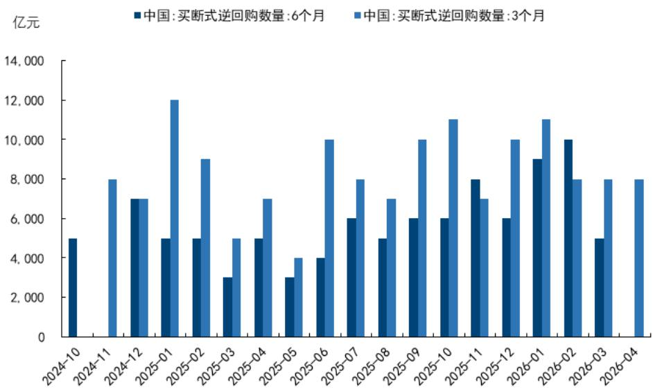  
资料来源：WIND，国信证券经济研究所整理

图：央行MLF投放回归流动性投放本质  
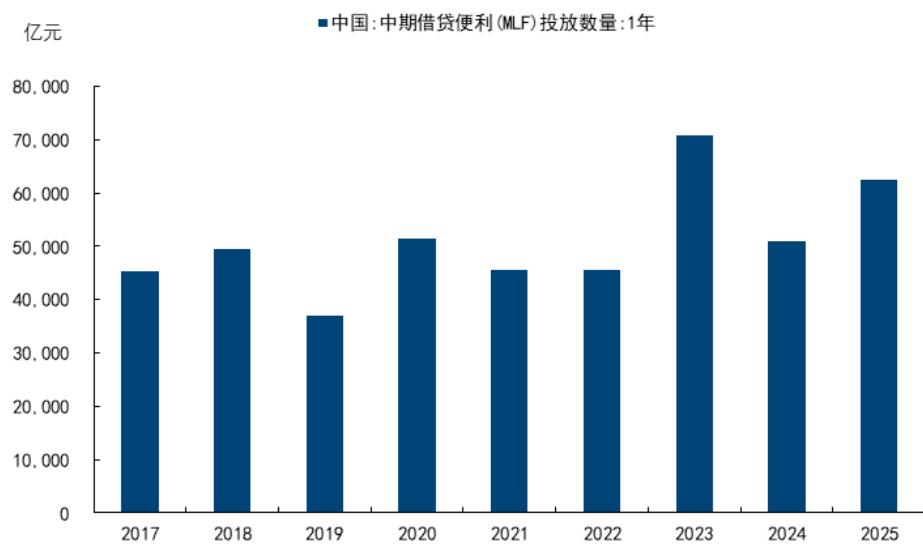  
资料来源：WIND，国信证券经济研究所整理

## 汇金融资依托央行，“类平准基金”注重资本市场稳定

➢ 2024年以来，流动性支持对于资本市场稳定至关重要，2024年初、2024年中、2025年4月等市场大幅波动期间，央行显著加大了对其他金融性公司的流动性投放。2026年初以来，流动性回收态势明显。

图：央行对其他金融性公司债券和上证指数比较  
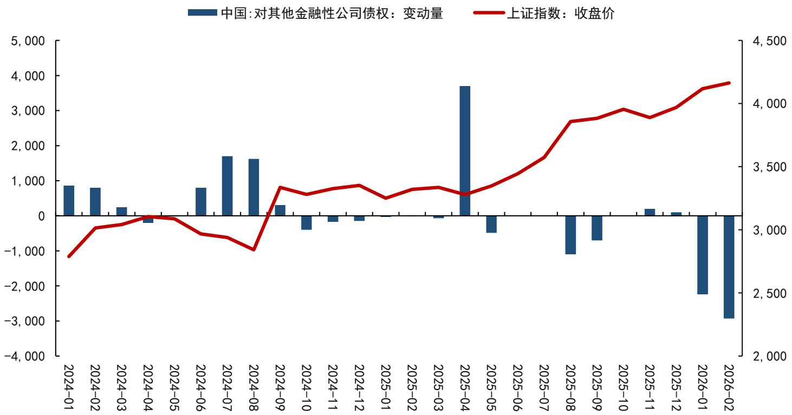  
资料来源：Wind，国信证券经济研究所整理

金融机构资产荒加剧，负债端优化存款结构，主动融资动力下降。

➢ 金融机构资产荒加剧，贷款增速明显回落。但低风险偏好背景下，居民存款高增，存贷增速差持续扩大，进一步加剧了金融机构的资产配置压力。但投资端来看，债市利率长期处于低位区间，且波动幅度显著加大，债券投资难度进一步提升。为应对这一困境，金融机构持续强化负债端管控，重点优化存款结构，同时主动收缩主动融资规模，以此缓解资产负债错配压力，实现经营的稳健性。

图：金融机构资产荒加剧  
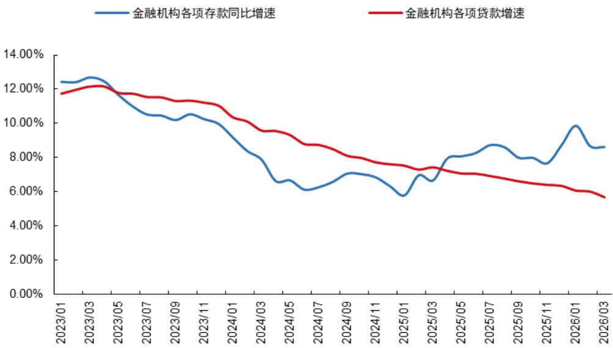  
资料来源：WIND，国信证券经济研究所整理

图：存款持续高增，金融债券增速放缓  
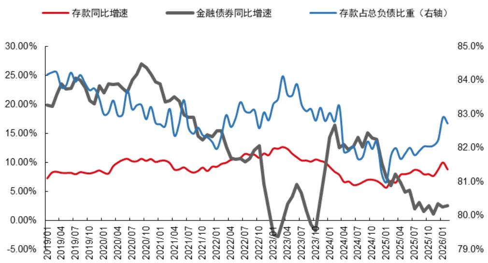  
资料来源：WIND，国信证券经济研究所整理

## 存款定期化趋势放缓，存款成本回落明显（总量视角）

2025年存款定期化趋势放缓，M1-M2增速差持续收敛，居民和企业定期存款比例趋于稳定。我们认为核心因素包括，一是，高息存款大量到期，存款挂牌利率大幅调降后，部分到期高息存款沉淀为活期存款；二是，前文所述的银行主动加强存款管控，引导高息存款流出。

图：居民和企业存款定期化趋势放缓  
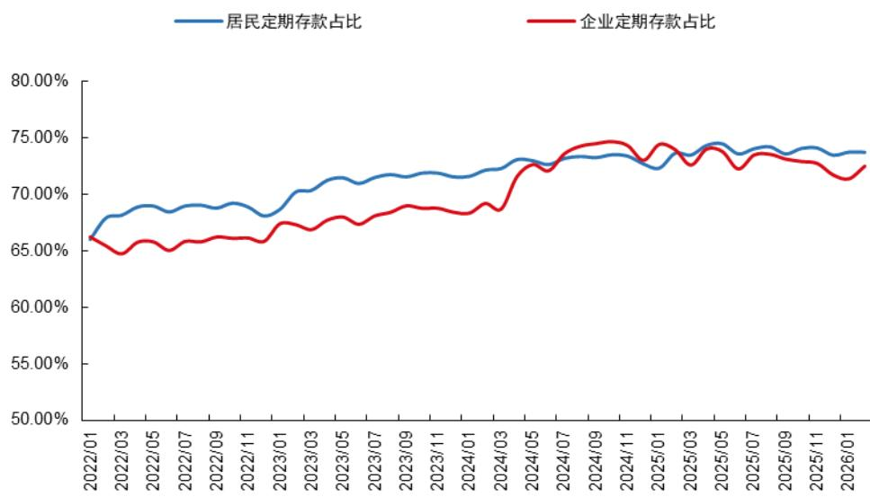  
资料来源：WIND，国信证券经济研究所整理

图：M1-M2增速剪刀差持续收敛  
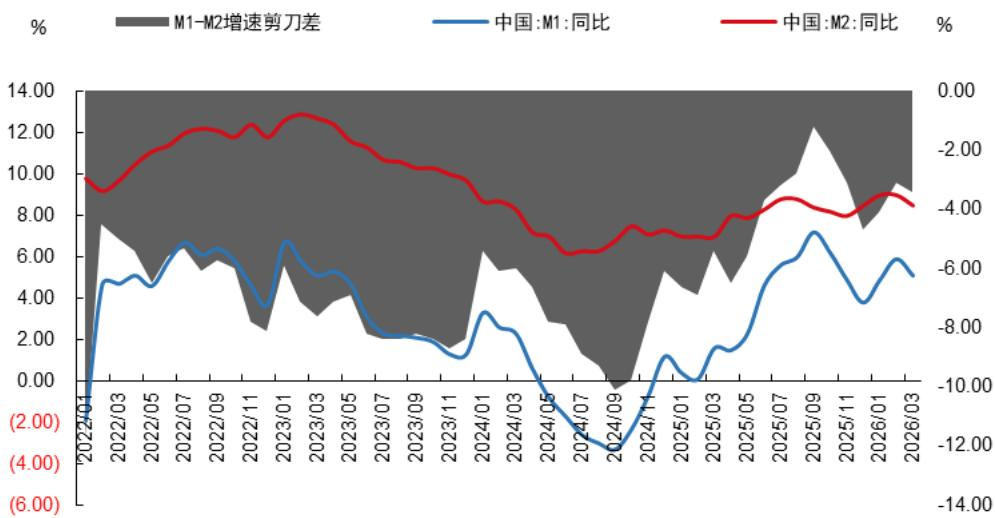  
资料来源：WIND，国信证券经济研究所整理

## 存款定期化趋势放缓，存款成本回落明显（机构视角）

2025年上市银行（22家）存款成本率降幅均值34bps，计息负债付息率降幅均值38bps。其中，工行、建行和农行存款成本率已经降至1.36%、1.32%和  
1.34%；邮储银行和招商银行存款成本率已经降至1.15%和1.17%。

图：上市银行2025年存款付息率明显回落  
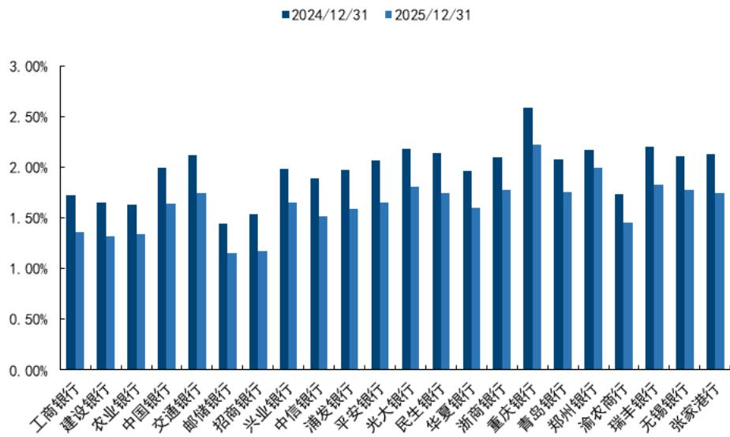  
资料来源：WIND，国信证券经济研究所整理

图：上市银行2025年计息负债成本率下降  
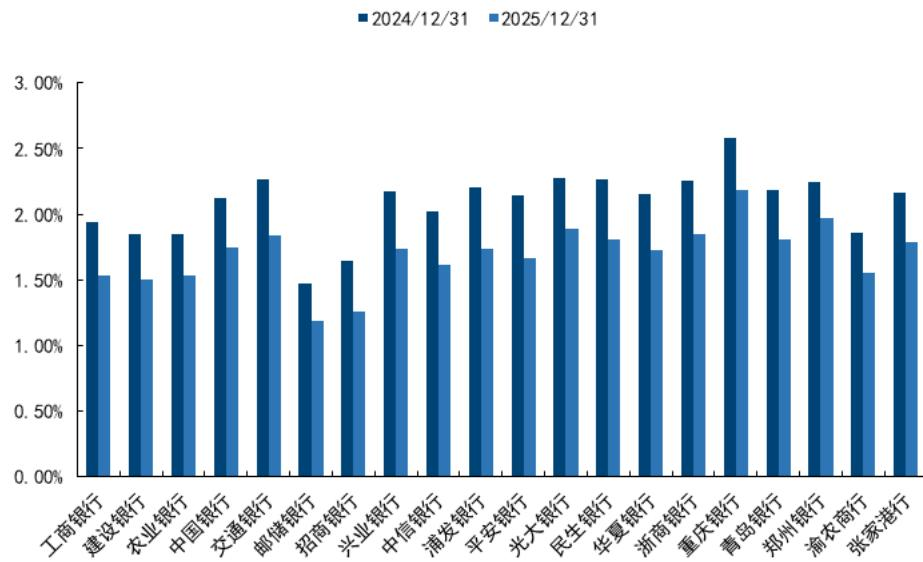  
资料来源：WIND，国信证券经济研究所整理

2026年前4月，银行相关债券发行呈现明显滞后态势：同业存单发行约7.3万亿元，较前两年同期超10万亿的水平大幅回落；商业银行债全程未发行，商业银行次级债券仅在4月有2700亿元发行，整体发行节奏显著慢于往年。

➢ 银行资产荒加剧，加上监管引导银行规范高息同业存款，制了银行通过同业存单等工具主动融资的需求。

➢ 当前市场普遍认为监管正研究将同业存单与二级资本债、永续债等金融债进行额度统筹管理，这种预期使得银行主动降低了同业存单的发行意愿。

➢ 商业银行债及次级债券的发行需履行“双批文”审批流程，需同时获得金融监管总局与人民银行的核准，2026年央行批文下达时间接近一季度末，行政许可有效期相应顺延，导致一季度相关债券发行处于静默状态，直至4月才逐步启动次级债券发行。

图：2026年前4月同业存单发行规模低于前两年  
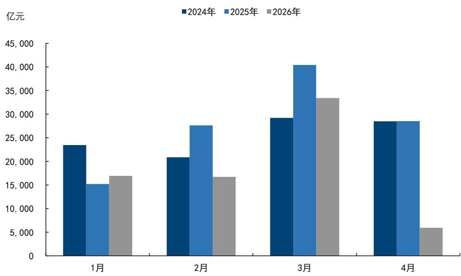  
资料来源：WIND，国信证券经济研究所整理，注：数据截至4月13日。

图：银行2026年金融债4月启动发行  
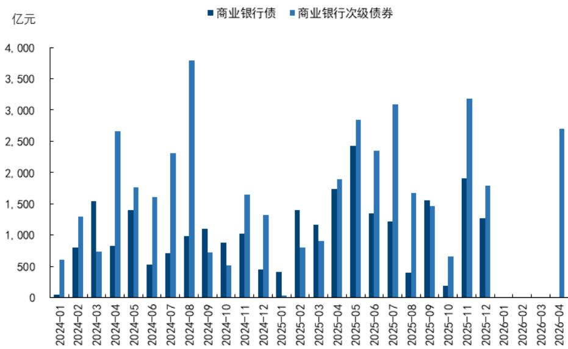  
资料来源：WIND，国信证券经济研究所整理。注：数据截至4月13日

## 主动负债：主动负债工具统管预期导致发行后置

## 监管思路：

✓ 防止银行在不同融资工具间腾挪额度以规避监管，过度放大杠杆；

✓ 引导银行负债重心从同业融资向核心存款回归；

✓ 通过鼓励用长期限的资本工具替代部分短期同业存单，以降低银行体系的期限错配风险。

机构行为：在统一“批发融资总限额”约束下，未来银行需要在短期流动性补充（同业存单）与长期资本补充（金融债乃至二级资本债/永续债）之间进行权衡。

表：当前NCD和金融债发行管理比较
<table><tr><td>维度</td><td>同业存单（NCD）</td><td>金融债（二永债等）</td></tr><tr><td>审批机构</td><td>人民银行</td><td>人民银行、金融监管总局</td></tr><tr><td>发行机制</td><td>备案制 (年度发行计划)</td><td>双审批制：（1）资本工具额度审批（金 监总局）；（2）金融债余额审批（人行</td></tr><tr><td>管控要求</td><td>年内任意时点余额不超过备案额度</td><td>（1）资本工具：累计发行不超过在有效 期内的金监总局批复额度；（2）整体余 额：年度新增余额不超过人行批复额度</td></tr><tr><td>批复文件</td><td></td><td>（1）金监总局：《关于XX 银行申请资 《XX 银行 XX 年度同业存单发行计划》本工具发行额度的批复》；（2）人行： 《XX 银行金融债行政许可决定书》</td></tr><tr><td>期限特征</td><td>短期 (1 年及以内)</td><td>中长期为主 (3-5 年及以上)</td></tr></table>

资料来源：中国人民银行，金融监管总局，国信证券经济研究所整理

图：同业存单发行规模  
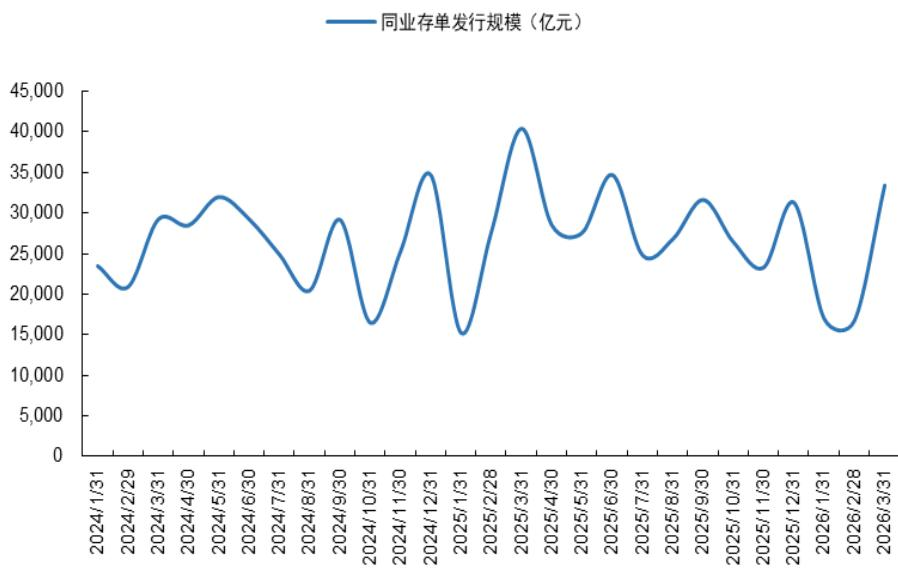  
资料来源：WIND，国信证券经济研究所整理

## 流动性指标（LCR和NSFR）

上市银行LCR/NSFR指标均满足监管要求，2024-2025年呈现出LCR普遍高企，NSFR持续改善的特征，短期不面临压力。

图：上市银行LCR指标  
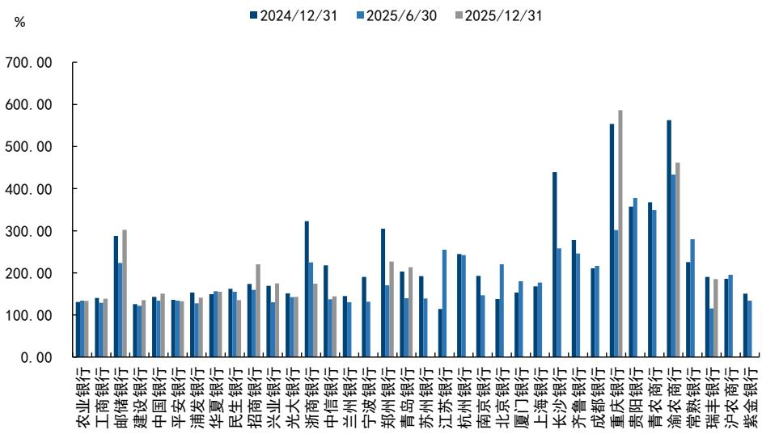  
资料来源：WIND，国信证券经济研究所整理

图：上市银行NSFR指标  
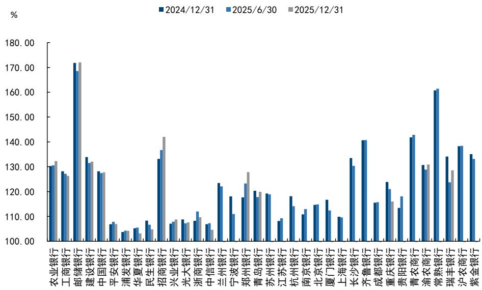  
资料来源：WIND，国信证券经济研究所整理

## 金市配置：大行买债汹涌，寻找曲线凸点

➢ 随着一级交易商考核模式变化，大行将通过加大交易、作市、报价、代客等方式，持续拓展金融市场部职能。

图：银行金融市场业务架构  
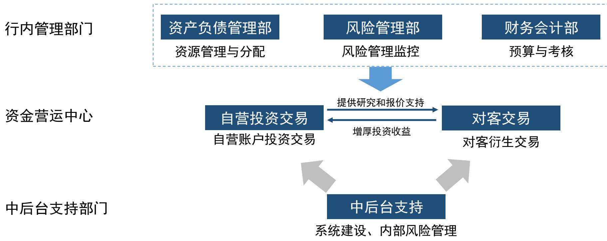  
资料来源：上市银行年报，国信证券经济研究所整理

目前已有22家上市银行披露了2025年报。从这部分银行的资产结构来看，2025年信贷需求较弱，银行进一步加大金融投资配置力度。

➢ 银行资产荒加剧、信贷需求疲弱，贷款占总资产比重较年初下降了约1个百分点。

➢ 存贷增速差扩大背景下，银行将更多资金配置到金融投资中，金融投资占总资产比重较年初提升1.1个百分点

图：上市银行贷款占总资产比重下降  
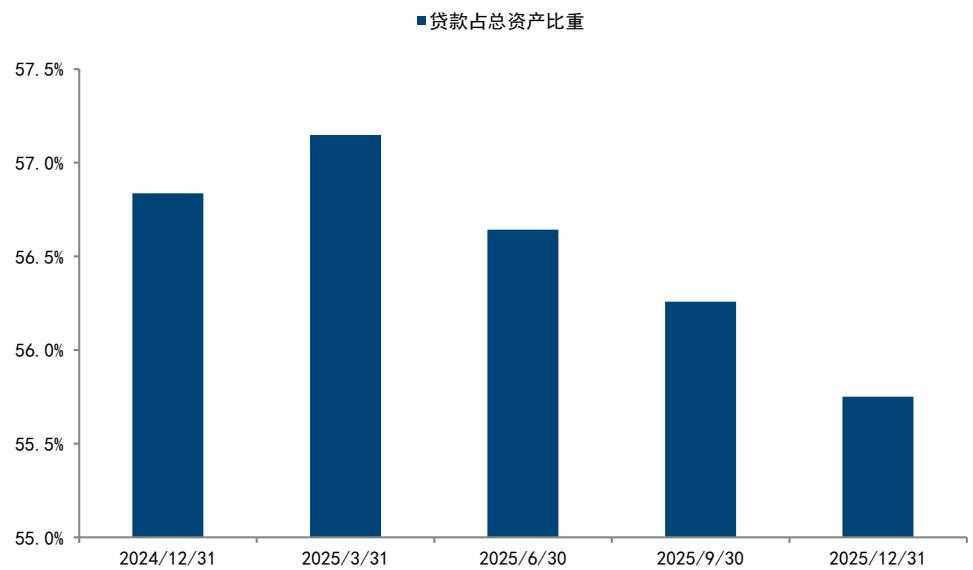  
资料来源：WIND，国信证券经济研究所整理

图：上市银行金融投资占总资产比重提升  
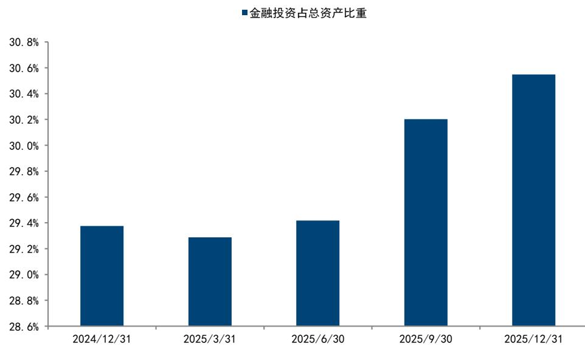  
资料来源：WIND，国信证券经济研究所整理

我们汇总统计了16家上市银行的金融投资细项。

➢ 从2025年末金融投资结构来看，政府债、政金债、金融债及同业存单依然是配置的主流，金融投资的主要功能仍以流动性管理为主

➢ 从结构变化来看，非标占比下降，基金投资占比也有所回落

➢ 银行加大债券直接投资力度，其中政府债券配置占比明显提升，政金债占比略有回落

图：上市银行2025年末金融投资结构  
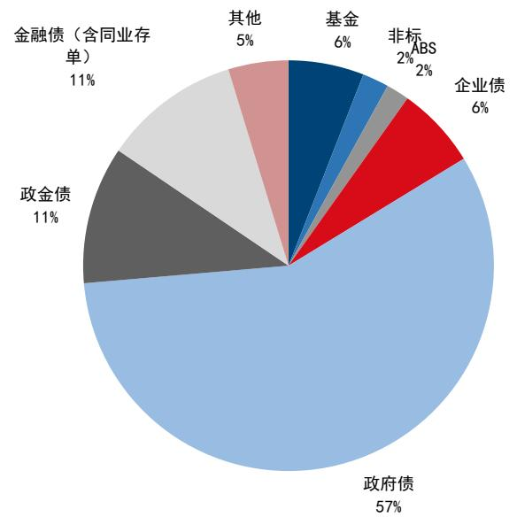  
资料来源：WIND，上市银行年报，国信证券经济研究所整理

图：上市银行2025年金融投资结构较年初变化  
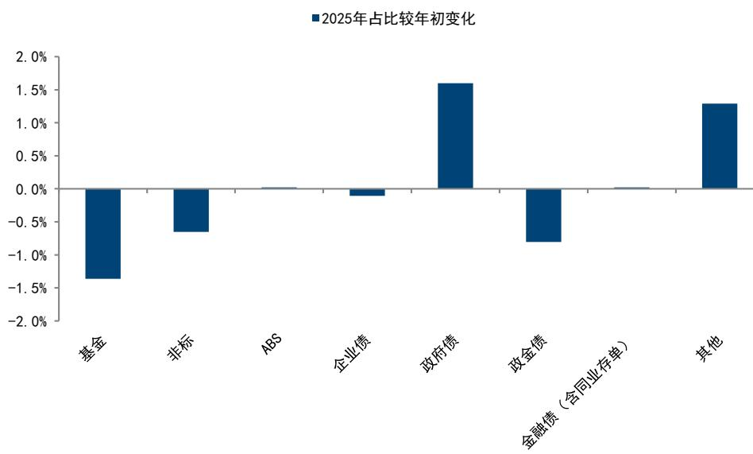  
资料来源：WIND，上市银行年报，国信证券经济研究所整理

从22家上市银行的金融投资的三分类情况来看：

➢ 2025年末上市银行AC占比仍然高达61%，FVOCI占比28%，FVPL占比11%

➢ 2025年上市银行提高了FVOCI账户的资产比重

图：上市银行金融投资结构  
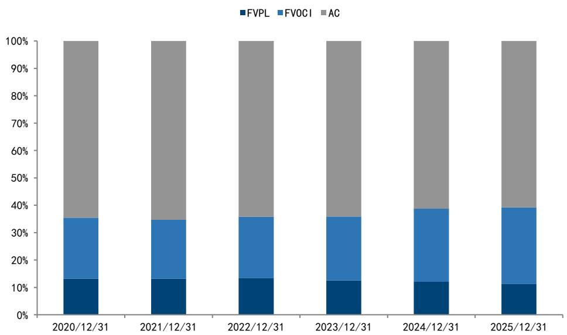  
资料来源：WIND，国信证券经济研究所整理

图：上市银行2025年金融投资结构较年初变化  
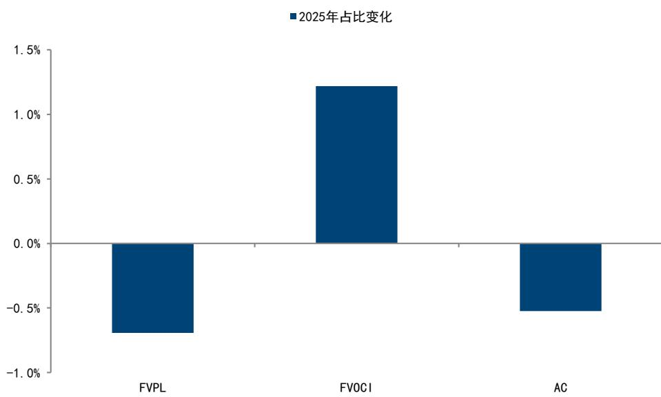  
资料来源：WIND，国信证券经济研究所整理

△EVE（经济价值变动）方面，大行的△EVE /一级资本相对较高，股份行普遍较低。

2025年上市银行△EVE /一级资本有升有降，平均较年初上升了0.3个百分点

图：上市银行2025年末△EVE /一级资本情况  
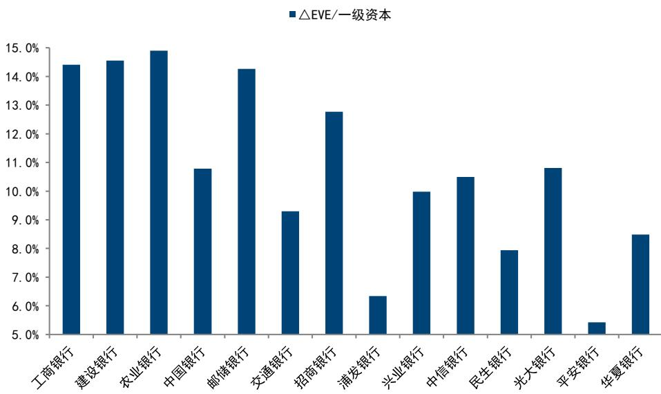  
资料来源：WIND，上市银行第三支柱报告，国信证券经济研究所整理

图：上市银行2025年△EVE /一级资本较年初变化  
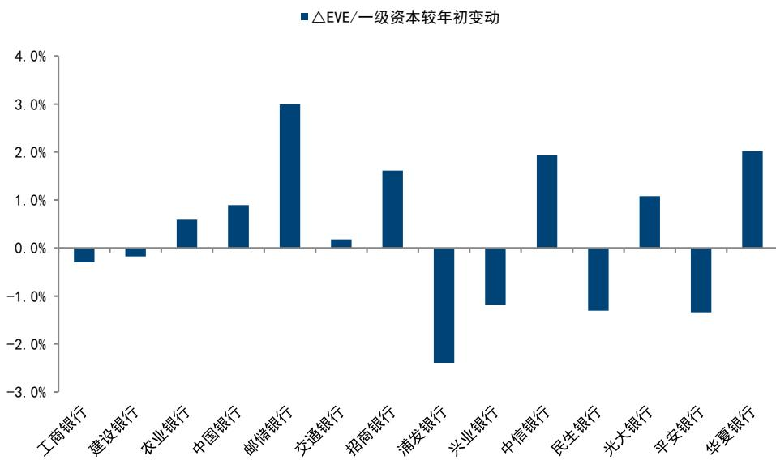  
资料来源：WIND，上市银行年报，国信证券经济研究所整理

## 资产配置：FVOCI仍有显著浮盈，国有大行优势明显

受债市波动影响，2025年末上市国有行及股份行累计FVOCI浮盈有所减少，降至约1900亿元，占期末FVOCI资产规模的0.8%。其中大行浮盈占比相对较高，股份行相对较少

图：上市银行2025年末FVOCI浮盈占比  
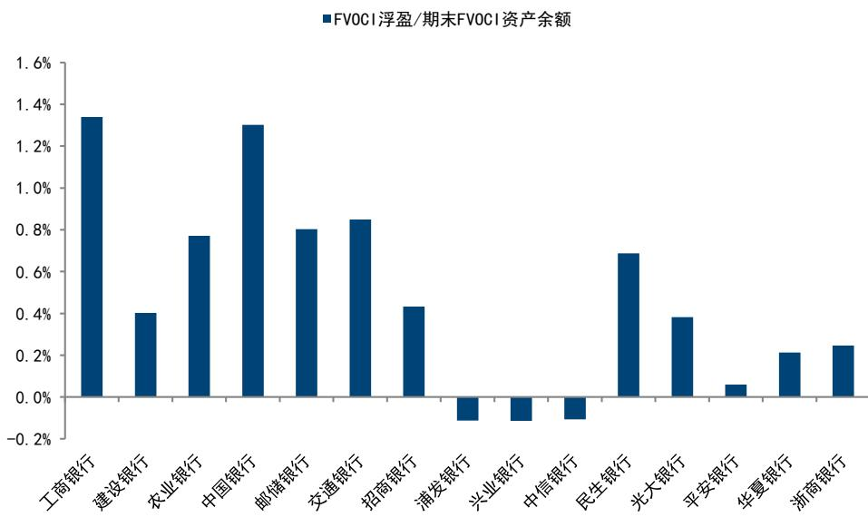  
资料来源：WIND，上市银行年报，国信证券经济研究所整理

历经三年下降之后，2025年上市银行手续费及佣金净收入增速止跌回升

受益于资本市场回暖，财富管理业务收入回升。以招商银行为例，其财富管理业务收入明显增加

图：上市银行2025年手续费及佣金净收入增速止跌回升  
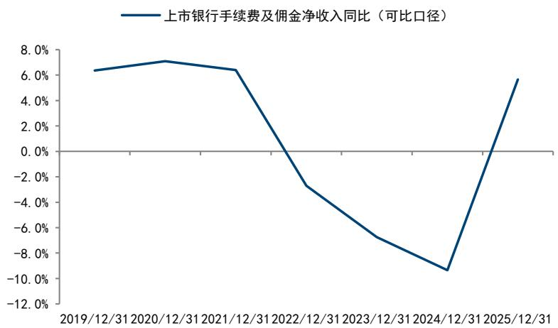  
资料来源：WIND，国信证券经济研究所整理

图：招商银行2025年财富管理业务收入回升  
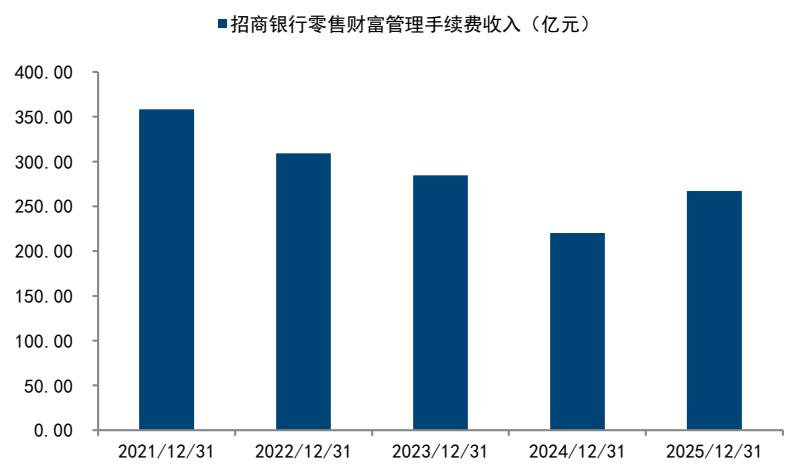  
资料来源：上市银行年报，国信证券经济研究所整理

图：招商银行代销理财、信托、基金收入均增加  
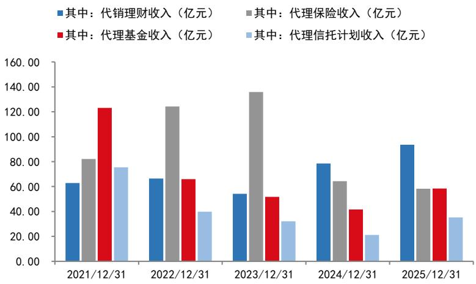  
资料来源：上市银行年报，国信证券经济研究所整理

01 银行金市：负债宽裕，资产荒再现

02 理财产品：多资产，新考验

03 保险配置：负债驱动，权益高位

04 券商经营：自营成胜负手，策略兼容增强

05 基金转型：工具化和解决方案化并举

2025年理财规模回升。截至2025年末，全国共有159家银行机构和32家理财公司有存续的理财产品，共存续产品4.63万只，存续规模33.29万亿元，较年初增加  
11.15%。

图：2025年银行理财规模回升  
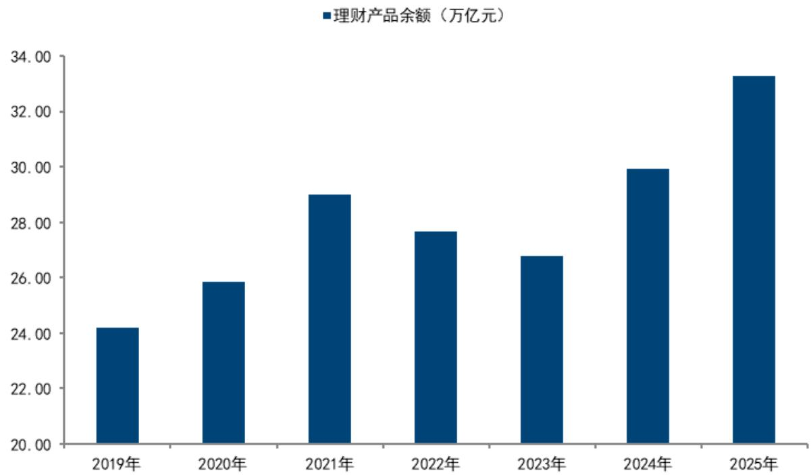  
资料来源：中国理财网，国信证券经济研究所整理

## 理财公司利润增速高于规模，表明高费率产品占比提升

部分银行披露了2025年理财子公司的规模和利润数据。从合计数据来看，2025年样本银行理财公司合计理财产品规模同比增长13%，合计净利润同比增长16%。

图：2025年部分理财公司理财产品规模数据  
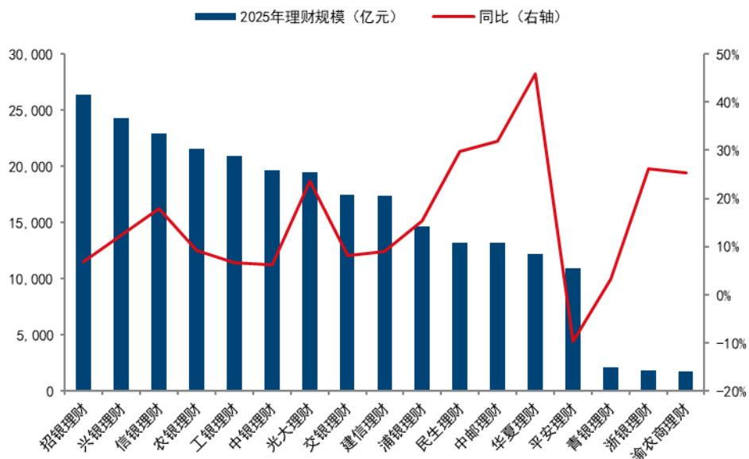  
资料来源：企业预警通，上市银行2025年报，国信证券经济研究所整理。注：浙银理财同比基期数据采用的是2024年母行理财规模。

图：2025年部分理财公司净利润数据  
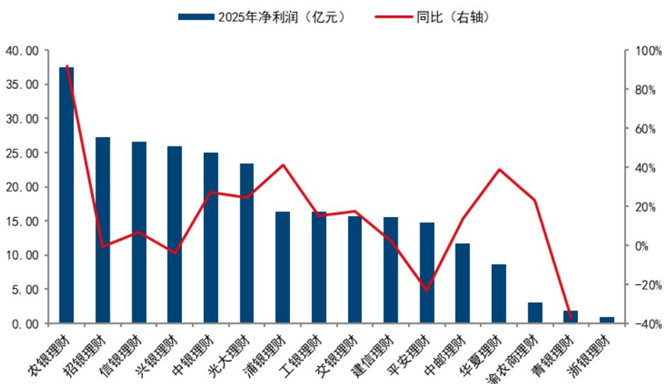  
资料来源：企业预警通，Wind，国信证券经济研究所整理

从投资性质来看，银行理财的权益类和混合类产品占比仍然很低。截至2025年末，固定收益类产品存续规模为32.32万亿元，占全部理财产品存续规模的比例达97.09%；混合类、权益类、商品及金融衍生品类产品的存续规模都很小，分别为0.87万亿元、0.08万亿元、0.02万亿元。

图：银行理财产品分布（按投资性质分）  
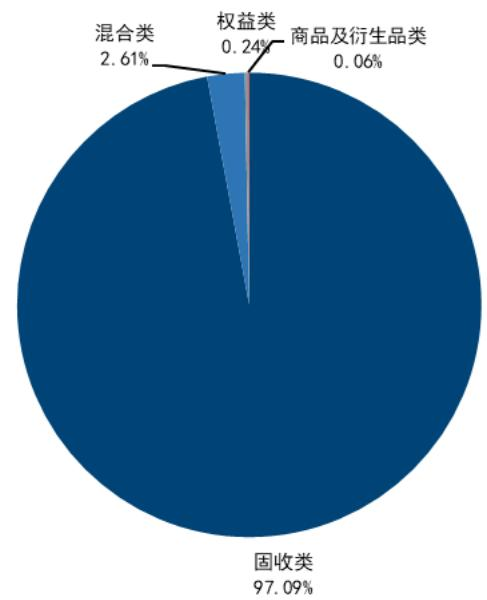  
资料来源：中国理财网，国信证券经济研究所整理

图：固收类规模持续上升  
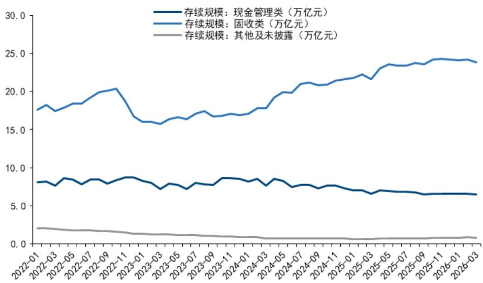  
资料来源：普益标准，国信证券经济研究所整理

## 理财显著加大公募基金和存款配置

从资产配置情况来看，2025年银行理财进一步减少了对信用债、非标、权益类资产的配置，对公募基金、现金及存款配置比例增多。

图：银行理财产品资产配置情况  
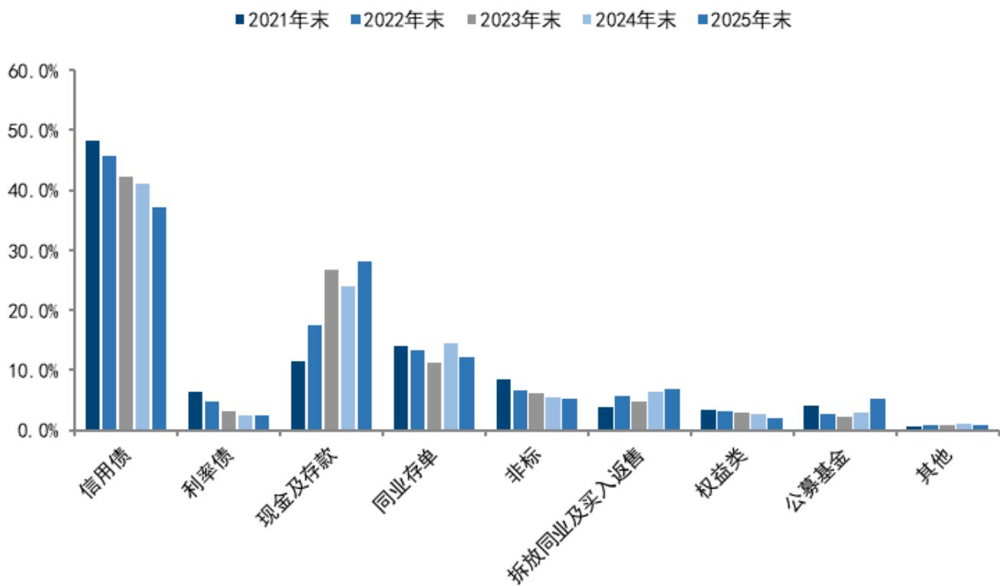  
资料来源：中国理财网，国信证券经济研究所整理

## 理财加大基金配置，结构上偏债基

2025年上市银行对公募基金配置比例明显提升，从年初的2.9%提升至年末的5.1%，持仓规模从0.9万亿元提升至1.8万亿元，接近翻倍；

从普益标准统计的前十大持仓数据来看，债基和货基是理财配置公募基金的主流，权益类公募基金配置较少。

图：理财产品公募基金持仓在2025年明显提升，创历史新高  
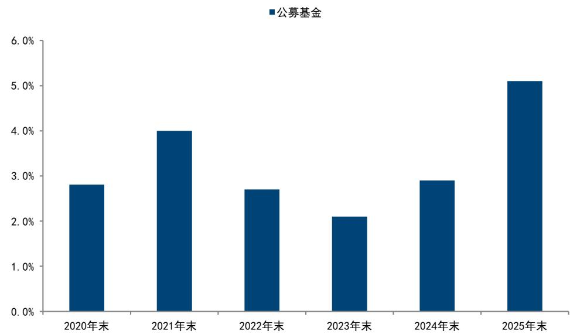  
资料来源：中国理财网，国信证券经济研究所整理

图：理财产品前十大持仓中对公募基金的配置情况  
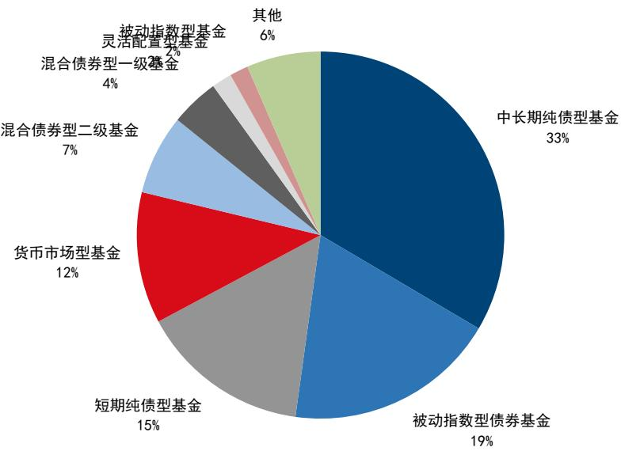  
资料来源：普益标准，国信证券经济研究所整理

## 同时理财基金配置工具特征明显

从增量来看，中长期纯债基金、指数型债券基金的持仓规模明显上升

图：理财产品前十大持仓中对公募基金的持仓量（亿元）  
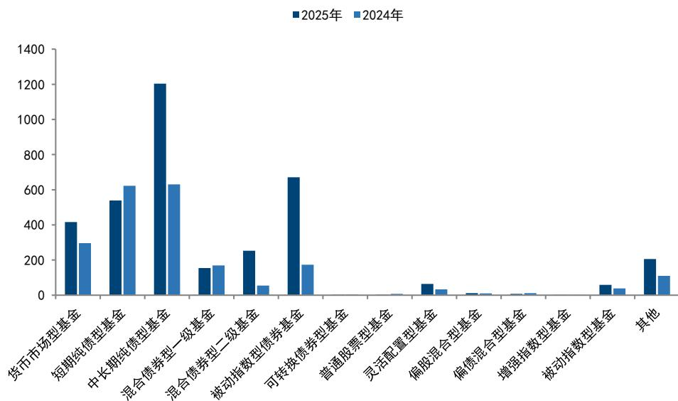  
资料来源：普益标准，国信证券经济研究所整理

图：理财产品前十大持仓中对公募基金的持仓增量（亿元）  
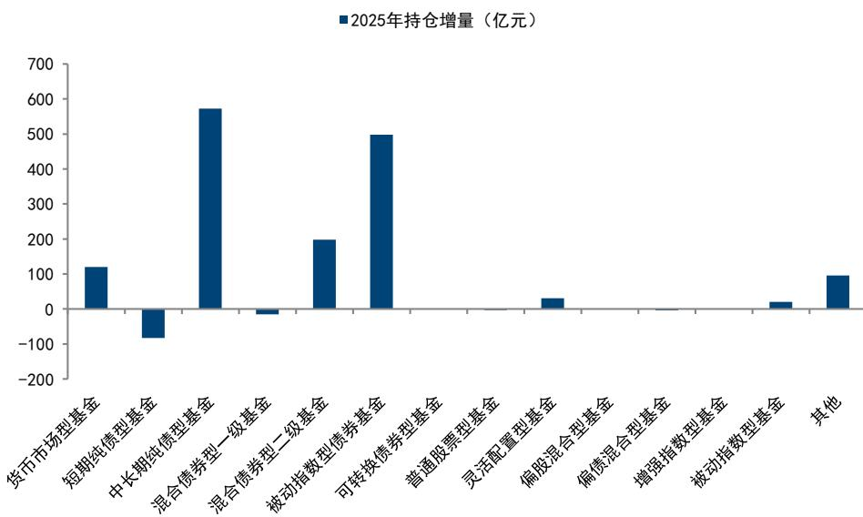  
资料来源：普益标准，国信证券经济研究所整理

## 负债端承受波动困难，3月以来理财加速赎回二级债基

➢ 以权益资产为例，2025年末银行理财权益类资产投资占比仅有1.9%。结合前十大持仓数据来看，考虑剔除优先股、未上市股权等资产，实际投向股票的资产占比应该不高于0.5%；

➢ 理财投资基金以纯债、“固收+”（含一级债基和二级债基）为主，中等波动、多资产产品是重要增量方向。

图：理财产品权益持仓在2025年继续减少  
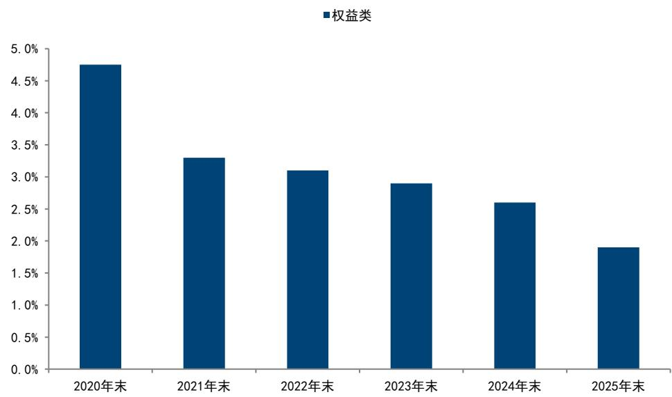  
资料来源：中国理财网，国信证券经济研究所整理

图：理财产品前十大持仓中对权益资产的持仓量（亿元）  
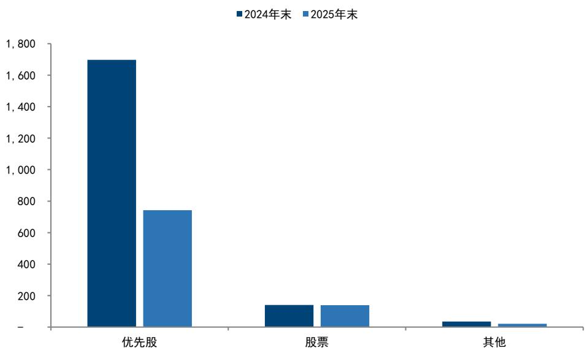  
资料来源：普益标准，国信证券经济研究所整理

## 不同理财公司对基金投资偏好不同

表：理财公司前十大持仓中对公募基金的持仓量（亿元）
<table><tr><td rowspan=1 colspan=2></td><td rowspan=1 colspan=1>货币市场型基金</td><td rowspan=1 colspan=1>短期纯债型基金</td><td rowspan=1 colspan=1>中长期纯债型基金</td><td rowspan=1 colspan=1>混合债券型一级基金</td><td rowspan=1 colspan=1>混合债券型二级基金</td><td rowspan=1 colspan=1>被动指数型债券基金</td><td rowspan=1 colspan=1>可转换债券型基金</td><td rowspan=1 colspan=1>普通股票型基金</td><td rowspan=1 colspan=1>灵活配置型基金</td><td rowspan=1 colspan=1>偏股混合型基金</td><td rowspan=1 colspan=1>偏债混合型基金</td><td rowspan=1 colspan=1>增强指数型基金</td><td rowspan=1 colspan=1>被动指数型基金</td><td rowspan=1 colspan=1>国际（QDI1）债券型基金</td><td rowspan=1 colspan=1>国际（QDII）混合型基金</td><td rowspan=1 colspan=1>国际（QDI1）股票型基金</td><td rowspan=1 colspan=1>商品型基金</td><td rowspan=1 colspan=1>其他或未披露</td></tr><tr><td rowspan=1 colspan=2>工银理财</td><td rowspan=1 colspan=1>1</td><td rowspan=1 colspan=1>44.0</td><td rowspan=1 colspan=1>168.9</td><td rowspan=1 colspan=1>30.6</td><td rowspan=1 colspan=1>10.7</td><td rowspan=1 colspan=1>47.5</td><td rowspan=1 colspan=1>1</td><td rowspan=1 colspan=1>0.4</td><td rowspan=1 colspan=1>0.4</td><td rowspan=1 colspan=1>0.5</td><td rowspan=1 colspan=1>0.6</td><td rowspan=1 colspan=1>0.3</td><td rowspan=1 colspan=1>2.7</td><td rowspan=1 colspan=1>6.0</td><td rowspan=1 colspan=1>0.2</td><td rowspan=1 colspan=1>8.3</td><td rowspan=1 colspan=1>7.3</td><td rowspan=1 colspan=1>34.7</td></tr><tr><td rowspan=1 colspan=1>建信理财</td><td rowspan=1 colspan=1></td><td rowspan=1 colspan=1>二</td><td rowspan=1 colspan=1>19.1</td><td rowspan=1 colspan=1>14.2</td><td rowspan=1 colspan=1>0.6</td><td rowspan=1 colspan=1>1.9</td><td rowspan=1 colspan=1>15.2</td><td rowspan=1 colspan=1>-</td><td rowspan=1 colspan=1>-</td><td rowspan=1 colspan=1>0.5</td><td rowspan=1 colspan=1></td><td rowspan=1 colspan=1>1.0</td><td rowspan=1 colspan=1>-</td><td rowspan=1 colspan=1>0.1</td><td rowspan=1 colspan=1>-</td><td rowspan=1 colspan=1>-</td><td rowspan=1 colspan=1></td><td rowspan=1 colspan=1>0.4</td><td rowspan=1 colspan=1>1</td></tr><tr><td rowspan=1 colspan=1>农银理财</td><td rowspan=1 colspan=1></td><td rowspan=1 colspan=1>4.3</td><td rowspan=1 colspan=1>1</td><td rowspan=1 colspan=1>7.3</td><td rowspan=1 colspan=1>1.6</td><td rowspan=1 colspan=1>1.3</td><td rowspan=1 colspan=1>55.7</td><td rowspan=1 colspan=1></td><td rowspan=1 colspan=1>0.1</td><td rowspan=1 colspan=1>5.1</td><td rowspan=1 colspan=1>0.4</td><td rowspan=1 colspan=1>0.1</td><td rowspan=1 colspan=1>0.0</td><td rowspan=1 colspan=1>22.3</td><td rowspan=1 colspan=1>1</td><td rowspan=1 colspan=1>1.6</td><td rowspan=1 colspan=1>9.9</td><td rowspan=1 colspan=1>15.7</td><td rowspan=1 colspan=1>2.6</td></tr><tr><td rowspan=1 colspan=1>中银理财</td><td rowspan=1 colspan=1></td><td rowspan=1 colspan=1>3.6</td><td rowspan=1 colspan=1>2.2</td><td rowspan=1 colspan=1>15.1</td><td rowspan=1 colspan=1>9.9</td><td rowspan=1 colspan=1>6.4</td><td rowspan=1 colspan=1>3.0</td><td rowspan=1 colspan=1>0.5</td><td rowspan=1 colspan=1>0.2</td><td rowspan=1 colspan=1>5.4</td><td rowspan=1 colspan=1>0.2</td><td rowspan=1 colspan=1>1</td><td rowspan=1 colspan=1>0.4</td><td rowspan=1 colspan=1>7.3</td><td rowspan=1 colspan=1>1</td><td rowspan=1 colspan=1>1</td><td rowspan=1 colspan=1>0.4</td><td rowspan=1 colspan=1>1.8</td><td rowspan=1 colspan=1>36.4</td></tr><tr><td rowspan=1 colspan=1>交银理财</td><td rowspan=1 colspan=1></td><td rowspan=1 colspan=1>19.3</td><td rowspan=1 colspan=1>71.4</td><td rowspan=1 colspan=1>49.3</td><td rowspan=1 colspan=1>13.9</td><td rowspan=1 colspan=1>15.1</td><td rowspan=1 colspan=1>32.2</td><td rowspan=1 colspan=1>0.0</td><td rowspan=1 colspan=1>0.0</td><td rowspan=1 colspan=1>0.1</td><td rowspan=1 colspan=1>0.3</td><td rowspan=1 colspan=1>-</td><td rowspan=1 colspan=1>二</td><td rowspan=1 colspan=1>1.2</td><td rowspan=1 colspan=1>2.0</td><td rowspan=1 colspan=1>-</td><td rowspan=1 colspan=1>3.3</td><td rowspan=1 colspan=1>1.8</td><td rowspan=1 colspan=1>3.0</td></tr><tr><td rowspan=1 colspan=1>中邮理财</td><td rowspan=1 colspan=1></td><td rowspan=1 colspan=1>3.2</td><td rowspan=1 colspan=1>11.3</td><td rowspan=1 colspan=1>20.5</td><td rowspan=1 colspan=1>12.8</td><td rowspan=1 colspan=1>3.1</td><td rowspan=1 colspan=1>21.8</td><td rowspan=1 colspan=1>二</td><td rowspan=1 colspan=1>0.2</td><td rowspan=1 colspan=1>0.1</td><td rowspan=1 colspan=1>0.1</td><td rowspan=1 colspan=1>0.0</td><td rowspan=1 colspan=1>1</td><td rowspan=1 colspan=1>9.2</td><td rowspan=1 colspan=1>0.1</td><td rowspan=1 colspan=1>0.0</td><td rowspan=1 colspan=1>1.4</td><td rowspan=1 colspan=1>1</td><td rowspan=1 colspan=1>6.8</td></tr><tr><td rowspan=1 colspan=1>招银理财</td><td rowspan=1 colspan=1></td><td rowspan=1 colspan=1>28.9</td><td rowspan=1 colspan=1>63.9</td><td rowspan=1 colspan=1>118.4</td><td rowspan=1 colspan=1>21.6</td><td rowspan=1 colspan=1>28.1</td><td rowspan=1 colspan=1>278.9</td><td rowspan=1 colspan=1>1</td><td rowspan=1 colspan=1>0.7</td><td rowspan=1 colspan=1>39.9</td><td rowspan=1 colspan=1>3.4</td><td rowspan=1 colspan=1>0.2</td><td rowspan=1 colspan=1>0.1</td><td rowspan=1 colspan=1>2.8</td><td rowspan=1 colspan=1>3.7</td><td rowspan=1 colspan=1>1.4</td><td rowspan=1 colspan=1>1.3</td><td rowspan=1 colspan=1>9.1</td><td rowspan=1 colspan=1>30.9</td></tr><tr><td rowspan=1 colspan=1>兴银理财</td><td rowspan=1 colspan=1></td><td rowspan=1 colspan=1>17.2</td><td rowspan=1 colspan=1>90.1</td><td rowspan=1 colspan=1>151.2</td><td rowspan=1 colspan=1>27.3</td><td rowspan=1 colspan=1>156.7</td><td rowspan=1 colspan=1>67.7</td><td rowspan=1 colspan=1>0.4</td><td rowspan=1 colspan=1>0.0</td><td rowspan=1 colspan=1>0.9</td><td rowspan=1 colspan=1>1.3</td><td rowspan=1 colspan=1>0.0</td><td rowspan=1 colspan=1>0.3</td><td rowspan=1 colspan=1>1.4</td><td rowspan=1 colspan=1>1.4</td><td rowspan=1 colspan=1>-</td><td rowspan=1 colspan=1>1.0</td><td rowspan=1 colspan=1>4.8</td><td rowspan=1 colspan=1>0.8</td></tr><tr><td rowspan=1 colspan=1>民生理财</td><td rowspan=1 colspan=1></td><td rowspan=1 colspan=1>36.6</td><td rowspan=1 colspan=1>77.4</td><td rowspan=1 colspan=1>154.4</td><td rowspan=1 colspan=1>32.4</td><td rowspan=1 colspan=1>24.9</td><td rowspan=1 colspan=1>31.3</td><td rowspan=1 colspan=1>0.6</td><td rowspan=1 colspan=1>0.5</td><td rowspan=1 colspan=1>3.2</td><td rowspan=1 colspan=1>1.0</td><td rowspan=1 colspan=1>3.4</td><td rowspan=1 colspan=1>0.0</td><td rowspan=1 colspan=1>7.1</td><td rowspan=1 colspan=1>2.4</td><td rowspan=1 colspan=1>0.0</td><td rowspan=1 colspan=1>1.9</td><td rowspan=1 colspan=1>0.5</td><td rowspan=1 colspan=1>16.4</td></tr><tr><td rowspan=1 colspan=1>浦银理财</td><td rowspan=1 colspan=1></td><td rowspan=1 colspan=1>2.0</td><td rowspan=1 colspan=1>13.1</td><td rowspan=1 colspan=1>3.4</td><td rowspan=1 colspan=1>0.1</td><td rowspan=1 colspan=1>11.1</td><td rowspan=1 colspan=1>1.1</td><td rowspan=1 colspan=1></td><td rowspan=1 colspan=1>0.0</td><td rowspan=1 colspan=1>0.1</td><td rowspan=1 colspan=1>0.0</td><td rowspan=1 colspan=1>1</td><td rowspan=1 colspan=1></td><td rowspan=1 colspan=1>0.3</td><td rowspan=1 colspan=1>二</td><td rowspan=1 colspan=1>1</td><td rowspan=1 colspan=1></td><td rowspan=1 colspan=1>0.0</td><td rowspan=1 colspan=1>-0.0</td></tr><tr><td rowspan=1 colspan=1>信银理财</td><td rowspan=1 colspan=1></td><td rowspan=1 colspan=1>4.0</td><td rowspan=1 colspan=1>21.1</td><td rowspan=1 colspan=1>7.9</td><td rowspan=1 colspan=1>0.9</td><td rowspan=1 colspan=1>3.8</td><td rowspan=1 colspan=1>5.4</td><td rowspan=1 colspan=1>0.0</td><td rowspan=1 colspan=1>0.3</td><td rowspan=1 colspan=1>3.8</td><td rowspan=1 colspan=1>0.3</td><td rowspan=1 colspan=1>-</td><td rowspan=1 colspan=1>-</td><td rowspan=1 colspan=1>0.5</td><td rowspan=1 colspan=1>3.0</td><td rowspan=1 colspan=1>1</td><td rowspan=1 colspan=1>0.7</td><td rowspan=1 colspan=1>2.7</td><td rowspan=1 colspan=1>3.5</td></tr><tr><td rowspan=1 colspan=1>光大理财</td><td rowspan=1 colspan=1></td><td rowspan=1 colspan=1>11.9</td><td rowspan=1 colspan=1>17.5</td><td rowspan=1 colspan=1>36.0</td><td rowspan=1 colspan=1>9.8</td><td rowspan=1 colspan=1>7.9</td><td rowspan=1 colspan=1>37.8</td><td rowspan=1 colspan=1>1.4</td><td rowspan=1 colspan=1>1</td><td rowspan=1 colspan=1>6.0</td><td rowspan=1 colspan=1>0.1</td><td rowspan=1 colspan=1>0.0</td><td rowspan=1 colspan=1>0.0</td><td rowspan=1 colspan=1>7.8</td><td rowspan=1 colspan=1>0.3</td><td rowspan=1 colspan=1>1</td><td rowspan=1 colspan=1>1.3</td><td rowspan=1 colspan=1>2.7</td><td rowspan=1 colspan=1>7.3</td></tr><tr><td rowspan=1 colspan=1>平安理财</td><td rowspan=1 colspan=1></td><td rowspan=1 colspan=1>25.0</td><td rowspan=1 colspan=1>1.0</td><td rowspan=1 colspan=1>5.9</td><td rowspan=1 colspan=1>1.5</td><td rowspan=1 colspan=1>1.0</td><td rowspan=1 colspan=1>9.3</td><td rowspan=1 colspan=1>1</td><td rowspan=1 colspan=1>0.1</td><td rowspan=1 colspan=1>1.3</td><td rowspan=1 colspan=1>0.0</td><td rowspan=1 colspan=1>0.7</td><td rowspan=1 colspan=1>0.0</td><td rowspan=1 colspan=1>0.9</td><td rowspan=1 colspan=1>1.8</td><td rowspan=1 colspan=1>1</td><td rowspan=1 colspan=1>0.6</td><td rowspan=1 colspan=1>1.2</td><td rowspan=1 colspan=1>0.0</td></tr><tr><td rowspan=1 colspan=1>华夏理财</td><td rowspan=1 colspan=1></td><td rowspan=1 colspan=1>16.9</td><td rowspan=1 colspan=1>40.7</td><td rowspan=1 colspan=1>147.0</td><td rowspan=1 colspan=1>3.6</td><td rowspan=1 colspan=1>35.9</td><td rowspan=1 colspan=1>12.8</td><td rowspan=1 colspan=1>0.0</td><td rowspan=1 colspan=1>1</td><td rowspan=1 colspan=1>1</td><td rowspan=1 colspan=1></td><td rowspan=1 colspan=1>0.7</td><td rowspan=1 colspan=1>0.1</td><td rowspan=1 colspan=1>3.3</td><td rowspan=1 colspan=1>0.0</td><td rowspan=1 colspan=1></td><td rowspan=1 colspan=1>0.0</td><td rowspan=1 colspan=1>-</td><td rowspan=1 colspan=1>41.9</td></tr><tr><td rowspan=1 colspan=1>浙银理财</td><td rowspan=1 colspan=1></td><td rowspan=1 colspan=1>11.7</td><td rowspan=1 colspan=1>17.7</td><td rowspan=1 colspan=1>37.5</td><td rowspan=1 colspan=1>0.2</td><td rowspan=1 colspan=1>1.1</td><td rowspan=1 colspan=1>17.8</td><td rowspan=1 colspan=1>-</td><td rowspan=1 colspan=1>1</td><td rowspan=1 colspan=1>1</td><td rowspan=1 colspan=1>1</td><td rowspan=1 colspan=1>1</td><td rowspan=1 colspan=1>1</td><td rowspan=1 colspan=1>0.3</td><td rowspan=1 colspan=1>-</td><td rowspan=1 colspan=1></td><td rowspan=1 colspan=1>1</td><td rowspan=1 colspan=1>0.3</td><td rowspan=1 colspan=1>1</td></tr><tr><td rowspan=1 colspan=1>恒丰理财</td><td rowspan=1 colspan=1></td><td rowspan=1 colspan=1>0.2</td><td rowspan=1 colspan=1>2.6</td><td rowspan=1 colspan=1>3.8</td><td rowspan=1 colspan=1>二</td><td rowspan=1 colspan=1>4.0</td><td rowspan=1 colspan=1>11.2</td><td rowspan=1 colspan=1>1</td><td rowspan=1 colspan=1>0.0</td><td rowspan=1 colspan=1>0.1</td><td rowspan=1 colspan=1>1</td><td rowspan=1 colspan=1>0.0</td><td rowspan=1 colspan=1>1</td><td rowspan=1 colspan=1>0.1</td><td rowspan=1 colspan=1>1</td><td rowspan=1 colspan=1></td><td rowspan=1 colspan=1>0.0</td><td rowspan=1 colspan=1>1</td><td rowspan=1 colspan=1>二</td></tr><tr><td rowspan=1 colspan=1>渤银理财</td><td rowspan=1 colspan=1></td><td rowspan=1 colspan=1>20.7</td><td rowspan=1 colspan=1>9.9</td><td rowspan=1 colspan=1>42.2</td><td rowspan=1 colspan=1>-</td><td rowspan=1 colspan=1>-</td><td rowspan=1 colspan=1>4.4</td><td rowspan=1 colspan=1>-</td><td rowspan=1 colspan=1>1</td><td rowspan=1 colspan=1>0.4</td><td rowspan=1 colspan=1>-</td><td rowspan=1 colspan=1>-</td><td rowspan=1 colspan=1>1.4</td><td rowspan=1 colspan=1>0.3</td><td rowspan=1 colspan=1>-</td><td rowspan=1 colspan=1>1</td><td rowspan=1 colspan=1>0.1</td><td rowspan=1 colspan=1>3.0</td><td rowspan=1 colspan=1>2.1</td></tr><tr><td rowspan=1 colspan=1>广银理财</td><td rowspan=1 colspan=1></td><td rowspan=1 colspan=1>0.4</td><td rowspan=1 colspan=1>2.1</td><td rowspan=1 colspan=1>10.6</td><td rowspan=1 colspan=1>-</td><td rowspan=1 colspan=1>6.2</td><td rowspan=1 colspan=1>9.8</td><td rowspan=1 colspan=1>-</td><td rowspan=1 colspan=1>0.1</td><td rowspan=1 colspan=1>二</td><td rowspan=1 colspan=1>0.1</td><td rowspan=1 colspan=1>0.1</td><td rowspan=1 colspan=1>0.0</td><td rowspan=1 colspan=1>0.7</td><td rowspan=1 colspan=1>1.8</td><td rowspan=1 colspan=1>二</td><td rowspan=1 colspan=1>0.1</td><td rowspan=1 colspan=1>0.1</td><td rowspan=1 colspan=1>0.1</td></tr><tr><td rowspan=1 colspan=1>北银理财</td><td rowspan=1 colspan=1></td><td rowspan=1 colspan=1>40.0</td><td rowspan=1 colspan=1>25.5</td><td rowspan=1 colspan=1>179.7</td><td rowspan=1 colspan=1>17.2</td><td rowspan=1 colspan=1>10.1</td><td rowspan=1 colspan=1>6.5</td><td rowspan=1 colspan=1>0.1</td><td rowspan=1 colspan=1>0.4</td><td rowspan=1 colspan=1>0.8</td><td rowspan=1 colspan=1>0.5</td><td rowspan=1 colspan=1>0.8</td><td rowspan=1 colspan=1>0.0</td><td rowspan=1 colspan=1>1.9</td><td rowspan=1 colspan=1>-</td><td rowspan=1 colspan=1>1</td><td rowspan=1 colspan=1>1.5</td><td rowspan=1 colspan=1>0.8</td><td rowspan=1 colspan=1>1.5</td></tr><tr><td rowspan=1 colspan=1>上银理财</td><td rowspan=1 colspan=1></td><td rowspan=1 colspan=1>8.7</td><td rowspan=1 colspan=1>3.2</td><td rowspan=1 colspan=1>23.2</td><td rowspan=1 colspan=1>1.3</td><td rowspan=1 colspan=1>5.1</td><td rowspan=1 colspan=1>1.0</td><td rowspan=1 colspan=1>0.1</td><td rowspan=1 colspan=1>1</td><td rowspan=1 colspan=1>1</td><td rowspan=1 colspan=1>1</td><td rowspan=1 colspan=1>1</td><td rowspan=1 colspan=1>1</td><td rowspan=1 colspan=1>0.6</td><td rowspan=1 colspan=1>-</td><td rowspan=1 colspan=1>1</td><td rowspan=1 colspan=1>0.0</td><td rowspan=1 colspan=1>0.0</td><td rowspan=1 colspan=1>0.3</td></tr><tr><td rowspan=1 colspan=1>苏银理财</td><td rowspan=1 colspan=1></td><td rowspan=1 colspan=1>43.0</td><td rowspan=1 colspan=1>二</td><td rowspan=1 colspan=1>45.8</td><td rowspan=1 colspan=1>二</td><td rowspan=1 colspan=1>二</td><td rowspan=1 colspan=1>34.9</td><td rowspan=1 colspan=1>1</td><td rowspan=1 colspan=1>0.0</td><td rowspan=1 colspan=1>0.0</td><td rowspan=1 colspan=1>0.0</td><td rowspan=1 colspan=1>1</td><td rowspan=1 colspan=1>1</td><td rowspan=1 colspan=1>0.5</td><td rowspan=1 colspan=1>1</td><td rowspan=1 colspan=1></td><td rowspan=1 colspan=1>1</td><td rowspan=1 colspan=1>4.3</td><td rowspan=1 colspan=1>1</td></tr><tr><td rowspan=1 colspan=2>徽银理财</td><td rowspan=1 colspan=1>28.8</td><td rowspan=1 colspan=1>3.2</td><td rowspan=1 colspan=1>9.6</td><td rowspan=1 colspan=1>1</td><td rowspan=1 colspan=1>4.7</td><td rowspan=1 colspan=1>6.7</td><td rowspan=1 colspan=1>1</td><td rowspan=1 colspan=1>0.1</td><td rowspan=1 colspan=1>1</td><td rowspan=1 colspan=1>0.1</td><td rowspan=1 colspan=1>0.1</td><td rowspan=1 colspan=1>1</td><td rowspan=1 colspan=1>0.5</td><td rowspan=1 colspan=1>1.6</td><td rowspan=1 colspan=1>1</td><td rowspan=1 colspan=1>0.2</td><td rowspan=1 colspan=1>0.2</td><td rowspan=1 colspan=1>0.9</td></tr><tr><td rowspan=1 colspan=1>杭银理财</td><td rowspan=1 colspan=1></td><td rowspan=1 colspan=1>19.2</td><td rowspan=1 colspan=1>17.2</td><td rowspan=1 colspan=1>20.4</td><td rowspan=1 colspan=1>0.5</td><td rowspan=1 colspan=1>2.4</td><td rowspan=1 colspan=1>27.8</td><td rowspan=1 colspan=1></td><td rowspan=1 colspan=1>0.0</td><td rowspan=1 colspan=1>1</td><td rowspan=1 colspan=1>-</td><td rowspan=1 colspan=1>0.0</td><td rowspan=1 colspan=1>1</td><td rowspan=1 colspan=1>2.0</td><td rowspan=1 colspan=1>-</td><td rowspan=1 colspan=1>1</td><td rowspan=1 colspan=1>0.1</td><td rowspan=1 colspan=1>1.5</td><td rowspan=1 colspan=1>3.3</td></tr><tr><td rowspan=1 colspan=1>宁银理财</td><td rowspan=1 colspan=1></td><td rowspan=1 colspan=1>8.5</td><td rowspan=1 colspan=1>0.4</td><td rowspan=1 colspan=1>2.4</td><td rowspan=1 colspan=1>1</td><td rowspan=1 colspan=1>二</td><td rowspan=1 colspan=1>10.7</td><td rowspan=1 colspan=1></td><td rowspan=1 colspan=1>0.1</td><td rowspan=1 colspan=1>0.0</td><td rowspan=1 colspan=1>0.4</td><td rowspan=1 colspan=1>、</td><td rowspan=1 colspan=1></td><td rowspan=1 colspan=1>1.0</td><td rowspan=1 colspan=1>、</td><td rowspan=1 colspan=1>0.1</td><td rowspan=1 colspan=1>0.0</td><td rowspan=1 colspan=1>0.4</td><td rowspan=1 colspan=1>0.0</td></tr><tr><td rowspan=1 colspan=1>南银理财</td><td rowspan=1 colspan=1></td><td rowspan=1 colspan=1>-</td><td rowspan=1 colspan=1>0.1</td><td rowspan=1 colspan=1>1.0</td><td rowspan=1 colspan=1>二</td><td rowspan=1 colspan=1>1.2</td><td rowspan=1 colspan=1>0.6</td><td rowspan=1 colspan=1>二</td><td rowspan=1 colspan=1>0.0</td><td rowspan=1 colspan=1>0.6</td><td rowspan=1 colspan=1>0.7</td><td rowspan=1 colspan=1>二</td><td rowspan=1 colspan=1>二</td><td rowspan=1 colspan=1>0.8</td><td rowspan=1 colspan=1>二</td><td rowspan=1 colspan=1>二</td><td rowspan=1 colspan=1>0.6</td><td rowspan=1 colspan=1>0.1</td><td rowspan=1 colspan=1>0.4</td></tr><tr><td rowspan=1 colspan=2>青银理财</td><td rowspan=1 colspan=1>10.4</td><td rowspan=1 colspan=1>7.9</td><td rowspan=1 colspan=1>91.9</td><td rowspan=1 colspan=1>1</td><td rowspan=1 colspan=1>0.1</td><td rowspan=1 colspan=1>13.5</td><td rowspan=1 colspan=1>1</td><td rowspan=1 colspan=1>0.3</td><td rowspan=1 colspan=1>0.9</td><td rowspan=1 colspan=1>0.2</td><td rowspan=1 colspan=1>二</td><td rowspan=1 colspan=1>1</td><td rowspan=1 colspan=1>2.8</td><td rowspan=1 colspan=1>1</td><td rowspan=1 colspan=1>1</td><td rowspan=1 colspan=1>0.0</td><td rowspan=1 colspan=1>0.0</td><td rowspan=1 colspan=1>0.1</td></tr><tr><td rowspan=1 colspan=2>渝农商理财</td><td rowspan=1 colspan=1>0.3</td><td rowspan=1 colspan=1>1.1</td><td rowspan=1 colspan=1>1.0</td><td rowspan=1 colspan=1>1</td><td rowspan=1 colspan=1>1</td><td rowspan=1 colspan=1>1</td><td rowspan=1 colspan=1>1</td><td rowspan=1 colspan=1>1</td><td rowspan=1 colspan=1>0.0</td><td rowspan=1 colspan=1>1</td><td rowspan=1 colspan=1>0.0</td><td rowspan=1 colspan=1>1</td><td rowspan=1 colspan=1>0.2</td><td rowspan=1 colspan=1>1</td><td rowspan=1 colspan=1>1</td><td rowspan=1 colspan=1></td><td rowspan=1 colspan=1>1</td><td rowspan=1 colspan=1>1</td></tr><tr><td rowspan=1 colspan=2>汇华理财</td><td rowspan=1 colspan=1>15.9</td><td rowspan=1 colspan=1>1.8</td><td rowspan=1 colspan=1>2.3</td><td rowspan=1 colspan=1>1</td><td rowspan=1 colspan=1>0.0</td><td rowspan=1 colspan=1>3.5</td><td rowspan=1 colspan=1>1</td><td rowspan=1 colspan=1>1</td><td rowspan=1 colspan=1>0.0</td><td rowspan=1 colspan=1>1</td><td rowspan=1 colspan=1>0.0</td><td rowspan=1 colspan=1>1</td><td rowspan=1 colspan=1>0.0</td><td rowspan=1 colspan=1>1</td><td rowspan=1 colspan=1>1</td><td rowspan=1 colspan=1>1</td><td rowspan=1 colspan=1>0.1</td><td rowspan=1 colspan=1>1</td></tr><tr><td rowspan=1 colspan=2>贝莱德建信理财</td><td rowspan=1 colspan=1>2.7</td><td rowspan=1 colspan=1>1</td><td rowspan=1 colspan=1>0.1</td><td rowspan=1 colspan=1>0.8</td><td rowspan=1 colspan=1>0.7</td><td rowspan=1 colspan=1>1</td><td rowspan=1 colspan=1>1</td><td rowspan=1 colspan=1>1</td><td rowspan=1 colspan=1>0.1</td><td rowspan=1 colspan=1>1</td><td rowspan=1 colspan=1>1</td><td rowspan=1 colspan=1>0.0</td><td rowspan=1 colspan=1>0.6</td><td rowspan=1 colspan=1>1</td><td rowspan=1 colspan=1>1</td><td rowspan=1 colspan=1>0.1</td><td rowspan=1 colspan=1>1</td><td rowspan=1 colspan=1>0.1</td></tr><tr><td rowspan=1 colspan=2>法巴农银理财</td><td rowspan=1 colspan=1>0.3</td><td rowspan=1 colspan=1>二</td><td rowspan=1 colspan=1>-</td><td rowspan=1 colspan=1>-</td><td rowspan=1 colspan=1>-</td><td rowspan=1 colspan=1>-</td><td rowspan=1 colspan=1>1</td><td rowspan=1 colspan=1>1</td><td rowspan=1 colspan=1>-</td><td rowspan=1 colspan=1>-</td><td rowspan=1 colspan=1>-</td><td rowspan=1 colspan=1>二</td><td rowspan=1 colspan=1>0.2</td><td rowspan=1 colspan=1>1</td><td rowspan=1 colspan=1>1</td><td rowspan=1 colspan=1>2.5</td><td rowspan=1 colspan=1>0.9</td><td rowspan=1 colspan=1>-</td></tr><tr><td rowspan=1 colspan=2>施罗德交银理财</td><td rowspan=1 colspan=1>-</td><td rowspan=1 colspan=1>0.4</td><td rowspan=1 colspan=1>0.1</td><td rowspan=1 colspan=1>-</td><td rowspan=1 colspan=1>0.1</td><td rowspan=1 colspan=1>0.9</td><td rowspan=1 colspan=1>-</td><td rowspan=1 colspan=1>-</td><td rowspan=1 colspan=1>0.0</td><td rowspan=1 colspan=1></td><td rowspan=1 colspan=1>1</td><td rowspan=1 colspan=1>-</td><td rowspan=1 colspan=1>-</td><td rowspan=1 colspan=1></td><td rowspan=1 colspan=1>1</td><td rowspan=1 colspan=1>0.0</td><td rowspan=1 colspan=1>-</td><td rowspan=1 colspan=1>0.7</td></tr><tr><td rowspan=1 colspan=2>高盛工银理财</td><td rowspan=1 colspan=1>1</td><td rowspan=1 colspan=1>1</td><td rowspan=1 colspan=1>1</td><td rowspan=1 colspan=1>1</td><td rowspan=1 colspan=1>1</td><td rowspan=1 colspan=1>1</td><td rowspan=1 colspan=1>1</td><td rowspan=1 colspan=1>1</td><td rowspan=1 colspan=1>1</td><td rowspan=1 colspan=1>1</td><td rowspan=1 colspan=1>1</td><td rowspan=1 colspan=1>1</td><td rowspan=1 colspan=1>1</td><td rowspan=1 colspan=1>1</td><td rowspan=1 colspan=1>1</td><td rowspan=1 colspan=1>1</td><td rowspan=1 colspan=1>1</td><td rowspan=1 colspan=1>1</td></tr></table>

资料来源：普益标准，国信证券经济研究所整理。注：工银理财、建信理财、农银理财、中银理财、施罗德交银理财为2025年三季度末数据，高盛工银理财数据缺失，其余为2025年末数据。

01 银行金市：负债宽裕，资产荒再现  
02 理财产品：多资产，新考验  
03 保险配置：负债驱动，权益高位  
04 券商经营：自营成胜负手，策略兼容增强  
05 基金转型：工具化和解决方案化并举

## 上市险企业绩：投资收益带动利润大幅提升

➢ 2025年，受益于投资端弹性释放及负债端结构的持续优化，A股5家上市险企累计实现营业收入29281.29亿元，在高基数基础上同比提升7.8%。其中，新华保险、中国人寿、中国太保、中国人保、中国平安营业收入分别同比增长19.0%/16.5%/7.7%/7.6%/2.1%。A股5家上市险企共计实现归母净利润4252.91亿元，同比增长22.4%。其中，中国人寿、新华保险、中国太保、中国人保、中国平安分别同比增长44.1%/38.3%/ 19.0%/8.8%/6.5%。

➢ 从单季度表现来看，受资本市场震荡影响，上市险企四季度单季利润却普遍承压。2025年第四季度，沪深300指数下跌0.23%，创业板指下跌1.08%，恒生指数下跌4.56%，对险企投资收益产生明显扰动。受此影响，五家A股上市险企四季度合计录得净亏损约7亿元，而上年同期为盈利286亿元。

图：上市险企营业收入（单位：百万元，%）  
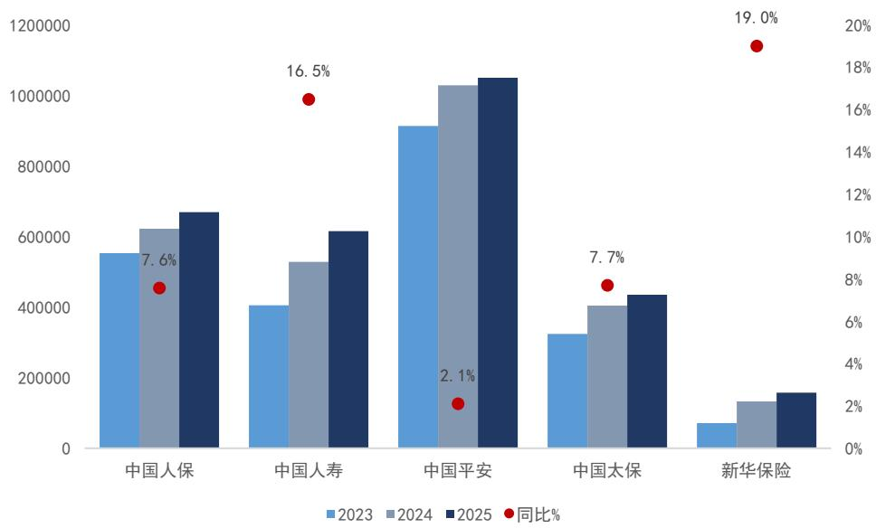  
资料来源：公司公告，国信证券经济研究所整理

图：上市险企归母净利润（单位：百万元，%）  
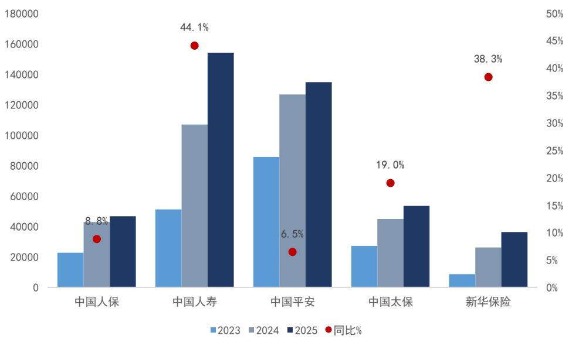  
资料来源：公司公告，国信证券经济研究所整理

➢ 在预定利率持续下调、“报行合一”持续深化的政策背景下，上市险企人身险业务实现了量价齐升的发展格局。2025年，A股上市险企新业务价值合计约1267亿元，同比增长35.8%，延续高增长趋势。其中，中国人寿NBV达457.52亿元，同比增长35.7%，规模居行业首位；中国平安寿险及健康险NBV达368.97亿元，同比增长29.3%，连续第三年实现双位数增长；中国太保寿险NBV达186.09亿元，同比增长40.1%，新业务价值率提升3.2个百分点至19.8%；新华保险NBV达98.42亿元，同比大幅增长57.4%，增速在头部险企中领先；人保寿险NBV同比大幅增长64.5%，增速在所有上市险企中位居前列。

➢ NBV高速增长的驱动力主要来自两个方面：一是新单保费全面正增长，二是新业务价值率普遍提升。2025年，上市险企新单保费合计同比增长11.1%至6962亿元，银保渠道是主要增量来源。

图：上市险企NBV水平（单位：百万元）  
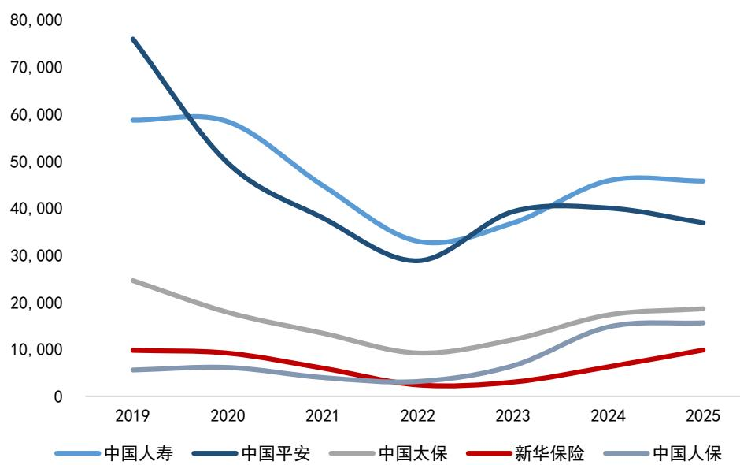  
资料来源：公司公告，国信证券经济研究所整理

图：上市险企NBV Margin  
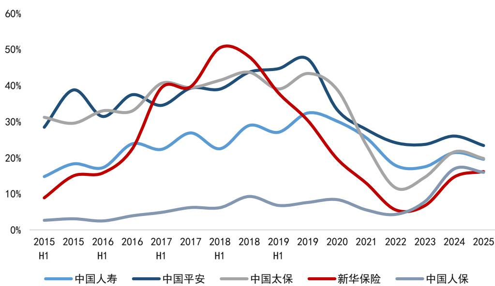  
资料来源：公司公告，国信证券经济研究所整理

➢ 2025年1月10日，金融监管总局向业内下发《关于建立预定利率与市场利率挂钩及动态调整机制有关事项的通知》（以下简称“《通知》”），提出要建立预定利率与市场利率挂钩及动态调整机制.

➢ 在相应预定利率调整背景下，2025年7月25日，中国保险行业协会组织召开人身保险业责任准备金评估利率专家咨询委员会2025年二季度例会，就宏观经济形势、市场利率走势和行业发展情况进行研究。保险业专家认为当前普通型人身保险产品预定利率研究值为1.99%，触发人身险行业预定利率调整。普通型保险产品预定利率最高值为2.0%，分红型保险产品预定利率最高值为1.75%，万能型保险产品最低保证利率最高值为1.0%。

表：各类产品本次预定利率调整幅度
<table><tr><td rowspan=1 colspan=1></td><td rowspan=1 colspan=1>原预定利率</td><td rowspan=1 colspan=1>下调后预定利率</td></tr><tr><td rowspan=1 colspan=1>普通型产品</td><td rowspan=1 colspan=1>2.5%</td><td rowspan=1 colspan=1>2.0%（降幅50bp)</td></tr><tr><td rowspan=1 colspan=1>分红险</td><td rowspan=1 colspan=1>2.0%</td><td rowspan=1 colspan=1>1.75%（降幅25bp）</td></tr><tr><td rowspan=1 colspan=1>万能险</td><td rowspan=1 colspan=1>1.5%</td><td rowspan=1 colspan=1>1.0%（降幅50bp)</td></tr></table>

资料来源：保险行业协会，国信证券经济研究所整理

图：预定利率研究值  
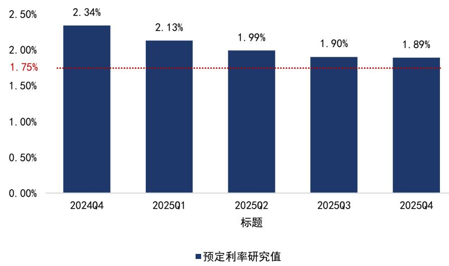  
资料来源：保险行业协会，国信证券经济研究所整理

## 人身险：加大分红险开发力度，浮动负债端兑付成本

➢ 2025年，在长期利率下行和监管引导的双重背景下，上市险企普遍加大了对分红险的销售力度，成为重要的业绩增长点。

➢ 2025年，太平人寿全渠道分红险新单期交保费占长期险新单期交保费的比重接近90%，分红保险原保费收入达578.43亿港元，同比增长91.7%；中国人寿2025年分红险业务占个险渠道首年期交保费的比重跃升至近60%，成为新单保费的重要支撑，其中银保渠道分红险新单保费占比同比提升了约15个百分点，银保渠道新单保费达585.06亿元，同比增长95.7%；中国平安2025年寿险及健康险业务中分红险规模保费达到918.87亿元，同比增长41.28%，其中个险渠道分红险业务占比约30%；中国太保2025年新保期缴中分红险占比已提升至半数，其中代理人渠道新保期缴中分红险占比更是高达61.4%。新华保险分红险占整体期交业务的比例逐季提升，到第四季度已达到77%，全年实现分红险长期险首年保费119.33亿元。

图：行业分红险保费收入规模及占比  
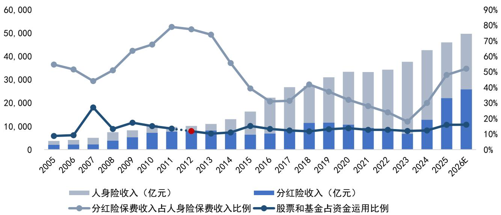  
资料来源：Choice，国信证券经济研究所整理

## 财产险：保费收入企稳，COR显著优化

➢ 随着我国财产险保险需求的稳步提升，2025年上市险企财险业务保费收入稳中有升。截至2025年末，人保财险、平安财险、太保财险共计实现保费收入10961.36亿元，同比增长4.3%，市占率稳定在62.6%；其中车险业务保费收入6457.66亿元，同比上升3.0%；非车险业务保费收入4503.70亿元，同比上升6.2%。

➢ 在综合成本率方面，行业整体延续改善趋势，人保财险、平安产险、太保产险综合成本率分别同比下降0.9、1.5和1.1个百分点至97.6%、96.8%和97.5%，均实现承保盈利，经营质效稳步提升。其中，人保财险综合成本率创近年最好水平，承保利润达124.43亿元，同比大幅增长75.6%；平安产险承保利润107.17亿元，同比增长96.2%，车险综合成本率95.8%，同比优化2.3个百分点，持续优于行业平均水平；太保产险承保利润48.36亿元，同比增长81.0%，车险综合成本率同比优化2.6个百分点至95.6%。

图：上市险企财险业务保费收入（单位：百万元）  
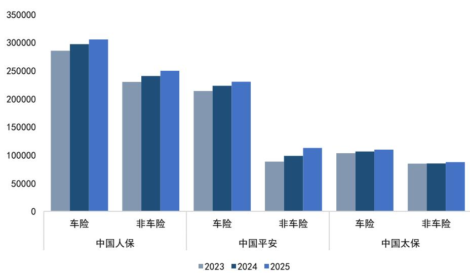  
资料来源：公司公告，国信证券经济研究所整理

图：上市险企综合成本率水平（单位：%）  
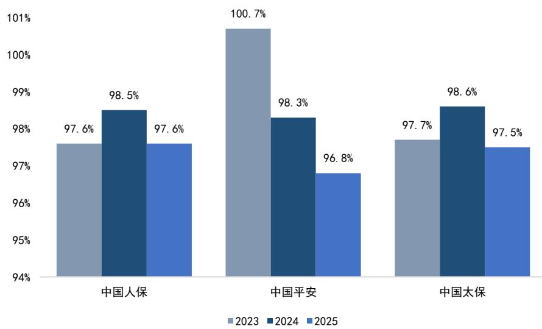  
资料来源：公司公告，国信证券经济研究所整理

## 投资端：引入资产负债新概念，债券久期缺口收窄

## 图：保险资产负债管理新规引入有效久期缺口概念

## （一）有效久期缺口

有效久期是在修正久期的基础上，考虑保险公司部分资产的含权因素、分红利率和万能结算利率的可调节因素等对预期现金流的影响，更为准确地衡量保险公司资产和负债对利率变化的敏感度。负债端为全口径保险业务，资产端仅包含可计算现金流的固定收益类投资资产，因此，需要对资产有效久期进行规模调整。

规模调整后的有效久期缺口=（资产现金流有效久期×资产现金流的折现值+负债现金流流入有效久期×负债现金流流入的折现值+利率类衍生品买入合约的有效久期×利率类衍生品买入合约的合约价值之和-利率类衍生品卖出合约的有效久期×利率类衍生品卖出合约的合约价值之和）÷负债现金流流出的折现值-负债现金流流出有效久期

资料来源：国家金融监督管理总局，国信证券经济研究所整理有效久期是在修正久期的基础上，考虑保险公司部分资产的含权因素、分红利率和万能结算利率的可调节因素等对预期现金流的影响。

负债端为全口径保险业务，资产端仅包含可计算现金流的固定收益类投资资产，因此，核算公式对资产有效久期进行了规模调整。

相对于修正久期，有效久期的核算考虑了资产含权（如可赎回债券投资）因素，考虑了衍生品合约的久期，同时考虑了分红险、万能险未来现金流的变动因素，考虑了保单退保因素等（大幅缩短负债久期），这些因素均会影响资产和负债的到期时间和到期现金流，有效久期的核算结果更接近实际。

例：采取有效久期后，头部险企有效久期缺口大幅收窄，如从-4到-5年收窄至-2到-3年。

➢ 投资端是2025年保险行业业绩增长的核心驱动力。在长端利率低位运行与资本市场结构性回暖交织的宏观环境下，上市险企大幅增配二级权益资产。截至2025年末，五家A股上市险企投资资产合计同比增长约13%，权益配置力度显著加大。

➢ 2025年险资增配债券的趋势明显放缓，股票和基金占比大幅提升。上市险企债券投资规模虽仍在增长，但年末平均占比降至50%，同比下降1.8个百分点；与此同时，各公司普遍大幅增配股票和权益基金，年末股票+权益基金平均占比达14.4%，同比提升3.5个百分点。从个股维度看，中国人寿公开市场权益投资规模已突破1.2万亿元，股票和基金配置比例由12.18%提升至16.89%，较年初增加超4500亿元；中国平安股票及权益型基金占比由9.9%大幅升至19.2%，股票占比升至14.8%，为上市险企中最高；中国人保股票持仓金额同比增长176%，占比由3.7%大幅提升至8.7%；新华保险和中国太保的权益资产占比分别提升2.4个和2.2个百分点。

图：上市险企资产配置规模及结构（单位：百万元）  
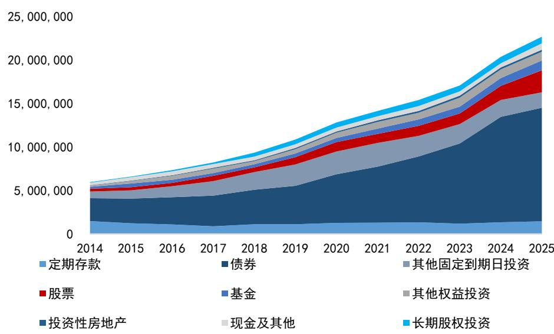  
资料来源：公司公告，国信证券经济研究所整理

图：2025年上市险企资产配置结构  
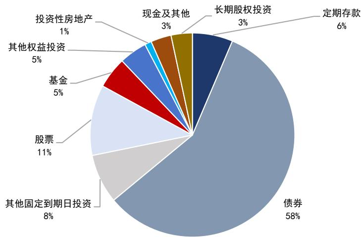  
资料来源：公司公告，国信证券经济研究所整理

➢ 在收益率表现方面，上市险企总投资收益率普遍同比提升，全年平均总投资收益率达5.4%，同比提升0.4个百分点；但净投资收益率受利率偏低和高收益资产到期影响，平均同比下降0.3个百分点至3.2%。

➢ 具体来看，新华保险以6.6%的总投资收益率领跑五大险企，同比提升0.8个百分点；中国人寿总投资收益率为6.09%，同比提升59个基点，为近年最佳投资业绩；中国平安综合投资收益率为6.3%，同比提升0.5个百分点，创近五年最高水平；中国人保和中国太保的总投资收益率均为5.7%，同比均提升0.1个百分点。

图：上市险企总投资收益率  
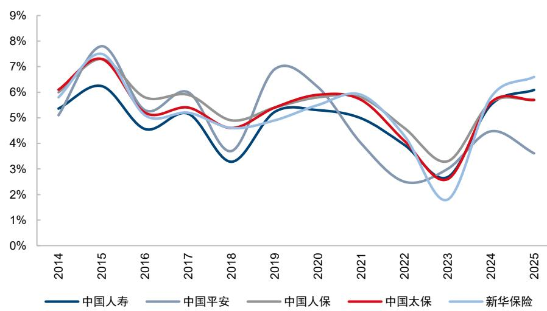  
资料来源：公司公告，国信证券经济研究所整理

图：上市险企净投资收益率  
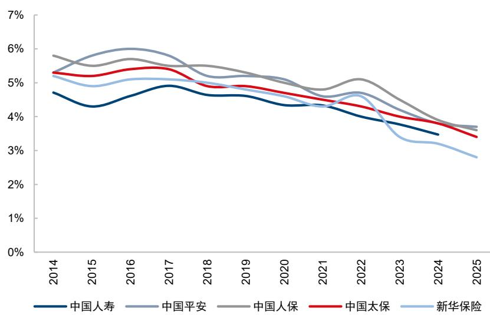  
资料来源：公司公告，国信证券经济研究所整理

## 投资端：加大FVOCI资产配置力度

➢ 受益于2024年权益类资产的反弹，上市险企所持金融资产的公允价值变动损益同比大幅提升，带动营收及利润的同比大幅增长。

➢ 2024年，险资持续加大FVOCI权益类资产配置力度。其中，中国人保OCI股票投资规模同比大幅提升26.4%，对应投资收益率为36.3%，跑赢沪深300红利指数。

表：2025年上市险企资产配置比例（按会计计量方式，单位：百万元，%）
<table><tr><td rowspan=1 colspan=1>项目</td><td rowspan=1 colspan=2>中国人寿</td><td rowspan=1 colspan=2>中国平安</td><td rowspan=1 colspan=2>中国人保</td><td rowspan=1 colspan=2>中国太保</td><td rowspan=1 colspan=2>新华保险</td><td rowspan=1 colspan=2>平均</td></tr><tr><td rowspan=1 colspan=1></td><td rowspan=1 colspan=1>金额</td><td rowspan=1 colspan=1>占金融资产比例</td><td rowspan=1 colspan=1>金额</td><td rowspan=1 colspan=1>占金融资产比例</td><td rowspan=1 colspan=1>金额</td><td rowspan=1 colspan=1>占金融资产比例</td><td rowspan=1 colspan=1>金额</td><td rowspan=1 colspan=1>占金融资产比例</td><td rowspan=1 colspan=1>金额</td><td rowspan=1 colspan=1>占金融资产比例</td><td rowspan=1 colspan=1>金额</td><td rowspan=1 colspan=1>占比</td></tr><tr><td rowspan=1 colspan=1>交易性金融资产（FVTPL）</td><td rowspan=1 colspan=1>2,067,288</td><td rowspan=1 colspan=1>33.3%</td><td rowspan=1 colspan=1>2,713,327</td><td rowspan=1 colspan=1>35.8%</td><td rowspan=1 colspan=1>409,717</td><td rowspan=1 colspan=1>29.4%</td><td rowspan=1 colspan=1>714,868</td><td rowspan=1 colspan=1>27.2%</td><td rowspan=1 colspan=1>579,756</td><td rowspan=1 colspan=1>45.0%</td><td rowspan=1 colspan=1>1, 296, 991</td><td rowspan=1 colspan=1>32.5%</td></tr><tr><td rowspan=1 colspan=1>其他权益工具投资（OCI权益）</td><td rowspan=1 colspan=1>317,876</td><td rowspan=1 colspan=1>5.1%</td><td rowspan=1 colspan=1>609,550</td><td rowspan=1 colspan=1>8.0%</td><td rowspan=1 colspan=1>169,046</td><td rowspan=1 colspan=1>12.1%</td><td rowspan=1 colspan=1>176,161</td><td rowspan=1 colspan=1>6.7%</td><td rowspan=1 colspan=1>38,556</td><td rowspan=1 colspan=1>3.0%</td><td rowspan=1 colspan=1>262,238</td><td rowspan=1 colspan=1>6.6%</td></tr><tr><td rowspan=1 colspan=1>其他债权投资（OCI固收）</td><td rowspan=1 colspan=1>3,926,042</td><td rowspan=1 colspan=1>63.3%</td><td rowspan=1 colspan=1>3,231,435</td><td rowspan=1 colspan=1>42. 6%</td><td rowspan=1 colspan=1>607,327</td><td rowspan=1 colspan=1>43.6%</td><td rowspan=1 colspan=1>1, 772, 078</td><td rowspan=1 colspan=1>67.4%</td><td rowspan=1 colspan=1>535,968</td><td rowspan=1 colspan=1>41.6%</td><td rowspan=1 colspan=1>2,014, 570</td><td rowspan=1 colspan=1>50.5%</td></tr><tr><td rowspan=1 colspan=1>债权投资（AC固收）</td><td rowspan=1 colspan=1>173,992</td><td rowspan=1 colspan=1>2.8%</td><td rowspan=1 colspan=1>1,270, 569</td><td rowspan=1 colspan=1>16.8%</td><td rowspan=1 colspan=1>332,656</td><td rowspan=1 colspan=1>23.9%</td><td rowspan=1 colspan=1>51,601</td><td rowspan=1 colspan=1>2.0%</td><td rowspan=1 colspan=1>256,913</td><td rowspan=1 colspan=1>19.9%</td><td rowspan=1 colspan=1>417, 146</td><td rowspan=1 colspan=1>10.5%</td></tr><tr><td rowspan=1 colspan=1>合计</td><td rowspan=1 colspan=1>6,485,198</td><td rowspan=1 colspan=1>104.5%</td><td rowspan=1 colspan=1>7,824,881</td><td rowspan=1 colspan=1>103.2%</td><td rowspan=1 colspan=1>1, 518,746</td><td rowspan=1 colspan=1>108.9%</td><td rowspan=1 colspan=1>2,714,708</td><td rowspan=1 colspan=1>103.2%</td><td rowspan=1 colspan=1>1,411, 193</td><td rowspan=1 colspan=1>109.6%</td><td rowspan=1 colspan=1>3,990, 945</td><td rowspan=1 colspan=1>100.0%</td></tr></table>

资料来源：公司公告，国信证券经济研究所整理

➢ 2025年，上市险企加大权益类资产配置规模，因相应资产资本消耗更高，从而导致偿付能力充足率下降。在“偿二代”二期规则下，权益类资产因其价格波动性高，被赋予远高于债券等固收资产的风险因子，大幅增加了最低资本要求。同时，偿二代二期对资本认定更为严格、非标资产需穿透计量，险企核心资本规模受到一定挤压，最终反映为偿付能力充足率的普遍下降。

➢ 其中，中国太保在加仓节奏上相对稳健，权益资产占比仅提升2.2个百分点至13.4%，低于同业加仓幅度。同时太保进一步加强资产负债管理水平，优化资产配置结构，偿付能力充足率有所上升。

图：上市险企综合偿付能力充足率  
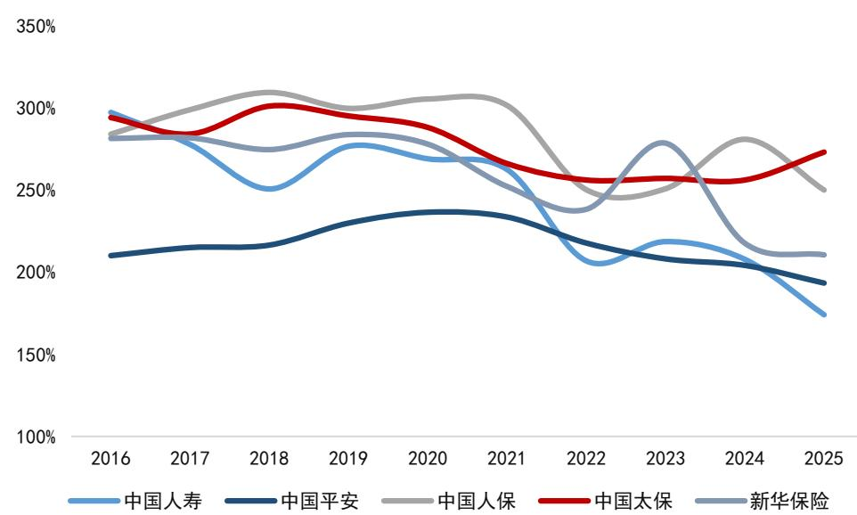  
资料来源：Wind，国信证券经济研究所整理

图：上市险企核心偿付能力充足率  
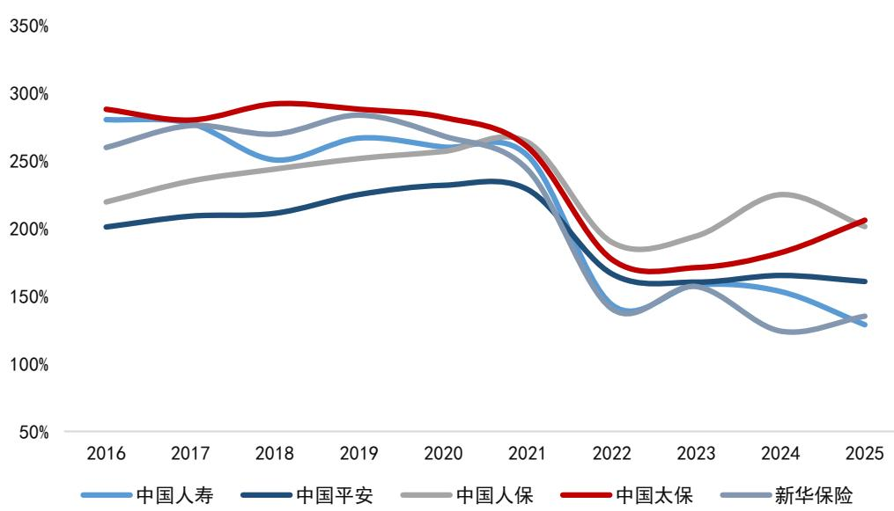  
资料来源：Wind，国信证券经济研究所整理

01 银行金市：负债宽裕，资产荒再现

02 理财产品：多资产，新考验

03 保险配置：负债驱动，权益高位

04 券商经营：自营成胜负手，策略兼容增强

05 基金转型：工具化和解决方案化并举

## 券商业绩：投资收益成为压舱石

➢ 2025年市场交投活跃度大幅提升，证券行业实现营收与利润双高增长。25家上市券商合计实现营业收入4413亿元，经调整后同比增长31%；归母净利润1741亿元，同比增长45.5%，ROE平均提升至7.31%。

➢ 2025年25家上市券商业务收入构成：经纪收入1171.9亿元、同比+44.4%，投行收入326.5亿元、同比+38.3%，资管收入406.3亿元、同比+8.1%，利息净收入364.3亿元、同比+49.3%，投资收益（含公允价值变动损益）1848.6亿元、同比+32.9%。从业务结构来看，2025年经纪、投行、资管、利息、投资业务在营业收入中的占比分别为26.6%/7.4%/9.2%/8.3%/41.9%，同比变化分别为+2.5/ +0.4/-1.9/+1.0/ +0.6pct。

图：证券公司营收结构  
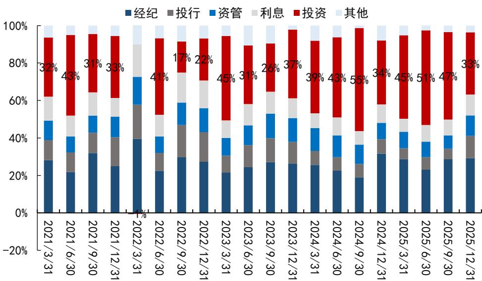  
资料来源：Wind，国信证券经济研究所整理

图：证券公司ROA及ROE变化  
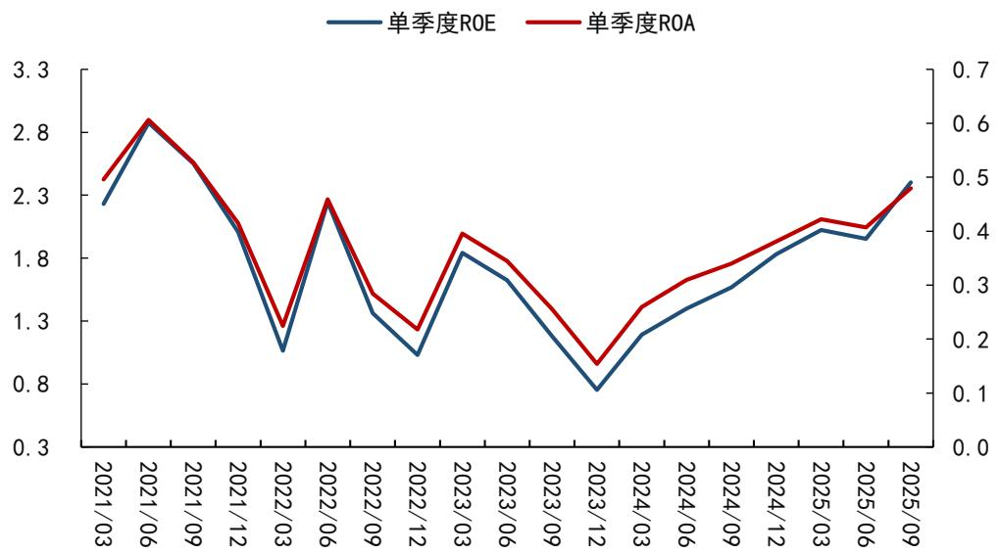  
资料来源：Wind，国信证券经济研究所整理

➢ 2025年，受益于证券公司良好的业绩表现，证券行业的净资产增速有所提升。

➢ 同时，证券行业的杠杆率有所提升，显示出证券行业在投资端更加积极的扩表行为。

图：证券公司净资产规模及增速（单位：亿元）  
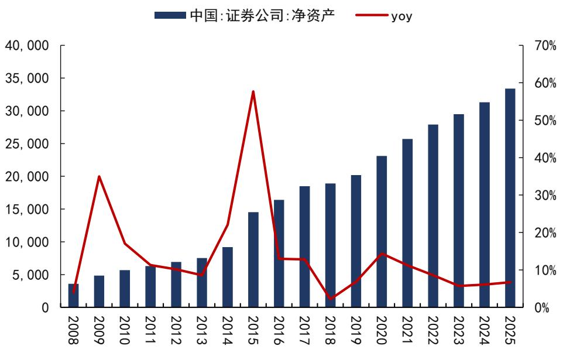  
资料来源：Wind，国信证券经济研究所整理

图：证券公司有效杠杆率  
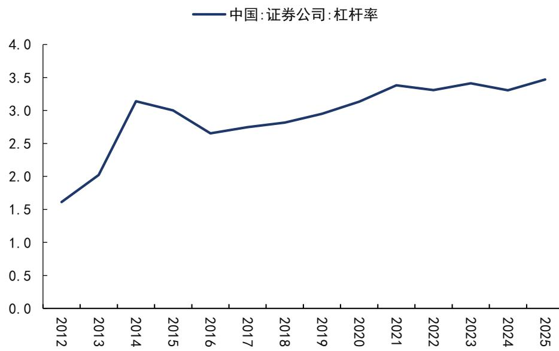  
资料来源：Wind，国信证券经济研究所整理

➢ 截至2025年末，25家上市券商金融投资规模合计达 59,758亿元，同比增长18%，占总资产比重46.7%，同比下降 3.6 个百分点。其中交易性金融资产、 债权投资、其他债权投资、其他权益投资分别为41,636亿元、704亿元、11,276亿元、6,140亿元，同比分别增长18.6%、2.7%、2.1%、60.9%，增配交易性金融资产和其他权益投资态势显著。

➢ 股票投资占比提升至24%，为近年来首次提升至20%以上。

图：证券公司金融资产投资结构-按账户分类  
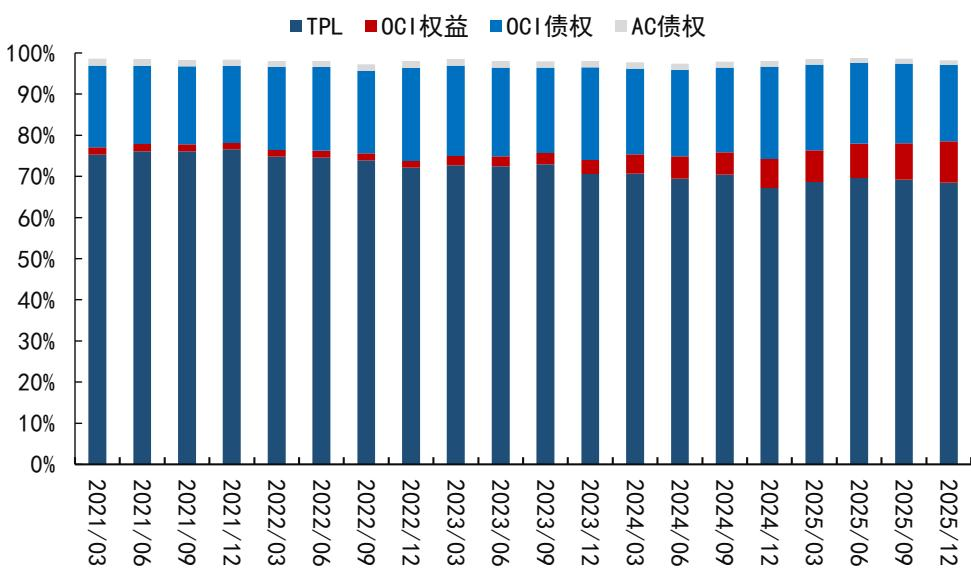  
资料来源：Wind，国信证券经济研究所整理

图：证券公司金融资产投资结构-按资产分类  
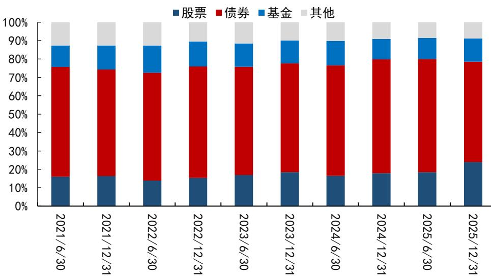  
资料来源：Wind，国信证券经济研究所整理

➢ 近年来，证券公司债券投资规模总体呈现上升趋势，其中利率债占比有所提升、信用债占比有所下降。

➢ 2025年以来，证券公司投资利率债、信用债、同业存单比例大致稳定，但通过投资一级二级债基、债券借贷、跨境投资等方式来增厚收益。

图：证券公司债券投资规模（单位：亿元）  
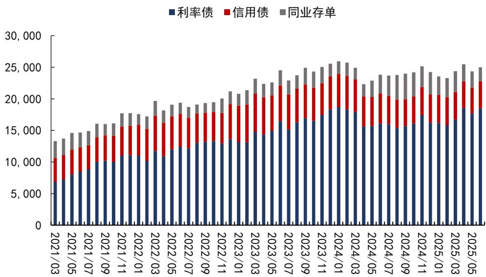  
资料来源：Wind，国信证券经济研究所整理

图：证券公司债券投资占比  
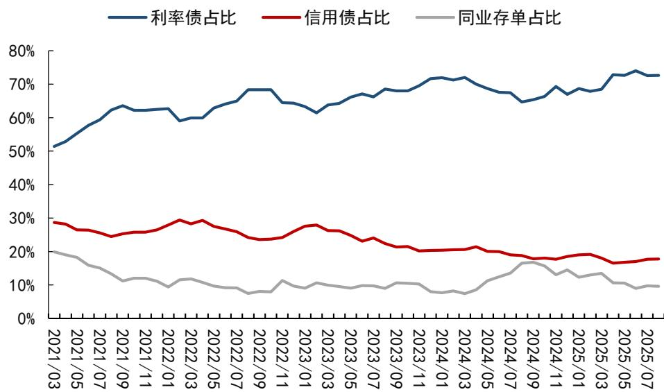  
资料来源：Wind，国信证券经济研究所整理

I 01 银行金市：负债宽裕，资产荒再现  
02 1 理财产品：多资产，新考验  
03 保险配置：负债驱动，权益高位  
04 券商经营：自营成胜负手，策略兼容增强  
I 05 基金转型：工具化和解决方案化并举

➢ 截至2026年3月末，公募基金份额达32.33万亿份、净值达36.91万亿元，份额与规模处于总体上升趋势。

➢ 截至2026年3月末，股票型基金净值占比提升至12.05%，债券型基金和货币型基金占比略有下降。

图：公募基金份额及净值（单位：亿份、亿元）  
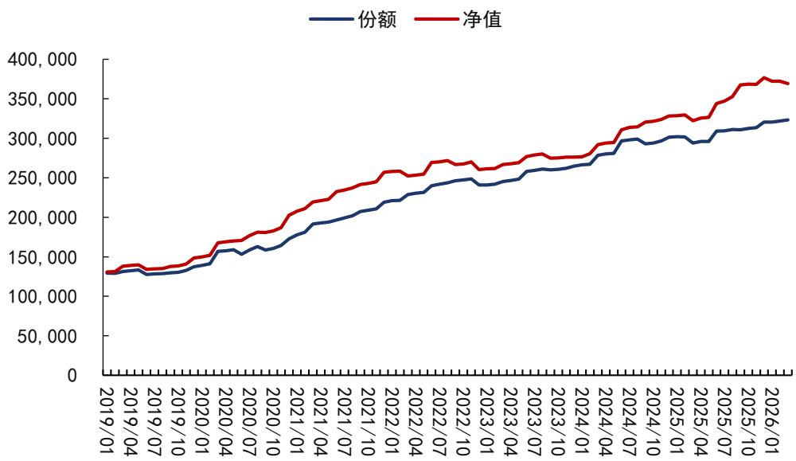  
资料来源：Wind，国信证券经济研究所整理

图：公募基金各品类净值占比  
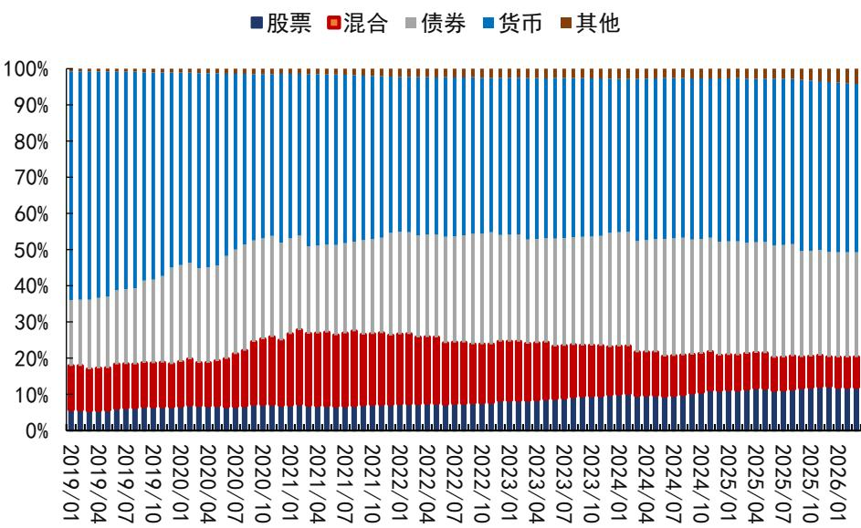  
资料来源：Wind，国信证券经济研究所整理

## 主动管理规模占比高的基金公司业绩增量显著

➢ 2025年，主动管理基金规模（股票+混合-权益指数）占比较高的基金公司，营收和净利润超出同业。代表公司包括广发基金、富国基金、兴全基金、大成基金、东证资管等。

图：主要基金公司2025年财务表现及管理规模比较
<table><tr><td rowspan="2">公司名称 2025年营收营收yoy2025年净利润净利润yoy</td><td colspan="5">财务表现（单位：亿元）</td><td colspan="8">管理规模（单位：亿元）</td></tr><tr><td></td><td></td><td></td><td></td><td>全部</td><td>非货币型</td><td>货币型</td><td>股票型</td><td>混合型</td><td>债券型</td><td>指数型</td><td>权益指数型</td><td>ETF</td></tr><tr><td>易方达</td><td>129.96</td><td>7.33%</td><td>38.06</td><td>-2. 42%</td><td>25,703</td><td>18,176</td><td>7, 527</td><td>9,147</td><td>2,481</td><td>4,193</td><td>11,333</td><td>8,683</td><td>8,809</td></tr><tr><td>华夏</td><td>96.26</td><td>19.86%</td><td>23.96</td><td>11. 03%</td><td>22,801</td><td>15,687</td><td>7,114</td><td>9,238</td><td>1,281</td><td>2,860</td><td>11, 371</td><td>8,994</td><td>9,573</td></tr><tr><td>南方</td><td>87.67</td><td>16.55%</td><td>27.05</td><td>15.05%</td><td>15,127</td><td>8,742</td><td>6,385</td><td>4,425</td><td>1,053</td><td>2,656</td><td>5,516</td><td>4,322</td><td>4,174</td></tr><tr><td>广发</td><td>85.41</td><td>17. 64%</td><td>27.53</td><td>37.70%</td><td>16,631</td><td>10,151</td><td>6,480</td><td>2,796</td><td>1, 989</td><td>3,885</td><td>4, 377</td><td>2, 426</td><td>2, 900</td></tr><tr><td>富国</td><td>78.82</td><td>23.06%</td><td>22. 05</td><td>25.92%</td><td>13, 521</td><td>8,885</td><td>4,636</td><td>2,740</td><td>1, 659</td><td>3,887</td><td>3, 631</td><td>2, 435</td><td>2, 534</td></tr><tr><td>汇添富</td><td>56.58</td><td>17.20%</td><td>14.21</td><td>-8.14%</td><td>11, 327</td><td>6,862</td><td>4,466</td><td>1,932</td><td>1, 658</td><td>2,891</td><td>2,571</td><td>1,725</td><td>1,496</td></tr><tr><td>招商</td><td>54.70</td><td>3.05%</td><td>14.38</td><td>-12.85%</td><td>9,772</td><td>6,048</td><td>3,724</td><td>1,498</td><td>455</td><td>3,822</td><td>1,803</td><td>1,253</td><td>845</td></tr><tr><td>博时</td><td>49.92</td><td>8.78%</td><td>15.31</td><td>0.18%</td><td>11, 573</td><td>6,928</td><td>4,645</td><td>784</td><td>664</td><td>4,033</td><td>3,241</td><td>711</td><td>2,166</td></tr><tr><td>兴证全球</td><td>39. 68</td><td>21. 01%</td><td>15.90</td><td>12. 53%</td><td>7,491</td><td>3,033</td><td>4, 458</td><td>112</td><td>1, 246</td><td>1,488</td><td>248</td><td>93</td><td>12</td></tr><tr><td>华安</td><td>34.93</td><td>12.32%</td><td>9.61</td><td>5.60%</td><td>8,134</td><td>5,293</td><td>2,840</td><td>922</td><td>844</td><td>1, 699</td><td>2,790</td><td>886</td><td>1,951</td></tr><tr><td>银华</td><td>30.44</td><td>6.54%</td><td>6.05</td><td>8.26%</td><td>6,538</td><td>3,072</td><td>3,467</td><td>791</td><td>658</td><td>1,468</td><td>1,270</td><td>737</td><td>1, 687</td></tr><tr><td>大成</td><td>26. 04</td><td>23. 01%</td><td>5.33</td><td>15.55%</td><td>4, 648</td><td>2, 855</td><td>1, 793</td><td>376</td><td>779</td><td>1, 267</td><td>862</td><td>170</td><td>623</td></tr><tr><td>华泰证券资管</td><td>22.06</td><td>26.23%</td><td>11.42</td><td>29. 61%</td><td>1,805</td><td>258</td><td>1,548</td><td>3</td><td>25</td><td>174</td><td>28</td><td>3</td><td>0</td></tr><tr><td>华泰柏瑞</td><td>21.52</td><td>-6.97%</td><td>4.55</td><td>-37.69%</td><td>8,452</td><td>7,618</td><td>834</td><td>5,841</td><td>494</td><td>567</td><td>6,685</td><td>5,832</td><td>6,231</td></tr><tr><td>万家</td><td>20.75</td><td>16.63%</td><td>3.75</td><td>14.81%</td><td>5,956</td><td>1,521</td><td>4,435</td><td>313</td><td>474</td><td>688</td><td>401</td><td>291</td><td>207</td></tr><tr><td>国泰海通资管</td><td>20.57</td><td>20.34%</td><td>4.08</td><td>21.15%</td><td>1,129</td><td>718</td><td>411</td><td>131</td><td>63</td><td>417</td><td>132</td><td>116</td><td>1</td></tr><tr><td>东证资管</td><td>15.99</td><td>11. 45%</td><td>4. 28</td><td>28.37%</td><td>2,163</td><td>1, 732</td><td>430</td><td>128</td><td>881</td><td>625</td><td>120</td><td>101</td><td>1</td></tr><tr><td>兴业</td><td>15.23</td><td>23.12%</td><td>5.12</td><td>20.19%</td><td>4,626</td><td>2,686</td><td>1,940</td><td>40</td><td>140</td><td>2,503</td><td>400</td><td>35</td><td>185</td></tr><tr><td>海富通</td><td>13.33</td><td>1</td><td>4.85</td><td>1</td><td>2,566</td><td>2,106</td><td>460</td><td>98</td><td>256</td><td>1,717</td><td>1,366</td><td>91</td><td>1,300</td></tr></table>

资料来源：Wind，国信证券经济研究所整理

## 结构亮点：FOF和“固收+”成为增长黑马

➢ 2025年以来，FOF基金呈现加速增长趋势，份额及规模显著提升。截至2026年3月末，净值已突破3,100亿元，同比接近翻倍。

➢ “固收+”基金方面，混合一级、二级债券基金均保持增长。尤其是混合二级债基，截至2025年底规模已经突破1.6万亿元。

图：公募FOF基金份额及净值（单位：亿份、亿元）  
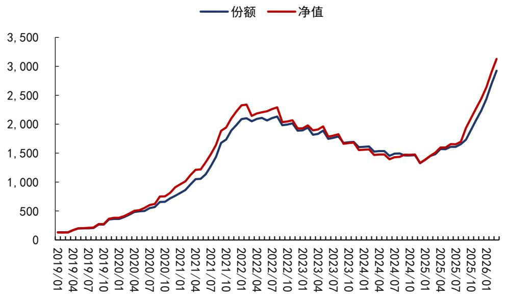  
资料来源：Wind，国信证券经济研究所整理

图：公募混合一级、二级债券基金份额及净值（单位：亿份、亿元）  
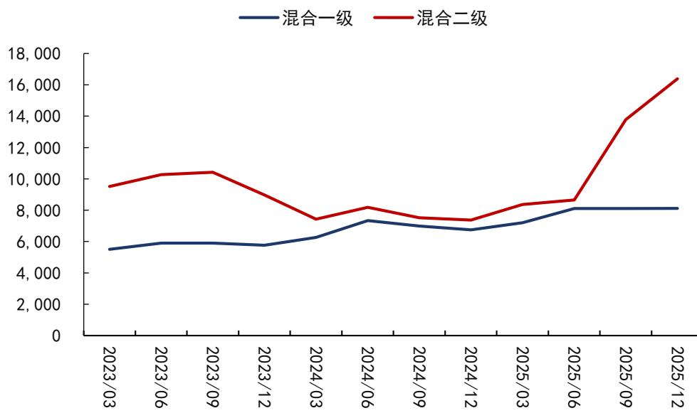  
资料来源：Wind，国信证券经济研究所整理

➢ 2025年以来，公募基金股票配置占比略有提升，这主要与股市表现较好有关。

➢ 截至2025年末，公募基金资产配置结构：股票24.8%、债券57.9%、现金15.5%、买入返售金融资产8.2%。

图：公募基金各类资产投资占比  
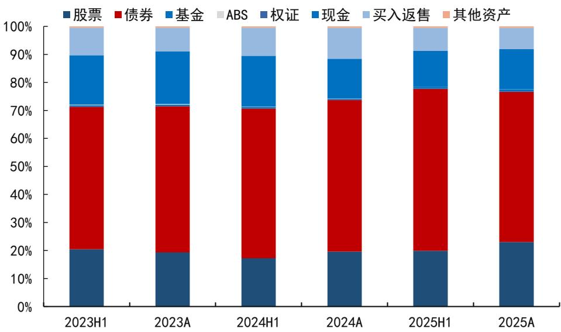  
资料来源：Wind，国信证券经济研究所整理

图：截至2025年末，公募基金各类资产投资占比  
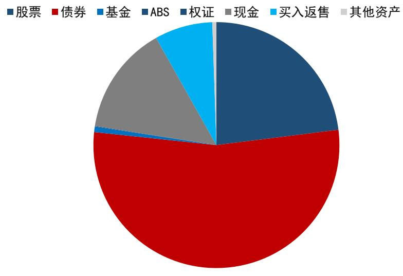  
资料来源：Wind，国信证券经济研究所整理

## 债基规模收缩来自于基金赎回新规影响

对于投资者持续持有期限少于七日的基金份额，应 当收取不低于赎回金额1.5%的赎回费；对于投资者持续

持有期限满七日、少于三十日的基金份额，收取不低于赎回金额1%的赎回费；对于投资者持续持有期限满三十日、少于一百八十日的基金份额，收取不低于赎回金额0.5%的赎回费。

对于个人投资者持续持有期限满七日的指数型基金、债券型基金份额，以及对于机构投资者持续持有期限满三十日的债券型基金份额，基金管理人可以另行约定赎回费收取标准。

对于交易型开放式基金（ETF）、同业存单基金、货币市场基金以及中国证监会认可的其他基金或基金份额，基金管理人可以根据产品投资运作特点另行约定赎回费收取标准。

资料来源：国家金融监督管理总局，国信证券经济研究所整理

## 影响：

1、如果要免除赎回费，投资主动权益基金（包括股票型、偏股混、平衡混）需要最低持有180天；

2、债券基金基金赎回费显著优化。对于债券基金，机构投资者债基持有期T≥30日；个人投资者债基持有期T≥7日，基金管理人可以另行约定赎回费收取标准。这样个人满7天、机构满30天即可免赎回费，较此前满180天才能免赎回费的条款显然已显著宽松。

3、指数型产品也有利好。对于指数型基金（含ETF连接基金、场外指数、指数增强产品），个人满7天、机构满30天即可免赎回费，较此前满180天才能免赎回费的条款显然已明显宽松；

4、对于偏股型投顾业务，如果涉及主动管理类产品调仓，180内仍需要承担0.5%的赎回费用，仍有一定负面影响。

## 股票型公募行业配置占比：TMT等超配，金融等低配

➢ 截至2025年末，公募基金股票配置按行业划分，TMT、医药等行业仍然维持超配；金融、石化等行业仍维持低配。

图：公募基金股票行业配置占比与行业基准比较
<table><tr><td>行业名称</td><td>行业投资市值(亿)</td><td>行业占比(%)</td><td>行业占股票投资市值比(%)</td><td>较上期变动(%)</td><td>标准行业配置比例(%)</td><td>超额行业配置比例(%)</td></tr><tr><td>电子</td><td>15,299.43</td><td>16.99</td><td>16.96</td><td>1.77</td><td>11.91</td><td>5.05</td></tr><tr><td>医药生物</td><td>7,555.47</td><td>8.39</td><td>8.37</td><td>-1.77</td><td>5.79</td><td>2.59</td></tr><tr><td>传媒</td><td>3,289.30</td><td>3.65</td><td>3.65</td><td>-0.15</td><td>1.63</td><td>2.02</td></tr><tr><td>通信</td><td>5,084.16</td><td>5.65</td><td>5.64</td><td>1.99</td><td>3.66</td><td>1.97</td></tr><tr><td>有色金属</td><td>5,667.09</td><td>6.29</td><td>6.28</td><td>2.52</td><td>4.71</td><td>1.57</td></tr><tr><td>电力设备</td><td>7,535.04</td><td>8.37</td><td>8.35</td><td>1.42</td><td>7.35</td><td>1.00</td></tr><tr><td>商贸零售</td><td>1,536.27</td><td>1.71</td><td>1.70</td><td>0.09</td><td>1.02</td><td>0.69</td></tr><tr><td>社会服务</td><td>1,045.41</td><td>1.16</td><td>1.16</td><td>0.03</td><td>0.48</td><td>0.68</td></tr><tr><td>非银金融</td><td>6,089.75</td><td>6.76</td><td>6.75</td><td>0.83</td><td>6.43</td><td>0.32</td></tr><tr><td>家用电器</td><td>1,721.34</td><td>1.91</td><td>1.91</td><td>-0.54</td><td>1.91</td><td>0.00</td></tr><tr><td>美容护理</td><td>225.37</td><td>0.25</td><td>0.25</td><td>-0.24</td><td>0.26</td><td>-0.01</td></tr><tr><td>综合</td><td>81.22</td><td>0.09</td><td>0.09</td><td>0.00</td><td>0.15</td><td>-0.06</td></tr><tr><td>食品饮料</td><td>3,864.79</td><td>4.29</td><td>4.28</td><td>-1.19</td><td>4.35</td><td>-0.07</td></tr><tr><td>纺织服饰</td><td>383.01</td><td>0.43</td><td>0.42</td><td>-0.07</td><td>0.63</td><td>-0.21</td></tr><tr><td>汽车</td><td>3,489.79</td><td>3.88</td><td>3.87</td><td>-0.49</td><td>4.08</td><td>-0.21</td></tr><tr><td>建筑材料</td><td>525.06</td><td>0.58</td><td>0.58</td><td>0.10</td><td>0.79</td><td>-0.21</td></tr><tr><td>农林牧渔</td><td>837.03</td><td>0.93</td><td>0.93</td><td>-0.19</td><td>1.15</td><td>-0.22</td></tr><tr><td>房地产</td><td>730.34</td><td>0.81</td><td>0.81</td><td>-0.21</td><td>1.13</td><td>-0.32</td></tr><tr><td>钢铁</td><td>509.76</td><td>0.57</td><td>0.57</td><td>0.08</td><td>0.97</td><td>-0.41</td></tr><tr><td>轻工制造</td><td>481.02</td><td>0.53</td><td>0.53</td><td>-0.24</td><td>0.96</td><td>-0.43</td></tr><tr><td>国防军工</td><td>2, 244. 64</td><td>2.49</td><td>2.49</td><td>-0.79</td><td>2.93</td><td>-0.44</td></tr><tr><td>环保 煤炭</td><td>279.53 828.98</td><td>0.31</td><td>0.31</td><td>-0.06</td><td>0.77</td><td>-0.47</td></tr><tr><td>计算机</td><td>3,259.19</td><td>0.92</td><td>0.92</td><td>-0.01</td><td>1.60</td><td>-0.68</td></tr><tr><td>建筑装饰</td><td>707.60</td><td>3.62</td><td>3.61</td><td>-0.71</td><td>4.31</td><td>-0.70</td></tr><tr><td></td><td>3,545.55</td><td>0.79</td><td>0.78</td><td>-0.16</td><td>1.76</td><td>-0.97</td></tr><tr><td>机械设备 交通运输</td><td>1,693.99</td><td>3.94</td><td>3.93</td><td>0.48</td><td>5.04</td><td>-1.11</td></tr><tr><td></td><td>2,439.39</td><td>1.88</td><td>1.88</td><td>-0.38</td><td>2.99</td><td>-1.12</td></tr><tr><td>基础化工</td><td>1,233.58</td><td>2.71</td><td>2.70</td><td>0.46</td><td>4.06</td><td>-1.36</td></tr><tr><td>公用事业</td><td>1,025.35</td><td>1.37</td><td>1.37</td><td>-0.46</td><td>3.22</td><td>-1.85</td></tr><tr><td>石油石化 银行</td><td>4,166.30</td><td>1.14 4.63</td><td>1.14 4.62</td><td>0.14 -2.16</td><td>3.22 10.77</td><td>-2.08 -6.15</td></tr></table>

资料来源：Wind，国信证券经济研究所整理

➢ 规模层面，股票ETF自2026年1月起大规模下降。截至2026年3月末，股票、债券、跨境、商品ETF规模分别为29,731亿元、7,774亿元、9,591亿元、3,330亿元、1,768亿元。

➢ 结构层面，股票ETF占比明显下降。债券、跨境ETF占比明显增加。

图：各类ETF规模变化（单位：亿元）  
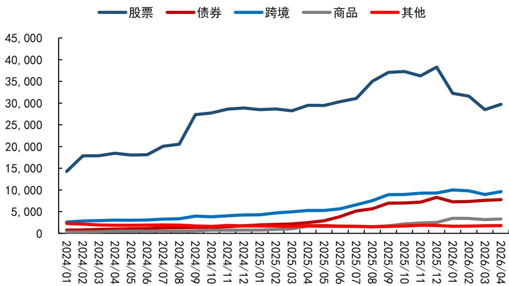  
资料来源：Wind，国信证券经济研究所整理

图：各类ETF规模占比  
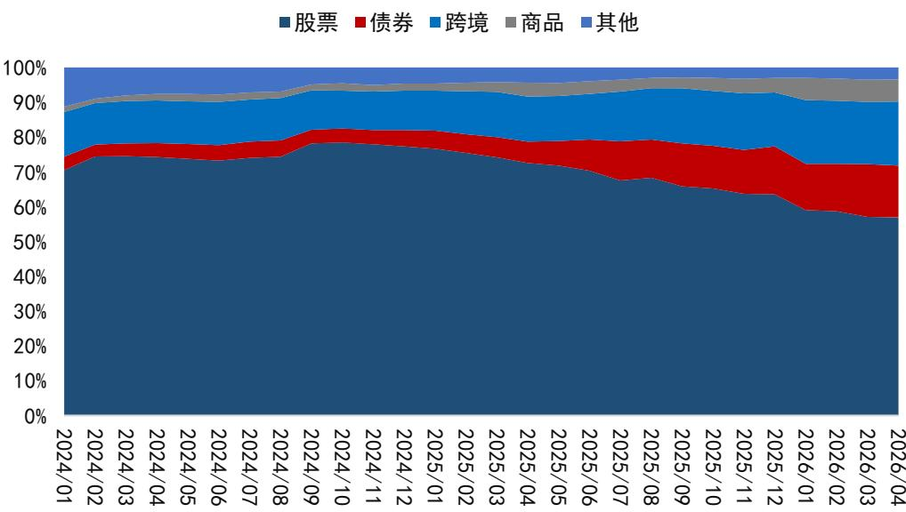  
资料来源：Wind，国信证券经济研究所整理

## 风险提示

➢ 宏观经济下行风险：宏观经济增速不及预期，将压制资本市场整体景气度，拖累银行与非银板块核心业务盈利表现。

➢ 市场大幅波动风险：A股持续宽幅震荡、成交持续缩量，将直接冲击券商经纪、两融及期货资管等核心业务收入。

➢ 金融监管政策收紧风险：资本市场及非银金融行业监管政策超预期收紧，将对相关机构业务开展形成约束。

➢ 行业竞争加剧风险：非银金融行业同质化竞争持续加剧，可能导致行业整体盈利空间被持续挤压。

➢ 资金持续流出与流动性风险：市场去杠杆进程延续，资金持续流出，将加剧板块估值承压与个股流动性波动。

➢ 标的业绩不及预期风险：推荐标的核心业务进展、盈利表现不及市场预期，将导致股价表现不及预期。

## 免责声明

## 国信证券投资评级

<table><tr><td rowspan=1 colspan=1>投资评级标准</td><td rowspan=1 colspan=1>类别</td><td rowspan=1 colspan=1>级别</td><td rowspan=1 colspan=1>说明</td></tr><tr><td rowspan=7 colspan=1>报告中投资建议所涉及的评级（如有）分为股票评级和行业评级（另有说明的除外）。评级标准为报告发布日后6到12个月内的相对市场表现，也即报告发布日后的6到12个月内公司股价（或行业指数）相对同期相关证券市场代表性指数的涨跌幅作为基准。A股市场以沪深300指数（000300.SH）作为基准；新三板市场以三板成指（899001.CSI）为基准；香港市场以恒生指数(HSI.HI)作为基准；美国市场以标普500指数(SPX.GI)或纳斯达克指数（IXIC.GI）为基准。</td><td rowspan=4 colspan=1>股票投资评级</td><td rowspan=1 colspan=1>优于大市</td><td rowspan=1 colspan=1>股价表现优于市场代表性指数10%以上</td></tr><tr><td rowspan=1 colspan=1>中性</td><td rowspan=1 colspan=1>股价表现介于市场代表性指数±10%之间</td></tr><tr><td rowspan=1 colspan=1>弱于大市</td><td rowspan=1 colspan=1>股价表现弱于市场代表性指数10%以上</td></tr><tr><td rowspan=1 colspan=1>无评级</td><td rowspan=1 colspan=1>股价与市场代表性指数相比无明确观点</td></tr><tr><td rowspan=3 colspan=1>行业投资评级</td><td rowspan=1 colspan=1>优于大市</td><td rowspan=1 colspan=1>行业指数表现优于市场代表性指数10%以上</td></tr><tr><td rowspan=1 colspan=1>中性</td><td rowspan=1 colspan=1>行业指数表现介于市场代表性指数±10%之间</td></tr><tr><td rowspan=1 colspan=1>弱于大市</td><td rowspan=1 colspan=1>行业指数表现弱于市场代表性指数10%以上</td></tr></table>

## 分析师承诺

作者保证报告所采用的数据均来自合规渠道；分析逻辑基于作者的职业理解，通过合理判断并得出结论，力求独立、客观、公正，结论不受任何第三方的授意或影响；作者在过去、现在或未来未就其研究报告所提供的具体建议或所表述的意见直接或间接收取任何报酬，特此声明。

## 重要声明

本报告由国信证券股份有限公司（已具备中国证监会许可的证券投资咨询业务资格）制作；报告版权归国信证券股份有限公司（以下简称“我公司”）所有。本报告仅供我公司客户使用，本公司不会因接收人收到本报告而视其为客户。未经书面许可，任何机构和个人不得以任何形式使用、复制或传播。任何有关本报告的摘要或节选都不代表本报告正式完整的观点，一切须以我公司向客户发布的本报告完整版本为准。

本报告基于已公开的资料或信息撰写，但我公司不保证该资料及信息的完整性、准确性。本报告所载的信息、资料、建议及推测仅反映我公司于本报告公开发布当日的判断，在不同时期，我公司可能撰写并发布与本报告所载资料、建议及推测不一致的报告。我公司不保证本报告所含信息及资料处于最新状态；我公司可能随时补充、更新和修订有关信息及资料，投资者应当自行关注相关更新和修订内容。我公司或关联机构可能会持有本报告中所提到的公司所发行的证券并进行交易，还可能为这些公司提供或争取提供投资银行、财务顾问或金融产品等相关服务。本公司的资产管理部门、自营部门以及其他投资业务部门可能独立做出与本报告中意见或建议不一致的投资决策。

本报告仅供参考之用，不构成出售或购买证券或其他投资标的要约或邀请。在任何情况下，本报告中的信息和意见均不构成对任何个人的投资建议。任何形式的分享证券投资收益或者分担证券投资损失的书面或口头承诺均为无效。投资者应结合自己的投资目标和财务状况自行判断是否采用本报告所载内容和信息并自行承担风险，我公司及雇员对投资者使用本报告及其内容而造成的一切后果不承担任何法律责任。

## 证券投资咨询业务的说明

本公司具备中国证监会核准的证券投资咨询业务资格。证券投资咨询，是指从事证券投资咨询业务的机构及其投资咨询人员以下列形式为证券投资人或者客户提供证券投资分析、预测或者建议等直接或者间接有偿咨询服务的活动：接受投资人或者客户委托，提供证券投资咨询服务；举办有关证券投资咨询的讲座、报告会、分析会等；在报刊上发表证券投资咨询的文章、评论、报告，以及通过电台、电视台等公众传播媒体提供证券投资咨询服务；通过电话、传真、电脑网络等电信设备系统，提供证券投资咨询服务；中国证监会认定的其他形式。

发布证券研究报告是证券投资咨询业务的一种基本形式，指证券公司、证券投资咨询机构对证券及证券相关产品的价值、市场走势或者相关影响因素进行分析，形成证券估值、投资评级等投资分析意见，制作证券研究报告，并向客户发布的行为。

## 国信证券经济研究所

深圳

深圳市福田区福华一路125号国信金融大厦36层

邮编：518046 总机：0755-82130833

上海

上海浦东民生路1199弄证大五道口广场1号楼12楼

邮编：200135

北京

北京西城区金融大街兴盛街6号国信证券9层

邮编：100032