# 改革红利兑现，增量价值开启新一轮资负共振

# 中国平安（601318.SH）首次覆盖报告

## 核心观点

1）个险渠道：改革红利持续兑现，人均产能提升驱动价值回升。2025 年个险渠道NBV 为 238.2 亿元，同比+10.4%；代理人规模保持在 35.1 万人左右，年化人均产能为 37.7 万元，人均 NBV 同比+14.2%，NBVM 维持 30.8%的较高水平，个险渠道改革成效初现；2）银保渠道：价值贡献加速释放，多元渠道格局进一步成型。2025 年银保渠道 NBV 升至 94.1 亿元，同比+138.0%，贡献占比提升至 25.5%；规模保费达 715.2 亿元，同比+50.3%，其中新单保费同比+92.2%。我们认为，个险渠道的高质量稳增长与银保渠道的高景气扩张正共同推动寿险价值持续增长。

权益投资：配置结构前瞻，收益韧性与报表稳健兼具。公司在低利率环境下持续增配低估值、高股息权益资产，并通过 FVOCI 等账户安排降低利润表波动，投资端收益稳健的特征进一步强化。2025 年公司净投资收益率为 3.7%，同比下降 0.1 pct 但优于同业；综合投资收益率升至 6.3%，同比提升 0.5 pct，高股息配置与资本市场回暖共同带动投资表现改善。我们认为，公司当前权益配置已不再只是单纯增厚弹性，而是在增强现金回报、平滑波动和改善利润质量之间取得了更优平衡。

⚫ 不动产风险：拨备计提充分，风险敞口实质收敛。市场此前对公司地产风险的担忧已在估值中得到反映，公司过去几年对相关资产进行了充分的减值计提。截至 2025年末，公司保险资金投资组合中不动产相关投资在总投资资产中的占比仅为 3.1%。

## 盈利预测与投资建议

我们认为公司改革红利已开始逐步兑现，资负共振将驱动估值从修复走向扩张。负债端个险渠道企稳且人均产能持续提升，银保渠道价值贡献快速释放，新业务价值增长动能较强；资产端地产风险基本出清，高股息权益资产有望兼顾收益韧性与报表稳健。当前公司同时具备寿险修复、资产端改善与高分红回报三重支撑，仍是保险板块中兼具防御属性与向上弹性的核心标的。

我们以寿险及健康险业务内含价值与其他业务调整后资产净值作为集团内含价值，以2026 年 4 月 17 日收盘价计，公司对应 2026E 至 2028E P/EV 分别为 0.65/ 0.61/ 0.57倍，尚未充分反映公司中长期盈利韧性与综合金融平台的增量价值。我们以 2026E 的EVPS的 88.84元作为目标价，首次覆盖，给予“买入”评级。

## 风险提示

长端利率下行超预期；权益市场大幅波动；寿险改革成效不及预期；居民收入不及预期；医疗养老生态圈协同效应不及预期。

公司主要财务信息
<table><tr><td></td><td>2024A</td><td>2025A</td><td>2026E</td><td>2027E</td><td>2028E</td></tr><tr><td>保险服务收入（亿元）</td><td>5,512</td><td>5,595</td><td>5,797</td><td>6,040</td><td>6,295</td></tr><tr><td>同比增长</td><td>2.7%</td><td>1.5%</td><td>3.6%</td><td>4.2%</td><td>4.2%</td></tr><tr><td>营业收入（亿元）</td><td>10,289</td><td>10,505</td><td>11,200</td><td>11,786</td><td>12,391</td></tr><tr><td>同比增长</td><td>12.6%</td><td>2.1%</td><td>6.6%</td><td>5.2%</td><td>5.1%</td></tr><tr><td>归母净利润（亿元）</td><td>1,266</td><td>1,348</td><td>1,742</td><td>1,817</td><td>1,931</td></tr><tr><td>同比增长</td><td>47.8%</td><td>6.5%</td><td>29.3%</td><td>4.3%</td><td>6.2%</td></tr><tr><td>每股收益（元）</td><td>6.95</td><td>7.44</td><td>9.62</td><td>10.04</td><td>10.66</td></tr><tr><td>每股股利分红（元）</td><td>2.54</td><td>2.70</td><td>2.87</td><td>3.29</td><td>3.88</td></tr><tr><td>每股集团EV（元）</td><td>78.12</td><td>83.07</td><td>88.84</td><td>95.24</td><td>102.28</td></tr><tr><td>隐含P/EV</td><td>0.74</td><td>0.70</td><td>0.65</td><td>0.61</td><td>0.57</td></tr><tr><td>ROE</td><td>13.6%</td><td>13.5%</td><td>15.2%</td><td>13.4%</td><td>12.1%</td></tr></table>

资料来源：中国平安公司公告，iFinD，东方证券研究所预测.；注：以 2026 年 4 月 17 日收盘价计

公司研究 | 首次报告

中国平安 601318.SH

##

## 买入（首次）

股价（2026年 04月17日） 57.92 元

目标价格 88.84 元

52 周最高价/最低价 74.88/47.76 元

总股本/流通 A 股（万股） 1,810,764/1,810,764

A 股市值（百万元） 1,048,795

国家/地区 中国

行业 非银行金融

报告发布日期 2026 年 04 月 18 日

##

<table><tr><td></td><td>1周</td><td>1月</td><td>3月</td><td>12月</td></tr><tr><td>绝对表现%</td><td>-1.53</td><td>-6.34</td><td>-12.68</td><td>20.76</td></tr><tr><td>相对表现%</td><td>-3.52</td><td>-8.31</td><td>-12.61</td><td>-4.6</td></tr><tr><td>沪深300%</td><td>1.99</td><td>1.97</td><td>-0.07</td><td>25.36</td></tr></table>

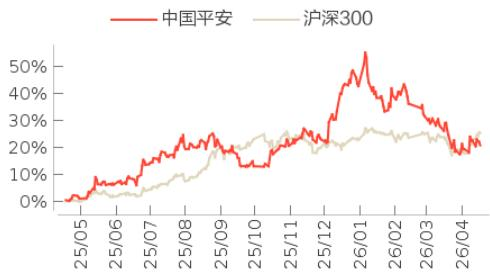

##

张凯烽 执业证书编号：S0860526020002

zhangkaifeng@orientsec.com.cn

021-63326320

## 重大投资要素

## 我们区别于市场的观点

市场一致观点是中国平安已经走出最艰难阶段，个险改革、地产风险暴露与投资端扰动正在逐步消化，公司经营基本企稳，但整体仍处于改革修复期，未来更多体现为低估值下的稳健修复，盈利弹性和估值扩张空间相对有限。

我们的观点：当前股价仅反映了部分困境反转，尚未充分反映公司在下一轮保险周期中的增量价值。与市场将平安视为“改革中的稳健型险企”不同，我们更倾向于将其定义为“已完成底部重构、并具备跨周期 alpha 能力的头部综合金融平台”。一方面，公司过去几年最核心的负面因素正在逐步消除：个险渠道经历深度清虚改革后，队伍规模连续多年筑底企稳，改革方向已由清虚转向提质；不动产相关风险也已在过去数年中充分暴露并计提，投资组合得到显著优化。另一方面，市场对公司未来增量价值的定价仍明显不足，主要体现在三个维度：第一，个险渠道已经从粗放扩张时代切换到高产能、高质量驱动阶段，人均产能和人均NBV提升将推动价值增长中枢上移；第二，“报行合一”重塑银保竞争秩序，头部险企在产品设计、品牌、协同与服务上的综合优势开始转化为可持续的份额和价值贡献；第三，公司前瞻布局高股息权益资产，在低利率环境下锁定稳定现金回报，并通过FVOCI等账户安排降低利润波动，这一投资端能力有望成为穿越周期的重要支撑。我们认为，平安未来的价值重估不应仅理解为风险折价收敛，更应理解为盈利稳定性提升、价值创造能力增强与估值中枢上移的同步兑现。

## 关键假设

第一，个险渠道有效活动人力与高绩优人群占比持续提升，2026 至 2028 年代理人规模总体保持稳中有升，人均产能与人均NBV进一步增长，推动个险渠道新业务价值增长中枢维持较快水平。

第二，银保渠道在“报行合一”框架下维持费用规范，长期期交产品占比继续提升，银保渠道价值率稳步改善，且市场份额向头部公司集中。

第三，投资端权益资产配置比例继续提升，且结构多元化，高股息资产现金分红回报保持稳定，FVOCI账户对利润表波动的隔离效果持续体现，从而增强净投资收益率韧性并改善利润质量。

## 股价上涨的催化因素

首先，个险渠道人均产能、人均 NBV、活动率等核心指标改善，将直接验证个险改革已进入提质增效阶段。其次，银保渠道若出现手续费率规范落地后价值率持续改善、规模保持高速增长、并伴随新单份额向头部集中，将强化市场对于第二增长极形成的预期。最后，若投资端高股息权益资产的配置效果通过股息收入增长、OCI 储备改善、利润波动收敛等方式得到持续验证，市场对公司盈利稳定性和穿越周期能力的认知有望明显提升，从而推动估值中枢上移。

## 风险提示

长端利率下行超预期；权益市场大幅波动；寿险改革成效不及预期；居民收入不及预期；医疗养老生态圈协同效应不及预期。

## 目 录

中国平安：中国领先的综合金融集团. .. 7  
公司概况：科技驱动的综合金融生态..... .......7  
战略演进：从金融牌照齐全到生态化发展 7  
业务体系：科技赋能下的金融与医疗双轮驱动 8  
主要财务指标：营收和利润端重回稳健增长..... .....9  
股价复盘：兼具顺周期β弹性与龙头α的标的 .. ......10  
寿险及健康险：渠道改革成效彰显，质量持续提升 . 12  
负债端：景气度回升，量价齐升驱动价值修复 ...12  
产品结构：分红险转型在即，“保险+服务”构筑差异化壁垒 .... .....15  
分红险：顺应低利率周期，分红险承接储蓄需求 15  
核心壁垒：医养生态构筑差异化护城河 16  
渠道：个险规模企稳，银保渠道构建新增长极 .... .....17  
个险渠道：主动清虚步入尾声，产能跃升重塑价值中枢 18  
银保渠道：政策红利与需求共振，重塑价值增长新高地 21  
产险：保费规模稳健，COR 改善释放业绩弹性.. ..... 24  
保费收入：保费收入增速边际修复，结构持续优化. ....24  
承保盈利：费用管控构筑壁垒，COR 改善确立拐点.. ......26  
投资端：配置结构前瞻性领先，收益韧性穿越周期 ... 27  
固定收益类：先于同业调整结构，债券配置极具前瞻性优势. .....28  
权益端：增配高股息资产，新准则下兼收益弹性与报表稳健. .....29  
权益仓位：低位增配提速，占比显著提升 29  
举牌上市公司：战略增配优质高股息标的 30  
IFRS9 下的投资组合：FVOCI 占比提升，兼顾利润平滑与收益弹性 31  
不动产投资：风险敞口持续收窄.. ....32  
投资收益：净投资收益率承压，总投资收益率强劲反弹 .....34  
分红：盈利韧性支撑分红上行，分红支付率稳步提升. ..... 35  
盈利预测与投资建议 . . 36  
盈利预测 . ...36  
估值分析和投资建议.. ..38  
风险提示.. .. 40

## 图表目录

图 1：中国平安发展历程 ... .....7  
图 2：中国平安综合金融服务模式. ...9  
图 3：中国平安综合金融实现全面跃迁式发展 . ...9  
图 4：中国平安归母净利润结构以寿险及健康险为主.... .............................................. ......9  
图 5：中国平安营业总收入企稳回升... ...................................................... ....10  
图 6：中国平安归母净利润持续回暖. ..................................................... .....10  
图 7：中国平安内含价值转为正增长. ...10  
图 8：2016 起保险行业与中国平安股价复盘 .............................................................................. 11  
图 9：平安人寿首年保费重回正增长..... ................................................................ .......12  
图 10：平安人寿新业务价值持续高增. ........................................ ..12  
图 11：主要上市险企新业务价值均快速修复..... ................................................... .......13  
图 12：平安人寿新业务价值率逐步企稳. ........................................... ....13  
图 13：中国平安新业务价值率（按首年保费）领先部分上市险企. ....14  
图 14：平安人寿寿险及健康险保单继续率稳步提升 . ....14  
图 15：平安人寿内含价值的收益率敏感性基本持平 ..... ......................................... ......15  
图 16：平安人寿新业务价值的收益率敏感性大幅收敛.. ...15  
图 17：平安人寿保费收入仍以传统寿险为主，分红险占比有所增加 ..15  
图 18：主要上市险企分红险占比仍有提升空间 .... ....................... ....16  
图 19：平安人寿分渠道规模保费（亿元）以代理人渠道为主 .....................................................17  
图 20：平安人寿分渠道新业务价值（亿元）...... .................................. .......18  
图 21：平安人寿新业务价值由银保渠道贡献显著提升.. .................................... ....18  
图 22：平安人寿个险渠道代理人人数基本企稳 ....... .......................................... ........19  
图 23：主要上市险企个险代理人数均在底部企稳... .................................... ....19  
图 24：平安人寿代理人渠道新业务规模保费反弹已创新高 . ....20  
图 25：平安人寿代理人渠道新业务价值重回上升通道.. ...20  
图 26：主要上市险企代理人渠道新业务价值率（按首年保费）均触底回升 ..... ........ ......21  
图 27：平安人寿银保渠道规模保费快速增长.. ..21  
图 28：近三年平安人寿银保渠道新单保费领先主要上市险企... ...................... ....22  
图 29：平安人寿银保渠道新业务价值持续高增，贡献进一步提升.... ........................ ....23  
图 30：平安人寿银保渠道新业务价值率（按标准保费）稳步增长... .......................... .......23  
图 31：平安财险保费收入稳健增长 .... ....24  
图 32：头部财险公司保费收入整体稳健. ....24  
图 33：平安财险保费收入结构以车险为主 ................................... .......25  
图 34：平安财险保证保险综合成本率已回落至接近 100% .. ..................................... ....25  
图 35：平安财险保证保险保费规模已基本出清 . ..25  
图 36：平安财险综合成本率逐步下滑.. ....26  
图 37：平安财险综合成本率已重回头部财险公司水平.. ...26  
图 38：中国平安投资组合规模稳健增长....... .......27  
图 39：中国平安投资组合结构中债券类和股票类持续提升 . ....27  
图 40：中国平安债券结构持续向政府债倾斜... .......28  
图 41：中国平安资产负债久期缺口逐步缩小...... ........29  
图 42：中国平安 TPL 和 OCI 股票占投资组合比例稳步增长 . ............................ ......31  
图 43：中国平安股票投资主要计入 FVOCI 分类 . ................................... ......31  
图 44：主要上市险企股票投资计入 FVTPL 分类比重较高. ............................... ....31  
图 45：中国平安 FVOCI 权益工具公允价值变动率显著领先.. ......................................... ....32  
图 46：中国平安 FVOCI 权益工具股息收入率保持高位. ....32  
图 47：中国平安不动产投资占比逐步下降 . ... ............................................ ......32  
图 48：中国平安不动产投资逐步向物权倾斜. ....32  
图 49：中国平安投资资产减值损失基本可控... .................................................. .....33  
图 50：中国平安投资组合年化收益率分化 . ........................ ...34  
图 51：主要上市险企 2025 年综合投资收益率表现分化.. ....34  
图 52：主要上市险企 2025年净投资收益率普遍承压.. ...34  
图 53：中国平安现金分红总额稳健增长. ...35  
图 54：中国平安现金分红比例中枢逐步提升.. ....35  
图 55：中国平安股息率中枢抬升...... ....35  
图 56：A 股主要上市险企滚动 PEV..... ....39  
表 1：中国平安业务概况 . ....8  
表 2：2016 年以来，A 股上市险企分阶段涨跌幅情况 . .... 11  
表 3：2025年主要上市险企对分红险的表述均较为积极 .....16  
表 4：中国平安养老业务概况 ....... ......17  
表 5：主要上市险企固定收益类投资占比 ......28  
表 6：主要上市险企债券投资占比.... ....28  
表 7：主要上市险企积极主动控制久期缺口. ............................................... ....29  
表 8：主要上市险企股票投资占比.... ......................................................... .....30  
表 9：主要上市险企股票+基金投资占比... ....................... .....30  
表 10：2025 年以来中国平安持续举牌港股高股息低估值上市公司. .......................... ....30  
表 11：中国平安 2025 年末地产投资结构风险基本可控 . ....33  
表 12：中国平安保险服务收入预测（百万元） ......37  
表 13：中国平安寿险和健康险业务新业务价值及新业务价值率预测（百万元） ..... ......37  
表 14：中国平安内含价值预测（百万元） ......38

## 中国平安：中国领先的综合金融集团

公司概况：科技驱动的综合金融生态

战略演进：从金融牌照齐全到生态化发展

中国平安是国内金融牌照最齐全、业务布局最广的综合金融集团。公司成立于 1988 年，总部位于深圳，是中国第一家股份制保险公司。经过多年发展，平安的业务已从保险拓展至银行、证券、信托、资产管理、医疗健康与科技创新等多个领域，逐步构建起涵盖金融、科技与健康服务的综合生态体系，致力于打造“综合金融+医疗养老+科技赋能”的创新业务模式。

1988 至 2002 年：立足财险，开启综合金融布局。1988 年，中国平安成立于深圳蛇口，成为国内首家股份制保险公司。公司早期以财产保险为主，并快速实现全国扩张。1994 年进入寿险市场后，引入高盛、摩根等战略投资者，借鉴海外经验，建立起国内较早的个人寿险营销体系。此后，公司逐步拓展信托、证券等业务，综合金融布局初步形成。2002 年，集团总资产突破 1,000.0 亿元，迈入规模化发展阶段。

2003至2013年：加快版图扩张，全牌照体系成型。2003年起，公司集团化运营迈出关键一步，2004 年在香港整体上市，2007 年完成 A 股上市。此后，公司通过并购与整合持续拓展银行、证券、资管等业务。2011 年控股深发展，2013 年完成平安银行与深发展整合，银行业务进一步夯实，全牌照综合金融体系基本成型。

2014 至 2020 年：科技赋能主业，“金融+科技”深化推进。2014 年，公司确立“金融+科技”战略，以科技创新推动金融服务升级。2017 年，公司市值突破万亿元，跻身全球领先保险企业行列。2018 年进一步提出智慧生态战略，加快科技对保险、银行、医疗等核心业务的赋能。2020年，陆金所上市，公司金融科技优势进一步强化。

2021 年至今：深化生态协同，发力“综合金融+医疗健康”。在数字化转型与低利率环境下，公司持续推进“金融+科技+生态”布局。2021 年，总资产突破 10.0 万亿元，并加快探索管理式医疗，推动保险与医疗健康融合。2022 年，公司升级品牌标识，强化新价值管理文化。2024 年，公司全面推广“省心、省时、省钱”服务模式，以科技驱动客户体验升级，迈向高质量可持续发展。

图 1：中国平安发展历程  
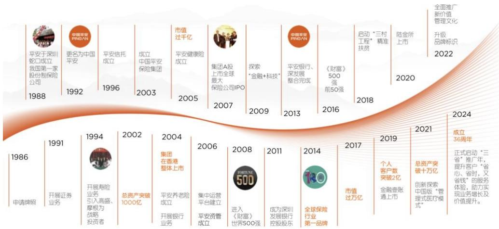  
数据来源：中国平安公司官网，东方证券研究所  
有关分析师的申明，见本报告最后部分。其他重要信息披露见分析师申明之后部分，或请与您的投资代表联系。并请阅读本证券研究报告最后一页的免责申明。

## 业务体系：科技赋能下的金融与医疗双轮驱动

中国平安依托完整金融牌照，形成覆盖保险、银行、资管、医疗养老及科技创新的综合业务体系，并持续推进“金融+医疗健康+科技创新”融合发展。保险是公司核心板块，涵盖寿险、财险和健康险；银行业务以零售转型和对公提质为主线；资管业务覆盖资管、信托、证券、基金、租赁等领域，构建起较完整的财富管理体系。与此同时，公司依托平安健康、北大医疗等平台加快医疗养老布局，并持续推动金融科技、医疗科技在风控、诊疗和健康管理等场景落地。整体来看，多元牌照协同与科技赋能共同支撑公司综合金融生态持续深化。

表 1：中国平安业务概况
<table><tr><td>业务分类</td><td>业务内容 概况</td><td></td></tr><tr><td>保险业务</td><td>平安寿险</td><td>平安于1994年启动寿险业务，在中国内地首开个人寿险营销模式。以保费收入规模计，平安寿险为中国第二大寿险公司。</td></tr><tr><td>保险业务</td><td>平安产险</td><td>平安产险于1988年成立于深圳蛇口。以原保费收入衡量，是中国第二大财产险公司。公司坚持科技创新引领高质量发展，于 业内首创AI智能定损和一键理赔功能，理赔速度全球领先，连续12年蝉联中国车险“第一品牌”。</td></tr><tr><td>保险业务</td><td>平安健康险</td><td>平安健康险于2005年成立。公司保费规模位居国内专业健康险公司第二位。</td></tr><tr><td>保险业务</td><td>平安养老险</td><td>平安养老险于2004年在上海成立，是国内首家专业养老险公司。</td></tr><tr><td>银行业务</td><td>平安银行</td><td>平安银行以“中国最卓越、全球领先的智能化零售银行”为战略目标，坚持“零售突破、对公做精、同业做专”战略方针， 致力于实现金融高质量发展。</td></tr><tr><td>资管业务</td><td>平安资管</td><td>中国顶尖的资产管理机构，位列全球资产管理公司50强。公司主要受托管理平安集团保险资金，并为境内外第三方客户提供 资产管理服务，截至2023年底，平安资产管理的受托资产管理规模达5.03万亿元。</td></tr><tr><td>资管业务</td><td>平安证券</td><td>公司聚焦“综合金融、专业品质、科技赋能”战略，打造平安综合金融服务战略下智能化证券服务平台。截至2023年底，平 安证券个人客户数突破2,300万，稳居行业第一。</td></tr><tr><td>资管业务</td><td>平安基金</td><td>坚持“以专业承载信赖”的经营理念，建立了固收、权益、指数、资产配置、专户、海外业务、资产证券化等七大 业务板 块，累计服务超过1亿的个人投资者和机构投资者。代表作“平安中证A50ETF”、“平安广州广河REIT”等，截至2025年3 月7日，“平安先进制造主题A”当年收益率达66.4%，位于偏股型基金第四。</td></tr><tr><td>资管业务</td><td>平安信托</td><td>立足“轻资产、服务型信托专家”的战略定位，围绕信托服务、机构资管和股权投资三大核心板块，做金融支持实体经济发 展的典范。截至2023年底，受托管理资产规模6,625.03亿元。</td></tr><tr><td>资管业务</td><td>平安融资租赁</td><td>致力于成为国际领先、专注行业、服务实体、模式独特的创新型融资租赁专家。自 2013年成立以来，业务发展迅速，服务网 络覆盖全国。截至2023年底，公司总资产超过2,400亿元，综合实力稳居行业第一梯队。</td></tr><tr><td>医疗养老业务</td><td>平安健康</td><td>平安健康于2014年成立，是平安集团医疗养老生态圈的旗舰。平安健康深化落地管理式医疗战略，深耕家庭医生、养老管家 两大核心枢纽建设，已成为专业、全面的医疗健康养老管理服务提供商。截至2023年底，平安健康累计付费用户数近4,000</td></tr><tr><td>医疗养老业务</td><td>北大医疗</td><td>万。 中国平安医疗生态重要成员公司。依托中国平安保险专业能力、医疗科技能力，北大及北大医学部丰富的专家资源和完善的 医教研体系，建设覆盖客户全生命周期的一站式医疗网络，致力于发展成为中国领先医疗集团。</td></tr><tr><td>科技业务</td><td>科技业务</td><td>包括平安科技、平安好医生、陆金所、金融壹账通等。公司自 2012年开始探索科技业务，探索现有业务与科技的深度融合， 包括金融和医疗两大优质板块。科技业务是集团未来发展的重点。</td></tr></table>

数据来源：中国平安公司官网，东方证券研究所

中国平安正围绕科技赋能、金融主业强化与医疗健康协同三大方向构建长期增长模式。在“综合金融+医疗养老”战略下，公司以科技提升运营效率、优化成本结构，并通过交叉销售和生态整合提升客户终身价值。具体看，科技赋能贯穿获客、运营、风控等环节，推动前中后台协同，提升客户触达、产品匹配和风险管理效率，增强业务稳健性；金融主业方面，科技助力银行、保险、资管协同发展，推动“一个客户、多种产品”模式落地，提升交叉销售转化和财富管理能力；医疗健康方面，公司依托“家庭医生+养老管家”模式整合医疗养老资源，提升健康险附加值，并通过健康数据应用优化定价、核保和理赔，增强长期盈利能力。

图 2：中国平安综合金融服务模式  
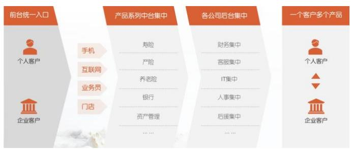  
数据来源：中国平安公司官网，东方证券研究所

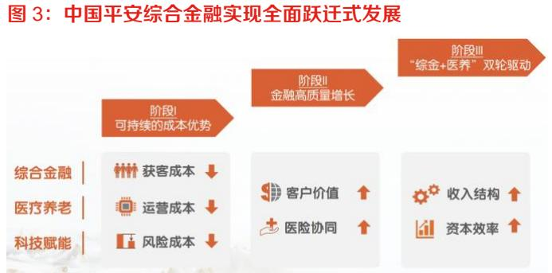  
数据来源：中国平安公司官网，东方证券研究所

寿险和健康险仍是集团的核心盈利来源，银行业务逐步成为新的增长引擎。寿险及健康险业务在集团盈利版图中占据绝对主导地位，归母净利润占比长期维持在 60%以上，并在 2023 年进一步提升至 84.75%。与此同时，银行业务的贡献度呈现显著的上行趋势，其利润贡献占比从 2016 年的 19.2%提升至 2023年的 31.4%，2024年上半年依然保持 20.1%的高位水平，有效平衡了资管等板块的波动，多元化金融架构的抗风险能力凸显。产险业务表现则相对稳健，利润贡献占比维持在 10%至 15%区间。尽管资管业务在 2023 年受市场环境影响出现较大减值波动，但科技业务及其他板块仍持续为集团贡献多元价值。整体而言，中国平安已形成“寿险为主、多极协同”的盈利格局，业务结构的韧性与深度不仅确保了集团业绩的长期稳定性，也为后续资产负债联动及综合金融战略的深化提供了坚实的财务基础。

图 4：中国平安归母净利润结构以寿险及健康险为主  
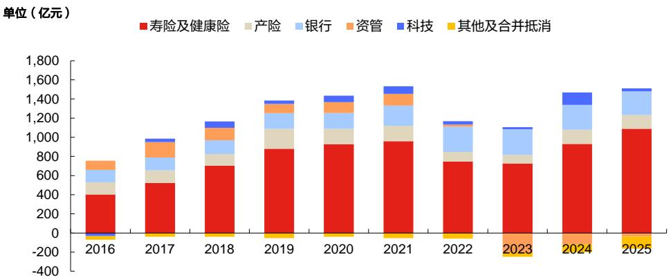  
数据来源：中国平安公司公告，东方证券研究所

## 主要财务指标：营收和利润端重回稳健增长

营收规模筑底回升，业绩弹性显著释放。历经 2016至 2019年的高速扩张期，公司营收受行业转型与宏观经济影响进入阶段性调整，于 2023 年触底；2024 年营收反弹 12.6%至 10,289 亿元，重返万亿规模；2025 年延续稳健增长，同比增长 2.1%，核心业务有望持续复苏。公司归母净利润于 2023 年筑底企稳，并于 2024 年持续复苏。2024 年公司实现归母净利润 1,266 亿元，同比高增 47.8%，结束了归母净利润连续三年持续下行；2025延续稳健增长，实现归母净利润 1,348亿元，同比+6.5%。资产端投资收益回暖与负债端经营质量改善的资负共振效应带动公司的归母净利润持续高质量增长。

有关分析师的申明，见本报告最后部分。其他重要信息披露见分析师申明之后部分，或请与您的投资代表联系。并请阅读本证券研究报告最后一页的免责申明。

图 5：中国平安营业总收入企稳回升  
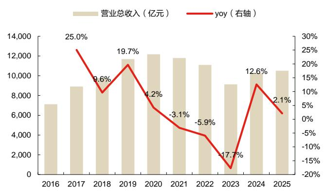  
数据来源：iFinD，东方证券研究所

图 6：中国平安归母净利润持续回暖  
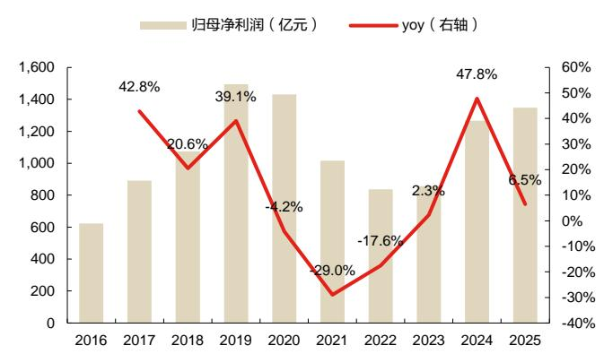  
数据来源：iFinD，东方证券研究所

内含价值的企稳回升，基本面反转进一步得到验证。公司 EV 在 2012 至 2019 年的高速发展期，EV的 CAGR高达 22.7%；在 2020至 2023年的改革阶段，EV规模只有小幅波动。2024年起，随着资负两端边际改善，EV 重回正增长通道，2025 年 EV 总额同比+5.7%。内含价值的回暖表现有力证伪了市场对于险企价值缩水的担忧，公司已重回价值增值的良性轨道。

图 7：中国平安内含价值转为正增长  
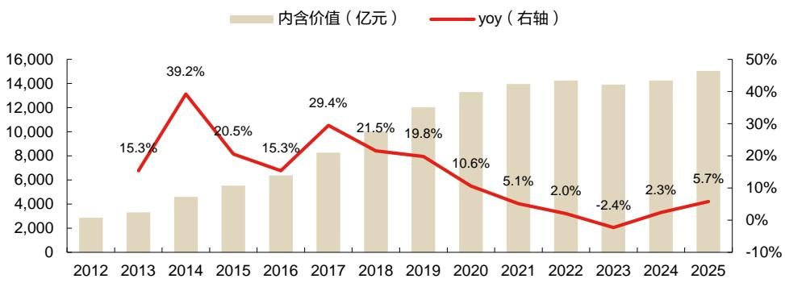  
数据来源：iFinD，东方证券研究所

## 股价复盘：兼具顺周期β弹性与龙头α的标的

第一阶段（2016 至 2017 年）：负债端个险快速扩张驱动的顺周期上行。2017 年前后，公司凭借强大的新业务价值增长和领先的代理人规模，实现了顺周期的高速增长。一方面，寿险业务受益于个险代理人的规模增长，NBV 复合增速处于行业领先地位；另一方面，市场对顺周期资产的风险偏好提升，支撑了公司估值从底部实现系统性修复，股价在这一阶段表现出极强的爆发力。

第二阶段（2018至2020年）：风险偏好回落下的高位震荡与改革起点。2018年权益市场波动加大，风险偏好下行导致保险股估值承压；2019 年公司开始更明确地从规模增长转向提质增效，寿险改革逐步启动，市场关注点也由保费增速切换至渠道质量与产能结构。2019 年月均代理人数量同比下降 9.1%，但代理人渠道新业务价值同比增长 5.9%、人均新业务价值同比增长 16.4%，队伍规模收缩但产能提升，股价在震荡中完成对公司改革的重新定价。

有关分析师的申明，见本报告最后部分。其他重要信息披露见分析师申明之后部分，或请与您的投资代表联系。并请阅读本证券研究报告最后一页的免责申明。

第三阶段（2021至2022年）：个险深度承压，投资端地产风险冲击。2020年后，受代理人渠道深度转型以及个险新单承压等多重因素影响，负债端增长动力面临巨大挑战。与此同时，资产端受到房地产领域风险暴露（如华夏幸福等项目）的拖累，公司股价经历了较长时间的深度调整。

第四阶段（2023 至 2025 年）：改革成效初步显现，风险基本出清，红利价值带动公司股价回升。随着寿险改革成果逐步释放，个险基本企稳、“新银保”模式逐步显现、“医疗养老”生态圈协同发力，公司经营基本面开始企稳复苏。可比口径下 2023 年代理人渠道 NBV 增长 40.3%，代理人人均 NBV 增长 89.5%；2025 年上半年代理人渠道 NBV 仍同比增长 17.0%，修复的持续性较强。与此同时，公司在资负匹配框架在当前低利率的环境下，中国平安高水平且稳健的分红政策使其红利资产属性凸显。市场对公司的关注点转向当前的收益确定性与资产质量改善，低估值、高股息的特征正驱动公司估值进入新一轮的修复通道。

第五阶段（2026 年至今）：基本面延续改善，外部扰动下股价阶段性回落。2025 年中国平安寿险改革、综合金融、医疗养老协同等继续兑现，营运利润同比增长 10.3%，NBV同比增长 29.3%，扣非归母净利润同比增长 22.5%，基本面仍处于持续修复通道。与此同时，市场对 2025 年四季度权益市场波动可能拖累险企当期利润表现、进而影响2026年投资收益稳定性的担忧有所升温；叠加中东地缘冲突反复、外部风险偏好回落等因素，保险板块自 2026年整体承压。

图 8：2016起保险行业与中国平安股价复盘  
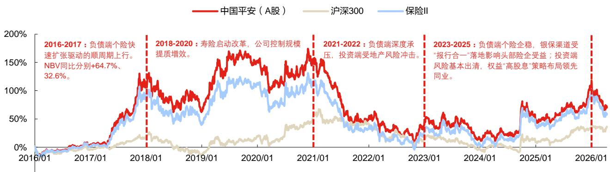  
数据来源：iFinD，东方证券研究所；注：数据截至 2026年 4月 17日

从股价表现看，中国平安在上一轮顺周期上行中展现出较强弹性。2016 至 2017 年累计涨幅达94.4%，显著跑赢主要上市险企；而在本轮行业修复阶段，公司虽并非板块中弹性最大的标的，但 2023 至 2025 年股价仍上涨 45.5%，表现总体稳健，反映出市场对其改革兑现、经营韧性及红利价值的认可。

表 2：2016年以来，A股上市险企分阶段涨跌幅情况
<table><tr><td></td><td>2016-2017</td><td>2018-2020</td><td>2021-2022</td><td>2023-2025</td><td>2026至今</td></tr><tr><td>中国平安</td><td>94.4%</td><td>24.3%</td><td>-45.3%</td><td>45.5%</td><td>-15.8%</td></tr><tr><td>中国人寿</td><td>7.6%</td><td>26.1%</td><td>-0.7%</td><td>22.6%</td><td>-17.7%</td></tr><tr><td>中国太保</td><td>43.5%</td><td>-7.3%</td><td>-32.3%</td><td>70.9%</td><td>-10.9%</td></tr><tr><td>新华保险</td><td>34.5%</td><td>-17.4%</td><td>-47.1%</td><td>131.7%</td><td>-8.3%</td></tr></table>

数据来源：iFinD，东方证券研究所；注：数据截至 2026年 4月 17日

有关分析师的申明，见本报告最后部分。其他重要信息披露见分析师申明之后部分，或请与您的投资代表联系。并请阅读本证券研究报告最后一页的免责申明。

## 寿险及健康险：渠道改革成效彰显，质量持续提升

## 负债端：景气度回升，量价齐升驱动价值修复

寿险改革红利释放，业务增长逐步由规模驱动转向质量驱动。在代理人规模扩张红利趋弱、渠道合规成本抬升与低利率常态化的背景下，传统人海战术面临边际效用递减与利差损双重约束。公司率先完成渠道清虚与产品结构调整，通过拉长资产久期、增配分红险，有效平滑利率风险。预计这种先发优势将在行业拐点期转化为业绩弹性，增加业绩高质量增长的确定性。

首年保费经历深度调整，质量型规模增长初显成效。2012 至 2017 年受益于代理人规模的快速扩张，公司首年保费五年复合增长率高达 24.6%；2018 至 2022 年，受行业转型阵痛及渠道改革收缩影响，首年保费持续下行；2025 年重回正增长，同比+2.5%。规模的阶段性承压并非增长的放缓，而是由过往高度依赖人海战术的规模增长逐步过渡到多渠道协同与产品结构优化框架下更具含金量的增长。这种转变为 2023年以来新业务价值的强劲反转奠定了坚实的基础。

图 9：平安人寿首年保费重回正增长  
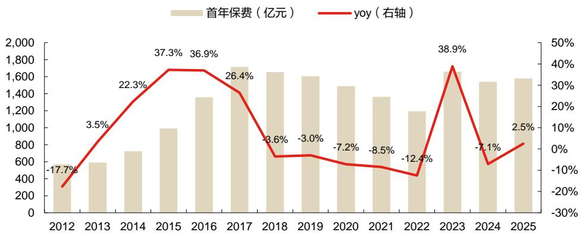  
数据来源：中国平安公司公告，东方证券研究所

2023 年后寿险改革成效兑现，新业务价值迎来底部反转。2023 年公司实现新业务价值 310.8 亿元，同比强劲增长 36.2%，正式终结连续三年的负增长。2024 年和 2025 年得益于代理人产能释放及银保渠道的价值贡献，NBV增长动能进一步稳固，同比增长分别为 28.8%和 29.3%。价值维度的实质性修复，标志着平安人寿已基本走出转型阵痛期。

图 10：平安人寿新业务价值持续高增  
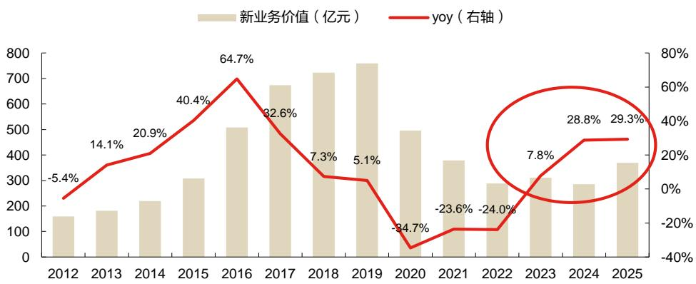  
数据来源：中国平安公司公告，东方证券研究所；注：2024 年 NBV 使用重述口径，当年 yoy 为可比口径  
有关分析师的申明，见本报告最后部分。其他重要信息披露见分析师申明之后部分，或请与您的投资代表联系。并请阅读本证券研究报告最后一页的免责申明。

行业景气度共振回升，主要上市险企 NBV 快速修复。2023 年保险行业迎来修复拐点，主要上市险企新业务价值在经历连续三年深度调整后均实现了同比正增长，中国人寿/ 中国平安/ 中国太保/新华保险的新业务价值分别同比实现2.4%/ 7.8%/ 19.1%/ 24.8%的正增长。2025年主要险企NBV进一步高增，同比分别大幅增长 35.7%/ 29.3%/ 40.4%/ 57.4%。

图 11：主要上市险企新业务价值均快速修复  
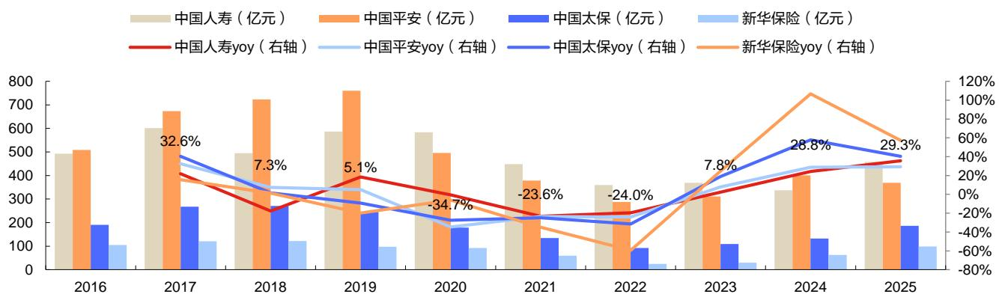  
数据来源：中国平安公司公告，东方证券研究所；注：中国人寿 2024 年 yoy为可比口径，中国平安 2024 年 NBV使用重述口径、yoy为可比口径，中国太保 2024年 yoy 为可比口径

费效优化与结构改善共振，新业务价值率逐步修复。在规模企稳向好的背景下，NBVM 的修复成为驱动中国平安价值增长的第二曲线。从利源结构拆解看，个险渠道持续提质增效；银保渠道“报行合一”政策的深度落实，在银保渠道实现了费用的实质性压降，使得单位保费带来的价值贡献显著增厚。产品结构方面，公司通过“保险+医养生态圈”赋能高价值保障型险种，并前瞻性布局分红险以优化资产负债匹配。多种因素使新业务价值率逐步修复，2024 年按标准保费口径中国平安实现新业务价值率 31.8%，同比提升 5.6 pct；2025 年新业务价值率 28.5%，小幅下降3.3 pct。

图 12：平安人寿新业务价值率逐步企稳  
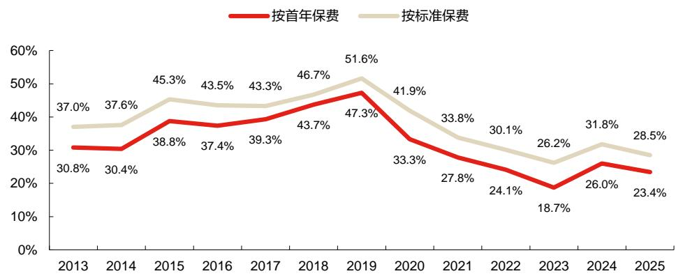  
数据来源：中国平安公司公告，东方证券研究所

服务溢价构筑中国平安护城河，新业务价值率持续领跑行业。中国平安新业务价值率长期保持在行业头部水平，核心差异在于其定价逻辑与成本管控。个险端坚持价值导向，区别于部分同业高费用换规模的策略，公司秉持审慎的风险偏好，夯实长期价值中枢；银保端重塑成本结构，依托中国平安集团综合金融架构，“新银保”模式实质性降低了渠道手续费率，打破了传统银保增收分。其他重要信息披露见分析师申明之后部分，或请与您的投资代表联系。并请阅读本证券研究报告最后一页的免责申明。

不增利的状况；服务溢价替代价格竞争，凭借“保险+医养”的生态服务体系，公司成功提升了件均保费与客户黏性，支撑了高价值率产品的市场接受度。2025 年中国平安实现按首年保费口径的新业务价值率 23.4%，高于中国人寿/ 中国太保/ 新华保险的 19.5%/ 19.8%/ 16.2%。

图 13：中国平安新业务价值率（按首年保费）领先部分上市险企  
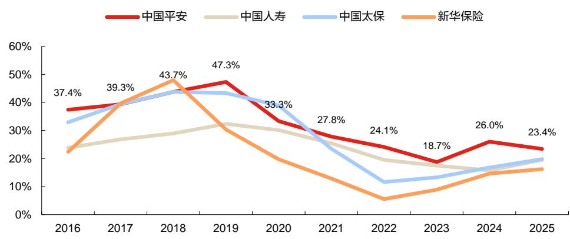  
数据来源：各公司公告，东方证券研究所；注：中国人寿 NBVM（按首年保费）= 当期一年新业务价值 / 新单保费

业务质量实质性修复，保单继续率指标构筑价值护城河。2020至 2021年转型期 13个月/25个月继续率一度承压至 85.5%/78.1%，公司清退低产能人力、重塑“优+”代理人队伍，推动存量业务质量回暖。2025 年，13 个月保单继续率攀升至 97.4%，同比+1.0 pct；25 个月保单继续率修复至 94.9%，同比+5.2 pct。两项指标均创阶段新高。

图 14：平安人寿寿险及健康险保单继续率稳步提升  
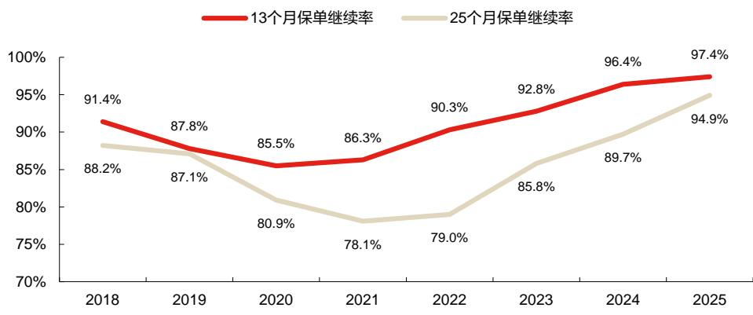  
数据来源：中国平安公司公告，东方证券研究所

从内含价值来看，中国平安过往几年 EV/NBV 对投资收益率敏感性的中枢上移，并非单纯的风险敞口扩大，而是基准假设调整与业务结构优化的叠加：1）经济假设下调带来的放大效应：在低利率环境下，公司基于审慎原则连续下调长期经济假设：2023 年将长期投资回报率假设由 5.0%下调至 4.5%（风险贴现率同步调至 9.5%），2024 年进一步下调至 4.0%（风险贴现率调至8.5%/7.5%）。从精算角度看，基准利率的降低会显著提升内含价值对折现率的敏感度；2）保单继续率的提升带来的久期拉长：2025 年公司寿险保单 13 个月及 25 个月继续率分别大幅改善 1.0pct、5.2 pct，叠加代理人产能回升及银保渠道贡献增加，存量保单的留存质量显著提升。高继续率意味着负债端预期未来的现金流更为充沛且账龄更长，负债端的有效久期将提升。而现金流越偏向远期，其现值对投资回报率的变动越敏感。

图 15：平安人寿内含价值的收益率敏感性基本持平  
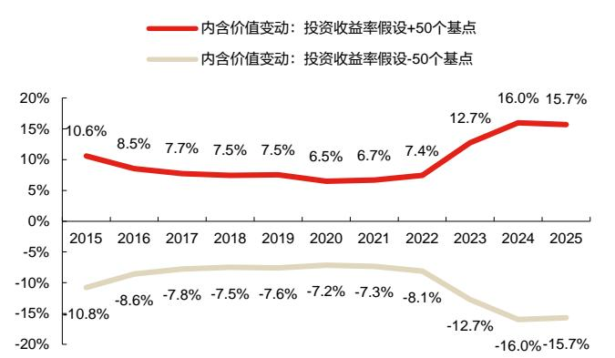  
数据来源：中国平安公司公告，东方证券研究所

图 16：平安人寿新业务价值的收益率敏感性大幅收敛  
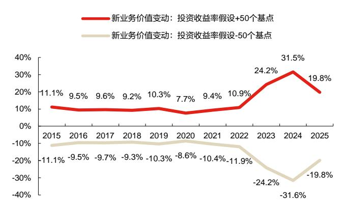  
数据来源：中国平安公司公告，东方证券研究所

## 产品结构：分红险转型在即，“保险+服务”构筑差异化壁垒

分红险：顺应低利率周期，分红险承接储蓄需求

负债成本刚性约束倒逼产品结构重塑，分红险成为行业转型核心战略。在利率中枢下移和资产荒并存背景下，传统寿险的刚性负债特征使利差损压力持续上升，单纯下调预定利率虽可缓释风险，但也可能削弱产品竞争力。在此情况下，分红险等低保底利率产品凭借“风险共担、收益共享”机制，正成为行业优化负债成本和重塑产品结构的重要方向。

政策支持与居民财富管理需求共振，进一步打开分红险发展空间。保险新“国十条”明确支持浮动收益型产品发展，分红险兼具保险保障、保底收益和浮动收益特征，既有助于险企降低刚性负债成本，也有望提升客户在低利率环境下的实际回报，逐步成为居民长期财富配置的重要载体。

平安寿险亦在推动产品结构向浮动收益型转型，分红险占比显著抬升。2025 年分红险保费占比提升至 13.9%，公司正主动优化资产负债匹配。这一变化有助于缓释利率下行环境下的利差损压力，同时增强长久期资金沉淀和现金流稳定性。

图 17：平安人寿保费收入仍以传统寿险为主，分红险占比有所增加  
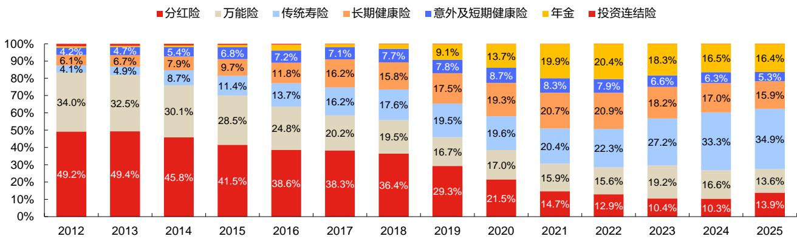  
数据来源：中国平安公司公告，东方证券研究所

有关分析师的申明，见本报告最后部分。其他重要信息披露见分析师申明之后部分，或请与您的投资代表联系。并请阅读本证券研究报告最后一页的免责申明。

定价机制分化与信息披露强化，推高浮动收益类产品竞争壁垒。区别于普通型人身险，分红险的定价机制与产品形态较为复杂。在预定利率上限下调的背景下，各大险企的定价策略将出现一定的分化，这对险企的精算开发能力与销售管理能力提出了更高要求。随着监管要求披露分红实现率等指标，过往经营历史久、销售管控强、综合服务能力突出的头部险企有望获得更高的信用溢价。

行业转型共识达成，分红险在主要险企新单结构中已占据主导地位。主要上市险企的分红险占比均呈现出上升的态势。2024 年以来，受监管导向与市场需求的双重驱动，行业产品结构切换提速，主要险企分红险新单占比已普遍提升至 40%以上的高位区间。在低利率环境下，公司正加速构建以浮动收益产品为核心的价值增长矩阵。于头部人身险公司相比，中国平安目前仍有大量的传统寿险存量保单，分红险占比仍有较高的提升空间。

图 18：主要上市险企分红险占比仍有提升空间  
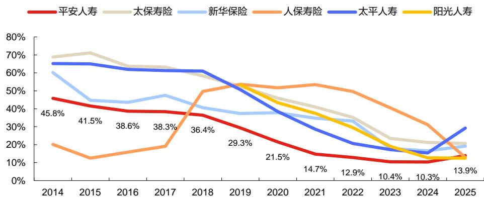  
数据来源：各公司公告，东方证券研究所

表 3：2025年主要上市险企对分红险的表述均较为积极
<table><tr><td>人身险公司</td><td>对分红险的表述</td></tr><tr><td>中国人寿</td><td>2025年银保渠道新单保费 585.06亿元，同比增长95.7%，其中分红险新单保费占比同比提升约15个百分点。</td></tr><tr><td>平安寿险</td><td>持续丰富分红险产品和分红账户体系，推出新分红险产品。</td></tr><tr><td>太保寿险</td><td>2025年分红型保险新保期缴规模保费221.56亿元，新保期缴中分红险占比提升至50.0%。</td></tr><tr><td>新华保险</td><td>2025年分红型保险保费376.04亿元，分红型保险长期险首年保费收入同比大幅增加。</td></tr><tr><td>太平人寿</td><td>2025年太平人寿分红险在长险首年期缴保费中占比86.1%。</td></tr><tr><td>阳光人寿</td><td>银保新单期缴保费中浮动收益型产品占比32.2%。</td></tr></table>

数据来源：各公司公告，东方证券研究所

## 核心壁垒：医养生态构筑差异化护城河

平安健康：平安集团医险协同模式的重要组成部分。成立于 2014 年，以“家庭医生+养老管家”为核心，构建了覆盖“到线/ 到店/ 到家/ 到企”的一站式服务闭环。2024年公司战略业务付费用户突破 3,100 万，B 端累计服务企业超 2,000 家；供给端整合医生约 5 万人，并实现国内百强及三甲医院 100%全覆盖。强大的资源网络使其成为集团业务连接医疗服务的核心渠道。

北大医疗：坐拥稀缺实体医疗资源，夯实 HMO 模式线下履约壁垒。依托集团综合金融与科技赋能，北大医疗以北京大学国际医院为旗舰，深度联动旗下 6 家综合/专科医院、12 家健管中心及13 家康复机构，构建起“医、健、康、数”全生命周期服务网络。截至 2024 年末，集团总床位数达 6,000 张，专业医疗团队超万人。优质实体资源的并入，不仅补齐了集团在严肃医疗与康复护理端的关键拼图，更为保险客户提供了不可复制的差异化就医体验与服务保障。

表 4：中国平安养老业务概况
<table><tr><td>提供的服务</td><td>服务介绍</td></tr><tr><td>养老管家</td><td>统一入口与调度中台，负责需求受理、方案匹配、派单跟踪与质控复盘</td></tr><tr><td>智能管家</td><td>通过适老化设备与系统做风险提示与日常管理，支持异常预警与联动处置</td></tr><tr><td>生活管家</td><td>7×24响应日常生活需求，对接到家/到店服务资源并跟进交付</td></tr><tr><td>医生管家(家庭医生)</td><td>提供线上问诊、健康咨询、用药与就医建议，并与线下医疗资源衔接</td></tr><tr><td>健康评估与建档</td><td>对老人健康与照护需求做初评，建立长期跟踪档案与服务计划</td></tr><tr><td>慢病管理</td><td>对高血压/糖尿病等慢病进行随访、提醒与干预建议，降低反复就医与并发风险</td></tr><tr><td>居家安全评估</td><td>识别跌倒、用电用气等居家风险点，给出改造与防护建议</td></tr><tr><td>适老化改造</td><td>对卫生间/卧室/厨房等空间进行扶手、防滑、照明等改造，提升安全性与便利性</td></tr><tr><td>风险监测与紧急救助</td><td>通过监测发现异常后提供远程指导，必要时安排上门核查或协助联络急救</td></tr><tr><td>上门护理</td><td>提供到家基础护理/术后护理/康复护理等服务，并设置交付节点与质量监督</td></tr><tr><td>到家康复训练</td><td>针对术后或功能退化提供康复训练与辅助器具建议，提升活动能力</td></tr><tr><td>陪诊与就医协助</td><td>协助挂号、就诊陪同、检查陪同、取药等，降低家属时间成本</td></tr><tr><td>养老机构床位匹配</td><td>根据照护等级与预算匹配护理机构床位，协助参观、评估与入住办理</td></tr><tr><td>康养社区/高端养老对接</td><td>为有长期机构化与高品质需求的客户提供社区参观、入住与持续照料方案衔接</td></tr><tr><td>精神陪伴与文娱社交</td><td>提供陪伴、社交活动、兴趣课程等服务，改善情绪与孤独感</td></tr><tr><td>居家生活支持</td><td>助餐/配餐、家政助洁、代办代购、出行协助等，保障日常生活运转</td></tr><tr><td colspan="2">数据来源：中国平安公司公告，东方证券研究所</td></tr></table>

## 渠道：个险规模企稳，银保渠道构建新增长极

渠道策略向多渠道协同转型，保费规模在改革阵痛中展现强劲韧性。长期以来，代理人渠道是公司主要收入来源渠道，2019 年代理人渠道保费收入 5,144.2 亿元，银保渠道仅 183.7 亿元。面对个险清虚筑底的行业周期，公司通过“新银保”模式，平滑了个险转型的规模缺口，更标志着公司通过多渠道协同，引领负债端逐步进入新一轮增长周期。

图 19：平安人寿分渠道规模保费（亿元）以代理人渠道为主  
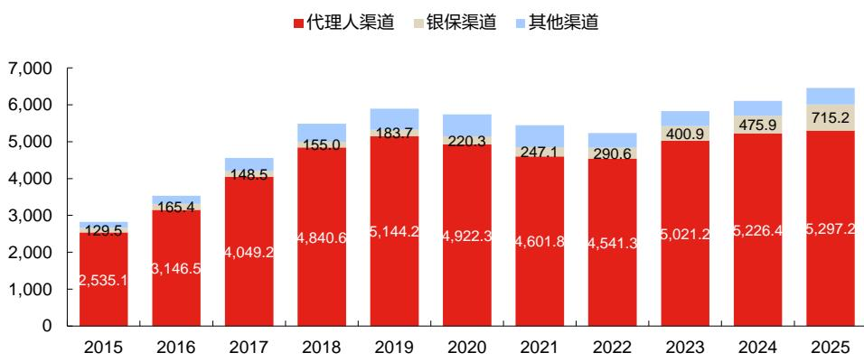  
数据来源：中国平安公司公告，东方证券研究所  
有关分析师的申明，见本报告最后部分。其他重要信息披露见分析师申明之后部分，或请与您的投资代表联系。并请阅读本证券研究报告最后一页的免责申明。

价值触底回升，银保渠道正加速成长为第二价值曲线。一方面，个险渠道在“三高”转型推动下，价值基础逐步夯实，2025年代理人渠道新业务价值为 238.2亿元，按可比口径同比增长 10.4%；另一方面，银保渠道价值释放明显提速，已基本摆脱过去增收不增利的增长模式。2019 年银保渠道新业务价值仅 11.9 亿元，2024 年升至 48.3 亿元，2025 年进一步跃升至 94.1 亿元，按可比口径同比增长 138.0%，较 2019 年增长近 7.9 倍。银保渠道正由补充渠道加快成长为拉动公司整体新业务价值增长的核心边际力量。

图 20：平安人寿分渠道新业务价值（亿元）  
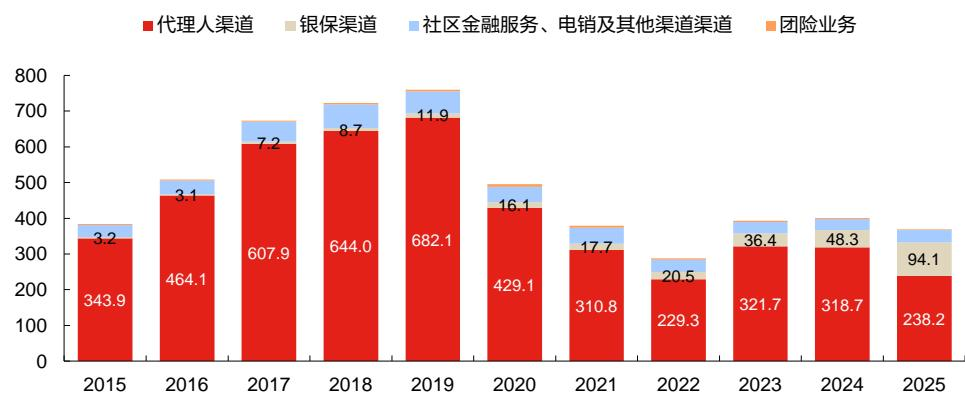  
数据来源：中国平安公司公告，东方证券研究所；注：2025年可比口径代理人/银保渠道同比分别+10.4%/+138.0%

价值结构转变，银保渠道贡献逐步加大。2015 至 2019 年，受益于代理人规模爆发式增长，渠道11.9700  
新业务价值贡献率 维持在 90%左右的高位，是公司价值增长的重要来源，同期银保占比仅维持在600  
个位数；2020 年后，随着寿险改革深化，渠道多元化进程显著提速，代理人贡献 NBV 逐步下降，3.1 16.1  
而银保渠道得益于新模式赋能，贡献率完成从 1H20 的 3.0%向 2024 年的 12.1%的抬升； 2025 年644.0 682.13.2 17.7 36.4 48.3  
银保渠道 NBV贡献率进一步跃升至 25.5%，银保已逐步成为支撑 NBV持续增长的第二战略极。464.1 429.1 200

图 21：平安人寿新业务价值由银保渠道贡献显著提升  
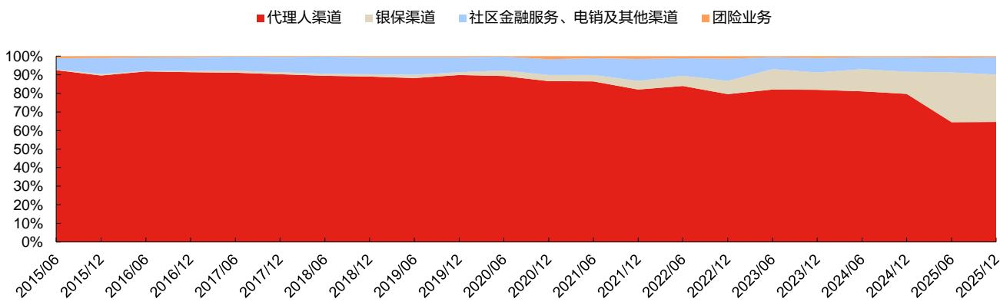  
数据来源：中国平安公司公告，东方证券研究所

## 个险渠道：主动清虚步入尾声，产能跃升重塑价值中枢

改革逻辑兑现，队伍结构显著优化。公司率先启动寿险改革，主动剥离低效人力，确立了以质补量的核心经营逻辑，代理人规模从高位的百万量级回落至 35 万左右的稳态区间。得益于“优+”

增员策略与数字化赋能，队伍结构持续改善，人均产能和人均新业务价值明显提升，个险渠道高质量发展逻辑逐步确立。

人力规模触底回升，队伍大盘企稳向好。2012 至 2018 年行业个险渠道快速扩张，公司代理人队伍以 18.5%的年均复合增速迅速增长，2018年达141.7万人峰值；此后伴随改革深化，队伍持续出清，至 2023 年降至 34.7 万人，较峰值缩减约 75.0%。2025 年代理人规模保持在 35.1 万人，队伍规模已基本企稳。

图 22：平安人寿个险渠道代理人人数基本企稳  
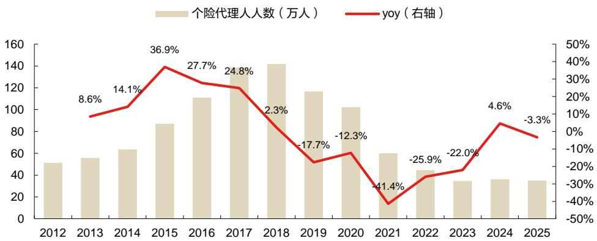  
数据来源：中国平安公司公告，东方证券研究所

横向对比看，主要上市险企个险人力均已进入底部企稳阶段，但中国平安的修复节奏相对更早。2024 年，中国平安代理人规模同比增长 4.6%，在主要上市险企中率先实现正增长，而中国人寿/中国太保/ 新华保险同期仍分别下降 3.0%/ 12.4%/ 12.3%。2025 年，行业整体仍处存量优化阶段，人力规模延续小幅波动，中国平安同比下降 3.3%，整体仍处相对稳态区间。

图 23：主要上市险企个险代理人数均在底部企稳  
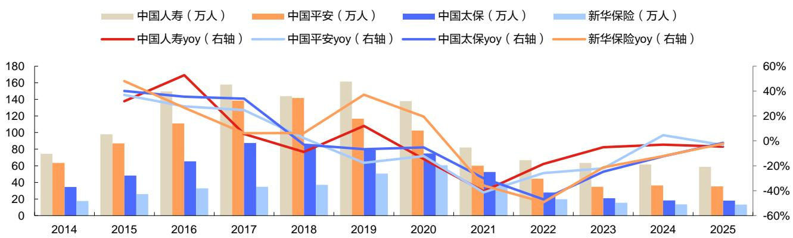  
数据来源：各公司公告，东方证券研究所

新单规模高位波动，人均产能仍处历史高位。代理人渠道新业务规模保费在经历 2020至 2022年筑底调整后明显修复，2023 年大幅回升至 1,438.9 亿元，2024 年进一步升至 1,488.0 亿元，2025年虽小幅回落至 1,323.5 亿元，但仍显著高于改革前水平，表明个险渠道规模基础已明显夯实。在绩优队伍建设、客户分层经营和数字化赋能推动下，代理人年化人均产能由改革前约 10.0 万元提升至近 40 万元，2023 至 2025 年分别达到 41.5 万/ 41.0 万/ 37.7 万元，持续处于历史高位。整体来看，公司个险渠道虽未再单纯追求规模扩张，但依靠高产能队伍支撑，已逐步形成更具质量和韧性的增长模式。

图 24：平安人寿代理人渠道新业务规模保费反弹已创新高  
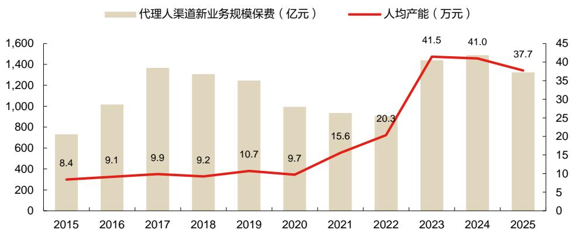  
数据来源：中国平安公司公告，东方证券研究所

代理人渠道新业务价值已在调整后重回上升通道，可比口径下人均 NBV 已创新高。若按可比口径，2025年代理人渠道NBV同比增长10.4%，人均NBV同比增长14.2%，均延续改善趋势，可比口径下人均 NBV 已升至新高。整体来看，公司个险渠道依托高质量队伍建设和产能持续提升，价值创造能力已明显增强。

图 25：平安人寿代理人渠道新业务价值重回上升通道  
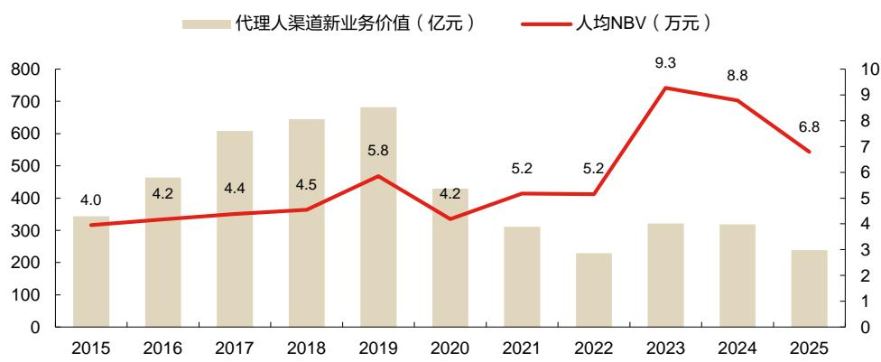  
数据来源：中国平安公司公告，东方证券研究所；注：2025 年可比口径代理人 NBV/人均 NBV 同比分别+10.4%/+14.2%

代理人渠道 NBVM 已自底部逐步修复，个险转型成效持续兑现。受渠道改革影响，中国平安代理人渠道 NBVM 自 2023 年 25.1%的低点起明显回升，2024 年升至 36.0%，2025 年小幅回落至30.8%，经营能力和渠道质量已明显改善，个险渠道正在由规模调整转向质量提升。

横向对比看，中国平安代理人渠道价值率长期处于同业前列。2025 年中国平安 NBVM 为 30.8%，整体来看，平安代理人渠道价值率中枢仍明显高于多数同业，在代理人质量、产品结构和保障型业务经营方面仍具较强优势。

图 26：主要上市险企代理人渠道新业务价值率（按首年保费）均触底回升  
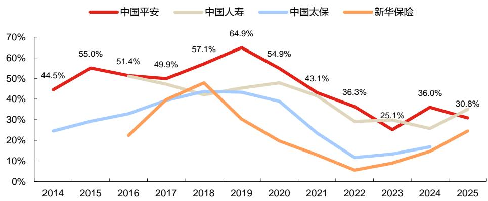  
数据来源：各公司公告，东方证券研究所；注：2025 新华保险未直接披露个险 NBVM，以新业务价值/长期险首年期交保费估算，2025年太保寿险未披露个险渠道相关数据

## 银保渠道：政策红利与需求共振，重塑价值增长新高地

监管推动银保渠道竞争逻辑重塑，行业正由过去依赖高费用驱动的粗放扩张，转向比拼产品、服务与网点经营能力的新阶段。“报行合一”深化执行叠加银行网点合作限制放开后，头部险企凭借品牌、服务体系和综合金融协同优势，更有望在银保渠道竞争中持续受益。

在存款利率下行和居民财富配置需求迁移背景下，银保渠道的重要性持续提升，已由传统的规模补充渠道逐步成长为寿险负债端的核心增长引擎。中国平安银保渠道保费规模已明显走出调整期，2019 至 2025 年规模保费由 183.7 亿元增至 715.2 亿元，CAGR 达 25.4%。其中，2025 年新单保费 419.0 亿元，同比增长 92.2%，续期保费 296.2 亿元，同比增长 14.6%，带动全年规模保费同比增长 50.3%，延续高景气增长态势。

图 27：平安人寿银保渠道规模保费快速增长  
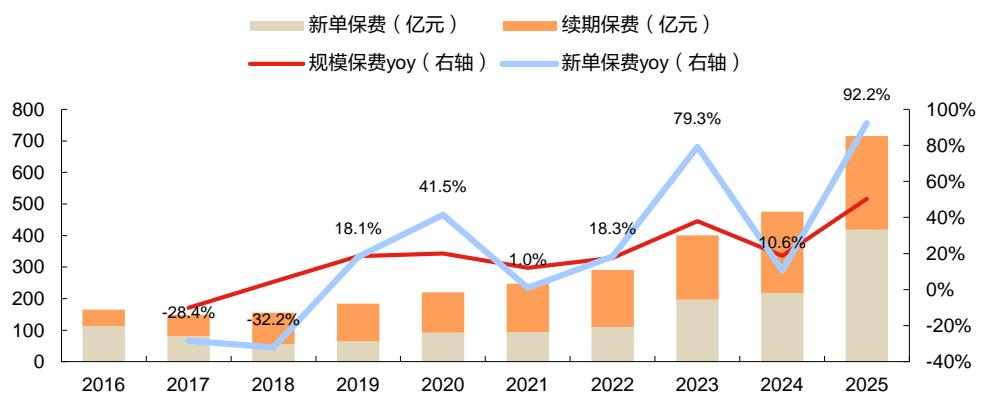  
数据来源：中国平安公司公告，东方证券研究所

我们认为，2025 年银保新单之所以能在高基数下持续实现超预期高增长，核心得益于：1）深化“新银保”模式，释放集团内部生态潜能：区别于同业简单的产品代销，公司依托与平安银行的独家代理协议，叠加高素质“优才”队伍在网点的驻点服务，极大地提升了转化效率与客均价值，构筑了高价值率的内生增长壁垒；2）把握“1+N”政策窗口，加速外部网点战略卡位：受益于监管放开银保合作网点限制，公司迅速利用品牌优势与国有大行及头部股份制银行建立战略合作，

有关分析师的申明，见本报告最后部分。其他重要信息披露见分析师申明之后部分，或请与您的投资代表联系。并请阅读本证券研究报告最后一页的免责申明。

承接了外部渠道中小险企退出后的网点真空；3）产品供需精准匹配，有效承接储蓄替代溢出需求：在存款利率持续下行周期，公司主推的增额终身寿及分红险精准契合了低风险偏好资金对“锁定长期收益+浮动抗通胀”的刚需，叠加“报行合一”带来的客户利益率提升，产品在银行渠道的竞争力进一步增强；4）“报行合一”加速供给侧出清，头部集中度显著提升：费率严监管彻底击碎了中小险企过往依赖高费用换规模的竞争模型，银行渠道合作重心被迫由拼费用转向拼服务与品牌。公司凭借卓越的履约能力与服务体系成为银行在合规高压下的首选合作伙伴，这种良币驱逐劣币带来的马太效应，助推公司在降本的同时实现市场份额的逆势扩张。

图 28：近三年平安人寿银保渠道新单保费增速领先主要上市险企  
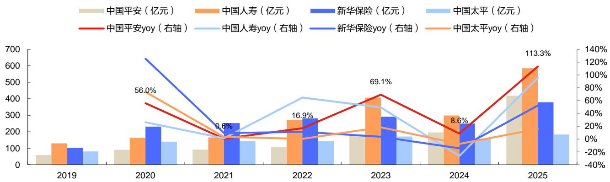  
数据来源：各公司公告，东方证券研究所

2013-2024年银保渠道新业务价值CAGR高达23.7%，远超行业平均水平。平安银保渠道发展主要经历三大阶段：

1）2013至 2016年：监管阵痛下的深度调整期。受 2010年监管层发布《关于进一步加强商业银行代理保险业务合规销售与风险管理的通知》的影响，银保渠道经历了痛苦的调整过程。公司银保 NBV 在 2014 年遭遇-35.0%的显著回撤，规模下探至 3.0 亿元的低点；随后两年维持在 3 亿元左右的底部区间震荡，这一阶段公司顺势主动压缩低价值趸交业务，为后续转型积蓄势能。

2）2017 至 2022 年：价值转型启动，结构优化驱动稳健增长。2016 年 3 月，原保监会发布《关于规范中短存续期人身保险产品有关事项的通知》，压缩中短存续期产品的扩张空间；2017 年 5月，原保监会下发“134 号文”规范人身险产品开发设计，进一步强化“长缴费、长期限”导向。2017 年成为银保渠道重塑价值逻辑的分水岭，公司主动摒弃规模导向、转向期交价值导向，当年银保 NBV 实现 128.0%的爆发式反弹，规模突破 7 亿元大关。此后，随着“产品+科技”赋能的深化，银保渠道进入稳健增长阶段，2018至2022年NBV保持了稳健增长，即便在2021至2022年行业整体承压背景下，仍分别录得 9.9%和 15.9%的正增长，成功穿越周期。

3）2023 年至今：“新银保”模式与政策红利共振，NBV 快速增长。2023 年以来，随着“报行合一”政策落地加速行业费差释放，以及“新银保”模式下 PAB 独家代理与外部网点扩张的同时进行，银保渠道正式确立为公司价值增长的核心引擎。2023 年银保 NBV 同比高增 44.6%至 29.7亿元；2024 年增长进一步加速，同比飙升 62.7%至 48.3 亿元；2025 年上半年，受益于网点“1+N”全面放开带来的市占率跃升，银保 NBV 同比+168.5%，单半年价值贡献已超 2024 年全年水平，标志着银保渠道已成为中国平安人身险的重要渠道之一。

图 29：平安人寿银保渠道新业务价值持续高增，贡献进一步提升  
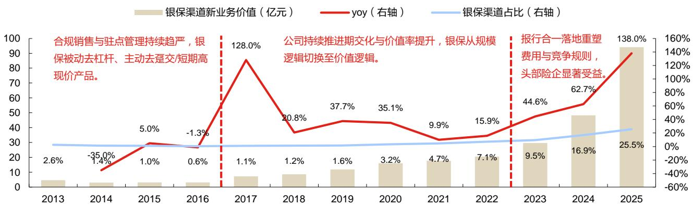  
数据来源：中国平安公司公告，东方证券研究所；注：2025 年 yoy 为可比口径

银保渠道新业务价值率持续改善，引领人身险业务价值修复。历经多年深耕，银保渠道彻基本摆脱价值低的传统，NBVM 持续抬升，从 2016 年 8.1%的低点震荡上行至 2025 年的 28.8%，超越公司整体新业务价值率的 28.5%，有力验证了新银保模式的高价值创造能力。

图 30：平安人寿银保渠道新业务价值率（按标准保费）稳步增长  
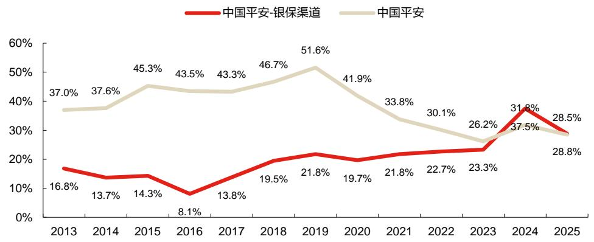  
数据来源：中国平安公司公告，东方证券研究所

## 产险：保费规模稳健，COR 改善释放业绩弹性

保费收入：保费收入增速边际修复，结构持续优化

产险业务整体稳健，历史风险出清正逐步释放利润弹性。从保费表现看，平安产险增长韧性较强。公司保费收入 2021 年短暂承压后已连续四年恢复增长，2023 至 2025 年同比增速分别为 1.4%/6.5%/ 6.6%。横向看，2025 年平安产险保费增速高于人保财险的 3.3%，亦明显快于太保财险的0.1%，公司在主动优化业务结构的背景下，仍具备较强的增长韧性和高质量发展能力。

图 31：平安财险保费收入稳健增长  
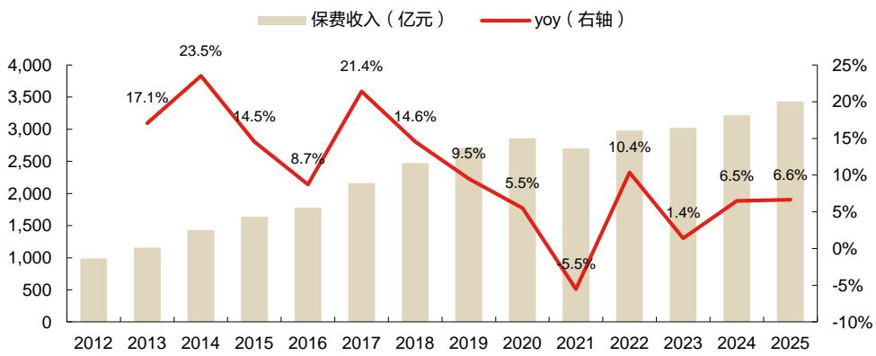  
数据来源：中国平安公司公告，东方证券研究所

图 32：头部财险公司保费收入整体稳健  
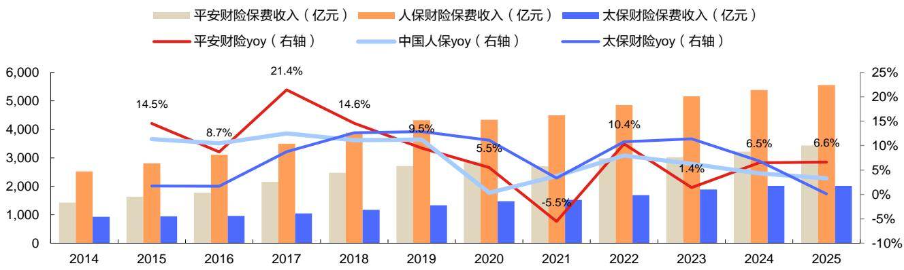  
数据来源：各公司公告，东方证券研究所

分业务看，车险稳健、非车强劲反弹。车险业务作为经营核心业务，在消化综改影响后已重回增长轨道，2025 年保费实现 3.2%的稳健增长。非车险业务在经历主动压降信保规模的结构性调整后，成为财险业务重要的增长来源，2025 年非车险保费规模达 1,128.1 亿元，同比高增 14.5%，显著跑赢整体增速。

我们认为非车险这一爆发增长源于：一是政策红利释放，绿色保险与农险受益于国家战略指引，分别录得 51.8%与 32.4%的高速增长；二是消费需求复苏，健康险与意外险凭借“健康中国”战略深化及文旅出行回暖，分别实现 38.3%与 20.2%的强劲反弹；三是风险出清见效，信保业务通过持续收缩敞口与优化客群，已从单纯的规模拖累转为质量优化的存量经营。这种多元驱动的增长格局，标志着产险业务已成功穿越单一车险周期的波动，迈向高质量发展的全能型形态。

图 33：平安财险保费收入结构以车险为主  
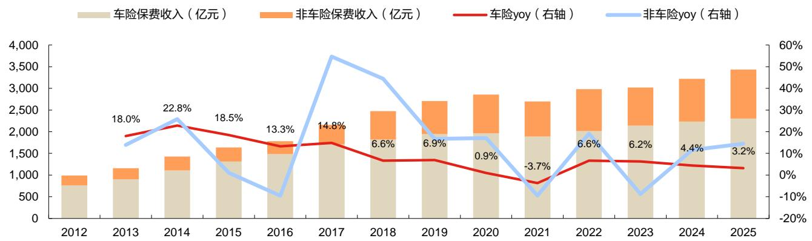  
数据来源：中国平安公司公告，东方证券研究所

融资性保证保险（信保业务）已基本出清，平安产险盈利逻辑将回归基本面。回顾过往，信保业务曾是公司非车险板块的高收益的重点业务，其核心逻辑在于依托集团内部专业公司的客群引流，为借贷链条提供增信服务，在经济上行期曾凭借较低的违约率贡献了丰厚的承保利润。然而，该险种具有显著的顺周期特征，伴随近年宏观环境变化，小微企业及个人客户还款能力受负面影响，导致赔付成本刚性兑现。2022 年该险种综合成本率飙升至 131.4%，成为当时拖累产险整体盈利的核心因素。公司于2023年第四季度正式暂停融资性保证保险业务，从源头上阻断了新增风险敞口。步入2025年，随着存量保单责任的自然到期与风险出清，该业务对业绩的负面影响已完全消除，平安产险的估值逻辑正式回归到由车险稳健增长与非车险（健康/绿色）结构优化驱动的纯粹基本面上。

图 34：平安财险保证保险综合成本率已回落至接近 100%  
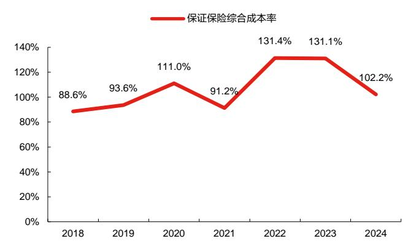  
数据来源：中国平安公司公告，东方证券研究所

图 35：平安财险保证保险保费规模已基本出清  
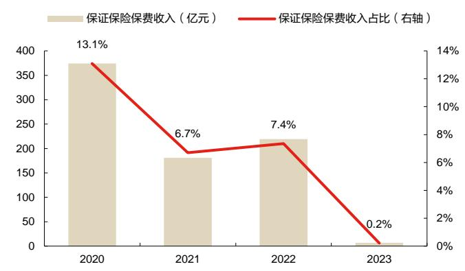  
数据来源：中国平安公司公告，东方证券研究所

## 承保盈利：费用管控构筑壁垒，COR改善确立拐点

综合成本率呈现边际改善态势，费用管控能力对冲赔付压力。受信保业务拖累影响，公司 COR曾于 2022 至 2023 年短暂突破 100%盈亏平衡线，分别为 100.3%、100.7%。然而，得益于公司主动调整结构，盈利修复拐点于 2024 年确立，COR 回落至 98.3%的优异水平；2025 年进一步下探至 96.8%。

我们认为，盈利能力源于费用率的持续压降与经营效率的升级：公司综合费用率已从 2016 至2018年约 41%的高位单边下行，至 2025年降至 26.4%，对冲了赔付率的持续上升，同时公司主动调整业务结构，信保业务已基本出清，赔付率自2023年的71.5%逐步下降至2025年的70.4%。

图 36：平安财险综合成本率逐步下滑  
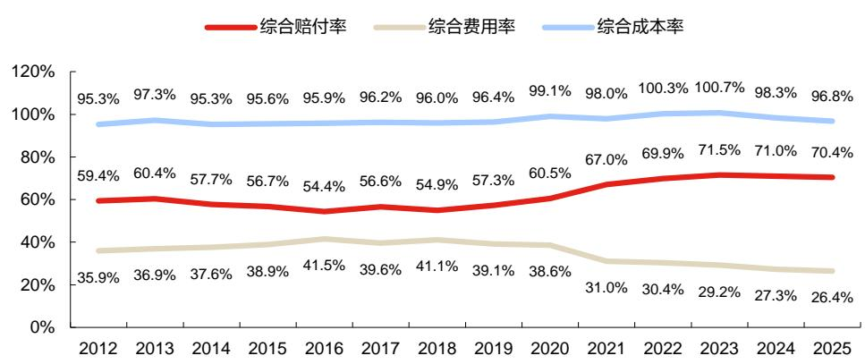  
数据来源：中国平安公司公告，东方证券研究所

承保盈利能力重回行业头部地位，风险出清后的业绩弹性显著释放。长周期来看，平安产险凭借卓越的数字化风控与精细化管理，在2012至2021年的大部分时间里，综合成本率始终维持在96%左右的低位中枢，整体优于人保财险与太保财险。2022 至 2023 年受保证保险风险暴露等因素扰动承保盈利承压，但随着存量风险的基本出请，2024 年公司全年 COR 同比-2.4 pct 至 98.3%，2025 年公司 COR 进一步优化至 96.8%，较上年末-1.5 pct，优于人保财险的 97.6%与太保财险的97.5%。

图 37：平安财险综合成本率已重回头部财险公司水平  
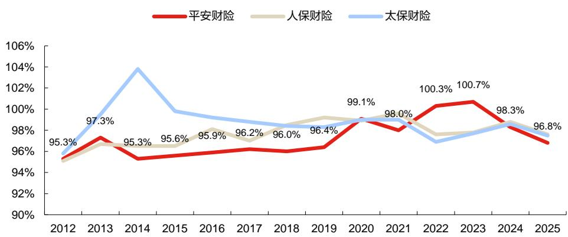  
数据来源：各公司公告，东方证券研究所

有关分析师的申明，见本报告最后部分。其他重要信息披露见分析师申明之后部分，或请与您的投资代表联系。并请阅读本证券研究报告最后一页的免责申明。

## 投资端：配置结构前瞻性领先，收益韧性穿越周期

中国平安投资资产规模稳健增长。依托负债端保费的持续流入，公司投资组合规模稳步提升，由2014 年的 1.1 万亿元增长至 2025 年的 6.5 万亿元，CAGR 达。

图 38：中国平安投资组合规模稳健增长  
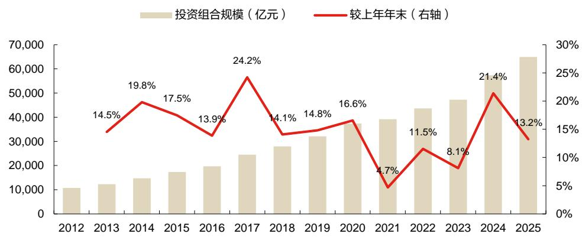  
数据来源：iFinD，东方证券研究所

面对长端利率下行与资本市场波动的双重挑战，公司坚定执行“拉长久期、压降非标、优化权益”的资产配置策略，资产负债匹配度显著提升。

固收端：长债配置创历史新高，筑牢绝对收益安全垫。为熨平利率周期波动，公司加大长久期国债及地方政府债的配置力度，债券投资占比呈现确定性的阶梯式上行，从 2017 年的 43.8%一路攀升至 1H25 的 60.8%。这一策略不仅有效拉长了资产久期，更在低利率环境下提前锁定了长期稳定的票息收益，确立了投资组合的防御性底色。

权益端：逆势布局高股息资产，弹性仓位增厚收益。在夯实固收底仓的基础上，公司灵活把握权益市场低位布局机会，1H25股票投资占比提升至10.5%。这反映了公司在新会计准则下，通过增配高分红、低波动的价值型权益资产，在控制波动的前提下积极寻求 Alpha，构建起攻守兼备的投资护城河。固定收益类：先于同业调整结构，债券配置极具前瞻性优势。

图 39：中国平安投资组合结构中债券类和股票类持续提升  
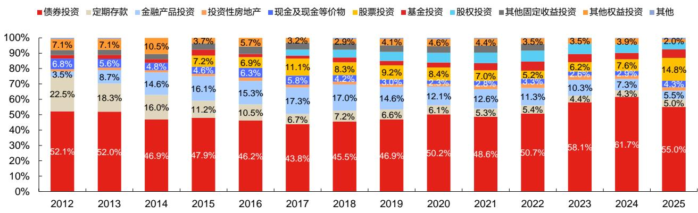  
数据来源：iFinD，东方证券研究所

有关分析师的申明，见本报告最后部分。其他重要信息披露见分析师申明之后部分，或请与您的投资代表联系。并请阅读本证券研究报告最后一页的免责申明。

## 固定收益类：先于同业调整结构，债券配置极具前瞻性优势

固定收益类资产仍是中国平安穿越周期的底仓，但 2025 年公司明显调整了固收结构，主动压降非债券固收类资产。2025 年公司固定收益类投资占比降至 68.2%，较 2024 年的 78.1%明显回落；其中债券占比由 61.7%降至 55.0%，而非债券固收类资产占比则由 16.4%进一步降至 13.2%。横向看，中国平安固收仓位处同业中游，公司在低利率环境下并未单纯依赖非标等非债固收拉升收益，而是继续以债券作为核心压舱石，并通过压降非债固收优化组合结构、提升资产配置稳健性。

表 5：主要上市险企固定收益类投资占比
<table><tr><td></td><td>2014</td><td>2015</td><td>2016</td><td>2017</td><td>2018</td><td>2019</td><td>2020</td><td>2021</td><td>2022</td><td>2023</td><td>2024</td><td>2025</td></tr><tr><td>中国人寿</td><td>85.9%</td><td>77.7%</td><td>78.3%</td><td>80.8%</td><td>77.5%</td><td>74.8%</td><td>75.1%</td><td>77.9%</td><td>74.3%</td><td>66.9%</td><td>74.3%</td><td>70.5%</td></tr><tr><td>中国平安</td><td>79.7%</td><td>77.7%</td><td>73.4%</td><td>68.5%</td><td>72.9%</td><td>72.4%</td><td>73.2%</td><td>72.4%</td><td>76.9%</td><td>77.1%</td><td>78.1%</td><td>68.2%</td></tr><tr><td>中国太保</td><td>86.7%</td><td>82.1%</td><td>82.3%</td><td>81.8%</td><td>83.1%</td><td>80.4%</td><td>78.4%</td><td>75.7%</td><td>73.9%</td><td>81.9%</td><td>82.2%</td><td>78.6%</td></tr><tr><td>新华保险</td><td>82.0%</td><td>74.8%</td><td>76.0%</td><td>73.4%</td><td>75.0%</td><td>73.2%</td><td>71.5%</td><td>68.8%</td><td>69.0%</td><td>82.2%</td><td>74.7%</td><td>70.2%</td></tr><tr><td>中国人保</td><td>71.9%</td><td>66.4%</td><td>56.4%</td><td>52.6%</td><td>54.8%</td><td>53.2%</td><td>54.4%</td><td>57.0%</td><td>57.6%</td><td>64.0%</td><td>67.9%</td><td>64.3%</td></tr><tr><td>中国太平</td><td>78.6%</td><td>72.8%</td><td>73.6%</td><td>79.0%</td><td>80.4%</td><td>80.2%</td><td>78.4%</td><td>76.2%</td><td>76.6%</td><td>78.3%</td><td>82.8%</td><td>83.3%</td></tr></table>

数据来源：各公司公告，东方证券研究所

表 6：主要上市险企债券投资占比
<table><tr><td></td><td>2014</td><td>2015</td><td>2016</td><td>2017</td><td>2018</td><td>2019</td><td>2020</td><td>2021</td><td>2022</td><td>2023</td><td>2024</td><td>2025</td></tr><tr><td>中国人寿</td><td>44.8%</td><td>43.6%</td><td>45.6%</td><td>45.8%</td><td>42.2%</td><td>39.5%</td><td>42.0%</td><td>48.2%</td><td>48.5%</td><td>51.6%</td><td>59.0%</td><td>57.4%</td></tr><tr><td>中国平安</td><td>46.9%</td><td>47.9%</td><td>45.4%</td><td>43.7%</td><td>45.4%</td><td>46.9%</td><td>50.2%</td><td>48.6%</td><td>54.6%</td><td>58.1%</td><td>61.7%</td><td>55.0%</td></tr><tr><td>中国太保</td><td>55.2%</td><td>50.4%</td><td>50.0%</td><td>48.2%</td><td>46.3%</td><td>42.6%</td><td>39.3%</td><td>38.2%</td><td>40.3%</td><td>51.7%</td><td>60.1%</td><td>61.0%</td></tr><tr><td>新华保险</td><td>37.9%</td><td>36.1%</td><td>35.7%</td><td>38.3%</td><td>39.3%</td><td>42.7%</td><td>40.4%</td><td>38.5%</td><td>40.0%</td><td>50.4%</td><td>52.1%</td><td>49.6%</td></tr><tr><td>中国人保</td><td>34.1%</td><td>31.2%</td><td>29.8%</td><td>32.2%</td><td>32.4%</td><td>32.4%</td><td>36.6%</td><td>40.7%</td><td>41.2%</td><td>43.2%</td><td>48.9%</td><td>48.1%</td></tr><tr><td>中国太平</td><td>41.9%</td><td>38.8%</td><td>38.7%</td><td>45.4%</td><td>45.5%</td><td>47.5%</td><td>50.4%</td><td>51.9%</td><td>56.4%</td><td>68.7%</td><td>74.5%</td><td>76.1%</td></tr></table>

数据来源：各公司公告，东方证券研究所

债券配置结构上，公司大幅增配国债拉长久期，主动压降信用债规避风险。2017 年至 2020 年公司抓住长端利率相对较高的窗口期，政府债占比从 39.2%大幅提升至 2018 年的 70.8%； 2025 年末达 76.2%。公司通过提前抢配长久期国债及地方政府债，有效缩窄了资产负债的久期缺口。

图 40：中国平安债券结构持续向政府债倾斜  
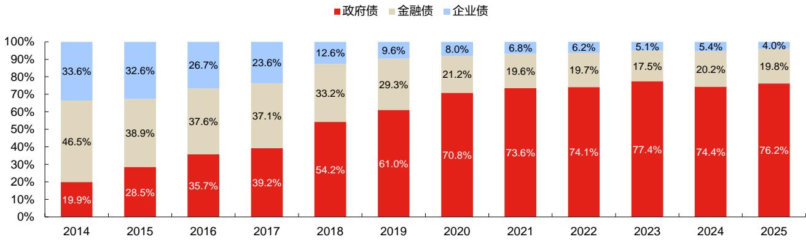  
数据来源：中国平安公司公告，东方证券研究所  
有关分析师的申明，见本报告最后部分。其他重要信息披露见分析师申明之后部分，或请与您的投资代表联系。并请阅读本证券研究报告最后一页的免责申明。

资产负债久期缺口持续收窄。中国平安2017年久期缺口为6.9年，随后逐步下降，凭借“超长久期策略”，2023 年久期缺口收窄至 2.6 年。2024 年起公司不再披露资产负债久期缺口，2025 年表述为小于 1.5 年。公司整体态度较为积极，资产端持续增配长久期低风险债，负债端积极发展分红险产品，资产负债久期缺口持续收窄。

图 41：中国平安资产负债久期缺口逐步缩小  
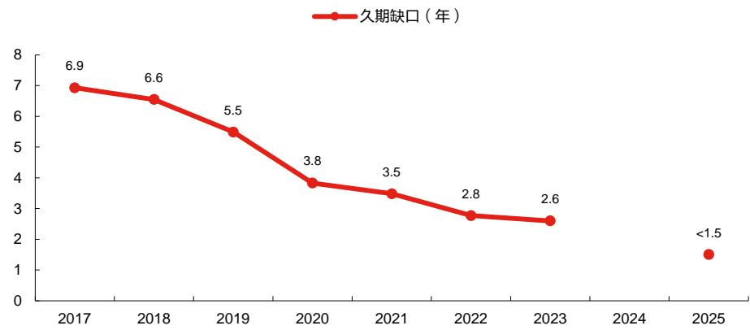  
数据来源：中国平安公司公告，东方证券研究所

表 7：主要上市险企积极主动控制久期缺口
<table><tr><td>公司</td><td>久期缺口</td><td>资产端</td><td>负债端</td></tr><tr><td>中国人寿</td><td>强调积极的资产负债联动，久期缺口 显著优化</td><td>适时拉长资产久期</td><td>有效管理负债久期；个险渠道10年期及以上首年期 交保费占比提升，浮动收益型期交保费占比提升</td></tr><tr><td>中国平安</td><td>持续优化资负匹配</td><td>增配长久期低风险债，拉长资产久期并锁定长期收 益</td><td>强调产品结构优化，聚焦传统险与分红险；2025H1 继续加强浮动收益型分红险研发</td></tr><tr><td>中国太保</td><td>强化资负匹配管理，并持续完善穿越 周期的资产负债管理体系</td><td>持续延展固定收益资产久期，降低再投资风险；考 虑新会计准则影响，优化资产会计分类</td><td>持续优化产品结构；2024年新保期缴规模保费占新 保规模保费50.7%，分红型保险新保期缴规模保费 同比大增</td></tr><tr><td>新华保险</td><td>满足资产负债匹配要求，并通过配置 长久期利率债收窄资产负债久期缺口</td><td>以久期长、现金流稳定的固定收益类资产为压舱 石；配置长久期利率债；增配高股息OCI类权益</td><td>强调期交和长年期结构优化：2024年长期险首年期 交保费占长期险首年保费70.1%，十年期及以上期 交保费同比增长19%</td></tr><tr><td>中国太平</td><td>/</td><td>2024H1官方披露保险资金组合中固定收益占比较 高，并强调高评级债券与稳健价值投资风格</td><td>2025H1分红险转型成效显著，分红险在长险首年 期缴保费中占比87.1%</td></tr><tr><td>阳光保险</td><td>按资产负债匹配原则管理资产端，同 时推动产品转型、优化产品结构</td><td>继续配置长久期政府债券品种，拉长资产久期； 2025H1继续优化债券结构</td><td>2025H1银保新单期缴保费中浮动收益型产品占比 27.1%，提升11个百分点</td></tr></table>

## 权益端：增配高股息资产，新准则下兼收益弹性与报表稳健

权益仓位：低位增配提速，占比显著提升

在长端利率中枢下移与资产荒加剧的行业共性挑战下，公司权益配置策略展现出显著的领先优势。在上市险企普遍维持权益仓位谨慎微调的背景下，平安表现更为灵活：1H25权益投资占比大幅抬升至 13.8%，较年初+2.0pct。公司适配 IFRS9 新会计准则，通过加大高分红、低波动（红利策略）资产的配置，并将其大量划分为以公允价值计量且其变动计入其他综合收益资产，不仅能在低息环境下有效增厚长期投资收益率，更通过隔离市值波动对当期损益的冲击，实现了投资收益与报表稳定性的平衡。

表 8：主要上市险企股票投资占比
<table><tr><td></td><td>2014</td><td>2015</td><td>2016</td><td>2017</td><td>2018</td><td>2019</td><td>2020</td><td>2021</td><td>2022</td><td>2023</td><td>2024</td><td>2025</td></tr><tr><td>中国人寿</td><td>4.5%</td><td>4.9%</td><td>5.7%</td><td>6.7%</td><td>5.8%</td><td>7.7%</td><td>8.5%</td><td>6.4%</td><td>8.5%</td><td>7.6%</td><td>7.6%</td><td>11.3%</td></tr><tr><td>中国平安</td><td>8.8%</td><td>7.2%</td><td>6.9%</td><td>11.1%</td><td>8.3%</td><td>9.2%</td><td>8.4%</td><td>7.0%</td><td>5.2%</td><td>6.2%</td><td>7.6%</td><td>14.8%</td></tr><tr><td>中国太保</td><td>3.8%</td><td>3.9%</td><td>3.3%</td><td>5.5%</td><td>4.1%</td><td>6.4%</td><td>7.7%</td><td>8.5%</td><td>9.0%</td><td>8.4%</td><td>9.3%</td><td>11.1%</td></tr><tr><td>新华保险</td><td>5.5%</td><td>5.3%</td><td>4.3%</td><td>5.8%</td><td>4.6%</td><td>6.6%</td><td>8.8%</td><td>8.5%</td><td>6.8%</td><td>7.9%</td><td>11.1%</td><td>11.8%</td></tr><tr><td>中国人保</td><td>2.7%</td><td>4.3%</td><td>4.8%</td><td>4.3%</td><td>3.9%</td><td>5.0%</td><td>6.1%</td><td>5.3%</td><td>4.3%</td><td>3.2%</td><td>3.7%</td><td>8.7%</td></tr><tr><td>中国太平</td><td>5.7%</td><td>7.0%</td><td>5.2%</td><td>4.8%</td><td>4.5%</td><td>8.8%</td><td>13.2%</td><td>11.5%</td><td>11.4%</td><td>8.4%</td><td>8.3%</td><td>12.2%</td></tr></table>

数据来源：各公司公告，东方证券研究所

表 9：主要上市险企股票+基金投资占比
<table><tr><td></td><td>2014</td><td>2015</td><td>2016</td><td>2017</td><td>2018</td><td>2019</td><td>2020</td><td>2021</td><td>2022</td><td>2023</td><td>2024</td><td>2025</td></tr><tr><td>中国人寿</td><td>8.5%</td><td>12.3%</td><td>10.6%</td><td>10.6%</td><td>9.2%</td><td>11.1%</td><td>11.3%</td><td>8.8%</td><td>11.4%</td><td>11.2%</td><td>12.2%</td><td>17.0%</td></tr><tr><td>中国平安</td><td>11.2%</td><td>11.1%</td><td>9.1%</td><td>13.0%</td><td>11.4%</td><td>12.1%</td><td>11.5%</td><td>11.6%</td><td>11.1%</td><td>11.5%</td><td>11.8%</td><td>20.4%</td></tr><tr><td>中国太保</td><td>8.2%</td><td>9.3%</td><td>7.4%</td><td>8.9%</td><td>6.8%</td><td>9.5%</td><td>11.4%</td><td>12.4%</td><td>12.4%</td><td>11.1%</td><td>11.6%</td><td>13.8%</td></tr><tr><td>新华保险</td><td>9.1%</td><td>13.5%</td><td>11.2%</td><td>13.1%</td><td>10.7%</td><td>12.2%</td><td>14.6%</td><td>15.4%</td><td>14.1%</td><td>14.3%</td><td>18.8%</td><td>21.2%</td></tr><tr><td>中国人保</td><td>10.0%</td><td>14.8%</td><td>15.3%</td><td>15.9%</td><td>10.8%</td><td>11.3%</td><td>13.0%</td><td>14.9%</td><td>13.6%</td><td>11.4%</td><td>8.9%</td><td>13.3%</td></tr><tr><td>中国太平</td><td>7.2%</td><td>10.4%</td><td>8.1%</td><td>7.0%</td><td>7.8%</td><td>14.2%</td><td>17.0%</td><td>15.6%</td><td>15.8%</td><td>14.5%</td><td>13.0%</td><td>16.6%</td></tr></table>

数据来源：各公司公告，东方证券研究所

## 举牌上市公司：战略增配优质高股息标的

中国平安坚定推进核心资产配置策略，2025年以来通过连续举牌持续增配低估值、高股息的银行和保险 H 股资产。公司这一轮加仓本质上是在低利率环境下，以“低 PB+高股息”权益资产补充传统固收收益下行带来的配置压力，既有助于锁定长期稳定现金流，也有望分享港股低估值修复带来的资本利得。从介入时点看，平安多数增持发生在相关标的估值偏低阶段，实际持仓股息回报率预计更具吸引力，体现出较强的逆周期配置思路。

表 10：2025年以来中国平安持续举牌港股高股息低估值上市公司
<table><tr><td>举牌日期</td><td>上市公司</td><td>股票代码</td><td>触发比例</td><td>股息率</td><td>PB（倍）</td></tr><tr><td>2025年1月13日</td><td>邮储银行</td><td>1658.HK</td><td>5%</td><td>9.24%</td><td>0.53</td></tr><tr><td>2025年1月15日</td><td>招商银行</td><td>3968.HK</td><td>5%</td><td>4.99%</td><td>0.82</td></tr><tr><td>2025年2月20日</td><td>农业银行</td><td>1288.HK</td><td>5%</td><td>8.41%</td><td>0.76</td></tr><tr><td>2025年3月18日</td><td>招商银行</td><td>3968.HK</td><td>10%</td><td>4.99%</td><td>0.82</td></tr><tr><td>2025年5月14日</td><td>邮储银行</td><td>1658.HK</td><td>10%</td><td>9.24%</td><td>0.53</td></tr><tr><td>2025年5月15日</td><td>农业银行</td><td>1288.HK</td><td>10%</td><td>8.41%</td><td>0.76</td></tr><tr><td>2025年6月20日</td><td>招商银行</td><td>3968.HK</td><td>15%</td><td>4.99%</td><td>0.82</td></tr><tr><td>2025年8月13日</td><td>邮储银行</td><td>1658.HK</td><td>15%</td><td>9.24%</td><td>0.53</td></tr><tr><td>2025年8月15日</td><td>中国太保</td><td>2601.HK</td><td>5%</td><td>5.24%</td><td>1.14</td></tr><tr><td>2025年8月18日</td><td>中国人寿</td><td>2628.HK</td><td>5%</td><td>5.04%</td><td>1.66</td></tr><tr><td>2025年8月26日</td><td>农业银行</td><td>1288.HK</td><td>15%</td><td>8.41%</td><td>0.76</td></tr></table>

有关分析师的申明，见本报告最后部分。其他重要信息披露见分析师申明之后部分，或请与您的投资代表联系。并请阅读本证券研究报告最后一页的免责申明。

<table><tr><td>2025年9月16日</td><td>中国太保</td><td>2601.HK</td><td>10%</td><td>5.24%</td><td>1.14</td></tr><tr><td>2026年1月5日</td><td>农业银行</td><td>1288.HK</td><td>20%</td><td>8.941%</td><td>0.76</td></tr><tr><td>2026年1月6日</td><td>招商银行</td><td>3968.HK</td><td>20%</td><td>4.99%</td><td>0.82</td></tr><tr><td>2026年2月3日</td><td>中国人寿</td><td>2628.HK</td><td>10%</td><td>5.04%</td><td>1.66</td></tr></table>

数据来源：中国保险行业协会，中国平安公司公告，东方证券研究所；注：数据截至 2026年 4月 17日

## IFRS9下的投资组合：FVOCI占比提升，兼顾利润平滑与收益弹性

中国平安正持续提升股票资产中 FVOCI分类占比，以降低权益市场波动对当期利润的扰动。相较FVTPL 资产公允价值变动直接计入当期损益，FVOCI 更有利于平滑利润表现。2025 年公司股票投资中 FVOCI/ FVTPL 占比分别为 56.5%/ 43.5%，对应投资组合占比分别为 8.3%/ 6.4%，公司正通过“高股息+FVOCI”配置思路，增强利润表稳定性。

图 42：中国平安 TPL和 OCI股票占投资组合比例稳步增长  
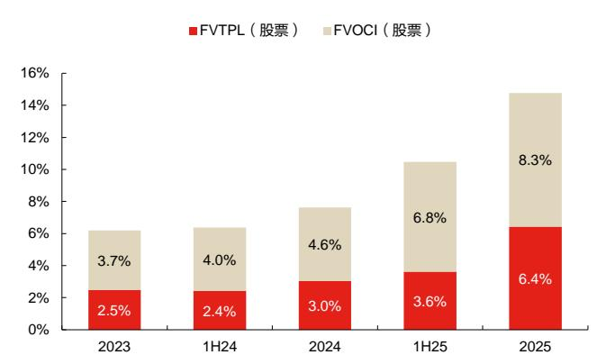  
数据来源：中国平安公司公告，东方证券研究所

图 43：中国平安股票投资主要计入 FVOCI分类  
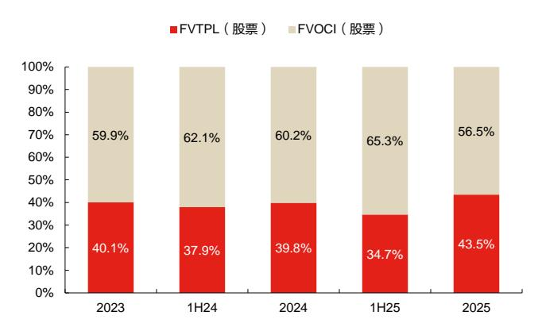  
数据来源：中国平安公司公告，东方证券研究所

从会计分类看，中国平安在权益资产配置上更注重利润表稳定性。公司股票投资中计入 FVOCI的比例明显高于多数同业，2025年 FVOCI占比达 56.5%，而中国人寿/ 中国太保/ 新华保险/ 中国人保/ 中国太平分别为 27.8%/ 37.0%/ 18.6%/ 42.4%/ 34.6%。公司更多权益资产的公允价值波动不直接计入当期损益，在权益市场波动加大阶段，利润表所受扰动相对更小，业绩稳定性和可预期性更强。

图 44：主要上市险企股票投资计入 FVTPL分类比重较高  
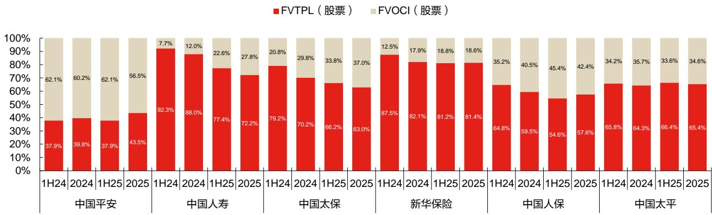  
数据来源：各公司公告，东方证券研究所  
有关分析师的申明，见本报告最后部分。其他重要信息披露见分析师申明之后部分，或请与您的投资代表联系。并请阅读本证券研究报告最后一页的免责申明。

FVOCI 权益工具收益能力领先，资本利得兑现与高股息配置优势兼备。资本利得率方面，中国平安 2025 年为 14.1%，显著领先同业。股息收入率方面，中国平安 2023 至 2025 年分别为 6.8%/6.9%/ 6.7%，持续处于行业第一梯队。整体来看，中国平安 FVOCI 账户在高股息底仓提供稳定票息回报的同时，叠加更强的资本利得实现能力，综合收益表现显著优于同业。

图 45：中国平安 FVOCI权益工具公允价值变动率显著领先  
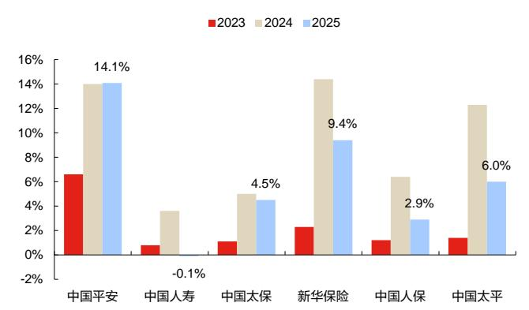  
数据来源：各公司公告，东方证券研究所；注：FVOCI 账户权益工具公允价值变动率=FVOCI权益工具公允价值变动净额/平均FVOCI权益工具余额，2023年分母为 FVOCI 权益工具期末余额

图 46：中国平安 FVOCI权益工具股息收入率保持高位  
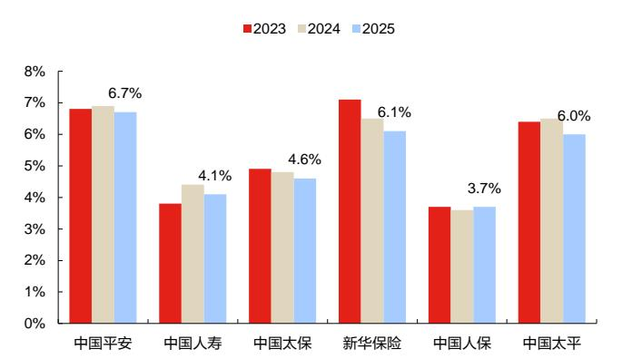  
数据来源：各公司公告，东方证券研究所；注：FVOCI 账户权益工具股息收入率=FVOCI 权益工具在报告期内确认的股息收入/平均 FVOCI 权益工具余额，2023 年分母为 FVOCI 权益工具期末余额

## 不动产投资：风险敞口持续收窄

中国平安的保险资金不动产投资风险敞口持续收窄，风险化解成效显著，且资产结构不断向高安全性资产倾斜。从总量来看，公司不动产投资余额从 2021 年的 2,161.4 亿元缓慢下降至 2025 年的 2,021.9 亿元，占总投资资产的比例也由 2021 年的 5.5%压降至 2025 年的 3.1%，公司在地产行业波动期内主动压降风险敞口、保持审慎稳健的投资态度。从投资结构来看，公司近年来显著优化了不动产的资产分布，向能够产生稳定现金流、具备长期抗通胀能力的物权类资产倾斜，其占比由 2021 年的 46.6%大幅提升至 2025 年的 86.6%。

我们认为，随着近期国家针对房地产行业密集出台增设保障性住房贷款、降低首付比例及取消房贷利率下限等政策组合拳，房地产市场基本面有望逐步企稳修复，叠加公司自身资产质量的持续改善，不动产投资端的潜在风险已得到充分缓释，未来将持续支撑公司投资端的韧性。

图 47：中国平安不动产投资占比逐步下降  
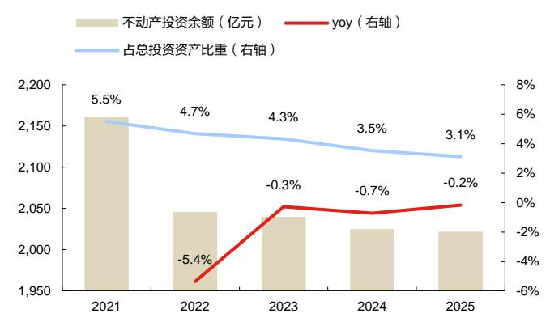  
数据来源：中国平安公司公告，东方证券研究所

图 48：中国平安不动产投资逐步向物权倾斜  
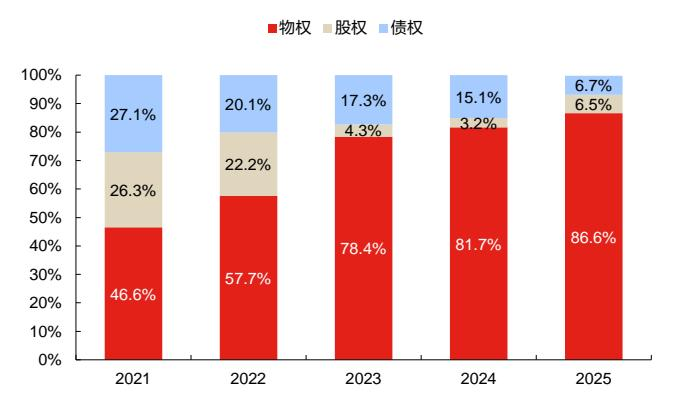  
数据来源：中国平安公司公告，东方证券研究所  
有关分析师的申明，见本报告最后部分。其他重要信息披露见分析师申明之后部分，或请与您的投资代表联系。并请阅读本证券研究报告最后一页的免责申明。

从底层资产配置看，中国平安不动产投资敞口继续收缩，且存量资产仍以优质持有型物业为主，整体风险可控。截至2025年末，以投资性物业计量的直接持有物业规模为1,439.9亿元，占总投资资产比重为 2.2%，主要投向商业办公/ 物流地产/ 产业园/ 长租公寓等收租型物业。

权益类敞口方面，公司地产股权风险已明显压降。2025年末，上市房企相关敞口主要为中国金茂27.5 亿元，占总投资资产比重仅 0.04%，华夏幸福账面价值已降至 0.0 亿元；同时，联营/ 合营地产项目长股投合计约 251.5 亿元，主要包括上海怡滨/ Vivid Synergy 等项目。整体看，平安地产相关风险资产已逐步收敛为以优质物权资产为主，股权和债权敞口相对有限。

表 11：中国平安 2025年末地产投资结构风险基本可控
<table><tr><td>项目</td><td>2025年末规模（亿元）</td><td>占投资资产比重</td><td>备注</td></tr><tr><td>投资性房地产（直接持有物业）</td><td>1,439.9</td><td>2.22%</td><td>商圈地产项目</td></tr><tr><td>地产债权类非标</td><td>194.7</td><td>0.30%</td><td></td></tr><tr><td>地产股权投资——市房企</td><td>27.5</td><td>0.04%</td><td>中国金茂27.5亿元；华夏幸福年末账面值为0.0亿元。</td></tr><tr><td>股权投资—联营</td><td>235.5</td><td>0.36%</td><td>上海怡滨133.0亿元+VividSynergy101.8亿元+广州璟仑0.7亿元</td></tr><tr><td>股权投资—合营</td><td>16.0</td><td>0.02%</td><td>北京昭泰12.9亿元+武汉市地安君泰4.6亿元</td></tr><tr><td>其他（残差）</td><td>108.2</td><td>0.17%</td><td></td></tr></table>

数据来源：中国平安公司公告，东方证券研究所

资产减值计提充分，风险敞口实质性收敛。自 2020 年以来，公司主动消化华夏幸福等地产风险敞口，2020至 2025年累计计提投资资产减值损失近 1,300亿元，夯实了资产负债表质量。

从结构拆解看，投资资产减值损失已明显好转：投资资产减值损失在 2021年达到 415.7 亿元的峰值后显著回落；2025投资资产减值损失 138.0亿元，预计房地产类资产减值压力已基本出清。

图 49：中国平安投资资产减值损失基本可控  
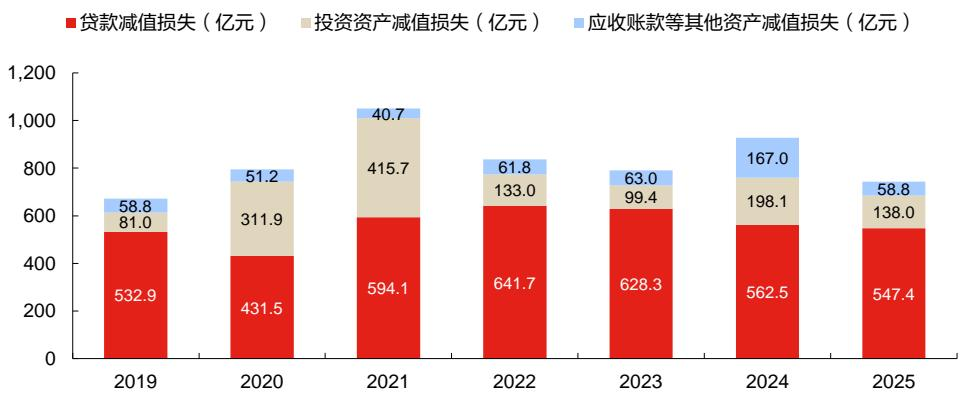  
数据来源：中国平安公司公告，东方证券研究所

## 投资收益：净投资收益率承压，总投资收益率强劲反弹

中国平安的投资组合在宏观利率下行与资本市场波动的双重挑战下，依然展现出了较好的表现。回顾过去十年，公司的净投资收益率符合行业趋势的缓慢下行，直至 2025 年的 3.7%。在长端利率持续走低的宏观背景下，保险资金面临的再投资风险以及新增固收资产收益率的稀释效应；尽管收益率中枢下移，但考虑到庞大的资产体量与市场环境，公司通过拉长久期、优化资产负债匹配，依然守住了相对稳健的固收基本盘，为穿越周期提供了安全垫。受益于资本市场的回暖以及公司对高股息资产的积极配置，综合投资收益率维持在较高的水平，2024 年/ 2025 年分别实现5.8%/ 6.3%，投资端已走出阶段性低谷。

图 50：中国平安投资组合年化收益率分化  
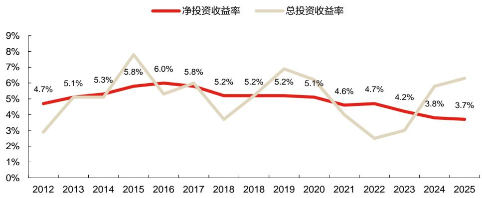  
数据来源：中国平安公司公告，东方证券研究所；注：2024年和 2025年未披露总投资收益率，以综合投资收益率代替

横向对比同业，中国平安在 2025 年展现出较强的优势。公司全年实现综合投资收益率 6.3%，同比提升 0.5 pct，稳居上市险企第一梯队，充分验证了权益配置的高弹性；同时，在长端利率下行背景下，公司净投资收益率稳定 3.7%，同比-0.1 pct，整体稳健且绝对水平仍保持一定优势。

图 51：主要上市险企 2025年综合投资收益率表现分化  
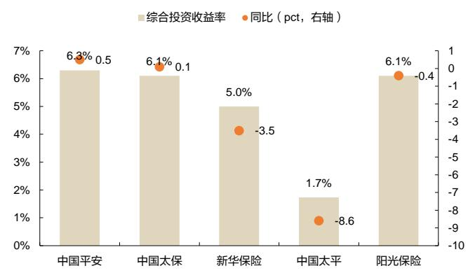  
数据来源：各公司公告，东方证券研究所

图 52：主要上市险企 2025年净投资收益率普遍承压  
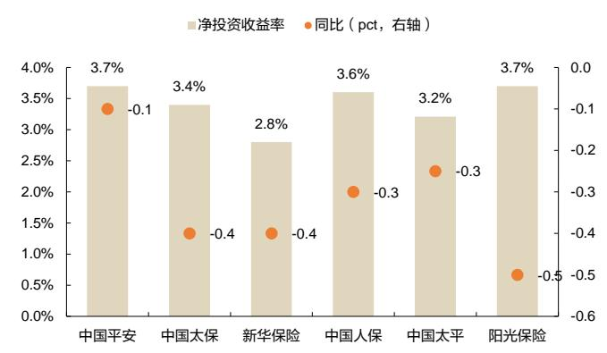  
数据来源：各公司公告，东方证券研究所

## 分红：盈利韧性支撑分红上行，分红支付率稳步提升

在分红政策与股东回报方面，中国平安长期以来秉持稳健且高增长的分配导向，分红总额连续多年实现正增长。从绝对规模来看，公司现金分红总额由 2015 年 96.9 亿元大幅增至 2025 年的488.9 亿元，十年间实现了跨越式增长，尤其在行业面临挑战的 2022 至 2024 年间，公司依然维持了分红规模的平稳上行。从分配比例来看，公司分红政策与营运利润（OPAT）挂钩的机制日益成熟，现金分红占营运利润的比例从2016年的20.1%稳步提升至2025年的36.4%，不仅体现了公司资本实力的持续增强，更反映了其在资产负债联动管理下，能够有效平衡业务扩张与股东回报。这种持续提升的分红支付率，在当前市场震荡、高股息资产稀缺的背景下，进一步强化了中国平安作为优质价值标的的投资吸引力。

图 53：中国平安现金分红总额稳健增长  
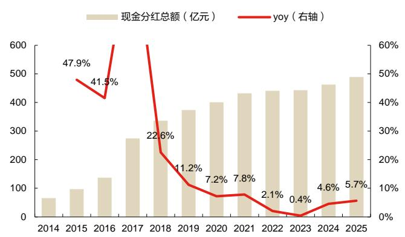  
数据来源：iFinD，东方证券研究所

图 54：中国平安现金分红比例中枢逐步提升  
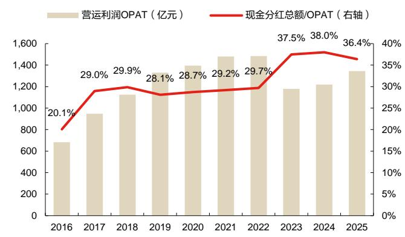  
数据来源：iFinD，东方证券研究所

中国平安在 A股及 H股市场均展现出了极具吸引力的配置价值，尤其是近年来在红利风格占优的市场环境下，其高股息特征愈发凸显。受分红总额持续增长与股价波动的共同影响，公司 A 股股息率由 2015 年的 1.47%趋势性上行，于 2023 年达到高位，2024 年以来有所回落但仍处于较高水平。持续且高水平的现金回报能力使其有望成为当下长线资金及高股息策略投资者的核心防御性品种。我们认为，稳定的分红预期与当前具有性价比的股息率表现，为公司估值提供了坚实的安全边际。

图 55：中国平安股息率中枢抬升  
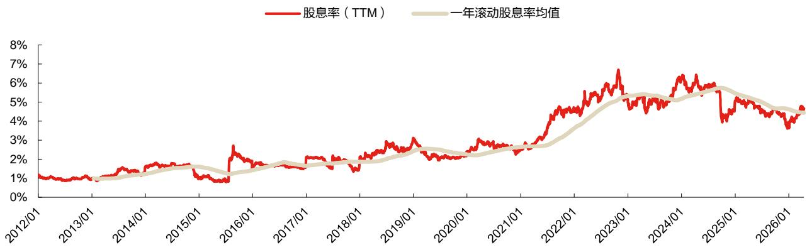  
数据来源：iFinD，东方证券研究所；注：数据截至 2026 年 4 月 17 日

有关分析师的申明，见本报告最后部分。其他重要信息披露见分析师申明之后部分，或请与您的投资代表联系。并请阅读本证券研究报告最后一页的免责申明。

## 盈利预测与投资建议

## 盈利预测

我们认为，中国平安当前已进入基本面持续改善与估值修复共振的新阶段。过去几年压制公司估值的核心因素，包括个险改革阵痛、房地产风险担忧以及投资端波动，正在逐步缓释；与此同时，寿险负债端已率先重回向上通道，改革红利持续兑现。

保险主业重回向上发展通道，寿险 NBV 有望维持增长态势。2023 年以来在居民风险偏好较低、预定利率多次下调、保险公司积极销售等因素的推动下，寿险 NBV 企稳回升。2025 年中国平安实现 NBV 368.97 亿元，可比口径下同比+29.3%。其中 NBVM（按标准保费）为 28.5%，同比+5.8 pct；用于计算 NBV 的首年保费为 1,579.23 亿元，同比+2.5%。分渠道来看， 2025 年中国平安代理人、银保渠道的 NBV 同比分别+10.4%、+138.0%，代理人渠道价值贡献企稳回升，银保渠道持续高增。我们认为，随着寿险改革逐步从清虚转向提质增效，中国平安负债端改善的持续性正在增强，后续 NBV仍有望维持较快增长态势。

与此同时，公司资产端的改善也在为估值修复提供支撑。一方面，中国平安近年来不断优化投资结构，在低利率环境下前瞻性增配高股息权益资产，并通过FVOCI等账户安排有效平滑利润波动，投资收益的韧性有望持续体现；另一方面，公司房地产风险敞口持续收缩，截至2025年末，保险资金投资组合中不动产投资余额为 2,021.9 亿元，在总投资资产中的占比仅为 3.1%，且资产结构持续优化，华夏幸福股权投资已充分计提减值，截至 2025 年末其账面公允价值已降至 0。随着地产相关风险逐步出清，市场对于公司风险外溢的担忧已明显缓释，资产端改善亦有望进一步支撑公司估值修复。

中国平安依托寿险/ 健康险/ 养老险主业以及平安健康等平台，持续推进“保险+服务”生态建设，医疗健康和养老服务有望进一步提升客户黏性、产品溢价和长期价值创造能力。整体而言，市场当前对中国平安的定价仍更多停留在低估值修复层面，而对其负债端改善持续性、投资端配置能力以及医养生态带来的中长期增量价值反映仍不充分，公司估值中枢仍有进一步上修空间。

## 分业务收入预测：

1）寿险及健康险：2023 年以来客户对储蓄型险种的需求明显提升，寿险及健康险的收入边际提升；叠加全渠道执行“报行合一”、预定利率多次下调带动寿险及健康险的 NBV 呈现较好增长态势。基于此，我们预计 2026 至 2028 年寿险及健康险的保险服务收入分别为 2,248/ 2,302/ 2,358亿元，同比分别+2.0%/ +2.4%/ +2.4%；NBV 分别为 460/ 533/ 607 亿元，同比分别+24.5%/+16.0%/ +13.9%。

2）财产险：受益于经济增长向好，财产险的收入增速整体处于较稳定的水平。我们预计 2025 至2027 年机动车辆险稳健，同比分别+4.0%/ +5.0%/ +5.0%；非机动车辆险保持较高的增速，同比分别+6.0%/ +6.0%/ +6.0%；财产险的保险服务收入分别为 3,547/ 3,736/ 3,935 亿元，同比分别+4.7%/ +5.3%/ +5.3%。

表 12：中国平安保险服务收入预测（百万元）
<table><tr><td></td><td>2023A</td><td>2024A</td><td>2025A</td><td>2026E</td><td>2027E</td><td>2028E</td></tr><tr><td>保险服务收入合计</td><td>537,058</td><td>551,448</td><td>559,303</td><td>579,476</td><td>603,786</td><td>629,265</td></tr><tr><td>yoy</td><td>2.0%</td><td>2.7%</td><td>1.4%</td><td>3.6%</td><td>4.2%</td><td>4.2%</td></tr></table>

<table><tr><td>保险服务收入</td><td>223,600</td><td>223,302</td><td>220,391</td><td>224,799</td><td>230,205</td><td>235,765</td></tr><tr><td>yoy</td><td>-3.7%</td><td>-0.1%</td><td>-1.3%</td><td>2.0%</td><td>2.4%</td><td>2.4%</td></tr><tr><td>保费分配法</td><td>29,764</td><td>29,314</td><td>29,743</td><td>30,338</td><td>31,855</td><td>33,447</td></tr><tr><td>yoy</td><td>-6.5%</td><td>-1.5%</td><td>1.5%</td><td>2.0%</td><td>5.0%</td><td>5.0%</td></tr><tr><td>非保费分配法</td><td>193,836</td><td>193,988</td><td>190,648</td><td>194,461</td><td>198,350</td><td>202,317</td></tr><tr><td>yoy</td><td>-3.3%</td><td>0.1%</td><td>-1.7%</td><td>2.0%</td><td>2.0%</td><td>2.0%</td></tr></table>

<table><tr><td>保险服务收入</td><td>313,458</td><td>328,146</td><td>338,912</td><td>354,677</td><td>373,581</td><td>393,501</td></tr><tr><td>yoy</td><td>6.5%</td><td>4.7%</td><td>3.3%</td><td>4.7%</td><td>5.3%</td><td>5.3%</td></tr><tr><td>机动车辆险</td><td>209,538</td><td>220,026</td><td>228,495</td><td>237,635</td><td>249,517</td><td>261,992</td></tr><tr><td>yoy</td><td>6.1%</td><td>5.0%</td><td>3.8%</td><td>4.0%</td><td>5.0%</td><td>5.0%</td></tr><tr><td>非机动车辆险</td><td>103,920</td><td>108,120</td><td>110,417</td><td>117,042</td><td>124,065</td><td>131,508</td></tr><tr><td>yoy</td><td>7.4%</td><td>4.0%</td><td>2.1%</td><td>6.0%</td><td>6.0%</td><td>6.0%</td></tr></table>

数据来源：中国平安公司公告，东方证券研究所

表 13：中国平安寿险和健康险业务新业务价值及新业务价值率预测（百万元）
<table><tr><td></td><td>2023A</td><td>2024A</td><td>2025A</td><td>2026E</td><td>2027E</td><td>2028E</td></tr><tr><td>用来计算新业务价值的首年保费</td><td></td><td></td><td></td><td></td><td></td><td></td></tr><tr><td>代理人渠道</td><td>100,513</td><td>88,421</td><td>77,389</td><td>81,258</td><td>85,321</td><td>89,587</td></tr><tr><td>银保渠道</td><td>18,091</td><td>19,643</td><td>38,330</td><td>57,495</td><td>74,744</td><td>89,692</td></tr><tr><td>其他渠道</td><td>47,180</td><td>45,963</td><td>42,204</td><td>42,204</td><td>42,204</td><td>42,204</td></tr><tr><td>合计</td><td>165,784</td><td>154,027</td><td>157,923</td><td>180,957</td><td>202,269</td><td>221,484</td></tr><tr><td>yoy</td><td>14.2%</td><td>-7.1%</td><td>2.5%</td><td>14.6%</td><td>11.8%</td><td>9.5%</td></tr><tr><td>新业务价值NBV</td><td></td><td></td><td></td><td></td><td></td><td></td></tr><tr><td>代理人渠道</td><td>32,169</td><td>31,870</td><td>23,823</td><td>27,628</td><td>29,009</td><td>30,460</td></tr><tr><td>银保渠道</td><td>3,643</td><td>4,825</td><td>9,408</td><td>14,949</td><td>20,928</td><td>26,908</td></tr><tr><td>其他渠道</td><td>3,449</td><td>3,329</td><td>3,666</td><td>3,376</td><td>3,376</td><td>3,376</td></tr><tr><td>合计</td><td>39,261</td><td>40,024</td><td>36,897</td><td>45,953</td><td>53,314</td><td>60,744</td></tr><tr><td>yoy（可比口径）</td><td>36.2%</td><td>1.9%</td><td>29.3%</td><td>24.5%</td><td>16.0%</td><td>13.9%</td></tr><tr><td>新业务价值率NBVM</td><td></td><td></td><td></td><td></td><td></td><td></td></tr><tr><td>代理人渠道</td><td>32.0%</td><td>36.0%</td><td>30.8%</td><td>34.0%</td><td>34.0%</td><td>34.0%</td></tr><tr><td>银保渠道</td><td>20.1%</td><td>24.6%</td><td>24.5%</td><td>26.0%</td><td>28.0%</td><td>30.0%</td></tr><tr><td>其他渠道</td><td>7.3%</td><td>7.2%</td><td>8.7%</td><td>8.0%</td><td>8.0%</td><td>8.0%</td></tr><tr><td>合计</td><td></td><td></td><td></td><td></td><td></td><td></td></tr><tr><td></td><td>23.7%</td><td>26.0%</td><td>23.4%</td><td>25.4%</td><td>26.4%</td><td>27.4%</td></tr></table>

有关分析师的申明，见本报告最后部分。其他重要信息披露见分析师申明之后部分，或请与您的投资代表联系。并请阅读本证券研究报告最后一页的免责申明。

## 估值分析和投资建议

我们采用分部加总法对中国平安进行内含价值估值。基于最新假设，我们预计2026E至2028E公司一年新业务价值分别为 459.5/ 533.1/ 607.4 亿元，其他业务调整后资产净值增速分别为 5.0%/5.0%/ 5.0%。基于上述假设，我们预计中国平安集团内含价值将由 2025A 的 15,042.9 亿元稳步增至 2026E 至 2028E 的 16,087.5/ 17,245.6/ 18,520.8 亿元，同比分别增长 6.9%/ 7.2%/ 7.4%；对应每股内含价值分别为 88.8/ 95.2/ 102.3 元。以 2026 年 4 月 17 日收盘价计，对应 2026E 至2028E 的 PEV 分别为 0.65x/ 0.61x/ 0.57x，当前估值仍处于相对低位，具备一定修复空间。

表 14：中国平安内含价值预测（百万元）
<table><tr><td></td><td>2023A</td><td>2024A</td><td>2025A</td><td>2026E</td><td>2027E</td><td>2028E</td></tr><tr><td>寿险及健康险业务期初的内含价值</td><td>874,786</td><td>830,974</td><td>835,093</td><td>928,631</td><td>1,004,307</td><td>1,089,900</td></tr><tr><td>期初内含价值的预计回报</td><td>68.218</td><td>57,433</td><td>50,759</td><td>63,147</td><td>68,293</td><td>74,113</td></tr><tr><td>其中：有效业务价值的预计回报</td><td>54,216</td><td>43.591</td><td>36,823</td><td>47,992</td><td>51,903</td><td>56,326</td></tr><tr><td>调整净资产的预计回报</td><td>14,002</td><td>13.842</td><td>13.936</td><td>15,155</td><td>16.390</td><td>17,787</td></tr><tr><td>新业务价值创造</td><td>35,605</td><td>32.271</td><td>42.452</td><td>52.846</td><td>61,311</td><td>69.855</td></tr><tr><td>其中：一年新业务价值</td><td>31,080</td><td>28,534</td><td>36.897</td><td>45,953</td><td>53,314</td><td>60,744</td></tr><tr><td>分散效应</td><td>4,525</td><td>3,737</td><td>5,555</td><td>6,893</td><td>7,997</td><td>9,112</td></tr><tr><td>营运假设及模型变动</td><td>(10,049)</td><td>(13,490)</td><td>(13.749)</td><td>(13.929)</td><td>(15,065)</td><td>(16,349)</td></tr><tr><td>营运经验差异及其他</td><td>4,442</td><td>15.367</td><td>14,484</td><td>13.929</td><td>15,065</td><td>16.349</td></tr><tr><td>寿险及健康险业务内含价值营运利润</td><td>98,216</td><td>91,581</td><td>93,946</td><td>115,993</td><td>129,604</td><td>143,968</td></tr><tr><td>经济假设变动</td><td>(76,604)</td><td>(84,063)</td><td>1</td><td></td><td></td><td></td></tr><tr><td>市场价值调整影响</td><td>7,875</td><td>15,895</td><td>(10,417)</td><td>3,000</td><td>3,000</td><td>3,000</td></tr><tr><td>投资回报差异</td><td>(29,060)</td><td>21,722</td><td>29.818</td><td>2.000</td><td>2.000</td><td>2.000</td></tr><tr><td>新方正集团商誉剔除影响</td><td></td><td></td><td></td><td></td><td></td><td></td></tr><tr><td>不属于日常营运收支的一次性项目及其他</td><td>，</td><td>1</td><td></td><td></td><td>- ，</td><td>1</td></tr><tr><td>寿险及健康险业务内含价值利润</td><td>427</td><td>45,135</td><td>113,347</td><td>120,993</td><td>134,604</td><td>148.968</td></tr><tr><td>股东股息</td><td>(42,717)</td><td>(40,114)</td><td>(39,331)</td><td>(44,574)</td><td>(48,207)</td><td>(52,315)</td></tr><tr><td>员工持股计划</td><td>(1,521)</td><td>(902)</td><td>(510)</td><td>(743)</td><td>(803)</td><td>(872)</td></tr><tr><td>股东注资</td><td></td><td>，</td><td>20,032</td><td></td><td>-</td><td></td></tr><tr><td>寿险及健康险业务期末的内含价值</td><td>830,975</td><td>835,093</td><td>928,631</td><td>1,004,307</td><td>1,089,900</td><td>1,185,681</td></tr><tr><td>yoy</td><td>(5.0%)</td><td>0.5%</td><td>11.2%</td><td>8.1%</td><td>8.5%</td><td>8.8%</td></tr><tr><td>营运 ROEV</td><td>11.2%</td><td> 11.0%</td><td> 11.2%</td><td>12.5%</td><td> 12.9%</td><td>13.2%</td></tr><tr><td>其他业务调整后资产净值</td><td>559,152</td><td></td><td></td><td></td><td></td><td></td></tr><tr><td>yoy</td><td>1.9%</td><td>587,509 5.1%</td><td>575,657 (2.0%)</td><td>604,440 5.0%</td><td>634,662 5.0%</td><td>666,395 5.0%</td></tr><tr><td>集团期末内含价值</td><td>1,390,127</td><td>1,422,602</td><td></td><td></td><td>1,724,562</td><td>1,852,076</td></tr><tr><td>yoy</td><td>(2.4%)</td><td>2.3%</td><td>1,504,288 5.7%</td><td>1,608,746 6.9%</td><td>7.2%</td><td>7.4%</td></tr><tr><td></td><td></td><td></td><td></td><td></td><td></td><td></td></tr><tr><td>每股内含价值 PEV</td><td>76.34 0.76</td><td>78.12</td><td>83.07</td><td>88.84</td><td>95.24</td><td>102.28</td></tr><tr><td>数据来源：中国平安公司公告，东方证券研究所；注：以2026年4月17日收盘价计</td><td></td><td>0.74</td><td>0.70</td><td>0.65</td><td>0.61</td><td>0.57</td></tr></table>

有关分析师的申明，见本报告最后部分。其他重要信息披露见分析师申明之后部分，或请与您的投资代表联系。并请阅读本证券研究报告最后一页的免责申明。

从基于时间加权 EV 的滚动 PEV 估值来看，近两年中国平安股价的上涨主要由基本面驱动，PEV估值仅从低点的 0.42倍上升至 2026年4月 17日的0.60倍，未充分计价潜在的基本面改善。

图 56：A股主要上市险企滚动PEV  
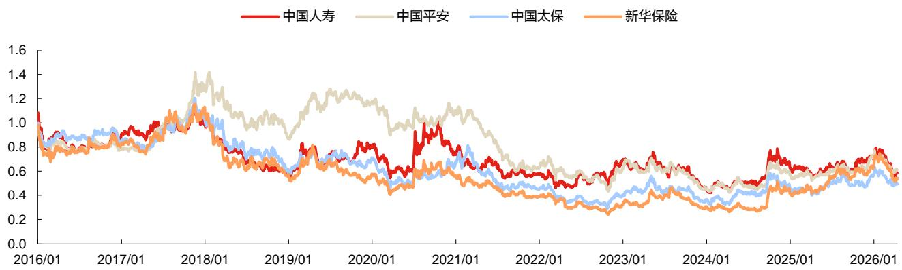  
数据来源：iFinD，东方证券研究所；注：数据截至 2026年 4月 17日

我们认为公司改革红利已进入持续兑现阶段，资负两端改善正推动估值从风险折价收敛逐步走向价值中枢抬升。负债端，个险渠道企稳且人均产能持续提升，银保渠道价值贡献快速释放，新业务价值增长动能较强；资产端，地产风险基本出清，高股息权益资产为代表的哑铃型配置策略在低利率环境下有望兼顾收益韧性与报表稳健。当前公司同时具备寿险修复、资产端改善与高分红回报三重支撑，仍是保险板块中兼具防御属性与向上弹性的核心标的。

盈利预测方面，我们预计公司 2026E 至 2028E 营业总收入分别为 11,199.6/ 11,786.1/ 12,390.8亿元，同比分别增长 6.6%/ 5.2%/ 5.1%；归母净利润分别为 1,742.5/ 1,817.4/ 1,930.9 亿元，同比分别增长 29.3%/ 4.3%/ 6.2%；EPS 分别为 9.62/ 10.04/ 10.66 元。

内含价值方面，我们预计公司 2026E 至 2028E EVPS 分别为 88.84/ 95.24/ 102.28 元。以 2026年 4 月 17 日收盘价 57.92 元计，公司对应 2026E 至 2028E P/EV 分别为 0.65/ 0.61/ 0.57 倍。考虑到公司寿险改革红利持续兑现、资产端风险逐步出清且分红回报具备吸引力，当前估值仍处于相对低位，尚未充分反映公司中长期盈利韧性与综合金融平台的增量价值。我们以 2026E EVPS的 88.84 元作为目标价，首次覆盖，给予“买入”评级。

## 风险提示

1）长端利率下行超预期：保险资金具有长久期特性，若宏观经济复苏乏力导致长端利率长期处于低位甚至进一步下行，将显著增加公司新增资产与到期资产的再投资压力，导致净投资收益率承压。同时，折现率下行将直接影响内含价值的计算假设，导致有效业务价值和内含价值的评估结果面临缩水风险，进而压制估值中枢。

2）权益市场大幅波动：公司资产配置中包含一定比例的股票与基金权益资产。若资本市场出现大幅震荡或系统性下跌，一方面将通过 FVTPL 资产直接冲击当期归母净利润；另一方面，计入FVOCI的资产波动将影响净资产水平，进而导致综合投资收益率不及预期。

3）寿险改革成效不及预期：尽管个险渠道已企稳，但若代理人队伍规模继续大幅脱落，或新人的留存率与产能提升速度低于预期，将导致新业务价值增长乏力。

4）居民收入不及预期：若居民收入预期不稳导致长期储蓄型与保障型产品需求持续疲软，可能导致保费增速放缓，影响负债端未来的利润释放能力。

5）医疗养老生态圈协同效应不及预期： 公司“综合金融+医疗养老”战略依赖于医疗服务对金融主业的赋能。若医疗资源整合进度缓慢，或客户从服务到保险的转化率低于预期，将导致该战略投入产出比不佳，难以形成预期的差异化竞争壁垒。

附表：财务报表预测与比率分析  
利润表
<table><tr><td colspan="6">利润表</td></tr><tr><td>单位：亿元</td><td>2024</td><td>2025</td><td>2026E</td><td>2027E</td><td>2028E</td></tr><tr><td>保险服务收入</td><td>5,511.9</td><td>5,595.0</td><td>5,796.8</td><td>6,040.0</td><td>6,294.9</td></tr><tr><td>投资收益</td><td>836.1</td><td>1,528.6</td><td>1,636.6</td><td>1,814.5</td><td>1,989.2</td></tr><tr><td>公允价值变动损益</td><td>665.0</td><td>(103.8)</td><td>0.0</td><td>0.0</td><td>0.0</td></tr><tr><td>其他业务收入</td><td>3,252.2</td><td>3,457.7</td><td>3,736.9</td><td>3,900.3</td><td>4,073.3</td></tr><tr><td>其他收益</td><td>24.0</td><td>27.5</td><td>29.3</td><td>31.3</td><td>33.4</td></tr><tr><td>营业总收入</td><td>10,289.3</td><td>10,505.1</td><td>11,199.6</td><td>11,786.1</td><td>12,390.8</td></tr><tr><td>保险服务费用</td><td>(4,491.0)</td><td>(4,532.7)</td><td>(4,724.4)</td><td>(4,922.6)</td><td>(5,130.3)</td></tr><tr><td>承保财务损益</td><td>(1,726.6)</td><td>(1,799.8)</td><td>(1,855.0)</td><td>(1,932.8)</td><td>(2,014.4)</td></tr><tr><td>业务及管理费</td><td>(804.7)</td><td>(824.5)</td><td>(840.5)</td><td>(875.8)</td><td>(912.8)</td></tr><tr><td>其他业务成本</td><td>(1,550.4)</td><td>(1,471.1)</td><td>(1,388.1)</td><td>(1,560.4)</td><td>(1,683.1)</td></tr><tr><td>营业支出合计</td><td>(8,572.8)</td><td>(8,628.1)</td><td>(8,808.0)</td><td>(9,291.6)</td><td>(9,740.5)</td></tr><tr><td>营业利润</td><td>1,716.5</td><td>1,877.0</td><td>2,391.6</td><td>2,494.5</td><td>2,650.3</td></tr><tr><td>税前利润总额</td><td>1,705.0</td><td>1,855.9</td><td>2,372.5</td><td>2,474.5</td><td>2,629.1</td></tr><tr><td>净利润</td><td>1,467.3</td><td>1,583.0</td><td>2,033.2</td><td>2,120.6</td><td>2,253.1</td></tr><tr><td>归母净利润</td><td>1,266.1</td><td>1,347.8</td><td>1,742.5</td><td>1,817.4</td><td>1,930.9</td></tr><tr><td>少数股东损益</td><td>201.3</td><td>235.2</td><td>290.7</td><td>303.3</td><td>322.2</td></tr></table>

内含价值预测表

资产负债表
<table><tr><td>单位：亿元</td><td>2024</td><td>2025</td><td>2026E</td><td>2027E</td><td>2028E</td></tr><tr><td>货币资金</td><td>6,834.3</td><td>7,456.8</td><td>8,053.3</td><td>8,697.6</td><td>9,393.4</td></tr><tr><td>金融投资</td><td>71,529.5</td><td>78,248.8</td><td>85,498.1</td><td>93,154.5</td><td>101,111.0</td></tr><tr><td>定期存款</td><td>2,809.5</td><td>3,615.8</td><td>4,049.7</td><td>4,454.7</td><td>4,811.1</td></tr><tr><td>长期股权投资</td><td>1,855.1</td><td>1,412.5</td><td>1,271.3</td><td>1,207.7</td><td>1,147.3</td></tr><tr><td>投资性房地产</td><td>1,415.0</td><td>1,514.1</td><td>1,559.5</td><td>1,606.3</td><td>1,654.5</td></tr><tr><td>其他资产</td><td>45,134.8</td><td>46,736.8</td><td>48,658.6</td><td>50,449.1</td><td>52,331.3</td></tr><tr><td>总资产</td><td>129,578.3</td><td>138,984.8</td><td>149,090.6</td><td>159,569.9</td><td>170,448.6</td></tr><tr><td>预收保费</td><td>194.3</td><td>316.0</td><td>379.2</td><td>436.1</td><td>479.7</td></tr><tr><td>保险合同负债</td><td>49,847.9</td><td>53,609.1</td><td>57,897.8</td><td>61,950.7</td><td>65,667.7</td></tr><tr><td>其他负债</td><td>66,488.9</td><td>70,899.0</td><td>74,913.2</td><td>78,943.9</td><td>83,248.4</td></tr><tr><td>总负债</td><td>116,531.1</td><td>124,824.1</td><td>133,190.3</td><td>141,330.7</td><td>149,395.8</td></tr><tr><td>股本</td><td>182.1</td><td>181.1</td><td>181.1</td><td>181.1</td><td>181.1</td></tr><tr><td>资本公积</td><td>1,212.0</td><td>1,025.3</td><td>1,025.3</td><td>1,025.3</td><td>1,025.3</td></tr><tr><td>未分配利润</td><td>6,934.7</td><td>7,669.1</td><td>8,891.4</td><td>10,112.5</td><td>9,409.7</td></tr><tr><td>归母权益合计</td><td>9,286.0</td><td>10,004.2</td><td>11,466.0</td><td>13,516.9</td><td>16,024.0</td></tr><tr><td>股东权益合计</td><td>13,047.1</td><td>14,159.9</td><td>15,900.2</td><td>18,239.2</td><td>21,052.8</td></tr><tr><td>负债和股东权益合计</td><td>129,578.3</td><td>138,984.0</td><td>149,090.6</td><td>159,569.9</td><td>170,448.6</td></tr></table>

资料来源：中国平安公司公告，iFinD，东方证券研究所；注：以 2026年 4月 17日收盘价计

<table><tr><td>单位：亿元</td><td>2024</td><td>2025</td><td>2026E</td><td>2027E</td><td>2028E</td></tr><tr><td>人身险期初的内含价值</td><td>8,309.7</td><td>8,350.9</td><td>9,286.3</td><td>10,043.1</td><td>10,899.0</td></tr><tr><td>期初内含价值预计回报</td><td>574.3</td><td>507.6</td><td>631.5</td><td>682.9</td><td>741.1</td></tr><tr><td>新业务价值创造</td><td>322.7</td><td>424.5</td><td>528.5</td><td>613.1</td><td>698.6</td></tr><tr><td>营运假设及模型变动</td><td>(134.9)</td><td>(137.5)</td><td>(139.3)</td><td>(150.6)</td><td>(163.5)</td></tr><tr><td>营运经验差异及其他</td><td>153.7</td><td>144.8</td><td>139.3</td><td>150.6</td><td>163.5</td></tr><tr><td>人身险内含价值营运利润</td><td>915.8</td><td>939.5</td><td>1,159.9</td><td>1,296.0</td><td>1,439.7</td></tr><tr><td>经济假设变动</td><td>(840.6)</td><td>0.0</td><td>0.0</td><td>0.0</td><td>0.0</td></tr><tr><td>市场价值调整影响</td><td>158.9</td><td>(104.2)</td><td>30.0</td><td>30.0</td><td>30.0</td></tr><tr><td>投资回报差异</td><td>217.2</td><td>298.2</td><td>20.0</td><td>20.0</td><td>20.0</td></tr><tr><td>商誉剔除影响</td><td>0.0</td><td>0.0</td><td>0.0</td><td>0.0</td><td>0.0</td></tr><tr><td>一次性项目及其他</td><td>0.0</td><td>0.0</td><td>0.0</td><td>0.0</td><td>0.0</td></tr><tr><td>人身险期末的内含价值</td><td>8,350.9</td><td>9,286.3</td><td>10,043.1</td><td>10,899.0</td><td>11,856.8</td></tr><tr><td>其他业务调整后资产净值</td><td>5,875.1</td><td>5,756.6</td><td>6,044.4</td><td>6,346.6</td><td>6,663.9</td></tr><tr><td>集团期末内含价值</td><td>14,226.0</td><td>15,042.9</td><td>16,087.5</td><td>17,245.6</td><td>18,520.8</td></tr></table>

主要财务指标
<table><tr><td></td><td>2024</td><td>2025</td><td>2026E</td><td>2027E</td><td>2028E</td></tr><tr><td>估值与盈利指标</td><td></td><td></td><td></td><td></td><td></td></tr><tr><td>P/EV</td><td>0.74</td><td>0.70</td><td>0.65</td><td>0.61</td><td>0.57</td></tr><tr><td>PE</td><td>8.33</td><td>7.78</td><td>6.02</td><td>5.77</td><td>5.43</td></tr><tr><td>PB</td><td>1.14</td><td>1.05</td><td>0.91</td><td>0.78</td><td>0.65</td></tr><tr><td>ROE</td><td>13.6%</td><td>13.5%</td><td>15.2%</td><td>13.4%</td><td>12.1%</td></tr><tr><td>ROA</td><td>1.0%</td><td>1.0%</td><td>1.2%</td><td>1.1%</td><td>1.1%</td></tr><tr><td>每股数据（元/股）</td><td></td><td></td><td></td><td></td><td></td></tr><tr><td>每股NBV</td><td>2.20</td><td>2.04</td><td>2.54</td><td>2.94</td><td>3.35</td></tr><tr><td>每股人身险EV</td><td>45.86</td><td>51.28</td><td>55.46</td><td>60.19</td><td>65.48</td></tr><tr><td>每股集团EV</td><td>78.12</td><td>83.07</td><td>88.84</td><td>95.24</td><td>102.28</td></tr><tr><td>每股净资产</td><td>50.99</td><td>55.25</td><td>63.32</td><td>74.65</td><td>88.49</td></tr><tr><td>每股净利润</td><td>6.95</td><td>7.44</td><td>9.62</td><td>10.04</td><td>10.66</td></tr><tr><td>每股分红</td><td>2.54</td><td>2.70</td><td>2.87</td><td>3.29</td><td>3.88</td></tr><tr><td>增长率</td><td></td><td></td><td></td><td></td><td></td></tr><tr><td>保险服务收入</td><td>2.7%</td><td>1.5%</td><td>3.6%</td><td>4.2%</td><td>4.2%</td></tr><tr><td>营业收入</td><td>12.6%</td><td>2.1%</td><td>6.6%</td><td>5.2%</td><td>5.1%</td></tr><tr><td>归母净利润</td><td>47.8%</td><td>6.5%</td><td>29.3%</td><td>4.3%</td><td>6.2%</td></tr><tr><td>计算NBV的首年保费</td><td>-7.1%</td><td>2.5%</td><td>14.6%</td><td>11.8%</td><td>9.5%</td></tr><tr><td>一年新业务价值</td><td>1.9%</td><td>29.3%</td><td>24.5%</td><td>16.0%</td><td>13.9%</td></tr><tr><td>归母净资产</td><td>3.3%</td><td>7.7%</td><td>14.6%</td><td>17.9%</td><td>18.5%</td></tr><tr><td>总资产</td><td>11.9%</td><td>7.3%</td><td>7.3%</td><td>7.0%</td><td>6.8%</td></tr><tr><td>内含价值增长率</td><td></td><td></td><td></td><td></td><td></td></tr><tr><td>寿险内含价值</td><td>-5.0%</td><td>0.5%</td><td>11.2%</td><td>8.1%</td><td>8.5%</td></tr><tr><td>集团内含价值</td><td>2.3%</td><td>5.7%</td><td>6.9%</td><td>7.2%</td><td>7.4%</td></tr></table>

## Tabl e_Disclai mer 分析师申明

每位负责撰写本研究报告全部或部分内容的研究分析师在此作以下声明：

分析师在本报告中对所提及的证券或发行人发表的任何建议和观点均准确地反映了其个人对该证券或发行人的看法和判断；分析师薪酬的任何组成部分无论是在过去、现在及将来，均与其在本研究报告中所表述的具体建议或观点无任何直接或间接的关系。

## 投资评级和相关定义

报告发布日后的 12 个月内行业或公司的涨跌幅相对同期相关证券市场代表性指数的涨跌幅为基准（A 股市场基准为沪深 300 指数，香港市场基准为恒生指数，美国市场基准为标普 500 指数）；

## 公司投资评级的量化标准

买入：相对强于市场基准指数收益率 15%以上；

增持：相对强于市场基准指数收益率 5%～15%；

中性：相对于市场基准指数收益率在-5%～+5%之间波动；

减持：相对弱于市场基准指数收益率在-5%以下。

未评级 —— 由于在报告发出之时该股票不在本公司研究覆盖范围内，分析师基于当时对该股票的研究状况，未给予投资评级相关信息。

暂停评级 —— 根据监管制度及本公司相关规定，研究报告发布之时该投资对象可能与本公司存在潜在的利益冲突情形；亦或是研究报告发布当时该股票的价值和价格分析存在重大不确定性，缺乏足够的研究依据支持分析师给出明确投资评级；分析师在上述情况下暂停对该股票给予投资评级等信息，投资者需要注意在此报告发布之前曾给予该股票的投资评级、盈利预测及目标价格等信息不再有效。

## 行业投资评级的量化标准：

看好：相对强于市场基准指数收益率 5%以上；

中性：相对于市场基准指数收益率在-5%～+5%之间波动；

看淡：相对于市场基准指数收益率在-5%以下。

未评级：由于在报告发出之时该行业不在本公司研究覆盖范围内，分析师基于当时对该行业的研究状况，未给予投资评级等相关信息。

暂停评级：由于研究报告发布当时该行业的投资价值分析存在重大不确定性，缺乏足够的研究依据支持分析师给出明确行业投资评级；分析师在上述情况下暂停对该行业给予投资评级信息，投资者需要注意在此报告发布之前曾给予该行业的投资评级信息不再有效。

## HeadertTabl e_Discl ai mer 免责声明

本证券研究报告（以下简称“本报告”）由东方证券股份有限公司（以下简称“本公司”）制作及发布。

本报告仅供本公司的客户使用。本公司不会因接收人收到本报告而视其为本公司的当然客户。本报告的全体接收人应当采取必要措施防止本报告被转发给他人。

本报告是基于本公司认为可靠的且目前已公开的信息撰写，本公司力求但不保证该信息的准确性和完整性，客户也不应该认为该信息是准确和完整的。同时，本公司不保证文中观点或陈述不会发生任何变更，在不同时期，本公司可发出与本报告所载资料、意见及推测不一致的证券研究报告。本公司会适时更新我们的研究，但可能会因某些规定而无法做到。除了一些定期出版的证券研究报告之外，绝大多数证券研究报告是在分析师认为适当的时候不定期地发布。

在任何情况下，本报告中的信息或所表述的意见并不构成对任何人的投资建议，也没有考虑到个别客户特殊的投资目标、财务状况或需求。客户应考虑本报告中的任何意见或建议是否符合其特定状况，若有必要应寻求专家意见。本报告所载的资料、工具、意见及推测只提供给客户作参考之用，并非作为或被视为出售或购买证券或其他投资标的的邀请或向人作出邀请。

本报告中提及的投资价格和价值以及这些投资带来的收入可能会波动。过去的表现并不代表未来的表现，未来的回报也无法保证，投资者可能会损失本金。外汇汇率波动有可能对某些投资的价值或价格或来自这一投资的收入产生不良影响。那些涉及期货、期权及其它衍生工具的交易，因其包括重大的市场风险，因此并不适合所有投资者。

在任何情况下，本公司不对任何人因使用本报告中的任何内容所引致的任何损失负任何责任，投资者自主作出投资决策并自行承担投资风险，任何形式的分享证券投资收益或者分担证券投资损失的书面或口头承诺均为无效。

本报告主要以电子版形式分发，间或也会辅以印刷品形式分发，所有报告版权均归本公司所有。未经本公司事先书面协议授权，任何机构或个人不得以任何形式复制、转发或公开传播本报告的全部或部分内容。不得将报告内容作为诉讼、仲裁、传媒所引用之证明或依据，不得用于营利或用于未经允许的其它用途。

经本公司事先书面协议授权刊载或转发的，被授权机构承担相关刊载或者转发责任。不得对本报告进行任何有悖原意的引用、删节和修改。

提示客户及公众投资者慎重使用未经授权刊载或者转发的本公司证券研究报告，慎重使用公众媒体刊载的证券研究报告。

## 东方证券研究所

地址： 上海市中山南路 318 号东方国际金融广场 26 楼

电话： 021-63325888

传真： 021-63326786

网址： www.dfzq.com.cn